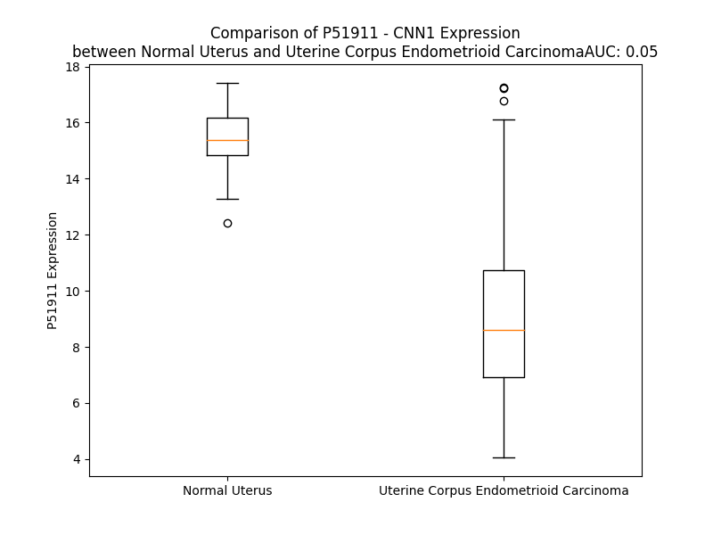

# Detailed Data for P51911

## Introduction to the Detailed Summary

### How to Interpret the Results

- **Summary & Metrics**: This section provides a quick reference to essential protein attributes, including expression changes, family classification, and biomarker applications. Regulation status (upregulated/downregulated) indicates the protein's behavior in a disease context. Some information comes from the original excel file with the proteins selected from literature, while others are derived from the analyses.
- **Expression Comparison**: A visual representation comparing protein expression between normal and disease states. It highlights significant changes in expression levels that might indicate diagnostic or therapeutic relevance. This is data coming from transcriptomics experiments and could not translate similarly to protein levels.
- **Isoform Alignment**: An interactive view of isoform alignments, revealing structural and functional differences between variants of the protein.
- **Interactors & Homologs**: Tables listing known interaction partners and homologous proteins, the more interactors and homologs, the more complex the protein is to design an antibody for.
- **Biological Assemblies**: Information about the structural arrangement of the protein in different assemblies, providing insights into its functional state but also the complexity of the protein to develop antibodies.
- **Combined Per-Residue Information**: A detailed table summarizing residue-level data. This includes predictions for epitope regions, aggregation tendencies, and modifications that might impact the protein's function. Each row corresponds to a residue in the protein, providing insights into specific sites that may be important for research or drug development.
## Summary & Metrics

- **UniProt Accession**: P51911
- **Gene Name**: CNN1
- **Protein Name**: Calponin-1
- **Swiss Prot**: CNN1_HUMAN
- **Family**: other
- **Biomarker Application**:  
- **Number of Isoforms**: 2
- **Regulation**: 2
- **(transcriptomics) AUC**: 0.05
- **(transcriptomics) Fold Change**: 1.69
- **(transcriptomics) Regulation**: Downregulated
- **Discotope Epitope Count**: 66
- **Max n_uniprots (Homo)**: 1
- **Max n_uniprots (Hetero)**: N/A

## Expression Comparison

## Isoform Alignment

<pre style='font-size:14px; font-family:monospace;'>P51911-1 MSSAHFNRGPAYGLSAEVKNKLAQKYDHQREQELREWIEGVTGRRIGNNFMDGLKDGIILCEFINKLQPGSVKKINESTQNWHQLENIGNFIKAITKYGVKPHDIFEANDLFENTNHTQVQSTLLALASMAKTKGNKVNVGVKYAEKQERKFEPGKLREGRNIIGLQMGTNKFASQQGMTAYGTRRHLYDPKLGTDQPLDQATISLQMGTNKGASQAGMTAPGTKRQIFEPGLGMEHCDTLNVSLQMGSNKGASQRGMTVYGLPRQVYDPKYCLTPEYPELGEPAHNHHAHNYYNSA
P51911-2 --------------------MLAQKYDHQREQELREWIEGVTGRRIGNNFMDGLKDGIILCEFINKLQPGSVKKINESTQNWHQLENIGNFIKAITKYGVKPHDIFEANDLFENTNHTQVQSTLLALASMAKTKGNKVNVGVKYAEKQERKFEPGKLREGRNIIGLQMGTNKFASQQGMTAYGTRRHLYDPKLGTDQPLDQATISLQMGTNKGASQAGMTAPGTKRQIFEPGLGMEHCDTLNVSLQMGSNKGASQRGMTVYGLPRQVYDPKYCLTPEYPELGEPAHNHHAHNYYNSA
</pre>

## Interactors

| preferredName_A   | preferredName_B   |   score |
|:------------------|:------------------|--------:|
| CNN1              | MYH11             |   0.968 |
| CNN1              | CALM3             |   0.948 |
| CNN1              | CALML3            |   0.947 |
| CNN1              | CALML5            |   0.947 |
| CNN1              | CALML6            |   0.942 |
| CNN1              | CALML4            |   0.942 |
| CNN1              | ACTG2             |   0.93  |

## Homologs

| uniprot_id   | gene_id   |
|:-------------|:----------|
| X6RJP6       | TAGLN2    |
| C9J5W6       | TAGLN3    |
| Q15417       | CNN3      |
| A0A087X271   | CNN2      |
| Q01995       | TAGLN     |

## Biological Assemblies

|   Unnamed: 0 |   assembly |   n_uniprots | composition   | crystal_id   |
|-------------:|-----------:|-------------:|:--------------|:-------------|
|            0 |          1 |            1 | Homo          | 1wyp         |

## Combined Per-Residue Information

|   res | aa   |   epitope_score | epitope   |   relative_surface_accessibility |   modeling_confidence |   Aggregation | modification               |
|------:|:-----|----------------:|:----------|---------------------------------:|----------------------:|--------------:|:---------------------------|
|     1 | M    |         0.15996 | False     |                          1.29817 |                 38.04 |         0     | N/A                        |
|     2 | S    |         0.12879 | False     |                          0.85617 |                 45.89 |         0     | N/A                        |
|     3 | S    |         0.12899 | False     |                          0.73974 |                 47.92 |         0     | N/A                        |
|     4 | A    |         0.11542 | False     |                          0.83582 |                 47.31 |         0     | N/A                        |
|     5 | H    |         0.12192 | False     |                          0.78631 |                 45.4  |         0     | N/A                        |
|     6 | F    |         0.13663 | False     |                          1.05384 |                 48.7  |         0     | N/A                        |
|     7 | N    |         0.21385 | False     |                          0.80752 |                 56.09 |         0     | N/A                        |
|     8 | R    |         0.27432 | True      |                          0.80833 |                 61.39 |         0     | N/A                        |
|     9 | G    |         0.23221 | False     |                          0.67223 |                 65.96 |         0     | N/A                        |
|    10 | P    |         0.34145 | True      |                          0.7337  |                 73.48 |         0     | N/A                        |
|    11 | A    |         0.26777 | True      |                          0.44274 |                 74.13 |         0     | N/A                        |
|    12 | Y    |         0.2224  | False     |                          0.76913 |                 84.25 |         0     | N/A                        |
|    13 | G    |         0.31429 | True      |                          0.69818 |                 88.69 |         0     | N/A                        |
|    14 | L    |         0.21062 | False     |                          0.82813 |                 86.15 |         0     | N/A                        |
|    15 | S    |         0.13825 | False     |                          0.5572  |                 82.11 |         0     | N/A                        |
|    16 | A    |         0.09859 | False     |                          0.25475 |                 84.42 |         0     | N/A                        |
|    17 | E    |         0.19839 | False     |                          0.42139 |                 87.3  |         0     | N/A                        |
|    18 | V    |         0.15091 | False     |                          0.50555 |                 83.78 |         0     | N/A                        |
|    19 | K    |         0.28275 | True      |                          0.62345 |                 81.1  |         0     | N/A                        |
|    20 | N    |         0.22719 | False     |                          0.59282 |                 85.04 |         0     | N/A                        |
|    21 | K    |         0.27542 | True      |                          0.55535 |                 84.9  |         0     | N/A                        |
|    22 | L    |         0.14283 | False     |                          0.38992 |                 81.91 |         0     | N/A                        |
|    23 | A    |         0.15649 | False     |                          0.6035  |                 81.05 |         0     | N/A                        |
|    24 | Q    |         0.31459 | True      |                          0.76737 |                 86.14 |         0     | N/A                        |
|    25 | K    |         0.15629 | False     |                          0.70818 |                 86.93 |         0     | N/A                        |
|    26 | Y    |         0.19436 | False     |                          0.1642  |                 88.2  |         0     | N/A                        |
|    27 | D    |         0.11555 | False     |                          0.37094 |                 89.89 |         0     | N/A                        |
|    28 | H    |         0.41535 | True      |                          0.75822 |                 90.03 |         0     | N/A                        |
|    29 | Q    |         0.19957 | False     |                          0.58085 |                 90.43 |         0     | N/A                        |
|    30 | R    |         0.22711 | False     |                          0.39155 |                 89.78 |         0     | N/A                        |
|    31 | E    |         0.16224 | False     |                          0.12689 |                 91.8  |         0     | N/A                        |
|    32 | Q    |         0.28172 | True      |                          0.34674 |                 91.78 |         0     | N/A                        |
|    33 | E    |         0.11406 | False     |                          0.24592 |                 91.46 |         0     | N/A                        |
|    34 | L    |         0.00677 | False     |                          0       |                 92.56 |         0     | N/A                        |
|    35 | R    |         0.17513 | False     |                          0.16079 |                 92.47 |         0     | N/A                        |
|    36 | E    |         0.18849 | False     |                          0.55825 |                 91.75 |         0     | N/A                        |
|    37 | W    |         0.05403 | False     |                          0.09805 |                 91.66 |         0     | N/A                        |
|    38 | I    |         0.00983 | False     |                          0       |                 92.84 |         0     | N/A                        |
|    39 | E    |         0.1322  | False     |                          0.19613 |                 93.53 |         0     | N/A                        |
|    40 | G    |         0.13731 | False     |                          0.79918 |                 91.05 |         0     | N/A                        |
|    41 | V    |         0.10728 | False     |                          0.318   |                 91.73 |         0     | N/A                        |
|    42 | T    |         0.16941 | False     |                          0.13753 |                 91.7  |         0     | N/A                        |
|    43 | G    |         0.19596 | False     |                          0.81952 |                 90.36 |         0     | N/A                        |
|    44 | R    |         0.28077 | True      |                          0.49888 |                 89.92 |         0     | N/A                        |
|    45 | R    |         0.34776 | True      |                          0.81254 |                 90.81 |         0     | N/A                        |
|    46 | I    |         0.174   | False     |                          0.05942 |                 89.25 |         0     | N/A                        |
|    47 | G    |         0.21269 | False     |                          0.50689 |                 88.7  |         0     | N/A                        |
|    48 | N    |         0.28683 | True      |                          1.03076 |                 87.25 |         0     | N/A                        |
|    49 | N    |         0.18731 | False     |                          0.47705 |                 90.51 |         0     | N/A                        |
|    50 | F    |         0.04167 | False     |                          0.01237 |                 90.77 |         0     | N/A                        |
|    51 | M    |         0.03835 | False     |                          0.0302  |                 91.17 |         0     | N/A                        |
|    52 | D    |         0.33289 | True      |                          0.44013 |                 91.04 |         0     | N/A                        |
|    53 | G    |         0.09069 | False     |                          0.2162  |                 91.44 |         0     | N/A                        |
|    54 | L    |         0.0058  | False     |                          0.00082 |                 92.96 |         0     | N/A                        |
|    55 | K    |         0.20116 | False     |                          0.28805 |                 91.63 |         0     | N/A                        |
|    56 | D    |         0.15309 | False     |                          0.34824 |                 90.16 |         0     | N/A                        |
|    57 | G    |         0.00618 | False     |                          0.00553 |                 92.07 |         0.84  | N/A                        |
|    58 | I    |         0.08188 | False     |                          0.20399 |                 93.74 |         1.042 | N/A                        |
|    59 | I    |         0.0731  | False     |                          0.11303 |                 94.63 |         1.042 | N/A                        |
|    60 | L    |         0.00278 | False     |                          0.00082 |                 95.39 |         1.042 | N/A                        |
|    61 | C    |         0.0042  | False     |                          0       |                 95.52 |         1.042 | N/A                        |
|    62 | E    |         0.14055 | False     |                          0.19406 |                 94.03 |         0.338 | N/A                        |
|    63 | F    |         0.00494 | False     |                          0       |                 94.92 |         0.338 | N/A                        |
|    64 | I    |         0.01284 | False     |                          0       |                 94.93 |         0.338 | N/A                        |
|    65 | N    |         0.21662 | False     |                          0.22104 |                 94.86 |         0.338 | N/A                        |
|    66 | K    |         0.16375 | False     |                          0.6545  |                 92.34 |         0.338 | N/A                        |
|    67 | L    |         0.08574 | False     |                          0.14015 |                 91.08 |         0.338 | N/A                        |
|    68 | Q    |         0.15322 | False     |                          0.40219 |                 90.21 |         0     | N/A                        |
|    69 | P    |         0.2166  | False     |                          0.81253 |                 91.41 |         0     | N/A                        |
|    70 | G    |         0.19895 | False     |                          0.74259 |                 91.06 |         0     | N/A                        |
|    71 | S    |         0.12619 | False     |                          0.25376 |                 91.46 |         0     | N/A                        |
|    72 | V    |         0.05512 | False     |                          0.07265 |                 93.36 |         0     | N/A                        |
|    73 | K    |         0.30897 | True      |                          0.99374 |                 89.62 |         0     | N/A                        |
|    74 | K    |         0.25156 | True      |                          0.65991 |                 90.27 |         0     | N/A                        |
|    75 | I    |         0.24617 | True      |                          0.2969  |                 92.15 |         0     | N/A                        |
|    76 | N    |         0.18099 | False     |                          0.07156 |                 91    |         0     | N/A                        |
|    77 | E    |         0.27242 | True      |                          0.72064 |                 89.08 |         0     | N/A                        |
|    78 | S    |         0.25681 | True      |                          0.34071 |                 85.92 |         0     | N/A                        |
|    79 | T    |         0.28793 | True      |                          0.87848 |                 86.37 |         0     | N/A                        |
|    80 | Q    |         0.36042 | True      |                          0.45378 |                 90.89 |         0     | N/A                        |
|    81 | N    |         0.3566  | True      |                          0.57113 |                 91.74 |         0     | N/A                        |
|    82 | W    |         0.39466 | True      |                          0.65552 |                 92.55 |         0     | N/A                        |
|    83 | H    |         0.13837 | False     |                          0.14703 |                 92.95 |         0     | N/A                        |
|    84 | Q    |         0.14237 | False     |                          0.10322 |                 92.65 |         0     | N/A                        |
|    85 | L    |         0.19779 | False     |                          0.34322 |                 93.48 |         0     | N/A                        |
|    86 | E    |         0.14467 | False     |                          0.39044 |                 94.5  |         0     | N/A                        |
|    87 | N    |         0.01118 | False     |                          0.00444 |                 95.26 |         0     | N/A                        |
|    88 | I    |         0.00875 | False     |                          0       |                 94.93 |         0.829 | N/A                        |
|    89 | G    |         0.16427 | False     |                          0.23102 |                 94.86 |         0.829 | N/A                        |
|    90 | N    |         0.11962 | False     |                          0.22771 |                 95.69 |         0.829 | N/A                        |
|    91 | F    |         0.00373 | False     |                          0       |                 95.86 |         0.829 | N/A                        |
|    92 | I    |         0.13709 | False     |                          0.19679 |                 95.58 |         0.829 | N/A                        |
|    93 | K    |         0.24626 | True      |                          0.71967 |                 95.07 |         0     | N/A                        |
|    94 | A    |         0.0355  | False     |                          0.05332 |                 95.56 |         0     | N/A                        |
|    95 | I    |         0.00575 | False     |                          0       |                 95.07 |         0     | N/A                        |
|    96 | T    |         0.14173 | False     |                          0.44579 |                 94.5  |         0     | N/A                        |
|    97 | K    |         0.2026  | False     |                          0.9165  |                 94.11 |         0     | N/A                        |
|    98 | Y    |         0.13348 | False     |                          0.04573 |                 92.82 |         0     | N/A                        |
|    99 | G    |         0.11157 | False     |                          0.42213 |                 91.48 |         0     | N/A                        |
|   100 | V    |         0.04216 | False     |                          0.02923 |                 92.84 |         0     | N/A                        |
|   101 | K    |         0.18085 | False     |                          0.50249 |                 91.01 |         0     | N/A                        |
|   102 | P    |         0.20047 | False     |                          0.77816 |                 90.57 |         0     | N/A                        |
|   103 | H    |         0.20563 | False     |                          0.70857 |                 90.85 |         0     | N/A                        |
|   104 | D    |         0.08767 | False     |                          0.21943 |                 91.87 |         0     | N/A                        |
|   105 | I    |         0.09878 | False     |                          0.12556 |                 94.83 |         0     | N/A                        |
|   106 | F    |         0.01488 | False     |                          0.01318 |                 94.52 |         0     | N/A                        |
|   107 | E    |         0.25584 | True      |                          0.62375 |                 92.66 |         0     | N/A                        |
|   108 | A    |         0.10591 | False     |                          0.26429 |                 91.06 |         0     | N/A                        |
|   109 | N    |         0.27594 | True      |                          0.46012 |                 89.75 |         0     | N/A                        |
|   110 | D    |         0.11569 | False     |                          0.11682 |                 91.14 |         0     | N/A                        |
|   111 | L    |         0.00526 | False     |                          0       |                 91.53 |         0     | N/A                        |
|   112 | F    |         0.18053 | False     |                          0.15449 |                 90.05 |         0     | N/A                        |
|   113 | E    |         0.29437 | True      |                          0.4937  |                 88.52 |         0     | N/A                        |
|   114 | N    |         0.23904 | False     |                          0.37994 |                 85.06 |         0     | N/A                        |
|   115 | T    |         0.34959 | True      |                          0.42112 |                 85.2  |         0     | N/A                        |
|   116 | N    |         0.13471 | False     |                          0.2076  |                 87.69 |         0     | N/A                        |
|   117 | H    |         0.11055 | False     |                          0.35906 |                 89.99 |         0     | N/A                        |
|   118 | T    |         0.08096 | False     |                          0.09127 |                 90.89 |         0     | N/A                        |
|   119 | Q    |         0.0889  | False     |                          0.23254 |                 91.22 |         0     | N/A                        |
|   120 | V    |         0.00334 | False     |                          0       |                 92.95 |         0.439 | N/A                        |
|   121 | Q    |         0.04841 | False     |                          0.02935 |                 93.12 |         0.439 | N/A                        |
|   122 | S    |         0.08362 | False     |                          0.35534 |                 92.45 |         1.392 | N/A                        |
|   123 | T    |         0.00467 | False     |                          0       |                 94.42 |         9.849 | N/A                        |
|   124 | L    |         0.00387 | False     |                          0       |                 94.17 |        17.063 | N/A                        |
|   125 | L    |         0.04929 | False     |                          0.25503 |                 93.06 |        17.198 | N/A                        |
|   126 | A    |         0.02393 | False     |                          0.09009 |                 92.53 |        17.198 | N/A                        |
|   127 | L    |         0.00261 | False     |                          0.00082 |                 93.09 |        17.198 | N/A                        |
|   128 | A    |         0.00211 | False     |                          0       |                 92.35 |        12.28  | N/A                        |
|   129 | S    |         0.1442  | False     |                          0.07648 |                 91.17 |         2.205 | N/A                        |
|   130 | M    |         0.10979 | False     |                          0.16843 |                 89.71 |         0.9   | N/A                        |
|   131 | A    |         0.00671 | False     |                          0       |                 89.91 |         0.412 | N/A                        |
|   132 | K    |         0.18015 | False     |                          0.31515 |                 88.78 |         0     | N/A                        |
|   133 | T    |         0.16379 | False     |                          0.38378 |                 84.76 |         0     | N/A                        |
|   134 | K    |         0.18389 | False     |                          0.5182  |                 84.28 |         0     | N/A                        |
|   135 | G    |         0.18625 | False     |                          0.7467  |                 80.53 |         0     | N/A                        |
|   136 | N    |         0.19421 | False     |                          0.33466 |                 80.57 |         0     | N/A                        |
|   137 | K    |         0.19212 | False     |                          1.02468 |                 76.29 |         0     | N/A                        |
|   138 | V    |         0.04646 | False     |                          0.05422 |                 76.33 |         0     | N/A                        |
|   139 | N    |         0.14459 | False     |                          0.96765 |                 75.03 |         0     | N/A                        |
|   140 | V    |         0.05483 | False     |                          0.0457  |                 75.41 |         0     | N/A                        |
|   141 | G    |         0.10972 | False     |                          0.21204 |                 69.55 |         0     | N/A                        |
|   142 | V    |         0.15915 | False     |                          0.86207 |                 75.58 |         0     | N/A                        |
|   143 | K    |         0.15861 | False     |                          0.60332 |                 72.56 |         0     | N/A                        |
|   144 | Y    |         0.16141 | False     |                          0.3264  |                 71.58 |         0     | N/A                        |
|   145 | A    |         0.12581 | False     |                          0.99128 |                 72.95 |         0     | N/A                        |
|   146 | E    |         0.12489 | False     |                          0.78493 |                 72.82 |         0     | N/A                        |
|   147 | K    |         0.17945 | False     |                          0.81949 |                 80.42 |         0     | N/A                        |
|   148 | Q    |         0.17795 | False     |                          0.80468 |                 80.56 |         0     | N/A                        |
|   149 | E    |         0.1412  | False     |                          0.58278 |                 83.54 |         0     | N/A                        |
|   150 | R    |         0.16301 | False     |                          0.7844  |                 84.62 |         0     | N/A                        |
|   151 | K    |         0.14964 | False     |                          0.93734 |                 84.6  |         0     | N/A                        |
|   152 | F    |         0.1205  | False     |                          0.59025 |                 88    |         0     | N/A                        |
|   153 | E    |         0.18331 | False     |                          0.66164 |                 88.27 |         0     | N/A                        |
|   154 | P    |         0.10712 | False     |                          0.75136 |                 86.61 |         0     | N/A                        |
|   155 | G    |         0.10993 | False     |                          0.47914 |                 87.78 |         0     | N/A                        |
|   156 | K    |         0.0845  | False     |                          0.61184 |                 86.42 |         0     | N/A                        |
|   157 | L    |         0.14588 | False     |                          0.62423 |                 85.22 |         0     | N/A                        |
|   158 | R    |         0.16329 | False     |                          0.72937 |                 84.51 |         0     | N/A                        |
|   159 | E    |         0.16611 | False     |                          0.49941 |                 82.09 |         0     | N/A                        |
|   160 | G    |         0.06858 | False     |                          0.47535 |                 80.09 |         0     | N/A                        |
|   161 | R    |         0.28412 | True      |                          0.71746 |                 77.24 |         0     | N/A                        |
|   162 | N    |         0.12801 | False     |                          0.7806  |                 75.56 |         0     | N/A                        |
|   163 | I    |         0.25013 | True      |                          0.75858 |                 74.85 |         0     | N/A                        |
|   164 | I    |         0.10676 | False     |                          0.55225 |                 72.31 |         0     | N/A                        |
|   165 | G    |         0.19296 | False     |                          0.50025 |                 71.23 |         0     | N/A                        |
|   166 | L    |         0.2119  | False     |                          0.96695 |                 74.97 |         0     | N/A                        |
|   167 | Q    |         0.30086 | True      |                          0.94079 |                 69.22 |         0     | N/A                        |
|   168 | M    |         0.24849 | True      |                          0.87818 |                 70.15 |         0     | N/A                        |
|   169 | G    |         0.1971  | False     |                          0.45772 |                 59.93 |         0     | N/A                        |
|   170 | T    |         0.1668  | False     |                          0.40619 |                 66.46 |         0     | Phosphothreonine; by ROCK2 |
|   171 | N    |         0.22039 | False     |                          0.63996 |                 63.76 |         0     | N/A                        |
|   172 | K    |         0.28535 | True      |                          0.87224 |                 65.09 |         0     | N/A                        |
|   173 | F    |         0.18197 | False     |                          0.92814 |                 66.45 |         0     | N/A                        |
|   174 | A    |         0.16775 | False     |                          0.61901 |                 61.83 |         0     | N/A                        |
|   175 | S    |         0.23758 | False     |                          0.60604 |                 63.44 |         0     | Phosphoserine; by ROCK2    |
|   176 | Q    |         0.14151 | False     |                          0.7006  |                 65.28 |         0     | N/A                        |
|   177 | Q    |         0.30233 | True      |                          0.84348 |                 63.27 |         0     | N/A                        |
|   178 | G    |         0.11703 | False     |                          0.9079  |                 64.6  |         0     | N/A                        |
|   179 | M    |         0.26755 | True      |                          0.7537  |                 65.4  |         0     | N/A                        |
|   180 | T    |         0.16202 | False     |                          0.69325 |                 64.36 |         0     | Phosphothreonine; by ROCK2 |
|   181 | A    |         0.14763 | False     |                          0.73283 |                 62.9  |         0     | N/A                        |
|   182 | Y    |         0.2963  | True      |                          1.05303 |                 63.57 |         0     | N/A                        |
|   183 | G    |         0.1718  | False     |                          0.85336 |                 60.68 |         0     | N/A                        |
|   184 | T    |         0.25326 | True      |                          0.5231  |                 60.03 |         0     | Phosphothreonine; by ROCK2 |
|   185 | R    |         0.20157 | False     |                          0.76707 |                 55.11 |         0     | N/A                        |
|   186 | R    |         0.17793 | False     |                          0.81917 |                 59.04 |         0     | N/A                        |
|   187 | H    |         0.19406 | False     |                          0.96655 |                 62.09 |         0     | N/A                        |
|   188 | L    |         0.28915 | True      |                          0.95062 |                 58.77 |         0     | N/A                        |
|   189 | Y    |         0.23413 | False     |                          0.27451 |                 55.63 |         0     | N/A                        |
|   190 | D    |         0.15402 | False     |                          0.39534 |                 59.74 |         0     | N/A                        |
|   191 | P    |         0.26319 | True      |                          0.71422 |                 62.08 |         0     | N/A                        |
|   192 | K    |         0.30117 | True      |                          0.92798 |                 72.38 |         0     | N/A                        |
|   193 | L    |         0.24134 | True      |                          0.81049 |                 68.08 |         0     | N/A                        |
|   194 | G    |         0.33681 | True      |                          0.84471 |                 62.3  |         0     | N/A                        |
|   195 | T    |         0.244   | True      |                          0.56141 |                 60.77 |         0     | N/A                        |
|   196 | D    |         0.23056 | False     |                          0.8398  |                 59.71 |         0     | N/A                        |
|   197 | Q    |         0.28783 | True      |                          0.69298 |                 58.04 |         0     | N/A                        |
|   198 | P    |         0.16196 | False     |                          0.60656 |                 53.58 |         0     | N/A                        |
|   199 | L    |         0.15358 | False     |                          1.02552 |                 57.54 |         0     | N/A                        |
|   200 | D    |         0.26759 | True      |                          0.50542 |                 54.71 |         0     | N/A                        |
|   201 | Q    |         0.26723 | True      |                          0.94577 |                 57.62 |         0     | N/A                        |
|   202 | A    |         0.14073 | False     |                          0.36061 |                 57.02 |         0     | N/A                        |
|   203 | T    |         0.1689  | False     |                          0.3722  |                 55.6  |         0     | N/A                        |
|   204 | I    |         0.10778 | False     |                          0.48694 |                 60.56 |         0     | N/A                        |
|   205 | S    |         0.28952 | True      |                          0.51281 |                 62.3  |         0     | N/A                        |
|   206 | L    |         0.40502 | True      |                          0.9559  |                 61.08 |         0     | N/A                        |
|   207 | Q    |         0.39222 | True      |                          0.91459 |                 55.48 |         0     | N/A                        |
|   208 | M    |         0.24119 | False     |                          0.83677 |                 58.85 |         0     | N/A                        |
|   209 | G    |         0.20753 | False     |                          0.5603  |                 54.86 |         0     | N/A                        |
|   210 | T    |         0.23135 | False     |                          0.44293 |                 65.63 |         0     | N/A                        |
|   211 | N    |         0.13677 | False     |                          0.3962  |                 61.61 |         0     | N/A                        |
|   212 | K    |         0.40662 | True      |                          0.82705 |                 56.08 |         0     | N/A                        |
|   213 | G    |         0.17907 | False     |                          0.92351 |                 61.89 |         0     | N/A                        |
|   214 | A    |         0.20685 | False     |                          0.7796  |                 54.98 |         0     | N/A                        |
|   215 | S    |         0.26119 | True      |                          0.6411  |                 57.09 |         0     | N/A                        |
|   216 | Q    |         0.21327 | False     |                          0.73268 |                 56.93 |         0     | N/A                        |
|   217 | A    |         0.22403 | False     |                          0.86377 |                 53.05 |         0     | N/A                        |
|   218 | G    |         0.17681 | False     |                          0.98407 |                 56.06 |         0     | N/A                        |
|   219 | M    |         0.21993 | False     |                          0.74758 |                 54    |         0     | N/A                        |
|   220 | T    |         0.27463 | True      |                          0.49572 |                 55.53 |         0     | N/A                        |
|   221 | A    |         0.14115 | False     |                          0.62912 |                 57.73 |         0     | N/A                        |
|   222 | P    |         0.11903 | False     |                          1.02174 |                 53.85 |         0     | N/A                        |
|   223 | G    |         0.11861 | False     |                          0.82704 |                 52.12 |         0     | N/A                        |
|   224 | T    |         0.18901 | False     |                          0.50377 |                 53.33 |         0     | N/A                        |
|   225 | K    |         0.15802 | False     |                          0.92558 |                 47.12 |         0     | N/A                        |
|   226 | R    |         0.20052 | False     |                          0.71602 |                 47.39 |         0     | N/A                        |
|   227 | Q    |         0.21986 | False     |                          0.79786 |                 55.26 |         0     | N/A                        |
|   228 | I    |         0.22457 | False     |                          0.87935 |                 56.18 |         0     | N/A                        |
|   229 | F    |         0.16255 | False     |                          0.4337  |                 54.58 |         0     | N/A                        |
|   230 | E    |         0.2087  | False     |                          0.56836 |                 52.85 |         0     | N/A                        |
|   231 | P    |         0.3069  | True      |                          0.94727 |                 54.7  |         0     | N/A                        |
|   232 | G    |         0.39889 | True      |                          0.91385 |                 65.33 |         0     | N/A                        |
|   233 | L    |         0.23729 | False     |                          0.83787 |                 60.98 |         0     | N/A                        |
|   234 | G    |         0.23844 | False     |                          0.86504 |                 51.12 |         0     | N/A                        |
|   235 | M    |         0.25871 | True      |                          0.7799  |                 49.21 |         0     | N/A                        |
|   236 | E    |         0.12825 | False     |                          0.78879 |                 49.9  |         0     | N/A                        |
|   237 | H    |         0.24084 | False     |                          0.83608 |                 53.11 |         0     | N/A                        |
|   238 | C    |         0.14141 | False     |                          0.63706 |                 54.22 |         0     | N/A                        |
|   239 | D    |         0.15486 | False     |                          0.52759 |                 47.45 |         0     | N/A                        |
|   240 | T    |         0.16091 | False     |                          0.70017 |                 55.39 |         0     | N/A                        |
|   241 | L    |         0.25142 | True      |                          0.91113 |                 52.23 |         0     | N/A                        |
|   242 | N    |         0.17447 | False     |                          0.81624 |                 44.94 |         0     | N/A                        |
|   243 | V    |         0.16403 | False     |                          0.54554 |                 51.66 |         0     | N/A                        |
|   244 | S    |         0.18582 | False     |                          0.60213 |                 44.4  |         0     | N/A                        |
|   245 | L    |         0.25917 | True      |                          1.09244 |                 46.5  |         0     | N/A                        |
|   246 | Q    |         0.42055 | True      |                          0.91156 |                 44.43 |         0     | N/A                        |
|   247 | M    |         0.27363 | True      |                          0.90733 |                 50.92 |         0     | N/A                        |
|   248 | G    |         0.23139 | False     |                          0.51767 |                 41.28 |         0     | N/A                        |
|   249 | S    |         0.1623  | False     |                          0.62656 |                 49.63 |         0     | N/A                        |
|   250 | N    |         0.2016  | False     |                          0.61562 |                 48.5  |         0     | N/A                        |
|   251 | K    |         0.28861 | True      |                          0.95741 |                 48.76 |         0     | N/A                        |
|   252 | G    |         0.25591 | True      |                          0.92336 |                 51.01 |         0     | N/A                        |
|   253 | A    |         0.22971 | False     |                          0.86387 |                 46.37 |         0     | N/A                        |
|   254 | S    |         0.19474 | False     |                          0.60452 |                 49.19 |         0     | N/A                        |
|   255 | Q    |         0.15215 | False     |                          0.70211 |                 48.75 |         0     | N/A                        |
|   256 | R    |         0.33773 | True      |                          0.92021 |                 48.16 |         0     | N/A                        |
|   257 | G    |         0.08662 | False     |                          0.9413  |                 50.86 |         0     | N/A                        |
|   258 | M    |         0.2514  | True      |                          0.70676 |                 46.14 |         0     | N/A                        |
|   259 | T    |         0.13907 | False     |                          0.39281 |                 48    |         0     | Phosphothreonine; by ROCK2 |
|   260 | V    |         0.12191 | False     |                          0.58376 |                 48.37 |         0     | N/A                        |
|   261 | Y    |         0.26683 | True      |                          0.96282 |                 49.91 |         0     | N/A                        |
|   262 | G    |         0.18629 | False     |                          0.88847 |                 44.6  |         0     | N/A                        |
|   263 | L    |         0.21887 | False     |                          0.65533 |                 46.19 |         0     | N/A                        |
|   264 | P    |         0.20161 | False     |                          0.88185 |                 44.54 |         0     | N/A                        |
|   265 | R    |         0.16942 | False     |                          0.67655 |                 46.92 |         0     | N/A                        |
|   266 | Q    |         0.15261 | False     |                          0.80265 |                 50.52 |         0     | N/A                        |
|   267 | V    |         0.16305 | False     |                          0.9878  |                 50.75 |         0     | N/A                        |
|   268 | Y    |         0.21892 | False     |                          0.43886 |                 46.55 |         0     | N/A                        |
|   269 | D    |         0.16874 | False     |                          0.36136 |                 51.95 |         0     | N/A                        |
|   270 | P    |         0.27385 | True      |                          0.70209 |                 53.1  |         0     | N/A                        |
|   271 | K    |         0.30729 | True      |                          0.81055 |                 62.13 |         0     | N/A                        |
|   272 | Y    |         0.29124 | True      |                          0.7457  |                 56.84 |         0     | N/A                        |
|   273 | C    |         0.14735 | False     |                          0.31419 |                 50.73 |         0     | N/A                        |
|   274 | L    |         0.15053 | False     |                          1.04802 |                 51.49 |         0     | N/A                        |
|   275 | T    |         0.1706  | False     |                          0.72711 |                 51.38 |         0     | N/A                        |
|   276 | P    |         0.10632 | False     |                          0.55617 |                 49.08 |         0     | N/A                        |
|   277 | E    |         0.16103 | False     |                          0.85712 |                 41.15 |         0     | N/A                        |
|   278 | Y    |         0.19661 | False     |                          0.818   |                 48.67 |         0     | N/A                        |
|   279 | P    |         0.14739 | False     |                          0.86734 |                 41.51 |         0     | N/A                        |
|   280 | E    |         0.17837 | False     |                          0.92716 |                 39.38 |         0     | N/A                        |
|   281 | L    |         0.20955 | False     |                          1.02506 |                 38.49 |         0     | N/A                        |
|   282 | G    |         0.20604 | False     |                          0.83298 |                 34.73 |         0     | N/A                        |
|   283 | E    |         0.14493 | False     |                          0.89309 |                 29.85 |         0     | N/A                        |
|   284 | P    |         0.15722 | False     |                          0.79314 |                 36.2  |         0     | N/A                        |
|   285 | A    |         0.15645 | False     |                          0.99105 |                 33.33 |         0     | N/A                        |
|   286 | H    |         0.16732 | False     |                          0.90709 |                 34.06 |         0     | N/A                        |
|   287 | N    |         0.14188 | False     |                          0.90399 |                 31.02 |         0     | N/A                        |
|   288 | H    |         0.09431 | False     |                          1.04961 |                 32.35 |         0     | N/A                        |
|   289 | H    |         0.1327  | False     |                          0.87561 |                 29.39 |         0     | N/A                        |
|   290 | A    |         0.09977 | False     |                          0.88688 |                 34.13 |         0     | N/A                        |
|   291 | H    |         0.13147 | False     |                          0.85467 |                 33.08 |         0     | N/A                        |
|   292 | N    |         0.10625 | False     |                          0.83409 |                 30.94 |         0     | N/A                        |
|   293 | Y    |         0.09552 | False     |                          0.89134 |                 37.62 |         0     | N/A                        |
|   294 | Y    |         0.13367 | False     |                          0.91092 |                 32.51 |         0     | N/A                        |
|   295 | N    |         0.14931 | False     |                          0.86308 |                 38.37 |         0     | N/A                        |
|   296 | S    |         0.08087 | False     |                          0.75324 |                 35.04 |         0     | N/A                        |
|   297 | A    |         0.06182 | False     |                          1.65944 |                 37.04 |         0     | N/A                        |

