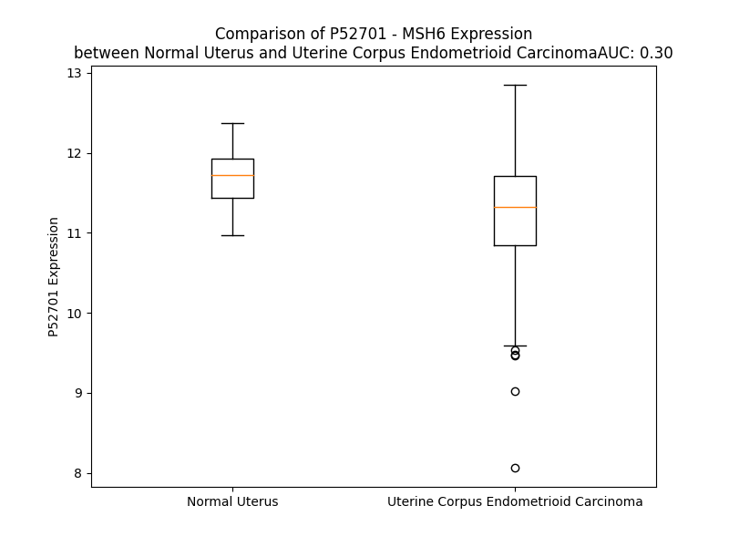

# Detailed Data for P52701

## Introduction to the Detailed Summary

### How to Interpret the Results

- **Summary & Metrics**: This section provides a quick reference to essential protein attributes, including expression changes, family classification, and biomarker applications. Regulation status (upregulated/downregulated) indicates the protein's behavior in a disease context. Some information comes from the original excel file with the proteins selected from literature, while others are derived from the analyses.
- **Expression Comparison**: A visual representation comparing protein expression between normal and disease states. It highlights significant changes in expression levels that might indicate diagnostic or therapeutic relevance. This is data coming from transcriptomics experiments and could not translate similarly to protein levels.
- **Isoform Alignment**: An interactive view of isoform alignments, revealing structural and functional differences between variants of the protein.
- **Interactors & Homologs**: Tables listing known interaction partners and homologous proteins, the more interactors and homologs, the more complex the protein is to design an antibody for.
- **Biological Assemblies**: Information about the structural arrangement of the protein in different assemblies, providing insights into its functional state but also the complexity of the protein to develop antibodies.
- **Combined Per-Residue Information**: A detailed table summarizing residue-level data. This includes predictions for epitope regions, aggregation tendencies, and modifications that might impact the protein's function. Each row corresponds to a residue in the protein, providing insights into specific sites that may be important for research or drug development.
## Summary & Metrics

- **UniProt Accession**: P52701
- **Gene Name**: MSH6
- **Protein Name**: DNA mismatch repair protein Msh6 /P160
- **Swiss Prot**: MSH6_HUMAN
- **Family**: enzyme
- **Biomarker Application**: diagnosis
- **Number of Isoforms**: 4
- **Regulation**: 2
- **(transcriptomics) AUC**: 0.69
- **(transcriptomics) Fold Change**: 1.02
- **(transcriptomics) Regulation**: Upregulated
- **Discotope Epitope Count**: 361
- **Max n_uniprots (Homo)**: 1.0
- **Max n_uniprots (Hetero)**: 4.0

## Expression Comparison

## Isoform Alignment

<pre style='font-size:14px; font-family:monospace;'>P52701-1 MSRQSTLYSFFPKSPALSDANKASARASREGGRAAAAPGASPSPGGDAAWSEAGPGPRPLARSASPPKAKNLNGGLRRSVAPAAPTSCDFSPGDLVWAKMEGYPWWPCLVYNHPFDGTFIREKGKSVRVHVQFFDDSPTRGWVSKRLLKPYTGSKSKEAQKGGHFYSAKPEILRAMQRADEALNKDKIKRLELAVCDEPSEPEEEEEMEVGTTYVTDKSEEDNEIESEEEVQPKTQGSRRSSRQIKKRRVISDSESDIGGSDVEFKPDTKEEGSSDEISSGVGDSESEGLNSPVKVARKRKRMVTGNGSLKRKSSRKETPSATKQATSISSETKNTLRAFSAPQNSESQAHVSGGGDDSSRPTVWYHETLEWLKEEKRRDEHRRRPDHPDFDASTLYVPEDFLNSCTPGMRKWWQIKSQNFDLVICYKVGKFYELYHMDALIGVSELGLVFMKGNWAHSGFPEIAFGRYSDSLVQKGYKVARVEQTETPEMMEARCRKMAHISKYDRVVRREICRIITKGTQTYSVLEGDPSENYSKYLLSLKEKEEDSSGHTRAYGVCFVDTSLGKFFIGQFSDDRHCSRFRTLVAHYPPVQVLFEKGNLSKETKTILKSSLSCSLQEGLIPGSQFWDASKTLRTLLEEEYFREKLSDGIGVMLPQVLKGMTSESDSIGLTPGEKSELALSALGGCVFYLKKCLIDQELLSMANFEEYIPLDSDTVSTTRSGAIFTKAYQRMVLDAVTLNNLEIFLNGTNGSTEGTLLERVDTCHTPFGKRLLKQWLCAPLCNHYAINDRLDAIEDLMVVPDKISEVVELLKKLPDLERLLSKIHNVGSPLKSQNHPDSRAIMYEETTYSKKKIIDFLSALEGFKVMCKIIGIMEEVADGFKSKILKQVISLQTKNPEGRFPDLTVELNRWDTAFDHEKARKTGLITPKAGFDSDYDQALADIRENEQSLLEYLEKQRNRIGCRTIVYWGIGRNRYQLEIPENFTTRNLPEEYELKSTKKGCKRYWTKTIEKKLANLINAEERRDVSLKDCMRRLFYNFDKNYKDWQSAVECIAVLDVLLCLANYSRGGDGPMCRPVILLPEDTPPFLELKGSRHPCITKTFFGDDFIPNDILIGCEEEEQENGKAYCVLVTGPNMGGKSTLMRQAGLLAVMAQMGCYVPAEVCRLTPIDRVFTRLGASDRIMSGESTFFVELSETASILMHATAHSLVLVDELGRGTATFDGTAIANAVVKELAETIKCRTLFSTHYHSLVEDYSQNVAVRLGHMACMVENECEDPSQETITFLYKFIKGACPKSYGFNAARLANLPEEVIQKGHRKAREFEKMNQSLRLFREVCLASERSTVDAEAVHKLLTLIKEL
P52701-2 MSRQSTLYSFFPKSPALSDANKASARASREGGRAAAAPGASPSPGGDAAWSEAGPGPRPLARSASPPKAKNLNGGLRRSVAPAAPTSCDFSPGDLVWAKMEGYPWWPCLVYNHPFDGTFIREKGKSVRVHVQFFDDSPTRGWVSKRLLKPYTGSKSKEAQKGGHFYSAKPEILRAMQRADEALNKDKIKRLELAVCDEPSEPEEEEEMEVGTTYVTDKSEEDNEIESEEEVQPKTQGSRRSSRQIKKRRVISDSESDIGGSDVEFKPDTKEEGSSDEISSGVGDSESEGLNSPVKVARKRKRMVTGNGSLKRKSSRKETPSATKQATSISSETKNTLRAFSAPQNSESQAHVSGGGDDSSRPTVWYHETLEWLKEEKRRDEHRRRPDHPDFDASTLYVPEDFLNSCTPGMRKWWQIKSQNFDLVICYKVGKFYELYHMDALIGVSELGLVFMKGNWAHSGFPEIAFGRYSDSLVQKGYKVARVEQTETPEMMEARCRKMAHISKYDRVVRREICRIITKGTQTYSVLEGDPSENYSKYLLSLKEKEEDSSGHTRAYGVCFVDTSLGKFFIGQFSDDRHCSRFRTLVAHYPPVQVLFEKGNLSKETKTILKSSLSCSLQEGLIPGSQFWDASKTLRTLLEEEYFREKLSDGIGVMLPQVLKGMTSESDSIGLTPGEKSELALSALGGCVFYLKKCLIDQELLSMANFEEYIPLDSDTVSTTRSGAIFTKAYQRMVLDAVTLNNLEIFLNGTNGSTEGTLLERVDTCHTPFGKRLLKQWLCAPLCNHYAINDRLDAIEDLMVVPDKISEVVELLKKLPDLERLLSKIHNVGSPLKSQNHPDSRAIMYEETTYSKKKIIDFLSALEGFKVMCKIIGIMEEVADGFKSKILKQVISLQTKNPEGRFPDLTVELNRWDTAFDHEKARKTGLITPKAGFDSDYDQALADIRENEQSLLEYLEKQRNRIGCRTIVYWGIGRNRYQLEIPENFTTRNLPEEYELKSTKKGCKRYWTKTIEKKLANLINAEERRDVSLKDCMRRLFYNFDKNYKDWQSAVECIAVLGKTLNKLVLRL----------------------------------------------------------------------------------------------------------------------------------------------------------------------------------------------------------------------------------------------------------------------------------------------------
P52701-3 MSRQSTLYSFFPKSPALSDANKASARASREGGRAAAAPGASPSPGGDAAWSEAGPGPRPLARSASPPKAKNLNGGLRRS----------------------------------------------------------------------------------------------------------------------------------VGTTYVTDKSEEDNEIESEEEVQPKTQGSRRSSRQIKKRRVISDSESDIGGSDVEFKPDTKEEGSSDEISSGVGDSESEGLNSPVKVARKRKRMVTGNGSLKRKSSRKETPSATKQATSISSETKNTLRAFSAPQNSESQAHVSGGGDDSSRPTVWYHETLEWLKEEKRRDEHRRRPDHPDFDASTLYVPEDFLNSCTPGMRKWWQIKSQNFDLVICYKVGKFYELYHMDALIGVSELGLVFMKGNWAHSGFPEIAFGRYSDSLVQKGYKVARVEQTETPEMMEARCRKMAHISKYDRVVRREICRIITKGTQTYSVLEGDPSENYSKYLLSLKEKEEDSSGHTRAYGVCFVDTSLGKFFIGQFSDDRHCSRFRTLVAHYPPVQVLFEKGNLSKETKTILKSSLSCSLQEGLIPGSQFWDASKTLRTLLEEEYFREKLSDGIGVMLPQVLKGMTSESDSIGLTPGEKSELALSALGGCVFYLKKCLIDQELLSMANFEEYIPLDSDTVSTTRSGAIFTKAYQRMVLDAVTLNNLEIFLNGTNGSTEGTLLERVDTCHTPFGKRLLKQWLCAPLCNHYAINDRLDAIEDLMVVPDKISEVVELLKKLPDLERLLSKIHNVGSPLKSQNHPDSRAIMYEETTYSKKKIIDFLSALEGFKVMCKIIGIMEEVADGFKSKILKQVISLQTKNPEGRFPDLTVELNRWDTAFDHEKARKTGLITPKAGFDSDYDQALADIRENEQSLLEYLEKQRNRIGCRTIVYWGIGRNRYQLEIPENFTTRNLPEEYELKSTKKGCKRYWTKTIEKKLANLINAEERRDVSLKDCMRRLFYNFDKNYKDWQSAVECIAVLDVLLCLANYSRGGDGPMCRPVILLPEDTPPFLELKGSRHPCITKTFFGDDFIPNDILIGCEEEEQENGKAYCVLVTGPNMGGKSTLMRQAGLLAVMAQMGCYVPAEVCRLTPIDRVFTRLGASDRIMSGESTFFVELSETASILMHATAHSLVLVDELGRGTATFDGTAIANAVVKELAETIKCRTLFSTHYHSLVEDYSQNVAVRLGHMACMVENECEDPSQETITFLYKFIKGACPKSYGFNAARLANLPEEVIQKGHRKAREFEKMNQSLRLFREVCLASERSTVDAEAVHKLLTLIKEL
P52701-4 --------------------------------------------------------------------------------------------------------------------------------------------------------------------------------------------------------------------------------------------------------------------------------------------------------------MVTGNGSLKRKSSRKETPSATKQATSISSETKNTLRAFSAPQNSESQAHVSGGGDDSSRPTVWYHETLEWLKEEKRRDEHRRRPDHPDFDASTLYVPEDFLNSCTPGMRKWWQIKSQNFDLVICYKVGKFYELYHMDALIGVSELGLVFMKGNWAHSGFPEIAFGRYSDSLVQKGYKVARVEQTETPEMMEARCRKMAHISKYDRVVRREICRIITKGTQTYSVLEGDPSENYSKYLLSLKEKEEDSSGHTRAYGVCFVDTSLGKFFIGQFSDDRHCSRFRTLVAHYPPVQVLFEKGNLSKETKTILKSSLSCSLQEGLIPGSQFWDASKTLRTLLEEEYFREKLSDGIGVMLPQVLKGMTSESDSIGLTPGEKSELALSALGGCVFYLKKCLIDQELLSMANFEEYIPLDSDTVSTTRSGAIFTKAYQRMVLDAVTLNNLEIFLNGTNGSTEGTLLERVDTCHTPFGKRLLKQWLCAPLCNHYAINDRLDAIEDLMVVPDKISEVVELLKKLPDLERLLSKIHNVGSPLKSQNHPDSRAIMYEETTYSKKKIIDFLSALEGFKVMCKIIGIMEEVADGFKSKILKQVISLQTKNPEGRFPDLTVELNRWDTAFDHEKARKTGLITPKAGFDSDYDQALADIRENEQSLLEYLEKQRNRIGCRTIVYWGIGRNRYQLEIPENFTTRNLPEEYELKSTKKGCKRYWTKTIEKKLANLINAEERRDVSLKDCMRRLFYNFDKNYKDWQSAVECIAVLDVLLCLANYSRGGDGPMCRPVILLPEDTPPFLELKGSRHPCITKTFFGDDFIPNDILIGCEEEEQENGKAYCVLVTGPNMGGKSTLMRQAGLLAVMAQMGCYVPAEVCRLTPIDRVFTRLGASDRIMSGESTFFVELSETASILMHATAHSLVLVDELGRGTATFDGTAIANAVVKELAETIKCRTLFSTHYHSLVEDYSQNVAVRLGHMACMVENECEDPSQETITFLYKFIKGACPKSYGFNAARLANLPEEVIQKGHRKAREFEKMNQSLRLFREVCLASERSTVDAEAVHKLLTLIKEL
</pre>

## Interactors

| preferredName_A   | preferredName_B   |   score |
|:------------------|:------------------|--------:|
| MSH6              | PMS1              |   0.999 |
| MSH6              | MLH3              |   0.999 |
| MSH6              | MSH2              |   0.999 |
| MSH6              | MLH1              |   0.999 |
| MSH6              | MSH3              |   0.999 |
| MSH6              | PMS2              |   0.999 |
| MSH6              | ATM               |   0.999 |
| MSH6              | PCNA              |   0.998 |
| MSH6              | EXO1              |   0.996 |
| MSH6              | BRCA1             |   0.996 |
| MSH6              | POLD1             |   0.995 |
| MSH6              | XRCC6             |   0.992 |
| MSH6              | MUTYH             |   0.982 |
| MSH6              | ERCC1             |   0.974 |
| MSH6              | XRCC5             |   0.972 |
| MSH6              | BLM               |   0.972 |
| MSH6              | BRCA2             |   0.967 |
| MSH6              | PRKDC             |   0.967 |
| MSH6              | ERCC4             |   0.966 |
| MSH6              | LIG4              |   0.965 |
| MSH6              | ERCC5             |   0.963 |
| MSH6              | POLE              |   0.957 |
| MSH6              | RAD23B            |   0.955 |
| MSH6              | FEN1              |   0.95  |
| MSH6              | XRCC4             |   0.946 |
| MSH6              | DCLRE1C           |   0.935 |
| MSH6              | XPC               |   0.933 |
| MSH6              | KDM1A             |   0.932 |
| MSH6              | NHEJ1             |   0.931 |
| MSH6              | RFC4              |   0.928 |
| MSH6              | FANCM             |   0.927 |
| MSH6              | BARD1             |   0.925 |
| MSH6              | ERCC8             |   0.921 |
| MSH6              | CETN2             |   0.917 |
| MSH6              | PAXX              |   0.916 |
| MSH6              | PHF21A            |   0.913 |
| MSH6              | SWSAP1            |   0.912 |
| MSH6              | RPA1              |   0.91  |
| MSH6              | RCOR1             |   0.908 |
| MSH6              | NBN               |   0.907 |
| MSH6              | ATP23             |   0.905 |
| MSH6              | RFC2              |   0.901 |

## Homologs

| uniprot_id   | gene_id   |
|:-------------|:----------|
| A2ABE9       | MSH5      |
| O15457       | MSH4      |
| A0A590UKC9   | MSH3      |
| A0A2R8Y6P0   | MSH2      |

## Biological Assemblies

|   Unnamed: 0 | crystal_id   |   assembly |   n_uniprots | composition   |
|-------------:|:-------------|-----------:|-------------:|:--------------|
|            0 | 8ag6         |          1 |            4 | Hetero        |
|            0 | 2o8e         |          1 |            4 | Hetero        |
|            0 | 2o8b         |          1 |            4 | Hetero        |
|            0 | 2o8c         |          1 |            4 | Hetero        |
|            0 | 6oqm         |          1 |            1 | Homo          |
|            0 | 2o8d         |          1 |            4 | Hetero        |
|            0 | 2o8f         |          1 |            4 | Hetero        |

## Combined Per-Residue Information

|   res | aa   |   epitope_score | epitope   |   relative_surface_accessibility |   modeling_confidence |   Aggregation | modification     |
|------:|:-----|----------------:|:----------|---------------------------------:|----------------------:|--------------:|:-----------------|
|     1 | M    |         0.09629 | False     |                          1.29924 |                 31.12 |         0     | N/A              |
|     2 | S    |         0.07435 | False     |                          0.65806 |                 28.44 |         0     | N/A              |
|     3 | R    |         0.19469 | True      |                          0.69162 |                 31.44 |         0     | N/A              |
|     4 | Q    |         0.16205 | True      |                          0.89991 |                 34.91 |         0     | N/A              |
|     5 | S    |         0.10619 | True      |                          0.86054 |                 32.35 |         0     | N/A              |
|     6 | T    |         0.17007 | True      |                          0.86879 |                 33.03 |         1.092 | N/A              |
|     7 | L    |         0.16249 | True      |                          0.98492 |                 33.39 |         1.092 | N/A              |
|     8 | Y    |         0.15194 | True      |                          1.03024 |                 33.66 |         1.092 | N/A              |
|     9 | S    |         0.1449  | True      |                          0.68744 |                 32.59 |         1.092 | N/A              |
|    10 | F    |         0.14887 | True      |                          0.95929 |                 31.49 |         1.092 | N/A              |
|    11 | F    |         0.13275 | True      |                          1.0285  |                 34.2  |         0     | N/A              |
|    12 | P    |         0.10801 | True      |                          0.91973 |                 34.31 |         0     | N/A              |
|    13 | K    |         0.12758 | True      |                          1.01148 |                 29.11 |         0     | N/A              |
|    14 | S    |         0.1583  | True      |                          0.81884 |                 35.12 |         0     | Phosphoserine    |
|    15 | P    |         0.14508 | True      |                          0.9307  |                 33.21 |         0     | N/A              |
|    16 | A    |         0.07396 | False     |                          0.97909 |                 30.44 |         0     | N/A              |
|    17 | L    |         0.1333  | True      |                          1.11675 |                 35.22 |         0     | N/A              |
|    18 | S    |         0.13262 | True      |                          0.80741 |                 33.13 |         0     | N/A              |
|    19 | D    |         0.09849 | False     |                          0.93526 |                 32.11 |         0     | N/A              |
|    20 | A    |         0.15819 | True      |                          1.01964 |                 37.17 |         0     | N/A              |
|    21 | N    |         0.14578 | True      |                          0.89198 |                 32.39 |         0     | N/A              |
|    22 | K    |         0.12642 | True      |                          0.93003 |                 31.75 |         0     | N/A              |
|    23 | A    |         0.17006 | True      |                          0.89992 |                 34.87 |         0     | N/A              |
|    24 | S    |         0.13134 | True      |                          0.85694 |                 31.76 |         0     | N/A              |
|    25 | A    |         0.10904 | True      |                          0.93379 |                 35.14 |         0     | N/A              |
|    26 | R    |         0.203   | True      |                          0.96761 |                 32.97 |         0     | N/A              |
|    27 | A    |         0.07626 | False     |                          0.82879 |                 36.59 |         0     | N/A              |
|    28 | S    |         0.14155 | True      |                          0.79363 |                 35.05 |         0     | N/A              |
|    29 | R    |         0.14482 | True      |                          0.82853 |                 36.73 |         0     | N/A              |
|    30 | E    |         0.09052 | False     |                          0.71275 |                 37    |         0     | N/A              |
|    31 | G    |         0.11816 | True      |                          0.87193 |                 37.36 |         0     | N/A              |
|    32 | G    |         0.12396 | True      |                          0.91104 |                 38.23 |         0     | N/A              |
|    33 | R    |         0.15932 | True      |                          0.96963 |                 38.28 |         0     | N/A              |
|    34 | A    |         0.09963 | True      |                          0.81562 |                 38.52 |         0     | N/A              |
|    35 | A    |         0.11719 | True      |                          0.98855 |                 42.91 |         0     | N/A              |
|    36 | A    |         0.115   | True      |                          0.91463 |                 43.16 |         0     | N/A              |
|    37 | A    |         0.12536 | True      |                          0.86173 |                 40.76 |         0     | N/A              |
|    38 | P    |         0.07454 | False     |                          0.93601 |                 50.8  |         0     | N/A              |
|    39 | G    |         0.11155 | True      |                          0.90946 |                 41.84 |         0     | N/A              |
|    40 | A    |         0.09765 | False     |                          0.97912 |                 39.56 |         0     | N/A              |
|    41 | S    |         0.09736 | False     |                          0.8782  |                 40.9  |         0     | Phosphoserine    |
|    42 | P    |         0.07384 | False     |                          0.95561 |                 51.36 |         0     | N/A              |
|    43 | S    |         0.1058  | True      |                          0.8579  |                 42.98 |         0     | Phosphoserine    |
|    44 | P    |         0.1272  | True      |                          1.00101 |                 45.06 |         0     | N/A              |
|    45 | G    |         0.10689 | True      |                          0.9739  |                 36.99 |         0     | N/A              |
|    46 | G    |         0.17323 | True      |                          0.88767 |                 32.17 |         0     | N/A              |
|    47 | D    |         0.1248  | True      |                          0.90422 |                 32.21 |         0     | N/A              |
|    48 | A    |         0.14962 | True      |                          0.8642  |                 31.92 |         0     | N/A              |
|    49 | A    |         0.1434  | True      |                          0.81229 |                 30.91 |         0     | N/A              |
|    50 | W    |         0.21453 | True      |                          1.05251 |                 28.18 |         0     | N/A              |
|    51 | S    |         0.13408 | True      |                          0.6746  |                 26.42 |         0     | N/A              |
|    52 | E    |         0.11816 | True      |                          0.88461 |                 27.58 |         0     | N/A              |
|    53 | A    |         0.19762 | True      |                          0.99513 |                 30.09 |         0     | N/A              |
|    54 | G    |         0.1607  | True      |                          0.89433 |                 35.71 |         0     | N/A              |
|    55 | P    |         0.13034 | True      |                          1.03711 |                 43.44 |         0     | N/A              |
|    56 | G    |         0.08824 | False     |                          0.81076 |                 35.74 |         0     | N/A              |
|    57 | P    |         0.14468 | True      |                          0.99298 |                 38.96 |         0     | N/A              |
|    58 | R    |         0.13186 | True      |                          0.91195 |                 40.55 |         0     | N/A              |
|    59 | P    |         0.11886 | True      |                          0.89683 |                 39.06 |         0     | N/A              |
|    60 | L    |         0.18723 | True      |                          0.99942 |                 32.85 |         0     | N/A              |
|    61 | A    |         0.13338 | True      |                          0.82885 |                 32.87 |         0     | N/A              |
|    62 | R    |         0.17178 | True      |                          0.92795 |                 28.26 |         0     | N/A              |
|    63 | S    |         0.18226 | True      |                          0.86903 |                 27.9  |         0     | N/A              |
|    64 | A    |         0.11287 | True      |                          1.03226 |                 31.04 |         0     | N/A              |
|    65 | S    |         0.11889 | True      |                          0.79449 |                 32.47 |         0     | N/A              |
|    66 | P    |         0.13981 | True      |                          0.8696  |                 42.56 |         0     | N/A              |
|    67 | P    |         0.12056 | True      |                          0.74453 |                 45.12 |         0     | N/A              |
|    68 | K    |         0.1223  | True      |                          0.96892 |                 32.31 |         0     | N/A              |
|    69 | A    |         0.10992 | True      |                          0.81191 |                 31.96 |         0     | N/A              |
|    70 | K    |         0.15983 | True      |                          0.90548 |                 31.14 |         0     | N6-acetyllysine  |
|    71 | N    |         0.16313 | True      |                          0.76959 |                 31.73 |         0     | N/A              |
|    72 | L    |         0.15645 | True      |                          0.94808 |                 30.9  |         0     | N/A              |
|    73 | N    |         0.11774 | True      |                          0.96216 |                 32.22 |         0     | N/A              |
|    74 | G    |         0.08836 | False     |                          1.01001 |                 32.07 |         0     | N/A              |
|    75 | G    |         0.15276 | True      |                          0.90199 |                 33.9  |         0     | N/A              |
|    76 | L    |         0.13128 | True      |                          0.85853 |                 32.87 |         0     | N/A              |
|    77 | R    |         0.14583 | True      |                          0.9913  |                 33.04 |         0     | N/A              |
|    78 | R    |         0.11362 | True      |                          0.82439 |                 29.73 |         0     | N/A              |
|    79 | S    |         0.11907 | True      |                          0.88603 |                 28.94 |         0     | Phosphoserine    |
|    80 | V    |         0.13965 | True      |                          0.94989 |                 32.28 |         0     | N/A              |
|    81 | A    |         0.12063 | True      |                          0.74141 |                 29.51 |         0     | N/A              |
|    82 | P    |         0.11632 | True      |                          0.99333 |                 32.13 |         0     | N/A              |
|    83 | A    |         0.08459 | False     |                          0.89735 |                 27.88 |         0     | N/A              |
|    84 | A    |         0.06486 | False     |                          0.86967 |                 29.25 |         0     | N/A              |
|    85 | P    |         0.09055 | False     |                          0.91892 |                 35.13 |         0     | N/A              |
|    86 | T    |         0.10237 | True      |                          0.71404 |                 40.57 |         0     | N/A              |
|    87 | S    |         0.09234 | False     |                          0.69759 |                 49.45 |         0     | N/A              |
|    88 | C    |         0.04367 | False     |                          0.22631 |                 59.67 |         0     | N/A              |
|    89 | D    |         0.09979 | True      |                          0.66962 |                 72.04 |         0     | N/A              |
|    90 | F    |         0.02418 | False     |                          0.12667 |                 81.5  |         0     | N/A              |
|    91 | S    |         0.01629 | False     |                          0.31897 |                 85.42 |         0     | Phosphoserine    |
|    92 | P    |         0.04032 | False     |                          0.26201 |                 84.61 |         0     | N/A              |
|    93 | G    |         0.0033  | False     |                          0       |                 84.23 |         0     | N/A              |
|    94 | D    |         0.03154 | False     |                          0.19658 |                 89.69 |         0     | N/A              |
|    95 | L    |         0.01495 | False     |                          0.07149 |                 91.23 |         0     | N/A              |
|    96 | V    |         0.00234 | False     |                          0.00095 |                 92.15 |         0     | N/A              |
|    97 | W    |         0.01121 | False     |                          0.00413 |                 92.37 |         0     | N/A              |
|    98 | A    |         0.00296 | False     |                          0       |                 91.08 |         0     | N/A              |
|    99 | K    |         0.08588 | False     |                          0.31399 |                 87.58 |         0     | N/A              |
|   100 | M    |         0.10812 | True      |                          0.47148 |                 80.38 |         0     | N/A              |
|   101 | E    |         0.33627 | True      |                          0.71876 |                 69.5  |         0     | N/A              |
|   102 | G    |         0.19086 | True      |                          1.03108 |                 72.27 |         0     | N/A              |
|   103 | Y    |         0.24307 | True      |                          0.62672 |                 79.15 |         0     | N/A              |
|   104 | P    |         0.14413 | True      |                          0.3529  |                 84.66 |         0     | N/A              |
|   105 | W    |         0.04337 | False     |                          0.16377 |                 88.65 |         0     | N/A              |
|   106 | W    |         0.06201 | False     |                          0.16257 |                 91.51 |         0     | N/A              |
|   107 | P    |         0.00184 | False     |                          0.00199 |                 91.85 |         0     | N/A              |
|   108 | C    |         0.00573 | False     |                          0.00554 |                 92.17 |         0     | N/A              |
|   109 | L    |         0.00475 | False     |                          0.00742 |                 91.52 |         0     | N/A              |
|   110 | V    |         0.0037  | False     |                          0.00095 |                 90.66 |         0     | N/A              |
|   111 | Y    |         0.02815 | False     |                          0.1819  |                 87.36 |         0     | N/A              |
|   112 | N    |         0.03332 | False     |                          0.35167 |                 84.34 |         0     | N/A              |
|   113 | H    |         0.04263 | False     |                          0.10567 |                 81.05 |         0     | N/A              |
|   114 | P    |         0.06553 | False     |                          0.44912 |                 69.28 |         0     | N/A              |
|   115 | F    |         0.17851 | True      |                          0.71848 |                 68.53 |         0     | N/A              |
|   116 | D    |         0.14339 | True      |                          0.34766 |                 70.12 |         0     | N/A              |
|   117 | G    |         0.07518 | False     |                          0.61345 |                 77.99 |         0     | N/A              |
|   118 | T    |         0.12028 | True      |                          0.46234 |                 83.28 |         0     | N/A              |
|   119 | F    |         0.04813 | False     |                          0.21388 |                 85.54 |         0     | N/A              |
|   120 | I    |         0.05653 | False     |                          0.29237 |                 87.09 |         0     | N/A              |
|   121 | R    |         0.2143  | True      |                          0.46042 |                 82.18 |         0     | N/A              |
|   122 | E    |         0.11202 | True      |                          0.5572  |                 77.07 |         0     | N/A              |
|   123 | K    |         0.11388 | True      |                          0.73347 |                 57.17 |         0     | N/A              |
|   124 | G    |         0.13634 | True      |                          0.92967 |                 66.81 |         0     | N/A              |
|   125 | K    |         0.12775 | True      |                          1.03665 |                 62.78 |         0     | N/A              |
|   126 | S    |         0.04671 | False     |                          0.38271 |                 63.33 |         0     | N/A              |
|   127 | V    |         0.02391 | False     |                          0.23216 |                 82.12 |         0     | N/A              |
|   128 | R    |         0.08723 | False     |                          0.39763 |                 87.13 |         0     | N/A              |
|   129 | V    |         0.00151 | False     |                          0       |                 88.76 |         0.393 | N/A              |
|   130 | H    |         0.00377 | False     |                          0       |                 91.2  |         0.393 | N/A              |
|   131 | V    |         0.00282 | False     |                          0       |                 90.19 |         0.393 | N/A              |
|   132 | Q    |         0.03229 | False     |                          0.06419 |                 88.9  |         0.393 | N/A              |
|   133 | F    |         0.02431 | False     |                          0.1003  |                 89.82 |         0.393 | N/A              |
|   134 | F    |         0.02545 | False     |                          0.09725 |                 87.69 |         0.393 | N/A              |
|   135 | D    |         0.07048 | False     |                          0.25591 |                 82.31 |         0     | N/A              |
|   136 | D    |         0.13789 | True      |                          0.55141 |                 72.6  |         0     | N/A              |
|   137 | S    |         0.05506 | False     |                          0.6064  |                 67.6  |         0     | Phosphoserine    |
|   138 | P    |         0.04799 | False     |                          0.39648 |                 67    |         0     | N/A              |
|   139 | T    |         0.11842 | True      |                          0.50487 |                 75.87 |         0     | N/A              |
|   140 | R    |         0.06806 | False     |                          0.14059 |                 79.97 |         0     | N/A              |
|   141 | G    |         0.07599 | False     |                          0.1191  |                 82.85 |         0     | N/A              |
|   142 | W    |         0.07877 | False     |                          0.08485 |                 87.92 |         0     | N/A              |
|   143 | V    |         0.01399 | False     |                          0.02951 |                 87.64 |         0     | N/A              |
|   144 | S    |         0.04264 | False     |                          0.23247 |                 86.91 |         0     | N/A              |
|   145 | K    |         0.03948 | False     |                          0.32509 |                 84.68 |         0     | N/A              |
|   146 | R    |         0.09288 | False     |                          0.8505  |                 84.83 |         0     | N/A              |
|   147 | L    |         0.03241 | False     |                          0.2844  |                 88.15 |         0     | N/A              |
|   148 | L    |         0.02685 | False     |                          0.07111 |                 88.87 |         0     | N/A              |
|   149 | K    |         0.08659 | False     |                          0.35011 |                 88.75 |         0     | N/A              |
|   150 | P    |         0.05896 | False     |                          0.62121 |                 89.03 |         0     | N/A              |
|   151 | Y    |         0.05304 | False     |                          0.05674 |                 89.86 |         0     | N/A              |
|   152 | T    |         0.05129 | False     |                          0.69259 |                 85.17 |         0     | N/A              |
|   153 | G    |         0.02246 | False     |                          0.09013 |                 85.45 |         0     | N/A              |
|   154 | S    |         0.08448 | False     |                          0.25507 |                 82.81 |         0     | N/A              |
|   155 | K    |         0.14672 | True      |                          0.87839 |                 80.95 |         0     | N/A              |
|   156 | S    |         0.05613 | False     |                          0.1766  |                 82.9  |         0     | N/A              |
|   157 | K    |         0.13215 | True      |                          0.9116  |                 79.43 |         0     | N/A              |
|   158 | E    |         0.08818 | False     |                          0.45094 |                 79.87 |         0     | N/A              |
|   159 | A    |         0.03011 | False     |                          0.02923 |                 78.37 |         0     | N/A              |
|   160 | Q    |         0.07888 | False     |                          0.49049 |                 82.56 |         0     | N/A              |
|   161 | K    |         0.1959  | True      |                          0.8775  |                 76.7  |         0     | N/A              |
|   162 | G    |         0.09309 | False     |                          0.94249 |                 76.28 |         0     | N/A              |
|   163 | G    |         0.10321 | True      |                          0.23977 |                 78.21 |         0     | N/A              |
|   164 | H    |         0.26334 | True      |                          0.70516 |                 80.02 |         0     | N/A              |
|   165 | F    |         0.03144 | False     |                          0.04581 |                 84.09 |         0     | N/A              |
|   166 | Y    |         0.14712 | True      |                          0.39359 |                 82.73 |         0     | N/A              |
|   167 | S    |         0.04288 | False     |                          0.13376 |                 81.71 |         0     | N/A              |
|   168 | A    |         0.17336 | True      |                          0.75572 |                 80.42 |         0     | N/A              |
|   169 | K    |         0.20847 | True      |                          0.54271 |                 84.17 |         0     | N/A              |
|   170 | P    |         0.20577 | True      |                          0.61896 |                 83.99 |         0     | N/A              |
|   171 | E    |         0.07386 | False     |                          0.38812 |                 85.58 |         0     | N/A              |
|   172 | I    |         0.00921 | False     |                          0       |                 84.74 |         0     | N/A              |
|   173 | L    |         0.07719 | False     |                          0.51626 |                 84.79 |         0     | N/A              |
|   174 | R    |         0.1023  | True      |                          0.40724 |                 86.85 |         0     | N/A              |
|   175 | A    |         0.00725 | False     |                          0.0051  |                 88.36 |         0     | N/A              |
|   176 | M    |         0.02093 | False     |                          0.06497 |                 88.7  |         0     | N/A              |
|   177 | Q    |         0.09189 | False     |                          0.58957 |                 87.09 |         0     | N/A              |
|   178 | R    |         0.04852 | False     |                          0.34972 |                 88.04 |         0     | N/A              |
|   179 | A    |         0.00177 | False     |                          0.00383 |                 88.01 |         0     | N/A              |
|   180 | D    |         0.0731  | False     |                          0.23134 |                 89.24 |         0     | N/A              |
|   181 | E    |         0.1318  | True      |                          0.59343 |                 85.4  |         0     | N/A              |
|   182 | A    |         0.00845 | False     |                          0.00438 |                 84.81 |         0     | N/A              |
|   183 | L    |         0.07376 | False     |                          0.42512 |                 84.95 |         0     | N/A              |
|   184 | N    |         0.12106 | True      |                          0.8623  |                 80.98 |         0     | N/A              |
|   185 | K    |         0.07124 | False     |                          0.38086 |                 84.48 |         0     | N/A              |
|   186 | D    |         0.04816 | False     |                          0.5984  |                 83.1  |         0     | N/A              |
|   187 | K    |         0.05426 | False     |                          0.42572 |                 81.85 |         0     | N/A              |
|   188 | I    |         0.06986 | False     |                          0.78292 |                 77.27 |         0     | N/A              |
|   189 | K    |         0.15821 | True      |                          0.54751 |                 79.35 |         0     | N/A              |
|   190 | R    |         0.14467 | True      |                          0.12316 |                 85.25 |         0     | N/A              |
|   191 | L    |         0.08588 | False     |                          0.39268 |                 78.59 |         0     | N/A              |
|   192 | E    |         0.08452 | False     |                          0.59363 |                 75.47 |         0     | N/A              |
|   193 | L    |         0.07608 | False     |                          0.37039 |                 72.26 |         0     | N/A              |
|   194 | A    |         0.0636  | False     |                          0.20918 |                 62.63 |         0     | N/A              |
|   195 | V    |         0.09181 | False     |                          0.79331 |                 54.84 |         0     | N/A              |
|   196 | C    |         0.0319  | False     |                          0.30103 |                 53.74 |         0     | N/A              |
|   197 | D    |         0.19342 | True      |                          0.9031  |                 51.2  |         0     | N/A              |
|   198 | E    |         0.14808 | True      |                          0.63185 |                 47.97 |         0     | N/A              |
|   199 | P    |         0.15555 | True      |                          0.68402 |                 43.56 |         0     | N/A              |
|   200 | S    |         0.09634 | False     |                          0.154   |                 45.68 |         0     | Phosphoserine    |
|   201 | E    |         0.09269 | False     |                          0.81335 |                 43.83 |         0     | N/A              |
|   202 | P    |         0.0934  | False     |                          0.88227 |                 36.92 |         0     | N/A              |
|   203 | E    |         0.0525  | False     |                          0.42679 |                 37.75 |         0     | N/A              |
|   204 | E    |         0.09513 | False     |                          0.84641 |                 31.38 |         0     | N/A              |
|   205 | E    |         0.1     | True      |                          0.65055 |                 28.87 |         0     | N/A              |
|   206 | E    |         0.10227 | True      |                          0.77946 |                 27.02 |         0     | N/A              |
|   207 | E    |         0.10278 | True      |                          0.81347 |                 28.08 |         0     | N/A              |
|   208 | M    |         0.156   | True      |                          0.77504 |                 27.94 |         0     | N/A              |
|   209 | E    |         0.10454 | True      |                          0.75741 |                 26.02 |         0     | N/A              |
|   210 | V    |         0.09741 | False     |                          0.90025 |                 26.32 |         0.691 | N/A              |
|   211 | G    |         0.12095 | True      |                          0.86289 |                 27    |         0.691 | N/A              |
|   212 | T    |         0.10334 | True      |                          0.84986 |                 26.66 |         2.148 | N/A              |
|   213 | T    |         0.07748 | False     |                          0.83668 |                 28.06 |         2.148 | N/A              |
|   214 | Y    |         0.12621 | True      |                          0.73188 |                 30.59 |         2.148 | N/A              |
|   215 | V    |         0.10096 | True      |                          0.96076 |                 28.97 |         2.148 | N/A              |
|   216 | T    |         0.08949 | False     |                          0.7458  |                 32.24 |         2.02  | N/A              |
|   217 | D    |         0.11763 | True      |                          0.88563 |                 26.93 |         0     | N/A              |
|   218 | K    |         0.11076 | True      |                          0.93492 |                 33.13 |         0     | N/A              |
|   219 | S    |         0.17261 | True      |                          0.78708 |                 32.86 |         0     | Phosphoserine    |
|   220 | E    |         0.10974 | True      |                          0.84628 |                 27.88 |         0     | N/A              |
|   221 | E    |         0.13621 | True      |                          0.85809 |                 35.45 |         0     | N/A              |
|   222 | D    |         0.14732 | True      |                          0.68284 |                 29.43 |         0     | N/A              |
|   223 | N    |         0.15118 | True      |                          0.9938  |                 34.58 |         0     | N/A              |
|   224 | E    |         0.12113 | True      |                          0.82389 |                 29.77 |         0     | N/A              |
|   225 | I    |         0.12384 | True      |                          1.06235 |                 33.53 |         0     | N/A              |
|   226 | E    |         0.1687  | True      |                          0.82082 |                 30.79 |         0     | N/A              |
|   227 | S    |         0.14528 | True      |                          0.79083 |                 36.34 |         0     | Phosphoserine    |
|   228 | E    |         0.17372 | True      |                          0.85153 |                 33.02 |         0     | N/A              |
|   229 | E    |         0.1976  | True      |                          0.88781 |                 35.15 |         0     | N/A              |
|   230 | E    |         0.10022 | True      |                          0.67577 |                 29.67 |         0     | N/A              |
|   231 | V    |         0.11414 | True      |                          1.11229 |                 34.31 |         0     | N/A              |
|   232 | Q    |         0.08931 | False     |                          0.67883 |                 30.06 |         0     | N/A              |
|   233 | P    |         0.16084 | True      |                          0.70462 |                 39.5  |         0     | N/A              |
|   234 | K    |         0.21174 | True      |                          1.01916 |                 33.61 |         0     | N/A              |
|   235 | T    |         0.09324 | False     |                          0.85739 |                 28.71 |         0     | N/A              |
|   236 | Q    |         0.19972 | True      |                          0.98192 |                 33.64 |         0     | N/A              |
|   237 | G    |         0.19108 | True      |                          0.95125 |                 31.42 |         0     | N/A              |
|   238 | S    |         0.13896 | True      |                          0.76278 |                 26.1  |         0     | N/A              |
|   239 | R    |         0.18464 | True      |                          0.84643 |                 25.91 |         0     | N/A              |
|   240 | R    |         0.13927 | True      |                          0.91033 |                 26.58 |         0     | N/A              |
|   241 | S    |         0.09764 | False     |                          0.76935 |                 27.91 |         0     | N/A              |
|   242 | S    |         0.1829  | True      |                          0.76006 |                 26.83 |         0     | N/A              |
|   243 | R    |         0.16598 | True      |                          0.90615 |                 26.66 |         0     | N/A              |
|   244 | Q    |         0.11197 | True      |                          0.8092  |                 27.8  |         0     | N/A              |
|   245 | I    |         0.11445 | True      |                          0.94596 |                 25.37 |         0     | N/A              |
|   246 | K    |         0.10188 | True      |                          0.88266 |                 26.12 |         0     | N/A              |
|   247 | K    |         0.06616 | False     |                          1.00231 |                 24.22 |         0     | N/A              |
|   248 | R    |         0.10344 | True      |                          0.88835 |                 23.88 |         0     | N/A              |
|   249 | R    |         0.14302 | True      |                          0.83714 |                 25.03 |         0     | N/A              |
|   250 | V    |         0.09397 | False     |                          1.09199 |                 27.61 |         0     | N/A              |
|   251 | I    |         0.13149 | True      |                          0.74108 |                 26.59 |         0     | N/A              |
|   252 | S    |         0.15061 | True      |                          0.74144 |                 26.84 |         0     | Phosphoserine    |
|   253 | D    |         0.1982  | True      |                          0.87232 |                 33.58 |         0     | N/A              |
|   254 | S    |         0.1799  | True      |                          0.68307 |                 29.63 |         0     | Phosphoserine    |
|   255 | E    |         0.14889 | True      |                          0.9235  |                 26.82 |         0     | N/A              |
|   256 | S    |         0.18926 | True      |                          0.81747 |                 28.32 |         0     | Phosphoserine    |
|   257 | D    |         0.14334 | True      |                          0.60995 |                 26.36 |         0     | N/A              |
|   258 | I    |         0.05814 | False     |                          0.46267 |                 31.9  |         0     | N/A              |
|   259 | G    |         0.08258 | False     |                          0.50464 |                 26.72 |         0     | N/A              |
|   260 | G    |         0.12941 | True      |                          0.85595 |                 29.02 |         0     | N/A              |
|   261 | S    |         0.1208  | True      |                          0.73406 |                 29.59 |         0     | Phosphoserine    |
|   262 | D    |         0.09273 | False     |                          0.91731 |                 28.03 |         0     | N/A              |
|   263 | V    |         0.12245 | True      |                          0.87569 |                 31.7  |         0     | N/A              |
|   264 | E    |         0.11276 | True      |                          0.63723 |                 28.5  |         0     | N/A              |
|   265 | F    |         0.18039 | True      |                          0.93001 |                 30.29 |         0     | N/A              |
|   266 | K    |         0.09872 | False     |                          0.66821 |                 29.66 |         0     | N/A              |
|   267 | P    |         0.12642 | True      |                          0.75554 |                 32.91 |         0     | N/A              |
|   268 | D    |         0.08323 | False     |                          0.75497 |                 30.51 |         0     | N/A              |
|   269 | T    |         0.14312 | True      |                          0.9176  |                 28.38 |         0     | Phosphothreonine |
|   270 | K    |         0.1339  | True      |                          0.86579 |                 32.81 |         0     | N/A              |
|   271 | E    |         0.18155 | True      |                          0.89617 |                 33.72 |         0     | N/A              |
|   272 | E    |         0.15928 | True      |                          0.93789 |                 29.28 |         0     | N/A              |
|   273 | G    |         0.15845 | True      |                          0.88842 |                 30.64 |         0     | N/A              |
|   274 | S    |         0.13196 | True      |                          0.82344 |                 29.96 |         0     | Phosphoserine    |
|   275 | S    |         0.08149 | False     |                          0.73366 |                 33.67 |         0     | Phosphoserine    |
|   276 | D    |         0.15216 | True      |                          0.82165 |                 33.4  |         0     | N/A              |
|   277 | E    |         0.15798 | True      |                          0.74696 |                 35.73 |         0     | N/A              |
|   278 | I    |         0.19009 | True      |                          0.92642 |                 35.3  |         0     | N/A              |
|   279 | S    |         0.14584 | True      |                          0.72667 |                 35.22 |         0     | Phosphoserine    |
|   280 | S    |         0.08638 | False     |                          0.88606 |                 35.69 |         0     | Phosphoserine    |
|   281 | G    |         0.15796 | True      |                          0.82971 |                 36.15 |         0     | N/A              |
|   282 | V    |         0.15595 | True      |                          1.08305 |                 37.92 |         0     | N/A              |
|   283 | G    |         0.16916 | True      |                          0.91129 |                 36.02 |         0     | N/A              |
|   284 | D    |         0.08729 | False     |                          0.85548 |                 31.8  |         0     | N/A              |
|   285 | S    |         0.11122 | True      |                          0.91316 |                 34.89 |         0     | N/A              |
|   286 | E    |         0.10359 | True      |                          0.88833 |                 33.42 |         0     | N/A              |
|   287 | S    |         0.13445 | True      |                          0.88958 |                 35.21 |         0     | N/A              |
|   288 | E    |         0.13729 | True      |                          0.87832 |                 35.04 |         0     | N/A              |
|   289 | G    |         0.24662 | True      |                          0.90033 |                 33.11 |         0     | N/A              |
|   290 | L    |         0.15555 | True      |                          0.8917  |                 34    |         0     | N/A              |
|   291 | N    |         0.1125  | True      |                          0.83682 |                 31.73 |         0     | N/A              |
|   292 | S    |         0.15757 | True      |                          0.80347 |                 31.8  |         0     | N/A              |
|   293 | P    |         0.05377 | False     |                          0.92934 |                 37.67 |         0     | N/A              |
|   294 | V    |         0.09799 | False     |                          0.97585 |                 34.02 |         0     | N/A              |
|   295 | K    |         0.12637 | True      |                          0.98791 |                 27.31 |         0     | N/A              |
|   296 | V    |         0.11286 | True      |                          0.99981 |                 32.82 |         0     | N/A              |
|   297 | A    |         0.11626 | True      |                          0.86782 |                 28.47 |         0     | N/A              |
|   298 | R    |         0.19897 | True      |                          0.98972 |                 31.31 |         0     | N/A              |
|   299 | K    |         0.12164 | True      |                          0.94632 |                 26.66 |         0     | N/A              |
|   300 | R    |         0.16795 | True      |                          0.99133 |                 30.76 |         0     | N/A              |
|   301 | K    |         0.08689 | False     |                          0.92395 |                 27.41 |         0     | N/A              |
|   302 | R    |         0.19597 | True      |                          0.94869 |                 29.91 |         0     | N/A              |
|   303 | M    |         0.11187 | True      |                          0.86279 |                 27.55 |         0     | N/A              |
|   304 | V    |         0.12683 | True      |                          1.0243  |                 32.55 |         0     | N/A              |
|   305 | T    |         0.12683 | True      |                          0.91675 |                 28.25 |         0     | N/A              |
|   306 | G    |         0.25824 | True      |                          0.9547  |                 31.73 |         0     | N/A              |
|   307 | N    |         0.11836 | True      |                          1.05999 |                 27.03 |         0     | N/A              |
|   308 | G    |         0.17041 | True      |                          0.9982  |                 31.07 |         0     | N/A              |
|   309 | S    |         0.13532 | True      |                          0.74605 |                 27.48 |         0     | Phosphoserine    |
|   310 | L    |         0.1279  | True      |                          0.8686  |                 30.29 |         0     | N/A              |
|   311 | K    |         0.16116 | True      |                          0.73244 |                 30.22 |         0     | N/A              |
|   312 | R    |         0.12374 | True      |                          0.87314 |                 30.69 |         0     | N/A              |
|   313 | K    |         0.12233 | True      |                          0.93657 |                 33.29 |         0     | N/A              |
|   314 | S    |         0.08385 | False     |                          0.69385 |                 35.04 |         0     | N/A              |
|   315 | S    |         0.13508 | True      |                          0.78791 |                 34.16 |         0     | N/A              |
|   316 | R    |         0.21295 | True      |                          0.77493 |                 31.74 |         0     | N/A              |
|   317 | K    |         0.1188  | True      |                          0.95908 |                 33.38 |         0     | N/A              |
|   318 | E    |         0.18118 | True      |                          0.60453 |                 32.1  |         0     | N/A              |
|   319 | T    |         0.15525 | True      |                          0.96702 |                 30.27 |         0     | N/A              |
|   320 | P    |         0.15942 | True      |                          1.00297 |                 31.2  |         0     | N/A              |
|   321 | S    |         0.09836 | False     |                          0.78494 |                 33.13 |         0     | N/A              |
|   322 | A    |         0.14975 | True      |                          1.09518 |                 29.26 |         0     | N/A              |
|   323 | T    |         0.06793 | False     |                          0.84913 |                 32.51 |         0     | N/A              |
|   324 | K    |         0.11714 | True      |                          1.00372 |                 30.04 |         0     | N/A              |
|   325 | Q    |         0.16741 | True      |                          0.83914 |                 31.18 |         0     | N/A              |
|   326 | A    |         0.09209 | False     |                          0.98443 |                 31.42 |         0     | N/A              |
|   327 | T    |         0.14892 | True      |                          0.90909 |                 32.53 |         0     | N/A              |
|   328 | S    |         0.09502 | False     |                          0.82817 |                 35.72 |         0     | N/A              |
|   329 | I    |         0.11979 | True      |                          0.71841 |                 39.47 |         0     | N/A              |
|   330 | S    |         0.121   | True      |                          0.44818 |                 49.97 |         0     | N/A              |
|   331 | S    |         0.11129 | True      |                          0.63012 |                 43.28 |         0     | N/A              |
|   332 | E    |         0.08148 | False     |                          0.68581 |                 43.46 |         0     | N/A              |
|   333 | T    |         0.09022 | False     |                          0.45273 |                 47.22 |         0     | N/A              |
|   334 | K    |         0.10136 | True      |                          0.66374 |                 45.78 |         0     | N/A              |
|   335 | N    |         0.07369 | False     |                          0.60865 |                 44.85 |         0     | N/A              |
|   336 | T    |         0.0802  | False     |                          0.4392  |                 44.76 |         0     | N/A              |
|   337 | L    |         0.10616 | True      |                          0.70707 |                 43.24 |         0     | N/A              |
|   338 | R    |         0.13569 | True      |                          0.77616 |                 41.8  |         0     | N/A              |
|   339 | A    |         0.18367 | True      |                          0.64705 |                 42.98 |         0     | N/A              |
|   340 | F    |         0.19047 | True      |                          0.54775 |                 37.56 |         0     | N/A              |
|   341 | S    |         0.10437 | True      |                          0.63254 |                 34.53 |         0     | N/A              |
|   342 | A    |         0.0788  | False     |                          0.8148  |                 32.54 |         0     | N/A              |
|   343 | P    |         0.12415 | True      |                          0.8582  |                 31.74 |         0     | N/A              |
|   344 | Q    |         0.22457 | True      |                          0.8624  |                 29.76 |         0     | N/A              |
|   345 | N    |         0.20857 | True      |                          0.95192 |                 27.52 |         0     | N/A              |
|   346 | S    |         0.28572 | True      |                          0.77089 |                 28.14 |         0     | N/A              |
|   347 | E    |         0.12988 | True      |                          0.87927 |                 26.7  |         0     | N/A              |
|   348 | S    |         0.21939 | True      |                          0.84617 |                 28.61 |         0     | N/A              |
|   349 | Q    |         0.23377 | True      |                          0.90418 |                 28.77 |         0     | N/A              |
|   350 | A    |         0.17655 | True      |                          0.85577 |                 27.13 |         0     | N/A              |
|   351 | H    |         0.09237 | False     |                          0.98643 |                 28.16 |         0     | N/A              |
|   352 | V    |         0.1248  | True      |                          1.03142 |                 31.61 |         0     | N/A              |
|   353 | S    |         0.16825 | True      |                          0.89546 |                 27.84 |         0     | N/A              |
|   354 | G    |         0.23661 | True      |                          0.89013 |                 27.12 |         0     | N/A              |
|   355 | G    |         0.21572 | True      |                          1.12866 |                 25.79 |         0     | N/A              |
|   356 | G    |         0.2429  | True      |                          0.85287 |                 29.03 |         0     | N/A              |
|   357 | D    |         0.16917 | True      |                          0.84428 |                 29.9  |         0     | N/A              |
|   358 | D    |         0.15922 | True      |                          0.65235 |                 34.78 |         0     | N/A              |
|   359 | S    |         0.22709 | True      |                          0.81906 |                 41.06 |         0     | N/A              |
|   360 | S    |         0.18044 | True      |                          0.68298 |                 47.87 |         0     | N/A              |
|   361 | R    |         0.12723 | True      |                          0.81566 |                 51.6  |         0     | N/A              |
|   362 | P    |         0.0986  | False     |                          0.41055 |                 62.65 |         0.449 | N/A              |
|   363 | T    |         0.11539 | True      |                          0.99366 |                 81.21 |         0.787 | N/A              |
|   364 | V    |         0.12174 | True      |                          0.57925 |                 90.84 |         0.787 | N/A              |
|   365 | W    |         0.07833 | False     |                          0.22335 |                 93.38 |         0.787 | N/A              |
|   366 | Y    |         0.16318 | True      |                          0.42499 |                 94.74 |         0.787 | N/A              |
|   367 | H    |         0.05121 | False     |                          0.04428 |                 94.57 |         0.339 | N/A              |
|   368 | E    |         0.04994 | False     |                          0.35663 |                 94.66 |         0     | N/A              |
|   369 | T    |         0.15066 | True      |                          0.5113  |                 93.92 |         0     | N/A              |
|   370 | L    |         0.09274 | False     |                          0.0981  |                 94.62 |         0     | N/A              |
|   371 | E    |         0.08861 | False     |                          0.41419 |                 95.06 |         0     | N/A              |
|   372 | W    |         0.13531 | True      |                          0.1711  |                 95.35 |         0     | N/A              |
|   373 | L    |         0.01404 | False     |                          0.04761 |                 95.47 |         0     | N/A              |
|   374 | K    |         0.05561 | False     |                          0.37097 |                 94.96 |         0     | N/A              |
|   375 | E    |         0.11193 | True      |                          0.6546  |                 93.56 |         0     | N/A              |
|   376 | E    |         0.14746 | True      |                          0.7239  |                 93.54 |         0     | N/A              |
|   377 | K    |         0.07459 | False     |                          0.48385 |                 94.89 |         0     | N/A              |
|   378 | R    |         0.03231 | False     |                          0.18185 |                 95.53 |         0     | N/A              |
|   379 | R    |         0.1174  | True      |                          0.39813 |                 95.53 |         0     | N/A              |
|   380 | D    |         0.00657 | False     |                          0       |                 93.78 |         0     | N/A              |
|   381 | E    |         0.03528 | False     |                          0.37223 |                 94    |         0     | N/A              |
|   382 | H    |         0.04717 | False     |                          0.67156 |                 94.33 |         0     | N/A              |
|   383 | R    |         0.1818  | True      |                          0.58986 |                 94.57 |         0     | N/A              |
|   384 | R    |         0.1491  | True      |                          0.20393 |                 95.1  |         0     | N/A              |
|   385 | R    |         0.15041 | True      |                          0.32429 |                 95.07 |         0     | N/A              |
|   386 | P    |         0.09711 | False     |                          0.57661 |                 92.69 |         0     | N/A              |
|   387 | D    |         0.12868 | True      |                          0.81035 |                 93.19 |         0     | N/A              |
|   388 | H    |         0.14359 | True      |                          0.41416 |                 92.05 |         0     | N/A              |
|   389 | P    |         0.13918 | True      |                          0.90033 |                 87.79 |         0     | N/A              |
|   390 | D    |         0.12951 | True      |                          0.49026 |                 90.91 |         0     | N/A              |
|   391 | F    |         0.04583 | False     |                          0.16574 |                 91.26 |         0     | N/A              |
|   392 | D    |         0.03518 | False     |                          0.06708 |                 91.98 |         0     | N/A              |
|   393 | A    |         0.04288 | False     |                          0.5996  |                 93    |         0     | N/A              |
|   394 | S    |         0.01502 | False     |                          0.16463 |                 93.82 |         0     | N/A              |
|   395 | T    |         0.03831 | False     |                          0.12315 |                 95.85 |         0     | N/A              |
|   396 | L    |         0.00441 | False     |                          0       |                 96.78 |         0     | N/A              |
|   397 | Y    |         0.1057  | True      |                          0.31193 |                 97.36 |         0     | N/A              |
|   398 | V    |         0.0196  | False     |                          0.06402 |                 96.42 |         0     | N/A              |
|   399 | P    |         0.08272 | False     |                          0.15209 |                 96.07 |         0     | N/A              |
|   400 | E    |         0.19916 | True      |                          0.64337 |                 94.64 |         0     | N/A              |
|   401 | D    |         0.12672 | True      |                          0.66249 |                 95.32 |         0     | N/A              |
|   402 | F    |         0.0761  | False     |                          0.15878 |                 96.17 |         0     | N/A              |
|   403 | L    |         0.025   | False     |                          0.14591 |                 94.52 |         0     | N/A              |
|   404 | N    |         0.1261  | True      |                          0.41051 |                 94.55 |         0     | N/A              |
|   405 | S    |         0.19144 | True      |                          0.71484 |                 94.61 |         0     | N/A              |
|   406 | C    |         0.03146 | False     |                          0.11713 |                 94.62 |         0     | N/A              |
|   407 | T    |         0.18177 | True      |                          0.65416 |                 94.65 |         0     | N/A              |
|   408 | P    |         0.09617 | False     |                          0.19921 |                 94.56 |         0     | N/A              |
|   409 | G    |         0.04654 | False     |                          0.23651 |                 93.42 |         0     | N/A              |
|   410 | M    |         0.05577 | False     |                          0.18546 |                 95.67 |         0     | N/A              |
|   411 | R    |         0.06849 | False     |                          0.2053  |                 96.48 |         0     | N/A              |
|   412 | K    |         0.097   | False     |                          0.36109 |                 96.22 |         0     | N/A              |
|   413 | W    |         0.00434 | False     |                          0       |                 97.82 |         0     | N/A              |
|   414 | W    |         0.00913 | False     |                          0.00358 |                 97.7  |         0     | N/A              |
|   415 | Q    |         0.05256 | False     |                          0.34806 |                 97.24 |         0     | N/A              |
|   416 | I    |         0.03519 | False     |                          0.0568  |                 96.93 |         0     | N/A              |
|   417 | K    |         0.01419 | False     |                          0.00963 |                 97.39 |         0     | N/A              |
|   418 | S    |         0.05278 | False     |                          0.11223 |                 96.81 |         0     | N/A              |
|   419 | Q    |         0.07463 | False     |                          0.45508 |                 95.38 |         0     | N/A              |
|   420 | N    |         0.04647 | False     |                          0.0727  |                 96.17 |         0     | N/A              |
|   421 | F    |         0.02357 | False     |                          0.1784  |                 97.3  |         2.885 | N/A              |
|   422 | D    |         0.03598 | False     |                          0.28804 |                 96.41 |         2.997 | N/A              |
|   423 | L    |         0.00655 | False     |                          0.03676 |                 97.92 |        46.534 | N/A              |
|   424 | V    |         0.00682 | False     |                          0.037   |                 98.22 |        46.534 | N/A              |
|   425 | I    |         0.00352 | False     |                          0       |                 98.43 |        46.534 | N/A              |
|   426 | C    |         0.00108 | False     |                          0.00094 |                 97.94 |        46.534 | N/A              |
|   427 | Y    |         0.01194 | False     |                          0.01069 |                 98.03 |        46.534 | N/A              |
|   428 | K    |         0.00324 | False     |                          0.00132 |                 97.59 |         2.997 | N/A              |
|   429 | V    |         0.05351 | False     |                          0.37396 |                 95.72 |         2.679 | N/A              |
|   430 | G    |         0.05701 | False     |                          0.33759 |                 92.65 |         1.203 | N/A              |
|   431 | K    |         0.09201 | False     |                          0.45133 |                 93.49 |         1.08  | N/A              |
|   432 | F    |         0.13578 | True      |                          0.5491  |                 96.73 |         1.08  | N/A              |
|   433 | Y    |         0.00401 | False     |                          0.00195 |                 98.08 |         1.08  | N/A              |
|   434 | E    |         0.06006 | False     |                          0.1298  |                 97.71 |         1.08  | N/A              |
|   435 | L    |         0.00213 | False     |                          0       |                 98.12 |         1.08  | N/A              |
|   436 | Y    |         0.06387 | False     |                          0.06286 |                 97.5  |         0.89  | N/A              |
|   437 | H    |         0.01557 | False     |                          0.02467 |                 97.1  |         0.232 | N/A              |
|   438 | M    |         0.02369 | False     |                          0.2004  |                 95.88 |         0.123 | N/A              |
|   439 | D    |         0.00789 | False     |                          0.01104 |                 97.58 |         0     | N/A              |
|   440 | A    |         0.0009  | False     |                          0       |                 97.36 |         0.523 | N/A              |
|   441 | L    |         0.04662 | False     |                          0.34706 |                 96.86 |         0.602 | N/A              |
|   442 | I    |         0.03398 | False     |                          0.22468 |                 96.97 |         0.602 | N/A              |
|   443 | G    |         0.00252 | False     |                          0.00161 |                 96.29 |         0.602 | N/A              |
|   444 | V    |         0.03423 | False     |                          0.29125 |                 96.57 |         0.602 | N/A              |
|   445 | S    |         0.12702 | True      |                          0.66687 |                 96    |         0.145 | N/A              |
|   446 | E    |         0.058   | False     |                          0.26164 |                 95.65 |         0.145 | N/A              |
|   447 | L    |         0.04482 | False     |                          0.15244 |                 95.5  |        56.211 | N/A              |
|   448 | G    |         0.11142 | True      |                          0.76522 |                 94.57 |        61.683 | N/A              |
|   449 | L    |         0.02632 | False     |                          0.11968 |                 96.41 |        61.683 | N/A              |
|   450 | V    |         0.06706 | False     |                          0.84713 |                 95.32 |        61.683 | N/A              |
|   451 | F    |         0.04973 | False     |                          0.36104 |                 95.83 |        61.683 | N/A              |
|   452 | M    |         0.24395 | True      |                          0.51326 |                 93.15 |        35.494 | N/A              |
|   453 | K    |         0.16304 | True      |                          1.03944 |                 88.98 |         0.145 | N/A              |
|   454 | G    |         0.11054 | True      |                          0.36445 |                 87.54 |         0     | N/A              |
|   455 | N    |         0.17329 | True      |                          0.62979 |                 90.2  |         0     | N/A              |
|   456 | W    |         0.11698 | True      |                          0.30798 |                 93.12 |         0     | N/A              |
|   457 | A    |         0.00191 | False     |                          0       |                 95.48 |         0     | N/A              |
|   458 | H    |         0.04104 | False     |                          0.09368 |                 97.06 |         0     | N/A              |
|   459 | S    |         0.00248 | False     |                          0       |                 97.07 |         0     | N/A              |
|   460 | G    |         0.08775 | False     |                          0.31448 |                 95.44 |         0     | N/A              |
|   461 | F    |         0.01685 | False     |                          0.02255 |                 97.41 |         0     | N/A              |
|   462 | P    |         0.11245 | True      |                          0.36681 |                 97.12 |         0     | N/A              |
|   463 | E    |         0.01676 | False     |                          0.00794 |                 95.44 |         0     | N/A              |
|   464 | I    |         0.09927 | True      |                          0.55637 |                 93.79 |         0     | N/A              |
|   465 | A    |         0.02748 | False     |                          0.05357 |                 95.18 |         0     | N/A              |
|   466 | F    |         0.00773 | False     |                          0.00887 |                 96.53 |         0     | N/A              |
|   467 | G    |         0.02617 | False     |                          0.13301 |                 93.42 |         0     | N/A              |
|   468 | R    |         0.10018 | True      |                          0.68081 |                 94.63 |         0     | N/A              |
|   469 | Y    |         0.06679 | False     |                          0.22345 |                 96.37 |         0     | N/A              |
|   470 | S    |         0.00735 | False     |                          0.01523 |                 95.11 |         0     | N/A              |
|   471 | D    |         0.02094 | False     |                          0.17058 |                 94.12 |         0     | N/A              |
|   472 | S    |         0.02433 | False     |                          0.30437 |                 94.8  |         0     | N/A              |
|   473 | L    |         0.00129 | False     |                          0.00082 |                 96.39 |         0     | N/A              |
|   474 | V    |         0.00372 | False     |                          0.00381 |                 95.37 |         0     | N/A              |
|   475 | Q    |         0.02293 | False     |                          0.25135 |                 91.98 |         0     | N/A              |
|   476 | K    |         0.04312 | False     |                          0.50498 |                 93.12 |         0     | N/A              |
|   477 | G    |         0.02102 | False     |                          0.3359  |                 92.95 |         0     | N/A              |
|   478 | Y    |         0.04367 | False     |                          0.30858 |                 96.54 |         0     | N/A              |
|   479 | K    |         0.00655 | False     |                          0.11555 |                 97.91 |         0     | N/A              |
|   480 | V    |         0.00068 | False     |                          0       |                 97.97 |         0     | N/A              |
|   481 | A    |         0.00086 | False     |                          0       |                 98.19 |         0     | N/A              |
|   482 | R    |         0.01908 | False     |                          0.02857 |                 97.98 |         0     | N/A              |
|   483 | V    |         0.00142 | False     |                          0       |                 98.2  |         0     | N/A              |
|   484 | E    |         0.00273 | False     |                          0       |                 97.46 |         0     | N/A              |
|   485 | Q    |         0.04767 | False     |                          0.04421 |                 96.78 |         0     | N/A              |
|   486 | T    |         0.02035 | False     |                          0.01126 |                 94.87 |         0     | N/A              |
|   487 | E    |         0.06586 | False     |                          0.0659  |                 93.06 |         0     | N/A              |
|   488 | T    |         0.13506 | True      |                          0.25013 |                 90.51 |         0     | Phosphothreonine |
|   489 | P    |         0.15916 | True      |                          0.55271 |                 90.62 |         0     | N/A              |
|   490 | E    |         0.08002 | False     |                          0.36819 |                 88.15 |         0     | N/A              |
|   491 | M    |         0.12436 | True      |                          0.49197 |                 90.57 |         0     | N/A              |
|   492 | M    |         0.0458  | False     |                          0.12672 |                 92.68 |         0     | N/A              |
|   493 | E    |         0.18507 | True      |                          0.40638 |                 92.48 |         0     | N/A              |
|   494 | A    |         0.05529 | False     |                          0.38009 |                 91.91 |         0     | N/A              |
|   495 | R    |         0.11871 | True      |                          0.26448 |                 93.55 |         0     | N/A              |
|   496 | C    |         0.07006 | False     |                          0.04197 |                 92.85 |         0     | N/A              |
|   497 | R    |         0.31143 | True      |                          0.73552 |                 91.88 |         0     | N/A              |
|   498 | K    |         0.20354 | True      |                          0.86934 |                 92.62 |         0     | N/A              |
|   499 | M    |         0.12283 | True      |                          0.3895  |                 89.99 |         0     | N/A              |
|   500 | A    |         0.10747 | True      |                          0.96862 |                 90.67 |         0     | N/A              |
|   501 | H    |         0.17301 | True      |                          0.88739 |                 91.12 |         0     | N/A              |
|   502 | I    |         0.19872 | True      |                          0.50054 |                 90.14 |         0     | N/A              |
|   503 | S    |         0.09628 | False     |                          0.38047 |                 91.19 |         0     | N/A              |
|   504 | K    |         0.09546 | False     |                          0.51299 |                 91.63 |         0     | N6-acetyllysine  |
|   505 | Y    |         0.10835 | True      |                          0.33925 |                 91.58 |         0     | N/A              |
|   506 | D    |         0.07271 | False     |                          0.16733 |                 92.01 |         0     | N/A              |
|   507 | R    |         0.24664 | True      |                          0.58625 |                 92.13 |         0     | N/A              |
|   508 | V    |         0.14781 | True      |                          0.34473 |                 93.65 |         0     | N/A              |
|   509 | V    |         0.05979 | False     |                          0.11632 |                 95.37 |         0     | N/A              |
|   510 | R    |         0.1116  | True      |                          0.40015 |                 95.65 |         0     | N/A              |
|   511 | R    |         0.1346  | True      |                          0.08598 |                 97.4  |         0     | N/A              |
|   512 | E    |         0.06895 | False     |                          0.20405 |                 96.35 |         0     | N/A              |
|   513 | I    |         0.04033 | False     |                          0.21603 |                 97.68 |         0     | N/A              |
|   514 | C    |         0.00669 | False     |                          0       |                 96.87 |         0     | N/A              |
|   515 | R    |         0.03179 | False     |                          0.04193 |                 97.43 |         0     | N/A              |
|   516 | I    |         0.00496 | False     |                          0.0232  |                 97.9  |         0     | N/A              |
|   517 | I    |         0.00646 | False     |                          0.0224  |                 97.48 |         0     | N/A              |
|   518 | T    |         0.00195 | False     |                          0       |                 96.74 |         0     | N/A              |
|   519 | K    |         0.02245 | False     |                          0.23039 |                 94.81 |         0     | N/A              |
|   520 | G    |         0.0049  | False     |                          0.01636 |                 94.87 |         0     | N/A              |
|   521 | T    |         0.00178 | False     |                          0       |                 96.5  |         0     | N/A              |
|   522 | Q    |         0.00747 | False     |                          0.03656 |                 95.35 |         0     | N/A              |
|   523 | T    |         0.01468 | False     |                          0.03905 |                 93.78 |         0.385 | N/A              |
|   524 | Y    |         0.0348  | False     |                          0.07435 |                 92.36 |         0.385 | N/A              |
|   525 | S    |         0.04685 | False     |                          0.31393 |                 90.64 |         0.385 | N/A              |
|   526 | V    |         0.06155 | False     |                          0.24514 |                 91.04 |         0.385 | N/A              |
|   527 | L    |         0.02609 | False     |                          0.1268  |                 90.93 |         0.385 | N/A              |
|   528 | E    |         0.02415 | False     |                          0.11623 |                 90.72 |         0     | N/A              |
|   529 | G    |         0.02739 | False     |                          0.21701 |                 84.55 |         0     | N/A              |
|   530 | D    |         0.06071 | False     |                          0.66164 |                 88.83 |         0     | N/A              |
|   531 | P    |         0.06387 | False     |                          0.36559 |                 85.39 |         0     | N/A              |
|   532 | S    |         0.06067 | False     |                          0.54232 |                 76.21 |         0     | N/A              |
|   533 | E    |         0.14307 | True      |                          0.43608 |                 83.28 |         0     | N/A              |
|   534 | N    |         0.07018 | False     |                          0.37689 |                 87.87 |         0     | N/A              |
|   535 | Y    |         0.04244 | False     |                          0.22203 |                 90.18 |         0     | N/A              |
|   536 | S    |         0.03078 | False     |                          0.14995 |                 92.09 |         0     | N/A              |
|   537 | K    |         0.01682 | False     |                          0.14171 |                 93.13 |         0     | N/A              |
|   538 | Y    |         0.01063 | False     |                          0.06294 |                 97.02 |         4.02  | N/A              |
|   539 | L    |         0.00061 | False     |                          0       |                 98.18 |         4.02  | N/A              |
|   540 | L    |         0.00306 | False     |                          0.00577 |                 98.43 |         4.02  | N/A              |
|   541 | S    |         0.00193 | False     |                          0       |                 98.57 |         4.02  | N/A              |
|   542 | L    |         0.0018  | False     |                          0       |                 98.08 |         4.02  | N/A              |
|   543 | K    |         0.01591 | False     |                          0.15874 |                 97.88 |         0     | N/A              |
|   544 | E    |         0.01843 | False     |                          0.0238  |                 96.17 |         0     | N/A              |
|   545 | K    |         0.0773  | False     |                          0.5074  |                 94.66 |         0     | N/A              |
|   546 | E    |         0.06934 | False     |                          0.6241  |                 91.22 |         0     | N/A              |
|   547 | E    |         0.11673 | True      |                          0.31703 |                 86.13 |         0     | N/A              |
|   548 | D    |         0.14213 | True      |                          1.00865 |                 77.18 |         0     | N/A              |
|   549 | S    |         0.1359  | True      |                          0.46634 |                 65.45 |         0     | N/A              |
|   550 | S    |         0.14511 | True      |                          0.98608 |                 54.38 |         0     | N/A              |
|   551 | G    |         0.03601 | False     |                          0.38658 |                 59.03 |         0     | N/A              |
|   552 | H    |         0.0738  | False     |                          0.28152 |                 69.87 |         0     | N/A              |
|   553 | T    |         0.08216 | False     |                          0.4307  |                 82.55 |         0     | N/A              |
|   554 | R    |         0.02842 | False     |                          0.04568 |                 90.35 |         0     | N/A              |
|   555 | A    |         0.05803 | False     |                          0.08545 |                 93.92 |        11.864 | N/A              |
|   556 | Y    |         0.00238 | False     |                          0       |                 96.74 |        25.938 | N/A              |
|   557 | G    |         0.00232 | False     |                          0       |                 97.17 |        26.555 | N/A              |
|   558 | V    |         0.00203 | False     |                          0       |                 98.14 |        28.119 | N/A              |
|   559 | C    |         0.00108 | False     |                          0       |                 98.51 |        28.232 | N/A              |
|   560 | F    |         0.00546 | False     |                          0.00402 |                 98.32 |        28.773 | N/A              |
|   561 | V    |         0.00469 | False     |                          0       |                 98.29 |        26.758 | N/A              |
|   562 | D    |         0.00546 | False     |                          0.04118 |                 96.87 |         2.613 | N/A              |
|   563 | T    |         0.00854 | False     |                          0.03346 |                 96.71 |         2.613 | N/A              |
|   564 | S    |         0.01259 | False     |                          0.03703 |                 95.04 |         2.613 | N/A              |
|   565 | L    |         0.03422 | False     |                          0.13516 |                 94.73 |         2.613 | N/A              |
|   566 | G    |         0.00229 | False     |                          0       |                 94.05 |         2.613 | N/A              |
|   567 | K    |         0.02394 | False     |                          0.31428 |                 95.81 |         2.613 | N/A              |
|   568 | F    |         0.00159 | False     |                          0       |                 98.17 |        13.646 | N/A              |
|   569 | F    |         0.02846 | False     |                          0.12612 |                 98.21 |        14.499 | N/A              |
|   570 | I    |         0.00364 | False     |                          0       |                 98.07 |        14.378 | N/A              |
|   571 | G    |         0.00595 | False     |                          0.00644 |                 96.07 |        12.005 | N/A              |
|   572 | Q    |         0.03648 | False     |                          0.28336 |                 95.87 |        11.886 | N/A              |
|   573 | F    |         0.02018 | False     |                          0.06487 |                 93.74 |        11.772 | N/A              |
|   574 | S    |         0.02881 | False     |                          0.27905 |                 92.24 |         0.473 | N/A              |
|   575 | D    |         0.00934 | False     |                          0.00206 |                 92.19 |         0     | N/A              |
|   576 | D    |         0.0136  | False     |                          0.03823 |                 88.17 |         0     | N/A              |
|   577 | R    |         0.08359 | False     |                          0.67271 |                 88.83 |         0     | N/A              |
|   578 | H    |         0.07147 | False     |                          0.2473  |                 87.35 |         0     | N/A              |
|   579 | C    |         0.00358 | False     |                          0       |                 92.04 |         0     | N/A              |
|   580 | S    |         0.01697 | False     |                          0.12389 |                 90.87 |         0     | N/A              |
|   581 | R    |         0.03506 | False     |                          0.09625 |                 93.38 |         0     | N/A              |
|   582 | F    |         0.00108 | False     |                          0       |                 95.24 |         0     | N/A              |
|   583 | R    |         0.03582 | False     |                          0.18904 |                 93.46 |         0     | N/A              |
|   584 | T    |         0.01374 | False     |                          0.09396 |                 93.68 |         0     | N/A              |
|   585 | L    |         0.00295 | False     |                          0.00577 |                 95.28 |         0     | N/A              |
|   586 | V    |         0.0168  | False     |                          0.11814 |                 94.68 |         0     | N/A              |
|   587 | A    |         0.01557 | False     |                          0.20629 |                 92.02 |         0     | N/A              |
|   588 | H    |         0.01059 | False     |                          0.05359 |                 92.04 |         0     | N/A              |
|   589 | Y    |         0.03328 | False     |                          0.139   |                 94.33 |         0     | N/A              |
|   590 | P    |         0.03853 | False     |                          0.44604 |                 92.43 |         0     | N/A              |
|   591 | P    |         0.01785 | False     |                          0.04885 |                 95.8  |         0.474 | N/A              |
|   592 | V    |         0.01772 | False     |                          0.17775 |                 95.51 |        39.511 | N/A              |
|   593 | Q    |         0.00247 | False     |                          0       |                 97.43 |        39.511 | N/A              |
|   594 | V    |         0.00089 | False     |                          0       |                 98.06 |        39.511 | N/A              |
|   595 | L    |         0.00153 | False     |                          0       |                 98.02 |        39.511 | N/A              |
|   596 | F    |         0.01849 | False     |                          0.17326 |                 97.61 |        39.511 | N/A              |
|   597 | E    |         0.04789 | False     |                          0.09911 |                 96.88 |         0     | N/A              |
|   598 | K    |         0.07309 | False     |                          0.27866 |                 92.88 |         0     | N/A              |
|   599 | G    |         0.08346 | False     |                          0.86587 |                 90.18 |         0     | N/A              |
|   600 | N    |         0.04731 | False     |                          0.24647 |                 94.42 |         0     | N/A              |
|   601 | L    |         0.00832 | False     |                          0.02919 |                 94.95 |         0     | N/A              |
|   602 | S    |         0.04518 | False     |                          0.06119 |                 93.96 |         0     | N/A              |
|   603 | K    |         0.08208 | False     |                          0.80732 |                 91.87 |         0     | N/A              |
|   604 | E    |         0.03892 | False     |                          0.34999 |                 90.54 |         0     | N/A              |
|   605 | T    |         0.00282 | False     |                          0       |                 93.75 |         0     | N/A              |
|   606 | K    |         0.04805 | False     |                          0.37645 |                 92.75 |         0     | N/A              |
|   607 | T    |         0.08966 | False     |                          0.34509 |                 90.57 |         0     | N/A              |
|   608 | I    |         0.01568 | False     |                          0.01349 |                 91.19 |         0     | N/A              |
|   609 | L    |         0.00686 | False     |                          0.02391 |                 91.7  |         0     | N/A              |
|   610 | K    |         0.05515 | False     |                          0.63715 |                 89.58 |         0     | N/A              |
|   611 | S    |         0.05569 | False     |                          0.27565 |                 86.3  |         0     | N/A              |
|   612 | S    |         0.11836 | True      |                          0.60787 |                 81.4  |         0     | N/A              |
|   613 | L    |         0.01069 | False     |                          0.02473 |                 87.38 |         0     | N/A              |
|   614 | S    |         0.17976 | True      |                          0.64437 |                 86.09 |         0     | N/A              |
|   615 | C    |         0.05013 | False     |                          0.8463  |                 87.45 |         0     | N/A              |
|   616 | S    |         0.00965 | False     |                          0.11876 |                 91.45 |         0     | N/A              |
|   617 | L    |         0.01624 | False     |                          0.15498 |                 94.45 |         0     | N/A              |
|   618 | Q    |         0.05864 | False     |                          0.34264 |                 95.39 |         0     | N/A              |
|   619 | E    |         0.01934 | False     |                          0.10319 |                 95.25 |         0     | N/A              |
|   620 | G    |         0.03971 | False     |                          0.26496 |                 94.72 |         0     | N/A              |
|   621 | L    |         0.01723 | False     |                          0.06183 |                 96.08 |         0     | N/A              |
|   622 | I    |         0.05218 | False     |                          0.33119 |                 95.18 |         0     | N/A              |
|   623 | P    |         0.09852 | False     |                          0.50844 |                 95.21 |         0     | N/A              |
|   624 | G    |         0.07877 | False     |                          0.42182 |                 93.14 |         0     | N/A              |
|   625 | S    |         0.09754 | False     |                          0.50961 |                 93.51 |         0     | N/A              |
|   626 | Q    |         0.03856 | False     |                          0.19192 |                 94.99 |         0     | N/A              |
|   627 | F    |         0.00443 | False     |                          0.00355 |                 97.55 |         0     | N/A              |
|   628 | W    |         0.03399 | False     |                          0.0593  |                 97.84 |         0     | N/A              |
|   629 | D    |         0.10267 | True      |                          0.41661 |                 96.23 |         0     | N/A              |
|   630 | A    |         0.01705 | False     |                          0.07366 |                 96.06 |         0     | N/A              |
|   631 | S    |         0.04557 | False     |                          0.32993 |                 94.3  |         0     | N/A              |
|   632 | K    |         0.06166 | False     |                          0.2579  |                 96.03 |         0     | N/A              |
|   633 | T    |         0.00248 | False     |                          0.00261 |                 97.01 |         0     | N/A              |
|   634 | L    |         0.01286 | False     |                          0.01332 |                 94.78 |         0     | N/A              |
|   635 | R    |         0.11801 | True      |                          0.50079 |                 94.07 |         0     | N/A              |
|   636 | T    |         0.04003 | False     |                          0.11983 |                 95.82 |         0     | N/A              |
|   637 | L    |         0.00386 | False     |                          0.00401 |                 94.9  |         0     | N/A              |
|   638 | L    |         0.05197 | False     |                          0.38119 |                 91.7  |         0     | N/A              |
|   639 | E    |         0.11015 | True      |                          0.63682 |                 93.21 |         0     | N/A              |
|   640 | E    |         0.06406 | False     |                          0.27298 |                 93.34 |         0     | N/A              |
|   641 | E    |         0.04219 | False     |                          0.322   |                 92.56 |         0     | N/A              |
|   642 | Y    |         0.00509 | False     |                          0.00315 |                 93.71 |         0     | N/A              |
|   643 | F    |         0.00137 | False     |                          0.00137 |                 93.84 |         0     | N/A              |
|   644 | R    |         0.16985 | True      |                          0.53162 |                 90.74 |         0     | N/A              |
|   645 | E    |         0.04087 | False     |                          0.29162 |                 86.64 |         0     | N/A              |
|   646 | K    |         0.04598 | False     |                          0.19897 |                 86.93 |         0     | N/A              |
|   647 | L    |         0.0592  | False     |                          0.34241 |                 88.11 |         0     | N/A              |
|   648 | S    |         0.14891 | True      |                          0.60902 |                 79.8  |         0     | N/A              |
|   649 | D    |         0.16424 | True      |                          0.52723 |                 75.39 |         0     | N/A              |
|   650 | G    |         0.14949 | True      |                          1.04591 |                 69.3  |         0     | N/A              |
|   651 | I    |         0.22338 | True      |                          1.11709 |                 72.15 |         0     | N/A              |
|   652 | G    |         0.128   | True      |                          0.51232 |                 71.4  |         0     | N/A              |
|   653 | V    |         0.07944 | False     |                          0.20516 |                 82.92 |         0     | N/A              |
|   654 | M    |         0.08567 | False     |                          0.46361 |                 87.59 |         0     | N/A              |
|   655 | L    |         0.01447 | False     |                          0.07685 |                 91.22 |         0     | N/A              |
|   656 | P    |         0.0089  | False     |                          0.05666 |                 92.67 |         0     | N/A              |
|   657 | Q    |         0.07023 | False     |                          0.84988 |                 92.49 |         0     | N/A              |
|   658 | V    |         0.01829 | False     |                          0.23496 |                 94.2  |         0     | N/A              |
|   659 | L    |         0.00163 | False     |                          0       |                 94.65 |         0     | N/A              |
|   660 | K    |         0.05859 | False     |                          0.55734 |                 92.11 |         0     | N/A              |
|   661 | G    |         0.06263 | False     |                          0.78893 |                 92.41 |         0     | N/A              |
|   662 | M    |         0.01428 | False     |                          0.04099 |                 92.88 |         0     | N/A              |
|   663 | T    |         0.05166 | False     |                          0.11881 |                 91.6  |         0     | N/A              |
|   664 | S    |         0.11855 | True      |                          0.3531  |                 85.61 |         0     | N/A              |
|   665 | E    |         0.17998 | True      |                          0.75862 |                 75.48 |         0     | N/A              |
|   666 | S    |         0.12235 | True      |                          0.64183 |                 74.86 |         0     | N/A              |
|   667 | D    |         0.19234 | True      |                          0.50562 |                 77.7  |         0     | N/A              |
|   668 | S    |         0.22667 | True      |                          0.8986  |                 76.25 |         0     | N/A              |
|   669 | I    |         0.2125  | True      |                          0.85175 |                 79.25 |         0     | N/A              |
|   670 | G    |         0.08651 | False     |                          0.42947 |                 83.75 |         0     | N/A              |
|   671 | L    |         0.07687 | False     |                          0.39781 |                 86.32 |         0     | N/A              |
|   672 | T    |         0.0343  | False     |                          0.28526 |                 90.58 |         0     | N/A              |
|   673 | P    |         0.0592  | False     |                          0.17345 |                 92.45 |         0     | N/A              |
|   674 | G    |         0.02779 | False     |                          0.13358 |                 91.36 |         0     | N/A              |
|   675 | E    |         0.13794 | True      |                          0.82476 |                 87.17 |         0     | N/A              |
|   676 | K    |         0.09868 | False     |                          0.83617 |                 90.15 |         0     | N/A              |
|   677 | S    |         0.0139  | False     |                          0.10171 |                 94.33 |         0     | N/A              |
|   678 | E    |         0.09346 | False     |                          0.50571 |                 95.44 |         0     | N/A              |
|   679 | L    |         0.01639 | False     |                          0.08656 |                 96.78 |         5.46  | N/A              |
|   680 | A    |         0.00088 | False     |                          0.00128 |                 97.46 |         6.404 | N/A              |
|   681 | L    |         0.00104 | False     |                          0       |                 97.69 |         6.404 | N/A              |
|   682 | S    |         0.00703 | False     |                          0.04198 |                 98    |         6.404 | N/A              |
|   683 | A    |         0.00043 | False     |                          0       |                 98.13 |         6.553 | N/A              |
|   684 | L    |         0.00104 | False     |                          0       |                 98.14 |         6.73  | N/A              |
|   685 | G    |         0.00107 | False     |                          0       |                 97.81 |         6.422 | N/A              |
|   686 | G    |         0.00153 | False     |                          0       |                 97.66 |         6.968 | N/A              |
|   687 | C    |         0.00058 | False     |                          0       |                 98.07 |        11.032 | N/A              |
|   688 | V    |         0.0022  | False     |                          0.0019  |                 98.16 |        11.032 | N/A              |
|   689 | F    |         0.03241 | False     |                          0.19529 |                 98.2  |        11.032 | N/A              |
|   690 | Y    |         0.00803 | False     |                          0.03332 |                 98.06 |        11.032 | N/A              |
|   691 | L    |         0.00149 | False     |                          0       |                 97.99 |         8.815 | N/A              |
|   692 | K    |         0.05421 | False     |                          0.2889  |                 97.3  |         0     | N/A              |
|   693 | K    |         0.04184 | False     |                          0.31078 |                 96.72 |         0     | N/A              |
|   694 | C    |         0.0035  | False     |                          0.00748 |                 97.43 |         0     | N/A              |
|   695 | L    |         0.0304  | False     |                          0.21598 |                 97.38 |         0     | N/A              |
|   696 | I    |         0.01258 | False     |                          0.0032  |                 96.98 |         0     | N/A              |
|   697 | D    |         0.00637 | False     |                          0.02393 |                 97.12 |         0     | N/A              |
|   698 | Q    |         0.02003 | False     |                          0.07022 |                 95.49 |         0     | N/A              |
|   699 | E    |         0.00886 | False     |                          0.02728 |                 93.95 |         0     | N/A              |
|   700 | L    |         0.00369 | False     |                          0.00143 |                 95.9  |         0     | N/A              |
|   701 | L    |         0.00129 | False     |                          0       |                 96.46 |         0     | N/A              |
|   702 | S    |         0.00753 | False     |                          0.00904 |                 95.37 |         0     | N/A              |
|   703 | M    |         0.01994 | False     |                          0.12825 |                 94.47 |         0     | N/A              |
|   704 | A    |         0.01744 | False     |                          0.15067 |                 95.39 |         0     | N/A              |
|   705 | N    |         0.01739 | False     |                          0.32314 |                 95.42 |         0     | N/A              |
|   706 | F    |         0.01008 | False     |                          0.10654 |                 96.62 |         0     | N/A              |
|   707 | E    |         0.03486 | False     |                          0.37831 |                 95.61 |         0     | N/A              |
|   708 | E    |         0.07024 | False     |                          0.46325 |                 95.91 |         0     | N/A              |
|   709 | Y    |         0.04967 | False     |                          0.11609 |                 95.29 |         0     | N/A              |
|   710 | I    |         0.03936 | False     |                          0.59454 |                 92.08 |         0     | N/A              |
|   711 | P    |         0.01824 | False     |                          0.06803 |                 90.93 |         0     | N/A              |
|   712 | L    |         0.02736 | False     |                          0.3716  |                 87.94 |         0     | N/A              |
|   713 | D    |         0.03556 | False     |                          0.0488  |                 80.01 |         0     | N/A              |
|   714 | S    |         0.04675 | False     |                          0.35899 |                 74.5  |         0     | N/A              |
|   715 | D    |         0.02943 | False     |                          0.1661  |                 66.65 |         0     | N/A              |
|   716 | T    |         0.02802 | False     |                          0.12078 |                 66.13 |         0     | N/A              |
|   717 | V    |         0.03006 | False     |                          0.381   |                 64.32 |         0     | N/A              |
|   718 | S    |         0.07137 | False     |                          0.64787 |                 58.93 |         0     | N/A              |
|   719 | T    |         0.03253 | False     |                          0.28961 |                 48.57 |         0     | N/A              |
|   720 | T    |         0.11646 | True      |                          0.97575 |                 41.78 |         0     | N/A              |
|   721 | R    |         0.10732 | True      |                          0.76867 |                 43.36 |         0     | N/A              |
|   722 | S    |         0.06867 | False     |                          0.55174 |                 47.86 |         0     | N/A              |
|   723 | G    |         0.09639 | False     |                          0.67794 |                 45.71 |         0     | N/A              |
|   724 | A    |         0.04796 | False     |                          0.366   |                 49.01 |         0     | N/A              |
|   725 | I    |         0.02347 | False     |                          0.04083 |                 56.48 |         0     | N/A              |
|   726 | F    |         0.04432 | False     |                          0.21007 |                 59.27 |         0     | N/A              |
|   727 | T    |         0.11148 | True      |                          0.74537 |                 47.81 |         0     | N/A              |
|   728 | K    |         0.09346 | False     |                          0.67714 |                 56.7  |         0     | N/A              |
|   729 | A    |         0.12096 | True      |                          0.60061 |                 56.51 |         0     | N/A              |
|   730 | Y    |         0.06143 | False     |                          0.66714 |                 69.14 |         0     | N/A              |
|   731 | Q    |         0.02958 | False     |                          0.11851 |                 81.46 |         0     | N/A              |
|   732 | R    |         0.0535  | False     |                          0.24524 |                 90.75 |         0     | N/A              |
|   733 | M    |         0.00103 | False     |                          0       |                 94.18 |         0     | N/A              |
|   734 | V    |         0.00419 | False     |                          0.01047 |                 94.16 |         0     | N/A              |
|   735 | L    |         0.00295 | False     |                          0       |                 94.77 |         0     | N/A              |
|   736 | D    |         0.00966 | False     |                          0.07576 |                 92.25 |         0     | N/A              |
|   737 | A    |         0.01434 | False     |                          0.13742 |                 90.49 |         0     | N/A              |
|   738 | V    |         0.01968 | False     |                          0.25466 |                 90.58 |         0     | N/A              |
|   739 | T    |         0.00208 | False     |                          0       |                 93.11 |         0     | N/A              |
|   740 | L    |         0.00916 | False     |                          0.03943 |                 91.13 |         0     | N/A              |
|   741 | N    |         0.05527 | False     |                          0.54619 |                 88.21 |         0     | N/A              |
|   742 | N    |         0.01989 | False     |                          0.16832 |                 90.43 |         0     | N/A              |
|   743 | L    |         0.00623 | False     |                          0.00487 |                 91.16 |         0     | N/A              |
|   744 | E    |         0.02781 | False     |                          0.18514 |                 87.62 |         0     | N/A              |
|   745 | I    |         0.00419 | False     |                          0       |                 87.23 |         0     | N/A              |
|   746 | F    |         0.01281 | False     |                          0.08533 |                 82.87 |         0     | N/A              |
|   747 | L    |         0.09337 | False     |                          0.57676 |                 72.06 |         0     | N/A              |
|   748 | N    |         0.02535 | False     |                          0.11566 |                 69.06 |         0     | N/A              |
|   749 | G    |         0.08399 | False     |                          0.86585 |                 61.82 |         0     | N/A              |
|   750 | T    |         0.10638 | True      |                          0.88795 |                 66.38 |         0     | N/A              |
|   751 | N    |         0.14616 | True      |                          0.73882 |                 68.19 |         0     | N/A              |
|   752 | G    |         0.06241 | False     |                          0.62035 |                 68.58 |         0     | N/A              |
|   753 | S    |         0.06837 | False     |                          0.26697 |                 71.92 |         0     | N/A              |
|   754 | T    |         0.05326 | False     |                          0.49476 |                 72.81 |         0     | N/A              |
|   755 | E    |         0.05236 | False     |                          0.53696 |                 70.8  |         0     | N/A              |
|   756 | G    |         0.05022 | False     |                          0.38741 |                 76.88 |         0     | N/A              |
|   757 | T    |         0.00719 | False     |                          0.0036  |                 88.53 |         0     | N/A              |
|   758 | L    |         0.00122 | False     |                          0       |                 90.83 |         0     | N/A              |
|   759 | L    |         0.02216 | False     |                          0.05523 |                 91.64 |         0     | N/A              |
|   760 | E    |         0.03254 | False     |                          0.48787 |                 89.81 |         0     | N/A              |
|   761 | R    |         0.03443 | False     |                          0.19723 |                 89.25 |         0     | N/A              |
|   762 | V    |         0.00279 | False     |                          0.00472 |                 92.25 |         0     | N/A              |
|   763 | D    |         0.03375 | False     |                          0.18961 |                 93.1  |         0     | N/A              |
|   764 | T    |         0.03218 | False     |                          0.40306 |                 93.32 |         0     | N/A              |
|   765 | C    |         0.01234 | False     |                          0.04246 |                 95.51 |         0     | N/A              |
|   766 | H    |         0.04046 | False     |                          0.35019 |                 96.03 |         0     | N/A              |
|   767 | T    |         0.00725 | False     |                          0.0016  |                 96.82 |         0     | N/A              |
|   768 | P    |         0.02135 | False     |                          0.15877 |                 95.93 |         0     | N/A              |
|   769 | F    |         0.00683 | False     |                          0.02387 |                 96.36 |         0     | N/A              |
|   770 | G    |         0.00145 | False     |                          0       |                 96.36 |         0     | N/A              |
|   771 | K    |         0.02043 | False     |                          0.21393 |                 95.35 |         0     | N/A              |
|   772 | R    |         0.0274  | False     |                          0.08041 |                 94.59 |         0     | N/A              |
|   773 | L    |         0.02898 | False     |                          0.26898 |                 96.23 |         0     | N/A              |
|   774 | L    |         0.00112 | False     |                          0.00082 |                 96.36 |         0     | N/A              |
|   775 | K    |         0.02118 | False     |                          0.12423 |                 94.09 |         0     | N/A              |
|   776 | Q    |         0.03153 | False     |                          0.24826 |                 92.94 |         0     | N/A              |
|   777 | W    |         0.01511 | False     |                          0.0602  |                 95.45 |         0     | N/A              |
|   778 | L    |         0.00151 | False     |                          0       |                 94.51 |         0     | N/A              |
|   779 | C    |         0.00422 | False     |                          0.00501 |                 91.44 |         0     | N/A              |
|   780 | A    |         0.01308 | False     |                          0.08989 |                 91.5  |         0     | N/A              |
|   781 | P    |         0.00188 | False     |                          0       |                 95.05 |         0     | N/A              |
|   782 | L    |         0.01498 | False     |                          0.02885 |                 93.89 |         0     | N/A              |
|   783 | C    |         0.03038 | False     |                          0.03297 |                 89.64 |         0     | N/A              |
|   784 | N    |         0.01588 | False     |                          0.14631 |                 89.77 |         0     | N/A              |
|   785 | H    |         0.04424 | False     |                          0.37179 |                 90.46 |         0     | N/A              |
|   786 | Y    |         0.07293 | False     |                          0.55969 |                 91.46 |         0     | N/A              |
|   787 | A    |         0.02762 | False     |                          0.21727 |                 93.06 |         0     | N/A              |
|   788 | I    |         0.00306 | False     |                          0       |                 95.13 |         0     | N/A              |
|   789 | N    |         0.04162 | False     |                          0.2659  |                 96.01 |         0     | N/A              |
|   790 | D    |         0.04342 | False     |                          0.10951 |                 96.13 |         0     | N/A              |
|   791 | R    |         0.02385 | False     |                          0.07022 |                 97.29 |         0     | N/A              |
|   792 | L    |         0.00278 | False     |                          0       |                 97.47 |         0     | N/A              |
|   793 | D    |         0.03165 | False     |                          0.20512 |                 97.58 |         0     | N/A              |
|   794 | A    |         0.00094 | False     |                          0       |                 97.29 |         0     | N/A              |
|   795 | I    |         0.00168 | False     |                          0       |                 97.19 |         0     | N/A              |
|   796 | E    |         0.06723 | False     |                          0.2146  |                 96.96 |         0     | N/A              |
|   797 | D    |         0.06608 | False     |                          0.03393 |                 96.47 |         0     | N/A              |
|   798 | L    |         0.0014  | False     |                          0       |                 95.98 |         0     | N/A              |
|   799 | M    |         0.03517 | False     |                          0.31255 |                 94.32 |         0     | N/A              |
|   800 | V    |         0.09998 | True      |                          0.84802 |                 94.74 |         0     | N/A              |
|   801 | V    |         0.06818 | False     |                          0.14471 |                 94.3  |         0     | N/A              |
|   802 | P    |         0.06909 | False     |                          0.54463 |                 92.64 |         0     | N/A              |
|   803 | D    |         0.06853 | False     |                          0.71965 |                 92.15 |         0     | N/A              |
|   804 | K    |         0.07006 | False     |                          0.22866 |                 92.42 |         0     | N/A              |
|   805 | I    |         0.02062 | False     |                          0.12388 |                 93.94 |         0     | N/A              |
|   806 | S    |         0.06098 | False     |                          0.53385 |                 93.59 |         0     | N/A              |
|   807 | E    |         0.03509 | False     |                          0.37363 |                 94.66 |         0     | N/A              |
|   808 | V    |         0.00326 | False     |                          0.00666 |                 95.81 |         1.612 | N/A              |
|   809 | V    |         0.01345 | False     |                          0.18185 |                 96.17 |         1.749 | N/A              |
|   810 | E    |         0.05096 | False     |                          0.43523 |                 95.91 |         1.749 | N/A              |
|   811 | L    |         0.01966 | False     |                          0.08491 |                 96.89 |         1.749 | N/A              |
|   812 | L    |         0.00164 | False     |                          0       |                 96.79 |         1.749 | N/A              |
|   813 | K    |         0.07029 | False     |                          0.55117 |                 95.97 |         1.749 | N/A              |
|   814 | K    |         0.03884 | False     |                          0.63026 |                 95.45 |         0     | N/A              |
|   815 | L    |         0.00975 | False     |                          0.06737 |                 96.27 |         0     | N/A              |
|   816 | P    |         0.0702  | False     |                          0.27168 |                 94.98 |         0     | N/A              |
|   817 | D    |         0.01925 | False     |                          0.15439 |                 95.48 |         0     | N/A              |
|   818 | L    |         0.00205 | False     |                          0       |                 96.02 |         0     | N/A              |
|   819 | E    |         0.01165 | False     |                          0.18341 |                 95.29 |         0     | N/A              |
|   820 | R    |         0.03497 | False     |                          0.04912 |                 94.7  |         0     | N/A              |
|   821 | L    |         0.00995 | False     |                          0.08985 |                 94.52 |         0     | N/A              |
|   822 | L    |         0.01828 | False     |                          0.12658 |                 95.73 |         0     | N/A              |
|   823 | S    |         0.00488 | False     |                          0.03374 |                 94.69 |         0     | N/A              |
|   824 | K    |         0.01234 | False     |                          0.19166 |                 93.86 |         0     | N/A              |
|   825 | I    |         0.01097 | False     |                          0.04    |                 93.92 |         0     | N/A              |
|   826 | H    |         0.00999 | False     |                          0.03382 |                 95.27 |         0     | N/A              |
|   827 | N    |         0.01747 | False     |                          0.07419 |                 93.42 |         0     | N/A              |
|   828 | V    |         0.01768 | False     |                          0.39246 |                 91.52 |         0     | N/A              |
|   829 | G    |         0.00782 | False     |                          0.00779 |                 89.35 |         0     | N/A              |
|   830 | S    |         0.01064 | False     |                          0.02635 |                 91.71 |         0     | Phosphoserine    |
|   831 | P    |         0.04626 | False     |                          0.1466  |                 90.6  |         0     | N/A              |
|   832 | L    |         0.02839 | False     |                          0.15311 |                 91.34 |         0     | N/A              |
|   833 | K    |         0.03209 | False     |                          0.1822  |                 91.8  |         0     | N/A              |
|   834 | S    |         0.04001 | False     |                          0.31769 |                 88.3  |         0     | N/A              |
|   835 | Q    |         0.06423 | False     |                          0.69022 |                 88.77 |         0     | N/A              |
|   836 | N    |         0.07032 | False     |                          0.60309 |                 91.05 |         0     | N/A              |
|   837 | H    |         0.01122 | False     |                          0.03479 |                 92.84 |         0     | N/A              |
|   838 | P    |         0.02191 | False     |                          0.15706 |                 93.03 |         0     | N/A              |
|   839 | D    |         0.02571 | False     |                          0.19477 |                 92.69 |         0     | N/A              |
|   840 | S    |         0.03617 | False     |                          0.37863 |                 88.67 |         0     | N/A              |
|   841 | R    |         0.05151 | False     |                          0.34025 |                 91.25 |         0     | N/A              |
|   842 | A    |         0.01389 | False     |                          0.08579 |                 92.5  |         0     | N/A              |
|   843 | I    |         0.04363 | False     |                          0.27439 |                 90.74 |         0     | N/A              |
|   844 | M    |         0.02855 | False     |                          0.16764 |                 89.43 |         0     | N/A              |
|   845 | Y    |         0.08835 | False     |                          0.43438 |                 88.1  |         0     | N/A              |
|   846 | E    |         0.03609 | False     |                          0.15608 |                 87.17 |         0     | N/A              |
|   847 | E    |         0.05356 | False     |                          0.23438 |                 83.37 |         0     | N/A              |
|   848 | T    |         0.0437  | False     |                          0.66956 |                 81.47 |         0     | N/A              |
|   849 | T    |         0.03128 | False     |                          0.35128 |                 86.8  |         0     | N/A              |
|   850 | Y    |         0.03169 | False     |                          0.0595  |                 87.83 |         0     | N/A              |
|   851 | S    |         0.01356 | False     |                          0.13    |                 86.15 |         0     | N/A              |
|   852 | K    |         0.02373 | False     |                          0.36961 |                 87.21 |         0     | N/A              |
|   853 | K    |         0.01846 | False     |                          0.43897 |                 89.39 |         0     | N/A              |
|   854 | K    |         0.01454 | False     |                          0.14166 |                 90.96 |         0.462 | N/A              |
|   855 | I    |         0.00741 | False     |                          0.008   |                 89.91 |         0.462 | N/A              |
|   856 | I    |         0.02884 | False     |                          0.5597  |                 91.67 |         0.462 | N/A              |
|   857 | D    |         0.01214 | False     |                          0.18253 |                 91.97 |         0.462 | N/A              |
|   858 | F    |         0.00347 | False     |                          0.00196 |                 92.77 |         1.011 | N/A              |
|   859 | L    |         0.02344 | False     |                          0.14346 |                 92.45 |         1.011 | N/A              |
|   860 | S    |         0.01097 | False     |                          0.31189 |                 94.2  |         1.011 | N/A              |
|   861 | A    |         0.00204 | False     |                          0       |                 95.04 |         1.011 | N/A              |
|   862 | L    |         0.00973 | False     |                          0.00989 |                 94.39 |         1.011 | N/A              |
|   863 | E    |         0.02324 | False     |                          0.45331 |                 94.78 |         0.227 | N/A              |
|   864 | G    |         0.01135 | False     |                          0.02854 |                 96.25 |         0.227 | N/A              |
|   865 | F    |         0.00341 | False     |                          0       |                 96.94 |         0.227 | N/A              |
|   866 | K    |         0.05466 | False     |                          0.28556 |                 96.02 |         0.227 | N/A              |
|   867 | V    |         0.01173 | False     |                          0.13615 |                 96.82 |         0.37  | N/A              |
|   868 | M    |         0.00151 | False     |                          0       |                 96.56 |         0.37  | N/A              |
|   869 | C    |         0.0212  | False     |                          0.26471 |                 95.21 |         0.143 | N/A              |
|   870 | K    |         0.04467 | False     |                          0.49855 |                 95.52 |         0.143 | N/A              |
|   871 | I    |         0.00269 | False     |                          0       |                 95.47 |         7.673 | N/A              |
|   872 | I    |         0.01482 | False     |                          0.064   |                 94.41 |         7.673 | N/A              |
|   873 | G    |         0.06243 | False     |                          0.5294  |                 92.83 |         7.673 | N/A              |
|   874 | I    |         0.01654 | False     |                          0.10708 |                 94.07 |         7.673 | N/A              |
|   875 | M    |         0.00596 | False     |                          0.01294 |                 92.6  |         7.673 | N/A              |
|   876 | E    |         0.05785 | False     |                          0.40585 |                 89.24 |         0.143 | N/A              |
|   877 | E    |         0.10574 | True      |                          0.71102 |                 90.13 |         0     | N/A              |
|   878 | V    |         0.06233 | False     |                          0.23438 |                 92.89 |         0     | N/A              |
|   879 | A    |         0.0104  | False     |                          0.09112 |                 89.73 |         0     | N/A              |
|   880 | D    |         0.05926 | False     |                          0.78565 |                 87.75 |         0     | N/A              |
|   881 | G    |         0.09352 | False     |                          0.83843 |                 90.92 |         0     | N/A              |
|   882 | F    |         0.01997 | False     |                          0.07193 |                 93.96 |         0     | N/A              |
|   883 | K    |         0.05055 | False     |                          0.69972 |                 94.35 |         0     | N/A              |
|   884 | S    |         0.00715 | False     |                          0.01456 |                 95.06 |         0     | N/A              |
|   885 | K    |         0.08562 | False     |                          0.41339 |                 93.79 |         0     | N/A              |
|   886 | I    |         0.04059 | False     |                          0.25988 |                 94.53 |         0     | N/A              |
|   887 | L    |         0.00121 | False     |                          0       |                 95.02 |         0     | N/A              |
|   888 | K    |         0.02626 | False     |                          0.2376  |                 93.66 |         0     | N/A              |
|   889 | Q    |         0.03526 | False     |                          0.14167 |                 92.52 |         0     | N/A              |
|   890 | V    |         0.0173  | False     |                          0.04901 |                 94.33 |         0     | N/A              |
|   891 | I    |         0.01093 | False     |                          0.00887 |                 92.82 |         0     | N/A              |
|   892 | S    |         0.04262 | False     |                          0.0884  |                 89.47 |         0     | N/A              |
|   893 | L    |         0.03591 | False     |                          0.26051 |                 90.13 |         0     | N/A              |
|   894 | Q    |         0.03866 | False     |                          0.44558 |                 83.08 |         0     | N/A              |
|   895 | T    |         0.07957 | False     |                          0.83292 |                 80.69 |         0     | N/A              |
|   896 | K    |         0.09017 | False     |                          0.65358 |                 77.32 |         0     | N/A              |
|   897 | N    |         0.0429  | False     |                          0.24848 |                 78.23 |         0     | N/A              |
|   898 | P    |         0.18832 | True      |                          0.96362 |                 78.74 |         0     | N/A              |
|   899 | E    |         0.0436  | False     |                          0.3405  |                 80.83 |         0     | N/A              |
|   900 | G    |         0.02053 | False     |                          0.04878 |                 74.96 |         0     | N/A              |
|   901 | R    |         0.04808 | False     |                          0.56334 |                 81.21 |         0     | N/A              |
|   902 | F    |         0.0037  | False     |                          0.00764 |                 92.33 |         0     | N/A              |
|   903 | P    |         0.01573 | False     |                          0.08696 |                 92.74 |         0     | N/A              |
|   904 | D    |         0.05552 | False     |                          0.43333 |                 91.82 |         0     | N/A              |
|   905 | L    |         0.00613 | False     |                          0.00613 |                 92.68 |         0     | N/A              |
|   906 | T    |         0.05337 | False     |                          0.51508 |                 91.23 |         0     | N/A              |
|   907 | V    |         0.04398 | False     |                          0.80525 |                 91.88 |         0     | N/A              |
|   908 | E    |         0.0374  | False     |                          0.14939 |                 91.9  |         0     | N/A              |
|   909 | L    |         0.01812 | False     |                          0.05406 |                 92.58 |         0     | N/A              |
|   910 | N    |         0.05485 | False     |                          0.54653 |                 91.01 |         0     | N/A              |
|   911 | R    |         0.10561 | True      |                          0.40987 |                 90.41 |         0     | N/A              |
|   912 | W    |         0.00531 | False     |                          0.00442 |                 89.56 |         0     | N/A              |
|   913 | D    |         0.05862 | False     |                          0.38412 |                 87.23 |         0     | N/A              |
|   914 | T    |         0.0648  | False     |                          0.6849  |                 85.67 |         0     | N/A              |
|   915 | A    |         0.03918 | False     |                          0.31825 |                 82.01 |         0     | N/A              |
|   916 | F    |         0.02824 | False     |                          0.08413 |                 82.42 |         0     | N/A              |
|   917 | D    |         0.06514 | False     |                          0.50283 |                 85.83 |         0     | N/A              |
|   918 | H    |         0.04037 | False     |                          0.23003 |                 84.68 |         0     | N/A              |
|   919 | E    |         0.04696 | False     |                          0.53855 |                 84.17 |         0     | N/A              |
|   920 | K    |         0.03292 | False     |                          0.424   |                 84.56 |         0     | N/A              |
|   921 | A    |         0.00291 | False     |                          0.00678 |                 80.85 |         0     | N/A              |
|   922 | R    |         0.04902 | False     |                          0.42981 |                 81.82 |         0     | N/A              |
|   923 | K    |         0.04471 | False     |                          0.68267 |                 83.16 |         0     | N/A              |
|   924 | T    |         0.12993 | True      |                          0.40447 |                 79.1  |         0     | N/A              |
|   925 | G    |         0.01744 | False     |                          0.02484 |                 74.69 |         0     | N/A              |
|   926 | L    |         0.13836 | True      |                          0.47046 |                 71.14 |         0     | N/A              |
|   927 | I    |         0.03103 | False     |                          0.04067 |                 75.58 |         0     | N/A              |
|   928 | T    |         0.0614  | False     |                          0.35155 |                 71.26 |         0     | N/A              |
|   929 | P    |         0.02446 | False     |                          0.12936 |                 72.07 |         0     | N/A              |
|   930 | K    |         0.06982 | False     |                          0.64264 |                 71.59 |         0     | N/A              |
|   931 | A    |         0.0956  | False     |                          0.89774 |                 69.42 |         0     | N/A              |
|   932 | G    |         0.07343 | False     |                          0.89467 |                 67.33 |         0     | N/A              |
|   933 | F    |         0.09257 | False     |                          0.53852 |                 68.28 |         0     | N/A              |
|   934 | D    |         0.02561 | False     |                          0.12361 |                 71.86 |         0     | N/A              |
|   935 | S    |         0.08753 | False     |                          0.66676 |                 79.23 |         0     | Phosphoserine    |
|   936 | D    |         0.02985 | False     |                          0.55762 |                 79.24 |         0     | N/A              |
|   937 | Y    |         0.02555 | False     |                          0.07525 |                 82.08 |         0     | N/A              |
|   938 | D    |         0.07768 | False     |                          0.26624 |                 84.53 |         0     | N/A              |
|   939 | Q    |         0.06211 | False     |                          0.56345 |                 87.46 |         0     | N/A              |
|   940 | A    |         0.00322 | False     |                          0.00255 |                 86.55 |         0     | N/A              |
|   941 | L    |         0.0329  | False     |                          0.2811  |                 87.42 |         0     | N/A              |
|   942 | A    |         0.0416  | False     |                          0.38956 |                 90.02 |         0     | N/A              |
|   943 | D    |         0.01387 | False     |                          0.20135 |                 91.39 |         0     | N/A              |
|   944 | I    |         0.02611 | False     |                          0.0832  |                 90.44 |         0     | N/A              |
|   945 | R    |         0.0762  | False     |                          0.54171 |                 91.82 |         0     | N/A              |
|   946 | E    |         0.04114 | False     |                          0.59165 |                 92.54 |         0     | N/A              |
|   947 | N    |         0.02355 | False     |                          0.16284 |                 90.31 |         0     | N/A              |
|   948 | E    |         0.02985 | False     |                          0.40515 |                 89.95 |         0     | N/A              |
|   949 | Q    |         0.05116 | False     |                          0.56609 |                 91.71 |         0     | N/A              |
|   950 | S    |         0.02676 | False     |                          0.28196 |                 91.14 |         0     | N/A              |
|   951 | L    |         0.0056  | False     |                          0.00495 |                 89.96 |         0     | N/A              |
|   952 | L    |         0.07787 | False     |                          0.65608 |                 89.94 |         0     | N/A              |
|   953 | E    |         0.10595 | True      |                          0.59435 |                 91    |         0     | N/A              |
|   954 | Y    |         0.04465 | False     |                          0.09649 |                 90.13 |         0     | N/A              |
|   955 | L    |         0.02295 | False     |                          0.04946 |                 89.09 |         0     | N/A              |
|   956 | E    |         0.05553 | False     |                          0.48165 |                 87.69 |         0     | N/A              |
|   957 | K    |         0.07912 | False     |                          0.64477 |                 88.47 |         0     | N/A              |
|   958 | Q    |         0.00683 | False     |                          0.0082  |                 86    |         0     | N/A              |
|   959 | R    |         0.08593 | False     |                          0.24545 |                 86.61 |         0     | N/A              |
|   960 | N    |         0.06635 | False     |                          0.5956  |                 84.5  |         0     | N/A              |
|   961 | R    |         0.09357 | False     |                          0.52912 |                 81.61 |         0     | N/A              |
|   962 | I    |         0.02197 | False     |                          0.17832 |                 79.09 |         0     | N/A              |
|   963 | G    |         0.09173 | False     |                          0.715   |                 75.55 |         0     | N/A              |
|   964 | C    |         0.02625 | False     |                          0.00988 |                 76.01 |         0     | N/A              |
|   965 | R    |         0.09217 | False     |                          0.72568 |                 78.74 |         0     | N/A              |
|   966 | T    |         0.10592 | True      |                          0.65816 |                 82.19 |        37.848 | N/A              |
|   967 | I    |         0.00798 | False     |                          0       |                 85.05 |        55.723 | N/A              |
|   968 | V    |         0.06311 | False     |                          0.60919 |                 88.18 |        59.372 | N/A              |
|   969 | Y    |         0.05716 | False     |                          0.19727 |                 90.71 |        59.372 | N/A              |
|   970 | W    |         0.07368 | False     |                          0.20665 |                 88.02 |        59.372 | N/A              |
|   971 | G    |         0.04169 | False     |                          0.21746 |                 81.14 |        33.817 | N/A              |
|   972 | I    |         0.07589 | False     |                          0.68335 |                 81.48 |        28.178 | N/A              |
|   973 | G    |         0.09571 | False     |                          0.54689 |                 76.97 |         2.326 | N/A              |
|   974 | R    |         0.06993 | False     |                          0.56841 |                 77.29 |         0     | N/A              |
|   975 | N    |         0.04911 | False     |                          0.64024 |                 81.81 |         0     | N/A              |
|   976 | R    |         0.07252 | False     |                          0.25471 |                 85.98 |         0     | N/A              |
|   977 | Y    |         0.01725 | False     |                          0.18397 |                 89.09 |         0     | N/A              |
|   978 | Q    |         0.01633 | False     |                          0.051   |                 90.04 |         0     | N/A              |
|   979 | L    |         0.00493 | False     |                          0       |                 89.33 |         0     | N/A              |
|   980 | E    |         0.04519 | False     |                          0.21393 |                 89.83 |         0     | N/A              |
|   981 | I    |         0.00176 | False     |                          0       |                 86.29 |         0     | N/A              |
|   982 | P    |         0.07068 | False     |                          0.21174 |                 84.36 |         0     | N/A              |
|   983 | E    |         0.08543 | False     |                          0.3501  |                 80.89 |         0     | N/A              |
|   984 | N    |         0.15675 | True      |                          0.807   |                 76.83 |         0     | N/A              |
|   985 | F    |         0.10131 | True      |                          0.38623 |                 73.16 |         0     | N/A              |
|   986 | T    |         0.03393 | False     |                          0.19181 |                 68.56 |         0     | N/A              |
|   987 | T    |         0.15062 | True      |                          0.81043 |                 63.13 |         0     | N/A              |
|   988 | R    |         0.09962 | True      |                          0.78849 |                 61.86 |         0     | N/A              |
|   989 | N    |         0.1343  | True      |                          0.99727 |                 60.25 |         0     | N/A              |
|   990 | L    |         0.03883 | False     |                          0.25046 |                 69.18 |         0     | N/A              |
|   991 | P    |         0.10419 | True      |                          0.44111 |                 70.84 |         0     | N/A              |
|   992 | E    |         0.08971 | False     |                          0.92291 |                 72.43 |         0     | N/A              |
|   993 | E    |         0.08028 | False     |                          0.26768 |                 77.11 |         0     | N/A              |
|   994 | Y    |         0.0582  | False     |                          0.08046 |                 80.05 |         0     | N/A              |
|   995 | E    |         0.0564  | False     |                          0.45545 |                 81.93 |         0     | N/A              |
|   996 | L    |         0.066   | False     |                          0.55202 |                 84.33 |         0     | N/A              |
|   997 | K    |         0.08528 | False     |                          0.4365  |                 83.89 |         0     | N/A              |
|   998 | S    |         0.04258 | False     |                          0.20263 |                 82.76 |         0     | N/A              |
|   999 | T    |         0.04967 | False     |                          0.68254 |                 82.17 |         0     | N/A              |
|  1000 | K    |         0.10196 | True      |                          0.42012 |                 81.31 |         0     | N/A              |
|  1001 | K    |         0.11472 | True      |                          1.03146 |                 77.81 |         0     | N/A              |
|  1002 | G    |         0.03588 | False     |                          0.47133 |                 78.53 |         0     | N/A              |
|  1003 | C    |         0.06968 | False     |                          0.19072 |                 82.66 |         0     | N/A              |
|  1004 | K    |         0.05187 | False     |                          0.26818 |                 85.7  |         0     | N/A              |
|  1005 | R    |         0.01937 | False     |                          0.02388 |                 88.41 |         0     | N/A              |
|  1006 | Y    |         0.03597 | False     |                          0.10512 |                 87.06 |         0     | N/A              |
|  1007 | W    |         0.04849 | False     |                          0.21811 |                 86.42 |         0     | N/A              |
|  1008 | T    |         0.01069 | False     |                          0.01238 |                 88.87 |         0     | N/A              |
|  1009 | K    |         0.08746 | False     |                          0.66531 |                 87.01 |         0     | N/A              |
|  1010 | T    |         0.02506 | False     |                          0.32825 |                 88.61 |         0     | Phosphothreonine |
|  1011 | I    |         0.00296 | False     |                          0       |                 90.34 |         0     | N/A              |
|  1012 | E    |         0.04944 | False     |                          0.30704 |                 86.38 |         0     | N/A              |
|  1013 | K    |         0.05017 | False     |                          0.72049 |                 88.6  |         0     | N/A              |
|  1014 | K    |         0.01518 | False     |                          0.21988 |                 89.05 |         0     | N/A              |
|  1015 | L    |         0.00884 | False     |                          0.04781 |                 89.19 |         0.165 | N/A              |
|  1016 | A    |         0.01714 | False     |                          0.44728 |                 87.29 |         0.165 | N/A              |
|  1017 | N    |         0.02673 | False     |                          0.50552 |                 89.72 |         0.165 | N/A              |
|  1018 | L    |         0.01003 | False     |                          0.01566 |                 91.13 |         0.165 | N/A              |
|  1019 | I    |         0.03304 | False     |                          0.13999 |                 87.02 |         0.165 | N/A              |
|  1020 | N    |         0.05096 | False     |                          0.5235  |                 86.7  |         0.165 | N/A              |
|  1021 | A    |         0.0017  | False     |                          0       |                 88.32 |         0.165 | N/A              |
|  1022 | E    |         0.02291 | False     |                          0.14185 |                 86.99 |         0     | N/A              |
|  1023 | E    |         0.03765 | False     |                          0.47392 |                 82.84 |         0     | N/A              |
|  1024 | R    |         0.0308  | False     |                          0.42813 |                 85.1  |         0     | N/A              |
|  1025 | R    |         0.06213 | False     |                          0.21404 |                 84.72 |         0     | N/A              |
|  1026 | D    |         0.0566  | False     |                          0.39614 |                 80.92 |         0     | N/A              |
|  1027 | V    |         0.05062 | False     |                          0.74798 |                 80.32 |         0     | N/A              |
|  1028 | S    |         0.01385 | False     |                          0.115   |                 82.74 |         0     | N/A              |
|  1029 | L    |         0.02157 | False     |                          0.08277 |                 81.18 |         0     | N/A              |
|  1030 | K    |         0.03943 | False     |                          0.48802 |                 79    |         0     | N/A              |
|  1031 | D    |         0.04208 | False     |                          0.30945 |                 81.99 |         0     | N/A              |
|  1032 | C    |         0.01385 | False     |                          0.02231 |                 83.85 |         0     | N/A              |
|  1033 | M    |         0.00732 | False     |                          0.08024 |                 84.86 |         0     | N/A              |
|  1034 | R    |         0.02536 | False     |                          0.18122 |                 88.21 |         0     | N/A              |
|  1035 | R    |         0.04713 | False     |                          0.33593 |                 87.08 |         0     | N/A              |
|  1036 | L    |         0.02223 | False     |                          0.13602 |                 88.62 |         2.366 | N/A              |
|  1037 | F    |         0.00707 | False     |                          0.01401 |                 91.91 |         2.366 | N/A              |
|  1038 | Y    |         0.0225  | False     |                          0.19803 |                 92.58 |         2.366 | N/A              |
|  1039 | N    |         0.03745 | False     |                          0.35779 |                 91.3  |         2.366 | N/A              |
|  1040 | F    |         0.00474 | False     |                          0.0051  |                 92.91 |         2.366 | N/A              |
|  1041 | D    |         0.01726 | False     |                          0.08608 |                 94.09 |         0     | N/A              |
|  1042 | K    |         0.0788  | False     |                          0.60371 |                 91.89 |         0     | N/A              |
|  1043 | N    |         0.03872 | False     |                          0.26229 |                 93.14 |         0     | N/A              |
|  1044 | Y    |         0.05563 | False     |                          0.29018 |                 92.95 |         0     | N/A              |
|  1045 | K    |         0.04375 | False     |                          0.68479 |                 92.39 |         0     | N/A              |
|  1046 | D    |         0.06806 | False     |                          0.28851 |                 94.71 |         0     | N/A              |
|  1047 | W    |         0.00151 | False     |                          0.00055 |                 96.37 |         0     | N/A              |
|  1048 | Q    |         0.01868 | False     |                          0.25171 |                 94.35 |         0     | N/A              |
|  1049 | S    |         0.03463 | False     |                          0.2612  |                 93.78 |         0     | N/A              |
|  1050 | A    |         0.00068 | False     |                          0       |                 96.43 |         0     | N/A              |
|  1051 | V    |         0.00628 | False     |                          0.01047 |                 96.98 |         0     | N/A              |
|  1052 | E    |         0.04318 | False     |                          0.4623  |                 95.27 |         0     | N/A              |
|  1053 | C    |         0.01401 | False     |                          0.04522 |                 96.28 |         0.771 | N/A              |
|  1054 | I    |         0.00189 | False     |                          0       |                 97.7  |         0.771 | N/A              |
|  1055 | A    |         0.00768 | False     |                          0.06122 |                 97.5  |         0.771 | N/A              |
|  1056 | V    |         0.0117  | False     |                          0.15043 |                 97.32 |         0.771 | N/A              |
|  1057 | L    |         0.00097 | False     |                          0.00082 |                 97.22 |         0.771 | N/A              |
|  1058 | D    |         0.00688 | False     |                          0.00429 |                 98.12 |         0     | N/A              |
|  1059 | V    |         0.00133 | False     |                          0       |                 97.9  |        18.748 | N/A              |
|  1060 | L    |         0.00123 | False     |                          0       |                 97.48 |        19.705 | N/A              |
|  1061 | L    |         0.02685 | False     |                          0.06229 |                 96.88 |        19.705 | N/A              |
|  1062 | C    |         0.0115  | False     |                          0.01676 |                 96.31 |        19.705 | N/A              |
|  1063 | L    |         0.0011  | False     |                          0       |                 96.54 |        19.705 | N/A              |
|  1064 | A    |         0.00336 | False     |                          0.00893 |                 95.86 |        13.026 | N/A              |
|  1065 | N    |         0.02687 | False     |                          0.41836 |                 94.16 |         6.965 | N/A              |
|  1066 | Y    |         0.03945 | False     |                          0.06033 |                 93.58 |         6.748 | N/A              |
|  1067 | S    |         0.01777 | False     |                          0.02921 |                 94.15 |         0.683 | N/A              |
|  1068 | R    |         0.08518 | False     |                          0.46895 |                 89.92 |         0     | N/A              |
|  1069 | G    |         0.06815 | False     |                          0.3994  |                 79.51 |         0     | N/A              |
|  1070 | G    |         0.07427 | False     |                          0.88579 |                 71.04 |         0     | N/A              |
|  1071 | D    |         0.04027 | False     |                          0.39331 |                 76.8  |         0     | N/A              |
|  1072 | G    |         0.04209 | False     |                          0.57699 |                 82.87 |         0     | N/A              |
|  1073 | P    |         0.05726 | False     |                          0.39792 |                 90.71 |         0     | N/A              |
|  1074 | M    |         0.04602 | False     |                          0.22201 |                 94.3  |         0     | N/A              |
|  1075 | C    |         0.0486  | False     |                          0.13019 |                 95.65 |         0     | N/A              |
|  1076 | R    |         0.11259 | True      |                          0.26618 |                 97.5  |         0     | N/A              |
|  1077 | P    |         0.00203 | False     |                          0.00661 |                 97.16 |         0     | N/A              |
|  1078 | V    |         0.02911 | False     |                          0.49508 |                 96.47 |         1.765 | N/A              |
|  1079 | I    |         0.01392 | False     |                          0.07262 |                 93.66 |         1.765 | N/A              |
|  1080 | L    |         0.04127 | False     |                          0.27781 |                 91.81 |         1.765 | N/A              |
|  1081 | L    |         0.05928 | False     |                          0.43728 |                 87.87 |         1.765 | N/A              |
|  1082 | P    |         0.05716 | False     |                          0.27192 |                 84.27 |         1.765 | N/A              |
|  1083 | E    |         0.09209 | False     |                          0.80648 |                 82.3  |         0     | N/A              |
|  1084 | D    |         0.12175 | True      |                          0.65337 |                 84.25 |         0     | N/A              |
|  1085 | T    |         0.0468  | False     |                          0.25302 |                 86.51 |         0     | N/A              |
|  1086 | P    |         0.04693 | False     |                          0.49762 |                 88.84 |         0     | N/A              |
|  1087 | P    |         0.02086 | False     |                          0.13593 |                 91.97 |         0     | N/A              |
|  1088 | F    |         0.04284 | False     |                          0.07763 |                 94.2  |         0     | N/A              |
|  1089 | L    |         0.00262 | False     |                          0.00495 |                 95.73 |         0     | N/A              |
|  1090 | E    |         0.01959 | False     |                          0.08721 |                 95.84 |         0     | N/A              |
|  1091 | L    |         0.00228 | False     |                          0.0033  |                 96.07 |         0     | N/A              |
|  1092 | K    |         0.04968 | False     |                          0.37482 |                 95.11 |         0     | N/A              |
|  1093 | G    |         0.02448 | False     |                          0.0989  |                 92.68 |         0     | N/A              |
|  1094 | S    |         0.00253 | False     |                          0       |                 94.36 |         0     | N/A              |
|  1095 | R    |         0.03143 | False     |                          0.06665 |                 91.65 |         0     | N/A              |
|  1096 | H    |         0.02623 | False     |                          0.0613  |                 90.59 |         0     | N/A              |
|  1097 | P    |         0.00637 | False     |                          0.0271  |                 88.52 |         0     | N/A              |
|  1098 | C    |         0.01312 | False     |                          0.06868 |                 80.78 |         0     | N/A              |
|  1099 | I    |         0.0431  | False     |                          0.21818 |                 71.06 |         0     | N/A              |
|  1100 | T    |         0.06331 | False     |                          0.33891 |                 59.95 |         0     | N/A              |
|  1101 | K    |         0.06351 | False     |                          0.7029  |                 55    |         0     | N/A              |
|  1102 | T    |         0.09958 | True      |                          0.61387 |                 53.76 |         0     | N/A              |
|  1103 | F    |         0.09924 | True      |                          0.68554 |                 54.54 |         0     | N/A              |
|  1104 | F    |         0.11999 | True      |                          1.03047 |                 49.01 |         0     | N/A              |
|  1105 | G    |         0.14713 | True      |                          0.82481 |                 52.65 |         0     | N/A              |
|  1106 | D    |         0.12741 | True      |                          0.7319  |                 60.88 |         0     | N/A              |
|  1107 | D    |         0.10802 | True      |                          0.86759 |                 69.71 |         0     | N/A              |
|  1108 | F    |         0.04506 | False     |                          0.28958 |                 81.01 |         0     | N/A              |
|  1109 | I    |         0.03732 | False     |                          0.34636 |                 86.86 |         0     | N/A              |
|  1110 | P    |         0.03108 | False     |                          0.42342 |                 91.57 |         0     | N/A              |
|  1111 | N    |         0.00732 | False     |                          0.05877 |                 93.48 |         0     | N/A              |
|  1112 | D    |         0.02533 | False     |                          0.40462 |                 95.25 |         0     | N/A              |
|  1113 | I    |         0.00172 | False     |                          0.0024  |                 95.13 |         0     | N/A              |
|  1114 | L    |         0.02028 | False     |                          0.2062  |                 94.02 |         0     | N/A              |
|  1115 | I    |         0.00177 | False     |                          0.0008  |                 94.08 |         0     | N/A              |
|  1116 | G    |         0.00978 | False     |                          0.03727 |                 85.01 |         0     | N/A              |
|  1117 | C    |         0.03028 | False     |                          0.17323 |                 79.63 |         0     | N/A              |
|  1118 | E    |         0.06363 | False     |                          0.53439 |                 65.99 |         0     | N/A              |
|  1119 | E    |         0.05686 | False     |                          0.4718  |                 54.46 |         0     | N/A              |
|  1120 | E    |         0.12359 | True      |                          0.75284 |                 46.53 |         0     | N/A              |
|  1121 | E    |         0.13732 | True      |                          0.92434 |                 44.07 |         0     | N/A              |
|  1122 | Q    |         0.14877 | True      |                          0.8457  |                 36.5  |         0     | N/A              |
|  1123 | E    |         0.07255 | False     |                          0.78414 |                 48.39 |         0     | N/A              |
|  1124 | N    |         0.07706 | False     |                          0.69427 |                 49.2  |         0     | N/A              |
|  1125 | G    |         0.05585 | False     |                          0.18614 |                 51.6  |         0     | N/A              |
|  1126 | K    |         0.07154 | False     |                          0.4638  |                 68.59 |         0     | N/A              |
|  1127 | A    |         0.03338 | False     |                          0.18368 |                 80.68 |        11.347 | N/A              |
|  1128 | Y    |         0.03526 | False     |                          0.13314 |                 89.6  |        24.167 | N/A              |
|  1129 | C    |         0.00131 | False     |                          0       |                 94.2  |        28.155 | N/A              |
|  1130 | V    |         0.00344 | False     |                          0.00476 |                 94.51 |        28.155 | N/A              |
|  1131 | L    |         0.00149 | False     |                          0.00183 |                 94.56 |        28.155 | N/A              |
|  1132 | V    |         0.0011  | False     |                          0       |                 93    |        27.577 | N/A              |
|  1133 | T    |         0.01788 | False     |                          0.07975 |                 89.74 |        12.787 | N/A              |
|  1134 | G    |         0.01484 | False     |                          0.10061 |                 81.05 |         0     | N/A              |
|  1135 | P    |         0.02119 | False     |                          0.14294 |                 80.37 |         0     | N/A              |
|  1136 | N    |         0.14813 | True      |                          0.55744 |                 77.57 |         0     | N/A              |
|  1137 | M    |         0.08235 | False     |                          0.86318 |                 75.35 |         0     | N/A              |
|  1138 | G    |         0.02691 | False     |                          0.01426 |                 72.56 |         0     | N/A              |
|  1139 | G    |         0.03675 | False     |                          0.21221 |                 84.03 |         0     | N/A              |
|  1140 | K    |         0.02075 | False     |                          0.04255 |                 88.93 |         0     | N/A              |
|  1141 | S    |         0.03355 | False     |                          0.37689 |                 88.14 |         0     | N/A              |
|  1142 | T    |         0.03248 | False     |                          0.31365 |                 89.61 |         0     | N/A              |
|  1143 | L    |         0.00703 | False     |                          0.03216 |                 92.87 |         0     | N/A              |
|  1144 | M    |         0.00292 | False     |                          0       |                 93.74 |         0     | N/A              |
|  1145 | R    |         0.02442 | False     |                          0.21764 |                 92.45 |         0     | N/A              |
|  1146 | Q    |         0.00444 | False     |                          0.00656 |                 94.02 |         0     | N/A              |
|  1147 | A    |         0.00064 | False     |                          0       |                 95.84 |         1.073 | N/A              |
|  1148 | G    |         0.0014  | False     |                          0       |                 95.54 |         4.545 | N/A              |
|  1149 | L    |         0.00193 | False     |                          0.00247 |                 95.32 |        31.634 | N/A              |
|  1150 | L    |         0.00181 | False     |                          0.0033  |                 96.56 |        33.995 | N/A              |
|  1151 | A    |         0.0022  | False     |                          0.00747 |                 96.94 |        33.995 | N/A              |
|  1152 | V    |         0.00075 | False     |                          0       |                 96.51 |        33.995 | N/A              |
|  1153 | M    |         0.00099 | False     |                          0       |                 95.33 |        32.527 | N/A              |
|  1154 | A    |         0.00149 | False     |                          0.00383 |                 96.92 |        16.652 | N/A              |
|  1155 | Q    |         0.00391 | False     |                          0       |                 96.4  |         1.138 | N/A              |
|  1156 | M    |         0.00255 | False     |                          0       |                 95.43 |         0.585 | N/A              |
|  1157 | G    |         0.00122 | False     |                          0       |                 95.68 |         0     | N/A              |
|  1158 | C    |         0.00144 | False     |                          0       |                 96.15 |         0     | N/A              |
|  1159 | Y    |         0.03971 | False     |                          0.13033 |                 96.64 |         0     | N/A              |
|  1160 | V    |         0.00154 | False     |                          0       |                 95.57 |         0     | N/A              |
|  1161 | P    |         0.00643 | False     |                          0.03976 |                 94.35 |         0     | N/A              |
|  1162 | A    |         0.00195 | False     |                          0.00094 |                 94.33 |         0     | N/A              |
|  1163 | E    |         0.09059 | False     |                          0.57359 |                 95.17 |         0     | N/A              |
|  1164 | V    |         0.06076 | False     |                          0.38178 |                 96.57 |         0     | N/A              |
|  1165 | C    |         0.0054  | False     |                          0.01956 |                 97.09 |         0     | N/A              |
|  1166 | R    |         0.03966 | False     |                          0.36494 |                 96.23 |         0     | N/A              |
|  1167 | L    |         0.00136 | False     |                          0       |                 95.94 |         0     | N/A              |
|  1168 | T    |         0.00291 | False     |                          0       |                 93.68 |         0     | N/A              |
|  1169 | P    |         0.00641 | False     |                          0.02485 |                 93.98 |         0     | N/A              |
|  1170 | I    |         0.00254 | False     |                          0       |                 95.21 |         0     | N/A              |
|  1171 | D    |         0.00798 | False     |                          0.02841 |                 93.08 |         0     | N/A              |
|  1172 | R    |         0.00922 | False     |                          0.02223 |                 95.05 |         0     | N/A              |
|  1173 | V    |         0.00131 | False     |                          0       |                 96.71 |         0     | N/A              |
|  1174 | F    |         0.0059  | False     |                          0.01475 |                 96.2  |         0     | N/A              |
|  1175 | T    |         0.0111  | False     |                          0.03597 |                 94.81 |         0     | N/A              |
|  1176 | R    |         0.01452 | False     |                          0.03085 |                 91.25 |         0     | N/A              |
|  1177 | L    |         0.01533 | False     |                          0.03455 |                 81.94 |         0     | N/A              |
|  1178 | G    |         0.07358 | False     |                          0.49239 |                 71.71 |         0     | N/A              |
|  1179 | A    |         0.10961 | True      |                          0.73299 |                 62.42 |         0     | N/A              |
|  1180 | S    |         0.05366 | False     |                          0.54496 |                 61.07 |         0     | N/A              |
|  1181 | D    |         0.09844 | False     |                          0.4656  |                 62.11 |         0     | N/A              |
|  1182 | R    |         0.05206 | False     |                          0.22475 |                 67.71 |         0     | N/A              |
|  1183 | I    |         0.25022 | True      |                          0.80898 |                 67.21 |         0     | N/A              |
|  1184 | M    |         0.09425 | False     |                          0.86123 |                 64.69 |         0     | N/A              |
|  1185 | S    |         0.0971  | False     |                          0.19286 |                 63.81 |         0     | N/A              |
|  1186 | G    |         0.10414 | True      |                          0.83452 |                 68.56 |         0     | N/A              |
|  1187 | E    |         0.04351 | False     |                          0.20115 |                 74.17 |         0     | N/A              |
|  1188 | S    |         0.09512 | False     |                          0.53465 |                 76.73 |         1.125 | N/A              |
|  1189 | T    |         0.05355 | False     |                          0.24407 |                 82.32 |         1.125 | N/A              |
|  1190 | F    |         0.0449  | False     |                          0.21991 |                 87.49 |         1.125 | N/A              |
|  1191 | F    |         0.09425 | False     |                          0.54109 |                 86.6  |         1.125 | N/A              |
|  1192 | V    |         0.00792 | False     |                          0.02761 |                 85.55 |         1.125 | N/A              |
|  1193 | E    |         0.01659 | False     |                          0.01356 |                 88.94 |         0     | N/A              |
|  1194 | L    |         0.0713  | False     |                          0.34428 |                 90.6  |         0     | N/A              |
|  1195 | S    |         0.02088 | False     |                          0.09504 |                 89.22 |         0     | N/A              |
|  1196 | E    |         0.00911 | False     |                          0.08595 |                 90.55 |         0     | N/A              |
|  1197 | T    |         0.00845 | False     |                          0.02761 |                 92.69 |         0     | N/A              |
|  1198 | A    |         0.02736 | False     |                          0.43348 |                 92.26 |         0.17  | N/A              |
|  1199 | S    |         0.00905 | False     |                          0.14482 |                 90.59 |         0.17  | N/A              |
|  1200 | I    |         0.00741 | False     |                          0.0272  |                 93.36 |         0.17  | N/A              |
|  1201 | L    |         0.03967 | False     |                          0.30004 |                 93.38 |         0.17  | N/A              |
|  1202 | M    |         0.05302 | False     |                          0.55184 |                 89.85 |         0.17  | N/A              |
|  1203 | H    |         0.02135 | False     |                          0.1003  |                 90.01 |         0     | N/A              |
|  1204 | A    |         0.0112  | False     |                          0.13859 |                 92.93 |         0     | N/A              |
|  1205 | T    |         0.01836 | False     |                          0.18851 |                 91.75 |         0     | N/A              |
|  1206 | A    |         0.04325 | False     |                          0.26683 |                 92.21 |         0     | N/A              |
|  1207 | H    |         0.02375 | False     |                          0.06843 |                 92.82 |         0     | N/A              |
|  1208 | S    |         0.00107 | False     |                          0.00158 |                 95.24 |         5.279 | N/A              |
|  1209 | L    |         0.00055 | False     |                          0       |                 97.29 |         5.279 | N/A              |
|  1210 | V    |         0.00083 | False     |                          0       |                 97.67 |         5.279 | N/A              |
|  1211 | L    |         0.00105 | False     |                          0       |                 96.83 |         5.279 | N/A              |
|  1212 | V    |         0.00149 | False     |                          0.0019  |                 95.31 |         5.279 | N/A              |
|  1213 | D    |         0.0204  | False     |                          0.07492 |                 92.86 |         0     | N/A              |
|  1214 | E    |         0.03557 | False     |                          0.17987 |                 89.14 |         0     | N/A              |
|  1215 | L    |         0.01964 | False     |                          0.01777 |                 91.08 |         0     | N/A              |
|  1216 | G    |         0.00851 | False     |                          0.0119  |                 86.61 |         0     | N/A              |
|  1217 | R    |         0.06879 | False     |                          0.40246 |                 84.77 |         0     | N/A              |
|  1218 | G    |         0.04127 | False     |                          0.39776 |                 83.72 |         0     | N/A              |
|  1219 | T    |         0.08673 | False     |                          0.28221 |                 90.03 |         0     | N/A              |
|  1220 | A    |         0.06563 | False     |                          0.59354 |                 91.12 |         0     | N/A              |
|  1221 | T    |         0.0762  | False     |                          0.68258 |                 86.42 |         0     | N/A              |
|  1222 | F    |         0.06468 | False     |                          0.84508 |                 88.44 |         0     | N/A              |
|  1223 | D    |         0.05687 | False     |                          0.36654 |                 91.95 |         0     | N/A              |
|  1224 | G    |         0.00222 | False     |                          0       |                 90.86 |         0     | N/A              |
|  1225 | T    |         0.0159  | False     |                          0.23517 |                 90.26 |         1.443 | N/A              |
|  1226 | A    |         0.03105 | False     |                          0.5264  |                 92.57 |         6.826 | N/A              |
|  1227 | I    |         0.03638 | False     |                          0.29119 |                 94.48 |        13.202 | N/A              |
|  1228 | A    |         0.00089 | False     |                          0       |                 94.09 |        13.787 | N/A              |
|  1229 | N    |         0.03914 | False     |                          0.36825 |                 93.93 |        13.787 | N/A              |
|  1230 | A    |         0.04023 | False     |                          0.54663 |                 94.98 |        13.787 | N/A              |
|  1231 | V    |         0.00953 | False     |                          0.05998 |                 95.67 |        13.787 | N/A              |
|  1232 | V    |         0.00135 | False     |                          0       |                 95.18 |        13.515 | N/A              |
|  1233 | K    |         0.07347 | False     |                          0.50282 |                 94.33 |         0     | N/A              |
|  1234 | E    |         0.03457 | False     |                          0.35309 |                 94.69 |         0     | N/A              |
|  1235 | L    |         0.00269 | False     |                          0.00577 |                 93.97 |         0     | N/A              |
|  1236 | A    |         0.00597 | False     |                          0.01037 |                 92.15 |         0     | N/A              |
|  1237 | E    |         0.05459 | False     |                          0.3619  |                 90.38 |         0     | N/A              |
|  1238 | T    |         0.11396 | True      |                          0.72571 |                 92.34 |         0     | N/A              |
|  1239 | I    |         0.03125 | False     |                          0.14678 |                 92.5  |         0     | N/A              |
|  1240 | K    |         0.05493 | False     |                          0.48486 |                 92.18 |         0     | N/A              |
|  1241 | C    |         0.00191 | False     |                          0       |                 94.34 |         0     | N/A              |
|  1242 | R    |         0.00558 | False     |                          0       |                 96.25 |         0     | N/A              |
|  1243 | T    |         0.0012  | False     |                          0.00095 |                 96.98 |         0     | N/A              |
|  1244 | L    |         0.00093 | False     |                          0.00165 |                 96.38 |         0     | N/A              |
|  1245 | F    |         0.00161 | False     |                          0.00127 |                 95.51 |         0     | N/A              |
|  1246 | S    |         0.00222 | False     |                          0       |                 93.6  |         0     | N/A              |
|  1247 | T    |         0.01535 | False     |                          0.02347 |                 90.82 |         0     | N/A              |
|  1248 | H    |         0.08353 | False     |                          0.54097 |                 87.08 |         0     | N/A              |
|  1249 | Y    |         0.03054 | False     |                          0.14656 |                 87.11 |         0     | N/A              |
|  1250 | H    |         0.04716 | False     |                          0.5699  |                 83.29 |         0     | N/A              |
|  1251 | S    |         0.0309  | False     |                          0.341   |                 84.5  |         0     | N/A              |
|  1252 | L    |         0.00998 | False     |                          0.02862 |                 87.82 |         0     | N/A              |
|  1253 | V    |         0.01121 | False     |                          0.03307 |                 88.04 |         0     | N/A              |
|  1254 | E    |         0.05209 | False     |                          0.29948 |                 83.48 |         0     | N/A              |
|  1255 | D    |         0.05604 | False     |                          0.40862 |                 86.34 |         0     | N/A              |
|  1256 | Y    |         0.02247 | False     |                          0.04078 |                 89.03 |         0     | N/A              |
|  1257 | S    |         0.084   | False     |                          0.49642 |                 81.92 |         0     | N/A              |
|  1258 | Q    |         0.09624 | False     |                          0.7738  |                 76.65 |         0     | N/A              |
|  1259 | N    |         0.03269 | False     |                          0.32365 |                 84.85 |         0     | N/A              |
|  1260 | V    |         0.03712 | False     |                          0.77393 |                 85.81 |         0     | N/A              |
|  1261 | A    |         0.02526 | False     |                          0.21085 |                 87.9  |         0     | N/A              |
|  1262 | V    |         0.01284 | False     |                          0.07935 |                 91.13 |         0     | N/A              |
|  1263 | R    |         0.03955 | False     |                          0.13681 |                 90.74 |         0     | N/A              |
|  1264 | L    |         0.01215 | False     |                          0.1858  |                 91.49 |         0     | N/A              |
|  1265 | G    |         0.0156  | False     |                          0.01847 |                 90.29 |         0     | N/A              |
|  1266 | H    |         0.02289 | False     |                          0.0817  |                 90.49 |         0     | N/A              |
|  1267 | M    |         0.01117 | False     |                          0.01827 |                 88.78 |         0     | N/A              |
|  1268 | A    |         0.01669 | False     |                          0.08229 |                 85.25 |         0     | N/A              |
|  1269 | C    |         0.01293 | False     |                          0.12016 |                 76.76 |         0     | N/A              |
|  1270 | M    |         0.0797  | False     |                          0.46862 |                 72.82 |         0     | N/A              |
|  1271 | V    |         0.04937 | False     |                          0.40955 |                 66.04 |         0     | N/A              |
|  1272 | E    |         0.08631 | False     |                          0.40616 |                 61.09 |         0     | N/A              |
|  1273 | N    |         0.11796 | True      |                          0.50682 |                 59.66 |         0     | N/A              |
|  1274 | E    |         0.13869 | True      |                          0.78662 |                 51    |         0     | N/A              |
|  1275 | C    |         0.07248 | False     |                          0.48765 |                 49.67 |         0     | N/A              |
|  1276 | E    |         0.14345 | True      |                          0.94688 |                 49.36 |         0     | N/A              |
|  1277 | D    |         0.08186 | False     |                          0.44202 |                 50.43 |         0     | N/A              |
|  1278 | P    |         0.11393 | True      |                          0.79577 |                 53.83 |         0     | N/A              |
|  1279 | S    |         0.03777 | False     |                          0.2277  |                 51.41 |         0.044 | N/A              |
|  1280 | Q    |         0.07278 | False     |                          0.49516 |                 53.89 |         0.092 | N/A              |
|  1281 | E    |         0.03033 | False     |                          0.1987  |                 61.66 |         1.449 | N/A              |
|  1282 | T    |         0.05642 | False     |                          0.42251 |                 60.53 |        36.332 | N/A              |
|  1283 | I    |         0.01765 | False     |                          0.10892 |                 67.41 |        82.163 | N/A              |
|  1284 | T    |         0.06906 | False     |                          0.40426 |                 71.53 |        82.163 | N/A              |
|  1285 | F    |         0.05339 | False     |                          0.23179 |                 75.8  |        82.163 | N/A              |
|  1286 | L    |         0.04445 | False     |                          0.40239 |                 82.77 |        82.163 | N/A              |
|  1287 | Y    |         0.08123 | False     |                          0.43708 |                 83.49 |        74.32  | N/A              |
|  1288 | K    |         0.05286 | False     |                          0.5003  |                 89.29 |         1.449 | N/A              |
|  1289 | F    |         0.02532 | False     |                          0.12699 |                 92.74 |         1.424 | N/A              |
|  1290 | I    |         0.08823 | False     |                          0.46785 |                 90.68 |         1.313 | N/A              |
|  1291 | K    |         0.03324 | False     |                          0.67978 |                 88.73 |         0     | N/A              |
|  1292 | G    |         0.03182 | False     |                          0.32327 |                 86.36 |         0     | N/A              |
|  1293 | A    |         0.03153 | False     |                          0.34827 |                 81.93 |         0     | N/A              |
|  1294 | C    |         0.02353 | False     |                          0.16947 |                 78.3  |         0     | N/A              |
|  1295 | P    |         0.07626 | False     |                          0.66768 |                 66.21 |         0     | N/A              |
|  1296 | K    |         0.08916 | False     |                          0.79225 |                 65.09 |         0     | N/A              |
|  1297 | S    |         0.06953 | False     |                          0.52064 |                 61.72 |         0     | N/A              |
|  1298 | Y    |         0.01531 | False     |                          0.06263 |                 70.44 |         0     | N/A              |
|  1299 | G    |         0.15416 | True      |                          0.60681 |                 77.84 |         0     | N/A              |
|  1300 | F    |         0.03803 | False     |                          0.22345 |                 79.53 |         0     | N/A              |
|  1301 | N    |         0.0402  | False     |                          0.11506 |                 76.84 |         0     | N/A              |
|  1302 | A    |         0.05093 | False     |                          0.38916 |                 78.16 |         0     | N/A              |
|  1303 | A    |         0.02847 | False     |                          0.2163  |                 82.64 |         0     | N/A              |
|  1304 | R    |         0.06803 | False     |                          0.18824 |                 79.76 |         0     | N/A              |
|  1305 | L    |         0.05572 | False     |                          0.69735 |                 78.9  |         0     | N/A              |
|  1306 | A    |         0.07049 | False     |                          0.71974 |                 84.19 |         0     | N/A              |
|  1307 | N    |         0.07436 | False     |                          0.85775 |                 85.61 |         0     | N/A              |
|  1308 | L    |         0.09779 | False     |                          0.52114 |                 86.92 |         0     | N/A              |
|  1309 | P    |         0.11494 | True      |                          0.62527 |                 89.54 |         0     | N/A              |
|  1310 | E    |         0.08529 | False     |                          0.39902 |                 87.38 |         0     | N/A              |
|  1311 | E    |         0.10901 | True      |                          0.58938 |                 91.2  |         0     | N/A              |
|  1312 | V    |         0.08333 | False     |                          0.57277 |                 91.63 |         0     | N/A              |
|  1313 | I    |         0.02077 | False     |                          0.0408  |                 87.84 |         0     | N/A              |
|  1314 | Q    |         0.0416  | False     |                          0.32076 |                 87.34 |         0     | N/A              |
|  1315 | K    |         0.06801 | False     |                          0.61958 |                 91.04 |         0     | N/A              |
|  1316 | G    |         0.05182 | False     |                          0.3185  |                 88.44 |         0     | N/A              |
|  1317 | H    |         0.04707 | False     |                          0.33959 |                 85.76 |         0     | N/A              |
|  1318 | R    |         0.1619  | True      |                          0.70456 |                 88.27 |         0     | N/A              |
|  1319 | K    |         0.11911 | True      |                          0.59599 |                 89.15 |         0     | N/A              |
|  1320 | A    |         0.05689 | False     |                          0.30674 |                 85.75 |         0     | N/A              |
|  1321 | R    |         0.125   | True      |                          0.53635 |                 84.82 |         0     | N/A              |
|  1322 | E    |         0.05502 | False     |                          0.43378 |                 88.58 |         0     | N/A              |
|  1323 | F    |         0.09492 | False     |                          0.60799 |                 84.21 |         0     | N/A              |
|  1324 | E    |         0.05116 | False     |                          0.4057  |                 80.28 |         0     | N/A              |
|  1325 | K    |         0.05201 | False     |                          0.70289 |                 84.54 |         0     | N/A              |
|  1326 | M    |         0.07651 | False     |                          0.55744 |                 83.91 |         0     | N/A              |
|  1327 | N    |         0.05589 | False     |                          0.33439 |                 79    |         0     | N/A              |
|  1328 | Q    |         0.04923 | False     |                          0.44977 |                 77.77 |         0     | N/A              |
|  1329 | S    |         0.05057 | False     |                          0.41076 |                 79.5  |         0     | N/A              |
|  1330 | L    |         0.09592 | False     |                          0.75295 |                 73.36 |         0     | N/A              |
|  1331 | R    |         0.05857 | False     |                          0.28908 |                 71.01 |         0     | N/A              |
|  1332 | L    |         0.03764 | False     |                          0.21811 |                 74.02 |         0     | N/A              |
|  1333 | F    |         0.10918 | True      |                          0.72008 |                 76.53 |         0     | N/A              |
|  1334 | R    |         0.07791 | False     |                          0.59779 |                 70.2  |         0     | N/A              |
|  1335 | E    |         0.05697 | False     |                          0.30677 |                 69.36 |         0     | N/A              |
|  1336 | V    |         0.09171 | False     |                          0.47517 |                 69.88 |         0.635 | N/A              |
|  1337 | C    |         0.06056 | False     |                          0.37316 |                 70.49 |         0.635 | N/A              |
|  1338 | L    |         0.08589 | False     |                          0.54552 |                 66.77 |         0.635 | N/A              |
|  1339 | A    |         0.10179 | True      |                          0.31028 |                 62.62 |         0.635 | N/A              |
|  1340 | S    |         0.12213 | True      |                          0.74088 |                 65.02 |         0.635 | N/A              |
|  1341 | E    |         0.13756 | True      |                          0.73157 |                 63.02 |         0     | N/A              |
|  1342 | R    |         0.10596 | True      |                          0.58682 |                 58.76 |         0     | N/A              |
|  1343 | S    |         0.15479 | True      |                          0.9459  |                 54.9  |         0     | N/A              |
|  1344 | T    |         0.11451 | True      |                          0.76848 |                 59.18 |         0     | N/A              |
|  1345 | V    |         0.11203 | True      |                          0.8541  |                 56.8  |         0     | N/A              |
|  1346 | D    |         0.07333 | False     |                          0.41118 |                 63.37 |         0     | N/A              |
|  1347 | A    |         0.07391 | False     |                          0.77454 |                 65.01 |         0     | N/A              |
|  1348 | E    |         0.08924 | False     |                          0.61775 |                 65.03 |         0     | N/A              |
|  1349 | A    |         0.02471 | False     |                          0.28053 |                 62.09 |         0     | N/A              |
|  1350 | V    |         0.06397 | False     |                          0.43034 |                 66.65 |         0     | N/A              |
|  1351 | H    |         0.14385 | True      |                          0.68161 |                 69.18 |         0     | N/A              |
|  1352 | K    |         0.08245 | False     |                          0.56859 |                 66.16 |         0     | N/A              |
|  1353 | L    |         0.05415 | False     |                          0.1929  |                 65.77 |        37.193 | N/A              |
|  1354 | L    |         0.09419 | False     |                          0.56343 |                 70.24 |        37.324 | N/A              |
|  1355 | T    |         0.06762 | False     |                          0.4306  |                 71.05 |        37.324 | N/A              |
|  1356 | L    |         0.03623 | False     |                          0.33469 |                 64.49 |        37.324 | N/A              |
|  1357 | I    |         0.07229 | False     |                          0.56913 |                 68.71 |        37.324 | N/A              |
|  1358 | K    |         0.1287  | True      |                          0.83973 |                 71.4  |         0.766 | N/A              |
|  1359 | E    |         0.09953 | True      |                          0.67063 |                 63.89 |         0.766 | N/A              |
|  1360 | L    |         0.06145 | False     |                          0.79477 |                 56.79 |         0     | N/A              |

