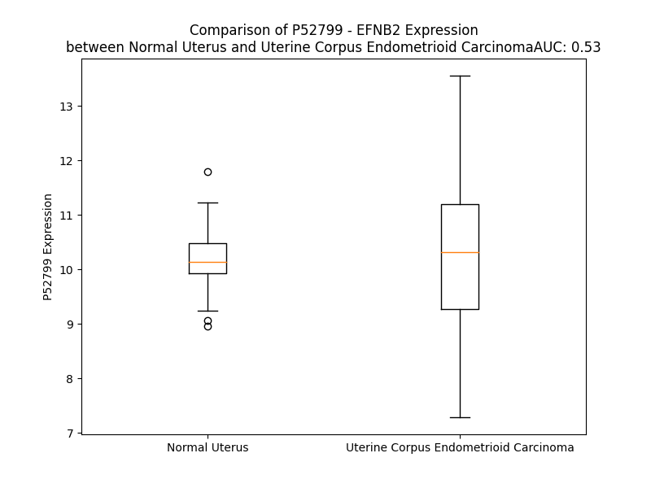

# Detailed Data for P52799

## Introduction to the Detailed Summary

### How to Interpret the Results

- **Summary & Metrics**: This section provides a quick reference to essential protein attributes, including expression changes, family classification, and biomarker applications. Regulation status (upregulated/downregulated) indicates the protein's behavior in a disease context. Some information comes from the original excel file with the proteins selected from literature, while others are derived from the analyses.
- **Expression Comparison**: A visual representation comparing protein expression between normal and disease states. It highlights significant changes in expression levels that might indicate diagnostic or therapeutic relevance. This is data coming from transcriptomics experiments and could not translate similarly to protein levels.
- **Isoform Alignment**: An interactive view of isoform alignments, revealing structural and functional differences between variants of the protein.
- **Interactors & Homologs**: Tables listing known interaction partners and homologous proteins, the more interactors and homologs, the more complex the protein is to design an antibody for.
- **Biological Assemblies**: Information about the structural arrangement of the protein in different assemblies, providing insights into its functional state but also the complexity of the protein to develop antibodies.
- **Combined Per-Residue Information**: A detailed table summarizing residue-level data. This includes predictions for epitope regions, aggregation tendencies, and modifications that might impact the protein's function. Each row corresponds to a residue in the protein, providing insights into specific sites that may be important for research or drug development.
## Summary & Metrics

- **UniProt Accession**: P52799
- **Gene Name**: EFNB2
- **Protein Name**: Ephrin-B2
- **Swiss Prot**: EFNB2_HUMAN
- **Family**: other
- **Biomarker Application**: diagnosis
- **Number of Isoforms**: 0
- **Regulation**: 1
- **(transcriptomics) AUC**: 0.64
- **(transcriptomics) Fold Change**: 1.05
- **(transcriptomics) Regulation**: Upregulated
- **Discotope Epitope Count**: 55
- **Max n_uniprots (Homo)**: 1
- **Max n_uniprots (Hetero)**: 8

## Expression Comparison

## Interactors

| preferredName_A   | preferredName_B   |   score |
|:------------------|:------------------|--------:|
| EFNB2             | EPHA4             |   0.999 |
| EFNB2             | EPHB3             |   0.999 |
| EFNB2             | EPHB1             |   0.999 |
| EFNB2             | EPHB2             |   0.999 |
| EFNB2             | EPHB4             |   0.999 |
| EFNB2             | EPHA1             |   0.999 |
| EFNB2             | EPHB6             |   0.999 |
| EFNB2             | RGS3              |   0.996 |
| EFNB2             | EPHA3             |   0.993 |
| EFNB2             | NCK2              |   0.992 |
| EFNB2             | EPHA2             |   0.973 |
| EFNB2             | EPHA5             |   0.956 |
| EFNB2             | EPHA10            |   0.954 |
| EFNB2             | EFNB1             |   0.949 |
| EFNB2             | EFNB3             |   0.928 |
| EFNB2             | EPHA7             |   0.907 |

## Homologs

| uniprot_id   | gene_id   |
|:-------------|:----------|
| P52803       | EFNA5     |
| P98172       | EFNB1     |
| P52798       | EFNA4     |
| Q15768       | EFNB3     |
| P52797       | EFNA3     |
| P20827       | EFNA1     |
| O43921       | EFNA2     |

## Biological Assemblies

|   Unnamed: 0 |   assembly |   n_uniprots | composition   | crystal_id   |
|-------------:|-----------:|-------------:|:--------------|:-------------|
|            0 |          1 |            1 | Homo          | 2i85         |
|            0 |          1 |            5 | Hetero        | 6pdl         |
|            1 |          2 |            5 | Hetero        | 6pdl         |
|            2 |          3 |            5 | Hetero        | 6pdl         |
|            3 |          4 |            5 | Hetero        | 6pdl         |
|            0 |          1 |            2 | Hetero        | 3gxu         |
|            0 |          1 |            2 | Hetero        | 4uf7         |
|            1 |          2 |            2 | Hetero        | 4uf7         |
|            0 |          1 |            2 | Hetero        | 2hle         |
|            0 |          1 |            8 | Hetero        | 6p7y         |
|            1 |          2 |            7 | Hetero        | 6p7y         |
|            0 |          1 |            2 | Hetero        | 2vsm         |
|            0 |          1 |            2 | Hetero        | 2vsk         |
|            1 |          2 |            2 | Hetero        | 2vsk         |
|            0 |          1 |            2 | Hetero        | 2wo2         |

## Combined Per-Residue Information

|   res | aa   |   epitope_score | epitope   |   relative_surface_accessibility |   modeling_confidence |   Aggregation | modification           | glycosylation                   |
|------:|:-----|----------------:|:----------|---------------------------------:|----------------------:|--------------:|:-----------------------|:--------------------------------|
|     1 | M    |         0.1002  | False     |                          1.27238 |                 50.06 |         0     | N/A                    | N/A                             |
|     2 | A    |         0.15005 | False     |                          0.80896 |                 53.43 |         0     | N/A                    | N/A                             |
|     3 | V    |         0.06646 | False     |                          0.97033 |                 52.25 |         0     | N/A                    | N/A                             |
|     4 | R    |         0.14565 | False     |                          0.84604 |                 55.5  |         0     | N/A                    | N/A                             |
|     5 | R    |         0.10986 | False     |                          0.82065 |                 56.53 |         0     | N/A                    | N/A                             |
|     6 | D    |         0.06929 | False     |                          0.61156 |                 60.06 |         0.275 | N/A                    | N/A                             |
|     7 | S    |         0.02886 | False     |                          0.37665 |                 64.79 |         0.304 | N/A                    | N/A                             |
|     8 | V    |         0.10144 | False     |                          0.6417  |                 69.73 |         0.98  | N/A                    | N/A                             |
|     9 | W    |         0.07998 | False     |                          0.76055 |                 73.68 |         0.98  | N/A                    | N/A                             |
|    10 | K    |         0.05453 | False     |                          0.73946 |                 79.75 |         0.98  | N/A                    | N/A                             |
|    11 | Y    |         0.10825 | False     |                          0.70882 |                 76.57 |        18.71  | N/A                    | N/A                             |
|    12 | C    |         0.11629 | False     |                          0.5382  |                 75.56 |        23.988 | N/A                    | N/A                             |
|    13 | W    |         0.09419 | False     |                          0.58025 |                 79.74 |        46.841 | N/A                    | N/A                             |
|    14 | G    |         0.0407  | False     |                          0.41662 |                 79.48 |        50.678 | N/A                    | N/A                             |
|    15 | V    |         0.04032 | False     |                          0.52283 |                 78.55 |        79.522 | N/A                    | N/A                             |
|    16 | L    |         0.06492 | False     |                          0.56928 |                 78.59 |        79.816 | N/A                    | N/A                             |
|    17 | M    |         0.0265  | False     |                          0.54904 |                 76.99 |        79.391 | N/A                    | N/A                             |
|    18 | V    |         0.03562 | False     |                          0.66074 |                 73.74 |        78.597 | N/A                    | N/A                             |
|    19 | L    |         0.05078 | False     |                          0.45699 |                 72.07 |        67.69  | N/A                    | N/A                             |
|    20 | C    |         0.03954 | False     |                          0.39579 |                 69.12 |        16.188 | N/A                    | N/A                             |
|    21 | R    |         0.05124 | False     |                          0.71989 |                 65.41 |         0     | N/A                    | N/A                             |
|    22 | T    |         0.06533 | False     |                          0.54528 |                 61.47 |         0     | N/A                    | N/A                             |
|    23 | A    |         0.03511 | False     |                          0.52186 |                 60.11 |         0     | N/A                    | N/A                             |
|    24 | I    |         0.07478 | False     |                          0.77559 |                 56.93 |         0     | N/A                    | N/A                             |
|    25 | S    |         0.06278 | False     |                          0.70944 |                 58.94 |         0     | N/A                    | N/A                             |
|    26 | K    |         0.13943 | False     |                          0.75295 |                 66    |         0     | N/A                    | N/A                             |
|    27 | S    |         0.1045  | False     |                          0.51179 |                 78.87 |         0     | N/A                    | N/A                             |
|    28 | I    |         0.08414 | False     |                          0.60637 |                 89.77 |         0     | N/A                    | N/A                             |
|    29 | V    |         0.11454 | False     |                          0.68458 |                 93.09 |         0     | N/A                    | N/A                             |
|    30 | L    |         0.10307 | False     |                          0.28068 |                 95    |         0     | N/A                    | N/A                             |
|    31 | E    |         0.19898 | False     |                          0.63168 |                 95.57 |         0     | N/A                    | N/A                             |
|    32 | P    |         0.07685 | False     |                          0.33812 |                 96.65 |         0     | N/A                    | N/A                             |
|    33 | I    |         0.02308 | False     |                          0.016   |                 97.27 |         0     | N/A                    | N/A                             |
|    34 | Y    |         0.17923 | False     |                          0.50856 |                 95.78 |         0     | N/A                    | N/A                             |
|    35 | W    |         0.00438 | False     |                          0       |                 96.55 |         0     | N/A                    | N/A                             |
|    36 | N    |         0.1835  | False     |                          0.18302 |                 93.77 |         0     | N/A                    | N-linked (GlcNAc...) asparagine |
|    37 | S    |         0.20511 | False     |                          0.34422 |                 92.89 |         0     | N/A                    | N/A                             |
|    38 | S    |         0.19769 | False     |                          0.7318  |                 91.16 |         0     | N/A                    | N/A                             |
|    39 | N    |         0.1167  | False     |                          0.14562 |                 94.06 |         0     | N/A                    | N/A                             |
|    40 | S    |         0.23618 | True      |                          0.77537 |                 95.39 |         0     | N/A                    | N/A                             |
|    41 | K    |         0.1731  | False     |                          0.33447 |                 96.44 |         0     | N/A                    | N/A                             |
|    42 | F    |         0.07997 | False     |                          0.07683 |                 97.03 |         0     | N/A                    | N/A                             |
|    43 | L    |         0.15247 | False     |                          0.57375 |                 95.74 |         0     | N/A                    | N/A                             |
|    44 | P    |         0.26234 | True      |                          0.94701 |                 94.24 |         0     | N/A                    | N/A                             |
|    45 | G    |         0.25328 | True      |                          0.76137 |                 91.06 |         0     | N/A                    | N/A                             |
|    46 | Q    |         0.29876 | True      |                          0.5707  |                 93.51 |         0     | N/A                    | N/A                             |
|    47 | G    |         0.01012 | False     |                          0.00476 |                 96.68 |         0     | N/A                    | N/A                             |
|    48 | L    |         0.07818 | False     |                          0.1267  |                 97.85 |         0.371 | N/A                    | N/A                             |
|    49 | V    |         0.10611 | False     |                          0.3266  |                 97.55 |         0.371 | N/A                    | N/A                             |
|    50 | L    |         0.11916 | False     |                          0.20032 |                 96.94 |         0.371 | N/A                    | N/A                             |
|    51 | Y    |         0.11545 | False     |                          0.30853 |                 96.84 |         0.371 | N/A                    | N/A                             |
|    52 | P    |         0.00328 | False     |                          0       |                 96.11 |         0.371 | N/A                    | N/A                             |
|    53 | Q    |         0.05475 | False     |                          0.39931 |                 94.28 |         0     | N/A                    | N/A                             |
|    54 | I    |         0.07499 | False     |                          0.27942 |                 93.13 |         0     | N/A                    | N/A                             |
|    55 | G    |         0.0459  | False     |                          0.3776  |                 91.48 |         0     | N/A                    | N/A                             |
|    56 | D    |         0.03246 | False     |                          0.04151 |                 94.59 |         0     | N/A                    | N/A                             |
|    57 | K    |         0.07557 | False     |                          0.34131 |                 95.17 |         0     | N/A                    | N/A                             |
|    58 | L    |         0.0184  | False     |                          0.00824 |                 96.59 |         0     | N/A                    | N/A                             |
|    59 | D    |         0.11315 | False     |                          0.14726 |                 96.89 |         0     | N/A                    | N/A                             |
|    60 | I    |         0.00753 | False     |                          0.0072  |                 97.26 |         0     | N/A                    | N/A                             |
|    61 | I    |         0.18074 | False     |                          0.20959 |                 96.15 |         0     | N/A                    | N/A                             |
|    62 | C    |         0.03023 | False     |                          0.02701 |                 95.7  |         0     | N/A                    | N/A                             |
|    63 | P    |         0.11789 | False     |                          0.09163 |                 92.11 |         0     | N/A                    | N/A                             |
|    64 | K    |         0.16168 | False     |                          0.45848 |                 85.29 |         0     | N/A                    | N/A                             |
|    65 | V    |         0.21367 | True      |                          0.46251 |                 80.94 |         0     | N/A                    | N/A                             |
|    66 | D    |         0.23846 | True      |                          0.37403 |                 70.91 |         0     | N/A                    | N/A                             |
|    67 | S    |         0.28791 | True      |                          1.01489 |                 63.29 |         0     | N/A                    | N/A                             |
|    68 | K    |         0.25626 | True      |                          0.88844 |                 63.43 |         0     | N/A                    | N/A                             |
|    69 | T    |         0.22959 | True      |                          0.51002 |                 62.48 |         0     | N/A                    | N/A                             |
|    70 | V    |         0.22277 | True      |                          1.11447 |                 65.35 |         0.117 | N/A                    | N/A                             |
|    71 | G    |         0.30467 | True      |                          0.51314 |                 71.06 |         0.117 | N/A                    | N/A                             |
|    72 | Q    |         0.4522  | True      |                          0.86948 |                 84.47 |         0.419 | N/A                    | N/A                             |
|    73 | Y    |         0.13952 | False     |                          0.09651 |                 91.2  |         8.359 | N/A                    | N/A                             |
|    74 | E    |         0.16562 | False     |                          0.16387 |                 94.33 |        10.608 | N/A                    | N/A                             |
|    75 | Y    |         0.2835  | True      |                          0.18857 |                 96.44 |        11.138 | N/A                    | N/A                             |
|    76 | Y    |         0.00561 | False     |                          0       |                 97.77 |        11.294 | N/A                    | N/A                             |
|    77 | K    |         0.20059 | False     |                          0.19172 |                 97.72 |        11.418 | N/A                    | N/A                             |
|    78 | V    |         0.00779 | False     |                          0.0019  |                 97.78 |        11.542 | N/A                    | N/A                             |
|    79 | Y    |         0.06556 | False     |                          0.06723 |                 97.76 |        11.542 | N/A                    | N/A                             |
|    80 | M    |         0.09232 | False     |                          0.18519 |                 96.75 |        11.325 | N/A                    | N/A                             |
|    81 | V    |         0.04285 | False     |                          0.08283 |                 97.4  |        11.325 | N/A                    | N/A                             |
|    82 | D    |         0.11522 | False     |                          0.39152 |                 96.87 |         0.935 | N/A                    | N/A                             |
|    83 | K    |         0.1559  | False     |                          0.5942  |                 97.7  |         0.125 | N/A                    | N/A                             |
|    84 | D    |         0.17168 | False     |                          0.46052 |                 97.83 |         0     | N/A                    | N/A                             |
|    85 | Q    |         0.04617 | False     |                          0.02858 |                 98    |         0     | N/A                    | N/A                             |
|    86 | A    |         0.01968 | False     |                          0.02679 |                 97.96 |         0     | N/A                    | N/A                             |
|    87 | D    |         0.18247 | False     |                          0.54447 |                 97.6  |         0     | N/A                    | N/A                             |
|    88 | R    |         0.23183 | True      |                          0.57393 |                 97.95 |         0     | N/A                    | N/A                             |
|    89 | C    |         0.06631 | False     |                          0.06246 |                 98.15 |         0     | N/A                    | N/A                             |
|    90 | T    |         0.17447 | False     |                          0.19525 |                 98.32 |         0     | N/A                    | N/A                             |
|    91 | I    |         0.12146 | False     |                          0.09753 |                 97.83 |         0     | N/A                    | N/A                             |
|    92 | K    |         0.2133  | True      |                          0.47037 |                 95.66 |         0     | N/A                    | N/A                             |
|    93 | K    |         0.19454 | False     |                          0.93928 |                 92.01 |         0     | N/A                    | N/A                             |
|    94 | E    |         0.22808 | True      |                          0.72753 |                 92.37 |         0     | N/A                    | N/A                             |
|    95 | N    |         0.16531 | False     |                          0.21668 |                 92.5  |         0     | N/A                    | N/A                             |
|    96 | T    |         0.1769  | False     |                          0.65636 |                 93.69 |         0     | N/A                    | N/A                             |
|    97 | P    |         0.15178 | False     |                          0.36643 |                 94.64 |         0     | N/A                    | N/A                             |
|    98 | L    |         0.13058 | False     |                          0.19272 |                 94.04 |         0     | N/A                    | N/A                             |
|    99 | L    |         0.08216 | False     |                          0.06018 |                 93.71 |         0     | N/A                    | N/A                             |
|   100 | N    |         0.32163 | True      |                          0.41669 |                 96.1  |         0     | N/A                    | N/A                             |
|   101 | C    |         0.00668 | False     |                          0       |                 96.05 |         0     | N/A                    | N/A                             |
|   102 | A    |         0.26477 | True      |                          0.32463 |                 94.27 |         0     | N/A                    | N/A                             |
|   103 | K    |         0.42365 | True      |                          0.49923 |                 91.84 |         0     | N/A                    | N/A                             |
|   104 | P    |         0.2395  | True      |                          0.34659 |                 88.85 |         0     | N/A                    | N/A                             |
|   105 | D    |         0.37367 | True      |                          0.68237 |                 85.76 |         0     | N/A                    | N/A                             |
|   106 | Q    |         0.28089 | True      |                          0.39387 |                 86.62 |         0     | N/A                    | N/A                             |
|   107 | D    |         0.33913 | True      |                          0.66345 |                 87.98 |         0.235 | N/A                    | N/A                             |
|   108 | I    |         0.24048 | True      |                          0.22696 |                 94.15 |         0.235 | N/A                    | N/A                             |
|   109 | K    |         0.27808 | True      |                          0.59591 |                 94.56 |         0.235 | N/A                    | N/A                             |
|   110 | F    |         0.21674 | True      |                          0.29835 |                 94.45 |         0.235 | N/A                    | N/A                             |
|   111 | T    |         0.13548 | False     |                          0.3836  |                 94.79 |         0.235 | N/A                    | N/A                             |
|   112 | I    |         0.0274  | False     |                          0.0104  |                 94.55 |         0.235 | N/A                    | N/A                             |
|   113 | K    |         0.11089 | False     |                          0.50003 |                 93.87 |         0     | N/A                    | N/A                             |
|   114 | F    |         0.00323 | False     |                          0.00117 |                 94.3  |         0     | N/A                    | N/A                             |
|   115 | Q    |         0.12288 | False     |                          0.25064 |                 92.39 |         0     | N/A                    | N/A                             |
|   116 | E    |         0.10254 | False     |                          0.37201 |                 89.57 |         0     | N/A                    | N/A                             |
|   117 | F    |         0.27727 | True      |                          0.84932 |                 88.1  |         0     | N/A                    | N/A                             |
|   118 | S    |         0.18054 | False     |                          0.18613 |                 87.32 |         0     | N/A                    | N/A                             |
|   119 | P    |         0.20859 | False     |                          0.99612 |                 82.78 |         0     | N/A                    | N/A                             |
|   120 | N    |         0.30113 | True      |                          0.53863 |                 82.04 |         0     | N/A                    | N/A                             |
|   121 | L    |         0.27335 | True      |                          1.08204 |                 78.66 |         0     | N/A                    | N/A                             |
|   122 | W    |         0.31097 | True      |                          0.92687 |                 75.87 |         0     | N/A                    | N/A                             |
|   123 | G    |         0.13535 | False     |                          0.2725  |                 82.08 |         0     | N/A                    | N/A                             |
|   124 | L    |         0.09551 | False     |                          0.26134 |                 90.12 |         0     | N/A                    | N/A                             |
|   125 | E    |         0.11573 | False     |                          0.49269 |                 93.45 |         0     | N/A                    | N/A                             |
|   126 | F    |         0.00602 | False     |                          0.00382 |                 95.11 |         0     | N/A                    | N/A                             |
|   127 | Q    |         0.12446 | False     |                          0.46318 |                 94.73 |         0     | N/A                    | N/A                             |
|   128 | K    |         0.11114 | False     |                          0.57728 |                 94.05 |         0     | N/A                    | N/A                             |
|   129 | N    |         0.16514 | False     |                          0.71765 |                 95.04 |         0     | N/A                    | N/A                             |
|   130 | K    |         0.10587 | False     |                          0.4836  |                 96.18 |         0     | N/A                    | N/A                             |
|   131 | D    |         0.10785 | False     |                          0.35959 |                 97.75 |         0     | N/A                    | N/A                             |
|   132 | Y    |         0.09181 | False     |                          0.16803 |                 98.06 |        31.856 | N/A                    | N/A                             |
|   133 | Y    |         0.09155 | False     |                          0.13522 |                 98.27 |        32.298 | N/A                    | N/A                             |
|   134 | I    |         0.00465 | False     |                          0       |                 98.32 |        32.298 | N/A                    | N/A                             |
|   135 | I    |         0.02385 | False     |                          0.0016  |                 98.35 |        32.298 | N/A                    | N/A                             |
|   136 | S    |         0.00959 | False     |                          0       |                 98.22 |        32.298 | N/A                    | N/A                             |
|   137 | T    |         0.0109  | False     |                          0.00362 |                 98.32 |        13.198 | N/A                    | N/A                             |
|   138 | S    |         0.02116 | False     |                          0.00791 |                 97.94 |         1.407 | N/A                    | N/A                             |
|   139 | N    |         0.19788 | False     |                          0.48035 |                 96.69 |         0     | N/A                    | N-linked (GlcNAc...) asparagine |
|   140 | G    |         0.18441 | False     |                          0.13474 |                 95.14 |         0     | N/A                    | N/A                             |
|   141 | S    |         0.32591 | True      |                          0.32954 |                 95.1  |         0     | N/A                    | N/A                             |
|   142 | L    |         0.33719 | True      |                          0.62093 |                 94.85 |         0     | N/A                    | N/A                             |
|   143 | E    |         0.45359 | True      |                          0.76944 |                 96.28 |         0     | N/A                    | N/A                             |
|   144 | G    |         0.09051 | False     |                          0.04715 |                 96.64 |         0     | N/A                    | N/A                             |
|   145 | L    |         0.15123 | False     |                          0.11304 |                 96.85 |         0     | N/A                    | N/A                             |
|   146 | D    |         0.30912 | True      |                          0.57274 |                 97.03 |         0     | N/A                    | N/A                             |
|   147 | N    |         0.38827 | True      |                          0.37559 |                 97.54 |         0     | N/A                    | N/A                             |
|   148 | Q    |         0.22295 | True      |                          0.44318 |                 97.42 |         0     | N/A                    | N/A                             |
|   149 | E    |         0.19378 | False     |                          0.65483 |                 98    |         0     | N/A                    | N/A                             |
|   150 | G    |         0.12914 | False     |                          0.0853  |                 97.37 |         0     | N/A                    | N/A                             |
|   151 | G    |         0.06354 | False     |                          0.14757 |                 97.61 |         0     | N/A                    | N/A                             |
|   152 | V    |         0.01652 | False     |                          0.00857 |                 97.76 |         0     | N/A                    | N/A                             |
|   153 | C    |         0.01928 | False     |                          0.02221 |                 98.17 |         0     | N/A                    | N/A                             |
|   154 | Q    |         0.32316 | True      |                          0.68925 |                 97.42 |         0     | N/A                    | N/A                             |
|   155 | T    |         0.25163 | True      |                          0.76516 |                 97.28 |         0     | N/A                    | N/A                             |
|   156 | R    |         0.33023 | True      |                          0.44884 |                 96.62 |         0     | N/A                    | N/A                             |
|   157 | A    |         0.04127 | False     |                          0.05378 |                 97.58 |         0     | N/A                    | N/A                             |
|   158 | M    |         0.01718 | False     |                          0.00719 |                 97.86 |         0     | N/A                    | N/A                             |
|   159 | K    |         0.12098 | False     |                          0.24399 |                 98.1  |         0     | N/A                    | N/A                             |
|   160 | I    |         0.00899 | False     |                          0.00826 |                 98.4  |         0     | N/A                    | N/A                             |
|   161 | L    |         0.06054 | False     |                          0.25981 |                 98.16 |         0     | N/A                    | N/A                             |
|   162 | M    |         0.00401 | False     |                          0       |                 97.76 |         0     | N/A                    | N/A                             |
|   163 | K    |         0.10532 | False     |                          0.16449 |                 97.61 |         0     | N/A                    | N/A                             |
|   164 | V    |         0.00279 | False     |                          0       |                 96.41 |         0     | N/A                    | N/A                             |
|   165 | G    |         0.05339 | False     |                          0.252   |                 93.11 |         0     | N/A                    | N/A                             |
|   166 | Q    |         0.05602 | False     |                          0.18226 |                 94.71 |         0     | N/A                    | N/A                             |
|   167 | D    |         0.13404 | False     |                          0.58887 |                 88.24 |         0     | N/A                    | N/A                             |
|   168 | A    |         0.13553 | False     |                          0.61399 |                 86.18 |         0     | N/A                    | N/A                             |
|   169 | S    |         0.1863  | False     |                          0.81398 |                 74.91 |         0     | N/A                    | N/A                             |
|   170 | S    |         0.16165 | False     |                          0.53926 |                 59.93 |         0     | N/A                    | N/A                             |
|   171 | A    |         0.20681 | False     |                          0.63208 |                 55.71 |         0     | N/A                    | N/A                             |
|   172 | G    |         0.17292 | False     |                          0.85833 |                 45.42 |         0     | N/A                    | N/A                             |
|   173 | S    |         0.30054 | True      |                          0.71652 |                 42.48 |         0     | N/A                    | N/A                             |
|   174 | T    |         0.25362 | True      |                          0.96444 |                 40.83 |         0     | N/A                    | N/A                             |
|   175 | R    |         0.26584 | True      |                          0.88757 |                 41.63 |         0     | N/A                    | N/A                             |
|   176 | N    |         0.10602 | False     |                          0.87048 |                 38.25 |         0     | N/A                    | N/A                             |
|   177 | K    |         0.2395  | True      |                          1.0083  |                 40.47 |         0     | N/A                    | N/A                             |
|   178 | D    |         0.11129 | False     |                          0.84176 |                 42.03 |         0     | N/A                    | N/A                             |
|   179 | P    |         0.14885 | False     |                          0.81192 |                 39.41 |         0     | N/A                    | N/A                             |
|   180 | T    |         0.13486 | False     |                          0.93959 |                 41.81 |         0     | N/A                    | N/A                             |
|   181 | R    |         0.22922 | True      |                          0.99104 |                 39.68 |         0     | N/A                    | N/A                             |
|   182 | R    |         0.17048 | False     |                          0.91166 |                 41.28 |         0     | N/A                    | N/A                             |
|   183 | P    |         0.10729 | False     |                          0.90053 |                 40.46 |         0     | N/A                    | N/A                             |
|   184 | E    |         0.14244 | False     |                          0.92795 |                 45.74 |         0     | N/A                    | N/A                             |
|   185 | L    |         0.12905 | False     |                          0.87747 |                 44.37 |         0     | N/A                    | N/A                             |
|   186 | E    |         0.21625 | True      |                          0.79367 |                 39.89 |         0     | N/A                    | N/A                             |
|   187 | A    |         0.21979 | True      |                          1.02029 |                 39.31 |         0     | N/A                    | N/A                             |
|   188 | G    |         0.16026 | False     |                          0.89095 |                 40.03 |         0     | N/A                    | N/A                             |
|   189 | T    |         0.11846 | False     |                          0.83143 |                 45.41 |         0     | N/A                    | N/A                             |
|   190 | N    |         0.15112 | False     |                          0.93718 |                 42.98 |         0     | N/A                    | N/A                             |
|   191 | G    |         0.2028  | False     |                          0.91537 |                 39.58 |         0     | N/A                    | N/A                             |
|   192 | R    |         0.18951 | False     |                          0.94862 |                 44.72 |         0     | N/A                    | N/A                             |
|   193 | S    |         0.08589 | False     |                          0.7271  |                 41.26 |         0     | N/A                    | N/A                             |
|   194 | S    |         0.1153  | False     |                          0.8228  |                 45.28 |         0     | N/A                    | N/A                             |
|   195 | T    |         0.14698 | False     |                          0.83621 |                 44.26 |         0     | N/A                    | N/A                             |
|   196 | T    |         0.1178  | False     |                          0.80696 |                 42.56 |         0     | N/A                    | N/A                             |
|   197 | S    |         0.19302 | False     |                          0.79009 |                 47.25 |         0     | N/A                    | N/A                             |
|   198 | P    |         0.13447 | False     |                          0.89135 |                 45.46 |         0     | N/A                    | N/A                             |
|   199 | F    |         0.27622 | True      |                          0.95991 |                 40.91 |         0     | N/A                    | N/A                             |
|   200 | V    |         0.13026 | False     |                          0.73255 |                 45.51 |         0     | N/A                    | N/A                             |
|   201 | K    |         0.15917 | False     |                          1.00232 |                 48.52 |         0     | N/A                    | N/A                             |
|   202 | P    |         0.20141 | False     |                          0.78198 |                 42.65 |         0     | N/A                    | N/A                             |
|   203 | N    |         0.2057  | False     |                          0.89361 |                 41.18 |         0     | N/A                    | N/A                             |
|   204 | P    |         0.17573 | False     |                          0.92054 |                 46.58 |         0     | N/A                    | N/A                             |
|   205 | G    |         0.15892 | False     |                          0.91802 |                 40.4  |         0     | N/A                    | N/A                             |
|   206 | S    |         0.19783 | False     |                          0.92846 |                 42.27 |         0     | N/A                    | N/A                             |
|   207 | S    |         0.11045 | False     |                          0.77134 |                 41.62 |         0     | N/A                    | N/A                             |
|   208 | T    |         0.18474 | False     |                          1.02108 |                 45.74 |         0     | N/A                    | N/A                             |
|   209 | D    |         0.13796 | False     |                          0.88289 |                 40.87 |         0     | N/A                    | N/A                             |
|   210 | G    |         0.20241 | False     |                          0.96675 |                 43.66 |         0     | N/A                    | N/A                             |
|   211 | N    |         0.15522 | False     |                          0.95596 |                 37.11 |         0     | N/A                    | N/A                             |
|   212 | S    |         0.22272 | True      |                          0.88757 |                 45.2  |         0     | N/A                    | N/A                             |
|   213 | A    |         0.15941 | False     |                          1.05949 |                 36.82 |         0     | N/A                    | N/A                             |
|   214 | G    |         0.35527 | True      |                          0.89293 |                 35.07 |         0     | N/A                    | N/A                             |
|   215 | H    |         0.20605 | False     |                          1.01717 |                 43.67 |         0     | N/A                    | N/A                             |
|   216 | S    |         0.14213 | False     |                          0.79976 |                 35.55 |         0     | N/A                    | N/A                             |
|   217 | G    |         0.20576 | False     |                          0.84134 |                 44.09 |         0     | N/A                    | N/A                             |
|   218 | N    |         0.15292 | False     |                          0.82771 |                 45.18 |         0     | N/A                    | N/A                             |
|   219 | N    |         0.20879 | False     |                          0.93701 |                 37.73 |         0     | N/A                    | N/A                             |
|   220 | I    |         0.17864 | False     |                          0.94435 |                 46.98 |         0     | N/A                    | N/A                             |
|   221 | L    |         0.25617 | True      |                          1.0075  |                 46.72 |         0     | N/A                    | N/A                             |
|   222 | G    |         0.14786 | False     |                          0.7422  |                 51.59 |         0     | N/A                    | N/A                             |
|   223 | S    |         0.0581  | False     |                          0.60717 |                 58.39 |         0     | N/A                    | N/A                             |
|   224 | E    |         0.06564 | False     |                          0.60765 |                 56.47 |         0     | N/A                    | N/A                             |
|   225 | V    |         0.09524 | False     |                          0.78914 |                 59.16 |         0     | N/A                    | N/A                             |
|   226 | A    |         0.09581 | False     |                          0.64762 |                 59.83 |         0     | N/A                    | N/A                             |
|   227 | L    |         0.09274 | False     |                          0.715   |                 61.67 |         0     | N/A                    | N/A                             |
|   228 | F    |         0.08153 | False     |                          0.65228 |                 61.04 |         0.001 | N/A                    | N/A                             |
|   229 | A    |         0.09769 | False     |                          0.60835 |                 65.86 |         0.001 | N/A                    | N/A                             |
|   230 | G    |         0.12288 | False     |                          0.53467 |                 66.53 |         0.003 | N/A                    | N/A                             |
|   231 | I    |         0.06001 | False     |                          0.56705 |                 74.6  |         0.118 | N/A                    | N/A                             |
|   232 | A    |         0.0785  | False     |                          0.52576 |                 74.95 |         0.146 | N/A                    | N/A                             |
|   233 | S    |         0.1209  | False     |                          0.44465 |                 78.02 |         0.294 | N/A                    | N/A                             |
|   234 | G    |         0.07399 | False     |                          0.43875 |                 81.77 |         1.492 | N/A                    | N/A                             |
|   235 | C    |         0.04925 | False     |                          0.46045 |                 86.66 |        14.794 | N/A                    | N/A                             |
|   236 | I    |         0.10061 | False     |                          0.64296 |                 82.45 |        92.289 | N/A                    | N/A                             |
|   237 | I    |         0.08093 | False     |                          0.62776 |                 82.73 |        99.38  | N/A                    | N/A                             |
|   238 | F    |         0.06507 | False     |                          0.65127 |                 84.64 |        99.949 | N/A                    | N/A                             |
|   239 | I    |         0.05131 | False     |                          0.55598 |                 86.65 |        99.995 | N/A                    | N/A                             |
|   240 | V    |         0.05613 | False     |                          0.40248 |                 82.39 |       100     | N/A                    | N/A                             |
|   241 | I    |         0.08685 | False     |                          0.50078 |                 85.89 |       100     | N/A                    | N/A                             |
|   242 | I    |         0.07111 | False     |                          0.46478 |                 88.15 |       100     | N/A                    | N/A                             |
|   243 | I    |         0.08294 | False     |                          0.59117 |                 86.59 |       100     | N/A                    | N/A                             |
|   244 | T    |         0.05448 | False     |                          0.29372 |                 83.33 |        99.997 | N/A                    | N/A                             |
|   245 | L    |         0.04564 | False     |                          0.59063 |                 87.55 |        99.995 | N/A                    | N/A                             |
|   246 | V    |         0.02541 | False     |                          0.50721 |                 88.1  |        99.987 | N/A                    | N/A                             |
|   247 | V    |         0.05711 | False     |                          0.50245 |                 85.39 |        99.894 | N/A                    | N/A                             |
|   248 | L    |         0.08009 | False     |                          0.66214 |                 83.7  |        98.798 | N/A                    | N/A                             |
|   249 | L    |         0.06011 | False     |                          0.65925 |                 86.87 |        92.819 | N/A                    | N/A                             |
|   250 | L    |         0.07153 | False     |                          0.54798 |                 84.57 |        78.678 | N/A                    | N/A                             |
|   251 | K    |         0.0707  | False     |                          0.47311 |                 80.5  |         0     | N/A                    | N/A                             |
|   252 | Y    |         0.11023 | False     |                          0.60271 |                 77.17 |         0     | N/A                    | N/A                             |
|   253 | R    |         0.10691 | False     |                          0.636   |                 82.09 |         0     | N/A                    | N/A                             |
|   254 | R    |         0.13544 | False     |                          0.68414 |                 77.65 |         0     | N/A                    | N/A                             |
|   255 | R    |         0.19636 | False     |                          0.74128 |                 73.77 |         0     | N/A                    | N/A                             |
|   256 | H    |         0.1455  | False     |                          0.60778 |                 63.99 |         0     | N/A                    | N/A                             |
|   257 | R    |         0.17272 | False     |                          0.80197 |                 59.55 |         0     | N/A                    | N/A                             |
|   258 | K    |         0.20071 | False     |                          0.79305 |                 48.93 |         0     | N/A                    | N/A                             |
|   259 | H    |         0.24171 | True      |                          0.83703 |                 45.86 |         0     | N/A                    | N/A                             |
|   260 | S    |         0.12267 | False     |                          0.66154 |                 38.11 |         0     | Phosphoserine          | N/A                             |
|   261 | P    |         0.1214  | False     |                          0.80322 |                 43.29 |         0     | N/A                    | N/A                             |
|   262 | Q    |         0.14259 | False     |                          0.88747 |                 39.42 |         0     | N/A                    | N/A                             |
|   263 | H    |         0.20351 | False     |                          0.93369 |                 43.69 |         0     | N/A                    | N/A                             |
|   264 | T    |         0.17287 | False     |                          0.88037 |                 41.07 |         0     | N/A                    | N/A                             |
|   265 | T    |         0.17933 | False     |                          0.89075 |                 36.98 |         0     | N/A                    | N/A                             |
|   266 | T    |         0.19848 | False     |                          0.84707 |                 43.02 |         0     | N/A                    | N/A                             |
|   267 | L    |         0.18773 | False     |                          0.95537 |                 44.76 |         0     | N/A                    | N/A                             |
|   268 | S    |         0.12364 | False     |                          0.77505 |                 35.71 |         0     | N/A                    | N/A                             |
|   269 | L    |         0.16988 | False     |                          1.15654 |                 31.93 |         0     | N/A                    | N/A                             |
|   270 | S    |         0.15585 | False     |                          0.70807 |                 38.04 |         0     | N/A                    | N/A                             |
|   271 | T    |         0.14607 | False     |                          0.89094 |                 40.24 |         0     | N/A                    | N/A                             |
|   272 | L    |         0.17563 | False     |                          1.04179 |                 36.11 |         0     | N/A                    | N/A                             |
|   273 | A    |         0.11343 | False     |                          0.98397 |                 42.46 |         0     | N/A                    | N/A                             |
|   274 | T    |         0.11824 | False     |                          0.83168 |                 43.32 |         0     | Phosphothreonine       | N/A                             |
|   275 | P    |         0.12351 | False     |                          0.87817 |                 46.62 |         0     | N/A                    | N/A                             |
|   276 | K    |         0.1869  | False     |                          0.99016 |                 33.34 |         0     | N/A                    | N/A                             |
|   277 | R    |         0.1606  | False     |                          0.93118 |                 37.65 |         0     | Omega-N-methylarginine | N/A                             |
|   278 | S    |         0.23323 | True      |                          0.82306 |                 36.86 |         0     | N/A                    | N/A                             |
|   279 | G    |         0.21098 | True      |                          0.83085 |                 38.43 |         0     | N/A                    | N/A                             |
|   280 | N    |         0.16485 | False     |                          0.90361 |                 41.39 |         0     | N/A                    | N/A                             |
|   281 | N    |         0.19671 | False     |                          0.88721 |                 49.91 |         0     | N/A                    | N/A                             |
|   282 | N    |         0.1866  | False     |                          1.01094 |                 40.34 |         0     | N/A                    | N/A                             |
|   283 | G    |         0.26511 | True      |                          0.80838 |                 39.21 |         0     | N/A                    | N/A                             |
|   284 | S    |         0.1071  | False     |                          0.83122 |                 43.41 |         0     | N/A                    | N/A                             |
|   285 | E    |         0.19131 | False     |                          0.89997 |                 38.71 |         0     | N/A                    | N/A                             |
|   286 | P    |         0.12169 | False     |                          0.82537 |                 48.3  |         0     | N/A                    | N/A                             |
|   287 | S    |         0.08216 | False     |                          0.76725 |                 44.3  |         0     | N/A                    | N/A                             |
|   288 | D    |         0.13391 | False     |                          0.78299 |                 41.85 |         0     | N/A                    | N/A                             |
|   289 | I    |         0.11903 | False     |                          0.89505 |                 44.73 |         0     | N/A                    | N/A                             |
|   290 | I    |         0.14297 | False     |                          0.83737 |                 45.26 |         0     | N/A                    | N/A                             |
|   291 | I    |         0.12661 | False     |                          0.77313 |                 48.54 |         0     | N/A                    | N/A                             |
|   292 | P    |         0.13755 | False     |                          0.71492 |                 45.74 |         0     | N/A                    | N/A                             |
|   293 | L    |         0.14356 | False     |                          1.0861  |                 43.6  |         0     | N/A                    | N/A                             |
|   294 | R    |         0.20771 | False     |                          0.83541 |                 45.82 |         0     | N/A                    | N/A                             |
|   295 | T    |         0.15982 | False     |                          1.02762 |                 44.56 |         0     | N/A                    | N/A                             |
|   296 | A    |         0.14204 | False     |                          0.72954 |                 40.73 |         0     | N/A                    | N/A                             |
|   297 | D    |         0.10873 | False     |                          0.74109 |                 39.7  |         0     | N/A                    | N/A                             |
|   298 | S    |         0.15739 | False     |                          0.86373 |                 39.39 |         0     | N/A                    | N/A                             |
|   299 | V    |         0.10262 | False     |                          0.84627 |                 44.12 |         0     | N/A                    | N/A                             |
|   300 | F    |         0.16293 | False     |                          1.03158 |                 39.22 |         0     | N/A                    | N/A                             |
|   301 | C    |         0.10289 | False     |                          0.76582 |                 41.58 |         0     | N/A                    | N/A                             |
|   302 | P    |         0.15401 | False     |                          0.92041 |                 42.37 |         0     | N/A                    | N/A                             |
|   303 | H    |         0.1532  | False     |                          0.78148 |                 40.74 |         0     | N/A                    | N/A                             |
|   304 | Y    |         0.13636 | False     |                          1.01975 |                 45.25 |         0     | N/A                    | N/A                             |
|   305 | E    |         0.12868 | False     |                          0.68277 |                 45.6  |         0     | N/A                    | N/A                             |
|   306 | K    |         0.19842 | False     |                          0.98338 |                 46.18 |         0     | N/A                    | N/A                             |
|   307 | V    |         0.17972 | False     |                          0.95177 |                 49.04 |         0     | N/A                    | N/A                             |
|   308 | S    |         0.15407 | False     |                          0.86797 |                 49.63 |         0     | N/A                    | N/A                             |
|   309 | G    |         0.15044 | False     |                          0.87735 |                 47.1  |         0     | N/A                    | N/A                             |
|   310 | D    |         0.15244 | False     |                          0.90028 |                 52.59 |         0     | N/A                    | N/A                             |
|   311 | Y    |         0.22773 | True      |                          1.08682 |                 44.82 |         0     | N/A                    | N/A                             |
|   312 | G    |         0.14833 | False     |                          0.785   |                 62.85 |         0     | N/A                    | N/A                             |
|   313 | H    |         0.15888 | False     |                          0.91754 |                 53.72 |         0     | N/A                    | N/A                             |
|   314 | P    |         0.13049 | False     |                          0.61585 |                 71.3  |         1.682 | N/A                    | N/A                             |
|   315 | V    |         0.1158  | False     |                          0.9322  |                 67.85 |         7.059 | N/A                    | N/A                             |
|   316 | Y    |         0.17987 | False     |                          0.8231  |                 65.15 |         7.059 | N/A                    | N/A                             |
|   317 | I    |         0.15319 | False     |                          0.93703 |                 67.75 |         7.059 | N/A                    | N/A                             |
|   318 | V    |         0.13076 | False     |                          0.86451 |                 64.26 |         7.059 | N/A                    | N/A                             |
|   319 | Q    |         0.13873 | False     |                          0.72801 |                 58.55 |         5.377 | N/A                    | N/A                             |
|   320 | E    |         0.17499 | False     |                          0.81291 |                 52.9  |         0     | N/A                    | N/A                             |
|   321 | M    |         0.20112 | False     |                          0.85123 |                 58.29 |         0     | N/A                    | N/A                             |
|   322 | P    |         0.13747 | False     |                          0.80174 |                 62.61 |         0     | N/A                    | N/A                             |
|   323 | P    |         0.17308 | False     |                          0.94749 |                 55.61 |         0     | N/A                    | N/A                             |
|   324 | Q    |         0.16068 | False     |                          0.89755 |                 52.92 |         0     | N/A                    | N/A                             |
|   325 | S    |         0.08887 | False     |                          0.74319 |                 53.62 |         0     | N/A                    | N/A                             |
|   326 | P    |         0.13581 | False     |                          0.8868  |                 52.12 |         0     | N/A                    | N/A                             |
|   327 | A    |         0.12318 | False     |                          0.80225 |                 46.53 |         0.707 | N/A                    | N/A                             |
|   328 | N    |         0.13674 | False     |                          0.8049  |                 46.88 |         0.707 | N/A                    | N/A                             |
|   329 | I    |         0.09386 | False     |                          0.68707 |                 57.84 |         0.707 | N/A                    | N/A                             |
|   330 | Y    |         0.08538 | False     |                          0.89932 |                 58.02 |         0.707 | N/A                    | N/A                             |
|   331 | Y    |         0.12639 | False     |                          0.8215  |                 55.69 |         0.707 | N/A                    | N/A                             |
|   332 | K    |         0.09095 | False     |                          1.00019 |                 55.57 |         0     | N/A                    | N/A                             |
|   333 | V    |         0.0833  | False     |                          1.41162 |                 60.75 |         0     | N/A                    | N/A                             |

