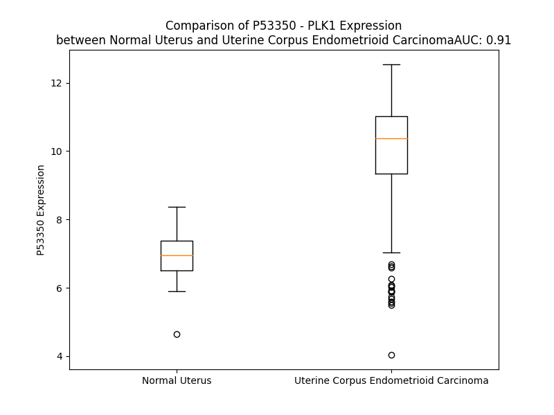

# Detailed Data for P53350

## Introduction to the Detailed Summary

### How to Interpret the Results

- **Summary & Metrics**: This section provides a quick reference to essential protein attributes, including expression changes, family classification, and biomarker applications. Regulation status (upregulated/downregulated) indicates the protein's behavior in a disease context. Some information comes from the original excel file with the proteins selected from literature, while others are derived from the analyses.
- **Expression Comparison**: A visual representation comparing protein expression between normal and disease states. It highlights significant changes in expression levels that might indicate diagnostic or therapeutic relevance. This is data coming from transcriptomics experiments and could not translate similarly to protein levels.
- **Isoform Alignment**: An interactive view of isoform alignments, revealing structural and functional differences between variants of the protein.
- **Interactors & Homologs**: Tables listing known interaction partners and homologous proteins, the more interactors and homologs, the more complex the protein is to design an antibody for.
- **Biological Assemblies**: Information about the structural arrangement of the protein in different assemblies, providing insights into its functional state but also the complexity of the protein to develop antibodies.
- **Combined Per-Residue Information**: A detailed table summarizing residue-level data. This includes predictions for epitope regions, aggregation tendencies, and modifications that might impact the protein's function. Each row corresponds to a residue in the protein, providing insights into specific sites that may be important for research or drug development.
## Summary & Metrics

- **UniProt Accession**: P53350
- **Gene Name**: PLK
- **Protein Name**: Serine/threonine-protein kinase PLK1/ Polo-like kinase
- **Swiss Prot**: PLK1_HUMAN
- **Family**: kinase
- **Biomarker Application**: unspecified application
- **Number of Isoforms**: 0
- **Regulation**: 1
- **(transcriptomics) AUC**: 1.0
- **(transcriptomics) Fold Change**: 1.58
- **(transcriptomics) Regulation**: Upregulated
- **Discotope Epitope Count**: 150
- **Max n_uniprots (Homo)**: 1
- **Max n_uniprots (Hetero)**: 2

## Expression Comparison

## Interactors

| preferredName_A   | preferredName_B   |   score |
|:------------------|:------------------|--------:|
| PLK1              | CCNB1             |   0.999 |
| PLK1              | CDC20             |   0.999 |
| PLK1              | BUB1B             |   0.999 |
| PLK1              | CDC25C            |   0.999 |
| PLK1              | FZR1              |   0.999 |
| PLK1              | ERCC6L            |   0.998 |
| PLK1              | BORA              |   0.997 |
| PLK1              | AURKA             |   0.997 |
| PLK1              | BUB1              |   0.996 |
| PLK1              | CENPU             |   0.996 |
| PLK1              | BRCA2             |   0.996 |
| PLK1              | CCNB2             |   0.995 |
| PLK1              | FOXM1             |   0.995 |
| PLK1              | KIF2C             |   0.994 |
| PLK1              | ESPL1             |   0.994 |
| PLK1              | CDK1              |   0.993 |
| PLK1              | WEE1              |   0.992 |
| PLK1              | FBXO43            |   0.992 |
| PLK1              | KIF20A            |   0.99  |
| PLK1              | NUDC              |   0.99  |
| PLK1              | CENPA             |   0.988 |
| PLK1              | KIF23             |   0.988 |
| PLK1              | PKMYT1            |   0.987 |
| PLK1              | GTSE1             |   0.982 |
| PLK1              | TP53              |   0.981 |
| PLK1              | BIRC5             |   0.98  |
| PLK1              | FBXO5             |   0.978 |
| PLK1              | INCENP            |   0.978 |
| PLK1              | NEDD1             |   0.977 |
| PLK1              | CENPE             |   0.977 |
| PLK1              | CDC25B            |   0.976 |
| PLK1              | CDC25A            |   0.975 |
| PLK1              | CDCA8             |   0.974 |
| PLK1              | CENPF             |   0.973 |
| PLK1              | SGO1              |   0.973 |
| PLK1              | CCNB3             |   0.968 |
| PLK1              | PCNT              |   0.965 |
| PLK1              | RACGAP1           |   0.961 |
| PLK1              | BRCA1             |   0.96  |
| PLK1              | SGO2              |   0.959 |
| PLK1              | CCNA2             |   0.958 |
| PLK1              | HSP90AA1          |   0.957 |
| PLK1              | PTTG1             |   0.956 |
| PLK1              | PLK4              |   0.956 |
| PLK1              | PRC1              |   0.955 |
| PLK1              | CENPJ             |   0.953 |
| PLK1              | BTRC              |   0.952 |
| PLK1              | NDC80             |   0.951 |
| PLK1              | NINL              |   0.946 |
| PLK1              | PCM1              |   0.944 |

## Homologs

| uniprot_id   | gene_id   |
|:-------------|:----------|
| Q9NYY3       | PLK2      |
| Q9H4B4       | PLK3      |
| O00444       | PLK4      |
| Q496M5       | PLK5      |

## Biological Assemblies

|   Unnamed: 0 |   assembly |   n_uniprots | composition   | crystal_id   |
|-------------:|-----------:|-------------:|:--------------|:-------------|
|            0 |          1 |            1 | Homo          | 4o9w         |
|            0 |          1 |            1 | Homo          | 4x9w         |
|            0 |          1 |            2 | Hetero        | 8joy         |
|            0 |          1 |            1 | Homo          | 4a4o         |
|            0 |          1 |            1 | Homo          | 2ou7         |
|            1 |          2 |            1 | Homo          | 2ou7         |
|            0 |          1 |            1 | Homo          | 2v5q         |
|            1 |          2 |            1 | Homo          | 2v5q         |
|            0 |          1 |            1 | Homo          | 7mx1         |
|            1 |          2 |            1 | Homo          | 7mx1         |
|            0 |          1 |            1 | Homo          | 1q4o         |
|            1 |          2 |            1 | Homo          | 1q4o         |
|            0 |          1 |            1 | Homo          | 4rcp         |
|            0 |          1 |            1 | Homo          | 5nei         |
|            0 |          1 |            1 | Homo          | 1q4k         |
|            1 |          2 |            1 | Homo          | 1q4k         |
|            2 |          3 |            1 | Homo          | 1q4k         |
|            0 |          1 |            1 | Homo          | 3p2w         |
|            0 |          1 |            2 | Hetero        | 5j19         |
|            1 |          2 |            2 | Hetero        | 5j19         |
|            0 |          1 |            1 | Homo          | 3kb7         |
|            0 |          1 |            1 | Homo          | 8bjt         |
|            0 |          1 |            1 | Homo          | 3fc2         |
|            0 |          1 |            1 | Homo          | 8crc         |
|            0 |          1 |            1 | Homo          | 2yac         |
|            0 |          1 |            1 | Homo          | 2rku         |
|            1 |          2 |            1 | Homo          | 2rku         |
|            0 |          1 |            1 | Homo          | 3hih         |
|            1 |          2 |            1 | Homo          | 3hih         |
|            0 |          1 |            1 | Homo          | 2owb         |
|            1 |          2 |            1 | Homo          | 2owb         |
|            0 |          1 |            1 | Homo          | 4hy2         |
|            0 |          1 |            1 | Homo          | 7mso         |
|            1 |          2 |            1 | Homo          | 7mso         |
|            0 |          1 |            1 | Homo          | 5nmm         |
|            0 |          1 |            1 | Homo          | 8xb9         |
|            0 |          1 |            1 | Homo          | 3p34         |
|            0 |          1 |            2 | Hetero        | 3q1i         |
|            0 |          1 |            1 | Homo          | 4j53         |
|            0 |          1 |            1 | Homo          | 5nn2         |
|            0 |          1 |            2 | Hetero        | 3bzi         |
|            0 |          1 |            1 | Homo          | 3p37         |
|            1 |          2 |            1 | Homo          | 3p37         |
|            2 |          3 |            1 | Homo          | 3p37         |
|            0 |          1 |            1 | Homo          | 3rq7         |
|            0 |          1 |            1 | Homo          | 4a4l         |
|            0 |          1 |            1 | Homo          | 2ogq         |
|            0 |          1 |            1 | Homo          | 3thb         |
|            1 |          2 |            1 | Homo          | 3thb         |
|            0 |          1 |            1 | Homo          | 4lkm         |
|            1 |          2 |            1 | Homo          | 4lkm         |
|            0 |          1 |            1 | Homo          | 4whl         |
|            0 |          1 |            1 | Homo          | 4hco         |
|            1 |          2 |            1 | Homo          | 4hco         |
|            0 |          1 |            1 | Homo          | 3p36         |
|            0 |          1 |            1 | Homo          | 4hab         |
|            1 |          2 |            1 | Homo          | 4hab         |
|            2 |          3 |            1 | Homo          | 4hab         |
|            0 |          1 |            1 | Homo          | 4e9c         |
|            0 |          1 |            1 | Homo          | 1umw         |
|            1 |          2 |            1 | Homo          | 1umw         |
|            0 |          1 |            1 | Homo          | 3hik         |
|            0 |          1 |            1 | Homo          | 3c5l         |
|            0 |          1 |            1 | Homo          | 4lkl         |
|            0 |          1 |            1 | Homo          | 5nn1         |
|            0 |          1 |            1 | Homo          | 5nfu         |
|            0 |          1 |            1 | Homo          | 4h5x         |
|            1 |          2 |            1 | Homo          | 4h5x         |
|            0 |          1 |            1 | Homo          | 4j52         |
|            0 |          1 |            2 | Hetero        | 8joq         |
|            0 |          1 |            1 | Homo          | 4x9r         |
|            0 |          1 |            1 | Homo          | 4x9v         |
|            0 |          1 |            1 | Homo          | 2ojx         |
|            0 |          1 |            1 | Homo          | 4e67         |
|            0 |          1 |            1 | Homo          | 6ax4         |
|            0 |          1 |            1 | Homo          | 4whk         |
|            0 |          1 |            1 | Homo          | 4whh         |
|            0 |          1 |            1 | Homo          | 3fvh         |
|            0 |          1 |            1 | Homo          | 4o56         |
|            0 |          1 |            1 | Homo          | 4dfw         |
|            0 |          1 |            1 | Homo          | 4o6w         |
|            0 |          1 |            1 | Homo          | 6gy2         |
|            1 |          2 |            1 | Homo          | 6gy2         |
|            0 |          1 |            1 | Homo          | 8x72         |
|            0 |          1 |            1 | Homo          | 4e9d         |
|            0 |          1 |            1 | Homo          | 5ta8         |
|            0 |          1 |            1 | Homo          | 4h71         |
|            1 |          2 |            1 | Homo          | 4h71         |
|            0 |          1 |            1 | Homo          | 5ta6         |
|            0 |          1 |            1 | Homo          | 5nje         |
|            0 |          1 |            1 | Homo          | 3p2z         |
|            0 |          1 |            1 | Homo          | 3p35         |
|            1 |          2 |            1 | Homo          | 3p35         |
|            2 |          3 |            1 | Homo          | 3p35         |

## Combined Per-Residue Information

|   res | aa   |   epitope_score | epitope   |   relative_surface_accessibility |   modeling_confidence |   Aggregation | modification                    |
|------:|:-----|----------------:|:----------|---------------------------------:|----------------------:|--------------:|:--------------------------------|
|     1 | M    |         0.06921 | False     |                          1.35596 |                 27.92 |         0     | N/A                             |
|     2 | S    |         0.09341 | False     |                          0.75412 |                 27.32 |         0     | N-acetylserine                  |
|     3 | A    |         0.13823 | True      |                          0.99072 |                 24.66 |         0     | N/A                             |
|     4 | A    |         0.0957  | False     |                          0.89326 |                 25.54 |         0     | N/A                             |
|     5 | V    |         0.15055 | True      |                          1.0032  |                 28.91 |         0     | N/A                             |
|     6 | T    |         0.10564 | False     |                          0.94181 |                 24.73 |         0     | Phosphothreonine                |
|     7 | A    |         0.0653  | False     |                          0.93009 |                 28.52 |         0     | N/A                             |
|     8 | G    |         0.1044  | False     |                          0.89054 |                 25.07 |         0     | N/A                             |
|     9 | K    |         0.08274 | False     |                          0.99767 |                 30.97 |         0     | N/A                             |
|    10 | L    |         0.08607 | False     |                          1.15367 |                 27.9  |         0     | N/A                             |
|    11 | A    |         0.06788 | False     |                          0.9842  |                 33.27 |         0     | N/A                             |
|    12 | R    |         0.15483 | True      |                          0.98705 |                 31.01 |         0     | N/A                             |
|    13 | A    |         0.08747 | False     |                          0.90896 |                 38.23 |         0     | N/A                             |
|    14 | P    |         0.10173 | False     |                          0.97965 |                 32.91 |         0     | N/A                             |
|    15 | A    |         0.10001 | False     |                          0.96138 |                 43.32 |         0     | N/A                             |
|    16 | D    |         0.15226 | True      |                          0.86743 |                 44.65 |         0     | N/A                             |
|    17 | P    |         0.13941 | True      |                          0.94854 |                 35.87 |         0     | N/A                             |
|    18 | G    |         0.21582 | True      |                          0.8679  |                 43.8  |         0     | N/A                             |
|    19 | K    |         0.12893 | False     |                          0.9978  |                 43.81 |         0     | N/A                             |
|    20 | A    |         0.17103 | True      |                          0.98037 |                 45.77 |         0     | N/A                             |
|    21 | G    |         0.20394 | True      |                          0.9121  |                 39.73 |         0     | N/A                             |
|    22 | V    |         0.09686 | False     |                          1.0282  |                 47.98 |         0     | N/A                             |
|    23 | P    |         0.16307 | True      |                          0.95355 |                 40.54 |         0     | N/A                             |
|    24 | G    |         0.17756 | True      |                          0.89058 |                 39.01 |         0     | N/A                             |
|    25 | V    |         0.14038 | True      |                          1.06778 |                 46.62 |         0     | N/A                             |
|    26 | A    |         0.12158 | False     |                          0.91388 |                 43.77 |         0     | N/A                             |
|    27 | A    |         0.14961 | True      |                          0.88402 |                 46.09 |         0     | N/A                             |
|    28 | P    |         0.15058 | True      |                          0.9544  |                 47.7  |         0     | N/A                             |
|    29 | G    |         0.2108  | True      |                          0.86957 |                 41.41 |         0     | N/A                             |
|    30 | A    |         0.17692 | True      |                          0.89947 |                 44.94 |         0     | N/A                             |
|    31 | P    |         0.14306 | True      |                          0.95181 |                 44.29 |         0     | N/A                             |
|    32 | A    |         0.14573 | True      |                          0.95234 |                 43.65 |         0     | N/A                             |
|    33 | A    |         0.12867 | False     |                          0.92916 |                 44.72 |         0     | N/A                             |
|    34 | A    |         0.14056 | True      |                          0.85355 |                 48.64 |         0     | N/A                             |
|    35 | P    |         0.14534 | True      |                          0.86753 |                 48.66 |         0     | N/A                             |
|    36 | P    |         0.15224 | True      |                          0.92255 |                 55.4  |         0     | N/A                             |
|    37 | A    |         0.16978 | True      |                          0.97949 |                 65.01 |         0     | N/A                             |
|    38 | K    |         0.13682 | True      |                          0.67036 |                 80.41 |         0     | N/A                             |
|    39 | E    |         0.14528 | True      |                          0.78387 |                 90.17 |         0     | N/A                             |
|    40 | I    |         0.05678 | False     |                          0.10639 |                 93.5  |         0     | N/A                             |
|    41 | P    |         0.082   | False     |                          0.36184 |                 94.99 |         0     | N/A                             |
|    42 | E    |         0.0966  | False     |                          0.66995 |                 95.96 |         0     | N/A                             |
|    43 | V    |         0.13267 | True      |                          0.46722 |                 97.09 |         0     | N/A                             |
|    44 | L    |         0.01687 | False     |                          0.01731 |                 97.39 |         0     | N/A                             |
|    45 | V    |         0.14577 | True      |                          0.58529 |                 97.46 |         0     | N/A                             |
|    46 | D    |         0.03831 | False     |                          0.09764 |                 97.45 |         0     | N/A                             |
|    47 | P    |         0.13162 | True      |                          0.7136  |                 95.89 |         0     | N/A                             |
|    48 | R    |         0.2112  | True      |                          0.7984  |                 96.56 |         0     | N/A                             |
|    49 | S    |         0.13203 | True      |                          0.44658 |                 95.69 |         0     | N/A                             |
|    50 | R    |         0.304   | True      |                          0.83069 |                 95.71 |         0     | N/A                             |
|    51 | R    |         0.21055 | True      |                          0.43487 |                 97.04 |         0     | N/A                             |
|    52 | R    |         0.13228 | True      |                          0.43509 |                 97.95 |         0     | N/A                             |
|    53 | Y    |         0.01907 | False     |                          0.0252  |                 98.36 |         0     | N/A                             |
|    54 | V    |         0.05646 | False     |                          0.47198 |                 97.84 |         0     | N/A                             |
|    55 | R    |         0.07678 | False     |                          0.23759 |                 96.91 |         0     | N/A                             |
|    56 | G    |         0.06285 | False     |                          0.43998 |                 92.33 |         0     | N/A                             |
|    57 | R    |         0.09506 | False     |                          0.49341 |                 86.5  |         0     | N/A                             |
|    58 | F    |         0.08608 | False     |                          0.37215 |                 87.6  |         0     | N/A                             |
|    59 | L    |         0.0279  | False     |                          0.26977 |                 86.73 |         0     | N/A                             |
|    60 | G    |         0.07204 | False     |                          0.27107 |                 82.35 |         0     | N/A                             |
|    61 | K    |         0.14258 | True      |                          0.7459  |                 82.25 |         0     | N/A                             |
|    62 | G    |         0.04965 | False     |                          0.47675 |                 76.31 |         0     | N/A                             |
|    63 | G    |         0.10381 | False     |                          0.82345 |                 79.82 |         0     | N/A                             |
|    64 | F    |         0.13871 | True      |                          0.54195 |                 83.71 |         0     | N/A                             |
|    65 | A    |         0.00844 | False     |                          0.00821 |                 91.39 |         0     | N/A                             |
|    66 | K    |         0.05074 | False     |                          0.45195 |                 91.79 |         0     | N/A                             |
|    67 | C    |         0.01601 | False     |                          0.23688 |                 94.44 |         0     | N/A                             |
|    68 | F    |         0.03107 | False     |                          0.09618 |                 94.45 |         0     | N/A                             |
|    69 | E    |         0.02588 | False     |                          0.10526 |                 95.08 |         0     | N/A                             |
|    70 | I    |         0.01197 | False     |                          0.0096  |                 97.77 |         0     | N/A                             |
|    71 | S    |         0.07068 | False     |                          0.25943 |                 97.37 |         0     | N/A                             |
|    72 | D    |         0.03145 | False     |                          0.02952 |                 97.65 |         0     | N/A                             |
|    73 | A    |         0.09139 | False     |                          0.15228 |                 96.92 |         0     | N/A                             |
|    74 | D    |         0.18579 | True      |                          0.58567 |                 96.21 |         0     | N/A                             |
|    75 | T    |         0.16126 | True      |                          0.66252 |                 96.59 |         0     | N/A                             |
|    76 | K    |         0.2207  | True      |                          0.71208 |                 94.63 |         0     | N/A                             |
|    77 | E    |         0.0701  | False     |                          0.48703 |                 95.7  |         0     | N/A                             |
|    78 | V    |         0.03624 | False     |                          0.33566 |                 95.9  |         0     | N/A                             |
|    79 | F    |         0.02134 | False     |                          0.05605 |                 97.82 |         0     | N/A                             |
|    80 | A    |         0.01741 | False     |                          0.1607  |                 97.32 |         0     | N/A                             |
|    81 | G    |         0.01227 | False     |                          0.01906 |                 97.49 |         0     | N/A                             |
|    82 | K    |         0.01633 | False     |                          0.15917 |                 96.86 |         0     | N/A                             |
|    83 | I    |         0.0046  | False     |                          0.0016  |                 97.01 |         0     | N/A                             |
|    84 | V    |         0.02915 | False     |                          0.03047 |                 95.36 |         0     | N/A                             |
|    85 | P    |         0.05717 | False     |                          0.20975 |                 95.31 |         0     | N/A                             |
|    86 | K    |         0.13097 | True      |                          0.24258 |                 94.52 |         0     | N/A                             |
|    87 | S    |         0.08786 | False     |                          0.56861 |                 92.68 |         0     | N/A                             |
|    88 | L    |         0.13157 | True      |                          0.45546 |                 90.05 |         0     | N/A                             |
|    89 | L    |         0.09056 | False     |                          0.06265 |                 89.53 |         0     | N/A                             |
|    90 | L    |         0.26688 | True      |                          0.79706 |                 89.27 |         0     | N/A                             |
|    91 | K    |         0.2103  | True      |                          0.68591 |                 90.7  |         0     | N/A                             |
|    92 | P    |         0.19301 | True      |                          0.72541 |                 91.05 |         0     | N/A                             |
|    93 | H    |         0.18078 | True      |                          0.53126 |                 88.56 |         0     | N/A                             |
|    94 | Q    |         0.07506 | False     |                          0.23434 |                 88.24 |         0     | N/A                             |
|    95 | R    |         0.1523  | True      |                          0.54047 |                 90.92 |         0     | N/A                             |
|    96 | E    |         0.16369 | True      |                          0.56304 |                 91.66 |         0     | N/A                             |
|    97 | K    |         0.07997 | False     |                          0.34878 |                 90    |         0     | N/A                             |
|    98 | M    |         0.0336  | False     |                          0.09717 |                 91.53 |         0     | N/A                             |
|    99 | S    |         0.15301 | True      |                          0.52933 |                 94    |         0     | N/A                             |
|   100 | M    |         0.07884 | False     |                          0.53805 |                 93.32 |         0     | N/A                             |
|   101 | E    |         0.01851 | False     |                          0.11518 |                 95.25 |         0     | N/A                             |
|   102 | I    |         0.06902 | False     |                          0.0912  |                 96.33 |         0     | N/A                             |
|   103 | S    |         0.044   | False     |                          0.3695  |                 97.51 |         0     | Phosphoserine                   |
|   104 | I    |         0.0282  | False     |                          0.0488  |                 97.87 |         0     | N/A                             |
|   105 | H    |         0.00775 | False     |                          0.03296 |                 98.24 |         0     | N/A                             |
|   106 | R    |         0.12189 | False     |                          0.58687 |                 97.61 |         0     | N/A                             |
|   107 | S    |         0.12752 | False     |                          0.59655 |                 97.89 |         0     | N/A                             |
|   108 | L    |         0.02698 | False     |                          0.04634 |                 98.5  |         0     | N/A                             |
|   109 | A    |         0.07539 | False     |                          0.82029 |                 98.45 |         0     | N/A                             |
|   110 | H    |         0.06347 | False     |                          0.32362 |                 98.67 |         0     | N/A                             |
|   111 | Q    |         0.06004 | False     |                          0.53882 |                 98.31 |         0     | N/A                             |
|   112 | H    |         0.04442 | False     |                          0.04061 |                 98.76 |         0     | N/A                             |
|   113 | V    |         0.00757 | False     |                          0.01859 |                 98.76 |         0.162 | N/A                             |
|   114 | V    |         0.00572 | False     |                          0.04591 |                 98.55 |         0.162 | N/A                             |
|   115 | G    |         0.02902 | False     |                          0.24786 |                 98.31 |         0.162 | N/A                             |
|   116 | F    |         0.03465 | False     |                          0.20034 |                 98.4  |         0.162 | N/A                             |
|   117 | H    |         0.08156 | False     |                          0.44081 |                 97.87 |         0.162 | N/A                             |
|   118 | G    |         0.06321 | False     |                          0.27821 |                 97.03 |         0.162 | N/A                             |
|   119 | F    |         0.12582 | False     |                          0.40471 |                 97.57 |         0.162 | N/A                             |
|   120 | F    |         0.05727 | False     |                          0.03897 |                 97.78 |         0.162 | N/A                             |
|   121 | E    |         0.09612 | False     |                          0.44314 |                 96.45 |         0     | N/A                             |
|   122 | D    |         0.05089 | False     |                          0.35355 |                 95.77 |         0     | N/A                             |
|   123 | N    |         0.14883 | True      |                          0.90481 |                 94.72 |         0     | N/A                             |
|   124 | D    |         0.053   | False     |                          0.26256 |                 95.42 |         0     | N/A                             |
|   125 | F    |         0.01902 | False     |                          0.03249 |                 96.72 |        92.865 | N/A                             |
|   126 | V    |         0.03508 | False     |                          0.08473 |                 96.54 |        99.273 | N/A                             |
|   127 | F    |         0.01605 | False     |                          0.03205 |                 97.67 |        99.273 | N/A                             |
|   128 | V    |         0.01432 | False     |                          0.04802 |                 97.74 |        99.273 | N/A                             |
|   129 | V    |         0.00702 | False     |                          0.01333 |                 98.22 |        99.273 | N/A                             |
|   130 | L    |         0.02835 | False     |                          0.15003 |                 98.24 |        84.977 | N/A                             |
|   131 | E    |         0.03267 | False     |                          0.19991 |                 97.77 |         0.549 | N/A                             |
|   132 | L    |         0.06496 | False     |                          0.14272 |                 96.08 |         0.549 | N/A                             |
|   133 | C    |         0.01029 | False     |                          0.10682 |                 94.8  |         0.549 | N/A                             |
|   134 | R    |         0.0786  | False     |                          0.38607 |                 89.05 |         0.549 | N/A                             |
|   135 | R    |         0.04241 | False     |                          0.2741  |                 89.84 |         0     | N/A                             |
|   136 | R    |         0.07441 | False     |                          0.21748 |                 90.78 |         0     | N/A                             |
|   137 | S    |         0.02457 | False     |                          0.03322 |                 96.35 |         0     | Phosphoserine                   |
|   138 | L    |         0.00183 | False     |                          0       |                 97.94 |         0     | N/A                             |
|   139 | L    |         0.03034 | False     |                          0.3858  |                 95.82 |         0     | N/A                             |
|   140 | E    |         0.03282 | False     |                          0.12156 |                 91.87 |         0     | N/A                             |
|   141 | L    |         0.01093 | False     |                          0.01804 |                 94.45 |         0     | N/A                             |
|   142 | H    |         0.02036 | False     |                          0.10535 |                 95.2  |         0     | N/A                             |
|   143 | K    |         0.02475 | False     |                          0.24061 |                 90.77 |         0     | N/A                             |
|   144 | R    |         0.0241  | False     |                          0.07031 |                 88.72 |         0     | N/A                             |
|   145 | R    |         0.08266 | False     |                          0.0807  |                 91.17 |         0     | N/A                             |
|   146 | K    |         0.04689 | False     |                          0.48185 |                 92.78 |         0     | N/A                             |
|   147 | A    |         0.03497 | False     |                          0.41204 |                 94.88 |         0     | N/A                             |
|   148 | L    |         0.01057 | False     |                          0.06031 |                 97.05 |         0     | N/A                             |
|   149 | T    |         0.02232 | False     |                          0.28101 |                 94.96 |         0     | N/A                             |
|   150 | E    |         0.0214  | False     |                          0.23317 |                 95.88 |         0     | N/A                             |
|   151 | P    |         0.02976 | False     |                          0.16601 |                 95.41 |         0     | N/A                             |
|   152 | E    |         0.00251 | False     |                          0.00206 |                 97.07 |         0     | N/A                             |
|   153 | A    |         0.00085 | False     |                          0       |                 98.22 |         0     | N/A                             |
|   154 | R    |         0.01701 | False     |                          0.08382 |                 98.4  |         0     | N/A                             |
|   155 | Y    |         0.02759 | False     |                          0.04507 |                 98.1  |         0     | N/A                             |
|   156 | Y    |         0.00093 | False     |                          0.00149 |                 98.71 |         0     | N/A                             |
|   157 | L    |         0.00395 | False     |                          0.00824 |                 98.82 |         0     | N/A                             |
|   158 | R    |         0.05407 | False     |                          0.40979 |                 98.76 |         0     | N/A                             |
|   159 | Q    |         0.01385 | False     |                          0.03996 |                 98.77 |         0     | N/A                             |
|   160 | I    |         0.00143 | False     |                          0       |                 98.89 |         0.288 | N/A                             |
|   161 | V    |         0.00464 | False     |                          0.00666 |                 98.86 |         0.288 | N/A                             |
|   162 | L    |         0.03292 | False     |                          0.29845 |                 98.82 |         0.288 | N/A                             |
|   163 | G    |         0.00236 | False     |                          0       |                 98.76 |         0.288 | N/A                             |
|   164 | C    |         0.00094 | False     |                          0       |                 98.8  |         0.288 | N/A                             |
|   165 | Q    |         0.06115 | False     |                          0.13696 |                 98.78 |         0     | N/A                             |
|   166 | Y    |         0.07387 | False     |                          0.17284 |                 98.81 |         0     | N/A                             |
|   167 | L    |         0.00159 | False     |                          0       |                 98.7  |         0     | N/A                             |
|   168 | H    |         0.03201 | False     |                          0.1168  |                 98.43 |         0     | N/A                             |
|   169 | R    |         0.18631 | True      |                          0.76605 |                 98.07 |         0     | N/A                             |
|   170 | N    |         0.10826 | False     |                          0.37297 |                 98.21 |         0     | N/A                             |
|   171 | R    |         0.21325 | True      |                          0.4125  |                 97.99 |         0     | N/A                             |
|   172 | V    |         0.01855 | False     |                          0.02761 |                 98.32 |         0     | N/A                             |
|   173 | I    |         0.0037  | False     |                          0       |                 97.85 |         0     | N/A                             |
|   174 | H    |         0.00376 | False     |                          0       |                 97.86 |         0     | N/A                             |
|   175 | R    |         0.02882 | False     |                          0.10934 |                 96.56 |         0     | N/A                             |
|   176 | D    |         0.03845 | False     |                          0.05197 |                 96.49 |         0     | N/A                             |
|   177 | L    |         0.00454 | False     |                          0.00487 |                 98.31 |         0     | N/A                             |
|   178 | K    |         0.02913 | False     |                          0.23639 |                 97.28 |         0     | N/A                             |
|   179 | L    |         0.01839 | False     |                          0.04429 |                 97.6  |         1.175 | N/A                             |
|   180 | G    |         0.03903 | False     |                          0.24542 |                 95.55 |         1.391 | N/A                             |
|   181 | N    |         0.03912 | False     |                          0.04519 |                 97.36 |         1.391 | N/A                             |
|   182 | L    |         0.00177 | False     |                          0       |                 98.58 |         1.391 | N/A                             |
|   183 | F    |         0.00975 | False     |                          0.30302 |                 98.12 |         1.391 | N/A                             |
|   184 | L    |         0.00153 | False     |                          0       |                 97.54 |         1.391 | N/A                             |
|   185 | N    |         0.01225 | False     |                          0.13905 |                 94.01 |         0     | N/A                             |
|   186 | E    |         0.05172 | False     |                          0.38583 |                 89.35 |         0     | N/A                             |
|   187 | D    |         0.03597 | False     |                          0.36397 |                 89.98 |         0     | N/A                             |
|   188 | L    |         0.0035  | False     |                          0.00082 |                 94.95 |         0     | N/A                             |
|   189 | E    |         0.01645 | False     |                          0.20328 |                 97.9  |         0     | N/A                             |
|   190 | V    |         0.00171 | False     |                          0       |                 98.74 |         0     | N/A                             |
|   191 | K    |         0.03088 | False     |                          0.08894 |                 98.75 |         0     | N/A                             |
|   192 | I    |         0.00202 | False     |                          0       |                 98.79 |         0     | N/A                             |
|   193 | G    |         0.00548 | False     |                          0.00966 |                 97.12 |         0     | N/A                             |
|   194 | D    |         0.06728 | False     |                          0.34011 |                 94.42 |         0     | N/A                             |
|   195 | F    |         0.00824 | False     |                          0.0071  |                 95.95 |         0.494 | N/A                             |
|   196 | G    |         0.05051 | False     |                          0.30825 |                 92.76 |         0.494 | N/A                             |
|   197 | L    |         0.05052 | False     |                          0.1796  |                 92.61 |         0.494 | N/A                             |
|   198 | A    |         0.01572 | False     |                          0.06317 |                 96.05 |         0.494 | N/A                             |
|   199 | T    |         0.02412 | False     |                          0.14069 |                 95.8  |         0.494 | N/A                             |
|   200 | K    |         0.06253 | False     |                          0.48663 |                 95.71 |         0     | N/A                             |
|   201 | V    |         0.0412  | False     |                          0.03109 |                 96.09 |         0     | N/A                             |
|   202 | E    |         0.25016 | True      |                          0.58508 |                 94.54 |         0     | N/A                             |
|   203 | Y    |         0.22086 | True      |                          0.61242 |                 94.61 |         0     | N/A                             |
|   204 | D    |         0.25878 | True      |                          0.71451 |                 92.6  |         0     | N/A                             |
|   205 | G    |         0.18137 | True      |                          0.8236  |                 92.62 |         0     | N/A                             |
|   206 | E    |         0.17725 | True      |                          0.10706 |                 95.1  |         0     | N/A                             |
|   207 | R    |         0.17707 | True      |                          0.37233 |                 94.58 |         0     | N/A                             |
|   208 | K    |         0.08768 | False     |                          0.15663 |                 92.83 |         0     | N/A                             |
|   209 | K    |         0.19343 | True      |                          0.85632 |                 89.3  |         0     | N/A                             |
|   210 | T    |         0.19521 | True      |                          0.703   |                 84.44 |         0     | Phosphothreonine; by AURKA      |
|   211 | L    |         0.0786  | False     |                          0.21997 |                 82.75 |         0     | N/A                             |
|   212 | C    |         0.18993 | True      |                          0.41525 |                 70.12 |         0     | N/A                             |
|   213 | G    |         0.13463 | True      |                          0.51004 |                 77.18 |         0     | N/A                             |
|   214 | T    |         0.14946 | True      |                          0.64094 |                 79.09 |         0     | Phosphothreonine                |
|   215 | P    |         0.04185 | False     |                          0.05632 |                 83.21 |         0     | N/A                             |
|   216 | N    |         0.06638 | False     |                          0.59533 |                 86.35 |         0     | N/A                             |
|   217 | Y    |         0.06318 | False     |                          0.0824  |                 93.86 |         0     | N/A                             |
|   218 | I    |         0.06786 | False     |                          0.0888  |                 94.53 |         0     | N/A                             |
|   219 | A    |         0.00954 | False     |                          0.0188  |                 96.32 |         0     | N/A                             |
|   220 | P    |         0.0187  | False     |                          0.03857 |                 96.35 |         0     | N/A                             |
|   221 | E    |         0.06022 | False     |                          0.0494  |                 95.46 |         0     | N/A                             |
|   222 | V    |         0.09318 | False     |                          0.134   |                 94.2  |         0     | N/A                             |
|   223 | L    |         0.14847 | True      |                          0.17595 |                 92    |         0     | N/A                             |
|   224 | S    |         0.1908  | True      |                          0.34993 |                 90.31 |         0     | N/A                             |
|   225 | K    |         0.34749 | True      |                          0.86195 |                 89.48 |         0     | N/A                             |
|   226 | K    |         0.24535 | True      |                          0.8456  |                 89.32 |         0     | N/A                             |
|   227 | G    |         0.04912 | False     |                          0.05443 |                 91.5  |         0     | N/A                             |
|   228 | H    |         0.02328 | False     |                          0.02439 |                 95.11 |         0     | N/A                             |
|   229 | S    |         0.0363  | False     |                          0.07323 |                 97.03 |         0     | N/A                             |
|   230 | F    |         0.05066 | False     |                          0.28688 |                 98.02 |         0     | N/A                             |
|   231 | E    |         0.03361 | False     |                          0.19585 |                 98.19 |         0     | N/A                             |
|   232 | V    |         0.00898 | False     |                          0.03879 |                 97.77 |         0     | N/A                             |
|   233 | D    |         0.00222 | False     |                          0       |                 98.56 |         0     | N/A                             |
|   234 | V    |         0.00478 | False     |                          0.02095 |                 98.81 |        86.938 | N/A                             |
|   235 | W    |         0.00313 | False     |                          0.00205 |                 98.71 |        94.322 | N/A                             |
|   236 | S    |         0.02171 | False     |                          0.034   |                 98.6  |        94.388 | N/A                             |
|   237 | I    |         0.00565 | False     |                          0.0088  |                 98.85 |        94.924 | N/A                             |
|   238 | G    |         0.00216 | False     |                          0       |                 98.82 |        94.973 | N/A                             |
|   239 | C    |         0.00561 | False     |                          0.00748 |                 98.73 |        95.511 | N/A                             |
|   240 | I    |         0.0013  | False     |                          0       |                 98.82 |        98.559 | N/A                             |
|   241 | M    |         0.00177 | False     |                          0.00202 |                 98.82 |        98.818 | N/A                             |
|   242 | Y    |         0.02722 | False     |                          0.02547 |                 98.78 |        98.977 | N/A                             |
|   243 | T    |         0.00486 | False     |                          0.00666 |                 98.51 |        98.921 | N/A                             |
|   244 | L    |         0.00132 | False     |                          0       |                 98.49 |        98.883 | N/A                             |
|   245 | L    |         0.01838 | False     |                          0.05022 |                 98.32 |        98.589 | N/A                             |
|   246 | V    |         0.06485 | False     |                          0.14837 |                 97.85 |        96.946 | N/A                             |
|   247 | G    |         0.03914 | False     |                          0.16099 |                 95.79 |         8.009 | N/A                             |
|   248 | K    |         0.13784 | True      |                          0.54382 |                 95.63 |         0     | N/A                             |
|   249 | P    |         0.03685 | False     |                          0.26118 |                 96.99 |         0     | N/A                             |
|   250 | P    |         0.04466 | False     |                          0.09807 |                 97.83 |         0     | N/A                             |
|   251 | F    |         0.02319 | False     |                          0.03974 |                 97.52 |         0     | N/A                             |
|   252 | E    |         0.16309 | True      |                          0.5349  |                 92.53 |         0     | N/A                             |
|   253 | T    |         0.07886 | False     |                          0.29191 |                 92.71 |         0     | N/A                             |
|   254 | S    |         0.21547 | True      |                          1.01045 |                 90.71 |         0     | N/A                             |
|   255 | C    |         0.2242  | True      |                          0.40756 |                 91.13 |         0     | N/A                             |
|   256 | L    |         0.10414 | False     |                          0.64877 |                 90.42 |         0     | N/A                             |
|   257 | K    |         0.2468  | True      |                          0.81307 |                 91.71 |         0     | N/A                             |
|   258 | E    |         0.19247 | True      |                          0.44353 |                 94.66 |         0     | N/A                             |
|   259 | T    |         0.06374 | False     |                          0.14461 |                 94.44 |         0     | N/A                             |
|   260 | Y    |         0.09048 | False     |                          0.22461 |                 94.01 |         0     | N/A                             |
|   261 | L    |         0.16125 | True      |                          0.4832  |                 95.41 |         0     | N/A                             |
|   262 | R    |         0.1349  | True      |                          0.3551  |                 97.17 |         0     | N/A                             |
|   263 | I    |         0.03426 | False     |                          0.0248  |                 96.82 |         0     | N/A                             |
|   264 | K    |         0.16388 | True      |                          0.49305 |                 94.86 |         0     | N/A                             |
|   265 | K    |         0.14966 | True      |                          0.63522 |                 96.47 |         0     | N/A                             |
|   266 | N    |         0.0871  | False     |                          0.30425 |                 96.72 |         0     | N/A                             |
|   267 | E    |         0.19885 | True      |                          0.43837 |                 97.19 |         0     | N/A                             |
|   268 | Y    |         0.13348 | True      |                          0.20369 |                 97.97 |         0     | N/A                             |
|   269 | S    |         0.17307 | True      |                          0.66954 |                 96.94 |         0     | Phosphoserine; by autocatalysis |
|   270 | I    |         0.09297 | False     |                          0.19489 |                 98.13 |         0     | N/A                             |
|   271 | P    |         0.10561 | False     |                          0.30427 |                 97.43 |         0     | N/A                             |
|   272 | K    |         0.27944 | True      |                          1.04738 |                 96.47 |         0     | N/A                             |
|   273 | H    |         0.19557 | True      |                          0.74349 |                 94.6  |         0     | N/A                             |
|   274 | I    |         0.0761  | False     |                          0.09333 |                 97.48 |         0     | N/A                             |
|   275 | N    |         0.0767  | False     |                          0.41521 |                 96.39 |         0     | N/A                             |
|   276 | P    |         0.16332 | True      |                          0.80257 |                 97.96 |         0     | N/A                             |
|   277 | V    |         0.0497  | False     |                          0.27903 |                 98.17 |         1.763 | N/A                             |
|   278 | A    |         0.00361 | False     |                          0.00365 |                 98.38 |         1.763 | N/A                             |
|   279 | A    |         0.02162 | False     |                          0.1403  |                 98.56 |         1.763 | N/A                             |
|   280 | S    |         0.09341 | False     |                          0.35142 |                 98.61 |         1.763 | N/A                             |
|   281 | L    |         0.01212 | False     |                          0.01319 |                 98.74 |         1.763 | N/A                             |
|   282 | I    |         0.0043  | False     |                          0       |                 98.76 |         1.41  | N/A                             |
|   283 | Q    |         0.08583 | False     |                          0.50486 |                 98.65 |         0     | N/A                             |
|   284 | K    |         0.14422 | True      |                          0.43061 |                 98.69 |         0     | N/A                             |
|   285 | M    |         0.02391 | False     |                          0.01222 |                 98.79 |         0     | N/A                             |
|   286 | L    |         0.0032  | False     |                          0.00366 |                 98.73 |         0     | N/A                             |
|   287 | Q    |         0.04793 | False     |                          0.31287 |                 98.53 |         0     | N/A                             |
|   288 | T    |         0.13174 | True      |                          0.44092 |                 97.72 |         0     | N/A                             |
|   289 | D    |         0.11982 | False     |                          0.46346 |                 97.56 |         0     | N/A                             |
|   290 | P    |         0.0273  | False     |                          0.1498  |                 97.64 |         0     | N/A                             |
|   291 | T    |         0.17846 | True      |                          0.80089 |                 97.38 |         0     | N/A                             |
|   292 | A    |         0.08225 | False     |                          0.46585 |                 98.28 |         0     | N/A                             |
|   293 | R    |         0.08567 | False     |                          0.05042 |                 98.61 |         0     | N/A                             |
|   294 | P    |         0.09438 | False     |                          0.1784  |                 98.63 |         0     | N/A                             |
|   295 | T    |         0.10233 | False     |                          0.55593 |                 98.43 |         0     | N/A                             |
|   296 | I    |         0.0179  | False     |                          0.03704 |                 98.65 |         0     | N/A                             |
|   297 | N    |         0.12056 | False     |                          0.55969 |                 98.41 |         0     | N/A                             |
|   298 | E    |         0.1729  | True      |                          0.46603 |                 98.61 |         0     | N/A                             |
|   299 | L    |         0.00779 | False     |                          0.01154 |                 98.63 |         0     | N/A                             |
|   300 | L    |         0.05673 | False     |                          0.23006 |                 98.3  |         0     | N/A                             |
|   301 | N    |         0.15915 | True      |                          0.71599 |                 98.38 |         0     | N/A                             |
|   302 | D    |         0.06377 | False     |                          0.1191  |                 98.66 |         0     | N/A                             |
|   303 | E    |         0.10213 | False     |                          0.52466 |                 98.37 |         0     | N/A                             |
|   304 | F    |         0.00278 | False     |                          0.00471 |                 98.42 |         0     | N/A                             |
|   305 | F    |         0.02715 | False     |                          0.05918 |                 98.38 |         0     | N/A                             |
|   306 | T    |         0.15042 | True      |                          0.63408 |                 97.71 |         0     | N/A                             |
|   307 | S    |         0.21742 | True      |                          0.53997 |                 95.2  |         0     | N/A                             |
|   308 | G    |         0.0309  | False     |                          0.12094 |                 90.88 |         0     | N/A                             |
|   309 | Y    |         0.10331 | False     |                          0.35212 |                 92.2  |         0     | N/A                             |
|   310 | I    |         0.0757  | False     |                          0.30111 |                 93.31 |         0     | N/A                             |
|   311 | P    |         0.02163 | False     |                          0.01815 |                 89.78 |         0     | N/A                             |
|   312 | A    |         0.11119 | False     |                          1.01248 |                 88.7  |         0     | N/A                             |
|   313 | R    |         0.09565 | False     |                          0.19781 |                 89.06 |         0     | N/A                             |
|   314 | L    |         0.00504 | False     |                          0.02559 |                 89.38 |         0     | N/A                             |
|   315 | P    |         0.00716 | False     |                          0.01093 |                 85.11 |         0     | N/A                             |
|   316 | I    |         0.03039 | False     |                          0.17763 |                 85.97 |         0.265 | N/A                             |
|   317 | T    |         0.01002 | False     |                          0.03866 |                 84.82 |         0.265 | N/A                             |
|   318 | C    |         0.0039  | False     |                          0.00381 |                 89.59 |         0.265 | N/A                             |
|   319 | L    |         0.01494 | False     |                          0.04616 |                 89.02 |         0.265 | N/A                             |
|   320 | T    |         0.03254 | False     |                          0.1328  |                 82.51 |         0.265 | N/A                             |
|   321 | I    |         0.03427 | False     |                          0.07311 |                 84.03 |         0     | N/A                             |
|   322 | P    |         0.03813 | False     |                          0.44509 |                 86.49 |         0     | N/A                             |
|   323 | P    |         0.03533 | False     |                          0.05161 |                 84.29 |         0     | N/A                             |
|   324 | R    |         0.0715  | False     |                          0.44402 |                 71.09 |         0     | N/A                             |
|   325 | F    |         0.0251  | False     |                          0.12344 |                 71.74 |         0     | N/A                             |
|   326 | S    |         0.12345 | False     |                          0.52413 |                 59.23 |         0     | N/A                             |
|   327 | I    |         0.17728 | True      |                          0.58668 |                 52.91 |         0     | N/A                             |
|   328 | A    |         0.11276 | False     |                          0.69327 |                 39.58 |         0     | N/A                             |
|   329 | P    |         0.07981 | False     |                          0.4427  |                 35.42 |         0     | N/A                             |
|   330 | S    |         0.11695 | False     |                          0.80703 |                 36.34 |         0     | N/A                             |
|   331 | S    |         0.19169 | True      |                          0.80685 |                 36.03 |         0     | N/A                             |
|   332 | L    |         0.18726 | True      |                          0.84836 |                 32.98 |         0     | N/A                             |
|   333 | D    |         0.27217 | True      |                          0.5467  |                 32.69 |         0     | N/A                             |
|   334 | P    |         0.2584  | True      |                          0.85009 |                 37.51 |         0     | N/A                             |
|   335 | S    |         0.18997 | True      |                          0.70117 |                 40.72 |         0     | Phosphoserine                   |
|   336 | N    |         0.1341  | True      |                          0.70065 |                 35.2  |         0     | N/A                             |
|   337 | R    |         0.24009 | True      |                          0.88363 |                 30.94 |         0     | N/A                             |
|   338 | K    |         0.14072 | True      |                          0.73138 |                 36.83 |         0     | N/A                             |
|   339 | P    |         0.15771 | True      |                          0.68399 |                 34.07 |         0     | N/A                             |
|   340 | L    |         0.08231 | False     |                          0.50924 |                 40.65 |         0     | N/A                             |
|   341 | T    |         0.17145 | True      |                          0.72273 |                 39.7  |         0     | N/A                             |
|   342 | V    |         0.12686 | False     |                          0.48999 |                 45.46 |         0     | N/A                             |
|   343 | L    |         0.2145  | True      |                          0.78196 |                 45.85 |         0     | N/A                             |
|   344 | N    |         0.14636 | True      |                          0.6939  |                 47.24 |         0     | N/A                             |
|   345 | K    |         0.18311 | True      |                          0.84008 |                 39.06 |         0     | N/A                             |
|   346 | G    |         0.18558 | True      |                          0.86086 |                 35.36 |         0     | N/A                             |
|   347 | L    |         0.20566 | True      |                          1.09821 |                 31.17 |         0     | N/A                             |
|   348 | E    |         0.2055  | True      |                          0.87386 |                 37.2  |         0     | N/A                             |
|   349 | N    |         0.14508 | True      |                          0.90127 |                 39.42 |         0     | N/A                             |
|   350 | P    |         0.19279 | True      |                          0.98799 |                 37.56 |         0     | N/A                             |
|   351 | L    |         0.22415 | True      |                          1.01173 |                 41.65 |         0     | N/A                             |
|   352 | P    |         0.19413 | True      |                          0.95245 |                 41.54 |         0     | N/A                             |
|   353 | E    |         0.2174  | True      |                          0.89955 |                 36.83 |         0     | N/A                             |
|   354 | R    |         0.20595 | True      |                          0.88614 |                 38.01 |         0     | N/A                             |
|   355 | P    |         0.21824 | True      |                          1.0123  |                 36.89 |         0     | N/A                             |
|   356 | R    |         0.16563 | True      |                          0.93742 |                 35.75 |         0     | N/A                             |
|   357 | E    |         0.24195 | True      |                          0.87041 |                 33.47 |         0     | N/A                             |
|   358 | K    |         0.17332 | True      |                          0.9919  |                 29.6  |         0     | N/A                             |
|   359 | E    |         0.14854 | True      |                          0.87086 |                 31.4  |         0     | N/A                             |
|   360 | E    |         0.14617 | True      |                          0.7697  |                 25.62 |         0     | N/A                             |
|   361 | P    |         0.13101 | True      |                          0.83788 |                 30.23 |         0     | N/A                             |
|   362 | V    |         0.14328 | True      |                          0.97703 |                 28.08 |         0     | N/A                             |
|   363 | V    |         0.13371 | True      |                          0.82799 |                 32.43 |         0     | N/A                             |
|   364 | R    |         0.25164 | True      |                          0.76672 |                 34.08 |         0     | N/A                             |
|   365 | E    |         0.14857 | True      |                          0.67539 |                 36.1  |         0     | N/A                             |
|   366 | T    |         0.06445 | False     |                          0.55932 |                 48.95 |         0     | N/A                             |
|   367 | G    |         0.11198 | False     |                          0.31608 |                 46.4  |         0     | N/A                             |
|   368 | E    |         0.11308 | False     |                          0.68086 |                 51.06 |         0     | N/A                             |
|   369 | V    |         0.07227 | False     |                          0.52554 |                 58.09 |         0     | N/A                             |
|   370 | V    |         0.03392 | False     |                          0.08378 |                 57.95 |         0     | N/A                             |
|   371 | D    |         0.07211 | False     |                          0.29987 |                 60.3  |         0     | N/A                             |
|   372 | C    |         0.05291 | False     |                          0.44939 |                 72.54 |         0     | N/A                             |
|   373 | H    |         0.03351 | False     |                          0.12247 |                 85.18 |         0     | N/A                             |
|   374 | L    |         0.00291 | False     |                          0       |                 91.31 |         0     | N/A                             |
|   375 | S    |         0.06094 | False     |                          0.4226  |                 91.42 |         0     | Phosphoserine                   |
|   376 | D    |         0.03305 | False     |                          0.39427 |                 90.88 |         0     | N/A                             |
|   377 | M    |         0.00341 | False     |                          0.01079 |                 93.81 |         0     | N/A                             |
|   378 | L    |         0.03693 | False     |                          0.19867 |                 95.47 |         0     | N/A                             |
|   379 | Q    |         0.08203 | False     |                          0.66346 |                 94.84 |         0     | N/A                             |
|   380 | Q    |         0.02354 | False     |                          0.20368 |                 95.41 |         0     | N/A                             |
|   381 | L    |         0.00306 | False     |                          0       |                 96.77 |         0     | N/A                             |
|   382 | H    |         0.09449 | False     |                          0.43592 |                 96.12 |         0     | N/A                             |
|   383 | S    |         0.031   | False     |                          0.42362 |                 96.04 |         0     | N/A                             |
|   384 | V    |         0.00427 | False     |                          0       |                 95.47 |         0     | N/A                             |
|   385 | N    |         0.09181 | False     |                          0.13741 |                 96.17 |         0     | N/A                             |
|   386 | A    |         0.12478 | False     |                          0.75211 |                 96.17 |         0     | N/A                             |
|   387 | S    |         0.07215 | False     |                          0.25937 |                 94.91 |         0     | N/A                             |
|   388 | K    |         0.1332  | True      |                          0.57865 |                 94.99 |         0     | N/A                             |
|   389 | P    |         0.02397 | False     |                          0.02684 |                 93.31 |         0     | N/A                             |
|   390 | S    |         0.04354 | False     |                          0.20888 |                 94.42 |         0     | N/A                             |
|   391 | E    |         0.20641 | True      |                          0.63943 |                 92.89 |         0     | N/A                             |
|   392 | R    |         0.17644 | True      |                          0.43418 |                 86.43 |         0     | N/A                             |
|   393 | G    |         0.2606  | True      |                          1.08708 |                 82.12 |         0     | N/A                             |
|   394 | L    |         0.24908 | True      |                          0.81488 |                 87.65 |         0     | N/A                             |
|   395 | V    |         0.0879  | False     |                          0.41855 |                 88.81 |         0     | N/A                             |
|   396 | R    |         0.29452 | True      |                          0.46404 |                 88.27 |         0     | N/A                             |
|   397 | Q    |         0.06083 | False     |                          0.18658 |                 90.59 |         0     | N/A                             |
|   398 | E    |         0.16596 | True      |                          0.70603 |                 88.17 |         0     | N/A                             |
|   399 | E    |         0.15813 | True      |                          0.49716 |                 87.88 |         0     | N/A                             |
|   400 | A    |         0.00313 | False     |                          0       |                 89.41 |         0     | N/A                             |
|   401 | E    |         0.04497 | False     |                          0.28035 |                 89.05 |         0     | N/A                             |
|   402 | D    |         0.08823 | False     |                          0.09509 |                 84.77 |         0     | N/A                             |
|   403 | P    |         0.03328 | False     |                          0.14613 |                 76.61 |         0     | N/A                             |
|   404 | A    |         0.04069 | False     |                          0.15731 |                 73.69 |         0     | N/A                             |
|   405 | C    |         0.0108  | False     |                          0.01469 |                 84.18 |         0     | N/A                             |
|   406 | I    |         0.05804 | False     |                          0.27077 |                 83.86 |         0     | N/A                             |
|   407 | P    |         0.02067 | False     |                          0.07434 |                 84.46 |         1.643 | N/A                             |
|   408 | I    |         0.05329 | False     |                          0.22933 |                 83    |        31.029 | N/A                             |
|   409 | F    |         0.02182 | False     |                          0.0446  |                 87.81 |        32.548 | N/A                             |
|   410 | W    |         0.04883 | False     |                          0.27408 |                 90.3  |        32.548 | N/A                             |
|   411 | V    |         0.00344 | False     |                          0.0007  |                 92.66 |        32.548 | N/A                             |
|   412 | S    |         0.02501 | False     |                          0.13651 |                 89.02 |        31.087 | N/A                             |
|   413 | K    |         0.04785 | False     |                          0.06956 |                 89.84 |        18.123 | N/A                             |
|   414 | W    |         0.02738 | False     |                          0.31263 |                 93.65 |        18.123 | N/A                             |
|   415 | V    |         0.06362 | False     |                          0.09806 |                 92.65 |        18.123 | N/A                             |
|   416 | D    |         0.05598 | False     |                          0.31448 |                 91.88 |        18.123 | N/A                             |
|   417 | Y    |         0.11371 | False     |                          0.32607 |                 91.35 |        15.193 | N/A                             |
|   418 | S    |         0.08052 | False     |                          0.30822 |                 89.55 |         7.309 | N/A                             |
|   419 | D    |         0.15977 | True      |                          0.81024 |                 90.16 |         0     | N/A                             |
|   420 | K    |         0.11367 | False     |                          0.67272 |                 92.01 |         0     | N/A                             |
|   421 | Y    |         0.13911 | True      |                          0.31656 |                 92.45 |         0     | N/A                             |
|   422 | G    |         0.00855 | False     |                          0.01931 |                 93.82 |         0     | N/A                             |
|   423 | L    |         0.00131 | False     |                          0       |                 96.3  |         0     | N/A                             |
|   424 | G    |         0.0026  | False     |                          0       |                 96.28 |         0     | N/A                             |
|   425 | Y    |         0.00306 | False     |                          0       |                 95.57 |         0     | N/A                             |
|   426 | Q    |         0.01955 | False     |                          0.09608 |                 93.63 |         0     | N/A                             |
|   427 | L    |         0.003   | False     |                          0       |                 91.54 |         0     | N/A                             |
|   428 | C    |         0.04178 | False     |                          0.09887 |                 86.96 |         0     | N/A                             |
|   429 | D    |         0.05992 | False     |                          0.11536 |                 82.52 |         0     | N/A                             |
|   430 | N    |         0.03469 | False     |                          0.22688 |                 86.91 |         0     | N/A                             |
|   431 | S    |         0.00317 | False     |                          0.01078 |                 89.93 |         0.85  | N/A                             |
|   432 | V    |         0.01139 | False     |                          0.03863 |                 94.05 |        16.778 | N/A                             |
|   433 | G    |         0.00194 | False     |                          0       |                 95.97 |        16.778 | N/A                             |
|   434 | V    |         0.00195 | False     |                          0       |                 97.26 |        16.778 | N/A                             |
|   435 | L    |         0.02094 | False     |                          0.09451 |                 96.82 |        16.778 | N/A                             |
|   436 | F    |         0.02063 | False     |                          0.0609  |                 96.33 |        16.622 | N/A                             |
|   437 | N    |         0.0821  | False     |                          0.54498 |                 93.69 |         0.595 | N/A                             |
|   438 | D    |         0.10859 | False     |                          0.29568 |                 93.37 |         0     | N/A                             |
|   439 | S    |         0.08342 | False     |                          0.43406 |                 92.82 |         0     | N/A                             |
|   440 | T    |         0.02703 | False     |                          0.04856 |                 95.52 |         0     | N/A                             |
|   441 | R    |         0.05932 | False     |                          0.09501 |                 95.92 |         0     | N/A                             |
|   442 | L    |         0.00227 | False     |                          0       |                 95.55 |         6.551 | N/A                             |
|   443 | I    |         0.00361 | False     |                          0       |                 94.66 |         6.551 | N/A                             |
|   444 | L    |         0.01365 | False     |                          0.02244 |                 92.73 |         6.551 | N/A                             |
|   445 | Y    |         0.02788 | False     |                          0.11495 |                 89.44 |         6.551 | N/A                             |
|   446 | N    |         0.05935 | False     |                          0.34852 |                 84.47 |         6.551 | N/A                             |
|   447 | D    |         0.0576  | False     |                          0.42526 |                 81.94 |         0     | N/A                             |
|   448 | G    |         0.06958 | False     |                          0.26732 |                 85.09 |         0     | N/A                             |
|   449 | D    |         0.07438 | False     |                          0.34728 |                 87.75 |         0     | N/A                             |
|   450 | S    |         0.04429 | False     |                          0.29417 |                 89.31 |         0     | Phosphoserine                   |
|   451 | L    |         0.00974 | False     |                          0.00934 |                 91.25 |         0     | N/A                             |
|   452 | Q    |         0.00402 | False     |                          0       |                 92.15 |         0     | N/A                             |
|   453 | Y    |         0.06161 | False     |                          0.11214 |                 93.85 |         0     | N/A                             |
|   454 | I    |         0.00812 | False     |                          0.0032  |                 93.43 |         0     | N/A                             |
|   455 | E    |         0.11083 | False     |                          0.41394 |                 93.11 |         0     | N/A                             |
|   456 | R    |         0.0855  | False     |                          0.67017 |                 91.08 |         0     | N/A                             |
|   457 | D    |         0.13844 | True      |                          0.70764 |                 87.79 |         0     | N/A                             |
|   458 | G    |         0.02957 | False     |                          0.33287 |                 85.9  |         0     | N/A                             |
|   459 | T    |         0.12178 | False     |                          0.53992 |                 88.47 |         0     | N/A                             |
|   460 | E    |         0.03025 | False     |                          0.11921 |                 88.95 |         0     | N/A                             |
|   461 | S    |         0.05529 | False     |                          0.32763 |                 88.41 |         0.375 | N/A                             |
|   462 | Y    |         0.03125 | False     |                          0.22864 |                 87.16 |         0.745 | N/A                             |
|   463 | L    |         0.03307 | False     |                          0.14545 |                 89.81 |         0.745 | N/A                             |
|   464 | T    |         0.07736 | False     |                          0.2312  |                 89.27 |         0.745 | N/A                             |
|   465 | V    |         0.04611 | False     |                          0.20317 |                 88.27 |         0.745 | N/A                             |
|   466 | S    |         0.1716  | True      |                          0.75149 |                 85.89 |         0.369 | N/A                             |
|   467 | S    |         0.12269 | False     |                          0.56436 |                 89.24 |         0     | N/A                             |
|   468 | H    |         0.09898 | False     |                          0.28725 |                 88.68 |         0     | N/A                             |
|   469 | P    |         0.17592 | True      |                          0.50727 |                 91.91 |         0     | N/A                             |
|   470 | N    |         0.13537 | True      |                          0.80953 |                 90.67 |         0     | N/A                             |
|   471 | S    |         0.12762 | False     |                          0.72661 |                 92.02 |         0     | N/A                             |
|   472 | L    |         0.06774 | False     |                          0.06677 |                 93.59 |         0     | N/A                             |
|   473 | M    |         0.08595 | False     |                          0.5654  |                 93.24 |         0     | N/A                             |
|   474 | K    |         0.12556 | False     |                          0.83537 |                 93.38 |         0     | N/A                             |
|   475 | K    |         0.07709 | False     |                          0.1739  |                 95.19 |         0     | N/A                             |
|   476 | I    |         0.03875 | False     |                          0.0344  |                 94.41 |         0     | N/A                             |
|   477 | T    |         0.09224 | False     |                          0.59974 |                 93.84 |         0     | N/A                             |
|   478 | L    |         0.12037 | False     |                          0.21351 |                 94.12 |         0     | N/A                             |
|   479 | L    |         0.00367 | False     |                          0.00247 |                 94.15 |         0     | N/A                             |
|   480 | K    |         0.07679 | False     |                          0.44889 |                 92.85 |         0     | N/A                             |
|   481 | Y    |         0.19567 | True      |                          0.53454 |                 92.35 |         0     | N/A                             |
|   482 | F    |         0.0144  | False     |                          0.00955 |                 91.66 |         0     | N/A                             |
|   483 | R    |         0.04991 | False     |                          0.40214 |                 90.26 |         0     | N/A                             |
|   484 | N    |         0.09424 | False     |                          0.50445 |                 90.1  |         0     | N/A                             |
|   485 | Y    |         0.11593 | False     |                          0.29889 |                 88.7  |         0     | N/A                             |
|   486 | M    |         0.01182 | False     |                          0.00072 |                 85.96 |         0     | N/A                             |
|   487 | S    |         0.10581 | False     |                          0.51361 |                 81.78 |         0     | N/A                             |
|   488 | E    |         0.30062 | True      |                          0.67817 |                 83    |         0     | N/A                             |
|   489 | H    |         0.22965 | True      |                          0.61873 |                 79.06 |         0     | N/A                             |
|   490 | L    |         0.10921 | False     |                          0.36923 |                 77.32 |         0     | N/A                             |
|   491 | L    |         0.17603 | True      |                          0.78664 |                 69.1  |         0     | N/A                             |
|   492 | K    |         0.1642  | True      |                          0.93869 |                 61.85 |         0     | N/A                             |
|   493 | A    |         0.08244 | False     |                          0.48845 |                 51.25 |         0     | N/A                             |
|   494 | G    |         0.22148 | True      |                          0.50978 |                 46.55 |         0     | N/A                             |
|   495 | A    |         0.13076 | True      |                          0.62047 |                 46.52 |         0     | N/A                             |
|   496 | N    |         0.28989 | True      |                          0.9549  |                 40.65 |         0     | N/A                             |
|   497 | I    |         0.13533 | True      |                          0.43942 |                 48.01 |         0     | N/A                             |
|   498 | T    |         0.24394 | True      |                          0.7365  |                 43.2  |         0     | Phosphothreonine                |
|   499 | P    |         0.13164 | True      |                          0.6286  |                 49.19 |         0     | N/A                             |
|   500 | R    |         0.17561 | True      |                          0.38816 |                 51.1  |         0     | N/A                             |
|   501 | E    |         0.18713 | True      |                          0.84569 |                 46.93 |         0     | N/A                             |
|   502 | G    |         0.07238 | False     |                          0.09752 |                 52.49 |         0     | N/A                             |
|   503 | D    |         0.08297 | False     |                          0.26393 |                 59.71 |         0     | N/A                             |
|   504 | E    |         0.09693 | False     |                          0.7219  |                 57.59 |         0     | N/A                             |
|   505 | L    |         0.05452 | False     |                          0.16555 |                 62.58 |         0     | N/A                             |
|   506 | A    |         0.06415 | False     |                          0.08623 |                 70.43 |         0     | N/A                             |
|   507 | R    |         0.03967 | False     |                          0.11774 |                 79.79 |         0     | N/A                             |
|   508 | L    |         0.01308 | False     |                          0.03437 |                 85.46 |         0     | N/A                             |
|   509 | P    |         0.00238 | False     |                          0       |                 89.48 |         0     | N/A                             |
|   510 | Y    |         0.03233 | False     |                          0.10955 |                 92.23 |         0     | N/A                             |
|   511 | L    |         0.0016  | False     |                          0       |                 94.12 |         0     | N/A                             |
|   512 | R    |         0.04192 | False     |                          0.17163 |                 91.32 |         0     | N/A                             |
|   513 | T    |         0.05809 | False     |                          0.29202 |                 93.17 |         0     | N/A                             |
|   514 | W    |         0.01653 | False     |                          0.21642 |                 94.97 |         0     | N/A                             |
|   515 | F    |         0.06061 | False     |                          0.26717 |                 94.56 |         0     | N/A                             |
|   516 | R    |         0.10615 | False     |                          0.68088 |                 93.8  |         0     | N/A                             |
|   517 | T    |         0.07073 | False     |                          0.23639 |                 94.9  |         0     | N/A                             |
|   518 | R    |         0.15579 | True      |                          0.97915 |                 94.66 |         0     | N/A                             |
|   519 | S    |         0.107   | False     |                          0.41876 |                 95.18 |         1.533 | N/A                             |
|   520 | A    |         0.00491 | False     |                          0       |                 96.84 |         2.03  | N/A                             |
|   521 | I    |         0.01517 | False     |                          0.0056  |                 96.9  |         3.838 | N/A                             |
|   522 | I    |         0.00364 | False     |                          0       |                 97.48 |         3.838 | N/A                             |
|   523 | L    |         0.00106 | False     |                          0       |                 96.83 |         3.838 | N/A                             |
|   524 | H    |         0.00288 | False     |                          0.00126 |                 95.14 |         2.305 | N/A                             |
|   525 | L    |         0.00374 | False     |                          0.0033  |                 93.28 |         2.305 | N/A                             |
|   526 | S    |         0.03068 | False     |                          0.21448 |                 90.46 |         0.2   | N/A                             |
|   527 | N    |         0.022   | False     |                          0.13052 |                 86.46 |         0     | N/A                             |
|   528 | G    |         0.00468 | False     |                          0       |                 89.71 |         0     | N/A                             |
|   529 | S    |         0.00807 | False     |                          0.04314 |                 92.68 |         0     | N/A                             |
|   530 | V    |         0.00108 | False     |                          0       |                 96.8  |         0.829 | N/A                             |
|   531 | Q    |         0.00362 | False     |                          0.00187 |                 97.1  |         0.829 | N/A                             |
|   532 | I    |         0.00272 | False     |                          0       |                 97.86 |         0.829 | N/A                             |
|   533 | N    |         0.02012 | False     |                          0.04749 |                 96.34 |         0.829 | N/A                             |
|   534 | F    |         0.01791 | False     |                          0.10447 |                 96.73 |         0.829 | N/A                             |
|   535 | F    |         0.04762 | False     |                          0.38493 |                 94.19 |         0.677 | N/A                             |
|   536 | Q    |         0.15276 | True      |                          0.88489 |                 92.73 |         0     | N/A                             |
|   537 | D    |         0.09884 | False     |                          0.22297 |                 92.72 |         0     | N/A                             |
|   538 | H    |         0.08726 | False     |                          0.73681 |                 90.79 |         0     | N/A                             |
|   539 | T    |         0.00388 | False     |                          0       |                 94.53 |         0     | N/A                             |
|   540 | K    |         0.03384 | False     |                          0.23476 |                 95.4  |         0     | N/A                             |
|   541 | L    |         0.0021  | False     |                          0       |                 97.06 |         0     | N/A                             |
|   542 | I    |         0.00598 | False     |                          0.01603 |                 95.72 |         0     | N/A                             |
|   543 | L    |         0.00497 | False     |                          0.00989 |                 96.67 |         0     | N/A                             |
|   544 | C    |         0.01446 | False     |                          0.11944 |                 92.29 |         0     | N/A                             |
|   545 | P    |         0.01299 | False     |                          0.05469 |                 90.28 |         0     | N/A                             |
|   546 | L    |         0.04486 | False     |                          0.26598 |                 85.25 |        13.243 | N/A                             |
|   547 | M    |         0.0397  | False     |                          0.06695 |                 87.91 |        15.379 | N/A                             |
|   548 | A    |         0.01665 | False     |                          0.30865 |                 93.28 |        16.993 | N/A                             |
|   549 | A    |         0.00964 | False     |                          0.02572 |                 94.66 |        18.519 | N/A                             |
|   550 | V    |         0.00484 | False     |                          0       |                 96.66 |        18.519 | N/A                             |
|   551 | T    |         0.00393 | False     |                          0.00979 |                 94.94 |        16.025 | N/A                             |
|   552 | Y    |         0.01801 | False     |                          0.05211 |                 95.05 |        14.246 | N/A                             |
|   553 | I    |         0.02053 | False     |                          0.11359 |                 92.13 |        11.697 | N/A                             |
|   554 | D    |         0.04023 | False     |                          0.16378 |                 90.35 |         0     | N/A                             |
|   555 | E    |         0.11567 | False     |                          0.60623 |                 90.96 |         0     | N/A                             |
|   556 | K    |         0.09782 | False     |                          0.84651 |                 88.82 |         0     | N/A                             |
|   557 | R    |         0.12825 | False     |                          0.6677  |                 84.95 |         0     | N/A                             |
|   558 | D    |         0.08922 | False     |                          0.31687 |                 86.48 |         0     | N/A                             |
|   559 | F    |         0.09194 | False     |                          0.36823 |                 88.06 |         0     | N/A                             |
|   560 | R    |         0.07341 | False     |                          0.3776  |                 89.22 |         0     | N/A                             |
|   561 | T    |         0.00529 | False     |                          0.04276 |                 91.33 |         0     | N/A                             |
|   562 | Y    |         0.01116 | False     |                          0.00972 |                 93.95 |         0     | N/A                             |
|   563 | R    |         0.04926 | False     |                          0.31314 |                 93.27 |         0     | N/A                             |
|   564 | L    |         0.00542 | False     |                          0.0371  |                 95.68 |         0     | N/A                             |
|   565 | S    |         0.02577 | False     |                          0.45232 |                 93.52 |         0     | N/A                             |
|   566 | L    |         0.04132 | False     |                          0.23247 |                 93.3  |         0     | N/A                             |
|   567 | L    |         0.00148 | False     |                          0       |                 95.43 |         0     | N/A                             |
|   568 | E    |         0.03842 | False     |                          0.22018 |                 94.45 |         0     | N/A                             |
|   569 | E    |         0.11414 | False     |                          0.528   |                 92.97 |         0     | N/A                             |
|   570 | Y    |         0.05618 | False     |                          0.19623 |                 93.5  |         0     | N/A                             |
|   571 | G    |         0.00255 | False     |                          0       |                 94.33 |         0     | N/A                             |
|   572 | C    |         0.00651 | False     |                          0.00592 |                 95.38 |         0     | N/A                             |
|   573 | C    |         0.07504 | False     |                          0.37504 |                 94.5  |         0     | N/A                             |
|   574 | K    |         0.11016 | False     |                          0.80787 |                 94.42 |         0     | N/A                             |
|   575 | E    |         0.05709 | False     |                          0.33203 |                 94.23 |         0     | N/A                             |
|   576 | L    |         0.00133 | False     |                          0       |                 95.51 |         0     | N/A                             |
|   577 | A    |         0.00416 | False     |                          0.00954 |                 96.69 |         0     | N/A                             |
|   578 | S    |         0.04972 | False     |                          0.39644 |                 96.34 |         0     | N/A                             |
|   579 | R    |         0.05283 | False     |                          0.09283 |                 96.7  |         0     | N/A                             |
|   580 | L    |         0.00106 | False     |                          0       |                 97.4  |         0     | N/A                             |
|   581 | R    |         0.08606 | False     |                          0.49645 |                 97.33 |         0     | N/A                             |
|   582 | Y    |         0.07531 | False     |                          0.22631 |                 97.39 |         0     | N/A                             |
|   583 | A    |         0.00105 | False     |                          0       |                 97.6  |         0     | N/A                             |
|   584 | R    |         0.06714 | False     |                          0.36172 |                 97    |         0     | N/A                             |
|   585 | T    |         0.04785 | False     |                          0.4709  |                 96.37 |         0     | N/A                             |
|   586 | M    |         0.01929 | False     |                          0.03596 |                 96.23 |         0     | N/A                             |
|   587 | V    |         0.0016  | False     |                          0       |                 95.04 |         0     | N/A                             |
|   588 | D    |         0.08159 | False     |                          0.41221 |                 94.47 |         0     | N/A                             |
|   589 | K    |         0.07653 | False     |                          0.50977 |                 93.52 |         0     | N/A                             |
|   590 | L    |         0.01143 | False     |                          0.01276 |                 91.43 |         0     | N/A                             |
|   591 | L    |         0.04969 | False     |                          0.21315 |                 88.81 |         0     | N/A                             |
|   592 | S    |         0.05047 | False     |                          0.51128 |                 85.49 |         0     | N/A                             |
|   593 | S    |         0.07482 | False     |                          0.53381 |                 77    |         0     | N/A                             |
|   594 | R    |         0.05914 | False     |                          0.22198 |                 65.92 |         0     | N/A                             |
|   595 | S    |         0.0684  | False     |                          0.40672 |                 57.95 |         0     | N/A                             |
|   596 | A    |         0.05188 | False     |                          0.50536 |                 50.37 |         0     | N/A                             |
|   597 | S    |         0.05623 | False     |                          0.41899 |                 53.96 |         0     | N/A                             |
|   598 | N    |         0.07554 | False     |                          0.53959 |                 47.16 |         0     | N/A                             |
|   599 | R    |         0.15185 | True      |                          0.71811 |                 39.14 |         0     | N/A                             |
|   600 | L    |         0.08625 | False     |                          0.85121 |                 42.57 |         0     | N/A                             |
|   601 | K    |         0.10105 | False     |                          0.83582 |                 43.1  |         0     | N/A                             |
|   602 | A    |         0.07371 | False     |                          0.90406 |                 42.44 |         0     | N/A                             |
|   603 | S    |         0.11898 | False     |                          1.02804 |                 35.99 |         0     | N/A                             |

