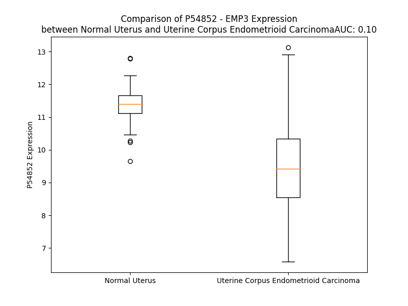

# Detailed Data for P54852

## Introduction to the Detailed Summary

### How to Interpret the Results

- **Summary & Metrics**: This section provides a quick reference to essential protein attributes, including expression changes, family classification, and biomarker applications. Regulation status (upregulated/downregulated) indicates the protein's behavior in a disease context. Some information comes from the original excel file with the proteins selected from literature, while others are derived from the analyses.
- **Expression Comparison**: A visual representation comparing protein expression between normal and disease states. It highlights significant changes in expression levels that might indicate diagnostic or therapeutic relevance. This is data coming from transcriptomics experiments and could not translate similarly to protein levels.
- **Isoform Alignment**: An interactive view of isoform alignments, revealing structural and functional differences between variants of the protein.
- **Interactors & Homologs**: Tables listing known interaction partners and homologous proteins, the more interactors and homologs, the more complex the protein is to design an antibody for.
- **Biological Assemblies**: Information about the structural arrangement of the protein in different assemblies, providing insights into its functional state but also the complexity of the protein to develop antibodies.
- **Combined Per-Residue Information**: A detailed table summarizing residue-level data. This includes predictions for epitope regions, aggregation tendencies, and modifications that might impact the protein's function. Each row corresponds to a residue in the protein, providing insights into specific sites that may be important for research or drug development.
## Summary & Metrics

- **UniProt Accession**: P54852
- **Gene Name**: EMP3
- **Protein Name**: epithelial membrane protein 3
- **Swiss Prot**: EMP3_HUMAN
- **Family**: other
- **Biomarker Application**: diagnosis
- **Number of Isoforms**: 0
- **Regulation**: 1
- **(transcriptomics) AUC**: 0.1
- **(transcriptomics) Fold Change**: 1.20
- **(transcriptomics) Regulation**: Downregulated
- **Discotope Epitope Count**: 38
- **Max n_uniprots (Homo)**: N/A
- **Max n_uniprots (Hetero)**: N/A

## Expression Comparison

## Interactors

| preferredName_A   | preferredName_B   | score   |
|-------------------|-------------------|---------|

## Homologs

| uniprot_id   | gene_id   |
|:-------------|:----------|
| A0A6Q8PFS0   | PMP22     |
| P54851       | EMP2      |
| P54849       | EMP1      |
| A8MUP6       | GSG1L2    |
| M0QXT6       | NKG7      |
| A0A494C0G6   | GSG1      |
| Q6UXU4       | GSG1L     |
| P55344       | LIM2      |
| Q8NHS1       | CLDND2    |
| H3BUG9       | TMEM202   |

## Combined Per-Residue Information

|   res | aa   |   epitope_score | epitope   |   relative_surface_accessibility |   modeling_confidence |   Aggregation | modification   | glycosylation                   |
|------:|:-----|----------------:|:----------|---------------------------------:|----------------------:|--------------:|:---------------|:--------------------------------|
|     1 | M    |         0.14482 | False     |                          1.01188 |                 63.37 |         0     | N/A            | N/A                             |
|     2 | S    |         0.25627 | False     |                          0.49144 |                 78.37 |         0.362 | N/A            | N/A                             |
|     3 | L    |         0.22235 | False     |                          0.82208 |                 86.8  |        13.112 | N/A            | N/A                             |
|     4 | L    |         0.27227 | False     |                          0.57354 |                 88.13 |        69.245 | N/A            | N/A                             |
|     5 | L    |         0.23377 | False     |                          0.20184 |                 87.94 |        87.472 | N/A            | N/A                             |
|     6 | L    |         0.23885 | False     |                          0.72096 |                 90.27 |        91.123 | N/A            | N/A                             |
|     7 | V    |         0.10729 | False     |                          0.58449 |                 93.87 |        94.142 | N/A            | N/A                             |
|     8 | V    |         0.03572 | False     |                          0.0219  |                 93.85 |        94.399 | N/A            | N/A                             |
|     9 | S    |         0.17152 | False     |                          0.15198 |                 93.35 |        94.42  | N/A            | N/A                             |
|    10 | A    |         0.07957 | False     |                          0.52602 |                 96.16 |        94.596 | N/A            | N/A                             |
|    11 | L    |         0.06732 | False     |                          0.20822 |                 97.35 |        94.804 | N/A            | N/A                             |
|    12 | H    |         0.00369 | False     |                          0       |                 97.91 |        94.842 | N/A            | N/A                             |
|    13 | I    |         0.11865 | False     |                          0.47438 |                 97.96 |        99.479 | N/A            | N/A                             |
|    14 | L    |         0.06352 | False     |                          0.50486 |                 98.27 |        99.904 | N/A            | N/A                             |
|    15 | I    |         0.00554 | False     |                          0       |                 98.46 |        99.99  | N/A            | N/A                             |
|    16 | L    |         0.10035 | False     |                          0.13025 |                 97.97 |        99.997 | N/A            | N/A                             |
|    17 | I    |         0.079   | False     |                          0.56478 |                 98.16 |        99.993 | N/A            | N/A                             |
|    18 | L    |         0.08932 | False     |                          0.13272 |                 98.02 |        99.937 | N/A            | N/A                             |
|    19 | L    |         0.00551 | False     |                          0.00082 |                 98.3  |        99.629 | N/A            | N/A                             |
|    20 | F    |         0.1144  | False     |                          0.47102 |                 97.19 |        97.948 | N/A            | N/A                             |
|    21 | V    |         0.13926 | False     |                          0.37131 |                 97.19 |        80.968 | N/A            | N/A                             |
|    22 | A    |         0.00276 | False     |                          0       |                 97.06 |        17.59  | N/A            | N/A                             |
|    23 | T    |         0.02825 | False     |                          0.01163 |                 96.02 |         7.406 | N/A            | N/A                             |
|    24 | L    |         0.25467 | False     |                          0.71427 |                 93.51 |         6.885 | N/A            | N/A                             |
|    25 | D    |         0.2281  | False     |                          0.29902 |                 91.69 |         0.012 | N/A            | N/A                             |
|    26 | K    |         0.29111 | False     |                          0.64662 |                 82.8  |         0.012 | N/A            | N/A                             |
|    27 | S    |         0.25379 | False     |                          0.05904 |                 90.15 |         0.01  | N/A            | N/A                             |
|    28 | W    |         0.04441 | False     |                          0.00472 |                 93.91 |         0.009 | N/A            | N/A                             |
|    29 | W    |         0.40825 | True      |                          0.12571 |                 92.53 |         0.008 | N/A            | N/A                             |
|    30 | T    |         0.38728 | True      |                          0.27768 |                 91.12 |         0.003 | N/A            | N/A                             |
|    31 | L    |         0.32046 | False     |                          0.05832 |                 86.82 |         0     | N/A            | N/A                             |
|    32 | P    |         0.58461 | True      |                          0.69161 |                 82.53 |         0     | N/A            | N/A                             |
|    33 | G    |         0.66196 | True      |                          0.74584 |                 76.37 |         0     | N/A            | N/A                             |
|    34 | K    |         0.49288 | True      |                          0.9183  |                 70.01 |         0     | N/A            | N/A                             |
|    35 | E    |         0.45675 | True      |                          0.20686 |                 81.13 |         0     | N/A            | N/A                             |
|    36 | S    |         0.48075 | True      |                          0.30355 |                 85.27 |         0.235 | N/A            | N/A                             |
|    37 | L    |         0.3383  | False     |                          0.05606 |                 87.67 |         0.494 | N/A            | N/A                             |
|    38 | N    |         0.25917 | False     |                          0.1234  |                 89.76 |         0.494 | N/A            | N/A                             |
|    39 | L    |         0.02377 | False     |                          0.00542 |                 93    |         0.494 | N/A            | N/A                             |
|    40 | W    |         0.20823 | False     |                          0.32238 |                 93.39 |         0.494 | N/A            | N/A                             |
|    41 | Y    |         0.42792 | True      |                          0.55646 |                 88.11 |         0.494 | N/A            | N/A                             |
|    42 | D    |         0.31915 | False     |                          0.14666 |                 83.09 |         0     | N/A            | N/A                             |
|    43 | C    |         0.43237 | True      |                          0.24985 |                 83.42 |         0     | N/A            | N/A                             |
|    44 | T    |         0.52619 | True      |                          0.33961 |                 79.62 |         0     | N/A            | N/A                             |
|    45 | W    |         0.60776 | True      |                          0.47257 |                 81.98 |         0     | N/A            | N/A                             |
|    46 | N    |         0.3666  | True      |                          0.34543 |                 80.43 |         0     | N/A            | N/A                             |
|    47 | N    |         0.55909 | True      |                          0.75016 |                 81.27 |         0     | N/A            | N-linked (GlcNAc...) asparagine |
|    48 | D    |         0.48534 | True      |                          0.84958 |                 85.17 |         0     | N/A            | N/A                             |
|    49 | T    |         0.52302 | True      |                          0.58874 |                 85.97 |         0     | N/A            | N/A                             |
|    50 | K    |         0.47954 | True      |                          0.77375 |                 83.37 |         0     | N/A            | N/A                             |
|    51 | T    |         0.4644  | True      |                          0.51449 |                 86.31 |         0     | N/A            | N/A                             |
|    52 | W    |         0.63556 | True      |                          0.66315 |                 82.03 |         0     | N/A            | N/A                             |
|    53 | A    |         0.42045 | True      |                          0.48499 |                 82.83 |         0     | N/A            | N/A                             |
|    54 | C    |         0.41198 | True      |                          0.60105 |                 84.4  |         0     | N/A            | N/A                             |
|    55 | S    |         0.45742 | True      |                          0.51929 |                 84.01 |         0     | N/A            | N/A                             |
|    56 | N    |         0.28522 | False     |                          0.76809 |                 83.94 |         0     | N/A            | N-linked (GlcNAc...) asparagine |
|    57 | V    |         0.28775 | False     |                          0.14079 |                 84.43 |         0     | N/A            | N/A                             |
|    58 | S    |         0.15424 | False     |                          0.14532 |                 77.68 |         0     | N/A            | N/A                             |
|    59 | E    |         0.26421 | False     |                          0.82442 |                 83.03 |         0     | N/A            | N/A                             |
|    60 | N    |         0.33403 | False     |                          0.20221 |                 90.1  |         0     | N/A            | N/A                             |
|    61 | G    |         0.33699 | False     |                          0.65304 |                 94.21 |         0     | N/A            | N/A                             |
|    62 | W    |         0.48184 | True      |                          0.45662 |                 96.14 |         0     | N/A            | N/A                             |
|    63 | L    |         0.04957 | False     |                          0.01566 |                 94.72 |         0     | N/A            | N/A                             |
|    64 | K    |         0.33205 | False     |                          0.46423 |                 95.79 |         0     | N/A            | N/A                             |
|    65 | A    |         0.11612 | False     |                          0.32984 |                 97.26 |         0.083 | N/A            | N/A                             |
|    66 | V    |         0.00543 | False     |                          0       |                 97.32 |         0.499 | N/A            | N/A                             |
|    67 | Q    |         0.11365 | False     |                          0.05942 |                 96.8  |         1.495 | N/A            | N/A                             |
|    68 | V    |         0.156   | False     |                          0.70255 |                 97.79 |        53.206 | N/A            | N/A                             |
|    69 | L    |         0.10085 | False     |                          0.19867 |                 98.34 |        84.975 | N/A            | N/A                             |
|    70 | M    |         0.00397 | False     |                          0       |                 98.03 |        90.986 | N/A            | N/A                             |
|    71 | V    |         0.11966 | False     |                          0.39511 |                 98.14 |        97.183 | N/A            | N/A                             |
|    72 | L    |         0.0881  | False     |                          0.468   |                 98.44 |        97.982 | N/A            | N/A                             |
|    73 | S    |         0.00242 | False     |                          0       |                 98.51 |        98.136 | N/A            | N/A                             |
|    74 | L    |         0.09199 | False     |                          0.10044 |                 98.1  |        99.438 | N/A            | N/A                             |
|    75 | I    |         0.11136 | False     |                          0.53497 |                 98.33 |        99.674 | N/A            | N/A                             |
|    76 | L    |         0.08955 | False     |                          0.20362 |                 98.46 |        99.67  | N/A            | N/A                             |
|    77 | C    |         0.0036  | False     |                          0       |                 98.46 |        99.534 | N/A            | N/A                             |
|    78 | C    |         0.08968 | False     |                          0.31145 |                 98.13 |        99.526 | N/A            | N/A                             |
|    79 | L    |         0.08683 | False     |                          0.50863 |                 97.89 |        99.615 | N/A            | N/A                             |
|    80 | S    |         0.00479 | False     |                          0       |                 97.75 |        99.602 | N/A            | N/A                             |
|    81 | F    |         0.20356 | False     |                          0.26116 |                 97.12 |        99.748 | N/A            | N/A                             |
|    82 | I    |         0.09079 | False     |                          0.63451 |                 96.63 |        99.713 | N/A            | N/A                             |
|    83 | L    |         0.10294 | False     |                          0.36766 |                 95.84 |        99.209 | N/A            | N/A                             |
|    84 | F    |         0.00697 | False     |                          0       |                 94.9  |        96.721 | N/A            | N/A                             |
|    85 | M    |         0.11722 | False     |                          0.30177 |                 92.86 |        70.081 | N/A            | N/A                             |
|    86 | F    |         0.20279 | False     |                          0.63245 |                 93.35 |        40.703 | N/A            | N/A                             |
|    87 | Q    |         0.22908 | False     |                          0.13331 |                 92.1  |         2.694 | N/A            | N/A                             |
|    88 | L    |         0.15513 | False     |                          0.13738 |                 89.78 |         2.282 | N/A            | N/A                             |
|    89 | Y    |         0.30866 | False     |                          0.81949 |                 88.39 |         1.091 | N/A            | N/A                             |
|    90 | T    |         0.22689 | False     |                          0.6169  |                 88.97 |         0.194 | N/A            | N/A                             |
|    91 | M    |         0.28381 | False     |                          0.18549 |                 85.14 |         0.054 | N/A            | N/A                             |
|    92 | R    |         0.34557 | False     |                          0.85692 |                 84.83 |         0     | N/A            | N/A                             |
|    93 | R    |         0.32705 | False     |                          0.69031 |                 82.23 |         0     | N/A            | N/A                             |
|    94 | G    |         0.2196  | False     |                          0.26591 |                 82.51 |         0     | N/A            | N/A                             |
|    95 | G    |         0.35856 | True      |                          0.28009 |                 87.09 |         0.577 | N/A            | N/A                             |
|    96 | L    |         0.34021 | False     |                          0.37968 |                 90.3  |         8.595 | N/A            | N/A                             |
|    97 | F    |         0.0117  | False     |                          0.00255 |                 93.75 |         8.964 | N/A            | N/A                             |
|    98 | Y    |         0.36109 | True      |                          0.55665 |                 93.35 |         8.964 | N/A            | N/A                             |
|    99 | A    |         0.09116 | False     |                          0.42168 |                 94.24 |         8.964 | N/A            | N/A                             |
|   100 | T    |         0.0093  | False     |                          0       |                 96.46 |         8.647 | N/A            | N/A                             |
|   101 | G    |         0.0044  | False     |                          0       |                 96.83 |         2.978 | N/A            | N/A                             |
|   102 | L    |         0.05934 | False     |                          0.67515 |                 97.36 |         2.582 | N/A            | N/A                             |
|   103 | C    |         0.04858 | False     |                          0.17999 |                 97.77 |         0.207 | N/A            | N/A                             |
|   104 | Q    |         0.00277 | False     |                          0       |                 97.93 |         0.339 | N/A            | N/A                             |
|   105 | L    |         0.05975 | False     |                          0.26778 |                 98.11 |         5.697 | N/A            | N/A                             |
|   106 | C    |         0.0507  | False     |                          0.39323 |                 98.24 |         6.744 | N/A            | N/A                             |
|   107 | T    |         0.0017  | False     |                          0       |                 98.57 |        11.309 | N/A            | N/A                             |
|   108 | S    |         0.0095  | False     |                          0.00712 |                 98.49 |        18.973 | N/A            | N/A                             |
|   109 | V    |         0.07083 | False     |                          0.66455 |                 98.5  |        84.896 | N/A            | N/A                             |
|   110 | A    |         0.02929 | False     |                          0.05321 |                 98.52 |        90.464 | N/A            | N/A                             |
|   111 | V    |         0.00566 | False     |                          0.00095 |                 98.49 |        97.045 | N/A            | N/A                             |
|   112 | F    |         0.14129 | False     |                          0.35367 |                 98.5  |        97.595 | N/A            | N/A                             |
|   113 | T    |         0.05429 | False     |                          0.33086 |                 98.45 |        97.441 | N/A            | N/A                             |
|   114 | G    |         0.00635 | False     |                          0       |                 98.2  |        97.027 | N/A            | N/A                             |
|   115 | A    |         0.00864 | False     |                          0.00383 |                 97.77 |        97.737 | N/A            | N/A                             |
|   116 | L    |         0.11779 | False     |                          0.40146 |                 98.03 |        98.519 | N/A            | N/A                             |
|   117 | I    |         0.19201 | False     |                          0.19119 |                 97.81 |        98.298 | N/A            | N/A                             |
|   118 | Y    |         0.11893 | False     |                          0.02551 |                 96.2  |        95.865 | N/A            | N/A                             |
|   119 | A    |         0.40312 | True      |                          0.32683 |                 95.98 |        87.465 | N/A            | N/A                             |
|   120 | I    |         0.31956 | False     |                          0.68297 |                 96.93 |        80.3   | N/A            | N/A                             |
|   121 | H    |         0.36657 | True      |                          0.17975 |                 95.32 |         1.34  | N/A            | N/A                             |
|   122 | A    |         0.22573 | False     |                          0.07525 |                 92.37 |         0.311 | N/A            | N/A                             |
|   123 | E    |         0.53717 | True      |                          0.80496 |                 90.76 |         0     | N/A            | N/A                             |
|   124 | E    |         0.49341 | True      |                          0.44444 |                 90.72 |         0     | N/A            | N/A                             |
|   125 | I    |         0.24966 | False     |                          0.04351 |                 90.44 |         0     | N/A            | N/A                             |
|   126 | L    |         0.38884 | True      |                          0.1315  |                 88.68 |         0     | N/A            | N/A                             |
|   127 | E    |         0.51704 | True      |                          0.76514 |                 86.45 |         0     | N/A            | N/A                             |
|   128 | K    |         0.68062 | True      |                          0.82363 |                 82.63 |         0     | N/A            | N/A                             |
|   129 | H    |         0.38817 | True      |                          0.12894 |                 82.66 |         0     | N/A            | N/A                             |
|   130 | P    |         0.54558 | True      |                          0.67741 |                 78.82 |         0     | N/A            | N/A                             |
|   131 | R    |         0.52342 | True      |                          0.97096 |                 79.81 |         0     | N/A            | N/A                             |
|   132 | G    |         0.60473 | True      |                          0.54611 |                 84.2  |         0.012 | N/A            | N/A                             |
|   133 | G    |         0.5353  | True      |                          0.46695 |                 87.88 |         0.152 | N/A            | N/A                             |
|   134 | S    |         0.50558 | True      |                          0.48897 |                 92.27 |         4.507 | N/A            | N/A                             |
|   135 | F    |         0.43924 | True      |                          0.45594 |                 93.91 |        39.655 | N/A            | N/A                             |
|   136 | G    |         0.13833 | False     |                          0.07044 |                 94.29 |        42.518 | N/A            | N/A                             |
|   137 | Y    |         0.29217 | False     |                          0.49059 |                 94.89 |        74.327 | N/A            | N/A                             |
|   138 | C    |         0.00761 | False     |                          0       |                 96.57 |        83.527 | N/A            | N/A                             |
|   139 | F    |         0.20035 | False     |                          0.09809 |                 96.47 |        93.14  | N/A            | N/A                             |
|   140 | A    |         0.10085 | False     |                          0.48407 |                 96.71 |        93.879 | N/A            | N/A                             |
|   141 | L    |         0.10402 | False     |                          0.26368 |                 97.59 |        94.327 | N/A            | N/A                             |
|   142 | A    |         0.00322 | False     |                          0       |                 98.01 |        94.139 | N/A            | N/A                             |
|   143 | W    |         0.12487 | False     |                          0.36724 |                 97.6  |        93.956 | N/A            | N/A                             |
|   144 | V    |         0.04636 | False     |                          0.51793 |                 98.1  |        90.047 | N/A            | N/A                             |
|   145 | A    |         0.00234 | False     |                          0       |                 98.26 |        43.639 | N/A            | N/A                             |
|   146 | F    |         0.21551 | False     |                          0.21985 |                 97.99 |         4.155 | N/A            | N/A                             |
|   147 | P    |         0.062   | False     |                          0.42002 |                 98.09 |         2.172 | N/A            | N/A                             |
|   148 | L    |         0.09752 | False     |                          0.30336 |                 98.24 |        57.99  | N/A            | N/A                             |
|   149 | A    |         0.00173 | False     |                          0       |                 98.41 |        69.074 | N/A            | N/A                             |
|   150 | L    |         0.05729 | False     |                          0.38497 |                 98.29 |        82.731 | N/A            | N/A                             |
|   151 | V    |         0.02423 | False     |                          0.53316 |                 97.92 |        85.226 | N/A            | N/A                             |
|   152 | S    |         0.00374 | False     |                          0       |                 97.48 |        85.421 | N/A            | N/A                             |
|   153 | G    |         0.00309 | False     |                          0       |                 97.39 |        86.828 | N/A            | N/A                             |
|   154 | I    |         0.0645  | False     |                          0.50078 |                 97.24 |        87.181 | N/A            | N/A                             |
|   155 | I    |         0.17578 | False     |                          0.35372 |                 95.29 |        87.029 | N/A            | N/A                             |
|   156 | Y    |         0.00566 | False     |                          0       |                 95.14 |        85.053 | N/A            | N/A                             |
|   157 | I    |         0.11798 | False     |                          0.26291 |                 94.44 |        78.221 | N/A            | N/A                             |
|   158 | H    |         0.18478 | False     |                          0.75707 |                 92.27 |         2.048 | N/A            | N/A                             |
|   159 | L    |         0.12675 | False     |                          0.09374 |                 89.79 |         1.373 | N/A            | N/A                             |
|   160 | R    |         0.16061 | False     |                          0.61773 |                 87.39 |         0     | N/A            | N/A                             |
|   161 | K    |         0.24719 | False     |                          0.20034 |                 80.14 |         0     | N/A            | N/A                             |
|   162 | R    |         0.18193 | False     |                          0.85975 |                 76.91 |         0     | N/A            | N/A                             |
|   163 | E    |         0.2214  | False     |                          1.02051 |                 59.57 |         0     | N/A            | N/A                             |

