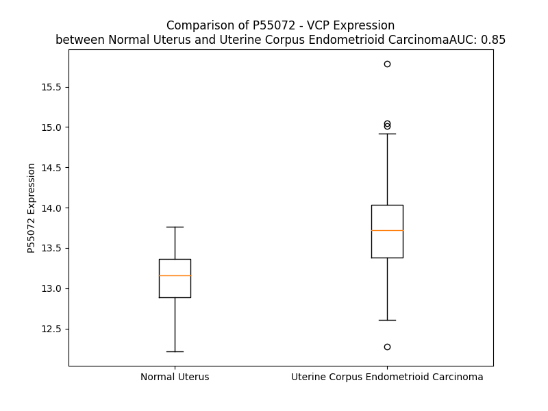

# Detailed Data for P55072

## Introduction to the Detailed Summary

### How to Interpret the Results

- **Summary & Metrics**: This section provides a quick reference to essential protein attributes, including expression changes, family classification, and biomarker applications. Regulation status (upregulated/downregulated) indicates the protein's behavior in a disease context. Some information comes from the original excel file with the proteins selected from literature, while others are derived from the analyses.
- **Expression Comparison**: A visual representation comparing protein expression between normal and disease states. It highlights significant changes in expression levels that might indicate diagnostic or therapeutic relevance. This is data coming from transcriptomics experiments and could not translate similarly to protein levels.
- **Isoform Alignment**: An interactive view of isoform alignments, revealing structural and functional differences between variants of the protein.
- **Interactors & Homologs**: Tables listing known interaction partners and homologous proteins, the more interactors and homologs, the more complex the protein is to design an antibody for.
- **Biological Assemblies**: Information about the structural arrangement of the protein in different assemblies, providing insights into its functional state but also the complexity of the protein to develop antibodies.
- **Combined Per-Residue Information**: A detailed table summarizing residue-level data. This includes predictions for epitope regions, aggregation tendencies, and modifications that might impact the protein's function. Each row corresponds to a residue in the protein, providing insights into specific sites that may be important for research or drug development.
## Summary & Metrics

- **UniProt Accession**: P55072
- **Gene Name**: VCP
- **Protein Name**: valosin containing protein
- **Swiss Prot**: TERA_HUMAN
- **Family**: enzyme
- **Biomarker Application**:  
- **Number of Isoforms**: 0
- **Regulation**: 1
- **(transcriptomics) AUC**: 0.87
- **(transcriptomics) Fold Change**: 1.04
- **(transcriptomics) Regulation**: Upregulated
- **Discotope Epitope Count**: 186
- **Max n_uniprots (Homo)**: 10.0
- **Max n_uniprots (Hetero)**: 10.0

## Expression Comparison

## Interactors

| preferredName_A   | preferredName_B   |   score |
|:------------------|:------------------|--------:|
| VCP               | ATXN3             |   0.999 |
| VCP               | VCPIP1            |   0.999 |
| VCP               | SELENOS           |   0.999 |
| VCP               | FAF1              |   0.999 |
| VCP               | DERL1             |   0.999 |
| VCP               | FAF2              |   0.999 |
| VCP               | NPLOC4            |   0.999 |
| VCP               | UFD1              |   0.999 |
| VCP               | UBXN6             |   0.999 |
| VCP               | UBXN1             |   0.999 |
| VCP               | UBXN4             |   0.999 |
| VCP               | UBXN2A            |   0.999 |
| VCP               | AMFR              |   0.999 |
| VCP               | NSFL1C            |   0.999 |
| VCP               | UBXN7             |   0.999 |
| VCP               | ASPSCR1           |   0.998 |
| VCP               | IFT74             |   0.998 |
| VCP               | UBE4B             |   0.998 |
| VCP               | UBXN2B            |   0.998 |
| VCP               | YOD1              |   0.998 |
| VCP               | SYVN1             |   0.998 |
| VCP               | VCPKMT            |   0.998 |
| VCP               | SVIP              |   0.997 |
| VCP               | IFT88             |   0.997 |
| VCP               | TTC26             |   0.996 |
| VCP               | UBXN10            |   0.996 |
| VCP               | HDAC6             |   0.995 |
| VCP               | DERL2             |   0.994 |
| VCP               | PLAA              |   0.992 |
| VCP               | SEL1L             |   0.992 |
| VCP               | UBXN8             |   0.991 |
| VCP               | ANKZF1            |   0.99  |
| VCP               | OS9               |   0.987 |
| VCP               | UBE4A             |   0.978 |
| VCP               | SPRTN             |   0.976 |
| VCP               | UBC               |   0.975 |
| VCP               | NGLY1             |   0.972 |
| VCP               | RHBDD1            |   0.968 |
| VCP               | CANX              |   0.967 |
| VCP               | TARDBP            |   0.964 |
| VCP               | ATXN3L            |   0.956 |
| VCP               | ZFAND1            |   0.946 |
| VCP               | HSPA5             |   0.944 |
| VCP               | AUP1              |   0.943 |
| VCP               | UBQLN2            |   0.938 |
| VCP               | CFTR              |   0.938 |
| VCP               | UBQLN1            |   0.936 |
| VCP               | HSP90AA1          |   0.933 |
| VCP               | PSMD4             |   0.931 |
| VCP               | DERL3             |   0.93  |

## Homologs

| uniprot_id   | gene_id   |
|:-------------|:----------|
| A0A0C4DG33   | PEX1      |
| Q9BVQ7       | AFG2B     |
| F8WF01       | NVL       |
| A0A6Q8PGU6   | AFG2A     |
| Q13608       | PEX6      |

## Biological Assemblies

|   Unnamed: 0 |   assembly |   n_uniprots | composition   | crystal_id   |
|-------------:|-----------:|-------------:|:--------------|:-------------|
|            0 |          1 |           10 | Homo          | 7rlj         |
|            0 |          1 |            2 | Homo          | 4ko8         |
|            0 |          1 |           10 | Hetero        | 7y59         |
|            0 |          1 |            6 | Homo          | 7r7u         |
|            0 |          1 |            1 | Homo          | 4kdl         |
|            1 |          2 |            1 | Homo          | 4kdl         |
|            2 |          3 |            2 | Hetero        | 4kdl         |
|            0 |          1 |            6 | Homo          | 7ln4         |
|            0 |          1 |            6 | Homo          | 7bpb         |
|            0 |          1 |            8 | Hetero        | 8fco         |
|            0 |          1 |            2 | Hetero        | 4p0a         |
|            1 |          2 |            2 | Hetero        | 4p0a         |
|            0 |          1 |            6 | Homo          | 3hu2         |
|            0 |          1 |            6 | Homo          | 7rla         |
|            0 |          1 |            2 | Hetero        | 8hl7         |
|            0 |          1 |           10 | Homo          | 7k57         |
|            0 |          1 |            7 | Hetero        | 8fcl         |
|            0 |          1 |            6 | Homo          | 5ftl         |
|            0 |          1 |            6 | Homo          | 7ln2         |
|            0 |          1 |            6 | Homo          | 7vcv         |
|            0 |          1 |            2 | Homo          | 3hu3         |
|            0 |          1 |            1 | Homo          | 6g30         |
|            0 |          1 |            7 | Hetero        | 8fct         |
|            0 |          1 |            6 | Homo          | 8ooi         |
|            0 |          1 |            6 | Homo          | 7bp8         |
|            0 |          1 |            1 | Homo          | 6g2y         |
|            0 |          1 |            6 | Homo          | 7ln5         |
|            0 |          1 |            3 | Hetero        | 7oat         |
|            0 |          1 |            6 | Homo          | 7mdm         |
|            0 |          1 |           10 | Homo          | 7rli         |
|            0 |          1 |            4 | Hetero        | 3ebb         |
|            1 |          2 |            4 | Hetero        | 3ebb         |
|            0 |          1 |            2 | Hetero        | 5epp         |
|            0 |          1 |            6 | Homo          | 7vct         |
|            0 |          1 |            1 | Homo          | 3qq7         |
|            0 |          1 |            9 | Hetero        | 8b5r         |
|            0 |          1 |            2 | Hetero        | 3qc8         |
|            0 |          1 |           10 | Hetero        | 7y53         |
|            0 |          1 |            4 | Hetero        | 5ifs         |
|            0 |          1 |            6 | Homo          | 7rlc         |
|            0 |          1 |            6 | Homo          | 5c18         |
|            0 |          1 |            6 | Homo          | 7rl6         |
|            0 |          1 |           10 | Homo          | 6mck         |
|            0 |          1 |           10 | Hetero        | 7y4w         |
|            0 |          1 |           10 | Hetero        | 8fcn         |
|            0 |          1 |           10 | Homo          | 7vcu         |
|            0 |          1 |            6 | Homo          | 7rlg         |
|            0 |          1 |            2 | Hetero        | 5x4l         |
|            1 |          2 |            2 | Hetero        | 5x4l         |
|            0 |          1 |           10 | Homo          | 8hrz         |
|            0 |          1 |            6 | Homo          | 7vcx         |
|            0 |          1 |           10 | Homo          | 7vcs         |
|            0 |          1 |           10 | Hetero        | 6hd0         |
|            0 |          1 |            6 | Homo          | 4kod         |
|            1 |          2 |            6 | Homo          | 4kod         |
|            0 |          1 |            6 | Homo          | 7k59         |
|            0 |          1 |            2 | Hetero        | 4kdi         |
|            1 |          2 |            2 | Hetero        | 4kdi         |
|            0 |          1 |            8 | Hetero        | 5c1b         |
|            0 |          1 |            6 | Homo          | 5c19         |
|            0 |          1 |            2 | Hetero        | 5b6c         |
|            0 |          1 |            6 | Homo          | 3hu1         |
|            0 |          1 |            6 | Homo          | 7ln1         |
|            0 |          1 |            2 | Hetero        | 5glf         |
|            1 |          2 |            2 | Hetero        | 5glf         |
|            2 |          3 |            2 | Hetero        | 5glf         |
|            3 |          4 |            2 | Hetero        | 5glf         |
|            0 |          1 |            6 | Homo          | 5ftm         |
|            0 |          1 |            6 | Homo          | 5dyi         |
|            1 |          2 |            6 | Homo          | 5dyi         |
|            0 |          1 |            1 | Homo          | 6g2v         |
|            0 |          1 |            6 | Homo          | 7bp9         |
|            0 |          1 |           10 | Homo          | 7l5w         |
|            0 |          1 |            6 | Homo          | 7rld         |
|            0 |          1 |            6 | Homo          | 7lmz         |
|            0 |          1 |            8 | Hetero        | 7r7s         |
|            0 |          1 |            7 | Hetero        | 8fcm         |
|            0 |          1 |            6 | Homo          | 5ftj         |
|            0 |          1 |           10 | Homo          | 7k56         |
|            0 |          1 |            6 | Homo          | 8rsb         |
|            0 |          1 |            4 | Hetero        | 5kiw         |
|            0 |          1 |            6 | Homo          | 7mdo         |
|            0 |          1 |            2 | Hetero        | 5ifw         |
|            0 |          1 |            6 | Homo          | 7ln0         |
|            0 |          1 |            1 | Homo          | 6g2w         |
|            0 |          1 |            1 | Homo          | 6g2x         |
|            0 |          1 |            1 | Homo          | 7pux         |
|            0 |          1 |            6 | Homo          | 7rl9         |
|            0 |          1 |            6 | Homo          | 8rs9         |
|            0 |          1 |            6 | Homo          | 7jy5         |
|            0 |          1 |            6 | Homo          | 7rlf         |
|            0 |          1 |            6 | Homo          | 7rl7         |
|            0 |          1 |            5 | Homo          | 7mhs         |
|            0 |          1 |            6 | Homo          | 5ftk         |
|            0 |          1 |            6 | Homo          | 7ln3         |
|            0 |          1 |            6 | Homo          | 7bpa         |
|            0 |          1 |            7 | Hetero        | 7r7t         |
|            0 |          1 |            6 | Homo          | 7ln6         |
|            0 |          1 |            2 | Hetero        | 3tiw         |
|            1 |          2 |            2 | Hetero        | 3tiw         |
|            0 |          1 |           10 | Homo          | 7l5x         |
|            0 |          1 |           10 | Hetero        | 8kg2         |
|            0 |          1 |            2 | Hetero        | 3qq8         |
|            0 |          1 |            7 | Hetero        | 8fcr         |
|            0 |          1 |            6 | Homo          | 4kln         |
|            0 |          1 |            1 | Homo          | 5dyg         |
|            0 |          1 |            6 | Homo          | 7rlb         |
|            0 |          1 |            8 | Hetero        | 8fcp         |
|            0 |          1 |            6 | Homo          | 8r0e         |
|            0 |          1 |            6 | Homo          | 8rsc         |
|            0 |          1 |            6 | Homo          | 7lmy         |
|            0 |          1 |            2 | Hetero        | 3qwz         |
|            1 |          2 |            2 | Hetero        | 3qwz         |
|            0 |          1 |            6 | Homo          | 5ftn         |
|            0 |          1 |            6 | Homo          | 8pqx         |
|            0 |          1 |            1 | Homo          | 6g2z         |
|            0 |          1 |            7 | Hetero        | 8fcq         |
|            0 |          1 |            2 | Hetero        | 5kiy         |
|            0 |          1 |            6 | Homo          | 7rlh         |

## Combined Per-Residue Information

|   res | aa   |   epitope_score | epitope   |   relative_surface_accessibility |   modeling_confidence |   Aggregation | modification                        |
|------:|:-----|----------------:|:----------|---------------------------------:|----------------------:|--------------:|:------------------------------------|
|     1 | M    |         0.13246 | True      |                          1.35637 |                 38.21 |         0     | N/A                                 |
|     2 | A    |         0.13563 | True      |                          0.9425  |                 38.38 |         0     | N-acetylalanine                     |
|     3 | S    |         0.18667 | True      |                          0.88858 |                 38.56 |         0     | Phosphoserine                       |
|     4 | G    |         0.19099 | True      |                          0.97183 |                 36.24 |         0     | N/A                                 |
|     5 | A    |         0.15197 | True      |                          0.96152 |                 42.2  |         0     | N/A                                 |
|     6 | D    |         0.2286  | True      |                          0.75864 |                 40.78 |         0     | N/A                                 |
|     7 | S    |         0.15191 | True      |                          0.94208 |                 39.71 |         0     | Phosphoserine                       |
|     8 | K    |         0.15291 | True      |                          0.87473 |                 46.8  |         0     | N/A                                 |
|     9 | G    |         0.18453 | True      |                          0.96728 |                 43.41 |         0     | N/A                                 |
|    10 | D    |         0.11779 | True      |                          0.65273 |                 49.86 |         0     | N/A                                 |
|    11 | D    |         0.13894 | True      |                          0.56402 |                 52.51 |         0     | N/A                                 |
|    12 | L    |         0.16321 | True      |                          0.97673 |                 60.68 |         1.186 | N/A                                 |
|    13 | S    |         0.13904 | True      |                          0.70427 |                 55.36 |         1.69  | Phosphoserine                       |
|    14 | T    |         0.09556 | False     |                          0.39359 |                 53.38 |         1.69  | N/A                                 |
|    15 | A    |         0.10843 | True      |                          0.51597 |                 49.47 |         1.69  | N/A                                 |
|    16 | I    |         0.17184 | True      |                          0.98791 |                 48.77 |         1.69  | N/A                                 |
|    17 | L    |         0.13769 | True      |                          0.86799 |                 41.26 |         1.507 | N/A                                 |
|    18 | K    |         0.13526 | True      |                          0.57666 |                 45.26 |         0     | N/A                                 |
|    19 | Q    |         0.11379 | True      |                          0.82572 |                 50.57 |         0     | N/A                                 |
|    20 | K    |         0.1127  | True      |                          0.91928 |                 48.95 |         0     | N/A                                 |
|    21 | N    |         0.11224 | True      |                          0.86498 |                 65.05 |         0     | N/A                                 |
|    22 | R    |         0.14119 | True      |                          0.64646 |                 78.31 |         0     | N/A                                 |
|    23 | P    |         0.11712 | True      |                          0.48883 |                 85.49 |         0     | N/A                                 |
|    24 | N    |         0.06026 | False     |                          0.21748 |                 88.58 |         0     | N/A                                 |
|    25 | R    |         0.13248 | True      |                          0.57631 |                 92.68 |         0     | N/A                                 |
|    26 | L    |         0.00732 | False     |                          0.00577 |                 93.81 |         0     | N/A                                 |
|    27 | I    |         0.07087 | False     |                          0.36238 |                 92.91 |         0     | N/A                                 |
|    28 | V    |         0.0072  | False     |                          0.02041 |                 93.36 |         0     | N/A                                 |
|    29 | D    |         0.07936 | False     |                          0.18318 |                 90.85 |         0     | N/A                                 |
|    30 | E    |         0.0664  | False     |                          0.26681 |                 85.51 |         0     | N/A                                 |
|    31 | A    |         0.05536 | False     |                          0.32872 |                 84.72 |         0     | N/A                                 |
|    32 | I    |         0.18548 | True      |                          0.68612 |                 80.96 |         0     | N/A                                 |
|    33 | N    |         0.10011 | False     |                          0.35331 |                 80.2  |         0     | N/A                                 |
|    34 | E    |         0.12312 | True      |                          0.49405 |                 80.02 |         0     | N/A                                 |
|    35 | D    |         0.05555 | False     |                          0.25317 |                 86.75 |         0     | N/A                                 |
|    36 | N    |         0.04589 | False     |                          0.13075 |                 91.01 |         0     | N/A                                 |
|    37 | S    |         0.0274  | False     |                          0.07236 |                 90.77 |         0.263 | Phosphoserine                       |
|    38 | V    |         0.05277 | False     |                          0.10924 |                 93.04 |         0.983 | N/A                                 |
|    39 | V    |         0.00479 | False     |                          0.00476 |                 95.56 |         0.983 | N/A                                 |
|    40 | S    |         0.04681 | False     |                          0.07755 |                 95.2  |         0.983 | N/A                                 |
|    41 | L    |         0.00462 | False     |                          0       |                 95.23 |         0.983 | N/A                                 |
|    42 | S    |         0.02299 | False     |                          0.02793 |                 94.79 |         0.72  | N/A                                 |
|    43 | Q    |         0.15952 | True      |                          0.40394 |                 93.61 |         0     | N/A                                 |
|    44 | P    |         0.12908 | True      |                          0.5838  |                 93.65 |         0     | N/A                                 |
|    45 | K    |         0.10834 | True      |                          0.09932 |                 93.52 |         0     | N/A                                 |
|    46 | M    |         0.03789 | False     |                          0.01222 |                 93.66 |         0     | N/A                                 |
|    47 | D    |         0.18917 | True      |                          0.5698  |                 92.96 |         0     | N/A                                 |
|    48 | E    |         0.12644 | True      |                          0.51009 |                 93.39 |         0     | N/A                                 |
|    49 | L    |         0.0432  | False     |                          0.12629 |                 92.75 |         0     | N/A                                 |
|    50 | Q    |         0.25258 | True      |                          0.767   |                 93.14 |         0     | N/A                                 |
|    51 | L    |         0.02081 | False     |                          0.03874 |                 93.36 |         0     | N/A                                 |
|    52 | F    |         0.15305 | True      |                          0.78546 |                 92.29 |         0     | N/A                                 |
|    53 | R    |         0.1737  | True      |                          0.7384  |                 90.04 |         0     | N/A                                 |
|    54 | G    |         0.0621  | False     |                          0.50942 |                 88.93 |         0     | N/A                                 |
|    55 | D    |         0.08329 | False     |                          0.30803 |                 93.44 |         0     | N/A                                 |
|    56 | T    |         0.03528 | False     |                          0.14963 |                 94.33 |         0     | N/A                                 |
|    57 | V    |         0.00307 | False     |                          0       |                 95.61 |         0     | N/A                                 |
|    58 | L    |         0.01971 | False     |                          0.12036 |                 95.79 |         0     | N/A                                 |
|    59 | L    |         0.00459 | False     |                          0       |                 96.2  |         0     | N/A                                 |
|    60 | K    |         0.05425 | False     |                          0.34856 |                 95    |         0     | N/A                                 |
|    61 | G    |         0.02081 | False     |                          0.24486 |                 92.2  |         0     | N/A                                 |
|    62 | K    |         0.06461 | False     |                          0.45755 |                 88.75 |         0     | N/A                                 |
|    63 | K    |         0.09282 | False     |                          0.65687 |                 87.19 |         0     | N/A                                 |
|    64 | R    |         0.12548 | True      |                          0.93959 |                 87.81 |         0     | N/A                                 |
|    65 | R    |         0.09285 | False     |                          0.29677 |                 92.5  |         0     | N/A                                 |
|    66 | E    |         0.04594 | False     |                          0.20072 |                 94.42 |         0     | N/A                                 |
|    67 | A    |         0.00464 | False     |                          0.02551 |                 94.1  |        54.186 | N/A                                 |
|    68 | V    |         0.01329 | False     |                          0.03262 |                 94.87 |        59.987 | N/A                                 |
|    69 | C    |         0.00853 | False     |                          0.02058 |                 95.05 |        60.046 | N/A                                 |
|    70 | I    |         0.07033 | False     |                          0.19119 |                 94.34 |        60.046 | N/A                                 |
|    71 | V    |         0.00632 | False     |                          0       |                 94.58 |        60.046 | N/A                                 |
|    72 | L    |         0.17008 | True      |                          0.23824 |                 94.19 |        42.507 | N/A                                 |
|    73 | S    |         0.12356 | True      |                          0.32366 |                 93.15 |         1.9   | N/A                                 |
|    74 | D    |         0.07334 | False     |                          0.14433 |                 90.84 |         0     | N/A                                 |
|    75 | D    |         0.3405  | True      |                          0.83513 |                 88.31 |         0     | N/A                                 |
|    76 | T    |         0.15904 | True      |                          0.67704 |                 88.44 |         0     | N/A                                 |
|    77 | C    |         0.02374 | False     |                          0.0564  |                 89.3  |         0     | N/A                                 |
|    78 | S    |         0.13764 | True      |                          0.42216 |                 91.03 |         0     | N/A                                 |
|    79 | D    |         0.14994 | True      |                          0.43281 |                 91.72 |         0     | N/A                                 |
|    80 | E    |         0.09315 | False     |                          0.64121 |                 91.25 |         0     | N/A                                 |
|    81 | K    |         0.13596 | True      |                          0.35966 |                 92.96 |         0     | N/A                                 |
|    82 | I    |         0.00214 | False     |                          0       |                 95.31 |         0     | N/A                                 |
|    83 | R    |         0.07449 | False     |                          0.14559 |                 93.98 |         0     | N/A                                 |
|    84 | M    |         0.00946 | False     |                          0.00588 |                 93.69 |         0     | N/A                                 |
|    85 | N    |         0.02616 | False     |                          0.13211 |                 91.82 |         0     | N/A                                 |
|    86 | R    |         0.03108 | False     |                          0.10217 |                 88.9  |         0     | N/A                                 |
|    87 | V    |         0.0297  | False     |                          0.04806 |                 92.92 |         0     | N/A                                 |
|    88 | V    |         0.00476 | False     |                          0.0238  |                 94.27 |         0     | N/A                                 |
|    89 | R    |         0.02369 | False     |                          0.05595 |                 92.88 |         0     | N/A                                 |
|    90 | N    |         0.01806 | False     |                          0.15631 |                 91.63 |         0     | N/A                                 |
|    91 | N    |         0.03373 | False     |                          0.09163 |                 93.95 |         0     | N/A                                 |
|    92 | L    |         0.00182 | False     |                          0       |                 94.1  |         0     | N/A                                 |
|    93 | R    |         0.05047 | False     |                          0.18369 |                 91.33 |         0     | N/A                                 |
|    94 | V    |         0.01605 | False     |                          0.04177 |                 92.18 |         0     | N/A                                 |
|    95 | R    |         0.05784 | False     |                          0.22833 |                 88.3  |         0     | N/A                                 |
|    96 | L    |         0.04038 | False     |                          0.0796  |                 86.45 |         0     | N/A                                 |
|    97 | G    |         0.04804 | False     |                          0.30621 |                 85.25 |         0     | N/A                                 |
|    98 | D    |         0.01667 | False     |                          0.06244 |                 90.08 |         0     | N/A                                 |
|    99 | V    |         0.07899 | False     |                          0.4611  |                 91.88 |         0     | N/A                                 |
|   100 | I    |         0.02091 | False     |                          0.01381 |                 94.61 |         0     | N/A                                 |
|   101 | S    |         0.04045 | False     |                          0.19206 |                 94.58 |         0     | N/A                                 |
|   102 | I    |         0.02655 | False     |                          0.00911 |                 95.09 |         0     | N/A                                 |
|   103 | Q    |         0.06925 | False     |                          0.34191 |                 93.33 |         0     | N/A                                 |
|   104 | P    |         0.10393 | False     |                          0.5423  |                 93.63 |         0     | N/A                                 |
|   105 | C    |         0.06767 | False     |                          0.07618 |                 91.57 |         0     | N/A                                 |
|   106 | P    |         0.12433 | True      |                          0.87546 |                 84.81 |         0     | N/A                                 |
|   107 | D    |         0.12344 | True      |                          0.6883  |                 82.58 |         0     | N/A                                 |
|   108 | V    |         0.04944 | False     |                          0.11849 |                 85.09 |         0     | N/A                                 |
|   109 | K    |         0.09521 | False     |                          0.67573 |                 92.19 |         0     | N/A                                 |
|   110 | Y    |         0.08076 | False     |                          0.56935 |                 94.02 |         0     | N/A                                 |
|   111 | G    |         0.02363 | False     |                          0.02855 |                 92.61 |         0     | N/A                                 |
|   112 | K    |         0.08008 | False     |                          0.71677 |                 93.82 |         0     | N/A                                 |
|   113 | R    |         0.1482  | True      |                          0.56167 |                 93.58 |         0     | N/A                                 |
|   114 | I    |         0.00615 | False     |                          0.01394 |                 94.77 |         0     | N/A                                 |
|   115 | H    |         0.10659 | True      |                          0.29609 |                 94.54 |         0     | N/A                                 |
|   116 | V    |         0.0031  | False     |                          0.00141 |                 94.87 |         0     | N/A                                 |
|   117 | L    |         0.05062 | False     |                          0.10304 |                 94.01 |         0     | N/A                                 |
|   118 | P    |         0.02146 | False     |                          0.05368 |                 93.41 |         0     | N/A                                 |
|   119 | I    |         0.00257 | False     |                          0       |                 92.67 |         0     | N/A                                 |
|   120 | D    |         0.10897 | True      |                          0.33433 |                 90.61 |         0     | N/A                                 |
|   121 | D    |         0.06926 | False     |                          0.44883 |                 87.75 |         0     | N/A                                 |
|   122 | T    |         0.05282 | False     |                          0.01619 |                 87.85 |         0     | N/A                                 |
|   123 | V    |         0.0858  | False     |                          0.0849  |                 85.93 |         0     | N/A                                 |
|   124 | E    |         0.26814 | True      |                          0.71542 |                 80.63 |         0     | N/A                                 |
|   125 | G    |         0.1615  | True      |                          0.50317 |                 75.67 |         0     | N/A                                 |
|   126 | I    |         0.11958 | True      |                          0.14967 |                 77.32 |         0     | N/A                                 |
|   127 | T    |         0.31768 | True      |                          0.43767 |                 75.13 |         0     | N/A                                 |
|   128 | G    |         0.08011 | False     |                          0.54836 |                 76.87 |         0     | N/A                                 |
|   129 | N    |         0.11118 | True      |                          0.42787 |                 82.71 |         0     | N/A                                 |
|   130 | L    |         0.03096 | False     |                          0.20365 |                 84.91 |         0     | N/A                                 |
|   131 | F    |         0.09214 | False     |                          0.30513 |                 85.5  |         0     | N/A                                 |
|   132 | E    |         0.09036 | False     |                          0.35801 |                 84.01 |         0     | N/A                                 |
|   133 | V    |         0.0248  | False     |                          0.06218 |                 84.3  |         0     | N/A                                 |
|   134 | Y    |         0.01909 | False     |                          0.00809 |                 88.37 |         0     | N/A                                 |
|   135 | L    |         0.00335 | False     |                          0.00082 |                 91.08 |         0     | N/A                                 |
|   136 | K    |         0.07032 | False     |                          0.455   |                 87.8  |         0     | N/A                                 |
|   137 | P    |         0.08018 | False     |                          0.54174 |                 87.45 |         0     | N/A                                 |
|   138 | Y    |         0.07252 | False     |                          0.13013 |                 90.24 |         0     | N/A                                 |
|   139 | F    |         0.03882 | False     |                          0.06665 |                 92.16 |         0     | N/A                                 |
|   140 | L    |         0.17775 | True      |                          0.75401 |                 86.17 |         0     | N/A                                 |
|   141 | E    |         0.19068 | True      |                          0.73782 |                 80.88 |         0     | N/A                                 |
|   142 | A    |         0.05816 | False     |                          0.30807 |                 84.95 |         0     | N/A                                 |
|   143 | Y    |         0.06873 | False     |                          0.45632 |                 91.31 |         0     | N/A                                 |
|   144 | R    |         0.04994 | False     |                          0.12376 |                 92.93 |         0     | N/A                                 |
|   145 | P    |         0.00557 | False     |                          0.03458 |                 94.32 |         0     | N/A                                 |
|   146 | I    |         0.00909 | False     |                          0.0584  |                 94.51 |         0     | N/A                                 |
|   147 | R    |         0.0339  | False     |                          0.19199 |                 94.62 |         0     | N/A                                 |
|   148 | K    |         0.03344 | False     |                          0.39614 |                 94.46 |         0     | N/A                                 |
|   149 | G    |         0.03267 | False     |                          0.30247 |                 92.47 |         0     | N/A                                 |
|   150 | D    |         0.01308 | False     |                          0.08647 |                 94.27 |         0     | N/A                                 |
|   151 | I    |         0.02182 | False     |                          0.06177 |                 94.3  |         0     | N/A                                 |
|   152 | F    |         0.02012 | False     |                          0.04827 |                 93.92 |         0     | N/A                                 |
|   153 | L    |         0.03585 | False     |                          0.11986 |                 91.93 |         0     | N/A                                 |
|   154 | V    |         0.02036 | False     |                          0.06569 |                 90.78 |         0     | N/A                                 |
|   155 | R    |         0.07956 | False     |                          0.37006 |                 85.53 |         0     | N/A                                 |
|   156 | G    |         0.04468 | False     |                          0.16072 |                 75.55 |         0     | N/A                                 |
|   157 | G    |         0.01488 | False     |                          0.01622 |                 70.94 |         0     | N/A                                 |
|   158 | M    |         0.02775 | False     |                          0.2309  |                 73.79 |         0     | N/A                                 |
|   159 | R    |         0.18124 | True      |                          0.24452 |                 82.65 |         0     | N/A                                 |
|   160 | A    |         0.02134 | False     |                          0.11524 |                 87.04 |         6.937 | N/A                                 |
|   161 | V    |         0.00331 | False     |                          0       |                 90.63 |        15.161 | N/A                                 |
|   162 | E    |         0.00552 | False     |                          0.00309 |                 93.39 |        15.161 | N/A                                 |
|   163 | F    |         0.01036 | False     |                          0.00892 |                 94.71 |        15.161 | N/A                                 |
|   164 | K    |         0.01069 | False     |                          0.13854 |                 94.77 |        15.161 | N/A                                 |
|   165 | V    |         0.00579 | False     |                          0.00704 |                 95.23 |        15.161 | N/A                                 |
|   166 | V    |         0.04171 | False     |                          0.3942  |                 94.42 |        13.974 | N/A                                 |
|   167 | E    |         0.08789 | False     |                          0.37771 |                 94.38 |         0     | N/A                                 |
|   168 | T    |         0.01377 | False     |                          0.02654 |                 94.55 |         0     | N/A                                 |
|   169 | D    |         0.10509 | True      |                          0.24042 |                 94.49 |         0     | N/A                                 |
|   170 | P    |         0.10112 | False     |                          0.24554 |                 93.4  |         0     | N/A                                 |
|   171 | S    |         0.25728 | True      |                          0.51525 |                 90.67 |         0     | N/A                                 |
|   172 | P    |         0.09414 | False     |                          0.45628 |                 92.66 |         0     | N/A                                 |
|   173 | Y    |         0.03092 | False     |                          0.22228 |                 94.17 |         0     | N/A                                 |
|   174 | C    |         0.00269 | False     |                          0.00074 |                 94.93 |         0     | N/A                                 |
|   175 | I    |         0.04881 | False     |                          0.12879 |                 94.28 |         0     | N/A                                 |
|   176 | V    |         0.01299 | False     |                          0.02463 |                 93.72 |         0     | N/A                                 |
|   177 | A    |         0.02448 | False     |                          0.05407 |                 92    |         0     | N/A                                 |
|   178 | P    |         0.08932 | False     |                          0.78684 |                 89.59 |         0     | N/A                                 |
|   179 | D    |         0.11583 | True      |                          0.66906 |                 91.1  |         0     | N/A                                 |
|   180 | T    |         0.03768 | False     |                          0.08817 |                 92.67 |         0     | N/A                                 |
|   181 | V    |         0.18756 | True      |                          0.56458 |                 92.7  |         0     | N/A                                 |
|   182 | I    |         0.04336 | False     |                          0.18347 |                 92.62 |         0     | N/A                                 |
|   183 | H    |         0.16916 | True      |                          0.49271 |                 90.92 |         0     | N/A                                 |
|   184 | C    |         0.082   | False     |                          0.24723 |                 86.44 |         0     | N/A                                 |
|   185 | E    |         0.21393 | True      |                          0.80936 |                 78.09 |         0     | N/A                                 |
|   186 | G    |         0.12061 | True      |                          0.63418 |                 78    |         0     | N/A                                 |
|   187 | E    |         0.1799  | True      |                          0.7551  |                 85.44 |         0     | N/A                                 |
|   188 | P    |         0.07288 | False     |                          0.40326 |                 89.1  |         0     | N/A                                 |
|   189 | I    |         0.10084 | False     |                          0.22399 |                 91.63 |         0     | N/A                                 |
|   190 | K    |         0.14466 | True      |                          0.82358 |                 91.12 |         0     | N/A                                 |
|   191 | R    |         0.13767 | True      |                          0.16697 |                 88.62 |         0     | N/A                                 |
|   192 | E    |         0.08756 | False     |                          0.43024 |                 88.52 |         0     | N/A                                 |
|   193 | D    |         0.11594 | True      |                          0.99153 |                 80.13 |         0     | N/A                                 |
|   194 | E    |         0.14929 | True      |                          0.42527 |                 78.73 |         0     | N/A                                 |
|   195 | E    |         0.08643 | False     |                          0.06003 |                 80.94 |         0     | N/A                                 |
|   196 | E    |         0.05791 | False     |                          0.41093 |                 80.22 |         0     | N/A                                 |
|   197 | S    |         0.05668 | False     |                          0.18217 |                 82.24 |         0     | N/A                                 |
|   198 | L    |         0.04275 | False     |                          0.1152  |                 78.79 |         0     | N/A                                 |
|   199 | N    |         0.09174 | False     |                          0.58697 |                 77.74 |         0     | N/A                                 |
|   200 | E    |         0.07462 | False     |                          0.38433 |                 82.42 |         0     | N/A                                 |
|   201 | V    |         0.04185 | False     |                          0.24361 |                 86.55 |         0     | N/A                                 |
|   202 | G    |         0.00528 | False     |                          0       |                 85.83 |         0     | N/A                                 |
|   203 | Y    |         0.00805 | False     |                          0.02753 |                 87.75 |         0     | N/A                                 |
|   204 | D    |         0.03599 | False     |                          0.32491 |                 85.73 |         0     | N/A                                 |
|   205 | D    |         0.05481 | False     |                          0.27052 |                 88.66 |         0     | N/A                                 |
|   206 | I    |         0.03723 | False     |                          0.1352  |                 90.99 |         0     | N/A                                 |
|   207 | G    |         0.03682 | False     |                          0.13898 |                 88.97 |         0     | N/A                                 |
|   208 | G    |         0.02795 | False     |                          0.3016  |                 83.46 |         0     | N/A                                 |
|   209 | C    |         0.02951 | False     |                          0.09257 |                 83.13 |         0     | N/A                                 |
|   210 | R    |         0.13971 | True      |                          0.72231 |                 81.64 |         0     | N/A                                 |
|   211 | K    |         0.13037 | True      |                          0.82419 |                 82.29 |         0     | N/A                                 |
|   212 | Q    |         0.05556 | False     |                          0.24403 |                 86.84 |         0     | N/A                                 |
|   213 | L    |         0.01329 | False     |                          0.07502 |                 87.78 |         0     | N/A                                 |
|   214 | A    |         0.0481  | False     |                          0.44985 |                 86.22 |         0     | N/A                                 |
|   215 | Q    |         0.04641 | False     |                          0.44602 |                 87.69 |         0     | N/A                                 |
|   216 | I    |         0.00452 | False     |                          0       |                 89.79 |         0     | N/A                                 |
|   217 | K    |         0.02701 | False     |                          0.18381 |                 85.33 |         0     | N/A                                 |
|   218 | E    |         0.06892 | False     |                          0.56947 |                 83.71 |         0     | N/A                                 |
|   219 | M    |         0.0272  | False     |                          0.15289 |                 86.26 |         0     | N/A                                 |
|   220 | V    |         0.00528 | False     |                          0       |                 87    |         0     | N/A                                 |
|   221 | E    |         0.01898 | False     |                          0.18462 |                 79.77 |         0     | N/A                                 |
|   222 | L    |         0.06524 | False     |                          0.43361 |                 78.65 |         0     | N/A                                 |
|   223 | P    |         0.01757 | False     |                          0.07198 |                 81.86 |         0     | N/A                                 |
|   224 | L    |         0.02182 | False     |                          0.10757 |                 82.13 |         0     | N/A                                 |
|   225 | R    |         0.08518 | False     |                          0.26533 |                 75.41 |         0     | N/A                                 |
|   226 | H    |         0.08975 | False     |                          0.50448 |                 76.78 |         0     | N/A                                 |
|   227 | P    |         0.11762 | True      |                          0.40409 |                 75.78 |         0     | N/A                                 |
|   228 | A    |         0.19049 | True      |                          0.69568 |                 75.92 |         0     | N/A                                 |
|   229 | L    |         0.11585 | True      |                          0.48992 |                 78.89 |         0     | N/A                                 |
|   230 | F    |         0.07577 | False     |                          0.19877 |                 75.73 |         0     | N/A                                 |
|   231 | K    |         0.18794 | True      |                          0.88853 |                 76.76 |         0     | N/A                                 |
|   232 | A    |         0.16895 | True      |                          0.83802 |                 79.69 |         0     | N/A                                 |
|   233 | I    |         0.10613 | True      |                          0.66378 |                 84.6  |         0     | N/A                                 |
|   234 | G    |         0.2512  | True      |                          0.77005 |                 80.06 |         0     | N/A                                 |
|   235 | V    |         0.10107 | False     |                          0.6279  |                 81.59 |         0     | N/A                                 |
|   236 | K    |         0.08599 | False     |                          0.67823 |                 78.49 |         0     | N/A                                 |
|   237 | P    |         0.04504 | False     |                          0.27307 |                 82.15 |         0     | N/A                                 |
|   238 | P    |         0.0404  | False     |                          0.15245 |                 84.62 |         0     | N/A                                 |
|   239 | R    |         0.02968 | False     |                          0.20796 |                 85.17 |         0     | N/A                                 |
|   240 | G    |         0.01016 | False     |                          0       |                 91.74 |         2.278 | N/A                                 |
|   241 | I    |         0.00852 | False     |                          0       |                 94.33 |         2.278 | N/A                                 |
|   242 | L    |         0.01554 | False     |                          0       |                 95.36 |         2.278 | N/A                                 |
|   243 | L    |         0.01738 | False     |                          0       |                 95.06 |         2.278 | N/A                                 |
|   244 | Y    |         0.15655 | True      |                          0.22403 |                 90.62 |         2.278 | N/A                                 |
|   245 | G    |         0.03593 | False     |                          0.07251 |                 85.32 |         0     | N/A                                 |
|   246 | P    |         0.01557 | False     |                          0.08024 |                 82.19 |         0     | N/A                                 |
|   247 | P    |         0.07355 | False     |                          0.49955 |                 85.86 |         0     | N/A                                 |
|   248 | G    |         0.06524 | False     |                          0.37607 |                 87.82 |         0     | N/A                                 |
|   249 | T    |         0.01953 | False     |                          0.11341 |                 88.81 |         0     | N/A                                 |
|   250 | G    |         0.02692 | False     |                          0.27573 |                 91.18 |         0     | N/A                                 |
|   251 | K    |         0.02171 | False     |                          0.07578 |                 92.27 |         0     | N/A                                 |
|   252 | T    |         0.04355 | False     |                          0.31309 |                 91.73 |         0.006 | N/A                                 |
|   253 | L    |         0.03222 | False     |                          0.40819 |                 92.9  |         0.018 | N/A                                 |
|   254 | I    |         0.00581 | False     |                          0.0032  |                 93.43 |         0.023 | N/A                                 |
|   255 | A    |         0.00143 | False     |                          0       |                 92.61 |         0.023 | N/A                                 |
|   256 | R    |         0.02778 | False     |                          0.35198 |                 92.02 |         0.023 | N/A                                 |
|   257 | A    |         0.00169 | False     |                          0       |                 90.98 |         0.023 | N/A                                 |
|   258 | V    |         0.00158 | False     |                          0.0019  |                 91.03 |         0.023 | N/A                                 |
|   259 | A    |         0.00406 | False     |                          0.0201  |                 89.87 |         0.023 | N/A                                 |
|   260 | N    |         0.01429 | False     |                          0.26161 |                 87.67 |         0.023 | N/A                                 |
|   261 | E    |         0.01365 | False     |                          0.04708 |                 85.01 |         0.023 | N/A                                 |
|   262 | T    |         0.03263 | False     |                          0.09434 |                 85.46 |         0.945 | N/A                                 |
|   263 | G    |         0.05366 | False     |                          0.44387 |                 84.29 |         2.493 | N/A                                 |
|   264 | A    |         0.02504 | False     |                          0.09585 |                 87.36 |        48.812 | N/A                                 |
|   265 | F    |         0.08773 | False     |                          0.34918 |                 90.79 |        99.162 | N/A                                 |
|   266 | F    |         0.17896 | True      |                          0.24105 |                 92.75 |        99.316 | N/A                                 |
|   267 | F    |         0.04061 | False     |                          0.24318 |                 93.76 |        99.315 | N/A                                 |
|   268 | L    |         0.21992 | True      |                          0.41602 |                 94.21 |        99.278 | N/A                                 |
|   269 | I    |         0.03798 | False     |                          0.0296  |                 93.99 |        95.331 | N/A                                 |
|   270 | N    |         0.18947 | True      |                          0.39562 |                 92.64 |         3.722 | N/A                                 |
|   271 | G    |         0.00462 | False     |                          0       |                 87.92 |         0     | N/A                                 |
|   272 | P    |         0.08845 | False     |                          0.45713 |                 86.99 |         0     | N/A                                 |
|   273 | E    |         0.06133 | False     |                          0.46955 |                 87.34 |         0     | N/A                                 |
|   274 | I    |         0.0611  | False     |                          0.0688  |                 86.04 |         0     | N/A                                 |
|   275 | M    |         0.08232 | False     |                          0.29878 |                 79.17 |         0     | N/A                                 |
|   276 | S    |         0.15545 | True      |                          0.72933 |                 77.38 |         0     | N/A                                 |
|   277 | K    |         0.08462 | False     |                          0.37918 |                 79.5  |         0     | N/A                                 |
|   278 | L    |         0.17125 | True      |                          0.83321 |                 79.64 |         0     | N/A                                 |
|   279 | A    |         0.04226 | False     |                          0.25875 |                 73.66 |         0     | N/A                                 |
|   280 | G    |         0.10982 | True      |                          0.57688 |                 82.26 |         0     | N/A                                 |
|   281 | E    |         0.10169 | False     |                          0.44006 |                 87.68 |         0     | N/A                                 |
|   282 | S    |         0.00658 | False     |                          0.00316 |                 87.84 |         0     | N/A                                 |
|   283 | E    |         0.03122 | False     |                          0.13785 |                 88.71 |         0     | N/A                                 |
|   284 | S    |         0.0367  | False     |                          0.26898 |                 90.91 |         0     | N/A                                 |
|   285 | N    |         0.03685 | False     |                          0.23906 |                 91.19 |         0     | N/A                                 |
|   286 | L    |         0.00227 | False     |                          0.00082 |                 91.32 |         0     | N/A                                 |
|   287 | R    |         0.10108 | False     |                          0.34739 |                 92.02 |         0     | N/A                                 |
|   288 | K    |         0.11422 | True      |                          0.60584 |                 92.46 |         0     | N/A                                 |
|   289 | A    |         0.00986 | False     |                          0.01895 |                 92.21 |         0     | N/A                                 |
|   290 | F    |         0.01209 | False     |                          0.05753 |                 92.96 |         0     | N/A                                 |
|   291 | E    |         0.07443 | False     |                          0.48751 |                 92.19 |         0     | N/A                                 |
|   292 | E    |         0.03134 | False     |                          0.37375 |                 92.54 |         0     | N/A                                 |
|   293 | A    |         0.00148 | False     |                          0       |                 92.12 |         0     | N/A                                 |
|   294 | E    |         0.03475 | False     |                          0.36032 |                 90.36 |         0     | N/A                                 |
|   295 | K    |         0.08483 | False     |                          0.79006 |                 91.29 |         0     | N/A                                 |
|   296 | N    |         0.05559 | False     |                          0.40056 |                 90.59 |         0     | N/A                                 |
|   297 | A    |         0.0623  | False     |                          0.38717 |                 85.74 |         0     | N/A                                 |
|   298 | P    |         0.07369 | False     |                          0.45951 |                 88.48 |         0.795 | N/A                                 |
|   299 | A    |         0.00239 | False     |                          0       |                 91.02 |        53.609 | N/A                                 |
|   300 | I    |         0.01266 | False     |                          0       |                 92.85 |        53.609 | N/A                                 |
|   301 | I    |         0.00427 | False     |                          0       |                 94.88 |        53.609 | N/A                                 |
|   302 | F    |         0.02911 | False     |                          0       |                 96.5  |        53.609 | N/A                                 |
|   303 | I    |         0.02265 | False     |                          0       |                 96.19 |        53.45  | N/A                                 |
|   304 | D    |         0.11575 | True      |                          0.15764 |                 94.84 |         0     | N/A                                 |
|   305 | E    |         0.04471 | False     |                          0.38676 |                 91.64 |         0     | N/A                                 |
|   306 | L    |         0.002   | False     |                          0       |                 94.25 |         0     | N/A                                 |
|   307 | D    |         0.02755 | False     |                          0.20084 |                 90.59 |         0     | N/A                                 |
|   308 | A    |         0.02687 | False     |                          0.32033 |                 89.48 |         0     | N/A                                 |
|   309 | I    |         0.0042  | False     |                          0       |                 89.33 |         0     | N/A                                 |
|   310 | A    |         0.00237 | False     |                          0       |                 90.62 |         0     | N/A                                 |
|   311 | P    |         0.0373  | False     |                          0.18364 |                 88.85 |         0     | N/A                                 |
|   312 | K    |         0.09697 | False     |                          0.3345  |                 85.25 |         0     | N/A                                 |
|   313 | R    |         0.12867 | True      |                          0.4832  |                 78.11 |         0     | N/A                                 |
|   314 | E    |         0.12097 | True      |                          0.84427 |                 78.09 |         0     | N/A                                 |
|   315 | K    |         0.13047 | True      |                          0.69465 |                 74.97 |         0     | N6,N6,N6-trimethyllysine; by VCPKMT |
|   316 | T    |         0.03033 | False     |                          0.03262 |                 74.84 |         0     | N/A                                 |
|   317 | H    |         0.15346 | True      |                          0.99041 |                 76.57 |         0     | N/A                                 |
|   318 | G    |         0.07672 | False     |                          0.30053 |                 79.8  |         0     | N/A                                 |
|   319 | E    |         0.10621 | True      |                          0.70608 |                 83.49 |         0     | N/A                                 |
|   320 | V    |         0.08746 | False     |                          0.43079 |                 83.69 |         0     | N/A                                 |
|   321 | E    |         0.06874 | False     |                          0.27216 |                 83.43 |         0     | N/A                                 |
|   322 | R    |         0.07897 | False     |                          0.46526 |                 86.16 |         0     | N/A                                 |
|   323 | R    |         0.09041 | False     |                          0.46142 |                 88.24 |         0     | N/A                                 |
|   324 | I    |         0.01207 | False     |                          0.0184  |                 90.09 |         7.255 | N/A                                 |
|   325 | V    |         0.01257 | False     |                          0.02285 |                 90.29 |         9.041 | N/A                                 |
|   326 | S    |         0.07278 | False     |                          0.4038  |                 91.04 |         9.041 | N/A                                 |
|   327 | Q    |         0.04238 | False     |                          0.15597 |                 91.88 |         9.041 | N/A                                 |
|   328 | L    |         0.00113 | False     |                          0       |                 93.24 |        11.287 | N/A                                 |
|   329 | L    |         0.02465 | False     |                          0.09068 |                 92.77 |        11.287 | N/A                                 |
|   330 | T    |         0.07978 | False     |                          0.61737 |                 92.4  |        11.15  | N/A                                 |
|   331 | L    |         0.03247 | False     |                          0.1748  |                 92.92 |        11.15  | N/A                                 |
|   332 | M    |         0.00263 | False     |                          0       |                 91.38 |         6.977 | N/A                                 |
|   333 | D    |         0.06953 | False     |                          0.45363 |                 89.41 |         0     | N/A                                 |
|   334 | G    |         0.07868 | False     |                          0.62768 |                 85.31 |         0     | N/A                                 |
|   335 | L    |         0.02111 | False     |                          0.10505 |                 81.77 |         0     | N/A                                 |
|   336 | K    |         0.10423 | True      |                          0.66709 |                 73.02 |         0     | N/A                                 |
|   337 | Q    |         0.09119 | False     |                          0.45326 |                 65.59 |         0     | N/A                                 |
|   338 | R    |         0.22674 | True      |                          0.87143 |                 65.39 |         0     | N/A                                 |
|   339 | A    |         0.08164 | False     |                          0.1117  |                 69.56 |         0.311 | N/A                                 |
|   340 | H    |         0.05529 | False     |                          0.42781 |                 83.4  |         0.586 | N/A                                 |
|   341 | V    |         0.02063 | False     |                          0.10947 |                 89.41 |        61.717 | N/A                                 |
|   342 | I    |         0.00876 | False     |                          0.0304  |                 91.41 |        64.345 | N/A                                 |
|   343 | V    |         0.0109  | False     |                          0       |                 94.5  |        64.393 | N/A                                 |
|   344 | M    |         0.01836 | False     |                          0       |                 95.37 |        64.313 | N/A                                 |
|   345 | A    |         0.01628 | False     |                          0       |                 96.41 |        64.116 | N/A                                 |
|   346 | A    |         0.05166 | False     |                          0.01    |                 95.96 |        33.92  | N/A                                 |
|   347 | T    |         0.01801 | False     |                          0.01047 |                 92.39 |         6.231 | N/A                                 |
|   348 | N    |         0.04903 | False     |                          0.36788 |                 88.2  |         0.214 | N/A                                 |
|   349 | R    |         0.10363 | False     |                          0.65926 |                 84.15 |         0     | N/A                                 |
|   350 | P    |         0.05892 | False     |                          0.20171 |                 85.34 |         0     | N/A                                 |
|   351 | N    |         0.08491 | False     |                          0.5632  |                 84.55 |         0     | N/A                                 |
|   352 | S    |         0.03634 | False     |                          0.14457 |                 85.91 |         0     | N/A                                 |
|   353 | I    |         0.00968 | False     |                          0.01144 |                 90.11 |         0     | N/A                                 |
|   354 | D    |         0.01423 | False     |                          0.02881 |                 91.19 |         0     | N/A                                 |
|   355 | P    |         0.06211 | False     |                          0.62705 |                 90.13 |         0     | N/A                                 |
|   356 | A    |         0.02281 | False     |                          0.26843 |                 91.94 |         0     | N/A                                 |
|   357 | L    |         0.00251 | False     |                          0       |                 92.6  |         0     | N/A                                 |
|   358 | R    |         0.05717 | False     |                          0.37057 |                 89.86 |         0     | N/A                                 |
|   359 | R    |         0.09444 | False     |                          0.70505 |                 90.05 |         0     | N/A                                 |
|   360 | F    |         0.10125 | False     |                          0.90649 |                 86.53 |         0     | N/A                                 |
|   361 | G    |         0.01585 | False     |                          0.225   |                 84.29 |         0     | N/A                                 |
|   362 | R    |         0.05074 | False     |                          0.16319 |                 91.46 |         0     | N/A                                 |
|   363 | F    |         0.01153 | False     |                          0.00355 |                 92.29 |         0     | N/A                                 |
|   364 | D    |         0.09573 | False     |                          0.23886 |                 87.94 |         0     | N/A                                 |
|   365 | R    |         0.12575 | True      |                          0.50986 |                 90.41 |         0     | N/A                                 |
|   366 | E    |         0.10357 | False     |                          0.35574 |                 91.02 |         0     | N/A                                 |
|   367 | V    |         0.02809 | False     |                          0.02475 |                 90.19 |         0     | N/A                                 |
|   368 | D    |         0.11162 | True      |                          0.43311 |                 86.01 |         0     | N/A                                 |
|   369 | I    |         0.02939 | False     |                          0.008   |                 87    |         0     | N/A                                 |
|   370 | G    |         0.05294 | False     |                          0.35062 |                 78.8  |         0     | N/A                                 |
|   371 | I    |         0.02151 | False     |                          0.24924 |                 81.15 |         0     | N/A                                 |
|   372 | P    |         0.01765 | False     |                          0.08791 |                 81.77 |         0     | N/A                                 |
|   373 | D    |         0.04176 | False     |                          0.58877 |                 75.76 |         0     | N/A                                 |
|   374 | A    |         0.01883 | False     |                          0.38522 |                 78.92 |         0     | N/A                                 |
|   375 | T    |         0.0578  | False     |                          0.6478  |                 84.67 |         0     | N/A                                 |
|   376 | G    |         0.01455 | False     |                          0.02645 |                 87.15 |         0     | N/A                                 |
|   377 | R    |         0.01094 | False     |                          0.04402 |                 90.17 |         0     | N/A                                 |
|   378 | L    |         0.03403 | False     |                          0.23906 |                 92.89 |         0     | N/A                                 |
|   379 | E    |         0.03659 | False     |                          0.14404 |                 92.5  |         0     | N/A                                 |
|   380 | I    |         0.01665 | False     |                          0.0864  |                 94.73 |         0     | N/A                                 |
|   381 | L    |         0.00141 | False     |                          0       |                 95.67 |         0     | N/A                                 |
|   382 | Q    |         0.06729 | False     |                          0.42773 |                 94.19 |         0     | N/A                                 |
|   383 | I    |         0.05397 | False     |                          0.17551 |                 92.09 |         0     | N/A                                 |
|   384 | H    |         0.03676 | False     |                          0.39359 |                 92.6  |         0     | N/A                                 |
|   385 | T    |         0.01885 | False     |                          0.06476 |                 91.94 |         0     | N/A                                 |
|   386 | K    |         0.06173 | False     |                          0.24027 |                 87.11 |         0     | N/A                                 |
|   387 | N    |         0.04783 | False     |                          0.33209 |                 84.14 |         0     | N/A                                 |
|   388 | M    |         0.04291 | False     |                          0.18548 |                 87.09 |         0     | N/A                                 |
|   389 | K    |         0.04476 | False     |                          0.45332 |                 87.04 |         0     | N/A                                 |
|   390 | L    |         0.04008 | False     |                          0.3339  |                 92.21 |         0     | N/A                                 |
|   391 | A    |         0.03924 | False     |                          0.24701 |                 92.88 |         0     | N/A                                 |
|   392 | D    |         0.12919 | True      |                          0.99288 |                 91.74 |         0     | N/A                                 |
|   393 | D    |         0.14272 | True      |                          0.50635 |                 94.73 |         0     | N/A                                 |
|   394 | V    |         0.04573 | False     |                          0.16426 |                 94.95 |         0     | N/A                                 |
|   395 | D    |         0.0989  | False     |                          0.40798 |                 94.34 |         0     | N/A                                 |
|   396 | L    |         0.02184 | False     |                          0.14042 |                 94.85 |         0     | N/A                                 |
|   397 | E    |         0.11542 | True      |                          0.5491  |                 92.51 |         0     | N/A                                 |
|   398 | Q    |         0.12712 | True      |                          0.34034 |                 90.88 |         0     | N/A                                 |
|   399 | V    |         0.00217 | False     |                          0       |                 93.33 |         0     | N/A                                 |
|   400 | A    |         0.00485 | False     |                          0.01403 |                 90.16 |         0     | N/A                                 |
|   401 | N    |         0.09645 | False     |                          0.57308 |                 84.46 |         0     | N/A                                 |
|   402 | E    |         0.07832 | False     |                          0.46443 |                 84.44 |         0     | N/A                                 |
|   403 | T    |         0.01    | False     |                          0       |                 85.09 |         0     | N/A                                 |
|   404 | H    |         0.03402 | False     |                          0.21992 |                 75.03 |         0     | N/A                                 |
|   405 | G    |         0.0096  | False     |                          0.02024 |                 73.73 |         0     | N/A                                 |
|   406 | H    |         0.01837 | False     |                          0.06133 |                 84.12 |         0     | N/A                                 |
|   407 | V    |         0.00455 | False     |                          0.00095 |                 89.18 |         0     | N/A                                 |
|   408 | G    |         0.01064 | False     |                          0.16641 |                 91.59 |         0     | N/A                                 |
|   409 | A    |         0.03583 | False     |                          0.50701 |                 92.02 |         0     | N/A                                 |
|   410 | D    |         0.04815 | False     |                          0.08511 |                 92.03 |         0     | N/A                                 |
|   411 | L    |         0.00161 | False     |                          0       |                 94.23 |         0     | N/A                                 |
|   412 | A    |         0.0289  | False     |                          0.24156 |                 93.36 |         0     | N/A                                 |
|   413 | A    |         0.06551 | False     |                          0.53865 |                 93.11 |         0     | N/A                                 |
|   414 | L    |         0.00872 | False     |                          0.01897 |                 94.3  |         0     | N/A                                 |
|   415 | C    |         0.00278 | False     |                          0.00601 |                 94.65 |         0     | N/A                                 |
|   416 | S    |         0.04018 | False     |                          0.43556 |                 91.56 |         0     | N/A                                 |
|   417 | E    |         0.06349 | False     |                          0.2752  |                 91.95 |         0     | N/A                                 |
|   418 | A    |         0.00109 | False     |                          0       |                 93.72 |         0     | N/A                                 |
|   419 | A    |         0.0085  | False     |                          0.0727  |                 91.31 |         0     | N/A                                 |
|   420 | L    |         0.09376 | False     |                          0.50945 |                 89.52 |         0     | N/A                                 |
|   421 | Q    |         0.09441 | False     |                          0.13662 |                 91.53 |         0     | N/A                                 |
|   422 | A    |         0.01178 | False     |                          0.02579 |                 89.54 |         0     | N/A                                 |
|   423 | I    |         0.05688 | False     |                          0.26719 |                 86.8  |         0     | N/A                                 |
|   424 | R    |         0.11533 | True      |                          0.4306  |                 86.22 |         0     | N/A                                 |
|   425 | K    |         0.16639 | True      |                          0.53657 |                 83.98 |         0     | N/A                                 |
|   426 | K    |         0.0967  | False     |                          0.31162 |                 77.04 |         0     | N/A                                 |
|   427 | M    |         0.19338 | True      |                          0.49877 |                 73.36 |         0     | N/A                                 |
|   428 | D    |         0.19057 | True      |                          0.79855 |                 72.51 |         0     | N/A                                 |
|   429 | L    |         0.19341 | True      |                          0.74455 |                 70.72 |         0     | N/A                                 |
|   430 | I    |         0.17268 | True      |                          0.15662 |                 69.92 |         0     | N/A                                 |
|   431 | D    |         0.1339  | True      |                          0.54399 |                 69.36 |         0     | N/A                                 |
|   432 | L    |         0.26959 | True      |                          0.87881 |                 71.91 |         0     | N/A                                 |
|   433 | E    |         0.23755 | True      |                          0.83634 |                 69.51 |         0     | N/A                                 |
|   434 | D    |         0.28178 | True      |                          0.5576  |                 71.05 |         0     | N/A                                 |
|   435 | E    |         0.19752 | True      |                          0.91971 |                 69.52 |         0     | N/A                                 |
|   436 | T    |         0.13013 | True      |                          0.38248 |                 71.64 |         0     | Phosphothreonine                    |
|   437 | I    |         0.15446 | True      |                          0.39518 |                 74.3  |         0     | N/A                                 |
|   438 | D    |         0.08953 | False     |                          0.33826 |                 76.75 |         0     | N/A                                 |
|   439 | A    |         0.02259 | False     |                          0.0086  |                 75.63 |         0     | N/A                                 |
|   440 | E    |         0.1064  | True      |                          0.47896 |                 76.51 |         0     | N/A                                 |
|   441 | V    |         0.08796 | False     |                          0.33023 |                 77.5  |         0     | N/A                                 |
|   442 | M    |         0.06275 | False     |                          0.15011 |                 75.24 |         0     | N/A                                 |
|   443 | N    |         0.08374 | False     |                          0.25309 |                 74.63 |         0     | N/A                                 |
|   444 | S    |         0.16204 | True      |                          0.45363 |                 79.05 |         0     | N/A                                 |
|   445 | L    |         0.02872 | False     |                          0.01398 |                 82.21 |         0.31  | N/A                                 |
|   446 | A    |         0.04669 | False     |                          0.25669 |                 88.38 |         0.31  | N/A                                 |
|   447 | V    |         0.00208 | False     |                          0       |                 92.34 |         0.31  | N/A                                 |
|   448 | T    |         0.04799 | False     |                          0.31754 |                 94.62 |         0.31  | N/A                                 |
|   449 | M    |         0.01203 | False     |                          0.02661 |                 94.96 |         0.31  | N/A                                 |
|   450 | D    |         0.11405 | True      |                          0.48497 |                 94.51 |         0     | N/A                                 |
|   451 | D    |         0.00782 | False     |                          0.00568 |                 94.61 |         0     | N/A                                 |
|   452 | F    |         0.00176 | False     |                          0       |                 94.74 |         0     | N/A                                 |
|   453 | R    |         0.16361 | True      |                          0.48857 |                 91.68 |         0     | N/A                                 |
|   454 | W    |         0.11054 | True      |                          0.38271 |                 92.59 |         0     | N/A                                 |
|   455 | A    |         0.00798 | False     |                          0.01508 |                 92.76 |         0     | N/A                                 |
|   456 | L    |         0.03185 | False     |                          0.18668 |                 88.46 |         0     | N/A                                 |
|   457 | S    |         0.09877 | False     |                          0.63721 |                 85.31 |         0     | N/A                                 |
|   458 | Q    |         0.11392 | True      |                          0.53827 |                 83.58 |         0     | N/A                                 |
|   459 | S    |         0.07038 | False     |                          0.23294 |                 77.93 |         0     | N/A                                 |
|   460 | N    |         0.09491 | False     |                          0.655   |                 71.11 |         0     | N/A                                 |
|   461 | P    |         0.0301  | False     |                          0.20513 |                 70.55 |         0     | N/A                                 |
|   462 | S    |         0.06205 | False     |                          0.2951  |                 70.25 |         0     | Phosphoserine                       |
|   463 | A    |         0.02859 | False     |                          0.21123 |                 60.92 |         0     | N/A                                 |
|   464 | L    |         0.05254 | False     |                          0.13099 |                 57.77 |         0     | N/A                                 |
|   465 | R    |         0.19792 | True      |                          0.60772 |                 51.45 |         0     | N/A                                 |
|   466 | E    |         0.12473 | True      |                          0.77741 |                 53.15 |         0     | N/A                                 |
|   467 | T    |         0.04787 | False     |                          0.20356 |                 53.56 |         0     | N/A                                 |
|   468 | V    |         0.08213 | False     |                          0.78328 |                 56.52 |         0     | N/A                                 |
|   469 | V    |         0.01268 | False     |                          0.04243 |                 62.35 |         0     | N/A                                 |
|   470 | E    |         0.06524 | False     |                          0.34778 |                 67.89 |         0     | N/A                                 |
|   471 | V    |         0.0256  | False     |                          0.18888 |                 72.53 |         0     | N/A                                 |
|   472 | P    |         0.01461 | False     |                          0.02286 |                 80.06 |         0     | N/A                                 |
|   473 | Q    |         0.07905 | False     |                          0.77686 |                 79.16 |         0     | N/A                                 |
|   474 | V    |         0.04598 | False     |                          0.19708 |                 87.24 |         0     | N/A                                 |
|   475 | T    |         0.06801 | False     |                          0.33193 |                 91.31 |         0     | N/A                                 |
|   476 | W    |         0.04058 | False     |                          0.13878 |                 92.79 |         0     | N/A                                 |
|   477 | E    |         0.07728 | False     |                          0.62597 |                 91.51 |         0     | N/A                                 |
|   478 | D    |         0.04571 | False     |                          0.28995 |                 89.73 |         0     | N/A                                 |
|   479 | I    |         0.0392  | False     |                          0.07092 |                 92.05 |         0     | N/A                                 |
|   480 | G    |         0.0226  | False     |                          0.1005  |                 90.1  |         0     | N/A                                 |
|   481 | G    |         0.02817 | False     |                          0.0989  |                 91.61 |         0     | N/A                                 |
|   482 | L    |         0.01752 | False     |                          0.13548 |                 91.12 |         0     | N/A                                 |
|   483 | E    |         0.08567 | False     |                          0.55429 |                 91.95 |         0     | N/A                                 |
|   484 | D    |         0.03432 | False     |                          0.54397 |                 91.6  |         0     | N/A                                 |
|   485 | V    |         0.01084 | False     |                          0.06365 |                 92.8  |         0     | N/A                                 |
|   486 | K    |         0.0328  | False     |                          0.09109 |                 93.71 |         0     | N/A                                 |
|   487 | R    |         0.13015 | True      |                          0.54031 |                 93.69 |         0     | N/A                                 |
|   488 | E    |         0.02919 | False     |                          0.36295 |                 92.81 |         0     | N/A                                 |
|   489 | L    |         0.00191 | False     |                          0       |                 92.2  |         0     | N/A                                 |
|   490 | Q    |         0.04329 | False     |                          0.2405  |                 91.78 |         0     | N/A                                 |
|   491 | E    |         0.0821  | False     |                          0.43344 |                 90.57 |         0     | N/A                                 |
|   492 | L    |         0.02852 | False     |                          0.20473 |                 87.78 |         0     | N/A                                 |
|   493 | V    |         0.01301 | False     |                          0.01523 |                 86.26 |         0     | N/A                                 |
|   494 | Q    |         0.0591  | False     |                          0.11296 |                 87.52 |         0     | N/A                                 |
|   495 | Y    |         0.0796  | False     |                          0.4347  |                 88.96 |         0     | N/A                                 |
|   496 | P    |         0.01544 | False     |                          0.09529 |                 84.74 |         0     | N/A                                 |
|   497 | V    |         0.0393  | False     |                          0.26501 |                 80.86 |         0     | N/A                                 |
|   498 | E    |         0.10321 | False     |                          0.47309 |                 83.38 |         0     | N/A                                 |
|   499 | H    |         0.11105 | True      |                          0.43529 |                 85.44 |         0     | N/A                                 |
|   500 | P    |         0.07634 | False     |                          0.52357 |                 83.58 |         0     | N/A                                 |
|   501 | D    |         0.17436 | True      |                          0.47897 |                 87.37 |         0     | N/A                                 |
|   502 | K    |         0.14344 | True      |                          0.51641 |                 90.61 |         0     | N6-acetyllysine                     |
|   503 | F    |         0.03117 | False     |                          0.23181 |                 86.78 |         0     | N/A                                 |
|   504 | L    |         0.1075  | True      |                          0.89383 |                 84.21 |         0     | N/A                                 |
|   505 | K    |         0.1798  | True      |                          0.80223 |                 90.65 |         0     | N6-acetyllysine                     |
|   506 | F    |         0.16891 | True      |                          0.69212 |                 92.16 |         0     | N/A                                 |
|   507 | G    |         0.15343 | True      |                          0.83034 |                 86.99 |         0     | N/A                                 |
|   508 | M    |         0.14615 | True      |                          0.65069 |                 82.77 |         0     | N/A                                 |
|   509 | T    |         0.09768 | False     |                          0.78008 |                 77.87 |         0     | N/A                                 |
|   510 | P    |         0.02832 | False     |                          0.2362  |                 81.25 |         0     | N/A                                 |
|   511 | S    |         0.04014 | False     |                          0.19823 |                 80.43 |         0     | N/A                                 |
|   512 | K    |         0.03251 | False     |                          0.21283 |                 77.98 |         0     | N/A                                 |
|   513 | G    |         0.04628 | False     |                          0.03219 |                 89.28 |         5.228 | N/A                                 |
|   514 | V    |         0.0429  | False     |                          0.03332 |                 93.04 |         5.228 | N/A                                 |
|   515 | L    |         0.03659 | False     |                          0.01484 |                 93.49 |         5.228 | N/A                                 |
|   516 | F    |         0.01817 | False     |                          0       |                 94.96 |         5.228 | N/A                                 |
|   517 | Y    |         0.01499 | False     |                          0.02813 |                 92.85 |         5.228 | N/A                                 |
|   518 | G    |         0.00401 | False     |                          0       |                 92.09 |         0     | N/A                                 |
|   519 | P    |         0.00969 | False     |                          0.01093 |                 92.39 |         0     | N/A                                 |
|   520 | P    |         0.09456 | False     |                          0.39429 |                 90.72 |         0     | N/A                                 |
|   521 | G    |         0.0394  | False     |                          0.40224 |                 89.34 |         0     | N/A                                 |
|   522 | C    |         0.00848 | False     |                          0.07106 |                 91.95 |         0     | N/A                                 |
|   523 | G    |         0.01791 | False     |                          0.21373 |                 90.07 |         0     | N/A                                 |
|   524 | K    |         0.01496 | False     |                          0.059   |                 92.96 |         0     | N/A                                 |
|   525 | T    |         0.03958 | False     |                          0.35101 |                 90.95 |         0     | N/A                                 |
|   526 | L    |         0.0385  | False     |                          0.48802 |                 92.86 |         0     | N/A                                 |
|   527 | L    |         0.00133 | False     |                          0       |                 94.67 |         0     | N/A                                 |
|   528 | A    |         0.00114 | False     |                          0       |                 93.06 |         0     | N/A                                 |
|   529 | K    |         0.0173  | False     |                          0.24041 |                 91.12 |         0     | N/A                                 |
|   530 | A    |         0.0008  | False     |                          0.00094 |                 93.16 |         0     | N/A                                 |
|   531 | I    |         0.00415 | False     |                          0       |                 92.79 |         0     | N/A                                 |
|   532 | A    |         0.00162 | False     |                          0       |                 89.98 |         0     | N/A                                 |
|   533 | N    |         0.01084 | False     |                          0.12639 |                 88.23 |         0     | N/A                                 |
|   534 | E    |         0.04354 | False     |                          0.33815 |                 87.85 |         0     | N/A                                 |
|   535 | C    |         0.01823 | False     |                          0.1003  |                 83.96 |         0     | N/A                                 |
|   536 | Q    |         0.05606 | False     |                          0.6438  |                 79.55 |         0     | N/A                                 |
|   537 | A    |         0.00757 | False     |                          0.0102  |                 82.15 |         0.163 | N/A                                 |
|   538 | N    |         0.00789 | False     |                          0.11945 |                 81.92 |         0.329 | N/A                                 |
|   539 | F    |         0.06452 | False     |                          0.00815 |                 86.85 |         0.329 | N/A                                 |
|   540 | I    |         0.00626 | False     |                          0.008   |                 87.77 |         0.329 | N/A                                 |
|   541 | S    |         0.15631 | True      |                          0.32671 |                 88.03 |         0.329 | N/A                                 |
|   542 | I    |         0.01208 | False     |                          0.02337 |                 87.68 |         0.329 | N/A                                 |
|   543 | K    |         0.1139  | True      |                          0.50954 |                 84.61 |         0     | N/A                                 |
|   544 | G    |         0.012   | False     |                          0.01081 |                 78.51 |         0     | N/A                                 |
|   545 | P    |         0.10352 | False     |                          0.42306 |                 75.42 |         0     | N/A                                 |
|   546 | E    |         0.07137 | False     |                          0.37951 |                 75.48 |         0     | N/A                                 |
|   547 | L    |         0.01314 | False     |                          0.01824 |                 73.71 |        10.141 | N/A                                 |
|   548 | L    |         0.04695 | False     |                          0.43286 |                 67.45 |        11.683 | N/A                                 |
|   549 | T    |         0.09955 | False     |                          0.73065 |                 63.97 |        11.683 | N/A                                 |
|   550 | M    |         0.05536 | False     |                          0.28093 |                 56.43 |        11.683 | N/A                                 |
|   551 | W    |         0.10641 | True      |                          0.85559 |                 49.08 |        11.683 | N/A                                 |
|   552 | F    |         0.12292 | True      |                          0.86897 |                 53.01 |         9.959 | N/A                                 |
|   553 | G    |         0.14073 | True      |                          0.91716 |                 62.39 |         0.817 | N/A                                 |
|   554 | E    |         0.09601 | False     |                          0.46542 |                 67.33 |         0     | N/A                                 |
|   555 | S    |         0.05464 | False     |                          0.12497 |                 68.62 |         0     | N/A                                 |
|   556 | E    |         0.05593 | False     |                          0.31032 |                 76.18 |         0     | N/A                                 |
|   557 | A    |         0.0572  | False     |                          0.49333 |                 76.46 |         0     | N/A                                 |
|   558 | N    |         0.0462  | False     |                          0.19402 |                 76.04 |         0     | N/A                                 |
|   559 | V    |         0.00411 | False     |                          0.00857 |                 84.2  |         0.211 | N/A                                 |
|   560 | R    |         0.0673  | False     |                          0.40703 |                 83.33 |         0.211 | N/A                                 |
|   561 | E    |         0.0769  | False     |                          0.3715  |                 79.12 |         0.211 | N/A                                 |
|   562 | I    |         0.01258 | False     |                          0.0296  |                 84.61 |         0.211 | N/A                                 |
|   563 | F    |         0.0027  | False     |                          0       |                 86.91 |         0.211 | N/A                                 |
|   564 | D    |         0.03167 | False     |                          0.24166 |                 79.99 |         0     | N/A                                 |
|   565 | K    |         0.02819 | False     |                          0.17669 |                 76.2  |         0     | N/A                                 |
|   566 | A    |         0.00143 | False     |                          0       |                 83.47 |         0     | N/A                                 |
|   567 | R    |         0.04184 | False     |                          0.21482 |                 80.86 |         0     | N/A                                 |
|   568 | Q    |         0.05183 | False     |                          0.48248 |                 72.9  |         0     | N/A                                 |
|   569 | A    |         0.01623 | False     |                          0.05189 |                 75.92 |         0     | N/A                                 |
|   570 | A    |         0.03652 | False     |                          0.39474 |                 76.75 |         0     | N/A                                 |
|   571 | P    |         0.10844 | True      |                          0.36369 |                 79.3  |         0.168 | N/A                                 |
|   572 | C    |         0.00494 | False     |                          0       |                 85.31 |        13.933 | N/A                                 |
|   573 | V    |         0.01428 | False     |                          0       |                 90.26 |        13.933 | N/A                                 |
|   574 | L    |         0.00245 | False     |                          0       |                 91.89 |        13.933 | N/A                                 |
|   575 | F    |         0.0255  | False     |                          0       |                 93.81 |        13.933 | N/A                                 |
|   576 | F    |         0.03863 | False     |                          0.02434 |                 92.29 |        13.933 | N/A                                 |
|   577 | D    |         0.10521 | True      |                          0.11524 |                 91.23 |         0     | N/A                                 |
|   578 | E    |         0.02737 | False     |                          0.38341 |                 86.95 |         0     | N/A                                 |
|   579 | L    |         0.00598 | False     |                          0.04287 |                 86.36 |         0     | N/A                                 |
|   580 | D    |         0.05717 | False     |                          0.15659 |                 83.84 |         0     | N/A                                 |
|   581 | S    |         0.03277 | False     |                          0.30666 |                 81.27 |         0     | N/A                                 |
|   582 | I    |         0.02523 | False     |                          0.02925 |                 78.05 |         0     | N/A                                 |
|   583 | A    |         0.00787 | False     |                          0.00128 |                 67.77 |         0     | N/A                                 |
|   584 | K    |         0.05189 | False     |                          0.56004 |                 65.43 |         0     | N/A                                 |
|   585 | A    |         0.03535 | False     |                          0.45454 |                 56.93 |         0     | N/A                                 |
|   586 | R    |         0.11724 | True      |                          0.63782 |                 56.72 |         0     | N/A                                 |
|   587 | G    |         0.11907 | True      |                          0.91932 |                 51.7  |         0     | N/A                                 |
|   588 | G    |         0.15223 | True      |                          0.8909  |                 51.31 |         0     | N/A                                 |
|   589 | N    |         0.14212 | True      |                          0.89099 |                 49.46 |         0     | N/A                                 |
|   590 | I    |         0.10237 | False     |                          1.15069 |                 49.22 |         0     | N/A                                 |
|   591 | G    |         0.1737  | True      |                          0.5638  |                 53.38 |         0     | N/A                                 |
|   592 | D    |         0.10954 | True      |                          0.92381 |                 54.88 |         0     | N/A                                 |
|   593 | G    |         0.11876 | True      |                          0.66413 |                 55.55 |         0     | N/A                                 |
|   594 | G    |         0.05052 | False     |                          0.43324 |                 61.29 |         0     | N/A                                 |
|   595 | G    |         0.13622 | True      |                          0.42175 |                 70.9  |         0     | N/A                                 |
|   596 | A    |         0.02403 | False     |                          0.16575 |                 71.64 |         0     | N/A                                 |
|   597 | A    |         0.02502 | False     |                          0.17601 |                 74.23 |         0     | N/A                                 |
|   598 | D    |         0.04093 | False     |                          0.30434 |                 77.95 |         0     | N/A                                 |
|   599 | R    |         0.09242 | False     |                          0.54696 |                 81.07 |         0     | N/A                                 |
|   600 | V    |         0.00897 | False     |                          0.00476 |                 83.84 |         1.555 | N/A                                 |
|   601 | I    |         0.00829 | False     |                          0.0312  |                 84.01 |         1.727 | N/A                                 |
|   602 | N    |         0.06072 | False     |                          0.41172 |                 85.99 |         1.727 | N/A                                 |
|   603 | Q    |         0.02603 | False     |                          0.08974 |                 88.22 |         1.727 | N/A                                 |
|   604 | I    |         0.02389 | False     |                          0.0616  |                 88.85 |         1.727 | N/A                                 |
|   605 | L    |         0.02232 | False     |                          0.07502 |                 88.71 |         1.355 | N/A                                 |
|   606 | T    |         0.07523 | False     |                          0.58089 |                 88.87 |         0.441 | N/A                                 |
|   607 | E    |         0.02478 | False     |                          0.09775 |                 89.46 |         0     | N/A                                 |
|   608 | M    |         0.01589 | False     |                          0.02173 |                 87.99 |         0     | N/A                                 |
|   609 | D    |         0.09944 | False     |                          0.47958 |                 86.17 |         0     | N/A                                 |
|   610 | G    |         0.07037 | False     |                          0.67742 |                 81.3  |         0     | N/A                                 |
|   611 | M    |         0.01851 | False     |                          0.01809 |                 78.6  |         0     | N/A                                 |
|   612 | S    |         0.08203 | False     |                          0.41835 |                 69.72 |         0     | N/A                                 |
|   613 | T    |         0.06523 | False     |                          0.38125 |                 62.95 |         0     | N/A                                 |
|   614 | K    |         0.23975 | True      |                          0.92123 |                 62.23 |         0     | N/A                                 |
|   615 | K    |         0.1242  | True      |                          0.50636 |                 63.15 |         0     | N/A                                 |
|   616 | N    |         0.05201 | False     |                          0.38455 |                 78.69 |         3.521 | N/A                                 |
|   617 | V    |         0.01955 | False     |                          0.08652 |                 86.98 |        42.391 | N/A                                 |
|   618 | F    |         0.01453 | False     |                          0.09202 |                 89.29 |        46.986 | N/A                                 |
|   619 | I    |         0.00866 | False     |                          0.01046 |                 92.72 |        46.986 | N/A                                 |
|   620 | I    |         0.02551 | False     |                          0.0032  |                 93.98 |        46.986 | N/A                                 |
|   621 | G    |         0.01167 | False     |                          0       |                 93.95 |        43.967 | N/A                                 |
|   622 | A    |         0.06738 | False     |                          0.01893 |                 94.37 |        24.594 | N/A                                 |
|   623 | T    |         0.00675 | False     |                          0.0109  |                 91.87 |         4.434 | N/A                                 |
|   624 | N    |         0.0614  | False     |                          0.28767 |                 90.82 |         0.136 | N/A                                 |
|   625 | R    |         0.14527 | True      |                          0.47907 |                 86.02 |         0     | N/A                                 |
|   626 | P    |         0.02638 | False     |                          0.05835 |                 86.4  |         0     | N/A                                 |
|   627 | D    |         0.06357 | False     |                          0.62944 |                 83.87 |         0     | N/A                                 |
|   628 | I    |         0.05583 | False     |                          0.20399 |                 84.73 |         0     | N/A                                 |
|   629 | I    |         0.01195 | False     |                          0.04991 |                 84.67 |         0     | N/A                                 |
|   630 | D    |         0.03374 | False     |                          0.06658 |                 83.42 |         0     | N/A                                 |
|   631 | P    |         0.07266 | False     |                          0.68202 |                 84.27 |         0     | N/A                                 |
|   632 | A    |         0.0278  | False     |                          0.1868  |                 85.92 |         0     | N/A                                 |
|   633 | I    |         0.01527 | False     |                          0.0528  |                 86.39 |         0     | N/A                                 |
|   634 | L    |         0.02084 | False     |                          0.25425 |                 85.49 |         0     | N/A                                 |
|   635 | R    |         0.09256 | False     |                          0.60627 |                 85.83 |         0     | N/A                                 |
|   636 | P    |         0.07577 | False     |                          0.92305 |                 83.52 |         0     | N/A                                 |
|   637 | G    |         0.03138 | False     |                          0.3558  |                 81.83 |         0     | N/A                                 |
|   638 | R    |         0.05535 | False     |                          0.13912 |                 88.52 |         0     | N/A                                 |
|   639 | L    |         0.01823 | False     |                          0.01978 |                 89.33 |         0     | N/A                                 |
|   640 | D    |         0.09598 | False     |                          0.17688 |                 86.64 |         0     | N/A                                 |
|   641 | Q    |         0.02759 | False     |                          0.20716 |                 89.87 |         0     | N/A                                 |
|   642 | L    |         0.05018 | False     |                          0.18368 |                 90.21 |         0.294 | N/A                                 |
|   643 | I    |         0.02776 | False     |                          0.0184  |                 92.03 |         0.294 | N/A                                 |
|   644 | Y    |         0.05516 | False     |                          0.23976 |                 92.64 |         0.294 | N/A                                 |
|   645 | I    |         0.01675 | False     |                          0       |                 93.68 |         0.294 | N/A                                 |
|   646 | P    |         0.04013 | False     |                          0.35277 |                 92.48 |         0.294 | N/A                                 |
|   647 | L    |         0.04733 | False     |                          0.17436 |                 93.43 |         0     | N/A                                 |
|   648 | P    |         0.00972 | False     |                          0.0902  |                 94.03 |         0     | N/A                                 |
|   649 | D    |         0.04082 | False     |                          0.49115 |                 93.6  |         0     | N/A                                 |
|   650 | E    |         0.05596 | False     |                          0.411   |                 94.61 |         0     | N/A                                 |
|   651 | K    |         0.06667 | False     |                          0.83108 |                 94.98 |         0     | N/A                                 |
|   652 | S    |         0.01939 | False     |                          0.09931 |                 94.44 |         0     | N/A                                 |
|   653 | R    |         0.01895 | False     |                          0.04308 |                 95.95 |         0     | N/A                                 |
|   654 | V    |         0.02491 | False     |                          0.15138 |                 96.1  |         0     | N/A                                 |
|   655 | A    |         0.03879 | False     |                          0.33857 |                 95.07 |         0     | N/A                                 |
|   656 | I    |         0.01729 | False     |                          0.13499 |                 94.88 |         0     | N/A                                 |
|   657 | L    |         0.00222 | False     |                          0.0033  |                 95.18 |         0     | N/A                                 |
|   658 | K    |         0.09239 | False     |                          0.49378 |                 94.5  |         0     | N/A                                 |
|   659 | A    |         0.01289 | False     |                          0.18017 |                 92.92 |         0     | N/A                                 |
|   660 | N    |         0.03157 | False     |                          0.32367 |                 92.2  |         0     | N/A                                 |
|   661 | L    |         0.02201 | False     |                          0.08096 |                 93.15 |         0     | N/A                                 |
|   662 | R    |         0.09641 | False     |                          0.48587 |                 90.28 |         0     | N/A                                 |
|   663 | K    |         0.11077 | True      |                          0.89939 |                 86.48 |         0     | N/A                                 |
|   664 | S    |         0.03083 | False     |                          0.26677 |                 91.95 |         0     | N/A                                 |
|   665 | P    |         0.08509 | False     |                          0.60214 |                 92.88 |         0     | N/A                                 |
|   666 | V    |         0.02382 | False     |                          0.30684 |                 92.92 |         0     | N/A                                 |
|   667 | A    |         0.02378 | False     |                          0.10714 |                 92.78 |         0     | N/A                                 |
|   668 | K    |         0.10284 | False     |                          1.04703 |                 91.32 |         0     | N6-succinyllysine; alternate        |
|   668 | K    |         0.10284 | False     |                          1.04703 |                 91.32 |         0     | N6-acetyllysine; alternate          |
|   669 | D    |         0.10655 | True      |                          0.33854 |                 91.24 |         0     | N/A                                 |
|   670 | V    |         0.02585 | False     |                          0.12342 |                 91.95 |         0     | N/A                                 |
|   671 | D    |         0.0647  | False     |                          0.4832  |                 93.58 |         0     | N/A                                 |
|   672 | L    |         0.01991 | False     |                          0.16323 |                 93.93 |         0     | N/A                                 |
|   673 | E    |         0.07284 | False     |                          0.42973 |                 94.67 |         0     | N/A                                 |
|   674 | F    |         0.11467 | True      |                          0.59647 |                 93.69 |         0     | N/A                                 |
|   675 | L    |         0.01965 | False     |                          0.08985 |                 93.47 |         0     | N/A                                 |
|   676 | A    |         0.00198 | False     |                          0       |                 94.58 |         0     | N/A                                 |
|   677 | K    |         0.06768 | False     |                          0.57242 |                 94.73 |         0     | N/A                                 |
|   678 | M    |         0.05551 | False     |                          0.54285 |                 93.06 |         0     | N/A                                 |
|   679 | T    |         0.00147 | False     |                          0.00286 |                 93.43 |         0     | N/A                                 |
|   680 | N    |         0.07511 | False     |                          0.67881 |                 93.28 |         0     | N/A                                 |
|   681 | G    |         0.01756 | False     |                          0.14097 |                 91.68 |         0     | N/A                                 |
|   682 | F    |         0.03973 | False     |                          0.09083 |                 93.98 |         0     | N/A                                 |
|   683 | S    |         0.00354 | False     |                          0.00553 |                 94.51 |         0     | N/A                                 |
|   684 | G    |         0.00703 | False     |                          0.13802 |                 93.43 |         0     | N/A                                 |
|   685 | A    |         0.02816 | False     |                          0.50931 |                 93.64 |         0     | N/A                                 |
|   686 | D    |         0.05897 | False     |                          0.06937 |                 95.32 |         0     | N/A                                 |
|   687 | L    |         0.00167 | False     |                          0       |                 95.09 |         0     | N/A                                 |
|   688 | T    |         0.03314 | False     |                          0.30564 |                 93.4  |         0     | N/A                                 |
|   689 | E    |         0.02943 | False     |                          0.449   |                 94.34 |         0     | N/A                                 |
|   690 | I    |         0.01249 | False     |                          0.016   |                 95.11 |         0     | N/A                                 |
|   691 | C    |         0.00731 | False     |                          0.04787 |                 94.65 |         0     | N/A                                 |
|   692 | Q    |         0.04087 | False     |                          0.45755 |                 93.46 |         0     | N/A                                 |
|   693 | R    |         0.05847 | False     |                          0.32895 |                 94.44 |         0     | N/A                                 |
|   694 | A    |         0.0007  | False     |                          0       |                 94.73 |         0     | N/A                                 |
|   695 | C    |         0.02571 | False     |                          0.27409 |                 93.75 |         0     | N/A                                 |
|   696 | K    |         0.04877 | False     |                          0.60927 |                 93.63 |         0     | N/A                                 |
|   697 | L    |         0.05186 | False     |                          0.2301  |                 94.35 |         0     | N/A                                 |
|   698 | A    |         0.01174 | False     |                          0.06922 |                 93.43 |         0     | N/A                                 |
|   699 | I    |         0.07166 | False     |                          0.55015 |                 92.48 |         0     | N/A                                 |
|   700 | R    |         0.09605 | False     |                          0.58059 |                 92.87 |         0     | N/A                                 |
|   701 | E    |         0.05654 | False     |                          0.3083  |                 93.05 |         0     | N/A                                 |
|   702 | S    |         0.04946 | False     |                          0.1611  |                 91.18 |         0     | Phosphoserine                       |
|   703 | I    |         0.09412 | False     |                          0.52558 |                 89.91 |         0     | N/A                                 |
|   704 | E    |         0.06735 | False     |                          0.49034 |                 91.4  |         0     | N/A                                 |
|   705 | S    |         0.02355 | False     |                          0.23733 |                 86.96 |         0     | N/A                                 |
|   706 | E    |         0.04791 | False     |                          0.46627 |                 85.43 |         0     | N/A                                 |
|   707 | I    |         0.03937 | False     |                          0.50564 |                 86.99 |         0     | N/A                                 |
|   708 | R    |         0.08446 | False     |                          0.6386  |                 86.02 |         0     | N/A                                 |
|   709 | R    |         0.04723 | False     |                          0.41249 |                 80.75 |         0     | N/A                                 |
|   710 | E    |         0.07577 | False     |                          0.42513 |                 81.5  |         0     | N/A                                 |
|   711 | R    |         0.10524 | True      |                          0.6617  |                 84.17 |         0     | N/A                                 |
|   712 | E    |         0.04972 | False     |                          0.53403 |                 80.59 |         0     | N/A                                 |
|   713 | R    |         0.11013 | True      |                          0.48485 |                 76.43 |         0     | N/A                                 |
|   714 | Q    |         0.14647 | True      |                          0.64288 |                 76.73 |         0     | N/A                                 |
|   715 | T    |         0.1085  | True      |                          0.81334 |                 79.21 |         0     | N/A                                 |
|   716 | N    |         0.13602 | True      |                          0.56462 |                 70.45 |         0     | N/A                                 |
|   717 | P    |         0.10123 | False     |                          0.88814 |                 64.06 |         0     | N/A                                 |
|   718 | S    |         0.14095 | True      |                          0.74567 |                 63.29 |         0     | N/A                                 |
|   719 | A    |         0.07447 | False     |                          0.69366 |                 57.99 |         0     | N/A                                 |
|   720 | M    |         0.11267 | True      |                          0.88684 |                 50.68 |         0     | N/A                                 |
|   721 | E    |         0.13496 | True      |                          0.77057 |                 54.62 |         0     | N/A                                 |
|   722 | V    |         0.09577 | False     |                          0.85095 |                 54.37 |         0     | N/A                                 |
|   723 | E    |         0.12747 | True      |                          0.83976 |                 53.68 |         0     | N/A                                 |
|   724 | E    |         0.08509 | False     |                          0.65857 |                 56.78 |         0     | N/A                                 |
|   725 | D    |         0.10692 | True      |                          0.74482 |                 64.23 |         0     | N/A                                 |
|   726 | D    |         0.06832 | False     |                          0.49039 |                 70.83 |         0     | N/A                                 |
|   727 | P    |         0.06139 | False     |                          0.43364 |                 72.32 |         0     | N/A                                 |
|   728 | V    |         0.04602 | False     |                          0.09645 |                 78.62 |         0     | N/A                                 |
|   729 | P    |         0.08369 | False     |                          0.60946 |                 84.45 |         0     | N/A                                 |
|   730 | E    |         0.09877 | False     |                          0.40293 |                 92.38 |         0     | N/A                                 |
|   731 | I    |         0.0123  | False     |                          0.03509 |                 92.91 |         0     | N/A                                 |
|   732 | R    |         0.05819 | False     |                          0.31017 |                 93.79 |         0     | N/A                                 |
|   733 | R    |         0.06686 | False     |                          0.44055 |                 94.01 |         0     | N/A                                 |
|   734 | D    |         0.07189 | False     |                          0.43043 |                 93.69 |         0     | N/A                                 |
|   735 | H    |         0.01285 | False     |                          0.05157 |                 94.6  |         0     | N/A                                 |
|   736 | F    |         0.00429 | False     |                          0.0182  |                 94.77 |         0     | N/A                                 |
|   737 | E    |         0.06993 | False     |                          0.52117 |                 93.66 |         0     | N/A                                 |
|   738 | E    |         0.02907 | False     |                          0.29924 |                 92.78 |         0     | N/A                                 |
|   739 | A    |         0.00222 | False     |                          0.00189 |                 93.85 |         0     | N/A                                 |
|   740 | M    |         0.02715 | False     |                          0.24944 |                 92.1  |         0     | N/A                                 |
|   741 | R    |         0.13013 | True      |                          0.74789 |                 90.87 |         0     | N/A                                 |
|   742 | F    |         0.08728 | False     |                          0.5725  |                 88.06 |         0     | N/A                                 |
|   743 | A    |         0.0213  | False     |                          0.26114 |                 88.5  |         0     | N/A                                 |
|   744 | R    |         0.15544 | True      |                          0.84244 |                 89.7  |         0     | N/A                                 |
|   745 | R    |         0.08875 | False     |                          0.39547 |                 91.9  |         0     | N/A                                 |
|   746 | S    |         0.08713 | False     |                          0.60061 |                 89.92 |         0     | N/A                                 |
|   747 | V    |         0.01829 | False     |                          0.03144 |                 89.63 |         0     | N/A                                 |
|   748 | S    |         0.07113 | False     |                          0.42868 |                 90.46 |         0     | N/A                                 |
|   749 | D    |         0.06682 | False     |                          0.49288 |                 89.86 |         0     | N/A                                 |
|   750 | N    |         0.10863 | True      |                          0.65308 |                 89.22 |         0     | N/A                                 |
|   751 | D    |         0.07615 | False     |                          0.3261  |                 87.02 |         0     | N/A                                 |
|   752 | I    |         0.02872 | False     |                          0.19279 |                 86.58 |         0     | N/A                                 |
|   753 | R    |         0.11693 | True      |                          0.59088 |                 87.11 |         0     | N/A                                 |
|   754 | K    |         0.09304 | False     |                          0.6672  |                 86.45 |         0     | N6-acetyllysine                     |
|   755 | Y    |         0.03408 | False     |                          0.11724 |                 86.8  |         0     | N/A                                 |
|   756 | E    |         0.0565  | False     |                          0.42744 |                 84.81 |         0     | N/A                                 |
|   757 | M    |         0.10878 | True      |                          0.62641 |                 84.4  |         0     | N/A                                 |
|   758 | F    |         0.03808 | False     |                          0.26556 |                 82.19 |         0     | N/A                                 |
|   759 | A    |         0.00965 | False     |                          0.0827  |                 81.28 |         0     | N/A                                 |
|   760 | Q    |         0.09171 | False     |                          0.55883 |                 77.84 |         0     | N/A                                 |
|   761 | T    |         0.06852 | False     |                          0.61772 |                 77.27 |         0     | N/A                                 |
|   762 | L    |         0.03872 | False     |                          0.16732 |                 67.08 |         0     | N/A                                 |
|   763 | Q    |         0.04415 | False     |                          0.65338 |                 60.77 |         0     | N/A                                 |
|   764 | Q    |         0.11531 | True      |                          0.74475 |                 56.72 |         0     | N/A                                 |
|   765 | S    |         0.11915 | True      |                          0.67182 |                 53.06 |         0     | N/A                                 |
|   766 | R    |         0.1149  | True      |                          0.56066 |                 51.21 |         0     | N/A                                 |
|   767 | G    |         0.09486 | False     |                          0.61857 |                 40.27 |         0     | N/A                                 |
|   768 | F    |         0.12798 | True      |                          1.01019 |                 35.89 |         0     | N/A                                 |
|   769 | G    |         0.11974 | True      |                          0.92112 |                 35.38 |         0     | N/A                                 |
|   770 | S    |         0.1018  | False     |                          0.88128 |                 35.37 |         0     | Phosphoserine                       |
|   771 | F    |         0.10706 | True      |                          0.77212 |                 42.28 |         0     | N/A                                 |
|   772 | R    |         0.11609 | True      |                          0.88592 |                 53.53 |         0     | N/A                                 |
|   773 | F    |         0.12517 | True      |                          0.83199 |                 50.31 |         0     | N/A                                 |
|   774 | P    |         0.07234 | False     |                          0.92752 |                 56.79 |         0     | N/A                                 |
|   775 | S    |         0.09567 | False     |                          0.89766 |                 49.65 |         0     | Phosphoserine                       |
|   776 | G    |         0.16222 | True      |                          0.83128 |                 41.36 |         0     | N/A                                 |
|   777 | N    |         0.13901 | True      |                          0.94743 |                 40.19 |         0     | N/A                                 |
|   778 | Q    |         0.08676 | False     |                          0.94263 |                 43.16 |         0     | N/A                                 |
|   779 | G    |         0.12686 | True      |                          0.98089 |                 41.52 |         0     | N/A                                 |
|   780 | G    |         0.13698 | True      |                          0.96678 |                 37.65 |         0     | N/A                                 |
|   781 | A    |         0.12897 | True      |                          1.04857 |                 40.45 |         0     | N/A                                 |
|   782 | G    |         0.09979 | False     |                          0.87659 |                 39.91 |         0     | N/A                                 |
|   783 | P    |         0.14658 | True      |                          1.04201 |                 42.68 |         0     | N/A                                 |
|   784 | S    |         0.067   | False     |                          0.89103 |                 39.63 |         0     | N/A                                 |
|   785 | Q    |         0.12169 | True      |                          0.96857 |                 40.21 |         0     | N/A                                 |
|   786 | G    |         0.0806  | False     |                          0.9988  |                 38.57 |         0     | N/A                                 |
|   787 | S    |         0.1047  | True      |                          0.93564 |                 36.86 |         0     | Phosphoserine                       |
|   788 | G    |         0.12359 | True      |                          0.97833 |                 40.68 |         0     | N/A                                 |
|   789 | G    |         0.09527 | False     |                          1.05499 |                 36.56 |         0     | N/A                                 |
|   790 | G    |         0.06024 | False     |                          1.03131 |                 41.02 |         0     | N/A                                 |
|   791 | T    |         0.09162 | False     |                          1.05466 |                 35.56 |         0     | N/A                                 |
|   792 | G    |         0.08921 | False     |                          0.98742 |                 40.19 |         0     | N/A                                 |
|   793 | G    |         0.10268 | False     |                          0.88464 |                 39.13 |         0     | N/A                                 |
|   794 | S    |         0.08817 | False     |                          0.78728 |                 39.29 |         0     | N/A                                 |
|   795 | V    |         0.13736 | True      |                          1.00451 |                 43.01 |         0     | N/A                                 |
|   796 | Y    |         0.1083  | True      |                          0.89843 |                 37.58 |         0     | N/A                                 |
|   797 | T    |         0.07856 | False     |                          0.87869 |                 41.33 |         0     | N/A                                 |
|   798 | E    |         0.06439 | False     |                          0.78245 |                 40.6  |         0     | N/A                                 |
|   799 | D    |         0.11394 | True      |                          0.76672 |                 39.82 |         0     | N/A                                 |
|   800 | N    |         0.09041 | False     |                          0.82576 |                 43.94 |         0     | N/A                                 |
|   801 | D    |         0.09067 | False     |                          0.77443 |                 42.42 |         0     | N/A                                 |
|   802 | D    |         0.09252 | False     |                          0.72279 |                 42.63 |         0     | N/A                                 |
|   803 | D    |         0.08204 | False     |                          0.7927  |                 45.77 |         0     | N/A                                 |
|   804 | L    |         0.11397 | True      |                          0.90557 |                 50.17 |         0     | N/A                                 |
|   805 | Y    |         0.13917 | True      |                          0.98396 |                 41.51 |         0     | Phosphotyrosine                     |
|   806 | G    |         0.13181 | True      |                          1.74638 |                 45.26 |         0     | N/A                                 |

