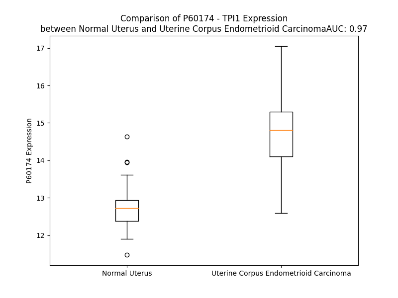

# Detailed Data for P60174

## Introduction to the Detailed Summary

### How to Interpret the Results

- **Summary & Metrics**: This section provides a quick reference to essential protein attributes, including expression changes, family classification, and biomarker applications. Regulation status (upregulated/downregulated) indicates the protein's behavior in a disease context. Some information comes from the original excel file with the proteins selected from literature, while others are derived from the analyses.
- **Expression Comparison**: A visual representation comparing protein expression between normal and disease states. It highlights significant changes in expression levels that might indicate diagnostic or therapeutic relevance. This is data coming from transcriptomics experiments and could not translate similarly to protein levels.
- **Isoform Alignment**: An interactive view of isoform alignments, revealing structural and functional differences between variants of the protein.
- **Interactors & Homologs**: Tables listing known interaction partners and homologous proteins, the more interactors and homologs, the more complex the protein is to design an antibody for.
- **Biological Assemblies**: Information about the structural arrangement of the protein in different assemblies, providing insights into its functional state but also the complexity of the protein to develop antibodies.
- **Combined Per-Residue Information**: A detailed table summarizing residue-level data. This includes predictions for epitope regions, aggregation tendencies, and modifications that might impact the protein's function. Each row corresponds to a residue in the protein, providing insights into specific sites that may be important for research or drug development.
## Summary & Metrics

- **UniProt Accession**: P60174
- **Gene Name**: TPI1
- **Protein Name**: triosephosphate isomerase 1
- **Swiss Prot**: TPIS_HUMAN
- **Family**: enzyme
- **Biomarker Application**: diagnosis,unspecified application
- **Number of Isoforms**: 0
- **Regulation**: 1
- **(transcriptomics) AUC**: 0.97
- **(transcriptomics) Fold Change**: 1.16
- **(transcriptomics) Regulation**: Upregulated
- **Discotope Epitope Count**: 49
- **Max n_uniprots (Homo)**: 2
- **Max n_uniprots (Hetero)**: 5

## Expression Comparison

## Interactors

| preferredName_A   | preferredName_B   |   score |
|:------------------|:------------------|--------:|
| TPI1              | GAPDHS            |   0.999 |
| TPI1              | GAPDH             |   0.999 |
| TPI1              | PGK1              |   0.999 |
| TPI1              | GPI               |   0.999 |
| TPI1              | ENO1              |   0.998 |
| TPI1              | PGK2              |   0.998 |
| TPI1              | ALDOA             |   0.997 |
| TPI1              | TALDO1            |   0.994 |
| TPI1              | TKFC              |   0.992 |
| TPI1              | ALDOC             |   0.989 |
| TPI1              | PGAM1             |   0.989 |
| TPI1              | ALDOB             |   0.986 |
| TPI1              | CSTF3             |   0.983 |
| TPI1              | TKT               |   0.98  |
| TPI1              | PGAM4             |   0.974 |
| TPI1              | ENO3              |   0.963 |
| TPI1              | TKTL1             |   0.963 |
| TPI1              | TKTL2             |   0.963 |
| TPI1              | PKM               |   0.963 |
| TPI1              | LOC112694756      |   0.961 |
| TPI1              | PNMA8B            |   0.959 |
| TPI1              | ENO2              |   0.959 |
| TPI1              | PGAM2             |   0.955 |
| TPI1              | H6PD              |   0.951 |
| TPI1              | G6PD              |   0.942 |
| TPI1              | PFKM              |   0.94  |
| TPI1              | DERA              |   0.929 |
| TPI1              | BPGM              |   0.927 |
| TPI1              | PFKP              |   0.925 |
| TPI1              | PFKL              |   0.923 |
| TPI1              | SHMT2             |   0.92  |
| TPI1              | MYCBPAP           |   0.913 |
| TPI1              | LDHA              |   0.913 |
| TPI1              | ENO4              |   0.906 |
| TPI1              | HLA-DRB1          |   0.904 |
| TPI1              | HLA-DRA           |   0.902 |

## Homologs

| uniprot_id   | gene_id   |
|--------------|-----------|

## Biological Assemblies

|   Unnamed: 0 |   assembly |   n_uniprots | composition   | crystal_id   |
|-------------:|-----------:|-------------:|:--------------|:-------------|
|            0 |          1 |            2 | Homo          | 2vom         |
|            1 |          2 |            2 | Homo          | 2vom         |
|            0 |          1 |            2 | Homo          | 1hti         |
|            0 |          1 |            2 | Homo          | 4unk         |
|            0 |          1 |            5 | Hetero        | 2ian         |
|            1 |          2 |            5 | Hetero        | 2ian         |
|            2 |          3 |            5 | Hetero        | 2ian         |
|            3 |          4 |            5 | Hetero        | 2ian         |
|            0 |          1 |            2 | Homo          | 7rde         |
|            0 |          1 |            2 | Homo          | 2jk2         |
|            0 |          1 |            2 | Homo          | 6c2g         |
|            1 |          2 |            2 | Homo          | 6c2g         |
|            0 |          1 |            2 | Homo          | 6nlh         |
|            1 |          2 |            2 | Homo          | 6nlh         |
|            2 |          3 |            2 | Homo          | 6nlh         |
|            3 |          4 |            2 | Homo          | 6nlh         |
|            0 |          1 |            5 | Hetero        | 2iam         |
|            0 |          1 |            2 | Homo          | 6up5         |
|            0 |          1 |            2 | Homo          | 4pod         |
|            0 |          1 |            2 | Homo          | 7uxb         |
|            0 |          1 |            2 | Homo          | 6up1         |
|            0 |          1 |            3 | Hetero        | 1klg         |
|            0 |          1 |            2 | Homo          | 7sx1         |
|            0 |          1 |            2 | Homo          | 6d43         |
|            0 |          1 |            2 | Homo          | 6upf         |
|            0 |          1 |            2 | Homo          | 4zvj         |
|            0 |          1 |            2 | Homo          | 6up8         |
|            0 |          1 |            2 | Homo          | 7t0q         |
|            0 |          1 |            3 | Hetero        | 4e41         |
|            1 |          2 |            3 | Hetero        | 4e41         |
|            0 |          1 |            2 | Homo          | 4br1         |
|            0 |          1 |            2 | Homo          | 7uxv         |
|            0 |          1 |            2 | Homo          | 4unl         |
|            0 |          1 |            3 | Hetero        | 1klu         |
|            0 |          1 |            2 | Homo          | 4poc         |
|            0 |          1 |            2 | Homo          | 1wyi         |
|            1 |          2 |            2 | Homo          | 1wyi         |

## Combined Per-Residue Information

|   res | aa   |   epitope_score | epitope   |   relative_surface_accessibility |   modeling_confidence |   Aggregation | modification                 |
|------:|:-----|----------------:|:----------|---------------------------------:|----------------------:|--------------:|:-----------------------------|
|     1 | M    |         0.25231 | False     |                          1.28033 |                 35.92 |         0     | N/A                          |
|     2 | A    |         0.15713 | False     |                          0.6734  |                 44.08 |         0     | N/A                          |
|     3 | P    |         0.23954 | False     |                          0.89169 |                 59.73 |         0     | N/A                          |
|     4 | S    |         0.14247 | False     |                          0.84544 |                 84.81 |         0     | N/A                          |
|     5 | R    |         0.12299 | False     |                          0.22805 |                 97.07 |         0     | N/A                          |
|     6 | K    |         0.12258 | False     |                          0.44397 |                 96.88 |         0     | N/A                          |
|     7 | F    |         0.04744 | False     |                          0.02664 |                 98.31 |         0     | N/A                          |
|     8 | F    |         0.00761 | False     |                          0       |                 98.81 |         0     | N/A                          |
|     9 | V    |         0.00256 | False     |                          0       |                 98.83 |         0     | N/A                          |
|    10 | G    |         0.0228  | False     |                          0.00966 |                 98.83 |         0     | N/A                          |
|    11 | G    |         0.02065 | False     |                          0.00965 |                 98.72 |         0     | N/A                          |
|    12 | N    |         0.07151 | False     |                          0.05157 |                 98.68 |         0     | N/A                          |
|    13 | W    |         0.01124 | False     |                          0.00182 |                 98.44 |         0     | N/A                          |
|    14 | K    |         0.15171 | False     |                          0.21607 |                 98.05 |         0     | N6-acetyllysine              |
|    15 | M    |         0.35776 | True      |                          0.98426 |                 98.32 |         0     | N/A                          |
|    16 | N    |         0.27107 | False     |                          0.43197 |                 98.6  |         0     | N/A                          |
|    17 | G    |         0.29638 | True      |                          0.36978 |                 96.76 |         0     | N/A                          |
|    18 | R    |         0.27764 | False     |                          0.75039 |                 97.85 |         0     | N/A                          |
|    19 | K    |         0.29738 | True      |                          0.65895 |                 98.25 |         0     | N/A                          |
|    20 | Q    |         0.27371 | False     |                          0.70688 |                 98.12 |         0     | N/A                          |
|    21 | S    |         0.21838 | False     |                          0.42598 |                 97.75 |         0     | Phosphoserine                |
|    22 | L    |         0.02735 | False     |                          0.01401 |                 98.3  |         0     | N/A                          |
|    23 | G    |         0.19305 | False     |                          0.25118 |                 98.3  |         0     | N/A                          |
|    24 | E    |         0.25109 | False     |                          0.55158 |                 98.31 |         0     | N/A                          |
|    25 | L    |         0.13167 | False     |                          0.09034 |                 98.24 |         0.401 | N/A                          |
|    26 | I    |         0.11982 | False     |                          0.0184  |                 98.54 |         0.401 | N/A                          |
|    27 | G    |         0.22392 | False     |                          0.45863 |                 98.39 |         0.401 | N/A                          |
|    28 | T    |         0.21483 | False     |                          0.3789  |                 97.76 |         0.401 | N/A                          |
|    29 | L    |         0.01859 | False     |                          0.00885 |                 98.26 |         0.401 | N/A                          |
|    30 | N    |         0.27611 | False     |                          0.33454 |                 98.22 |         0     | N/A                          |
|    31 | A    |         0.18032 | False     |                          0.86443 |                 97.72 |         0     | N/A                          |
|    32 | A    |         0.12701 | False     |                          0.12639 |                 96.3  |         0     | N/A                          |
|    33 | K    |         0.22427 | False     |                          0.87936 |                 95.34 |         0     | N/A                          |
|    34 | V    |         0.07198 | False     |                          0.20191 |                 94.62 |         0     | N/A                          |
|    35 | P    |         0.06256 | False     |                          0.1023  |                 95.59 |         0     | N/A                          |
|    36 | A    |         0.16639 | False     |                          0.93987 |                 93.04 |         0     | N/A                          |
|    37 | D    |         0.15082 | False     |                          0.4682  |                 94.78 |         0     | N/A                          |
|    38 | T    |         0.06165 | False     |                          0.05238 |                 98.04 |         0     | N/A                          |
|    39 | E    |         0.165   | False     |                          0.21709 |                 98.5  |         0     | N/A                          |
|    40 | V    |         0.00714 | False     |                          0.00761 |                 98.75 |         0     | N/A                          |
|    41 | V    |         0.02243 | False     |                          0.00758 |                 98.91 |         0     | N/A                          |
|    42 | C    |         0.00248 | False     |                          0       |                 98.89 |         0     | N/A                          |
|    43 | A    |         0.0423  | False     |                          0.02041 |                 98.91 |         0     | N/A                          |
|    44 | P    |         0.01093 | False     |                          0       |                 98.85 |         0     | N/A                          |
|    45 | P    |         0.18461 | False     |                          0.15706 |                 98.82 |         0     | N/A                          |
|    46 | T    |         0.23178 | False     |                          0.50117 |                 98.68 |         0     | N/A                          |
|    47 | A    |         0.29254 | True      |                          0.84694 |                 98.42 |         0     | N/A                          |
|    48 | Y    |         0.17016 | False     |                          0.19303 |                 98.76 |         0     | N/A                          |
|    49 | I    |         0.04777 | False     |                          0.02709 |                 98.77 |         0     | N/A                          |
|    50 | D    |         0.17387 | False     |                          0.40431 |                 98.64 |         0     | N/A                          |
|    51 | F    |         0.30875 | True      |                          0.17429 |                 98.76 |         0     | N/A                          |
|    52 | A    |         0.00359 | False     |                          0       |                 98.75 |         0     | N/A                          |
|    53 | R    |         0.10992 | False     |                          0.17446 |                 98.63 |         0     | N/A                          |
|    54 | Q    |         0.36842 | True      |                          0.68316 |                 98.61 |         0     | N/A                          |
|    55 | K    |         0.28757 | True      |                          0.53076 |                 98.65 |         0     | N/A                          |
|    56 | L    |         0.06024 | False     |                          0.03682 |                 98.58 |         0     | N/A                          |
|    57 | D    |         0.11432 | False     |                          0.26566 |                 98.02 |         0     | N/A                          |
|    58 | P    |         0.18817 | False     |                          0.91126 |                 97.11 |         0     | N/A                          |
|    59 | K    |         0.22804 | False     |                          0.49558 |                 96.3  |         0     | N/A                          |
|    60 | I    |         0.01262 | False     |                          0.0016  |                 98.37 |         1.733 | N/A                          |
|    61 | A    |         0.04621 | False     |                          0.17019 |                 98.69 |         1.733 | N/A                          |
|    62 | V    |         0.00514 | False     |                          0.00245 |                 98.93 |         1.733 | N/A                          |
|    63 | A    |         0.01283 | False     |                          0       |                 98.97 |         1.733 | N/A                          |
|    64 | A    |         0.00321 | False     |                          0       |                 98.95 |         1.733 | N/A                          |
|    65 | Q    |         0.10907 | False     |                          0.18294 |                 98.94 |         0     | N/A                          |
|    66 | N    |         0.31841 | True      |                          0.18121 |                 98.95 |         0     | N/A                          |
|    67 | C    |         0.02085 | False     |                          0.00801 |                 98.87 |         0     | N/A                          |
|    68 | Y    |         0.30538 | True      |                          0.18199 |                 98.86 |         0     | 3'-nitrotyrosine             |
|    69 | K    |         0.32734 | True      |                          0.33474 |                 98.73 |         0     | N/A                          |
|    70 | V    |         0.343   | True      |                          0.38518 |                 98.6  |         0     | N/A                          |
|    71 | T    |         0.24632 | False     |                          0.48286 |                 98.39 |         0     | N/A                          |
|    72 | N    |         0.40183 | True      |                          0.77088 |                 97.93 |         0     | N/A                          |
|    73 | G    |         0.48879 | True      |                          0.67299 |                 97.86 |         0     | N/A                          |
|    74 | A    |         0.35856 | True      |                          1.02328 |                 98.36 |         0     | N/A                          |
|    75 | F    |         0.51438 | True      |                          0.44407 |                 98.45 |         0     | N/A                          |
|    76 | T    |         0.57018 | True      |                          1.04589 |                 98.59 |         0     | N/A                          |
|    77 | G    |         0.38068 | True      |                          0.92898 |                 98.36 |         0     | N/A                          |
|    78 | E    |         0.33805 | True      |                          0.39129 |                 98.81 |         0     | N/A                          |
|    79 | I    |         0.36549 | True      |                          0.21135 |                 98.87 |         0     | N/A                          |
|    80 | S    |         0.09042 | False     |                          0.05085 |                 98.86 |         0     | Phosphoserine                |
|    81 | P    |         0.00397 | False     |                          0       |                 98.86 |         0     | N/A                          |
|    82 | G    |         0.20426 | False     |                          0.26184 |                 98.46 |         0     | N/A                          |
|    83 | M    |         0.3805  | True      |                          0.54501 |                 98.83 |         0.04  | N/A                          |
|    84 | I    |         0.02217 | False     |                          0.0096  |                 98.88 |         0.076 | N/A                          |
|    85 | K    |         0.18015 | False     |                          0.4081  |                 98.62 |         0.076 | N/A                          |
|    86 | D    |         0.31284 | True      |                          0.80599 |                 98.48 |         0.076 | N/A                          |
|    87 | C    |         0.16628 | False     |                          0.3315  |                 98.56 |         7.156 | N/A                          |
|    88 | G    |         0.12367 | False     |                          0.42072 |                 98.56 |         8.136 | N/A                          |
|    89 | A    |         0.05207 | False     |                          0.01414 |                 98.81 |        37.905 | N/A                          |
|    90 | T    |         0.15521 | False     |                          0.5226  |                 98.82 |        70.375 | N/A                          |
|    91 | W    |         0.11096 | False     |                          0.09824 |                 98.94 |        74.881 | N/A                          |
|    92 | V    |         0.0032  | False     |                          0       |                 98.96 |        74.881 | N/A                          |
|    93 | V    |         0.02529 | False     |                          0.00948 |                 98.96 |        74.796 | N/A                          |
|    94 | L    |         0.01777 | False     |                          0.00742 |                 98.95 |        69.371 | N/A                          |
|    95 | G    |         0.02782 | False     |                          0.0182  |                 98.77 |         9.887 | N/A                          |
|    96 | H    |         0.07691 | False     |                          0.0453  |                 98.65 |         0.034 | N/A                          |
|    97 | S    |         0.22507 | False     |                          0.07018 |                 97.43 |         0     | N/A                          |
|    98 | E    |         0.32996 | True      |                          0.31651 |                 97.71 |         0     | N/A                          |
|    99 | R    |         0.41858 | True      |                          0.22568 |                 98.73 |         0     | N/A                          |
|   100 | R    |         0.22071 | False     |                          0.09945 |                 98.52 |         0     | N/A                          |
|   101 | H    |         0.4858  | True      |                          0.44364 |                 96.97 |         0     | N/A                          |
|   102 | V    |         0.53518 | True      |                          0.78847 |                 97.98 |         0     | N/A                          |
|   103 | F    |         0.47518 | True      |                          0.65053 |                 98.66 |         0     | N/A                          |
|   104 | G    |         0.37625 | True      |                          0.71352 |                 98.46 |         0     | N/A                          |
|   105 | E    |         0.17728 | False     |                          0.0909  |                 98.84 |         0     | N/A                          |
|   106 | S    |         0.24754 | False     |                          0.47121 |                 98.64 |         0     | Phosphoserine                |
|   107 | D    |         0.15425 | False     |                          0.31326 |                 98.62 |         0     | N/A                          |
|   108 | E    |         0.25381 | False     |                          0.59442 |                 98.59 |         0     | N/A                          |
|   109 | L    |         0.22774 | False     |                          0.24095 |                 98.85 |         0     | N/A                          |
|   110 | I    |         0.01394 | False     |                          0.0032  |                 98.89 |         0     | N/A                          |
|   111 | G    |         0.00608 | False     |                          0       |                 98.75 |         0     | N/A                          |
|   112 | Q    |         0.25535 | False     |                          0.3007  |                 98.82 |         0     | N/A                          |
|   113 | K    |         0.01709 | False     |                          0.01152 |                 98.93 |         0     | N/A                          |
|   114 | V    |         0.00201 | False     |                          0       |                 98.88 |         0     | N/A                          |
|   115 | A    |         0.13473 | False     |                          0.31199 |                 98.71 |         0     | N/A                          |
|   116 | H    |         0.12802 | False     |                          0.17748 |                 98.81 |         0     | N/A                          |
|   117 | A    |         0.00264 | False     |                          0       |                 98.87 |         0     | N/A                          |
|   118 | L    |         0.14579 | False     |                          0.17948 |                 98.73 |         0     | N/A                          |
|   119 | A    |         0.22859 | False     |                          0.84675 |                 98.25 |         0     | N/A                          |
|   120 | E    |         0.13518 | False     |                          0.22289 |                 98.36 |         0     | N/A                          |
|   121 | G    |         0.1506  | False     |                          0.40021 |                 98.17 |         0     | N/A                          |
|   122 | L    |         0.02429 | False     |                          0.00907 |                 98.81 |         2.659 | N/A                          |
|   123 | G    |         0.05639 | False     |                          0.05478 |                 98.83 |         3.376 | N/A                          |
|   124 | V    |         0.0032  | False     |                          0       |                 98.95 |        11.361 | N/A                          |
|   125 | I    |         0.01623 | False     |                          0.0072  |                 98.95 |        11.633 | N/A                          |
|   126 | A    |         0.00152 | False     |                          0       |                 98.91 |        11.633 | N/A                          |
|   127 | C    |         0.02046 | False     |                          0.00801 |                 98.84 |        10.615 | N/A                          |
|   128 | I    |         0.06179 | False     |                          0.01934 |                 98.83 |        10.401 | N/A                          |
|   129 | G    |         0.18411 | False     |                          0.05811 |                 98.36 |         4.333 | N/A                          |
|   130 | E    |         0.01721 | False     |                          0       |                 97.99 |         0     | N/A                          |
|   131 | K    |         0.34202 | True      |                          0.39161 |                 96.98 |         0     | N/A                          |
|   132 | L    |         0.37871 | True      |                          0.49571 |                 94.88 |         0     | N/A                          |
|   133 | D    |         0.32105 | True      |                          0.5577  |                 96.62 |         0     | N/A                          |
|   134 | E    |         0.17243 | False     |                          0.17816 |                 97.93 |         0     | N/A                          |
|   135 | R    |         0.32553 | True      |                          0.20409 |                 95.95 |         0     | N/A                          |
|   136 | E    |         0.32874 | True      |                          0.68869 |                 95.04 |         0     | N/A                          |
|   137 | A    |         0.28998 | True      |                          0.65774 |                 98.04 |         0.128 | N/A                          |
|   138 | G    |         0.30474 | True      |                          0.79707 |                 97.57 |         0.128 | N/A                          |
|   139 | I    |         0.20122 | False     |                          0.40638 |                 98.37 |         0.746 | N/A                          |
|   140 | T    |         0.15404 | False     |                          0.12277 |                 98.31 |         0.746 | N/A                          |
|   141 | E    |         0.22538 | False     |                          0.35951 |                 98.38 |         0.746 | N/A                          |
|   142 | K    |         0.39594 | True      |                          0.57814 |                 98.64 |         0.746 | N/A                          |
|   143 | V    |         0.12229 | False     |                          0.13089 |                 98.67 |         2.404 | N/A                          |
|   144 | V    |         0.00539 | False     |                          0.00286 |                 98.67 |         2.743 | N/A                          |
|   145 | F    |         0.21376 | False     |                          0.23535 |                 98.81 |         2.743 | N/A                          |
|   146 | E    |         0.20755 | False     |                          0.4689  |                 98.71 |         1.997 | N/A                          |
|   147 | Q    |         0.05519 | False     |                          0.0861  |                 98.82 |         1.997 | N/A                          |
|   148 | T    |         0.00227 | False     |                          0       |                 98.83 |         1.997 | N/A                          |
|   149 | K    |         0.2714  | False     |                          0.5093  |                 98.77 |         1.997 | N6-succinyllysine            |
|   150 | V    |         0.08906 | False     |                          0.30561 |                 98.29 |         1.997 | N/A                          |
|   151 | I    |         0.01485 | False     |                          0.008   |                 98.63 |         1.799 | N/A                          |
|   152 | A    |         0.14848 | False     |                          0.16591 |                 98.67 |         0.824 | N/A                          |
|   153 | D    |         0.27176 | False     |                          0.60695 |                 98.54 |         0     | N/A                          |
|   154 | N    |         0.13255 | False     |                          0.29932 |                 98.58 |         0     | N/A                          |
|   155 | V    |         0.10411 | False     |                          0.09939 |                 98.52 |         0     | N/A                          |
|   156 | K    |         0.14707 | False     |                          1.03127 |                 95.4  |         0     | N6-succinyllysine; alternate |
|   156 | K    |         0.14707 | False     |                          1.03127 |                 95.4  |         0     | N6-acetyllysine; alternate   |
|   157 | D    |         0.14079 | False     |                          0.49425 |                 95.88 |         0.141 | N/A                          |
|   158 | W    |         0.0792  | False     |                          0.0605  |                 98.28 |         0.141 | N/A                          |
|   159 | S    |         0.18646 | False     |                          0.61291 |                 97.23 |         0.141 | Phosphoserine                |
|   160 | K    |         0.16729 | False     |                          0.44708 |                 97.8  |         0.141 | N/A                          |
|   161 | V    |         0.01526 | False     |                          0.00633 |                 98.83 |        79.141 | N/A                          |
|   162 | V    |         0.00431 | False     |                          0       |                 98.91 |        79.141 | N/A                          |
|   163 | L    |         0.00168 | False     |                          0       |                 98.9  |        79.141 | N/A                          |
|   164 | A    |         0.01192 | False     |                          0       |                 98.81 |        79.141 | N/A                          |
|   165 | Y    |         0.00573 | False     |                          0       |                 98.71 |        79.141 | N/A                          |
|   166 | E    |         0.07826 | False     |                          0.02313 |                 97.09 |         0     | N/A                          |
|   167 | P    |         0.00671 | False     |                          0       |                 95.06 |         0     | N/A                          |
|   168 | V    |         0.13515 | False     |                          0.24514 |                 94.57 |         5.192 | N/A                          |
|   169 | W    |         0.38475 | True      |                          0.13348 |                 93.95 |         5.192 | N/A                          |
|   170 | A    |         0.01917 | False     |                          0       |                 89.5  |         5.192 | N/A                          |
|   171 | I    |         0.24656 | False     |                          0.17659 |                 83.69 |         5.192 | N/A                          |
|   172 | G    |         0.36097 | True      |                          0.94946 |                 80.93 |         5.192 | N/A                          |
|   173 | T    |         0.31368 | True      |                          0.54924 |                 82.92 |         4.301 | Phosphothreonine             |
|   174 | G    |         0.33765 | True      |                          0.76641 |                 77.41 |         0.355 | N/A                          |
|   175 | K    |         0.38075 | True      |                          0.62936 |                 80.8  |         0     | N/A                          |
|   176 | T    |         0.24504 | False     |                          0.32092 |                 80.78 |         0     | N/A                          |
|   177 | A    |         0.03894 | False     |                          0.00848 |                 89.7  |         0     | N/A                          |
|   178 | T    |         0.21153 | False     |                          0.45499 |                 95.3  |         0     | N/A                          |
|   179 | P    |         0.0603  | False     |                          0.13022 |                 96.25 |         0     | N/A                          |
|   180 | Q    |         0.22291 | False     |                          0.56598 |                 97.75 |         0     | N/A                          |
|   181 | Q    |         0.32823 | True      |                          0.29579 |                 96.56 |         0     | N/A                          |
|   182 | A    |         0.0029  | False     |                          0       |                 97.32 |         0     | N/A                          |
|   183 | Q    |         0.12889 | False     |                          0.11827 |                 98.44 |         0     | N/A                          |
|   184 | E    |         0.34749 | True      |                          0.40997 |                 98.42 |         0     | N/A                          |
|   185 | V    |         0.04474 | False     |                          0.03713 |                 98.56 |         0     | N/A                          |
|   186 | H    |         0.00721 | False     |                          0       |                 98.76 |         0     | N/A                          |
|   187 | E    |         0.19917 | False     |                          0.52133 |                 98.74 |         0     | N/A                          |
|   188 | K    |         0.22362 | False     |                          0.34381 |                 98.8  |         0     | N/A                          |
|   189 | L    |         0.00507 | False     |                          0       |                 98.84 |         0     | N/A                          |
|   190 | R    |         0.13202 | False     |                          0.06892 |                 98.75 |         0     | N/A                          |
|   191 | G    |         0.2908  | True      |                          0.40537 |                 98.73 |         0     | N/A                          |
|   192 | W    |         0.17622 | False     |                          0.12994 |                 98.84 |         0     | N/A                          |
|   193 | L    |         0.00644 | False     |                          0       |                 98.77 |         0     | N/A                          |
|   194 | K    |         0.24464 | False     |                          0.55015 |                 98.52 |         0     | N6-acetyllysine; alternate   |
|   194 | K    |         0.24464 | False     |                          0.55015 |                 98.52 |         0     | N6-methyllysine; alternate   |
|   194 | K    |         0.24464 | False     |                          0.55015 |                 98.52 |         0     | N6-succinyllysine; alternate |
|   195 | S    |         0.43415 | True      |                          0.73414 |                 98.65 |         0     | N/A                          |
|   196 | N    |         0.4047  | True      |                          0.55763 |                 98.56 |         0     | N/A                          |
|   197 | V    |         0.26532 | False     |                          0.38372 |                 98.23 |         0     | N/A                          |
|   198 | S    |         0.27364 | False     |                          0.32806 |                 97.88 |         0     | Phosphoserine                |
|   199 | D    |         0.24853 | False     |                          0.41732 |                 97.68 |         0     | N/A                          |
|   200 | A    |         0.12567 | False     |                          0.70699 |                 97.27 |         0     | N/A                          |
|   201 | V    |         0.16512 | False     |                          0.16838 |                 98.01 |         0     | N/A                          |
|   202 | A    |         0.00652 | False     |                          0.00255 |                 98.25 |         0     | N/A                          |
|   203 | Q    |         0.14083 | False     |                          0.34044 |                 97.96 |         0     | N/A                          |
|   204 | S    |         0.16027 | False     |                          0.53711 |                 97.87 |         0     | N/A                          |
|   205 | T    |         0.06222 | False     |                          0.01954 |                 98.55 |         0     | N/A                          |
|   206 | R    |         0.07392 | False     |                          0.11394 |                 98.83 |         0     | N/A                          |
|   207 | I    |         0.00758 | False     |                          0       |                 98.84 |         0     | N/A                          |
|   208 | I    |         0.01652 | False     |                          0       |                 98.85 |         0     | N/A                          |
|   209 | Y    |         0.00842 | False     |                          0       |                 98.25 |         0     | 3'-nitrotyrosine             |
|   210 | G    |         0.1157  | False     |                          0.06067 |                 95.2  |         0     | N/A                          |
|   211 | G    |         0.08997 | False     |                          0.05707 |                 89.04 |         0     | N/A                          |
|   212 | S    |         0.21949 | False     |                          0.18794 |                 91.3  |         0     | Phosphoserine                |
|   213 | V    |         0.05351 | False     |                          0.04721 |                 94.11 |         0     | N/A                          |
|   214 | T    |         0.25238 | False     |                          0.33613 |                 95.04 |         0     | Phosphothreonine             |
|   215 | G    |         0.13358 | False     |                          0.2628  |                 95.58 |         0     | N/A                          |
|   216 | A    |         0.2332  | False     |                          0.9503  |                 94.36 |         0     | N/A                          |
|   217 | T    |         0.17907 | False     |                          0.342   |                 94.19 |         0     | N/A                          |
|   218 | C    |         0.01661 | False     |                          0.00468 |                 96.81 |         0     | N/A                          |
|   219 | K    |         0.2235  | False     |                          0.57719 |                 97.5  |         0     | N/A                          |
|   220 | E    |         0.29522 | True      |                          0.53861 |                 97.11 |         0     | N/A                          |
|   221 | L    |         0.01759 | False     |                          0.00742 |                 96.84 |         0     | N/A                          |
|   222 | A    |         0.03686 | False     |                          0.04624 |                 97.33 |         0     | N/A                          |
|   223 | S    |         0.21495 | False     |                          0.62232 |                 97.03 |         0     | Phosphoserine                |
|   224 | Q    |         0.12606 | False     |                          0.14878 |                 97.9  |         0     | N/A                          |
|   225 | P    |         0.199   | False     |                          0.71985 |                 97.46 |         0     | N/A                          |
|   226 | D    |         0.1399  | False     |                          0.11585 |                 98.38 |         0     | N/A                          |
|   227 | V    |         0.01036 | False     |                          0.00704 |                 98.28 |         0     | N/A                          |
|   228 | D    |         0.03183 | False     |                          0.0383  |                 98.6  |         0     | N/A                          |
|   229 | G    |         0.00507 | False     |                          0       |                 98.64 |         0.142 | N/A                          |
|   230 | F    |         0.00331 | False     |                          0       |                 98.61 |         0.896 | N/A                          |
|   231 | L    |         0.02288 | False     |                          0.02251 |                 98.52 |         0.896 | N/A                          |
|   232 | V    |         0.01108 | False     |                          0.00571 |                 97.99 |         0.896 | N/A                          |
|   233 | G    |         0.15745 | False     |                          0.21774 |                 96.41 |         0.896 | N/A                          |
|   234 | G    |         0.29715 | True      |                          0.60774 |                 95.29 |         0.754 | N/A                          |
|   235 | A    |         0.07389 | False     |                          0.08575 |                 96.36 |         0.61  | N/A                          |
|   236 | S    |         0.0058  | False     |                          0       |                 98.05 |         0.61  | N/A                          |
|   237 | L    |         0.30366 | True      |                          0.36258 |                 97.77 |         0.61  | N/A                          |
|   238 | K    |         0.33445 | True      |                          0.50968 |                 96.72 |         0     | N6-acetyllysine              |
|   239 | P    |         0.182   | False     |                          0.73398 |                 95.78 |         0     | N/A                          |
|   240 | E    |         0.22598 | False     |                          0.21273 |                 96.64 |         0     | N/A                          |
|   241 | F    |         0.00289 | False     |                          0       |                 98.19 |         0     | N/A                          |
|   242 | V    |         0.10625 | False     |                          0.21802 |                 97.78 |         0     | N/A                          |
|   243 | D    |         0.19374 | False     |                          0.48479 |                 97.69 |         0     | N/A                          |
|   244 | I    |         0.00529 | False     |                          0       |                 98.3  |         0     | N/A                          |
|   245 | I    |         0.01041 | False     |                          0.00595 |                 98.44 |         0     | N/A                          |
|   246 | N    |         0.07216 | False     |                          0.22417 |                 97.95 |         0     | N/A                          |
|   247 | A    |         0.03695 | False     |                          0.04714 |                 97.79 |         0     | N/A                          |
|   248 | K    |         0.17108 | False     |                          0.49216 |                 95.72 |         0     | N/A                          |
|   249 | Q    |         0.07477 | False     |                          0.63753 |                 91.13 |         0     | N/A                          |

