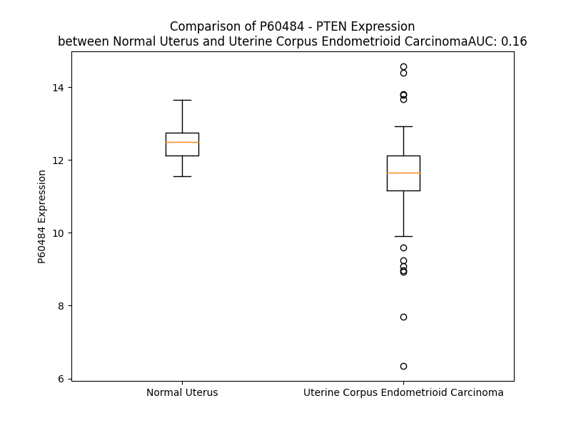

# Detailed Data for P60484

## Introduction to the Detailed Summary

### How to Interpret the Results

- **Summary & Metrics**: This section provides a quick reference to essential protein attributes, including expression changes, family classification, and biomarker applications. Regulation status (upregulated/downregulated) indicates the protein's behavior in a disease context. Some information comes from the original excel file with the proteins selected from literature, while others are derived from the analyses.
- **Expression Comparison**: A visual representation comparing protein expression between normal and disease states. It highlights significant changes in expression levels that might indicate diagnostic or therapeutic relevance. This is data coming from transcriptomics experiments and could not translate similarly to protein levels.
- **Isoform Alignment**: An interactive view of isoform alignments, revealing structural and functional differences between variants of the protein.
- **Interactors & Homologs**: Tables listing known interaction partners and homologous proteins, the more interactors and homologs, the more complex the protein is to design an antibody for.
- **Biological Assemblies**: Information about the structural arrangement of the protein in different assemblies, providing insights into its functional state but also the complexity of the protein to develop antibodies.
- **Combined Per-Residue Information**: A detailed table summarizing residue-level data. This includes predictions for epitope regions, aggregation tendencies, and modifications that might impact the protein's function. Each row corresponds to a residue in the protein, providing insights into specific sites that may be important for research or drug development.
## Summary & Metrics

- **UniProt Accession**: P60484
- **Gene Name**: PTEN
- **Protein Name**: Phosphatidylinositol 3,4,5-trisphosphate 3-phosphatase and dual-specificity protein phosphatase PTEN
- **Swiss Prot**: PTEN_HUMAN
- **Family**: phosphatase
- **Biomarker Application**: diagnosis,disease progression,efficacy,prognosis,response to therapy
- **Number of Isoforms**: 0
- **Regulation**: -1
- **(transcriptomics) AUC**: 0.16
- **(transcriptomics) Fold Change**: 1.08
- **(transcriptomics) Regulation**: Downregulated
- **Discotope Epitope Count**: 96
- **Max n_uniprots (Homo)**: 1
- **Max n_uniprots (Hetero)**: 2

## Expression Comparison

## Interactors

| preferredName_A   | preferredName_B   |   score |
|:------------------|:------------------|--------:|
| PTEN              | TP53              |   0.999 |
| PTEN              | MAGI2             |   0.998 |
| PTEN              | PIK3R1            |   0.997 |
| PTEN              | DLG1              |   0.996 |
| PTEN              | PTK2              |   0.995 |
| PTEN              | PIK3CA            |   0.995 |
| PTEN              | MAST2             |   0.993 |
| PTEN              | PREX2             |   0.99  |
| PTEN              | SPOP              |   0.99  |
| PTEN              | AKT1              |   0.988 |
| PTEN              | PIK3R2            |   0.985 |
| PTEN              | WWP2              |   0.984 |
| PTEN              | NEDD4             |   0.984 |
| PTEN              | PIK3CB            |   0.984 |
| PTEN              | SLC9A3R1          |   0.982 |
| PTEN              | STK11             |   0.979 |
| PTEN              | USP7              |   0.979 |
| PTEN              | PIK3CD            |   0.973 |
| PTEN              | MAGI3             |   0.972 |
| PTEN              | CDC42             |   0.971 |
| PTEN              | CSNK2A1           |   0.971 |
| PTEN              | EGFR              |   0.969 |
| PTEN              | INPP4B            |   0.967 |
| PTEN              | CHUK              |   0.964 |
| PTEN              | TRIM27            |   0.963 |
| PTEN              | UBE3A             |   0.96  |
| PTEN              | INPPL1            |   0.96  |
| PTEN              | PRKCZ             |   0.958 |
| PTEN              | PIP4K2A           |   0.957 |
| PTEN              | PIK3R3            |   0.955 |
| PTEN              | CSNK2A2           |   0.954 |
| PTEN              | ROCK1             |   0.954 |
| PTEN              | PIK3C3            |   0.953 |
| PTEN              | INPP5D            |   0.953 |
| PTEN              | IKBKB             |   0.952 |
| PTEN              | PDGFRB            |   0.95  |
| PTEN              | FRK               |   0.947 |
| PTEN              | INPP4A            |   0.946 |
| PTEN              | CTNNB1            |   0.943 |
| PTEN              | BRAF              |   0.943 |
| PTEN              | MTOR              |   0.942 |
| PTEN              | OTUD3             |   0.941 |
| PTEN              | PIK3C2B           |   0.941 |
| PTEN              | PIKFYVE           |   0.94  |
| PTEN              | NOP53             |   0.94  |
| PTEN              | PLCG1             |   0.938 |
| PTEN              | PIK3C2G           |   0.938 |
| PTEN              | ROCK2             |   0.937 |
| PTEN              | KRAS              |   0.936 |
| PTEN              | PARD3             |   0.936 |

## Homologs

| uniprot_id   | gene_id   |
|:-------------|:----------|
| A0A024QYR6   | PTEN      |
| E9PCX8       | TNS3      |
| F8W0B3       | HVCN1     |
| nan          | nan       |
| C9JZT0       | TNS1      |
| A0A8Q3SJ67   | TPTE2     |
| P56180       | TPTE      |

## Biological Assemblies

|   Unnamed: 0 |   assembly |   n_uniprots | composition   | crystal_id   |
|-------------:|-----------:|-------------:|:--------------|:-------------|
|            0 |          1 |            1 | Homo          | 5bzz         |
|            1 |          2 |            1 | Homo          | 5bzz         |
|            2 |          3 |            1 | Homo          | 5bzz         |
|            3 |          4 |            1 | Homo          | 5bzz         |
|            0 |          1 |            1 | Homo          | 1d5r         |
|            0 |          1 |            1 | Homo          | 7jvx         |
|            0 |          1 |            1 | Homo          | 7juk         |
|            0 |          1 |            2 | Hetero        | 7pc7         |
|            1 |          2 |            2 | Hetero        | 7pc7         |
|            0 |          1 |            1 | Homo          | 5bug         |
|            1 |          2 |            1 | Homo          | 5bug         |
|            2 |          3 |            1 | Homo          | 5bug         |
|            3 |          4 |            1 | Homo          | 5bug         |
|            0 |          1 |            2 | Hetero        | 2kyl         |
|            0 |          1 |            2 | Hetero        | 8x3s         |
|            0 |          1 |            0 | Hetero        | 7jtx         |
|            0 |          1 |            1 | Homo          | 5bzx         |
|            1 |          2 |            1 | Homo          | 5bzx         |
|            2 |          3 |            1 | Homo          | 5bzx         |
|            3 |          4 |            1 | Homo          | 5bzx         |
|            0 |          1 |            2 | Hetero        | 4o1v         |
|            0 |          1 |            1 | Homo          | 7jul         |

## Combined Per-Residue Information

|   res | aa   |   epitope_score | epitope   |   relative_surface_accessibility |   modeling_confidence |   Aggregation | modification                            |
|------:|:-----|----------------:|:----------|---------------------------------:|----------------------:|--------------:|:----------------------------------------|
|     1 | M    |         0.10332 | False     |                          1.02268 |                 54.96 |         0     | N/A                                     |
|     2 | T    |         0.1225  | False     |                          0.5328  |                 66.83 |         0.674 | N-acetylthreonine                       |
|     3 | A    |         0.08785 | False     |                          0.48996 |                 73.65 |         1.037 | N/A                                     |
|     4 | I    |         0.16953 | False     |                          0.67245 |                 75.95 |         2.128 | N/A                                     |
|     5 | I    |         0.21427 | True      |                          0.37358 |                 76.26 |         2.128 | N/A                                     |
|     6 | K    |         0.08486 | False     |                          0.12712 |                 79.19 |         2.128 | N/A                                     |
|     7 | E    |         0.23403 | True      |                          0.43239 |                 73.69 |         2.128 | N/A                                     |
|     8 | I    |         0.31936 | True      |                          0.68834 |                 70.17 |         2.128 | N/A                                     |
|     9 | V    |         0.15643 | False     |                          0.38088 |                 72.29 |         1.795 | N/A                                     |
|    10 | S    |         0.04434 | False     |                          0.01651 |                 68.35 |         0     | N/A                                     |
|    11 | R    |         0.19543 | False     |                          0.55777 |                 82.31 |         0     | N/A                                     |
|    12 | N    |         0.11851 | False     |                          0.35018 |                 82.83 |         0     | N/A                                     |
|    13 | K    |         0.06731 | False     |                          0.08273 |                 85.88 |         0     | N/A                                     |
|    14 | R    |         0.13603 | False     |                          0.42872 |                 84.71 |         0     | N/A                                     |
|    15 | R    |         0.10305 | False     |                          0.15093 |                 90.1  |         0     | N/A                                     |
|    16 | Y    |         0.09787 | False     |                          0.12287 |                 87.72 |         0     | N/A                                     |
|    17 | Q    |         0.1627  | False     |                          0.48043 |                 87.15 |         0     | N/A                                     |
|    18 | E    |         0.23635 | True      |                          0.53201 |                 87.43 |         0     | N/A                                     |
|    19 | D    |         0.31577 | True      |                          0.63235 |                 85.92 |         0     | N/A                                     |
|    20 | G    |         0.25812 | True      |                          0.95192 |                 87.94 |         0     | N/A                                     |
|    21 | F    |         0.1089  | False     |                          0.09778 |                 90.49 |         0     | N/A                                     |
|    22 | D    |         0.14315 | False     |                          0.24247 |                 91.32 |         0     | N/A                                     |
|    23 | L    |         0.01029 | False     |                          0.00742 |                 93.23 |         0     | N/A                                     |
|    24 | D    |         0.04212 | False     |                          0.06826 |                 94.15 |         0     | N/A                                     |
|    25 | L    |         0.03797 | False     |                          0.01036 |                 95.15 |         0     | N/A                                     |
|    26 | T    |         0.07376 | False     |                          0.11139 |                 96.96 |         0     | N/A                                     |
|    27 | Y    |         0.11079 | False     |                          0.27982 |                 97.83 |         0     | N/A                                     |
|    28 | I    |         0.04521 | False     |                          0.04198 |                 98.28 |         0     | N/A                                     |
|    29 | Y    |         0.14632 | False     |                          0.26851 |                 98.15 |         0     | N/A                                     |
|    30 | P    |         0.10545 | False     |                          0.81697 |                 97.93 |         0     | N/A                                     |
|    31 | N    |         0.09483 | False     |                          0.31031 |                 98.41 |         0.282 | N/A                                     |
|    32 | I    |         0.01714 | False     |                          0.0312  |                 98.75 |         0.944 | N/A                                     |
|    33 | I    |         0.00412 | False     |                          0       |                 98.62 |         0.944 | N/A                                     |
|    34 | A    |         0.00227 | False     |                          0       |                 98.43 |         0.944 | N/A                                     |
|    35 | M    |         0.00565 | False     |                          0       |                 97.35 |         0.944 | N/A                                     |
|    36 | G    |         0.0426  | False     |                          0.03702 |                 94.11 |         0.662 | N/A                                     |
|    37 | F    |         0.06115 | False     |                          0.04508 |                 95.05 |         0     | N/A                                     |
|    38 | P    |         0.00736 | False     |                          0       |                 95.11 |         0     | N/A                                     |
|    39 | A    |         0.02404 | False     |                          0.00349 |                 91.77 |         0     | N/A                                     |
|    40 | E    |         0.19775 | True      |                          0.30387 |                 86.97 |         0     | N/A                                     |
|    41 | R    |         0.38325 | True      |                          0.87658 |                 79.01 |         0     | N/A                                     |
|    42 | L    |         0.40007 | True      |                          0.92322 |                 74.88 |         0     | N/A                                     |
|    43 | E    |         0.28702 | True      |                          0.29307 |                 76.31 |         0     | N/A                                     |
|    44 | G    |         0.07458 | False     |                          0.05865 |                 61.73 |         0     | N/A                                     |
|    45 | V    |         0.28715 | True      |                          0.44503 |                 66.12 |         0     | N/A                                     |
|    46 | Y    |         0.3461  | True      |                          0.32762 |                 75.12 |         0     | N/A                                     |
|    47 | R    |         0.15073 | False     |                          0.12327 |                 85.33 |         0     | N/A                                     |
|    48 | N    |         0.02614 | False     |                          0.01185 |                 88.75 |         0     | N/A                                     |
|    49 | N    |         0.08751 | False     |                          0.31343 |                 92.07 |         0     | N/A                                     |
|    50 | I    |         0.05684 | False     |                          0.012   |                 94.61 |         0     | N/A                                     |
|    51 | D    |         0.20462 | True      |                          0.51164 |                 93.62 |         0     | N/A                                     |
|    52 | D    |         0.06123 | False     |                          0.20548 |                 94.03 |         0     | N/A                                     |
|    53 | V    |         0.00566 | False     |                          0       |                 96.18 |         0.301 | N/A                                     |
|    54 | V    |         0.08036 | False     |                          0.19517 |                 95.99 |         0.301 | N/A                                     |
|    55 | R    |         0.21971 | True      |                          0.51188 |                 95.74 |         0.301 | N/A                                     |
|    56 | F    |         0.01181 | False     |                          0.00127 |                 97.44 |         0.301 | N/A                                     |
|    57 | L    |         0.00365 | False     |                          0       |                 97.52 |         0.301 | N/A                                     |
|    58 | D    |         0.11334 | False     |                          0.30862 |                 96.38 |         0.301 | N/A                                     |
|    59 | S    |         0.30179 | True      |                          0.5669  |                 96.24 |         0     | N/A                                     |
|    60 | K    |         0.18698 | False     |                          0.45137 |                 96.39 |         0     | N/A                                     |
|    61 | H    |         0.0948  | False     |                          0.16614 |                 97.07 |         0     | N/A                                     |
|    62 | K    |         0.28701 | True      |                          0.69059 |                 96.48 |         0     | N/A                                     |
|    63 | N    |         0.21085 | True      |                          0.60407 |                 96.06 |         0     | N/A                                     |
|    64 | H    |         0.12328 | False     |                          0.30527 |                 97.94 |         0     | N/A                                     |
|    65 | Y    |         0.01551 | False     |                          0       |                 98.47 |         0     | N/A                                     |
|    66 | K    |         0.07212 | False     |                          0.19925 |                 98.6  |         0     | N/A                                     |
|    67 | I    |         0.00358 | False     |                          0       |                 98.58 |         0.273 | N/A                                     |
|    68 | Y    |         0.00167 | False     |                          0       |                 98.74 |         0.273 | N/A                                     |
|    69 | N    |         0.0159  | False     |                          0.0167  |                 98.34 |         0.273 | N/A                                     |
|    70 | L    |         0.00456 | False     |                          0       |                 98.56 |         0.273 | N/A                                     |
|    71 | C    |         0.02835 | False     |                          0.00666 |                 96.62 |         0.273 | N/A                                     |
|    72 | A    |         0.17834 | False     |                          0.34357 |                 94.8  |         0     | N/A                                     |
|    73 | E    |         0.19477 | False     |                          0.41254 |                 92.5  |         0     | N/A                                     |
|    74 | R    |         0.34355 | True      |                          0.17924 |                 89.17 |         0     | N/A                                     |
|    75 | H    |         0.34773 | True      |                          0.61173 |                 92.29 |         0     | N/A                                     |
|    76 | Y    |         0.15472 | False     |                          0.09143 |                 92.95 |         0     | N/A                                     |
|    77 | D    |         0.25396 | True      |                          0.48001 |                 93.51 |         0     | N/A                                     |
|    78 | T    |         0.1161  | False     |                          0.34343 |                 94.97 |         0     | N/A                                     |
|    79 | A    |         0.13464 | False     |                          0.58381 |                 94.84 |         0     | N/A                                     |
|    80 | K    |         0.3239  | True      |                          0.34947 |                 93.02 |         0     | N/A                                     |
|    81 | F    |         0.00965 | False     |                          0       |                 94.81 |         0     | N/A                                     |
|    82 | N    |         0.23003 | True      |                          0.51947 |                 91.17 |         0     | N/A                                     |
|    83 | C    |         0.23345 | True      |                          0.70439 |                 88.68 |         0     | N/A                                     |
|    84 | R    |         0.14596 | False     |                          0.20822 |                 94.57 |         0     | N/A                                     |
|    85 | V    |         0.04686 | False     |                          0.18348 |                 97.66 |         0     | N/A                                     |
|    86 | A    |         0.09813 | False     |                          0.14795 |                 98.28 |         0     | N/A                                     |
|    87 | Q    |         0.22756 | True      |                          0.46815 |                 98.21 |         0     | N/A                                     |
|    88 | Y    |         0.08994 | False     |                          0.12996 |                 98.62 |         0     | N/A                                     |
|    89 | P    |         0.14096 | False     |                          0.45352 |                 98.13 |         0     | N/A                                     |
|    90 | F    |         0.06443 | False     |                          0.06451 |                 98.11 |         0     | N/A                                     |
|    91 | E    |         0.14968 | False     |                          0.36775 |                 96.66 |         0     | N/A                                     |
|    92 | D    |         0.19951 | True      |                          0.25076 |                 93.68 |         0     | N/A                                     |
|    93 | H    |         0.23565 | True      |                          0.36899 |                 94.47 |         0     | N/A                                     |
|    94 | N    |         0.08818 | False     |                          0.15317 |                 97.47 |         0     | N/A                                     |
|    95 | P    |         0.02379 | False     |                          0.06721 |                 98.21 |         0     | N/A                                     |
|    96 | P    |         0.02248 | False     |                          0.015   |                 98.39 |         0     | N/A                                     |
|    97 | Q    |         0.08294 | False     |                          0.49106 |                 98.29 |         0     | N/A                                     |
|    98 | L    |         0.02218 | False     |                          0.02774 |                 97.84 |         0     | N/A                                     |
|    99 | E    |         0.09794 | False     |                          0.54675 |                 97.77 |         0     | N/A                                     |
|   100 | L    |         0.04426 | False     |                          0.23825 |                 98.53 |         0     | N/A                                     |
|   101 | I    |         0.00509 | False     |                          0       |                 98.8  |         0     | N/A                                     |
|   102 | K    |         0.08336 | False     |                          0.49167 |                 98.62 |         0     | N/A                                     |
|   103 | P    |         0.10461 | False     |                          0.43394 |                 98.71 |         0     | N/A                                     |
|   104 | F    |         0.00249 | False     |                          0       |                 98.87 |         0     | N/A                                     |
|   105 | C    |         0.00423 | False     |                          0       |                 98.86 |         0     | N/A                                     |
|   106 | E    |         0.10013 | False     |                          0.39073 |                 98.73 |         0     | N/A                                     |
|   107 | D    |         0.09272 | False     |                          0.20243 |                 98.81 |         0     | N/A                                     |
|   108 | L    |         0.00237 | False     |                          0.00082 |                 98.78 |         0     | N/A                                     |
|   109 | D    |         0.08267 | False     |                          0.15255 |                 98.72 |         0     | N/A                                     |
|   110 | Q    |         0.20829 | True      |                          0.52795 |                 98.64 |         0     | N/A                                     |
|   111 | W    |         0.08117 | False     |                          0.11996 |                 98.61 |         0     | N/A                                     |
|   112 | L    |         0.04137 | False     |                          0.10433 |                 98.53 |         0     | N/A                                     |
|   113 | S    |         0.15144 | False     |                          0.56313 |                 98.01 |         0     | N/A                                     |
|   114 | E    |         0.17718 | False     |                          0.53141 |                 98.18 |         0     | N/A                                     |
|   115 | D    |         0.1871  | False     |                          0.27991 |                 98.13 |         0     | N/A                                     |
|   116 | D    |         0.14716 | False     |                          0.93915 |                 97.51 |         0     | N/A                                     |
|   117 | N    |         0.15326 | False     |                          0.58334 |                 97.92 |         0     | N/A                                     |
|   118 | H    |         0.05683 | False     |                          0.10387 |                 98.51 |         0     | N/A                                     |
|   119 | V    |         0.03045 | False     |                          0.03713 |                 98.6  |         0     | N/A                                     |
|   120 | A    |         0.00365 | False     |                          0       |                 98.8  |         0     | N/A                                     |
|   121 | A    |         0.00113 | False     |                          0       |                 98.64 |         0     | N/A                                     |
|   122 | I    |         0.00286 | False     |                          0       |                 98.76 |         0     | N/A                                     |
|   123 | H    |         0.00769 | False     |                          0       |                 97.84 |         0     | N/A                                     |
|   124 | C    |         0.05165 | False     |                          0.02526 |                 94.17 |         0     | N/A                                     |
|   125 | K    |         0.1601  | False     |                          0.1828  |                 91.11 |         0     | N/A                                     |
|   126 | A    |         0.09214 | False     |                          0.37152 |                 90.16 |         0     | N/A                                     |
|   127 | G    |         0.00529 | False     |                          0       |                 91.94 |         0     | N/A                                     |
|   128 | K    |         0.1071  | False     |                          0.29523 |                 93.17 |         0     | N/A                                     |
|   129 | G    |         0.05977 | False     |                          0.1788  |                 96.92 |         0     | N/A                                     |
|   130 | R    |         0.02373 | False     |                          0.01372 |                 98.38 |         0     | N/A                                     |
|   131 | T    |         0.002   | False     |                          0       |                 98.57 |         0.951 | N/A                                     |
|   132 | G    |         0.00284 | False     |                          0       |                 98.61 |         2.472 | N/A                                     |
|   133 | V    |         0.00178 | False     |                          0       |                 98.77 |        49.616 | N/A                                     |
|   134 | M    |         0.00189 | False     |                          0       |                 98.89 |        53.569 | N/A                                     |
|   135 | I    |         0.00233 | False     |                          0.0008  |                 98.86 |        56.867 | N/A                                     |
|   136 | C    |         0.0013  | False     |                          0       |                 98.86 |        56.945 | N/A                                     |
|   137 | A    |         0.00126 | False     |                          0       |                 98.87 |        56.945 | N/A                                     |
|   138 | Y    |         0.02348 | False     |                          0.04818 |                 98.9  |        56.283 | N/A                                     |
|   139 | L    |         0.00758 | False     |                          0.00742 |                 98.79 |        53.73  | N/A                                     |
|   140 | L    |         0.02333 | False     |                          0.07097 |                 98.67 |        38.652 | N/A                                     |
|   141 | H    |         0.08863 | False     |                          0.2704  |                 98.59 |         8.46  | N/A                                     |
|   142 | R    |         0.1277  | False     |                          0.50206 |                 98.06 |         0     | N/A                                     |
|   143 | G    |         0.14949 | False     |                          0.5792  |                 97.84 |         0     | N/A                                     |
|   144 | K    |         0.1715  | False     |                          0.58235 |                 98.09 |         0     | N/A                                     |
|   145 | F    |         0.10569 | False     |                          0.18628 |                 98.11 |         0     | N/A                                     |
|   146 | L    |         0.11088 | False     |                          0.91383 |                 95.25 |         0     | N/A                                     |
|   147 | K    |         0.0865  | False     |                          0.4839  |                 96.76 |         0     | N/A                                     |
|   148 | A    |         0.0144  | False     |                          0.02847 |                 97.91 |         0     | N/A                                     |
|   149 | Q    |         0.11521 | False     |                          0.31702 |                 97.73 |         0     | N/A                                     |
|   150 | E    |         0.10779 | False     |                          0.40225 |                 98.1  |         0     | N/A                                     |
|   151 | A    |         0.00265 | False     |                          0       |                 98.53 |         0     | N/A                                     |
|   152 | L    |         0.02247 | False     |                          0.01889 |                 98.36 |         0     | N/A                                     |
|   153 | D    |         0.09864 | False     |                          0.45569 |                 98.15 |         0     | N/A                                     |
|   154 | F    |         0.15686 | False     |                          0.28045 |                 98.44 |         0     | N/A                                     |
|   155 | Y    |         0.00552 | False     |                          0       |                 98.42 |         0     | N/A                                     |
|   156 | G    |         0.00864 | False     |                          0.00161 |                 97.3  |         0     | N/A                                     |
|   157 | E    |         0.12401 | False     |                          0.42332 |                 96.96 |         0     | N/A                                     |
|   158 | V    |         0.09268 | False     |                          0.23943 |                 97.11 |         0     | N/A                                     |
|   159 | R    |         0.00689 | False     |                          0       |                 96.92 |         0     | N/A                                     |
|   160 | T    |         0.05633 | False     |                          0.01325 |                 93.57 |         0     | N/A                                     |
|   161 | R    |         0.22327 | True      |                          0.73092 |                 91.89 |         0     | N/A                                     |
|   162 | D    |         0.2706  | True      |                          0.32752 |                 92.18 |         0     | N/A                                     |
|   163 | K    |         0.14854 | False     |                          0.68389 |                 93.25 |         0     | N/A                                     |
|   164 | K    |         0.21787 | True      |                          0.31535 |                 92.01 |         0     | N/A                                     |
|   165 | G    |         0.02369 | False     |                          0.03482 |                 94.86 |         0     | N/A                                     |
|   166 | V    |         0.03313 | False     |                          0.02096 |                 97.59 |         0     | N/A                                     |
|   167 | T    |         0.1455  | False     |                          0.40102 |                 96.54 |         0     | N/A                                     |
|   168 | I    |         0.10829 | False     |                          0.13599 |                 97.99 |         0     | N/A                                     |
|   169 | P    |         0.03858 | False     |                          0.07935 |                 98.25 |         0     | N/A                                     |
|   170 | S    |         0.00982 | False     |                          0       |                 98.48 |         0     | N/A                                     |
|   171 | Q    |         0.01165 | False     |                          0.01015 |                 98.53 |         0     | N/A                                     |
|   172 | R    |         0.06978 | False     |                          0.2314  |                 98.58 |         0     | N/A                                     |
|   173 | R    |         0.04903 | False     |                          0.1067  |                 98.34 |         0     | N/A                                     |
|   174 | Y    |         0.00391 | False     |                          0.00093 |                 98.56 |        33.571 | N/A                                     |
|   175 | V    |         0.00189 | False     |                          0       |                 98.6  |        57.084 | N/A                                     |
|   176 | Y    |         0.04192 | False     |                          0.19398 |                 98.24 |        62.436 | N/A                                     |
|   177 | Y    |         0.02476 | False     |                          0.05284 |                 98.01 |        63.893 | N/A                                     |
|   178 | Y    |         0.02101 | False     |                          0.03043 |                 98.26 |        64.261 | N/A                                     |
|   179 | S    |         0.0321  | False     |                          0.10805 |                 97.83 |        59.383 | N/A                                     |
|   180 | Y    |         0.06428 | False     |                          0.15311 |                 96.42 |        58.282 | N/A                                     |
|   181 | L    |         0.05074 | False     |                          0.09239 |                 96.6  |        54.223 | N/A                                     |
|   182 | L    |         0.06264 | False     |                          0.34986 |                 96.85 |        45.887 | N/A                                     |
|   183 | K    |         0.10836 | False     |                          0.51256 |                 95.4  |         0     | N/A                                     |
|   184 | N    |         0.13025 | False     |                          0.39548 |                 94.6  |         0     | N/A                                     |
|   185 | H    |         0.23373 | True      |                          0.9305  |                 95.22 |         0     | N/A                                     |
|   186 | L    |         0.13994 | False     |                          0.40861 |                 95.53 |         0     | N/A                                     |
|   187 | D    |         0.14071 | False     |                          0.73586 |                 95.07 |         0     | N/A                                     |
|   188 | Y    |         0.0884  | False     |                          0.2133  |                 96.35 |         0     | N/A                                     |
|   189 | R    |         0.12949 | False     |                          0.49923 |                 94.93 |         0     | N/A                                     |
|   190 | P    |         0.09805 | False     |                          0.61621 |                 94.89 |         0.299 | N/A                                     |
|   191 | V    |         0.04248 | False     |                          0.19504 |                 95.7  |        24.432 | N/A                                     |
|   192 | A    |         0.07997 | False     |                          0.45051 |                 96.96 |        24.432 | N/A                                     |
|   193 | L    |         0.00375 | False     |                          0.00204 |                 96.72 |        24.432 | N/A                                     |
|   194 | L    |         0.05974 | False     |                          0.30089 |                 97.71 |        24.432 | N/A                                     |
|   195 | F    |         0.00473 | False     |                          0       |                 97.86 |        24.432 | N/A                                     |
|   196 | H    |         0.14903 | False     |                          0.15101 |                 97.52 |         0.177 | N/A                                     |
|   197 | K    |         0.09856 | False     |                          0.19595 |                 97.75 |         0     | N/A                                     |
|   198 | M    |         0.0061  | False     |                          0       |                 98.36 |         0     | N/A                                     |
|   199 | M    |         0.05237 | False     |                          0.07813 |                 97.97 |         0     | N/A                                     |
|   200 | F    |         0.00547 | False     |                          0       |                 98.33 |         0     | N/A                                     |
|   201 | E    |         0.04601 | False     |                          0.16668 |                 96.14 |         0     | N/A                                     |
|   202 | T    |         0.05637 | False     |                          0.18306 |                 97.15 |         0     | N/A                                     |
|   203 | I    |         0.04899 | False     |                          0.13777 |                 97.58 |         0     | N/A                                     |
|   204 | P    |         0.00621 | False     |                          0.00099 |                 97.82 |         0     | N/A                                     |
|   205 | M    |         0.2008  | True      |                          0.39125 |                 96.63 |         0     | N/A                                     |
|   206 | F    |         0.23968 | True      |                          0.20825 |                 95.37 |         0     | N/A                                     |
|   207 | S    |         0.37812 | True      |                          0.3975  |                 92.72 |         0     | N/A                                     |
|   208 | G    |         0.43725 | True      |                          1.04963 |                 90.52 |         0     | N/A                                     |
|   209 | G    |         0.28858 | True      |                          0.61191 |                 92.09 |         0     | N/A                                     |
|   210 | T    |         0.22711 | True      |                          0.35273 |                 93.81 |         0     | N/A                                     |
|   211 | C    |         0.05775 | False     |                          0.08102 |                 95.35 |         0     | N/A                                     |
|   212 | N    |         0.14003 | False     |                          0.27618 |                 95.59 |         0     | N/A                                     |
|   213 | P    |         0.01054 | False     |                          0.00173 |                 97.26 |         0     | N/A                                     |
|   214 | Q    |         0.09701 | False     |                          0.15663 |                 97.15 |         0.824 | N/A                                     |
|   215 | F    |         0.06541 | False     |                          0.02675 |                 98.39 |         2.766 | N/A                                     |
|   216 | V    |         0.08742 | False     |                          0.14178 |                 98.4  |         2.9   | N/A                                     |
|   217 | V    |         0.00517 | False     |                          0       |                 98.66 |         2.9   | N/A                                     |
|   218 | C    |         0.14134 | False     |                          0.189   |                 98.52 |         2.9   | N/A                                     |
|   219 | Q    |         0.05612 | False     |                          0.25205 |                 97.48 |         2.076 | N/A                                     |
|   220 | L    |         0.12471 | False     |                          0.51314 |                 92.03 |         1.776 | N/A                                     |
|   221 | K    |         0.22545 | True      |                          0.79946 |                 90.52 |         0     | N/A                                     |
|   222 | V    |         0.13543 | False     |                          0.69596 |                 96.96 |         0     | N/A                                     |
|   223 | K    |         0.1943  | False     |                          0.65697 |                 97.93 |         0     | N/A                                     |
|   224 | I    |         0.18077 | False     |                          0.33674 |                 98.16 |         0     | N/A                                     |
|   225 | Y    |         0.09332 | False     |                          0.22846 |                 98.51 |         0     | N/A                                     |
|   226 | S    |         0.09939 | False     |                          0.4555  |                 97.88 |         0     | N/A                                     |
|   227 | S    |         0.06984 | False     |                          0.08934 |                 97.34 |         0     | N/A                                     |
|   228 | N    |         0.28286 | True      |                          0.85153 |                 94.66 |         0     | N/A                                     |
|   229 | S    |         0.40331 | True      |                          0.37686 |                 93.47 |         0     | N/A                                     |
|   230 | G    |         0.11015 | False     |                          0.25696 |                 94.28 |         0     | N/A                                     |
|   231 | P    |         0.15838 | False     |                          0.29312 |                 96.82 |         0     | N/A                                     |
|   232 | T    |         0.20429 | True      |                          0.58284 |                 96.67 |         0     | N/A                                     |
|   233 | R    |         0.34046 | True      |                          0.43933 |                 95.53 |         0     | N/A                                     |
|   234 | R    |         0.26087 | True      |                          0.50746 |                 94.87 |         0     | N/A                                     |
|   235 | E    |         0.25879 | True      |                          0.36343 |                 93.66 |         0     | N/A                                     |
|   236 | D    |         0.30972 | True      |                          0.76767 |                 92.15 |         0     | N/A                                     |
|   237 | K    |         0.30959 | True      |                          0.51764 |                 94.68 |         0     | N/A                                     |
|   238 | F    |         0.19833 | True      |                          0.30574 |                 97.12 |         0     | N/A                                     |
|   239 | M    |         0.03572 | False     |                          0.01438 |                 98.07 |         0     | N/A                                     |
|   240 | Y    |         0.09798 | False     |                          0.11947 |                 98.21 |         0     | N/A                                     |
|   241 | F    |         0.02904 | False     |                          0.01304 |                 98.45 |         0     | N/A                                     |
|   242 | E    |         0.20665 | True      |                          0.35134 |                 97.93 |         0     | N/A                                     |
|   243 | F    |         0.07187 | False     |                          0.0727  |                 97.82 |         0     | N/A                                     |
|   244 | P    |         0.34353 | True      |                          0.87467 |                 96.87 |         0     | N/A                                     |
|   245 | Q    |         0.24616 | True      |                          0.73778 |                 96.38 |         0     | N/A                                     |
|   246 | P    |         0.15818 | False     |                          0.40891 |                 97.1  |         0     | N/A                                     |
|   247 | L    |         0.05412 | False     |                          0.11871 |                 98.27 |         0     | N/A                                     |
|   248 | P    |         0.14442 | False     |                          0.67055 |                 97.98 |         0     | N/A                                     |
|   249 | V    |         0.00767 | False     |                          0.02627 |                 98.22 |         0     | N/A                                     |
|   250 | C    |         0.07166 | False     |                          0.27787 |                 97.48 |         0     | N/A                                     |
|   251 | G    |         0.03414 | False     |                          0.09335 |                 97.52 |         0     | N/A                                     |
|   252 | D    |         0.03377 | False     |                          0.06275 |                 98.28 |         0     | N/A                                     |
|   253 | I    |         0.00329 | False     |                          0       |                 98.14 |         7.897 | N/A                                     |
|   254 | K    |         0.07132 | False     |                          0.17885 |                 98.61 |         8.62  | N/A                                     |
|   255 | V    |         0.00262 | False     |                          0       |                 98.61 |         8.62  | N/A                                     |
|   256 | E    |         0.10545 | False     |                          0.10495 |                 98.58 |         8.62  | N/A                                     |
|   257 | F    |         0.00273 | False     |                          0.00051 |                 98.58 |         8.62  | N/A                                     |
|   258 | F    |         0.07154 | False     |                          0.07198 |                 97.73 |         8.62  | N/A                                     |
|   259 | H    |         0.07626 | False     |                          0.04587 |                 96.7  |         0     | N/A                                     |
|   260 | K    |         0.21265 | True      |                          0.46056 |                 92.72 |         0     | N/A                                     |
|   261 | Q    |         0.22215 | True      |                          0.38174 |                 85.01 |         0     | N/A                                     |
|   262 | N    |         0.42075 | True      |                          0.7948  |                 74.83 |         0     | N/A                                     |
|   263 | K    |         0.40224 | True      |                          1.0514  |                 71.41 |         0     | N/A                                     |
|   264 | M    |         0.4871  | True      |                          0.63442 |                 73.7  |         0     | N/A                                     |
|   265 | L    |         0.42904 | True      |                          1.18857 |                 77.49 |         0     | N/A                                     |
|   266 | K    |         0.53135 | True      |                          0.78337 |                 85.37 |         0     | N/A                                     |
|   267 | K    |         0.3588  | True      |                          0.39535 |                 89.42 |         0     | N/A                                     |
|   268 | D    |         0.4148  | True      |                          0.36683 |                 93.69 |         0     | N/A                                     |
|   269 | K    |         0.14401 | False     |                          0.53485 |                 96.44 |         0     | N/A                                     |
|   270 | M    |         0.01231 | False     |                          0.00372 |                 98.04 |        17.908 | N/A                                     |
|   271 | F    |         0.00959 | False     |                          0.00872 |                 98.57 |        19.951 | N/A                                     |
|   272 | H    |         0.20484 | True      |                          0.17334 |                 98.68 |        20.255 | N/A                                     |
|   273 | F    |         0.00432 | False     |                          0       |                 98.63 |        65.197 | N/A                                     |
|   274 | W    |         0.06168 | False     |                          0.12714 |                 98.54 |        68.842 | N/A                                     |
|   275 | V    |         0.005   | False     |                          0       |                 98.1  |        69.48  | N/A                                     |
|   276 | N    |         0.00234 | False     |                          0.00064 |                 97.92 |        65.771 | N/A                                     |
|   277 | T    |         0.00215 | False     |                          0.00072 |                 97.22 |        65.75  | N/A                                     |
|   278 | F    |         0.06843 | False     |                          0.12977 |                 96.1  |        65.429 | N/A                                     |
|   279 | F    |         0.01557 | False     |                          0.05379 |                 95.99 |        61.137 | N/A                                     |
|   280 | I    |         0.01385 | False     |                          0.01325 |                 93.58 |         7.4   | N/A                                     |
|   281 | P    |         0.07161 | False     |                          0.12781 |                 84.37 |         3.387 | N/A                                     |
|   282 | G    |         0.08639 | False     |                          0.24959 |                 65.87 |         0     | N/A                                     |
|   283 | P    |         0.11836 | False     |                          0.40102 |                 52.73 |         0     | N/A                                     |
|   284 | E    |         0.15155 | False     |                          0.83127 |                 48.62 |         0     | N/A                                     |
|   285 | E    |         0.15454 | False     |                          0.4356  |                 44.13 |         0     | N/A                                     |
|   286 | T    |         0.13963 | False     |                          0.61664 |                 42.26 |         0     | N/A                                     |
|   287 | S    |         0.13586 | False     |                          0.64373 |                 33.04 |         0     | N/A                                     |
|   288 | E    |         0.13528 | False     |                          0.79074 |                 34.01 |         0     | N/A                                     |
|   289 | K    |         0.20453 | True      |                          0.99943 |                 27.7  |         0     | N/A                                     |
|   290 | V    |         0.14408 | False     |                          0.98358 |                 31.59 |         0     | N/A                                     |
|   291 | E    |         0.32265 | True      |                          0.78197 |                 26.75 |         0     | N/A                                     |
|   292 | N    |         0.32829 | True      |                          0.91918 |                 29.39 |         0     | N/A                                     |
|   293 | G    |         0.26977 | True      |                          1.02631 |                 26.3  |         0     | N/A                                     |
|   294 | S    |         0.18124 | False     |                          0.85175 |                 28.63 |         0     | Phosphoserine                           |
|   295 | L    |         0.19044 | False     |                          1.0544  |                 28.46 |         0     | N/A                                     |
|   296 | C    |         0.14527 | False     |                          0.62383 |                 29.56 |         0     | N/A                                     |
|   297 | D    |         0.13316 | False     |                          0.33776 |                 42.37 |         0     | N/A                                     |
|   298 | Q    |         0.25572 | True      |                          0.71335 |                 43.83 |         0     | N/A                                     |
|   299 | E    |         0.08787 | False     |                          0.51366 |                 50.56 |         0     | N/A                                     |
|   300 | I    |         0.04109 | False     |                          0.18811 |                 53.51 |         0     | N/A                                     |
|   301 | D    |         0.11453 | False     |                          0.317   |                 42.79 |         0     | N/A                                     |
|   302 | S    |         0.17516 | False     |                          0.67864 |                 47.82 |         0     | N/A                                     |
|   303 | I    |         0.16074 | False     |                          0.28544 |                 60.32 |         0     | N/A                                     |
|   304 | C    |         0.09203 | False     |                          0.17621 |                 61.84 |         0     | N/A                                     |
|   305 | S    |         0.14442 | False     |                          0.41647 |                 71.7  |         0     | N/A                                     |
|   306 | I    |         0.12759 | False     |                          0.46899 |                 69.68 |         0     | N/A                                     |
|   307 | E    |         0.15911 | False     |                          0.28644 |                 69.24 |         0     | N/A                                     |
|   308 | R    |         0.30625 | True      |                          0.82573 |                 55.31 |         0     | N/A                                     |
|   309 | A    |         0.1643  | False     |                          0.32174 |                 60.12 |         0     | N/A                                     |
|   310 | D    |         0.27419 | True      |                          0.9796  |                 55.72 |         0     | N/A                                     |
|   311 | N    |         0.26265 | True      |                          0.7807  |                 58.12 |         0     | N/A                                     |
|   312 | D    |         0.19315 | False     |                          0.90795 |                 61.36 |         0     | N/A                                     |
|   313 | K    |         0.23871 | True      |                          0.58004 |                 69.61 |         0.289 | N/A                                     |
|   314 | E    |         0.12354 | False     |                          0.46738 |                 84.47 |         0.328 | N/A                                     |
|   315 | Y    |         0.05255 | False     |                          0.09814 |                 92.36 |        55.472 | N/A                                     |
|   316 | L    |         0.03489 | False     |                          0.07737 |                 94.29 |        88.818 | N/A                                     |
|   317 | V    |         0.00826 | False     |                          0.00407 |                 94.81 |        89.132 | N/A                                     |
|   318 | L    |         0.02228 | False     |                          0.05441 |                 95.43 |        89.132 | N/A                                     |
|   319 | T    |         0.02834 | False     |                          0.17828 |                 96.38 |        89.132 | Phosphothreonine                        |
|   320 | L    |         0.01693 | False     |                          0.00907 |                 97.06 |        75.941 | N/A                                     |
|   321 | T    |         0.12758 | False     |                          0.37966 |                 97.95 |        28.565 | Phosphothreonine                        |
|   322 | K    |         0.04723 | False     |                          0.04814 |                 98    |         0.079 | N/A                                     |
|   323 | N    |         0.11122 | False     |                          0.62481 |                 97.35 |         0.04  | N/A                                     |
|   324 | D    |         0.04701 | False     |                          0.21732 |                 97.74 |         0.04  | N/A                                     |
|   325 | L    |         0.00518 | False     |                          0       |                 98.21 |         0.04  | N/A                                     |
|   326 | D    |         0.01998 | False     |                          0.02468 |                 97.73 |         0     | N/A                                     |
|   327 | K    |         0.19401 | False     |                          0.49066 |                 97.7  |         0     | N/A                                     |
|   328 | A    |         0.00495 | False     |                          0.00128 |                 97.78 |         0     | N/A                                     |
|   329 | N    |         0.06726 | False     |                          0.12868 |                 96.71 |         0     | N/A                                     |
|   330 | K    |         0.12982 | False     |                          0.38616 |                 96.25 |         0     | N/A                                     |
|   331 | D    |         0.21424 | True      |                          0.10154 |                 97.17 |         0     | N/A                                     |
|   332 | K    |         0.22868 | True      |                          0.63263 |                 96.05 |         0     | N/A                                     |
|   333 | A    |         0.20169 | True      |                          0.6687  |                 97.27 |         0     | N/A                                     |
|   334 | N    |         0.20686 | True      |                          0.35404 |                 96.58 |         0     | N/A                                     |
|   335 | R    |         0.36625 | True      |                          0.72048 |                 97.03 |         0     | N/A                                     |
|   336 | Y    |         0.1485  | False     |                          0.47066 |                 97.79 |         0     | Phosphotyrosine; by FRK                 |
|   337 | F    |         0.0223  | False     |                          0.02171 |                 98.16 |         0     | N/A                                     |
|   338 | S    |         0.0946  | False     |                          0.21903 |                 97.23 |         0     | N/A                                     |
|   339 | P    |         0.2944  | True      |                          0.64901 |                 97.18 |         0     | N/A                                     |
|   340 | N    |         0.14932 | False     |                          0.66251 |                 95.9  |         0     | N/A                                     |
|   341 | F    |         0.01485 | False     |                          0.00317 |                 97.97 |         0     | N/A                                     |
|   342 | K    |         0.07755 | False     |                          0.32187 |                 97.86 |         0     | N/A                                     |
|   343 | V    |         0.00296 | False     |                          0       |                 97.72 |         0     | N/A                                     |
|   344 | K    |         0.07664 | False     |                          0.18282 |                 97.15 |         0     | N/A                                     |
|   345 | L    |         0.00376 | False     |                          0       |                 97.43 |         0.422 | N/A                                     |
|   346 | Y    |         0.02295 | False     |                          0.07312 |                 96.67 |         0.422 | N/A                                     |
|   347 | F    |         0.00182 | False     |                          0       |                 96.59 |         0.422 | N/A                                     |
|   348 | T    |         0.05258 | False     |                          0.18505 |                 95.27 |         0.422 | N/A                                     |
|   349 | K    |         0.06428 | False     |                          0.42893 |                 92.6  |         0.422 | N/A                                     |
|   350 | T    |         0.07771 | False     |                          0.43924 |                 86.75 |         0.422 | N/A                                     |
|   351 | V    |         0.12861 | False     |                          0.71529 |                 71.24 |         0.422 | N/A                                     |
|   352 | E    |         0.17368 | False     |                          0.89733 |                 53.69 |         0.422 | N/A                                     |
|   353 | E    |         0.15558 | False     |                          0.60612 |                 42.57 |         0     | N/A                                     |
|   354 | P    |         0.11211 | False     |                          0.85819 |                 34.01 |         0     | N/A                                     |
|   355 | S    |         0.20281 | True      |                          0.92114 |                 33.15 |         0     | N/A                                     |
|   356 | N    |         0.21824 | True      |                          0.76625 |                 34.31 |         0     | N/A                                     |
|   357 | P    |         0.22237 | True      |                          0.8948  |                 33.09 |         0     | N/A                                     |
|   358 | E    |         0.26968 | True      |                          0.80412 |                 34.22 |         0     | N/A                                     |
|   359 | A    |         0.11564 | False     |                          0.96463 |                 35.06 |         0     | N/A                                     |
|   360 | S    |         0.27458 | True      |                          0.87589 |                 40.08 |         0     | N/A                                     |
|   361 | S    |         0.14887 | False     |                          0.91531 |                 31.56 |         0     | N/A                                     |
|   362 | S    |         0.22354 | True      |                          0.74201 |                 43.71 |         0     | N/A                                     |
|   363 | T    |         0.20806 | True      |                          0.878   |                 34.5  |         0     | N/A                                     |
|   364 | S    |         0.11116 | False     |                          0.89656 |                 35.59 |         0     | N/A                                     |
|   365 | V    |         0.16349 | False     |                          0.93659 |                 40.71 |         0     | N/A                                     |
|   366 | T    |         0.25697 | True      |                          0.8451  |                 38.02 |         0     | Phosphothreonine; by GSK3-beta and PLK3 |
|   367 | P    |         0.20433 | True      |                          0.88377 |                 42.2  |         0     | N/A                                     |
|   368 | D    |         0.25478 | True      |                          0.9174  |                 33.76 |         0     | N/A                                     |
|   369 | V    |         0.17248 | False     |                          1.00604 |                 41.4  |         0     | N/A                                     |
|   370 | S    |         0.17322 | False     |                          0.7193  |                 41.39 |         0     | Phosphoserine; by CK2 and PLK3          |
|   371 | D    |         0.22    | True      |                          0.88778 |                 34.74 |         0     | N/A                                     |
|   372 | N    |         0.18479 | False     |                          0.92331 |                 40.88 |         0     | N/A                                     |
|   373 | E    |         0.21224 | True      |                          0.86421 |                 37.61 |         0     | N/A                                     |
|   374 | P    |         0.12564 | False     |                          0.83363 |                 36.21 |         0     | N/A                                     |
|   375 | D    |         0.18292 | False     |                          0.73136 |                 35.41 |         0     | N/A                                     |
|   376 | H    |         0.1938  | False     |                          0.99659 |                 31.52 |         0     | N/A                                     |
|   377 | Y    |         0.20558 | True      |                          0.8655  |                 34.71 |         0     | N/A                                     |
|   378 | R    |         0.27399 | True      |                          0.94397 |                 28.61 |         0     | N/A                                     |
|   379 | Y    |         0.26254 | True      |                          0.76468 |                 32.77 |         0     | N/A                                     |
|   380 | S    |         0.18862 | False     |                          0.66468 |                 28.96 |         0     | Phosphoserine; by ROCK1 and CK2         |
|   381 | D    |         0.27576 | True      |                          0.66441 |                 27.64 |         0     | N/A                                     |
|   382 | T    |         0.21773 | True      |                          0.73406 |                 30.79 |         0     | Phosphothreonine; by ROCK1 and CK2      |
|   383 | T    |         0.25719 | True      |                          0.7386  |                 32.78 |         0     | Phosphothreonine; by ROCK1 and CK2      |
|   384 | D    |         0.20504 | True      |                          0.52304 |                 32.12 |         0     | N/A                                     |
|   385 | S    |         0.15535 | False     |                          0.36354 |                 33.02 |         0     | Phosphoserine; by CK2                   |
|   386 | D    |         0.12149 | False     |                          0.35139 |                 37.87 |         0     | N/A                                     |
|   387 | P    |         0.27171 | True      |                          0.76667 |                 36.25 |         0     | N/A                                     |
|   388 | E    |         0.20511 | True      |                          0.49093 |                 39.87 |         0     | N/A                                     |
|   389 | N    |         0.19337 | False     |                          0.73758 |                 37.68 |         0     | N/A                                     |
|   390 | E    |         0.14747 | False     |                          0.79249 |                 32.22 |         0     | N/A                                     |
|   391 | P    |         0.15522 | False     |                          0.84647 |                 33.18 |         0     | N/A                                     |
|   392 | F    |         0.13369 | False     |                          0.97554 |                 33.82 |         0     | N/A                                     |
|   393 | D    |         0.09909 | False     |                          0.83925 |                 36.8  |         0     | N/A                                     |
|   394 | E    |         0.13051 | False     |                          0.80414 |                 34.54 |         0     | N/A                                     |
|   395 | D    |         0.15509 | False     |                          0.76795 |                 35.84 |         0     | N/A                                     |
|   396 | Q    |         0.11759 | False     |                          0.90659 |                 37.07 |         0     | N/A                                     |
|   397 | H    |         0.11028 | False     |                          0.94905 |                 39.39 |         0     | N/A                                     |
|   398 | T    |         0.11577 | False     |                          0.8085  |                 37.84 |         0     | N/A                                     |
|   399 | Q    |         0.09174 | False     |                          0.89483 |                 38.01 |         0     | N/A                                     |
|   400 | I    |         0.11343 | False     |                          0.8672  |                 43.33 |         0     | N/A                                     |
|   401 | T    |         0.10034 | False     |                          0.84911 |                 43.92 |         0     | Phosphothreonine                        |
|   402 | K    |         0.10405 | False     |                          0.89131 |                 40.73 |         0     | N/A                                     |
|   403 | V    |         0.08925 | False     |                          1.43724 |                 45.42 |         0     | N/A                                     |

