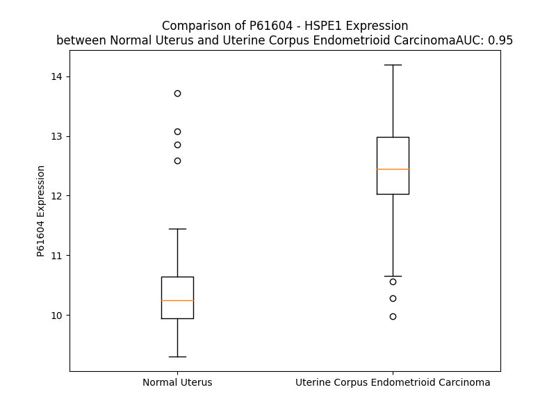

# Detailed Data for P61604

## Introduction to the Detailed Summary

### How to Interpret the Results

- **Summary & Metrics**: This section provides a quick reference to essential protein attributes, including expression changes, family classification, and biomarker applications. Regulation status (upregulated/downregulated) indicates the protein's behavior in a disease context. Some information comes from the original excel file with the proteins selected from literature, while others are derived from the analyses.
- **Expression Comparison**: A visual representation comparing protein expression between normal and disease states. It highlights significant changes in expression levels that might indicate diagnostic or therapeutic relevance. This is data coming from transcriptomics experiments and could not translate similarly to protein levels.
- **Isoform Alignment**: An interactive view of isoform alignments, revealing structural and functional differences between variants of the protein.
- **Interactors & Homologs**: Tables listing known interaction partners and homologous proteins, the more interactors and homologs, the more complex the protein is to design an antibody for.
- **Biological Assemblies**: Information about the structural arrangement of the protein in different assemblies, providing insights into its functional state but also the complexity of the protein to develop antibodies.
- **Combined Per-Residue Information**: A detailed table summarizing residue-level data. This includes predictions for epitope regions, aggregation tendencies, and modifications that might impact the protein's function. Each row corresponds to a residue in the protein, providing insights into specific sites that may be important for research or drug development.
## Summary & Metrics

- **UniProt Accession**: P61604
- **Gene Name**: HSPE1
- **Protein Name**: heat shock 10kDa protein 1 (chaperonin 10)
- **Swiss Prot**: CH10_HUMAN
- **Family**: enzyme
- **Biomarker Application**:  
- **Number of Isoforms**: 0
- **Regulation**: 1
- **(transcriptomics) AUC**: 0.96
- **(transcriptomics) Fold Change**: 1.20
- **(transcriptomics) Regulation**: Upregulated
- **Discotope Epitope Count**: 31
- **Max n_uniprots (Homo)**: 11.0
- **Max n_uniprots (Hetero)**: 11.0

## Expression Comparison

## Interactors

| preferredName_A   | preferredName_B   |   score |
|:------------------|:------------------|--------:|
| HSPE1             | HSPD1             |   0.999 |
| HSPE1             | GRPEL1            |   0.995 |
| HSPE1             | HSPA9             |   0.97  |
| HSPE1             | CLPB              |   0.967 |
| HSPE1             | CLPP              |   0.946 |
| HSPE1             | HSP90AA1          |   0.942 |
| HSPE1             | GRPEL2            |   0.933 |
| HSPE1             | HSPA4             |   0.93  |
| HSPE1             | HSP90AB1          |   0.928 |
| HSPE1             | TCP1              |   0.917 |

## Homologs

| uniprot_id   | gene_id   |
|--------------|-----------|

## Biological Assemblies

|   Unnamed: 0 |   assembly |   n_uniprots | composition   | crystal_id   |
|-------------:|-----------:|-------------:|:--------------|:-------------|
|            0 |          1 |           11 | Homo          | 8g7n         |
|            0 |          1 |           11 | Hetero        | 8g7o         |
|            0 |          1 |           11 | Hetero        | 6mrd         |
|            0 |          1 |           11 | Homo          | 4pj1         |
|            0 |          1 |           11 | Hetero        | 6mrc         |

## Combined Per-Residue Information

|   res | aa   |   epitope_score | epitope   |   relative_surface_accessibility |   modeling_confidence |   Aggregation | modification                 |
|------:|:-----|----------------:|:----------|---------------------------------:|----------------------:|--------------:|:-----------------------------|
|     1 | M    |         0.29803 | False     |                          1.25151 |                 37.19 |         0     | N/A                          |
|     2 | A    |         0.21667 | False     |                          0.81775 |                 45.2  |         0     | N-acetylalanine              |
|     3 | G    |         0.30467 | False     |                          0.33965 |                 50.27 |         0     | N/A                          |
|     4 | Q    |         0.26388 | False     |                          0.66161 |                 54.55 |         0     | N/A                          |
|     5 | A    |         0.12485 | False     |                          0.13946 |                 52.9  |         0     | N/A                          |
|     6 | F    |         0.2106  | False     |                          0.22215 |                 64.79 |         0     | N/A                          |
|     7 | R    |         0.37701 | False     |                          0.71876 |                 73.2  |         0     | N/A                          |
|     8 | K    |         0.22422 | False     |                          0.86446 |                 83.05 |         0     | N6-acetyllysine              |
|     9 | F    |         0.4954  | True      |                          0.28439 |                 91.2  |         0     | N/A                          |
|    10 | L    |         0.2957  | False     |                          0.84177 |                 92.53 |         0     | N/A                          |
|    11 | P    |         0.08927 | False     |                          0.0523  |                 95.24 |         0     | N/A                          |
|    12 | L    |         0.39312 | False     |                          0.72262 |                 94.79 |         4.354 | N/A                          |
|    13 | F    |         0.44585 | False     |                          0.55181 |                 94.79 |         5.151 | N/A                          |
|    14 | D    |         0.20446 | False     |                          0.20354 |                 95.13 |         5.151 | N/A                          |
|    15 | R    |         0.37051 | False     |                          0.33103 |                 96.69 |         5.151 | N/A                          |
|    16 | V    |         0.00284 | False     |                          0       |                 96.71 |         5.151 | N/A                          |
|    17 | L    |         0.00488 | False     |                          0       |                 96.52 |         5.151 | N/A                          |
|    18 | V    |         0.00476 | False     |                          0       |                 95.89 |         5.151 | N/A                          |
|    19 | E    |         0.26891 | False     |                          0.25277 |                 94.57 |         0     | N/A                          |
|    20 | R    |         0.41984 | False     |                          0.2507  |                 93.61 |         0     | N/A                          |
|    21 | S    |         0.3714  | False     |                          0.37991 |                 90.79 |         0     | N/A                          |
|    22 | A    |         0.50705 | True      |                          0.90467 |                 86.61 |         0     | N/A                          |
|    23 | A    |         0.29542 | False     |                          0.31136 |                 84.23 |         0     | N/A                          |
|    24 | E    |         0.57699 | True      |                          0.73266 |                 79.46 |         0     | N/A                          |
|    25 | T    |         0.54194 | True      |                          0.52018 |                 82.23 |         0     | N/A                          |
|    26 | V    |         0.50283 | True      |                          0.52038 |                 82.47 |         0     | N/A                          |
|    27 | T    |         0.51864 | True      |                          0.35765 |                 80.97 |         0     | N/A                          |
|    28 | K    |         0.5076  | True      |                          1.09991 |                 82.19 |         0     | N6-succinyllysine            |
|    29 | G    |         0.53441 | True      |                          0.81884 |                 86.97 |         0     | N/A                          |
|    30 | G    |         0.56007 | True      |                          0.6274  |                 85.45 |         0     | N/A                          |
|    31 | I    |         0.62853 | True      |                          0.73597 |                 86.88 |         0     | N/A                          |
|    32 | M    |         0.67234 | True      |                          0.79706 |                 83.98 |         0     | N/A                          |
|    33 | L    |         0.50069 | True      |                          0.30252 |                 81.78 |         0     | N/A                          |
|    34 | P    |         0.51399 | True      |                          0.64318 |                 82.75 |         0     | N/A                          |
|    35 | E    |         0.57193 | True      |                          0.78887 |                 78.04 |         0     | N/A                          |
|    36 | K    |         0.5818  | True      |                          1.00781 |                 77.3  |         0     | N/A                          |
|    37 | S    |         0.58291 | True      |                          0.52748 |                 77.55 |         0     | N/A                          |
|    38 | Q    |         0.59341 | True      |                          0.22346 |                 73.28 |         0     | N/A                          |
|    39 | G    |         0.67951 | True      |                          0.71822 |                 77.68 |         0     | N/A                          |
|    40 | K    |         0.50996 | True      |                          0.59776 |                 83.36 |         0     | N6-malonyllysine; alternate  |
|    40 | K    |         0.50996 | True      |                          0.59776 |                 83.36 |         0     | N6-succinyllysine; alternate |
|    40 | K    |         0.50996 | True      |                          0.59776 |                 83.36 |         0     | N6-acetyllysine; alternate   |
|    41 | V    |         0.32633 | False     |                          0.21751 |                 89.67 |        19.024 | N/A                          |
|    42 | L    |         0.31048 | False     |                          0.28304 |                 94.29 |        20.615 | N/A                          |
|    43 | Q    |         0.37735 | False     |                          0.45568 |                 94.95 |        21.412 | N/A                          |
|    44 | A    |         0.03299 | False     |                          0.02368 |                 96.04 |        40.314 | N/A                          |
|    45 | T    |         0.20743 | False     |                          0.36939 |                 95.43 |        61.04  | N/A                          |
|    46 | V    |         0.01971 | False     |                          0.00774 |                 95.52 |        64.237 | N/A                          |
|    47 | V    |         0.07571 | False     |                          0.10899 |                 94.52 |        64.111 | N/A                          |
|    48 | A    |         0.05594 | False     |                          0.07908 |                 94.78 |        62.445 | N/A                          |
|    49 | V    |         0.14351 | False     |                          0.32698 |                 95.2  |        59.682 | N/A                          |
|    50 | G    |         0.06013 | False     |                          0.08591 |                 94.37 |         8.368 | N/A                          |
|    51 | S    |         0.24376 | False     |                          0.57826 |                 92.58 |         0.903 | N/A                          |
|    52 | G    |         0.06288 | False     |                          0.02743 |                 94.03 |         0     | N/A                          |
|    53 | S    |         0.54428 | True      |                          0.31529 |                 91.71 |         0     | N/A                          |
|    54 | K    |         0.53005 | True      |                          0.75265 |                 88.63 |         0     | N6-succinyllysine; alternate |
|    54 | K    |         0.53005 | True      |                          0.75265 |                 88.63 |         0     | N6-malonyllysine; alternate  |
|    55 | G    |         0.41492 | False     |                          0.4     |                 83.47 |         0     | N/A                          |
|    56 | K    |         0.517   | True      |                          1.10253 |                 82.62 |         0     | N6-acetyllysine; alternate   |
|    56 | K    |         0.517   | True      |                          1.10253 |                 82.62 |         0     | N6-malonyllysine; alternate  |
|    56 | K    |         0.517   | True      |                          1.10253 |                 82.62 |         0     | N6-succinyllysine; alternate |
|    57 | G    |         0.57306 | True      |                          0.89978 |                 86.99 |         0     | N/A                          |
|    58 | G    |         0.40821 | False     |                          0.62624 |                 85.73 |         0     | N/A                          |
|    59 | E    |         0.38246 | False     |                          0.72665 |                 90.48 |         0     | N/A                          |
|    60 | I    |         0.52714 | True      |                          0.57541 |                 89.32 |         0     | N/A                          |
|    61 | Q    |         0.47306 | True      |                          0.62902 |                 91.14 |         0     | N/A                          |
|    62 | P    |         0.33855 | False     |                          0.7023  |                 92.66 |         0     | N/A                          |
|    63 | V    |         0.16921 | False     |                          0.16275 |                 94.34 |         0     | N/A                          |
|    64 | S    |         0.43711 | False     |                          0.72576 |                 94.68 |         0     | N/A                          |
|    65 | V    |         0.10921 | False     |                          0.06006 |                 95.18 |         0     | N/A                          |
|    66 | K    |         0.31636 | False     |                          0.74875 |                 94.32 |         0     | N6-acetyllysine; alternate   |
|    66 | K    |         0.31636 | False     |                          0.74875 |                 94.32 |         0     | N6-succinyllysine; alternate |
|    67 | V    |         0.15667 | False     |                          0.61039 |                 93.7  |         0     | N/A                          |
|    68 | G    |         0.18715 | False     |                          0.5886  |                 93.89 |         0     | N/A                          |
|    69 | D    |         0.15187 | False     |                          0.11688 |                 95.76 |         0     | N/A                          |
|    70 | K    |         0.32873 | False     |                          0.55237 |                 96.58 |         0     | N6-acetyllysine; alternate   |
|    70 | K    |         0.32873 | False     |                          0.55237 |                 96.58 |         0     | N6-succinyllysine; alternate |
|    71 | V    |         0.00765 | False     |                          0.0007  |                 97.06 |         0     | N/A                          |
|    72 | L    |         0.35925 | False     |                          0.36684 |                 97.18 |         0     | N/A                          |
|    73 | L    |         0.01373 | False     |                          0.00061 |                 96.7  |         0     | N/A                          |
|    74 | P    |         0.24354 | False     |                          0.17262 |                 96.12 |         0     | N/A                          |
|    75 | E    |         0.63507 | True      |                          0.51227 |                 92.89 |         0     | N/A                          |
|    76 | Y    |         0.65932 | True      |                          0.75097 |                 92.19 |         0     | N/A                          |
|    77 | G    |         0.61535 | True      |                          0.70005 |                 91.78 |         0     | N/A                          |
|    78 | G    |         0.42016 | False     |                          0.45571 |                 93.02 |         0     | N/A                          |
|    79 | T    |         0.56758 | True      |                          0.60196 |                 96.69 |         0     | Phosphothreonine             |
|    80 | K    |         0.42673 | False     |                          0.55701 |                 95.2  |         0.208 | N6-acetyllysine; alternate   |
|    80 | K    |         0.42673 | False     |                          0.55701 |                 95.2  |         0.208 | N6-succinyllysine; alternate |
|    81 | V    |         0.32009 | False     |                          0.15614 |                 94.04 |         0.208 | N/A                          |
|    82 | V    |         0.45292 | False     |                          0.60138 |                 93.26 |         0.208 | N/A                          |
|    83 | L    |         0.38575 | False     |                          0.1863  |                 91.84 |         0.208 | N/A                          |
|    84 | D    |         0.30684 | False     |                          0.6151  |                 89.57 |         0.208 | N/A                          |
|    85 | D    |         0.44753 | False     |                          0.91048 |                 88.5  |         0     | N/A                          |
|    86 | K    |         0.20759 | False     |                          0.38488 |                 90.32 |         0     | N6-acetyllysine; alternate   |
|    86 | K    |         0.20759 | False     |                          0.38488 |                 90.32 |         0     | N6-succinyllysine; alternate |
|    87 | D    |         0.37684 | False     |                          0.40245 |                 92.31 |         0     | N/A                          |
|    88 | Y    |         0.09203 | False     |                          0.01991 |                 94.49 |         0     | N/A                          |
|    89 | F    |         0.27223 | False     |                          0.18408 |                 95.71 |         0     | N/A                          |
|    90 | L    |         0.24068 | False     |                          0.15076 |                 96.75 |         0     | N/A                          |
|    91 | F    |         0.05442 | False     |                          0.02364 |                 97.47 |         0     | N/A                          |
|    92 | R    |         0.53754 | True      |                          0.56281 |                 96.43 |         0     | N/A                          |
|    93 | D    |         0.13566 | False     |                          0.13742 |                 95.63 |         0     | N/A                          |
|    94 | G    |         0.40371 | False     |                          0.91351 |                 95.5  |         0     | N/A                          |
|    95 | D    |         0.52498 | True      |                          0.37624 |                 96.25 |         0     | N/A                          |
|    96 | I    |         0.18185 | False     |                          0.12647 |                 97.14 |         0     | N/A                          |
|    97 | L    |         0.36386 | False     |                          0.70748 |                 97.08 |         0     | N/A                          |
|    98 | G    |         0.26319 | False     |                          0.37517 |                 96.87 |         0     | N/A                          |
|    99 | K    |         0.2304  | False     |                          0.48959 |                 95.93 |         0     | N6-acetyllysine              |
|   100 | Y    |         0.39985 | False     |                          0.41619 |                 95.45 |         0     | N/A                          |
|   101 | V    |         0.20872 | False     |                          0.93485 |                 90.8  |         0     | N/A                          |
|   102 | D    |         0.17514 | False     |                          1.12191 |                 77.36 |         0     | N/A                          |

