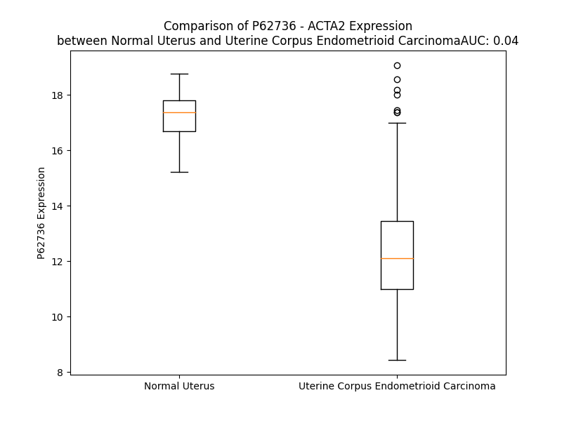

# Detailed Data for P62736

## Introduction to the Detailed Summary

### How to Interpret the Results

- **Summary & Metrics**: This section provides a quick reference to essential protein attributes, including expression changes, family classification, and biomarker applications. Regulation status (upregulated/downregulated) indicates the protein's behavior in a disease context. Some information comes from the original excel file with the proteins selected from literature, while others are derived from the analyses.
- **Expression Comparison**: A visual representation comparing protein expression between normal and disease states. It highlights significant changes in expression levels that might indicate diagnostic or therapeutic relevance. This is data coming from transcriptomics experiments and could not translate similarly to protein levels.
- **Isoform Alignment**: An interactive view of isoform alignments, revealing structural and functional differences between variants of the protein.
- **Interactors & Homologs**: Tables listing known interaction partners and homologous proteins, the more interactors and homologs, the more complex the protein is to design an antibody for.
- **Biological Assemblies**: Information about the structural arrangement of the protein in different assemblies, providing insights into its functional state but also the complexity of the protein to develop antibodies.
- **Combined Per-Residue Information**: A detailed table summarizing residue-level data. This includes predictions for epitope regions, aggregation tendencies, and modifications that might impact the protein's function. Each row corresponds to a residue in the protein, providing insights into specific sites that may be important for research or drug development.
## Summary & Metrics

- **UniProt Accession**: P62736
- **Gene Name**: ACTA2
- **Protein Name**: Actin, aortic smooth muscle (alpha actin)
- **Swiss Prot**: ACTA_HUMAN
- **Family**: other
- **Biomarker Application**:  
- **Number of Isoforms**: 0
- **Regulation**: 2
- **(transcriptomics) AUC**: 0.0
- **(transcriptomics) Fold Change**: 1.46
- **(transcriptomics) Regulation**: Downregulated
- **Discotope Epitope Count**: 86
- **Max n_uniprots (Homo)**: N/A
- **Max n_uniprots (Hetero)**: N/A

## Expression Comparison

## Interactors

| preferredName_A   | preferredName_B   |   score |
|:------------------|:------------------|--------:|
| ACTA2             | MYH11             |   0.997 |
| ACTA2             | ACTG2             |   0.988 |
| ACTA2             | GC                |   0.972 |
| ACTA2             | MYL9              |   0.97  |
| ACTA2             | ACTC1             |   0.96  |
| ACTA2             | MYH10             |   0.959 |
| ACTA2             | TAGLN             |   0.954 |
| ACTA2             | MYH9              |   0.953 |
| ACTA2             | MYL6              |   0.944 |
| ACTA2             | MYL6B             |   0.934 |
| ACTA2             | COL1A1            |   0.928 |
| ACTA2             | ACTA1             |   0.91  |
| ACTA2             | MYH14             |   0.907 |
| ACTA2             | SETD3             |   0.904 |

## Homologs

| uniprot_id   | gene_id   |
|:-------------|:----------|
| Q9H568       | ACTL8     |
| Q9P1U1       | ACTR3B    |
| Q9C0K3       | ACTR3C    |
| Q9Y614       | ACTL7B    |
| O94805       | ACTL6B    |
| P68133       | ACTA1     |
| A0A6Q8PFE4   | ACTB      |
| A0A804GS07   | ACTG1     |
| R4GMT0       | ACTR1A    |
| B4DXW1       | ACTR3     |
| Q8TDY3       | ACTRT2    |
| G3V1Y1       | ACTR6     |
| P68032       | ACTC1     |
| P42025       | ACTR1B    |
| Q9H9F9       | ACTR5     |
| C9J7L6       | ACTR8     |
| Q8TDG2       | ACTRT1    |
| O96019       | ACTL6A    |
| Q562R1       | ACTBL2    |
| Q9BYD9       | ACTRT3    |
| Q5JWF8       | ACTL10    |
| Q8TC94       | ACTL9     |
| P61160       | ACTR2     |
| Q9NZ32       | ACTR10    |
| Q9Y615       | ACTL7A    |
| F8WCH0       | ACTG2     |

## Combined Per-Residue Information

|   res | aa   |   epitope_score | epitope   |   relative_surface_accessibility |   modeling_confidence |   Aggregation | modification                                      |
|------:|:-----|----------------:|:----------|---------------------------------:|----------------------:|--------------:|:--------------------------------------------------|
|     1 | M    |         0.2156  | True      |                          1.27788 |                 34.54 |         0     | N/A                                               |
|     2 | C    |         0.21361 | True      |                          0.93704 |                 34.73 |         0     | N-acetylcysteine; in intermediate form            |
|     3 | E    |         0.18705 | False     |                          0.8177  |                 44.07 |         0     | N-acetylglutamate; in Actin, aortic smooth muscle |
|     4 | E    |         0.19181 | False     |                          0.81362 |                 48.57 |         0     | N/A                                               |
|     5 | E    |         0.17794 | False     |                          0.862   |                 51.1  |         0     | N/A                                               |
|     6 | D    |         0.13149 | False     |                          0.81456 |                 64.93 |         0     | N/A                                               |
|     7 | S    |         0.11467 | False     |                          0.38273 |                 83.94 |         0     | N/A                                               |
|     8 | T    |         0.0848  | False     |                          0.45708 |                 94.9  |         0     | N/A                                               |
|     9 | A    |         0.01308 | False     |                          0.07021 |                 97.84 |         0     | N/A                                               |
|    10 | L    |         0.00318 | False     |                          0       |                 98.41 |         0     | N/A                                               |
|    11 | V    |         0.00097 | False     |                          0       |                 98.67 |         0     | N/A                                               |
|    12 | C    |         0.00103 | False     |                          0       |                 98.5  |         0     | N/A                                               |
|    13 | D    |         0.00795 | False     |                          0.01622 |                 98.4  |         0     | N/A                                               |
|    14 | N    |         0.03789 | False     |                          0.05967 |                 95.28 |         0     | N/A                                               |
|    15 | G    |         0.05977 | False     |                          0.17865 |                 95.79 |         0     | N/A                                               |
|    16 | S    |         0.02957 | False     |                          0.05377 |                 95.66 |         0     | N/A                                               |
|    17 | G    |         0.10852 | False     |                          0.1968  |                 95.5  |         0     | N/A                                               |
|    18 | L    |         0.10132 | False     |                          0.4912  |                 97.04 |         0     | N/A                                               |
|    19 | C    |         0.00512 | False     |                          0.002   |                 97.85 |         0     | N/A                                               |
|    20 | K    |         0.02121 | False     |                          0.09863 |                 98.56 |         0     | N/A                                               |
|    21 | A    |         0.00316 | False     |                          0       |                 98.69 |         0     | N/A                                               |
|    22 | G    |         0.00253 | False     |                          0       |                 98.51 |         0     | N/A                                               |
|    23 | F    |         0.03912 | False     |                          0.10461 |                 98.14 |         0     | N/A                                               |
|    24 | A    |         0.02368 | False     |                          0.10559 |                 97.36 |         0     | N/A                                               |
|    25 | G    |         0.09829 | False     |                          0.64424 |                 95.3  |         0     | N/A                                               |
|    26 | D    |         0.14157 | False     |                          0.26942 |                 96.65 |         0     | N/A                                               |
|    27 | D    |         0.20067 | False     |                          0.8342  |                 94.09 |         0     | N/A                                               |
|    28 | A    |         0.11447 | False     |                          0.50197 |                 96.1  |         0     | N/A                                               |
|    29 | P    |         0.03125 | False     |                          0.13326 |                 97.96 |         0     | N/A                                               |
|    30 | R    |         0.18797 | False     |                          0.59912 |                 97.76 |         0     | N/A                                               |
|    31 | A    |         0.06006 | False     |                          0.06122 |                 98.24 |         0     | N/A                                               |
|    32 | V    |         0.09637 | False     |                          0.37843 |                 98.17 |         0     | N/A                                               |
|    33 | F    |         0.04758 | False     |                          0.01098 |                 98.2  |         0     | N/A                                               |
|    34 | P    |         0.08405 | False     |                          0.17496 |                 97.74 |         0     | N/A                                               |
|    35 | S    |         0.00385 | False     |                          0.00576 |                 97.72 |         0     | N/A                                               |
|    36 | I    |         0.05204 | False     |                          0.0176  |                 97.44 |         0     | N/A                                               |
|    37 | V    |         0.00352 | False     |                          0.0007  |                 98.19 |         0     | N/A                                               |
|    38 | G    |         0.00863 | False     |                          0       |                 96.67 |         0     | N/A                                               |
|    39 | R    |         0.17217 | False     |                          0.31997 |                 95    |         0     | N/A                                               |
|    40 | P    |         0.15299 | False     |                          0.32097 |                 92.34 |         0     | N/A                                               |
|    41 | R    |         0.31487 | True      |                          0.49605 |                 88.83 |         0     | N/A                                               |
|    42 | H    |         0.29751 | True      |                          0.69282 |                 82.42 |         0     | N/A                                               |
|    43 | Q    |         0.37962 | True      |                          0.95633 |                 72.24 |         0     | N/A                                               |
|    44 | G    |         0.26431 | True      |                          0.49206 |                 69.86 |         0     | N/A                                               |
|    45 | V    |         0.23596 | True      |                          0.45476 |                 65.84 |         1.004 | N/A                                               |
|    46 | M    |         0.09662 | False     |                          0.02847 |                 64.88 |         1.004 | Methionine (R)-sulfoxide                          |
|    47 | V    |         0.3818  | True      |                          0.85865 |                 62.92 |         1.004 | N/A                                               |
|    48 | G    |         0.3128  | True      |                          0.99023 |                 66.18 |         1.004 | N/A                                               |
|    49 | M    |         0.34787 | True      |                          0.66516 |                 63.9  |         1.004 | Methionine (R)-sulfoxide                          |
|    50 | G    |         0.30346 | True      |                          0.59877 |                 65.26 |         0     | N/A                                               |
|    51 | Q    |         0.22342 | True      |                          0.6767  |                 72.07 |         0     | N/A                                               |
|    52 | K    |         0.25005 | True      |                          0.51785 |                 84.64 |         0     | N/A                                               |
|    53 | D    |         0.26304 | True      |                          0.8243  |                 88.47 |         0     | N/A                                               |
|    54 | S    |         0.16685 | False     |                          0.19283 |                 94.38 |         0     | N/A                                               |
|    55 | Y    |         0.03552 | False     |                          0.0185  |                 95.97 |         0     | N/A                                               |
|    56 | V    |         0.04964 | False     |                          0.10191 |                 97.86 |         0     | N/A                                               |
|    57 | G    |         0.00377 | False     |                          0       |                 97.48 |         0     | N/A                                               |
|    58 | D    |         0.28637 | True      |                          0.52377 |                 96.87 |         0     | N/A                                               |
|    59 | E    |         0.18466 | False     |                          0.30151 |                 94.99 |         0     | N/A                                               |
|    60 | A    |         0.00526 | False     |                          0       |                 95.78 |         0     | N/A                                               |
|    61 | Q    |         0.20909 | False     |                          0.22545 |                 94.65 |         0     | N/A                                               |
|    62 | S    |         0.39391 | True      |                          0.71788 |                 93.06 |         0     | N/A                                               |
|    63 | K    |         0.19076 | False     |                          0.18358 |                 91.9  |         0     | N/A                                               |
|    64 | R    |         0.2528  | True      |                          0.07843 |                 91.95 |         0     | N/A                                               |
|    65 | G    |         0.31642 | True      |                          0.77263 |                 87.92 |         0     | N/A                                               |
|    66 | I    |         0.47491 | True      |                          0.35233 |                 90    |         0     | N/A                                               |
|    67 | L    |         0.00973 | False     |                          0.00305 |                 92.56 |         0     | N/A                                               |
|    68 | T    |         0.18529 | False     |                          0.466   |                 93.92 |         0     | N/A                                               |
|    69 | L    |         0.2068  | False     |                          0.19039 |                 95.31 |         0     | N/A                                               |
|    70 | K    |         0.18924 | False     |                          0.51231 |                 96.82 |         0     | N/A                                               |
|    71 | Y    |         0.25941 | True      |                          0.31509 |                 96.4  |         0     | N/A                                               |
|    72 | P    |         0.01071 | False     |                          0.00596 |                 97.75 |         0     | N/A                                               |
|    73 | I    |         0.02792 | False     |                          0.01006 |                 97.48 |         0     | N/A                                               |
|    74 | E    |         0.14267 | False     |                          0.45018 |                 94.12 |         0     | N/A                                               |
|    75 | H    |         0.15792 | False     |                          0.39868 |                 93.71 |         0     | Tele-methylhistidine                              |
|    76 | G    |         0.09541 | False     |                          0.18454 |                 93.33 |         0     | N/A                                               |
|    77 | I    |         0.08911 | False     |                          0.15919 |                 96.52 |         0     | N/A                                               |
|    78 | I    |         0.12512 | False     |                          0.09237 |                 97.8  |         0     | N/A                                               |
|    79 | T    |         0.22827 | True      |                          0.54612 |                 97.05 |         0     | N/A                                               |
|    80 | N    |         0.17035 | False     |                          0.30317 |                 98.12 |         0     | N/A                                               |
|    81 | W    |         0.09034 | False     |                          0.21403 |                 98.15 |         0     | N/A                                               |
|    82 | D    |         0.23415 | True      |                          0.60289 |                 97.98 |         0     | N/A                                               |
|    83 | D    |         0.00989 | False     |                          0.00189 |                 98.26 |         0     | N/A                                               |
|    84 | M    |         0.0025  | False     |                          0.00144 |                 98.28 |         0     | N/A                                               |
|    85 | E    |         0.12185 | False     |                          0.23418 |                 98.25 |         0     | N/A                                               |
|    86 | K    |         0.15182 | False     |                          0.29944 |                 98.28 |         0     | N6-methyllysine                                   |
|    87 | I    |         0.00268 | False     |                          0       |                 98.55 |         0     | N/A                                               |
|    88 | W    |         0.00346 | False     |                          0       |                 98.58 |         0     | N/A                                               |
|    89 | H    |         0.18372 | False     |                          0.49817 |                 98.3  |         0     | N/A                                               |
|    90 | H    |         0.08414 | False     |                          0.12293 |                 98.22 |         0     | N/A                                               |
|    91 | S    |         0.00398 | False     |                          0       |                 98.41 |         0     | N/A                                               |
|    92 | F    |         0.00222 | False     |                          0       |                 98.53 |         0     | N/A                                               |
|    93 | Y    |         0.16769 | False     |                          0.41025 |                 98.06 |         0     | N/A                                               |
|    94 | N    |         0.23735 | True      |                          0.49194 |                 97.22 |         0     | N/A                                               |
|    95 | E    |         0.09321 | False     |                          0.36781 |                 98.12 |         0     | N/A                                               |
|    96 | L    |         0.07377 | False     |                          0.1009  |                 97.87 |         0     | N/A                                               |
|    97 | R    |         0.27393 | True      |                          0.80426 |                 97.97 |         0     | N/A                                               |
|    98 | V    |         0.21221 | True      |                          0.1822  |                 97.71 |         0     | N/A                                               |
|    99 | A    |         0.09175 | False     |                          0.2838  |                 97.59 |         0     | N/A                                               |
|   100 | P    |         0.00437 | False     |                          0.00099 |                 97.6  |         0     | N/A                                               |
|   101 | E    |         0.13233 | False     |                          0.47184 |                 97.79 |         0     | N/A                                               |
|   102 | E    |         0.12644 | False     |                          0.55778 |                 97.38 |         0     | N/A                                               |
|   103 | H    |         0.07884 | False     |                          0.11946 |                 97.65 |         0     | N/A                                               |
|   104 | P    |         0.02624 | False     |                          0.15209 |                 98    |         0     | N/A                                               |
|   105 | T    |         0.00197 | False     |                          0       |                 98.53 |         0     | N/A                                               |
|   106 | L    |         0.00135 | False     |                          0       |                 98.57 |         0     | N/A                                               |
|   107 | L    |         0.0012  | False     |                          0       |                 98.53 |         0     | N/A                                               |
|   108 | T    |         0.00676 | False     |                          0.01408 |                 97.89 |         0     | N/A                                               |
|   109 | E    |         0.05734 | False     |                          0.05629 |                 96.84 |         0     | N/A                                               |
|   110 | A    |         0.02058 | False     |                          0.03387 |                 95.13 |         0     | N/A                                               |
|   111 | P    |         0.0207  | False     |                          0.01837 |                 94.61 |         0     | N/A                                               |
|   112 | L    |         0.26858 | True      |                          0.61825 |                 92.4  |         0     | N/A                                               |
|   113 | N    |         0.07139 | False     |                          0.13401 |                 95.23 |         0     | N/A                                               |
|   114 | P    |         0.25527 | True      |                          0.44634 |                 96.36 |         0     | N/A                                               |
|   115 | K    |         0.21836 | True      |                          0.70053 |                 96.67 |         0     | N/A                                               |
|   116 | A    |         0.16258 | False     |                          0.66611 |                 97.72 |         0     | N/A                                               |
|   117 | N    |         0.09207 | False     |                          0.11531 |                 97.92 |         0     | N/A                                               |
|   118 | R    |         0.10913 | False     |                          0.11071 |                 97.84 |         0     | N/A                                               |
|   119 | E    |         0.13867 | False     |                          0.30068 |                 98.48 |         0     | N/A                                               |
|   120 | K    |         0.1572  | False     |                          0.32877 |                 98.44 |         0     | N/A                                               |
|   121 | M    |         0.00923 | False     |                          0.00873 |                 98    |         0.254 | N/A                                               |
|   122 | T    |         0.00304 | False     |                          0       |                 98.33 |         0.862 | N/A                                               |
|   123 | Q    |         0.23003 | True      |                          0.2799  |                 98.42 |         0.862 | N/A                                               |
|   124 | I    |         0.04193 | False     |                          0.0176  |                 98.59 |         0.862 | N/A                                               |
|   125 | M    |         0.0056  | False     |                          0       |                 98.6  |         0.862 | N/A                                               |
|   126 | F    |         0.00969 | False     |                          0       |                 98.59 |         0.862 | N/A                                               |
|   127 | E    |         0.20525 | False     |                          0.48366 |                 98.46 |         0     | N/A                                               |
|   128 | T    |         0.18488 | False     |                          0.50843 |                 98.33 |         0     | N/A                                               |
|   129 | F    |         0.03239 | False     |                          0.04446 |                 98.44 |         0     | N/A                                               |
|   130 | N    |         0.19003 | False     |                          0.51758 |                 98.24 |         0     | N/A                                               |
|   131 | V    |         0.00437 | False     |                          0.0007  |                 98.42 |         0     | N/A                                               |
|   132 | P    |         0.05566 | False     |                          0.36742 |                 97.8  |         0.294 | N/A                                               |
|   133 | A    |         0.02725 | False     |                          0.10713 |                 98.06 |        26.054 | N/A                                               |
|   134 | M    |         0.00333 | False     |                          0       |                 98.05 |        56.321 | N/A                                               |
|   135 | Y    |         0.03766 | False     |                          0.08343 |                 98.27 |        81.002 | N/A                                               |
|   136 | V    |         0.00759 | False     |                          0.00985 |                 98.08 |        88.132 | N/A                                               |
|   137 | A    |         0.02865 | False     |                          0.0676  |                 97.45 |        88.727 | N/A                                               |
|   138 | I    |         0.03042 | False     |                          0.12425 |                 97.11 |        89.253 | N/A                                               |
|   139 | Q    |         0.05457 | False     |                          0.10777 |                 97.98 |        85.387 | N/A                                               |
|   140 | A    |         0.00169 | False     |                          0.00365 |                 97.69 |        86.505 | N/A                                               |
|   141 | V    |         0.02594 | False     |                          0.09997 |                 97.6  |        87.729 | N/A                                               |
|   142 | L    |         0.00267 | False     |                          0.00165 |                 97.92 |        85.356 | N/A                                               |
|   143 | S    |         0.00142 | False     |                          0.00307 |                 98.15 |        71.945 | N/A                                               |
|   144 | L    |         0.00208 | False     |                          0       |                 97.76 |        70.303 | N/A                                               |
|   145 | Y    |         0.10098 | False     |                          0.22354 |                 96.01 |        61.134 | N/A                                               |
|   146 | A    |         0.05665 | False     |                          0.28453 |                 96.81 |        28.75  | N/A                                               |
|   147 | S    |         0.06943 | False     |                          0.17348 |                 95.54 |         1.313 | N/A                                               |
|   148 | G    |         0.14547 | False     |                          0.84371 |                 94.94 |         0.095 | N/A                                               |
|   149 | R    |         0.17422 | False     |                          0.25472 |                 96.36 |         0     | N/A                                               |
|   150 | T    |         0.11791 | False     |                          0.54762 |                 95.62 |         3.84  | N/A                                               |
|   151 | T    |         0.12024 | False     |                          0.16555 |                 98.09 |         9.341 | N/A                                               |
|   152 | G    |         0.00166 | False     |                          0       |                 98.48 |         9.341 | N/A                                               |
|   153 | I    |         0.00354 | False     |                          0.00379 |                 98.78 |         9.341 | N/A                                               |
|   154 | V    |         0.00152 | False     |                          0       |                 98.81 |         9.341 | N/A                                               |
|   155 | L    |         0.0088  | False     |                          0.01885 |                 98.8  |         8.728 | N/A                                               |
|   156 | D    |         0.02022 | False     |                          0.08007 |                 98.46 |         0     | N/A                                               |
|   157 | S    |         0.01689 | False     |                          0.0156  |                 98.58 |         0     | N/A                                               |
|   158 | G    |         0.05719 | False     |                          0.2762  |                 97.56 |         0     | N/A                                               |
|   159 | D    |         0.08834 | False     |                          0.2459  |                 97.1  |         0     | N/A                                               |
|   160 | G    |         0.01752 | False     |                          0.02651 |                 96.56 |         0     | N/A                                               |
|   161 | V    |         0.05878 | False     |                          0.07799 |                 97.5  |         0     | N/A                                               |
|   162 | T    |         0.01174 | False     |                          0.00712 |                 98.46 |         0     | N/A                                               |
|   163 | H    |         0.01803 | False     |                          0.02182 |                 97.99 |         0     | N/A                                               |
|   164 | N    |         0.0173  | False     |                          0.01257 |                 98.46 |         0     | N/A                                               |
|   165 | V    |         0.00374 | False     |                          0       |                 98.58 |         0     | N/A                                               |
|   166 | P    |         0.0021  | False     |                          0       |                 98.7  |         0     | N/A                                               |
|   167 | I    |         0.00506 | False     |                          0       |                 98.56 |         0     | N/A                                               |
|   168 | Y    |         0.10582 | False     |                          0.35521 |                 97.69 |         0     | N/A                                               |
|   169 | E    |         0.12232 | False     |                          0.5577  |                 95.44 |         0     | N/A                                               |
|   170 | G    |         0.06376 | False     |                          0.17452 |                 93.69 |         0     | N/A                                               |
|   171 | Y    |         0.16251 | False     |                          0.66505 |                 94.6  |         0     | N/A                                               |
|   172 | A    |         0.04423 | False     |                          0.15831 |                 97.06 |         0     | N/A                                               |
|   173 | L    |         0.1161  | False     |                          0.20526 |                 97.32 |         0     | N/A                                               |
|   174 | P    |         0.16286 | False     |                          0.65958 |                 96.2  |         0     | N/A                                               |
|   175 | H    |         0.15458 | False     |                          0.66646 |                 96.55 |         0     | N/A                                               |
|   176 | A    |         0.00326 | False     |                          0       |                 98.12 |         0     | N/A                                               |
|   177 | I    |         0.06493 | False     |                          0.10376 |                 98.34 |         0     | N/A                                               |
|   178 | M    |         0.08758 | False     |                          0.21637 |                 97.82 |         0     | N/A                                               |
|   179 | R    |         0.12835 | False     |                          0.37713 |                 95.84 |         0     | N/A                                               |
|   180 | L    |         0.09028 | False     |                          0.0577  |                 95.71 |         0     | N/A                                               |
|   181 | D    |         0.1437  | False     |                          0.34379 |                 94.95 |         0     | N/A                                               |
|   182 | L    |         0.01495 | False     |                          0.00082 |                 97.61 |         0     | N/A                                               |
|   183 | A    |         0.00246 | False     |                          0       |                 98.15 |         0     | N/A                                               |
|   184 | G    |         0.01794 | False     |                          0.03702 |                 98.14 |         0     | N/A                                               |
|   185 | R    |         0.22694 | True      |                          0.20474 |                 96.97 |         0     | N/A                                               |
|   186 | D    |         0.11283 | False     |                          0.22856 |                 97.93 |         0     | N/A                                               |
|   187 | L    |         0.00535 | False     |                          0.00247 |                 98.56 |         2.064 | N/A                                               |
|   188 | T    |         0.01754 | False     |                          0.00869 |                 98.24 |         2.064 | N/A                                               |
|   189 | D    |         0.18058 | False     |                          0.40155 |                 97.37 |         2.239 | N/A                                               |
|   190 | Y    |         0.12014 | False     |                          0.08606 |                 98.16 |         2.506 | N/A                                               |
|   191 | L    |         0.00268 | False     |                          0       |                 98.54 |         2.506 | N/A                                               |
|   192 | M    |         0.20882 | False     |                          0.16577 |                 98.01 |         2.506 | N/A                                               |
|   193 | K    |         0.35022 | True      |                          0.58583 |                 97.4  |         2.506 | N/A                                               |
|   194 | I    |         0.04297 | False     |                          0.00456 |                 97.7  |         2.506 | N/A                                               |
|   195 | L    |         0.00374 | False     |                          0       |                 98.19 |         2.331 | N/A                                               |
|   196 | T    |         0.1805  | False     |                          0.4795  |                 97.51 |         1.983 | N/A                                               |
|   197 | E    |         0.34245 | True      |                          0.55778 |                 95.11 |         0.267 | N/A                                               |
|   198 | R    |         0.2694  | True      |                          0.3503  |                 92.97 |         0     | N/A                                               |
|   199 | G    |         0.29974 | True      |                          0.7433  |                 96    |         1.75  | N/A                                               |
|   200 | Y    |         0.33853 | True      |                          0.26121 |                 95.84 |         6.32  | N/A                                               |
|   201 | S    |         0.34518 | True      |                          0.54664 |                 94.98 |         7.198 | N/A                                               |
|   202 | F    |         0.17058 | False     |                          0.08697 |                 95.25 |        13.438 | N/A                                               |
|   203 | V    |         0.27458 | True      |                          0.85845 |                 92.92 |        13.438 | N/A                                               |
|   204 | T    |         0.24887 | True      |                          0.47605 |                 92.02 |        12.711 | N/A                                               |
|   205 | T    |         0.15649 | False     |                          0.55766 |                 88.86 |        11.609 | N/A                                               |
|   206 | A    |         0.20511 | False     |                          0.54018 |                 90.48 |         8.508 | N/A                                               |
|   207 | E    |         0.1662  | False     |                          0.2583  |                 94.57 |         0     | N/A                                               |
|   208 | R    |         0.17457 | False     |                          0.18434 |                 95.07 |         0     | N/A                                               |
|   209 | E    |         0.2704  | True      |                          0.16613 |                 94.84 |         0     | N/A                                               |
|   210 | I    |         0.36657 | True      |                          0.19028 |                 96.98 |         0.337 | N/A                                               |
|   211 | V    |         0.00367 | False     |                          0       |                 98.34 |         0.337 | N/A                                               |
|   212 | R    |         0.23536 | True      |                          0.33128 |                 97.76 |         0.337 | N/A                                               |
|   213 | D    |         0.19851 | False     |                          0.20612 |                 98.07 |         0.337 | N/A                                               |
|   214 | I    |         0.02106 | False     |                          0       |                 98.63 |         0.337 | N/A                                               |
|   215 | K    |         0.05869 | False     |                          0.05516 |                 98.57 |         0     | N/A                                               |
|   216 | E    |         0.1832  | False     |                          0.54893 |                 98.19 |         0     | N/A                                               |
|   217 | K    |         0.35109 | True      |                          0.67193 |                 98.31 |         0.202 | N/A                                               |
|   218 | L    |         0.25235 | True      |                          0.16715 |                 98.53 |        12.268 | N/A                                               |
|   219 | C    |         0.04308 | False     |                          0.02295 |                 98.8  |        17.371 | N/A                                               |
|   220 | Y    |         0.19642 | False     |                          0.1553  |                 98.81 |        17.371 | N/A                                               |
|   221 | V    |         0.02523 | False     |                          0.03453 |                 98.87 |        17.371 | N/A                                               |
|   222 | A    |         0.03036 | False     |                          0.01877 |                 98.6  |        17.371 | N/A                                               |
|   223 | L    |         0.20045 | False     |                          0.58853 |                 98.5  |        15.5   | N/A                                               |
|   224 | D    |         0.13844 | False     |                          0.36058 |                 98.41 |         0.202 | N/A                                               |
|   225 | F    |         0.15764 | False     |                          0.10373 |                 98.13 |         0.202 | N/A                                               |
|   226 | E    |         0.36221 | True      |                          0.63167 |                 97.91 |         0     | N/A                                               |
|   227 | N    |         0.3843  | True      |                          0.62741 |                 97.94 |         0     | N/A                                               |
|   228 | E    |         0.17239 | False     |                          0.18671 |                 98.21 |         0     | N/A                                               |
|   229 | M    |         0.27055 | True      |                          0.31821 |                 98.02 |         0     | N/A                                               |
|   230 | A    |         0.39248 | True      |                          0.56844 |                 98.1  |         0     | N/A                                               |
|   231 | T    |         0.31459 | True      |                          0.34439 |                 97.69 |         0     | N/A                                               |
|   232 | A    |         0.20736 | False     |                          0.24477 |                 96.94 |         0     | N/A                                               |
|   233 | A    |         0.50962 | True      |                          0.88739 |                 96.53 |         0     | N/A                                               |
|   234 | S    |         0.45081 | True      |                          0.75238 |                 95.99 |         0     | N/A                                               |
|   235 | S    |         0.34887 | True      |                          0.35465 |                 93.54 |         0     | N/A                                               |
|   236 | S    |         0.23936 | True      |                          0.619   |                 94.44 |         0     | N/A                                               |
|   237 | S    |         0.49807 | True      |                          0.64243 |                 95.58 |         0     | N/A                                               |
|   238 | L    |         0.22368 | True      |                          0.19021 |                 96.29 |         0     | N/A                                               |
|   239 | E    |         0.25862 | True      |                          0.34865 |                 97.56 |         0     | N/A                                               |
|   240 | K    |         0.36053 | True      |                          0.50313 |                 98.08 |         0     | N/A                                               |
|   241 | S    |         0.32631 | True      |                          0.60937 |                 97.43 |         0     | N/A                                               |
|   242 | Y    |         0.2952  | True      |                          0.12019 |                 98.22 |         0     | N/A                                               |
|   243 | E    |         0.31278 | True      |                          0.6245  |                 98.06 |         0     | N/A                                               |
|   244 | L    |         0.2401  | True      |                          0.13552 |                 96.38 |         0     | N/A                                               |
|   245 | P    |         0.44029 | True      |                          0.83518 |                 93.53 |         0     | N/A                                               |
|   246 | D    |         0.39988 | True      |                          0.70269 |                 93.85 |         0     | N/A                                               |
|   247 | G    |         0.2566  | True      |                          0.50423 |                 95.43 |         0     | N/A                                               |
|   248 | Q    |         0.48437 | True      |                          0.49888 |                 95.92 |         0.697 | N/A                                               |
|   249 | V    |         0.33779 | True      |                          0.64549 |                 97.5  |         2.766 | N/A                                               |
|   250 | I    |         0.06968 | False     |                          0.0072  |                 97.41 |         2.766 | N/A                                               |
|   251 | T    |         0.15744 | False     |                          0.32445 |                 97.72 |         2.766 | N/A                                               |
|   252 | I    |         0.00673 | False     |                          0       |                 98.19 |         2.766 | N/A                                               |
|   253 | G    |         0.04449 | False     |                          0.03779 |                 97.87 |         2.069 | N/A                                               |
|   254 | N    |         0.15268 | False     |                          0.23884 |                 97.79 |         0.465 | N/A                                               |
|   255 | E    |         0.04168 | False     |                          0.03451 |                 98.35 |         0     | N/A                                               |
|   256 | R    |         0.14472 | False     |                          0.11286 |                 98.64 |         0     | N/A                                               |
|   257 | F    |         0.02547 | False     |                          0.00165 |                 98.62 |         0     | N/A                                               |
|   258 | R    |         0.21195 | False     |                          0.20688 |                 98.52 |         0     | N/A                                               |
|   259 | C    |         0.00297 | False     |                          0       |                 98.72 |         0     | N/A                                               |
|   260 | P    |         0.00358 | False     |                          0       |                 98.66 |         0     | N/A                                               |
|   261 | E    |         0.01805 | False     |                          0.00358 |                 98.71 |         0     | N/A                                               |
|   262 | T    |         0.00523 | False     |                          0       |                 98.31 |         0     | N/A                                               |
|   263 | L    |         0.00599 | False     |                          0.00495 |                 98.66 |         0     | N/A                                               |
|   264 | F    |         0.03246 | False     |                          0.01981 |                 98.68 |         0     | N/A                                               |
|   265 | Q    |         0.18708 | False     |                          0.34914 |                 97.84 |         0     | N/A                                               |
|   266 | P    |         0.03624 | False     |                          0.02187 |                 98.35 |         0     | N/A                                               |
|   267 | S    |         0.25535 | True      |                          0.60933 |                 97.1  |         0     | N/A                                               |
|   268 | F    |         0.25846 | True      |                          0.3965  |                 94.73 |         0     | N/A                                               |
|   269 | I    |         0.45991 | True      |                          0.31985 |                 96.04 |         0     | N/A                                               |
|   270 | G    |         0.31957 | True      |                          0.81375 |                 95.57 |         0     | N/A                                               |
|   271 | M    |         0.28029 | True      |                          0.28172 |                 95.45 |         0     | N/A                                               |
|   272 | E    |         0.36527 | True      |                          0.9501  |                 94.75 |         0     | N/A                                               |
|   273 | S    |         0.21469 | True      |                          0.36136 |                 95.46 |         0     | N/A                                               |
|   274 | A    |         0.13704 | False     |                          0.31719 |                 97.74 |         0     | N/A                                               |
|   275 | G    |         0.00911 | False     |                          0.0083  |                 98.4  |         0     | N/A                                               |
|   276 | I    |         0.01391 | False     |                          0.0112  |                 98.62 |         0     | N/A                                               |
|   277 | H    |         0.05598 | False     |                          0.10418 |                 98.51 |         0     | N/A                                               |
|   278 | E    |         0.15114 | False     |                          0.33039 |                 98.39 |         0     | N/A                                               |
|   279 | T    |         0.02311 | False     |                          0.04406 |                 98.31 |         0     | N/A                                               |
|   280 | T    |         0.00536 | False     |                          0.00857 |                 98.69 |         0     | N/A                                               |
|   281 | Y    |         0.16396 | False     |                          0.23658 |                 98.46 |         0     | N/A                                               |
|   282 | N    |         0.11861 | False     |                          0.31762 |                 98.45 |         0     | N/A                                               |
|   283 | S    |         0.00276 | False     |                          0       |                 98.65 |         0     | N/A                                               |
|   284 | I    |         0.0088  | False     |                          0       |                 98.51 |         0     | N/A                                               |
|   285 | M    |         0.09363 | False     |                          0.28279 |                 97.74 |         0     | N/A                                               |
|   286 | K    |         0.10954 | False     |                          0.51423 |                 98.28 |         0     | N/A                                               |
|   287 | C    |         0.03951 | False     |                          0.01906 |                 98.02 |         0     | N/A                                               |
|   288 | D    |         0.27921 | True      |                          0.67074 |                 96.73 |         0     | N/A                                               |
|   289 | I    |         0.21307 | True      |                          0.76663 |                 95.97 |         0     | N/A                                               |
|   290 | D    |         0.34346 | True      |                          0.75905 |                 96.19 |         0     | N/A                                               |
|   291 | I    |         0.15718 | False     |                          0.14239 |                 96.94 |         0     | N/A                                               |
|   292 | R    |         0.13625 | False     |                          0.19299 |                 97.99 |         0     | N/A                                               |
|   293 | K    |         0.11575 | False     |                          0.69101 |                 97.44 |         0     | N/A                                               |
|   294 | D    |         0.11648 | False     |                          0.36698 |                 97.47 |         0     | N/A                                               |
|   295 | L    |         0.00275 | False     |                          0       |                 98.27 |         0.258 | N/A                                               |
|   296 | Y    |         0.00648 | False     |                          0.00061 |                 98.32 |         0.258 | N/A                                               |
|   297 | A    |         0.08667 | False     |                          0.28353 |                 97.75 |         0.258 | N/A                                               |
|   298 | N    |         0.05998 | False     |                          0.18878 |                 98.07 |         0.258 | N/A                                               |
|   299 | N    |         0.01709 | False     |                          0.02067 |                 98.55 |         0.258 | N/A                                               |
|   300 | V    |         0.00675 | False     |                          0.00316 |                 98.76 |         0.258 | N/A                                               |
|   301 | L    |         0.00533 | False     |                          0.00659 |                 98.83 |         0.258 | N/A                                               |
|   302 | S    |         0.00181 | False     |                          0       |                 98.56 |         0     | N/A                                               |
|   303 | G    |         0.04605 | False     |                          0.09979 |                 97.99 |         0     | N/A                                               |
|   304 | G    |         0.11793 | False     |                          0.51196 |                 97.48 |         0     | N/A                                               |
|   305 | T    |         0.01883 | False     |                          0.07308 |                 98.49 |         0     | N/A                                               |
|   306 | T    |         0.00257 | False     |                          0.00286 |                 98.68 |         0     | N/A                                               |
|   307 | M    |         0.13501 | False     |                          0.35134 |                 98.43 |         0     | N/A                                               |
|   308 | Y    |         0.04556 | False     |                          0.07158 |                 98.62 |         0     | N/A                                               |
|   309 | P    |         0.15395 | False     |                          0.63872 |                 98.68 |         0     | N/A                                               |
|   310 | G    |         0.08771 | False     |                          0.35041 |                 98.61 |         0     | N/A                                               |
|   311 | I    |         0.03023 | False     |                          0.01497 |                 98.77 |         0     | N/A                                               |
|   312 | A    |         0.03607 | False     |                          0.2708  |                 98.69 |         0     | N/A                                               |
|   313 | D    |         0.14672 | False     |                          0.55027 |                 98.72 |         0     | N/A                                               |
|   314 | R    |         0.08481 | False     |                          0.05478 |                 98.76 |         0     | N/A                                               |
|   315 | M    |         0.00955 | False     |                          0.00503 |                 98.7  |         0     | N/A                                               |
|   316 | Q    |         0.07685 | False     |                          0.30773 |                 98.65 |         0     | N/A                                               |
|   317 | K    |         0.18715 | False     |                          0.4109  |                 98.62 |         0     | N/A                                               |
|   318 | E    |         0.08848 | False     |                          0.16782 |                 98.55 |         0     | N/A                                               |
|   319 | I    |         0.00962 | False     |                          0       |                 98.3  |         0     | N/A                                               |
|   320 | T    |         0.15628 | False     |                          0.52442 |                 98.07 |         0     | N/A                                               |
|   321 | A    |         0.19965 | False     |                          0.77693 |                 98.03 |         0     | N/A                                               |
|   322 | L    |         0.15965 | False     |                          0.42838 |                 97.86 |         0     | N/A                                               |
|   323 | A    |         0.06527 | False     |                          0.09276 |                 96.71 |         0     | N/A                                               |
|   324 | P    |         0.24097 | True      |                          0.44354 |                 94.61 |         0     | N/A                                               |
|   325 | S    |         0.20677 | False     |                          0.93038 |                 93.89 |         0     | N/A                                               |
|   326 | T    |         0.26912 | True      |                          0.88181 |                 93.62 |         0     | N/A                                               |
|   327 | M    |         0.22154 | True      |                          0.25281 |                 95.25 |         0     | N/A                                               |
|   328 | K    |         0.21171 | False     |                          0.79522 |                 95.92 |         0     | N/A                                               |
|   329 | I    |         0.10363 | False     |                          0.09349 |                 98.14 |         0     | N/A                                               |
|   330 | K    |         0.16428 | False     |                          0.46686 |                 98.36 |         0     | N/A                                               |
|   331 | I    |         0.09606 | False     |                          0.14553 |                 98.63 |         0     | N/A                                               |
|   332 | I    |         0.08249 | False     |                          0.13439 |                 98.53 |         0     | N/A                                               |
|   333 | A    |         0.10163 | False     |                          0.32612 |                 98.23 |         0     | N/A                                               |
|   334 | P    |         0.09658 | False     |                          0.15579 |                 97.18 |         0     | N/A                                               |
|   335 | P    |         0.13452 | False     |                          0.80864 |                 96.93 |         0     | N/A                                               |
|   336 | E    |         0.10915 | False     |                          0.4105  |                 95.94 |         0     | N/A                                               |
|   337 | R    |         0.13323 | False     |                          0.10035 |                 97.54 |         0     | N/A                                               |
|   338 | K    |         0.11724 | False     |                          0.41867 |                 97.17 |         0     | N/A                                               |
|   339 | Y    |         0.08134 | False     |                          0.22656 |                 97.88 |         4.394 | N/A                                               |
|   340 | S    |         0.01499 | False     |                          0.01513 |                 98.28 |         4.517 | N/A                                               |
|   341 | V    |         0.01895 | False     |                          0.07495 |                 98.44 |        10.252 | N/A                                               |
|   342 | W    |         0.00315 | False     |                          0       |                 98.58 |        10.516 | N/A                                               |
|   343 | I    |         0.06389 | False     |                          0.16719 |                 98.29 |        10.516 | N/A                                               |
|   344 | G    |         0.00209 | False     |                          0       |                 97.94 |         6.934 | N/A                                               |
|   345 | G    |         0.00148 | False     |                          0       |                 97.97 |         6.491 | N/A                                               |
|   346 | S    |         0.02534 | False     |                          0.0216  |                 97.99 |         6.706 | N/A                                               |
|   347 | I    |         0.16295 | False     |                          0.42958 |                 96.21 |        10.658 | N/A                                               |
|   348 | L    |         0.06405 | False     |                          0.13932 |                 95.76 |        10.506 | N/A                                               |
|   349 | A    |         0.00913 | False     |                          0.02923 |                 96.37 |         8.487 | N/A                                               |
|   350 | S    |         0.06403 | False     |                          0.47123 |                 94.31 |         6.782 | N/A                                               |
|   351 | L    |         0.1991  | False     |                          0.50121 |                 92.89 |         6.607 | N/A                                               |
|   352 | S    |         0.12992 | False     |                          0.72041 |                 90.35 |         3.422 | N/A                                               |
|   353 | T    |         0.24311 | True      |                          0.68544 |                 88.84 |         3.07  | N/A                                               |
|   354 | F    |         0.03619 | False     |                          0.0467  |                 91.35 |         2.931 | N/A                                               |
|   355 | Q    |         0.11293 | False     |                          0.4649  |                 87.65 |         0     | N/A                                               |
|   356 | Q    |         0.23607 | True      |                          0.61735 |                 90.69 |         0     | N/A                                               |
|   357 | M    |         0.19722 | False     |                          0.34705 |                 94.17 |         0     | N/A                                               |
|   358 | W    |         0.0362  | False     |                          0.07606 |                 96.75 |         0     | N/A                                               |
|   359 | I    |         0.00861 | False     |                          0       |                 98.13 |         0     | N/A                                               |
|   360 | S    |         0.1083  | False     |                          0.30913 |                 97.63 |         0     | N/A                                               |
|   361 | K    |         0.1144  | False     |                          0.31846 |                 97.68 |         0     | N/A                                               |
|   362 | Q    |         0.15311 | False     |                          0.6271  |                 97.62 |         0     | N/A                                               |
|   363 | E    |         0.27064 | True      |                          0.25837 |                 97.94 |         0     | N/A                                               |
|   364 | Y    |         0.0641  | False     |                          0.05021 |                 98.31 |         0     | N/A                                               |
|   365 | D    |         0.28114 | True      |                          0.59374 |                 98.17 |         0     | N/A                                               |
|   366 | E    |         0.32671 | True      |                          0.68544 |                 97.78 |         0     | N/A                                               |
|   367 | A    |         0.26363 | True      |                          0.3392  |                 97.43 |         0     | N/A                                               |
|   368 | G    |         0.11559 | False     |                          0.25229 |                 97.79 |         0     | N/A                                               |
|   369 | P    |         0.22646 | True      |                          0.30916 |                 97.49 |         0     | N/A                                               |
|   370 | S    |         0.16448 | False     |                          0.3525  |                 97.54 |         0     | N/A                                               |
|   371 | I    |         0.1243  | False     |                          0.0784  |                 97.9  |         0     | N/A                                               |
|   372 | V    |         0.00541 | False     |                          0       |                 97.76 |         0     | N/A                                               |
|   373 | H    |         0.19303 | False     |                          0.23866 |                 96.46 |         0     | N/A                                               |
|   374 | R    |         0.3698  | True      |                          0.64519 |                 94.24 |         0     | N/A                                               |
|   375 | K    |         0.12111 | False     |                          0.24049 |                 94.12 |         0     | N/A                                               |
|   376 | C    |         0.02335 | False     |                          0.0074  |                 93.54 |         0     | N/A                                               |
|   377 | F    |         0.15079 | False     |                          0.79982 |                 84.05 |         0     | N/A                                               |

