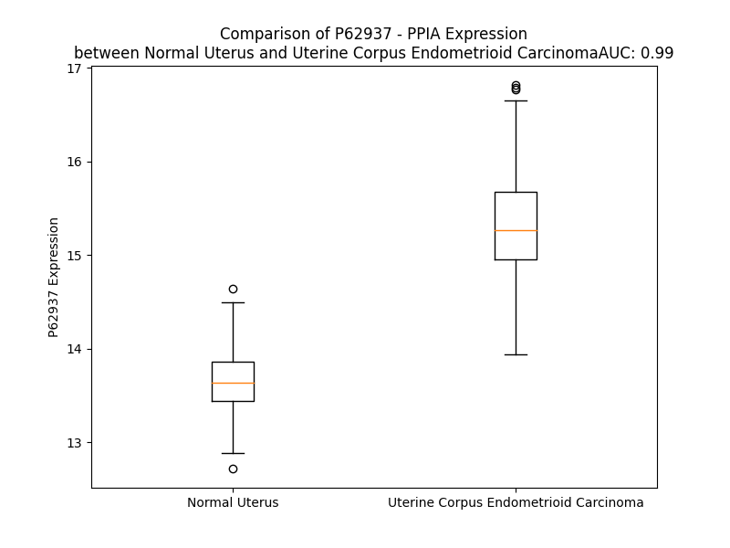

# Detailed Data for P62937

## Introduction to the Detailed Summary

### How to Interpret the Results

- **Summary & Metrics**: This section provides a quick reference to essential protein attributes, including expression changes, family classification, and biomarker applications. Regulation status (upregulated/downregulated) indicates the protein's behavior in a disease context. Some information comes from the original excel file with the proteins selected from literature, while others are derived from the analyses.
- **Expression Comparison**: A visual representation comparing protein expression between normal and disease states. It highlights significant changes in expression levels that might indicate diagnostic or therapeutic relevance. This is data coming from transcriptomics experiments and could not translate similarly to protein levels.
- **Isoform Alignment**: An interactive view of isoform alignments, revealing structural and functional differences between variants of the protein.
- **Interactors & Homologs**: Tables listing known interaction partners and homologous proteins, the more interactors and homologs, the more complex the protein is to design an antibody for.
- **Biological Assemblies**: Information about the structural arrangement of the protein in different assemblies, providing insights into its functional state but also the complexity of the protein to develop antibodies.
- **Combined Per-Residue Information**: A detailed table summarizing residue-level data. This includes predictions for epitope regions, aggregation tendencies, and modifications that might impact the protein's function. Each row corresponds to a residue in the protein, providing insights into specific sites that may be important for research or drug development.
## Summary & Metrics

- **UniProt Accession**: P62937
- **Gene Name**: PPIA
- **Protein Name**: peptidylprolyl isomerase A (cyclophilin A)
- **Swiss Prot**: PPIA_HUMAN
- **Family**: enzyme
- **Biomarker Application**:  
- **Number of Isoforms**: 2
- **Regulation**: 1
- **(transcriptomics) AUC**: 0.99
- **(transcriptomics) Fold Change**: 1.11
- **(transcriptomics) Regulation**: Upregulated
- **Discotope Epitope Count**: 39
- **Max n_uniprots (Homo)**: 11.0
- **Max n_uniprots (Hetero)**: 11.0

## Expression Comparison

## Isoform Alignment

<pre style='font-size:14px; font-family:monospace;'>P62937-1 MVNPTVFFDIAVDGEPLGRVSFELFADKVPKTAENFRALSTGEKGFGYKGSCFHRIIPGFMCQGGDFTRHNGTGGKSIYGEKFEDENFILKHTGPGILSMANAGPNTNGSQFFICTAKTEWLDGKHVVFGKVKEGMNIVEAMERFGSRNGKTSKKITIADCGQLE
P62937-2 ------------------------------------------------------------MCQGGDFTRHNGTGGKSIYGEKFEDENFILKHTGPGILSMANAGPNTNGSQFFICTAKTEWLDGKHVVFGKVKEGMNIVEAMERFGSRNGKTSKKITIADCGQLE
</pre>

## Interactors

| preferredName_A   | preferredName_B   |   score |
|:------------------|:------------------|--------:|
| PPIA              | BSG               |   0.999 |
| PPIA              | PPP3R1            |   0.985 |
| PPIA              | PPP3CA            |   0.985 |
| PPIA              | AIFM1             |   0.93  |
| PPIA              | H2AX              |   0.923 |
| PPIA              | PPID              |   0.919 |

## Homologs

| uniprot_id   | gene_id   |
|:-------------|:----------|
| P0DN26       | PPIAL4F   |
| A0A075B759   | PPIAL4E   |
| P0DN37       | PPIAL4G   |
| A0A075B767   | PPIAL4H   |
| F5H284       | PPIAL4D   |
| A0A0B4J2A2   | PPIAL4C   |
| Q9Y536       | PPIAL4A   |
| P45877       | PPIC      |
| P30405       | PPIF      |
| E9PKY5       | PPIE      |
| A0A7P0T896   | PPIL2     |
| A0A9L9PX21   | PPIL3     |
| Q9Y3C6       | PPIL1     |
| D6RD43       | PPWD1     |
| B4DEK6       | PPIL6     |
| A8K7K2       | NKTR      |
| Q8WUA2       | PPIL4     |
| Q08752       | PPID      |
| A0A7P0Z497   | PPIB      |
| C9JQD4       | PPIH      |
| A0A7I2V629   | PPIG      |
| A0A8I5KW10   | CWC27     |

## Biological Assemblies

|   Unnamed: 0 |   assembly |   n_uniprots | composition   | crystal_id   |
|-------------:|-----------:|-------------:|:--------------|:-------------|
|            0 |          1 |            2 | Hetero        | 8g9p         |
|            1 |          2 |            2 | Hetero        | 8g9p         |
|            0 |          1 |            1 | Homo          | 1nmk         |
|            1 |          2 |            1 | Homo          | 1nmk         |
|            0 |          1 |            2 | Homo          | 1zkf         |
|            1 |          2 |            2 | Homo          | 1zkf         |
|            0 |          1 |            1 | Homo          | 6u5d         |
|            0 |          1 |            1 | Homo          | 5nov         |
|            0 |          1 |            1 | Homo          | 6gjp         |
|            0 |          1 |            1 | Homo          | 5wc7         |
|            0 |          1 |            1 | Homo          | 4yuh         |
|            0 |          1 |            2 | Homo          | 3odi         |
|            1 |          2 |            2 | Homo          | 3odi         |
|            2 |          3 |            2 | Homo          | 3odi         |
|            3 |          4 |            2 | Homo          | 3odi         |
|            4 |          5 |            2 | Homo          | 3odi         |
|            5 |          6 |            2 | Homo          | 3odi         |
|            6 |          7 |            2 | Homo          | 3odi         |
|            7 |          8 |            2 | Homo          | 3odi         |
|            8 |          9 |            2 | Homo          | 3odi         |
|            9 |         10 |            2 | Homo          | 3odi         |
|            0 |          1 |            1 | Homo          | 6gs6         |
|            0 |          1 |            1 | Homo          | 6u5e         |
|            0 |          1 |            2 | Homo          | 1cwi         |
|            0 |          1 |            2 | Homo          | 2ms4         |
|            0 |          1 |           11 | Homo          | 2rmb         |
|            0 |          1 |            1 | Homo          | 4n1s         |
|            0 |          1 |            1 | Homo          | 5t9u         |
|            1 |          2 |            1 | Homo          | 5t9u         |
|            2 |          3 |            1 | Homo          | 5t9u         |
|            3 |          4 |            1 | Homo          | 5t9u         |
|            0 |          1 |            1 | Homo          | 6gjr         |
|            0 |          1 |            1 | Homo          | 2mzu         |
|            0 |          1 |            1 | Homo          | 5kuv         |
|            0 |          1 |            1 | Homo          | 4yui         |
|            0 |          1 |            2 | Hetero        | 1m9d         |
|            1 |          2 |            2 | Hetero        | 1m9d         |
|            0 |          1 |            1 | Homo          | 3k0r         |
|            0 |          1 |            1 | Homo          | 5noz         |
|            0 |          1 |            2 | Homo          | 7abt         |
|            0 |          1 |            1 | Homo          | 4n1m         |
|            0 |          1 |            1 | Homo          | 5kv6         |
|            0 |          1 |            1 | Homo          | 4n1r         |
|            0 |          1 |            1 | Homo          | 5t9z         |
|            0 |          1 |            1 | Homo          | 2cpl         |
|            0 |          1 |            1 | Homo          | 6u5g         |
|            0 |          1 |            4 | Hetero        | 1mf8         |
|            0 |          1 |            1 | Homo          | 5nor         |
|            0 |          1 |            1 | Homo          | 6gjm         |
|            0 |          1 |            2 | Hetero        | 2x2d         |
|            1 |          2 |            2 | Hetero        | 2x2d         |
|            0 |          1 |            1 | Homo          | 6x4p         |
|            0 |          1 |            1 | Homo          | 5kun         |
|            0 |          1 |            1 | Homo          | 5kv3         |
|            0 |          1 |            2 | Homo          | 1cwk         |
|            0 |          1 |            1 | Homo          | 5kuq         |
|            0 |          1 |            1 | Homo          | 4n1n         |
|            0 |          1 |            1 | Homo          | 5kur         |
|            0 |          1 |           11 | Hetero        | 6zdj         |
|            0 |          1 |            3 | Hetero        | 5fjb         |
|            0 |          1 |            1 | Homo          | 5noq         |
|            0 |          1 |            4 | Homo          | 7pcj         |
|            0 |          1 |            1 | Homo          | 1ynd         |
|            1 |          2 |            1 | Homo          | 1ynd         |
|            0 |          1 |            1 | Homo          | 4n1p         |
|            0 |          1 |            2 | Hetero        | 8tbg         |
|            1 |          2 |            2 | Hetero        | 8tbg         |
|            0 |          1 |            1 | Homo          | 4yul         |
|            0 |          1 |            2 | Homo          | 1aws         |
|            0 |          1 |            2 | Homo          | 1cwc         |
|            0 |          1 |            2 | Homo          | 1awq         |
|            0 |          1 |            2 | Hetero        | 8tbi         |
|            1 |          2 |            2 | Hetero        | 8tbi         |
|            0 |          1 |            2 | Homo          | 1mik         |
|            0 |          1 |            1 | Homo          | 4n1o         |
|            0 |          1 |            1 | Homo          | 5kv5         |
|            0 |          1 |            1 | Homo          | 3k0o         |
|            0 |          1 |            1 | Homo          | 6x4o         |
|            0 |          1 |            2 | Hetero        | 8tbn         |
|            1 |          2 |            2 | Hetero        | 8tbn         |
|            0 |          1 |            1 | Homo          | 6gjn         |
|            0 |          1 |           10 | Homo          | 2x2c         |
|            0 |          1 |            8 | Hetero        | 7upn         |
|            0 |          1 |            1 | Homo          | 5kus         |
|            0 |          1 |            1 | Homo          | 5nox         |
|            0 |          1 |            2 | Homo          | 8hz8         |
|            0 |          1 |            1 | Homo          | 6x4m         |
|            0 |          1 |            4 | Homo          | 1rmh         |
|            0 |          1 |            1 | Homo          | 1w8l         |
|            0 |          1 |            1 | Homo          | 5ta4         |
|            0 |          1 |            2 | Homo          | 1cwh         |
|            0 |          1 |           11 | Hetero        | 6y9w         |
|            0 |          1 |            1 | Homo          | 5kul         |
|            0 |          1 |            2 | Hetero        | 8tbk         |
|            1 |          2 |            2 | Hetero        | 8tbk         |
|            0 |          1 |            2 | Homo          | 1awv         |
|            1 |          2 |            2 | Homo          | 1awv         |
|            2 |          3 |            2 | Homo          | 1awv         |
|            3 |          4 |            2 | Homo          | 1awv         |
|            4 |          5 |            2 | Homo          | 1awv         |
|            5 |          6 |            2 | Homo          | 1awv         |
|            0 |          1 |            1 | Homo          | 2x25         |
|            0 |          1 |            1 | Homo          | 6u5c         |
|            0 |          1 |            2 | Hetero        | 8tbf         |
|            1 |          2 |            2 | Hetero        | 8tbf         |
|            0 |          1 |            2 | Homo          | 1awu         |
|            0 |          1 |            1 | Homo          | 6x4q         |
|            0 |          1 |            2 | Homo          | 1awr         |
|            1 |          2 |            2 | Homo          | 1awr         |
|            2 |          3 |            2 | Homo          | 1awr         |
|            3 |          4 |            2 | Homo          | 1awr         |
|            4 |          5 |            2 | Homo          | 1awr         |
|            5 |          6 |            2 | Homo          | 1awr         |
|            0 |          1 |            2 | Homo          | 1cwa         |
|            0 |          1 |            2 | Hetero        | 8g9q         |
|            0 |          1 |            8 | Hetero        | 1m63         |
|            0 |          1 |            1 | Homo          | 1w8v         |
|            0 |          1 |            2 | Hetero        | 8tbl         |
|            1 |          2 |            2 | Hetero        | 8tbl         |
|            0 |          1 |            1 | Homo          | 4yum         |
|            0 |          1 |            1 | Homo          | 3k0q         |
|            0 |          1 |            1 | Homo          | 5not         |
|            0 |          1 |            1 | Homo          | 5t9w         |
|            0 |          1 |            2 | Homo          | 1cwo         |
|            0 |          1 |            2 | Homo          | 1cwf         |
|            0 |          1 |            1 | Homo          | 3rdd         |
|            0 |          1 |            1 | Homo          | 3k0p         |
|            0 |          1 |            2 | Hetero        | 1m9c         |
|            1 |          2 |            2 | Hetero        | 1m9c         |
|            0 |          1 |            2 | Homo          | 1vbt         |
|            1 |          2 |            2 | Homo          | 1vbt         |
|            0 |          1 |            2 | Homo          | 1cwb         |
|            0 |          1 |            1 | Homo          | 6gjj         |
|            0 |          1 |            1 | Homo          | 4yuj         |
|            0 |          1 |            2 | Hetero        | 6i42         |
|            0 |          1 |            2 | Hetero        | 1m9y         |
|            1 |          2 |            2 | Hetero        | 1m9y         |
|            2 |          3 |            2 | Hetero        | 1m9y         |
|            3 |          4 |            2 | Hetero        | 1m9y         |
|            0 |          1 |            2 | Hetero        | 1m9e         |
|            1 |          2 |            2 | Hetero        | 1m9e         |
|            0 |          1 |            1 | Homo          | 5f66         |
|            0 |          1 |            1 | Homo          | 5nos         |
|            0 |          1 |            1 | Homo          | 5nou         |
|            0 |          1 |            1 | Homo          | 4n1q         |
|            0 |          1 |            1 | Homo          | 5kuw         |
|            0 |          1 |            2 | Homo          | 1awt         |
|            1 |          2 |            2 | Homo          | 1awt         |
|            2 |          3 |            2 | Homo          | 1awt         |
|            3 |          4 |            2 | Homo          | 1awt         |
|            4 |          5 |            2 | Homo          | 1awt         |
|            5 |          6 |            2 | Homo          | 1awt         |
|            0 |          1 |            1 | Homo          | 5now         |
|            0 |          1 |            2 | Hetero        | 1fgl         |
|            0 |          1 |            1 | Homo          | 7qbw         |
|            0 |          1 |            2 | Homo          | 7uxn         |
|            0 |          1 |            1 | Homo          | 1w8m         |
|            0 |          1 |            1 | Homo          | 4yuo         |
|            0 |          1 |            1 | Homo          | 5noy         |
|            0 |          1 |            1 | Homo          | 3k0n         |
|            0 |          1 |            1 | Homo          | 4cyh         |
|            0 |          1 |           11 | Hetero        | 6y9x         |
|            0 |          1 |            2 | Homo          | 7uxj         |
|            1 |          2 |            2 | Homo          | 7uxj         |
|            2 |          3 |            2 | Homo          | 7uxj         |
|            3 |          4 |            2 | Homo          | 7uxj         |
|            0 |          1 |            2 | Homo          | 2xgy         |
|            0 |          1 |            1 | Homo          | 5ta2         |
|            0 |          1 |            2 | Homo          | 3odl         |
|            1 |          2 |            2 | Homo          | 3odl         |
|            2 |          3 |            2 | Homo          | 3odl         |
|            3 |          4 |            2 | Homo          | 3odl         |
|            4 |          5 |            2 | Homo          | 3odl         |
|            5 |          6 |            2 | Homo          | 3odl         |
|            6 |          7 |            2 | Homo          | 3odl         |
|            7 |          8 |            2 | Homo          | 3odl         |
|            8 |          9 |            2 | Homo          | 3odl         |
|            9 |         10 |            2 | Homo          | 3odl         |
|            0 |          1 |            1 | Homo          | 6x3y         |
|            0 |          1 |            1 | Homo          | 3cyh         |
|            0 |          1 |            2 | Hetero        | 8tbh         |
|            1 |          2 |            2 | Hetero        | 8tbh         |
|            0 |          1 |            1 | Homo          | 5kv0         |
|            0 |          1 |            2 | Homo          | 4ipz         |
|            0 |          1 |            2 | Homo          | 1bck         |
|            0 |          1 |           11 | Homo          | 2rma         |
|            0 |          1 |            1 | Homo          | 5cyh         |
|            0 |          1 |            1 | Homo          | 5kuu         |
|            0 |          1 |            2 | Homo          | 3cys         |
|            0 |          1 |            1 | Homo          | 5kv4         |
|            0 |          1 |            1 | Homo          | 6gji         |
|            0 |          1 |            1 | Homo          | 2n0t         |
|            0 |          1 |            2 | Hetero        | 1m9x         |
|            1 |          2 |            2 | Hetero        | 1m9x         |
|            2 |          3 |            2 | Hetero        | 1m9x         |
|            3 |          4 |            2 | Hetero        | 1m9x         |
|            0 |          1 |            1 | Homo          | 6x3r         |
|            0 |          1 |            2 | Hetero        | 1ak4         |
|            1 |          2 |            2 | Hetero        | 1ak4         |
|            0 |          1 |            1 | Homo          | 2alf         |
|            0 |          1 |            1 | Homo          | 5kuz         |
|            0 |          1 |            1 | Homo          | 5kv7         |
|            0 |          1 |           11 | Hetero        | 6y9y         |
|            0 |          1 |            1 | Homo          | 5kv1         |
|            0 |          1 |            1 | Homo          | 6bta         |
|            0 |          1 |            1 | Homo          | 5kv2         |
|            0 |          1 |            1 | Homo          | 4yun         |
|            0 |          1 |            1 | Homo          | 4yup         |
|            0 |          1 |            2 | Homo          | 2x2a         |
|            0 |          1 |            2 | Homo          | 1cwl         |
|            0 |          1 |            1 | Homo          | 1oca         |
|            0 |          1 |            2 | Hetero        | 1m9f         |
|            1 |          2 |            2 | Hetero        | 1m9f         |
|            0 |          1 |            2 | Homo          | 7uxm         |
|            1 |          2 |            2 | Homo          | 7uxm         |
|            2 |          3 |            2 | Homo          | 7uxm         |
|            0 |          1 |            1 | Homo          | 6gjy         |
|            0 |          1 |            1 | Homo          | 4yuk         |
|            0 |          1 |           11 | Hetero        | 6y9z         |
|            0 |          1 |            1 | Homo          | 3k0m         |
|            0 |          1 |            1 | Homo          | 5lud         |
|            0 |          1 |            1 | Homo          | 2cyh         |
|            0 |          1 |            2 | Hetero        | 8tbm         |
|            1 |          2 |            2 | Hetero        | 8tbm         |
|            0 |          1 |            2 | Hetero        | 8tbj         |
|            1 |          2 |            2 | Hetero        | 8tbj         |
|            0 |          1 |            2 | Homo          | 1cwm         |
|            0 |          1 |            1 | Homo          | 6x4n         |
|            0 |          1 |           11 | Hetero        | 6y9v         |
|            0 |          1 |            1 | Homo          | 7ta8         |
|            0 |          1 |            1 | Homo          | 4yug         |
|            0 |          1 |            1 | Homo          | 6gjl         |
|            0 |          1 |            1 | Homo          | 5kuo         |
|            0 |          1 |            2 | Homo          | 1cwj         |
|            0 |          1 |            2 | Homo          | 1vbs         |

## Combined Per-Residue Information

|   res | aa   |   epitope_score | epitope   |   relative_surface_accessibility |   modeling_confidence |   Aggregation | modification                                                                              | glycosylation                   |
|------:|:-----|----------------:|:----------|---------------------------------:|----------------------:|--------------:|:------------------------------------------------------------------------------------------|:--------------------------------|
|     1 | M    |         0.19721 | False     |                          1.09021 |                 68.74 |         0     | N-acetylmethionine                                                                        | N/A                             |
|     2 | V    |         0.21446 | False     |                          1.00156 |                 92.03 |         0     | N-acetylvaline; partial; in Peptidyl-prolyl cis-trans isomerase A, N-terminally processed | N/A                             |
|     3 | N    |         0.20485 | False     |                          0.20375 |                 97.81 |         0     | N/A                                                                                       | N/A                             |
|     4 | P    |         0.19856 | False     |                          0.17993 |                 98.37 |         0.302 | N/A                                                                                       | N/A                             |
|     5 | T    |         0.0608  | False     |                          0.11916 |                 98.62 |         0.302 | N/A                                                                                       | N/A                             |
|     6 | V    |         0.00744 | False     |                          0       |                 98.84 |         0.302 | N/A                                                                                       | N/A                             |
|     7 | F    |         0.10976 | False     |                          0.11274 |                 98.86 |         0.302 | N/A                                                                                       | N/A                             |
|     8 | F    |         0.00766 | False     |                          0.00127 |                 98.88 |         0.302 | N/A                                                                                       | N/A                             |
|     9 | D    |         0.16024 | False     |                          0.20661 |                 98.86 |         0     | N/A                                                                                       | N/A                             |
|    10 | I    |         0.0438  | False     |                          0.0184  |                 98.82 |         0     | N/A                                                                                       | N/A                             |
|    11 | A    |         0.07364 | False     |                          0.04209 |                 98.76 |         0     | N/A                                                                                       | N/A                             |
|    12 | V    |         0.10554 | False     |                          0.08945 |                 98.65 |         0     | N/A                                                                                       | N/A                             |
|    13 | D    |         0.26582 | False     |                          0.51327 |                 98.07 |         0     | N/A                                                                                       | N/A                             |
|    14 | G    |         0.21292 | False     |                          0.71273 |                 97.62 |         0     | N/A                                                                                       | N/A                             |
|    15 | E    |         0.22736 | False     |                          0.6466  |                 98.4  |         0     | N/A                                                                                       | N/A                             |
|    16 | P    |         0.27246 | False     |                          0.86889 |                 98.55 |         0     | N/A                                                                                       | N/A                             |
|    17 | L    |         0.32471 | False     |                          0.32515 |                 98.52 |         0     | N/A                                                                                       | N/A                             |
|    18 | G    |         0.1709  | False     |                          0.3127  |                 98.69 |         0     | N/A                                                                                       | N/A                             |
|    19 | R    |         0.17916 | False     |                          0.45443 |                 98.79 |         0.14  | N/A                                                                                       | N/A                             |
|    20 | V    |         0.00868 | False     |                          0.00666 |                 98.86 |         0.14  | N/A                                                                                       | N/A                             |
|    21 | S    |         0.05089 | False     |                          0.02277 |                 98.75 |         0.14  | N/A                                                                                       | N/A                             |
|    22 | F    |         0.00487 | False     |                          0.00064 |                 98.82 |         0.14  | N/A                                                                                       | N/A                             |
|    23 | E    |         0.16877 | False     |                          0.20668 |                 98.7  |         0.14  | N/A                                                                                       | N/A                             |
|    24 | L    |         0.00652 | False     |                          0       |                 98.78 |         0.14  | N/A                                                                                       | N/A                             |
|    25 | F    |         0.11691 | False     |                          0.14204 |                 98.46 |         0.14  | N/A                                                                                       | N/A                             |
|    26 | A    |         0.11415 | False     |                          0.13037 |                 98.3  |         0.14  | N/A                                                                                       | N/A                             |
|    27 | D    |         0.26089 | False     |                          0.43058 |                 97.92 |         0     | N/A                                                                                       | N/A                             |
|    28 | K    |         0.26695 | False     |                          0.4565  |                 98.04 |         0     | N6-acetyllysine; alternate                                                                | N/A                             |
|    29 | V    |         0.02102 | False     |                          0.00286 |                 98.51 |         0     | N/A                                                                                       | N/A                             |
|    30 | P    |         0.22215 | False     |                          0.5161  |                 98.3  |         0     | N/A                                                                                       | N/A                             |
|    31 | K    |         0.43824 | True      |                          0.5045  |                 98.58 |         0     | N/A                                                                                       | N/A                             |
|    32 | T    |         0.0061  | False     |                          0.00095 |                 98.74 |         0     | N/A                                                                                       | N/A                             |
|    33 | A    |         0.0033  | False     |                          0       |                 98.65 |         0     | N/A                                                                                       | N/A                             |
|    34 | E    |         0.36934 | False     |                          0.30831 |                 98.66 |         0     | N/A                                                                                       | N/A                             |
|    35 | N    |         0.0149  | False     |                          0       |                 98.82 |         0     | N/A                                                                                       | N/A                             |
|    36 | F    |         0.01304 | False     |                          0       |                 98.85 |         0     | N/A                                                                                       | N/A                             |
|    37 | R    |         0.23639 | False     |                          0.14363 |                 98.74 |         0     | N/A                                                                                       | N/A                             |
|    38 | A    |         0.01262 | False     |                          0.00094 |                 98.72 |         0     | N/A                                                                                       | N/A                             |
|    39 | L    |         0.00753 | False     |                          0.00143 |                 98.82 |         0     | N/A                                                                                       | N/A                             |
|    40 | S    |         0.00635 | False     |                          0.00461 |                 98.72 |         0     | N/A                                                                                       | N/A                             |
|    41 | T    |         0.29565 | False     |                          0.3566  |                 98.7  |         0     | N/A                                                                                       | N/A                             |
|    42 | G    |         0.16495 | False     |                          0.33238 |                 98.51 |         0     | N/A                                                                                       | N/A                             |
|    43 | E    |         0.52847 | True      |                          0.46376 |                 98.47 |         0     | N/A                                                                                       | N/A                             |
|    44 | K    |         0.50727 | True      |                          0.51611 |                 97.91 |         0     | N6-acetyllysine                                                                           | N/A                             |
|    45 | G    |         0.39635 | True      |                          0.90419 |                 98.27 |         0     | N/A                                                                                       | N/A                             |
|    46 | F    |         0.49484 | True      |                          0.28239 |                 98.6  |         0     | N/A                                                                                       | N/A                             |
|    47 | G    |         0.17169 | False     |                          0.15845 |                 98.5  |         0     | N/A                                                                                       | N/A                             |
|    48 | Y    |         0.0048  | False     |                          0       |                 98.86 |         0     | N/A                                                                                       | N/A                             |
|    49 | K    |         0.14524 | False     |                          0.67128 |                 98.7  |         0     | N/A                                                                                       | N/A                             |
|    50 | G    |         0.12581 | False     |                          0.58927 |                 98.3  |         0     | N/A                                                                                       | N/A                             |
|    51 | S    |         0.03033 | False     |                          0.0064  |                 98.57 |         0     | N/A                                                                                       | N/A                             |
|    52 | C    |         0.31266 | False     |                          0.11904 |                 98.31 |         0     | N/A                                                                                       | N/A                             |
|    53 | F    |         0.03557 | False     |                          0.01219 |                 98.77 |         0     | N/A                                                                                       | N/A                             |
|    54 | H    |         0.40724 | True      |                          0.18101 |                 98.48 |         0     | N/A                                                                                       | N/A                             |
|    55 | R    |         0.41091 | True      |                          0.36888 |                 98.68 |         0     | N/A                                                                                       | N/A                             |
|    56 | I    |         0.00671 | False     |                          0       |                 98.73 |         0     | N/A                                                                                       | N/A                             |
|    57 | I    |         0.42778 | True      |                          0.15279 |                 98.63 |         0     | N/A                                                                                       | N/A                             |
|    58 | P    |         0.21399 | False     |                          0.48453 |                 98.34 |         0     | N/A                                                                                       | N/A                             |
|    59 | G    |         0.2209  | False     |                          0.64049 |                 97.34 |         0     | N/A                                                                                       | N/A                             |
|    60 | F    |         0.36114 | False     |                          0.20347 |                 98.2  |         0     | N/A                                                                                       | N/A                             |
|    61 | M    |         0.14986 | False     |                          0.01889 |                 98.32 |         0     | N/A                                                                                       | N/A                             |
|    62 | C    |         0.00383 | False     |                          0       |                 98.75 |         0     | N/A                                                                                       | N/A                             |
|    63 | Q    |         0.29014 | False     |                          0.10929 |                 98.84 |         0     | N/A                                                                                       | N/A                             |
|    64 | G    |         0.0289  | False     |                          0       |                 98.7  |         0     | N/A                                                                                       | N/A                             |
|    65 | G    |         0.00395 | False     |                          0       |                 98.42 |         0     | N/A                                                                                       | N/A                             |
|    66 | D    |         0.02602 | False     |                          0.00061 |                 98.55 |         0     | N/A                                                                                       | N/A                             |
|    67 | F    |         0.38099 | True      |                          0.14908 |                 98.17 |         0     | N/A                                                                                       | N/A                             |
|    68 | T    |         0.44375 | True      |                          0.46178 |                 97.89 |         0     | N/A                                                                                       | N/A                             |
|    69 | R    |         0.52214 | True      |                          0.60567 |                 97.7  |         0     | N/A                                                                                       | N/A                             |
|    70 | H    |         0.28391 | False     |                          0.50215 |                 97.36 |         0     | N/A                                                                                       | N/A                             |
|    71 | N    |         0.3378  | False     |                          0.57892 |                 97.6  |         0     | N/A                                                                                       | N/A                             |
|    72 | G    |         0.54531 | True      |                          0.3355  |                 96.7  |         0     | N/A                                                                                       | N/A                             |
|    73 | T    |         0.64592 | True      |                          0.64386 |                 97.21 |         0     | N/A                                                                                       | N/A                             |
|    74 | G    |         0.4569  | True      |                          0.22823 |                 97.13 |         0     | N/A                                                                                       | N/A                             |
|    75 | G    |         0.40999 | True      |                          0.21694 |                 97.78 |         0     | N/A                                                                                       | N/A                             |
|    76 | K    |         0.6011  | True      |                          0.37193 |                 98.36 |         0     | N6-acetyllysine                                                                           | N/A                             |
|    77 | S    |         0.07254 | False     |                          0.01691 |                 98.64 |         0     | Phosphoserine                                                                             | N/A                             |
|    78 | I    |         0.39805 | True      |                          0.22278 |                 98.66 |         0     | N/A                                                                                       | N/A                             |
|    79 | Y    |         0.49871 | True      |                          0.45909 |                 98.4  |         0     | N/A                                                                                       | N/A                             |
|    80 | G    |         0.46706 | True      |                          0.4323  |                 97.6  |         0     | N/A                                                                                       | N/A                             |
|    81 | E    |         0.54662 | True      |                          0.72896 |                 95.96 |         0     | N/A                                                                                       | N/A                             |
|    82 | K    |         0.6334  | True      |                          0.60212 |                 97.07 |         0     | N6-acetyllysine; alternate                                                                | N/A                             |
|    83 | F    |         0.33604 | False     |                          0.09562 |                 98.59 |         0     | N/A                                                                                       | N/A                             |
|    84 | E    |         0.4296  | True      |                          0.46524 |                 98.28 |         0     | N/A                                                                                       | N/A                             |
|    85 | D    |         0.34397 | False     |                          0.15924 |                 98.67 |         0     | N/A                                                                                       | N/A                             |
|    86 | E    |         0.3608  | False     |                          0.22465 |                 98.45 |         0     | N/A                                                                                       | N/A                             |
|    87 | N    |         0.19803 | False     |                          0.22462 |                 98.33 |         0     | N/A                                                                                       | N/A                             |
|    88 | F    |         0.42913 | True      |                          0.31243 |                 98.31 |         0     | N/A                                                                                       | N/A                             |
|    89 | I    |         0.36702 | False     |                          0.7106  |                 98.07 |         0     | N/A                                                                                       | N/A                             |
|    90 | L    |         0.24223 | False     |                          0.25932 |                 98.43 |         0     | N/A                                                                                       | N/A                             |
|    91 | K    |         0.39088 | True      |                          0.45039 |                 98.66 |         0     | N/A                                                                                       | N/A                             |
|    92 | H    |         0.02958 | False     |                          0.00809 |                 98.69 |         0     | N/A                                                                                       | N/A                             |
|    93 | T    |         0.29205 | False     |                          0.65685 |                 98.28 |         0     | Phosphothreonine                                                                          | N/A                             |
|    94 | G    |         0.08561 | False     |                          0.11063 |                 98.04 |         0     | N/A                                                                                       | N/A                             |
|    95 | P    |         0.16743 | False     |                          0.63354 |                 98.54 |         0     | N/A                                                                                       | N/A                             |
|    96 | G    |         0.05475 | False     |                          0.05447 |                 98.57 |         0     | N/A                                                                                       | N/A                             |
|    97 | I    |         0.10922 | False     |                          0.11599 |                 98.74 |         0.447 | N/A                                                                                       | N/A                             |
|    98 | L    |         0.01112 | False     |                          0       |                 98.87 |         0.447 | N/A                                                                                       | N/A                             |
|    99 | S    |         0.02766 | False     |                          0       |                 98.85 |         0.447 | N/A                                                                                       | N/A                             |
|   100 | M    |         0.00692 | False     |                          0       |                 98.75 |         0.447 | N/A                                                                                       | N/A                             |
|   101 | A    |         0.2746  | False     |                          0.10049 |                 98.52 |         0.447 | N/A                                                                                       | N/A                             |
|   102 | N    |         0.54662 | True      |                          0.23688 |                 97.49 |         0     | N/A                                                                                       | N/A                             |
|   103 | A    |         0.68761 | True      |                          0.90103 |                 96.8  |         0     | N/A                                                                                       | N/A                             |
|   104 | G    |         0.4471  | True      |                          0.32813 |                 96.85 |         0     | N/A                                                                                       | N/A                             |
|   105 | P    |         0.47074 | True      |                          0.83431 |                 97.88 |         0     | N/A                                                                                       | N/A                             |
|   106 | N    |         0.4126  | True      |                          0.52764 |                 97.81 |         0     | N/A                                                                                       | N/A                             |
|   107 | T    |         0.3176  | False     |                          0.20813 |                 98.22 |         0     | N/A                                                                                       | N/A                             |
|   108 | N    |         0.01513 | False     |                          0       |                 98.6  |         0     | N/A                                                                                       | N-linked (GlcNAc...) asparagine |
|   109 | G    |         0.22964 | False     |                          0.10926 |                 98.51 |         0     | N/A                                                                                       | N/A                             |
|   110 | S    |         0.0076  | False     |                          0.00268 |                 98.71 |         0.422 | N/A                                                                                       | N/A                             |
|   111 | Q    |         0.2608  | False     |                          0.10212 |                 98.83 |         1.427 | N/A                                                                                       | N/A                             |
|   112 | F    |         0.03842 | False     |                          0       |                 98.9  |         9.418 | N/A                                                                                       | N/A                             |
|   113 | F    |         0.20762 | False     |                          0.04522 |                 98.86 |         9.698 | N/A                                                                                       | N/A                             |
|   114 | I    |         0.0088  | False     |                          0.004   |                 98.84 |         9.698 | N/A                                                                                       | N/A                             |
|   115 | C    |         0.00419 | False     |                          0.001   |                 98.68 |         9.276 | N/A                                                                                       | N/A                             |
|   116 | T    |         0.06812 | False     |                          0.13938 |                 98.35 |         8.559 | N/A                                                                                       | N/A                             |
|   117 | A    |         0.13893 | False     |                          0.2624  |                 98.03 |         4.349 | N/A                                                                                       | N/A                             |
|   118 | K    |         0.32032 | False     |                          0.54795 |                 98.06 |         0.512 | N/A                                                                                       | N/A                             |
|   119 | T    |         0.01904 | False     |                          0       |                 97.49 |         0.512 | N/A                                                                                       | N/A                             |
|   120 | E    |         0.4891  | True      |                          0.50325 |                 97.39 |         0.512 | N/A                                                                                       | N/A                             |
|   121 | W    |         0.62455 | True      |                          0.60303 |                 98.12 |         0.512 | N/A                                                                                       | N/A                             |
|   122 | L    |         0.48511 | True      |                          0.11953 |                 98.13 |         0.512 | N/A                                                                                       | N/A                             |
|   123 | D    |         0.32022 | False     |                          0.26103 |                 97.97 |         0     | N/A                                                                                       | N/A                             |
|   124 | G    |         0.37952 | True      |                          0.48813 |                 97.74 |         0     | N/A                                                                                       | N/A                             |
|   125 | K    |         0.55066 | True      |                          0.60475 |                 98.33 |         0     | N6-acetyllysine                                                                           | N/A                             |
|   126 | H    |         0.41929 | True      |                          0.15762 |                 98.71 |         0     | N/A                                                                                       | N/A                             |
|   127 | V    |         0.01331 | False     |                          0.0019  |                 98.76 |         0     | N/A                                                                                       | N/A                             |
|   128 | V    |         0.02393 | False     |                          0.01804 |                 98.84 |         0     | N/A                                                                                       | N/A                             |
|   129 | F    |         0.02588 | False     |                          0       |                 98.84 |         0     | N/A                                                                                       | N/A                             |
|   130 | G    |         0.00389 | False     |                          0       |                 98.74 |         0     | N/A                                                                                       | N/A                             |
|   131 | K    |         0.18097 | False     |                          0.41045 |                 98.76 |         0     | N6-acetyllysine                                                                           | N/A                             |
|   132 | V    |         0.13508 | False     |                          0.13835 |                 98.77 |         0     | N/A                                                                                       | N/A                             |
|   133 | K    |         0.11234 | False     |                          0.58143 |                 98.23 |         0     | N6-acetyllysine                                                                           | N/A                             |
|   134 | E    |         0.246   | False     |                          0.61447 |                 98.57 |         0     | N/A                                                                                       | N/A                             |
|   135 | G    |         0.11904 | False     |                          0.18511 |                 98.55 |         0     | N/A                                                                                       | N/A                             |
|   136 | M    |         0.1736  | False     |                          0.24405 |                 98.51 |         0     | N/A                                                                                       | N/A                             |
|   137 | N    |         0.22761 | False     |                          0.6227  |                 98.51 |         0     | N/A                                                                                       | N/A                             |
|   138 | I    |         0.12364 | False     |                          0.11439 |                 98.72 |         0     | N/A                                                                                       | N/A                             |
|   139 | V    |         0.00266 | False     |                          0       |                 98.6  |         0     | N/A                                                                                       | N/A                             |
|   140 | E    |         0.15777 | False     |                          0.45733 |                 98.11 |         0     | N/A                                                                                       | N/A                             |
|   141 | A    |         0.13695 | False     |                          0.22099 |                 98.23 |         0     | N/A                                                                                       | N/A                             |
|   142 | M    |         0.01048 | False     |                          0.00134 |                 98.08 |         0     | N/A                                                                                       | N/A                             |
|   143 | E    |         0.11487 | False     |                          0.15521 |                 97.65 |         0     | N/A                                                                                       | N/A                             |
|   144 | R    |         0.37745 | True      |                          0.82191 |                 97.38 |         0     | N/A                                                                                       | N/A                             |
|   145 | F    |         0.20303 | False     |                          0.22617 |                 98.2  |         0     | N/A                                                                                       | N/A                             |
|   146 | G    |         0.12322 | False     |                          0.18797 |                 98.39 |         0     | N/A                                                                                       | N/A                             |
|   147 | S    |         0.25986 | False     |                          0.30812 |                 98.55 |         0     | N/A                                                                                       | N/A                             |
|   148 | R    |         0.44975 | True      |                          0.93378 |                 97.53 |         0     | N/A                                                                                       | N/A                             |
|   149 | N    |         0.44127 | True      |                          0.77299 |                 97.34 |         0     | N/A                                                                                       | N/A                             |
|   150 | G    |         0.08612 | False     |                          0.01516 |                 97.93 |         0     | N/A                                                                                       | N/A                             |
|   151 | K    |         0.46505 | True      |                          0.75395 |                 98.05 |         0     | N/A                                                                                       | N/A                             |
|   152 | T    |         0.17531 | False     |                          0.19819 |                 98.33 |         0     | N/A                                                                                       | N/A                             |
|   153 | S    |         0.23551 | False     |                          0.69227 |                 98.15 |         0     | N/A                                                                                       | N/A                             |
|   154 | K    |         0.23438 | False     |                          0.43872 |                 98.18 |         0     | N/A                                                                                       | N/A                             |
|   155 | K    |         0.16921 | False     |                          0.66657 |                 98.26 |         0     | N/A                                                                                       | N/A                             |
|   156 | I    |         0.0088  | False     |                          0.00412 |                 98.68 |         0     | N/A                                                                                       | N/A                             |
|   157 | T    |         0.13044 | False     |                          0.13464 |                 98.72 |         0     | N/A                                                                                       | N/A                             |
|   158 | I    |         0.0087  | False     |                          0       |                 98.86 |         0     | N/A                                                                                       | N/A                             |
|   159 | A    |         0.13497 | False     |                          0.49847 |                 98.64 |         0     | N/A                                                                                       | N/A                             |
|   160 | D    |         0.16156 | False     |                          0.3197  |                 98.73 |         0     | N/A                                                                                       | N/A                             |
|   161 | C    |         0.16566 | False     |                          0.11416 |                 98.8  |         0     | N/A                                                                                       | N/A                             |
|   162 | G    |         0.09568 | False     |                          0.09979 |                 98.68 |         0     | N/A                                                                                       | N/A                             |
|   163 | Q    |         0.30858 | False     |                          0.41655 |                 98.47 |         0     | N/A                                                                                       | N/A                             |
|   164 | L    |         0.14023 | False     |                          0.37486 |                 96.94 |         0     | N/A                                                                                       | N/A                             |
|   165 | E    |         0.09175 | False     |                          1.24777 |                 84.44 |         0     | N/A                                                                                       | N/A                             |

