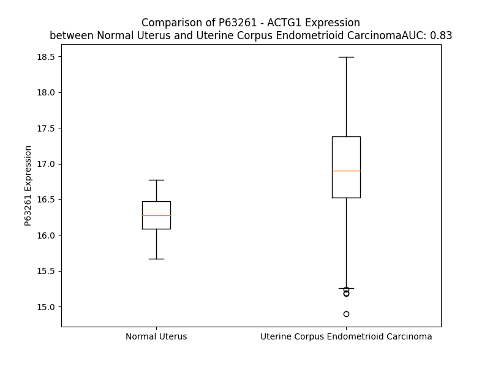

# Detailed Data for P63261

## Introduction to the Detailed Summary

### How to Interpret the Results

- **Summary & Metrics**: This section provides a quick reference to essential protein attributes, including expression changes, family classification, and biomarker applications. Regulation status (upregulated/downregulated) indicates the protein's behavior in a disease context. Some information comes from the original excel file with the proteins selected from literature, while others are derived from the analyses.
- **Expression Comparison**: A visual representation comparing protein expression between normal and disease states. It highlights significant changes in expression levels that might indicate diagnostic or therapeutic relevance. This is data coming from transcriptomics experiments and could not translate similarly to protein levels.
- **Isoform Alignment**: An interactive view of isoform alignments, revealing structural and functional differences between variants of the protein.
- **Interactors & Homologs**: Tables listing known interaction partners and homologous proteins, the more interactors and homologs, the more complex the protein is to design an antibody for.
- **Biological Assemblies**: Information about the structural arrangement of the protein in different assemblies, providing insights into its functional state but also the complexity of the protein to develop antibodies.
- **Combined Per-Residue Information**: A detailed table summarizing residue-level data. This includes predictions for epitope regions, aggregation tendencies, and modifications that might impact the protein's function. Each row corresponds to a residue in the protein, providing insights into specific sites that may be important for research or drug development.
## Summary & Metrics

- **UniProt Accession**: P63261
- **Gene Name**: ACTG1
- **Protein Name**: Actin, cytoplasmic 2 (Gamma-actin)
- **Swiss Prot**: ACTG_HUMAN
- **Family**: other
- **Biomarker Application**: unspecified application
- **Number of Isoforms**: 0
- **Regulation**: 2
- **(transcriptomics) AUC**: 0.83
- **(transcriptomics) Fold Change**: 1.04
- **(transcriptomics) Regulation**: Upregulated
- **Discotope Epitope Count**: 94
- **Max n_uniprots (Homo)**: 4
- **Max n_uniprots (Hetero)**: 10

## Expression Comparison

## Interactors

| preferredName_A   | preferredName_B   |   score |
|:------------------|:------------------|--------:|
| ACTG1             | ACTB              |   0.999 |
| ACTG1             | CFL1              |   0.998 |
| ACTG1             | CFL2              |   0.996 |
| ACTG1             | PFN1              |   0.992 |
| ACTG1             | MYH14             |   0.992 |
| ACTG1             | PFN4              |   0.991 |
| ACTG1             | VCL               |   0.99  |
| ACTG1             | PFN3              |   0.987 |
| ACTG1             | WASL              |   0.978 |
| ACTG1             | MYH9              |   0.978 |
| ACTG1             | TMSB4X            |   0.977 |
| ACTG1             | TLN1              |   0.976 |
| ACTG1             | ARPC5L            |   0.975 |
| ACTG1             | VASP              |   0.974 |
| ACTG1             | ACTN1             |   0.972 |
| ACTG1             | ACTN4             |   0.97  |
| ACTG1             | DMD               |   0.966 |
| ACTG1             | ARPC2             |   0.966 |
| ACTG1             | ARPC3             |   0.964 |
| ACTG1             | EZR               |   0.962 |
| ACTG1             | ARPC1B            |   0.962 |
| ACTG1             | TLN2              |   0.961 |
| ACTG1             | MYH10             |   0.959 |
| ACTG1             | MSN               |   0.959 |
| ACTG1             | HCLS1             |   0.958 |
| ACTG1             | CDC42             |   0.957 |
| ACTG1             | MYL6              |   0.956 |
| ACTG1             | ITGB1             |   0.955 |
| ACTG1             | ARPC5             |   0.953 |
| ACTG1             | WASF2             |   0.953 |
| ACTG1             | CTNNA1            |   0.953 |
| ACTG1             | WAS               |   0.949 |
| ACTG1             | ACTR2             |   0.949 |
| ACTG1             | CCT7              |   0.947 |
| ACTG1             | RHOA              |   0.944 |
| ACTG1             | IQGAP1            |   0.943 |
| ACTG1             | TCP1              |   0.943 |
| ACTG1             | MYH11             |   0.942 |
| ACTG1             | MYL12B            |   0.942 |
| ACTG1             | MYL9              |   0.94  |
| ACTG1             | ARPC1A            |   0.94  |
| ACTG1             | CCT3              |   0.94  |
| ACTG1             | ARPC4             |   0.939 |
| ACTG1             | ACTL6A            |   0.939 |
| ACTG1             | CCT8              |   0.939 |
| ACTG1             | MYL12A            |   0.937 |
| ACTG1             | DIAPH1            |   0.936 |
| ACTG1             | ACTR3             |   0.936 |
| ACTG1             | MYLPF             |   0.936 |
| ACTG1             | CCT6A             |   0.934 |

## Homologs

| uniprot_id   | gene_id   |
|:-------------|:----------|
| A0A804GS07   | ACTG1     |
| A0A6Q8PFE4   | ACTB      |
| Q9H568       | ACTL8     |
| Q9P1U1       | ACTR3B    |
| Q9C0K3       | ACTR3C    |
| Q9Y614       | ACTL7B    |
| O94805       | ACTL6B    |
| P68133       | ACTA1     |
| F8WCH0       | ACTG2     |
| D2JYH4       | ACTA2     |
| R4GMT0       | ACTR1A    |
| B4DXW1       | ACTR3     |
| Q8TDY3       | ACTRT2    |
| G3V1Y1       | ACTR6     |
| P68032       | ACTC1     |
| P42025       | ACTR1B    |
| Q9H9F9       | ACTR5     |
| C9J7L6       | ACTR8     |
| Q8TDG2       | ACTRT1    |
| O96019       | ACTL6A    |
| Q562R1       | ACTBL2    |
| Q9BYD9       | ACTRT3    |
| Q5JWF8       | ACTL10    |
| Q8TC94       | ACTL9     |
| P61160       | ACTR2     |
| Q9NZ32       | ACTR10    |
| Q9Y615       | ACTL7A    |

## Biological Assemblies

|   Unnamed: 0 |   assembly |   n_uniprots | composition   | crystal_id   |
|-------------:|-----------:|-------------:|:--------------|:-------------|
|            0 |          1 |            7 | Hetero        | 5jlh         |
|            0 |          1 |           10 | Hetero        | 6cxj         |
|            0 |          1 |           10 | Hetero        | 6cxi         |
|            0 |          1 |           10 | Hetero        | 6g2t         |
|            0 |          1 |            9 | Hetero        | 7nvm         |
|            0 |          1 |            4 | Homo          | 8dnf         |
|            0 |          1 |            2 | Hetero        | 6v63         |
|            1 |          2 |            2 | Hetero        | 6v63         |
|            0 |          1 |            4 | Hetero        | 6wk2         |
|            1 |          2 |            2 | Hetero        | 6wk2         |
|            2 |          3 |            2 | Hetero        | 6wk2         |
|            0 |          1 |            2 | Hetero        | 6v62         |
|            0 |          1 |            4 | Hetero        | 6wk1         |
|            1 |          2 |            2 | Hetero        | 6wk1         |
|            2 |          3 |            2 | Hetero        | 6wk1         |

## Combined Per-Residue Information

|   res | aa   |   epitope_score | epitope   |   relative_surface_accessibility |   modeling_confidence |   Aggregation | modification                                                                |
|------:|:-----|----------------:|:----------|---------------------------------:|----------------------:|--------------:|:----------------------------------------------------------------------------|
|     1 | M    |         0.23366 | True      |                          1.24432 |                 38.28 |         0     | N-acetylmethionine                                                          |
|     2 | E    |         0.2857  | True      |                          0.90843 |                 45.63 |         0     | N-acetylglutamate; in Actin, cytoplasmic 2, N-terminally processed; partial |
|     3 | E    |         0.25293 | True      |                          0.83976 |                 57.45 |         0     | N/A                                                                         |
|     4 | E    |         0.17955 | False     |                          0.72647 |                 75.92 |         0     | N/A                                                                         |
|     5 | I    |         0.1317  | False     |                          0.60741 |                 84.97 |        14.759 | N/A                                                                         |
|     6 | A    |         0.09098 | False     |                          0.39126 |                 92.54 |        18.139 | N/A                                                                         |
|     7 | A    |         0.01165 | False     |                          0.07422 |                 97.1  |        18.139 | N/A                                                                         |
|     8 | L    |         0.00279 | False     |                          0       |                 98.36 |        18.139 | N/A                                                                         |
|     9 | V    |         0.00103 | False     |                          0       |                 98.69 |        18.139 | N/A                                                                         |
|    10 | I    |         0.00181 | False     |                          0       |                 98.68 |        16.893 | N/A                                                                         |
|    11 | D    |         0.0089  | False     |                          0.01876 |                 98.4  |         0     | N/A                                                                         |
|    12 | N    |         0.04299 | False     |                          0.06792 |                 97.38 |         0     | N/A                                                                         |
|    13 | G    |         0.06109 | False     |                          0.14485 |                 95.89 |         0     | N/A                                                                         |
|    14 | S    |         0.03774 | False     |                          0.05954 |                 95.28 |         0     | N/A                                                                         |
|    15 | G    |         0.08614 | False     |                          0.14379 |                 95.03 |         0     | N/A                                                                         |
|    16 | M    |         0.1164  | False     |                          0.38957 |                 96.99 |         0     | N/A                                                                         |
|    17 | C    |         0.01381 | False     |                          0.00701 |                 98.1  |         0     | N/A                                                                         |
|    18 | K    |         0.03427 | False     |                          0.14059 |                 98.7  |         0     | N/A                                                                         |
|    19 | A    |         0.00293 | False     |                          0       |                 98.76 |         0     | N/A                                                                         |
|    20 | G    |         0.00278 | False     |                          0       |                 98.55 |         0     | N/A                                                                         |
|    21 | F    |         0.03685 | False     |                          0.1325  |                 98.03 |         0     | N/A                                                                         |
|    22 | A    |         0.03402 | False     |                          0.14807 |                 97.28 |         0     | N/A                                                                         |
|    23 | G    |         0.10173 | False     |                          0.66271 |                 95.31 |         0     | N/A                                                                         |
|    24 | D    |         0.13924 | False     |                          0.2447  |                 96.47 |         0     | N/A                                                                         |
|    25 | D    |         0.19525 | False     |                          0.82448 |                 94.88 |         0     | N/A                                                                         |
|    26 | A    |         0.11424 | False     |                          0.48612 |                 96.59 |         0     | N/A                                                                         |
|    27 | P    |         0.04004 | False     |                          0.11938 |                 98.14 |         0     | N/A                                                                         |
|    28 | R    |         0.20949 | False     |                          0.62133 |                 98.09 |         0     | N/A                                                                         |
|    29 | A    |         0.04848 | False     |                          0.05739 |                 98.33 |         0     | N/A                                                                         |
|    30 | V    |         0.15388 | False     |                          0.36141 |                 98.27 |         0     | N/A                                                                         |
|    31 | F    |         0.04317 | False     |                          0.00824 |                 98.23 |         0     | N/A                                                                         |
|    32 | P    |         0.06417 | False     |                          0.13718 |                 97.13 |         0     | N/A                                                                         |
|    33 | S    |         0.00622 | False     |                          0.00813 |                 97.61 |         0     | N/A                                                                         |
|    34 | I    |         0.03978 | False     |                          0.0096  |                 96.93 |         0     | N/A                                                                         |
|    35 | V    |         0.00296 | False     |                          0       |                 97.81 |         0     | N/A                                                                         |
|    36 | G    |         0.0092  | False     |                          0       |                 96.17 |         0     | N/A                                                                         |
|    37 | R    |         0.15364 | False     |                          0.31439 |                 94.94 |         0     | N/A                                                                         |
|    38 | P    |         0.14698 | False     |                          0.35105 |                 92.03 |         0     | N/A                                                                         |
|    39 | R    |         0.37373 | True      |                          0.52413 |                 89.15 |         0     | N/A                                                                         |
|    40 | H    |         0.33385 | True      |                          0.70348 |                 84.11 |         0     | N/A                                                                         |
|    41 | Q    |         0.24698 | True      |                          0.89946 |                 76.33 |         0     | N/A                                                                         |
|    42 | G    |         0.31951 | True      |                          0.64735 |                 69.48 |         0     | N/A                                                                         |
|    43 | V    |         0.28174 | True      |                          0.54824 |                 63.46 |         1.005 | N/A                                                                         |
|    44 | M    |         0.30345 | True      |                          0.24619 |                 65.97 |         1.005 | Methionine (R)-sulfoxide                                                    |
|    45 | V    |         0.37826 | True      |                          1.05616 |                 64.37 |         1.005 | N/A                                                                         |
|    46 | G    |         0.41668 | True      |                          0.99913 |                 66.11 |         1.005 | N/A                                                                         |
|    47 | M    |         0.4043  | True      |                          0.56821 |                 62.98 |         1.005 | Methionine (R)-sulfoxide                                                    |
|    48 | G    |         0.26807 | True      |                          0.7435  |                 65.85 |         0     | N/A                                                                         |
|    49 | Q    |         0.13302 | False     |                          0.81579 |                 71.76 |         0     | N/A                                                                         |
|    50 | K    |         0.33931 | True      |                          0.50148 |                 84.31 |         0     | N/A                                                                         |
|    51 | D    |         0.22985 | True      |                          0.67518 |                 89.59 |         0     | N/A                                                                         |
|    52 | S    |         0.13232 | False     |                          0.1471  |                 94.66 |         0     | N/A                                                                         |
|    53 | Y    |         0.04398 | False     |                          0.02364 |                 95.99 |         0     | N/A                                                                         |
|    54 | V    |         0.06486 | False     |                          0.09954 |                 97.84 |         0     | N/A                                                                         |
|    55 | G    |         0.0036  | False     |                          0       |                 97.4  |         0     | N/A                                                                         |
|    56 | D    |         0.2752  | True      |                          0.53364 |                 96.02 |         0     | N/A                                                                         |
|    57 | E    |         0.15977 | False     |                          0.26971 |                 94.9  |         0     | N/A                                                                         |
|    58 | A    |         0.00438 | False     |                          0       |                 95.24 |         0     | N/A                                                                         |
|    59 | Q    |         0.21804 | True      |                          0.16083 |                 92.15 |         0     | N/A                                                                         |
|    60 | S    |         0.32189 | True      |                          0.71042 |                 91.51 |         0     | N/A                                                                         |
|    61 | K    |         0.21396 | True      |                          0.17938 |                 90.69 |         0     | N/A                                                                         |
|    62 | R    |         0.37046 | True      |                          0.24344 |                 88.78 |         0     | N/A                                                                         |
|    63 | G    |         0.33455 | True      |                          0.75834 |                 86.15 |         0     | N/A                                                                         |
|    64 | I    |         0.40418 | True      |                          0.36044 |                 89.18 |         0     | N/A                                                                         |
|    65 | L    |         0.008   | False     |                          0.00122 |                 91.88 |         0     | N/A                                                                         |
|    66 | T    |         0.18528 | False     |                          0.46335 |                 92.9  |         0     | N/A                                                                         |
|    67 | L    |         0.20397 | False     |                          0.23368 |                 93.76 |         0     | N/A                                                                         |
|    68 | K    |         0.20414 | False     |                          0.50645 |                 95.98 |         0     | N/A                                                                         |
|    69 | Y    |         0.29271 | True      |                          0.33951 |                 95.36 |         0     | N/A                                                                         |
|    70 | P    |         0.00883 | False     |                          0.00398 |                 97.35 |         0     | N/A                                                                         |
|    71 | I    |         0.03457 | False     |                          0.01909 |                 96.3  |         0     | N/A                                                                         |
|    72 | E    |         0.16078 | False     |                          0.44134 |                 92.08 |         0     | N/A                                                                         |
|    73 | H    |         0.17828 | False     |                          0.38169 |                 91.23 |         0     | Tele-methylhistidine                                                        |
|    74 | G    |         0.09355 | False     |                          0.17971 |                 90.11 |         0     | N/A                                                                         |
|    75 | I    |         0.13838 | False     |                          0.27199 |                 93.97 |         0     | N/A                                                                         |
|    76 | V    |         0.12874 | False     |                          0.10883 |                 96.67 |         0     | N/A                                                                         |
|    77 | T    |         0.26853 | True      |                          0.55476 |                 96.23 |         0     | N/A                                                                         |
|    78 | N    |         0.18534 | False     |                          0.32157 |                 97.72 |         0     | N/A                                                                         |
|    79 | W    |         0.15376 | False     |                          0.22645 |                 98.02 |         0     | N/A                                                                         |
|    80 | D    |         0.23252 | True      |                          0.62367 |                 97.99 |         0     | N/A                                                                         |
|    81 | D    |         0.00929 | False     |                          0.00063 |                 98.27 |         0     | N/A                                                                         |
|    82 | M    |         0.00379 | False     |                          0.00431 |                 98.35 |         0     | N/A                                                                         |
|    83 | E    |         0.11587 | False     |                          0.31273 |                 98.3  |         0     | N/A                                                                         |
|    84 | K    |         0.1393  | False     |                          0.27073 |                 98.25 |         0     | N6-methyllysine                                                             |
|    85 | I    |         0.00445 | False     |                          0.0024  |                 98.53 |         0     | N/A                                                                         |
|    86 | W    |         0.00383 | False     |                          0       |                 98.68 |         0     | N/A                                                                         |
|    87 | H    |         0.20438 | False     |                          0.49159 |                 98.5  |         0     | N/A                                                                         |
|    88 | H    |         0.11514 | False     |                          0.14822 |                 98.35 |         0     | N/A                                                                         |
|    89 | T    |         0.00253 | False     |                          0       |                 98.67 |         0     | N/A                                                                         |
|    90 | F    |         0.00248 | False     |                          0       |                 98.59 |         0     | N/A                                                                         |
|    91 | Y    |         0.17449 | False     |                          0.43894 |                 98.22 |         0     | N/A                                                                         |
|    92 | N    |         0.27964 | True      |                          0.50921 |                 97.22 |         0     | N/A                                                                         |
|    93 | E    |         0.07951 | False     |                          0.35837 |                 98.29 |         0     | N/A                                                                         |
|    94 | L    |         0.08118 | False     |                          0.10061 |                 98    |         0     | N/A                                                                         |
|    95 | R    |         0.27802 | True      |                          0.80689 |                 98.01 |         0     | N/A                                                                         |
|    96 | V    |         0.20413 | False     |                          0.15675 |                 97.76 |         0     | N/A                                                                         |
|    97 | A    |         0.10921 | False     |                          0.30622 |                 97.7  |         0     | N/A                                                                         |
|    98 | P    |         0.00498 | False     |                          0       |                 97.89 |         0     | N/A                                                                         |
|    99 | E    |         0.16104 | False     |                          0.45786 |                 97.54 |         0     | N/A                                                                         |
|   100 | E    |         0.15982 | False     |                          0.53041 |                 96.88 |         0     | N/A                                                                         |
|   101 | H    |         0.10472 | False     |                          0.12188 |                 97.41 |         0     | N/A                                                                         |
|   102 | P    |         0.04472 | False     |                          0.21273 |                 97.42 |         0     | N/A                                                                         |
|   103 | V    |         0.00321 | False     |                          0       |                 98.43 |         0     | N/A                                                                         |
|   104 | L    |         0.00162 | False     |                          0       |                 98.48 |         0     | N/A                                                                         |
|   105 | L    |         0.00126 | False     |                          0       |                 98.54 |         0     | N/A                                                                         |
|   106 | T    |         0.00351 | False     |                          0.00141 |                 97.92 |         0     | N/A                                                                         |
|   107 | E    |         0.03376 | False     |                          0.03648 |                 95.39 |         0     | N/A                                                                         |
|   108 | A    |         0.01523 | False     |                          0.02322 |                 92.96 |         0     | N/A                                                                         |
|   109 | P    |         0.01317 | False     |                          0.02083 |                 90.63 |         0     | N/A                                                                         |
|   110 | L    |         0.25943 | True      |                          0.61243 |                 88.09 |         0     | N/A                                                                         |
|   111 | N    |         0.04818 | False     |                          0.08741 |                 91.4  |         0     | N/A                                                                         |
|   112 | P    |         0.22513 | True      |                          0.42149 |                 93.78 |         0     | N/A                                                                         |
|   113 | K    |         0.14592 | False     |                          0.69385 |                 95.36 |         0     | N/A                                                                         |
|   114 | A    |         0.16009 | False     |                          0.63441 |                 96.57 |         0     | N/A                                                                         |
|   115 | N    |         0.09153 | False     |                          0.12736 |                 96.67 |         0     | N/A                                                                         |
|   116 | R    |         0.06866 | False     |                          0.07399 |                 97.01 |         0     | N/A                                                                         |
|   117 | E    |         0.13132 | False     |                          0.28099 |                 98.07 |         0     | N/A                                                                         |
|   118 | K    |         0.16713 | False     |                          0.35571 |                 98.25 |         0     | N/A                                                                         |
|   119 | M    |         0.01402 | False     |                          0.02301 |                 97.8  |         0.254 | N/A                                                                         |
|   120 | T    |         0.0027  | False     |                          0       |                 98.31 |         0.862 | N/A                                                                         |
|   121 | Q    |         0.24325 | True      |                          0.27309 |                 98.41 |         0.862 | N/A                                                                         |
|   122 | I    |         0.05007 | False     |                          0.0472  |                 98.51 |         0.862 | N/A                                                                         |
|   123 | M    |         0.00423 | False     |                          0       |                 98.54 |         0.862 | N/A                                                                         |
|   124 | F    |         0.00853 | False     |                          0       |                 98.59 |         0.862 | N/A                                                                         |
|   125 | E    |         0.23556 | True      |                          0.50526 |                 98.43 |         0     | N/A                                                                         |
|   126 | T    |         0.19281 | False     |                          0.4736  |                 98.42 |         0     | N/A                                                                         |
|   127 | F    |         0.04343 | False     |                          0.04891 |                 98.39 |         0     | N/A                                                                         |
|   128 | N    |         0.18458 | False     |                          0.47275 |                 98.24 |         0     | N/A                                                                         |
|   129 | T    |         0.00727 | False     |                          0       |                 97.99 |         0     | N/A                                                                         |
|   130 | P    |         0.06649 | False     |                          0.36215 |                 97.37 |         0.294 | N/A                                                                         |
|   131 | A    |         0.0566  | False     |                          0.12499 |                 97.75 |        26.051 | N/A                                                                         |
|   132 | M    |         0.00368 | False     |                          0       |                 98.13 |        56.317 | N/A                                                                         |
|   133 | Y    |         0.03599 | False     |                          0.09193 |                 98.02 |        80.996 | N/A                                                                         |
|   134 | V    |         0.00261 | False     |                          0.0007  |                 97.8  |        88.125 | N/A                                                                         |
|   135 | A    |         0.02246 | False     |                          0.05739 |                 96.82 |        88.721 | N/A                                                                         |
|   136 | I    |         0.03392 | False     |                          0.14004 |                 95.47 |        89.246 | N/A                                                                         |
|   137 | Q    |         0.05317 | False     |                          0.11327 |                 96.8  |        85.381 | N/A                                                                         |
|   138 | A    |         0.00161 | False     |                          0.00128 |                 96.61 |        86.499 | N/A                                                                         |
|   139 | V    |         0.03088 | False     |                          0.12853 |                 96.27 |        87.722 | N/A                                                                         |
|   140 | L    |         0.00365 | False     |                          0.00247 |                 97.52 |        85.35  | N/A                                                                         |
|   141 | S    |         0.00247 | False     |                          0.00384 |                 97.62 |        71.94  | N/A                                                                         |
|   142 | L    |         0.0021  | False     |                          0       |                 97.12 |        70.299 | N/A                                                                         |
|   143 | Y    |         0.09979 | False     |                          0.2718  |                 94.13 |        61.13  | N/A                                                                         |
|   144 | A    |         0.0623  | False     |                          0.2539  |                 95.91 |        28.748 | N/A                                                                         |
|   145 | S    |         0.08188 | False     |                          0.18677 |                 94.52 |         1.313 | N/A                                                                         |
|   146 | G    |         0.13975 | False     |                          0.85245 |                 94.49 |         0.096 | N/A                                                                         |
|   147 | R    |         0.16365 | False     |                          0.25163 |                 95.4  |         0     | N/A                                                                         |
|   148 | T    |         0.11784 | False     |                          0.56594 |                 95.2  |         1.385 | N/A                                                                         |
|   149 | T    |         0.11887 | False     |                          0.16682 |                 97.9  |         2.62  | N/A                                                                         |
|   150 | G    |         0.00196 | False     |                          0       |                 98.5  |         2.62  | N/A                                                                         |
|   151 | I    |         0.00222 | False     |                          0       |                 98.77 |         2.62  | N/A                                                                         |
|   152 | V    |         0.00124 | False     |                          0       |                 98.7  |         2.62  | N/A                                                                         |
|   153 | M    |         0.00148 | False     |                          0.00072 |                 98.5  |         1.959 | N/A                                                                         |
|   154 | D    |         0.02376 | False     |                          0.08701 |                 98.09 |         0     | N/A                                                                         |
|   155 | S    |         0.00607 | False     |                          0.00208 |                 98.34 |         0     | N/A                                                                         |
|   156 | G    |         0.05108 | False     |                          0.28194 |                 97.18 |         0     | N/A                                                                         |
|   157 | D    |         0.10218 | False     |                          0.25167 |                 96.96 |         0     | N/A                                                                         |
|   158 | G    |         0.01462 | False     |                          0.02162 |                 95.1  |         0     | N/A                                                                         |
|   159 | V    |         0.08081 | False     |                          0.08527 |                 96.35 |         0     | N/A                                                                         |
|   160 | T    |         0.01121 | False     |                          0.00451 |                 98.05 |         0     | N/A                                                                         |
|   161 | H    |         0.01271 | False     |                          0.0225  |                 97.49 |         0     | N/A                                                                         |
|   162 | T    |         0.00442 | False     |                          0       |                 98.5  |         0     | N/A                                                                         |
|   163 | V    |         0.00388 | False     |                          0       |                 98.52 |         0     | N/A                                                                         |
|   164 | P    |         0.00217 | False     |                          0       |                 98.61 |         0     | N/A                                                                         |
|   165 | I    |         0.00628 | False     |                          0       |                 98.32 |         0     | N/A                                                                         |
|   166 | Y    |         0.11659 | False     |                          0.34367 |                 97.19 |         0     | N/A                                                                         |
|   167 | E    |         0.11342 | False     |                          0.59204 |                 94.84 |         0     | N/A                                                                         |
|   168 | G    |         0.04843 | False     |                          0.189   |                 91.13 |         0     | N/A                                                                         |
|   169 | Y    |         0.13977 | False     |                          0.75989 |                 91.93 |         0     | N/A                                                                         |
|   170 | A    |         0.03835 | False     |                          0.17966 |                 95.71 |         0     | N/A                                                                         |
|   171 | L    |         0.10028 | False     |                          0.19784 |                 96.45 |         0     | N/A                                                                         |
|   172 | P    |         0.1426  | False     |                          0.68128 |                 94.58 |         0     | N/A                                                                         |
|   173 | H    |         0.16302 | False     |                          0.64407 |                 96.12 |         0     | N/A                                                                         |
|   174 | A    |         0.00345 | False     |                          0       |                 98.04 |         0     | N/A                                                                         |
|   175 | I    |         0.03747 | False     |                          0.08334 |                 97.97 |         0     | N/A                                                                         |
|   176 | L    |         0.09581 | False     |                          0.20939 |                 97.8  |         0     | N/A                                                                         |
|   177 | R    |         0.15584 | False     |                          0.30568 |                 95.81 |         0     | N/A                                                                         |
|   178 | L    |         0.08382 | False     |                          0.06265 |                 95.35 |         0     | N/A                                                                         |
|   179 | D    |         0.14688 | False     |                          0.39778 |                 94.41 |         0     | N/A                                                                         |
|   180 | L    |         0.019   | False     |                          0       |                 96.71 |         0     | N/A                                                                         |
|   181 | A    |         0.00276 | False     |                          0       |                 97.89 |         0     | N/A                                                                         |
|   182 | G    |         0.01345 | False     |                          0.02575 |                 98.07 |         0     | N/A                                                                         |
|   183 | R    |         0.23916 | True      |                          0.19522 |                 96.12 |         0     | N/A                                                                         |
|   184 | D    |         0.12114 | False     |                          0.23237 |                 97.26 |         0     | N/A                                                                         |
|   185 | L    |         0.00338 | False     |                          0       |                 98.56 |         2.065 | N/A                                                                         |
|   186 | T    |         0.02122 | False     |                          0.01086 |                 98.15 |         2.065 | N/A                                                                         |
|   187 | D    |         0.16854 | False     |                          0.39257 |                 96.83 |         2.24  | N/A                                                                         |
|   188 | Y    |         0.10853 | False     |                          0.07339 |                 98.1  |         2.512 | N/A                                                                         |
|   189 | L    |         0.00263 | False     |                          0       |                 98.38 |         2.512 | N/A                                                                         |
|   190 | M    |         0.21003 | False     |                          0.14699 |                 97.62 |         2.512 | N/A                                                                         |
|   191 | K    |         0.28379 | True      |                          0.63179 |                 97    |         2.512 | N/A                                                                         |
|   192 | I    |         0.04554 | False     |                          0.00699 |                 97.45 |         2.512 | N/A                                                                         |
|   193 | L    |         0.00364 | False     |                          0       |                 97.68 |         2.337 | N/A                                                                         |
|   194 | T    |         0.19831 | False     |                          0.51323 |                 96.57 |         1.989 | N/A                                                                         |
|   195 | E    |         0.34661 | True      |                          0.57587 |                 93.75 |         0.272 | N/A                                                                         |
|   196 | R    |         0.2484  | True      |                          0.35785 |                 92.58 |         0     | N/A                                                                         |
|   197 | G    |         0.26769 | True      |                          0.7675  |                 95.39 |         0     | N/A                                                                         |
|   198 | Y    |         0.34861 | True      |                          0.24979 |                 94.77 |         0.173 | N/A                                                                         |
|   199 | S    |         0.30673 | True      |                          0.57917 |                 94.22 |         0.173 | N/A                                                                         |
|   200 | F    |         0.19785 | False     |                          0.09798 |                 93.99 |         0.539 | N/A                                                                         |
|   201 | T    |         0.23647 | True      |                          0.794   |                 90.76 |         0.539 | N/A                                                                         |
|   202 | T    |         0.22005 | True      |                          0.48546 |                 89.34 |         0.539 | N/A                                                                         |
|   203 | T    |         0.1477  | False     |                          0.62143 |                 85.16 |         0.539 | N/A                                                                         |
|   204 | A    |         0.1646  | False     |                          0.32633 |                 86.45 |         0.366 | N/A                                                                         |
|   205 | E    |         0.16181 | False     |                          0.25334 |                 92.37 |         0     | N/A                                                                         |
|   206 | R    |         0.18671 | False     |                          0.19609 |                 93.94 |         0     | N/A                                                                         |
|   207 | E    |         0.24747 | True      |                          0.14294 |                 91.84 |         0     | N/A                                                                         |
|   208 | I    |         0.28945 | True      |                          0.16925 |                 95.12 |         0.338 | N/A                                                                         |
|   209 | V    |         0.00422 | False     |                          0       |                 97.78 |         0.338 | N/A                                                                         |
|   210 | R    |         0.24557 | True      |                          0.31536 |                 96.99 |         0.338 | N/A                                                                         |
|   211 | D    |         0.23941 | True      |                          0.21026 |                 97.01 |         0.338 | N/A                                                                         |
|   212 | I    |         0.02272 | False     |                          0.0008  |                 98.3  |         0.338 | N/A                                                                         |
|   213 | K    |         0.08415 | False     |                          0.06915 |                 98.62 |         0     | N/A                                                                         |
|   214 | E    |         0.22587 | True      |                          0.54287 |                 98.02 |         0     | N/A                                                                         |
|   215 | K    |         0.34811 | True      |                          0.66778 |                 98.21 |         0.204 | N/A                                                                         |
|   216 | L    |         0.26239 | True      |                          0.15308 |                 98.55 |        12.291 | N/A                                                                         |
|   217 | C    |         0.04815 | False     |                          0.02684 |                 98.77 |        17.405 | N/A                                                                         |
|   218 | Y    |         0.23302 | True      |                          0.15842 |                 98.83 |        17.405 | N/A                                                                         |
|   219 | V    |         0.02844 | False     |                          0.03974 |                 98.85 |        17.405 | N/A                                                                         |
|   220 | A    |         0.04237 | False     |                          0.03499 |                 98.54 |        17.405 | N/A                                                                         |
|   221 | L    |         0.14773 | False     |                          0.58325 |                 98.53 |        15.533 | N/A                                                                         |
|   222 | D    |         0.14355 | False     |                          0.32974 |                 98.31 |         0.204 | N/A                                                                         |
|   223 | F    |         0.10726 | False     |                          0.09064 |                 98.01 |         0.204 | N/A                                                                         |
|   224 | E    |         0.31224 | True      |                          0.6255  |                 97.52 |         0     | N/A                                                                         |
|   225 | Q    |         0.32619 | True      |                          0.62965 |                 97.52 |         0     | N/A                                                                         |
|   226 | E    |         0.16842 | False     |                          0.18936 |                 97.89 |         0     | N/A                                                                         |
|   227 | M    |         0.29189 | True      |                          0.31636 |                 97.78 |         0     | N/A                                                                         |
|   228 | A    |         0.32981 | True      |                          0.59695 |                 97.71 |         0     | N/A                                                                         |
|   229 | T    |         0.28524 | True      |                          0.35568 |                 97.21 |         0     | N/A                                                                         |
|   230 | A    |         0.22179 | True      |                          0.24873 |                 96.58 |         0     | N/A                                                                         |
|   231 | A    |         0.54135 | True      |                          0.89695 |                 96.16 |         0     | N/A                                                                         |
|   232 | S    |         0.48191 | True      |                          0.74678 |                 95.64 |         0     | N/A                                                                         |
|   233 | S    |         0.44197 | True      |                          0.36317 |                 92.57 |         0     | N/A                                                                         |
|   234 | S    |         0.26208 | True      |                          0.62942 |                 93.7  |         0     | N/A                                                                         |
|   235 | S    |         0.36133 | True      |                          0.67054 |                 94.49 |         0     | N/A                                                                         |
|   236 | L    |         0.2445  | True      |                          0.21247 |                 94.81 |         0     | N/A                                                                         |
|   237 | E    |         0.2517  | True      |                          0.35345 |                 96.71 |         0     | N/A                                                                         |
|   238 | K    |         0.31468 | True      |                          0.50897 |                 97.88 |         0     | N/A                                                                         |
|   239 | S    |         0.32336 | True      |                          0.57856 |                 97.32 |         0     | N/A                                                                         |
|   240 | Y    |         0.2422  | True      |                          0.11676 |                 97.99 |         0     | N/A                                                                         |
|   241 | E    |         0.36647 | True      |                          0.62208 |                 97.69 |         0     | N/A                                                                         |
|   242 | L    |         0.24306 | True      |                          0.12528 |                 95.74 |         0     | N/A                                                                         |
|   243 | P    |         0.43829 | True      |                          0.81945 |                 92.37 |         0     | N/A                                                                         |
|   244 | D    |         0.4002  | True      |                          0.70101 |                 93.2  |         0     | N/A                                                                         |
|   245 | G    |         0.26143 | True      |                          0.5048  |                 95.19 |         0     | N/A                                                                         |
|   246 | Q    |         0.51104 | True      |                          0.49035 |                 95.48 |         0.698 | N/A                                                                         |
|   247 | V    |         0.33315 | True      |                          0.64215 |                 96.98 |         2.768 | N/A                                                                         |
|   248 | I    |         0.04681 | False     |                          0.0024  |                 96.87 |         2.768 | N/A                                                                         |
|   249 | T    |         0.14627 | False     |                          0.29723 |                 97.39 |         2.768 | N/A                                                                         |
|   250 | I    |         0.00863 | False     |                          0.0008  |                 97.45 |         2.768 | N/A                                                                         |
|   251 | G    |         0.04038 | False     |                          0.03856 |                 97.37 |         2.07  | N/A                                                                         |
|   252 | N    |         0.17837 | False     |                          0.23425 |                 97.52 |         0.465 | N/A                                                                         |
|   253 | E    |         0.05351 | False     |                          0.03091 |                 98.18 |         0     | N/A                                                                         |
|   254 | R    |         0.13943 | False     |                          0.1063  |                 98.5  |         0     | N/A                                                                         |
|   255 | F    |         0.03319 | False     |                          0.00355 |                 98.59 |         0     | N/A                                                                         |
|   256 | R    |         0.22144 | True      |                          0.18927 |                 98.44 |         0     | N/A                                                                         |
|   257 | C    |         0.00325 | False     |                          0       |                 98.74 |         0     | N/A                                                                         |
|   258 | P    |         0.00422 | False     |                          0       |                 98.75 |         0     | N/A                                                                         |
|   259 | E    |         0.01075 | False     |                          0.00553 |                 98.74 |         0     | N/A                                                                         |
|   260 | A    |         0.00251 | False     |                          0       |                 98.49 |         0     | N/A                                                                         |
|   261 | L    |         0.00357 | False     |                          0.00165 |                 98.68 |         0     | N/A                                                                         |
|   262 | F    |         0.03242 | False     |                          0.02611 |                 98.69 |         0     | N/A                                                                         |
|   263 | Q    |         0.17188 | False     |                          0.31227 |                 98.24 |         0     | N/A                                                                         |
|   264 | P    |         0.06481 | False     |                          0.03678 |                 98.27 |         0     | N/A                                                                         |
|   265 | S    |         0.30344 | True      |                          0.59494 |                 97.65 |         0     | N/A                                                                         |
|   266 | F    |         0.2266  | True      |                          0.32264 |                 96.4  |         0     | N/A                                                                         |
|   267 | L    |         0.43792 | True      |                          0.31307 |                 96.97 |         0     | N/A                                                                         |
|   268 | G    |         0.27312 | True      |                          0.81959 |                 96.77 |         0     | N/A                                                                         |
|   269 | M    |         0.34172 | True      |                          0.29565 |                 96.47 |         0     | N/A                                                                         |
|   270 | E    |         0.32855 | True      |                          0.95365 |                 95.82 |         0     | N/A                                                                         |
|   271 | S    |         0.20317 | False     |                          0.34313 |                 95.55 |         0     | N/A                                                                         |
|   272 | C    |         0.17853 | False     |                          0.41024 |                 97.1  |         0     | N/A                                                                         |
|   273 | G    |         0.00795 | False     |                          0.00691 |                 98.44 |         0     | N/A                                                                         |
|   274 | I    |         0.00489 | False     |                          0.0008  |                 98.62 |         0     | N/A                                                                         |
|   275 | H    |         0.05223 | False     |                          0.11352 |                 98.64 |         0     | N/A                                                                         |
|   276 | E    |         0.12566 | False     |                          0.29917 |                 98.56 |         0     | N/A                                                                         |
|   277 | T    |         0.0172  | False     |                          0.0769  |                 98.57 |         0     | N/A                                                                         |
|   278 | T    |         0.00157 | False     |                          0       |                 98.71 |         0     | N/A                                                                         |
|   279 | F    |         0.15552 | False     |                          0.20701 |                 98.57 |         0     | N/A                                                                         |
|   280 | N    |         0.10724 | False     |                          0.33936 |                 98.55 |         0     | N/A                                                                         |
|   281 | S    |         0.00221 | False     |                          0       |                 98.55 |         0     | N/A                                                                         |
|   282 | I    |         0.00688 | False     |                          0       |                 98.56 |         0     | N/A                                                                         |
|   283 | M    |         0.12793 | False     |                          0.31176 |                 98.04 |         0     | N/A                                                                         |
|   284 | K    |         0.11338 | False     |                          0.53476 |                 98.44 |         0     | N/A                                                                         |
|   285 | C    |         0.02069 | False     |                          0.02081 |                 98.26 |         0     | N/A                                                                         |
|   286 | D    |         0.31242 | True      |                          0.64627 |                 97.33 |         0     | N/A                                                                         |
|   287 | V    |         0.16995 | False     |                          0.74533 |                 96.83 |         0     | N/A                                                                         |
|   288 | D    |         0.39967 | True      |                          0.73041 |                 96.82 |         0     | N/A                                                                         |
|   289 | I    |         0.14829 | False     |                          0.12799 |                 97.39 |         0     | N/A                                                                         |
|   290 | R    |         0.17194 | False     |                          0.17784 |                 98.19 |         0     | N/A                                                                         |
|   291 | K    |         0.13149 | False     |                          0.60463 |                 97.86 |         0     | N/A                                                                         |
|   292 | D    |         0.10828 | False     |                          0.29468 |                 97.96 |         0     | N/A                                                                         |
|   293 | L    |         0.00372 | False     |                          0       |                 98.47 |         4.918 | N/A                                                                         |
|   294 | Y    |         0.00484 | False     |                          0.00061 |                 98.35 |         4.918 | N/A                                                                         |
|   295 | A    |         0.07112 | False     |                          0.26568 |                 98.03 |         4.918 | N/A                                                                         |
|   296 | N    |         0.0713  | False     |                          0.19862 |                 98.18 |         4.918 | N/A                                                                         |
|   297 | T    |         0.00321 | False     |                          0       |                 98.61 |         4.918 | N/A                                                                         |
|   298 | V    |         0.00447 | False     |                          0       |                 98.72 |         4.918 | N/A                                                                         |
|   299 | L    |         0.00241 | False     |                          0       |                 98.74 |         4.227 | N/A                                                                         |
|   300 | S    |         0.00176 | False     |                          0       |                 98.46 |         0.466 | N/A                                                                         |
|   301 | G    |         0.04141 | False     |                          0.09795 |                 97.88 |         0     | N/A                                                                         |
|   302 | G    |         0.11498 | False     |                          0.5002  |                 97.72 |         0     | N/A                                                                         |
|   303 | T    |         0.02795 | False     |                          0.06558 |                 98.66 |         0     | N/A                                                                         |
|   304 | T    |         0.00269 | False     |                          0.00095 |                 98.75 |         0     | N/A                                                                         |
|   305 | M    |         0.13145 | False     |                          0.37433 |                 98.59 |         0     | N/A                                                                         |
|   306 | Y    |         0.04834 | False     |                          0.0634  |                 98.68 |         0     | N/A                                                                         |
|   307 | P    |         0.13368 | False     |                          0.6416  |                 98.69 |         0     | N/A                                                                         |
|   308 | G    |         0.07244 | False     |                          0.34987 |                 98.58 |         0     | N/A                                                                         |
|   309 | I    |         0.02449 | False     |                          0.01029 |                 98.77 |         0     | N/A                                                                         |
|   310 | A    |         0.03064 | False     |                          0.2655  |                 98.68 |         0     | N/A                                                                         |
|   311 | D    |         0.13959 | False     |                          0.5506  |                 98.67 |         0     | N/A                                                                         |
|   312 | R    |         0.07674 | False     |                          0.06179 |                 98.74 |         0     | N/A                                                                         |
|   313 | M    |         0.00383 | False     |                          0       |                 98.64 |         0     | N/A                                                                         |
|   314 | Q    |         0.07369 | False     |                          0.29704 |                 98.63 |         0     | N/A                                                                         |
|   315 | K    |         0.17427 | False     |                          0.42583 |                 98.5  |         0     | N/A                                                                         |
|   316 | E    |         0.10495 | False     |                          0.17793 |                 98.61 |         0     | N/A                                                                         |
|   317 | I    |         0.00851 | False     |                          0       |                 98.36 |         0     | N/A                                                                         |
|   318 | T    |         0.15482 | False     |                          0.54035 |                 98.32 |         0     | N/A                                                                         |
|   319 | A    |         0.22443 | True      |                          0.7892  |                 98.1  |         0     | N/A                                                                         |
|   320 | L    |         0.1562  | False     |                          0.43211 |                 98    |         0     | N/A                                                                         |
|   321 | A    |         0.06969 | False     |                          0.09748 |                 97.11 |         0     | N/A                                                                         |
|   322 | P    |         0.23185 | True      |                          0.46811 |                 96.09 |         0     | N/A                                                                         |
|   323 | S    |         0.1672  | False     |                          0.92168 |                 95.46 |         0     | N/A                                                                         |
|   324 | T    |         0.25573 | True      |                          0.89181 |                 95.54 |         0     | N/A                                                                         |
|   325 | M    |         0.21141 | False     |                          0.28114 |                 96.41 |         0     | N/A                                                                         |
|   326 | K    |         0.21361 | True      |                          0.7821  |                 97.04 |         0     | N/A                                                                         |
|   327 | I    |         0.12548 | False     |                          0.10656 |                 98.2  |         0     | N/A                                                                         |
|   328 | K    |         0.17253 | False     |                          0.45493 |                 98.48 |         0     | N/A                                                                         |
|   329 | I    |         0.06704 | False     |                          0.12908 |                 98.56 |         0     | N/A                                                                         |
|   330 | I    |         0.06618 | False     |                          0.13119 |                 98.51 |         0     | N/A                                                                         |
|   331 | A    |         0.10626 | False     |                          0.31963 |                 98.32 |         0     | N/A                                                                         |
|   332 | P    |         0.10273 | False     |                          0.13505 |                 97.59 |         0     | N/A                                                                         |
|   333 | P    |         0.24858 | True      |                          0.81263 |                 97.46 |         0     | N/A                                                                         |
|   334 | E    |         0.13221 | False     |                          0.39367 |                 96.05 |         0     | N/A                                                                         |
|   335 | R    |         0.13327 | False     |                          0.09473 |                 97.78 |         0     | N/A                                                                         |
|   336 | K    |         0.12603 | False     |                          0.44086 |                 96.81 |         0     | N/A                                                                         |
|   337 | Y    |         0.0986  | False     |                          0.21109 |                 97.92 |         4.396 | N/A                                                                         |
|   338 | S    |         0.01422 | False     |                          0.01681 |                 98.09 |         4.519 | N/A                                                                         |
|   339 | V    |         0.01736 | False     |                          0.08283 |                 98.25 |        10.257 | N/A                                                                         |
|   340 | W    |         0.00297 | False     |                          0.0006  |                 98.58 |        10.521 | N/A                                                                         |
|   341 | I    |         0.08    | False     |                          0.14959 |                 98.23 |        10.521 | N/A                                                                         |
|   342 | G    |         0.00274 | False     |                          0       |                 97.68 |         6.937 | N/A                                                                         |
|   343 | G    |         0.00178 | False     |                          0       |                 97.77 |         6.494 | N/A                                                                         |
|   344 | S    |         0.02989 | False     |                          0.01835 |                 97.62 |         6.709 | N/A                                                                         |
|   345 | I    |         0.16509 | False     |                          0.45187 |                 95.58 |        10.663 | N/A                                                                         |
|   346 | L    |         0.07148 | False     |                          0.15745 |                 94.71 |        10.511 | N/A                                                                         |
|   347 | A    |         0.02536 | False     |                          0.12727 |                 95.72 |         8.491 | N/A                                                                         |
|   348 | S    |         0.08834 | False     |                          0.49162 |                 93.09 |         6.786 | N/A                                                                         |
|   349 | L    |         0.21865 | True      |                          0.52015 |                 92.14 |         6.61  | N/A                                                                         |
|   350 | S    |         0.10198 | False     |                          0.66999 |                 87.77 |         3.423 | N/A                                                                         |
|   351 | T    |         0.32725 | True      |                          0.77008 |                 87.7  |         3.072 | N/A                                                                         |
|   352 | F    |         0.04398 | False     |                          0.05489 |                 87.96 |         2.933 | N/A                                                                         |
|   353 | Q    |         0.2132  | False     |                          0.5202  |                 83.65 |         0     | N/A                                                                         |
|   354 | Q    |         0.2578  | True      |                          0.77057 |                 87.8  |         0     | N/A                                                                         |
|   355 | M    |         0.16697 | False     |                          0.42302 |                 92.76 |         0     | N/A                                                                         |
|   356 | W    |         0.03873 | False     |                          0.11507 |                 95.9  |         0     | N/A                                                                         |
|   357 | I    |         0.00951 | False     |                          0       |                 97.71 |         0     | N/A                                                                         |
|   358 | S    |         0.1311  | False     |                          0.30784 |                 97.44 |         0     | N/A                                                                         |
|   359 | K    |         0.15782 | False     |                          0.35652 |                 97.02 |         0     | N/A                                                                         |
|   360 | Q    |         0.15619 | False     |                          0.6256  |                 97.08 |         0     | N/A                                                                         |
|   361 | E    |         0.26885 | True      |                          0.25295 |                 97.48 |         0     | N/A                                                                         |
|   362 | Y    |         0.06623 | False     |                          0.05442 |                 98.3  |         0     | N/A                                                                         |
|   363 | D    |         0.22202 | True      |                          0.61234 |                 97.77 |         0     | N/A                                                                         |
|   364 | E    |         0.33641 | True      |                          0.65603 |                 97.55 |         0     | N/A                                                                         |
|   365 | S    |         0.24843 | True      |                          0.33963 |                 97.06 |         0     | N/A                                                                         |
|   366 | G    |         0.13506 | False     |                          0.28267 |                 97.23 |         0     | N/A                                                                         |
|   367 | P    |         0.25988 | True      |                          0.31711 |                 97.25 |         0     | N/A                                                                         |
|   368 | S    |         0.16017 | False     |                          0.47929 |                 96.86 |         0     | N/A                                                                         |
|   369 | I    |         0.06165 | False     |                          0.0264  |                 97.04 |         0     | N/A                                                                         |
|   370 | V    |         0.00385 | False     |                          0       |                 96.24 |         0     | N/A                                                                         |
|   371 | H    |         0.15746 | False     |                          0.22513 |                 94.69 |         0     | N/A                                                                         |
|   372 | R    |         0.26294 | True      |                          0.6618  |                 92.51 |         0     | N/A                                                                         |
|   373 | K    |         0.14031 | False     |                          0.24808 |                 92.11 |         0     | N/A                                                                         |
|   374 | C    |         0.0673  | False     |                          0.10835 |                 88.76 |         0     | N/A                                                                         |
|   375 | F    |         0.07282 | False     |                          0.59588 |                 85.03 |         0     | N/A                                                                         |

