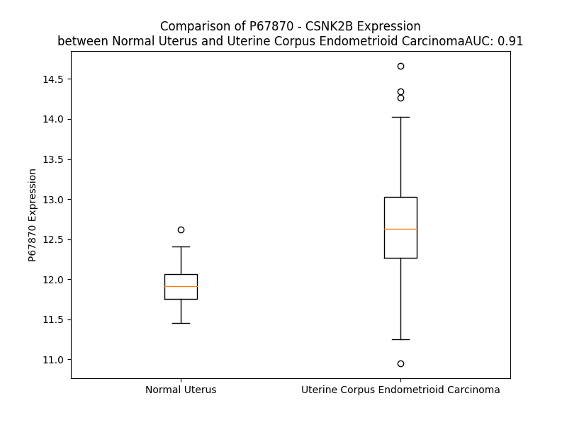

# Detailed Data for P67870

## Introduction to the Detailed Summary

### How to Interpret the Results

- **Summary & Metrics**: This section provides a quick reference to essential protein attributes, including expression changes, family classification, and biomarker applications. Regulation status (upregulated/downregulated) indicates the protein's behavior in a disease context. Some information comes from the original excel file with the proteins selected from literature, while others are derived from the analyses.
- **Expression Comparison**: A visual representation comparing protein expression between normal and disease states. It highlights significant changes in expression levels that might indicate diagnostic or therapeutic relevance. This is data coming from transcriptomics experiments and could not translate similarly to protein levels.
- **Isoform Alignment**: An interactive view of isoform alignments, revealing structural and functional differences between variants of the protein.
- **Interactors & Homologs**: Tables listing known interaction partners and homologous proteins, the more interactors and homologs, the more complex the protein is to design an antibody for.
- **Biological Assemblies**: Information about the structural arrangement of the protein in different assemblies, providing insights into its functional state but also the complexity of the protein to develop antibodies.
- **Combined Per-Residue Information**: A detailed table summarizing residue-level data. This includes predictions for epitope regions, aggregation tendencies, and modifications that might impact the protein's function. Each row corresponds to a residue in the protein, providing insights into specific sites that may be important for research or drug development.
## Summary & Metrics

- **UniProt Accession**: P67870
- **Gene Name**: CSNK2B
- **Protein Name**: Casein kinase II subunit beta / CK2beta
- **Swiss Prot**: CSK2B_HUMAN
- **Family**: kinase
- **Biomarker Application**:  
- **Number of Isoforms**: 0
- **Regulation**: 1
- **(transcriptomics) AUC**: 0.97
- **(transcriptomics) Fold Change**: 1.09
- **(transcriptomics) Regulation**: Upregulated
- **Discotope Epitope Count**: 54
- **Max n_uniprots (Homo)**: 2
- **Max n_uniprots (Hetero)**: 4

## Expression Comparison

## Interactors

| preferredName_A   | preferredName_B   |   score |
|:------------------|:------------------|--------:|
| CSNK2B            | CSNK2A2           |   0.999 |
| CSNK2B            | CSNK2A1           |   0.999 |
| CSNK2B            | CSNK2A3           |   0.967 |
| CSNK2B            | NFKBIA            |   0.964 |
| CSNK2B            | RYBP              |   0.964 |
| CSNK2B            | PCGF5             |   0.961 |
| CSNK2B            | CTNNB1            |   0.955 |
| CSNK2B            | RRP7A             |   0.944 |
| CSNK2B            | SSRP1             |   0.943 |
| CSNK2B            | DVL2              |   0.94  |
| CSNK2B            | NOL6              |   0.935 |
| CSNK2B            | SUPT16H           |   0.926 |
| CSNK2B            | DVL1              |   0.917 |
| CSNK2B            | DVL3              |   0.917 |
| CSNK2B            | PTEN              |   0.91  |
| CSNK2B            | PRNP              |   0.909 |
| CSNK2B            | FUNDC1            |   0.906 |
| CSNK2B            | RNF2              |   0.902 |

## Homologs

| uniprot_id   | gene_id   |
|:-------------|:----------|
| N0E472       | CSNK2B    |
| N0E472       | CSNK2B    |
| N0E472       | CSNK2B    |
| N0E472       | CSNK2B    |
| N0E472       | CSNK2B    |
| N0E472       | CSNK2B    |

## Biological Assemblies

|   Unnamed: 0 |   assembly |   n_uniprots | composition   | crystal_id   |
|-------------:|-----------:|-------------:|:--------------|:-------------|
|            0 |          1 |            1 | Homo          | 6q38         |
|            0 |          1 |            4 | Hetero        | 4md9         |
|            1 |          2 |            4 | Hetero        | 4md9         |
|            2 |          3 |            4 | Hetero        | 4md9         |
|            3 |          4 |            4 | Hetero        | 4md9         |
|            0 |          1 |            2 | Homo          | 1qf8         |
|            0 |          1 |            4 | Hetero        | 1jwh         |
|            0 |          1 |            2 | Homo          | 3eed         |
|            1 |          2 |            2 | Homo          | 3eed         |
|            0 |          1 |            4 | Hetero        | 4md7         |
|            1 |          2 |            4 | Hetero        | 4md7         |
|            0 |          1 |            4 | Hetero        | 1ds5         |
|            1 |          2 |            4 | Hetero        | 1ds5         |
|            0 |          1 |            4 | Hetero        | 4nh1         |
|            0 |          1 |            4 | Hetero        | 4md8         |
|            1 |          2 |            4 | Hetero        | 4md8         |
|            0 |          1 |            4 | Hetero        | 4dgl         |

## Combined Per-Residue Information

|   res | aa   |   epitope_score | epitope   |   relative_surface_accessibility |   modeling_confidence |   Aggregation | modification                    |
|------:|:-----|----------------:|:----------|---------------------------------:|----------------------:|--------------:|:--------------------------------|
|     1 | M    |         0.2594  | False     |                          1.3004  |                 37.71 |         0     | N/A                             |
|     2 | S    |         0.21782 | False     |                          0.85577 |                 44    |         0     | N-acetylserine                  |
|     2 | S    |         0.21782 | False     |                          0.85577 |                 44    |         0     | Phosphoserine; by autocatalysis |
|     3 | S    |         0.16271 | False     |                          0.62553 |                 50.03 |         0     | Phosphoserine; by autocatalysis |
|     4 | S    |         0.18505 | False     |                          0.75554 |                 54.25 |         0     | N/A                             |
|     5 | E    |         0.21309 | False     |                          0.79052 |                 67.59 |         0     | N/A                             |
|     6 | E    |         0.16988 | False     |                          0.83741 |                 82.81 |         0     | N/A                             |
|     7 | V    |         0.22091 | False     |                          0.75914 |                 91.15 |        25.49  | N/A                             |
|     8 | S    |         0.16004 | False     |                          0.27311 |                 95.87 |        31.394 | Phosphoserine                   |
|     9 | W    |         0.14422 | False     |                          0.1013  |                 97.42 |        65.208 | N/A                             |
|    10 | I    |         0.05488 | False     |                          0.0464  |                 98.24 |        66.684 | N/A                             |
|    11 | S    |         0.20941 | False     |                          0.33132 |                 97.84 |        66.684 | N/A                             |
|    12 | W    |         0.48813 | True      |                          0.51836 |                 97.59 |        66.849 | N/A                             |
|    13 | F    |         0.13835 | False     |                          0.04204 |                 98.32 |        66.763 | N/A                             |
|    14 | C    |         0.12814 | False     |                          0.15318 |                 98.2  |        60.039 | N/A                             |
|    15 | G    |         0.25322 | False     |                          0.78182 |                 96.97 |        29.717 | N/A                             |
|    16 | L    |         0.33804 | True      |                          0.3577  |                 97.23 |        25.178 | N/A                             |
|    17 | R    |         0.48384 | True      |                          0.79078 |                 96.22 |         0     | N/A                             |
|    18 | G    |         0.12717 | False     |                          0.06305 |                 95.82 |         0     | N/A                             |
|    19 | N    |         0.10889 | False     |                          0.12266 |                 98.02 |         0     | N/A                             |
|    20 | E    |         0.23245 | False     |                          0.28966 |                 97.43 |         0     | N/A                             |
|    21 | F    |         0.04054 | False     |                          0.02132 |                 98.54 |         0     | N/A                             |
|    22 | F    |         0.05818 | False     |                          0.03632 |                 98.79 |         0     | N/A                             |
|    23 | C    |         0.07882 | False     |                          0.03906 |                 98.64 |         0     | N/A                             |
|    24 | E    |         0.11344 | False     |                          0.42241 |                 98.64 |         0     | N/A                             |
|    25 | V    |         0.02885 | False     |                          0.02322 |                 98.73 |         0     | N/A                             |
|    26 | D    |         0.17268 | False     |                          0.19935 |                 98.29 |         0     | N/A                             |
|    27 | E    |         0.15168 | False     |                          0.47161 |                 97.05 |         0     | N/A                             |
|    28 | D    |         0.20798 | False     |                          0.49257 |                 97.68 |         0     | N/A                             |
|    29 | Y    |         0.23436 | False     |                          0.13882 |                 98.61 |         0     | N/A                             |
|    30 | I    |         0.03648 | False     |                          0.00946 |                 98.44 |         0     | N/A                             |
|    31 | Q    |         0.29259 | False     |                          0.55268 |                 97.11 |         0     | N/A                             |
|    32 | D    |         0.27495 | False     |                          0.40683 |                 97.6  |         0     | N/A                             |
|    33 | K    |         0.23808 | False     |                          0.86118 |                 94.45 |         0     | N/A                             |
|    34 | F    |         0.22379 | False     |                          0.84723 |                 97.04 |         0     | N/A                             |
|    35 | N    |         0.20414 | False     |                          0.21935 |                 97.8  |         0     | N/A                             |
|    36 | L    |         0.08013 | False     |                          0.03597 |                 97.81 |         0     | N/A                             |
|    37 | T    |         0.32897 | True      |                          0.65367 |                 97.02 |         0     | Phosphothreonine                |
|    38 | G    |         0.16495 | False     |                          0.31555 |                 96.56 |         0     | N/A                             |
|    39 | L    |         0.07129 | False     |                          0.01978 |                 97.59 |         0     | N/A                             |
|    40 | N    |         0.33161 | True      |                          0.53762 |                 96.12 |         0     | N/A                             |
|    41 | E    |         0.45263 | True      |                          0.79557 |                 96.6  |         0     | N/A                             |
|    42 | Q    |         0.41336 | True      |                          0.45593 |                 95.4  |         0     | N/A                             |
|    43 | V    |         0.12018 | False     |                          0.04111 |                 97.27 |         0     | N/A                             |
|    44 | P    |         0.20519 | False     |                          0.5692  |                 95.2  |         0     | N/A                             |
|    45 | H    |         0.2441  | False     |                          0.38042 |                 94.35 |         0     | N/A                             |
|    46 | Y    |         0.31843 | True      |                          0.20454 |                 96.13 |         0     | N/A                             |
|    47 | R    |         0.44112 | True      |                          0.52729 |                 95.1  |         0     | N/A                             |
|    48 | Q    |         0.26192 | False     |                          0.20951 |                 94.75 |         0     | N/A                             |
|    49 | A    |         0.0045  | False     |                          0       |                 96.5  |         0     | N/A                             |
|    50 | L    |         0.0887  | False     |                          0.1863  |                 97.19 |         0     | N/A                             |
|    51 | D    |         0.16845 | False     |                          0.17796 |                 95.34 |         0     | N/A                             |
|    52 | M    |         0.32036 | True      |                          0.29531 |                 95.44 |         0     | N/A                             |
|    53 | I    |         0.03063 | False     |                          0.00591 |                 97.73 |         0     | N/A                             |
|    54 | L    |         0.16744 | False     |                          0.1631  |                 97.05 |         0     | N/A                             |
|    55 | D    |         0.35534 | True      |                          0.53223 |                 95.12 |         0     | N/A                             |
|    56 | L    |         0.25569 | False     |                          0.58187 |                 93.64 |         0     | N/A                             |
|    57 | E    |         0.20846 | False     |                          0.84915 |                 85.65 |         0     | N/A                             |
|    58 | P    |         0.25402 | False     |                          0.55094 |                 76.45 |         0     | N/A                             |
|    59 | D    |         0.22059 | False     |                          0.38849 |                 70.53 |         0     | N/A                             |
|    60 | E    |         0.22514 | False     |                          0.82653 |                 70.23 |         0     | N/A                             |
|    61 | E    |         0.36318 | True      |                          0.81656 |                 65.69 |         0     | N/A                             |
|    62 | L    |         0.26821 | False     |                          0.19787 |                 62.09 |         0     | N/A                             |
|    63 | E    |         0.45539 | True      |                          0.75023 |                 62.99 |         0     | N/A                             |
|    64 | D    |         0.35756 | True      |                          0.82391 |                 68.64 |         0     | N/A                             |
|    65 | N    |         0.33758 | True      |                          0.41846 |                 75.1  |         0     | N/A                             |
|    66 | P    |         0.31654 | True      |                          0.7712  |                 76.8  |         0     | N/A                             |
|    67 | N    |         0.2928  | False     |                          0.71467 |                 81.59 |         0     | N/A                             |
|    68 | Q    |         0.23756 | False     |                          0.26587 |                 83.89 |         0     | N/A                             |
|    69 | S    |         0.30429 | False     |                          0.369   |                 86.79 |         0     | Phosphoserine                   |
|    70 | D    |         0.33782 | True      |                          0.49371 |                 91.71 |         0     | N/A                             |
|    71 | L    |         0.35122 | True      |                          0.56038 |                 93.73 |         0     | N/A                             |
|    72 | I    |         0.1204  | False     |                          0.0448  |                 94.45 |         0     | N/A                             |
|    73 | E    |         0.4647  | True      |                          0.44595 |                 94.88 |         0     | N/A                             |
|    74 | Q    |         0.31682 | True      |                          0.57947 |                 95.95 |         0     | N/A                             |
|    75 | A    |         0.04069 | False     |                          0.01696 |                 97.58 |         0     | N/A                             |
|    76 | A    |         0.00464 | False     |                          0       |                 98.2  |         0     | N/A                             |
|    77 | E    |         0.27156 | False     |                          0.37897 |                 98.21 |         0     | N/A                             |
|    78 | M    |         0.15274 | False     |                          0.23929 |                 98.24 |         3.311 | N/A                             |
|    79 | L    |         0.00374 | False     |                          0       |                 98.72 |         6.018 | N/A                             |
|    80 | Y    |         0.00689 | False     |                          0       |                 98.82 |         6.018 | N/A                             |
|    81 | G    |         0.00937 | False     |                          0       |                 98.79 |         6.018 | N/A                             |
|    82 | L    |         0.05196 | False     |                          0.07179 |                 98.76 |         6.018 | N/A                             |
|    83 | I    |         0.00722 | False     |                          0       |                 98.87 |         5.797 | N/A                             |
|    84 | H    |         0.00703 | False     |                          0       |                 98.89 |         1.245 | N/A                             |
|    85 | A    |         0.06084 | False     |                          0.13515 |                 98.85 |         0.568 | N/A                             |
|    86 | R    |         0.22466 | False     |                          0.316   |                 98.72 |         0     | N/A                             |
|    87 | Y    |         0.02254 | False     |                          0.00375 |                 98.88 |         0     | N/A                             |
|    88 | I    |         0.00702 | False     |                          0       |                 98.85 |         0     | N/A                             |
|    89 | L    |         0.1667  | False     |                          0.47254 |                 98.71 |         0     | N/A                             |
|    90 | T    |         0.2161  | False     |                          0.30017 |                 98.58 |         0     | N/A                             |
|    91 | N    |         0.27701 | False     |                          0.73493 |                 98.41 |         0     | N/A                             |
|    92 | R    |         0.27569 | False     |                          0.50729 |                 98.5  |         0     | N/A                             |
|    93 | G    |         0.00316 | False     |                          0       |                 98.8  |         0     | N/A                             |
|    94 | I    |         0.01341 | False     |                          0.0032  |                 98.84 |         0.136 | N/A                             |
|    95 | A    |         0.22873 | False     |                          0.51815 |                 98.61 |         0.136 | N/A                             |
|    96 | Q    |         0.15702 | False     |                          0.2682  |                 98.75 |         0.136 | N/A                             |
|    97 | M    |         0.00695 | False     |                          0       |                 98.83 |         0.136 | N/A                             |
|    98 | L    |         0.1012  | False     |                          0.08408 |                 98.64 |         0.136 | N/A                             |
|    99 | E    |         0.32164 | True      |                          0.51323 |                 98.53 |         0     | N/A                             |
|   100 | K    |         0.19595 | False     |                          0.17647 |                 98.73 |         0     | N/A                             |
|   101 | Y    |         0.11403 | False     |                          0.04188 |                 98.65 |         0     | N/A                             |
|   102 | Q    |         0.25155 | False     |                          0.52762 |                 97.98 |         0     | N/A                             |
|   103 | Q    |         0.22652 | False     |                          0.58891 |                 98.03 |         0     | N/A                             |
|   104 | G    |         0.08167 | False     |                          0.12838 |                 97.51 |         0     | N/A                             |
|   105 | D    |         0.22169 | False     |                          0.35281 |                 97.82 |         0     | N/A                             |
|   106 | F    |         0.02971 | False     |                          0.01877 |                 98.35 |         0     | N/A                             |
|   107 | G    |         0.15292 | False     |                          0.27251 |                 97.74 |         0     | N/A                             |
|   108 | Y    |         0.19079 | False     |                          0.44216 |                 98.32 |         0     | N/A                             |
|   109 | C    |         0.09691 | False     |                          0.02887 |                 98.32 |         0     | N/A                             |
|   110 | P    |         0.25488 | False     |                          0.49612 |                 97.66 |         0     | N/A                             |
|   111 | R    |         0.36986 | True      |                          0.33297 |                 97.57 |         0     | N/A                             |
|   112 | V    |         0.46759 | True      |                          0.90311 |                 97.27 |         0     | N/A                             |
|   113 | Y    |         0.40268 | True      |                          0.35411 |                 97.27 |         0     | N/A                             |
|   114 | C    |         0.00761 | False     |                          0.00148 |                 97.76 |         0     | N/A                             |
|   115 | E    |         0.27916 | False     |                          0.66972 |                 96.5  |         0     | N/A                             |
|   116 | N    |         0.3441  | True      |                          0.69027 |                 96.92 |         0     | N/A                             |
|   117 | Q    |         0.19463 | False     |                          0.12035 |                 98.06 |         0     | N/A                             |
|   118 | P    |         0.11583 | False     |                          0.23858 |                 98.48 |         0     | N/A                             |
|   119 | M    |         0.03317 | False     |                          0.02    |                 98.68 |         0     | N/A                             |
|   120 | L    |         0.0048  | False     |                          0       |                 98.86 |         0     | N/A                             |
|   121 | P    |         0.00178 | False     |                          0       |                 98.83 |         0     | N/A                             |
|   122 | I    |         0.20838 | False     |                          0.0584  |                 98.87 |         0     | N/A                             |
|   123 | G    |         0.0305  | False     |                          0.0226  |                 98.73 |         0     | N/A                             |
|   124 | L    |         0.46617 | True      |                          0.62075 |                 98.53 |         0     | N/A                             |
|   125 | S    |         0.3163  | True      |                          0.14034 |                 98.48 |         0     | N/A                             |
|   126 | D    |         0.22976 | False     |                          0.5264  |                 98.13 |         0     | N/A                             |
|   127 | I    |         0.47586 | True      |                          0.61712 |                 97.97 |         0     | N/A                             |
|   128 | P    |         0.23297 | False     |                          0.27276 |                 97.89 |         0     | N/A                             |
|   129 | G    |         0.35864 | True      |                          0.72286 |                 97.08 |         0     | N/A                             |
|   130 | E    |         0.63068 | True      |                          0.55134 |                 98.17 |         0     | N/A                             |
|   131 | A    |         0.42842 | True      |                          0.20889 |                 98.14 |         0     | N/A                             |
|   132 | M    |         0.38774 | True      |                          0.34237 |                 98.24 |         0     | N/A                             |
|   133 | V    |         0.00991 | False     |                          0.00704 |                 98.71 |         0     | N/A                             |
|   134 | K    |         0.20259 | False     |                          0.21112 |                 98.79 |         0     | N/A                             |
|   135 | L    |         0.06886 | False     |                          0.0305  |                 98.85 |         0     | N/A                             |
|   136 | Y    |         0.15997 | False     |                          0.06148 |                 98.86 |         0     | N/A                             |
|   137 | C    |         0.00841 | False     |                          0       |                 98.72 |         0     | N/A                             |
|   138 | P    |         0.09542 | False     |                          0.04197 |                 98.43 |         0     | N/A                             |
|   139 | K    |         0.15743 | False     |                          0.11304 |                 98.35 |         0     | N/A                             |
|   140 | C    |         0.18307 | False     |                          0.13059 |                 97.88 |         0     | N/A                             |
|   141 | M    |         0.26535 | False     |                          0.5653  |                 97.78 |         0     | N/A                             |
|   142 | D    |         0.35523 | True      |                          0.38545 |                 98.21 |         0     | N/A                             |
|   143 | V    |         0.38906 | True      |                          0.39892 |                 98.67 |         0     | N/A                             |
|   144 | Y    |         0.21225 | False     |                          0.16086 |                 98.63 |         0     | N/A                             |
|   145 | T    |         0.29381 | False     |                          0.56056 |                 98.38 |         0     | N/A                             |
|   146 | P    |         0.05654 | False     |                          0.03423 |                 98.02 |         0     | N/A                             |
|   147 | K    |         0.28727 | False     |                          0.78051 |                 95.33 |         0     | N/A                             |
|   148 | S    |         0.24472 | False     |                          0.32075 |                 95.06 |         0     | N/A                             |
|   149 | S    |         0.2687  | False     |                          0.59044 |                 95.64 |         0     | N/A                             |
|   150 | R    |         0.42778 | True      |                          0.40653 |                 94.99 |         0     | N/A                             |
|   151 | H    |         0.15902 | False     |                          0.09393 |                 95.88 |         0     | N/A                             |
|   152 | H    |         0.42206 | True      |                          0.38181 |                 96.58 |         0     | N/A                             |
|   153 | H    |         0.4827  | True      |                          0.86133 |                 95.58 |         0     | N/A                             |
|   154 | T    |         0.17239 | False     |                          0.1052  |                 98.07 |         0     | N/A                             |
|   155 | D    |         0.19622 | False     |                          0.08267 |                 98.47 |         0     | N/A                             |
|   156 | G    |         0.00943 | False     |                          0.00322 |                 98.7  |         0     | N/A                             |
|   157 | A    |         0.01689 | False     |                          0.02637 |                 98.68 |         0     | N/A                             |
|   158 | Y    |         0.12274 | False     |                          0.14783 |                 98.82 |         0     | N/A                             |
|   159 | F    |         0.00456 | False     |                          0.00304 |                 98.86 |         0     | N/A                             |
|   160 | G    |         0.07618 | False     |                          0.10461 |                 98.63 |         0     | N/A                             |
|   161 | T    |         0.22764 | False     |                          0.36992 |                 98.69 |         0     | N/A                             |
|   162 | G    |         0.29153 | False     |                          0.35955 |                 98.36 |         0     | N/A                             |
|   163 | F    |         0.00878 | False     |                          0.00177 |                 98.83 |         0     | N/A                             |
|   164 | P    |         0.00696 | False     |                          0       |                 98.79 |         0     | N/A                             |
|   165 | H    |         0.34685 | True      |                          0.43905 |                 98.65 |         0.3   | N/A                             |
|   166 | M    |         0.28097 | False     |                          0.42453 |                 98.67 |        36.518 | N/A                             |
|   167 | L    |         0.00877 | False     |                          0       |                 98.77 |        36.518 | N/A                             |
|   168 | F    |         0.11697 | False     |                          0.0396  |                 98.4  |        36.518 | N/A                             |
|   169 | M    |         0.35156 | True      |                          0.80982 |                 98.19 |        36.518 | N/A                             |
|   170 | V    |         0.26239 | False     |                          0.44078 |                 98.33 |        36.518 | N/A                             |
|   171 | H    |         0.23235 | False     |                          0.25144 |                 98.17 |         0     | N/A                             |
|   172 | P    |         0.35354 | True      |                          0.62409 |                 98.08 |         0     | N/A                             |
|   173 | E    |         0.37598 | True      |                          0.62316 |                 97.69 |         0     | N/A                             |
|   174 | Y    |         0.25901 | False     |                          0.34293 |                 97.76 |         0     | N/A                             |
|   175 | R    |         0.21725 | False     |                          0.56058 |                 96.71 |         0     | N/A                             |
|   176 | P    |         0.18148 | False     |                          0.23719 |                 97.21 |         0     | N/A                             |
|   177 | K    |         0.29486 | False     |                          0.9074  |                 96.9  |         0     | N/A                             |
|   178 | R    |         0.26349 | False     |                          0.52635 |                 97.08 |         0     | N/A                             |
|   179 | P    |         0.34762 | True      |                          0.21335 |                 96.3  |         0     | N/A                             |
|   180 | A    |         0.33804 | True      |                          0.98701 |                 93.79 |         0     | N/A                             |
|   181 | N    |         0.40795 | True      |                          0.57939 |                 93.76 |         0     | N/A                             |
|   182 | Q    |         0.36804 | True      |                          0.6939  |                 92.63 |         0     | N/A                             |
|   183 | F    |         0.48754 | True      |                          0.73744 |                 94.55 |         0     | N/A                             |
|   184 | V    |         0.34278 | True      |                          0.49132 |                 94.84 |         0     | N/A                             |
|   185 | P    |         0.25028 | False     |                          0.41401 |                 96.08 |         0     | N/A                             |
|   186 | R    |         0.40148 | True      |                          0.54751 |                 96.89 |         0     | N/A                             |
|   187 | L    |         0.34523 | True      |                          0.66052 |                 94.85 |         0     | N/A                             |
|   188 | Y    |         0.28925 | False     |                          0.87926 |                 95.85 |         0     | N/A                             |
|   189 | G    |         0.29072 | False     |                          0.63279 |                 96.01 |         0     | N/A                             |
|   190 | F    |         0.32256 | True      |                          0.79705 |                 96.68 |         0     | N/A                             |
|   191 | K    |         0.35676 | True      |                          0.67119 |                 97.16 |         0     | N/A                             |
|   192 | I    |         0.21221 | False     |                          0.26278 |                 95.88 |         0     | N/A                             |
|   193 | H    |         0.26451 | False     |                          0.62091 |                 95.34 |         0     | N/A                             |
|   194 | P    |         0.25733 | False     |                          0.9311  |                 95.44 |         0     | N/A                             |
|   195 | M    |         0.22434 | False     |                          0.60384 |                 96.42 |         0     | N/A                             |
|   196 | A    |         0.25323 | False     |                          0.3402  |                 95.73 |         0     | N/A                             |
|   197 | Y    |         0.384   | True      |                          0.61668 |                 94.99 |         0     | N/A                             |
|   198 | Q    |         0.31494 | False     |                          0.53334 |                 96.28 |         0     | N/A                             |
|   199 | L    |         0.38116 | True      |                          0.65318 |                 95.54 |         0     | N/A                             |
|   200 | Q    |         0.27242 | False     |                          0.57852 |                 94.51 |         0     | N/A                             |
|   201 | L    |         0.2974  | False     |                          0.77695 |                 95.44 |         0     | N/A                             |
|   202 | Q    |         0.29652 | False     |                          0.46855 |                 95.45 |         0     | N/A                             |
|   203 | A    |         0.24047 | False     |                          0.61523 |                 94.09 |         0     | N/A                             |
|   204 | A    |         0.13885 | False     |                          0.61248 |                 93.58 |         0     | N/A                             |
|   205 | S    |         0.26214 | False     |                          0.72301 |                 93.44 |         0     | N/A                             |
|   206 | N    |         0.2344  | False     |                          0.76464 |                 91.39 |         0     | N/A                             |
|   207 | F    |         0.42641 | True      |                          0.75857 |                 85.53 |         0     | N/A                             |
|   208 | K    |         0.27048 | False     |                          0.92991 |                 79.54 |         0     | N/A                             |
|   209 | S    |         0.15044 | False     |                          0.67727 |                 74.65 |         0     | Phosphoserine                   |
|   210 | P    |         0.23763 | False     |                          0.78087 |                 71.63 |         0     | N/A                             |
|   211 | V    |         0.13453 | False     |                          0.97759 |                 63.92 |         0     | N/A                             |
|   212 | K    |         0.15913 | False     |                          0.9003  |                 65.35 |         0     | N6-acetyllysine; alternate      |
|   213 | T    |         0.14165 | False     |                          0.88185 |                 56.89 |         0     | N/A                             |
|   214 | I    |         0.15438 | False     |                          0.98282 |                 59.16 |         0     | N/A                             |
|   215 | R    |         0.19119 | False     |                          1.14956 |                 60.84 |         0     | N/A                             |

