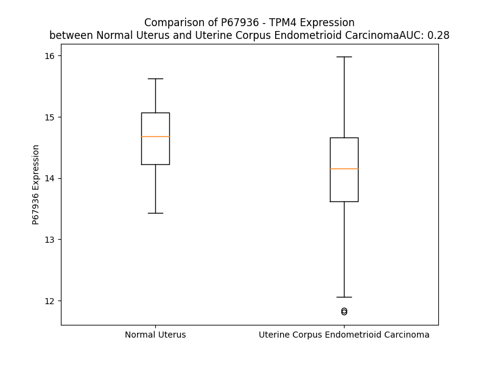

# Detailed Data for P67936

## Introduction to the Detailed Summary

### How to Interpret the Results

- **Summary & Metrics**: This section provides a quick reference to essential protein attributes, including expression changes, family classification, and biomarker applications. Regulation status (upregulated/downregulated) indicates the protein's behavior in a disease context. Some information comes from the original excel file with the proteins selected from literature, while others are derived from the analyses.
- **Expression Comparison**: A visual representation comparing protein expression between normal and disease states. It highlights significant changes in expression levels that might indicate diagnostic or therapeutic relevance. This is data coming from transcriptomics experiments and could not translate similarly to protein levels.
- **Isoform Alignment**: An interactive view of isoform alignments, revealing structural and functional differences between variants of the protein.
- **Interactors & Homologs**: Tables listing known interaction partners and homologous proteins, the more interactors and homologs, the more complex the protein is to design an antibody for.
- **Biological Assemblies**: Information about the structural arrangement of the protein in different assemblies, providing insights into its functional state but also the complexity of the protein to develop antibodies.
- **Combined Per-Residue Information**: A detailed table summarizing residue-level data. This includes predictions for epitope regions, aggregation tendencies, and modifications that might impact the protein's function. Each row corresponds to a residue in the protein, providing insights into specific sites that may be important for research or drug development.
## Summary & Metrics

- **UniProt Accession**: P67936
- **Gene Name**: TPM4
- **Protein Name**: Tropomyosin alpha-4 chain)
- **Swiss Prot**: TPM4_HUMAN
- **Family**: other
- **Biomarker Application**:  
- **Number of Isoforms**: 0
- **Regulation**: 2
- **(transcriptomics) AUC**: 0.28
- **(transcriptomics) Fold Change**: 1.04
- **(transcriptomics) Regulation**: Downregulated
- **Discotope Epitope Count**: 20
- **Max n_uniprots (Homo)**: N/A
- **Max n_uniprots (Hetero)**: N/A

## Expression Comparison

## Interactors

| preferredName_A   | preferredName_B   |   score |
|:------------------|:------------------|--------:|
| TPM4              | TPM2              |   0.986 |
| TPM4              | TPM1              |   0.982 |
| TPM4              | TNNT2             |   0.959 |
| TPM4              | ACTC1             |   0.948 |
| TPM4              | TPM3              |   0.946 |
| TPM4              | TNNI3             |   0.946 |

## Homologs

| uniprot_id   | gene_id   |
|:-------------|:----------|
| U3KQK2       | TPM2      |
| A0A494C0P6   | TPM3      |
| H0YL80       | TPM1      |

## Combined Per-Residue Information

|   res | aa   |   epitope_score | epitope   |   relative_surface_accessibility |   modeling_confidence |   Aggregation | modification     |
|------:|:-----|----------------:|:----------|---------------------------------:|----------------------:|--------------:|:-----------------|
|     1 | M    |         0.14001 | False     |                          1.16356 |                 47.13 |         0     | N/A              |
|     2 | A    |         0.1579  | False     |                          0.82443 |                 52.08 |         0     | N-acetylalanine  |
|     3 | G    |         0.18028 | False     |                          0.64952 |                 48.21 |         0     | N/A              |
|     4 | L    |         0.21618 | False     |                          0.80951 |                 54.01 |         0     | N/A              |
|     5 | N    |         0.19205 | False     |                          0.65216 |                 58.66 |         0     | N/A              |
|     6 | S    |         0.16369 | False     |                          0.52081 |                 64.68 |         0     | Phosphoserine    |
|     7 | L    |         0.18426 | False     |                          0.78228 |                 76.26 |         0     | N/A              |
|     8 | E    |         0.14747 | False     |                          0.47064 |                 75.6  |         0     | N/A              |
|     9 | A    |         0.11427 | False     |                          0.54956 |                 77.53 |         0     | N/A              |
|    10 | V    |         0.16806 | False     |                          0.60049 |                 79.89 |         0     | N/A              |
|    11 | K    |         0.18299 | False     |                          0.69018 |                 81.98 |         0     | N/A              |
|    12 | R    |         0.28381 | True      |                          0.70644 |                 80.93 |         0     | N/A              |
|    13 | K    |         0.12707 | False     |                          0.71172 |                 82.46 |         0     | N/A              |
|    14 | I    |         0.13038 | False     |                          0.54857 |                 85.07 |         0     | N/A              |
|    15 | Q    |         0.12673 | False     |                          0.58956 |                 84.18 |         0     | N/A              |
|    16 | A    |         0.08257 | False     |                          0.50112 |                 85.41 |         0     | N/A              |
|    17 | L    |         0.12749 | False     |                          0.65828 |                 84.83 |         0     | N/A              |
|    18 | Q    |         0.15735 | False     |                          0.53212 |                 86.59 |         0     | N/A              |
|    19 | Q    |         0.16769 | False     |                          0.5687  |                 88.04 |         0     | N/A              |
|    20 | Q    |         0.12051 | False     |                          0.56317 |                 88.44 |         0     | N/A              |
|    21 | A    |         0.07515 | False     |                          0.55103 |                 88.2  |         0     | N/A              |
|    22 | D    |         0.12894 | False     |                          0.51295 |                 89.38 |         0     | N/A              |
|    23 | E    |         0.1477  | False     |                          0.43121 |                 90.18 |         0     | N/A              |
|    24 | A    |         0.10231 | False     |                          0.45317 |                 89.88 |         0     | N/A              |
|    25 | E    |         0.1152  | False     |                          0.54604 |                 91.97 |         0     | N/A              |
|    26 | D    |         0.15192 | False     |                          0.60357 |                 90.93 |         0     | N/A              |
|    27 | R    |         0.17103 | False     |                          0.60035 |                 91.96 |         0     | N/A              |
|    28 | A    |         0.0844  | False     |                          0.54077 |                 91.9  |         0     | N/A              |
|    29 | Q    |         0.16025 | False     |                          0.43042 |                 91.49 |         0     | N/A              |
|    30 | G    |         0.16387 | False     |                          0.34001 |                 92.47 |         0     | N/A              |
|    31 | L    |         0.19741 | False     |                          0.72803 |                 92.71 |         0     | N/A              |
|    32 | Q    |         0.14832 | False     |                          0.44255 |                 92.82 |         0     | N/A              |
|    33 | R    |         0.29916 | True      |                          0.70893 |                 92.87 |         0     | N/A              |
|    34 | E    |         0.16261 | False     |                          0.62525 |                 93.72 |         0     | N/A              |
|    35 | L    |         0.13932 | False     |                          0.51935 |                 93.86 |         0     | N/A              |
|    36 | D    |         0.15457 | False     |                          0.3987  |                 94.18 |         0     | N/A              |
|    37 | G    |         0.14956 | False     |                          0.33985 |                 94.64 |         0     | N/A              |
|    38 | E    |         0.18326 | False     |                          0.49512 |                 94.37 |         0     | N/A              |
|    39 | R    |         0.20701 | False     |                          0.58264 |                 94.46 |         0     | N/A              |
|    40 | E    |         0.19579 | False     |                          0.47278 |                 95.17 |         0     | N/A              |
|    41 | R    |         0.24579 | False     |                          0.66087 |                 95.24 |         0     | N/A              |
|    42 | R    |         0.20856 | False     |                          0.64177 |                 95.86 |         0     | N/A              |
|    43 | E    |         0.16506 | False     |                          0.65138 |                 95.73 |         0     | N/A              |
|    44 | K    |         0.18411 | False     |                          0.62235 |                 95.57 |         0     | N/A              |
|    45 | A    |         0.11774 | False     |                          0.4947  |                 95.18 |         0     | N/A              |
|    46 | E    |         0.15667 | False     |                          0.47032 |                 95.93 |         0     | N/A              |
|    47 | G    |         0.2056  | False     |                          0.47581 |                 96.56 |         0     | N/A              |
|    48 | D    |         0.16553 | False     |                          0.55101 |                 96.83 |         0     | N/A              |
|    49 | V    |         0.19057 | False     |                          0.60527 |                 97.13 |         0     | N/A              |
|    50 | A    |         0.2319  | False     |                          0.43335 |                 96.58 |         0     | N/A              |
|    51 | A    |         0.20297 | False     |                          0.5703  |                 97.1  |         0     | N/A              |
|    52 | L    |         0.11139 | False     |                          0.61228 |                 97.76 |         0     | N/A              |
|    53 | N    |         0.16384 | False     |                          0.48642 |                 97.76 |         0     | N/A              |
|    54 | R    |         0.29072 | True      |                          0.68433 |                 96.81 |         0     | N/A              |
|    55 | R    |         0.19832 | False     |                          0.65237 |                 97.83 |         0     | N/A              |
|    56 | I    |         0.25253 | True      |                          0.54558 |                 97.89 |         0     | N/A              |
|    57 | Q    |         0.26045 | True      |                          0.55335 |                 97.39 |         0     | N/A              |
|    58 | L    |         0.19526 | False     |                          0.66583 |                 97.54 |         0     | N/A              |
|    59 | V    |         0.09904 | False     |                          0.57857 |                 98.08 |         0     | N/A              |
|    60 | E    |         0.13203 | False     |                          0.48253 |                 97.77 |         0     | N/A              |
|    61 | E    |         0.20571 | False     |                          0.43247 |                 97.26 |         0     | N/A              |
|    62 | E    |         0.17598 | False     |                          0.56743 |                 97.98 |         0     | N/A              |
|    63 | L    |         0.15153 | False     |                          0.58954 |                 97.89 |         0     | N/A              |
|    64 | D    |         0.14971 | False     |                          0.50387 |                 97.77 |         0     | N/A              |
|    65 | R    |         0.27766 | True      |                          0.53409 |                 97.42 |         0     | N/A              |
|    66 | A    |         0.0904  | False     |                          0.51391 |                 98.03 |         0     | N/A              |
|    67 | Q    |         0.15909 | False     |                          0.49839 |                 98.14 |         0     | N/A              |
|    68 | E    |         0.2587  | True      |                          0.61948 |                 97.71 |         0     | N/A              |
|    69 | R    |         0.3126  | True      |                          0.72675 |                 97.8  |         0     | N/A              |
|    70 | L    |         0.13158 | False     |                          0.65455 |                 97.87 |         0.825 | N/A              |
|    71 | A    |         0.20125 | False     |                          0.56887 |                 98.13 |         0.825 | N/A              |
|    72 | T    |         0.30069 | True      |                          0.48501 |                 97.91 |         0.825 | N/A              |
|    73 | A    |         0.14799 | False     |                          0.52102 |                 98.3  |         0.825 | N/A              |
|    74 | L    |         0.11981 | False     |                          0.61439 |                 98.18 |         0.825 | N/A              |
|    75 | Q    |         0.2137  | False     |                          0.54519 |                 98.32 |         0     | N/A              |
|    76 | K    |         0.21203 | False     |                          0.65321 |                 98.25 |         0     | N/A              |
|    77 | L    |         0.12912 | False     |                          0.59201 |                 98.09 |         0     | N/A              |
|    78 | E    |         0.18962 | False     |                          0.45466 |                 98.01 |         0     | N/A              |
|    79 | E    |         0.18825 | False     |                          0.49324 |                 97.82 |         0     | N/A              |
|    80 | A    |         0.12645 | False     |                          0.5426  |                 98.06 |         0     | N/A              |
|    81 | E    |         0.12431 | False     |                          0.50871 |                 98.18 |         0     | N/A              |
|    82 | K    |         0.18579 | False     |                          0.55853 |                 98.01 |         0     | N/A              |
|    83 | A    |         0.16671 | False     |                          0.54312 |                 97.73 |         0     | N/A              |
|    84 | A    |         0.12248 | False     |                          0.57253 |                 97.92 |         0     | N/A              |
|    85 | D    |         0.19416 | False     |                          0.49746 |                 97.67 |         0     | N/A              |
|    86 | E    |         0.18445 | False     |                          0.61839 |                 97.63 |         0     | N/A              |
|    87 | S    |         0.08458 | False     |                          0.58907 |                 97.7  |         0     | N/A              |
|    88 | E    |         0.10638 | False     |                          0.42066 |                 98.13 |         0     | N/A              |
|    89 | R    |         0.21853 | False     |                          0.67875 |                 97.88 |         0     | N/A              |
|    90 | G    |         0.19484 | False     |                          0.38037 |                 97.75 |         0     | N/A              |
|    91 | M    |         0.1771  | False     |                          0.62912 |                 97.9  |         0     | N/A              |
|    92 | K    |         0.18183 | False     |                          0.50576 |                 98.14 |         0     | N/A              |
|    93 | V    |         0.12294 | False     |                          0.72568 |                 98.2  |         0     | N/A              |
|    94 | I    |         0.12927 | False     |                          0.73593 |                 97.39 |         0     | N/A              |
|    95 | E    |         0.12614 | False     |                          0.57374 |                 97.72 |         0     | N/A              |
|    96 | N    |         0.18124 | False     |                          0.55289 |                 97.88 |         0     | N/A              |
|    97 | R    |         0.16344 | False     |                          0.67461 |                 98.33 |         0     | N/A              |
|    98 | A    |         0.13873 | False     |                          0.53074 |                 98.11 |         0     | N/A              |
|    99 | M    |         0.18819 | False     |                          0.62218 |                 98.11 |         0     | N/A              |
|   100 | K    |         0.19054 | False     |                          0.68707 |                 98.21 |         0     | N/A              |
|   101 | D    |         0.13802 | False     |                          0.48004 |                 98.23 |         0     | N/A              |
|   102 | E    |         0.12518 | False     |                          0.52771 |                 98.17 |         0     | N/A              |
|   103 | E    |         0.12025 | False     |                          0.43763 |                 98    |         0     | N/A              |
|   104 | K    |         0.13709 | False     |                          0.58943 |                 98.27 |         0     | N/A              |
|   105 | M    |         0.14458 | False     |                          0.55525 |                 97.96 |         0     | N/A              |
|   106 | E    |         0.15443 | False     |                          0.53333 |                 98.27 |         0     | N/A              |
|   107 | I    |         0.20825 | False     |                          0.59245 |                 98.23 |         0     | N/A              |
|   108 | Q    |         0.18857 | False     |                          0.49082 |                 98.11 |         0     | N/A              |
|   109 | E    |         0.13172 | False     |                          0.53413 |                 98.39 |         0     | N/A              |
|   110 | M    |         0.1281  | False     |                          0.65531 |                 98.24 |         0     | N/A              |
|   111 | Q    |         0.14395 | False     |                          0.5337  |                 98.31 |         0     | N/A              |
|   112 | L    |         0.16494 | False     |                          0.61615 |                 98.15 |         0     | N/A              |
|   113 | K    |         0.25523 | True      |                          0.76935 |                 98.35 |         0     | N/A              |
|   114 | E    |         0.11773 | False     |                          0.51409 |                 97.85 |         0     | N/A              |
|   115 | A    |         0.10431 | False     |                          0.52984 |                 98.18 |         0     | N/A              |
|   116 | K    |         0.12573 | False     |                          0.57893 |                 98.42 |         0     | N/A              |
|   117 | H    |         0.16873 | False     |                          0.55992 |                 98.08 |         0     | N/A              |
|   118 | I    |         0.15151 | False     |                          0.6911  |                 98.09 |         0     | N/A              |
|   119 | A    |         0.11667 | False     |                          0.5061  |                 98.2  |         0     | N/A              |
|   120 | E    |         0.20436 | False     |                          0.45201 |                 97.91 |         0     | N/A              |
|   121 | E    |         0.20206 | False     |                          0.36335 |                 98.21 |         0     | N/A              |
|   122 | A    |         0.0744  | False     |                          0.35606 |                 98.31 |         0     | N/A              |
|   123 | D    |         0.13626 | False     |                          0.5309  |                 98.25 |         0     | N/A              |
|   124 | R    |         0.25854 | True      |                          0.63311 |                 98.21 |         0     | N/A              |
|   125 | K    |         0.11732 | False     |                          0.64367 |                 98.31 |         0     | N/A              |
|   126 | Y    |         0.13836 | False     |                          0.73003 |                 97.8  |         0     | N/A              |
|   127 | E    |         0.16939 | False     |                          0.49614 |                 97.99 |         0     | N/A              |
|   128 | E    |         0.14774 | False     |                          0.45841 |                 98.27 |         0     | N/A              |
|   129 | V    |         0.05593 | False     |                          0.66355 |                 98.36 |         0     | N/A              |
|   130 | A    |         0.13212 | False     |                          0.50096 |                 98.24 |         0     | N/A              |
|   131 | R    |         0.32512 | True      |                          0.66187 |                 98.22 |         0     | N/A              |
|   132 | K    |         0.13644 | False     |                          0.54254 |                 98.54 |         1.472 | N/A              |
|   133 | L    |         0.12046 | False     |                          0.59284 |                 98.25 |         1.472 | N/A              |
|   134 | V    |         0.13976 | False     |                          0.72523 |                 98.66 |         1.472 | N/A              |
|   135 | I    |         0.16635 | False     |                          0.62829 |                 98.41 |         1.472 | N/A              |
|   136 | L    |         0.096   | False     |                          0.65975 |                 98.49 |         1.472 | N/A              |
|   137 | E    |         0.09629 | False     |                          0.48607 |                 98.3  |         1.472 | N/A              |
|   138 | G    |         0.19897 | False     |                          0.23222 |                 98.49 |         0.122 | N/A              |
|   139 | E    |         0.12949 | False     |                          0.4805  |                 98.53 |         0     | N/A              |
|   140 | L    |         0.1039  | False     |                          0.6463  |                 98.51 |         0     | N/A              |
|   141 | E    |         0.11239 | False     |                          0.55299 |                 98.54 |         0     | N/A              |
|   142 | R    |         0.29269 | True      |                          0.60708 |                 98.29 |         0     | N/A              |
|   143 | A    |         0.10913 | False     |                          0.52097 |                 98.63 |         0     | N/A              |
|   144 | E    |         0.12172 | False     |                          0.53294 |                 98.5  |         0     | N/A              |
|   145 | E    |         0.09446 | False     |                          0.51814 |                 98.54 |         0     | N/A              |
|   146 | R    |         0.18949 | False     |                          0.75365 |                 98.32 |         0     | N/A              |
|   147 | A    |         0.06717 | False     |                          0.47975 |                 98.29 |         0     | N/A              |
|   148 | E    |         0.13525 | False     |                          0.56425 |                 98.35 |         0     | N/A              |
|   149 | V    |         0.18975 | False     |                          0.71418 |                 98.49 |         0     | N/A              |
|   150 | S    |         0.14487 | False     |                          0.46466 |                 97.61 |         0     | N/A              |
|   151 | E    |         0.12264 | False     |                          0.65026 |                 98.34 |         0     | N/A              |
|   152 | L    |         0.14298 | False     |                          0.72692 |                 98.17 |         0     | N/A              |
|   153 | K    |         0.13757 | False     |                          0.6404  |                 98.39 |         0     | N/A              |
|   154 | C    |         0.08932 | False     |                          0.49681 |                 97.98 |         0     | N/A              |
|   155 | G    |         0.14522 | False     |                          0.44693 |                 97.86 |         0     | N/A              |
|   156 | D    |         0.16215 | False     |                          0.57335 |                 98.22 |         0     | N/A              |
|   157 | L    |         0.16972 | False     |                          0.57795 |                 98.18 |         0     | N/A              |
|   158 | E    |         0.1649  | False     |                          0.63365 |                 98.32 |         0     | N/A              |
|   159 | E    |         0.15063 | False     |                          0.58241 |                 98.04 |         0     | N/A              |
|   160 | E    |         0.11583 | False     |                          0.53308 |                 97.97 |         0     | N/A              |
|   161 | L    |         0.16803 | False     |                          0.73215 |                 98.07 |         0     | N/A              |
|   162 | K    |         0.24066 | False     |                          0.67734 |                 98.22 |         0     | N/A              |
|   163 | N    |         0.24275 | False     |                          0.48734 |                 98.23 |         0     | N/A              |
|   164 | V    |         0.09045 | False     |                          0.65879 |                 98.34 |         0     | N/A              |
|   165 | T    |         0.14634 | False     |                          0.38104 |                 98.32 |         0     | N/A              |
|   166 | N    |         0.2336  | False     |                          0.47471 |                 98.18 |         0     | N/A              |
|   167 | N    |         0.12363 | False     |                          0.5829  |                 98.33 |         0     | N/A              |
|   168 | L    |         0.11087 | False     |                          0.58872 |                 97.99 |         0     | N/A              |
|   169 | K    |         0.21511 | False     |                          0.62526 |                 97.54 |         0     | N/A              |
|   170 | S    |         0.17371 | False     |                          0.57983 |                 97.15 |         0     | N/A              |
|   171 | L    |         0.11077 | False     |                          0.73574 |                 97.28 |         0     | N/A              |
|   172 | E    |         0.13056 | False     |                          0.50291 |                 97.2  |         0     | N/A              |
|   173 | A    |         0.18035 | False     |                          0.46573 |                 96.84 |         0     | N/A              |
|   174 | A    |         0.10321 | False     |                          0.34073 |                 96.67 |         0     | N/A              |
|   175 | S    |         0.12055 | False     |                          0.54198 |                 96.4  |         0     | N/A              |
|   176 | E    |         0.15459 | False     |                          0.59965 |                 96.4  |         0     | N/A              |
|   177 | K    |         0.22199 | False     |                          0.6652  |                 96.43 |         0     | N6-acetyllysine  |
|   178 | Y    |         0.12461 | False     |                          0.66588 |                 96.25 |         0     | N/A              |
|   179 | S    |         0.11854 | False     |                          0.44159 |                 96.3  |         0     | N/A              |
|   180 | E    |         0.17987 | False     |                          0.48328 |                 96.41 |         0     | N/A              |
|   181 | K    |         0.16592 | False     |                          0.49804 |                 96.49 |         0     | N/A              |
|   182 | E    |         0.16198 | False     |                          0.54927 |                 96.57 |         0     | N/A              |
|   183 | D    |         0.11036 | False     |                          0.49497 |                 96.85 |         0     | N/A              |
|   184 | K    |         0.23768 | False     |                          0.58663 |                 96.79 |         0     | N/A              |
|   185 | Y    |         0.17914 | False     |                          0.59677 |                 95.56 |         0     | N/A              |
|   186 | E    |         0.15814 | False     |                          0.55096 |                 97.18 |         0     | N/A              |
|   187 | E    |         0.17902 | False     |                          0.64576 |                 96.87 |         0     | N/A              |
|   188 | E    |         0.13978 | False     |                          0.51689 |                 97.19 |         0     | N/A              |
|   189 | I    |         0.1143  | False     |                          0.65674 |                 96.96 |         0     | N/A              |
|   190 | K    |         0.22686 | False     |                          0.69797 |                 97.02 |         0     | N/A              |
|   191 | L    |         0.28379 | True      |                          0.59397 |                 96.82 |         0     | N/A              |
|   192 | L    |         0.15812 | False     |                          0.68316 |                 97.1  |         0     | N/A              |
|   193 | S    |         0.14247 | False     |                          0.34815 |                 97.51 |         0     | N/A              |
|   194 | D    |         0.1385  | False     |                          0.41432 |                 97.46 |         0     | N/A              |
|   195 | K    |         0.12732 | False     |                          0.58703 |                 97.02 |         0     | N/A              |
|   196 | L    |         0.10922 | False     |                          0.64924 |                 96.69 |         0     | N/A              |
|   197 | K    |         0.17443 | False     |                          0.61256 |                 96.77 |         0     | N/A              |
|   198 | E    |         0.22309 | False     |                          0.63958 |                 96.45 |         0     | N/A              |
|   199 | A    |         0.1603  | False     |                          0.54554 |                 96.65 |         0     | N/A              |
|   200 | E    |         0.22247 | False     |                          0.46308 |                 96.52 |         0     | N/A              |
|   201 | T    |         0.22755 | False     |                          0.60603 |                 95.94 |         0     | N/A              |
|   202 | R    |         0.19966 | False     |                          0.77234 |                 96.31 |         0     | N/A              |
|   203 | A    |         0.1146  | False     |                          0.47338 |                 96.17 |         0     | N/A              |
|   204 | E    |         0.14992 | False     |                          0.51206 |                 95.57 |         0     | N/A              |
|   205 | F    |         0.27751 | True      |                          0.74652 |                 95.84 |         0     | N/A              |
|   206 | A    |         0.13783 | False     |                          0.47251 |                 95.72 |         0     | N/A              |
|   207 | E    |         0.1763  | False     |                          0.61041 |                 95.32 |         0     | N/A              |
|   208 | R    |         0.34847 | True      |                          0.67023 |                 94.42 |         0     | N/A              |
|   209 | T    |         0.14609 | False     |                          0.38614 |                 95.74 |         0     | N/A              |
|   210 | V    |         0.13621 | False     |                          0.5522  |                 95.68 |         0     | N/A              |
|   211 | A    |         0.16136 | False     |                          0.53734 |                 94.68 |         0     | N/A              |
|   212 | K    |         0.27529 | True      |                          0.73275 |                 95.62 |         0     | N/A              |
|   213 | L    |         0.13474 | False     |                          0.63267 |                 95.19 |         0     | N/A              |
|   214 | E    |         0.15276 | False     |                          0.48806 |                 94.86 |         0     | N/A              |
|   215 | K    |         0.20534 | False     |                          0.6764  |                 94.45 |         0     | N6-acetyllysine  |
|   216 | T    |         0.20721 | False     |                          0.47731 |                 94.95 |         0     | Phosphothreonine |
|   217 | I    |         0.17131 | False     |                          0.54398 |                 94.79 |         0     | N/A              |
|   218 | D    |         0.12159 | False     |                          0.55354 |                 94.03 |         0     | N/A              |
|   219 | D    |         0.12805 | False     |                          0.40365 |                 93.75 |         0     | N/A              |
|   220 | L    |         0.1815  | False     |                          0.63843 |                 93.86 |         0     | N/A              |
|   221 | E    |         0.10008 | False     |                          0.53926 |                 93.25 |         0     | N/A              |
|   222 | E    |         0.1496  | False     |                          0.55476 |                 93.17 |         0     | N/A              |
|   223 | K    |         0.26031 | True      |                          0.63398 |                 91.92 |         0     | N/A              |
|   224 | L    |         0.12974 | False     |                          0.62604 |                 91.5  |         0     | N/A              |
|   225 | A    |         0.1291  | False     |                          0.54914 |                 91.47 |         0     | N/A              |
|   226 | Q    |         0.2131  | False     |                          0.49785 |                 90.19 |         0     | N/A              |
|   227 | A    |         0.13698 | False     |                          0.50363 |                 89.07 |         0     | N/A              |
|   228 | K    |         0.16481 | False     |                          0.63076 |                 88.88 |         0     | N/A              |
|   229 | E    |         0.20016 | False     |                          0.6818  |                 88.56 |         0     | N/A              |
|   230 | E    |         0.25212 | True      |                          0.62808 |                 88.51 |         0     | N/A              |
|   231 | N    |         0.12384 | False     |                          0.50418 |                 87.87 |         0     | N/A              |
|   232 | V    |         0.11557 | False     |                          0.60987 |                 86.85 |         0     | N/A              |
|   233 | G    |         0.14919 | False     |                          0.37691 |                 84.93 |         0     | N/A              |
|   234 | L    |         0.25043 | True      |                          0.767   |                 83.57 |         0     | N/A              |
|   235 | H    |         0.11879 | False     |                          0.59447 |                 80.46 |         0     | N/A              |
|   236 | Q    |         0.16153 | False     |                          0.57446 |                 80.2  |         0     | N/A              |
|   237 | T    |         0.13222 | False     |                          0.54429 |                 78.65 |         0     | N/A              |
|   238 | L    |         0.20455 | False     |                          0.61274 |                 77.73 |         0     | N/A              |
|   239 | D    |         0.12272 | False     |                          0.5247  |                 78.49 |         0     | N/A              |
|   240 | Q    |         0.14522 | False     |                          0.60641 |                 76.1  |         0     | N/A              |
|   241 | T    |         0.13701 | False     |                          0.43174 |                 75.06 |         0     | N/A              |
|   242 | L    |         0.18051 | False     |                          0.55085 |                 73.11 |         0     | N/A              |
|   243 | N    |         0.13987 | False     |                          0.60778 |                 71.47 |         0     | N/A              |
|   244 | E    |         0.19742 | False     |                          0.60283 |                 67.82 |         0     | N/A              |
|   245 | L    |         0.19506 | False     |                          0.7414  |                 63.41 |         0     | N/A              |
|   246 | N    |         0.15028 | False     |                          0.80133 |                 59.51 |         0     | N/A              |
|   247 | C    |         0.14325 | False     |                          0.85153 |                 54.06 |         0     | N/A              |
|   248 | I    |         0.16943 | False     |                          1.12631 |                 48.73 |         0     | N/A              |

