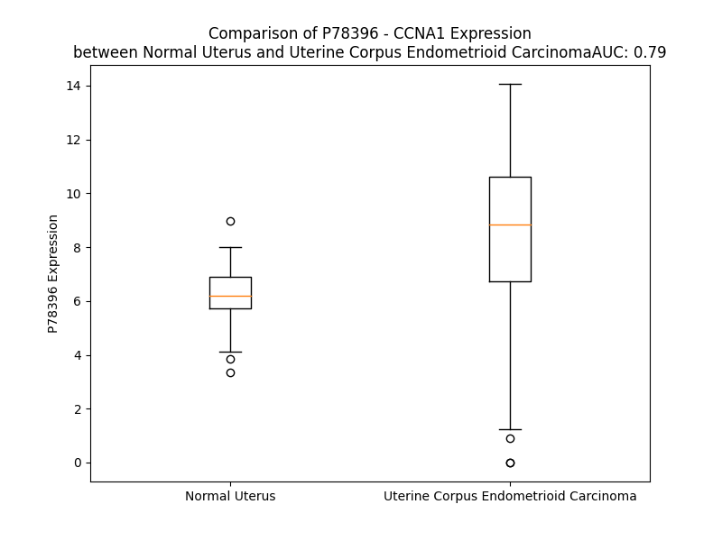

# Detailed Data for P78396

## Introduction to the Detailed Summary

### How to Interpret the Results

- **Summary & Metrics**: This section provides a quick reference to essential protein attributes, including expression changes, family classification, and biomarker applications. Regulation status (upregulated/downregulated) indicates the protein's behavior in a disease context. Some information comes from the original excel file with the proteins selected from literature, while others are derived from the analyses.
- **Expression Comparison**: A visual representation comparing protein expression between normal and disease states. It highlights significant changes in expression levels that might indicate diagnostic or therapeutic relevance. This is data coming from transcriptomics experiments and could not translate similarly to protein levels.
- **Isoform Alignment**: An interactive view of isoform alignments, revealing structural and functional differences between variants of the protein.
- **Interactors & Homologs**: Tables listing known interaction partners and homologous proteins, the more interactors and homologs, the more complex the protein is to design an antibody for.
- **Biological Assemblies**: Information about the structural arrangement of the protein in different assemblies, providing insights into its functional state but also the complexity of the protein to develop antibodies.
- **Combined Per-Residue Information**: A detailed table summarizing residue-level data. This includes predictions for epitope regions, aggregation tendencies, and modifications that might impact the protein's function. Each row corresponds to a residue in the protein, providing insights into specific sites that may be important for research or drug development.
## Summary & Metrics

- **UniProt Accession**: P78396
- **Gene Name**: CCNA1
- **Protein Name**: Cyclin-A1
- **Swiss Prot**: CCNA1_HUMAN
- **Family**: other
- **Biomarker Application**: diagnosis
- **Number of Isoforms**: 3
- **Regulation**: 1
- **(transcriptomics) AUC**: 0.57
- **(transcriptomics) Fold Change**: 1.06
- **(transcriptomics) Regulation**: Upregulated
- **Discotope Epitope Count**: 50
- **Max n_uniprots (Homo)**: N/A
- **Max n_uniprots (Hetero)**: N/A

## Expression Comparison

## Isoform Alignment

<pre style='font-size:14px; font-family:monospace;'>P78396-1 METGFPAIMYPGSFIGGWGEEYLSWEGPGLPDFVFQQQPVESEAMHCSNPKSGVVLATVARGPDACQILTRAPLGQDPPQRTVLGLLTANGQYRRTCGQGITRIRCYSGSENAFPPAGKKALPDCGVQEPPKQGFDIYMDELEQGDRDSCSVREGMAFEDVYEVDTGTLKSDLHFLLDFNTVSPMLVDSSLLSQSEDISSLGTDVINVTEYAEEIYQYLREAEIRHRPKAHYMKKQPDITEGMRTILVDWLVEVGEEYKLRAETLYLAVNFLDRFLSCMSVLRGKLQLVGTAAMLLASKYEEIYPPEVDEFVYITDDTYTKRQLLKMEHLLLKVLAFDLTVPTTNQFLLQYLRRQGVCVRTENLAKYVAELSLLEADPFLKYLPSLIAAAAFCLANYTVNKHFWPETLAAFTGYSLSEIVPCLSELHKAYLDIPHRPQQAIREKYKASKYLCVSLMEPPAVLLLQ
P78396-2 METGFPAIMYPGSFIGGWGEEYLSWEGPGLPDFVFQ-QPVESEAMHCSNPKSGVVLATVARGPDACQILTRAPLGQDPPQRTVLGLLTANGQYRRTCGQGITRIRCYSGSENAFPPAGKKALPDCGVQEPPKQGFDIYMDELEQGDRDSCSVREGMAFEDVYEVDTGTLKSDLHFLLDFNTVSPMLVDSSLLSQSEDISSLGTDVINVTEYAEEIYQYLREAEIRHRPKAHYMKKQPDITEGMRTILVDWLVEVGEEYKLRAETLYLAVNFLDRFLSCMSVLRGKLQLVGTAAMLLASKYEEIYPPEVDEFVYITDDTYTKRQLLKMEHLLLKVLAFDLTVPTTNQFLLQYLRRQGVCVRTENLAKYVAELSLLEADPFLKYLPSLIAAAAFCLANYTVNKHFWPETLAAFTGYSLSEIVPCLSELHKAYLDIPHRPQQAIREKYKASKYLCVSLMEPPAVLLLQ
P78396-3 --------------------------------------------MHCSNPKSGVVLATVARGPDACQILTRAPLGQDPPQRTVLGLLTANGQYRRTCGQGITRIRCYSGSENAFPPAGKKALPDCGVQEPPKQGFDIYMDELEQGDRDSCSVREGMAFEDVYEVDTGTLKSDLHFLLDFNTVSPMLVDSSLLSQSEDISSLGTDVINVTEYAEEIYQYLREAEIRHRPKAHYMKKQPDITEGMRTILVDWLVEVGEEYKLRAETLYLAVNFLDRFLSCMSVLRGKLQLVGTAAMLLASKYEEIYPPEVDEFVYITDDTYTKRQLLKMEHLLLKVLAFDLTVPTTNQFLLQYLRRQGVCVRTENLAKYVAELSLLEADPFLKYLPSLIAAAAFCLANYTVNKHFWPETLAAFTGYSLSEIVPCLSELHKAYLDIPHRPQQAIREKYKASKYLCVSLMEPPAVLLLQ
</pre>

## Interactors

| preferredName_A   | preferredName_B   |   score |
|:------------------|:------------------|--------:|
| CCNA1             | CDKN1A            |   0.999 |
| CCNA1             | SKP2              |   0.999 |
| CCNA1             | CDK2              |   0.999 |
| CCNA1             | CDK1              |   0.999 |
| CCNA1             | CDKN1B            |   0.999 |
| CCNA1             | E2F1              |   0.999 |
| CCNA1             | RB1               |   0.995 |
| CCNA1             | CDK6              |   0.993 |
| CCNA1             | CDC6              |   0.993 |
| CCNA1             | MYBL2             |   0.989 |
| CCNA1             | CDK4              |   0.988 |
| CCNA1             | CDKN1C            |   0.988 |
| CCNA1             | CDC20             |   0.982 |
| CCNA1             | SKP1              |   0.982 |
| CCNA1             | CCNA2             |   0.977 |
| CCNA1             | TP53              |   0.974 |
| CCNA1             | CDC25B            |   0.974 |
| CCNA1             | FZR1              |   0.967 |
| CCNA1             | E2F2              |   0.964 |
| CCNA1             | CDT1              |   0.961 |
| CCNA1             | ELAVL1            |   0.96  |
| CCNA1             | E2F3              |   0.957 |
| CCNA1             | CCNL2             |   0.95  |
| CCNA1             | CKS1B             |   0.947 |
| CCNA1             | UBE2C             |   0.938 |
| CCNA1             | MCM4              |   0.923 |
| CCNA1             | MCM6              |   0.917 |
| CCNA1             | CCNH              |   0.915 |
| CCNA1             | MCM7              |   0.913 |
| CCNA1             | CDC25A            |   0.913 |
| CCNA1             | CCNE1             |   0.907 |
| CCNA1             | MCM5              |   0.902 |

## Homologs

| uniprot_id   | gene_id   |
|:-------------|:----------|
| P20248       | CCNA2     |
| C9J2U0       | CCNE1     |
| Q6FI00       | CCND1     |
| H1UBN3       | CCNB2     |
| Q14094       | CCNI      |
| P41002       | CCNF      |
| D6RI00       | CCND3     |
| Q8WWL7       | CCNB3     |
| Q6ZMN8       | CCNI2     |
| A0A2R8Y754   | CCNJL     |
| P51959       | CCNG1     |
| M0QZM5       | CCNP      |
| E9PC90       | CCNB1     |
| Q8WUE3       | CCNE2     |
| Q5T5M9       | CCNJ      |
| P30279       | CCND2     |
| Q16589       | CCNG2     |
| P22674       | CCNO      |

## Combined Per-Residue Information

|   res | aa   |   epitope_score | epitope   |   relative_surface_accessibility |   modeling_confidence |   Aggregation | modification   |
|------:|:-----|----------------:|:----------|---------------------------------:|----------------------:|--------------:|:---------------|
|     1 | M    |         0.05567 | False     |                          1.27349 |                 34.27 |         0     | N/A            |
|     2 | E    |         0.08717 | False     |                          0.86116 |                 35.6  |         0     | N/A            |
|     3 | T    |         0.09467 | False     |                          0.90535 |                 40.82 |         0     | N/A            |
|     4 | G    |         0.09134 | False     |                          0.77619 |                 36.96 |         0     | N/A            |
|     5 | F    |         0.09569 | False     |                          1.0901  |                 35.89 |         0     | N/A            |
|     6 | P    |         0.08688 | False     |                          0.85758 |                 37.39 |         0     | N/A            |
|     7 | A    |         0.06981 | False     |                          0.83355 |                 29.31 |         0     | N/A            |
|     8 | I    |         0.07931 | False     |                          0.9801  |                 35.57 |         0     | N/A            |
|     9 | M    |         0.07947 | False     |                          0.89331 |                 28.58 |         0     | N/A            |
|    10 | Y    |         0.12088 | False     |                          0.93248 |                 30.87 |         0     | N/A            |
|    11 | P    |         0.09886 | False     |                          0.91083 |                 35.19 |         0     | N/A            |
|    12 | G    |         0.11298 | False     |                          0.90054 |                 33.84 |         0     | N/A            |
|    13 | S    |         0.0577  | False     |                          0.82509 |                 27.14 |         0     | N/A            |
|    14 | F    |         0.06932 | False     |                          1.06235 |                 32.26 |         0     | N/A            |
|    15 | I    |         0.08287 | False     |                          1.04007 |                 28.84 |         0     | N/A            |
|    16 | G    |         0.05001 | False     |                          0.83238 |                 31.75 |         0     | N/A            |
|    17 | G    |         0.08385 | False     |                          0.9231  |                 29.72 |         0     | N/A            |
|    18 | W    |         0.11169 | False     |                          1.16935 |                 28.84 |         0     | N/A            |
|    19 | G    |         0.10837 | False     |                          0.83248 |                 26.44 |         0     | N/A            |
|    20 | E    |         0.09775 | False     |                          0.90145 |                 28.41 |         0     | N/A            |
|    21 | E    |         0.08756 | False     |                          0.89977 |                 30.49 |         0     | N/A            |
|    22 | Y    |         0.11818 | False     |                          0.98059 |                 29.08 |         0     | N/A            |
|    23 | L    |         0.09631 | False     |                          1.02631 |                 30.72 |         0     | N/A            |
|    24 | S    |         0.11211 | False     |                          0.77489 |                 26.79 |         0     | N/A            |
|    25 | W    |         0.09791 | False     |                          1.07503 |                 28.86 |         0     | N/A            |
|    26 | E    |         0.10486 | False     |                          0.89793 |                 30.94 |         0     | N/A            |
|    27 | G    |         0.09499 | False     |                          0.85252 |                 36.98 |         0     | N/A            |
|    28 | P    |         0.11447 | False     |                          1.00713 |                 34.88 |         0     | N/A            |
|    29 | G    |         0.08981 | False     |                          0.9374  |                 30.93 |         0     | N/A            |
|    30 | L    |         0.11416 | False     |                          1.08067 |                 34.29 |         0     | N/A            |
|    31 | P    |         0.11035 | False     |                          0.80261 |                 36.78 |         0     | N/A            |
|    32 | D    |         0.10459 | False     |                          0.85298 |                 28.95 |         0     | N/A            |
|    33 | F    |         0.10572 | False     |                          0.95313 |                 28.71 |         0     | N/A            |
|    34 | V    |         0.1222  | False     |                          0.9235  |                 27.91 |         0     | N/A            |
|    35 | F    |         0.06459 | False     |                          0.99591 |                 26.66 |         0     | N/A            |
|    36 | Q    |         0.14353 | True      |                          0.83817 |                 26.71 |         0     | N/A            |
|    37 | Q    |         0.08466 | False     |                          0.89514 |                 24.6  |         0     | N/A            |
|    38 | Q    |         0.11807 | False     |                          0.82126 |                 27.22 |         0     | N/A            |
|    39 | P    |         0.08152 | False     |                          0.89741 |                 24.81 |         0     | N/A            |
|    40 | V    |         0.10173 | False     |                          1.04066 |                 28.97 |         0     | N/A            |
|    41 | E    |         0.14757 | True      |                          0.84889 |                 26.24 |         0     | N/A            |
|    42 | S    |         0.07459 | False     |                          0.84959 |                 24.04 |         0     | N/A            |
|    43 | E    |         0.10084 | False     |                          0.94269 |                 27.55 |         0     | N/A            |
|    44 | A    |         0.09805 | False     |                          0.93856 |                 23.43 |         0     | N/A            |
|    45 | M    |         0.15668 | True      |                          1.07029 |                 28.71 |         0     | N/A            |
|    46 | H    |         0.07979 | False     |                          0.93082 |                 27.91 |         0     | N/A            |
|    47 | C    |         0.08673 | False     |                          0.85304 |                 24.05 |         0     | N/A            |
|    48 | S    |         0.11272 | False     |                          0.94064 |                 30.74 |         0     | N/A            |
|    49 | N    |         0.10864 | False     |                          0.90669 |                 29.26 |         0     | N/A            |
|    50 | P    |         0.1266  | False     |                          0.72716 |                 42.21 |         0     | N/A            |
|    51 | K    |         0.06226 | False     |                          0.94962 |                 35.36 |         0     | N/A            |
|    52 | S    |         0.09036 | False     |                          0.89199 |                 33.34 |         0.331 | N/A            |
|    53 | G    |         0.0954  | False     |                          0.94871 |                 32.84 |         2.774 | N/A            |
|    54 | V    |         0.07979 | False     |                          0.92914 |                 27.23 |        65.321 | N/A            |
|    55 | V    |         0.08788 | False     |                          1.0103  |                 31.96 |        70.044 | N/A            |
|    56 | L    |         0.05936 | False     |                          0.96465 |                 26.22 |        70.228 | N/A            |
|    57 | A    |         0.09076 | False     |                          0.7061  |                 27.42 |        70.171 | N/A            |
|    58 | T    |         0.08091 | False     |                          1.02298 |                 29.21 |        69.735 | N/A            |
|    59 | V    |         0.06013 | False     |                          1.01617 |                 26.46 |        62.482 | N/A            |
|    60 | A    |         0.10981 | False     |                          0.88775 |                 31.09 |        28.659 | N/A            |
|    61 | R    |         0.10873 | False     |                          0.96142 |                 29.85 |         0     | N/A            |
|    62 | G    |         0.08573 | False     |                          0.83854 |                 27.13 |         0     | N/A            |
|    63 | P    |         0.10057 | False     |                          0.91326 |                 37.23 |         0     | N/A            |
|    64 | D    |         0.10459 | False     |                          0.8665  |                 29.95 |         0     | N/A            |
|    65 | A    |         0.08863 | False     |                          0.88122 |                 31.87 |         0     | N/A            |
|    66 | C    |         0.08682 | False     |                          0.86875 |                 28.57 |         0     | N/A            |
|    67 | Q    |         0.10213 | False     |                          0.86412 |                 26.36 |         0     | N/A            |
|    68 | I    |         0.10908 | False     |                          0.97563 |                 30.31 |         0     | N/A            |
|    69 | L    |         0.11211 | False     |                          1.06988 |                 26.31 |         0     | N/A            |
|    70 | T    |         0.12858 | False     |                          0.94379 |                 29.16 |         0     | N/A            |
|    71 | R    |         0.14743 | True      |                          0.96074 |                 26.18 |         0     | N/A            |
|    72 | A    |         0.11584 | False     |                          0.85739 |                 26.63 |         0     | N/A            |
|    73 | P    |         0.11274 | False     |                          0.96651 |                 28.87 |         0     | N/A            |
|    74 | L    |         0.14872 | True      |                          1.14902 |                 26.36 |         0     | N/A            |
|    75 | G    |         0.12702 | False     |                          0.80551 |                 30.83 |         0     | N/A            |
|    76 | Q    |         0.15362 | True      |                          0.95246 |                 27.25 |         0     | N/A            |
|    77 | D    |         0.10632 | False     |                          0.60525 |                 27.98 |         0     | N/A            |
|    78 | P    |         0.08776 | False     |                          0.80252 |                 32.33 |         0     | N/A            |
|    79 | P    |         0.07677 | False     |                          0.83213 |                 40.48 |         0     | N/A            |
|    80 | Q    |         0.07438 | False     |                          0.68012 |                 47.68 |         0     | N/A            |
|    81 | R    |         0.05129 | False     |                          0.18835 |                 52.96 |         0     | N/A            |
|    82 | T    |         0.03974 | False     |                          0.29088 |                 60.46 |         4.461 | N/A            |
|    83 | V    |         0.03788 | False     |                          0.16131 |                 53.91 |        11.342 | N/A            |
|    84 | L    |         0.03938 | False     |                          0.14151 |                 67.98 |        12.183 | N/A            |
|    85 | G    |         0.0246  | False     |                          0.242   |                 60.57 |        12.183 | N/A            |
|    86 | L    |         0.08328 | False     |                          0.93081 |                 61.41 |        12.183 | N/A            |
|    87 | L    |         0.03423 | False     |                          0.10208 |                 56.26 |        11.816 | N/A            |
|    88 | T    |         0.07963 | False     |                          0.48117 |                 53.77 |         6.584 | N/A            |
|    89 | A    |         0.19978 | True      |                          0.74922 |                 40.72 |         3.016 | N/A            |
|    90 | N    |         0.14125 | False     |                          0.79651 |                 46.86 |         0     | N/A            |
|    91 | G    |         0.07277 | False     |                          0.32266 |                 38.36 |         0     | N/A            |
|    92 | Q    |         0.07608 | False     |                          0.35159 |                 39.31 |         0     | N/A            |
|    93 | Y    |         0.07458 | False     |                          0.73734 |                 33.34 |         0     | N/A            |
|    94 | R    |         0.07757 | False     |                          0.59772 |                 42.66 |         0     | N/A            |
|    95 | R    |         0.07729 | False     |                          0.75324 |                 37.23 |         0     | N/A            |
|    96 | T    |         0.07185 | False     |                          0.72289 |                 30.92 |         0     | N/A            |
|    97 | C    |         0.07179 | False     |                          0.89017 |                 28.08 |         0     | N/A            |
|    98 | G    |         0.10046 | False     |                          0.61617 |                 29.46 |         0     | N/A            |
|    99 | Q    |         0.10874 | False     |                          0.79992 |                 27.34 |         0     | N/A            |
|   100 | G    |         0.13683 | False     |                          0.87876 |                 27.76 |         0     | N/A            |
|   101 | I    |         0.09816 | False     |                          1.07581 |                 25.93 |         0     | N/A            |
|   102 | T    |         0.09802 | False     |                          0.85764 |                 29.09 |         0     | N/A            |
|   103 | R    |         0.09781 | False     |                          0.92238 |                 24.71 |         0     | N/A            |
|   104 | I    |         0.0936  | False     |                          0.90017 |                 30.11 |         0     | N/A            |
|   105 | R    |         0.11911 | False     |                          0.846   |                 23.98 |         0     | N/A            |
|   106 | C    |         0.11128 | False     |                          0.84216 |                 28.3  |         0     | N/A            |
|   107 | Y    |         0.12202 | False     |                          0.88237 |                 27.46 |         0     | N/A            |
|   108 | S    |         0.08391 | False     |                          0.89352 |                 28.13 |         0     | N/A            |
|   109 | G    |         0.0971  | False     |                          0.8424  |                 29.43 |         0     | N/A            |
|   110 | S    |         0.06759 | False     |                          0.81456 |                 33.88 |         0     | N/A            |
|   111 | E    |         0.08831 | False     |                          0.84955 |                 32.27 |         0     | N/A            |
|   112 | N    |         0.12169 | False     |                          0.93776 |                 29.3  |         0     | N/A            |
|   113 | A    |         0.07172 | False     |                          0.95539 |                 32.83 |         0     | N/A            |
|   114 | F    |         0.11003 | False     |                          0.98528 |                 36.87 |         0     | N/A            |
|   115 | P    |         0.08028 | False     |                          0.89333 |                 38.46 |         0     | N/A            |
|   116 | P    |         0.06624 | False     |                          0.99452 |                 31.48 |         0     | N/A            |
|   117 | A    |         0.10176 | False     |                          1.03588 |                 37.15 |         0     | N/A            |
|   118 | G    |         0.11112 | False     |                          0.88995 |                 33.84 |         0     | N/A            |
|   119 | K    |         0.14998 | True      |                          0.92549 |                 34.13 |         0     | N/A            |
|   120 | K    |         0.12047 | False     |                          0.93453 |                 34.5  |         0     | N/A            |
|   121 | A    |         0.12149 | False     |                          0.90183 |                 32.57 |         0     | N/A            |
|   122 | L    |         0.13145 | False     |                          1.08378 |                 33.24 |         0     | N/A            |
|   123 | P    |         0.06014 | False     |                          0.88752 |                 30.68 |         0     | N/A            |
|   124 | D    |         0.12128 | False     |                          0.92378 |                 31.4  |         0     | N/A            |
|   125 | C    |         0.09157 | False     |                          0.95226 |                 24.72 |         0     | N/A            |
|   126 | G    |         0.10295 | False     |                          0.79029 |                 32.23 |         0     | N/A            |
|   127 | V    |         0.10644 | False     |                          1.06029 |                 26.96 |         0     | N/A            |
|   128 | Q    |         0.13478 | False     |                          0.87778 |                 28.62 |         0     | N/A            |
|   129 | E    |         0.11901 | False     |                          0.79536 |                 28.31 |         0     | N/A            |
|   130 | P    |         0.11558 | False     |                          0.86885 |                 34.31 |         0     | N/A            |
|   131 | P    |         0.10511 | False     |                          0.93426 |                 33.63 |         0     | N/A            |
|   132 | K    |         0.10598 | False     |                          0.98349 |                 31.09 |         0     | N/A            |
|   133 | Q    |         0.10267 | False     |                          0.8734  |                 34.44 |         0     | N/A            |
|   134 | G    |         0.09806 | False     |                          0.84366 |                 30.46 |         0     | N/A            |
|   135 | F    |         0.08938 | False     |                          0.6964  |                 36.42 |         0     | N/A            |
|   136 | D    |         0.08169 | False     |                          0.79043 |                 33.03 |         0     | N/A            |
|   137 | I    |         0.05411 | False     |                          0.46109 |                 36.89 |         0     | N/A            |
|   138 | Y    |         0.07432 | False     |                          0.76487 |                 41.41 |         0     | N/A            |
|   139 | M    |         0.05909 | False     |                          0.66026 |                 35.9  |         0     | N/A            |
|   140 | D    |         0.07179 | False     |                          0.73506 |                 41.48 |         0     | N/A            |
|   141 | E    |         0.12705 | False     |                          0.87331 |                 37.82 |         0     | N/A            |
|   142 | L    |         0.10111 | False     |                          1.03589 |                 34.66 |         0     | N/A            |
|   143 | E    |         0.11594 | False     |                          0.92397 |                 34.71 |         0     | N/A            |
|   144 | Q    |         0.13081 | False     |                          0.89864 |                 30.25 |         0     | N/A            |
|   145 | G    |         0.11085 | False     |                          0.93038 |                 31.64 |         0     | N/A            |
|   146 | D    |         0.10901 | False     |                          0.81564 |                 27.32 |         0     | N/A            |
|   147 | R    |         0.17857 | True      |                          0.96922 |                 31.85 |         0     | N/A            |
|   148 | D    |         0.08346 | False     |                          0.79904 |                 31.94 |         0     | N/A            |
|   149 | S    |         0.07319 | False     |                          0.80306 |                 25.57 |         0     | N/A            |
|   150 | C    |         0.06627 | False     |                          1.01688 |                 26.78 |         0     | N/A            |
|   151 | S    |         0.10199 | False     |                          0.72242 |                 24.62 |         0     | N/A            |
|   152 | V    |         0.122   | False     |                          0.89031 |                 27.35 |         0     | N/A            |
|   153 | R    |         0.15191 | True      |                          0.8819  |                 27.75 |         0     | N/A            |
|   154 | E    |         0.11329 | False     |                          0.87137 |                 24.83 |         0     | N/A            |
|   155 | G    |         0.13771 | False     |                          0.80676 |                 25.46 |         0     | N/A            |
|   156 | M    |         0.08101 | False     |                          1.05662 |                 27.74 |         0     | N/A            |
|   157 | A    |         0.10235 | False     |                          0.93599 |                 27.39 |         0     | N/A            |
|   158 | F    |         0.08967 | False     |                          0.92658 |                 25.02 |         0     | N/A            |
|   159 | E    |         0.07507 | False     |                          0.89277 |                 29.83 |         0     | N/A            |
|   160 | D    |         0.15124 | True      |                          0.68509 |                 25.97 |         0     | N/A            |
|   161 | V    |         0.07513 | False     |                          0.75557 |                 29.83 |         0     | N/A            |
|   162 | Y    |         0.09988 | False     |                          0.91356 |                 31.06 |         0     | N/A            |
|   163 | E    |         0.0728  | False     |                          0.87733 |                 24.1  |         0     | N/A            |
|   164 | V    |         0.12602 | False     |                          1.0084  |                 33.17 |         0     | N/A            |
|   165 | D    |         0.10709 | False     |                          0.73262 |                 30.25 |         0     | N/A            |
|   166 | T    |         0.14043 | False     |                          0.91889 |                 29.26 |         0     | N/A            |
|   167 | G    |         0.13844 | False     |                          0.85835 |                 32.44 |         0     | N/A            |
|   168 | T    |         0.12271 | False     |                          0.92299 |                 31.56 |         0     | N/A            |
|   169 | L    |         0.08573 | False     |                          1.06558 |                 33.11 |         0     | N/A            |
|   170 | K    |         0.06086 | False     |                          1.01709 |                 30.87 |         0     | N/A            |
|   171 | S    |         0.07582 | False     |                          0.64463 |                 38.52 |         0     | N/A            |
|   172 | D    |         0.08603 | False     |                          0.83898 |                 33.52 |         0     | N/A            |
|   173 | L    |         0.12809 | False     |                          1.13811 |                 41.21 |         0     | N/A            |
|   174 | H    |         0.10599 | False     |                          0.94655 |                 38.57 |         0     | N/A            |
|   175 | F    |         0.1155  | False     |                          0.99958 |                 38.11 |         0     | N/A            |
|   176 | L    |         0.08122 | False     |                          0.9     |                 35.65 |         0     | N/A            |
|   177 | L    |         0.06755 | False     |                          1.12078 |                 37.76 |         0     | N/A            |
|   178 | D    |         0.05115 | False     |                          0.75145 |                 33.51 |         0     | N/A            |
|   179 | F    |         0.06687 | False     |                          0.94095 |                 37.08 |         0     | N/A            |
|   180 | N    |         0.092   | False     |                          0.79206 |                 38.63 |         0     | N/A            |
|   181 | T    |         0.10584 | False     |                          0.87885 |                 35.22 |         0     | N/A            |
|   182 | V    |         0.08814 | False     |                          1.01151 |                 40.9  |         0     | N/A            |
|   183 | S    |         0.13488 | False     |                          0.77937 |                 39.96 |         0     | N/A            |
|   184 | P    |         0.1768  | True      |                          0.9752  |                 41.35 |         0     | N/A            |
|   185 | M    |         0.14151 | False     |                          0.93222 |                 46.22 |         0     | N/A            |
|   186 | L    |         0.084   | False     |                          1.09229 |                 48.91 |         0     | N/A            |
|   187 | V    |         0.06394 | False     |                          1.05335 |                 52.05 |         0     | N/A            |
|   188 | D    |         0.13571 | False     |                          0.81603 |                 40.97 |         0     | N/A            |
|   189 | S    |         0.14786 | True      |                          0.85633 |                 45.31 |         0     | N/A            |
|   190 | S    |         0.11518 | False     |                          0.64645 |                 47.08 |         0     | N/A            |
|   191 | L    |         0.08936 | False     |                          1.09416 |                 41.79 |         0     | N/A            |
|   192 | L    |         0.07867 | False     |                          1.07214 |                 38.38 |         0     | N/A            |
|   193 | S    |         0.12355 | False     |                          0.75646 |                 36.44 |         0     | N/A            |
|   194 | Q    |         0.14447 | True      |                          0.89482 |                 35.02 |         0     | N/A            |
|   195 | S    |         0.08761 | False     |                          0.89415 |                 33.95 |         0     | N/A            |
|   196 | E    |         0.09432 | False     |                          0.78758 |                 36.75 |         0     | N/A            |
|   197 | D    |         0.14217 | False     |                          0.87859 |                 33.54 |         0     | N/A            |
|   198 | I    |         0.12721 | False     |                          1.03679 |                 37.61 |         0     | N/A            |
|   199 | S    |         0.11882 | False     |                          0.80323 |                 36.9  |         0     | N/A            |
|   200 | S    |         0.09529 | False     |                          0.71526 |                 35.32 |         0     | N/A            |
|   201 | L    |         0.11212 | False     |                          1.0812  |                 39.37 |         0     | N/A            |
|   202 | G    |         0.09344 | False     |                          0.68818 |                 35.05 |         0     | N/A            |
|   203 | T    |         0.16759 | True      |                          0.92363 |                 33.67 |         0     | N/A            |
|   204 | D    |         0.09697 | False     |                          0.44263 |                 47.23 |         0     | N/A            |
|   205 | V    |         0.11389 | False     |                          0.96187 |                 48.19 |         0.291 | N/A            |
|   206 | I    |         0.13167 | False     |                          0.85213 |                 50    |         0.291 | N/A            |
|   207 | N    |         0.09895 | False     |                          0.45995 |                 53.12 |         0.291 | N/A            |
|   208 | V    |         0.12055 | False     |                          0.44865 |                 58.6  |         0.291 | N/A            |
|   209 | T    |         0.15463 | True      |                          0.8174  |                 78.8  |         0.291 | N/A            |
|   210 | E    |         0.15112 | True      |                          0.70047 |                 85.74 |         0     | N/A            |
|   211 | Y    |         0.12973 | False     |                          0.58301 |                 89.27 |         0     | N/A            |
|   212 | A    |         0.07026 | False     |                          0.32606 |                 85.99 |         0     | N/A            |
|   213 | E    |         0.15732 | True      |                          0.55711 |                 88.66 |         0     | N/A            |
|   214 | E    |         0.10362 | False     |                          0.53018 |                 92.55 |         0     | N/A            |
|   215 | I    |         0.09762 | False     |                          0.45655 |                 92.35 |         0.604 | N/A            |
|   216 | Y    |         0.03137 | False     |                          0.05709 |                 93.16 |         0.604 | N/A            |
|   217 | Q    |         0.1087  | False     |                          0.57517 |                 94.46 |         0.604 | N/A            |
|   218 | Y    |         0.09858 | False     |                          0.5216  |                 95.3  |         0.604 | N/A            |
|   219 | L    |         0.04107 | False     |                          0.13355 |                 95.93 |         0.604 | N/A            |
|   220 | R    |         0.04881 | False     |                          0.21814 |                 95.8  |         0     | N/A            |
|   221 | E    |         0.07051 | False     |                          0.45887 |                 95.64 |         0     | N/A            |
|   222 | A    |         0.01331 | False     |                          0.01275 |                 95.66 |         0     | N/A            |
|   223 | E    |         0.0401  | False     |                          0.0256  |                 96.37 |         0     | N/A            |
|   224 | I    |         0.13385 | False     |                          0.66669 |                 94.67 |         0     | N/A            |
|   225 | R    |         0.1498  | True      |                          0.54527 |                 91.35 |         0     | N/A            |
|   226 | H    |         0.03066 | False     |                          0.19305 |                 85.9  |         0     | N/A            |
|   227 | R    |         0.09653 | False     |                          0.30533 |                 92.09 |         0     | N/A            |
|   228 | P    |         0.01819 | False     |                          0.13839 |                 94.74 |         0     | N/A            |
|   229 | K    |         0.16139 | True      |                          0.5155  |                 94.23 |         0     | N/A            |
|   230 | A    |         0.08694 | False     |                          0.31226 |                 92.74 |         0     | N/A            |
|   231 | H    |         0.18564 | True      |                          0.5453  |                 93.94 |         0     | N/A            |
|   232 | Y    |         0.01994 | False     |                          0.02118 |                 96.07 |         0     | N/A            |
|   233 | M    |         0.04461 | False     |                          0.17113 |                 96.29 |         0     | N/A            |
|   234 | K    |         0.2846  | True      |                          0.8429  |                 94.39 |         0     | N/A            |
|   235 | K    |         0.13288 | False     |                          0.70626 |                 93.84 |         0     | N/A            |
|   236 | Q    |         0.04869 | False     |                          0.08671 |                 96.44 |         0     | N/A            |
|   237 | P    |         0.18161 | True      |                          0.76863 |                 95.76 |         0     | N/A            |
|   238 | D    |         0.14295 | True      |                          0.20416 |                 96.83 |         0     | N/A            |
|   239 | I    |         0.03759 | False     |                          0.0334  |                 96.61 |         0     | N/A            |
|   240 | T    |         0.12308 | False     |                          0.42032 |                 96.48 |         0     | N/A            |
|   241 | E    |         0.0441  | False     |                          0.24364 |                 95.76 |         0     | N/A            |
|   242 | G    |         0.04967 | False     |                          0.37045 |                 96.03 |         0     | N/A            |
|   243 | M    |         0.02328 | False     |                          0.01264 |                 97.51 |         0.536 | N/A            |
|   244 | R    |         0.0099  | False     |                          0.0103  |                 97.87 |         1.822 | N/A            |
|   245 | T    |         0.0102  | False     |                          0.09564 |                 97.45 |         1.822 | N/A            |
|   246 | I    |         0.01763 | False     |                          0.04195 |                 97.47 |         1.822 | N/A            |
|   247 | L    |         0.00189 | False     |                          0       |                 98.19 |         1.822 | N/A            |
|   248 | V    |         0.00214 | False     |                          0       |                 98.35 |         1.822 | N/A            |
|   249 | D    |         0.00891 | False     |                          0.02267 |                 98.01 |         1.822 | N/A            |
|   250 | W    |         0.01503 | False     |                          0.02868 |                 98.08 |         1.822 | N/A            |
|   251 | L    |         0.00247 | False     |                          0.00165 |                 98.51 |         1.822 | N/A            |
|   252 | V    |         0.00505 | False     |                          0.01631 |                 98.19 |         1.822 | N/A            |
|   253 | E    |         0.02537 | False     |                          0.18327 |                 97.31 |         0     | N/A            |
|   254 | V    |         0.01044 | False     |                          0.01374 |                 97.46 |         0     | N/A            |
|   255 | G    |         0.0198  | False     |                          0.09454 |                 97.86 |         0     | N/A            |
|   256 | E    |         0.08345 | False     |                          0.30309 |                 96.6  |         0     | N/A            |
|   257 | E    |         0.09766 | False     |                          0.49521 |                 96.19 |         0     | N/A            |
|   258 | Y    |         0.07126 | False     |                          0.19585 |                 96.44 |         0     | N/A            |
|   259 | K    |         0.20112 | True      |                          0.89458 |                 96.55 |         0     | N/A            |
|   260 | L    |         0.01775 | False     |                          0.14079 |                 97.73 |         0.102 | N/A            |
|   261 | R    |         0.08302 | False     |                          0.39219 |                 97.19 |         0.102 | N/A            |
|   262 | A    |         0.0126  | False     |                          0.32813 |                 97.42 |         0.102 | N/A            |
|   263 | E    |         0.0111  | False     |                          0.06594 |                 98    |         0.102 | N/A            |
|   264 | T    |         0.00126 | False     |                          0       |                 98.57 |        21.858 | N/A            |
|   265 | L    |         0.00529 | False     |                          0.03533 |                 98.59 |        58.776 | N/A            |
|   266 | Y    |         0.01302 | False     |                          0.05334 |                 98.44 |        74.763 | N/A            |
|   267 | L    |         0.00649 | False     |                          0.01072 |                 98.53 |        79.367 | N/A            |
|   268 | A    |         0.00159 | False     |                          0       |                 98.66 |        80.181 | N/A            |
|   269 | V    |         0.00752 | False     |                          0.03427 |                 98.52 |        79.965 | N/A            |
|   270 | N    |         0.01059 | False     |                          0.14658 |                 97.99 |        73.142 | N/A            |
|   271 | F    |         0.00168 | False     |                          0       |                 98.48 |        72.818 | N/A            |
|   272 | L    |         0.00097 | False     |                          0       |                 98.41 |        71.108 | N/A            |
|   273 | D    |         0.00548 | False     |                          0.01324 |                 98.23 |         1.892 | N/A            |
|   274 | R    |         0.02467 | False     |                          0.0943  |                 97.66 |         1.892 | N/A            |
|   275 | F    |         0.00613 | False     |                          0.01147 |                 98.12 |         3.138 | N/A            |
|   276 | L    |         0.00632 | False     |                          0.02011 |                 98.02 |         2.988 | N/A            |
|   277 | S    |         0.04058 | False     |                          0.07836 |                 96.8  |         2.149 | N/A            |
|   278 | C    |         0.04579 | False     |                          0.46841 |                 95.55 |         2.077 | N/A            |
|   279 | M    |         0.02393 | False     |                          0.01927 |                 96.95 |         2.077 | N/A            |
|   280 | S    |         0.0374  | False     |                          0.36849 |                 96.94 |         1.796 | N/A            |
|   281 | V    |         0.01805 | False     |                          0.07082 |                 97.23 |         1.796 | N/A            |
|   282 | L    |         0.08518 | False     |                          0.68283 |                 97.18 |         1.459 | N/A            |
|   283 | R    |         0.05805 | False     |                          0.36658 |                 96.66 |         0     | N/A            |
|   284 | G    |         0.09776 | False     |                          0.54337 |                 95.15 |         0     | N/A            |
|   285 | K    |         0.0435  | False     |                          0.48102 |                 96.8  |         0     | N/A            |
|   286 | L    |         0.00088 | False     |                          0.00082 |                 98.04 |         0.342 | N/A            |
|   287 | Q    |         0.0099  | False     |                          0.05934 |                 98.24 |         0.342 | N/A            |
|   288 | L    |         0.00877 | False     |                          0.08408 |                 98.35 |         7.526 | N/A            |
|   289 | V    |         0.00744 | False     |                          0.02095 |                 98.51 |         8.73  | N/A            |
|   290 | G    |         0.00147 | False     |                          0       |                 98.54 |         8.73  | N/A            |
|   291 | T    |         0.0031  | False     |                          0.01238 |                 98.5  |         9.868 | N/A            |
|   292 | A    |         0.00132 | False     |                          0       |                 98.64 |        11.542 | N/A            |
|   293 | A    |         0.00141 | False     |                          0       |                 98.75 |        11.852 | N/A            |
|   294 | M    |         0.00157 | False     |                          0.0035  |                 98.58 |        11.721 | N/A            |
|   295 | L    |         0.00347 | False     |                          0.00082 |                 98.56 |        11.571 | N/A            |
|   296 | L    |         0.01576 | False     |                          0.061   |                 98.5  |        10.463 | N/A            |
|   297 | A    |         0.0019  | False     |                          0       |                 98.71 |         2.867 | N/A            |
|   298 | S    |         0.00129 | False     |                          0       |                 98.62 |         0.171 | N/A            |
|   299 | K    |         0.09521 | False     |                          0.45983 |                 98.38 |         0     | N/A            |
|   300 | Y    |         0.12018 | False     |                          0.4364  |                 97.93 |         0     | N/A            |
|   301 | E    |         0.07982 | False     |                          0.20462 |                 97.79 |         0     | N/A            |
|   302 | E    |         0.05485 | False     |                          0.14883 |                 97.97 |         0     | N/A            |
|   303 | I    |         0.1742  | True      |                          0.7995  |                 97.51 |         0     | N/A            |
|   304 | Y    |         0.15989 | True      |                          0.87903 |                 97.04 |         0     | N/A            |
|   305 | P    |         0.04666 | False     |                          0.37464 |                 97.43 |         0     | N/A            |
|   306 | P    |         0.04489 | False     |                          0.16338 |                 97.51 |         0     | N/A            |
|   307 | E    |         0.20232 | True      |                          0.6548  |                 97.1  |         0     | N/A            |
|   308 | V    |         0.04202 | False     |                          0.17236 |                 97.57 |         0     | N/A            |
|   309 | D    |         0.11125 | False     |                          0.42934 |                 97.45 |         0     | N/A            |
|   310 | E    |         0.13255 | False     |                          0.38528 |                 97.01 |         0     | N/A            |
|   311 | F    |         0.00279 | False     |                          0.00306 |                 97.24 |         2.903 | N/A            |
|   312 | V    |         0.04347 | False     |                          0.13519 |                 97.08 |         2.903 | N/A            |
|   313 | Y    |         0.23937 | True      |                          0.54978 |                 96.05 |         2.903 | N/A            |
|   314 | I    |         0.02651 | False     |                          0.0328  |                 94.39 |         2.903 | N/A            |
|   315 | T    |         0.01122 | False     |                          0.00977 |                 92.56 |         2.903 | N/A            |
|   316 | D    |         0.063   | False     |                          0.46071 |                 92.94 |         0     | N/A            |
|   317 | D    |         0.24728 | True      |                          0.64521 |                 88.88 |         0     | N/A            |
|   318 | T    |         0.10343 | False     |                          0.56107 |                 93.06 |         0     | N/A            |
|   319 | Y    |         0.03848 | False     |                          0.05716 |                 95.14 |         0     | N/A            |
|   320 | T    |         0.21789 | True      |                          0.4987  |                 97.3  |         0     | N/A            |
|   321 | K    |         0.13971 | False     |                          0.44164 |                 97.95 |         0     | N/A            |
|   322 | R    |         0.17874 | True      |                          0.68519 |                 98.11 |         0     | N/A            |
|   323 | Q    |         0.07075 | False     |                          0.32543 |                 98.09 |         0     | N/A            |
|   324 | L    |         0.00998 | False     |                          0.01072 |                 98.3  |         0     | N/A            |
|   325 | L    |         0.10833 | False     |                          0.44043 |                 98.45 |         0     | N/A            |
|   326 | K    |         0.13256 | False     |                          0.51457 |                 98.42 |         0     | N/A            |
|   327 | M    |         0.01768 | False     |                          0.07696 |                 98.46 |         0.183 | N/A            |
|   328 | E    |         0.03622 | False     |                          0.08109 |                 98.41 |         0.347 | N/A            |
|   329 | H    |         0.07212 | False     |                          0.66343 |                 98.17 |         0.427 | N/A            |
|   330 | L    |         0.04639 | False     |                          0.19207 |                 98.43 |        25.865 | N/A            |
|   331 | L    |         0.00297 | False     |                          0       |                 98.18 |        35.03  | N/A            |
|   332 | L    |         0.03617 | False     |                          0.15498 |                 98.31 |        36.829 | N/A            |
|   333 | K    |         0.13188 | False     |                          0.66277 |                 98.06 |        37.125 | N/A            |
|   334 | V    |         0.04654 | False     |                          0.21849 |                 97.72 |        37.125 | N/A            |
|   335 | L    |         0.02364 | False     |                          0.05131 |                 97.02 |        37.125 | N/A            |
|   336 | A    |         0.09548 | False     |                          0.68153 |                 96.98 |        37.125 | N/A            |
|   337 | F    |         0.19408 | True      |                          0.7045  |                 97.11 |        37.125 | N/A            |
|   338 | D    |         0.07904 | False     |                          0.41668 |                 95.73 |        36.778 | N/A            |
|   339 | L    |         0.02943 | False     |                          0.1199  |                 96.5  |        33.188 | N/A            |
|   340 | T    |         0.09617 | False     |                          0.58608 |                 95.25 |        13.318 | N/A            |
|   341 | V    |         0.01413 | False     |                          0.02721 |                 95.49 |         1.546 | N/A            |
|   342 | P    |         0.01649 | False     |                          0.04556 |                 96.73 |         0.652 | N/A            |
|   343 | T    |         0.00925 | False     |                          0.03713 |                 97.59 |         0     | N/A            |
|   344 | T    |         0.00926 | False     |                          0.0574  |                 98.06 |         0     | N/A            |
|   345 | N    |         0.02261 | False     |                          0.0715  |                 97.85 |         0     | N/A            |
|   346 | Q    |         0.03156 | False     |                          0.26961 |                 96.01 |         0     | N/A            |
|   347 | F    |         0.00191 | False     |                          0       |                 97.71 |         3.072 | N/A            |
|   348 | L    |         0.00308 | False     |                          0.00577 |                 97.71 |         3.239 | N/A            |
|   349 | L    |         0.03955 | False     |                          0.38363 |                 95.22 |         3.239 | N/A            |
|   350 | Q    |         0.05183 | False     |                          0.183   |                 93.53 |         3.239 | N/A            |
|   351 | Y    |         0.00341 | False     |                          0       |                 95.66 |         3.239 | N/A            |
|   352 | L    |         0.02783 | False     |                          0.05668 |                 95.04 |         2.211 | N/A            |
|   353 | R    |         0.12397 | False     |                          0.59364 |                 91.37 |         0     | N/A            |
|   354 | R    |         0.17161 | True      |                          0.45063 |                 91.68 |         0     | N/A            |
|   355 | Q    |         0.09581 | False     |                          0.32116 |                 92.44 |         0     | N/A            |
|   356 | G    |         0.19808 | True      |                          0.76604 |                 90.39 |         0     | N/A            |
|   357 | V    |         0.04702 | False     |                          0.23605 |                 92.39 |         0     | N/A            |
|   358 | C    |         0.15466 | True      |                          0.48099 |                 94.73 |         0     | N/A            |
|   359 | V    |         0.071   | False     |                          0.65615 |                 95.52 |         0     | N/A            |
|   360 | R    |         0.1337  | False     |                          0.48245 |                 95.72 |         0     | N/A            |
|   361 | T    |         0.00407 | False     |                          0       |                 96.39 |         0     | N/A            |
|   362 | E    |         0.01841 | False     |                          0.2532  |                 97.21 |         0     | N/A            |
|   363 | N    |         0.02083 | False     |                          0.06214 |                 97.75 |         0     | N/A            |
|   364 | L    |         0.00194 | False     |                          0.00082 |                 97.58 |         0     | N/A            |
|   365 | A    |         0.00088 | False     |                          0       |                 98.16 |         0     | N/A            |
|   366 | K    |         0.01387 | False     |                          0.22858 |                 98.02 |         0     | N/A            |
|   367 | Y    |         0.00234 | False     |                          0       |                 97.91 |         0     | N/A            |
|   368 | V    |         0.00115 | False     |                          0       |                 97.24 |         0     | N/A            |
|   369 | A    |         0.00109 | False     |                          0.00255 |                 98.2  |         0     | N/A            |
|   370 | E    |         0.00297 | False     |                          0.00335 |                 97.96 |         0     | N/A            |
|   371 | L    |         0.00698 | False     |                          0.01638 |                 97.29 |         0     | N/A            |
|   372 | S    |         0.00328 | False     |                          0.03795 |                 97.44 |         0     | N/A            |
|   373 | L    |         0.00885 | False     |                          0.11046 |                 97.6  |         0     | N/A            |
|   374 | L    |         0.00695 | False     |                          0.01484 |                 96    |         0     | N/A            |
|   375 | E    |         0.0338  | False     |                          0.15147 |                 92.45 |         0     | N/A            |
|   376 | A    |         0.02353 | False     |                          0.0458  |                 92.29 |         0     | N/A            |
|   377 | D    |         0.13978 | False     |                          0.55793 |                 91.76 |         0     | N/A            |
|   378 | P    |         0.09185 | False     |                          0.14064 |                 94.57 |         0     | N/A            |
|   379 | F    |         0.01069 | False     |                          0.02296 |                 96.72 |         0     | N/A            |
|   380 | L    |         0.03509 | False     |                          0.17985 |                 95.55 |         0     | N/A            |
|   381 | K    |         0.14506 | True      |                          0.47774 |                 94.97 |         0     | N/A            |
|   382 | Y    |         0.05654 | False     |                          0.11891 |                 96.93 |         0     | N/A            |
|   383 | L    |         0.02879 | False     |                          0.25909 |                 97.28 |         0     | N/A            |
|   384 | P    |         0.00622 | False     |                          0.17496 |                 97.81 |         0     | N/A            |
|   385 | S    |         0.00221 | False     |                          0       |                 97.95 |         5.001 | N/A            |
|   386 | L    |         0.00781 | False     |                          0.13025 |                 98.12 |        44.729 | N/A            |
|   387 | I    |         0.0067  | False     |                          0.0736  |                 98.34 |        51.797 | N/A            |
|   388 | A    |         0.00086 | False     |                          0       |                 98.44 |        52.303 | N/A            |
|   389 | A    |         0.00113 | False     |                          0       |                 98.3  |        52.774 | N/A            |
|   390 | A    |         0.00127 | False     |                          0       |                 98.23 |        53.182 | N/A            |
|   391 | A    |         0.00153 | False     |                          0       |                 98.24 |        52.396 | N/A            |
|   392 | F    |         0.00466 | False     |                          0       |                 98.06 |        51.465 | N/A            |
|   393 | C    |         0.00281 | False     |                          0       |                 96.77 |        38.635 | N/A            |
|   394 | L    |         0.00303 | False     |                          0.00082 |                 96.83 |        35.965 | N/A            |
|   395 | A    |         0.00249 | False     |                          0.00128 |                 97.2  |        20.717 | N/A            |
|   396 | N    |         0.0179  | False     |                          0.05304 |                 95.78 |         7.693 | N/A            |
|   397 | Y    |         0.07091 | False     |                          0.07825 |                 95.36 |         7.262 | N/A            |
|   398 | T    |         0.03452 | False     |                          0.08983 |                 95.12 |         5.623 | N/A            |
|   399 | V    |         0.09548 | False     |                          0.28249 |                 94.3  |         4.647 | N/A            |
|   400 | N    |         0.10621 | False     |                          0.38153 |                 92.97 |         0.125 | N/A            |
|   401 | K    |         0.18916 | True      |                          0.64393 |                 92.53 |         0     | N/A            |
|   402 | H    |         0.17251 | True      |                          0.68649 |                 92.97 |         0     | N/A            |
|   403 | F    |         0.03441 | False     |                          0.17054 |                 92.78 |         0     | N/A            |
|   404 | W    |         0.04508 | False     |                          0.11724 |                 94.81 |         0     | N/A            |
|   405 | P    |         0.06393 | False     |                          0.17567 |                 94.98 |         0     | N/A            |
|   406 | E    |         0.1296  | False     |                          0.80211 |                 94.13 |         0     | N/A            |
|   407 | T    |         0.15107 | True      |                          0.6376  |                 93.74 |         1.013 | N/A            |
|   408 | L    |         0.01008 | False     |                          0.00412 |                 95.12 |         1.838 | N/A            |
|   409 | A    |         0.10456 | False     |                          0.30512 |                 95.82 |         1.838 | N/A            |
|   410 | A    |         0.25598 | True      |                          0.86644 |                 94.2  |         1.838 | N/A            |
|   411 | F    |         0.10813 | False     |                          0.17862 |                 92.94 |         1.838 | N/A            |
|   412 | T    |         0.08675 | False     |                          0.0614  |                 94.54 |         1.2   | N/A            |
|   413 | G    |         0.18601 | True      |                          0.72755 |                 94.86 |         0.194 | N/A            |
|   414 | Y    |         0.07104 | False     |                          0.0988  |                 96.52 |         0.194 | N/A            |
|   415 | S    |         0.16969 | True      |                          0.35662 |                 96.29 |         0     | N/A            |
|   416 | L    |         0.04868 | False     |                          0.35961 |                 95.6  |         0     | N/A            |
|   417 | S    |         0.09134 | False     |                          0.6554  |                 95.64 |         0     | N/A            |
|   418 | E    |         0.15227 | True      |                          0.46754 |                 96.23 |         0     | N/A            |
|   419 | I    |         0.00646 | False     |                          0       |                 97.3  |         0     | N/A            |
|   420 | V    |         0.04387 | False     |                          0.28372 |                 96.66 |         0     | N/A            |
|   421 | P    |         0.12923 | False     |                          0.50931 |                 96.86 |         0     | N/A            |
|   422 | C    |         0.00225 | False     |                          0       |                 97.43 |         0     | N/A            |
|   423 | L    |         0.00222 | False     |                          0       |                 97.02 |         0     | N/A            |
|   424 | S    |         0.04668 | False     |                          0.2826  |                 96.26 |         0     | N/A            |
|   425 | E    |         0.08071 | False     |                          0.22301 |                 96.38 |         0     | N/A            |
|   426 | L    |         0.00135 | False     |                          0       |                 96.56 |         0     | N/A            |
|   427 | H    |         0.04102 | False     |                          0.09209 |                 96.49 |         0     | N/A            |
|   428 | K    |         0.05829 | False     |                          0.52441 |                 95.3  |         0     | N/A            |
|   429 | A    |         0.01003 | False     |                          0.05819 |                 94.34 |         0     | N/A            |
|   430 | Y    |         0.01094 | False     |                          0.01627 |                 95.02 |         0     | N/A            |
|   431 | L    |         0.10003 | False     |                          0.38999 |                 94.76 |         0     | N/A            |
|   432 | D    |         0.0868  | False     |                          0.39377 |                 93.24 |         0     | N/A            |
|   433 | I    |         0.02983 | False     |                          0.0368  |                 90.95 |         0     | N/A            |
|   434 | P    |         0.09202 | False     |                          0.46554 |                 90.07 |         0     | N/A            |
|   435 | H    |         0.2647  | True      |                          0.865   |                 90.66 |         0     | N/A            |
|   436 | R    |         0.08977 | False     |                          0.23717 |                 91.73 |         0     | N/A            |
|   437 | P    |         0.10425 | False     |                          0.71882 |                 93.76 |         0     | N/A            |
|   438 | Q    |         0.03855 | False     |                          0.07261 |                 94.88 |         0     | N/A            |
|   439 | Q    |         0.04809 | False     |                          0.18615 |                 95.87 |         0     | N/A            |
|   440 | A    |         0.01747 | False     |                          0.08157 |                 96.68 |         0     | N/A            |
|   441 | I    |         0.00671 | False     |                          0.00686 |                 96.91 |         0     | N/A            |
|   442 | R    |         0.04144 | False     |                          0.24197 |                 96.11 |         0     | N/A            |
|   443 | E    |         0.13449 | False     |                          0.45736 |                 96.25 |         0     | N/A            |
|   444 | K    |         0.05256 | False     |                          0.11375 |                 96.81 |         0     | N/A            |
|   445 | Y    |         0.01231 | False     |                          0.02084 |                 97.35 |         0     | N/A            |
|   446 | K    |         0.07901 | False     |                          0.41455 |                 96.28 |         0     | N/A            |
|   447 | A    |         0.06342 | False     |                          0.35002 |                 95.24 |         0     | N/A            |
|   448 | S    |         0.25483 | True      |                          0.73224 |                 94.92 |         0     | N/A            |
|   449 | K    |         0.14136 | False     |                          0.59294 |                 94.01 |         0     | N/A            |
|   450 | Y    |         0.04985 | False     |                          0.17398 |                 95.23 |         9.368 | N/A            |
|   451 | L    |         0.18604 | True      |                          0.52884 |                 95.58 |        12.085 | N/A            |
|   452 | C    |         0.11197 | False     |                          0.35571 |                 95.55 |        12.085 | N/A            |
|   453 | V    |         0.00698 | False     |                          0       |                 96.37 |        12.085 | N/A            |
|   454 | S    |         0.01858 | False     |                          0.05842 |                 94.55 |        12.085 | N/A            |
|   455 | L    |         0.15468 | True      |                          0.59916 |                 93.94 |        12.085 | N/A            |
|   456 | M    |         0.10151 | False     |                          0.28235 |                 92.88 |         6.44  | N/A            |
|   457 | E    |         0.1436  | True      |                          0.77041 |                 90.48 |         0     | N/A            |
|   458 | P    |         0.03216 | False     |                          0.21256 |                 90.75 |         0     | N/A            |
|   459 | P    |         0.14234 | False     |                          0.14215 |                 90.65 |         0.217 | N/A            |
|   460 | A    |         0.13981 | False     |                          0.8281  |                 87.15 |        48.583 | N/A            |
|   461 | V    |         0.23277 | True      |                          0.73224 |                 87.68 |        48.583 | N/A            |
|   462 | L    |         0.055   | False     |                          0.12222 |                 86.69 |        48.583 | N/A            |
|   463 | L    |         0.13116 | False     |                          0.72382 |                 79.55 |        48.583 | N/A            |
|   464 | L    |         0.06833 | False     |                          0.40135 |                 74.4  |        48.583 | N/A            |
|   465 | Q    |         0.08413 | False     |                          1.1503  |                 50.72 |         0     | N/A            |

