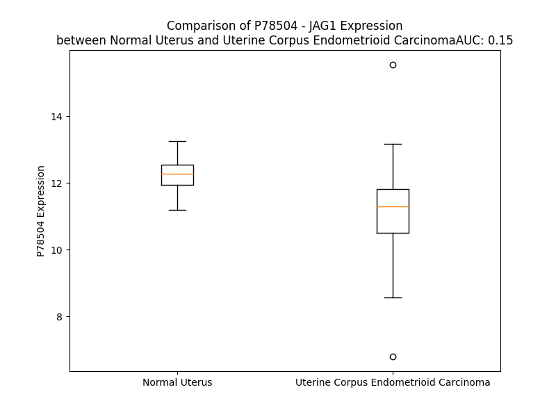

# Detailed Data for P78504

## Introduction to the Detailed Summary

### How to Interpret the Results

- **Summary & Metrics**: This section provides a quick reference to essential protein attributes, including expression changes, family classification, and biomarker applications. Regulation status (upregulated/downregulated) indicates the protein's behavior in a disease context. Some information comes from the original excel file with the proteins selected from literature, while others are derived from the analyses.
- **Expression Comparison**: A visual representation comparing protein expression between normal and disease states. It highlights significant changes in expression levels that might indicate diagnostic or therapeutic relevance. This is data coming from transcriptomics experiments and could not translate similarly to protein levels.
- **Isoform Alignment**: An interactive view of isoform alignments, revealing structural and functional differences between variants of the protein.
- **Interactors & Homologs**: Tables listing known interaction partners and homologous proteins, the more interactors and homologs, the more complex the protein is to design an antibody for.
- **Biological Assemblies**: Information about the structural arrangement of the protein in different assemblies, providing insights into its functional state but also the complexity of the protein to develop antibodies.
- **Combined Per-Residue Information**: A detailed table summarizing residue-level data. This includes predictions for epitope regions, aggregation tendencies, and modifications that might impact the protein's function. Each row corresponds to a residue in the protein, providing insights into specific sites that may be important for research or drug development.
## Summary & Metrics

- **UniProt Accession**: P78504
- **Gene Name**: JAG-1
- **Protein Name**: Protein jagged-1
- **Swiss Prot**: JAG1_HUMAN
- **Family**: growth factor
- **Biomarker Application**: efficacy
- **Number of Isoforms**: 2
- **Regulation**: 1
- **(transcriptomics) AUC**: 0.13
- **(transcriptomics) Fold Change**: 1.12
- **(transcriptomics) Regulation**: Downregulated
- **Discotope Epitope Count**: 320
- **Max n_uniprots (Homo)**: 3
- **Max n_uniprots (Hetero)**: N/A

## Expression Comparison

## Isoform Alignment

<pre style='font-size:14px; font-family:monospace;'>P78504-1 MRSPRTRGRSGRPLSLLLALLCALRAKVCGASGQFELEILSMQNVNGELQNGNCCGGARNPGDRKCTRDECDTYFKVCLKEYQSRVTAGGPCSFGSGSTPVIGGNTFNLKASRGNDRNRIVLPFSFAWPRSYTLLVEAWDSSNDTVQPDSIIEKASHSGMINPSRQWQTLKQNTGVAHFEYQIRVTCDDYYYGFGCNKFCRPRDDFFGHYACDQNGNKTCMEGWMGPECNRAICRQGCSPKHGSCKLPGDCRCQYGWQGLYCDKCIPHPGCVHGICNEPWQCLCETNWGGQLCDKDLNYCGTHQPCLNGGTCSNTGPDKYQCSCPEGYSGPNCEIAEHACLSDPCHNRGSCKETSLGFECECSPGWTGPTCSTNIDDCSPNNCSHGGTCQDLVNGFKCVCPPQWTGKTCQLDANECEAKPCVNAKSCKNLIASYYCDCLPGWMGQNCDININDCLGQCQNDASCRDLVNGYRCICPPGYAGDHCERDIDECASNPCLNGGHCQNEINRFQCLCPTGFSGNLCQLDIDYCEPNPCQNGAQCYNRASDYFCKCPEDYEGKNCSHLKDHCRTTPCEVIDSCTVAMASNDTPEGVRYISSNVCGPHGKCKSQSGGKFTCDCNKGFTGTYCHENINDCESNPCRNGGTCIDGVNSYKCICSDGWEGAYCETNINDCSQNPCHNGGTCRDLVNDFYCDCKNGWKGKTCHSRDSQCDEATCNNGGTCYDEGDAFKCMCPGGWEGTTCNIARNSSCLPNPCHNGGTCVVNGESFTCVCKEGWEGPICAQNTNDCSPHPCYNSGTCVDGDNWYRCECAPGFAGPDCRININECQSSPCAFGATCVDEINGYRCVCPPGHSGAKCQEVSGRPCITMGSVIPDGAKWDDDCNTCQCLNGRIACSKVWCGPRPCLLHKGHSECPSGQSCIPILDDQCFVHPCTGVGECRSSSLQPVKTKCTSDSYYQDNCANITFTFNKEMMSPGLTTEHICSELRNLNILKNVSAEYSIYIACEPSPSANNEIHVAISAEDIRDDGNPIKEITDKIIDLVSKRDGNSSLIAAVAEVRVQRRPLKNRTDFLVPLLSSVLTVAWICCLVTAFYWCLRKRRKPGSHTHSASEDNTTNNVREQLNQIKNPIEKHGANTVPIKDYENKNSKMSKIRTHNSEVEEDDMDKHQQKARFAKQPAYTLVDREEKPPNGTPTKHPNWTNKQDNRDLESAQSLNRMEYIV
P78504-2 ---------------------------------------------------------------------------------------------------------------------------------------------------------------MINPSRQWQTLKQNTGVAHFEYQIRVTCDDYYYGFGCNKFCRPRDDFFGHYACDQNGNKTCMEGWMGPECNRAICRQGCSPKHGSCKLPGDCRCQYGWQGLYCDKCIPHPGCVHGICNEPWQCLCETNWGGQLCDKDLNYCGTHQPCLNGGTCSNTGPDKYQCSCPEGYSGPNCEIAEHACLSDPCHNRGSCKETSLGFECECSPGWTGPTCSTNIDDCSPNNCSHGGTCQDLVNGFKCVCPPQWTGKTCQLDANECEAKPCVNAKSCKNLIASYYCDCLPGWMGQNCDININDCLGQCQNDASCRDLVNGYRCICPPGYAGDHCERDIDECASNPCLNGGHCQNEINRFQCLCPTGFSGNLCQLDIDYCEPNPCQNGAQCYNRASDYFCKCPEDYEGKNCSHLKDHCRTTPCEVIDSCTVAMASNDTPEGVRYISSNVCGPHGKCKSQSGGKFTCDCNKGFTGTYCHENINDCESNPCRNGGTCIDGVNSYKCICSDGWEGAYCETNINDCSQNPCHNGGTCRDLVNDFYCDCKNGWKGKTCHSRDSQCDEATCNNGGTCYDEGDAFKCMCPGGWEGTTCNIARNSSCLPNPCHNGGTCVVNGESFTCVCKEGWEGPICAQNTNDCSPHPCYNSGTCVDGDNWYRCECAPGFAGPDCRININECQSSPCAFGATCVDEINGYRCVCPPGHSGAKCQEVSGRPCITMGSVIPDGAKWDDDCNTCQCLNGRIACSKVWCGPRPCLLHKGHSECPSGQSCIPILDDQCFVHPCTGVGECRSSSLQPVKTKCTSDSYYQDNCANITFTFNKEMMSPGLTTEHICSELRNLNILKNVSAEYSIYIACEPSPSANNEIHVAISAEDIRDDGNPIKEITDKIIDLVSKRDGNSSLIAAVAEVRVQRRPLKNRTDFLVPLLSSVLTVAWICCLVTAFYWCLRKRRKPGSHTHSASEDNTTNNVREQLNQIKNPIEKHGANTVPIKDYENKNSKMSKIRTHNSEVEEDDMDKHQQKARFAKQPAYTLVDREEKPPNGTPTKHPNWTNKQDNRDLESAQSLNRMEYIV
</pre>

## Interactors

| preferredName_A   | preferredName_B   |   score |
|:------------------|:------------------|--------:|
| JAG1              | NOTCH4            |   0.999 |
| JAG1              | NOTCH2            |   0.999 |
| JAG1              | NOTCH3            |   0.999 |
| JAG1              | NOTCH1            |   0.999 |
| JAG1              | JAG2              |   0.951 |
| JAG1              | RBPJ              |   0.938 |
| JAG1              | HEY1              |   0.926 |
| JAG1              | HEY2              |   0.918 |
| JAG1              | SRRT              |   0.915 |

## Homologs

| uniprot_id   | gene_id   |
|:-------------|:----------|
| A0A140T8Y6   | NOTCH4    |
| Q9NR61       | DLL4      |
| A0A0D9SF76   | DLL1      |
| Q8NFT8       | DNER      |
| Q9Y219       | JAG2      |

## Biological Assemblies

|   Unnamed: 0 |   assembly |   n_uniprots | composition   | crystal_id   |
|-------------:|-----------:|-------------:|:--------------|:-------------|
|            0 |          1 |            1 | Homo          | 2vj2         |
|            1 |          2 |            1 | Homo          | 2vj2         |
|            0 |          1 |            1 | Homo          | 4cc1         |
|            1 |          2 |            1 | Homo          | 4cc1         |
|            0 |          1 |            2 | Homo          | 4xi7         |
|            0 |          1 |            1 | Homo          | 2kb9         |
|            0 |          1 |            3 | Homo          | 5bo1         |
|            1 |          2 |            3 | Homo          | 5bo1         |
|            0 |          1 |            1 | Homo          | 4cc0         |
|            1 |          2 |            1 | Homo          | 4cc0         |
|            0 |          1 |            1 | Homo          | 4cbz         |
|            1 |          2 |            1 | Homo          | 4cbz         |

## Combined Per-Residue Information

|   res | aa   |   epitope_score | epitope   |   relative_surface_accessibility |   modeling_confidence |   Aggregation | modification   | glycosylation                   |
|------:|:-----|----------------:|:----------|---------------------------------:|----------------------:|--------------:|:---------------|:--------------------------------|
|     1 | M    |         0.08909 | False     |                          1.35006 |                 34.31 |         0     | N/A            | N/A                             |
|     2 | R    |         0.16213 | True      |                          0.97598 |                 33.89 |         0     | N/A            | N/A                             |
|     3 | S    |         0.08215 | False     |                          0.82085 |                 29.23 |         0     | N/A            | N/A                             |
|     4 | P    |         0.07661 | False     |                          0.91957 |                 44.49 |         0     | N/A            | N/A                             |
|     5 | R    |         0.1182  | True      |                          0.9569  |                 33.73 |         0     | N/A            | N/A                             |
|     6 | T    |         0.10614 | True      |                          1.00863 |                 40.73 |         0     | N/A            | N/A                             |
|     7 | R    |         0.13202 | True      |                          0.98401 |                 35.66 |         0     | N/A            | N/A                             |
|     8 | G    |         0.1521  | True      |                          0.89273 |                 36.75 |         0     | N/A            | N/A                             |
|     9 | R    |         0.18004 | True      |                          0.97565 |                 38.06 |         0     | N/A            | N/A                             |
|    10 | S    |         0.07716 | False     |                          0.90294 |                 35.55 |         0     | N/A            | N/A                             |
|    11 | G    |         0.19847 | True      |                          0.8332  |                 39.86 |         0     | N/A            | N/A                             |
|    12 | R    |         0.1195  | True      |                          0.78744 |                 43.28 |         0     | N/A            | N/A                             |
|    13 | P    |         0.09147 | False     |                          0.87146 |                 45.27 |         0.145 | N/A            | N/A                             |
|    14 | L    |         0.08429 | False     |                          0.80798 |                 45.39 |        12.764 | N/A            | N/A                             |
|    15 | S    |         0.06779 | False     |                          0.51816 |                 49.18 |        18.119 | N/A            | N/A                             |
|    16 | L    |         0.09187 | False     |                          0.73437 |                 49.74 |        60.44  | N/A            | N/A                             |
|    17 | L    |         0.07123 | False     |                          0.69988 |                 50.34 |        67.409 | N/A            | N/A                             |
|    18 | L    |         0.08838 | False     |                          0.65428 |                 54.09 |        67.903 | N/A            | N/A                             |
|    19 | A    |         0.06095 | False     |                          0.53959 |                 53.29 |        67.707 | N/A            | N/A                             |
|    20 | L    |         0.09274 | True      |                          0.64794 |                 52.72 |        67.454 | N/A            | N/A                             |
|    21 | L    |         0.10305 | True      |                          0.62132 |                 53.61 |        61.316 | N/A            | N/A                             |
|    22 | C    |         0.07736 | False     |                          0.5823  |                 50.23 |        23.53  | N/A            | N/A                             |
|    23 | A    |         0.05066 | False     |                          0.66589 |                 46.81 |        15.709 | N/A            | N/A                             |
|    24 | L    |         0.10677 | True      |                          0.87393 |                 45.34 |        13.298 | N/A            | N/A                             |
|    25 | R    |         0.12543 | True      |                          0.86125 |                 41.81 |         0     | N/A            | N/A                             |
|    26 | A    |         0.0895  | False     |                          0.54252 |                 34.77 |         0     | N/A            | N/A                             |
|    27 | K    |         0.07428 | False     |                          0.89476 |                 34.12 |         0     | N/A            | N/A                             |
|    28 | V    |         0.08179 | False     |                          0.89663 |                 36.75 |         0     | N/A            | N/A                             |
|    29 | C    |         0.05628 | False     |                          0.68857 |                 42.19 |         0     | N/A            | N/A                             |
|    30 | G    |         0.07932 | False     |                          0.51401 |                 56.61 |         0     | N/A            | N/A                             |
|    31 | A    |         0.0309  | False     |                          0.15364 |                 61.95 |         0     | N/A            | N/A                             |
|    32 | S    |         0.0126  | False     |                          0.02972 |                 84.91 |         0     | N/A            | N/A                             |
|    33 | G    |         0.00432 | False     |                          0       |                 91.45 |         0     | N/A            | N/A                             |
|    34 | Q    |         0.02865 | False     |                          0.26103 |                 93.6  |         0     | N/A            | N/A                             |
|    35 | F    |         0.00379 | False     |                          0.00201 |                 95.35 |         0     | N/A            | N/A                             |
|    36 | E    |         0.03782 | False     |                          0.0376  |                 94.74 |         0     | N/A            | N/A                             |
|    37 | L    |         0.00694 | False     |                          0.00719 |                 95.1  |         0     | N/A            | N/A                             |
|    38 | E    |         0.02945 | False     |                          0.06022 |                 94.59 |         0     | N/A            | N/A                             |
|    39 | I    |         0.00394 | False     |                          0       |                 94.81 |         0     | N/A            | N/A                             |
|    40 | L    |         0.04    | False     |                          0.11129 |                 93.45 |         0     | N/A            | N/A                             |
|    41 | S    |         0.05807 | False     |                          0.12515 |                 94.3  |         0     | N/A            | N/A                             |
|    42 | M    |         0.00928 | False     |                          0.00854 |                 93.9  |         0     | N/A            | N/A                             |
|    43 | Q    |         0.10708 | True      |                          0.3998  |                 93.96 |         0     | N/A            | N/A                             |
|    44 | N    |         0.00527 | False     |                          0       |                 91.93 |         0     | N/A            | N/A                             |
|    45 | V    |         0.0694  | False     |                          0.82547 |                 86.97 |         0     | N/A            | N/A                             |
|    46 | N    |         0.10019 | True      |                          0.50174 |                 85.26 |         0     | N/A            | N/A                             |
|    47 | G    |         0.01231 | False     |                          0.02001 |                 88.1  |         0     | N/A            | N/A                             |
|    48 | E    |         0.02111 | False     |                          0.10542 |                 89.23 |         0     | N/A            | N/A                             |
|    49 | L    |         0.02541 | False     |                          0.07272 |                 89.88 |         0     | N/A            | N/A                             |
|    50 | Q    |         0.05106 | False     |                          0.37459 |                 88.69 |         0     | N/A            | N/A                             |
|    51 | N    |         0.09848 | True      |                          0.67049 |                 86.53 |         0     | N/A            | N/A                             |
|    52 | G    |         0.09309 | True      |                          0.33547 |                 84.39 |         0     | N/A            | N/A                             |
|    53 | N    |         0.10661 | True      |                          0.50234 |                 85.93 |         0     | N/A            | N/A                             |
|    54 | C    |         0.03745 | False     |                          0.01404 |                 87.09 |         0     | N/A            | N/A                             |
|    55 | C    |         0.02692 | False     |                          0.15448 |                 84.76 |         0     | N/A            | N/A                             |
|    56 | G    |         0.07802 | False     |                          0.43227 |                 77.06 |         0     | N/A            | N/A                             |
|    57 | G    |         0.11187 | True      |                          0.52784 |                 73.71 |         0     | N/A            | N/A                             |
|    58 | A    |         0.08742 | False     |                          0.4996  |                 70.85 |         0     | N/A            | N/A                             |
|    59 | R    |         0.17366 | True      |                          0.43577 |                 80.26 |         0     | N/A            | N/A                             |
|    60 | N    |         0.14643 | True      |                          0.35761 |                 75.34 |         0     | N/A            | N/A                             |
|    61 | P    |         0.15996 | True      |                          1.03673 |                 73.5  |         0     | N/A            | N/A                             |
|    62 | G    |         0.19189 | True      |                          0.90033 |                 76.29 |         0     | N/A            | N/A                             |
|    63 | D    |         0.18825 | True      |                          0.4708  |                 78.73 |         0     | N/A            | N/A                             |
|    64 | R    |         0.18311 | True      |                          0.78221 |                 74.78 |         0     | N/A            | N/A                             |
|    65 | K    |         0.17437 | True      |                          0.65506 |                 80.1  |         0     | N/A            | N/A                             |
|    66 | C    |         0.06605 | False     |                          0.12624 |                 80.25 |         0     | N/A            | N/A                             |
|    67 | T    |         0.1309  | True      |                          0.32827 |                 67.37 |         0     | N/A            | N/A                             |
|    68 | R    |         0.21542 | True      |                          0.95527 |                 66.53 |         0     | N/A            | N/A                             |
|    69 | D    |         0.12685 | True      |                          0.50039 |                 75.74 |         0     | N/A            | N/A                             |
|    70 | E    |         0.09343 | True      |                          0.57639 |                 83.93 |         0     | N/A            | N/A                             |
|    71 | C    |         0.00605 | False     |                          0.00169 |                 89.09 |         0     | N/A            | N/A                             |
|    72 | D    |         0.06243 | False     |                          0.34477 |                 92.11 |         0     | N/A            | N/A                             |
|    73 | T    |         0.00229 | False     |                          0       |                 93.52 |         0     | N/A            | N/A                             |
|    74 | Y    |         0.07747 | False     |                          0.09505 |                 94.55 |         0     | N/A            | N/A                             |
|    75 | F    |         0.00265 | False     |                          0       |                 95.42 |         0     | N/A            | N/A                             |
|    76 | K    |         0.0847  | False     |                          0.32013 |                 94.47 |         0     | N/A            | N/A                             |
|    77 | V    |         0.01096 | False     |                          0.0296  |                 94.63 |         0     | N/A            | N/A                             |
|    78 | C    |         0.03495 | False     |                          0.17847 |                 94.66 |         0     | N/A            | N/A                             |
|    79 | L    |         0.00838 | False     |                          0.00495 |                 94.98 |         0     | N/A            | N/A                             |
|    80 | K    |         0.01638 | False     |                          0.01123 |                 92.76 |         0     | N/A            | N/A                             |
|    81 | E    |         0.05867 | False     |                          0.36551 |                 90.61 |         0     | N/A            | N/A                             |
|    82 | Y    |         0.08331 | False     |                          0.50819 |                 89.49 |         0     | N/A            | N/A                             |
|    83 | Q    |         0.10302 | True      |                          0.18188 |                 82.49 |         0     | N/A            | N/A                             |
|    84 | S    |         0.07401 | False     |                          0.78452 |                 79    |         0     | N/A            | N/A                             |
|    85 | R    |         0.11387 | True      |                          0.85741 |                 80.53 |         0     | N/A            | N/A                             |
|    86 | V    |         0.08906 | False     |                          0.43559 |                 78.78 |         0     | N/A            | N/A                             |
|    87 | T    |         0.09651 | True      |                          0.48534 |                 80    |         0     | N/A            | N/A                             |
|    88 | A    |         0.1308  | True      |                          0.85977 |                 69.46 |         0     | N/A            | N/A                             |
|    89 | G    |         0.15117 | True      |                          0.62974 |                 71.12 |         0     | N/A            | N/A                             |
|    90 | G    |         0.12197 | True      |                          0.59799 |                 76.76 |         0     | N/A            | N/A                             |
|    91 | P    |         0.10145 | True      |                          0.7264  |                 89.54 |         0     | N/A            | N/A                             |
|    92 | C    |         0.06082 | False     |                          0.31564 |                 91.78 |         0     | N/A            | N/A                             |
|    93 | S    |         0.07495 | False     |                          0.42903 |                 90.74 |         0     | N/A            | N/A                             |
|    94 | F    |         0.06786 | False     |                          0.13931 |                 92.62 |         0     | N/A            | N/A                             |
|    95 | G    |         0.03284 | False     |                          0.30699 |                 91.98 |         0     | N/A            | N/A                             |
|    96 | S    |         0.11517 | True      |                          0.55673 |                 93.92 |         0     | N/A            | N/A                             |
|    97 | G    |         0.04643 | False     |                          0.28081 |                 92.43 |         0     | N/A            | N/A                             |
|    98 | S    |         0.13266 | True      |                          0.55379 |                 93.54 |         0     | N/A            | N/A                             |
|    99 | T    |         0.02307 | False     |                          0.04786 |                 93.21 |         0     | N/A            | N/A                             |
|   100 | P    |         0.10897 | True      |                          0.48826 |                 91.82 |         0     | N/A            | N/A                             |
|   101 | V    |         0.09623 | True      |                          0.32877 |                 92.15 |         0     | N/A            | N/A                             |
|   102 | I    |         0.02687 | False     |                          0.19399 |                 91.14 |         0     | N/A            | N/A                             |
|   103 | G    |         0.04252 | False     |                          0.24633 |                 89.98 |         0     | N/A            | N/A                             |
|   104 | G    |         0.05185 | False     |                          0.26843 |                 90.29 |         0     | N/A            | N/A                             |
|   105 | N    |         0.08279 | False     |                          0.17654 |                 90.02 |         0     | N/A            | N/A                             |
|   106 | T    |         0.17057 | True      |                          0.58507 |                 91.73 |         0     | N/A            | N/A                             |
|   107 | F    |         0.05196 | False     |                          0.13358 |                 93    |         0     | N/A            | N/A                             |
|   108 | N    |         0.14906 | True      |                          0.68612 |                 92.48 |         0     | N/A            | N/A                             |
|   109 | L    |         0.05146 | False     |                          0.21405 |                 89.97 |         0     | N/A            | N/A                             |
|   110 | K    |         0.19541 | True      |                          0.51318 |                 83.32 |         0     | N/A            | N/A                             |
|   111 | A    |         0.10641 | True      |                          1.06852 |                 77.63 |         0     | N/A            | N/A                             |
|   112 | S    |         0.09298 | True      |                          0.4232  |                 75.12 |         0     | N/A            | N/A                             |
|   113 | R    |         0.15017 | True      |                          0.90795 |                 74.22 |         0     | N/A            | N/A                             |
|   114 | G    |         0.0789  | False     |                          0.40961 |                 66.83 |         0     | N/A            | N/A                             |
|   115 | N    |         0.07332 | False     |                          0.47534 |                 79.22 |         0     | N/A            | N/A                             |
|   116 | D    |         0.11817 | True      |                          0.78883 |                 81.43 |         0     | N/A            | N/A                             |
|   117 | R    |         0.12032 | True      |                          0.57473 |                 85.8  |         0     | N/A            | N/A                             |
|   118 | N    |         0.02099 | False     |                          0.02363 |                 89.49 |         0     | N/A            | N/A                             |
|   119 | R    |         0.07292 | False     |                          0.2682  |                 90.84 |         0     | N/A            | N/A                             |
|   120 | I    |         0.04629 | False     |                          0.06699 |                 93.87 |         0     | N/A            | N/A                             |
|   121 | V    |         0.07549 | False     |                          0.38805 |                 93.94 |         0     | N/A            | N/A                             |
|   122 | L    |         0.02271 | False     |                          0.05272 |                 94.05 |         0     | N/A            | N/A                             |
|   123 | P    |         0.07046 | False     |                          0.64775 |                 93.57 |         0     | N/A            | N/A                             |
|   124 | F    |         0.04443 | False     |                          0.03661 |                 92.59 |         0     | N/A            | N/A                             |
|   125 | S    |         0.04341 | False     |                          0.55811 |                 90.04 |         0     | N/A            | N/A                             |
|   126 | F    |         0.09783 | True      |                          0.3713  |                 90.41 |         0     | N/A            | N/A                             |
|   127 | A    |         0.04292 | False     |                          0.48546 |                 90.87 |         0     | N/A            | N/A                             |
|   128 | W    |         0.01379 | False     |                          0.02741 |                 93.8  |         0     | N/A            | N/A                             |
|   129 | P    |         0.05957 | False     |                          0.45372 |                 91.75 |         0     | N/A            | N/A                             |
|   130 | R    |         0.08764 | False     |                          0.27639 |                 91.69 |         0     | N/A            | N/A                             |
|   131 | S    |         0.04152 | False     |                          0.24294 |                 93.02 |         6.888 | N/A            | N/A                             |
|   132 | Y    |         0.00364 | False     |                          0.00139 |                 94.04 |        58.065 | N/A            | N/A                             |
|   133 | T    |         0.0095  | False     |                          0       |                 93.93 |        58.065 | N/A            | N/A                             |
|   134 | L    |         0.00354 | False     |                          0.00183 |                 94.38 |        58.065 | N/A            | N/A                             |
|   135 | L    |         0.05911 | False     |                          0.07828 |                 93.49 |        58.065 | N/A            | N/A                             |
|   136 | V    |         0.00161 | False     |                          0.00286 |                 94.43 |        57.525 | N/A            | N/A                             |
|   137 | E    |         0.07867 | False     |                          0.17297 |                 93.63 |         0     | N/A            | N/A                             |
|   138 | A    |         0.00111 | False     |                          0       |                 94.64 |         0     | N/A            | N/A                             |
|   139 | W    |         0.08781 | False     |                          0.22996 |                 94.08 |         0     | N/A            | N/A                             |
|   140 | D    |         0.05666 | False     |                          0.09457 |                 92.52 |         0     | N/A            | N/A                             |
|   141 | S    |         0.04159 | False     |                          0.23001 |                 89.73 |         0     | N/A            | N/A                             |
|   142 | S    |         0.12932 | True      |                          0.3037  |                 79.52 |         0     | N/A            | N/A                             |
|   143 | N    |         0.15932 | True      |                          0.87383 |                 69.73 |         0     | N/A            | N-linked (GlcNAc...) asparagine |
|   144 | D    |         0.10379 | True      |                          0.55817 |                 62.86 |         0     | N/A            | N/A                             |
|   145 | T    |         0.14246 | True      |                          1.01404 |                 59.48 |         0     | N/A            | N/A                             |
|   146 | V    |         0.19499 | True      |                          0.89462 |                 67.68 |         0     | N/A            | N/A                             |
|   147 | Q    |         0.14264 | True      |                          0.5654  |                 68.24 |         0     | N/A            | N/A                             |
|   148 | P    |         0.13792 | True      |                          0.7952  |                 81.97 |         0     | N/A            | N/A                             |
|   149 | D    |         0.15146 | True      |                          0.30823 |                 87.6  |         0     | N/A            | N/A                             |
|   150 | S    |         0.07233 | False     |                          0.23011 |                 89.99 |         0     | N/A            | N/A                             |
|   151 | I    |         0.07054 | False     |                          0.21249 |                 91.65 |         0     | N/A            | N/A                             |
|   152 | I    |         0.00424 | False     |                          0.00118 |                 92.7  |         0     | N/A            | N/A                             |
|   153 | E    |         0.05119 | False     |                          0.06449 |                 93.07 |         0     | N/A            | N/A                             |
|   154 | K    |         0.11531 | True      |                          0.3648  |                 91.68 |         0     | N/A            | N/A                             |
|   155 | A    |         0.0379  | False     |                          0.03699 |                 91.99 |         0     | N/A            | N/A                             |
|   156 | S    |         0.15839 | True      |                          0.52499 |                 90.74 |         0     | N/A            | N/A                             |
|   157 | H    |         0.06154 | False     |                          0.2624  |                 91.02 |         0     | N/A            | N/A                             |
|   158 | S    |         0.12836 | True      |                          0.31945 |                 90.95 |         0     | N/A            | N/A                             |
|   159 | G    |         0.0225  | False     |                          0.19152 |                 89.94 |         0     | N/A            | N/A                             |
|   160 | M    |         0.14814 | True      |                          0.68782 |                 92.09 |         0     | N/A            | N/A                             |
|   161 | I    |         0.02496 | False     |                          0.104   |                 92.69 |         0     | N/A            | N/A                             |
|   162 | N    |         0.02933 | False     |                          0.2849  |                 92.28 |         0     | N/A            | N/A                             |
|   163 | P    |         0.028   | False     |                          0.23037 |                 91.22 |         0     | N/A            | N/A                             |
|   164 | S    |         0.05688 | False     |                          0.35651 |                 90.62 |         0     | N/A            | N/A                             |
|   165 | R    |         0.09567 | True      |                          0.83563 |                 89.63 |         0     | N/A            | N/A                             |
|   166 | Q    |         0.09058 | False     |                          0.71521 |                 91.29 |         0     | N/A            | N/A                             |
|   167 | W    |         0.06604 | False     |                          0.34488 |                 93    |         0     | N/A            | N/A                             |
|   168 | Q    |         0.04068 | False     |                          0.33892 |                 93.38 |         0     | N/A            | N/A                             |
|   169 | T    |         0.10574 | True      |                          0.4806  |                 93.84 |         0     | N/A            | N/A                             |
|   170 | L    |         0.05753 | False     |                          0.13602 |                 94.24 |         0     | N/A            | N/A                             |
|   171 | K    |         0.15329 | True      |                          0.55271 |                 93.51 |         0     | N/A            | N/A                             |
|   172 | Q    |         0.04927 | False     |                          0.1048  |                 91.75 |         0     | N/A            | N/A                             |
|   173 | N    |         0.15283 | True      |                          0.66737 |                 88.75 |         0     | N/A            | N/A                             |
|   174 | T    |         0.10209 | True      |                          0.70242 |                 82.42 |         0     | N/A            | N/A                             |
|   175 | G    |         0.16632 | True      |                          0.62806 |                 82.67 |         0     | N/A            | N/A                             |
|   176 | V    |         0.14582 | True      |                          0.45791 |                 85.14 |         0     | N/A            | N/A                             |
|   177 | A    |         0.00114 | False     |                          0       |                 91.43 |         0     | N/A            | N/A                             |
|   178 | H    |         0.09051 | False     |                          0.40289 |                 94.25 |         0     | N/A            | N/A                             |
|   179 | F    |         0.01577 | False     |                          0.01238 |                 94.83 |         0     | N/A            | N/A                             |
|   180 | E    |         0.07198 | False     |                          0.144   |                 95.12 |         0     | N/A            | N/A                             |
|   181 | Y    |         0.02089 | False     |                          0.02382 |                 94.71 |         0     | N/A            | N/A                             |
|   182 | Q    |         0.0465  | False     |                          0.13257 |                 94.86 |         0     | N/A            | N/A                             |
|   183 | I    |         0.00641 | False     |                          0       |                 96.08 |         0     | N/A            | N/A                             |
|   184 | R    |         0.03632 | False     |                          0.18762 |                 95.56 |         0     | N/A            | N/A                             |
|   185 | V    |         0.004   | False     |                          0.00245 |                 95.41 |         0     | N/A            | N/A                             |
|   186 | T    |         0.02751 | False     |                          0.1767  |                 93.9  |         0     | N/A            | N/A                             |
|   187 | C    |         0.03687 | False     |                          0.30203 |                 92.86 |         0     | N/A            | N/A                             |
|   188 | D    |         0.02562 | False     |                          0.23882 |                 90.67 |         0     | N/A            | N/A                             |
|   189 | D    |         0.16891 | True      |                          0.73706 |                 88.73 |         0     | N/A            | N/A                             |
|   190 | Y    |         0.16719 | True      |                          0.40543 |                 91.38 |         0.333 | N/A            | N/A                             |
|   191 | Y    |         0.07498 | False     |                          0.27508 |                 92.08 |         0.333 | N/A            | N/A                             |
|   192 | Y    |         0.0383  | False     |                          0.25818 |                 88.68 |         0.333 | N/A            | N/A                             |
|   193 | G    |         0.04314 | False     |                          0.50077 |                 86.82 |         0.333 | N/A            | N/A                             |
|   194 | F    |         0.05146 | False     |                          0.62134 |                 89.29 |         0.333 | N/A            | N/A                             |
|   195 | G    |         0.05128 | False     |                          0.19724 |                 87.79 |         0     | N/A            | N/A                             |
|   196 | C    |         0.0056  | False     |                          0       |                 91.33 |         0     | N/A            | N/A                             |
|   197 | N    |         0.09487 | True      |                          0.59519 |                 89.33 |         0     | N/A            | N/A                             |
|   198 | K    |         0.05865 | False     |                          0.41035 |                 89.24 |         0     | N/A            | N/A                             |
|   199 | F    |         0.1105  | True      |                          0.57377 |                 90.59 |         0     | N/A            | N/A                             |
|   200 | C    |         0.01263 | False     |                          0.01102 |                 92.46 |         0     | N/A            | N/A                             |
|   201 | R    |         0.09142 | False     |                          0.50312 |                 92.15 |         0     | N/A            | N/A                             |
|   202 | P    |         0.0451  | False     |                          0.49614 |                 91.57 |         0     | N/A            | N/A                             |
|   203 | R    |         0.10874 | True      |                          0.30668 |                 89.45 |         0     | N/A            | N/A                             |
|   204 | D    |         0.12596 | True      |                          0.65542 |                 91.58 |         0     | N/A            | N/A                             |
|   205 | D    |         0.08156 | False     |                          0.33354 |                 89.77 |         0     | N/A            | N/A                             |
|   206 | F    |         0.12717 | True      |                          0.95928 |                 87.55 |         0     | N/A            | N/A                             |
|   207 | F    |         0.1483  | True      |                          0.71887 |                 88.3  |         0     | N/A            | N/A                             |
|   208 | G    |         0.00742 | False     |                          0.00138 |                 89.45 |         0     | N/A            | N/A                             |
|   209 | H    |         0.07544 | False     |                          0.1439  |                 93.75 |         0     | N/A            | N/A                             |
|   210 | Y    |         0.06265 | False     |                          0.05901 |                 94.87 |         0     | N/A            | N/A                             |
|   211 | A    |         0.07033 | False     |                          0.43364 |                 93.69 |         0     | N/A            | N/A                             |
|   212 | C    |         0.06531 | False     |                          0.20592 |                 91.67 |         0     | N/A            | N/A                             |
|   213 | D    |         0.07052 | False     |                          0.254   |                 87.88 |         0     | N/A            | N/A                             |
|   214 | Q    |         0.1111  | True      |                          0.89356 |                 84.67 |         0     | N/A            | N/A                             |
|   215 | N    |         0.04247 | False     |                          0.56698 |                 85.59 |         0     | N/A            | N/A                             |
|   216 | G    |         0.02876 | False     |                          0.05235 |                 86.75 |         0     | N/A            | N/A                             |
|   217 | N    |         0.08829 | False     |                          0.42485 |                 88.18 |         0     | N/A            | N-linked (GlcNAc...) asparagine |
|   218 | K    |         0.11972 | True      |                          0.35018 |                 92.54 |         0     | N/A            | N/A                             |
|   219 | T    |         0.08198 | False     |                          0.46243 |                 91.99 |         0     | N/A            | N/A                             |
|   220 | C    |         0.0836  | False     |                          0.40845 |                 93.05 |         0     | N/A            | N/A                             |
|   221 | M    |         0.07714 | False     |                          0.39221 |                 91.34 |         0     | N/A            | N/A                             |
|   222 | E    |         0.13835 | True      |                          0.91186 |                 87.99 |         0     | N/A            | N/A                             |
|   223 | G    |         0.03335 | False     |                          0.19603 |                 90.05 |         0     | N/A            | N/A                             |
|   224 | W    |         0.05942 | False     |                          0.16902 |                 92.52 |         0     | N/A            | N/A                             |
|   225 | M    |         0.14436 | True      |                          0.4921  |                 91.77 |         0     | N/A            | N/A                             |
|   226 | G    |         0.12201 | True      |                          0.27914 |                 88.63 |         0     | N/A            | N/A                             |
|   227 | P    |         0.13856 | True      |                          0.77261 |                 89.36 |         0     | N/A            | N/A                             |
|   228 | E    |         0.06293 | False     |                          0.36157 |                 91.68 |         0     | N/A            | N/A                             |
|   229 | C    |         0.01495 | False     |                          0.00935 |                 92    |         0     | N/A            | N/A                             |
|   230 | N    |         0.07971 | False     |                          0.46463 |                 91.82 |         0     | N/A            | N/A                             |
|   231 | R    |         0.12738 | True      |                          0.57118 |                 90.29 |         0     | N/A            | N/A                             |
|   232 | A    |         0.01985 | False     |                          0.13253 |                 91.49 |         0     | N/A            | N/A                             |
|   233 | I    |         0.04746 | False     |                          0.48367 |                 91.21 |         0     | N/A            | N/A                             |
|   234 | C    |         0.02741 | False     |                          0.31786 |                 92.88 |         0     | N/A            | N/A                             |
|   235 | R    |         0.08346 | False     |                          0.38208 |                 90.66 |         0     | N/A            | N/A                             |
|   236 | Q    |         0.10385 | True      |                          0.83659 |                 88.86 |         0     | N/A            | N/A                             |
|   237 | G    |         0.10746 | True      |                          0.69529 |                 89.08 |         0     | N/A            | N/A                             |
|   238 | C    |         0.05203 | False     |                          0.14658 |                 92.42 |         0     | N/A            | N/A                             |
|   239 | S    |         0.03642 | False     |                          0.12299 |                 92.26 |         0     | N/A            | N/A                             |
|   240 | P    |         0.1533  | True      |                          1.01535 |                 89.94 |         0     | N/A            | N/A                             |
|   241 | K    |         0.12623 | True      |                          0.82319 |                 89.66 |         0     | N/A            | N/A                             |
|   242 | H    |         0.04426 | False     |                          0.2219  |                 92.13 |         0     | N/A            | N/A                             |
|   243 | G    |         0.03295 | False     |                          0.22075 |                 92.14 |         0     | N/A            | N/A                             |
|   244 | S    |         0.06211 | False     |                          0.47727 |                 91.49 |         0     | N/A            | N/A                             |
|   245 | C    |         0.03119 | False     |                          0.19162 |                 92.91 |         0     | N/A            | N/A                             |
|   246 | K    |         0.1373  | True      |                          0.7761  |                 89.58 |         0     | N/A            | N/A                             |
|   247 | L    |         0.04532 | False     |                          0.72213 |                 88.62 |         0     | N/A            | N/A                             |
|   248 | P    |         0.02647 | False     |                          0.39312 |                 89.24 |         0     | N/A            | N/A                             |
|   249 | G    |         0.06035 | False     |                          0.43221 |                 86.24 |         0     | N/A            | N/A                             |
|   250 | D    |         0.09127 | False     |                          0.26428 |                 88.42 |         0     | N/A            | N/A                             |
|   251 | C    |         0.0322  | False     |                          0.1518  |                 94.46 |         0     | N/A            | N/A                             |
|   252 | R    |         0.15047 | True      |                          0.54435 |                 91.41 |         0     | N/A            | N/A                             |
|   253 | C    |         0.05271 | False     |                          0.35908 |                 94.1  |         0     | N/A            | N/A                             |
|   254 | Q    |         0.08723 | False     |                          0.51427 |                 91.85 |         0     | N/A            | N/A                             |
|   255 | Y    |         0.0782  | False     |                          0.83573 |                 91.26 |         0     | N/A            | N/A                             |
|   256 | G    |         0.00701 | False     |                          0.00968 |                 91.43 |         0     | N/A            | N/A                             |
|   257 | W    |         0.0928  | True      |                          0.14487 |                 94.62 |         0     | N/A            | N/A                             |
|   258 | Q    |         0.10474 | True      |                          0.3929  |                 90.48 |         0     | N/A            | N/A                             |
|   259 | G    |         0.08167 | False     |                          0.44757 |                 89.8  |         0     | N/A            | N/A                             |
|   260 | L    |         0.0981  | True      |                          0.68263 |                 89.65 |         0     | N/A            | N/A                             |
|   261 | Y    |         0.10057 | True      |                          0.38258 |                 92.48 |         0     | N/A            | N/A                             |
|   262 | C    |         0.00376 | False     |                          0       |                 93.6  |         0     | N/A            | N/A                             |
|   263 | D    |         0.18807 | True      |                          0.44915 |                 91.3  |         0     | N/A            | N/A                             |
|   264 | K    |         0.05786 | False     |                          0.63635 |                 92.44 |         0     | N/A            | N/A                             |
|   265 | C    |         0.01153 | False     |                          0.09126 |                 94.73 |         0     | N/A            | N/A                             |
|   266 | I    |         0.03644 | False     |                          0.31919 |                 92.39 |         0     | N/A            | N/A                             |
|   267 | P    |         0.06846 | False     |                          0.3022  |                 93.05 |         0     | N/A            | N/A                             |
|   268 | H    |         0.06235 | False     |                          0.43583 |                 90.87 |         0     | N/A            | N/A                             |
|   269 | P    |         0.07542 | False     |                          0.66771 |                 90.77 |         0     | N/A            | N/A                             |
|   270 | G    |         0.07243 | False     |                          0.60114 |                 89.87 |         0     | N/A            | N/A                             |
|   271 | C    |         0.03474 | False     |                          0.2022  |                 92.52 |         0     | N/A            | N/A                             |
|   272 | V    |         0.04602 | False     |                          0.65793 |                 89.2  |         0     | N/A            | N/A                             |
|   273 | H    |         0.04674 | False     |                          0.32334 |                 88.58 |         0     | N/A            | N/A                             |
|   274 | G    |         0.01284 | False     |                          0.14848 |                 89.67 |         0     | N/A            | N/A                             |
|   275 | I    |         0.10816 | True      |                          0.58477 |                 92.14 |         0     | N/A            | N/A                             |
|   276 | C    |         0.03188 | False     |                          0.14686 |                 94.07 |         0     | N/A            | N/A                             |
|   277 | N    |         0.09124 | False     |                          0.65608 |                 90.1  |         0     | N/A            | N/A                             |
|   278 | E    |         0.08406 | False     |                          0.52192 |                 89.01 |         0     | N/A            | N/A                             |
|   279 | P    |         0.02996 | False     |                          0.21996 |                 89.76 |         0     | N/A            | N/A                             |
|   280 | W    |         0.06422 | False     |                          0.38067 |                 88.63 |         0     | N/A            | N/A                             |
|   281 | Q    |         0.0793  | False     |                          0.31832 |                 90.5  |         0     | N/A            | N/A                             |
|   282 | C    |         0.02865 | False     |                          0.17969 |                 94.44 |         0     | N/A            | N/A                             |
|   283 | L    |         0.04946 | False     |                          0.45605 |                 90.13 |         0     | N/A            | N/A                             |
|   284 | C    |         0.0435  | False     |                          0.38106 |                 91.9  |         0     | N/A            | N/A                             |
|   285 | E    |         0.08069 | False     |                          0.45025 |                 89.53 |         0     | N/A            | N/A                             |
|   286 | T    |         0.10994 | True      |                          0.87116 |                 87    |         0     | N/A            | N/A                             |
|   287 | N    |         0.05346 | False     |                          0.45662 |                 86.99 |         0     | N/A            | N/A                             |
|   288 | W    |         0.0533  | False     |                          0.26341 |                 90.19 |         0     | N/A            | N/A                             |
|   289 | G    |         0.05369 | False     |                          0.10783 |                 83.18 |         0     | N/A            | N/A                             |
|   290 | G    |         0.0617  | False     |                          0.46213 |                 86.29 |         0     | N/A            | N/A                             |
|   291 | Q    |         0.08753 | False     |                          0.85944 |                 85.77 |         0     | N/A            | N/A                             |
|   292 | L    |         0.05596 | False     |                          0.36024 |                 90.85 |         0     | N/A            | N/A                             |
|   293 | C    |         0.00389 | False     |                          0       |                 92.31 |         0     | N/A            | N/A                             |
|   294 | D    |         0.14522 | True      |                          0.41759 |                 90.51 |         0     | N/A            | N/A                             |
|   295 | K    |         0.0272  | False     |                          0.3943  |                 88.11 |         0     | N/A            | N/A                             |
|   296 | D    |         0.03377 | False     |                          0.02997 |                 88.76 |         0     | N/A            | N/A                             |
|   297 | L    |         0.06327 | False     |                          0.46352 |                 87.47 |         0     | N/A            | N/A                             |
|   298 | N    |         0.06162 | False     |                          0.289   |                 89.22 |         0     | N/A            | N/A                             |
|   299 | Y    |         0.04551 | False     |                          0.22956 |                 89.82 |         0     | N/A            | N/A                             |
|   300 | C    |         0.01642 | False     |                          0.10346 |                 89.68 |         0     | N/A            | N/A                             |
|   301 | G    |         0.06672 | False     |                          0.56596 |                 85.9  |         0     | N/A            | N/A                             |
|   302 | T    |         0.12502 | True      |                          0.57223 |                 83.69 |         0     | N/A            | N/A                             |
|   303 | H    |         0.12515 | True      |                          0.52287 |                 87.99 |         0     | N/A            | N/A                             |
|   304 | Q    |         0.11378 | True      |                          0.70674 |                 88.34 |         0     | N/A            | N/A                             |
|   305 | P    |         0.05275 | False     |                          0.17033 |                 90.29 |         0     | N/A            | N/A                             |
|   306 | C    |         0.04069 | False     |                          0.14932 |                 89.81 |         0     | N/A            | N/A                             |
|   307 | L    |         0.05209 | False     |                          0.58199 |                 85.19 |         0     | N/A            | N/A                             |
|   308 | N    |         0.03002 | False     |                          0.48048 |                 81.49 |         0     | N/A            | N/A                             |
|   309 | G    |         0.07292 | False     |                          0.77888 |                 82.06 |         0     | N/A            | N/A                             |
|   310 | G    |         0.02376 | False     |                          0.15109 |                 86.43 |         0     | N/A            | N/A                             |
|   311 | T    |         0.06486 | False     |                          0.65261 |                 90.43 |         0     | N/A            | N/A                             |
|   312 | C    |         0.01498 | False     |                          0.26765 |                 91.8  |         0     | N/A            | N/A                             |
|   313 | S    |         0.06028 | False     |                          0.38447 |                 90.53 |         0     | N/A            | N/A                             |
|   314 | N    |         0.04103 | False     |                          0.4183  |                 88.08 |         0     | N/A            | N/A                             |
|   315 | T    |         0.09705 | True      |                          0.50708 |                 83.15 |         0     | N/A            | N/A                             |
|   316 | G    |         0.05387 | False     |                          0.29923 |                 79.79 |         0     | N/A            | N/A                             |
|   317 | P    |         0.07878 | False     |                          0.48887 |                 83.78 |         0     | N/A            | N/A                             |
|   318 | D    |         0.13018 | True      |                          0.45128 |                 83.63 |         0     | N/A            | N/A                             |
|   319 | K    |         0.09626 | True      |                          0.59029 |                 87.04 |         0     | N/A            | N/A                             |
|   320 | Y    |         0.09887 | True      |                          0.31871 |                 91.25 |         0     | N/A            | N/A                             |
|   321 | Q    |         0.06381 | False     |                          0.54475 |                 90.9  |         0     | N/A            | N/A                             |
|   322 | C    |         0.03884 | False     |                          0.13098 |                 91.31 |         0     | N/A            | N/A                             |
|   323 | S    |         0.06412 | False     |                          0.51891 |                 89.57 |         0     | N/A            | N/A                             |
|   324 | C    |         0.05292 | False     |                          0.33475 |                 84.73 |         0     | N/A            | N/A                             |
|   325 | P    |         0.07301 | False     |                          0.37479 |                 79.79 |         0     | N/A            | N/A                             |
|   326 | E    |         0.13796 | True      |                          0.93025 |                 77.02 |         0     | N/A            | N/A                             |
|   327 | G    |         0.04416 | False     |                          0.26267 |                 66.88 |         0     | N/A            | N/A                             |
|   328 | Y    |         0.10564 | True      |                          0.37742 |                 76.19 |         0     | N/A            | N/A                             |
|   329 | S    |         0.06367 | False     |                          0.21595 |                 74.23 |         0     | N/A            | N/A                             |
|   330 | G    |         0.06708 | False     |                          0.31113 |                 81.52 |         0     | N/A            | N/A                             |
|   331 | P    |         0.13022 | True      |                          0.72066 |                 85.51 |         0     | N/A            | N/A                             |
|   332 | N    |         0.0356  | False     |                          0.23805 |                 88.11 |         0     | N/A            | N/A                             |
|   333 | C    |         0.00681 | False     |                          0       |                 84.85 |         0     | N/A            | N/A                             |
|   334 | E    |         0.15987 | True      |                          0.40772 |                 81.83 |         0     | N/A            | N/A                             |
|   335 | I    |         0.05059 | False     |                          0.43518 |                 71.72 |         0     | N/A            | N/A                             |
|   336 | A    |         0.0607  | False     |                          0.3001  |                 62.01 |         0     | N/A            | N/A                             |
|   337 | E    |         0.08231 | False     |                          0.45374 |                 56.63 |         0     | N/A            | N/A                             |
|   338 | H    |         0.07932 | False     |                          0.57611 |                 59.12 |         0     | N/A            | N/A                             |
|   339 | A    |         0.04809 | False     |                          0.2189  |                 57.3  |         0     | N/A            | N/A                             |
|   340 | C    |         0.03464 | False     |                          0.16899 |                 70.14 |         0     | N/A            | N/A                             |
|   341 | L    |         0.11626 | True      |                          0.91382 |                 66.45 |         0     | N/A            | N/A                             |
|   342 | S    |         0.1154  | True      |                          0.66591 |                 63.46 |         0     | N/A            | N/A                             |
|   343 | D    |         0.13124 | True      |                          0.79276 |                 69.11 |         0     | N/A            | N/A                             |
|   344 | P    |         0.07178 | False     |                          0.13044 |                 75.42 |         0     | N/A            | N/A                             |
|   345 | C    |         0.03123 | False     |                          0.14782 |                 81.79 |         0     | N/A            | N/A                             |
|   346 | H    |         0.13162 | True      |                          0.5545  |                 78.54 |         0     | N/A            | N/A                             |
|   347 | N    |         0.05237 | False     |                          0.36967 |                 72.97 |         0     | N/A            | N/A                             |
|   348 | R    |         0.09218 | False     |                          0.88631 |                 75.84 |         0     | N/A            | N/A                             |
|   349 | G    |         0.03678 | False     |                          0.19085 |                 77.75 |         0     | N/A            | N/A                             |
|   350 | S    |         0.05954 | False     |                          0.5016  |                 81.44 |         0     | N/A            | N/A                             |
|   351 | C    |         0.01577 | False     |                          0.29541 |                 81.96 |         0     | N/A            | N/A                             |
|   352 | K    |         0.09011 | False     |                          0.48134 |                 81.24 |         0     | N/A            | N/A                             |
|   353 | E    |         0.10908 | True      |                          0.49409 |                 67.53 |         0     | N/A            | N/A                             |
|   354 | T    |         0.14641 | True      |                          0.39482 |                 61.31 |         0     | N/A            | N/A                             |
|   355 | S    |         0.13671 | True      |                          0.7387  |                 58.78 |         0     | N/A            | N/A                             |
|   356 | L    |         0.14515 | True      |                          1.07092 |                 56.62 |         0     | N/A            | N/A                             |
|   357 | G    |         0.0535  | False     |                          0.14604 |                 66.7  |         0     | N/A            | N/A                             |
|   358 | F    |         0.07492 | False     |                          0.42312 |                 71.95 |         0     | N/A            | N/A                             |
|   359 | E    |         0.15096 | True      |                          0.51209 |                 75.97 |         0     | N/A            | N/A                             |
|   360 | C    |         0.02542 | False     |                          0.12736 |                 82.53 |         0     | N/A            | N/A                             |
|   361 | E    |         0.07439 | False     |                          0.44115 |                 82.94 |         0     | N/A            | N/A                             |
|   362 | C    |         0.03718 | False     |                          0.30849 |                 81.21 |         0     | N/A            | N/A                             |
|   363 | S    |         0.03384 | False     |                          0.24183 |                 78.62 |         0     | N/A            | N/A                             |
|   364 | P    |         0.14661 | True      |                          0.85716 |                 74.38 |         0     | N/A            | N/A                             |
|   365 | G    |         0.02312 | False     |                          0.1013  |                 73.89 |         0     | N/A            | N/A                             |
|   366 | W    |         0.06246 | False     |                          0.28788 |                 80.68 |         0     | N/A            | N/A                             |
|   367 | T    |         0.09347 | True      |                          0.42433 |                 77.85 |         0     | N/A            | N/A                             |
|   368 | G    |         0.04699 | False     |                          0.3297  |                 75.91 |         0     | N/A            | N/A                             |
|   369 | P    |         0.14981 | True      |                          0.82636 |                 75.82 |         0     | N/A            | N/A                             |
|   370 | T    |         0.0487  | False     |                          0.27735 |                 79.13 |         0     | N/A            | N/A                             |
|   371 | C    |         0.01064 | False     |                          0       |                 83.03 |         0     | N/A            | N/A                             |
|   372 | S    |         0.11043 | True      |                          0.48887 |                 79.81 |         0     | N/A            | N/A                             |
|   373 | T    |         0.10265 | True      |                          0.50842 |                 72.98 |         0     | N/A            | N/A                             |
|   374 | N    |         0.045   | False     |                          0.28978 |                 73.41 |         0     | N/A            | N/A                             |
|   375 | I    |         0.07985 | False     |                          0.42398 |                 66.84 |         0     | N/A            | N/A                             |
|   376 | D    |         0.03838 | False     |                          0.35308 |                 70.65 |         0     | N/A            | N/A                             |
|   377 | D    |         0.03432 | False     |                          0.17781 |                 73.22 |         0     | N/A            | N/A                             |
|   378 | C    |         0.03624 | False     |                          0.18642 |                 76.91 |         0     | N/A            | N/A                             |
|   379 | S    |         0.10568 | True      |                          0.58566 |                 67.92 |         0     | N/A            | N/A                             |
|   380 | P    |         0.27052 | True      |                          0.86959 |                 58.19 |         0     | N/A            | N/A                             |
|   381 | N    |         0.04141 | False     |                          0.38807 |                 65.41 |         0     | N/A            | N/A                             |
|   382 | N    |         0.05652 | False     |                          0.44368 |                 69.18 |         0     | N/A            | N-linked (GlcNAc...) asparagine |
|   383 | C    |         0.01916 | False     |                          0.01999 |                 72.3  |         0     | N/A            | N/A                             |
|   384 | S    |         0.03779 | False     |                          0.30119 |                 65.47 |         0     | N/A            | N/A                             |
|   385 | H    |         0.03693 | False     |                          0.34881 |                 62.47 |         0     | N/A            | N/A                             |
|   386 | G    |         0.04586 | False     |                          0.66075 |                 64.32 |         0     | N/A            | N/A                             |
|   387 | G    |         0.0074  | False     |                          0       |                 71.41 |         0     | N/A            | N/A                             |
|   388 | T    |         0.0327  | False     |                          0.63107 |                 80.23 |         0     | N/A            | N/A                             |
|   389 | C    |         0.01637 | False     |                          0.14028 |                 79.71 |         0     | N/A            | N/A                             |
|   390 | Q    |         0.03548 | False     |                          0.46736 |                 79.08 |         0     | N/A            | N/A                             |
|   391 | D    |         0.08623 | False     |                          0.41734 |                 73.62 |         0     | N/A            | N/A                             |
|   392 | L    |         0.08294 | False     |                          0.65866 |                 69.33 |         0.427 | N/A            | N/A                             |
|   393 | V    |         0.0833  | False     |                          0.73454 |                 66.19 |         0.427 | N/A            | N/A                             |
|   394 | N    |         0.08028 | False     |                          0.70347 |                 64.44 |         0.427 | N/A            | N/A                             |
|   395 | G    |         0.05706 | False     |                          0.22532 |                 71.97 |         0.427 | N/A            | N/A                             |
|   396 | F    |         0.06153 | False     |                          0.39877 |                 75.24 |         0.427 | N/A            | N/A                             |
|   397 | K    |         0.08574 | False     |                          0.60395 |                 75.8  |         0     | N/A            | N/A                             |
|   398 | C    |         0.02971 | False     |                          0.20339 |                 75.11 |         0     | N/A            | N/A                             |
|   399 | V    |         0.05573 | False     |                          0.63988 |                 76.1  |         0     | N/A            | N/A                             |
|   400 | C    |         0.0549  | False     |                          0.37462 |                 71.72 |         0     | N/A            | N/A                             |
|   401 | P    |         0.03901 | False     |                          0.28001 |                 61.32 |         0     | N/A            | N/A                             |
|   402 | P    |         0.11243 | True      |                          0.93676 |                 68.92 |         0     | N/A            | N/A                             |
|   403 | Q    |         0.05784 | False     |                          0.42394 |                 63.18 |         0     | N/A            | N/A                             |
|   404 | W    |         0.03321 | False     |                          0.17967 |                 65.69 |         0     | N/A            | N/A                             |
|   405 | T    |         0.03841 | False     |                          0.4455  |                 58.83 |         0     | N/A            | N/A                             |
|   406 | G    |         0.05192 | False     |                          0.44895 |                 67.29 |         0     | N/A            | N/A                             |
|   407 | K    |         0.0512  | False     |                          0.92506 |                 67.11 |         0     | N/A            | N/A                             |
|   408 | T    |         0.03084 | False     |                          0.3633  |                 59.74 |         0     | N/A            | N/A                             |
|   409 | C    |         0.01753 | False     |                          0       |                 67.39 |         0     | N/A            | N/A                             |
|   410 | Q    |         0.1386  | True      |                          0.50141 |                 65.01 |         0     | N/A            | N/A                             |
|   411 | L    |         0.07558 | False     |                          0.6331  |                 63.38 |         0     | N/A            | N/A                             |
|   412 | D    |         0.04661 | False     |                          0.30366 |                 61.32 |         0     | N/A            | N/A                             |
|   413 | A    |         0.0335  | False     |                          0.42049 |                 62.97 |         0     | N/A            | N/A                             |
|   414 | N    |         0.05877 | False     |                          0.47184 |                 68.33 |         0     | N/A            | N/A                             |
|   415 | E    |         0.05044 | False     |                          0.07202 |                 68.02 |         0     | N/A            | N/A                             |
|   416 | C    |         0.03011 | False     |                          0.19417 |                 74.45 |         0     | N/A            | N/A                             |
|   417 | E    |         0.1375  | True      |                          0.7409  |                 75.94 |         0     | N/A            | N/A                             |
|   418 | A    |         0.16684 | True      |                          0.76956 |                 70.68 |         0     | N/A            | N/A                             |
|   419 | K    |         0.09979 | True      |                          0.89047 |                 76.18 |         0     | N/A            | N/A                             |
|   420 | P    |         0.06402 | False     |                          0.1932  |                 75.8  |         0     | N/A            | N/A                             |
|   421 | C    |         0.04411 | False     |                          0.25156 |                 82.72 |         0     | N/A            | N/A                             |
|   422 | V    |         0.07705 | False     |                          0.70181 |                 80.41 |         0     | N/A            | N/A                             |
|   423 | N    |         0.03777 | False     |                          0.23261 |                 78.09 |         0     | N/A            | N/A                             |
|   424 | A    |         0.05304 | False     |                          0.29421 |                 77.18 |         0     | N/A            | N/A                             |
|   425 | K    |         0.07382 | False     |                          0.6212  |                 80.73 |         0     | N/A            | N/A                             |
|   426 | S    |         0.09221 | False     |                          0.33521 |                 81.64 |         0     | N/A            | N/A                             |
|   427 | C    |         0.01748 | False     |                          0.38005 |                 81.91 |         0     | N/A            | N/A                             |
|   428 | K    |         0.08066 | False     |                          0.54395 |                 77.32 |         0     | N/A            | N/A                             |
|   429 | N    |         0.05712 | False     |                          0.38969 |                 71.99 |         0.361 | N/A            | N/A                             |
|   430 | L    |         0.11282 | True      |                          0.55578 |                 62.53 |        12.82  | N/A            | N/A                             |
|   431 | I    |         0.08065 | False     |                          0.86943 |                 61.5  |        13.066 | N/A            | N/A                             |
|   432 | A    |         0.05879 | False     |                          0.32178 |                 55.93 |        13.066 | N/A            | N/A                             |
|   433 | S    |         0.04693 | False     |                          0.1482  |                 58.31 |        13.066 | N/A            | N/A                             |
|   434 | Y    |         0.03872 | False     |                          0.07973 |                 76.67 |        13.066 | N/A            | N/A                             |
|   435 | Y    |         0.12867 | True      |                          0.44572 |                 80.19 |        12.566 | N/A            | N/A                             |
|   436 | C    |         0.02226 | False     |                          0.03649 |                 83.64 |         1.957 | N/A            | N/A                             |
|   437 | D    |         0.04973 | False     |                          0.23617 |                 83.82 |         0     | N/A            | N/A                             |
|   438 | C    |         0.02844 | False     |                          0.21539 |                 80.54 |         0     | N/A            | N/A                             |
|   439 | L    |         0.0763  | False     |                          0.50822 |                 79.28 |         0     | N/A            | N/A                             |
|   440 | P    |         0.11412 | True      |                          0.75982 |                 79.35 |         0     | N/A            | N/A                             |
|   441 | G    |         0.01335 | False     |                          0.02924 |                 74.67 |         0     | N/A            | N/A                             |
|   442 | W    |         0.09513 | True      |                          0.26144 |                 79.95 |         0     | N/A            | N/A                             |
|   443 | M    |         0.12725 | True      |                          0.49193 |                 73.23 |         0     | N/A            | N/A                             |
|   444 | G    |         0.04926 | False     |                          0.27252 |                 73.28 |         0     | N/A            | N/A                             |
|   445 | Q    |         0.08816 | False     |                          0.41854 |                 74.82 |         0     | N/A            | N/A                             |
|   446 | N    |         0.02551 | False     |                          0.19429 |                 79.94 |         0     | N/A            | N/A                             |
|   447 | C    |         0.00907 | False     |                          0       |                 81.47 |         0     | N/A            | N/A                             |
|   448 | D    |         0.0588  | False     |                          0.41928 |                 78.85 |         0     | N/A            | N/A                             |
|   449 | I    |         0.07279 | False     |                          0.57917 |                 72    |         0     | N/A            | N/A                             |
|   450 | N    |         0.06847 | False     |                          0.18171 |                 75.07 |         0     | N/A            | N/A                             |
|   451 | I    |         0.07621 | False     |                          0.39518 |                 71.9  |         0     | N/A            | N/A                             |
|   452 | N    |         0.07541 | False     |                          0.51996 |                 69.74 |         0     | N/A            | N/A                             |
|   453 | D    |         0.0541  | False     |                          0.27418 |                 76.02 |         0     | N/A            | N/A                             |
|   454 | C    |         0.02265 | False     |                          0.1397  |                 78.84 |         0     | N/A            | N/A                             |
|   455 | L    |         0.09489 | True      |                          0.95071 |                 70.45 |         0     | N/A            | N/A                             |
|   456 | G    |         0.13461 | True      |                          0.96007 |                 70.55 |         0     | N/A            | N/A                             |
|   457 | Q    |         0.06404 | False     |                          0.31358 |                 79.3  |         0     | N/A            | N/A                             |
|   458 | C    |         0.0303  | False     |                          0.21416 |                 83.33 |         0     | N/A            | N/A                             |
|   459 | Q    |         0.09272 | True      |                          0.46751 |                 79.53 |         0     | N/A            | N/A                             |
|   460 | N    |         0.0511  | False     |                          0.38311 |                 73.21 |         0     | N/A            | N/A                             |
|   461 | D    |         0.13461 | True      |                          0.89748 |                 72.97 |         0     | N/A            | N/A                             |
|   462 | A    |         0.02309 | False     |                          0.13762 |                 74.82 |         0     | N/A            | N/A                             |
|   463 | S    |         0.04397 | False     |                          0.58261 |                 81.14 |         0     | N/A            | N/A                             |
|   464 | C    |         0.02313 | False     |                          0.28377 |                 81.33 |         0     | N/A            | N/A                             |
|   465 | R    |         0.111   | True      |                          0.6217  |                 80.96 |         0     | N/A            | N/A                             |
|   466 | D    |         0.05021 | False     |                          0.31093 |                 72.42 |         0     | N/A            | N/A                             |
|   467 | L    |         0.09728 | True      |                          0.5383  |                 73.07 |         0     | N/A            | N/A                             |
|   468 | V    |         0.08589 | False     |                          0.6291  |                 70.32 |         0     | N/A            | N/A                             |
|   469 | N    |         0.07272 | False     |                          0.63866 |                 68.79 |         0     | N/A            | N/A                             |
|   470 | G    |         0.12883 | True      |                          0.30419 |                 72.48 |         0     | N/A            | N/A                             |
|   471 | Y    |         0.0591  | False     |                          0.29839 |                 78.16 |         0     | N/A            | N/A                             |
|   472 | R    |         0.13173 | True      |                          0.66513 |                 81.38 |         0     | N/A            | N/A                             |
|   473 | C    |         0.03693 | False     |                          0.1177  |                 85.02 |         0     | N/A            | N/A                             |
|   474 | I    |         0.08483 | False     |                          0.46273 |                 83.45 |         0     | N/A            | N/A                             |
|   475 | C    |         0.0439  | False     |                          0.21642 |                 81.86 |         0     | N/A            | N/A                             |
|   476 | P    |         0.07663 | False     |                          0.27735 |                 76.79 |         0     | N/A            | N/A                             |
|   477 | P    |         0.08513 | False     |                          0.75322 |                 78.12 |         0     | N/A            | N/A                             |
|   478 | G    |         0.01806 | False     |                          0.04009 |                 72.95 |         0     | N/A            | N/A                             |
|   479 | Y    |         0.04294 | False     |                          0.14732 |                 81.54 |         0     | N/A            | N/A                             |
|   480 | A    |         0.0921  | False     |                          0.35074 |                 78.77 |         0     | N/A            | N/A                             |
|   481 | G    |         0.08533 | False     |                          0.37543 |                 77.72 |         0     | N/A            | N/A                             |
|   482 | D    |         0.07642 | False     |                          0.74186 |                 80.08 |         0     | N/A            | N/A                             |
|   483 | H    |         0.03935 | False     |                          0.3965  |                 81.77 |         0     | N/A            | N/A                             |
|   484 | C    |         0.01139 | False     |                          0       |                 83.08 |         0     | N/A            | N/A                             |
|   485 | E    |         0.14475 | True      |                          0.38976 |                 80.27 |         0     | N/A            | N/A                             |
|   486 | R    |         0.10596 | True      |                          0.62965 |                 75.54 |         0     | N/A            | N/A                             |
|   487 | D    |         0.08016 | False     |                          0.43945 |                 75.65 |         0     | N/A            | N/A                             |
|   488 | I    |         0.09127 | False     |                          0.39518 |                 76    |         0     | N/A            | N/A                             |
|   489 | D    |         0.05529 | False     |                          0.52044 |                 77.21 |         0     | N/A            | N/A                             |
|   490 | E    |         0.07961 | False     |                          0.20452 |                 80.31 |         0     | N/A            | N/A                             |
|   491 | C    |         0.01766 | False     |                          0.14779 |                 84.54 |         0     | N/A            | N/A                             |
|   492 | A    |         0.075   | False     |                          0.67885 |                 82.12 |         0     | N/A            | N/A                             |
|   493 | S    |         0.10481 | True      |                          0.66952 |                 81.2  |         0     | N/A            | N/A                             |
|   494 | N    |         0.08907 | False     |                          0.77152 |                 79.8  |         0     | N/A            | N/A                             |
|   495 | P    |         0.058   | False     |                          0.18827 |                 84.15 |         0     | N/A            | N/A                             |
|   496 | C    |         0.02436 | False     |                          0.14461 |                 86.43 |         0     | N/A            | N/A                             |
|   497 | L    |         0.09614 | True      |                          0.55974 |                 82.71 |         0     | N/A            | N/A                             |
|   498 | N    |         0.03663 | False     |                          0.4917  |                 75.37 |         0     | N/A            | N/A                             |
|   499 | G    |         0.09244 | True      |                          0.80554 |                 76.06 |         0     | N/A            | N/A                             |
|   500 | G    |         0.02655 | False     |                          0.15466 |                 80.16 |         0     | N/A            | N/A                             |
|   501 | H    |         0.05573 | False     |                          0.69551 |                 85.78 |         0     | N/A            | N/A                             |
|   502 | C    |         0.01118 | False     |                          0.20678 |                 86.35 |         0     | N/A            | N/A                             |
|   503 | Q    |         0.07735 | False     |                          0.43699 |                 82.78 |         0     | N/A            | N/A                             |
|   504 | N    |         0.03536 | False     |                          0.30448 |                 78.34 |         0     | N/A            | N/A                             |
|   505 | E    |         0.11885 | True      |                          0.28609 |                 73.63 |         0     | N/A            | N/A                             |
|   506 | I    |         0.12157 | True      |                          0.67326 |                 71.19 |         0     | N/A            | N/A                             |
|   507 | N    |         0.1052  | True      |                          0.50017 |                 71.33 |         0     | N/A            | N/A                             |
|   508 | R    |         0.12871 | True      |                          0.48139 |                 77.08 |         0     | N/A            | N/A                             |
|   509 | F    |         0.04848 | False     |                          0.27378 |                 81.26 |         0     | N/A            | N/A                             |
|   510 | Q    |         0.06986 | False     |                          0.37369 |                 82.11 |         0     | N/A            | N/A                             |
|   511 | C    |         0.02696 | False     |                          0.10445 |                 85.59 |         0     | N/A            | N/A                             |
|   512 | L    |         0.08256 | False     |                          0.49868 |                 82.46 |         0     | N/A            | N/A                             |
|   513 | C    |         0.04193 | False     |                          0.31468 |                 80    |         0     | N/A            | N/A                             |
|   514 | P    |         0.07216 | False     |                          0.39416 |                 72.8  |         0     | N/A            | N/A                             |
|   515 | T    |         0.11619 | True      |                          0.79961 |                 68.77 |         0     | N/A            | N/A                             |
|   516 | G    |         0.01619 | False     |                          0.00805 |                 64.02 |         0     | N/A            | N/A                             |
|   517 | F    |         0.04737 | False     |                          0.3089  |                 71.13 |         0     | N/A            | N/A                             |
|   518 | S    |         0.10007 | True      |                          0.28876 |                 68.55 |         0     | N/A            | N/A                             |
|   519 | G    |         0.06071 | False     |                          0.3192  |                 70.91 |         0     | N/A            | N/A                             |
|   520 | N    |         0.13861 | True      |                          0.81623 |                 76.71 |         0     | N/A            | N/A                             |
|   521 | L    |         0.06526 | False     |                          0.40228 |                 81.21 |         0     | N/A            | N/A                             |
|   522 | C    |         0.00887 | False     |                          0       |                 81.92 |         0     | N/A            | N/A                             |
|   523 | Q    |         0.15099 | True      |                          0.41053 |                 79.05 |         0     | N/A            | N/A                             |
|   524 | L    |         0.08458 | False     |                          0.59436 |                 67.87 |         0     | N/A            | N/A                             |
|   525 | D    |         0.06108 | False     |                          0.54431 |                 64.68 |         0     | N/A            | N/A                             |
|   526 | I    |         0.13856 | True      |                          0.33119 |                 62.18 |         0     | N/A            | N/A                             |
|   527 | D    |         0.06178 | False     |                          0.42105 |                 67.44 |         0     | N/A            | N/A                             |
|   528 | Y    |         0.07726 | False     |                          0.26512 |                 74.38 |         0     | N/A            | N/A                             |
|   529 | C    |         0.02124 | False     |                          0.1403  |                 82.23 |         0     | N/A            | N/A                             |
|   530 | E    |         0.08378 | False     |                          0.72996 |                 76.34 |         0     | N/A            | N/A                             |
|   531 | P    |         0.23983 | True      |                          0.93032 |                 74.95 |         0     | N/A            | N/A                             |
|   532 | N    |         0.05052 | False     |                          0.56577 |                 76.62 |         0     | N/A            | N/A                             |
|   533 | P    |         0.05892 | False     |                          0.25946 |                 83.06 |         0     | N/A            | N/A                             |
|   534 | C    |         0.02662 | False     |                          0.0848  |                 86.04 |         0     | N/A            | N/A                             |
|   535 | Q    |         0.11662 | True      |                          0.45871 |                 82.92 |         0     | N/A            | N/A                             |
|   536 | N    |         0.05269 | False     |                          0.43405 |                 81.38 |         0     | N/A            | N/A                             |
|   537 | G    |         0.09744 | True      |                          0.94433 |                 78.93 |         0     | N/A            | N/A                             |
|   538 | A    |         0.01124 | False     |                          0.05956 |                 82.55 |         0     | N/A            | N/A                             |
|   539 | Q    |         0.08278 | False     |                          0.53179 |                 84.63 |         0     | N/A            | N/A                             |
|   540 | C    |         0.01743 | False     |                          0.19299 |                 87.28 |         0     | N/A            | N/A                             |
|   541 | Y    |         0.0844  | False     |                          0.42299 |                 82.17 |         0     | N/A            | N/A                             |
|   542 | N    |         0.07148 | False     |                          0.34249 |                 71.81 |         0     | N/A            | N/A                             |
|   543 | R    |         0.13034 | True      |                          0.55233 |                 67.87 |         0     | N/A            | N/A                             |
|   544 | A    |         0.08423 | False     |                          0.7742  |                 57.07 |         0     | N/A            | N/A                             |
|   545 | S    |         0.09444 | True      |                          0.53082 |                 62.23 |         0     | N/A            | N/A                             |
|   546 | D    |         0.09513 | True      |                          0.28436 |                 70.21 |         0     | N/A            | N/A                             |
|   547 | Y    |         0.06828 | False     |                          0.21433 |                 80.52 |         0     | N/A            | N/A                             |
|   548 | F    |         0.07165 | False     |                          0.45265 |                 82.64 |         0     | N/A            | N/A                             |
|   549 | C    |         0.03251 | False     |                          0.0539  |                 88.45 |         0     | N/A            | N/A                             |
|   550 | K    |         0.06621 | False     |                          0.5783  |                 85.33 |         0     | N/A            | N/A                             |
|   551 | C    |         0.024   | False     |                          0.27315 |                 83.75 |         0     | N/A            | N/A                             |
|   552 | P    |         0.05844 | False     |                          0.38429 |                 80.14 |         0     | N/A            | N/A                             |
|   553 | E    |         0.13433 | True      |                          0.66239 |                 73.8  |         0     | N/A            | N/A                             |
|   554 | D    |         0.05339 | False     |                          0.18717 |                 70.52 |         0     | N/A            | N/A                             |
|   555 | Y    |         0.10052 | True      |                          0.2624  |                 78.67 |         0     | N/A            | N/A                             |
|   556 | E    |         0.07507 | False     |                          0.34455 |                 75.83 |         0     | N/A            | N/A                             |
|   557 | G    |         0.06966 | False     |                          0.44221 |                 75.29 |         0     | N/A            | N/A                             |
|   558 | K    |         0.09625 | True      |                          0.58091 |                 78.34 |         0     | N/A            | N/A                             |
|   559 | N    |         0.03851 | False     |                          0.24387 |                 83.73 |         0     | N/A            | N-linked (GlcNAc...) asparagine |
|   560 | C    |         0.00562 | False     |                          0       |                 85.5  |         0     | N/A            | N/A                             |
|   561 | S    |         0.10997 | True      |                          0.34143 |                 80.44 |         0     | N/A            | N/A                             |
|   562 | H    |         0.08065 | False     |                          0.60552 |                 71.02 |         0     | N/A            | N/A                             |
|   563 | L    |         0.06671 | False     |                          0.6669  |                 66.19 |         0     | N/A            | N/A                             |
|   564 | K    |         0.08124 | False     |                          0.30628 |                 61.86 |         0     | N/A            | N/A                             |
|   565 | D    |         0.05221 | False     |                          0.36258 |                 61.72 |         0     | N/A            | N/A                             |
|   566 | H    |         0.06332 | False     |                          0.13018 |                 55.75 |         0     | N/A            | N/A                             |
|   567 | C    |         0.0285  | False     |                          0.32039 |                 60.66 |         0     | N/A            | N/A                             |
|   568 | R    |         0.2102  | True      |                          0.79237 |                 58.01 |         0     | N/A            | N/A                             |
|   569 | T    |         0.17649 | True      |                          0.8158  |                 52.61 |         0     | N/A            | N/A                             |
|   570 | T    |         0.0736  | False     |                          0.4674  |                 52.86 |         0     | N/A            | N/A                             |
|   571 | P    |         0.07375 | False     |                          1.00621 |                 52.78 |         0     | N/A            | N/A                             |
|   572 | C    |         0.0345  | False     |                          0.24673 |                 55.62 |         0     | N/A            | N/A                             |
|   573 | E    |         0.10748 | True      |                          0.77898 |                 55.27 |         0     | N/A            | N/A                             |
|   574 | V    |         0.06632 | False     |                          0.69452 |                 53.57 |         0     | N/A            | N/A                             |
|   575 | I    |         0.04486 | False     |                          0.3693  |                 53.3  |         0     | N/A            | N/A                             |
|   576 | D    |         0.08985 | False     |                          0.55774 |                 57.94 |         0     | N/A            | N/A                             |
|   577 | S    |         0.03452 | False     |                          0.26273 |                 68.53 |         0     | N/A            | N/A                             |
|   578 | C    |         0.02453 | False     |                          0.12244 |                 74.88 |         0     | N/A            | N/A                             |
|   579 | T    |         0.077   | False     |                          0.54061 |                 69.76 |         0.323 | N/A            | N/A                             |
|   580 | V    |         0.03156 | False     |                          0.06284 |                 66.42 |         0.323 | N/A            | N/A                             |
|   581 | A    |         0.08326 | False     |                          0.52764 |                 64.8  |         0.323 | N/A            | N/A                             |
|   582 | M    |         0.05218 | False     |                          0.17626 |                 59.23 |         0.323 | N/A            | N/A                             |
|   583 | A    |         0.0622  | False     |                          0.91057 |                 55.29 |         0.323 | N/A            | N/A                             |
|   584 | S    |         0.0239  | False     |                          0.14864 |                 55.36 |         0     | N/A            | N/A                             |
|   585 | N    |         0.16524 | True      |                          1.03438 |                 57.98 |         0     | N/A            | N/A                             |
|   586 | D    |         0.08552 | False     |                          0.84996 |                 58.72 |         0     | N/A            | N/A                             |
|   587 | T    |         0.063   | False     |                          0.29717 |                 61.29 |         0     | N/A            | N/A                             |
|   588 | P    |         0.12522 | True      |                          1.07448 |                 60.41 |         0     | N/A            | N/A                             |
|   589 | E    |         0.14023 | True      |                          0.78087 |                 58.59 |         0     | N/A            | N/A                             |
|   590 | G    |         0.0733  | False     |                          0.41726 |                 60.34 |         0     | N/A            | N/A                             |
|   591 | V    |         0.04365 | False     |                          0.38207 |                 59.7  |         0     | N/A            | N/A                             |
|   592 | R    |         0.11074 | True      |                          0.40975 |                 63.37 |         0     | N/A            | N/A                             |
|   593 | Y    |         0.10718 | True      |                          0.67598 |                 65.38 |         0     | N/A            | N/A                             |
|   594 | I    |         0.09449 | True      |                          0.16871 |                 61.95 |         0     | N/A            | N/A                             |
|   595 | S    |         0.07303 | False     |                          0.4888  |                 66.73 |         0     | N/A            | N/A                             |
|   596 | S    |         0.02862 | False     |                          0.10062 |                 67.91 |         0     | N/A            | N/A                             |
|   597 | N    |         0.0457  | False     |                          0.53896 |                 67.76 |         0     | N/A            | N/A                             |
|   598 | V    |         0.05217 | False     |                          0.17702 |                 77.3  |         0     | N/A            | N/A                             |
|   599 | C    |         0.03391 | False     |                          0.0156  |                 80.89 |         0     | N/A            | N/A                             |
|   600 | G    |         0.08156 | False     |                          0.40429 |                 73.77 |         0     | N/A            | N/A                             |
|   601 | P    |         0.11484 | True      |                          0.8891  |                 77.98 |         0     | N/A            | N/A                             |
|   602 | H    |         0.0633  | False     |                          0.3513  |                 79.51 |         0     | N/A            | N/A                             |
|   603 | G    |         0.02445 | False     |                          0.2041  |                 82.24 |         0     | N/A            | N/A                             |
|   604 | K    |         0.06029 | False     |                          0.73566 |                 83.16 |         0     | N/A            | N/A                             |
|   605 | C    |         0.01704 | False     |                          0.25305 |                 84.37 |         0     | N/A            | N/A                             |
|   606 | K    |         0.04777 | False     |                          0.49966 |                 82.73 |         0     | N/A            | N/A                             |
|   607 | S    |         0.05591 | False     |                          0.64462 |                 75.08 |         0     | N/A            | N/A                             |
|   608 | Q    |         0.11114 | True      |                          0.42938 |                 72.08 |         0     | N/A            | N/A                             |
|   609 | S    |         0.14354 | True      |                          0.91845 |                 70.73 |         0     | N/A            | N/A                             |
|   610 | G    |         0.15372 | True      |                          0.90375 |                 57.11 |         0     | N/A            | N/A                             |
|   611 | G    |         0.06947 | False     |                          0.6228  |                 59.48 |         0     | N/A            | N/A                             |
|   612 | K    |         0.11251 | True      |                          0.66255 |                 65.81 |         0     | N/A            | N/A                             |
|   613 | F    |         0.10908 | True      |                          0.21626 |                 78.98 |         0     | N/A            | N/A                             |
|   614 | T    |         0.07077 | False     |                          0.46459 |                 85.52 |         0     | N/A            | N/A                             |
|   615 | C    |         0.03606 | False     |                          0.19512 |                 86.71 |         0     | N/A            | N/A                             |
|   616 | D    |         0.08115 | False     |                          0.39933 |                 87.64 |         0     | N/A            | N/A                             |
|   617 | C    |         0.04634 | False     |                          0.37693 |                 87.35 |         0     | N/A            | N/A                             |
|   618 | N    |         0.08517 | False     |                          0.51726 |                 85.98 |         0     | N/A            | N/A                             |
|   619 | K    |         0.10576 | True      |                          0.86341 |                 84.99 |         0     | N/A            | N/A                             |
|   620 | G    |         0.01163 | False     |                          0.03017 |                 81.33 |         0     | N/A            | N/A                             |
|   621 | F    |         0.02715 | False     |                          0.13255 |                 85.14 |         0     | N/A            | N/A                             |
|   622 | T    |         0.05161 | False     |                          0.40114 |                 86.04 |         0     | N/A            | N/A                             |
|   623 | G    |         0.03744 | False     |                          0.27285 |                 80.39 |         0     | N/A            | N/A                             |
|   624 | T    |         0.08086 | False     |                          0.73972 |                 81.18 |         0     | N/A            | N/A                             |
|   625 | Y    |         0.04209 | False     |                          0.45071 |                 81.4  |         0     | N/A            | N/A                             |
|   626 | C    |         0.0089  | False     |                          0.0074  |                 85.98 |         0     | N/A            | N/A                             |
|   627 | H    |         0.07954 | False     |                          0.5935  |                 80.02 |         0     | N/A            | N/A                             |
|   628 | E    |         0.06352 | False     |                          0.40854 |                 81.15 |         0     | N/A            | N/A                             |
|   629 | N    |         0.0658  | False     |                          0.35737 |                 81.02 |         0     | N/A            | N/A                             |
|   630 | I    |         0.07493 | False     |                          0.46398 |                 82.98 |         0     | N/A            | N/A                             |
|   631 | N    |         0.04321 | False     |                          0.50752 |                 80.72 |         0     | N/A            | N/A                             |
|   632 | D    |         0.06028 | False     |                          0.25363 |                 83.51 |         0     | N/A            | N/A                             |
|   633 | C    |         0.02559 | False     |                          0.14008 |                 87.18 |         0     | N/A            | N/A                             |
|   634 | E    |         0.09245 | True      |                          0.7227  |                 84.95 |         0     | N/A            | N/A                             |
|   635 | S    |         0.05288 | False     |                          0.68024 |                 82.16 |         0     | N/A            | N/A                             |
|   636 | N    |         0.11209 | True      |                          0.7777  |                 79.41 |         0     | N/A            | N/A                             |
|   637 | P    |         0.04312 | False     |                          0.14323 |                 85.19 |         0     | N/A            | N/A                             |
|   638 | C    |         0.02604 | False     |                          0.16257 |                 88.6  |         0     | N/A            | N/A                             |
|   639 | R    |         0.0996  | True      |                          0.6182  |                 85.65 |         0     | N/A            | N/A                             |
|   640 | N    |         0.0447  | False     |                          0.45735 |                 82.55 |         0     | N/A            | N/A                             |
|   641 | G    |         0.07536 | False     |                          0.80363 |                 78.56 |         0     | N/A            | N/A                             |
|   642 | G    |         0.01711 | False     |                          0.16321 |                 82.57 |         0     | N/A            | N/A                             |
|   643 | T    |         0.07058 | False     |                          0.59947 |                 84.59 |         0     | N/A            | N/A                             |
|   644 | C    |         0.01466 | False     |                          0.2717  |                 87.18 |         0     | N/A            | N/A                             |
|   645 | I    |         0.06451 | False     |                          0.4957  |                 84.54 |         0     | N/A            | N/A                             |
|   646 | D    |         0.05831 | False     |                          0.37032 |                 80.47 |         0     | N/A            | N/A                             |
|   647 | G    |         0.06246 | False     |                          0.28809 |                 78.76 |         0     | N/A            | N/A                             |
|   648 | V    |         0.10685 | True      |                          0.57158 |                 79.14 |         0     | N/A            | N/A                             |
|   649 | N    |         0.06204 | False     |                          0.5304  |                 77.64 |         0     | N/A            | N/A                             |
|   650 | S    |         0.05459 | False     |                          0.46265 |                 82.44 |         0     | N/A            | N/A                             |
|   651 | Y    |         0.07052 | False     |                          0.34643 |                 85    |         0     | N/A            | N/A                             |
|   652 | K    |         0.06524 | False     |                          0.66476 |                 86.92 |         0     | N/A            | N/A                             |
|   653 | C    |         0.02835 | False     |                          0.11586 |                 88.28 |         0     | N/A            | N/A                             |
|   654 | I    |         0.08314 | False     |                          0.5358  |                 85.4  |         0     | N/A            | N/A                             |
|   655 | C    |         0.02697 | False     |                          0.28946 |                 84.22 |         0     | N/A            | N/A                             |
|   656 | S    |         0.03653 | False     |                          0.38008 |                 82.32 |         0     | N/A            | N/A                             |
|   657 | D    |         0.09206 | False     |                          0.72336 |                 79.1  |         0     | N/A            | N/A                             |
|   658 | G    |         0.02453 | False     |                          0.06031 |                 79.36 |         0     | N/A            | N/A                             |
|   659 | W    |         0.04539 | False     |                          0.26778 |                 86.26 |         0     | N/A            | N/A                             |
|   660 | E    |         0.09208 | False     |                          0.45675 |                 84.58 |         0     | N/A            | N/A                             |
|   661 | G    |         0.05749 | False     |                          0.47828 |                 82.35 |         0     | N/A            | N/A                             |
|   662 | A    |         0.07425 | False     |                          0.70368 |                 81.7  |         0     | N/A            | N/A                             |
|   663 | Y    |         0.06046 | False     |                          0.42026 |                 86.39 |         0     | N/A            | N/A                             |
|   664 | C    |         0.00502 | False     |                          0.002   |                 88.15 |         0     | N/A            | N/A                             |
|   665 | E    |         0.19097 | True      |                          0.42276 |                 87.22 |         0     | N/A            | N/A                             |
|   666 | T    |         0.03686 | False     |                          0.41284 |                 85.45 |         0     | N/A            | N/A                             |
|   667 | N    |         0.0352  | False     |                          0.24021 |                 83.03 |         0     | N/A            | N/A                             |
|   668 | I    |         0.06968 | False     |                          0.40558 |                 83.43 |         0     | N/A            | N/A                             |
|   669 | N    |         0.04286 | False     |                          0.49377 |                 84.87 |         0     | N/A            | N/A                             |
|   670 | D    |         0.05123 | False     |                          0.23731 |                 82.36 |         0     | N/A            | N/A                             |
|   671 | C    |         0.02363 | False     |                          0.1488  |                 87.37 |         0     | N/A            | N/A                             |
|   672 | S    |         0.09068 | False     |                          0.57934 |                 84.94 |         0     | N/A            | N/A                             |
|   673 | Q    |         0.09351 | True      |                          0.83607 |                 82.88 |         0     | N/A            | N/A                             |
|   674 | N    |         0.1123  | True      |                          0.71286 |                 82.22 |         0     | N/A            | N/A                             |
|   675 | P    |         0.04951 | False     |                          0.17695 |                 84.48 |         0     | N/A            | N/A                             |
|   676 | C    |         0.02876 | False     |                          0.11299 |                 86.82 |         0     | N/A            | N/A                             |
|   677 | H    |         0.08773 | False     |                          0.51845 |                 83.26 |         0     | N/A            | N/A                             |
|   678 | N    |         0.06189 | False     |                          0.42558 |                 80.89 |         0     | N/A            | N/A                             |
|   679 | G    |         0.06955 | False     |                          0.64102 |                 78.4  |         0     | N/A            | N/A                             |
|   680 | G    |         0.02407 | False     |                          0.16495 |                 83.62 |         0     | N/A            | N/A                             |
|   681 | T    |         0.05799 | False     |                          0.43124 |                 88.79 |         0     | N/A            | N/A                             |
|   682 | C    |         0.01991 | False     |                          0.25528 |                 88.73 |         0     | N/A            | N/A                             |
|   683 | R    |         0.08566 | False     |                          0.5406  |                 89.04 |         0     | N/A            | N/A                             |
|   684 | D    |         0.05034 | False     |                          0.38088 |                 83.45 |         0     | N/A            | N/A                             |
|   685 | L    |         0.07846 | False     |                          0.54065 |                 82    |         0     | N/A            | N/A                             |
|   686 | V    |         0.07197 | False     |                          0.61644 |                 79.29 |         0     | N/A            | N/A                             |
|   687 | N    |         0.08222 | False     |                          0.58565 |                 73.78 |         0     | N/A            | N/A                             |
|   688 | D    |         0.10131 | True      |                          0.35568 |                 77.61 |         0     | N/A            | N/A                             |
|   689 | F    |         0.05191 | False     |                          0.20527 |                 83.4  |         0     | N/A            | N/A                             |
|   690 | Y    |         0.06824 | False     |                          0.54356 |                 83.4  |         0     | N/A            | N/A                             |
|   691 | C    |         0.03255 | False     |                          0.07501 |                 85.15 |         0     | N/A            | N/A                             |
|   692 | D    |         0.06081 | False     |                          0.24599 |                 84.36 |         0     | N/A            | N/A                             |
|   693 | C    |         0.03923 | False     |                          0.32333 |                 80.87 |         0     | N/A            | N/A                             |
|   694 | K    |         0.07364 | False     |                          0.46717 |                 79.6  |         0     | N/A            | N/A                             |
|   695 | N    |         0.12895 | True      |                          0.79053 |                 75.02 |         0     | N/A            | N/A                             |
|   696 | G    |         0.07568 | False     |                          0.61487 |                 70.73 |         0     | N/A            | N/A                             |
|   697 | W    |         0.10489 | True      |                          0.27703 |                 72.85 |         0     | N/A            | N/A                             |
|   698 | K    |         0.03829 | False     |                          0.2375  |                 65.85 |         0     | N/A            | N/A                             |
|   699 | G    |         0.02541 | False     |                          0.16379 |                 68.77 |         0     | N/A            | N/A                             |
|   700 | K    |         0.06751 | False     |                          0.5802  |                 71.01 |         0     | N/A            | N/A                             |
|   701 | T    |         0.06302 | False     |                          0.23575 |                 80.54 |         0     | N/A            | N/A                             |
|   702 | C    |         0.00751 | False     |                          0       |                 82.94 |         0     | N/A            | N/A                             |
|   703 | H    |         0.06869 | False     |                          0.45278 |                 79.85 |         0     | N/A            | N/A                             |
|   704 | S    |         0.04175 | False     |                          0.15382 |                 68.83 |         0     | N/A            | N/A                             |
|   705 | R    |         0.13678 | True      |                          0.54334 |                 69.14 |         0     | N/A            | N/A                             |
|   706 | D    |         0.12354 | True      |                          0.82637 |                 65.06 |         0     | N/A            | N/A                             |
|   707 | S    |         0.06318 | False     |                          0.24983 |                 61.19 |         0     | N/A            | N/A                             |
|   708 | Q    |         0.06329 | False     |                          0.14023 |                 63.47 |         0     | N/A            | N/A                             |
|   709 | C    |         0.02663 | False     |                          0.20813 |                 67.96 |         0     | N/A            | N/A                             |
|   710 | D    |         0.07697 | False     |                          0.31492 |                 67.97 |         0     | N/A            | N/A                             |
|   711 | E    |         0.08422 | False     |                          0.9824  |                 64.86 |         0     | N/A            | N/A                             |
|   712 | A    |         0.09446 | True      |                          0.81622 |                 66.25 |         0     | N/A            | N/A                             |
|   713 | T    |         0.05468 | False     |                          0.13469 |                 73.41 |         0     | N/A            | N/A                             |
|   714 | C    |         0.02874 | False     |                          0.11821 |                 77.96 |         0     | N/A            | N/A                             |
|   715 | N    |         0.0584  | False     |                          0.43324 |                 73.34 |         0     | N/A            | N/A                             |
|   716 | N    |         0.04957 | False     |                          0.46674 |                 69.12 |         0     | N/A            | N/A                             |
|   717 | G    |         0.11553 | True      |                          0.75308 |                 71.26 |         0     | N/A            | N/A                             |
|   718 | G    |         0.03602 | False     |                          0.15228 |                 75.14 |         0     | N/A            | N/A                             |
|   719 | T    |         0.06363 | False     |                          0.5259  |                 79.98 |         0     | N/A            | N/A                             |
|   720 | C    |         0.01642 | False     |                          0.21743 |                 78.8  |         0     | N/A            | N/A                             |
|   721 | Y    |         0.04981 | False     |                          0.43428 |                 79.91 |         0     | N/A            | N/A                             |
|   722 | D    |         0.07936 | False     |                          0.37863 |                 67.02 |         0     | N/A            | N/A                             |
|   723 | E    |         0.12525 | True      |                          0.51026 |                 64.99 |         0     | N/A            | N/A                             |
|   724 | G    |         0.11569 | True      |                          0.70364 |                 65.87 |         0     | N/A            | N/A                             |
|   725 | D    |         0.1093  | True      |                          0.9249  |                 58.66 |         0     | N/A            | N/A                             |
|   726 | A    |         0.06406 | False     |                          0.53769 |                 55.1  |         0     | N/A            | N/A                             |
|   727 | F    |         0.0686  | False     |                          0.43461 |                 72.28 |         0     | N/A            | N/A                             |
|   728 | K    |         0.0828  | False     |                          0.45807 |                 79.32 |         0     | N/A            | N/A                             |
|   729 | C    |         0.03073 | False     |                          0.1258  |                 83.24 |         0     | N/A            | N/A                             |
|   730 | M    |         0.10806 | True      |                          0.60952 |                 80.47 |         0     | N/A            | N/A                             |
|   731 | C    |         0.02716 | False     |                          0.27226 |                 78.4  |         0     | N/A            | N/A                             |
|   732 | P    |         0.05742 | False     |                          0.39458 |                 75.79 |         0     | N/A            | N/A                             |
|   733 | G    |         0.1142  | True      |                          1.04284 |                 64.71 |         0     | N/A            | N/A                             |
|   734 | G    |         0.02603 | False     |                          0.34176 |                 61.58 |         0     | N/A            | N/A                             |
|   735 | W    |         0.11525 | True      |                          0.38143 |                 66.45 |         0     | N/A            | N/A                             |
|   736 | E    |         0.07093 | False     |                          0.34679 |                 69.7  |         0     | N/A            | N/A                             |
|   737 | G    |         0.04271 | False     |                          0.2656  |                 68.43 |         0     | N/A            | N/A                             |
|   738 | T    |         0.12348 | True      |                          0.82112 |                 70.8  |         0     | N/A            | N/A                             |
|   739 | T    |         0.05087 | False     |                          0.27365 |                 76.79 |         0     | N/A            | N/A                             |
|   740 | C    |         0.00868 | False     |                          0       |                 76.35 |         0     | N/A            | N/A                             |
|   741 | N    |         0.20236 | True      |                          0.58505 |                 72.8  |         0     | N/A            | N/A                             |
|   742 | I    |         0.04531 | False     |                          0.46158 |                 62.13 |         0     | N/A            | N/A                             |
|   743 | A    |         0.07472 | False     |                          0.25682 |                 55.27 |         0     | N/A            | N/A                             |
|   744 | R    |         0.15504 | True      |                          0.61945 |                 57.46 |         0     | N/A            | N/A                             |
|   745 | N    |         0.15698 | True      |                          0.89337 |                 56.82 |         0     | N/A            | N-linked (GlcNAc...) asparagine |
|   746 | S    |         0.02896 | False     |                          0.0996  |                 54.12 |         0     | N/A            | N/A                             |
|   747 | S    |         0.02165 | False     |                          0.28871 |                 62.31 |         0     | N/A            | N/A                             |
|   748 | C    |         0.02778 | False     |                          0.11059 |                 66.51 |         0     | N/A            | N/A                             |
|   749 | L    |         0.07162 | False     |                          0.525   |                 58.75 |         0     | N/A            | N/A                             |
|   750 | P    |         0.27018 | True      |                          0.91935 |                 63.99 |         0     | N/A            | N/A                             |
|   751 | N    |         0.10537 | True      |                          0.70022 |                 64.59 |         0     | N/A            | N/A                             |
|   752 | P    |         0.05285 | False     |                          0.19021 |                 78.72 |         0     | N/A            | N/A                             |
|   753 | C    |         0.0286  | False     |                          0.08597 |                 81.94 |         0     | N/A            | N/A                             |
|   754 | H    |         0.07741 | False     |                          0.52724 |                 81.7  |         0     | N/A            | N/A                             |
|   755 | N    |         0.05285 | False     |                          0.4434  |                 74.03 |         0     | N/A            | N/A                             |
|   756 | G    |         0.08411 | False     |                          0.6435  |                 73.53 |         0     | N/A            | N/A                             |
|   757 | G    |         0.02146 | False     |                          0.08646 |                 74.34 |         0     | N/A            | N/A                             |
|   758 | T    |         0.06639 | False     |                          0.59544 |                 78.03 |         0     | N/A            | N/A                             |
|   759 | C    |         0.01266 | False     |                          0.20054 |                 78.45 |         0     | N/A            | N/A                             |
|   760 | V    |         0.05662 | False     |                          0.4608  |                 74.11 |         0     | N/A            | N/A                             |
|   761 | V    |         0.04095 | False     |                          0.56369 |                 63.01 |         0     | N/A            | N/A                             |
|   762 | N    |         0.11006 | True      |                          0.59018 |                 55.81 |         0     | N/A            | N/A                             |
|   763 | G    |         0.14182 | True      |                          0.81425 |                 65.32 |         0     | N/A            | N/A                             |
|   764 | E    |         0.11365 | True      |                          0.9209  |                 62.23 |         0     | N/A            | N/A                             |
|   765 | S    |         0.10811 | True      |                          0.49363 |                 63.61 |         0.316 | N/A            | N/A                             |
|   766 | F    |         0.05092 | False     |                          0.33597 |                 74.77 |         0.513 | N/A            | N/A                             |
|   767 | T    |         0.05933 | False     |                          0.41029 |                 79.64 |         0.513 | N/A            | N/A                             |
|   768 | C    |         0.03383 | False     |                          0.11064 |                 83.7  |         0.513 | N/A            | N/A                             |
|   769 | V    |         0.06922 | False     |                          0.60746 |                 81.03 |         0.513 | N/A            | N/A                             |
|   770 | C    |         0.02457 | False     |                          0.27799 |                 80.98 |         0.197 | N/A            | N/A                             |
|   771 | K    |         0.07171 | False     |                          0.67602 |                 71.35 |         0     | N/A            | N/A                             |
|   772 | E    |         0.08832 | False     |                          0.77515 |                 70.38 |         0     | N/A            | N/A                             |
|   773 | G    |         0.02585 | False     |                          0.08984 |                 67.39 |         0     | N/A            | N/A                             |
|   774 | W    |         0.06471 | False     |                          0.27458 |                 77.99 |         0     | N/A            | N/A                             |
|   775 | E    |         0.10587 | True      |                          0.3808  |                 75.91 |         0     | N/A            | N/A                             |
|   776 | G    |         0.04544 | False     |                          0.3384  |                 76.69 |         0     | N/A            | N/A                             |
|   777 | P    |         0.10958 | True      |                          0.78532 |                 78.97 |         0     | N/A            | N/A                             |
|   778 | I    |         0.06224 | False     |                          0.37918 |                 85.39 |         0     | N/A            | N/A                             |
|   779 | C    |         0.00523 | False     |                          0.001   |                 86.2  |         0     | N/A            | N/A                             |
|   780 | A    |         0.08902 | False     |                          0.44684 |                 82.44 |         0     | N/A            | N/A                             |
|   781 | Q    |         0.09058 | False     |                          0.54341 |                 78.63 |         0     | N/A            | N/A                             |
|   782 | N    |         0.08376 | False     |                          0.23381 |                 73.03 |         0     | N/A            | N/A                             |
|   783 | T    |         0.07621 | False     |                          0.32749 |                 72.92 |         0     | N/A            | N/A                             |
|   784 | N    |         0.08513 | False     |                          0.473   |                 74.61 |         0     | N/A            | N/A                             |
|   785 | D    |         0.04672 | False     |                          0.26418 |                 76.42 |         0     | N/A            | N/A                             |
|   786 | C    |         0.01949 | False     |                          0.08926 |                 83.87 |         0     | N/A            | N/A                             |
|   787 | S    |         0.09238 | True      |                          0.5987  |                 78.44 |         0     | N/A            | N/A                             |
|   788 | P    |         0.29221 | True      |                          0.93307 |                 68.23 |         0     | N/A            | N/A                             |
|   789 | H    |         0.06961 | False     |                          0.79235 |                 74.67 |         0     | N/A            | N/A                             |
|   790 | P    |         0.03778 | False     |                          0.17954 |                 82.19 |         0     | N/A            | N/A                             |
|   791 | C    |         0.02977 | False     |                          0.114   |                 86.68 |         0     | N/A            | N/A                             |
|   792 | Y    |         0.06373 | False     |                          0.45366 |                 85.22 |         0     | N/A            | N/A                             |
|   793 | N    |         0.03572 | False     |                          0.41199 |                 83.22 |         0     | N/A            | N/A                             |
|   794 | S    |         0.09669 | True      |                          0.80847 |                 80.99 |         0     | N/A            | N/A                             |
|   795 | G    |         0.01678 | False     |                          0.10945 |                 83.3  |         0     | N/A            | N/A                             |
|   796 | T    |         0.05054 | False     |                          0.58959 |                 86.31 |         0     | N/A            | N/A                             |
|   797 | C    |         0.01207 | False     |                          0.1656  |                 87.18 |         0     | N/A            | N/A                             |
|   798 | V    |         0.03415 | False     |                          0.29696 |                 85.98 |         0     | N/A            | N/A                             |
|   799 | D    |         0.06446 | False     |                          0.3665  |                 76.41 |         0     | N/A            | N/A                             |
|   800 | G    |         0.06343 | False     |                          0.19152 |                 71.23 |         0     | N/A            | N/A                             |
|   801 | D    |         0.1077  | True      |                          0.6402  |                 68.92 |         0     | N/A            | N/A                             |
|   802 | N    |         0.10059 | True      |                          0.50531 |                 63.91 |         0     | N/A            | N/A                             |
|   803 | W    |         0.12317 | True      |                          0.59964 |                 71.52 |         0     | N/A            | N/A                             |
|   804 | Y    |         0.09937 | True      |                          0.39334 |                 83.41 |         0     | N/A            | N/A                             |
|   805 | R    |         0.09422 | True      |                          0.39221 |                 86.26 |         0     | N/A            | N/A                             |
|   806 | C    |         0.038   | False     |                          0.12074 |                 88.26 |         0     | N/A            | N/A                             |
|   807 | E    |         0.06423 | False     |                          0.4425  |                 87    |         0     | N/A            | N/A                             |
|   808 | C    |         0.03838 | False     |                          0.29402 |                 86.16 |         0     | N/A            | N/A                             |
|   809 | A    |         0.02415 | False     |                          0.24525 |                 82.87 |         0     | N/A            | N/A                             |
|   810 | P    |         0.08132 | False     |                          0.75584 |                 83.74 |         0     | N/A            | N/A                             |
|   811 | G    |         0.01306 | False     |                          0.01797 |                 78.47 |         0     | N/A            | N/A                             |
|   812 | F    |         0.06729 | False     |                          0.16812 |                 85.41 |         0     | N/A            | N/A                             |
|   813 | A    |         0.06885 | False     |                          0.34819 |                 81.78 |         0     | N/A            | N/A                             |
|   814 | G    |         0.04209 | False     |                          0.31136 |                 78.31 |         0     | N/A            | N/A                             |
|   815 | P    |         0.11451 | True      |                          0.84225 |                 78.6  |         0     | N/A            | N/A                             |
|   816 | D    |         0.03139 | False     |                          0.16612 |                 83.97 |         0     | N/A            | N/A                             |
|   817 | C    |         0.0055  | False     |                          0       |                 86.17 |         0     | N/A            | N/A                             |
|   818 | R    |         0.12661 | True      |                          0.56974 |                 81.86 |         0     | N/A            | N/A                             |
|   819 | I    |         0.05971 | False     |                          0.61677 |                 80.59 |         0     | N/A            | N/A                             |
|   820 | N    |         0.03774 | False     |                          0.31312 |                 79.27 |         0     | N/A            | N/A                             |
|   821 | I    |         0.08836 | False     |                          0.43918 |                 79.27 |         0     | N/A            | N/A                             |
|   822 | N    |         0.06477 | False     |                          0.4832  |                 79.87 |         0     | N/A            | N/A                             |
|   823 | E    |         0.05317 | False     |                          0.19634 |                 83.82 |         0     | N/A            | N/A                             |
|   824 | C    |         0.02506 | False     |                          0.16992 |                 86.24 |         0     | N/A            | N/A                             |
|   825 | Q    |         0.10407 | True      |                          0.73296 |                 80.94 |         0     | N/A            | N/A                             |
|   826 | S    |         0.13453 | True      |                          0.67768 |                 79.49 |         0     | N/A            | N/A                             |
|   827 | S    |         0.08553 | False     |                          0.634   |                 76.46 |         0     | N/A            | N/A                             |
|   828 | P    |         0.03917 | False     |                          0.08767 |                 84.57 |         0     | N/A            | N/A                             |
|   829 | C    |         0.03328 | False     |                          0.16137 |                 87.58 |         0     | N/A            | N/A                             |
|   830 | A    |         0.07104 | False     |                          0.29572 |                 78.9  |         0     | N/A            | N/A                             |
|   831 | F    |         0.07915 | False     |                          0.63898 |                 72.69 |         0     | N/A            | N/A                             |
|   832 | G    |         0.08868 | False     |                          0.62414 |                 70.2  |         0     | N/A            | N/A                             |
|   833 | A    |         0.01577 | False     |                          0.08745 |                 79.2  |         0     | N/A            | N/A                             |
|   834 | T    |         0.05157 | False     |                          0.62264 |                 83.11 |         0     | N/A            | N/A                             |
|   835 | C    |         0.01283 | False     |                          0.24739 |                 87.1  |         0     | N/A            | N/A                             |
|   836 | V    |         0.03327 | False     |                          0.32942 |                 84.62 |         0     | N/A            | N/A                             |
|   837 | D    |         0.03324 | False     |                          0.33456 |                 80.92 |         0     | N/A            | N/A                             |
|   838 | E    |         0.0571  | False     |                          0.38319 |                 81.99 |         0     | N/A            | N/A                             |
|   839 | I    |         0.10299 | True      |                          0.70762 |                 78    |         0     | N/A            | N/A                             |
|   840 | N    |         0.11579 | True      |                          0.54663 |                 76.85 |         0     | N/A            | N/A                             |
|   841 | G    |         0.07356 | False     |                          0.27039 |                 81.39 |         0     | N/A            | N/A                             |
|   842 | Y    |         0.10889 | True      |                          0.31583 |                 85.72 |         0     | N/A            | N/A                             |
|   843 | R    |         0.07085 | False     |                          0.48866 |                 88.73 |         0     | N/A            | N/A                             |
|   844 | C    |         0.03452 | False     |                          0.15391 |                 88.15 |         0     | N/A            | N/A                             |
|   845 | V    |         0.07604 | False     |                          0.58114 |                 84.44 |         0     | N/A            | N/A                             |
|   846 | C    |         0.03919 | False     |                          0.31632 |                 79.73 |         0     | N/A            | N/A                             |
|   847 | P    |         0.04875 | False     |                          0.31204 |                 70.88 |         0     | N/A            | N/A                             |
|   848 | P    |         0.05624 | False     |                          1.02921 |                 66.43 |         0     | N/A            | N/A                             |
|   849 | G    |         0.02468 | False     |                          0.37945 |                 60.24 |         0     | N/A            | N/A                             |
|   850 | H    |         0.08349 | False     |                          0.22188 |                 66.13 |         0     | N/A            | N/A                             |
|   851 | S    |         0.06751 | False     |                          0.32059 |                 63.81 |         0     | N/A            | N/A                             |
|   852 | G    |         0.06144 | False     |                          0.32206 |                 70.87 |         0     | N/A            | N/A                             |
|   853 | A    |         0.1055  | True      |                          0.82713 |                 78.41 |         0     | N/A            | N/A                             |
|   854 | K    |         0.06187 | False     |                          0.436   |                 82.05 |         0     | N/A            | N/A                             |
|   855 | C    |         0.00773 | False     |                          0       |                 79.03 |         0     | N/A            | N/A                             |
|   856 | Q    |         0.10691 | True      |                          0.44703 |                 75.48 |         0     | N/A            | N/A                             |
|   857 | E    |         0.05663 | False     |                          0.43212 |                 66.3  |         0     | N/A            | N/A                             |
|   858 | V    |         0.05116 | False     |                          0.68622 |                 56.05 |         0     | N/A            | N/A                             |
|   859 | S    |         0.08907 | False     |                          0.366   |                 49.39 |         0     | N/A            | N/A                             |
|   860 | G    |         0.03426 | False     |                          0.13243 |                 52.46 |         0     | N/A            | N/A                             |
|   861 | R    |         0.11859 | True      |                          0.71681 |                 62.29 |         0     | N/A            | N/A                             |
|   862 | P    |         0.08932 | False     |                          0.51437 |                 68.33 |         0     | N/A            | N/A                             |
|   863 | C    |         0.00612 | False     |                          0.00601 |                 79.18 |         0     | N/A            | N/A                             |
|   864 | I    |         0.07767 | False     |                          0.79196 |                 78.74 |         0     | N/A            | N/A                             |
|   865 | T    |         0.07631 | False     |                          0.27052 |                 67.72 |         0     | N/A            | N/A                             |
|   866 | M    |         0.18568 | True      |                          1.04527 |                 66.91 |         0     | N/A            | N/A                             |
|   867 | G    |         0.16032 | True      |                          0.90466 |                 68.2  |         0     | N/A            | N/A                             |
|   868 | S    |         0.06289 | False     |                          0.4995  |                 66.84 |         0     | N/A            | N/A                             |
|   869 | V    |         0.0671  | False     |                          0.72944 |                 76.98 |         0     | N/A            | N/A                             |
|   870 | I    |         0.04034 | False     |                          0.16399 |                 75.02 |         0     | N/A            | N/A                             |
|   871 | P    |         0.07239 | False     |                          0.65808 |                 73.59 |         0     | N/A            | N/A                             |
|   872 | D    |         0.05432 | False     |                          0.25927 |                 67.88 |         0     | N/A            | N/A                             |
|   873 | G    |         0.05877 | False     |                          0.47269 |                 75.06 |         0     | N/A            | N/A                             |
|   874 | A    |         0.05604 | False     |                          0.3165  |                 78.34 |         0     | N/A            | N/A                             |
|   875 | K    |         0.07017 | False     |                          0.67958 |                 82.57 |         0     | N/A            | N/A                             |
|   876 | W    |         0.06744 | False     |                          0.28923 |                 84.82 |         0     | N/A            | N/A                             |
|   877 | D    |         0.09984 | True      |                          0.57381 |                 77.9  |         0     | N/A            | N/A                             |
|   878 | D    |         0.11539 | True      |                          0.512   |                 77.75 |         0     | N/A            | N/A                             |
|   879 | D    |         0.07045 | False     |                          0.54017 |                 77.3  |         0     | N/A            | N/A                             |
|   880 | C    |         0.0281  | False     |                          0.09418 |                 79.52 |         0     | N/A            | N/A                             |
|   881 | N    |         0.0326  | False     |                          0.13458 |                 81.74 |         0     | N/A            | N/A                             |
|   882 | T    |         0.027   | False     |                          0.2482  |                 82.7  |         0     | N/A            | N/A                             |
|   883 | C    |         0.04194 | False     |                          0.01216 |                 86.48 |         0     | N/A            | N/A                             |
|   884 | Q    |         0.04747 | False     |                          0.22251 |                 86.47 |         0     | N/A            | N/A                             |
|   885 | C    |         0.00832 | False     |                          0       |                 82.5  |         0     | N/A            | N/A                             |
|   886 | L    |         0.07454 | False     |                          0.55848 |                 78.67 |         0     | N/A            | N/A                             |
|   887 | N    |         0.12589 | True      |                          0.65266 |                 70.93 |         0     | N/A            | N/A                             |
|   888 | G    |         0.06562 | False     |                          0.4156  |                 72.76 |         0     | N/A            | N/A                             |
|   889 | R    |         0.11486 | True      |                          0.76359 |                 80    |         0     | N/A            | N/A                             |
|   890 | I    |         0.07244 | False     |                          0.37946 |                 81.48 |         0     | N/A            | N/A                             |
|   891 | A    |         0.0427  | False     |                          0.41706 |                 83.94 |         0     | N/A            | N/A                             |
|   892 | C    |         0.04828 | False     |                          0.33748 |                 84.75 |         0     | N/A            | N/A                             |
|   893 | S    |         0.02062 | False     |                          0.08425 |                 83.85 |         0     | N/A            | N/A                             |
|   894 | K    |         0.06133 | False     |                          0.459   |                 82.97 |         0     | N/A            | N/A                             |
|   895 | V    |         0.01159 | False     |                          0.05852 |                 85.04 |         0     | N/A            | N/A                             |
|   896 | W    |         0.0503  | False     |                          0.33941 |                 85.39 |         0     | N/A            | N/A                             |
|   897 | C    |         0.0407  | False     |                          0.22824 |                 81.83 |         0     | N/A            | N/A                             |
|   898 | G    |         0.02155 | False     |                          0.25062 |                 78.69 |         0     | N/A            | N/A                             |
|   899 | P    |         0.04186 | False     |                          0.26815 |                 79.77 |         0     | N/A            | N/A                             |
|   900 | R    |         0.05089 | False     |                          0.42506 |                 77.2  |         0     | N/A            | N/A                             |
|   901 | P    |         0.05384 | False     |                          0.59158 |                 79.55 |         0     | N/A            | N/A                             |
|   902 | C    |         0.0087  | False     |                          0.03595 |                 82    |         0     | N/A            | N/A                             |
|   903 | L    |         0.08632 | False     |                          0.50766 |                 81.14 |         0     | N/A            | N/A                             |
|   904 | L    |         0.05759 | False     |                          0.43576 |                 74.94 |         0     | N/A            | N/A                             |
|   905 | H    |         0.0625  | False     |                          0.90891 |                 68.39 |         0     | N/A            | N/A                             |
|   906 | K    |         0.04819 | False     |                          0.62371 |                 56.66 |         0     | N/A            | N/A                             |
|   907 | G    |         0.0662  | False     |                          0.7913  |                 51.23 |         0     | N/A            | N/A                             |
|   908 | H    |         0.06636 | False     |                          1.07145 |                 55.11 |         0     | N/A            | N/A                             |
|   909 | S    |         0.11429 | True      |                          0.77969 |                 60.58 |         0     | N/A            | N/A                             |
|   910 | E    |         0.05069 | False     |                          0.28841 |                 69.21 |         0     | N/A            | N/A                             |
|   911 | C    |         0.05545 | False     |                          0.17743 |                 75.43 |         0     | N/A            | N/A                             |
|   912 | P    |         0.05795 | False     |                          0.37    |                 71.6  |         0     | N/A            | N/A                             |
|   913 | S    |         0.11232 | True      |                          0.97387 |                 70.68 |         0     | N/A            | N/A                             |
|   914 | G    |         0.05633 | False     |                          0.88248 |                 73.92 |         0     | N/A            | N/A                             |
|   915 | Q    |         0.12078 | True      |                          0.36453 |                 80.52 |         0     | N/A            | N/A                             |
|   916 | S    |         0.05342 | False     |                          0.50243 |                 80.4  |         0     | N/A            | N/A                             |
|   917 | C    |         0.02276 | False     |                          0.32882 |                 84.56 |         0     | N/A            | N/A                             |
|   918 | I    |         0.03527 | False     |                          0.45372 |                 83.61 |         0     | N/A            | N/A                             |
|   919 | P    |         0.06933 | False     |                          0.57445 |                 81.8  |         0     | N/A            | N/A                             |
|   920 | I    |         0.01464 | False     |                          0.16615 |                 77.77 |         0     | N/A            | N/A                             |
|   921 | L    |         0.09093 | False     |                          0.71227 |                 79.01 |         0     | N/A            | N/A                             |
|   922 | D    |         0.07228 | False     |                          0.67056 |                 74.09 |         0     | N/A            | N/A                             |
|   923 | D    |         0.09113 | False     |                          0.62742 |                 75    |         0     | N/A            | N/A                             |
|   924 | Q    |         0.04628 | False     |                          0.23428 |                 76.77 |         0     | N/A            | N/A                             |
|   925 | C    |         0.03772 | False     |                          0.05816 |                 85.73 |         0     | N/A            | N/A                             |
|   926 | F    |         0.01337 | False     |                          0.03741 |                 87.43 |         0     | N/A            | N/A                             |
|   927 | V    |         0.0349  | False     |                          0.11806 |                 86.74 |         0     | N/A            | N/A                             |
|   928 | H    |         0.08229 | False     |                          0.59705 |                 84.48 |         0     | N/A            | N/A                             |
|   929 | P    |         0.15789 | True      |                          0.63517 |                 84.38 |         0     | N/A            | N/A                             |
|   930 | C    |         0.03102 | False     |                          0.14319 |                 79.58 |         0     | N/A            | N/A                             |
|   931 | T    |         0.12174 | True      |                          0.86867 |                 80.7  |         0     | N/A            | N/A                             |
|   932 | G    |         0.02695 | False     |                          0.22864 |                 77.97 |         0     | N/A            | N/A                             |
|   933 | V    |         0.02327 | False     |                          0.25064 |                 78.2  |         0     | N/A            | N/A                             |
|   934 | G    |         0.00617 | False     |                          0       |                 82.5  |         0     | N/A            | N/A                             |
|   935 | E    |         0.01867 | False     |                          0.03384 |                 82.59 |         0     | N/A            | N/A                             |
|   936 | C    |         0.02165 | False     |                          0.0148  |                 83.51 |         0     | N/A            | N/A                             |
|   937 | R    |         0.0556  | False     |                          0.41025 |                 76.66 |         0     | N/A            | N/A                             |
|   938 | S    |         0.08077 | False     |                          0.24343 |                 71.37 |         0     | N/A            | N/A                             |
|   939 | S    |         0.12728 | True      |                          1.00872 |                 61.01 |         0     | N/A            | N/A                             |
|   940 | S    |         0.10559 | True      |                          0.72287 |                 57.06 |         0     | N/A            | N/A                             |
|   941 | L    |         0.14579 | True      |                          0.82295 |                 48.51 |         0     | N/A            | N/A                             |
|   942 | Q    |         0.10535 | True      |                          0.8237  |                 47.31 |         0     | N/A            | N/A                             |
|   943 | P    |         0.09934 | True      |                          0.90893 |                 49.74 |         0     | N/A            | N/A                             |
|   944 | V    |         0.06965 | False     |                          0.39192 |                 54.6  |         0     | N/A            | N/A                             |
|   945 | K    |         0.08321 | False     |                          0.92239 |                 54.16 |         0     | N/A            | N/A                             |
|   946 | T    |         0.06064 | False     |                          0.42855 |                 54.74 |         0     | N/A            | N/A                             |
|   947 | K    |         0.07235 | False     |                          0.60357 |                 59.24 |         0     | N/A            | N/A                             |
|   948 | C    |         0.02904 | False     |                          0.15948 |                 67.39 |         0     | N/A            | N/A                             |
|   949 | T    |         0.09574 | True      |                          0.70815 |                 58.1  |         0     | N/A            | N/A                             |
|   950 | S    |         0.06675 | False     |                          0.81145 |                 52.25 |         0     | N/A            | N/A                             |
|   951 | D    |         0.09295 | True      |                          0.7616  |                 40.13 |         0     | N/A            | N/A                             |
|   952 | S    |         0.11884 | True      |                          0.85499 |                 38.42 |         0     | N/A            | N/A                             |
|   953 | Y    |         0.17487 | True      |                          0.95844 |                 39.72 |         0     | N/A            | N/A                             |
|   954 | Y    |         0.1057  | True      |                          0.87147 |                 39.47 |         0     | N/A            | N/A                             |
|   955 | Q    |         0.06819 | False     |                          0.57043 |                 53.11 |         0     | N/A            | N/A                             |
|   956 | D    |         0.05971 | False     |                          0.68035 |                 59.69 |         0     | N/A            | N/A                             |
|   957 | N    |         0.03826 | False     |                          0.29339 |                 71.2  |         0     | N/A            | N/A                             |
|   958 | C    |         0.03843 | False     |                          0.22611 |                 76.66 |         0.533 | N/A            | N/A                             |
|   959 | A    |         0.04394 | False     |                          0.12627 |                 80.28 |         1.083 | N/A            | N/A                             |
|   960 | N    |         0.03353 | False     |                          0.31673 |                 84.2  |         1.701 | N/A            | N-linked (GlcNAc...) asparagine |
|   961 | I    |         0.00711 | False     |                          0.00376 |                 86.33 |        16.05  | N/A            | N/A                             |
|   962 | T    |         0.03501 | False     |                          0.13922 |                 88.18 |        16.346 | N/A            | N/A                             |
|   963 | F    |         0.00726 | False     |                          0.01465 |                 88.75 |        16.346 | N/A            | N/A                             |
|   964 | T    |         0.02978 | False     |                          0.11806 |                 89.9  |        16.219 | N/A            | N/A                             |
|   965 | F    |         0.00732 | False     |                          0.02186 |                 88.88 |        16.219 | N/A            | N/A                             |
|   966 | N    |         0.02637 | False     |                          0.30468 |                 86.97 |         3.648 | N/A            | N/A                             |
|   967 | K    |         0.05562 | False     |                          0.29012 |                 85.64 |         0     | N/A            | N/A                             |
|   968 | E    |         0.08995 | False     |                          0.85947 |                 83.36 |         0     | N/A            | N/A                             |
|   969 | M    |         0.04182 | False     |                          0.68057 |                 81.88 |         0     | N/A            | N/A                             |
|   970 | M    |         0.02038 | False     |                          0.1012  |                 83.13 |         0     | N/A            | N/A                             |
|   971 | S    |         0.047   | False     |                          0.51179 |                 82.67 |         0     | N/A            | N/A                             |
|   972 | P    |         0.08312 | False     |                          0.74812 |                 82.72 |         0     | N/A            | N/A                             |
|   973 | G    |         0.02763 | False     |                          0.26593 |                 80.37 |         0     | N/A            | N/A                             |
|   974 | L    |         0.02593 | False     |                          0.14403 |                 85.8  |         0     | N/A            | N/A                             |
|   975 | T    |         0.02117 | False     |                          0.04337 |                 87.01 |         0     | N/A            | N/A                             |
|   976 | T    |         0.01905 | False     |                          0.03957 |                 87.79 |         0     | N/A            | N/A                             |
|   977 | E    |         0.03566 | False     |                          0.15818 |                 84.96 |         0     | N/A            | N/A                             |
|   978 | H    |         0.0662  | False     |                          0.44916 |                 85.21 |         0     | N/A            | N/A                             |
|   979 | I    |         0.00349 | False     |                          0.0016  |                 87.23 |         0     | N/A            | N/A                             |
|   980 | C    |         0.00359 | False     |                          0       |                 88.01 |         0     | N/A            | N/A                             |
|   981 | S    |         0.02319 | False     |                          0.26078 |                 85.28 |         0     | N/A            | N/A                             |
|   982 | E    |         0.04138 | False     |                          0.2955  |                 83.96 |         0     | N/A            | N/A                             |
|   983 | L    |         0.01726 | False     |                          0.07749 |                 84.97 |         0     | N/A            | N/A                             |
|   984 | R    |         0.0126  | False     |                          0.01687 |                 85.94 |         0     | N/A            | N/A                             |
|   985 | N    |         0.05342 | False     |                          0.44021 |                 80.92 |         0     | N/A            | N/A                             |
|   986 | L    |         0.03185 | False     |                          0.13745 |                 80.72 |         0     | N/A            | N/A                             |
|   987 | N    |         0.06781 | False     |                          0.72956 |                 78.85 |         0     | N/A            | N/A                             |
|   988 | I    |         0.03894 | False     |                          0.22025 |                 77.89 |         0     | N/A            | N/A                             |
|   989 | L    |         0.00389 | False     |                          0.00247 |                 78.87 |         0     | N/A            | N/A                             |
|   990 | K    |         0.04022 | False     |                          0.29346 |                 72.92 |         0     | N/A            | N/A                             |
|   991 | N    |         0.10277 | True      |                          0.74546 |                 72.63 |         0     | N/A            | N-linked (GlcNAc...) asparagine |
|   992 | V    |         0.01742 | False     |                          0.09541 |                 75.87 |         0     | N/A            | N/A                             |
|   993 | S    |         0.00912 | False     |                          0       |                 78.13 |         0     | N/A            | N/A                             |
|   994 | A    |         0.05284 | False     |                          0.59142 |                 73.85 |         0     | N/A            | N/A                             |
|   995 | E    |         0.08574 | False     |                          0.62715 |                 70.23 |         0     | N/A            | N/A                             |
|   996 | Y    |         0.05897 | False     |                          0.15034 |                 77.61 |         4.731 | N/A            | N/A                             |
|   997 | S    |         0.04615 | False     |                          0.23524 |                 80.32 |         5.04  | N/A            | N/A                             |
|   998 | I    |         0.00565 | False     |                          0.00118 |                 83.41 |         6.478 | N/A            | N/A                             |
|   999 | Y    |         0.0369  | False     |                          0.26836 |                 86.15 |         6.478 | N/A            | N/A                             |
|  1000 | I    |         0.00705 | False     |                          0.00627 |                 86.32 |         6.478 | N/A            | N/A                             |
|  1001 | A    |         0.01366 | False     |                          0.11297 |                 85.03 |         3.036 | N/A            | N/A                             |
|  1002 | C    |         0.02345 | False     |                          0.13733 |                 87.94 |         1.662 | N/A            | N/A                             |
|  1003 | E    |         0.02425 | False     |                          0.25464 |                 86.48 |         0     | N/A            | N/A                             |
|  1004 | P    |         0.02688 | False     |                          0.3666  |                 86.03 |         0     | N/A            | N/A                             |
|  1005 | S    |         0.02762 | False     |                          0.0625  |                 84.66 |         0     | N/A            | N/A                             |
|  1006 | P    |         0.08052 | False     |                          0.92615 |                 80.41 |         0     | N/A            | N/A                             |
|  1007 | S    |         0.05892 | False     |                          0.74704 |                 80.97 |         0     | N/A            | N/A                             |
|  1008 | A    |         0.03317 | False     |                          0.28716 |                 85.03 |         0     | N/A            | N/A                             |
|  1009 | N    |         0.06682 | False     |                          0.79543 |                 85.96 |         0     | N/A            | N/A                             |
|  1010 | N    |         0.0312  | False     |                          0.29759 |                 89.12 |         0     | N/A            | N/A                             |
|  1011 | E    |         0.02163 | False     |                          0.07122 |                 89.94 |         0     | N/A            | N/A                             |
|  1012 | I    |         0.00508 | False     |                          0.0008  |                 88.9  |         0.193 | N/A            | N/A                             |
|  1013 | H    |         0.03874 | False     |                          0.34191 |                 88.23 |         0.193 | N/A            | N/A                             |
|  1014 | V    |         0.00816 | False     |                          0.01829 |                 88.74 |         0.193 | N/A            | N/A                             |
|  1015 | A    |         0.01667 | False     |                          0.10732 |                 86.77 |         0.193 | N/A            | N/A                             |
|  1016 | I    |         0.00868 | False     |                          0.0088  |                 85.98 |         0.193 | N/A            | N/A                             |
|  1017 | S    |         0.03552 | False     |                          0.26969 |                 82.92 |         0     | N/A            | N/A                             |
|  1018 | A    |         0.03973 | False     |                          0.04659 |                 78.42 |         0     | N/A            | N/A                             |
|  1019 | E    |         0.08123 | False     |                          0.50246 |                 71.82 |         0     | N/A            | N/A                             |
|  1020 | D    |         0.08851 | False     |                          0.62041 |                 62.84 |         0     | N/A            | N/A                             |
|  1021 | I    |         0.07248 | False     |                          0.27445 |                 58.58 |         0     | N/A            | N/A                             |
|  1022 | R    |         0.10107 | True      |                          0.78056 |                 57.01 |         0     | N/A            | N/A                             |
|  1023 | D    |         0.13041 | True      |                          0.99666 |                 55.65 |         0     | N/A            | N/A                             |
|  1024 | D    |         0.10708 | True      |                          0.83431 |                 55.36 |         0     | N/A            | N/A                             |
|  1025 | G    |         0.09376 | True      |                          0.55429 |                 60.31 |         0     | N/A            | N/A                             |
|  1026 | N    |         0.03326 | False     |                          0.35935 |                 69.48 |         0     | N/A            | N/A                             |
|  1027 | P    |         0.03447 | False     |                          0.05    |                 74.42 |         0     | N/A            | N/A                             |
|  1028 | I    |         0.02198 | False     |                          0.0352  |                 78.79 |         0     | N/A            | N/A                             |
|  1029 | K    |         0.07726 | False     |                          0.61403 |                 76.94 |         0     | N/A            | N/A                             |
|  1030 | E    |         0.04978 | False     |                          0.38832 |                 77.86 |         0     | N/A            | N/A                             |
|  1031 | I    |         0.00643 | False     |                          0       |                 79.08 |         0     | N/A            | N/A                             |
|  1032 | T    |         0.0105  | False     |                          0.0067  |                 80.11 |         0     | N/A            | N/A                             |
|  1033 | D    |         0.0515  | False     |                          0.33576 |                 80.91 |         0     | N/A            | N/A                             |
|  1034 | K    |         0.03551 | False     |                          0.36437 |                 80.56 |         2.032 | N/A            | N/A                             |
|  1035 | I    |         0.01101 | False     |                          0.02219 |                 79.47 |         2.711 | N/A            | N/A                             |
|  1036 | I    |         0.03517 | False     |                          0.35633 |                 78.24 |         2.711 | N/A            | N/A                             |
|  1037 | D    |         0.04778 | False     |                          0.3592  |                 80.09 |         2.711 | N/A            | N/A                             |
|  1038 | L    |         0.03016 | False     |                          0.2035  |                 77.08 |         2.711 | N/A            | N/A                             |
|  1039 | V    |         0.03342 | False     |                          0.18619 |                 75.43 |         2.711 | N/A            | N/A                             |
|  1040 | S    |         0.05601 | False     |                          0.44787 |                 72.12 |         0.679 | N/A            | N/A                             |
|  1041 | K    |         0.08394 | False     |                          0.43621 |                 66.01 |         0.679 | N/A            | N/A                             |
|  1042 | R    |         0.0709  | False     |                          0.62617 |                 65.03 |         0     | N/A            | N/A                             |
|  1043 | D    |         0.12953 | True      |                          0.57193 |                 54.7  |         0     | N/A            | N/A                             |
|  1044 | G    |         0.03436 | False     |                          0.38233 |                 54.98 |         0     | N/A            | N/A                             |
|  1045 | N    |         0.10568 | True      |                          1.09566 |                 58.78 |         0     | N/A            | N-linked (GlcNAc...) asparagine |
|  1046 | S    |         0.05539 | False     |                          0.25117 |                 66.2  |         0.248 | N/A            | N/A                             |
|  1047 | S    |         0.06703 | False     |                          0.66202 |                 70.56 |         2.617 | N/A            | N/A                             |
|  1048 | L    |         0.03638 | False     |                          0.08951 |                 75.67 |        19.904 | N/A            | N/A                             |
|  1049 | I    |         0.02694 | False     |                          0.09433 |                 76.25 |        21.436 | N/A            | N/A                             |
|  1050 | A    |         0.04664 | False     |                          0.47822 |                 76    |        21.436 | N/A            | N/A                             |
|  1051 | A    |         0.00449 | False     |                          0.01256 |                 84.06 |        21.436 | N/A            | N/A                             |
|  1052 | V    |         0.01736 | False     |                          0.09274 |                 84.02 |        21.182 | N/A            | N/A                             |
|  1053 | A    |         0.05576 | False     |                          0.6946  |                 83.92 |        11.139 | N/A            | N/A                             |
|  1054 | E    |         0.07389 | False     |                          0.38904 |                 83.87 |         1.269 | N/A            | N/A                             |
|  1055 | V    |         0.03945 | False     |                          0.28078 |                 82.96 |         1.269 | N/A            | N/A                             |
|  1056 | R    |         0.08587 | False     |                          0.43647 |                 83.32 |         1.269 | N/A            | N/A                             |
|  1057 | V    |         0.04648 | False     |                          0.29163 |                 71.95 |         1.078 | N/A            | N/A                             |
|  1058 | Q    |         0.12885 | True      |                          0.72271 |                 65.11 |         0     | N/A            | N/A                             |
|  1059 | R    |         0.12409 | True      |                          0.49828 |                 52.1  |         0     | N/A            | N/A                             |
|  1060 | R    |         0.08859 | False     |                          0.86879 |                 46    |         0     | N/A            | N/A                             |
|  1061 | P    |         0.09778 | True      |                          0.96666 |                 41.54 |         0     | N/A            | N/A                             |
|  1062 | L    |         0.06481 | False     |                          1.06979 |                 40    |         0     | N/A            | N/A                             |
|  1063 | K    |         0.0765  | False     |                          0.98186 |                 35.33 |         0     | N/A            | N/A                             |
|  1064 | N    |         0.08336 | False     |                          0.80369 |                 33.9  |         0     | N/A            | N-linked (GlcNAc...) asparagine |
|  1065 | R    |         0.13505 | True      |                          0.91706 |                 39.68 |         0     | N/A            | N/A                             |
|  1066 | T    |         0.11306 | True      |                          0.83747 |                 45.5  |         0     | N/A            | N/A                             |
|  1067 | D    |         0.15168 | True      |                          0.73886 |                 54.23 |         0     | N/A            | N/A                             |
|  1068 | F    |         0.14936 | True      |                          0.93716 |                 59.96 |         0     | N/A            | N/A                             |
|  1069 | L    |         0.09364 | True      |                          0.71332 |                 63.57 |         0     | N/A            | N/A                             |
|  1070 | V    |         0.08511 | False     |                          0.80705 |                 63.24 |         0     | N/A            | N/A                             |
|  1071 | P    |         0.09073 | False     |                          0.56532 |                 69.41 |         0.002 | N/A            | N/A                             |
|  1072 | L    |         0.06403 | False     |                          0.66055 |                 74.39 |         0.643 | N/A            | N/A                             |
|  1073 | L    |         0.0642  | False     |                          0.58425 |                 75.46 |         1.031 | N/A            | N/A                             |
|  1074 | S    |         0.06471 | False     |                          0.44877 |                 76.14 |         2.031 | N/A            | N/A                             |
|  1075 | S    |         0.05271 | False     |                          0.40467 |                 79.92 |        10.669 | N/A            | N/A                             |
|  1076 | V    |         0.05241 | False     |                          0.618   |                 85    |        89.581 | N/A            | N/A                             |
|  1077 | L    |         0.07014 | False     |                          0.75539 |                 82.63 |        96.287 | N/A            | N/A                             |
|  1078 | T    |         0.08607 | False     |                          0.55172 |                 84.48 |        97.515 | N/A            | N/A                             |
|  1079 | V    |         0.04674 | False     |                          0.63694 |                 89.45 |        99.58  | N/A            | N/A                             |
|  1080 | A    |         0.0503  | False     |                          0.46027 |                 85.14 |        99.755 | N/A            | N/A                             |
|  1081 | W    |         0.07807 | False     |                          0.75481 |                 87.78 |        99.962 | N/A            | N/A                             |
|  1082 | I    |         0.04638 | False     |                          0.58557 |                 90.93 |        99.97  | N/A            | N/A                             |
|  1083 | C    |         0.049   | False     |                          0.50989 |                 87.97 |        99.949 | N/A            | N/A                             |
|  1084 | C    |         0.05435 | False     |                          0.60321 |                 84.11 |        99.932 | N/A            | N/A                             |
|  1085 | L    |         0.09005 | False     |                          0.57199 |                 86.42 |        99.943 | N/A            | N/A                             |
|  1086 | V    |         0.05593 | False     |                          0.60812 |                 88.59 |        99.92  | N/A            | N/A                             |
|  1087 | T    |         0.0763  | False     |                          0.63823 |                 83.8  |        99.62  | N/A            | N/A                             |
|  1088 | A    |         0.05435 | False     |                          0.47315 |                 78.23 |        99.441 | N/A            | N/A                             |
|  1089 | F    |         0.06448 | False     |                          0.6843  |                 82.14 |        99.292 | N/A            | N/A                             |
|  1090 | Y    |         0.10182 | True      |                          0.64366 |                 77.42 |        97.464 | N/A            | N/A                             |
|  1091 | W    |         0.0461  | False     |                          0.69781 |                 72.67 |        93.092 | N/A            | N/A                             |
|  1092 | C    |         0.09796 | True      |                          0.52965 |                 68.2  |        16.339 | N/A            | N/A                             |
|  1093 | L    |         0.07407 | False     |                          0.5847  |                 72.22 |        10.501 | N/A            | N/A                             |
|  1094 | R    |         0.13313 | True      |                          0.76455 |                 63.54 |         0     | N/A            | N/A                             |
|  1095 | K    |         0.09713 | True      |                          0.67707 |                 51.87 |         0     | N/A            | N/A                             |
|  1096 | R    |         0.11968 | True      |                          0.84475 |                 47.25 |         0     | N/A            | N/A                             |
|  1097 | R    |         0.08622 | False     |                          0.85532 |                 40.22 |         0     | N/A            | N/A                             |
|  1098 | K    |         0.06746 | False     |                          0.98899 |                 37.71 |         0     | N/A            | N/A                             |
|  1099 | P    |         0.12591 | True      |                          1.01371 |                 34.61 |         0     | N/A            | N/A                             |
|  1100 | G    |         0.14487 | True      |                          0.86342 |                 34.69 |         0     | N/A            | N/A                             |
|  1101 | S    |         0.07461 | False     |                          0.77432 |                 32.51 |         0     | N/A            | N/A                             |
|  1102 | H    |         0.06333 | False     |                          0.90343 |                 33.87 |         0     | N/A            | N/A                             |
|  1103 | T    |         0.09305 | True      |                          0.72334 |                 27.99 |         0     | N/A            | N/A                             |
|  1104 | H    |         0.08544 | False     |                          0.93663 |                 30.45 |         0     | N/A            | N/A                             |
|  1105 | S    |         0.06414 | False     |                          0.78224 |                 27.46 |         0     | N/A            | N/A                             |
|  1106 | A    |         0.09596 | True      |                          0.94945 |                 27.44 |         0     | N/A            | N/A                             |
|  1107 | S    |         0.07338 | False     |                          0.64247 |                 29.82 |         0     | N/A            | N/A                             |
|  1108 | E    |         0.08481 | False     |                          0.79265 |                 32.27 |         0     | N/A            | N/A                             |
|  1109 | D    |         0.08206 | False     |                          0.74042 |                 36.19 |         0     | N/A            | N/A                             |
|  1110 | N    |         0.09898 | True      |                          0.79151 |                 35.48 |         0     | N/A            | N/A                             |
|  1111 | T    |         0.06635 | False     |                          0.82151 |                 39.36 |         0     | N/A            | N/A                             |
|  1112 | T    |         0.11886 | True      |                          0.79869 |                 37.7  |         0     | N/A            | N/A                             |
|  1113 | N    |         0.07994 | False     |                          0.77473 |                 38.13 |         0     | N/A            | N/A                             |
|  1114 | N    |         0.12065 | True      |                          0.88053 |                 36.52 |         0     | N/A            | N/A                             |
|  1115 | V    |         0.07396 | False     |                          0.94654 |                 36.12 |         0     | N/A            | N/A                             |
|  1116 | R    |         0.15552 | True      |                          0.77056 |                 33.55 |         0     | N/A            | N/A                             |
|  1117 | E    |         0.05842 | False     |                          0.57133 |                 34.2  |         0     | N/A            | N/A                             |
|  1118 | Q    |         0.05501 | False     |                          0.8748  |                 32.81 |         0     | N/A            | N/A                             |
|  1119 | L    |         0.09296 | True      |                          0.91857 |                 37.76 |         0     | N/A            | N/A                             |
|  1120 | N    |         0.18293 | True      |                          0.80186 |                 36.32 |         0     | N/A            | N/A                             |
|  1121 | Q    |         0.126   | True      |                          0.86428 |                 31.83 |         0     | N/A            | N/A                             |
|  1122 | I    |         0.07648 | False     |                          0.98541 |                 36.88 |         0     | N/A            | N/A                             |
|  1123 | K    |         0.05217 | False     |                          0.83378 |                 32.8  |         0     | N/A            | N/A                             |
|  1124 | N    |         0.05378 | False     |                          0.90528 |                 35.47 |         0     | N/A            | N/A                             |
|  1125 | P    |         0.07911 | False     |                          0.80378 |                 35.31 |         0     | N/A            | N/A                             |
|  1126 | I    |         0.0512  | False     |                          1.038   |                 38.02 |         0     | N/A            | N/A                             |
|  1127 | E    |         0.09565 | True      |                          0.78478 |                 38.13 |         0     | N/A            | N/A                             |
|  1128 | K    |         0.10098 | True      |                          1.01975 |                 31.51 |         0     | N/A            | N/A                             |
|  1129 | H    |         0.09898 | True      |                          0.95166 |                 38.85 |         0     | N/A            | N/A                             |
|  1130 | G    |         0.05922 | False     |                          0.9317  |                 31.45 |         0     | N/A            | N/A                             |
|  1131 | A    |         0.06886 | False     |                          0.90371 |                 32.17 |         0     | N/A            | N/A                             |
|  1132 | N    |         0.08587 | False     |                          0.96524 |                 35.01 |         0     | N/A            | N/A                             |
|  1133 | T    |         0.07205 | False     |                          0.85641 |                 30.73 |         0     | N/A            | N/A                             |
|  1134 | V    |         0.12547 | True      |                          0.90589 |                 36.27 |         0     | N/A            | N/A                             |
|  1135 | P    |         0.07074 | False     |                          0.8391  |                 35.03 |         0     | N/A            | N/A                             |
|  1136 | I    |         0.05854 | False     |                          0.95508 |                 33.62 |         0     | N/A            | N/A                             |
|  1137 | K    |         0.09419 | True      |                          0.80139 |                 30.42 |         0     | N/A            | N/A                             |
|  1138 | D    |         0.1064  | True      |                          0.6291  |                 31.39 |         0     | N/A            | N/A                             |
|  1139 | Y    |         0.08714 | False     |                          0.84927 |                 33.67 |         0     | N/A            | N/A                             |
|  1140 | E    |         0.0653  | False     |                          0.73044 |                 32.6  |         0     | N/A            | N/A                             |
|  1141 | N    |         0.09222 | False     |                          0.81732 |                 35.27 |         0     | N/A            | N/A                             |
|  1142 | K    |         0.09529 | True      |                          0.9849  |                 37.07 |         0     | N/A            | N/A                             |
|  1143 | N    |         0.0865  | False     |                          0.86351 |                 33.58 |         0     | N/A            | N/A                             |
|  1144 | S    |         0.10706 | True      |                          0.69791 |                 33.7  |         0     | N/A            | N/A                             |
|  1145 | K    |         0.10446 | True      |                          0.9411  |                 32.94 |         0     | N/A            | N/A                             |
|  1146 | M    |         0.1354  | True      |                          0.94111 |                 33.13 |         0     | N/A            | N/A                             |
|  1147 | S    |         0.07803 | False     |                          0.7285  |                 31.85 |         0     | N/A            | N/A                             |
|  1148 | K    |         0.08538 | False     |                          0.89858 |                 31.78 |         0     | N/A            | N/A                             |
|  1149 | I    |         0.07291 | False     |                          0.93277 |                 30.12 |         0     | N/A            | N/A                             |
|  1150 | R    |         0.08178 | False     |                          0.93926 |                 31.25 |         0     | N/A            | N/A                             |
|  1151 | T    |         0.05654 | False     |                          0.83303 |                 30.08 |         0     | N/A            | N/A                             |
|  1152 | H    |         0.06253 | False     |                          0.98641 |                 36.89 |         0     | N/A            | N/A                             |
|  1153 | N    |         0.06856 | False     |                          0.80917 |                 32.99 |         0     | N/A            | N/A                             |
|  1154 | S    |         0.06889 | False     |                          0.73991 |                 35.17 |         0     | N/A            | N/A                             |
|  1155 | E    |         0.07349 | False     |                          0.8093  |                 31.99 |         0     | N/A            | N/A                             |
|  1156 | V    |         0.08348 | False     |                          0.94195 |                 30.8  |         0     | N/A            | N/A                             |
|  1157 | E    |         0.06216 | False     |                          0.90182 |                 36.11 |         0     | N/A            | N/A                             |
|  1158 | E    |         0.06199 | False     |                          0.85469 |                 33.71 |         0     | N/A            | N/A                             |
|  1159 | D    |         0.08573 | False     |                          0.88792 |                 37.3  |         0     | N/A            | N/A                             |
|  1160 | D    |         0.08008 | False     |                          0.71405 |                 37.98 |         0     | N/A            | N/A                             |
|  1161 | M    |         0.11651 | True      |                          0.74913 |                 35.16 |         0     | N/A            | N/A                             |
|  1162 | D    |         0.09423 | True      |                          0.61866 |                 37.67 |         0     | N/A            | N/A                             |
|  1163 | K    |         0.06833 | False     |                          0.73735 |                 31.05 |         0     | N/A            | N/A                             |
|  1164 | H    |         0.09459 | True      |                          1.05159 |                 38.91 |         0     | N/A            | N/A                             |
|  1165 | Q    |         0.0604  | False     |                          0.74052 |                 28.88 |         0     | N/A            | N/A                             |
|  1166 | Q    |         0.11836 | True      |                          0.67072 |                 33.48 |         0     | N/A            | N/A                             |
|  1167 | K    |         0.07984 | False     |                          0.85912 |                 30.76 |         0     | N/A            | N/A                             |
|  1168 | A    |         0.06831 | False     |                          0.92422 |                 30.1  |         0     | N/A            | N/A                             |
|  1169 | R    |         0.10432 | True      |                          0.87114 |                 32.31 |         0     | N/A            | N/A                             |
|  1170 | F    |         0.12126 | True      |                          0.99579 |                 32.19 |         0     | N/A            | N/A                             |
|  1171 | A    |         0.09928 | True      |                          0.96985 |                 36.12 |         0     | N/A            | N/A                             |
|  1172 | K    |         0.07236 | False     |                          0.85882 |                 31.7  |         0     | N/A            | N/A                             |
|  1173 | Q    |         0.10408 | True      |                          0.75502 |                 34.05 |         0     | N/A            | N/A                             |
|  1174 | P    |         0.1097  | True      |                          0.86049 |                 36.75 |         0     | N/A            | N/A                             |
|  1175 | A    |         0.07231 | False     |                          0.7853  |                 28.75 |        15.765 | N/A            | N/A                             |
|  1176 | Y    |         0.06998 | False     |                          1.0296  |                 30.87 |        15.765 | N/A            | N/A                             |
|  1177 | T    |         0.0862  | False     |                          0.83358 |                 33.76 |        15.765 | N/A            | N/A                             |
|  1178 | L    |         0.09139 | False     |                          1.00141 |                 29.68 |        15.765 | N/A            | N/A                             |
|  1179 | V    |         0.06351 | False     |                          1.00872 |                 33.9  |        15.765 | N/A            | N/A                             |
|  1180 | D    |         0.05981 | False     |                          0.77853 |                 31.05 |         0     | N/A            | N/A                             |
|  1181 | R    |         0.14695 | True      |                          0.811   |                 34.03 |         0     | N/A            | N/A                             |
|  1182 | E    |         0.07436 | False     |                          0.71402 |                 34.01 |         0     | N/A            | N/A                             |
|  1183 | E    |         0.08515 | False     |                          0.80638 |                 32.1  |         0     | N/A            | N/A                             |
|  1184 | K    |         0.07676 | False     |                          0.99747 |                 32.57 |         0     | N/A            | N/A                             |
|  1185 | P    |         0.07196 | False     |                          0.74089 |                 34.71 |         0     | N/A            | N/A                             |
|  1186 | P    |         0.08488 | False     |                          0.85605 |                 42.01 |         0     | N/A            | N/A                             |
|  1187 | N    |         0.10917 | True      |                          1.04492 |                 35.64 |         0     | N/A            | N/A                             |
|  1188 | G    |         0.08475 | False     |                          0.85295 |                 34.03 |         0     | N/A            | N/A                             |
|  1189 | T    |         0.07825 | False     |                          0.95285 |                 33.64 |         0     | N/A            | N/A                             |
|  1190 | P    |         0.09639 | True      |                          0.85723 |                 36.09 |         0     | N/A            | N/A                             |
|  1191 | T    |         0.08816 | False     |                          0.83244 |                 33.51 |         0     | N/A            | N/A                             |
|  1192 | K    |         0.05596 | False     |                          0.88676 |                 33.4  |         0     | N/A            | N/A                             |
|  1193 | H    |         0.0985  | True      |                          0.94114 |                 32.9  |         0     | N/A            | N/A                             |
|  1194 | P    |         0.07854 | False     |                          0.75055 |                 39.95 |         0     | N/A            | N/A                             |
|  1195 | N    |         0.07394 | False     |                          0.76822 |                 34.18 |         0     | N/A            | N/A                             |
|  1196 | W    |         0.10293 | True      |                          1.13536 |                 36.09 |         0     | N/A            | N/A                             |
|  1197 | T    |         0.06931 | False     |                          0.74693 |                 35.35 |         0     | N/A            | N/A                             |
|  1198 | N    |         0.0719  | False     |                          0.84217 |                 36.06 |         0     | N/A            | N/A                             |
|  1199 | K    |         0.08597 | False     |                          0.92992 |                 34.53 |         0     | N/A            | N/A                             |
|  1200 | Q    |         0.10175 | True      |                          0.70447 |                 36.06 |         0     | N/A            | N/A                             |
|  1201 | D    |         0.07694 | False     |                          0.69032 |                 34.45 |         0     | N/A            | N/A                             |
|  1202 | N    |         0.10104 | True      |                          0.99327 |                 36.81 |         0     | N/A            | N/A                             |
|  1203 | R    |         0.11069 | True      |                          0.86944 |                 33.53 |         0     | N/A            | N/A                             |
|  1204 | D    |         0.06848 | False     |                          0.91614 |                 38    |         0     | N/A            | N/A                             |
|  1205 | L    |         0.11444 | True      |                          0.9665  |                 31.56 |         0     | N/A            | N/A                             |
|  1206 | E    |         0.11021 | True      |                          0.93527 |                 34.4  |         0     | N/A            | N/A                             |
|  1207 | S    |         0.07455 | False     |                          0.83246 |                 32.9  |         0     | N/A            | N/A                             |
|  1208 | A    |         0.06232 | False     |                          0.89176 |                 33.78 |         0     | N/A            | N/A                             |
|  1209 | Q    |         0.07156 | False     |                          0.92272 |                 32.54 |         0     | N/A            | N/A                             |
|  1210 | S    |         0.12257 | True      |                          0.79464 |                 32.71 |         0     | N/A            | N/A                             |
|  1211 | L    |         0.10391 | True      |                          1.0869  |                 34.81 |         0     | N/A            | N/A                             |
|  1212 | N    |         0.0892  | False     |                          0.97586 |                 36.04 |         0     | N/A            | N/A                             |
|  1213 | R    |         0.10698 | True      |                          0.83386 |                 36.74 |         0     | N/A            | N/A                             |
|  1214 | M    |         0.10572 | True      |                          0.8766  |                 36.03 |         0     | N/A            | N/A                             |
|  1215 | E    |         0.08033 | False     |                          0.70435 |                 35.99 |         0     | N/A            | N/A                             |
|  1216 | Y    |         0.10825 | True      |                          0.86783 |                 35.89 |         0     | N/A            | N/A                             |
|  1217 | I    |         0.14919 | True      |                          0.98205 |                 34.88 |         0     | N/A            | N/A                             |
|  1218 | V    |         0.11107 | True      |                          1.43318 |                 30.57 |         0     | N/A            | N/A                             |

