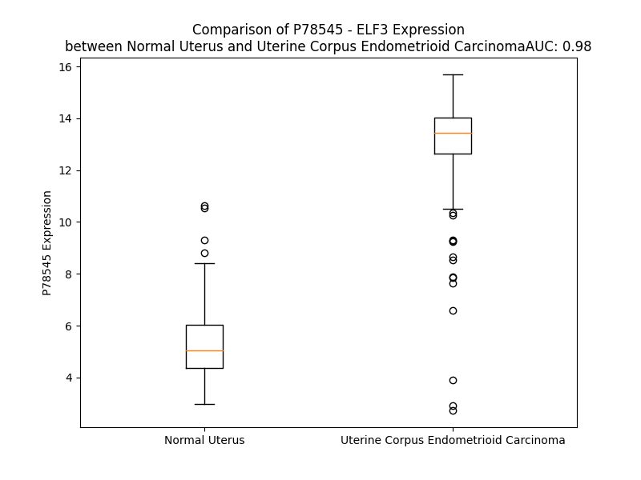

# Detailed Data for P78545

## Introduction to the Detailed Summary

### How to Interpret the Results

- **Summary & Metrics**: This section provides a quick reference to essential protein attributes, including expression changes, family classification, and biomarker applications. Regulation status (upregulated/downregulated) indicates the protein's behavior in a disease context. Some information comes from the original excel file with the proteins selected from literature, while others are derived from the analyses.
- **Expression Comparison**: A visual representation comparing protein expression between normal and disease states. It highlights significant changes in expression levels that might indicate diagnostic or therapeutic relevance. This is data coming from transcriptomics experiments and could not translate similarly to protein levels.
- **Isoform Alignment**: An interactive view of isoform alignments, revealing structural and functional differences between variants of the protein.
- **Interactors & Homologs**: Tables listing known interaction partners and homologous proteins, the more interactors and homologs, the more complex the protein is to design an antibody for.
- **Biological Assemblies**: Information about the structural arrangement of the protein in different assemblies, providing insights into its functional state but also the complexity of the protein to develop antibodies.
- **Combined Per-Residue Information**: A detailed table summarizing residue-level data. This includes predictions for epitope regions, aggregation tendencies, and modifications that might impact the protein's function. Each row corresponds to a residue in the protein, providing insights into specific sites that may be important for research or drug development.
## Summary & Metrics

- **UniProt Accession**: P78545
- **Gene Name**: ELF3
- **Protein Name**: ETS-related transcription factor Elf-3
- **Swiss Prot**: ELF3_HUMAN
- **Family**: nan
- **Biomarker Application**: nan
- **Number of Isoforms**: 2
- **Regulation**: 1
- **(transcriptomics) AUC**: 0.98
- **(transcriptomics) Fold Change**: 2.39
- **(transcriptomics) Regulation**: Upregulated
- **Discotope Epitope Count**: 65
- **Max n_uniprots (Homo)**: 1
- **Max n_uniprots (Hetero)**: N/A

## Expression Comparison

## Isoform Alignment

<pre style='font-size:14px; font-family:monospace;'>P78545-1 MAATCEISNIFSNYFSAMYSSEDSTLASVPPAATFGADDLVLTLSNPQMSLEGTEKASWLGEQPQFWSKTQVLDWISYQVEKNKYDASAIDFSRCDMDGATLCNCALEELRLVFGPLGDQLHAQLRDLTSSSSDELSWIIELLEKDGMAFQEALDPGPFDQGSPFAQELLDDGQQASPYHPGSCGAGAPSPGSSDVSTAGTGASRSSHSSDSGGSDVDLDPTDGKLFPSDGFRDCKKGDPKHGKRKRGRPRKLSKEYWDCLEGKKSKHAPRGTHLWEFIRDILIHPELNEGLMKWENRHEGVFKFLRSEAVAQLWGQKKKNSNMTYEKLSRAMRYYYKREILERVDGRRLVYKFGKNSSGWKEEEVLQSRN
P78545-2 MAATCEISNIFSNYFSAMYSSEDSTLASVPPAATFGADDLVLTLSNPQMSLEGTEKASWLGEQPQFWSKTQVLDWISYQVEKNKYDASAIDFSRCDMDGATLCNCALEELRLVFGPLGDQLHAQLRDLTSSSSDELSWIIELLEKDGMAFQEALDPGPFDQGSPFAQELLDD-----------------------VSTAGTGASRSSHSSDSGGSDVDLDPTDGKLFPSDGFRDCKKGDPKHGKRKRGRPRKLSKEYWDCLEGKKSKHAPRGTHLWEFIRDILIHPELNEGLMKWENRHEGVFKFLRSEAVAQLWGQKKKNSNMTYEKLSRAMRYYYKREILERVDGRRLVYKFGKNSSGWKEEEVLQSRN
</pre>

## Interactors

| preferredName_A   | preferredName_B   |   score |
|:------------------|:------------------|--------:|
| ELF3              | ELF4              |   0.979 |
| ELF3              | MED23             |   0.923 |

## Homologs

| uniprot_id   | gene_id   |
|:-------------|:----------|
| A0A8V8TM04   | FLI1      |
| Q9Y603       | ETV7      |
| M0QXN0       | ERF       |
| P28324       | ELK4      |
| M0R037       | SPIB      |
| C9JMF0       | ETV5      |
| Q6ZN32       | ETV3L     |
| A8IE48       | GABPA     |
| H0YG25       | ETV6      |
| G3V1Z7       | ELK3      |
| P14921       | ETS1      |
| P19419       | ELK1      |
| O95238       | SPDEF     |
| B5MDW0       | ERG       |
| C9J9L1       | ETV1      |
| B7Z720       | ELF2      |
| Q8N5J4       | SPIC      |
| Q99581       | FEV       |
| E9PQX0       | EHF       |
| A0A1W2PQ73   | ERFL      |
| K7EMW0       | ETV4      |
| B1AL80       | ELF4      |
| P41162       | ETV3      |
| A0A590UJR2   | ETS2      |
| A0A087X1W9   | ELF5      |
| Q3KNT2       | ETV2      |
| F5H3K6       | SPI1      |
| A0A0D9SG85   | ELF1      |

## Biological Assemblies

|   Unnamed: 0 |   assembly |   n_uniprots | composition   | crystal_id   |
|-------------:|-----------:|-------------:|:--------------|:-------------|
|            0 |          1 |            1 | Homo          | 2e8p         |

## Combined Per-Residue Information

|   res | aa   |   epitope_score | epitope   |   relative_surface_accessibility |   modeling_confidence |   Aggregation | modification   |
|------:|:-----|----------------:|:----------|---------------------------------:|----------------------:|--------------:|:---------------|
|     1 | M    |         0.12188 | False     |                          1.129   |                 45.59 |         0     | N/A            |
|     2 | A    |         0.15743 | False     |                          0.67707 |                 48    |         0     | N/A            |
|     3 | A    |         0.11516 | False     |                          0.5844  |                 49.4  |         0     | N/A            |
|     4 | T    |         0.07148 | False     |                          0.43363 |                 50.65 |         0     | N/A            |
|     5 | C    |         0.10084 | False     |                          0.41672 |                 52.41 |         0     | N/A            |
|     6 | E    |         0.10986 | False     |                          0.52233 |                 63.2  |         0     | N/A            |
|     7 | I    |         0.10859 | False     |                          0.13999 |                 63.66 |         0.15  | N/A            |
|     8 | S    |         0.16009 | False     |                          0.48289 |                 61.15 |         0.15  | N/A            |
|     9 | N    |         0.15849 | False     |                          0.56484 |                 73.03 |         0.15  | N/A            |
|    10 | I    |         0.2018  | True      |                          0.31564 |                 74.84 |         3.195 | N/A            |
|    11 | F    |         0.06305 | False     |                          0.05034 |                 71.27 |         3.347 | N/A            |
|    12 | S    |         0.1661  | False     |                          0.49591 |                 72.01 |         3.197 | N/A            |
|    13 | N    |         0.19004 | False     |                          0.65533 |                 76.54 |         3.197 | N/A            |
|    14 | Y    |         0.14474 | False     |                          0.11394 |                 75.5  |         4.532 | N/A            |
|    15 | F    |         0.18124 | False     |                          0.30995 |                 69.08 |         4.695 | N/A            |
|    16 | S    |         0.14468 | False     |                          0.47258 |                 74.71 |         2.877 | N/A            |
|    17 | A    |         0.17428 | False     |                          0.7715  |                 75.29 |         2.67  | N/A            |
|    18 | M    |         0.23083 | True      |                          0.43812 |                 67.15 |         2.497 | N/A            |
|    19 | Y    |         0.15268 | False     |                          0.26913 |                 66.1  |         1.995 | N/A            |
|    20 | S    |         0.22762 | True      |                          0.65045 |                 58.95 |         0     | N/A            |
|    21 | S    |         0.1664  | False     |                          0.76326 |                 43.79 |         0     | N/A            |
|    22 | E    |         0.27973 | True      |                          0.79578 |                 42.72 |         0     | N/A            |
|    23 | D    |         0.2575  | True      |                          0.88943 |                 36.81 |         0     | N/A            |
|    24 | S    |         0.15573 | False     |                          0.84134 |                 33.43 |         0     | N/A            |
|    25 | T    |         0.18534 | False     |                          0.98137 |                 34.1  |         0     | N/A            |
|    26 | L    |         0.17701 | False     |                          1.13942 |                 39.28 |         0     | N/A            |
|    27 | A    |         0.12783 | False     |                          0.98065 |                 36.2  |         0     | N/A            |
|    28 | S    |         0.18551 | False     |                          0.85038 |                 33.55 |         0     | N/A            |
|    29 | V    |         0.16185 | False     |                          0.99415 |                 46.17 |         0     | N/A            |
|    30 | P    |         0.20788 | True      |                          0.85241 |                 44.21 |         0     | N/A            |
|    31 | P    |         0.2048  | True      |                          1.00301 |                 42.56 |         0     | N/A            |
|    32 | A    |         0.13995 | False     |                          0.93731 |                 41.97 |         0     | N/A            |
|    33 | A    |         0.1362  | False     |                          0.85777 |                 42.24 |         0     | N/A            |
|    34 | T    |         0.19634 | False     |                          0.76039 |                 43.8  |         0     | N/A            |
|    35 | F    |         0.2352  | True      |                          1.03701 |                 40.62 |         0     | N/A            |
|    36 | G    |         0.2234  | True      |                          0.9604  |                 38.82 |         0     | N/A            |
|    37 | A    |         0.1655  | False     |                          0.90674 |                 39.78 |         0     | N/A            |
|    38 | D    |         0.23959 | True      |                          0.8559  |                 45.2  |         0     | N/A            |
|    39 | D    |         0.17943 | False     |                          0.80429 |                 45.16 |         0     | N/A            |
|    40 | L    |         0.20822 | True      |                          0.89732 |                 47.52 |         9.724 | N/A            |
|    41 | V    |         0.14832 | False     |                          0.82939 |                 40.45 |        10.263 | N/A            |
|    42 | L    |         0.18695 | False     |                          1.00623 |                 34.64 |        10.263 | N/A            |
|    43 | T    |         0.166   | False     |                          0.8861  |                 36.95 |        10.263 | N/A            |
|    44 | L    |         0.18071 | False     |                          0.91711 |                 35.45 |        10.263 | N/A            |
|    45 | S    |         0.13221 | False     |                          0.82671 |                 31.28 |         1.613 | N/A            |
|    46 | N    |         0.19197 | False     |                          0.74066 |                 33.13 |         0     | N/A            |
|    47 | P    |         0.12947 | False     |                          0.90736 |                 37.15 |         0     | N/A            |
|    48 | Q    |         0.1501  | False     |                          0.70097 |                 33.29 |         0     | N/A            |
|    49 | M    |         0.17972 | False     |                          0.86257 |                 33.58 |         0     | N/A            |
|    50 | S    |         0.14516 | False     |                          0.70883 |                 32.4  |         0     | N/A            |
|    51 | L    |         0.23858 | True      |                          1.01355 |                 33.56 |         0     | N/A            |
|    52 | E    |         0.16634 | False     |                          0.89821 |                 29.3  |         0     | N/A            |
|    53 | G    |         0.16341 | False     |                          0.72037 |                 32.22 |         0     | N/A            |
|    54 | T    |         0.15833 | False     |                          0.97746 |                 36.04 |         0     | N/A            |
|    55 | E    |         0.22752 | True      |                          0.83586 |                 45.08 |         0     | N/A            |
|    56 | K    |         0.19378 | False     |                          0.87715 |                 53.42 |         0     | N/A            |
|    57 | A    |         0.11016 | False     |                          0.26762 |                 65.79 |         0     | N/A            |
|    58 | S    |         0.10072 | False     |                          0.50575 |                 68.76 |         0     | N/A            |
|    59 | W    |         0.0694  | False     |                          0.0667  |                 73.99 |         0     | N/A            |
|    60 | L    |         0.29087 | True      |                          0.70169 |                 70.87 |         0     | N/A            |
|    61 | G    |         0.13681 | False     |                          0.88075 |                 66.77 |         0     | N/A            |
|    62 | E    |         0.20839 | True      |                          0.5083  |                 69.38 |         0     | N/A            |
|    63 | Q    |         0.10531 | False     |                          0.2891  |                 73.91 |         0     | N/A            |
|    64 | P    |         0.02032 | False     |                          0.03976 |                 78.81 |         0     | N/A            |
|    65 | Q    |         0.16416 | False     |                          0.36134 |                 81.35 |         0     | N/A            |
|    66 | F    |         0.15719 | False     |                          0.70581 |                 81.24 |         0     | N/A            |
|    67 | W    |         0.02337 | False     |                          0.02678 |                 85.24 |         0     | N/A            |
|    68 | S    |         0.11645 | False     |                          0.38549 |                 85.22 |         0     | N/A            |
|    69 | K    |         0.09664 | False     |                          0.37426 |                 84.61 |         0     | N/A            |
|    70 | T    |         0.11099 | False     |                          0.42619 |                 85    |         0     | N/A            |
|    71 | Q    |         0.06444 | False     |                          0.15921 |                 85.38 |         0     | N/A            |
|    72 | V    |         0.00365 | False     |                          0       |                 86    |         0     | N/A            |
|    73 | L    |         0.00885 | False     |                          0       |                 84.77 |         0     | N/A            |
|    74 | D    |         0.04456 | False     |                          0.27641 |                 84.98 |         0     | N/A            |
|    75 | W    |         0.00711 | False     |                          0.00358 |                 85.78 |         1.186 | N/A            |
|    76 | I    |         0.00559 | False     |                          0.0008  |                 84.12 |         1.32  | N/A            |
|    77 | S    |         0.0786  | False     |                          0.18584 |                 82.14 |         1.32  | N/A            |
|    78 | Y    |         0.13752 | False     |                          0.4566  |                 84.26 |         1.32  | N/A            |
|    79 | Q    |         0.05756 | False     |                          0.02412 |                 83.78 |         1.32  | N/A            |
|    80 | V    |         0.00517 | False     |                          0       |                 83.68 |         1.32  | N/A            |
|    81 | E    |         0.08259 | False     |                          0.40081 |                 82.26 |         0     | N/A            |
|    82 | K    |         0.16552 | False     |                          0.53822 |                 80.51 |         0     | N/A            |
|    83 | N    |         0.14621 | False     |                          0.39743 |                 79.75 |         0     | N/A            |
|    84 | K    |         0.1933  | False     |                          0.70964 |                 79.23 |         0     | N/A            |
|    85 | Y    |         0.12655 | False     |                          0.18677 |                 79.61 |         0     | N/A            |
|    86 | D    |         0.22188 | True      |                          0.53397 |                 79.87 |         0     | N/A            |
|    87 | A    |         0.0378  | False     |                          0.01463 |                 76.74 |         0     | N/A            |
|    88 | S    |         0.22061 | True      |                          0.66991 |                 76.33 |         0     | N/A            |
|    89 | A    |         0.12403 | False     |                          0.59978 |                 75.3  |         0     | N/A            |
|    90 | I    |         0.13729 | False     |                          0.06401 |                 76.39 |         0     | N/A            |
|    91 | D    |         0.14802 | False     |                          0.35168 |                 76.27 |         0     | N/A            |
|    92 | F    |         0.08498 | False     |                          0.11858 |                 73.52 |         0     | N/A            |
|    93 | S    |         0.17061 | False     |                          0.706   |                 71.41 |         0     | N/A            |
|    94 | R    |         0.23684 | True      |                          0.56122 |                 69.69 |         0     | N/A            |
|    95 | C    |         0.0231  | False     |                          0       |                 70.43 |         0     | N/A            |
|    96 | D    |         0.14313 | False     |                          0.36596 |                 75.98 |         0     | N/A            |
|    97 | M    |         0.09427 | False     |                          0.08054 |                 79.48 |         0     | N/A            |
|    98 | D    |         0.14629 | False     |                          0.34106 |                 82.41 |         0     | N/A            |
|    99 | G    |         0.01171 | False     |                          0.00138 |                 82.94 |         0     | N/A            |
|   100 | A    |         0.11344 | False     |                          0.40084 |                 81.19 |         0     | N/A            |
|   101 | T    |         0.19467 | False     |                          0.50865 |                 82.86 |         0     | N/A            |
|   102 | L    |         0.01324 | False     |                          0.01179 |                 83.15 |         0     | N/A            |
|   103 | C    |         0.09098 | False     |                          0.40443 |                 80.62 |         0     | N/A            |
|   104 | N    |         0.23832 | True      |                          0.82558 |                 79.16 |         0     | N/A            |
|   105 | C    |         0.06211 | False     |                          0.14233 |                 77.6  |         0     | N/A            |
|   106 | A    |         0.16093 | False     |                          0.41561 |                 75.98 |         0     | N/A            |
|   107 | L    |         0.13909 | False     |                          0.39549 |                 81.16 |         0     | N/A            |
|   108 | E    |         0.18867 | False     |                          0.63305 |                 81.06 |         0     | N/A            |
|   109 | E    |         0.21797 | True      |                          0.46817 |                 81.65 |         0     | N/A            |
|   110 | L    |         0.01295 | False     |                          0.00412 |                 81.73 |         0     | N/A            |
|   111 | R    |         0.22418 | True      |                          0.52778 |                 84.29 |         0     | N/A            |
|   112 | L    |         0.30057 | True      |                          0.85358 |                 81.98 |         0     | N/A            |
|   113 | V    |         0.06129 | False     |                          0.08188 |                 78.87 |         0     | N/A            |
|   114 | F    |         0.01354 | False     |                          0.00064 |                 79.72 |         0     | N/A            |
|   115 | G    |         0.07781 | False     |                          0.27478 |                 80.75 |         0     | N/A            |
|   116 | P    |         0.19285 | False     |                          0.73601 |                 79.36 |         0     | N/A            |
|   117 | L    |         0.05745 | False     |                          0.03981 |                 83.1  |         0     | N/A            |
|   118 | G    |         0.00902 | False     |                          0       |                 82.93 |         0     | N/A            |
|   119 | D    |         0.0918  | False     |                          0.32547 |                 82.04 |         0     | N/A            |
|   120 | Q    |         0.13831 | False     |                          0.39445 |                 83.25 |         0     | N/A            |
|   121 | L    |         0.00474 | False     |                          0.00082 |                 83.96 |         0     | N/A            |
|   122 | H    |         0.12024 | False     |                          0.33906 |                 83.71 |         0     | N/A            |
|   123 | A    |         0.12496 | False     |                          0.39487 |                 82.36 |         0     | N/A            |
|   124 | Q    |         0.17693 | False     |                          0.20012 |                 81.75 |         0     | N/A            |
|   125 | L    |         0.03341 | False     |                          0.05909 |                 81.67 |         0     | N/A            |
|   126 | R    |         0.16272 | False     |                          0.71252 |                 76.15 |         0     | N/A            |
|   127 | D    |         0.11161 | False     |                          0.46433 |                 75.27 |         0     | N/A            |
|   128 | L    |         0.11206 | False     |                          0.33602 |                 72.56 |         0     | N/A            |
|   129 | T    |         0.14212 | False     |                          0.49226 |                 69.77 |         0     | N/A            |
|   130 | S    |         0.15787 | False     |                          0.36285 |                 63.34 |         0     | N/A            |
|   131 | S    |         0.19741 | False     |                          0.32936 |                 57.32 |         0     | N/A            |
|   132 | S    |         0.13877 | False     |                          0.31325 |                 53.54 |         0     | N/A            |
|   133 | S    |         0.12486 | False     |                          0.49077 |                 54.31 |         0     | N/A            |
|   134 | D    |         0.18468 | False     |                          0.50689 |                 58.46 |         0     | N/A            |
|   135 | E    |         0.1827  | False     |                          0.56796 |                 64.36 |         0     | N/A            |
|   136 | L    |         0.10835 | False     |                          0.13107 |                 66.88 |         0.995 | N/A            |
|   137 | S    |         0.07743 | False     |                          0.1664  |                 70.97 |         0.995 | N/A            |
|   138 | W    |         0.20723 | True      |                          0.42068 |                 79.28 |         0.995 | N/A            |
|   139 | I    |         0.01388 | False     |                          0       |                 77.65 |         0.995 | N/A            |
|   140 | I    |         0.08573 | False     |                          0.092   |                 76.96 |         0.995 | N/A            |
|   141 | E    |         0.15575 | False     |                          0.64144 |                 79.47 |         0     | N/A            |
|   142 | L    |         0.07929 | False     |                          0.27546 |                 77.65 |         0     | N/A            |
|   143 | L    |         0.05209 | False     |                          0.13541 |                 73.55 |         0     | N/A            |
|   144 | E    |         0.08983 | False     |                          0.33332 |                 76.87 |         0     | N/A            |
|   145 | K    |         0.17231 | False     |                          0.72023 |                 71.08 |         0     | N/A            |
|   146 | D    |         0.07177 | False     |                          0.22149 |                 59.45 |         0     | N/A            |
|   147 | G    |         0.07618 | False     |                          0.41968 |                 56.45 |         0     | N/A            |
|   148 | M    |         0.10646 | False     |                          0.60168 |                 47.26 |         0     | N/A            |
|   149 | A    |         0.08608 | False     |                          0.63738 |                 43.55 |         0     | N/A            |
|   150 | F    |         0.16813 | False     |                          0.71629 |                 41.94 |         0     | N/A            |
|   151 | Q    |         0.13261 | False     |                          0.68207 |                 38.88 |         0     | N/A            |
|   152 | E    |         0.24886 | True      |                          0.78155 |                 37.85 |         0     | N/A            |
|   153 | A    |         0.16788 | False     |                          0.80973 |                 40.03 |         0     | N/A            |
|   154 | L    |         0.16176 | False     |                          0.96727 |                 42.42 |         0     | N/A            |
|   155 | D    |         0.15458 | False     |                          0.78676 |                 35.57 |         0     | N/A            |
|   156 | P    |         0.17876 | False     |                          0.90656 |                 42.61 |         0     | N/A            |
|   157 | G    |         0.12348 | False     |                          0.6786  |                 37.79 |         0     | N/A            |
|   158 | P    |         0.12653 | False     |                          1.02397 |                 41.33 |         0     | N/A            |
|   159 | F    |         0.13808 | False     |                          1.01419 |                 37.47 |         0     | N/A            |
|   160 | D    |         0.22601 | True      |                          0.73989 |                 42.84 |         0     | N/A            |
|   161 | Q    |         0.18567 | False     |                          0.91906 |                 42.21 |         0     | N/A            |
|   162 | G    |         0.19078 | False     |                          0.93357 |                 37.82 |         0     | N/A            |
|   163 | S    |         0.15531 | False     |                          0.82057 |                 44.01 |         0     | N/A            |
|   164 | P    |         0.17967 | False     |                          0.83266 |                 43.25 |         0     | N/A            |
|   165 | F    |         0.1564  | False     |                          0.98363 |                 37.82 |         0     | N/A            |
|   166 | A    |         0.11173 | False     |                          0.6795  |                 42.02 |         0     | N/A            |
|   167 | Q    |         0.18688 | False     |                          0.75238 |                 39.33 |         0     | N/A            |
|   168 | E    |         0.12612 | False     |                          0.75643 |                 38.82 |         0     | N/A            |
|   169 | L    |         0.14202 | False     |                          0.90146 |                 41.92 |         0     | N/A            |
|   170 | L    |         0.09811 | False     |                          0.90771 |                 47.94 |         0     | N/A            |
|   171 | D    |         0.18155 | False     |                          0.76553 |                 43.76 |         0     | N/A            |
|   172 | D    |         0.12517 | False     |                          0.8183  |                 41.05 |         0     | N/A            |
|   173 | G    |         0.14898 | False     |                          0.6754  |                 42.53 |         0     | N/A            |
|   174 | Q    |         0.17856 | False     |                          0.83763 |                 42.39 |         0     | N/A            |
|   175 | Q    |         0.16531 | False     |                          0.80578 |                 43.15 |         0     | N/A            |
|   176 | A    |         0.10007 | False     |                          0.94221 |                 40.48 |         0     | N/A            |
|   177 | S    |         0.13465 | False     |                          0.7086  |                 42.73 |         0     | N/A            |
|   178 | P    |         0.07458 | False     |                          0.86973 |                 44.38 |         0     | N/A            |
|   179 | Y    |         0.14714 | False     |                          0.85984 |                 41.67 |         0     | N/A            |
|   180 | H    |         0.13273 | False     |                          0.896   |                 39.08 |         0     | N/A            |
|   181 | P    |         0.13311 | False     |                          0.99581 |                 45.21 |         0     | N/A            |
|   182 | G    |         0.14262 | False     |                          0.91865 |                 39.81 |         0     | N/A            |
|   183 | S    |         0.15794 | False     |                          0.80435 |                 44.38 |         0     | N/A            |
|   184 | C    |         0.10439 | False     |                          0.99162 |                 41.44 |         0     | N/A            |
|   185 | G    |         0.16101 | False     |                          0.81478 |                 42.65 |         0     | N/A            |
|   186 | A    |         0.11733 | False     |                          1.07961 |                 45.68 |         0     | N/A            |
|   187 | G    |         0.11383 | False     |                          0.92085 |                 40.41 |         0     | N/A            |
|   188 | A    |         0.09922 | False     |                          1.00158 |                 53.38 |         0     | N/A            |
|   189 | P    |         0.12624 | False     |                          0.88836 |                 51.31 |         0     | N/A            |
|   190 | S    |         0.14237 | False     |                          0.79978 |                 45.14 |         0     | N/A            |
|   191 | P    |         0.16578 | False     |                          0.95416 |                 56.29 |         0     | N/A            |
|   192 | G    |         0.19333 | False     |                          0.85474 |                 41.03 |         0     | N/A            |
|   193 | S    |         0.16597 | False     |                          0.91277 |                 48.33 |         0     | N/A            |
|   194 | S    |         0.12584 | False     |                          0.81771 |                 48.65 |         0     | N/A            |
|   195 | D    |         0.0886  | False     |                          0.86992 |                 43.58 |         0     | N/A            |
|   196 | V    |         0.10111 | False     |                          1.04805 |                 55.04 |         0     | N/A            |
|   197 | S    |         0.08814 | False     |                          0.77718 |                 43.23 |         0     | N/A            |
|   198 | T    |         0.13691 | False     |                          0.93685 |                 48.19 |         0     | N/A            |
|   199 | A    |         0.10902 | False     |                          0.95971 |                 48.54 |         0     | N/A            |
|   200 | G    |         0.18738 | False     |                          0.75367 |                 44.81 |         0     | N/A            |
|   201 | T    |         0.15268 | False     |                          1.08728 |                 46.82 |         0     | N/A            |
|   202 | G    |         0.18218 | False     |                          0.80564 |                 41.45 |         0     | N/A            |
|   203 | A    |         0.14025 | False     |                          0.98967 |                 43.81 |         0     | N/A            |
|   204 | S    |         0.09707 | False     |                          0.78753 |                 42.9  |         0     | N/A            |
|   205 | R    |         0.17834 | False     |                          0.98086 |                 43.22 |         0     | N/A            |
|   206 | S    |         0.14109 | False     |                          0.70343 |                 42    |         0     | N/A            |
|   207 | S    |         0.14651 | False     |                          0.74094 |                 42.73 |         0     | N/A            |
|   208 | H    |         0.20396 | True      |                          0.87683 |                 44.93 |         0     | N/A            |
|   209 | S    |         0.13169 | False     |                          0.81112 |                 47.1  |         0     | N/A            |
|   210 | S    |         0.12803 | False     |                          0.86057 |                 57.53 |         0     | N/A            |
|   211 | D    |         0.1611  | False     |                          0.81995 |                 43.54 |         0     | N/A            |
|   212 | S    |         0.12869 | False     |                          0.80509 |                 56.67 |         0     | N/A            |
|   213 | G    |         0.18549 | False     |                          0.98958 |                 49.8  |         0     | N/A            |
|   214 | G    |         0.15304 | False     |                          0.95911 |                 46.5  |         0     | N/A            |
|   215 | S    |         0.10372 | False     |                          0.87626 |                 50.97 |         0     | N/A            |
|   216 | D    |         0.17799 | False     |                          0.74203 |                 55.77 |         0     | N/A            |
|   217 | V    |         0.11097 | False     |                          0.98345 |                 63.16 |         0     | N/A            |
|   218 | D    |         0.15464 | False     |                          0.78335 |                 46.14 |         0     | N/A            |
|   219 | L    |         0.19231 | False     |                          1.08738 |                 61.87 |         0     | N/A            |
|   220 | D    |         0.13931 | False     |                          0.73423 |                 47.65 |         0     | N/A            |
|   221 | P    |         0.18409 | False     |                          0.74213 |                 54.15 |         0     | N/A            |
|   222 | T    |         0.08068 | False     |                          0.86401 |                 45.7  |         0     | N/A            |
|   223 | D    |         0.22771 | True      |                          0.88808 |                 46.27 |         0     | N/A            |
|   224 | G    |         0.17924 | False     |                          0.82044 |                 49.65 |         0     | N/A            |
|   225 | K    |         0.1251  | False     |                          0.93467 |                 40.61 |         0     | N/A            |
|   226 | L    |         0.21379 | True      |                          1.07538 |                 42.07 |         0     | N/A            |
|   227 | F    |         0.15    | False     |                          0.97501 |                 39.75 |         0     | N/A            |
|   228 | P    |         0.21202 | True      |                          0.91745 |                 42.31 |         0     | N/A            |
|   229 | S    |         0.15031 | False     |                          0.80059 |                 38.47 |         0     | N/A            |
|   230 | D    |         0.23644 | True      |                          0.83199 |                 37.21 |         0     | N/A            |
|   231 | G    |         0.23611 | True      |                          0.81021 |                 41.02 |         0     | N/A            |
|   232 | F    |         0.2112  | True      |                          0.91953 |                 42.08 |         0     | N/A            |
|   233 | R    |         0.22006 | True      |                          0.86455 |                 46.97 |         0     | N/A            |
|   234 | D    |         0.17289 | False     |                          0.67215 |                 42.51 |         0     | N/A            |
|   235 | C    |         0.14448 | False     |                          1.0036  |                 39.06 |         0     | N/A            |
|   236 | K    |         0.15687 | False     |                          0.92405 |                 43.68 |         0     | N/A            |
|   237 | K    |         0.23128 | True      |                          1.02168 |                 44.66 |         0     | N/A            |
|   238 | G    |         0.19683 | False     |                          0.92978 |                 43.91 |         0     | N/A            |
|   239 | D    |         0.16631 | False     |                          0.85581 |                 43.17 |         0     | N/A            |
|   240 | P    |         0.19553 | False     |                          0.78829 |                 49.03 |         0     | N/A            |
|   241 | K    |         0.17829 | False     |                          0.86143 |                 43.78 |         0     | N/A            |
|   242 | H    |         0.14435 | False     |                          0.9444  |                 45.4  |         0     | N/A            |
|   243 | G    |         0.16121 | False     |                          0.95479 |                 35.54 |         0     | N/A            |
|   244 | K    |         0.12029 | False     |                          1.00444 |                 39.96 |         0     | N/A            |
|   245 | R    |         0.19312 | False     |                          0.83758 |                 40.96 |         0     | N/A            |
|   246 | K    |         0.18051 | False     |                          1.01556 |                 45.32 |         0     | N/A            |
|   247 | R    |         0.17168 | False     |                          0.97725 |                 40.84 |         0     | N/A            |
|   248 | G    |         0.22004 | True      |                          0.96862 |                 45.04 |         0     | N/A            |
|   249 | R    |         0.25217 | True      |                          0.90074 |                 47.88 |         0     | N/A            |
|   250 | P    |         0.18011 | False     |                          0.93185 |                 55.7  |         0     | N/A            |
|   251 | R    |         0.24026 | True      |                          0.80623 |                 54.57 |         0     | N/A            |
|   252 | K    |         0.22578 | True      |                          0.98774 |                 46.85 |         0     | N/A            |
|   253 | L    |         0.25264 | True      |                          1.05929 |                 50.15 |         0     | N/A            |
|   254 | S    |         0.15366 | False     |                          0.57516 |                 43.09 |         0     | N/A            |
|   255 | K    |         0.25797 | True      |                          0.87322 |                 42.85 |         0     | N/A            |
|   256 | E    |         0.28068 | True      |                          0.70115 |                 35.77 |         0     | N/A            |
|   257 | Y    |         0.28888 | True      |                          0.89943 |                 38.39 |         0     | N/A            |
|   258 | W    |         0.22142 | True      |                          0.97934 |                 36.44 |         0     | N/A            |
|   259 | D    |         0.19924 | True      |                          0.71618 |                 36.87 |         0     | N/A            |
|   260 | C    |         0.23892 | True      |                          0.90093 |                 33.18 |         0     | N/A            |
|   261 | L    |         0.1587  | False     |                          1.08555 |                 45.01 |         0     | N/A            |
|   262 | E    |         0.17653 | False     |                          0.56866 |                 40.81 |         0     | N/A            |
|   263 | G    |         0.15175 | False     |                          0.7293  |                 35.53 |         0     | N/A            |
|   264 | K    |         0.16479 | False     |                          1.01043 |                 37.27 |         0     | N/A            |
|   265 | K    |         0.17248 | False     |                          0.59536 |                 43.02 |         0     | N/A            |
|   266 | S    |         0.20129 | True      |                          0.68394 |                 41.92 |         0     | N/A            |
|   267 | K    |         0.18059 | False     |                          0.98825 |                 41.75 |         0     | N/A            |
|   268 | H    |         0.18711 | False     |                          0.7777  |                 40.48 |         0     | N/A            |
|   269 | A    |         0.1474  | False     |                          0.83102 |                 42.7  |         0     | N/A            |
|   270 | P    |         0.08771 | False     |                          0.37153 |                 52.82 |         0     | N/A            |
|   271 | R    |         0.12929 | False     |                          0.91105 |                 46.21 |         0     | N/A            |
|   272 | G    |         0.16408 | False     |                          0.74464 |                 55.72 |         0     | N/A            |
|   273 | T    |         0.0713  | False     |                          0.21823 |                 76.51 |         0     | N/A            |
|   274 | H    |         0.15478 | False     |                          0.45351 |                 90.33 |         0     | N/A            |
|   275 | L    |         0.02594 | False     |                          0.02805 |                 93.42 |         0     | N/A            |
|   276 | W    |         0.06022 | False     |                          0.11828 |                 93.71 |         0     | N/A            |
|   277 | E    |         0.06354 | False     |                          0.18051 |                 92.8  |         0     | N/A            |
|   278 | F    |         0.02027 | False     |                          0.02392 |                 91.91 |         1.049 | N/A            |
|   279 | I    |         0.00505 | False     |                          0.0024  |                 93.51 |         1.049 | N/A            |
|   280 | R    |         0.16935 | False     |                          0.18482 |                 91.85 |         1.049 | N/A            |
|   281 | D    |         0.04492 | False     |                          0.17678 |                 89.36 |         1.049 | N/A            |
|   282 | I    |         0.00366 | False     |                          0       |                 90.21 |         1.049 | N/A            |
|   283 | L    |         0.01591 | False     |                          0.0352  |                 90.35 |         1.049 | N/A            |
|   284 | I    |         0.09862 | False     |                          0.25958 |                 86.69 |         1.049 | N/A            |
|   285 | H    |         0.08067 | False     |                          0.19714 |                 77.91 |         0     | N/A            |
|   286 | P    |         0.16288 | False     |                          0.77177 |                 74.65 |         0     | N/A            |
|   287 | E    |         0.1395  | False     |                          0.43258 |                 70.93 |         0     | N/A            |
|   288 | L    |         0.02227 | False     |                          0.00412 |                 68.34 |         0     | N/A            |
|   289 | N    |         0.11904 | False     |                          0.24535 |                 73.73 |         0     | N/A            |
|   290 | E    |         0.17929 | False     |                          0.39998 |                 74.34 |         0     | N/A            |
|   291 | G    |         0.12306 | False     |                          0.38559 |                 82.88 |         0     | N/A            |
|   292 | L    |         0.00887 | False     |                          0.00082 |                 87.67 |         0     | N/A            |
|   293 | M    |         0.02108 | False     |                          0.0186  |                 91.75 |         0     | N/A            |
|   294 | K    |         0.22143 | True      |                          0.49426 |                 91.26 |         0     | N/A            |
|   295 | W    |         0.07392 | False     |                          0.22959 |                 93.6  |         0     | N/A            |
|   296 | E    |         0.17301 | False     |                          0.39872 |                 92.4  |         0     | N/A            |
|   297 | N    |         0.12803 | False     |                          0.23571 |                 92.15 |         0     | N/A            |
|   298 | R    |         0.15043 | False     |                          0.24193 |                 88.87 |         0     | N/A            |
|   299 | H    |         0.21016 | True      |                          0.79726 |                 89.9  |         0     | N/A            |
|   300 | E    |         0.20941 | True      |                          0.41978 |                 92.39 |         0     | N/A            |
|   301 | G    |         0.00268 | False     |                          0       |                 93.31 |         0     | N/A            |
|   302 | V    |         0.04091 | False     |                          0.07902 |                 95.77 |         0     | N/A            |
|   303 | F    |         0.00513 | False     |                          0       |                 95.39 |         0     | N/A            |
|   304 | K    |         0.16851 | False     |                          0.33315 |                 95.02 |         0     | N/A            |
|   305 | F    |         0.00859 | False     |                          0.00558 |                 95.74 |         0     | N/A            |
|   306 | L    |         0.16119 | False     |                          0.50749 |                 93.45 |         0     | N/A            |
|   307 | R    |         0.12251 | False     |                          0.54001 |                 92.59 |         0     | N/A            |
|   308 | S    |         0.12603 | False     |                          0.16009 |                 94.9  |         0     | N/A            |
|   309 | E    |         0.14639 | False     |                          0.45571 |                 93.7  |         0     | N/A            |
|   310 | A    |         0.05262 | False     |                          0.15238 |                 91.44 |         0.173 | N/A            |
|   311 | V    |         0.00186 | False     |                          0       |                 92.71 |         0.514 | N/A            |
|   312 | A    |         0.00357 | False     |                          0       |                 94.32 |         0.514 | N/A            |
|   313 | Q    |         0.09053 | False     |                          0.45397 |                 91.66 |         0.514 | N/A            |
|   314 | L    |         0.00746 | False     |                          0.00778 |                 90.7  |         0.514 | N/A            |
|   315 | W    |         0.05528 | False     |                          0.09269 |                 91.58 |         0.514 | N/A            |
|   316 | G    |         0.00777 | False     |                          0.00805 |                 92.25 |         0.137 | N/A            |
|   317 | Q    |         0.04366 | False     |                          0.32664 |                 88.07 |         0     | N/A            |
|   318 | K    |         0.05198 | False     |                          0.14899 |                 86.7  |         0     | N/A            |
|   319 | K    |         0.10554 | False     |                          0.409   |                 88.36 |         0     | N/A            |
|   320 | K    |         0.15215 | False     |                          0.78649 |                 87.4  |         0     | N/A            |
|   321 | N    |         0.19832 | True      |                          0.37295 |                 88.08 |         0     | N/A            |
|   322 | S    |         0.16831 | False     |                          0.87812 |                 87.19 |         0     | N/A            |
|   323 | N    |         0.21627 | True      |                          0.6778  |                 90.84 |         0     | N/A            |
|   324 | M    |         0.12862 | False     |                          0.14116 |                 91.11 |         0     | N/A            |
|   325 | T    |         0.24885 | True      |                          0.39333 |                 95.48 |         0     | N/A            |
|   326 | Y    |         0.10183 | False     |                          0.09589 |                 96.87 |         0     | N/A            |
|   327 | E    |         0.23914 | True      |                          0.60377 |                 96.1  |         0     | N/A            |
|   328 | K    |         0.18663 | False     |                          0.53296 |                 96.28 |         0     | N/A            |
|   329 | L    |         0.00797 | False     |                          0.00577 |                 96.01 |         0     | N/A            |
|   330 | S    |         0.06878 | False     |                          0.05929 |                 96.63 |         0     | N/A            |
|   331 | R    |         0.24504 | True      |                          0.42023 |                 96.55 |         0     | N/A            |
|   332 | A    |         0.18957 | False     |                          0.33389 |                 95.19 |         0     | N/A            |
|   333 | M    |         0.01112 | False     |                          0.00288 |                 96.17 |         0     | N/A            |
|   334 | R    |         0.31515 | True      |                          0.45696 |                 95.62 |         0     | N/A            |
|   335 | Y    |         0.30045 | True      |                          0.60939 |                 96.38 |         0     | N/A            |
|   336 | Y    |         0.09585 | False     |                          0.09285 |                 96.62 |         0     | N/A            |
|   337 | Y    |         0.18215 | False     |                          0.29331 |                 96.57 |         0     | N/A            |
|   338 | K    |         0.31996 | True      |                          0.96399 |                 94.55 |         0     | N/A            |
|   339 | R    |         0.28847 | True      |                          0.50769 |                 94.35 |         0     | N/A            |
|   340 | E    |         0.16572 | False     |                          0.384   |                 95.21 |         0     | N/A            |
|   341 | I    |         0.0461  | False     |                          0.0512  |                 95.11 |         0     | N/A            |
|   342 | L    |         0.01434 | False     |                          0.01039 |                 96    |         0     | N/A            |
|   343 | E    |         0.08479 | False     |                          0.33796 |                 96.03 |         0     | N/A            |
|   344 | R    |         0.33364 | True      |                          0.66918 |                 94.63 |         0     | N/A            |
|   345 | V    |         0.15108 | False     |                          0.26132 |                 95.08 |         0     | N/A            |
|   346 | D    |         0.29922 | True      |                          0.5828  |                 93.03 |         0     | N/A            |
|   347 | G    |         0.27605 | True      |                          1.07141 |                 93.13 |         0     | N/A            |
|   348 | R    |         0.40801 | True      |                          0.54177 |                 93.67 |         0     | N/A            |
|   349 | R    |         0.3154  | True      |                          0.88557 |                 94.05 |         0     | N/A            |
|   350 | L    |         0.1266  | False     |                          0.37153 |                 95.4  |         0     | N/A            |
|   351 | V    |         0.0351  | False     |                          0.05232 |                 96.53 |         0     | N/A            |
|   352 | Y    |         0.07311 | False     |                          0.10141 |                 97.04 |         0     | N/A            |
|   353 | K    |         0.10929 | False     |                          0.25777 |                 96.31 |         0     | N/A            |
|   354 | F    |         0.01306 | False     |                          0.01383 |                 96.31 |         0     | N/A            |
|   355 | G    |         0.00772 | False     |                          0.00271 |                 95    |         0     | N/A            |
|   356 | K    |         0.29439 | True      |                          0.71004 |                 92.8  |         0     | N/A            |
|   357 | N    |         0.15187 | False     |                          0.51734 |                 93.03 |         0     | N/A            |
|   358 | S    |         0.03521 | False     |                          0.04392 |                 90.79 |         0     | N/A            |
|   359 | S    |         0.18877 | False     |                          0.43397 |                 88.69 |         0     | N/A            |
|   360 | G    |         0.05887 | False     |                          0.19524 |                 85.44 |         0     | N/A            |
|   361 | W    |         0.05584 | False     |                          0.05362 |                 87.56 |         0     | N/A            |
|   362 | K    |         0.12607 | False     |                          0.47738 |                 87.29 |         0     | N/A            |
|   363 | E    |         0.11568 | False     |                          0.48537 |                 78.11 |         0     | N/A            |
|   364 | E    |         0.20835 | True      |                          0.68558 |                 74.79 |         0     | N/A            |
|   365 | E    |         0.11511 | False     |                          0.30531 |                 72.25 |         0     | N/A            |
|   366 | V    |         0.04901 | False     |                          0.3276  |                 67.02 |         0     | N/A            |
|   367 | L    |         0.13575 | False     |                          0.74032 |                 60.74 |         0     | N/A            |
|   368 | Q    |         0.15514 | False     |                          0.70647 |                 57.18 |         0     | N/A            |
|   369 | S    |         0.10421 | False     |                          0.50849 |                 55.41 |         0     | N/A            |
|   370 | R    |         0.10163 | False     |                          0.85943 |                 53.13 |         0     | N/A            |
|   371 | N    |         0.07327 | False     |                          1.22918 |                 38.42 |         0     | N/A            |

