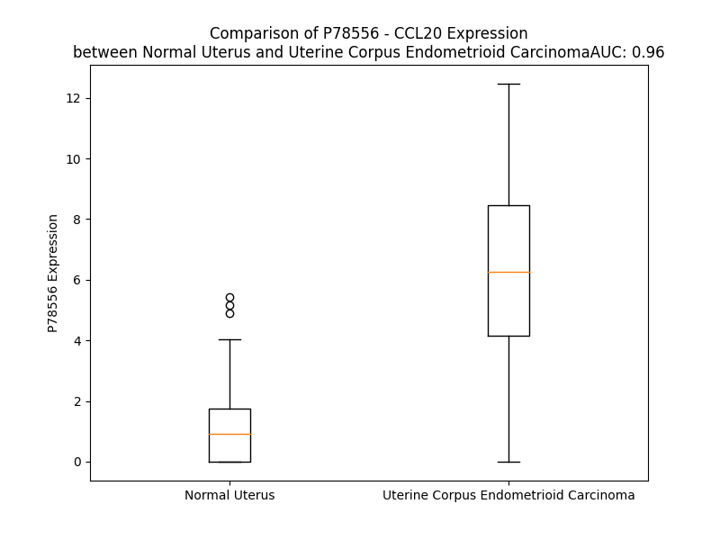

# Detailed Data for P78556

## Introduction to the Detailed Summary

### How to Interpret the Results

- **Summary & Metrics**: This section provides a quick reference to essential protein attributes, including expression changes, family classification, and biomarker applications. Regulation status (upregulated/downregulated) indicates the protein's behavior in a disease context. Some information comes from the original excel file with the proteins selected from literature, while others are derived from the analyses.
- **Expression Comparison**: A visual representation comparing protein expression between normal and disease states. It highlights significant changes in expression levels that might indicate diagnostic or therapeutic relevance. This is data coming from transcriptomics experiments and could not translate similarly to protein levels.
- **Isoform Alignment**: An interactive view of isoform alignments, revealing structural and functional differences between variants of the protein.
- **Interactors & Homologs**: Tables listing known interaction partners and homologous proteins, the more interactors and homologs, the more complex the protein is to design an antibody for.
- **Biological Assemblies**: Information about the structural arrangement of the protein in different assemblies, providing insights into its functional state but also the complexity of the protein to develop antibodies.
- **Combined Per-Residue Information**: A detailed table summarizing residue-level data. This includes predictions for epitope regions, aggregation tendencies, and modifications that might impact the protein's function. Each row corresponds to a residue in the protein, providing insights into specific sites that may be important for research or drug development.
## Summary & Metrics

- **UniProt Accession**: P78556
- **Gene Name**: CCL20
- **Protein Name**: C-C motif chemokine 20
- **Swiss Prot**: CCL20_HUMAN
- **Family**: cytokine
- **Biomarker Application**:  
- **Number of Isoforms**: 2
- **Regulation**: 1
- **(transcriptomics) AUC**: 0.96
- **(transcriptomics) Fold Change**: 6.10
- **(transcriptomics) Regulation**: Upregulated
- **Discotope Epitope Count**: 14
- **Max n_uniprots (Homo)**: 2
- **Max n_uniprots (Hetero)**: 4

## Expression Comparison

## Isoform Alignment

<pre style='font-size:14px; font-family:monospace;'>P78556-1 MCCTKSLLLAALMSVLLLHLCGESEAASNFDCCLGYTDRILHPKFIVGFTRQLANEGCDINAIIFHTKKKLSVCANPKQTWVKYIVRLLSKKVKNM
P78556-2 MCCTKSLLLAALMSVLLLHLCGESE-ASNFDCCLGYTDRILHPKFIVGFTRQLANEGCDINAIIFHTKKKLSVCANPKQTWVKYIVRLLSKKVKNM
</pre>

## Interactors

| preferredName_A   | preferredName_B   |   score |
|:------------------|:------------------|--------:|
| CCL20             | CCRL2             |   0.999 |
| CCL20             | CCL5              |   0.999 |
| CCL20             | CXCL12            |   0.999 |
| CCL20             | CCR6              |   0.999 |
| CCL20             | CXCL11            |   0.999 |
| CCL20             | CXCL5             |   0.999 |
| CCL20             | PF4               |   0.998 |
| CCL20             | CXCL17            |   0.997 |
| CCL20             | XCL2              |   0.995 |
| CCL20             | CCR2              |   0.995 |
| CCL20             | CCR7              |   0.994 |
| CCL20             | CCR5              |   0.994 |
| CCL20             | CXCR3             |   0.993 |
| CCL20             | CXCL1             |   0.981 |
| CCL20             | CCL2              |   0.979 |
| CCL20             | CCR1              |   0.973 |
| CCL20             | CCL3              |   0.97  |
| CCL20             | CCL19             |   0.961 |
| CCL20             | CXCR4             |   0.958 |
| CCL20             | IL1B              |   0.958 |
| CCL20             | CXCR6             |   0.956 |
| CCL20             | CXCL3             |   0.951 |
| CCL20             | CXCL2             |   0.951 |
| CCL20             | CCR8              |   0.949 |
| CCL20             | CXCR2             |   0.949 |
| CCL20             | CXCL8             |   0.941 |
| CCL20             | CCL4              |   0.94  |
| CCL20             | CXCL10            |   0.936 |
| CCL20             | IL6               |   0.935 |
| CCL20             | CX3CR1            |   0.933 |
| CCL20             | TNF               |   0.931 |
| CCL20             | ACKR4             |   0.928 |
| CCL20             | CX3CL1            |   0.92  |
| CCL20             | CCR10             |   0.916 |
| CCL20             | CCR3              |   0.912 |
| CCL20             | CXCR5             |   0.903 |

## Homologs

| uniprot_id   | gene_id   |
|:-------------|:----------|
| A8MVH1       | CCL7      |
| Q6IBD6       | CCL19     |
| P80075       | CCL8      |
| P47992       | XCL1      |
| Q9UBD3       | XCL2      |
| A0N0N7       | CX3CL1    |
| J3KRT7       | CCL2      |
| Q99616       | CCL13     |
| Q5VZ73       | CCL21     |
| Q6I9T4       | CCL11     |
| O00175       | CCL24     |
| Q92583       | CCL17     |
| A0A494C1Q1   | CCL5      |
| A0A7P0TBH2   | CCL25     |
| P16619       | CCL3L1    |
| O00626       | CCL22     |
| O15467       | CCL16     |
| A0A0B4J2G5   | CCL14     |
| Q8NHW4       | CCL4L1    |
| A0N0R1       | CCL3      |
| Q9Y258       | CCL26     |
| P55774       | CCL18     |
| P13236       | CCL4      |
| Q16663       | CCL15     |
| P22362       | CCL1      |
| P55773       | CCL23     |

## Biological Assemblies

|   Unnamed: 0 |   assembly |   n_uniprots | composition   | crystal_id   |
|-------------:|-----------:|-------------:|:--------------|:-------------|
|            0 |          1 |            2 | Homo          | 2hci         |
|            0 |          1 |            2 | Homo          | 5ur7         |
|            0 |          1 |            1 | Homo          | 2jyo         |
|            0 |          1 |            4 | Hetero        | 6wwz         |
|            0 |          1 |            2 | Homo          | 7t1e         |
|            1 |          2 |            2 | Homo          | 7t1e         |
|            2 |          3 |            1 | Homo          | 7t1e         |
|            0 |          1 |            1 | Homo          | 1m8a         |
|            1 |          2 |            1 | Homo          | 1m8a         |

## Combined Per-Residue Information

|   res | aa   |   epitope_score | epitope   |   relative_surface_accessibility |   modeling_confidence |   Aggregation | modification   |
|------:|:-----|----------------:|:----------|---------------------------------:|----------------------:|--------------:|:---------------|
|     1 | M    |         0.29581 | False     |                          1.09015 |                 59.5  |         0     | N/A            |
|     2 | C    |         0.33147 | False     |                          0.76693 |                 68.79 |         0     | N/A            |
|     3 | C    |         0.26183 | False     |                          0.68976 |                 67.57 |         0     | N/A            |
|     4 | T    |         0.2662  | False     |                          0.5896  |                 77.57 |         0     | N/A            |
|     5 | K    |         0.25175 | False     |                          0.69775 |                 79.82 |         0     | N/A            |
|     6 | S    |         0.19961 | False     |                          0.51484 |                 81.98 |         8.774 | N/A            |
|     7 | L    |         0.20726 | False     |                          0.79105 |                 83.52 |        79.424 | N/A            |
|     8 | L    |         0.2634  | False     |                          0.71972 |                 86.77 |        94.498 | N/A            |
|     9 | L    |         0.21986 | False     |                          0.69849 |                 87.32 |        97.249 | N/A            |
|    10 | A    |         0.1624  | False     |                          0.60991 |                 87.84 |        97.751 | N/A            |
|    11 | A    |         0.13407 | False     |                          0.48899 |                 88.97 |        98.341 | N/A            |
|    12 | L    |         0.20752 | False     |                          0.71036 |                 88.12 |        99.022 | N/A            |
|    13 | M    |         0.19079 | False     |                          0.66799 |                 86.96 |        99.015 | N/A            |
|    14 | S    |         0.22921 | False     |                          0.44053 |                 86.45 |        98.949 | N/A            |
|    15 | V    |         0.16252 | False     |                          0.52269 |                 86.24 |        99.022 | N/A            |
|    16 | L    |         0.2031  | False     |                          0.58341 |                 84.99 |        98.793 | N/A            |
|    17 | L    |         0.19928 | False     |                          0.79729 |                 83.02 |        97.485 | N/A            |
|    18 | L    |         0.18628 | False     |                          0.79424 |                 80.64 |        90.318 | N/A            |
|    19 | H    |         0.21925 | False     |                          0.72102 |                 75.55 |        51.069 | N/A            |
|    20 | L    |         0.25882 | False     |                          0.84683 |                 74.18 |        50.753 | N/A            |
|    21 | C    |         0.28075 | False     |                          0.82543 |                 71.65 |        49.021 | N/A            |
|    22 | G    |         0.26644 | False     |                          0.47776 |                 63.46 |         4.049 | N/A            |
|    23 | E    |         0.425   | False     |                          0.69011 |                 59.69 |         0     | N/A            |
|    24 | S    |         0.30907 | False     |                          0.97928 |                 58.97 |         0     | N/A            |
|    25 | E    |         0.29943 | False     |                          0.66218 |                 53.49 |         0     | N/A            |
|    26 | A    |         0.27617 | False     |                          0.85536 |                 54.35 |         0     | N/A            |
|    27 | A    |         0.27105 | False     |                          0.9198  |                 55.71 |         0     | N/A            |
|    28 | S    |         0.33293 | False     |                          0.61275 |                 55.04 |         0     | N/A            |
|    29 | N    |         0.38615 | False     |                          0.84842 |                 60.5  |         0     | N/A            |
|    30 | F    |         0.47331 | True      |                          0.68298 |                 69.96 |         0     | N/A            |
|    31 | D    |         0.49706 | True      |                          0.80913 |                 87.34 |         0     | N/A            |
|    32 | C    |         0.422   | False     |                          0.20448 |                 95.11 |         0     | N/A            |
|    33 | C    |         0.13931 | False     |                          0.04393 |                 96.27 |         0     | N/A            |
|    34 | L    |         0.55473 | True      |                          0.94282 |                 95.14 |         0     | N/A            |
|    35 | G    |         0.39833 | False     |                          0.4504  |                 96.62 |         0     | N/A            |
|    36 | Y    |         0.38183 | False     |                          0.37039 |                 98.45 |         0     | N/A            |
|    37 | T    |         0.33158 | False     |                          0.19502 |                 97.61 |         0     | N/A            |
|    38 | D    |         0.58071 | True      |                          0.86276 |                 95.84 |         0     | N/A            |
|    39 | R    |         0.60341 | True      |                          0.77327 |                 96.06 |         0     | N/A            |
|    40 | I    |         0.43305 | False     |                          0.77729 |                 96.2  |         0     | N/A            |
|    41 | L    |         0.37779 | False     |                          0.21075 |                 95.71 |         0     | N/A            |
|    42 | H    |         0.36337 | False     |                          0.5972  |                 96.01 |         0     | N/A            |
|    43 | P    |         0.35754 | False     |                          0.29254 |                 95.68 |         0     | N/A            |
|    44 | K    |         0.45782 | False     |                          0.70433 |                 95.73 |         0     | N/A            |
|    45 | F    |         0.45853 | False     |                          0.6121  |                 96.59 |        18.413 | N/A            |
|    46 | I    |         0.27168 | False     |                          0.05955 |                 97.58 |        18.973 | N/A            |
|    47 | V    |         0.31815 | False     |                          0.6492  |                 95.96 |        18.973 | N/A            |
|    48 | G    |         0.22713 | False     |                          0.24303 |                 96.93 |        18.973 | N/A            |
|    49 | F    |         0.3128  | False     |                          0.33627 |                 97.69 |        18.973 | N/A            |
|    50 | T    |         0.2916  | False     |                          0.46576 |                 96.67 |         7.432 | N/A            |
|    51 | R    |         0.39999 | False     |                          0.58629 |                 96.76 |         0     | N/A            |
|    52 | Q    |         0.20868 | False     |                          0.07071 |                 96.29 |         0     | N/A            |
|    53 | L    |         0.32466 | False     |                          0.26137 |                 95.66 |         0     | N/A            |
|    54 | A    |         0.43982 | False     |                          0.40083 |                 93.41 |         0     | N/A            |
|    55 | N    |         0.60284 | True      |                          0.81861 |                 88.32 |         0     | N/A            |
|    56 | E    |         0.47237 | True      |                          0.54033 |                 86.6  |         0     | N/A            |
|    57 | G    |         0.45422 | False     |                          0.80551 |                 88.82 |         0     | N/A            |
|    58 | C    |         0.28978 | False     |                          0.09679 |                 93.3  |         0     | N/A            |
|    59 | D    |         0.48974 | True      |                          0.78031 |                 93.14 |         0     | N/A            |
|    60 | I    |         0.41631 | False     |                          0.27039 |                 96.2  |        10.73  | N/A            |
|    61 | N    |         0.26199 | False     |                          0.40419 |                 97.91 |        11.662 | N/A            |
|    62 | A    |         0.03757 | False     |                          0.00691 |                 98.25 |        11.842 | N/A            |
|    63 | I    |         0.13947 | False     |                          0.0704  |                 98.37 |        11.842 | N/A            |
|    64 | I    |         0.22354 | False     |                          0.14479 |                 98.23 |        11.842 | N/A            |
|    65 | F    |         0.009   | False     |                          0       |                 98.41 |        11.082 | N/A            |
|    66 | H    |         0.23315 | False     |                          0.33762 |                 97.64 |         0.835 | N/A            |
|    67 | T    |         0.25614 | False     |                          0.11185 |                 97.13 |         0.14  | N/A            |
|    68 | K    |         0.53673 | True      |                          0.6261  |                 96.26 |         0     | N/A            |
|    69 | K    |         0.43248 | False     |                          0.8218  |                 96.05 |         0     | N/A            |
|    70 | K    |         0.40728 | False     |                          0.95798 |                 94.54 |         0     | N/A            |
|    71 | L    |         0.53904 | True      |                          0.63272 |                 95.85 |         0     | N/A            |
|    72 | S    |         0.49871 | True      |                          0.56719 |                 96.81 |         0     | N/A            |
|    73 | V    |         0.33466 | False     |                          0.21231 |                 98    |         0     | N/A            |
|    74 | C    |         0.32526 | False     |                          0.25508 |                 98.38 |         0     | N/A            |
|    75 | A    |         0.01164 | False     |                          0       |                 98.49 |         0     | N/A            |
|    76 | N    |         0.14062 | False     |                          0.18759 |                 98.43 |         0     | N/A            |
|    77 | P    |         0.30157 | False     |                          0.2711  |                 98.29 |         0     | N/A            |
|    78 | K    |         0.622   | True      |                          0.81811 |                 97.97 |         0     | N/A            |
|    79 | Q    |         0.38529 | False     |                          0.32647 |                 98.13 |         0     | N/A            |
|    80 | T    |         0.29681 | False     |                          0.81271 |                 97.75 |         0     | N/A            |
|    81 | W    |         0.34869 | False     |                          0.15745 |                 97.68 |         0     | N/A            |
|    82 | V    |         0.01739 | False     |                          0.00476 |                 98.42 |         0     | N/A            |
|    83 | K    |         0.37789 | False     |                          0.47099 |                 98.33 |         0     | N/A            |
|    84 | Y    |         0.45234 | False     |                          0.55551 |                 97.86 |         0     | N/A            |
|    85 | I    |         0.09736 | False     |                          0.0136  |                 97.82 |         0     | N/A            |
|    86 | V    |         0.27847 | False     |                          0.22564 |                 98.14 |         0     | N/A            |
|    87 | R    |         0.49243 | True      |                          0.69619 |                 97.67 |         0     | N/A            |
|    88 | L    |         0.4667  | True      |                          0.43406 |                 96.81 |         0     | N/A            |
|    89 | L    |         0.21874 | False     |                          0.11971 |                 95.75 |         0     | N/A            |
|    90 | S    |         0.37923 | False     |                          0.4073  |                 95.22 |         0     | N/A            |
|    91 | K    |         0.30769 | False     |                          0.62449 |                 95.66 |         0     | N/A            |
|    92 | K    |         0.27544 | False     |                          0.61246 |                 90.94 |         0     | N/A            |
|    93 | V    |         0.2289  | False     |                          0.73032 |                 88.59 |         0     | N/A            |
|    94 | K    |         0.23436 | False     |                          0.81158 |                 90.31 |         0     | N/A            |
|    95 | N    |         0.19142 | False     |                          0.67532 |                 86.28 |         0     | N/A            |
|    96 | M    |         0.24969 | False     |                          0.94934 |                 75.6  |         0     | N/A            |

