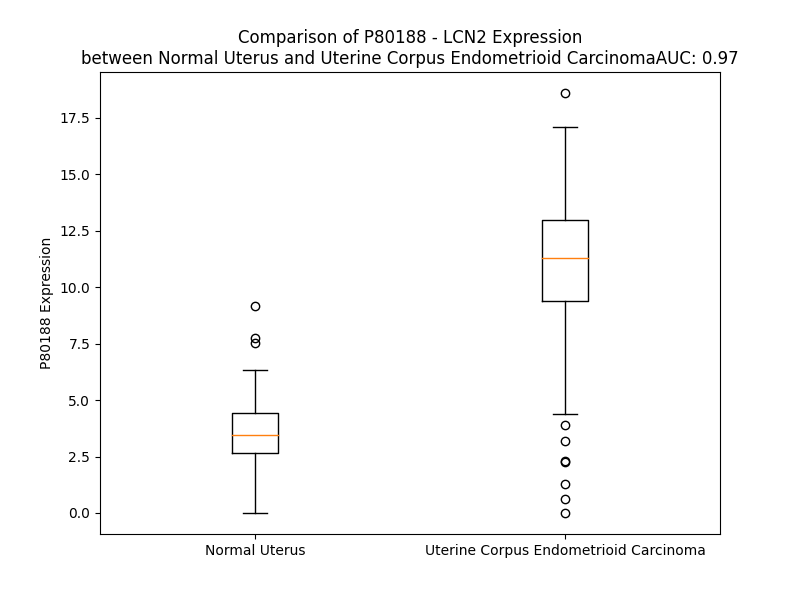

# Detailed Data for P80188

## Introduction to the Detailed Summary

### How to Interpret the Results

- **Summary & Metrics**: This section provides a quick reference to essential protein attributes, including expression changes, family classification, and biomarker applications. Regulation status (upregulated/downregulated) indicates the protein's behavior in a disease context. Some information comes from the original excel file with the proteins selected from literature, while others are derived from the analyses.
- **Expression Comparison**: A visual representation comparing protein expression between normal and disease states. It highlights significant changes in expression levels that might indicate diagnostic or therapeutic relevance. This is data coming from transcriptomics experiments and could not translate similarly to protein levels.
- **Isoform Alignment**: An interactive view of isoform alignments, revealing structural and functional differences between variants of the protein.
- **Interactors & Homologs**: Tables listing known interaction partners and homologous proteins, the more interactors and homologs, the more complex the protein is to design an antibody for.
- **Biological Assemblies**: Information about the structural arrangement of the protein in different assemblies, providing insights into its functional state but also the complexity of the protein to develop antibodies.
- **Combined Per-Residue Information**: A detailed table summarizing residue-level data. This includes predictions for epitope regions, aggregation tendencies, and modifications that might impact the protein's function. Each row corresponds to a residue in the protein, providing insights into specific sites that may be important for research or drug development.
## Summary & Metrics

- **UniProt Accession**: P80188
- **Gene Name**: LCN2
- **Protein Name**: Neutrophil gelatinase-associated lipocalin - Lipocalin2
- **Swiss Prot**: NGAL_HUMAN
- **Family**: transporter
- **Biomarker Application**: diagnosis,efficacy,unspecified application
- **Number of Isoforms**: 2
- **Regulation**: 1
- **(transcriptomics) AUC**: 0.97
- **(transcriptomics) Fold Change**: 2.99
- **(transcriptomics) Regulation**: Upregulated
- **Discotope Epitope Count**: 41
- **Max n_uniprots (Homo)**: 3
- **Max n_uniprots (Hetero)**: 2

## Expression Comparison

## Isoform Alignment

<pre style='font-size:14px; font-family:monospace;'>P80188-1 MPLGLLWLGLALLGALHAQAQDSTSDLIPAPPLSKVPLQQNFQDNQFQGKWYVVGLAGNAILREDKDPQKMYATIYELKEDKSYNVTSVLFRKKKCDYWIRTFVPGCQPGEFTLGNIKSYPGLTSYLVRVVSTNYNQHAMVFFKKVSQNREYFKITLYGRTKELTSELKENFIRFSKSLGLPENHIVFPVPIDQCIDG
P80188-2 MPLGLLWLGLALLGALHAQAQDSTSDLIPAPPLSKVPLQQNFQDNQFQGKWYVVGLAGNAILREDKDPQKMYATIYELKEDKSYNVTSVLFRKKKCDYWIRTFVPGCQPGEFTLGNIKSYPGLTSYLVRVVSTNYNQHAMVFFKKVSQNREYFKITLYGRTKELTSELKENFIRFSKSLGLPENHIVFPVPIGNGQSG
</pre>

## Interactors

| preferredName_A   | preferredName_B   |   score |
|:------------------|:------------------|--------:|
| LCN2              | SLC22A17          |   0.998 |
| LCN2              | MMP9              |   0.998 |
| LCN2              | LTF               |   0.996 |
| LCN2              | CTLA4             |   0.988 |
| LCN2              | HAMP              |   0.988 |
| LCN2              | LRP2              |   0.984 |
| LCN2              | APP               |   0.974 |
| LCN2              | FN1               |   0.964 |
| LCN2              | CST3              |   0.924 |
| LCN2              | HAVCR1            |   0.913 |
| LCN2              | SLC3A2            |   0.91  |
| LCN2              | MMP2              |   0.907 |

## Homologs

| uniprot_id   | gene_id   |
|:-------------|:----------|
| R4GN38       | LCN12     |
| P41222       | PTGDS     |
| nan          | nan       |
| Q6JVE6       | LCN10     |
| Q6JVE9       | LCN8      |
| P31025       | LCN1      |
| Q6ZST4       | LCNL1     |
| Q5T8A4       | OBP2A     |
| F2Z349       | PAEP      |
| Q6UWW0       | LCN15     |
| P62502       | LCN6      |
| Q9NPH6       | OBP2B     |

## Biological Assemblies

|   Unnamed: 0 |   assembly |   n_uniprots | composition   | crystal_id   |
|-------------:|-----------:|-------------:|:--------------|:-------------|
|            0 |          1 |            1 | Homo          | 3hwd         |
|            1 |          2 |            1 | Homo          | 3hwd         |
|            2 |          3 |            1 | Homo          | 3hwd         |
|            0 |          1 |            1 | Homo          | 3hwg         |
|            1 |          2 |            1 | Homo          | 3hwg         |
|            2 |          3 |            1 | Homo          | 3hwg         |
|            0 |          1 |            1 | Homo          | 4iaw         |
|            1 |          2 |            1 | Homo          | 4iaw         |
|            2 |          3 |            1 | Homo          | 4iaw         |
|            0 |          1 |            1 | Homo          | 4zhf         |
|            1 |          2 |            1 | Homo          | 4zhf         |
|            2 |          3 |            1 | Homo          | 4zhf         |
|            3 |          4 |            1 | Homo          | 4zhf         |
|            4 |          5 |            1 | Homo          | 4zhf         |
|            5 |          6 |            1 | Homo          | 4zhf         |
|            0 |          1 |            1 | Homo          | 1x89         |
|            1 |          2 |            1 | Homo          | 1x89         |
|            2 |          3 |            1 | Homo          | 1x89         |
|            0 |          1 |            2 | Hetero        | 4mvk         |
|            0 |          1 |            1 | Homo          | 6gr0         |
|            1 |          2 |            1 | Homo          | 6gr0         |
|            2 |          3 |            1 | Homo          | 6gr0         |
|            0 |          1 |            1 | Homo          | 1qqs         |
|            0 |          1 |            1 | Homo          | 3pec         |
|            1 |          2 |            1 | Homo          | 3pec         |
|            2 |          3 |            1 | Homo          | 3pec         |
|            0 |          1 |            1 | Homo          | 3cbc         |
|            1 |          2 |            1 | Homo          | 3cbc         |
|            2 |          3 |            1 | Homo          | 3cbc         |
|            0 |          1 |            1 | Homo          | 3k3l         |
|            1 |          2 |            1 | Homo          | 3k3l         |
|            2 |          3 |            1 | Homo          | 3k3l         |
|            0 |          1 |            1 | Homo          | 3tzs         |
|            1 |          2 |            1 | Homo          | 3tzs         |
|            2 |          3 |            1 | Homo          | 3tzs         |
|            0 |          1 |            1 | Homo          | 4k19         |
|            1 |          2 |            1 | Homo          | 4k19         |
|            2 |          3 |            1 | Homo          | 4k19         |
|            0 |          1 |            1 | Homo          | 3ped         |
|            1 |          2 |            1 | Homo          | 3ped         |
|            2 |          3 |            1 | Homo          | 3ped         |
|            0 |          1 |            2 | Hetero        | 6s8v         |
|            1 |          2 |            2 | Hetero        | 6s8v         |
|            0 |          1 |            2 | Hetero        | 4mvl         |
|            1 |          2 |            2 | Hetero        | 4mvl         |
|            2 |          3 |            2 | Hetero        | 4mvl         |
|            3 |          4 |            2 | Hetero        | 4mvl         |
|            0 |          1 |            1 | Homo          | 4zhc         |
|            1 |          2 |            1 | Homo          | 4zhc         |
|            2 |          3 |            1 | Homo          | 4zhc         |
|            0 |          1 |            1 | Homo          | 6z6z         |
|            0 |          1 |            1 | Homo          | 3fw5         |
|            1 |          2 |            1 | Homo          | 3fw5         |
|            2 |          3 |            1 | Homo          | 3fw5         |
|            0 |          1 |            1 | Homo          | 4zhg         |
|            1 |          2 |            1 | Homo          | 4zhg         |
|            2 |          3 |            1 | Homo          | 4zhg         |
|            3 |          4 |            1 | Homo          | 4zhg         |
|            4 |          5 |            1 | Homo          | 4zhg         |
|            5 |          6 |            1 | Homo          | 4zhg         |
|            0 |          1 |            1 | Homo          | 5kic         |
|            1 |          2 |            1 | Homo          | 5kic         |
|            2 |          3 |            1 | Homo          | 5kic         |
|            0 |          1 |            1 | Homo          | 3t1d         |
|            1 |          2 |            1 | Homo          | 3t1d         |
|            2 |          3 |            1 | Homo          | 3t1d         |
|            0 |          1 |            2 | Hetero        | 4mvi         |
|            0 |          1 |            1 | Homo          | 1l6m         |
|            1 |          2 |            1 | Homo          | 1l6m         |
|            2 |          3 |            1 | Homo          | 1l6m         |
|            0 |          1 |            1 | Homo          | 3hwf         |
|            1 |          2 |            1 | Homo          | 3hwf         |
|            2 |          3 |            1 | Homo          | 3hwf         |
|            0 |          1 |            1 | Homo          | 3hwe         |
|            1 |          2 |            1 | Homo          | 3hwe         |
|            2 |          3 |            1 | Homo          | 3hwe         |
|            0 |          1 |            1 | Homo          | 3cmp         |
|            1 |          2 |            1 | Homo          | 3cmp         |
|            2 |          3 |            1 | Homo          | 3cmp         |
|            0 |          1 |            1 | Homo          | 4zhd         |
|            1 |          2 |            1 | Homo          | 4zhd         |
|            2 |          3 |            1 | Homo          | 4zhd         |
|            0 |          1 |            0 | Hetero        | 3dsz         |
|            1 |          2 |            0 | Hetero        | 3dsz         |
|            0 |          1 |            2 | Hetero        | 5n48         |
|            1 |          2 |            2 | Hetero        | 5n48         |
|            0 |          1 |            2 | Hetero        | 6sua         |
|            1 |          2 |            2 | Hetero        | 6sua         |
|            0 |          1 |            2 | Hetero        | 4gh7         |
|            1 |          2 |            2 | Hetero        | 4gh7         |
|            0 |          1 |            1 | Homo          | 6qmu         |
|            1 |          2 |            1 | Homo          | 6qmu         |
|            0 |          1 |            1 | Homo          | 3by0         |
|            1 |          2 |            1 | Homo          | 3by0         |
|            2 |          3 |            1 | Homo          | 3by0         |
|            0 |          1 |            3 | Homo          | 4zfx         |
|            0 |          1 |            1 | Homo          | 5nkn         |
|            0 |          1 |            2 | Hetero        | 5n47         |
|            1 |          2 |            2 | Hetero        | 5n47         |
|            2 |          3 |            2 | Hetero        | 5n47         |
|            0 |          1 |            1 | Homo          | 4iax         |
|            0 |          1 |            1 | Homo          | 1dfv         |
|            1 |          2 |            1 | Homo          | 1dfv         |
|            2 |          3 |            1 | Homo          | 1dfv         |
|            0 |          1 |            1 | Homo          | 1x8u         |
|            1 |          2 |            1 | Homo          | 1x8u         |
|            2 |          3 |            1 | Homo          | 1x8u         |
|            0 |          1 |            1 | Homo          | 3dtq         |
|            1 |          2 |            1 | Homo          | 3dtq         |
|            2 |          3 |            1 | Homo          | 3dtq         |
|            0 |          1 |            1 | Homo          | 3i0a         |
|            1 |          2 |            1 | Homo          | 3i0a         |
|            2 |          3 |            1 | Homo          | 3i0a         |
|            0 |          1 |            1 | Homo          | 3u0d         |
|            1 |          2 |            1 | Homo          | 3u0d         |
|            2 |          3 |            1 | Homo          | 3u0d         |
|            3 |          4 |            1 | Homo          | 3u0d         |
|            0 |          1 |            1 | Homo          | 4zhh         |
|            1 |          2 |            1 | Homo          | 4zhh         |
|            2 |          3 |            1 | Homo          | 4zhh         |
|            3 |          4 |            1 | Homo          | 4zhh         |
|            4 |          5 |            1 | Homo          | 4zhh         |
|            5 |          6 |            1 | Homo          | 4zhh         |
|            0 |          1 |            1 | Homo          | 5mhh         |
|            0 |          1 |            1 | Homo          | 1ngl         |
|            0 |          1 |            1 | Homo          | 1x71         |
|            1 |          2 |            1 | Homo          | 1x71         |
|            2 |          3 |            1 | Homo          | 1x71         |
|            0 |          1 |            1 | Homo          | 3tf6         |
|            1 |          2 |            1 | Homo          | 3tf6         |
|            2 |          3 |            1 | Homo          | 3tf6         |
|            0 |          1 |            1 | Homo          | 5khp         |
|            1 |          2 |            1 | Homo          | 5khp         |
|            2 |          3 |            1 | Homo          | 5khp         |
|            0 |          1 |            1 | Homo          | 3fw4         |
|            1 |          2 |            1 | Homo          | 3fw4         |
|            2 |          3 |            1 | Homo          | 3fw4         |
|            0 |          1 |            1 | Homo          | 6z2c         |
|            1 |          2 |            1 | Homo          | 6z2c         |
|            2 |          3 |            1 | Homo          | 6z2c         |
|            0 |          1 |            2 | Hetero        | 4qae         |
|            1 |          2 |            2 | Hetero        | 4qae         |
|            2 |          3 |            2 | Hetero        | 4qae         |
|            3 |          4 |            2 | Hetero        | 4qae         |
|            4 |          5 |            2 | Hetero        | 4qae         |
|            5 |          6 |            2 | Hetero        | 4qae         |
|            0 |          1 |            1 | Homo          | 5kid         |
|            1 |          2 |            1 | Homo          | 5kid         |
|            2 |          3 |            1 | Homo          | 5kid         |
|            0 |          1 |            1 | Homo          | 6gqz         |
|            1 |          2 |            1 | Homo          | 6gqz         |
|            0 |          1 |            1 | Homo          | 6o5d         |
|            1 |          2 |            1 | Homo          | 6o5d         |
|            2 |          3 |            1 | Homo          | 6o5d         |
|            0 |          1 |            1 | Homo          | 5jr8         |
|            1 |          2 |            1 | Homo          | 5jr8         |
|            2 |          3 |            1 | Homo          | 5jr8         |
|            3 |          4 |            1 | Homo          | 5jr8         |

## Combined Per-Residue Information

|   res | aa   |   epitope_score | epitope   |   relative_surface_accessibility |   modeling_confidence |   Aggregation | modification                | glycosylation                   |
|------:|:-----|----------------:|:----------|---------------------------------:|----------------------:|--------------:|:----------------------------|:--------------------------------|
|     1 | M    |         0.18972 | False     |                          1.27151 |                 41.1  |         0     | N/A                         | N/A                             |
|     2 | P    |         0.30141 | False     |                          0.79926 |                 50.74 |         0.454 | N/A                         | N/A                             |
|     3 | L    |         0.29877 | False     |                          0.90243 |                 55.98 |        15.317 | N/A                         | N/A                             |
|     4 | G    |         0.28316 | False     |                          0.67642 |                 56.02 |        20.856 | N/A                         | N/A                             |
|     5 | L    |         0.24316 | False     |                          0.87053 |                 56.72 |        79.889 | N/A                         | N/A                             |
|     6 | L    |         0.21184 | False     |                          0.78551 |                 57.1  |        90.654 | N/A                         | N/A                             |
|     7 | W    |         0.20613 | False     |                          0.87047 |                 54.42 |        92.577 | N/A                         | N/A                             |
|     8 | L    |         0.14082 | False     |                          0.73803 |                 55.79 |        92.921 | N/A                         | N/A                             |
|     9 | G    |         0.17736 | False     |                          0.42999 |                 56.24 |        92.121 | N/A                         | N/A                             |
|    10 | L    |         0.1502  | False     |                          0.78396 |                 58.75 |        92.12  | N/A                         | N/A                             |
|    11 | A    |         0.13429 | False     |                          0.64841 |                 59.28 |        90.239 | N/A                         | N/A                             |
|    12 | L    |         0.20841 | False     |                          0.75547 |                 56.41 |        88.626 | N/A                         | N/A                             |
|    13 | L    |         0.15924 | False     |                          0.65451 |                 57.68 |        79.509 | N/A                         | N/A                             |
|    14 | G    |         0.1981  | False     |                          0.52382 |                 54.9  |        29.666 | N/A                         | N/A                             |
|    15 | A    |         0.11954 | False     |                          0.59536 |                 56.04 |        25.135 | N/A                         | N/A                             |
|    16 | L    |         0.13742 | False     |                          0.82126 |                 51.64 |        21.304 | N/A                         | N/A                             |
|    17 | H    |         0.15676 | False     |                          0.68914 |                 50.95 |         0.267 | N/A                         | N/A                             |
|    18 | A    |         0.12671 | False     |                          0.70281 |                 52.42 |         0.118 | N/A                         | N/A                             |
|    19 | Q    |         0.23782 | False     |                          0.7626  |                 49.81 |         0     | N/A                         | N/A                             |
|    20 | A    |         0.14023 | False     |                          0.73441 |                 51.74 |         0     | N/A                         | N/A                             |
|    21 | Q    |         0.20933 | False     |                          0.80437 |                 43.85 |         0     | Pyrrolidone carboxylic acid | N/A                             |
|    22 | D    |         0.21829 | False     |                          0.68943 |                 48.71 |         0     | N/A                         | N/A                             |
|    23 | S    |         0.26867 | False     |                          0.78295 |                 45.57 |         0     | N/A                         | N/A                             |
|    24 | T    |         0.22034 | False     |                          0.6157  |                 50.02 |         0     | N/A                         | N/A                             |
|    25 | S    |         0.18521 | False     |                          0.68048 |                 62.62 |         0     | N/A                         | N/A                             |
|    26 | D    |         0.24506 | False     |                          0.83849 |                 82.12 |         0     | N/A                         | N/A                             |
|    27 | L    |         0.36632 | True      |                          0.27813 |                 93.31 |         0     | N/A                         | N/A                             |
|    28 | I    |         0.30224 | False     |                          0.21876 |                 95.97 |         0     | N/A                         | N/A                             |
|    29 | P    |         0.22989 | False     |                          0.8205  |                 96.32 |         0     | N/A                         | N/A                             |
|    30 | A    |         0.12388 | False     |                          0.17512 |                 96.98 |         0     | N/A                         | N/A                             |
|    31 | P    |         0.09208 | False     |                          0.06479 |                 97.43 |         0     | N/A                         | N/A                             |
|    32 | P    |         0.36262 | True      |                          0.5591  |                 97.31 |         0     | N/A                         | N/A                             |
|    33 | L    |         0.26579 | False     |                          0.40646 |                 96.43 |         0     | N/A                         | N/A                             |
|    34 | S    |         0.29985 | False     |                          0.84304 |                 97.09 |         0     | N/A                         | N/A                             |
|    35 | K    |         0.36785 | True      |                          0.6257  |                 97.73 |         0     | N/A                         | N/A                             |
|    36 | V    |         0.04253 | False     |                          0.02403 |                 98.45 |         0     | N/A                         | N/A                             |
|    37 | P    |         0.24137 | False     |                          0.54618 |                 98.31 |         0     | N/A                         | N/A                             |
|    38 | L    |         0.22569 | False     |                          0.2734  |                 98.56 |         0     | N/A                         | N/A                             |
|    39 | Q    |         0.1995  | False     |                          0.18018 |                 98.55 |         0     | N/A                         | N/A                             |
|    40 | Q    |         0.27173 | False     |                          0.74891 |                 97.77 |         0     | N/A                         | N/A                             |
|    41 | N    |         0.40783 | True      |                          0.8169  |                 97.4  |         0     | N/A                         | N/A                             |
|    42 | F    |         0.1633  | False     |                          0.08114 |                 98.44 |         0     | N/A                         | N/A                             |
|    43 | Q    |         0.32377 | False     |                          0.3803  |                 98.17 |         0     | N/A                         | N/A                             |
|    44 | D    |         0.18185 | False     |                          0.17965 |                 97.55 |         0     | N/A                         | N/A                             |
|    45 | N    |         0.26458 | False     |                          0.55165 |                 97.5  |         0     | N/A                         | N/A                             |
|    46 | Q    |         0.22444 | False     |                          0.4367  |                 98.31 |         0     | N/A                         | N/A                             |
|    47 | F    |         0.02864 | False     |                          0.01274 |                 98.6  |         0     | N/A                         | N/A                             |
|    48 | Q    |         0.12394 | False     |                          0.32169 |                 97.91 |         0     | N/A                         | N/A                             |
|    49 | G    |         0.11239 | False     |                          0.35272 |                 97.96 |         0     | N/A                         | N/A                             |
|    50 | K    |         0.13092 | False     |                          0.23825 |                 98.22 |         0     | N/A                         | N/A                             |
|    51 | W    |         0.02338 | False     |                          0       |                 98.74 |        49.98  | N/A                         | N/A                             |
|    52 | Y    |         0.06969 | False     |                          0.11092 |                 98.69 |        55.18  | N/A                         | N/A                             |
|    53 | V    |         0.0046  | False     |                          0.00095 |                 98.59 |        57.534 | N/A                         | N/A                             |
|    54 | V    |         0.03394 | False     |                          0.02728 |                 98.64 |        57.596 | N/A                         | N/A                             |
|    55 | G    |         0.0033  | False     |                          0       |                 98.64 |        57.596 | N/A                         | N/A                             |
|    56 | L    |         0.04553 | False     |                          0.01566 |                 98.57 |        54.025 | N/A                         | N/A                             |
|    57 | A    |         0.00257 | False     |                          0       |                 98.71 |        31.967 | N/A                         | N/A                             |
|    58 | G    |         0.00593 | False     |                          0.00161 |                 98.5  |        11.847 | N/A                         | N/A                             |
|    59 | N    |         0.04811 | False     |                          0.03203 |                 97.8  |        10.036 | N/A                         | N/A                             |
|    60 | A    |         0.45877 | True      |                          0.5693  |                 96.34 |         9.977 | N/A                         | N/A                             |
|    61 | I    |         0.26547 | False     |                          0.20959 |                 96.26 |         9.977 | N/A                         | N/A                             |
|    62 | L    |         0.35008 | True      |                          0.6497  |                 94.48 |         9.779 | N/A                         | N/A                             |
|    63 | R    |         0.34877 | True      |                          0.51439 |                 93.74 |         0     | N/A                         | N/A                             |
|    64 | E    |         0.5039  | True      |                          0.55156 |                 91.71 |         0     | N/A                         | N/A                             |
|    65 | D    |         0.47096 | True      |                          0.73751 |                 88.35 |         0     | N/A                         | N/A                             |
|    66 | K    |         0.46362 | True      |                          1.02061 |                 91.59 |         0     | N/A                         | N/A                             |
|    67 | D    |         0.46811 | True      |                          0.62536 |                 91.1  |         0     | N/A                         | N/A                             |
|    68 | P    |         0.26755 | False     |                          0.48109 |                 92.42 |         0     | N/A                         | N/A                             |
|    69 | Q    |         0.29596 | False     |                          0.31262 |                 94.3  |         0     | N/A                         | N/A                             |
|    70 | K    |         0.41203 | True      |                          0.46775 |                 96.12 |         0.132 | N/A                         | N/A                             |
|    71 | M    |         0.03052 | False     |                          0.01379 |                 97.97 |        12.624 | N/A                         | N/A                             |
|    72 | Y    |         0.18149 | False     |                          0.09336 |                 97.95 |        21.108 | N/A                         | N/A                             |
|    73 | A    |         0.00802 | False     |                          0.00638 |                 98.37 |        21.108 | N/A                         | N/A                             |
|    74 | T    |         0.01787 | False     |                          0.00724 |                 98.5  |        21.108 | N/A                         | N/A                             |
|    75 | I    |         0.19804 | False     |                          0.25616 |                 98.54 |        21.108 | N/A                         | N/A                             |
|    76 | Y    |         0.03518 | False     |                          0.02431 |                 98.67 |        18.299 | N/A                         | N/A                             |
|    77 | E    |         0.20602 | False     |                          0.51398 |                 98.49 |         0.132 | N/A                         | N/A                             |
|    78 | L    |         0.14391 | False     |                          0.25702 |                 98.47 |         0.132 | N/A                         | N/A                             |
|    79 | K    |         0.27114 | False     |                          0.34745 |                 98.06 |         0     | N/A                         | N/A                             |
|    80 | E    |         0.28887 | False     |                          0.94376 |                 96.6  |         0     | N/A                         | N/A                             |
|    81 | D    |         0.29879 | False     |                          0.54813 |                 96.14 |         0     | N/A                         | N/A                             |
|    82 | K    |         0.1937  | False     |                          0.50893 |                 96.68 |         0     | N/A                         | N/A                             |
|    83 | S    |         0.06088 | False     |                          0.01015 |                 98.22 |         0.228 | N/A                         | N/A                             |
|    84 | Y    |         0.00404 | False     |                          0.00226 |                 98.72 |         0.476 | N/A                         | N/A                             |
|    85 | N    |         0.27493 | False     |                          0.33666 |                 98.44 |         0.679 | N/A                         | N-linked (GlcNAc...) asparagine |
|    86 | V    |         0.00754 | False     |                          0       |                 98.6  |         7.054 | N/A                         | N/A                             |
|    87 | T    |         0.19315 | False     |                          0.20538 |                 98.4  |         7.492 | N/A                         | N/A                             |
|    88 | S    |         0.13735 | False     |                          0.05433 |                 97.99 |         7.492 | N/A                         | N/A                             |
|    89 | V    |         0.10413 | False     |                          0.0457  |                 97.83 |         7.492 | N/A                         | N/A                             |
|    90 | L    |         0.25741 | False     |                          0.1319  |                 95.88 |         7.492 | N/A                         | N/A                             |
|    91 | F    |         0.36574 | True      |                          0.21403 |                 95.52 |         6.329 | N/A                         | N/A                             |
|    92 | R    |         0.55903 | True      |                          0.50469 |                 90.5  |         0     | N/A                         | N/A                             |
|    93 | K    |         0.64813 | True      |                          0.96344 |                 89.63 |         0     | N/A                         | N/A                             |
|    94 | K    |         0.52303 | True      |                          0.92828 |                 90.22 |         0     | N/A                         | N/A                             |
|    95 | K    |         0.53397 | True      |                          0.70815 |                 94.92 |         0     | N/A                         | N/A                             |
|    96 | C    |         0.28173 | False     |                          0.42145 |                 96.23 |         0     | N/A                         | N/A                             |
|    97 | D    |         0.49477 | True      |                          0.31422 |                 96.01 |         0     | N/A                         | N/A                             |
|    98 | Y    |         0.39664 | True      |                          0.59138 |                 96.68 |         0     | N/A                         | N/A                             |
|    99 | W    |         0.50836 | True      |                          0.64844 |                 96.19 |         0     | N/A                         | N/A                             |
|   100 | I    |         0.50003 | True      |                          0.74686 |                 96.74 |         0     | N/A                         | N/A                             |
|   101 | R    |         0.29356 | False     |                          0.18049 |                 97.75 |         0     | N/A                         | N/A                             |
|   102 | T    |         0.14812 | False     |                          0.27081 |                 98.36 |         0     | N/A                         | N/A                             |
|   103 | F    |         0.00656 | False     |                          0.00255 |                 98.71 |         0     | N/A                         | N/A                             |
|   104 | V    |         0.18935 | False     |                          0.42272 |                 98.39 |         0     | N/A                         | N/A                             |
|   105 | P    |         0.19081 | False     |                          0.431   |                 98.14 |         0     | N/A                         | N/A                             |
|   106 | G    |         0.13997 | False     |                          0.34017 |                 96.68 |         0     | N/A                         | N/A                             |
|   107 | C    |         0.37333 | True      |                          0.94205 |                 95.12 |         0     | N/A                         | N/A                             |
|   108 | Q    |         0.27261 | False     |                          0.47441 |                 97.16 |         0     | N/A                         | N/A                             |
|   109 | P    |         0.23159 | False     |                          0.75408 |                 97.93 |         0     | N/A                         | N/A                             |
|   110 | G    |         0.01697 | False     |                          0.01797 |                 98.2  |         0     | N/A                         | N/A                             |
|   111 | E    |         0.13719 | False     |                          0.05336 |                 98.5  |         0     | N/A                         | N/A                             |
|   112 | F    |         0.06136 | False     |                          0.05542 |                 98.7  |         0.254 | N/A                         | N/A                             |
|   113 | T    |         0.26885 | False     |                          0.41853 |                 98.37 |         0.254 | N/A                         | N/A                             |
|   114 | L    |         0.15884 | False     |                          0.06028 |                 98.25 |         0.254 | N/A                         | N/A                             |
|   115 | G    |         0.2367  | False     |                          0.14489 |                 97.52 |         0.254 | N/A                         | N/A                             |
|   116 | N    |         0.47531 | True      |                          0.71091 |                 94.96 |         0.254 | N/A                         | N/A                             |
|   117 | I    |         0.42035 | True      |                          0.28804 |                 95.63 |         0.254 | N/A                         | N/A                             |
|   118 | K    |         0.51009 | True      |                          0.96495 |                 94.45 |         0     | N/A                         | N/A                             |
|   119 | S    |         0.49828 | True      |                          0.51225 |                 95.54 |         0     | N/A                         | N/A                             |
|   120 | Y    |         0.56844 | True      |                          0.34984 |                 95.08 |         0     | N/A                         | N/A                             |
|   121 | P    |         0.63985 | True      |                          0.98657 |                 94.72 |         0     | N/A                         | N/A                             |
|   122 | G    |         0.67597 | True      |                          0.45506 |                 95.4  |         0.178 | N/A                         | N/A                             |
|   123 | L    |         0.31594 | False     |                          0.15335 |                 97.47 |         2.293 | N/A                         | N/A                             |
|   124 | T    |         0.30601 | False     |                          0.66141 |                 96.97 |         2.65  | N/A                         | N/A                             |
|   125 | S    |         0.20695 | False     |                          0.34311 |                 97.49 |         2.65  | N/A                         | N/A                             |
|   126 | Y    |         0.12978 | False     |                          0.15769 |                 98.32 |         2.65  | N/A                         | N/A                             |
|   127 | L    |         0.22036 | False     |                          0.19903 |                 98.48 |         2.65  | N/A                         | N/A                             |
|   128 | V    |         0.04506 | False     |                          0.01428 |                 98.79 |         2.485 | N/A                         | N/A                             |
|   129 | R    |         0.15238 | False     |                          0.0974  |                 98.74 |         0     | N/A                         | N/A                             |
|   130 | V    |         0.01949 | False     |                          0.01047 |                 98.84 |         0     | N/A                         | N/A                             |
|   131 | V    |         0.09783 | False     |                          0.0683  |                 98.81 |         0     | N/A                         | N/A                             |
|   132 | S    |         0.1683  | False     |                          0.25883 |                 98.54 |         0     | N/A                         | N/A                             |
|   133 | T    |         0.12694 | False     |                          0.09368 |                 98.73 |         0     | N/A                         | N/A                             |
|   134 | N    |         0.20659 | False     |                          0.35804 |                 98.16 |         0     | N/A                         | N/A                             |
|   135 | Y    |         0.17228 | False     |                          0.1328  |                 98.62 |         0     | N/A                         | N/A                             |
|   136 | N    |         0.4007  | True      |                          0.7263  |                 97.81 |         0     | N/A                         | N/A                             |
|   137 | Q    |         0.20648 | False     |                          0.54276 |                 98.05 |         0     | N/A                         | N/A                             |
|   138 | H    |         0.24066 | False     |                          0.12589 |                 98.67 |         0     | N/A                         | N/A                             |
|   139 | A    |         0.00188 | False     |                          0       |                 98.86 |        11.297 | N/A                         | N/A                             |
|   140 | M    |         0.0797  | False     |                          0.05393 |                 98.81 |        11.297 | N/A                         | N/A                             |
|   141 | V    |         0.01214 | False     |                          0.00381 |                 98.9  |        11.297 | N/A                         | N/A                             |
|   142 | F    |         0.0048  | False     |                          0       |                 98.87 |        11.297 | N/A                         | N/A                             |
|   143 | F    |         0.10982 | False     |                          0.03925 |                 98.75 |        11.297 | N/A                         | N/A                             |
|   144 | K    |         0.18935 | False     |                          0.22191 |                 98.59 |         0     | N/A                         | N/A                             |
|   145 | K    |         0.28105 | False     |                          0.37013 |                 97.99 |         0     | N/A                         | N/A                             |
|   146 | V    |         0.21836 | False     |                          0.2066  |                 97.82 |         0     | N/A                         | N/A                             |
|   147 | S    |         0.39329 | True      |                          0.18445 |                 96.49 |         0     | N/A                         | N/A                             |
|   148 | Q    |         0.62155 | True      |                          0.73158 |                 93.82 |         0     | N/A                         | N/A                             |
|   149 | N    |         0.5031  | True      |                          0.89376 |                 92.11 |         0     | N/A                         | N/A                             |
|   150 | R    |         0.4349  | True      |                          0.40165 |                 94.87 |         0     | N/A                         | N/A                             |
|   151 | E    |         0.29117 | False     |                          0.36585 |                 96.91 |         0     | N/A                         | N/A                             |
|   152 | Y    |         0.25465 | False     |                          0.24064 |                 98.02 |         0     | N/A                         | N/A                             |
|   153 | F    |         0.08046 | False     |                          0.03039 |                 98.61 |         0     | N/A                         | N/A                             |
|   154 | K    |         0.13268 | False     |                          0.30473 |                 98.75 |         0     | N/A                         | N/A                             |
|   155 | I    |         0.00481 | False     |                          0       |                 98.83 |         0     | N/A                         | N/A                             |
|   156 | T    |         0.01435 | False     |                          0.00575 |                 98.84 |         0     | N/A                         | N/A                             |
|   157 | L    |         0.00675 | False     |                          0.0033  |                 98.9  |         0     | N/A                         | N/A                             |
|   158 | Y    |         0.02514 | False     |                          0.02084 |                 98.89 |         0     | N/A                         | N/A                             |
|   159 | G    |         0.00267 | False     |                          0       |                 98.7  |         0     | N/A                         | N/A                             |
|   160 | R    |         0.16907 | False     |                          0.24712 |                 98.18 |         0     | N/A                         | N/A                             |
|   161 | T    |         0.22381 | False     |                          0.58753 |                 97.85 |         0     | N/A                         | N/A                             |
|   162 | K    |         0.25732 | False     |                          0.20797 |                 97.86 |         0     | N/A                         | N/A                             |
|   163 | E    |         0.32284 | False     |                          0.66835 |                 96.95 |         0     | N/A                         | N/A                             |
|   164 | L    |         0.24337 | False     |                          0.13312 |                 97.95 |         0     | N/A                         | N/A                             |
|   165 | T    |         0.32367 | False     |                          0.60745 |                 97.95 |         0     | N/A                         | N/A                             |
|   166 | S    |         0.38733 | True      |                          0.60726 |                 97.94 |         0     | N/A                         | N/A                             |
|   167 | E    |         0.29541 | False     |                          0.69612 |                 98.25 |         0     | N/A                         | N/A                             |
|   168 | L    |         0.14319 | False     |                          0.21587 |                 98.3  |         0     | N/A                         | N/A                             |
|   169 | K    |         0.29855 | False     |                          0.31788 |                 98.51 |         0     | N/A                         | N/A                             |
|   170 | E    |         0.48652 | True      |                          0.50534 |                 98.51 |         0     | N/A                         | N/A                             |
|   171 | N    |         0.23048 | False     |                          0.34428 |                 98.37 |         0     | N/A                         | N/A                             |
|   172 | F    |         0.00576 | False     |                          0       |                 98.74 |         0     | N/A                         | N/A                             |
|   173 | I    |         0.30509 | False     |                          0.22799 |                 98.75 |         0     | N/A                         | N/A                             |
|   174 | R    |         0.44179 | True      |                          0.65252 |                 98.63 |         0     | N/A                         | N/A                             |
|   175 | F    |         0.15973 | False     |                          0.1308  |                 98.67 |         0     | N/A                         | N/A                             |
|   176 | S    |         0.00567 | False     |                          0       |                 98.73 |         0     | N/A                         | N/A                             |
|   177 | K    |         0.29368 | False     |                          0.48365 |                 98.52 |         0     | N/A                         | N/A                             |
|   178 | S    |         0.29878 | False     |                          0.56638 |                 98.27 |         0     | N/A                         | N/A                             |
|   179 | L    |         0.10518 | False     |                          0.05733 |                 98.29 |         0     | N/A                         | N/A                             |
|   180 | G    |         0.2606  | False     |                          0.57029 |                 97.64 |         0     | N/A                         | N/A                             |
|   181 | L    |         0.0493  | False     |                          0.01566 |                 98.33 |         0     | N/A                         | N/A                             |
|   182 | P    |         0.32941 | False     |                          0.44961 |                 97.4  |         0     | N/A                         | N/A                             |
|   183 | E    |         0.32397 | False     |                          0.39342 |                 97.14 |         0     | N/A                         | N/A                             |
|   184 | N    |         0.4226  | True      |                          0.43878 |                 96.62 |         0     | N/A                         | N/A                             |
|   185 | H    |         0.18873 | False     |                          0.11843 |                 97.94 |         0     | N/A                         | N/A                             |
|   186 | I    |         0.12258 | False     |                          0.03217 |                 98.39 |         0     | N/A                         | N/A                             |
|   187 | V    |         0.14718 | False     |                          0.08473 |                 98.31 |         0     | N/A                         | N/A                             |
|   188 | F    |         0.18845 | False     |                          0.35724 |                 97.86 |         0     | N/A                         | N/A                             |
|   189 | P    |         0.05241 | False     |                          0.03652 |                 97.61 |         0     | N/A                         | N/A                             |
|   190 | V    |         0.31352 | False     |                          0.49793 |                 96.08 |         0     | N/A                         | N/A                             |
|   191 | P    |         0.2268  | False     |                          0.50983 |                 96.61 |         0     | N/A                         | N/A                             |
|   192 | I    |         0.34724 | True      |                          0.13097 |                 95.85 |         0     | N/A                         | N/A                             |
|   193 | D    |         0.40195 | True      |                          0.63951 |                 91.73 |         0     | N/A                         | N/A                             |
|   194 | Q    |         0.37145 | True      |                          0.45471 |                 92.62 |         0     | N/A                         | N/A                             |
|   195 | C    |         0.20465 | False     |                          0.22808 |                 91.95 |         0     | N/A                         | N/A                             |
|   196 | I    |         0.04002 | False     |                          0.00776 |                 93.14 |         0     | N/A                         | N/A                             |
|   197 | D    |         0.30017 | False     |                          0.41846 |                 89.6  |         0     | N/A                         | N/A                             |
|   198 | G    |         0.1896  | False     |                          1.24294 |                 78.48 |         0     | N/A                         | N/A                             |

