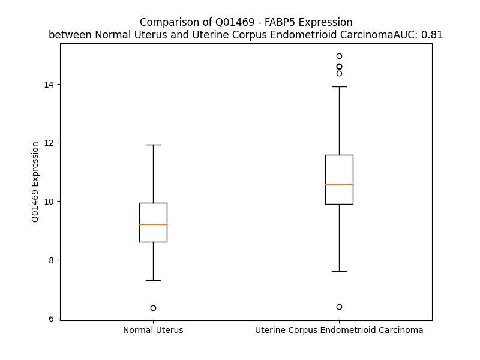

# Detailed Data for Q01469

## Introduction to the Detailed Summary

### How to Interpret the Results

- **Summary & Metrics**: This section provides a quick reference to essential protein attributes, including expression changes, family classification, and biomarker applications. Regulation status (upregulated/downregulated) indicates the protein's behavior in a disease context. Some information comes from the original excel file with the proteins selected from literature, while others are derived from the analyses.
- **Expression Comparison**: A visual representation comparing protein expression between normal and disease states. It highlights significant changes in expression levels that might indicate diagnostic or therapeutic relevance. This is data coming from transcriptomics experiments and could not translate similarly to protein levels.
- **Isoform Alignment**: An interactive view of isoform alignments, revealing structural and functional differences between variants of the protein.
- **Interactors & Homologs**: Tables listing known interaction partners and homologous proteins, the more interactors and homologs, the more complex the protein is to design an antibody for.
- **Biological Assemblies**: Information about the structural arrangement of the protein in different assemblies, providing insights into its functional state but also the complexity of the protein to develop antibodies.
- **Combined Per-Residue Information**: A detailed table summarizing residue-level data. This includes predictions for epitope regions, aggregation tendencies, and modifications that might impact the protein's function. Each row corresponds to a residue in the protein, providing insights into specific sites that may be important for research or drug development.
## Summary & Metrics

- **UniProt Accession**: Q01469
- **Gene Name**: FABP5
- **Protein Name**: fatty acid binding protein 5 (psoriasis-associated), epidermal fatty acid-binding protein
- **Swiss Prot**: FABP5_HUMAN
- **Family**: transporter
- **Biomarker Application**: disease progression
- **Number of Isoforms**: 0
- **Regulation**: 1
- **(transcriptomics) AUC**: 0.95
- **(transcriptomics) Fold Change**: 1.26
- **(transcriptomics) Regulation**: Upregulated
- **Discotope Epitope Count**: 25
- **Max n_uniprots (Homo)**: 2
- **Max n_uniprots (Hetero)**: N/A

## Expression Comparison

## Interactors

| preferredName_A   | preferredName_B   |   score |
|:------------------|:------------------|--------:|
| FABP5             | PPARD             |   0.988 |

## Homologs

| uniprot_id   | gene_id   |
|:-------------|:----------|
| D6RGE6       | RBP2      |
| E7DVW4       | FABP4     |
| F1T0F7       | CRABP1    |
| P29373       | CRABP2    |
| Q6FGL7       | FABP1     |
| B1AQ60       | RBP7      |
| Q0Z7S8       | FABP9     |
| P51161       | FABP6     |
| P12104       | FABP2     |
| A0A0A0MQT0   | RBP1      |
| P05413       | FABP3     |
| O15540       | FABP7     |
| P02689       | PMP2      |
| A6NFH5       | FABP12    |
| P82980       | RBP5      |

## Biological Assemblies

|   Unnamed: 0 |   assembly |   n_uniprots | composition   | crystal_id   |
|-------------:|-----------:|-------------:|:--------------|:-------------|
|            0 |          1 |            1 | Homo          | 7fy0         |
|            0 |          1 |            1 | Homo          | 7fwi         |
|            1 |          2 |            1 | Homo          | 7fwi         |
|            2 |          3 |            1 | Homo          | 7fwi         |
|            0 |          1 |            2 | Homo          | 4azm         |
|            0 |          1 |            1 | Homo          | 7g04         |
|            1 |          2 |            1 | Homo          | 7g04         |
|            0 |          1 |            1 | Homo          | 7fxd         |
|            0 |          1 |            1 | Homo          | 7g0e         |
|            0 |          1 |            1 | Homo          | 1jjj         |
|            0 |          1 |            1 | Homo          | 5ur9         |
|            1 |          2 |            1 | Homo          | 5ur9         |
|            2 |          3 |            1 | Homo          | 5ur9         |
|            3 |          4 |            1 | Homo          | 5ur9         |
|            4 |          5 |            1 | Homo          | 5ur9         |
|            5 |          6 |            1 | Homo          | 5ur9         |
|            6 |          7 |            1 | Homo          | 5ur9         |
|            7 |          8 |            1 | Homo          | 5ur9         |
|            0 |          1 |            1 | Homo          | 7fyd         |
|            0 |          1 |            1 | Homo          | 1b56         |
|            0 |          1 |            1 | Homo          | 5hz5         |
|            0 |          1 |            1 | Homo          | 7g01         |
|            0 |          1 |            1 | Homo          | 7g0b         |
|            0 |          1 |            1 | Homo          | 4lkt         |
|            1 |          2 |            1 | Homo          | 4lkt         |
|            2 |          3 |            1 | Homo          | 4lkt         |
|            3 |          4 |            1 | Homo          | 4lkt         |
|            0 |          1 |            1 | Homo          | 4lkp         |
|            0 |          1 |            2 | Homo          | 4azr         |
|            0 |          1 |            1 | Homo          | 7g1q         |

## Combined Per-Residue Information

|   res | aa   |   epitope_score | epitope   |   relative_surface_accessibility |   modeling_confidence |   Aggregation | modification    |
|------:|:-----|----------------:|:----------|---------------------------------:|----------------------:|--------------:|:----------------|
|     1 | M    |         0.31308 | False     |                          1.22619 |                 72.1  |         0     | N/A             |
|     2 | A    |         0.19365 | False     |                          0.49617 |                 85.78 |         0     | N-acetylalanine |
|     3 | T    |         0.26967 | False     |                          0.42125 |                 91.84 |         0     | N/A             |
|     4 | V    |         0.05443 | False     |                          0.05647 |                 95.08 |         0     | N/A             |
|     5 | Q    |         0.23638 | False     |                          0.41556 |                 95.32 |         0     | N/A             |
|     6 | Q    |         0.2107  | False     |                          0.48438 |                 94.54 |         0     | N/A             |
|     7 | L    |         0.01416 | False     |                          0.01237 |                 96.79 |         0     | N/A             |
|     8 | E    |         0.15258 | False     |                          0.37122 |                 97.26 |         0     | N/A             |
|     9 | G    |         0.08255 | False     |                          0.16205 |                 97.71 |         0     | N/A             |
|    10 | R    |         0.20671 | False     |                          0.20673 |                 98.48 |         0     | N/A             |
|    11 | W    |         0.10218 | False     |                          0.02211 |                 98.56 |         0     | N/A             |
|    12 | R    |         0.16464 | False     |                          0.43964 |                 98.01 |         0     | N/A             |
|    13 | L    |         0.17038 | False     |                          0.0852  |                 98.1  |         0     | N/A             |
|    14 | V    |         0.28066 | False     |                          0.5205  |                 97.39 |         0     | N/A             |
|    15 | D    |         0.31997 | False     |                          0.3674  |                 97.58 |         0     | N/A             |
|    16 | S    |         0.21868 | False     |                          0.33875 |                 97.66 |         0     | N/A             |
|    17 | K    |         0.36225 | False     |                          0.68074 |                 97.88 |         0     | N6-acetyllysine |
|    18 | G    |         0.17312 | False     |                          0.32592 |                 97.73 |         0     | N/A             |
|    19 | F    |         0.28135 | False     |                          0.16409 |                 97.23 |         0     | N/A             |
|    20 | D    |         0.37131 | False     |                          0.36052 |                 96.72 |         0     | N/A             |
|    21 | E    |         0.37469 | False     |                          0.49818 |                 97.88 |         0     | N/A             |
|    22 | Y    |         0.09741 | False     |                          0.03814 |                 98.25 |         0     | N/A             |
|    23 | M    |         0.22799 | False     |                          0.13249 |                 97.32 |         0     | N/A             |
|    24 | K    |         0.52653 | True      |                          0.65563 |                 97.52 |         0     | N/A             |
|    25 | E    |         0.37648 | False     |                          0.31911 |                 97.81 |         0     | N/A             |
|    26 | L    |         0.23635 | False     |                          0.07527 |                 97.41 |         1.747 | N/A             |
|    27 | G    |         0.44796 | True      |                          0.74909 |                 95.55 |         2.169 | N/A             |
|    28 | V    |         0.23316 | False     |                          0.0707  |                 95.89 |         2.586 | N/A             |
|    29 | G    |         0.42945 | True      |                          0.52621 |                 95.42 |         2.586 | N/A             |
|    30 | I    |         0.39683 | False     |                          0.66439 |                 94.96 |         2.586 | N/A             |
|    31 | A    |         0.29963 | False     |                          0.66101 |                 93.9  |         1.674 | N/A             |
|    32 | L    |         0.43537 | True      |                          0.56373 |                 92.31 |         1.253 | N/A             |
|    33 | R    |         0.43706 | True      |                          0.12012 |                 95.29 |         0     | N/A             |
|    34 | K    |         0.39021 | False     |                          0.6517  |                 93.61 |         0     | N/A             |
|    35 | M    |         0.52568 | True      |                          0.42081 |                 92.34 |         0     | N/A             |
|    36 | G    |         0.40723 | True      |                          0.20991 |                 92.18 |         0     | N/A             |
|    37 | A    |         0.27964 | False     |                          0.58936 |                 91.72 |         0     | N/A             |
|    38 | M    |         0.4825  | True      |                          0.75012 |                 91.76 |         0     | N/A             |
|    39 | A    |         0.27246 | False     |                          0.14013 |                 92.15 |         0     | N/A             |
|    40 | K    |         0.34014 | False     |                          0.77917 |                 92.8  |         0     | N/A             |
|    41 | P    |         0.16304 | False     |                          0.07555 |                 96.21 |         0     | N/A             |
|    42 | D    |         0.08568 | False     |                          0.06895 |                 97.71 |         0     | N/A             |
|    43 | C    |         0.162   | False     |                          0.05057 |                 98.06 |         0     | N/A             |
|    44 | I    |         0.21481 | False     |                          0.16232 |                 98.43 |         0     | N/A             |
|    45 | I    |         0.0113  | False     |                          0.00237 |                 98.36 |         0     | N/A             |
|    46 | T    |         0.1336  | False     |                          0.47769 |                 97.86 |         0     | N/A             |
|    47 | C    |         0.13984 | False     |                          0.14639 |                 96.23 |         0     | N/A             |
|    48 | D    |         0.2635  | False     |                          0.66338 |                 94.91 |         0     | N/A             |
|    49 | G    |         0.17137 | False     |                          0.61123 |                 91.41 |         0     | N/A             |
|    50 | K    |         0.29612 | False     |                          0.70959 |                 93.95 |         0     | N/A             |
|    51 | N    |         0.19269 | False     |                          0.5094  |                 97.33 |         0     | N/A             |
|    52 | L    |         0.01405 | False     |                          0.00691 |                 97.88 |         0     | N/A             |
|    53 | T    |         0.30306 | False     |                          0.24128 |                 98.42 |         0     | N/A             |
|    54 | I    |         0.1384  | False     |                          0.02167 |                 98.27 |         0     | N/A             |
|    55 | K    |         0.41761 | True      |                          0.27575 |                 98.08 |         0     | N/A             |
|    56 | T    |         0.35574 | False     |                          0.32611 |                 97.24 |         0     | N/A             |
|    57 | E    |         0.25574 | False     |                          0.26822 |                 96.24 |         0     | N/A             |
|    58 | S    |         0.41376 | True      |                          0.20512 |                 92.27 |         0     | N/A             |
|    59 | T    |         0.38712 | False     |                          1.02015 |                 88.83 |         0     | N/A             |
|    60 | L    |         0.47054 | True      |                          0.62764 |                 86.1  |         0     | N/A             |
|    61 | K    |         0.51826 | True      |                          0.52723 |                 88.05 |         0     | N/A             |
|    62 | T    |         0.42529 | True      |                          0.49975 |                 94.47 |         0     | N/A             |
|    63 | T    |         0.34475 | False     |                          0.22518 |                 95.64 |         0     | N/A             |
|    64 | Q    |         0.48444 | True      |                          0.57244 |                 97.51 |         0     | N/A             |
|    65 | F    |         0.39727 | False     |                          0.13384 |                 97.99 |         0     | N/A             |
|    66 | S    |         0.39063 | False     |                          0.52853 |                 98.01 |         0     | N/A             |
|    67 | C    |         0.09518 | False     |                          0.08735 |                 98.24 |         0     | N/A             |
|    68 | T    |         0.16114 | False     |                          0.27237 |                 98.29 |         0     | N/A             |
|    69 | L    |         0.14927 | False     |                          0.20552 |                 97.98 |         0     | N/A             |
|    70 | G    |         0.28688 | False     |                          0.57714 |                 98.16 |         0     | N/A             |
|    71 | E    |         0.26952 | False     |                          0.52329 |                 98.46 |         0     | N/A             |
|    72 | K    |         0.438   | True      |                          0.64594 |                 98.32 |         0     | N/A             |
|    73 | F    |         0.42885 | True      |                          0.16744 |                 98.6  |         0     | N/A             |
|    74 | E    |         0.4232  | True      |                          0.76691 |                 98.12 |         0     | N/A             |
|    75 | E    |         0.16722 | False     |                          0.07481 |                 97.98 |         0     | N/A             |
|    76 | T    |         0.49599 | True      |                          0.5285  |                 96.45 |         0     | N/A             |
|    77 | T    |         0.26538 | False     |                          0.06503 |                 95.26 |         0     | N/A             |
|    78 | A    |         0.34996 | False     |                          0.55241 |                 92.63 |         0     | N/A             |
|    79 | D    |         0.3775  | False     |                          0.22861 |                 92.97 |         0     | N/A             |
|    80 | G    |         0.43794 | True      |                          0.55607 |                 93.45 |         0     | N/A             |
|    81 | R    |         0.35421 | False     |                          0.1407  |                 95.8  |         0     | N/A             |
|    82 | K    |         0.52325 | True      |                          0.73469 |                 97.34 |         0     | N/A             |
|    83 | T    |         0.08007 | False     |                          0.02882 |                 98.24 |         0     | N/A             |
|    84 | Q    |         0.41127 | True      |                          0.40427 |                 98.63 |         0     | N/A             |
|    85 | T    |         0.01139 | False     |                          0.0008  |                 98.73 |         0     | N/A             |
|    86 | V    |         0.20821 | False     |                          0.145   |                 98.67 |         0     | N/A             |
|    87 | C    |         0.0046  | False     |                          0       |                 98.68 |         0     | N/A             |
|    88 | N    |         0.23502 | False     |                          0.35494 |                 97.98 |         0     | N/A             |
|    89 | F    |         0.27837 | False     |                          0.23015 |                 97.31 |         0     | N/A             |
|    90 | T    |         0.28166 | False     |                          0.54205 |                 94.49 |         0     | N/A             |
|    91 | D    |         0.22273 | False     |                          0.96808 |                 94.19 |         0     | N/A             |
|    92 | G    |         0.14198 | False     |                          0.27911 |                 95.54 |         0     | N/A             |
|    93 | A    |         0.09473 | False     |                          0.13264 |                 97.77 |         0     | N/A             |
|    94 | L    |         0.00304 | False     |                          0       |                 98.32 |         0     | N/A             |
|    95 | V    |         0.16436 | False     |                          0.27631 |                 98.49 |         0     | N/A             |
|    96 | Q    |         0.04877 | False     |                          0.00762 |                 98.59 |         0     | N/A             |
|    97 | H    |         0.2722  | False     |                          0.25762 |                 98.7  |         0     | N/A             |
|    98 | Q    |         0.09388 | False     |                          0.02071 |                 98.77 |         0     | N/A             |
|    99 | E    |         0.4561  | True      |                          0.32963 |                 98.57 |         0     | N/A             |
|   100 | W    |         0.34317 | False     |                          0.10356 |                 98.17 |         0     | N/A             |
|   101 | D    |         0.50114 | True      |                          0.82509 |                 96.61 |         0     | N/A             |
|   102 | G    |         0.36595 | False     |                          1.102   |                 97.11 |         0     | N/A             |
|   103 | K    |         0.4815  | True      |                          0.4998  |                 97.86 |         0     | N/A             |
|   104 | E    |         0.39459 | False     |                          0.51883 |                 98.33 |         0     | N/A             |
|   105 | S    |         0.06886 | False     |                          0.01248 |                 98.63 |         0     | N/A             |
|   106 | T    |         0.187   | False     |                          0.28836 |                 98.6  |         0     | N/A             |
|   107 | I    |         0.35884 | False     |                          0.14959 |                 98.64 |         0     | N/A             |
|   108 | T    |         0.15994 | False     |                          0.19526 |                 98.61 |         0     | N/A             |
|   109 | R    |         0.23374 | False     |                          0.06743 |                 98.59 |         0     | N/A             |
|   110 | K    |         0.19351 | False     |                          0.33747 |                 97.72 |         0     | N/A             |
|   111 | L    |         0.26022 | False     |                          0.43848 |                 97.59 |         0     | N/A             |
|   112 | K    |         0.29585 | False     |                          0.59518 |                 96.9  |         0     | N/A             |
|   113 | D    |         0.39639 | False     |                          0.78974 |                 95.82 |         0     | N/A             |
|   114 | G    |         0.20624 | False     |                          0.73013 |                 95.65 |         0     | N/A             |
|   115 | K    |         0.27787 | False     |                          0.37088 |                 97.99 |         0     | N/A             |
|   116 | L    |         0.00368 | False     |                          0       |                 98.5  |         0     | N/A             |
|   117 | V    |         0.12916 | False     |                          0.09401 |                 98.5  |         0     | N/A             |
|   118 | V    |         0.19893 | False     |                          0.05332 |                 98.62 |         0     | N/A             |
|   119 | E    |         0.30326 | False     |                          0.25973 |                 98.6  |         0     | N/A             |
|   120 | C    |         0.23517 | False     |                          0.05893 |                 98.57 |         0     | N/A             |
|   121 | V    |         0.33173 | False     |                          0.41092 |                 98.6  |         0     | N/A             |
|   122 | M    |         0.14594 | False     |                          0.04171 |                 98.19 |         0     | N/A             |
|   123 | N    |         0.39074 | False     |                          0.68103 |                 97.11 |         0     | N/A             |
|   124 | N    |         0.48021 | True      |                          0.99075 |                 96.22 |         0     | N/A             |
|   125 | V    |         0.23986 | False     |                          0.23135 |                 98.2  |         0     | N/A             |
|   126 | T    |         0.3576  | False     |                          0.52194 |                 98.36 |         0     | N/A             |
|   127 | C    |         0.0051  | False     |                          0       |                 98.41 |         0     | N/A             |
|   128 | T    |         0.27315 | False     |                          0.27908 |                 98.57 |         0     | N/A             |
|   129 | R    |         0.26377 | False     |                          0.05521 |                 98.41 |         0     | N/A             |
|   130 | I    |         0.19943 | False     |                          0.20559 |                 98.55 |         0.183 | N/A             |
|   131 | Y    |         0.11228 | False     |                          0.06384 |                 98.63 |         0.183 | Phosphotyrosine |
|   132 | E    |         0.18288 | False     |                          0.36571 |                 98.21 |         0.183 | N/A             |
|   133 | K    |         0.12045 | False     |                          0.53046 |                 97.79 |         0.183 | N/A             |
|   134 | V    |         0.20397 | False     |                          0.50277 |                 95.9  |         0.183 | N/A             |
|   135 | E    |         0.1304  | False     |                          0.68317 |                 83.88 |         0     | N/A             |

