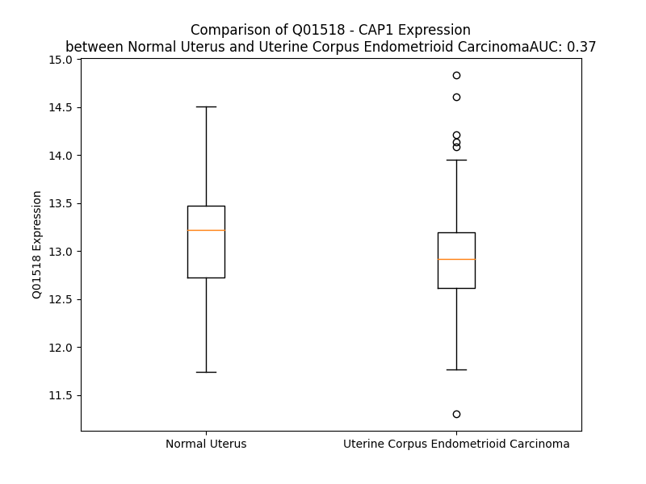

# Detailed Data for Q01518

## Introduction to the Detailed Summary

### How to Interpret the Results

- **Summary & Metrics**: This section provides a quick reference to essential protein attributes, including expression changes, family classification, and biomarker applications. Regulation status (upregulated/downregulated) indicates the protein's behavior in a disease context. Some information comes from the original excel file with the proteins selected from literature, while others are derived from the analyses.
- **Expression Comparison**: A visual representation comparing protein expression between normal and disease states. It highlights significant changes in expression levels that might indicate diagnostic or therapeutic relevance. This is data coming from transcriptomics experiments and could not translate similarly to protein levels.
- **Isoform Alignment**: An interactive view of isoform alignments, revealing structural and functional differences between variants of the protein.
- **Interactors & Homologs**: Tables listing known interaction partners and homologous proteins, the more interactors and homologs, the more complex the protein is to design an antibody for.
- **Biological Assemblies**: Information about the structural arrangement of the protein in different assemblies, providing insights into its functional state but also the complexity of the protein to develop antibodies.
- **Combined Per-Residue Information**: A detailed table summarizing residue-level data. This includes predictions for epitope regions, aggregation tendencies, and modifications that might impact the protein's function. Each row corresponds to a residue in the protein, providing insights into specific sites that may be important for research or drug development.
## Summary & Metrics

- **UniProt Accession**: Q01518
- **Gene Name**: CAP1
- **Protein Name**: CAP, adenylate cyclase-associated protein 1 (yeast)
- **Swiss Prot**: CAP1_HUMAN
- **Family**: other
- **Biomarker Application**:  
- **Number of Isoforms**: 2
- **Regulation**: 1
- **(transcriptomics) AUC**: 0.37
- **(transcriptomics) Fold Change**: 1.02
- **(transcriptomics) Regulation**: Downregulated
- **Discotope Epitope Count**: 125
- **Max n_uniprots (Homo)**: 2
- **Max n_uniprots (Hetero)**: N/A

## Expression Comparison

## Isoform Alignment

<pre style='font-size:14px; font-family:monospace;'>Q01518-1 MADMQNLVERLERAVGRLEAVSHTSDMHRGYADSPSKAGAAPYVQAFDSLLAGPVAEYLKISKEIGGDVQKHAEMVHTGLKLERALLVTASQCQQPAENKLSDLLAPISEQIKEVITFREKNRGSKLFNHLSAVSESIQALGWVAMAPKPGPYVKEMNDAAMFYTNRVLKEYKDVDKKHVDWVKAYLSIWTELQAYIKEFHTTGLAWSKTGPVAKELSGLPSGPSAGSCPPPPPPCPPPPPVSTISCSYESASRSSLFAQINQGESITHALKHVSDDMKTHKNPALKAQSGPVRSGPKPFSAPKPQTSPSPKRATKKEPAVLELEGKKWRVENQENVSNLVIEDTELKQVAYIYKCVNTTLQIKGKINSITVDNCKKLGLVFDDVVGIVEIINSKDVKVQVMGKVPTISINKTDGCHAYLSKNSLDCEIVSAKSSEMNVLIPTEGGDFNEFPVPEQFKTLWNGQKLVTTVTEIAG
Q01518-2 MADMQNLVERLERAVGRLEAVSHTSDMHRGYADSPSK-GAAPYVQAFDSLLAGPVAEYLKISKEIGGDVQKHAEMVHTGLKLERALLVTASQCQQPAENKLSDLLAPISEQIKEVITFREKNRGSKLFNHLSAVSESIQALGWVAMAPKPGPYVKEMNDAAMFYTNRVLKEYKDVDKKHVDWVKAYLSIWTELQAYIKEFHTTGLAWSKTGPVAKELSGLPSGPSAGSCPPPPPPCPPPPPVSTISCSYESASRSSLFAQINQGESITHALKHVSDDMKTHKNPALKAQSGPVRSGPKPFSAPKPQTSPSPKRATKKEPAVLELEGKKWRVENQENVSNLVIEDTELKQVAYIYKCVNTTLQIKGKINSITVDNCKKLGLVFDDVVGIVEIINSKDVKVQVMGKVPTISINKTDGCHAYLSKNSLDCEIVSAKSSEMNVLIPTEGGDFNEFPVPEQFKTLWNGQKLVTTVTEIAG
</pre>

## Interactors

| preferredName_A   | preferredName_B   |   score |
|:------------------|:------------------|--------:|
| CAP1              | CFL1              |   0.978 |
| CAP1              | RETN              |   0.963 |
| CAP1              | ACTA1             |   0.957 |
| CAP1              | RETNLB            |   0.937 |
| CAP1              | TWF2              |   0.918 |
| CAP1              | TWF1              |   0.912 |
| CAP1              | PFN1              |   0.909 |

## Homologs

| uniprot_id   | gene_id   |
|:-------------|:----------|
| P40123       | CAP2      |

## Biological Assemblies

|   Unnamed: 0 |   assembly |   n_uniprots | composition   | crystal_id   |
|-------------:|-----------:|-------------:|:--------------|:-------------|
|            0 |          1 |            2 | Homo          | 1k8f         |
|            1 |          2 |            2 | Homo          | 1k8f         |

## Combined Per-Residue Information

|   res | aa   |   epitope_score | epitope   |   relative_surface_accessibility |   modeling_confidence |   Aggregation | modification     |
|------:|:-----|----------------:|:----------|---------------------------------:|----------------------:|--------------:|:-----------------|
|     1 | M    |         0.07761 | False     |                          1.0974  |                 50.06 |         0     | N/A              |
|     2 | A    |         0.09978 | False     |                          0.74822 |                 61.9  |         0     | N-acetylalanine  |
|     3 | D    |         0.08244 | False     |                          0.71459 |                 69.85 |         0     | N/A              |
|     4 | M    |         0.12338 | False     |                          0.7624  |                 68.57 |         0     | N/A              |
|     5 | Q    |         0.0935  | False     |                          0.64256 |                 75.55 |         0     | N/A              |
|     6 | N    |         0.06362 | False     |                          0.55233 |                 82.33 |         0     | N/A              |
|     7 | L    |         0.04116 | False     |                          0.63627 |                 81.72 |         0     | N/A              |
|     8 | V    |         0.08006 | False     |                          0.57124 |                 82.91 |         0     | N/A              |
|     9 | E    |         0.04573 | False     |                          0.51158 |                 84.08 |         0     | N/A              |
|    10 | R    |         0.04337 | False     |                          0.67794 |                 86.89 |         0     | N/A              |
|    11 | L    |         0.11504 | False     |                          0.68669 |                 83.51 |         0     | N/A              |
|    12 | E    |         0.07001 | False     |                          0.57341 |                 83.99 |         0     | N/A              |
|    13 | R    |         0.05537 | False     |                          0.65014 |                 82.42 |         0     | N/A              |
|    14 | A    |         0.03328 | False     |                          0.54122 |                 75.92 |         0     | N/A              |
|    15 | V    |         0.04204 | False     |                          0.49889 |                 79.13 |         0     | N/A              |
|    16 | G    |         0.04357 | False     |                          0.43435 |                 74.76 |         0     | N/A              |
|    17 | R    |         0.03563 | False     |                          0.55674 |                 77.18 |         0     | N/A              |
|    18 | L    |         0.07602 | False     |                          0.79037 |                 67.53 |         0     | N/A              |
|    19 | E    |         0.07737 | False     |                          0.46997 |                 72.22 |         0     | N/A              |
|    20 | A    |         0.03012 | False     |                          0.61037 |                 64.92 |         0     | N/A              |
|    21 | V    |         0.05725 | False     |                          0.69563 |                 60.89 |         0     | N/A              |
|    22 | S    |         0.05203 | False     |                          0.50394 |                 50.12 |         0     | N/A              |
|    23 | H    |         0.09471 | False     |                          0.80636 |                 47.61 |         0     | N/A              |
|    24 | T    |         0.07853 | False     |                          0.67822 |                 46.65 |         0     | N/A              |
|    25 | S    |         0.12547 | False     |                          0.73057 |                 40.33 |         0     | N/A              |
|    26 | D    |         0.15708 | True      |                          0.72564 |                 34.45 |         0     | N/A              |
|    27 | M    |         0.13388 | False     |                          0.9448  |                 33.42 |         0     | N/A              |
|    28 | H    |         0.17266 | True      |                          0.91286 |                 28.14 |         0     | N/A              |
|    29 | R    |         0.17433 | True      |                          0.94425 |                 26.45 |         0     | N/A              |
|    30 | G    |         0.20636 | True      |                          0.93047 |                 26.3  |         0     | N/A              |
|    31 | Y    |         0.14849 | False     |                          1.05555 |                 26.38 |         0     | Phosphotyrosine  |
|    32 | A    |         0.16741 | True      |                          0.94834 |                 29.55 |         0     | N/A              |
|    33 | D    |         0.12657 | False     |                          0.92638 |                 28.03 |         0     | N/A              |
|    34 | S    |         0.14978 | False     |                          0.75121 |                 30    |         0     | Phosphoserine    |
|    35 | P    |         0.11786 | False     |                          0.95268 |                 37.54 |         0     | N/A              |
|    36 | S    |         0.11025 | False     |                          0.7493  |                 33.56 |         0     | N/A              |
|    37 | K    |         0.08667 | False     |                          0.96131 |                 38.1  |         0     | N/A              |
|    38 | A    |         0.06145 | False     |                          0.97104 |                 35.36 |         0     | N/A              |
|    39 | G    |         0.14842 | False     |                          0.95667 |                 51.2  |         0     | N/A              |
|    40 | A    |         0.07909 | False     |                          0.33073 |                 68.86 |         0     | N/A              |
|    41 | A    |         0.04889 | False     |                          0.20956 |                 85.63 |         0     | N/A              |
|    42 | P    |         0.06214 | False     |                          0.71115 |                 89.32 |         0     | N/A              |
|    43 | Y    |         0.02687 | False     |                          0.11727 |                 91.35 |         0.374 | N/A              |
|    44 | V    |         0.00424 | False     |                          0.00476 |                 93.33 |         0.374 | N/A              |
|    45 | Q    |         0.03916 | False     |                          0.3887  |                 93.14 |         0.374 | N/A              |
|    46 | A    |         0.02041 | False     |                          0.29951 |                 93.67 |         0.374 | N/A              |
|    47 | F    |         0.00254 | False     |                          0       |                 95.67 |         0.374 | N/A              |
|    48 | D    |         0.03611 | False     |                          0.23705 |                 95.46 |         0     | N/A              |
|    49 | S    |         0.05095 | False     |                          0.55062 |                 95.27 |         0     | N/A              |
|    50 | L    |         0.02809 | False     |                          0.06184 |                 95.36 |         0     | N/A              |
|    51 | L    |         0.03295 | False     |                          0.15617 |                 96.3  |         0     | N/A              |
|    52 | A    |         0.07163 | False     |                          0.74899 |                 95.63 |         0     | N/A              |
|    53 | G    |         0.14576 | False     |                          0.39179 |                 95.49 |         0     | N/A              |
|    54 | P    |         0.04739 | False     |                          0.19485 |                 95.77 |         0     | N/A              |
|    55 | V    |         0.00666 | False     |                          0.00286 |                 96.93 |         0     | N/A              |
|    56 | A    |         0.03915 | False     |                          0.3982  |                 97.19 |         0     | N/A              |
|    57 | E    |         0.07141 | False     |                          0.39178 |                 97.22 |         0     | N/A              |
|    58 | Y    |         0.00562 | False     |                          0.00458 |                 97.9  |         0     | N/A              |
|    59 | L    |         0.0403  | False     |                          0.22022 |                 97.62 |         0     | N/A              |
|    60 | K    |         0.11146 | False     |                          0.57942 |                 97.97 |         0     | N/A              |
|    61 | I    |         0.05725 | False     |                          0.0824  |                 97.5  |         0     | N/A              |
|    62 | S    |         0.00413 | False     |                          0.00208 |                 97.55 |         0     | N/A              |
|    63 | K    |         0.11449 | False     |                          0.70755 |                 97.12 |         0     | N/A              |
|    64 | E    |         0.1599  | True      |                          0.44345 |                 96.42 |         0     | N/A              |
|    65 | I    |         0.08843 | False     |                          0.18993 |                 96.11 |         0     | N/A              |
|    66 | G    |         0.06953 | False     |                          0.15747 |                 94.21 |         0     | N/A              |
|    67 | G    |         0.10883 | False     |                          0.62839 |                 94.39 |         0     | N/A              |
|    68 | D    |         0.06429 | False     |                          0.19716 |                 95.14 |         0     | N/A              |
|    69 | V    |         0.005   | False     |                          0.01118 |                 97.06 |         0     | N/A              |
|    70 | Q    |         0.04185 | False     |                          0.28114 |                 97.42 |         0     | N/A              |
|    71 | K    |         0.12893 | False     |                          0.56974 |                 96.77 |         0     | N/A              |
|    72 | H    |         0.00691 | False     |                          0.00788 |                 96.57 |         0     | N/A              |
|    73 | A    |         0.00447 | False     |                          0.00383 |                 97.51 |         0     | N/A              |
|    74 | E    |         0.07251 | False     |                          0.44795 |                 97.82 |         0     | N/A              |
|    75 | M    |         0.06408 | False     |                          0.12868 |                 97.86 |         0     | N/A              |
|    76 | V    |         0.00245 | False     |                          0.00286 |                 97.36 |         0     | N/A              |
|    77 | H    |         0.04739 | False     |                          0.24864 |                 97.51 |         0     | N/A              |
|    78 | T    |         0.0849  | False     |                          0.43421 |                 97.6  |         0     | N/A              |
|    79 | G    |         0.00237 | False     |                          0       |                 96.73 |         0     | N/A              |
|    80 | L    |         0.00501 | False     |                          0       |                 97.09 |         0     | N/A              |
|    81 | K    |         0.07323 | False     |                          0.53868 |                 96.62 |         0     | N6-acetyllysine  |
|    82 | L    |         0.06336 | False     |                          0.32304 |                 96.04 |         0     | N/A              |
|    83 | E    |         0.00163 | False     |                          0       |                 94.33 |         0     | N/A              |
|    84 | R    |         0.05882 | False     |                          0.30836 |                 95.47 |         0     | N/A              |
|    85 | A    |         0.05441 | False     |                          0.51077 |                 93.7  |        36.166 | N/A              |
|    86 | L    |         0.01858 | False     |                          0.03994 |                 93.42 |        39.022 | N/A              |
|    87 | L    |         0.00189 | False     |                          0       |                 93.64 |        39.166 | N/A              |
|    88 | V    |         0.02365 | False     |                          0.29229 |                 93.04 |        39.166 | N/A              |
|    89 | T    |         0.03889 | False     |                          0.25624 |                 89.61 |        39.166 | N/A              |
|    90 | A    |         0.00226 | False     |                          0       |                 90.62 |        20.554 | N/A              |
|    91 | S    |         0.03735 | False     |                          0.21234 |                 90.74 |         2.32  | N/A              |
|    92 | Q    |         0.08909 | False     |                          0.55835 |                 88.37 |         0     | N/A              |
|    93 | C    |         0.03892 | False     |                          0.0131  |                 88.06 |         0     | N/A              |
|    94 | Q    |         0.09293 | False     |                          0.35262 |                 86.23 |         0     | N/A              |
|    95 | Q    |         0.06795 | False     |                          0.54667 |                 85.81 |         0     | N/A              |
|    96 | P    |         0.02611 | False     |                          0.04716 |                 84.05 |         0     | N/A              |
|    97 | A    |         0.14997 | False     |                          0.62744 |                 81.5  |         0     | N/A              |
|    98 | E    |         0.15608 | True      |                          0.79234 |                 76.43 |         0     | N/A              |
|    99 | N    |         0.19059 | True      |                          0.64862 |                 76.85 |         0     | N/A              |
|   100 | K    |         0.11958 | False     |                          0.43122 |                 80.32 |         0     | N/A              |
|   101 | L    |         0.03366 | False     |                          0.17888 |                 84.13 |         0     | N/A              |
|   102 | S    |         0.08413 | False     |                          0.48642 |                 86.75 |         0     | N/A              |
|   103 | D    |         0.10253 | False     |                          0.50135 |                 88.09 |         0     | N/A              |
|   104 | L    |         0.05946 | False     |                          0.33697 |                 87.4  |         0     | N/A              |
|   105 | L    |         0.0293  | False     |                          0.1286  |                 91.74 |         0     | N/A              |
|   106 | A    |         0.10143 | False     |                          0.36477 |                 92.77 |         0     | N/A              |
|   107 | P    |         0.07317 | False     |                          0.42577 |                 94.77 |         0     | N/A              |
|   108 | I    |         0.01994 | False     |                          0.028   |                 94.64 |         0     | N/A              |
|   109 | S    |         0.07646 | False     |                          0.35627 |                 95.11 |         0     | N/A              |
|   110 | E    |         0.144   | False     |                          0.58668 |                 96.66 |         0     | N/A              |
|   111 | Q    |         0.03075 | False     |                          0.0792  |                 97.49 |         0     | N/A              |
|   112 | I    |         0.05243 | False     |                          0.13279 |                 96.83 |         1.829 | N/A              |
|   113 | K    |         0.10439 | False     |                          0.65208 |                 97.22 |         2.203 | N/A              |
|   114 | E    |         0.2115  | True      |                          0.48258 |                 97.48 |         2.203 | N/A              |
|   115 | V    |         0.00194 | False     |                          0       |                 97.39 |         2.203 | N/A              |
|   116 | I    |         0.07734 | False     |                          0.33919 |                 97.2  |         2.203 | N/A              |
|   117 | T    |         0.12261 | False     |                          0.40565 |                 97.35 |         2.203 | N/A              |
|   118 | F    |         0.0949  | False     |                          0.17621 |                 97.51 |         1.869 | N/A              |
|   119 | R    |         0.08688 | False     |                          0.13908 |                 96.52 |         0     | N/A              |
|   120 | E    |         0.14916 | False     |                          0.29743 |                 95.08 |         0     | N/A              |
|   121 | K    |         0.18321 | True      |                          0.79543 |                 96.34 |         0     | N/A              |
|   122 | N    |         0.10385 | False     |                          0.23458 |                 95.47 |         0     | N/A              |
|   123 | R    |         0.26794 | True      |                          0.67359 |                 92.85 |         0     | N/A              |
|   124 | G    |         0.23789 | True      |                          0.97842 |                 92.08 |         0     | N/A              |
|   125 | S    |         0.05507 | False     |                          0.18815 |                 92.94 |         0     | N/A              |
|   126 | K    |         0.1858  | True      |                          0.9395  |                 93.49 |         0     | N/A              |
|   127 | L    |         0.03851 | False     |                          0.17229 |                 95.41 |         0     | N/A              |
|   128 | F    |         0.06608 | False     |                          0.26397 |                 97.17 |         0     | N/A              |
|   129 | N    |         0.04104 | False     |                          0.19852 |                 97.56 |         0     | N/A              |
|   130 | H    |         0.00896 | False     |                          0.01064 |                 98.11 |         0     | N/A              |
|   131 | L    |         0.00541 | False     |                          0.0033  |                 97.79 |         0     | N/A              |
|   132 | S    |         0.00873 | False     |                          0       |                 97.76 |         0     | N/A              |
|   133 | A    |         0.00103 | False     |                          0       |                 97.64 |         0     | N/A              |
|   134 | V    |         0.00237 | False     |                          0.00571 |                 97.87 |         0     | N/A              |
|   135 | S    |         0.01333 | False     |                          0.04284 |                 97.49 |         0     | N/A              |
|   136 | E    |         0.04384 | False     |                          0.31177 |                 95.93 |         0     | N/A              |
|   137 | S    |         0.00187 | False     |                          0       |                 97.1  |         0     | N/A              |
|   138 | I    |         0.00265 | False     |                          0       |                 97.52 |         0.521 | N/A              |
|   139 | Q    |         0.0436  | False     |                          0.4111  |                 96.35 |         0.521 | N/A              |
|   140 | A    |         0.0024  | False     |                          0       |                 96.71 |         3.855 | N/A              |
|   141 | L    |         0.00249 | False     |                          0.00082 |                 96.19 |         6.413 | N/A              |
|   142 | G    |         0.03798 | False     |                          0.20419 |                 94.88 |         6.663 | N/A              |
|   143 | W    |         0.00352 | False     |                          0       |                 96.53 |         6.663 | N/A              |
|   144 | V    |         0.01153 | False     |                          0.04951 |                 93.89 |         6.663 | N/A              |
|   145 | A    |         0.04169 | False     |                          0.52361 |                 91.96 |         5.291 | N/A              |
|   146 | M    |         0.09135 | False     |                          0.40218 |                 90.57 |         2.937 | N/A              |
|   147 | A    |         0.18765 | True      |                          0.71309 |                 87.95 |         0     | N/A              |
|   148 | P    |         0.26606 | True      |                          0.67926 |                 90.64 |         0     | N/A              |
|   149 | K    |         0.17172 | True      |                          0.68288 |                 92.5  |         0     | N/A              |
|   150 | P    |         0.00201 | False     |                          0       |                 94.18 |         0     | N/A              |
|   151 | G    |         0.02565 | False     |                          0.0768  |                 93.75 |         0     | N/A              |
|   152 | P    |         0.1275  | False     |                          0.48956 |                 94.55 |         0     | N/A              |
|   153 | Y    |         0.10321 | False     |                          0.17413 |                 96.71 |         0     | N/A              |
|   154 | V    |         0.00275 | False     |                          0.0019  |                 96.98 |         0     | N/A              |
|   155 | K    |         0.07738 | False     |                          0.53213 |                 95.92 |         0     | N/A              |
|   156 | E    |         0.1152  | False     |                          0.54262 |                 95.92 |         0     | N/A              |
|   157 | M    |         0.05921 | False     |                          0.17988 |                 96.07 |         0     | N/A              |
|   158 | N    |         0.0403  | False     |                          0.11992 |                 95.53 |         0     | N/A              |
|   159 | D    |         0.07783 | False     |                          0.45559 |                 94.79 |         0     | N/A              |
|   160 | A    |         0.04627 | False     |                          0.39516 |                 94.04 |         4.039 | N/A              |
|   161 | A    |         0.00326 | False     |                          0       |                 95.99 |         7.965 | N/A              |
|   162 | M    |         0.16332 | True      |                          0.38153 |                 95.04 |         7.965 | N/A              |
|   163 | F    |         0.11354 | False     |                          0.60252 |                 95.88 |         7.965 | N/A              |
|   164 | Y    |         0.08529 | False     |                          0.15743 |                 97.64 |         7.965 | N/A              |
|   165 | T    |         0.00737 | False     |                          0.00145 |                 97.75 |         7.247 | N/A              |
|   166 | N    |         0.1259  | False     |                          0.4781  |                 97.53 |         0.272 | N/A              |
|   167 | R    |         0.10886 | False     |                          0.4602  |                 97.68 |         0     | N/A              |
|   168 | V    |         0.00658 | False     |                          0       |                 97.52 |         0     | N/A              |
|   169 | L    |         0.08367 | False     |                          0.32754 |                 97.34 |         0     | N/A              |
|   170 | K    |         0.23548 | True      |                          0.80587 |                 97.02 |         0     | N/A              |
|   171 | E    |         0.15412 | True      |                          0.44575 |                 94.98 |         0     | N/A              |
|   172 | Y    |         0.08078 | False     |                          0.13085 |                 95.91 |         0     | N/A              |
|   173 | K    |         0.21436 | True      |                          0.66715 |                 91.96 |         0     | N/A              |
|   174 | D    |         0.24037 | True      |                          0.72869 |                 93    |         0     | N/A              |
|   175 | V    |         0.33258 | True      |                          0.80613 |                 93.26 |         0     | N/A              |
|   176 | D    |         0.23634 | True      |                          0.31511 |                 93.58 |         0     | N/A              |
|   177 | K    |         0.1851  | True      |                          0.72112 |                 95.4  |         0     | N/A              |
|   178 | K    |         0.1308  | False     |                          0.43306 |                 96.61 |         0     | N/A              |
|   179 | H    |         0.03649 | False     |                          0.07493 |                 97.43 |         0     | N/A              |
|   180 | V    |         0.05162 | False     |                          0.159   |                 97.23 |        15.349 | N/A              |
|   181 | D    |         0.08224 | False     |                          0.25697 |                 97.41 |        15.708 | N/A              |
|   182 | W    |         0.00797 | False     |                          0.00442 |                 98.4  |        21.784 | N/A              |
|   183 | V    |         0.01164 | False     |                          0.01333 |                 97.97 |        23.209 | N/A              |
|   184 | K    |         0.14065 | False     |                          0.60382 |                 97.4  |        23.448 | N/A              |
|   185 | A    |         0.02071 | False     |                          0.08728 |                 97.65 |        41.697 | N/A              |
|   186 | Y    |         0.00321 | False     |                          0       |                 97.99 |        63.078 | N/A              |
|   187 | L    |         0.05786 | False     |                          0.17971 |                 97.06 |        63.221 | N/A              |
|   188 | S    |         0.03155 | False     |                          0.31221 |                 97.06 |        62.945 | N/A              |
|   189 | I    |         0.00408 | False     |                          0       |                 97.67 |        62.945 | N/A              |
|   190 | W    |         0.00912 | False     |                          0.0049  |                 97.13 |        62.403 | N/A              |
|   191 | T    |         0.08877 | False     |                          0.58009 |                 96.77 |        28.526 | N/A              |
|   192 | E    |         0.02963 | False     |                          0.23202 |                 96.79 |         8.26  | N/A              |
|   193 | L    |         0.00107 | False     |                          0       |                 97.11 |         8.379 | N/A              |
|   194 | Q    |         0.03601 | False     |                          0.28218 |                 96.05 |         7.64  | N/A              |
|   195 | A    |         0.08185 | False     |                          0.47243 |                 95.13 |         7.64  | N/A              |
|   196 | Y    |         0.04573 | False     |                          0.05343 |                 96.17 |         7.64  | N/A              |
|   197 | I    |         0.01395 | False     |                          0.0016  |                 95.27 |         6.307 | N/A              |
|   198 | K    |         0.1554  | True      |                          0.75514 |                 93.61 |         0.52  | N/A              |
|   199 | E    |         0.15768 | True      |                          0.65728 |                 93.18 |         0     | N/A              |
|   200 | F    |         0.07669 | False     |                          0.28604 |                 93.55 |         0     | N/A              |
|   201 | H    |         0.02519 | False     |                          0.01102 |                 93.6  |         0     | N/A              |
|   202 | T    |         0.10625 | False     |                          0.58435 |                 90.45 |         0     | N/A              |
|   203 | T    |         0.13578 | False     |                          0.69955 |                 91.02 |         0     | N/A              |
|   204 | G    |         0.03141 | False     |                          0.16188 |                 90.94 |         0     | N/A              |
|   205 | L    |         0.02465 | False     |                          0.12213 |                 91.26 |         0     | N/A              |
|   206 | A    |         0.07508 | False     |                          0.35893 |                 89.43 |         0     | N/A              |
|   207 | W    |         0.07763 | False     |                          0.16007 |                 90.59 |         0     | N/A              |
|   208 | S    |         0.06184 | False     |                          0.20536 |                 86.26 |         0     | N/A              |
|   209 | K    |         0.21949 | True      |                          0.95419 |                 82.5  |         0     | N/A              |
|   210 | T    |         0.22509 | True      |                          0.7371  |                 74.7  |         0     | N/A              |
|   211 | G    |         0.11514 | False     |                          0.46581 |                 75.41 |         0     | N/A              |
|   212 | P    |         0.11935 | False     |                          0.43414 |                 81.04 |         0     | N/A              |
|   213 | V    |         0.15064 | False     |                          0.41813 |                 81.81 |         0     | N/A              |
|   214 | A    |         0.07358 | False     |                          0.13755 |                 73.05 |         0     | N/A              |
|   215 | K    |         0.15063 | False     |                          0.36614 |                 65.84 |         0     | N/A              |
|   216 | E    |         0.38009 | True      |                          0.69443 |                 50.04 |         0     | N/A              |
|   217 | L    |         0.30647 | True      |                          0.76997 |                 41.46 |         0     | N/A              |
|   218 | S    |         0.23773 | True      |                          0.89268 |                 37.33 |         0     | N/A              |
|   219 | G    |         0.20747 | True      |                          0.72462 |                 30.53 |         0     | N/A              |
|   220 | L    |         0.19467 | True      |                          1.0261  |                 28.86 |         0     | N/A              |
|   221 | P    |         0.15682 | True      |                          0.97965 |                 35.33 |         0     | N/A              |
|   222 | S    |         0.18447 | True      |                          0.84292 |                 28.27 |         0     | N/A              |
|   223 | G    |         0.3287  | True      |                          0.82988 |                 28.14 |         0     | N/A              |
|   224 | P    |         0.23394 | True      |                          0.96222 |                 32.9  |         0     | N/A              |
|   225 | S    |         0.23348 | True      |                          0.79274 |                 26.19 |         0     | N/A              |
|   226 | A    |         0.23759 | True      |                          0.98099 |                 27.38 |         0     | N/A              |
|   227 | G    |         0.29643 | True      |                          0.83571 |                 28.59 |         0     | N/A              |
|   228 | S    |         0.24018 | True      |                          0.81756 |                 29.65 |         0     | N/A              |
|   229 | C    |         0.11234 | False     |                          0.97251 |                 23.09 |         0     | N/A              |
|   230 | P    |         0.14687 | False     |                          0.85071 |                 34.22 |         0     | N/A              |
|   231 | P    |         0.19728 | True      |                          0.86121 |                 33.32 |         0     | N/A              |
|   232 | P    |         0.15215 | True      |                          0.9168  |                 33.35 |         0     | N/A              |
|   233 | P    |         0.16697 | True      |                          0.86703 |                 36.8  |         0     | N/A              |
|   234 | P    |         0.17104 | True      |                          0.86425 |                 39.94 |         0     | N/A              |
|   235 | P    |         0.17911 | True      |                          0.99053 |                 40.34 |         0     | N/A              |
|   236 | C    |         0.14894 | False     |                          0.88386 |                 36.71 |         0     | N/A              |
|   237 | P    |         0.17996 | True      |                          0.87116 |                 36.91 |         0     | N/A              |
|   238 | P    |         0.14627 | False     |                          0.92544 |                 38.8  |         0     | N/A              |
|   239 | P    |         0.10818 | False     |                          0.89575 |                 35.68 |         0     | N/A              |
|   240 | P    |         0.1071  | False     |                          0.90984 |                 33.15 |         0     | N/A              |
|   241 | P    |         0.1012  | False     |                          0.93392 |                 42.33 |         0     | N/A              |
|   242 | V    |         0.0864  | False     |                          1.07433 |                 39.27 |         0     | N/A              |
|   243 | S    |         0.13318 | False     |                          0.79491 |                 29.53 |         0     | N/A              |
|   244 | T    |         0.10366 | False     |                          1.01109 |                 34.41 |         0     | N/A              |
|   245 | I    |         0.11941 | False     |                          0.97656 |                 30.95 |         0     | N/A              |
|   246 | S    |         0.12385 | False     |                          0.86014 |                 34.77 |         0     | N/A              |
|   247 | C    |         0.07196 | False     |                          0.91459 |                 27.55 |         0     | N/A              |
|   248 | S    |         0.13378 | False     |                          0.5361  |                 40.2  |         0     | N/A              |
|   249 | Y    |         0.12224 | False     |                          0.88002 |                 53.6  |         0     | N/A              |
|   250 | E    |         0.11139 | False     |                          0.70809 |                 49.19 |         0     | N/A              |
|   251 | S    |         0.04857 | False     |                          0.60017 |                 55.51 |         0     | N/A              |
|   252 | A    |         0.02536 | False     |                          0.4982  |                 60.75 |         0     | N/A              |
|   253 | S    |         0.05179 | False     |                          0.45476 |                 74.54 |         0     | N/A              |
|   254 | R    |         0.08917 | False     |                          0.66273 |                 77.14 |         0     | N/A              |
|   255 | S    |         0.07135 | False     |                          0.552   |                 79.57 |         0     | N/A              |
|   256 | S    |         0.05131 | False     |                          0.51255 |                 82.07 |         0     | N/A              |
|   257 | L    |         0.07099 | False     |                          0.60367 |                 81.84 |         1.483 | N/A              |
|   258 | F    |         0.09511 | False     |                          0.60155 |                 84.1  |         1.483 | N/A              |
|   259 | A    |         0.04605 | False     |                          0.62684 |                 81.38 |         1.483 | N/A              |
|   260 | Q    |         0.06733 | False     |                          0.57782 |                 77.94 |         1.483 | N/A              |
|   261 | I    |         0.08034 | False     |                          0.5981  |                 79.5  |         1.483 | N/A              |
|   262 | N    |         0.10789 | False     |                          0.77948 |                 78.42 |         0     | N/A              |
|   263 | Q    |         0.12406 | False     |                          0.45877 |                 74.33 |         0     | N/A              |
|   264 | G    |         0.17512 | True      |                          0.63327 |                 73.65 |         0     | N/A              |
|   265 | E    |         0.22022 | True      |                          0.84458 |                 79.89 |         0     | N/A              |
|   266 | S    |         0.14872 | False     |                          0.49922 |                 77.51 |         0     | N/A              |
|   267 | I    |         0.11052 | False     |                          0.41936 |                 77.47 |         0     | N/A              |
|   268 | T    |         0.12913 | False     |                          0.57419 |                 75.7  |         0     | N/A              |
|   269 | H    |         0.18833 | True      |                          0.90142 |                 78.3  |         0     | N/A              |
|   270 | A    |         0.10209 | False     |                          0.82259 |                 78.06 |         0     | N/A              |
|   271 | L    |         0.1673  | True      |                          0.78057 |                 75.84 |         0     | N/A              |
|   272 | K    |         0.18114 | True      |                          0.95771 |                 79.11 |         0     | N/A              |
|   273 | H    |         0.19639 | True      |                          0.87047 |                 78.2  |         0     | N/A              |
|   274 | V    |         0.09047 | False     |                          0.54456 |                 79.79 |         0     | N/A              |
|   275 | S    |         0.15606 | True      |                          0.31058 |                 80.9  |         0     | N/A              |
|   276 | D    |         0.10706 | False     |                          0.40781 |                 78.52 |         0     | N/A              |
|   277 | D    |         0.24728 | True      |                          0.54123 |                 78.09 |         0     | N/A              |
|   278 | M    |         0.13323 | False     |                          0.60698 |                 76.41 |         0     | N/A              |
|   279 | K    |         0.0923  | False     |                          0.33727 |                 80.65 |         0     | N/A              |
|   280 | T    |         0.15913 | True      |                          0.48922 |                 78.83 |         0     | N/A              |
|   281 | H    |         0.19515 | True      |                          0.72103 |                 78.41 |         0     | N/A              |
|   282 | K    |         0.21289 | True      |                          0.57069 |                 80.08 |         0     | N/A              |
|   283 | N    |         0.20862 | True      |                          0.27795 |                 73.81 |         0     | N/A              |
|   284 | P    |         0.16967 | True      |                          0.72557 |                 74.31 |         0     | N/A              |
|   285 | A    |         0.16885 | True      |                          0.76506 |                 74.21 |         0     | N/A              |
|   286 | L    |         0.11933 | False     |                          0.3915  |                 65.74 |         0     | N/A              |
|   287 | K    |         0.15609 | True      |                          0.54999 |                 62.39 |         0     | N6-methyllysine  |
|   288 | A    |         0.16284 | True      |                          0.9035  |                 60.18 |         0     | N/A              |
|   289 | Q    |         0.2446  | True      |                          0.84247 |                 53.99 |         0     | N/A              |
|   290 | S    |         0.18785 | True      |                          0.50318 |                 42.93 |         0     | Phosphoserine    |
|   291 | G    |         0.17653 | True      |                          0.67742 |                 43.32 |         0     | N/A              |
|   292 | P    |         0.13823 | False     |                          1.07544 |                 44.69 |         0     | N/A              |
|   293 | V    |         0.1083  | False     |                          0.78917 |                 45.02 |         0     | N/A              |
|   294 | R    |         0.19997 | True      |                          0.95081 |                 40.13 |         0     | N/A              |
|   295 | S    |         0.19473 | True      |                          0.79411 |                 43.13 |         0     | Phosphoserine    |
|   296 | G    |         0.19003 | True      |                          0.65632 |                 38.71 |         0     | N/A              |
|   297 | P    |         0.12174 | False     |                          1.04846 |                 37.87 |         0     | N/A              |
|   298 | K    |         0.25126 | True      |                          0.94007 |                 38.9  |         0     | N/A              |
|   299 | P    |         0.11796 | False     |                          0.91753 |                 38.95 |         0     | N/A              |
|   300 | F    |         0.21274 | True      |                          1.05248 |                 33.02 |         0     | N/A              |
|   301 | S    |         0.24278 | True      |                          0.88967 |                 40.83 |         0     | Phosphoserine    |
|   302 | A    |         0.30069 | True      |                          0.86998 |                 35.6  |         0     | N/A              |
|   303 | P    |         0.13234 | False     |                          0.97783 |                 35.41 |         0     | N/A              |
|   304 | K    |         0.33982 | True      |                          0.97556 |                 32.01 |         0     | N/A              |
|   305 | P    |         0.25114 | True      |                          0.82398 |                 33.01 |         0     | N/A              |
|   306 | Q    |         0.1218  | False     |                          0.83155 |                 26.94 |         0     | N/A              |
|   307 | T    |         0.29352 | True      |                          0.91602 |                 26.75 |         0     | Phosphothreonine |
|   308 | S    |         0.17446 | True      |                          0.76266 |                 32.83 |         0     | Phosphoserine    |
|   309 | P    |         0.19318 | True      |                          1.02579 |                 41.46 |         0     | N/A              |
|   310 | S    |         0.24712 | True      |                          0.74656 |                 34.13 |         0     | Phosphoserine    |
|   311 | P    |         0.16471 | True      |                          0.98955 |                 40.72 |         0     | N/A              |
|   312 | K    |         0.14917 | False     |                          0.98999 |                 39.51 |         0     | N/A              |
|   313 | R    |         0.22764 | True      |                          0.95893 |                 38.81 |         0     | N/A              |
|   314 | A    |         0.16365 | True      |                          0.81712 |                 40.99 |         0     | N/A              |
|   315 | T    |         0.17911 | True      |                          0.79737 |                 47.72 |         0     | N/A              |
|   316 | K    |         0.18151 | True      |                          1.03383 |                 46.29 |         0     | N/A              |
|   317 | K    |         0.22989 | True      |                          0.66245 |                 62.65 |         0     | N/A              |
|   318 | E    |         0.27135 | True      |                          0.46698 |                 79.54 |         0     | N/A              |
|   319 | P    |         0.18777 | True      |                          0.76743 |                 86.8  |         0     | N/A              |
|   320 | A    |         0.15762 | True      |                          0.62724 |                 90.76 |         0     | N/A              |
|   321 | V    |         0.10266 | False     |                          0.19327 |                 93.13 |         0     | N/A              |
|   322 | L    |         0.12427 | False     |                          0.4335  |                 94.56 |         0     | N/A              |
|   323 | E    |         0.19092 | True      |                          0.47283 |                 92.99 |         0     | N/A              |
|   324 | L    |         0.1434  | False     |                          0.42111 |                 93.85 |         0     | N/A              |
|   325 | E    |         0.17043 | True      |                          0.51437 |                 90.11 |         0     | N/A              |
|   326 | G    |         0.2045  | True      |                          0.78478 |                 92.32 |         0     | N/A              |
|   327 | K    |         0.12309 | False     |                          0.62392 |                 93.57 |         0     | N/A              |
|   328 | K    |         0.0842  | False     |                          0.38858 |                 96.57 |         0     | N/A              |
|   329 | W    |         0.04219 | False     |                          0.13599 |                 97.59 |         0     | N/A              |
|   330 | R    |         0.23923 | True      |                          0.25645 |                 97    |         0     | N/A              |
|   331 | V    |         0.00409 | False     |                          0.00095 |                 97.09 |         0     | N/A              |
|   332 | E    |         0.11489 | False     |                          0.09148 |                 96.75 |         0     | N/A              |
|   333 | N    |         0.0505  | False     |                          0.17462 |                 95.1  |         0     | N/A              |
|   334 | Q    |         0.07565 | False     |                          0.06215 |                 93.35 |         0     | N/A              |
|   335 | E    |         0.09064 | False     |                          0.37708 |                 93    |         0     | N/A              |
|   336 | N    |         0.11945 | False     |                          0.64323 |                 93.86 |         0     | N/A              |
|   337 | V    |         0.08247 | False     |                          0.29419 |                 91.88 |         0     | N/A              |
|   338 | S    |         0.12589 | False     |                          0.68452 |                 85.37 |         0     | N/A              |
|   339 | N    |         0.19519 | True      |                          0.7365  |                 88.69 |         0     | N/A              |
|   340 | L    |         0.067   | False     |                          0.13014 |                 92.85 |         0     | N/A              |
|   341 | V    |         0.09819 | False     |                          0.40626 |                 95.35 |         0     | N/A              |
|   342 | I    |         0.04477 | False     |                          0.0152  |                 95.51 |         0     | N/A              |
|   343 | E    |         0.1223  | False     |                          0.561   |                 89.42 |         0     | N/A              |
|   344 | D    |         0.1567  | True      |                          0.72307 |                 84.64 |         0     | N/A              |
|   345 | T    |         0.0521  | False     |                          0.1669  |                 92.11 |         0     | N/A              |
|   346 | E    |         0.17619 | True      |                          0.54692 |                 91.63 |         0     | N/A              |
|   347 | L    |         0.11091 | False     |                          0.62176 |                 91.2  |         0     | N/A              |
|   348 | K    |         0.15333 | True      |                          0.70932 |                 92.84 |         0     | N/A              |
|   349 | Q    |         0.03279 | False     |                          0.03391 |                 96.65 |         0.416 | N/A              |
|   350 | V    |         0.0453  | False     |                          0.30466 |                 97.41 |        11.049 | N/A              |
|   351 | A    |         0.00898 | False     |                          0.01697 |                 98.12 |        11.049 | N/A              |
|   352 | Y    |         0.1453  | False     |                          0.22562 |                 98.26 |        11.049 | N/A              |
|   353 | I    |         0.00352 | False     |                          0.0016  |                 98.28 |        11.049 | N/A              |
|   354 | Y    |         0.22016 | True      |                          0.25147 |                 97.94 |        11.049 | N/A              |
|   355 | K    |         0.14423 | False     |                          0.33689 |                 96.49 |         0     | N/A              |
|   356 | C    |         0.00321 | False     |                          0       |                 96.98 |         0     | N/A              |
|   357 | V    |         0.08918 | False     |                          0.38273 |                 96.06 |         0     | N/A              |
|   358 | N    |         0.08897 | False     |                          0.47489 |                 95.65 |         0     | N/A              |
|   359 | T    |         0.00609 | False     |                          0.01757 |                 96.19 |         0     | N/A              |
|   360 | T    |         0.03473 | False     |                          0.36918 |                 95.34 |         0     | N/A              |
|   361 | L    |         0.00195 | False     |                          0.00082 |                 97.5  |         0     | N/A              |
|   362 | Q    |         0.07984 | False     |                          0.33012 |                 97.4  |         0     | N/A              |
|   363 | I    |         0.00874 | False     |                          0.00577 |                 97.54 |         0     | N/A              |
|   364 | K    |         0.08245 | False     |                          0.35396 |                 96.24 |         0     | N/A              |
|   365 | G    |         0.03621 | False     |                          0.3958  |                 95.16 |         0     | N/A              |
|   366 | K    |         0.09452 | False     |                          0.46804 |                 96.14 |         0     | N/A              |
|   367 | I    |         0.01328 | False     |                          0.0048  |                 97.47 |         0.676 | N/A              |
|   368 | N    |         0.03849 | False     |                          0.37801 |                 97.33 |         0.676 | N/A              |
|   369 | S    |         0.09286 | False     |                          0.17434 |                 97.6  |         0.676 | N/A              |
|   370 | I    |         0.00363 | False     |                          0.00118 |                 98.47 |         0.676 | N/A              |
|   371 | T    |         0.07115 | False     |                          0.21568 |                 98.42 |         0.676 | N/A              |
|   372 | V    |         0.00154 | False     |                          0       |                 98.53 |         0.676 | N/A              |
|   373 | D    |         0.21114 | True      |                          0.16709 |                 98.17 |         0     | N/A              |
|   374 | N    |         0.13802 | False     |                          0.29102 |                 97.68 |         0     | N/A              |
|   375 | C    |         0.00421 | False     |                          0.00074 |                 97.85 |         0     | N/A              |
|   376 | K    |         0.12516 | False     |                          0.46789 |                 97.35 |         0     | N/A              |
|   377 | K    |         0.09073 | False     |                          0.61289 |                 96.65 |         0     | N/A              |
|   378 | L    |         0.00982 | False     |                          0.01012 |                 98.18 |        64.459 | N/A              |
|   379 | G    |         0.06018 | False     |                          0.20104 |                 97.73 |        64.459 | N/A              |
|   380 | L    |         0.00424 | False     |                          0.00588 |                 98.24 |        64.459 | N/A              |
|   381 | V    |         0.04694 | False     |                          0.23897 |                 97.83 |        64.459 | N/A              |
|   382 | F    |         0.01236 | False     |                          0.00686 |                 97.98 |        64.459 | N/A              |
|   383 | D    |         0.0433  | False     |                          0.27378 |                 96.75 |         0     | N/A              |
|   384 | D    |         0.08426 | False     |                          0.24569 |                 97.16 |         0     | N/A              |
|   385 | V    |         0.00654 | False     |                          0.02854 |                 98.07 |         4.711 | N/A              |
|   386 | V    |         0.07657 | False     |                          0.49173 |                 96.3  |         4.711 | N/A              |
|   387 | G    |         0.07308 | False     |                          0.35132 |                 95.63 |         4.711 | N/A              |
|   388 | I    |         0.16478 | True      |                          0.38318 |                 97.72 |         4.711 | N/A              |
|   389 | V    |         0.00197 | False     |                          0       |                 98.58 |         4.711 | N/A              |
|   390 | E    |         0.14741 | False     |                          0.24448 |                 98.22 |         0     | N/A              |
|   391 | I    |         0.00354 | False     |                          0       |                 98.59 |         0     | N/A              |
|   392 | I    |         0.2145  | True      |                          0.29919 |                 98.16 |         0     | N/A              |
|   393 | N    |         0.16052 | True      |                          0.34036 |                 97.71 |         0     | N/A              |
|   394 | S    |         0.03367 | False     |                          0.00642 |                 98.18 |         0     | N/A              |
|   395 | K    |         0.15628 | True      |                          0.49734 |                 97.72 |         0     | N/A              |
|   396 | D    |         0.07731 | False     |                          0.35277 |                 96.81 |         0     | N/A              |
|   397 | V    |         0.00263 | False     |                          0       |                 98.36 |         0     | N/A              |
|   398 | K    |         0.08283 | False     |                          0.48538 |                 98.11 |         0     | N/A              |
|   399 | V    |         0.00277 | False     |                          0.0007  |                 98.06 |         0     | N/A              |
|   400 | Q    |         0.07354 | False     |                          0.31249 |                 97.34 |         0     | N/A              |
|   401 | V    |         0.00884 | False     |                          0.02981 |                 97.74 |         0     | N/A              |
|   402 | M    |         0.07204 | False     |                          0.55687 |                 96.05 |         0     | N/A              |
|   403 | G    |         0.03488 | False     |                          0.15727 |                 95.53 |         0     | N/A              |
|   404 | K    |         0.11449 | False     |                          0.44708 |                 96.42 |         0     | N/A              |
|   405 | V    |         0.00364 | False     |                          0       |                 97.51 |         0     | N/A              |
|   406 | P    |         0.07523 | False     |                          0.3924  |                 97.39 |         0     | N/A              |
|   407 | T    |         0.08062 | False     |                          0.1812  |                 98.04 |         0     | N/A              |
|   408 | I    |         0.00209 | False     |                          0       |                 98.44 |         0     | N/A              |
|   409 | S    |         0.1544  | True      |                          0.0627  |                 98.19 |         0     | N/A              |
|   410 | I    |         0.01961 | False     |                          0.0112  |                 98.24 |         0     | N/A              |
|   411 | N    |         0.13758 | False     |                          0.25372 |                 97.71 |         0     | N/A              |
|   412 | K    |         0.16099 | True      |                          0.61949 |                 97.38 |         0     | N/A              |
|   413 | T    |         0.00744 | False     |                          0       |                 97.86 |         0     | N/A              |
|   414 | D    |         0.10693 | False     |                          0.35146 |                 96.41 |         0     | N/A              |
|   415 | G    |         0.08156 | False     |                          0.103   |                 94.45 |         0     | N/A              |
|   416 | C    |         0.00325 | False     |                          0.00222 |                 97.85 |         0.147 | N/A              |
|   417 | H    |         0.0793  | False     |                          0.27162 |                 97.81 |         0.147 | N/A              |
|   418 | A    |         0.00409 | False     |                          0.00383 |                 97.89 |         0.147 | N/A              |
|   419 | Y    |         0.08762 | False     |                          0.21524 |                 97.89 |         0.147 | N/A              |
|   420 | L    |         0.01112 | False     |                          0.04409 |                 97.34 |         0.147 | N/A              |
|   421 | S    |         0.03154 | False     |                          0.0936  |                 95.65 |         0     | N/A              |
|   422 | K    |         0.24484 | True      |                          0.65393 |                 93.89 |         0     | N/A              |
|   423 | N    |         0.1094  | False     |                          0.6318  |                 93.94 |         0     | N/A              |
|   424 | S    |         0.00602 | False     |                          0       |                 94.17 |         0     | N/A              |
|   425 | L    |         0.1188  | False     |                          0.62626 |                 94.34 |         0     | N/A              |
|   426 | D    |         0.13724 | False     |                          0.57293 |                 94.46 |         0     | N/A              |
|   427 | C    |         0.02102 | False     |                          0.11178 |                 96.63 |         0     | N/A              |
|   428 | E    |         0.09936 | False     |                          0.58592 |                 97.21 |         0     | N/A              |
|   429 | I    |         0.02962 | False     |                          0.28863 |                 96.58 |         0     | N/A              |
|   430 | V    |         0.10711 | False     |                          0.56172 |                 96.53 |         0     | N/A              |
|   431 | S    |         0.06363 | False     |                          0.31887 |                 95.52 |         0     | N/A              |
|   432 | A    |         0.27035 | True      |                          0.49603 |                 94.55 |         0     | N/A              |
|   433 | K    |         0.23977 | True      |                          0.9281  |                 93.75 |         0     | N/A              |
|   434 | S    |         0.08049 | False     |                          0.10476 |                 96.27 |         0     | N/A              |
|   435 | S    |         0.08251 | False     |                          0.27868 |                 94.68 |         0     | N/A              |
|   436 | E    |         0.13496 | False     |                          0.64287 |                 93.3  |         0     | N/A              |
|   437 | M    |         0.02398 | False     |                          0.02771 |                 95.81 |         0     | N/A              |
|   438 | N    |         0.08108 | False     |                          0.21232 |                 95.76 |         0     | N/A              |
|   439 | V    |         0.02689 | False     |                          0.11044 |                 97.1  |         0     | N/A              |
|   440 | L    |         0.06004 | False     |                          0.08573 |                 97.12 |         0     | N/A              |
|   441 | I    |         0.04862 | False     |                          0.28319 |                 96.16 |         0     | N/A              |
|   442 | P    |         0.11638 | False     |                          0.19882 |                 94.57 |         0     | N/A              |
|   443 | T    |         0.09919 | False     |                          0.28243 |                 91.62 |         0     | N/A              |
|   444 | E    |         0.28707 | True      |                          0.89229 |                 84.31 |         0     | N/A              |
|   445 | G    |         0.29698 | True      |                          0.86266 |                 82.88 |         0     | N/A              |
|   446 | G    |         0.17612 | True      |                          0.71343 |                 82.36 |         0     | N/A              |
|   447 | D    |         0.25442 | True      |                          0.63688 |                 91.97 |         0     | N/A              |
|   448 | F    |         0.16332 | True      |                          0.39947 |                 93.75 |         0     | N/A              |
|   449 | N    |         0.13773 | False     |                          0.48711 |                 94.5  |         0     | N/A              |
|   450 | E    |         0.1912  | True      |                          0.46747 |                 94.68 |         0     | N/A              |
|   451 | F    |         0.13221 | False     |                          0.54474 |                 94.21 |         0     | N/A              |
|   452 | P    |         0.12309 | False     |                          0.51494 |                 93.12 |         0     | N/A              |
|   453 | V    |         0.01833 | False     |                          0.19543 |                 93.47 |         0     | N/A              |
|   454 | P    |         0.05759 | False     |                          0.31577 |                 91.81 |         0     | N/A              |
|   455 | E    |         0.07135 | False     |                          0.48322 |                 88.73 |         0     | N/A              |
|   456 | Q    |         0.17105 | True      |                          0.52429 |                 89.02 |         0     | N/A              |
|   457 | F    |         0.11457 | False     |                          0.54481 |                 92.6  |         0     | N/A              |
|   458 | K    |         0.08901 | False     |                          0.5201  |                 93.49 |         0     | N/A              |
|   459 | T    |         0.25242 | True      |                          0.49383 |                 94.48 |         0     | N/A              |
|   460 | L    |         0.21332 | True      |                          0.59353 |                 94.16 |         0     | N/A              |
|   461 | W    |         0.26113 | True      |                          0.71576 |                 95.6  |         0     | N/A              |
|   462 | N    |         0.18809 | True      |                          0.53945 |                 92.09 |         0     | N/A              |
|   463 | G    |         0.2738  | True      |                          0.62504 |                 92.22 |         0     | N/A              |
|   464 | Q    |         0.24946 | True      |                          0.81375 |                 94.36 |         0     | N/A              |
|   465 | K    |         0.23318 | True      |                          0.63324 |                 92.94 |         0.119 | N/A              |
|   466 | L    |         0.17158 | True      |                          0.7409  |                 95.8  |        41.008 | N/A              |
|   467 | V    |         0.14805 | False     |                          0.39689 |                 94.95 |        43.84  | N/A              |
|   468 | T    |         0.16253 | True      |                          0.55409 |                 94.1  |        43.84  | N/A              |
|   469 | T    |         0.11636 | False     |                          0.52581 |                 92.84 |        43.84  | N/A              |
|   470 | V    |         0.08294 | False     |                          0.47198 |                 91.55 |        43.84  | N/A              |
|   471 | T    |         0.11308 | False     |                          0.19435 |                 85.24 |        18.204 | N/A              |
|   472 | E    |         0.15322 | True      |                          0.95713 |                 68.71 |         0.119 | N/A              |
|   473 | I    |         0.29905 | True      |                          0.93535 |                 62.13 |         0.119 | N/A              |
|   474 | A    |         0.11392 | False     |                          0.27275 |                 49.2  |         0.119 | N/A              |
|   475 | G    |         0.08665 | False     |                          1.31776 |                 43.56 |         0     | N/A              |

