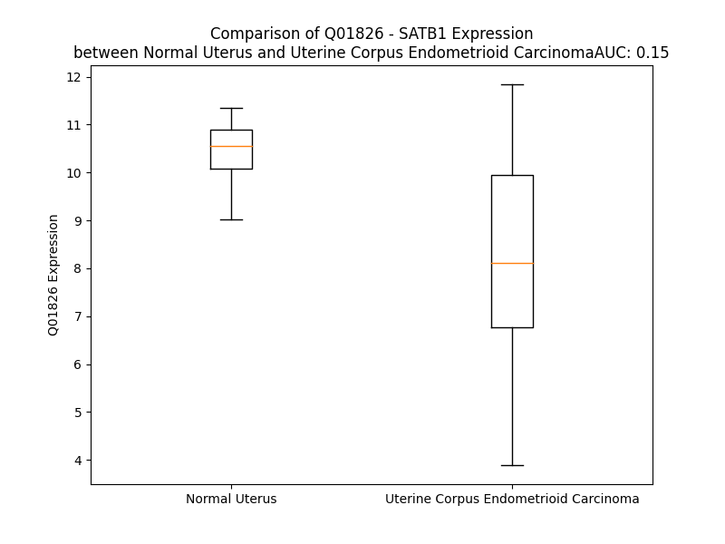

# Detailed Data for Q01826

## Introduction to the Detailed Summary

### How to Interpret the Results

- **Summary & Metrics**: This section provides a quick reference to essential protein attributes, including expression changes, family classification, and biomarker applications. Regulation status (upregulated/downregulated) indicates the protein's behavior in a disease context. Some information comes from the original excel file with the proteins selected from literature, while others are derived from the analyses.
- **Expression Comparison**: A visual representation comparing protein expression between normal and disease states. It highlights significant changes in expression levels that might indicate diagnostic or therapeutic relevance. This is data coming from transcriptomics experiments and could not translate similarly to protein levels.
- **Isoform Alignment**: An interactive view of isoform alignments, revealing structural and functional differences between variants of the protein.
- **Interactors & Homologs**: Tables listing known interaction partners and homologous proteins, the more interactors and homologs, the more complex the protein is to design an antibody for.
- **Biological Assemblies**: Information about the structural arrangement of the protein in different assemblies, providing insights into its functional state but also the complexity of the protein to develop antibodies.
- **Combined Per-Residue Information**: A detailed table summarizing residue-level data. This includes predictions for epitope regions, aggregation tendencies, and modifications that might impact the protein's function. Each row corresponds to a residue in the protein, providing insights into specific sites that may be important for research or drug development.
## Summary & Metrics

- **UniProt Accession**: Q01826
- **Gene Name**: SATB1
- **Protein Name**: DNA-binding protein SATB1
- **Swiss Prot**: SATB1_HUMAN
- **Family**: nan
- **Biomarker Application**: nan
- **Number of Isoforms**: 2
- **Regulation**: 2
- **(transcriptomics) AUC**: 0.15
- **(transcriptomics) Fold Change**: 1.27
- **(transcriptomics) Regulation**: Downregulated
- **Discotope Epitope Count**: 214
- **Max n_uniprots (Homo)**: 4
- **Max n_uniprots (Hetero)**: N/A

## Expression Comparison

## Isoform Alignment

<pre style='font-size:14px; font-family:monospace;'>Q01826-1 MDHLNEATQGKEHSEMSNNVSDPKGPPAKIARLEQNGSPLGRGRLGSTGAKMQGVPLKHSGHLMKTNLRKGTMLPVFCVVEHYENAIEYDCKEEHAEFVLVRKDMLFNQLIEMALLSLGYSHSSAAQAKGLIQVGKWNPVPLSYVTDAPDATVADMLQDVYHVVTLKIQLHSCPKLEDLPPEQWSHTTVRNALKDLLKDMNQSSLAKECPLSQSMISSIVNSTYYANVSAAKCQEFGRWYKHFKKTKDMMVEMDSLSELSQQGANHVNFGQQPVPGNTAEQPPSPAQLSHGSQPSVRTPLPNLHPGLVSTPISPQLVNQQLVMAQLLNQQYAVNRLLAQQSLNQQYLNHPPPVSRSMNKPLEQQVSTNTEVSSEIYQWVRDELKRAGISQAVFARVAFNRTQGLLSEILRKEEDPKTASQSLLVNLRAMQNFLQLPEAERDRIYQDERERSLNAASAMGPAPLISTPPSRPPQVKTATIATERNGKPENNTMNINASIYDEIQQEMKRAKVSQALFAKVAATKSQGWLCELLRWKEDPSPENRTLWENLSMIRRFLSLPQPERDAIYEQESNAVHHHGDRPPHIIHVPAEQIQQ--------------------------------QQQQQQQQQQQQQAPPPPQPQQQPQTGPRLPPRQPTVASPAESDEENRQKTRPRTKISVEALGILQSFIQDVGLYPDEEAIQTLSAQLDLPKYTIIKFFQNQRYYLKHHGKLKDNSGLEVDVAEYKEEELLKDLEESVQDKNTNTLFSVKLEEELSVEGNTDINTDLKD
Q01826-2 MDHLNEATQGKEHSEMSNNVSDPKGPPAKIARLEQNGSPLGRGRLGSTGAKMQGVPLKHSGHLMKTNLRKGTMLPVFCVVEHYENAIEYDCKEEHAEFVLVRKDMLFNQLIEMALLSLGYSHSSAAQAKGLIQVGKWNPVPLSYVTDAPDATVADMLQDVYHVVTLKIQLHSCPKLEDLPPEQWSHTTVRNALKDLLKDMNQSSLAKECPLSQSMISSIVNSTYYANVSAAKCQEFGRWYKHFKKTKDMMVEMDSLSELSQQGANHVNFGQQPVPGNTAEQPPSPAQLSHGSQPSVRTPLPNLHPGLVSTPISPQLVNQQLVMAQLLNQQYAVNRLLAQQSLNQQYLNHPPPVSRSMNKPLEQQVSTNTEVSSEIYQWVRDELKRAGISQAVFARVAFNRTQGLLSEILRKEEDPKTASQSLLVNLRAMQNFLQLPEAERDRIYQDERERSLNAASAMGPAPLISTPPSRPPQVKTATIATERNGKPENNTMNINASIYDEIQQEMKRAKVSQALFAKVAATKSQGWLCELLRWKEDPSPENRTLWENLSMIRRFLSLPQPERDAIYEQESNAVHHHGDRPPHIIHVPAEQIQSPSPTTLGKGESRGVFLPGLPTPAPWLGAAPQQQQQQQQQQQQQQQAPPPPQPQQQPQTGPRLPPRQPTVASPAESDEENRQKTRPRTKISVEALGILQSFIQDVGLYPDEEAIQTLSAQLDLPKYTIIKFFQNQRYYLKHHGKLKDNSGLEVDVAEYKEEELLKDLEESVQDKNTNTLFSVKLEEELSVEGNTDINTDLKD
</pre>

## Interactors

| preferredName_A   | preferredName_B   |   score |
|:------------------|:------------------|--------:|
| SATB1             | HDAC1             |   0.949 |

## Homologs

| uniprot_id   | gene_id   |
|:-------------|:----------|
| Q9UPW6       | SATB2     |

## Biological Assemblies

|   Unnamed: 0 |   assembly |   n_uniprots | composition   | crystal_id   |
|-------------:|-----------:|-------------:|:--------------|:-------------|
|            0 |          1 |            4 | Homo          | 3tuo         |
|            0 |          1 |            1 | Homo          | 2o4a         |
|            0 |          1 |            1 | Homo          | 1yse         |
|            0 |          1 |            1 | Homo          | 2mw8         |
|            0 |          1 |            1 | Homo          | 2l1p         |
|            0 |          1 |            1 | Homo          | 3nzl         |
|            0 |          1 |            1 | Homo          | 2o49         |
|            0 |          1 |            1 | Homo          | 6lff         |
|            1 |          2 |            1 | Homo          | 6lff         |

## Combined Per-Residue Information

|   res | aa   |   epitope_score | epitope   |   relative_surface_accessibility |   modeling_confidence |   Aggregation | modification    |
|------:|:-----|----------------:|:----------|---------------------------------:|----------------------:|--------------:|:----------------|
|     1 | M    |         0.06866 | False     |                          1.22207 |                 41.21 |         0     | N/A             |
|     2 | D    |         0.09949 | False     |                          0.70324 |                 38.32 |         0     | N/A             |
|     3 | H    |         0.14225 | True      |                          0.81427 |                 41.26 |         0     | N/A             |
|     4 | L    |         0.13011 | True      |                          0.95232 |                 43.79 |         0     | N/A             |
|     5 | N    |         0.11252 | True      |                          0.7336  |                 41.38 |         0     | N/A             |
|     6 | E    |         0.16132 | True      |                          0.78826 |                 38    |         0     | N/A             |
|     7 | A    |         0.07571 | False     |                          0.82678 |                 38.79 |         0     | N/A             |
|     8 | T    |         0.08839 | False     |                          0.99826 |                 36.42 |         0     | N/A             |
|     9 | Q    |         0.10063 | False     |                          0.93692 |                 34.95 |         0     | N/A             |
|    10 | G    |         0.10825 | True      |                          0.84497 |                 39.14 |         0     | N/A             |
|    11 | K    |         0.17055 | True      |                          0.91448 |                 37.12 |         0     | N/A             |
|    12 | E    |         0.20237 | True      |                          0.74314 |                 41.83 |         0     | N/A             |
|    13 | H    |         0.19629 | True      |                          0.91106 |                 34.97 |         0     | N/A             |
|    14 | S    |         0.08668 | False     |                          0.6648  |                 36.45 |         0     | N/A             |
|    15 | E    |         0.15344 | True      |                          0.70128 |                 35.59 |         0     | N/A             |
|    16 | M    |         0.16116 | True      |                          0.79133 |                 39.55 |         0     | N/A             |
|    17 | S    |         0.0934  | False     |                          0.65625 |                 38.87 |         0     | N/A             |
|    18 | N    |         0.11023 | True      |                          0.79307 |                 36.08 |         0     | N/A             |
|    19 | N    |         0.13175 | True      |                          0.88105 |                 43.71 |         0     | N/A             |
|    20 | V    |         0.11059 | True      |                          0.9344  |                 40.81 |         0     | N/A             |
|    21 | S    |         0.13284 | True      |                          0.83825 |                 48.88 |         0     | N/A             |
|    22 | D    |         0.12782 | True      |                          0.82456 |                 37.65 |         0     | N/A             |
|    23 | P    |         0.16896 | True      |                          0.79237 |                 45.57 |         0     | N/A             |
|    24 | K    |         0.2044  | True      |                          0.92556 |                 33.64 |         0     | N/A             |
|    25 | G    |         0.16686 | True      |                          0.89584 |                 37.6  |         0     | N/A             |
|    26 | P    |         0.13369 | True      |                          0.9625  |                 35.36 |         0     | N/A             |
|    27 | P    |         0.15666 | True      |                          0.87706 |                 41.02 |         0     | N/A             |
|    28 | A    |         0.07188 | False     |                          0.90533 |                 35.83 |         0     | N/A             |
|    29 | K    |         0.10753 | False     |                          1       |                 37.26 |         0     | N/A             |
|    30 | I    |         0.13502 | True      |                          1.00612 |                 31.25 |         0     | N/A             |
|    31 | A    |         0.13266 | True      |                          0.89169 |                 29.33 |         0     | N/A             |
|    32 | R    |         0.18092 | True      |                          0.91264 |                 37.09 |         0     | N/A             |
|    33 | L    |         0.16618 | True      |                          0.92993 |                 30.97 |         0     | N/A             |
|    34 | E    |         0.09514 | False     |                          0.65724 |                 41.39 |         0     | N/A             |
|    35 | Q    |         0.11831 | True      |                          0.65346 |                 37.11 |         0     | N/A             |
|    36 | N    |         0.14109 | True      |                          0.8903  |                 37    |         0     | N/A             |
|    37 | G    |         0.1668  | True      |                          0.87473 |                 36.58 |         0     | N/A             |
|    38 | S    |         0.17357 | True      |                          0.89358 |                 35.79 |         0     | N/A             |
|    39 | P    |         0.14001 | True      |                          0.85584 |                 45.04 |         0     | N/A             |
|    40 | L    |         0.19726 | True      |                          1.10592 |                 41.34 |         0     | N/A             |
|    41 | G    |         0.2131  | True      |                          0.85707 |                 40.38 |         0     | N/A             |
|    42 | R    |         0.24078 | True      |                          0.97673 |                 33.32 |         0     | N/A             |
|    43 | G    |         0.10852 | True      |                          0.81287 |                 37.73 |         0     | N/A             |
|    44 | R    |         0.14663 | True      |                          0.86425 |                 37.55 |         0     | N/A             |
|    45 | L    |         0.14862 | True      |                          0.97616 |                 35.22 |         0     | N/A             |
|    46 | G    |         0.21095 | True      |                          0.90484 |                 36.5  |         0     | N/A             |
|    47 | S    |         0.2022  | True      |                          0.7802  |                 38.85 |         0     | N/A             |
|    48 | T    |         0.16746 | True      |                          1.02259 |                 36.68 |         0     | N/A             |
|    49 | G    |         0.14038 | True      |                          0.79514 |                 32.66 |         0     | N/A             |
|    50 | A    |         0.18593 | True      |                          1.018   |                 39.04 |         0     | N/A             |
|    51 | K    |         0.15045 | True      |                          0.91765 |                 37.14 |         0     | N/A             |
|    52 | M    |         0.21635 | True      |                          0.87223 |                 41.7  |         0     | N/A             |
|    53 | Q    |         0.15967 | True      |                          0.83374 |                 35.3  |         0     | N/A             |
|    54 | G    |         0.16267 | True      |                          0.77832 |                 34.26 |         0     | N/A             |
|    55 | V    |         0.08706 | False     |                          0.97656 |                 39.23 |         0     | N/A             |
|    56 | P    |         0.10275 | False     |                          0.87203 |                 36.88 |         0     | N/A             |
|    57 | L    |         0.13431 | True      |                          1.0709  |                 37.15 |         0     | N/A             |
|    58 | K    |         0.14375 | True      |                          0.87686 |                 33.43 |         0     | N/A             |
|    59 | H    |         0.12538 | True      |                          1.06079 |                 38.01 |         0     | N/A             |
|    60 | S    |         0.10789 | False     |                          0.91627 |                 32.12 |         0     | N/A             |
|    61 | G    |         0.19474 | True      |                          0.94584 |                 35.21 |         0     | N/A             |
|    62 | H    |         0.17267 | True      |                          0.93765 |                 31.82 |         0     | N/A             |
|    63 | L    |         0.21198 | True      |                          1.00839 |                 36.84 |         0     | N/A             |
|    64 | M    |         0.17044 | True      |                          0.86552 |                 36.81 |         0     | N/A             |
|    65 | K    |         0.18769 | True      |                          0.91028 |                 32.14 |         0     | N/A             |
|    66 | T    |         0.14756 | True      |                          0.89125 |                 35.03 |         0     | N/A             |
|    67 | N    |         0.22372 | True      |                          0.8806  |                 31.85 |         0     | N/A             |
|    68 | L    |         0.14825 | True      |                          1.01153 |                 42.78 |         0     | N/A             |
|    69 | R    |         0.12121 | True      |                          0.94454 |                 45.9  |         0     | N/A             |
|    70 | K    |         0.14725 | True      |                          0.94681 |                 62.67 |         0     | N/A             |
|    71 | G    |         0.06591 | False     |                          0.51139 |                 77.2  |         0     | N/A             |
|    72 | T    |         0.09985 | False     |                          0.73668 |                 90.46 |         0     | N/A             |
|    73 | M    |         0.09132 | False     |                          0.4047  |                 92.6  |         0     | N/A             |
|    74 | L    |         0.0113  | False     |                          0.01566 |                 92.82 |         0     | N/A             |
|    75 | P    |         0.06587 | False     |                          0.31784 |                 94.39 |         0.58  | N/A             |
|    76 | V    |         0.00283 | False     |                          0.00381 |                 95.03 |        47.938 | N/A             |
|    77 | F    |         0.0703  | False     |                          0.29571 |                 95.7  |        47.938 | N/A             |
|    78 | C    |         0.00155 | False     |                          0       |                 95.09 |        47.938 | N/A             |
|    79 | V    |         0.0319  | False     |                          0.06664 |                 93.94 |        47.938 | N/A             |
|    80 | V    |         0.00606 | False     |                          0.00989 |                 91.91 |        47.938 | N/A             |
|    81 | E    |         0.06289 | False     |                          0.20875 |                 87.07 |         0     | N/A             |
|    82 | H    |         0.04623 | False     |                          0.34294 |                 77.2  |         0     | N/A             |
|    83 | Y    |         0.04518 | False     |                          0.26758 |                 64.89 |         0     | N/A             |
|    84 | E    |         0.03269 | False     |                          0.54814 |                 53.91 |         0     | N/A             |
|    85 | N    |         0.0737  | False     |                          0.8774  |                 45.2  |         0     | N/A             |
|    86 | A    |         0.06401 | False     |                          0.56113 |                 38.42 |         0     | N/A             |
|    87 | I    |         0.15811 | True      |                          1.00104 |                 41.26 |         0     | N/A             |
|    88 | E    |         0.09493 | False     |                          0.81801 |                 41.78 |         0     | N/A             |
|    89 | Y    |         0.10138 | False     |                          0.83272 |                 40.91 |         0     | N/A             |
|    90 | D    |         0.13406 | True      |                          0.70736 |                 41.52 |         0     | N/A             |
|    91 | C    |         0.0716  | False     |                          0.69759 |                 42.44 |         0     | N/A             |
|    92 | K    |         0.1642  | True      |                          0.60291 |                 59.83 |         0     | N/A             |
|    93 | E    |         0.12007 | True      |                          0.61223 |                 63.59 |         0     | N/A             |
|    94 | E    |         0.14047 | True      |                          0.54086 |                 78.33 |         0     | N/A             |
|    95 | H    |         0.15252 | True      |                          0.46853 |                 81.16 |         0     | N/A             |
|    96 | A    |         0.15635 | True      |                          0.53787 |                 90.04 |         0.485 | N/A             |
|    97 | E    |         0.08545 | False     |                          0.4401  |                 89.55 |         1.606 | N/A             |
|    98 | F    |         0.09463 | False     |                          0.64032 |                 93.42 |         1.606 | N/A             |
|    99 | V    |         0.02252 | False     |                          0.04445 |                 93.34 |         1.606 | N/A             |
|   100 | L    |         0.07722 | False     |                          0.6776  |                 93.52 |         1.606 | N/A             |
|   101 | V    |         0.01049 | False     |                          0.03618 |                 94.04 |         1.606 | N/A             |
|   102 | R    |         0.04918 | False     |                          0.46104 |                 93.91 |         1.606 | N/A             |
|   103 | K    |         0.04576 | False     |                          0.17068 |                 94.1  |         0     | N/A             |
|   104 | D    |         0.11328 | True      |                          0.59864 |                 93.97 |         0     | N/A             |
|   105 | M    |         0.02324 | False     |                          0.03337 |                 94.6  |         0.417 | N/A             |
|   106 | L    |         0.07896 | False     |                          0.37603 |                 95.23 |         0.417 | N/A             |
|   107 | F    |         0.00948 | False     |                          0.03117 |                 95.28 |         0.417 | N/A             |
|   108 | N    |         0.08214 | False     |                          0.58072 |                 92.32 |         0.417 | N/A             |
|   109 | Q    |         0.0694  | False     |                          0.40388 |                 93.12 |         0.417 | N/A             |
|   110 | L    |         0.00191 | False     |                          0.00082 |                 94.74 |         0.417 | N/A             |
|   111 | I    |         0.02193 | False     |                          0.17599 |                 93.43 |         0.417 | N/A             |
|   112 | E    |         0.06726 | False     |                          0.35124 |                 91.78 |         0     | N/A             |
|   113 | M    |         0.06868 | False     |                          0.37657 |                 91.44 |         0.552 | N/A             |
|   114 | A    |         0.00098 | False     |                          0       |                 93.36 |         0.924 | N/A             |
|   115 | L    |         0.00192 | False     |                          0       |                 91.85 |         1.295 | N/A             |
|   116 | L    |         0.04543 | False     |                          0.27068 |                 90.36 |         1.295 | N/A             |
|   117 | S    |         0.06284 | False     |                          0.52135 |                 88.95 |         1.295 | N/A             |
|   118 | L    |         0.04264 | False     |                          0.23377 |                 88.45 |         1.295 | N/A             |
|   119 | G    |         0.14372 | True      |                          0.79778 |                 82.35 |         0.501 | N/A             |
|   120 | Y    |         0.06095 | False     |                          0.28899 |                 86    |         0.501 | N/A             |
|   121 | S    |         0.0886  | False     |                          0.46138 |                 78.36 |         0     | N/A             |
|   122 | H    |         0.08122 | False     |                          0.68706 |                 78.01 |         0     | N/A             |
|   123 | S    |         0.03427 | False     |                          0.3462  |                 75.7  |         0     | N/A             |
|   124 | S    |         0.03517 | False     |                          0.2822  |                 82.78 |         0     | N/A             |
|   125 | A    |         0.00766 | False     |                          0.0462  |                 85.27 |         0     | N/A             |
|   126 | A    |         0.05914 | False     |                          0.79159 |                 77.75 |         0     | N/A             |
|   127 | Q    |         0.03529 | False     |                          0.33673 |                 74.73 |         0     | N/A             |
|   128 | A    |         0.01283 | False     |                          0.18761 |                 85.41 |         0     | N/A             |
|   129 | K    |         0.05721 | False     |                          0.52602 |                 85.46 |         0     | N/A             |
|   130 | G    |         0.02538 | False     |                          0.0755  |                 90.22 |         0     | N/A             |
|   131 | L    |         0.09189 | False     |                          0.31325 |                 94.27 |         0     | N/A             |
|   132 | I    |         0.01492 | False     |                          0.02796 |                 95.8  |         0     | N/A             |
|   133 | Q    |         0.06816 | False     |                          0.18631 |                 95.76 |         0     | N/A             |
|   134 | V    |         0.04483 | False     |                          0.39719 |                 96.09 |         0     | N/A             |
|   135 | G    |         0.09454 | False     |                          0.50583 |                 94.32 |         0     | N/A             |
|   136 | K    |         0.11918 | True      |                          0.99746 |                 93.43 |         0     | N6-acetyllysine |
|   137 | W    |         0.1884  | True      |                          0.82934 |                 96.84 |         0     | N/A             |
|   138 | N    |         0.14479 | True      |                          0.81741 |                 94.04 |         0     | N/A             |
|   139 | P    |         0.04431 | False     |                          0.36289 |                 94.94 |         0     | N/A             |
|   140 | V    |         0.10493 | False     |                          0.37512 |                 95.84 |         0     | N/A             |
|   141 | P    |         0.09994 | False     |                          0.3698  |                 93.76 |         0     | N/A             |
|   142 | L    |         0.0602  | False     |                          0.1056  |                 92.44 |         0.371 | N/A             |
|   143 | S    |         0.13391 | True      |                          0.62069 |                 91.53 |         0.371 | N/A             |
|   144 | Y    |         0.20468 | True      |                          0.76863 |                 93.39 |         0.371 | N/A             |
|   145 | V    |         0.0482  | False     |                          0.41089 |                 94.21 |         0.371 | N/A             |
|   146 | T    |         0.1613  | True      |                          0.23149 |                 92.96 |         0.371 | N/A             |
|   147 | D    |         0.18574 | True      |                          0.89668 |                 92.95 |         0     | N/A             |
|   148 | A    |         0.08724 | False     |                          0.45915 |                 92.6  |         0     | N/A             |
|   149 | P    |         0.16711 | True      |                          0.75173 |                 90.19 |         0     | N/A             |
|   150 | D    |         0.19746 | True      |                          0.64533 |                 92.35 |         0     | N/A             |
|   151 | A    |         0.03535 | False     |                          0.10901 |                 94.99 |         0     | N/A             |
|   152 | T    |         0.13465 | True      |                          0.20565 |                 96.16 |         0     | N/A             |
|   153 | V    |         0.00093 | False     |                          0       |                 96.3  |         0     | N/A             |
|   154 | A    |         0.0583  | False     |                          0.24838 |                 95.16 |         0     | N/A             |
|   155 | D    |         0.10862 | True      |                          0.59358 |                 95    |         0     | N/A             |
|   156 | M    |         0.03639 | False     |                          0.27605 |                 94.83 |         0     | N/A             |
|   157 | L    |         0.00551 | False     |                          0.01072 |                 95.94 |         0     | N/A             |
|   158 | Q    |         0.04268 | False     |                          0.29347 |                 93.74 |         0     | N/A             |
|   159 | D    |         0.06679 | False     |                          0.75436 |                 94.88 |         0.222 | N/A             |
|   160 | V    |         0.068   | False     |                          0.40273 |                 95.54 |        41.645 | N/A             |
|   161 | Y    |         0.09801 | False     |                          0.32277 |                 93.64 |        45.059 | N/A             |
|   162 | H    |         0.19993 | True      |                          0.69614 |                 93.63 |        45.059 | N/A             |
|   163 | V    |         0.11889 | True      |                          0.45415 |                 95.78 |        45.059 | N/A             |
|   164 | V    |         0.0193  | False     |                          0.03982 |                 96    |        45.059 | N/A             |
|   165 | T    |         0.04862 | False     |                          0.16754 |                 95.8  |        43.663 | N/A             |
|   166 | L    |         0.00228 | False     |                          0.0033  |                 95.9  |        36.938 | N/A             |
|   167 | K    |         0.04724 | False     |                          0.21316 |                 93.64 |         0.222 | N/A             |
|   168 | I    |         0.00405 | False     |                          0.00203 |                 92.88 |         0.222 | N/A             |
|   169 | Q    |         0.04815 | False     |                          0.30608 |                 86.58 |         0     | N/A             |
|   170 | L    |         0.0178  | False     |                          0.05358 |                 80.82 |         0     | N/A             |
|   171 | H    |         0.04787 | False     |                          0.4602  |                 64.37 |         0     | N/A             |
|   172 | S    |         0.03164 | False     |                          0.39399 |                 52.33 |         0     | N/A             |
|   173 | C    |         0.02947 | False     |                          0.39087 |                 41.95 |         0     | N/A             |
|   174 | P    |         0.04214 | False     |                          0.55469 |                 51.12 |         0     | N/A             |
|   175 | K    |         0.07319 | False     |                          0.61456 |                 56.04 |         0     | N/A             |
|   176 | L    |         0.02282 | False     |                          0.18413 |                 65.73 |         0     | N/A             |
|   177 | E    |         0.06539 | False     |                          0.09825 |                 70.07 |         0     | N/A             |
|   178 | D    |         0.04112 | False     |                          0.59208 |                 69.53 |         0     | N/A             |
|   179 | L    |         0.03878 | False     |                          0.15984 |                 70.69 |         0     | N/A             |
|   180 | P    |         0.0642  | False     |                          0.44037 |                 72.78 |         0     | N/A             |
|   181 | P    |         0.05411 | False     |                          0.24454 |                 72.48 |         0     | N/A             |
|   182 | E    |         0.15183 | True      |                          0.63792 |                 74.22 |         0     | N/A             |
|   183 | Q    |         0.13008 | True      |                          0.56308 |                 77.09 |         0     | N/A             |
|   184 | W    |         0.01811 | False     |                          0.03784 |                 81.85 |         0     | N/A             |
|   185 | S    |         0.0378  | False     |                          0.38867 |                 80.8  |         0     | Phosphoserine   |
|   186 | H    |         0.0233  | False     |                          0.37492 |                 82.79 |         0     | N/A             |
|   187 | T    |         0.03869 | False     |                          0.52215 |                 81.4  |         0     | N/A             |
|   188 | T    |         0.02033 | False     |                          0.19803 |                 86    |         0     | N/A             |
|   189 | V    |         0.00166 | False     |                          0       |                 88.02 |         0     | N/A             |
|   190 | R    |         0.02829 | False     |                          0.23233 |                 86.83 |         0     | N/A             |
|   191 | N    |         0.01867 | False     |                          0.37573 |                 85.31 |         0     | N/A             |
|   192 | A    |         0.00309 | False     |                          0.0051  |                 89    |         0     | N/A             |
|   193 | L    |         0.00244 | False     |                          0       |                 90.13 |         0     | N/A             |
|   194 | K    |         0.09034 | False     |                          0.46755 |                 85.66 |         0     | N/A             |
|   195 | D    |         0.03729 | False     |                          0.33062 |                 86.3  |         0     | N/A             |
|   196 | L    |         0.02376 | False     |                          0.05606 |                 89.55 |         0     | N/A             |
|   197 | L    |         0.03587 | False     |                          0.25809 |                 90.41 |         0     | N/A             |
|   198 | K    |         0.12773 | True      |                          0.7555  |                 87.31 |         0     | N/A             |
|   199 | D    |         0.10266 | False     |                          0.64848 |                 85.06 |         0     | N/A             |
|   200 | M    |         0.07899 | False     |                          0.22344 |                 86.68 |         0     | N/A             |
|   201 | N    |         0.11109 | True      |                          0.57198 |                 88.7  |         0     | N/A             |
|   202 | Q    |         0.03522 | False     |                          0.22177 |                 87.75 |         0     | N/A             |
|   203 | S    |         0.04925 | False     |                          0.52033 |                 89.83 |         0     | N/A             |
|   204 | S    |         0.0858  | False     |                          0.34669 |                 90.37 |         0     | N/A             |
|   205 | L    |         0.00181 | False     |                          0       |                 91.85 |         0     | N/A             |
|   206 | A    |         0.02612 | False     |                          0.24855 |                 91.22 |         0     | N/A             |
|   207 | K    |         0.1036  | False     |                          0.84402 |                 89.18 |         0     | N/A             |
|   208 | E    |         0.10864 | True      |                          0.52788 |                 87.82 |         0     | N/A             |
|   209 | C    |         0.07588 | False     |                          0.06364 |                 89.59 |         0     | N/A             |
|   210 | P    |         0.07626 | False     |                          0.30479 |                 90.73 |         0     | N/A             |
|   211 | L    |         0.0101  | False     |                          0.00764 |                 90.57 |         0     | N/A             |
|   212 | S    |         0.08037 | False     |                          0.43954 |                 90.02 |         0     | N/A             |
|   213 | Q    |         0.05482 | False     |                          0.24597 |                 89.1  |         0     | N/A             |
|   214 | S    |         0.04421 | False     |                          0.56482 |                 88.85 |         0.186 | N/A             |
|   215 | M    |         0.0341  | False     |                          0.33606 |                 89.49 |         1.814 | N/A             |
|   216 | I    |         0.00526 | False     |                          0       |                 90.68 |         3.129 | N/A             |
|   217 | S    |         0.0167  | False     |                          0.11022 |                 89.09 |         3.129 | N/A             |
|   218 | S    |         0.03542 | False     |                          0.27059 |                 88.26 |         3.129 | N/A             |
|   219 | I    |         0.00989 | False     |                          0.00397 |                 87.75 |         3.608 | N/A             |
|   220 | V    |         0.02072 | False     |                          0.19    |                 87.15 |         3.481 | N/A             |
|   221 | N    |         0.09854 | False     |                          0.56132 |                 83.78 |         0.479 | N/A             |
|   222 | S    |         0.0769  | False     |                          0.51722 |                 74.78 |         0.479 | N/A             |
|   223 | T    |         0.07982 | False     |                          0.47796 |                 69.09 |         0.645 | N/A             |
|   224 | Y    |         0.12197 | True      |                          0.83751 |                 51.82 |         0.924 | N/A             |
|   225 | Y    |         0.07528 | False     |                          0.82974 |                 51.63 |         0.924 | N/A             |
|   226 | A    |         0.03934 | False     |                          0.10714 |                 61.29 |         0.665 | N/A             |
|   227 | N    |         0.09194 | False     |                          0.90833 |                 63.24 |         0.445 | N/A             |
|   228 | V    |         0.053   | False     |                          0.12536 |                 77.04 |         0.445 | N/A             |
|   229 | S    |         0.0989  | False     |                          0.51858 |                 85.36 |         0     | N/A             |
|   230 | A    |         0.06577 | False     |                          0.66775 |                 83.33 |         0     | N/A             |
|   231 | A    |         0.06768 | False     |                          0.58547 |                 88.51 |         0     | N/A             |
|   232 | K    |         0.05943 | False     |                          0.28474 |                 89.62 |         0     | N/A             |
|   233 | C    |         0.00762 | False     |                          0.01497 |                 88.15 |         0     | N/A             |
|   234 | Q    |         0.05178 | False     |                          0.29655 |                 89.28 |         0     | N/A             |
|   235 | E    |         0.10048 | False     |                          0.39041 |                 91.78 |         0     | N/A             |
|   236 | F    |         0.00167 | False     |                          0       |                 92.81 |         0     | N/A             |
|   237 | G    |         0.00718 | False     |                          0.02056 |                 90.33 |         0     | N/A             |
|   238 | R    |         0.09149 | False     |                          0.58834 |                 90.26 |         0     | N/A             |
|   239 | W    |         0.05542 | False     |                          0.18408 |                 92.95 |         0     | N/A             |
|   240 | Y    |         0.01182 | False     |                          0.02176 |                 90.46 |         0     | N/A             |
|   241 | K    |         0.05877 | False     |                          0.46519 |                 87.13 |         0     | N/A             |
|   242 | H    |         0.12162 | True      |                          0.71408 |                 86.36 |         0     | N/A             |
|   243 | F    |         0.09903 | False     |                          0.20737 |                 89.32 |         0     | N/A             |
|   244 | K    |         0.03012 | False     |                          0.21019 |                 86.48 |         0     | N/A             |
|   245 | K    |         0.04816 | False     |                          0.66783 |                 83.37 |         0     | N/A             |
|   246 | T    |         0.03652 | False     |                          0.51192 |                 83.58 |         0     | N/A             |
|   247 | K    |         0.03397 | False     |                          0.39799 |                 81.83 |         0     | N/A             |
|   248 | D    |         0.08151 | False     |                          0.4173  |                 76.33 |         0     | N/A             |
|   249 | M    |         0.11644 | True      |                          0.60271 |                 74.64 |         0     | N/A             |
|   250 | M    |         0.06804 | False     |                          0.66923 |                 70.05 |         0     | N/A             |
|   251 | V    |         0.09806 | False     |                          0.63333 |                 71.61 |         0     | N/A             |
|   252 | E    |         0.124   | True      |                          0.57765 |                 65.4  |         0     | N/A             |
|   253 | M    |         0.04433 | False     |                          0.71918 |                 59.78 |         0     | N/A             |
|   254 | D    |         0.03748 | False     |                          0.46625 |                 59.92 |         0     | N/A             |
|   255 | S    |         0.06243 | False     |                          0.51631 |                 59.33 |         0     | N/A             |
|   256 | L    |         0.06907 | False     |                          0.71439 |                 55.03 |         0     | N/A             |
|   257 | S    |         0.04111 | False     |                          0.26729 |                 57.88 |         0     | N/A             |
|   258 | E    |         0.11524 | True      |                          0.68301 |                 45.87 |         0     | N/A             |
|   259 | L    |         0.04983 | False     |                          0.82904 |                 51.32 |         0     | N/A             |
|   260 | S    |         0.06495 | False     |                          0.57022 |                 50.8  |         0     | N/A             |
|   261 | Q    |         0.06574 | False     |                          0.73249 |                 48.75 |         0     | N/A             |
|   262 | Q    |         0.12501 | True      |                          0.85289 |                 45.36 |         0     | N/A             |
|   263 | G    |         0.12955 | True      |                          0.70832 |                 38.16 |         0     | N/A             |
|   264 | A    |         0.16032 | True      |                          0.8777  |                 35.63 |         0     | N/A             |
|   265 | N    |         0.21472 | True      |                          0.91649 |                 36.85 |         0     | N/A             |
|   266 | H    |         0.18017 | True      |                          0.94182 |                 37.04 |         0     | N/A             |
|   267 | V    |         0.16235 | True      |                          0.86179 |                 37.78 |         0     | N/A             |
|   268 | N    |         0.19328 | True      |                          0.75078 |                 31.03 |         0     | N/A             |
|   269 | F    |         0.07894 | False     |                          1.00977 |                 36.91 |         0     | N/A             |
|   270 | G    |         0.20683 | True      |                          0.76752 |                 38.22 |         0     | N/A             |
|   271 | Q    |         0.16532 | True      |                          0.89243 |                 39.05 |         0     | N/A             |
|   272 | Q    |         0.19636 | True      |                          0.80749 |                 44.07 |         0     | N/A             |
|   273 | P    |         0.15463 | True      |                          0.73147 |                 45.29 |         0     | N/A             |
|   274 | V    |         0.20758 | True      |                          0.95504 |                 44.19 |         0     | N/A             |
|   275 | P    |         0.18283 | True      |                          1.00422 |                 46.88 |         0     | N/A             |
|   276 | G    |         0.18834 | True      |                          0.78501 |                 37.01 |         0     | N/A             |
|   277 | N    |         0.21048 | True      |                          0.8739  |                 36.89 |         0     | N/A             |
|   278 | T    |         0.12089 | True      |                          0.85648 |                 41.15 |         0     | N/A             |
|   279 | A    |         0.17342 | True      |                          0.87711 |                 38.71 |         0     | N/A             |
|   280 | E    |         0.10701 | False     |                          0.80909 |                 39.23 |         0     | N/A             |
|   281 | Q    |         0.16175 | True      |                          0.78864 |                 45.72 |         0     | N/A             |
|   282 | P    |         0.16913 | True      |                          0.8272  |                 47.22 |         0     | N/A             |
|   283 | P    |         0.16375 | True      |                          0.88101 |                 48.13 |         0     | N/A             |
|   284 | S    |         0.21614 | True      |                          0.7838  |                 41.33 |         0     | N/A             |
|   285 | P    |         0.18311 | True      |                          0.93195 |                 44.12 |         0     | N/A             |
|   286 | A    |         0.16069 | True      |                          0.84314 |                 37.22 |         0     | N/A             |
|   287 | Q    |         0.14068 | True      |                          0.76053 |                 37.58 |         0     | N/A             |
|   288 | L    |         0.09826 | False     |                          0.91776 |                 37.64 |         0     | N/A             |
|   289 | S    |         0.16045 | True      |                          0.54601 |                 36.25 |         0     | N/A             |
|   290 | H    |         0.13649 | True      |                          1.00791 |                 39.77 |         0     | N/A             |
|   291 | G    |         0.14884 | True      |                          0.78736 |                 35.45 |         0     | N/A             |
|   292 | S    |         0.1055  | False     |                          0.8841  |                 37.16 |         0     | N/A             |
|   293 | Q    |         0.13454 | True      |                          0.87905 |                 38.57 |         0     | N/A             |
|   294 | P    |         0.14899 | True      |                          0.877   |                 42.52 |         0     | N/A             |
|   295 | S    |         0.13764 | True      |                          0.80447 |                 39.03 |         0     | N/A             |
|   296 | V    |         0.15972 | True      |                          0.94468 |                 37.94 |         0     | N/A             |
|   297 | R    |         0.2718  | True      |                          0.90727 |                 35.4  |         0     | N/A             |
|   298 | T    |         0.11873 | True      |                          0.8117  |                 30.47 |         0     | N/A             |
|   299 | P    |         0.16039 | True      |                          0.88884 |                 38.77 |         0     | N/A             |
|   300 | L    |         0.25936 | True      |                          0.95171 |                 33.68 |         0     | N/A             |
|   301 | P    |         0.16998 | True      |                          0.74827 |                 39.78 |         0     | N/A             |
|   302 | N    |         0.25313 | True      |                          0.80705 |                 34.63 |         0     | N/A             |
|   303 | L    |         0.20008 | True      |                          0.83394 |                 37.19 |         0     | N/A             |
|   304 | H    |         0.14608 | True      |                          0.89776 |                 37.72 |         0     | N/A             |
|   305 | P    |         0.27929 | True      |                          0.9263  |                 39.82 |         0     | N/A             |
|   306 | G    |         0.24901 | True      |                          0.88616 |                 35.21 |         0     | N/A             |
|   307 | L    |         0.2044  | True      |                          1.01735 |                 43.73 |         0     | N/A             |
|   308 | V    |         0.17086 | True      |                          0.94782 |                 43.05 |         0     | N/A             |
|   309 | S    |         0.20945 | True      |                          0.84381 |                 41.47 |         0     | N/A             |
|   310 | T    |         0.13316 | True      |                          0.96987 |                 40.47 |         0     | N/A             |
|   311 | P    |         0.11795 | True      |                          0.87675 |                 54.04 |         0     | N/A             |
|   312 | I    |         0.11672 | True      |                          0.74192 |                 50.95 |         0     | N/A             |
|   313 | S    |         0.13806 | True      |                          0.4741  |                 51.56 |         0     | N/A             |
|   314 | P    |         0.11381 | True      |                          0.76811 |                 64.11 |         0     | N/A             |
|   315 | Q    |         0.11882 | True      |                          0.72647 |                 66.82 |         0     | N/A             |
|   316 | L    |         0.10255 | False     |                          0.56585 |                 72.49 |         0     | N/A             |
|   317 | V    |         0.07964 | False     |                          0.64939 |                 74.6  |         0     | N/A             |
|   318 | N    |         0.06379 | False     |                          0.54411 |                 79.42 |         0     | N/A             |
|   319 | Q    |         0.05032 | False     |                          0.5708  |                 77.24 |         0     | N/A             |
|   320 | Q    |         0.06064 | False     |                          0.57644 |                 72.61 |         0.287 | N/A             |
|   321 | L    |         0.03603 | False     |                          0.60473 |                 80.74 |         5.211 | N/A             |
|   322 | V    |         0.033   | False     |                          0.64141 |                 81.59 |         6.062 | N/A             |
|   323 | M    |         0.04134 | False     |                          0.60353 |                 75.87 |         6.062 | N/A             |
|   324 | A    |         0.02931 | False     |                          0.32898 |                 76.76 |         6.062 | N/A             |
|   325 | Q    |         0.03431 | False     |                          0.56051 |                 80.94 |         5.928 | N/A             |
|   326 | L    |         0.02927 | False     |                          0.35978 |                 80.86 |         5.793 | N/A             |
|   327 | L    |         0.0325  | False     |                          0.75834 |                 76.74 |         4.944 | N/A             |
|   328 | N    |         0.02496 | False     |                          0.28249 |                 78.07 |         0.153 | N/A             |
|   329 | Q    |         0.02528 | False     |                          0.56217 |                 81.05 |         0     | N/A             |
|   330 | Q    |         0.0398  | False     |                          0.46806 |                 76.05 |         0     | N/A             |
|   331 | Y    |         0.05065 | False     |                          0.59586 |                 74.19 |         0     | N/A             |
|   332 | A    |         0.05748 | False     |                          0.51492 |                 76.21 |         0     | N/A             |
|   333 | V    |         0.0394  | False     |                          0.53894 |                 76.46 |         0     | N/A             |
|   334 | N    |         0.0243  | False     |                          0.49613 |                 72.43 |         0     | N/A             |
|   335 | R    |         0.03162 | False     |                          0.54998 |                 74.67 |         0     | N/A             |
|   336 | L    |         0.04155 | False     |                          0.70082 |                 71.05 |         0     | N/A             |
|   337 | L    |         0.04239 | False     |                          0.67939 |                 68.85 |         0     | N/A             |
|   338 | A    |         0.04306 | False     |                          0.58873 |                 58.27 |         0     | N/A             |
|   339 | Q    |         0.04685 | False     |                          0.4968  |                 53.53 |         0     | N/A             |
|   340 | Q    |         0.05158 | False     |                          0.54861 |                 50.61 |         0     | N/A             |
|   341 | S    |         0.05256 | False     |                          0.67914 |                 41.64 |         0     | N/A             |
|   342 | L    |         0.11126 | True      |                          0.8735  |                 42    |         0     | N/A             |
|   343 | N    |         0.08445 | False     |                          0.54257 |                 40.18 |         0     | N/A             |
|   344 | Q    |         0.16762 | True      |                          0.80197 |                 36.82 |         0     | N/A             |
|   345 | Q    |         0.15434 | True      |                          0.76211 |                 38.49 |         0     | N/A             |
|   346 | Y    |         0.18951 | True      |                          0.84214 |                 34.03 |         0     | N/A             |
|   347 | L    |         0.21929 | True      |                          0.98543 |                 35.08 |         0     | N/A             |
|   348 | N    |         0.21481 | True      |                          0.87785 |                 32.57 |         0     | N/A             |
|   349 | H    |         0.13124 | True      |                          0.91404 |                 35.81 |         0     | N/A             |
|   350 | P    |         0.13386 | True      |                          0.85017 |                 41.29 |         0     | N/A             |
|   351 | P    |         0.10294 | False     |                          0.89349 |                 35.79 |         0     | N/A             |
|   352 | P    |         0.07863 | False     |                          0.96642 |                 36.24 |         0     | N/A             |
|   353 | V    |         0.10415 | False     |                          1.03258 |                 40.12 |         0     | N/A             |
|   354 | S    |         0.10093 | False     |                          0.7784  |                 25.58 |         0     | N/A             |
|   355 | R    |         0.15406 | True      |                          0.93605 |                 35.79 |         0     | N/A             |
|   356 | S    |         0.16385 | True      |                          0.79253 |                 29.65 |         0     | N/A             |
|   357 | M    |         0.19741 | True      |                          0.8517  |                 35.91 |         0     | N/A             |
|   358 | N    |         0.17898 | True      |                          0.75725 |                 34.05 |         0     | N/A             |
|   359 | K    |         0.18064 | True      |                          0.96389 |                 34.15 |         0     | N/A             |
|   360 | P    |         0.14603 | True      |                          0.87656 |                 30.98 |         0     | N/A             |
|   361 | L    |         0.12083 | True      |                          0.99068 |                 30.48 |         0     | N/A             |
|   362 | E    |         0.11272 | True      |                          0.73295 |                 34.47 |         0     | N/A             |
|   363 | Q    |         0.12893 | True      |                          0.84128 |                 32.35 |         0     | N/A             |
|   364 | Q    |         0.16634 | True      |                          0.92439 |                 27.92 |         0     | N/A             |
|   365 | V    |         0.09598 | False     |                          0.92962 |                 33.13 |         0     | N/A             |
|   366 | S    |         0.14381 | True      |                          0.62012 |                 31.21 |         0     | N/A             |
|   367 | T    |         0.04477 | False     |                          1.02728 |                 35.01 |         0     | N/A             |
|   368 | N    |         0.1203  | True      |                          0.9273  |                 37.76 |         0     | N/A             |
|   369 | T    |         0.06793 | False     |                          0.68263 |                 54.45 |         0     | N/A             |
|   370 | E    |         0.18997 | True      |                          0.60562 |                 70.79 |         0     | N/A             |
|   371 | V    |         0.02224 | False     |                          0.05127 |                 81.82 |         0     | N/A             |
|   372 | S    |         0.04573 | False     |                          0.27751 |                 82.99 |         0     | N/A             |
|   373 | S    |         0.05861 | False     |                          0.48056 |                 83.44 |         0     | N/A             |
|   374 | E    |         0.05896 | False     |                          0.50858 |                 90.57 |         0     | N/A             |
|   375 | I    |         0.00243 | False     |                          0.0024  |                 93.46 |         8.302 | N/A             |
|   376 | Y    |         0.01292 | False     |                          0.0546  |                 93.97 |         8.302 | N/A             |
|   377 | Q    |         0.06903 | False     |                          0.42904 |                 92.74 |         8.302 | N/A             |
|   378 | W    |         0.0617  | False     |                          0.44402 |                 94.27 |         8.302 | N/A             |
|   379 | V    |         0.01276 | False     |                          0.01238 |                 95.25 |         8.302 | N/A             |
|   380 | R    |         0.04527 | False     |                          0.32291 |                 93.53 |         0     | N/A             |
|   381 | D    |         0.05989 | False     |                          0.41453 |                 94.17 |         0     | N/A             |
|   382 | E    |         0.01046 | False     |                          0.02955 |                 94.2  |         0     | N/A             |
|   383 | L    |         0.02279 | False     |                          0.13778 |                 93.55 |         0     | N/A             |
|   384 | K    |         0.08411 | False     |                          0.56912 |                 90.58 |         0     | N/A             |
|   385 | R    |         0.11262 | True      |                          0.37878 |                 93.42 |         0     | N/A             |
|   386 | A    |         0.01206 | False     |                          0.17374 |                 89.12 |         0     | N/A             |
|   387 | G    |         0.02462 | False     |                          0.25996 |                 88.86 |         0     | N/A             |
|   388 | I    |         0.02554 | False     |                          0.14777 |                 90.17 |         0.139 | N/A             |
|   389 | S    |         0.07753 | False     |                          0.44226 |                 91.15 |         0.139 | N/A             |
|   390 | Q    |         0.03658 | False     |                          0.17139 |                 91.31 |         0.139 | N/A             |
|   391 | A    |         0.01767 | False     |                          0.38116 |                 90.86 |         0.139 | N/A             |
|   392 | V    |         0.0153  | False     |                          0.15233 |                 92.05 |         0.139 | N/A             |
|   393 | F    |         0.00075 | False     |                          0       |                 95.06 |         0.139 | N/A             |
|   394 | A    |         0.0014  | False     |                          0.00128 |                 94.35 |         0     | N/A             |
|   395 | R    |         0.04692 | False     |                          0.40774 |                 91.31 |         0     | N/A             |
|   396 | V    |         0.03266 | False     |                          0.25202 |                 93.34 |         0     | N/A             |
|   397 | A    |         0.01165 | False     |                          0.07581 |                 93.74 |         0     | N/A             |
|   398 | F    |         0.03886 | False     |                          0.10447 |                 92.8  |         0     | N/A             |
|   399 | N    |         0.09675 | False     |                          0.80655 |                 92.3  |         0     | N/A             |
|   400 | R    |         0.27034 | True      |                          0.50604 |                 90.16 |         0     | N/A             |
|   401 | T    |         0.19397 | True      |                          0.71887 |                 89.16 |         0     | N/A             |
|   402 | Q    |         0.07204 | False     |                          0.37075 |                 90.13 |         0     | N/A             |
|   403 | G    |         0.0715  | False     |                          0.53692 |                 90.63 |         0     | N/A             |
|   404 | L    |         0.10365 | False     |                          0.38277 |                 91.65 |         0     | N/A             |
|   405 | L    |         0.00178 | False     |                          0       |                 94.03 |         0     | N/A             |
|   406 | S    |         0.04453 | False     |                          0.20251 |                 92.78 |         0     | N/A             |
|   407 | E    |         0.07204 | False     |                          0.28024 |                 90.38 |         0     | N/A             |
|   408 | I    |         0.06569 | False     |                          0.06657 |                 92.22 |         0     | N/A             |
|   409 | L    |         0.03266 | False     |                          0.15538 |                 91.82 |         0     | N/A             |
|   410 | R    |         0.1667  | True      |                          0.67537 |                 87.75 |         0     | N/A             |
|   411 | K    |         0.06964 | False     |                          0.59495 |                 87.35 |         0     | N/A             |
|   412 | E    |         0.08091 | False     |                          0.44625 |                 86.94 |         0     | N/A             |
|   413 | E    |         0.10194 | False     |                          0.38004 |                 84.55 |         0     | N/A             |
|   414 | D    |         0.08232 | False     |                          0.37312 |                 81.98 |         0     | N/A             |
|   415 | P    |         0.03217 | False     |                          0.07589 |                 84.36 |         0     | N/A             |
|   416 | K    |         0.10147 | False     |                          0.77414 |                 78.42 |         0     | N/A             |
|   417 | T    |         0.1334  | True      |                          0.80332 |                 82.4  |         0     | N/A             |
|   418 | A    |         0.0254  | False     |                          0.15589 |                 83.09 |         0     | N/A             |
|   419 | S    |         0.13193 | True      |                          0.49932 |                 86.56 |         0     | N/A             |
|   420 | Q    |         0.05317 | False     |                          0.67915 |                 83.82 |         0     | N/A             |
|   421 | S    |         0.04999 | False     |                          0.58727 |                 87.66 |         0.19  | N/A             |
|   422 | L    |         0.03086 | False     |                          0.09893 |                 91.55 |         1.77  | N/A             |
|   423 | L    |         0.0226  | False     |                          0.1624  |                 91.28 |         1.77  | N/A             |
|   424 | V    |         0.03499 | False     |                          0.65867 |                 89.74 |         1.77  | N/A             |
|   425 | N    |         0.01916 | False     |                          0.05731 |                 93.06 |         1.77  | N/A             |
|   426 | L    |         0.00623 | False     |                          0.01072 |                 94.16 |         1.77  | N/A             |
|   427 | R    |         0.06798 | False     |                          0.49254 |                 92.52 |         0     | N/A             |
|   428 | A    |         0.01121 | False     |                          0.32597 |                 93.48 |         0     | N/A             |
|   429 | M    |         0.0017  | False     |                          0.00403 |                 95.25 |         0     | N/A             |
|   430 | Q    |         0.01754 | False     |                          0.0555  |                 93.43 |         0     | N/A             |
|   431 | N    |         0.04838 | False     |                          0.59808 |                 93.56 |         0     | N/A             |
|   432 | F    |         0.0156  | False     |                          0.06897 |                 94.9  |         0     | N/A             |
|   433 | L    |         0.02828 | False     |                          0.14187 |                 94.32 |         0     | N/A             |
|   434 | Q    |         0.06493 | False     |                          0.60068 |                 91.94 |         0     | N/A             |
|   435 | L    |         0.057   | False     |                          0.39082 |                 91.4  |         0     | N/A             |
|   436 | P    |         0.10486 | False     |                          0.70281 |                 92.15 |         0     | N/A             |
|   437 | E    |         0.04422 | False     |                          0.47922 |                 90.99 |         0     | N/A             |
|   438 | A    |         0.07349 | False     |                          0.77367 |                 90.39 |         0     | N/A             |
|   439 | E    |         0.0343  | False     |                          0.25951 |                 91.92 |         0     | N/A             |
|   440 | R    |         0.02603 | False     |                          0.11801 |                 95.12 |         0     | N/A             |
|   441 | D    |         0.04857 | False     |                          0.34153 |                 92.24 |         0     | N/A             |
|   442 | R    |         0.15739 | True      |                          0.57848 |                 92.14 |         0     | N/A             |
|   443 | I    |         0.03147 | False     |                          0.25895 |                 92.27 |         0     | N/A             |
|   444 | Y    |         0.01441 | False     |                          0.04969 |                 93.74 |         0     | N/A             |
|   445 | Q    |         0.06541 | False     |                          0.52403 |                 86.93 |         0     | N/A             |
|   446 | D    |         0.06955 | False     |                          0.46921 |                 87.81 |         0     | N/A             |
|   447 | E    |         0.0364  | False     |                          0.092   |                 83.92 |         0     | N/A             |
|   448 | R    |         0.06579 | False     |                          0.47492 |                 81.14 |         0     | N/A             |
|   449 | E    |         0.07149 | False     |                          0.40942 |                 78.15 |         0     | N/A             |
|   450 | R    |         0.07655 | False     |                          0.53656 |                 76.04 |         0     | N/A             |
|   451 | S    |         0.04939 | False     |                          0.36655 |                 65.87 |         0     | N/A             |
|   452 | L    |         0.04242 | False     |                          0.63029 |                 64.89 |         0     | N/A             |
|   453 | N    |         0.08305 | False     |                          0.66412 |                 55.57 |         0     | N/A             |
|   454 | A    |         0.09222 | False     |                          0.71317 |                 53.32 |         0     | N/A             |
|   455 | A    |         0.04803 | False     |                          0.70274 |                 46.19 |         0     | N/A             |
|   456 | S    |         0.06263 | False     |                          0.63747 |                 43.53 |         0     | N/A             |
|   457 | A    |         0.14011 | True      |                          0.64248 |                 40.7  |         0     | N/A             |
|   458 | M    |         0.14436 | True      |                          0.91862 |                 41.78 |         0     | N/A             |
|   459 | G    |         0.17481 | True      |                          0.53578 |                 33.8  |         0     | N/A             |
|   460 | P    |         0.09696 | False     |                          1.02509 |                 37.13 |         0     | N/A             |
|   461 | A    |         0.10002 | False     |                          0.85907 |                 31.75 |         0     | N/A             |
|   462 | P    |         0.08069 | False     |                          0.83094 |                 37.91 |         0     | N/A             |
|   463 | L    |         0.1093  | True      |                          1.11736 |                 36.4  |         0     | N/A             |
|   464 | I    |         0.16259 | True      |                          0.92007 |                 36.72 |         0     | N/A             |
|   465 | S    |         0.13424 | True      |                          0.87236 |                 35.62 |         0     | N/A             |
|   466 | T    |         0.11796 | True      |                          0.90558 |                 38.15 |         0     | N/A             |
|   467 | P    |         0.17922 | True      |                          0.85547 |                 34.99 |         0     | N/A             |
|   468 | P    |         0.17344 | True      |                          0.87712 |                 37.2  |         0     | N/A             |
|   469 | S    |         0.13259 | True      |                          0.85677 |                 36.11 |         0     | N/A             |
|   470 | R    |         0.1075  | False     |                          0.9636  |                 32.55 |         0     | N/A             |
|   471 | P    |         0.13741 | True      |                          0.85118 |                 34.16 |         0     | N/A             |
|   472 | P    |         0.14778 | True      |                          0.80175 |                 35.47 |         0     | N/A             |
|   473 | Q    |         0.11184 | True      |                          0.86368 |                 31.31 |         0     | N/A             |
|   474 | V    |         0.11802 | True      |                          1.0127  |                 35.33 |         0     | N/A             |
|   475 | K    |         0.09491 | False     |                          0.95057 |                 33.51 |         0     | N/A             |
|   476 | T    |         0.15908 | True      |                          0.9813  |                 32.81 |         0.473 | N/A             |
|   477 | A    |         0.12469 | True      |                          0.78462 |                 31.2  |         0.636 | N/A             |
|   478 | T    |         0.15399 | True      |                          0.85582 |                 30.06 |         0.636 | N/A             |
|   479 | I    |         0.13569 | True      |                          0.96981 |                 31.55 |         0.636 | N/A             |
|   480 | A    |         0.10244 | False     |                          0.84408 |                 29.5  |         0.636 | N/A             |
|   481 | T    |         0.09497 | False     |                          0.73311 |                 31.95 |         0.163 | N/A             |
|   482 | E    |         0.11188 | True      |                          0.90935 |                 28.14 |         0     | N/A             |
|   483 | R    |         0.13405 | True      |                          0.78514 |                 37.27 |         0     | N/A             |
|   484 | N    |         0.10681 | False     |                          0.71101 |                 28.5  |         0     | N/A             |
|   485 | G    |         0.07629 | False     |                          0.58836 |                 30.03 |         0     | N/A             |
|   486 | K    |         0.08185 | False     |                          0.69627 |                 26.35 |         0     | N/A             |
|   487 | P    |         0.11347 | True      |                          0.91097 |                 35.94 |         0     | N/A             |
|   488 | E    |         0.06866 | False     |                          0.5889  |                 26.7  |         0     | N/A             |
|   489 | N    |         0.12141 | True      |                          0.92543 |                 30.84 |         0     | N/A             |
|   490 | N    |         0.05194 | False     |                          0.79838 |                 34.08 |         0     | N/A             |
|   491 | T    |         0.06737 | False     |                          0.85157 |                 45.4  |         0     | N/A             |
|   492 | M    |         0.0437  | False     |                          0.38363 |                 63.89 |         0     | N/A             |
|   493 | N    |         0.0515  | False     |                          0.63735 |                 74.76 |         0     | N/A             |
|   494 | I    |         0.01771 | False     |                          0.05538 |                 86.21 |         0     | N/A             |
|   495 | N    |         0.10899 | True      |                          0.55272 |                 88.27 |         0     | N/A             |
|   496 | A    |         0.02374 | False     |                          0.46578 |                 89.58 |         0     | N/A             |
|   497 | S    |         0.03095 | False     |                          0.40383 |                 92.26 |         0     | N/A             |
|   498 | I    |         0.00298 | False     |                          0       |                 94.33 |         0     | N/A             |
|   499 | Y    |         0.00338 | False     |                          0.00744 |                 95.12 |         0     | N/A             |
|   500 | D    |         0.03988 | False     |                          0.4691  |                 94.36 |         0     | N/A             |
|   501 | E    |         0.02456 | False     |                          0.27111 |                 94.93 |         0     | N/A             |
|   502 | I    |         0.00196 | False     |                          0       |                 96.02 |         0     | N/A             |
|   503 | Q    |         0.04938 | False     |                          0.41061 |                 94.48 |         0     | N/A             |
|   504 | Q    |         0.04116 | False     |                          0.65639 |                 95.33 |         0     | N/A             |
|   505 | E    |         0.02513 | False     |                          0.03652 |                 95.73 |         0     | N/A             |
|   506 | M    |         0.0333  | False     |                          0.18564 |                 95.16 |         0     | N/A             |
|   507 | K    |         0.04556 | False     |                          0.85709 |                 94.94 |         0     | N/A             |
|   508 | R    |         0.13759 | True      |                          0.33654 |                 95.27 |         0     | N/A             |
|   509 | A    |         0.02029 | False     |                          0.24574 |                 93.19 |         0     | N/A             |
|   510 | K    |         0.10074 | False     |                          0.92047 |                 94.24 |         0     | N/A             |
|   511 | V    |         0.02149 | False     |                          0.13745 |                 94.29 |         0     | N/A             |
|   512 | S    |         0.07267 | False     |                          0.51376 |                 94.41 |         0     | N/A             |
|   513 | Q    |         0.0139  | False     |                          0.18064 |                 93.59 |         0     | N/A             |
|   514 | A    |         0.02279 | False     |                          0.47749 |                 93.82 |         0     | N/A             |
|   515 | L    |         0.01782 | False     |                          0.17748 |                 95.11 |         0     | N/A             |
|   516 | F    |         0.00097 | False     |                          0.00255 |                 97.03 |         0     | N/A             |
|   517 | A    |         0.00183 | False     |                          0.0051  |                 94.84 |         0     | N/A             |
|   518 | K    |         0.03825 | False     |                          0.52781 |                 94.8  |         0     | N/A             |
|   519 | V    |         0.01764 | False     |                          0.23451 |                 94.98 |         0     | N/A             |
|   520 | A    |         0.00644 | False     |                          0.04729 |                 94.77 |         0     | N/A             |
|   521 | A    |         0.01017 | False     |                          0.03631 |                 92.24 |         0     | N/A             |
|   522 | T    |         0.04732 | False     |                          0.83862 |                 92.53 |         0     | N/A             |
|   523 | K    |         0.03791 | False     |                          0.35761 |                 91.57 |         0     | N/A             |
|   524 | S    |         0.07511 | False     |                          0.56444 |                 92.17 |         0     | N/A             |
|   525 | Q    |         0.04248 | False     |                          0.41443 |                 91.02 |         0     | N/A             |
|   526 | G    |         0.04017 | False     |                          0.41324 |                 88.78 |         0.13  | N/A             |
|   527 | W    |         0.04848 | False     |                          0.28121 |                 93.16 |         1.574 | N/A             |
|   528 | L    |         0.00107 | False     |                          0.00165 |                 93.95 |         1.574 | N/A             |
|   529 | C    |         0.02689 | False     |                          0.38926 |                 91.48 |         1.574 | N/A             |
|   530 | E    |         0.02531 | False     |                          0.29817 |                 91.51 |         1.574 | N/A             |
|   531 | L    |         0.00967 | False     |                          0.10706 |                 91.68 |         1.574 | N/A             |
|   532 | L    |         0.02095 | False     |                          0.1545  |                 92.18 |         1.574 | N/A             |
|   533 | R    |         0.08972 | False     |                          0.53328 |                 88.33 |         1.574 | N/A             |
|   534 | W    |         0.05516 | False     |                          0.80376 |                 86.25 |         1.574 | N/A             |
|   535 | K    |         0.08025 | False     |                          0.41438 |                 85.79 |         0     | N/A             |
|   536 | E    |         0.03479 | False     |                          0.30725 |                 81.55 |         0     | N/A             |
|   537 | D    |         0.05189 | False     |                          0.66721 |                 80.73 |         0     | N/A             |
|   538 | P    |         0.02585 | False     |                          0.16506 |                 82.52 |         0     | N/A             |
|   539 | S    |         0.03683 | False     |                          0.26052 |                 77.31 |         0     | N/A             |
|   540 | P    |         0.08149 | False     |                          0.61802 |                 79.13 |         0     | N/A             |
|   541 | E    |         0.09273 | False     |                          0.81132 |                 75.14 |         0     | N/A             |
|   542 | N    |         0.0261  | False     |                          0.22015 |                 80.7  |         0     | N/A             |
|   543 | R    |         0.11417 | True      |                          0.75201 |                 80.88 |         0     | N/A             |
|   544 | T    |         0.02093 | False     |                          0.22422 |                 83.49 |         0     | N/A             |
|   545 | L    |         0.02167 | False     |                          0.11626 |                 86.66 |         0     | N/A             |
|   546 | W    |         0.02187 | False     |                          0.30762 |                 88.03 |         0     | N/A             |
|   547 | E    |         0.03327 | False     |                          0.48567 |                 88.47 |         0     | N/A             |
|   548 | N    |         0.00537 | False     |                          0.05594 |                 90.99 |         0     | N/A             |
|   549 | L    |         0.00212 | False     |                          0.00082 |                 93.87 |         0     | N/A             |
|   550 | S    |         0.01008 | False     |                          0.20436 |                 92.13 |         0     | N/A             |
|   551 | M    |         0.02342 | False     |                          0.43393 |                 93.01 |         0     | N/A             |
|   552 | I    |         0.00242 | False     |                          0.004   |                 95.59 |         0     | N/A             |
|   553 | R    |         0.02134 | False     |                          0.19714 |                 94.95 |         0     | N/A             |
|   554 | R    |         0.0367  | False     |                          0.51734 |                 94.41 |         0     | N/A             |
|   555 | F    |         0.01302 | False     |                          0.06269 |                 95.55 |         0     | N/A             |
|   556 | L    |         0.01967 | False     |                          0.13991 |                 94.99 |         0     | N/A             |
|   557 | S    |         0.02343 | False     |                          0.61574 |                 94.09 |         0     | N/A             |
|   558 | L    |         0.02852 | False     |                          0.28856 |                 93.67 |         0     | N/A             |
|   559 | P    |         0.05192 | False     |                          0.59843 |                 93.8  |         0     | N/A             |
|   560 | Q    |         0.04647 | False     |                          0.44731 |                 92.2  |         0     | N/A             |
|   561 | P    |         0.08792 | False     |                          0.73538 |                 93.42 |         0     | N/A             |
|   562 | E    |         0.02923 | False     |                          0.40661 |                 95.23 |         0     | N/A             |
|   563 | R    |         0.02396 | False     |                          0.11988 |                 96.1  |         0     | N/A             |
|   564 | D    |         0.02945 | False     |                          0.30593 |                 94.9  |         0     | N/A             |
|   565 | A    |         0.03088 | False     |                          0.56135 |                 93.36 |         0     | N/A             |
|   566 | I    |         0.01818 | False     |                          0.15356 |                 94.34 |         0     | N/A             |
|   567 | Y    |         0.01613 | False     |                          0.0535  |                 96.02 |         0     | N/A             |
|   568 | E    |         0.03528 | False     |                          0.60551 |                 91.63 |         0     | N/A             |
|   569 | Q    |         0.0748  | False     |                          0.66342 |                 89.36 |         0     | N/A             |
|   570 | E    |         0.01671 | False     |                          0.15875 |                 88.21 |         0     | N/A             |
|   571 | S    |         0.03783 | False     |                          0.33697 |                 85.04 |         0     | N/A             |
|   572 | N    |         0.03445 | False     |                          0.50432 |                 80.79 |         0     | N/A             |
|   573 | A    |         0.06044 | False     |                          0.46764 |                 67.97 |         0     | N/A             |
|   574 | V    |         0.04859 | False     |                          0.74601 |                 56.7  |         0     | N/A             |
|   575 | H    |         0.0601  | False     |                          0.81886 |                 50.46 |         0     | N/A             |
|   576 | H    |         0.0532  | False     |                          0.8243  |                 47.16 |         0     | N/A             |
|   577 | H    |         0.09175 | False     |                          0.95273 |                 43.35 |         0     | N/A             |
|   578 | G    |         0.06885 | False     |                          0.8571  |                 33.31 |         0     | N/A             |
|   579 | D    |         0.11799 | True      |                          0.82781 |                 35.71 |         0     | N/A             |
|   580 | R    |         0.0926  | False     |                          0.91593 |                 31.7  |         0     | N/A             |
|   581 | P    |         0.08218 | False     |                          0.7397  |                 38.47 |         0     | N/A             |
|   582 | P    |         0.05008 | False     |                          0.90224 |                 41.52 |         0     | N/A             |
|   583 | H    |         0.06781 | False     |                          0.9029  |                 36.52 |         0     | N/A             |
|   584 | I    |         0.05477 | False     |                          0.9086  |                 42.92 |         0     | N/A             |
|   585 | I    |         0.06228 | False     |                          0.94278 |                 45.36 |         0     | N/A             |
|   586 | H    |         0.06206 | False     |                          0.81657 |                 30.93 |         0     | N/A             |
|   587 | V    |         0.06792 | False     |                          0.9378  |                 43.84 |         0     | N/A             |
|   588 | P    |         0.06575 | False     |                          0.7464  |                 37.29 |         0     | N/A             |
|   589 | A    |         0.06998 | False     |                          0.81952 |                 32.4  |         0     | N/A             |
|   590 | E    |         0.08864 | False     |                          0.93796 |                 31.2  |         0     | N/A             |
|   591 | Q    |         0.10973 | True      |                          0.79418 |                 34.47 |         0     | N/A             |
|   592 | I    |         0.07601 | False     |                          0.90118 |                 39.3  |         0     | N/A             |
|   593 | Q    |         0.11302 | True      |                          0.8954  |                 38.63 |         0     | N/A             |
|   594 | Q    |         0.06533 | False     |                          0.81478 |                 37.99 |         0     | N/A             |
|   595 | Q    |         0.08995 | False     |                          0.79498 |                 38.17 |         0     | N/A             |
|   596 | Q    |         0.07713 | False     |                          0.85882 |                 40.59 |         0     | N/A             |
|   597 | Q    |         0.12623 | True      |                          0.83722 |                 39.59 |         0     | N/A             |
|   598 | Q    |         0.09552 | False     |                          0.78534 |                 40.77 |         0     | N/A             |
|   599 | Q    |         0.1246  | True      |                          0.84351 |                 40.98 |         0     | N/A             |
|   600 | Q    |         0.06933 | False     |                          0.89478 |                 41.08 |         0     | N/A             |
|   601 | Q    |         0.14973 | True      |                          0.82368 |                 40.6  |         0     | N/A             |
|   602 | Q    |         0.10056 | False     |                          0.86879 |                 39.76 |         0     | N/A             |
|   603 | Q    |         0.06871 | False     |                          0.9118  |                 39.14 |         0     | N/A             |
|   604 | Q    |         0.06433 | False     |                          0.81884 |                 34.44 |         0     | N/A             |
|   605 | Q    |         0.10188 | False     |                          0.85157 |                 34.11 |         0     | N/A             |
|   606 | Q    |         0.0969  | False     |                          0.89719 |                 37.14 |         0     | N/A             |
|   607 | Q    |         0.09971 | False     |                          0.96214 |                 34.17 |         0     | N/A             |
|   608 | A    |         0.08462 | False     |                          0.91381 |                 38.52 |         0     | N/A             |
|   609 | P    |         0.05729 | False     |                          0.92303 |                 40.37 |         0     | N/A             |
|   610 | P    |         0.08306 | False     |                          0.90787 |                 46.16 |         0     | N/A             |
|   611 | P    |         0.10984 | True      |                          0.90761 |                 42.68 |         0     | N/A             |
|   612 | P    |         0.13741 | True      |                          0.92745 |                 41.63 |         0     | N/A             |
|   613 | Q    |         0.09599 | False     |                          0.85752 |                 40.6  |         0     | N/A             |
|   614 | P    |         0.09574 | False     |                          0.83175 |                 41.99 |         0     | N/A             |
|   615 | Q    |         0.09823 | False     |                          0.78801 |                 38.58 |         0     | N/A             |
|   616 | Q    |         0.09289 | False     |                          0.71654 |                 40.84 |         0     | N/A             |
|   617 | Q    |         0.11066 | True      |                          0.79865 |                 39.31 |         0     | N/A             |
|   618 | P    |         0.06764 | False     |                          0.81037 |                 36.77 |         0     | N/A             |
|   619 | Q    |         0.07898 | False     |                          0.85963 |                 36.78 |         0     | N/A             |
|   620 | T    |         0.04653 | False     |                          0.92365 |                 37.55 |         0     | N/A             |
|   621 | G    |         0.06598 | False     |                          0.88437 |                 33.05 |         0     | N/A             |
|   622 | P    |         0.06722 | False     |                          1.02534 |                 37.17 |         0     | N/A             |
|   623 | R    |         0.08032 | False     |                          0.96521 |                 35.31 |         0     | N/A             |
|   624 | L    |         0.07768 | False     |                          0.99964 |                 37.22 |         0     | N/A             |
|   625 | P    |         0.0711  | False     |                          0.8166  |                 47.62 |         0     | N/A             |
|   626 | P    |         0.07486 | False     |                          0.89917 |                 41.92 |         0     | N/A             |
|   627 | R    |         0.1077  | False     |                          0.92981 |                 38.18 |         0     | N/A             |
|   628 | Q    |         0.04545 | False     |                          0.77819 |                 36.43 |         0     | N/A             |
|   629 | P    |         0.07881 | False     |                          0.90306 |                 38.87 |         0     | N/A             |
|   630 | T    |         0.11799 | True      |                          0.84521 |                 34.35 |         0     | N/A             |
|   631 | V    |         0.11158 | True      |                          0.91403 |                 38.92 |         0     | N/A             |
|   632 | A    |         0.07949 | False     |                          0.84786 |                 36.9  |         0     | N/A             |
|   633 | S    |         0.11937 | True      |                          0.82103 |                 34.67 |         0     | N/A             |
|   634 | P    |         0.09483 | False     |                          0.96508 |                 36.72 |         0     | N/A             |
|   635 | A    |         0.04592 | False     |                          0.88409 |                 38.56 |         0     | N/A             |
|   636 | E    |         0.09291 | False     |                          0.87513 |                 37.51 |         0     | N/A             |
|   637 | S    |         0.08296 | False     |                          0.89584 |                 38.44 |         0     | Phosphoserine   |
|   638 | D    |         0.1241  | True      |                          0.89947 |                 33.48 |         0     | N/A             |
|   639 | E    |         0.11137 | True      |                          0.94755 |                 36.47 |         0     | N/A             |
|   640 | E    |         0.13791 | True      |                          0.82718 |                 35.79 |         0     | N/A             |
|   641 | N    |         0.11962 | True      |                          0.73101 |                 29.16 |         0     | N/A             |
|   642 | R    |         0.16779 | True      |                          0.86281 |                 32.92 |         0     | N/A             |
|   643 | Q    |         0.07511 | False     |                          0.84728 |                 31.23 |         0     | N/A             |
|   644 | K    |         0.19832 | True      |                          0.86764 |                 33.05 |         0     | N/A             |
|   645 | T    |         0.05842 | False     |                          0.89291 |                 31.05 |         0     | N/A             |
|   646 | R    |         0.11586 | True      |                          0.83974 |                 36    |         0     | N/A             |
|   647 | P    |         0.12846 | True      |                          0.9364  |                 40.07 |         0     | N/A             |
|   648 | R    |         0.09453 | False     |                          0.60652 |                 42.95 |         0     | N/A             |
|   649 | T    |         0.06274 | False     |                          0.39329 |                 58.11 |         0     | N/A             |
|   650 | K    |         0.06177 | False     |                          0.46173 |                 68.73 |         0     | N/A             |
|   651 | I    |         0.0053  | False     |                          0.0136  |                 83.57 |         0     | N/A             |
|   652 | S    |         0.05069 | False     |                          0.42032 |                 84.71 |         0     | N/A             |
|   653 | V    |         0.03312 | False     |                          0.47654 |                 84.67 |         0     | N/A             |
|   654 | E    |         0.04962 | False     |                          0.55057 |                 85.9  |         0     | N/A             |
|   655 | A    |         0.00695 | False     |                          0.04538 |                 90.47 |         0.696 | N/A             |
|   656 | L    |         0.00371 | False     |                          0.00659 |                 91.2  |         0.854 | N/A             |
|   657 | G    |         0.03678 | False     |                          0.45615 |                 89.26 |         0.854 | N/A             |
|   658 | I    |         0.01568 | False     |                          0.35038 |                 90.92 |         1.954 | N/A             |
|   659 | L    |         0.00086 | False     |                          0       |                 93.92 |         1.954 | N/A             |
|   660 | Q    |         0.02068 | False     |                          0.21178 |                 90.23 |         1.392 | N/A             |
|   661 | S    |         0.03902 | False     |                          0.22393 |                 90.19 |         1.392 | N/A             |
|   662 | F    |         0.0509  | False     |                          0.1452  |                 93.25 |         1.392 | N/A             |
|   663 | I    |         0.01805 | False     |                          0.10313 |                 92.18 |         1.171 | N/A             |
|   664 | Q    |         0.03131 | False     |                          0.74523 |                 87.95 |         0     | N/A             |
|   665 | D    |         0.14341 | True      |                          0.64166 |                 87.71 |         0     | N/A             |
|   666 | V    |         0.04997 | False     |                          0.72197 |                 88.74 |         0     | N/A             |
|   667 | G    |         0.04121 | False     |                          0.25094 |                 87.99 |         0     | N/A             |
|   668 | L    |         0.02505 | False     |                          0.1283  |                 90.86 |         0     | N/A             |
|   669 | Y    |         0.09924 | False     |                          0.7656  |                 91.83 |         0     | N/A             |
|   670 | P    |         0.01389 | False     |                          0.14745 |                 90.86 |         0     | N/A             |
|   671 | D    |         0.07741 | False     |                          0.56065 |                 92.94 |         0     | N/A             |
|   672 | E    |         0.07416 | False     |                          0.61119 |                 90.93 |         0     | N/A             |
|   673 | E    |         0.05047 | False     |                          0.70621 |                 92.35 |         0     | N/A             |
|   674 | A    |         0.02038 | False     |                          0.16273 |                 94.45 |         0     | N/A             |
|   675 | I    |         0.01795 | False     |                          0.14079 |                 94.15 |         0     | N/A             |
|   676 | Q    |         0.03853 | False     |                          0.41134 |                 93.51 |         0     | N/A             |
|   677 | T    |         0.04465 | False     |                          0.45826 |                 94.07 |         0     | N/A             |
|   678 | L    |         0.00719 | False     |                          0.03297 |                 95.23 |         0     | N/A             |
|   679 | S    |         0.0272  | False     |                          0.14706 |                 93.65 |         0     | N/A             |
|   680 | A    |         0.04504 | False     |                          0.82601 |                 93    |         0     | N/A             |
|   681 | Q    |         0.03779 | False     |                          0.44442 |                 92.3  |         0     | N/A             |
|   682 | L    |         0.01869 | False     |                          0.13304 |                 92.54 |         0     | N/A             |
|   683 | D    |         0.05608 | False     |                          0.62345 |                 90.66 |         0     | N/A             |
|   684 | L    |         0.01217 | False     |                          0.09574 |                 91.07 |         0     | N/A             |
|   685 | P    |         0.06391 | False     |                          0.55868 |                 90.88 |         0     | N/A             |
|   686 | K    |         0.06747 | False     |                          0.42458 |                 91.12 |         0     | N/A             |
|   687 | Y    |         0.0378  | False     |                          0.63802 |                 92.32 |         0     | N/A             |
|   688 | T    |         0.01164 | False     |                          0.03688 |                 89.78 |         0     | N/A             |
|   689 | I    |         0.00112 | False     |                          0       |                 92.35 |         0     | N/A             |
|   690 | I    |         0.03808 | False     |                          0.37038 |                 91.64 |         0     | N/A             |
|   691 | K    |         0.02061 | False     |                          0.27286 |                 90.24 |         0     | N/A             |
|   692 | F    |         0.00825 | False     |                          0.04427 |                 92.54 |         0     | N/A             |
|   693 | F    |         0.0043  | False     |                          0.01029 |                 93.77 |         0     | N/A             |
|   694 | Q    |         0.03091 | False     |                          0.38365 |                 89.06 |         0     | N/A             |
|   695 | N    |         0.02682 | False     |                          0.17442 |                 87.8  |         0     | N/A             |
|   696 | Q    |         0.00866 | False     |                          0.0118  |                 89.14 |         0     | N/A             |
|   697 | R    |         0.03726 | False     |                          0.32338 |                 88.59 |         0     | N/A             |
|   698 | Y    |         0.05502 | False     |                          0.32693 |                 84.5  |         0     | N/A             |
|   699 | Y    |         0.03153 | False     |                          0.26279 |                 84.15 |         0     | N/A             |
|   700 | L    |         0.06701 | False     |                          0.45924 |                 83.51 |         0     | N/A             |
|   701 | K    |         0.09741 | False     |                          0.73086 |                 76.66 |         0     | N/A             |
|   702 | H    |         0.12954 | True      |                          0.47966 |                 74.09 |         0     | N/A             |
|   703 | H    |         0.09669 | False     |                          0.62805 |                 74.16 |         0     | N/A             |
|   704 | G    |         0.06292 | False     |                          0.70513 |                 68.31 |         0     | N/A             |
|   705 | K    |         0.07857 | False     |                          0.75434 |                 74.57 |         0     | N/A             |
|   706 | L    |         0.04736 | False     |                          0.45744 |                 72.75 |         0     | N/A             |
|   707 | K    |         0.06157 | False     |                          0.25386 |                 73.57 |         0     | N/A             |
|   708 | D    |         0.07331 | False     |                          0.7516  |                 62.89 |         0     | N/A             |
|   709 | N    |         0.02971 | False     |                          0.05443 |                 66.21 |         0     | N/A             |
|   710 | S    |         0.06323 | False     |                          0.71246 |                 56.5  |         0     | N/A             |
|   711 | G    |         0.04411 | False     |                          0.6224  |                 50.77 |         0     | N/A             |
|   712 | L    |         0.05002 | False     |                          0.85156 |                 53.09 |         0     | N/A             |
|   713 | E    |         0.09102 | False     |                          0.48549 |                 50.82 |         0     | N/A             |
|   714 | V    |         0.02889 | False     |                          0.13519 |                 61.51 |         0     | N/A             |
|   715 | D    |         0.03155 | False     |                          0.06125 |                 55.16 |         0     | N/A             |
|   716 | V    |         0.0334  | False     |                          0.25295 |                 57.08 |         0     | N/A             |
|   717 | A    |         0.05183 | False     |                          0.70143 |                 50.37 |         0     | N/A             |
|   718 | E    |         0.10466 | False     |                          0.70097 |                 43.02 |         0     | N/A             |
|   719 | Y    |         0.03952 | False     |                          0.31837 |                 45.45 |         0     | N/A             |
|   720 | K    |         0.10423 | False     |                          0.62661 |                 38.78 |         0     | N/A             |
|   721 | E    |         0.09027 | False     |                          0.63352 |                 44.81 |         0     | N/A             |
|   722 | E    |         0.08075 | False     |                          0.62    |                 43.36 |         0     | N/A             |
|   723 | E    |         0.04533 | False     |                          0.59301 |                 44.09 |         0     | N/A             |
|   724 | L    |         0.06734 | False     |                          0.4869  |                 42.76 |         0     | N/A             |
|   725 | L    |         0.04842 | False     |                          0.73116 |                 46.94 |         0     | N/A             |
|   726 | K    |         0.05563 | False     |                          0.77932 |                 44.02 |         0     | N/A             |
|   727 | D    |         0.04033 | False     |                          0.33042 |                 41.29 |         0     | N/A             |
|   728 | L    |         0.07045 | False     |                          0.70671 |                 45.29 |         0     | N/A             |
|   729 | E    |         0.05587 | False     |                          0.74733 |                 39.9  |         0     | N/A             |
|   730 | E    |         0.06078 | False     |                          0.70516 |                 42.72 |         0     | N/A             |
|   731 | S    |         0.04407 | False     |                          0.40884 |                 42.3  |         0     | N/A             |
|   732 | V    |         0.03581 | False     |                          0.72354 |                 44.45 |         0     | N/A             |
|   733 | Q    |         0.04384 | False     |                          0.74282 |                 38.37 |         0     | N/A             |
|   734 | D    |         0.10654 | False     |                          0.73542 |                 37.64 |         0     | N/A             |
|   735 | K    |         0.07345 | False     |                          0.86901 |                 42.44 |         0     | N/A             |
|   736 | N    |         0.08003 | False     |                          0.86157 |                 35.04 |         0     | N/A             |
|   737 | T    |         0.05167 | False     |                          0.77554 |                 34.84 |         0     | N/A             |
|   738 | N    |         0.04495 | False     |                          0.86808 |                 33.41 |         0     | N/A             |
|   739 | T    |         0.04808 | False     |                          0.9188  |                 34.11 |         1.289 | N/A             |
|   740 | L    |         0.04629 | False     |                          0.87301 |                 36.88 |         1.289 | N/A             |
|   741 | F    |         0.08696 | False     |                          1.02506 |                 32.44 |         1.289 | N/A             |
|   742 | S    |         0.03987 | False     |                          0.71542 |                 31.65 |         1.289 | N/A             |
|   743 | V    |         0.06232 | False     |                          0.92422 |                 33.72 |         1.289 | N/A             |
|   744 | K    |         0.05949 | False     |                          0.78949 |                 30.93 |         0     | N/A             |
|   745 | L    |         0.06438 | False     |                          0.88929 |                 37.14 |         0     | N/A             |
|   746 | E    |         0.05717 | False     |                          0.61997 |                 36.02 |         0     | N/A             |
|   747 | E    |         0.06792 | False     |                          0.76849 |                 37.09 |         0     | N/A             |
|   748 | E    |         0.05261 | False     |                          0.6795  |                 37.07 |         0     | N/A             |
|   749 | L    |         0.07635 | False     |                          0.94574 |                 38.71 |         0     | N/A             |
|   750 | S    |         0.0658  | False     |                          0.73734 |                 37.23 |         0     | N/A             |
|   751 | V    |         0.08688 | False     |                          0.95138 |                 40.2  |         0     | N/A             |
|   752 | E    |         0.07063 | False     |                          0.85068 |                 38.44 |         0     | N/A             |
|   753 | G    |         0.09186 | False     |                          0.97994 |                 40.13 |         0     | N/A             |
|   754 | N    |         0.07462 | False     |                          0.86041 |                 37.93 |         0     | N/A             |
|   755 | T    |         0.06138 | False     |                          0.92073 |                 39.79 |         0     | N/A             |
|   756 | D    |         0.06009 | False     |                          0.7955  |                 36.68 |         0     | N/A             |
|   757 | I    |         0.06958 | False     |                          0.99795 |                 44.61 |         0     | N/A             |
|   758 | N    |         0.0609  | False     |                          0.86701 |                 41.82 |         0     | N/A             |
|   759 | T    |         0.08071 | False     |                          0.75447 |                 42.45 |         0     | N/A             |
|   760 | D    |         0.06012 | False     |                          0.72916 |                 49.9  |         0     | N/A             |
|   761 | L    |         0.05737 | False     |                          0.97044 |                 49.14 |         0     | N/A             |
|   762 | K    |         0.0558  | False     |                          0.86498 |                 48.35 |         0     | N/A             |
|   763 | D    |         0.06569 | False     |                          1.19639 |                 50.53 |         0     | N/A             |

