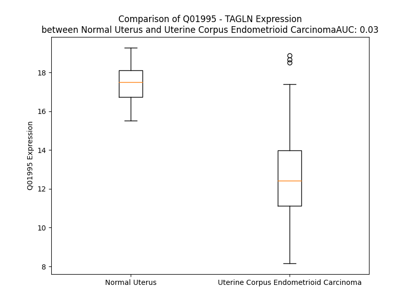

# Detailed Data for Q01995

## Introduction to the Detailed Summary

### How to Interpret the Results

- **Summary & Metrics**: This section provides a quick reference to essential protein attributes, including expression changes, family classification, and biomarker applications. Regulation status (upregulated/downregulated) indicates the protein's behavior in a disease context. Some information comes from the original excel file with the proteins selected from literature, while others are derived from the analyses.
- **Expression Comparison**: A visual representation comparing protein expression between normal and disease states. It highlights significant changes in expression levels that might indicate diagnostic or therapeutic relevance. This is data coming from transcriptomics experiments and could not translate similarly to protein levels.
- **Isoform Alignment**: An interactive view of isoform alignments, revealing structural and functional differences between variants of the protein.
- **Interactors & Homologs**: Tables listing known interaction partners and homologous proteins, the more interactors and homologs, the more complex the protein is to design an antibody for.
- **Biological Assemblies**: Information about the structural arrangement of the protein in different assemblies, providing insights into its functional state but also the complexity of the protein to develop antibodies.
- **Combined Per-Residue Information**: A detailed table summarizing residue-level data. This includes predictions for epitope regions, aggregation tendencies, and modifications that might impact the protein's function. Each row corresponds to a residue in the protein, providing insights into specific sites that may be important for research or drug development.
## Summary & Metrics

- **UniProt Accession**: Q01995
- **Gene Name**: TAGLN
- **Protein Name**: transgelin
- **Swiss Prot**: TAGL_HUMAN
- **Family**: other
- **Biomarker Application**: diagnosis
- **Number of Isoforms**: 0
- **Regulation**: -1
- **(transcriptomics) AUC**: 0.0
- **(transcriptomics) Fold Change**: 1.45
- **(transcriptomics) Regulation**: Downregulated
- **Discotope Epitope Count**: 45
- **Max n_uniprots (Homo)**: N/A
- **Max n_uniprots (Hetero)**: N/A

## Expression Comparison

## Interactors

| preferredName_A   | preferredName_B   |   score |
|:------------------|:------------------|--------:|
| TAGLN             | ACTA2             |   0.954 |
| TAGLN             | MYL9              |   0.929 |
| TAGLN             | MYH11             |   0.927 |

## Homologs

| uniprot_id   | gene_id   |
|:-------------|:----------|
| X6RJP6       | TAGLN2    |
| C9J5W6       | TAGLN3    |
| Q15417       | CNN3      |
| A0A087X271   | CNN2      |
| V9HWA5       | HEL-S-14  |

## Combined Per-Residue Information

|   res | aa   |   epitope_score | epitope   |   relative_surface_accessibility |   modeling_confidence |   Aggregation | modification           |
|------:|:-----|----------------:|:----------|---------------------------------:|----------------------:|--------------:|:-----------------------|
|     1 | M    |         0.22118 | False     |                          1.23807 |                 39.79 |         0     | N/A                    |
|     2 | A    |         0.28773 | False     |                          0.87112 |                 45.3  |         0     | N-acetylalanine        |
|     3 | N    |         0.31486 | False     |                          0.93845 |                 50.86 |         0     | N/A                    |
|     4 | K    |         0.40758 | True      |                          0.73499 |                 61.09 |         0     | N/A                    |
|     5 | G    |         0.3699  | True      |                          0.57479 |                 68.29 |         0     | N/A                    |
|     6 | P    |         0.36506 | True      |                          0.73661 |                 75.03 |         0     | N/A                    |
|     7 | S    |         0.32808 | False     |                          0.27958 |                 78.08 |         0     | N/A                    |
|     8 | Y    |         0.41791 | True      |                          0.732   |                 83.57 |         0     | N/A                    |
|     9 | G    |         0.3577  | True      |                          0.625   |                 89.87 |         0     | N/A                    |
|    10 | M    |         0.26575 | False     |                          0.74789 |                 88.7  |         0     | N/A                    |
|    11 | S    |         0.2386  | False     |                          0.53841 |                 87.6  |         0     | N/A                    |
|    12 | R    |         0.38757 | True      |                          0.64822 |                 88.94 |         0     | N/A                    |
|    13 | E    |         0.34365 | True      |                          0.50896 |                 90.63 |         0     | N/A                    |
|    14 | V    |         0.26427 | False     |                          0.46747 |                 90.31 |         0     | N/A                    |
|    15 | Q    |         0.27031 | False     |                          0.26072 |                 88.24 |         0     | N/A                    |
|    16 | S    |         0.28935 | False     |                          0.34354 |                 90.7  |         0     | N/A                    |
|    17 | K    |         0.37463 | True      |                          0.64152 |                 92.61 |         0     | N/A                    |
|    18 | I    |         0.35182 | True      |                          0.23258 |                 90.87 |         0     | N/A                    |
|    19 | E    |         0.3832  | True      |                          0.36266 |                 89.66 |         0     | N/A                    |
|    20 | K    |         0.35063 | True      |                          0.82425 |                 93.44 |         0     | N/A                    |
|    21 | K    |         0.31386 | False     |                          0.65431 |                 94.75 |         0     | N/A                    |
|    22 | Y    |         0.26325 | False     |                          0.14421 |                 95.48 |         0     | N/A                    |
|    23 | D    |         0.19914 | False     |                          0.38896 |                 95.28 |         0     | N/A                    |
|    24 | E    |         0.29113 | False     |                          0.66868 |                 95.24 |         0     | N/A                    |
|    25 | E    |         0.33014 | False     |                          0.75158 |                 94.95 |         0     | N/A                    |
|    26 | L    |         0.16953 | False     |                          0.19715 |                 94.98 |         0     | N/A                    |
|    27 | E    |         0.12136 | False     |                          0.03914 |                 96.39 |         0     | N/A                    |
|    28 | E    |         0.30644 | False     |                          0.4184  |                 95.82 |         0     | N/A                    |
|    29 | R    |         0.30375 | False     |                          0.29772 |                 95.62 |         2.199 | N/A                    |
|    30 | L    |         0.00904 | False     |                          0       |                 97.05 |         2.199 | N/A                    |
|    31 | V    |         0.07422 | False     |                          0.03808 |                 96.73 |         2.199 | N/A                    |
|    32 | E    |         0.33634 | True      |                          0.30984 |                 96.27 |         2.199 | N/A                    |
|    33 | W    |         0.00519 | False     |                          0       |                 97.18 |        10.404 | N/A                    |
|    34 | I    |         0.00609 | False     |                          0       |                 97.09 |        10.618 | N/A                    |
|    35 | I    |         0.27426 | False     |                          0.21366 |                 96.73 |        10.618 | N/A                    |
|    36 | V    |         0.24781 | False     |                          0.47024 |                 96.25 |        10.433 | N/A                    |
|    37 | Q    |         0.01647 | False     |                          0.00151 |                 96.26 |         8.419 | N/A                    |
|    38 | C    |         0.20929 | False     |                          0.19124 |                 94.69 |         4.222 | N/A                    |
|    39 | G    |         0.15889 | False     |                          0.18187 |                 92.87 |         0     | N/A                    |
|    40 | P    |         0.37826 | True      |                          0.91821 |                 88.95 |         0     | N/A                    |
|    41 | D    |         0.40172 | True      |                          0.59638 |                 89.82 |         0     | N/A                    |
|    42 | V    |         0.15801 | False     |                          0.09256 |                 92.33 |         0     | N/A                    |
|    43 | G    |         0.19612 | False     |                          0.45102 |                 91.9  |         0     | N/A                    |
|    44 | R    |         0.39448 | True      |                          0.57216 |                 94.58 |         0     | N/A                    |
|    45 | P    |         0.20597 | False     |                          0.1294  |                 95.45 |         0     | N/A                    |
|    46 | D    |         0.39456 | True      |                          0.71076 |                 93.88 |         0     | N/A                    |
|    47 | R    |         0.34209 | True      |                          0.85165 |                 91.05 |         0     | N/A                    |
|    48 | G    |         0.21136 | False     |                          0.3125  |                 91.22 |         0     | N/A                    |
|    49 | R    |         0.34437 | True      |                          0.40353 |                 92.32 |         0     | N/A                    |
|    50 | L    |         0.57103 | True      |                          0.79624 |                 93.82 |         0.491 | N/A                    |
|    51 | G    |         0.13349 | False     |                          0.13169 |                 95.6  |         0.491 | N/A                    |
|    52 | F    |         0.00562 | False     |                          0       |                 96.64 |         3.244 | N/A                    |
|    53 | Q    |         0.18415 | False     |                          0.094   |                 96.89 |         3.244 | N/A                    |
|    54 | V    |         0.31301 | False     |                          0.67999 |                 95.9  |         3.244 | N/A                    |
|    55 | W    |         0.17361 | False     |                          0.12306 |                 96.47 |         3.244 | N/A                    |
|    56 | L    |         0.00426 | False     |                          0       |                 96.83 |         3.244 | N/A                    |
|    57 | K    |         0.35714 | True      |                          0.29698 |                 94.95 |         0     | N/A                    |
|    58 | N    |         0.10095 | False     |                          0.20948 |                 93.11 |         0     | N/A                    |
|    59 | G    |         0.00387 | False     |                          0       |                 94.42 |         0     | N/A                    |
|    60 | V    |         0.07975 | False     |                          0.10092 |                 95.83 |         0     | N/A                    |
|    61 | I    |         0.09261 | False     |                          0.0792  |                 96.44 |         0     | N/A                    |
|    62 | L    |         0.00286 | False     |                          0       |                 97.29 |         0     | N/A                    |
|    63 | S    |         0.00365 | False     |                          0       |                 96.46 |         0     | N/A                    |
|    64 | K    |         0.16071 | False     |                          0.29173 |                 96.09 |         0     | N/A                    |
|    65 | L    |         0.00257 | False     |                          0       |                 97.29 |         0     | N/A                    |
|    66 | V    |         0.00715 | False     |                          0       |                 96.85 |         0     | N/A                    |
|    67 | N    |         0.22192 | False     |                          0.04839 |                 96.88 |         0     | N/A                    |
|    68 | S    |         0.15871 | False     |                          0.20222 |                 95.6  |         0     | N/A                    |
|    69 | L    |         0.03011 | False     |                          0.01749 |                 95.81 |         0     | N/A                    |
|    70 | Y    |         0.18671 | False     |                          0.20516 |                 94.74 |         0     | N/A                    |
|    71 | P    |         0.31515 | False     |                          0.48312 |                 92.75 |         0     | N/A                    |
|    72 | D    |         0.3661  | True      |                          0.74501 |                 87.66 |         0     | N/A                    |
|    73 | G    |         0.47487 | True      |                          0.99027 |                 89.14 |         0     | N/A                    |
|    74 | S    |         0.32169 | False     |                          0.48907 |                 92.64 |         0     | N/A                    |
|    75 | K    |         0.41586 | True      |                          0.48902 |                 94.01 |         0     | N/A                    |
|    76 | P    |         0.32047 | False     |                          0.43792 |                 94.35 |         0     | N/A                    |
|    77 | V    |         0.06426 | False     |                          0.05662 |                 95.32 |         0     | N/A                    |
|    78 | K    |         0.25815 | False     |                          0.86676 |                 93.66 |         0     | N/A                    |
|    79 | V    |         0.17732 | False     |                          0.33851 |                 92.49 |         0     | N/A                    |
|    80 | P    |         0.27385 | False     |                          0.3178  |                 90.04 |         0     | N/A                    |
|    81 | E    |         0.38025 | True      |                          0.90863 |                 85.64 |         0     | N/A                    |
|    82 | N    |         0.60725 | True      |                          0.71836 |                 87.95 |         0     | N/A                    |
|    83 | P    |         0.33178 | False     |                          0.6588  |                 87.26 |         0     | N/A                    |
|    84 | P    |         0.17627 | False     |                          0.10364 |                 87.48 |         0     | N/A                    |
|    85 | S    |         0.39546 | True      |                          0.81229 |                 87.95 |         0     | N/A                    |
|    86 | M    |         0.42682 | True      |                          0.59754 |                 93.04 |         0     | N/A                    |
|    87 | V    |         0.50657 | True      |                          0.57184 |                 93.84 |         0     | N/A                    |
|    88 | F    |         0.50793 | True      |                          0.62247 |                 93.78 |         0     | N/A                    |
|    89 | K    |         0.28829 | False     |                          0.47893 |                 94.49 |         0     | N/A                    |
|    90 | Q    |         0.13318 | False     |                          0.14723 |                 95.05 |         0     | N/A                    |
|    91 | M    |         0.27768 | False     |                          0.30353 |                 95.6  |         0     | N/A                    |
|    92 | E    |         0.29525 | False     |                          0.46602 |                 95.84 |         0     | N/A                    |
|    93 | Q    |         0.06917 | False     |                          0.0705  |                 95.96 |         0.172 | N/A                    |
|    94 | V    |         0.00466 | False     |                          0       |                 97.15 |         4.577 | N/A                    |
|    95 | A    |         0.29127 | False     |                          0.42485 |                 96.78 |         4.577 | N/A                    |
|    96 | Q    |         0.21359 | False     |                          0.34305 |                 97.34 |         4.577 | N/A                    |
|    97 | F    |         0.00597 | False     |                          0       |                 97.77 |         4.577 | N/A                    |
|    98 | L    |         0.21752 | False     |                          0.09645 |                 97.87 |         4.577 | N/A                    |
|    99 | K    |         0.26622 | False     |                          0.6798  |                 97.21 |         0     | N/A                    |
|   100 | A    |         0.03377 | False     |                          0.02606 |                 97.44 |         0     | N/A                    |
|   101 | A    |         0.00354 | False     |                          0       |                 97.53 |         0     | N/A                    |
|   102 | E    |         0.30879 | False     |                          0.33893 |                 97.27 |         0     | N/A                    |
|   103 | D    |         0.2632  | False     |                          0.62936 |                 96.32 |         0     | N/A                    |
|   104 | Y    |         0.1543  | False     |                          0.03787 |                 95.38 |         0     | N/A                    |
|   105 | G    |         0.20515 | False     |                          0.45255 |                 94.88 |         0     | N/A                    |
|   106 | V    |         0.04883 | False     |                          0.02815 |                 96.15 |         0     | N/A                    |
|   107 | I    |         0.30926 | False     |                          0.58135 |                 95.34 |         0     | N/A                    |
|   108 | K    |         0.37769 | True      |                          0.7358  |                 95.14 |         0     | N/A                    |
|   109 | T    |         0.25379 | False     |                          0.78827 |                 95.38 |         0     | N/A                    |
|   110 | D    |         0.14848 | False     |                          0.16598 |                 95.33 |         0     | N/A                    |
|   111 | M    |         0.18673 | False     |                          0.20819 |                 96.82 |         0     | N/A                    |
|   112 | F    |         0.03274 | False     |                          0.02492 |                 97.47 |         0     | N/A                    |
|   113 | Q    |         0.45185 | True      |                          0.62952 |                 96.62 |         0     | N/A                    |
|   114 | T    |         0.22634 | False     |                          0.18853 |                 96.67 |         0     | N/A                    |
|   115 | V    |         0.44111 | True      |                          0.38151 |                 94.43 |         0     | N/A                    |
|   116 | D    |         0.17842 | False     |                          0.10494 |                 96.21 |         0     | N/A                    |
|   117 | L    |         0.00608 | False     |                          0       |                 96.66 |         0     | N/A                    |
|   118 | F    |         0.29    | False     |                          0.11007 |                 94.96 |         0     | N/A                    |
|   119 | E    |         0.38519 | True      |                          0.42707 |                 93.17 |         0     | N/A                    |
|   120 | G    |         0.27148 | False     |                          0.23919 |                 93.49 |         0     | N/A                    |
|   121 | K    |         0.48713 | True      |                          0.35121 |                 91.82 |         0     | N/A                    |
|   122 | D    |         0.16993 | False     |                          0.16449 |                 94.43 |         0     | N/A                    |
|   123 | M    |         0.06058 | False     |                          0.02808 |                 96.1  |         0     | N/A                    |
|   124 | A    |         0.07768 | False     |                          0.05849 |                 96.12 |         0     | N/A                    |
|   125 | A    |         0.05759 | False     |                          0.07652 |                 96.66 |         0     | N/A                    |
|   126 | V    |         0.00351 | False     |                          0       |                 97.61 |         0     | N/A                    |
|   127 | Q    |         0.05081 | False     |                          0.02378 |                 97.26 |         0     | N/A                    |
|   128 | R    |         0.25926 | False     |                          0.39376 |                 96.46 |         0     | N/A                    |
|   129 | T    |         0.00275 | False     |                          0       |                 97.95 |         0.391 | N/A                    |
|   130 | L    |         0.00449 | False     |                          0       |                 97.72 |         0.538 | N/A                    |
|   131 | M    |         0.18306 | False     |                          0.17607 |                 96.79 |         0.538 | N/A                    |
|   132 | A    |         0.05384 | False     |                          0.07581 |                 96.3  |         0.538 | N/A                    |
|   133 | L    |         0.00217 | False     |                          0       |                 97.04 |         0.538 | N/A                    |
|   134 | G    |         0.0061  | False     |                          0       |                 96.72 |         0.147 | N/A                    |
|   135 | S    |         0.17723 | False     |                          0.07835 |                 95.83 |         0.147 | N/A                    |
|   136 | L    |         0.17043 | False     |                          0.1558  |                 95.19 |         0.147 | N/A                    |
|   137 | A    |         0.01022 | False     |                          0.00854 |                 95.17 |         0.147 | N/A                    |
|   138 | V    |         0.08901 | False     |                          0.12849 |                 95.07 |         0.147 | N/A                    |
|   139 | T    |         0.13253 | False     |                          0.04611 |                 92.97 |         0     | N/A                    |
|   140 | K    |         0.22314 | False     |                          0.41241 |                 90.94 |         0     | N/A                    |
|   141 | N    |         0.30857 | False     |                          0.76037 |                 86.74 |         0     | N/A                    |
|   142 | D    |         0.26267 | False     |                          0.42099 |                 89.89 |         0     | N/A                    |
|   143 | G    |         0.3711  | True      |                          0.86854 |                 91.32 |         0     | N/A                    |
|   144 | H    |         0.27615 | False     |                          0.29512 |                 93.69 |         0     | N/A                    |
|   145 | Y    |         0.16933 | False     |                          0.15441 |                 94.57 |         0     | N/A                    |
|   146 | R    |         0.30742 | False     |                          0.54909 |                 93.83 |         0     | N/A                    |
|   147 | G    |         0.168   | False     |                          0.35471 |                 92.41 |         0     | N/A                    |
|   148 | D    |         0.2863  | False     |                          0.34691 |                 92.75 |         0     | N/A                    |
|   149 | P    |         0.21717 | False     |                          0.5515  |                 91.34 |         0     | N/A                    |
|   150 | N    |         0.33384 | True      |                          0.83768 |                 92.73 |         0     | N/A                    |
|   151 | W    |         0.27364 | False     |                          0.27211 |                 92.74 |         0     | N/A                    |
|   152 | F    |         0.05865 | False     |                          0.04697 |                 94.04 |         0     | N/A                    |
|   153 | M    |         0.28565 | False     |                          0.8864  |                 89.75 |         0     | N/A                    |
|   154 | K    |         0.16719 | False     |                          0.64176 |                 86.21 |         0     | N/A                    |
|   155 | K    |         0.27828 | False     |                          0.36241 |                 84.18 |         0     | N/A                    |
|   156 | A    |         0.2129  | False     |                          1.03518 |                 82.25 |         0     | N/A                    |
|   157 | Q    |         0.30326 | False     |                          0.55606 |                 77.28 |         0     | N/A                    |
|   158 | E    |         0.36402 | True      |                          0.71174 |                 81.47 |         0     | N/A                    |
|   159 | H    |         0.34758 | True      |                          0.80455 |                 79.88 |         0     | N/A                    |
|   160 | K    |         0.35461 | True      |                          0.7659  |                 81.59 |         0     | N/A                    |
|   161 | R    |         0.28599 | False     |                          0.7266  |                 84.57 |         0     | N/A                    |
|   162 | E    |         0.27884 | False     |                          0.87752 |                 84.62 |         0     | N/A                    |
|   163 | F    |         0.28579 | False     |                          0.61002 |                 87.07 |         0     | N/A                    |
|   164 | T    |         0.33402 | True      |                          0.58035 |                 89.56 |         0     | N/A                    |
|   165 | E    |         0.17047 | False     |                          0.58375 |                 90.07 |         0     | N/A                    |
|   166 | S    |         0.28218 | False     |                          0.52519 |                 89.06 |         0     | Phosphoserine          |
|   167 | Q    |         0.15427 | False     |                          0.47862 |                 88.58 |         0     | N/A                    |
|   168 | L    |         0.22746 | False     |                          0.5459  |                 89.17 |         0     | N/A                    |
|   169 | Q    |         0.20621 | False     |                          0.36556 |                 87.83 |         0     | N/A                    |
|   170 | E    |         0.20482 | False     |                          0.54643 |                 85.57 |         0     | N/A                    |
|   171 | G    |         0.1659  | False     |                          0.48596 |                 86.14 |         0     | N/A                    |
|   172 | K    |         0.33754 | True      |                          0.71021 |                 83.91 |         0     | N6-acetyllysine        |
|   173 | H    |         0.31247 | False     |                          0.80668 |                 79.73 |         0     | N/A                    |
|   174 | V    |         0.29662 | False     |                          0.79783 |                 74.81 |         0     | N/A                    |
|   175 | I    |         0.31051 | False     |                          0.77008 |                 68.61 |         0     | N/A                    |
|   176 | G    |         0.29721 | False     |                          0.50395 |                 70.53 |         0     | N/A                    |
|   177 | L    |         0.31358 | False     |                          0.92317 |                 72.86 |         0     | N/A                    |
|   178 | Q    |         0.32004 | False     |                          0.94454 |                 68.79 |         0     | N/A                    |
|   179 | M    |         0.42324 | True      |                          0.8823  |                 65.33 |         0     | N/A                    |
|   180 | G    |         0.36011 | True      |                          0.57987 |                 60.08 |         0     | N/A                    |
|   181 | S    |         0.30893 | False     |                          0.48863 |                 67.26 |         0     | Phosphoserine          |
|   182 | N    |         0.33061 | False     |                          0.80925 |                 66.43 |         0     | N/A                    |
|   183 | R    |         0.42151 | True      |                          0.93983 |                 62.3  |         0     | Omega-N-methylarginine |
|   184 | G    |         0.31531 | False     |                          0.89976 |                 64.45 |         0     | N/A                    |
|   185 | A    |         0.3031  | False     |                          0.75514 |                 60.02 |         0     | N/A                    |
|   186 | S    |         0.24075 | False     |                          0.61155 |                 65.71 |         0     | N/A                    |
|   187 | Q    |         0.24927 | False     |                          0.75411 |                 61.52 |         0     | N/A                    |
|   188 | A    |         0.32607 | False     |                          0.85873 |                 60.5  |         0     | N/A                    |
|   189 | G    |         0.29955 | False     |                          0.97084 |                 64.26 |         0     | N/A                    |
|   190 | M    |         0.25816 | False     |                          0.80699 |                 65.13 |         0     | N/A                    |
|   191 | T    |         0.18775 | False     |                          0.76657 |                 64.26 |         0     | N/A                    |
|   192 | G    |         0.27879 | False     |                          0.58366 |                 67.59 |         0     | N/A                    |
|   193 | Y    |         0.35459 | True      |                          1.08099 |                 65.69 |         0     | N/A                    |
|   194 | G    |         0.32204 | False     |                          0.92973 |                 66.98 |         0     | N/A                    |
|   195 | R    |         0.29761 | False     |                          0.76484 |                 65.88 |         0     | N/A                    |
|   196 | P    |         0.21713 | False     |                          0.87894 |                 72.37 |         0     | N/A                    |
|   197 | R    |         0.24287 | False     |                          0.89564 |                 67.47 |         0     | N/A                    |
|   198 | Q    |         0.22627 | False     |                          0.87653 |                 68.63 |         0     | N/A                    |
|   199 | I    |         0.26917 | False     |                          0.93362 |                 71.59 |         0     | N/A                    |
|   200 | I    |         0.21786 | False     |                          0.9555  |                 65.38 |         0     | N/A                    |
|   201 | S    |         0.13209 | False     |                          1.26708 |                 56.92 |         0     | N/A                    |

