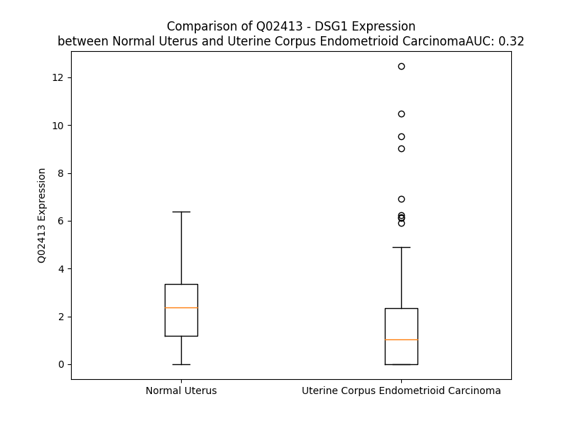

# Detailed Data for Q02413

## Introduction to the Detailed Summary

### How to Interpret the Results

- **Summary & Metrics**: This section provides a quick reference to essential protein attributes, including expression changes, family classification, and biomarker applications. Regulation status (upregulated/downregulated) indicates the protein's behavior in a disease context. Some information comes from the original excel file with the proteins selected from literature, while others are derived from the analyses.
- **Expression Comparison**: A visual representation comparing protein expression between normal and disease states. It highlights significant changes in expression levels that might indicate diagnostic or therapeutic relevance. This is data coming from transcriptomics experiments and could not translate similarly to protein levels.
- **Isoform Alignment**: An interactive view of isoform alignments, revealing structural and functional differences between variants of the protein.
- **Interactors & Homologs**: Tables listing known interaction partners and homologous proteins, the more interactors and homologs, the more complex the protein is to design an antibody for.
- **Biological Assemblies**: Information about the structural arrangement of the protein in different assemblies, providing insights into its functional state but also the complexity of the protein to develop antibodies.
- **Combined Per-Residue Information**: A detailed table summarizing residue-level data. This includes predictions for epitope regions, aggregation tendencies, and modifications that might impact the protein's function. Each row corresponds to a residue in the protein, providing insights into specific sites that may be important for research or drug development.
## Summary & Metrics

- **UniProt Accession**: Q02413
- **Gene Name**: DSG1
- **Protein Name**: Desmoglein-1
- **Swiss Prot**: DSG1_HUMAN
- **Family**: other
- **Biomarker Application**:  
- **Number of Isoforms**: 2
- **Regulation**: -1
- **(transcriptomics) AUC**: 0.32
- **(transcriptomics) Fold Change**: 1.48
- **(transcriptomics) Regulation**: Downregulated
- **Discotope Epitope Count**: 225
- **Max n_uniprots (Homo)**: N/A
- **Max n_uniprots (Hetero)**: N/A

## Expression Comparison

## Isoform Alignment

<pre style='font-size:14px; font-family:monospace;'>Q02413-1 MDWSFFRVVAMLFIFLVVVEVNSEFRIQVRDYNTKNGTIKWHSIRRQKREWIKFAAACREGEDNSKRNPIAKIHSDCAANQQVTYRISGVGIDQPPYGIFVINQKTGEINITSIVDREVTPFFIIYCRALNSMGQDLERPLELRVRVLDINDNPPVFSMATFAGQIEENSNANTLVMILNATDADEPNNLNSKIAFKIIRQEPSDSPMFIINRNTGEIRTMNNFLDREQYGQYALAVRGSDRDGGADGMSAECECNIKILDVNDNIPYMEQSSYTIEIQENTLNSNLLEIRVIDLDEEFSANWMAVIFFISGNEGNWFEIEMNERTNVGILKVVKPLDYEAMQSLQLSIGVRNKAEFHHSIMSQYKLKASAISVTVLNVIEGPVFRPGSKTYVVTGNMGSNDKVGDFVATDLDTGRPSTTVRYVMGNNPADLLAVDSRTGKLTLKNKVTKEQYNMLGGKYQGTILSIDDNLQRTCTGTININIQSFGNDDRTNTEPNTKITTNTGRQESTSSTNYDTSTTSTDSSQVYSSEPGNGAKDLLSDNVHFGPAGIGLLIMGFLVLGLVPFLMICCDCGGAPRSAAGFEPVPECSDGAIHSWAVEGPQPEPRDITTVIPQIPPDNANIIECIDNSGVYTNEYGGREMQDLGGGERMTGFELTEGVKTSGMPEICQEYSGTLRRNSMRECREGGLNMNFMESYFCQKAYAYADEDEGRPSNDCLLIYDIEGVGSPAGSVGCCSFIGEDLDDSFLDTLGPKFKKLADISLGKESYPDLDPSWPPQSTEPVCLPQETEPVVSGHPPISPHFGTTTVISESTYPSGPGVLHPKPILDPLGYGNVTVTESYTTSDTLKPSVHVHDNRPASNVVVTERVVGPISGADLHGMLEMPDLRDGSNVIVTERVIAPSSSLPTSLTIHHPRESSNVVVTERVIQPTSGMIGSLSMHPELANAHNVIVTERVVSGAGVTGISGTTGISGGIGSSGLVGTSMGAGSGALSGAGISGGGIGLSSLGGTASIGHMRSSSDHHFNQTIGSASPSTARSRITKYSTVQYSK
Q02413-2 -----------------------------------------------------------------------------------------------------------------------------------------------------------------------------------------------------------------------------------------------------------------------------------------------------------------------------------------------------------------------------------------------------------------------------------------------------------------------------------------------------------------------------------------------------------------------------------------------------------------------------------------------------------------MQDLGGGERMTGFELTEGVKTSGMPEICQEYSGTLRRNSMRECREGGLNMNFMESYFCQKAYAYADEDEGRPSNDCLLIYDIEGVGSPAGSVGCCSFIGEDLDDSFLDTLGPKFKKLADISLGKESYPDLDPSWPPQSTEPVCLPQETEPVVSGHPPISPHFGTTTVISESTYPSGPGVLHPKPILDPLGYGNVTVTESYTTSDTLKPSVHVHDNRPASNVVVTERVVGPISGADLHGMLEMPDLRDGSNVIVTERVIAPSSSLPTSLTIHHPRESSNVVVTERVIQPTSGMIGSLSMHPELANAHNVIVTERVVSGAGVTGISGTTGISGGIGSSGLVGTSMGAGSGALSGAGISGGGIGLSSLGGTASIGHMRSSSDHHFNQTIGSASPSTARSRITKYSTVQYSK
</pre>

## Interactors

| preferredName_A   | preferredName_B   |   score |
|:------------------|:------------------|--------:|
| DSG1              | DSC1              |   0.998 |
| DSG1              | DSP               |   0.998 |
| DSG1              | CDSN              |   0.995 |
| DSG1              | PKP1              |   0.994 |
| DSG1              | JUP               |   0.981 |
| DSG1              | PKP2              |   0.959 |
| DSG1              | FLG               |   0.941 |
| DSG1              | PKP3              |   0.935 |
| DSG1              | DSC3              |   0.933 |
| DSG1              | PPL               |   0.921 |
| DSG1              | EVPL              |   0.915 |
| DSG1              | KRT1              |   0.915 |

## Homologs

| uniprot_id   | gene_id   |
|:-------------|:----------|
| P32926       | DSG3      |
| Q86SJ6       | DSG4      |
| J3KSI6       | DSG2      |
| A0A3B3ISU0   | DSC2      |
| Q14574       | DSC3      |
| Q9HB00       | DSC1      |

## Combined Per-Residue Information

|   res | aa   |   epitope_score | epitope   |   relative_surface_accessibility |   modeling_confidence |   Aggregation | modification   | glycosylation                   |
|------:|:-----|----------------:|:----------|---------------------------------:|----------------------:|--------------:|:---------------|:--------------------------------|
|     1 | M    |         0.10126 | True      |                          1.24909 |                 47.84 |         0     | N/A            | N/A                             |
|     2 | D    |         0.10576 | True      |                          0.60353 |                 52.88 |         3.24  | N/A            | N/A                             |
|     3 | W    |         0.13048 | True      |                          0.90871 |                 55.18 |         5.047 | N/A            | N/A                             |
|     4 | S    |         0.06785 | False     |                          0.58991 |                 66    |         6.371 | N/A            | N/A                             |
|     5 | F    |         0.06258 | False     |                          0.75782 |                 70.56 |        35.952 | N/A            | N/A                             |
|     6 | F    |         0.05192 | False     |                          0.78131 |                 66.82 |        38.369 | N/A            | N/A                             |
|     7 | R    |         0.07507 | False     |                          0.69005 |                 72.54 |        38.566 | N/A            | N/A                             |
|     8 | V    |         0.06162 | False     |                          0.68362 |                 75.97 |        95.013 | N/A            | N/A                             |
|     9 | V    |         0.06329 | False     |                          0.49624 |                 77.55 |        99.809 | N/A            | N/A                             |
|    10 | A    |         0.05149 | False     |                          0.44537 |                 76.32 |        99.865 | N/A            | N/A                             |
|    11 | M    |         0.09963 | True      |                          0.71784 |                 77.95 |        99.931 | N/A            | N/A                             |
|    12 | L    |         0.1429  | True      |                          0.69237 |                 77.22 |        99.989 | N/A            | N/A                             |
|    13 | F    |         0.09625 | True      |                          0.68815 |                 77.49 |        99.999 | N/A            | N/A                             |
|    14 | I    |         0.06606 | False     |                          0.61106 |                 75.77 |       100     | N/A            | N/A                             |
|    15 | F    |         0.11702 | True      |                          0.71857 |                 72.64 |       100     | N/A            | N/A                             |
|    16 | L    |         0.11485 | True      |                          0.5787  |                 71.94 |        99.999 | N/A            | N/A                             |
|    17 | V    |         0.05616 | False     |                          0.47223 |                 65.4  |        99.993 | N/A            | N/A                             |
|    18 | V    |         0.04656 | False     |                          0.5022  |                 63.45 |        99.929 | N/A            | N/A                             |
|    19 | V    |         0.07874 | False     |                          0.59219 |                 58.06 |        94.869 | N/A            | N/A                             |
|    20 | E    |         0.05887 | False     |                          0.57803 |                 56.15 |        35.326 | N/A            | N/A                             |
|    21 | V    |         0.07187 | False     |                          0.71464 |                 52.28 |        30.927 | N/A            | N/A                             |
|    22 | N    |         0.06799 | False     |                          0.77373 |                 47.39 |         0.422 | N/A            | N/A                             |
|    23 | S    |         0.04326 | False     |                          0.63062 |                 40.52 |         0.004 | N/A            | N/A                             |
|    24 | E    |         0.06424 | False     |                          0.30269 |                 39.69 |         0     | N/A            | N/A                             |
|    25 | F    |         0.05279 | False     |                          0.93623 |                 39.75 |         0     | N/A            | N/A                             |
|    26 | R    |         0.07384 | False     |                          0.61033 |                 40    |         0     | N/A            | N/A                             |
|    27 | I    |         0.06644 | False     |                          0.68466 |                 46.76 |         0     | N/A            | N/A                             |
|    28 | Q    |         0.12881 | True      |                          0.58504 |                 46.99 |         0     | N/A            | N/A                             |
|    29 | V    |         0.06612 | False     |                          0.52745 |                 55.49 |         0     | N/A            | N/A                             |
|    30 | R    |         0.17834 | True      |                          0.60164 |                 62.23 |         0     | N/A            | N/A                             |
|    31 | D    |         0.05789 | False     |                          0.4917  |                 61.31 |         0     | N/A            | N/A                             |
|    32 | Y    |         0.11224 | True      |                          0.61392 |                 58.12 |         0     | N/A            | N/A                             |
|    33 | N    |         0.07318 | False     |                          0.4575  |                 63.28 |         0     | N/A            | N/A                             |
|    34 | T    |         0.14991 | True      |                          0.80922 |                 68.53 |         0     | N/A            | N/A                             |
|    35 | K    |         0.06052 | False     |                          0.9616  |                 64.56 |         0     | N/A            | N/A                             |
|    36 | N    |         0.10421 | True      |                          0.61597 |                 70.7  |         0     | N/A            | N-linked (GlcNAc...) asparagine |
|    37 | G    |         0.09376 | True      |                          0.61024 |                 64.99 |         0     | N/A            | N/A                             |
|    38 | T    |         0.14981 | True      |                          0.56956 |                 58.24 |         0     | N/A            | N/A                             |
|    39 | I    |         0.08261 | False     |                          0.50968 |                 67.7  |         0     | N/A            | N/A                             |
|    40 | K    |         0.07053 | False     |                          0.65957 |                 63.64 |         0     | N/A            | N/A                             |
|    41 | W    |         0.12619 | True      |                          0.60644 |                 58.25 |         0     | N/A            | N/A                             |
|    42 | H    |         0.08904 | True      |                          0.41451 |                 53.06 |         0     | N/A            | N/A                             |
|    43 | S    |         0.10172 | True      |                          0.53261 |                 45.42 |         0     | N/A            | N/A                             |
|    44 | I    |         0.08984 | True      |                          0.67839 |                 44.4  |         0     | N/A            | N/A                             |
|    45 | R    |         0.11246 | True      |                          0.50041 |                 40.91 |         0     | N/A            | N/A                             |
|    46 | R    |         0.12217 | True      |                          0.91762 |                 37.9  |         0     | N/A            | N/A                             |
|    47 | Q    |         0.05856 | False     |                          0.50952 |                 42.12 |         0     | N/A            | N/A                             |
|    48 | K    |         0.0604  | False     |                          0.74597 |                 44.09 |         0     | N/A            | N/A                             |
|    49 | R    |         0.07869 | False     |                          0.73904 |                 43.04 |         0     | N/A            | N/A                             |
|    50 | E    |         0.0487  | False     |                          0.57819 |                 55.97 |         0     | N/A            | N/A                             |
|    51 | W    |         0.03061 | False     |                          0.14787 |                 57.9  |         0     | N/A            | N/A                             |
|    52 | I    |         0.06637 | False     |                          0.61784 |                 52.04 |         0     | N/A            | N/A                             |
|    53 | K    |         0.07279 | False     |                          0.61897 |                 56.54 |         0     | N/A            | N/A                             |
|    54 | F    |         0.08548 | False     |                          0.76541 |                 59.27 |         0     | N/A            | N/A                             |
|    55 | A    |         0.04144 | False     |                          0.40071 |                 68.92 |         0     | N/A            | N/A                             |
|    56 | A    |         0.02886 | False     |                          0.39557 |                 76.1  |         0     | N/A            | N/A                             |
|    57 | A    |         0.02535 | False     |                          0.35838 |                 81.87 |         0     | N/A            | N/A                             |
|    58 | C    |         0.00357 | False     |                          0.00788 |                 90.11 |         0     | N/A            | N/A                             |
|    59 | R    |         0.02873 | False     |                          0.2291  |                 92.81 |         0     | N/A            | N/A                             |
|    60 | E    |         0.02423 | False     |                          0.02088 |                 95.38 |         0     | N/A            | N/A                             |
|    61 | G    |         0.08241 | False     |                          0.53782 |                 91.78 |         0     | N/A            | N/A                             |
|    62 | E    |         0.06794 | False     |                          0.40564 |                 89.53 |         0     | N/A            | N/A                             |
|    63 | D    |         0.12464 | True      |                          0.45142 |                 91.7  |         0     | N/A            | N/A                             |
|    64 | N    |         0.0249  | False     |                          0.02525 |                 90.14 |         0     | N/A            | N/A                             |
|    65 | S    |         0.12958 | True      |                          0.42788 |                 88.63 |         0     | N/A            | N/A                             |
|    66 | K    |         0.10141 | True      |                          0.86288 |                 87.67 |         0     | N/A            | N/A                             |
|    67 | R    |         0.07228 | False     |                          0.45158 |                 85.59 |         0     | N/A            | N/A                             |
|    68 | N    |         0.09715 | True      |                          0.30292 |                 90.16 |         0     | N/A            | N/A                             |
|    69 | P    |         0.16423 | True      |                          0.49294 |                 90.98 |         0     | N/A            | N/A                             |
|    70 | I    |         0.02032 | False     |                          0.03044 |                 90.28 |         0     | N/A            | N/A                             |
|    71 | A    |         0.00527 | False     |                          0.02021 |                 90.96 |         0     | N/A            | N/A                             |
|    72 | K    |         0.05074 | False     |                          0.44722 |                 90.88 |         0     | N/A            | N/A                             |
|    73 | I    |         0.00553 | False     |                          0.0008  |                 90.37 |         0     | N/A            | N/A                             |
|    74 | H    |         0.07521 | False     |                          0.45433 |                 90.19 |         0     | N/A            | N/A                             |
|    75 | S    |         0.00651 | False     |                          0.00208 |                 89.25 |         0     | N/A            | N/A                             |
|    76 | D    |         0.05326 | False     |                          0.36976 |                 86.1  |         0     | N/A            | N/A                             |
|    77 | C    |         0.05062 | False     |                          0.20899 |                 86.2  |         0     | N/A            | N/A                             |
|    78 | A    |         0.05889 | False     |                          0.39063 |                 86.15 |         0     | N/A            | N/A                             |
|    79 | A    |         0.08327 | False     |                          0.88997 |                 84.89 |         0     | N/A            | N/A                             |
|    80 | N    |         0.14508 | True      |                          0.7971  |                 85.99 |         0     | N/A            | N/A                             |
|    81 | Q    |         0.2679  | True      |                          0.39282 |                 88.73 |         0     | N/A            | N/A                             |
|    82 | Q    |         0.07751 | False     |                          0.63394 |                 91.05 |         0     | N/A            | N/A                             |
|    83 | V    |         0.03812 | False     |                          0.07801 |                 92.11 |         0     | N/A            | N/A                             |
|    84 | T    |         0.05026 | False     |                          0.26079 |                 95.38 |         0     | N/A            | N/A                             |
|    85 | Y    |         0.01705 | False     |                          0.01722 |                 94.65 |         0     | N/A            | N/A                             |
|    86 | R    |         0.11993 | True      |                          0.54349 |                 95.56 |         0     | N/A            | N/A                             |
|    87 | I    |         0.0609  | False     |                          0.12623 |                 95.52 |         0.236 | N/A            | N/A                             |
|    88 | S    |         0.06052 | False     |                          0.25058 |                 96.23 |         0.236 | N/A            | N/A                             |
|    89 | G    |         0.01823 | False     |                          0.01748 |                 94.47 |         0.236 | N/A            | N/A                             |
|    90 | V    |         0.10109 | True      |                          0.30371 |                 94.08 |         0.236 | N/A            | N/A                             |
|    91 | G    |         0.00278 | False     |                          0       |                 93.32 |         0.236 | N/A            | N/A                             |
|    92 | I    |         0.07713 | False     |                          0.23617 |                 95.25 |         0.236 | N/A            | N/A                             |
|    93 | D    |         0.1959  | True      |                          0.5133  |                 94.7  |         0     | N/A            | N/A                             |
|    94 | Q    |         0.0771  | False     |                          0.44222 |                 94.29 |         0     | N/A            | N/A                             |
|    95 | P    |         0.41306 | True      |                          0.62914 |                 92.87 |         0     | N/A            | N/A                             |
|    96 | P    |         0.20659 | True      |                          0.37562 |                 93    |         0.756 | N/A            | N/A                             |
|    97 | Y    |         0.17417 | True      |                          0.66117 |                 93.35 |        63.19  | N/A            | N/A                             |
|    98 | G    |         0.0615  | False     |                          0.47898 |                 92.29 |        79.796 | N/A            | N/A                             |
|    99 | I    |         0.0661  | False     |                          0.0616  |                 94.8  |        82.568 | N/A            | N/A                             |
|   100 | F    |         0.01261 | False     |                          0.02436 |                 95.07 |        82.568 | N/A            | N/A                             |
|   101 | V    |         0.09597 | True      |                          0.52169 |                 96.12 |        82.568 | N/A            | N/A                             |
|   102 | I    |         0.07401 | False     |                          0.16153 |                 95.75 |        77.338 | N/A            | N/A                             |
|   103 | N    |         0.05681 | False     |                          0.44136 |                 95.68 |         3.847 | N/A            | N/A                             |
|   104 | Q    |         0.12279 | True      |                          0.48817 |                 95.24 |         0.136 | N/A            | N/A                             |
|   105 | K    |         0.11466 | True      |                          0.82647 |                 92.36 |         0     | N/A            | N/A                             |
|   106 | T    |         0.05324 | False     |                          0.37313 |                 92.26 |         0     | N/A            | N/A                             |
|   107 | G    |         0.00247 | False     |                          0       |                 91.36 |         0     | N/A            | N/A                             |
|   108 | E    |         0.07179 | False     |                          0.21406 |                 93.73 |         0     | N/A            | N/A                             |
|   109 | I    |         0.0038  | False     |                          0.0008  |                 94.23 |         2.246 | N/A            | N/A                             |
|   110 | N    |         0.1146  | True      |                          0.33051 |                 94.27 |         2.452 | N/A            | N-linked (GlcNAc...) asparagine |
|   111 | I    |         0.03147 | False     |                          0.01708 |                 94.41 |        16.927 | N/A            | N/A                             |
|   112 | T    |         0.09961 | True      |                          0.52268 |                 94.51 |        16.927 | N/A            | N/A                             |
|   113 | S    |         0.09104 | True      |                          0.39958 |                 93.58 |        16.927 | N/A            | N/A                             |
|   114 | I    |         0.18341 | True      |                          0.63015 |                 93.88 |        16.927 | N/A            | N/A                             |
|   115 | V    |         0.01284 | False     |                          0.03284 |                 94.14 |        16.927 | N/A            | N/A                             |
|   116 | D    |         0.0569  | False     |                          0.38954 |                 95.79 |         0     | N/A            | N/A                             |
|   117 | R    |         0.0697  | False     |                          0.07123 |                 95.71 |         0     | N/A            | N/A                             |
|   118 | E    |         0.06602 | False     |                          0.35668 |                 95.63 |         0     | N/A            | N/A                             |
|   119 | V    |         0.15034 | True      |                          0.71671 |                 94.34 |         0     | N/A            | N/A                             |
|   120 | T    |         0.09705 | True      |                          0.11094 |                 94.24 |         0     | N/A            | N/A                             |
|   121 | P    |         0.05073 | False     |                          0.44777 |                 93.6  |         1.746 | N/A            | N/A                             |
|   122 | F    |         0.05463 | False     |                          0.57532 |                 91.35 |        93.923 | N/A            | N/A                             |
|   123 | F    |         0.00486 | False     |                          0.00387 |                 93.28 |        95.009 | N/A            | N/A                             |
|   124 | I    |         0.03759 | False     |                          0.25049 |                 92.89 |        95.009 | N/A            | N/A                             |
|   125 | I    |         0.00278 | False     |                          0       |                 93.65 |        95.009 | N/A            | N/A                             |
|   126 | Y    |         0.06717 | False     |                          0.42575 |                 94.41 |        94.394 | N/A            | N/A                             |
|   127 | C    |         0.00163 | False     |                          0       |                 93.79 |        14.558 | N/A            | N/A                             |
|   128 | R    |         0.07847 | False     |                          0.39182 |                 94.39 |         0     | N/A            | N/A                             |
|   129 | A    |         0.00138 | False     |                          0       |                 93.92 |         0     | N/A            | N/A                             |
|   130 | L    |         0.04539 | False     |                          0.07914 |                 95.09 |         0     | N/A            | N/A                             |
|   131 | N    |         0.04493 | False     |                          0.11447 |                 92.91 |         0     | N/A            | N/A                             |
|   132 | S    |         0.13905 | True      |                          0.73065 |                 90.98 |         0     | N/A            | N/A                             |
|   133 | M    |         0.09301 | True      |                          0.81006 |                 91.05 |         0     | N/A            | N/A                             |
|   134 | G    |         0.08076 | False     |                          0.60241 |                 90.55 |         0     | N/A            | N/A                             |
|   135 | Q    |         0.05361 | False     |                          0.51279 |                 92.51 |         0     | N/A            | N/A                             |
|   136 | D    |         0.12249 | True      |                          0.38504 |                 92.24 |         0     | N/A            | N/A                             |
|   137 | L    |         0.06773 | False     |                          0.29617 |                 89.52 |         0     | N/A            | N/A                             |
|   138 | E    |         0.03213 | False     |                          0.19336 |                 86.83 |         0     | N/A            | N/A                             |
|   139 | R    |         0.04783 | False     |                          0.86783 |                 89.54 |         0     | N/A            | N/A                             |
|   140 | P    |         0.13809 | True      |                          0.57722 |                 90.36 |         0     | N/A            | N/A                             |
|   141 | L    |         0.02337 | False     |                          0.1319  |                 89.38 |         0     | N/A            | N/A                             |
|   142 | E    |         0.06362 | False     |                          0.36074 |                 91.2  |         0     | N/A            | N/A                             |
|   143 | L    |         0.0124  | False     |                          0.02968 |                 90.26 |         0     | N/A            | N/A                             |
|   144 | R    |         0.12221 | True      |                          0.63634 |                 90.4  |         0     | N/A            | N/A                             |
|   145 | V    |         0.00883 | False     |                          0.01047 |                 90.36 |         0.714 | N/A            | N/A                             |
|   146 | R    |         0.07839 | False     |                          0.5098  |                 91.24 |         0.714 | N/A            | N/A                             |
|   147 | V    |         0.0063  | False     |                          0.00729 |                 93.68 |         0.714 | N/A            | N/A                             |
|   148 | L    |         0.05174 | False     |                          0.3891  |                 93.4  |         0.714 | N/A            | N/A                             |
|   149 | D    |         0.026   | False     |                          0.08816 |                 95.24 |         0.714 | N/A            | N/A                             |
|   150 | I    |         0.07885 | False     |                          0.26754 |                 94.71 |         0.714 | N/A            | N/A                             |
|   151 | N    |         0.06976 | False     |                          0.24691 |                 95.94 |         0     | N/A            | N/A                             |
|   152 | D    |         0.09472 | True      |                          0.52067 |                 95.73 |         0     | N/A            | N/A                             |
|   153 | N    |         0.04221 | False     |                          0.24745 |                 96.49 |         0     | N/A            | N/A                             |
|   154 | P    |         0.0868  | False     |                          0.47638 |                 96.33 |         0     | N/A            | N/A                             |
|   155 | P    |         0.00644 | False     |                          0.01379 |                 97.55 |         0     | N/A            | N/A                             |
|   156 | V    |         0.04517 | False     |                          0.63023 |                 97.74 |        13.827 | N/A            | N/A                             |
|   157 | F    |         0.02537 | False     |                          0.10102 |                 97.99 |        14.839 | N/A            | N/A                             |
|   158 | S    |         0.05819 | False     |                          0.54705 |                 96.92 |        14.839 | N/A            | N/A                             |
|   159 | M    |         0.07159 | False     |                          0.59995 |                 96.17 |        15.145 | N/A            | N/A                             |
|   160 | A    |         0.04659 | False     |                          0.8207  |                 95.98 |        15.145 | N/A            | N/A                             |
|   161 | T    |         0.08312 | False     |                          0.4298  |                 97.35 |        14.257 | N/A            | N/A                             |
|   162 | F    |         0.02501 | False     |                          0.09608 |                 97.78 |        13.729 | N/A            | N/A                             |
|   163 | A    |         0.0821  | False     |                          0.85571 |                 97.48 |         6.721 | N/A            | N/A                             |
|   164 | G    |         0.01884 | False     |                          0.24503 |                 97.23 |         0.491 | N/A            | N/A                             |
|   165 | Q    |         0.06244 | False     |                          0.57427 |                 97.78 |         0     | N/A            | N/A                             |
|   166 | I    |         0.01609 | False     |                          0.06    |                 97.52 |         0     | N/A            | N/A                             |
|   167 | E    |         0.04552 | False     |                          0.51979 |                 96.64 |         0     | N/A            | N/A                             |
|   168 | E    |         0.0188  | False     |                          0.01461 |                 96.53 |         0     | N/A            | N/A                             |
|   169 | N    |         0.06499 | False     |                          0.28375 |                 92.16 |         0     | N/A            | N/A                             |
|   170 | S    |         0.04316 | False     |                          0.14397 |                 94.2  |         0     | N/A            | N/A                             |
|   171 | N    |         0.06403 | False     |                          0.70714 |                 93.19 |         0.034 | N/A            | N/A                             |
|   172 | A    |         0.04241 | False     |                          0.49031 |                 93.64 |         1.096 | N/A            | N/A                             |
|   173 | N    |         0.07116 | False     |                          0.56062 |                 95.2  |         2.352 | N/A            | N/A                             |
|   174 | T    |         0.04274 | False     |                          0.34338 |                 96.85 |        35.11  | N/A            | N/A                             |
|   175 | L    |         0.05506 | False     |                          0.50757 |                 97.27 |        82.243 | N/A            | N/A                             |
|   176 | V    |         0.01814 | False     |                          0.11219 |                 97.63 |        82.716 | N/A            | N/A                             |
|   177 | M    |         0.02139 | False     |                          0.10988 |                 97.07 |        82.716 | N/A            | N/A                             |
|   178 | I    |         0.08067 | False     |                          0.61494 |                 97.71 |        82.716 | N/A            | N/A                             |
|   179 | L    |         0.00557 | False     |                          0.02316 |                 97.28 |        77.534 | N/A            | N/A                             |
|   180 | N    |         0.0574  | False     |                          0.51334 |                 95.02 |         4.664 | N/A            | N-linked (GlcNAc...) asparagine |
|   181 | A    |         0.01974 | False     |                          0.13344 |                 96.59 |         1.509 | N/A            | N/A                             |
|   182 | T    |         0.04153 | False     |                          0.62371 |                 97.1  |         0.563 | N/A            | N/A                             |
|   183 | D    |         0.03026 | False     |                          0.17264 |                 97.71 |         0     | N/A            | N/A                             |
|   184 | A    |         0.05499 | False     |                          0.50975 |                 97.29 |         0     | N/A            | N/A                             |
|   185 | D    |         0.0173  | False     |                          0.0141  |                 97.6  |         0     | N/A            | N/A                             |
|   186 | E    |         0.03907 | False     |                          0.18377 |                 95.57 |         0     | N/A            | N/A                             |
|   187 | P    |         0.08646 | False     |                          0.69283 |                 94.03 |         0     | N/A            | N/A                             |
|   188 | N    |         0.09614 | True      |                          0.98509 |                 92.01 |         0     | N/A            | N/A                             |
|   189 | N    |         0.06193 | False     |                          0.07667 |                 92.56 |         0     | N/A            | N/A                             |
|   190 | L    |         0.0302  | False     |                          0.16033 |                 94.43 |         0     | N/A            | N/A                             |
|   191 | N    |         0.01512 | False     |                          0.06272 |                 95.87 |         0     | N/A            | N/A                             |
|   192 | S    |         0.01954 | False     |                          0.19775 |                 95.72 |         0     | N/A            | N/A                             |
|   193 | K    |         0.03467 | False     |                          0.31458 |                 96.12 |         0     | N/A            | N/A                             |
|   194 | I    |         0.03019 | False     |                          0.13063 |                 97.4  |         0     | N/A            | N/A                             |
|   195 | A    |         0.02318 | False     |                          0.06727 |                 97.39 |         0     | N/A            | N/A                             |
|   196 | F    |         0.02878 | False     |                          0.07985 |                 98.1  |         0     | N/A            | N/A                             |
|   197 | K    |         0.03081 | False     |                          0.67366 |                 97.35 |         0     | N/A            | N/A                             |
|   198 | I    |         0.08776 | False     |                          0.21833 |                 97.47 |         0     | N/A            | N/A                             |
|   199 | I    |         0.09412 | True      |                          0.46745 |                 96.42 |         0     | N/A            | N/A                             |
|   200 | R    |         0.09094 | True      |                          0.39884 |                 96.75 |         0     | N/A            | N/A                             |
|   201 | Q    |         0.04934 | False     |                          0.11731 |                 96.63 |         0     | N/A            | N/A                             |
|   202 | E    |         0.07342 | False     |                          0.45372 |                 96.49 |         0     | N/A            | N/A                             |
|   203 | P    |         0.09024 | True      |                          0.26595 |                 95.65 |         0     | N/A            | N/A                             |
|   204 | S    |         0.13242 | True      |                          0.71331 |                 92.21 |         0     | N/A            | N/A                             |
|   205 | D    |         0.1408  | True      |                          0.70452 |                 87.55 |         0     | N/A            | N/A                             |
|   206 | S    |         0.0675  | False     |                          0.34945 |                 87.92 |         0     | N/A            | N/A                             |
|   207 | P    |         0.12909 | True      |                          0.60413 |                 92.2  |         3.351 | N/A            | N/A                             |
|   208 | M    |         0.04174 | False     |                          0.08045 |                 95.01 |         4.718 | N/A            | N/A                             |
|   209 | F    |         0.0154  | False     |                          0.04551 |                 97.02 |         4.718 | N/A            | N/A                             |
|   210 | I    |         0.09445 | True      |                          0.45156 |                 96.61 |         4.718 | N/A            | N/A                             |
|   211 | I    |         0.0513  | False     |                          0.17051 |                 97.85 |         4.718 | N/A            | N/A                             |
|   212 | N    |         0.04878 | False     |                          0.39547 |                 97.36 |         1.492 | N/A            | N/A                             |
|   213 | R    |         0.05893 | False     |                          0.32586 |                 96.73 |         0     | N/A            | N/A                             |
|   214 | N    |         0.13235 | True      |                          0.49494 |                 94.7  |         0     | N/A            | N/A                             |
|   215 | T    |         0.06588 | False     |                          0.46405 |                 96.2  |         0     | N/A            | N/A                             |
|   216 | G    |         0.00155 | False     |                          0       |                 96.86 |         0     | N/A            | N/A                             |
|   217 | E    |         0.04623 | False     |                          0.14739 |                 98.11 |         0     | N/A            | N/A                             |
|   218 | I    |         0.00277 | False     |                          0       |                 98.11 |         0     | N/A            | N/A                             |
|   219 | R    |         0.10171 | True      |                          0.28503 |                 97.59 |         0     | N/A            | N/A                             |
|   220 | T    |         0.0133  | False     |                          0.00352 |                 96.65 |         0     | N/A            | N/A                             |
|   221 | M    |         0.10113 | True      |                          0.52345 |                 92.65 |         0     | N/A            | N/A                             |
|   222 | N    |         0.06855 | False     |                          0.20198 |                 86.54 |         0     | N/A            | N/A                             |
|   223 | N    |         0.12343 | True      |                          0.50003 |                 80.88 |         0     | N/A            | N/A                             |
|   224 | F    |         0.10438 | True      |                          0.692   |                 84.59 |         0     | N/A            | N/A                             |
|   225 | L    |         0.01446 | False     |                          0.02316 |                 93.49 |         0     | N/A            | N/A                             |
|   226 | D    |         0.05204 | False     |                          0.34914 |                 95.48 |         0     | N/A            | N/A                             |
|   227 | R    |         0.0498  | False     |                          0.13884 |                 97.25 |         0     | N/A            | N/A                             |
|   228 | E    |         0.06185 | False     |                          0.3209  |                 95.94 |         0     | N/A            | N/A                             |
|   229 | Q    |         0.11047 | True      |                          0.51306 |                 94.44 |         0     | N/A            | N/A                             |
|   230 | Y    |         0.07255 | False     |                          0.2619  |                 94.9  |         0.302 | N/A            | N/A                             |
|   231 | G    |         0.04326 | False     |                          0.31818 |                 95.98 |         0.302 | N/A            | N/A                             |
|   232 | Q    |         0.07217 | False     |                          0.70407 |                 97.06 |         0.436 | N/A            | N/A                             |
|   233 | Y    |         0.01189 | False     |                          0.02517 |                 97.24 |         3.804 | N/A            | N/A                             |
|   234 | A    |         0.03977 | False     |                          0.2389  |                 97.72 |         3.804 | N/A            | N/A                             |
|   235 | L    |         0.00228 | False     |                          0       |                 97.97 |         3.804 | N/A            | N/A                             |
|   236 | A    |         0.07204 | False     |                          0.08545 |                 97.89 |         3.804 | N/A            | N/A                             |
|   237 | V    |         0.00168 | False     |                          0       |                 98.2  |         3.804 | N/A            | N/A                             |
|   238 | R    |         0.14172 | True      |                          0.39368 |                 97.69 |         0     | N/A            | N/A                             |
|   239 | G    |         0.00289 | False     |                          0       |                 97.73 |         0     | N/A            | N/A                             |
|   240 | S    |         0.05238 | False     |                          0.13473 |                 97.6  |         0     | N/A            | N/A                             |
|   241 | D    |         0.00265 | False     |                          0       |                 97.11 |         0     | N/A            | N/A                             |
|   242 | R    |         0.03013 | False     |                          0.22713 |                 95.99 |         0     | N/A            | N/A                             |
|   243 | D    |         0.03181 | False     |                          0.07618 |                 94.28 |         0     | N/A            | N/A                             |
|   244 | G    |         0.04896 | False     |                          0.51961 |                 92.68 |         0     | N/A            | N/A                             |
|   245 | G    |         0.15009 | True      |                          0.33609 |                 91.32 |         0     | N/A            | N/A                             |
|   246 | A    |         0.12671 | True      |                          1.15155 |                 90.44 |         0     | N/A            | N/A                             |
|   247 | D    |         0.16185 | True      |                          0.58517 |                 91.25 |         0     | N/A            | N/A                             |
|   248 | G    |         0.08299 | False     |                          0.32171 |                 93.14 |         0     | N/A            | N/A                             |
|   249 | M    |         0.10502 | True      |                          0.34536 |                 96.61 |         0     | N/A            | N/A                             |
|   250 | S    |         0.10348 | True      |                          0.38701 |                 96.7  |         0     | N/A            | N/A                             |
|   251 | A    |         0.04207 | False     |                          0.28442 |                 97.16 |         0     | N/A            | N/A                             |
|   252 | E    |         0.10676 | True      |                          0.4954  |                 97.47 |         0     | N/A            | N/A                             |
|   253 | C    |         0.02367 | False     |                          0.04428 |                 97.76 |         0     | N/A            | N/A                             |
|   254 | E    |         0.07639 | False     |                          0.31181 |                 97.95 |         0     | N/A            | N/A                             |
|   255 | C    |         0.00163 | False     |                          0       |                 98.03 |         0     | N/A            | N/A                             |
|   256 | N    |         0.06239 | False     |                          0.38868 |                 98.03 |         0     | N/A            | N/A                             |
|   257 | I    |         0.00882 | False     |                          0.00955 |                 98.03 |         0.257 | N/A            | N/A                             |
|   258 | K    |         0.05617 | False     |                          0.44769 |                 98.01 |         0.257 | N/A            | N/A                             |
|   259 | I    |         0.00413 | False     |                          0       |                 97.59 |         0.257 | N/A            | N/A                             |
|   260 | L    |         0.04783 | False     |                          0.28852 |                 97.6  |         0.257 | N/A            | N/A                             |
|   261 | D    |         0.02598 | False     |                          0.16583 |                 97.99 |         0.257 | N/A            | N/A                             |
|   262 | V    |         0.0389  | False     |                          0.11611 |                 96.9  |         0.257 | N/A            | N/A                             |
|   263 | N    |         0.01372 | False     |                          0.03005 |                 97.45 |         0     | N/A            | N/A                             |
|   264 | D    |         0.07215 | False     |                          0.21359 |                 96.58 |         0     | N/A            | N/A                             |
|   265 | N    |         0.04481 | False     |                          0.17364 |                 96.53 |         0     | N/A            | N/A                             |
|   266 | I    |         0.04227 | False     |                          0.39546 |                 95.66 |         0     | N/A            | N/A                             |
|   267 | P    |         0.00907 | False     |                          0.03821 |                 96.16 |         0     | N/A            | N/A                             |
|   268 | Y    |         0.05201 | False     |                          0.47233 |                 94.66 |         0     | N/A            | N/A                             |
|   269 | M    |         0.03005 | False     |                          0.08554 |                 95.01 |         0     | N/A            | N/A                             |
|   270 | E    |         0.08208 | False     |                          0.5128  |                 93.92 |         0     | N/A            | N/A                             |
|   271 | Q    |         0.09254 | True      |                          0.47336 |                 93.75 |         0     | N/A            | N/A                             |
|   272 | S    |         0.0696  | False     |                          0.55439 |                 90.42 |         0     | N/A            | N/A                             |
|   273 | S    |         0.05205 | False     |                          0.53523 |                 95.18 |         0     | N/A            | N/A                             |
|   274 | Y    |         0.01586 | False     |                          0.07981 |                 96.32 |         0     | N/A            | N/A                             |
|   275 | T    |         0.12259 | True      |                          0.75765 |                 96.41 |         0     | N/A            | N/A                             |
|   276 | I    |         0.03525 | False     |                          0.0768  |                 95.09 |         0     | N/A            | N/A                             |
|   277 | E    |         0.09901 | True      |                          0.60674 |                 95.74 |         0     | N/A            | N/A                             |
|   278 | I    |         0.03259 | False     |                          0.0536  |                 95.07 |         0     | N/A            | N/A                             |
|   279 | Q    |         0.06593 | False     |                          0.50029 |                 95.5  |         0     | N/A            | N/A                             |
|   280 | E    |         0.02436 | False     |                          0.02018 |                 94.82 |         0     | N/A            | N/A                             |
|   281 | N    |         0.06622 | False     |                          0.54766 |                 91.94 |         0     | N/A            | N/A                             |
|   282 | T    |         0.03441 | False     |                          0.3617  |                 92.15 |         0     | N/A            | N/A                             |
|   283 | L    |         0.15506 | True      |                          0.66916 |                 94.32 |         0     | N/A            | N/A                             |
|   284 | N    |         0.05277 | False     |                          0.29704 |                 92.12 |         0     | N/A            | N/A                             |
|   285 | S    |         0.11656 | True      |                          0.68369 |                 92.62 |         0     | N/A            | N/A                             |
|   286 | N    |         0.06333 | False     |                          0.44084 |                 92.96 |         0     | N/A            | N/A                             |
|   287 | L    |         0.0248  | False     |                          0.19869 |                 93.79 |         0.727 | N/A            | N/A                             |
|   288 | L    |         0.03295 | False     |                          0.1962  |                 95.52 |         0.86  | N/A            | N/A                             |
|   289 | E    |         0.11274 | True      |                          0.53086 |                 96.44 |         0.86  | N/A            | N/A                             |
|   290 | I    |         0.00392 | False     |                          0       |                 97.04 |         0.86  | N/A            | N/A                             |
|   291 | R    |         0.11702 | True      |                          0.42376 |                 96.6  |         0.86  | N/A            | N/A                             |
|   292 | V    |         0.01145 | False     |                          0.04223 |                 96.85 |         0.86  | N/A            | N/A                             |
|   293 | I    |         0.04942 | False     |                          0.34398 |                 96.28 |         0.86  | N/A            | N/A                             |
|   294 | D    |         0.01736 | False     |                          0.07702 |                 97.33 |         0     | N/A            | N/A                             |
|   295 | L    |         0.08438 | False     |                          0.63257 |                 97.05 |         0     | N/A            | N/A                             |
|   296 | D    |         0.02272 | False     |                          0.01226 |                 98.05 |         0     | N/A            | N/A                             |
|   297 | E    |         0.05101 | False     |                          0.29615 |                 97.16 |         0     | N/A            | N/A                             |
|   298 | E    |         0.11252 | True      |                          0.57372 |                 96.24 |         0     | N/A            | N/A                             |
|   299 | F    |         0.15425 | True      |                          0.56128 |                 95    |         0.379 | N/A            | N/A                             |
|   300 | S    |         0.07593 | False     |                          0.19359 |                 96.46 |         0.464 | N/A            | N/A                             |
|   301 | A    |         0.05039 | False     |                          0.47133 |                 97.62 |         2.327 | N/A            | N/A                             |
|   302 | N    |         0.01478 | False     |                          0.13742 |                 97.58 |         4.532 | N/A            | N/A                             |
|   303 | W    |         0.01899 | False     |                          0.10119 |                 97.98 |        61.119 | N/A            | N/A                             |
|   304 | M    |         0.04709 | False     |                          0.16838 |                 97.61 |        74.806 | N/A            | N/A                             |
|   305 | A    |         0.00931 | False     |                          0.05797 |                 97.26 |        86.732 | N/A            | N/A                             |
|   306 | V    |         0.03653 | False     |                          0.37892 |                 97.03 |        99.779 | N/A            | N/A                             |
|   307 | I    |         0.02748 | False     |                          0.07214 |                 97.08 |        99.905 | N/A            | N/A                             |
|   308 | F    |         0.05065 | False     |                          0.31904 |                 96.89 |        99.876 | N/A            | N/A                             |
|   309 | F    |         0.0235  | False     |                          0.30627 |                 97.4  |        99.421 | N/A            | N/A                             |
|   310 | I    |         0.04313 | False     |                          0.41261 |                 96.71 |        92.95  | N/A            | N/A                             |
|   311 | S    |         0.07684 | False     |                          0.38957 |                 96.79 |        10.68  | N/A            | N/A                             |
|   312 | G    |         0.0237  | False     |                          0.10348 |                 95.01 |         0.354 | N/A            | N/A                             |
|   313 | N    |         0.094   | True      |                          0.09333 |                 96.41 |         0.013 | N/A            | N/A                             |
|   314 | E    |         0.14225 | True      |                          0.67497 |                 94.26 |         0     | N/A            | N/A                             |
|   315 | G    |         0.05866 | False     |                          0.31173 |                 92.73 |         0     | N/A            | N/A                             |
|   316 | N    |         0.09019 | True      |                          0.58203 |                 95.97 |         0     | N/A            | N/A                             |
|   317 | W    |         0.08486 | False     |                          0.28614 |                 96.21 |         0     | N/A            | N/A                             |
|   318 | F    |         0.01195 | False     |                          0.03449 |                 97.31 |         0     | N/A            | N/A                             |
|   319 | E    |         0.08458 | False     |                          0.41308 |                 97.49 |         0     | N/A            | N/A                             |
|   320 | I    |         0.05419 | False     |                          0.15286 |                 97.49 |         0     | N/A            | N/A                             |
|   321 | E    |         0.06995 | False     |                          0.46699 |                 96.86 |         0     | N/A            | N/A                             |
|   322 | M    |         0.02507 | False     |                          0.20771 |                 96.67 |         0     | N/A            | N/A                             |
|   323 | N    |         0.05977 | False     |                          0.4214  |                 95.31 |         0     | N/A            | N/A                             |
|   324 | E    |         0.0934  | True      |                          0.45868 |                 92.6  |         0     | N/A            | N/A                             |
|   325 | R    |         0.11185 | True      |                          0.68499 |                 93.46 |         0     | N/A            | N/A                             |
|   326 | T    |         0.06013 | False     |                          0.34459 |                 95.27 |         0     | N/A            | N/A                             |
|   327 | N    |         0.00596 | False     |                          0.02136 |                 95.59 |         0     | N/A            | N/A                             |
|   328 | V    |         0.03794 | False     |                          0.11615 |                 97.35 |         0     | N/A            | N/A                             |
|   329 | G    |         0.00136 | False     |                          0       |                 96.95 |         0     | N/A            | N/A                             |
|   330 | I    |         0.0452  | False     |                          0.25679 |                 97.41 |         0     | N/A            | N/A                             |
|   331 | L    |         0.00245 | False     |                          0       |                 97.37 |         0     | N/A            | N/A                             |
|   332 | K    |         0.04207 | False     |                          0.18923 |                 97.32 |         0     | N/A            | N/A                             |
|   333 | V    |         0.02381 | False     |                          0.02956 |                 96.57 |         0     | N/A            | N/A                             |
|   334 | V    |         0.08087 | False     |                          0.46537 |                 96.13 |         0     | N/A            | N/A                             |
|   335 | K    |         0.04678 | False     |                          0.44383 |                 95.5  |         0     | N/A            | N/A                             |
|   336 | P    |         0.08459 | False     |                          0.52989 |                 93.59 |         0     | N/A            | N/A                             |
|   337 | L    |         0.00952 | False     |                          0.02458 |                 93.68 |         0     | N/A            | N/A                             |
|   338 | D    |         0.03306 | False     |                          0.31414 |                 93.3  |         0     | N/A            | N/A                             |
|   339 | Y    |         0.03569 | False     |                          0.25979 |                 95.08 |         0     | N/A            | N/A                             |
|   340 | E    |         0.07557 | False     |                          0.38816 |                 92.45 |         0     | N/A            | N/A                             |
|   341 | A    |         0.07883 | False     |                          0.80425 |                 91.9  |         0     | N/A            | N/A                             |
|   342 | M    |         0.07193 | False     |                          0.20391 |                 91.73 |         0     | N/A            | N/A                             |
|   343 | Q    |         0.06063 | False     |                          0.50156 |                 94.7  |         0     | N/A            | N/A                             |
|   344 | S    |         0.05399 | False     |                          0.62398 |                 94.55 |         0     | N/A            | N/A                             |
|   345 | L    |         0.01928 | False     |                          0.16017 |                 94.06 |         0     | N/A            | N/A                             |
|   346 | Q    |         0.12136 | True      |                          0.56466 |                 95.72 |         0     | N/A            | N/A                             |
|   347 | L    |         0.00196 | False     |                          0.00183 |                 96.76 |         0.168 | N/A            | N/A                             |
|   348 | S    |         0.04304 | False     |                          0.21722 |                 97.03 |         0.168 | N/A            | N/A                             |
|   349 | I    |         0.00419 | False     |                          0       |                 97.27 |         0.168 | N/A            | N/A                             |
|   350 | G    |         0.00612 | False     |                          0       |                 96.17 |         0.168 | N/A            | N/A                             |
|   351 | V    |         0.02105 | False     |                          0.08133 |                 96.54 |         0.168 | N/A            | N/A                             |
|   352 | R    |         0.09412 | True      |                          0.42474 |                 96.03 |         0     | N/A            | N/A                             |
|   353 | N    |         0.01873 | False     |                          0.01782 |                 96.97 |         0     | N/A            | N/A                             |
|   354 | K    |         0.05358 | False     |                          0.55874 |                 96.82 |         0     | N/A            | N/A                             |
|   355 | A    |         0.0332  | False     |                          0.27737 |                 96.84 |         0     | N/A            | N/A                             |
|   356 | E    |         0.07102 | False     |                          0.67555 |                 96.61 |         0     | N/A            | N/A                             |
|   357 | F    |         0.03298 | False     |                          0.11121 |                 96.64 |         0     | N/A            | N/A                             |
|   358 | H    |         0.07107 | False     |                          0.22005 |                 95.18 |         0     | N/A            | N/A                             |
|   359 | H    |         0.14323 | True      |                          0.75035 |                 92.33 |         0     | N/A            | N/A                             |
|   360 | S    |         0.04847 | False     |                          0.29603 |                 91.8  |         0     | N/A            | N/A                             |
|   361 | I    |         0.07873 | False     |                          0.0984  |                 93.13 |         0     | N/A            | N/A                             |
|   362 | M    |         0.08492 | False     |                          0.67947 |                 90.17 |         0     | N/A            | N/A                             |
|   363 | S    |         0.07527 | False     |                          0.77188 |                 90.57 |         0     | N/A            | N/A                             |
|   364 | Q    |         0.14907 | True      |                          0.55823 |                 90.45 |         0     | N/A            | N/A                             |
|   365 | Y    |         0.06373 | False     |                          0.27455 |                 91.08 |         0     | N/A            | N/A                             |
|   366 | K    |         0.07537 | False     |                          0.82491 |                 91.42 |         0     | N/A            | N/A                             |
|   367 | L    |         0.07956 | False     |                          0.55254 |                 90.29 |         0     | N/A            | N/A                             |
|   368 | K    |         0.05813 | False     |                          0.67382 |                 90.99 |         0     | N/A            | N/A                             |
|   369 | A    |         0.06322 | False     |                          0.56553 |                 93.75 |         9.933 | N/A            | N/A                             |
|   370 | S    |         0.00763 | False     |                          0.0266  |                 95.28 |        21.683 | N/A            | N/A                             |
|   371 | A    |         0.04077 | False     |                          0.40506 |                 96.43 |        41.666 | N/A            | N/A                             |
|   372 | I    |         0.0032  | False     |                          0       |                 97.08 |        65.197 | N/A            | N/A                             |
|   373 | S    |         0.04325 | False     |                          0.24933 |                 96.91 |        67.23  | N/A            | N/A                             |
|   374 | V    |         0.00767 | False     |                          0.01432 |                 96.19 |        78.228 | N/A            | N/A                             |
|   375 | T    |         0.03366 | False     |                          0.38443 |                 96.71 |        79.145 | N/A            | N/A                             |
|   376 | V    |         0.00791 | False     |                          0.01809 |                 95.9  |        80.461 | N/A            | N/A                             |
|   377 | L    |         0.06389 | False     |                          0.42619 |                 96.09 |        77.898 | N/A            | N/A                             |
|   378 | N    |         0.06267 | False     |                          0.36166 |                 94.88 |        63.238 | N/A            | N/A                             |
|   379 | V    |         0.06596 | False     |                          0.40823 |                 92.16 |        62.477 | N/A            | N/A                             |
|   380 | I    |         0.09207 | True      |                          0.65348 |                 88.99 |        57.357 | N/A            | N/A                             |
|   381 | E    |         0.03891 | False     |                          0.1803  |                 86.85 |         0     | N/A            | N/A                             |
|   382 | G    |         0.03936 | False     |                          0.10608 |                 83.93 |         0     | N/A            | N/A                             |
|   383 | P    |         0.00889 | False     |                          0.05105 |                 90.46 |         0     | N/A            | N/A                             |
|   384 | V    |         0.0295  | False     |                          0.33132 |                 92.07 |         0     | N/A            | N/A                             |
|   385 | F    |         0.01669 | False     |                          0.02644 |                 93.41 |         0     | N/A            | N/A                             |
|   386 | R    |         0.13087 | True      |                          0.58457 |                 86.26 |         0     | N/A            | N/A                             |
|   387 | P    |         0.1337  | True      |                          0.69871 |                 91    |         0     | N/A            | N/A                             |
|   388 | G    |         0.05441 | False     |                          0.48554 |                 92.49 |         0     | N/A            | N/A                             |
|   389 | S    |         0.06859 | False     |                          0.44429 |                 94.87 |         0     | N/A            | N/A                             |
|   390 | K    |         0.0655  | False     |                          0.40399 |                 94.43 |         0     | N/A            | N/A                             |
|   391 | T    |         0.07896 | False     |                          0.59258 |                 94.82 |         3.777 | N/A            | N/A                             |
|   392 | Y    |         0.02261 | False     |                          0.09358 |                 93.12 |         4.308 | N/A            | N/A                             |
|   393 | V    |         0.07339 | False     |                          0.55218 |                 91    |         4.308 | N/A            | N/A                             |
|   394 | V    |         0.00332 | False     |                          0.0019  |                 86.3  |         4.308 | N/A            | N/A                             |
|   395 | T    |         0.08918 | True      |                          0.33001 |                 83.32 |         4.308 | N/A            | N/A                             |
|   396 | G    |         0.04499 | False     |                          0.17276 |                 72.37 |         0.841 | N/A            | N/A                             |
|   397 | N    |         0.14175 | True      |                          0.8084  |                 77.32 |         0     | N/A            | N/A                             |
|   398 | M    |         0.04548 | False     |                          0.15013 |                 83.28 |         0     | N/A            | N/A                             |
|   399 | G    |         0.1024  | True      |                          0.26857 |                 79.37 |         0     | N/A            | N/A                             |
|   400 | S    |         0.04388 | False     |                          0.4304  |                 85.6  |         0     | N/A            | N/A                             |
|   401 | N    |         0.06297 | False     |                          0.71915 |                 86.76 |         0     | N/A            | N/A                             |
|   402 | D    |         0.08775 | False     |                          0.35256 |                 90.24 |         0     | N/A            | N/A                             |
|   403 | K    |         0.04515 | False     |                          0.52111 |                 92.54 |         0     | N/A            | N/A                             |
|   404 | V    |         0.01395 | False     |                          0.11153 |                 91.91 |         0     | N/A            | N/A                             |
|   405 | G    |         0.01403 | False     |                          0.13519 |                 92.28 |         0     | N/A            | N/A                             |
|   406 | D    |         0.06704 | False     |                          0.30568 |                 92.58 |         0     | N/A            | N/A                             |
|   407 | F    |         0.01817 | False     |                          0.02484 |                 93.99 |         0     | N/A            | N/A                             |
|   408 | V    |         0.06065 | False     |                          0.35554 |                 93.25 |         0     | N/A            | N/A                             |
|   409 | A    |         0.00238 | False     |                          0.00107 |                 92.98 |         0     | N/A            | N/A                             |
|   410 | T    |         0.04458 | False     |                          0.25772 |                 91.94 |         0     | N/A            | N/A                             |
|   411 | D    |         0.01721 | False     |                          0.16326 |                 90.89 |         0     | N/A            | N/A                             |
|   412 | L    |         0.01196 | False     |                          0.10419 |                 88.99 |         0     | N/A            | N/A                             |
|   413 | D    |         0.04175 | False     |                          0.29432 |                 89.5  |         0     | N/A            | N/A                             |
|   414 | T    |         0.05347 | False     |                          0.54361 |                 87.76 |         0     | N/A            | N/A                             |
|   415 | G    |         0.05853 | False     |                          0.67007 |                 86.96 |         0     | N/A            | N/A                             |
|   416 | R    |         0.09856 | True      |                          0.66985 |                 89.73 |         0     | N/A            | N/A                             |
|   417 | P    |         0.07793 | False     |                          0.65955 |                 89.82 |         0     | N/A            | N/A                             |
|   418 | S    |         0.02007 | False     |                          0.06547 |                 87.67 |         0     | N/A            | N/A                             |
|   419 | T    |         0.07926 | False     |                          0.94711 |                 85.92 |         0     | N/A            | N/A                             |
|   420 | T    |         0.13317 | True      |                          0.57867 |                 84.23 |         0     | N/A            | N/A                             |
|   421 | V    |         0.03034 | False     |                          0.06417 |                 91.54 |         0     | N/A            | N/A                             |
|   422 | R    |         0.08534 | False     |                          0.40038 |                 93.43 |         0     | N/A            | N/A                             |
|   423 | Y    |         0.01257 | False     |                          0.01047 |                 95.03 |         0     | N/A            | N/A                             |
|   424 | V    |         0.05429 | False     |                          0.40749 |                 94.61 |         0     | N/A            | N/A                             |
|   425 | M    |         0.04209 | False     |                          0.1693  |                 95.04 |         0     | N/A            | N/A                             |
|   426 | G    |         0.06996 | False     |                          0.43119 |                 93.03 |         0     | N/A            | N/A                             |
|   427 | N    |         0.12203 | True      |                          0.53502 |                 94.03 |         0     | N/A            | N/A                             |
|   428 | N    |         0.04662 | False     |                          0.18478 |                 92.68 |         0     | N/A            | N/A                             |
|   429 | P    |         0.08875 | True      |                          0.24852 |                 89.98 |         0     | N/A            | N/A                             |
|   430 | A    |         0.06097 | False     |                          0.33035 |                 85.8  |         0     | N/A            | N/A                             |
|   431 | D    |         0.07585 | False     |                          0.49377 |                 88.78 |         0     | N/A            | N/A                             |
|   432 | L    |         0.00237 | False     |                          0.00577 |                 89.3  |         0     | N/A            | N/A                             |
|   433 | L    |         0.00323 | False     |                          0.00183 |                 92.79 |         0     | N/A            | N/A                             |
|   434 | A    |         0.04863 | False     |                          0.29972 |                 92.97 |         0     | N/A            | N/A                             |
|   435 | V    |         0.02598 | False     |                          0.17748 |                 94.79 |         0     | N/A            | N/A                             |
|   436 | D    |         0.10753 | True      |                          0.39131 |                 93.85 |         0     | N/A            | N/A                             |
|   437 | S    |         0.08401 | False     |                          0.52316 |                 93.22 |         0     | N/A            | N/A                             |
|   438 | R    |         0.09861 | True      |                          0.7757  |                 91.29 |         0     | N/A            | N/A                             |
|   439 | T    |         0.04296 | False     |                          0.46239 |                 91.35 |         0     | N/A            | N/A                             |
|   440 | G    |         0.00153 | False     |                          0       |                 91.88 |         0     | N/A            | N/A                             |
|   441 | K    |         0.05649 | False     |                          0.36298 |                 94.23 |         0     | N/A            | N/A                             |
|   442 | L    |         0.00149 | False     |                          0       |                 94.56 |         0     | N/A            | N/A                             |
|   443 | T    |         0.08076 | False     |                          0.15271 |                 94.21 |         0     | N/A            | N/A                             |
|   444 | L    |         0.00853 | False     |                          0.00548 |                 91.63 |         0     | N/A            | N/A                             |
|   445 | K    |         0.10669 | True      |                          0.41107 |                 89.5  |         0     | N/A            | N/A                             |
|   446 | N    |         0.10214 | True      |                          0.5751  |                 83.04 |         0     | N/A            | N/A                             |
|   447 | K    |         0.094   | True      |                          0.49397 |                 83.12 |         0     | N/A            | N/A                             |
|   448 | V    |         0.01469 | False     |                          0.03775 |                 83.45 |         0     | N/A            | N/A                             |
|   449 | T    |         0.10516 | True      |                          0.42737 |                 82.9  |         0     | N/A            | N/A                             |
|   450 | K    |         0.114   | True      |                          0.74475 |                 78.31 |         0     | N/A            | N/A                             |
|   451 | E    |         0.11405 | True      |                          0.68548 |                 81.56 |         0     | N/A            | N/A                             |
|   452 | Q    |         0.0359  | False     |                          0.14036 |                 82.27 |         0     | N/A            | N/A                             |
|   453 | Y    |         0.04958 | False     |                          0.25954 |                 82.93 |         0     | N/A            | N/A                             |
|   454 | N    |         0.07881 | False     |                          0.63101 |                 81.42 |         0     | N/A            | N/A                             |
|   455 | M    |         0.09615 | True      |                          0.74788 |                 82.57 |         0     | N/A            | N/A                             |
|   456 | L    |         0.04158 | False     |                          0.1454  |                 84.31 |         0     | N/A            | N/A                             |
|   457 | G    |         0.08423 | False     |                          0.79084 |                 85.08 |         0     | N/A            | N/A                             |
|   458 | G    |         0.03177 | False     |                          0.1206  |                 82.8  |         0     | N/A            | N/A                             |
|   459 | K    |         0.07259 | False     |                          0.74096 |                 89.55 |         0     | N/A            | N/A                             |
|   460 | Y    |         0.01289 | False     |                          0.01283 |                 90.53 |         0     | N/A            | N/A                             |
|   461 | Q    |         0.14694 | True      |                          0.59298 |                 93.76 |         0     | N/A            | N/A                             |
|   462 | G    |         0.00393 | False     |                          0.00618 |                 93.51 |         0     | N/A            | N/A                             |
|   463 | T    |         0.04849 | False     |                          0.22745 |                 96.53 |         0.389 | N/A            | N/A                             |
|   464 | I    |         0.00301 | False     |                          0       |                 95.33 |         0.389 | N/A            | N/A                             |
|   465 | L    |         0.03499 | False     |                          0.2605  |                 95.35 |         0.389 | N/A            | N/A                             |
|   466 | S    |         0.00926 | False     |                          0.00999 |                 93.72 |         0.389 | N/A            | N/A                             |
|   467 | I    |         0.08698 | False     |                          0.17738 |                 93.21 |         0.389 | N/A            | N/A                             |
|   468 | D    |         0.01674 | False     |                          0.02245 |                 89.75 |         0     | N/A            | N/A                             |
|   469 | D    |         0.08237 | False     |                          0.45393 |                 86.64 |         0     | N/A            | N/A                             |
|   470 | N    |         0.08531 | False     |                          0.77789 |                 85.17 |         0     | N/A            | N/A                             |
|   471 | L    |         0.07344 | False     |                          0.39544 |                 83.18 |         0     | N/A            | N/A                             |
|   472 | Q    |         0.07662 | False     |                          0.76914 |                 86.96 |         0     | N/A            | N/A                             |
|   473 | R    |         0.06812 | False     |                          0.42495 |                 86.78 |         0     | N/A            | N/A                             |
|   474 | T    |         0.07838 | False     |                          0.54465 |                 91.8  |         0     | N/A            | N/A                             |
|   475 | C    |         0.01681 | False     |                          0.20518 |                 92.71 |         0     | N/A            | N/A                             |
|   476 | T    |         0.08146 | False     |                          0.50849 |                 95.68 |         0     | N/A            | N/A                             |
|   477 | G    |         0.0015  | False     |                          0       |                 95.39 |         0     | N/A            | N/A                             |
|   478 | T    |         0.04695 | False     |                          0.25202 |                 96.67 |         0     | N/A            | N/A                             |
|   479 | I    |         0.00374 | False     |                          0       |                 95.52 |         0     | N/A            | N/A                             |
|   480 | N    |         0.05015 | False     |                          0.28178 |                 94.22 |         0     | N/A            | N/A                             |
|   481 | I    |         0.01556 | False     |                          0.01417 |                 90.73 |         0     | N/A            | N/A                             |
|   482 | N    |         0.04641 | False     |                          0.41443 |                 90.68 |         0     | N/A            | N/A                             |
|   483 | I    |         0.02346 | False     |                          0.06813 |                 84.59 |         0     | N/A            | N/A                             |
|   484 | Q    |         0.09671 | True      |                          0.48727 |                 79.8  |         0     | N/A            | N/A                             |
|   485 | S    |         0.11175 | True      |                          0.60135 |                 63.94 |         0     | N/A            | N/A                             |
|   486 | F    |         0.08464 | False     |                          0.31691 |                 58.77 |         0     | N/A            | N/A                             |
|   487 | G    |         0.09641 | True      |                          0.81515 |                 51.92 |         0     | N/A            | N/A                             |
|   488 | N    |         0.12184 | True      |                          0.9427  |                 40.86 |         0     | N/A            | N/A                             |
|   489 | D    |         0.15076 | True      |                          0.90166 |                 36.77 |         0     | N/A            | N/A                             |
|   490 | D    |         0.13843 | True      |                          0.79879 |                 33.44 |         0     | N/A            | N/A                             |
|   491 | R    |         0.14172 | True      |                          0.94501 |                 35.61 |         0     | N/A            | N/A                             |
|   492 | T    |         0.11469 | True      |                          0.85471 |                 35.01 |         0     | N/A            | N/A                             |
|   493 | N    |         0.09078 | True      |                          0.89809 |                 29.99 |         0     | N/A            | N/A                             |
|   494 | T    |         0.10473 | True      |                          0.98663 |                 35.52 |         0     | N/A            | N/A                             |
|   495 | E    |         0.16375 | True      |                          0.80158 |                 33.81 |         0     | N/A            | N/A                             |
|   496 | P    |         0.13642 | True      |                          0.70307 |                 37.89 |         0     | N/A            | N/A                             |
|   497 | N    |         0.07062 | False     |                          0.87266 |                 31.58 |         0     | N/A            | N/A                             |
|   498 | T    |         0.11713 | True      |                          0.91444 |                 34.47 |         0     | N/A            | N/A                             |
|   499 | K    |         0.0893  | True      |                          0.90159 |                 30.23 |         0     | N/A            | N/A                             |
|   500 | I    |         0.11562 | True      |                          1.02989 |                 34.41 |         0     | N/A            | N/A                             |
|   501 | T    |         0.08206 | False     |                          0.80341 |                 28.88 |         0     | N/A            | N/A                             |
|   502 | T    |         0.076   | False     |                          0.84281 |                 32.13 |         0     | N/A            | N/A                             |
|   503 | N    |         0.09422 | True      |                          0.81986 |                 29.66 |         0     | N/A            | N/A                             |
|   504 | T    |         0.03876 | False     |                          0.90626 |                 29.47 |         0     | N/A            | N/A                             |
|   505 | G    |         0.11155 | True      |                          0.81507 |                 29.58 |         0     | N/A            | N/A                             |
|   506 | R    |         0.07335 | False     |                          0.83055 |                 28.59 |         0     | N/A            | N/A                             |
|   507 | Q    |         0.08922 | True      |                          0.58962 |                 30.48 |         0     | N/A            | N/A                             |
|   508 | E    |         0.05528 | False     |                          0.69086 |                 30.12 |         0     | N/A            | N/A                             |
|   509 | S    |         0.08083 | False     |                          0.76075 |                 32.34 |         0     | N/A            | N/A                             |
|   510 | T    |         0.06952 | False     |                          1.01469 |                 30.68 |         0     | N/A            | N/A                             |
|   511 | S    |         0.07565 | False     |                          0.84827 |                 30.25 |         0     | N/A            | N/A                             |
|   512 | S    |         0.05699 | False     |                          0.82165 |                 26.61 |         0     | N/A            | N/A                             |
|   513 | T    |         0.07392 | False     |                          0.84658 |                 31.23 |         0     | N/A            | N/A                             |
|   514 | N    |         0.07118 | False     |                          0.81793 |                 26.73 |         0     | N/A            | N/A                             |
|   515 | Y    |         0.09233 | True      |                          0.93106 |                 32.52 |         0     | N/A            | N/A                             |
|   516 | D    |         0.10416 | True      |                          0.69519 |                 28.25 |         0     | N/A            | N/A                             |
|   517 | T    |         0.12111 | True      |                          0.8465  |                 27.19 |         0     | N/A            | N/A                             |
|   518 | S    |         0.0548  | False     |                          0.74588 |                 29.49 |         0     | N/A            | N/A                             |
|   519 | T    |         0.08977 | True      |                          0.82543 |                 27.95 |         0     | N/A            | N/A                             |
|   520 | T    |         0.04036 | False     |                          0.56222 |                 26.6  |         0     | N/A            | N/A                             |
|   521 | S    |         0.04551 | False     |                          0.6774  |                 28.11 |         0     | N/A            | N/A                             |
|   522 | T    |         0.05486 | False     |                          0.42925 |                 27.46 |         0     | N/A            | N/A                             |
|   523 | D    |         0.08337 | False     |                          0.74545 |                 28.76 |         0     | N/A            | N/A                             |
|   524 | S    |         0.07438 | False     |                          0.72595 |                 29.41 |         0     | N/A            | N/A                             |
|   525 | S    |         0.06202 | False     |                          0.76288 |                 30.68 |         0     | N/A            | N/A                             |
|   526 | Q    |         0.05348 | False     |                          0.81442 |                 30.02 |         0     | N/A            | N/A                             |
|   527 | V    |         0.07356 | False     |                          0.74983 |                 30.5  |         0     | N/A            | N/A                             |
|   528 | Y    |         0.04837 | False     |                          0.86406 |                 29.64 |         0     | N/A            | N/A                             |
|   529 | S    |         0.0219  | False     |                          0.42838 |                 29.05 |         0     | N/A            | N/A                             |
|   530 | S    |         0.04539 | False     |                          0.5812  |                 30.76 |         0     | N/A            | N/A                             |
|   531 | E    |         0.05263 | False     |                          0.44801 |                 41.05 |         0     | N/A            | N/A                             |
|   532 | P    |         0.08322 | False     |                          1.028   |                 33.44 |         0     | N/A            | N/A                             |
|   533 | G    |         0.0476  | False     |                          0.34073 |                 32.05 |         0     | N/A            | N/A                             |
|   534 | N    |         0.0664  | False     |                          0.70377 |                 32.33 |         0     | N/A            | N/A                             |
|   535 | G    |         0.05454 | False     |                          0.5333  |                 32.96 |         0     | N/A            | N/A                             |
|   536 | A    |         0.04611 | False     |                          0.58871 |                 35.11 |         0     | N/A            | N/A                             |
|   537 | K    |         0.06274 | False     |                          0.93255 |                 37.46 |         0     | N/A            | N/A                             |
|   538 | D    |         0.05497 | False     |                          0.70632 |                 39.96 |         0     | N/A            | N/A                             |
|   539 | L    |         0.04337 | False     |                          0.85009 |                 42.82 |         0     | N/A            | N/A                             |
|   540 | L    |         0.07987 | False     |                          0.80281 |                 43.96 |         0     | N/A            | N/A                             |
|   541 | S    |         0.05225 | False     |                          0.82967 |                 48.68 |         0     | N/A            | N/A                             |
|   542 | D    |         0.07218 | False     |                          0.89737 |                 37.99 |         0     | N/A            | N/A                             |
|   543 | N    |         0.10134 | True      |                          0.9162  |                 40.04 |         0     | N/A            | N/A                             |
|   544 | V    |         0.07388 | False     |                          1.10399 |                 33.86 |         0     | N/A            | N/A                             |
|   545 | H    |         0.10189 | True      |                          0.93633 |                 42.56 |         0     | N/A            | N/A                             |
|   546 | F    |         0.11555 | True      |                          1.03212 |                 45.29 |         0     | N/A            | N/A                             |
|   547 | G    |         0.12008 | True      |                          0.46788 |                 62.78 |         0     | N/A            | N/A                             |
|   548 | P    |         0.09324 | True      |                          0.8196  |                 68.43 |         0.037 | N/A            | N/A                             |
|   549 | A    |         0.04919 | False     |                          0.86669 |                 61.95 |         3.061 | N/A            | N/A                             |
|   550 | G    |         0.06182 | False     |                          0.40899 |                 70.1  |         6.638 | N/A            | N/A                             |
|   551 | I    |         0.05352 | False     |                          0.59724 |                 76.76 |        46.387 | N/A            | N/A                             |
|   552 | G    |         0.07054 | False     |                          0.51406 |                 75.94 |        50.021 | N/A            | N/A                             |
|   553 | L    |         0.06073 | False     |                          0.85808 |                 76.43 |        90.343 | N/A            | N/A                             |
|   554 | L    |         0.06838 | False     |                          0.69952 |                 75.22 |        97.727 | N/A            | N/A                             |
|   555 | I    |         0.04977 | False     |                          0.61576 |                 78.52 |        99.077 | N/A            | N/A                             |
|   556 | M    |         0.06273 | False     |                          0.66962 |                 77.39 |        99.143 | N/A            | N/A                             |
|   557 | G    |         0.03913 | False     |                          0.37807 |                 74.96 |        99.17  | N/A            | N/A                             |
|   558 | F    |         0.0669  | False     |                          0.75641 |                 76.84 |        99.582 | N/A            | N/A                             |
|   559 | L    |         0.08462 | False     |                          0.70259 |                 77.41 |        99.462 | N/A            | N/A                             |
|   560 | V    |         0.04706 | False     |                          0.67534 |                 74.31 |        98.631 | N/A            | N/A                             |
|   561 | L    |         0.04905 | False     |                          0.76767 |                 71.27 |        88.832 | N/A            | N/A                             |
|   562 | G    |         0.05603 | False     |                          0.51745 |                 72.87 |        35.274 | N/A            | N/A                             |
|   563 | L    |         0.06201 | False     |                          0.65231 |                 72.1  |        30.395 | N/A            | N/A                             |
|   564 | V    |         0.04889 | False     |                          0.62882 |                 65.56 |         3.736 | N/A            | N/A                             |
|   565 | P    |         0.07445 | False     |                          0.52388 |                 62.55 |         1.583 | N/A            | N/A                             |
|   566 | F    |         0.06078 | False     |                          0.68024 |                 66.7  |         0.256 | N/A            | N/A                             |
|   567 | L    |         0.06694 | False     |                          0.72101 |                 60.24 |         0.256 | N/A            | N/A                             |
|   568 | M    |         0.06293 | False     |                          0.78893 |                 60.14 |         0.256 | N/A            | N/A                             |
|   569 | I    |         0.08633 | False     |                          0.77232 |                 63.15 |         0.256 | N/A            | N/A                             |
|   570 | C    |         0.11019 | True      |                          0.65581 |                 53.59 |         0.251 | N/A            | N/A                             |
|   571 | C    |         0.05791 | False     |                          0.82035 |                 41.82 |         0.041 | N/A            | N/A                             |
|   572 | D    |         0.0977  | True      |                          0.82938 |                 36.02 |         0     | N/A            | N/A                             |
|   573 | C    |         0.06255 | False     |                          0.99645 |                 39.27 |         0     | N/A            | N/A                             |
|   574 | G    |         0.11819 | True      |                          0.92941 |                 36.29 |         0     | N/A            | N/A                             |
|   575 | G    |         0.072   | False     |                          1.01487 |                 32.18 |         0     | N/A            | N/A                             |
|   576 | A    |         0.07956 | False     |                          0.92335 |                 30.27 |         0     | N/A            | N/A                             |
|   577 | P    |         0.12088 | True      |                          0.8404  |                 35.19 |         0     | N/A            | N/A                             |
|   578 | R    |         0.05703 | False     |                          0.91712 |                 29.28 |         0     | N/A            | N/A                             |
|   579 | S    |         0.05671 | False     |                          0.77945 |                 28.78 |         0     | Phosphoserine  | N/A                             |
|   580 | A    |         0.16026 | True      |                          0.93574 |                 27.24 |         0     | N/A            | N/A                             |
|   581 | A    |         0.05292 | False     |                          1.02178 |                 31.96 |         0     | N/A            | N/A                             |
|   582 | G    |         0.11415 | True      |                          0.70878 |                 29.27 |         0     | N/A            | N/A                             |
|   583 | F    |         0.06361 | False     |                          0.99122 |                 29.83 |         0     | N/A            | N/A                             |
|   584 | E    |         0.09662 | True      |                          0.79785 |                 28.78 |         0     | N/A            | N/A                             |
|   585 | P    |         0.08424 | False     |                          0.72805 |                 34.52 |         0     | N/A            | N/A                             |
|   586 | V    |         0.03722 | False     |                          0.80399 |                 34.77 |         0     | N/A            | N/A                             |
|   587 | P    |         0.08104 | False     |                          0.86575 |                 38.64 |         0     | N/A            | N/A                             |
|   588 | E    |         0.06715 | False     |                          0.76823 |                 33.51 |         0     | N/A            | N/A                             |
|   589 | C    |         0.06889 | False     |                          0.82544 |                 34.39 |         0     | N/A            | N/A                             |
|   590 | S    |         0.07201 | False     |                          0.77669 |                 35.66 |         0     | N/A            | N/A                             |
|   591 | D    |         0.07554 | False     |                          0.89902 |                 31.95 |         0     | N/A            | N/A                             |
|   592 | G    |         0.1022  | True      |                          0.72872 |                 30.83 |         0     | N/A            | N/A                             |
|   593 | A    |         0.06203 | False     |                          0.92804 |                 30.49 |         0     | N/A            | N/A                             |
|   594 | I    |         0.06222 | False     |                          0.94817 |                 28.08 |         0     | N/A            | N/A                             |
|   595 | H    |         0.06305 | False     |                          0.8917  |                 27.59 |         0     | N/A            | N/A                             |
|   596 | S    |         0.06089 | False     |                          0.79343 |                 27.35 |         0     | N/A            | N/A                             |
|   597 | W    |         0.08127 | False     |                          1.0025  |                 28.39 |         0     | N/A            | N/A                             |
|   598 | A    |         0.05227 | False     |                          0.75335 |                 29.73 |         0     | N/A            | N/A                             |
|   599 | V    |         0.06044 | False     |                          1.03542 |                 30.12 |         0     | N/A            | N/A                             |
|   600 | E    |         0.10849 | True      |                          0.95368 |                 29.9  |         0     | N/A            | N/A                             |
|   601 | G    |         0.12055 | True      |                          0.76405 |                 30.41 |         0     | N/A            | N/A                             |
|   602 | P    |         0.07655 | False     |                          1.04534 |                 34.37 |         0     | N/A            | N/A                             |
|   603 | Q    |         0.09277 | True      |                          0.86906 |                 28.51 |         0     | N/A            | N/A                             |
|   604 | P    |         0.11937 | True      |                          0.90513 |                 35.6  |         0     | N/A            | N/A                             |
|   605 | E    |         0.10872 | True      |                          0.79797 |                 32.22 |         0     | N/A            | N/A                             |
|   606 | P    |         0.0891  | True      |                          0.75272 |                 33.75 |         0     | N/A            | N/A                             |
|   607 | R    |         0.13916 | True      |                          0.93077 |                 33.98 |         0     | N/A            | N/A                             |
|   608 | D    |         0.0799  | False     |                          0.77508 |                 28.66 |         0     | N/A            | N/A                             |
|   609 | I    |         0.07876 | False     |                          1.10618 |                 35.46 |         1.037 | N/A            | N/A                             |
|   610 | T    |         0.08408 | False     |                          0.77803 |                 30.57 |         1.037 | N/A            | N/A                             |
|   611 | T    |         0.08667 | False     |                          0.87398 |                 28.47 |         1.037 | N/A            | N/A                             |
|   612 | V    |         0.07588 | False     |                          0.88528 |                 32.25 |         1.037 | N/A            | N/A                             |
|   613 | I    |         0.08542 | False     |                          0.88638 |                 28.33 |         1.037 | N/A            | N/A                             |
|   614 | P    |         0.09121 | True      |                          0.91768 |                 31.8  |         0.466 | N/A            | N/A                             |
|   615 | Q    |         0.08197 | False     |                          0.72521 |                 27.63 |         0     | N/A            | N/A                             |
|   616 | I    |         0.07197 | False     |                          0.9004  |                 32.86 |         0     | N/A            | N/A                             |
|   617 | P    |         0.10258 | True      |                          0.85391 |                 34.26 |         0     | N/A            | N/A                             |
|   618 | P    |         0.08769 | False     |                          0.8406  |                 37.75 |         0     | N/A            | N/A                             |
|   619 | D    |         0.08106 | False     |                          0.77988 |                 35.52 |         0     | N/A            | N/A                             |
|   620 | N    |         0.0755  | False     |                          0.81993 |                 36.43 |         0     | N/A            | N/A                             |
|   621 | A    |         0.06731 | False     |                          0.82236 |                 36.63 |         0     | N/A            | N/A                             |
|   622 | N    |         0.0894  | True      |                          0.84441 |                 36.47 |         0     | N/A            | N/A                             |
|   623 | I    |         0.08696 | False     |                          0.88417 |                 32.26 |         0     | N/A            | N/A                             |
|   624 | I    |         0.06185 | False     |                          1.01731 |                 33.62 |         0     | N/A            | N/A                             |
|   625 | E    |         0.09812 | True      |                          0.71265 |                 30.21 |         0     | N/A            | N/A                             |
|   626 | C    |         0.11131 | True      |                          0.85482 |                 32.62 |         0     | N/A            | N/A                             |
|   627 | I    |         0.08266 | False     |                          0.8436  |                 33.73 |         0     | N/A            | N/A                             |
|   628 | D    |         0.0778  | False     |                          0.80404 |                 29.98 |         0     | N/A            | N/A                             |
|   629 | N    |         0.08131 | False     |                          0.93285 |                 27.81 |         0     | N/A            | N/A                             |
|   630 | S    |         0.10319 | True      |                          0.87124 |                 28.46 |         0     | N/A            | N/A                             |
|   631 | G    |         0.08224 | False     |                          0.8938  |                 30.32 |         0     | N/A            | N/A                             |
|   632 | V    |         0.07458 | False     |                          0.92623 |                 25.44 |         0     | N/A            | N/A                             |
|   633 | Y    |         0.10471 | True      |                          0.85455 |                 27.36 |         0     | N/A            | N/A                             |
|   634 | T    |         0.04874 | False     |                          0.75048 |                 27    |         0     | N/A            | N/A                             |
|   635 | N    |         0.07328 | False     |                          0.95225 |                 27.72 |         0     | N/A            | N/A                             |
|   636 | E    |         0.07242 | False     |                          0.78586 |                 26.91 |         0     | N/A            | N/A                             |
|   637 | Y    |         0.09985 | True      |                          0.99987 |                 28.92 |         0     | N/A            | N/A                             |
|   638 | G    |         0.10541 | True      |                          0.93102 |                 29.31 |         0     | N/A            | N/A                             |
|   639 | G    |         0.06603 | False     |                          0.85924 |                 30.77 |         0     | N/A            | N/A                             |
|   640 | R    |         0.12287 | True      |                          0.85096 |                 32.87 |         0     | N/A            | N/A                             |
|   641 | E    |         0.11004 | True      |                          0.66477 |                 31.87 |         0     | N/A            | N/A                             |
|   642 | M    |         0.10568 | True      |                          0.88724 |                 31.6  |         0     | N/A            | N/A                             |
|   643 | Q    |         0.06958 | False     |                          0.8425  |                 35.82 |         0     | N/A            | N/A                             |
|   644 | D    |         0.09828 | True      |                          0.7333  |                 33.95 |         0     | N/A            | N/A                             |
|   645 | L    |         0.07461 | False     |                          1.03123 |                 36.86 |         0     | N/A            | N/A                             |
|   646 | G    |         0.0842  | False     |                          0.97352 |                 32.25 |         0     | N/A            | N/A                             |
|   647 | G    |         0.07363 | False     |                          1.05545 |                 32.72 |         0     | N/A            | N/A                             |
|   648 | G    |         0.11639 | True      |                          0.95223 |                 31.1  |         0     | N/A            | N/A                             |
|   649 | E    |         0.0727  | False     |                          0.95805 |                 38.02 |         0     | N/A            | N/A                             |
|   650 | R    |         0.10909 | True      |                          0.90635 |                 32.36 |         0     | N/A            | N/A                             |
|   651 | M    |         0.10886 | True      |                          0.92746 |                 31.44 |         0     | N/A            | N/A                             |
|   652 | T    |         0.07666 | False     |                          0.88627 |                 30.93 |         0     | N/A            | N/A                             |
|   653 | G    |         0.05633 | False     |                          0.81553 |                 33    |         0     | N/A            | N/A                             |
|   654 | F    |         0.10155 | True      |                          0.98043 |                 31.7  |         0     | N/A            | N/A                             |
|   655 | E    |         0.05526 | False     |                          0.6977  |                 31.16 |         0     | N/A            | N/A                             |
|   656 | L    |         0.08236 | False     |                          1.03062 |                 35.01 |         0     | N/A            | N/A                             |
|   657 | T    |         0.05757 | False     |                          0.86861 |                 32.41 |         0     | N/A            | N/A                             |
|   658 | E    |         0.07805 | False     |                          0.78921 |                 29.46 |         0     | N/A            | N/A                             |
|   659 | G    |         0.06371 | False     |                          0.6837  |                 32.56 |         0     | N/A            | N/A                             |
|   660 | V    |         0.0591  | False     |                          0.86763 |                 29.51 |         0     | N/A            | N/A                             |
|   661 | K    |         0.10312 | True      |                          0.89205 |                 26.97 |         0     | N/A            | N/A                             |
|   662 | T    |         0.0759  | False     |                          0.91648 |                 29.81 |         0     | N/A            | N/A                             |
|   663 | S    |         0.1169  | True      |                          0.84918 |                 25.97 |         0     | N/A            | N/A                             |
|   664 | G    |         0.11024 | True      |                          0.85364 |                 29.02 |         0     | N/A            | N/A                             |
|   665 | M    |         0.15881 | True      |                          0.87447 |                 28.93 |         0     | N/A            | N/A                             |
|   666 | P    |         0.11603 | True      |                          0.7852  |                 32.13 |         0     | N/A            | N/A                             |
|   667 | E    |         0.04698 | False     |                          0.6909  |                 26.78 |         0     | N/A            | N/A                             |
|   668 | I    |         0.09306 | True      |                          1.06663 |                 32.32 |         0     | N/A            | N/A                             |
|   669 | C    |         0.07298 | False     |                          0.78669 |                 25.83 |         0     | N/A            | N/A                             |
|   670 | Q    |         0.08168 | False     |                          0.92554 |                 34.35 |         0     | N/A            | N/A                             |
|   671 | E    |         0.06142 | False     |                          0.71621 |                 26.27 |         0     | N/A            | N/A                             |
|   672 | Y    |         0.06872 | False     |                          1.04998 |                 32.93 |         0     | N/A            | N/A                             |
|   673 | S    |         0.04809 | False     |                          0.71866 |                 26.67 |         0     | N/A            | N/A                             |
|   674 | G    |         0.1131  | True      |                          0.96716 |                 30.13 |         0     | N/A            | N/A                             |
|   675 | T    |         0.0778  | False     |                          0.85777 |                 27.9  |         0     | N/A            | N/A                             |
|   676 | L    |         0.07382 | False     |                          0.79975 |                 26.36 |         0     | N/A            | N/A                             |
|   677 | R    |         0.06724 | False     |                          0.93147 |                 26.63 |         0     | N/A            | N/A                             |
|   678 | R    |         0.10688 | True      |                          0.81528 |                 24.3  |         0     | N/A            | N/A                             |
|   679 | N    |         0.07942 | False     |                          0.94234 |                 26.21 |         0     | N/A            | N/A                             |
|   680 | S    |         0.09258 | True      |                          0.71161 |                 25.15 |         0     | N/A            | N/A                             |
|   681 | M    |         0.07398 | False     |                          0.79081 |                 22.18 |         0     | N/A            | N/A                             |
|   682 | R    |         0.09234 | True      |                          0.78149 |                 23.17 |         0     | N/A            | N/A                             |
|   683 | E    |         0.10198 | True      |                          0.80071 |                 25.76 |         0     | N/A            | N/A                             |
|   684 | C    |         0.06991 | False     |                          0.84875 |                 25.09 |         0     | N/A            | N/A                             |
|   685 | R    |         0.08534 | False     |                          0.93346 |                 25.28 |         0     | N/A            | N/A                             |
|   686 | E    |         0.14694 | True      |                          0.7712  |                 32.99 |         0     | N/A            | N/A                             |
|   687 | G    |         0.0835  | False     |                          0.87981 |                 27.69 |         0     | N/A            | N/A                             |
|   688 | G    |         0.08628 | False     |                          0.94299 |                 30.99 |         0     | N/A            | N/A                             |
|   689 | L    |         0.08544 | False     |                          0.83293 |                 34.7  |         0     | N/A            | N/A                             |
|   690 | N    |         0.08562 | False     |                          0.57595 |                 44.83 |         0     | N/A            | N/A                             |
|   691 | M    |         0.07127 | False     |                          0.77438 |                 41.42 |         0     | N/A            | N/A                             |
|   692 | N    |         0.05541 | False     |                          0.34422 |                 47.05 |         0     | N/A            | N/A                             |
|   693 | F    |         0.07254 | False     |                          0.60528 |                 47.81 |         0     | N/A            | N/A                             |
|   694 | M    |         0.06507 | False     |                          0.40323 |                 44.57 |         0     | N/A            | N/A                             |
|   695 | E    |         0.04415 | False     |                          0.53299 |                 46.47 |         0     | N/A            | N/A                             |
|   696 | S    |         0.07918 | False     |                          0.25762 |                 54.54 |         0     | N/A            | N/A                             |
|   697 | Y    |         0.06725 | False     |                          0.42288 |                 50.66 |         0     | N/A            | N/A                             |
|   698 | F    |         0.10112 | True      |                          0.62092 |                 55.98 |         0     | N/A            | N/A                             |
|   699 | C    |         0.05512 | False     |                          0.46319 |                 61.73 |         0     | N/A            | N/A                             |
|   700 | Q    |         0.09031 | True      |                          0.48007 |                 50.79 |         0     | N/A            | N/A                             |
|   701 | K    |         0.067   | False     |                          0.44793 |                 50.88 |         0     | N/A            | N/A                             |
|   702 | A    |         0.02721 | False     |                          0.59935 |                 53.31 |         0.416 | N/A            | N/A                             |
|   703 | Y    |         0.08662 | False     |                          0.47079 |                 50    |         0.416 | N/A            | N/A                             |
|   704 | A    |         0.06629 | False     |                          0.41397 |                 46.83 |         0.416 | N/A            | N/A                             |
|   705 | Y    |         0.08311 | False     |                          0.77096 |                 48.57 |         0.416 | N/A            | N/A                             |
|   706 | A    |         0.06891 | False     |                          0.78192 |                 50.88 |         0.416 | N/A            | N/A                             |
|   707 | D    |         0.15404 | True      |                          0.56753 |                 47.1  |         0     | N/A            | N/A                             |
|   708 | E    |         0.07411 | False     |                          0.69519 |                 38.78 |         0     | N/A            | N/A                             |
|   709 | D    |         0.04951 | False     |                          0.54983 |                 37.49 |         0     | N/A            | N/A                             |
|   710 | E    |         0.06729 | False     |                          0.77313 |                 36.52 |         0     | N/A            | N/A                             |
|   711 | G    |         0.07364 | False     |                          0.84101 |                 34.18 |         0     | N/A            | N/A                             |
|   712 | R    |         0.05176 | False     |                          0.78833 |                 33.84 |         0     | N/A            | N/A                             |
|   713 | P    |         0.07208 | False     |                          0.82907 |                 32.85 |         0     | N/A            | N/A                             |
|   714 | S    |         0.09108 | True      |                          0.87378 |                 32.55 |         0     | N/A            | N/A                             |
|   715 | N    |         0.06118 | False     |                          0.84797 |                 28.94 |         0     | N/A            | N/A                             |
|   716 | D    |         0.11537 | True      |                          0.87939 |                 35.65 |         0     | N/A            | N/A                             |
|   717 | C    |         0.05296 | False     |                          0.87101 |                 27.44 |         1.736 | N/A            | N/A                             |
|   718 | L    |         0.04692 | False     |                          1.05419 |                 32.09 |         1.736 | N/A            | N/A                             |
|   719 | L    |         0.0409  | False     |                          0.97901 |                 29.41 |         1.736 | N/A            | N/A                             |
|   720 | I    |         0.05302 | False     |                          0.92475 |                 33.03 |         1.736 | N/A            | N/A                             |
|   721 | Y    |         0.05566 | False     |                          0.74643 |                 29.78 |         1.736 | N/A            | N/A                             |
|   722 | D    |         0.0933  | True      |                          0.71209 |                 31.16 |         0     | N/A            | N/A                             |
|   723 | I    |         0.10673 | True      |                          0.91109 |                 37.71 |         0     | N/A            | N/A                             |
|   724 | E    |         0.07902 | False     |                          0.86646 |                 31.89 |         0     | N/A            | N/A                             |
|   725 | G    |         0.11324 | True      |                          0.94681 |                 33.5  |         0     | N/A            | N/A                             |
|   726 | V    |         0.05963 | False     |                          1.15437 |                 32.8  |         0     | N/A            | N/A                             |
|   727 | G    |         0.07215 | False     |                          0.83652 |                 30.01 |         0     | N/A            | N/A                             |
|   728 | S    |         0.07812 | False     |                          0.83117 |                 29.81 |         0     | N/A            | N/A                             |
|   729 | P    |         0.07833 | False     |                          1.01259 |                 31.18 |         0     | N/A            | N/A                             |
|   730 | A    |         0.04823 | False     |                          0.95308 |                 35.08 |         0     | N/A            | N/A                             |
|   731 | G    |         0.09225 | True      |                          0.94096 |                 30.14 |         0     | N/A            | N/A                             |
|   732 | S    |         0.04688 | False     |                          0.91558 |                 30.11 |         0     | N/A            | N/A                             |
|   733 | V    |         0.04954 | False     |                          1.07994 |                 27.59 |         0     | N/A            | N/A                             |
|   734 | G    |         0.0636  | False     |                          0.75414 |                 28.86 |         0     | N/A            | N/A                             |
|   735 | C    |         0.08214 | False     |                          0.97766 |                 29.04 |         0     | N/A            | N/A                             |
|   736 | C    |         0.05597 | False     |                          0.89427 |                 28.65 |         0     | N/A            | N/A                             |
|   737 | S    |         0.03839 | False     |                          0.85474 |                 29.38 |         0     | N/A            | N/A                             |
|   738 | F    |         0.0473  | False     |                          0.99702 |                 31.57 |         0     | N/A            | N/A                             |
|   739 | I    |         0.0499  | False     |                          0.98025 |                 33.28 |         0     | N/A            | N/A                             |
|   740 | G    |         0.06952 | False     |                          0.85547 |                 28.92 |         0     | N/A            | N/A                             |
|   741 | E    |         0.0961  | True      |                          0.87011 |                 35.31 |         0     | N/A            | N/A                             |
|   742 | D    |         0.07568 | False     |                          0.9216  |                 37.61 |         0     | N/A            | N/A                             |
|   743 | L    |         0.06391 | False     |                          1.03231 |                 40.67 |         0     | N/A            | N/A                             |
|   744 | D    |         0.07952 | False     |                          0.65256 |                 50.82 |         0     | N/A            | N/A                             |
|   745 | D    |         0.05636 | False     |                          0.45006 |                 45.2  |         0     | N/A            | N/A                             |
|   746 | S    |         0.09005 | True      |                          0.58327 |                 54.64 |         0     | N/A            | N/A                             |
|   747 | F    |         0.119   | True      |                          0.62038 |                 49.62 |         0     | N/A            | N/A                             |
|   748 | L    |         0.03652 | False     |                          0.35157 |                 47.82 |         0     | N/A            | N/A                             |
|   749 | D    |         0.11179 | True      |                          0.71871 |                 49.42 |         0     | N/A            | N/A                             |
|   750 | T    |         0.08961 | True      |                          0.839   |                 52.6  |         0     | N/A            | N/A                             |
|   751 | L    |         0.0586  | False     |                          0.42667 |                 41.38 |         0     | N/A            | N/A                             |
|   752 | G    |         0.10279 | True      |                          0.51977 |                 46.06 |         0     | N/A            | N/A                             |
|   753 | P    |         0.07131 | False     |                          0.93914 |                 51.75 |         0     | N/A            | N/A                             |
|   754 | K    |         0.06838 | False     |                          0.71493 |                 44.85 |         0     | N/A            | N/A                             |
|   755 | F    |         0.06926 | False     |                          0.48944 |                 51.61 |         0     | N/A            | N/A                             |
|   756 | K    |         0.09221 | True      |                          0.59382 |                 55.06 |         0     | N/A            | N/A                             |
|   757 | K    |         0.12575 | True      |                          0.72903 |                 56.69 |         0     | N/A            | N/A                             |
|   758 | L    |         0.0989  | True      |                          0.6929  |                 45.39 |         0     | N/A            | N/A                             |
|   759 | A    |         0.04665 | False     |                          0.15125 |                 51.2  |         0     | N/A            | N/A                             |
|   760 | D    |         0.04832 | False     |                          0.43688 |                 57.25 |         0     | N/A            | N/A                             |
|   761 | I    |         0.06988 | False     |                          0.74721 |                 57.93 |         0     | N/A            | N/A                             |
|   762 | S    |         0.09335 | True      |                          0.71597 |                 45.51 |         0     | N/A            | N/A                             |
|   763 | L    |         0.11092 | True      |                          0.77202 |                 48.73 |         0     | N/A            | N/A                             |
|   764 | G    |         0.06038 | False     |                          0.78027 |                 38.15 |         0     | N/A            | N/A                             |
|   765 | K    |         0.06028 | False     |                          0.83871 |                 38.49 |         0     | N/A            | N/A                             |
|   766 | E    |         0.08635 | False     |                          0.85386 |                 35.75 |         0     | N/A            | N/A                             |
|   767 | S    |         0.08469 | False     |                          0.75965 |                 32.33 |         0     | N/A            | N/A                             |
|   768 | Y    |         0.04461 | False     |                          1.01195 |                 29.53 |         0     | N/A            | N/A                             |
|   769 | P    |         0.06017 | False     |                          0.94389 |                 34    |         0     | N/A            | N/A                             |
|   770 | D    |         0.07229 | False     |                          0.82786 |                 30.9  |         0     | N/A            | N/A                             |
|   771 | L    |         0.05456 | False     |                          1.0099  |                 32.91 |         0     | N/A            | N/A                             |
|   772 | D    |         0.08562 | False     |                          0.78421 |                 28.47 |         0     | N/A            | N/A                             |
|   773 | P    |         0.0666  | False     |                          0.88998 |                 30.78 |         0     | N/A            | N/A                             |
|   774 | S    |         0.04136 | False     |                          0.78304 |                 31.19 |         0     | N/A            | N/A                             |
|   775 | W    |         0.0582  | False     |                          1.05285 |                 28.07 |         0     | N/A            | N/A                             |
|   776 | P    |         0.0842  | False     |                          0.84953 |                 33.07 |         0     | N/A            | N/A                             |
|   777 | P    |         0.07977 | False     |                          0.98399 |                 33.75 |         0     | N/A            | N/A                             |
|   778 | Q    |         0.04025 | False     |                          0.82353 |                 32.73 |         0     | N/A            | N/A                             |
|   779 | S    |         0.04643 | False     |                          0.63719 |                 29.54 |         0     | N/A            | N/A                             |
|   780 | T    |         0.04638 | False     |                          0.28286 |                 30.25 |         0     | N/A            | N/A                             |
|   781 | E    |         0.0316  | False     |                          0.52057 |                 29.93 |         0     | N/A            | N/A                             |
|   782 | P    |         0.02499 | False     |                          0.45153 |                 32.56 |         0     | N/A            | N/A                             |
|   783 | V    |         0.03275 | False     |                          0.81757 |                 30.29 |         0     | N/A            | N/A                             |
|   784 | C    |         0.03059 | False     |                          0.49326 |                 28.97 |         0     | N/A            | N/A                             |
|   785 | L    |         0.05902 | False     |                          0.86714 |                 31.29 |         0     | N/A            | N/A                             |
|   786 | P    |         0.02888 | False     |                          0.72583 |                 34.79 |         0     | N/A            | N/A                             |
|   787 | Q    |         0.06305 | False     |                          0.78123 |                 30.72 |         0     | N/A            | N/A                             |
|   788 | E    |         0.03754 | False     |                          0.55854 |                 31.22 |         0     | N/A            | N/A                             |
|   789 | T    |         0.03529 | False     |                          0.64903 |                 30.33 |         0     | N/A            | N/A                             |
|   790 | E    |         0.04076 | False     |                          0.4103  |                 28.91 |         0     | N/A            | N/A                             |
|   791 | P    |         0.03863 | False     |                          0.42154 |                 34.95 |         0     | N/A            | N/A                             |
|   792 | V    |         0.04003 | False     |                          0.94932 |                 31.3  |         0     | N/A            | N/A                             |
|   793 | V    |         0.04957 | False     |                          1.05992 |                 33.03 |         0     | N/A            | N/A                             |
|   794 | S    |         0.06643 | False     |                          0.77603 |                 30.88 |         0     | N/A            | N/A                             |
|   795 | G    |         0.07137 | False     |                          0.80774 |                 32.69 |         0     | N/A            | N/A                             |
|   796 | H    |         0.06372 | False     |                          0.92152 |                 31.04 |         0     | N/A            | N/A                             |
|   797 | P    |         0.09871 | True      |                          0.85899 |                 36.18 |         0     | N/A            | N/A                             |
|   798 | P    |         0.08868 | True      |                          0.76355 |                 34.87 |         0     | N/A            | N/A                             |
|   799 | I    |         0.05836 | False     |                          0.98839 |                 28.15 |         0     | N/A            | N/A                             |
|   800 | S    |         0.07266 | False     |                          0.81689 |                 26.88 |         0     | N/A            | N/A                             |
|   801 | P    |         0.08021 | False     |                          0.77804 |                 30.23 |         0     | N/A            | N/A                             |
|   802 | H    |         0.05905 | False     |                          0.92478 |                 26.39 |         0     | N/A            | N/A                             |
|   803 | F    |         0.06629 | False     |                          1.09298 |                 28.88 |         0.96  | N/A            | N/A                             |
|   804 | G    |         0.05842 | False     |                          0.82221 |                 29.38 |         0.96  | N/A            | N/A                             |
|   805 | T    |         0.04694 | False     |                          0.74999 |                 30.93 |         1.549 | N/A            | N/A                             |
|   806 | T    |         0.07742 | False     |                          0.54617 |                 34.65 |         1.549 | N/A            | N/A                             |
|   807 | T    |         0.02305 | False     |                          0.5249  |                 33.35 |         1.549 | N/A            | N/A                             |
|   808 | V    |         0.11232 | True      |                          0.72907 |                 35.69 |         1.549 | N/A            | N/A                             |
|   809 | I    |         0.0294  | False     |                          0.43692 |                 36.15 |         1.404 | N/A            | N/A                             |
|   810 | S    |         0.06591 | False     |                          0.60097 |                 34.91 |         0     | N/A            | N/A                             |
|   811 | E    |         0.07937 | False     |                          0.51618 |                 32.77 |         0     | N/A            | N/A                             |
|   812 | S    |         0.08324 | False     |                          0.52112 |                 34.15 |         0     | N/A            | N/A                             |
|   813 | T    |         0.12667 | True      |                          0.55028 |                 29.9  |         0     | N/A            | N/A                             |
|   814 | Y    |         0.0562  | False     |                          0.54682 |                 30.02 |         0     | N/A            | N/A                             |
|   815 | P    |         0.14152 | True      |                          0.84488 |                 30.34 |         0     | N/A            | N/A                             |
|   816 | S    |         0.06024 | False     |                          0.59126 |                 28.03 |         0     | N/A            | N/A                             |
|   817 | G    |         0.04519 | False     |                          0.61541 |                 30.24 |         0     | N/A            | N/A                             |
|   818 | P    |         0.06558 | False     |                          1.0387  |                 26.64 |         0     | N/A            | N/A                             |
|   819 | G    |         0.07395 | False     |                          0.89188 |                 28.04 |         0     | N/A            | N/A                             |
|   820 | V    |         0.04573 | False     |                          0.87769 |                 28.45 |         0     | N/A            | N/A                             |
|   821 | L    |         0.04662 | False     |                          0.7211  |                 27.76 |         0     | N/A            | N/A                             |
|   822 | H    |         0.09456 | True      |                          0.93683 |                 24.67 |         0     | N/A            | N/A                             |
|   823 | P    |         0.05731 | False     |                          0.67118 |                 27.44 |         0     | N/A            | N/A                             |
|   824 | K    |         0.05578 | False     |                          0.62636 |                 27.43 |         0     | N/A            | N/A                             |
|   825 | P    |         0.09602 | True      |                          0.9476  |                 24.12 |         0     | N/A            | N/A                             |
|   826 | I    |         0.06059 | False     |                          1.05336 |                 29.35 |         0     | N/A            | N/A                             |
|   827 | L    |         0.09266 | True      |                          1.01294 |                 30.5  |         0     | N/A            | N/A                             |
|   828 | D    |         0.08233 | False     |                          0.77026 |                 31.55 |         0     | N/A            | N/A                             |
|   829 | P    |         0.03477 | False     |                          0.54459 |                 38.8  |         0     | N/A            | N/A                             |
|   830 | L    |         0.0563  | False     |                          1.19191 |                 26.82 |         0     | N/A            | N/A                             |
|   831 | G    |         0.04873 | False     |                          0.73357 |                 34.86 |         0     | N/A            | N/A                             |
|   832 | Y    |         0.03826 | False     |                          0.90143 |                 36.89 |         0     | N/A            | N/A                             |
|   833 | G    |         0.04604 | False     |                          0.17516 |                 42.09 |         0     | N/A            | N/A                             |
|   834 | N    |         0.07734 | False     |                          0.38034 |                 49.53 |         0     | N/A            | N/A                             |
|   835 | V    |         0.01225 | False     |                          0.18185 |                 47.8  |         0     | N/A            | N/A                             |
|   836 | T    |         0.06307 | False     |                          0.20659 |                 49.38 |         0     | N/A            | N/A                             |
|   837 | V    |         0.01292 | False     |                          0.2047  |                 48.71 |         0     | N/A            | N/A                             |
|   838 | T    |         0.0443  | False     |                          0.26611 |                 49.87 |         0     | N/A            | N/A                             |
|   839 | E    |         0.02318 | False     |                          0.24001 |                 46.2  |         0     | N/A            | N/A                             |
|   840 | S    |         0.05217 | False     |                          0.17417 |                 44.88 |         0     | N/A            | N/A                             |
|   841 | Y    |         0.02298 | False     |                          0.2822  |                 41.82 |         0     | N/A            | N/A                             |
|   842 | T    |         0.08295 | False     |                          0.28427 |                 42.03 |         0     | N/A            | N/A                             |
|   843 | T    |         0.02811 | False     |                          0.44892 |                 39.24 |         0     | N/A            | N/A                             |
|   844 | S    |         0.03949 | False     |                          0.60611 |                 36.46 |         0     | N/A            | N/A                             |
|   845 | D    |         0.04107 | False     |                          0.36756 |                 34.88 |         0     | N/A            | N/A                             |
|   846 | T    |         0.08027 | False     |                          0.90122 |                 35.58 |         0     | N/A            | N/A                             |
|   847 | L    |         0.03964 | False     |                          0.96823 |                 33.12 |         0     | N/A            | N/A                             |
|   848 | K    |         0.0537  | False     |                          0.70659 |                 36.35 |         0     | N/A            | N/A                             |
|   849 | P    |         0.02677 | False     |                          0.39486 |                 32.69 |         0     | N/A            | N/A                             |
|   850 | S    |         0.04769 | False     |                          0.72088 |                 33.61 |         0     | N/A            | N/A                             |
|   851 | V    |         0.04126 | False     |                          0.55111 |                 35.91 |         0     | N/A            | N/A                             |
|   852 | H    |         0.04237 | False     |                          0.61003 |                 38.55 |         0     | N/A            | N/A                             |
|   853 | V    |         0.06389 | False     |                          0.793   |                 36.75 |         0     | N/A            | N/A                             |
|   854 | H    |         0.0356  | False     |                          0.48572 |                 47.16 |         0     | N/A            | N/A                             |
|   855 | D    |         0.07578 | False     |                          0.52568 |                 43.98 |         0     | N/A            | N/A                             |
|   856 | N    |         0.02005 | False     |                          0.25884 |                 47.79 |         0     | N/A            | N/A                             |
|   857 | R    |         0.0857  | False     |                          0.62833 |                 49.79 |         0     | N/A            | N/A                             |
|   858 | P    |         0.02997 | False     |                          0.48996 |                 50.08 |         0     | N/A            | N/A                             |
|   859 | A    |         0.01272 | False     |                          0.11363 |                 48.99 |         1.164 | N/A            | N/A                             |
|   860 | S    |         0.04183 | False     |                          0.3821  |                 51.18 |         1.991 | N/A            | N/A                             |
|   861 | N    |         0.03431 | False     |                          0.27732 |                 54.7  |         7.653 | N/A            | N/A                             |
|   862 | V    |         0.01428 | False     |                          0.06093 |                 51.86 |        13.795 | N/A            | N/A                             |
|   863 | V    |         0.04621 | False     |                          0.21993 |                 53.82 |        14.276 | N/A            | N/A                             |
|   864 | V    |         0.01402 | False     |                          0.1133  |                 51.65 |        14.276 | N/A            | N/A                             |
|   865 | T    |         0.04053 | False     |                          0.22873 |                 51.16 |        13.168 | N/A            | N/A                             |
|   866 | E    |         0.02769 | False     |                          0.17008 |                 49.55 |         6.844 | N/A            | N/A                             |
|   867 | R    |         0.10734 | True      |                          0.51752 |                 48.3  |         6.844 | N/A            | N/A                             |
|   868 | V    |         0.01108 | False     |                          0.00476 |                 49.66 |         6.844 | N/A            | N/A                             |
|   869 | V    |         0.05823 | False     |                          0.46379 |                 45.92 |         6.363 | N/A            | N/A                             |
|   870 | G    |         0.03269 | False     |                          0.09795 |                 44.66 |         0     | N/A            | N/A                             |
|   871 | P    |         0.13927 | True      |                          0.5961  |                 39.87 |         0     | N/A            | N/A                             |
|   872 | I    |         0.02432 | False     |                          0.17999 |                 39.79 |         0     | N/A            | N/A                             |
|   873 | S    |         0.06306 | False     |                          0.66207 |                 39.03 |         0     | N/A            | N/A                             |
|   874 | G    |         0.05652 | False     |                          0.61474 |                 38.33 |         0     | N/A            | N/A                             |
|   875 | A    |         0.0394  | False     |                          0.8738  |                 32.96 |         0     | N/A            | N/A                             |
|   876 | D    |         0.05981 | False     |                          0.74898 |                 33.73 |         0     | N/A            | N/A                             |
|   877 | L    |         0.01977 | False     |                          0.23971 |                 32.96 |         0     | N/A            | N/A                             |
|   878 | H    |         0.04188 | False     |                          1.00633 |                 35.03 |         0     | N/A            | N/A                             |
|   879 | G    |         0.03307 | False     |                          0.49579 |                 37.34 |         0     | N/A            | N/A                             |
|   880 | M    |         0.034   | False     |                          0.26686 |                 39.49 |         0     | N/A            | N/A                             |
|   881 | L    |         0.03702 | False     |                          0.38689 |                 40.35 |         0     | N/A            | N/A                             |
|   882 | E    |         0.05736 | False     |                          0.55537 |                 40.03 |         0     | N/A            | N/A                             |
|   883 | M    |         0.01749 | False     |                          0.12905 |                 45.42 |         0     | N/A            | N/A                             |
|   884 | P    |         0.04502 | False     |                          0.37027 |                 45.4  |         0     | N/A            | N/A                             |
|   885 | D    |         0.0669  | False     |                          0.63741 |                 47.71 |         0     | N/A            | N/A                             |
|   886 | L    |         0.01989 | False     |                          0.17487 |                 49.32 |         0     | N/A            | N/A                             |
|   887 | R    |         0.08266 | False     |                          0.62102 |                 48.44 |         0     | N/A            | N/A                             |
|   888 | D    |         0.09278 | True      |                          0.55084 |                 46.67 |         0     | N/A            | N/A                             |
|   889 | G    |         0.06012 | False     |                          0.5053  |                 47.68 |         0.157 | N/A            | N/A                             |
|   890 | S    |         0.01283 | False     |                          0.04323 |                 51.46 |         0.391 | N/A            | N/A                             |
|   891 | N    |         0.04887 | False     |                          0.27057 |                 52.36 |         5.727 | N/A            | N/A                             |
|   892 | V    |         0.01151 | False     |                          0.01163 |                 51.46 |        11.152 | N/A            | N/A                             |
|   893 | I    |         0.07203 | False     |                          0.39918 |                 51.75 |        11.575 | N/A            | N/A                             |
|   894 | V    |         0.01374 | False     |                          0.07902 |                 51.43 |        11.575 | N/A            | N/A                             |
|   895 | T    |         0.07457 | False     |                          0.35012 |                 47.62 |        11.575 | N/A            | N/A                             |
|   896 | E    |         0.05421 | False     |                          0.2398  |                 48.27 |         6.041 | N/A            | N/A                             |
|   897 | R    |         0.03256 | False     |                          0.1771  |                 49.15 |         6.041 | N/A            | N/A                             |
|   898 | V    |         0.06352 | False     |                          0.13519 |                 51.06 |         6.041 | N/A            | N/A                             |
|   899 | I    |         0.0142  | False     |                          0.13979 |                 51.07 |         5.586 | N/A            | N/A                             |
|   900 | A    |         0.02681 | False     |                          0.20651 |                 49.06 |         0     | N/A            | N/A                             |
|   901 | P    |         0.06174 | False     |                          0.48139 |                 42.21 |         0     | N/A            | N/A                             |
|   902 | S    |         0.08587 | False     |                          0.59745 |                 45.62 |         0     | N/A            | N/A                             |
|   903 | S    |         0.02902 | False     |                          0.19309 |                 46.39 |         0     | N/A            | N/A                             |
|   904 | S    |         0.09073 | True      |                          0.60799 |                 46.79 |         0     | N/A            | N/A                             |
|   905 | L    |         0.02116 | False     |                          0.1609  |                 43.84 |         0     | N/A            | N/A                             |
|   906 | P    |         0.05492 | False     |                          0.50855 |                 42.19 |         0     | N/A            | N/A                             |
|   907 | T    |         0.06578 | False     |                          0.44168 |                 42.74 |         0.16  | N/A            | N/A                             |
|   908 | S    |         0.04699 | False     |                          0.53904 |                 41.13 |         0.16  | N/A            | N/A                             |
|   909 | L    |         0.02808 | False     |                          0.35955 |                 44.89 |         0.16  | N/A            | N/A                             |
|   910 | T    |         0.03335 | False     |                          0.39251 |                 45.04 |         0.16  | N/A            | N/A                             |
|   911 | I    |         0.01239 | False     |                          0.0514  |                 48.54 |         0.16  | N/A            | N/A                             |
|   912 | H    |         0.03987 | False     |                          0.41292 |                 46.79 |         0     | N/A            | N/A                             |
|   913 | H    |         0.0554  | False     |                          0.63272 |                 47.4  |         0     | N/A            | N/A                             |
|   914 | P    |         0.01704 | False     |                          0.04742 |                 47.66 |         0     | N/A            | N/A                             |
|   915 | R    |         0.08218 | False     |                          0.56428 |                 51.28 |         0     | N/A            | N/A                             |
|   916 | E    |         0.0669  | False     |                          0.55805 |                 49.8  |         0     | N/A            | N/A                             |
|   917 | S    |         0.07382 | False     |                          0.34328 |                 42.45 |         0.23  | N/A            | N/A                             |
|   918 | S    |         0.02259 | False     |                          0.00395 |                 52.85 |         0.479 | N/A            | N/A                             |
|   919 | N    |         0.0598  | False     |                          0.34654 |                 53.11 |         6.173 | N/A            | N/A                             |
|   920 | V    |         0.01286 | False     |                          0.0134  |                 52.26 |        11.948 | N/A            | N/A                             |
|   921 | V    |         0.06465 | False     |                          0.3237  |                 52.52 |        12.398 | N/A            | N/A                             |
|   922 | V    |         0.01522 | False     |                          0.06188 |                 52.06 |        12.398 | N/A            | N/A                             |
|   923 | T    |         0.03878 | False     |                          0.28811 |                 53.04 |        12.398 | N/A            | N/A                             |
|   924 | E    |         0.0178  | False     |                          0.08385 |                 51    |         6.431 | N/A            | N/A                             |
|   925 | R    |         0.18833 | True      |                          0.37153 |                 50.02 |         6.431 | N/A            | N/A                             |
|   926 | V    |         0.0218  | False     |                          0.19041 |                 51.54 |         6.431 | N/A            | N/A                             |
|   927 | I    |         0.06666 | False     |                          0.32489 |                 44.81 |         5.946 | N/A            | N/A                             |
|   928 | Q    |         0.06323 | False     |                          0.36577 |                 48.37 |         0     | N/A            | N/A                             |
|   929 | P    |         0.04005 | False     |                          0.4527  |                 39.75 |         0     | N/A            | N/A                             |
|   930 | T    |         0.06337 | False     |                          0.65027 |                 39.59 |         0     | N/A            | N/A                             |
|   931 | S    |         0.06507 | False     |                          0.91555 |                 39.21 |         0     | N/A            | N/A                             |
|   932 | G    |         0.09974 | True      |                          0.91583 |                 41.98 |         0     | N/A            | N/A                             |
|   933 | M    |         0.06038 | False     |                          0.84961 |                 37.86 |         0     | N/A            | N/A                             |
|   934 | I    |         0.10737 | True      |                          0.97268 |                 38.54 |         0     | N/A            | N/A                             |
|   935 | G    |         0.05106 | False     |                          0.52235 |                 35.5  |         0     | N/A            | N/A                             |
|   936 | S    |         0.05019 | False     |                          0.56156 |                 37.66 |         0     | N/A            | N/A                             |
|   937 | L    |         0.02788 | False     |                          0.32474 |                 38.95 |         0     | N/A            | N/A                             |
|   938 | S    |         0.05166 | False     |                          0.56018 |                 37.79 |         0     | N/A            | N/A                             |
|   939 | M    |         0.05194 | False     |                          0.41365 |                 40.63 |         0     | N/A            | N/A                             |
|   940 | H    |         0.04444 | False     |                          0.46013 |                 41.39 |         0     | N/A            | N/A                             |
|   941 | P    |         0.09169 | True      |                          0.83217 |                 44.45 |         0     | N/A            | N/A                             |
|   942 | E    |         0.04527 | False     |                          0.43634 |                 45.59 |         0     | N/A            | N/A                             |
|   943 | L    |         0.0264  | False     |                          0.11017 |                 48.23 |         0     | N/A            | N/A                             |
|   944 | A    |         0.04549 | False     |                          0.72541 |                 44.75 |         0     | N/A            | N/A                             |
|   945 | N    |         0.03111 | False     |                          0.42881 |                 47.96 |         0     | N/A            | N/A                             |
|   946 | A    |         0.01959 | False     |                          0.08235 |                 50.23 |         0     | N/A            | N/A                             |
|   947 | H    |         0.05304 | False     |                          0.65902 |                 50.16 |         0     | N/A            | N/A                             |
|   948 | N    |         0.0504  | False     |                          0.46595 |                 51.26 |         4.857 | N/A            | N/A                             |
|   949 | V    |         0.0246  | False     |                          0.08364 |                 47.36 |        10.659 | N/A            | N/A                             |
|   950 | I    |         0.06352 | False     |                          0.36158 |                 49.72 |        11.116 | N/A            | N/A                             |
|   951 | V    |         0.03037 | False     |                          0.14443 |                 46.65 |        11.116 | N/A            | N/A                             |
|   952 | T    |         0.04912 | False     |                          0.27225 |                 50.23 |        11.116 | N/A            | N/A                             |
|   953 | E    |         0.03767 | False     |                          0.3713  |                 46.87 |         6.445 | N/A            | N/A                             |
|   954 | R    |         0.09333 | True      |                          0.49815 |                 49.05 |         6.445 | N/A            | N/A                             |
|   955 | V    |         0.03766 | False     |                          0.51069 |                 48.93 |         7.112 | N/A            | N/A                             |
|   956 | V    |         0.05438 | False     |                          0.37321 |                 47.42 |         6.703 | N/A            | N/A                             |
|   957 | S    |         0.10808 | True      |                          0.76008 |                 44.85 |         1.262 | N/A            | N/A                             |
|   958 | G    |         0.0735  | False     |                          0.39473 |                 40.84 |         0.667 | N/A            | N/A                             |
|   959 | A    |         0.05504 | False     |                          0.9594  |                 37.61 |         0.667 | N/A            | N/A                             |
|   960 | G    |         0.06458 | False     |                          0.72016 |                 33.2  |         0.465 | N/A            | N/A                             |
|   961 | V    |         0.04819 | False     |                          1.02565 |                 31.37 |         0.465 | N/A            | N/A                             |
|   962 | T    |         0.06803 | False     |                          0.896   |                 30.17 |         0.251 | N/A            | N/A                             |
|   963 | G    |         0.03947 | False     |                          0.64123 |                 31.25 |         0.124 | N/A            | N/A                             |
|   964 | I    |         0.06678 | False     |                          1.03134 |                 29.17 |         0.124 | N/A            | N/A                             |
|   965 | S    |         0.05844 | False     |                          0.8081  |                 32.19 |         0     | N/A            | N/A                             |
|   966 | G    |         0.06176 | False     |                          0.85801 |                 28.97 |         0     | N/A            | N/A                             |
|   967 | T    |         0.06644 | False     |                          0.96604 |                 33.04 |         0     | N/A            | N/A                             |
|   968 | T    |         0.06854 | False     |                          0.95242 |                 34.61 |         0     | N/A            | N/A                             |
|   969 | G    |         0.08032 | False     |                          0.87648 |                 29.96 |         0     | N/A            | N/A                             |
|   970 | I    |         0.04845 | False     |                          0.97926 |                 33.19 |         0     | N/A            | N/A                             |
|   971 | S    |         0.05084 | False     |                          0.81238 |                 32.55 |         0     | N/A            | N/A                             |
|   972 | G    |         0.05997 | False     |                          1.04968 |                 31.17 |         0     | N/A            | N/A                             |
|   973 | G    |         0.07637 | False     |                          0.8742  |                 32.31 |         0     | N/A            | N/A                             |
|   974 | I    |         0.04956 | False     |                          1.10659 |                 32.53 |         0     | N/A            | N/A                             |
|   975 | G    |         0.03739 | False     |                          0.75308 |                 32.09 |         0     | N/A            | N/A                             |
|   976 | S    |         0.04791 | False     |                          0.85946 |                 37.26 |         0     | N/A            | N/A                             |
|   977 | S    |         0.06512 | False     |                          0.84846 |                 37.59 |         0     | N/A            | N/A                             |
|   978 | G    |         0.07031 | False     |                          0.81752 |                 33.32 |         0     | N/A            | N/A                             |
|   979 | L    |         0.08248 | False     |                          1.00527 |                 33.55 |         0     | N/A            | N/A                             |
|   980 | V    |         0.05077 | False     |                          0.93832 |                 31.41 |         0     | N/A            | N/A                             |
|   981 | G    |         0.06479 | False     |                          0.80826 |                 31.76 |         0     | N/A            | N/A                             |
|   982 | T    |         0.08064 | False     |                          0.86169 |                 33.84 |         0     | N/A            | N/A                             |
|   983 | S    |         0.04399 | False     |                          0.76545 |                 35.63 |         0     | N/A            | N/A                             |
|   984 | M    |         0.05253 | False     |                          1.02827 |                 32.69 |         0     | N/A            | N/A                             |
|   985 | G    |         0.07892 | False     |                          1.00566 |                 33.23 |         0     | N/A            | N/A                             |
|   986 | A    |         0.0629  | False     |                          1.10239 |                 34.68 |         0     | N/A            | N/A                             |
|   987 | G    |         0.07418 | False     |                          0.99172 |                 33.74 |         0     | N/A            | N/A                             |
|   988 | S    |         0.05334 | False     |                          0.94218 |                 33.03 |         0     | N/A            | N/A                             |
|   989 | G    |         0.06912 | False     |                          0.92103 |                 35.31 |         0     | N/A            | N/A                             |
|   990 | A    |         0.05888 | False     |                          0.86096 |                 35.98 |         0     | N/A            | N/A                             |
|   991 | L    |         0.068   | False     |                          1.07102 |                 36.93 |         0     | N/A            | N/A                             |
|   992 | S    |         0.05923 | False     |                          0.7876  |                 36.66 |         0     | N/A            | N/A                             |
|   993 | G    |         0.06746 | False     |                          0.93375 |                 36.61 |         0     | N/A            | N/A                             |
|   994 | A    |         0.06864 | False     |                          1.03096 |                 36.85 |         0     | N/A            | N/A                             |
|   995 | G    |         0.04925 | False     |                          0.90115 |                 34.1  |         0     | N/A            | N/A                             |
|   996 | I    |         0.08505 | False     |                          1.09872 |                 38.2  |         0     | N/A            | N/A                             |
|   997 | S    |         0.04359 | False     |                          0.8596  |                 34.31 |         0     | N/A            | N/A                             |
|   998 | G    |         0.05653 | False     |                          0.99207 |                 38.59 |         0     | N/A            | N/A                             |
|   999 | G    |         0.07721 | False     |                          1.05291 |                 37.02 |         0     | N/A            | N/A                             |
|  1000 | G    |         0.07867 | False     |                          0.80832 |                 37.65 |         0     | N/A            | N/A                             |
|  1001 | I    |         0.06029 | False     |                          1.14035 |                 38.45 |         0     | N/A            | N/A                             |
|  1002 | G    |         0.10856 | True      |                          0.74651 |                 36.21 |         0     | N/A            | N/A                             |
|  1003 | L    |         0.06477 | False     |                          1.14315 |                 36.3  |         0     | N/A            | N/A                             |
|  1004 | S    |         0.07455 | False     |                          0.81702 |                 35.42 |         0     | N/A            | N/A                             |
|  1005 | S    |         0.09857 | True      |                          0.76477 |                 32.96 |         0     | N/A            | N/A                             |
|  1006 | L    |         0.12943 | True      |                          1.09244 |                 34.22 |         0     | N/A            | N/A                             |
|  1007 | G    |         0.11777 | True      |                          0.94316 |                 29.68 |         0     | N/A            | N/A                             |
|  1008 | G    |         0.06546 | False     |                          0.86153 |                 27.93 |         0     | N/A            | N/A                             |
|  1009 | T    |         0.04922 | False     |                          0.96192 |                 28.45 |         0     | N/A            | N/A                             |
|  1010 | A    |         0.04521 | False     |                          0.9123  |                 27.16 |         0     | N/A            | N/A                             |
|  1011 | S    |         0.05025 | False     |                          0.72187 |                 28.2  |         0     | N/A            | N/A                             |
|  1012 | I    |         0.06758 | False     |                          0.98619 |                 27.46 |         0     | N/A            | N/A                             |
|  1013 | G    |         0.05456 | False     |                          0.85339 |                 28.41 |         0     | N/A            | N/A                             |
|  1014 | H    |         0.07593 | False     |                          0.8266  |                 29.85 |         0     | N/A            | N/A                             |
|  1015 | M    |         0.06269 | False     |                          0.73102 |                 28.85 |         0     | N/A            | N/A                             |
|  1016 | R    |         0.08427 | False     |                          0.87927 |                 28.38 |         0     | N/A            | N/A                             |
|  1017 | S    |         0.06139 | False     |                          0.91984 |                 30.95 |         0     | N/A            | N/A                             |
|  1018 | S    |         0.04012 | False     |                          0.83988 |                 27.75 |         0     | N/A            | N/A                             |
|  1019 | S    |         0.04713 | False     |                          0.7676  |                 33.8  |         0     | N/A            | N/A                             |
|  1020 | D    |         0.06252 | False     |                          0.75803 |                 29.24 |         0     | N/A            | N/A                             |
|  1021 | H    |         0.10119 | True      |                          0.9826  |                 31.66 |         0     | N/A            | N/A                             |
|  1022 | H    |         0.06647 | False     |                          0.88991 |                 26.85 |         0     | N/A            | N/A                             |
|  1023 | F    |         0.07288 | False     |                          0.95219 |                 26.73 |         0     | N/A            | N/A                             |
|  1024 | N    |         0.07197 | False     |                          0.72894 |                 27.22 |         0     | N/A            | N/A                             |
|  1025 | Q    |         0.05838 | False     |                          0.76918 |                 26.41 |         0     | N/A            | N/A                             |
|  1026 | T    |         0.03539 | False     |                          0.8684  |                 27.02 |         0     | N/A            | N/A                             |
|  1027 | I    |         0.06147 | False     |                          0.95949 |                 28.88 |         0     | N/A            | N/A                             |
|  1028 | G    |         0.06903 | False     |                          0.93044 |                 26.48 |         0     | N/A            | N/A                             |
|  1029 | S    |         0.03525 | False     |                          0.9209  |                 30.27 |         0     | N/A            | N/A                             |
|  1030 | A    |         0.03878 | False     |                          0.94982 |                 28.36 |         0     | N/A            | N/A                             |
|  1031 | S    |         0.05841 | False     |                          0.86764 |                 26.3  |         0     | N/A            | N/A                             |
|  1032 | P    |         0.06537 | False     |                          0.98057 |                 34.33 |         0     | N/A            | N/A                             |
|  1033 | S    |         0.06761 | False     |                          0.80843 |                 30.3  |         0     | N/A            | N/A                             |
|  1034 | T    |         0.0739  | False     |                          0.92826 |                 28.33 |         0     | N/A            | N/A                             |
|  1035 | A    |         0.04217 | False     |                          0.9775  |                 26.69 |         0     | N/A            | N/A                             |
|  1036 | R    |         0.08489 | False     |                          0.95615 |                 26.79 |         0     | N/A            | N/A                             |
|  1037 | S    |         0.05809 | False     |                          0.72905 |                 27.32 |         0     | N/A            | N/A                             |
|  1038 | R    |         0.08927 | True      |                          0.91278 |                 25.54 |         0     | N/A            | N/A                             |
|  1039 | I    |         0.08211 | False     |                          0.75947 |                 29.51 |         0     | N/A            | N/A                             |
|  1040 | T    |         0.07616 | False     |                          0.78471 |                 29.22 |         0     | N/A            | N/A                             |
|  1041 | K    |         0.12136 | True      |                          0.97494 |                 31.46 |         0     | N/A            | N/A                             |
|  1042 | Y    |         0.11136 | True      |                          0.50584 |                 31.36 |         0     | N/A            | N/A                             |
|  1043 | S    |         0.04627 | False     |                          0.61308 |                 32.86 |         0     | N/A            | N/A                             |
|  1044 | T    |         0.05523 | False     |                          0.60553 |                 34.31 |         0     | N/A            | N/A                             |
|  1045 | V    |         0.04193 | False     |                          0.46031 |                 37.63 |         0     | N/A            | N/A                             |
|  1046 | Q    |         0.08046 | False     |                          0.69427 |                 36.36 |         0     | N/A            | N/A                             |
|  1047 | Y    |         0.07189 | False     |                          0.67135 |                 35.06 |         0     | N/A            | N/A                             |
|  1048 | S    |         0.07893 | False     |                          0.7805  |                 34.17 |         0     | N/A            | N/A                             |
|  1049 | K    |         0.06509 | False     |                          0.89538 |                 32.06 |         0     | N/A            | N/A                             |

