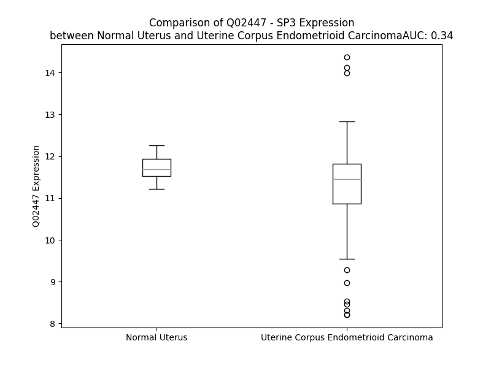

# Detailed Data for Q02447

## Introduction to the Detailed Summary

### How to Interpret the Results

- **Summary & Metrics**: This section provides a quick reference to essential protein attributes, including expression changes, family classification, and biomarker applications. Regulation status (upregulated/downregulated) indicates the protein's behavior in a disease context. Some information comes from the original excel file with the proteins selected from literature, while others are derived from the analyses.
- **Expression Comparison**: A visual representation comparing protein expression between normal and disease states. It highlights significant changes in expression levels that might indicate diagnostic or therapeutic relevance. This is data coming from transcriptomics experiments and could not translate similarly to protein levels.
- **Isoform Alignment**: An interactive view of isoform alignments, revealing structural and functional differences between variants of the protein.
- **Interactors & Homologs**: Tables listing known interaction partners and homologous proteins, the more interactors and homologs, the more complex the protein is to design an antibody for.
- **Biological Assemblies**: Information about the structural arrangement of the protein in different assemblies, providing insights into its functional state but also the complexity of the protein to develop antibodies.
- **Combined Per-Residue Information**: A detailed table summarizing residue-level data. This includes predictions for epitope regions, aggregation tendencies, and modifications that might impact the protein's function. Each row corresponds to a residue in the protein, providing insights into specific sites that may be important for research or drug development.
## Summary & Metrics

- **UniProt Accession**: Q02447
- **Gene Name**: SP3
- **Protein Name**: Transcription factor Sp3
- **Swiss Prot**: SP3_HUMAN
- **Family**: transcription regulator
- **Biomarker Application**:  
- **Number of Isoforms**: 0
- **Regulation**: 1
- **(transcriptomics) AUC**: 0.39
- **(transcriptomics) Fold Change**: 1.02
- **(transcriptomics) Regulation**: Downregulated
- **Discotope Epitope Count**: 119
- **Max n_uniprots (Homo)**: N/A
- **Max n_uniprots (Hetero)**: N/A

## Expression Comparison

## Interactors

| preferredName_A   | preferredName_B   |   score |
|:------------------|:------------------|--------:|
| SP3               | SP1               |   0.912 |

## Homologs

| uniprot_id   | gene_id   |
|:-------------|:----------|
| A0A1B0GVH1   | SP2       |
| P08047       | SP1       |
| Q02446       | SP4       |

## Combined Per-Residue Information

|   res | aa   |   epitope_score | epitope   |   relative_surface_accessibility |   modeling_confidence |   Aggregation | modification               |
|------:|:-----|----------------:|:----------|---------------------------------:|----------------------:|--------------:|:---------------------------|
|     1 | M    |         0.06029 | False     |                          1.3526  |                 45.86 |         0     | N/A                        |
|     2 | T    |         0.06847 | False     |                          0.95609 |                 35.71 |         0     | N/A                        |
|     3 | A    |         0.06065 | False     |                          0.94186 |                 38.42 |         0     | N/A                        |
|     4 | P    |         0.06603 | False     |                          0.83661 |                 42.01 |         0     | N/A                        |
|     5 | E    |         0.08927 | False     |                          0.77683 |                 36.64 |         0     | N/A                        |
|     6 | K    |         0.08148 | False     |                          0.82952 |                 40.85 |         0     | N/A                        |
|     7 | P    |         0.05126 | False     |                          0.92629 |                 32.8  |         0     | N/A                        |
|     8 | V    |         0.07009 | False     |                          0.94376 |                 39.64 |         0     | N/A                        |
|     9 | K    |         0.05937 | False     |                          0.92667 |                 38.39 |         0     | N/A                        |
|    10 | Q    |         0.07911 | False     |                          0.94837 |                 37.43 |         0     | N/A                        |
|    11 | E    |         0.05817 | False     |                          0.84662 |                 38.2  |         0     | N/A                        |
|    12 | E    |         0.06441 | False     |                          0.85216 |                 37.44 |         0     | N/A                        |
|    13 | M    |         0.08168 | False     |                          1.06586 |                 36.02 |         0     | N/A                        |
|    14 | A    |         0.04819 | False     |                          0.98645 |                 37    |         0     | N/A                        |
|    15 | A    |         0.0545  | False     |                          0.78948 |                 33.67 |         0     | N/A                        |
|    16 | L    |         0.04919 | False     |                          1.10506 |                 37.77 |         0     | N/A                        |
|    17 | D    |         0.05683 | False     |                          0.91049 |                 36.74 |         0     | N/A                        |
|    18 | V    |         0.04593 | False     |                          1.02323 |                 37.93 |         0     | N/A                        |
|    19 | D    |         0.07252 | False     |                          0.76848 |                 34.77 |         0     | N/A                        |
|    20 | S    |         0.02892 | False     |                          0.6252  |                 33.26 |         0     | N/A                        |
|    21 | G    |         0.03196 | False     |                          0.86479 |                 29.88 |         0     | N/A                        |
|    22 | G    |         0.05819 | False     |                          0.93974 |                 31.32 |         0     | N/A                        |
|    23 | G    |         0.05043 | False     |                          1.04415 |                 33.05 |         0     | N/A                        |
|    24 | G    |         0.05131 | False     |                          0.98822 |                 34.18 |         0     | N/A                        |
|    25 | G    |         0.07525 | False     |                          1.04872 |                 35.12 |         0     | N/A                        |
|    26 | G    |         0.05159 | False     |                          1.05643 |                 35.59 |         0     | N/A                        |
|    27 | G    |         0.06638 | False     |                          0.97948 |                 35.24 |         0     | N/A                        |
|    28 | G    |         0.07314 | False     |                          1.04627 |                 33.57 |         0     | N/A                        |
|    29 | G    |         0.08552 | False     |                          1.00367 |                 35.23 |         0     | N/A                        |
|    30 | H    |         0.08853 | False     |                          1.02902 |                 31.77 |         0     | N/A                        |
|    31 | G    |         0.08884 | False     |                          0.87811 |                 33.83 |         0     | N/A                        |
|    32 | E    |         0.0833  | False     |                          0.84568 |                 31.76 |         0     | N/A                        |
|    33 | Y    |         0.08684 | False     |                          0.9021  |                 32.07 |         0     | N/A                        |
|    34 | L    |         0.08648 | False     |                          0.73139 |                 35.37 |         0     | N/A                        |
|    35 | Q    |         0.05462 | False     |                          0.67068 |                 36.19 |         0     | N/A                        |
|    36 | Q    |         0.06976 | False     |                          0.74923 |                 37.4  |         0     | N/A                        |
|    37 | Q    |         0.0863  | False     |                          0.73163 |                 40.31 |         0     | N/A                        |
|    38 | Q    |         0.12778 | True      |                          0.72901 |                 39.83 |         0     | N/A                        |
|    39 | Q    |         0.07109 | False     |                          0.66749 |                 44.54 |         0     | N/A                        |
|    40 | H    |         0.09385 | True      |                          0.96608 |                 41.49 |         0     | N/A                        |
|    41 | G    |         0.07442 | False     |                          0.82209 |                 36.99 |         0     | N/A                        |
|    42 | N    |         0.10017 | True      |                          1.00684 |                 38.13 |         0     | N/A                        |
|    43 | G    |         0.09493 | True      |                          0.96948 |                 32.76 |         0     | N/A                        |
|    44 | A    |         0.08366 | False     |                          1.00389 |                 37.09 |         0.859 | N/A                        |
|    45 | V    |         0.12003 | True      |                          1.12611 |                 34.44 |         1.478 | N/A                        |
|    46 | A    |         0.14929 | True      |                          0.95474 |                 35.4  |         1.478 | N/A                        |
|    47 | A    |         0.1171  | True      |                          0.91749 |                 34.4  |         1.478 | N/A                        |
|    48 | A    |         0.06768 | False     |                          0.94682 |                 30    |         1.478 | N/A                        |
|    49 | A    |         0.10696 | True      |                          0.9636  |                 34.26 |         1.142 | N/A                        |
|    50 | A    |         0.09005 | False     |                          1.04847 |                 31.26 |         0.523 | N/A                        |
|    51 | A    |         0.14164 | True      |                          0.95649 |                 37.67 |         0     | N/A                        |
|    52 | Q    |         0.06464 | False     |                          0.88295 |                 36.26 |         0     | N/A                        |
|    53 | D    |         0.12958 | True      |                          0.87544 |                 35.21 |         0     | N/A                        |
|    54 | T    |         0.08887 | False     |                          0.87203 |                 41.27 |         0     | N/A                        |
|    55 | Q    |         0.06972 | False     |                          0.78432 |                 39.16 |         0     | N/A                        |
|    56 | P    |         0.07444 | False     |                          0.63532 |                 39.59 |         0     | N/A                        |
|    57 | S    |         0.07552 | False     |                          0.58367 |                 38.91 |         0     | N/A                        |
|    58 | P    |         0.08836 | False     |                          0.77707 |                 37.2  |         0     | N/A                        |
|    59 | L    |         0.09715 | True      |                          0.94128 |                 43.22 |        13.39  | N/A                        |
|    60 | A    |         0.04589 | False     |                          0.61707 |                 42.84 |        14.731 | N/A                        |
|    61 | L    |         0.06285 | False     |                          0.76449 |                 41.53 |        15.323 | N/A                        |
|    62 | L    |         0.09439 | True      |                          0.85682 |                 40.08 |        15.323 | N/A                        |
|    63 | A    |         0.07674 | False     |                          0.84384 |                 39.58 |        15.323 | N/A                        |
|    64 | A    |         0.09317 | True      |                          0.81616 |                 39.96 |         9.469 | N/A                        |
|    65 | T    |         0.10125 | True      |                          0.76657 |                 37.41 |         4.034 | N/A                        |
|    66 | C    |         0.10741 | True      |                          0.84216 |                 33.68 |         0.21  | N/A                        |
|    67 | S    |         0.08354 | False     |                          0.81776 |                 34.31 |         0     | N/A                        |
|    68 | K    |         0.07617 | False     |                          0.95973 |                 32.95 |         0     | N/A                        |
|    69 | I    |         0.14273 | True      |                          1.04902 |                 34.43 |         0     | N/A                        |
|    70 | G    |         0.084   | False     |                          0.73644 |                 35.77 |         0     | N/A                        |
|    71 | P    |         0.07612 | False     |                          0.91364 |                 47.7  |         0     | N/A                        |
|    72 | P    |         0.08014 | False     |                          0.97321 |                 41.05 |         0     | N/A                        |
|    73 | S    |         0.0999  | True      |                          0.80637 |                 39.37 |         0     | Phosphoserine              |
|    74 | P    |         0.10047 | True      |                          0.97009 |                 49.24 |         0     | N/A                        |
|    75 | G    |         0.11555 | True      |                          0.74852 |                 43.03 |         0     | N/A                        |
|    76 | D    |         0.13121 | True      |                          0.9014  |                 35.28 |         0     | N/A                        |
|    77 | D    |         0.07365 | False     |                          0.88742 |                 47.64 |         0     | N/A                        |
|    78 | E    |         0.0999  | True      |                          0.86405 |                 41.5  |         0     | N/A                        |
|    79 | E    |         0.07403 | False     |                          0.82159 |                 37.1  |         0     | N/A                        |
|    80 | E    |         0.09453 | True      |                          0.83747 |                 35.86 |         0     | N/A                        |
|    81 | A    |         0.05715 | False     |                          0.80294 |                 38.48 |         0     | N/A                        |
|    82 | A    |         0.06857 | False     |                          0.92088 |                 38.97 |         0     | N/A                        |
|    83 | A    |         0.07871 | False     |                          0.90314 |                 38.46 |         0     | N/A                        |
|    84 | A    |         0.06234 | False     |                          0.98412 |                 39.53 |         0     | N/A                        |
|    85 | A    |         0.04753 | False     |                          0.97143 |                 39.35 |         0     | N/A                        |
|    86 | G    |         0.06866 | False     |                          0.89451 |                 35.94 |         0     | N/A                        |
|    87 | A    |         0.05803 | False     |                          0.98946 |                 37.64 |         0     | N/A                        |
|    88 | P    |         0.04995 | False     |                          0.9783  |                 41.38 |         0     | N/A                        |
|    89 | A    |         0.08943 | False     |                          0.9734  |                 33.68 |         0     | N/A                        |
|    90 | A    |         0.07827 | False     |                          0.96847 |                 35.93 |         0     | N/A                        |
|    91 | A    |         0.07656 | False     |                          0.9657  |                 36.42 |         0     | N/A                        |
|    92 | G    |         0.12856 | True      |                          0.95779 |                 34    |         0     | N/A                        |
|    93 | A    |         0.04801 | False     |                          1.02613 |                 37.49 |         0     | N/A                        |
|    94 | T    |         0.05485 | False     |                          1.0142  |                 32.58 |         0     | N/A                        |
|    95 | G    |         0.08528 | False     |                          0.95555 |                 40.82 |         0     | N/A                        |
|    96 | D    |         0.11055 | True      |                          0.87001 |                 28.84 |         0     | N/A                        |
|    97 | L    |         0.08853 | False     |                          1.09918 |                 33.36 |         0     | N/A                        |
|    98 | A    |         0.09879 | True      |                          0.86893 |                 30.14 |         0     | N/A                        |
|    99 | S    |         0.11112 | True      |                          0.85807 |                 31.32 |         0     | N/A                        |
|   100 | A    |         0.09747 | True      |                          1.05604 |                 30.69 |         0     | N/A                        |
|   101 | Q    |         0.09662 | True      |                          0.88166 |                 26.12 |         0     | N/A                        |
|   102 | L    |         0.10913 | True      |                          1.13874 |                 28.92 |         0     | N/A                        |
|   103 | G    |         0.05158 | False     |                          0.92237 |                 24.93 |         0     | N/A                        |
|   104 | G    |         0.05905 | False     |                          0.96847 |                 29.52 |         0     | N/A                        |
|   105 | A    |         0.05881 | False     |                          0.90823 |                 29.67 |         0     | N/A                        |
|   106 | P    |         0.09259 | True      |                          0.96511 |                 36.68 |         0     | N/A                        |
|   107 | N    |         0.05066 | False     |                          0.86779 |                 33.31 |         0     | N/A                        |
|   108 | R    |         0.0928  | True      |                          0.84717 |                 28.37 |         0     | N/A                        |
|   109 | W    |         0.05868 | False     |                          1.05161 |                 22.85 |         0     | N/A                        |
|   110 | E    |         0.05249 | False     |                          0.7666  |                 28.27 |         0     | N/A                        |
|   111 | V    |         0.05199 | False     |                          0.8618  |                 22.99 |         0     | N/A                        |
|   112 | L    |         0.08423 | False     |                          1.0304  |                 29.24 |         0     | N/A                        |
|   113 | S    |         0.06258 | False     |                          0.7777  |                 23.95 |         0     | N/A                        |
|   114 | A    |         0.07231 | False     |                          0.83445 |                 30.18 |         0     | N/A                        |
|   115 | T    |         0.07999 | False     |                          0.95061 |                 28.24 |         0     | N/A                        |
|   116 | P    |         0.03676 | False     |                          0.86269 |                 29.94 |         0     | N/A                        |
|   117 | T    |         0.07027 | False     |                          0.94335 |                 32.95 |         0     | N/A                        |
|   118 | T    |         0.03735 | False     |                          0.7607  |                 30.17 |         0     | N/A                        |
|   119 | I    |         0.03485 | False     |                          0.7571  |                 33.24 |         0     | N/A                        |
|   120 | K    |         0.04785 | False     |                          0.99682 |                 31.13 |         0     | N/A                        |
|   121 | D    |         0.05207 | False     |                          0.70733 |                 35.26 |         0     | N/A                        |
|   122 | E    |         0.05651 | False     |                          0.97947 |                 36.94 |         0     | N/A                        |
|   123 | A    |         0.05205 | False     |                          0.86173 |                 37.18 |         0     | N/A                        |
|   124 | G    |         0.07423 | False     |                          0.80286 |                 30.4  |         0     | N/A                        |
|   125 | N    |         0.07875 | False     |                          1.00736 |                 33.59 |         0     | N/A                        |
|   126 | L    |         0.05248 | False     |                          0.7269  |                 26.48 |         0     | N/A                        |
|   127 | V    |         0.07173 | False     |                          1.12778 |                 30.91 |         0     | N/A                        |
|   128 | Q    |         0.05146 | False     |                          0.55761 |                 27.7  |         0     | N/A                        |
|   129 | I    |         0.07357 | False     |                          0.81901 |                 29.55 |         0     | N/A                        |
|   130 | P    |         0.05608 | False     |                          0.8399  |                 26.95 |         0     | N/A                        |
|   131 | S    |         0.08426 | False     |                          0.91649 |                 23.45 |         0     | N/A                        |
|   132 | A    |         0.05533 | False     |                          0.95187 |                 28.13 |         0     | N/A                        |
|   133 | A    |         0.05458 | False     |                          0.86231 |                 24.64 |         0     | N/A                        |
|   134 | T    |         0.05789 | False     |                          0.92082 |                 28.38 |         0     | N/A                        |
|   135 | S    |         0.04902 | False     |                          0.78129 |                 26.51 |         0     | N/A                        |
|   136 | S    |         0.05265 | False     |                          0.91668 |                 23.14 |         0     | N/A                        |
|   137 | G    |         0.04303 | False     |                          0.75493 |                 27.69 |         0     | N/A                        |
|   138 | Q    |         0.04776 | False     |                          0.72194 |                 22.28 |         0     | N/A                        |
|   139 | Y    |         0.04676 | False     |                          0.90146 |                 22.74 |         0     | N/A                        |
|   140 | V    |         0.04152 | False     |                          0.84712 |                 23.69 |         0     | N/A                        |
|   141 | L    |         0.03961 | False     |                          0.87357 |                 23.22 |         0     | N/A                        |
|   142 | P    |         0.0294  | False     |                          0.92614 |                 24.33 |         0     | N/A                        |
|   143 | L    |         0.04629 | False     |                          1.08736 |                 24.5  |         0     | N/A                        |
|   144 | Q    |         0.05194 | False     |                          0.88826 |                 27.35 |         0     | N/A                        |
|   145 | N    |         0.05537 | False     |                          0.88418 |                 24.75 |         0     | N/A                        |
|   146 | L    |         0.05762 | False     |                          0.89236 |                 28.76 |         0     | N/A                        |
|   147 | Q    |         0.03691 | False     |                          0.88808 |                 29.15 |         0     | N/A                        |
|   148 | N    |         0.05305 | False     |                          0.92119 |                 25.87 |         0     | N/A                        |
|   149 | Q    |         0.04653 | False     |                          0.7948  |                 28.09 |         0     | N/A                        |
|   150 | Q    |         0.05447 | False     |                          0.94523 |                 25.95 |         0.442 | N/A                        |
|   151 | I    |         0.05291 | False     |                          0.7297  |                 24.58 |         0.442 | N/A                        |
|   152 | F    |         0.04141 | False     |                          1.00155 |                 24.91 |         0.442 | N/A                        |
|   153 | S    |         0.03738 | False     |                          0.88736 |                 22.73 |         0.442 | N/A                        |
|   154 | V    |         0.04611 | False     |                          0.97913 |                 26.21 |         0.442 | N/A                        |
|   155 | A    |         0.01567 | False     |                          0.62609 |                 24.66 |         0     | N/A                        |
|   156 | P    |         0.0293  | False     |                          1.01349 |                 27.78 |         0     | N/A                        |
|   157 | G    |         0.08105 | False     |                          0.79637 |                 26.19 |         0     | N/A                        |
|   158 | S    |         0.05068 | False     |                          0.87021 |                 31.16 |         0     | N/A                        |
|   159 | D    |         0.05594 | False     |                          0.91345 |                 22.23 |         0     | N/A                        |
|   160 | S    |         0.08319 | False     |                          0.88443 |                 31.45 |         0     | N/A                        |
|   161 | S    |         0.08765 | False     |                          0.80979 |                 28.16 |         0     | N/A                        |
|   162 | N    |         0.11068 | True      |                          1.00884 |                 27.89 |         0     | N/A                        |
|   163 | G    |         0.13132 | True      |                          0.78189 |                 26.89 |         0     | N/A                        |
|   164 | T    |         0.07839 | False     |                          1.04756 |                 25.36 |         0     | N/A                        |
|   165 | V    |         0.07471 | False     |                          1.03634 |                 27.3  |         0     | N/A                        |
|   166 | S    |         0.05204 | False     |                          0.8011  |                 26.77 |         0     | N/A                        |
|   167 | S    |         0.03787 | False     |                          0.82131 |                 21.53 |         0     | N/A                        |
|   168 | V    |         0.0558  | False     |                          0.75364 |                 24.28 |         0     | N/A                        |
|   169 | Q    |         0.04281 | False     |                          0.85005 |                 22.61 |         0     | N/A                        |
|   170 | Y    |         0.05817 | False     |                          0.86087 |                 22.38 |         0     | N/A                        |
|   171 | Q    |         0.02654 | False     |                          0.76498 |                 23.57 |         0     | N/A                        |
|   172 | V    |         0.02544 | False     |                          0.94881 |                 23.15 |         0     | N/A                        |
|   173 | I    |         0.02451 | False     |                          0.59741 |                 22.37 |         0     | N/A                        |
|   174 | P    |         0.0194  | False     |                          0.61412 |                 25.79 |         0     | N/A                        |
|   175 | Q    |         0.02964 | False     |                          0.73211 |                 25.48 |         0     | N/A                        |
|   176 | I    |         0.02191 | False     |                          0.45627 |                 25.29 |         0     | N/A                        |
|   177 | Q    |         0.04653 | False     |                          0.89082 |                 24.31 |         0     | N/A                        |
|   178 | S    |         0.01545 | False     |                          0.35419 |                 28.42 |         0     | N/A                        |
|   179 | A    |         0.03845 | False     |                          1.06084 |                 33.12 |         0     | N/A                        |
|   180 | D    |         0.04867 | False     |                          0.74599 |                 32.73 |         0     | N/A                        |
|   181 | G    |         0.05375 | False     |                          0.8789  |                 29.47 |         0     | N/A                        |
|   182 | Q    |         0.04928 | False     |                          0.7288  |                 30.45 |         0     | N/A                        |
|   183 | Q    |         0.05894 | False     |                          0.93707 |                 27.65 |         0     | N/A                        |
|   184 | V    |         0.01785 | False     |                          0.91338 |                 26.83 |         0.519 | N/A                        |
|   185 | Q    |         0.05049 | False     |                          0.90446 |                 26.02 |         0.519 | N/A                        |
|   186 | I    |         0.05524 | False     |                          0.81358 |                 28.98 |         0.519 | N/A                        |
|   187 | G    |         0.05145 | False     |                          0.80975 |                 23.73 |         0.519 | N/A                        |
|   188 | F    |         0.05732 | False     |                          0.98721 |                 26.57 |         0.519 | N/A                        |
|   189 | T    |         0.0446  | False     |                          0.97425 |                 26.15 |         0.191 | N/A                        |
|   190 | G    |         0.05835 | False     |                          0.9641  |                 24.05 |         0     | N/A                        |
|   191 | S    |         0.04372 | False     |                          0.88217 |                 28.01 |         0     | N/A                        |
|   192 | S    |         0.05248 | False     |                          0.72876 |                 29.16 |         0     | N/A                        |
|   193 | D    |         0.06647 | False     |                          0.78178 |                 27.05 |         0     | N/A                        |
|   194 | N    |         0.09949 | True      |                          1.0188  |                 26.36 |         0     | N/A                        |
|   195 | G    |         0.13506 | True      |                          0.87426 |                 26.12 |         0     | N/A                        |
|   196 | G    |         0.11664 | True      |                          0.99664 |                 23.43 |         0     | N/A                        |
|   197 | I    |         0.09259 | True      |                          0.99078 |                 27.84 |         0     | N/A                        |
|   198 | N    |         0.05365 | False     |                          0.79819 |                 28.41 |         0     | N/A                        |
|   199 | Q    |         0.08299 | False     |                          0.78582 |                 28.58 |         0     | N/A                        |
|   200 | E    |         0.05682 | False     |                          0.85558 |                 26.81 |         0     | N/A                        |
|   201 | S    |         0.057   | False     |                          0.86966 |                 29.97 |         0     | N/A                        |
|   202 | S    |         0.04431 | False     |                          0.9162  |                 28.96 |         0     | N/A                        |
|   203 | Q    |         0.04195 | False     |                          0.89459 |                 28.41 |         0     | N/A                        |
|   204 | I    |         0.04675 | False     |                          0.95208 |                 26.38 |         0     | N/A                        |
|   205 | Q    |         0.06448 | False     |                          0.81891 |                 26.01 |         0     | N/A                        |
|   206 | I    |         0.05133 | False     |                          0.9329  |                 29.24 |         0     | N/A                        |
|   207 | I    |         0.05695 | False     |                          0.88749 |                 29.45 |         0     | N/A                        |
|   208 | P    |         0.03926 | False     |                          0.83771 |                 33.52 |         0     | N/A                        |
|   209 | G    |         0.04156 | False     |                          0.94092 |                 27.69 |         0     | N/A                        |
|   210 | S    |         0.06851 | False     |                          0.76649 |                 29.85 |         0     | N/A                        |
|   211 | N    |         0.06595 | False     |                          0.91149 |                 28.89 |         0     | N/A                        |
|   212 | Q    |         0.05694 | False     |                          0.95757 |                 29.46 |         0     | N/A                        |
|   213 | T    |         0.04722 | False     |                          0.99095 |                 29.72 |         0     | N/A                        |
|   214 | L    |         0.06536 | False     |                          0.99271 |                 23.69 |         0     | N/A                        |
|   215 | L    |         0.05931 | False     |                          1.14436 |                 25.89 |         0     | N/A                        |
|   216 | A    |         0.03255 | False     |                          0.95991 |                 25.76 |         0     | N/A                        |
|   217 | S    |         0.0684  | False     |                          0.91259 |                 26.59 |         0     | N/A                        |
|   218 | G    |         0.07461 | False     |                          0.84544 |                 27.08 |         0     | N/A                        |
|   219 | T    |         0.07956 | False     |                          0.95323 |                 28.05 |         0     | N/A                        |
|   220 | P    |         0.05454 | False     |                          0.915   |                 31.11 |         0     | N/A                        |
|   221 | S    |         0.10863 | True      |                          0.89603 |                 27.91 |         0     | N/A                        |
|   222 | A    |         0.08757 | False     |                          0.88555 |                 31.18 |         0     | N/A                        |
|   223 | N    |         0.05123 | False     |                          0.80738 |                 28.98 |         0     | N/A                        |
|   224 | I    |         0.06893 | False     |                          0.86839 |                 25.81 |         0     | N/A                        |
|   225 | Q    |         0.059   | False     |                          0.77187 |                 28.61 |         0     | N/A                        |
|   226 | N    |         0.08288 | False     |                          0.949   |                 26.29 |         0     | N/A                        |
|   227 | L    |         0.06853 | False     |                          1.09555 |                 26.19 |         0     | N/A                        |
|   228 | I    |         0.10546 | True      |                          1.00313 |                 30.41 |         0     | N/A                        |
|   229 | P    |         0.05652 | False     |                          0.92049 |                 30    |         0     | N/A                        |
|   230 | Q    |         0.08893 | False     |                          0.82851 |                 31.24 |         0     | N/A                        |
|   231 | T    |         0.06378 | False     |                          0.9143  |                 27.62 |         0     | N/A                        |
|   232 | G    |         0.08508 | False     |                          0.90524 |                 29.43 |         0     | N/A                        |
|   233 | Q    |         0.07278 | False     |                          0.78285 |                 27.59 |         0     | N/A                        |
|   234 | V    |         0.09586 | True      |                          0.96493 |                 25.77 |         0     | N/A                        |
|   235 | Q    |         0.07803 | False     |                          0.7037  |                 24.63 |         0     | N/A                        |
|   236 | V    |         0.07691 | False     |                          0.98446 |                 27.17 |         0.268 | N/A                        |
|   237 | Q    |         0.06398 | False     |                          0.7517  |                 26.16 |         0.268 | N/A                        |
|   238 | G    |         0.05984 | False     |                          0.72863 |                 25.8  |         0.268 | N/A                        |
|   239 | V    |         0.05494 | False     |                          0.99734 |                 25.4  |         0.268 | N/A                        |
|   240 | A    |         0.07498 | False     |                          0.91049 |                 26.42 |         0.268 | N/A                        |
|   241 | I    |         0.08303 | False     |                          0.97645 |                 28.03 |         0.268 | N/A                        |
|   242 | G    |         0.09813 | True      |                          0.88096 |                 26.22 |         0     | N/A                        |
|   243 | G    |         0.10923 | True      |                          0.8547  |                 26.13 |         0     | N/A                        |
|   244 | S    |         0.07191 | False     |                          0.81978 |                 28.25 |         0     | N/A                        |
|   245 | S    |         0.07699 | False     |                          0.86767 |                 26.74 |         0     | N/A                        |
|   246 | F    |         0.06931 | False     |                          0.9562  |                 27.53 |         0     | N/A                        |
|   247 | P    |         0.10284 | True      |                          1.00133 |                 29.17 |         0     | N/A                        |
|   248 | G    |         0.08129 | False     |                          0.7151  |                 28.47 |         0     | N/A                        |
|   249 | Q    |         0.08508 | False     |                          0.97604 |                 25.73 |         0     | N/A                        |
|   250 | T    |         0.07245 | False     |                          0.83778 |                 24.03 |         0.159 | N/A                        |
|   251 | Q    |         0.07034 | False     |                          0.87067 |                 24.43 |         0.159 | N/A                        |
|   252 | V    |         0.07102 | False     |                          0.98153 |                 22.83 |         0.159 | N/A                        |
|   253 | V    |         0.07426 | False     |                          0.76335 |                 23.79 |         0.159 | N/A                        |
|   254 | A    |         0.04459 | False     |                          0.79039 |                 23.42 |         0.159 | N/A                        |
|   255 | N    |         0.05545 | False     |                          0.85659 |                 24.86 |         0     | N/A                        |
|   256 | V    |         0.03594 | False     |                          0.77733 |                 24.7  |         0     | N/A                        |
|   257 | P    |         0.05034 | False     |                          0.93407 |                 26.44 |         0     | N/A                        |
|   258 | L    |         0.07923 | False     |                          0.91505 |                 27.56 |         0     | N/A                        |
|   259 | G    |         0.05268 | False     |                          0.47993 |                 26.78 |         0     | N/A                        |
|   260 | L    |         0.07192 | False     |                          0.97916 |                 27.86 |         0     | N/A                        |
|   261 | P    |         0.02473 | False     |                          0.28487 |                 25.53 |         0     | N/A                        |
|   262 | G    |         0.05415 | False     |                          0.39919 |                 25.47 |         0     | N/A                        |
|   263 | N    |         0.0622  | False     |                          0.93499 |                 25.81 |         0     | N/A                        |
|   264 | I    |         0.09678 | True      |                          0.64853 |                 25.53 |         0.281 | N/A                        |
|   265 | T    |         0.0673  | False     |                          0.78542 |                 23    |         0.281 | N/A                        |
|   266 | F    |         0.1043  | True      |                          0.88961 |                 25.21 |         0.281 | N/A                        |
|   267 | V    |         0.05177 | False     |                          0.78277 |                 24.19 |         0.281 | N/A                        |
|   268 | P    |         0.08567 | False     |                          0.76669 |                 26.49 |         0.281 | N/A                        |
|   269 | I    |         0.08793 | False     |                          0.84547 |                 27.17 |         0     | N/A                        |
|   270 | N    |         0.07614 | False     |                          0.7831  |                 27.68 |         0     | N/A                        |
|   271 | S    |         0.07989 | False     |                          0.51796 |                 30.09 |         0     | N/A                        |
|   272 | V    |         0.05895 | False     |                          0.62716 |                 34.07 |         0     | N/A                        |
|   273 | D    |         0.05922 | False     |                          0.33288 |                 38.76 |         0     | N/A                        |
|   274 | L    |         0.06821 | False     |                          0.72481 |                 37.58 |         0     | N/A                        |
|   275 | D    |         0.06751 | False     |                          0.58818 |                 39.73 |         0     | N/A                        |
|   276 | S    |         0.03903 | False     |                          0.24951 |                 40.5  |         0     | N/A                        |
|   277 | L    |         0.07229 | False     |                          0.67389 |                 41.87 |         0     | N/A                        |
|   278 | G    |         0.04209 | False     |                          0.80989 |                 32.87 |         0     | N/A                        |
|   279 | L    |         0.08945 | False     |                          0.87684 |                 35.33 |         0     | N/A                        |
|   280 | S    |         0.08901 | False     |                          0.81202 |                 30.34 |         0     | N/A                        |
|   281 | G    |         0.08748 | False     |                          0.8063  |                 27.44 |         0     | N/A                        |
|   282 | S    |         0.09662 | True      |                          0.86947 |                 30.66 |         0     | N/A                        |
|   283 | S    |         0.09939 | True      |                          0.9162  |                 26.61 |         0     | N/A                        |
|   284 | Q    |         0.07008 | False     |                          0.72777 |                 28.13 |         0     | N/A                        |
|   285 | T    |         0.07125 | False     |                          1.04971 |                 25.37 |         0     | N/A                        |
|   286 | M    |         0.06454 | False     |                          0.7132  |                 26.14 |         0     | N/A                        |
|   287 | T    |         0.05919 | False     |                          1.03984 |                 27.53 |         0     | N/A                        |
|   288 | A    |         0.05712 | False     |                          0.5534  |                 30.07 |         0     | N/A                        |
|   289 | G    |         0.04856 | False     |                          0.44384 |                 28.63 |         0     | N/A                        |
|   290 | I    |         0.06595 | False     |                          0.72218 |                 33.95 |         0     | N/A                        |
|   291 | N    |         0.02562 | False     |                          0.35229 |                 41.88 |         0     | N/A                        |
|   292 | A    |         0.07688 | False     |                          1.09331 |                 37.42 |         0     | N/A                        |
|   293 | D    |         0.03537 | False     |                          0.72243 |                 37.1  |         0     | N/A                        |
|   294 | G    |         0.0478  | False     |                          0.69668 |                 33.46 |         0     | N/A                        |
|   295 | H    |         0.07635 | False     |                          0.70865 |                 33.91 |         0     | N/A                        |
|   296 | L    |         0.11516 | True      |                          0.82441 |                 34.01 |         0     | N/A                        |
|   297 | I    |         0.09131 | False     |                          0.48556 |                 35.13 |         0     | N/A                        |
|   298 | N    |         0.07905 | False     |                          0.77029 |                 34.31 |         0     | N/A                        |
|   299 | T    |         0.08737 | False     |                          0.86765 |                 33.46 |         0     | N/A                        |
|   300 | G    |         0.09205 | True      |                          0.82972 |                 30.55 |         0     | N/A                        |
|   301 | Q    |         0.14141 | True      |                          0.90311 |                 30.46 |         0     | N/A                        |
|   302 | A    |         0.09234 | True      |                          0.92073 |                 28.41 |         0     | N/A                        |
|   303 | M    |         0.1242  | True      |                          1.06445 |                 33.23 |         0     | N/A                        |
|   304 | D    |         0.09387 | True      |                          0.7971  |                 27.81 |         0     | N/A                        |
|   305 | S    |         0.12263 | True      |                          0.7865  |                 31.87 |         0     | N/A                        |
|   306 | S    |         0.07441 | False     |                          0.75307 |                 31.51 |         0     | N/A                        |
|   307 | D    |         0.07659 | False     |                          0.73576 |                 33.66 |         0     | N/A                        |
|   308 | N    |         0.11992 | True      |                          0.85283 |                 29.71 |         0     | N/A                        |
|   309 | S    |         0.05866 | False     |                          0.58396 |                 33.36 |         0     | N/A                        |
|   310 | E    |         0.11075 | True      |                          0.74512 |                 31.02 |         0     | N/A                        |
|   311 | R    |         0.09884 | True      |                          0.78759 |                 33.49 |         0     | N/A                        |
|   312 | T    |         0.04791 | False     |                          0.87872 |                 29.43 |         0     | N/A                        |
|   313 | G    |         0.06111 | False     |                          0.75854 |                 31.05 |         0     | N/A                        |
|   314 | E    |         0.08128 | False     |                          0.79887 |                 29.5  |         0     | N/A                        |
|   315 | R    |         0.08999 | False     |                          0.81159 |                 28.03 |         0     | N/A                        |
|   316 | V    |         0.08599 | False     |                          1.0026  |                 32    |         0     | N/A                        |
|   317 | S    |         0.05542 | False     |                          0.74283 |                 30.94 |         0     | N/A                        |
|   318 | P    |         0.06609 | False     |                          0.85029 |                 42.52 |         0     | N/A                        |
|   319 | D    |         0.08001 | False     |                          0.70959 |                 34.48 |         0     | N/A                        |
|   320 | I    |         0.10886 | True      |                          0.87148 |                 35.81 |         0     | N/A                        |
|   321 | N    |         0.08205 | False     |                          0.71183 |                 34.51 |         0     | N/A                        |
|   322 | E    |         0.10335 | True      |                          0.74102 |                 34.55 |         0     | N/A                        |
|   323 | T    |         0.09113 | False     |                          0.6921  |                 36.2  |         0     | N/A                        |
|   324 | N    |         0.09481 | True      |                          0.84485 |                 32.2  |         0     | N/A                        |
|   325 | T    |         0.06954 | False     |                          0.89378 |                 36.9  |         0     | N/A                        |
|   326 | D    |         0.06837 | False     |                          0.84592 |                 30.56 |         0     | N/A                        |
|   327 | T    |         0.11104 | True      |                          0.85974 |                 36.56 |         0     | N/A                        |
|   328 | D    |         0.1011  | True      |                          0.75281 |                 29.02 |         0     | N/A                        |
|   329 | L    |         0.09399 | True      |                          0.99061 |                 34.1  |         0     | N/A                        |
|   330 | F    |         0.10599 | True      |                          0.93558 |                 25.35 |         0     | N/A                        |
|   331 | V    |         0.09313 | True      |                          0.91441 |                 27.5  |         0     | N/A                        |
|   332 | P    |         0.11077 | True      |                          0.8013  |                 30.76 |         0     | N/A                        |
|   333 | T    |         0.10136 | True      |                          0.92476 |                 23.02 |         0     | N/A                        |
|   334 | S    |         0.05902 | False     |                          0.79115 |                 24.7  |         0     | N/A                        |
|   335 | S    |         0.09147 | True      |                          0.80096 |                 27.17 |         0     | N/A                        |
|   336 | S    |         0.07268 | False     |                          0.90532 |                 28.72 |         0     | N/A                        |
|   337 | S    |         0.06037 | False     |                          0.79037 |                 29.68 |         0     | N/A                        |
|   338 | Q    |         0.0742  | False     |                          0.80077 |                 27.19 |         0     | N/A                        |
|   339 | L    |         0.06367 | False     |                          0.90851 |                 29.79 |         0     | N/A                        |
|   340 | P    |         0.08409 | False     |                          0.90826 |                 30.97 |         0     | N/A                        |
|   341 | V    |         0.0616  | False     |                          0.79212 |                 27.39 |         0     | N/A                        |
|   342 | T    |         0.11338 | True      |                          0.7853  |                 27.97 |         0     | N/A                        |
|   343 | I    |         0.10979 | True      |                          0.84763 |                 27.69 |         0     | N/A                        |
|   344 | D    |         0.09599 | True      |                          0.77562 |                 26.83 |         0     | N/A                        |
|   345 | S    |         0.07079 | False     |                          0.71967 |                 32.11 |         0     | N/A                        |
|   346 | T    |         0.08893 | False     |                          0.94823 |                 28.08 |         0     | N/A                        |
|   347 | G    |         0.10802 | True      |                          0.84212 |                 31.93 |         0     | N/A                        |
|   348 | I    |         0.08944 | False     |                          0.85155 |                 26.61 |         0     | N/A                        |
|   349 | L    |         0.10063 | True      |                          0.88046 |                 26.84 |         0     | N/A                        |
|   350 | Q    |         0.07787 | False     |                          0.61803 |                 28.91 |         0     | N/A                        |
|   351 | Q    |         0.11183 | True      |                          0.7663  |                 28.45 |         0     | N/A                        |
|   352 | N    |         0.12003 | True      |                          0.87719 |                 28.59 |         0     | N/A                        |
|   353 | T    |         0.09149 | True      |                          0.80935 |                 25.08 |         0     | N/A                        |
|   354 | N    |         0.09888 | True      |                          0.96148 |                 31.39 |         0     | N/A                        |
|   355 | S    |         0.10058 | True      |                          0.73363 |                 24.97 |         0     | N/A                        |
|   356 | L    |         0.08206 | False     |                          0.95783 |                 28.49 |         0     | N/A                        |
|   357 | T    |         0.052   | False     |                          0.72618 |                 26.82 |         0     | N/A                        |
|   358 | T    |         0.07768 | False     |                          0.91992 |                 24.12 |         0     | N/A                        |
|   359 | S    |         0.06459 | False     |                          0.93856 |                 34.3  |         0     | N/A                        |
|   360 | S    |         0.06244 | False     |                          0.88179 |                 26.74 |         0     | N/A                        |
|   361 | G    |         0.06936 | False     |                          0.98367 |                 32.41 |         0     | N/A                        |
|   362 | Q    |         0.07119 | False     |                          0.78309 |                 26.94 |         0     | N/A                        |
|   363 | V    |         0.05369 | False     |                          1.02542 |                 32.22 |         0     | N/A                        |
|   364 | H    |         0.06172 | False     |                          0.81574 |                 32.14 |         0     | N/A                        |
|   365 | S    |         0.10231 | True      |                          0.76052 |                 27.63 |         0     | N/A                        |
|   366 | S    |         0.07709 | False     |                          0.8897  |                 34.11 |         0     | N/A                        |
|   367 | D    |         0.07447 | False     |                          0.79419 |                 28.03 |         0     | N/A                        |
|   368 | L    |         0.08568 | False     |                          0.92684 |                 34.54 |         0     | N/A                        |
|   369 | Q    |         0.05511 | False     |                          0.83632 |                 33.6  |         0     | N/A                        |
|   370 | G    |         0.12638 | True      |                          0.8048  |                 28.04 |         0     | N/A                        |
|   371 | N    |         0.10518 | True      |                          1.02867 |                 31.95 |         0     | N/A                        |
|   372 | Y    |         0.10078 | True      |                          0.88089 |                 25.02 |         0     | N/A                        |
|   373 | I    |         0.08836 | False     |                          1.0347  |                 31.41 |         0     | N/A                        |
|   374 | Q    |         0.08209 | False     |                          0.72651 |                 26.77 |         0     | N/A                        |
|   375 | S    |         0.07428 | False     |                          0.7482  |                 26.77 |         0     | N/A                        |
|   376 | P    |         0.08075 | False     |                          0.9223  |                 33.89 |         0     | N/A                        |
|   377 | V    |         0.05807 | False     |                          0.90849 |                 25.81 |         0     | N/A                        |
|   378 | S    |         0.07945 | False     |                          0.88914 |                 31.35 |         0     | N/A                        |
|   379 | E    |         0.10459 | True      |                          0.77555 |                 27.63 |         0     | N/A                        |
|   380 | E    |         0.1213  | True      |                          0.87118 |                 31.75 |         0     | N/A                        |
|   381 | T    |         0.06557 | False     |                          0.8305  |                 27.17 |         0     | N/A                        |
|   382 | Q    |         0.10157 | True      |                          0.85704 |                 31.29 |         0     | N/A                        |
|   383 | A    |         0.0528  | False     |                          0.79641 |                 30.33 |         0     | N/A                        |
|   384 | Q    |         0.08375 | False     |                          0.89724 |                 26.73 |         0     | N/A                        |
|   385 | N    |         0.08928 | False     |                          0.89463 |                 27.15 |         0     | N/A                        |
|   386 | I    |         0.07341 | False     |                          0.93637 |                 22.35 |         0     | N/A                        |
|   387 | Q    |         0.09482 | True      |                          0.86661 |                 27.68 |         0     | N/A                        |
|   388 | V    |         0.08109 | False     |                          0.91472 |                 20.81 |         0     | N/A                        |
|   389 | S    |         0.09444 | True      |                          0.88872 |                 25.12 |         0     | N/A                        |
|   390 | T    |         0.0753  | False     |                          0.85755 |                 24.1  |         0     | N/A                        |
|   391 | A    |         0.07073 | False     |                          0.87846 |                 23.64 |         0     | N/A                        |
|   392 | Q    |         0.09259 | True      |                          0.8842  |                 26.33 |         0     | N/A                        |
|   393 | P    |         0.04194 | False     |                          0.88161 |                 27.3  |         0     | N/A                        |
|   394 | V    |         0.0675  | False     |                          0.92372 |                 27.19 |         0     | N/A                        |
|   395 | V    |         0.06803 | False     |                          0.96763 |                 22.02 |         0     | N/A                        |
|   396 | Q    |         0.0737  | False     |                          0.81793 |                 30.5  |         0     | N/A                        |
|   397 | H    |         0.09164 | True      |                          0.83431 |                 24.02 |         0     | N/A                        |
|   398 | L    |         0.10405 | True      |                          0.91877 |                 25.75 |         0     | N/A                        |
|   399 | Q    |         0.0571  | False     |                          0.70054 |                 27.49 |         0     | N/A                        |
|   400 | L    |         0.08402 | False     |                          0.83975 |                 22.45 |         0     | N/A                        |
|   401 | Q    |         0.1005  | True      |                          0.92351 |                 27.28 |         0     | N/A                        |
|   402 | E    |         0.11645 | True      |                          0.83734 |                 25.65 |         0     | N/A                        |
|   403 | S    |         0.10678 | True      |                          0.72637 |                 26.11 |         0     | N/A                        |
|   404 | Q    |         0.07222 | False     |                          0.81686 |                 28.32 |         0     | N/A                        |
|   405 | Q    |         0.07774 | False     |                          0.84192 |                 24.57 |         0     | N/A                        |
|   406 | P    |         0.08577 | False     |                          0.76756 |                 31.14 |         0     | N/A                        |
|   407 | T    |         0.06901 | False     |                          0.79917 |                 26.56 |         0     | N/A                        |
|   408 | S    |         0.04379 | False     |                          0.66075 |                 26.66 |         0     | N/A                        |
|   409 | Q    |         0.05716 | False     |                          0.4326  |                 27.11 |         0     | N/A                        |
|   410 | A    |         0.03481 | False     |                          0.53993 |                 23.94 |         0     | N/A                        |
|   411 | Q    |         0.06177 | False     |                          0.75484 |                 27.31 |         0     | N/A                        |
|   412 | I    |         0.07289 | False     |                          0.96006 |                 24.02 |         0.296 | N/A                        |
|   413 | V    |         0.06209 | False     |                          0.9842  |                 26.65 |         0.296 | N/A                        |
|   414 | Q    |         0.04359 | False     |                          0.8117  |                 26.56 |         0.296 | N/A                        |
|   415 | G    |         0.07339 | False     |                          0.87962 |                 25.6  |         0.296 | N/A                        |
|   416 | I    |         0.06881 | False     |                          0.90302 |                 28.53 |         0.296 | N/A                        |
|   417 | T    |         0.05582 | False     |                          0.78205 |                 27.54 |         0     | N/A                        |
|   418 | P    |         0.05154 | False     |                          0.87427 |                 27.41 |         0     | N/A                        |
|   419 | Q    |         0.08409 | False     |                          0.82484 |                 29.59 |         0     | N/A                        |
|   420 | T    |         0.06028 | False     |                          0.81531 |                 28.72 |         0     | N/A                        |
|   421 | I    |         0.09522 | True      |                          0.84379 |                 27.11 |         0     | N/A                        |
|   422 | H    |         0.12754 | True      |                          0.96669 |                 28.28 |         0     | N/A                        |
|   423 | G    |         0.10542 | True      |                          0.83481 |                 24.9  |         0     | N/A                        |
|   424 | V    |         0.07244 | False     |                          1.0932  |                 27.98 |         0     | N/A                        |
|   425 | Q    |         0.08967 | False     |                          0.85006 |                 26.97 |         0     | N/A                        |
|   426 | A    |         0.06108 | False     |                          0.87726 |                 27.74 |         0     | N/A                        |
|   427 | S    |         0.06233 | False     |                          0.89743 |                 29.54 |         0     | N/A                        |
|   428 | G    |         0.05984 | False     |                          0.91833 |                 26.61 |         0     | N/A                        |
|   429 | Q    |         0.11088 | True      |                          0.9301  |                 31.81 |         0     | N/A                        |
|   430 | N    |         0.07592 | False     |                          0.94509 |                 26.63 |         0     | N/A                        |
|   431 | I    |         0.08548 | False     |                          1.02998 |                 29.63 |         0     | N/A                        |
|   432 | S    |         0.05697 | False     |                          0.53517 |                 28.84 |         0     | N/A                        |
|   433 | Q    |         0.06907 | False     |                          0.88235 |                 31.46 |         0     | N/A                        |
|   434 | Q    |         0.0886  | False     |                          0.76324 |                 31.01 |         0     | N/A                        |
|   435 | A    |         0.07345 | False     |                          0.91144 |                 30.4  |         0     | N/A                        |
|   436 | L    |         0.08798 | False     |                          1.06194 |                 30.69 |         0     | N/A                        |
|   437 | Q    |         0.11001 | True      |                          0.76784 |                 31.08 |         0     | N/A                        |
|   438 | N    |         0.0885  | False     |                          0.77616 |                 25.59 |         0     | N/A                        |
|   439 | L    |         0.06913 | False     |                          0.93691 |                 24.86 |         0     | N/A                        |
|   440 | Q    |         0.06253 | False     |                          0.51627 |                 26.42 |         0     | N/A                        |
|   441 | L    |         0.0604  | False     |                          0.69332 |                 26.3  |         0     | N/A                        |
|   442 | Q    |         0.08095 | False     |                          0.84888 |                 27.25 |         0     | N/A                        |
|   443 | L    |         0.04647 | False     |                          0.35297 |                 32.1  |         0     | N/A                        |
|   444 | N    |         0.0675  | False     |                          0.81831 |                 33.46 |         0     | N/A                        |
|   445 | P    |         0.05701 | False     |                          0.74103 |                 34.77 |         0     | N/A                        |
|   446 | G    |         0.02883 | False     |                          0.27506 |                 39.38 |         2.024 | N/A                        |
|   447 | T    |         0.02914 | False     |                          0.29677 |                 43.33 |         3.972 | N/A                        |
|   448 | F    |         0.01695 | False     |                          0.13153 |                 42.04 |         5.668 | N/A                        |
|   449 | L    |         0.04035 | False     |                          0.41064 |                 51.4  |         5.668 | N/A                        |
|   450 | I    |         0.01412 | False     |                          0.11999 |                 43.64 |         5.668 | N/A                        |
|   451 | Q    |         0.04438 | False     |                          0.42956 |                 41.02 |         3.644 | N/A                        |
|   452 | A    |         0.01598 | False     |                          0.17601 |                 47.72 |         2.704 | N/A                        |
|   453 | Q    |         0.02484 | False     |                          0.18162 |                 55.32 |         0.574 | N/A                        |
|   454 | T    |         0.0513  | False     |                          0.31704 |                 53.75 |         0.574 | N/A                        |
|   455 | V    |         0.03736 | False     |                          0.70555 |                 48.6  |         0.574 | N/A                        |
|   456 | T    |         0.06874 | False     |                          0.30526 |                 62.54 |         0     | N/A                        |
|   457 | P    |         0.10522 | True      |                          1.10713 |                 44.15 |         0     | N/A                        |
|   458 | S    |         0.08274 | False     |                          0.72984 |                 64.4  |         0     | N/A                        |
|   459 | G    |         0.04237 | False     |                          0.6332  |                 45.07 |         0     | N/A                        |
|   460 | Q    |         0.06608 | False     |                          0.62077 |                 44.42 |         0     | N/A                        |
|   461 | V    |         0.04433 | False     |                          0.35718 |                 53.65 |         0.706 | N/A                        |
|   462 | T    |         0.05902 | False     |                          0.33647 |                 50.25 |         0.706 | N/A                        |
|   463 | W    |         0.04232 | False     |                          0.5675  |                 60.61 |         0.706 | N/A                        |
|   464 | Q    |         0.04862 | False     |                          0.41793 |                 53.5  |         0.706 | N/A                        |
|   465 | T    |         0.06007 | False     |                          0.50339 |                 53.23 |         0.706 | N/A                        |
|   466 | F    |         0.02418 | False     |                          0.45516 |                 47.79 |         0.706 | N/A                        |
|   467 | Q    |         0.05    | False     |                          0.67355 |                 51.15 |         0.222 | N/A                        |
|   468 | V    |         0.02827 | False     |                          0.30181 |                 47.38 |         0.222 | N/A                        |
|   469 | Q    |         0.06559 | False     |                          0.71072 |                 46.86 |         0     | N/A                        |
|   470 | G    |         0.04217 | False     |                          0.79388 |                 41.29 |         0     | N/A                        |
|   471 | V    |         0.02401 | False     |                          0.16463 |                 40.02 |         0     | N/A                        |
|   472 | Q    |         0.05401 | False     |                          0.73272 |                 42.53 |         0     | N/A                        |
|   473 | N    |         0.03914 | False     |                          0.53436 |                 35.42 |         0     | N/A                        |
|   474 | L    |         0.02839 | False     |                          0.33023 |                 38.13 |         0     | N/A                        |
|   475 | Q    |         0.07261 | False     |                          0.62652 |                 39.87 |         0     | N/A                        |
|   476 | N    |         0.04239 | False     |                          0.87904 |                 29.44 |         0     | N/A                        |
|   477 | L    |         0.04171 | False     |                          0.52345 |                 31.46 |         0     | N/A                        |
|   478 | Q    |         0.08252 | False     |                          0.9274  |                 30.8  |         0     | N/A                        |
|   479 | I    |         0.03391 | False     |                          0.49859 |                 34.03 |         0     | N/A                        |
|   480 | Q    |         0.06155 | False     |                          0.83481 |                 31.59 |         0     | N/A                        |
|   481 | N    |         0.07902 | False     |                          0.95568 |                 30.36 |         0     | N/A                        |
|   482 | T    |         0.0442  | False     |                          0.61832 |                 32.06 |         0     | N/A                        |
|   483 | A    |         0.06569 | False     |                          0.95568 |                 31.46 |         0     | N/A                        |
|   484 | A    |         0.03998 | False     |                          0.9169  |                 31.02 |         0     | N/A                        |
|   485 | Q    |         0.03118 | False     |                          0.42298 |                 34.22 |         0     | N/A                        |
|   486 | Q    |         0.03586 | False     |                          0.66723 |                 32.99 |         0     | N/A                        |
|   487 | I    |         0.01587 | False     |                          0.40798 |                 31.46 |         0     | N/A                        |
|   488 | T    |         0.03335 | False     |                          0.50719 |                 34.78 |         0     | N/A                        |
|   489 | L    |         0.03517 | False     |                          0.58413 |                 29.78 |         0     | N/A                        |
|   490 | T    |         0.03396 | False     |                          0.53318 |                 31.55 |         0     | N/A                        |
|   491 | P    |         0.05188 | False     |                          0.65695 |                 31.25 |         0     | N/A                        |
|   492 | V    |         0.04193 | False     |                          0.39523 |                 28.95 |         0.289 | N/A                        |
|   493 | Q    |         0.06508 | False     |                          0.71215 |                 32.32 |         0.289 | N/A                        |
|   494 | T    |         0.06094 | False     |                          0.70083 |                 26.61 |         0.289 | N/A                        |
|   495 | L    |         0.04763 | False     |                          0.58273 |                 28.18 |         0.289 | N/A                        |
|   496 | T    |         0.07877 | False     |                          0.79629 |                 28.37 |         0.289 | N/A                        |
|   497 | L    |         0.05418 | False     |                          0.61163 |                 24.96 |         0.289 | N/A                        |
|   498 | G    |         0.04725 | False     |                          0.47913 |                 25.39 |         0     | N/A                        |
|   499 | Q    |         0.055   | False     |                          0.61345 |                 27.02 |         0     | N/A                        |
|   500 | V    |         0.02984 | False     |                          0.84971 |                 27.01 |         0     | N/A                        |
|   501 | A    |         0.04563 | False     |                          0.85454 |                 26.22 |         0     | N/A                        |
|   502 | A    |         0.04278 | False     |                          0.93625 |                 29.26 |         0     | N/A                        |
|   503 | G    |         0.05976 | False     |                          1.0365  |                 26.8  |         0     | N/A                        |
|   504 | G    |         0.0758  | False     |                          1.00245 |                 28.08 |         0     | N/A                        |
|   505 | A    |         0.09354 | True      |                          0.78603 |                 27.65 |         0     | N/A                        |
|   506 | F    |         0.06889 | False     |                          1.08012 |                 29.52 |         0     | N/A                        |
|   507 | T    |         0.07069 | False     |                          0.89081 |                 29.6  |         0     | N/A                        |
|   508 | S    |         0.0483  | False     |                          0.75098 |                 26.32 |         0     | N/A                        |
|   509 | T    |         0.03993 | False     |                          0.56415 |                 26.69 |         0     | N/A                        |
|   510 | P    |         0.03607 | False     |                          0.53079 |                 28.54 |         0     | N/A                        |
|   511 | V    |         0.03514 | False     |                          0.56144 |                 24.41 |         0     | N/A                        |
|   512 | S    |         0.06541 | False     |                          0.61395 |                 22.71 |         0     | N/A                        |
|   513 | L    |         0.0469  | False     |                          0.98439 |                 25.17 |         0     | N/A                        |
|   514 | S    |         0.05661 | False     |                          0.77158 |                 23.61 |         0     | N/A                        |
|   515 | T    |         0.0416  | False     |                          1.07629 |                 23.89 |         0     | N/A                        |
|   516 | G    |         0.05557 | False     |                          0.70768 |                 27.86 |         0     | N/A                        |
|   517 | Q    |         0.04052 | False     |                          0.89317 |                 29.5  |         0     | N/A                        |
|   518 | L    |         0.07909 | False     |                          1.08078 |                 27.81 |         0     | N/A                        |
|   519 | P    |         0.03579 | False     |                          0.58449 |                 23.14 |         0     | N/A                        |
|   520 | N    |         0.04937 | False     |                          0.58394 |                 25.43 |         0     | N/A                        |
|   521 | L    |         0.07256 | False     |                          0.80683 |                 24.21 |         0.62  | N/A                        |
|   522 | Q    |         0.04075 | False     |                          0.66435 |                 25.79 |         0.62  | N/A                        |
|   523 | T    |         0.04067 | False     |                          0.81529 |                 22.9  |         0.62  | N/A                        |
|   524 | V    |         0.05844 | False     |                          0.80438 |                 23.5  |         0.62  | N/A                        |
|   525 | T    |         0.0523  | False     |                          0.61842 |                 23.1  |         0.62  | N/A                        |
|   526 | V    |         0.06093 | False     |                          0.93397 |                 23.24 |         0.62  | N/A                        |
|   527 | N    |         0.06357 | False     |                          0.7028  |                 25.8  |         0     | N/A                        |
|   528 | S    |         0.0582  | False     |                          0.65038 |                 27.14 |         0     | N/A                        |
|   529 | I    |         0.04822 | False     |                          0.99677 |                 28.95 |         0     | N/A                        |
|   530 | D    |         0.02985 | False     |                          0.35538 |                 25.62 |         0     | N/A                        |
|   531 | S    |         0.06072 | False     |                          0.777   |                 29.82 |         0     | N/A                        |
|   532 | A    |         0.05508 | False     |                          1.06988 |                 27.77 |         0     | N/A                        |
|   533 | G    |         0.09557 | True      |                          0.83454 |                 27.44 |         0     | N/A                        |
|   534 | I    |         0.06318 | False     |                          0.9205  |                 24.72 |         0     | N/A                        |
|   535 | Q    |         0.07927 | False     |                          0.81172 |                 26.86 |         0     | N/A                        |
|   536 | L    |         0.05708 | False     |                          0.95518 |                 22.66 |         0     | N/A                        |
|   537 | H    |         0.05027 | False     |                          0.98194 |                 27.83 |         0     | N/A                        |
|   538 | P    |         0.04329 | False     |                          0.89292 |                 27.8  |         0     | N/A                        |
|   539 | G    |         0.07733 | False     |                          0.93962 |                 30.57 |         0     | N/A                        |
|   540 | E    |         0.05384 | False     |                          0.83585 |                 28.88 |         0     | N/A                        |
|   541 | N    |         0.07667 | False     |                          0.88144 |                 32.8  |         0     | N/A                        |
|   542 | A    |         0.03783 | False     |                          0.89201 |                 33.85 |         0     | N/A                        |
|   543 | D    |         0.05497 | False     |                          0.89074 |                 34.23 |         0     | N/A                        |
|   544 | S    |         0.04003 | False     |                          0.76005 |                 28.33 |         0     | N/A                        |
|   545 | P    |         0.06393 | False     |                          0.925   |                 35.35 |         0     | N/A                        |
|   546 | A    |         0.02547 | False     |                          0.90892 |                 34.16 |         0     | N/A                        |
|   547 | D    |         0.04652 | False     |                          0.77857 |                 29.14 |         0     | N/A                        |
|   548 | I    |         0.08144 | False     |                          0.99831 |                 28.92 |         0     | N/A                        |
|   549 | R    |         0.07182 | False     |                          0.90948 |                 27.85 |         0     | N/A                        |
|   550 | I    |         0.08381 | False     |                          0.94576 |                 31.49 |         0     | N/A                        |
|   551 | K    |         0.05587 | False     |                          0.9017  |                 31.33 |         0     | N6-acetyllysine; alternate |
|   552 | E    |         0.0619  | False     |                          0.89776 |                 30.37 |         0     | N/A                        |
|   553 | E    |         0.07468 | False     |                          0.86574 |                 32    |         0     | N/A                        |
|   554 | E    |         0.06304 | False     |                          0.80398 |                 34.98 |         0     | N/A                        |
|   555 | P    |         0.10678 | True      |                          0.91032 |                 40.43 |         0     | N/A                        |
|   556 | D    |         0.06946 | False     |                          0.76051 |                 33.36 |         0     | N/A                        |
|   557 | P    |         0.06538 | False     |                          0.88375 |                 33.89 |         0     | N/A                        |
|   558 | E    |         0.05974 | False     |                          0.69865 |                 38.13 |         0     | N/A                        |
|   559 | E    |         0.07569 | False     |                          0.91715 |                 37.69 |         0     | N/A                        |
|   560 | W    |         0.05431 | False     |                          0.88602 |                 30.07 |         0     | N/A                        |
|   561 | Q    |         0.1052  | True      |                          0.81977 |                 31.68 |         0     | N/A                        |
|   562 | L    |         0.07187 | False     |                          1.11496 |                 28.62 |         0     | N/A                        |
|   563 | S    |         0.09285 | True      |                          0.88421 |                 31.24 |         0     | Phosphoserine              |
|   564 | G    |         0.06278 | False     |                          0.94578 |                 31.04 |         0     | N/A                        |
|   565 | D    |         0.10591 | True      |                          0.90416 |                 33.5  |         0     | N/A                        |
|   566 | S    |         0.05827 | False     |                          0.7213  |                 31.84 |         0     | Phosphoserine              |
|   567 | T    |         0.05305 | False     |                          0.91496 |                 31.98 |         0     | N/A                        |
|   568 | L    |         0.06151 | False     |                          1.12216 |                 34.66 |         0     | N/A                        |
|   569 | N    |         0.08075 | False     |                          0.6673  |                 34.47 |         0     | N/A                        |
|   570 | T    |         0.06364 | False     |                          0.9005  |                 43.29 |         0     | N/A                        |
|   571 | N    |         0.08686 | False     |                          0.75505 |                 43.37 |         0     | N/A                        |
|   572 | D    |         0.06558 | False     |                          0.7152  |                 42.72 |         0     | N/A                        |
|   573 | L    |         0.08583 | False     |                          0.94651 |                 40.22 |         0     | N/A                        |
|   574 | T    |         0.06907 | False     |                          0.79656 |                 42.32 |         0     | N/A                        |
|   575 | H    |         0.05196 | False     |                          0.86747 |                 35.02 |         0     | N/A                        |
|   576 | L    |         0.06089 | False     |                          0.89358 |                 30.35 |         0     | N/A                        |
|   577 | R    |         0.09691 | True      |                          0.71963 |                 29.66 |         0     | N/A                        |
|   578 | V    |         0.06617 | False     |                          0.82351 |                 31.45 |         0     | N/A                        |
|   579 | Q    |         0.08313 | False     |                          0.601   |                 30.82 |         0     | N/A                        |
|   580 | V    |         0.06083 | False     |                          0.81773 |                 35.84 |         0     | N/A                        |
|   581 | V    |         0.05621 | False     |                          0.71409 |                 36.51 |         0     | N/A                        |
|   582 | D    |         0.05793 | False     |                          0.7786  |                 34.08 |         0     | N/A                        |
|   583 | E    |         0.06733 | False     |                          0.82009 |                 36.56 |         0     | N/A                        |
|   584 | E    |         0.04444 | False     |                          0.64756 |                 37.6  |         0     | N/A                        |
|   585 | G    |         0.08142 | False     |                          0.74075 |                 36.89 |         0     | N/A                        |
|   586 | D    |         0.04897 | False     |                          0.80308 |                 32.75 |         0     | N/A                        |
|   587 | Q    |         0.09418 | True      |                          0.85668 |                 36.02 |         0     | N/A                        |
|   588 | Q    |         0.09822 | True      |                          0.81665 |                 31.71 |         0     | N/A                        |
|   589 | H    |         0.05283 | False     |                          0.93478 |                 30.65 |         0     | N/A                        |
|   590 | Q    |         0.06022 | False     |                          0.79266 |                 32.79 |         0     | N/A                        |
|   591 | E    |         0.07268 | False     |                          0.72313 |                 31.86 |         0     | N/A                        |
|   592 | G    |         0.07276 | False     |                          0.91051 |                 28.39 |         0     | N/A                        |
|   593 | K    |         0.08645 | False     |                          0.94379 |                 40.13 |         0     | N/A                        |
|   594 | R    |         0.07318 | False     |                          0.79992 |                 33.55 |         0     | N/A                        |
|   595 | L    |         0.08073 | False     |                          1.09677 |                 36.88 |         0     | N/A                        |
|   596 | R    |         0.08258 | False     |                          0.90094 |                 34.44 |         0     | N/A                        |
|   597 | R    |         0.08978 | False     |                          0.85168 |                 34.15 |         0     | N/A                        |
|   598 | V    |         0.06035 | False     |                          1.04728 |                 44.07 |         0     | N/A                        |
|   599 | A    |         0.06009 | False     |                          0.74143 |                 39.65 |         0     | N/A                        |
|   600 | C    |         0.03922 | False     |                          0.53805 |                 56.05 |         0     | N/A                        |
|   601 | T    |         0.05076 | False     |                          0.978   |                 44.09 |         0     | N/A                        |
|   602 | C    |         0.04049 | False     |                          0.47573 |                 42.09 |         0     | N/A                        |
|   603 | P    |         0.08629 | False     |                          1.00664 |                 53.78 |         0     | N/A                        |
|   604 | N    |         0.06551 | False     |                          0.92187 |                 45.87 |         0     | N/A                        |
|   605 | C    |         0.06442 | False     |                          0.42301 |                 47.47 |         0     | N/A                        |
|   606 | K    |         0.11013 | True      |                          0.92741 |                 45.07 |         0     | N/A                        |
|   607 | E    |         0.08854 | False     |                          0.91335 |                 46.63 |         0     | N/A                        |
|   608 | G    |         0.107   | True      |                          0.90176 |                 41.79 |         0     | N/A                        |
|   609 | G    |         0.08437 | False     |                          1.08849 |                 35.96 |         0     | N/A                        |
|   610 | G    |         0.08714 | False     |                          0.81346 |                 36.49 |         0     | N/A                        |
|   611 | R    |         0.10074 | True      |                          1.0464  |                 37.69 |         0     | N/A                        |
|   612 | G    |         0.07936 | False     |                          0.58285 |                 38.19 |         0     | N/A                        |
|   613 | T    |         0.05704 | False     |                          1.03266 |                 38.1  |         0     | N/A                        |
|   614 | N    |         0.0685  | False     |                          0.75407 |                 45.95 |         0     | N/A                        |
|   615 | L    |         0.06268 | False     |                          1.13373 |                 48.64 |         0     | N/A                        |
|   616 | G    |         0.05465 | False     |                          0.65843 |                 43.06 |         0     | N/A                        |
|   617 | K    |         0.08759 | False     |                          1.02449 |                 54.74 |         0     | N/A                        |
|   618 | K    |         0.04711 | False     |                          0.7679  |                 57.03 |         0     | N/A                        |
|   619 | K    |         0.07985 | False     |                          0.61263 |                 59.18 |         0     | N/A                        |
|   620 | Q    |         0.03292 | False     |                          0.58944 |                 75.39 |         0     | N/A                        |
|   621 | H    |         0.0411  | False     |                          0.23215 |                 78.65 |         0     | N/A                        |
|   622 | I    |         0.04713 | False     |                          0.43475 |                 83.22 |         0     | N/A                        |
|   623 | C    |         0.02263 | False     |                          0.02173 |                 87.28 |         0     | N/A                        |
|   624 | H    |         0.08033 | False     |                          0.86971 |                 82.49 |         0     | N/A                        |
|   625 | I    |         0.04194 | False     |                          0.36222 |                 79.58 |         0     | N/A                        |
|   626 | P    |         0.06812 | False     |                          0.95597 |                 75.98 |         0     | N/A                        |
|   627 | G    |         0.07457 | False     |                          1.12247 |                 72.49 |         0     | N/A                        |
|   628 | C    |         0.04076 | False     |                          0.18216 |                 79.23 |         0     | N/A                        |
|   629 | G    |         0.04636 | False     |                          0.59243 |                 82.08 |         0     | N/A                        |
|   630 | K    |         0.04187 | False     |                          0.51467 |                 82.86 |         0     | N/A                        |
|   631 | V    |         0.05269 | False     |                          0.54932 |                 87.03 |         0     | N/A                        |
|   632 | Y    |         0.03177 | False     |                          0.20614 |                 86.37 |         0     | N/A                        |
|   633 | G    |         0.0271  | False     |                          0.63451 |                 84.88 |         0     | N/A                        |
|   634 | K    |         0.03742 | False     |                          0.53581 |                 83.08 |         0     | N/A                        |
|   635 | T    |         0.01749 | False     |                          0.41197 |                 85.31 |         0     | N/A                        |
|   636 | S    |         0.02431 | False     |                          0.52425 |                 82.74 |         0     | N/A                        |
|   637 | H    |         0.02529 | False     |                          0.3784  |                 84.22 |         0     | N/A                        |
|   638 | L    |         0.02837 | False     |                          0.14261 |                 86.65 |         0     | N/A                        |
|   639 | R    |         0.04337 | False     |                          0.62695 |                 82.74 |         0     | N/A                        |
|   640 | A    |         0.01029 | False     |                          0.11084 |                 81.16 |         0     | N/A                        |
|   641 | H    |         0.01191 | False     |                          0.10045 |                 84.02 |         0     | N/A                        |
|   642 | L    |         0.03986 | False     |                          0.40449 |                 82.64 |         0     | N/A                        |
|   643 | R    |         0.0362  | False     |                          0.29889 |                 80.23 |         0     | N/A                        |
|   644 | W    |         0.09278 | True      |                          0.73665 |                 75.98 |         0     | N/A                        |
|   645 | H    |         0.05117 | False     |                          0.29995 |                 78.15 |         0     | N/A                        |
|   646 | S    |         0.05699 | False     |                          0.53227 |                 71.62 |         0     | Phosphoserine              |
|   647 | G    |         0.05295 | False     |                          0.61361 |                 72.38 |         0     | N/A                        |
|   648 | E    |         0.07182 | False     |                          0.52764 |                 72.7  |         0     | N/A                        |
|   649 | R    |         0.16244 | True      |                          0.48893 |                 77.12 |         0     | N/A                        |
|   650 | P    |         0.08038 | False     |                          0.56497 |                 80.1  |         0.143 | N/A                        |
|   651 | F    |         0.07754 | False     |                          0.32442 |                 81.02 |         3.127 | N/A                        |
|   652 | V    |         0.0235  | False     |                          0.40367 |                 81.67 |         3.478 | N/A                        |
|   653 | C    |         0.02566 | False     |                          0.03078 |                 87.99 |         3.478 | N/A                        |
|   654 | N    |         0.06477 | False     |                          0.94585 |                 82.62 |         3.478 | N/A                        |
|   655 | W    |         0.04302 | False     |                          0.46608 |                 80.38 |         3.478 | N/A                        |
|   656 | M    |         0.10279 | True      |                          1.05722 |                 77.36 |         3.035 | N/A                        |
|   657 | Y    |         0.09306 | True      |                          0.7426  |                 76.24 |         2.45  | N/A                        |
|   658 | C    |         0.03144 | False     |                          0.18556 |                 80.87 |         0     | N/A                        |
|   659 | G    |         0.04994 | False     |                          0.5519  |                 78.65 |         0     | N/A                        |
|   660 | K    |         0.07856 | False     |                          0.5173  |                 80.96 |         0     | N/A                        |
|   661 | R    |         0.05368 | False     |                          0.53341 |                 82.93 |         0     | N/A                        |
|   662 | F    |         0.03621 | False     |                          0.12559 |                 82.8  |         0     | N/A                        |
|   663 | T    |         0.0712  | False     |                          0.22755 |                 78.06 |         0     | N/A                        |
|   664 | R    |         0.07975 | False     |                          0.37517 |                 79.7  |         0     | N/A                        |
|   665 | S    |         0.02256 | False     |                          0.44767 |                 83.5  |         0     | N/A                        |
|   666 | D    |         0.02391 | False     |                          0.36525 |                 81.31 |         0     | N/A                        |
|   667 | E    |         0.01469 | False     |                          0.34293 |                 83.56 |         0     | N/A                        |
|   668 | L    |         0.01668 | False     |                          0.13107 |                 87.47 |         0     | N/A                        |
|   669 | Q    |         0.02376 | False     |                          0.43569 |                 82.51 |         0     | N/A                        |
|   670 | R    |         0.02418 | False     |                          0.31107 |                 81.97 |         0     | N/A                        |
|   671 | H    |         0.01319 | False     |                          0.11666 |                 86.7  |         0     | N/A                        |
|   672 | R    |         0.05275 | False     |                          0.49843 |                 83.74 |         0     | N/A                        |
|   673 | R    |         0.02799 | False     |                          0.38553 |                 81.07 |         0     | N/A                        |
|   674 | T    |         0.03849 | False     |                          0.38253 |                 80.63 |         0     | N/A                        |
|   675 | H    |         0.02898 | False     |                          0.18307 |                 81.18 |         0     | N/A                        |
|   676 | T    |         0.07239 | False     |                          0.57947 |                 76.24 |         0     | N/A                        |
|   677 | G    |         0.04766 | False     |                          0.53237 |                 75.39 |         0     | N/A                        |
|   678 | E    |         0.06003 | False     |                          0.42108 |                 73.36 |         0     | N/A                        |
|   679 | K    |         0.07298 | False     |                          0.39175 |                 78.32 |         0     | N/A                        |
|   680 | K    |         0.07615 | False     |                          0.65565 |                 80.69 |         0     | N/A                        |
|   681 | F    |         0.07795 | False     |                          0.36009 |                 83.09 |         0     | N/A                        |
|   682 | V    |         0.04057 | False     |                          0.4985  |                 84.93 |         0     | N/A                        |
|   683 | C    |         0.01725 | False     |                          0.00296 |                 89.46 |         0     | N/A                        |
|   684 | P    |         0.06976 | False     |                          0.81543 |                 85.73 |         0     | N/A                        |
|   685 | E    |         0.04475 | False     |                          0.47463 |                 84.36 |         0     | N/A                        |
|   686 | C    |         0.03529 | False     |                          0.36665 |                 88.07 |         0     | N/A                        |
|   687 | S    |         0.0315  | False     |                          0.64625 |                 83.97 |         0     | N/A                        |
|   688 | K    |         0.04773 | False     |                          0.4432  |                 84.03 |         0     | N/A                        |
|   689 | R    |         0.05502 | False     |                          0.57535 |                 85.5  |         0     | N/A                        |
|   690 | F    |         0.02807 | False     |                          0.13034 |                 83.41 |         0     | N/A                        |
|   691 | M    |         0.03019 | False     |                          0.15684 |                 82.81 |         0     | N/A                        |
|   692 | R    |         0.03482 | False     |                          0.23284 |                 82.85 |         0     | N/A                        |
|   693 | S    |         0.02507 | False     |                          0.48898 |                 86.95 |         0     | N/A                        |
|   694 | D    |         0.02794 | False     |                          0.34215 |                 85.52 |         0     | N/A                        |
|   695 | H    |         0.01039 | False     |                          0.09292 |                 86.12 |         0     | N/A                        |
|   696 | L    |         0.01019 | False     |                          0.15168 |                 90.08 |         0     | N/A                        |
|   697 | A    |         0.01198 | False     |                          0.46324 |                 88.97 |         0     | N/A                        |
|   698 | K    |         0.02546 | False     |                          0.67025 |                 88.67 |         0     | N/A                        |
|   699 | H    |         0.01443 | False     |                          0.14414 |                 89.76 |         0     | N/A                        |
|   700 | I    |         0.02214 | False     |                          0.27279 |                 88.03 |         0     | N/A                        |
|   701 | K    |         0.01931 | False     |                          0.606   |                 87.66 |         0     | N/A                        |
|   702 | T    |         0.03983 | False     |                          0.54892 |                 86.05 |         0     | N/A                        |
|   703 | H    |         0.03471 | False     |                          0.13648 |                 84.01 |         0     | N/A                        |
|   704 | Q    |         0.03974 | False     |                          0.6121  |                 75.03 |         0     | N/A                        |
|   705 | N    |         0.03664 | False     |                          0.60695 |                 63.95 |         0     | N/A                        |
|   706 | K    |         0.0435  | False     |                          0.6258  |                 56.43 |         0     | N/A                        |
|   707 | K    |         0.05054 | False     |                          0.77608 |                 50.31 |         0     | N/A                        |
|   708 | G    |         0.08449 | False     |                          0.76765 |                 51.52 |         0     | N/A                        |
|   709 | I    |         0.07974 | False     |                          0.78267 |                 50.51 |         0     | N/A                        |
|   710 | H    |         0.07247 | False     |                          0.71971 |                 43.15 |         0     | N/A                        |
|   711 | S    |         0.04676 | False     |                          0.74227 |                 41.63 |         0     | N/A                        |
|   712 | S    |         0.0509  | False     |                          0.9339  |                 39.9  |         0     | N/A                        |
|   713 | S    |         0.04336 | False     |                          0.68247 |                 39.62 |         0.231 | N/A                        |
|   714 | T    |         0.04012 | False     |                          0.89234 |                 32.91 |         1.225 | N/A                        |
|   715 | V    |         0.063   | False     |                          0.92703 |                 36.71 |         2.895 | N/A                        |
|   716 | L    |         0.03982 | False     |                          1.09794 |                 32.45 |         2.895 | N/A                        |
|   717 | A    |         0.05067 | False     |                          0.6883  |                 34.68 |         2.895 | N/A                        |
|   718 | S    |         0.04106 | False     |                          0.89251 |                 30.94 |         2.665 | N/A                        |
|   719 | V    |         0.03607 | False     |                          0.98282 |                 36.2  |         2.665 | N/A                        |
|   720 | E    |         0.0694  | False     |                          0.84042 |                 34.26 |         0     | N/A                        |
|   721 | A    |         0.05697 | False     |                          0.96104 |                 31.44 |         0     | N/A                        |
|   722 | A    |         0.06314 | False     |                          0.94748 |                 34.14 |         0     | N/A                        |
|   723 | R    |         0.0675  | False     |                          0.90524 |                 35.89 |         0     | N/A                        |
|   724 | D    |         0.05216 | False     |                          0.80861 |                 36.74 |         0     | N/A                        |
|   725 | D    |         0.04619 | False     |                          0.87319 |                 38.44 |         0     | N/A                        |
|   726 | T    |         0.04765 | False     |                          0.8204  |                 40.09 |         0.228 | N/A                        |
|   727 | L    |         0.06401 | False     |                          0.83591 |                 38.19 |         1.162 | N/A                        |
|   728 | I    |         0.04627 | False     |                          0.84218 |                 39.23 |         1.554 | N/A                        |
|   729 | T    |         0.05004 | False     |                          0.72457 |                 38.19 |         1.554 | N/A                        |
|   730 | A    |         0.04775 | False     |                          0.72297 |                 34.2  |         1.554 | N/A                        |
|   731 | G    |         0.06248 | False     |                          0.86681 |                 34.29 |         1.418 | N/A                        |
|   732 | G    |         0.05389 | False     |                          1.03534 |                 40.35 |         2.368 | N/A                        |
|   733 | T    |         0.04116 | False     |                          0.51886 |                 39.52 |        13.093 | N/A                        |
|   734 | T    |         0.02469 | False     |                          0.4876  |                 38.2  |        23.191 | N/A                        |
|   735 | L    |         0.0324  | False     |                          0.60455 |                 35.14 |        28.709 | N/A                        |
|   736 | I    |         0.05299 | False     |                          0.83698 |                 40.99 |        29.605 | N/A                        |
|   737 | L    |         0.03866 | False     |                          0.91811 |                 34.28 |        29.605 | N/A                        |
|   738 | A    |         0.03279 | False     |                          0.72107 |                 40.19 |        23.65  | N/A                        |
|   739 | N    |         0.02717 | False     |                          0.87442 |                 30.88 |        11.874 | N/A                        |
|   740 | I    |         0.0412  | False     |                          0.89812 |                 37.34 |        11.004 | N/A                        |
|   741 | Q    |         0.04627 | False     |                          0.8172  |                 37.17 |         0.305 | N/A                        |
|   742 | Q    |         0.04957 | False     |                          0.86135 |                 37.29 |         0     | N/A                        |
|   743 | G    |         0.08046 | False     |                          0.77096 |                 30.79 |         0     | N/A                        |
|   744 | S    |         0.08045 | False     |                          0.834   |                 30.95 |         0     | N/A                        |
|   745 | V    |         0.05656 | False     |                          1.02477 |                 35.32 |         0     | N/A                        |
|   746 | S    |         0.05514 | False     |                          0.8808  |                 31.68 |         0     | N/A                        |
|   747 | G    |         0.07281 | False     |                          0.84487 |                 33.14 |         0     | N/A                        |
|   748 | I    |         0.06435 | False     |                          1.10594 |                 29.84 |         0     | N/A                        |
|   749 | G    |         0.09613 | True      |                          0.90969 |                 32.11 |         0     | N/A                        |
|   750 | T    |         0.06536 | False     |                          0.9447  |                 28.71 |         0     | N/A                        |
|   751 | V    |         0.05322 | False     |                          1.07473 |                 33.62 |         0     | N/A                        |
|   752 | N    |         0.07873 | False     |                          0.81772 |                 27.61 |         0     | N/A                        |
|   753 | T    |         0.06019 | False     |                          0.87473 |                 28.92 |         0     | N/A                        |
|   754 | S    |         0.04252 | False     |                          0.80268 |                 28.94 |         0     | N/A                        |
|   755 | A    |         0.04034 | False     |                          0.89023 |                 27.96 |         0     | N/A                        |
|   756 | T    |         0.0525  | False     |                          0.88192 |                 32.88 |         0     | N/A                        |
|   757 | S    |         0.0505  | False     |                          0.79841 |                 28.32 |         0     | N/A                        |
|   758 | N    |         0.0742  | False     |                          0.88844 |                 28.96 |         0     | N/A                        |
|   759 | Q    |         0.05702 | False     |                          0.80657 |                 30.45 |         0     | N/A                        |
|   760 | D    |         0.03708 | False     |                          0.77966 |                 30.66 |         0     | N/A                        |
|   761 | I    |         0.09438 | True      |                          0.92632 |                 30.77 |         0     | N/A                        |
|   762 | L    |         0.0685  | False     |                          1.05561 |                 35.68 |         0     | N/A                        |
|   763 | T    |         0.03069 | False     |                          0.85641 |                 31.44 |         0     | N/A                        |
|   764 | N    |         0.05117 | False     |                          0.88479 |                 30    |         0     | N/A                        |
|   765 | T    |         0.06442 | False     |                          0.90344 |                 39.73 |         0     | N/A                        |
|   766 | E    |         0.04723 | False     |                          0.92647 |                 36.18 |         0     | N/A                        |
|   767 | I    |         0.04345 | False     |                          0.8683  |                 40.78 |         0     | N/A                        |
|   768 | P    |         0.05295 | False     |                          0.91645 |                 34.26 |         0     | N/A                        |
|   769 | L    |         0.03485 | False     |                          1.01154 |                 31.7  |         6.2   | N/A                        |
|   770 | Q    |         0.04671 | False     |                          0.84302 |                 34.69 |         7.255 | N/A                        |
|   771 | L    |         0.03225 | False     |                          0.77239 |                 30.38 |        10.229 | N/A                        |
|   772 | V    |         0.05379 | False     |                          0.76819 |                 35.61 |        10.229 | N/A                        |
|   773 | T    |         0.02131 | False     |                          0.66982 |                 32.95 |        10.229 | N/A                        |
|   774 | V    |         0.03944 | False     |                          0.81062 |                 36.39 |         9.793 | N/A                        |
|   775 | S    |         0.04144 | False     |                          0.79361 |                 33.55 |         3.725 | N/A                        |
|   776 | G    |         0.05031 | False     |                          0.94606 |                 37.71 |         0     | N/A                        |
|   777 | N    |         0.06961 | False     |                          0.82185 |                 31.74 |         0     | N/A                        |
|   778 | E    |         0.06587 | False     |                          0.87597 |                 36.48 |         0     | N/A                        |
|   779 | T    |         0.07964 | False     |                          1.02605 |                 32.89 |         0     | N/A                        |
|   780 | M    |         0.13974 | True      |                          0.98945 |                 33.2  |         0     | N/A                        |
|   781 | E    |         0.09343 | True      |                          1.23675 |                 33.37 |         0     | N/A                        |

