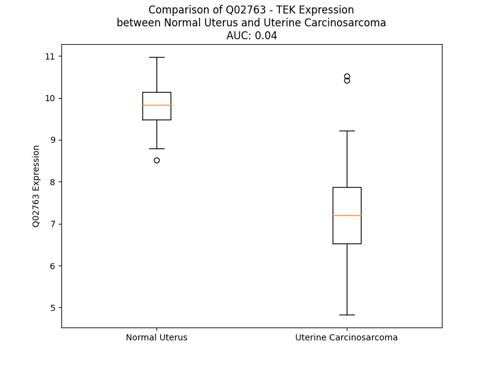

# Detailed Data for Q02763

## Introduction to the Detailed Summary

### How to Interpret the Results

- **Summary & Metrics**: This section provides a quick reference to essential protein attributes, including expression changes, family classification, and biomarker applications. Regulation status (upregulated/downregulated) indicates the protein's behavior in a disease context. Some information comes from the original excel file with the proteins selected from literature, while others are derived from the analyses.
- **Expression Comparison**: A visual representation comparing protein expression between normal and disease states. It highlights significant changes in expression levels that might indicate diagnostic or therapeutic relevance. This is data coming from transcriptomics experiments and could not translate similarly to protein levels.
- **Isoform Alignment**: An interactive view of isoform alignments, revealing structural and functional differences between variants of the protein.
- **Interactors & Homologs**: Tables listing known interaction partners and homologous proteins, the more interactors and homologs, the more complex the protein is to design an antibody for.
- **Biological Assemblies**: Information about the structural arrangement of the protein in different assemblies, providing insights into its functional state but also the complexity of the protein to develop antibodies.
- **Combined Per-Residue Information**: A detailed table summarizing residue-level data. This includes predictions for epitope regions, aggregation tendencies, and modifications that might impact the protein's function. Each row corresponds to a residue in the protein, providing insights into specific sites that may be important for research or drug development.
## Summary & Metrics

- **UniProt Accession**: Q02763
- **Gene Name**: TEK
- **Protein Name**: Angiopoietin-1 receptor / Tie2
- **Swiss Prot**: TIE2_HUMAN
- **Family**: kinase
- **Biomarker Application**: efficacy
- **Number of Isoforms**: 3
- **Regulation**: 1
- **(transcriptomics) AUC**: 0.1
- **(transcriptomics) Fold Change**: 1.30
- **(transcriptomics) Regulation**: Downregulated
- **Discotope Epitope Count**: 256
- **Max n_uniprots (Homo)**: 2
- **Max n_uniprots (Hetero)**: 2

## Expression Comparison

## Isoform Alignment

<pre style='font-size:14px; font-family:monospace;'>Q02763-1 MDSLASLVLCGVSLLLSGTVEGAMDLILINSLPLVSDAETSLTCIASGWRPHEPITIGRDFEALMNQHQDPLEVTQDVTREWAKKVVWKREKASKINGAYFCEGRVRGEAIRIRTMKMRQQASFLPATLTMTVDKGDNVNISFKKVLIKEEDAVIYKNGSFIHSVPRHEVPDILEVHLPHAQPQDAGVYSARYIGGNLFTSAFTRLIVRRCEAQKWGPECNHLCTACMNNGVCHEDTGECICPPGFMGRTCEKACELHTFGRTCKERCSGQEGCKSYVFCLPDPYGCSCATGWKGLQCNEACHPGFYGPDCKLRCSCNNGEMCDRFQGCLCSPGWQGLQCEREGIQRMTPKIVDLPDHIEVNSGKFNPICKASGWPLPTNEEMTLVKPDGTVLHPKDFNHTDHFSVAIFTIHRILPPDSGVWVCSVNTVAGMVEKPFNISVKVLPKPLNAPNVIDTGHNFAVINISSEPYFGDGPIKSKKLLYKPVNHYEAWQHIQVTNEIVTLNYLEPRTEYELCVQLVRRGEGGEGHPGPVRRFTTASIGLPPPRGLNLLPKSQTTLNLTWQPIFPSSEDDFYVEVERRSVQKSDQQNIKVPGNLTSVLLNNLHPREQYVVRARVNTKAQGEWSEDLTAWTLSDILPPQPENIKISNITHSSAVISWTILDGYSISSITIRYKVQGKNEDQHVDVKIKNATITQYQLKGLEPETAYQVDIFAENNIGSSNPAFSHELVTLPESQAPADLGGGKMLLIAILGSAGMTCLTVLLAFLIILQLKRANVQRRMAQAFQNVREEPAVQFNSGTLALNRKVKNNPDPTIYPVLDWNDIKFQDVIGEGNFGQVLKARIKKDGLRMDAAIKRMKEYASKDDHRDFAGELEVLCKLGHHPNIINLLGACEHRGYLYLAIEYAPHGNLLDFLRKSRVLETDPAFAIANSTASTLSSQQLLHFAADVARGMDYLSQKQFIHRDLAARNILVGENYVAKIADFGLSRGQEVYVKKTMGRLPVRWMAIESLNYSVYTTNSDVWSYGVLLWEIVSLGGTPYCGMTCAELYEKLPQGYRLEKPLNCDDEVYDLMRQCWREKPYERPSFAQILVSLNRMLEERKTYVNTTLYEKFTYAGIDCSAEEAA
Q02763-2 MDSLASLVLCGVSLLLSGTVEGAMDLILINSLPLVSDAETSLTCIASGWRPHEPITIGRDFEALMNQHQDPLEVTQDVTREWAKKVVWKREKASKINGAYFCEGRVRGEAIRIRTMKMRQQASFLPATLTMTVDKGDNVNISFKKVLIKEEDAVIYKNGSFIHSVPRHEVPDILEVHLPHAQPQDAGVYSARYIGGNLFTSAFTRLIVRRCEAQKWGPECNHLCTACMNNGVCHEDTGECICPPGFMGRTCEKACELHTFGRTCKERCSGQEGCKSYVFCLPDPYGCSCATGWKGLQCNE-------------------------------------------GIQRMTPKIVDLPDHIEVNSGKFNPICKASGWPLPTNEEMTLVKPDGTVLHPKDFNHTDHFSVAIFTIHRILPPDSGVWVCSVNTVAGMVEKPFNISVKVLPKPLNAPNVIDTGHNFAVINISSEPYFGDGPIKSKKLLYKPVNHYEAWQHIQVTNEIVTLNYLEPRTEYELCVQLVRRGEGGEGHPGPVRRFTTASIGLPPPRGLNLLPKSQTTLNLTWQPIFPSSEDDFYVEVERRSVQKSDQQNIKVPGNLTSVLLNNLHPREQYVVRARVNTKAQGEWSEDLTAWTLSDILPPQPENIKISNITHSSAVISWTILDGYSISSITIRYKVQGKNEDQHVDVKIKNATITQYQLKGLEPETAYQVDIFAENNIGSSNPAFSHELVTLPESQAPADLGGGKMLLIAILGSAGMTCLTVLLAFLIILQLKRANVQRRMAQAFQNVREEPAVQFNSGTLALNRKVKNNPDPTIYPVLDWNDIKFQDVIGEGNFGQVLKARIKKDGLRMDAAIKRMKEYASKDDHRDFAGELEVLCKLGHHPNIINLLGACEHRGYLYLAIEYAPHGNLLDFLRKSRVLETDPAFAIANSTASTLSSQQLLHFAADVARGMDYLSQKQFIHRDLAARNILVGENYVAKIADFGLSRGQEVYVKKTMGRLPVRWMAIESLNYSVYTTNSDVWSYGVLLWEIVSLGGTPYCGMTCAELYEKLPQGYRLEKPLNCDDEVYDLMRQCWREKPYERPSFAQILVSLNRMLEERKTYVNTTLYEKFTYAGIDCSAEEAA
Q02763-3 --------------------------------------------------------------------------------------------------------MDSLASLVLCGVSLLLSASFLPATLTMTVDKGDNVNISFKKVLIKEEDAVIYKNGSFIHSVPRHEVPDILEVHLPHAQPQDAGVYSARYIGGNLFTSAFTRLIVRRCEAQKWGPECNHLCTACMNNGVCHEDTGECICPPGFMGRTCEKACELHTFGRTCKERCSGQEGCKSYVFCLPDPYGCSCATGWKGLQCNE-------------------------------------------GIQRMTPKIVDLPDHIEVNSGKFNPICKASGWPLPTNEEMTLVKPDGTVLHPKDFNHTDHFSVAIFTIHRILPPDSGVWVCSVNTVAGMVEKPFNISVKVLPKPLNAPNVIDTGHNFAVINISSEPYFGDGPIKSKKLLYKPVNHYEAWQHIQVTNEIVTLNYLEPRTEYELCVQLVRRGEGGEGHPGPVRRFTTASIGLPPPRGLNLLPKSQTTLNLTWQPIFPSSEDDFYVEVERRSVQKSDQQNIKVPGNLTSVLLNNLHPREQYVVRARVNTKAQGEWSEDLTAWTLSDILPPQPENIKISNITHSSAVISWTILDGYSISSITIRYKVQGKNEDQHVDVKIKNATITQYQLKGLEPETAYQVDIFAENNIGSSNPAFSHELVTLPESQAPADLGGGKMLLIAILGSAGMTCLTVLLAFLIILQLKRANVQRRMAQAFQN-REEPAVQFNSGTLALNRKVKNNPDPTIYPVLDWNDIKFQDVIGEGNFGQVLKARIKKDGLRMDAAIKRMKEYASKDDHRDFAGELEVLCKLGHHPNIINLLGACEHRGYLYLAIEYAPHGNLLDFLRKSRVLETDPAFAIANSTASTLSSQQLLHFAADVARGMDYLSQKQFIHRDLAARNILVGENYVAKIADFGLSRGQEVYVKKTMGRLPVRWMAIESLNYSVYTTNSDVWSYGVLLWEIVSLGGTPYCGMTCAELYEKLPQGYRLEKPLNCDDEVYDLMRQCWREKPYERPSFAQILVSLNRMLEERKTYVNTTLYEKFTYAGIDCSAEEAA
</pre>

## Interactors

| preferredName_A   | preferredName_B   |   score |
|:------------------|:------------------|--------:|
| TEK               | ANGPT2            |   0.999 |
| TEK               | ANGPT4            |   0.999 |
| TEK               | ANGPT1            |   0.999 |
| TEK               | VEGFC             |   0.955 |
| TEK               | FGF2              |   0.941 |
| TEK               | KITLG             |   0.922 |
| TEK               | PGF               |   0.914 |
| TEK               | CDH5              |   0.901 |

## Homologs

| uniprot_id   | gene_id   |
|:-------------|:----------|
| E7EVR7       | FGFR2     |
| P29317       | EPHA2     |
| P09619       | PDGFRB    |
| E7ER61       | FLT3      |
| F8W9L4       | FGFR3     |
| X5D7M5       | NTRK3     |
| P35968       | KDR       |
| Q8IWU2       | LMTK2     |
| L7RSL3       | FLT1      |
| Q04912       | MST1R     |
| J3QLV2       | ERBB2     |
| Q96L35       | EPHB4     |
| J3KQG3       | EPHA10    |
| F8VP57       | EPHA5     |
| Q6NVW1       | EPHB2     |
| C9J5X1       | IGF1R     |
| P21709       | EPHA1     |
| P29376       | LTK       |
| E7EQ23       | DDR1      |
| O15146       | MUSK      |
| A0A6Q8PHG5   | NTRK1     |
| P54764       | EPHA4     |
| P35590       | TIE1      |
| E9PQ40       | FGFR1     |
| H7C3L9       | MERTK     |
| E9PEK4       | CSF1R     |
| H0YNK6       | TYRO3     |
| P34925       | RYK       |
| B5A927       | FLT4      |
| Q16832       | DDR2      |
| D6RJD4       | FGFR4     |
| Q01973       | ROR1      |
| Q01974       | ROR2      |
| P54762       | EPHB1     |
| Q5VWE5       | NTRK2     |
| P30530       | AXL       |
| A0A7P0T9L5   | EPHA7     |
| P08922       | ROS1      |
| Q504U8       | EGFR      |
| E9PDR1       | ERBB4     |
| A0A087WZL3   | ALK       |
| O75812       | ERBB3     |
| A0A087WTE3   | EPHB6     |
| P54753       | EPHB3     |
| H0Y8K5       | EPHA6     |
| P06213       | INSR      |
| P14616       | INSRR     |
| C9JXA2       | EPHA3     |
| E6Y365       | MET       |
| P29322       | EPHA8     |
| P16234       | PDGFRA    |
| A0A8J8Z860   | KIT       |
| A0A087WWB1   | RET       |

## Biological Assemblies

|   Unnamed: 0 |   assembly |   n_uniprots | composition   | crystal_id   |
|-------------:|-----------:|-------------:|:--------------|:-------------|
|            0 |          1 |            1 | Homo          | 2p4i         |
|            1 |          2 |            1 | Homo          | 2p4i         |
|            0 |          1 |            1 | Homo          | 3bea         |
|            0 |          1 |            1 | Homo          | 3l8p         |
|            0 |          1 |            1 | Homo          | 1fvr         |
|            1 |          2 |            1 | Homo          | 1fvr         |
|            0 |          1 |            1 | Homo          | 2gy5         |
|            0 |          1 |            1 | Homo          | 4x3j         |
|            0 |          1 |            2 | Homo          | 5myb         |
|            0 |          1 |            1 | Homo          | 7e72         |
|            1 |          2 |            1 | Homo          | 7e72         |
|            0 |          1 |            1 | Homo          | 2oo8         |
|            0 |          1 |            1 | Homo          | 2wqb         |
|            0 |          1 |            1 | Homo          | 2osc         |
|            0 |          1 |            2 | Hetero        | 2gy7         |
|            0 |          1 |            2 | Homo          | 5mya         |
|            0 |          1 |            1 | Homo          | 6mwe         |
|            1 |          2 |            1 | Homo          | 6mwe         |
|            0 |          1 |            2 | Homo          | 5utk         |
|            0 |          1 |            2 | Hetero        | 4k0v         |

## Combined Per-Residue Information

|   res | aa   |   epitope_score | epitope   |   relative_surface_accessibility |   modeling_confidence |   Aggregation | modification                      | glycosylation                   |
|------:|:-----|----------------:|:----------|---------------------------------:|----------------------:|--------------:|:----------------------------------|:--------------------------------|
|     1 | M    |         0.09987 | True      |                          1.10343 |                 39.84 |         0     | N/A                               | N/A                             |
|     2 | D    |         0.15886 | True      |                          0.70049 |                 39.43 |         0     | N/A                               | N/A                             |
|     3 | S    |         0.09372 | False     |                          0.63943 |                 37.42 |         4.853 | N/A                               | N/A                             |
|     4 | L    |         0.13199 | True      |                          0.80495 |                 38.14 |        14.193 | N/A                               | N/A                             |
|     5 | A    |         0.06016 | False     |                          0.53361 |                 39.16 |        18.727 | N/A                               | N/A                             |
|     6 | S    |         0.0653  | False     |                          0.48867 |                 37.58 |        23.354 | N/A                               | N/A                             |
|     7 | L    |         0.10578 | True      |                          0.72391 |                 35.69 |        60.084 | N/A                               | N/A                             |
|     8 | V    |         0.08701 | False     |                          0.70855 |                 38.14 |        66.754 | N/A                               | N/A                             |
|     9 | L    |         0.13361 | True      |                          0.75356 |                 35.77 |        66.925 | N/A                               | N/A                             |
|    10 | C    |         0.07007 | False     |                          0.53086 |                 32.82 |        64.486 | N/A                               | N/A                             |
|    11 | G    |         0.10084 | True      |                          0.56228 |                 29.06 |        64.284 | N/A                               | N/A                             |
|    12 | V    |         0.08221 | False     |                          0.74448 |                 32.87 |        68.763 | N/A                               | N/A                             |
|    13 | S    |         0.05538 | False     |                          0.4877  |                 28.74 |        66.624 | N/A                               | N/A                             |
|    14 | L    |         0.19684 | True      |                          0.88226 |                 27.01 |        66.551 | N/A                               | N/A                             |
|    15 | L    |         0.15308 | True      |                          0.99186 |                 26.64 |        65.072 | N/A                               | N/A                             |
|    16 | L    |         0.11327 | True      |                          0.82608 |                 27.05 |        56.866 | N/A                               | N/A                             |
|    17 | S    |         0.11264 | True      |                          0.68054 |                 27.2  |         8.046 | N/A                               | N/A                             |
|    18 | G    |         0.09942 | True      |                          0.45073 |                 30.19 |         1.955 | N/A                               | N/A                             |
|    19 | T    |         0.10995 | True      |                          0.54694 |                 39.42 |         1.515 | N/A                               | N/A                             |
|    20 | V    |         0.02536 | False     |                          0.02445 |                 44.21 |         1.453 | N/A                               | N/A                             |
|    21 | E    |         0.07075 | False     |                          0.30152 |                 47.3  |         0     | N/A                               | N/A                             |
|    22 | G    |         0.08657 | False     |                          0.52818 |                 47.38 |         0     | N/A                               | N/A                             |
|    23 | A    |         0.03634 | False     |                          0.14757 |                 56.59 |         0     | N/A                               | N/A                             |
|    24 | M    |         0.01778 | False     |                          0.0131  |                 70.72 |         0     | N/A                               | N/A                             |
|    25 | D    |         0.03575 | False     |                          0.08743 |                 83.93 |         0     | N/A                               | N/A                             |
|    26 | L    |         0.0099  | False     |                          0.014   |                 91.19 |         3.455 | N/A                               | N/A                             |
|    27 | I    |         0.00244 | False     |                          0.0008  |                 95.07 |         3.455 | N/A                               | N/A                             |
|    28 | L    |         0.00192 | False     |                          0.00082 |                 96.77 |         3.455 | N/A                               | N/A                             |
|    29 | I    |         0.02059 | False     |                          0.04539 |                 97.22 |         3.455 | N/A                               | N/A                             |
|    30 | N    |         0.00377 | False     |                          0       |                 96.43 |         3.455 | N/A                               | N/A                             |
|    31 | S    |         0.03731 | False     |                          0.16037 |                 94.08 |         0.381 | N/A                               | N/A                             |
|    32 | L    |         0.07422 | False     |                          0.23824 |                 90.4  |         0     | N/A                               | N/A                             |
|    33 | P    |         0.00188 | False     |                          0.00199 |                 93.69 |         0     | N/A                               | N/A                             |
|    34 | L    |         0.01997 | False     |                          0.06032 |                 92.95 |         0     | N/A                               | N/A                             |
|    35 | V    |         0.0356  | False     |                          0.0648  |                 90.53 |         0     | N/A                               | N/A                             |
|    36 | S    |         0.09898 | True      |                          0.3638  |                 87.24 |         0     | N/A                               | N/A                             |
|    37 | D    |         0.11921 | True      |                          0.56155 |                 84.08 |         0     | N/A                               | N/A                             |
|    38 | A    |         0.07261 | False     |                          0.41879 |                 86.51 |         0     | N/A                               | N/A                             |
|    39 | E    |         0.14111 | True      |                          0.48359 |                 88.07 |         0     | N/A                               | N/A                             |
|    40 | T    |         0.01091 | False     |                          0.01523 |                 92.47 |         0     | N/A                               | N/A                             |
|    41 | S    |         0.08687 | False     |                          0.15672 |                 94.21 |         0     | N/A                               | N/A                             |
|    42 | L    |         0.00353 | False     |                          0       |                 96.73 |         0.368 | N/A                               | N/A                             |
|    43 | T    |         0.0325  | False     |                          0.09162 |                 96.6  |         0.368 | N/A                               | N/A                             |
|    44 | C    |         0.00131 | False     |                          0       |                 95.46 |         0.368 | N/A                               | N/A                             |
|    45 | I    |         0.00753 | False     |                          0.0056  |                 93.63 |         0.368 | N/A                               | N/A                             |
|    46 | A    |         0.01307 | False     |                          0.03189 |                 89.14 |         0.368 | N/A                               | N/A                             |
|    47 | S    |         0.0113  | False     |                          0.05415 |                 82.05 |         0     | N/A                               | N/A                             |
|    48 | G    |         0.09513 | False     |                          0.51544 |                 69.26 |         0     | N/A                               | N/A                             |
|    49 | W    |         0.04258 | False     |                          0.12352 |                 68.14 |         0     | N/A                               | N/A                             |
|    50 | R    |         0.08406 | False     |                          0.70289 |                 71.47 |         0     | N/A                               | N/A                             |
|    51 | P    |         0.02733 | False     |                          0.16956 |                 68.85 |         0     | N/A                               | N/A                             |
|    52 | H    |         0.10857 | True      |                          0.73116 |                 68.95 |         0     | N/A                               | N/A                             |
|    53 | E    |         0.06543 | False     |                          0.38019 |                 72.71 |         0     | N/A                               | N/A                             |
|    54 | P    |         0.09127 | False     |                          0.7483  |                 82.57 |         0     | N/A                               | N/A                             |
|    55 | I    |         0.01035 | False     |                          0.04181 |                 88.53 |         0     | N/A                               | N/A                             |
|    56 | T    |         0.07956 | False     |                          0.41033 |                 92.13 |         0     | N/A                               | N/A                             |
|    57 | I    |         0.0243  | False     |                          0.05694 |                 95.02 |         0     | N/A                               | N/A                             |
|    58 | G    |         0.04658 | False     |                          0.15451 |                 93.62 |         0     | N/A                               | N/A                             |
|    59 | R    |         0.09495 | False     |                          0.06788 |                 93.42 |         0     | N/A                               | N/A                             |
|    60 | D    |         0.03288 | False     |                          0.04867 |                 92.92 |         0     | N/A                               | N/A                             |
|    61 | F    |         0.06189 | False     |                          0.49481 |                 90.57 |         0     | N/A                               | N/A                             |
|    62 | E    |         0.08076 | False     |                          0.68032 |                 87.65 |         0     | N/A                               | N/A                             |
|    63 | A    |         0.02023 | False     |                          0.13611 |                 88.06 |         0     | N/A                               | N/A                             |
|    64 | L    |         0.00732 | False     |                          0.00082 |                 87.36 |         0     | N/A                               | N/A                             |
|    65 | M    |         0.12367 | True      |                          0.56472 |                 82.81 |         0     | N/A                               | N/A                             |
|    66 | N    |         0.15403 | True      |                          0.79187 |                 79.07 |         0     | N/A                               | N/A                             |
|    67 | Q    |         0.02723 | False     |                          0.05245 |                 84.97 |         0     | N/A                               | N/A                             |
|    68 | H    |         0.04792 | False     |                          0.34636 |                 80.17 |         0     | N/A                               | N/A                             |
|    69 | Q    |         0.12875 | True      |                          0.75862 |                 82.03 |         0     | N/A                               | N/A                             |
|    70 | D    |         0.08295 | False     |                          0.29801 |                 80.62 |         0     | N/A                               | N/A                             |
|    71 | P    |         0.10995 | True      |                          0.96854 |                 83.74 |         0     | N/A                               | N/A                             |
|    72 | L    |         0.04128 | False     |                          0.21599 |                 88.61 |         0     | N/A                               | N/A                             |
|    73 | E    |         0.11179 | True      |                          0.59181 |                 90.35 |         0     | N/A                               | N/A                             |
|    74 | V    |         0.07362 | False     |                          0.42241 |                 92.86 |         0     | N/A                               | N/A                             |
|    75 | T    |         0.09112 | False     |                          0.3965  |                 93.59 |         0     | N/A                               | N/A                             |
|    76 | Q    |         0.11295 | True      |                          0.61548 |                 91.87 |         0     | N/A                               | N/A                             |
|    77 | D    |         0.06537 | False     |                          0.05548 |                 91.65 |         0     | N/A                               | N/A                             |
|    78 | V    |         0.17007 | True      |                          0.92625 |                 89.84 |         0     | N/A                               | N/A                             |
|    79 | T    |         0.19572 | True      |                          0.67842 |                 87.06 |         0     | N/A                               | N/A                             |
|    80 | R    |         0.14961 | True      |                          0.12737 |                 86.73 |         0     | N/A                               | N/A                             |
|    81 | E    |         0.1039  | True      |                          0.64094 |                 81.99 |         0     | N/A                               | N/A                             |
|    82 | W    |         0.05719 | False     |                          0.31664 |                 87.11 |         0     | N/A                               | N/A                             |
|    83 | A    |         0.00985 | False     |                          0.03069 |                 92.29 |         0     | N/A                               | N/A                             |
|    84 | K    |         0.10407 | True      |                          0.30231 |                 94.45 |         0     | N/A                               | N/A                             |
|    85 | K    |         0.12328 | True      |                          0.25413 |                 95.31 |         0     | N/A                               | N/A                             |
|    86 | V    |         0.02042 | False     |                          0.01428 |                 94.69 |         0     | N/A                               | N/A                             |
|    87 | V    |         0.13886 | True      |                          0.29886 |                 92.99 |         0     | N/A                               | N/A                             |
|    88 | W    |         0.07482 | False     |                          0.11723 |                 90.93 |         0     | N/A                               | N/A                             |
|    89 | K    |         0.13885 | True      |                          0.55136 |                 83.08 |         0     | N/A                               | N/A                             |
|    90 | R    |         0.25724 | True      |                          0.64172 |                 80.9  |         0     | N/A                               | N/A                             |
|    91 | E    |         0.20415 | True      |                          0.64703 |                 73.68 |         0     | N/A                               | N/A                             |
|    92 | K    |         0.11522 | True      |                          0.79627 |                 71.27 |         0     | N/A                               | N/A                             |
|    93 | A    |         0.06133 | False     |                          0.14643 |                 67.15 |         0     | N/A                               | N/A                             |
|    94 | S    |         0.11271 | True      |                          0.50767 |                 67.61 |         0     | N/A                               | N/A                             |
|    95 | K    |         0.06774 | False     |                          0.40653 |                 76.63 |         0     | N/A                               | N/A                             |
|    96 | I    |         0.04188 | False     |                          0.0328  |                 86.89 |         0.209 | N/A                               | N/A                             |
|    97 | N    |         0.00627 | False     |                          0.00827 |                 89.74 |         0.209 | N/A                               | N/A                             |
|    98 | G    |         0.00182 | False     |                          0       |                 91.6  |         0.209 | N/A                               | N/A                             |
|    99 | A    |         0.00708 | False     |                          0.01913 |                 94.45 |         0.209 | N/A                               | N/A                             |
|   100 | Y    |         0.01472 | False     |                          0       |                 95.6  |         0.209 | N/A                               | N/A                             |
|   101 | F    |         0.04596 | False     |                          0.1751  |                 95.63 |         0.209 | N/A                               | N/A                             |
|   102 | C    |         0.00226 | False     |                          0       |                 94.49 |         0     | N/A                               | N/A                             |
|   103 | E    |         0.07282 | False     |                          0.05137 |                 91.56 |         0     | N/A                               | N/A                             |
|   104 | G    |         0.00637 | False     |                          0.01127 |                 87.02 |         0     | N/A                               | N/A                             |
|   105 | R    |         0.10408 | True      |                          0.36082 |                 81.74 |         0     | N/A                               | N/A                             |
|   106 | V    |         0.05039 | False     |                          0.05699 |                 70.87 |         0     | N/A                               | N/A                             |
|   107 | R    |         0.19692 | True      |                          0.48482 |                 68.12 |         0     | N/A                               | N/A                             |
|   108 | G    |         0.12663 | True      |                          0.65517 |                 68.18 |         0     | N/A                               | N/A                             |
|   109 | E    |         0.18356 | True      |                          0.45098 |                 72.4  |         0     | N/A                               | N/A                             |
|   110 | A    |         0.17486 | True      |                          0.41275 |                 81.44 |         0     | N/A                               | N/A                             |
|   111 | I    |         0.01247 | False     |                          0.12239 |                 85.29 |         0     | N/A                               | N/A                             |
|   112 | R    |         0.04617 | False     |                          0.34211 |                 90.04 |         0     | N/A                               | N/A                             |
|   113 | I    |         0.00181 | False     |                          0.0016  |                 95.8  |         0     | N/A                               | N/A                             |
|   114 | R    |         0.03737 | False     |                          0.21706 |                 96.54 |         0     | N/A                               | N/A                             |
|   115 | T    |         0.00211 | False     |                          0.00211 |                 97.16 |         0     | N/A                               | N/A                             |
|   116 | M    |         0.00305 | False     |                          0.00403 |                 94.98 |         0     | N/A                               | N/A                             |
|   117 | K    |         0.00281 | False     |                          0       |                 93.86 |         0     | N/A                               | N/A                             |
|   118 | M    |         0.00495 | False     |                          0.00132 |                 92.72 |         0     | N/A                               | N/A                             |
|   119 | R    |         0.07663 | False     |                          0.37333 |                 90.21 |         0     | N/A                               | N/A                             |
|   120 | Q    |         0.09095 | False     |                          0.39154 |                 89.48 |         0     | N/A                               | N/A                             |
|   121 | Q    |         0.13083 | True      |                          0.74597 |                 87.02 |         0     | N/A                               | N/A                             |
|   122 | A    |         0.00869 | False     |                          0.01148 |                 88.41 |         0     | N/A                               | N/A                             |
|   123 | S    |         0.05016 | False     |                          0.07058 |                 91.04 |         0     | N/A                               | N/A                             |
|   124 | F    |         0.00198 | False     |                          0.00059 |                 94.51 |         0     | N/A                               | N/A                             |
|   125 | L    |         0.05559 | False     |                          0.15992 |                 94.73 |         0     | N/A                               | N/A                             |
|   126 | P    |         0.00617 | False     |                          0.01249 |                 95.53 |         0     | N/A                               | N/A                             |
|   127 | A    |         0.06248 | False     |                          0.63498 |                 92.68 |         2.007 | N/A                               | N/A                             |
|   128 | T    |         0.0455  | False     |                          0.21602 |                 94.74 |         4.381 | N/A                               | N/A                             |
|   129 | L    |         0.02288 | False     |                          0.06787 |                 95.59 |         8.372 | N/A                               | N/A                             |
|   130 | T    |         0.01322 | False     |                          0.05701 |                 97.03 |         8.372 | N/A                               | N/A                             |
|   131 | M    |         0.06039 | False     |                          0.26279 |                 96.19 |         8.372 | N/A                               | N/A                             |
|   132 | T    |         0.03089 | False     |                          0.30775 |                 96.39 |         8.372 | N/A                               | N/A                             |
|   133 | V    |         0.02679 | False     |                          0.1395  |                 96.53 |         8.372 | N/A                               | N/A                             |
|   134 | D    |         0.04913 | False     |                          0.16151 |                 96.47 |         0     | N/A                               | N/A                             |
|   135 | K    |         0.08584 | False     |                          0.46993 |                 95.31 |         0     | N/A                               | N/A                             |
|   136 | G    |         0.03064 | False     |                          0.37368 |                 94.26 |         0     | N/A                               | N/A                             |
|   137 | D    |         0.07849 | False     |                          0.35095 |                 95.99 |         0     | N/A                               | N/A                             |
|   138 | N    |         0.0749  | False     |                          0.62213 |                 96.7  |         0     | N/A                               | N/A                             |
|   139 | V    |         0.01722 | False     |                          0.02856 |                 94.71 |         0.462 | N/A                               | N/A                             |
|   140 | N    |         0.04801 | False     |                          0.39525 |                 95.12 |         0.462 | N/A                               | N-linked (GlcNAc...) asparagine |
|   141 | I    |         0.0115  | False     |                          0.0168  |                 95.42 |         0.462 | N/A                               | N/A                             |
|   142 | S    |         0.06661 | False     |                          0.15882 |                 95.37 |         0.462 | N/A                               | N/A                             |
|   143 | F    |         0.0026  | False     |                          0       |                 95.68 |         0.462 | N/A                               | N/A                             |
|   144 | K    |         0.05144 | False     |                          0.64719 |                 94.54 |         0     | N/A                               | N/A                             |
|   145 | K    |         0.09514 | False     |                          0.1604  |                 93.73 |         0     | N/A                               | N/A                             |
|   146 | V    |         0.0744  | False     |                          0.46875 |                 91.29 |         0.819 | N/A                               | N/A                             |
|   147 | L    |         0.07315 | False     |                          0.51357 |                 88.67 |         0.819 | N/A                               | N/A                             |
|   148 | I    |         0.16775 | True      |                          0.87216 |                 87.56 |         0.819 | N/A                               | N/A                             |
|   149 | K    |         0.12556 | True      |                          0.4073  |                 88.35 |         0.819 | N/A                               | N/A                             |
|   150 | E    |         0.12682 | True      |                          0.73502 |                 88.85 |         0.819 | N/A                               | N/A                             |
|   151 | E    |         0.08757 | False     |                          0.21287 |                 91.39 |         0     | N/A                               | N/A                             |
|   152 | D    |         0.08815 | False     |                          0.31773 |                 93.75 |         0     | N/A                               | N/A                             |
|   153 | A    |         0.00518 | False     |                          0.00673 |                 94.2  |         0     | N/A                               | N/A                             |
|   154 | V    |         0.01878 | False     |                          0.01904 |                 94.67 |         0     | N/A                               | N/A                             |
|   155 | I    |         0.01275 | False     |                          0.0048  |                 94.4  |         0     | N/A                               | N/A                             |
|   156 | Y    |         0.0482  | False     |                          0.18764 |                 93.03 |         0     | N/A                               | N/A                             |
|   157 | K    |         0.03631 | False     |                          0.20349 |                 93.46 |         0     | N/A                               | N/A                             |
|   158 | N    |         0.04466 | False     |                          0.27438 |                 90.58 |         0     | N/A                               | N-linked (GlcNAc...) asparagine |
|   159 | G    |         0.0403  | False     |                          0.29625 |                 85.32 |         0     | N/A                               | N/A                             |
|   160 | S    |         0.06547 | False     |                          0.54331 |                 90.04 |         0     | N/A                               | N/A                             |
|   161 | F    |         0.14964 | True      |                          0.58852 |                 91.54 |         0     | N/A                               | N/A                             |
|   162 | I    |         0.05965 | False     |                          0.3938  |                 90.69 |         0     | N/A                               | N/A                             |
|   163 | H    |         0.18206 | True      |                          0.30073 |                 90.71 |         0     | N/A                               | N/A                             |
|   164 | S    |         0.12784 | True      |                          0.44397 |                 93.48 |         0     | N/A                               | N/A                             |
|   165 | V    |         0.08734 | False     |                          0.20631 |                 93.9  |         0     | N/A                               | N/A                             |
|   166 | P    |         0.06626 | False     |                          0.52942 |                 93.54 |         0     | N/A                               | N/A                             |
|   167 | R    |         0.12129 | True      |                          0.40736 |                 90.21 |         0     | N/A                               | N/A                             |
|   168 | H    |         0.17702 | True      |                          0.8177  |                 89.68 |         0     | N/A                               | N/A                             |
|   169 | E    |         0.12062 | True      |                          0.63045 |                 92.21 |         0     | N/A                               | N/A                             |
|   170 | V    |         0.03799 | False     |                          0.12026 |                 91.62 |         0     | N/A                               | N/A                             |
|   171 | P    |         0.11492 | True      |                          0.39564 |                 93.33 |         0     | N/A                               | N/A                             |
|   172 | D    |         0.18892 | True      |                          0.63104 |                 93.24 |         0     | N/A                               | N/A                             |
|   173 | I    |         0.1045  | True      |                          0.56146 |                 94.26 |         0     | N/A                               | N/A                             |
|   174 | L    |         0.00996 | False     |                          0.00659 |                 93.36 |         0     | N/A                               | N/A                             |
|   175 | E    |         0.14376 | True      |                          0.41322 |                 93.36 |         0     | N/A                               | N/A                             |
|   176 | V    |         0.03208 | False     |                          0.04475 |                 93.32 |         0     | N/A                               | N/A                             |
|   177 | H    |         0.14813 | True      |                          0.6275  |                 94.49 |         0     | N/A                               | N/A                             |
|   178 | L    |         0.06738 | False     |                          0.19867 |                 93.58 |         0     | N/A                               | N/A                             |
|   179 | P    |         0.11378 | True      |                          0.58681 |                 94.26 |         0     | N/A                               | N/A                             |
|   180 | H    |         0.07973 | False     |                          0.63986 |                 94.51 |         0     | N/A                               | N/A                             |
|   181 | A    |         0.00771 | False     |                          0.00765 |                 95.07 |         0     | N/A                               | N/A                             |
|   182 | Q    |         0.05149 | False     |                          0.29807 |                 96.56 |         0     | N/A                               | N/A                             |
|   183 | P    |         0.05173 | False     |                          0.41039 |                 93.51 |         0     | N/A                               | N/A                             |
|   184 | Q    |         0.09553 | False     |                          0.74058 |                 93.42 |         0     | N/A                               | N/A                             |
|   185 | D    |         0.05051 | False     |                          0.20923 |                 94.89 |         0     | N/A                               | N/A                             |
|   186 | A    |         0.03216 | False     |                          0.29676 |                 94.91 |         0     | N/A                               | N/A                             |
|   187 | G    |         0.01343 | False     |                          0.13798 |                 94.72 |         0     | N/A                               | N/A                             |
|   188 | V    |         0.00806 | False     |                          0.00546 |                 95.93 |         0     | N/A                               | N/A                             |
|   189 | Y    |         0.02547 | False     |                          0.01898 |                 95.83 |         0     | N/A                               | N/A                             |
|   190 | S    |         0.00839 | False     |                          0.01843 |                 94.36 |         0     | N/A                               | N/A                             |
|   191 | A    |         0.00189 | False     |                          0.00094 |                 94.8  |         0     | N/A                               | N/A                             |
|   192 | R    |         0.07352 | False     |                          0.17747 |                 93.45 |         0     | N/A                               | N/A                             |
|   193 | Y    |         0.03318 | False     |                          0.01548 |                 94.52 |         0     | N/A                               | N/A                             |
|   194 | I    |         0.14041 | True      |                          0.56083 |                 91.31 |         0     | N/A                               | N/A                             |
|   195 | G    |         0.27867 | True      |                          0.77098 |                 86.08 |         0     | N/A                               | N/A                             |
|   196 | G    |         0.08895 | False     |                          0.21732 |                 83.62 |         0     | N/A                               | N/A                             |
|   197 | N    |         0.10936 | True      |                          0.49036 |                 83.24 |         0     | N/A                               | N/A                             |
|   198 | L    |         0.05436 | False     |                          0.19543 |                 78.72 |         2.03  | N/A                               | N/A                             |
|   199 | F    |         0.08936 | False     |                          0.28767 |                 76.15 |         2.234 | N/A                               | N/A                             |
|   200 | T    |         0.0511  | False     |                          0.31418 |                 84.62 |         2.234 | N/A                               | N/A                             |
|   201 | S    |         0.00859 | False     |                          0.00395 |                 91.19 |         2.234 | N/A                               | N/A                             |
|   202 | A    |         0.00097 | False     |                          0       |                 94.54 |         2.234 | N/A                               | N/A                             |
|   203 | F    |         0.00221 | False     |                          0       |                 95.29 |         1.985 | N/A                               | N/A                             |
|   204 | T    |         0.00733 | False     |                          0.03081 |                 96.4  |         0.664 | N/A                               | N/A                             |
|   205 | R    |         0.03569 | False     |                          0.09856 |                 97.1  |         0     | N/A                               | N/A                             |
|   206 | L    |         0.00683 | False     |                          0.00745 |                 97.41 |         0     | N/A                               | N/A                             |
|   207 | I    |         0.01924 | False     |                          0.0624  |                 97.11 |         0     | N/A                               | N/A                             |
|   208 | V    |         0.01662 | False     |                          0.08538 |                 96.87 |         0     | N/A                               | N/A                             |
|   209 | R    |         0.03966 | False     |                          0.03169 |                 96.01 |         0     | N/A                               | N/A                             |
|   210 | R    |         0.09478 | False     |                          0.36374 |                 95.1  |         0     | N/A                               | N/A                             |
|   211 | C    |         0.02027 | False     |                          0.00701 |                 94.66 |         0     | N/A                               | N/A                             |
|   212 | E    |         0.06794 | False     |                          0.48532 |                 94.65 |         0     | N/A                               | N/A                             |
|   213 | A    |         0.1945  | True      |                          0.55446 |                 93.03 |         0     | N/A                               | N/A                             |
|   214 | Q    |         0.10194 | True      |                          0.4696  |                 93.84 |         0     | N/A                               | N/A                             |
|   215 | K    |         0.13926 | True      |                          0.29881 |                 95.95 |         0     | N/A                               | N/A                             |
|   216 | W    |         0.16923 | True      |                          0.26715 |                 95.23 |         0     | N/A                               | N/A                             |
|   217 | G    |         0.01873 | False     |                          0.00441 |                 88.76 |         0     | N/A                               | N/A                             |
|   218 | P    |         0.10327 | True      |                          0.84904 |                 90.85 |         0     | N/A                               | N/A                             |
|   219 | E    |         0.18952 | True      |                          0.68883 |                 92.55 |         0     | N/A                               | N/A                             |
|   220 | C    |         0.11861 | True      |                          0.21951 |                 92.77 |         0     | N/A                               | N/A                             |
|   221 | N    |         0.27218 | True      |                          0.66213 |                 94.33 |         0     | N/A                               | N/A                             |
|   222 | H    |         0.30875 | True      |                          0.52435 |                 93.81 |         0     | N/A                               | N/A                             |
|   223 | L    |         0.2171  | True      |                          0.83523 |                 95.53 |         0     | N/A                               | N/A                             |
|   224 | C    |         0.06231 | False     |                          0.06619 |                 93.94 |         0     | N/A                               | N/A                             |
|   225 | T    |         0.06323 | False     |                          0.22255 |                 93.74 |         0     | N/A                               | N/A                             |
|   226 | A    |         0.06825 | False     |                          0.46649 |                 95.2  |         0     | N/A                               | N/A                             |
|   227 | C    |         0.0351  | False     |                          0.20322 |                 95.55 |         0     | N/A                               | N/A                             |
|   228 | M    |         0.12876 | True      |                          0.39569 |                 95.44 |         0     | N/A                               | N/A                             |
|   229 | N    |         0.00994 | False     |                          0.03195 |                 96.6  |         0     | N/A                               | N/A                             |
|   230 | N    |         0.10023 | True      |                          0.39789 |                 95.51 |         0     | N/A                               | N/A                             |
|   231 | G    |         0.02351 | False     |                          0.1273  |                 96.02 |         0     | N/A                               | N/A                             |
|   232 | V    |         0.01859 | False     |                          0.20089 |                 96.45 |         0     | N/A                               | N/A                             |
|   233 | C    |         0.02383 | False     |                          0.06701 |                 95.59 |         0     | N/A                               | N/A                             |
|   234 | H    |         0.03008 | False     |                          0.12142 |                 93.76 |         0     | N/A                               | N/A                             |
|   235 | E    |         0.03889 | False     |                          0.12    |                 90.91 |         0     | N/A                               | N/A                             |
|   236 | D    |         0.05321 | False     |                          0.35956 |                 89.43 |         0     | N/A                               | N/A                             |
|   237 | T    |         0.06735 | False     |                          0.27032 |                 88.78 |         0     | N/A                               | N/A                             |
|   238 | G    |         0.03634 | False     |                          0.03253 |                 91.75 |         0     | N/A                               | N/A                             |
|   239 | E    |         0.08153 | False     |                          0.2834  |                 92.37 |         0     | N/A                               | N/A                             |
|   240 | C    |         0.04973 | False     |                          0.14607 |                 95.14 |         0     | N/A                               | N/A                             |
|   241 | I    |         0.01697 | False     |                          0.14399 |                 95.45 |         0     | N/A                               | N/A                             |
|   242 | C    |         0.04097 | False     |                          0.17978 |                 96.9  |         0     | N/A                               | N/A                             |
|   243 | P    |         0.00295 | False     |                          0.00735 |                 97.61 |         0     | N/A                               | N/A                             |
|   244 | P    |         0.00803 | False     |                          0.03924 |                 97.37 |         0     | N/A                               | N/A                             |
|   245 | G    |         0.00586 | False     |                          0.08548 |                 96.85 |         0     | N/A                               | N/A                             |
|   246 | F    |         0.01626 | False     |                          0.02375 |                 97.48 |         0     | N/A                               | N/A                             |
|   247 | M    |         0.02785 | False     |                          0.09852 |                 95.35 |         0     | N/A                               | N/A                             |
|   248 | G    |         0.01953 | False     |                          0.06625 |                 93.52 |         0     | N/A                               | N/A                             |
|   249 | R    |         0.08208 | False     |                          0.22399 |                 93.82 |         0     | N/A                               | N/A                             |
|   250 | T    |         0.06681 | False     |                          0.12735 |                 95.57 |         0     | N/A                               | N/A                             |
|   251 | C    |         0.00325 | False     |                          0       |                 96.48 |         0     | N/A                               | N/A                             |
|   252 | E    |         0.09609 | True      |                          0.2121  |                 94.8  |         0     | N/A                               | N/A                             |
|   253 | K    |         0.04022 | False     |                          0.33894 |                 94.59 |         0     | N/A                               | N/A                             |
|   254 | A    |         0.02219 | False     |                          0.2297  |                 95.26 |         0     | N/A                               | N/A                             |
|   255 | C    |         0.02627 | False     |                          0.05829 |                 95.57 |         0     | N/A                               | N/A                             |
|   256 | E    |         0.07363 | False     |                          0.55744 |                 94.45 |         0     | N/A                               | N/A                             |
|   257 | L    |         0.14047 | True      |                          0.57242 |                 94.95 |         0     | N/A                               | N/A                             |
|   258 | H    |         0.03701 | False     |                          0.34692 |                 95.38 |         0     | N/A                               | N/A                             |
|   259 | T    |         0.05559 | False     |                          0.02093 |                 96.46 |         0     | N/A                               | N/A                             |
|   260 | F    |         0.00782 | False     |                          0.0085  |                 95.3  |         0     | N/A                               | N/A                             |
|   261 | G    |         0.01994 | False     |                          0.14556 |                 92.82 |         0     | N/A                               | N/A                             |
|   262 | R    |         0.02732 | False     |                          0.33718 |                 91.98 |         0     | N/A                               | N/A                             |
|   263 | T    |         0.01662 | False     |                          0.08763 |                 92.9  |         0     | N/A                               | N/A                             |
|   264 | C    |         0.02532 | False     |                          0.1178  |                 94.5  |         0     | N/A                               | N/A                             |
|   265 | K    |         0.07296 | False     |                          0.52321 |                 92.56 |         0     | N/A                               | N/A                             |
|   266 | E    |         0.02342 | False     |                          0.14856 |                 93.61 |         0     | N/A                               | N/A                             |
|   267 | R    |         0.19867 | True      |                          0.56072 |                 94.53 |         0     | N/A                               | N/A                             |
|   268 | C    |         0.04429 | False     |                          0.10956 |                 94.37 |         0     | N/A                               | N/A                             |
|   269 | S    |         0.17778 | True      |                          0.60476 |                 89    |         0     | N/A                               | N/A                             |
|   270 | G    |         0.09701 | True      |                          0.41321 |                 82.92 |         0     | N/A                               | N/A                             |
|   271 | Q    |         0.20278 | True      |                          0.9896  |                 87.36 |         0     | N/A                               | N/A                             |
|   272 | E    |         0.21594 | True      |                          0.52922 |                 91.16 |         0     | N/A                               | N/A                             |
|   273 | G    |         0.04086 | False     |                          0.02738 |                 92.9  |         0     | N/A                               | N/A                             |
|   274 | C    |         0.02577 | False     |                          0.02907 |                 94.87 |         0     | N/A                               | N/A                             |
|   275 | K    |         0.10746 | True      |                          0.30371 |                 94.66 |         0     | N/A                               | N/A                             |
|   276 | S    |         0.05287 | False     |                          0.26177 |                 93.28 |         0.314 | N/A                               | N/A                             |
|   277 | Y    |         0.04373 | False     |                          0.19531 |                 95.57 |         1.551 | N/A                               | N/A                             |
|   278 | V    |         0.01614 | False     |                          0.04475 |                 97.34 |         1.551 | N/A                               | N/A                             |
|   279 | F    |         0.00175 | False     |                          0.00064 |                 97.84 |         1.551 | N/A                               | N/A                             |
|   280 | C    |         0.00175 | False     |                          0       |                 97.86 |         1.551 | N/A                               | N/A                             |
|   281 | L    |         0.01568 | False     |                          0.09552 |                 96.38 |         1.237 | N/A                               | N/A                             |
|   282 | P    |         0.01756 | False     |                          0.16104 |                 92.79 |         0.63  | N/A                               | N/A                             |
|   283 | D    |         0.05268 | False     |                          0.22025 |                 90.83 |         0     | N/A                               | N/A                             |
|   284 | P    |         0.07014 | False     |                          0.04857 |                 93.28 |         0     | N/A                               | N/A                             |
|   285 | Y    |         0.03327 | False     |                          0.07206 |                 96.49 |         0     | N/A                               | N/A                             |
|   286 | G    |         0.01044 | False     |                          0.01609 |                 96.39 |         0     | N/A                               | N/A                             |
|   287 | C    |         0.01953 | False     |                          0.07058 |                 97.68 |         0     | N/A                               | N/A                             |
|   288 | S    |         0.02465 | False     |                          0.07176 |                 97.76 |         0     | N/A                               | N/A                             |
|   289 | C    |         0.02696 | False     |                          0.02005 |                 97.37 |         0     | N/A                               | N/A                             |
|   290 | A    |         0.00425 | False     |                          0.02405 |                 97.24 |         0     | N/A                               | N/A                             |
|   291 | T    |         0.04062 | False     |                          0.08527 |                 97.65 |         0     | N/A                               | N/A                             |
|   292 | G    |         0.0014  | False     |                          0       |                 96.77 |         0     | N/A                               | N/A                             |
|   293 | W    |         0.03994 | False     |                          0.07952 |                 97.27 |         0     | N/A                               | N/A                             |
|   294 | K    |         0.07144 | False     |                          0.41869 |                 95.34 |         0     | N/A                               | N/A                             |
|   295 | G    |         0.06135 | False     |                          0.32088 |                 93.55 |         0     | N/A                               | N/A                             |
|   296 | L    |         0.02614 | False     |                          0.2564  |                 93.28 |         0     | N/A                               | N/A                             |
|   297 | Q    |         0.05717 | False     |                          0.13909 |                 93.69 |         0     | N/A                               | N/A                             |
|   298 | C    |         0.00492 | False     |                          0       |                 95.91 |         0     | N/A                               | N/A                             |
|   299 | N    |         0.15771 | True      |                          0.46527 |                 94.23 |         0     | N/A                               | N/A                             |
|   300 | E    |         0.13493 | True      |                          0.42012 |                 95.92 |         0     | N/A                               | N/A                             |
|   301 | A    |         0.09987 | True      |                          0.42988 |                 96.49 |         0     | N/A                               | N/A                             |
|   302 | C    |         0.07384 | False     |                          0.10786 |                 96.6  |         0     | N/A                               | N/A                             |
|   303 | H    |         0.13347 | True      |                          0.62067 |                 96.65 |         0     | N/A                               | N/A                             |
|   304 | P    |         0.14764 | True      |                          0.99963 |                 96.16 |         0     | N/A                               | N/A                             |
|   305 | G    |         0.02098 | False     |                          0.33897 |                 95.52 |         0     | N/A                               | N/A                             |
|   306 | F    |         0.17909 | True      |                          0.43174 |                 97.65 |         0     | N/A                               | N/A                             |
|   307 | Y    |         0.01861 | False     |                          0.03385 |                 97.49 |         0     | N/A                               | N/A                             |
|   308 | G    |         0.00194 | False     |                          0       |                 96.31 |         0     | N/A                               | N/A                             |
|   309 | P    |         0.01069 | False     |                          0.02088 |                 97.09 |         0     | N/A                               | N/A                             |
|   310 | D    |         0.01988 | False     |                          0.15975 |                 97.02 |         0     | N/A                               | N/A                             |
|   311 | C    |         0.04739 | False     |                          0.08025 |                 96.93 |         0     | N/A                               | N/A                             |
|   312 | K    |         0.13219 | True      |                          0.61947 |                 96.39 |         0     | N/A                               | N/A                             |
|   313 | L    |         0.04133 | False     |                          0.15086 |                 96.77 |         0     | N/A                               | N/A                             |
|   314 | R    |         0.15394 | True      |                          0.73185 |                 96.76 |         0     | N/A                               | N/A                             |
|   315 | C    |         0.03596 | False     |                          0.14779 |                 95.37 |         0     | N/A                               | N/A                             |
|   316 | S    |         0.15095 | True      |                          0.45913 |                 94.97 |         0     | N/A                               | N/A                             |
|   317 | C    |         0.05412 | False     |                          0.14957 |                 94.7  |         0     | N/A                               | N/A                             |
|   318 | N    |         0.18842 | True      |                          0.58889 |                 92.04 |         0     | N/A                               | N/A                             |
|   319 | N    |         0.16867 | True      |                          0.61886 |                 89.62 |         0     | N/A                               | N/A                             |
|   320 | G    |         0.13268 | True      |                          0.81607 |                 90.25 |         0     | N/A                               | N/A                             |
|   321 | E    |         0.11468 | True      |                          0.11823 |                 93.6  |         0     | N/A                               | N/A                             |
|   322 | M    |         0.11724 | True      |                          0.71553 |                 95.13 |         0     | N/A                               | N/A                             |
|   323 | C    |         0.03633 | False     |                          0.26359 |                 96.06 |         0     | N/A                               | N/A                             |
|   324 | D    |         0.04806 | False     |                          0.18988 |                 96.58 |         0     | N/A                               | N/A                             |
|   325 | R    |         0.07234 | False     |                          0.24527 |                 96.49 |         0     | N/A                               | N/A                             |
|   326 | F    |         0.02842 | False     |                          0.13731 |                 96.79 |         0     | N/A                               | N/A                             |
|   327 | Q    |         0.04271 | False     |                          0.31335 |                 95.49 |         0     | N/A                               | N/A                             |
|   328 | G    |         0.00716 | False     |                          0.00966 |                 95.69 |         0     | N/A                               | N/A                             |
|   329 | C    |         0.03227 | False     |                          0.10914 |                 96.02 |         0     | N/A                               | N/A                             |
|   330 | L    |         0.05858 | False     |                          0.44098 |                 94.92 |         0     | N/A                               | N/A                             |
|   331 | C    |         0.05762 | False     |                          0.27266 |                 92.27 |         0     | N/A                               | N/A                             |
|   332 | S    |         0.15579 | True      |                          0.42626 |                 91.73 |         0     | N/A                               | N/A                             |
|   333 | P    |         0.20696 | True      |                          1.02223 |                 89.35 |         0     | N/A                               | N/A                             |
|   334 | G    |         0.08849 | False     |                          0.60924 |                 88.18 |         0     | N/A                               | N/A                             |
|   335 | W    |         0.23096 | True      |                          0.43303 |                 91.2  |         0     | N/A                               | N/A                             |
|   336 | Q    |         0.07576 | False     |                          0.14259 |                 89.28 |         0     | N/A                               | N/A                             |
|   337 | G    |         0.06293 | False     |                          0.35794 |                 88.27 |         0     | N/A                               | N/A                             |
|   338 | L    |         0.12089 | True      |                          0.29863 |                 90.86 |         0     | N/A                               | N/A                             |
|   339 | Q    |         0.11406 | True      |                          0.37648 |                 93.68 |         0     | N/A                               | N/A                             |
|   340 | C    |         0.00857 | False     |                          0       |                 92.59 |         0     | N/A                               | N/A                             |
|   341 | E    |         0.26669 | True      |                          0.382   |                 92.2  |         0     | N/A                               | N/A                             |
|   342 | R    |         0.26855 | True      |                          0.36054 |                 89.15 |         0     | N/A                               | N/A                             |
|   343 | E    |         0.23333 | True      |                          0.65992 |                 87.8  |         0     | N/A                               | N/A                             |
|   344 | G    |         0.15315 | True      |                          0.53798 |                 81.88 |         0     | N/A                               | N/A                             |
|   345 | I    |         0.10636 | True      |                          0.62721 |                 83.01 |         0     | N/A                               | N/A                             |
|   346 | Q    |         0.05738 | False     |                          0.69029 |                 84.1  |         0     | N/A                               | N/A                             |
|   347 | R    |         0.10958 | True      |                          0.28545 |                 90.23 |         0     | N/A                               | N/A                             |
|   348 | M    |         0.05934 | False     |                          0.62467 |                 91.12 |         0     | N/A                               | N/A                             |
|   349 | T    |         0.02779 | False     |                          0.27426 |                 93.49 |         0     | N/A                               | N/A                             |
|   350 | P    |         0.00542 | False     |                          0.02572 |                 95.44 |         0     | N/A                               | N/A                             |
|   351 | K    |         0.05    | False     |                          0.65774 |                 95.88 |         0     | N/A                               | N/A                             |
|   352 | I    |         0.02863 | False     |                          0.09507 |                 95.15 |         0     | N/A                               | N/A                             |
|   353 | V    |         0.15561 | True      |                          0.22341 |                 94.19 |         0     | N/A                               | N/A                             |
|   354 | D    |         0.24555 | True      |                          0.68683 |                 92.01 |         0     | N/A                               | N/A                             |
|   355 | L    |         0.0224  | False     |                          0.09019 |                 92.23 |         0     | N/A                               | N/A                             |
|   356 | P    |         0.08245 | False     |                          0.52658 |                 93.03 |         0     | N/A                               | N/A                             |
|   357 | D    |         0.15643 | True      |                          0.54021 |                 90.6  |         0     | N/A                               | N/A                             |
|   358 | H    |         0.12335 | True      |                          0.73941 |                 92.12 |         0     | N/A                               | N/A                             |
|   359 | I    |         0.06585 | False     |                          0.24162 |                 91.95 |         0     | N/A                               | N/A                             |
|   360 | E    |         0.09204 | False     |                          0.53018 |                 91.14 |         0     | N/A                               | N/A                             |
|   361 | V    |         0.03671 | False     |                          0.15804 |                 92.06 |         0     | N/A                               | N/A                             |
|   362 | N    |         0.03227 | False     |                          0.05383 |                 91.63 |         0     | N/A                               | N/A                             |
|   363 | S    |         0.03551 | False     |                          0.17585 |                 90.67 |         0     | N/A                               | N/A                             |
|   364 | G    |         0.03004 | False     |                          0.27522 |                 89.1  |         0     | N/A                               | N/A                             |
|   365 | K    |         0.11252 | True      |                          0.72005 |                 90.52 |         0     | N/A                               | N/A                             |
|   366 | F    |         0.03419 | False     |                          0.13352 |                 92.34 |         0     | N/A                               | N/A                             |
|   367 | N    |         0.12669 | True      |                          0.39741 |                 93.15 |         0     | N/A                               | N/A                             |
|   368 | P    |         0.01334 | False     |                          0.04374 |                 93.89 |         0     | N/A                               | N/A                             |
|   369 | I    |         0.0569  | False     |                          0.50926 |                 94.86 |         0     | N/A                               | N/A                             |
|   370 | C    |         0.00309 | False     |                          0.00381 |                 95.65 |         0     | N/A                               | N/A                             |
|   371 | K    |         0.0243  | False     |                          0.25224 |                 96.22 |         0     | N/A                               | N/A                             |
|   372 | A    |         0.00202 | False     |                          0       |                 96.57 |         0     | N/A                               | N/A                             |
|   373 | S    |         0.1425  | True      |                          0.22354 |                 95.37 |         0     | N/A                               | N/A                             |
|   374 | G    |         0.02305 | False     |                          0.1687  |                 92.12 |         0     | N/A                               | N/A                             |
|   375 | W    |         0.14656 | True      |                          0.4277  |                 90.87 |         0     | N/A                               | N/A                             |
|   376 | P    |         0.12699 | True      |                          0.35687 |                 88.8  |         0     | N/A                               | N/A                             |
|   377 | L    |         0.04064 | False     |                          0.33315 |                 92.58 |         0     | N/A                               | N/A                             |
|   378 | P    |         0.0048  | False     |                          0.01543 |                 94.96 |         0     | N/A                               | N/A                             |
|   379 | T    |         0.07778 | False     |                          0.43956 |                 94.2  |         0     | N/A                               | N/A                             |
|   380 | N    |         0.05403 | False     |                          0.44754 |                 92.63 |         0     | N/A                               | N/A                             |
|   381 | E    |         0.06389 | False     |                          0.6261  |                 90.88 |         0     | N/A                               | N/A                             |
|   382 | E    |         0.06109 | False     |                          0.10132 |                 93.94 |         0     | N/A                               | N/A                             |
|   383 | M    |         0.0038  | False     |                          0       |                 95.2  |         0     | N/A                               | N/A                             |
|   384 | T    |         0.01464 | False     |                          0.16262 |                 94.39 |         0     | N/A                               | N/A                             |
|   385 | L    |         0.00278 | False     |                          0       |                 93.54 |         0     | N/A                               | N/A                             |
|   386 | V    |         0.02399 | False     |                          0.08805 |                 89.92 |         0     | N/A                               | N/A                             |
|   387 | K    |         0.06211 | False     |                          0.17033 |                 88.66 |         0     | N/A                               | N/A                             |
|   388 | P    |         0.01257 | False     |                          0.12097 |                 84.64 |         0     | N/A                               | N/A                             |
|   389 | D    |         0.0529  | False     |                          0.31481 |                 77.99 |         0     | N/A                               | N/A                             |
|   390 | G    |         0.00692 | False     |                          0.00238 |                 78.35 |         0     | N/A                               | N/A                             |
|   391 | T    |         0.05121 | False     |                          0.21164 |                 82.25 |         0     | N/A                               | N/A                             |
|   392 | V    |         0.02368 | False     |                          0.16339 |                 85.78 |         0     | N/A                               | N/A                             |
|   393 | L    |         0.04531 | False     |                          0.24648 |                 92.36 |         0     | N/A                               | N/A                             |
|   394 | H    |         0.0471  | False     |                          0.6585  |                 92.92 |         0     | N/A                               | N/A                             |
|   395 | P    |         0.08498 | False     |                          0.19087 |                 94.67 |         0     | N/A                               | N/A                             |
|   396 | K    |         0.09    | False     |                          0.72244 |                 92.49 |         0     | N/A                               | N/A                             |
|   397 | D    |         0.1252  | True      |                          0.45888 |                 93.33 |         0     | N/A                               | N/A                             |
|   398 | F    |         0.10065 | True      |                          0.29866 |                 94.78 |         0     | N/A                               | N/A                             |
|   399 | N    |         0.13004 | True      |                          0.46158 |                 91.95 |         0     | N/A                               | N-linked (GlcNAc...) asparagine |
|   400 | H    |         0.17306 | True      |                          0.77333 |                 86.2  |         0     | N/A                               | N/A                             |
|   401 | T    |         0.10043 | True      |                          0.48988 |                 87.66 |         0     | N/A                               | N/A                             |
|   402 | D    |         0.22051 | True      |                          0.80887 |                 81.2  |         0     | N/A                               | N/A                             |
|   403 | H    |         0.13362 | True      |                          0.69461 |                 89.87 |         0.677 | N/A                               | N/A                             |
|   404 | F    |         0.08488 | False     |                          0.31275 |                 94.98 |        84.209 | N/A                               | N/A                             |
|   405 | S    |         0.01469 | False     |                          0.00633 |                 95.84 |        85.658 | N/A                               | N/A                             |
|   406 | V    |         0.06642 | False     |                          0.19613 |                 96.48 |        95.454 | N/A                               | N/A                             |
|   407 | A    |         0.00362 | False     |                          0       |                 96.33 |        96.116 | N/A                               | N/A                             |
|   408 | I    |         0.09563 | True      |                          0.24399 |                 96.32 |        96.122 | N/A                               | N/A                             |
|   409 | F    |         0.00542 | False     |                          0.00275 |                 95.77 |        95.935 | N/A                               | N/A                             |
|   410 | T    |         0.08279 | False     |                          0.25883 |                 92.37 |        93.274 | N/A                               | N/A                             |
|   411 | I    |         0.10743 | True      |                          0.12879 |                 92.16 |        89.74  | N/A                               | N/A                             |
|   412 | H    |         0.2025  | True      |                          0.83701 |                 87.18 |         0.655 | N/A                               | N/A                             |
|   413 | R    |         0.17028 | True      |                          0.68531 |                 89.54 |         0     | N/A                               | N/A                             |
|   414 | I    |         0.0139  | False     |                          0.0008  |                 92.37 |         0     | N/A                               | N/A                             |
|   415 | L    |         0.099   | True      |                          0.4163  |                 91.6  |         0     | N/A                               | N/A                             |
|   416 | P    |         0.06768 | False     |                          0.41124 |                 90.52 |         0     | N/A                               | N/A                             |
|   417 | P    |         0.10023 | True      |                          0.89187 |                 89.19 |         0     | N/A                               | N/A                             |
|   418 | D    |         0.03296 | False     |                          0.13143 |                 90.73 |         0     | N/A                               | N/A                             |
|   419 | S    |         0.06213 | False     |                          0.35402 |                 91.44 |         0.261 | N/A                               | N/A                             |
|   420 | G    |         0.01581 | False     |                          0.2642  |                 89.45 |         2.271 | N/A                               | N/A                             |
|   421 | V    |         0.05668 | False     |                          0.55096 |                 88.86 |        51.272 | N/A                               | N/A                             |
|   422 | W    |         0.00972 | False     |                          0       |                 91.93 |        55.219 | N/A                               | N/A                             |
|   423 | V    |         0.02256 | False     |                          0.1133  |                 91.73 |        55.289 | N/A                               | N/A                             |
|   424 | C    |         0.00269 | False     |                          0.00094 |                 94.49 |        55.229 | N/A                               | N/A                             |
|   425 | S    |         0.01099 | False     |                          0.06004 |                 93.61 |        54.715 | N/A                               | N/A                             |
|   426 | V    |         0.00095 | False     |                          0       |                 95.06 |        53.229 | N/A                               | N/A                             |
|   427 | N    |         0.02511 | False     |                          0.23689 |                 94.27 |        30.574 | N/A                               | N/A                             |
|   428 | T    |         0.00428 | False     |                          0.0019  |                 94.66 |        30.273 | N/A                               | N/A                             |
|   429 | V    |         0.08512 | False     |                          0.2429  |                 93.4  |        30.999 | N/A                               | N/A                             |
|   430 | A    |         0.00539 | False     |                          0.01497 |                 93.48 |        24.903 | N/A                               | N/A                             |
|   431 | G    |         0.00188 | False     |                          0       |                 94.22 |        19.681 | N/A                               | N/A                             |
|   432 | M    |         0.02777 | False     |                          0.10467 |                 94.47 |        19.266 | N/A                               | N/A                             |
|   433 | V    |         0.04438 | False     |                          0.24563 |                 93.81 |        19.093 | N/A                               | N/A                             |
|   434 | E    |         0.02122 | False     |                          0.18949 |                 92.05 |         0     | N/A                               | N/A                             |
|   435 | K    |         0.03253 | False     |                          0.31525 |                 91.44 |         0     | N/A                               | N/A                             |
|   436 | P    |         0.04289 | False     |                          0.48569 |                 91.05 |         0     | N/A                               | N/A                             |
|   437 | F    |         0.02201 | False     |                          0.02337 |                 92.75 |         0     | N/A                               | N/A                             |
|   438 | N    |         0.04535 | False     |                          0.32363 |                 92.55 |         0     | N/A                               | N-linked (GlcNAc...) asparagine |
|   439 | I    |         0.00871 | False     |                          0.00177 |                 93.91 |         0     | N/A                               | N/A                             |
|   440 | S    |         0.02666 | False     |                          0.35821 |                 92.9  |         0     | N/A                               | N/A                             |
|   441 | V    |         0.02597 | False     |                          0.07342 |                 92.54 |         0     | N/A                               | N/A                             |
|   442 | K    |         0.07371 | False     |                          0.2435  |                 91.34 |         0     | N/A                               | N/A                             |
|   443 | V    |         0.06556 | False     |                          0.29514 |                 90.66 |         0     | N/A                               | N/A                             |
|   444 | L    |         0.05956 | False     |                          0.16197 |                 90.94 |         0     | N/A                               | N/A                             |
|   445 | P    |         0.00441 | False     |                          0       |                 90.61 |         0     | N/A                               | N/A                             |
|   446 | K    |         0.04873 | False     |                          0.38826 |                 90.75 |         0     | N/A                               | N/A                             |
|   447 | P    |         0.00811 | False     |                          0.00813 |                 90.79 |         0     | N/A                               | N/A                             |
|   448 | L    |         0.08664 | False     |                          0.63476 |                 89.56 |         0     | N/A                               | N/A                             |
|   449 | N    |         0.04097 | False     |                          0.40419 |                 90.6  |         0     | N/A                               | N/A                             |
|   450 | A    |         0.0131  | False     |                          0.2781  |                 91.29 |         0     | N/A                               | N/A                             |
|   451 | P    |         0.00478 | False     |                          0.00398 |                 92.83 |         0     | N/A                               | N/A                             |
|   452 | N    |         0.04468 | False     |                          0.41361 |                 92.31 |         0     | N/A                               | N/A                             |
|   453 | V    |         0.04131 | False     |                          0.23048 |                 91.85 |         0     | N/A                               | N/A                             |
|   454 | I    |         0.12239 | True      |                          0.59268 |                 91.34 |         0     | N/A                               | N/A                             |
|   455 | D    |         0.0931  | False     |                          0.4477  |                 89.29 |         0     | N/A                               | N/A                             |
|   456 | T    |         0.04421 | False     |                          0.31811 |                 85.84 |         0     | N/A                               | N/A                             |
|   457 | G    |         0.0246  | False     |                          0.11427 |                 83.02 |         0     | N/A                               | N/A                             |
|   458 | H    |         0.1001  | True      |                          0.48792 |                 80.6  |         0     | N/A                               | N/A                             |
|   459 | N    |         0.04948 | False     |                          0.40859 |                 87.81 |         2.886 | N/A                               | N/A                             |
|   460 | F    |         0.0522  | False     |                          0.35143 |                 91.42 |        28.62  | N/A                               | N/A                             |
|   461 | A    |         0.00163 | False     |                          0       |                 91.36 |        30.739 | N/A                               | N/A                             |
|   462 | V    |         0.04535 | False     |                          0.21231 |                 93.08 |        30.848 | N/A                               | N/A                             |
|   463 | I    |         0.00221 | False     |                          0       |                 93.19 |        30.848 | N/A                               | N/A                             |
|   464 | N    |         0.04414 | False     |                          0.305   |                 93.14 |        28.824 | N/A                               | N-linked (GlcNAc...) asparagine |
|   465 | I    |         0.00683 | False     |                          0.00118 |                 89.02 |        26.798 | N/A                               | N/A                             |
|   466 | S    |         0.03676 | False     |                          0.14188 |                 83.26 |         1.783 | N/A                               | N/A                             |
|   467 | S    |         0.04287 | False     |                          0.02096 |                 78.37 |         0.175 | N/A                               | N/A                             |
|   468 | E    |         0.13719 | True      |                          0.62535 |                 82.62 |         0     | N/A                               | N/A                             |
|   469 | P    |         0.19537 | True      |                          0.57813 |                 88.83 |         0     | N/A                               | N/A                             |
|   470 | Y    |         0.06872 | False     |                          0.29571 |                 88.52 |         0     | N/A                               | N/A                             |
|   471 | F    |         0.09711 | True      |                          0.63766 |                 87.87 |         0     | N/A                               | N/A                             |
|   472 | G    |         0.05229 | False     |                          0.33121 |                 84.5  |         0     | N/A                               | N/A                             |
|   473 | D    |         0.12337 | True      |                          0.29019 |                 80.48 |         0     | N/A                               | N/A                             |
|   474 | G    |         0.08097 | False     |                          0.29576 |                 71.62 |         0     | N/A                               | N/A                             |
|   475 | P    |         0.07042 | False     |                          0.61622 |                 85.55 |         0     | N/A                               | N/A                             |
|   476 | I    |         0.09025 | False     |                          0.26287 |                 87.25 |         0     | N/A                               | N/A                             |
|   477 | K    |         0.09167 | False     |                          0.72594 |                 88.37 |         0     | N/A                               | N/A                             |
|   478 | S    |         0.09215 | False     |                          0.29809 |                 89.74 |         0     | N/A                               | N/A                             |
|   479 | K    |         0.02702 | False     |                          0.21329 |                 91.38 |         0     | N/A                               | N/A                             |
|   480 | K    |         0.05306 | False     |                          0.15018 |                 92.54 |         0     | N/A                               | N/A                             |
|   481 | L    |         0.00189 | False     |                          0       |                 93.15 |         0     | N/A                               | N/A                             |
|   482 | L    |         0.04991 | False     |                          0.10057 |                 93.48 |         0     | N/A                               | N/A                             |
|   483 | Y    |         0.03506 | False     |                          0.14076 |                 93.06 |         0     | N/A                               | N/A                             |
|   484 | K    |         0.02863 | False     |                          0.16385 |                 92.67 |         0     | N/A                               | N/A                             |
|   485 | P    |         0.01959 | False     |                          0.09046 |                 91.18 |         0     | N/A                               | N/A                             |
|   486 | V    |         0.09527 | False     |                          0.28592 |                 86.46 |         0     | N/A                               | N/A                             |
|   487 | N    |         0.17243 | True      |                          0.53021 |                 74.29 |         0     | N/A                               | N/A                             |
|   488 | H    |         0.12295 | True      |                          0.46325 |                 67.43 |         0     | N/A                               | N/A                             |
|   489 | Y    |         0.22169 | True      |                          0.76517 |                 68.35 |         0     | N/A                               | N/A                             |
|   490 | E    |         0.14443 | True      |                          0.41784 |                 68.96 |         0     | N/A                               | N/A                             |
|   491 | A    |         0.14011 | True      |                          0.84494 |                 82.02 |         0     | N/A                               | N/A                             |
|   492 | W    |         0.06623 | False     |                          0.38131 |                 87.92 |         0     | N/A                               | N/A                             |
|   493 | Q    |         0.05874 | False     |                          0.40839 |                 90.69 |         0     | N/A                               | N/A                             |
|   494 | H    |         0.10663 | True      |                          0.55528 |                 90.02 |         0     | N/A                               | N/A                             |
|   495 | I    |         0.17147 | True      |                          0.34158 |                 91.5  |         0     | N/A                               | N/A                             |
|   496 | Q    |         0.08869 | False     |                          0.72013 |                 89.94 |         0     | N/A                               | N/A                             |
|   497 | V    |         0.02969 | False     |                          0.09757 |                 87.22 |         0     | N/A                               | N/A                             |
|   498 | T    |         0.0833  | False     |                          0.93458 |                 82.75 |         0     | N/A                               | N/A                             |
|   499 | N    |         0.14286 | True      |                          0.59483 |                 84.12 |         0     | N/A                               | N/A                             |
|   500 | E    |         0.06632 | False     |                          0.34763 |                 85.02 |         0     | N/A                               | N/A                             |
|   501 | I    |         0.09128 | False     |                          0.58156 |                 90.76 |         3.308 | N/A                               | N/A                             |
|   502 | V    |         0.06519 | False     |                          0.19708 |                 91.94 |         3.536 | N/A                               | N/A                             |
|   503 | T    |         0.06123 | False     |                          0.43258 |                 92.01 |         3.536 | N/A                               | N/A                             |
|   504 | L    |         0.0168  | False     |                          0.04039 |                 91.67 |         3.536 | N/A                               | N/A                             |
|   505 | N    |         0.1302  | True      |                          0.51285 |                 90.2  |         3.536 | N/A                               | N/A                             |
|   506 | Y    |         0.1458  | True      |                          0.96282 |                 89.91 |         3.175 | N/A                               | N/A                             |
|   507 | L    |         0.00965 | False     |                          0.05109 |                 89.69 |         2.718 | N/A                               | N/A                             |
|   508 | E    |         0.07906 | False     |                          0.44083 |                 85.54 |         0     | N/A                               | N/A                             |
|   509 | P    |         0.08567 | False     |                          0.38748 |                 81.82 |         0     | N/A                               | N/A                             |
|   510 | R    |         0.06721 | False     |                          0.78425 |                 80.98 |         0     | N/A                               | N/A                             |
|   511 | T    |         0.03697 | False     |                          0.16581 |                 85.52 |         0     | N/A                               | N/A                             |
|   512 | E    |         0.05585 | False     |                          0.27576 |                 91.51 |         0     | N/A                               | N/A                             |
|   513 | Y    |         0.02827 | False     |                          0.04037 |                 92.85 |         0     | N/A                               | N/A                             |
|   514 | E    |         0.04281 | False     |                          0.1398  |                 93.53 |         0     | N/A                               | N/A                             |
|   515 | L    |         0.00568 | False     |                          0       |                 92.89 |         2.39  | N/A                               | N/A                             |
|   516 | C    |         0.03018 | False     |                          0.0159  |                 93.93 |         2.74  | N/A                               | N/A                             |
|   517 | V    |         0.00324 | False     |                          0.0019  |                 92.98 |         2.74  | N/A                               | N/A                             |
|   518 | Q    |         0.14778 | True      |                          0.11173 |                 92.8  |         2.74  | N/A                               | N/A                             |
|   519 | L    |         0.01232 | False     |                          0.00495 |                 91.71 |         2.74  | N/A                               | N/A                             |
|   520 | V    |         0.07861 | False     |                          0.12567 |                 91.04 |         2.299 | N/A                               | N/A                             |
|   521 | R    |         0.02504 | False     |                          0.01308 |                 89.67 |         0     | N/A                               | N/A                             |
|   522 | R    |         0.06255 | False     |                          0.63881 |                 88.22 |         0     | N/A                               | N/A                             |
|   523 | G    |         0.08984 | False     |                          0.70246 |                 82.42 |         0     | N/A                               | N/A                             |
|   524 | E    |         0.10318 | True      |                          0.88011 |                 81.18 |         0     | N/A                               | N/A                             |
|   525 | G    |         0.1013  | True      |                          0.64247 |                 79.08 |         0     | N/A                               | N/A                             |
|   526 | G    |         0.02343 | False     |                          0.03592 |                 84.33 |         0     | N/A                               | N/A                             |
|   527 | E    |         0.08767 | False     |                          0.42586 |                 87.98 |         0     | N/A                               | N/A                             |
|   528 | G    |         0.00948 | False     |                          0.03943 |                 86.39 |         0     | N/A                               | N/A                             |
|   529 | H    |         0.06054 | False     |                          0.56974 |                 88.85 |         0     | N/A                               | N/A                             |
|   530 | P    |         0.03815 | False     |                          0.45205 |                 90.01 |         0     | N/A                               | N/A                             |
|   531 | G    |         0.01498 | False     |                          0.06149 |                 88.97 |         0     | N/A                               | N/A                             |
|   532 | P    |         0.02137 | False     |                          0.31711 |                 92.52 |         0     | N/A                               | N/A                             |
|   533 | V    |         0.07929 | False     |                          0.48165 |                 92.75 |         0     | N/A                               | N/A                             |
|   534 | R    |         0.03441 | False     |                          0.38214 |                 93.54 |         0     | N/A                               | N/A                             |
|   535 | R    |         0.10369 | True      |                          0.45545 |                 93.8  |         0     | N/A                               | N/A                             |
|   536 | F    |         0.02646 | False     |                          0.09666 |                 91.76 |         0     | N/A                               | N/A                             |
|   537 | T    |         0.04993 | False     |                          0.49567 |                 89.63 |         0     | N/A                               | N/A                             |
|   538 | T    |         0.01268 | False     |                          0.03097 |                 86.59 |         0     | N/A                               | N/A                             |
|   539 | A    |         0.03618 | False     |                          0.3901  |                 74.44 |         0     | N/A                               | N/A                             |
|   540 | S    |         0.09482 | False     |                          0.38619 |                 65.14 |         0     | N/A                               | N/A                             |
|   541 | I    |         0.11929 | True      |                          0.69733 |                 64.48 |         0     | N/A                               | N/A                             |
|   542 | G    |         0.03824 | False     |                          0.1884  |                 60.97 |         0     | N/A                               | N/A                             |
|   543 | L    |         0.06411 | False     |                          0.3558  |                 71.91 |         0     | N/A                               | N/A                             |
|   544 | P    |         0.09295 | False     |                          0.57924 |                 78.9  |         0     | N/A                               | N/A                             |
|   545 | P    |         0.02323 | False     |                          0.28401 |                 85.45 |         0     | N/A                               | N/A                             |
|   546 | P    |         0.00872 | False     |                          0.05502 |                 86.61 |         0     | N/A                               | N/A                             |
|   547 | R    |         0.12164 | True      |                          0.7317  |                 88.57 |         0     | N/A                               | N/A                             |
|   548 | G    |         0.12911 | True      |                          0.57093 |                 87.72 |         0     | N/A                               | N/A                             |
|   549 | L    |         0.01482 | False     |                          0.1933  |                 91.26 |         0     | N/A                               | N/A                             |
|   550 | N    |         0.03003 | False     |                          0.43746 |                 92.32 |         0     | N/A                               | N/A                             |
|   551 | L    |         0.01277 | False     |                          0.07932 |                 93.12 |         0     | N/A                               | N/A                             |
|   552 | L    |         0.05278 | False     |                          0.58447 |                 89.49 |         0     | N/A                               | N/A                             |
|   553 | P    |         0.02888 | False     |                          0.41579 |                 89.17 |         0     | N/A                               | N/A                             |
|   554 | K    |         0.09818 | True      |                          0.61085 |                 88.72 |         0     | N/A                               | N/A                             |
|   555 | S    |         0.05108 | False     |                          0.29805 |                 90.42 |         0     | N/A                               | N/A                             |
|   556 | Q    |         0.09088 | False     |                          0.30796 |                 90.49 |         0     | N/A                               | N/A                             |
|   557 | T    |         0.06659 | False     |                          0.45195 |                 91.33 |         0     | N/A                               | N/A                             |
|   558 | T    |         0.05373 | False     |                          0.12    |                 92.35 |         0     | N/A                               | N/A                             |
|   559 | L    |         0.0023  | False     |                          0       |                 93.33 |         0.18  | N/A                               | N/A                             |
|   560 | N    |         0.02782 | False     |                          0.2423  |                 94.35 |         0.18  | N/A                               | N-linked (GlcNAc...) asparagine |
|   561 | L    |         0.00245 | False     |                          0       |                 95.12 |         0.18  | N/A                               | N/A                             |
|   562 | T    |         0.04163 | False     |                          0.30732 |                 94.24 |         0.18  | N/A                               | N/A                             |
|   563 | W    |         0.02629 | False     |                          0.04811 |                 93.48 |         0.18  | N/A                               | N/A                             |
|   564 | Q    |         0.11896 | True      |                          0.50227 |                 90.53 |         0     | N/A                               | N/A                             |
|   565 | P    |         0.06727 | False     |                          0.60695 |                 86.18 |         0     | N/A                               | N/A                             |
|   566 | I    |         0.03793 | False     |                          0.20489 |                 83.37 |         0     | N/A                               | N/A                             |
|   567 | F    |         0.14746 | True      |                          0.90723 |                 74.84 |         0     | N/A                               | N/A                             |
|   568 | P    |         0.07935 | False     |                          0.30091 |                 63.14 |         0     | N/A                               | N/A                             |
|   569 | S    |         0.14864 | True      |                          0.96746 |                 60.19 |         0     | N/A                               | N/A                             |
|   570 | S    |         0.09318 | False     |                          0.46457 |                 56.63 |         0     | N/A                               | N/A                             |
|   571 | E    |         0.11426 | True      |                          1.00335 |                 58.65 |         0     | N/A                               | N/A                             |
|   572 | D    |         0.06449 | False     |                          0.27611 |                 62.4  |         0     | N/A                               | N/A                             |
|   573 | D    |         0.08796 | False     |                          0.85643 |                 73.77 |         0     | N/A                               | N/A                             |
|   574 | F    |         0.04484 | False     |                          0.21509 |                 84.38 |         0     | N/A                               | N/A                             |
|   575 | Y    |         0.05121 | False     |                          0.29115 |                 89.73 |         0     | N/A                               | N/A                             |
|   576 | V    |         0.00191 | False     |                          0       |                 90.43 |         0     | N/A                               | N/A                             |
|   577 | E    |         0.04453 | False     |                          0.06838 |                 93.68 |         0     | N/A                               | N/A                             |
|   578 | V    |         0.00106 | False     |                          0       |                 93.18 |         0     | N/A                               | N/A                             |
|   579 | E    |         0.03538 | False     |                          0.04508 |                 93.65 |         0     | N/A                               | N/A                             |
|   580 | R    |         0.03368 | False     |                          0.05349 |                 92.43 |         0     | N/A                               | N/A                             |
|   581 | R    |         0.12126 | True      |                          0.32855 |                 91.9  |         0     | N/A                               | N/A                             |
|   582 | S    |         0.0561  | False     |                          0.08795 |                 89.26 |         0     | N/A                               | N/A                             |
|   583 | V    |         0.06964 | False     |                          0.59074 |                 85.53 |         0     | N/A                               | N/A                             |
|   584 | Q    |         0.07285 | False     |                          0.53057 |                 80.04 |         0     | N/A                               | N/A                             |
|   585 | K    |         0.05765 | False     |                          0.46772 |                 75.31 |         0     | N/A                               | N/A                             |
|   586 | S    |         0.13201 | True      |                          1.0091  |                 73.97 |         0     | N/A                               | N/A                             |
|   587 | D    |         0.07484 | False     |                          0.33465 |                 77.14 |         0     | N/A                               | N/A                             |
|   588 | Q    |         0.08359 | False     |                          0.57397 |                 84.18 |         0     | N/A                               | N/A                             |
|   589 | Q    |         0.0726  | False     |                          0.45147 |                 87.62 |         0     | N/A                               | N/A                             |
|   590 | N    |         0.08119 | False     |                          0.46937 |                 90.23 |         0     | N/A                               | N/A                             |
|   591 | I    |         0.04552 | False     |                          0.24559 |                 91.53 |         0     | N/A                               | N/A                             |
|   592 | K    |         0.07619 | False     |                          0.67288 |                 92.21 |         0     | N/A                               | N/A                             |
|   593 | V    |         0.01104 | False     |                          0.02936 |                 90.64 |         0     | N/A                               | N/A                             |
|   594 | P    |         0.0695  | False     |                          0.59006 |                 88.71 |         0     | N/A                               | N/A                             |
|   595 | G    |         0.0256  | False     |                          0.09615 |                 83.43 |         0     | N/A                               | N/A                             |
|   596 | N    |         0.10159 | True      |                          0.82248 |                 84.32 |         0.305 | N/A                               | N-linked (GlcNAc...) asparagine |
|   597 | L    |         0.07171 | False     |                          0.52544 |                 90.41 |         9.88  | N/A                               | N/A                             |
|   598 | T    |         0.1466  | True      |                          0.39997 |                 91.59 |        11.315 | N/A                               | N/A                             |
|   599 | S    |         0.05416 | False     |                          0.36953 |                 92.18 |        11.315 | N/A                               | N/A                             |
|   600 | V    |         0.06703 | False     |                          0.17328 |                 94.25 |        11.477 | N/A                               | N/A                             |
|   601 | L    |         0.11235 | True      |                          0.45863 |                 93.67 |        11.477 | N/A                               | N/A                             |
|   602 | L    |         0.00434 | False     |                          0.00495 |                 92.14 |        10.042 | N/A                               | N/A                             |
|   603 | N    |         0.07972 | False     |                          0.48903 |                 90.82 |         0.467 | N/A                               | N/A                             |
|   604 | N    |         0.07362 | False     |                          0.84615 |                 89.03 |         0.162 | N/A                               | N/A                             |
|   605 | L    |         0.01392 | False     |                          0.04795 |                 90.64 |         0.162 | N/A                               | N/A                             |
|   606 | H    |         0.08935 | False     |                          0.51578 |                 89.25 |         0     | N/A                               | N/A                             |
|   607 | P    |         0.06366 | False     |                          0.33544 |                 88.59 |         0     | N/A                               | N/A                             |
|   608 | R    |         0.10138 | True      |                          0.29254 |                 88.49 |         0     | N/A                               | N/A                             |
|   609 | E    |         0.0367  | False     |                          0.01398 |                 88.47 |         0     | N/A                               | N/A                             |
|   610 | Q    |         0.03861 | False     |                          0.19322 |                 90.83 |         0     | N/A                               | N/A                             |
|   611 | Y    |         0.01879 | False     |                          0.0052  |                 91.91 |         0     | N/A                               | N/A                             |
|   612 | V    |         0.05758 | False     |                          0.07868 |                 93.18 |         0     | N/A                               | N/A                             |
|   613 | V    |         0.00412 | False     |                          0.00381 |                 93.62 |         0     | N/A                               | N/A                             |
|   614 | R    |         0.08805 | False     |                          0.26119 |                 94.7  |         0     | N/A                               | N/A                             |
|   615 | A    |         0.00162 | False     |                          0       |                 93.37 |         0     | N/A                               | N/A                             |
|   616 | R    |         0.04872 | False     |                          0.1152  |                 91.8  |         0     | N/A                               | N/A                             |
|   617 | V    |         0.00553 | False     |                          0.01759 |                 88.24 |         0     | N/A                               | N/A                             |
|   618 | N    |         0.06249 | False     |                          0.03834 |                 85.8  |         0     | N/A                               | N/A                             |
|   619 | T    |         0.07857 | False     |                          0.24475 |                 77.94 |         0     | N/A                               | N/A                             |
|   620 | K    |         0.082   | False     |                          0.90218 |                 72.07 |         0     | N/A                               | N/A                             |
|   621 | A    |         0.046   | False     |                          0.2839  |                 66.33 |         0     | N/A                               | N/A                             |
|   622 | Q    |         0.07519 | False     |                          0.62728 |                 79.23 |         0     | N/A                               | N/A                             |
|   623 | G    |         0.01841 | False     |                          0.07664 |                 77.5  |         0     | N/A                               | N/A                             |
|   624 | E    |         0.0409  | False     |                          0.52156 |                 83.32 |         0     | N/A                               | N/A                             |
|   625 | W    |         0.04605 | False     |                          0.29379 |                 90.19 |         0     | N/A                               | N/A                             |
|   626 | S    |         0.01041 | False     |                          0.10275 |                 91.55 |         0     | N/A                               | N/A                             |
|   627 | E    |         0.05717 | False     |                          0.82385 |                 89.2  |         0     | N/A                               | N/A                             |
|   628 | D    |         0.08677 | False     |                          0.42652 |                 91.95 |         0     | N/A                               | N/A                             |
|   629 | L    |         0.0251  | False     |                          0.24648 |                 92.61 |         0     | N/A                               | N/A                             |
|   630 | T    |         0.08404 | False     |                          0.53637 |                 91.38 |         0     | N/A                               | N/A                             |
|   631 | A    |         0.00968 | False     |                          0.10841 |                 89.68 |         0     | N/A                               | N/A                             |
|   632 | W    |         0.06588 | False     |                          0.30761 |                 90.1  |         0     | N/A                               | N/A                             |
|   633 | T    |         0.00654 | False     |                          0       |                 89.97 |         0     | N/A                               | N/A                             |
|   634 | L    |         0.02485 | False     |                          0.27451 |                 88.4  |         0     | N/A                               | N/A                             |
|   635 | S    |         0.0043  | False     |                          0       |                 88.82 |         0     | N/A                               | N/A                             |
|   636 | D    |         0.08755 | False     |                          0.43334 |                 89.88 |         0     | N/A                               | N/A                             |
|   637 | I    |         0.11088 | True      |                          0.49518 |                 89.92 |         0     | N/A                               | N/A                             |
|   638 | L    |         0.05722 | False     |                          0.49441 |                 88.43 |         0     | N/A                               | N/A                             |
|   639 | P    |         0.00925 | False     |                          0.04817 |                 88.4  |         0     | N/A                               | N/A                             |
|   640 | P    |         0.06007 | False     |                          0.30113 |                 87.93 |         0     | N/A                               | N/A                             |
|   641 | Q    |         0.02147 | False     |                          0.13432 |                 88.17 |         0     | N/A                               | N/A                             |
|   642 | P    |         0.01093 | False     |                          0.05809 |                 89.12 |         0     | N/A                               | N/A                             |
|   643 | E    |         0.04623 | False     |                          0.43962 |                 87.93 |         0     | N/A                               | N/A                             |
|   644 | N    |         0.12854 | True      |                          0.61922 |                 88.05 |         0     | N/A                               | N/A                             |
|   645 | I    |         0.02168 | False     |                          0.15445 |                 88.98 |         0     | N/A                               | N/A                             |
|   646 | K    |         0.09548 | False     |                          0.673   |                 89.54 |         0     | N/A                               | N/A                             |
|   647 | I    |         0.03255 | False     |                          0.2487  |                 90.81 |         0     | N/A                               | N/A                             |
|   648 | S    |         0.06925 | False     |                          0.36822 |                 89.74 |         0     | N/A                               | N/A                             |
|   649 | N    |         0.14357 | True      |                          0.7218  |                 86.25 |         0     | N/A                               | N-linked (GlcNAc...) asparagine |
|   650 | I    |         0.05787 | False     |                          0.34509 |                 89.69 |         0     | N/A                               | N/A                             |
|   651 | T    |         0.04414 | False     |                          0.38202 |                 85.99 |         0     | N/A                               | N/A                             |
|   652 | H    |         0.02885 | False     |                          0.19412 |                 87.92 |         0     | N/A                               | N/A                             |
|   653 | S    |         0.03066 | False     |                          0.29342 |                 87.66 |         0.429 | N/A                               | N/A                             |
|   654 | S    |         0.01802 | False     |                          0.058   |                 91.06 |         4.142 | N/A                               | N/A                             |
|   655 | A    |         0.00217 | False     |                          0       |                 91.19 |        28.711 | N/A                               | N/A                             |
|   656 | V    |         0.03686 | False     |                          0.17804 |                 91.86 |        56.049 | N/A                               | N/A                             |
|   657 | I    |         0.00378 | False     |                          0.0008  |                 91.69 |        58.286 | N/A                               | N/A                             |
|   658 | S    |         0.05035 | False     |                          0.2374  |                 92.96 |        58.459 | N/A                               | N/A                             |
|   659 | W    |         0.01873 | False     |                          0.03033 |                 91.89 |        58.459 | N/A                               | N/A                             |
|   660 | T    |         0.03689 | False     |                          0.4207  |                 90.72 |        56.841 | N/A                               | N/A                             |
|   661 | I    |         0.04027 | False     |                          0.36459 |                 87.14 |        54.864 | N/A                               | N/A                             |
|   662 | L    |         0.05725 | False     |                          0.49262 |                 85.36 |        46.398 | N/A                               | N/A                             |
|   663 | D    |         0.12369 | True      |                          0.701   |                 82.39 |         0     | N/A                               | N/A                             |
|   664 | G    |         0.03609 | False     |                          0.07158 |                 81.35 |         0     | N/A                               | N/A                             |
|   665 | Y    |         0.06644 | False     |                          0.17737 |                 87.52 |         0.831 | N/A                               | N/A                             |
|   666 | S    |         0.03446 | False     |                          0.23553 |                 85.23 |         0.831 | N/A                               | N/A                             |
|   667 | I    |         0.02748 | False     |                          0.12764 |                 86.72 |         1.107 | N/A                               | N/A                             |
|   668 | S    |         0.06338 | False     |                          0.47954 |                 86.17 |         1.107 | N/A                               | N/A                             |
|   669 | S    |         0.03255 | False     |                          0.02484 |                 89.74 |         1.107 | N/A                               | N/A                             |
|   670 | I    |         0.00566 | False     |                          0       |                 89.74 |         1.107 | N/A                               | N/A                             |
|   671 | T    |         0.03386 | False     |                          0.09289 |                 90.19 |         1.107 | N/A                               | N/A                             |
|   672 | I    |         0.00404 | False     |                          0       |                 90.12 |         1.107 | N/A                               | N/A                             |
|   673 | R    |         0.09394 | False     |                          0.29401 |                 90.11 |         0     | N/A                               | N/A                             |
|   674 | Y    |         0.05887 | False     |                          0.11062 |                 89.48 |         0     | N/A                               | N/A                             |
|   675 | K    |         0.04197 | False     |                          0.16377 |                 88.67 |         0     | N/A                               | N/A                             |
|   676 | V    |         0.07106 | False     |                          0.17806 |                 85.61 |         0     | N/A                               | N/A                             |
|   677 | Q    |         0.13835 | True      |                          0.49153 |                 79.77 |         0     | N/A                               | N/A                             |
|   678 | G    |         0.11302 | True      |                          0.99213 |                 75.09 |         0     | N/A                               | N/A                             |
|   679 | K    |         0.17528 | True      |                          0.4266  |                 72.6  |         0     | N/A                               | N/A                             |
|   680 | N    |         0.16147 | True      |                          0.71594 |                 70.12 |         0     | N/A                               | N/A                             |
|   681 | E    |         0.11621 | True      |                          0.69223 |                 62.61 |         0     | N/A                               | N/A                             |
|   682 | D    |         0.18892 | True      |                          0.79796 |                 67.41 |         0     | N/A                               | N/A                             |
|   683 | Q    |         0.1108  | True      |                          0.58102 |                 73.83 |         0     | N/A                               | N/A                             |
|   684 | H    |         0.06691 | False     |                          0.38786 |                 82.07 |         0     | N/A                               | N/A                             |
|   685 | V    |         0.0524  | False     |                          0.54268 |                 86.63 |         0     | N/A                               | N/A                             |
|   686 | D    |         0.11048 | True      |                          0.42288 |                 89.5  |         0     | N/A                               | N/A                             |
|   687 | V    |         0.0392  | False     |                          0.21707 |                 89.93 |         0     | N/A                               | N/A                             |
|   688 | K    |         0.09395 | False     |                          0.48694 |                 90.77 |         0     | N/A                               | N/A                             |
|   689 | I    |         0.02475 | False     |                          0.064   |                 89.04 |         0     | N/A                               | N/A                             |
|   690 | K    |         0.10066 | True      |                          0.84157 |                 85.46 |         0     | N/A                               | N/A                             |
|   691 | N    |         0.08172 | False     |                          0.44759 |                 80.76 |         0     | N/A                               | N-linked (GlcNAc...) asparagine |
|   692 | A    |         0.03078 | False     |                          0.23201 |                 72.32 |         0     | N/A                               | N/A                             |
|   693 | T    |         0.12085 | True      |                          0.81933 |                 79.08 |         0     | N/A                               | N/A                             |
|   694 | I    |         0.07353 | False     |                          0.36378 |                 85.35 |         0     | N/A                               | N/A                             |
|   695 | T    |         0.04605 | False     |                          0.43895 |                 88.31 |         0     | N/A                               | N/A                             |
|   696 | Q    |         0.04827 | False     |                          0.56761 |                 91.07 |         0     | N/A                               | N/A                             |
|   697 | Y    |         0.07002 | False     |                          0.35444 |                 91.49 |         0     | N/A                               | N/A                             |
|   698 | Q    |         0.06293 | False     |                          0.36483 |                 92.05 |         0     | N/A                               | N/A                             |
|   699 | L    |         0.00838 | False     |                          0.01154 |                 89.12 |         0     | N/A                               | N/A                             |
|   700 | K    |         0.05202 | False     |                          0.67854 |                 87.65 |         0     | N/A                               | N/A                             |
|   701 | G    |         0.06695 | False     |                          0.8079  |                 84.4  |         0     | N/A                               | N/A                             |
|   702 | L    |         0.00654 | False     |                          0.04381 |                 88.05 |         0     | N/A                               | N/A                             |
|   703 | E    |         0.07281 | False     |                          0.43184 |                 85.65 |         0     | N/A                               | N/A                             |
|   704 | P    |         0.04231 | False     |                          0.37594 |                 83.76 |         0     | N/A                               | N/A                             |
|   705 | E    |         0.0487  | False     |                          0.68321 |                 85.34 |         0     | N/A                               | N/A                             |
|   706 | T    |         0.02765 | False     |                          0.1636  |                 89.52 |         0     | N/A                               | N/A                             |
|   707 | A    |         0.0654  | False     |                          0.25773 |                 90.27 |         0     | N/A                               | N/A                             |
|   708 | Y    |         0.02933 | False     |                          0.03563 |                 89.97 |         0     | N/A                               | N/A                             |
|   709 | Q    |         0.06419 | False     |                          0.2978  |                 89.72 |         0     | N/A                               | N/A                             |
|   710 | V    |         0.0023  | False     |                          0.00095 |                 89.76 |         0     | N/A                               | N/A                             |
|   711 | D    |         0.05448 | False     |                          0.10781 |                 90    |         0     | N/A                               | N/A                             |
|   712 | I    |         0.00655 | False     |                          0       |                 89.72 |         0     | N/A                               | N/A                             |
|   713 | F    |         0.0465  | False     |                          0.10282 |                 89.23 |         0     | N/A                               | N/A                             |
|   714 | A    |         0.00136 | False     |                          0.00383 |                 89.92 |         0     | N/A                               | N/A                             |
|   715 | E    |         0.05329 | False     |                          0.18482 |                 89.23 |         0     | N/A                               | N/A                             |
|   716 | N    |         0.01504 | False     |                          0.04965 |                 88.7  |         0     | N/A                               | N/A                             |
|   717 | N    |         0.04053 | False     |                          0.40602 |                 87.18 |         0     | N/A                               | N/A                             |
|   718 | I    |         0.05103 | False     |                          0.46409 |                 88.34 |         0     | N/A                               | N/A                             |
|   719 | G    |         0.03777 | False     |                          0.2681  |                 87.2  |         0     | N/A                               | N/A                             |
|   720 | S    |         0.05508 | False     |                          0.41153 |                 87.91 |         0     | N/A                               | N/A                             |
|   721 | S    |         0.00932 | False     |                          0.03703 |                 87.15 |         0     | N/A                               | N/A                             |
|   722 | N    |         0.10887 | True      |                          0.76557 |                 81.49 |         0     | N/A                               | N/A                             |
|   723 | P    |         0.08778 | False     |                          0.54268 |                 70.27 |         0     | N/A                               | N/A                             |
|   724 | A    |         0.04741 | False     |                          0.68516 |                 71.86 |         0     | N/A                               | N/A                             |
|   725 | F    |         0.08533 | False     |                          0.77175 |                 78.19 |         0     | N/A                               | N/A                             |
|   726 | S    |         0.07253 | False     |                          0.42197 |                 81.69 |         0     | N/A                               | N/A                             |
|   727 | H    |         0.0532  | False     |                          0.29121 |                 86.26 |         0     | N/A                               | N/A                             |
|   728 | E    |         0.055   | False     |                          0.5951  |                 88.48 |         0     | N/A                               | N/A                             |
|   729 | L    |         0.00642 | False     |                          0.01649 |                 87.91 |         0     | N/A                               | N/A                             |
|   730 | V    |         0.02724 | False     |                          0.54808 |                 89.64 |         0     | N/A                               | N/A                             |
|   731 | T    |         0.00824 | False     |                          0.04786 |                 84.41 |         0     | N/A                               | N/A                             |
|   732 | L    |         0.03626 | False     |                          0.5688  |                 83.62 |         0     | N/A                               | N/A                             |
|   733 | P    |         0.05002 | False     |                          0.66477 |                 78.72 |         0     | N/A                               | N/A                             |
|   734 | E    |         0.09706 | True      |                          0.6637  |                 67.34 |         0     | N/A                               | N/A                             |
|   735 | S    |         0.10162 | True      |                          0.67797 |                 52.9  |         0     | N/A                               | N/A                             |
|   736 | Q    |         0.06536 | False     |                          0.9304  |                 48.71 |         0     | N/A                               | N/A                             |
|   737 | A    |         0.0673  | False     |                          0.91746 |                 47.55 |         0     | N/A                               | N/A                             |
|   738 | P    |         0.08146 | False     |                          1.00939 |                 40.97 |         0     | N/A                               | N/A                             |
|   739 | A    |         0.04107 | False     |                          0.95419 |                 40.68 |         0     | N/A                               | N/A                             |
|   740 | D    |         0.06969 | False     |                          0.90067 |                 36.72 |         0     | N/A                               | N/A                             |
|   741 | L    |         0.03405 | False     |                          1.07636 |                 36.2  |         0     | N/A                               | N/A                             |
|   742 | G    |         0.13306 | True      |                          0.8437  |                 37.2  |         0     | N/A                               | N/A                             |
|   743 | G    |         0.1147  | True      |                          1.08647 |                 36.99 |         0     | N/A                               | N/A                             |
|   744 | G    |         0.14692 | True      |                          0.92933 |                 38.61 |         0     | N/A                               | N/A                             |
|   745 | K    |         0.09982 | True      |                          1.02594 |                 47.94 |         0     | N/A                               | N/A                             |
|   746 | M    |         0.12323 | True      |                          0.95204 |                 52.31 |         9.967 | N/A                               | N/A                             |
|   747 | L    |         0.09939 | True      |                          0.92608 |                 49.99 |        18.422 | N/A                               | N/A                             |
|   748 | L    |         0.09846 | True      |                          0.94296 |                 50.67 |        21.325 | N/A                               | N/A                             |
|   749 | I    |         0.11252 | True      |                          0.92421 |                 55.76 |        21.334 | N/A                               | N/A                             |
|   750 | A    |         0.14909 | True      |                          0.76621 |                 54.23 |        21.335 | N/A                               | N/A                             |
|   751 | I    |         0.17412 | True      |                          0.75051 |                 56.48 |        21.017 | N/A                               | N/A                             |
|   752 | L    |         0.1167  | True      |                          1.03107 |                 52.48 |        15.32  | N/A                               | N/A                             |
|   753 | G    |         0.1379  | True      |                          0.69831 |                 54.43 |         0.269 | N/A                               | N/A                             |
|   754 | S    |         0.06292 | False     |                          0.53081 |                 60.94 |         0.1   | N/A                               | N/A                             |
|   755 | A    |         0.08064 | False     |                          0.73769 |                 59    |         0.612 | N/A                               | N/A                             |
|   756 | G    |         0.09718 | True      |                          0.63505 |                 60.71 |         1.234 | N/A                               | N/A                             |
|   757 | M    |         0.10272 | True      |                          0.70504 |                 67.94 |         8.16  | N/A                               | N/A                             |
|   758 | T    |         0.0604  | False     |                          0.58712 |                 67.15 |        14.232 | N/A                               | N/A                             |
|   759 | C    |         0.07093 | False     |                          0.66772 |                 68.36 |        24.439 | N/A                               | N/A                             |
|   760 | L    |         0.07436 | False     |                          0.70354 |                 69.51 |        73.288 | N/A                               | N/A                             |
|   761 | T    |         0.08311 | False     |                          0.52749 |                 73.02 |        82.235 | N/A                               | N/A                             |
|   762 | V    |         0.09164 | False     |                          0.74265 |                 76.78 |        98.293 | N/A                               | N/A                             |
|   763 | L    |         0.10366 | True      |                          0.68421 |                 75.73 |        99.657 | N/A                               | N/A                             |
|   764 | L    |         0.13001 | True      |                          0.59825 |                 78.51 |        99.906 | N/A                               | N/A                             |
|   765 | A    |         0.08513 | False     |                          0.45228 |                 77.74 |        99.948 | N/A                               | N/A                             |
|   766 | F    |         0.09902 | True      |                          0.62483 |                 79.83 |        99.992 | N/A                               | N/A                             |
|   767 | L    |         0.09791 | True      |                          0.6118  |                 78.92 |        99.969 | N/A                               | N/A                             |
|   768 | I    |         0.09917 | True      |                          0.54946 |                 79.46 |        99.846 | N/A                               | N/A                             |
|   769 | I    |         0.07938 | False     |                          0.57114 |                 77.04 |        98.502 | N/A                               | N/A                             |
|   770 | L    |         0.10783 | True      |                          0.53554 |                 75.7  |        83.862 | N/A                               | N/A                             |
|   771 | Q    |         0.082   | False     |                          0.642   |                 75.41 |         3.915 | N/A                               | N/A                             |
|   772 | L    |         0.08576 | False     |                          0.64057 |                 70.89 |         2.607 | N/A                               | N/A                             |
|   773 | K    |         0.09717 | True      |                          0.70696 |                 67.63 |         0     | N/A                               | N/A                             |
|   774 | R    |         0.1319  | True      |                          0.70999 |                 68.2  |         0     | N/A                               | N/A                             |
|   775 | A    |         0.09423 | False     |                          0.41167 |                 64.17 |         0     | N/A                               | N/A                             |
|   776 | N    |         0.14788 | True      |                          0.54398 |                 60.68 |         0     | N/A                               | N/A                             |
|   777 | V    |         0.07025 | False     |                          0.60432 |                 56.47 |         0     | N/A                               | N/A                             |
|   778 | Q    |         0.12669 | True      |                          0.59595 |                 56.62 |         0     | N/A                               | N/A                             |
|   779 | R    |         0.1495  | True      |                          0.66252 |                 54.95 |         0     | N/A                               | N/A                             |
|   780 | R    |         0.13144 | True      |                          0.78487 |                 48.28 |         0     | N/A                               | N/A                             |
|   781 | M    |         0.14099 | True      |                          0.74806 |                 40.96 |         0     | N/A                               | N/A                             |
|   782 | A    |         0.10528 | True      |                          0.52732 |                 46.44 |         0     | N/A                               | N/A                             |
|   783 | Q    |         0.12839 | True      |                          0.78814 |                 45.02 |         0     | N/A                               | N/A                             |
|   784 | A    |         0.05274 | False     |                          0.75412 |                 37.59 |         0     | N/A                               | N/A                             |
|   785 | F    |         0.06259 | False     |                          0.9546  |                 36.39 |         0     | N/A                               | N/A                             |
|   786 | Q    |         0.109   | True      |                          0.7648  |                 36.84 |         0     | N/A                               | N/A                             |
|   787 | N    |         0.12628 | True      |                          1.01433 |                 32.8  |         0     | N/A                               | N/A                             |
|   788 | V    |         0.09137 | False     |                          0.9939  |                 30.72 |         0     | N/A                               | N/A                             |
|   789 | R    |         0.10748 | True      |                          0.81808 |                 26.56 |         0     | N/A                               | N/A                             |
|   790 | E    |         0.08122 | False     |                          0.72964 |                 28.48 |         0     | N/A                               | N/A                             |
|   791 | E    |         0.06986 | False     |                          0.86658 |                 32.01 |         0     | N/A                               | N/A                             |
|   792 | P    |         0.07041 | False     |                          0.90863 |                 26.22 |         0     | N/A                               | N/A                             |
|   793 | A    |         0.04607 | False     |                          0.91573 |                 26.04 |         0     | N/A                               | N/A                             |
|   794 | V    |         0.06451 | False     |                          0.75364 |                 29.65 |         0     | N/A                               | N/A                             |
|   795 | Q    |         0.06647 | False     |                          0.80783 |                 26.41 |         0     | N/A                               | N/A                             |
|   796 | F    |         0.08523 | False     |                          0.49888 |                 27.96 |         0     | N/A                               | N/A                             |
|   797 | N    |         0.09121 | False     |                          0.83127 |                 27.42 |         0     | N/A                               | N/A                             |
|   798 | S    |         0.07087 | False     |                          0.961   |                 27.42 |         0     | N/A                               | N/A                             |
|   799 | G    |         0.07681 | False     |                          0.75751 |                 27.71 |         0     | N/A                               | N/A                             |
|   800 | T    |         0.05428 | False     |                          0.87944 |                 26.94 |         0     | N/A                               | N/A                             |
|   801 | L    |         0.07464 | False     |                          0.75904 |                 29.03 |         0     | N/A                               | N/A                             |
|   802 | A    |         0.05535 | False     |                          0.77155 |                 27.34 |         0     | N/A                               | N/A                             |
|   803 | L    |         0.05332 | False     |                          1.14606 |                 31.01 |         0     | N/A                               | N/A                             |
|   804 | N    |         0.11147 | True      |                          0.91707 |                 25.76 |         0     | N/A                               | N/A                             |
|   805 | R    |         0.15968 | True      |                          0.91837 |                 29.29 |         0     | N/A                               | N/A                             |
|   806 | K    |         0.12536 | True      |                          0.91751 |                 27.81 |         0     | N/A                               | N/A                             |
|   807 | V    |         0.16336 | True      |                          0.96796 |                 27.2  |         0     | N/A                               | N/A                             |
|   808 | K    |         0.07486 | False     |                          0.77018 |                 26.56 |         0     | N/A                               | N/A                             |
|   809 | N    |         0.0853  | False     |                          0.60337 |                 28.54 |         0     | N/A                               | N/A                             |
|   810 | N    |         0.09821 | True      |                          0.86157 |                 27.27 |         0     | N/A                               | N/A                             |
|   811 | P    |         0.07264 | False     |                          0.85543 |                 34.71 |         0     | N/A                               | N/A                             |
|   812 | D    |         0.07202 | False     |                          0.8091  |                 39.72 |         0     | N/A                               | N/A                             |
|   813 | P    |         0.05463 | False     |                          0.49808 |                 49.26 |         0     | N/A                               | N/A                             |
|   814 | T    |         0.02559 | False     |                          0.34231 |                 55.13 |         0     | N/A                               | N/A                             |
|   815 | I    |         0.06812 | False     |                          0.96811 |                 68.15 |         0     | N/A                               | N/A                             |
|   816 | Y    |         0.05456 | False     |                          0.22537 |                 74.81 |         0     | N/A                               | N/A                             |
|   817 | P    |         0.02536 | False     |                          0.43343 |                 83.52 |         0     | N/A                               | N/A                             |
|   818 | V    |         0.03937 | False     |                          0.83357 |                 85.05 |         0     | N/A                               | N/A                             |
|   819 | L    |         0.01117 | False     |                          0.06821 |                 88.14 |         0     | N/A                               | N/A                             |
|   820 | D    |         0.03844 | False     |                          0.50508 |                 87.22 |         0     | N/A                               | N/A                             |
|   821 | W    |         0.03163 | False     |                          0.3346  |                 89.81 |         0     | N/A                               | N/A                             |
|   822 | N    |         0.10486 | True      |                          0.83999 |                 88.35 |         0     | N/A                               | N/A                             |
|   823 | D    |         0.05524 | False     |                          0.27421 |                 89.59 |         0     | N/A                               | N/A                             |
|   824 | I    |         0.02366 | False     |                          0.09174 |                 91.19 |         0     | N/A                               | N/A                             |
|   825 | K    |         0.05809 | False     |                          0.74903 |                 92.23 |         0     | N/A                               | N/A                             |
|   826 | F    |         0.0628  | False     |                          0.31876 |                 91.17 |         0     | N/A                               | N/A                             |
|   827 | Q    |         0.07135 | False     |                          0.33937 |                 90.72 |         0     | N/A                               | N/A                             |
|   828 | D    |         0.13817 | True      |                          0.64228 |                 86.92 |         0     | N/A                               | N/A                             |
|   829 | V    |         0.08729 | False     |                          0.56818 |                 85.94 |         0     | N/A                               | N/A                             |
|   830 | I    |         0.0673  | False     |                          0.4728  |                 85.76 |         0     | N/A                               | N/A                             |
|   831 | G    |         0.05769 | False     |                          0.34806 |                 74.59 |         0     | N/A                               | N/A                             |
|   832 | E    |         0.0961  | True      |                          0.54349 |                 73.08 |         0     | N/A                               | N/A                             |
|   833 | G    |         0.11434 | True      |                          0.50325 |                 62.99 |         0     | N/A                               | N/A                             |
|   834 | N    |         0.26715 | True      |                          0.66091 |                 55.06 |         0     | N/A                               | N/A                             |
|   835 | F    |         0.10853 | True      |                          0.4755  |                 54.91 |         0     | N/A                               | N/A                             |
|   836 | G    |         0.03573 | False     |                          0.08953 |                 71.57 |         0     | N/A                               | N/A                             |
|   837 | Q    |         0.04612 | False     |                          0.19925 |                 83.17 |         0     | N/A                               | N/A                             |
|   838 | V    |         0.02763 | False     |                          0.26658 |                 88.56 |         0     | N/A                               | N/A                             |
|   839 | L    |         0.03551 | False     |                          0.10057 |                 91.36 |         0     | N/A                               | N/A                             |
|   840 | K    |         0.03365 | False     |                          0.1861  |                 93.19 |         0     | N/A                               | N/A                             |
|   841 | A    |         0.0022  | False     |                          0       |                 93.58 |         0     | N/A                               | N/A                             |
|   842 | R    |         0.06354 | False     |                          0.46655 |                 93.48 |         0     | N/A                               | N/A                             |
|   843 | I    |         0.00675 | False     |                          0.00699 |                 92.81 |         0     | N/A                               | N/A                             |
|   844 | K    |         0.04275 | False     |                          0.42327 |                 88.26 |         0     | N/A                               | N/A                             |
|   845 | K    |         0.02952 | False     |                          0.25588 |                 80.47 |         0     | N/A                               | N/A                             |
|   846 | D    |         0.11169 | True      |                          0.78411 |                 80.46 |         0     | N/A                               | N/A                             |
|   847 | G    |         0.09618 | True      |                          0.73046 |                 78.06 |         0     | N/A                               | N/A                             |
|   848 | L    |         0.06507 | False     |                          0.75346 |                 83.2  |         0     | N/A                               | N/A                             |
|   849 | R    |         0.13081 | True      |                          0.79891 |                 88.1  |         0     | N/A                               | N/A                             |
|   850 | M    |         0.05182 | False     |                          0.30129 |                 92.18 |         0     | N/A                               | N/A                             |
|   851 | D    |         0.03696 | False     |                          0.25568 |                 93.62 |         0     | N/A                               | N/A                             |
|   852 | A    |         0.00186 | False     |                          0       |                 93.85 |         0     | N/A                               | N/A                             |
|   853 | A    |         0.01178 | False     |                          0.0676  |                 93.74 |         0     | N/A                               | N/A                             |
|   854 | I    |         0.00253 | False     |                          0.0016  |                 92.48 |         0     | N/A                               | N/A                             |
|   855 | K    |         0.01591 | False     |                          0.13806 |                 89.21 |         0     | N/A                               | N/A                             |
|   856 | R    |         0.06588 | False     |                          0.33504 |                 86.45 |         0     | N/A                               | N/A                             |
|   857 | M    |         0.02949 | False     |                          0.09956 |                 76.59 |         0     | N/A                               | N/A                             |
|   858 | K    |         0.09569 | True      |                          0.35776 |                 70.11 |         0     | N/A                               | N/A                             |
|   859 | E    |         0.09889 | True      |                          0.6913  |                 67.42 |         0     | N/A                               | N/A                             |
|   860 | Y    |         0.17314 | True      |                          0.92653 |                 68.62 |         0     | Phosphotyrosine; by autocatalysis | N/A                             |
|   861 | A    |         0.03964 | False     |                          0.26124 |                 63.77 |         0     | N/A                               | N/A                             |
|   862 | S    |         0.11707 | True      |                          0.44682 |                 69.55 |         0     | N/A                               | N/A                             |
|   863 | K    |         0.10021 | True      |                          0.90165 |                 68.62 |         0     | N/A                               | N/A                             |
|   864 | D    |         0.11406 | True      |                          0.52264 |                 66.97 |         0     | N/A                               | N/A                             |
|   865 | D    |         0.06538 | False     |                          0.22825 |                 67.86 |         0     | N/A                               | N/A                             |
|   866 | H    |         0.06407 | False     |                          0.48229 |                 69.94 |         0     | N/A                               | N/A                             |
|   867 | R    |         0.14312 | True      |                          0.6119  |                 72.96 |         0     | N/A                               | N/A                             |
|   868 | D    |         0.06948 | False     |                          0.19781 |                 69.84 |         0     | N/A                               | N/A                             |
|   869 | F    |         0.03493 | False     |                          0.05085 |                 78.07 |         0     | N/A                               | N/A                             |
|   870 | A    |         0.03432 | False     |                          0.47281 |                 76.83 |         0     | N/A                               | N/A                             |
|   871 | G    |         0.01913 | False     |                          0.1514  |                 77.23 |         0     | N/A                               | N/A                             |
|   872 | E    |         0.01702 | False     |                          0.04106 |                 82.29 |         0     | N/A                               | N/A                             |
|   873 | L    |         0.01088 | False     |                          0.07584 |                 85.07 |         0     | N/A                               | N/A                             |
|   874 | E    |         0.0377  | False     |                          0.36191 |                 83.82 |         0     | N/A                               | N/A                             |
|   875 | V    |         0.01804 | False     |                          0.05141 |                 85.94 |         0     | N/A                               | N/A                             |
|   876 | L    |         0.00539 | False     |                          0.04559 |                 89.22 |         0     | N/A                               | N/A                             |
|   877 | C    |         0.0168  | False     |                          0.25578 |                 87.85 |         0     | N/A                               | N/A                             |
|   878 | K    |         0.04861 | False     |                          0.57037 |                 86.72 |         0     | N/A                               | N/A                             |
|   879 | L    |         0.00445 | False     |                          0.0047  |                 88.69 |         0     | N/A                               | N/A                             |
|   880 | G    |         0.04697 | False     |                          0.45549 |                 88.08 |         0     | N/A                               | N/A                             |
|   881 | H    |         0.06197 | False     |                          0.809   |                 91.49 |         0     | N/A                               | N/A                             |
|   882 | H    |         0.03527 | False     |                          0.12524 |                 95.35 |         0     | N/A                               | N/A                             |
|   883 | P    |         0.0705  | False     |                          0.53827 |                 96.04 |         0     | N/A                               | N/A                             |
|   884 | N    |         0.00898 | False     |                          0.00444 |                 97.51 |         0.273 | N/A                               | N/A                             |
|   885 | I    |         0.00372 | False     |                          0.0032  |                 95.59 |         8.995 | N/A                               | N/A                             |
|   886 | I    |         0.00475 | False     |                          0.01537 |                 94.61 |         8.995 | N/A                               | N/A                             |
|   887 | N    |         0.01476 | False     |                          0.06649 |                 93.06 |         8.995 | N/A                               | N/A                             |
|   888 | L    |         0.02444 | False     |                          0.1782  |                 92.39 |         8.995 | N/A                               | N/A                             |
|   889 | L    |         0.01176 | False     |                          0.16652 |                 92.25 |         8.995 | N/A                               | N/A                             |
|   890 | G    |         0.00149 | False     |                          0       |                 90.66 |         0.859 | N/A                               | N/A                             |
|   891 | A    |         0.00172 | False     |                          0.00128 |                 91.02 |         0.203 | N/A                               | N/A                             |
|   892 | C    |         0.01032 | False     |                          0.05176 |                 88.25 |         0     | N/A                               | N/A                             |
|   893 | E    |         0.04821 | False     |                          0.34693 |                 83.97 |         0     | N/A                               | N/A                             |
|   894 | H    |         0.03896 | False     |                          0.24549 |                 82.99 |         0     | N/A                               | N/A                             |
|   895 | R    |         0.16485 | True      |                          0.83637 |                 81.21 |         0     | N/A                               | N/A                             |
|   896 | G    |         0.03837 | False     |                          0.41573 |                 68.88 |         6.501 | N/A                               | N/A                             |
|   897 | Y    |         0.05047 | False     |                          0.40601 |                 77.31 |        84.313 | N/A                               | N/A                             |
|   898 | L    |         0.02171 | False     |                          0.17452 |                 83.62 |        87.077 | N/A                               | N/A                             |
|   899 | Y    |         0.02826 | False     |                          0.09137 |                 89.27 |        87.077 | N/A                               | N/A                             |
|   900 | L    |         0.00414 | False     |                          0.00412 |                 90.44 |        87.077 | N/A                               | N/A                             |
|   901 | A    |         0.0054  | False     |                          0.01148 |                 92.39 |        86.994 | N/A                               | N/A                             |
|   902 | I    |         0.01585 | False     |                          0.1008  |                 92.49 |        79.894 | N/A                               | N/A                             |
|   903 | E    |         0.0338  | False     |                          0.1873  |                 92.7  |         0     | N/A                               | N/A                             |
|   904 | Y    |         0.02652 | False     |                          0.28442 |                 93.87 |         0     | N/A                               | N/A                             |
|   905 | A    |         0.01288 | False     |                          0.12123 |                 93.98 |         0     | N/A                               | N/A                             |
|   906 | P    |         0.06561 | False     |                          0.41506 |                 92.65 |         0     | N/A                               | N/A                             |
|   907 | H    |         0.02116 | False     |                          0.38394 |                 93.59 |         0     | N/A                               | N/A                             |
|   908 | G    |         0.0442  | False     |                          0.38608 |                 91.97 |         0     | N/A                               | N/A                             |
|   909 | N    |         0.03037 | False     |                          0.23196 |                 93.4  |         0     | N/A                               | N/A                             |
|   910 | L    |         0.00165 | False     |                          0       |                 96.33 |         0     | N/A                               | N/A                             |
|   911 | L    |         0.01238 | False     |                          0.1929  |                 94.14 |         0     | N/A                               | N/A                             |
|   912 | D    |         0.07205 | False     |                          0.35644 |                 91.91 |         0     | N/A                               | N/A                             |
|   913 | F    |         0.04397 | False     |                          0.15724 |                 94.23 |         0     | N/A                               | N/A                             |
|   914 | L    |         0.00137 | False     |                          0       |                 93.4  |         0     | N/A                               | N/A                             |
|   915 | R    |         0.06423 | False     |                          0.32618 |                 91.11 |         0     | N/A                               | N/A                             |
|   916 | K    |         0.08337 | False     |                          0.71948 |                 89.92 |         0     | N/A                               | N/A                             |
|   917 | S    |         0.01286 | False     |                          0.03789 |                 89.96 |         0     | N/A                               | N/A                             |
|   918 | R    |         0.03454 | False     |                          0.0089  |                 87.49 |         0     | N/A                               | N/A                             |
|   919 | V    |         0.03727 | False     |                          0.05236 |                 81.67 |         0     | N/A                               | N/A                             |
|   920 | L    |         0.06807 | False     |                          0.27792 |                 70.37 |         0     | N/A                               | N/A                             |
|   921 | E    |         0.08648 | False     |                          0.42741 |                 71.5  |         0     | N/A                               | N/A                             |
|   922 | T    |         0.1604  | True      |                          0.64606 |                 77.55 |         0     | N/A                               | N/A                             |
|   923 | D    |         0.08631 | False     |                          0.39236 |                 79.37 |         0     | N/A                               | N/A                             |
|   924 | P    |         0.11035 | True      |                          0.53581 |                 76.29 |         0     | N/A                               | N/A                             |
|   925 | A    |         0.12909 | True      |                          0.69405 |                 77.94 |         1.803 | N/A                               | N/A                             |
|   926 | F    |         0.09427 | False     |                          0.46283 |                 79.11 |         2.03  | N/A                               | N/A                             |
|   927 | A    |         0.01529 | False     |                          0.00107 |                 73.84 |         2.03  | N/A                               | N/A                             |
|   928 | I    |         0.1075  | True      |                          0.7342  |                 73.7  |         2.03  | N/A                               | N/A                             |
|   929 | A    |         0.12298 | True      |                          0.79765 |                 78.13 |         2.03  | N/A                               | N/A                             |
|   930 | N    |         0.15804 | True      |                          0.50055 |                 75.5  |         0.227 | N/A                               | N/A                             |
|   931 | S    |         0.06667 | False     |                          0.41222 |                 78.52 |         0     | N/A                               | N/A                             |
|   932 | T    |         0.05388 | False     |                          0.14427 |                 81.84 |         0     | N/A                               | N/A                             |
|   933 | A    |         0.01366 | False     |                          0.02296 |                 78.69 |         0     | N/A                               | N/A                             |
|   934 | S    |         0.01649 | False     |                          0.03536 |                 85.65 |         0     | N/A                               | N/A                             |
|   935 | T    |         0.09709 | True      |                          0.62177 |                 88.01 |         0     | N/A                               | N/A                             |
|   936 | L    |         0.0145  | False     |                          0.06803 |                 90.57 |         0     | N/A                               | N/A                             |
|   937 | S    |         0.06975 | False     |                          0.38381 |                 90.58 |         0     | N/A                               | N/A                             |
|   938 | S    |         0.03967 | False     |                          0.08313 |                 90.6  |         0     | N/A                               | N/A                             |
|   939 | Q    |         0.04269 | False     |                          0.40851 |                 91.34 |         0     | N/A                               | N/A                             |
|   940 | Q    |         0.07427 | False     |                          0.28199 |                 94.28 |         0     | N/A                               | N/A                             |
|   941 | L    |         0.00156 | False     |                          0.00551 |                 95.24 |         0     | N/A                               | N/A                             |
|   942 | L    |         0.00755 | False     |                          0.01814 |                 95    |         0     | N/A                               | N/A                             |
|   943 | H    |         0.04051 | False     |                          0.51869 |                 95.59 |         0     | N/A                               | N/A                             |
|   944 | F    |         0.00889 | False     |                          0.01779 |                 97.91 |         0     | N/A                               | N/A                             |
|   945 | A    |         0.00182 | False     |                          0.00255 |                 97.76 |         0     | N/A                               | N/A                             |
|   946 | A    |         0.00248 | False     |                          0.00128 |                 97.79 |         0     | N/A                               | N/A                             |
|   947 | D    |         0.03609 | False     |                          0.08835 |                 98.29 |         0     | N/A                               | N/A                             |
|   948 | V    |         0.00099 | False     |                          0       |                 98.35 |         0     | N/A                               | N/A                             |
|   949 | A    |         0.00103 | False     |                          0       |                 98.44 |         0     | N/A                               | N/A                             |
|   950 | R    |         0.04518 | False     |                          0.33797 |                 98.52 |         0     | N/A                               | N/A                             |
|   951 | G    |         0.00153 | False     |                          0       |                 97.55 |         0     | N/A                               | N/A                             |
|   952 | M    |         0.0039  | False     |                          0.00575 |                 97.98 |         0     | N/A                               | N/A                             |
|   953 | D    |         0.02151 | False     |                          0.15032 |                 97.8  |         0     | N/A                               | N/A                             |
|   954 | Y    |         0.07692 | False     |                          0.19373 |                 96.98 |         0     | N/A                               | N/A                             |
|   955 | L    |         0.00445 | False     |                          0.0033  |                 94.3  |         0     | N/A                               | N/A                             |
|   956 | S    |         0.0199  | False     |                          0.2088  |                 93.44 |         0     | N/A                               | N/A                             |
|   957 | Q    |         0.05315 | False     |                          0.63121 |                 93.17 |         0     | N/A                               | N/A                             |
|   958 | K    |         0.07507 | False     |                          0.41075 |                 89.66 |         0     | N/A                               | N/A                             |
|   959 | Q    |         0.03785 | False     |                          0.43719 |                 89    |         0     | N/A                               | N/A                             |
|   960 | F    |         0.01812 | False     |                          0.08338 |                 89.69 |         0     | N/A                               | N/A                             |
|   961 | I    |         0.00544 | False     |                          0.0104  |                 91.1  |         0     | N/A                               | N/A                             |
|   962 | H    |         0.00744 | False     |                          0.00457 |                 91.27 |         0     | N/A                               | N/A                             |
|   963 | R    |         0.02381 | False     |                          0.06242 |                 90.24 |         0     | N/A                               | N/A                             |
|   964 | D    |         0.02106 | False     |                          0.13624 |                 90.17 |         0     | N/A                               | N/A                             |
|   965 | L    |         0.0012  | False     |                          0       |                 95.35 |         0     | N/A                               | N/A                             |
|   966 | A    |         0.00402 | False     |                          0       |                 95.03 |         0     | N/A                               | N/A                             |
|   967 | A    |         0.00113 | False     |                          0       |                 95.98 |         0     | N/A                               | N/A                             |
|   968 | R    |         0.05438 | False     |                          0.26863 |                 92.96 |         0     | N/A                               | N/A                             |
|   969 | N    |         0.01324 | False     |                          0.07691 |                 93.61 |         0.397 | N/A                               | N/A                             |
|   970 | I    |         0.00433 | False     |                          0       |                 97.33 |         1.075 | N/A                               | N/A                             |
|   971 | L    |         0.01637 | False     |                          0.24318 |                 96.14 |         1.075 | N/A                               | N/A                             |
|   972 | V    |         0.00236 | False     |                          0       |                 96.97 |         1.075 | N/A                               | N/A                             |
|   973 | G    |         0.00765 | False     |                          0.02414 |                 93.48 |         1.075 | N/A                               | N/A                             |
|   974 | E    |         0.07677 | False     |                          0.66357 |                 89.49 |         0.678 | N/A                               | N/A                             |
|   975 | N    |         0.19029 | True      |                          0.88548 |                 91.18 |         0.678 | N/A                               | N/A                             |
|   976 | Y    |         0.06481 | False     |                          0.45814 |                 94.08 |         1.309 | N/A                               | N/A                             |
|   977 | V    |         0.02651 | False     |                          0.35227 |                 97.08 |         1.309 | N/A                               | N/A                             |
|   978 | A    |         0.00138 | False     |                          0       |                 97.91 |         1.309 | N/A                               | N/A                             |
|   979 | K    |         0.03753 | False     |                          0.10577 |                 97.76 |         1.309 | N/A                               | N/A                             |
|   980 | I    |         0.00176 | False     |                          0.0008  |                 97.06 |         1.309 | N/A                               | N/A                             |
|   981 | A    |         0.01004 | False     |                          0.06505 |                 91.38 |         0.941 | N/A                               | N/A                             |
|   982 | D    |         0.06511 | False     |                          0.31734 |                 83.1  |         0.631 | N/A                               | N/A                             |
|   983 | F    |         0.00368 | False     |                          0.00521 |                 78.65 |         0.631 | N/A                               | N/A                             |
|   984 | G    |         0.03971 | False     |                          0.1902  |                 63.97 |         0.495 | N/A                               | N/A                             |
|   985 | L    |         0.0476  | False     |                          0.31842 |                 62.69 |         0.495 | N/A                               | N/A                             |
|   986 | S    |         0.00949 | False     |                          0.01931 |                 66.85 |         0     | N/A                               | N/A                             |
|   987 | R    |         0.11313 | True      |                          0.28858 |                 68.6  |         0     | N/A                               | N/A                             |
|   988 | G    |         0.09176 | False     |                          0.53424 |                 56.65 |         0     | N/A                               | N/A                             |
|   989 | Q    |         0.09316 | False     |                          0.5432  |                 57.07 |         0     | N/A                               | N/A                             |
|   990 | E    |         0.04123 | False     |                          0.55819 |                 54.99 |         0     | N/A                               | N/A                             |
|   991 | V    |         0.04129 | False     |                          0.6106  |                 53.44 |         0     | N/A                               | N/A                             |
|   992 | Y    |         0.03742 | False     |                          0.26683 |                 57.13 |         0     | Phosphotyrosine; by autocatalysis | N/A                             |
|   993 | V    |         0.04513 | False     |                          0.53108 |                 59.44 |         0     | N/A                               | N/A                             |
|   994 | K    |         0.05176 | False     |                          0.18964 |                 58.71 |         0     | N/A                               | N/A                             |
|   995 | K    |         0.13798 | True      |                          0.93443 |                 47.02 |         0     | N/A                               | N/A                             |
|   996 | T    |         0.08826 | False     |                          0.74007 |                 48.52 |         0     | N/A                               | N/A                             |
|   997 | M    |         0.08705 | False     |                          1.09307 |                 46.77 |         0     | N/A                               | N/A                             |
|   998 | G    |         0.10406 | True      |                          0.51118 |                 54.4  |         0     | N/A                               | N/A                             |
|   999 | R    |         0.15826 | True      |                          0.68122 |                 62.13 |         0     | N/A                               | N/A                             |
|  1000 | L    |         0.04614 | False     |                          0.31363 |                 73.24 |         0     | N/A                               | N/A                             |
|  1001 | P    |         0.04119 | False     |                          0.06491 |                 86.5  |         0     | N/A                               | N/A                             |
|  1002 | V    |         0.05074 | False     |                          0.23812 |                 88.42 |         0     | N/A                               | N/A                             |
|  1003 | R    |         0.04045 | False     |                          0.0709  |                 91.39 |         0     | N/A                               | N/A                             |
|  1004 | W    |         0.01897 | False     |                          0.03886 |                 94.53 |         0     | N/A                               | N/A                             |
|  1005 | M    |         0.01663 | False     |                          0.03358 |                 92.62 |         0     | N/A                               | N/A                             |
|  1006 | A    |         0.00291 | False     |                          0.00438 |                 94.95 |         0     | N/A                               | N/A                             |
|  1007 | I    |         0.0277  | False     |                          0.0936  |                 93.41 |         0     | N/A                               | N/A                             |
|  1008 | E    |         0.04005 | False     |                          0.09232 |                 92.09 |         0     | N/A                               | N/A                             |
|  1009 | S    |         0.00457 | False     |                          0.01779 |                 91.12 |         0     | N/A                               | N/A                             |
|  1010 | L    |         0.0271  | False     |                          0.18796 |                 87.84 |         0     | N/A                               | N/A                             |
|  1011 | N    |         0.0644  | False     |                          0.34058 |                 85.81 |         0     | N/A                               | N/A                             |
|  1012 | Y    |         0.16189 | True      |                          0.67334 |                 84.56 |         0.998 | N/A                               | N/A                             |
|  1013 | S    |         0.02522 | False     |                          0.26924 |                 84.58 |         0.998 | N/A                               | N/A                             |
|  1014 | V    |         0.05092 | False     |                          0.25992 |                 85.11 |         0.998 | N/A                               | N/A                             |
|  1015 | Y    |         0.00569 | False     |                          0.02548 |                 89.01 |         0.998 | N/A                               | N/A                             |
|  1016 | T    |         0.03773 | False     |                          0.17187 |                 92.87 |         0.998 | N/A                               | N/A                             |
|  1017 | T    |         0.01353 | False     |                          0.24361 |                 94.76 |         0.372 | N/A                               | N/A                             |
|  1018 | N    |         0.03145 | False     |                          0.2935  |                 96.73 |         0     | N/A                               | N/A                             |
|  1019 | S    |         0.0114  | False     |                          0.03214 |                 95.77 |         0     | N/A                               | N/A                             |
|  1020 | D    |         0.00866 | False     |                          0.00555 |                 96.83 |         0     | N/A                               | N/A                             |
|  1021 | V    |         0.00267 | False     |                          0       |                 98.27 |        32.748 | N/A                               | N/A                             |
|  1022 | W    |         0.00222 | False     |                          0.00153 |                 97.94 |        35.487 | N/A                               | N/A                             |
|  1023 | S    |         0.00495 | False     |                          0.04191 |                 97.66 |        37.043 | N/A                               | N/A                             |
|  1024 | Y    |         0.00321 | False     |                          0.00103 |                 98.41 |        49.036 | N/A                               | N/A                             |
|  1025 | G    |         0.00213 | False     |                          0       |                 98.01 |        50.493 | N/A                               | N/A                             |
|  1026 | V    |         0.0016  | False     |                          0       |                 97.67 |        50.493 | N/A                               | N/A                             |
|  1027 | L    |         0.00065 | False     |                          0       |                 97.88 |        49.968 | N/A                               | N/A                             |
|  1028 | L    |         0.00121 | False     |                          0.00165 |                 97.64 |        46.784 | N/A                               | N/A                             |
|  1029 | W    |         0.03106 | False     |                          0.06744 |                 96.59 |        39.206 | N/A                               | N/A                             |
|  1030 | E    |         0.00381 | False     |                          0.00927 |                 96.22 |         0     | N/A                               | N/A                             |
|  1031 | I    |         0.003   | False     |                          0.0032  |                 95.69 |         0.099 | N/A                               | N/A                             |
|  1032 | V    |         0.00755 | False     |                          0.00762 |                 92.7  |         0.099 | N/A                               | N/A                             |
|  1033 | S    |         0.0225  | False     |                          0.02157 |                 90.67 |         0.099 | N/A                               | N/A                             |
|  1034 | L    |         0.00357 | False     |                          0.00495 |                 91.15 |         0.099 | N/A                               | N/A                             |
|  1035 | G    |         0.0025  | False     |                          0.00119 |                 90.76 |         0.099 | N/A                               | N/A                             |
|  1036 | G    |         0.00782 | False     |                          0.0112  |                 88.49 |         0     | N/A                               | N/A                             |
|  1037 | T    |         0.02004 | False     |                          0.10876 |                 88.09 |         0     | N/A                               | N/A                             |
|  1038 | P    |         0.00455 | False     |                          0.01789 |                 91.44 |         0     | N/A                               | N/A                             |
|  1039 | Y    |         0.00988 | False     |                          0.04037 |                 89.42 |         0     | N/A                               | N/A                             |
|  1040 | C    |         0.02811 | False     |                          0.36101 |                 82.06 |         0     | N/A                               | N/A                             |
|  1041 | G    |         0.04812 | False     |                          0.89686 |                 78.89 |         0     | N/A                               | N/A                             |
|  1042 | M    |         0.03646 | False     |                          0.18578 |                 82.71 |         0     | N/A                               | N/A                             |
|  1043 | T    |         0.11522 | True      |                          0.56489 |                 83.81 |         0     | N/A                               | N/A                             |
|  1044 | C    |         0.08478 | False     |                          0.44249 |                 78.75 |         0     | N/A                               | N/A                             |
|  1045 | A    |         0.08407 | False     |                          0.65981 |                 79.08 |         0     | N/A                               | N/A                             |
|  1046 | E    |         0.17468 | True      |                          0.29596 |                 87.9  |         0     | N/A                               | N/A                             |
|  1047 | L    |         0.00956 | False     |                          0.00824 |                 86.65 |         0     | N/A                               | N/A                             |
|  1048 | Y    |         0.06404 | False     |                          0.47436 |                 84.75 |         0     | N/A                               | N/A                             |
|  1049 | E    |         0.14318 | True      |                          0.58269 |                 87.86 |         0     | N/A                               | N/A                             |
|  1050 | K    |         0.10636 | True      |                          0.31155 |                 90.81 |         0     | N/A                               | N/A                             |
|  1051 | L    |         0.00731 | False     |                          0.01376 |                 91.12 |         0     | N/A                               | N/A                             |
|  1052 | P    |         0.07913 | False     |                          0.48191 |                 87.69 |         0     | N/A                               | N/A                             |
|  1053 | Q    |         0.09697 | True      |                          0.71894 |                 90.06 |         0     | N/A                               | N/A                             |
|  1054 | G    |         0.04227 | False     |                          0.59281 |                 90.92 |         0     | N/A                               | N/A                             |
|  1055 | Y    |         0.10495 | True      |                          0.33337 |                 93.11 |         0     | N/A                               | N/A                             |
|  1056 | R    |         0.09019 | False     |                          0.17976 |                 94.13 |         0     | N/A                               | N/A                             |
|  1057 | L    |         0.02364 | False     |                          0.04222 |                 92.94 |         0     | N/A                               | N/A                             |
|  1058 | E    |         0.12364 | True      |                          0.65209 |                 90.66 |         0     | N/A                               | N/A                             |
|  1059 | K    |         0.06467 | False     |                          0.34786 |                 91.62 |         0     | N/A                               | N/A                             |
|  1060 | P    |         0.01316 | False     |                          0.11527 |                 87.98 |         0     | N/A                               | N/A                             |
|  1061 | L    |         0.08728 | False     |                          0.78009 |                 84.11 |         0     | N/A                               | N/A                             |
|  1062 | N    |         0.0139  | False     |                          0.02881 |                 85.48 |         0     | N/A                               | N/A                             |
|  1063 | C    |         0.01371 | False     |                          0.06301 |                 90.09 |         0     | N/A                               | N/A                             |
|  1064 | D    |         0.0218  | False     |                          0.21197 |                 93.2  |         0     | N/A                               | N/A                             |
|  1065 | D    |         0.11688 | True      |                          0.5201  |                 93.73 |         0     | N/A                               | N/A                             |
|  1066 | E    |         0.04859 | False     |                          0.28708 |                 94.37 |         0     | N/A                               | N/A                             |
|  1067 | V    |         0.00195 | False     |                          0       |                 95.17 |         0     | N/A                               | N/A                             |
|  1068 | Y    |         0.03186 | False     |                          0.1122  |                 96.82 |         0     | N/A                               | N/A                             |
|  1069 | D    |         0.07914 | False     |                          0.33815 |                 97.07 |         0     | N/A                               | N/A                             |
|  1070 | L    |         0.00845 | False     |                          0.03274 |                 97.61 |         0     | N/A                               | N/A                             |
|  1071 | M    |         0.00212 | False     |                          0       |                 97.94 |         0     | N/A                               | N/A                             |
|  1072 | R    |         0.04813 | False     |                          0.51024 |                 97.37 |         0     | N/A                               | N/A                             |
|  1073 | Q    |         0.02554 | False     |                          0.32795 |                 97.79 |         0     | N/A                               | N/A                             |
|  1074 | C    |         0.00123 | False     |                          0       |                 98.3  |         0     | N/A                               | N/A                             |
|  1075 | W    |         0.0295  | False     |                          0.01323 |                 97.48 |         0     | N/A                               | N/A                             |
|  1076 | R    |         0.04637 | False     |                          0.44531 |                 96.72 |         0     | N/A                               | N/A                             |
|  1077 | E    |         0.05554 | False     |                          0.53872 |                 92.52 |         0     | N/A                               | N/A                             |
|  1078 | K    |         0.09251 | False     |                          0.45853 |                 93.71 |         0     | N/A                               | N/A                             |
|  1079 | P    |         0.0262  | False     |                          0.29425 |                 94.95 |         0     | N/A                               | N/A                             |
|  1080 | Y    |         0.06807 | False     |                          0.75083 |                 93.34 |         0     | N/A                               | N/A                             |
|  1081 | E    |         0.05152 | False     |                          0.31084 |                 96.61 |         0     | N/A                               | N/A                             |
|  1082 | R    |         0.06402 | False     |                          0.05814 |                 97.7  |         0     | N/A                               | N/A                             |
|  1083 | P    |         0.04902 | False     |                          0.11615 |                 97.86 |         0     | N/A                               | N/A                             |
|  1084 | S    |         0.02189 | False     |                          0.39484 |                 97.94 |         0.696 | N/A                               | N/A                             |
|  1085 | F    |         0.00405 | False     |                          0.01031 |                 98.18 |        18.733 | N/A                               | N/A                             |
|  1086 | A    |         0.04219 | False     |                          0.43986 |                 97.37 |        20.109 | N/A                               | N/A                             |
|  1087 | Q    |         0.08157 | False     |                          0.54357 |                 97.91 |        20.546 | N/A                               | N/A                             |
|  1088 | I    |         0.00175 | False     |                          0       |                 98.3  |        28.285 | N/A                               | N/A                             |
|  1089 | L    |         0.01983 | False     |                          0.15168 |                 97.34 |        28.285 | N/A                               | N/A                             |
|  1090 | V    |         0.04299 | False     |                          0.75388 |                 96.53 |        27.236 | N/A                               | N/A                             |
|  1091 | S    |         0.02234 | False     |                          0.23976 |                 95.87 |        13.325 | N/A                               | N/A                             |
|  1092 | L    |         0.00194 | False     |                          0       |                 95.81 |        11.543 | N/A                               | N/A                             |
|  1093 | N    |         0.04714 | False     |                          0.36396 |                 95.23 |         0.408 | N/A                               | N/A                             |
|  1094 | R    |         0.07587 | False     |                          0.39596 |                 95.2  |         0     | N/A                               | N/A                             |
|  1095 | M    |         0.01289 | False     |                          0.0206  |                 93.68 |         0     | N/A                               | N/A                             |
|  1096 | L    |         0.0233  | False     |                          0.18523 |                 91.87 |         0     | N/A                               | N/A                             |
|  1097 | E    |         0.06441 | False     |                          0.69585 |                 89.56 |         0     | N/A                               | N/A                             |
|  1098 | E    |         0.07556 | False     |                          0.45807 |                 87.1  |         0     | N/A                               | N/A                             |
|  1099 | R    |         0.19543 | True      |                          0.76377 |                 75.76 |         0     | N/A                               | N/A                             |
|  1100 | K    |         0.05355 | False     |                          0.4258  |                 84.14 |         0     | N/A                               | N/A                             |
|  1101 | T    |         0.07031 | False     |                          0.62157 |                 86.41 |         0.134 | N/A                               | N/A                             |
|  1102 | Y    |         0.00691 | False     |                          0       |                 88.39 |         1.261 | Phosphotyrosine; by autocatalysis | N/A                             |
|  1103 | V    |         0.00226 | False     |                          0.0007  |                 87.35 |         1.768 | N/A                               | N/A                             |
|  1104 | N    |         0.03791 | False     |                          0.33694 |                 83.39 |         1.768 | N/A                               | N/A                             |
|  1105 | T    |         0.0252  | False     |                          0.13213 |                 78.99 |         1.768 | N/A                               | N/A                             |
|  1106 | T    |         0.09073 | False     |                          0.58818 |                 72.86 |         1.768 | N/A                               | N/A                             |
|  1107 | L    |         0.06473 | False     |                          0.38203 |                 66.31 |         1.768 | N/A                               | N/A                             |
|  1108 | Y    |         0.08702 | False     |                          0.3873  |                 60.27 |         1.269 | Phosphotyrosine; by autocatalysis | N/A                             |
|  1109 | E    |         0.07893 | False     |                          0.60118 |                 51.05 |         0     | N/A                               | N/A                             |
|  1110 | K    |         0.1168  | True      |                          0.94033 |                 55.28 |         0     | N/A                               | N/A                             |
|  1111 | F    |         0.04231 | False     |                          0.10868 |                 59.46 |         1.185 | N/A                               | N/A                             |
|  1112 | T    |         0.08193 | False     |                          0.80076 |                 60.27 |         1.45  | N/A                               | N/A                             |
|  1113 | Y    |         0.04563 | False     |                          0.10418 |                 65.29 |         1.45  | N/A                               | N/A                             |
|  1114 | A    |         0.04282 | False     |                          0.32981 |                 59.02 |         1.45  | N/A                               | N/A                             |
|  1115 | G    |         0.05128 | False     |                          0.29108 |                 53.1  |         1.45  | N/A                               | N/A                             |
|  1116 | I    |         0.06189 | False     |                          0.58403 |                 49.85 |         1.45  | N/A                               | N/A                             |
|  1117 | D    |         0.06602 | False     |                          0.85623 |                 43.5  |         0     | N/A                               | N/A                             |
|  1118 | C    |         0.04269 | False     |                          0.38112 |                 41.75 |         0     | N/A                               | N/A                             |
|  1119 | S    |         0.10106 | True      |                          0.43818 |                 39.51 |         0     | N/A                               | N/A                             |
|  1120 | A    |         0.07068 | False     |                          0.86307 |                 40.13 |         0     | N/A                               | N/A                             |
|  1121 | E    |         0.11482 | True      |                          0.81707 |                 41.57 |         0     | N/A                               | N/A                             |
|  1122 | E    |         0.1031  | True      |                          0.60697 |                 40.03 |         0     | N/A                               | N/A                             |
|  1123 | A    |         0.04021 | False     |                          0.22836 |                 36.37 |         0     | N/A                               | N/A                             |
|  1124 | A    |         0.04859 | False     |                          0.65398 |                 31.87 |         0     | N/A                               | N/A                             |

