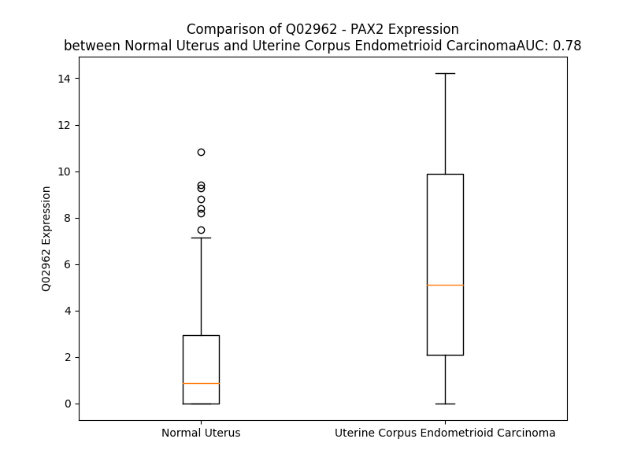

# Detailed Data for Q02962

## Introduction to the Detailed Summary

### How to Interpret the Results

- **Summary & Metrics**: This section provides a quick reference to essential protein attributes, including expression changes, family classification, and biomarker applications. Regulation status (upregulated/downregulated) indicates the protein's behavior in a disease context. Some information comes from the original excel file with the proteins selected from literature, while others are derived from the analyses.
- **Expression Comparison**: A visual representation comparing protein expression between normal and disease states. It highlights significant changes in expression levels that might indicate diagnostic or therapeutic relevance. This is data coming from transcriptomics experiments and could not translate similarly to protein levels.
- **Isoform Alignment**: An interactive view of isoform alignments, revealing structural and functional differences between variants of the protein.
- **Interactors & Homologs**: Tables listing known interaction partners and homologous proteins, the more interactors and homologs, the more complex the protein is to design an antibody for.
- **Biological Assemblies**: Information about the structural arrangement of the protein in different assemblies, providing insights into its functional state but also the complexity of the protein to develop antibodies.
- **Combined Per-Residue Information**: A detailed table summarizing residue-level data. This includes predictions for epitope regions, aggregation tendencies, and modifications that might impact the protein's function. Each row corresponds to a residue in the protein, providing insights into specific sites that may be important for research or drug development.
## Summary & Metrics

- **UniProt Accession**: Q02962
- **Gene Name**: PAX2
- **Protein Name**: Paired box protein Pax-2
- **Swiss Prot**: PAX2_HUMAN
- **Family**: transcription regulator
- **Biomarker Application**: diagnosis
- **Number of Isoforms**: 4
- **Regulation**: -1
- **(transcriptomics) AUC**: 0.85
- **(transcriptomics) Fold Change**: 3.21
- **(transcriptomics) Regulation**: Upregulated
- **Discotope Epitope Count**: 41
- **Max n_uniprots (Homo)**: N/A
- **Max n_uniprots (Hetero)**: N/A

## Expression Comparison

## Isoform Alignment

<pre style='font-size:14px; font-family:monospace;'>Q02962-1 MDMHCKADPFSAMHPGHGGVNQLGGVFVNGRPLPDVVRQRIVELAHQGVRPCDISRQLRVSHGCVSKILGRYYETGSIKPGVIGGSKPKVATPKVVDKIAEYKRQNPTMFAWEIRDRLLAEGICDNDTVPSVSSINRIIRTKVQQPFHPTPDGAGTGVTAPGHTIVPSTASPPVSSASNDPVGSYSINGILGIPRSNGEKRKRDEVEVYTDPAHIRGGGGLHLVWTLRDVSEGSVPNGDSQSGVDSLRKHLRADTFTQQQLEALDRVFERPSYPDVFQASEHIKSEQGNEYSLPALTPGLDEVKSSLSASTNPELGSNVSGTQTYPVVTGRDMASTTLPGYPPHVPPTGQGSYPTSTLAGMVPGSEFSGNPYSHP-QYTAYNEAWRFSNPALLSSPYYYSAAPRGSA----PAAAAAAYDRH
Q02962-2 MDMHCKADPFSAMHPGHGGVNQLGGVFVNGRPLPDVVRQRIVELAHQGVRPCDISRQLRVSHGCVSKILGRYYETGSIKPGVIGGSKPKVATPKVVDKIAEYKRQNPTMFAWEIRDRLLAEGICDNDTVPSVSSINRIIRTKVQQPFHPTPDGAGTGVTAPGHTIVPSTASPPVSSASNDPVGSYSINGILGIPRSNGEKRKRDEVEVYTDPAHIRGGGGLHLVWTLRDVSEGSVPNGDSQSGVDSLRKHLRADTFTQQQLEALDRVFERPSYPDVFQASEHIKSEQGNEYSLPALTPGLDEVKSSLSASTNPELGSNVSGTQTYPVVTGRDMASTTLPGYPPHVPPTGQGSYPTSTLAGMVPEAAVGPSSSLMSKPGRKLAEVPPCVQPTGASSPATRTATPSTRPTTRLGDSATPPY---
Q02962-3 MDMHCKADPFSAMHPGHGGVNQLGGVFVNGRPLPDVVRQRIVELAHQGVRPCDISRQLRVSHGCVSKILGRYYETGSIKPGVIGGSKPKVATPKVVDKIAEYKRQNPTMFAWEIRDRLLAEGICDNDTVPSVSSINRIIRTKVQQPFHPTPDGAGTGVTAPGHTIVPSTASPPVSSASNDPVGSYSINGILGIPRSNGEKRKRDE-----------------------DVSEGSVPNGDSQSGVDSLRKHLRADTFTQQQLEALDRVFERPSYPDVFQASEHIKSEQGNEYSLPALTPGLDEVKSSLSASTNPELGSNVSGTQTYPVVTGRDMASTTLPGYPPHVPPTGQGSYPTSTLAGMVPGSEFSGNPYSHP-QYTAYNEAWRFSNPALLSSPYYYSAAPRGSA----PAAAAAAYDRH
Q02962-4 MDMHCKADPFSAMHPGHGGVNQLGGVFVNGRPLPDVVRQRIVELAHQGVRPCDISRQLRVSHGCVSKILGRYYETGSIKPGVIGGSKPKVATPKVVDKIAEYKRQNPTMFAWEIRDRLLAEGICDNDTVPSVSSINRIIRTKVQQPFHPTPDGAGTGVTAPGHTIVPSTASPPVSSASNDPVGSYSINGILGIPRSNGEKRKRDE-----------------------DVSEGSVPNGDSQSGVDSLRKHLRADTFTQQQLEALDRVFERPSYPDVFQASEHIKSEQGNEYSLPALTPGLDEVKSSLSASTNPELGSNVSGTQTYPVVTGRDMASTTLPGYPPHVPPTGQGSYPTSTLAGMVPEAAVGPSSSLMSKPGRKLAEVPPCVQPTGASSPATRTATPSTRPTTRLGDSATPPY---
</pre>

## Interactors

| preferredName_A   | preferredName_B   |   score |
|:------------------|:------------------|--------:|
| PAX2              | PAXIP1            |   0.981 |
| PAX2              | TLX1              |   0.953 |

## Homologs

| uniprot_id   | gene_id   |
|:-------------|:----------|
| Q9H2W2       | MIXL1     |
| P58304       | VSX2      |
| A6NFQ7       | DPRX      |
| O15266       | SHOX      |
| O60902       | SHOX2     |
| A6NLW8       | DUXA      |
| P32242       | OTX1      |
| P15863       | PAX1      |
| P54821       | PRRX1     |
| P23760       | PAX3      |
| Q2L4T1       | Pax9      |
| A0A2R8Y683   | NOBOX     |
| Q2M1V0       | ISX       |
| P56915       | GSC       |
| E7ES87       | PAX5      |
| nan          | nan       |
| Q96QS3       | ARX       |
| Q9BQY4       | RHOXF2    |
| P0C7M4       | RHOXF2B   |
| Q9HB31       | SEBOX     |
| A0A1W2PPF3   | DUXB      |
| A6NJG6       | ARGFX     |
| Q03828       | EVX2      |
| Q99811       | PRRX2     |
| A0A1W2PP89   | PAX6      |
| A6NJT0       | UNCX      |
| G3V3F3       | PAX8      |
| C9J0A9       | HESX1     |
| O14813       | PHOX2A    |
| O15499       | GSC2      |
| C3U3A0       | DUX4      |
| Q96IS3       | RAX2      |
| V9HWA7       | HEL23     |
| P23759       | PAX7      |
| P49640       | EVX1      |
| Q8NHV9       | RHOXF1    |
| A0A0G2JQ02   | PROP1     |
| Q8N693       | ESX1      |
| Q9H161       | ALX4      |
| Q99453       | PHOX2B    |
| Q5XKR4       | OTP       |
| O43186       | CRX       |
| D6R9U1       | PITX1     |
| O95076       | ALX3      |
| O75364       | PITX3     |
| F1T0C9       | OTX2      |
| Q9Y2V3       | RAX       |
| A6NNA5       | DRGX      |
| D6RBG8       | PITX2     |
| J3KPG0       | PAX4      |

## Combined Per-Residue Information

|   res | aa   |   epitope_score | epitope   |   relative_surface_accessibility |   modeling_confidence |   Aggregation | modification     |
|------:|:-----|----------------:|:----------|---------------------------------:|----------------------:|--------------:|:-----------------|
|     1 | M    |         0.09496 | False     |                          1.23785 |                 54.38 |         0     | N/A              |
|     2 | D    |         0.12384 | False     |                          0.84017 |                 42.73 |         0     | N/A              |
|     3 | M    |         0.13836 | False     |                          0.92363 |                 51.01 |         0     | N/A              |
|     4 | H    |         0.15674 | False     |                          0.95234 |                 48.93 |         0     | N/A              |
|     5 | C    |         0.13217 | False     |                          0.82006 |                 50.43 |         0     | N/A              |
|     6 | K    |         0.11443 | False     |                          0.96874 |                 49.96 |         0     | N/A              |
|     7 | A    |         0.12772 | False     |                          0.93025 |                 50.51 |         0     | N/A              |
|     8 | D    |         0.1868  | True      |                          0.66242 |                 53.77 |         0     | N/A              |
|     9 | P    |         0.14171 | False     |                          0.87161 |                 59.41 |         0     | N/A              |
|    10 | F    |         0.14035 | False     |                          0.66582 |                 54.33 |         0     | N/A              |
|    11 | S    |         0.13886 | False     |                          0.8242  |                 52.18 |         0     | N/A              |
|    12 | A    |         0.13731 | False     |                          0.94734 |                 50.5  |         0     | N/A              |
|    13 | M    |         0.09473 | False     |                          0.62688 |                 53.15 |         0     | N/A              |
|    14 | H    |         0.15778 | False     |                          0.86499 |                 51.11 |         0     | N/A              |
|    15 | P    |         0.19368 | True      |                          1.09196 |                 52.74 |         0     | N/A              |
|    16 | G    |         0.21104 | True      |                          0.6955  |                 58.07 |         0     | N/A              |
|    17 | H    |         0.13312 | False     |                          0.8451  |                 71.55 |         0     | N/A              |
|    18 | G    |         0.09825 | False     |                          0.63596 |                 81    |         0     | N/A              |
|    19 | G    |         0.11861 | False     |                          0.31461 |                 90.12 |         0     | N/A              |
|    20 | V    |         0.13663 | False     |                          0.73133 |                 93.99 |         0     | N/A              |
|    21 | N    |         0.06585 | False     |                          0.24494 |                 93.28 |         0     | N/A              |
|    22 | Q    |         0.18629 | True      |                          0.97377 |                 95.06 |         0.159 | N/A              |
|    23 | L    |         0.17894 | True      |                          0.4141  |                 94.24 |         4.609 | N/A              |
|    24 | G    |         0.08596 | False     |                          0.39132 |                 92.99 |         5.36  | N/A              |
|    25 | G    |         0.03237 | False     |                          0.0947  |                 93.42 |         5.479 | N/A              |
|    26 | V    |         0.06589 | False     |                          0.7812  |                 93.93 |         5.598 | N/A              |
|    27 | F    |         0.0715  | False     |                          0.40329 |                 93.8  |         5.598 | N/A              |
|    28 | V    |         0.10264 | False     |                          0.2041  |                 93.27 |         5.249 | N/A              |
|    29 | N    |         0.22997 | True      |                          0.8401  |                 91.6  |         0.238 | N/A              |
|    30 | G    |         0.16842 | True      |                          0.80232 |                 90.62 |         0.119 | N/A              |
|    31 | R    |         0.24376 | True      |                          0.7284  |                 93.01 |         0     | N/A              |
|    32 | P    |         0.12223 | False     |                          0.45692 |                 94.98 |         0     | N/A              |
|    33 | L    |         0.0567  | False     |                          0.16877 |                 94.55 |         0     | N/A              |
|    34 | P    |         0.10377 | False     |                          0.45727 |                 94.71 |         0     | N/A              |
|    35 | D    |         0.10019 | False     |                          0.49257 |                 96.03 |         0     | N/A              |
|    36 | V    |         0.08586 | False     |                          0.62615 |                 96.13 |         0     | N/A              |
|    37 | V    |         0.03781 | False     |                          0.17328 |                 96.74 |         0     | N/A              |
|    38 | R    |         0.02619 | False     |                          0.03887 |                 97.71 |         0     | N/A              |
|    39 | Q    |         0.15247 | False     |                          0.55312 |                 97.72 |         0     | N/A              |
|    40 | R    |         0.16533 | True      |                          0.39195 |                 97.68 |         0     | N/A              |
|    41 | I    |         0.00614 | False     |                          0       |                 97.93 |         0     | N/A              |
|    42 | V    |         0.03521 | False     |                          0.07521 |                 97.63 |         0     | N/A              |
|    43 | E    |         0.08138 | False     |                          0.38071 |                 97.68 |         0     | N/A              |
|    44 | L    |         0.05466 | False     |                          0.05606 |                 97.63 |         0     | N/A              |
|    45 | A    |         0.06407 | False     |                          0.16082 |                 97.58 |         0     | N/A              |
|    46 | H    |         0.1854  | True      |                          0.61485 |                 96.6  |         0     | N/A              |
|    47 | Q    |         0.13261 | False     |                          0.55691 |                 97.1  |         0     | N/A              |
|    48 | G    |         0.1438  | False     |                          0.75189 |                 96.35 |         0     | N/A              |
|    49 | V    |         0.0774  | False     |                          0.27064 |                 97.64 |         0     | N/A              |
|    50 | R    |         0.13748 | False     |                          0.6785  |                 97.58 |         0     | N/A              |
|    51 | P    |         0.07139 | False     |                          0.45131 |                 97.24 |         0     | N/A              |
|    52 | C    |         0.11434 | False     |                          0.38909 |                 97.35 |         0     | N/A              |
|    53 | D    |         0.12908 | False     |                          0.32081 |                 97.76 |         0     | N/A              |
|    54 | I    |         0.00858 | False     |                          0       |                 97.84 |         0     | N/A              |
|    55 | S    |         0.047   | False     |                          0.04015 |                 97.85 |         0     | N/A              |
|    56 | R    |         0.20109 | True      |                          0.63896 |                 97.02 |         0     | N/A              |
|    57 | Q    |         0.12721 | False     |                          0.55464 |                 96.57 |         0     | N/A              |
|    58 | L    |         0.04921 | False     |                          0.28244 |                 96.82 |         0     | N/A              |
|    59 | R    |         0.0815  | False     |                          0.52996 |                 97.3  |         0     | N/A              |
|    60 | V    |         0.0202  | False     |                          0.07617 |                 96.93 |         0     | N/A              |
|    61 | S    |         0.0874  | False     |                          0.44268 |                 97.24 |         0     | N/A              |
|    62 | H    |         0.18131 | True      |                          0.54852 |                 97.39 |         0     | N/A              |
|    63 | G    |         0.14719 | False     |                          0.4668  |                 97.38 |         0     | N/A              |
|    64 | C    |         0.04895 | False     |                          0.27894 |                 96.63 |         0     | N/A              |
|    65 | V    |         0.00294 | False     |                          0       |                 97.89 |         0     | N/A              |
|    66 | S    |         0.10092 | False     |                          0.44708 |                 97.65 |         0     | N/A              |
|    67 | K    |         0.10501 | False     |                          0.72531 |                 97.23 |         0     | N/A              |
|    68 | I    |         0.01678 | False     |                          0.01896 |                 97.33 |         0     | N/A              |
|    69 | L    |         0.0301  | False     |                          0.0577  |                 97.43 |         0     | N/A              |
|    70 | G    |         0.05636 | False     |                          0.34112 |                 96.58 |         0     | N/A              |
|    71 | R    |         0.06537 | False     |                          0.30658 |                 96.46 |         0     | N/A              |
|    72 | Y    |         0.07927 | False     |                          0.2245  |                 97.37 |         0     | N/A              |
|    73 | Y    |         0.13922 | False     |                          0.64015 |                 96.37 |         0     | N/A              |
|    74 | E    |         0.1253  | False     |                          0.70896 |                 96.38 |         0     | N/A              |
|    75 | T    |         0.20296 | True      |                          0.60483 |                 95.48 |         0     | N/A              |
|    76 | G    |         0.10337 | False     |                          0.62966 |                 94.82 |         0     | N/A              |
|    77 | S    |         0.14088 | False     |                          0.33733 |                 95.12 |         0     | N/A              |
|    78 | I    |         0.11422 | False     |                          0.29796 |                 94.61 |         0     | N/A              |
|    79 | K    |         0.12813 | False     |                          0.72787 |                 94.75 |         0     | N/A              |
|    80 | P    |         0.10042 | False     |                          0.32775 |                 93.4  |         0     | N/A              |
|    81 | G    |         0.124   | False     |                          0.55456 |                 91.79 |         0     | N/A              |
|    82 | V    |         0.13139 | False     |                          1.075   |                 92.16 |         0     | N/A              |
|    83 | I    |         0.23041 | True      |                          0.73231 |                 87.52 |         0     | N/A              |
|    84 | G    |         0.26806 | True      |                          0.75008 |                 86.26 |         0     | N/A              |
|    85 | G    |         0.21756 | True      |                          1.03185 |                 86.93 |         0     | N/A              |
|    86 | S    |         0.21272 | True      |                          0.80958 |                 87.79 |         0     | N/A              |
|    87 | K    |         0.16947 | True      |                          0.90774 |                 81.08 |         0     | N/A              |
|    88 | P    |         0.15473 | False     |                          0.69694 |                 75.17 |         0     | N/A              |
|    89 | K    |         0.21454 | True      |                          0.92407 |                 73.49 |         0     | N/A              |
|    90 | V    |         0.14515 | False     |                          0.41928 |                 73.35 |         0     | N/A              |
|    91 | A    |         0.07078 | False     |                          0.2533  |                 81.63 |         0     | N/A              |
|    92 | T    |         0.08934 | False     |                          0.41401 |                 87.58 |         0     | N/A              |
|    93 | P    |         0.08735 | False     |                          0.74953 |                 89.54 |         0     | N/A              |
|    94 | K    |         0.09705 | False     |                          0.80614 |                 90.93 |         0     | N/A              |
|    95 | V    |         0.01706 | False     |                          0.04951 |                 93.4  |         0.7   | N/A              |
|    96 | V    |         0.01336 | False     |                          0.1628  |                 93.64 |         0.7   | N/A              |
|    97 | D    |         0.06622 | False     |                          0.57417 |                 94.1  |         0.7   | N/A              |
|    98 | K    |         0.08174 | False     |                          0.36654 |                 94.19 |         0.7   | N/A              |
|    99 | I    |         0.0042  | False     |                          0       |                 94.8  |         0.7   | N/A              |
|   100 | A    |         0.02435 | False     |                          0.29251 |                 94.49 |         0.319 | N/A              |
|   101 | E    |         0.06632 | False     |                          0.25516 |                 95.1  |         0     | N/A              |
|   102 | Y    |         0.0435  | False     |                          0.02826 |                 94.98 |         0     | N/A              |
|   103 | K    |         0.02813 | False     |                          0.16168 |                 94.12 |         0     | N/A              |
|   104 | R    |         0.12929 | False     |                          0.72701 |                 93.44 |         0     | N/A              |
|   105 | Q    |         0.16718 | True      |                          0.51424 |                 94.38 |         0     | N/A              |
|   106 | N    |         0.09871 | False     |                          0.39035 |                 92.71 |         0     | N/A              |
|   107 | P    |         0.11692 | False     |                          0.72842 |                 93.04 |         0     | N/A              |
|   108 | T    |         0.14141 | False     |                          0.83256 |                 94.44 |         0.612 | N/A              |
|   109 | M    |         0.0424  | False     |                          0.05034 |                 93.7  |         0.612 | N/A              |
|   110 | F    |         0.08132 | False     |                          0.64732 |                 96.09 |         0.612 | N/A              |
|   111 | A    |         0.02627 | False     |                          0.08375 |                 96.27 |         0.612 | N/A              |
|   112 | W    |         0.11994 | False     |                          0.4812  |                 96.48 |         0.612 | N/A              |
|   113 | E    |         0.0822  | False     |                          0.2711  |                 97.2  |         0     | N/A              |
|   114 | I    |         0.00442 | False     |                          0       |                 96.13 |         0     | N/A              |
|   115 | R    |         0.14265 | False     |                          0.33796 |                 95.65 |         0     | N/A              |
|   116 | D    |         0.08374 | False     |                          0.34386 |                 96.11 |         0     | N/A              |
|   117 | R    |         0.13063 | False     |                          0.40086 |                 95.38 |         0     | N/A              |
|   118 | L    |         0.00367 | False     |                          0       |                 95.19 |         0     | N/A              |
|   119 | L    |         0.11498 | False     |                          0.35873 |                 94.81 |         0     | N/A              |
|   120 | A    |         0.089   | False     |                          0.85739 |                 94.49 |         0     | N/A              |
|   121 | E    |         0.16547 | True      |                          0.48457 |                 93.53 |         0     | N/A              |
|   122 | G    |         0.16571 | True      |                          0.75904 |                 90.57 |         0     | N/A              |
|   123 | I    |         0.05516 | False     |                          0.27585 |                 90.58 |         0     | N/A              |
|   124 | C    |         0.0258  | False     |                          0.05418 |                 89.84 |         0     | N/A              |
|   125 | D    |         0.15306 | False     |                          0.6151  |                 89.62 |         0     | N/A              |
|   126 | N    |         0.1618  | True      |                          0.81545 |                 89.68 |         0     | N/A              |
|   127 | D    |         0.16007 | False     |                          0.8341  |                 87.42 |         0     | N/A              |
|   128 | T    |         0.11502 | False     |                          0.47518 |                 90.09 |         0     | N/A              |
|   129 | V    |         0.06628 | False     |                          0.18632 |                 91.33 |         0     | N/A              |
|   130 | P    |         0.00891 | False     |                          0.00298 |                 92.46 |         0     | N/A              |
|   131 | S    |         0.15766 | False     |                          0.51902 |                 93.72 |         0     | N/A              |
|   132 | V    |         0.11518 | False     |                          0.36413 |                 96    |         0     | N/A              |
|   133 | S    |         0.10444 | False     |                          0.65622 |                 95.46 |         0     | N/A              |
|   134 | S    |         0.04944 | False     |                          0.21977 |                 93.21 |         0     | N/A              |
|   135 | I    |         0.00571 | False     |                          0       |                 95.38 |         0     | N/A              |
|   136 | N    |         0.08269 | False     |                          0.32544 |                 95.85 |         0     | N/A              |
|   137 | R    |         0.17834 | True      |                          0.71637 |                 94.15 |         0     | N/A              |
|   138 | I    |         0.04164 | False     |                          0.0704  |                 93.4  |         0     | N/A              |
|   139 | I    |         0.02804 | False     |                          0.0784  |                 93.48 |         0     | N/A              |
|   140 | R    |         0.12151 | False     |                          0.64324 |                 92.61 |         0     | N/A              |
|   141 | T    |         0.12839 | False     |                          0.53683 |                 89.35 |         0     | N/A              |
|   142 | K    |         0.12099 | False     |                          0.58574 |                 82.97 |         0     | N/A              |
|   143 | V    |         0.07752 | False     |                          0.35518 |                 77.51 |         0     | N/A              |
|   144 | Q    |         0.12644 | False     |                          0.62218 |                 71.74 |         0     | N/A              |
|   145 | Q    |         0.07155 | False     |                          0.56235 |                 59.09 |         0     | N/A              |
|   146 | P    |         0.11243 | False     |                          0.76147 |                 51.85 |         0     | N/A              |
|   147 | F    |         0.10388 | False     |                          0.94041 |                 44.58 |         0     | N/A              |
|   148 | H    |         0.11648 | False     |                          0.92846 |                 43.4  |         0     | N/A              |
|   149 | P    |         0.11332 | False     |                          0.79512 |                 43.75 |         0     | N/A              |
|   150 | T    |         0.15049 | False     |                          0.80624 |                 41.45 |         0     | N/A              |
|   151 | P    |         0.1331  | False     |                          0.9673  |                 40.89 |         0     | N/A              |
|   152 | D    |         0.14894 | False     |                          0.86117 |                 35.43 |         0     | N/A              |
|   153 | G    |         0.10923 | False     |                          0.90084 |                 36.94 |         0     | N/A              |
|   154 | A    |         0.06291 | False     |                          1.06732 |                 35.91 |         0     | N/A              |
|   155 | G    |         0.0821  | False     |                          0.91961 |                 34.67 |         0     | N/A              |
|   156 | T    |         0.12125 | False     |                          1.00138 |                 37.58 |         0     | N/A              |
|   157 | G    |         0.07353 | False     |                          0.76724 |                 36.42 |         0     | N/A              |
|   158 | V    |         0.09187 | False     |                          0.97415 |                 43.27 |         0     | N/A              |
|   159 | T    |         0.0628  | False     |                          0.90007 |                 37.39 |         0     | N/A              |
|   160 | A    |         0.09797 | False     |                          0.96046 |                 44.31 |         0     | N/A              |
|   161 | P    |         0.09131 | False     |                          1.01376 |                 40.73 |         0     | N/A              |
|   162 | G    |         0.14624 | False     |                          0.7913  |                 37.44 |         0     | N/A              |
|   163 | H    |         0.08458 | False     |                          1.06977 |                 42.37 |         0     | N/A              |
|   164 | T    |         0.09562 | False     |                          0.83786 |                 40.32 |         0     | N/A              |
|   165 | I    |         0.11309 | False     |                          0.88989 |                 47.07 |         0     | N/A              |
|   166 | V    |         0.06408 | False     |                          0.94613 |                 45.97 |         0     | N/A              |
|   167 | P    |         0.06731 | False     |                          0.91839 |                 36.86 |         0     | N/A              |
|   168 | S    |         0.06219 | False     |                          0.79745 |                 45.24 |         0     | N/A              |
|   169 | T    |         0.08311 | False     |                          0.94651 |                 38.81 |         0     | N/A              |
|   170 | A    |         0.08281 | False     |                          1.02899 |                 44.11 |         0     | N/A              |
|   171 | S    |         0.07312 | False     |                          0.82027 |                 39.71 |         0     | N/A              |
|   172 | P    |         0.06431 | False     |                          0.91192 |                 49.11 |         0     | N/A              |
|   173 | P    |         0.12067 | False     |                          0.90642 |                 42.48 |         0     | N/A              |
|   174 | V    |         0.06479 | False     |                          1.00531 |                 37.66 |         0     | N/A              |
|   175 | S    |         0.1076  | False     |                          0.91056 |                 40.58 |         0     | N/A              |
|   176 | S    |         0.10827 | False     |                          0.90414 |                 36.33 |         0     | N/A              |
|   177 | A    |         0.08146 | False     |                          0.88077 |                 35.67 |         0     | N/A              |
|   178 | S    |         0.08136 | False     |                          0.73127 |                 36.22 |         0     | N/A              |
|   179 | N    |         0.06883 | False     |                          0.86137 |                 38.38 |         0     | N/A              |
|   180 | D    |         0.06156 | False     |                          0.83665 |                 43.22 |         0     | N/A              |
|   181 | P    |         0.0743  | False     |                          0.97001 |                 50.99 |         0     | N/A              |
|   182 | V    |         0.0953  | False     |                          1.05808 |                 43.83 |         0     | N/A              |
|   183 | G    |         0.06117 | False     |                          0.62112 |                 45.85 |         0     | N/A              |
|   184 | S    |         0.04797 | False     |                          0.54433 |                 52.09 |         0     | N/A              |
|   185 | Y    |         0.13079 | False     |                          0.9546  |                 64.08 |         0     | N/A              |
|   186 | S    |         0.0434  | False     |                          0.35584 |                 78.44 |         0     | N/A              |
|   187 | I    |         0.14669 | False     |                          0.84011 |                 77.06 |         0.133 | N/A              |
|   188 | N    |         0.08119 | False     |                          0.41427 |                 78.77 |         0.133 | N/A              |
|   189 | G    |         0.06552 | False     |                          0.54932 |                 73.34 |         0.133 | N/A              |
|   190 | I    |         0.1402  | False     |                          0.83239 |                 74.97 |         0.133 | N/A              |
|   191 | L    |         0.07576 | False     |                          0.78108 |                 74.93 |         0.133 | N/A              |
|   192 | G    |         0.10777 | False     |                          0.74167 |                 70.39 |         0     | N/A              |
|   193 | I    |         0.07666 | False     |                          0.50393 |                 70.12 |         0     | N/A              |
|   194 | P    |         0.09814 | False     |                          0.85995 |                 64.82 |         0     | N/A              |
|   195 | R    |         0.12936 | False     |                          0.8301  |                 54.99 |         0     | N/A              |
|   196 | S    |         0.14127 | False     |                          0.88539 |                 60.34 |         0     | N/A              |
|   197 | N    |         0.18509 | True      |                          0.89764 |                 37.6  |         0     | N/A              |
|   198 | G    |         0.09132 | False     |                          0.88021 |                 43.88 |         0     | N/A              |
|   199 | E    |         0.09611 | False     |                          0.75637 |                 44.37 |         0     | N/A              |
|   200 | K    |         0.12908 | False     |                          0.96275 |                 35.15 |         0     | N/A              |
|   201 | R    |         0.13483 | False     |                          0.87366 |                 48.76 |         0     | N/A              |
|   202 | K    |         0.11695 | False     |                          0.90553 |                 38.84 |         0     | N/A              |
|   203 | R    |         0.1539  | False     |                          0.82162 |                 39.88 |         0     | N/A              |
|   204 | D    |         0.10941 | False     |                          0.73955 |                 48.57 |         0     | N/A              |
|   205 | E    |         0.07237 | False     |                          0.82376 |                 36.71 |         0     | N/A              |
|   206 | V    |         0.09693 | False     |                          1.0734  |                 43.06 |         0     | N/A              |
|   207 | E    |         0.12558 | False     |                          0.76406 |                 33.4  |         0     | N/A              |
|   208 | V    |         0.08538 | False     |                          1.04157 |                 39.74 |         0     | N/A              |
|   209 | Y    |         0.11889 | False     |                          0.73482 |                 33.21 |         0     | N/A              |
|   210 | T    |         0.08974 | False     |                          0.93064 |                 44.02 |         0     | N/A              |
|   211 | D    |         0.07077 | False     |                          0.56755 |                 39.14 |         0     | N/A              |
|   212 | P    |         0.06985 | False     |                          0.92395 |                 39.84 |         0     | N/A              |
|   213 | A    |         0.09573 | False     |                          0.79022 |                 39.59 |         0     | N/A              |
|   214 | H    |         0.10991 | False     |                          0.99985 |                 42.89 |         0     | N/A              |
|   215 | I    |         0.07488 | False     |                          0.87761 |                 43.72 |         0     | N/A              |
|   216 | R    |         0.10208 | False     |                          0.92511 |                 35.77 |         0     | N/A              |
|   217 | G    |         0.07453 | False     |                          0.95429 |                 31.08 |         0     | N/A              |
|   218 | G    |         0.06917 | False     |                          0.98545 |                 33.98 |         0     | N/A              |
|   219 | G    |         0.07409 | False     |                          0.8774  |                 35.57 |         0     | N/A              |
|   220 | G    |         0.08175 | False     |                          0.94662 |                 33.05 |         0.222 | N/A              |
|   221 | L    |         0.07613 | False     |                          1.0231  |                 41.61 |         3.028 | N/A              |
|   222 | H    |         0.08124 | False     |                          0.84243 |                 37.13 |         3.48  | N/A              |
|   223 | L    |         0.06816 | False     |                          0.87278 |                 41.2  |        58.158 | N/A              |
|   224 | V    |         0.05305 | False     |                          0.62226 |                 38.49 |        58.158 | N/A              |
|   225 | W    |         0.08436 | False     |                          1.00458 |                 37.92 |        58.158 | N/A              |
|   226 | T    |         0.0892  | False     |                          0.85184 |                 40.46 |        57.879 | Phosphothreonine |
|   227 | L    |         0.0766  | False     |                          1.12151 |                 38.47 |        57.819 | N/A              |
|   228 | R    |         0.10463 | False     |                          0.9362  |                 39.83 |         0.062 | N/A              |
|   229 | D    |         0.07331 | False     |                          0.77697 |                 34.86 |         0.062 | N/A              |
|   230 | V    |         0.10811 | False     |                          0.9712  |                 40.16 |         0.062 | N/A              |
|   231 | S    |         0.08789 | False     |                          0.67661 |                 39.58 |         0     | N/A              |
|   232 | E    |         0.1292  | False     |                          0.91402 |                 36.02 |         0     | N/A              |
|   233 | G    |         0.20267 | True      |                          0.88204 |                 36.79 |         0     | N/A              |
|   234 | S    |         0.10849 | False     |                          0.90576 |                 40.4  |         0     | N/A              |
|   235 | V    |         0.10886 | False     |                          0.97602 |                 39.26 |         0     | N/A              |
|   236 | P    |         0.12505 | False     |                          0.86061 |                 47.56 |         0     | N/A              |
|   237 | N    |         0.11855 | False     |                          1.006   |                 37.82 |         0     | N/A              |
|   238 | G    |         0.15368 | False     |                          0.84636 |                 37.38 |         0     | N/A              |
|   239 | D    |         0.12477 | False     |                          0.88369 |                 35.43 |         0     | N/A              |
|   240 | S    |         0.17917 | True      |                          0.88842 |                 42.4  |         0     | N/A              |
|   241 | Q    |         0.13313 | False     |                          0.91334 |                 36.97 |         0     | N/A              |
|   242 | S    |         0.15001 | False     |                          0.9263  |                 36    |         0     | N/A              |
|   243 | G    |         0.18113 | True      |                          0.83907 |                 38.08 |         0     | N/A              |
|   244 | V    |         0.12363 | False     |                          1.04752 |                 41.02 |         0     | N/A              |
|   245 | D    |         0.11792 | False     |                          0.85839 |                 44.11 |         0     | N/A              |
|   246 | S    |         0.11868 | False     |                          0.86207 |                 47.77 |         0     | N/A              |
|   247 | L    |         0.13514 | False     |                          1.11066 |                 45.97 |         0     | N/A              |
|   248 | R    |         0.19393 | True      |                          0.91807 |                 44.77 |         0     | N/A              |
|   249 | K    |         0.16659 | True      |                          1.00083 |                 51.63 |         0     | N/A              |
|   250 | H    |         0.16285 | True      |                          0.96062 |                 47.99 |         0     | N/A              |
|   251 | L    |         0.19372 | True      |                          1.06181 |                 49.18 |         0     | N/A              |
|   252 | R    |         0.22679 | True      |                          0.84742 |                 53.7  |         0     | N/A              |
|   253 | A    |         0.13004 | False     |                          0.84006 |                 56.26 |         0     | N/A              |
|   254 | D    |         0.17024 | True      |                          0.8981  |                 55.16 |         0     | N/A              |
|   255 | T    |         0.13099 | False     |                          0.85459 |                 67.15 |         0     | N/A              |
|   256 | F    |         0.08112 | False     |                          0.55186 |                 70.78 |         0     | N/A              |
|   257 | T    |         0.11823 | False     |                          0.61871 |                 80.57 |         0     | N/A              |
|   258 | Q    |         0.14827 | False     |                          0.71599 |                 76.47 |         0     | N/A              |
|   259 | Q    |         0.15005 | False     |                          0.71873 |                 79.91 |         0     | N/A              |
|   260 | Q    |         0.11702 | False     |                          0.40375 |                 78.83 |         0     | N/A              |
|   261 | L    |         0.04533 | False     |                          0.65558 |                 80.44 |         0     | N/A              |
|   262 | E    |         0.0817  | False     |                          0.42633 |                 79.6  |         0     | N/A              |
|   263 | A    |         0.05908 | False     |                          0.42285 |                 80.72 |         0     | N/A              |
|   264 | L    |         0.07555 | False     |                          0.43844 |                 80.77 |         0     | N/A              |
|   265 | D    |         0.06767 | False     |                          0.58212 |                 80.13 |         0     | N/A              |
|   266 | R    |         0.15951 | False     |                          0.6164  |                 77.37 |         0     | N/A              |
|   267 | V    |         0.09256 | False     |                          0.71435 |                 75.73 |         0     | N/A              |
|   268 | F    |         0.07787 | False     |                          0.82304 |                 67.43 |         0     | N/A              |
|   269 | E    |         0.08399 | False     |                          0.7324  |                 64.6  |         0     | N/A              |
|   270 | R    |         0.14432 | False     |                          0.7643  |                 48.43 |         0     | N/A              |
|   271 | P    |         0.11609 | False     |                          0.81299 |                 52.27 |         0     | N/A              |
|   272 | S    |         0.11904 | False     |                          0.84268 |                 53.78 |         0     | N/A              |
|   273 | Y    |         0.12698 | False     |                          0.86587 |                 42.92 |         0     | N/A              |
|   274 | P    |         0.15997 | False     |                          0.85628 |                 54.89 |         0     | N/A              |
|   275 | D    |         0.12524 | False     |                          0.74024 |                 38.78 |         0     | N/A              |
|   276 | V    |         0.10418 | False     |                          0.7599  |                 45.82 |         0     | N/A              |
|   277 | F    |         0.08515 | False     |                          0.88091 |                 39.22 |         0     | N/A              |
|   278 | Q    |         0.12406 | False     |                          0.86981 |                 39.25 |         0     | N/A              |
|   279 | A    |         0.07203 | False     |                          0.983   |                 33.58 |         0     | N/A              |
|   280 | S    |         0.06875 | False     |                          0.82272 |                 39.34 |         0     | N/A              |
|   281 | E    |         0.09197 | False     |                          0.89369 |                 37.85 |         0     | N/A              |
|   282 | H    |         0.11574 | False     |                          0.91165 |                 39.8  |         0     | N/A              |
|   283 | I    |         0.12101 | False     |                          0.82718 |                 45.78 |         0     | N/A              |
|   284 | K    |         0.10219 | False     |                          0.89388 |                 41.17 |         0     | N/A              |
|   285 | S    |         0.10092 | False     |                          0.73046 |                 41.39 |         0     | N/A              |
|   286 | E    |         0.14225 | False     |                          0.81499 |                 40.34 |         0     | N/A              |
|   287 | Q    |         0.09983 | False     |                          0.84899 |                 39.18 |         0     | N/A              |
|   288 | G    |         0.10434 | False     |                          0.84555 |                 36.89 |         0     | N/A              |
|   289 | N    |         0.13887 | False     |                          0.94736 |                 39.31 |         0     | N/A              |
|   290 | E    |         0.10773 | False     |                          0.84378 |                 37.36 |         0     | N/A              |
|   291 | Y    |         0.15824 | False     |                          1.00176 |                 38.86 |         0     | N/A              |
|   292 | S    |         0.11602 | False     |                          0.84509 |                 36.92 |         0     | N/A              |
|   293 | L    |         0.07746 | False     |                          1.02982 |                 37.29 |         0     | N/A              |
|   294 | P    |         0.10454 | False     |                          0.93292 |                 42.27 |         0     | N/A              |
|   295 | A    |         0.04791 | False     |                          0.8836  |                 37.5  |         0     | N/A              |
|   296 | L    |         0.09848 | False     |                          1.05352 |                 49.38 |         0     | N/A              |
|   297 | T    |         0.07118 | False     |                          0.91678 |                 41.38 |         0     | N/A              |
|   298 | P    |         0.13828 | False     |                          0.979   |                 51.38 |         0     | N/A              |
|   299 | G    |         0.10984 | False     |                          0.75562 |                 38.35 |         0     | N/A              |
|   300 | L    |         0.14548 | False     |                          1.02786 |                 49.63 |         0     | N/A              |
|   301 | D    |         0.12038 | False     |                          0.70497 |                 42.6  |         0     | N/A              |
|   302 | E    |         0.12698 | False     |                          0.806   |                 43.57 |         0     | N/A              |
|   303 | V    |         0.09019 | False     |                          0.97481 |                 49.01 |         0     | N/A              |
|   304 | K    |         0.11014 | False     |                          0.91604 |                 39.91 |         0     | N/A              |
|   305 | S    |         0.0912  | False     |                          0.6676  |                 40.31 |         0     | N/A              |
|   306 | S    |         0.10514 | False     |                          0.73545 |                 42.96 |         0     | N/A              |
|   307 | L    |         0.13072 | False     |                          1.11516 |                 40.33 |         0     | N/A              |
|   308 | S    |         0.10415 | False     |                          0.82516 |                 38.59 |         0     | N/A              |
|   309 | A    |         0.10882 | False     |                          0.95136 |                 42.67 |         0     | N/A              |
|   310 | S    |         0.05973 | False     |                          0.74876 |                 41.08 |         0     | N/A              |
|   311 | T    |         0.06389 | False     |                          0.86859 |                 40.5  |         0     | N/A              |
|   312 | N    |         0.08915 | False     |                          0.94607 |                 38.04 |         0     | N/A              |
|   313 | P    |         0.07132 | False     |                          0.88605 |                 43.99 |         0     | N/A              |
|   314 | E    |         0.14731 | False     |                          0.77698 |                 38.03 |         0     | N/A              |
|   315 | L    |         0.09655 | False     |                          0.98345 |                 43.86 |         0     | N/A              |
|   316 | G    |         0.09439 | False     |                          0.84498 |                 39.63 |         0     | N/A              |
|   317 | S    |         0.08286 | False     |                          0.8325  |                 40.86 |         0     | N/A              |
|   318 | N    |         0.13339 | False     |                          1.02051 |                 40.39 |         0     | N/A              |
|   319 | V    |         0.08992 | False     |                          0.94147 |                 40.52 |         0     | N/A              |
|   320 | S    |         0.09755 | False     |                          0.83688 |                 38.77 |         0     | N/A              |
|   321 | G    |         0.12544 | False     |                          0.97595 |                 40.79 |         0     | N/A              |
|   322 | T    |         0.08517 | False     |                          0.93678 |                 40.94 |         0     | N/A              |
|   323 | Q    |         0.13604 | False     |                          0.81998 |                 40.33 |         0     | N/A              |
|   324 | T    |         0.10987 | False     |                          0.84817 |                 36.93 |         0     | N/A              |
|   325 | Y    |         0.08779 | False     |                          0.91994 |                 32.83 |         0     | N/A              |
|   326 | P    |         0.1149  | False     |                          0.97659 |                 47.72 |         0     | N/A              |
|   327 | V    |         0.06804 | False     |                          0.85791 |                 40.07 |         0     | N/A              |
|   328 | V    |         0.05994 | False     |                          1.05099 |                 46.61 |         0     | N/A              |
|   329 | T    |         0.1076  | False     |                          0.83214 |                 47.59 |         0     | N/A              |
|   330 | G    |         0.07237 | False     |                          0.84627 |                 42.16 |         0     | N/A              |
|   331 | R    |         0.15104 | False     |                          0.94658 |                 42.29 |         0     | N/A              |
|   332 | D    |         0.12699 | False     |                          0.67352 |                 40.17 |         0     | N/A              |
|   333 | M    |         0.14578 | False     |                          0.90217 |                 46.01 |         0     | N/A              |
|   334 | A    |         0.11405 | False     |                          0.95321 |                 43.03 |         0     | N/A              |
|   335 | S    |         0.0898  | False     |                          0.89214 |                 40.61 |         0     | N/A              |
|   336 | T    |         0.07043 | False     |                          0.93401 |                 47.9  |         0     | N/A              |
|   337 | T    |         0.07778 | False     |                          0.92417 |                 52.06 |         0     | N/A              |
|   338 | L    |         0.10361 | False     |                          0.98678 |                 46.32 |         0     | N/A              |
|   339 | P    |         0.11265 | False     |                          0.9766  |                 53.01 |         0     | N/A              |
|   340 | G    |         0.12404 | False     |                          0.87992 |                 53.83 |         0     | N/A              |
|   341 | Y    |         0.11232 | False     |                          0.92471 |                 45.37 |         0     | N/A              |
|   342 | P    |         0.12952 | False     |                          0.83142 |                 61.69 |         0     | N/A              |
|   343 | P    |         0.10352 | False     |                          0.88914 |                 67.47 |         0     | N/A              |
|   344 | H    |         0.15188 | False     |                          0.91485 |                 46.81 |         0     | N/A              |
|   345 | V    |         0.12735 | False     |                          0.90734 |                 62.13 |         0     | N/A              |
|   346 | P    |         0.07334 | False     |                          0.67887 |                 63.39 |         0     | N/A              |
|   347 | P    |         0.09919 | False     |                          0.97399 |                 65.36 |         0     | N/A              |
|   348 | T    |         0.15952 | False     |                          0.9995  |                 46.48 |         0     | N/A              |
|   349 | G    |         0.12503 | False     |                          0.74811 |                 43.86 |         0     | N/A              |
|   350 | Q    |         0.07824 | False     |                          0.9779  |                 41.27 |         0     | N/A              |
|   351 | G    |         0.1525  | False     |                          0.85957 |                 39.13 |         0     | N/A              |
|   352 | S    |         0.07176 | False     |                          0.77026 |                 39.62 |         0     | N/A              |
|   353 | Y    |         0.08509 | False     |                          0.99408 |                 42.55 |         0     | N/A              |
|   354 | P    |         0.1003  | False     |                          0.84344 |                 41.88 |         0     | N/A              |
|   355 | T    |         0.13833 | False     |                          0.86713 |                 33.38 |         0     | N/A              |
|   356 | S    |         0.07536 | False     |                          0.73627 |                 43.29 |         0     | N/A              |
|   357 | T    |         0.11687 | False     |                          0.84857 |                 42.27 |         0     | N/A              |
|   358 | L    |         0.11167 | False     |                          1.00823 |                 42.81 |         0     | N/A              |
|   359 | A    |         0.10848 | False     |                          0.91933 |                 39.36 |         0     | N/A              |
|   360 | G    |         0.10797 | False     |                          0.81007 |                 43.03 |         0     | N/A              |
|   361 | M    |         0.10105 | False     |                          0.99798 |                 41.37 |         0     | N/A              |
|   362 | V    |         0.09136 | False     |                          0.96682 |                 45.5  |         0     | N/A              |
|   363 | P    |         0.1187  | False     |                          0.88701 |                 48.67 |         0     | N/A              |
|   364 | G    |         0.11688 | False     |                          0.85871 |                 42.89 |         0     | N/A              |
|   365 | S    |         0.1103  | False     |                          0.83376 |                 46.83 |         0     | N/A              |
|   366 | E    |         0.12123 | False     |                          0.89631 |                 39.79 |         0     | N/A              |
|   367 | F    |         0.10318 | False     |                          1.04743 |                 41.59 |         0     | N/A              |
|   368 | S    |         0.12525 | False     |                          0.84782 |                 43.08 |         0     | N/A              |
|   369 | G    |         0.17352 | True      |                          0.75027 |                 44.88 |         0     | N/A              |
|   370 | N    |         0.11786 | False     |                          0.86517 |                 41.23 |         0     | N/A              |
|   371 | P    |         0.10509 | False     |                          1.0106  |                 41.34 |         0     | N/A              |
|   372 | Y    |         0.10324 | False     |                          0.93144 |                 37.37 |         0     | N/A              |
|   373 | S    |         0.1131  | False     |                          0.79481 |                 42.57 |         0     | N/A              |
|   374 | H    |         0.11286 | False     |                          0.91625 |                 47.74 |         0     | N/A              |
|   375 | P    |         0.13417 | False     |                          0.83034 |                 48.14 |         0     | N/A              |
|   376 | Q    |         0.16055 | True      |                          0.85892 |                 39.14 |         0     | N/A              |
|   377 | Y    |         0.14109 | False     |                          0.98371 |                 34.26 |         0     | N/A              |
|   378 | T    |         0.14874 | False     |                          0.83949 |                 44.42 |         0     | N/A              |
|   379 | A    |         0.15735 | False     |                          0.7833  |                 39.84 |         0     | N/A              |
|   380 | Y    |         0.18068 | True      |                          0.97045 |                 39.52 |         0     | N/A              |
|   381 | N    |         0.20667 | True      |                          0.79526 |                 47.32 |         0     | N/A              |
|   382 | E    |         0.12726 | False     |                          0.8091  |                 38.06 |         0     | N/A              |
|   383 | A    |         0.15735 | False     |                          0.82845 |                 42.57 |         0     | N/A              |
|   384 | W    |         0.23768 | True      |                          1.04905 |                 51.53 |         0     | N/A              |
|   385 | R    |         0.22364 | True      |                          0.85019 |                 46.59 |         0     | N/A              |
|   386 | F    |         0.12841 | False     |                          0.92546 |                 38.62 |         0     | N/A              |
|   387 | S    |         0.10857 | False     |                          0.95434 |                 44.09 |         0     | N/A              |
|   388 | N    |         0.10654 | False     |                          0.68255 |                 36.49 |         0     | N/A              |
|   389 | P    |         0.13521 | False     |                          0.96977 |                 38.91 |         0     | N/A              |
|   390 | A    |         0.13769 | False     |                          0.64547 |                 39.63 |         0     | N/A              |
|   391 | L    |         0.19798 | True      |                          1.11302 |                 46.92 |         0     | N/A              |
|   392 | L    |         0.12012 | False     |                          1.02465 |                 45.56 |         0     | N/A              |
|   393 | S    |         0.08244 | False     |                          0.91138 |                 38.26 |         0     | N/A              |
|   394 | S    |         0.13038 | False     |                          0.79022 |                 39.51 |         0     | N/A              |
|   395 | P    |         0.13166 | False     |                          0.7327  |                 44.46 |         0     | N/A              |
|   396 | Y    |         0.14965 | False     |                          0.83956 |                 40.37 |         0.259 | N/A              |
|   397 | Y    |         0.10535 | False     |                          0.87106 |                 39.42 |         0.259 | N/A              |
|   398 | Y    |         0.13159 | False     |                          1.00513 |                 35.39 |         0.259 | N/A              |
|   399 | S    |         0.11333 | False     |                          0.73936 |                 43.42 |         0.259 | N/A              |
|   400 | A    |         0.12325 | False     |                          0.9272  |                 38.53 |         0.259 | N/A              |
|   401 | A    |         0.13348 | False     |                          0.95049 |                 43.71 |         0     | N/A              |
|   402 | P    |         0.13784 | False     |                          0.87917 |                 45.25 |         0     | N/A              |
|   403 | R    |         0.14304 | False     |                          0.98259 |                 39.11 |         0     | N/A              |
|   404 | G    |         0.15073 | False     |                          0.90301 |                 44.9  |         0     | N/A              |
|   405 | S    |         0.0791  | False     |                          0.89094 |                 42.07 |         0     | N/A              |
|   406 | A    |         0.0618  | False     |                          0.9229  |                 38.12 |         0     | N/A              |
|   407 | P    |         0.08195 | False     |                          0.99938 |                 54.14 |         0     | N/A              |
|   408 | A    |         0.0797  | False     |                          0.93709 |                 44.97 |         0.211 | N/A              |
|   409 | A    |         0.13552 | False     |                          0.9427  |                 46.55 |         0.46  | N/A              |
|   410 | A    |         0.10155 | False     |                          0.97301 |                 43.71 |         0.755 | N/A              |
|   411 | A    |         0.08787 | False     |                          0.94372 |                 46.84 |         0.755 | N/A              |
|   412 | A    |         0.07434 | False     |                          0.93984 |                 55.01 |         0.755 | N/A              |
|   413 | A    |         0.07289 | False     |                          0.91313 |                 49.89 |         0.755 | N/A              |
|   414 | Y    |         0.08729 | False     |                          1.02594 |                 58.87 |         0.755 | N/A              |
|   415 | D    |         0.09481 | False     |                          0.76468 |                 60.38 |         0     | N/A              |
|   416 | R    |         0.1041  | False     |                          0.89401 |                 60.95 |         0     | N/A              |
|   417 | H    |         0.09568 | False     |                          1.32395 |                 61.21 |         0     | N/A              |

