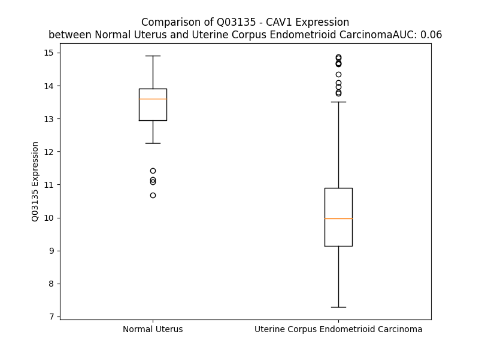

# Detailed Data for Q03135

## Introduction to the Detailed Summary

### How to Interpret the Results

- **Summary & Metrics**: This section provides a quick reference to essential protein attributes, including expression changes, family classification, and biomarker applications. Regulation status (upregulated/downregulated) indicates the protein's behavior in a disease context. Some information comes from the original excel file with the proteins selected from literature, while others are derived from the analyses.
- **Expression Comparison**: A visual representation comparing protein expression between normal and disease states. It highlights significant changes in expression levels that might indicate diagnostic or therapeutic relevance. This is data coming from transcriptomics experiments and could not translate similarly to protein levels.
- **Isoform Alignment**: An interactive view of isoform alignments, revealing structural and functional differences between variants of the protein.
- **Interactors & Homologs**: Tables listing known interaction partners and homologous proteins, the more interactors and homologs, the more complex the protein is to design an antibody for.
- **Biological Assemblies**: Information about the structural arrangement of the protein in different assemblies, providing insights into its functional state but also the complexity of the protein to develop antibodies.
- **Combined Per-Residue Information**: A detailed table summarizing residue-level data. This includes predictions for epitope regions, aggregation tendencies, and modifications that might impact the protein's function. Each row corresponds to a residue in the protein, providing insights into specific sites that may be important for research or drug development.
## Summary & Metrics

- **UniProt Accession**: Q03135
- **Gene Name**: CAV1
- **Protein Name**: caveolin 1, caveolae protein, 22kDa
- **Swiss Prot**: CAV1_HUMAN
- **Family**: transmembrane receptor
- **Biomarker Application**: diagnosis
- **Number of Isoforms**: 0
- **Regulation**: -1
- **(transcriptomics) AUC**: 0.06
- **(transcriptomics) Fold Change**: 1.32
- **(transcriptomics) Regulation**: Downregulated
- **Discotope Epitope Count**: 36
- **Max n_uniprots (Homo)**: 10
- **Max n_uniprots (Hetero)**: N/A

## Expression Comparison

## Interactors

| preferredName_A   | preferredName_B   |   score |
|:------------------|:------------------|--------:|
| CAV1              | SRC               |   0.999 |
| CAV1              | CAVIN1            |   0.999 |
| CAV1              | CAV2              |   0.999 |
| CAV1              | NOS3              |   0.999 |
| CAV1              | EGFR              |   0.999 |
| CAV1              | ESR1              |   0.998 |
| CAV1              | FYN               |   0.997 |
| CAV1              | BSG               |   0.996 |
| CAV1              | CALML3            |   0.996 |
| CAV1              | CALML5            |   0.996 |
| CAV1              | CALML4            |   0.995 |
| CAV1              | CALML6            |   0.995 |
| CAV1              | CAV3              |   0.995 |
| CAV1              | CALM3             |   0.991 |
| CAV1              | DPP4              |   0.991 |
| CAV1              | PRNP              |   0.99  |
| CAV1              | HSP90AA1          |   0.988 |
| CAV1              | HSP90AB1          |   0.983 |
| CAV1              | ITGB1             |   0.98  |
| CAV1              | DNM2              |   0.976 |
| CAV1              | HRAS              |   0.974 |
| CAV1              | FLOT1             |   0.972 |
| CAV1              | IGF1R             |   0.971 |
| CAV1              | ESR2              |   0.971 |
| CAV1              | LRP6              |   0.971 |
| CAV1              | GJA1              |   0.965 |
| CAV1              | FLOT2             |   0.965 |
| CAV1              | KDR               |   0.962 |
| CAV1              | TLR4              |   0.962 |
| CAV1              | CD36              |   0.956 |
| CAV1              | SCARB1            |   0.952 |
| CAV1              | TRPV4             |   0.947 |
| CAV1              | CAVIN2            |   0.946 |
| CAV1              | TRPC1             |   0.945 |
| CAV1              | SCARB2            |   0.945 |
| CAV1              | CTNNB1            |   0.942 |
| CAV1              | MAP1LC3B          |   0.938 |
| CAV1              | AKT1              |   0.937 |
| CAV1              | ICAM1             |   0.934 |
| CAV1              | CSK               |   0.931 |
| CAV1              | ANXA2             |   0.922 |
| CAV1              | CAVIN3            |   0.922 |
| CAV1              | PRKACA            |   0.922 |
| CAV1              | PLIN1             |   0.92  |
| CAV1              | PTEN              |   0.912 |
| CAV1              | FLNA              |   0.908 |
| CAV1              | RAC1              |   0.908 |
| CAV1              | TGFBR1            |   0.907 |
| CAV1              | VCP               |   0.905 |
| CAV1              | GNAQ              |   0.905 |

## Homologs

| uniprot_id   | gene_id   |
|:-------------|:----------|
| P56539       | CAV3      |
| Q53X57       | CAV2      |

## Biological Assemblies

|   Unnamed: 0 |   assembly |   n_uniprots | composition   | crystal_id   |
|-------------:|-----------:|-------------:|:--------------|:-------------|
|            0 |          1 |           10 | Homo          | 7sc0         |

## Combined Per-Residue Information

|   res | aa   |   epitope_score | epitope   |   relative_surface_accessibility |   modeling_confidence |   Aggregation | modification               |
|------:|:-----|----------------:|:----------|---------------------------------:|----------------------:|--------------:|:---------------------------|
|     1 | M    |         0.14566 | False     |                          1.20898 |                 42.46 |         0     | N/A                        |
|     2 | S    |         0.22791 | False     |                          0.95195 |                 48.76 |         0     | N-acetylserine             |
|     2 | S    |         0.22791 | False     |                          0.95195 |                 48.76 |         0     | Phosphoserine              |
|     2 | S    |         0.22791 | False     |                          0.95195 |                 48.76 |         0     | N-acetylalanine            |
|     3 | G    |         0.18106 | False     |                          0.5495  |                 53.32 |         0     | N/A                        |
|     4 | G    |         0.27049 | False     |                          0.38842 |                 47.35 |         0     | N/A                        |
|     5 | K    |         0.33742 | True      |                          0.65359 |                 53.74 |         0     | N6-acetyllysine; alternate |
|     6 | Y    |         0.51757 | True      |                          0.69548 |                 56.77 |         0     | Phosphotyrosine            |
|     6 | Y    |         0.51757 | True      |                          0.69548 |                 56.77 |         0     | Phosphoserine              |
|     7 | V    |         0.29118 | False     |                          0.67078 |                 58.37 |         0     | N/A                        |
|     8 | D    |         0.35899 | True      |                          0.33512 |                 65.57 |         0     | N/A                        |
|     9 | S    |         0.46368 | True      |                          0.9784  |                 63.64 |         0     | Phosphoserine              |
|    10 | E    |         0.31969 | False     |                          0.64875 |                 64.67 |         0     | N/A                        |
|    11 | G    |         0.36614 | True      |                          0.64691 |                 59.78 |         0     | N/A                        |
|    12 | H    |         0.32162 | False     |                          0.60798 |                 55.34 |         0     | N/A                        |
|    13 | L    |         0.52354 | True      |                          0.69975 |                 53.76 |         0     | N/A                        |
|    14 | Y    |         0.3964  | True      |                          0.56445 |                 54.1  |         0     | Phosphotyrosine; by ABL1   |
|    15 | T    |         0.30998 | False     |                          0.71703 |                 58.12 |         0     | N/A                        |
|    16 | V    |         0.1822  | False     |                          0.40238 |                 54.16 |         0     | N/A                        |
|    17 | P    |         0.19426 | False     |                          0.86312 |                 55.91 |         0     | N/A                        |
|    18 | I    |         0.18587 | False     |                          0.7229  |                 52.96 |         0     | N/A                        |
|    19 | R    |         0.23656 | False     |                          0.90278 |                 51.92 |         0     | N/A                        |
|    20 | E    |         0.16283 | False     |                          0.79355 |                 54.6  |         0     | N/A                        |
|    21 | Q    |         0.2096  | False     |                          0.92055 |                 44.91 |         0     | N/A                        |
|    22 | G    |         0.20666 | False     |                          0.79271 |                 45.91 |         0     | N/A                        |
|    23 | N    |         0.2125  | False     |                          0.80661 |                 42.1  |         0     | N/A                        |
|    24 | I    |         0.35652 | True      |                          1.01977 |                 53.91 |         0     | N/A                        |
|    25 | Y    |         0.29469 | False     |                          0.92622 |                 52.2  |         0     | Phosphotyrosine            |
|    26 | K    |         0.21446 | False     |                          0.86267 |                 46.72 |         0     | N/A                        |
|    27 | P    |         0.24724 | False     |                          0.81258 |                 43.72 |         0     | N/A                        |
|    28 | N    |         0.25121 | False     |                          0.71388 |                 52.52 |         0     | N/A                        |
|    29 | N    |         0.23345 | False     |                          0.8583  |                 56.87 |         0     | N/A                        |
|    30 | K    |         0.28229 | False     |                          0.72954 |                 57.7  |         0     | N/A                        |
|    31 | A    |         0.20612 | False     |                          0.52257 |                 59.34 |         0     | N/A                        |
|    32 | M    |         0.29203 | False     |                          0.69181 |                 56.38 |         0     | N/A                        |
|    33 | A    |         0.15948 | False     |                          0.55681 |                 56.79 |         0     | N/A                        |
|    34 | D    |         0.28187 | False     |                          0.46646 |                 59.3  |         0     | N/A                        |
|    35 | E    |         0.21005 | False     |                          0.54433 |                 58.58 |         0     | N/A                        |
|    36 | L    |         0.23962 | False     |                          0.63904 |                 58.46 |         0     | N/A                        |
|    37 | S    |         0.21671 | False     |                          0.44769 |                 59.03 |         0     | Phosphoserine              |
|    38 | E    |         0.36634 | True      |                          0.55429 |                 54.87 |         0     | N/A                        |
|    39 | K    |         0.25367 | False     |                          0.75981 |                 52.12 |         0     | N/A                        |
|    40 | Q    |         0.17691 | False     |                          0.62689 |                 54.1  |         0     | N/A                        |
|    41 | V    |         0.25551 | False     |                          0.83783 |                 53.11 |         0     | N/A                        |
|    42 | Y    |         0.25421 | False     |                          0.79477 |                 50.66 |         0     | N/A                        |
|    43 | D    |         0.14387 | False     |                          0.35281 |                 55.48 |         0     | N/A                        |
|    44 | A    |         0.18943 | False     |                          0.77842 |                 60.06 |         0     | N/A                        |
|    45 | H    |         0.3     | False     |                          1.01768 |                 57.87 |         0     | N/A                        |
|    46 | T    |         0.29668 | False     |                          0.74309 |                 57.86 |         0     | N/A                        |
|    47 | K    |         0.21409 | False     |                          0.59779 |                 61.43 |         0     | N/A                        |
|    48 | E    |         0.26538 | False     |                          0.90547 |                 62.83 |         0     | N/A                        |
|    49 | I    |         0.27367 | False     |                          0.86439 |                 72.06 |         0     | N/A                        |
|    50 | D    |         0.33422 | True      |                          0.46063 |                 77.03 |         0     | N/A                        |
|    51 | L    |         0.36272 | True      |                          0.85795 |                 77.2  |         0     | N/A                        |
|    52 | V    |         0.30824 | False     |                          1.03164 |                 77.58 |         0     | N/A                        |
|    53 | N    |         0.31177 | False     |                          0.37909 |                 80.86 |         0     | N/A                        |
|    54 | R    |         0.30723 | False     |                          0.77217 |                 81.37 |         0     | N/A                        |
|    55 | D    |         0.30824 | False     |                          0.22856 |                 81.54 |         0     | N/A                        |
|    56 | P    |         0.28868 | False     |                          0.65259 |                 82.87 |         0     | N/A                        |
|    57 | K    |         0.30444 | False     |                          0.71818 |                 83.71 |         0     | N/A                        |
|    58 | H    |         0.37665 | True      |                          0.60797 |                 81.44 |         0     | N/A                        |
|    59 | L    |         0.2906  | False     |                          0.84734 |                 82.21 |         0     | N/A                        |
|    60 | N    |         0.21009 | False     |                          0.48128 |                 81.8  |         0     | N/A                        |
|    61 | D    |         0.36602 | True      |                          0.33797 |                 78.74 |         0     | N/A                        |
|    62 | D    |         0.40974 | True      |                          0.87281 |                 73.8  |         0     | N/A                        |
|    63 | V    |         0.30746 | False     |                          0.80264 |                 67.29 |         0     | N/A                        |
|    64 | V    |         0.18936 | False     |                          0.65275 |                 67.06 |         0     | N/A                        |
|    65 | K    |         0.22752 | False     |                          0.6911  |                 72.99 |         0     | N/A                        |
|    66 | I    |         0.25367 | False     |                          0.58116 |                 75.42 |         0     | N/A                        |
|    67 | D    |         0.3811  | True      |                          0.4921  |                 83.09 |         0     | N/A                        |
|    68 | F    |         0.12553 | False     |                          0.04169 |                 86.56 |         0     | N/A                        |
|    69 | E    |         0.32253 | False     |                          0.45431 |                 84.66 |         0     | N/A                        |
|    70 | D    |         0.32234 | False     |                          0.60404 |                 84.29 |         0     | N/A                        |
|    71 | V    |         0.19866 | False     |                          0.54704 |                 84.89 |         0     | N/A                        |
|    72 | I    |         0.32137 | False     |                          0.55497 |                 84.57 |         0     | N/A                        |
|    73 | A    |         0.40772 | True      |                          0.61918 |                 82.2  |         0     | N/A                        |
|    74 | E    |         0.32354 | False     |                          0.23053 |                 82.1  |         0     | N/A                        |
|    75 | P    |         0.30621 | False     |                          0.61533 |                 79.72 |         0     | N/A                        |
|    76 | E    |         0.36514 | True      |                          0.87444 |                 75.3  |         0     | N/A                        |
|    77 | G    |         0.53332 | True      |                          0.92287 |                 71.99 |         0     | N/A                        |
|    78 | T    |         0.35842 | True      |                          0.6832  |                 73.23 |         0     | N/A                        |
|    79 | H    |         0.47375 | True      |                          0.721   |                 80.25 |         0     | N/A                        |
|    80 | S    |         0.35568 | True      |                          0.35345 |                 79.87 |         0     | N/A                        |
|    81 | F    |         0.39034 | True      |                          0.83502 |                 84.38 |         0     | N/A                        |
|    82 | D    |         0.34197 | True      |                          0.68415 |                 87.49 |         0     | N/A                        |
|    83 | G    |         0.32803 | True      |                          0.62515 |                 87.56 |         0     | N/A                        |
|    84 | I    |         0.41963 | True      |                          0.57095 |                 89.45 |         0     | N/A                        |
|    85 | W    |         0.38775 | True      |                          0.2952  |                 88.9  |         0     | N/A                        |
|    86 | K    |         0.43597 | True      |                          0.71004 |                 90.27 |         0     | N/A                        |
|    87 | A    |         0.37379 | True      |                          0.53274 |                 91.49 |         0.441 | N/A                        |
|    88 | S    |         0.19409 | False     |                          0.33246 |                 91.16 |         1.09  | N/A                        |
|    89 | F    |         0.35763 | True      |                          0.44603 |                 90.82 |        14.316 | N/A                        |
|    90 | T    |         0.37364 | True      |                          0.53295 |                 90.27 |        15.257 | N/A                        |
|    91 | T    |         0.30545 | False     |                          0.62014 |                 92.22 |        15.856 | N/A                        |
|    92 | F    |         0.18711 | False     |                          0.28207 |                 90.7  |        15.856 | N/A                        |
|    93 | T    |         0.30474 | False     |                          0.39314 |                 89.67 |        15.728 | N/A                        |
|    94 | V    |         0.27485 | False     |                          0.52459 |                 91.79 |        14.05  | N/A                        |
|    95 | T    |         0.18708 | False     |                          0.44009 |                 91.96 |         5.681 | N/A                        |
|    96 | K    |         0.16692 | False     |                          0.5206  |                 90.22 |         0     | N/A                        |
|    97 | Y    |         0.31477 | False     |                          0.53019 |                 89.82 |         0     | N/A                        |
|    98 | W    |         0.42328 | True      |                          0.69618 |                 92.49 |         0     | N/A                        |
|    99 | F    |         0.24899 | False     |                          0.61469 |                 92.61 |         0     | N/A                        |
|   100 | Y    |         0.14815 | False     |                          0.64085 |                 91.67 |         0     | N/A                        |
|   101 | R    |         0.16574 | False     |                          0.49831 |                 91.13 |         0     | N/A                        |
|   102 | L    |         0.3594  | True      |                          0.70601 |                 93.47 |         4.978 | N/A                        |
|   103 | L    |         0.15748 | False     |                          0.58205 |                 93.03 |         5.803 | N/A                        |
|   104 | S    |         0.07616 | False     |                          0.37697 |                 92.57 |         5.803 | N/A                        |
|   105 | A    |         0.23307 | False     |                          0.703   |                 92.16 |         5.803 | N/A                        |
|   106 | L    |         0.363   | True      |                          0.69414 |                 93.28 |         5.803 | N/A                        |
|   107 | F    |         0.24059 | False     |                          0.51434 |                 95.35 |         5.428 | N/A                        |
|   108 | G    |         0.10216 | False     |                          0.38445 |                 92.79 |         0.004 | N/A                        |
|   109 | I    |         0.26327 | False     |                          0.75472 |                 90.49 |         0     | N/A                        |
|   110 | P    |         0.26806 | False     |                          0.44431 |                 94.65 |         0.146 | N/A                        |
|   111 | M    |         0.16626 | False     |                          0.54801 |                 94.11 |        15.449 | N/A                        |
|   112 | A    |         0.09812 | False     |                          0.62467 |                 92.84 |        31.404 | N/A                        |
|   113 | L    |         0.35637 | True      |                          0.69188 |                 94.11 |        85.737 | N/A                        |
|   114 | I    |         0.2648  | False     |                          0.62467 |                 96.03 |        96.17  | N/A                        |
|   115 | W    |         0.22189 | False     |                          0.6434  |                 95.4  |        97.157 | N/A                        |
|   116 | G    |         0.19293 | False     |                          0.5041  |                 94.37 |        97.371 | N/A                        |
|   117 | I    |         0.32177 | False     |                          0.63976 |                 95.74 |        99.749 | N/A                        |
|   118 | Y    |         0.26761 | False     |                          0.49258 |                 96.35 |        99.966 | N/A                        |
|   119 | F    |         0.21931 | False     |                          0.60625 |                 94.25 |        99.987 | N/A                        |
|   120 | A    |         0.16934 | False     |                          0.58498 |                 95.17 |        99.929 | N/A                        |
|   121 | I    |         0.21365 | False     |                          0.57815 |                 95.93 |        99.88  | N/A                        |
|   122 | L    |         0.12834 | False     |                          0.4379  |                 94.45 |        99.315 | N/A                        |
|   123 | S    |         0.14209 | False     |                          0.43083 |                 93.98 |        96.222 | N/A                        |
|   124 | F    |         0.33141 | True      |                          0.59565 |                 95.15 |        95.839 | N/A                        |
|   125 | L    |         0.22222 | False     |                          0.52924 |                 95.23 |        91.13  | N/A                        |
|   126 | H    |         0.15271 | False     |                          0.51924 |                 93.37 |        65.407 | N/A                        |
|   127 | I    |         0.18554 | False     |                          0.64443 |                 94.68 |        65.165 | N/A                        |
|   128 | W    |         0.29751 | False     |                          0.77124 |                 94.29 |        62.515 | N/A                        |
|   129 | A    |         0.3373  | True      |                          0.41673 |                 91.9  |        51.6   | N/A                        |
|   130 | V    |         0.13483 | False     |                          0.43414 |                 92.66 |        45.276 | N/A                        |
|   131 | V    |         0.13373 | False     |                          0.34796 |                 92.85 |         0.813 | N/A                        |
|   132 | P    |         0.28278 | False     |                          0.45828 |                 93.13 |         0.137 | N/A                        |
|   133 | C    |         0.13809 | False     |                          0.47614 |                 91.55 |         0.001 | N/A                        |
|   134 | I    |         0.12014 | False     |                          0.53598 |                 93.66 |         0.018 | N/A                        |
|   135 | K    |         0.24595 | False     |                          0.62348 |                 93.06 |         0.14  | N/A                        |
|   136 | S    |         0.19361 | False     |                          0.49128 |                 91.02 |         0.248 | N/A                        |
|   137 | F    |         0.08269 | False     |                          0.67834 |                 92.52 |         1.335 | N/A                        |
|   138 | L    |         0.15165 | False     |                          0.65237 |                 91.93 |         1.68  | N/A                        |
|   139 | I    |         0.22011 | False     |                          0.75899 |                 91.23 |         1.706 | N/A                        |
|   140 | E    |         0.20657 | False     |                          0.53761 |                 90.4  |         1.706 | N/A                        |
|   141 | I    |         0.10699 | False     |                          0.59037 |                 90.86 |         1.705 | N/A                        |
|   142 | Q    |         0.19465 | False     |                          0.5183  |                 90.33 |         1.567 | N/A                        |
|   143 | C    |         0.29976 | False     |                          0.55642 |                 86.43 |         1.567 | N/A                        |
|   144 | I    |         0.13902 | False     |                          0.66216 |                 90.89 |         1.567 | N/A                        |
|   145 | S    |         0.092   | False     |                          0.42066 |                 91.13 |         1.567 | N/A                        |
|   146 | R    |         0.20457 | False     |                          0.64859 |                 90.4  |         1.567 | N/A                        |
|   147 | V    |         0.19294 | False     |                          0.67353 |                 90.25 |        73.413 | N/A                        |
|   148 | Y    |         0.10689 | False     |                          0.63435 |                 90.95 |        79.445 | N/A                        |
|   149 | S    |         0.1146  | False     |                          0.36592 |                 90.38 |        79.569 | N/A                        |
|   150 | I    |         0.28908 | False     |                          0.65906 |                 90.48 |        80.62  | N/A                        |
|   151 | Y    |         0.26039 | False     |                          0.5678  |                 90.4  |        80.688 | N/A                        |
|   152 | V    |         0.08497 | False     |                          0.30371 |                 90.3  |        79.814 | N/A                        |
|   153 | H    |         0.22273 | False     |                          0.60951 |                 89.24 |        68.441 | N/A                        |
|   154 | T    |         0.27189 | False     |                          0.62194 |                 87.22 |        67.569 | N/A                        |
|   155 | V    |         0.2329  | False     |                          0.40008 |                 85.39 |        66.934 | N/A                        |
|   156 | C    |         0.08947 | False     |                          0.24165 |                 86.23 |        38.987 | N/A                        |
|   157 | D    |         0.24037 | False     |                          0.4101  |                 84.79 |         0     | N/A                        |
|   158 | P    |         0.24344 | False     |                          0.49134 |                 87.43 |         0     | N/A                        |
|   159 | L    |         0.17945 | False     |                          0.65244 |                 86.21 |         0.642 | N/A                        |
|   160 | F    |         0.12799 | False     |                          0.75057 |                 87.75 |         0.868 | N/A                        |
|   161 | E    |         0.15914 | False     |                          0.51917 |                 87.26 |         0.868 | N/A                        |
|   162 | A    |         0.12594 | False     |                          0.4764  |                 87.32 |         0.868 | N/A                        |
|   163 | V    |         0.0815  | False     |                          0.49508 |                 87.9  |         0.868 | N/A                        |
|   164 | G    |         0.14162 | False     |                          0.43994 |                 88.66 |         0.868 | N/A                        |
|   165 | K    |         0.1582  | False     |                          0.59684 |                 86.04 |         0.868 | N/A                        |
|   166 | I    |         0.17712 | False     |                          0.72035 |                 82.56 |         0.868 | N/A                        |
|   167 | F    |         0.22998 | False     |                          0.72088 |                 81.49 |         0.868 | N/A                        |
|   168 | S    |         0.1902  | False     |                          0.63136 |                 78.61 |         0.191 | N/A                        |
|   169 | N    |         0.23952 | False     |                          0.80249 |                 74.23 |         0.191 | N/A                        |
|   170 | V    |         0.11779 | False     |                          0.6809  |                 77.27 |         0.191 | N/A                        |
|   171 | R    |         0.14853 | False     |                          0.85397 |                 72.87 |         0     | N/A                        |
|   172 | I    |         0.1924  | False     |                          0.7927  |                 79.1  |         0     | N/A                        |
|   173 | N    |         0.15589 | False     |                          0.85245 |                 77.53 |         0     | N/A                        |
|   174 | L    |         0.20123 | False     |                          0.9869  |                 82.13 |         0     | N/A                        |
|   175 | Q    |         0.21146 | False     |                          0.83758 |                 75.79 |         0     | N/A                        |
|   176 | K    |         0.25866 | False     |                          0.92993 |                 76.1  |         0     | N/A                        |
|   177 | E    |         0.19195 | False     |                          0.83836 |                 76.42 |         0     | N/A                        |
|   178 | I    |         0.12944 | False     |                          1.38658 |                 69.08 |         0     | N/A                        |

