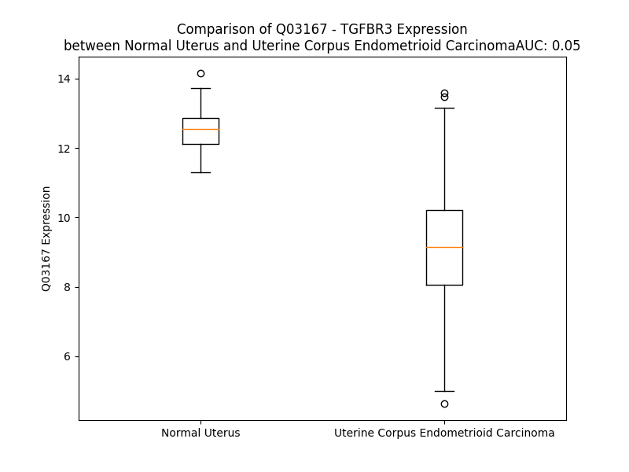

# Detailed Data for Q03167

## Introduction to the Detailed Summary

### How to Interpret the Results

- **Summary & Metrics**: This section provides a quick reference to essential protein attributes, including expression changes, family classification, and biomarker applications. Regulation status (upregulated/downregulated) indicates the protein's behavior in a disease context. Some information comes from the original excel file with the proteins selected from literature, while others are derived from the analyses.
- **Expression Comparison**: A visual representation comparing protein expression between normal and disease states. It highlights significant changes in expression levels that might indicate diagnostic or therapeutic relevance. This is data coming from transcriptomics experiments and could not translate similarly to protein levels.
- **Isoform Alignment**: An interactive view of isoform alignments, revealing structural and functional differences between variants of the protein.
- **Interactors & Homologs**: Tables listing known interaction partners and homologous proteins, the more interactors and homologs, the more complex the protein is to design an antibody for.
- **Biological Assemblies**: Information about the structural arrangement of the protein in different assemblies, providing insights into its functional state but also the complexity of the protein to develop antibodies.
- **Combined Per-Residue Information**: A detailed table summarizing residue-level data. This includes predictions for epitope regions, aggregation tendencies, and modifications that might impact the protein's function. Each row corresponds to a residue in the protein, providing insights into specific sites that may be important for research or drug development.
## Summary & Metrics

- **UniProt Accession**: Q03167
- **Gene Name**: TGFBR3
- **Protein Name**: transforming growth factor, beta receptor III
- **Swiss Prot**: TGBR3_HUMAN
- **Family**: kinase
- **Biomarker Application**: diagnosis
- **Number of Isoforms**: 2
- **Regulation**: -1
- **(transcriptomics) AUC**: 0.0
- **(transcriptomics) Fold Change**: 1.30
- **(transcriptomics) Regulation**: Downregulated
- **Discotope Epitope Count**: 253
- **Max n_uniprots (Homo)**: N/A
- **Max n_uniprots (Hetero)**: 4

## Expression Comparison

## Isoform Alignment

<pre style='font-size:14px; font-family:monospace;'>Q03167-1 MTSHYVIAIFALMSSCLATAGPEPGALCELSPVSASHPVQALMESFTVLSGCASRGTTGLPQEVHVLNLRTAGQGPGQLQREVTLHLNPISSVHIHHKSVVFLLNSPHPLVWHLKTERLATGVSRLFLVSEGSVVQFSSANFSLTAETEERNFPHGNEHLLNWARKEYGAVTSFTELKIARNIYIKVGEDQVFPPKCNIGKNFLSLNYLAEYLQPKAAEGCVMSSQPQNEEVHIIELITPNSNPYSAFQVDITIDIRPSQEDLEVVKNLILILKCKKSVNWVIKSFDVKGSLKIIAPNSIGFGKESERSMTMTKSIRDDIPSTQGNLVKWALDNGYSPITSYTMAPVANRFHLRLENNAEEMGDEEVHTIPPELRILLDPGALPALQNPPIRGGEGQNGGLPFPFPDISRRVWNEEGEDGLPRPKDPVIPSIQLFPGLREPEEVQGSVDIALSVKCDNEKMIVAVEKDSFQASGYSGMDVTLLDPTCKAKMNGTHFVLESPLNGCGTRPRWSALDGVVYYNSIVIQVPALGDSSGWPDGYEDLESGDNGFPGDMDEGDASLFTRPEIVVFNCSLQQVRNPSSFQEQPHGNITFNMELYNTDLFLVPSQGVFSVPENGHVYVEVSVTKAEQELGFAIQTCFISPYSNPDRMSHYTIIENICPKDESVKFYSPKRVHFPIPQADMDKKRFSFVFKPVFNTSLLFLQCELTLCTKMEKHPQKLPKCVPPDEACTSLDASIIWAMMQNKKTFTKPLAVIHHEAESKEKGPSMKEPNPISPPIFHGLDTLTVMGIAFAAFVIGALLTGALWYIYSHTGETAGRQQVPTSPPASENSSAAHSIGSTQSTPCSSSSTA
Q03167-2 MTSHYVIAIFALMSSCLATAGPEPGALCELSPVSASHPVQALMESFTVLSGCASRGTTGLPQEVHVLNLRTAGQGPGQLQREVTLHLNPISSVHIHHKSVVFLLNSPHPLVWHLKTERLATGVSRLFLVSEGSVVQFSSANFSLTAETEERNFPHGNEHLLNWARKEYGAVTSFTELKIARNIYIKVGEDQVFPPKCNIGKNFLSLNYLAEYLQPKAAEGCVMSSQPQNEEVHIIELITPNSNPYSAFQVDITIDIRPSQEDLEVVKNLILILKCKKSVNWVIKSFDVKGSLKIIAPNSIGFGKESERSMTMTKSIRDDIPSTQGNLVKWALDNGYSPITSYTMAPVANRFHLRLENN-EEMGDEEVHTIPPELRILLDPGALPALQNPPIRGGEGQNGGLPFPFPDISRRVWNEEGEDGLPRPKDPVIPSIQLFPGLREPEEVQGSVDIALSVKCDNEKMIVAVEKDSFQASGYSGMDVTLLDPTCKAKMNGTHFVLESPLNGCGTRPRWSALDGVVYYNSIVIQVPALGDSSGWPDGYEDLESGDNGFPGDMDEGDASLFTRPEIVVFNCSLQQVRNPSSFQEQPHGNITFNMELYNTDLFLVPSQGVFSVPENGHVYVEVSVTKAEQELGFAIQTCFISPYSNPDRMSHYTIIENICPKDESVKFYSPKRVHFPIPQADMDKKRFSFVFKPVFNTSLLFLQCELTLCTKMEKHPQKLPKCVPPDEACTSLDASIIWAMMQNKKTFTKPLAVIHHEAESKEKGPSMKEPNPISPPIFHGLDTLTVMGIAFAAFVIGALLTGALWYIYSHTGETAGRQQVPTSPPASENSSAAHSIGSTQSTPCSSSSTA
</pre>

## Interactors

| preferredName_A   | preferredName_B   |   score |
|:------------------|:------------------|--------:|
| TGFBR3            | TGFB1             |   0.997 |
| TGFBR3            | TGFB2             |   0.996 |
| TGFBR3            | TGFB3             |   0.993 |
| TGFBR3            | TGFBR2            |   0.986 |
| TGFBR3            | TGFBR1            |   0.977 |
| TGFBR3            | ACVR2A            |   0.957 |
| TGFBR3            | INHA              |   0.904 |

## Homologs

| uniprot_id   | gene_id   |
|:-------------|:----------|
| P17813       | ENG       |
| H3BV60       | TGFBR3L   |

## Biological Assemblies

|   Unnamed: 0 |   assembly |   n_uniprots | composition   | crystal_id   |
|-------------:|-----------:|-------------:|:--------------|:-------------|
|            0 |          1 |            4 | Hetero        | 7lbg         |

## Combined Per-Residue Information

|   res | aa   |   epitope_score | epitope   |   relative_surface_accessibility |   modeling_confidence |   Aggregation | modification   | glycosylation                                |
|------:|:-----|----------------:|:----------|---------------------------------:|----------------------:|--------------:|:---------------|:---------------------------------------------|
|     1 | M    |         0.07722 | False     |                          1.27336 |                 43.45 |         0     | N/A            | N/A                                          |
|     2 | T    |         0.09401 | False     |                          0.82549 |                 45.6  |         0.182 | N/A            | N/A                                          |
|     3 | S    |         0.09897 | False     |                          0.83976 |                 52.5  |         0.307 | N/A            | N/A                                          |
|     4 | H    |         0.08733 | False     |                          0.85049 |                 51.95 |         2.36  | N/A            | N/A                                          |
|     5 | Y    |         0.09943 | False     |                          0.81292 |                 52.3  |        75.871 | N/A            | N/A                                          |
|     6 | V    |         0.0796  | False     |                          0.89625 |                 52.23 |        97.698 | N/A            | N/A                                          |
|     7 | I    |         0.13058 | True      |                          0.81096 |                 51.19 |        99.529 | N/A            | N/A                                          |
|     8 | A    |         0.06638 | False     |                          0.44758 |                 50.96 |        99.686 | N/A            | N/A                                          |
|     9 | I    |         0.08477 | False     |                          0.6991  |                 51.89 |        99.791 | N/A            | N/A                                          |
|    10 | F    |         0.1262  | True      |                          0.8375  |                 51.06 |        99.316 | N/A            | N/A                                          |
|    11 | A    |         0.05454 | False     |                          0.59295 |                 49.89 |        91.777 | N/A            | N/A                                          |
|    12 | L    |         0.11678 | True      |                          0.81163 |                 49.19 |        85.271 | N/A            | N/A                                          |
|    13 | M    |         0.12075 | True      |                          0.82241 |                 50.71 |        49.681 | N/A            | N/A                                          |
|    14 | S    |         0.10524 | True      |                          0.68637 |                 49.27 |         8.989 | N/A            | N/A                                          |
|    15 | S    |         0.10612 | True      |                          0.61197 |                 42.41 |         3.183 | N/A            | N/A                                          |
|    16 | C    |         0.07214 | False     |                          0.85982 |                 39.3  |         2.463 | N/A            | N/A                                          |
|    17 | L    |         0.08865 | False     |                          0.96831 |                 43.14 |         2.31  | N/A            | N/A                                          |
|    18 | A    |         0.06656 | False     |                          0.90393 |                 41.06 |         1.475 | N/A            | N/A                                          |
|    19 | T    |         0.10016 | False     |                          0.91698 |                 41.9  |         0.769 | N/A            | N/A                                          |
|    20 | A    |         0.07273 | False     |                          0.95949 |                 40.9  |         0.349 | N/A            | N/A                                          |
|    21 | G    |         0.07966 | False     |                          0.62006 |                 32.68 |         0     | N/A            | N/A                                          |
|    22 | P    |         0.09776 | False     |                          0.88806 |                 37.39 |         0     | N/A            | N/A                                          |
|    23 | E    |         0.09362 | False     |                          0.90169 |                 32.23 |         0     | N/A            | N/A                                          |
|    24 | P    |         0.09272 | False     |                          0.96284 |                 34.59 |         0     | N/A            | N/A                                          |
|    25 | G    |         0.09841 | False     |                          0.69356 |                 43.34 |         0     | N/A            | N/A                                          |
|    26 | A    |         0.0501  | False     |                          0.75899 |                 53.02 |         0     | N/A            | N/A                                          |
|    27 | L    |         0.09266 | False     |                          1.06226 |                 66.41 |         0     | N/A            | N/A                                          |
|    28 | C    |         0.03286 | False     |                          0.09531 |                 80.61 |         0     | N/A            | N/A                                          |
|    29 | E    |         0.05819 | False     |                          0.77039 |                 83.89 |         0     | N/A            | N/A                                          |
|    30 | L    |         0.08453 | False     |                          0.35334 |                 85.61 |         0     | N/A            | N/A                                          |
|    31 | S    |         0.06238 | False     |                          0.44864 |                 89.84 |         0     | N/A            | N/A                                          |
|    32 | P    |         0.09839 | False     |                          0.83849 |                 91.95 |         0     | N/A            | N/A                                          |
|    33 | V    |         0.04379 | False     |                          0.23148 |                 89.55 |         0     | N/A            | N/A                                          |
|    34 | S    |         0.0725  | False     |                          0.45354 |                 87.42 |         0     | N/A            | N/A                                          |
|    35 | A    |         0.06034 | False     |                          1.00341 |                 83.26 |         0     | N/A            | N/A                                          |
|    36 | S    |         0.09364 | False     |                          0.75831 |                 84.8  |         0     | N/A            | N/A                                          |
|    37 | H    |         0.0383  | False     |                          0.06956 |                 91.78 |         0     | N/A            | N/A                                          |
|    38 | P    |         0.02625 | False     |                          0.17046 |                 92.82 |         0     | N/A            | N/A                                          |
|    39 | V    |         0.00201 | False     |                          0       |                 95.21 |         0     | N/A            | N/A                                          |
|    40 | Q    |         0.02353 | False     |                          0.26032 |                 94.84 |         0     | N/A            | N/A                                          |
|    41 | A    |         0.00676 | False     |                          0.03325 |                 95.03 |         0     | N/A            | N/A                                          |
|    42 | L    |         0.03712 | False     |                          0.07831 |                 92.67 |         0     | N/A            | N/A                                          |
|    43 | M    |         0.0303  | False     |                          0.12996 |                 88.52 |         0     | N/A            | N/A                                          |
|    44 | E    |         0.04924 | False     |                          0.23487 |                 85.55 |         0     | N/A            | N/A                                          |
|    45 | S    |         0.06749 | False     |                          0.32454 |                 80.93 |         1.416 | N/A            | N/A                                          |
|    46 | F    |         0.11935 | True      |                          0.68078 |                 82.41 |         2.731 | N/A            | N/A                                          |
|    47 | T    |         0.01754 | False     |                          0.0703  |                 85.22 |         2.731 | N/A            | N/A                                          |
|    48 | V    |         0.03841 | False     |                          0.19483 |                 87.68 |         2.731 | N/A            | N/A                                          |
|    49 | L    |         0.07914 | False     |                          0.46479 |                 87.3  |         2.731 | N/A            | N/A                                          |
|    50 | S    |         0.01346 | False     |                          0.02887 |                 92.24 |         1.461 | N/A            | N/A                                          |
|    51 | G    |         0.01064 | False     |                          0.01071 |                 94.03 |         0.14  | N/A            | N/A                                          |
|    52 | C    |         0.01627 | False     |                          0.04406 |                 95.3  |         0.14  | N/A            | N/A                                          |
|    53 | A    |         0.01407 | False     |                          0.0331  |                 96.1  |         0.14  | N/A            | N/A                                          |
|    54 | S    |         0.01043 | False     |                          0.01904 |                 95.85 |         0     | N/A            | N/A                                          |
|    55 | R    |         0.14131 | True      |                          0.40432 |                 94.14 |         0     | N/A            | N/A                                          |
|    56 | G    |         0.05932 | False     |                          0.27257 |                 91.94 |         0     | N/A            | N/A                                          |
|    57 | T    |         0.00565 | False     |                          0       |                 95.18 |         0     | N/A            | N/A                                          |
|    58 | T    |         0.14467 | True      |                          0.54683 |                 91.93 |         0     | N/A            | N/A                                          |
|    59 | G    |         0.12698 | True      |                          0.94635 |                 91.15 |         0     | N/A            | N/A                                          |
|    60 | L    |         0.09824 | False     |                          0.34388 |                 94.54 |         0     | N/A            | N/A                                          |
|    61 | P    |         0.15304 | True      |                          0.81269 |                 94.62 |         0     | N/A            | N/A                                          |
|    62 | Q    |         0.06336 | False     |                          0.19437 |                 95.03 |         0     | N/A            | N/A                                          |
|    63 | E    |         0.00673 | False     |                          0.0067  |                 96.79 |         0     | N/A            | N/A                                          |
|    64 | V    |         0.00315 | False     |                          0.0019  |                 97.48 |         0.188 | N/A            | N/A                                          |
|    65 | H    |         0.00468 | False     |                          0.00294 |                 97.76 |         0.188 | N/A            | N/A                                          |
|    66 | V    |         0.00272 | False     |                          0.00363 |                 97.27 |         0.188 | N/A            | N/A                                          |
|    67 | L    |         0.00768 | False     |                          0.01154 |                 95.97 |         0.188 | N/A            | N/A                                          |
|    68 | N    |         0.00978 | False     |                          0.01973 |                 94.85 |         0.188 | N/A            | N/A                                          |
|    69 | L    |         0.00402 | False     |                          0.0047  |                 92.18 |         0.188 | N/A            | N/A                                          |
|    70 | R    |         0.09662 | False     |                          0.37761 |                 88.1  |         0     | N/A            | N/A                                          |
|    71 | T    |         0.05357 | False     |                          0.46236 |                 76.35 |         0     | N/A            | N/A                                          |
|    72 | A    |         0.01984 | False     |                          0.06036 |                 61.95 |         0     | N/A            | N/A                                          |
|    73 | G    |         0.03466 | False     |                          0.04103 |                 58.64 |         0     | N/A            | N/A                                          |
|    74 | Q    |         0.12392 | True      |                          0.56107 |                 57.95 |         0     | N/A            | N/A                                          |
|    75 | G    |         0.051   | False     |                          0.13408 |                 51.44 |         0     | N/A            | N/A                                          |
|    76 | P    |         0.10081 | False     |                          1.05655 |                 42.03 |         0     | N/A            | N/A                                          |
|    77 | G    |         0.18274 | True      |                          0.99964 |                 44.34 |         0     | N/A            | N/A                                          |
|    78 | Q    |         0.14989 | True      |                          0.37173 |                 51.54 |         0     | N/A            | N/A                                          |
|    79 | L    |         0.15868 | True      |                          1.11774 |                 49.16 |         0     | N/A            | N/A                                          |
|    80 | Q    |         0.1365  | True      |                          0.58723 |                 56.64 |         0     | N/A            | N/A                                          |
|    81 | R    |         0.05359 | False     |                          0.23038 |                 78.11 |         0     | N/A            | N/A                                          |
|    82 | E    |         0.07167 | False     |                          0.31908 |                 88.52 |         0     | N/A            | N/A                                          |
|    83 | V    |         0.00377 | False     |                          0.00571 |                 90.79 |         0.261 | N/A            | N/A                                          |
|    84 | T    |         0.12412 | True      |                          0.15267 |                 92.13 |         0.261 | N/A            | N/A                                          |
|    85 | L    |         0.00357 | False     |                          0.00247 |                 94.19 |         0.261 | N/A            | N/A                                          |
|    86 | H    |         0.09265 | False     |                          0.21262 |                 93.81 |         0.261 | N/A            | N/A                                          |
|    87 | L    |         0.0113  | False     |                          0.0118  |                 93.79 |         0.261 | N/A            | N/A                                          |
|    88 | N    |         0.0443  | False     |                          0.27101 |                 92.88 |         0     | N/A            | N/A                                          |
|    89 | P    |         0.01658 | False     |                          0.01323 |                 94.13 |         0     | N/A            | N/A                                          |
|    90 | I    |         0.07202 | False     |                          0.0416  |                 92.19 |         0     | N/A            | N/A                                          |
|    91 | S    |         0.1417  | True      |                          0.62148 |                 85.42 |         0     | N/A            | N/A                                          |
|    92 | S    |         0.13638 | True      |                          0.57707 |                 87.14 |         0     | N/A            | N/A                                          |
|    93 | V    |         0.13611 | True      |                          0.29878 |                 88.22 |         0     | N/A            | N/A                                          |
|    94 | H    |         0.19666 | True      |                          0.80577 |                 86.84 |         0     | N/A            | N/A                                          |
|    95 | I    |         0.20175 | True      |                          0.48043 |                 90.22 |         0     | N/A            | N/A                                          |
|    96 | H    |         0.02411 | False     |                          0.03545 |                 93.45 |         0     | N/A            | N/A                                          |
|    97 | H    |         0.24131 | True      |                          0.67723 |                 92.41 |         0     | N/A            | N/A                                          |
|    98 | K    |         0.03952 | False     |                          0.22127 |                 93.56 |         0     | N/A            | N/A                                          |
|    99 | S    |         0.07401 | False     |                          0.28999 |                 94.43 |        10.659 | N/A            | N/A                                          |
|   100 | V    |         0.01748 | False     |                          0.01178 |                 95.09 |        92.421 | N/A            | N/A                                          |
|   101 | V    |         0.06109 | False     |                          0.06188 |                 96.78 |        93.134 | N/A            | N/A                                          |
|   102 | F    |         0.00532 | False     |                          0.00127 |                 97.1  |        93.134 | N/A            | N/A                                          |
|   103 | L    |         0.00356 | False     |                          0       |                 97.02 |        93.134 | N/A            | N/A                                          |
|   104 | L    |         0.00231 | False     |                          0.0033  |                 95.94 |        91.537 | N/A            | N/A                                          |
|   105 | N    |         0.03157 | False     |                          0.07614 |                 95.06 |         4.118 | N/A            | N/A                                          |
|   106 | S    |         0.02296 | False     |                          0.05521 |                 92.47 |         0     | N/A            | N/A                                          |
|   107 | P    |         0.08002 | False     |                          0.56414 |                 88.69 |         0     | N/A            | N/A                                          |
|   108 | H    |         0.14044 | True      |                          0.47922 |                 87.49 |         0     | N/A            | N/A                                          |
|   109 | P    |         0.10989 | True      |                          0.60765 |                 90.55 |         0     | N/A            | N/A                                          |
|   110 | L    |         0.00926 | False     |                          0.02591 |                 90.69 |         0.216 | N/A            | N/A                                          |
|   111 | V    |         0.08641 | False     |                          0.11425 |                 92.39 |         0.216 | N/A            | N/A                                          |
|   112 | W    |         0.00589 | False     |                          0.00476 |                 92.97 |         0.216 | N/A            | N/A                                          |
|   113 | H    |         0.11357 | True      |                          0.28331 |                 92.97 |         0.216 | N/A            | N/A                                          |
|   114 | L    |         0.01859 | False     |                          0.02717 |                 91.84 |         0.216 | N/A            | N/A                                          |
|   115 | K    |         0.16685 | True      |                          0.52819 |                 90.61 |         0     | N/A            | N/A                                          |
|   116 | T    |         0.06252 | False     |                          0.32912 |                 89.44 |         0     | N/A            | N/A                                          |
|   117 | E    |         0.19881 | True      |                          0.56705 |                 87.83 |         0     | N/A            | N/A                                          |
|   118 | R    |         0.13572 | True      |                          0.42588 |                 87.02 |         0     | N/A            | N/A                                          |
|   119 | L    |         0.03366 | False     |                          0.09934 |                 88.9  |         0.179 | N/A            | N/A                                          |
|   120 | A    |         0.10622 | True      |                          0.12244 |                 86.83 |         0.179 | N/A            | N/A                                          |
|   121 | T    |         0.19257 | True      |                          0.7415  |                 83.58 |         0.179 | N/A            | N/A                                          |
|   122 | G    |         0.09982 | False     |                          0.72971 |                 82.81 |         0.179 | N/A            | N/A                                          |
|   123 | V    |         0.09499 | False     |                          0.16756 |                 88.02 |         0.179 | N/A            | N/A                                          |
|   124 | S    |         0.16082 | True      |                          0.5102  |                 89.95 |         0     | N/A            | N/A                                          |
|   125 | R    |         0.03173 | False     |                          0.01604 |                 91.74 |         0     | N/A            | N/A                                          |
|   126 | L    |         0.23702 | True      |                          0.22458 |                 94.61 |        47.151 | N/A            | N/A                                          |
|   127 | F    |         0.00234 | False     |                          0       |                 95.43 |        47.151 | N/A            | N/A                                          |
|   128 | L    |         0.02335 | False     |                          0.01978 |                 96.61 |        47.151 | N/A            | N/A                                          |
|   129 | V    |         0.00354 | False     |                          0.00095 |                 95.71 |        47.151 | N/A            | N/A                                          |
|   130 | S    |         0.02775 | False     |                          0.08008 |                 93.51 |        47.151 | N/A            | N/A                                          |
|   131 | E    |         0.10583 | True      |                          0.62615 |                 92.01 |         0     | N/A            | N/A                                          |
|   132 | G    |         0.13421 | True      |                          0.53022 |                 90.99 |         0     | N/A            | N/A                                          |
|   133 | S    |         0.01824 | False     |                          0.01076 |                 92.78 |         0.179 | N/A            | N/A                                          |
|   134 | V    |         0.14216 | True      |                          0.49793 |                 92.49 |         0.668 | N/A            | N/A                                          |
|   135 | V    |         0.07173 | False     |                          0.13008 |                 92.31 |         0.668 | N/A            | N/A                                          |
|   136 | Q    |         0.14918 | True      |                          0.44044 |                 90.12 |         0.668 | N/A            | N/A                                          |
|   137 | F    |         0.05736 | False     |                          0.2519  |                 84.22 |         0.668 | N/A            | N/A                                          |
|   138 | S    |         0.2538  | True      |                          0.68043 |                 72.04 |         0.489 | N/A            | N/A                                          |
|   139 | S    |         0.17876 | True      |                          0.4643  |                 65.53 |         0     | N/A            | N/A                                          |
|   140 | A    |         0.10414 | True      |                          0.78604 |                 61.81 |         0     | N/A            | N/A                                          |
|   141 | N    |         0.17392 | True      |                          0.69707 |                 62.19 |         0     | N/A            | N-linked (GlcNAc...) asparagine              |
|   142 | F    |         0.08613 | False     |                          0.08965 |                 64.03 |         0     | N/A            | N/A                                          |
|   143 | S    |         0.13147 | True      |                          0.40795 |                 62.48 |         0     | N/A            | N/A                                          |
|   144 | L    |         0.21361 | True      |                          0.92701 |                 64.38 |         0     | N/A            | N/A                                          |
|   145 | T    |         0.06037 | False     |                          0.25745 |                 76.57 |         0     | N/A            | N/A                                          |
|   146 | A    |         0.07587 | False     |                          0.11889 |                 85.03 |         0     | N/A            | N/A                                          |
|   147 | E    |         0.12523 | True      |                          0.60861 |                 89.46 |         0     | N/A            | N/A                                          |
|   148 | T    |         0.06862 | False     |                          0.41028 |                 91.14 |         0     | N/A            | N/A                                          |
|   149 | E    |         0.15841 | True      |                          0.35251 |                 93.17 |         0     | N/A            | N/A                                          |
|   150 | E    |         0.10779 | True      |                          0.49745 |                 93.3  |         0     | N/A            | N/A                                          |
|   151 | R    |         0.16542 | True      |                          0.45048 |                 91.71 |         0     | N/A            | N/A                                          |
|   152 | N    |         0.17736 | True      |                          0.79955 |                 90.77 |         0     | N/A            | N/A                                          |
|   153 | F    |         0.03237 | False     |                          0.09028 |                 91.44 |         0     | N/A            | N/A                                          |
|   154 | P    |         0.08005 | False     |                          0.28886 |                 90.21 |         0     | N/A            | N/A                                          |
|   155 | H    |         0.12435 | True      |                          0.82327 |                 75.57 |         0     | N/A            | N/A                                          |
|   156 | G    |         0.09028 | False     |                          0.30314 |                 87.78 |         0     | N/A            | N/A                                          |
|   157 | N    |         0.03854 | False     |                          0.15511 |                 93.25 |         0     | N/A            | N/A                                          |
|   158 | E    |         0.12354 | True      |                          0.47921 |                 93.71 |         0     | N/A            | N/A                                          |
|   159 | H    |         0.10152 | False     |                          0.70133 |                 94.56 |         0     | N/A            | N/A                                          |
|   160 | L    |         0.00146 | False     |                          0       |                 95.52 |         0.215 | N/A            | N/A                                          |
|   161 | L    |         0.00799 | False     |                          0.02061 |                 96.25 |         0.215 | N/A            | N/A                                          |
|   162 | N    |         0.12463 | True      |                          0.49873 |                 95.54 |         0.215 | N/A            | N/A                                          |
|   163 | W    |         0.07276 | False     |                          0.30312 |                 95.53 |         0.215 | N/A            | N/A                                          |
|   164 | A    |         0.00232 | False     |                          0       |                 95.9  |         0.215 | N/A            | N/A                                          |
|   165 | R    |         0.11122 | True      |                          0.307   |                 95.03 |         0     | N/A            | N/A                                          |
|   166 | K    |         0.20395 | True      |                          0.87722 |                 94.97 |         0     | N/A            | N/A                                          |
|   167 | E    |         0.13536 | True      |                          0.55959 |                 94.79 |         0     | N/A            | N/A                                          |
|   168 | Y    |         0.10628 | True      |                          0.16324 |                 95.27 |         0.465 | N/A            | N/A                                          |
|   169 | G    |         0.10303 | True      |                          0.61031 |                 94.69 |         0.465 | N/A            | N/A                                          |
|   170 | A    |         0.02513 | False     |                          0.15688 |                 95.42 |         0.66  | N/A            | N/A                                          |
|   171 | V    |         0.00922 | False     |                          0.0214  |                 97.25 |         0.8   | N/A            | N/A                                          |
|   172 | T    |         0.0061  | False     |                          0.00737 |                 97.02 |         0.8   | N/A            | N/A                                          |
|   173 | S    |         0.00608 | False     |                          0.01502 |                 97.01 |         0.5   | N/A            | N/A                                          |
|   174 | F    |         0.0034  | False     |                          0       |                 97.18 |         0.5   | N/A            | N/A                                          |
|   175 | T    |         0.00443 | False     |                          0.00811 |                 95.63 |         0.14  | N/A            | N/A                                          |
|   176 | E    |         0.01086 | False     |                          0.08324 |                 94.52 |         0     | N/A            | N/A                                          |
|   177 | L    |         0.00224 | False     |                          0.00165 |                 91.87 |         0     | N/A            | N/A                                          |
|   178 | K    |         0.09378 | False     |                          0.60582 |                 86.71 |         0     | N/A            | N/A                                          |
|   179 | I    |         0.04548 | False     |                          0.22159 |                 86.64 |         0     | N/A            | N/A                                          |
|   180 | A    |         0.0044  | False     |                          0       |                 86.05 |         0     | N/A            | N/A                                          |
|   181 | R    |         0.07941 | False     |                          0.35676 |                 84.97 |         0     | N/A            | N/A                                          |
|   182 | N    |         0.05013 | False     |                          0.22131 |                 88.75 |         0     | N/A            | N/A                                          |
|   183 | I    |         0.00417 | False     |                          0.004   |                 93.19 |         0.181 | N/A            | N/A                                          |
|   184 | Y    |         0.0788  | False     |                          0.36419 |                 94.26 |         0.181 | N/A            | N/A                                          |
|   185 | I    |         0.00537 | False     |                          0.00617 |                 95.59 |         0.181 | N/A            | N/A                                          |
|   186 | K    |         0.03754 | False     |                          0.27457 |                 95.64 |         0.181 | N/A            | N/A                                          |
|   187 | V    |         0.00252 | False     |                          0.00095 |                 94.91 |         0.181 | N/A            | N/A                                          |
|   188 | G    |         0.02408 | False     |                          0.04464 |                 92.68 |         0.181 | N/A            | N/A                                          |
|   189 | E    |         0.05155 | False     |                          0.15423 |                 92.87 |         0.181 | N/A            | N/A                                          |
|   190 | D    |         0.08464 | False     |                          0.23378 |                 86.96 |         0     | N/A            | N/A                                          |
|   191 | Q    |         0.18405 | True      |                          0.56953 |                 87.36 |         0     | N/A            | N/A                                          |
|   192 | V    |         0.2092  | True      |                          0.76034 |                 89.14 |         0     | N/A            | N/A                                          |
|   193 | F    |         0.06476 | False     |                          0.18095 |                 91.51 |         0     | N/A            | N/A                                          |
|   194 | P    |         0.10693 | True      |                          0.56024 |                 93.35 |         0     | N/A            | N/A                                          |
|   195 | P    |         0.19523 | True      |                          0.63738 |                 92.95 |         0     | N/A            | N/A                                          |
|   196 | K    |         0.18951 | True      |                          0.68084 |                 94.19 |         0     | N/A            | N/A                                          |
|   197 | C    |         0.01849 | False     |                          0.01391 |                 95.66 |         0     | N/A            | N/A                                          |
|   198 | N    |         0.10794 | True      |                          0.67685 |                 94.83 |         0     | N/A            | N/A                                          |
|   199 | I    |         0.11918 | True      |                          0.22683 |                 93.72 |         0     | N/A            | N/A                                          |
|   200 | G    |         0.09667 | False     |                          0.36995 |                 89.84 |         0     | N/A            | N/A                                          |
|   201 | K    |         0.1474  | True      |                          0.88938 |                 83.46 |         0     | N/A            | N/A                                          |
|   202 | N    |         0.12386 | True      |                          0.69778 |                 72.15 |         0.345 | N/A            | N/A                                          |
|   203 | F    |         0.07207 | False     |                          0.18571 |                 81.65 |         9.315 | N/A            | N/A                                          |
|   204 | L    |         0.08969 | False     |                          0.37489 |                 79.51 |         9.315 | N/A            | N/A                                          |
|   205 | S    |         0.0772  | False     |                          0.11476 |                 85.26 |         9.315 | N/A            | N/A                                          |
|   206 | L    |         0.11646 | True      |                          0.55969 |                 84.98 |         9.315 | N/A            | N/A                                          |
|   207 | N    |         0.04768 | False     |                          0.11146 |                 90.7  |         9.315 | N/A            | N/A                                          |
|   208 | Y    |         0.02438 | False     |                          0.01021 |                 92.55 |         9.315 | N/A            | N/A                                          |
|   209 | L    |         0.06573 | False     |                          0.17292 |                 88.91 |         9.197 | N/A            | N/A                                          |
|   210 | A    |         0.00319 | False     |                          0.00215 |                 87.95 |         4.191 | N/A            | N/A                                          |
|   211 | E    |         0.0535  | False     |                          0.13843 |                 81.9  |         0     | N/A            | N/A                                          |
|   212 | Y    |         0.0369  | False     |                          0.14029 |                 84.8  |         0     | N/A            | N/A                                          |
|   213 | L    |         0.04486 | False     |                          0.22701 |                 84.36 |         0     | N/A            | N/A                                          |
|   214 | Q    |         0.0587  | False     |                          0.41525 |                 84.17 |         0     | N/A            | N/A                                          |
|   215 | P    |         0.07372 | False     |                          0.74475 |                 90.18 |         0     | N/A            | N/A                                          |
|   216 | K    |         0.05352 | False     |                          0.27197 |                 92.12 |         0     | N/A            | N/A                                          |
|   217 | A    |         0.05034 | False     |                          0.87034 |                 92.36 |         0     | N/A            | N/A                                          |
|   218 | A    |         0.01145 | False     |                          0.04243 |                 93.68 |         0     | N/A            | N/A                                          |
|   219 | E    |         0.11005 | True      |                          0.36384 |                 94.35 |         0     | N/A            | N/A                                          |
|   220 | G    |         0.01336 | False     |                          0.01699 |                 92.42 |         0     | N/A            | N/A                                          |
|   221 | C    |         0.02912 | False     |                          0.12211 |                 92.02 |         0     | N/A            | N/A                                          |
|   222 | V    |         0.07079 | False     |                          0.52114 |                 90.65 |         0     | N/A            | N/A                                          |
|   223 | M    |         0.06215 | False     |                          0.27945 |                 85.81 |         0     | N/A            | N/A                                          |
|   224 | S    |         0.04956 | False     |                          0.13122 |                 77.61 |         0     | N/A            | N/A                                          |
|   225 | S    |         0.14932 | True      |                          0.82904 |                 62.69 |         0     | N/A            | N/A                                          |
|   226 | Q    |         0.10046 | False     |                          0.6637  |                 63.1  |         0     | N/A            | N/A                                          |
|   227 | P    |         0.14427 | True      |                          0.59512 |                 59.73 |         0     | N/A            | N/A                                          |
|   228 | Q    |         0.08691 | False     |                          0.24507 |                 67.01 |         0     | N/A            | N/A                                          |
|   229 | N    |         0.1758  | True      |                          0.72314 |                 74.89 |         0     | N/A            | N/A                                          |
|   230 | E    |         0.12427 | True      |                          0.41265 |                 86.84 |         0     | N/A            | N/A                                          |
|   231 | E    |         0.04926 | False     |                          0.08959 |                 91.68 |         0     | N/A            | N/A                                          |
|   232 | V    |         0.00989 | False     |                          0.01619 |                 93.44 |         0     | N/A            | N/A                                          |
|   233 | H    |         0.00219 | False     |                          0       |                 95.21 |         0     | N/A            | N/A                                          |
|   234 | I    |         0.00147 | False     |                          0       |                 94.49 |         0     | N/A            | N/A                                          |
|   235 | I    |         0.00267 | False     |                          0       |                 95.16 |         0     | N/A            | N/A                                          |
|   236 | E    |         0.01583 | False     |                          0.07264 |                 93.97 |         0     | N/A            | N/A                                          |
|   237 | L    |         0.00235 | False     |                          0.00122 |                 92.83 |         0     | N/A            | N/A                                          |
|   238 | I    |         0.07998 | False     |                          0.37237 |                 89.43 |         0     | N/A            | N/A                                          |
|   239 | T    |         0.07065 | False     |                          0.21189 |                 87.81 |         0     | N/A            | N/A                                          |
|   240 | P    |         0.0127  | False     |                          0.02204 |                 86    |         0     | N/A            | N/A                                          |
|   241 | N    |         0.06388 | False     |                          0.21362 |                 79.44 |         0     | N/A            | N/A                                          |
|   242 | S    |         0.15935 | True      |                          0.78812 |                 68.6  |         0     | N/A            | N/A                                          |
|   243 | N    |         0.15607 | True      |                          0.47989 |                 63.87 |         0     | N/A            | N/A                                          |
|   244 | P    |         0.20452 | True      |                          0.72448 |                 52.28 |         0     | N/A            | N/A                                          |
|   245 | Y    |         0.19547 | True      |                          0.72969 |                 47.13 |         0     | N/A            | N/A                                          |
|   246 | S    |         0.09332 | False     |                          0.22265 |                 51.03 |         0     | N/A            | N/A                                          |
|   247 | A    |         0.20008 | True      |                          0.64712 |                 42.82 |         0     | N/A            | N/A                                          |
|   248 | F    |         0.06369 | False     |                          0.2599  |                 53.27 |         0     | N/A            | N/A                                          |
|   249 | Q    |         0.13416 | True      |                          0.43447 |                 63.6  |         0     | N/A            | N/A                                          |
|   250 | V    |         0.0579  | False     |                          0.31609 |                 76.56 |         0     | N/A            | N/A                                          |
|   251 | D    |         0.10328 | True      |                          0.51552 |                 86.18 |         0     | N/A            | N/A                                          |
|   252 | I    |         0.00383 | False     |                          0       |                 91.4  |         0     | N/A            | N/A                                          |
|   253 | T    |         0.06642 | False     |                          0.11095 |                 92.57 |         0     | N/A            | N/A                                          |
|   254 | I    |         0.00256 | False     |                          0       |                 94.84 |         0     | N/A            | N/A                                          |
|   255 | D    |         0.04292 | False     |                          0.03485 |                 93.14 |         0     | N/A            | N/A                                          |
|   256 | I    |         0.00226 | False     |                          0       |                 93.06 |         0     | N/A            | N/A                                          |
|   257 | R    |         0.14148 | True      |                          0.36872 |                 90.76 |         0     | N/A            | N/A                                          |
|   258 | P    |         0.03109 | False     |                          0.06133 |                 89.73 |         0     | N/A            | N/A                                          |
|   259 | S    |         0.09446 | False     |                          0.42827 |                 83.58 |         0     | N/A            | N/A                                          |
|   260 | Q    |         0.13788 | True      |                          0.58341 |                 79.75 |         0     | N/A            | N/A                                          |
|   261 | E    |         0.24799 | True      |                          0.73219 |                 69.62 |         0     | N/A            | N/A                                          |
|   262 | D    |         0.22631 | True      |                          0.94095 |                 66    |         0.072 | N/A            | N/A                                          |
|   263 | L    |         0.16667 | True      |                          0.49449 |                 75.47 |        19.601 | N/A            | N/A                                          |
|   264 | E    |         0.19212 | True      |                          0.55533 |                 78.34 |        29.359 | N/A            | N/A                                          |
|   265 | V    |         0.018   | False     |                          0.02095 |                 83.7  |        29.359 | N/A            | N/A                                          |
|   266 | V    |         0.0606  | False     |                          0.78262 |                 85.79 |        29.359 | N/A            | N/A                                          |
|   267 | K    |         0.01963 | False     |                          0.023   |                 87.4  |        29.359 | N/A            | N/A                                          |
|   268 | N    |         0.02726 | False     |                          0.32874 |                 90.82 |        31.016 | N/A            | N/A                                          |
|   269 | L    |         0.00991 | False     |                          0.01005 |                 93.13 |        67.75  | N/A            | N/A                                          |
|   270 | I    |         0.04918 | False     |                          0.0848  |                 94.5  |        67.75  | N/A            | N/A                                          |
|   271 | L    |         0.00281 | False     |                          0       |                 95.79 |        67.75  | N/A            | N/A                                          |
|   272 | I    |         0.0014  | False     |                          0       |                 94.94 |        67.711 | N/A            | N/A                                          |
|   273 | L    |         0.00249 | False     |                          0       |                 95.16 |        62.665 | N/A            | N/A                                          |
|   274 | K    |         0.03783 | False     |                          0.14035 |                 92.37 |         0.072 | N/A            | N/A                                          |
|   275 | C    |         0.01154 | False     |                          0.01851 |                 90.13 |         0     | N/A            | N/A                                          |
|   276 | K    |         0.09265 | False     |                          0.77997 |                 84.45 |         0     | N/A            | N/A                                          |
|   277 | K    |         0.06767 | False     |                          0.29918 |                 82.77 |         0     | N/A            | N/A                                          |
|   278 | S    |         0.05122 | False     |                          0.50234 |                 83.5  |         0     | N/A            | N/A                                          |
|   279 | V    |         0.00438 | False     |                          0       |                 87.99 |         1.806 | N/A            | N/A                                          |
|   280 | N    |         0.06331 | False     |                          0.21696 |                 89.39 |         1.806 | N/A            | N/A                                          |
|   281 | W    |         0.00237 | False     |                          0       |                 91.93 |         2.145 | N/A            | N/A                                          |
|   282 | V    |         0.09165 | False     |                          0.18946 |                 91.89 |         2.145 | N/A            | N/A                                          |
|   283 | I    |         0.00285 | False     |                          0       |                 92.48 |         2.145 | N/A            | N/A                                          |
|   284 | K    |         0.14241 | True      |                          0.28124 |                 91.12 |         0.338 | N/A            | N/A                                          |
|   285 | S    |         0.00727 | False     |                          0.00154 |                 88.89 |         0.338 | N/A            | N/A                                          |
|   286 | F    |         0.08887 | False     |                          0.19601 |                 87.42 |         0.338 | N/A            | N/A                                          |
|   287 | D    |         0.08719 | False     |                          0.54141 |                 84.42 |         0.338 | N/A            | N/A                                          |
|   288 | V    |         0.00459 | False     |                          0.00164 |                 86.34 |         0.338 | N/A            | N/A                                          |
|   289 | K    |         0.20942 | True      |                          0.45029 |                 86.07 |         0     | N/A            | N/A                                          |
|   290 | G    |         0.02235 | False     |                          0.29179 |                 87.18 |         0     | N/A            | N/A                                          |
|   291 | S    |         0.15241 | True      |                          0.36757 |                 90.08 |         0     | N/A            | N/A                                          |
|   292 | L    |         0.00209 | False     |                          0.0021  |                 92.24 |         0     | N/A            | N/A                                          |
|   293 | K    |         0.07999 | False     |                          0.34761 |                 93.23 |         0     | N/A            | N/A                                          |
|   294 | I    |         0.00491 | False     |                          0       |                 93.48 |         0     | N/A            | N/A                                          |
|   295 | I    |         0.00503 | False     |                          0       |                 94    |         0     | N/A            | N/A                                          |
|   296 | A    |         0.00335 | False     |                          0       |                 92.79 |         0     | N/A            | N/A                                          |
|   297 | P    |         0.02557 | False     |                          0.17285 |                 85.93 |         0     | N/A            | N/A                                          |
|   298 | N    |         0.05994 | False     |                          0.15971 |                 79.97 |         0     | N/A            | N/A                                          |
|   299 | S    |         0.06881 | False     |                          0.35077 |                 85.1  |         0     | N/A            | N/A                                          |
|   300 | I    |         0.02685 | False     |                          0.04337 |                 88.27 |         0     | N/A            | N/A                                          |
|   301 | G    |         0.12217 | True      |                          0.30049 |                 84.66 |         0     | N/A            | N/A                                          |
|   302 | F    |         0.06732 | False     |                          0.24877 |                 82.74 |         0     | N/A            | N/A                                          |
|   303 | G    |         0.11538 | True      |                          0.15934 |                 67.94 |         0     | N/A            | N/A                                          |
|   304 | K    |         0.1346  | True      |                          0.60461 |                 64    |         0     | N/A            | N/A                                          |
|   305 | E    |         0.12681 | True      |                          0.53868 |                 63.02 |         0     | N/A            | N/A                                          |
|   306 | S    |         0.03154 | False     |                          0.00079 |                 59.83 |         0     | N/A            | N/A                                          |
|   307 | E    |         0.13542 | True      |                          0.59588 |                 60.63 |         0     | N/A            | N/A                                          |
|   308 | R    |         0.12928 | True      |                          0.79908 |                 63.25 |         0     | N/A            | N/A                                          |
|   309 | S    |         0.09496 | False     |                          0.18552 |                 69.26 |         0     | N/A            | N/A                                          |
|   310 | M    |         0.03472 | False     |                          0.05425 |                 82.45 |         0     | N/A            | N/A                                          |
|   311 | T    |         0.0748  | False     |                          0.68707 |                 84.22 |         0     | N/A            | N/A                                          |
|   312 | M    |         0.06704 | False     |                          0.18089 |                 84.54 |         0     | N/A            | N/A                                          |
|   313 | T    |         0.08072 | False     |                          0.52084 |                 87.38 |         0     | N/A            | N/A                                          |
|   314 | K    |         0.11535 | True      |                          0.53089 |                 89.47 |         0     | N/A            | N/A                                          |
|   315 | S    |         0.05168 | False     |                          0.26138 |                 87.83 |         0     | N/A            | N/A                                          |
|   316 | I    |         0.0663  | False     |                          0.40525 |                 86.95 |         0     | N/A            | N/A                                          |
|   317 | R    |         0.06336 | False     |                          0.25504 |                 86.17 |         0     | N/A            | N/A                                          |
|   318 | D    |         0.13232 | True      |                          0.76148 |                 80.32 |         0     | N/A            | N/A                                          |
|   319 | D    |         0.08597 | False     |                          0.50242 |                 85.7  |         0     | N/A            | N/A                                          |
|   320 | I    |         0.02191 | False     |                          0.04139 |                 86.67 |         0     | N/A            | N/A                                          |
|   321 | P    |         0.03211 | False     |                          0.22267 |                 85.88 |         0     | N/A            | N/A                                          |
|   322 | S    |         0.13492 | True      |                          0.58178 |                 72.7  |         0     | N/A            | N/A                                          |
|   323 | T    |         0.14903 | True      |                          0.51398 |                 71.55 |         0     | N/A            | N/A                                          |
|   324 | Q    |         0.14971 | True      |                          0.24726 |                 68    |         0     | N/A            | N/A                                          |
|   325 | G    |         0.14957 | True      |                          0.65093 |                 69.53 |         0     | N/A            | N/A                                          |
|   326 | N    |         0.10433 | True      |                          0.54187 |                 81.7  |         0     | N/A            | N/A                                          |
|   327 | L    |         0.0026  | False     |                          0       |                 87.84 |         0     | N/A            | N/A                                          |
|   328 | V    |         0.01581 | False     |                          0.12853 |                 89.16 |         0     | N/A            | N/A                                          |
|   329 | K    |         0.06901 | False     |                          0.61714 |                 88.36 |         0     | N/A            | N/A                                          |
|   330 | W    |         0.03388 | False     |                          0.11019 |                 90.9  |         0     | N/A            | N/A                                          |
|   331 | A    |         0.00222 | False     |                          0       |                 91.64 |         0     | N/A            | N/A                                          |
|   332 | L    |         0.09911 | False     |                          0.43552 |                 90.18 |         0     | N/A            | N/A                                          |
|   333 | D    |         0.14667 | True      |                          0.63538 |                 90.07 |         0     | N/A            | N/A                                          |
|   334 | N    |         0.14552 | True      |                          0.33322 |                 91.01 |         0     | N/A            | N/A                                          |
|   335 | G    |         0.12767 | True      |                          0.73178 |                 89.31 |         0     | N/A            | N/A                                          |
|   336 | Y    |         0.0545  | False     |                          0.08821 |                 88.86 |         0     | N/A            | N/A                                          |
|   337 | S    |         0.06644 | False     |                          0.52974 |                 84.08 |         0     | N/A            | N/A                                          |
|   338 | P    |         0.11167 | True      |                          0.45045 |                 87.75 |         0     | N/A            | N/A                                          |
|   339 | I    |         0.01092 | False     |                          0.02548 |                 90.09 |         0     | N/A            | N/A                                          |
|   340 | T    |         0.03003 | False     |                          0.11129 |                 92.22 |         0     | N/A            | N/A                                          |
|   341 | S    |         0.00101 | False     |                          0       |                 93.18 |         0     | N/A            | N/A                                          |
|   342 | Y    |         0.00736 | False     |                          0.00324 |                 93.83 |         0     | N/A            | N/A                                          |
|   343 | T    |         0.00159 | False     |                          0       |                 95.18 |         0     | N/A            | N/A                                          |
|   344 | M    |         0.03901 | False     |                          0.16334 |                 93.91 |         0     | N/A            | N/A                                          |
|   345 | A    |         0.00385 | False     |                          0       |                 94.14 |         0     | N/A            | N/A                                          |
|   346 | P    |         0.08868 | False     |                          0.4377  |                 91.64 |         0     | N/A            | N/A                                          |
|   347 | V    |         0.06709 | False     |                          0.24373 |                 91.14 |         0     | N/A            | N/A                                          |
|   348 | A    |         0.00216 | False     |                          0       |                 92.96 |         0     | N/A            | N/A                                          |
|   349 | N    |         0.03217 | False     |                          0.21565 |                 90.45 |         0     | N/A            | N/A                                          |
|   350 | R    |         0.04413 | False     |                          0.17544 |                 93.42 |         0     | N/A            | N/A                                          |
|   351 | F    |         0.00183 | False     |                          0       |                 96.16 |         0     | N/A            | N/A                                          |
|   352 | H    |         0.0439  | False     |                          0.3227  |                 94.98 |         0     | N/A            | N/A                                          |
|   353 | L    |         0.00164 | False     |                          0.00183 |                 94.81 |         0     | N/A            | N/A                                          |
|   354 | R    |         0.0546  | False     |                          0.31414 |                 92.13 |         0     | N/A            | N/A                                          |
|   355 | L    |         0.00478 | False     |                          0.00308 |                 88.78 |         0     | N/A            | N/A                                          |
|   356 | E    |         0.08615 | False     |                          0.65536 |                 80.68 |         0     | N/A            | N/A                                          |
|   357 | N    |         0.0858  | False     |                          0.35165 |                 67.51 |         0     | N/A            | N/A                                          |
|   358 | N    |         0.06268 | False     |                          0.33084 |                 56.84 |         0     | N/A            | N/A                                          |
|   359 | A    |         0.16583 | True      |                          0.69117 |                 45.72 |         0     | N/A            | N/A                                          |
|   360 | E    |         0.12084 | True      |                          0.8861  |                 40.77 |         0     | N/A            | N/A                                          |
|   361 | E    |         0.16738 | True      |                          0.75334 |                 37.55 |         0     | N/A            | N/A                                          |
|   362 | M    |         0.18685 | True      |                          0.99379 |                 33.61 |         0     | N/A            | N/A                                          |
|   363 | G    |         0.11544 | True      |                          0.71651 |                 30.44 |         0     | N/A            | N/A                                          |
|   364 | D    |         0.19388 | True      |                          0.88944 |                 30.99 |         0     | N/A            | N/A                                          |
|   365 | E    |         0.15051 | True      |                          0.83959 |                 32.54 |         0     | N/A            | N/A                                          |
|   366 | E    |         0.14234 | True      |                          0.96312 |                 35.96 |         0     | N/A            | N/A                                          |
|   367 | V    |         0.10243 | True      |                          0.86264 |                 39.7  |         0     | N/A            | N/A                                          |
|   368 | H    |         0.13592 | True      |                          0.72978 |                 35.01 |         0     | N/A            | N/A                                          |
|   369 | T    |         0.11345 | True      |                          0.95351 |                 35.92 |         0     | N/A            | N/A                                          |
|   370 | I    |         0.11767 | True      |                          0.59009 |                 40.96 |         0     | N/A            | N/A                                          |
|   371 | P    |         0.15519 | True      |                          0.49405 |                 38.7  |         0     | N/A            | N/A                                          |
|   372 | P    |         0.15591 | True      |                          0.77875 |                 42.23 |         0     | N/A            | N/A                                          |
|   373 | E    |         0.13524 | True      |                          0.659   |                 51.32 |         0     | N/A            | N/A                                          |
|   374 | L    |         0.10429 | True      |                          0.56916 |                 42.44 |         0     | N/A            | N/A                                          |
|   375 | R    |         0.12375 | True      |                          0.56417 |                 51.96 |         0     | N/A            | N/A                                          |
|   376 | I    |         0.22374 | True      |                          0.85707 |                 48.53 |         0     | N/A            | N/A                                          |
|   377 | L    |         0.15415 | True      |                          0.8303  |                 39.1  |         0     | N/A            | N/A                                          |
|   378 | L    |         0.0925  | False     |                          0.97492 |                 40.59 |         0     | N/A            | N/A                                          |
|   379 | D    |         0.13076 | True      |                          0.79044 |                 33.08 |         0     | N/A            | N/A                                          |
|   380 | P    |         0.14918 | True      |                          0.996   |                 32.97 |         0     | N/A            | N/A                                          |
|   381 | G    |         0.125   | True      |                          0.9051  |                 33.61 |         0     | N/A            | N/A                                          |
|   382 | A    |         0.07978 | False     |                          0.88183 |                 33.82 |         0     | N/A            | N/A                                          |
|   383 | L    |         0.12227 | True      |                          1.00947 |                 32.26 |         0     | N/A            | N/A                                          |
|   384 | P    |         0.08642 | False     |                          0.8256  |                 35.66 |         0     | N/A            | N/A                                          |
|   385 | A    |         0.07782 | False     |                          1.02369 |                 32.68 |         0     | N/A            | N/A                                          |
|   386 | L    |         0.10051 | False     |                          0.88734 |                 33.64 |         0     | N/A            | N/A                                          |
|   387 | Q    |         0.09021 | False     |                          0.91146 |                 37.39 |         0     | N/A            | N/A                                          |
|   388 | N    |         0.14743 | True      |                          0.70153 |                 36.22 |         0     | N/A            | N/A                                          |
|   389 | P    |         0.10803 | True      |                          0.84907 |                 42.48 |         0     | N/A            | N/A                                          |
|   390 | P    |         0.13875 | True      |                          0.76557 |                 38.88 |         0     | N/A            | N/A                                          |
|   391 | I    |         0.13926 | True      |                          0.8751  |                 35.74 |         0     | N/A            | N/A                                          |
|   392 | R    |         0.1752  | True      |                          0.93422 |                 37.5  |         0     | N/A            | N/A                                          |
|   393 | G    |         0.10981 | True      |                          1.00609 |                 33.86 |         0     | N/A            | N/A                                          |
|   394 | G    |         0.14367 | True      |                          0.84067 |                 33.42 |         0     | N/A            | N/A                                          |
|   395 | E    |         0.09451 | False     |                          0.98605 |                 35.27 |         0     | N/A            | N/A                                          |
|   396 | G    |         0.11525 | True      |                          0.83648 |                 35.19 |         0     | N/A            | N/A                                          |
|   397 | Q    |         0.10885 | True      |                          0.85607 |                 34.19 |         0     | N/A            | N/A                                          |
|   398 | N    |         0.14776 | True      |                          0.9318  |                 36.24 |         0     | N/A            | N/A                                          |
|   399 | G    |         0.12121 | True      |                          1.00581 |                 37.15 |         0     | N/A            | N/A                                          |
|   400 | G    |         0.12462 | True      |                          0.84821 |                 35.79 |         0     | N/A            | N/A                                          |
|   401 | L    |         0.18894 | True      |                          1.071   |                 36.2  |         0     | N/A            | N/A                                          |
|   402 | P    |         0.11552 | True      |                          0.6714  |                 43.94 |         0     | N/A            | N/A                                          |
|   403 | F    |         0.19883 | True      |                          0.93758 |                 36.64 |         0     | N/A            | N/A                                          |
|   404 | P    |         0.12455 | True      |                          0.8864  |                 40.81 |         0     | N/A            | N/A                                          |
|   405 | F    |         0.12901 | True      |                          0.96083 |                 30.98 |         0     | N/A            | N/A                                          |
|   406 | P    |         0.11309 | True      |                          0.94727 |                 37.32 |         0     | N/A            | N/A                                          |
|   407 | D    |         0.0935  | False     |                          0.78788 |                 28.23 |         0     | N/A            | N/A                                          |
|   408 | I    |         0.15979 | True      |                          0.92535 |                 34.57 |         0     | N/A            | N/A                                          |
|   409 | S    |         0.14395 | True      |                          0.70746 |                 32.33 |         0     | N/A            | N/A                                          |
|   410 | R    |         0.15466 | True      |                          0.92546 |                 30.55 |         0     | N/A            | N/A                                          |
|   411 | R    |         0.20371 | True      |                          0.95212 |                 32.52 |         0     | N/A            | N/A                                          |
|   412 | V    |         0.09099 | False     |                          0.84715 |                 25.7  |         0     | N/A            | N/A                                          |
|   413 | W    |         0.11026 | True      |                          0.95335 |                 30.8  |         0     | N/A            | N/A                                          |
|   414 | N    |         0.13746 | True      |                          0.7407  |                 28.19 |         0     | N/A            | N/A                                          |
|   415 | E    |         0.13862 | True      |                          0.77879 |                 33.69 |         0     | N/A            | N/A                                          |
|   416 | E    |         0.13724 | True      |                          0.91712 |                 30.27 |         0     | N/A            | N/A                                          |
|   417 | G    |         0.20303 | True      |                          0.94456 |                 32.9  |         0     | N/A            | N/A                                          |
|   418 | E    |         0.15095 | True      |                          0.9109  |                 32.4  |         0     | N/A            | N/A                                          |
|   419 | D    |         0.15249 | True      |                          0.91739 |                 35.03 |         0     | N/A            | N/A                                          |
|   420 | G    |         0.15246 | True      |                          0.90956 |                 36.69 |         0     | N/A            | N/A                                          |
|   421 | L    |         0.10378 | True      |                          1.05883 |                 31.19 |         0     | N/A            | N/A                                          |
|   422 | P    |         0.1304  | True      |                          0.86767 |                 33.96 |         0     | N/A            | N/A                                          |
|   423 | R    |         0.09647 | False     |                          0.91475 |                 30.35 |         0     | N/A            | N/A                                          |
|   424 | P    |         0.08139 | False     |                          0.97971 |                 37.55 |         0     | N/A            | N/A                                          |
|   425 | K    |         0.07159 | False     |                          0.90302 |                 31.74 |         0     | N/A            | N/A                                          |
|   426 | D    |         0.07357 | False     |                          0.70021 |                 29.83 |         0     | N/A            | N/A                                          |
|   427 | P    |         0.10671 | True      |                          0.95467 |                 36.28 |         0     | N/A            | N/A                                          |
|   428 | V    |         0.07737 | False     |                          0.93976 |                 31.32 |         0     | N/A            | N/A                                          |
|   429 | I    |         0.10186 | True      |                          0.96463 |                 33.7  |         0     | N/A            | N/A                                          |
|   430 | P    |         0.1131  | True      |                          0.78557 |                 30.35 |         0     | N/A            | N/A                                          |
|   431 | S    |         0.0847  | False     |                          0.77113 |                 28.75 |         0     | N/A            | N/A                                          |
|   432 | I    |         0.08387 | False     |                          0.94164 |                 31.26 |         0     | N/A            | N/A                                          |
|   433 | Q    |         0.0733  | False     |                          0.90123 |                 25.91 |         0     | N/A            | N/A                                          |
|   434 | L    |         0.14117 | True      |                          0.83466 |                 30.19 |         0     | N/A            | N/A                                          |
|   435 | F    |         0.1154  | True      |                          0.90425 |                 28.85 |         0     | N/A            | N/A                                          |
|   436 | P    |         0.12958 | True      |                          1.01374 |                 31.75 |         0     | N/A            | N/A                                          |
|   437 | G    |         0.14227 | True      |                          0.76938 |                 29.1  |         0     | N/A            | N/A                                          |
|   438 | L    |         0.08833 | False     |                          1.11726 |                 27.68 |         0     | N/A            | N/A                                          |
|   439 | R    |         0.112   | True      |                          0.93157 |                 27.05 |         0     | N/A            | N/A                                          |
|   440 | E    |         0.09456 | False     |                          0.64259 |                 29.08 |         0     | N/A            | N/A                                          |
|   441 | P    |         0.07071 | False     |                          0.85756 |                 29.29 |         0     | N/A            | N/A                                          |
|   442 | E    |         0.0753  | False     |                          0.77759 |                 28.56 |         0     | N/A            | N/A                                          |
|   443 | E    |         0.09866 | False     |                          0.92656 |                 25.85 |         0     | N/A            | N/A                                          |
|   444 | V    |         0.1045  | True      |                          0.6868  |                 28.28 |         0     | N/A            | N/A                                          |
|   445 | Q    |         0.14632 | True      |                          0.88997 |                 24.91 |         0     | N/A            | N/A                                          |
|   446 | G    |         0.13141 | True      |                          0.68441 |                 25.84 |         0     | N/A            | N/A                                          |
|   447 | S    |         0.06124 | False     |                          0.85041 |                 31.39 |         0     | N/A            | N/A                                          |
|   448 | V    |         0.04205 | False     |                          0.42089 |                 46.4  |         0     | N/A            | N/A                                          |
|   449 | D    |         0.05407 | False     |                          0.89417 |                 51.25 |         0     | N/A            | N/A                                          |
|   450 | I    |         0.02291 | False     |                          0.13203 |                 64.74 |        10.268 | N/A            | N/A                                          |
|   451 | A    |         0.05549 | False     |                          0.4631  |                 69.2  |        10.268 | N/A            | N/A                                          |
|   452 | L    |         0.03321 | False     |                          0.44155 |                 79.61 |        10.268 | N/A            | N/A                                          |
|   453 | S    |         0.04876 | False     |                          0.42641 |                 81.06 |        10.268 | N/A            | N/A                                          |
|   454 | V    |         0.04963 | False     |                          0.31946 |                 85.39 |        10.268 | N/A            | N/A                                          |
|   455 | K    |         0.07404 | False     |                          0.70126 |                 83.09 |         0     | N/A            | N/A                                          |
|   456 | C    |         0.03473 | False     |                          0.26735 |                 83.17 |         0     | N/A            | N/A                                          |
|   457 | D    |         0.06566 | False     |                          0.38095 |                 78.05 |         0     | N/A            | N/A                                          |
|   458 | N    |         0.1065  | True      |                          0.82371 |                 79.66 |         0     | N/A            | N/A                                          |
|   459 | E    |         0.08571 | False     |                          0.7271  |                 82.8  |         0.029 | N/A            | N/A                                          |
|   460 | K    |         0.07063 | False     |                          0.35581 |                 87.48 |         0.059 | N/A            | N/A                                          |
|   461 | M    |         0.00802 | False     |                          0.0075  |                 87.37 |        86.967 | N/A            | N/A                                          |
|   462 | I    |         0.03076 | False     |                          0.27773 |                 88.65 |        87.037 | N/A            | N/A                                          |
|   463 | V    |         0.00499 | False     |                          0.00666 |                 88.56 |        87.037 | N/A            | N/A                                          |
|   464 | A    |         0.07324 | False     |                          0.21474 |                 86.43 |        87.037 | N/A            | N/A                                          |
|   465 | V    |         0.0087  | False     |                          0.00381 |                 84.6  |        87.037 | N/A            | N/A                                          |
|   466 | E    |         0.04077 | False     |                          0.35266 |                 80.83 |         0.129 | N/A            | N/A                                          |
|   467 | K    |         0.12238 | True      |                          0.33479 |                 77.46 |         0.099 | N/A            | N/A                                          |
|   468 | D    |         0.11205 | True      |                          0.52075 |                 72.07 |         0     | N/A            | N/A                                          |
|   469 | S    |         0.04872 | False     |                          0.12476 |                 65.27 |         0     | N/A            | N/A                                          |
|   470 | F    |         0.01816 | False     |                          0.04527 |                 64.51 |         0     | N/A            | N/A                                          |
|   471 | Q    |         0.05269 | False     |                          0.60934 |                 55.85 |         0     | N/A            | N/A                                          |
|   472 | A    |         0.04434 | False     |                          0.92585 |                 49.37 |         0     | N/A            | N/A                                          |
|   473 | S    |         0.03729 | False     |                          0.29603 |                 50.87 |         0     | N/A            | N/A                                          |
|   474 | G    |         0.11982 | True      |                          0.81992 |                 49.45 |         0     | N/A            | N/A                                          |
|   475 | Y    |         0.08293 | False     |                          0.37279 |                 55.61 |         0     | N/A            | N/A                                          |
|   476 | S    |         0.04226 | False     |                          0.84612 |                 50.09 |         0     | N/A            | N/A                                          |
|   477 | G    |         0.07074 | False     |                          0.77789 |                 58.12 |         0     | N/A            | N/A                                          |
|   478 | M    |         0.0402  | False     |                          0.12541 |                 68.15 |         0     | N/A            | N/A                                          |
|   479 | D    |         0.05956 | False     |                          0.37438 |                 74.11 |         0     | N/A            | N/A                                          |
|   480 | V    |         0.00909 | False     |                          0.04668 |                 84    |         0     | N/A            | N/A                                          |
|   481 | T    |         0.02368 | False     |                          0.03222 |                 89.36 |         0     | N/A            | N/A                                          |
|   482 | L    |         0.02245 | False     |                          0.01738 |                 88.76 |         0     | N/A            | N/A                                          |
|   483 | L    |         0.0543  | False     |                          0.48311 |                 85.77 |         0     | N/A            | N/A                                          |
|   484 | D    |         0.08305 | False     |                          0.26351 |                 87.12 |         0     | N/A            | N/A                                          |
|   485 | P    |         0.13932 | True      |                          0.67035 |                 84.57 |         0     | N/A            | N/A                                          |
|   486 | T    |         0.11372 | True      |                          0.80764 |                 86    |         0     | N/A            | N/A                                          |
|   487 | C    |         0.05487 | False     |                          0.18505 |                 88.54 |         0     | N/A            | N/A                                          |
|   488 | K    |         0.08909 | False     |                          0.5685  |                 88.53 |         0     | N/A            | N/A                                          |
|   489 | A    |         0.0536  | False     |                          0.22988 |                 86.9  |         0     | N/A            | N/A                                          |
|   490 | K    |         0.09525 | False     |                          0.64123 |                 86.85 |         0     | N/A            | N/A                                          |
|   491 | M    |         0.09974 | False     |                          0.70672 |                 80.46 |         0     | N/A            | N/A                                          |
|   492 | N    |         0.17169 | True      |                          0.61111 |                 76.52 |         0     | N/A            | N-linked (GlcNAc...) asparagine              |
|   493 | G    |         0.11119 | True      |                          0.83191 |                 72.79 |         0     | N/A            | N/A                                          |
|   494 | T    |         0.03839 | False     |                          0.60694 |                 79.63 |         0     | N/A            | N/A                                          |
|   495 | H    |         0.05969 | False     |                          0.29775 |                 84.36 |         0     | N/A            | N/A                                          |
|   496 | F    |         0.01573 | False     |                          0.16561 |                 86.43 |         0     | N/A            | N/A                                          |
|   497 | V    |         0.03929 | False     |                          0.22394 |                 88.13 |         0     | N/A            | N/A                                          |
|   498 | L    |         0.00879 | False     |                          0.01165 |                 90.11 |         0     | N/A            | N/A                                          |
|   499 | E    |         0.05502 | False     |                          0.29541 |                 88.3  |         0     | N/A            | N/A                                          |
|   500 | S    |         0.01769 | False     |                          0.00961 |                 87.6  |         0     | N/A            | N/A                                          |
|   501 | P    |         0.08635 | False     |                          0.52091 |                 89.29 |         0     | N/A            | N/A                                          |
|   502 | L    |         0.04031 | False     |                          0.08693 |                 83.76 |         0     | N/A            | N/A                                          |
|   503 | N    |         0.10513 | True      |                          0.9411  |                 83.12 |         0     | N/A            | N/A                                          |
|   504 | G    |         0.06439 | False     |                          0.24142 |                 85.22 |         0     | N/A            | N/A                                          |
|   505 | C    |         0.01502 | False     |                          0.10359 |                 88.44 |         0     | N/A            | N/A                                          |
|   506 | G    |         0.04166 | False     |                          0.40012 |                 83.42 |         0     | N/A            | N/A                                          |
|   507 | T    |         0.02171 | False     |                          0.1168  |                 87.39 |         0     | N/A            | N/A                                          |
|   508 | R    |         0.06564 | False     |                          0.69867 |                 84.02 |         0     | N/A            | N/A                                          |
|   509 | P    |         0.06794 | False     |                          0.46002 |                 81.72 |         0     | N/A            | N/A                                          |
|   510 | R    |         0.08458 | False     |                          0.64192 |                 74.61 |         0     | N/A            | N/A                                          |
|   511 | W    |         0.07028 | False     |                          0.8624  |                 68.05 |         0     | N/A            | N/A                                          |
|   512 | S    |         0.09226 | False     |                          0.4246  |                 50.89 |         0     | N/A            | N/A                                          |
|   513 | A    |         0.0877  | False     |                          0.52719 |                 47.26 |         0     | N/A            | N/A                                          |
|   514 | L    |         0.1385  | True      |                          0.97407 |                 51.81 |         0     | N/A            | N/A                                          |
|   515 | D    |         0.08983 | False     |                          0.75541 |                 55.65 |         0     | N/A            | N/A                                          |
|   516 | G    |         0.04068 | False     |                          0.163   |                 62.62 |         5.869 | N/A            | N/A                                          |
|   517 | V    |         0.03888 | False     |                          0.14052 |                 72.79 |        64.227 | N/A            | N/A                                          |
|   518 | V    |         0.03735 | False     |                          0.17994 |                 79.87 |        77.711 | N/A            | N/A                                          |
|   519 | Y    |         0.04491 | False     |                          0.13997 |                 82.93 |        78.845 | N/A            | N/A                                          |
|   520 | Y    |         0.0571  | False     |                          0.29933 |                 87.55 |        79.136 | N/A            | N/A                                          |
|   521 | N    |         0.00375 | False     |                          0.01183 |                 88.34 |        78.547 | N/A            | N/A                                          |
|   522 | S    |         0.03383 | False     |                          0.06642 |                 88.58 |        78.342 | N/A            | N/A                                          |
|   523 | I    |         0.00586 | False     |                          0.0056  |                 86.38 |        78.404 | N/A            | N/A                                          |
|   524 | V    |         0.02911 | False     |                          0.15233 |                 85.23 |        77.883 | N/A            | N/A                                          |
|   525 | I    |         0.00958 | False     |                          0.00379 |                 79.71 |        71.651 | N/A            | N/A                                          |
|   526 | Q    |         0.06878 | False     |                          0.44366 |                 71.81 |         3.191 | N/A            | N/A                                          |
|   527 | V    |         0.03326 | False     |                          0.31604 |                 64.73 |         0.441 | N/A            | N/A                                          |
|   528 | P    |         0.07869 | False     |                          0.55446 |                 57    |         0.186 | N/A            | N/A                                          |
|   529 | A    |         0.03984 | False     |                          0.78094 |                 48.82 |         0     | N/A            | N/A                                          |
|   530 | L    |         0.08288 | False     |                          1.10682 |                 44.96 |         0     | N/A            | N/A                                          |
|   531 | G    |         0.1148  | True      |                          0.69528 |                 39.75 |         0     | N/A            | N/A                                          |
|   532 | D    |         0.09111 | False     |                          0.90273 |                 32.9  |         0     | N/A            | N/A                                          |
|   533 | S    |         0.08562 | False     |                          0.84782 |                 35.02 |         0     | N/A            | N/A                                          |
|   534 | S    |         0.11325 | True      |                          0.87402 |                 33.72 |         0     | N/A            | O-linked (Xyl...) (glycosaminoglycan) serine |
|   535 | G    |         0.14489 | True      |                          0.76331 |                 34.44 |         0     | N/A            | N/A                                          |
|   536 | W    |         0.0701  | False     |                          1.06194 |                 42.05 |         0     | N/A            | N/A                                          |
|   537 | P    |         0.08053 | False     |                          0.91316 |                 41.15 |         0     | N/A            | N/A                                          |
|   538 | D    |         0.10204 | True      |                          0.93397 |                 37.24 |         0     | N/A            | N/A                                          |
|   539 | G    |         0.08377 | False     |                          0.68749 |                 42.26 |         0     | N/A            | N/A                                          |
|   540 | Y    |         0.11797 | True      |                          1.02973 |                 47.44 |         0     | N/A            | N/A                                          |
|   541 | E    |         0.0962  | False     |                          0.82531 |                 43.13 |         0     | N/A            | N/A                                          |
|   542 | D    |         0.09661 | False     |                          0.76587 |                 53.04 |         0     | N/A            | N/A                                          |
|   543 | L    |         0.13937 | True      |                          1.01657 |                 53.5  |         0     | N/A            | N/A                                          |
|   544 | E    |         0.05744 | False     |                          0.80645 |                 51.75 |         0     | N/A            | N/A                                          |
|   545 | S    |         0.11142 | True      |                          0.90835 |                 47.48 |         0     | N/A            | O-linked (Xyl...) (glycosaminoglycan) serine |
|   546 | G    |         0.05347 | False     |                          0.8895  |                 46.26 |         0     | N/A            | N/A                                          |
|   547 | D    |         0.12983 | True      |                          0.79715 |                 46.92 |         0     | N/A            | N/A                                          |
|   548 | N    |         0.04656 | False     |                          0.87878 |                 45.4  |         0     | N/A            | N/A                                          |
|   549 | G    |         0.08053 | False     |                          0.82849 |                 43.03 |         0     | N/A            | N/A                                          |
|   550 | F    |         0.05452 | False     |                          1.07825 |                 41.63 |         0     | N/A            | N/A                                          |
|   551 | P    |         0.07785 | False     |                          0.98959 |                 46.37 |         0     | N/A            | N/A                                          |
|   552 | G    |         0.10169 | True      |                          0.85336 |                 44.11 |         0     | N/A            | N/A                                          |
|   553 | D    |         0.11212 | True      |                          0.92284 |                 44.13 |         0     | N/A            | N/A                                          |
|   554 | M    |         0.11656 | True      |                          0.96604 |                 49.55 |         0     | N/A            | N/A                                          |
|   555 | D    |         0.10699 | True      |                          0.94955 |                 43.85 |         0     | N/A            | N/A                                          |
|   556 | E    |         0.06862 | False     |                          0.89093 |                 46.74 |         0     | N/A            | N/A                                          |
|   557 | G    |         0.11217 | True      |                          0.88474 |                 40.08 |         0     | N/A            | N/A                                          |
|   558 | D    |         0.10243 | True      |                          0.86327 |                 37.71 |         0     | N/A            | N/A                                          |
|   559 | A    |         0.07475 | False     |                          0.85781 |                 31.48 |         0.669 | N/A            | N/A                                          |
|   560 | S    |         0.0743  | False     |                          0.5864  |                 34.98 |         0.669 | N/A            | N/A                                          |
|   561 | L    |         0.09096 | False     |                          1.0722  |                 34.57 |         0.669 | N/A            | N/A                                          |
|   562 | F    |         0.07824 | False     |                          0.91458 |                 35.3  |         0.669 | N/A            | N/A                                          |
|   563 | T    |         0.09734 | False     |                          0.58119 |                 48.8  |         0.669 | N/A            | N/A                                          |
|   564 | R    |         0.12509 | True      |                          0.77217 |                 56.43 |         0     | N/A            | N/A                                          |
|   565 | P    |         0.06865 | False     |                          0.47478 |                 65.46 |         0     | N/A            | N/A                                          |
|   566 | E    |         0.03004 | False     |                          0.23574 |                 69.1  |         0     | N/A            | N/A                                          |
|   567 | I    |         0.04538 | False     |                          0.58582 |                 73.17 |        17.344 | N/A            | N/A                                          |
|   568 | V    |         0.05301 | False     |                          0.18851 |                 78.04 |        17.745 | N/A            | N/A                                          |
|   569 | V    |         0.03575 | False     |                          0.73839 |                 81.14 |        17.745 | N/A            | N/A                                          |
|   570 | F    |         0.02277 | False     |                          0.04005 |                 84.9  |        17.745 | N/A            | N/A                                          |
|   571 | N    |         0.0864  | False     |                          0.54626 |                 86.12 |        17.745 | N/A            | N-linked (GlcNAc...) asparagine              |
|   572 | C    |         0.03033 | False     |                          0.12752 |                 77.73 |         5.34  | N/A            | N/A                                          |
|   573 | S    |         0.0405  | False     |                          0.64328 |                 76.92 |         2.487 | N/A            | N/A                                          |
|   574 | L    |         0.04972 | False     |                          0.18875 |                 67.07 |         2.163 | N/A            | N/A                                          |
|   575 | Q    |         0.10674 | True      |                          0.82954 |                 55.64 |         0.231 | N/A            | N/A                                          |
|   576 | Q    |         0.07984 | False     |                          0.65963 |                 49.39 |         0.231 | N/A            | N/A                                          |
|   577 | V    |         0.13683 | True      |                          1.08884 |                 34.76 |         0.231 | N/A            | N/A                                          |
|   578 | R    |         0.16523 | True      |                          0.83715 |                 32.18 |         0     | N/A            | N/A                                          |
|   579 | N    |         0.14751 | True      |                          0.83334 |                 30.46 |         0     | N/A            | N/A                                          |
|   580 | P    |         0.11538 | True      |                          0.99322 |                 28.71 |         0     | N/A            | N/A                                          |
|   581 | S    |         0.16232 | True      |                          0.70639 |                 27.14 |         0     | N/A            | N/A                                          |
|   582 | S    |         0.08681 | False     |                          0.88259 |                 26.46 |         0     | N/A            | N/A                                          |
|   583 | F    |         0.0732  | False     |                          1.00405 |                 26.93 |         0     | N/A            | N/A                                          |
|   584 | Q    |         0.14539 | True      |                          0.91029 |                 26.86 |         0     | N/A            | N/A                                          |
|   585 | E    |         0.07209 | False     |                          0.76381 |                 26.29 |         0     | N/A            | N/A                                          |
|   586 | Q    |         0.14231 | True      |                          0.84503 |                 28.37 |         0     | N/A            | N/A                                          |
|   587 | P    |         0.14545 | True      |                          0.91422 |                 31.52 |         0     | N/A            | N/A                                          |
|   588 | H    |         0.12711 | True      |                          0.99916 |                 39.29 |         0     | N/A            | N/A                                          |
|   589 | G    |         0.13414 | True      |                          0.67517 |                 41.29 |         0     | N/A            | N/A                                          |
|   590 | N    |         0.13632 | True      |                          0.69283 |                 57.38 |         0     | N/A            | N-linked (GlcNAc...) asparagine              |
|   591 | I    |         0.05134 | False     |                          0.34887 |                 66.41 |         0     | N/A            | N/A                                          |
|   592 | T    |         0.07421 | False     |                          0.63217 |                 75.66 |         0     | N/A            | N/A                                          |
|   593 | F    |         0.03455 | False     |                          0.13611 |                 81.35 |         0     | N/A            | N/A                                          |
|   594 | N    |         0.04892 | False     |                          0.41401 |                 85.49 |         0     | N/A            | N/A                                          |
|   595 | M    |         0.0071  | False     |                          0.01459 |                 90.53 |         0     | N/A            | N/A                                          |
|   596 | E    |         0.03391 | False     |                          0.23678 |                 91.18 |         0     | N/A            | N/A                                          |
|   597 | L    |         0.01251 | False     |                          0.03689 |                 92.22 |         0     | N/A            | N/A                                          |
|   598 | Y    |         0.01115 | False     |                          0.05454 |                 91.3  |         0     | N/A            | N/A                                          |
|   599 | N    |         0.09036 | False     |                          0.67492 |                 82.77 |         0     | N/A            | N/A                                          |
|   600 | T    |         0.0724  | False     |                          0.47384 |                 85.16 |         0     | N/A            | N/A                                          |
|   601 | D    |         0.10623 | True      |                          0.4573  |                 84.46 |         0     | N/A            | N/A                                          |
|   602 | L    |         0.079   | False     |                          0.57462 |                 82.75 |         0.483 | N/A            | N/A                                          |
|   603 | F    |         0.02062 | False     |                          0.06768 |                 84    |         0.483 | N/A            | N/A                                          |
|   604 | L    |         0.11985 | True      |                          0.82731 |                 75.5  |         0.483 | N/A            | N/A                                          |
|   605 | V    |         0.10964 | True      |                          0.82109 |                 79.06 |         0.483 | N/A            | N/A                                          |
|   606 | P    |         0.05505 | False     |                          0.35169 |                 84.46 |         0.483 | N/A            | N/A                                          |
|   607 | S    |         0.06278 | False     |                          0.30425 |                 79.16 |         0     | N/A            | N/A                                          |
|   608 | Q    |         0.09327 | False     |                          0.86341 |                 68.02 |         0     | N/A            | N/A                                          |
|   609 | G    |         0.13364 | True      |                          0.81388 |                 67.51 |         0     | N/A            | N/A                                          |
|   610 | V    |         0.0733  | False     |                          0.53467 |                 75.83 |         0     | N/A            | N/A                                          |
|   611 | F    |         0.01188 | False     |                          0.03573 |                 83.92 |         0     | N/A            | N/A                                          |
|   612 | S    |         0.04499 | False     |                          0.47251 |                 83.37 |         0     | N/A            | N/A                                          |
|   613 | V    |         0.0048  | False     |                          0.00286 |                 86.07 |         0     | N/A            | N/A                                          |
|   614 | P    |         0.06068 | False     |                          0.37278 |                 85.56 |         0     | N/A            | N/A                                          |
|   615 | E    |         0.04063 | False     |                          0.37734 |                 80.59 |         0     | N/A            | N/A                                          |
|   616 | N    |         0.07534 | False     |                          0.63607 |                 84.5  |         0     | N/A            | N/A                                          |
|   617 | G    |         0.03642 | False     |                          0.12554 |                 86.69 |         0     | N/A            | N/A                                          |
|   618 | H    |         0.04704 | False     |                          0.50018 |                 90.97 |         0     | N/A            | N/A                                          |
|   619 | V    |         0.00085 | False     |                          0       |                 93.33 |         0.603 | N/A            | N/A                                          |
|   620 | Y    |         0.03633 | False     |                          0.12541 |                 94.05 |         0.603 | N/A            | N/A                                          |
|   621 | V    |         0.00178 | False     |                          0       |                 94.28 |         0.603 | N/A            | N/A                                          |
|   622 | E    |         0.03167 | False     |                          0.03139 |                 92.74 |         0.603 | N/A            | N/A                                          |
|   623 | V    |         0.00301 | False     |                          0       |                 91.39 |         0.603 | N/A            | N/A                                          |
|   624 | S    |         0.02449 | False     |                          0.05218 |                 87.63 |         0.603 | N/A            | N/A                                          |
|   625 | V    |         0.01487 | False     |                          0.00952 |                 84.18 |         0.603 | N/A            | N/A                                          |
|   626 | T    |         0.05572 | False     |                          0.28969 |                 82.21 |         0.603 | N/A            | N/A                                          |
|   627 | K    |         0.02854 | False     |                          0.02117 |                 73.59 |         0.603 | N/A            | N/A                                          |
|   628 | A    |         0.06393 | False     |                          0.71385 |                 66.29 |         0.276 | N/A            | N/A                                          |
|   629 | E    |         0.13516 | True      |                          0.42362 |                 67.07 |         0     | N/A            | N/A                                          |
|   630 | Q    |         0.09391 | False     |                          0.66692 |                 68.41 |         0     | N/A            | N/A                                          |
|   631 | E    |         0.10396 | True      |                          0.33882 |                 72.11 |         0     | N/A            | N/A                                          |
|   632 | L    |         0.02911 | False     |                          0.05935 |                 78.51 |         1.866 | N/A            | N/A                                          |
|   633 | G    |         0.01466 | False     |                          0.04701 |                 84.63 |         1.996 | N/A            | N/A                                          |
|   634 | F    |         0.01361 | False     |                          0.03094 |                 88.95 |         6.435 | N/A            | N/A                                          |
|   635 | A    |         0.00874 | False     |                          0.03571 |                 89.75 |         6.757 | N/A            | N/A                                          |
|   636 | I    |         0.0112  | False     |                          0.04509 |                 92.08 |         7.14  | N/A            | N/A                                          |
|   637 | Q    |         0.01331 | False     |                          0.02854 |                 89.75 |         5.98  | N/A            | N/A                                          |
|   638 | T    |         0.02815 | False     |                          0.09896 |                 92.32 |         5.98  | N/A            | N/A                                          |
|   639 | C    |         0.00182 | False     |                          0       |                 94.75 |         5.84  | N/A            | N/A                                          |
|   640 | F    |         0.01101 | False     |                          0.00955 |                 94.5  |         5.84  | N/A            | N/A                                          |
|   641 | I    |         0.00189 | False     |                          0       |                 92.07 |         5.479 | N/A            | N/A                                          |
|   642 | S    |         0.00614 | False     |                          0.00416 |                 90.85 |         0     | N/A            | N/A                                          |
|   643 | P    |         0.05716 | False     |                          0.301   |                 86.64 |         0     | N/A            | N/A                                          |
|   644 | Y    |         0.06598 | False     |                          0.44135 |                 83.54 |         0     | N/A            | N/A                                          |
|   645 | S    |         0.0579  | False     |                          0.51817 |                 82.34 |         0     | N/A            | N/A                                          |
|   646 | N    |         0.07254 | False     |                          0.26761 |                 78.44 |         0     | N/A            | N/A                                          |
|   647 | P    |         0.03405 | False     |                          0.35593 |                 74.92 |         0     | N/A            | N/A                                          |
|   648 | D    |         0.1975  | True      |                          0.74659 |                 73.21 |         0     | N/A            | N/A                                          |
|   649 | R    |         0.08327 | False     |                          0.5283  |                 76.66 |         0     | N/A            | N/A                                          |
|   650 | M    |         0.14652 | True      |                          0.61443 |                 75.29 |         0     | N/A            | N/A                                          |
|   651 | S    |         0.02966 | False     |                          0.13991 |                 82.86 |         0     | N/A            | N/A                                          |
|   652 | H    |         0.08896 | False     |                          0.66859 |                 84.83 |         0     | N/A            | N/A                                          |
|   653 | Y    |         0.03607 | False     |                          0.06193 |                 90.08 |         0     | N/A            | N/A                                          |
|   654 | T    |         0.02116 | False     |                          0.1591  |                 91.41 |         0     | N/A            | N/A                                          |
|   655 | I    |         0.00197 | False     |                          0.0008  |                 94.39 |         0     | N/A            | N/A                                          |
|   656 | I    |         0.00229 | False     |                          0.0008  |                 93.4  |         0     | N/A            | N/A                                          |
|   657 | E    |         0.0241  | False     |                          0.30972 |                 90.91 |         0     | N/A            | N/A                                          |
|   658 | N    |         0.04917 | False     |                          0.31422 |                 88.91 |         0     | N/A            | N/A                                          |
|   659 | I    |         0.02313 | False     |                          0.04254 |                 89.86 |         0     | N/A            | N/A                                          |
|   660 | C    |         0.02132 | False     |                          0.23413 |                 91.82 |         0     | N/A            | N/A                                          |
|   661 | P    |         0.02905 | False     |                          0.34547 |                 92.54 |         0     | N/A            | N/A                                          |
|   662 | K    |         0.07755 | False     |                          0.51678 |                 91.21 |         0     | N/A            | N/A                                          |
|   663 | D    |         0.02544 | False     |                          0.08256 |                 89.96 |         0     | N/A            | N/A                                          |
|   664 | E    |         0.10098 | False     |                          0.92549 |                 90.11 |         0     | N/A            | N/A                                          |
|   665 | S    |         0.08018 | False     |                          0.17766 |                 92.59 |         0     | N/A            | N/A                                          |
|   666 | V    |         0.02193 | False     |                          0.13115 |                 93.66 |         0     | N/A            | N/A                                          |
|   667 | K    |         0.07581 | False     |                          0.62254 |                 92.29 |         0     | N/A            | N/A                                          |
|   668 | F    |         0.0424  | False     |                          0.43397 |                 90.38 |         0     | N/A            | N/A                                          |
|   669 | Y    |         0.04732 | False     |                          0.28433 |                 87.47 |         0     | N/A            | N/A                                          |
|   670 | S    |         0.10551 | True      |                          0.81558 |                 66.49 |         0     | N/A            | N/A                                          |
|   671 | P    |         0.06225 | False     |                          0.47578 |                 60.15 |         0     | N/A            | N/A                                          |
|   672 | K    |         0.10041 | False     |                          0.94656 |                 49.88 |         0     | N/A            | N/A                                          |
|   673 | R    |         0.0942  | False     |                          0.84433 |                 45.16 |         0     | N/A            | N/A                                          |
|   674 | V    |         0.06321 | False     |                          0.8211  |                 34.95 |         0     | N/A            | N/A                                          |
|   675 | H    |         0.11404 | True      |                          0.87696 |                 29.98 |         0     | N/A            | N/A                                          |
|   676 | F    |         0.10487 | True      |                          0.79291 |                 34.28 |         0     | N/A            | N/A                                          |
|   677 | P    |         0.17628 | True      |                          0.96316 |                 34.16 |         0     | N/A            | N/A                                          |
|   678 | I    |         0.1061  | True      |                          0.79863 |                 38.52 |         0     | N/A            | N/A                                          |
|   679 | P    |         0.13534 | True      |                          0.93268 |                 37    |         0     | N/A            | N/A                                          |
|   680 | Q    |         0.11637 | True      |                          0.8073  |                 42.48 |         0     | N/A            | N/A                                          |
|   681 | A    |         0.08496 | False     |                          0.62502 |                 48.22 |         0     | N/A            | N/A                                          |
|   682 | D    |         0.05989 | False     |                          0.41957 |                 62.46 |         0     | N/A            | N/A                                          |
|   683 | M    |         0.08742 | False     |                          0.53875 |                 69.05 |         0     | N/A            | N/A                                          |
|   684 | D    |         0.06895 | False     |                          0.24452 |                 79.9  |         0     | N/A            | N/A                                          |
|   685 | K    |         0.04237 | False     |                          0.33219 |                 86.63 |         0     | N/A            | N/A                                          |
|   686 | K    |         0.0332  | False     |                          0.38131 |                 89.93 |         0     | N/A            | N/A                                          |
|   687 | R    |         0.0473  | False     |                          0.20283 |                 92.89 |         0     | N/A            | N/A                                          |
|   688 | F    |         0.00349 | False     |                          0       |                 94.4  |         7.204 | N/A            | N/A                                          |
|   689 | S    |         0.01072 | False     |                          0.01502 |                 94.95 |         7.204 | N/A            | N/A                                          |
|   690 | F    |         0.00494 | False     |                          0.0026  |                 95.11 |         7.204 | N/A            | N/A                                          |
|   691 | V    |         0.03123 | False     |                          0.22469 |                 93.79 |         7.204 | N/A            | N/A                                          |
|   692 | F    |         0.00398 | False     |                          0.00255 |                 91.79 |         7.204 | N/A            | N/A                                          |
|   693 | K    |         0.02944 | False     |                          0.40141 |                 89.24 |         0     | N/A            | N/A                                          |
|   694 | P    |         0.10193 | True      |                          0.44965 |                 81.88 |         0.155 | N/A            | N/A                                          |
|   695 | V    |         0.06042 | False     |                          0.59592 |                 83.06 |        19.409 | N/A            | N/A                                          |
|   696 | F    |         0.03045 | False     |                          0.24586 |                 80.95 |        22.361 | N/A            | N/A                                          |
|   697 | N    |         0.07983 | False     |                          1.02094 |                 73.68 |        22.562 | N/A            | N-linked (GlcNAc...) asparagine              |
|   698 | T    |         0.04707 | False     |                          0.37347 |                 78.45 |        28.742 | N/A            | N/A                                          |
|   699 | S    |         0.08066 | False     |                          0.52882 |                 77.8  |        37.544 | N/A            | N/A                                          |
|   700 | L    |         0.04995 | False     |                          0.55034 |                 85.55 |        38.757 | N/A            | N/A                                          |
|   701 | L    |         0.00246 | False     |                          0.00082 |                 89.56 |        38.757 | N/A            | N/A                                          |
|   702 | F    |         0.01881 | False     |                          0.17007 |                 91.12 |        38.586 | N/A            | N/A                                          |
|   703 | L    |         0.0013  | False     |                          0       |                 93.57 |        34.989 | N/A            | N/A                                          |
|   704 | Q    |         0.00707 | False     |                          0       |                 93.05 |         5.092 | N/A            | N/A                                          |
|   705 | C    |         0.00242 | False     |                          0.00094 |                 94.1  |         0.863 | N/A            | N/A                                          |
|   706 | E    |         0.0261  | False     |                          0.09784 |                 91.98 |         0     | N/A            | N/A                                          |
|   707 | L    |         0.00357 | False     |                          0.00244 |                 90.55 |         0.316 | N/A            | N/A                                          |
|   708 | T    |         0.0059  | False     |                          0.00095 |                 87.52 |         0.316 | N/A            | N/A                                          |
|   709 | L    |         0.0181  | False     |                          0.14261 |                 86.27 |         0.316 | N/A            | N/A                                          |
|   710 | C    |         0.00472 | False     |                          0.00094 |                 86.49 |         0.316 | N/A            | N/A                                          |
|   711 | T    |         0.02786 | False     |                          0.02761 |                 84.31 |         0.316 | N/A            | N/A                                          |
|   712 | K    |         0.102   | True      |                          0.53938 |                 78.12 |         0     | N/A            | N/A                                          |
|   713 | M    |         0.14456 | True      |                          0.48204 |                 71.85 |         0     | N/A            | N/A                                          |
|   714 | E    |         0.11929 | True      |                          0.80857 |                 63.29 |         0     | N/A            | N/A                                          |
|   715 | K    |         0.13378 | True      |                          0.95984 |                 53.33 |         0     | N/A            | N/A                                          |
|   716 | H    |         0.07341 | False     |                          0.16397 |                 59.98 |         0     | N/A            | N/A                                          |
|   717 | P    |         0.13117 | True      |                          0.94798 |                 52.29 |         0     | N/A            | N/A                                          |
|   718 | Q    |         0.09275 | False     |                          0.5259  |                 56.56 |         0     | N/A            | N/A                                          |
|   719 | K    |         0.08389 | False     |                          0.82302 |                 64.1  |         0     | N/A            | N/A                                          |
|   720 | L    |         0.04286 | False     |                          0.13366 |                 71.34 |         0     | N/A            | N/A                                          |
|   721 | P    |         0.01193 | False     |                          0.0507  |                 78.48 |         0     | N/A            | N/A                                          |
|   722 | K    |         0.04396 | False     |                          0.5711  |                 82.5  |         0     | N/A            | N/A                                          |
|   723 | C    |         0.01589 | False     |                          0.29121 |                 86.13 |         0     | N/A            | N/A                                          |
|   724 | V    |         0.02701 | False     |                          0.11448 |                 85.99 |         0     | N/A            | N/A                                          |
|   725 | P    |         0.06534 | False     |                          0.48995 |                 85.05 |         0     | N/A            | N/A                                          |
|   726 | P    |         0.02377 | False     |                          0.23146 |                 84.73 |         0     | N/A            | N/A                                          |
|   727 | D    |         0.13717 | True      |                          0.72426 |                 82.46 |         0     | N/A            | N/A                                          |
|   728 | E    |         0.06396 | False     |                          0.4884  |                 85.29 |         0     | N/A            | N/A                                          |
|   729 | A    |         0.0148  | False     |                          0.09239 |                 84.74 |         0     | N/A            | N/A                                          |
|   730 | C    |         0.0364  | False     |                          0.45277 |                 85.47 |         0     | N/A            | N/A                                          |
|   731 | T    |         0.07917 | False     |                          0.82041 |                 81.12 |         0     | N/A            | N/A                                          |
|   732 | S    |         0.13019 | True      |                          0.65741 |                 65.42 |         0     | N/A            | N/A                                          |
|   733 | L    |         0.02145 | False     |                          0.19039 |                 74.92 |         0     | N/A            | N/A                                          |
|   734 | D    |         0.13713 | True      |                          0.48805 |                 75.42 |         0     | N/A            | N/A                                          |
|   735 | A    |         0.04597 | False     |                          0.48282 |                 74.26 |         2.604 | N/A            | N/A                                          |
|   736 | S    |         0.09471 | False     |                          0.49768 |                 71.28 |         4.957 | N/A            | N/A                                          |
|   737 | I    |         0.05211 | False     |                          0.26559 |                 73.93 |        38.359 | N/A            | N/A                                          |
|   738 | I    |         0.03956 | False     |                          0.26799 |                 74.58 |        39.983 | N/A            | N/A                                          |
|   739 | W    |         0.06091 | False     |                          0.50949 |                 72.87 |        39.983 | N/A            | N/A                                          |
|   740 | A    |         0.03728 | False     |                          0.20753 |                 72.48 |        39.367 | N/A            | N/A                                          |
|   741 | M    |         0.01207 | False     |                          0.01012 |                 75.1  |        38.231 | N/A            | N/A                                          |
|   742 | M    |         0.06933 | False     |                          0.44395 |                 74.58 |        21.446 | N/A            | N/A                                          |
|   743 | Q    |         0.07577 | False     |                          0.51975 |                 69.58 |         0.684 | N/A            | N/A                                          |
|   744 | N    |         0.03624 | False     |                          0.06298 |                 69.96 |         0     | N/A            | N/A                                          |
|   745 | K    |         0.0707  | False     |                          0.4317  |                 81.92 |         0     | N/A            | N/A                                          |
|   746 | K    |         0.04481 | False     |                          0.53527 |                 83.48 |         0     | N/A            | N/A                                          |
|   747 | T    |         0.03328 | False     |                          0.31242 |                 85.68 |         0     | N/A            | N/A                                          |
|   748 | F    |         0.02594 | False     |                          0.20129 |                 88.21 |         0     | N/A            | N/A                                          |
|   749 | T    |         0.03115 | False     |                          0.36496 |                 90.22 |         0     | N/A            | N/A                                          |
|   750 | K    |         0.04256 | False     |                          0.30532 |                 89.77 |         0     | N/A            | N/A                                          |
|   751 | P    |         0.03722 | False     |                          0.27977 |                 89.55 |         0.163 | N/A            | N/A                                          |
|   752 | L    |         0.00179 | False     |                          0       |                 87.29 |         0.9   | N/A            | N/A                                          |
|   753 | A    |         0.01771 | False     |                          0.28059 |                 83.9  |         0.9   | N/A            | N/A                                          |
|   754 | V    |         0.01158 | False     |                          0.09512 |                 82.9  |         0.9   | N/A            | N/A                                          |
|   755 | I    |         0.05228 | False     |                          0.49198 |                 78.5  |         0.9   | N/A            | N/A                                          |
|   756 | H    |         0.05324 | False     |                          0.52593 |                 65.58 |         0.737 | N/A            | N/A                                          |
|   757 | H    |         0.07916 | False     |                          0.82684 |                 54.54 |         0     | N/A            | N/A                                          |
|   758 | E    |         0.07669 | False     |                          0.87964 |                 37.08 |         0     | N/A            | N/A                                          |
|   759 | A    |         0.03961 | False     |                          0.92045 |                 31.81 |         0     | N/A            | N/A                                          |
|   760 | E    |         0.08466 | False     |                          0.67305 |                 31.56 |         0     | N/A            | N/A                                          |
|   761 | S    |         0.0843  | False     |                          0.88841 |                 31.12 |         0     | N/A            | N/A                                          |
|   762 | K    |         0.09984 | False     |                          0.79103 |                 33.99 |         0     | N/A            | N/A                                          |
|   763 | E    |         0.0734  | False     |                          0.88649 |                 35.37 |         0     | N/A            | N/A                                          |
|   764 | K    |         0.12316 | True      |                          1.04687 |                 30.75 |         0     | N/A            | N/A                                          |
|   765 | G    |         0.06767 | False     |                          0.79045 |                 34.85 |         0     | N/A            | N/A                                          |
|   766 | P    |         0.13947 | True      |                          1.02351 |                 34.64 |         0     | N/A            | N/A                                          |
|   767 | S    |         0.09904 | False     |                          0.88936 |                 34.04 |         0     | N/A            | N/A                                          |
|   768 | M    |         0.08549 | False     |                          0.97745 |                 32.96 |         0     | N/A            | N/A                                          |
|   769 | K    |         0.07583 | False     |                          1.02164 |                 37.18 |         0     | N/A            | N/A                                          |
|   770 | E    |         0.08149 | False     |                          0.88351 |                 37.08 |         0     | N/A            | N/A                                          |
|   771 | P    |         0.08514 | False     |                          0.88884 |                 35.27 |         0     | N/A            | N/A                                          |
|   772 | N    |         0.12131 | True      |                          0.93508 |                 36.97 |         0     | N/A            | N/A                                          |
|   773 | P    |         0.11155 | True      |                          0.8894  |                 37.14 |         0     | N/A            | N/A                                          |
|   774 | I    |         0.11322 | True      |                          1.0013  |                 33.61 |         0     | N/A            | N/A                                          |
|   775 | S    |         0.08307 | False     |                          0.74366 |                 34.38 |         0     | N/A            | N/A                                          |
|   776 | P    |         0.09781 | False     |                          0.79474 |                 32.28 |         0     | N/A            | N/A                                          |
|   777 | P    |         0.06461 | False     |                          0.79508 |                 36.97 |         0     | N/A            | N/A                                          |
|   778 | I    |         0.13229 | True      |                          0.94728 |                 31.67 |         0     | N/A            | N/A                                          |
|   779 | F    |         0.14001 | True      |                          0.80845 |                 35.27 |         0     | N/A            | N/A                                          |
|   780 | H    |         0.14458 | True      |                          1.01214 |                 46.53 |         0     | N/A            | N/A                                          |
|   781 | G    |         0.14206 | True      |                          0.6716  |                 46.8  |         0     | N/A            | N/A                                          |
|   782 | L    |         0.08154 | False     |                          0.6483  |                 61.71 |         0     | N/A            | N/A                                          |
|   783 | D    |         0.16599 | True      |                          0.54238 |                 73.03 |         0     | N/A            | N/A                                          |
|   784 | T    |         0.09531 | False     |                          0.74064 |                 76.12 |         1.161 | N/A            | N/A                                          |
|   785 | L    |         0.10727 | True      |                          0.86774 |                 73.34 |         3.777 | N/A            | N/A                                          |
|   786 | T    |         0.07068 | False     |                          0.43826 |                 77.28 |         5.117 | N/A            | N/A                                          |
|   787 | V    |         0.03311 | False     |                          0.54951 |                 84.08 |         7.413 | N/A            | N/A                                          |
|   788 | M    |         0.09684 | False     |                          0.73662 |                 85.19 |         7.628 | N/A            | N/A                                          |
|   789 | G    |         0.09986 | False     |                          0.4783  |                 88.42 |         7.887 | N/A            | N/A                                          |
|   790 | I    |         0.05537 | False     |                          0.61677 |                 89.66 |        16.534 | N/A            | N/A                                          |
|   791 | A    |         0.04254 | False     |                          0.57501 |                 90.13 |        23.094 | N/A            | N/A                                          |
|   792 | F    |         0.06209 | False     |                          0.73019 |                 94.15 |        80.554 | N/A            | N/A                                          |
|   793 | A    |         0.03378 | False     |                          0.45864 |                 93.71 |        85.742 | N/A            | N/A                                          |
|   794 | A    |         0.03673 | False     |                          0.57197 |                 95.27 |        91.882 | N/A            | N/A                                          |
|   795 | F    |         0.06391 | False     |                          0.75724 |                 96.15 |        99.147 | N/A            | N/A                                          |
|   796 | V    |         0.03642 | False     |                          0.41986 |                 96.16 |        99.725 | N/A            | N/A                                          |
|   797 | I    |         0.04881 | False     |                          0.59917 |                 95.96 |        99.599 | N/A            | N/A                                          |
|   798 | G    |         0.03276 | False     |                          0.38414 |                 96.37 |        97.67  | N/A            | N/A                                          |
|   799 | A    |         0.04361 | False     |                          0.5292  |                 96.22 |        97.547 | N/A            | N/A                                          |
|   800 | L    |         0.0955  | False     |                          0.74427 |                 95.7  |        97.461 | N/A            | N/A                                          |
|   801 | L    |         0.03923 | False     |                          0.66317 |                 95.37 |        96.666 | N/A            | N/A                                          |
|   802 | T    |         0.02497 | False     |                          0.62452 |                 94.04 |        92.268 | N/A            | N/A                                          |
|   803 | G    |         0.06984 | False     |                          0.48186 |                 94.48 |        90.051 | N/A            | N/A                                          |
|   804 | A    |         0.04084 | False     |                          0.46469 |                 93.73 |        89.952 | N/A            | N/A                                          |
|   805 | L    |         0.03428 | False     |                          0.73945 |                 91.16 |        89.903 | N/A            | N/A                                          |
|   806 | W    |         0.05775 | False     |                          0.85565 |                 90.56 |        89.632 | N/A            | N/A                                          |
|   807 | Y    |         0.08032 | False     |                          0.62939 |                 89.88 |        88.589 | N/A            | N/A                                          |
|   808 | I    |         0.04987 | False     |                          0.57677 |                 88.33 |        81.478 | N/A            | N/A                                          |
|   809 | Y    |         0.06292 | False     |                          0.7932  |                 82.86 |        66.804 | N/A            | N/A                                          |
|   810 | S    |         0.06786 | False     |                          0.53116 |                 81.2  |         1.905 | N/A            | N/A                                          |
|   811 | H    |         0.1158  | True      |                          0.71983 |                 72.64 |         0.019 | N/A            | N/A                                          |
|   812 | T    |         0.11617 | True      |                          0.73605 |                 68.34 |         0.002 | N/A            | N/A                                          |
|   813 | G    |         0.2452  | True      |                          0.63092 |                 56.14 |         0     | N/A            | N/A                                          |
|   814 | E    |         0.08689 | False     |                          0.82977 |                 46.6  |         0     | N/A            | N/A                                          |
|   815 | T    |         0.11941 | True      |                          0.94674 |                 45.52 |         0     | N/A            | N/A                                          |
|   816 | A    |         0.05151 | False     |                          1.04273 |                 45.51 |         0     | N/A            | N/A                                          |
|   817 | G    |         0.0894  | False     |                          0.86245 |                 40.46 |         0     | N/A            | N/A                                          |
|   818 | R    |         0.08825 | False     |                          0.91638 |                 34.24 |         0     | N/A            | N/A                                          |
|   819 | Q    |         0.10354 | True      |                          0.95514 |                 34.41 |         0     | N/A            | N/A                                          |
|   820 | Q    |         0.06606 | False     |                          0.77713 |                 35.63 |         0     | N/A            | N/A                                          |
|   821 | V    |         0.0645  | False     |                          0.85936 |                 44    |         0     | N/A            | N/A                                          |
|   822 | P    |         0.11551 | True      |                          0.95093 |                 42.12 |         0     | N/A            | N/A                                          |
|   823 | T    |         0.08582 | False     |                          0.75781 |                 41.59 |         0     | N/A            | N/A                                          |
|   824 | S    |         0.05476 | False     |                          0.86673 |                 36.93 |         0     | N/A            | N/A                                          |
|   825 | P    |         0.06281 | False     |                          0.84726 |                 42.3  |         0     | N/A            | N/A                                          |
|   826 | P    |         0.07145 | False     |                          0.94771 |                 49.44 |         0     | N/A            | N/A                                          |
|   827 | A    |         0.03852 | False     |                          0.85379 |                 39.38 |         0     | N/A            | N/A                                          |
|   828 | S    |         0.07481 | False     |                          0.74765 |                 40.98 |         0     | N/A            | N/A                                          |
|   829 | E    |         0.14959 | True      |                          0.79951 |                 40.24 |         0     | N/A            | N/A                                          |
|   830 | N    |         0.05714 | False     |                          0.8091  |                 37.13 |         0     | N/A            | N/A                                          |
|   831 | S    |         0.10018 | False     |                          0.75052 |                 37.81 |         0     | N/A            | N/A                                          |
|   832 | S    |         0.10132 | False     |                          0.80226 |                 41.85 |         0     | N/A            | N/A                                          |
|   833 | A    |         0.08525 | False     |                          0.97433 |                 37.47 |         0     | N/A            | N/A                                          |
|   834 | A    |         0.1049  | True      |                          0.87766 |                 35.02 |         0     | N/A            | N/A                                          |
|   835 | H    |         0.07475 | False     |                          0.98001 |                 37.04 |         0     | N/A            | N/A                                          |
|   836 | S    |         0.06365 | False     |                          0.74574 |                 37.7  |         0     | N/A            | N/A                                          |
|   837 | I    |         0.1005  | False     |                          1.05502 |                 38.34 |         0     | N/A            | N/A                                          |
|   838 | G    |         0.07679 | False     |                          0.76855 |                 35.72 |         0     | N/A            | N/A                                          |
|   839 | S    |         0.08208 | False     |                          0.78375 |                 37.35 |         0     | N/A            | N/A                                          |
|   840 | T    |         0.07758 | False     |                          0.86392 |                 37.12 |         0     | N/A            | N/A                                          |
|   841 | Q    |         0.11056 | True      |                          0.84089 |                 36.86 |         0     | N/A            | N/A                                          |
|   842 | S    |         0.07174 | False     |                          0.65016 |                 38.83 |         0     | N/A            | N/A                                          |
|   843 | T    |         0.07028 | False     |                          0.97889 |                 40.38 |         0     | N/A            | N/A                                          |
|   844 | P    |         0.06433 | False     |                          0.8305  |                 49.25 |         0     | N/A            | N/A                                          |
|   845 | C    |         0.06427 | False     |                          0.8883  |                 39.18 |         0     | N/A            | N/A                                          |
|   846 | S    |         0.15627 | True      |                          0.79177 |                 38.69 |         0     | N/A            | N/A                                          |
|   847 | S    |         0.08121 | False     |                          0.82952 |                 42.11 |         0     | N/A            | N/A                                          |
|   848 | S    |         0.09789 | False     |                          0.73289 |                 44.75 |         0     | N/A            | N/A                                          |
|   849 | S    |         0.09684 | False     |                          0.76317 |                 43.64 |         0     | N/A            | N/A                                          |
|   850 | T    |         0.10764 | True      |                          0.96758 |                 40.41 |         0     | N/A            | N/A                                          |
|   851 | A    |         0.05899 | False     |                          1.6342  |                 50.78 |         0     | N/A            | N/A                                          |

