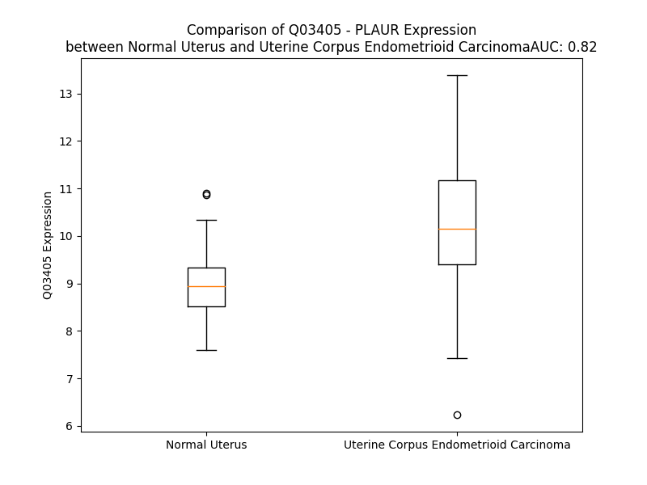

# Detailed Data for Q03405

## Introduction to the Detailed Summary

### How to Interpret the Results

- **Summary & Metrics**: This section provides a quick reference to essential protein attributes, including expression changes, family classification, and biomarker applications. Regulation status (upregulated/downregulated) indicates the protein's behavior in a disease context. Some information comes from the original excel file with the proteins selected from literature, while others are derived from the analyses.
- **Expression Comparison**: A visual representation comparing protein expression between normal and disease states. It highlights significant changes in expression levels that might indicate diagnostic or therapeutic relevance. This is data coming from transcriptomics experiments and could not translate similarly to protein levels.
- **Isoform Alignment**: An interactive view of isoform alignments, revealing structural and functional differences between variants of the protein.
- **Interactors & Homologs**: Tables listing known interaction partners and homologous proteins, the more interactors and homologs, the more complex the protein is to design an antibody for.
- **Biological Assemblies**: Information about the structural arrangement of the protein in different assemblies, providing insights into its functional state but also the complexity of the protein to develop antibodies.
- **Combined Per-Residue Information**: A detailed table summarizing residue-level data. This includes predictions for epitope regions, aggregation tendencies, and modifications that might impact the protein's function. Each row corresponds to a residue in the protein, providing insights into specific sites that may be important for research or drug development.
## Summary & Metrics

- **UniProt Accession**: Q03405
- **Gene Name**: PLAUR
- **Protein Name**: Urokinase plasminogen activator surface receptor
- **Swiss Prot**: UPAR_HUMAN
- **Family**: transmembrane receptor
- **Biomarker Application**: diagnosis,disease progression,response to therapy
- **Number of Isoforms**: 3
- **Regulation**: 1
- **(transcriptomics) AUC**: 0.82
- **(transcriptomics) Fold Change**: 1.14
- **(transcriptomics) Regulation**: Upregulated
- **Discotope Epitope Count**: 83
- **Max n_uniprots (Homo)**: 5
- **Max n_uniprots (Hetero)**: 4

## Expression Comparison

## Isoform Alignment

<pre style='font-size:14px; font-family:monospace;'>Q03405-1 MGHPPLLPLLLLLHTCVPASWGLRCMQCKTNGDCRVEECALGQDLCRTTIVRLWEEGEELELVEKSCTHSEKTNRTLSYRTGLKITSLTEVVCGLDLCNQGNSGRAVTYSRSRYLECISCGSSDMSCERGRHQSLQCRSPEEQCLDVVTHWIQEGEEGRPKDDRHLRGCGYLPGCPGSNGFHNNDTFHFLKCCNTTKCNEGPILELENLPQNGRQCYSCKGNSTHGCSSEETFLIDCRGPMNQCLVATGTHEPKNQSYMVRGCATASMCQHAHLGDAFSMNHIDVSCCTKSGCNHPDLDVQYRSGAAPQPGPAHLSLTITLLMTARLWGGTLLWT
Q03405-2 MGHPPLLPLLLLLHTCVPASWGLRCMQCKTNGDCRVEECALGQDLCRTTIVRLWEEGEELELVEKSCTHSEKTNRTLSYRTGLKITSLTEVVCGLDLCNQGNSGRAVTYSRSRYLECISCGSSDMSCERGRHQSLQCRSPEEQCLDVVTHWIQEGEEGRPKDDRHLRGCGYLPGCPGSNGFHNNDTFHFLKCCNTTKCNEGPILELENLPQNGRQCYSCKGNSTHGCSSEETFLIDCRGPMNQCLVATGTHERSLWGSWLPCKST---------------TALRPPCCEEAQATHV---------------------------------------
Q03405-3 MGHPPLLPLLLLLHTCVPASWGLRCMQCKTNGDCRVEECALGQDLCRTTIVRLWEEGEELELVEKSCTHSEKTNRTLSYRTGLKITSLTEVVCGLDLCNQGNSGRAVTYSRSRYLECISCGSSDMSCERGRHQSLQCRSPEEQCLDVVTHWIQEGEE---------------------------------------------VLELENLPQNGRQCYSCKGNSTHGCSSEETFLIDCRGPMNQCLVATGTHEPKNQSYMVRGCATASMCQHAHLGDAFSMNHIDVSCCTKSGCNHPDLDVQYRSGAAPQPGPAHLSLTITLLMTARLWGGTLLWT
</pre>

## Interactors

| preferredName_A   | preferredName_B   |   score |
|:------------------|:------------------|--------:|
| PLAUR             | PLAU              |   0.999 |
| PLAUR             | VTN               |   0.999 |
| PLAUR             | SERPINE1          |   0.994 |
| PLAUR             | PLG               |   0.974 |
| PLAUR             | SERPINB2          |   0.938 |

## Homologs

| uniprot_id   | gene_id   |
|:-------------|:----------|
| B2RBR3       | LYPD3     |
| Q6UWN5       | LYPD5     |

## Biological Assemblies

|   Unnamed: 0 |   assembly |   n_uniprots | composition   | crystal_id   |
|-------------:|-----------:|-------------:|:--------------|:-------------|
|            0 |          1 |            1 | Homo          | 4qti         |
|            0 |          1 |            4 | Hetero        | 2fd6         |
|            1 |          2 |            4 | Hetero        | 2fd6         |
|            0 |          1 |            2 | Hetero        | 2i9b         |
|            1 |          2 |            2 | Hetero        | 2i9b         |
|            2 |          3 |            2 | Hetero        | 2i9b         |
|            3 |          4 |            2 | Hetero        | 2i9b         |
|            0 |          1 |            3 | Hetero        | 3bt1         |
|            0 |          1 |            3 | Hetero        | 4k24         |
|            0 |          1 |            1 | Homo          | 3u74         |
|            0 |          1 |            2 | Homo          | 7v63         |
|            0 |          1 |            2 | Hetero        | 3u73         |
|            0 |          1 |            5 | Homo          | 1ywh         |
|            1 |          2 |            4 | Homo          | 1ywh         |
|            2 |          3 |            4 | Homo          | 1ywh         |
|            0 |          1 |            3 | Hetero        | 3bt2         |
|            1 |          2 |            2 | Hetero        | 3bt2         |
|            2 |          3 |            1 | Homo          | 3bt2         |
|            0 |          1 |            2 | Homo          | 7e17         |

## Combined Per-Residue Information

|   res | aa   |   epitope_score | epitope   |   relative_surface_accessibility |   modeling_confidence |   Aggregation | modification   | glycosylation                   |
|------:|:-----|----------------:|:----------|---------------------------------:|----------------------:|--------------:|:---------------|:--------------------------------|
|     1 | M    |         0.15882 | False     |                          1.36734 |                 43.15 |         0     | N/A            | N/A                             |
|     2 | G    |         0.35727 | True      |                          0.9021  |                 42.96 |         0     | N/A            | N/A                             |
|     3 | H    |         0.22459 | False     |                          1.01033 |                 51.75 |         0     | N/A            | N/A                             |
|     4 | P    |         0.16285 | False     |                          0.76955 |                 56.08 |         0     | N/A            | N/A                             |
|     5 | P    |         0.18409 | False     |                          0.87866 |                 52.32 |         0     | N/A            | N/A                             |
|     6 | L    |         0.23282 | True      |                          1.03912 |                 53.18 |         0     | N/A            | N/A                             |
|     7 | L    |         0.27936 | True      |                          0.934   |                 50.01 |         0     | N/A            | N/A                             |
|     8 | P    |         0.27423 | True      |                          0.7584  |                 50.81 |         1.037 | N/A            | N/A                             |
|     9 | L    |         0.21241 | False     |                          0.94336 |                 51.58 |        75.391 | N/A            | N/A                             |
|    10 | L    |         0.22404 | False     |                          0.9045  |                 50.38 |        75.875 | N/A            | N/A                             |
|    11 | L    |         0.24751 | True      |                          0.89198 |                 51.4  |        75.937 | N/A            | N/A                             |
|    12 | L    |         0.25241 | True      |                          0.99214 |                 51.47 |        75.937 | N/A            | N/A                             |
|    13 | L    |         0.21331 | False     |                          0.94461 |                 49.07 |        75.777 | N/A            | N/A                             |
|    14 | H    |         0.19804 | False     |                          0.80912 |                 46.81 |         3.447 | N/A            | N/A                             |
|    15 | T    |         0.20632 | False     |                          0.85332 |                 48.93 |         2.866 | N/A            | N/A                             |
|    16 | C    |         0.17485 | False     |                          0.97288 |                 44.05 |         2.52  | N/A            | N/A                             |
|    17 | V    |         0.14927 | False     |                          0.87238 |                 49.65 |         0.26  | N/A            | N/A                             |
|    18 | P    |         0.14826 | False     |                          0.72118 |                 45.96 |         0.11  | N/A            | N/A                             |
|    19 | A    |         0.1306  | False     |                          0.80073 |                 44.51 |         0     | N/A            | N/A                             |
|    20 | S    |         0.17799 | False     |                          0.84431 |                 54.48 |         0     | N/A            | N/A                             |
|    21 | W    |         0.24392 | True      |                          0.90489 |                 64.31 |         0     | N/A            | N/A                             |
|    22 | G    |         0.13916 | False     |                          0.31905 |                 81.45 |         0     | N/A            | N/A                             |
|    23 | L    |         0.08481 | False     |                          0.19949 |                 94.6  |         0     | N/A            | N/A                             |
|    24 | R    |         0.31042 | True      |                          0.33913 |                 96.62 |         0     | N/A            | N/A                             |
|    25 | C    |         0.00315 | False     |                          0       |                 97.23 |         0     | N/A            | N/A                             |
|    26 | M    |         0.10555 | False     |                          0.13534 |                 97.25 |         0     | N/A            | N/A                             |
|    27 | Q    |         0.07213 | False     |                          0.22863 |                 96.97 |         0     | N/A            | N/A                             |
|    28 | C    |         0.07821 | False     |                          0.06276 |                 96.2  |         0     | N/A            | N/A                             |
|    29 | K    |         0.2172  | False     |                          0.67576 |                 93.75 |         0     | N/A            | N/A                             |
|    30 | T    |         0.24343 | True      |                          0.5613  |                 90.65 |         0     | N/A            | N/A                             |
|    31 | N    |         0.29058 | True      |                          0.69211 |                 90.81 |         0     | N/A            | N/A                             |
|    32 | G    |         0.11327 | False     |                          0.64778 |                 89.48 |         0     | N/A            | N/A                             |
|    33 | D    |         0.25808 | True      |                          0.54902 |                 94.12 |         0     | N/A            | N/A                             |
|    34 | C    |         0.2296  | True      |                          0.51855 |                 96.09 |         0     | N/A            | N/A                             |
|    35 | R    |         0.49073 | True      |                          0.66488 |                 96.58 |         0     | N/A            | N/A                             |
|    36 | V    |         0.31455 | True      |                          0.56364 |                 96.81 |         0     | N/A            | N/A                             |
|    37 | E    |         0.10554 | False     |                          0.21537 |                 95.92 |         0     | N/A            | N/A                             |
|    38 | E    |         0.20081 | False     |                          0.65281 |                 96    |         0     | N/A            | N/A                             |
|    39 | C    |         0.07595 | False     |                          0.09806 |                 94.75 |         0     | N/A            | N/A                             |
|    40 | A    |         0.1652  | False     |                          0.58545 |                 91.12 |         0     | N/A            | N/A                             |
|    41 | L    |         0.25097 | True      |                          1.12375 |                 86.96 |         0     | N/A            | N/A                             |
|    42 | G    |         0.0914  | False     |                          0.43155 |                 84.35 |         0     | N/A            | N/A                             |
|    43 | Q    |         0.17732 | False     |                          0.22455 |                 90.64 |         0     | N/A            | N/A                             |
|    44 | D    |         0.20559 | False     |                          0.45496 |                 92.41 |         0     | N/A            | N/A                             |
|    45 | L    |         0.08223 | False     |                          0.16899 |                 95.02 |         0     | N/A            | N/A                             |
|    46 | C    |         0.00606 | False     |                          0.00074 |                 96.71 |         0     | N/A            | N/A                             |
|    47 | R    |         0.08013 | False     |                          0.18657 |                 95.81 |         0     | N/A            | N/A                             |
|    48 | T    |         0.01962 | False     |                          0.04337 |                 96.35 |         0     | N/A            | N/A                             |
|    49 | T    |         0.05023 | False     |                          0.21529 |                 95.13 |         0.233 | N/A            | N/A                             |
|    50 | I    |         0.0171  | False     |                          0.04198 |                 94.22 |         0.233 | N/A            | N/A                             |
|    51 | V    |         0.1361  | False     |                          0.25611 |                 93.96 |         0.233 | N/A            | N/A                             |
|    52 | R    |         0.08677 | False     |                          0.16002 |                 93.49 |         0.233 | N/A            | N/A                             |
|    53 | L    |         0.3096  | True      |                          0.24207 |                 93.47 |         0.233 | N/A            | N/A                             |
|    54 | W    |         0.08859 | False     |                          0.31766 |                 93.2  |         0.233 | N/A            | N/A                             |
|    55 | E    |         0.24527 | True      |                          0.46444 |                 92.32 |         0.233 | N/A            | N/A                             |
|    56 | E    |         0.30049 | True      |                          0.70241 |                 89.48 |         0     | N/A            | N/A                             |
|    57 | G    |         0.15442 | False     |                          0.72492 |                 86.31 |         0     | N/A            | N/A                             |
|    58 | E    |         0.23866 | True      |                          0.73794 |                 90.65 |         0     | N/A            | N/A                             |
|    59 | E    |         0.14215 | False     |                          0.46014 |                 90.63 |         0     | N/A            | N/A                             |
|    60 | L    |         0.32207 | True      |                          0.61192 |                 92.8  |         0     | N/A            | N/A                             |
|    61 | E    |         0.08205 | False     |                          0.41859 |                 93.01 |         0     | N/A            | N/A                             |
|    62 | L    |         0.22601 | True      |                          0.35869 |                 93.53 |         0     | N/A            | N/A                             |
|    63 | V    |         0.0632  | False     |                          0.25799 |                 93.95 |         0     | N/A            | N/A                             |
|    64 | E    |         0.13102 | False     |                          0.34239 |                 95.44 |         0     | N/A            | N/A                             |
|    65 | K    |         0.05419 | False     |                          0.07874 |                 96.57 |         0     | N/A            | N/A                             |
|    66 | S    |         0.06747 | False     |                          0.1191  |                 96.25 |         0     | N/A            | N/A                             |
|    67 | C    |         0.03279 | False     |                          0.06501 |                 95.82 |         0     | N/A            | N/A                             |
|    68 | T    |         0.10567 | False     |                          0.0544  |                 92.77 |         0     | N/A            | N/A                             |
|    69 | H    |         0.10198 | False     |                          0.07602 |                 89.54 |         0     | N/A            | N/A                             |
|    70 | S    |         0.15823 | False     |                          0.4705  |                 86.92 |         0     | N/A            | N/A                             |
|    71 | E    |         0.11818 | False     |                          0.20385 |                 83.83 |         0     | N/A            | N/A                             |
|    72 | K    |         0.16318 | False     |                          0.20485 |                 88.51 |         0     | N/A            | N/A                             |
|    73 | T    |         0.11874 | False     |                          0.38978 |                 90.14 |         0     | N/A            | N/A                             |
|    74 | N    |         0.03944 | False     |                          0.52504 |                 92.47 |         0     | N/A            | N-linked (GlcNAc...) asparagine |
|    75 | R    |         0.10669 | False     |                          0.15346 |                 93.55 |         0     | N/A            | N/A                             |
|    76 | T    |         0.04446 | False     |                          0.24457 |                 95.4  |         0     | N/A            | N/A                             |
|    77 | L    |         0.01696 | False     |                          0.08797 |                 96.06 |         0     | N/A            | N/A                             |
|    78 | S    |         0.03093 | False     |                          0.05925 |                 96.77 |         0     | N/A            | N/A                             |
|    79 | Y    |         0.05099 | False     |                          0.10421 |                 97.31 |         0     | N/A            | N/A                             |
|    80 | R    |         0.18354 | False     |                          0.23121 |                 95.93 |         0     | N/A            | N/A                             |
|    81 | T    |         0.07498 | False     |                          0.11684 |                 94.24 |         0     | N/A            | N/A                             |
|    82 | G    |         0.18592 | False     |                          0.37551 |                 92.13 |         0     | N/A            | N/A                             |
|    83 | L    |         0.2275  | True      |                          0.63144 |                 92.27 |         0.286 | N/A            | N/A                             |
|    84 | K    |         0.173   | False     |                          0.30192 |                 94.18 |         0.286 | N/A            | N/A                             |
|    85 | I    |         0.06146 | False     |                          0.12236 |                 95.31 |         0.729 | N/A            | N/A                             |
|    86 | T    |         0.07123 | False     |                          0.07157 |                 95.12 |         0.729 | N/A            | N/A                             |
|    87 | S    |         0.02863 | False     |                          0.07706 |                 95.15 |         0.729 | N/A            | N/A                             |
|    88 | L    |         0.09998 | False     |                          0.35678 |                 94.78 |         0.729 | N/A            | N/A                             |
|    89 | T    |         0.03645 | False     |                          0.19695 |                 94.69 |         0.729 | N/A            | N/A                             |
|    90 | E    |         0.04852 | False     |                          0.09782 |                 94.55 |         0.286 | N/A            | N/A                             |
|    91 | V    |         0.04317 | False     |                          0.45421 |                 94.5  |         0.286 | N/A            | N/A                             |
|    92 | V    |         0.06488 | False     |                          0.21301 |                 94.85 |         0.286 | N/A            | N/A                             |
|    93 | C    |         0.05449 | False     |                          0.31651 |                 95.47 |         0     | N/A            | N/A                             |
|    94 | G    |         0.26656 | True      |                          0.51352 |                 94.34 |         0     | N/A            | N/A                             |
|    95 | L    |         0.16089 | False     |                          0.82023 |                 94.12 |         0     | N/A            | N/A                             |
|    96 | D    |         0.23474 | True      |                          0.45033 |                 95.44 |         0     | N/A            | N/A                             |
|    97 | L    |         0.14788 | False     |                          0.25393 |                 95.94 |         0     | N/A            | N/A                             |
|    98 | C    |         0.05649 | False     |                          0.34111 |                 95.36 |         0     | N/A            | N/A                             |
|    99 | N    |         0.03127 | False     |                          0.04841 |                 95.62 |         0     | N/A            | N/A                             |
|   100 | Q    |         0.33866 | True      |                          0.56569 |                 92.64 |         0     | N/A            | N/A                             |
|   101 | G    |         0.10768 | False     |                          0.592   |                 82.55 |         0     | N/A            | N/A                             |
|   102 | N    |         0.19259 | False     |                          0.9289  |                 66.14 |         0     | N/A            | N/A                             |
|   103 | S    |         0.12045 | False     |                          0.16634 |                 57.45 |         0     | N/A            | N/A                             |
|   104 | G    |         0.16122 | False     |                          0.71016 |                 48.58 |         0     | N/A            | N/A                             |
|   105 | R    |         0.17467 | False     |                          0.92358 |                 38.55 |         0     | N/A            | N/A                             |
|   106 | A    |         0.12733 | False     |                          0.68646 |                 38.4  |         0     | N/A            | N/A                             |
|   107 | V    |         0.15447 | False     |                          0.76992 |                 44.51 |         0     | N/A            | N/A                             |
|   108 | T    |         0.17569 | False     |                          0.85691 |                 41.56 |         0     | N/A            | N/A                             |
|   109 | Y    |         0.19616 | False     |                          0.56204 |                 49.7  |         0     | N/A            | N/A                             |
|   110 | S    |         0.12448 | False     |                          0.36382 |                 48.75 |         0     | N/A            | N/A                             |
|   111 | R    |         0.32293 | True      |                          0.97434 |                 53.1  |         0     | N/A            | N/A                             |
|   112 | S    |         0.16267 | False     |                          0.44149 |                 62.81 |         0     | N/A            | N/A                             |
|   113 | R    |         0.2422  | True      |                          0.7872  |                 74.78 |         0     | N/A            | N/A                             |
|   114 | Y    |         0.1092  | False     |                          0.32753 |                 91.4  |         0     | N/A            | N/A                             |
|   115 | L    |         0.09181 | False     |                          0.20497 |                 96.32 |         0     | N/A            | N/A                             |
|   116 | E    |         0.12461 | False     |                          0.24319 |                 97.54 |         0     | N/A            | N/A                             |
|   117 | C    |         0.00344 | False     |                          0       |                 98.32 |         0     | N/A            | N/A                             |
|   118 | I    |         0.05983 | False     |                          0.12239 |                 98.45 |         0     | N/A            | N/A                             |
|   119 | S    |         0.00556 | False     |                          0.00154 |                 98.42 |         0     | N/A            | N/A                             |
|   120 | C    |         0.00537 | False     |                          0.002   |                 98.15 |         0     | N/A            | N/A                             |
|   121 | G    |         0.00856 | False     |                          0       |                 96.26 |         0     | N/A            | N/A                             |
|   122 | S    |         0.16243 | False     |                          0.15088 |                 94.62 |         0     | N/A            | N/A                             |
|   123 | S    |         0.35177 | True      |                          0.63812 |                 91.89 |         0     | N/A            | N/A                             |
|   124 | D    |         0.36563 | True      |                          0.34906 |                 93.61 |         0     | N/A            | N/A                             |
|   125 | M    |         0.20522 | False     |                          0.48717 |                 94.77 |         0     | N/A            | N/A                             |
|   126 | S    |         0.03482 | False     |                          0.03432 |                 96.48 |         0     | N/A            | N/A                             |
|   127 | C    |         0.01739 | False     |                          0.01258 |                 96.86 |         0     | N/A            | N/A                             |
|   128 | E    |         0.15471 | False     |                          0.33269 |                 95.68 |         0     | N/A            | N/A                             |
|   129 | R    |         0.28972 | True      |                          0.54632 |                 96.32 |         0     | N/A            | N/A                             |
|   130 | G    |         0.14823 | False     |                          0.6129  |                 95.56 |         0     | N/A            | N/A                             |
|   131 | R    |         0.28627 | True      |                          0.5868  |                 96.54 |         0     | N/A            | N/A                             |
|   132 | H    |         0.11045 | False     |                          0.29848 |                 97.32 |         0     | N/A            | N/A                             |
|   133 | Q    |         0.10825 | False     |                          0.27122 |                 97.06 |         0     | N/A            | N/A                             |
|   134 | S    |         0.15071 | False     |                          0.3999  |                 96.91 |         0     | N/A            | N/A                             |
|   135 | L    |         0.04067 | False     |                          0.08573 |                 96.28 |         0     | N/A            | N/A                             |
|   136 | Q    |         0.07918 | False     |                          0.38313 |                 95.28 |         0     | N/A            | N/A                             |
|   137 | C    |         0.02972 | False     |                          0.02495 |                 95.36 |         0     | N/A            | N/A                             |
|   138 | R    |         0.07141 | False     |                          0.27447 |                 90.78 |         0     | N/A            | N/A                             |
|   139 | S    |         0.06219 | False     |                          0.26279 |                 90.34 |         0     | N/A            | N/A                             |
|   140 | P    |         0.15985 | False     |                          0.68034 |                 91.71 |         0     | N/A            | N/A                             |
|   141 | E    |         0.10184 | False     |                          0.59917 |                 92.25 |         0     | N/A            | N/A                             |
|   142 | E    |         0.04965 | False     |                          0.07873 |                 95.59 |         0     | N/A            | N/A                             |
|   143 | Q    |         0.08768 | False     |                          0.10385 |                 97.49 |         0     | N/A            | N/A                             |
|   144 | C    |         0.00385 | False     |                          0       |                 98.39 |         0     | N/A            | N/A                             |
|   145 | L    |         0.00219 | False     |                          0       |                 98.16 |         0     | N/A            | N/A                             |
|   146 | D    |         0.04743 | False     |                          0.06749 |                 97.52 |         0     | N/A            | N/A                             |
|   147 | V    |         0.03044 | False     |                          0.19083 |                 95.89 |         0.23  | N/A            | N/A                             |
|   148 | V    |         0.01802 | False     |                          0.01465 |                 94.9  |         0.23  | N/A            | N/A                             |
|   149 | T    |         0.08641 | False     |                          0.15879 |                 92.06 |         0.23  | N/A            | N/A                             |
|   150 | H    |         0.14247 | False     |                          0.19926 |                 86.92 |         0.23  | N/A            | N/A                             |
|   151 | W    |         0.1586  | False     |                          0.1922  |                 80.76 |         0.23  | N/A            | N/A                             |
|   152 | I    |         0.28077 | True      |                          0.56965 |                 67.72 |         0.23  | N/A            | N/A                             |
|   153 | Q    |         0.28089 | True      |                          0.63722 |                 59.76 |         0     | N/A            | N/A                             |
|   154 | E    |         0.29564 | True      |                          0.91555 |                 52.16 |         0     | N/A            | N/A                             |
|   155 | G    |         0.48748 | True      |                          0.75699 |                 45.27 |         0     | N/A            | N/A                             |
|   156 | E    |         0.28546 | True      |                          0.62691 |                 49.96 |         0     | N/A            | N/A                             |
|   157 | E    |         0.40076 | True      |                          0.97336 |                 35.64 |         0     | N/A            | N/A                             |
|   158 | G    |         0.55208 | True      |                          0.96764 |                 38.94 |         0     | N/A            | N/A                             |
|   159 | R    |         0.25809 | True      |                          0.28709 |                 49.19 |         0     | N/A            | N/A                             |
|   160 | P    |         0.29475 | True      |                          0.7383  |                 49.43 |         0     | N/A            | N/A                             |
|   161 | K    |         0.2475  | True      |                          1.0255  |                 60.9  |         0     | N/A            | N/A                             |
|   162 | D    |         0.34462 | True      |                          0.57534 |                 70.47 |         0     | N/A            | N/A                             |
|   163 | D    |         0.2585  | True      |                          0.16317 |                 81.99 |         0     | N/A            | N/A                             |
|   164 | R    |         0.34041 | True      |                          0.40369 |                 91.67 |         0     | N/A            | N/A                             |
|   165 | H    |         0.01543 | False     |                          0.00762 |                 95.73 |         0     | N/A            | N/A                             |
|   166 | L    |         0.02492 | False     |                          0.11788 |                 97.01 |         0     | N/A            | N/A                             |
|   167 | R    |         0.03038 | False     |                          0.01896 |                 98.16 |         0     | N/A            | N/A                             |
|   168 | G    |         0.0016  | False     |                          0       |                 98.07 |         0     | N/A            | N/A                             |
|   169 | C    |         0.00709 | False     |                          0.00401 |                 97.77 |         0     | N/A            | N/A                             |
|   170 | G    |         0.00142 | False     |                          0       |                 96.61 |         0     | N/A            | N/A                             |
|   171 | Y    |         0.0601  | False     |                          0.42554 |                 94.99 |         0     | N/A            | N/A                             |
|   172 | L    |         0.04487 | False     |                          0.14197 |                 93.68 |         0     | N/A            | N/A                             |
|   173 | P    |         0.08236 | False     |                          0.16747 |                 88.16 |         0     | N/A            | N/A                             |
|   174 | G    |         0.07802 | False     |                          0.29116 |                 82.71 |         0     | N/A            | N/A                             |
|   175 | C    |         0.08754 | False     |                          0.09146 |                 91.51 |         0     | N/A            | N/A                             |
|   176 | P    |         0.27701 | True      |                          0.79308 |                 90.43 |         0     | N/A            | N/A                             |
|   177 | G    |         0.10365 | False     |                          0.41924 |                 92.17 |         0     | N/A            | N/A                             |
|   178 | S    |         0.08029 | False     |                          0.37142 |                 93.08 |         0     | N/A            | N/A                             |
|   179 | N    |         0.04862 | False     |                          0.03423 |                 94.15 |         0     | N/A            | N/A                             |
|   180 | G    |         0.00305 | False     |                          0       |                 95.36 |         0     | N/A            | N/A                             |
|   181 | F    |         0.00278 | False     |                          0       |                 96.59 |         0     | N/A            | N/A                             |
|   182 | H    |         0.0194  | False     |                          0.02406 |                 97.12 |         0     | N/A            | N/A                             |
|   183 | N    |         0.01523 | False     |                          0.03169 |                 95.9  |         0     | N/A            | N/A                             |
|   184 | N    |         0.13868 | False     |                          0.50796 |                 93.77 |         0     | N/A            | N-linked (GlcNAc...) asparagine |
|   185 | D    |         0.10376 | False     |                          0.09813 |                 90.82 |         0     | N/A            | N/A                             |
|   186 | T    |         0.01211 | False     |                          0.00311 |                 92.86 |         0.567 | N/A            | N/A                             |
|   187 | F    |         0.0174  | False     |                          0.01098 |                 94.56 |         0.567 | N/A            | N/A                             |
|   188 | H    |         0.04941 | False     |                          0.06779 |                 94.46 |         0.567 | N/A            | N/A                             |
|   189 | F    |         0.02081 | False     |                          0.0997  |                 94.92 |         0.567 | N/A            | N/A                             |
|   190 | L    |         0.02321 | False     |                          0.0888  |                 95.26 |         0.567 | N/A            | N/A                             |
|   191 | K    |         0.06701 | False     |                          0.37266 |                 96.26 |         0     | N/A            | N/A                             |
|   192 | C    |         0.0163  | False     |                          0.04738 |                 97.02 |         0     | N/A            | N/A                             |
|   193 | C    |         0.05025 | False     |                          0.17425 |                 97.65 |         0     | N/A            | N/A                             |
|   194 | N    |         0.15123 | False     |                          0.68599 |                 96.65 |         0     | N/A            | N-linked (GlcNAc...) asparagine |
|   195 | T    |         0.13381 | False     |                          0.60583 |                 96.71 |         0     | N/A            | N/A                             |
|   196 | T    |         0.18601 | False     |                          0.62549 |                 97.49 |         0     | N/A            | N/A                             |
|   197 | K    |         0.2405  | True      |                          0.31747 |                 98    |         0     | N/A            | N/A                             |
|   198 | C    |         0.06001 | False     |                          0.2215  |                 97.84 |         0     | N/A            | N/A                             |
|   199 | N    |         0.01086 | False     |                          0.00386 |                 98.1  |         0     | N/A            | N/A                             |
|   200 | E    |         0.28999 | True      |                          0.57648 |                 97.38 |         0     | N/A            | N/A                             |
|   201 | G    |         0.12351 | False     |                          0.39476 |                 95.64 |         0     | N/A            | N/A                             |
|   202 | P    |         0.26026 | True      |                          0.91565 |                 95.49 |         0     | N/A            | N/A                             |
|   203 | I    |         0.16607 | False     |                          0.18641 |                 95.76 |         0     | N/A            | N/A                             |
|   204 | L    |         0.09166 | False     |                          0.23482 |                 94.95 |         0     | N/A            | N/A                             |
|   205 | E    |         0.17744 | False     |                          0.25133 |                 94.56 |         0     | N/A            | N/A                             |
|   206 | L    |         0.10729 | False     |                          0.17007 |                 95.96 |         0     | N/A            | N/A                             |
|   207 | E    |         0.31861 | True      |                          0.77859 |                 94.1  |         0     | N/A            | N/A                             |
|   208 | N    |         0.24985 | True      |                          0.71188 |                 95.35 |         0     | N/A            | N/A                             |
|   209 | L    |         0.13177 | False     |                          0.14522 |                 96.98 |         0     | N/A            | N/A                             |
|   210 | P    |         0.19055 | False     |                          0.71235 |                 97.79 |         0     | N/A            | N/A                             |
|   211 | Q    |         0.22709 | True      |                          0.5276  |                 98.02 |         0     | N/A            | N/A                             |
|   212 | N    |         0.24035 | True      |                          0.35022 |                 97.58 |         0     | N/A            | N/A                             |
|   213 | G    |         0.23887 | True      |                          0.81337 |                 97.57 |         0     | N/A            | N/A                             |
|   214 | R    |         0.24093 | True      |                          0.25318 |                 98.29 |         0     | N/A            | N/A                             |
|   215 | Q    |         0.17865 | False     |                          0.39483 |                 98.53 |         0     | N/A            | N/A                             |
|   216 | C    |         0.00445 | False     |                          0       |                 98.58 |         0     | N/A            | N/A                             |
|   217 | Y    |         0.0881  | False     |                          0.16976 |                 98.16 |         0     | N/A            | N/A                             |
|   218 | S    |         0.03741 | False     |                          0.00633 |                 97.45 |         0     | N/A            | N/A                             |
|   219 | C    |         0.03639 | False     |                          0.05608 |                 95.36 |         0     | N/A            | N/A                             |
|   220 | K    |         0.14895 | False     |                          0.25041 |                 92.2  |         0     | N/A            | N/A                             |
|   221 | G    |         0.12622 | False     |                          0.1983  |                 89.83 |         0     | N/A            | N/A                             |
|   222 | N    |         0.25263 | True      |                          0.27255 |                 89.41 |         0     | N/A            | N-linked (GlcNAc...) asparagine |
|   223 | S    |         0.30741 | True      |                          0.56286 |                 86.47 |         0     | N/A            | N/A                             |
|   224 | T    |         0.23825 | True      |                          0.66973 |                 86.09 |         0     | N/A            | N/A                             |
|   225 | H    |         0.34807 | True      |                          0.71849 |                 87.37 |         0     | N/A            | N/A                             |
|   226 | G    |         0.13958 | False     |                          0.25448 |                 89.96 |         0     | N/A            | N/A                             |
|   227 | C    |         0.04474 | False     |                          0.02443 |                 93.11 |         0     | N/A            | N/A                             |
|   228 | S    |         0.12094 | False     |                          0.12917 |                 90.97 |         0     | N/A            | N/A                             |
|   229 | S    |         0.23713 | True      |                          0.53288 |                 87.44 |         0     | N/A            | N/A                             |
|   230 | E    |         0.21897 | False     |                          0.77642 |                 89.64 |         0     | N/A            | N/A                             |
|   231 | E    |         0.30464 | True      |                          0.41581 |                 92.12 |         0     | N/A            | N/A                             |
|   232 | T    |         0.11882 | False     |                          0.08077 |                 95.11 |         0     | N/A            | N/A                             |
|   233 | F    |         0.1905  | False     |                          0.48157 |                 96.62 |         0     | N/A            | N/A                             |
|   234 | L    |         0.15747 | False     |                          0.50743 |                 97.9  |         0     | N/A            | N/A                             |
|   235 | I    |         0.16103 | False     |                          0.14559 |                 98.21 |         0     | N/A            | N/A                             |
|   236 | D    |         0.08156 | False     |                          0.34966 |                 98.39 |         0     | N/A            | N/A                             |
|   237 | C    |         0.00398 | False     |                          0.00074 |                 98.66 |         0     | N/A            | N/A                             |
|   238 | R    |         0.22253 | False     |                          0.2531  |                 98.48 |         0     | N/A            | N/A                             |
|   239 | G    |         0.0936  | False     |                          0.19939 |                 97.67 |         0     | N/A            | N/A                             |
|   240 | P    |         0.12505 | False     |                          0.47147 |                 97.14 |         0     | N/A            | N/A                             |
|   241 | M    |         0.00437 | False     |                          0       |                 98    |         0     | N/A            | N/A                             |
|   242 | N    |         0.17179 | False     |                          0.42916 |                 98    |         0     | N/A            | N/A                             |
|   243 | Q    |         0.07716 | False     |                          0.12715 |                 98.12 |         0     | N/A            | N/A                             |
|   244 | C    |         0.00512 | False     |                          0.00074 |                 98.27 |         0.393 | N/A            | N/A                             |
|   245 | L    |         0.0041  | False     |                          0       |                 97.18 |         0.561 | N/A            | N/A                             |
|   246 | V    |         0.09997 | False     |                          0.11988 |                 95.77 |         0.561 | N/A            | N/A                             |
|   247 | A    |         0.00464 | False     |                          0.00255 |                 93.91 |         0.561 | N/A            | N/A                             |
|   248 | T    |         0.13227 | False     |                          0.28861 |                 92.65 |         0.561 | N/A            | N/A                             |
|   249 | G    |         0.10261 | False     |                          0.13981 |                 89.85 |         0.168 | N/A            | N/A                             |
|   250 | T    |         0.14393 | False     |                          0.26009 |                 86.99 |         0     | N/A            | N/A                             |
|   251 | H    |         0.23636 | True      |                          0.25582 |                 83.98 |         0     | N/A            | N/A                             |
|   252 | E    |         0.29577 | True      |                          0.33893 |                 73.76 |         0     | N/A            | N/A                             |
|   253 | P    |         0.60771 | True      |                          0.90786 |                 68.1  |         0     | N/A            | N/A                             |
|   254 | K    |         0.43827 | True      |                          0.74437 |                 74.92 |         0     | N/A            | N/A                             |
|   255 | N    |         0.28958 | True      |                          0.66257 |                 78.93 |         0     | N/A            | N-linked (GlcNAc...) asparagine |
|   256 | Q    |         0.31923 | True      |                          0.54811 |                 85.42 |         0     | N/A            | N/A                             |
|   257 | S    |         0.22634 | True      |                          0.62441 |                 90.06 |         0     | N/A            | N/A                             |
|   258 | Y    |         0.10869 | False     |                          0.14919 |                 91.25 |         0     | N/A            | N/A                             |
|   259 | M    |         0.06713 | False     |                          0.07235 |                 92.38 |         0     | N/A            | N/A                             |
|   260 | V    |         0.00169 | False     |                          0       |                 94.29 |         0     | N/A            | N/A                             |
|   261 | R    |         0.02058 | False     |                          0.00702 |                 96.8  |         0     | N/A            | N/A                             |
|   262 | G    |         0.00182 | False     |                          0       |                 97.75 |         0     | N/A            | N/A                             |
|   263 | C    |         0.00281 | False     |                          0       |                 98.43 |         0     | N/A            | N/A                             |
|   264 | A    |         0.00262 | False     |                          0       |                 97.7  |         0     | N/A            | N/A                             |
|   265 | T    |         0.0274  | False     |                          0.05046 |                 96.66 |         0     | N/A            | N/A                             |
|   266 | A    |         0.15779 | False     |                          0.63474 |                 94.65 |         0     | N/A            | N/A                             |
|   267 | S    |         0.05    | False     |                          0.28245 |                 92.72 |         0     | N/A            | N/A                             |
|   268 | M    |         0.00896 | False     |                          0.02014 |                 93.04 |         0     | N/A            | N/A                             |
|   269 | C    |         0.03544 | False     |                          0.22262 |                 91.97 |         0     | N/A            | N/A                             |
|   270 | Q    |         0.11931 | False     |                          0.56549 |                 81.8  |         0     | N/A            | N/A                             |
|   271 | H    |         0.18529 | False     |                          0.53529 |                 68.4  |         0     | N/A            | N/A                             |
|   272 | A    |         0.07681 | False     |                          0.29938 |                 68.95 |         0     | N/A            | N/A                             |
|   273 | H    |         0.08197 | False     |                          0.10652 |                 78.75 |         0     | N/A            | N/A                             |
|   274 | L    |         0.01321 | False     |                          0       |                 80.53 |         0     | N/A            | N/A                             |
|   275 | G    |         0.04842 | False     |                          0.05678 |                 80.57 |         0     | N/A            | N/A                             |
|   276 | D    |         0.09583 | False     |                          0.32063 |                 81.07 |         0     | N/A            | N/A                             |
|   277 | A    |         0.06783 | False     |                          0.19815 |                 81.87 |         0     | N/A            | N/A                             |
|   278 | F    |         0.0108  | False     |                          0.00399 |                 84.06 |         0     | N/A            | N/A                             |
|   279 | S    |         0.13105 | False     |                          0.40757 |                 84.32 |         0     | N/A            | N/A                             |
|   280 | M    |         0.03928 | False     |                          0.01329 |                 85.09 |         0     | N/A            | N/A                             |
|   281 | N    |         0.08027 | False     |                          0.01815 |                 84.91 |         0     | N/A            | N/A                             |
|   282 | H    |         0.13587 | False     |                          0.51606 |                 84.12 |         0     | N/A            | N/A                             |
|   283 | I    |         0.06547 | False     |                          0.0904  |                 87.11 |         0     | N/A            | N/A                             |
|   284 | D    |         0.13867 | False     |                          0.50893 |                 90.67 |         0     | N/A            | N/A                             |
|   285 | V    |         0.05241 | False     |                          0.1518  |                 92.29 |         0     | N/A            | N/A                             |
|   286 | S    |         0.18646 | False     |                          0.51353 |                 94.19 |         0     | N/A            | N/A                             |
|   287 | C    |         0.04052 | False     |                          0.32058 |                 96.43 |         0     | N/A            | N/A                             |
|   288 | C    |         0.05645 | False     |                          0.28198 |                 97.04 |         0     | N/A            | N/A                             |
|   289 | T    |         0.2703  | True      |                          0.60058 |                 97.09 |         0     | N/A            | N/A                             |
|   290 | K    |         0.26899 | True      |                          0.76655 |                 97.11 |         0     | N/A            | N/A                             |
|   291 | S    |         0.20126 | False     |                          0.4568  |                 97.83 |         0     | N/A            | N/A                             |
|   292 | G    |         0.18028 | False     |                          0.21045 |                 96.78 |         0     | N/A            | N/A                             |
|   293 | C    |         0.07382 | False     |                          0.20312 |                 96.82 |         0     | N/A            | N/A                             |
|   294 | N    |         0.01515 | False     |                          0.01464 |                 96.37 |         0     | N/A            | N/A                             |
|   295 | H    |         0.20208 | False     |                          0.28041 |                 94.42 |         0     | N/A            | N/A                             |
|   296 | P    |         0.08188 | False     |                          0.16134 |                 88.24 |         0     | N/A            | N/A                             |
|   297 | D    |         0.22764 | True      |                          0.57645 |                 82.78 |         0     | N/A            | N/A                             |
|   298 | L    |         0.25328 | True      |                          0.50701 |                 77.92 |         0     | N/A            | N/A                             |
|   299 | D    |         0.33238 | True      |                          0.23354 |                 71.17 |         0     | N/A            | N/A                             |
|   300 | V    |         0.39337 | True      |                          0.70168 |                 56    |         0     | N/A            | N/A                             |
|   301 | Q    |         0.33026 | True      |                          0.66347 |                 45.75 |         0     | N/A            | N/A                             |
|   302 | Y    |         0.47099 | True      |                          0.79784 |                 44.65 |         0     | N/A            | N/A                             |
|   303 | R    |         0.36242 | True      |                          0.76245 |                 47.46 |         0     | N/A            | N/A                             |
|   304 | S    |         0.22391 | False     |                          0.69362 |                 38.59 |         0     | N/A            | N/A                             |
|   305 | G    |         0.29506 | True      |                          0.80055 |                 36.63 |         0     | N/A            | N/A                             |
|   306 | A    |         0.21915 | False     |                          0.67491 |                 29.77 |         0     | N/A            | N/A                             |
|   307 | A    |         0.24132 | True      |                          0.84131 |                 27.72 |         0     | N/A            | N/A                             |
|   308 | P    |         0.21533 | False     |                          0.92009 |                 29.53 |         0     | N/A            | N/A                             |
|   309 | Q    |         0.2994  | True      |                          0.83002 |                 38.06 |         0     | N/A            | N/A                             |
|   310 | P    |         0.20652 | False     |                          0.95985 |                 34.24 |         0     | N/A            | N/A                             |
|   311 | G    |         0.1934  | False     |                          0.6158  |                 34.72 |         0     | N/A            | N/A                             |
|   312 | P    |         0.13682 | False     |                          0.85303 |                 37.79 |         0     | N/A            | N/A                             |
|   313 | A    |         0.13684 | False     |                          0.88048 |                 37.98 |         0.107 | N/A            | N/A                             |
|   314 | H    |         0.17805 | False     |                          0.93318 |                 36.71 |         0.234 | N/A            | N/A                             |
|   315 | L    |         0.21258 | False     |                          0.94569 |                 36.87 |        20.758 | N/A            | N/A                             |
|   316 | S    |         0.18575 | False     |                          0.72757 |                 32.44 |        24.443 | N/A            | N/A                             |
|   317 | L    |         0.23902 | True      |                          0.79598 |                 35.57 |        57.307 | N/A            | N/A                             |
|   318 | T    |         0.16446 | False     |                          0.87811 |                 38    |        62.928 | N/A            | N/A                             |
|   319 | I    |         0.2048  | False     |                          0.7266  |                 38.03 |        68.733 | N/A            | N/A                             |
|   320 | T    |         0.17643 | False     |                          0.92156 |                 33.28 |        68.48  | N/A            | N/A                             |
|   321 | L    |         0.15534 | False     |                          0.84841 |                 32.77 |        68.311 | N/A            | N/A                             |
|   322 | L    |         0.13032 | False     |                          0.9719  |                 34.53 |        64.59  | N/A            | N/A                             |
|   323 | M    |         0.19705 | False     |                          0.88866 |                 36.56 |        42.01  | N/A            | N/A                             |
|   324 | T    |         0.26017 | True      |                          0.81393 |                 33.88 |        12.089 | N/A            | N/A                             |
|   325 | A    |         0.12465 | False     |                          0.87836 |                 37.04 |         5.545 | N/A            | N/A                             |
|   326 | R    |         0.18569 | False     |                          0.84116 |                 35.2  |         0     | N/A            | N/A                             |
|   327 | L    |         0.17981 | False     |                          0.85355 |                 33.79 |         4.894 | N/A            | N/A                             |
|   328 | W    |         0.25021 | True      |                          1.06538 |                 40.64 |         5.851 | N/A            | N/A                             |
|   329 | G    |         0.11865 | False     |                          1.0281  |                 36.16 |         5.851 | N/A            | N/A                             |
|   330 | G    |         0.15161 | False     |                          0.78638 |                 39.04 |         6.202 | N/A            | N/A                             |
|   331 | T    |         0.1269  | False     |                          0.91102 |                 41.63 |         6.202 | N/A            | N/A                             |
|   332 | L    |         0.26286 | True      |                          0.92479 |                 38.05 |         6.202 | N/A            | N/A                             |
|   333 | L    |         0.19162 | False     |                          0.78321 |                 40.29 |         6.202 | N/A            | N/A                             |
|   334 | W    |         0.17613 | False     |                          0.97329 |                 39.88 |         5.774 | N/A            | N/A                             |
|   335 | T    |         0.1225  | False     |                          1.35921 |                 51.11 |         0     | N/A            | N/A                             |

