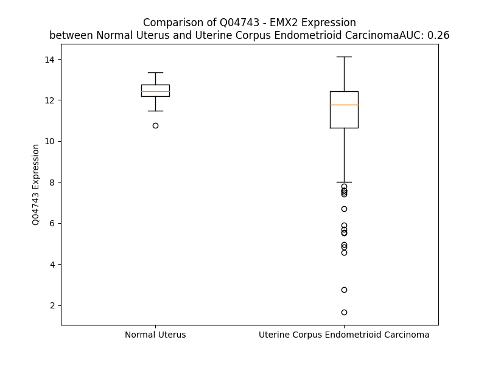

# Detailed Data for Q04743

## Introduction to the Detailed Summary

### How to Interpret the Results

- **Summary & Metrics**: This section provides a quick reference to essential protein attributes, including expression changes, family classification, and biomarker applications. Regulation status (upregulated/downregulated) indicates the protein's behavior in a disease context. Some information comes from the original excel file with the proteins selected from literature, while others are derived from the analyses.
- **Expression Comparison**: A visual representation comparing protein expression between normal and disease states. It highlights significant changes in expression levels that might indicate diagnostic or therapeutic relevance. This is data coming from transcriptomics experiments and could not translate similarly to protein levels.
- **Isoform Alignment**: An interactive view of isoform alignments, revealing structural and functional differences between variants of the protein.
- **Interactors & Homologs**: Tables listing known interaction partners and homologous proteins, the more interactors and homologs, the more complex the protein is to design an antibody for.
- **Biological Assemblies**: Information about the structural arrangement of the protein in different assemblies, providing insights into its functional state but also the complexity of the protein to develop antibodies.
- **Combined Per-Residue Information**: A detailed table summarizing residue-level data. This includes predictions for epitope regions, aggregation tendencies, and modifications that might impact the protein's function. Each row corresponds to a residue in the protein, providing insights into specific sites that may be important for research or drug development.
## Summary & Metrics

- **UniProt Accession**: Q04743
- **Gene Name**: EMX2
- **Protein Name**: Homeobox protein EMX2
- **Swiss Prot**: EMX2_HUMAN
- **Family**: transcription regulator
- **Biomarker Application**:  
- **Number of Isoforms**: 2
- **Regulation**: -1
- **(transcriptomics) AUC**: 0.05
- **(transcriptomics) Fold Change**: 1.27
- **(transcriptomics) Regulation**: Downregulated
- **Discotope Epitope Count**: 11
- **Max n_uniprots (Homo)**: N/A
- **Max n_uniprots (Hetero)**: N/A

## Expression Comparison

## Isoform Alignment

<pre style='font-size:14px; font-family:monospace;'>Q04743-1 MFQPAPKRCFTIESLVAKDSPLPASRSEDPIRPAALSYANSSPINPFLNGFHSAAAAAAGRGVYSNPDLVFAEAVSHPPNPAVPVHPVPPPHALAAHPLPSSHSPHPLFASQQRDPSTFYPWLIHRYRYLGHRFQGNDTSPESFLLHNALARKPKRIRTAFSPSQLLRLEHAFEKNHYVVGAERKQLAHSLSLTETQVKVWFQNRRTKFKRQKLEEEGSDSQQKKKGTHHINRWRIATKQASPEEIDVTSDD
Q04743-2 MFQPAPKRCFTIESLVAKDSPLPASRSEDPIRPAALSYANSSPINPFLNGFHSAAAAAAGRGVYSNPDLVFAEAVSHPPNPAVPVHPVPPPHALAAHPLPSSHSPHPLFASQQRDPSTFYPWLIHRYRYLGHRFQGKSMVSEPKNKVQKAEAGGRRLRFATKEKRDAPY-----------------------------------------------------------------------------------
</pre>

## Interactors

| preferredName_A   | preferredName_B   | score   |
|-------------------|-------------------|---------|

## Homologs

| uniprot_id   | gene_id   |
|:-------------|:----------|
| Q5SQQ9       | VAX1      |
| Q9UIW0       | VAX2      |
| A0A087WZF2   | EMX1      |

## Combined Per-Residue Information

|   res | aa   |   epitope_score | epitope   |   relative_surface_accessibility |   modeling_confidence |   Aggregation | modification   |
|------:|:-----|----------------:|:----------|---------------------------------:|----------------------:|--------------:|:---------------|
|     1 | M    |         0.14191 | False     |                          1.28829 |                 53.07 |         0     | N/A            |
|     2 | F    |         0.20364 | False     |                          1.09463 |                 58.06 |         0     | N/A            |
|     3 | Q    |         0.18141 | False     |                          0.81537 |                 62.94 |         0     | N/A            |
|     4 | P    |         0.17823 | False     |                          0.87797 |                 68.71 |         0     | N/A            |
|     5 | A    |         0.14678 | False     |                          0.82207 |                 62.03 |         0     | N/A            |
|     6 | P    |         0.14189 | False     |                          0.91282 |                 68.15 |         0     | N/A            |
|     7 | K    |         0.20071 | False     |                          0.95189 |                 66.9  |         0     | N/A            |
|     8 | R    |         0.19724 | False     |                          0.97278 |                 72.34 |         0     | N/A            |
|     9 | C    |         0.12225 | False     |                          0.65298 |                 68.87 |         0     | N/A            |
|    10 | F    |         0.14398 | False     |                          0.72975 |                 74.4  |         0.209 | N/A            |
|    11 | T    |         0.12926 | False     |                          0.3246  |                 78.69 |         0.209 | N/A            |
|    12 | I    |         0.1248  | False     |                          0.82184 |                 75.41 |         0.209 | N/A            |
|    13 | E    |         0.15701 | False     |                          0.70197 |                 77.54 |         0.209 | N/A            |
|    14 | S    |         0.14313 | False     |                          0.52025 |                 74.44 |         0.209 | N/A            |
|    15 | L    |         0.17263 | False     |                          0.82765 |                 70.35 |         0.209 | N/A            |
|    16 | V    |         0.13236 | False     |                          0.75118 |                 69.43 |         0.209 | N/A            |
|    17 | A    |         0.15863 | False     |                          0.79994 |                 60.87 |         0.209 | N/A            |
|    18 | K    |         0.14107 | False     |                          0.9134  |                 54.39 |         0.209 | N/A            |
|    19 | D    |         0.12326 | False     |                          0.85743 |                 53.99 |         0     | N/A            |
|    20 | S    |         0.18608 | False     |                          0.76316 |                 43.35 |         0     | N/A            |
|    21 | P    |         0.17261 | False     |                          0.91552 |                 55    |         0     | N/A            |
|    22 | L    |         0.19135 | False     |                          1.01007 |                 50.79 |         0     | N/A            |
|    23 | P    |         0.25068 | True      |                          0.89715 |                 41.53 |         0     | N/A            |
|    24 | A    |         0.12638 | False     |                          0.9183  |                 43.91 |         0     | N/A            |
|    25 | S    |         0.19749 | False     |                          0.81951 |                 45.81 |         0     | N/A            |
|    26 | R    |         0.16006 | False     |                          0.91238 |                 44.34 |         0     | N/A            |
|    27 | S    |         0.13483 | False     |                          0.82022 |                 45.72 |         0     | N/A            |
|    28 | E    |         0.13654 | False     |                          0.89406 |                 45.84 |         0     | N/A            |
|    29 | D    |         0.15809 | False     |                          0.87388 |                 46.83 |         0     | N/A            |
|    30 | P    |         0.2098  | False     |                          0.88539 |                 58.81 |         0     | N/A            |
|    31 | I    |         0.16343 | False     |                          0.99896 |                 54.68 |         0     | N/A            |
|    32 | R    |         0.23143 | False     |                          0.92555 |                 51.3  |         0     | N/A            |
|    33 | P    |         0.14361 | False     |                          0.9152  |                 54.82 |         0     | N/A            |
|    34 | A    |         0.13923 | False     |                          0.98518 |                 47.03 |         0     | N/A            |
|    35 | A    |         0.13658 | False     |                          0.9371  |                 51.79 |         0     | N/A            |
|    36 | L    |         0.18159 | False     |                          1.00031 |                 50.15 |         0     | N/A            |
|    37 | S    |         0.18528 | False     |                          0.84795 |                 47.92 |         0     | N/A            |
|    38 | Y    |         0.19614 | False     |                          0.93131 |                 50.77 |         0     | N/A            |
|    39 | A    |         0.17928 | False     |                          0.9731  |                 50.08 |         0     | N/A            |
|    40 | N    |         0.21893 | False     |                          0.86058 |                 40.19 |         0     | N/A            |
|    41 | S    |         0.16249 | False     |                          0.75841 |                 43.53 |         0     | N/A            |
|    42 | S    |         0.1378  | False     |                          0.75143 |                 51.3  |         0     | N/A            |
|    43 | P    |         0.12932 | False     |                          0.85429 |                 52.28 |         0     | N/A            |
|    44 | I    |         0.1558  | False     |                          0.98418 |                 50.74 |         0     | N/A            |
|    45 | N    |         0.19473 | False     |                          0.90823 |                 50.95 |         0     | N/A            |
|    46 | P    |         0.15425 | False     |                          0.77605 |                 48.05 |         0     | N/A            |
|    47 | F    |         0.16042 | False     |                          0.98804 |                 46.08 |         0.168 | N/A            |
|    48 | L    |         0.13656 | False     |                          0.86034 |                 47.65 |         0.168 | N/A            |
|    49 | N    |         0.1486  | False     |                          0.83474 |                 40.75 |         0.168 | N/A            |
|    50 | G    |         0.15662 | False     |                          0.80701 |                 40.3  |         0.168 | N/A            |
|    51 | F    |         0.14378 | False     |                          0.83919 |                 48.51 |         0.168 | N/A            |
|    52 | H    |         0.12306 | False     |                          0.89142 |                 45.2  |         0     | N/A            |
|    53 | S    |         0.10948 | False     |                          0.95773 |                 48.09 |         0     | N/A            |
|    54 | A    |         0.13611 | False     |                          0.9406  |                 37.36 |         0     | N/A            |
|    55 | A    |         0.15405 | False     |                          0.989   |                 39.36 |         0     | N/A            |
|    56 | A    |         0.08606 | False     |                          0.87389 |                 37.54 |         0     | N/A            |
|    57 | A    |         0.10462 | False     |                          0.94883 |                 35.67 |         0     | N/A            |
|    58 | A    |         0.10653 | False     |                          0.9214  |                 42.36 |         0     | N/A            |
|    59 | A    |         0.17591 | False     |                          1.02997 |                 43.87 |         0     | N/A            |
|    60 | G    |         0.15664 | False     |                          0.8779  |                 42.86 |         0     | N/A            |
|    61 | R    |         0.22199 | False     |                          1.00464 |                 46.95 |         0     | N/A            |
|    62 | G    |         0.15158 | False     |                          0.97936 |                 46.62 |         0     | N/A            |
|    63 | V    |         0.1468  | False     |                          0.98406 |                 44.23 |         0     | N/A            |
|    64 | Y    |         0.2412  | False     |                          1.04273 |                 50.77 |         0     | N/A            |
|    65 | S    |         0.14709 | False     |                          0.80445 |                 50.2  |         0     | N/A            |
|    66 | N    |         0.14421 | False     |                          0.93102 |                 52.33 |         0     | N/A            |
|    67 | P    |         0.18139 | False     |                          0.83369 |                 56.24 |         0     | N/A            |
|    68 | D    |         0.15258 | False     |                          0.75674 |                 45.64 |         0     | N/A            |
|    69 | L    |         0.13294 | False     |                          1.07451 |                 52.89 |         0     | N/A            |
|    70 | V    |         0.11135 | False     |                          0.94953 |                 48.79 |         0     | N/A            |
|    71 | F    |         0.16078 | False     |                          1.07558 |                 43.34 |         0     | N/A            |
|    72 | A    |         0.19745 | False     |                          0.81647 |                 40.81 |         0     | N/A            |
|    73 | E    |         0.20185 | False     |                          0.87982 |                 36.73 |         0     | N/A            |
|    74 | A    |         0.18835 | False     |                          0.91696 |                 49.63 |         0     | N/A            |
|    75 | V    |         0.19196 | False     |                          0.81273 |                 55.4  |         0     | N/A            |
|    76 | S    |         0.16333 | False     |                          0.85845 |                 43.11 |         0     | N/A            |
|    77 | H    |         0.20616 | False     |                          0.85817 |                 60.68 |         0     | N/A            |
|    78 | P    |         0.16979 | False     |                          0.90132 |                 68.08 |         0     | N/A            |
|    79 | P    |         0.09238 | False     |                          0.95589 |                 62.62 |         0     | N/A            |
|    80 | N    |         0.22142 | False     |                          0.95298 |                 60.91 |         0     | N/A            |
|    81 | P    |         0.18156 | False     |                          0.84456 |                 51.62 |         0     | N/A            |
|    82 | A    |         0.12781 | False     |                          0.88205 |                 49.44 |         0     | N/A            |
|    83 | V    |         0.12855 | False     |                          0.95794 |                 62.59 |         0     | N/A            |
|    84 | P    |         0.14415 | False     |                          0.86005 |                 61.86 |         0     | N/A            |
|    85 | V    |         0.15032 | False     |                          0.98468 |                 65.87 |         0     | N/A            |
|    86 | H    |         0.19882 | False     |                          0.85733 |                 65.53 |         0     | N/A            |
|    87 | P    |         0.11505 | False     |                          0.93674 |                 71.63 |         0     | N/A            |
|    88 | V    |         0.16909 | False     |                          0.98653 |                 70.03 |         0     | N/A            |
|    89 | P    |         0.177   | False     |                          0.79041 |                 72.1  |         0     | N/A            |
|    90 | P    |         0.15715 | False     |                          0.84247 |                 73.77 |         0     | N/A            |
|    91 | P    |         0.15256 | False     |                          0.97339 |                 71.74 |         0     | N/A            |
|    92 | H    |         0.13171 | False     |                          0.9586  |                 52.97 |         0     | N/A            |
|    93 | A    |         0.22184 | False     |                          0.96848 |                 55.21 |         0     | N/A            |
|    94 | L    |         0.16613 | False     |                          1.07626 |                 51.19 |         0     | N/A            |
|    95 | A    |         0.11528 | False     |                          0.92465 |                 52.74 |         0     | N/A            |
|    96 | A    |         0.19281 | False     |                          0.96658 |                 53.96 |         0     | N/A            |
|    97 | H    |         0.185   | False     |                          0.92013 |                 60.34 |         0     | N/A            |
|    98 | P    |         0.11572 | False     |                          0.78489 |                 54.13 |         0     | N/A            |
|    99 | L    |         0.16859 | False     |                          0.99154 |                 55.27 |         0     | N/A            |
|   100 | P    |         0.16038 | False     |                          0.89154 |                 51.05 |         0     | N/A            |
|   101 | S    |         0.1767  | False     |                          0.93316 |                 52.47 |         0     | N/A            |
|   102 | S    |         0.13471 | False     |                          0.65528 |                 52.5  |         0     | N/A            |
|   103 | H    |         0.1283  | False     |                          0.9346  |                 54.91 |         0     | N/A            |
|   104 | S    |         0.1277  | False     |                          0.81734 |                 54.12 |         0     | N/A            |
|   105 | P    |         0.11873 | False     |                          0.83249 |                 50.92 |         0     | N/A            |
|   106 | H    |         0.11811 | False     |                          0.90556 |                 48.39 |         0     | N/A            |
|   107 | P    |         0.13212 | False     |                          0.9325  |                 54.82 |         0     | N/A            |
|   108 | L    |         0.215   | False     |                          0.89555 |                 49.34 |         0     | N/A            |
|   109 | F    |         0.11391 | False     |                          1.04415 |                 47.68 |         0     | N/A            |
|   110 | A    |         0.15766 | False     |                          0.9005  |                 47.46 |         0     | N/A            |
|   111 | S    |         0.0889  | False     |                          0.89921 |                 44.24 |         0     | N/A            |
|   112 | Q    |         0.18614 | False     |                          0.83779 |                 53.3  |         0     | N/A            |
|   113 | Q    |         0.19024 | False     |                          0.80728 |                 49.48 |         0     | N/A            |
|   114 | R    |         0.27673 | True      |                          0.90408 |                 51.2  |         0     | N/A            |
|   115 | D    |         0.22763 | False     |                          0.57235 |                 50.68 |         0     | N/A            |
|   116 | P    |         0.20982 | False     |                          0.82284 |                 57.33 |         0     | N/A            |
|   117 | S    |         0.26329 | True      |                          0.70103 |                 61.03 |         0     | N/A            |
|   118 | T    |         0.26336 | True      |                          0.79237 |                 60.51 |         0     | N/A            |
|   119 | F    |         0.25114 | True      |                          0.81514 |                 64.98 |         0     | N/A            |
|   120 | Y    |         0.2993  | True      |                          0.48591 |                 72.56 |         0     | N/A            |
|   121 | P    |         0.17588 | False     |                          0.6672  |                 73.02 |         0     | N/A            |
|   122 | W    |         0.19205 | False     |                          0.64194 |                 77    |         0     | N/A            |
|   123 | L    |         0.2239  | False     |                          0.33469 |                 75.61 |         0     | N/A            |
|   124 | I    |         0.17976 | False     |                          0.63319 |                 68.2  |         0     | N/A            |
|   125 | H    |         0.12904 | False     |                          0.55534 |                 63.89 |         0     | N/A            |
|   126 | R    |         0.11863 | False     |                          0.58155 |                 62.43 |         0     | N/A            |
|   127 | Y    |         0.13174 | False     |                          0.66798 |                 60.42 |         0     | N/A            |
|   128 | R    |         0.11386 | False     |                          0.66539 |                 62.1  |         0     | N/A            |
|   129 | Y    |         0.14122 | False     |                          0.6236  |                 59.62 |         0     | N/A            |
|   130 | L    |         0.16493 | False     |                          0.87407 |                 61.11 |         0     | N/A            |
|   131 | G    |         0.18465 | False     |                          0.6934  |                 55.85 |         0     | N/A            |
|   132 | H    |         0.15253 | False     |                          0.85498 |                 51.32 |         0     | N/A            |
|   133 | R    |         0.16932 | False     |                          0.84988 |                 51.27 |         0     | N/A            |
|   134 | F    |         0.11019 | False     |                          0.95807 |                 46.99 |         0     | N/A            |
|   135 | Q    |         0.10715 | False     |                          0.92186 |                 46.88 |         0     | N/A            |
|   136 | G    |         0.14756 | False     |                          0.82453 |                 46.89 |         0     | N/A            |
|   137 | N    |         0.16611 | False     |                          0.86196 |                 43.06 |         0     | N/A            |
|   138 | D    |         0.15609 | False     |                          0.82365 |                 48.42 |         0     | N/A            |
|   139 | T    |         0.18814 | False     |                          1.00598 |                 48.49 |         0     | N/A            |
|   140 | S    |         0.17645 | False     |                          0.65637 |                 47.08 |         0     | N/A            |
|   141 | P    |         0.16475 | False     |                          0.9469  |                 51.3  |         0     | N/A            |
|   142 | E    |         0.17782 | False     |                          0.6181  |                 50.37 |         0     | N/A            |
|   143 | S    |         0.17195 | False     |                          0.58285 |                 49.06 |         0     | N/A            |
|   144 | F    |         0.19792 | False     |                          0.90502 |                 51.39 |         0     | N/A            |
|   145 | L    |         0.17892 | False     |                          0.8293  |                 54.22 |         0     | N/A            |
|   146 | L    |         0.17729 | False     |                          0.76371 |                 50.71 |         0     | N/A            |
|   147 | H    |         0.1456  | False     |                          0.70743 |                 50.39 |         0     | N/A            |
|   148 | N    |         0.13803 | False     |                          0.69115 |                 50.59 |         0     | N/A            |
|   149 | A    |         0.15866 | False     |                          0.56692 |                 55.09 |         0     | N/A            |
|   150 | L    |         0.16715 | False     |                          0.91307 |                 55.07 |         0     | N/A            |
|   151 | A    |         0.20569 | False     |                          0.59032 |                 57.06 |         0     | N/A            |
|   152 | R    |         0.15422 | False     |                          0.5539  |                 65.17 |         0     | N/A            |
|   153 | K    |         0.15668 | False     |                          0.83374 |                 72.02 |         0     | N/A            |
|   154 | P    |         0.16462 | False     |                          0.94995 |                 80.71 |         0     | N/A            |
|   155 | K    |         0.14308 | False     |                          0.94402 |                 83.57 |         0     | N/A            |
|   156 | R    |         0.17734 | False     |                          0.91465 |                 85.05 |         0     | N/A            |
|   157 | I    |         0.15834 | False     |                          0.96355 |                 89.09 |         0     | N/A            |
|   158 | R    |         0.2225  | False     |                          0.92612 |                 90.53 |         0     | N/A            |
|   159 | T    |         0.24557 | False     |                          0.77677 |                 90.15 |         0     | N/A            |
|   160 | A    |         0.21637 | False     |                          0.94079 |                 95.24 |         0     | N/A            |
|   161 | F    |         0.12909 | False     |                          0.25398 |                 97.4  |         0     | N/A            |
|   162 | S    |         0.18275 | False     |                          0.38777 |                 98.07 |         0     | N/A            |
|   163 | P    |         0.17941 | False     |                          0.81341 |                 98.2  |         0     | N/A            |
|   164 | S    |         0.17839 | False     |                          0.54604 |                 97.93 |         0     | N/A            |
|   165 | Q    |         0.16423 | False     |                          0.17694 |                 98.37 |         0     | N/A            |
|   166 | L    |         0.17718 | False     |                          0.46413 |                 98.42 |         0     | N/A            |
|   167 | L    |         0.19959 | False     |                          0.81498 |                 98.32 |         0     | N/A            |
|   168 | R    |         0.17559 | False     |                          0.54354 |                 98.11 |         0     | N/A            |
|   169 | L    |         0.00443 | False     |                          0       |                 98.68 |         0     | N/A            |
|   170 | E    |         0.1111  | False     |                          0.2476  |                 98.57 |         0     | N/A            |
|   171 | H    |         0.15915 | False     |                          0.53418 |                 98.21 |         0     | N/A            |
|   172 | A    |         0.10729 | False     |                          0.14613 |                 98.01 |         0     | N/A            |
|   173 | F    |         0.01672 | False     |                          0.01847 |                 98.56 |         0     | N/A            |
|   174 | E    |         0.15352 | False     |                          0.67341 |                 97.93 |         0     | N/A            |
|   175 | K    |         0.20538 | False     |                          0.76746 |                 97.3  |         0     | N/A            |
|   176 | N    |         0.22011 | False     |                          0.3858  |                 97.31 |         0     | N/A            |
|   177 | H    |         0.12344 | False     |                          0.3397  |                 97.86 |         0.134 | N/A            |
|   178 | Y    |         0.17224 | False     |                          0.61946 |                 98.4  |         5.198 | N/A            |
|   179 | V    |         0.06911 | False     |                          0.0606  |                 97.35 |         5.198 | N/A            |
|   180 | V    |         0.20419 | False     |                          0.68524 |                 97.16 |         5.198 | N/A            |
|   181 | G    |         0.09209 | False     |                          0.5126  |                 97.04 |         5.198 | N/A            |
|   182 | A    |         0.19884 | False     |                          0.7899  |                 97.55 |         5.063 | N/A            |
|   183 | E    |         0.13191 | False     |                          0.33729 |                 97.59 |         0     | N/A            |
|   184 | R    |         0.21314 | False     |                          0.21876 |                 98.6  |         0     | N/A            |
|   185 | K    |         0.2288  | False     |                          0.60245 |                 98.53 |         0     | N/A            |
|   186 | Q    |         0.28854 | True      |                          0.68884 |                 98.28 |         0     | N/A            |
|   187 | L    |         0.0983  | False     |                          0.13002 |                 98.16 |         0     | N/A            |
|   188 | A    |         0.06173 | False     |                          0.04686 |                 98.5  |         0     | N/A            |
|   189 | H    |         0.26488 | True      |                          0.87298 |                 98.34 |         0     | N/A            |
|   190 | S    |         0.12699 | False     |                          0.43442 |                 98.03 |         0     | N/A            |
|   191 | L    |         0.07317 | False     |                          0.06478 |                 97.77 |         0     | N/A            |
|   192 | S    |         0.21716 | False     |                          0.80627 |                 98.02 |         0     | N/A            |
|   193 | L    |         0.0747  | False     |                          0.14682 |                 97.68 |         0     | N/A            |
|   194 | T    |         0.3019  | True      |                          0.56036 |                 98.15 |         0     | N/A            |
|   195 | E    |         0.24107 | False     |                          0.35278 |                 98.5  |         0     | N/A            |
|   196 | T    |         0.16738 | False     |                          0.64055 |                 98    |         0     | N/A            |
|   197 | Q    |         0.17563 | False     |                          0.28455 |                 97.92 |         0     | N/A            |
|   198 | V    |         0.00238 | False     |                          0       |                 98.43 |         0     | N/A            |
|   199 | K    |         0.26671 | True      |                          0.58121 |                 98.08 |         0     | N/A            |
|   200 | V    |         0.18918 | False     |                          0.54649 |                 98.03 |         0     | N/A            |
|   201 | W    |         0.09035 | False     |                          0.12323 |                 98.42 |         0     | N/A            |
|   202 | F    |         0.01652 | False     |                          0.00824 |                 98.69 |         0     | N/A            |
|   203 | Q    |         0.12162 | False     |                          0.47564 |                 98.37 |         0     | N/A            |
|   204 | N    |         0.11853 | False     |                          0.57687 |                 98.24 |         0     | N/A            |
|   205 | R    |         0.17566 | False     |                          0.16456 |                 98.5  |         0     | N/A            |
|   206 | R    |         0.17174 | False     |                          0.20756 |                 98.38 |         0     | N/A            |
|   207 | T    |         0.11034 | False     |                          0.4448  |                 97.95 |         0     | N/A            |
|   208 | K    |         0.16661 | False     |                          0.57603 |                 97.22 |         0     | N/A            |
|   209 | F    |         0.25149 | True      |                          0.40753 |                 96.78 |         0     | N/A            |
|   210 | K    |         0.11768 | False     |                          0.63305 |                 96    |         0     | N/A            |
|   211 | R    |         0.12545 | False     |                          0.60949 |                 92.83 |         0     | N/A            |
|   212 | Q    |         0.12962 | False     |                          0.34567 |                 91.89 |         0     | N/A            |
|   213 | K    |         0.1578  | False     |                          0.60567 |                 90.04 |         0     | N/A            |
|   214 | L    |         0.09269 | False     |                          0.68207 |                 87.41 |         0     | N/A            |
|   215 | E    |         0.10499 | False     |                          0.43472 |                 83.96 |         0     | N/A            |
|   216 | E    |         0.15064 | False     |                          0.74677 |                 81.61 |         0     | N/A            |
|   217 | E    |         0.13388 | False     |                          0.74666 |                 75.17 |         0     | N/A            |
|   218 | G    |         0.08153 | False     |                          0.35933 |                 64.23 |         0     | N/A            |
|   219 | S    |         0.10761 | False     |                          0.71281 |                 54.34 |         0     | N/A            |
|   220 | D    |         0.15026 | False     |                          0.91216 |                 56.09 |         0     | N/A            |
|   221 | S    |         0.12287 | False     |                          0.60119 |                 56.13 |         0     | N/A            |
|   222 | Q    |         0.12563 | False     |                          0.73911 |                 56.1  |         0     | N/A            |
|   223 | Q    |         0.11363 | False     |                          0.4265  |                 56.81 |         0     | N/A            |
|   224 | K    |         0.17931 | False     |                          0.93303 |                 54.67 |         0     | N/A            |
|   225 | K    |         0.15179 | False     |                          0.71947 |                 56.24 |         0     | N/A            |
|   226 | K    |         0.1422  | False     |                          0.8022  |                 59.92 |         0     | N/A            |
|   227 | G    |         0.16565 | False     |                          0.58161 |                 62.28 |         0     | N/A            |
|   228 | T    |         0.16908 | False     |                          0.4952  |                 68.34 |         0     | N/A            |
|   229 | H    |         0.20653 | False     |                          0.60609 |                 69.73 |         0     | N/A            |
|   230 | H    |         0.15044 | False     |                          0.69504 |                 75.9  |         0     | N/A            |
|   231 | I    |         0.174   | False     |                          0.55666 |                 79.06 |         0     | N/A            |
|   232 | N    |         0.12675 | False     |                          0.36539 |                 79.85 |         0     | N/A            |
|   233 | R    |         0.13954 | False     |                          0.38961 |                 79.81 |         0     | N/A            |
|   234 | W    |         0.1669  | False     |                          0.69204 |                 81.46 |         0     | N/A            |
|   235 | R    |         0.13246 | False     |                          0.54295 |                 80.63 |         0     | N/A            |
|   236 | I    |         0.14954 | False     |                          0.69531 |                 78.88 |         0     | N/A            |
|   237 | A    |         0.11254 | False     |                          0.81557 |                 78.92 |         0     | N/A            |
|   238 | T    |         0.08355 | False     |                          0.31344 |                 80.35 |         0     | N/A            |
|   239 | K    |         0.15806 | False     |                          0.78595 |                 63.63 |         0     | N/A            |
|   240 | Q    |         0.18281 | False     |                          0.79114 |                 53.38 |         0     | N/A            |
|   241 | A    |         0.14575 | False     |                          0.87692 |                 48.78 |         0     | N/A            |
|   242 | S    |         0.1703  | False     |                          0.5572  |                 45.87 |         0     | N/A            |
|   243 | P    |         0.2005  | False     |                          0.82362 |                 55.9  |         0     | N/A            |
|   244 | E    |         0.2081  | False     |                          0.76607 |                 58.39 |         0     | N/A            |
|   245 | E    |         0.11757 | False     |                          0.83038 |                 55.52 |         0     | N/A            |
|   246 | I    |         0.1201  | False     |                          0.8208  |                 56.72 |         0     | N/A            |
|   247 | D    |         0.14628 | False     |                          0.71684 |                 57.06 |         0     | N/A            |
|   248 | V    |         0.11745 | False     |                          0.88935 |                 61.27 |         0     | N/A            |
|   249 | T    |         0.12346 | False     |                          0.78402 |                 59.03 |         0     | N/A            |
|   250 | S    |         0.13092 | False     |                          0.70242 |                 63.27 |         0     | N/A            |
|   251 | D    |         0.10486 | False     |                          0.93162 |                 64.77 |         0     | N/A            |
|   252 | D    |         0.06416 | False     |                          1.30132 |                 54.77 |         0     | N/A            |

