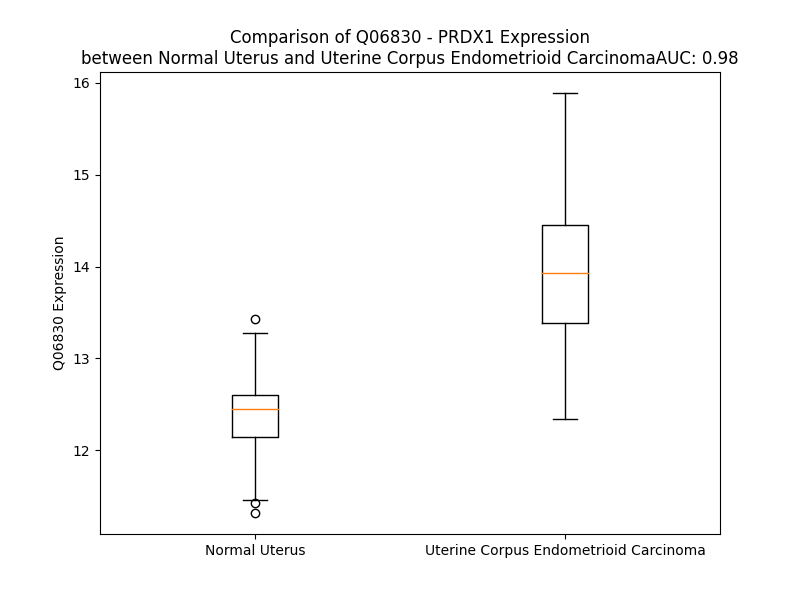

# Detailed Data for Q06830

## Introduction to the Detailed Summary

### How to Interpret the Results

- **Summary & Metrics**: This section provides a quick reference to essential protein attributes, including expression changes, family classification, and biomarker applications. Regulation status (upregulated/downregulated) indicates the protein's behavior in a disease context. Some information comes from the original excel file with the proteins selected from literature, while others are derived from the analyses.
- **Expression Comparison**: A visual representation comparing protein expression between normal and disease states. It highlights significant changes in expression levels that might indicate diagnostic or therapeutic relevance. This is data coming from transcriptomics experiments and could not translate similarly to protein levels.
- **Isoform Alignment**: An interactive view of isoform alignments, revealing structural and functional differences between variants of the protein.
- **Interactors & Homologs**: Tables listing known interaction partners and homologous proteins, the more interactors and homologs, the more complex the protein is to design an antibody for.
- **Biological Assemblies**: Information about the structural arrangement of the protein in different assemblies, providing insights into its functional state but also the complexity of the protein to develop antibodies.
- **Combined Per-Residue Information**: A detailed table summarizing residue-level data. This includes predictions for epitope regions, aggregation tendencies, and modifications that might impact the protein's function. Each row corresponds to a residue in the protein, providing insights into specific sites that may be important for research or drug development.
## Summary & Metrics

- **UniProt Accession**: Q06830
- **Gene Name**: PRDX1
- **Protein Name**: Peroxiredoxin-1
- **Swiss Prot**: PRDX1_HUMAN
- **Family**: nan
- **Biomarker Application**: nan
- **Number of Isoforms**: 0
- **Regulation**: 1
- **(transcriptomics) AUC**: 0.98
- **(transcriptomics) Fold Change**: 1.11
- **(transcriptomics) Regulation**: Upregulated
- **Discotope Epitope Count**: 46
- **Max n_uniprots (Homo)**: 10
- **Max n_uniprots (Hetero)**: 10

## Expression Comparison

## Interactors

| preferredName_A   | preferredName_B   |   score |
|:------------------|:------------------|--------:|
| PRDX1             | SRXN1             |   0.999 |
| PRDX1             | TXN               |   0.99  |
| PRDX1             | PRDX5             |   0.981 |
| PRDX1             | TXN2              |   0.928 |
| PRDX1             | ABL1              |   0.927 |
| PRDX1             | SESN2             |   0.924 |

## Homologs

| uniprot_id   | gene_id   |
|:-------------|:----------|
| P30041       | PRDX6     |
| A0A384MTR2   | PRDX3     |
| A6NG45       | PRDX4     |
| A6NIW5       | PRDX2     |

## Biological Assemblies

|   Unnamed: 0 |   assembly |   n_uniprots | composition   | crystal_id   |
|-------------:|-----------:|-------------:|:--------------|:-------------|
|            0 |          1 |            2 | Homo          | 7weu         |
|            0 |          1 |            4 | Hetero        | 2rii         |
|            0 |          1 |           10 | Hetero        | 7lj1         |
|            1 |          2 |           10 | Homo          | 7lj1         |
|            0 |          1 |            2 | Homo          | 8x71         |
|            0 |          1 |            2 | Homo          | 8x73         |
|            0 |          1 |            2 | Homo          | 4xcs         |
|            1 |          2 |            2 | Homo          | 4xcs         |
|            2 |          3 |            2 | Homo          | 4xcs         |
|            0 |          1 |            4 | Hetero        | 3hy2         |
|            0 |          1 |            2 | Homo          | 7wet         |

## Combined Per-Residue Information

|   res | aa   |   epitope_score | epitope   |   relative_surface_accessibility |   modeling_confidence |   Aggregation | modification                 |
|------:|:-----|----------------:|:----------|---------------------------------:|----------------------:|--------------:|:-----------------------------|
|     1 | M    |         0.16544 | False     |                          0.89416 |                 51.57 |         0     | N/A                          |
|     2 | S    |         0.18359 | False     |                          0.20346 |                 59.93 |         0     | N-acetylserine               |
|     3 | S    |         0.29309 | False     |                          0.82544 |                 71.69 |         0     | N/A                          |
|     4 | G    |         0.27123 | False     |                          0.315   |                 87.1  |         0     | N/A                          |
|     5 | N    |         0.27941 | False     |                          0.60191 |                 94.33 |         0     | N/A                          |
|     6 | A    |         0.09954 | False     |                          0.17721 |                 97.59 |         0     | N/A                          |
|     7 | K    |         0.34083 | True      |                          0.59311 |                 97.64 |         0     | N6-acetyllysine; alternate   |
|     8 | I    |         0.33616 | True      |                          0.61989 |                 98.27 |         0     | N/A                          |
|     9 | G    |         0.18596 | False     |                          0.63219 |                 98.03 |         0     | N/A                          |
|    10 | H    |         0.2787  | False     |                          0.54103 |                 98.32 |         0     | N/A                          |
|    11 | P    |         0.22004 | False     |                          0.70822 |                 98.34 |         0     | N/A                          |
|    12 | A    |         0.06099 | False     |                          0.08108 |                 98.6  |         0     | N/A                          |
|    13 | P    |         0.13817 | False     |                          0.1173  |                 98.25 |         0     | N/A                          |
|    14 | N    |         0.25401 | False     |                          0.63727 |                 97.85 |         0     | N/A                          |
|    15 | F    |         0.17937 | False     |                          0.06357 |                 98.29 |         0     | N/A                          |
|    16 | K    |         0.42741 | True      |                          0.75326 |                 98.42 |         0     | N6-acetyllysine              |
|    17 | A    |         0.15187 | False     |                          0.13137 |                 98.58 |         0     | N/A                          |
|    18 | T    |         0.25346 | False     |                          0.25892 |                 98.83 |         0     | N/A                          |
|    19 | A    |         0.00575 | False     |                          0       |                 98.85 |         0     | N/A                          |
|    20 | V    |         0.05021 | False     |                          0.01991 |                 98.77 |         0     | N/A                          |
|    21 | M    |         0.17721 | False     |                          0.1893  |                 98.52 |         0     | N/A                          |
|    22 | P    |         0.19679 | False     |                          0.48034 |                 97.91 |         0     | N/A                          |
|    23 | D    |         0.21717 | False     |                          0.63269 |                 97.09 |         0     | N/A                          |
|    24 | G    |         0.26329 | False     |                          0.31982 |                 96.39 |         0     | N/A                          |
|    25 | Q    |         0.4507  | True      |                          0.59088 |                 97.93 |         0     | N/A                          |
|    26 | F    |         0.40702 | True      |                          0.42848 |                 98.67 |         0     | N/A                          |
|    27 | K    |         0.40842 | True      |                          0.57358 |                 98.56 |         0     | N6-acetyllysine              |
|    28 | D    |         0.46835 | True      |                          0.4787  |                 98.6  |         0     | N/A                          |
|    29 | I    |         0.17287 | False     |                          0.03187 |                 98.52 |         0     | N/A                          |
|    30 | S    |         0.24633 | False     |                          0.11794 |                 98.55 |         0     | N/A                          |
|    31 | L    |         0.1654  | False     |                          0.09226 |                 98.3  |         0     | N/A                          |
|    32 | S    |         0.22466 | False     |                          0.53778 |                 97.26 |         0     | Phosphoserine                |
|    33 | D    |         0.33618 | True      |                          0.58913 |                 97.79 |         0     | N/A                          |
|    34 | Y    |         0.21499 | False     |                          0.10967 |                 97.95 |         0     | N/A                          |
|    35 | K    |         0.24306 | False     |                          0.80154 |                 97.18 |         0     | N6-acetyllysine; alternate   |
|    35 | K    |         0.24306 | False     |                          0.80154 |                 97.18 |         0     | N6-succinyllysine; alternate |
|    36 | G    |         0.20839 | False     |                          0.50447 |                 98.23 |         0     | N/A                          |
|    37 | K    |         0.3773  | True      |                          0.45439 |                 98.71 |         0     | N/A                          |
|    38 | Y    |         0.06436 | False     |                          0.04013 |                 98.85 |        77.906 | N/A                          |
|    39 | V    |         0.04207 | False     |                          0.01523 |                 98.9  |        99.562 | N/A                          |
|    40 | V    |         0.0021  | False     |                          0       |                 98.92 |        99.687 | N/A                          |
|    41 | F    |         0.0052  | False     |                          0       |                 98.88 |        99.689 | N/A                          |
|    42 | F    |         0.00904 | False     |                          0       |                 98.88 |        99.689 | N/A                          |
|    43 | F    |         0.01233 | False     |                          0.00382 |                 98.8  |        94.536 | N/A                          |
|    44 | Y    |         0.017   | False     |                          0       |                 98.69 |        12.454 | N/A                          |
|    45 | P    |         0.20452 | False     |                          0.0666  |                 97.73 |        10.466 | N/A                          |
|    46 | L    |         0.54924 | True      |                          0.37673 |                 97.98 |         0     | N/A                          |
|    47 | D    |         0.33258 | False     |                          0.06362 |                 98.33 |         0     | N/A                          |
|    48 | F    |         0.39872 | True      |                          0.54188 |                 97.27 |         0     | N/A                          |
|    49 | T    |         0.40163 | True      |                          0.29611 |                 93.99 |         0     | N/A                          |
|    50 | F    |         0.51179 | True      |                          0.93926 |                 90.82 |         0     | N/A                          |
|    51 | V    |         0.3183  | False     |                          0.28864 |                 90.55 |         0     | N/A                          |
|    52 | C    |         0.0317  | False     |                          0.00842 |                 91.28 |         0     | N/A                          |
|    53 | P    |         0.23126 | False     |                          0.08052 |                 95.65 |         0     | N/A                          |
|    54 | T    |         0.38605 | True      |                          0.5899  |                 97.13 |         0     | N/A                          |
|    55 | E    |         0.10399 | False     |                          0.0439  |                 97.71 |         0     | N/A                          |
|    56 | I    |         0.00942 | False     |                          0       |                 98.45 |         8.116 | N/A                          |
|    57 | I    |         0.33686 | True      |                          0.18799 |                 98.4  |         8.116 | N/A                          |
|    58 | A    |         0.19077 | False     |                          0.34291 |                 98.59 |         8.116 | N/A                          |
|    59 | F    |         0.00646 | False     |                          0.00701 |                 98.79 |         8.116 | N/A                          |
|    60 | S    |         0.02434 | False     |                          0.00389 |                 98.6  |         8.116 | N/A                          |
|    61 | D    |         0.39008 | True      |                          0.54452 |                 98.49 |         0     | N/A                          |
|    62 | R    |         0.28036 | False     |                          0.24632 |                 98.71 |         0     | N/A                          |
|    63 | A    |         0.15538 | False     |                          0.13767 |                 98.56 |         0     | N/A                          |
|    64 | E    |         0.22582 | False     |                          0.46742 |                 98.56 |         0     | N/A                          |
|    65 | E    |         0.25848 | False     |                          0.32859 |                 98.79 |         0     | N/A                          |
|    66 | F    |         0.006   | False     |                          0.00069 |                 98.84 |         0     | N/A                          |
|    67 | K    |         0.31889 | False     |                          0.69796 |                 98.47 |         0     | N/A                          |
|    68 | K    |         0.39648 | True      |                          0.7735  |                 98.63 |         0     | N/A                          |
|    69 | L    |         0.2758  | False     |                          0.29816 |                 98.55 |         0     | N/A                          |
|    70 | N    |         0.22231 | False     |                          0.48903 |                 98.7  |         0     | N/A                          |
|    71 | C    |         0.04673 | False     |                          0.03992 |                 98.86 |         0     | N/A                          |
|    72 | Q    |         0.22131 | False     |                          0.21567 |                 98.64 |         0     | N/A                          |
|    73 | V    |         0.02173 | False     |                          0.01771 |                 98.84 |         0.298 | N/A                          |
|    74 | I    |         0.00466 | False     |                          0.0008  |                 98.85 |         0.298 | N/A                          |
|    75 | G    |         0.00334 | False     |                          0       |                 98.74 |         0.298 | N/A                          |
|    76 | A    |         0.00253 | False     |                          0       |                 98.86 |         0.298 | N/A                          |
|    77 | S    |         0.02376 | False     |                          0.00575 |                 98.8  |         0.298 | N/A                          |
|    78 | V    |         0.2558  | False     |                          0.11525 |                 98.55 |         0.298 | N/A                          |
|    79 | D    |         0.45108 | True      |                          0.13679 |                 98.78 |         0     | N/A                          |
|    80 | S    |         0.37706 | True      |                          0.33338 |                 98.62 |         0     | N/A                          |
|    81 | H    |         0.30279 | False     |                          0.22482 |                 98.61 |         0     | N/A                          |
|    82 | F    |         0.42881 | True      |                          0.67085 |                 98.66 |        22.477 | N/A                          |
|    83 | C    |         0.45727 | True      |                          0.25562 |                 98.51 |        24.243 | N/A                          |
|    84 | H    |         0.01717 | False     |                          0       |                 98.6  |        24.243 | N/A                          |
|    85 | L    |         0.37333 | True      |                          0.28275 |                 98.52 |        24.682 | N/A                          |
|    86 | A    |         0.57131 | True      |                          0.47758 |                 98.55 |        24.682 | N/A                          |
|    87 | W    |         0.01778 | False     |                          0       |                 98.4  |        24.575 | N/A                          |
|    88 | V    |         0.20301 | False     |                          0.12298 |                 98.38 |        22.744 | N/A                          |
|    89 | N    |         0.37382 | True      |                          0.68584 |                 97.88 |         1.215 | N/A                          |
|    90 | T    |         0.29801 | False     |                          0.20456 |                 98.2  |         0     | Phosphothreonine; by CDK1    |
|    91 | P    |         0.24842 | False     |                          0.503   |                 97.45 |         0     | N/A                          |
|    92 | K    |         0.38941 | True      |                          0.44452 |                 97.03 |         0     | N/A                          |
|    93 | K    |         0.44373 | True      |                          1.01209 |                 96.3  |         0     | N/A                          |
|    94 | Q    |         0.49187 | True      |                          0.70294 |                 96.16 |         0     | N/A                          |
|    95 | G    |         0.2894  | False     |                          0.47516 |                 95.56 |         0     | N/A                          |
|    96 | G    |         0.02497 | False     |                          0.00595 |                 97.71 |         0     | N/A                          |
|    97 | L    |         0.01996 | False     |                          0       |                 98.26 |         0     | N/A                          |
|    98 | G    |         0.13241 | False     |                          0.08369 |                 97.22 |         0     | N/A                          |
|    99 | P    |         0.33206 | False     |                          0.90527 |                 96.35 |         0     | N/A                          |
|   100 | M    |         0.09236 | False     |                          0.04946 |                 98.18 |         0     | N/A                          |
|   101 | N    |         0.15919 | False     |                          0.56941 |                 98.44 |         0     | N/A                          |
|   102 | I    |         0.02157 | False     |                          0.00376 |                 98.68 |         0     | N/A                          |
|   103 | P    |         0.03473 | False     |                          0.02485 |                 98.67 |         0     | N/A                          |
|   104 | L    |         0.00805 | False     |                          0.00412 |                 98.87 |         0     | N/A                          |
|   105 | V    |         0.00449 | False     |                          0       |                 98.87 |         0     | N/A                          |
|   106 | S    |         0.11094 | False     |                          0.0404  |                 98.86 |         0     | N/A                          |
|   107 | D    |         0.14886 | False     |                          0.02139 |                 98.77 |         0     | N/A                          |
|   108 | P    |         0.62782 | True      |                          0.5565  |                 98.2  |         0     | N/A                          |
|   109 | K    |         0.28309 | False     |                          0.83626 |                 97.43 |         0     | N/A                          |
|   110 | R    |         0.38157 | True      |                          0.41974 |                 97.31 |         0     | N/A                          |
|   111 | T    |         0.24599 | False     |                          0.53011 |                 97.08 |         0     | N/A                          |
|   112 | I    |         0.15587 | False     |                          0.068   |                 98.43 |         0     | N/A                          |
|   113 | A    |         0.00998 | False     |                          0.00383 |                 98.31 |         0     | N/A                          |
|   114 | Q    |         0.36275 | True      |                          0.30963 |                 97.77 |         0     | N/A                          |
|   115 | D    |         0.18532 | False     |                          0.27466 |                 98.1  |         0     | N/A                          |
|   116 | Y    |         0.06227 | False     |                          0.02769 |                 98.48 |         0     | N/A                          |
|   117 | G    |         0.1042  | False     |                          0.08523 |                 97.93 |         0     | N/A                          |
|   118 | V    |         0.01119 | False     |                          0.00476 |                 98.21 |         0     | N/A                          |
|   119 | L    |         0.26732 | False     |                          0.11405 |                 98.22 |         0     | N/A                          |
|   120 | K    |         0.58935 | True      |                          0.16475 |                 96.72 |         0     | N/A                          |
|   121 | A    |         0.5977  | True      |                          0.73711 |                 93.54 |         0     | N/A                          |
|   122 | D    |         0.51857 | True      |                          0.74362 |                 95.07 |         0     | N/A                          |
|   123 | E    |         0.69237 | True      |                          0.49798 |                 95.97 |         0     | N/A                          |
|   124 | G    |         0.29929 | False     |                          0.18457 |                 96.39 |         0     | N/A                          |
|   125 | I    |         0.43295 | True      |                          0.1024  |                 97.5  |         0.263 | N/A                          |
|   126 | S    |         0.00874 | False     |                          0       |                 97.77 |         0.263 | N/A                          |
|   127 | F    |         0.20144 | False     |                          0.1809  |                 97.72 |         0.797 | N/A                          |
|   128 | R    |         0.20644 | False     |                          0.03746 |                 98.36 |         0.797 | N/A                          |
|   129 | G    |         0.00353 | False     |                          0       |                 98.35 |        31.43  | N/A                          |
|   130 | L    |         0.06252 | False     |                          0.01649 |                 98.84 |        31.43  | N/A                          |
|   131 | F    |         0.01191 | False     |                          0.00446 |                 98.87 |        31.43  | N/A                          |
|   132 | I    |         0.00809 | False     |                          0       |                 98.92 |        31.43  | N/A                          |
|   133 | I    |         0.02794 | False     |                          0.0072  |                 98.91 |        31.43  | N/A                          |
|   134 | D    |         0.02926 | False     |                          0.02994 |                 98.8  |         0.797 | N/A                          |
|   135 | D    |         0.15198 | False     |                          0.3169  |                 98.44 |         0     | N/A                          |
|   136 | K    |         0.11714 | False     |                          0.69689 |                 98.24 |         0     | N6-acetyllysine              |
|   137 | G    |         0.10557 | False     |                          0.27331 |                 98.37 |         0     | N/A                          |
|   138 | I    |         0.18928 | False     |                          0.25599 |                 98.65 |         0     | N/A                          |
|   139 | L    |         0.00432 | False     |                          0       |                 98.81 |         0     | N/A                          |
|   140 | R    |         0.27694 | False     |                          0.20959 |                 98.78 |         0     | N/A                          |
|   141 | Q    |         0.09342 | False     |                          0.13779 |                 98.82 |         0     | N/A                          |
|   142 | I    |         0.36838 | True      |                          0.35852 |                 98.54 |         0     | N/A                          |
|   143 | T    |         0.34015 | True      |                          0.30957 |                 98.56 |         0     | N/A                          |
|   144 | V    |         0.27931 | False     |                          0.39982 |                 98.06 |         0     | N/A                          |
|   145 | N    |         0.19807 | False     |                          0.1901  |                 97.94 |         0     | N/A                          |
|   146 | D    |         0.40193 | True      |                          0.54146 |                 96.63 |         0     | N/A                          |
|   147 | L    |         0.46624 | True      |                          0.28549 |                 95.87 |         0     | N/A                          |
|   148 | P    |         0.41895 | True      |                          0.73696 |                 96.88 |         0     | N/A                          |
|   149 | V    |         0.35073 | True      |                          0.64074 |                 97.86 |         0     | N/A                          |
|   150 | G    |         0.39821 | True      |                          0.41071 |                 97    |         0     | N/A                          |
|   151 | R    |         0.38657 | True      |                          0.12983 |                 98.61 |         0     | N/A                          |
|   152 | S    |         0.24098 | False     |                          0.44176 |                 98.65 |         0     | N/A                          |
|   153 | V    |         0.15055 | False     |                          0.08996 |                 98.69 |         0     | N/A                          |
|   154 | D    |         0.33418 | False     |                          0.54952 |                 98.7  |         0     | N/A                          |
|   155 | E    |         0.2703  | False     |                          0.37209 |                 98.84 |         0     | N/A                          |
|   156 | T    |         0.03299 | False     |                          0.03674 |                 98.88 |         0     | N/A                          |
|   157 | L    |         0.20629 | False     |                          0.1253  |                 98.76 |         0     | N/A                          |
|   158 | R    |         0.28237 | False     |                          0.16814 |                 98.84 |         0     | N/A                          |
|   159 | L    |         0.11595 | False     |                          0.18466 |                 98.9  |         2.703 | N/A                          |
|   160 | V    |         0.00297 | False     |                          0       |                 98.86 |         3.034 | N/A                          |
|   161 | Q    |         0.15198 | False     |                          0.22105 |                 98.83 |         3.034 | N/A                          |
|   162 | A    |         0.09615 | False     |                          0.0927  |                 98.82 |         3.462 | N/A                          |
|   163 | F    |         0.20086 | False     |                          0.21789 |                 98.8  |         3.462 | N/A                          |
|   164 | Q    |         0.19807 | False     |                          0.22325 |                 98.74 |         2.955 | N/A                          |
|   165 | F    |         0.43864 | True      |                          0.27094 |                 98.61 |         2.955 | N/A                          |
|   166 | T    |         0.12527 | False     |                          0.24361 |                 98.37 |         0.819 | N/A                          |
|   167 | D    |         0.15032 | False     |                          0.41232 |                 98.11 |         0     | N/A                          |
|   168 | K    |         0.30116 | False     |                          0.80455 |                 97.94 |         0     | N/A                          |
|   169 | H    |         0.43873 | True      |                          0.50925 |                 97.82 |         0     | N/A                          |
|   170 | G    |         0.20306 | False     |                          0.60548 |                 96.36 |         0     | N/A                          |
|   171 | E    |         0.24375 | False     |                          0.19307 |                 96.88 |         0     | N/A                          |
|   172 | V    |         0.22071 | False     |                          0.44747 |                 97.84 |         0     | N/A                          |
|   173 | C    |         0.12641 | False     |                          0.25938 |                 98.25 |         0     | N/A                          |
|   174 | P    |         0.17711 | False     |                          0.19636 |                 97.72 |         0     | N/A                          |
|   175 | A    |         0.33514 | False     |                          1.06107 |                 97.42 |         0     | N/A                          |
|   176 | G    |         0.28203 | False     |                          0.68916 |                 96.34 |         0     | N/A                          |
|   177 | W    |         0.13506 | False     |                          0.04049 |                 98.45 |         0     | N/A                          |
|   178 | K    |         0.31404 | False     |                          0.634   |                 98.36 |         0     | N/A                          |
|   179 | P    |         0.22733 | False     |                          0.59295 |                 98.13 |         0     | N/A                          |
|   180 | G    |         0.28629 | False     |                          1.04664 |                 97.42 |         0     | N/A                          |
|   181 | S    |         0.38802 | True      |                          0.41588 |                 97.15 |         0     | N/A                          |
|   182 | D    |         0.26127 | False     |                          0.43665 |                 96.76 |         0     | N/A                          |
|   183 | T    |         0.17665 | False     |                          0.19685 |                 97.99 |         0     | N/A                          |
|   184 | I    |         0.2879  | False     |                          0.16479 |                 98.05 |         0     | N/A                          |
|   185 | K    |         0.27693 | False     |                          0.38287 |                 97.75 |         0     | N/A                          |
|   186 | P    |         0.24994 | False     |                          0.67435 |                 96.62 |         0     | N/A                          |
|   187 | D    |         0.21858 | False     |                          0.4006  |                 97.92 |         0     | N/A                          |
|   188 | V    |         0.28065 | False     |                          0.84326 |                 95.83 |         0     | N/A                          |
|   189 | Q    |         0.24804 | False     |                          0.58934 |                 97.14 |         0     | N/A                          |
|   190 | K    |         0.22875 | False     |                          0.61929 |                 96.9  |         0     | N/A                          |
|   191 | S    |         0.17904 | False     |                          0.11609 |                 97.2  |         0     | N/A                          |
|   192 | K    |         0.31285 | False     |                          0.57783 |                 96.85 |         0     | N/A                          |
|   193 | E    |         0.22379 | False     |                          0.48559 |                 96.56 |         0     | N/A                          |
|   194 | Y    |         0.26035 | False     |                          0.13663 |                 97.02 |         0     | N/A                          |
|   195 | F    |         0.29374 | False     |                          0.59561 |                 96.26 |         0     | N/A                          |
|   196 | S    |         0.24383 | False     |                          0.73279 |                 96.06 |         0     | N/A                          |
|   197 | K    |         0.32266 | False     |                          0.5607  |                 94.15 |         0     | N/A                          |
|   198 | Q    |         0.20999 | False     |                          0.44937 |                 87.67 |         0     | N/A                          |
|   199 | K    |         0.14907 | False     |                          1.29814 |                 77.22 |         0     | N/A                          |

