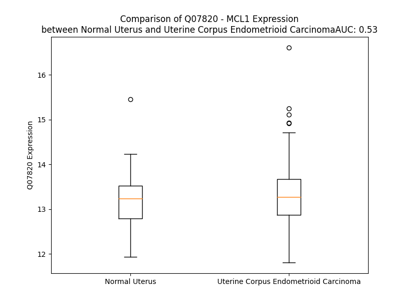

# Detailed Data for Q07820

## Introduction to the Detailed Summary

### How to Interpret the Results

- **Summary & Metrics**: This section provides a quick reference to essential protein attributes, including expression changes, family classification, and biomarker applications. Regulation status (upregulated/downregulated) indicates the protein's behavior in a disease context. Some information comes from the original excel file with the proteins selected from literature, while others are derived from the analyses.
- **Expression Comparison**: A visual representation comparing protein expression between normal and disease states. It highlights significant changes in expression levels that might indicate diagnostic or therapeutic relevance. This is data coming from transcriptomics experiments and could not translate similarly to protein levels.
- **Isoform Alignment**: An interactive view of isoform alignments, revealing structural and functional differences between variants of the protein.
- **Interactors & Homologs**: Tables listing known interaction partners and homologous proteins, the more interactors and homologs, the more complex the protein is to design an antibody for.
- **Biological Assemblies**: Information about the structural arrangement of the protein in different assemblies, providing insights into its functional state but also the complexity of the protein to develop antibodies.
- **Combined Per-Residue Information**: A detailed table summarizing residue-level data. This includes predictions for epitope regions, aggregation tendencies, and modifications that might impact the protein's function. Each row corresponds to a residue in the protein, providing insights into specific sites that may be important for research or drug development.
## Summary & Metrics

- **UniProt Accession**: Q07820
- **Gene Name**: Mcl-1 gene
- **Protein Name**: Induced myeloid leukemia cell differentiation protein Mcl-1
- **Swiss Prot**: MCL1_HUMAN
- **Family**: transporter
- **Biomarker Application**: efficacy,prognosis
- **Number of Isoforms**: 2
- **Regulation**: 1
- **(transcriptomics) AUC**: 0.47
- **(transcriptomics) Fold Change**: 1.01
- **(transcriptomics) Regulation**: Downregulated
- **Discotope Epitope Count**: 51
- **Max n_uniprots (Homo)**: 4.0
- **Max n_uniprots (Hetero)**: 10.0

## Expression Comparison

## Isoform Alignment

<pre style='font-size:14px; font-family:monospace;'>Q07820-1 MFGLKRNAVIGLNLYCGGAGLGAGSGGATRPGGRLLATEKEASARREIGGGEAGAVIGGSAGASPPSTLTPDSRRVARPPPIGAEVPDVTATPARLLFFAPTRRAAPLEEMEAPAADAIMSPEEELDGYEPEPLGKRPAVLPLLELVGESGNNTSTDGSLPSTPPPAEEEEDELYRQSLEIISRYLREQATGAKDTKPMGRSGATSRKALETLRRVGDGVQRNHETAFQGMLRKLDIKNEDDVKSLSRVMIHVFS--DGVTNWGRIVTLISFGAFVAKHLKTINQESCIEPLAESITDVLVRTKRDWLVKQRGWDGFVEFFHVEDLEGGIRNVLLAFAGVAGVGAGLAYLIR
Q07820-2 MFGLKRNAVIGLNLYCGGAGLGAGSGGATRPGGRLLATEKEASARREIGGGEAGAVIGGSAGASPPSTLTPDSRRVARPPPIGAEVPDVTATPARLLFFAPTRRAAPLEEMEAPAADAIMSPEEELDGYEPEPLGKRPAVLPLLELVGESGNNTSTDGSLPSTPPPAEEEEDELYRQSLEIISRYLREQATGAKDTKPMGRSGATSRKALETLRRVGDGVQRNHETAFQGWVCGVLPCRGPRR--WHQECAAGFCRCCWSRSWFGISNKIALL-------------------------------------------------------------------------------
</pre>

## Interactors

| preferredName_A   | preferredName_B   |   score |
|:------------------|:------------------|--------:|
| MCL1              | BCL2L11           |   0.999 |
| MCL1              | BAX               |   0.999 |
| MCL1              | PMAIP1            |   0.999 |
| MCL1              | BBC3              |   0.998 |
| MCL1              | BAK1              |   0.998 |
| MCL1              | BECN1             |   0.998 |
| MCL1              | HUWE1             |   0.996 |
| MCL1              | BID               |   0.996 |
| MCL1              | BCL2L1            |   0.989 |
| MCL1              | BCL2L2            |   0.988 |
| MCL1              | ATG12             |   0.988 |
| MCL1              | BOK               |   0.985 |
| MCL1              | HRK               |   0.985 |
| MCL1              | BIK               |   0.984 |
| MCL1              | VDAC1             |   0.971 |
| MCL1              | BMF               |   0.97  |
| MCL1              | TNKS2             |   0.961 |
| MCL1              | USP9X             |   0.958 |
| MCL1              | RTL10             |   0.957 |
| MCL1              | FBXW7             |   0.945 |
| MCL1              | GZMB              |   0.931 |
| MCL1              | TP53              |   0.918 |
| MCL1              | CASP3             |   0.911 |

## Homologs

| uniprot_id   | gene_id   |
|:-------------|:----------|
| Q9HD36       | BCL2L10   |
| B4E1X9       | BCL2A1    |
| Q16611       | BAK1      |
| Q07812       | BAX       |
| A0A024R4A8   | BOK       |
| Q5TE63       | BCL2L1    |
| G3V3B7       | BCL2L2    |
| P10415       | BCL2      |

## Biological Assemblies

|   Unnamed: 0 |   assembly |   n_uniprots | composition   | crystal_id   |
|-------------:|-----------:|-------------:|:--------------|:-------------|
|            0 |          1 |            1 | Homo          | 7xge         |
|            1 |          2 |            1 | Homo          | 7xge         |
|            2 |          3 |            1 | Homo          | 7xge         |
|            3 |          4 |            1 | Homo          | 7xge         |
|            0 |          1 |            1 | Homo          | 5mes         |
|            0 |          1 |            1 | Homo          | 6ybk         |
|            0 |          1 |            1 | Homo          | 4wmw         |
|            0 |          1 |            1 | Homo          | 6ybl         |
|            0 |          1 |            1 | Homo          | 6o6f         |
|            1 |          2 |            1 | Homo          | 6o6f         |
|            0 |          1 |            1 | Homo          | 6u63         |
|            1 |          2 |            1 | Homo          | 6u63         |
|            2 |          3 |            1 | Homo          | 6u63         |
|            3 |          4 |            1 | Homo          | 6u63         |
|            0 |          1 |            1 | Homo          | 5fdr         |
|            1 |          2 |            1 | Homo          | 5fdr         |
|            2 |          3 |            1 | Homo          | 5fdr         |
|            3 |          4 |            1 | Homo          | 5fdr         |
|            0 |          1 |            1 | Homo          | 4wmt         |
|            0 |          1 |            2 | Hetero        | 2kbw         |
|            0 |          1 |            1 | Homo          | 6o4u         |
|            1 |          2 |            1 | Homo          | 6o4u         |
|            0 |          1 |            1 | Homo          | 8g3w         |
|            0 |          1 |           10 | Hetero        | 5c6h         |
|            1 |          2 |            2 | Hetero        | 5c6h         |
|            2 |          3 |            2 | Hetero        | 5c6h         |
|            3 |          4 |            2 | Hetero        | 5c6h         |
|            4 |          5 |            2 | Hetero        | 5c6h         |
|            5 |          6 |            2 | Hetero        | 5c6h         |
|            6 |          7 |            2 | Hetero        | 5c6h         |
|            7 |          8 |            2 | Hetero        | 5c6h         |
|            8 |          9 |            2 | Hetero        | 5c6h         |
|            9 |         10 |            2 | Hetero        | 5c6h         |
|           10 |         11 |            2 | Hetero        | 5c6h         |
|           11 |         12 |            2 | Hetero        | 5c6h         |
|           12 |         13 |            2 | Hetero        | 5c6h         |
|            0 |          1 |            1 | Homo          | 6qzb         |
|            0 |          1 |            1 | Homo          | 5lof         |
|            0 |          1 |            1 | Homo          | 8ekx         |
|            0 |          1 |            1 | Homo          | 4oq5         |
|            1 |          2 |            1 | Homo          | 4oq5         |
|            2 |          3 |            1 | Homo          | 4oq5         |
|            3 |          4 |            1 | Homo          | 4oq5         |
|            4 |          5 |            1 | Homo          | 4oq5         |
|            5 |          6 |            1 | Homo          | 4oq5         |
|            0 |          1 |            1 | Homo          | 4bpi         |
|            0 |          1 |            1 | Homo          | 6qfc         |
|            0 |          1 |            1 | Homo          | 6uab         |
|            0 |          1 |            1 | Homo          | 8g3t         |
|            0 |          1 |            2 | Hetero        | 8iqm         |
|            0 |          1 |            1 | Homo          | 6mbd         |
|            1 |          2 |            1 | Homo          | 6mbd         |
|            0 |          1 |            1 | Homo          | 6zie         |
|            0 |          1 |            1 | Homo          | 6qyn         |
|            0 |          1 |            1 | Homo          | 6bw8         |
|            1 |          2 |            1 | Homo          | 6bw8         |
|            2 |          3 |            1 | Homo          | 6bw8         |
|            3 |          4 |            1 | Homo          | 6bw8         |
|            0 |          1 |            1 | Homo          | 6qb6         |
|            0 |          1 |            1 | Homo          | 5fdo         |
|            1 |          2 |            1 | Homo          | 5fdo         |
|            2 |          3 |            1 | Homo          | 5fdo         |
|            3 |          4 |            1 | Homo          | 5fdo         |
|            0 |          1 |            1 | Homo          | 6b4l         |
|            1 |          2 |            1 | Homo          | 6b4l         |
|            0 |          1 |            2 | Hetero        | 3io9         |
|            0 |          1 |            2 | Hetero        | 6qfi         |
|            0 |          1 |            1 | Homo          | 2mhs         |
|            0 |          1 |            1 | Homo          | 6qgd         |
|            0 |          1 |            1 | Homo          | 7nb4         |
|            0 |          1 |            1 | Homo          | 6mbe         |
|            0 |          1 |            2 | Hetero        | 2nla         |
|            0 |          1 |            1 | Homo          | 4hw3         |
|            1 |          2 |            1 | Homo          | 4hw3         |
|            2 |          3 |            1 | Homo          | 4hw3         |
|            3 |          4 |            1 | Homo          | 4hw3         |
|            4 |          5 |            1 | Homo          | 4hw3         |
|            5 |          6 |            1 | Homo          | 4hw3         |
|            6 |          7 |            1 | Homo          | 4hw3         |
|            7 |          8 |            1 | Homo          | 4hw3         |
|            8 |          9 |            1 | Homo          | 4hw3         |
|            9 |         10 |            1 | Homo          | 4hw3         |
|           10 |         11 |            1 | Homo          | 4hw3         |
|           11 |         12 |            1 | Homo          | 4hw3         |
|            0 |          1 |            1 | Homo          | 6oqb         |
|            1 |          2 |            1 | Homo          | 6oqb         |
|            0 |          1 |            4 | Hetero        | 5vx2         |
|            0 |          1 |            1 | Homo          | 3wix         |
|            1 |          2 |            1 | Homo          | 3wix         |
|            2 |          3 |            1 | Homo          | 3wix         |
|            3 |          4 |            1 | Homo          | 3wix         |
|            0 |          1 |            1 | Homo          | 6qz8         |
|            0 |          1 |            1 | Homo          | 6b4u         |
|            0 |          1 |            0 | Hetero        | 5ku9         |
|            1 |          2 |            0 | Hetero        | 5ku9         |
|            0 |          1 |            1 | Homo          | 6u67         |
|            1 |          2 |            1 | Homo          | 6u67         |
|            0 |          1 |            1 | Homo          | 8g3y         |
|            0 |          1 |            1 | Homo          | 6qyk         |
|            0 |          1 |            1 | Homo          | 6oqc         |
|            1 |          2 |            1 | Homo          | 6oqc         |
|            0 |          1 |            4 | Homo          | 6stj         |
|            0 |          1 |            1 | Homo          | 6vbx         |
|            1 |          2 |            1 | Homo          | 6vbx         |
|            0 |          1 |            1 | Homo          | 8el1         |
|            1 |          2 |            1 | Homo          | 8el1         |
|            2 |          3 |            1 | Homo          | 8el1         |
|            3 |          4 |            1 | Homo          | 8el1         |
|            0 |          1 |            1 | Homo          | 3kz0         |
|            1 |          2 |            1 | Homo          | 3kz0         |
|            0 |          1 |            1 | Homo          | 6qz7         |
|            0 |          1 |            1 | Homo          | 6ybg         |
|            1 |          2 |            1 | Homo          | 6ybg         |
|            0 |          1 |            1 | Homo          | 5iez         |
|            1 |          2 |            1 | Homo          | 5iez         |
|            2 |          3 |            1 | Homo          | 5iez         |
|            3 |          4 |            1 | Homo          | 5iez         |
|            0 |          1 |            1 | Homo          | 6ne5         |
|            1 |          2 |            1 | Homo          | 6ne5         |
|            2 |          3 |            1 | Homo          | 6ne5         |
|            3 |          4 |            1 | Homo          | 6ne5         |
|            0 |          1 |            1 | Homo          | 4wmx         |
|            0 |          1 |            1 | Homo          | 6qb3         |
|            0 |          1 |            1 | Homo          | 6qz6         |
|            0 |          1 |            1 | Homo          | 4wms         |
|            0 |          1 |            1 | Homo          | 6udx         |
|            1 |          2 |            1 | Homo          | 6udx         |
|            0 |          1 |            2 | Hetero        | 6qfm         |
|            0 |          1 |            1 | Homo          | 6qxj         |
|            0 |          1 |            1 | Homo          | 6u6f         |
|            1 |          2 |            1 | Homo          | 6u6f         |
|            2 |          3 |            1 | Homo          | 6u6f         |
|            0 |          1 |            1 | Homo          | 6oqd         |
|            1 |          2 |            1 | Homo          | 6oqd         |
|            0 |          1 |            1 | Homo          | 5jsb         |
|            1 |          2 |            1 | Homo          | 5jsb         |
|            2 |          3 |            1 | Homo          | 5jsb         |
|            3 |          4 |            1 | Homo          | 5jsb         |
|            4 |          5 |            1 | Homo          | 5jsb         |
|            5 |          6 |            1 | Homo          | 5jsb         |
|            0 |          1 |            1 | Homo          | 4zbf         |
|            1 |          2 |            1 | Homo          | 4zbf         |
|            2 |          3 |            1 | Homo          | 4zbf         |
|            3 |          4 |            1 | Homo          | 4zbf         |
|            4 |          5 |            1 | Homo          | 4zbf         |
|            5 |          6 |            1 | Homo          | 4zbf         |
|            6 |          7 |            1 | Homo          | 4zbf         |
|            7 |          8 |            1 | Homo          | 4zbf         |
|            8 |          9 |            1 | Homo          | 4zbf         |
|            9 |         10 |            1 | Homo          | 4zbf         |
|           10 |         11 |            1 | Homo          | 4zbf         |
|           11 |         12 |            1 | Homo          | 4zbf         |
|           12 |         13 |            1 | Homo          | 4zbf         |
|            0 |          1 |            1 | Homo          | 6p3p         |
|            0 |          1 |            1 | Homo          | 8svy         |
|            0 |          1 |            1 | Homo          | 6o6g         |
|            0 |          1 |            1 | Homo          | 8g3x         |
|            0 |          1 |            1 | Homo          | 5fc4         |
|            0 |          1 |            1 | Homo          | 6fs0         |
|            0 |          1 |            2 | Hetero        | 3twu         |
|            0 |          1 |            2 | Hetero        | 3kj2         |
|            1 |          2 |            2 | Hetero        | 3kj2         |
|            0 |          1 |            1 | Homo          | 8h7b         |
|            1 |          2 |            1 | Homo          | 8h7b         |
|            0 |          1 |            2 | Hetero        | 3kj1         |
|            1 |          2 |            2 | Hetero        | 3kj1         |
|            0 |          1 |            2 | Hetero        | 3pk1         |
|            1 |          2 |            2 | Hetero        | 3pk1         |
|            0 |          1 |            1 | Homo          | 6udu         |
|            1 |          2 |            1 | Homo          | 6udu         |
|            0 |          1 |            1 | Homo          | 6qyp         |
|            0 |          1 |            1 | Homo          | 6u64         |
|            0 |          1 |            1 | Homo          | 5c3f         |
|            0 |          1 |            1 | Homo          | 5if4         |
|            1 |          2 |            1 | Homo          | 5if4         |
|            0 |          1 |            2 | Hetero        | 3d7v         |
|            0 |          1 |            1 | Homo          | 5mev         |
|            0 |          1 |            1 | Homo          | 4wgi         |
|            0 |          1 |            1 | Homo          | 6udt         |
|            1 |          2 |            1 | Homo          | 6udt         |
|            0 |          1 |            1 | Homo          | 8g3u         |
|            0 |          1 |            1 | Homo          | 5w89         |
|            0 |          1 |            1 | Homo          | 6udy         |
|            1 |          2 |            1 | Homo          | 6udy         |
|            0 |          1 |            1 | Homo          | 7nb7         |
|            1 |          2 |            1 | Homo          | 7nb7         |
|            2 |          3 |            1 | Homo          | 7nb7         |
|            3 |          4 |            1 | Homo          | 7nb7         |
|            0 |          1 |            1 | Homo          | 6qfq         |
|            0 |          1 |            1 | Homo          | 6oqn         |
|            1 |          2 |            1 | Homo          | 6oqn         |
|            0 |          1 |            1 | Homo          | 8t6f         |
|            0 |          1 |            1 | Homo          | 4bpj         |
|            0 |          1 |            1 | Homo          | 6bw2         |
|            1 |          2 |            1 | Homo          | 6bw2         |
|            2 |          3 |            1 | Homo          | 6bw2         |
|            3 |          4 |            1 | Homo          | 6bw2         |
|            0 |          1 |            1 | Homo          | 4oq6         |
|            1 |          2 |            1 | Homo          | 4oq6         |
|            0 |          1 |            2 | Homo          | 3mk8         |
|            0 |          1 |            1 | Homo          | 4wmu         |
|            0 |          1 |            1 | Homo          | 4zbi         |
|            1 |          2 |            1 | Homo          | 4zbi         |
|            2 |          3 |            1 | Homo          | 4zbi         |
|            3 |          4 |            1 | Homo          | 4zbi         |
|            4 |          5 |            1 | Homo          | 4zbi         |
|            5 |          6 |            1 | Homo          | 4zbi         |
|            6 |          7 |            1 | Homo          | 4zbi         |
|            7 |          8 |            1 | Homo          | 4zbi         |
|            8 |          9 |            1 | Homo          | 4zbi         |
|            9 |         10 |            1 | Homo          | 4zbi         |
|           10 |         11 |            1 | Homo          | 4zbi         |
|           11 |         12 |            1 | Homo          | 4zbi         |
|            0 |          1 |            1 | Homo          | 8g3s         |
|            0 |          1 |            1 | Homo          | 8el0         |
|            0 |          1 |            1 | Homo          | 4hw4         |
|            1 |          2 |            1 | Homo          | 4hw4         |
|            0 |          1 |            1 | Homo          | 6udv         |
|            1 |          2 |            1 | Homo          | 6udv         |
|            0 |          1 |            1 | Homo          | 4wmr         |
|            1 |          2 |            1 | Homo          | 4wmr         |
|            2 |          3 |            1 | Homo          | 4wmr         |
|            0 |          1 |            1 | Homo          | 6u65         |
|            1 |          2 |            1 | Homo          | 6u65         |
|            2 |          3 |            1 | Homo          | 6u65         |
|            3 |          4 |            1 | Homo          | 6u65         |
|            0 |          1 |            1 | Homo          | 6fs2         |
|            1 |          2 |            1 | Homo          | 6fs2         |
|            0 |          1 |            1 | Homo          | 6ovc         |
|            0 |          1 |            1 | Homo          | 4wmv         |
|            0 |          1 |            1 | Homo          | 4hw2         |
|            1 |          2 |            1 | Homo          | 4hw2         |
|            2 |          3 |            1 | Homo          | 4hw2         |
|            3 |          4 |            1 | Homo          | 4hw2         |
|            4 |          5 |            1 | Homo          | 4hw2         |
|            5 |          6 |            1 | Homo          | 4hw2         |
|            0 |          1 |            1 | Homo          | 5uum         |
|            1 |          2 |            1 | Homo          | 5uum         |
|            0 |          1 |            1 | Homo          | 6qyo         |
|            0 |          1 |            1 | Homo          | 8qso         |
|            0 |          1 |            1 | Homo          | 6qb4         |
|            0 |          1 |            1 | Homo          | 5w8f         |
|            0 |          1 |            1 | Homo          | 6ud2         |
|            1 |          2 |            1 | Homo          | 6ud2         |
|            0 |          1 |            2 | Hetero        | 3kj0         |
|            0 |          1 |            1 | Homo          | 6udi         |
|            1 |          2 |            1 | Homo          | 6udi         |
|            0 |          1 |            1 | Homo          | 8av9         |
|            0 |          1 |            2 | Homo          | 5vkc         |
|            0 |          1 |            1 | Homo          | 6qyl         |
|            0 |          1 |            1 | Homo          | 6ua3         |
|            0 |          1 |            2 | Hetero        | 2nl9         |
|            1 |          2 |            2 | Hetero        | 2nl9         |
|            2 |          3 |            2 | Hetero        | 2nl9         |
|            0 |          1 |            1 | Homo          | 6fs1         |
|            1 |          2 |            1 | Homo          | 6fs1         |
|            0 |          1 |            1 | Homo          | 6ybj         |
|            0 |          1 |            1 | Homo          | 6qz5         |
|            0 |          1 |            1 | Homo          | 3wiy         |
|            1 |          2 |            1 | Homo          | 3wiy         |
|            2 |          3 |            1 | Homo          | 3wiy         |
|            3 |          4 |            1 | Homo          | 3wiy         |
|            4 |          5 |            1 | Homo          | 3wiy         |
|            5 |          6 |            1 | Homo          | 3wiy         |
|            0 |          1 |            1 | Homo          | 2pqk         |
|            1 |          2 |            1 | Homo          | 2pqk         |
|            2 |          3 |            1 | Homo          | 2pqk         |
|            3 |          4 |            1 | Homo          | 2pqk         |
|            4 |          5 |            1 | Homo          | 2pqk         |
|            5 |          6 |            1 | Homo          | 2pqk         |

## Combined Per-Residue Information

|   res | aa   |   epitope_score | epitope   |   relative_surface_accessibility |   modeling_confidence |   Aggregation | modification                               |
|------:|:-----|----------------:|:----------|---------------------------------:|----------------------:|--------------:|:-------------------------------------------|
|     1 | M    |         0.08352 | False     |                          1.30827 |                 30.33 |         0     | N/A                                        |
|     2 | F    |         0.15488 | False     |                          1.08479 |                 37.69 |         0     | N/A                                        |
|     3 | G    |         0.12871 | False     |                          0.83268 |                 35.41 |         0     | N/A                                        |
|     4 | L    |         0.12504 | False     |                          1.05006 |                 42.75 |         0     | N/A                                        |
|     5 | K    |         0.15291 | False     |                          0.9944  |                 40.18 |         0     | N/A                                        |
|     6 | R    |         0.17259 | False     |                          0.9027  |                 36.59 |         0     | N/A                                        |
|     7 | N    |         0.11377 | False     |                          0.9551  |                 32.72 |         0     | N/A                                        |
|     8 | A    |         0.1011  | False     |                          0.92981 |                 31.53 |         2.593 | N/A                                        |
|     9 | V    |         0.09628 | False     |                          0.70689 |                 30.1  |         6.531 | N/A                                        |
|    10 | I    |         0.0958  | False     |                          0.56112 |                 36.34 |         6.746 | N/A                                        |
|    11 | G    |         0.11205 | False     |                          0.43896 |                 35.34 |         6.746 | N/A                                        |
|    12 | L    |         0.0653  | False     |                          0.31445 |                 39.03 |         6.746 | N/A                                        |
|    13 | N    |         0.0563  | False     |                          0.3842  |                 42.37 |         5.581 | N/A                                        |
|    14 | L    |         0.06313 | False     |                          0.30432 |                 39.31 |         5.435 | N/A                                        |
|    15 | Y    |         0.11714 | False     |                          0.73967 |                 35.19 |         4.409 | N/A                                        |
|    16 | C    |         0.10684 | False     |                          0.77889 |                 34.92 |         0.695 | N/A                                        |
|    17 | G    |         0.15921 | False     |                          0.78704 |                 35.14 |         0     | N/A                                        |
|    18 | G    |         0.11713 | False     |                          0.87689 |                 30.81 |         0     | N/A                                        |
|    19 | A    |         0.15974 | False     |                          1.1034  |                 33.08 |         0     | N/A                                        |
|    20 | G    |         0.10311 | False     |                          0.82405 |                 30.87 |         0     | N/A                                        |
|    21 | L    |         0.1113  | False     |                          1.18091 |                 35.44 |         0     | N/A                                        |
|    22 | G    |         0.17985 | False     |                          1.04538 |                 32.13 |         0     | N/A                                        |
|    23 | A    |         0.0718  | False     |                          1.0805  |                 37.27 |         0     | N/A                                        |
|    24 | G    |         0.1639  | False     |                          0.90064 |                 35.23 |         0     | N/A                                        |
|    25 | S    |         0.11989 | False     |                          0.92502 |                 41.45 |         0     | N/A                                        |
|    26 | G    |         0.11068 | False     |                          0.99612 |                 37.97 |         0     | N/A                                        |
|    27 | G    |         0.12686 | False     |                          0.91619 |                 35.33 |         0     | N/A                                        |
|    28 | A    |         0.17935 | False     |                          0.96205 |                 38.55 |         0     | N/A                                        |
|    29 | T    |         0.16732 | False     |                          0.96746 |                 38.9  |         0     | N/A                                        |
|    30 | R    |         0.20409 | True      |                          0.89337 |                 36.53 |         0     | N/A                                        |
|    31 | P    |         0.15906 | False     |                          0.88741 |                 41.32 |         0     | N/A                                        |
|    32 | G    |         0.1482  | False     |                          0.94172 |                 37.37 |         0     | N/A                                        |
|    33 | G    |         0.09115 | False     |                          0.92139 |                 38.65 |         0     | N/A                                        |
|    34 | R    |         0.15496 | False     |                          0.87356 |                 34.73 |         0     | N/A                                        |
|    35 | L    |         0.11909 | False     |                          0.83518 |                 38.53 |         0     | N/A                                        |
|    36 | L    |         0.16    | False     |                          0.93927 |                 39.51 |         0     | N/A                                        |
|    37 | A    |         0.08637 | False     |                          0.73229 |                 38.4  |         0     | N/A                                        |
|    38 | T    |         0.15052 | False     |                          0.78388 |                 41.27 |         0     | N/A                                        |
|    39 | E    |         0.0894  | False     |                          0.81816 |                 38.72 |         0     | N/A                                        |
|    40 | K    |         0.1147  | False     |                          0.98683 |                 42.11 |         0     | N/A                                        |
|    41 | E    |         0.09823 | False     |                          0.77776 |                 38.87 |         0     | N/A                                        |
|    42 | A    |         0.15164 | False     |                          0.92525 |                 39.88 |         0     | N/A                                        |
|    43 | S    |         0.11053 | False     |                          0.78618 |                 40.62 |         0     | N/A                                        |
|    44 | A    |         0.07957 | False     |                          1.05715 |                 49.47 |         0     | N/A                                        |
|    45 | R    |         0.13408 | False     |                          0.82309 |                 39.25 |         0     | N/A                                        |
|    46 | R    |         0.19824 | False     |                          0.93767 |                 48.4  |         0     | N/A                                        |
|    47 | E    |         0.11777 | False     |                          0.62141 |                 39.32 |         0     | N/A                                        |
|    48 | I    |         0.15779 | False     |                          0.99114 |                 44.41 |         0     | N/A                                        |
|    49 | G    |         0.13877 | False     |                          0.94424 |                 45.53 |         0     | N/A                                        |
|    50 | G    |         0.16802 | False     |                          1.02387 |                 40.83 |         0     | N/A                                        |
|    51 | G    |         0.15009 | False     |                          0.85854 |                 45.5  |         0     | N/A                                        |
|    52 | E    |         0.11612 | False     |                          0.93443 |                 43.2  |         0     | N/A                                        |
|    53 | A    |         0.08229 | False     |                          0.9346  |                 40.92 |         0.191 | N/A                                        |
|    54 | G    |         0.19115 | False     |                          1.00125 |                 41.13 |         0.191 | N/A                                        |
|    55 | A    |         0.10303 | False     |                          0.93026 |                 34.93 |         0.191 | N/A                                        |
|    56 | V    |         0.08661 | False     |                          1.08362 |                 44.86 |         0.191 | N/A                                        |
|    57 | I    |         0.11537 | False     |                          1.00094 |                 42.24 |         0.191 | N/A                                        |
|    58 | G    |         0.13927 | False     |                          0.96408 |                 45.82 |         0     | N/A                                        |
|    59 | G    |         0.10057 | False     |                          0.8375  |                 35.33 |         0     | N/A                                        |
|    60 | S    |         0.11565 | False     |                          0.93288 |                 45.5  |         0     | N/A                                        |
|    61 | A    |         0.11457 | False     |                          1.05401 |                 39.04 |         0     | N/A                                        |
|    62 | G    |         0.12772 | False     |                          0.98333 |                 39.9  |         0     | N/A                                        |
|    63 | A    |         0.13116 | False     |                          0.92222 |                 39.82 |         0     | N/A                                        |
|    64 | S    |         0.11356 | False     |                          0.79523 |                 44.23 |         0     | N/A                                        |
|    65 | P    |         0.10964 | False     |                          0.90568 |                 49.37 |         0     | N/A                                        |
|    66 | P    |         0.07194 | False     |                          0.91283 |                 40.29 |         0     | N/A                                        |
|    67 | S    |         0.10173 | False     |                          0.84279 |                 41.16 |         0     | N/A                                        |
|    68 | T    |         0.11424 | False     |                          0.921   |                 32.02 |         0     | N/A                                        |
|    69 | L    |         0.13657 | False     |                          1.05664 |                 42.68 |         0     | N/A                                        |
|    70 | T    |         0.1221  | False     |                          0.83502 |                 43.98 |         0     | N/A                                        |
|    71 | P    |         0.10949 | False     |                          0.89404 |                 43.25 |         0     | N/A                                        |
|    72 | D    |         0.15129 | False     |                          0.79537 |                 34.29 |         0     | N/A                                        |
|    73 | S    |         0.13392 | False     |                          0.79935 |                 33.78 |         0     | N/A                                        |
|    74 | R    |         0.23422 | True      |                          0.85874 |                 38.56 |         0     | N/A                                        |
|    75 | R    |         0.16182 | False     |                          0.96842 |                 33.24 |         0     | N/A                                        |
|    76 | V    |         0.12087 | False     |                          0.93324 |                 40.22 |         0     | N/A                                        |
|    77 | A    |         0.169   | False     |                          0.92067 |                 35.22 |         0     | N/A                                        |
|    78 | R    |         0.21217 | True      |                          0.83801 |                 38.72 |         0     | N/A                                        |
|    79 | P    |         0.1446  | False     |                          0.79562 |                 42.64 |         0     | N/A                                        |
|    80 | P    |         0.13249 | False     |                          0.81004 |                 45.24 |         0     | N/A                                        |
|    81 | P    |         0.14941 | False     |                          0.90838 |                 51.42 |         0     | N/A                                        |
|    82 | I    |         0.2869  | True      |                          0.98873 |                 44.45 |         0     | N/A                                        |
|    83 | G    |         0.19341 | False     |                          0.83247 |                 37.85 |         0     | N/A                                        |
|    84 | A    |         0.12284 | False     |                          0.80725 |                 42.01 |         0     | N/A                                        |
|    85 | E    |         0.1329  | False     |                          0.72537 |                 44.62 |         0     | N/A                                        |
|    86 | V    |         0.11226 | False     |                          0.9021  |                 44.76 |         0     | N/A                                        |
|    87 | P    |         0.11158 | False     |                          0.77467 |                 48.18 |         0     | N/A                                        |
|    88 | D    |         0.18769 | False     |                          0.83267 |                 37.79 |         0     | N/A                                        |
|    89 | V    |         0.20061 | False     |                          0.96858 |                 41.39 |         0     | N/A                                        |
|    90 | T    |         0.25145 | True      |                          0.87026 |                 33.12 |         0     | N/A                                        |
|    91 | A    |         0.12898 | False     |                          0.95298 |                 37.38 |         0     | N/A                                        |
|    92 | T    |         0.12396 | False     |                          0.93577 |                 33.56 |         0     | N/A                                        |
|    93 | P    |         0.11407 | False     |                          0.89044 |                 40.97 |         0     | N/A                                        |
|    94 | A    |         0.08203 | False     |                          0.93297 |                 36.89 |         0     | N/A                                        |
|    95 | R    |         0.16438 | False     |                          0.86702 |                 32.46 |         0     | N/A                                        |
|    96 | L    |         0.13364 | False     |                          1.0375  |                 36.97 |         0.868 | N/A                                        |
|    97 | L    |         0.18408 | False     |                          0.83123 |                 37.45 |         0.868 | N/A                                        |
|    98 | F    |         0.15319 | False     |                          1.00945 |                 37.71 |         0.868 | N/A                                        |
|    99 | F    |         0.17989 | False     |                          1.00012 |                 36.54 |         0.868 | N/A                                        |
|   100 | A    |         0.1195  | False     |                          0.90369 |                 31.54 |         0.868 | N/A                                        |
|   101 | P    |         0.1267  | False     |                          0.92746 |                 42.81 |         0.271 | N/A                                        |
|   102 | T    |         0.12731 | False     |                          0.89926 |                 34.61 |         0     | N/A                                        |
|   103 | R    |         0.11668 | False     |                          1.00428 |                 39.36 |         0     | N/A                                        |
|   104 | R    |         0.16897 | False     |                          0.91858 |                 37.05 |         0     | N/A                                        |
|   105 | A    |         0.10332 | False     |                          0.81015 |                 36.17 |         0     | N/A                                        |
|   106 | A    |         0.12579 | False     |                          0.90716 |                 34.79 |         0     | N/A                                        |
|   107 | P    |         0.12644 | False     |                          0.83105 |                 40.76 |         0     | N/A                                        |
|   108 | L    |         0.09789 | False     |                          1.00786 |                 32.52 |         0     | N/A                                        |
|   109 | E    |         0.11035 | False     |                          0.84491 |                 40.98 |         0     | N/A                                        |
|   110 | E    |         0.14554 | False     |                          0.81834 |                 37.28 |         0     | N/A                                        |
|   111 | M    |         0.14456 | False     |                          0.91198 |                 42.12 |         0     | N/A                                        |
|   112 | E    |         0.10018 | False     |                          0.80826 |                 37.06 |         0     | N/A                                        |
|   113 | A    |         0.07119 | False     |                          0.89728 |                 40.01 |         0     | N/A                                        |
|   114 | P    |         0.0901  | False     |                          0.99063 |                 36.49 |         0     | N/A                                        |
|   115 | A    |         0.08474 | False     |                          0.93831 |                 40.51 |         0     | N/A                                        |
|   116 | A    |         0.14935 | False     |                          0.88469 |                 40.65 |         0     | N/A                                        |
|   117 | D    |         0.20457 | True      |                          0.89546 |                 41.04 |         0     | N/A                                        |
|   118 | A    |         0.08634 | False     |                          0.84931 |                 39.16 |         0     | N/A                                        |
|   119 | I    |         0.12287 | False     |                          0.99439 |                 43.51 |         0     | N/A                                        |
|   120 | M    |         0.13138 | False     |                          0.88986 |                 40.41 |         0     | N/A                                        |
|   121 | S    |         0.09568 | False     |                          0.77636 |                 44.16 |         0     | Phosphoserine                              |
|   122 | P    |         0.08718 | False     |                          0.68596 |                 49.4  |         0     | N/A                                        |
|   123 | E    |         0.13592 | False     |                          0.83507 |                 50.36 |         0     | N/A                                        |
|   124 | E    |         0.08737 | False     |                          0.90498 |                 51.02 |         0     | N/A                                        |
|   125 | E    |         0.10486 | False     |                          0.85041 |                 50.41 |         0     | N/A                                        |
|   126 | L    |         0.14193 | False     |                          1.12388 |                 56.48 |         0     | N/A                                        |
|   127 | D    |         0.14023 | False     |                          0.88912 |                 54.63 |         0     | N/A                                        |
|   128 | G    |         0.083   | False     |                          0.83567 |                 43.91 |         0     | N/A                                        |
|   129 | Y    |         0.16674 | False     |                          0.98243 |                 40.87 |         0     | N/A                                        |
|   130 | E    |         0.1148  | False     |                          0.79692 |                 53.19 |         0     | N/A                                        |
|   131 | P    |         0.12941 | False     |                          0.83367 |                 52.93 |         0     | N/A                                        |
|   132 | E    |         0.17242 | False     |                          0.87028 |                 48.23 |         0     | N/A                                        |
|   133 | P    |         0.12283 | False     |                          0.86829 |                 49.22 |         0     | N/A                                        |
|   134 | L    |         0.14873 | False     |                          1.1391  |                 39.82 |         0     | N/A                                        |
|   135 | G    |         0.16091 | False     |                          0.79213 |                 43.08 |         0     | N/A                                        |
|   136 | K    |         0.07886 | False     |                          0.95953 |                 45.41 |         0     | N/A                                        |
|   137 | R    |         0.11389 | False     |                          0.94905 |                 33.62 |         0     | N/A                                        |
|   138 | P    |         0.1009  | False     |                          0.85928 |                 40.13 |         0     | N/A                                        |
|   139 | A    |         0.11636 | False     |                          0.8317  |                 43.57 |         0     | N/A                                        |
|   140 | V    |         0.08928 | False     |                          0.98753 |                 37.67 |         0     | N/A                                        |
|   141 | L    |         0.1249  | False     |                          1.01179 |                 40.81 |         0     | N/A                                        |
|   142 | P    |         0.09179 | False     |                          0.76375 |                 37.79 |         0     | N/A                                        |
|   143 | L    |         0.10064 | False     |                          1.02573 |                 33.43 |         0     | N/A                                        |
|   144 | L    |         0.0968  | False     |                          1.02739 |                 41.58 |         0     | N/A                                        |
|   145 | E    |         0.07912 | False     |                          0.77949 |                 35.89 |         0     | N/A                                        |
|   146 | L    |         0.1027  | False     |                          1.07933 |                 42.88 |         0     | N/A                                        |
|   147 | V    |         0.1342  | False     |                          0.83958 |                 44.7  |         0     | N/A                                        |
|   148 | G    |         0.13506 | False     |                          0.9562  |                 46.68 |         0     | N/A                                        |
|   149 | E    |         0.15152 | False     |                          0.80754 |                 40.47 |         0     | N/A                                        |
|   150 | S    |         0.18814 | False     |                          0.92692 |                 40.06 |         0     | N/A                                        |
|   151 | G    |         0.16693 | False     |                          0.86887 |                 40.79 |         0     | N/A                                        |
|   152 | N    |         0.11978 | False     |                          0.889   |                 40.66 |         0     | N/A                                        |
|   153 | N    |         0.1592  | False     |                          0.89322 |                 37.39 |         0     | N/A                                        |
|   154 | T    |         0.11981 | False     |                          0.99077 |                 43.22 |         0     | N/A                                        |
|   155 | S    |         0.11243 | False     |                          0.78436 |                 41.58 |         0     | N/A                                        |
|   156 | T    |         0.19318 | False     |                          0.82692 |                 48.31 |         0     | N/A                                        |
|   157 | D    |         0.16537 | False     |                          0.87504 |                 47    |         0     | N/A                                        |
|   158 | G    |         0.28923 | True      |                          0.85383 |                 44.03 |         0     | N/A                                        |
|   159 | S    |         0.20059 | False     |                          0.90047 |                 56.02 |         0     | Phosphoserine; by GSK3-alpha and GSK3-beta |
|   160 | L    |         0.15837 | False     |                          1.02914 |                 61.53 |         0     | N/A                                        |
|   161 | P    |         0.13239 | False     |                          0.90841 |                 62.92 |         0     | N/A                                        |
|   162 | S    |         0.24684 | True      |                          0.85501 |                 58.87 |         0     | Phosphoserine                              |
|   163 | T    |         0.14842 | False     |                          0.85752 |                 60.99 |         0     | Phosphothreonine; by MAPK                  |
|   164 | P    |         0.27092 | True      |                          0.77486 |                 65.52 |         0     | N/A                                        |
|   165 | P    |         0.32032 | True      |                          0.62917 |                 61.84 |         0     | N/A                                        |
|   166 | P    |         0.30673 | True      |                          0.54276 |                 62.86 |         0     | N/A                                        |
|   167 | A    |         0.19917 | False     |                          0.68614 |                 63.91 |         0     | N/A                                        |
|   168 | E    |         0.28864 | True      |                          0.68574 |                 67.43 |         0     | N/A                                        |
|   169 | E    |         0.27679 | True      |                          0.54803 |                 68.44 |         0     | N/A                                        |
|   170 | E    |         0.3044  | True      |                          0.60602 |                 66.01 |         0     | N/A                                        |
|   171 | E    |         0.32005 | True      |                          0.39602 |                 69.92 |         0     | N/A                                        |
|   172 | D    |         0.25545 | True      |                          0.60776 |                 86.12 |         0     | N/A                                        |
|   173 | E    |         0.20086 | False     |                          0.24599 |                 92.22 |         0     | N/A                                        |
|   174 | L    |         0.0955  | False     |                          0.12991 |                 94.78 |         0     | N/A                                        |
|   175 | Y    |         0.15802 | False     |                          0.23404 |                 96.29 |         0     | N/A                                        |
|   176 | R    |         0.22406 | True      |                          0.36737 |                 95.28 |         0     | N/A                                        |
|   177 | Q    |         0.04586 | False     |                          0.0861  |                 96.29 |         0     | N/A                                        |
|   178 | S    |         0.00267 | False     |                          0.00079 |                 97.35 |         0     | N/A                                        |
|   179 | L    |         0.11745 | False     |                          0.23741 |                 97.09 |         0.191 | N/A                                        |
|   180 | E    |         0.05079 | False     |                          0.16047 |                 96.43 |         0.191 | N/A                                        |
|   181 | I    |         0.00286 | False     |                          0       |                 97.52 |         0.191 | N/A                                        |
|   182 | I    |         0.00172 | False     |                          0       |                 97.82 |         0.191 | N/A                                        |
|   183 | S    |         0.02501 | False     |                          0.04029 |                 97.12 |         0.191 | N/A                                        |
|   184 | R    |         0.04238 | False     |                          0.06107 |                 96.8  |         0.191 | N/A                                        |
|   185 | Y    |         0.00472 | False     |                          0.00113 |                 98.04 |         0.191 | N/A                                        |
|   186 | L    |         0.00184 | False     |                          0       |                 97.83 |         0.191 | N/A                                        |
|   187 | R    |         0.09609 | False     |                          0.35797 |                 96.9  |         0     | N/A                                        |
|   188 | E    |         0.05658 | False     |                          0.06969 |                 96.71 |         0     | N/A                                        |
|   189 | Q    |         0.04503 | False     |                          0.16298 |                 97.18 |         0     | N/A                                        |
|   190 | A    |         0.03283 | False     |                          0.11502 |                 96.53 |         0     | N/A                                        |
|   191 | T    |         0.2518  | True      |                          0.42895 |                 95    |         0     | N/A                                        |
|   192 | G    |         0.16891 | False     |                          0.85754 |                 93.32 |         0     | N/A                                        |
|   193 | A    |         0.15184 | False     |                          0.59211 |                 92.34 |         0     | N/A                                        |
|   194 | K    |         0.14912 | False     |                          0.72094 |                 89.39 |         0     | N/A                                        |
|   195 | D    |         0.1501  | False     |                          0.26649 |                 83.13 |         0     | N/A                                        |
|   196 | T    |         0.22508 | True      |                          0.95098 |                 85.66 |         0     | N/A                                        |
|   197 | K    |         0.28249 | True      |                          0.71595 |                 87.37 |         0     | N/A                                        |
|   198 | P    |         0.40406 | True      |                          0.8253  |                 85.61 |         0     | N/A                                        |
|   199 | M    |         0.11967 | False     |                          0.14081 |                 86.21 |         0     | N/A                                        |
|   200 | G    |         0.2557  | True      |                          0.39064 |                 83.24 |         0     | N/A                                        |
|   201 | R    |         0.3795  | True      |                          0.91786 |                 79.25 |         0     | N/A                                        |
|   202 | S    |         0.15326 | False     |                          0.25834 |                 85.18 |         0     | N/A                                        |
|   203 | G    |         0.12252 | False     |                          0.06027 |                 88.27 |         0     | N/A                                        |
|   204 | A    |         0.21548 | True      |                          0.5809  |                 92.41 |         0     | N/A                                        |
|   205 | T    |         0.18369 | False     |                          0.17357 |                 93.91 |         0     | N/A                                        |
|   206 | S    |         0.00815 | False     |                          0       |                 95.41 |         0     | N/A                                        |
|   207 | R    |         0.33685 | True      |                          0.50529 |                 94.9  |         0     | N/A                                        |
|   208 | K    |         0.22249 | True      |                          0.58883 |                 95.56 |         0     | N/A                                        |
|   209 | A    |         0.00251 | False     |                          0       |                 96.86 |         0     | N/A                                        |
|   210 | L    |         0.02438 | False     |                          0.02061 |                 96.35 |         0     | N/A                                        |
|   211 | E    |         0.19308 | False     |                          0.51727 |                 95.18 |         0     | N/A                                        |
|   212 | T    |         0.04357 | False     |                          0.07634 |                 95.73 |         0     | N/A                                        |
|   213 | L    |         0.00231 | False     |                          0       |                 96.24 |         0     | N/A                                        |
|   214 | R    |         0.23999 | True      |                          0.23433 |                 95.63 |         0     | N/A                                        |
|   215 | R    |         0.24087 | True      |                          0.50103 |                 94.85 |         0     | N/A                                        |
|   216 | V    |         0.04939 | False     |                          0.08196 |                 93.41 |         0     | N/A                                        |
|   217 | G    |         0.00415 | False     |                          0       |                 93.47 |         0     | N/A                                        |
|   218 | D    |         0.15305 | False     |                          0.26618 |                 93.92 |         0     | N/A                                        |
|   219 | G    |         0.11873 | False     |                          0.1717  |                 91.93 |         0     | N/A                                        |
|   220 | V    |         0.01863 | False     |                          0.02368 |                 89.7  |         0     | N/A                                        |
|   221 | Q    |         0.03268 | False     |                          0.04674 |                 91.17 |         0     | N/A                                        |
|   222 | R    |         0.32444 | True      |                          0.71624 |                 93.38 |         0     | N/A                                        |
|   223 | N    |         0.26467 | True      |                          0.73276 |                 87.72 |         0     | N/A                                        |
|   224 | H    |         0.08761 | False     |                          0.18081 |                 87.53 |         0     | N/A                                        |
|   225 | E    |         0.17277 | False     |                          0.42972 |                 91.37 |         0     | N/A                                        |
|   226 | T    |         0.07677 | False     |                          0.8079  |                 91.52 |         0     | N/A                                        |
|   227 | A    |         0.10302 | False     |                          0.30268 |                 88.41 |         0     | N/A                                        |
|   228 | F    |         0.00804 | False     |                          0.00318 |                 90.22 |         0     | N/A                                        |
|   229 | Q    |         0.26171 | True      |                          0.33789 |                 91.64 |         0     | N/A                                        |
|   230 | G    |         0.12778 | False     |                          0.37368 |                 90.37 |         0     | N/A                                        |
|   231 | M    |         0.07905 | False     |                          0.19206 |                 87.17 |         0     | N/A                                        |
|   232 | L    |         0.07001 | False     |                          0.13111 |                 88.38 |         0     | N/A                                        |
|   233 | R    |         0.35578 | True      |                          0.75861 |                 90.14 |         0     | N/A                                        |
|   234 | K    |         0.15788 | False     |                          0.86424 |                 86.95 |         0     | N/A                                        |
|   235 | L    |         0.08752 | False     |                          0.2814  |                 85.56 |         0     | N/A                                        |
|   236 | D    |         0.21567 | True      |                          0.47399 |                 87.66 |         0     | N/A                                        |
|   237 | I    |         0.03684 | False     |                          0.03002 |                 86.26 |         0     | N/A                                        |
|   238 | K    |         0.24192 | True      |                          0.60649 |                 85.47 |         0     | N/A                                        |
|   239 | N    |         0.10237 | False     |                          0.37872 |                 83.13 |         0     | N/A                                        |
|   240 | E    |         0.18343 | False     |                          0.38892 |                 82.4  |         0     | N/A                                        |
|   241 | D    |         0.20427 | True      |                          0.61572 |                 85.84 |         0     | N/A                                        |
|   242 | D    |         0.11576 | False     |                          0.20228 |                 86    |         0     | N/A                                        |
|   243 | V    |         0.01078 | False     |                          0.00952 |                 82.47 |         0     | N/A                                        |
|   244 | K    |         0.17238 | False     |                          0.56188 |                 79.98 |         0     | N/A                                        |
|   245 | S    |         0.08516 | False     |                          0.42073 |                 79.57 |         0     | N/A                                        |
|   246 | L    |         0.03233 | False     |                          0.01401 |                 81.1  |         0     | N/A                                        |
|   247 | S    |         0.07791 | False     |                          0.15292 |                 75.71 |         0     | N/A                                        |
|   248 | R    |         0.13251 | False     |                          0.69606 |                 76.43 |         0     | N/A                                        |
|   249 | V    |         0.06358 | False     |                          0.26277 |                 77.74 |        22.712 | N/A                                        |
|   250 | M    |         0.01898 | False     |                          0.02244 |                 81.59 |        24.638 | N/A                                        |
|   251 | I    |         0.11845 | False     |                          0.55859 |                 77.82 |        24.638 | N/A                                        |
|   252 | H    |         0.09814 | False     |                          0.39579 |                 78.58 |        24.638 | N/A                                        |
|   253 | V    |         0.08366 | False     |                          0.15581 |                 75.36 |        24.638 | N/A                                        |
|   254 | F    |         0.02635 | False     |                          0.05079 |                 76.17 |        24.42  | N/A                                        |
|   255 | S    |         0.22534 | True      |                          0.64179 |                 81.15 |         2.695 | N/A                                        |
|   256 | D    |         0.17035 | False     |                          0.52423 |                 84.39 |         0     | N/A                                        |
|   257 | G    |         0.13832 | False     |                          0.6923  |                 83.53 |         0     | N/A                                        |
|   258 | V    |         0.09165 | False     |                          0.46842 |                 85.27 |         0     | N/A                                        |
|   259 | T    |         0.07327 | False     |                          0.14536 |                 87.24 |         0     | N/A                                        |
|   260 | N    |         0.07469 | False     |                          0.22967 |                 89.47 |         0     | N/A                                        |
|   261 | W    |         0.01414 | False     |                          0.03703 |                 93.32 |         0     | N/A                                        |
|   262 | G    |         0.01686 | False     |                          0.08095 |                 89.4  |         0     | N/A                                        |
|   263 | R    |         0.03822 | False     |                          0.16613 |                 90.57 |         0     | N/A                                        |
|   264 | I    |         0.00219 | False     |                          0.0016  |                 92.74 |        82.927 | N/A                                        |
|   265 | V    |         0.01013 | False     |                          0.00571 |                 93.95 |        90.027 | N/A                                        |
|   266 | T    |         0.01384 | False     |                          0.07308 |                 90.98 |        91.668 | N/A                                        |
|   267 | L    |         0.00896 | False     |                          0.02972 |                 93.58 |        94.136 | N/A                                        |
|   268 | I    |         0.00212 | False     |                          0       |                 96.32 |        94.579 | N/A                                        |
|   269 | S    |         0.00093 | False     |                          0       |                 95.03 |        89.288 | N/A                                        |
|   270 | F    |         0.01483 | False     |                          0.03646 |                 93.81 |        88.857 | N/A                                        |
|   271 | G    |         0.00509 | False     |                          0.01403 |                 95.48 |        79.852 | N/A                                        |
|   272 | A    |         0.00189 | False     |                          0       |                 97.2  |        79.014 | N/A                                        |
|   273 | F    |         0.05187 | False     |                          0.14227 |                 94.93 |        78.305 | N/A                                        |
|   274 | V    |         0.00218 | False     |                          0       |                 94.66 |        69.568 | N/A                                        |
|   275 | A    |         0.00141 | False     |                          0       |                 96.17 |        31.881 | N/A                                        |
|   276 | K    |         0.08432 | False     |                          0.35315 |                 96.2  |         0     | N/A                                        |
|   277 | H    |         0.12151 | False     |                          0.25791 |                 94.52 |         0     | N/A                                        |
|   278 | L    |         0.00329 | False     |                          0       |                 94.6  |         0     | N/A                                        |
|   279 | K    |         0.1564  | False     |                          0.38723 |                 95.01 |         0     | N/A                                        |
|   280 | T    |         0.22472 | True      |                          0.78648 |                 95.09 |         0     | N/A                                        |
|   281 | I    |         0.37421 | True      |                          0.38122 |                 94.05 |         0     | N/A                                        |
|   282 | N    |         0.35167 | True      |                          0.80353 |                 93.81 |         0     | N/A                                        |
|   283 | Q    |         0.13478 | False     |                          0.28338 |                 93.07 |         0     | N/A                                        |
|   284 | E    |         0.18496 | False     |                          0.33662 |                 93.36 |         0     | N/A                                        |
|   285 | S    |         0.15718 | False     |                          0.714   |                 93.64 |         0     | N/A                                        |
|   286 | C    |         0.02623 | False     |                          0.01603 |                 93.02 |         0     | N/A                                        |
|   287 | I    |         0.03459 | False     |                          0.0536  |                 95.14 |         0     | N/A                                        |
|   288 | E    |         0.10174 | False     |                          0.32679 |                 94.59 |         0     | N/A                                        |
|   289 | P    |         0.1635  | False     |                          0.3028  |                 93.83 |         0     | N/A                                        |
|   290 | L    |         0.00244 | False     |                          0       |                 94.74 |         0     | N/A                                        |
|   291 | A    |         0.00183 | False     |                          0       |                 96.49 |         0     | N/A                                        |
|   292 | E    |         0.12976 | False     |                          0.39532 |                 94.8  |         0     | N/A                                        |
|   293 | S    |         0.08094 | False     |                          0.16706 |                 93.24 |         0     | N/A                                        |
|   294 | I    |         0.0021  | False     |                          0       |                 95.36 |         0.435 | N/A                                        |
|   295 | T    |         0.00265 | False     |                          0       |                 96.44 |         0.435 | N/A                                        |
|   296 | D    |         0.15637 | False     |                          0.23357 |                 93.59 |         0.435 | N/A                                        |
|   297 | V    |         0.02764 | False     |                          0.06569 |                 90.84 |         0.435 | N/A                                        |
|   298 | L    |         0.00496 | False     |                          0.0033  |                 93.48 |         0.435 | N/A                                        |
|   299 | V    |         0.00564 | False     |                          0.00095 |                 95.05 |         0.435 | N/A                                        |
|   300 | R    |         0.37221 | True      |                          0.68794 |                 91.28 |         0.435 | N/A                                        |
|   301 | T    |         0.16793 | False     |                          0.52925 |                 90.26 |         0     | N/A                                        |
|   302 | K    |         0.09771 | False     |                          0.15453 |                 92.29 |         0     | N/A                                        |
|   303 | R    |         0.19588 | False     |                          0.22654 |                 93.81 |         0     | N/A                                        |
|   304 | D    |         0.29121 | True      |                          0.73982 |                 94.36 |         0     | N/A                                        |
|   305 | W    |         0.11422 | False     |                          0.22341 |                 94.9  |         0     | N/A                                        |
|   306 | L    |         0.01397 | False     |                          0.01237 |                 95.83 |         0     | N/A                                        |
|   307 | V    |         0.26225 | True      |                          0.68881 |                 95.67 |         0     | N/A                                        |
|   308 | K    |         0.26775 | True      |                          0.67334 |                 95.52 |         0     | N/A                                        |
|   309 | Q    |         0.16437 | False     |                          0.28508 |                 93.93 |         0     | N/A                                        |
|   310 | R    |         0.25275 | True      |                          0.63063 |                 94.81 |         0     | N/A                                        |
|   311 | G    |         0.13159 | False     |                          0.11426 |                 95.35 |         0     | N/A                                        |
|   312 | W    |         0.01159 | False     |                          0.01967 |                 97.24 |         0     | N/A                                        |
|   313 | D    |         0.34711 | True      |                          0.42901 |                 95.9  |         0     | N/A                                        |
|   314 | G    |         0.06477 | False     |                          0.1191  |                 94.86 |         0     | N/A                                        |
|   315 | F    |         0.00261 | False     |                          0       |                 95.85 |         0     | N/A                                        |
|   316 | V    |         0.10611 | False     |                          0.14803 |                 95.83 |         0     | N/A                                        |
|   317 | E    |         0.27106 | True      |                          0.47098 |                 92.86 |         0     | N/A                                        |
|   318 | F    |         0.10122 | False     |                          0.3723  |                 89.85 |         0     | N/A                                        |
|   319 | F    |         0.01002 | False     |                          0.02996 |                 90.02 |         0     | N/A                                        |
|   320 | H    |         0.25143 | True      |                          0.72641 |                 84.4  |         0     | N/A                                        |
|   321 | V    |         0.14425 | False     |                          0.34701 |                 60.2  |         0     | N/A                                        |
|   322 | E    |         0.19382 | False     |                          0.81699 |                 50.93 |         0     | N/A                                        |
|   323 | D    |         0.17485 | False     |                          0.73025 |                 44.91 |         0     | N/A                                        |
|   324 | L    |         0.18693 | False     |                          0.94237 |                 51.4  |         0     | N/A                                        |
|   325 | E    |         0.28004 | True      |                          0.76509 |                 53.96 |         0     | N/A                                        |
|   326 | G    |         0.10793 | False     |                          0.26797 |                 49.57 |         0     | N/A                                        |
|   327 | G    |         0.13164 | False     |                          0.14333 |                 49.79 |         0     | N/A                                        |
|   328 | I    |         0.16488 | False     |                          0.59061 |                 53.49 |         0     | N/A                                        |
|   329 | R    |         0.14283 | False     |                          0.61085 |                 54.54 |         0     | N/A                                        |
|   330 | N    |         0.13546 | False     |                          0.36657 |                 53.99 |         0.925 | N/A                                        |
|   331 | V    |         0.0592  | False     |                          0.19422 |                 54.28 |        29.485 | N/A                                        |
|   332 | L    |         0.31066 | True      |                          0.66489 |                 53.47 |        67.005 | N/A                                        |
|   333 | L    |         0.14807 | False     |                          0.66481 |                 53.06 |        73.682 | N/A                                        |
|   334 | A    |         0.10603 | False     |                          0.27198 |                 52.78 |        74.892 | N/A                                        |
|   335 | F    |         0.10271 | False     |                          0.19503 |                 50.94 |        76.264 | N/A                                        |
|   336 | A    |         0.08731 | False     |                          0.62794 |                 47.54 |        70.983 | N/A                                        |
|   337 | G    |         0.13401 | False     |                          0.85618 |                 46.05 |        65.634 | N/A                                        |
|   338 | V    |         0.07703 | False     |                          0.2488  |                 50.88 |        66.597 | N/A                                        |
|   339 | A    |         0.163   | False     |                          0.86369 |                 46.19 |        60.716 | N/A                                        |
|   340 | G    |         0.26659 | True      |                          0.87852 |                 43.56 |        55.856 | N/A                                        |
|   341 | V    |         0.11284 | False     |                          0.73037 |                 48.95 |        57.227 | N/A                                        |
|   342 | G    |         0.21034 | True      |                          0.58481 |                 42.77 |        52.183 | N/A                                        |
|   343 | A    |         0.16459 | False     |                          0.88237 |                 43.96 |        53.533 | N/A                                        |
|   344 | G    |         0.15387 | False     |                          0.51074 |                 38.28 |        55.465 | N/A                                        |
|   345 | L    |         0.10188 | False     |                          0.44351 |                 40.79 |        79.617 | N/A                                        |
|   346 | A    |         0.10313 | False     |                          0.81138 |                 42.69 |        79.472 | N/A                                        |
|   347 | Y    |         0.15925 | False     |                          0.85449 |                 41.77 |        79.349 | N/A                                        |
|   348 | L    |         0.13576 | False     |                          0.74257 |                 44.82 |        78.909 | N/A                                        |
|   349 | I    |         0.07244 | False     |                          0.78303 |                 49.97 |        72.204 | N/A                                        |
|   350 | R    |         0.07895 | False     |                          1.10086 |                 39.7  |         0.017 | N/A                                        |

