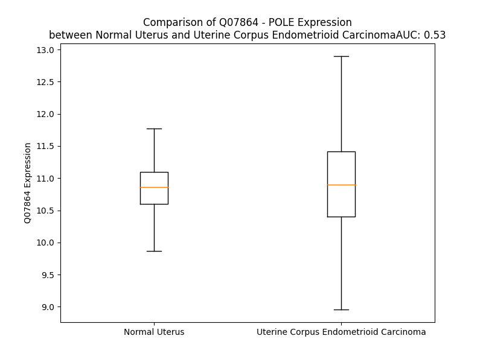

# Detailed Data for Q07864

## Introduction to the Detailed Summary

### How to Interpret the Results

- **Summary & Metrics**: This section provides a quick reference to essential protein attributes, including expression changes, family classification, and biomarker applications. Regulation status (upregulated/downregulated) indicates the protein's behavior in a disease context. Some information comes from the original excel file with the proteins selected from literature, while others are derived from the analyses.
- **Expression Comparison**: A visual representation comparing protein expression between normal and disease states. It highlights significant changes in expression levels that might indicate diagnostic or therapeutic relevance. This is data coming from transcriptomics experiments and could not translate similarly to protein levels.
- **Isoform Alignment**: An interactive view of isoform alignments, revealing structural and functional differences between variants of the protein.
- **Interactors & Homologs**: Tables listing known interaction partners and homologous proteins, the more interactors and homologs, the more complex the protein is to design an antibody for.
- **Biological Assemblies**: Information about the structural arrangement of the protein in different assemblies, providing insights into its functional state but also the complexity of the protein to develop antibodies.
- **Combined Per-Residue Information**: A detailed table summarizing residue-level data. This includes predictions for epitope regions, aggregation tendencies, and modifications that might impact the protein's function. Each row corresponds to a residue in the protein, providing insights into specific sites that may be important for research or drug development.
## Summary & Metrics

- **UniProt Accession**: Q07864
- **Gene Name**: POLE
- **Protein Name**: DNA polymerase epsilon catalytic subunit A
- **Swiss Prot**: DPOE1_HUMAN
- **Family**: nan
- **Biomarker Application**: nan
- **Number of Isoforms**: 0
- **Regulation**: 2
- **(transcriptomics) AUC**: 0.62
- **(transcriptomics) Fold Change**: 1.03
- **(transcriptomics) Regulation**: Upregulated
- **Discotope Epitope Count**: 582
- **Max n_uniprots (Homo)**: N/A
- **Max n_uniprots (Hetero)**: 2.0

## Expression Comparison

## Interactors

| preferredName_A   | preferredName_B   |   score |
|:------------------|:------------------|--------:|
| POLE              | POLE3             |   0.999 |
| POLE              | POLE2             |   0.999 |
| POLE              | POLD1             |   0.999 |
| POLE              | POLE4             |   0.999 |
| POLE              | MCM5              |   0.997 |
| POLE              | MCM2              |   0.997 |
| POLE              | POLA1             |   0.997 |
| POLE              | MCM3              |   0.996 |
| POLE              | MCM4              |   0.995 |
| POLE              | CDC45             |   0.995 |
| POLE              | GINS4             |   0.994 |
| POLE              | POLA2             |   0.993 |
| POLE              | WDHD1             |   0.992 |
| POLE              | POLD2             |   0.991 |
| POLE              | PRIM1             |   0.99  |
| POLE              | CHTF18            |   0.99  |
| POLE              | GINS1             |   0.989 |
| POLE              | REV3L             |   0.989 |
| POLE              | PRIM2             |   0.988 |
| POLE              | PCNA              |   0.988 |
| POLE              | MCM7              |   0.986 |
| POLE              | TIMELESS          |   0.98  |
| POLE              | MCM6              |   0.98  |
| POLE              | GINS3             |   0.978 |
| POLE              | MAD2L2            |   0.97  |
| POLE              | POLG              |   0.966 |
| POLE              | POLD3             |   0.963 |
| POLE              | CHRAC1            |   0.957 |
| POLE              | MSH6              |   0.957 |
| POLE              | TIPIN             |   0.953 |
| POLE              | GINS2             |   0.952 |
| POLE              | MSH2              |   0.947 |
| POLE              | DSCC1             |   0.943 |
| POLE              | LIG1              |   0.931 |
| POLE              | MCM9              |   0.928 |
| POLE              | CLSPN             |   0.922 |
| POLE              | BRCA1             |   0.919 |
| POLE              | XRCC1             |   0.911 |
| POLE              | FEN1              |   0.906 |
| POLE              | RBX1              |   0.906 |
| POLE              | CRCP              |   0.906 |
| POLE              | POLG2             |   0.903 |

## Homologs

| uniprot_id   | gene_id   |
|--------------|-----------|

## Biological Assemblies

|   Unnamed: 0 | crystal_id   |   assembly |   n_uniprots | composition   |
|-------------:|:-------------|-----------:|-------------:|:--------------|
|            0 | 5vbn         |          1 |            2 | Hetero        |
|            1 | 5vbn         |          2 |            2 | Hetero        |

## Combined Per-Residue Information

|   res | aa   |   epitope_score | epitope   |   relative_surface_accessibility |   modeling_confidence |   Aggregation | modification   |
|------:|:-----|----------------:|:----------|---------------------------------:|----------------------:|--------------:|:---------------|
|     1 | M    |         0.08798 | True      |                          1.31426 |                 32.14 |         0     | N/A            |
|     2 | S    |         0.12099 | True      |                          0.78084 |                 29.17 |         0     | N/A            |
|     3 | L    |         0.16164 | True      |                          0.98595 |                 26.78 |         0     | N/A            |
|     4 | R    |         0.15957 | True      |                          0.86526 |                 30.55 |         0     | N/A            |
|     5 | S    |         0.13136 | True      |                          0.84309 |                 26.63 |         0     | N/A            |
|     6 | G    |         0.13362 | True      |                          1.015   |                 29.88 |         0     | N/A            |
|     7 | G    |         0.12624 | True      |                          0.85309 |                 26.66 |         0     | N/A            |
|     8 | R    |         0.12496 | True      |                          0.96252 |                 29.86 |         0     | N/A            |
|     9 | R    |         0.13576 | True      |                          0.95935 |                 27.53 |         0     | N/A            |
|    10 | R    |         0.11635 | True      |                          0.95221 |                 31.12 |         0     | N/A            |
|    11 | A    |         0.13246 | True      |                          0.8864  |                 28.17 |         0     | N/A            |
|    12 | D    |         0.11198 | True      |                          0.91044 |                 29.27 |         0     | N/A            |
|    13 | P    |         0.1135  | True      |                          0.92855 |                 34.55 |         0     | N/A            |
|    14 | G    |         0.13374 | True      |                          0.70853 |                 28.99 |         0     | N/A            |
|    15 | A    |         0.16222 | True      |                          1.08676 |                 30.88 |         0     | N/A            |
|    16 | D    |         0.12417 | True      |                          0.85016 |                 27.14 |         0     | N/A            |
|    17 | G    |         0.19097 | True      |                          0.90055 |                 29.63 |         0     | N/A            |
|    18 | E    |         0.13842 | True      |                          0.97315 |                 27.37 |         0     | N/A            |
|    19 | A    |         0.16589 | True      |                          0.917   |                 29.4  |         0     | N/A            |
|    20 | S    |         0.09385 | True      |                          0.80197 |                 30.6  |         0     | N/A            |
|    21 | R    |         0.17075 | True      |                          0.99113 |                 28.73 |         0     | N/A            |
|    22 | D    |         0.13676 | True      |                          0.80663 |                 29.33 |         0     | N/A            |
|    23 | D    |         0.10127 | True      |                          0.92932 |                 28.73 |         0     | N/A            |
|    24 | G    |         0.16402 | True      |                          0.99937 |                 27.34 |         0     | N/A            |
|    25 | A    |         0.10986 | True      |                          0.82836 |                 28.42 |         0     | N/A            |
|    26 | T    |         0.08815 | True      |                          1.04499 |                 36.11 |         0     | N/A            |
|    27 | S    |         0.0896  | True      |                          0.74592 |                 36.4  |         0     | N/A            |
|    28 | S    |         0.08553 | True      |                          0.52936 |                 48.61 |         0     | N/A            |
|    29 | V    |         0.0651  | False     |                          0.50679 |                 57.08 |         0     | N/A            |
|    30 | S    |         0.06992 | False     |                          0.47156 |                 67.27 |         0     | N/A            |
|    31 | A    |         0.06327 | False     |                          0.47438 |                 70.95 |         0     | N/A            |
|    32 | L    |         0.14078 | True      |                          0.77504 |                 73.95 |         0     | N/A            |
|    33 | K    |         0.15388 | True      |                          0.64724 |                 76.31 |         0     | N/A            |
|    34 | R    |         0.10163 | True      |                          0.20061 |                 78.73 |         0     | N/A            |
|    35 | L    |         0.093   | True      |                          0.1929  |                 79.29 |         0     | N/A            |
|    36 | E    |         0.11688 | True      |                          0.51628 |                 82.67 |         0     | N/A            |
|    37 | R    |         0.19415 | True      |                          0.64636 |                 83.61 |         0     | N/A            |
|    38 | S    |         0.02285 | False     |                          0.12553 |                 84.09 |         0     | N/A            |
|    39 | Q    |         0.15766 | True      |                          0.52953 |                 86.86 |         0     | N/A            |
|    40 | W    |         0.12311 | True      |                          0.36166 |                 89.86 |         0     | N/A            |
|    41 | T    |         0.0242  | False     |                          0.16093 |                 88.9  |         0     | N/A            |
|    42 | D    |         0.03302 | False     |                          0.27195 |                 88.59 |         0     | N/A            |
|    43 | K    |         0.09386 | True      |                          0.76502 |                 91.18 |         0     | N/A            |
|    44 | M    |         0.01922 | False     |                          0.0297  |                 93.01 |         0     | N/A            |
|    45 | D    |         0.00209 | False     |                          0       |                 92.07 |         0     | N/A            |
|    46 | L    |         0.04667 | False     |                          0.64147 |                 91.69 |         0     | N/A            |
|    47 | R    |         0.10779 | True      |                          0.50913 |                 90.67 |         0     | N/A            |
|    48 | F    |         0.0042  | False     |                          0.00387 |                 92.06 |         0     | N/A            |
|    49 | G    |         0.04347 | False     |                          0.32664 |                 90.01 |         0     | N/A            |
|    50 | F    |         0.00892 | False     |                          0.00878 |                 92.6  |         0     | N/A            |
|    51 | E    |         0.03705 | False     |                          0.54379 |                 89.48 |         0     | N/A            |
|    52 | R    |         0.04192 | False     |                          0.19551 |                 88.82 |         0     | N/A            |
|    53 | L    |         0.04533 | False     |                          0.14939 |                 84.83 |         0     | N/A            |
|    54 | K    |         0.08538 | True      |                          0.79109 |                 78.84 |         0     | N/A            |
|    55 | E    |         0.08749 | True      |                          0.71503 |                 76.28 |         0     | N/A            |
|    56 | P    |         0.14196 | True      |                          0.72959 |                 78.68 |         0     | N/A            |
|    57 | G    |         0.1276  | True      |                          0.39591 |                 84.52 |         0     | N/A            |
|    58 | E    |         0.07449 | False     |                          0.43944 |                 89.83 |         0     | N/A            |
|    59 | K    |         0.09158 | True      |                          0.35945 |                 91.21 |         0     | N/A            |
|    60 | T    |         0.09421 | True      |                          0.34328 |                 93.28 |         2.232 | N/A            |
|    61 | G    |         0.00322 | False     |                          0       |                 92.98 |         2.232 | N/A            |
|    62 | W    |         0.01555 | False     |                          0.02692 |                 94.3  |         2.913 | N/A            |
|    63 | L    |         0.00403 | False     |                          0       |                 94.49 |         2.913 | N/A            |
|    64 | I    |         0.00457 | False     |                          0.0048  |                 94.53 |         2.913 | N/A            |
|    65 | N    |         0.00949 | False     |                          0.02987 |                 94.5  |         0.681 | N/A            |
|    66 | M    |         0.00152 | False     |                          0       |                 94.17 |         0.681 | N/A            |
|    67 | H    |         0.04132 | False     |                          0.13549 |                 92.41 |         0     | N/A            |
|    68 | P    |         0.04303 | False     |                          0.54153 |                 91.38 |         0     | N/A            |
|    69 | T    |         0.02796 | False     |                          0.16609 |                 89.87 |         0     | N/A            |
|    70 | E    |         0.0628  | False     |                          0.12673 |                 87.34 |         0     | N/A            |
|    71 | I    |         0.0433  | False     |                          0.24879 |                 85.38 |         0     | N/A            |
|    72 | L    |         0.17599 | True      |                          0.48596 |                 83.62 |         0     | N/A            |
|    73 | D    |         0.10211 | True      |                          0.39305 |                 74.11 |         0     | N/A            |
|    74 | E    |         0.18458 | True      |                          0.70316 |                 70.53 |         0     | N/A            |
|    75 | D    |         0.12824 | True      |                          0.64239 |                 70.24 |         0     | N/A            |
|    76 | K    |         0.25745 | True      |                          0.83034 |                 76.22 |         0     | N/A            |
|    77 | R    |         0.20002 | True      |                          0.57942 |                 75.91 |         0     | N/A            |
|    78 | L    |         0.04611 | False     |                          0.18999 |                 82.36 |         0     | N/A            |
|    79 | G    |         0.0571  | False     |                          0.19313 |                 87.09 |         0     | N/A            |
|    80 | S    |         0.02163 | False     |                          0.03531 |                 91.53 |         0     | N/A            |
|    81 | A    |         0.00169 | False     |                          0       |                 91.08 |         0     | N/A            |
|    82 | V    |         0.00203 | False     |                          0       |                 92.65 |         0     | N/A            |
|    83 | D    |         0.0127  | False     |                          0.01991 |                 93.17 |         0     | N/A            |
|    84 | Y    |         0.0009  | False     |                          0       |                 94.27 |         0.188 | N/A            |
|    85 | Y    |         0.00665 | False     |                          0.00912 |                 94.74 |         0.188 | N/A            |
|    86 | F    |         0.00126 | False     |                          0       |                 94.09 |         0.188 | N/A            |
|    87 | I    |         0.00817 | False     |                          0.032   |                 93.59 |         0.188 | N/A            |
|    88 | Q    |         0.06755 | False     |                          0.16845 |                 91.08 |         0.188 | N/A            |
|    89 | D    |         0.13764 | True      |                          0.74355 |                 84.69 |         0     | N/A            |
|    90 | D    |         0.13468 | True      |                          0.71277 |                 85.67 |         0     | N/A            |
|    91 | G    |         0.04627 | False     |                          0.52542 |                 83.03 |         0     | N/A            |
|    92 | S    |         0.05396 | False     |                          0.35837 |                 88.81 |         0     | N/A            |
|    93 | R    |         0.03121 | False     |                          0.15385 |                 92.71 |         0     | N/A            |
|    94 | F    |         0.02552 | False     |                          0.01647 |                 93.35 |         0     | N/A            |
|    95 | K    |         0.00478 | False     |                          0.00659 |                 93.48 |         0     | N/A            |
|    96 | V    |         0.02583 | False     |                          0.02666 |                 92.1  |         0     | N/A            |
|    97 | A    |         0.01179 | False     |                          0.1104  |                 90.42 |         0     | N/A            |
|    98 | L    |         0.02582 | False     |                          0.06677 |                 90.62 |         0     | N/A            |
|    99 | P    |         0.05416 | False     |                          0.49362 |                 89.42 |         0     | N/A            |
|   100 | Y    |         0.03219 | False     |                          0.25701 |                 90.9  |         0     | N/A            |
|   101 | K    |         0.07016 | False     |                          0.50216 |                 92.45 |         0     | N/A            |
|   102 | P    |         0.00495 | False     |                          0.03181 |                 95.01 |         0.516 | N/A            |
|   103 | Y    |         0.01071 | False     |                          0.03602 |                 95.9  |        12.306 | N/A            |
|   104 | F    |         0.0025  | False     |                          0       |                 96.06 |        14.028 | N/A            |
|   105 | Y    |         0.00824 | False     |                          0.03215 |                 95.75 |        14.028 | N/A            |
|   106 | I    |         0.00238 | False     |                          0.00177 |                 93.87 |        14.028 | N/A            |
|   107 | A    |         0.00391 | False     |                          0.00255 |                 91.03 |        13.633 | N/A            |
|   108 | T    |         0.04009 | False     |                          0.09919 |                 89.18 |         3.826 | N/A            |
|   109 | R    |         0.10666 | True      |                          0.44171 |                 82.34 |         0     | N/A            |
|   110 | K    |         0.07386 | False     |                          0.9294  |                 72    |         0     | N/A            |
|   111 | G    |         0.04585 | False     |                          0.75518 |                 76.01 |         0     | N/A            |
|   112 | C    |         0.06309 | False     |                          0.17118 |                 82.84 |         0     | N/A            |
|   113 | E    |         0.04211 | False     |                          0.2728  |                 83.36 |         0     | N/A            |
|   114 | R    |         0.06174 | False     |                          0.83552 |                 83.99 |         0     | N/A            |
|   115 | E    |         0.07593 | False     |                          0.47712 |                 85.33 |         0     | N/A            |
|   116 | V    |         0.00315 | False     |                          0       |                 88.43 |         0.769 | N/A            |
|   117 | S    |         0.02717 | False     |                          0.16792 |                 88.53 |         0.769 | N/A            |
|   118 | S    |         0.05537 | False     |                          0.57798 |                 87.21 |         0.769 | N/A            |
|   119 | F    |         0.12593 | True      |                          0.27009 |                 90.06 |         0.769 | N/A            |
|   120 | L    |         0.00588 | False     |                          0       |                 90.12 |         0.769 | N/A            |
|   121 | S    |         0.05429 | False     |                          0.38681 |                 89.29 |         0     | N/A            |
|   122 | K    |         0.20783 | True      |                          0.83526 |                 88    |         0     | N/A            |
|   123 | K    |         0.19201 | True      |                          0.43064 |                 89.67 |         0     | N/A            |
|   124 | F    |         0.05646 | False     |                          0.03274 |                 89.95 |         0     | N/A            |
|   125 | Q    |         0.2587  | True      |                          0.77193 |                 85.86 |         0     | N/A            |
|   126 | G    |         0.07391 | False     |                          0.84839 |                 82.83 |         0     | N/A            |
|   127 | K    |         0.06519 | False     |                          0.33501 |                 87.41 |         0     | N/A            |
|   128 | I    |         0.05953 | False     |                          0.13263 |                 90.88 |         0     | N/A            |
|   129 | A    |         0.01883 | False     |                          0.31521 |                 89    |         0     | N/A            |
|   130 | K    |         0.1146  | True      |                          0.54686 |                 92.14 |         0     | N/A            |
|   131 | V    |         0.05228 | False     |                          0.29569 |                 93.11 |         0     | N/A            |
|   132 | E    |         0.06387 | False     |                          0.21114 |                 93.5  |         0     | N/A            |
|   133 | T    |         0.03334 | False     |                          0.51752 |                 92.43 |         0     | N/A            |
|   134 | V    |         0.03516 | False     |                          0.23802 |                 92.47 |         0     | N/A            |
|   135 | P    |         0.04545 | False     |                          0.52414 |                 93.23 |         0     | N/A            |
|   136 | K    |         0.03216 | False     |                          0.05041 |                 92.77 |         0     | N/A            |
|   137 | E    |         0.02447 | False     |                          0.22352 |                 90.96 |         0     | N/A            |
|   138 | D    |         0.00629 | False     |                          0.00494 |                 90.59 |         0     | N/A            |
|   139 | L    |         0.01512 | False     |                          0.14503 |                 89.91 |         0     | N/A            |
|   140 | D    |         0.06199 | False     |                          0.61908 |                 84.82 |         0     | N/A            |
|   141 | L    |         0.06364 | False     |                          0.22778 |                 83.48 |         0     | N/A            |
|   142 | P    |         0.18934 | True      |                          0.57073 |                 77.26 |         0     | N/A            |
|   143 | N    |         0.05658 | False     |                          0.14881 |                 80.83 |         0     | N/A            |
|   144 | H    |         0.09813 | True      |                          0.13339 |                 85.54 |         0     | N/A            |
|   145 | L    |         0.02804 | False     |                          0.13036 |                 85.47 |         0     | N/A            |
|   146 | V    |         0.09224 | True      |                          0.35331 |                 82.26 |         0     | N/A            |
|   147 | G    |         0.06249 | False     |                          0.57606 |                 79.24 |         0     | N/A            |
|   148 | L    |         0.08887 | True      |                          0.52886 |                 80.94 |         0     | N/A            |
|   149 | K    |         0.06111 | False     |                          0.47067 |                 87.02 |         0     | N/A            |
|   150 | R    |         0.04487 | False     |                          0.26543 |                 88.34 |         0     | N/A            |
|   151 | N    |         0.02371 | False     |                          0.29679 |                 90.93 |         0     | N/A            |
|   152 | Y    |         0.0026  | False     |                          0.00061 |                 93.01 |         0     | N/A            |
|   153 | I    |         0.01568 | False     |                          0.012   |                 94.39 |         0     | N/A            |
|   154 | R    |         0.0423  | False     |                          0.20747 |                 95.37 |         0     | N/A            |
|   155 | L    |         0.00206 | False     |                          0       |                 95.04 |         0     | N/A            |
|   156 | S    |         0.01489 | False     |                          0.04232 |                 95.17 |         0     | N/A            |
|   157 | F    |         0.00257 | False     |                          0       |                 94.36 |         0     | N/A            |
|   158 | H    |         0.06562 | False     |                          0.32138 |                 89.79 |         0     | N/A            |
|   159 | T    |         0.02412 | False     |                          0.07469 |                 91.13 |         0     | N/A            |
|   160 | V    |         0.02703 | False     |                          0.39892 |                 90.4  |         0     | N/A            |
|   161 | E    |         0.03625 | False     |                          0.20426 |                 88.61 |         0     | N/A            |
|   162 | D    |         0.05286 | False     |                          0.16616 |                 91.26 |         0     | N/A            |
|   163 | L    |         0.01849 | False     |                          0.0981  |                 93.5  |         0     | N/A            |
|   164 | V    |         0.05472 | False     |                          0.43129 |                 91.81 |         0     | N/A            |
|   165 | K    |         0.04662 | False     |                          0.40129 |                 90.92 |         0     | N/A            |
|   166 | V    |         0.00184 | False     |                          0.00095 |                 92.57 |         0     | N/A            |
|   167 | R    |         0.05578 | False     |                          0.29463 |                 92.94 |         0     | N/A            |
|   168 | K    |         0.09317 | True      |                          0.80676 |                 89.78 |         0     | N/A            |
|   169 | E    |         0.1892  | True      |                          0.41144 |                 89.93 |         0     | N/A            |
|   170 | I    |         0.00412 | False     |                          0       |                 91.41 |         0     | N/A            |
|   171 | S    |         0.03685 | False     |                          0.35317 |                 87.92 |         0     | N/A            |
|   172 | P    |         0.18042 | True      |                          0.62812 |                 85.2  |         0     | N/A            |
|   173 | A    |         0.06644 | False     |                          0.15271 |                 85.9  |         0     | N/A            |
|   174 | V    |         0.01791 | False     |                          0.06474 |                 87.65 |         0     | N/A            |
|   175 | K    |         0.07921 | True      |                          0.54435 |                 82.67 |         0     | N/A            |
|   176 | K    |         0.10184 | True      |                          0.53314 |                 82.01 |         0     | N/A            |
|   177 | N    |         0.02711 | False     |                          0.02443 |                 84.07 |         0     | N/A            |
|   178 | R    |         0.0799  | True      |                          0.36643 |                 76.8  |         0     | N/A            |
|   179 | E    |         0.07587 | False     |                          0.37961 |                 69.32 |         0     | N/A            |
|   180 | Q    |         0.11187 | True      |                          0.53538 |                 69.67 |         0     | N/A            |
|   181 | D    |         0.08768 | True      |                          0.41467 |                 65.67 |         0     | N/A            |
|   182 | H    |         0.10221 | True      |                          0.84277 |                 60.68 |         0     | N/A            |
|   183 | A    |         0.05525 | False     |                          0.72917 |                 52.94 |         0     | N/A            |
|   184 | S    |         0.06601 | False     |                          0.52066 |                 52.5  |         0     | N/A            |
|   185 | D    |         0.04909 | False     |                          0.56071 |                 55.75 |         0     | N/A            |
|   186 | A    |         0.03822 | False     |                          0.37819 |                 57.63 |         7.139 | N/A            |
|   187 | Y    |         0.03978 | False     |                          0.14122 |                 55.61 |        15.53  | N/A            |
|   188 | T    |         0.06415 | False     |                          0.39043 |                 59.36 |        15.942 | N/A            |
|   189 | A    |         0.0894  | True      |                          0.49227 |                 59.89 |        16.636 | N/A            |
|   190 | L    |         0.03953 | False     |                          0.08103 |                 60.56 |        17.449 | N/A            |
|   191 | L    |         0.06783 | False     |                          0.31985 |                 58.61 |        17.303 | N/A            |
|   192 | S    |         0.0739  | False     |                          0.36404 |                 57.06 |        15.563 | N/A            |
|   193 | S    |         0.03337 | False     |                          0.41688 |                 57.52 |        15.446 | N/A            |
|   194 | V    |         0.05214 | False     |                          0.23968 |                 55.88 |        15.446 | N/A            |
|   195 | L    |         0.12089 | True      |                          0.78755 |                 53.35 |        14.494 | N/A            |
|   196 | Q    |         0.08639 | True      |                          0.71404 |                 51.8  |         0.498 | N/A            |
|   197 | R    |         0.12227 | True      |                          0.61613 |                 43.73 |         0     | N/A            |
|   198 | G    |         0.13134 | True      |                          1.05236 |                 36.51 |         0     | N/A            |
|   199 | G    |         0.07224 | False     |                          0.49989 |                 26.41 |         0     | N/A            |
|   200 | V    |         0.10404 | True      |                          1.04083 |                 26.52 |         0     | N/A            |
|   201 | I    |         0.06642 | False     |                          0.86149 |                 30.76 |         0     | N/A            |
|   202 | T    |         0.08293 | True      |                          0.7214  |                 29.48 |         0     | N/A            |
|   203 | D    |         0.08137 | True      |                          0.91745 |                 33.42 |         0     | N/A            |
|   204 | E    |         0.15396 | True      |                          0.7079  |                 32.93 |         0     | N/A            |
|   205 | E    |         0.12016 | True      |                          0.8021  |                 37.66 |         0     | N/A            |
|   206 | E    |         0.11175 | True      |                          0.78435 |                 37.06 |         0     | N/A            |
|   207 | T    |         0.14668 | True      |                          0.74711 |                 36.58 |         0     | N/A            |
|   208 | S    |         0.1049  | True      |                          0.62959 |                 43.36 |         0     | N/A            |
|   209 | K    |         0.12515 | True      |                          0.74331 |                 43.67 |         0     | N/A            |
|   210 | K    |         0.16987 | True      |                          0.94188 |                 44.73 |         0     | N/A            |
|   211 | I    |         0.25234 | True      |                          0.94387 |                 46.71 |         0     | N/A            |
|   212 | A    |         0.11396 | True      |                          0.40848 |                 55.29 |         0     | N/A            |
|   213 | D    |         0.14232 | True      |                          0.47559 |                 71.17 |         0     | N/A            |
|   214 | Q    |         0.05726 | False     |                          0.1704  |                 82    |         0     | N/A            |
|   215 | L    |         0.04663 | False     |                          0.1624  |                 84.61 |         0     | N/A            |
|   216 | D    |         0.08941 | True      |                          0.35265 |                 82.64 |         0     | N/A            |
|   217 | N    |         0.03568 | False     |                          0.10303 |                 85.7  |         0     | N/A            |
|   218 | I    |         0.00496 | False     |                          0       |                 89.67 |         0     | N/A            |
|   219 | V    |         0.04739 | False     |                          0.19327 |                 86.31 |         0     | N/A            |
|   220 | D    |         0.03043 | False     |                          0.03922 |                 88.31 |         0     | N/A            |
|   221 | M    |         0.01708 | False     |                          0.02968 |                 92.59 |         0     | N/A            |
|   222 | R    |         0.05334 | False     |                          0.0585  |                 93.67 |         0     | N/A            |
|   223 | E    |         0.01458 | False     |                          0.02066 |                 94.03 |         0     | N/A            |
|   224 | Y    |         0.06306 | False     |                          0.24474 |                 93.12 |         0     | N/A            |
|   225 | D    |         0.06479 | False     |                          0.24858 |                 92.5  |         0     | N/A            |
|   226 | V    |         0.01993 | False     |                          0.15974 |                 93.53 |         0     | N/A            |
|   227 | P    |         0.06726 | False     |                          0.45926 |                 92.83 |         0     | N/A            |
|   228 | Y    |         0.03523 | False     |                          0.08627 |                 94.05 |         0     | N/A            |
|   229 | H    |         0.01583 | False     |                          0.08798 |                 92.78 |         0     | N/A            |
|   230 | I    |         0.02793 | False     |                          0.0632  |                 94.57 |         0     | N/A            |
|   231 | R    |         0.01715 | False     |                          0.02267 |                 94.29 |         0     | N/A            |
|   232 | L    |         0.00242 | False     |                          0       |                 93.48 |         0     | N/A            |
|   233 | S    |         0.00372 | False     |                          0.00079 |                 93.99 |         0     | N/A            |
|   234 | I    |         0.00488 | False     |                          0       |                 94.09 |         0     | N/A            |
|   235 | D    |         0.02206 | False     |                          0.12948 |                 93.08 |         0     | N/A            |
|   236 | L    |         0.06821 | False     |                          0.49509 |                 91.29 |         0     | N/A            |
|   237 | K    |         0.06281 | False     |                          0.55084 |                 90.71 |         0     | N/A            |
|   238 | I    |         0.01056 | False     |                          0.0288  |                 92.55 |         0     | N/A            |
|   239 | H    |         0.01722 | False     |                          0.07484 |                 93.32 |         0     | N/A            |
|   240 | V    |         0.00249 | False     |                          0       |                 93.58 |         0.161 | N/A            |
|   241 | A    |         0.00487 | False     |                          0.13614 |                 91.02 |         0.161 | N/A            |
|   242 | H    |         0.10643 | True      |                          0.15043 |                 91.63 |         0.161 | N/A            |
|   243 | W    |         0.0508  | False     |                          0.04279 |                 93.9  |         0.161 | N/A            |
|   244 | Y    |         0.03592 | False     |                          0.01526 |                 94.61 |         0.161 | N/A            |
|   245 | N    |         0.03897 | False     |                          0.20015 |                 94.06 |         0     | N/A            |
|   246 | V    |         0.00369 | False     |                          0       |                 92.27 |         0     | N/A            |
|   247 | R    |         0.0823  | True      |                          0.39225 |                 89.97 |         0     | N/A            |
|   248 | Y    |         0.06444 | False     |                          0.1132  |                 83.53 |         0     | N/A            |
|   249 | R    |         0.21019 | True      |                          0.51524 |                 81.11 |         0     | N/A            |
|   250 | G    |         0.0838  | True      |                          0.21525 |                 73.49 |         0     | N/A            |
|   251 | N    |         0.17691 | True      |                          0.79658 |                 68.5  |         0     | N/A            |
|   252 | A    |         0.20624 | True      |                          0.75484 |                 65.84 |         0     | N/A            |
|   253 | F    |         0.14501 | True      |                          0.62707 |                 69.45 |         0     | N/A            |
|   254 | P    |         0.12687 | True      |                          0.75221 |                 72.22 |         0     | N/A            |
|   255 | V    |         0.02422 | False     |                          0.11716 |                 83.95 |         0     | N/A            |
|   256 | E    |         0.08421 | True      |                          0.43527 |                 87.85 |         0     | N/A            |
|   257 | I    |         0.05876 | False     |                          0.1753  |                 91.24 |         0     | N/A            |
|   258 | T    |         0.07342 | False     |                          0.59276 |                 91.96 |         0     | N/A            |
|   259 | R    |         0.13061 | True      |                          0.47318 |                 91.02 |         0     | N/A            |
|   260 | R    |         0.13271 | True      |                          0.33917 |                 90.3  |         0     | N/A            |
|   261 | D    |         0.11879 | True      |                          0.61643 |                 83.02 |         0     | N/A            |
|   262 | D    |         0.13524 | True      |                          0.60223 |                 85.39 |         0     | N/A            |
|   263 | L    |         0.08506 | True      |                          0.38107 |                 83.19 |         0     | N/A            |
|   264 | V    |         0.09678 | True      |                          0.73046 |                 76.86 |         0     | N/A            |
|   265 | E    |         0.11722 | True      |                          0.72401 |                 73.4  |         0     | N/A            |
|   266 | R    |         0.08306 | True      |                          0.33544 |                 79.24 |         0     | N/A            |
|   267 | P    |         0.03386 | False     |                          0.11521 |                 84.17 |         0     | N/A            |
|   268 | D    |         0.086   | True      |                          0.8576  |                 81.86 |         0     | N/A            |
|   269 | P    |         0.03078 | False     |                          0.1024  |                 89.62 |         0.49  | N/A            |
|   270 | V    |         0.03011 | False     |                          0.24972 |                 92.82 |        40.468 | N/A            |
|   271 | V    |         0.0016  | False     |                          0.00286 |                 95.08 |        40.468 | N/A            |
|   272 | L    |         0.00199 | False     |                          0.00577 |                 96.36 |        40.468 | N/A            |
|   273 | A    |         0.00119 | False     |                          0       |                 96.73 |        40.468 | N/A            |
|   274 | F    |         0.00943 | False     |                          0.00317 |                 96.3  |        40.468 | N/A            |
|   275 | D    |         0.04282 | False     |                          0.09752 |                 96.23 |         0     | N/A            |
|   276 | I    |         0.03223 | False     |                          0.03311 |                 95.45 |         0     | N/A            |
|   277 | E    |         0.03741 | False     |                          0.05599 |                 94.33 |         0     | N/A            |
|   278 | T    |         0.01976 | False     |                          0.01879 |                 93.97 |         0     | N/A            |
|   279 | T    |         0.02799 | False     |                          0.13654 |                 91.85 |         0     | N/A            |
|   280 | K    |         0.04764 | False     |                          0.14512 |                 86.12 |         0     | N/A            |
|   281 | L    |         0.08264 | True      |                          0.58199 |                 79.3  |         0     | N/A            |
|   282 | P    |         0.17884 | True      |                          0.75343 |                 73.01 |         0     | N/A            |
|   283 | L    |         0.09144 | True      |                          0.19246 |                 71.67 |         0     | N/A            |
|   284 | K    |         0.15297 | True      |                          0.24239 |                 72.8  |         0     | N/A            |
|   285 | F    |         0.21682 | True      |                          0.59384 |                 77.08 |         0     | N/A            |
|   286 | P    |         0.08037 | True      |                          0.28168 |                 82.82 |         0     | N/A            |
|   287 | D    |         0.05672 | False     |                          0.29668 |                 83.66 |         0     | N/A            |
|   288 | A    |         0.02875 | False     |                          0.20632 |                 86.74 |         0     | N/A            |
|   289 | E    |         0.12718 | True      |                          0.75818 |                 85.93 |         0     | N/A            |
|   290 | T    |         0.10005 | True      |                          0.68988 |                 86.03 |         0     | N/A            |
|   291 | D    |         0.04032 | False     |                          0.06848 |                 91.14 |         0     | N/A            |
|   292 | Q    |         0.03559 | False     |                          0.23325 |                 93.76 |         0.355 | N/A            |
|   293 | I    |         0.00343 | False     |                          0       |                 96.04 |         8.567 | N/A            |
|   294 | M    |         0.00609 | False     |                          0       |                 94.48 |        10.528 | N/A            |
|   295 | M    |         0.00226 | False     |                          0       |                 96.13 |        11.963 | N/A            |
|   296 | I    |         0.00177 | False     |                          0       |                 97.27 |        13.116 | N/A            |
|   297 | S    |         0.00199 | False     |                          0       |                 96.51 |        12.994 | N/A            |
|   298 | Y    |         0.00525 | False     |                          0.00113 |                 96.6  |        12.61  | N/A            |
|   299 | M    |         0.00395 | False     |                          0       |                 95.52 |        10.967 | N/A            |
|   300 | I    |         0.02538 | False     |                          0.10796 |                 94.33 |        10.162 | N/A            |
|   301 | D    |         0.05458 | False     |                          0.49118 |                 89.59 |         0     | N/A            |
|   302 | G    |         0.01608 | False     |                          0.24164 |                 86.84 |         0     | N/A            |
|   303 | Q    |         0.07986 | True      |                          0.33781 |                 93.83 |         0     | N/A            |
|   304 | G    |         0.00093 | False     |                          0       |                 94.1  |         0.251 | N/A            |
|   305 | Y    |         0.06249 | False     |                          0.18943 |                 96.94 |         1.064 | N/A            |
|   306 | L    |         0.00159 | False     |                          0       |                 96.88 |         1.064 | N/A            |
|   307 | I    |         0.00817 | False     |                          0       |                 97.42 |         1.064 | N/A            |
|   308 | T    |         0.00191 | False     |                          0       |                 96.64 |         1.064 | N/A            |
|   309 | N    |         0.00576 | False     |                          0       |                 96.03 |         0.813 | N/A            |
|   310 | R    |         0.07819 | False     |                          0.29075 |                 94.52 |         0     | N/A            |
|   311 | E    |         0.13961 | True      |                          0.56301 |                 92.32 |         0     | N/A            |
|   312 | I    |         0.06209 | False     |                          0.28584 |                 91.47 |         0     | N/A            |
|   313 | V    |         0.00852 | False     |                          0.0007  |                 92.97 |         0     | N/A            |
|   314 | S    |         0.11186 | True      |                          0.39357 |                 91.93 |         0     | N/A            |
|   315 | E    |         0.13392 | True      |                          0.46897 |                 91.59 |         0     | N/A            |
|   316 | D    |         0.13339 | True      |                          0.58049 |                 93.33 |         0     | N/A            |
|   317 | I    |         0.02057 | False     |                          0.02553 |                 93.72 |         0     | N/A            |
|   318 | E    |         0.07871 | True      |                          0.72899 |                 92.02 |         0     | N/A            |
|   319 | D    |         0.10597 | True      |                          0.57677 |                 94.27 |         0     | N/A            |
|   320 | F    |         0.11954 | True      |                          0.20239 |                 94.44 |         0     | N/A            |
|   321 | E    |         0.08633 | True      |                          0.61184 |                 90.34 |         0     | N/A            |
|   322 | F    |         0.05949 | False     |                          0.14009 |                 91.12 |         0     | N/A            |
|   323 | T    |         0.14225 | True      |                          0.36998 |                 91.24 |         0     | N/A            |
|   324 | P    |         0.07311 | False     |                          0.29988 |                 87.31 |         0     | N/A            |
|   325 | K    |         0.09395 | True      |                          0.28945 |                 84.86 |         0     | N/A            |
|   326 | P    |         0.17852 | True      |                          0.89877 |                 81.59 |         0     | N/A            |
|   327 | E    |         0.11937 | True      |                          0.44319 |                 80.15 |         0     | N/A            |
|   328 | Y    |         0.03569 | False     |                          0.04167 |                 88.44 |         0     | N/A            |
|   329 | E    |         0.0407  | False     |                          0.55282 |                 88.1  |         0     | N/A            |
|   330 | G    |         0.00219 | False     |                          0       |                 89.24 |         0     | N/A            |
|   331 | P    |         0.06461 | False     |                          0.39365 |                 94.18 |         0     | N/A            |
|   332 | F    |         0.02331 | False     |                          0.02726 |                 95.43 |         0.315 | N/A            |
|   333 | C    |         0.07738 | False     |                          0.32406 |                 95.68 |         0.315 | N/A            |
|   334 | V    |         0.03345 | False     |                          0.12038 |                 95.76 |         0.315 | N/A            |
|   335 | F    |         0.08171 | True      |                          0.27782 |                 96.48 |         0.315 | N/A            |
|   336 | N    |         0.07251 | False     |                          0.32053 |                 96.45 |         0.315 | N/A            |
|   337 | E    |         0.03185 | False     |                          0.0956  |                 97.09 |         0     | N/A            |
|   338 | P    |         0.14516 | True      |                          0.5845  |                 94.99 |         0     | N/A            |
|   339 | D    |         0.03946 | False     |                          0.22326 |                 94.42 |         0     | N/A            |
|   340 | E    |         0.0129  | False     |                          0.00807 |                 95.16 |         0     | N/A            |
|   341 | A    |         0.02628 | False     |                          0.27887 |                 94.3  |         0     | N/A            |
|   342 | H    |         0.04856 | False     |                          0.46741 |                 96.82 |         0     | N/A            |
|   343 | L    |         0.00182 | False     |                          0       |                 96.57 |         0     | N/A            |
|   344 | I    |         0.00299 | False     |                          0       |                 96.4  |         0     | N/A            |
|   345 | Q    |         0.06698 | False     |                          0.45771 |                 95.7  |         0     | N/A            |
|   346 | R    |         0.04902 | False     |                          0.36349 |                 96.04 |         0     | N/A            |
|   347 | W    |         0.0026  | False     |                          0.00166 |                 96.63 |         0     | N/A            |
|   348 | F    |         0.01199 | False     |                          0.01897 |                 95.75 |         0     | N/A            |
|   349 | E    |         0.11587 | True      |                          0.53669 |                 95.29 |         0     | N/A            |
|   350 | H    |         0.04449 | False     |                          0.11293 |                 95.3  |         0     | N/A            |
|   351 | V    |         0.00365 | False     |                          0.00082 |                 94.85 |         0     | N/A            |
|   352 | Q    |         0.03584 | False     |                          0.25643 |                 92.2  |         0     | N/A            |
|   353 | E    |         0.12053 | True      |                          0.71144 |                 92.91 |         0     | N/A            |
|   354 | T    |         0.04517 | False     |                          0.26605 |                 91.46 |         0     | N/A            |
|   355 | K    |         0.05716 | False     |                          0.38017 |                 94.06 |         0     | N/A            |
|   356 | P    |         0.00445 | False     |                          0.00246 |                 93.86 |         0     | N/A            |
|   357 | T    |         0.00527 | False     |                          0.01432 |                 93.71 |         5.175 | N/A            |
|   358 | I    |         0.00112 | False     |                          0       |                 95.41 |        20.361 | N/A            |
|   359 | M    |         0.00163 | False     |                          0.00067 |                 95.99 |        20.361 | N/A            |
|   360 | V    |         0.00174 | False     |                          0       |                 97.06 |        20.361 | N/A            |
|   361 | T    |         0.00432 | False     |                          0       |                 96.3  |        20.361 | N/A            |
|   362 | Y    |         0.04162 | False     |                          0.08909 |                 94.58 |        19.388 | N/A            |
|   363 | N    |         0.06448 | False     |                          0.29735 |                 92.18 |         1.16  | N/A            |
|   364 | G    |         0.00195 | False     |                          0       |                 92.21 |         0     | N/A            |
|   365 | D    |         0.0105  | False     |                          0.01104 |                 91.19 |         0     | N/A            |
|   366 | F    |         0.13745 | True      |                          0.58943 |                 88.39 |         0     | N/A            |
|   367 | F    |         0.1285  | True      |                          0.34557 |                 89.93 |         0     | N/A            |
|   368 | D    |         0.01991 | False     |                          0.02334 |                 93.63 |         0     | N/A            |
|   369 | W    |         0.0025  | False     |                          0       |                 94.81 |         0     | N/A            |
|   370 | P    |         0.07309 | False     |                          0.31249 |                 92.73 |         0     | N/A            |
|   371 | F    |         0.01109 | False     |                          0.032   |                 94.43 |         0     | N/A            |
|   372 | V    |         0.00245 | False     |                          0       |                 94.94 |         0     | N/A            |
|   373 | E    |         0.03198 | False     |                          0.31205 |                 94.72 |         0     | N/A            |
|   374 | A    |         0.03405 | False     |                          0.30846 |                 93.68 |         0     | N/A            |
|   375 | R    |         0.04249 | False     |                          0.04495 |                 94.45 |         0     | N/A            |
|   376 | A    |         0.00379 | False     |                          0       |                 94    |         0     | N/A            |
|   377 | A    |         0.05768 | False     |                          0.63912 |                 92.99 |         0     | N/A            |
|   378 | V    |         0.11168 | True      |                          0.6347  |                 92.86 |         0     | N/A            |
|   379 | H    |         0.14234 | True      |                          0.37543 |                 92.55 |         0     | N/A            |
|   380 | G    |         0.16423 | True      |                          0.84351 |                 91.76 |         0     | N/A            |
|   381 | L    |         0.08481 | True      |                          0.21198 |                 92.88 |         0     | N/A            |
|   382 | S    |         0.05694 | False     |                          0.36123 |                 92.57 |         0     | N/A            |
|   383 | M    |         0.00655 | False     |                          0.02542 |                 93.81 |         0     | N/A            |
|   384 | Q    |         0.05622 | False     |                          0.35525 |                 92    |         0     | N/A            |
|   385 | Q    |         0.11829 | True      |                          0.58557 |                 91.35 |         0     | N/A            |
|   386 | E    |         0.07764 | False     |                          0.27913 |                 92.31 |         0     | N/A            |
|   387 | I    |         0.00902 | False     |                          0       |                 93.97 |         0     | N/A            |
|   388 | G    |         0.0097  | False     |                          0.02421 |                 91.93 |         0     | N/A            |
|   389 | F    |         0.00454 | False     |                          0.00267 |                 93.63 |         0     | N/A            |
|   390 | Q    |         0.06797 | False     |                          0.37175 |                 91.15 |         0     | N/A            |
|   391 | K    |         0.12905 | True      |                          0.59434 |                 90.74 |         0     | N/A            |
|   392 | D    |         0.05607 | False     |                          0.2792  |                 87.24 |         0     | N/A            |
|   393 | S    |         0.13521 | True      |                          0.95312 |                 81.17 |         0     | N/A            |
|   394 | Q    |         0.07763 | False     |                          0.59276 |                 82.94 |         0     | N/A            |
|   395 | G    |         0.08309 | True      |                          0.17472 |                 85.46 |         0     | N/A            |
|   396 | E    |         0.04142 | False     |                          0.04639 |                 91.5  |         0     | N/A            |
|   397 | Y    |         0.02215 | False     |                          0.01327 |                 94.37 |         0     | N/A            |
|   398 | K    |         0.04386 | False     |                          0.18861 |                 91.87 |         0     | N/A            |
|   399 | A    |         0.00913 | False     |                          0.01128 |                 91.51 |         0     | N/A            |
|   400 | P    |         0.0353  | False     |                          0.26722 |                 89.15 |         0     | N/A            |
|   401 | Q    |         0.02127 | False     |                          0.0236  |                 89.11 |         0     | N/A            |
|   402 | C    |         0.00252 | False     |                          0       |                 93.3  |         0     | N/A            |
|   403 | I    |         0.00524 | False     |                          0.012   |                 95.05 |         0     | N/A            |
|   404 | H    |         0.00255 | False     |                          0       |                 95.93 |         0     | N/A            |
|   405 | M    |         0.00154 | False     |                          0.00067 |                 95.36 |         0     | N/A            |
|   406 | D    |         0.00331 | False     |                          0.00063 |                 95.55 |         0     | N/A            |
|   407 | C    |         0.00185 | False     |                          0       |                 94.59 |         0     | N/A            |
|   408 | L    |         0.02839 | False     |                          0.09233 |                 92.56 |         0     | N/A            |
|   409 | R    |         0.06145 | False     |                          0.19587 |                 91.72 |         0     | N/A            |
|   410 | W    |         0.04522 | False     |                          0.05638 |                 91.07 |         0     | N/A            |
|   411 | V    |         0.01118 | False     |                          0.00965 |                 88.28 |         0     | N/A            |
|   412 | K    |         0.0872  | True      |                          0.56953 |                 84.54 |         0     | N/A            |
|   413 | R    |         0.0638  | False     |                          0.25118 |                 85.54 |         0     | N/A            |
|   414 | D    |         0.03347 | False     |                          0.06019 |                 82.28 |         0     | N/A            |
|   415 | S    |         0.04954 | False     |                          0.0202  |                 78.14 |         0     | N/A            |
|   416 | Y    |         0.18497 | True      |                          0.69951 |                 72.68 |         0     | N/A            |
|   417 | L    |         0.03162 | False     |                          0.18416 |                 71.15 |         0     | N/A            |
|   418 | P    |         0.08849 | True      |                          0.31072 |                 65.89 |         0     | N/A            |
|   419 | V    |         0.13989 | True      |                          0.72989 |                 66.98 |         0     | N/A            |
|   420 | G    |         0.05183 | False     |                          0.19814 |                 63.56 |         0     | N/A            |
|   421 | S    |         0.0972  | True      |                          0.17349 |                 71.05 |         0     | N/A            |
|   422 | H    |         0.04683 | False     |                          0.11333 |                 80.29 |         0     | N/A            |
|   423 | N    |         0.08762 | True      |                          0.44362 |                 81.91 |         0     | N/A            |
|   424 | L    |         0.03314 | False     |                          0.11392 |                 87.13 |         0     | N/A            |
|   425 | K    |         0.06544 | False     |                          0.3215  |                 82.95 |         0     | N/A            |
|   426 | A    |         0.04819 | False     |                          0.22841 |                 79.48 |         0     | N/A            |
|   427 | A    |         0.00187 | False     |                          0       |                 83.65 |         0     | N/A            |
|   428 | A    |         0.00563 | False     |                          0       |                 85.12 |         0     | N/A            |
|   429 | K    |         0.10501 | True      |                          0.54133 |                 81.96 |         0     | N/A            |
|   430 | A    |         0.13406 | True      |                          0.55444 |                 74.71 |         0     | N/A            |
|   431 | K    |         0.11078 | True      |                          0.28025 |                 80.97 |         0     | N/A            |
|   432 | L    |         0.01685 | False     |                          0.02974 |                 83.27 |         0     | N/A            |
|   433 | G    |         0.17515 | True      |                          0.55095 |                 80.75 |         0     | N/A            |
|   434 | Y    |         0.08094 | True      |                          0.09259 |                 84.68 |         0     | N/A            |
|   435 | D    |         0.11551 | True      |                          0.50717 |                 81.14 |         0     | N/A            |
|   436 | P    |         0.03568 | False     |                          0.04841 |                 83.95 |         0     | N/A            |
|   437 | V    |         0.04999 | False     |                          0.35618 |                 84.1  |         0     | N/A            |
|   438 | E    |         0.16315 | True      |                          0.61835 |                 77.77 |         0     | N/A            |
|   439 | L    |         0.06647 | False     |                          0.17526 |                 80.38 |         0     | N/A            |
|   440 | D    |         0.14206 | True      |                          0.42945 |                 76.38 |         0     | N/A            |
|   441 | P    |         0.19007 | True      |                          0.53775 |                 77.76 |         0     | N/A            |
|   442 | E    |         0.07042 | False     |                          0.32437 |                 78.19 |         0     | N/A            |
|   443 | D    |         0.16507 | True      |                          0.27295 |                 84.16 |         0     | N/A            |
|   444 | M    |         0.03774 | False     |                          0.08192 |                 86.35 |         0     | N/A            |
|   445 | C    |         0.03878 | False     |                          0.28803 |                 85.95 |         0     | N/A            |
|   446 | R    |         0.17428 | True      |                          0.52323 |                 87    |         0     | N/A            |
|   447 | M    |         0.08447 | True      |                          0.09568 |                 89.11 |         0     | N/A            |
|   448 | A    |         0.00345 | False     |                          0       |                 88.68 |         0     | N/A            |
|   449 | T    |         0.13191 | True      |                          0.60988 |                 87.81 |         0     | N/A            |
|   450 | E    |         0.21881 | True      |                          0.59703 |                 91.56 |         0     | N/A            |
|   451 | Q    |         0.12587 | True      |                          0.50554 |                 91.78 |         0     | N/A            |
|   452 | P    |         0.00945 | False     |                          0.00298 |                 92.21 |         0     | N/A            |
|   453 | Q    |         0.0822  | True      |                          0.37537 |                 90.89 |         0     | N/A            |
|   454 | T    |         0.08573 | True      |                          0.44288 |                 90.78 |         0.464 | N/A            |
|   455 | L    |         0.00125 | False     |                          0       |                 92.25 |         0.745 | N/A            |
|   456 | A    |         0.00078 | False     |                          0       |                 92.75 |         0.758 | N/A            |
|   457 | T    |         0.03005 | False     |                          0.26756 |                 92.16 |         0.953 | N/A            |
|   458 | Y    |         0.0517  | False     |                          0.14649 |                 91.44 |         1.28  | N/A            |
|   459 | S    |         0.00077 | False     |                          0       |                 93.06 |         1.059 | N/A            |
|   460 | V    |         0.00172 | False     |                          0       |                 93.67 |         1.842 | N/A            |
|   461 | S    |         0.00257 | False     |                          0       |                 93    |         1.487 | N/A            |
|   462 | D    |         0.03188 | False     |                          0.12214 |                 93.08 |         2.017 | N/A            |
|   463 | A    |         0.00138 | False     |                          0       |                 92.73 |        41.551 | N/A            |
|   464 | V    |         0.00125 | False     |                          0       |                 93.9  |        88.269 | N/A            |
|   465 | A    |         0.00111 | False     |                          0       |                 92.83 |        88.992 | N/A            |
|   466 | T    |         0.00077 | False     |                          0.00168 |                 94.71 |        89.617 | N/A            |
|   467 | Y    |         0.0141  | False     |                          0.05379 |                 95.27 |        90.183 | N/A            |
|   468 | Y    |         0.04667 | False     |                          0.11817 |                 92.2  |        90.145 | N/A            |
|   469 | L    |         0.00092 | False     |                          0       |                 91.42 |        89.863 | N/A            |
|   470 | Y    |         0.00238 | False     |                          0.00046 |                 93.48 |        88.131 | N/A            |
|   471 | M    |         0.04256 | False     |                          0.36517 |                 89.83 |        47.965 | N/A            |
|   472 | K    |         0.08557 | True      |                          0.30124 |                 83.93 |         2.017 | N/A            |
|   473 | Y    |         0.05252 | False     |                          0.33065 |                 84.82 |         1.979 | N/A            |
|   474 | V    |         0.00179 | False     |                          0       |                 90.45 |         1.821 | N/A            |
|   475 | H    |         0.01287 | False     |                          0.03048 |                 90.55 |         0     | N/A            |
|   476 | P    |         0.01377 | False     |                          0.00588 |                 85.89 |         1.128 | N/A            |
|   477 | F    |         0.02546 | False     |                          0.05155 |                 87.25 |        87.92  | N/A            |
|   478 | I    |         0.00305 | False     |                          0.0008  |                 91.67 |        92.624 | N/A            |
|   479 | F    |         0.01146 | False     |                          0.02886 |                 90.23 |        92.998 | N/A            |
|   480 | A    |         0.01276 | False     |                          0.04817 |                 84.93 |        93.025 | N/A            |
|   481 | L    |         0.00568 | False     |                          0.00824 |                 87.56 |        92.947 | N/A            |
|   482 | C    |         0.00143 | False     |                          0       |                 91.36 |        57.566 | N/A            |
|   483 | T    |         0.03354 | False     |                          0.22092 |                 87.35 |        51.057 | N/A            |
|   484 | I    |         0.04103 | False     |                          0.13826 |                 86.27 |        47.156 | N/A            |
|   485 | I    |         0.00733 | False     |                          0       |                 91.41 |         4.502 | N/A            |
|   486 | P    |         0.00137 | False     |                          0       |                 93.09 |         1.299 | N/A            |
|   487 | M    |         0.01608 | False     |                          0.03811 |                 93.55 |         0     | N/A            |
|   488 | E    |         0.01292 | False     |                          0.07572 |                 92.43 |         0     | N/A            |
|   489 | P    |         0.00083 | False     |                          0.00199 |                 93.05 |         0     | N/A            |
|   490 | D    |         0.00562 | False     |                          0.01156 |                 90.36 |         0     | N/A            |
|   491 | E    |         0.04341 | False     |                          0.13127 |                 91.06 |         0     | N/A            |
|   492 | V    |         0.00144 | False     |                          0       |                 93.16 |         0     | N/A            |
|   493 | L    |         0.00257 | False     |                          0.00731 |                 92.94 |         0     | N/A            |
|   494 | R    |         0.03393 | False     |                          0.11325 |                 90.75 |         0     | N/A            |
|   495 | K    |         0.07866 | True      |                          0.3286  |                 89.79 |         0     | N/A            |
|   496 | G    |         0.18291 | True      |                          0.52219 |                 87.36 |         0     | N/A            |
|   497 | S    |         0.0286  | False     |                          0.21509 |                 86.66 |         0     | N/A            |
|   498 | G    |         0.02861 | False     |                          0.1413  |                 88.34 |         0     | N/A            |
|   499 | T    |         0.07094 | False     |                          0.20571 |                 91    |         0     | N/A            |
|   500 | L    |         0.00477 | False     |                          0.01319 |                 91.6  |         0     | N/A            |
|   501 | C    |         0.00221 | False     |                          0       |                 91.21 |         0     | N/A            |
|   502 | E    |         0.02431 | False     |                          0.05345 |                 92.86 |         0     | N/A            |
|   503 | A    |         0.01065 | False     |                          0.02387 |                 92.78 |         8.948 | N/A            |
|   504 | L    |         0.01158 | False     |                          0.02968 |                 91.42 |        12.625 | N/A            |
|   505 | L    |         0.00124 | False     |                          0       |                 93.06 |        14.315 | N/A            |
|   506 | M    |         0.00745 | False     |                          0.03559 |                 94.8  |        14.601 | N/A            |
|   507 | V    |         0.00859 | False     |                          0.0676  |                 93.15 |        14.601 | N/A            |
|   508 | Q    |         0.06588 | False     |                          0.3736  |                 92.2  |         8.539 | N/A            |
|   509 | A    |         0.00113 | False     |                          0       |                 93.59 |         7.999 | N/A            |
|   510 | F    |         0.04476 | False     |                          0.22362 |                 94.09 |         7.417 | N/A            |
|   511 | H    |         0.12111 | True      |                          0.41193 |                 91.17 |         0     | N/A            |
|   512 | A    |         0.04729 | False     |                          0.37458 |                 89.03 |         0     | N/A            |
|   513 | N    |         0.06085 | False     |                          0.32632 |                 93.53 |         0     | N/A            |
|   514 | I    |         0.02435 | False     |                          0.01273 |                 94.37 |         0     | N/A            |
|   515 | I    |         0.00921 | False     |                          0.0224  |                 94.74 |         0     | N/A            |
|   516 | F    |         0.00386 | False     |                          0.00127 |                 94.46 |         0     | N/A            |
|   517 | P    |         0.01957 | False     |                          0.19683 |                 92.29 |         0     | N/A            |
|   518 | N    |         0.04509 | False     |                          0.21395 |                 91.63 |         0     | N/A            |
|   519 | K    |         0.08618 | True      |                          0.36633 |                 91.64 |         0     | N/A            |
|   520 | Q    |         0.04419 | False     |                          0.28819 |                 87.81 |         0     | N/A            |
|   521 | E    |         0.08648 | True      |                          0.69103 |                 83.48 |         0     | N/A            |
|   522 | Q    |         0.09885 | True      |                          0.50215 |                 78.81 |         0     | N/A            |
|   523 | E    |         0.08106 | True      |                          0.656   |                 80.02 |         0     | N/A            |
|   524 | F    |         0.08383 | True      |                          0.42737 |                 82.21 |         0     | N/A            |
|   525 | N    |         0.03734 | False     |                          0.14426 |                 83.94 |         0     | N/A            |
|   526 | K    |         0.07838 | True      |                          0.42504 |                 84.05 |         0     | N/A            |
|   527 | L    |         0.02924 | False     |                          0.32981 |                 81.88 |         0     | N/A            |
|   528 | T    |         0.03435 | False     |                          0.1575  |                 81.34 |         0     | N/A            |
|   529 | D    |         0.0661  | False     |                          0.91166 |                 70.98 |         0     | N/A            |
|   530 | D    |         0.07234 | False     |                          0.61603 |                 73.04 |         0     | N/A            |
|   531 | G    |         0.0209  | False     |                          0.10538 |                 78.8  |         0     | N/A            |
|   532 | H    |         0.05002 | False     |                          0.2178  |                 85.98 |         0     | N/A            |
|   533 | V    |         0.00657 | False     |                          0.00843 |                 89.29 |         0     | N/A            |
|   534 | L    |         0.02139 | False     |                          0.07602 |                 87.8  |         0     | N/A            |
|   535 | D    |         0.0693  | False     |                          0.31728 |                 85.91 |         0     | N/A            |
|   536 | S    |         0.11153 | True      |                          0.44545 |                 87.68 |         0     | N/A            |
|   537 | E    |         0.06136 | False     |                          0.29249 |                 88.79 |         0     | N/A            |
|   538 | T    |         0.07237 | False     |                          0.34763 |                 91.61 |         0     | N/A            |
|   539 | Y    |         0.051   | False     |                          0.11836 |                 92.16 |         0     | N/A            |
|   540 | V    |         0.05569 | False     |                          0.38981 |                 88.07 |         0     | N/A            |
|   541 | G    |         0.10604 | True      |                          0.38502 |                 84.96 |         0     | N/A            |
|   542 | G    |         0.04793 | False     |                          0.39688 |                 77.23 |         0     | N/A            |
|   543 | H    |         0.07327 | False     |                          0.33125 |                 82.74 |         0     | N/A            |
|   544 | V    |         0.04307 | False     |                          0.13515 |                 86.11 |         0     | N/A            |
|   545 | E    |         0.0823  | True      |                          0.23531 |                 86.07 |         0     | N/A            |
|   546 | A    |         0.01324 | False     |                          0.1002  |                 85.85 |         0     | N/A            |
|   547 | L    |         0.03683 | False     |                          0.26835 |                 88.69 |         0     | N/A            |
|   548 | E    |         0.0378  | False     |                          0.25874 |                 89.79 |         0     | N/A            |
|   549 | S    |         0.03376 | False     |                          0.10011 |                 90.55 |         0     | N/A            |
|   550 | G    |         0.00385 | False     |                          0.00568 |                 93.04 |         0     | N/A            |
|   551 | V    |         0.00904 | False     |                          0.01888 |                 94.37 |         0     | N/A            |
|   552 | F    |         0.00605 | False     |                          0.01813 |                 94.95 |         0     | N/A            |
|   553 | R    |         0.055   | False     |                          0.05902 |                 94.27 |         0     | N/A            |
|   554 | S    |         0.03097 | False     |                          0.28907 |                 92.95 |         0     | N/A            |
|   555 | D    |         0.06385 | False     |                          0.43833 |                 93.11 |         0     | N/A            |
|   556 | I    |         0.02397 | False     |                          0.0504  |                 92.37 |         0     | N/A            |
|   557 | P    |         0.10412 | True      |                          0.58284 |                 91.64 |         0     | N/A            |
|   558 | C    |         0.01714 | False     |                          0.10414 |                 90.84 |         0     | N/A            |
|   559 | R    |         0.08979 | True      |                          0.6682  |                 91.38 |         0     | N/A            |
|   560 | F    |         0.00113 | False     |                          0.00196 |                 92.98 |         0     | N/A            |
|   561 | R    |         0.14598 | True      |                          0.79283 |                 90.96 |         0     | N/A            |
|   562 | M    |         0.01516 | False     |                          0.07038 |                 91.77 |         0     | N/A            |
|   563 | N    |         0.05278 | False     |                          0.37862 |                 92.94 |         0     | N/A            |
|   564 | P    |         0.03406 | False     |                          0.42248 |                 92.13 |         0     | N/A            |
|   565 | A    |         0.05818 | False     |                          0.60979 |                 93.24 |         0.134 | N/A            |
|   566 | A    |         0.01292 | False     |                          0.04538 |                 91.95 |         0.293 | N/A            |
|   567 | F    |         0.00209 | False     |                          0       |                 93.03 |         0.481 | N/A            |
|   568 | D    |         0.06351 | False     |                          0.34583 |                 92.24 |         0.481 | N/A            |
|   569 | F    |         0.07993 | True      |                          0.43105 |                 92.28 |         0.481 | N/A            |
|   570 | L    |         0.01092 | False     |                          0.04265 |                 92.75 |         0.481 | N/A            |
|   571 | L    |         0.03353 | False     |                          0.23075 |                 93.26 |         0.481 | N/A            |
|   572 | Q    |         0.10422 | True      |                          0.82175 |                 92.83 |         0.481 | N/A            |
|   573 | R    |         0.06919 | False     |                          0.25643 |                 92.75 |         0.481 | N/A            |
|   574 | V    |         0.00285 | False     |                          0.00164 |                 94.13 |         0.481 | N/A            |
|   575 | E    |         0.05121 | False     |                          0.397   |                 92.98 |         0     | N/A            |
|   576 | K    |         0.09572 | True      |                          0.54756 |                 92.46 |         0     | N/A            |
|   577 | T    |         0.01622 | False     |                          0.01946 |                 93.28 |         0     | N/A            |
|   578 | L    |         0.0032  | False     |                          0.00412 |                 93.03 |         0     | N/A            |
|   579 | R    |         0.05957 | False     |                          0.44166 |                 91.62 |         0     | N/A            |
|   580 | H    |         0.05329 | False     |                          0.06422 |                 90.62 |         0     | N/A            |
|   581 | A    |         0.00405 | False     |                          0.00128 |                 90.8  |         0     | N/A            |
|   582 | L    |         0.00233 | False     |                          0       |                 90.64 |         0     | N/A            |
|   583 | E    |         0.05991 | False     |                          0.41643 |                 89.8  |         0     | N/A            |
|   584 | E    |         0.08337 | True      |                          0.4243  |                 84.78 |         0     | N/A            |
|   585 | E    |         0.04084 | False     |                          0.31315 |                 86.41 |         0     | N/A            |
|   586 | E    |         0.04905 | False     |                          0.27204 |                 86.35 |         0     | N/A            |
|   587 | K    |         0.15364 | True      |                          0.82564 |                 86.88 |         0     | N/A            |
|   588 | V    |         0.01512 | False     |                          0.00733 |                 86.29 |         0     | N/A            |
|   589 | P    |         0.08057 | True      |                          0.44266 |                 87.92 |         0     | N/A            |
|   590 | V    |         0.03101 | False     |                          0.13643 |                 85.1  |         0     | N/A            |
|   591 | E    |         0.10977 | True      |                          0.88202 |                 86.37 |         0     | N/A            |
|   592 | Q    |         0.10654 | True      |                          0.2941  |                 88.78 |         0     | N/A            |
|   593 | V    |         0.04939 | False     |                          0.10355 |                 87.27 |         0     | N/A            |
|   594 | T    |         0.12193 | True      |                          0.69643 |                 90.96 |         0     | N/A            |
|   595 | N    |         0.05193 | False     |                          0.11956 |                 93.84 |         0     | N/A            |
|   596 | F    |         0.03444 | False     |                          0.08662 |                 92.49 |         0     | N/A            |
|   597 | E    |         0.0915  | True      |                          0.69789 |                 92.11 |         0     | N/A            |
|   598 | E    |         0.10115 | True      |                          0.64154 |                 93.02 |         0     | N/A            |
|   599 | V    |         0.02995 | False     |                          0.05998 |                 93    |         0     | N/A            |
|   600 | C    |         0.0165  | False     |                          0.02397 |                 93.67 |         0     | N/A            |
|   601 | D    |         0.11852 | True      |                          0.53847 |                 94.32 |         0     | N/A            |
|   602 | E    |         0.06958 | False     |                          0.4634  |                 94.42 |         0     | N/A            |
|   603 | I    |         0.00333 | False     |                          0       |                 94.17 |         0     | N/A            |
|   604 | K    |         0.03949 | False     |                          0.31676 |                 94.95 |         0     | N/A            |
|   605 | S    |         0.04648 | False     |                          0.56216 |                 94.74 |         0     | N/A            |
|   606 | K    |         0.04213 | False     |                          0.40185 |                 94.17 |         0     | N/A            |
|   607 | L    |         0.00138 | False     |                          0       |                 94.31 |         0     | N/A            |
|   608 | A    |         0.03541 | False     |                          0.34054 |                 93.85 |         0     | N/A            |
|   609 | S    |         0.05082 | False     |                          0.36404 |                 93.47 |         0     | N/A            |
|   610 | L    |         0.00342 | False     |                          0       |                 92.26 |         0     | N/A            |
|   611 | K    |         0.06533 | False     |                          0.32336 |                 91.73 |         0     | N/A            |
|   612 | D    |         0.09683 | True      |                          0.67729 |                 92.38 |         0     | N/A            |
|   613 | V    |         0.05354 | False     |                          0.55506 |                 91.27 |         0     | N/A            |
|   614 | P    |         0.04307 | False     |                          0.27337 |                 88.39 |         0     | N/A            |
|   615 | S    |         0.05557 | False     |                          0.5046  |                 91.95 |         0     | N/A            |
|   616 | R    |         0.08193 | True      |                          0.18188 |                 89.81 |         0     | N/A            |
|   617 | I    |         0.14224 | True      |                          0.76104 |                 91.9  |         0     | N/A            |
|   618 | E    |         0.1164  | True      |                          0.14902 |                 92.31 |         0     | N/A            |
|   619 | C    |         0.06161 | False     |                          0.29287 |                 93.24 |         0     | N/A            |
|   620 | P    |         0.00385 | False     |                          0.01249 |                 94.63 |         0     | N/A            |
|   621 | L    |         0.01758 | False     |                          0.14261 |                 94.25 |         0.481 | N/A            |
|   622 | I    |         0.0015  | False     |                          0       |                 95.34 |         0.481 | N/A            |
|   623 | Y    |         0.00767 | False     |                          0.01413 |                 94.18 |         0.481 | N/A            |
|   624 | H    |         0.03881 | False     |                          0.18776 |                 93.25 |         0.481 | N/A            |
|   625 | L    |         0.00147 | False     |                          0       |                 92.82 |         0.481 | N/A            |
|   626 | D    |         0.05939 | False     |                          0.2452  |                 91.52 |         0     | N/A            |
|   627 | V    |         0.00532 | False     |                          0.01267 |                 89.48 |         0     | N/A            |
|   628 | G    |         0.02767 | False     |                          0.15491 |                 83.73 |         0     | N/A            |
|   629 | A    |         0.01634 | False     |                          0.16033 |                 84.74 |         0     | N/A            |
|   630 | M    |         0.01645 | False     |                          0.0363  |                 90.53 |         0     | N/A            |
|   631 | Y    |         0.01734 | False     |                          0.1409  |                 92.43 |         0     | N/A            |
|   632 | P    |         0.00898 | False     |                          0.02883 |                 92.5  |         0     | N/A            |
|   633 | N    |         0.00638 | False     |                          0.01903 |                 93.59 |         0.356 | N/A            |
|   634 | I    |         0.00182 | False     |                          0       |                 95    |         0.705 | N/A            |
|   635 | I    |         0.00221 | False     |                          0.0008  |                 94.76 |         0.705 | N/A            |
|   636 | L    |         0.00208 | False     |                          0.00165 |                 94.84 |         0.705 | N/A            |
|   637 | T    |         0.00287 | False     |                          0       |                 95.24 |         0.705 | N/A            |
|   638 | N    |         0.01488 | False     |                          0.01175 |                 95.31 |         0.349 | N/A            |
|   639 | R    |         0.01475 | False     |                          0.02341 |                 95.09 |         0     | N/A            |
|   640 | L    |         0.00128 | False     |                          0       |                 95.15 |         0     | N/A            |
|   641 | Q    |         0.00437 | False     |                          0.00068 |                 93.77 |         0     | N/A            |
|   642 | P    |         0.01275 | False     |                          0.13045 |                 92.56 |         0     | N/A            |
|   643 | S    |         0.01347 | False     |                          0.21215 |                 90.67 |         0     | N/A            |
|   644 | A    |         0.00152 | False     |                          0       |                 92.96 |         0     | N/A            |
|   645 | M    |         0.02813 | False     |                          0.16579 |                 92.26 |         0     | N/A            |
|   646 | V    |         0.01709 | False     |                          0.14244 |                 87.74 |         0     | N/A            |
|   647 | D    |         0.06834 | False     |                          0.52132 |                 82.15 |         0     | N/A            |
|   648 | E    |         0.04272 | False     |                          0.44569 |                 75.78 |         0     | N/A            |
|   649 | A    |         0.0482  | False     |                          0.21948 |                 73.42 |         0     | N/A            |
|   650 | T    |         0.02884 | False     |                          0.40162 |                 79.29 |         0     | N/A            |
|   651 | C    |         0.02723 | False     |                          0.11476 |                 81.83 |         0     | N/A            |
|   652 | A    |         0.00958 | False     |                          0.01226 |                 73.7  |         0     | N/A            |
|   653 | A    |         0.02818 | False     |                          0.3284  |                 74.24 |         0     | N/A            |
|   654 | C    |         0.01616 | False     |                          0.12956 |                 79.73 |         0     | N/A            |
|   655 | D    |         0.10569 | True      |                          0.39015 |                 75.59 |         0     | N/A            |
|   656 | F    |         0.0364  | False     |                          0.19072 |                 80.13 |         0     | N/A            |
|   657 | N    |         0.0327  | False     |                          0.20633 |                 77.64 |         0     | N/A            |
|   658 | K    |         0.1498  | True      |                          0.47666 |                 72.26 |         0     | N/A            |
|   659 | P    |         0.14693 | True      |                          0.75702 |                 65.43 |         0     | N/A            |
|   660 | G    |         0.13304 | True      |                          0.97487 |                 69.72 |         0     | N/A            |
|   661 | A    |         0.08949 | True      |                          0.26083 |                 73.08 |         0     | N/A            |
|   662 | N    |         0.06054 | False     |                          0.45222 |                 85.22 |         0     | N/A            |
|   663 | C    |         0.04512 | False     |                          0.06909 |                 88.82 |         0     | N/A            |
|   664 | Q    |         0.0712  | False     |                          0.22561 |                 89.41 |         0     | N/A            |
|   665 | R    |         0.04589 | False     |                          0.16145 |                 92.55 |         0     | N/A            |
|   666 | K    |         0.04062 | False     |                          0.69901 |                 92.09 |         0     | N/A            |
|   667 | M    |         0.02688 | False     |                          0.12297 |                 94.41 |         0     | N/A            |
|   668 | A    |         0.04171 | False     |                          0.24653 |                 93.87 |         0     | N/A            |
|   669 | W    |         0.02237 | False     |                          0.0381  |                 94.49 |         0     | N/A            |
|   670 | Q    |         0.03619 | False     |                          0.25125 |                 92.46 |         0     | N/A            |
|   671 | W    |         0.01674 | False     |                          0.03636 |                 93.74 |         0     | N/A            |
|   672 | R    |         0.04646 | False     |                          0.37614 |                 92.49 |         0     | N/A            |
|   673 | G    |         0.00446 | False     |                          0       |                 90.09 |         0     | N/A            |
|   674 | E    |         0.10613 | True      |                          0.2587  |                 91.65 |         0     | N/A            |
|   675 | F    |         0.03217 | False     |                          0.09172 |                 91.46 |         0     | N/A            |
|   676 | M    |         0.01597 | False     |                          0.02301 |                 92.63 |         0     | N/A            |
|   677 | P    |         0.02491 | False     |                          0.07888 |                 91.25 |         0     | N/A            |
|   678 | A    |         0.00455 | False     |                          0.00915 |                 87.12 |         0     | N/A            |
|   679 | S    |         0.04143 | False     |                          0.31578 |                 86.2  |         0     | N/A            |
|   680 | R    |         0.0353  | False     |                          0.3895  |                 81.88 |         0     | N/A            |
|   681 | S    |         0.05819 | False     |                          0.62759 |                 79.1  |         0     | N/A            |
|   682 | E    |         0.0532  | False     |                          0.17595 |                 86.39 |         0     | N/A            |
|   683 | Y    |         0.03781 | False     |                          0.05877 |                 86.35 |         0     | N/A            |
|   684 | H    |         0.05436 | False     |                          0.2507  |                 85.13 |         0     | N/A            |
|   685 | R    |         0.07028 | False     |                          0.48973 |                 85    |         0     | N/A            |
|   686 | I    |         0.01253 | False     |                          0.0296  |                 86.73 |         0     | N/A            |
|   687 | Q    |         0.03353 | False     |                          0.25316 |                 84.77 |         0     | N/A            |
|   688 | H    |         0.09191 | True      |                          0.70031 |                 85.06 |         0     | N/A            |
|   689 | Q    |         0.05247 | False     |                          0.42509 |                 87.12 |         0     | N/A            |
|   690 | L    |         0.01091 | False     |                          0.01401 |                 88.76 |         0     | N/A            |
|   691 | E    |         0.05678 | False     |                          0.51086 |                 86.3  |         0     | N/A            |
|   692 | S    |         0.08564 | True      |                          0.7403  |                 85.86 |         0     | N/A            |
|   693 | E    |         0.04559 | False     |                          0.31711 |                 88.41 |         0     | N/A            |
|   694 | K    |         0.08947 | True      |                          0.8196  |                 88.09 |         0     | N/A            |
|   695 | F    |         0.04292 | False     |                          0.04989 |                 89.08 |         0     | N/A            |
|   696 | P    |         0.06596 | False     |                          0.59994 |                 85.71 |         0     | N/A            |
|   697 | P    |         0.02811 | False     |                          0.34197 |                 82.82 |         0     | N/A            |
|   698 | L    |         0.1046  | True      |                          0.70568 |                 77.07 |         0     | N/A            |
|   699 | F    |         0.07866 | True      |                          0.72942 |                 77.36 |         0     | N/A            |
|   700 | P    |         0.13772 | True      |                          0.94732 |                 73.09 |         0     | N/A            |
|   701 | E    |         0.18871 | True      |                          0.94981 |                 78.07 |         0     | N/A            |
|   702 | G    |         0.09254 | True      |                          0.35465 |                 78.75 |         0     | N/A            |
|   703 | P    |         0.08307 | True      |                          0.88622 |                 82.87 |         0     | N/A            |
|   704 | A    |         0.10852 | True      |                          0.55508 |                 84.03 |         0     | N/A            |
|   705 | R    |         0.13936 | True      |                          0.15619 |                 90.14 |         0     | N/A            |
|   706 | A    |         0.05301 | False     |                          0.28792 |                 87.03 |         0     | N/A            |
|   707 | F    |         0.00959 | False     |                          0.07752 |                 87.57 |         0     | N/A            |
|   708 | H    |         0.0775  | False     |                          0.79511 |                 85.08 |         0     | N/A            |
|   709 | E    |         0.11993 | True      |                          0.51227 |                 84.55 |         0     | N/A            |
|   710 | L    |         0.01181 | False     |                          0.06391 |                 85.74 |         0     | N/A            |
|   711 | S    |         0.09893 | True      |                          0.45951 |                 84.7  |         0     | N/A            |
|   712 | R    |         0.08426 | True      |                          0.59425 |                 81.95 |         0     | N/A            |
|   713 | E    |         0.04797 | False     |                          0.58915 |                 85.44 |         0     | N/A            |
|   714 | E    |         0.03967 | False     |                          0.24669 |                 87.65 |         0     | N/A            |
|   715 | Q    |         0.03951 | False     |                          0.16987 |                 88.39 |         0     | N/A            |
|   716 | A    |         0.01087 | False     |                          0.04936 |                 87.06 |         0     | N/A            |
|   717 | K    |         0.05237 | False     |                          0.7503  |                 88.62 |         0     | N/A            |
|   718 | Y    |         0.05031 | False     |                          0.3014  |                 90.76 |         0     | N/A            |
|   719 | E    |         0.00919 | False     |                          0.02965 |                 90.45 |         0     | N/A            |
|   720 | K    |         0.02655 | False     |                          0.24426 |                 89.06 |         0     | N/A            |
|   721 | R    |         0.07589 | False     |                          0.68365 |                 90.03 |         0     | N/A            |
|   722 | R    |         0.05144 | False     |                          0.34278 |                 90.82 |         0     | N/A            |
|   723 | L    |         0.00524 | False     |                          0.00247 |                 90.53 |         0     | N/A            |
|   724 | A    |         0.01821 | False     |                          0.14157 |                 91.42 |         0     | N/A            |
|   725 | D    |         0.06003 | False     |                          0.30922 |                 91.02 |         0     | N/A            |
|   726 | Y    |         0.1009  | True      |                          0.24112 |                 91.77 |         0     | N/A            |
|   727 | C    |         0.00498 | False     |                          0       |                 90.83 |         0     | N/A            |
|   728 | R    |         0.0762  | False     |                          0.5154  |                 90.6  |         0     | N/A            |
|   729 | K    |         0.11883 | True      |                          0.8526  |                 91.66 |         0     | N/A            |
|   730 | A    |         0.04716 | False     |                          0.54168 |                 90.23 |         0     | N/A            |
|   731 | Y    |         0.09201 | True      |                          0.39272 |                 90.14 |         0     | N/A            |
|   732 | K    |         0.1467  | True      |                          0.89712 |                 89.31 |         0     | N/A            |
|   733 | K    |         0.06477 | False     |                          0.6354  |                 87.85 |         0     | N/A            |
|   734 | I    |         0.06092 | False     |                          0.29114 |                 90.4  |         0     | N/A            |
|   735 | H    |         0.09278 | True      |                          0.42972 |                 90.28 |         0     | N/A            |
|   736 | I    |         0.05481 | False     |                          0.42958 |                 91.25 |         0     | N/A            |
|   737 | T    |         0.07249 | False     |                          0.49853 |                 91.26 |         0     | N/A            |
|   738 | K    |         0.05112 | False     |                          0.38962 |                 90.69 |         0     | N/A            |
|   739 | V    |         0.05109 | False     |                          0.56624 |                 91.83 |         0     | N/A            |
|   740 | E    |         0.03291 | False     |                          0.26896 |                 88.91 |         0     | N/A            |
|   741 | E    |         0.06835 | False     |                          0.60256 |                 92.87 |         0     | N/A            |
|   742 | R    |         0.09458 | True      |                          0.3528  |                 90.1  |         0     | N/A            |
|   743 | L    |         0.05353 | False     |                          0.73475 |                 92.1  |         0.264 | N/A            |
|   744 | T    |         0.0158  | False     |                          0.13156 |                 92.41 |         0.264 | N/A            |
|   745 | T    |         0.02211 | False     |                          0.18197 |                 91.84 |         0.264 | N/A            |
|   746 | I    |         0.00205 | False     |                          0       |                 94.74 |         0.264 | N/A            |
|   747 | C    |         0.01087 | False     |                          0.11664 |                 93.92 |         0.264 | N/A            |
|   748 | Q    |         0.00514 | False     |                          0       |                 94.42 |         0     | N/A            |
|   749 | R    |         0.07316 | False     |                          0.19436 |                 91.96 |         0     | N/A            |
|   750 | E    |         0.01031 | False     |                          0.02269 |                 92.05 |         0     | N/A            |
|   751 | N    |         0.03752 | False     |                          0.26675 |                 91.4  |         0.144 | N/A            |
|   752 | S    |         0.02488 | False     |                          0.18588 |                 91.02 |         0.284 | N/A            |
|   753 | F    |         0.02437 | False     |                          0.06944 |                 93.08 |         3.358 | N/A            |
|   754 | Y    |         0.00177 | False     |                          0.003   |                 94.26 |         3.609 | N/A            |
|   755 | V    |         0.00219 | False     |                          0       |                 92.96 |         3.609 | N/A            |
|   756 | D    |         0.03571 | False     |                          0.34075 |                 91.94 |         3.465 | N/A            |
|   757 | T    |         0.01189 | False     |                          0.05217 |                 92.51 |         3.465 | N/A            |
|   758 | V    |         0.00128 | False     |                          0       |                 92.6  |         3.465 | N/A            |
|   759 | R    |         0.0289  | False     |                          0.17828 |                 91.98 |         3.465 | N/A            |
|   760 | A    |         0.03279 | False     |                          0.3914  |                 88.9  |         3.465 | N/A            |
|   761 | F    |         0.00741 | False     |                          0.02484 |                 88.86 |         3.465 | N/A            |
|   762 | R    |         0.01802 | False     |                          0.11428 |                 89.16 |         0     | N/A            |
|   763 | D    |         0.03432 | False     |                          0.39132 |                 89.48 |         0     | N/A            |
|   764 | R    |         0.03008 | False     |                          0.35843 |                 86.37 |         0     | N/A            |
|   765 | R    |         0.04419 | False     |                          0.0974  |                 88.71 |         0     | N/A            |
|   766 | Y    |         0.06946 | False     |                          0.38807 |                 85.95 |         0     | N/A            |
|   767 | E    |         0.04289 | False     |                          0.53892 |                 87.39 |         0     | N/A            |
|   768 | F    |         0.02031 | False     |                          0.14841 |                 87.04 |         0     | N/A            |
|   769 | K    |         0.02381 | False     |                          0.36701 |                 86.25 |         0     | N/A            |
|   770 | G    |         0.06764 | False     |                          0.40129 |                 86.92 |         0     | N/A            |
|   771 | L    |         0.0289  | False     |                          0.33682 |                 87.89 |         0     | N/A            |
|   772 | H    |         0.01795 | False     |                          0.18953 |                 87.46 |         0     | N/A            |
|   773 | K    |         0.05954 | False     |                          0.72565 |                 87.01 |         0     | N/A            |
|   774 | V    |         0.05943 | False     |                          0.5425  |                 89.04 |         0     | N/A            |
|   775 | W    |         0.04521 | False     |                          0.14023 |                 86.7  |         0     | N/A            |
|   776 | K    |         0.05779 | False     |                          0.56131 |                 86.77 |         0     | N/A            |
|   777 | K    |         0.08381 | True      |                          0.79213 |                 86.88 |         0     | N/A            |
|   778 | K    |         0.06742 | False     |                          0.50219 |                 88.11 |         0     | N/A            |
|   779 | L    |         0.02265 | False     |                          0.14344 |                 85.49 |         0.363 | N/A            |
|   780 | S    |         0.0609  | False     |                          0.48193 |                 84.77 |         0.363 | N/A            |
|   781 | A    |         0.0822  | True      |                          0.48768 |                 85.22 |         0.363 | N/A            |
|   782 | A    |         0.02174 | False     |                          0.10077 |                 84.07 |         0.363 | N/A            |
|   783 | V    |         0.09754 | True      |                          0.64642 |                 83.79 |         0.363 | N/A            |
|   784 | E    |         0.06795 | False     |                          0.81796 |                 84.26 |         0     | N/A            |
|   785 | V    |         0.07139 | False     |                          0.86226 |                 86.44 |         0     | N/A            |
|   786 | G    |         0.16946 | True      |                          0.72019 |                 78.61 |         0     | N/A            |
|   787 | D    |         0.0998  | True      |                          0.41603 |                 81.14 |         0     | N/A            |
|   788 | A    |         0.11287 | True      |                          0.79217 |                 75.32 |         0     | N/A            |
|   789 | A    |         0.0711  | False     |                          0.71966 |                 77.6  |         0     | N/A            |
|   790 | E    |         0.05548 | False     |                          0.32913 |                 81.75 |         0     | N/A            |
|   791 | V    |         0.04077 | False     |                          0.23135 |                 78.97 |         0     | N/A            |
|   792 | K    |         0.08295 | True      |                          0.71222 |                 76.52 |         0     | N/A            |
|   793 | R    |         0.14743 | True      |                          0.52218 |                 79.14 |         0     | N/A            |
|   794 | C    |         0.01779 | False     |                          0.03087 |                 83.57 |         0     | N/A            |
|   795 | K    |         0.07234 | False     |                          0.41387 |                 78.66 |         0     | N/A            |
|   796 | N    |         0.06075 | False     |                          0.57644 |                 73.41 |         0     | N/A            |
|   797 | M    |         0.05621 | False     |                          0.18811 |                 81.61 |         0     | N/A            |
|   798 | E    |         0.03308 | False     |                          0.15163 |                 84.4  |         0     | N/A            |
|   799 | V    |         0.02116 | False     |                          0.31464 |                 76.94 |         0     | N/A            |
|   800 | L    |         0.01902 | False     |                          0.19267 |                 76.79 |         0     | N/A            |
|   801 | Y    |         0.0417  | False     |                          0.1256  |                 83.98 |         0     | N/A            |
|   802 | D    |         0.05134 | False     |                          0.2671  |                 83.29 |         0     | N/A            |
|   803 | S    |         0.01246 | False     |                          0.07327 |                 77.17 |         0     | N/A            |
|   804 | L    |         0.01276 | False     |                          0.12695 |                 79.82 |         0     | N/A            |
|   805 | Q    |         0.02926 | False     |                          0.11311 |                 85.56 |         0     | N/A            |
|   806 | L    |         0.04303 | False     |                          0.42494 |                 80.64 |         0     | N/A            |
|   807 | A    |         0.00332 | False     |                          0       |                 77.7  |         0     | N/A            |
|   808 | H    |         0.01082 | False     |                          0.01159 |                 85.21 |         0     | N/A            |
|   809 | K    |         0.02779 | False     |                          0.34623 |                 84.85 |         0     | N/A            |
|   810 | C    |         0.02168 | False     |                          0.12322 |                 80.36 |         0     | N/A            |
|   811 | I    |         0.00376 | False     |                          0.0048  |                 84.16 |         0.883 | N/A            |
|   812 | L    |         0.00301 | False     |                          0       |                 86.43 |         0.883 | N/A            |
|   813 | N    |         0.03281 | False     |                          0.43639 |                 81.23 |         0.883 | N/A            |
|   814 | S    |         0.01454 | False     |                          0.11431 |                 87.08 |         1.466 | N/A            |
|   815 | F    |         0.0023  | False     |                          0       |                 90.22 |         6.168 | N/A            |
|   816 | Y    |         0.01472 | False     |                          0.209   |                 85.9  |         6.168 | N/A            |
|   817 | G    |         0.0655  | False     |                          0.43785 |                 87.43 |         5.855 | N/A            |
|   818 | Y    |         0.01336 | False     |                          0.00444 |                 93.54 |         5.855 | N/A            |
|   819 | V    |         0.00348 | False     |                          0.00286 |                 92.6  |         5.855 | N/A            |
|   820 | M    |         0.06987 | False     |                          0.23201 |                 90.12 |         1.722 | N/A            |
|   821 | R    |         0.08857 | True      |                          0.30501 |                 89.46 |         0     | N/A            |
|   822 | K    |         0.12131 | True      |                          0.73099 |                 83.56 |         0     | N/A            |
|   823 | G    |         0.04469 | False     |                          0.21029 |                 86.41 |         0     | N/A            |
|   824 | A    |         0.00259 | False     |                          0.00094 |                 92.66 |         0     | N/A            |
|   825 | R    |         0.09159 | True      |                          0.04449 |                 92.94 |         0     | N/A            |
|   826 | W    |         0.03247 | False     |                          0.04514 |                 94.22 |         0     | N/A            |
|   827 | Y    |         0.05491 | False     |                          0.3143  |                 93.61 |         0     | N/A            |
|   828 | S    |         0.01275 | False     |                          0.04135 |                 93.34 |         0     | N/A            |
|   829 | M    |         0.01436 | False     |                          0.07637 |                 92.45 |         0     | N/A            |
|   830 | E    |         0.01718 | False     |                          0.30688 |                 92.95 |         0     | N/A            |
|   831 | M    |         0.00139 | False     |                          0.00216 |                 94.62 |         1.078 | N/A            |
|   832 | A    |         0.00253 | False     |                          0.00255 |                 92.91 |         1.765 | N/A            |
|   833 | G    |         0.00535 | False     |                          0.00679 |                 93.39 |         4.45  | N/A            |
|   834 | I    |         0.00177 | False     |                          0       |                 95.31 |        20.779 | N/A            |
|   835 | V    |         0.00311 | False     |                          0.00571 |                 94.47 |        21.249 | N/A            |
|   836 | C    |         0.00314 | False     |                          0.0037  |                 93.37 |        21.057 | N/A            |
|   837 | F    |         0.02323 | False     |                          0.18703 |                 94.25 |        21.176 | N/A            |
|   838 | T    |         0.01043 | False     |                          0.0686  |                 94.04 |        18.859 | N/A            |
|   839 | G    |         0.0044  | False     |                          0.0105  |                 93.01 |         8.277 | N/A            |
|   840 | A    |         0.04327 | False     |                          0.18387 |                 91.4  |         7.571 | N/A            |
|   841 | N    |         0.03889 | False     |                          0.34428 |                 93.08 |         6.876 | N/A            |
|   842 | I    |         0.00171 | False     |                          0       |                 93.66 |         7.246 | N/A            |
|   843 | I    |         0.00193 | False     |                          0       |                 92.81 |         6.951 | N/A            |
|   844 | T    |         0.0284  | False     |                          0.26583 |                 90.98 |         2.925 | N/A            |
|   845 | Q    |         0.03967 | False     |                          0.38898 |                 92.3  |         0.543 | N/A            |
|   846 | A    |         0.00119 | False     |                          0       |                 93.51 |         0.543 | N/A            |
|   847 | R    |         0.01548 | False     |                          0.12132 |                 92.78 |         0     | N/A            |
|   848 | E    |         0.05394 | False     |                          0.39076 |                 93.3  |         0     | N/A            |
|   849 | L    |         0.01736 | False     |                          0.11036 |                 93.75 |         0     | N/A            |
|   850 | I    |         0.00207 | False     |                          0       |                 94    |         0     | N/A            |
|   851 | E    |         0.03652 | False     |                          0.45934 |                 93.87 |         0     | N/A            |
|   852 | Q    |         0.04021 | False     |                          0.36143 |                 94.12 |         0     | N/A            |
|   853 | I    |         0.00299 | False     |                          0       |                 93.61 |         0     | N/A            |
|   854 | G    |         0.00959 | False     |                          0.05039 |                 93.26 |         0     | N/A            |
|   855 | R    |         0.02802 | False     |                          0.25397 |                 93.94 |         0     | N/A            |
|   856 | P    |         0.01578 | False     |                          0.06392 |                 94.64 |         0     | N/A            |
|   857 | L    |         0.0011  | False     |                          0       |                 93.23 |         0     | N/A            |
|   858 | E    |         0.00481 | False     |                          0.00488 |                 92.19 |         0     | N/A            |
|   859 | L    |         0.00287 | False     |                          0       |                 90.61 |         0     | N/A            |
|   860 | D    |         0.02186 | False     |                          0.08755 |                 85.47 |         0     | N/A            |
|   861 | T    |         0.03014 | False     |                          0.21226 |                 82.83 |         0     | N/A            |
|   862 | D    |         0.06211 | False     |                          0.33926 |                 86.95 |         0     | N/A            |
|   863 | G    |         0.02598 | False     |                          0.01525 |                 90.12 |         0.946 | N/A            |
|   864 | I    |         0.00143 | False     |                          0       |                 93.57 |         1.752 | N/A            |
|   865 | W    |         0.01006 | False     |                          0.0174  |                 94.47 |         1.752 | N/A            |
|   866 | C    |         0.00224 | False     |                          0       |                 95.1  |         1.752 | N/A            |
|   867 | V    |         0.00412 | False     |                          0       |                 94.75 |         1.752 | N/A            |
|   868 | L    |         0.00118 | False     |                          0.00082 |                 94.33 |         0.806 | N/A            |
|   869 | P    |         0.0023  | False     |                          0       |                 94.02 |         0.411 | N/A            |
|   870 | N    |         0.05024 | False     |                          0.57535 |                 92.26 |         0     | N/A            |
|   871 | S    |         0.086   | True      |                          0.31642 |                 92.24 |         0     | N/A            |
|   872 | F    |         0.00942 | False     |                          0.02397 |                 93.97 |         0     | N/A            |
|   873 | P    |         0.00305 | False     |                          0.00147 |                 92.38 |         0     | N/A            |
|   874 | E    |         0.02195 | False     |                          0.2345  |                 89.25 |         0     | N/A            |
|   875 | N    |         0.04731 | False     |                          0.50455 |                 91.47 |         0     | N/A            |
|   876 | F    |         0.04274 | False     |                          0.07189 |                 91.73 |         0     | N/A            |
|   877 | V    |         0.03416 | False     |                          0.47761 |                 92.43 |         0     | N/A            |
|   878 | F    |         0.00147 | False     |                          0       |                 91.37 |         0     | N/A            |
|   879 | K    |         0.06922 | False     |                          0.55207 |                 91.27 |         0     | N/A            |
|   880 | T    |         0.04045 | False     |                          0.10324 |                 87.49 |         0     | N/A            |
|   881 | T    |         0.11366 | True      |                          0.67082 |                 87.47 |         0     | N/A            |
|   882 | N    |         0.10439 | True      |                          0.28322 |                 77.82 |         0     | N/A            |
|   883 | V    |         0.13772 | True      |                          1.02987 |                 78.96 |         0     | N/A            |
|   884 | K    |         0.13696 | True      |                          0.94294 |                 76.34 |         0     | N/A            |
|   885 | K    |         0.11332 | True      |                          0.38315 |                 79.61 |         0     | N/A            |
|   886 | P    |         0.08244 | True      |                          0.61542 |                 84.28 |         0     | N/A            |
|   887 | K    |         0.08033 | True      |                          0.70627 |                 88.11 |         0     | N/A            |
|   888 | V    |         0.02024 | False     |                          0.04094 |                 87.74 |         0     | N/A            |
|   889 | T    |         0.05546 | False     |                          0.60739 |                 90.78 |         0     | N/A            |
|   890 | I    |         0.01548 | False     |                          0.05579 |                 90.89 |         0     | N/A            |
|   891 | S    |         0.02584 | False     |                          0.21666 |                 92.63 |         0     | N/A            |
|   892 | Y    |         0.00453 | False     |                          0.00452 |                 94.09 |         0     | N/A            |
|   893 | P    |         0.00248 | False     |                          0.00497 |                 92.73 |         0     | N/A            |
|   894 | G    |         0.01767 | False     |                          0.04667 |                 92.15 |         0.393 | N/A            |
|   895 | A    |         0.0033  | False     |                          0.0233  |                 92.56 |         4.929 | N/A            |
|   896 | M    |         0.01386 | False     |                          0.01707 |                 93.17 |        10.152 | N/A            |
|   897 | L    |         0.0017  | False     |                          0       |                 93.74 |        14.73  | N/A            |
|   898 | N    |         0.0161  | False     |                          0.04117 |                 94.01 |        14.73  | N/A            |
|   899 | I    |         0.0186  | False     |                          0.0568  |                 92.15 |        14.73  | N/A            |
|   900 | M    |         0.02331 | False     |                          0.14444 |                 92.78 |        14.61  | N/A            |
|   901 | V    |         0.00203 | False     |                          0       |                 92.88 |        14.61  | N/A            |
|   902 | K    |         0.0224  | False     |                          0.33157 |                 91.06 |         0     | N/A            |
|   903 | E    |         0.07646 | False     |                          0.39362 |                 90.72 |         0     | N/A            |
|   904 | G    |         0.09195 | True      |                          0.59787 |                 90.98 |         0     | N/A            |
|   905 | F    |         0.03831 | False     |                          0.1317  |                 94.98 |         0     | N/A            |
|   906 | T    |         0.05186 | False     |                          0.21076 |                 94.97 |         0     | N/A            |
|   907 | N    |         0.00123 | False     |                          0       |                 95.63 |         0     | N/A            |
|   908 | D    |         0.08598 | True      |                          0.52918 |                 94.29 |         0     | N/A            |
|   909 | Q    |         0.04834 | False     |                          0.22819 |                 93.69 |         0     | N/A            |
|   910 | Y    |         0.00442 | False     |                          0.00797 |                 95.07 |         0     | N/A            |
|   911 | Q    |         0.01728 | False     |                          0.02837 |                 92.01 |         0     | N/A            |
|   912 | E    |         0.03356 | False     |                          0.34165 |                 87.77 |         0     | N/A            |
|   913 | L    |         0.04164 | False     |                          0.43187 |                 87.96 |         0     | N/A            |
|   914 | A    |         0.04976 | False     |                          0.6278  |                 85.13 |         0     | N/A            |
|   915 | E    |         0.09963 | True      |                          0.48398 |                 81.86 |         0     | N/A            |
|   916 | P    |         0.08614 | True      |                          0.70665 |                 78.08 |         0     | N/A            |
|   917 | S    |         0.07774 | False     |                          0.80418 |                 77.89 |         0.542 | N/A            |
|   918 | S    |         0.11397 | True      |                          0.49938 |                 77.63 |         1.127 | N/A            |
|   919 | L    |         0.06183 | False     |                          0.35462 |                 82.78 |         2.867 | N/A            |
|   920 | T    |         0.0592  | False     |                          0.48617 |                 83.84 |         2.867 | N/A            |
|   921 | Y    |         0.0425  | False     |                          0.17043 |                 87.33 |         2.867 | N/A            |
|   922 | V    |         0.09304 | True      |                          0.57667 |                 90.88 |         2.867 | N/A            |
|   923 | T    |         0.04254 | False     |                          0.46472 |                 91.86 |         2.156 | N/A            |
|   924 | R    |         0.14385 | True      |                          0.38627 |                 92.65 |         0     | N/A            |
|   925 | S    |         0.10171 | True      |                          0.57118 |                 91.88 |         0     | N/A            |
|   926 | E    |         0.03516 | False     |                          0.11034 |                 92.93 |         0     | N/A            |
|   927 | N    |         0.02679 | False     |                          0.20569 |                 92.97 |         0     | N/A            |
|   928 | S    |         0.02728 | False     |                          0.07455 |                 90.36 |         0     | N/A            |
|   929 | I    |         0.00654 | False     |                          0.01419 |                 92.64 |         0     | N/A            |
|   930 | F    |         0.04246 | False     |                          0.37935 |                 90.97 |         0     | N/A            |
|   931 | F    |         0.01856 | False     |                          0.05073 |                 92.14 |         0     | N/A            |
|   932 | E    |         0.0444  | False     |                          0.4273  |                 87.54 |         0     | N/A            |
|   933 | V    |         0.01973 | False     |                          0.30219 |                 89.52 |         0     | N/A            |
|   934 | D    |         0.06645 | False     |                          0.50946 |                 87.55 |         0     | N/A            |
|   935 | G    |         0.04537 | False     |                          0.45957 |                 84.85 |         0     | N/A            |
|   936 | P    |         0.08291 | True      |                          0.33315 |                 90.37 |         0     | N/A            |
|   937 | Y    |         0.02014 | False     |                          0.14229 |                 94.67 |        11.86  | N/A            |
|   938 | L    |         0.03501 | False     |                          0.23906 |                 94.53 |        12.104 | N/A            |
|   939 | A    |         0.00484 | False     |                          0.0051  |                 94.13 |        12.104 | N/A            |
|   940 | M    |         0.00164 | False     |                          0       |                 95.18 |        12.104 | N/A            |
|   941 | I    |         0.00754 | False     |                          0.0136  |                 94.82 |        12.104 | N/A            |
|   942 | L    |         0.00405 | False     |                          0.02409 |                 93.51 |         1.083 | N/A            |
|   943 | P    |         0.01826 | False     |                          0.03513 |                 93    |         0.55  | N/A            |
|   944 | A    |         0.00907 | False     |                          0.03954 |                 90.38 |         0     | N/A            |
|   945 | S    |         0.03078 | False     |                          0.11622 |                 90.05 |         0     | N/A            |
|   946 | K    |         0.0597  | False     |                          0.37991 |                 88.09 |         0     | N/A            |
|   947 | E    |         0.08616 | True      |                          0.51126 |                 84.67 |         0     | N/A            |
|   948 | E    |         0.12359 | True      |                          0.53955 |                 81.39 |         0     | N/A            |
|   949 | G    |         0.14738 | True      |                          0.91209 |                 73.4  |         0     | N/A            |
|   950 | K    |         0.17342 | True      |                          0.6526  |                 72.56 |         0     | N/A            |
|   951 | K    |         0.04099 | False     |                          0.48073 |                 79.97 |         0     | N/A            |
|   952 | L    |         0.03726 | False     |                          0.26388 |                 81.95 |         0     | N/A            |
|   953 | K    |         0.08797 | True      |                          0.57363 |                 84.5  |         0     | N/A            |
|   954 | K    |         0.06695 | False     |                          0.43746 |                 85.6  |         0     | N/A            |
|   955 | R    |         0.02942 | False     |                          0.1587  |                 89.12 |         0     | N/A            |
|   956 | Y    |         0.00752 | False     |                          0.0125  |                 91.75 |         6.53  | N/A            |
|   957 | A    |         0.00099 | False     |                          0       |                 92.25 |         6.53  | N/A            |
|   958 | V    |         0.00133 | False     |                          0       |                 92.85 |         6.53  | N/A            |
|   959 | F    |         0.01033 | False     |                          0.03758 |                 92.91 |         6.53  | N/A            |
|   960 | N    |         0.05774 | False     |                          0.33225 |                 89.94 |         6.53  | N/A            |
|   961 | E    |         0.05057 | False     |                          0.68183 |                 85.76 |         0     | N/A            |
|   962 | D    |         0.1557  | True      |                          0.73483 |                 86.92 |         0     | N/A            |
|   963 | G    |         0.04514 | False     |                          0.30991 |                 84.32 |         0     | N/A            |
|   964 | S    |         0.06308 | False     |                          0.38219 |                 84.75 |         0     | N/A            |
|   965 | L    |         0.0518  | False     |                          0.53603 |                 82.95 |         0     | N/A            |
|   966 | A    |         0.03275 | False     |                          0.41416 |                 83.08 |         0     | N/A            |
|   967 | E    |         0.0511  | False     |                          0.30561 |                 82.87 |         0     | N/A            |
|   968 | L    |         0.01627 | False     |                          0.07937 |                 83.85 |         0     | N/A            |
|   969 | K    |         0.09899 | True      |                          0.36759 |                 82.69 |         0     | N/A            |
|   970 | G    |         0.02782 | False     |                          0.3206  |                 82.98 |         0     | N/A            |
|   971 | F    |         0.00596 | False     |                          0.01006 |                 86.1  |         0     | N/A            |
|   972 | E    |         0.01575 | False     |                          0.1029  |                 83.32 |         0     | N/A            |
|   973 | V    |         0.04225 | False     |                          0.2759  |                 81.97 |         0     | N/A            |
|   974 | K    |         0.09503 | True      |                          0.4182  |                 74.06 |         0     | N/A            |
|   975 | R    |         0.09218 | True      |                          0.5079  |                 70.57 |         0     | N/A            |
|   976 | R    |         0.16349 | True      |                          0.55896 |                 60.93 |         0     | N/A            |
|   977 | G    |         0.04643 | False     |                          0.13875 |                 66.83 |         0     | N/A            |
|   978 | E    |         0.04538 | False     |                          0.13416 |                 80.4  |         0     | N/A            |
|   979 | L    |         0.00458 | False     |                          0.00153 |                 87.03 |         3.765 | N/A            |
|   980 | Q    |         0.03272 | False     |                          0.37126 |                 84.27 |         4.348 | N/A            |
|   981 | L    |         0.00245 | False     |                          0       |                 90.08 |         6.713 | N/A            |
|   982 | I    |         0.0135  | False     |                          0.0496  |                 91.27 |         7.079 | N/A            |
|   983 | K    |         0.02401 | False     |                          0.16582 |                 87.15 |         7.079 | N/A            |
|   984 | I    |         0.03975 | False     |                          0.42036 |                 88.64 |         9.004 | N/A            |
|   985 | F    |         0.00197 | False     |                          0       |                 92.65 |         9.167 | N/A            |
|   986 | Q    |         0.00863 | False     |                          0.0088  |                 90.96 |         9.167 | N/A            |
|   987 | S    |         0.08484 | True      |                          0.45884 |                 87.7  |         9.167 | N/A            |
|   988 | S    |         0.03782 | False     |                          0.30877 |                 90.46 |         9.31  | N/A            |
|   989 | V    |         0.00114 | False     |                          0       |                 92.91 |        10.467 | N/A            |
|   990 | F    |         0.01563 | False     |                          0.04886 |                 91.69 |        10.322 | N/A            |
|   991 | E    |         0.08089 | True      |                          0.62971 |                 87.74 |         8.38  | N/A            |
|   992 | A    |         0.00747 | False     |                          0.0543  |                 92.71 |         8.38  | N/A            |
|   993 | F    |         0.00212 | False     |                          0.00257 |                 93.85 |         8.38  | N/A            |
|   994 | L    |         0.02519 | False     |                          0.27955 |                 92.15 |         7.43  | N/A            |
|   995 | K    |         0.03964 | False     |                          0.64765 |                 92.18 |         1.3   | N/A            |
|   996 | G    |         0.04897 | False     |                          0.3626  |                 89.94 |         0     | N/A            |
|   997 | S    |         0.07195 | False     |                          0.59649 |                 90.02 |         0     | N/A            |
|   998 | T    |         0.05844 | False     |                          0.43953 |                 91.95 |         0     | N/A            |
|   999 | L    |         0.01866 | False     |                          0.20423 |                 91.22 |         0     | N/A            |
|  1000 | E    |         0.04003 | False     |                          0.59328 |                 91.68 |         0     | N/A            |
|  1001 | E    |         0.09895 | True      |                          0.46182 |                 93.72 |         0     | N/A            |
|  1002 | V    |         0.0018  | False     |                          0       |                 94.24 |         0.61  | N/A            |
|  1003 | Y    |         0.0014  | False     |                          0.00122 |                 95.1  |         0.61  | N/A            |
|  1004 | G    |         0.03243 | False     |                          0.37212 |                 93    |         0.61  | N/A            |
|  1005 | S    |         0.0135  | False     |                          0.23337 |                 94.3  |         0.61  | N/A            |
|  1006 | V    |         0.00278 | False     |                          0       |                 94.36 |         1.491 | N/A            |
|  1007 | A    |         0.00878 | False     |                          0.05994 |                 93.43 |         1.159 | N/A            |
|  1008 | K    |         0.06911 | False     |                          0.79021 |                 94.15 |         0.88  | N/A            |
|  1009 | V    |         0.02442 | False     |                          0.22741 |                 94.38 |         0.88  | N/A            |
|  1010 | A    |         0.00117 | False     |                          0       |                 93.97 |         0.88  | N/A            |
|  1011 | D    |         0.01907 | False     |                          0.25822 |                 93.71 |         0.88  | N/A            |
|  1012 | Y    |         0.10478 | True      |                          0.60063 |                 93.58 |         1.777 | N/A            |
|  1013 | W    |         0.04119 | False     |                          0.10646 |                 92.84 |         1.777 | N/A            |
|  1014 | L    |         0.00489 | False     |                          0.00577 |                 92.62 |         1.777 | N/A            |
|  1015 | D    |         0.0662  | False     |                          0.45946 |                 92.2  |         1.177 | N/A            |
|  1016 | V    |         0.04289 | False     |                          0.1624  |                 91.16 |         1.177 | N/A            |
|  1017 | L    |         0.01176 | False     |                          0.02366 |                 91.27 |         1.177 | N/A            |
|  1018 | Y    |         0.04751 | False     |                          0.50342 |                 91.67 |         1.177 | N/A            |
|  1019 | S    |         0.08081 | True      |                          0.48207 |                 92.02 |         1.177 | N/A            |
|  1020 | K    |         0.10269 | True      |                          0.53344 |                 90.45 |         1.177 | N/A            |
|  1021 | A    |         0.01965 | False     |                          0.03954 |                 88.3  |         0.674 | N/A            |
|  1022 | A    |         0.09586 | True      |                          0.68962 |                 84.91 |         0.249 | N/A            |
|  1023 | N    |         0.07046 | False     |                          0.99645 |                 85.67 |         0     | N/A            |
|  1024 | M    |         0.03487 | False     |                          0.17663 |                 86.84 |         0     | N/A            |
|  1025 | P    |         0.09129 | True      |                          0.58353 |                 90.43 |         0     | N/A            |
|  1026 | D    |         0.05911 | False     |                          0.38012 |                 85.76 |         0     | N/A            |
|  1027 | S    |         0.04798 | False     |                          0.6352  |                 84.2  |         0     | N/A            |
|  1028 | E    |         0.08445 | True      |                          0.43579 |                 86.35 |         0     | N/A            |
|  1029 | L    |         0.01465 | False     |                          0.01978 |                 89.28 |         0     | N/A            |
|  1030 | F    |         0.01227 | False     |                          0.194   |                 86.89 |         0     | N/A            |
|  1031 | E    |         0.05957 | False     |                          0.59871 |                 83.24 |         0     | N/A            |
|  1032 | L    |         0.00927 | False     |                          0.07831 |                 87.75 |         0     | N/A            |
|  1033 | I    |         0.00575 | False     |                          0.008   |                 90.37 |         0     | N/A            |
|  1034 | S    |         0.01854 | False     |                          0.06446 |                 87.31 |         0     | N/A            |
|  1035 | E    |         0.02506 | False     |                          0.04229 |                 86.31 |         0     | N/A            |
|  1036 | N    |         0.02672 | False     |                          0.29401 |                 80.89 |         0     | N/A            |
|  1037 | R    |         0.09248 | True      |                          0.43997 |                 78.67 |         0     | N/A            |
|  1038 | S    |         0.08552 | True      |                          0.40081 |                 73.46 |         0     | N/A            |
|  1039 | M    |         0.03214 | False     |                          0.0297  |                 75.31 |         0     | N/A            |
|  1040 | S    |         0.11162 | True      |                          0.70765 |                 69.02 |         0     | N/A            |
|  1041 | R    |         0.15588 | True      |                          0.58102 |                 73.7  |         0     | N/A            |
|  1042 | K    |         0.13338 | True      |                          0.39786 |                 78.93 |         0     | N/A            |
|  1043 | L    |         0.02622 | False     |                          0.13727 |                 82.91 |         0     | N/A            |
|  1044 | E    |         0.11243 | True      |                          0.67395 |                 81.27 |         0     | N/A            |
|  1045 | D    |         0.14427 | True      |                          0.52882 |                 80.56 |         0     | N/A            |
|  1046 | Y    |         0.09805 | True      |                          0.21492 |                 79.61 |         0     | N/A            |
|  1047 | G    |         0.13857 | True      |                          0.56945 |                 79.39 |         0     | N/A            |
|  1048 | E    |         0.17394 | True      |                          0.89275 |                 78.29 |         0     | N/A            |
|  1049 | Q    |         0.13409 | True      |                          0.60297 |                 81.71 |         0     | N/A            |
|  1050 | K    |         0.07318 | False     |                          0.73638 |                 84.7  |         0     | N/A            |
|  1051 | S    |         0.05423 | False     |                          0.29658 |                 89.47 |         0     | N/A            |
|  1052 | T    |         0.02339 | False     |                          0.13955 |                 90.29 |         0     | N/A            |
|  1053 | S    |         0.0271  | False     |                          0.10376 |                 87.98 |         0     | N/A            |
|  1054 | I    |         0.02899 | False     |                          0.056   |                 89.56 |         0     | N/A            |
|  1055 | S    |         0.01285 | False     |                          0.16466 |                 90.73 |         0     | N/A            |
|  1056 | T    |         0.00158 | False     |                          0       |                 90.51 |         0     | N/A            |
|  1057 | A    |         0.00162 | False     |                          0       |                 87.46 |         0     | N/A            |
|  1058 | K    |         0.10529 | True      |                          0.52624 |                 89.38 |         0     | N/A            |
|  1059 | R    |         0.09319 | True      |                          0.12286 |                 91.41 |         0     | N/A            |
|  1060 | L    |         0.01156 | False     |                          0.06512 |                 87.57 |         0     | N/A            |
|  1061 | A    |         0.02113 | False     |                          0.10786 |                 86.82 |         0     | N/A            |
|  1062 | E    |         0.08644 | True      |                          0.46329 |                 87.59 |         0     | N/A            |
|  1063 | F    |         0.0476  | False     |                          0.17059 |                 85.17 |         0     | N/A            |
|  1064 | L    |         0.0384  | False     |                          0.1379  |                 81.42 |         0     | N/A            |
|  1065 | G    |         0.0507  | False     |                          0.37504 |                 81.93 |         0     | N/A            |
|  1066 | D    |         0.11944 | True      |                          0.6673  |                 80.18 |         0     | N/A            |
|  1067 | Q    |         0.07392 | False     |                          0.52729 |                 75.17 |         0     | N/A            |
|  1068 | M    |         0.0332  | False     |                          0.09344 |                 74.02 |         0     | N/A            |
|  1069 | V    |         0.03342 | False     |                          0.09231 |                 77.14 |         0     | N/A            |
|  1070 | K    |         0.07693 | False     |                          0.63092 |                 73.38 |         0     | N/A            |
|  1071 | D    |         0.07861 | True      |                          0.60068 |                 68.43 |         0     | N/A            |
|  1072 | A    |         0.11311 | True      |                          0.54462 |                 65.86 |         0     | N/A            |
|  1073 | G    |         0.07511 | False     |                          0.52049 |                 67.02 |         0     | N/A            |
|  1074 | L    |         0.01172 | False     |                          0.0264  |                 75.31 |         0     | N/A            |
|  1075 | S    |         0.02738 | False     |                          0.37501 |                 75.33 |         0     | N/A            |
|  1076 | C    |         0.00512 | False     |                          0       |                 82.7  |         0     | N/A            |
|  1077 | R    |         0.02822 | False     |                          0.49272 |                 86.22 |         0     | N/A            |
|  1078 | Y    |         0.01936 | False     |                          0.02595 |                 90.99 |         0     | N/A            |
|  1079 | I    |         0.00321 | False     |                          0.0016  |                 93.23 |         0     | N/A            |
|  1080 | I    |         0.00636 | False     |                          0.0104  |                 94.05 |         0     | N/A            |
|  1081 | S    |         0.00687 | False     |                          0.0087  |                 93.41 |         0     | N/A            |
|  1082 | R    |         0.05742 | False     |                          0.51069 |                 91.58 |         0     | N/A            |
|  1083 | K    |         0.0938  | True      |                          0.43279 |                 88.74 |         0     | N/A            |
|  1084 | P    |         0.09869 | True      |                          0.18987 |                 89.92 |         0     | N/A            |
|  1085 | E    |         0.13029 | True      |                          0.60126 |                 83.42 |         0     | N/A            |
|  1086 | G    |         0.09482 | True      |                          1.06293 |                 85.38 |         0     | N/A            |
|  1087 | S    |         0.05114 | False     |                          0.19219 |                 87.97 |         0     | N/A            |
|  1088 | P    |         0.12756 | True      |                          0.57728 |                 90.04 |         0     | N/A            |
|  1089 | V    |         0.04687 | False     |                          0.34918 |                 90.44 |         0     | N/A            |
|  1090 | T    |         0.05085 | False     |                          0.26103 |                 90.14 |         0     | N/A            |
|  1091 | E    |         0.05451 | False     |                          0.33033 |                 88.03 |         0     | N/A            |
|  1092 | R    |         0.03011 | False     |                          0.10485 |                 92.58 |         0     | N/A            |
|  1093 | A    |         0.00174 | False     |                          0       |                 92.93 |         0     | N/A            |
|  1094 | I    |         0.00258 | False     |                          0.004   |                 92.98 |         0     | N/A            |
|  1095 | P    |         0.00239 | False     |                          0.00199 |                 91.1  |         0.482 | N/A            |
|  1096 | L    |         0.01667 | False     |                          0.15811 |                 88.52 |         1.522 | N/A            |
|  1097 | A    |         0.02237 | False     |                          0.18517 |                 85.39 |         1.522 | N/A            |
|  1098 | I    |         0.00686 | False     |                          0       |                 89.17 |         1.522 | N/A            |
|  1099 | F    |         0.01482 | False     |                          0.09864 |                 88.02 |         1.522 | N/A            |
|  1100 | Q    |         0.05133 | False     |                          0.60058 |                 83.26 |         1.04  | N/A            |
|  1101 | A    |         0.01761 | False     |                          0.09937 |                 83.76 |         0.477 | N/A            |
|  1102 | E    |         0.08651 | True      |                          0.61822 |                 83.47 |         0     | N/A            |
|  1103 | P    |         0.06832 | False     |                          0.6044  |                 83.91 |         0     | N/A            |
|  1104 | T    |         0.092   | True      |                          0.69374 |                 86.3  |         0     | N/A            |
|  1105 | V    |         0.04283 | False     |                          0.37593 |                 86.99 |         0     | N/A            |
|  1106 | R    |         0.03961 | False     |                          0.26327 |                 87.96 |         0     | N/A            |
|  1107 | K    |         0.03675 | False     |                          0.43075 |                 88.76 |         0     | N/A            |
|  1108 | H    |         0.09967 | True      |                          0.60954 |                 88.99 |         0     | N/A            |
|  1109 | F    |         0.06127 | False     |                          0.14778 |                 91.07 |         0     | N/A            |
|  1110 | L    |         0.00195 | False     |                          0       |                 90.02 |         0     | N/A            |
|  1111 | R    |         0.12867 | True      |                          0.3576  |                 90.93 |         0     | N/A            |
|  1112 | K    |         0.0935  | True      |                          0.52518 |                 90.98 |         0     | N/A            |
|  1113 | W    |         0.03724 | False     |                          0.06593 |                 92.23 |         0     | N/A            |
|  1114 | L    |         0.01427 | False     |                          0.02832 |                 90.48 |         0     | N/A            |
|  1115 | K    |         0.1271  | True      |                          0.78552 |                 88.27 |         0     | N/A            |
|  1116 | S    |         0.03523 | False     |                          0.13857 |                 83.9  |         0     | N/A            |
|  1117 | S    |         0.07909 | True      |                          0.79518 |                 80.71 |         0     | N/A            |
|  1118 | S    |         0.12064 | True      |                          0.78681 |                 82.52 |         0     | N/A            |
|  1119 | L    |         0.06239 | False     |                          0.19504 |                 78.8  |         0     | N/A            |
|  1120 | Q    |         0.13425 | True      |                          0.83416 |                 78.33 |         0     | N/A            |
|  1121 | D    |         0.05234 | False     |                          0.52649 |                 80.41 |         0     | N/A            |
|  1122 | F    |         0.04332 | False     |                          0.1742  |                 83.78 |         0     | N/A            |
|  1123 | D    |         0.06032 | False     |                          0.3869  |                 86.07 |         0     | N/A            |
|  1124 | I    |         0.01548 | False     |                          0.0326  |                 87.61 |         0     | N/A            |
|  1125 | R    |         0.0606  | False     |                          0.20706 |                 89.7  |         0     | N/A            |
|  1126 | A    |         0.05301 | False     |                          0.59545 |                 87.95 |         0     | N/A            |
|  1127 | I    |         0.01676 | False     |                          0.04257 |                 90.71 |         0     | N/A            |
|  1128 | L    |         0.01039 | False     |                          0.01828 |                 91.43 |         0     | N/A            |
|  1129 | D    |         0.02639 | False     |                          0.09398 |                 93.45 |         0     | N/A            |
|  1130 | W    |         0.03144 | False     |                          0.08109 |                 92.98 |         0     | N/A            |
|  1131 | D    |         0.06454 | False     |                          0.60616 |                 92.4  |         0     | N/A            |
|  1132 | Y    |         0.08568 | True      |                          0.18699 |                 92.4  |         0     | N/A            |
|  1133 | Y    |         0.01416 | False     |                          0.01075 |                 93.13 |         0     | N/A            |
|  1134 | I    |         0.01935 | False     |                          0.19196 |                 93.68 |         0     | N/A            |
|  1135 | E    |         0.06964 | False     |                          0.61647 |                 91.67 |         0     | N/A            |
|  1136 | R    |         0.02997 | False     |                          0.27306 |                 92.07 |         0     | N/A            |
|  1137 | L    |         0.00099 | False     |                          0       |                 93.31 |         0     | N/A            |
|  1138 | G    |         0.02188 | False     |                          0.08996 |                 93.55 |         0     | N/A            |
|  1139 | S    |         0.0286  | False     |                          0.16576 |                 92.4  |         0     | N/A            |
|  1140 | A    |         0.00929 | False     |                          0.0492  |                 92.39 |         0     | N/A            |
|  1141 | I    |         0.00182 | False     |                          0       |                 95.01 |         0     | N/A            |
|  1142 | Q    |         0.02458 | False     |                          0.10438 |                 92.87 |         0     | N/A            |
|  1143 | K    |         0.04535 | False     |                          0.23833 |                 92.85 |         0     | N/A            |
|  1144 | I    |         0.01112 | False     |                          0.03249 |                 93.37 |         0     | N/A            |
|  1145 | I    |         0.00221 | False     |                          0       |                 94.74 |         0     | N/A            |
|  1146 | T    |         0.00409 | False     |                          0       |                 93.12 |         0     | N/A            |
|  1147 | I    |         0.00808 | False     |                          0.004   |                 92.34 |         0     | N/A            |
|  1148 | P    |         0.00498 | False     |                          0.01093 |                 92.33 |         0     | N/A            |
|  1149 | A    |         0.00087 | False     |                          0       |                 92.54 |         0     | N/A            |
|  1150 | A    |         0.01397 | False     |                          0.08634 |                 89.63 |         0     | N/A            |
|  1151 | L    |         0.05216 | False     |                          0.5306  |                 88.17 |         0     | N/A            |
|  1152 | Q    |         0.04824 | False     |                          0.21034 |                 90.23 |         0     | N/A            |
|  1153 | Q    |         0.13585 | True      |                          0.77101 |                 88.33 |         0     | N/A            |
|  1154 | V    |         0.0301  | False     |                          0.11779 |                 88.74 |         0     | N/A            |
|  1155 | K    |         0.076   | False     |                          0.91648 |                 88.2  |         0     | N/A            |
|  1156 | N    |         0.02561 | False     |                          0.25964 |                 92.55 |         0     | N/A            |
|  1157 | P    |         0.0251  | False     |                          0.19242 |                 92.26 |         0     | N/A            |
|  1158 | V    |         0.00186 | False     |                          0       |                 94.06 |         0     | N/A            |
|  1159 | P    |         0.0717  | False     |                          0.73059 |                 89.97 |         0     | N/A            |
|  1160 | R    |         0.12156 | True      |                          0.40391 |                 90.3  |         0     | N/A            |
|  1161 | V    |         0.01279 | False     |                          0.09902 |                 90.31 |         0     | N/A            |
|  1162 | K    |         0.06914 | False     |                          0.80672 |                 88.08 |         0     | N/A            |
|  1163 | H    |         0.02288 | False     |                          0.10741 |                 87.75 |         0     | N/A            |
|  1164 | P    |         0.03122 | False     |                          0.14414 |                 86.32 |         0     | N/A            |
|  1165 | D    |         0.09331 | True      |                          0.7964  |                 84.87 |         0     | N/A            |
|  1166 | W    |         0.10221 | True      |                          0.22955 |                 88.8  |         0     | N/A            |
|  1167 | L    |         0.0178  | False     |                          0.02885 |                 83.67 |         0     | N/A            |
|  1168 | H    |         0.04628 | False     |                          0.53057 |                 80.39 |         0     | N/A            |
|  1169 | K    |         0.08362 | True      |                          0.66453 |                 81.69 |         0     | N/A            |
|  1170 | K    |         0.10189 | True      |                          0.50625 |                 80.03 |         0     | N/A            |
|  1171 | L    |         0.05274 | False     |                          0.33291 |                 78.66 |         0     | N/A            |
|  1172 | L    |         0.11237 | True      |                          0.72032 |                 75.98 |         0     | N/A            |
|  1173 | E    |         0.07767 | False     |                          0.45228 |                 74.28 |         0     | N/A            |
|  1174 | K    |         0.07468 | False     |                          0.78005 |                 67.53 |         0     | N/A            |
|  1175 | N    |         0.08689 | True      |                          0.71893 |                 65.82 |         0     | N/A            |
|  1176 | D    |         0.09419 | True      |                          0.43143 |                 51.75 |         0     | N/A            |
|  1177 | V    |         0.13906 | True      |                          0.96898 |                 62.78 |         0     | N/A            |
|  1178 | Y    |         0.11799 | True      |                          0.93612 |                 49.08 |         0     | N/A            |
|  1179 | K    |         0.07637 | False     |                          0.66938 |                 37.99 |         0     | N/A            |
|  1180 | Q    |         0.14194 | True      |                          0.87092 |                 36.72 |         0     | N/A            |
|  1181 | K    |         0.0519  | False     |                          0.78571 |                 36.07 |         0     | N/A            |
|  1182 | K    |         0.12739 | True      |                          0.75226 |                 41    |         0.128 | N/A            |
|  1183 | I    |         0.10709 | True      |                          0.74988 |                 46.23 |         0.128 | N/A            |
|  1184 | S    |         0.07991 | True      |                          0.61738 |                 46.74 |         0.128 | Phosphoserine  |
|  1185 | E    |         0.14312 | True      |                          0.62515 |                 43.06 |         0.128 | N/A            |
|  1186 | L    |         0.12901 | True      |                          0.73267 |                 42.67 |         0.128 | N/A            |
|  1187 | F    |         0.09058 | True      |                          0.70401 |                 30.59 |         0.128 | N/A            |
|  1188 | T    |         0.0568  | False     |                          0.90354 |                 25.85 |         0.128 | N/A            |
|  1189 | L    |         0.12049 | True      |                          1.07606 |                 25.53 |         0.128 | N/A            |
|  1190 | E    |         0.10142 | True      |                          0.87153 |                 25.27 |         0     | N/A            |
|  1191 | G    |         0.12064 | True      |                          0.85312 |                 25.77 |         0     | N/A            |
|  1192 | R    |         0.12418 | True      |                          0.85364 |                 24.33 |         0     | N/A            |
|  1193 | R    |         0.1004  | True      |                          0.7989  |                 24.24 |         0     | N/A            |
|  1194 | Q    |         0.09242 | True      |                          0.78769 |                 23.91 |         0     | N/A            |
|  1195 | V    |         0.06469 | False     |                          0.88634 |                 24.22 |         0     | N/A            |
|  1196 | T    |         0.08153 | True      |                          0.94045 |                 22.79 |         0     | N/A            |
|  1197 | M    |         0.11509 | True      |                          0.93746 |                 23.45 |         0     | N/A            |
|  1198 | A    |         0.09618 | True      |                          0.76219 |                 23.4  |         0     | N/A            |
|  1199 | E    |         0.10735 | True      |                          0.89234 |                 23.98 |         0     | N/A            |
|  1200 | A    |         0.08899 | True      |                          0.85925 |                 24.06 |         0     | N/A            |
|  1201 | S    |         0.05147 | False     |                          0.80555 |                 24.04 |         0     | N/A            |
|  1202 | E    |         0.0695  | False     |                          0.86738 |                 23.64 |         0     | N/A            |
|  1203 | D    |         0.09966 | True      |                          0.81229 |                 24.17 |         0     | N/A            |
|  1204 | S    |         0.09945 | True      |                          0.74145 |                 27.41 |         0     | N/A            |
|  1205 | P    |         0.15804 | True      |                          0.93162 |                 29.54 |         0     | N/A            |
|  1206 | R    |         0.09071 | True      |                          0.93667 |                 40.89 |         0     | N/A            |
|  1207 | P    |         0.08897 | True      |                          0.95887 |                 35.24 |         0     | N/A            |
|  1208 | S    |         0.10053 | True      |                          0.74448 |                 27.33 |         0     | N/A            |
|  1209 | A    |         0.11586 | True      |                          0.9166  |                 27.01 |         0     | N/A            |
|  1210 | P    |         0.165   | True      |                          0.9431  |                 29.04 |         0     | N/A            |
|  1211 | D    |         0.1093  | True      |                          0.88008 |                 37.22 |         0     | N/A            |
|  1212 | M    |         0.07674 | False     |                          0.6806  |                 32.7  |         0     | N/A            |
|  1213 | E    |         0.09057 | True      |                          0.95033 |                 39.06 |         0     | N/A            |
|  1214 | D    |         0.06117 | False     |                          0.78687 |                 32.71 |         0     | N/A            |
|  1215 | F    |         0.08722 | True      |                          0.72892 |                 33.47 |         0     | N/A            |
|  1216 | G    |         0.10291 | True      |                          0.98805 |                 31.41 |         0     | N/A            |
|  1217 | L    |         0.1252  | True      |                          0.69681 |                 26.98 |         0     | N/A            |
|  1218 | V    |         0.06889 | False     |                          1.0767  |                 26.3  |         0     | N/A            |
|  1219 | K    |         0.11897 | True      |                          0.73621 |                 24.78 |         0     | N/A            |
|  1220 | L    |         0.09895 | True      |                          0.85819 |                 26.81 |         0     | N/A            |
|  1221 | P    |         0.12454 | True      |                          0.90713 |                 28.98 |         0     | N/A            |
|  1222 | H    |         0.11229 | True      |                          0.87461 |                 26.74 |         0     | N/A            |
|  1223 | P    |         0.09929 | True      |                          0.92988 |                 30.08 |         0     | N/A            |
|  1224 | A    |         0.07147 | False     |                          0.88308 |                 26.57 |         0     | N/A            |
|  1225 | A    |         0.07074 | False     |                          0.86687 |                 28.69 |         0     | N/A            |
|  1226 | P    |         0.07257 | False     |                          0.87203 |                 28.84 |         0     | N/A            |
|  1227 | V    |         0.05353 | False     |                          0.85763 |                 26.04 |         0     | N/A            |
|  1228 | T    |         0.08597 | True      |                          0.83936 |                 27.11 |         0     | N/A            |
|  1229 | V    |         0.08446 | True      |                          0.84226 |                 26.4  |         0     | N/A            |
|  1230 | K    |         0.08448 | True      |                          0.84584 |                 24.82 |         0     | N/A            |
|  1231 | R    |         0.09663 | True      |                          0.80789 |                 24.26 |         0     | N/A            |
|  1232 | K    |         0.08951 | True      |                          0.77894 |                 23.43 |         0     | N/A            |
|  1233 | R    |         0.06748 | False     |                          0.79936 |                 23.43 |         0     | N/A            |
|  1234 | V    |         0.06983 | False     |                          0.85801 |                 24.12 |         0     | N/A            |
|  1235 | L    |         0.04938 | False     |                          0.93141 |                 26.32 |         0     | N/A            |
|  1236 | W    |         0.1079  | True      |                          0.93669 |                 24.2  |         0     | N/A            |
|  1237 | E    |         0.08224 | True      |                          0.73759 |                 25.68 |         0     | N/A            |
|  1238 | S    |         0.06895 | False     |                          0.93714 |                 24.99 |         0     | N/A            |
|  1239 | Q    |         0.10289 | True      |                          0.70445 |                 27.75 |         0     | N/A            |
|  1240 | E    |         0.09587 | True      |                          0.74471 |                 26.4  |         0     | N/A            |
|  1241 | E    |         0.12937 | True      |                          0.82787 |                 29.33 |         0     | N/A            |
|  1242 | S    |         0.10592 | True      |                          0.75401 |                 28.09 |         0     | N/A            |
|  1243 | Q    |         0.11756 | True      |                          0.80904 |                 27.05 |         0     | N/A            |
|  1244 | D    |         0.07872 | True      |                          0.95812 |                 34.5  |         0     | N/A            |
|  1245 | L    |         0.07888 | True      |                          0.94441 |                 32.13 |         0     | N/A            |
|  1246 | T    |         0.08041 | True      |                          0.70145 |                 33.25 |         0     | N/A            |
|  1247 | P    |         0.05718 | False     |                          0.81047 |                 44.18 |         0     | N/A            |
|  1248 | T    |         0.09965 | True      |                          0.93565 |                 48.34 |         0     | N/A            |
|  1249 | V    |         0.05461 | False     |                          0.34226 |                 55.41 |         0     | N/A            |
|  1250 | P    |         0.10377 | True      |                          0.52885 |                 59.19 |         0     | N/A            |
|  1251 | W    |         0.04821 | False     |                          0.18497 |                 66.37 |         0     | N/A            |
|  1252 | Q    |         0.08561 | True      |                          0.50332 |                 68.45 |         0     | N/A            |
|  1253 | E    |         0.12666 | True      |                          0.69072 |                 62.56 |         0     | N/A            |
|  1254 | I    |         0.08388 | True      |                          0.48921 |                 64.23 |         0     | N/A            |
|  1255 | L    |         0.04161 | False     |                          0.28387 |                 69.94 |         0     | N/A            |
|  1256 | G    |         0.0539  | False     |                          0.38679 |                 75.26 |         0     | N/A            |
|  1257 | Q    |         0.14837 | True      |                          0.84641 |                 70.28 |         0     | N/A            |
|  1258 | P    |         0.15525 | True      |                          0.45866 |                 71.32 |         0     | N/A            |
|  1259 | P    |         0.06446 | False     |                          0.32027 |                 76.21 |         0     | N/A            |
|  1260 | A    |         0.07335 | False     |                          0.83982 |                 68.49 |         0     | N/A            |
|  1261 | L    |         0.14939 | True      |                          0.77283 |                 64.72 |         0     | N/A            |
|  1262 | G    |         0.0532  | False     |                          0.27417 |                 63.92 |         0     | N/A            |
|  1263 | T    |         0.14475 | True      |                          1.0733  |                 65.3  |         0     | N/A            |
|  1264 | S    |         0.07649 | False     |                          0.38394 |                 71.23 |         0     | N/A            |
|  1265 | Q    |         0.09866 | True      |                          0.73428 |                 67.78 |         0     | N/A            |
|  1266 | E    |         0.08597 | True      |                          0.71811 |                 71.92 |         0     | N/A            |
|  1267 | E    |         0.11118 | True      |                          0.44316 |                 72.25 |         2.057 | N/A            |
|  1268 | W    |         0.06966 | False     |                          0.52595 |                 75.32 |        79.012 | N/A            |
|  1269 | L    |         0.07381 | False     |                          0.43196 |                 77.64 |        79.012 | N/A            |
|  1270 | V    |         0.03859 | False     |                          0.57874 |                 77.9  |        79.012 | N/A            |
|  1271 | W    |         0.02754 | False     |                          0.2734  |                 86.37 |        79.012 | N/A            |
|  1272 | L    |         0.06537 | False     |                          0.23659 |                 80.04 |        79.012 | N/A            |
|  1273 | R    |         0.10417 | True      |                          0.67101 |                 81.3  |         2.057 | N/A            |
|  1274 | F    |         0.0372  | False     |                          0.13683 |                 86.26 |         2.057 | N/A            |
|  1275 | H    |         0.0696  | False     |                          0.13969 |                 81.93 |         0     | N/A            |
|  1276 | K    |         0.0544  | False     |                          0.58969 |                 82.89 |         0     | N/A            |
|  1277 | K    |         0.06102 | False     |                          0.64813 |                 78.97 |         0     | N/A            |
|  1278 | K    |         0.05499 | False     |                          0.15573 |                 83.31 |         0     | N/A            |
|  1279 | W    |         0.13029 | True      |                          0.60467 |                 79.59 |         0     | N/A            |
|  1280 | Q    |         0.06738 | False     |                          0.53106 |                 78.5  |         0     | N/A            |
|  1281 | L    |         0.05431 | False     |                          0.25923 |                 76.64 |         0     | N/A            |
|  1282 | Q    |         0.05596 | False     |                          0.26611 |                 77.12 |         0     | N/A            |
|  1283 | A    |         0.05255 | False     |                          0.54487 |                 74.05 |         0     | N/A            |
|  1284 | R    |         0.08122 | True      |                          0.67515 |                 71.94 |         0     | N/A            |
|  1285 | Q    |         0.06601 | False     |                          0.36593 |                 70.21 |         0     | N/A            |
|  1286 | R    |         0.11369 | True      |                          0.69752 |                 70.06 |         0     | N/A            |
|  1287 | L    |         0.06375 | False     |                          0.81318 |                 67.51 |         0     | N/A            |
|  1288 | A    |         0.04099 | False     |                          0.588   |                 61.22 |         0     | N/A            |
|  1289 | R    |         0.12621 | True      |                          0.77613 |                 59.99 |         0     | N/A            |
|  1290 | R    |         0.11967 | True      |                          0.72662 |                 55.16 |         0     | N/A            |
|  1291 | K    |         0.07894 | True      |                          0.77811 |                 54.57 |         0     | N/A            |
|  1292 | R    |         0.13228 | True      |                          0.71307 |                 51.31 |         0     | N/A            |
|  1293 | Q    |         0.09119 | True      |                          0.67403 |                 49.46 |         0     | N/A            |
|  1294 | R    |         0.09141 | True      |                          0.75327 |                 50.94 |         0     | N/A            |
|  1295 | L    |         0.11818 | True      |                          0.90147 |                 46.84 |         0     | N/A            |
|  1296 | E    |         0.19938 | True      |                          0.70345 |                 42.19 |         0     | N/A            |
|  1297 | S    |         0.12146 | True      |                          0.75611 |                 41.8  |         0     | Phosphoserine  |
|  1298 | A    |         0.07899 | True      |                          0.82005 |                 40.5  |         0     | N/A            |
|  1299 | E    |         0.07435 | False     |                          0.86136 |                 33.02 |         0     | N/A            |
|  1300 | G    |         0.12441 | True      |                          0.91848 |                 33.16 |         0     | N/A            |
|  1301 | V    |         0.0553  | False     |                          0.92952 |                 32.8  |         0     | N/A            |
|  1302 | L    |         0.05477 | False     |                          1.13146 |                 33.01 |         0     | N/A            |
|  1303 | R    |         0.12399 | True      |                          0.86563 |                 33.06 |         0     | N/A            |
|  1304 | P    |         0.09632 | True      |                          1.01643 |                 30.91 |         0     | N/A            |
|  1305 | G    |         0.0698  | False     |                          0.81365 |                 33.08 |         0     | N/A            |
|  1306 | A    |         0.10029 | True      |                          1.04186 |                 27.63 |         0     | N/A            |
|  1307 | I    |         0.08102 | True      |                          1.01687 |                 36.78 |         0     | N/A            |
|  1308 | R    |         0.1442  | True      |                          0.93722 |                 34.58 |         0     | N/A            |
|  1309 | D    |         0.10351 | True      |                          0.7315  |                 32.02 |         0     | N/A            |
|  1310 | G    |         0.08225 | True      |                          0.65134 |                 39.05 |         0     | N/A            |
|  1311 | P    |         0.11001 | True      |                          1.06626 |                 39.38 |         0     | N/A            |
|  1312 | A    |         0.0489  | False     |                          0.83683 |                 38.68 |         0     | N/A            |
|  1313 | T    |         0.11005 | True      |                          1.0543  |                 38.21 |         0     | N/A            |
|  1314 | G    |         0.07441 | False     |                          0.50447 |                 53.35 |         0     | N/A            |
|  1315 | L    |         0.10444 | True      |                          0.8975  |                 54.74 |         0     | N/A            |
|  1316 | G    |         0.09888 | True      |                          0.48772 |                 58.4  |         0     | N/A            |
|  1317 | S    |         0.17659 | True      |                          0.57291 |                 56.69 |         0     | Phosphoserine  |
|  1318 | F    |         0.08783 | True      |                          0.69552 |                 57.38 |         0     | N/A            |
|  1319 | L    |         0.05814 | False     |                          0.6755  |                 55.96 |         0     | N/A            |
|  1320 | R    |         0.09871 | True      |                          0.6586  |                 59.64 |         0     | N/A            |
|  1321 | R    |         0.08487 | True      |                          0.78615 |                 58.08 |         0     | N/A            |
|  1322 | T    |         0.0688  | False     |                          0.44551 |                 57.65 |         0     | N/A            |
|  1323 | A    |         0.02657 | False     |                          0.22767 |                 64.8  |         0     | N/A            |
|  1324 | R    |         0.1445  | True      |                          0.6712  |                 70.1  |         0     | N/A            |
|  1325 | S    |         0.07185 | False     |                          0.30962 |                 74.79 |         0     | N/A            |
|  1326 | I    |         0.01446 | False     |                          0.1016  |                 79.06 |         0     | N/A            |
|  1327 | L    |         0.05149 | False     |                          0.35078 |                 79.58 |         0     | N/A            |
|  1328 | D    |         0.10976 | True      |                          0.60114 |                 80.5  |         0     | N/A            |
|  1329 | L    |         0.05839 | False     |                          0.4683  |                 85.23 |         0     | N/A            |
|  1330 | P    |         0.03858 | False     |                          0.24514 |                 89.04 |         0     | N/A            |
|  1331 | W    |         0.00768 | False     |                          0.00111 |                 91.48 |         0.209 | N/A            |
|  1332 | Q    |         0.02526 | False     |                          0.19725 |                 92.99 |         0.209 | N/A            |
|  1333 | I    |         0.00323 | False     |                          0       |                 93.76 |         0.369 | N/A            |
|  1334 | V    |         0.00145 | False     |                          0       |                 92.63 |         0.369 | N/A            |
|  1335 | Q    |         0.01834 | False     |                          0.06674 |                 93.2  |         0.369 | N/A            |
|  1336 | I    |         0.00558 | False     |                          0.0136  |                 93.03 |         0.369 | N/A            |
|  1337 | S    |         0.03067 | False     |                          0.25294 |                 90.05 |         0.159 | N/A            |
|  1338 | E    |         0.06821 | False     |                          0.474   |                 86.57 |         0     | N/A            |
|  1339 | T    |         0.06908 | False     |                          0.27964 |                 86.46 |         0     | N/A            |
|  1340 | S    |         0.08999 | True      |                          1.01638 |                 82    |         0     | N/A            |
|  1341 | Q    |         0.0564  | False     |                          0.4203  |                 82.9  |         0     | N/A            |
|  1342 | A    |         0.04108 | False     |                          0.38509 |                 80.37 |         0     | N/A            |
|  1343 | G    |         0.01617 | False     |                          0.10805 |                 84.35 |         0     | N/A            |
|  1344 | L    |         0.04107 | False     |                          0.19053 |                 89.38 |         0.097 | N/A            |
|  1345 | F    |         0.01234 | False     |                          0.04586 |                 91.81 |         0.097 | N/A            |
|  1346 | R    |         0.05287 | False     |                          0.25101 |                 91.24 |         0.097 | N/A            |
|  1347 | L    |         0.00111 | False     |                          0.00082 |                 91.97 |        31.864 | N/A            |
|  1348 | W    |         0.04231 | False     |                          0.09102 |                 93.13 |        34.372 | N/A            |
|  1349 | A    |         0.00402 | False     |                          0       |                 91.47 |        34.372 | N/A            |
|  1350 | L    |         0.01445 | False     |                          0.04731 |                 91.73 |        34.372 | N/A            |
|  1351 | V    |         0.01182 | False     |                          0.04177 |                 88.9  |        34.372 | N/A            |
|  1352 | G    |         0.06534 | False     |                          0.61612 |                 84.26 |        16.278 | N/A            |
|  1353 | S    |         0.09024 | True      |                          0.66427 |                 83.31 |         1.883 | N/A            |
|  1354 | D    |         0.09861 | True      |                          0.5285  |                 84.95 |         0.097 | N/A            |
|  1355 | L    |         0.02155 | False     |                          0.26583 |                 88.2  |         0.097 | N/A            |
|  1356 | H    |         0.05206 | False     |                          0.23607 |                 87.5  |         0     | N/A            |
|  1357 | C    |         0.04086 | False     |                          0.46027 |                 88.96 |         0     | N/A            |
|  1358 | I    |         0.0085  | False     |                          0.024   |                 89    |         0     | N/A            |
|  1359 | R    |         0.06205 | False     |                          0.50652 |                 89.27 |         0     | N/A            |
|  1360 | L    |         0.00209 | False     |                          0.0033  |                 89.89 |         0     | N/A            |
|  1361 | S    |         0.0316  | False     |                          0.34383 |                 90.42 |         0     | N/A            |
|  1362 | I    |         0.00456 | False     |                          0.00954 |                 90.83 |         0     | N/A            |
|  1363 | P    |         0.04397 | False     |                          0.25879 |                 90.74 |         0     | N/A            |
|  1364 | R    |         0.04669 | False     |                          0.11099 |                 90.06 |         0     | N/A            |
|  1365 | V    |         0.01038 | False     |                          0.16661 |                 90.71 |         1.908 | N/A            |
|  1366 | F    |         0.01629 | False     |                          0.01656 |                 90.68 |         1.908 | N/A            |
|  1367 | Y    |         0.01666 | False     |                          0.06945 |                 91.93 |         1.908 | N/A            |
|  1368 | V    |         0.0026  | False     |                          0.00095 |                 90.11 |         1.908 | N/A            |
|  1369 | N    |         0.00946 | False     |                          0.00222 |                 90.67 |         1.908 | N/A            |
|  1370 | Q    |         0.0463  | False     |                          0.04912 |                 87.98 |         0     | N/A            |
|  1371 | R    |         0.11903 | True      |                          0.54843 |                 85.38 |         0     | N/A            |
|  1372 | V    |         0.06613 | False     |                          0.68437 |                 84.44 |         0     | N/A            |
|  1373 | A    |         0.06049 | False     |                          0.58362 |                 82.2  |         0     | N/A            |
|  1374 | K    |         0.09026 | True      |                          0.34639 |                 79.9  |         0     | N/A            |
|  1375 | A    |         0.10919 | True      |                          1.01606 |                 69.27 |         0     | N/A            |
|  1376 | E    |         0.08113 | True      |                          0.75273 |                 66.97 |         0     | N/A            |
|  1377 | E    |         0.06066 | False     |                          0.69195 |                 67.31 |         0     | N/A            |
|  1378 | G    |         0.07525 | False     |                          0.33452 |                 70.88 |         0     | N/A            |
|  1379 | A    |         0.04962 | False     |                          1.12417 |                 68.04 |         0     | N/A            |
|  1380 | S    |         0.13429 | True      |                          0.42747 |                 74.51 |         0     | N/A            |
|  1381 | Y    |         0.03133 | False     |                          0.24375 |                 81.59 |         0     | N/A            |
|  1382 | R    |         0.09253 | True      |                          0.54238 |                 87.55 |         0     | N/A            |
|  1383 | K    |         0.03848 | False     |                          0.51039 |                 87.83 |         0     | N/A            |
|  1384 | V    |         0.03755 | False     |                          0.16885 |                 88.18 |         0     | N/A            |
|  1385 | N    |         0.09344 | True      |                          0.86979 |                 88.93 |         0     | N/A            |
|  1386 | R    |         0.12676 | True      |                          0.27632 |                 87.52 |         0     | N/A            |
|  1387 | V    |         0.02035 | False     |                          0.38844 |                 88.02 |         0     | N/A            |
|  1388 | L    |         0.00689 | False     |                          0.00395 |                 88.55 |         0     | N/A            |
|  1389 | P    |         0.00421 | False     |                          0.00795 |                 85.72 |         0     | N/A            |
|  1390 | R    |         0.06531 | False     |                          0.07965 |                 80.48 |         0     | N/A            |
|  1391 | S    |         0.03135 | False     |                          0.30051 |                 79.33 |         0     | N/A            |
|  1392 | N    |         0.04308 | False     |                          0.19152 |                 79.53 |         0.221 | N/A            |
|  1393 | M    |         0.05682 | False     |                          0.65419 |                 80.2  |         1.204 | N/A            |
|  1394 | V    |         0.04461 | False     |                          0.47062 |                 84.14 |         1.871 | N/A            |
|  1395 | Y    |         0.07357 | False     |                          0.40147 |                 85.96 |         1.871 | N/A            |
|  1396 | N    |         0.02724 | False     |                          0.13597 |                 87.52 |         1.871 | N/A            |
|  1397 | L    |         0.00624 | False     |                          0.00991 |                 89.77 |         1.871 | N/A            |
|  1398 | Y    |         0.03587 | False     |                          0.04158 |                 90.27 |         1.648 | N/A            |
|  1399 | E    |         0.0268  | False     |                          0.1062  |                 90.94 |         0     | N/A            |
|  1400 | Y    |         0.03621 | False     |                          0.12432 |                 88.74 |         0     | N/A            |
|  1401 | S    |         0.02502 | False     |                          0.41839 |                 89.74 |         0     | N/A            |
|  1402 | V    |         0.01794 | False     |                          0.08854 |                 87.43 |         0     | N/A            |
|  1403 | P    |         0.05055 | False     |                          0.49803 |                 87.08 |         0     | N/A            |
|  1404 | E    |         0.01314 | False     |                          0.04467 |                 87.61 |         0     | N/A            |
|  1405 | D    |         0.06101 | False     |                          0.36449 |                 83.78 |         0     | N/A            |
|  1406 | M    |         0.13479 | True      |                          0.52292 |                 84.38 |         0     | N/A            |
|  1407 | Y    |         0.01268 | False     |                          0.09234 |                 85.3  |         0     | N/A            |
|  1408 | Q    |         0.07151 | False     |                          0.48388 |                 83.97 |         0     | N/A            |
|  1409 | E    |         0.08235 | True      |                          0.74232 |                 82.43 |         0     | N/A            |
|  1410 | H    |         0.07442 | False     |                          0.39469 |                 81.91 |         0     | N/A            |
|  1411 | I    |         0.06027 | False     |                          0.36158 |                 81.91 |         0     | N/A            |
|  1412 | N    |         0.09235 | True      |                          0.75184 |                 80.05 |         0     | N/A            |
|  1413 | E    |         0.13043 | True      |                          0.61038 |                 78.77 |         0     | N/A            |
|  1414 | I    |         0.0477  | False     |                          0.18697 |                 76.73 |         0     | N/A            |
|  1415 | N    |         0.0575  | False     |                          0.4589  |                 78.94 |         0     | N/A            |
|  1416 | A    |         0.04653 | False     |                          0.6783  |                 79    |         0     | N/A            |
|  1417 | E    |         0.11955 | True      |                          0.63923 |                 75.46 |         0     | N/A            |
|  1418 | L    |         0.02482 | False     |                          0.16193 |                 75.54 |         0     | N/A            |
|  1419 | S    |         0.06672 | False     |                          0.69795 |                 76.14 |         0     | N/A            |
|  1420 | A    |         0.03947 | False     |                          0.30732 |                 82.17 |         0     | N/A            |
|  1421 | P    |         0.09296 | True      |                          0.93537 |                 80.66 |         0     | N/A            |
|  1422 | D    |         0.08797 | True      |                          0.30364 |                 85.95 |         0     | N/A            |
|  1423 | I    |         0.03892 | False     |                          0.15061 |                 85.17 |         0     | N/A            |
|  1424 | E    |         0.05558 | False     |                          0.2329  |                 85.49 |         0     | N/A            |
|  1425 | G    |         0.01322 | False     |                          0.06116 |                 86.35 |         0     | N/A            |
|  1426 | V    |         0.01646 | False     |                          0.1673  |                 88.99 |         0     | N/A            |
|  1427 | Y    |         0.00663 | False     |                          0.00987 |                 89.75 |         0     | N/A            |
|  1428 | E    |         0.01415 | False     |                          0.05493 |                 89.14 |         0     | N/A            |
|  1429 | T    |         0.02713 | False     |                          0.27223 |                 84.87 |         0     | N/A            |
|  1430 | Q    |         0.04806 | False     |                          0.31284 |                 86.29 |         0     | N/A            |
|  1431 | V    |         0.00244 | False     |                          0.00666 |                 88.8  |         0     | N/A            |
|  1432 | P    |         0.03206 | False     |                          0.32804 |                 89.93 |         0     | N/A            |
|  1433 | L    |         0.01379 | False     |                          0.09556 |                 90.66 |         0     | N/A            |
|  1434 | L    |         0.01064 | False     |                          0.30538 |                 90.22 |         0     | N/A            |
|  1435 | F    |         0.00903 | False     |                          0.02854 |                 91.07 |         0     | N/A            |
|  1436 | R    |         0.01468 | False     |                          0.10846 |                 91.41 |         0     | N/A            |
|  1437 | A    |         0.00114 | False     |                          0       |                 90.95 |         7.93  | N/A            |
|  1438 | L    |         0.0052  | False     |                          0.02473 |                 92.04 |        17.311 | N/A            |
|  1439 | V    |         0.0067  | False     |                          0.07091 |                 90.1  |        21.91  | N/A            |
|  1440 | H    |         0.03413 | False     |                          0.46045 |                 89.13 |        22.208 | N/A            |
|  1441 | L    |         0.00221 | False     |                          0       |                 89.05 |        22.808 | N/A            |
|  1442 | G    |         0.00202 | False     |                          0       |                 89.43 |        22.808 | N/A            |
|  1443 | C    |         0.00274 | False     |                          0.00546 |                 91.45 |        23.917 | N/A            |
|  1444 | V    |         0.00385 | False     |                          0.00341 |                 92.18 |        24.173 | N/A            |
|  1445 | C    |         0.0013  | False     |                          0       |                 91.67 |        23.42  | N/A            |
|  1446 | V    |         0.03341 | False     |                          0.17423 |                 89.56 |        23.164 | N/A            |
|  1447 | V    |         0.01028 | False     |                          0.04014 |                 86.13 |        19.23  | N/A            |
|  1448 | N    |         0.02749 | False     |                          0.25113 |                 82.61 |         0.896 | N/A            |
|  1449 | K    |         0.10064 | True      |                          0.75028 |                 72.68 |         0     | N/A            |
|  1450 | Q    |         0.07373 | False     |                          0.74857 |                 69.84 |         0     | N/A            |
|  1451 | L    |         0.0308  | False     |                          0.40705 |                 63.33 |         0     | N/A            |
|  1452 | V    |         0.03966 | False     |                          0.23297 |                 59.19 |         0     | N/A            |
|  1453 | R    |         0.19535 | True      |                          0.83377 |                 60.34 |         0     | N/A            |
|  1454 | H    |         0.08899 | True      |                          0.90857 |                 57.87 |         0     | N/A            |
|  1455 | L    |         0.0641  | False     |                          0.30236 |                 56.65 |         0     | N/A            |
|  1456 | S    |         0.08415 | True      |                          0.902   |                 52.83 |         0     | N/A            |
|  1457 | G    |         0.12081 | True      |                          0.90595 |                 57.14 |         0     | N/A            |
|  1458 | W    |         0.10327 | True      |                          0.88199 |                 54.17 |         0     | N/A            |
|  1459 | E    |         0.08274 | True      |                          0.75135 |                 55.6  |         0     | N/A            |
|  1460 | A    |         0.05503 | False     |                          0.43808 |                 62    |         0     | N/A            |
|  1461 | E    |         0.09323 | True      |                          0.55813 |                 67.7  |         0     | N/A            |
|  1462 | T    |         0.03577 | False     |                          0.4084  |                 82.27 |         0     | N/A            |
|  1463 | F    |         0.01273 | False     |                          0.0696  |                 86.23 |         0     | N/A            |
|  1464 | A    |         0.02464 | False     |                          0.25495 |                 85.97 |         0     | N/A            |
|  1465 | L    |         0.00785 | False     |                          0.09798 |                 86.23 |         0     | N/A            |
|  1466 | E    |         0.03565 | False     |                          0.5988  |                 83.71 |         0     | N/A            |
|  1467 | H    |         0.04311 | False     |                          0.1254  |                 85.32 |         0     | N/A            |
|  1468 | L    |         0.00517 | False     |                          0.01005 |                 88.31 |         0     | N/A            |
|  1469 | E    |         0.03805 | False     |                          0.36791 |                 87.97 |         0     | N/A            |
|  1470 | M    |         0.02426 | False     |                          0.29327 |                 89.87 |         0     | N/A            |
|  1471 | R    |         0.07583 | False     |                          0.28417 |                 88.27 |         0     | N/A            |
|  1472 | S    |         0.06656 | False     |                          0.42668 |                 84.12 |         0     | N/A            |
|  1473 | L    |         0.0511  | False     |                          0.28211 |                 84.57 |         1.03  | N/A            |
|  1474 | A    |         0.15283 | True      |                          0.96394 |                 80.68 |         1.03  | N/A            |
|  1475 | Q    |         0.12731 | True      |                          0.58807 |                 82.49 |         1.03  | N/A            |
|  1476 | F    |         0.05867 | False     |                          0.38588 |                 84.28 |         1.03  | N/A            |
|  1477 | S    |         0.04117 | False     |                          0.44151 |                 85.14 |         1.03  | N/A            |
|  1478 | Y    |         0.02284 | False     |                          0.00822 |                 89.93 |         1.03  | N/A            |
|  1479 | L    |         0.00704 | False     |                          0.01311 |                 87.14 |         0.87  | N/A            |
|  1480 | E    |         0.04964 | False     |                          0.51484 |                 81.57 |         0     | N/A            |
|  1481 | P    |         0.08041 | True      |                          0.96826 |                 78.66 |         0     | N/A            |
|  1482 | G    |         0.05447 | False     |                          0.9676  |                 77.05 |         0     | N/A            |
|  1483 | S    |         0.05103 | False     |                          0.29869 |                 83.54 |         0     | N/A            |
|  1484 | I    |         0.02592 | False     |                          0.1185  |                 87.38 |         0     | N/A            |
|  1485 | R    |         0.04299 | False     |                          0.4879  |                 89.28 |         0     | N/A            |
|  1486 | H    |         0.01949 | False     |                          0.22658 |                 90.35 |         0.872 | N/A            |
|  1487 | I    |         0.00295 | False     |                          0.0024  |                 93.09 |         1.653 | N/A            |
|  1488 | Y    |         0.00238 | False     |                          0.00488 |                 94.13 |         1.653 | N/A            |
|  1489 | L    |         0.00881 | False     |                          0.01566 |                 93.52 |         1.653 | N/A            |
|  1490 | Y    |         0.01296 | False     |                          0.0093  |                 92.89 |         1.653 | N/A            |
|  1491 | H    |         0.01847 | False     |                          0.01875 |                 90.34 |         0.78  | N/A            |
|  1492 | H    |         0.02348 | False     |                          0.09173 |                 87.9  |         0     | N/A            |
|  1493 | A    |         0.05581 | False     |                          0.30591 |                 83.43 |         0     | N/A            |
|  1494 | Q    |         0.08612 | True      |                          0.28243 |                 80.37 |         0     | N/A            |
|  1495 | A    |         0.1431  | True      |                          0.98051 |                 78.17 |         0     | N/A            |
|  1496 | H    |         0.07593 | False     |                          0.74113 |                 81.46 |         0     | N/A            |
|  1497 | K    |         0.06737 | False     |                          0.22763 |                 85.51 |         0     | N/A            |
|  1498 | A    |         0.01038 | False     |                          0.02678 |                 87.12 |        12.445 | N/A            |
|  1499 | L    |         0.00319 | False     |                          0       |                 89.7  |        27.817 | N/A            |
|  1500 | F    |         0.00353 | False     |                          0.00446 |                 91.56 |        28.74  | N/A            |
|  1501 | G    |         0.00165 | False     |                          0       |                 91.87 |        28.74  | N/A            |
|  1502 | I    |         0.00394 | False     |                          0.0072  |                 93.43 |        28.74  | N/A            |
|  1503 | F    |         0.00084 | False     |                          0       |                 92.99 |        27.906 | N/A            |
|  1504 | I    |         0.00634 | False     |                          0.0072  |                 90.42 |         4.158 | N/A            |
|  1505 | P    |         0.02062 | False     |                          0.15828 |                 87.23 |         1.869 | N/A            |
|  1506 | S    |         0.03803 | False     |                          0.45644 |                 83.34 |         0     | N/A            |
|  1507 | Q    |         0.05118 | False     |                          0.26428 |                 86.09 |         0     | N/A            |
|  1508 | R    |         0.08989 | True      |                          0.55366 |                 88.52 |         0     | N/A            |
|  1509 | R    |         0.04818 | False     |                          0.37651 |                 89.41 |         0     | N/A            |
|  1510 | A    |         0.00114 | False     |                          0       |                 90.77 |        19.51  | N/A            |
|  1511 | S    |         0.01832 | False     |                          0.04306 |                 92.29 |        72.899 | N/A            |
|  1512 | V    |         0.00255 | False     |                          0.00375 |                 92.08 |        73.545 | N/A            |
|  1513 | F    |         0.02045 | False     |                          0.04714 |                 91.75 |        73.594 | N/A            |
|  1514 | V    |         0.0026  | False     |                          0.0007  |                 89.59 |        73.594 | N/A            |
|  1515 | L    |         0.01987 | False     |                          0.13025 |                 87.94 |        70.573 | N/A            |
|  1516 | D    |         0.0269  | False     |                          0.09236 |                 85.67 |         0.695 | N/A            |
|  1517 | T    |         0.07958 | True      |                          0.67266 |                 81.4  |         0.695 | N/A            |
|  1518 | V    |         0.08443 | True      |                          0.69327 |                 78.2  |         0.695 | N/A            |
|  1519 | R    |         0.14596 | True      |                          0.66658 |                 76.56 |         0.695 | N/A            |
|  1520 | S    |         0.04471 | False     |                          0.31399 |                 75.74 |         0.071 | N/A            |
|  1521 | N    |         0.04587 | False     |                          0.58245 |                 78.66 |         0     | N/A            |
|  1522 | Q    |         0.08139 | True      |                          0.53145 |                 81.23 |         0     | N/A            |
|  1523 | M    |         0.0191  | False     |                          0.15258 |                 82.4  |         0     | N/A            |
|  1524 | P    |         0.08284 | True      |                          0.24491 |                 83.37 |         0     | N/A            |
|  1525 | S    |         0.05478 | False     |                          0.61754 |                 87.43 |         0     | N/A            |
|  1526 | L    |         0.00832 | False     |                          0.04292 |                 86.41 |         0.491 | N/A            |
|  1527 | G    |         0.03136 | False     |                          0.40255 |                 87.3  |         0.491 | N/A            |
|  1528 | A    |         0.04823 | False     |                          0.5959  |                 86.51 |         0.491 | N/A            |
|  1529 | L    |         0.01713 | False     |                          0.18597 |                 87.67 |         0.491 | N/A            |
|  1530 | Y    |         0.00981 | False     |                          0.00909 |                 89.75 |         0.491 | N/A            |
|  1531 | S    |         0.03043 | False     |                          0.49254 |                 87.31 |         0     | N/A            |
|  1532 | A    |         0.06824 | False     |                          0.5496  |                 87.18 |         0     | N/A            |
|  1533 | E    |         0.01194 | False     |                          0.03878 |                 86.04 |         0     | N/A            |
|  1534 | H    |         0.0297  | False     |                          0.09576 |                 87.91 |         0     | N/A            |
|  1535 | G    |         0.04744 | False     |                          0.40624 |                 84.04 |         0     | N/A            |
|  1536 | L    |         0.09117 | True      |                          0.64512 |                 83.05 |         0.273 | N/A            |
|  1537 | L    |         0.03457 | False     |                          0.16899 |                 80.52 |         0.273 | N/A            |
|  1538 | L    |         0.0412  | False     |                          0.50533 |                 81.34 |         0.273 | N/A            |
|  1539 | E    |         0.1145  | True      |                          0.8175  |                 73.96 |         0.273 | N/A            |
|  1540 | K    |         0.10804 | True      |                          0.85881 |                 75.69 |         0.273 | N/A            |
|  1541 | V    |         0.06157 | False     |                          0.40227 |                 68.77 |         0.273 | N/A            |
|  1542 | G    |         0.06366 | False     |                          0.34362 |                 70.32 |         0     | N/A            |
|  1543 | P    |         0.12456 | True      |                          0.76654 |                 72.83 |         0     | N/A            |
|  1544 | E    |         0.1351  | True      |                          0.87871 |                 70.08 |         0     | N/A            |
|  1545 | L    |         0.08203 | True      |                          0.42851 |                 72.33 |         0     | N/A            |
|  1546 | L    |         0.02687 | False     |                          0.1166  |                 78.54 |         0     | N/A            |
|  1547 | P    |         0.01425 | False     |                          0.04953 |                 81.59 |         0     | N/A            |
|  1548 | P    |         0.02925 | False     |                          0.2613  |                 82.68 |         0     | N/A            |
|  1549 | P    |         0.08204 | True      |                          0.61283 |                 78.74 |         0     | N/A            |
|  1550 | K    |         0.11195 | True      |                          0.77643 |                 83.47 |         0     | N/A            |
|  1551 | H    |         0.00982 | False     |                          0.09743 |                 86.98 |         0     | N/A            |
|  1552 | T    |         0.02992 | False     |                          0.6726  |                 89.39 |         0     | N/A            |
|  1553 | F    |         0.01978 | False     |                          0.23364 |                 89.07 |         0     | N/A            |
|  1554 | E    |         0.0192  | False     |                          0.27893 |                 89.91 |         0     | N/A            |
|  1555 | V    |         0.0313  | False     |                          0.33534 |                 88.01 |         0     | N/A            |
|  1556 | R    |         0.05443 | False     |                          0.45579 |                 89.06 |         0     | N/A            |
|  1557 | A    |         0.02411 | False     |                          0.23422 |                 87.24 |         0     | N/A            |
|  1558 | E    |         0.02583 | False     |                          0.15714 |                 89.2  |         0     | N/A            |
|  1559 | T    |         0.05285 | False     |                          0.48354 |                 87.19 |         0     | N/A            |
|  1560 | D    |         0.07846 | True      |                          0.42268 |                 87.45 |         0     | N/A            |
|  1561 | L    |         0.04685 | False     |                          0.28561 |                 86.4  |         0     | N/A            |
|  1562 | K    |         0.08114 | True      |                          0.6508  |                 87.45 |         0     | N/A            |
|  1563 | T    |         0.04927 | False     |                          0.42619 |                 89.17 |         0     | N/A            |
|  1564 | I    |         0.00619 | False     |                          0.0032  |                 89.43 |         0     | N/A            |
|  1565 | C    |         0.01284 | False     |                          0.05353 |                 89.07 |         0     | N/A            |
|  1566 | R    |         0.12161 | True      |                          0.61471 |                 89    |         0     | N/A            |
|  1567 | A    |         0.01984 | False     |                          0.18986 |                 89.29 |         0     | N/A            |
|  1568 | I    |         0.00237 | False     |                          0       |                 90.45 |         0     | N/A            |
|  1569 | Q    |         0.02704 | False     |                          0.26556 |                 90.6  |         0     | N/A            |
|  1570 | R    |         0.11659 | True      |                          0.70657 |                 88.04 |         0     | N/A            |
|  1571 | F    |         0.02987 | False     |                          0.17116 |                 87.19 |        39.194 | N/A            |
|  1572 | L    |         0.0045  | False     |                          0.01237 |                 89.36 |        39.194 | N/A            |
|  1573 | L    |         0.03417 | False     |                          0.45895 |                 87.81 |        39.194 | N/A            |
|  1574 | A    |         0.02981 | False     |                          0.49733 |                 86.94 |        39.194 | N/A            |
|  1575 | Y    |         0.03019 | False     |                          0.04382 |                 89.05 |        39.194 | N/A            |
|  1576 | K    |         0.0349  | False     |                          0.40692 |                 84.97 |         0.098 | N/A            |
|  1577 | E    |         0.08052 | True      |                          0.7477  |                 84.92 |         0.098 | N/A            |
|  1578 | E    |         0.10073 | True      |                          0.47309 |                 84.43 |         0     | N/A            |
|  1579 | R    |         0.25894 | True      |                          0.88328 |                 78.59 |         0     | N/A            |
|  1580 | R    |         0.10496 | True      |                          0.32545 |                 78.52 |         0     | N/A            |
|  1581 | G    |         0.06198 | False     |                          0.61528 |                 83.8  |         0     | N/A            |
|  1582 | P    |         0.01745 | False     |                          0.2126  |                 88.46 |         0     | N/A            |
|  1583 | T    |         0.01111 | False     |                          0.03117 |                 91.2  |        18.504 | N/A            |
|  1584 | L    |         0.00464 | False     |                          0.00989 |                 92.38 |        19.789 | N/A            |
|  1585 | I    |         0.00323 | False     |                          0.0032  |                 93.5  |        19.789 | N/A            |
|  1586 | A    |         0.00053 | False     |                          0       |                 93.06 |        19.789 | N/A            |
|  1587 | V    |         0.00475 | False     |                          0.02376 |                 92.26 |        19.789 | N/A            |
|  1588 | Q    |         0.01433 | False     |                          0.05483 |                 90.59 |         1.964 | N/A            |
|  1589 | S    |         0.02803 | False     |                          0.24533 |                 87.69 |         0.141 | N/A            |
|  1590 | S    |         0.05949 | False     |                          0.52552 |                 81.4  |         0     | N/A            |
|  1591 | W    |         0.05984 | False     |                          0.19163 |                 85.13 |         0     | N/A            |
|  1592 | E    |         0.13924 | True      |                          0.69611 |                 81.06 |         0     | N/A            |
|  1593 | L    |         0.01714 | False     |                          0.27634 |                 83.99 |         0     | N/A            |
|  1594 | K    |         0.05267 | False     |                          0.6557  |                 83.03 |         0     | N/A            |
|  1595 | R    |         0.16714 | True      |                          0.56363 |                 86.49 |         0     | N/A            |
|  1596 | L    |         0.00325 | False     |                          0.00495 |                 86.68 |         0     | N/A            |
|  1597 | A    |         0.0138  | False     |                          0.11529 |                 86.97 |         0     | N/A            |
|  1598 | S    |         0.07173 | False     |                          0.62001 |                 86.59 |         0     | N/A            |
|  1599 | E    |         0.07804 | False     |                          0.38707 |                 87.19 |         0     | N/A            |
|  1600 | I    |         0.01083 | False     |                          0.0056  |                 89.89 |         0     | N/A            |
|  1601 | P    |         0.09757 | True      |                          0.53005 |                 87.7  |         0     | N/A            |
|  1602 | V    |         0.04046 | False     |                          0.03958 |                 90.02 |         0     | N/A            |
|  1603 | L    |         0.00155 | False     |                          0       |                 89.24 |         0     | N/A            |
|  1604 | E    |         0.04219 | False     |                          0.44904 |                 86.81 |         0     | N/A            |
|  1605 | E    |         0.03746 | False     |                          0.42678 |                 87.53 |         0     | N/A            |
|  1606 | F    |         0.0152  | False     |                          0.07805 |                 90.88 |         0     | N/A            |
|  1607 | P    |         0.00236 | False     |                          0.00199 |                 92.34 |         0     | N/A            |
|  1608 | L    |         0.00637 | False     |                          0.06842 |                 92.42 |         0     | N/A            |
|  1609 | V    |         0.00192 | False     |                          0.00286 |                 91.34 |         0     | N/A            |
|  1610 | P    |         0.01172 | False     |                          0.21338 |                 88.62 |         0     | N/A            |
|  1611 | I    |         0.01531 | False     |                          0.10385 |                 86.82 |         0     | N/A            |
|  1612 | C    |         0.06912 | False     |                          0.46825 |                 73.59 |         0     | N/A            |
|  1613 | V    |         0.08092 | True      |                          0.44809 |                 73.75 |         0     | N/A            |
|  1614 | A    |         0.06719 | False     |                          0.82187 |                 64    |         0     | N/A            |
|  1615 | D    |         0.07298 | False     |                          0.15888 |                 65.02 |         0     | N/A            |
|  1616 | K    |         0.08461 | True      |                          0.83038 |                 62.21 |         0     | N/A            |
|  1617 | I    |         0.10417 | True      |                          0.27905 |                 64.56 |         0.531 | N/A            |
|  1618 | N    |         0.09862 | True      |                          0.86325 |                 67.82 |         0.664 | N/A            |
|  1619 | Y    |         0.05332 | False     |                          0.09086 |                 72.19 |         0.664 | N/A            |
|  1620 | G    |         0.07086 | False     |                          0.53987 |                 69.72 |         0.664 | N/A            |
|  1621 | V    |         0.10557 | True      |                          0.93485 |                 67.66 |         0.664 | N/A            |
|  1622 | L    |         0.09086 | True      |                          0.9402  |                 71.53 |         0.664 | N/A            |
|  1623 | D    |         0.05011 | False     |                          0.3492  |                 78.5  |         0     | N/A            |
|  1624 | W    |         0.04165 | False     |                          0.04457 |                 84.23 |         0     | N/A            |
|  1625 | Q    |         0.00845 | False     |                          0.00762 |                 87.05 |         0     | N/A            |
|  1626 | R    |         0.06713 | False     |                          0.5471  |                 85.94 |         0     | N/A            |
|  1627 | H    |         0.06153 | False     |                          0.61666 |                 84.29 |         0     | N/A            |
|  1628 | G    |         0.00183 | False     |                          0       |                 85.98 |         0     | N/A            |
|  1629 | A    |         0.00095 | False     |                          0       |                 88.14 |         0     | N/A            |
|  1630 | R    |         0.04151 | False     |                          0.42331 |                 88.48 |         0     | N/A            |
|  1631 | R    |         0.04641 | False     |                          0.37013 |                 85.13 |         0     | N/A            |
|  1632 | M    |         0.00144 | False     |                          0       |                 90.37 |         0     | N/A            |
|  1633 | I    |         0.00357 | False     |                          0       |                 90.72 |         0     | N/A            |
|  1634 | R    |         0.05606 | False     |                          0.36408 |                 88.17 |         0     | N/A            |
|  1635 | H    |         0.01657 | False     |                          0.14494 |                 88.68 |         0     | N/A            |
|  1636 | Y    |         0.00405 | False     |                          0.00722 |                 90.43 |         0     | N/A            |
|  1637 | L    |         0.00566 | False     |                          0.00183 |                 88.53 |         0     | N/A            |
|  1638 | N    |         0.04804 | False     |                          0.34386 |                 87.42 |         0     | N/A            |
|  1639 | L    |         0.0029  | False     |                          0.02143 |                 88.21 |         0     | N/A            |
|  1640 | D    |         0.01679 | False     |                          0.21267 |                 86.85 |         0     | N/A            |
|  1641 | T    |         0.03427 | False     |                          0.28106 |                 84.69 |         0     | N/A            |
|  1642 | C    |         0.02099 | False     |                          0.25166 |                 86.16 |         0     | N/A            |
|  1643 | L    |         0.0093  | False     |                          0.04287 |                 87.08 |         0     | N/A            |
|  1644 | S    |         0.02486 | False     |                          0.34181 |                 86.89 |         0     | N/A            |
|  1645 | Q    |         0.0597  | False     |                          0.46473 |                 84.92 |         0     | N/A            |
|  1646 | A    |         0.00579 | False     |                          0.1332  |                 88.23 |         0     | N/A            |
|  1647 | F    |         0.0161  | False     |                          0.16297 |                 90.15 |         0     | N/A            |
|  1648 | E    |         0.04653 | False     |                          0.39359 |                 87.61 |         0     | N/A            |
|  1649 | M    |         0.02106 | False     |                          0.29345 |                 88.52 |         0     | N/A            |
|  1650 | S    |         0.00198 | False     |                          0       |                 90.56 |         0     | N/A            |
|  1651 | R    |         0.03305 | False     |                          0.26801 |                 90.39 |         0     | N/A            |
|  1652 | Y    |         0.04372 | False     |                          0.16652 |                 89.75 |         0     | N/A            |
|  1653 | F    |         0.00778 | False     |                          0.00764 |                 90.1  |         0     | N/A            |
|  1654 | H    |         0.01662 | False     |                          0.21018 |                 92.13 |         0     | N/A            |
|  1655 | I    |         0.00551 | False     |                          0       |                 91.7  |         0     | N/A            |
|  1656 | P    |         0.00129 | False     |                          0       |                 93.18 |         0     | N/A            |
|  1657 | I    |         0.00302 | False     |                          0       |                 92.02 |         0     | N/A            |
|  1658 | G    |         0.00756 | False     |                          0.0571  |                 89.78 |         0     | N/A            |
|  1659 | N    |         0.08098 | True      |                          0.1379  |                 91.62 |         0     | N/A            |
|  1660 | L    |         0.01204 | False     |                          0.10789 |                 87.68 |         0     | N/A            |
|  1661 | P    |         0.03727 | False     |                          0.27791 |                 84.93 |         0     | N/A            |
|  1662 | E    |         0.06941 | False     |                          0.82396 |                 76.62 |         0     | N/A            |
|  1663 | D    |         0.03327 | False     |                          0.30421 |                 80.67 |         0     | N/A            |
|  1664 | I    |         0.02685 | False     |                          0.12594 |                 83.75 |         0     | N/A            |
|  1665 | S    |         0.01731 | False     |                          0.04596 |                 83.39 |         0     | N/A            |
|  1666 | T    |         0.00997 | False     |                          0.12429 |                 84.8  |         0     | N/A            |
|  1667 | F    |         0.02516 | False     |                          0.17401 |                 88.79 |         0     | N/A            |
|  1668 | G    |         0.00219 | False     |                          0       |                 88.92 |         0     | N/A            |
|  1669 | S    |         0.00175 | False     |                          0       |                 90.35 |         0     | N/A            |
|  1670 | D    |         0.00844 | False     |                          0.01703 |                 91.61 |         0     | N/A            |
|  1671 | L    |         0.00145 | False     |                          0       |                 91.74 |         0     | N/A            |
|  1672 | F    |         0.02243 | False     |                          0.13822 |                 92.43 |         0     | N/A            |
|  1673 | F    |         0.00137 | False     |                          0.00127 |                 92.81 |         0     | N/A            |
|  1674 | A    |         0.00058 | False     |                          0       |                 92.26 |         0     | N/A            |
|  1675 | R    |         0.03472 | False     |                          0.10369 |                 91.69 |         0     | N/A            |
|  1676 | H    |         0.02985 | False     |                          0.22756 |                 91.44 |         0     | N/A            |
|  1677 | L    |         0.0012  | False     |                          0       |                 91.02 |         0     | N/A            |
|  1678 | Q    |         0.02455 | False     |                          0.38    |                 88.02 |         0     | N/A            |
|  1679 | R    |         0.07531 | False     |                          0.74133 |                 88.63 |         0     | N/A            |
|  1680 | H    |         0.09593 | True      |                          0.54708 |                 88.19 |         0     | N/A            |
|  1681 | N    |         0.0588  | False     |                          0.51526 |                 89.25 |         0     | N/A            |
|  1682 | H    |         0.02853 | False     |                          0.06508 |                 90.38 |         0.285 | N/A            |
|  1683 | L    |         0.00698 | False     |                          0.01007 |                 90.34 |         0.285 | N/A            |
|  1684 | L    |         0.00762 | False     |                          0.02616 |                 90.34 |         0.285 | N/A            |
|  1685 | W    |         0.00823 | False     |                          0.01949 |                 89.99 |         0.285 | N/A            |
|  1686 | L    |         0.00314 | False     |                          0       |                 88.54 |         0.285 | N/A            |
|  1687 | S    |         0.00922 | False     |                          0.02482 |                 85.4  |         0     | N/A            |
|  1688 | P    |         0.04311 | False     |                          0.6491  |                 82.25 |         0     | N/A            |
|  1689 | T    |         0.10669 | True      |                          0.52124 |                 81.98 |         0     | N/A            |
|  1690 | A    |         0.04851 | False     |                          0.52033 |                 75.9  |         0     | N/A            |
|  1691 | R    |         0.06545 | False     |                          0.35683 |                 82.22 |         0     | N/A            |
|  1692 | P    |         0.00235 | False     |                          0.00568 |                 86.1  |         0     | N/A            |
|  1693 | D    |         0.0142  | False     |                          0.01296 |                 87.57 |         0     | N/A            |
|  1694 | L    |         0.01422 | False     |                          0.0381  |                 85.21 |         0     | N/A            |
|  1695 | G    |         0.01231 | False     |                          0.09091 |                 82.21 |         0     | N/A            |
|  1696 | G    |         0.0451  | False     |                          0.47695 |                 78    |         0     | N/A            |
|  1697 | K    |         0.0865  | True      |                          0.42367 |                 77.36 |         0     | N/A            |
|  1698 | E    |         0.05965 | False     |                          0.11405 |                 77.95 |         0     | N/A            |
|  1699 | A    |         0.06417 | False     |                          0.6863  |                 74.99 |         0     | N/A            |
|  1700 | D    |         0.15551 | True      |                          0.73889 |                 71.56 |         0     | N/A            |
|  1701 | D    |         0.07137 | False     |                          0.19047 |                 72.09 |         0     | N/A            |
|  1702 | N    |         0.05429 | False     |                          0.47509 |                 70.29 |         0     | N/A            |
|  1703 | C    |         0.06513 | False     |                          0.46898 |                 67.17 |         0     | N/A            |
|  1704 | L    |         0.04793 | False     |                          0.15889 |                 68.34 |         0     | N/A            |
|  1705 | V    |         0.07086 | False     |                          0.27324 |                 67.15 |         0     | N/A            |
|  1706 | M    |         0.06145 | False     |                          0.09681 |                 66.82 |         0     | N/A            |
|  1707 | E    |         0.04192 | False     |                          0.19807 |                 61.93 |         0     | N/A            |
|  1708 | F    |         0.14326 | True      |                          0.49633 |                 57.82 |         0     | N/A            |
|  1709 | D    |         0.04719 | False     |                          0.66967 |                 53.33 |         0     | N/A            |
|  1710 | D    |         0.07952 | True      |                          0.80067 |                 51.14 |         0     | N/A            |
|  1711 | Q    |         0.02838 | False     |                          0.41533 |                 54.46 |         0     | N/A            |
|  1712 | A    |         0.0595  | False     |                          0.54721 |                 53.36 |         0     | N/A            |
|  1713 | T    |         0.03414 | False     |                          0.41501 |                 58.78 |         0     | N/A            |
|  1714 | V    |         0.03492 | False     |                          0.06501 |                 67.11 |         0     | N/A            |
|  1715 | E    |         0.03709 | False     |                          0.37102 |                 75.62 |         0     | N/A            |
|  1716 | I    |         0.01669 | False     |                          0.108   |                 82.32 |         0     | N/A            |
|  1717 | N    |         0.03153 | False     |                          0.30497 |                 86.08 |         0     | N/A            |
|  1718 | S    |         0.03406 | False     |                          0.36106 |                 85.48 |         0     | N/A            |
|  1719 | S    |         0.03416 | False     |                          0.54054 |                 85.12 |         0     | N/A            |
|  1720 | G    |         0.01306 | False     |                          0.13198 |                 87.37 |         0     | N/A            |
|  1721 | C    |         0.00703 | False     |                          0.11404 |                 86.48 |         0     | N/A            |
|  1722 | Y    |         0.01693 | False     |                          0.08468 |                 86.78 |         0.142 | N/A            |
|  1723 | S    |         0.02852 | False     |                          0.06362 |                 81.21 |         0.142 | N/A            |
|  1724 | T    |         0.01328 | False     |                          0.04052 |                 82.71 |         0.142 | N/A            |
|  1725 | V    |         0.00542 | False     |                          0.01238 |                 86.06 |         0.142 | N/A            |
|  1726 | C    |         0.00151 | False     |                          0       |                 89.31 |         0.142 | N/A            |
|  1727 | V    |         0.00143 | False     |                          0       |                 89.21 |         0.142 | N/A            |
|  1728 | E    |         0.00793 | False     |                          0.03147 |                 89.08 |         0     | N/A            |
|  1729 | L    |         0.01165 | False     |                          0.01072 |                 88.09 |         0     | N/A            |
|  1730 | D    |         0.03755 | False     |                          0.28279 |                 82.39 |         0     | N/A            |
|  1731 | L    |         0.01018 | False     |                          0.03299 |                 84.09 |         0     | N/A            |
|  1732 | Q    |         0.04272 | False     |                          0.47508 |                 78.33 |         0     | N/A            |
|  1733 | N    |         0.02353 | False     |                          0.32519 |                 79.55 |         0.172 | N/A            |
|  1734 | L    |         0.00912 | False     |                          0.06139 |                 85.02 |         5.576 | N/A            |
|  1735 | A    |         0.0051  | False     |                          0.09204 |                 83.42 |         6.534 | N/A            |
|  1736 | V    |         0.00967 | False     |                          0.09806 |                 85.16 |         7.492 | N/A            |
|  1737 | N    |         0.00383 | False     |                          0       |                 86.89 |         7.492 | N/A            |
|  1738 | T    |         0.00297 | False     |                          0       |                 87.16 |         7.492 | N/A            |
|  1739 | I    |         0.01036 | False     |                          0.0008  |                 87.3  |         7.492 | N/A            |
|  1740 | L    |         0.02646 | False     |                          0.17763 |                 83.52 |         6.534 | N/A            |
|  1741 | Q    |         0.01873 | False     |                          0.10436 |                 83.51 |         0.173 | N/A            |
|  1742 | S    |         0.0174  | False     |                          0.07757 |                 79.45 |         0     | N/A            |
|  1743 | H    |         0.06011 | False     |                          0.53564 |                 73.9  |         0     | N/A            |
|  1744 | H    |         0.05887 | False     |                          0.30305 |                 68.43 |         0     | N/A            |
|  1745 | V    |         0.01668 | False     |                          0.0481  |                 68.19 |         0     | N/A            |
|  1746 | N    |         0.05007 | False     |                          0.31519 |                 64.27 |         0     | N/A            |
|  1747 | D    |         0.0591  | False     |                          0.73207 |                 60.02 |         0     | N/A            |
|  1748 | M    |         0.05601 | False     |                          0.42046 |                 58.4  |         0     | N/A            |
|  1749 | E    |         0.0574  | False     |                          0.33665 |                 54.55 |         0     | N/A            |
|  1750 | G    |         0.03953 | False     |                          0.42153 |                 50.75 |         0     | N/A            |
|  1751 | A    |         0.03694 | False     |                          0.72809 |                 41.36 |         0     | N/A            |
|  1752 | D    |         0.089   | True      |                          0.79222 |                 39.41 |         0     | N/A            |
|  1753 | S    |         0.06384 | False     |                          0.49787 |                 35.91 |         0     | N/A            |
|  1754 | M    |         0.07726 | False     |                          1.081   |                 30.56 |         0     | N/A            |
|  1755 | G    |         0.11068 | True      |                          0.7255  |                 33.53 |         0     | N/A            |
|  1756 | I    |         0.09257 | True      |                          0.78973 |                 35.22 |         0     | N/A            |
|  1757 | S    |         0.04113 | False     |                          0.58908 |                 40.47 |         0     | N/A            |
|  1758 | F    |         0.07551 | False     |                          0.66982 |                 42.14 |         0     | N/A            |
|  1759 | D    |         0.06782 | False     |                          0.32767 |                 44.04 |         0     | N/A            |
|  1760 | V    |         0.05282 | False     |                          0.73054 |                 46.91 |         0     | N/A            |
|  1761 | I    |         0.05102 | False     |                          0.42934 |                 46.95 |         0     | N/A            |
|  1762 | Q    |         0.06244 | False     |                          0.81543 |                 44.96 |         0     | N/A            |
|  1763 | Q    |         0.06319 | False     |                          0.85653 |                 43.91 |         0     | N/A            |
|  1764 | A    |         0.06616 | False     |                          0.5372  |                 41.49 |         0     | N/A            |
|  1765 | S    |         0.07053 | False     |                          0.41084 |                 45.83 |         0     | N/A            |
|  1766 | L    |         0.08594 | True      |                          0.8406  |                 47.19 |         0     | N/A            |
|  1767 | E    |         0.07593 | False     |                          0.69711 |                 49.16 |         0     | N/A            |
|  1768 | D    |         0.06103 | False     |                          0.44516 |                 48.2  |         0     | N/A            |
|  1769 | M    |         0.08283 | True      |                          0.77875 |                 51.99 |         0     | N/A            |
|  1770 | I    |         0.0779  | False     |                          0.78178 |                 51.34 |         0     | N/A            |
|  1771 | T    |         0.21407 | True      |                          0.75934 |                 48.38 |         0     | N/A            |
|  1772 | G    |         0.11886 | True      |                          0.73615 |                 40.85 |         0     | N/A            |
|  1773 | G    |         0.10017 | True      |                          0.57055 |                 41.11 |         0     | N/A            |
|  1774 | Q    |         0.07934 | True      |                          0.85768 |                 45.12 |         0     | N/A            |
|  1775 | A    |         0.11413 | True      |                          0.95893 |                 44.01 |         0     | N/A            |
|  1776 | A    |         0.11724 | True      |                          0.97923 |                 42.05 |         0     | N/A            |
|  1777 | S    |         0.06704 | False     |                          0.54686 |                 45.51 |         0     | N/A            |
|  1778 | A    |         0.063   | False     |                          0.80164 |                 49.51 |         0     | N/A            |
|  1779 | P    |         0.04152 | False     |                          0.40204 |                 49.07 |         0     | N/A            |
|  1780 | A    |         0.06652 | False     |                          0.65392 |                 47.83 |         0     | N/A            |
|  1781 | S    |         0.05702 | False     |                          0.70408 |                 52.4  |         0     | N/A            |
|  1782 | Y    |         0.08779 | True      |                          0.90874 |                 53.84 |         0     | N/A            |
|  1783 | D    |         0.02689 | False     |                          0.2292  |                 62.96 |         0     | N/A            |
|  1784 | E    |         0.04768 | False     |                          0.22136 |                 66.05 |         0     | N/A            |
|  1785 | T    |         0.03115 | False     |                          0.26902 |                 67.53 |         0     | N/A            |
|  1786 | A    |         0.01161 | False     |                          0.04081 |                 67.3  |         0     | N/A            |
|  1787 | L    |         0.03434 | False     |                          0.19946 |                 72.44 |         0     | N/A            |
|  1788 | C    |         0.00449 | False     |                          0.00552 |                 78.98 |         0     | N/A            |
|  1789 | S    |         0.0161  | False     |                          0.18492 |                 77.9  |         0     | N/A            |
|  1790 | N    |         0.04211 | False     |                          0.36877 |                 80.84 |         0     | N/A            |
|  1791 | T    |         0.011   | False     |                          0.03424 |                 86.64 |         0     | N/A            |
|  1792 | F    |         0.01288 | False     |                          0.06389 |                 86.5  |         0     | N/A            |
|  1793 | R    |         0.05128 | False     |                          0.63988 |                 85.14 |         0     | N/A            |
|  1794 | I    |         0.02509 | False     |                          0.08788 |                 89.94 |         0     | N/A            |
|  1795 | L    |         0.00229 | False     |                          0       |                 90.46 |         0     | N/A            |
|  1796 | K    |         0.01296 | False     |                          0.22265 |                 88.68 |         0     | N/A            |
|  1797 | S    |         0.05056 | False     |                          0.48051 |                 88.63 |         2.126 | N/A            |
|  1798 | M    |         0.01035 | False     |                          0.01232 |                 91.88 |        19.735 | N/A            |
|  1799 | V    |         0.00256 | False     |                          0       |                 89.25 |        61.549 | N/A            |
|  1800 | V    |         0.02193 | False     |                          0.46358 |                 88.24 |        61.549 | N/A            |
|  1801 | G    |         0.04131 | False     |                          0.35423 |                 87.24 |        61.549 | N/A            |
|  1802 | W    |         0.0108  | False     |                          0.04014 |                 91.17 |        61.549 | N/A            |
|  1803 | V    |         0.0235  | False     |                          0.30276 |                 85.43 |        61.354 | N/A            |
|  1804 | K    |         0.04411 | False     |                          0.56843 |                 86.61 |         1.004 | N/A            |
|  1805 | E    |         0.04108 | False     |                          0.28998 |                 85.82 |         1.004 | N/A            |
|  1806 | I    |         0.03053 | False     |                          0.26235 |                 85.47 |         1.004 | N/A            |
|  1807 | T    |         0.08224 | True      |                          0.70434 |                 80.22 |         0.418 | N/A            |
|  1808 | Q    |         0.07741 | False     |                          0.51842 |                 85.59 |         0.071 | N/A            |
|  1809 | Y    |         0.16753 | True      |                          0.72552 |                 82.63 |         0.071 | N/A            |
|  1810 | H    |         0.12873 | True      |                          0.81197 |                 83.7  |         0     | N/A            |
|  1811 | N    |         0.03123 | False     |                          0.20626 |                 84.49 |         0     | N/A            |
|  1812 | I    |         0.07607 | False     |                          0.81958 |                 85.27 |         0     | N/A            |
|  1813 | Y    |         0.02617 | False     |                          0.20911 |                 86.8  |         0     | N/A            |
|  1814 | A    |         0.00191 | False     |                          0       |                 86    |         0     | N/A            |
|  1815 | D    |         0.03191 | False     |                          0.32528 |                 84.05 |         0     | N/A            |
|  1816 | N    |         0.01309 | False     |                          0.30127 |                 83.82 |         0     | N/A            |
|  1817 | Q    |         0.00143 | False     |                          0       |                 86.89 |         0     | N/A            |
|  1818 | V    |         0.01279 | False     |                          0.08469 |                 85    |         0.263 | N/A            |
|  1819 | M    |         0.03781 | False     |                          0.54801 |                 80.55 |         0.263 | N/A            |
|  1820 | H    |         0.02642 | False     |                          0.07869 |                 82.13 |         0.263 | N/A            |
|  1821 | F    |         0.00171 | False     |                          0.00132 |                 86.81 |         0.263 | N/A            |
|  1822 | Y    |         0.00917 | False     |                          0.12027 |                 83.63 |         0.263 | N/A            |
|  1823 | R    |         0.03377 | False     |                          0.17531 |                 82.96 |         0     | N/A            |
|  1824 | W    |         0.01185 | False     |                          0.01349 |                 86.91 |         0     | N/A            |
|  1825 | L    |         0.00632 | False     |                          0.03853 |                 84.81 |         0     | N/A            |
|  1826 | R    |         0.03565 | False     |                          0.25503 |                 80.29 |         0     | N/A            |
|  1827 | S    |         0.03052 | False     |                          0.15632 |                 79.38 |         0     | N/A            |
|  1828 | P    |         0.08023 | True      |                          0.52159 |                 76.57 |         0     | N/A            |
|  1829 | S    |         0.07293 | False     |                          0.77225 |                 77.63 |         0     | N/A            |
|  1830 | S    |         0.00406 | False     |                          0.02925 |                 85.39 |         0     | N/A            |
|  1831 | L    |         0.03209 | False     |                          0.18476 |                 87.77 |         0     | N/A            |
|  1832 | L    |         0.00829 | False     |                          0.02467 |                 89.42 |         0     | N/A            |
|  1833 | H    |         0.03644 | False     |                          0.1287  |                 87.33 |         0     | N/A            |
|  1834 | D    |         0.00907 | False     |                          0.03106 |                 85.03 |         0     | N/A            |
|  1835 | P    |         0.02801 | False     |                          0.17046 |                 79.11 |         0     | N/A            |
|  1836 | A    |         0.01116 | False     |                          0.01242 |                 80.11 |         0     | N/A            |
|  1837 | L    |         0.00377 | False     |                          0.00577 |                 84.31 |         0     | N/A            |
|  1838 | H    |         0.01434 | False     |                          0.11432 |                 83.51 |         0     | N/A            |
|  1839 | R    |         0.0382  | False     |                          0.37908 |                 78.07 |         0     | N/A            |
|  1840 | T    |         0.011   | False     |                          0.07232 |                 80.55 |         0     | N/A            |
|  1841 | L    |         0.00203 | False     |                          0       |                 84.77 |         0     | N/A            |
|  1842 | H    |         0.01329 | False     |                          0.1409  |                 82.22 |         0     | N/A            |
|  1843 | N    |         0.04649 | False     |                          0.45226 |                 77.79 |         0     | N/A            |
|  1844 | M    |         0.01423 | False     |                          0.11937 |                 80.72 |         0     | N/A            |
|  1845 | M    |         0.01052 | False     |                          0.05034 |                 84.72 |         0     | N/A            |
|  1846 | K    |         0.0223  | False     |                          0.22686 |                 81.08 |         0     | N/A            |
|  1847 | K    |         0.02025 | False     |                          0.22637 |                 78.99 |         0     | N/A            |
|  1848 | L    |         0.00447 | False     |                          0.01462 |                 83.33 |        36.599 | N/A            |
|  1849 | F    |         0.00218 | False     |                          0       |                 86.52 |        54.812 | N/A            |
|  1850 | L    |         0.00569 | False     |                          0.00577 |                 82.64 |        54.903 | N/A            |
|  1851 | Q    |         0.02086 | False     |                          0.14342 |                 80.82 |        54.903 | N/A            |
|  1852 | L    |         0.00276 | False     |                          0.0033  |                 86.04 |        54.903 | N/A            |
|  1853 | I    |         0.00108 | False     |                          0       |                 85.96 |        54.662 | N/A            |
|  1854 | A    |         0.00854 | False     |                          0.05519 |                 79.3  |        25.084 | N/A            |
|  1855 | E    |         0.01134 | False     |                          0.07392 |                 79.82 |         0     | N/A            |
|  1856 | F    |         0.00265 | False     |                          0.00191 |                 83.71 |         0     | N/A            |
|  1857 | K    |         0.03988 | False     |                          0.4005  |                 79.15 |         0     | N/A            |
|  1858 | R    |         0.06088 | False     |                          0.43302 |                 74.44 |         0     | N/A            |
|  1859 | L    |         0.01009 | False     |                          0.00959 |                 75.82 |         0     | N/A            |
|  1860 | G    |         0.03129 | False     |                          0.33742 |                 71.5  |         0     | N/A            |
|  1861 | S    |         0.00955 | False     |                          0.0331  |                 79.15 |         0.691 | N/A            |
|  1862 | S    |         0.01774 | False     |                          0.28832 |                 81.68 |         3.74  | N/A            |
|  1863 | V    |         0.01518 | False     |                          0.05674 |                 86.55 |         8.384 | N/A            |
|  1864 | I    |         0.00306 | False     |                          0.0008  |                 88.37 |         8.702 | N/A            |
|  1865 | Y    |         0.01776 | False     |                          0.04074 |                 89.08 |         8.702 | N/A            |
|  1866 | A    |         0.0016  | False     |                          0       |                 87.08 |         8.327 | N/A            |
|  1867 | N    |         0.01973 | False     |                          0.18895 |                 84.01 |         5.413 | N/A            |
|  1868 | F    |         0.01897 | False     |                          0.1892  |                 81.75 |         4.591 | N/A            |
|  1869 | N    |         0.04333 | False     |                          0.24006 |                 78.15 |         0.143 | N/A            |
|  1870 | R    |         0.06642 | False     |                          0.2306  |                 82.94 |         0     | N/A            |
|  1871 | I    |         0.00225 | False     |                          0       |                 89.05 |         0.236 | N/A            |
|  1872 | I    |         0.0049  | False     |                          0.0056  |                 90.51 |         0.236 | N/A            |
|  1873 | L    |         0.00505 | False     |                          0.00495 |                 88.27 |         0.236 | N/A            |
|  1874 | C    |         0.00414 | False     |                          0.02245 |                 87.32 |         0.236 | N/A            |
|  1875 | T    |         0.0219  | False     |                          0.02277 |                 82.72 |         0.236 | N/A            |
|  1876 | K    |         0.05441 | False     |                          0.61292 |                 77.94 |         0     | N/A            |
|  1877 | K    |         0.04036 | False     |                          0.15336 |                 78.57 |         0     | N/A            |
|  1878 | R    |         0.09747 | True      |                          0.45802 |                 76.24 |         0     | N/A            |
|  1879 | R    |         0.09933 | True      |                          0.49656 |                 76.29 |         0     | N/A            |
|  1880 | V    |         0.01923 | False     |                          0.16014 |                 79.48 |         0     | N/A            |
|  1881 | E    |         0.07953 | True      |                          0.71294 |                 77.92 |         0     | N/A            |
|  1882 | D    |         0.02207 | False     |                          0.21193 |                 74.8  |         0     | N/A            |
|  1883 | A    |         0.0022  | False     |                          0       |                 79.48 |         0.971 | N/A            |
|  1884 | I    |         0.01582 | False     |                          0.1032  |                 81.62 |         0.971 | N/A            |
|  1885 | A    |         0.05264 | False     |                          0.11458 |                 73.99 |         0.971 | N/A            |
|  1886 | Y    |         0.01192 | False     |                          0.06541 |                 79.75 |         0.971 | N/A            |
|  1887 | V    |         0.00457 | False     |                          0.04665 |                 82.45 |         0.971 | N/A            |
|  1888 | E    |         0.03967 | False     |                          0.47461 |                 81.1  |         0     | N/A            |
|  1889 | Y    |         0.05277 | False     |                          0.26681 |                 78.35 |         0     | N/A            |
|  1890 | I    |         0.00227 | False     |                          0       |                 81.94 |         0     | N/A            |
|  1891 | T    |         0.02651 | False     |                          0.1294  |                 83.71 |         0     | N/A            |
|  1892 | S    |         0.05249 | False     |                          0.55285 |                 80.13 |         0     | N/A            |
|  1893 | S    |         0.02263 | False     |                          0.07749 |                 78.34 |         0     | N/A            |
|  1894 | I    |         0.00513 | False     |                          0.008   |                 83.09 |         0     | N/A            |
|  1895 | H    |         0.03405 | False     |                          0.30224 |                 81.38 |         0     | N/A            |
|  1896 | S    |         0.04588 | False     |                          0.67774 |                 75.44 |         0     | N/A            |
|  1897 | K    |         0.03582 | False     |                          0.33509 |                 76.25 |         0     | N/A            |
|  1898 | E    |         0.03893 | False     |                          0.63582 |                 73.62 |         0     | N/A            |
|  1899 | T    |         0.01771 | False     |                          0.17595 |                 80.28 |         0.393 | N/A            |
|  1900 | F    |         0.00774 | False     |                          0.0147  |                 82.22 |         0.393 | N/A            |
|  1901 | H    |         0.09927 | True      |                          0.69798 |                 75.6  |         0.393 | N/A            |
|  1902 | S    |         0.03909 | False     |                          0.31439 |                 75.76 |         1.272 | N/A            |
|  1903 | L    |         0.00763 | False     |                          0.03111 |                 82.98 |         8.815 | N/A            |
|  1904 | T    |         0.03475 | False     |                          0.43815 |                 80.97 |         9.713 | N/A            |
|  1905 | I    |         0.01783 | False     |                          0.12065 |                 85.1  |        11.332 | N/A            |
|  1906 | S    |         0.01624 | False     |                          0.24171 |                 80.84 |        11.332 | N/A            |
|  1907 | F    |         0.04436 | False     |                          0.16006 |                 81.75 |        12.447 | N/A            |
|  1908 | S    |         0.05776 | False     |                          0.2822  |                 79.54 |        11.369 | N/A            |
|  1909 | R    |         0.0913  | True      |                          0.28413 |                 82.01 |        11.965 | N/A            |
|  1910 | C    |         0.01191 | False     |                          0.0221  |                 87.31 |        11.965 | N/A            |
|  1911 | W    |         0.02043 | False     |                          0.00954 |                 86.98 |        11.965 | N/A            |
|  1912 | E    |         0.02579 | False     |                          0.11846 |                 84.82 |        11.965 | N/A            |
|  1913 | F    |         0.00346 | False     |                          0.00069 |                 88.15 |        22.69  | N/A            |
|  1914 | L    |         0.00106 | False     |                          0       |                 89.12 |        22.69  | N/A            |
|  1915 | L    |         0.00188 | False     |                          0.00247 |                 89.38 |        22.69  | N/A            |
|  1916 | W    |         0.00956 | False     |                          0.02211 |                 89.76 |        22.105 | N/A            |
|  1917 | M    |         0.01694 | False     |                          0.13114 |                 87.31 |        16.659 | N/A            |
|  1918 | D    |         0.02781 | False     |                          0.12852 |                 84.7  |         0     | N/A            |
|  1919 | P    |         0.03591 | False     |                          0.25596 |                 79.28 |         0     | N/A            |
|  1920 | S    |         0.04195 | False     |                          0.0977  |                 79.43 |         0     | N/A            |
|  1921 | N    |         0.0052  | False     |                          0.00518 |                 86.44 |         0     | N/A            |
|  1922 | Y    |         0.02908 | False     |                          0.06027 |                 89.44 |         0     | N/A            |
|  1923 | G    |         0.00168 | False     |                          0       |                 88.48 |         0     | N/A            |
|  1924 | G    |         0.00286 | False     |                          0       |                 89.29 |         0     | N/A            |
|  1925 | I    |         0.00468 | False     |                          0       |                 88.66 |         0     | N/A            |
|  1926 | K    |         0.03983 | False     |                          0.38651 |                 84.2  |         0     | N/A            |
|  1927 | G    |         0.01678 | False     |                          0.14752 |                 78.47 |         0     | N/A            |
|  1928 | K    |         0.06908 | False     |                          0.58711 |                 71.21 |         0     | N/A            |
|  1929 | V    |         0.0193  | False     |                          0.34803 |                 64.2  |         0     | N/A            |
|  1930 | S    |         0.09798 | True      |                          0.54731 |                 56.78 |         0     | N/A            |
|  1931 | S    |         0.06038 | False     |                          0.76937 |                 49.15 |         0     | N/A            |
|  1932 | R    |         0.13836 | True      |                          0.88638 |                 47.3  |         0     | N/A            |
|  1933 | I    |         0.06371 | False     |                          0.33449 |                 50.88 |         0     | N/A            |
|  1934 | H    |         0.04578 | False     |                          0.58617 |                 48.53 |         0     | N/A            |
|  1935 | C    |         0.04307 | False     |                          0.86717 |                 36.68 |         0     | N/A            |
|  1936 | G    |         0.12044 | True      |                          0.91459 |                 38.32 |         0     | N/A            |
|  1937 | L    |         0.05848 | False     |                          0.96943 |                 32.08 |         0     | N/A            |
|  1938 | Q    |         0.0752  | False     |                          0.84639 |                 29.91 |         0     | N/A            |
|  1939 | D    |         0.11428 | True      |                          0.88038 |                 29.75 |         0     | N/A            |
|  1940 | S    |         0.08618 | True      |                          0.73518 |                 30.84 |         0     | Phosphoserine  |
|  1941 | Q    |         0.08025 | True      |                          0.84331 |                 30.96 |         0     | N/A            |
|  1942 | K    |         0.0603  | False     |                          1.03659 |                 31.08 |         0     | N/A            |
|  1943 | A    |         0.06216 | False     |                          1.07508 |                 26.89 |         0     | N/A            |
|  1944 | G    |         0.07066 | False     |                          1.04858 |                 28.65 |         0     | N/A            |
|  1945 | G    |         0.07513 | False     |                          0.94375 |                 30.19 |         0     | N/A            |
|  1946 | A    |         0.07576 | False     |                          0.93649 |                 28.51 |         0     | N/A            |
|  1947 | E    |         0.12589 | True      |                          0.82411 |                 28.52 |         0     | N/A            |
|  1948 | D    |         0.10679 | True      |                          0.90366 |                 32.72 |         0     | N/A            |
|  1949 | E    |         0.07555 | False     |                          0.89485 |                 28.28 |         0     | N/A            |
|  1950 | Q    |         0.09595 | True      |                          0.83188 |                 29.53 |         0     | N/A            |
|  1951 | E    |         0.0666  | False     |                          0.78102 |                 26.64 |         0     | N/A            |
|  1952 | N    |         0.08378 | True      |                          0.94285 |                 26.31 |         0     | N/A            |
|  1953 | E    |         0.08443 | True      |                          0.94072 |                 31.06 |         0     | N/A            |
|  1954 | D    |         0.0727  | False     |                          0.87747 |                 26.74 |         0     | N/A            |
|  1955 | D    |         0.07147 | False     |                          0.86633 |                 30.12 |         0     | N/A            |
|  1956 | E    |         0.07498 | False     |                          0.81107 |                 29.84 |         0     | N/A            |
|  1957 | E    |         0.05822 | False     |                          0.7723  |                 29.68 |         0     | N/A            |
|  1958 | E    |         0.06135 | False     |                          0.88964 |                 30.48 |         0     | N/A            |
|  1959 | R    |         0.07775 | False     |                          0.90614 |                 29.01 |         0     | N/A            |
|  1960 | D    |         0.05888 | False     |                          0.97513 |                 28.83 |         0     | N/A            |
|  1961 | G    |         0.12372 | True      |                          0.90309 |                 32.43 |         0     | N/A            |
|  1962 | E    |         0.07831 | False     |                          0.89131 |                 32.45 |         0     | N/A            |
|  1963 | E    |         0.11849 | True      |                          0.89634 |                 34.27 |         0     | N/A            |
|  1964 | E    |         0.09525 | True      |                          0.81276 |                 36.77 |         0     | N/A            |
|  1965 | E    |         0.09519 | True      |                          0.77021 |                 40.89 |         0     | N/A            |
|  1966 | E    |         0.09253 | True      |                          0.90095 |                 39.25 |         0     | N/A            |
|  1967 | A    |         0.11882 | True      |                          0.84043 |                 40.66 |         0     | N/A            |
|  1968 | E    |         0.12506 | True      |                          0.542   |                 45.56 |         0     | N/A            |
|  1969 | E    |         0.10797 | True      |                          0.59978 |                 46.3  |         0     | N/A            |
|  1970 | S    |         0.14314 | True      |                          0.75207 |                 46.95 |         0     | N/A            |
|  1971 | N    |         0.10253 | True      |                          0.49933 |                 58.67 |         0     | N/A            |
|  1972 | V    |         0.03279 | False     |                          0.15779 |                 64.54 |         0     | N/A            |
|  1973 | E    |         0.0527  | False     |                          0.7457  |                 65.72 |         0     | N/A            |
|  1974 | D    |         0.13637 | True      |                          0.71786 |                 70.21 |         0     | N/A            |
|  1975 | L    |         0.0424  | False     |                          0.2575  |                 78.94 |         0     | N/A            |
|  1976 | L    |         0.02067 | False     |                          0.22441 |                 84.88 |         0     | N/A            |
|  1977 | E    |         0.03278 | False     |                          0.20305 |                 83.74 |         0     | N/A            |
|  1978 | N    |         0.0343  | False     |                          0.2973  |                 84.39 |         0     | N/A            |
|  1979 | N    |         0.02751 | False     |                          0.21957 |                 84.5  |         0     | N/A            |
|  1980 | W    |         0.01363 | False     |                          0.04126 |                 86.2  |         0.295 | N/A            |
|  1981 | N    |         0.01891 | False     |                          0.07084 |                 84.56 |         0.295 | N/A            |
|  1982 | I    |         0.01071 | False     |                          0.008   |                 86.59 |         0.295 | N/A            |
|  1983 | L    |         0.02921 | False     |                          0.12036 |                 85.56 |         0.295 | N/A            |
|  1984 | Q    |         0.05845 | False     |                          0.44466 |                 83.03 |         0.295 | N/A            |
|  1985 | F    |         0.01164 | False     |                          0.01134 |                 84.57 |         0.295 | N/A            |
|  1986 | L    |         0.00329 | False     |                          0       |                 84.5  |         0     | N/A            |
|  1987 | P    |         0.01177 | False     |                          0.00298 |                 82.57 |         0     | N/A            |
|  1988 | Q    |         0.08024 | True      |                          0.72951 |                 79.71 |         0     | N/A            |
|  1989 | A    |         0.06434 | False     |                          0.3971  |                 73.22 |         0     | N/A            |
|  1990 | A    |         0.05827 | False     |                          0.18514 |                 75.44 |         0.001 | N/A            |
|  1991 | S    |         0.05164 | False     |                          0.3552  |                 82.96 |         0.003 | N/A            |
|  1992 | C    |         0.00376 | False     |                          0.00094 |                 83.29 |         0.025 | N/A            |
|  1993 | Q    |         0.02353 | False     |                          0.15843 |                 86.58 |         0.114 | N/A            |
|  1994 | N    |         0.05433 | False     |                          0.65458 |                 86.22 |         2.819 | N/A            |
|  1995 | Y    |         0.04169 | False     |                          0.19552 |                 88.39 |        77.229 | N/A            |
|  1996 | F    |         0.00247 | False     |                          0       |                 89.62 |        97.685 | N/A            |
|  1997 | L    |         0.03426 | False     |                          0.3615  |                 87.08 |        99.353 | N/A            |
|  1998 | M    |         0.05075 | False     |                          0.50518 |                 86.7  |        99.661 | N/A            |
|  1999 | I    |         0.00586 | False     |                          0.0216  |                 88.27 |        99.932 | N/A            |
|  2000 | V    |         0.001   | False     |                          0.00095 |                 88.23 |        99.954 | N/A            |
|  2001 | S    |         0.01634 | False     |                          0.16125 |                 87.91 |        99.918 | N/A            |
|  2002 | A    |         0.0255  | False     |                          0.3724  |                 86.89 |        99.93  | N/A            |
|  2003 | Y    |         0.00236 | False     |                          0.00252 |                 89.49 |        99.945 | N/A            |
|  2004 | I    |         0.00155 | False     |                          0       |                 87.31 |        99.935 | N/A            |
|  2005 | V    |         0.01394 | False     |                          0.23707 |                 87.77 |        99.782 | N/A            |
|  2006 | A    |         0.01781 | False     |                          0.17724 |                 86.16 |        97.982 | N/A            |
|  2007 | V    |         0.00419 | False     |                          0.01142 |                 84.53 |        96.476 | N/A            |
|  2008 | Y    |         0.02419 | False     |                          0.05338 |                 83.91 |        78.742 | N/A            |
|  2009 | H    |         0.06871 | False     |                          0.41225 |                 85.15 |        21.958 | N/A            |
|  2010 | C    |         0.03021 | False     |                          0.22194 |                 81.89 |        17.772 | N/A            |
|  2011 | M    |         0.02598 | False     |                          0.07359 |                 80.31 |        15.882 | N/A            |
|  2012 | K    |         0.0501  | False     |                          0.34049 |                 78.44 |         0.002 | N/A            |
|  2013 | D    |         0.07627 | False     |                          0.38344 |                 76.18 |         0.002 | N/A            |
|  2014 | G    |         0.04204 | False     |                          0.18311 |                 67.98 |         0     | N/A            |
|  2015 | L    |         0.03786 | False     |                          0.24367 |                 65.6  |         0     | N/A            |
|  2016 | R    |         0.10444 | True      |                          0.62774 |                 66.31 |         0     | N/A            |
|  2017 | R    |         0.07966 | True      |                          0.75643 |                 59.81 |         0     | N/A            |
|  2018 | S    |         0.05979 | False     |                          0.51415 |                 51.61 |         0     | N/A            |
|  2019 | A    |         0.04184 | False     |                          0.36213 |                 47.27 |         0     | N/A            |
|  2020 | P    |         0.06767 | False     |                          0.95233 |                 41.38 |         0     | N/A            |
|  2021 | G    |         0.10849 | True      |                          0.98795 |                 44.54 |         0     | N/A            |
|  2022 | S    |         0.11459 | True      |                          0.71492 |                 30.19 |         0     | N/A            |
|  2023 | T    |         0.05502 | False     |                          0.73227 |                 33.04 |         0     | N/A            |
|  2024 | P    |         0.12499 | True      |                          0.8684  |                 32.84 |         0     | N/A            |
|  2025 | V    |         0.07903 | True      |                          0.98048 |                 35.08 |         0     | N/A            |
|  2026 | R    |         0.05911 | False     |                          0.90395 |                 31.75 |         0     | N/A            |
|  2027 | R    |         0.11028 | True      |                          0.9252  |                 31.45 |         0     | N/A            |
|  2028 | R    |         0.09077 | True      |                          0.95402 |                 31    |         0     | N/A            |
|  2029 | G    |         0.1189  | True      |                          0.83153 |                 28.24 |         0     | N/A            |
|  2030 | A    |         0.1205  | True      |                          1.11655 |                 27.02 |         0     | N/A            |
|  2031 | S    |         0.08055 | True      |                          0.71568 |                 27.92 |         0     | N/A            |
|  2032 | Q    |         0.09333 | True      |                          0.95236 |                 27.54 |         0     | N/A            |
|  2033 | L    |         0.05633 | False     |                          0.97461 |                 26.43 |         0     | N/A            |
|  2034 | S    |         0.05917 | False     |                          0.73038 |                 30.96 |         0     | N/A            |
|  2035 | Q    |         0.06125 | False     |                          0.85087 |                 29.45 |         0     | N/A            |
|  2036 | E    |         0.03375 | False     |                          0.83733 |                 27.89 |         0     | N/A            |
|  2037 | A    |         0.06287 | False     |                          0.83694 |                 31.59 |         0     | N/A            |
|  2038 | E    |         0.05208 | False     |                          0.92008 |                 35.13 |         0     | N/A            |
|  2039 | G    |         0.08615 | True      |                          0.86263 |                 35.96 |         0     | N/A            |
|  2040 | A    |         0.02778 | False     |                          0.40251 |                 37.77 |         0     | N/A            |
|  2041 | V    |         0.02354 | False     |                          0.48069 |                 48.05 |         0     | N/A            |
|  2042 | G    |         0.03904 | False     |                          0.48768 |                 50.89 |         0     | N/A            |
|  2043 | A    |         0.03078 | False     |                          0.1744  |                 54.38 |         0     | N/A            |
|  2044 | L    |         0.05515 | False     |                          0.27688 |                 62.02 |         0     | N/A            |
|  2045 | P    |         0.09411 | True      |                          0.76263 |                 61.87 |         0     | N/A            |
|  2046 | G    |         0.08157 | True      |                          0.56686 |                 69.13 |         0.507 | N/A            |
|  2047 | M    |         0.01019 | False     |                          0.07239 |                 75.03 |         0.763 | N/A            |
|  2048 | I    |         0.03837 | False     |                          0.27599 |                 76.97 |         0.763 | N/A            |
|  2049 | T    |         0.06634 | False     |                          0.54273 |                 80.5  |         0.763 | N/A            |
|  2050 | F    |         0.08202 | True      |                          0.37119 |                 85.65 |         0.763 | N/A            |
|  2051 | S    |         0.00601 | False     |                          0.01494 |                 83.38 |         0.256 | N/A            |
|  2052 | Q    |         0.02006 | False     |                          0.26418 |                 85.61 |         0     | N/A            |
|  2053 | D    |         0.09273 | True      |                          0.52302 |                 85.11 |         0     | N/A            |
|  2054 | Y    |         0.05803 | False     |                          0.17047 |                 86.68 |         0     | N/A            |
|  2055 | V    |         0.00243 | False     |                          0.0019  |                 85.31 |         0     | N/A            |
|  2056 | A    |         0.04041 | False     |                          0.48062 |                 84.32 |         0     | N/A            |
|  2057 | N    |         0.18195 | True      |                          0.53314 |                 86.16 |         0     | N/A            |
|  2058 | E    |         0.14691 | True      |                          0.58746 |                 84.64 |         0     | N/A            |
|  2059 | L    |         0.01341 | False     |                          0.041   |                 85.51 |         1.542 | N/A            |
|  2060 | T    |         0.02673 | False     |                          0.19214 |                 85.11 |         1.772 | N/A            |
|  2061 | Q    |         0.09195 | True      |                          0.65843 |                 84.31 |         2.011 | N/A            |
|  2062 | S    |         0.03115 | False     |                          0.35922 |                 84.79 |         9.433 | N/A            |
|  2063 | F    |         0.00391 | False     |                          0       |                 87.52 |        20.549 | N/A            |
|  2064 | F    |         0.01935 | False     |                          0.25765 |                 86.04 |        20.549 | N/A            |
|  2065 | T    |         0.04859 | False     |                          0.47957 |                 86.54 |        20.549 | N/A            |
|  2066 | I    |         0.02951 | False     |                          0.0432  |                 87.56 |        20.549 | N/A            |
|  2067 | T    |         0.00229 | False     |                          0       |                 85.97 |        13.93  | N/A            |
|  2068 | Q    |         0.03949 | False     |                          0.38167 |                 85.08 |         0.419 | N/A            |
|  2069 | K    |         0.05743 | False     |                          0.47445 |                 85.5  |         0     | N/A            |
|  2070 | I    |         0.00562 | False     |                          0.0008  |                 83.94 |         0     | N/A            |
|  2071 | Q    |         0.0181  | False     |                          0.25391 |                 80.96 |         0     | N/A            |
|  2072 | K    |         0.08713 | True      |                          0.82832 |                 80.69 |         0     | N/A            |
|  2073 | K    |         0.0887  | True      |                          0.68085 |                 78.85 |         0     | N/A            |
|  2074 | V    |         0.03325 | False     |                          0.0914  |                 71.04 |         0     | N/A            |
|  2075 | T    |         0.07886 | True      |                          0.78109 |                 61.71 |         0     | N/A            |
|  2076 | G    |         0.04882 | False     |                          0.32389 |                 59.88 |         0     | N/A            |
|  2077 | S    |         0.07281 | False     |                          0.58776 |                 57.35 |         0     | N/A            |
|  2078 | R    |         0.08801 | True      |                          0.7286  |                 52.83 |         0     | N/A            |
|  2079 | N    |         0.1006  | True      |                          0.92197 |                 53.39 |         0     | N/A            |
|  2080 | S    |         0.08222 | True      |                          0.34931 |                 54.68 |         0     | N/A            |
|  2081 | T    |         0.10022 | True      |                          0.91941 |                 54.71 |         0     | N/A            |
|  2082 | E    |         0.08811 | True      |                          0.69366 |                 56.32 |         0     | N/A            |
|  2083 | L    |         0.06355 | False     |                          0.55268 |                 59.02 |         0     | N/A            |
|  2084 | S    |         0.03318 | False     |                          0.22816 |                 65.5  |         0     | N/A            |
|  2085 | E    |         0.06951 | False     |                          0.94344 |                 64.7  |         0     | N/A            |
|  2086 | M    |         0.08721 | True      |                          0.40301 |                 72.53 |         0     | N/A            |
|  2087 | F    |         0.01782 | False     |                          0.05496 |                 78.99 |         0     | N/A            |
|  2088 | P    |         0.05219 | False     |                          0.34822 |                 76.85 |         0     | N/A            |
|  2089 | V    |         0.04016 | False     |                          0.71104 |                 76.51 |         0     | N/A            |
|  2090 | L    |         0.03698 | False     |                          0.19589 |                 79.25 |         0     | N/A            |
|  2091 | P    |         0.0139  | False     |                          0.04275 |                 75.63 |         0     | N/A            |
|  2092 | G    |         0.0055  | False     |                          0.00822 |                 79.26 |         0     | N/A            |
|  2093 | S    |         0.01505 | False     |                          0.1896  |                 82.95 |         0     | N/A            |
|  2094 | H    |         0.04868 | False     |                          0.45362 |                 81.76 |         0     | N/A            |
|  2095 | L    |         0.05127 | False     |                          0.23574 |                 80.65 |         0     | N/A            |
|  2096 | L    |         0.10555 | True      |                          0.74737 |                 75.46 |         0     | N/A            |
|  2097 | L    |         0.026   | False     |                          0.07749 |                 78.83 |         0     | N/A            |
|  2098 | N    |         0.03438 | False     |                          0.23527 |                 77.14 |         0     | N/A            |
|  2099 | N    |         0.02748 | False     |                          0.20521 |                 83.5  |         0     | N/A            |
|  2100 | P    |         0.00566 | False     |                          0.00696 |                 83.21 |         0     | N/A            |
|  2101 | A    |         0.0024  | False     |                          0       |                 84.62 |         2.185 | N/A            |
|  2102 | L    |         0.01085 | False     |                          0.06348 |                 87.1  |         4.773 | N/A            |
|  2103 | E    |         0.01451 | False     |                          0.06748 |                 86.21 |         5.123 | N/A            |
|  2104 | F    |         0.00172 | False     |                          0       |                 88.75 |         5.123 | N/A            |
|  2105 | I    |         0.00328 | False     |                          0       |                 88.89 |         5.123 | N/A            |
|  2106 | K    |         0.01796 | False     |                          0.10527 |                 89.36 |         5.123 | N/A            |
|  2107 | Y    |         0.00205 | False     |                          0.00283 |                 89.8  |         5.123 | N/A            |
|  2108 | V    |         0.00172 | False     |                          0       |                 88.83 |         4.467 | N/A            |
|  2109 | C    |         0.01001 | False     |                          0.05304 |                 89.46 |         0.594 | N/A            |
|  2110 | K    |         0.03518 | False     |                          0.38456 |                 88.92 |         0     | N/A            |
|  2111 | V    |         0.00173 | False     |                          0       |                 87.68 |         0     | N/A            |
|  2112 | L    |         0.00212 | False     |                          0.00308 |                 87.86 |         0     | N/A            |
|  2113 | S    |         0.02649 | False     |                          0.2339  |                 87.66 |         0     | N/A            |
|  2114 | L    |         0.01396 | False     |                          0.0772  |                 85.12 |         0     | N/A            |
|  2115 | D    |         0.00923 | False     |                          0.04113 |                 85.15 |         0     | N/A            |
|  2116 | T    |         0.03183 | False     |                          0.68293 |                 81.49 |         0     | N/A            |
|  2117 | N    |         0.01919 | False     |                          0.19336 |                 80.22 |         0     | N/A            |
|  2118 | I    |         0.00535 | False     |                          0       |                 86.04 |         0     | N/A            |
|  2119 | T    |         0.02004 | False     |                          0.32321 |                 83    |         0     | N/A            |
|  2120 | N    |         0.05171 | False     |                          0.77559 |                 83.82 |         0     | N/A            |
|  2121 | Q    |         0.05719 | False     |                          0.2142  |                 87.29 |         0     | N/A            |
|  2122 | V    |         0.00675 | False     |                          0.01904 |                 86.18 |         0     | N/A            |
|  2123 | N    |         0.02916 | False     |                          0.48985 |                 85.68 |         0     | N/A            |
|  2124 | K    |         0.05195 | False     |                          0.60744 |                 86.47 |         0     | N/A            |
|  2125 | L    |         0.00589 | False     |                          0.02532 |                 87.02 |         0     | N/A            |
|  2126 | N    |         0.02701 | False     |                          0.22851 |                 86.75 |         0     | N/A            |
|  2127 | R    |         0.05003 | False     |                          0.45149 |                 85.39 |         0     | N/A            |
|  2128 | D    |         0.03336 | False     |                          0.31003 |                 86.78 |         0.167 | N/A            |
|  2129 | L    |         0.00204 | False     |                          0       |                 86.74 |         1.053 | N/A            |
|  2130 | L    |         0.00457 | False     |                          0.00989 |                 86.17 |         1.053 | N/A            |
|  2131 | R    |         0.10112 | True      |                          0.78661 |                 85.1  |         1.053 | N/A            |
|  2132 | L    |         0.03877 | False     |                          0.37381 |                 83.99 |         1.053 | N/A            |
|  2133 | V    |         0.01341 | False     |                          0.05445 |                 82.23 |         1.053 | N/A            |
|  2134 | D    |         0.0649  | False     |                          0.61778 |                 81.6  |         0.886 | N/A            |
|  2135 | V    |         0.03348 | False     |                          0.1469  |                 82.39 |         0.719 | N/A            |
|  2136 | G    |         0.09724 | True      |                          0.553   |                 80.47 |         0     | N/A            |
|  2137 | E    |         0.04653 | False     |                          0.39601 |                 77.88 |         0     | N/A            |
|  2138 | F    |         0.10534 | True      |                          0.95421 |                 80.08 |         0     | N/A            |
|  2139 | S    |         0.04526 | False     |                          0.29448 |                 79.68 |         0     | N/A            |
|  2140 | E    |         0.07208 | False     |                          0.69005 |                 75.61 |         0     | N/A            |
|  2141 | E    |         0.07574 | False     |                          0.58266 |                 76.76 |         0     | N/A            |
|  2142 | A    |         0.01089 | False     |                          0.07881 |                 80.5  |         0     | N/A            |
|  2143 | Q    |         0.05447 | False     |                          0.54682 |                 82.55 |         0     | N/A            |
|  2144 | F    |         0.02567 | False     |                          0.27231 |                 84.59 |         0     | N/A            |
|  2145 | R    |         0.05333 | False     |                          0.53459 |                 83.21 |         0     | N/A            |
|  2146 | D    |         0.02914 | False     |                          0.32577 |                 81.31 |         0     | N/A            |
|  2147 | P    |         0.00638 | False     |                          0.01011 |                 81.89 |         0     | N/A            |
|  2148 | C    |         0.01101 | False     |                          0.03061 |                 83.22 |         0     | N/A            |
|  2149 | R    |         0.04481 | False     |                          0.35896 |                 78.45 |         0     | N/A            |
|  2150 | S    |         0.0487  | False     |                          0.344   |                 78.75 |         0     | N/A            |
|  2151 | Y    |         0.02587 | False     |                          0.12478 |                 81.68 |         0     | N/A            |
|  2152 | V    |         0.02945 | False     |                          0.38782 |                 78.31 |         0     | N/A            |
|  2153 | L    |         0.01598 | False     |                          0.03792 |                 78.6  |         0     | N/A            |
|  2154 | P    |         0.02215 | False     |                          0.17098 |                 71.32 |         0     | N/A            |
|  2155 | E    |         0.01839 | False     |                          0.09446 |                 71.27 |         0     | N/A            |
|  2156 | V    |         0.0131  | False     |                          0.13234 |                 75.18 |         0     | N/A            |
|  2157 | I    |         0.02193 | False     |                          0.18233 |                 76.62 |         0     | N/A            |
|  2158 | C    |         0.02564 | False     |                          0.03093 |                 76.35 |         0     | N/A            |
|  2159 | R    |         0.05944 | False     |                          0.68811 |                 72.46 |         0     | N/A            |
|  2160 | S    |         0.06461 | False     |                          0.63117 |                 72.16 |         0     | N/A            |
|  2161 | C    |         0.08736 | True      |                          0.31416 |                 72.84 |         0     | N/A            |
|  2162 | N    |         0.04967 | False     |                          0.23296 |                 69.25 |         0     | N/A            |
|  2163 | F    |         0.07191 | False     |                          0.27793 |                 69.18 |         0     | N/A            |
|  2164 | C    |         0.03258 | False     |                          0.22787 |                 70.63 |         0     | N/A            |
|  2165 | R    |         0.06047 | False     |                          0.10218 |                 71.62 |         0     | N/A            |
|  2166 | D    |         0.03568 | False     |                          0.32698 |                 75.25 |         0     | N/A            |
|  2167 | L    |         0.004   | False     |                          0.00082 |                 78.1  |         0     | N/A            |
|  2168 | D    |         0.02745 | False     |                          0.13908 |                 80.49 |         0     | N/A            |
|  2169 | L    |         0.00508 | False     |                          0.00347 |                 80.4  |         0     | N/A            |
|  2170 | C    |         0.0081  | False     |                          0.08081 |                 78.05 |         0     | N/A            |
|  2171 | K    |         0.03176 | False     |                          0.12712 |                 73.13 |         0     | N/A            |
|  2172 | D    |         0.06437 | False     |                          0.24633 |                 69.01 |         0     | N/A            |
|  2173 | S    |         0.0579  | False     |                          0.52613 |                 58.69 |         0     | N/A            |
|  2174 | S    |         0.03481 | False     |                          0.28883 |                 55.18 |         0     | N/A            |
|  2175 | F    |         0.05136 | False     |                          0.2964  |                 57.8  |         0     | N/A            |
|  2176 | S    |         0.04886 | False     |                          0.39491 |                 49.91 |         0     | N/A            |
|  2177 | E    |         0.09828 | True      |                          0.87692 |                 50.46 |         0     | N/A            |
|  2178 | D    |         0.07365 | False     |                          0.78037 |                 43.31 |         0     | N/A            |
|  2179 | G    |         0.10912 | True      |                          1.0088  |                 52.5  |         0     | N/A            |
|  2180 | A    |         0.04418 | False     |                          0.72347 |                 53.29 |         0     | N/A            |
|  2181 | V    |         0.11356 | True      |                          1.05551 |                 58.65 |         0     | N/A            |
|  2182 | L    |         0.07739 | False     |                          0.54615 |                 63.55 |         0     | N/A            |
|  2183 | P    |         0.04371 | False     |                          0.28124 |                 67.93 |         0     | N/A            |
|  2184 | Q    |         0.03473 | False     |                          0.44603 |                 71.76 |         0     | N/A            |
|  2185 | W    |         0.00741 | False     |                          0.00438 |                 79.81 |         0     | N/A            |
|  2186 | L    |         0.05266 | False     |                          0.21681 |                 81.21 |         0     | N/A            |
|  2187 | C    |         0.01676 | False     |                          0       |                 77.03 |         0     | N/A            |
|  2188 | S    |         0.05292 | False     |                          0.46845 |                 71.87 |         0     | N/A            |
|  2189 | N    |         0.06154 | False     |                          0.60453 |                 72.78 |         0     | N/A            |
|  2190 | C    |         0.07374 | False     |                          0.38688 |                 77.95 |         0     | N/A            |
|  2191 | Q    |         0.09769 | True      |                          0.5504  |                 79.23 |         0     | N/A            |
|  2192 | A    |         0.03159 | False     |                          0.21166 |                 77.75 |         0     | N/A            |
|  2193 | P    |         0.06906 | False     |                          0.61834 |                 79.97 |         0     | N/A            |
|  2194 | Y    |         0.02126 | False     |                          0.09061 |                 81.31 |         0     | N/A            |
|  2195 | D    |         0.04149 | False     |                          0.29843 |                 80.13 |         0     | N/A            |
|  2196 | S    |         0.03791 | False     |                          0.35569 |                 81.99 |         0     | N/A            |
|  2197 | S    |         0.04729 | False     |                          0.53463 |                 82.72 |         0     | N/A            |
|  2198 | A    |         0.01939 | False     |                          0.30749 |                 81.92 |         0     | N/A            |
|  2199 | I    |         0.01183 | False     |                          0.04789 |                 85.29 |         0     | N/A            |
|  2200 | E    |         0.02081 | False     |                          0.13207 |                 89.16 |         0     | N/A            |
|  2201 | M    |         0.05416 | False     |                          0.49266 |                 86.48 |         0     | N/A            |
|  2202 | T    |         0.01512 | False     |                          0.37293 |                 83.54 |         0     | N/A            |
|  2203 | L    |         0.00205 | False     |                          0       |                 85.58 |         0     | N/A            |
|  2204 | V    |         0.01407 | False     |                          0.0219  |                 87.83 |         0     | N/A            |
|  2205 | E    |         0.04136 | False     |                          0.42683 |                 82.46 |         0     | N/A            |
|  2206 | V    |         0.00836 | False     |                          0.0933  |                 82.9  |         0     | N/A            |
|  2207 | L    |         0.00864 | False     |                          0.01896 |                 84.51 |         0     | N/A            |
|  2208 | Q    |         0.0477  | False     |                          0.50783 |                 83.82 |         0     | N/A            |
|  2209 | K    |         0.0734  | False     |                          0.38057 |                 80.42 |         0     | N/A            |
|  2210 | K    |         0.0241  | False     |                          0.13099 |                 81.72 |         0     | N/A            |
|  2211 | L    |         0.03033 | False     |                          0.29677 |                 84.08 |         8.948 | N/A            |
|  2212 | M    |         0.02351 | False     |                          0.39982 |                 82.44 |        13.654 | N/A            |
|  2213 | A    |         0.02505 | False     |                          0.02296 |                 80.45 |        13.654 | N/A            |
|  2214 | F    |         0.02225 | False     |                          0.13909 |                 83.92 |        13.654 | N/A            |
|  2215 | T    |         0.05657 | False     |                          0.66601 |                 83.4  |        13.654 | N/A            |
|  2216 | L    |         0.06921 | False     |                          0.45476 |                 82.87 |        13.446 | N/A            |
|  2217 | Q    |         0.04643 | False     |                          0.09961 |                 82.72 |         0.507 | N/A            |
|  2218 | D    |         0.0757  | False     |                          0.49953 |                 83.37 |         0     | N/A            |
|  2219 | L    |         0.05564 | False     |                          0.3201  |                 85.93 |         0     | N/A            |
|  2220 | V    |         0.06325 | False     |                          0.25561 |                 87.34 |         0     | N/A            |
|  2221 | C    |         0.00537 | False     |                          0.00074 |                 87.66 |         0     | N/A            |
|  2222 | L    |         0.09065 | True      |                          0.75334 |                 84.79 |         0     | N/A            |
|  2223 | K    |         0.06414 | False     |                          0.71496 |                 83.88 |         0     | N/A            |
|  2224 | C    |         0.07594 | False     |                          0.47963 |                 86.81 |         0     | N/A            |
|  2225 | R    |         0.11176 | True      |                          0.81423 |                 83.22 |         0     | N/A            |
|  2226 | G    |         0.05345 | False     |                          0.3629  |                 81.46 |         0     | N/A            |
|  2227 | V    |         0.09259 | True      |                          0.59891 |                 83.64 |         0     | N/A            |
|  2228 | K    |         0.11127 | True      |                          0.19601 |                 85.35 |         0     | N/A            |
|  2229 | E    |         0.1005  | True      |                          0.881   |                 78.85 |         0     | N/A            |
|  2230 | T    |         0.1335  | True      |                          0.57831 |                 80.36 |         0     | N/A            |
|  2231 | S    |         0.07839 | True      |                          0.82833 |                 77.87 |         0     | N/A            |
|  2232 | M    |         0.12704 | True      |                          0.98392 |                 82.94 |         0     | N/A            |
|  2233 | P    |         0.22436 | True      |                          0.39409 |                 83.24 |         0     | N/A            |
|  2234 | V    |         0.06519 | False     |                          0.8022  |                 83.83 |         0     | N/A            |
|  2235 | Y    |         0.08391 | True      |                          0.60317 |                 86.19 |         0     | N/A            |
|  2236 | C    |         0.03066 | False     |                          0.16727 |                 86.01 |         0     | N/A            |
|  2237 | S    |         0.08713 | True      |                          0.97783 |                 84.93 |         0     | N/A            |
|  2238 | C    |         0.03892 | False     |                          0.29161 |                 87.65 |         0     | N/A            |
|  2239 | A    |         0.09522 | True      |                          0.77762 |                 83.53 |         0     | N/A            |
|  2240 | G    |         0.05347 | False     |                          0.06438 |                 84.96 |         0     | N/A            |
|  2241 | D    |         0.14428 | True      |                          0.49379 |                 88.47 |         0     | N/A            |
|  2242 | F    |         0.01679 | False     |                          0.19671 |                 88.5  |         7.844 | N/A            |
|  2243 | A    |         0.06725 | False     |                          0.23723 |                 86.89 |         7.844 | N/A            |
|  2244 | L    |         0.05552 | False     |                          0.41565 |                 85.94 |         7.844 | N/A            |
|  2245 | T    |         0.05124 | False     |                          0.45465 |                 81.68 |         7.844 | N/A            |
|  2246 | I    |         0.0457  | False     |                          0.32559 |                 80.74 |         7.844 | N/A            |
|  2247 | H    |         0.0999  | True      |                          0.605   |                 82.22 |         0     | N/A            |
|  2248 | T    |         0.04175 | False     |                          0.35543 |                 82.71 |         0     | N/A            |
|  2249 | Q    |         0.04848 | False     |                          0.647   |                 80.99 |         0     | N/A            |
|  2250 | V    |         0.0805  | True      |                          0.46577 |                 79.08 |         0     | N/A            |
|  2251 | F    |         0.0133  | False     |                          0.02616 |                 82.11 |         0     | N/A            |
|  2252 | M    |         0.03892 | False     |                          0.26599 |                 83.02 |         0     | N/A            |
|  2253 | E    |         0.01837 | False     |                          0.288   |                 79.95 |         0     | N/A            |
|  2254 | Q    |         0.02275 | False     |                          0.2292  |                 80.55 |         0.897 | N/A            |
|  2255 | I    |         0.00916 | False     |                          0.02469 |                 84.38 |         0.897 | N/A            |
|  2256 | G    |         0.02753 | False     |                          0.36098 |                 83.54 |         0.897 | N/A            |
|  2257 | I    |         0.01011 | False     |                          0.07463 |                 83.43 |         0.897 | N/A            |
|  2258 | F    |         0.00302 | False     |                          0.00955 |                 86.74 |         0.897 | N/A            |
|  2259 | R    |         0.047   | False     |                          0.40391 |                 86.4  |         0     | N/A            |
|  2260 | N    |         0.01285 | False     |                          0.19632 |                 84.9  |         0     | N/A            |
|  2261 | I    |         0.0025  | False     |                          0       |                 86.27 |         0     | N/A            |
|  2262 | A    |         0.00507 | False     |                          0.01414 |                 86.96 |         0     | N/A            |
|  2263 | Q    |         0.04495 | False     |                          0.49576 |                 84.65 |         0     | N/A            |
|  2264 | H    |         0.05738 | False     |                          0.32883 |                 81.42 |         0     | N/A            |
|  2265 | Y    |         0.02189 | False     |                          0.07687 |                 81.49 |         0.116 | N/A            |
|  2266 | G    |         0.06339 | False     |                          0.53253 |                 82.02 |         0.116 | N/A            |
|  2267 | M    |         0.01185 | False     |                          0.03429 |                 87.46 |         0.413 | N/A            |
|  2268 | S    |         0.07121 | False     |                          0.67199 |                 86.69 |         0.413 | N/A            |
|  2269 | Y    |         0.0391  | False     |                          0.48553 |                 89.14 |         0.413 | N/A            |
|  2270 | L    |         0.0027  | False     |                          0       |                 88.86 |         0.413 | N/A            |
|  2271 | L    |         0.02148 | False     |                          0.2572  |                 88.37 |         0.413 | N/A            |
|  2272 | E    |         0.05886 | False     |                          0.60266 |                 88.76 |         0     | N/A            |
|  2273 | T    |         0.01645 | False     |                          0.18118 |                 87.55 |         0     | N/A            |
|  2274 | L    |         0.00267 | False     |                          0.00247 |                 87.1  |         0     | N/A            |
|  2275 | E    |         0.03774 | False     |                          0.39042 |                 85.51 |         0     | N/A            |
|  2276 | W    |         0.0742  | False     |                          0.63905 |                 84.94 |         0     | N/A            |
|  2277 | L    |         0.03187 | False     |                          0.02885 |                 82.77 |         0     | N/A            |
|  2278 | L    |         0.03702 | False     |                          0.28957 |                 80.65 |         0     | N/A            |
|  2279 | Q    |         0.08551 | True      |                          0.72343 |                 80.9  |         0     | N/A            |
|  2280 | K    |         0.08202 | True      |                          0.64011 |                 75.12 |         0     | N/A            |
|  2281 | N    |         0.08193 | True      |                          0.35985 |                 68.69 |         0     | N/A            |
|  2282 | P    |         0.09293 | True      |                          0.6722  |                 60.38 |         0     | N/A            |
|  2283 | Q    |         0.15102 | True      |                          0.83817 |                 61.8  |         0     | N/A            |
|  2284 | L    |         0.04597 | False     |                          0.14824 |                 60.28 |         0     | N/A            |
|  2285 | G    |         0.09782 | True      |                          0.65042 |                 51.41 |         0     | N/A            |
|  2286 | H    |         0.08113 | True      |                          1.21942 |                 41.72 |         0     | N/A            |

