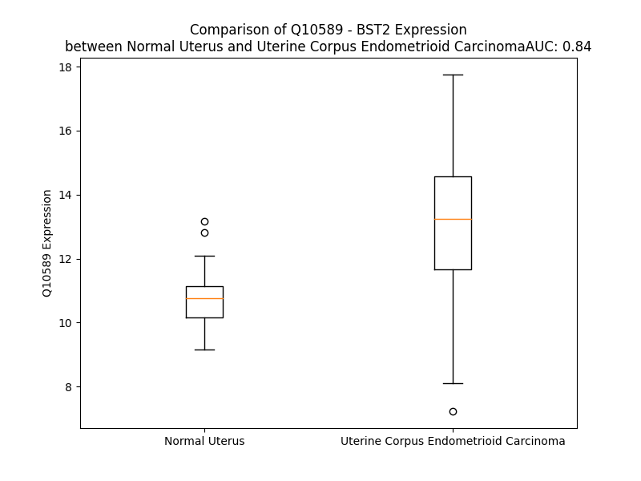

# Detailed Data for Q10589

## Introduction to the Detailed Summary

### How to Interpret the Results

- **Summary & Metrics**: This section provides a quick reference to essential protein attributes, including expression changes, family classification, and biomarker applications. Regulation status (upregulated/downregulated) indicates the protein's behavior in a disease context. Some information comes from the original excel file with the proteins selected from literature, while others are derived from the analyses.
- **Expression Comparison**: A visual representation comparing protein expression between normal and disease states. It highlights significant changes in expression levels that might indicate diagnostic or therapeutic relevance. This is data coming from transcriptomics experiments and could not translate similarly to protein levels.
- **Isoform Alignment**: An interactive view of isoform alignments, revealing structural and functional differences between variants of the protein.
- **Interactors & Homologs**: Tables listing known interaction partners and homologous proteins, the more interactors and homologs, the more complex the protein is to design an antibody for.
- **Biological Assemblies**: Information about the structural arrangement of the protein in different assemblies, providing insights into its functional state but also the complexity of the protein to develop antibodies.
- **Combined Per-Residue Information**: A detailed table summarizing residue-level data. This includes predictions for epitope regions, aggregation tendencies, and modifications that might impact the protein's function. Each row corresponds to a residue in the protein, providing insights into specific sites that may be important for research or drug development.
## Summary & Metrics

- **UniProt Accession**: Q10589
- **Gene Name**: BST2
- **Protein Name**: Bone marrow stromal antigen 2
- **Swiss Prot**: BST2_HUMAN
- **Family**: other
- **Biomarker Application**:  
- **Number of Isoforms**: 0
- **Regulation**: 1
- **(transcriptomics) AUC**: 0.84
- **(transcriptomics) Fold Change**: 1.21
- **(transcriptomics) Regulation**: Upregulated
- **Discotope Epitope Count**: 9
- **Max n_uniprots (Homo)**: 12
- **Max n_uniprots (Hetero)**: 10

## Expression Comparison

## Interactors

| preferredName_A   | preferredName_B   |   score |
|:------------------|:------------------|--------:|
| BST2              | LILRA4            |   0.995 |
| BST2              | MARCHF8           |   0.978 |
| BST2              | APOBEC3G          |   0.943 |

## Homologs

| uniprot_id   | gene_id   |
|--------------|-----------|

## Biological Assemblies

|   Unnamed: 0 |   assembly |   n_uniprots | composition   | crystal_id   |
|-------------:|-----------:|-------------:|:--------------|:-------------|
|            0 |          1 |            2 | Homo          | 2x7a         |
|            1 |          2 |            2 | Homo          | 2x7a         |
|            2 |          3 |            2 | Homo          | 2x7a         |
|            3 |          4 |            2 | Homo          | 2x7a         |
|            4 |          5 |            2 | Homo          | 2x7a         |
|            5 |          6 |            1 | Homo          | 2x7a         |
|            0 |          1 |            9 | Homo          | 3mq7         |
|            1 |          2 |           12 | Homo          | 3mq7         |
|            0 |          1 |           10 | Hetero        | 6cri         |
|            0 |          1 |            4 | Homo          | 3nwh         |
|            0 |          1 |            9 | Hetero        | 6cm9         |
|            0 |          1 |            2 | Hetero        | 7q9a         |
|            0 |          1 |            4 | Homo          | 3mq9         |
|            1 |          2 |            4 | Homo          | 3mq9         |
|            0 |          1 |           10 | Hetero        | 6d84         |
|            0 |          1 |            8 | Hetero        | 6d83         |
|            0 |          1 |            1 | Homo          | 2lk9         |
|            0 |          1 |            8 | Hetero        | 6dff         |
|            0 |          1 |            4 | Homo          | 3mqc         |
|            1 |          2 |            4 | Homo          | 3mqc         |
|            0 |          1 |            2 | Homo          | 2xg7         |
|            0 |          1 |            6 | Hetero        | 4p6z         |
|            0 |          1 |            4 | Homo          | 3mqb         |
|            1 |          2 |            2 | Homo          | 3mqb         |
|            2 |          3 |            2 | Homo          | 3mqb         |

## Combined Per-Residue Information

|   res | aa   |   epitope_score | epitope   |   relative_surface_accessibility |   modeling_confidence |   Aggregation | modification   | glycosylation                   |
|------:|:-----|----------------:|:----------|---------------------------------:|----------------------:|--------------:|:---------------|:--------------------------------|
|     1 | M    |         0.12956 | False     |                          1.33819 |                 45.63 |         0     | N/A            | N/A                             |
|     2 | A    |         0.19571 | False     |                          1.04652 |                 50.4  |         0     | N/A            | N/A                             |
|     3 | S    |         0.24067 | False     |                          0.89357 |                 55.98 |         0     | N/A            | N/A                             |
|     4 | T    |         0.22938 | False     |                          0.92514 |                 51.26 |         0     | N/A            | N/A                             |
|     5 | S    |         0.22414 | False     |                          0.77481 |                 52.14 |         0     | N/A            | N/A                             |
|     6 | Y    |         0.25249 | False     |                          0.93641 |                 50.06 |         0     | N/A            | N/A                             |
|     7 | D    |         0.2728  | False     |                          0.9048  |                 49.61 |         0     | N/A            | N/A                             |
|     8 | Y    |         0.28215 | False     |                          0.93495 |                 53.79 |         0     | N/A            | N/A                             |
|     9 | C    |         0.21363 | False     |                          0.9112  |                 49.09 |         0     | N/A            | N/A                             |
|    10 | R    |         0.28672 | False     |                          0.96687 |                 49.2  |         0     | N/A            | N/A                             |
|    11 | V    |         0.20075 | False     |                          0.8774  |                 52.94 |         0     | N/A            | N/A                             |
|    12 | P    |         0.23944 | False     |                          0.89547 |                 50.23 |         0     | N/A            | N/A                             |
|    13 | M    |         0.30279 | False     |                          1.01357 |                 56.77 |         0     | N/A            | N/A                             |
|    14 | E    |         0.2866  | False     |                          0.69556 |                 59.76 |         0     | N/A            | N/A                             |
|    15 | D    |         0.32508 | True      |                          0.70193 |                 59.72 |         0     | N/A            | N/A                             |
|    16 | G    |         0.24721 | False     |                          0.63859 |                 64.76 |         0     | N/A            | N/A                             |
|    17 | D    |         0.20272 | False     |                          0.42449 |                 77.29 |         0     | N/A            | N/A                             |
|    18 | K    |         0.22197 | False     |                          0.66461 |                 81.19 |         0     | N/A            | N/A                             |
|    19 | R    |         0.2071  | False     |                          0.7629  |                 80.85 |         0     | N/A            | N/A                             |
|    20 | C    |         0.20488 | False     |                          0.63423 |                 79.58 |         0     | N/A            | N/A                             |
|    21 | K    |         0.17763 | False     |                          0.62824 |                 84.77 |         0     | N/A            | N/A                             |
|    22 | L    |         0.20203 | False     |                          0.70742 |                 87.76 |        62.004 | N/A            | N/A                             |
|    23 | L    |         0.21566 | False     |                          0.75907 |                 87.98 |        71.831 | N/A            | N/A                             |
|    24 | L    |         0.23111 | False     |                          0.72478 |                 90.29 |        76.779 | N/A            | N/A                             |
|    25 | G    |         0.18995 | False     |                          0.42271 |                 91.16 |        77.684 | N/A            | N/A                             |
|    26 | I    |         0.20485 | False     |                          0.49588 |                 92.98 |        87.741 | N/A            | N/A                             |
|    27 | G    |         0.1612  | False     |                          0.46636 |                 92.7  |        88.661 | N/A            | N/A                             |
|    28 | I    |         0.19988 | False     |                          0.52821 |                 94.32 |        98.877 | N/A            | N/A                             |
|    29 | L    |         0.25146 | False     |                          0.62628 |                 94.93 |        99.811 | N/A            | N/A                             |
|    30 | V    |         0.17729 | False     |                          0.50936 |                 94.24 |        99.982 | N/A            | N/A                             |
|    31 | L    |         0.23316 | False     |                          0.66172 |                 94.32 |        99.997 | N/A            | N/A                             |
|    32 | L    |         0.27602 | False     |                          0.56056 |                 95.29 |        99.999 | N/A            | N/A                             |
|    33 | I    |         0.18501 | False     |                          0.48558 |                 95.18 |        99.999 | N/A            | N/A                             |
|    34 | I    |         0.19909 | False     |                          0.62213 |                 93.99 |        99.989 | N/A            | N/A                             |
|    35 | V    |         0.20594 | False     |                          0.55982 |                 94.61 |        99.88  | N/A            | N/A                             |
|    36 | I    |         0.21846 | False     |                          0.66074 |                 94.64 |        98.592 | N/A            | N/A                             |
|    37 | L    |         0.27328 | False     |                          0.64977 |                 94.57 |        84.52  | N/A            | N/A                             |
|    38 | G    |         0.17974 | False     |                          0.23198 |                 94.01 |         7.639 | N/A            | N/A                             |
|    39 | V    |         0.31316 | True      |                          0.52228 |                 93.63 |         0.717 | N/A            | N/A                             |
|    40 | P    |         0.2367  | False     |                          0.53253 |                 94.75 |         0.156 | N/A            | N/A                             |
|    41 | L    |         0.17823 | False     |                          0.67831 |                 95.23 |         0.014 | N/A            | N/A                             |
|    42 | I    |         0.23422 | False     |                          0.62946 |                 94.38 |         0.023 | N/A            | N/A                             |
|    43 | I    |         0.23235 | False     |                          0.61931 |                 94.01 |         0.023 | N/A            | N/A                             |
|    44 | F    |         0.2336  | False     |                          0.69304 |                 94.43 |         0.023 | N/A            | N/A                             |
|    45 | T    |         0.17003 | False     |                          0.55843 |                 93.68 |         0.023 | N/A            | N/A                             |
|    46 | I    |         0.20484 | False     |                          0.71405 |                 93.94 |         0.022 | N/A            | N/A                             |
|    47 | K    |         0.25533 | False     |                          0.70965 |                 93.53 |         0     | N/A            | N/A                             |
|    48 | A    |         0.14798 | False     |                          0.40563 |                 92.1  |         0     | N/A            | N/A                             |
|    49 | N    |         0.34389 | True      |                          0.66946 |                 92.89 |         0     | N/A            | N/A                             |
|    50 | S    |         0.2371  | False     |                          0.31483 |                 94.96 |         0     | N/A            | N/A                             |
|    51 | E    |         0.22101 | False     |                          0.71266 |                 95.04 |         0     | N/A            | N/A                             |
|    52 | A    |         0.21221 | False     |                          0.76508 |                 94.37 |         0     | N/A            | N/A                             |
|    53 | C    |         0.16099 | False     |                          0.42382 |                 94.29 |         0     | N/A            | N/A                             |
|    54 | R    |         0.25646 | False     |                          0.62844 |                 95.3  |         0     | N/A            | N/A                             |
|    55 | D    |         0.15694 | False     |                          0.46544 |                 96.75 |         0     | N/A            | N/A                             |
|    56 | G    |         0.12499 | False     |                          0.4125  |                 96.53 |         0     | N/A            | N/A                             |
|    57 | L    |         0.19081 | False     |                          0.70756 |                 96.33 |         0     | N/A            | N/A                             |
|    58 | R    |         0.255   | False     |                          0.6509  |                 97.26 |         0     | N/A            | N/A                             |
|    59 | A    |         0.26719 | False     |                          0.52168 |                 97.08 |         0     | N/A            | N/A                             |
|    60 | V    |         0.14908 | False     |                          0.67766 |                 97.61 |         0     | N/A            | N/A                             |
|    61 | M    |         0.24095 | False     |                          0.53598 |                 97.64 |         0     | N/A            | N/A                             |
|    62 | E    |         0.25327 | False     |                          0.51254 |                 97.89 |         0     | N/A            | N/A                             |
|    63 | C    |         0.26074 | False     |                          0.6006  |                 97.76 |         0     | N/A            | N/A                             |
|    64 | R    |         0.28297 | False     |                          0.5951  |                 97.91 |         0     | N/A            | N/A                             |
|    65 | N    |         0.35022 | True      |                          0.59822 |                 97.05 |         0     | N/A            | N-linked (GlcNAc...) asparagine |
|    66 | V    |         0.26986 | False     |                          0.68271 |                 97.78 |         0     | N/A            | N/A                             |
|    67 | T    |         0.26246 | False     |                          0.52012 |                 97.75 |         0     | N/A            | N/A                             |
|    68 | H    |         0.30074 | False     |                          0.55064 |                 97.66 |         0     | N/A            | N/A                             |
|    69 | L    |         0.33368 | True      |                          0.65102 |                 97.81 |         0     | N/A            | N/A                             |
|    70 | L    |         0.2372  | False     |                          0.63346 |                 98.18 |         0     | N/A            | N/A                             |
|    71 | Q    |         0.24563 | False     |                          0.56253 |                 98.19 |         0     | N/A            | N/A                             |
|    72 | Q    |         0.26792 | False     |                          0.5861  |                 98.24 |         0     | N/A            | N/A                             |
|    73 | E    |         0.15773 | False     |                          0.5042  |                 97.86 |         0     | N/A            | N/A                             |
|    74 | L    |         0.2419  | False     |                          0.68321 |                 98.4  |         0     | N/A            | N/A                             |
|    75 | T    |         0.20035 | False     |                          0.43465 |                 98.13 |         0     | N/A            | N/A                             |
|    76 | E    |         0.15684 | False     |                          0.57885 |                 98.38 |         0     | N/A            | N/A                             |
|    77 | A    |         0.13159 | False     |                          0.44291 |                 98.09 |         0     | N/A            | N/A                             |
|    78 | Q    |         0.22664 | False     |                          0.54816 |                 98.3  |         0     | N/A            | N/A                             |
|    79 | K    |         0.22863 | False     |                          0.64049 |                 98.39 |         0     | N/A            | N/A                             |
|    80 | G    |         0.20297 | False     |                          0.42529 |                 98.18 |         0     | N/A            | N/A                             |
|    81 | F    |         0.2212  | False     |                          0.77086 |                 98.03 |         0     | N/A            | N/A                             |
|    82 | Q    |         0.27722 | False     |                          0.51573 |                 98.28 |         0     | N/A            | N/A                             |
|    83 | D    |         0.17493 | False     |                          0.62098 |                 98.23 |         0     | N/A            | N/A                             |
|    84 | V    |         0.10961 | False     |                          0.64927 |                 98.23 |         0     | N/A            | N/A                             |
|    85 | E    |         0.22521 | False     |                          0.63049 |                 98.32 |         0     | N/A            | N/A                             |
|    86 | A    |         0.20271 | False     |                          0.55878 |                 97.99 |         0     | N/A            | N/A                             |
|    87 | Q    |         0.19352 | False     |                          0.63784 |                 98.3  |         0     | N/A            | N/A                             |
|    88 | A    |         0.16175 | False     |                          0.54153 |                 98.34 |         0     | N/A            | N/A                             |
|    89 | A    |         0.20359 | False     |                          0.59792 |                 97.99 |         0     | N/A            | N/A                             |
|    90 | T    |         0.23873 | False     |                          0.63616 |                 98.15 |         0     | N/A            | N/A                             |
|    91 | C    |         0.20424 | False     |                          0.52943 |                 98.45 |         0     | N/A            | N/A                             |
|    92 | N    |         0.24174 | False     |                          0.56886 |                 98.26 |         0     | N/A            | N-linked (GlcNAc...) asparagine |
|    93 | H    |         0.27207 | False     |                          0.73984 |                 98.24 |         0     | N/A            | N/A                             |
|    94 | T    |         0.1397  | False     |                          0.45788 |                 98.45 |         6.052 | N/A            | N/A                             |
|    95 | V    |         0.10716 | False     |                          0.47699 |                 98.64 |        13.38  | N/A            | N/A                             |
|    96 | M    |         0.22366 | False     |                          0.68824 |                 98.31 |        13.651 | N/A            | N/A                             |
|    97 | A    |         0.23298 | False     |                          0.49369 |                 98.39 |        13.651 | N/A            | N/A                             |
|    98 | L    |         0.14484 | False     |                          0.69771 |                 98.71 |        13.651 | N/A            | N/A                             |
|    99 | M    |         0.25876 | False     |                          0.63453 |                 98.64 |        11.858 | N/A            | N/A                             |
|   100 | A    |         0.21343 | False     |                          0.61051 |                 98.38 |         6.468 | N/A            | N/A                             |
|   101 | S    |         0.16221 | False     |                          0.53467 |                 98.38 |         1.655 | N/A            | N/A                             |
|   102 | L    |         0.11311 | False     |                          0.70671 |                 98.68 |         1.484 | N/A            | N/A                             |
|   103 | D    |         0.16386 | False     |                          0.56458 |                 98.59 |         0     | N/A            | N/A                             |
|   104 | A    |         0.20003 | False     |                          0.59644 |                 98.51 |         0     | N/A            | N/A                             |
|   105 | E    |         0.14231 | False     |                          0.60965 |                 98.39 |         0     | N/A            | N/A                             |
|   106 | K    |         0.18328 | False     |                          0.63064 |                 98.54 |         0     | N/A            | N/A                             |
|   107 | A    |         0.27143 | False     |                          0.55259 |                 98.41 |         0     | N/A            | N/A                             |
|   108 | Q    |         0.2557  | False     |                          0.51379 |                 98.57 |         0     | N/A            | N/A                             |
|   109 | G    |         0.12448 | False     |                          0.37194 |                 98.44 |         0     | N/A            | N/A                             |
|   110 | Q    |         0.15644 | False     |                          0.57873 |                 98.5  |         0     | N/A            | N/A                             |
|   111 | K    |         0.30468 | False     |                          0.71373 |                 98.35 |         0     | N/A            | N/A                             |
|   112 | K    |         0.17766 | False     |                          0.53673 |                 98.42 |         0     | N/A            | N/A                             |
|   113 | V    |         0.18677 | False     |                          0.70515 |                 98.63 |         0     | N/A            | N/A                             |
|   114 | E    |         0.22054 | False     |                          0.6706  |                 98.39 |         0     | N/A            | N/A                             |
|   115 | E    |         0.24474 | False     |                          0.5184  |                 98.44 |         0     | N/A            | N/A                             |
|   116 | L    |         0.17039 | False     |                          0.61909 |                 98.53 |         0     | N/A            | N/A                             |
|   117 | E    |         0.20756 | False     |                          0.56369 |                 98.39 |         0     | N/A            | N/A                             |
|   118 | G    |         0.26629 | False     |                          0.4174  |                 98.49 |         0     | N/A            | N/A                             |
|   119 | E    |         0.16023 | False     |                          0.55862 |                 98.46 |         0     | N/A            | N/A                             |
|   120 | I    |         0.18243 | False     |                          0.67147 |                 98.51 |         0.141 | N/A            | N/A                             |
|   121 | T    |         0.18922 | False     |                          0.57593 |                 98.48 |         0.141 | N/A            | N/A                             |
|   122 | T    |         0.30215 | False     |                          0.51713 |                 98.54 |         0.141 | N/A            | N/A                             |
|   123 | L    |         0.23377 | False     |                          0.74357 |                 98.43 |         0.141 | N/A            | N/A                             |
|   124 | N    |         0.24921 | False     |                          0.5956  |                 98.38 |         0.141 | N/A            | N/A                             |
|   125 | H    |         0.24292 | False     |                          0.70502 |                 98.5  |         0     | N/A            | N/A                             |
|   126 | K    |         0.20289 | False     |                          0.64994 |                 98.32 |         0     | N/A            | N/A                             |
|   127 | L    |         0.18681 | False     |                          0.78495 |                 98.34 |         0     | N/A            | N/A                             |
|   128 | Q    |         0.18219 | False     |                          0.59443 |                 98.39 |         0     | N/A            | N/A                             |
|   129 | D    |         0.15257 | False     |                          0.60492 |                 98.31 |         0     | N/A            | N/A                             |
|   130 | A    |         0.17061 | False     |                          0.50624 |                 98.05 |         0     | N/A            | N/A                             |
|   131 | S    |         0.22891 | False     |                          0.50962 |                 98.06 |         0     | N/A            | N/A                             |
|   132 | A    |         0.2534  | False     |                          0.56134 |                 98.01 |         0     | N/A            | N/A                             |
|   133 | E    |         0.12263 | False     |                          0.37951 |                 97.97 |         0     | N/A            | N/A                             |
|   134 | V    |         0.16426 | False     |                          0.68611 |                 98.05 |         0     | N/A            | N/A                             |
|   135 | E    |         0.23932 | False     |                          0.40745 |                 97.81 |         0     | N/A            | N/A                             |
|   136 | R    |         0.29721 | False     |                          0.39135 |                 97.98 |         0     | N/A            | N/A                             |
|   137 | L    |         0.17678 | False     |                          0.48129 |                 97.45 |         0     | N/A            | N/A                             |
|   138 | R    |         0.27313 | False     |                          0.58673 |                 97.58 |         0     | N/A            | N/A                             |
|   139 | R    |         0.30913 | False     |                          0.58674 |                 96.97 |         0     | N/A            | N/A                             |
|   140 | E    |         0.15735 | False     |                          0.38601 |                 96.96 |         0     | N/A            | N/A                             |
|   141 | N    |         0.15135 | False     |                          0.50232 |                 95.78 |         0     | N/A            | N/A                             |
|   142 | Q    |         0.22041 | False     |                          0.52395 |                 95.83 |         0.537 | N/A            | N/A                             |
|   143 | V    |         0.20623 | False     |                          0.52346 |                 95.09 |         0.537 | N/A            | N/A                             |
|   144 | L    |         0.16959 | False     |                          0.58282 |                 94.43 |         0.537 | N/A            | N/A                             |
|   145 | S    |         0.19219 | False     |                          0.4959  |                 93.58 |         0.537 | N/A            | N/A                             |
|   146 | V    |         0.15535 | False     |                          0.65476 |                 92.46 |         0.537 | N/A            | N/A                             |
|   147 | R    |         0.20172 | False     |                          0.62172 |                 91.64 |         0     | N/A            | N/A                             |
|   148 | I    |         0.17189 | False     |                          0.60293 |                 91.2  |         0     | N/A            | N/A                             |
|   149 | A    |         0.15633 | False     |                          0.55208 |                 89.03 |         0     | N/A            | N/A                             |
|   150 | D    |         0.15962 | False     |                          0.57162 |                 87.31 |         0     | N/A            | N/A                             |
|   151 | K    |         0.13183 | False     |                          0.80392 |                 82.58 |         0     | N/A            | N/A                             |
|   152 | K    |         0.29614 | False     |                          0.81532 |                 77.23 |         0     | N/A            | N/A                             |
|   153 | Y    |         0.2397  | False     |                          0.82365 |                 73.33 |         0     | N/A            | N/A                             |
|   154 | Y    |         0.32015 | True      |                          0.81    |                 55.89 |         0     | N/A            | N/A                             |
|   155 | P    |         0.23948 | False     |                          0.75249 |                 56.28 |         0     | N/A            | N/A                             |
|   156 | S    |         0.20838 | False     |                          0.85683 |                 52.82 |         0     | N/A            | N/A                             |
|   157 | S    |         0.16563 | False     |                          0.84554 |                 43.68 |         0     | N/A            | N/A                             |
|   158 | Q    |         0.24003 | False     |                          0.84189 |                 39.19 |         0     | N/A            | N/A                             |
|   159 | D    |         0.29731 | False     |                          0.83081 |                 33.54 |         0     | N/A            | N/A                             |
|   160 | S    |         0.32653 | True      |                          0.85863 |                 36.13 |         0     | N/A            | N/A                             |
|   161 | S    |         0.15516 | False     |                          0.79777 |                 38.48 |         0     | N/A            | N/A                             |
|   162 | S    |         0.31902 | True      |                          0.8126  |                 39.91 |         0     | N/A            | N/A                             |
|   163 | A    |         0.18173 | False     |                          1.01435 |                 45.04 |         0     | N/A            | N/A                             |
|   164 | A    |         0.21226 | False     |                          0.78441 |                 45.19 |         0     | N/A            | N/A                             |
|   165 | A    |         0.27101 | False     |                          0.88988 |                 53.35 |         0     | N/A            | N/A                             |
|   166 | P    |         0.33685 | True      |                          0.69987 |                 52.95 |         0.039 | N/A            | N/A                             |
|   167 | Q    |         0.14259 | False     |                          0.68237 |                 56.59 |         3.226 | N/A            | N/A                             |
|   168 | L    |         0.14049 | False     |                          0.8306  |                 54.18 |        83.782 | N/A            | N/A                             |
|   169 | L    |         0.21251 | False     |                          0.7066  |                 57.55 |        97.734 | N/A            | N/A                             |
|   170 | I    |         0.12168 | False     |                          0.73458 |                 64.98 |        99.495 | N/A            | N/A                             |
|   171 | V    |         0.11703 | False     |                          0.66277 |                 68.27 |        99.65  | N/A            | N/A                             |
|   172 | L    |         0.24506 | False     |                          0.68357 |                 66.53 |        99.628 | N/A            | N/A                             |
|   173 | L    |         0.17376 | False     |                          0.71462 |                 65.45 |        95.125 | N/A            | N/A                             |
|   174 | G    |         0.15089 | False     |                          0.53478 |                 66.44 |        66.187 | N/A            | N/A                             |
|   175 | L    |         0.20034 | False     |                          0.56874 |                 66.99 |        63.514 | N/A            | N/A                             |
|   176 | S    |         0.2237  | False     |                          0.51911 |                 64.8  |        48.854 | N/A            | N/A                             |
|   177 | A    |         0.13858 | False     |                          0.75016 |                 61.95 |        47.034 | N/A            | N/A                             |
|   178 | L    |         0.17629 | False     |                          0.96193 |                 66.6  |        45.495 | N/A            | N/A                             |
|   179 | L    |         0.24567 | False     |                          0.97623 |                 56.5  |        42.42  | N/A            | N/A                             |
|   180 | Q    |         0.1747  | False     |                          1.12512 |                 54.92 |         0     | N/A            | N/A                             |

