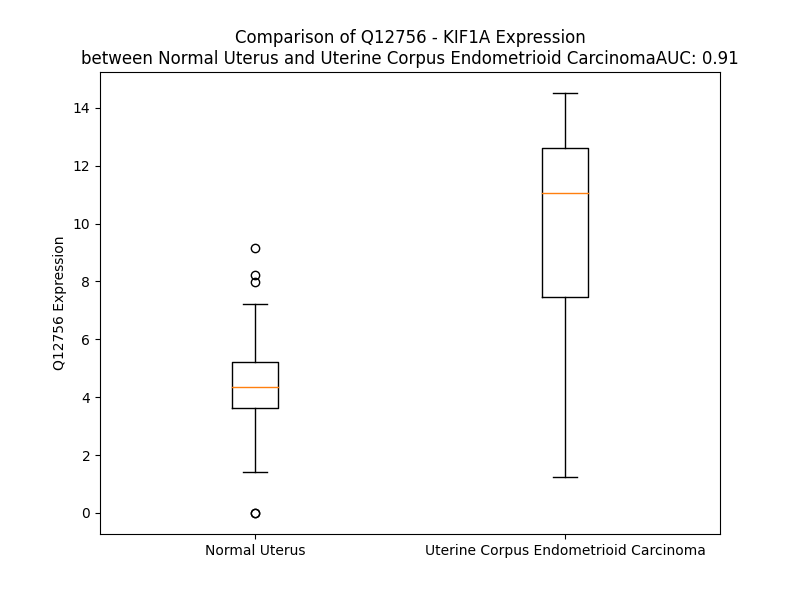

# Detailed Data for Q12756

## Introduction to the Detailed Summary

### How to Interpret the Results

- **Summary & Metrics**: This section provides a quick reference to essential protein attributes, including expression changes, family classification, and biomarker applications. Regulation status (upregulated/downregulated) indicates the protein's behavior in a disease context. Some information comes from the original excel file with the proteins selected from literature, while others are derived from the analyses.
- **Expression Comparison**: A visual representation comparing protein expression between normal and disease states. It highlights significant changes in expression levels that might indicate diagnostic or therapeutic relevance. This is data coming from transcriptomics experiments and could not translate similarly to protein levels.
- **Isoform Alignment**: An interactive view of isoform alignments, revealing structural and functional differences between variants of the protein.
- **Interactors & Homologs**: Tables listing known interaction partners and homologous proteins, the more interactors and homologs, the more complex the protein is to design an antibody for.
- **Biological Assemblies**: Information about the structural arrangement of the protein in different assemblies, providing insights into its functional state but also the complexity of the protein to develop antibodies.
- **Combined Per-Residue Information**: A detailed table summarizing residue-level data. This includes predictions for epitope regions, aggregation tendencies, and modifications that might impact the protein's function. Each row corresponds to a residue in the protein, providing insights into specific sites that may be important for research or drug development.
## Summary & Metrics

- **UniProt Accession**: Q12756
- **Gene Name**: KIF1A
- **Protein Name**: Kinesin-like protein KIF1A
- **Swiss Prot**: KIF1A_HUMAN
- **Family**: other
- **Biomarker Application**: diagnosis,prognosis
- **Number of Isoforms**: 3
- **Regulation**: 1
- **(transcriptomics) AUC**: 0.91
- **(transcriptomics) Fold Change**: 2.25
- **(transcriptomics) Regulation**: Upregulated
- **Discotope Epitope Count**: 362
- **Max n_uniprots (Homo)**: 2
- **Max n_uniprots (Hetero)**: 7

## Expression Comparison

## Isoform Alignment

<pre style='font-size:14px; font-family:monospace;'>Q12756-1 MAGASVKVAVRVRPFNSREMSRDSKCIIQMSGSTTTIVNPKQPKETPKSFSFDYSYWSHTSPEDINYASQKQVYRDIGEEMLQHAFEGYNVCIFAYGQTGAGKSYTMMGKQEKDQQGIIPQLCEDLFSRINDTTNDNMSYSVEVSYMEIYCERVRDLLNPKNKGNLRVREHPLLGPYVEDLSKLAVTSYNDIQDLMDSGNKARTVAATNMNETSSRSHAVFNIIFTQKRHDAETNITTEKVSKISLVDLAGSERADSTGAKGTRLKEGANINKSLTTLGKVISALAEMDSGPNKNKKKKKTDFIPYRDSVLTWLLRENLGGNSRTAMVAALSPADINYDETLSTLRYADRAKQIRCNAVINEDPNNKLIRELKDEVTRLRDLLYAQGLGDITD---------MTNALVGMSPSSSLSALSSRAASVSSLHERILFAPGSEEAIERLKETEKIIAELNETWEEKLRRTEAIRMEREALLAEMGVAMREDGGTLGVFSPKKTPHLVNLNEDPLMSECLLYYIKDGITRVGREDGERRQDIVLSGHFIKEEHCVFRSDSRGGSEAVVTLEPCEGADTYVNGKKVTEPSILRSGNRIIMGKSHVFRFNHPEQARQERERTPCAETPAEPVDWAFAQRELLEKQGIDMKQEMEQRLQELEDQYRREREEATYLLEQQRLDYESKLEALQKQMDSRYYPEVNEEEEEPEDEVQWTERECELALWAFRKWKWYQFTSLRDLLWGNAIFLKEANAISVELKKKVQFQFVLLTDTLYSPLPPDLLPPEAAKDRETRPFPRTIVAVEVQDQKNGATHYWTLEKLRQRLDLMREMYDRAAEVPSSVIEDCDNVVTGGDPFYDRFPWFRLV--------------------------------------------------------------------------------------------GRAFVYLSNLLYPVPLVHRVAIVSEKGEVKGFLRVAVQAISADEEAPDYGSGVRQSGTAKISFDDQHFEKFQSESCPVVGMSRSGTSQEELRIVEGQGQGADVGPSADEVNNNTCSAVPPEGLLLDSSEKAALDGPLDAALDHLRLGNTFTFRVTVLQASSISAEYADIFCQFNFIHRHDEAFSTEPLKNTGRGPPLGFYHVQNIAVEVTKSFIEYIKSQPIVFEVFGHYQQHPFPPLCKDVLSPLRPSRRHFPRVMPLSKPVPATKLSTLTRPCPGPCHCKYDLLVYFEICELEANGDYIPAVVDHRGGMPCMGTFLLHQGIQRRITVTLLHETGSHIRWKEVRELVVGRIRNTPETDESLIDPNILSLNILSSGYIHPAQDD--------RTFYQFEAAWDSSMHNSLLLNRVTPYREKIYMTLSAYIEMENCTQPAVVTKDFCMVFYSRDAKLPASRSIRNLFGSGSLRASESNRVTGVYELSLCHVADAGSPGMQRRRRRVLDTSVAYVRGEENLAGWRPRSDSLILDHQWELEKLSLLQEVEKTRHYLLLREKLETAQRPVPEALSPAFSEDSESHGSSSASSPLSAEGRPSPLEAPNERQRELAVKCLRLLTHTFNREYTHSHVCVSASESKLSEMSVTLLRDPSMSPLGVATLTPSSTCPSLVEGRYGATDLRTPQPCSRPASPEPELLPEADSKKLPSPARATETDKEPQRLLVPDIQEIRVSPIVSKKGYLHFLEPHTSGWARRFVVVRRPYAYMYNSDKDTVERFVLNLATAQVEYSEDQQAMLKTPNTFAVCTEHRGILLQAASDKDMHDWLYAFNPLLAGTIRSKLSRRRSAQMRV
Q12756-2 MAGASVKVAVRVRPFNSREMSRDSKCIIQMSGSTTTIVNPKQPKETPKSFSFDYSYWSHTSPEDINYASQKQVYRDIGEEMLQHAFEGYNVCIFAYGQTGAGKSYTMMGKQEKDQQGIIPQLCEDLFSRINDTTNDNMSYSVEVSYMEIYCERVRDLLNPKNKGNLRVREHPLLGPYVEDLSKLAVTSYNDIQDLMDSGNKARTVAATNMNETSSRSHAVFNIIFTQKRHDAETNITTEKVSKISLVDLAGSERADSTGAKGTRLKEGANINKSLTTLGKVISALAEMDSGPNKNKKKKKTDFIPYRDSVLTWLLRENLGGNSRTAMVAALSPADINYDETLSTLRYADRAKQIRCNAVINEDPNNKLIRELKDEVTRLRDLLYAQGLGDITDTNTVPGGPKLTNALVGMSPSSSLSALSSRAASVSSLHERILFAPGSEEAIERLKETEKIIAELNETWEEKLRRTEAIRMEREALLAEMGVAMREDGGTLGVFSPKKTPHLVNLNEDPLMSECLLYYIKDGITRVGREDGERRQDIVLSGHFIKEEHCVFRSDSRGGSEAVVTLEPCEGADTYVNGKKVTEPSILRSGNRIIMGKSHVFRFNHPEQARQERERTPCAETPAEPVDWAFAQRELLEKQGIDMKQEMEQRLQELEDQYRREREEATYLLEQQRLDYESKLEALQKQMDSRYYPEVNEEEEEPEDEVQWTERECELALWAFRKWKWYQFTSLRDLLWGNAIFLKEANAISVELKKKVQFQFVLLTDTLYSPLPPDLLPPEAAKDRETRPFPRTIVAVEVQDQKNGATHYWTLEKLRQRLDLMREMYDRAAEVPSSVIEDCDNVVTGGDPFYDRFPWFRLVGSSAISGCNSYPLLNTCMSERMAALTPSPTFSSPDSDATEPAEEQSVGEEEEEEEEEEDEEEEDLEDDVFPEHALCDGRDPFYDRPPLFSLVGRAFVYLSNLLYPVPLVHRVAIVSEKGEVKGFLRVAVQAISADEEAPDYGSGVRQSGTAKISFDDQHFEKFQSESCPVVGMSRSGTSQEELRIVEGQGQGADVGPSADEVNNNTCSAVPPEGLLLDSSEKAALDGPLDAALDHLRLGNTFTFRVTVLQASSISAEYADIFCQFNFIHRHDEAFSTEPLKNTGRGPPLGFYHVQNIAVEVTKSFIEYIKSQPIVFEVFGHYQQHPFPPLCKDVLSPLRPSRRHFPRVMPLSKPVPATKLSTLTRPCPGPCHCKYDLLVYFEICELEANGDYIPAVVDHRGGMPCMGTFLLHQGIQRRITVTLLHETGSHIRWKEVRELVVGRIRNTPETDESLIDPNILSLNILSSGYIHPAQDDRVSLGNDTRTFYQFEAAWDSSMHNSLLLNRVTPYREKIYMTLSAYIEMENCTQPAVVTKDFCMVFYSRDAKLPASRSIRNLFGSGSLRASESNRVTGVYELSLCHVADAGSPGMQRRRRRVLDTSVAYVRGEENLAGWRPRSDSLILDHQWELEKLSLLQEVEKTRHYLLLREKLETAQRPVPEALSPAFSEDSESHGSSSASSPLSAEGRPSPLEAPNERQRELAVKCLRLLTHTFNREYTHSHVCVSASESKLSEMSVTLLRDPSMSPLGVATLTPSSTCPSLVEGRYGATDLRTPQPCSRPASPEPELLPEADSKKLPSPARATETDKEPQRLLVPDIQEIRVSPIVSKKGYLHFLEPHTSGWARRFVVVRRPYAYMYNSDKDTVERFVLNLATAQVEYSEDQQAMLKTPNTFAVCTEHRGILLQAASDKDMHDWLYAFNPLLAGTIRSKLSRRRSAQMRV
Q12756-3 MAGASVKVAVRVRPFNSREMSRDSKCIIQMSGSTTTIVNPKQPKETPKSFSFDYSYWSHTSPEDINYASQKQVYRDIGEEMLQHAFEGYNVCIFAYGQTGAGKSYTMMGKQEKDQQGIIPQLCEDLFSRINDTTNDNMSYSVEVSYMEIYCERVRDLLNPKNKGNLRVREHPLLGPYVEDLSKLAVTSYNDIQDLMDSGNKARTVAATNMNETSSRSHAVFNIIFTQKRHDAETNITTEKVSKISLVDLAGSERADSTGAKGTRLKEGANINKSLTTLGKVISALAEMDSGPNKNKKKKKTDFIPYRDSVLTWLLRENLGGNSRTAMVAALSPADINYDETLSTLRYADRAKQIRCNAVINEDPNNKLIRELKDEVTRLRDLLYAQGLGDITDTNTVPGGPKLTNALVGMSPSSSLSALSSRAASVSSLHERILFAPGSEEAIERLKETEKIIAELNETWEEKLRRTEAIRMEREALLAEMGVAMREDGGTLGVFSPKKTPHLVNLNEDPLMSECLLYYIKDGITRVGREDGERRQDIVLSGHFIKEEHCVFRSDSRGGSEAVVTLEPCEGADTYVNGKKVTEPSILRSGNRIIMGKSHVFRFNHPEQARQERERTPCAETPAEPVDWAFAQRELLEKQGIDMKQEMEQRLQELEDQYRREREEATYLLEQQRLDYESKLEALQKQMDSRYYPEVNEEEEEPEDEVQWTERECELALWAFRKWKWYQFTSLRDLLWGNAIFLKEANAISVELKKKVQFQFVLLTDTLYSPLPPDLLPPEAAKDRETRPFPRTIVAVEVQDQKNGATHYWTLEKLRQRLDLMREMYDRAAEVPSSVIEDCDNVVTGGDPFYDRFPWFRLVGSSAISGCNSYPLLNTCMSERMAALTPSPTFSSPDSDATEPAEEQSVGEEEEEEEEEEDEEEEDLEDDVFPEHALCDGRDPFYDRPPLFSLVGRAFVYLSNLLYPVPLVHRVAIVSEKGEVKGFLRVAVQAISADEEAPDYGSGVRQSGTAKISFDDQHFEKFQSESCPVVGMSRSGTSQEELRIVEGQGQGADVGPSADEVNNNTCSAVPPEGLLLDSSEKAALDGPLDAALDHLRLGNTFTFRVTVLQASSISAEYADIFCQFNFIHRHDEAFSTEPLKNTGRGPPLGFYHVQNIAVEVTKSFIEYIKSQPIVFEVFGHYQQHPFPPLCKDVLSPLRPSRRHFPRVMPLSKPVPATKLSTLTRPCPGPCHCKYDLLVYFEICELEANGDYIPAVVDHRGGMPCMGTFLLHQGIQRRITVTLLHETGSHIRWKEVRELVVGRIRNTPETDESLIDPNILSLNILSSGYIHPAQDD--------RTFYQFEAAWDSSMHNSLLLNRVTPYREKIYMTLSAYIEMENCTQPAVVTKDFCMVFYSRDAKLPASRSIRNLFGSGSLRASESNRVTGVYELSLCHVADAGSPGMQRRRRRVLDTSVAYVRGEENLAGWRPRSDSLILDHQWELEKLSLLQEVEKTRHYLLLREKLETAQRPVPEALSPAFSEDSESHGSSSASSPLSAEGRPSPLEAPNERQRELAVKCLRLLTHTFNREYTHSHVCVSASESKLSEMSVTLLRDPSMSPLGVATLTPSSTCPSLVEGRYGATDLRTPQPCSRPASPEPELLPEADSKKLPSPARATETDKEPQRLLVPDIQEIRVSPIVSKKGYLHFLEPHTSGWARRFVVVRRPYAYMYNSDKDTVERFVLNLATAQVEYSEDQQAMLKTPNTFAVCTEHRGILLQAASDKDMHDWLYAFNPLLAGTIRSKLSRRRSAQMRV
</pre>

## Interactors

| preferredName_A   | preferredName_B   |   score |
|:------------------|:------------------|--------:|
| KIF1A             | TUBA1A            |   0.96  |
| KIF1A             | TUBB2B            |   0.939 |

## Homologs

| uniprot_id   | gene_id   |
|:-------------|:----------|
| D6RHK2       | CENPE     |
| H0YI78       | KIF21A    |
| Q2KJY2       | KIF26B    |
| Q8NI77       | KIF18A    |
| Q2VIQ3       | KIF4B     |
| Q9P2E2       | KIF17     |
| Q9NQT8       | KIF13B    |
| O43896       | KIF1C     |
| V9HW29       | HEL-S-61  |
| D6R9E4       | KIF20A    |
| Q2MDE8       | KIF6      |
| Q9ULI4       | KIF26A    |
| C9JWZ7       | KIF9      |
| O75037       | KIF21B    |
| Q9UIL4       | KIF25     |
| H7C2F6       | KIF3A     |
| A0A8Q3SIT2   | KIF1B     |
| A0A1B0GTU3   | KIF16B    |
| D6RCT7       | KIF15     |
| A0A6Q8PGN1   | KIF5A     |
| O95239       | KIF4A     |
| F8WD21       | KIF7      |
| Q8N4N8       | KIF2B     |
| A2AB20       | KIFC1     |
| Q5T7B8       | KIF24     |
| Q99661       | KIF2C     |
| Q15058       | KIF14     |
| A0A0G2JMZ6   | KIF5C     |
| O15066       | KIF3B     |
| F8WAR6       | KIF3C     |
| A0A2R8Y531   | KIF23     |
| Q2TAC6       | KIF19     |
| Q86Y91       | KIF18B    |
| A0A2R8Y870   | KIFC2     |
| H3BTL6       | KIFC3     |
| A0A1W2PPS5   | KIF12     |
| Q86VH2       | KIF27     |
| P52732       | KIF11     |
| A0A1B0GUA8   | KIF13A    |
| A0A6Q8PH57   | KIF2A     |
| A0A8I5QJC5   | KIF22     |

## Biological Assemblies

|   Unnamed: 0 |   assembly |   n_uniprots | composition   | crystal_id   |
|-------------:|-----------:|-------------:|:--------------|:-------------|
|            0 |          1 |            4 | Hetero        | 8utu         |
|            0 |          1 |            3 | Hetero        | 4uxo         |
|            0 |          1 |            3 | Hetero        | 4uxs         |
|            0 |          1 |            3 | Hetero        | 8uts         |
|            0 |          1 |            4 | Hetero        | 8utv         |
|            0 |          1 |            3 | Hetero        | 8utr         |
|            0 |          1 |            3 | Hetero        | 4uxp         |
|            0 |          1 |            7 | Hetero        | 8utp         |
|            0 |          1 |            7 | Hetero        | 8uto         |
|            0 |          1 |            3 | Hetero        | 4uxr         |
|            0 |          1 |            7 | Hetero        | 8utn         |
|            0 |          1 |            5 | Hetero        | 8utq         |
|            0 |          1 |            2 | Homo          | 4ejq         |
|            1 |          2 |            2 | Homo          | 4ejq         |
|            2 |          3 |            2 | Homo          | 4ejq         |
|            3 |          4 |            2 | Homo          | 4ejq         |
|            0 |          1 |            7 | Hetero        | 8uty         |
|            0 |          1 |            7 | Hetero        | 8utt         |
|            0 |          1 |            3 | Hetero        | 8utw         |
|            0 |          1 |            2 | Homo          | 4egx         |
|            1 |          2 |            2 | Homo          | 4egx         |

## Combined Per-Residue Information

|   res | aa   |   epitope_score | epitope   |   relative_surface_accessibility |   modeling_confidence |   Aggregation | modification     |
|------:|:-----|----------------:|:----------|---------------------------------:|----------------------:|--------------:|:-----------------|
|     1 | M    |         0.08283 | False     |                          1.09407 |                 36.27 |         0     | N/A              |
|     2 | A    |         0.06733 | False     |                          0.89835 |                 39.57 |         0     | N/A              |
|     3 | G    |         0.0764  | False     |                          0.30331 |                 53.45 |         0     | N/A              |
|     4 | A    |         0.05716 | False     |                          0.26172 |                 68.49 |         0     | N/A              |
|     5 | S    |         0.06173 | False     |                          0.52454 |                 82.63 |         0     | N/A              |
|     6 | V    |         0.00198 | False     |                          0.00923 |                 91.11 |         0     | N/A              |
|     7 | K    |         0.02945 | False     |                          0.23156 |                 93.53 |         0     | N/A              |
|     8 | V    |         0.00066 | False     |                          0       |                 96.12 |         0     | N/A              |
|     9 | A    |         0.00378 | False     |                          0.01203 |                 96.13 |         0     | N/A              |
|    10 | V    |         0.00098 | False     |                          0       |                 96.88 |         0     | N/A              |
|    11 | R    |         0.01111 | False     |                          0.03846 |                 96.23 |         0     | N/A              |
|    12 | V    |         0.0013  | False     |                          0       |                 95.52 |         0     | N/A              |
|    13 | R    |         0.06975 | False     |                          0.11396 |                 94    |         0     | N/A              |
|    14 | P    |         0.0889  | False     |                          0.50283 |                 91.8  |         0     | N/A              |
|    15 | F    |         0.07038 | False     |                          0.25407 |                 91.45 |         0     | N/A              |
|    16 | N    |         0.09592 | True      |                          0.36743 |                 88.47 |         0     | N/A              |
|    17 | S    |         0.2149  | True      |                          0.68971 |                 85.39 |         0     | N/A              |
|    18 | R    |         0.29484 | True      |                          0.61648 |                 85.83 |         0     | N/A              |
|    19 | E    |         0.03607 | False     |                          0.01333 |                 90.46 |         0     | N/A              |
|    20 | M    |         0.31896 | True      |                          0.61356 |                 87.62 |         0     | N/A              |
|    21 | S    |         0.20893 | True      |                          0.70802 |                 87.26 |         0     | N/A              |
|    22 | R    |         0.23992 | True      |                          0.56236 |                 88.44 |         0     | N/A              |
|    23 | D    |         0.27577 | True      |                          0.79004 |                 87.61 |         0     | N/A              |
|    24 | S    |         0.08011 | False     |                          0.11246 |                 90.94 |         0     | N/A              |
|    25 | K    |         0.16332 | True      |                          0.71219 |                 90.87 |         0     | N/A              |
|    26 | C    |         0.04779 | False     |                          0.42795 |                 92.73 |         0     | N/A              |
|    27 | I    |         0.05365 | False     |                          0.03335 |                 94.22 |         0     | N/A              |
|    28 | I    |         0.01121 | False     |                          0.01124 |                 94.93 |         0     | N/A              |
|    29 | Q    |         0.1592  | True      |                          0.58903 |                 91.4  |         0     | N/A              |
|    30 | M    |         0.09534 | True      |                          0.20668 |                 91.84 |         0     | N/A              |
|    31 | S    |         0.06588 | False     |                          0.6796  |                 86.3  |         0     | N/A              |
|    32 | G    |         0.09201 | True      |                          0.79814 |                 87.9  |         0     | N/A              |
|    33 | S    |         0.04405 | False     |                          0.38165 |                 90.54 |         0.207 | N/A              |
|    34 | T    |         0.04154 | False     |                          0.34671 |                 92.38 |         1.876 | N/A              |
|    35 | T    |         0.00155 | False     |                          0       |                 94.88 |         1.876 | N/A              |
|    36 | T    |         0.05767 | False     |                          0.16775 |                 93.98 |         1.876 | N/A              |
|    37 | I    |         0.0201  | False     |                          0.00946 |                 94.64 |         1.876 | N/A              |
|    38 | V    |         0.07125 | False     |                          0.33894 |                 91.92 |         1.876 | N/A              |
|    39 | N    |         0.03383 | False     |                          0.12008 |                 90.82 |         0     | N/A              |
|    40 | P    |         0.13866 | True      |                          0.39181 |                 83.66 |         0     | N/A              |
|    41 | K    |         0.23978 | True      |                          0.72503 |                 85.59 |         0     | N/A              |
|    42 | Q    |         0.13855 | True      |                          0.52891 |                 84.39 |         0     | N/A              |
|    43 | P    |         0.29017 | True      |                          0.84262 |                 75.17 |         0     | N/A              |
|    44 | K    |         0.19611 | True      |                          1.00572 |                 79.98 |         0     | N/A              |
|    45 | E    |         0.17793 | True      |                          0.28952 |                 85.22 |         0     | N/A              |
|    46 | T    |         0.13377 | True      |                          0.79658 |                 85.75 |         0     | N/A              |
|    47 | P    |         0.10009 | True      |                          0.54403 |                 87.15 |         0     | N/A              |
|    48 | K    |         0.14263 | True      |                          0.31606 |                 92.22 |         0     | N/A              |
|    49 | S    |         0.09502 | True      |                          0.54016 |                 92.61 |         0     | N/A              |
|    50 | F    |         0.04318 | False     |                          0.1431  |                 95.64 |         0     | N/A              |
|    51 | S    |         0.064   | False     |                          0.50984 |                 93.19 |         0     | N/A              |
|    52 | F    |         0.0151  | False     |                          0.02384 |                 95.17 |         0     | N/A              |
|    53 | D    |         0.03923 | False     |                          0.29505 |                 94.59 |         0     | N/A              |
|    54 | Y    |         0.04183 | False     |                          0.2875  |                 94.31 |         0     | N/A              |
|    55 | S    |         0.00838 | False     |                          0.14352 |                 94.69 |         0     | N/A              |
|    56 | Y    |         0.0088  | False     |                          0.04613 |                 94.55 |         0     | N/A              |
|    57 | W    |         0.04306 | False     |                          0.17213 |                 94.05 |         0     | N/A              |
|    58 | S    |         0.01922 | False     |                          0.04598 |                 92.28 |         0     | N/A              |
|    59 | H    |         0.15144 | True      |                          0.17326 |                 91.11 |         0     | N/A              |
|    60 | T    |         0.12685 | True      |                          0.3836  |                 87.65 |         0     | N/A              |
|    61 | S    |         0.20581 | True      |                          0.40892 |                 83.05 |         0     | N/A              |
|    62 | P    |         0.21927 | True      |                          0.76394 |                 81.53 |         0     | N/A              |
|    63 | E    |         0.21464 | True      |                          0.79788 |                 81.18 |         0     | N/A              |
|    64 | D    |         0.10505 | True      |                          0.26848 |                 85.57 |         0     | N/A              |
|    65 | I    |         0.13124 | True      |                          1.03876 |                 82.7  |         0     | N/A              |
|    66 | N    |         0.13891 | True      |                          0.69655 |                 85.35 |         0     | N/A              |
|    67 | Y    |         0.09435 | True      |                          0.24791 |                 90.39 |         0     | N/A              |
|    68 | A    |         0.03596 | False     |                          0.06982 |                 91.82 |         0     | N/A              |
|    69 | S    |         0.10928 | True      |                          0.3132  |                 91.91 |         0     | N/A              |
|    70 | Q    |         0.01631 | False     |                          0.02773 |                 92.59 |         0     | N/A              |
|    71 | K    |         0.08691 | False     |                          0.73454 |                 91.57 |         0     | N/A              |
|    72 | Q    |         0.05685 | False     |                          0.3423  |                 91.66 |         0     | N/A              |
|    73 | V    |         0.00145 | False     |                          0.00095 |                 94.24 |         0     | N/A              |
|    74 | Y    |         0.04234 | False     |                          0.08422 |                 95.27 |         0     | N/A              |
|    75 | R    |         0.18276 | True      |                          0.63304 |                 93.93 |         0     | N/A              |
|    76 | D    |         0.03738 | False     |                          0.17635 |                 92.39 |         0     | N/A              |
|    77 | I    |         0.01343 | False     |                          0.008   |                 94.02 |         0     | N/A              |
|    78 | G    |         0.00244 | False     |                          0       |                 93.99 |         0     | N/A              |
|    79 | E    |         0.05189 | False     |                          0.3698  |                 94.22 |         0     | N/A              |
|    80 | E    |         0.0459  | False     |                          0.30427 |                 93    |         0     | N/A              |
|    81 | M    |         0.01506 | False     |                          0.03955 |                 94.27 |         0     | N/A              |
|    82 | L    |         0.00398 | False     |                          0.00247 |                 95.66 |         0     | N/A              |
|    83 | Q    |         0.06623 | False     |                          0.4172  |                 94.19 |         0     | N/A              |
|    84 | H    |         0.03356 | False     |                          0.19116 |                 93.58 |         0     | N/A              |
|    85 | A    |         0.00047 | False     |                          0       |                 94.52 |         0     | N/A              |
|    86 | F    |         0.01694 | False     |                          0.15009 |                 93.66 |         0     | N/A              |
|    87 | E    |         0.04861 | False     |                          0.34216 |                 91.24 |         0     | N/A              |
|    88 | G    |         0.00311 | False     |                          0       |                 90.4  |         0.128 | N/A              |
|    89 | Y    |         0.02408 | False     |                          0.10934 |                 92.86 |         2.581 | N/A              |
|    90 | N    |         0.00626 | False     |                          0.12246 |                 94.31 |         4.525 | N/A              |
|    91 | V    |         0.00143 | False     |                          0.00331 |                 95.5  |        44.59  | N/A              |
|    92 | C    |         0.00055 | False     |                          0.00281 |                 95.94 |        47.304 | N/A              |
|    93 | I    |         0.00128 | False     |                          0       |                 97.05 |        48.366 | N/A              |
|    94 | F    |         0.00161 | False     |                          0.00701 |                 96.03 |        48.366 | N/A              |
|    95 | A    |         0.00128 | False     |                          0.00255 |                 96.31 |        47.489 | N/A              |
|    96 | Y    |         0.0129  | False     |                          0.07881 |                 95.45 |        38.346 | N/A              |
|    97 | G    |         0.00137 | False     |                          0       |                 93.25 |         4.217 | N/A              |
|    98 | Q    |         0.01584 | False     |                          0.08492 |                 90.62 |         0.101 | N/A              |
|    99 | T    |         0.08169 | False     |                          0.39821 |                 88.1  |         0     | N/A              |
|   100 | G    |         0.04399 | False     |                          0.56717 |                 86.47 |         0     | N/A              |
|   101 | A    |         0.00689 | False     |                          0.01256 |                 90.91 |         0     | N/A              |
|   102 | G    |         0.01933 | False     |                          0.19005 |                 91.18 |         0     | N/A              |
|   103 | K    |         0.02529 | False     |                          0.06762 |                 93.42 |         0     | N/A              |
|   104 | S    |         0.09252 | True      |                          0.46117 |                 91.02 |         0     | N/A              |
|   105 | Y    |         0.04616 | False     |                          0.29688 |                 91.15 |         0     | N/A              |
|   106 | T    |         0.00859 | False     |                          0.01036 |                 94.51 |         0     | N/A              |
|   107 | M    |         0.00565 | False     |                          0.00431 |                 94.36 |         0     | N/A              |
|   108 | M    |         0.03921 | False     |                          0.26295 |                 90.09 |         0     | N/A              |
|   109 | G    |         0.02793 | False     |                          0.22723 |                 89.39 |         0     | N/A              |
|   110 | K    |         0.19849 | True      |                          0.52225 |                 83.71 |         0     | N/A              |
|   111 | Q    |         0.21058 | True      |                          0.76861 |                 75.92 |         0     | N/A              |
|   112 | E    |         0.33646 | True      |                          0.52572 |                 79.48 |         0     | N/A              |
|   113 | K    |         0.1931  | True      |                          0.90191 |                 77.14 |         0     | N/A              |
|   114 | D    |         0.10249 | True      |                          0.69371 |                 81.97 |         0     | N/A              |
|   115 | Q    |         0.12762 | True      |                          0.26821 |                 88.23 |         0     | N/A              |
|   116 | Q    |         0.0984  | True      |                          0.26988 |                 90.85 |         0     | N/A              |
|   117 | G    |         0.00357 | False     |                          0.00296 |                 93.74 |         0     | N/A              |
|   118 | I    |         0.00675 | False     |                          0.00824 |                 95.54 |         0     | N/A              |
|   119 | I    |         0.02965 | False     |                          0.0392  |                 94.3  |         0     | N/A              |
|   120 | P    |         0.03153 | False     |                          0.04672 |                 93.04 |         0     | N/A              |
|   121 | Q    |         0.0291  | False     |                          0.13092 |                 94.36 |         0     | N/A              |
|   122 | L    |         0.00098 | False     |                          0       |                 95.92 |         0     | N/A              |
|   123 | C    |         0.00158 | False     |                          0       |                 94.14 |         0     | N/A              |
|   124 | E    |         0.07016 | False     |                          0.46482 |                 92.76 |         0     | N/A              |
|   125 | D    |         0.0373  | False     |                          0.1813  |                 94.7  |         0     | N/A              |
|   126 | L    |         0.00224 | False     |                          0       |                 95.41 |         0     | N/A              |
|   127 | F    |         0.04977 | False     |                          0.08542 |                 94.78 |         0     | N/A              |
|   128 | S    |         0.10752 | True      |                          0.41311 |                 92.41 |         0     | N/A              |
|   129 | R    |         0.10257 | True      |                          0.18278 |                 91.58 |         0     | N/A              |
|   130 | I    |         0.06003 | False     |                          0.1016  |                 91.3  |         0     | N/A              |
|   131 | N    |         0.16179 | True      |                          0.70986 |                 87.27 |         0     | N/A              |
|   132 | D    |         0.15799 | True      |                          0.74974 |                 84.35 |         0     | N/A              |
|   133 | T    |         0.12851 | True      |                          0.4891  |                 80.25 |         0     | N/A              |
|   134 | T    |         0.09536 | True      |                          0.55902 |                 73.84 |         0     | N/A              |
|   135 | N    |         0.10622 | True      |                          0.69268 |                 74.09 |         0     | N/A              |
|   136 | D    |         0.15524 | True      |                          0.97693 |                 71.67 |         0     | N/A              |
|   137 | N    |         0.12073 | True      |                          0.43635 |                 80.42 |         0     | N/A              |
|   138 | M    |         0.06081 | False     |                          0.20874 |                 84.2  |         0     | N/A              |
|   139 | S    |         0.05492 | False     |                          0.48395 |                 86.99 |         0     | N/A              |
|   140 | Y    |         0.02452 | False     |                          0.19772 |                 91.42 |         0     | N/A              |
|   141 | S    |         0.03466 | False     |                          0.39866 |                 92.16 |         0     | N/A              |
|   142 | V    |         0.00839 | False     |                          0.04069 |                 95.74 |         0     | N/A              |
|   143 | E    |         0.03361 | False     |                          0.30352 |                 96.02 |         0     | N/A              |
|   144 | V    |         0.0035  | False     |                          0.00591 |                 96.05 |         0     | N/A              |
|   145 | S    |         0.00925 | False     |                          0.03784 |                 94.54 |         0     | N/A              |
|   146 | Y    |         0.00913 | False     |                          0.02241 |                 94.35 |         0     | N/A              |
|   147 | M    |         0.01482 | False     |                          0.04243 |                 93.05 |         0     | N/A              |
|   148 | E    |         0.00707 | False     |                          0.00318 |                 91.33 |         0     | N/A              |
|   149 | I    |         0.00641 | False     |                          0.01214 |                 91.71 |         0     | N/A              |
|   150 | Y    |         0.0772  | False     |                          0.24223 |                 85.85 |         0     | N/A              |
|   151 | C    |         0.06182 | False     |                          0.22102 |                 83.12 |         0     | N/A              |
|   152 | E    |         0.07077 | False     |                          0.18435 |                 88.71 |         0     | N/A              |
|   153 | R    |         0.14164 | True      |                          0.62254 |                 87.55 |         0     | N/A              |
|   154 | V    |         0.00761 | False     |                          0.01047 |                 91.59 |         0     | N/A              |
|   155 | R    |         0.0995  | True      |                          0.27491 |                 89.25 |         0     | N/A              |
|   156 | D    |         0.02633 | False     |                          0.04196 |                 92.36 |         0     | N/A              |
|   157 | L    |         0.00891 | False     |                          0.03914 |                 90.32 |         0     | N/A              |
|   158 | L    |         0.02533 | False     |                          0.13251 |                 90.22 |         0     | N/A              |
|   159 | N    |         0.08832 | False     |                          0.3429  |                 86.73 |         0     | N/A              |
|   160 | P    |         0.1869  | True      |                          0.5969  |                 71.71 |         0     | N/A              |
|   161 | K    |         0.24476 | True      |                          0.93022 |                 74.31 |         0     | N/A              |
|   162 | N    |         0.12462 | True      |                          0.33867 |                 75.09 |         0     | N/A              |
|   163 | K    |         0.23861 | True      |                          0.93915 |                 68.78 |         0     | N/A              |
|   164 | G    |         0.17656 | True      |                          0.44535 |                 74.19 |         0     | N/A              |
|   165 | N    |         0.2412  | True      |                          0.52211 |                 87.29 |         0     | N/A              |
|   166 | L    |         0.02609 | False     |                          0.08097 |                 90.23 |         0     | N/A              |
|   167 | R    |         0.12953 | True      |                          0.63664 |                 89.82 |         0     | N/A              |
|   168 | V    |         0.06248 | False     |                          0.15962 |                 91.24 |         0     | N/A              |
|   169 | R    |         0.13838 | True      |                          0.40775 |                 90.42 |         0     | N/A              |
|   170 | E    |         0.07071 | False     |                          0.36528 |                 86.26 |         0     | N/A              |
|   171 | H    |         0.17757 | True      |                          0.36419 |                 77.33 |         0     | N/A              |
|   172 | P    |         0.15541 | True      |                          0.9497  |                 70.74 |         0     | N/A              |
|   173 | L    |         0.14504 | True      |                          0.97527 |                 67.69 |         0     | N/A              |
|   174 | L    |         0.18712 | True      |                          0.73457 |                 69.19 |         0     | N/A              |
|   175 | G    |         0.01782 | False     |                          0.04119 |                 82.36 |         0     | N/A              |
|   176 | P    |         0.03048 | False     |                          0.03855 |                 88.89 |         0     | N/A              |
|   177 | Y    |         0.06818 | False     |                          0.38483 |                 89.84 |         0     | N/A              |
|   178 | V    |         0.02403 | False     |                          0.11351 |                 92.19 |         0     | N/A              |
|   179 | E    |         0.09513 | True      |                          0.21557 |                 88.74 |         0     | N/A              |
|   180 | D    |         0.17668 | True      |                          0.69754 |                 87.49 |         0     | N/A              |
|   181 | L    |         0.03778 | False     |                          0.15189 |                 91.14 |         0     | N/A              |
|   182 | S    |         0.06632 | False     |                          0.18493 |                 90.72 |         0     | N/A              |
|   183 | K    |         0.07907 | False     |                          0.60448 |                 91.67 |         0     | N/A              |
|   184 | L    |         0.11198 | True      |                          0.39651 |                 92.2  |         2.287 | N/A              |
|   185 | A    |         0.05288 | False     |                          0.78951 |                 93.16 |         2.706 | N/A              |
|   186 | V    |         0.01161 | False     |                          0.06234 |                 93.47 |         2.706 | N/A              |
|   187 | T    |         0.06672 | False     |                          0.84238 |                 90.33 |         2.706 | N/A              |
|   188 | S    |         0.05956 | False     |                          0.26944 |                 91.86 |         2.706 | N/A              |
|   189 | Y    |         0.02709 | False     |                          0.15974 |                 90.61 |         2.706 | N/A              |
|   190 | N    |         0.11525 | True      |                          0.62636 |                 91.74 |         0     | N/A              |
|   191 | D    |         0.07719 | False     |                          0.29587 |                 92.3  |         0     | N/A              |
|   192 | I    |         0.00189 | False     |                          0       |                 91.05 |         0     | N/A              |
|   193 | Q    |         0.0467  | False     |                          0.32673 |                 89.3  |         0     | N/A              |
|   194 | D    |         0.14969 | True      |                          0.61465 |                 90.5  |         0     | N/A              |
|   195 | L    |         0.03764 | False     |                          0.21763 |                 91.22 |         0     | N/A              |
|   196 | M    |         0.02182 | False     |                          0.03811 |                 87.7  |         0     | N/A              |
|   197 | D    |         0.12268 | True      |                          0.26405 |                 86.54 |         0     | N/A              |
|   198 | S    |         0.08843 | False     |                          0.39077 |                 86.4  |         0     | N/A              |
|   199 | G    |         0.00642 | False     |                          0       |                 86.31 |         0     | N/A              |
|   200 | N    |         0.05456 | False     |                          0.26107 |                 82.68 |         0     | N/A              |
|   201 | K    |         0.16794 | True      |                          0.68452 |                 81.25 |         0     | N/A              |
|   202 | A    |         0.04081 | False     |                          0.22393 |                 79.95 |         0     | N/A              |
|   203 | R    |         0.06488 | False     |                          0.08225 |                 79.61 |         0     | N/A              |
|   204 | T    |         0.21997 | True      |                          0.59789 |                 61.08 |         0     | N/A              |
|   205 | V    |         0.09777 | True      |                          0.74816 |                 51.74 |         0     | N/A              |
|   206 | A    |         0.11373 | True      |                          0.43119 |                 48.66 |         0     | N/A              |
|   207 | A    |         0.16675 | True      |                          0.205   |                 48.12 |         0     | N/A              |
|   208 | T    |         0.1311  | True      |                          0.73902 |                 37.83 |         0     | N/A              |
|   209 | N    |         0.10173 | True      |                          0.93616 |                 38.35 |         0     | N/A              |
|   210 | M    |         0.19021 | True      |                          0.75975 |                 36.87 |         0     | N/A              |
|   211 | N    |         0.10813 | True      |                          0.24293 |                 46.88 |         0     | N/A              |
|   212 | E    |         0.16666 | True      |                          0.72606 |                 52.61 |         0     | N/A              |
|   213 | T    |         0.06928 | False     |                          0.06849 |                 56.37 |         0     | N/A              |
|   214 | S    |         0.07561 | False     |                          0.42677 |                 67.91 |         0     | N/A              |
|   215 | S    |         0.07265 | False     |                          0.24137 |                 71.96 |         0     | N/A              |
|   216 | R    |         0.11361 | True      |                          0.23448 |                 77.15 |         0     | N/A              |
|   217 | S    |         0.00482 | False     |                          0.00077 |                 86.71 |         0.012 | N/A              |
|   218 | H    |         0.00566 | False     |                          0.02263 |                 91.73 |         0.125 | N/A              |
|   219 | A    |         0.0099  | False     |                          0.04298 |                 92.13 |        40.49  | N/A              |
|   220 | V    |         0.00895 | False     |                          0.03999 |                 94.17 |        87.967 | N/A              |
|   221 | F    |         0.00659 | False     |                          0.01324 |                 95.2  |        92.202 | N/A              |
|   222 | N    |         0.01701 | False     |                          0.05864 |                 95.52 |        92.263 | N/A              |
|   223 | I    |         0.00213 | False     |                          0       |                 95.84 |        92.286 | N/A              |
|   224 | I    |         0.04736 | False     |                          0.20695 |                 94.88 |        92.056 | N/A              |
|   225 | F    |         0.00664 | False     |                          0       |                 95.36 |        86.567 | N/A              |
|   226 | T    |         0.01819 | False     |                          0.11312 |                 93.06 |        15.711 | N/A              |
|   227 | Q    |         0.02847 | False     |                          0.05553 |                 91.37 |         0.243 | N/A              |
|   228 | K    |         0.09046 | False     |                          0.41464 |                 88.14 |         0     | N/A              |
|   229 | R    |         0.09613 | True      |                          0.59875 |                 84.55 |         0     | N/A              |
|   230 | H    |         0.1461  | True      |                          0.3614  |                 79.24 |         0     | N/A              |
|   231 | D    |         0.10748 | True      |                          0.28483 |                 72.89 |         0     | N/A              |
|   232 | A    |         0.19212 | True      |                          0.66527 |                 70.04 |         0     | N/A              |
|   233 | E    |         0.15091 | True      |                          0.87466 |                 62.98 |         0     | N/A              |
|   234 | T    |         0.11552 | True      |                          0.35962 |                 64.17 |         0     | N/A              |
|   235 | N    |         0.13935 | True      |                          0.74123 |                 66.99 |         0     | N/A              |
|   236 | I    |         0.13909 | True      |                          0.092   |                 66.74 |         0     | N/A              |
|   237 | T    |         0.07514 | False     |                          0.49194 |                 74.05 |         0     | N/A              |
|   238 | T    |         0.0255  | False     |                          0.28525 |                 78.52 |         0     | N/A              |
|   239 | E    |         0.0318  | False     |                          0.28653 |                 84.04 |         0     | N/A              |
|   240 | K    |         0.06586 | False     |                          0.33354 |                 89.13 |         0     | N/A              |
|   241 | V    |         0.01875 | False     |                          0.37888 |                 90.64 |         0.355 | N/A              |
|   242 | S    |         0.00076 | False     |                          0.00089 |                 93.41 |         0.355 | N/A              |
|   243 | K    |         0.01188 | False     |                          0.36956 |                 94    |         0.355 | N/A              |
|   244 | I    |         0.00086 | False     |                          0.0016  |                 96.19 |         0.355 | N/A              |
|   245 | S    |         0.00499 | False     |                          0.02867 |                 95.8  |         0.355 | N/A              |
|   246 | L    |         0.0018  | False     |                          0.0067  |                 95.95 |         0.355 | N/A              |
|   247 | V    |         0.00151 | False     |                          0       |                 95.49 |         0.355 | N/A              |
|   248 | D    |         0.01743 | False     |                          0.06948 |                 93.5  |         0.355 | N/A              |
|   249 | L    |         0.00459 | False     |                          0.02072 |                 93.41 |         0.355 | N/A              |
|   250 | A    |         0.00239 | False     |                          0.0051  |                 89.63 |         0.163 | N/A              |
|   251 | G    |         0.03726 | False     |                          0.06914 |                 88.2  |         0     | N/A              |
|   252 | S    |         0.03915 | False     |                          0.14941 |                 87.86 |         0     | N/A              |
|   253 | E    |         0.06979 | False     |                          0.21545 |                 83.46 |         0     | N/A              |
|   254 | R    |         0.14268 | True      |                          0.61288 |                 73.77 |         0     | N/A              |
|   255 | A    |         0.08313 | False     |                          0.23121 |                 68.05 |         0     | N/A              |
|   256 | D    |         0.20339 | True      |                          0.71556 |                 65.83 |         0     | N/A              |
|   257 | S    |         0.25021 | True      |                          0.65825 |                 55.22 |         0     | N/A              |
|   258 | T    |         0.21679 | True      |                          0.50459 |                 59.99 |         0     | N/A              |
|   259 | G    |         0.1947  | True      |                          0.76895 |                 57.62 |         0     | N/A              |
|   260 | A    |         0.1044  | True      |                          0.20495 |                 55.98 |         0     | N/A              |
|   261 | K    |         0.23564 | True      |                          0.89672 |                 62    |         0     | N/A              |
|   262 | G    |         0.22326 | True      |                          0.64331 |                 70.65 |         0     | N/A              |
|   263 | T    |         0.18691 | True      |                          0.75461 |                 64.47 |         0     | N/A              |
|   264 | R    |         0.26609 | True      |                          0.36486 |                 66.47 |         0     | N/A              |
|   265 | L    |         0.15434 | True      |                          0.54325 |                 67.41 |         0     | N/A              |
|   266 | K    |         0.19422 | True      |                          0.77419 |                 69.34 |         0     | N/A              |
|   267 | E    |         0.11941 | True      |                          0.11575 |                 68.15 |         0     | N/A              |
|   268 | G    |         0.06733 | False     |                          0.17704 |                 65.93 |         0     | N/A              |
|   269 | A    |         0.12847 | True      |                          0.53735 |                 71.63 |         0     | N/A              |
|   270 | N    |         0.15894 | True      |                          0.37567 |                 74.67 |         0     | N/A              |
|   271 | I    |         0.05597 | False     |                          0.0832  |                 73.18 |         0     | N/A              |
|   272 | N    |         0.04722 | False     |                          0.21327 |                 77.25 |         0     | N/A              |
|   273 | K    |         0.11166 | True      |                          0.47278 |                 87    |         0     | N/A              |
|   274 | S    |         0.00976 | False     |                          0.01252 |                 89.51 |         0     | N/A              |
|   275 | L    |         0.02465 | False     |                          0.0598  |                 90.09 |         0     | N/A              |
|   276 | T    |         0.10864 | True      |                          0.53258 |                 88.53 |         0     | N/A              |
|   277 | T    |         0.01638 | False     |                          0.04271 |                 91.6  |         0     | N/A              |
|   278 | L    |         0.00207 | False     |                          0.00082 |                 92.21 |         0     | N/A              |
|   279 | G    |         0.02958 | False     |                          0.14446 |                 91.33 |         0     | N/A              |
|   280 | K    |         0.07264 | False     |                          0.55311 |                 91.72 |         0     | N/A              |
|   281 | V    |         0.00149 | False     |                          0.00095 |                 92.58 |        19.004 | N/A              |
|   282 | I    |         0.00159 | False     |                          0.0008  |                 91.16 |        19.745 | N/A              |
|   283 | S    |         0.02077 | False     |                          0.2253  |                 88.93 |        19.745 | N/A              |
|   284 | A    |         0.02491 | False     |                          0.26657 |                 88.72 |        19.745 | N/A              |
|   285 | L    |         0.0177  | False     |                          0.10376 |                 87.35 |        19.745 | N/A              |
|   286 | A    |         0.00718 | False     |                          0.03189 |                 84.22 |         9.438 | N/A              |
|   287 | E    |         0.03129 | False     |                          0.6726  |                 81.83 |         0     | N/A              |
|   288 | M    |         0.0595  | False     |                          0.52876 |                 72.37 |         0     | N/A              |
|   289 | D    |         0.0945  | True      |                          0.44036 |                 61.92 |         0     | N/A              |
|   290 | S    |         0.11486 | True      |                          0.49792 |                 49.89 |         0     | N/A              |
|   291 | G    |         0.07972 | False     |                          0.48186 |                 43.51 |         0     | N/A              |
|   292 | P    |         0.0783  | False     |                          0.99118 |                 41.39 |         0     | N/A              |
|   293 | N    |         0.09645 | True      |                          0.78651 |                 35.09 |         0     | N/A              |
|   294 | K    |         0.08616 | False     |                          0.79641 |                 38.76 |         0     | N/A              |
|   295 | N    |         0.11137 | True      |                          0.53018 |                 34.18 |         0     | N/A              |
|   296 | K    |         0.10018 | True      |                          0.98222 |                 31.23 |         0     | N/A              |
|   297 | K    |         0.16831 | True      |                          0.96402 |                 32.64 |         0     | N/A              |
|   298 | K    |         0.08837 | False     |                          0.9767  |                 34.43 |         0     | N/A              |
|   299 | K    |         0.09095 | True      |                          0.90044 |                 36.27 |         0     | N/A              |
|   300 | K    |         0.10354 | True      |                          1.00269 |                 37.93 |         0     | N/A              |
|   301 | T    |         0.1013  | True      |                          0.80534 |                 44.24 |         0     | N/A              |
|   302 | D    |         0.04529 | False     |                          0.80674 |                 58.38 |         0     | N/A              |
|   303 | F    |         0.11592 | True      |                          0.74138 |                 78.94 |         0     | N/A              |
|   304 | I    |         0.06671 | False     |                          0.18881 |                 86.5  |         0     | N/A              |
|   305 | P    |         0.054   | False     |                          0.12824 |                 89.61 |         0     | N/A              |
|   306 | Y    |         0.02731 | False     |                          0.12773 |                 91.41 |         0.043 | N/A              |
|   307 | R    |         0.1599  | True      |                          0.62728 |                 90.72 |         0.043 | N/A              |
|   308 | D    |         0.07431 | False     |                          0.40507 |                 90.56 |         0.043 | N/A              |
|   309 | S    |         0.01033 | False     |                          0.01954 |                 93.23 |        31.438 | N/A              |
|   310 | V    |         0.02258 | False     |                          0.19084 |                 92.27 |        80.562 | N/A              |
|   311 | L    |         0.0016  | False     |                          0.00247 |                 93.2  |        88.155 | N/A              |
|   312 | T    |         0.00183 | False     |                          0       |                 93.86 |        88.155 | N/A              |
|   313 | W    |         0.03089 | False     |                          0.18905 |                 94.02 |        88.155 | N/A              |
|   314 | L    |         0.01924 | False     |                          0.12853 |                 92.18 |        87.783 | N/A              |
|   315 | L    |         0.01054 | False     |                          0.03133 |                 91.56 |        70.661 | N/A              |
|   316 | R    |         0.03256 | False     |                          0.284   |                 90.27 |         0     | N/A              |
|   317 | E    |         0.02233 | False     |                          0.24237 |                 87.48 |         0     | N/A              |
|   318 | N    |         0.01135 | False     |                          0.08946 |                 89.23 |         0     | N/A              |
|   319 | L    |         0.00488 | False     |                          0.00577 |                 87.81 |         0     | N/A              |
|   320 | G    |         0.02108 | False     |                          0.32405 |                 82.9  |         0     | N/A              |
|   321 | G    |         0.01719 | False     |                          0.24531 |                 86.22 |         0     | N/A              |
|   322 | N    |         0.01925 | False     |                          0.23917 |                 89.06 |         0     | N/A              |
|   323 | S    |         0.0016  | False     |                          0       |                 91.43 |         0     | N/A              |
|   324 | R    |         0.03687 | False     |                          0.24726 |                 92.73 |         0     | N/A              |
|   325 | T    |         0.00608 | False     |                          0.03825 |                 95.18 |         0.693 | N/A              |
|   326 | A    |         0.00213 | False     |                          0.01148 |                 95.7  |         1.836 | N/A              |
|   327 | M    |         0.00102 | False     |                          0.00213 |                 96    |         4.965 | N/A              |
|   328 | V    |         0.00053 | False     |                          0.00095 |                 96.88 |         4.965 | N/A              |
|   329 | A    |         0.00042 | False     |                          0       |                 97.3  |         4.965 | N/A              |
|   330 | A    |         0.0027  | False     |                          0.01935 |                 96.64 |         4.841 | N/A              |
|   331 | L    |         0.00286 | False     |                          0.00659 |                 96.31 |         4.664 | N/A              |
|   332 | S    |         0.00361 | False     |                          0.00268 |                 94.02 |         0     | N/A              |
|   333 | P    |         0.00526 | False     |                          0       |                 94.23 |         0     | N/A              |
|   334 | A    |         0.00821 | False     |                          0       |                 93.29 |         0     | N/A              |
|   335 | D    |         0.07377 | False     |                          0.19561 |                 91.95 |         0     | N/A              |
|   336 | I    |         0.19851 | True      |                          0.51605 |                 88.66 |         0     | N/A              |
|   337 | N    |         0.04731 | False     |                          0.16399 |                 90.36 |         0     | N/A              |
|   338 | Y    |         0.03554 | False     |                          0.05031 |                 92.05 |         0     | N/A              |
|   339 | D    |         0.1601  | True      |                          0.49673 |                 91.29 |         0     | N/A              |
|   340 | E    |         0.03519 | False     |                          0.12296 |                 91.47 |         0     | N/A              |
|   341 | T    |         0.0062  | False     |                          0.00952 |                 94.2  |         0     | N/A              |
|   342 | L    |         0.02819 | False     |                          0.10057 |                 94.24 |         0     | N/A              |
|   343 | S    |         0.02953 | False     |                          0.33152 |                 92.67 |         0     | N/A              |
|   344 | T    |         0.00222 | False     |                          0.01825 |                 95.43 |         0     | N/A              |
|   345 | L    |         0.00143 | False     |                          0       |                 96.09 |         0     | N/A              |
|   346 | R    |         0.08524 | False     |                          0.45795 |                 94.45 |         0     | N/A              |
|   347 | Y    |         0.0121  | False     |                          0.04022 |                 93.51 |         0     | N/A              |
|   348 | A    |         0.00074 | False     |                          0       |                 94.43 |         0     | N/A              |
|   349 | D    |         0.03459 | False     |                          0.30676 |                 93.55 |         0     | N/A              |
|   350 | R    |         0.03807 | False     |                          0.32828 |                 91.98 |         0     | N/A              |
|   351 | A    |         0.00129 | False     |                          0.00383 |                 92.32 |         0     | N/A              |
|   352 | K    |         0.02166 | False     |                          0.28503 |                 91.42 |         0     | N/A              |
|   353 | Q    |         0.02607 | False     |                          0.39109 |                 88.68 |         0     | N/A              |
|   354 | I    |         0.00383 | False     |                          0.0032  |                 89.17 |         0     | N/A              |
|   355 | R    |         0.07349 | False     |                          0.54395 |                 82.57 |         0     | N/A              |
|   356 | C    |         0.00543 | False     |                          0.02995 |                 86.19 |         0.144 | N/A              |
|   357 | N    |         0.08799 | False     |                          0.6211  |                 85.06 |         0.144 | N/A              |
|   358 | A    |         0.01886 | False     |                          0.09267 |                 86.8  |         0.144 | N/A              |
|   359 | V    |         0.04666 | False     |                          0.44366 |                 85.8  |         0.144 | N/A              |
|   360 | I    |         0.03829 | False     |                          0.42878 |                 86.98 |         0.144 | N/A              |
|   361 | N    |         0.02329 | False     |                          0.23389 |                 86.47 |         0     | N/A              |
|   362 | E    |         0.08708 | False     |                          0.15285 |                 81.84 |         0     | N/A              |
|   363 | D    |         0.06089 | False     |                          0.37595 |                 72.41 |         0     | N/A              |
|   364 | P    |         0.09088 | True      |                          0.78265 |                 68.48 |         0     | N/A              |
|   365 | N    |         0.12079 | True      |                          0.47828 |                 67.22 |         0     | N/A              |
|   366 | N    |         0.03135 | False     |                          0.07601 |                 68.58 |         0     | N/A              |
|   367 | K    |         0.04663 | False     |                          0.49117 |                 69.39 |         0     | N/A              |
|   368 | L    |         0.06267 | False     |                          0.45882 |                 69.89 |         0     | N/A              |
|   369 | I    |         0.03762 | False     |                          0.0536  |                 69.74 |         0     | N/A              |
|   370 | R    |         0.09464 | True      |                          0.38494 |                 71.5  |         0     | N/A              |
|   371 | E    |         0.06869 | False     |                          0.47509 |                 73.73 |         0     | N/A              |
|   372 | L    |         0.0335  | False     |                          0.15816 |                 75.34 |         0     | N/A              |
|   373 | K    |         0.04139 | False     |                          0.32142 |                 72.42 |         0     | N/A              |
|   374 | D    |         0.08112 | False     |                          0.55631 |                 75.74 |         0     | N/A              |
|   375 | E    |         0.06449 | False     |                          0.26325 |                 75.91 |         0     | N/A              |
|   376 | V    |         0.03194 | False     |                          0.07426 |                 77.08 |         0     | N/A              |
|   377 | T    |         0.09174 | True      |                          0.55086 |                 77.99 |         0     | N/A              |
|   378 | R    |         0.12033 | True      |                          0.58469 |                 76.74 |         0     | N/A              |
|   379 | L    |         0.02381 | False     |                          0.07172 |                 75.47 |         0     | N/A              |
|   380 | R    |         0.05294 | False     |                          0.36096 |                 75.09 |         0     | N/A              |
|   381 | D    |         0.09337 | True      |                          0.54274 |                 77.16 |         0     | N/A              |
|   382 | L    |         0.07312 | False     |                          0.48167 |                 75.32 |         0.497 | N/A              |
|   383 | L    |         0.01412 | False     |                          0.01154 |                 74.72 |         0.497 | N/A              |
|   384 | Y    |         0.08963 | False     |                          0.65304 |                 74.1  |         0.497 | N/A              |
|   385 | A    |         0.08476 | False     |                          0.87908 |                 72.73 |         0.497 | N/A              |
|   386 | Q    |         0.09073 | True      |                          0.45873 |                 72.44 |         0.497 | N/A              |
|   387 | G    |         0.20469 | True      |                          0.81776 |                 61.07 |         0     | N/A              |
|   388 | L    |         0.03926 | False     |                          0.11681 |                 67.86 |         0     | N/A              |
|   389 | G    |         0.04647 | False     |                          0.06278 |                 55.5  |         0     | N/A              |
|   390 | D    |         0.11733 | True      |                          0.73356 |                 55.84 |         0     | N/A              |
|   391 | I    |         0.0285  | False     |                          0.2267  |                 56.13 |         0     | N/A              |
|   392 | T    |         0.02731 | False     |                          0.15609 |                 53.26 |         0     | N/A              |
|   393 | D    |         0.0881  | False     |                          0.57542 |                 54.68 |         0     | N/A              |
|   394 | M    |         0.05676 | False     |                          0.56215 |                 48.85 |         0     | N/A              |
|   395 | T    |         0.05054 | False     |                          0.46997 |                 49.37 |         0     | N/A              |
|   396 | N    |         0.08285 | False     |                          0.50662 |                 43.68 |         0     | N/A              |
|   397 | A    |         0.04141 | False     |                          0.68486 |                 40.79 |         0.347 | N/A              |
|   398 | L    |         0.06281 | False     |                          0.9136  |                 38.24 |         0.347 | N/A              |
|   399 | V    |         0.12506 | True      |                          0.96373 |                 41.96 |         0.347 | N/A              |
|   400 | G    |         0.14841 | True      |                          0.76727 |                 33.16 |         0.347 | N/A              |
|   401 | M    |         0.10928 | True      |                          0.88545 |                 26.03 |         0.347 | N/A              |
|   402 | S    |         0.11978 | True      |                          0.79548 |                 26.16 |         0     | N/A              |
|   403 | P    |         0.12534 | True      |                          1.02111 |                 30.85 |         0     | N/A              |
|   404 | S    |         0.09677 | True      |                          0.76235 |                 27.2  |         0     | N/A              |
|   405 | S    |         0.15741 | True      |                          0.8466  |                 24.72 |         0     | N/A              |
|   406 | S    |         0.12963 | True      |                          0.77499 |                 28.97 |         0     | N/A              |
|   407 | L    |         0.13692 | True      |                          0.97678 |                 32.95 |         0     | N/A              |
|   408 | S    |         0.10119 | True      |                          0.82606 |                 35.06 |         0     | N/A              |
|   409 | A    |         0.07674 | False     |                          0.65419 |                 35.22 |         0     | N/A              |
|   410 | L    |         0.09352 | True      |                          0.75833 |                 31.98 |         0     | N/A              |
|   411 | S    |         0.07112 | False     |                          0.80743 |                 38.05 |         0     | N/A              |
|   412 | S    |         0.10924 | True      |                          0.73393 |                 39.71 |         0     | N/A              |
|   413 | R    |         0.07531 | False     |                          0.61112 |                 38.34 |         0     | N/A              |
|   414 | A    |         0.08014 | False     |                          0.60556 |                 40.81 |         0     | N/A              |
|   415 | A    |         0.06218 | False     |                          0.72736 |                 40.24 |         0     | N/A              |
|   416 | S    |         0.05857 | False     |                          0.43331 |                 41.99 |         0     | Phosphoserine    |
|   417 | V    |         0.06558 | False     |                          0.60336 |                 43.75 |         0     | N/A              |
|   418 | S    |         0.04232 | False     |                          0.59539 |                 44.08 |         0     | Phosphoserine    |
|   419 | S    |         0.0766  | False     |                          0.52192 |                 46.94 |         0     | Phosphoserine    |
|   420 | L    |         0.04414 | False     |                          0.3215  |                 43.34 |         0     | N/A              |
|   421 | H    |         0.08373 | False     |                          0.67891 |                 48.92 |         0     | N/A              |
|   422 | E    |         0.08023 | False     |                          0.6035  |                 50.03 |         0     | N/A              |
|   423 | R    |         0.22619 | True      |                          0.74676 |                 51.31 |         0     | N/A              |
|   424 | I    |         0.03769 | False     |                          0.35303 |                 47.68 |         0.866 | N/A              |
|   425 | L    |         0.13054 | True      |                          0.83243 |                 49.62 |         0.866 | N/A              |
|   426 | F    |         0.18931 | True      |                          0.89187 |                 44.67 |         0.866 | N/A              |
|   427 | A    |         0.0985  | True      |                          0.38164 |                 46.34 |         0.866 | N/A              |
|   428 | P    |         0.10369 | True      |                          1.02819 |                 48.62 |         0.866 | N/A              |
|   429 | G    |         0.0801  | False     |                          0.56651 |                 53.2  |         0     | N/A              |
|   430 | S    |         0.02583 | False     |                          0.01822 |                 52.68 |         0     | N/A              |
|   431 | E    |         0.05638 | False     |                          0.6268  |                 62.73 |         0     | N/A              |
|   432 | E    |         0.09405 | True      |                          0.51783 |                 65.59 |         0     | N/A              |
|   433 | A    |         0.02441 | False     |                          0.07728 |                 65.73 |         0     | N/A              |
|   434 | I    |         0.0169  | False     |                          0.20458 |                 73.13 |         0     | N/A              |
|   435 | E    |         0.07276 | False     |                          0.54962 |                 72.29 |         0     | N/A              |
|   436 | R    |         0.0659  | False     |                          0.47619 |                 70.71 |         0     | N/A              |
|   437 | L    |         0.02492 | False     |                          0.07337 |                 72.09 |         0     | N/A              |
|   438 | K    |         0.10039 | True      |                          0.5987  |                 73.52 |         0     | N/A              |
|   439 | E    |         0.07545 | False     |                          0.56044 |                 70.17 |         0     | N/A              |
|   440 | T    |         0.0336  | False     |                          0.1152  |                 68.23 |         0     | N/A              |
|   441 | E    |         0.03649 | False     |                          0.32544 |                 74.67 |         0     | N/A              |
|   442 | K    |         0.08398 | False     |                          0.65265 |                 73.36 |         0     | N/A              |
|   443 | I    |         0.06289 | False     |                          0.46238 |                 68.8  |         0     | N/A              |
|   444 | I    |         0.057   | False     |                          0.11759 |                 65.22 |         0     | N/A              |
|   445 | A    |         0.092   | True      |                          0.55142 |                 68.03 |         0     | N/A              |
|   446 | E    |         0.09217 | True      |                          0.45156 |                 65.17 |         0     | N/A              |
|   447 | L    |         0.03421 | False     |                          0.26617 |                 61.73 |         0     | N/A              |
|   448 | N    |         0.04402 | False     |                          0.31718 |                 58.86 |         0     | N/A              |
|   449 | E    |         0.05094 | False     |                          0.23899 |                 59.38 |         0     | N/A              |
|   450 | T    |         0.08756 | False     |                          0.53252 |                 53.4  |         0     | N/A              |
|   451 | W    |         0.11931 | True      |                          0.82424 |                 54.46 |         0     | N/A              |
|   452 | E    |         0.05557 | False     |                          0.60135 |                 58.18 |         0     | N/A              |
|   453 | E    |         0.12933 | True      |                          0.36863 |                 62.19 |         0     | N/A              |
|   454 | K    |         0.08081 | False     |                          0.4474  |                 63.61 |         0     | N/A              |
|   455 | L    |         0.10193 | True      |                          0.55904 |                 63.32 |         0     | N/A              |
|   456 | R    |         0.12683 | True      |                          0.61418 |                 67.88 |         0     | N/A              |
|   457 | R    |         0.04536 | False     |                          0.50218 |                 64.39 |         0     | N/A              |
|   458 | T    |         0.05354 | False     |                          0.59219 |                 71.94 |         0     | N/A              |
|   459 | E    |         0.05209 | False     |                          0.32443 |                 70.31 |         0     | N/A              |
|   460 | A    |         0.03722 | False     |                          0.51359 |                 73.13 |         0     | N/A              |
|   461 | I    |         0.05413 | False     |                          0.62223 |                 68.99 |         0     | N/A              |
|   462 | R    |         0.05312 | False     |                          0.45269 |                 69.34 |         0     | N/A              |
|   463 | M    |         0.10312 | True      |                          0.67084 |                 70.17 |         0     | N/A              |
|   464 | E    |         0.05002 | False     |                          0.58839 |                 69.58 |         0     | N/A              |
|   465 | R    |         0.0596  | False     |                          0.6925  |                 60    |         0     | N/A              |
|   466 | E    |         0.03894 | False     |                          0.29104 |                 60.41 |         0     | N/A              |
|   467 | A    |         0.06198 | False     |                          0.56482 |                 62.36 |         0     | N/A              |
|   468 | L    |         0.0572  | False     |                          0.62876 |                 60.79 |         0     | N/A              |
|   469 | L    |         0.03831 | False     |                          0.34859 |                 56.9  |         0     | N/A              |
|   470 | A    |         0.03248 | False     |                          0.6117  |                 54.29 |         0     | N/A              |
|   471 | E    |         0.04584 | False     |                          0.72896 |                 53.17 |         0     | N/A              |
|   472 | M    |         0.06445 | False     |                          0.65774 |                 47.46 |         0     | N/A              |
|   473 | G    |         0.01575 | False     |                          0.09726 |                 46.26 |         0     | N/A              |
|   474 | V    |         0.05834 | False     |                          0.23441 |                 51.51 |         0     | N/A              |
|   475 | A    |         0.04177 | False     |                          0.29791 |                 46.58 |         0     | N/A              |
|   476 | M    |         0.09272 | True      |                          0.39233 |                 47.82 |         0     | N/A              |
|   477 | R    |         0.16106 | True      |                          0.54602 |                 46.76 |         0     | N/A              |
|   478 | E    |         0.14769 | True      |                          0.96585 |                 51.96 |         0     | N/A              |
|   479 | D    |         0.09037 | False     |                          0.74202 |                 49.12 |         0     | N/A              |
|   480 | G    |         0.11326 | True      |                          0.60542 |                 46.99 |         0     | N/A              |
|   481 | G    |         0.06936 | False     |                          0.40879 |                 36.84 |         0     | N/A              |
|   482 | T    |         0.1343  | True      |                          0.6792  |                 42.93 |         2.578 | N/A              |
|   483 | L    |         0.24035 | True      |                          0.67335 |                 43    |         2.578 | N/A              |
|   484 | G    |         0.06579 | False     |                          0.404   |                 46.85 |         2.578 | N/A              |
|   485 | V    |         0.08623 | False     |                          0.67031 |                 45.96 |         2.578 | N/A              |
|   486 | F    |         0.09944 | True      |                          0.71737 |                 44.45 |         2.578 | N/A              |
|   487 | S    |         0.06922 | False     |                          0.53066 |                 54.07 |         0     | N/A              |
|   488 | P    |         0.01767 | False     |                          0.17625 |                 59.96 |         0     | N/A              |
|   489 | K    |         0.11198 | True      |                          0.90328 |                 62.95 |         0     | N/A              |
|   490 | K    |         0.10973 | True      |                          0.75203 |                 62.96 |         0     | N/A              |
|   491 | T    |         0.05479 | False     |                          0.41472 |                 74.93 |         0     | N/A              |
|   492 | P    |         0.00314 | False     |                          0.06362 |                 85.27 |         0     | N/A              |
|   493 | H    |         0.02433 | False     |                          0.01091 |                 86.27 |         0     | N/A              |
|   494 | L    |         0.00542 | False     |                          0.00742 |                 86.92 |         0     | N/A              |
|   495 | V    |         0.01211 | False     |                          0.27896 |                 83.53 |         0     | N/A              |
|   496 | N    |         0.01629 | False     |                          0.07487 |                 81.57 |         0     | N/A              |
|   497 | L    |         0.04474 | False     |                          0.21344 |                 79.33 |         0     | N/A              |
|   498 | N    |         0.04077 | False     |                          0.13995 |                 68.75 |         0     | N/A              |
|   499 | E    |         0.17726 | True      |                          0.79228 |                 64.07 |         0     | N/A              |
|   500 | D    |         0.14277 | True      |                          0.38773 |                 59.97 |         0     | N/A              |
|   501 | P    |         0.10121 | True      |                          0.86677 |                 52.56 |         0     | N/A              |
|   502 | L    |         0.1582  | True      |                          1.03473 |                 57.99 |         0     | N/A              |
|   503 | M    |         0.098   | True      |                          0.36174 |                 53.89 |         0     | N/A              |
|   504 | S    |         0.04556 | False     |                          0.20059 |                 50.96 |         0     | N/A              |
|   505 | E    |         0.07091 | False     |                          0.30872 |                 60.29 |         0     | N/A              |
|   506 | C    |         0.10744 | True      |                          0.54215 |                 64.59 |        15.255 | N/A              |
|   507 | L    |         0.11864 | True      |                          0.71994 |                 69.6  |        73.388 | N/A              |
|   508 | L    |         0.05096 | False     |                          0.17769 |                 73.98 |        73.388 | N/A              |
|   509 | Y    |         0.03349 | False     |                          0.13207 |                 83.52 |        73.388 | N/A              |
|   510 | Y    |         0.03182 | False     |                          0.35594 |                 80.88 |        73.388 | N/A              |
|   511 | I    |         0.00828 | False     |                          0.01124 |                 83.81 |        70.345 | N/A              |
|   512 | K    |         0.06434 | False     |                          0.76456 |                 77.7  |         0.491 | N/A              |
|   513 | D    |         0.06282 | False     |                          0.62139 |                 76.04 |         0.491 | N/A              |
|   514 | G    |         0.04755 | False     |                          0.37738 |                 86.15 |         0.456 | N/A              |
|   515 | I    |         0.06245 | False     |                          0.50272 |                 88.61 |         0.456 | N/A              |
|   516 | T    |         0.00667 | False     |                          0.06273 |                 90.82 |         0.15  | N/A              |
|   517 | R    |         0.04294 | False     |                          0.26718 |                 91.25 |         0     | N/A              |
|   518 | V    |         0.00135 | False     |                          0.00522 |                 90.96 |         0     | N/A              |
|   519 | G    |         0.00295 | False     |                          0       |                 90.64 |         0     | N/A              |
|   520 | R    |         0.09216 | True      |                          0.2796  |                 86.16 |         0     | N/A              |
|   521 | E    |         0.07358 | False     |                          0.7904  |                 83.34 |         0     | N/A              |
|   522 | D    |         0.13738 | True      |                          0.62737 |                 82.08 |         0     | N/A              |
|   523 | G    |         0.07091 | False     |                          0.16096 |                 76.62 |         0     | N/A              |
|   524 | E    |         0.11379 | True      |                          0.92202 |                 78.71 |         0     | N/A              |
|   525 | R    |         0.11873 | True      |                          0.5799  |                 81.37 |         0     | N/A              |
|   526 | R    |         0.09612 | True      |                          0.86848 |                 82.54 |         0     | N/A              |
|   527 | Q    |         0.01767 | False     |                          0.06697 |                 84.5  |         0     | N/A              |
|   528 | D    |         0.04609 | False     |                          0.50844 |                 86.59 |         0     | N/A              |
|   529 | I    |         0.01228 | False     |                          0.0392  |                 87.87 |         0.666 | N/A              |
|   530 | V    |         0.03983 | False     |                          0.41328 |                 86.07 |         0.666 | N/A              |
|   531 | L    |         0.00512 | False     |                          0.00656 |                 85.58 |         0.666 | N/A              |
|   532 | S    |         0.05293 | False     |                          0.52904 |                 80.11 |         0.666 | N/A              |
|   533 | G    |         0.10309 | True      |                          0.36772 |                 75.62 |         0.666 | N/A              |
|   534 | H    |         0.13816 | True      |                          0.86319 |                 78.05 |         0.486 | N/A              |
|   535 | F    |         0.06412 | False     |                          0.48673 |                 83.51 |         0.486 | N/A              |
|   536 | I    |         0.0079  | False     |                          0.02678 |                 87.64 |         0.486 | N/A              |
|   537 | K    |         0.05073 | False     |                          0.54628 |                 87.07 |         0     | N/A              |
|   538 | E    |         0.07433 | False     |                          0.47207 |                 87.87 |         0     | N/A              |
|   539 | E    |         0.05837 | False     |                          0.32696 |                 88.55 |         0     | N/A              |
|   540 | H    |         0.01296 | False     |                          0.00131 |                 91.53 |         0     | N/A              |
|   541 | C    |         0.00295 | False     |                          0.0037  |                 92.69 |         0     | N/A              |
|   542 | V    |         0.01955 | False     |                          0.17518 |                 92.56 |         0     | N/A              |
|   543 | F    |         0.00116 | False     |                          0       |                 93.17 |         0     | N/A              |
|   544 | R    |         0.05945 | False     |                          0.39478 |                 89.43 |         0     | N/A              |
|   545 | S    |         0.00717 | False     |                          0.0201  |                 85.32 |         0     | N/A              |
|   546 | D    |         0.05771 | False     |                          0.51953 |                 80.15 |         0     | N/A              |
|   547 | S    |         0.07041 | False     |                          0.47067 |                 69.23 |         0     | N/A              |
|   548 | R    |         0.0876  | False     |                          0.8475  |                 54.03 |         0     | N/A              |
|   549 | G    |         0.10633 | True      |                          1.06203 |                 52.24 |         0     | N/A              |
|   550 | G    |         0.09089 | True      |                          1.10727 |                 54.28 |         0     | N/A              |
|   551 | S    |         0.0616  | False     |                          0.62297 |                 51.84 |         0     | N/A              |
|   552 | E    |         0.05303 | False     |                          0.40671 |                 64.92 |         0     | N/A              |
|   553 | A    |         0.03105 | False     |                          0.21    |                 70.74 |         3.174 | N/A              |
|   554 | V    |         0.02492 | False     |                          0.4488  |                 82.07 |         3.174 | N/A              |
|   555 | V    |         0.00663 | False     |                          0.0139  |                 89.7  |         3.174 | N/A              |
|   556 | T    |         0.02044 | False     |                          0.18177 |                 90.99 |         3.174 | N/A              |
|   557 | L    |         0.00112 | False     |                          0       |                 92.36 |         3.174 | N/A              |
|   558 | E    |         0.04559 | False     |                          0.22006 |                 92.17 |         0     | N/A              |
|   559 | P    |         0.01024 | False     |                          0.15654 |                 91.34 |         0     | N/A              |
|   560 | C    |         0.02541 | False     |                          0.25672 |                 88.23 |         0     | N/A              |
|   561 | E    |         0.10627 | True      |                          0.95364 |                 83.11 |         0     | N/A              |
|   562 | G    |         0.09522 | True      |                          0.78806 |                 82.58 |         0     | N/A              |
|   563 | A    |         0.02274 | False     |                          0.06228 |                 86.57 |         0     | N/A              |
|   564 | D    |         0.03223 | False     |                          0.26262 |                 87.79 |         0     | N/A              |
|   565 | T    |         0.00199 | False     |                          0       |                 90.01 |         0     | N/A              |
|   566 | Y    |         0.04996 | False     |                          0.16084 |                 88.58 |         0     | N/A              |
|   567 | V    |         0.0139  | False     |                          0.13188 |                 88.71 |         0     | N/A              |
|   568 | N    |         0.05696 | False     |                          0.33524 |                 83.74 |         0     | N/A              |
|   569 | G    |         0.02301 | False     |                          0.16982 |                 79.35 |         0     | N/A              |
|   570 | K    |         0.09376 | True      |                          0.72971 |                 81.89 |         0     | N/A              |
|   571 | K    |         0.1338  | True      |                          0.51236 |                 85.1  |         0     | N/A              |
|   572 | V    |         0.02682 | False     |                          0.14463 |                 85.27 |         0     | N/A              |
|   573 | T    |         0.06037 | False     |                          0.75756 |                 83.76 |         0     | N/A              |
|   574 | E    |         0.07022 | False     |                          0.66005 |                 85.13 |         0     | N/A              |
|   575 | P    |         0.08287 | False     |                          0.66496 |                 87.67 |         0     | N/A              |
|   576 | S    |         0.03253 | False     |                          0.21111 |                 87.55 |         0     | N/A              |
|   577 | I    |         0.05611 | False     |                          0.70289 |                 88.76 |         0     | N/A              |
|   578 | L    |         0.00545 | False     |                          0.0366  |                 88.7  |         0     | N/A              |
|   579 | R    |         0.06276 | False     |                          0.62913 |                 84.98 |         0     | N/A              |
|   580 | S    |         0.03466 | False     |                          0.22053 |                 83.27 |         0     | N/A              |
|   581 | G    |         0.0246  | False     |                          0.2953  |                 82.15 |         0     | N/A              |
|   582 | N    |         0.06056 | False     |                          0.16948 |                 89.53 |         0     | N/A              |
|   583 | R    |         0.03242 | False     |                          0.11671 |                 87.04 |         0     | N/A              |
|   584 | I    |         0.00181 | False     |                          0       |                 90.02 |         0     | N/A              |
|   585 | I    |         0.01425 | False     |                          0.0768  |                 87.44 |         0     | N/A              |
|   586 | M    |         0.00728 | False     |                          0.0035  |                 88.17 |         0     | N/A              |
|   587 | G    |         0.00904 | False     |                          0.0119  |                 84.44 |         0     | N/A              |
|   588 | K    |         0.19291 | True      |                          0.65719 |                 77.22 |         0     | N/A              |
|   589 | S    |         0.10096 | True      |                          0.2737  |                 74.42 |         0     | N/A              |
|   590 | H    |         0.02127 | False     |                          0.02364 |                 83.41 |         0     | N/A              |
|   591 | V    |         0.01843 | False     |                          0.03237 |                 84.78 |         0     | N/A              |
|   592 | F    |         0.00467 | False     |                          0.00955 |                 89.25 |         0     | N/A              |
|   593 | R    |         0.05358 | False     |                          0.33137 |                 88.63 |         0     | N/A              |
|   594 | F    |         0.00269 | False     |                          0.00127 |                 90.1  |         0     | N/A              |
|   595 | N    |         0.03801 | False     |                          0.19275 |                 85.17 |         0     | N/A              |
|   596 | H    |         0.01406 | False     |                          0.03397 |                 86.09 |         0     | N/A              |
|   597 | P    |         0.02452 | False     |                          0.19339 |                 74.39 |         0     | N/A              |
|   598 | E    |         0.07645 | False     |                          0.38611 |                 75    |         0     | N/A              |
|   599 | Q    |         0.07045 | False     |                          0.16833 |                 75.81 |         0     | N/A              |
|   600 | A    |         0.05788 | False     |                          0.29974 |                 66.95 |         0     | N/A              |
|   601 | R    |         0.13299 | True      |                          0.66907 |                 67.57 |         0     | N/A              |
|   602 | Q    |         0.08496 | False     |                          0.47757 |                 66.73 |         0     | N/A              |
|   603 | E    |         0.05348 | False     |                          0.49933 |                 61.2  |         0     | N/A              |
|   604 | R    |         0.10478 | True      |                          0.79776 |                 57.33 |         0     | N/A              |
|   605 | E    |         0.09625 | True      |                          0.64199 |                 55.2  |         0     | N/A              |
|   606 | R    |         0.15437 | True      |                          0.86235 |                 54.15 |         0     | N/A              |
|   607 | T    |         0.07809 | False     |                          0.70427 |                 41.63 |         0     | Phosphothreonine |
|   608 | P    |         0.07242 | False     |                          0.81783 |                 35.04 |         0     | N/A              |
|   609 | C    |         0.07892 | False     |                          0.94267 |                 30.81 |         0     | N/A              |
|   610 | A    |         0.07936 | False     |                          1.01378 |                 33.2  |         0     | N/A              |
|   611 | E    |         0.08452 | False     |                          0.85506 |                 30.67 |         0     | N/A              |
|   612 | T    |         0.10557 | True      |                          0.9061  |                 31.88 |         0     | Phosphothreonine |
|   613 | P    |         0.09963 | True      |                          0.95049 |                 37.54 |         0     | N/A              |
|   614 | A    |         0.10042 | True      |                          0.89947 |                 38.81 |         0     | N/A              |
|   615 | E    |         0.11547 | True      |                          0.79346 |                 41.31 |         0     | N/A              |
|   616 | P    |         0.1092  | True      |                          0.8654  |                 47.48 |         0     | N/A              |
|   617 | V    |         0.05513 | False     |                          0.50209 |                 56.3  |         0     | N/A              |
|   618 | D    |         0.08849 | False     |                          0.4017  |                 56.87 |         0     | N/A              |
|   619 | W    |         0.06495 | False     |                          0.33781 |                 56.82 |         0     | N/A              |
|   620 | A    |         0.08677 | False     |                          0.47668 |                 61.22 |         0     | N/A              |
|   621 | F    |         0.05435 | False     |                          0.45134 |                 66.98 |         0     | N/A              |
|   622 | A    |         0.02399 | False     |                          0.05746 |                 61.36 |         0     | N/A              |
|   623 | Q    |         0.1113  | True      |                          0.46725 |                 62.89 |         0     | N/A              |
|   624 | R    |         0.13695 | True      |                          0.52189 |                 64.12 |         0     | N/A              |
|   625 | E    |         0.02353 | False     |                          0.21538 |                 68.18 |         0     | N/A              |
|   626 | L    |         0.03697 | False     |                          0.27937 |                 64    |         0     | N/A              |
|   627 | L    |         0.03285 | False     |                          0.28345 |                 63.18 |         0     | N/A              |
|   628 | E    |         0.08938 | False     |                          0.75114 |                 60.14 |         0     | N/A              |
|   629 | K    |         0.0763  | False     |                          0.63653 |                 63.28 |         0     | N/A              |
|   630 | Q    |         0.11703 | True      |                          0.51764 |                 59.42 |         0     | N/A              |
|   631 | G    |         0.21053 | True      |                          0.84027 |                 45.23 |         0     | N/A              |
|   632 | I    |         0.09218 | True      |                          0.48801 |                 43.58 |         0     | N/A              |
|   633 | D    |         0.10553 | True      |                          0.64024 |                 50.04 |         0     | N/A              |
|   634 | M    |         0.1153  | True      |                          0.41048 |                 51.28 |         0     | N/A              |
|   635 | K    |         0.08509 | False     |                          0.7998  |                 50.3  |         0     | N/A              |
|   636 | Q    |         0.08732 | False     |                          0.72975 |                 50.5  |         0     | N/A              |
|   637 | E    |         0.04898 | False     |                          0.35099 |                 55    |         0     | N/A              |
|   638 | M    |         0.03968 | False     |                          0.5571  |                 46.15 |         0     | N/A              |
|   639 | E    |         0.08887 | False     |                          0.54039 |                 61.17 |         0     | N/A              |
|   640 | Q    |         0.04252 | False     |                          0.60119 |                 62.6  |         0     | N/A              |
|   641 | R    |         0.04502 | False     |                          0.55798 |                 60.06 |         0     | N/A              |
|   642 | L    |         0.04134 | False     |                          0.51581 |                 63.68 |         0     | N/A              |
|   643 | Q    |         0.05394 | False     |                          0.5807  |                 72.78 |         0     | N/A              |
|   644 | E    |         0.04749 | False     |                          0.4886  |                 71.51 |         0     | N/A              |
|   645 | L    |         0.03995 | False     |                          0.60311 |                 64.93 |         0     | N/A              |
|   646 | E    |         0.03317 | False     |                          0.56038 |                 71.18 |         0     | N/A              |
|   647 | D    |         0.03599 | False     |                          0.38852 |                 72.76 |         0     | N/A              |
|   648 | Q    |         0.03638 | False     |                          0.42619 |                 71.68 |         0     | N/A              |
|   649 | Y    |         0.05317 | False     |                          0.64593 |                 69.18 |         0     | N/A              |
|   650 | R    |         0.06707 | False     |                          0.65595 |                 74.13 |         0     | N/A              |
|   651 | R    |         0.07725 | False     |                          0.54602 |                 79.84 |         0     | N/A              |
|   652 | E    |         0.02901 | False     |                          0.42272 |                 74.62 |         0     | N/A              |
|   653 | R    |         0.03918 | False     |                          0.64415 |                 75.73 |         0     | N/A              |
|   654 | E    |         0.03207 | False     |                          0.52335 |                 78.87 |         0     | N/A              |
|   655 | E    |         0.06184 | False     |                          0.52637 |                 77.89 |         0     | N/A              |
|   656 | A    |         0.03442 | False     |                          0.50175 |                 72.5  |         0.128 | N/A              |
|   657 | T    |         0.04327 | False     |                          0.54503 |                 76.22 |         0.128 | N/A              |
|   658 | Y    |         0.06645 | False     |                          0.6548  |                 78.8  |         0.128 | N/A              |
|   659 | L    |         0.06029 | False     |                          0.62473 |                 77.91 |         0.128 | N/A              |
|   660 | L    |         0.04295 | False     |                          0.76921 |                 73.49 |         0.128 | N/A              |
|   661 | E    |         0.02719 | False     |                          0.39392 |                 78.47 |         0     | N/A              |
|   662 | Q    |         0.03034 | False     |                          0.3758  |                 80.46 |         0     | N/A              |
|   663 | Q    |         0.03034 | False     |                          0.48743 |                 74.44 |         0     | N/A              |
|   664 | R    |         0.02976 | False     |                          0.48325 |                 77.46 |         0     | N/A              |
|   665 | L    |         0.02638 | False     |                          0.59401 |                 82.46 |         0     | N/A              |
|   666 | D    |         0.0375  | False     |                          0.49889 |                 78.97 |         0     | N/A              |
|   667 | Y    |         0.04949 | False     |                          0.70361 |                 72.22 |         0     | N/A              |
|   668 | E    |         0.0402  | False     |                          0.40147 |                 76.58 |         0     | N/A              |
|   669 | S    |         0.0517  | False     |                          0.46544 |                 78.86 |         0     | N/A              |
|   670 | K    |         0.05656 | False     |                          0.65332 |                 74.32 |         0     | N/A              |
|   671 | L    |         0.0418  | False     |                          0.69263 |                 66.84 |         0     | N/A              |
|   672 | E    |         0.03986 | False     |                          0.58446 |                 76.05 |         0     | N/A              |
|   673 | A    |         0.04499 | False     |                          0.44575 |                 69.02 |         0     | N/A              |
|   674 | L    |         0.04776 | False     |                          0.60861 |                 62.01 |         0     | N/A              |
|   675 | Q    |         0.04241 | False     |                          0.53942 |                 61.6  |         0     | N/A              |
|   676 | K    |         0.0561  | False     |                          0.75192 |                 61.42 |         0     | N/A              |
|   677 | Q    |         0.06758 | False     |                          0.6078  |                 59.31 |         0     | N/A              |
|   678 | M    |         0.06895 | False     |                          0.69793 |                 47.84 |         0     | N/A              |
|   679 | D    |         0.03792 | False     |                          0.43323 |                 47.78 |         0     | N/A              |
|   680 | S    |         0.06754 | False     |                          0.52838 |                 51.81 |         0     | N/A              |
|   681 | R    |         0.09395 | True      |                          0.67761 |                 51.73 |         0     | N/A              |
|   682 | Y    |         0.07884 | False     |                          0.64942 |                 39.2  |         0     | N/A              |
|   683 | Y    |         0.09387 | True      |                          0.85321 |                 34.31 |         0     | N/A              |
|   684 | P    |         0.06413 | False     |                          0.90346 |                 40.18 |         0     | N/A              |
|   685 | E    |         0.07709 | False     |                          0.89539 |                 34.26 |         0     | N/A              |
|   686 | V    |         0.08573 | False     |                          0.87043 |                 31.56 |         0     | N/A              |
|   687 | N    |         0.08659 | False     |                          0.88034 |                 31.46 |         0     | N/A              |
|   688 | E    |         0.12233 | True      |                          0.82908 |                 33.78 |         0     | N/A              |
|   689 | E    |         0.0574  | False     |                          0.90265 |                 31.32 |         0     | N/A              |
|   690 | E    |         0.10545 | True      |                          0.94018 |                 35.16 |         0     | N/A              |
|   691 | E    |         0.07678 | False     |                          0.87645 |                 27.98 |         0     | N/A              |
|   692 | E    |         0.08854 | False     |                          0.89041 |                 35.84 |         0     | N/A              |
|   693 | P    |         0.05186 | False     |                          0.93709 |                 40.4  |         0     | N/A              |
|   694 | E    |         0.07279 | False     |                          0.87211 |                 39.69 |         0     | N/A              |
|   695 | D    |         0.066   | False     |                          0.84454 |                 47.29 |         0     | N/A              |
|   696 | E    |         0.06056 | False     |                          0.51198 |                 44.51 |         0     | N/A              |
|   697 | V    |         0.06877 | False     |                          0.84823 |                 52.87 |         0     | N/A              |
|   698 | Q    |         0.04749 | False     |                          0.64984 |                 48.64 |         0     | N/A              |
|   699 | W    |         0.12401 | True      |                          0.70378 |                 60.4  |         0     | N/A              |
|   700 | T    |         0.08206 | False     |                          0.55812 |                 76.9  |         0     | N/A              |
|   701 | E    |         0.04725 | False     |                          0.74778 |                 75.53 |         0     | N/A              |
|   702 | R    |         0.09403 | True      |                          0.58908 |                 73.59 |         0     | N/A              |
|   703 | E    |         0.08451 | False     |                          0.40487 |                 79.97 |         0     | N/A              |
|   704 | C    |         0.04354 | False     |                          0.4414  |                 72.98 |         0     | N/A              |
|   705 | E    |         0.05104 | False     |                          0.49266 |                 73.54 |         0.065 | N/A              |
|   706 | L    |         0.05434 | False     |                          0.65703 |                 71.41 |        43.827 | N/A              |
|   707 | A    |         0.054   | False     |                          0.39567 |                 71.48 |        49.691 | N/A              |
|   708 | L    |         0.06605 | False     |                          0.61803 |                 73.71 |        49.691 | N/A              |
|   709 | W    |         0.06827 | False     |                          0.52748 |                 75.36 |        49.691 | N/A              |
|   710 | A    |         0.04741 | False     |                          0.44064 |                 67.29 |        49.691 | N/A              |
|   711 | F    |         0.05618 | False     |                          0.56842 |                 71.03 |        43.045 | N/A              |
|   712 | R    |         0.06906 | False     |                          0.52217 |                 69.71 |         0.065 | N/A              |
|   713 | K    |         0.02551 | False     |                          0.20565 |                 63.05 |         0     | N/A              |
|   714 | W    |         0.06831 | False     |                          0.81598 |                 65.36 |         0     | N/A              |
|   715 | K    |         0.0493  | False     |                          0.40102 |                 69.23 |         0     | N/A              |
|   716 | W    |         0.02355 | False     |                          0.06541 |                 65.26 |         0.548 | N/A              |
|   717 | Y    |         0.05186 | False     |                          0.40085 |                 68.21 |         0.548 | N/A              |
|   718 | Q    |         0.02135 | False     |                          0.0376  |                 65.4  |         0.548 | N/A              |
|   719 | F    |         0.03372 | False     |                          0.24332 |                 76.21 |         0.548 | N/A              |
|   720 | T    |         0.04358 | False     |                          0.46787 |                 72.09 |         0.548 | N/A              |
|   721 | S    |         0.03312 | False     |                          0.40011 |                 77.67 |         0.356 | N/A              |
|   722 | L    |         0.0062  | False     |                          0.02226 |                 83.64 |         0.41  | N/A              |
|   723 | R    |         0.03985 | False     |                          0.26699 |                 81.38 |         0.054 | N/A              |
|   724 | D    |         0.03372 | False     |                          0.26968 |                 81.88 |         0.054 | N/A              |
|   725 | L    |         0.02651 | False     |                          0.47624 |                 85.66 |        53.702 | N/A              |
|   726 | L    |         0.00588 | False     |                          0.0155  |                 88.53 |        55.619 | N/A              |
|   727 | W    |         0.0545  | False     |                          0.28329 |                 83.75 |        56.259 | N/A              |
|   728 | G    |         0.04204 | False     |                          0.324   |                 85.25 |        56.414 | N/A              |
|   729 | N    |         0.02562 | False     |                          0.05791 |                 89.53 |        58.137 | N/A              |
|   730 | A    |         0.00462 | False     |                          0.0153  |                 90.53 |        58.137 | N/A              |
|   731 | I    |         0.03993 | False     |                          0.34158 |                 89.94 |        58.137 | N/A              |
|   732 | F    |         0.06299 | False     |                          0.21995 |                 93.22 |        57.852 | N/A              |
|   733 | L    |         0.0025  | False     |                          0       |                 92.26 |        55.934 | N/A              |
|   734 | K    |         0.00297 | False     |                          0.00171 |                 92.03 |         0     | N/A              |
|   735 | E    |         0.09582 | True      |                          0.16859 |                 92.89 |         0     | N/A              |
|   736 | A    |         0.00107 | False     |                          0       |                 94.1  |         0     | N/A              |
|   737 | N    |         0.02468 | False     |                          0.03363 |                 93.66 |         0     | N/A              |
|   738 | A    |         0.00407 | False     |                          0.01148 |                 91.86 |         0     | N/A              |
|   739 | I    |         0.04087 | False     |                          0.0776  |                 91.72 |         0     | N/A              |
|   740 | S    |         0.00633 | False     |                          0.00942 |                 92.88 |         0     | N/A              |
|   741 | V    |         0.04127 | False     |                          0.49881 |                 88.79 |         0     | N/A              |
|   742 | E    |         0.03525 | False     |                          0.32827 |                 87.26 |         0     | N/A              |
|   743 | L    |         0.04375 | False     |                          0.23798 |                 87.79 |         0     | N/A              |
|   744 | K    |         0.11286 | True      |                          0.83912 |                 86.71 |         0     | N/A              |
|   745 | K    |         0.02815 | False     |                          0.17189 |                 87.3  |         0     | N/A              |
|   746 | K    |         0.06765 | False     |                          0.64661 |                 87.49 |         0     | N/A              |
|   747 | V    |         0.00806 | False     |                          0.05081 |                 90.69 |        24.939 | N/A              |
|   748 | Q    |         0.02265 | False     |                          0.26438 |                 91.6  |        30.744 | N/A              |
|   749 | F    |         0.00096 | False     |                          0       |                 94.71 |        56.58  | N/A              |
|   750 | Q    |         0.01728 | False     |                          0.14946 |                 94.16 |        58.183 | N/A              |
|   751 | F    |         0.00631 | False     |                          0.02348 |                 94.68 |        73.553 | N/A              |
|   752 | V    |         0.02322 | False     |                          0.18661 |                 92.24 |        73.553 | N/A              |
|   753 | L    |         0.00511 | False     |                          0.02365 |                 91.19 |        73.484 | N/A              |
|   754 | L    |         0.01349 | False     |                          0.14838 |                 88.52 |        66.845 | N/A              |
|   755 | T    |         0.01756 | False     |                          0.04197 |                 87.3  |        34.569 | N/A              |
|   756 | D    |         0.03754 | False     |                          0.15309 |                 82.58 |         0     | N/A              |
|   757 | T    |         0.0246  | False     |                          0.21333 |                 84.27 |         0     | N/A              |
|   758 | L    |         0.05806 | False     |                          0.37903 |                 79.73 |         0     | N/A              |
|   759 | Y    |         0.00801 | False     |                          0.01843 |                 84.39 |         0     | N/A              |
|   760 | S    |         0.02041 | False     |                          0.14927 |                 82.38 |         0     | N/A              |
|   761 | P    |         0.02982 | False     |                          0.46229 |                 80.7  |         0     | N/A              |
|   762 | L    |         0.02179 | False     |                          0.11599 |                 79.17 |         0     | N/A              |
|   763 | P    |         0.06678 | False     |                          0.46467 |                 76.23 |         0     | N/A              |
|   764 | P    |         0.08602 | False     |                          0.88086 |                 71.09 |         0     | N/A              |
|   765 | D    |         0.05737 | False     |                          0.63714 |                 75.32 |         0     | N/A              |
|   766 | L    |         0.01097 | False     |                          0.06155 |                 80.44 |         0     | N/A              |
|   767 | L    |         0.03262 | False     |                          0.25355 |                 70.9  |         0     | N/A              |
|   768 | P    |         0.04706 | False     |                          0.26247 |                 67.72 |         0     | N/A              |
|   769 | P    |         0.1006  | True      |                          0.88271 |                 65.69 |         0     | N/A              |
|   770 | E    |         0.09121 | True      |                          0.52559 |                 65.02 |         0     | N/A              |
|   771 | A    |         0.02929 | False     |                          0.08481 |                 60.72 |         0     | N/A              |
|   772 | A    |         0.08223 | False     |                          0.70132 |                 60.11 |         0     | N/A              |
|   773 | K    |         0.12373 | True      |                          0.82946 |                 60.65 |         0     | N/A              |
|   774 | D    |         0.03112 | False     |                          0.19904 |                 57.85 |         0     | N/A              |
|   775 | R    |         0.09867 | True      |                          0.47896 |                 55.71 |         0     | N/A              |
|   776 | E    |         0.11499 | True      |                          0.59537 |                 51.66 |         0     | N/A              |
|   777 | T    |         0.1697  | True      |                          0.68727 |                 57.09 |         0     | N/A              |
|   778 | R    |         0.04253 | False     |                          0.13866 |                 61.21 |         0     | N/A              |
|   779 | P    |         0.06361 | False     |                          0.41255 |                 62.98 |         0     | N/A              |
|   780 | F    |         0.05954 | False     |                          0.39363 |                 65.76 |         0     | N/A              |
|   781 | P    |         0.03323 | False     |                          0.50194 |                 70.76 |         0     | N/A              |
|   782 | R    |         0.07323 | False     |                          0.31692 |                 74.89 |         0.072 | N/A              |
|   783 | T    |         0.00706 | False     |                          0.03798 |                 86.61 |        57.325 | N/A              |
|   784 | I    |         0.02043 | False     |                          0.096   |                 88.3  |        57.325 | N/A              |
|   785 | V    |         0.00922 | False     |                          0.0741  |                 90.37 |        57.325 | N/A              |
|   786 | A    |         0.00206 | False     |                          0.00255 |                 92.22 |        57.325 | N/A              |
|   787 | V    |         0.00179 | False     |                          0       |                 92.63 |        57.325 | N/A              |
|   788 | E    |         0.02114 | False     |                          0.09925 |                 92.7  |         0.072 | N/A              |
|   789 | V    |         0.00417 | False     |                          0.01047 |                 90.99 |         0.072 | N/A              |
|   790 | Q    |         0.04739 | False     |                          0.32901 |                 87.41 |         0     | N/A              |
|   791 | D    |         0.02073 | False     |                          0.04922 |                 84.14 |         0     | N/A              |
|   792 | Q    |         0.11413 | True      |                          0.55507 |                 79.69 |         0     | N/A              |
|   793 | K    |         0.08899 | False     |                          0.63265 |                 73.39 |         0     | N/A              |
|   794 | N    |         0.08005 | False     |                          0.43898 |                 68.29 |         0     | N/A              |
|   795 | G    |         0.04    | False     |                          0.44629 |                 64.24 |         0     | N/A              |
|   796 | A    |         0.03471 | False     |                          0.04791 |                 69.01 |         0     | N/A              |
|   797 | T    |         0.06098 | False     |                          0.48017 |                 79.62 |         0     | N/A              |
|   798 | H    |         0.02068 | False     |                          0.14467 |                 83.96 |         0.136 | N/A              |
|   799 | Y    |         0.01496 | False     |                          0.29191 |                 88.37 |         0.136 | N/A              |
|   800 | W    |         0.01078 | False     |                          0.00285 |                 90.8  |         0.136 | N/A              |
|   801 | T    |         0.0353  | False     |                          0.25751 |                 90.16 |         0.136 | N/A              |
|   802 | L    |         0.01803 | False     |                          0.15315 |                 89.28 |         0.136 | N/A              |
|   803 | E    |         0.04628 | False     |                          0.59689 |                 88.56 |         0     | N/A              |
|   804 | K    |         0.03863 | False     |                          0.30321 |                 89.63 |         0     | N/A              |
|   805 | L    |         0.00299 | False     |                          0.00824 |                 92.74 |         0     | N/A              |
|   806 | R    |         0.10427 | True      |                          0.43336 |                 89.53 |         0     | N/A              |
|   807 | Q    |         0.05422 | False     |                          0.55308 |                 88.12 |         0     | N/A              |
|   808 | R    |         0.07516 | False     |                          0.18363 |                 89.77 |         0     | N/A              |
|   809 | L    |         0.00682 | False     |                          0.00659 |                 90.62 |         0     | N/A              |
|   810 | D    |         0.07804 | False     |                          0.4399  |                 88.43 |         0     | N/A              |
|   811 | L    |         0.0586  | False     |                          0.56565 |                 89.88 |         0     | N/A              |
|   812 | M    |         0.00215 | False     |                          0       |                 91.55 |         0     | N/A              |
|   813 | R    |         0.13514 | True      |                          0.35684 |                 88.82 |         0     | N/A              |
|   814 | E    |         0.08482 | False     |                          0.42494 |                 84.93 |         0     | N/A              |
|   815 | M    |         0.0342  | False     |                          0.30105 |                 82.47 |         0     | N/A              |
|   816 | Y    |         0.05948 | False     |                          0.2972  |                 81.93 |         0     | N/A              |
|   817 | D    |         0.09311 | True      |                          0.51972 |                 80.44 |         0     | N/A              |
|   818 | R    |         0.12239 | True      |                          0.61898 |                 77.62 |         0     | N/A              |
|   819 | A    |         0.05219 | False     |                          0.55343 |                 70.54 |         0     | N/A              |
|   820 | A    |         0.08588 | False     |                          0.81216 |                 63.46 |         0     | N/A              |
|   821 | E    |         0.08087 | False     |                          0.73224 |                 53.24 |         0     | N/A              |
|   822 | V    |         0.07521 | False     |                          0.59574 |                 42.69 |         0     | N/A              |
|   823 | P    |         0.09209 | True      |                          0.7932  |                 40.47 |         0     | N/A              |
|   824 | S    |         0.14466 | True      |                          0.85328 |                 43.86 |         0     | N/A              |
|   825 | S    |         0.16273 | True      |                          0.79274 |                 38.83 |         0     | N/A              |
|   826 | V    |         0.09443 | True      |                          0.8723  |                 41.12 |         0     | N/A              |
|   827 | I    |         0.11428 | True      |                          0.81684 |                 40.9  |         0     | N/A              |
|   828 | E    |         0.11032 | True      |                          0.88881 |                 39.08 |         0     | N/A              |
|   829 | D    |         0.10931 | True      |                          0.87675 |                 35.58 |         0     | N/A              |
|   830 | C    |         0.11759 | True      |                          0.96115 |                 31.06 |         0     | N/A              |
|   831 | D    |         0.06921 | False     |                          0.82919 |                 34.16 |         0     | N/A              |
|   832 | N    |         0.08066 | False     |                          0.94685 |                 28.27 |         0     | N/A              |
|   833 | V    |         0.06495 | False     |                          1.03317 |                 31.33 |         0     | N/A              |
|   834 | V    |         0.07762 | False     |                          0.91435 |                 32.42 |         0     | N/A              |
|   835 | T    |         0.09829 | True      |                          0.49467 |                 45.19 |         0     | N/A              |
|   836 | G    |         0.09893 | True      |                          0.97001 |                 42.81 |         0     | N/A              |
|   837 | G    |         0.07296 | False     |                          0.86348 |                 62.1  |         0     | N/A              |
|   838 | D    |         0.03067 | False     |                          0.21023 |                 80.26 |         0     | N/A              |
|   839 | P    |         0.01279 | False     |                          0.08151 |                 86.63 |         0     | N/A              |
|   840 | F    |         0.00428 | False     |                          0.00355 |                 88.81 |         0     | N/A              |
|   841 | Y    |         0.02129 | False     |                          0.08764 |                 82.02 |         0     | N/A              |
|   842 | D    |         0.04048 | False     |                          0.17909 |                 77.04 |         0     | N/A              |
|   843 | R    |         0.04604 | False     |                          0.88257 |                 66.29 |         0     | N/A              |
|   844 | F    |         0.05001 | False     |                          0.45185 |                 62.45 |         0     | N/A              |
|   845 | P    |         0.0692  | False     |                          0.59924 |                 65.18 |         0     | N/A              |
|   846 | W    |         0.07611 | False     |                          0.85412 |                 64.37 |         0     | N/A              |
|   847 | F    |         0.09958 | True      |                          0.3788  |                 78.45 |         0     | N/A              |
|   848 | R    |         0.048   | False     |                          0.23243 |                 81.36 |         0     | N/A              |
|   849 | L    |         0.02386 | False     |                          0.24587 |                 85.65 |         0     | N/A              |
|   850 | V    |         0.00368 | False     |                          0.02009 |                 86.92 |         0     | N/A              |
|   851 | G    |         0.00108 | False     |                          0.00322 |                 91.15 |         0     | N/A              |
|   852 | R    |         0.01784 | False     |                          0.09419 |                 93.53 |         0     | N/A              |
|   853 | A    |         0.00232 | False     |                          0.00765 |                 93.13 |        36.417 | N/A              |
|   854 | F    |         0.01469 | False     |                          0.03106 |                 92.3  |        46.576 | N/A              |
|   855 | V    |         0.00134 | False     |                          0.00286 |                 91.8  |        47.817 | N/A              |
|   856 | Y    |         0.02347 | False     |                          0.07125 |                 92.23 |        47.906 | N/A              |
|   857 | L    |         0.00117 | False     |                          0       |                 91.14 |        47.906 | N/A              |
|   858 | S    |         0.01833 | False     |                          0.06735 |                 89.26 |        20.078 | N/A              |
|   859 | N    |         0.00325 | False     |                          0       |                 89.15 |        12.543 | N/A              |
|   860 | L    |         0.00149 | False     |                          0.00082 |                 90.35 |        12.249 | N/A              |
|   861 | L    |         0.03332 | False     |                          0.13215 |                 85.54 |        10.422 | N/A              |
|   862 | Y    |         0.1708  | True      |                          0.52356 |                 85.41 |         0.359 | N/A              |
|   863 | P    |         0.07542 | False     |                          0.50729 |                 76.43 |         0.154 | N/A              |
|   864 | V    |         0.02467 | False     |                          0.12187 |                 85.03 |         0     | N/A              |
|   865 | P    |         0.02522 | False     |                          0.54009 |                 88.28 |         0     | N/A              |
|   866 | L    |         0.00532 | False     |                          0.01302 |                 90.93 |         0     | N/A              |
|   867 | V    |         0.02299 | False     |                          0.47045 |                 91.64 |         0     | N/A              |
|   868 | H    |         0.00653 | False     |                          0.02429 |                 89.71 |         0     | N/A              |
|   869 | R    |         0.04136 | False     |                          0.3136  |                 91.19 |         0     | N/A              |
|   870 | V    |         0.00855 | False     |                          0.03713 |                 91.4  |         8.352 | N/A              |
|   871 | A    |         0.01794 | False     |                          0.0812  |                 92.37 |         8.352 | N/A              |
|   872 | I    |         0.00152 | False     |                          0       |                 92.11 |         8.352 | N/A              |
|   873 | V    |         0.00581 | False     |                          0.00402 |                 90.17 |         8.352 | N/A              |
|   874 | S    |         0.0179  | False     |                          0.11186 |                 87.25 |         8.352 | N/A              |
|   875 | E    |         0.03857 | False     |                          0.39497 |                 79.96 |         0     | N/A              |
|   876 | K    |         0.05142 | False     |                          0.55701 |                 76.45 |         0     | N/A              |
|   877 | G    |         0.00859 | False     |                          0.0282  |                 81.02 |         0     | N/A              |
|   878 | E    |         0.05057 | False     |                          0.41252 |                 84.11 |         0     | N/A              |
|   879 | V    |         0.03099 | False     |                          0.5149  |                 86.64 |         0     | N/A              |
|   880 | K    |         0.03257 | False     |                          0.29002 |                 87.55 |         0     | N/A              |
|   881 | G    |         0.00312 | False     |                          0.02162 |                 90.85 |         0     | N/A              |
|   882 | F    |         0.02204 | False     |                          0.25259 |                 92.78 |         0     | N/A              |
|   883 | L    |         0.00084 | False     |                          0       |                 93.29 |         0     | N/A              |
|   884 | R    |         0.04358 | False     |                          0.35619 |                 93.47 |         0     | N/A              |
|   885 | V    |         0.00102 | False     |                          0       |                 93.29 |         2.124 | N/A              |
|   886 | A    |         0.01537 | False     |                          0.14675 |                 92.37 |         2.124 | N/A              |
|   887 | V    |         0.00057 | False     |                          0.00152 |                 92.93 |         2.124 | N/A              |
|   888 | Q    |         0.02977 | False     |                          0.24646 |                 90.26 |         2.124 | N/A              |
|   889 | A    |         0.0086  | False     |                          0.2551  |                 88.67 |         2.124 | N/A              |
|   890 | I    |         0.022   | False     |                          0.09982 |                 85.45 |         2.124 | N/A              |
|   891 | S    |         0.07306 | False     |                          0.49366 |                 78.62 |         1.164 | N/A              |
|   892 | A    |         0.06225 | False     |                          0.99628 |                 67.3  |         0.275 | N/A              |
|   893 | D    |         0.13163 | True      |                          0.83403 |                 68    |         0     | N/A              |
|   894 | E    |         0.14403 | True      |                          0.50388 |                 68.83 |         0     | N/A              |
|   895 | E    |         0.11728 | True      |                          0.84414 |                 65.61 |         0     | N/A              |
|   896 | A    |         0.02616 | False     |                          0.22318 |                 66.52 |         0     | N/A              |
|   897 | P    |         0.10195 | True      |                          0.44647 |                 65.13 |         0     | N/A              |
|   898 | D    |         0.10193 | True      |                          0.76265 |                 63.45 |         0     | N/A              |
|   899 | Y    |         0.08239 | False     |                          0.43837 |                 58.96 |         0     | N/A              |
|   900 | G    |         0.14536 | True      |                          0.87678 |                 52.26 |         0     | N/A              |
|   901 | S    |         0.05927 | False     |                          0.68531 |                 48.13 |         0     | N/A              |
|   902 | G    |         0.03583 | False     |                          0.56458 |                 46.72 |         0     | N/A              |
|   903 | V    |         0.06808 | False     |                          0.57608 |                 46.76 |         0     | N/A              |
|   904 | R    |         0.08043 | False     |                          0.49626 |                 50.54 |         0     | N/A              |
|   905 | Q    |         0.05105 | False     |                          0.5261  |                 53.17 |         0     | N/A              |
|   906 | S    |         0.08101 | False     |                          0.93684 |                 49.62 |         0     | N/A              |
|   907 | G    |         0.06383 | False     |                          0.5431  |                 62.53 |         0     | N/A              |
|   908 | T    |         0.07129 | False     |                          0.48153 |                 73.64 |         0     | N/A              |
|   909 | A    |         0.0199  | False     |                          0.22575 |                 80.01 |         0     | N/A              |
|   910 | K    |         0.05937 | False     |                          0.89221 |                 79.06 |         0     | N/A              |
|   911 | I    |         0.00867 | False     |                          0.05149 |                 82.44 |         0     | N/A              |
|   912 | S    |         0.04509 | False     |                          0.45619 |                 79.48 |         0     | N/A              |
|   913 | F    |         0.01235 | False     |                          0.01844 |                 80.89 |         0     | N/A              |
|   914 | D    |         0.06248 | False     |                          0.40209 |                 75.13 |         0     | N/A              |
|   915 | D    |         0.08139 | False     |                          0.32164 |                 76.07 |         0     | N/A              |
|   916 | Q    |         0.12556 | True      |                          0.72596 |                 69.87 |         0     | N/A              |
|   917 | H    |         0.07591 | False     |                          0.7139  |                 64.48 |         0     | N/A              |
|   918 | F    |         0.03132 | False     |                          0.05808 |                 61.71 |         0     | N/A              |
|   919 | E    |         0.11093 | True      |                          0.65047 |                 61.67 |         0     | N/A              |
|   920 | K    |         0.09517 | True      |                          0.68723 |                 58.98 |         0     | N/A              |
|   921 | F    |         0.04358 | False     |                          0.19753 |                 51.68 |         0     | N/A              |
|   922 | Q    |         0.0479  | False     |                          0.29081 |                 50.61 |         0     | N/A              |
|   923 | S    |         0.08051 | False     |                          0.49753 |                 48.29 |         0     | N/A              |
|   924 | E    |         0.12568 | True      |                          0.45672 |                 43.92 |         0     | N/A              |
|   925 | S    |         0.08508 | False     |                          0.38906 |                 40.3  |         0     | N/A              |
|   926 | C    |         0.05589 | False     |                          0.43011 |                 29.18 |         0     | N/A              |
|   927 | P    |         0.08218 | False     |                          0.8557  |                 33.45 |         0     | N/A              |
|   928 | V    |         0.06913 | False     |                          0.87391 |                 26.51 |         0     | N/A              |
|   929 | V    |         0.06534 | False     |                          0.94136 |                 27.56 |         0     | N/A              |
|   930 | G    |         0.0916  | True      |                          0.86676 |                 24.97 |         0     | N/A              |
|   931 | M    |         0.09935 | True      |                          0.98249 |                 25.57 |         0     | N/A              |
|   932 | S    |         0.09668 | True      |                          0.79825 |                 25.41 |         0     | Phosphoserine    |
|   933 | R    |         0.09663 | True      |                          1.00897 |                 24.79 |         0     | N/A              |
|   934 | S    |         0.06932 | False     |                          0.69011 |                 25.37 |         0     | N/A              |
|   935 | G    |         0.06703 | False     |                          0.94621 |                 27.47 |         0     | N/A              |
|   936 | T    |         0.0656  | False     |                          0.68205 |                 26.01 |         0     | N/A              |
|   937 | S    |         0.05723 | False     |                          0.56683 |                 29.07 |         0     | Phosphoserine    |
|   938 | Q    |         0.07815 | False     |                          0.91547 |                 29.29 |         0     | N/A              |
|   939 | E    |         0.10646 | True      |                          0.76482 |                 26.18 |         0     | N/A              |
|   940 | E    |         0.0704  | False     |                          0.63431 |                 31.31 |         0     | N/A              |
|   941 | L    |         0.05756 | False     |                          0.77469 |                 33.7  |         0     | N/A              |
|   942 | R    |         0.06282 | False     |                          0.45684 |                 32.47 |         0     | N/A              |
|   943 | I    |         0.04607 | False     |                          0.41421 |                 37.61 |         0     | N/A              |
|   944 | V    |         0.01615 | False     |                          0.06093 |                 36.71 |         0     | N/A              |
|   945 | E    |         0.02789 | False     |                          0.10171 |                 35.66 |         0     | N/A              |
|   946 | G    |         0.01813 | False     |                          0.09279 |                 34.16 |         0     | N/A              |
|   947 | Q    |         0.06238 | False     |                          0.54098 |                 31.96 |         0     | N/A              |
|   948 | G    |         0.07616 | False     |                          0.82217 |                 29.58 |         0     | N/A              |
|   949 | Q    |         0.07821 | False     |                          0.97882 |                 25.58 |         0     | N/A              |
|   950 | G    |         0.08592 | False     |                          0.89862 |                 29.36 |         0     | N/A              |
|   951 | A    |         0.06905 | False     |                          1.00751 |                 25.16 |         0     | N/A              |
|   952 | D    |         0.07943 | False     |                          0.87453 |                 25.54 |         0     | N/A              |
|   953 | V    |         0.06046 | False     |                          0.95772 |                 24.62 |         0     | N/A              |
|   954 | G    |         0.07408 | False     |                          0.85125 |                 25.87 |         0     | N/A              |
|   955 | P    |         0.07296 | False     |                          0.91533 |                 26.05 |         0     | N/A              |
|   956 | S    |         0.06426 | False     |                          0.83389 |                 25.55 |         0     | N/A              |
|   957 | A    |         0.04157 | False     |                          0.91887 |                 23.24 |         0     | N/A              |
|   958 | D    |         0.06248 | False     |                          0.78806 |                 22.59 |         0     | N/A              |
|   959 | E    |         0.08732 | False     |                          0.82816 |                 25.27 |         0     | N/A              |
|   960 | V    |         0.09633 | True      |                          0.92376 |                 25.01 |         0     | N/A              |
|   961 | N    |         0.06835 | False     |                          0.88575 |                 23.58 |         0     | N/A              |
|   962 | N    |         0.07737 | False     |                          0.76799 |                 22.2  |         0     | N/A              |
|   963 | N    |         0.0702  | False     |                          0.77439 |                 21.57 |         0     | N/A              |
|   964 | T    |         0.06302 | False     |                          0.88613 |                 22.85 |         0     | N/A              |
|   965 | C    |         0.05355 | False     |                          0.93805 |                 21.41 |         0     | N/A              |
|   966 | S    |         0.07445 | False     |                          0.79239 |                 20.97 |         0     | N/A              |
|   967 | A    |         0.05915 | False     |                          0.95215 |                 24.7  |         0     | N/A              |
|   968 | V    |         0.04836 | False     |                          1.02241 |                 27.89 |         0     | N/A              |
|   969 | P    |         0.07447 | False     |                          0.80062 |                 25.75 |         0     | N/A              |
|   970 | P    |         0.05817 | False     |                          0.9985  |                 30.92 |         0     | N/A              |
|   971 | E    |         0.06968 | False     |                          0.90779 |                 26.61 |         0     | N/A              |
|   972 | G    |         0.06794 | False     |                          0.77857 |                 24.04 |         0     | N/A              |
|   973 | L    |         0.0723  | False     |                          1.02821 |                 24.82 |         0     | N/A              |
|   974 | L    |         0.06297 | False     |                          0.99207 |                 23.52 |         0     | N/A              |
|   975 | L    |         0.08011 | False     |                          1.0545  |                 26.09 |         0     | N/A              |
|   976 | D    |         0.0642  | False     |                          0.78049 |                 22.11 |         0     | N/A              |
|   977 | S    |         0.05761 | False     |                          0.78737 |                 22.72 |         0     | N/A              |
|   978 | S    |         0.05658 | False     |                          0.79852 |                 23.15 |         0     | N/A              |
|   979 | E    |         0.05705 | False     |                          0.84464 |                 25.4  |         0     | N/A              |
|   980 | K    |         0.05347 | False     |                          1.06514 |                 22.57 |         0     | N/A              |
|   981 | A    |         0.04964 | False     |                          0.91156 |                 26.27 |         0     | N/A              |
|   982 | A    |         0.05609 | False     |                          0.95697 |                 29.74 |         0     | N/A              |
|   983 | L    |         0.07146 | False     |                          1.13503 |                 29.99 |         0     | N/A              |
|   984 | D    |         0.04266 | False     |                          0.90547 |                 30.69 |         0     | N/A              |
|   985 | G    |         0.09811 | True      |                          0.62169 |                 36.53 |         0     | N/A              |
|   986 | P    |         0.14941 | True      |                          0.93778 |                 45.06 |         0     | N/A              |
|   987 | L    |         0.10531 | True      |                          0.91319 |                 44    |         0     | N/A              |
|   988 | D    |         0.09223 | True      |                          0.71254 |                 43.64 |         0     | N/A              |
|   989 | A    |         0.12338 | True      |                          0.78723 |                 48.84 |         0     | N/A              |
|   990 | A    |         0.10465 | True      |                          0.71967 |                 52.43 |         0     | N/A              |
|   991 | L    |         0.04664 | False     |                          0.23125 |                 60.54 |         0     | N/A              |
|   992 | D    |         0.08624 | False     |                          0.55023 |                 70.23 |         0     | N/A              |
|   993 | H    |         0.05014 | False     |                          0.30289 |                 79.09 |         0     | N/A              |
|   994 | L    |         0.00924 | False     |                          0.02864 |                 84.24 |         0     | N/A              |
|   995 | R    |         0.09077 | True      |                          0.57399 |                 83.34 |         0     | N/A              |
|   996 | L    |         0.09122 | True      |                          0.61492 |                 84.17 |         0     | N/A              |
|   997 | G    |         0.0831  | False     |                          0.57305 |                 83.4  |         0     | N/A              |
|   998 | N    |         0.06598 | False     |                          0.47755 |                 87.93 |         0     | N/A              |
|   999 | T    |         0.0412  | False     |                          0.67584 |                 86.95 |         0     | N/A              |
|  1000 | F    |         0.0133  | False     |                          0.0738  |                 89.95 |         0     | N/A              |
|  1001 | T    |         0.01524 | False     |                          0.13459 |                 89.9  |         0     | N/A              |
|  1002 | F    |         0.00181 | False     |                          0       |                 92.25 |         0     | N/A              |
|  1003 | R    |         0.05159 | False     |                          0.02094 |                 90.16 |         0     | N/A              |
|  1004 | V    |         0.00068 | False     |                          0.00141 |                 91.98 |         0.763 | N/A              |
|  1005 | T    |         0.02293 | False     |                          0.05966 |                 90.84 |         0.763 | N/A              |
|  1006 | V    |         0.00079 | False     |                          0.0019  |                 91.47 |         0.763 | N/A              |
|  1007 | L    |         0.02771 | False     |                          0.12448 |                 89.89 |         0.763 | N/A              |
|  1008 | Q    |         0.03489 | False     |                          0.15687 |                 90.32 |         0.763 | N/A              |
|  1009 | A    |         0.00166 | False     |                          0.00189 |                 90.51 |         0.349 | N/A              |
|  1010 | S    |         0.02646 | False     |                          0.22965 |                 90.16 |         0     | N/A              |
|  1011 | S    |         0.05548 | False     |                          0.69209 |                 86.07 |         0     | N/A              |
|  1012 | I    |         0.01349 | False     |                          0.05092 |                 86.15 |         0     | N/A              |
|  1013 | S    |         0.02108 | False     |                          0.33396 |                 82.79 |         0     | N/A              |
|  1014 | A    |         0.05764 | False     |                          0.53399 |                 80.17 |         0     | N/A              |
|  1015 | E    |         0.05656 | False     |                          0.26279 |                 80.93 |         0     | N/A              |
|  1016 | Y    |         0.01649 | False     |                          0.11431 |                 84.46 |         0     | N/A              |
|  1017 | A    |         0.02486 | False     |                          0.06632 |                 84.05 |         0     | N/A              |
|  1018 | D    |         0.0458  | False     |                          0.24406 |                 86.23 |         0     | N/A              |
|  1019 | I    |         0.00145 | False     |                          0       |                 90.63 |        12.499 | N/A              |
|  1020 | F    |         0.02208 | False     |                          0.14197 |                 92.12 |        13.608 | N/A              |
|  1021 | C    |         0.00172 | False     |                          0.00316 |                 92.61 |        13.608 | N/A              |
|  1022 | Q    |         0.03351 | False     |                          0.19636 |                 91.11 |        13.608 | N/A              |
|  1023 | F    |         0.00374 | False     |                          0.00382 |                 92.13 |        13.608 | N/A              |
|  1024 | N    |         0.04004 | False     |                          0.12061 |                 89.2  |        13.354 | N/A              |
|  1025 | F    |         0.00627 | False     |                          0.01397 |                 86.89 |        13.354 | N/A              |
|  1026 | I    |         0.04056 | False     |                          0.21499 |                 77.77 |        13.232 | N/A              |
|  1027 | H    |         0.04474 | False     |                          0.22531 |                 69.88 |         2.414 | N/A              |
|  1028 | R    |         0.06172 | False     |                          0.24574 |                 71.26 |         0     | N/A              |
|  1029 | H    |         0.0906  | False     |                          0.82995 |                 65.66 |         0     | N/A              |
|  1030 | D    |         0.13206 | True      |                          0.71858 |                 67.06 |         0     | N/A              |
|  1031 | E    |         0.06286 | False     |                          0.46447 |                 71.43 |         0     | N/A              |
|  1032 | A    |         0.02725 | False     |                          0.49318 |                 82.61 |         0     | N/A              |
|  1033 | F    |         0.01674 | False     |                          0.15268 |                 86.44 |         0     | N/A              |
|  1034 | S    |         0.01821 | False     |                          0.37204 |                 87.24 |         0     | N/A              |
|  1035 | T    |         0.0175  | False     |                          0.06804 |                 88.01 |         0     | N/A              |
|  1036 | E    |         0.03732 | False     |                          0.5239  |                 81.55 |         0     | N/A              |
|  1037 | P    |         0.05464 | False     |                          0.56676 |                 86.97 |         0     | N/A              |
|  1038 | L    |         0.0301  | False     |                          0.32727 |                 85.38 |         0     | N/A              |
|  1039 | K    |         0.06127 | False     |                          0.84152 |                 83.65 |         0     | N/A              |
|  1040 | N    |         0.02249 | False     |                          0.13843 |                 83.25 |         0     | N/A              |
|  1041 | T    |         0.06166 | False     |                          0.73134 |                 75.21 |         0     | N/A              |
|  1042 | G    |         0.05941 | False     |                          0.41445 |                 67.42 |         0     | N/A              |
|  1043 | R    |         0.10029 | True      |                          0.86574 |                 65.6  |         0     | N/A              |
|  1044 | G    |         0.08316 | False     |                          0.51458 |                 64.86 |         0     | N/A              |
|  1045 | P    |         0.17084 | True      |                          0.88898 |                 72.39 |         0     | N/A              |
|  1046 | P    |         0.07831 | False     |                          0.47266 |                 81    |         0     | N/A              |
|  1047 | L    |         0.01335 | False     |                          0.13673 |                 83.24 |         0.311 | N/A              |
|  1048 | G    |         0.0502  | False     |                          0.29548 |                 84.09 |         0.311 | N/A              |
|  1049 | F    |         0.01161 | False     |                          0.06053 |                 84.85 |         0.311 | N/A              |
|  1050 | Y    |         0.03849 | False     |                          0.3825  |                 83.24 |         0.311 | N/A              |
|  1051 | H    |         0.01446 | False     |                          0.06355 |                 83.4  |         0.311 | N/A              |
|  1052 | V    |         0.01595 | False     |                          0.10178 |                 84.8  |         0.311 | N/A              |
|  1053 | Q    |         0.00585 | False     |                          0.01192 |                 86.73 |         0     | N/A              |
|  1054 | N    |         0.01047 | False     |                          0.2072  |                 88.12 |         0     | N/A              |
|  1055 | I    |         0.002   | False     |                          0       |                 88.65 |         0.858 | N/A              |
|  1056 | A    |         0.00862 | False     |                          0.06891 |                 88    |         0.858 | N/A              |
|  1057 | V    |         0.00164 | False     |                          0.0019  |                 89.26 |         0.858 | N/A              |
|  1058 | E    |         0.03419 | False     |                          0.49899 |                 88.85 |         0.858 | N/A              |
|  1059 | V    |         0.00448 | False     |                          0.00493 |                 89.39 |         2.787 | N/A              |
|  1060 | T    |         0.01888 | False     |                          0.18375 |                 89.13 |         2.937 | N/A              |
|  1061 | K    |         0.07909 | False     |                          0.66052 |                 84.92 |         2.937 | N/A              |
|  1062 | S    |         0.01303 | False     |                          0.03419 |                 83.22 |         2.937 | N/A              |
|  1063 | F    |         0.00143 | False     |                          0       |                 88.88 |         3.209 | N/A              |
|  1064 | I    |         0.02129 | False     |                          0.13839 |                 87.25 |         3.209 | N/A              |
|  1065 | E    |         0.03679 | False     |                          0.34723 |                 84.65 |         2.528 | N/A              |
|  1066 | Y    |         0.00601 | False     |                          0       |                 87.38 |         2.528 | N/A              |
|  1067 | I    |         0.0176  | False     |                          0.0065  |                 89.38 |         2.366 | N/A              |
|  1068 | K    |         0.10275 | True      |                          0.44568 |                 84.58 |         0.449 | N/A              |
|  1069 | S    |         0.09952 | True      |                          0.43855 |                 79.91 |         0     | N/A              |
|  1070 | Q    |         0.03869 | False     |                          0.15618 |                 85.13 |         0     | N/A              |
|  1071 | P    |         0.0067  | False     |                          0.02088 |                 90.67 |         0     | N/A              |
|  1072 | I    |         0.00151 | False     |                          0       |                 90.85 |         0     | N/A              |
|  1073 | V    |         0.01247 | False     |                          0.10378 |                 91.24 |         0     | N/A              |
|  1074 | F    |         0.00047 | False     |                          0.00064 |                 94.36 |         0     | N/A              |
|  1075 | E    |         0.01249 | False     |                          0.12518 |                 93.84 |         0     | N/A              |
|  1076 | V    |         0.00084 | False     |                          0       |                 93.27 |         0     | N/A              |
|  1077 | F    |         0.02176 | False     |                          0.17517 |                 91.41 |         0     | N/A              |
|  1078 | G    |         0.00193 | False     |                          0       |                 87.7  |         0     | N/A              |
|  1079 | H    |         0.05306 | False     |                          0.21328 |                 79.09 |         0     | N/A              |
|  1080 | Y    |         0.06849 | False     |                          0.33412 |                 71.12 |         0     | N/A              |
|  1081 | Q    |         0.15516 | True      |                          0.58009 |                 64.72 |         0     | N/A              |
|  1082 | Q    |         0.08751 | False     |                          0.59628 |                 48.26 |         0     | N/A              |
|  1083 | H    |         0.07287 | False     |                          0.8576  |                 34.96 |         0     | N/A              |
|  1084 | P    |         0.10101 | True      |                          0.80243 |                 36.48 |         0     | N/A              |
|  1085 | F    |         0.11157 | True      |                          0.87673 |                 27.49 |         0     | N/A              |
|  1086 | P    |         0.08809 | False     |                          0.75528 |                 31.13 |         0     | N/A              |
|  1087 | P    |         0.14647 | True      |                          0.89944 |                 40.14 |         0     | N/A              |
|  1088 | L    |         0.10961 | True      |                          1.03878 |                 34.08 |         0     | N/A              |
|  1089 | C    |         0.06515 | False     |                          0.82174 |                 26.91 |         0     | N/A              |
|  1090 | K    |         0.10046 | True      |                          0.89425 |                 35.63 |         0     | N/A              |
|  1091 | D    |         0.13926 | True      |                          0.83002 |                 33.74 |         0     | N/A              |
|  1092 | V    |         0.12582 | True      |                          0.96837 |                 34.3  |         0     | N/A              |
|  1093 | L    |         0.08298 | False     |                          0.96607 |                 26.78 |         0     | N/A              |
|  1094 | S    |         0.07255 | False     |                          0.77632 |                 29.02 |         0     | N/A              |
|  1095 | P    |         0.09175 | True      |                          0.87695 |                 27    |         0     | N/A              |
|  1096 | L    |         0.05525 | False     |                          1.05496 |                 26.78 |         0     | N/A              |
|  1097 | R    |         0.06383 | False     |                          0.8355  |                 27.36 |         0     | N/A              |
|  1098 | P    |         0.05647 | False     |                          0.81693 |                 28.7  |         0     | N/A              |
|  1099 | S    |         0.08444 | False     |                          0.85219 |                 31.77 |         0     | N/A              |
|  1100 | R    |         0.07766 | False     |                          0.64524 |                 33.45 |         0     | N/A              |
|  1101 | R    |         0.0844  | False     |                          0.80188 |                 38.4  |         0     | N/A              |
|  1102 | H    |         0.11443 | True      |                          1.01069 |                 39.91 |         0     | N/A              |
|  1103 | F    |         0.072   | False     |                          0.6481  |                 34.57 |         0     | N/A              |
|  1104 | P    |         0.06507 | False     |                          0.60062 |                 44.02 |         0     | N/A              |
|  1105 | R    |         0.08794 | False     |                          0.6714  |                 40.53 |         0     | N/A              |
|  1106 | V    |         0.03686 | False     |                          0.53091 |                 52.2  |         0     | N/A              |
|  1107 | M    |         0.03072 | False     |                          0.1044  |                 59.86 |         0     | N/A              |
|  1108 | P    |         0.08058 | False     |                          0.52228 |                 63.81 |         0     | N/A              |
|  1109 | L    |         0.0403  | False     |                          0.52826 |                 71.32 |         0     | N/A              |
|  1110 | S    |         0.02044 | False     |                          0.15826 |                 79.32 |         0     | N/A              |
|  1111 | K    |         0.08504 | False     |                          0.60262 |                 81.33 |         0     | N/A              |
|  1112 | P    |         0.02141 | False     |                          0.45607 |                 85.77 |         0     | N/A              |
|  1113 | V    |         0.00182 | False     |                          0       |                 86.74 |         0     | N/A              |
|  1114 | P    |         0.0398  | False     |                          0.56113 |                 85.39 |         0     | N/A              |
|  1115 | A    |         0.01073 | False     |                          0.2521  |                 82.69 |         0     | N/A              |
|  1116 | T    |         0.03469 | False     |                          0.5539  |                 80.09 |         0     | N/A              |
|  1117 | K    |         0.04345 | False     |                          0.66846 |                 76.93 |         0     | N/A              |
|  1118 | L    |         0.05092 | False     |                          0.34107 |                 68.56 |         0     | N/A              |
|  1119 | S    |         0.06516 | False     |                          0.71574 |                 53.79 |         0     | N/A              |
|  1120 | T    |         0.0718  | False     |                          1.00439 |                 47.62 |         0     | N/A              |
|  1121 | L    |         0.06432 | False     |                          0.89606 |                 44.92 |         0     | N/A              |
|  1122 | T    |         0.0741  | False     |                          0.93176 |                 53.15 |         0     | N/A              |
|  1123 | R    |         0.07423 | False     |                          0.65526 |                 57.31 |         0     | N/A              |
|  1124 | P    |         0.04829 | False     |                          0.29126 |                 58.09 |         0     | N/A              |
|  1125 | C    |         0.04794 | False     |                          0.65848 |                 64.13 |         0     | N/A              |
|  1126 | P    |         0.02976 | False     |                          0.38817 |                 68.74 |         0     | N/A              |
|  1127 | G    |         0.03509 | False     |                          0.25022 |                 74.14 |         0     | N/A              |
|  1128 | P    |         0.12309 | True      |                          0.75267 |                 75.01 |         0     | N/A              |
|  1129 | C    |         0.04811 | False     |                          0.45906 |                 81.04 |         0     | N/A              |
|  1130 | H    |         0.11067 | True      |                          0.44482 |                 82.72 |         0     | N/A              |
|  1131 | C    |         0.04698 | False     |                          0.2113  |                 84.22 |         0.192 | N/A              |
|  1132 | K    |         0.04943 | False     |                          0.54093 |                 87.32 |         1.309 | N/A              |
|  1133 | Y    |         0.01327 | False     |                          0.05629 |                 88.14 |         1.309 | N/A              |
|  1134 | D    |         0.01667 | False     |                          0.28035 |                 88.75 |         1.309 | N/A              |
|  1135 | L    |         0.00446 | False     |                          0.00902 |                 91.36 |        56.235 | N/A              |
|  1136 | L    |         0.00756 | False     |                          0.04559 |                 92.38 |        56.235 | N/A              |
|  1137 | V    |         0.00053 | False     |                          0       |                 94.68 |        56.235 | N/A              |
|  1138 | Y    |         0.00846 | False     |                          0.05348 |                 93.88 |        56.177 | N/A              |
|  1139 | F    |         0.0007  | False     |                          0.00064 |                 95.34 |        56.097 | N/A              |
|  1140 | E    |         0.0117  | False     |                          0.05838 |                 94.44 |         0     | N/A              |
|  1141 | I    |         0.00109 | False     |                          0.0008  |                 94.37 |         0     | N/A              |
|  1142 | C    |         0.01781 | False     |                          0.07483 |                 92.96 |         0     | N/A              |
|  1143 | E    |         0.01197 | False     |                          0.07596 |                 91.46 |         0     | N/A              |
|  1144 | L    |         0.03785 | False     |                          0.36602 |                 90.77 |         0     | N/A              |
|  1145 | E    |         0.059   | False     |                          0.43406 |                 84.31 |         0     | N/A              |
|  1146 | A    |         0.08181 | False     |                          1.14248 |                 80.04 |         0     | N/A              |
|  1147 | N    |         0.14322 | True      |                          0.63446 |                 83.31 |         0     | N/A              |
|  1148 | G    |         0.06159 | False     |                          0.55879 |                 82.76 |         0     | N/A              |
|  1149 | D    |         0.08219 | False     |                          0.4937  |                 86.8  |         0     | N/A              |
|  1150 | Y    |         0.04445 | False     |                          0.23966 |                 89.15 |         0     | N/A              |
|  1151 | I    |         0.04678 | False     |                          0.38103 |                 87.36 |         0     | N/A              |
|  1152 | P    |         0.02339 | False     |                          0.18991 |                 90.96 |         0     | N/A              |
|  1153 | A    |         0.00802 | False     |                          0.06632 |                 90.23 |         0     | N/A              |
|  1154 | V    |         0.01057 | False     |                          0.27027 |                 88.17 |         0     | N/A              |
|  1155 | V    |         0.0048  | False     |                          0.08938 |                 89.27 |         0     | N/A              |
|  1156 | D    |         0.03975 | False     |                          0.31488 |                 85.59 |         0     | N/A              |
|  1157 | H    |         0.04443 | False     |                          0.19178 |                 82.88 |         0     | N/A              |
|  1158 | R    |         0.21773 | True      |                          0.87424 |                 69.61 |         0     | N/A              |
|  1159 | G    |         0.09744 | True      |                          0.83672 |                 66.64 |         0     | N/A              |
|  1160 | G    |         0.12904 | True      |                          0.72712 |                 64.49 |         0     | N/A              |
|  1161 | M    |         0.0408  | False     |                          0.26081 |                 69.29 |         0     | N/A              |
|  1162 | P    |         0.02379 | False     |                          0.11021 |                 71.84 |         0     | N/A              |
|  1163 | C    |         0.01778 | False     |                          0.09735 |                 79.57 |         0.271 | N/A              |
|  1164 | M    |         0.02794 | False     |                          0.3575  |                 81.78 |         1.795 | N/A              |
|  1165 | G    |         0.00762 | False     |                          0.11927 |                 86.97 |         2.924 | N/A              |
|  1166 | T    |         0.01634 | False     |                          0.07352 |                 91    |         2.924 | N/A              |
|  1167 | F    |         0.00058 | False     |                          0.00127 |                 93.36 |         2.924 | N/A              |
|  1168 | L    |         0.0202  | False     |                          0.10157 |                 92.17 |         2.924 | N/A              |
|  1169 | L    |         0.00075 | False     |                          0       |                 92.75 |         2.688 | N/A              |
|  1170 | H    |         0.0299  | False     |                          0.22531 |                 90.18 |         0     | N/A              |
|  1171 | Q    |         0.05096 | False     |                          0.30729 |                 88.55 |         0     | N/A              |
|  1172 | G    |         0.06646 | False     |                          0.59443 |                 84.41 |         0     | N/A              |
|  1173 | I    |         0.04128 | False     |                          0.16534 |                 86.35 |         0     | N/A              |
|  1174 | Q    |         0.04879 | False     |                          0.48433 |                 89.83 |         0     | N/A              |
|  1175 | R    |         0.00232 | False     |                          0.00161 |                 93.46 |         0     | N/A              |
|  1176 | R    |         0.04027 | False     |                          0.27331 |                 94.19 |         0     | N/A              |
|  1177 | I    |         0.00104 | False     |                          0.0008  |                 95.48 |        42.422 | N/A              |
|  1178 | T    |         0.01819 | False     |                          0.09653 |                 94.97 |        52.796 | N/A              |
|  1179 | V    |         0.00084 | False     |                          0.00286 |                 96.13 |        52.796 | N/A              |
|  1180 | T    |         0.00752 | False     |                          0.05976 |                 94.42 |        52.796 | N/A              |
|  1181 | L    |         0.00085 | False     |                          0.00082 |                 93.86 |        52.796 | N/A              |
|  1182 | L    |         0.00344 | False     |                          0.01308 |                 90.81 |        51.788 | N/A              |
|  1183 | H    |         0.00462 | False     |                          0.02167 |                 90.1  |         0.379 | N/A              |
|  1184 | E    |         0.02246 | False     |                          0.17962 |                 85.09 |         0     | N/A              |
|  1185 | T    |         0.04278 | False     |                          0.61032 |                 79.74 |         0     | N/A              |
|  1186 | G    |         0.03448 | False     |                          0.21208 |                 77.02 |         0     | N/A              |
|  1187 | S    |         0.15251 | True      |                          0.71429 |                 77.2  |         0     | N/A              |
|  1188 | H    |         0.0587  | False     |                          0.46286 |                 80.26 |         0     | N/A              |
|  1189 | I    |         0.01272 | False     |                          0.0343  |                 86.72 |         0     | N/A              |
|  1190 | R    |         0.07207 | False     |                          0.56026 |                 86.85 |         0     | N/A              |
|  1191 | W    |         0.01175 | False     |                          0.03038 |                 91.66 |         0     | N/A              |
|  1192 | K    |         0.06423 | False     |                          0.5588  |                 87.96 |         0     | N/A              |
|  1193 | E    |         0.04195 | False     |                          0.33275 |                 89.14 |         0     | N/A              |
|  1194 | V    |         0.00693 | False     |                          0.09701 |                 92.87 |         0.457 | N/A              |
|  1195 | R    |         0.04266 | False     |                          0.46433 |                 90.09 |         0.457 | N/A              |
|  1196 | E    |         0.01341 | False     |                          0.00836 |                 93.17 |         0.457 | N/A              |
|  1197 | L    |         0.00081 | False     |                          0       |                 94.76 |         0.457 | N/A              |
|  1198 | V    |         0.00166 | False     |                          0       |                 93.54 |         0.457 | N/A              |
|  1199 | V    |         0.00101 | False     |                          0       |                 92.74 |         0.457 | N/A              |
|  1200 | G    |         0.00209 | False     |                          0       |                 90.32 |         0     | N/A              |
|  1201 | R    |         0.05302 | False     |                          0.19484 |                 86.13 |         0     | N/A              |
|  1202 | I    |         0.01675 | False     |                          0.14737 |                 88.81 |         0     | N/A              |
|  1203 | R    |         0.05424 | False     |                          0.09416 |                 89.27 |         0     | N/A              |
|  1204 | N    |         0.07152 | False     |                          0.52387 |                 85.55 |         0     | N/A              |
|  1205 | T    |         0.05439 | False     |                          0.35954 |                 80.76 |         0     | N/A              |
|  1206 | P    |         0.02915 | False     |                          0.35908 |                 73.74 |         0     | N/A              |
|  1207 | E    |         0.06929 | False     |                          0.41639 |                 73.79 |         0     | N/A              |
|  1208 | T    |         0.03124 | False     |                          0.27374 |                 65.69 |         0     | N/A              |
|  1209 | D    |         0.07947 | False     |                          0.54453 |                 64.37 |         0     | N/A              |
|  1210 | E    |         0.08897 | False     |                          0.61786 |                 56.71 |         0     | N/A              |
|  1211 | S    |         0.19896 | True      |                          0.73827 |                 53.92 |         0     | N/A              |
|  1212 | L    |         0.13044 | True      |                          0.78741 |                 53.43 |         0     | N/A              |
|  1213 | I    |         0.09957 | True      |                          1.012   |                 57.26 |         0     | N/A              |
|  1214 | D    |         0.05247 | False     |                          0.16411 |                 64.31 |         0     | N/A              |
|  1215 | P    |         0.09667 | True      |                          0.88572 |                 67.03 |         0     | N/A              |
|  1216 | N    |         0.05494 | False     |                          0.2106  |                 70.68 |         0     | N/A              |
|  1217 | I    |         0.04625 | False     |                          0.25018 |                 85.01 |         7.175 | N/A              |
|  1218 | L    |         0.04749 | False     |                          0.29017 |                 86.46 |         7.658 | N/A              |
|  1219 | S    |         0.01796 | False     |                          0.24481 |                 90.68 |         7.658 | N/A              |
|  1220 | L    |         0.00318 | False     |                          0.0161  |                 92.48 |         7.658 | N/A              |
|  1221 | N    |         0.04327 | False     |                          0.63361 |                 90.94 |         7.658 | N/A              |
|  1222 | I    |         0.0279  | False     |                          0.29189 |                 92.53 |         7.837 | N/A              |
|  1223 | L    |         0.07725 | False     |                          0.48139 |                 91.72 |         6.87  | N/A              |
|  1224 | S    |         0.04468 | False     |                          0.47035 |                 90.98 |         1.106 | N/A              |
|  1225 | S    |         0.03536 | False     |                          0.46008 |                 91.23 |         0.451 | N/A              |
|  1226 | G    |         0.04196 | False     |                          0.33085 |                 90.28 |         0.451 | N/A              |
|  1227 | Y    |         0.02942 | False     |                          0.41126 |                 89.99 |         0.451 | N/A              |
|  1228 | I    |         0.0774  | False     |                          0.43546 |                 84.51 |         0.451 | N/A              |
|  1229 | H    |         0.15435 | True      |                          0.8752  |                 75.29 |         0     | N/A              |
|  1230 | P    |         0.08971 | False     |                          0.36522 |                 67.91 |         0     | N/A              |
|  1231 | A    |         0.15228 | True      |                          0.97451 |                 56.6  |         0     | N/A              |
|  1232 | Q    |         0.11161 | True      |                          0.63178 |                 61.65 |         0     | N/A              |
|  1233 | D    |         0.03896 | False     |                          0.25024 |                 68.11 |         0     | N/A              |
|  1234 | D    |         0.04828 | False     |                          0.37523 |                 70.84 |         0     | N/A              |
|  1235 | R    |         0.03637 | False     |                          0.12814 |                 82.08 |         0     | N/A              |
|  1236 | T    |         0.02249 | False     |                          0.18232 |                 84.5  |         0.76  | N/A              |
|  1237 | F    |         0.01967 | False     |                          0.12525 |                 90.29 |         0.76  | N/A              |
|  1238 | Y    |         0.00635 | False     |                          0.01753 |                 94.26 |         0.76  | N/A              |
|  1239 | Q    |         0.01413 | False     |                          0.27498 |                 94.92 |         0.76  | N/A              |
|  1240 | F    |         0.00284 | False     |                          0.00137 |                 96.37 |         0.76  | N/A              |
|  1241 | E    |         0.01806 | False     |                          0.16512 |                 95.46 |         0     | N/A              |
|  1242 | A    |         0.00157 | False     |                          0       |                 96.08 |         0     | N/A              |
|  1243 | A    |         0.02846 | False     |                          0.26811 |                 92.48 |         0     | N/A              |
|  1244 | W    |         0.01061 | False     |                          0.01228 |                 93.37 |         0     | N/A              |
|  1245 | D    |         0.02626 | False     |                          0.18242 |                 82.78 |         0     | N/A              |
|  1246 | S    |         0.00845 | False     |                          0.04744 |                 85.46 |         0     | N/A              |
|  1247 | S    |         0.05362 | False     |                          0.59973 |                 82.1  |         0     | N/A              |
|  1248 | M    |         0.07463 | False     |                          0.45594 |                 83.55 |         0     | N/A              |
|  1249 | H    |         0.0101  | False     |                          0.01018 |                 81.33 |         0     | N/A              |
|  1250 | N    |         0.06256 | False     |                          0.92872 |                 76.92 |         0     | N/A              |
|  1251 | S    |         0.02534 | False     |                          0.08151 |                 82.96 |         0     | N/A              |
|  1252 | L    |         0.08079 | False     |                          0.90722 |                 79.47 |         0     | N/A              |
|  1253 | L    |         0.03082 | False     |                          0.24615 |                 86.55 |         0     | N/A              |
|  1254 | L    |         0.00252 | False     |                          0.00305 |                 87.06 |         0     | N/A              |
|  1255 | N    |         0.04662 | False     |                          0.38755 |                 85.66 |         0     | N/A              |
|  1256 | R    |         0.08688 | False     |                          0.31637 |                 87.01 |         0     | N/A              |
|  1257 | V    |         0.04518 | False     |                          0.48268 |                 88.41 |         0     | N/A              |
|  1258 | T    |         0.01398 | False     |                          0.07588 |                 90.63 |         0     | N/A              |
|  1259 | P    |         0.03256 | False     |                          0.25833 |                 85.82 |         0     | N/A              |
|  1260 | Y    |         0.12253 | True      |                          0.84738 |                 78.55 |         0     | N/A              |
|  1261 | R    |         0.1155  | True      |                          0.86129 |                 77.28 |         0     | N/A              |
|  1262 | E    |         0.03068 | False     |                          0.23851 |                 84.78 |         0.133 | N/A              |
|  1263 | K    |         0.02966 | False     |                          0.42549 |                 89.58 |         0.133 | N/A              |
|  1264 | I    |         0.00841 | False     |                          0.0288  |                 91.82 |        38.157 | N/A              |
|  1265 | Y    |         0.01437 | False     |                          0.12626 |                 92.6  |        43.479 | N/A              |
|  1266 | M    |         0.00173 | False     |                          0.00134 |                 91.82 |        43.668 | N/A              |
|  1267 | T    |         0.00139 | False     |                          0       |                 93.14 |        43.834 | N/A              |
|  1268 | L    |         0.00091 | False     |                          0       |                 94.71 |        44.116 | N/A              |
|  1269 | S    |         0.00148 | False     |                          0       |                 94.78 |        30.467 | N/A              |
|  1270 | A    |         0.00176 | False     |                          0.0051  |                 95.91 |        28.79  | N/A              |
|  1271 | Y    |         0.02517 | False     |                          0.10755 |                 94.4  |        27.372 | N/A              |
|  1272 | I    |         0.00157 | False     |                          0.0008  |                 94.31 |        25.137 | N/A              |
|  1273 | E    |         0.03556 | False     |                          0.15642 |                 90.54 |         0     | N/A              |
|  1274 | M    |         0.00642 | False     |                          0.01754 |                 89.49 |         0     | N/A              |
|  1275 | E    |         0.08224 | False     |                          0.36544 |                 87.05 |         0     | N/A              |
|  1276 | N    |         0.06841 | False     |                          0.56001 |                 83.99 |         0     | N/A              |
|  1277 | C    |         0.01418 | False     |                          0.14149 |                 86.3  |         0     | N/A              |
|  1278 | T    |         0.03713 | False     |                          0.3807  |                 82.68 |         0     | N/A              |
|  1279 | Q    |         0.03663 | False     |                          0.15596 |                 86.01 |         0     | N/A              |
|  1280 | P    |         0.02991 | False     |                          0.23473 |                 89.99 |         0.122 | N/A              |
|  1281 | A    |         0.00193 | False     |                          0.0051  |                 92.25 |         2.675 | N/A              |
|  1282 | V    |         0.01256 | False     |                          0.25654 |                 93.63 |         5.695 | N/A              |
|  1283 | V    |         0.00176 | False     |                          0.00476 |                 94.99 |         5.946 | N/A              |
|  1284 | T    |         0.00993 | False     |                          0.11883 |                 93.86 |         5.946 | N/A              |
|  1285 | K    |         0.00637 | False     |                          0.0261  |                 94.11 |         5.823 | N/A              |
|  1286 | D    |         0.00778 | False     |                          0.12138 |                 91.92 |         5.823 | N/A              |
|  1287 | F    |         0.00467 | False     |                          0.01014 |                 92.8  |        65.949 | N/A              |
|  1288 | C    |         0.01561 | False     |                          0.1227  |                 92.13 |        71.104 | N/A              |
|  1289 | M    |         0.0011  | False     |                          0       |                 92.79 |        74.009 | N/A              |
|  1290 | V    |         0.023   | False     |                          0.13424 |                 92.5  |        74.009 | N/A              |
|  1291 | F    |         0.0006  | False     |                          0.00267 |                 92.63 |        73.879 | N/A              |
|  1292 | Y    |         0.04705 | False     |                          0.36511 |                 90.26 |        54.691 | N/A              |
|  1293 | S    |         0.05771 | False     |                          0.40363 |                 88.28 |        25.566 | N/A              |
|  1294 | R    |         0.0596  | False     |                          0.63043 |                 82.37 |         0     | N/A              |
|  1295 | D    |         0.14508 | True      |                          0.81632 |                 79.61 |         0     | N/A              |
|  1296 | A    |         0.03127 | False     |                          0.23868 |                 81.74 |         0     | N/A              |
|  1297 | K    |         0.07382 | False     |                          0.97172 |                 75.89 |         0     | N/A              |
|  1298 | L    |         0.01972 | False     |                          0.12029 |                 73.12 |         0     | N/A              |
|  1299 | P    |         0.05919 | False     |                          0.70783 |                 60.07 |         0     | N/A              |
|  1300 | A    |         0.02168 | False     |                          0.41054 |                 48.04 |         0     | N/A              |
|  1301 | S    |         0.05784 | False     |                          0.80701 |                 42.09 |         0     | N/A              |
|  1302 | R    |         0.12421 | True      |                          0.7965  |                 33.4  |         0     | N/A              |
|  1303 | S    |         0.07936 | False     |                          0.5947  |                 35.44 |         0     | N/A              |
|  1304 | I    |         0.10189 | True      |                          0.95187 |                 37.29 |         0     | N/A              |
|  1305 | R    |         0.13701 | True      |                          0.85052 |                 42.46 |         0     | N/A              |
|  1306 | N    |         0.103   | True      |                          0.80359 |                 34.02 |         0     | N/A              |
|  1307 | L    |         0.09917 | True      |                          0.9195  |                 41.32 |         0     | N/A              |
|  1308 | F    |         0.15809 | True      |                          0.99963 |                 42.8  |         0     | N/A              |
|  1309 | G    |         0.11207 | True      |                          0.62834 |                 37.27 |         0     | N/A              |
|  1310 | S    |         0.11299 | True      |                          1.01948 |                 33.73 |         0     | Phosphoserine    |
|  1311 | G    |         0.13505 | True      |                          0.69902 |                 35.95 |         0     | N/A              |
|  1312 | S    |         0.12165 | True      |                          0.84689 |                 29.56 |         0     | N/A              |
|  1313 | L    |         0.06005 | False     |                          0.81952 |                 37.83 |         0     | N/A              |
|  1314 | R    |         0.10337 | True      |                          0.74905 |                 47.52 |         0     | N/A              |
|  1315 | A    |         0.04613 | False     |                          0.72689 |                 47.95 |         0     | N/A              |
|  1316 | S    |         0.07885 | False     |                          0.34718 |                 54.72 |         0     | N/A              |
|  1317 | E    |         0.11484 | True      |                          0.32381 |                 67.1  |         0     | N/A              |
|  1318 | S    |         0.06494 | False     |                          0.3205  |                 70.78 |         0     | N/A              |
|  1319 | N    |         0.0153  | False     |                          0.11904 |                 87.12 |         0     | N/A              |
|  1320 | R    |         0.03077 | False     |                          0.18446 |                 90.56 |         0     | N/A              |
|  1321 | V    |         0.0042  | False     |                          0.03903 |                 91.36 |         4.226 | N/A              |
|  1322 | T    |         0.00581 | False     |                          0.01852 |                 91.18 |         4.226 | N/A              |
|  1323 | G    |         0.00175 | False     |                          0.00161 |                 91.57 |         4.226 | N/A              |
|  1324 | V    |         0.0024  | False     |                          0.01049 |                 90.81 |         4.226 | N/A              |
|  1325 | Y    |         0.00531 | False     |                          0.00961 |                 93.46 |         4.226 | N/A              |
|  1326 | E    |         0.02164 | False     |                          0.2218  |                 91.1  |         0     | N/A              |
|  1327 | L    |         0.00103 | False     |                          0       |                 91.92 |         0     | N/A              |
|  1328 | S    |         0.01739 | False     |                          0.11933 |                 90.35 |         0     | N/A              |
|  1329 | L    |         0.00271 | False     |                          0.00082 |                 88.66 |         0     | N/A              |
|  1330 | C    |         0.02142 | False     |                          0.06828 |                 87.14 |         0     | N/A              |
|  1331 | H    |         0.05548 | False     |                          0.30679 |                 81.68 |         0     | N/A              |
|  1332 | V    |         0.03798 | False     |                          0.42501 |                 74.44 |         0     | N/A              |
|  1333 | A    |         0.06742 | False     |                          0.41595 |                 65.64 |         0     | N/A              |
|  1334 | D    |         0.10384 | True      |                          0.85129 |                 55.7  |         0     | N/A              |
|  1335 | A    |         0.08502 | False     |                          0.96511 |                 47.53 |         0     | N/A              |
|  1336 | G    |         0.0942  | True      |                          0.37266 |                 37.69 |         0     | N/A              |
|  1337 | S    |         0.13254 | True      |                          0.58358 |                 34.14 |         0     | Phosphoserine    |
|  1338 | P    |         0.10467 | True      |                          0.80598 |                 42.51 |         0     | N/A              |
|  1339 | G    |         0.09752 | True      |                          0.57773 |                 40.39 |         0     | N/A              |
|  1340 | M    |         0.08288 | False     |                          0.74126 |                 36.8  |         0     | N/A              |
|  1341 | Q    |         0.05537 | False     |                          0.5715  |                 44.56 |         0     | N/A              |
|  1342 | R    |         0.11758 | True      |                          0.8646  |                 39.8  |         0     | N/A              |
|  1343 | R    |         0.2172  | True      |                          0.89579 |                 38.11 |         0     | N/A              |
|  1344 | R    |         0.08342 | False     |                          0.71976 |                 38.31 |         0     | N/A              |
|  1345 | R    |         0.09151 | True      |                          0.91032 |                 38.91 |         0     | N/A              |
|  1346 | R    |         0.11021 | True      |                          0.78602 |                 54.11 |         0     | N/A              |
|  1347 | V    |         0.04582 | False     |                          0.40816 |                 54.4  |         0     | N/A              |
|  1348 | L    |         0.07905 | False     |                          0.90974 |                 60.08 |         0     | N/A              |
|  1349 | D    |         0.05395 | False     |                          0.30599 |                 75.45 |         0     | N/A              |
|  1350 | T    |         0.02653 | False     |                          0.21707 |                 79.73 |         4.913 | N/A              |
|  1351 | S    |         0.04629 | False     |                          0.208   |                 72.46 |        12.525 | N/A              |
|  1352 | V    |         0.11082 | True      |                          0.85741 |                 73.49 |        12.525 | N/A              |
|  1353 | A    |         0.05709 | False     |                          0.35457 |                 74.31 |        12.525 | N/A              |
|  1354 | Y    |         0.12066 | True      |                          0.68572 |                 80.64 |        12.525 | N/A              |
|  1355 | V    |         0.03414 | False     |                          0.10092 |                 79.9  |        12.139 | N/A              |
|  1356 | R    |         0.19307 | True      |                          0.79652 |                 76.43 |         0     | N/A              |
|  1357 | G    |         0.01507 | False     |                          0.01358 |                 79.54 |         0     | N/A              |
|  1358 | E    |         0.03946 | False     |                          0.09696 |                 77.98 |         0     | N/A              |
|  1359 | E    |         0.23449 | True      |                          0.62806 |                 78.78 |         0     | N/A              |
|  1360 | N    |         0.07611 | False     |                          0.44692 |                 80.01 |         0     | N/A              |
|  1361 | L    |         0.03623 | False     |                          0.1003  |                 81.05 |         0     | N/A              |
|  1362 | A    |         0.18004 | True      |                          0.96847 |                 78.87 |         0     | N/A              |
|  1363 | G    |         0.10009 | True      |                          0.76282 |                 74.93 |         0     | N/A              |
|  1364 | W    |         0.06503 | False     |                          0.21201 |                 84.22 |         0     | N/A              |
|  1365 | R    |         0.08    | False     |                          0.47472 |                 78.61 |         0     | N/A              |
|  1366 | P    |         0.01256 | False     |                          0.08874 |                 85.28 |         0     | N/A              |
|  1367 | R    |         0.04632 | False     |                          0.40941 |                 81.79 |         0     | N/A              |
|  1368 | S    |         0.08559 | False     |                          0.49975 |                 76.24 |         0     | N/A              |
|  1369 | D    |         0.09445 | True      |                          0.22567 |                 77.86 |         0     | N/A              |
|  1370 | S    |         0.04181 | False     |                          0.36183 |                 78.55 |         0     | N/A              |
|  1371 | L    |         0.0206  | False     |                          0.13107 |                 84.66 |         0     | N/A              |
|  1372 | I    |         0.01376 | False     |                          0.0152  |                 82.25 |         0     | N/A              |
|  1373 | L    |         0.11479 | True      |                          0.72805 |                 79.42 |         0     | N/A              |
|  1374 | D    |         0.0555  | False     |                          0.4296  |                 79.8  |         0     | N/A              |
|  1375 | H    |         0.01869 | False     |                          0.09418 |                 85.22 |         0     | N/A              |
|  1376 | Q    |         0.02074 | False     |                          0.1128  |                 77.88 |         0     | N/A              |
|  1377 | W    |         0.09921 | True      |                          0.72139 |                 74.13 |         0     | N/A              |
|  1378 | E    |         0.04112 | False     |                          0.353   |                 80.19 |         0     | N/A              |
|  1379 | L    |         0.01769 | False     |                          0.13794 |                 80.86 |         0     | N/A              |
|  1380 | E    |         0.03411 | False     |                          0.32068 |                 78.86 |         0     | N/A              |
|  1381 | K    |         0.02084 | False     |                          0.36003 |                 80.81 |         0     | N/A              |
|  1382 | L    |         0.01319 | False     |                          0.05793 |                 82.18 |         0     | N/A              |
|  1383 | S    |         0.04119 | False     |                          0.22379 |                 79.7  |         0     | N/A              |
|  1384 | L    |         0.08125 | False     |                          0.67857 |                 81.28 |         0     | N/A              |
|  1385 | L    |         0.02015 | False     |                          0.21329 |                 82.8  |         0     | N/A              |
|  1386 | Q    |         0.02427 | False     |                          0.3221  |                 82.3  |         0     | N/A              |
|  1387 | E    |         0.09392 | True      |                          0.47968 |                 82.77 |         0     | N/A              |
|  1388 | V    |         0.01972 | False     |                          0.30453 |                 84.1  |         0     | N/A              |
|  1389 | E    |         0.00879 | False     |                          0.05443 |                 82.9  |         0     | N/A              |
|  1390 | K    |         0.03328 | False     |                          0.43104 |                 83.96 |         0     | N/A              |
|  1391 | T    |         0.04044 | False     |                          0.47378 |                 85.31 |         0     | N/A              |
|  1392 | R    |         0.03192 | False     |                          0.11037 |                 84.88 |         0     | N/A              |
|  1393 | H    |         0.00717 | False     |                          0.03401 |                 89.7  |         0.705 | N/A              |
|  1394 | Y    |         0.0708  | False     |                          0.49531 |                 87.03 |         0.705 | N/A              |
|  1395 | L    |         0.01453 | False     |                          0.26924 |                 87.67 |         0.705 | N/A              |
|  1396 | L    |         0.01671 | False     |                          0.20605 |                 86.95 |         0.705 | N/A              |
|  1397 | L    |         0.01288 | False     |                          0.05688 |                 86.86 |         0.705 | N/A              |
|  1398 | R    |         0.08025 | False     |                          0.46419 |                 84.53 |         0     | N/A              |
|  1399 | E    |         0.0389  | False     |                          0.43285 |                 84.51 |         0     | N/A              |
|  1400 | K    |         0.05513 | False     |                          0.45607 |                 83.32 |         0     | N/A              |
|  1401 | L    |         0.03036 | False     |                          0.25117 |                 81.23 |         0     | N/A              |
|  1402 | E    |         0.05859 | False     |                          0.39439 |                 78.94 |         0     | N/A              |
|  1403 | T    |         0.07465 | False     |                          0.59636 |                 75.92 |         0     | N/A              |
|  1404 | A    |         0.04765 | False     |                          0.66671 |                 68.48 |         0     | N/A              |
|  1405 | Q    |         0.15718 | True      |                          0.75332 |                 59.93 |         0     | N/A              |
|  1406 | R    |         0.12576 | True      |                          0.76207 |                 42.8  |         0     | N/A              |
|  1407 | P    |         0.09619 | True      |                          0.89623 |                 41.26 |         0     | N/A              |
|  1408 | V    |         0.07668 | False     |                          0.89476 |                 35.85 |         0     | N/A              |
|  1409 | P    |         0.0969  | True      |                          0.93024 |                 38.09 |         0     | N/A              |
|  1410 | E    |         0.09845 | True      |                          0.85293 |                 35.23 |         0     | N/A              |
|  1411 | A    |         0.06529 | False     |                          0.92052 |                 28.25 |         0     | N/A              |
|  1412 | L    |         0.07585 | False     |                          1.09494 |                 27.28 |         0     | N/A              |
|  1413 | S    |         0.05531 | False     |                          0.83221 |                 26.84 |         0     | N/A              |
|  1414 | P    |         0.09979 | True      |                          0.93683 |                 39.88 |         0     | N/A              |
|  1415 | A    |         0.04074 | False     |                          0.74629 |                 23.73 |         0     | N/A              |
|  1416 | F    |         0.03543 | False     |                          0.95568 |                 24.26 |         0     | N/A              |
|  1417 | S    |         0.05905 | False     |                          0.68791 |                 25.99 |         0     | N/A              |
|  1418 | E    |         0.07772 | False     |                          0.77376 |                 26.36 |         0     | N/A              |
|  1419 | D    |         0.04862 | False     |                          0.769   |                 26.07 |         0     | N/A              |
|  1420 | S    |         0.05783 | False     |                          0.76114 |                 24.84 |         0     | N/A              |
|  1421 | E    |         0.04776 | False     |                          0.84625 |                 25.05 |         0     | N/A              |
|  1422 | S    |         0.07511 | False     |                          0.64753 |                 23.61 |         0     | N/A              |
|  1423 | H    |         0.07036 | False     |                          1.00284 |                 25.64 |         0     | N/A              |
|  1424 | G    |         0.08973 | False     |                          0.80086 |                 24.33 |         0     | N/A              |
|  1425 | S    |         0.07299 | False     |                          0.90361 |                 23.47 |         0     | N/A              |
|  1426 | S    |         0.07496 | False     |                          0.78436 |                 24.2  |         0     | N/A              |
|  1427 | S    |         0.06676 | False     |                          0.94884 |                 24.77 |         0     | N/A              |
|  1428 | A    |         0.0511  | False     |                          0.92111 |                 24.29 |         0     | N/A              |
|  1429 | S    |         0.05114 | False     |                          0.79371 |                 23.81 |         0     | N/A              |
|  1430 | S    |         0.14538 | True      |                          0.83642 |                 26.61 |         0     | N/A              |
|  1431 | P    |         0.0987  | True      |                          0.89264 |                 43.84 |         0     | N/A              |
|  1432 | L    |         0.06303 | False     |                          1.09889 |                 23.54 |         0     | N/A              |
|  1433 | S    |         0.06712 | False     |                          0.85716 |                 28.92 |         0     | N/A              |
|  1434 | A    |         0.06812 | False     |                          1.05486 |                 27.24 |         0     | N/A              |
|  1435 | E    |         0.07166 | False     |                          0.89379 |                 29.55 |         0     | N/A              |
|  1436 | G    |         0.08714 | False     |                          0.96019 |                 27.17 |         0     | N/A              |
|  1437 | R    |         0.11392 | True      |                          0.92617 |                 28.06 |         0     | N/A              |
|  1438 | P    |         0.07177 | False     |                          0.90738 |                 30.39 |         0     | N/A              |
|  1439 | S    |         0.06035 | False     |                          0.78169 |                 27.31 |         0     | N/A              |
|  1440 | P    |         0.0891  | False     |                          0.94952 |                 35.85 |         0     | N/A              |
|  1441 | L    |         0.07296 | False     |                          1.1182  |                 38.48 |         0     | N/A              |
|  1442 | E    |         0.0957  | True      |                          0.88967 |                 35.43 |         0     | N/A              |
|  1443 | A    |         0.07787 | False     |                          0.78872 |                 38.35 |         0     | N/A              |
|  1444 | P    |         0.0427  | False     |                          0.27506 |                 44.03 |         0     | N/A              |
|  1445 | N    |         0.12453 | True      |                          0.69059 |                 64.38 |         0     | N/A              |
|  1446 | E    |         0.08945 | False     |                          0.63208 |                 61.85 |         0     | N/A              |
|  1447 | R    |         0.1118  | True      |                          0.60792 |                 54.31 |         0     | N/A              |
|  1448 | Q    |         0.09353 | True      |                          0.55706 |                 55.99 |         0     | N/A              |
|  1449 | R    |         0.06895 | False     |                          0.48087 |                 55.7  |         0     | N/A              |
|  1450 | E    |         0.0834  | False     |                          0.49614 |                 59.76 |         0     | N/A              |
|  1451 | L    |         0.07842 | False     |                          0.62804 |                 55.02 |         0     | N/A              |
|  1452 | A    |         0.01935 | False     |                          0.35936 |                 50.77 |         0     | N/A              |
|  1453 | V    |         0.04969 | False     |                          0.50542 |                 61.25 |         0     | N/A              |
|  1454 | K    |         0.08016 | False     |                          0.58744 |                 52.98 |         0     | N/A              |
|  1455 | C    |         0.03788 | False     |                          0.37716 |                 49.47 |         0     | N/A              |
|  1456 | L    |         0.04078 | False     |                          0.20114 |                 47.59 |         0     | N/A              |
|  1457 | R    |         0.06325 | False     |                          0.49366 |                 48.92 |         0     | N/A              |
|  1458 | L    |         0.10019 | True      |                          0.80698 |                 44.87 |         0     | N/A              |
|  1459 | L    |         0.04637 | False     |                          0.3007  |                 41.46 |         0     | N/A              |
|  1460 | T    |         0.03211 | False     |                          0.1822  |                 41.69 |         0     | N/A              |
|  1461 | H    |         0.07873 | False     |                          0.85212 |                 41.11 |         0     | N/A              |
|  1462 | T    |         0.12845 | True      |                          0.50974 |                 37.66 |         0     | N/A              |
|  1463 | F    |         0.04591 | False     |                          0.5976  |                 32.11 |         0     | N/A              |
|  1464 | N    |         0.05476 | False     |                          0.8619  |                 35.33 |         0     | N/A              |
|  1465 | R    |         0.10011 | True      |                          0.79773 |                 29.76 |         0     | N/A              |
|  1466 | E    |         0.11586 | True      |                          0.89022 |                 31.65 |         0     | N/A              |
|  1467 | Y    |         0.09632 | True      |                          0.93045 |                 30.14 |         0     | N/A              |
|  1468 | T    |         0.10391 | True      |                          0.78491 |                 26.66 |         0     | N/A              |
|  1469 | H    |         0.08414 | False     |                          1.03761 |                 22.62 |         0     | N/A              |
|  1470 | S    |         0.09398 | True      |                          0.70556 |                 22.79 |         0     | N/A              |
|  1471 | H    |         0.06292 | False     |                          0.97813 |                 25.19 |         0     | N/A              |
|  1472 | V    |         0.06563 | False     |                          0.96158 |                 26.04 |         0     | N/A              |
|  1473 | C    |         0.06728 | False     |                          0.9164  |                 24.34 |         0     | N/A              |
|  1474 | V    |         0.07484 | False     |                          0.83836 |                 24.72 |         0     | N/A              |
|  1475 | S    |         0.05623 | False     |                          0.79141 |                 25.7  |         0     | N/A              |
|  1476 | A    |         0.05191 | False     |                          1.11887 |                 26.99 |         0     | N/A              |
|  1477 | S    |         0.04199 | False     |                          0.71395 |                 25.94 |         0     | N/A              |
|  1478 | E    |         0.0405  | False     |                          0.90823 |                 26.67 |         0     | N/A              |
|  1479 | S    |         0.05061 | False     |                          0.78207 |                 24.91 |         0     | N/A              |
|  1480 | K    |         0.08531 | False     |                          0.89729 |                 26.34 |         0     | N/A              |
|  1481 | L    |         0.07942 | False     |                          1.0254  |                 26.7  |         0     | N/A              |
|  1482 | S    |         0.0756  | False     |                          0.85118 |                 29.39 |         0     | N/A              |
|  1483 | E    |         0.05794 | False     |                          0.76231 |                 25.12 |         0     | N/A              |
|  1484 | M    |         0.07242 | False     |                          0.79462 |                 23.43 |         2.691 | N/A              |
|  1485 | S    |         0.04395 | False     |                          0.81395 |                 27.28 |         4.253 | N/A              |
|  1486 | V    |         0.06867 | False     |                          0.91737 |                 25.51 |         4.253 | N/A              |
|  1487 | T    |         0.0577  | False     |                          0.95577 |                 26.96 |         4.253 | N/A              |
|  1488 | L    |         0.06645 | False     |                          0.94456 |                 28.18 |         4.253 | N/A              |
|  1489 | L    |         0.05626 | False     |                          1.16187 |                 25.02 |         3.342 | N/A              |
|  1490 | R    |         0.06818 | False     |                          0.94416 |                 28.36 |         0     | N/A              |
|  1491 | D    |         0.06181 | False     |                          0.80778 |                 27.03 |         0     | N/A              |
|  1492 | P    |         0.09521 | True      |                          0.95651 |                 33.68 |         0     | N/A              |
|  1493 | S    |         0.08039 | False     |                          0.65523 |                 22.39 |         0     | N/A              |
|  1494 | M    |         0.08486 | False     |                          0.98862 |                 27.28 |         0     | N/A              |
|  1495 | S    |         0.04803 | False     |                          0.81547 |                 26.22 |         0     | N/A              |
|  1496 | P    |         0.07127 | False     |                          0.90442 |                 38.91 |         0     | N/A              |
|  1497 | L    |         0.06857 | False     |                          1.14231 |                 26.4  |         1.183 | N/A              |
|  1498 | G    |         0.073   | False     |                          0.93111 |                 26.79 |         1.366 | N/A              |
|  1499 | V    |         0.06299 | False     |                          1.06687 |                 22.91 |         1.366 | N/A              |
|  1500 | A    |         0.06458 | False     |                          0.85808 |                 26.27 |         1.366 | N/A              |
|  1501 | T    |         0.07011 | False     |                          0.80869 |                 23.37 |         1.366 | N/A              |
|  1502 | L    |         0.07971 | False     |                          0.93278 |                 24.29 |         1.183 | N/A              |
|  1503 | T    |         0.03409 | False     |                          0.83982 |                 25.79 |         0     | N/A              |
|  1504 | P    |         0.05578 | False     |                          1.0494  |                 25.12 |         0     | N/A              |
|  1505 | S    |         0.05368 | False     |                          0.76869 |                 22.98 |         0     | N/A              |
|  1506 | S    |         0.07095 | False     |                          0.82898 |                 24.66 |         0     | N/A              |
|  1507 | T    |         0.07367 | False     |                          0.85928 |                 25.96 |         0     | N/A              |
|  1508 | C    |         0.05665 | False     |                          0.87157 |                 23.02 |         0     | N/A              |
|  1509 | P    |         0.07199 | False     |                          0.93945 |                 24.24 |         0     | N/A              |
|  1510 | S    |         0.05276 | False     |                          0.68348 |                 21.64 |         0     | N/A              |
|  1511 | L    |         0.06595 | False     |                          1.15314 |                 25.94 |         0     | N/A              |
|  1512 | V    |         0.05465 | False     |                          0.77868 |                 23.13 |         0     | N/A              |
|  1513 | E    |         0.06536 | False     |                          0.66641 |                 22.3  |         0     | N/A              |
|  1514 | G    |         0.0958  | True      |                          0.9063  |                 26.43 |         0     | N/A              |
|  1515 | R    |         0.08422 | False     |                          0.79133 |                 21.79 |         0     | N/A              |
|  1516 | Y    |         0.08519 | False     |                          1.03104 |                 27.75 |         0     | N/A              |
|  1517 | G    |         0.08135 | False     |                          0.9237  |                 26.74 |         0     | N/A              |
|  1518 | A    |         0.09751 | True      |                          0.94486 |                 23.43 |         0     | N/A              |
|  1519 | T    |         0.06416 | False     |                          0.98455 |                 25.6  |         0     | Phosphothreonine |
|  1520 | D    |         0.07233 | False     |                          0.78845 |                 23.9  |         0     | N/A              |
|  1521 | L    |         0.12018 | True      |                          1.0599  |                 24.93 |         0     | N/A              |
|  1522 | R    |         0.07284 | False     |                          0.87514 |                 23.11 |         0     | N/A              |
|  1523 | T    |         0.03846 | False     |                          0.92111 |                 21.23 |         0     | Phosphothreonine |
|  1524 | P    |         0.07051 | False     |                          0.91771 |                 24.88 |         0     | N/A              |
|  1525 | Q    |         0.08016 | False     |                          0.85484 |                 25.25 |         0     | N/A              |
|  1526 | P    |         0.05647 | False     |                          0.97193 |                 30.83 |         0     | N/A              |
|  1527 | C    |         0.06429 | False     |                          0.90615 |                 21.09 |         0     | N/A              |
|  1528 | S    |         0.05014 | False     |                          0.74971 |                 24.31 |         0     | Phosphoserine    |
|  1529 | R    |         0.08459 | False     |                          0.93945 |                 23.14 |         0     | N/A              |
|  1530 | P    |         0.06829 | False     |                          0.90089 |                 24.25 |         0     | N/A              |
|  1531 | A    |         0.04735 | False     |                          1.00668 |                 24.87 |         0     | N/A              |
|  1532 | S    |         0.07732 | False     |                          0.78654 |                 23.51 |         0     | Phosphoserine    |
|  1533 | P    |         0.09669 | True      |                          0.92189 |                 31.74 |         0     | N/A              |
|  1534 | E    |         0.07727 | False     |                          0.81742 |                 23.07 |         0     | N/A              |
|  1535 | P    |         0.10489 | True      |                          0.91474 |                 26.45 |         0     | N/A              |
|  1536 | E    |         0.08632 | False     |                          0.79642 |                 23.85 |         0     | N/A              |
|  1537 | L    |         0.08184 | False     |                          1.07082 |                 23.93 |         0     | N/A              |
|  1538 | L    |         0.07202 | False     |                          1.00651 |                 25.02 |         0     | N/A              |
|  1539 | P    |         0.05923 | False     |                          0.81316 |                 33.15 |         0     | N/A              |
|  1540 | E    |         0.05931 | False     |                          0.94285 |                 24.71 |         0     | N/A              |
|  1541 | A    |         0.06477 | False     |                          0.92347 |                 26.4  |         0     | N/A              |
|  1542 | D    |         0.04394 | False     |                          0.82822 |                 24.58 |         0     | N/A              |
|  1543 | S    |         0.04664 | False     |                          0.76875 |                 26.49 |         0     | N/A              |
|  1544 | K    |         0.0726  | False     |                          0.99317 |                 27.4  |         0     | N/A              |
|  1545 | K    |         0.05669 | False     |                          1.00819 |                 23.06 |         0     | N/A              |
|  1546 | L    |         0.11962 | True      |                          1.05608 |                 26.23 |         0     | N/A              |
|  1547 | P    |         0.08063 | False     |                          0.88966 |                 35.78 |         0     | N/A              |
|  1548 | S    |         0.05516 | False     |                          0.77406 |                 22.75 |         0     | Phosphoserine    |
|  1549 | P    |         0.07457 | False     |                          0.97562 |                 31.21 |         0     | N/A              |
|  1550 | A    |         0.09796 | True      |                          0.91804 |                 25.85 |         0     | N/A              |
|  1551 | R    |         0.08721 | False     |                          0.94926 |                 28.16 |         0     | N/A              |
|  1552 | A    |         0.04288 | False     |                          0.92628 |                 29.3  |         0     | N/A              |
|  1553 | T    |         0.04776 | False     |                          0.9445  |                 29.02 |         0     | N/A              |
|  1554 | E    |         0.06306 | False     |                          0.90813 |                 30.06 |         0     | N/A              |
|  1555 | T    |         0.11831 | True      |                          0.96456 |                 32.53 |         0     | N/A              |
|  1556 | D    |         0.07944 | False     |                          0.87697 |                 32.5  |         0     | N/A              |
|  1557 | K    |         0.0668  | False     |                          0.96837 |                 36.29 |         0     | N/A              |
|  1558 | E    |         0.06308 | False     |                          0.70642 |                 31.92 |         0     | N/A              |
|  1559 | P    |         0.07155 | False     |                          0.80122 |                 40.25 |         0     | N/A              |
|  1560 | Q    |         0.05647 | False     |                          0.75526 |                 47.36 |         0     | N/A              |
|  1561 | R    |         0.11123 | True      |                          0.68697 |                 52.18 |         0     | N/A              |
|  1562 | L    |         0.06862 | False     |                          0.59637 |                 72.25 |         0     | N/A              |
|  1563 | L    |         0.01619 | False     |                          0.08491 |                 86.58 |         0     | N/A              |
|  1564 | V    |         0.00588 | False     |                          0.00666 |                 87.05 |         0     | N/A              |
|  1565 | P    |         0.00516 | False     |                          0.02572 |                 90.27 |         0     | N/A              |
|  1566 | D    |         0.03095 | False     |                          0.33975 |                 88.55 |         0     | N/A              |
|  1567 | I    |         0.01419 | False     |                          0.15618 |                 90.99 |         0     | N/A              |
|  1568 | Q    |         0.04232 | False     |                          0.59639 |                 86.75 |         0     | N/A              |
|  1569 | E    |         0.00912 | False     |                          0.10915 |                 89.37 |         0     | N/A              |
|  1570 | I    |         0.0567  | False     |                          0.26604 |                 82.8  |         0     | N/A              |
|  1571 | R    |         0.04322 | False     |                          0.29564 |                 75.08 |         0     | N/A              |
|  1572 | V    |         0.01725 | False     |                          0.12402 |                 69.24 |         0     | N/A              |
|  1573 | S    |         0.04226 | False     |                          0.27099 |                 65.65 |         0     | N/A              |
|  1574 | P    |         0.06141 | False     |                          0.38505 |                 66.88 |         0     | N/A              |
|  1575 | I    |         0.06254 | False     |                          0.67183 |                 71.15 |         0     | N/A              |
|  1576 | V    |         0.06093 | False     |                          0.39001 |                 80.54 |         0     | N/A              |
|  1577 | S    |         0.05564 | False     |                          0.47854 |                 84.74 |         0     | N/A              |
|  1578 | K    |         0.02638 | False     |                          0.18869 |                 90.82 |         0     | N/A              |
|  1579 | K    |         0.02717 | False     |                          0.67625 |                 91.61 |         0     | N/A              |
|  1580 | G    |         0.01447 | False     |                          0.2044  |                 92.58 |         0.138 | N/A              |
|  1581 | Y    |         0.03774 | False     |                          0.31827 |                 93.1  |         4.327 | N/A              |
|  1582 | L    |         0.00155 | False     |                          0       |                 91.97 |         4.327 | N/A              |
|  1583 | H    |         0.04212 | False     |                          0.27302 |                 89.79 |         4.327 | N/A              |
|  1584 | F    |         0.01569 | False     |                          0.07558 |                 87.98 |         4.327 | N/A              |
|  1585 | L    |         0.05813 | False     |                          0.31441 |                 83.07 |         4.327 | N/A              |
|  1586 | E    |         0.06074 | False     |                          0.20656 |                 75.53 |         0     | N/A              |
|  1587 | P    |         0.11251 | True      |                          0.56348 |                 66.2  |         0     | N/A              |
|  1588 | H    |         0.1383  | True      |                          0.66309 |                 62.82 |         0     | N/A              |
|  1589 | T    |         0.06289 | False     |                          0.35046 |                 61.22 |         0     | N/A              |
|  1590 | S    |         0.10121 | True      |                          0.95244 |                 63.7  |         0     | N/A              |
|  1591 | G    |         0.06887 | False     |                          0.38637 |                 75.18 |         0     | N/A              |
|  1592 | W    |         0.05554 | False     |                          0.32004 |                 81.97 |         0     | N/A              |
|  1593 | A    |         0.03681 | False     |                          0.17328 |                 82.99 |         0     | N/A              |
|  1594 | R    |         0.06547 | False     |                          0.55601 |                 87.84 |         0     | N/A              |
|  1595 | R    |         0.03818 | False     |                          0.29672 |                 89.11 |         0     | N/A              |
|  1596 | F    |         0.02277 | False     |                          0.15415 |                 92.06 |         0     | N/A              |
|  1597 | V    |         0.00251 | False     |                          0.00762 |                 92.44 |         0     | N/A              |
|  1598 | V    |         0.01364 | False     |                          0.08949 |                 90.99 |         0     | N/A              |
|  1599 | V    |         0.0019  | False     |                          0       |                 88.95 |         0     | N/A              |
|  1600 | R    |         0.12471 | True      |                          0.10584 |                 85.97 |         0     | N/A              |
|  1601 | R    |         0.12119 | True      |                          0.38161 |                 77.35 |         0     | N/A              |
|  1602 | P    |         0.09673 | True      |                          0.45117 |                 83.17 |         0     | N/A              |
|  1603 | Y    |         0.00697 | False     |                          0.02314 |                 87.43 |         1.116 | N/A              |
|  1604 | A    |         0.00129 | False     |                          0       |                 89.15 |         1.116 | N/A              |
|  1605 | Y    |         0.00128 | False     |                          0       |                 89.13 |         1.116 | N/A              |
|  1606 | M    |         0.00901 | False     |                          0.08409 |                 88.16 |         1.116 | N/A              |
|  1607 | Y    |         0.01197 | False     |                          0.08641 |                 87.98 |         1.116 | N/A              |
|  1608 | N    |         0.05813 | False     |                          0.26951 |                 84.24 |         0.245 | N/A              |
|  1609 | S    |         0.0361  | False     |                          0.20461 |                 85.55 |         0     | N/A              |
|  1610 | D    |         0.06864 | False     |                          0.52537 |                 82.29 |         0     | N/A              |
|  1611 | K    |         0.1278  | True      |                          0.84626 |                 78.43 |         0     | N/A              |
|  1612 | D    |         0.04581 | False     |                          0.13069 |                 81.43 |         0     | N/A              |
|  1613 | T    |         0.05758 | False     |                          0.45715 |                 80.73 |         0.604 | N/A              |
|  1614 | V    |         0.00531 | False     |                          0.00381 |                 82.97 |         0.691 | N/A              |
|  1615 | E    |         0.00847 | False     |                          0.0386  |                 87.83 |         0.691 | N/A              |
|  1616 | R    |         0.0458  | False     |                          0.15491 |                 85.79 |         0.691 | N/A              |
|  1617 | F    |         0.01879 | False     |                          0.08437 |                 83.97 |        43.374 | N/A              |
|  1618 | V    |         0.006   | False     |                          0.13569 |                 87.56 |        43.902 | N/A              |
|  1619 | L    |         0.01071 | False     |                          0.02061 |                 85.73 |        43.832 | N/A              |
|  1620 | N    |         0.01102 | False     |                          0.1095  |                 87.03 |        43.362 | N/A              |
|  1621 | L    |         0.01644 | False     |                          0.12966 |                 84.34 |        43.362 | N/A              |
|  1622 | A    |         0.05744 | False     |                          0.76926 |                 79.76 |        28.307 | N/A              |
|  1623 | T    |         0.05502 | False     |                          0.67302 |                 79.38 |        15.442 | N/A              |
|  1624 | A    |         0.01043 | False     |                          0.10559 |                 84.58 |         7.829 | N/A              |
|  1625 | Q    |         0.07176 | False     |                          0.62668 |                 83.37 |         1.393 | N/A              |
|  1626 | V    |         0.01154 | False     |                          0.10607 |                 85.79 |         1.302 | N/A              |
|  1627 | E    |         0.05085 | False     |                          0.38397 |                 84.52 |         0     | N/A              |
|  1628 | Y    |         0.02916 | False     |                          0.22607 |                 80.89 |         0     | N/A              |
|  1629 | S    |         0.06837 | False     |                          0.29085 |                 78.79 |         0     | N/A              |
|  1630 | E    |         0.08343 | False     |                          0.38206 |                 73.82 |         0     | N/A              |
|  1631 | D    |         0.10207 | True      |                          0.71308 |                 74.94 |         0     | N/A              |
|  1632 | Q    |         0.05281 | False     |                          0.34807 |                 70.65 |         0     | N/A              |
|  1633 | Q    |         0.05914 | False     |                          0.20903 |                 72.37 |         0     | N/A              |
|  1634 | A    |         0.05466 | False     |                          0.68569 |                 73.12 |         0     | N/A              |
|  1635 | M    |         0.1402  | True      |                          0.77515 |                 74.71 |         0     | N/A              |
|  1636 | L    |         0.06178 | False     |                          0.36085 |                 74.78 |         0     | N/A              |
|  1637 | K    |         0.10106 | True      |                          0.89286 |                 78.09 |         0     | N/A              |
|  1638 | T    |         0.03396 | False     |                          0.19093 |                 78.39 |         0     | N/A              |
|  1639 | P    |         0.07546 | False     |                          0.57501 |                 83.64 |         0     | N/A              |
|  1640 | N    |         0.02998 | False     |                          0.1748  |                 87.04 |         0.167 | N/A              |
|  1641 | T    |         0.0147  | False     |                          0.03659 |                 87.48 |         0.693 | N/A              |
|  1642 | F    |         0.00699 | False     |                          0.01647 |                 89.73 |         1.022 | N/A              |
|  1643 | A    |         0.02282 | False     |                          0.07507 |                 87.74 |         1.022 | N/A              |
|  1644 | V    |         0.00148 | False     |                          0       |                 87.41 |         1.022 | N/A              |
|  1645 | C    |         0.04297 | False     |                          0.25987 |                 83.04 |         0.856 | N/A              |
|  1646 | T    |         0.02281 | False     |                          0.17429 |                 80.59 |         0.525 | N/A              |
|  1647 | E    |         0.0765  | False     |                          0.78335 |                 70.92 |         0     | N/A              |
|  1648 | H    |         0.07996 | False     |                          0.42158 |                 68.56 |         0     | N/A              |
|  1649 | R    |         0.07435 | False     |                          0.23818 |                 73.38 |         0     | N/A              |
|  1650 | G    |         0.06197 | False     |                          0.67266 |                 79.66 |         0     | N/A              |
|  1651 | I    |         0.01085 | False     |                          0.06113 |                 84.67 |         1.782 | N/A              |
|  1652 | L    |         0.02306 | False     |                          0.27749 |                 86.61 |         1.782 | N/A              |
|  1653 | L    |         0.00148 | False     |                          0.00082 |                 90.97 |         1.782 | N/A              |
|  1654 | Q    |         0.05612 | False     |                          0.17545 |                 89.11 |         1.782 | N/A              |
|  1655 | A    |         0.00657 | False     |                          0.03205 |                 91.71 |         1.782 | N/A              |
|  1656 | A    |         0.07953 | False     |                          0.79792 |                 88.82 |         1.536 | N/A              |
|  1657 | S    |         0.06184 | False     |                          0.37134 |                 88.44 |         0     | N/A              |
|  1658 | D    |         0.07235 | False     |                          0.38179 |                 81.38 |         0     | N/A              |
|  1659 | K    |         0.08648 | False     |                          0.60822 |                 84.66 |         0     | N/A              |
|  1660 | D    |         0.01707 | False     |                          0.18761 |                 89.27 |         0     | N/A              |
|  1661 | M    |         0.00498 | False     |                          0.01222 |                 88.19 |         0     | N/A              |
|  1662 | H    |         0.03218 | False     |                          0.19713 |                 84.52 |         0     | N/A              |
|  1663 | D    |         0.04396 | False     |                          0.39252 |                 88.36 |         0     | N/A              |
|  1664 | W    |         0.00447 | False     |                          0.00473 |                 92.63 |        32.866 | N/A              |
|  1665 | L    |         0.00207 | False     |                          0.00061 |                 88.4  |        32.866 | N/A              |
|  1666 | Y    |         0.05078 | False     |                          0.638   |                 86.84 |        32.866 | N/A              |
|  1667 | A    |         0.00538 | False     |                          0.03954 |                 87.67 |        32.866 | N/A              |
|  1668 | F    |         0.00606 | False     |                          0.03997 |                 87.85 |        32.866 | N/A              |
|  1669 | N    |         0.03971 | False     |                          0.31231 |                 84.57 |         0     | N/A              |
|  1670 | P    |         0.05846 | False     |                          0.32566 |                 79.41 |         0     | N/A              |
|  1671 | L    |         0.03967 | False     |                          0.556   |                 76.71 |         0.337 | N/A              |
|  1672 | L    |         0.04854 | False     |                          0.2949  |                 74.24 |         0.337 | N/A              |
|  1673 | A    |         0.0171  | False     |                          0.06127 |                 78.3  |         0.337 | N/A              |
|  1674 | G    |         0.04971 | False     |                          0.51159 |                 75.97 |         0.337 | N/A              |
|  1675 | T    |         0.04921 | False     |                          0.49184 |                 76.52 |         0.337 | N/A              |
|  1676 | I    |         0.05023 | False     |                          0.07579 |                 72.66 |         0.337 | N/A              |
|  1677 | R    |         0.09204 | True      |                          0.68828 |                 71.06 |         0     | N/A              |
|  1678 | S    |         0.0341  | False     |                          0.34574 |                 72.05 |         0     | N/A              |
|  1679 | K    |         0.0757  | False     |                          0.67626 |                 71.81 |         0     | N/A              |
|  1680 | L    |         0.03678 | False     |                          0.26001 |                 67.86 |         0     | N/A              |
|  1681 | S    |         0.04714 | False     |                          0.53137 |                 66.31 |         0     | N/A              |
|  1682 | R    |         0.08025 | False     |                          0.68054 |                 67.73 |         0     | N/A              |
|  1683 | R    |         0.09395 | True      |                          0.6075  |                 60.72 |         0     | N/A              |
|  1684 | R    |         0.08638 | False     |                          0.66596 |                 60.57 |         0     | N/A              |
|  1685 | S    |         0.06686 | False     |                          0.45976 |                 57.58 |         0     | N/A              |
|  1686 | A    |         0.03922 | False     |                          0.50832 |                 53.61 |         0     | N/A              |
|  1687 | Q    |         0.09172 | True      |                          0.71204 |                 52.9  |         0     | N/A              |
|  1688 | M    |         0.09883 | True      |                          0.96515 |                 49.9  |         0     | N/A              |
|  1689 | R    |         0.08184 | False     |                          0.88083 |                 49.11 |         0     | N/A              |
|  1690 | V    |         0.04374 | False     |                          1.20827 |                 35.49 |         0     | N/A              |

