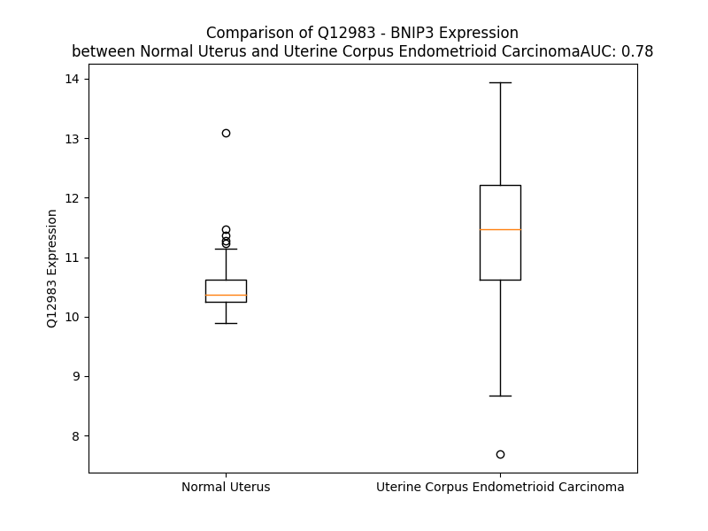

# Detailed Data for Q12983

## Introduction to the Detailed Summary

### How to Interpret the Results

- **Summary & Metrics**: This section provides a quick reference to essential protein attributes, including expression changes, family classification, and biomarker applications. Regulation status (upregulated/downregulated) indicates the protein's behavior in a disease context. Some information comes from the original excel file with the proteins selected from literature, while others are derived from the analyses.
- **Expression Comparison**: A visual representation comparing protein expression between normal and disease states. It highlights significant changes in expression levels that might indicate diagnostic or therapeutic relevance. This is data coming from transcriptomics experiments and could not translate similarly to protein levels.
- **Isoform Alignment**: An interactive view of isoform alignments, revealing structural and functional differences between variants of the protein.
- **Interactors & Homologs**: Tables listing known interaction partners and homologous proteins, the more interactors and homologs, the more complex the protein is to design an antibody for.
- **Biological Assemblies**: Information about the structural arrangement of the protein in different assemblies, providing insights into its functional state but also the complexity of the protein to develop antibodies.
- **Combined Per-Residue Information**: A detailed table summarizing residue-level data. This includes predictions for epitope regions, aggregation tendencies, and modifications that might impact the protein's function. Each row corresponds to a residue in the protein, providing insights into specific sites that may be important for research or drug development.
## Summary & Metrics

- **UniProt Accession**: Q12983
- **Gene Name**: BNIP3
- **Protein Name**: BCL2/adenovirus E1B 19 kDa protein-interacting protein 3
- **Swiss Prot**: BNIP3_HUMAN
- **Family**: other
- **Biomarker Application**: prognosis
- **Number of Isoforms**: 0
- **Regulation**: 1
- **(transcriptomics) AUC**: 0.8
- **(transcriptomics) Fold Change**: 1.11
- **(transcriptomics) Regulation**: Upregulated
- **Discotope Epitope Count**: 8
- **Max n_uniprots (Homo)**: 2
- **Max n_uniprots (Hetero)**: N/A

## Expression Comparison

## Interactors

| preferredName_A   | preferredName_B   |   score |
|:------------------|:------------------|--------:|
| BNIP3             | BCL2              |   0.999 |
| BNIP3             | GABARAP           |   0.999 |
| BNIP3             | BCL2L1            |   0.998 |
| BNIP3             | RHEB              |   0.998 |
| BNIP3             | GABARAPL2         |   0.997 |
| BNIP3             | GABARAPL1         |   0.996 |
| BNIP3             | BNIP3L            |   0.967 |
| BNIP3             | BECN1             |   0.953 |
| BNIP3             | PPID              |   0.952 |
| BNIP3             | FUNDC1            |   0.951 |
| BNIP3             | MAP1LC3B          |   0.943 |
| BNIP3             | MAP1A             |   0.935 |
| BNIP3             | VDAC1             |   0.924 |
| BNIP3             | CD300C            |   0.905 |

## Homologs

| uniprot_id   | gene_id   |
|:-------------|:----------|
| O60238       | BNIP3L    |

## Biological Assemblies

|   Unnamed: 0 |   assembly |   n_uniprots | composition   | crystal_id   |
|-------------:|-----------:|-------------:|:--------------|:-------------|
|            0 |          1 |            2 | Homo          | 2ka1         |
|            0 |          1 |            2 | Homo          | 2j5d         |
|            0 |          1 |            2 | Homo          | 2ka2         |

## Combined Per-Residue Information

|   res | aa   |   epitope_score | epitope   |   relative_surface_accessibility |   modeling_confidence |   Aggregation | modification   |
|------:|:-----|----------------:|:----------|---------------------------------:|----------------------:|--------------:|:---------------|
|     1 | M    |         0.11104 | False     |                          1.35237 |                 51.72 |         0     | N/A            |
|     2 | G    |         0.1467  | False     |                          0.90722 |                 55.86 |         0     | N/A            |
|     3 | D    |         0.11574 | False     |                          0.91052 |                 54.09 |         0     | N/A            |
|     4 | A    |         0.09982 | False     |                          0.96506 |                 54.04 |         0     | N/A            |
|     5 | A    |         0.16396 | False     |                          1.02595 |                 63.16 |         0     | N/A            |
|     6 | A    |         0.1948  | False     |                          0.98227 |                 63.79 |         0     | N/A            |
|     7 | D    |         0.22122 | False     |                          0.85304 |                 58.92 |         0     | N/A            |
|     8 | P    |         0.19201 | False     |                          0.83271 |                 70.04 |         0     | N/A            |
|     9 | P    |         0.15257 | False     |                          0.98622 |                 65.38 |         0     | N/A            |
|    10 | G    |         0.17127 | False     |                          0.84438 |                 65.9  |         0     | N/A            |
|    11 | P    |         0.15602 | False     |                          0.98275 |                 63.69 |         0     | N/A            |
|    12 | A    |         0.16903 | False     |                          0.83533 |                 55.24 |         0     | N/A            |
|    13 | L    |         0.20683 | False     |                          1.04954 |                 58.31 |         0     | N/A            |
|    14 | P    |         0.17213 | False     |                          0.85638 |                 53.29 |         0     | N/A            |
|    15 | C    |         0.15769 | False     |                          0.98669 |                 53.49 |         0     | N/A            |
|    16 | E    |         0.15614 | False     |                          0.86853 |                 48.71 |         0     | N/A            |
|    17 | F    |         0.22532 | False     |                          0.92087 |                 51.58 |         0     | N/A            |
|    18 | L    |         0.18104 | False     |                          0.83921 |                 48.92 |         0     | N/A            |
|    19 | R    |         0.26639 | True      |                          0.90936 |                 56.04 |         0     | N/A            |
|    20 | P    |         0.14226 | False     |                          0.8106  |                 52.6  |         0     | N/A            |
|    21 | G    |         0.16826 | False     |                          0.79903 |                 52.65 |         0     | N/A            |
|    22 | C    |         0.18488 | False     |                          1.07071 |                 52.82 |         0     | N/A            |
|    23 | G    |         0.24105 | True      |                          1.00294 |                 49.73 |         0     | N/A            |
|    24 | A    |         0.15197 | False     |                          0.98085 |                 54.9  |         0     | N/A            |
|    25 | P    |         0.145   | False     |                          0.86983 |                 53.87 |         0     | N/A            |
|    26 | L    |         0.1744  | False     |                          1.15831 |                 51.04 |         0     | N/A            |
|    27 | S    |         0.12598 | False     |                          0.81177 |                 60.58 |         0     | N/A            |
|    28 | P    |         0.16252 | False     |                          0.94566 |                 50.61 |         0     | N/A            |
|    29 | G    |         0.20518 | False     |                          1.01247 |                 48.46 |         0     | N/A            |
|    30 | A    |         0.18583 | False     |                          0.90549 |                 49.29 |         0     | N/A            |
|    31 | Q    |         0.24713 | True      |                          0.91345 |                 55.86 |         0     | N/A            |
|    32 | L    |         0.20652 | False     |                          1.00766 |                 49.97 |         0     | N/A            |
|    33 | G    |         0.19275 | False     |                          0.9734  |                 50.6  |         0     | N/A            |
|    34 | R    |         0.33954 | True      |                          0.96955 |                 51.5  |         0     | N/A            |
|    35 | G    |         0.22089 | False     |                          0.96303 |                 48.18 |         0     | N/A            |
|    36 | A    |         0.15926 | False     |                          0.96755 |                 53.1  |         0     | N/A            |
|    37 | P    |         0.1384  | False     |                          0.91525 |                 52.71 |         0     | N/A            |
|    38 | T    |         0.24503 | True      |                          0.98021 |                 54.97 |         0     | N/A            |
|    39 | S    |         0.15462 | False     |                          0.75522 |                 48.67 |         0     | N/A            |
|    40 | A    |         0.17612 | False     |                          0.79276 |                 49.17 |         0     | N/A            |
|    41 | F    |         0.17378 | False     |                          0.99154 |                 47.54 |         0     | N/A            |
|    42 | P    |         0.11341 | False     |                          0.84222 |                 67.14 |         0     | N/A            |
|    43 | P    |         0.13089 | False     |                          0.87809 |                 60.39 |         0     | N/A            |
|    44 | P    |         0.11959 | False     |                          0.89485 |                 53.56 |         0     | N/A            |
|    45 | A    |         0.15545 | False     |                          0.93095 |                 49.7  |         0     | N/A            |
|    46 | A    |         0.13288 | False     |                          0.94753 |                 51.16 |         0     | N/A            |
|    47 | E    |         0.15366 | False     |                          0.96754 |                 44.7  |         0     | N/A            |
|    48 | A    |         0.12364 | False     |                          0.72402 |                 45.78 |         0     | N/A            |
|    49 | H    |         0.16122 | False     |                          0.95328 |                 51.95 |         0     | N/A            |
|    50 | P    |         0.12678 | False     |                          0.8513  |                 51.56 |         0     | N/A            |
|    51 | A    |         0.10892 | False     |                          0.96863 |                 41.47 |         0     | N/A            |
|    52 | A    |         0.14965 | False     |                          0.86187 |                 44.83 |         0     | N/A            |
|    53 | R    |         0.16507 | False     |                          0.8165  |                 49.15 |         0     | N/A            |
|    54 | R    |         0.23274 | False     |                          0.8733  |                 42.55 |         0     | Phosphoserine  |
|    55 | G    |         0.22336 | False     |                          0.79147 |                 42.6  |         0     | N/A            |
|    56 | L    |         0.14809 | False     |                          1.04246 |                 52.16 |         0     | N/A            |
|    57 | R    |         0.17101 | False     |                          0.95016 |                 43.95 |         0     | N/A            |
|    58 | S    |         0.09257 | False     |                          0.74413 |                 41.07 |         0     | N/A            |
|    59 | P    |         0.14331 | False     |                          0.83875 |                 47.8  |         0     | N/A            |
|    60 | Q    |         0.12909 | False     |                          0.90328 |                 42.04 |         0     | N/A            |
|    61 | L    |         0.11734 | False     |                          1.0039  |                 40.67 |         0     | N/A            |
|    62 | P    |         0.12512 | False     |                          0.93819 |                 56.29 |         0     | N/A            |
|    63 | S    |         0.17398 | False     |                          0.9044  |                 38.06 |         0     | N/A            |
|    64 | G    |         0.20227 | False     |                          0.94489 |                 51.94 |         0     | N/A            |
|    65 | A    |         0.13147 | False     |                          0.94731 |                 38.85 |         0     | N/A            |
|    66 | M    |         0.16271 | False     |                          1.01169 |                 47.07 |         0     | Phosphoserine  |
|    67 | S    |         0.12346 | False     |                          0.64203 |                 43.7  |         0     | N/A            |
|    68 | Q    |         0.19557 | False     |                          0.79556 |                 42.77 |         0     | N/A            |
|    69 | N    |         0.16043 | False     |                          0.97604 |                 44.27 |         0     | N/A            |
|    70 | G    |         0.18998 | False     |                          0.98976 |                 39.56 |         0     | N/A            |
|    71 | A    |         0.19671 | False     |                          0.94527 |                 41.38 |         0     | N/A            |
|    72 | P    |         0.19625 | False     |                          0.96662 |                 43.93 |         0     | N/A            |
|    73 | G    |         0.1616  | False     |                          0.80927 |                 33.67 |         0     | N/A            |
|    74 | M    |         0.19556 | False     |                          1.08361 |                 42.33 |         0     | N/A            |
|    75 | Q    |         0.23086 | False     |                          0.77847 |                 38.53 |         0     | N/A            |
|    76 | E    |         0.14485 | False     |                          0.75046 |                 35.71 |         0     | N/A            |
|    77 | E    |         0.11354 | False     |                          0.90452 |                 46.63 |         0     | N/A            |
|    78 | S    |         0.17488 | False     |                          0.75739 |                 43.46 |         0     | N/A            |
|    79 | L    |         0.1509  | False     |                          1.06638 |                 50.14 |         0     | N/A            |
|    80 | Q    |         0.13494 | False     |                          0.9185  |                 48.08 |         0     | N/A            |
|    81 | G    |         0.12893 | False     |                          0.74145 |                 44.33 |         0     | N/A            |
|    82 | S    |         0.08635 | False     |                          0.83776 |                 49.94 |         0     | N/A            |
|    83 | W    |         0.12159 | False     |                          1.0174  |                 50.62 |         0     | N/A            |
|    84 | V    |         0.06467 | False     |                          0.91042 |                 58.52 |         0     | N/A            |
|    85 | E    |         0.06221 | False     |                          0.66622 |                 56.97 |         0     | N/A            |
|    86 | L    |         0.13453 | False     |                          0.90094 |                 64.49 |         0     | Phosphoserine  |
|    87 | H    |         0.10239 | False     |                          0.63068 |                 51.87 |         0     | N/A            |
|    88 | F    |         0.19045 | False     |                          0.98284 |                 45.6  |         0     | N/A            |
|    89 | S    |         0.1222  | False     |                          0.69842 |                 51.82 |         0     | N/A            |
|    90 | N    |         0.17043 | False     |                          0.98685 |                 41.82 |         0     | N/A            |
|    91 | N    |         0.13262 | False     |                          0.87975 |                 46.55 |         0     | N/A            |
|    92 | G    |         0.27506 | True      |                          0.86538 |                 37.13 |         0     | Phosphoserine  |
|    93 | N    |         0.19805 | False     |                          0.96432 |                 38.32 |         0     | N/A            |
|    94 | G    |         0.17987 | False     |                          0.87238 |                 35.33 |         0     | N/A            |
|    95 | G    |         0.19257 | False     |                          0.95014 |                 31.77 |         0     | Phosphoserine  |
|    96 | S    |         0.14183 | False     |                          0.8542  |                 43.45 |         0     | N/A            |
|    97 | V    |         0.13854 | False     |                          0.93559 |                 51.95 |         0     | N/A            |
|    98 | P    |         0.15306 | False     |                          0.91403 |                 51.97 |         0     | N/A            |
|    99 | A    |         0.10478 | False     |                          0.86535 |                 45.57 |         0.351 | N/A            |
|   100 | S    |         0.14763 | False     |                          0.74602 |                 42.57 |         0.766 | N/A            |
|   101 | V    |         0.085   | False     |                          1.04274 |                 46.68 |         0.766 | N/A            |
|   102 | S    |         0.10903 | False     |                          0.71442 |                 49.02 |         0.766 | N/A            |
|   103 | I    |         0.10914 | False     |                          0.8189  |                 52.08 |         0.766 | N/A            |
|   104 | Y    |         0.17199 | False     |                          0.85539 |                 54.39 |         0.766 | N/A            |
|   105 | N    |         0.10206 | False     |                          0.74841 |                 58.11 |         0     | N/A            |
|   106 | G    |         0.0967  | False     |                          0.54657 |                 72.03 |         0     | N/A            |
|   107 | D    |         0.11396 | False     |                          0.55114 |                 78.81 |         0     | N/A            |
|   108 | M    |         0.09324 | False     |                          0.54307 |                 77.16 |         0     | N/A            |
|   109 | E    |         0.09862 | False     |                          0.58868 |                 80.58 |         0     | N/A            |
|   110 | K    |         0.09081 | False     |                          0.55939 |                 83.52 |         0     | N/A            |
|   111 | I    |         0.06669 | False     |                          0.66234 |                 84.66 |         0     | N/A            |
|   112 | L    |         0.08537 | False     |                          0.73198 |                 85.7  |         0     | N/A            |
|   113 | L    |         0.10002 | False     |                          0.5998  |                 86    |         0     | N/A            |
|   114 | D    |         0.08142 | False     |                          0.38789 |                 83    |         0     | N/A            |
|   115 | A    |         0.08057 | False     |                          0.57135 |                 83.41 |         0     | N/A            |
|   116 | Q    |         0.10831 | False     |                          0.64648 |                 79.36 |         0     | N/A            |
|   117 | H    |         0.12027 | False     |                          0.63834 |                 71.43 |         0     | N/A            |
|   118 | E    |         0.17144 | False     |                          0.713   |                 65.77 |         0     | N/A            |
|   119 | S    |         0.1228  | False     |                          0.70564 |                 62.62 |         0     | N/A            |
|   120 | G    |         0.17033 | False     |                          0.71557 |                 61.68 |         0     | N/A            |
|   121 | R    |         0.20441 | False     |                          0.83802 |                 56.9  |         0     | N/A            |
|   122 | S    |         0.18778 | False     |                          0.73678 |                 46.98 |         0     | N/A            |
|   123 | S    |         0.19763 | False     |                          0.69683 |                 50.81 |         0     | N/A            |
|   124 | S    |         0.19119 | False     |                          0.80707 |                 47.89 |         0     | N/A            |
|   125 | K    |         0.18064 | False     |                          1.01478 |                 55.2  |         0     | N/A            |
|   126 | S    |         0.15953 | False     |                          0.7712  |                 48.13 |         0     | N/A            |
|   127 | S    |         0.16541 | False     |                          0.88812 |                 46.86 |         0     | N/A            |
|   128 | H    |         0.16728 | False     |                          0.96103 |                 44.7  |         0     | N/A            |
|   129 | C    |         0.13112 | False     |                          0.74124 |                 49.65 |         0     | N/A            |
|   130 | D    |         0.18697 | False     |                          0.93372 |                 51.4  |         0     | N/A            |
|   131 | S    |         0.20259 | False     |                          0.59725 |                 50.99 |         0     | N/A            |
|   132 | P    |         0.15715 | False     |                          0.6142  |                 58.03 |         0     | N/A            |
|   133 | P    |         0.19662 | False     |                          0.94412 |                 53.89 |         0     | N/A            |
|   134 | R    |         0.32152 | True      |                          0.84524 |                 53.75 |         0     | N/A            |
|   135 | S    |         0.16352 | False     |                          0.7744  |                 49.31 |         0     | N/A            |
|   136 | Q    |         0.18227 | False     |                          0.85725 |                 51.83 |         0     | N/A            |
|   137 | T    |         0.12302 | False     |                          0.64311 |                 49.44 |         0     | N/A            |
|   138 | P    |         0.10522 | False     |                          0.93202 |                 47.29 |         0     | N/A            |
|   139 | Q    |         0.12035 | False     |                          0.80208 |                 51.3  |         0     | N/A            |
|   140 | D    |         0.17609 | False     |                          0.83819 |                 42.53 |         0     | N/A            |
|   141 | T    |         0.13736 | False     |                          0.90856 |                 45.8  |         0     | N/A            |
|   142 | N    |         0.14171 | False     |                          0.87933 |                 44.99 |         0     | N/A            |
|   143 | R    |         0.15554 | False     |                          0.91498 |                 43.84 |         0     | N/A            |
|   144 | A    |         0.09506 | False     |                          0.83355 |                 39.57 |         0     | N/A            |
|   145 | S    |         0.15113 | False     |                          0.71052 |                 48.42 |         0     | N/A            |
|   146 | E    |         0.12361 | False     |                          0.79518 |                 46.42 |         0     | N/A            |
|   147 | T    |         0.16074 | False     |                          0.85346 |                 48.94 |         0     | N/A            |
|   148 | D    |         0.10879 | False     |                          0.66583 |                 40.24 |         0     | N/A            |
|   149 | T    |         0.14156 | False     |                          0.85926 |                 47.45 |         0     | N/A            |
|   150 | H    |         0.13167 | False     |                          0.92815 |                 44.55 |         0     | N/A            |
|   151 | S    |         0.1866  | False     |                          0.6883  |                 43.56 |         0     | N/A            |
|   152 | I    |         0.16525 | False     |                          1.00136 |                 53.04 |         0     | N/A            |
|   153 | G    |         0.16646 | False     |                          0.71862 |                 48.72 |         0     | N/A            |
|   154 | E    |         0.16823 | False     |                          0.70209 |                 44.78 |         0     | N/A            |
|   155 | K    |         0.122   | False     |                          0.83295 |                 48.73 |         0     | N/A            |
|   156 | N    |         0.19284 | False     |                          0.92052 |                 47.72 |         0     | N/A            |
|   157 | S    |         0.09095 | False     |                          0.85096 |                 50.25 |         0     | N/A            |
|   158 | S    |         0.09733 | False     |                          0.59684 |                 52.98 |         0     | N/A            |
|   159 | Q    |         0.10735 | False     |                          0.80015 |                 56.12 |         0     | N/A            |
|   160 | S    |         0.09559 | False     |                          0.6412  |                 67.43 |         0     | N/A            |
|   161 | E    |         0.1031  | False     |                          0.55783 |                 70.59 |         0     | N/A            |
|   162 | E    |         0.08305 | False     |                          0.4978  |                 72.12 |         0     | N/A            |
|   163 | D    |         0.07859 | False     |                          0.45321 |                 76.67 |         0     | N/A            |
|   164 | D    |         0.06919 | False     |                          0.49891 |                 76.6  |         0     | N/A            |
|   165 | I    |         0.05205 | False     |                          0.65771 |                 81.84 |         0     | N/A            |
|   166 | E    |         0.04913 | False     |                          0.64932 |                 81.61 |         0     | N/A            |
|   167 | R    |         0.05064 | False     |                          0.58571 |                 82.94 |         0     | N/A            |
|   168 | R    |         0.06584 | False     |                          0.75258 |                 84.29 |         0     | N/A            |
|   169 | K    |         0.03357 | False     |                          0.71627 |                 86.16 |         0     | N/A            |
|   170 | E    |         0.04641 | False     |                          0.51538 |                 84.28 |         0     | N/A            |
|   171 | V    |         0.02931 | False     |                          0.64927 |                 82.95 |         0     | N/A            |
|   172 | E    |         0.05401 | False     |                          0.62579 |                 82.32 |         0     | N/A            |
|   173 | S    |         0.05643 | False     |                          0.30733 |                 80.32 |         0     | N/A            |
|   174 | I    |         0.08643 | False     |                          0.49737 |                 80.06 |         0     | N/A            |
|   175 | L    |         0.05739 | False     |                          0.7917  |                 80.08 |         0     | N/A            |
|   176 | K    |         0.15805 | False     |                          0.77405 |                 78.24 |         0     | N/A            |
|   177 | K    |         0.07701 | False     |                          0.70143 |                 76.41 |         0     | N/A            |
|   178 | N    |         0.06418 | False     |                          0.28188 |                 78.58 |         0     | N/A            |
|   179 | S    |         0.10895 | False     |                          0.29525 |                 79.5  |         0     | N/A            |
|   180 | D    |         0.06167 | False     |                          0.61653 |                 81.51 |         0     | N/A            |
|   181 | W    |         0.12518 | False     |                          0.54768 |                 82.56 |         0     | N/A            |
|   182 | I    |         0.05924 | False     |                          0.48353 |                 79.46 |         0     | N/A            |
|   183 | W    |         0.10528 | False     |                          0.75595 |                 79.06 |         0     | N/A            |
|   184 | D    |         0.10348 | False     |                          0.44937 |                 79.76 |         0     | N/A            |
|   185 | W    |         0.10545 | False     |                          0.79875 |                 73.99 |         0     | N/A            |
|   186 | S    |         0.11391 | False     |                          0.59781 |                 72.22 |         0     | N/A            |
|   187 | S    |         0.15779 | False     |                          0.6187  |                 64.88 |         0     | N/A            |
|   188 | R    |         0.19751 | False     |                          0.62843 |                 67.61 |         0     | N/A            |
|   189 | P    |         0.18682 | False     |                          0.89791 |                 57.31 |         0     | N/A            |
|   190 | E    |         0.19116 | False     |                          0.79072 |                 55.59 |         0     | N/A            |
|   191 | N    |         0.20395 | False     |                          0.87689 |                 62.35 |         0     | N/A            |
|   192 | I    |         0.23211 | False     |                          0.8196  |                 59.6  |         0     | N/A            |
|   193 | P    |         0.15504 | False     |                          0.56355 |                 65.99 |         0     | N/A            |
|   194 | P    |         0.17787 | False     |                          0.75377 |                 61.84 |         0     | N/A            |
|   195 | K    |         0.19385 | False     |                          0.97832 |                 54.5  |         0     | N/A            |
|   196 | E    |         0.20109 | False     |                          0.74443 |                 56.46 |         0     | N/A            |
|   197 | F    |         0.1362  | False     |                          0.74076 |                 53.7  |         0     | N/A            |
|   198 | L    |         0.18387 | False     |                          1.03172 |                 54.01 |         0     | N/A            |
|   199 | F    |         0.15944 | False     |                          0.74562 |                 55.31 |         0     | N/A            |
|   200 | K    |         0.21018 | False     |                          0.97863 |                 51.82 |         0     | N/A            |
|   201 | H    |         0.14334 | False     |                          0.82982 |                 56.27 |         0     | N/A            |
|   202 | P    |         0.15648 | False     |                          0.95475 |                 55.43 |         0     | N/A            |
|   203 | K    |         0.20305 | False     |                          0.89591 |                 49.38 |         0     | N/A            |
|   204 | R    |         0.15274 | False     |                          0.80852 |                 55.57 |         0     | N/A            |
|   205 | T    |         0.10212 | False     |                          0.82653 |                 49.28 |         0     | N/A            |
|   206 | A    |         0.07644 | False     |                          0.40745 |                 51.69 |         0     | N/A            |
|   207 | T    |         0.11867 | False     |                          0.92609 |                 51.5  |         0     | N/A            |
|   208 | L    |         0.10956 | False     |                          1.05753 |                 52.78 |         0     | N/A            |
|   209 | S    |         0.12002 | False     |                          0.78421 |                 52.69 |         0     | N/A            |
|   210 | M    |         0.15537 | False     |                          0.97689 |                 48.3  |         0     | N/A            |
|   211 | R    |         0.20702 | False     |                          0.86503 |                 56.52 |         0     | N/A            |
|   212 | N    |         0.18082 | False     |                          0.94921 |                 53.52 |         0     | N/A            |
|   213 | T    |         0.18528 | False     |                          0.94784 |                 47.51 |         0     | N/A            |
|   214 | S    |         0.18225 | False     |                          0.58854 |                 46.76 |         0     | N/A            |
|   215 | V    |         0.11957 | False     |                          1.07876 |                 52.99 |         0     | N/A            |
|   216 | M    |         0.12686 | False     |                          0.82575 |                 45.43 |         0     | N/A            |
|   217 | K    |         0.19008 | False     |                          0.99287 |                 56.41 |         0     | N/A            |
|   218 | K    |         0.14694 | False     |                          1.09296 |                 57.76 |         0     | N/A            |
|   219 | G    |         0.15923 | False     |                          0.63229 |                 55.47 |         0     | N/A            |
|   220 | G    |         0.29043 | True      |                          0.89597 |                 56.39 |         0.683 | N/A            |
|   221 | I    |         0.22622 | False     |                          0.91433 |                 58.93 |        18.962 | N/A            |
|   222 | F    |         0.16751 | False     |                          0.62096 |                 57.92 |        20.54  | N/A            |
|   223 | S    |         0.20174 | False     |                          0.42162 |                 59.14 |        20.66  | N/A            |
|   224 | A    |         0.17933 | False     |                          0.73704 |                 66.8  |        21.629 | N/A            |
|   225 | E    |         0.17504 | False     |                          0.63569 |                 77.62 |        22.615 | N/A            |
|   226 | F    |         0.19294 | False     |                          0.59914 |                 72    |        22.615 | N/A            |
|   227 | L    |         0.2257  | False     |                          0.54915 |                 78.17 |        22.615 | N/A            |
|   228 | K    |         0.09743 | False     |                          0.76556 |                 82.4  |        22.615 | N/A            |
|   229 | V    |         0.08845 | False     |                          0.73583 |                 84.88 |        22.504 | N/A            |
|   230 | F    |         0.11817 | False     |                          0.58288 |                 86.31 |        21.084 | N/A            |
|   231 | L    |         0.10938 | False     |                          0.66912 |                 88.19 |         0.964 | N/A            |
|   232 | P    |         0.08599 | False     |                          0.59596 |                 90.88 |         0.403 | N/A            |
|   233 | S    |         0.036   | False     |                          0.42863 |                 91.6  |         2.113 | N/A            |
|   234 | L    |         0.10709 | False     |                          0.61992 |                 91.22 |        19.055 | N/A            |
|   235 | L    |         0.06969 | False     |                          0.69458 |                 93.46 |        22.127 | N/A            |
|   236 | L    |         0.04128 | False     |                          0.63829 |                 94.5  |        22.631 | N/A            |
|   237 | S    |         0.04815 | False     |                          0.43698 |                 95.27 |        22.705 | N/A            |
|   238 | H    |         0.04566 | False     |                          0.54967 |                 95.7  |        23.405 | N/A            |
|   239 | L    |         0.04685 | False     |                          0.64076 |                 95.42 |        62.063 | N/A            |
|   240 | L    |         0.05353 | False     |                          0.71975 |                 96.28 |        69.047 | N/A            |
|   241 | A    |         0.03162 | False     |                          0.60936 |                 96.5  |        70.295 | N/A            |
|   242 | I    |         0.09118 | False     |                          0.59524 |                 95.99 |        71.834 | N/A            |
|   243 | G    |         0.03085 | False     |                          0.43057 |                 95.47 |        71.059 | N/A            |
|   244 | L    |         0.03458 | False     |                          0.74713 |                 95.47 |        71.875 | N/A            |
|   245 | G    |         0.03137 | False     |                          0.46192 |                 95.54 |        69.086 | N/A            |
|   246 | I    |         0.05033 | False     |                          0.66537 |                 93.68 |        68.903 | N/A            |
|   247 | Y    |         0.04226 | False     |                          0.57831 |                 94.32 |        65.961 | N/A            |
|   248 | I    |         0.03755 | False     |                          0.54558 |                 92.38 |        53.319 | N/A            |
|   249 | G    |         0.03564 | False     |                          0.34385 |                 92.22 |         1.623 | N/A            |
|   250 | R    |         0.06523 | False     |                          0.71832 |                 89.15 |         0     | N/A            |
|   251 | R    |         0.0986  | False     |                          0.55642 |                 88.64 |         0     | N/A            |
|   252 | L    |         0.07021 | False     |                          0.71769 |                 83.84 |         0     | N/A            |
|   253 | T    |         0.07266 | False     |                          0.65316 |                 81.71 |         0     | N/A            |
|   254 | T    |         0.06507 | False     |                          0.6114  |                 69.07 |         0     | N/A            |
|   255 | S    |         0.09424 | False     |                          0.5404  |                 59.59 |         0     | N/A            |
|   256 | T    |         0.10706 | False     |                          0.74137 |                 58.74 |         0     | N/A            |
|   257 | S    |         0.13963 | False     |                          0.68014 |                 54.82 |         0     | N/A            |
|   258 | T    |         0.08429 | False     |                          0.73591 |                 51.86 |         0     | N/A            |
|   259 | F    |         0.06428 | False     |                          1.3187  |                 44.28 |         0     | N/A            |

