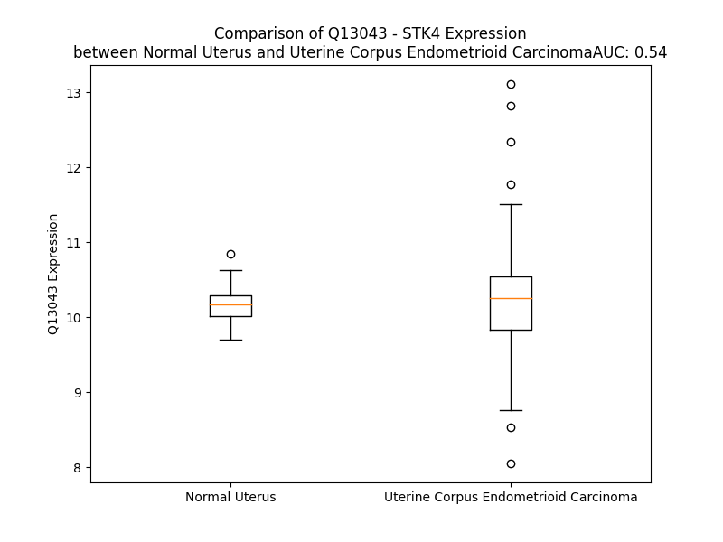

# Detailed Data for Q13043

## Introduction to the Detailed Summary

### How to Interpret the Results

- **Summary & Metrics**: This section provides a quick reference to essential protein attributes, including expression changes, family classification, and biomarker applications. Regulation status (upregulated/downregulated) indicates the protein's behavior in a disease context. Some information comes from the original excel file with the proteins selected from literature, while others are derived from the analyses.
- **Expression Comparison**: A visual representation comparing protein expression between normal and disease states. It highlights significant changes in expression levels that might indicate diagnostic or therapeutic relevance. This is data coming from transcriptomics experiments and could not translate similarly to protein levels.
- **Isoform Alignment**: An interactive view of isoform alignments, revealing structural and functional differences between variants of the protein.
- **Interactors & Homologs**: Tables listing known interaction partners and homologous proteins, the more interactors and homologs, the more complex the protein is to design an antibody for.
- **Biological Assemblies**: Information about the structural arrangement of the protein in different assemblies, providing insights into its functional state but also the complexity of the protein to develop antibodies.
- **Combined Per-Residue Information**: A detailed table summarizing residue-level data. This includes predictions for epitope regions, aggregation tendencies, and modifications that might impact the protein's function. Each row corresponds to a residue in the protein, providing insights into specific sites that may be important for research or drug development.
## Summary & Metrics

- **UniProt Accession**: Q13043
- **Gene Name**: MST1
- **Protein Name**: Serine/threonine-protein kinase 4
- **Swiss Prot**: STK4_HUMAN
- **Family**: kinase
- **Biomarker Application**:  
- **Number of Isoforms**: 2
- **Regulation**: 2
- **(transcriptomics) AUC**: 0.79
- **(transcriptomics) Fold Change**: 1.05
- **(transcriptomics) Regulation**: Upregulated
- **Discotope Epitope Count**: 82
- **Max n_uniprots (Homo)**: 2
- **Max n_uniprots (Hetero)**: 2

## Expression Comparison

## Isoform Alignment

<pre style='font-size:14px; font-family:monospace;'>Q13043-1 METVQLRNPPRRQLKKLDEDSLTKQPEEVFDVLEKLGEGSYGSVYKAIHKETGQIVAIKQVPVESDLQEIIKEISIMQQCDSPHVVKYYGSYFKNTDLWIVMEYCGAGSVSDIIRLRNKTLTEDEIATILQSTLKGLEYLHFMRKIHRDIKAGNILLNTEGHAKLADFGVAGQLTDTMAKRNTVIGTPFWMAPEVIQEIGYNCVADIWSLGITAIEMAEGKPPYADIHPMRAIFMIPTNPPPTFRKPELWSDNFTDFVKQCLVKSPEQRATATQLLQHPFVRSAKGVSILRDLINEAMDVKLKRQESQQREVDQDDEENSEEDEMDSGTMVRAVGDEMGTVRVASTMTDGANTMIEHDDTLPSQLGTMVINAEDEEEEGTMKRRDETMQPAKPSFLEYFEQKEKENQINSFGKSVPGPLKNSSDWKIPQDGDYEFLKSWTVEDLQKRLLALDPMMEQEIEEIRQKYQSKRQPILDAIEAKKRRQQNF
Q13043-2 METVQLRNPPRRQLKKLDEDSLTKQPEEVFDVLEKLGEGSYGSVYKAIHKETGQIVAIKQVPVESDLQEIIKEISIMQQCDSPHVVKYYGSYFKNTDLWIVMEYCGAGSVSDIIRLRNKTLTEDEIATILQSTLKGLEYLHFMRKIHRDIKAGNILLNTEGHAKLADFGVAGQLTDTMAKRNTVIGTPFWMAPEVIQEIGYNCVADIWSLGITAIEMAEGKPPYADIHPMRAIFMIPTNPPPTFRKPELWSDNFTDFVKQCLVKSPEQRATATQLLQHPFVRSAKGVSILRDLINEAMDVKLKRQESQQREVDQDDEENSEEDEMDSGTMVRAVGDEMGTVRVASTMTDGANTMIEHDDTLPSQLGTMVINAEDEEEEGTMKRRDETMQPAKPSFLEYFEQKEKENQINSFGKSVPGPLKNSSDWKIPQDGDYEFKTSQEQQSGKDICI------QNCQGNLLCRYAF-------------------
</pre>

## Interactors

| preferredName_A   | preferredName_B   |   score |
|:------------------|:------------------|--------:|
| STK4              | SAV1              |   0.999 |
| STK4              | RASSF5            |   0.999 |
| STK4              | MOB1A             |   0.999 |
| STK4              | RASSF1            |   0.998 |
| STK4              | STK3              |   0.986 |
| STK4              | FOXO3             |   0.966 |
| STK4              | LATS2             |   0.965 |
| STK4              | RASSF2            |   0.952 |
| STK4              | FOXO1             |   0.952 |
| STK4              | CASP3             |   0.95  |
| STK4              | LATS1             |   0.948 |
| STK4              | MOB1B             |   0.92  |
| STK4              | FOXO4             |   0.914 |

## Homologs

| uniprot_id   | gene_id   |
|:-------------|:----------|
| O94804       | STK10     |
| Q9UL54       | TAOK2     |
| J3QS76       | TAOK1     |
| P41279       | MAP3K8    |
| G3V4T8       | MAP4K5    |
| F2Z2B3       | MAP4K2    |
| K7ER95       | MAP4K1    |
| A0A590UJK1   | MAP3K19   |
| E9PRP6       | PAK1      |
| O75914       | PAK3      |
| Q13177       | PAK2      |
| Q8NBU1       | STK3      |
| P0C263       | SBK2      |
| A8K3Y2       | MAP2K6    |
| F5H049       | NRK       |
| F5GWV8       | TAOK3     |
| M0R2X4       | PAK4      |
| H0YK74       | PAK6      |
| Q9H2G2       | SLK       |
| Q86YC8       | STRADA    |
| Q13233       | MAP3K1    |
| C9JSU7       | STRADB    |
| F8WAZ1       | MAP4K3    |
| E7ETN6       | MAP4K4    |
| Q9UEW8       | STK39     |
| Q9P286       | PAK5      |
| E9PMA8       | MAP2K3    |
| E7EX48       | NEK4      |
| B4E0Y9       | STK26     |
| O95747       | OXSR1     |
| C9JN58       | STK25     |
| B4DR80       | STK24     |
| Q99558       | MAP3K14   |
| Q8N4C8       | MINK1     |
| C9J338       | TNIK      |

## Biological Assemblies

|   Unnamed: 0 |   assembly |   n_uniprots | composition   | crystal_id   |
|-------------:|-----------:|-------------:|:--------------|:-------------|
|            0 |          1 |            1 | Homo          | 3com         |
|            1 |          2 |            1 | Homo          | 3com         |
|            0 |          1 |            2 | Homo          | 5twg         |
|            0 |          1 |            2 | Homo          | 2jo8         |
|            0 |          1 |            2 | Hetero        | 4oh8         |
|            0 |          1 |            2 | Homo          | 6yat         |
|            0 |          1 |            2 | Homo          | 4nr2         |
|            1 |          2 |            2 | Homo          | 4nr2         |
|            2 |          3 |            2 | Homo          | 4nr2         |
|            3 |          4 |            2 | Homo          | 4nr2         |
|            0 |          1 |            2 | Homo          | 8a5j         |
|            0 |          1 |            2 | Homo          | 5twh         |

## Combined Per-Residue Information

|   res | aa   |   epitope_score | epitope   |   relative_surface_accessibility |   modeling_confidence |   Aggregation | modification                       |
|------:|:-----|----------------:|:----------|---------------------------------:|----------------------:|--------------:|:-----------------------------------|
|     1 | M    |         0.12186 | False     |                          1.31465 |                 41.26 |         0     | N-acetylmethionine                 |
|     2 | E    |         0.14293 | True      |                          0.88846 |                 34.18 |         0     | N/A                                |
|     3 | T    |         0.09962 | False     |                          0.93176 |                 37.35 |         0     | Phosphothreonine                   |
|     4 | V    |         0.09903 | False     |                          0.89461 |                 37.5  |         0     | N/A                                |
|     5 | Q    |         0.12549 | False     |                          0.80195 |                 34.04 |         0     | N/A                                |
|     6 | L    |         0.11187 | False     |                          0.98911 |                 33.49 |         0     | N/A                                |
|     7 | R    |         0.17676 | True      |                          0.89394 |                 34.46 |         0     | N/A                                |
|     8 | N    |         0.13302 | False     |                          0.85094 |                 36.27 |         0     | N/A                                |
|     9 | P    |         0.09259 | False     |                          0.77845 |                 32.93 |         0     | N/A                                |
|    10 | P    |         0.13902 | True      |                          0.93227 |                 42    |         0     | N/A                                |
|    11 | R    |         0.14345 | True      |                          0.7417  |                 54.6  |         0     | N/A                                |
|    12 | R    |         0.12741 | False     |                          0.81876 |                 61.26 |         0     | N/A                                |
|    13 | Q    |         0.08943 | False     |                          0.6942  |                 72.48 |         0     | N/A                                |
|    14 | L    |         0.05225 | False     |                          0.09688 |                 80.63 |         0     | N/A                                |
|    15 | K    |         0.11408 | False     |                          0.82076 |                 84.72 |         0     | N/A                                |
|    16 | K    |         0.12048 | False     |                          0.54901 |                 89.64 |         0     | N/A                                |
|    17 | L    |         0.02669 | False     |                          0.07735 |                 91.07 |         0     | N/A                                |
|    18 | D    |         0.1314  | False     |                          0.53321 |                 92.17 |         0     | N/A                                |
|    19 | E    |         0.1396  | True      |                          0.69163 |                 90.88 |         0     | N/A                                |
|    20 | D    |         0.18322 | True      |                          0.65976 |                 91.21 |         0     | N/A                                |
|    21 | S    |         0.10047 | False     |                          0.11051 |                 92.52 |         0     | N/A                                |
|    22 | L    |         0.07496 | False     |                          0.32456 |                 92.61 |         0     | N/A                                |
|    23 | T    |         0.16057 | True      |                          0.79617 |                 92.17 |         0     | N/A                                |
|    24 | K    |         0.15131 | True      |                          0.50645 |                 94.76 |         0     | N/A                                |
|    25 | Q    |         0.16237 | True      |                          0.50202 |                 94.42 |         0     | N/A                                |
|    26 | P    |         0.02284 | False     |                          0.01167 |                 95.03 |         0     | N/A                                |
|    27 | E    |         0.088   | False     |                          0.31534 |                 93.73 |         0     | N/A                                |
|    28 | E    |         0.18936 | True      |                          0.55283 |                 95.12 |         0     | N/A                                |
|    29 | V    |         0.06548 | False     |                          0.07066 |                 96.88 |         0     | N/A                                |
|    30 | F    |         0.02979 | False     |                          0.0154  |                 97.35 |         0     | N/A                                |
|    31 | D    |         0.10303 | False     |                          0.40457 |                 97.02 |         0     | N/A                                |
|    32 | V    |         0.03229 | False     |                          0.40981 |                 95.38 |         0     | N/A                                |
|    33 | L    |         0.10253 | False     |                          0.55655 |                 93.6  |         0     | N/A                                |
|    34 | E    |         0.08696 | False     |                          0.30021 |                 90.84 |         0     | N/A                                |
|    35 | K    |         0.07492 | False     |                          0.47761 |                 91.38 |         0     | N/A                                |
|    36 | L    |         0.03203 | False     |                          0.27811 |                 88.64 |         0     | N/A                                |
|    37 | G    |         0.09681 | False     |                          0.3931  |                 84.72 |         0     | N/A                                |
|    38 | E    |         0.11666 | False     |                          0.65259 |                 82.17 |         0     | N/A                                |
|    39 | G    |         0.11048 | False     |                          0.57178 |                 71.36 |         0     | N/A                                |
|    40 | S    |         0.12325 | False     |                          0.88489 |                 67.57 |         0     | N/A                                |
|    41 | Y    |         0.12675 | False     |                          0.55152 |                 73.91 |         0     | N/A                                |
|    42 | G    |         0.05446 | False     |                          0.17703 |                 81.91 |         0     | N/A                                |
|    43 | S    |         0.04033 | False     |                          0.12149 |                 90.43 |         0     | N/A                                |
|    44 | V    |         0.0264  | False     |                          0.26848 |                 93    |         0     | N/A                                |
|    45 | Y    |         0.05189 | False     |                          0.21425 |                 95.11 |         0     | N/A                                |
|    46 | K    |         0.03126 | False     |                          0.19512 |                 96.08 |         0     | N/A                                |
|    47 | A    |         0.00159 | False     |                          0       |                 97.62 |         0     | N/A                                |
|    48 | I    |         0.06731 | False     |                          0.32479 |                 97.57 |         0     | N/A                                |
|    49 | H    |         0.02349 | False     |                          0.03634 |                 97.12 |         0     | N/A                                |
|    50 | K    |         0.25212 | True      |                          0.46279 |                 95.76 |         0     | N/A                                |
|    51 | E    |         0.12843 | False     |                          0.75987 |                 94.46 |         0     | N/A                                |
|    52 | T    |         0.05401 | False     |                          0.18642 |                 94.45 |         0.156 | N/A                                |
|    53 | G    |         0.04101 | False     |                          0.24262 |                 94.73 |         0.875 | N/A                                |
|    54 | Q    |         0.06982 | False     |                          0.18955 |                 95.35 |         1.944 | N/A                                |
|    55 | I    |         0.03261 | False     |                          0.42289 |                 96.81 |         1.944 | N/A                                |
|    56 | V    |         0.00222 | False     |                          0       |                 97.28 |         1.944 | N/A                                |
|    57 | A    |         0.01122 | False     |                          0.06122 |                 96.58 |         1.944 | N/A                                |
|    58 | I    |         0.00384 | False     |                          0.0016  |                 95.67 |         1.944 | N/A                                |
|    59 | K    |         0.01791 | False     |                          0.11134 |                 92.03 |         0     | N/A                                |
|    60 | Q    |         0.02047 | False     |                          0.15277 |                 91.91 |         0     | N/A                                |
|    61 | V    |         0.0158  | False     |                          0.01238 |                 87.95 |         0     | N/A                                |
|    62 | P    |         0.0913  | False     |                          0.47318 |                 86.04 |         0     | N/A                                |
|    63 | V    |         0.14417 | True      |                          0.28306 |                 81.08 |         0     | N/A                                |
|    64 | E    |         0.20868 | True      |                          0.83588 |                 77.48 |         0     | N/A                                |
|    65 | S    |         0.12699 | False     |                          0.36281 |                 68    |         0     | N/A                                |
|    66 | D    |         0.18421 | True      |                          0.50427 |                 73.56 |         0     | N/A                                |
|    67 | L    |         0.12941 | False     |                          0.31495 |                 77.48 |         0     | N/A                                |
|    68 | Q    |         0.1759  | True      |                          0.79589 |                 79.39 |         0     | N/A                                |
|    69 | E    |         0.09854 | False     |                          0.30231 |                 75.28 |         0     | N/A                                |
|    70 | I    |         0.04508 | False     |                          0.052   |                 79.94 |         0     | N/A                                |
|    71 | I    |         0.20359 | True      |                          0.55691 |                 81.81 |         0     | N/A                                |
|    72 | K    |         0.07891 | False     |                          0.50923 |                 78.06 |         0     | N/A                                |
|    73 | E    |         0.04836 | False     |                          0.10577 |                 77.73 |         0     | N/A                                |
|    74 | I    |         0.07401 | False     |                          0.12559 |                 84.3  |         0     | N/A                                |
|    75 | S    |         0.05612 | False     |                          0.33375 |                 83.78 |         0     | N/A                                |
|    76 | I    |         0.04338 | False     |                          0.21999 |                 80.34 |         0     | N/A                                |
|    77 | M    |         0.01551 | False     |                          0.04786 |                 84.95 |         0     | N/A                                |
|    78 | Q    |         0.05894 | False     |                          0.44553 |                 87.68 |         0     | N/A                                |
|    79 | Q    |         0.09915 | False     |                          0.53673 |                 87.74 |         0     | N/A                                |
|    80 | C    |         0.04095 | False     |                          0.09506 |                 89.63 |         0     | N/A                                |
|    81 | D    |         0.08176 | False     |                          0.72612 |                 92.73 |         0     | N/A                                |
|    82 | S    |         0.06334 | False     |                          0.04786 |                 94.89 |         0     | N/A                                |
|    83 | P    |         0.0701  | False     |                          0.68008 |                 96.64 |         0     | N/A                                |
|    84 | H    |         0.10457 | False     |                          0.20047 |                 97.56 |         0     | N/A                                |
|    85 | V    |         0.0082  | False     |                          0.01374 |                 95.95 |         0     | N/A                                |
|    86 | V    |         0.0048  | False     |                          0.01134 |                 95.21 |         0     | N/A                                |
|    87 | K    |         0.03158 | False     |                          0.33338 |                 94.26 |         0     | N/A                                |
|    88 | Y    |         0.03646 | False     |                          0.11066 |                 93.41 |         0.764 | N/A                                |
|    89 | Y    |         0.01196 | False     |                          0.03038 |                 94.54 |         0.985 | N/A                                |
|    90 | G    |         0.02177 | False     |                          0.02736 |                 93.88 |         0.985 | N/A                                |
|    91 | S    |         0.0639  | False     |                          0.21572 |                 93.63 |         0.985 | N/A                                |
|    92 | Y    |         0.03819 | False     |                          0.04127 |                 94.3  |         1.358 | N/A                                |
|    93 | F    |         0.11262 | False     |                          0.63914 |                 91.43 |         1.358 | N/A                                |
|    94 | K    |         0.05236 | False     |                          0.18988 |                 89.18 |         1.358 | N/A                                |
|    95 | N    |         0.19394 | True      |                          0.80633 |                 87.48 |         1.358 | N/A                                |
|    96 | T    |         0.13629 | True      |                          0.60558 |                 88.64 |         1.358 | N/A                                |
|    97 | D    |         0.0816  | False     |                          0.22462 |                 90.18 |         1.358 | N/A                                |
|    98 | L    |         0.02656 | False     |                          0.03133 |                 91.65 |        23.058 | N/A                                |
|    99 | W    |         0.02999 | False     |                          0.06453 |                 93.63 |        23.058 | N/A                                |
|   100 | I    |         0.01645 | False     |                          0.036   |                 92.57 |        23.058 | N/A                                |
|   101 | V    |         0.00255 | False     |                          0.00095 |                 95.58 |        23.058 | N/A                                |
|   102 | M    |         0.04889 | False     |                          0.11734 |                 94.96 |        22.42  | N/A                                |
|   103 | E    |         0.02375 | False     |                          0.14959 |                 95.64 |         0     | N/A                                |
|   104 | Y    |         0.02561 | False     |                          0.19776 |                 96.62 |         0     | N/A                                |
|   105 | C    |         0.01649 | False     |                          0.08437 |                 96.75 |         0     | N/A                                |
|   106 | G    |         0.0336  | False     |                          0.07409 |                 94.51 |         0     | N/A                                |
|   107 | A    |         0.0138  | False     |                          0.0566  |                 95.86 |         0     | N/A                                |
|   108 | G    |         0.01901 | False     |                          0.24604 |                 95.52 |         0     | N/A                                |
|   109 | S    |         0.02275 | False     |                          0.04533 |                 96.75 |         0     | N/A                                |
|   110 | V    |         0.00268 | False     |                          0.00476 |                 98.47 |         0     | N/A                                |
|   111 | S    |         0.03013 | False     |                          0.27995 |                 97.17 |         0     | N/A                                |
|   112 | D    |         0.0433  | False     |                          0.24013 |                 95.56 |         0     | N/A                                |
|   113 | I    |         0.00323 | False     |                          0.0024  |                 97.72 |         0     | N/A                                |
|   114 | I    |         0.06268 | False     |                          0.11293 |                 98.2  |         0     | N/A                                |
|   115 | R    |         0.13339 | False     |                          0.58756 |                 96.74 |         0     | N/A                                |
|   116 | L    |         0.04269 | False     |                          0.14247 |                 95.76 |         0     | N/A                                |
|   117 | R    |         0.10353 | False     |                          0.15736 |                 97.14 |         0     | N/A                                |
|   118 | N    |         0.20748 | True      |                          0.87185 |                 96.93 |         0     | N/A                                |
|   119 | K    |         0.14894 | True      |                          0.58807 |                 97.99 |         0     | N/A                                |
|   120 | T    |         0.18932 | True      |                          0.42979 |                 98.45 |         0     | N/A                                |
|   121 | L    |         0.01025 | False     |                          0.02248 |                 98.74 |         0     | N/A                                |
|   122 | T    |         0.08556 | False     |                          0.5734  |                 98.56 |         0     | N/A                                |
|   123 | E    |         0.02351 | False     |                          0.20946 |                 98.7  |         0     | N/A                                |
|   124 | D    |         0.05629 | False     |                          0.37    |                 98.64 |         0     | N/A                                |
|   125 | E    |         0.02914 | False     |                          0.10323 |                 98.73 |         0     | N/A                                |
|   126 | I    |         0.00205 | False     |                          0       |                 98.88 |         2.974 | N/A                                |
|   127 | A    |         0.00846 | False     |                          0.04464 |                 98.86 |         2.974 | N/A                                |
|   128 | T    |         0.00734 | False     |                          0.03175 |                 98.78 |         2.974 | N/A                                |
|   129 | I    |         0.00179 | False     |                          0.0024  |                 98.89 |         2.974 | N/A                                |
|   130 | L    |         0.00177 | False     |                          0       |                 98.88 |         2.974 | N/A                                |
|   131 | Q    |         0.04456 | False     |                          0.22159 |                 98.81 |         0.311 | N/A                                |
|   132 | S    |         0.02133 | False     |                          0.06502 |                 98.56 |         0.311 | N/A                                |
|   133 | T    |         0.00601 | False     |                          0.01238 |                 98.78 |         0.311 | N/A                                |
|   134 | L    |         0.00228 | False     |                          0       |                 98.84 |         0.311 | N/A                                |
|   135 | K    |         0.0356  | False     |                          0.37123 |                 98.68 |         0     | N/A                                |
|   136 | G    |         0.00181 | False     |                          0       |                 97.38 |         0     | N/A                                |
|   137 | L    |         0.00122 | False     |                          0       |                 97.29 |         0     | N/A                                |
|   138 | E    |         0.03805 | False     |                          0.29318 |                 97.95 |         0     | N/A                                |
|   139 | Y    |         0.07309 | False     |                          0.22684 |                 96.59 |         0.332 | N/A                                |
|   140 | L    |         0.00221 | False     |                          0       |                 93.36 |         0.332 | N/A                                |
|   141 | H    |         0.02623 | False     |                          0.15806 |                 93.88 |         0.332 | N/A                                |
|   142 | F    |         0.13582 | True      |                          0.84762 |                 94.02 |         0.332 | N/A                                |
|   143 | M    |         0.15128 | True      |                          0.45451 |                 91    |         0.332 | N/A                                |
|   144 | R    |         0.25977 | True      |                          0.88683 |                 88.98 |         0     | N/A                                |
|   145 | K    |         0.04389 | False     |                          0.12728 |                 87.47 |         0     | N/A                                |
|   146 | I    |         0.04729 | False     |                          0.20341 |                 87.89 |         0     | N/A                                |
|   147 | H    |         0.00247 | False     |                          0       |                 90.96 |         0     | N/A                                |
|   148 | R    |         0.04734 | False     |                          0.39137 |                 88.43 |         0     | N/A                                |
|   149 | D    |         0.04515 | False     |                          0.26958 |                 89.16 |         0     | N/A                                |
|   150 | I    |         0.00396 | False     |                          0.00471 |                 94.75 |         0     | N/A                                |
|   151 | K    |         0.03927 | False     |                          0.26892 |                 95.8  |         0     | N/A                                |
|   152 | A    |         0.00296 | False     |                          0.00255 |                 97.33 |         0     | N/A                                |
|   153 | G    |         0.03419 | False     |                          0.30304 |                 94.42 |         0     | N/A                                |
|   154 | N    |         0.04065 | False     |                          0.04891 |                 94.89 |         0     | N/A                                |
|   155 | I    |         0.00379 | False     |                          0.0032  |                 97.9  |         0.176 | N/A                                |
|   156 | L    |         0.01471 | False     |                          0.21681 |                 97.84 |         0.176 | N/A                                |
|   157 | L    |         0.00288 | False     |                          0.00247 |                 98.41 |         0.176 | N/A                                |
|   158 | N    |         0.01045 | False     |                          0.14305 |                 95.97 |         0.176 | N/A                                |
|   159 | T    |         0.05782 | False     |                          0.52627 |                 94.83 |         0.176 | N/A                                |
|   160 | E    |         0.06916 | False     |                          0.53512 |                 95.36 |         0     | N/A                                |
|   161 | G    |         0.00589 | False     |                          0.00833 |                 96.91 |         0     | N/A                                |
|   162 | H    |         0.05001 | False     |                          0.40527 |                 98.08 |         0     | N/A                                |
|   163 | A    |         0.0046  | False     |                          0.00726 |                 98.53 |         0     | N/A                                |
|   164 | K    |         0.0152  | False     |                          0.05373 |                 98.16 |         0     | N/A                                |
|   165 | L    |         0.00195 | False     |                          0.00153 |                 96.49 |         0     | N/A                                |
|   166 | A    |         0.01227 | False     |                          0.05867 |                 92.09 |         0     | N/A                                |
|   167 | D    |         0.07683 | False     |                          0.35704 |                 83.27 |         0     | N/A                                |
|   168 | F    |         0.01386 | False     |                          0.02224 |                 77.44 |         0     | N/A                                |
|   169 | G    |         0.03437 | False     |                          0.14758 |                 64.73 |         0     | N/A                                |
|   170 | V    |         0.03069 | False     |                          0.10692 |                 49.99 |         0     | N/A                                |
|   171 | A    |         0.06568 | False     |                          0.60864 |                 43.68 |         0     | N/A                                |
|   172 | G    |         0.08864 | False     |                          0.34154 |                 39.15 |         0     | N/A                                |
|   173 | Q    |         0.14634 | True      |                          0.59999 |                 40.1  |         0     | N/A                                |
|   174 | L    |         0.05325 | False     |                          0.30363 |                 39.47 |         0     | N/A                                |
|   175 | T    |         0.11951 | False     |                          0.53211 |                 39.98 |         0     | N/A                                |
|   176 | D    |         0.09215 | False     |                          0.53863 |                 38.99 |         0     | N/A                                |
|   177 | T    |         0.04813 | False     |                          0.2997  |                 38.78 |         0     | N/A                                |
|   178 | M    |         0.17199 | True      |                          0.78665 |                 38.31 |         0     | N/A                                |
|   179 | A    |         0.12335 | False     |                          0.83446 |                 39.42 |         0     | N/A                                |
|   180 | K    |         0.17545 | True      |                          0.57074 |                 41.45 |         0     | N/A                                |
|   181 | R    |         0.21195 | True      |                          0.92992 |                 41.21 |         0     | N/A                                |
|   182 | N    |         0.22142 | True      |                          0.93913 |                 37.27 |         0     | N/A                                |
|   183 | T    |         0.11036 | False     |                          0.45292 |                 41.71 |         0     | Phosphothreonine; by autocatalysis |
|   184 | V    |         0.12985 | False     |                          0.9383  |                 41.79 |         0     | N/A                                |
|   185 | I    |         0.06354 | False     |                          0.40358 |                 54.62 |         0     | N/A                                |
|   186 | G    |         0.11349 | False     |                          0.57279 |                 60.18 |         0     | N/A                                |
|   187 | T    |         0.12009 | False     |                          0.56194 |                 75.09 |         0     | N/A                                |
|   188 | P    |         0.01382 | False     |                          0       |                 89.79 |         0     | N/A                                |
|   189 | F    |         0.09515 | False     |                          0.09156 |                 95.25 |         0     | N/A                                |
|   190 | W    |         0.05444 | False     |                          0.1638  |                 95.54 |         0     | N/A                                |
|   191 | M    |         0.03533 | False     |                          0.23667 |                 92.57 |         0     | N/A                                |
|   192 | A    |         0.00558 | False     |                          0.00548 |                 93.16 |         0     | N/A                                |
|   193 | P    |         0.01421 | False     |                          0.03777 |                 93.51 |         0     | N/A                                |
|   194 | E    |         0.04107 | False     |                          0.0484  |                 91.86 |         0     | N/A                                |
|   195 | V    |         0.04505 | False     |                          0.17079 |                 89.24 |         0     | N/A                                |
|   196 | I    |         0.07696 | False     |                          0.1479  |                 86.88 |         0     | N/A                                |
|   197 | Q    |         0.18398 | True      |                          0.46987 |                 84.2  |         0     | N/A                                |
|   198 | E    |         0.12756 | False     |                          0.46369 |                 76.28 |         0     | N/A                                |
|   199 | I    |         0.28098 | True      |                          0.77662 |                 65.49 |         0     | N/A                                |
|   200 | G    |         0.1557  | True      |                          0.60989 |                 65.98 |         0     | N/A                                |
|   201 | Y    |         0.17357 | True      |                          0.32733 |                 73.83 |         0     | N/A                                |
|   202 | N    |         0.09448 | False     |                          0.48304 |                 80.01 |         0     | N/A                                |
|   203 | C    |         0.03007 | False     |                          0.25329 |                 89.04 |         0     | N/A                                |
|   204 | V    |         0.04831 | False     |                          0.10092 |                 95.04 |         0     | N/A                                |
|   205 | A    |         0.01083 | False     |                          0.05646 |                 94.2  |         0     | N/A                                |
|   206 | D    |         0.01188 | False     |                          0.00389 |                 95.2  |         0     | N/A                                |
|   207 | I    |         0.00223 | False     |                          0       |                 98.47 |         2.543 | N/A                                |
|   208 | W    |         0.02142 | False     |                          0.0191  |                 98.08 |         2.667 | N/A                                |
|   209 | S    |         0.03846 | False     |                          0.06612 |                 97.13 |         2.667 | N/A                                |
|   210 | L    |         0.00104 | False     |                          0       |                 98.76 |         3.326 | N/A                                |
|   211 | G    |         0.00214 | False     |                          0       |                 98.84 |         3.326 | N/A                                |
|   212 | I    |         0.0097  | False     |                          0.0224  |                 98.75 |         3.326 | N/A                                |
|   213 | T    |         0.00232 | False     |                          0       |                 98.79 |         2.654 | N/A                                |
|   214 | A    |         0.00128 | False     |                          0       |                 98.92 |         2.254 | N/A                                |
|   215 | I    |         0.01049 | False     |                          0.0016  |                 98.86 |         2.131 | N/A                                |
|   216 | E    |         0.04084 | False     |                          0.06606 |                 98.76 |         0     | N/A                                |
|   217 | M    |         0.00322 | False     |                          0       |                 98.87 |         0     | N/A                                |
|   218 | A    |         0.0156  | False     |                          0.04054 |                 98.79 |         0     | N/A                                |
|   219 | E    |         0.08424 | False     |                          0.18472 |                 98.53 |         0     | N/A                                |
|   220 | G    |         0.12888 | False     |                          0.43326 |                 97.96 |         0     | N/A                                |
|   221 | K    |         0.10775 | False     |                          0.38224 |                 97.31 |         0     | N/A                                |
|   222 | P    |         0.04193 | False     |                          0.06263 |                 97.96 |         0     | N/A                                |
|   223 | P    |         0.03227 | False     |                          0.10187 |                 97.95 |         0     | N/A                                |
|   224 | Y    |         0.13783 | True      |                          0.2203  |                 96    |         0     | N/A                                |
|   225 | A    |         0.07316 | False     |                          0.32457 |                 94.17 |         0     | N/A                                |
|   226 | D    |         0.16398 | True      |                          0.69329 |                 93.23 |         0     | N/A                                |
|   227 | I    |         0.21694 | True      |                          0.2802  |                 91.27 |         0     | N/A                                |
|   228 | H    |         0.23811 | True      |                          0.60728 |                 88.68 |         0     | N/A                                |
|   229 | P    |         0.09174 | False     |                          0.29623 |                 88.3  |         0     | N/A                                |
|   230 | M    |         0.17661 | True      |                          0.61262 |                 84.24 |         0     | N/A                                |
|   231 | R    |         0.34982 | True      |                          0.62937 |                 90.95 |         0     | N/A                                |
|   232 | A    |         0.00953 | False     |                          0       |                 91.74 |         0.413 | N/A                                |
|   233 | I    |         0.1088  | False     |                          0.19126 |                 89.07 |         0.632 | N/A                                |
|   234 | F    |         0.1964  | True      |                          0.77407 |                 90.52 |         0.632 | N/A                                |
|   235 | M    |         0.15176 | True      |                          0.19522 |                 94.65 |         0.632 | N/A                                |
|   236 | I    |         0.05745 | False     |                          0.07054 |                 95.4  |         0.632 | N/A                                |
|   237 | P    |         0.10387 | False     |                          0.1607  |                 93.58 |         0.405 | N/A                                |
|   238 | T    |         0.29424 | True      |                          0.72632 |                 95.18 |         0     | N/A                                |
|   239 | N    |         0.24628 | True      |                          0.30382 |                 97.24 |         0     | N/A                                |
|   240 | P    |         0.21013 | True      |                          0.79545 |                 97.9  |         0     | N/A                                |
|   241 | P    |         0.05693 | False     |                          0.39733 |                 98.36 |         0     | N/A                                |
|   242 | P    |         0.05786 | False     |                          0.16523 |                 98.21 |         0     | N/A                                |
|   243 | T    |         0.14636 | True      |                          0.65987 |                 98.27 |         0     | N/A                                |
|   244 | F    |         0.02635 | False     |                          0.03593 |                 98.53 |         0     | N/A                                |
|   245 | R    |         0.14394 | True      |                          0.48481 |                 98.11 |         0     | N/A                                |
|   246 | K    |         0.27459 | True      |                          0.59225 |                 97.98 |         0     | N/A                                |
|   247 | P    |         0.12203 | False     |                          0.49689 |                 97.8  |         0     | N/A                                |
|   248 | E    |         0.32695 | True      |                          0.70442 |                 97.84 |         0     | N/A                                |
|   249 | L    |         0.19323 | True      |                          0.71362 |                 98.24 |         0     | N/A                                |
|   250 | W    |         0.10164 | False     |                          0.19023 |                 98.49 |         0     | N/A                                |
|   251 | S    |         0.1726  | True      |                          0.37181 |                 98.64 |         0     | N/A                                |
|   252 | D    |         0.12926 | False     |                          0.79684 |                 98.62 |         0     | N/A                                |
|   253 | N    |         0.12065 | False     |                          0.43729 |                 98.7  |         0     | N/A                                |
|   254 | F    |         0.00223 | False     |                          0       |                 98.82 |         0.141 | N/A                                |
|   255 | T    |         0.03565 | False     |                          0.34087 |                 98.79 |         0.141 | N/A                                |
|   256 | D    |         0.11929 | False     |                          0.31448 |                 98.77 |         0.141 | N/A                                |
|   257 | F    |         0.00252 | False     |                          0       |                 98.89 |         0.141 | N/A                                |
|   258 | V    |         0.01008 | False     |                          0.03427 |                 98.9  |         0.141 | N/A                                |
|   259 | K    |         0.06545 | False     |                          0.68676 |                 98.74 |         0.141 | N/A                                |
|   260 | Q    |         0.0866  | False     |                          0.32409 |                 98.74 |         0.141 | N/A                                |
|   261 | C    |         0.01002 | False     |                          0       |                 98.81 |         0.141 | N/A                                |
|   262 | L    |         0.01309 | False     |                          0.01452 |                 98.72 |         0.141 | N/A                                |
|   263 | V    |         0.07814 | False     |                          0.24754 |                 98.37 |         0.141 | N/A                                |
|   264 | K    |         0.10986 | False     |                          0.29274 |                 95.66 |         0     | N/A                                |
|   265 | S    |         0.13575 | True      |                          0.30006 |                 95.26 |         0     | Phosphoserine                      |
|   266 | P    |         0.05858 | False     |                          0.20219 |                 95.32 |         0     | N/A                                |
|   267 | E    |         0.21002 | True      |                          0.76071 |                 94.77 |         0     | N/A                                |
|   268 | Q    |         0.14273 | True      |                          0.69867 |                 97.04 |         0     | N/A                                |
|   269 | R    |         0.14312 | True      |                          0.03143 |                 97.88 |         0     | N/A                                |
|   270 | A    |         0.06205 | False     |                          0.14669 |                 98.47 |         0     | N/A                                |
|   271 | T    |         0.13483 | True      |                          0.38861 |                 98.44 |         0     | N/A                                |
|   272 | A    |         0.00786 | False     |                          0.01732 |                 98.45 |         0     | N/A                                |
|   273 | T    |         0.10814 | False     |                          0.53336 |                 98.48 |         0     | N/A                                |
|   274 | Q    |         0.14407 | True      |                          0.55011 |                 98.63 |         0     | N/A                                |
|   275 | L    |         0.01121 | False     |                          0.01649 |                 98.82 |         0     | N/A                                |
|   276 | L    |         0.04994 | False     |                          0.14878 |                 98.7  |         0     | N/A                                |
|   277 | Q    |         0.15562 | True      |                          0.59993 |                 98.69 |         0     | N/A                                |
|   278 | H    |         0.07913 | False     |                          0.111   |                 98.86 |         0     | N/A                                |
|   279 | P    |         0.12792 | False     |                          0.53157 |                 98.68 |         0     | N/A                                |
|   280 | F    |         0.03677 | False     |                          0.05367 |                 98.79 |         0     | N/A                                |
|   281 | V    |         0.00804 | False     |                          0.0019  |                 98.73 |         0     | N/A                                |
|   282 | R    |         0.15539 | True      |                          0.7306  |                 97.86 |         0     | N/A                                |
|   283 | S    |         0.10319 | False     |                          0.65765 |                 96.63 |         0     | N/A                                |
|   284 | A    |         0.05026 | False     |                          0.19515 |                 98.15 |         0     | N/A                                |
|   285 | K    |         0.12094 | False     |                          0.51016 |                 97.78 |         0     | N/A                                |
|   286 | G    |         0.15511 | True      |                          0.59905 |                 96.91 |         0.489 | N/A                                |
|   287 | V    |         0.05425 | False     |                          0.3187  |                 97.21 |         0.947 | N/A                                |
|   288 | S    |         0.1052  | False     |                          0.51502 |                 97.6  |         0.947 | N/A                                |
|   289 | I    |         0.15489 | True      |                          0.31334 |                 98.04 |         0.947 | N/A                                |
|   290 | L    |         0.00587 | False     |                          0.00412 |                 98.35 |         0.947 | N/A                                |
|   291 | R    |         0.19832 | True      |                          0.56754 |                 96.82 |         0.457 | N/A                                |
|   292 | D    |         0.1303  | False     |                          0.64005 |                 95.53 |         0.457 | N/A                                |
|   293 | L    |         0.03995 | False     |                          0.01026 |                 96.87 |         0.457 | N/A                                |
|   294 | I    |         0.02103 | False     |                          0.008   |                 97.63 |         0.457 | N/A                                |
|   295 | N    |         0.08125 | False     |                          0.53514 |                 97.09 |         0     | N/A                                |
|   296 | E    |         0.09749 | False     |                          0.38309 |                 96.64 |         0     | N/A                                |
|   297 | A    |         0.00648 | False     |                          0.00725 |                 96.35 |         0     | N/A                                |
|   298 | M    |         0.05742 | False     |                          0.40578 |                 94.51 |         0     | N/A                                |
|   299 | D    |         0.06243 | False     |                          0.49138 |                 95.47 |         0     | N/A                                |
|   300 | V    |         0.05444 | False     |                          0.32942 |                 94.34 |         0     | N/A                                |
|   301 | K    |         0.04896 | False     |                          0.27302 |                 91.63 |         0     | N/A                                |
|   302 | L    |         0.088   | False     |                          0.59872 |                 90.26 |         0     | N/A                                |
|   303 | K    |         0.08095 | False     |                          0.68072 |                 91.75 |         0     | N/A                                |
|   304 | R    |         0.05909 | False     |                          0.47293 |                 89.16 |         0     | N/A                                |
|   305 | Q    |         0.02947 | False     |                          0.28334 |                 84.78 |         0     | N/A                                |
|   306 | E    |         0.05675 | False     |                          0.40461 |                 87.71 |         0     | N/A                                |
|   307 | S    |         0.04078 | False     |                          0.38887 |                 88.28 |         0     | N/A                                |
|   308 | Q    |         0.046   | False     |                          0.56942 |                 82.98 |         0     | N/A                                |
|   309 | Q    |         0.07756 | False     |                          0.51851 |                 80.15 |         0     | N/A                                |
|   310 | R    |         0.09809 | False     |                          0.62966 |                 82.07 |         0     | N/A                                |
|   311 | E    |         0.04314 | False     |                          0.57094 |                 79.22 |         0     | N/A                                |
|   312 | V    |         0.04369 | False     |                          0.48549 |                 74.31 |         0     | N/A                                |
|   313 | D    |         0.07322 | False     |                          0.4277  |                 73.15 |         0     | N/A                                |
|   314 | Q    |         0.05845 | False     |                          0.58031 |                 67.66 |         0     | N/A                                |
|   315 | D    |         0.03822 | False     |                          0.35841 |                 60.82 |         0     | N/A                                |
|   316 | D    |         0.0729  | False     |                          0.43185 |                 60.14 |         0     | N/A                                |
|   317 | E    |         0.06514 | False     |                          0.61926 |                 58.04 |         0     | N/A                                |
|   318 | E    |         0.04197 | False     |                          0.61468 |                 54.96 |         0     | N/A                                |
|   319 | N    |         0.03725 | False     |                          0.29609 |                 52.08 |         0     | N/A                                |
|   320 | S    |         0.08449 | False     |                          0.33297 |                 54.17 |         0     | Phosphoserine                      |
|   321 | E    |         0.06233 | False     |                          0.63662 |                 48.81 |         0     | N/A                                |
|   322 | E    |         0.04793 | False     |                          0.50794 |                 49.03 |         0     | N/A                                |
|   323 | D    |         0.05574 | False     |                          0.39875 |                 46.45 |         0     | N/A                                |
|   324 | E    |         0.07691 | False     |                          0.76508 |                 46.93 |         0     | N/A                                |
|   325 | M    |         0.0724  | False     |                          0.93693 |                 44.92 |         0     | N/A                                |
|   326 | D    |         0.104   | False     |                          0.48783 |                 42.82 |         0     | N/A                                |
|   327 | S    |         0.09255 | False     |                          0.84805 |                 38.85 |         0     | N/A                                |
|   328 | G    |         0.17795 | True      |                          0.81064 |                 35.8  |         0     | N/A                                |
|   329 | T    |         0.10223 | False     |                          0.8408  |                 35.19 |         0     | N/A                                |
|   330 | M    |         0.08084 | False     |                          1.05739 |                 31.7  |         0     | N/A                                |
|   331 | V    |         0.06844 | False     |                          0.90824 |                 38.85 |         0     | N/A                                |
|   332 | R    |         0.09714 | False     |                          0.92118 |                 34.19 |         0     | N/A                                |
|   333 | A    |         0.08264 | False     |                          0.94995 |                 31.21 |         0     | N/A                                |
|   334 | V    |         0.09558 | False     |                          1.07693 |                 34.16 |         0     | N/A                                |
|   335 | G    |         0.16465 | True      |                          0.80065 |                 29.88 |         0     | N/A                                |
|   336 | D    |         0.13321 | False     |                          0.95208 |                 34.97 |         0     | N/A                                |
|   337 | E    |         0.06808 | False     |                          0.86202 |                 30.16 |         0     | N/A                                |
|   338 | M    |         0.20469 | True      |                          1.05334 |                 31.53 |         0     | N/A                                |
|   339 | G    |         0.07725 | False     |                          0.80457 |                 33.25 |         0     | N/A                                |
|   340 | T    |         0.09613 | False     |                          0.88862 |                 31.18 |         0     | Phosphothreonine                   |
|   341 | V    |         0.08607 | False     |                          0.8463  |                 30.05 |         0     | N/A                                |
|   342 | R    |         0.07996 | False     |                          0.90029 |                 32    |         0     | N/A                                |
|   343 | V    |         0.07168 | False     |                          0.93988 |                 26.22 |         0.147 | N/A                                |
|   344 | A    |         0.04576 | False     |                          0.87939 |                 30.97 |         0.147 | N/A                                |
|   345 | S    |         0.07557 | False     |                          0.76865 |                 26.33 |         0.147 | N/A                                |
|   346 | T    |         0.06362 | False     |                          0.8922  |                 29.16 |         0.147 | N/A                                |
|   347 | M    |         0.08218 | False     |                          0.97755 |                 27.92 |         0.147 | N/A                                |
|   348 | T    |         0.07261 | False     |                          0.92264 |                 31.59 |         0     | N/A                                |
|   349 | D    |         0.14004 | True      |                          0.87796 |                 27.95 |         0     | N/A                                |
|   350 | G    |         0.12673 | False     |                          0.95331 |                 27.55 |         0     | N/A                                |
|   351 | A    |         0.08536 | False     |                          0.9795  |                 31.63 |         0     | N/A                                |
|   352 | N    |         0.06535 | False     |                          0.95593 |                 26.96 |         0     | N/A                                |
|   353 | T    |         0.09171 | False     |                          0.85587 |                 30.99 |         0     | N/A                                |
|   354 | M    |         0.09454 | False     |                          0.97381 |                 25.65 |         0     | N/A                                |
|   355 | I    |         0.10429 | False     |                          0.86564 |                 33.7  |         0     | N/A                                |
|   356 | E    |         0.08937 | False     |                          0.82876 |                 28.43 |         0     | N/A                                |
|   357 | H    |         0.07648 | False     |                          0.95909 |                 25.96 |         0     | N/A                                |
|   358 | D    |         0.07416 | False     |                          0.82366 |                 28.75 |         0     | N/A                                |
|   359 | D    |         0.08979 | False     |                          0.77091 |                 26.52 |         0     | N/A                                |
|   360 | T    |         0.08617 | False     |                          0.89216 |                 29.28 |         0     | N/A                                |
|   361 | L    |         0.11871 | False     |                          1.02486 |                 27.62 |         0     | N/A                                |
|   362 | P    |         0.09141 | False     |                          0.82841 |                 40.45 |         0     | N/A                                |
|   363 | S    |         0.07124 | False     |                          0.78076 |                 29.34 |         0     | N/A                                |
|   364 | Q    |         0.1371  | True      |                          0.80823 |                 30.63 |         0     | N/A                                |
|   365 | L    |         0.08427 | False     |                          1.0723  |                 31.71 |         2.899 | N/A                                |
|   366 | G    |         0.10258 | False     |                          0.8796  |                 28.6  |         3.385 | N/A                                |
|   367 | T    |         0.07316 | False     |                          0.88672 |                 30.54 |         3.385 | Phosphothreonine                   |
|   368 | M    |         0.05243 | False     |                          0.85177 |                 25.19 |         3.385 | N/A                                |
|   369 | V    |         0.05402 | False     |                          0.85428 |                 29.38 |         3.385 | N/A                                |
|   370 | I    |         0.08059 | False     |                          0.83633 |                 26.71 |         3.141 | N/A                                |
|   371 | N    |         0.07243 | False     |                          0.84098 |                 29.4  |         0     | N/A                                |
|   372 | A    |         0.07833 | False     |                          0.845   |                 27.12 |         0     | N/A                                |
|   373 | E    |         0.08004 | False     |                          0.87588 |                 32.92 |         0     | N/A                                |
|   374 | D    |         0.05843 | False     |                          0.82907 |                 28.07 |         0     | N/A                                |
|   375 | E    |         0.06026 | False     |                          0.91951 |                 33.52 |         0     | N/A                                |
|   376 | E    |         0.08495 | False     |                          0.89525 |                 26.84 |         0     | N/A                                |
|   377 | E    |         0.08078 | False     |                          0.9039  |                 33.5  |         0     | N/A                                |
|   378 | E    |         0.09199 | False     |                          0.93645 |                 28.28 |         0     | N/A                                |
|   379 | G    |         0.15147 | True      |                          0.77564 |                 29.61 |         0     | N/A                                |
|   380 | T    |         0.06325 | False     |                          0.94571 |                 31.05 |         0     | N/A                                |
|   381 | M    |         0.07057 | False     |                          1.05306 |                 24.52 |         0     | N/A                                |
|   382 | K    |         0.07336 | False     |                          0.97017 |                 33.95 |         0     | N/A                                |
|   383 | R    |         0.11304 | False     |                          0.94256 |                 26.45 |         0     | N/A                                |
|   384 | R    |         0.15    | True      |                          0.87475 |                 28.33 |         0     | N/A                                |
|   385 | D    |         0.13702 | True      |                          0.89516 |                 25.99 |         0     | N/A                                |
|   386 | E    |         0.10338 | False     |                          0.69863 |                 28.43 |         0     | N/A                                |
|   387 | T    |         0.1429  | True      |                          1.01859 |                 27.74 |         0     | Phosphothreonine; by PKB/AKT1      |
|   388 | M    |         0.13245 | False     |                          0.92719 |                 30.5  |         0     | N/A                                |
|   389 | Q    |         0.13164 | False     |                          0.79877 |                 34.71 |         0     | N/A                                |
|   390 | P    |         0.1149  | False     |                          0.94276 |                 34.44 |         0     | N/A                                |
|   391 | A    |         0.09635 | False     |                          0.92022 |                 38.78 |         0     | N/A                                |
|   392 | K    |         0.10176 | False     |                          0.55284 |                 41.24 |         0     | N/A                                |
|   393 | P    |         0.12032 | False     |                          0.64835 |                 40.36 |         0     | N/A                                |
|   394 | S    |         0.09233 | False     |                          0.72045 |                 44.33 |         0     | N/A                                |
|   395 | F    |         0.09285 | False     |                          0.57507 |                 52.62 |         0     | N/A                                |
|   396 | L    |         0.11788 | False     |                          0.48408 |                 43.16 |         0     | N/A                                |
|   397 | E    |         0.09876 | False     |                          0.58815 |                 54.5  |         0     | N/A                                |
|   398 | Y    |         0.09583 | False     |                          0.56502 |                 59.21 |         0     | N/A                                |
|   399 | F    |         0.07511 | False     |                          0.30238 |                 52.95 |         0     | N/A                                |
|   400 | E    |         0.06335 | False     |                          0.3917  |                 65.31 |         0     | N/A                                |
|   401 | Q    |         0.08391 | False     |                          0.61185 |                 64.23 |         0     | N/A                                |
|   402 | K    |         0.04328 | False     |                          0.39214 |                 54.09 |         0     | N/A                                |
|   403 | E    |         0.10847 | False     |                          0.62447 |                 51.75 |         0     | N/A                                |
|   404 | K    |         0.09865 | False     |                          0.71561 |                 53.78 |         0     | N/A                                |
|   405 | E    |         0.05475 | False     |                          0.58918 |                 50.73 |         0     | N/A                                |
|   406 | N    |         0.08417 | False     |                          0.78302 |                 47.73 |         0     | N/A                                |
|   407 | Q    |         0.10747 | False     |                          0.81416 |                 43.18 |         0     | N/A                                |
|   408 | I    |         0.09816 | False     |                          0.86541 |                 46.49 |         0     | N/A                                |
|   409 | N    |         0.09581 | False     |                          0.80185 |                 31.84 |         0     | N/A                                |
|   410 | S    |         0.08091 | False     |                          0.80385 |                 28.11 |         0     | Phosphoserine                      |
|   411 | F    |         0.09605 | False     |                          1.03844 |                 28.17 |         0     | N/A                                |
|   412 | G    |         0.0974  | False     |                          0.88106 |                 28.45 |         0     | N/A                                |
|   413 | K    |         0.05207 | False     |                          0.97513 |                 26.99 |         0     | N/A                                |
|   414 | S    |         0.06595 | False     |                          0.70324 |                 26.06 |         0     | Phosphoserine                      |
|   415 | V    |         0.07403 | False     |                          0.94879 |                 28.19 |         0     | N/A                                |
|   416 | P    |         0.07689 | False     |                          0.57255 |                 27.48 |         0     | N/A                                |
|   417 | G    |         0.06831 | False     |                          0.6488  |                 26.68 |         0     | N/A                                |
|   418 | P    |         0.04655 | False     |                          0.95474 |                 30.81 |         0     | N/A                                |
|   419 | L    |         0.07366 | False     |                          0.40518 |                 30.15 |         0     | N/A                                |
|   420 | K    |         0.04817 | False     |                          0.90043 |                 31.18 |         0     | N/A                                |
|   421 | N    |         0.0684  | False     |                          0.6688  |                 33.48 |         0     | N/A                                |
|   422 | S    |         0.05763 | False     |                          0.37668 |                 37.9  |         0     | N/A                                |
|   423 | S    |         0.14862 | True      |                          0.75774 |                 38.2  |         0     | N/A                                |
|   424 | D    |         0.10676 | False     |                          0.67848 |                 41.96 |         0     | N/A                                |
|   425 | W    |         0.07773 | False     |                          0.38808 |                 48.72 |         0     | N/A                                |
|   426 | K    |         0.08235 | False     |                          0.83589 |                 52.75 |         0     | N/A                                |
|   427 | I    |         0.08247 | False     |                          0.5676  |                 55.8  |         0     | N/A                                |
|   428 | P    |         0.0592  | False     |                          0.27596 |                 53.72 |         0     | N/A                                |
|   429 | Q    |         0.19785 | True      |                          0.9288  |                 56.8  |         0     | N/A                                |
|   430 | D    |         0.16227 | True      |                          0.77427 |                 63.39 |         0     | N/A                                |
|   431 | G    |         0.16154 | True      |                          0.46754 |                 60.71 |         0     | N/A                                |
|   432 | D    |         0.13894 | True      |                          0.41614 |                 68.41 |         0     | N/A                                |
|   433 | Y    |         0.11921 | False     |                          0.51188 |                 79.27 |         0     | Phosphotyrosine                    |
|   434 | E    |         0.18201 | True      |                          0.46136 |                 75.95 |         0     | N/A                                |
|   435 | F    |         0.13573 | True      |                          0.34247 |                 78.53 |         0     | N/A                                |
|   436 | L    |         0.05925 | False     |                          0.37871 |                 82.35 |         0     | N/A                                |
|   437 | K    |         0.17158 | True      |                          0.80982 |                 80.92 |         0     | N/A                                |
|   438 | S    |         0.14678 | True      |                          0.75238 |                 81.53 |         0     | N/A                                |
|   439 | W    |         0.07053 | False     |                          0.31104 |                 80.66 |         0     | N/A                                |
|   440 | T    |         0.15105 | True      |                          0.56114 |                 89.27 |         0     | N/A                                |
|   441 | V    |         0.13498 | True      |                          0.76049 |                 88    |         0     | N/A                                |
|   442 | E    |         0.18709 | True      |                          0.70647 |                 87.14 |         0     | N/A                                |
|   443 | D    |         0.09153 | False     |                          0.38968 |                 83.53 |         0     | N/A                                |
|   444 | L    |         0.05729 | False     |                          0.40976 |                 87.3  |         0     | N/A                                |
|   445 | Q    |         0.09534 | False     |                          0.54262 |                 88.24 |         0     | N/A                                |
|   446 | K    |         0.04962 | False     |                          0.40871 |                 84.1  |         0     | N/A                                |
|   447 | R    |         0.03905 | False     |                          0.27289 |                 82.72 |         0     | N/A                                |
|   448 | L    |         0.10652 | False     |                          0.78772 |                 88.78 |         0     | N/A                                |
|   449 | L    |         0.05462 | False     |                          0.8511  |                 88.08 |         0     | N/A                                |
|   450 | A    |         0.0274  | False     |                          0.29339 |                 86.46 |         0     | N/A                                |
|   451 | L    |         0.03655 | False     |                          0.52592 |                 86.17 |         0     | N/A                                |
|   452 | D    |         0.03688 | False     |                          0.38674 |                 87.73 |         0     | N/A                                |
|   453 | P    |         0.04744 | False     |                          0.58995 |                 88.51 |         0     | N/A                                |
|   454 | M    |         0.0211  | False     |                          0.29482 |                 83.55 |         0     | N/A                                |
|   455 | M    |         0.02667 | False     |                          0.3017  |                 87.77 |         0     | N/A                                |
|   456 | E    |         0.03366 | False     |                          0.6048  |                 91.92 |         0     | N/A                                |
|   457 | Q    |         0.0252  | False     |                          0.44833 |                 88.87 |         0     | N/A                                |
|   458 | E    |         0.05021 | False     |                          0.5445  |                 86.88 |         0     | N/A                                |
|   459 | I    |         0.03164 | False     |                          0.39486 |                 91.94 |         0     | N/A                                |
|   460 | E    |         0.06223 | False     |                          0.42209 |                 92.77 |         0     | N/A                                |
|   461 | E    |         0.03762 | False     |                          0.56213 |                 90.26 |         0     | N/A                                |
|   462 | I    |         0.04669 | False     |                          0.54626 |                 91.69 |         0     | N/A                                |
|   463 | R    |         0.07824 | False     |                          0.64418 |                 91.93 |         0     | N/A                                |
|   464 | Q    |         0.05613 | False     |                          0.56106 |                 93.23 |         0     | N/A                                |
|   465 | K    |         0.05223 | False     |                          0.62016 |                 93.03 |         0     | N/A                                |
|   466 | Y    |         0.08176 | False     |                          0.5257  |                 92.27 |         0     | N/A                                |
|   467 | Q    |         0.02805 | False     |                          0.59326 |                 94.6  |         0     | N/A                                |
|   468 | S    |         0.06498 | False     |                          0.55964 |                 92.9  |         0     | N/A                                |
|   469 | K    |         0.07147 | False     |                          0.62047 |                 93.53 |         0     | N/A                                |
|   470 | R    |         0.05751 | False     |                          0.57518 |                 95.41 |         0     | N/A                                |
|   471 | Q    |         0.03477 | False     |                          0.41808 |                 95.72 |         0     | N/A                                |
|   472 | P    |         0.06798 | False     |                          0.63237 |                 96.81 |         0     | N/A                                |
|   473 | I    |         0.06015 | False     |                          0.64866 |                 97.01 |         0     | N/A                                |
|   474 | L    |         0.02252 | False     |                          0.57129 |                 95.55 |         0     | N/A                                |
|   475 | D    |         0.05261 | False     |                          0.46778 |                 95.88 |         0     | N/A                                |
|   476 | A    |         0.06637 | False     |                          0.49034 |                 95.95 |         0     | N/A                                |
|   477 | I    |         0.08318 | False     |                          0.51471 |                 95.16 |         0     | N/A                                |
|   478 | E    |         0.05829 | False     |                          0.47362 |                 94.7  |         0     | N/A                                |
|   479 | A    |         0.05505 | False     |                          0.52101 |                 93.36 |         0     | N/A                                |
|   480 | K    |         0.07656 | False     |                          0.72636 |                 93.71 |         0     | N/A                                |
|   481 | K    |         0.04811 | False     |                          0.66661 |                 92.51 |         0     | N/A                                |
|   482 | R    |         0.10103 | False     |                          0.63206 |                 90.02 |         0     | N/A                                |
|   483 | R    |         0.11123 | False     |                          0.74116 |                 85.66 |         0     | N/A                                |
|   484 | Q    |         0.08992 | False     |                          0.7162  |                 80.92 |         0     | N/A                                |
|   485 | Q    |         0.10756 | False     |                          0.81195 |                 75.9  |         0     | N/A                                |
|   486 | N    |         0.06646 | False     |                          0.83275 |                 66.73 |         0     | N/A                                |
|   487 | F    |         0.07686 | False     |                          1.18812 |                 55.6  |         0     | N/A                                |

