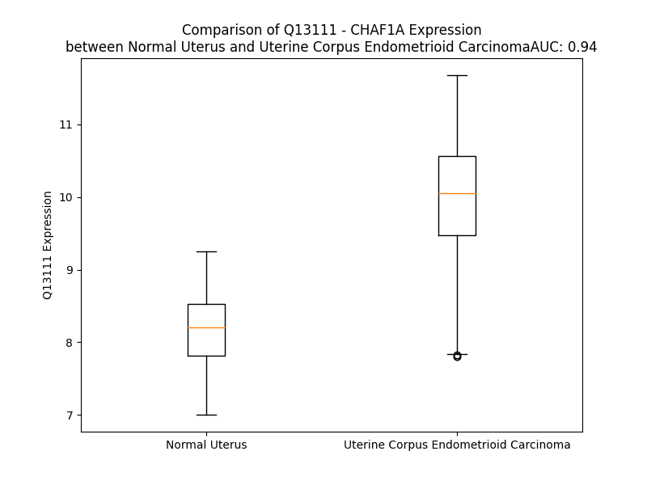

# Detailed Data for Q13111

## Introduction to the Detailed Summary

### How to Interpret the Results

- **Summary & Metrics**: This section provides a quick reference to essential protein attributes, including expression changes, family classification, and biomarker applications. Regulation status (upregulated/downregulated) indicates the protein's behavior in a disease context. Some information comes from the original excel file with the proteins selected from literature, while others are derived from the analyses.
- **Expression Comparison**: A visual representation comparing protein expression between normal and disease states. It highlights significant changes in expression levels that might indicate diagnostic or therapeutic relevance. This is data coming from transcriptomics experiments and could not translate similarly to protein levels.
- **Isoform Alignment**: An interactive view of isoform alignments, revealing structural and functional differences between variants of the protein.
- **Interactors & Homologs**: Tables listing known interaction partners and homologous proteins, the more interactors and homologs, the more complex the protein is to design an antibody for.
- **Biological Assemblies**: Information about the structural arrangement of the protein in different assemblies, providing insights into its functional state but also the complexity of the protein to develop antibodies.
- **Combined Per-Residue Information**: A detailed table summarizing residue-level data. This includes predictions for epitope regions, aggregation tendencies, and modifications that might impact the protein's function. Each row corresponds to a residue in the protein, providing insights into specific sites that may be important for research or drug development.
## Summary & Metrics

- **UniProt Accession**: Q13111
- **Gene Name**: CHAF1A
- **Protein Name**: Chromatin assembly factor 1 subunit A
- **Swiss Prot**: CAF1A_HUMAN
- **Family**: other
- **Biomarker Application**:  
- **Number of Isoforms**: 3
- **Regulation**: 1
- **(transcriptomics) AUC**: 1.0
- **(transcriptomics) Fold Change**: 1.25
- **(transcriptomics) Regulation**: Upregulated
- **Discotope Epitope Count**: 228
- **Max n_uniprots (Homo)**: N/A
- **Max n_uniprots (Hetero)**: 10

## Expression Comparison

## Isoform Alignment

<pre style='font-size:14px; font-family:monospace;'>Q13111-1 MLEELECGAPGARGAATAMDCKDRPAFPVKKLIQARLPFKRLNLVPKGKADDMSDDQGTSVQSKSPDLEASLDTLENNCHVGSDIDFRPKLVNGKGPLDNFLRNRIETSIGQSTVIIDLTEDSNEQPDSLVDHNKLNSEASPSREAINGQREDTGDQQGLLKAIQNDKLAFPGETLSDIPCKTEEEGVGCGGAGRRGDSQECSPRSCPELTSGPRMCPRKEQDSWSEAGGILFKGKVPMVVLQDILAVRPPQIKSLPATPQGKNMTPESEVLESFPEEDSVLSHSSLSSPSSTSSPEGPPAPPKQHSSTSPFPTSTPLRRITKKFVKGSTEKNKLRLQRDQERLGKQLKLRAEREEKEKLKEEAKRAKEEAKKKKEEEKELKEKERREKREKDEKEKAEKQRLKEERRKERQEALEAKLEEKRKKEEEKRLREEEKRIKAEKAEITRFFQKPKTPQAPKTLAGSCGKFAPFEIKEHMVLAPRRRTAFHPDLCSQLDQLLQQQSGEFSFLKDLKGRQPLRSGPTHVSTRNADIFNSDVVIVERGKGDGVPERRKFGRMKLLQFCENHRPAYWGTWNKKTALIRARDPWAQDTKLLDYEVDSDEEWEEEEPGESLSHSEGDDDDDMGEDEDEDDGFFVPHGYLSEDEGVTEECADPENHKVRQKLKAKEWDEFLAKGKRFRVLQPVKIGCVWAADRDCAGDDLKVLQQFAACFLETLPAQEEQTPKASKRERRDEQILAQLLPLLHGNVNGSKVIIREFQEHCRRGLLSNHTGSPRSPSTTYLHTPTPSEDAAIPSKSRLKRLISENSVYEKRPDFRMCWYVHPQVLQSFQQEHLPVPCQWSYVTSVPSAPKEDSGSVPSTGPSQGTPISLKRKSAGSMCITQFMKKRRHDGQIGAEDMDGFQADTEEEEEEEGDCMIVDVPDAAEVQAPCGAASGAGGGVGVDTGKATLTASPLGAS
Q13111-2 MLEELECGAPGARGAATAMDCKDRPAFPVKKLIQARLPFKRLNLVPKGKADDMSDDQGTSVQSKSPDLEASLDTLENNCHVGSDIDFRPKLVNGKGPLDNFLRNRIETSIGQSTVIIDLTEDSNEQPDSLVDHNKLNSEASPSREAINGQREDTGDQQGLLKAIQNDKLAFPGETLSDIPCKTEEEGVGCGGAGRRGDSQECSPRSCPELTSGPRMCPRKEQDSWSEAGGILFKGKVPMVVLQDILAVRPPQIKSLPATPQGKNMTPESEVLESFPEEDSVLSHSSLSSPSSTSSPEGPPAPPKQHSSTSPFPTSTPLRRITKKFVKGSTEKNKLRLQRDQERLGKQLKLRAEREEKEKLKEEAKRAKEEAKKKKEEEKELKEKERREKREKDEKEKAEKQRLKEERRKERQEALEAKLEEKRKKEEEKRLREEEKRIKAEKAEITRFFQKPKTPQAPKTLAGSCGKFAPFEIKEHMVLAPRRRTAFHPDLCSQLDQLLQQQSGEFSFLKDLKGRQPLRSGPTHVSTRNADIFNSDVVIVERGKGDGVPERRKFGRMKLLQFCENHRPAYWGTWNKKTALIRARDPWAQDTKLLDYEVDSDEEWEEEEPGESLSHSEGDDDDDMGEDEDEDDGFFVPHGYLSEDEGVTEECADPENHKVRQKLKAKEWDEFLAKGKRFRVLQPVKIGCVWAADRDCAGDDLKVLQQFAAHWVHPESRGDVCRTLRV--SSPQSRYLNR-------------------LNSCVKSTLSCFT------------------------------------------------------------------------------------------------------------------------------------------------------------------------------------------
Q13111-3 MLEELECGAPGARGAATAMDCKDRPAFPVKKLIQARLPFKRLNLVPKGKADDMSDDQGTSVQSKSPDLEASLDTLENNCHVGSDIDFRPKLVNGKGPLDNFLRNRIETSIGQSTVIIDLTEDSNEQPDSLVDHNKLNSEASPSREAINGQREDTGDQQGLLKAIQNDKLAFPGETLSDIPCKTEEEGVGCGGAGRRGDSQECSPRSCPELTSGPRMCPRKEQDSWSEAGGILFKGKVPMVVLQDILAVRPPQIKSLPATPQGKNMTPESEVLESFPEEDSVLSHSSLSSPSSTSSPEGPPAPPKQHSSTSPFPTSTPLRRITKKFVKGSTEKNKLRLQRDQERLGKQLKLRAEREEKEKLKEEAKRAKEEAKKKKEEEKELKEKERREKREKDEKEKAEKQRLKEERRKERQEALEAKLEEKRKKEEEKRLREEEKRIKAEKAEITRFFQKPKTPQAPKTLAGSCGKFAPFEIKEHMVLAPRRRTAFHPDLCSQLDQLLQQQSGEFSFLKDLKGRQPLRSGPTHVSTRNADIFNSDVVIVERGKGDGVPERRKFGRMKLLQFCENHRPAYWGTWNKKTALIRARDPWAQDTKLLDYEVDSDEEWEEEEPGESLSHSEGDDDDDMGEDEDEDDGFFVPHGYLSEDEGVTEECADPENHKVRQKLKAKEWDEFLAKGKRFRVLQPVKIGCVWAADRDCAGDDLKVLQQFAACFLETLPAQEEQTPKASKRERRDEQILAQLLPLLHGNVNGSKVIIREFQEHCRRGLLSNHTGKATLTASPLGAS-----------------------------------------------------------------------------------------------------------------------------------------------------------------------------
</pre>

## Interactors

| preferredName_A   | preferredName_B   |   score |
|:------------------|:------------------|--------:|
| CHAF1A            | RBBP4             |   0.999 |
| CHAF1A            | CHAF1B            |   0.999 |
| CHAF1A            | CBX5              |   0.971 |
| CHAF1A            | H3C12             |   0.965 |
| CHAF1A            | ASF1B             |   0.958 |

## Homologs

| uniprot_id   | gene_id   |
|--------------|-----------|

## Biological Assemblies

|   Unnamed: 0 |   assembly |   n_uniprots | composition   | crystal_id   |
|-------------:|-----------:|-------------:|:--------------|:-------------|
|            0 |          1 |           10 | Hetero        | 7y5v         |
|            0 |          1 |            3 | Hetero        | 7y5l         |
|            1 |          2 |            3 | Hetero        | 7y5l         |
|            0 |          1 |            8 | Hetero        | 8j6t         |
|            0 |          1 |            5 | Hetero        | 7y5u         |
|            0 |          1 |           10 | Hetero        | 8iqf         |
|            0 |          1 |            6 | Hetero        | 7y5o         |
|            0 |          1 |            8 | Hetero        | 8j6s         |
|            0 |          1 |            8 | Hetero        | 7y61         |
|            0 |          1 |            3 | Hetero        | 7y5k         |
|            0 |          1 |            5 | Hetero        | 8iqg         |
|            0 |          1 |            8 | Hetero        | 7y60         |

## Combined Per-Residue Information

|   res | aa   |   epitope_score | epitope   |   relative_surface_accessibility |   modeling_confidence |   Aggregation | modification     |
|------:|:-----|----------------:|:----------|---------------------------------:|----------------------:|--------------:|:-----------------|
|     1 | M    |         0.06698 | False     |                          1.25609 |                 39.69 |         0     | N/A              |
|     2 | L    |         0.07222 | False     |                          0.98888 |                 41.59 |         0     | N/A              |
|     3 | E    |         0.07933 | False     |                          0.79045 |                 44.22 |         0     | N/A              |
|     4 | E    |         0.09621 | True      |                          0.78563 |                 46.27 |         0     | N/A              |
|     5 | L    |         0.08186 | False     |                          0.94926 |                 43.14 |         0     | N/A              |
|     6 | E    |         0.07943 | False     |                          0.80706 |                 39.25 |         0     | N/A              |
|     7 | C    |         0.07225 | False     |                          0.95948 |                 40.02 |         0     | N/A              |
|     8 | G    |         0.09804 | True      |                          0.89205 |                 37.05 |         0     | N/A              |
|     9 | A    |         0.0651  | False     |                          0.92191 |                 37.07 |         0     | N/A              |
|    10 | P    |         0.08197 | False     |                          0.96319 |                 41.44 |         0     | N/A              |
|    11 | G    |         0.12588 | True      |                          0.80389 |                 35.12 |         0     | N/A              |
|    12 | A    |         0.07222 | False     |                          0.9288  |                 35.31 |         0     | N/A              |
|    13 | R    |         0.11745 | True      |                          0.98826 |                 33.88 |         0     | N/A              |
|    14 | G    |         0.06401 | False     |                          0.99565 |                 36.92 |         0     | N/A              |
|    15 | A    |         0.04755 | False     |                          1.00196 |                 34.68 |         0     | N/A              |
|    16 | A    |         0.03988 | False     |                          1.02484 |                 37.69 |         0     | N/A              |
|    17 | T    |         0.05838 | False     |                          0.8956  |                 41.58 |         0     | N/A              |
|    18 | A    |         0.07569 | False     |                          0.93488 |                 35    |         0     | N/A              |
|    19 | M    |         0.05171 | False     |                          0.95404 |                 44.87 |         0     | N/A              |
|    20 | D    |         0.10427 | True      |                          0.71945 |                 42.52 |         0     | N/A              |
|    21 | C    |         0.08433 | False     |                          0.9553  |                 41.6  |         0     | N/A              |
|    22 | K    |         0.08379 | False     |                          0.7639  |                 48.14 |         0     | N/A              |
|    23 | D    |         0.12208 | True      |                          0.91885 |                 40.94 |         0     | N/A              |
|    24 | R    |         0.08705 | True      |                          0.82702 |                 45.3  |         0     | N/A              |
|    25 | P    |         0.09006 | True      |                          0.90091 |                 43.03 |         0     | N/A              |
|    26 | A    |         0.07193 | False     |                          0.97584 |                 39.02 |         0     | N/A              |
|    27 | F    |         0.07267 | False     |                          0.86847 |                 44.78 |         0     | N/A              |
|    28 | P    |         0.07299 | False     |                          0.86448 |                 52.03 |         0     | N/A              |
|    29 | V    |         0.07113 | False     |                          1.01183 |                 43    |         0     | N/A              |
|    30 | K    |         0.04222 | False     |                          0.95336 |                 51.72 |         0     | N/A              |
|    31 | K    |         0.05713 | False     |                          0.88555 |                 46.73 |         0     | N/A              |
|    32 | L    |         0.06184 | False     |                          1.06589 |                 46.93 |         0     | N/A              |
|    33 | I    |         0.05979 | False     |                          0.90737 |                 42.91 |         0     | N/A              |
|    34 | Q    |         0.08152 | False     |                          0.70909 |                 41.78 |         0     | N/A              |
|    35 | A    |         0.05612 | False     |                          0.87231 |                 37.46 |         0     | N/A              |
|    36 | R    |         0.08357 | False     |                          0.9102  |                 42.37 |         0     | N/A              |
|    37 | L    |         0.06633 | False     |                          0.9589  |                 43.76 |         0     | N/A              |
|    38 | P    |         0.06268 | False     |                          0.7966  |                 51.47 |         0     | N/A              |
|    39 | F    |         0.07575 | False     |                          1.01994 |                 39.15 |         0     | N/A              |
|    40 | K    |         0.07734 | False     |                          0.94327 |                 46.56 |         0     | N/A              |
|    41 | R    |         0.06537 | False     |                          0.8051  |                 42.53 |         0     | N/A              |
|    42 | L    |         0.06605 | False     |                          0.98143 |                 37.71 |         0     | N/A              |
|    43 | N    |         0.0655  | False     |                          0.82569 |                 41.92 |         0     | N/A              |
|    44 | L    |         0.083   | False     |                          0.93493 |                 41.6  |         0     | N/A              |
|    45 | V    |         0.08371 | False     |                          0.83484 |                 38.09 |         0     | N/A              |
|    46 | P    |         0.05133 | False     |                          0.95436 |                 45.82 |         0     | N/A              |
|    47 | K    |         0.11946 | True      |                          0.95371 |                 40.3  |         0     | N/A              |
|    48 | G    |         0.19947 | True      |                          0.85841 |                 36.56 |         0     | N/A              |
|    49 | K    |         0.09385 | True      |                          1.01437 |                 37.64 |         0     | N/A              |
|    50 | A    |         0.0776  | False     |                          0.92958 |                 35.72 |         0     | N/A              |
|    51 | D    |         0.10264 | True      |                          0.91648 |                 45.71 |         0     | N/A              |
|    52 | D    |         0.12779 | True      |                          0.83481 |                 41.53 |         0     | N/A              |
|    53 | M    |         0.16371 | True      |                          0.94534 |                 40.47 |         0     | N/A              |
|    54 | S    |         0.08752 | True      |                          0.73265 |                 41.11 |         0     | N/A              |
|    55 | D    |         0.1101  | True      |                          0.88659 |                 37.61 |         0     | N/A              |
|    56 | D    |         0.07593 | False     |                          0.8444  |                 42.35 |         0     | N/A              |
|    57 | Q    |         0.08847 | True      |                          0.88282 |                 39.71 |         0     | N/A              |
|    58 | G    |         0.08671 | True      |                          0.73972 |                 36.03 |         0     | N/A              |
|    59 | T    |         0.12488 | True      |                          1.0901  |                 35.63 |         0     | N/A              |
|    60 | S    |         0.08302 | False     |                          0.79896 |                 33.05 |         0     | N/A              |
|    61 | V    |         0.13322 | True      |                          1.01743 |                 37.12 |         0     | N/A              |
|    62 | Q    |         0.12875 | True      |                          0.79812 |                 38.75 |         0     | N/A              |
|    63 | S    |         0.11329 | True      |                          0.77871 |                 32    |         0     | N/A              |
|    64 | K    |         0.11838 | True      |                          1.01668 |                 34.56 |         0     | N/A              |
|    65 | S    |         0.107   | True      |                          0.78145 |                 28.27 |         0     | Phosphoserine    |
|    66 | P    |         0.09829 | True      |                          0.90168 |                 38.61 |         0     | N/A              |
|    67 | D    |         0.08795 | True      |                          0.84507 |                 37.39 |         0     | N/A              |
|    68 | L    |         0.06989 | False     |                          1.00202 |                 32.72 |         0     | N/A              |
|    69 | E    |         0.07922 | False     |                          0.94949 |                 36.9  |         0     | N/A              |
|    70 | A    |         0.08492 | False     |                          1.00692 |                 30.75 |         0     | N/A              |
|    71 | S    |         0.08381 | False     |                          0.92517 |                 35.27 |         0     | N/A              |
|    72 | L    |         0.08716 | True      |                          1.01887 |                 31.53 |         0     | N/A              |
|    73 | D    |         0.16561 | True      |                          0.81742 |                 37.19 |         0     | N/A              |
|    74 | T    |         0.14864 | True      |                          0.73887 |                 36.68 |         0     | N/A              |
|    75 | L    |         0.08533 | True      |                          1.01876 |                 34.74 |         0     | N/A              |
|    76 | E    |         0.11301 | True      |                          0.78657 |                 37.54 |         0     | N/A              |
|    77 | N    |         0.10472 | True      |                          0.84668 |                 31.65 |         0     | N/A              |
|    78 | N    |         0.09683 | True      |                          0.88134 |                 33.73 |         0     | N/A              |
|    79 | C    |         0.04915 | False     |                          0.98477 |                 32.63 |         0     | N/A              |
|    80 | H    |         0.08241 | False     |                          0.93047 |                 35.96 |         0     | N/A              |
|    81 | V    |         0.09001 | True      |                          1.03878 |                 33.55 |         0     | N/A              |
|    82 | G    |         0.08564 | True      |                          0.82182 |                 29.09 |         0     | N/A              |
|    83 | S    |         0.06563 | False     |                          0.81747 |                 35.72 |         0     | N/A              |
|    84 | D    |         0.0626  | False     |                          0.92042 |                 33.29 |         0     | N/A              |
|    85 | I    |         0.08465 | False     |                          0.76049 |                 41.24 |         0     | N/A              |
|    86 | D    |         0.07845 | False     |                          0.89664 |                 34.12 |         0     | N/A              |
|    87 | F    |         0.06223 | False     |                          0.93655 |                 34.56 |         0     | N/A              |
|    88 | R    |         0.08299 | False     |                          0.84997 |                 41.51 |         0     | N/A              |
|    89 | P    |         0.05128 | False     |                          0.78272 |                 45.94 |         0     | N/A              |
|    90 | K    |         0.0429  | False     |                          0.92757 |                 44.46 |         0     | N/A              |
|    91 | L    |         0.11258 | True      |                          0.8349  |                 46.21 |         0     | N/A              |
|    92 | V    |         0.03988 | False     |                          0.78107 |                 46.36 |         0     | N/A              |
|    93 | N    |         0.11311 | True      |                          0.88409 |                 52.77 |         0     | N/A              |
|    94 | G    |         0.09621 | True      |                          0.84092 |                 56.18 |         0     | N/A              |
|    95 | K    |         0.08687 | True      |                          0.59351 |                 54.4  |         0     | N/A              |
|    96 | G    |         0.08906 | True      |                          0.32468 |                 62.13 |         0     | N/A              |
|    97 | P    |         0.1103  | True      |                          0.77133 |                 45.86 |         0     | N/A              |
|    98 | L    |         0.07452 | False     |                          0.89128 |                 45.46 |         0     | N/A              |
|    99 | D    |         0.08942 | True      |                          0.48448 |                 50.2  |         0     | N/A              |
|   100 | N    |         0.059   | False     |                          0.64699 |                 49.56 |         0     | N/A              |
|   101 | F    |         0.0697  | False     |                          0.84488 |                 46.77 |         0     | N/A              |
|   102 | L    |         0.08638 | True      |                          0.85252 |                 47.5  |         0     | N/A              |
|   103 | R    |         0.07963 | False     |                          0.699   |                 46.75 |         0     | N/A              |
|   104 | N    |         0.05334 | False     |                          0.71346 |                 41.31 |         0     | N/A              |
|   105 | R    |         0.0866  | True      |                          0.75855 |                 36.94 |         0     | N/A              |
|   106 | I    |         0.07127 | False     |                          0.89874 |                 39.13 |         0     | N/A              |
|   107 | E    |         0.08694 | True      |                          0.73619 |                 35.84 |         0     | N/A              |
|   108 | T    |         0.07803 | False     |                          0.74733 |                 35.13 |         0     | N/A              |
|   109 | S    |         0.1822  | True      |                          0.93128 |                 35.84 |         0     | N/A              |
|   110 | I    |         0.10022 | True      |                          0.90788 |                 36.95 |         0     | N/A              |
|   111 | G    |         0.08739 | True      |                          0.96975 |                 32.12 |         0     | N/A              |
|   112 | Q    |         0.0481  | False     |                          0.82515 |                 41.81 |         0     | N/A              |
|   113 | S    |         0.05004 | False     |                          0.83996 |                 37.82 |         2.47  | N/A              |
|   114 | T    |         0.02871 | False     |                          0.74539 |                 44.93 |         2.47  | N/A              |
|   115 | V    |         0.01643 | False     |                          0.2571  |                 48.52 |         2.47  | N/A              |
|   116 | I    |         0.02718 | False     |                          0.33351 |                 51.54 |         2.47  | N/A              |
|   117 | I    |         0.01859 | False     |                          0.20277 |                 50.8  |         2.47  | N/A              |
|   118 | D    |         0.03631 | False     |                          0.51664 |                 51.09 |         0     | N/A              |
|   119 | L    |         0.0415  | False     |                          0.81208 |                 48.52 |         0     | N/A              |
|   120 | T    |         0.06826 | False     |                          0.90089 |                 50.17 |         0     | N/A              |
|   121 | E    |         0.06499 | False     |                          0.47969 |                 42.61 |         0     | N/A              |
|   122 | D    |         0.09454 | True      |                          0.86301 |                 37.18 |         0     | N/A              |
|   123 | S    |         0.083   | False     |                          0.66529 |                 40.55 |         0     | Phosphoserine    |
|   124 | N    |         0.11228 | True      |                          0.91467 |                 37.07 |         0     | N/A              |
|   125 | E    |         0.07091 | False     |                          0.65109 |                 41.34 |         0     | N/A              |
|   126 | Q    |         0.05886 | False     |                          0.87346 |                 35.04 |         0     | N/A              |
|   127 | P    |         0.05446 | False     |                          0.83719 |                 32.79 |         0     | N/A              |
|   128 | D    |         0.0855  | True      |                          0.94738 |                 38.72 |         0     | N/A              |
|   129 | S    |         0.08561 | True      |                          0.77658 |                 35.58 |         0     | N/A              |
|   130 | L    |         0.0589  | False     |                          0.92141 |                 36.09 |         0     | N/A              |
|   131 | V    |         0.05819 | False     |                          0.82781 |                 36.94 |         0     | N/A              |
|   132 | D    |         0.06293 | False     |                          0.82517 |                 38.61 |         0     | N/A              |
|   133 | H    |         0.07365 | False     |                          0.83092 |                 34.1  |         0     | N/A              |
|   134 | N    |         0.07395 | False     |                          0.85844 |                 37.99 |         0     | N/A              |
|   135 | K    |         0.08419 | False     |                          0.86487 |                 32.41 |         0     | N/A              |
|   136 | L    |         0.07847 | False     |                          0.86746 |                 35.37 |         0     | N/A              |
|   137 | N    |         0.09844 | True      |                          0.87039 |                 27.53 |         0     | N/A              |
|   138 | S    |         0.11855 | True      |                          0.74515 |                 29.71 |         0     | Phosphoserine    |
|   139 | E    |         0.14133 | True      |                          0.88487 |                 32.45 |         0     | N/A              |
|   140 | A    |         0.07302 | False     |                          0.95004 |                 32.13 |         0     | N/A              |
|   141 | S    |         0.05628 | False     |                          0.83346 |                 30.85 |         0     | Phosphoserine    |
|   142 | P    |         0.06204 | False     |                          0.95991 |                 41.5  |         0     | N/A              |
|   143 | S    |         0.0605  | False     |                          0.65722 |                 34.77 |         0     | Phosphoserine    |
|   144 | R    |         0.10233 | True      |                          0.84793 |                 38.57 |         0     | N/A              |
|   145 | E    |         0.03769 | False     |                          0.56226 |                 38.82 |         0     | N/A              |
|   146 | A    |         0.11922 | True      |                          0.87089 |                 36.74 |         0     | N/A              |
|   147 | I    |         0.07361 | False     |                          0.89192 |                 38.97 |         0     | N/A              |
|   148 | N    |         0.06655 | False     |                          0.96523 |                 37.38 |         0     | N/A              |
|   149 | G    |         0.07279 | False     |                          0.9034  |                 37.44 |         0     | N/A              |
|   150 | Q    |         0.05364 | False     |                          0.71672 |                 37.39 |         0     | N/A              |
|   151 | R    |         0.10676 | True      |                          0.73116 |                 39.07 |         0     | N/A              |
|   152 | E    |         0.05508 | False     |                          0.63842 |                 38.02 |         0     | N/A              |
|   153 | D    |         0.08729 | True      |                          0.77374 |                 37.48 |         0     | N/A              |
|   154 | T    |         0.07871 | False     |                          0.9592  |                 38.1  |         0     | N/A              |
|   155 | G    |         0.08399 | False     |                          0.92676 |                 36.92 |         0     | N/A              |
|   156 | D    |         0.07418 | False     |                          0.8219  |                 36.05 |         0     | N/A              |
|   157 | Q    |         0.10493 | True      |                          0.93726 |                 38.65 |         0     | N/A              |
|   158 | Q    |         0.13613 | True      |                          0.91841 |                 34.62 |         0     | N/A              |
|   159 | G    |         0.13891 | True      |                          0.91511 |                 29.83 |         0     | N/A              |
|   160 | L    |         0.06841 | False     |                          1.07694 |                 30.65 |         0     | N/A              |
|   161 | L    |         0.10349 | True      |                          1.03501 |                 29.07 |         0     | N/A              |
|   162 | K    |         0.08015 | False     |                          1.01564 |                 34.53 |         0     | N/A              |
|   163 | A    |         0.08794 | True      |                          0.82793 |                 29.04 |         0     | N/A              |
|   164 | I    |         0.11647 | True      |                          0.88268 |                 30.93 |         0     | N/A              |
|   165 | Q    |         0.10766 | True      |                          0.78815 |                 33.15 |         0     | N/A              |
|   166 | N    |         0.09063 | True      |                          0.81496 |                 35.38 |         0     | N/A              |
|   167 | D    |         0.05958 | False     |                          0.76653 |                 36.28 |         0     | N/A              |
|   168 | K    |         0.09555 | True      |                          0.87386 |                 34.54 |         0     | N/A              |
|   169 | L    |         0.06332 | False     |                          1.08232 |                 36.52 |         0     | N/A              |
|   170 | A    |         0.06257 | False     |                          0.77725 |                 31.84 |         0     | N/A              |
|   171 | F    |         0.04932 | False     |                          1.0355  |                 27.87 |         0     | N/A              |
|   172 | P    |         0.04981 | False     |                          0.91513 |                 40.73 |         0     | N/A              |
|   173 | G    |         0.06464 | False     |                          0.8954  |                 30.81 |         0     | N/A              |
|   174 | E    |         0.07037 | False     |                          0.91889 |                 39.38 |         0     | N/A              |
|   175 | T    |         0.06696 | False     |                          0.92621 |                 28.1  |         0     | N/A              |
|   176 | L    |         0.05863 | False     |                          1.05972 |                 36.98 |         0     | N/A              |
|   177 | S    |         0.07853 | False     |                          0.6276  |                 33.24 |         0     | N/A              |
|   178 | D    |         0.06269 | False     |                          0.74713 |                 40.12 |         0     | N/A              |
|   179 | I    |         0.08568 | True      |                          0.90193 |                 38.81 |         0     | N/A              |
|   180 | P    |         0.06897 | False     |                          0.74756 |                 42.65 |         0     | N/A              |
|   181 | C    |         0.08983 | True      |                          0.85774 |                 35.27 |         0     | N/A              |
|   182 | K    |         0.09295 | True      |                          0.79429 |                 37.76 |         0     | N/A              |
|   183 | T    |         0.07093 | False     |                          0.71513 |                 43.84 |         0     | N/A              |
|   184 | E    |         0.07964 | False     |                          0.60227 |                 40.65 |         0     | N/A              |
|   185 | E    |         0.07703 | False     |                          0.8421  |                 41    |         0     | N/A              |
|   186 | E    |         0.0548  | False     |                          0.86565 |                 38.66 |         0     | N/A              |
|   187 | G    |         0.03956 | False     |                          0.76803 |                 40.1  |         0     | N/A              |
|   188 | V    |         0.05869 | False     |                          1.13599 |                 40.3  |         0     | N/A              |
|   189 | G    |         0.05454 | False     |                          0.792   |                 35.93 |         0     | N/A              |
|   190 | C    |         0.04104 | False     |                          1.03061 |                 37.75 |         0     | N/A              |
|   191 | G    |         0.1086  | True      |                          0.96595 |                 34.62 |         0     | N/A              |
|   192 | G    |         0.09402 | True      |                          1.049   |                 33.14 |         0     | N/A              |
|   193 | A    |         0.05336 | False     |                          1.09194 |                 34.2  |         0     | N/A              |
|   194 | G    |         0.1087  | True      |                          0.92077 |                 34.92 |         0     | N/A              |
|   195 | R    |         0.07827 | False     |                          0.90827 |                 39.46 |         0     | N/A              |
|   196 | R    |         0.10099 | True      |                          0.88319 |                 35.17 |         0     | N/A              |
|   197 | G    |         0.07606 | False     |                          0.79895 |                 38.53 |         0     | N/A              |
|   198 | D    |         0.08929 | True      |                          0.81813 |                 37.02 |         0     | N/A              |
|   199 | S    |         0.08463 | False     |                          0.72147 |                 39.29 |         0     | N/A              |
|   200 | Q    |         0.08267 | False     |                          0.77529 |                 40.22 |         0     | N/A              |
|   201 | E    |         0.09335 | True      |                          0.62564 |                 40.51 |         0     | N/A              |
|   202 | C    |         0.10021 | True      |                          0.89233 |                 36.03 |         0     | N/A              |
|   203 | S    |         0.10072 | True      |                          0.69948 |                 37.04 |         0     | N/A              |
|   204 | P    |         0.07626 | False     |                          0.86841 |                 42.31 |         0     | N/A              |
|   205 | R    |         0.12027 | True      |                          0.9548  |                 36.16 |         0     | N/A              |
|   206 | S    |         0.11912 | True      |                          0.79537 |                 32.11 |         0     | Phosphoserine    |
|   207 | C    |         0.07827 | False     |                          0.88956 |                 29.37 |         0     | N/A              |
|   208 | P    |         0.09549 | True      |                          0.98625 |                 35.58 |         0     | N/A              |
|   209 | E    |         0.09086 | True      |                          0.80201 |                 30.38 |         0     | N/A              |
|   210 | L    |         0.09724 | True      |                          0.99722 |                 29.14 |         0     | N/A              |
|   211 | T    |         0.12656 | True      |                          0.80589 |                 29.07 |         0     | N/A              |
|   212 | S    |         0.09679 | True      |                          0.85715 |                 28.37 |         0     | N/A              |
|   213 | G    |         0.09689 | True      |                          0.80362 |                 28.44 |         0     | N/A              |
|   214 | P    |         0.05669 | False     |                          1.0265  |                 37.05 |         0     | N/A              |
|   215 | R    |         0.10752 | True      |                          0.96508 |                 34.33 |         0     | N/A              |
|   216 | M    |         0.11842 | True      |                          0.93975 |                 31.72 |         0     | N/A              |
|   217 | C    |         0.0785  | False     |                          0.85228 |                 31.07 |         0     | N/A              |
|   218 | P    |         0.07208 | False     |                          1.0094  |                 32.64 |         0     | N/A              |
|   219 | R    |         0.07238 | False     |                          0.7846  |                 35.12 |         0     | N/A              |
|   220 | K    |         0.07072 | False     |                          0.93875 |                 31.3  |         0     | N/A              |
|   221 | E    |         0.09843 | True      |                          0.91238 |                 31.66 |         0     | N/A              |
|   222 | Q    |         0.0882  | True      |                          0.84477 |                 32.94 |         0     | N/A              |
|   223 | D    |         0.07929 | False     |                          0.58267 |                 30.82 |         0     | N/A              |
|   224 | S    |         0.06579 | False     |                          0.77766 |                 31.83 |         0     | Phosphoserine    |
|   225 | W    |         0.06476 | False     |                          1.01412 |                 33.65 |         0     | N/A              |
|   226 | S    |         0.09694 | True      |                          0.70067 |                 39.79 |         0     | N/A              |
|   227 | E    |         0.11535 | True      |                          0.8946  |                 36.95 |         0     | N/A              |
|   228 | A    |         0.06056 | False     |                          0.60159 |                 35.59 |         0.876 | N/A              |
|   229 | G    |         0.09662 | True      |                          0.80085 |                 33.47 |         1.911 | N/A              |
|   230 | G    |         0.12078 | True      |                          0.92191 |                 37.57 |         1.911 | N/A              |
|   231 | I    |         0.10592 | True      |                          0.91587 |                 44.42 |         1.911 | N/A              |
|   232 | L    |         0.06349 | False     |                          0.83335 |                 37.36 |         1.911 | N/A              |
|   233 | F    |         0.05636 | False     |                          0.71945 |                 40.36 |         1.911 | N/A              |
|   234 | K    |         0.05672 | False     |                          0.93374 |                 37.1  |         0     | N/A              |
|   235 | G    |         0.02826 | False     |                          0.96367 |                 46.05 |         0     | N/A              |
|   236 | K    |         0.03713 | False     |                          0.50813 |                 40.48 |         0     | N/A              |
|   237 | V    |         0.02052 | False     |                          0.98097 |                 39.73 |         0     | N/A              |
|   238 | P    |         0.04028 | False     |                          0.90824 |                 37.81 |         1.839 | N/A              |
|   239 | M    |         0.05327 | False     |                          0.90764 |                 35.41 |         2.638 | N/A              |
|   240 | V    |         0.0782  | False     |                          0.91237 |                 37.75 |         2.638 | N/A              |
|   241 | V    |         0.07063 | False     |                          0.7671  |                 40.8  |         2.638 | N/A              |
|   242 | L    |         0.06998 | False     |                          1.04892 |                 35.52 |         2.638 | N/A              |
|   243 | Q    |         0.04235 | False     |                          0.68108 |                 42.92 |         0.799 | N/A              |
|   244 | D    |         0.03759 | False     |                          0.56081 |                 47.94 |         0     | N/A              |
|   245 | I    |         0.07435 | False     |                          0.88337 |                 53.78 |         0     | N/A              |
|   246 | L    |         0.12138 | True      |                          1.04898 |                 46.79 |         0     | N/A              |
|   247 | A    |         0.08841 | True      |                          0.79508 |                 50.67 |         0     | N/A              |
|   248 | V    |         0.06356 | False     |                          0.71562 |                 45.95 |         0     | N/A              |
|   249 | R    |         0.14993 | True      |                          0.91204 |                 41.87 |         0     | N/A              |
|   250 | P    |         0.06711 | False     |                          0.78982 |                 44.38 |         0     | N/A              |
|   251 | P    |         0.0553  | False     |                          0.85923 |                 42.3  |         0     | N/A              |
|   252 | Q    |         0.11279 | True      |                          0.86428 |                 37.98 |         0     | N/A              |
|   253 | I    |         0.11119 | True      |                          0.98776 |                 40.98 |         0     | N/A              |
|   254 | K    |         0.1179  | True      |                          0.90674 |                 40.09 |         0     | N/A              |
|   255 | S    |         0.10835 | True      |                          0.84905 |                 39.82 |         0     | N/A              |
|   256 | L    |         0.11364 | True      |                          1.02926 |                 37.32 |         0     | N/A              |
|   257 | P    |         0.0777  | False     |                          0.93991 |                 36.99 |         0     | N/A              |
|   258 | A    |         0.07382 | False     |                          0.98855 |                 41.37 |         0     | N/A              |
|   259 | T    |         0.11275 | True      |                          0.97011 |                 37.53 |         0     | N/A              |
|   260 | P    |         0.05688 | False     |                          0.88467 |                 36.54 |         0     | N/A              |
|   261 | Q    |         0.08323 | False     |                          0.96297 |                 38.1  |         0     | N/A              |
|   262 | G    |         0.11817 | True      |                          0.82053 |                 35.34 |         0     | N/A              |
|   263 | K    |         0.13396 | True      |                          0.94777 |                 39.81 |         0     | N/A              |
|   264 | N    |         0.11478 | True      |                          0.88307 |                 31.63 |         0     | N/A              |
|   265 | M    |         0.09699 | True      |                          0.95967 |                 40.34 |         0     | N/A              |
|   266 | T    |         0.06536 | False     |                          0.80502 |                 33.89 |         0     | N/A              |
|   267 | P    |         0.11806 | True      |                          0.78103 |                 43.26 |         0     | N/A              |
|   268 | E    |         0.09581 | True      |                          0.86601 |                 38.86 |         0     | N/A              |
|   269 | S    |         0.09197 | True      |                          0.70508 |                 43.35 |         0     | N/A              |
|   270 | E    |         0.09406 | True      |                          0.7959  |                 40.74 |         0     | N/A              |
|   271 | V    |         0.12772 | True      |                          0.87161 |                 42.38 |         0     | N/A              |
|   272 | L    |         0.0754  | False     |                          0.86107 |                 41.85 |         0     | N/A              |
|   273 | E    |         0.0795  | False     |                          0.78697 |                 38.69 |         0     | N/A              |
|   274 | S    |         0.07175 | False     |                          0.62554 |                 38.45 |         0     | N/A              |
|   275 | F    |         0.07154 | False     |                          1.06775 |                 36.92 |         0     | N/A              |
|   276 | P    |         0.08694 | True      |                          0.75837 |                 37.99 |         0     | N/A              |
|   277 | E    |         0.06703 | False     |                          0.79592 |                 37.82 |         0     | N/A              |
|   278 | E    |         0.07887 | False     |                          0.83703 |                 41.93 |         0     | N/A              |
|   279 | D    |         0.06816 | False     |                          0.82133 |                 40.35 |         0     | N/A              |
|   280 | S    |         0.0663  | False     |                          0.80682 |                 39.78 |         0     | N/A              |
|   281 | V    |         0.1024  | True      |                          0.89268 |                 36.4  |         0     | N/A              |
|   282 | L    |         0.11185 | True      |                          0.96871 |                 39.56 |         0     | N/A              |
|   283 | S    |         0.08179 | False     |                          0.62749 |                 36.03 |         0     | N/A              |
|   284 | H    |         0.12759 | True      |                          0.91847 |                 40.85 |         0     | N/A              |
|   285 | S    |         0.07539 | False     |                          0.81661 |                 39.47 |         0     | N/A              |
|   286 | S    |         0.07979 | False     |                          0.79991 |                 38.88 |         0     | N/A              |
|   287 | L    |         0.05534 | False     |                          1.05699 |                 41.89 |         0     | N/A              |
|   288 | S    |         0.09421 | True      |                          0.71516 |                 41.84 |         0     | N/A              |
|   289 | S    |         0.10178 | True      |                          0.76212 |                 44.05 |         0     | N/A              |
|   290 | P    |         0.07612 | False     |                          0.98288 |                 41.96 |         0     | N/A              |
|   291 | S    |         0.06733 | False     |                          0.85717 |                 41.4  |         0     | N/A              |
|   292 | S    |         0.09538 | True      |                          0.83908 |                 48.6  |         0     | N/A              |
|   293 | T    |         0.04438 | False     |                          0.92583 |                 40.46 |         0     | N/A              |
|   294 | S    |         0.08492 | False     |                          0.75779 |                 43.68 |         0     | N/A              |
|   295 | S    |         0.08235 | False     |                          0.82051 |                 40.88 |         0     | N/A              |
|   296 | P    |         0.07561 | False     |                          0.92479 |                 51.27 |         0     | N/A              |
|   297 | E    |         0.09862 | True      |                          0.96479 |                 43.69 |         0     | N/A              |
|   298 | G    |         0.07211 | False     |                          0.84834 |                 38.98 |         0     | N/A              |
|   299 | P    |         0.06539 | False     |                          0.95208 |                 56.56 |         0     | N/A              |
|   300 | P    |         0.07939 | False     |                          0.91985 |                 51.75 |         0     | N/A              |
|   301 | A    |         0.08585 | True      |                          0.95897 |                 43.85 |         0     | N/A              |
|   302 | P    |         0.06395 | False     |                          0.91856 |                 55.83 |         0     | N/A              |
|   303 | P    |         0.06767 | False     |                          0.89057 |                 49.01 |         0     | N/A              |
|   304 | K    |         0.05836 | False     |                          0.89144 |                 42.76 |         0     | N/A              |
|   305 | Q    |         0.07016 | False     |                          0.63606 |                 44.64 |         0     | N/A              |
|   306 | H    |         0.08685 | True      |                          0.95439 |                 47.07 |         0     | N/A              |
|   307 | S    |         0.04252 | False     |                          0.86275 |                 38.88 |         0     | N/A              |
|   308 | S    |         0.03817 | False     |                          0.7696  |                 42.8  |         0     | N/A              |
|   309 | T    |         0.05269 | False     |                          0.92843 |                 39.31 |         0     | N/A              |
|   310 | S    |         0.07365 | False     |                          0.82296 |                 40.3  |         0     | Phosphoserine    |
|   311 | P    |         0.05156 | False     |                          0.75943 |                 54.8  |         0     | N/A              |
|   312 | F    |         0.06665 | False     |                          1.02278 |                 41.27 |         0     | N/A              |
|   313 | P    |         0.05171 | False     |                          0.90737 |                 52.49 |         0     | N/A              |
|   314 | T    |         0.0792  | False     |                          1.04903 |                 37.57 |         0     | N/A              |
|   315 | S    |         0.08493 | False     |                          0.86252 |                 41.82 |         0     | N/A              |
|   316 | T    |         0.07116 | False     |                          0.94512 |                 40.39 |         0     | N/A              |
|   317 | P    |         0.06013 | False     |                          0.87067 |                 51.88 |         0     | N/A              |
|   318 | L    |         0.07855 | False     |                          0.93141 |                 49.12 |         0     | N/A              |
|   319 | R    |         0.0754  | False     |                          0.86445 |                 46.73 |         0     | N/A              |
|   320 | R    |         0.07693 | False     |                          0.96582 |                 55.19 |         0     | N/A              |
|   321 | I    |         0.05376 | False     |                          0.98936 |                 48.68 |         0     | N/A              |
|   322 | T    |         0.04918 | False     |                          0.84776 |                 49.78 |         0     | N/A              |
|   323 | K    |         0.0739  | False     |                          0.95395 |                 46.81 |         0     | N/A              |
|   324 | K    |         0.07641 | False     |                          1.04013 |                 44.98 |         0     | N/A              |
|   325 | F    |         0.05952 | False     |                          0.9888  |                 43.12 |         0     | N/A              |
|   326 | V    |         0.04713 | False     |                          0.8995  |                 32.92 |         0     | N/A              |
|   327 | K    |         0.05226 | False     |                          0.93901 |                 30.88 |         0     | N/A              |
|   328 | G    |         0.05867 | False     |                          0.68964 |                 31.52 |         0     | N/A              |
|   329 | S    |         0.04001 | False     |                          0.92226 |                 25.46 |         0     | N/A              |
|   330 | T    |         0.04255 | False     |                          0.99269 |                 41.72 |         0     | N/A              |
|   331 | E    |         0.05404 | False     |                          0.71035 |                 55.62 |         0     | N/A              |
|   332 | K    |         0.06307 | False     |                          0.84723 |                 50.51 |         0     | N/A              |
|   333 | N    |         0.04714 | False     |                          0.72057 |                 57.58 |         0     | N/A              |
|   334 | K    |         0.07303 | False     |                          0.71555 |                 62.22 |         0     | N/A              |
|   335 | L    |         0.05952 | False     |                          0.89143 |                 61.49 |         0     | N/A              |
|   336 | R    |         0.05614 | False     |                          0.83163 |                 61.77 |         0     | N/A              |
|   337 | L    |         0.01523 | False     |                          0.39947 |                 61.7  |         0     | N/A              |
|   338 | Q    |         0.0339  | False     |                          0.5458  |                 72.9  |         0     | N/A              |
|   339 | R    |         0.05465 | False     |                          0.70426 |                 71.53 |         0     | N/A              |
|   340 | D    |         0.01713 | False     |                          0.39223 |                 73.05 |         0     | N/A              |
|   341 | Q    |         0.02742 | False     |                          0.50016 |                 75.17 |         0     | N/A              |
|   342 | E    |         0.03044 | False     |                          0.47701 |                 80.3  |         0     | N/A              |
|   343 | R    |         0.07661 | False     |                          0.69821 |                 79.86 |         0     | N/A              |
|   344 | L    |         0.01927 | False     |                          0.63476 |                 75.71 |         0     | N/A              |
|   345 | G    |         0.03155 | False     |                          0.38587 |                 82.05 |         0     | N/A              |
|   346 | K    |         0.03023 | False     |                          0.67722 |                 81.81 |         0     | N/A              |
|   347 | Q    |         0.04152 | False     |                          0.57098 |                 78.19 |         0     | N/A              |
|   348 | L    |         0.02446 | False     |                          0.65763 |                 83.62 |         0     | N/A              |
|   349 | K    |         0.03169 | False     |                          0.76845 |                 84.22 |         0     | N/A              |
|   350 | L    |         0.02882 | False     |                          0.6072  |                 82.85 |         0     | N/A              |
|   351 | R    |         0.03398 | False     |                          0.62021 |                 81.31 |         0     | N/A              |
|   352 | A    |         0.02458 | False     |                          0.51469 |                 84.51 |         0     | N/A              |
|   353 | E    |         0.02363 | False     |                          0.4728  |                 82.96 |         0     | N/A              |
|   354 | R    |         0.03739 | False     |                          0.67405 |                 82.41 |         0     | N/A              |
|   355 | E    |         0.0157  | False     |                          0.49262 |                 81.55 |         0     | N/A              |
|   356 | E    |         0.02395 | False     |                          0.61662 |                 82.19 |         0     | N/A              |
|   357 | K    |         0.04018 | False     |                          0.58357 |                 83.26 |         0     | N/A              |
|   358 | E    |         0.0315  | False     |                          0.59643 |                 83.18 |         0     | N/A              |
|   359 | K    |         0.02749 | False     |                          0.67219 |                 83.83 |         0     | N/A              |
|   360 | L    |         0.03716 | False     |                          0.73387 |                 82.9  |         0     | N/A              |
|   361 | K    |         0.02865 | False     |                          0.63105 |                 83.72 |         0     | N/A              |
|   362 | E    |         0.01504 | False     |                          0.41869 |                 82.89 |         0     | N/A              |
|   363 | E    |         0.01575 | False     |                          0.61831 |                 82.33 |         0     | N/A              |
|   364 | A    |         0.01894 | False     |                          0.41762 |                 86.82 |         0     | N/A              |
|   365 | K    |         0.03611 | False     |                          0.7155  |                 84.9  |         0     | N/A              |
|   366 | R    |         0.04373 | False     |                          0.62245 |                 83.79 |         0     | N/A              |
|   367 | A    |         0.02321 | False     |                          0.55236 |                 85.55 |         0     | N/A              |
|   368 | K    |         0.03942 | False     |                          0.71432 |                 82.56 |         0     | N/A              |
|   369 | E    |         0.02639 | False     |                          0.60658 |                 80.2  |         0     | N/A              |
|   370 | E    |         0.02168 | False     |                          0.50491 |                 80.88 |         0     | N/A              |
|   371 | A    |         0.02697 | False     |                          0.58013 |                 85.58 |         0     | N/A              |
|   372 | K    |         0.04434 | False     |                          0.73781 |                 84.96 |         0     | N/A              |
|   373 | K    |         0.0368  | False     |                          0.6079  |                 83.32 |         0     | N/A              |
|   374 | K    |         0.03065 | False     |                          0.62549 |                 82.8  |         0     | N/A              |
|   375 | K    |         0.03721 | False     |                          0.63985 |                 80.47 |         0     | N/A              |
|   376 | E    |         0.03787 | False     |                          0.62372 |                 79.87 |         0     | N/A              |
|   377 | E    |         0.02396 | False     |                          0.42046 |                 80.74 |         0     | N/A              |
|   378 | E    |         0.04196 | False     |                          0.57441 |                 81.95 |         0     | N/A              |
|   379 | K    |         0.04108 | False     |                          0.66576 |                 84.51 |         0     | N/A              |
|   380 | E    |         0.02689 | False     |                          0.45599 |                 81.52 |         0     | N/A              |
|   381 | L    |         0.04187 | False     |                          0.79158 |                 80.02 |         0     | N/A              |
|   382 | K    |         0.06061 | False     |                          0.66616 |                 81.52 |         0     | N/A              |
|   383 | E    |         0.02302 | False     |                          0.39466 |                 81.8  |         0     | N/A              |
|   384 | K    |         0.02584 | False     |                          0.58067 |                 82.11 |         0     | N/A              |
|   385 | E    |         0.02791 | False     |                          0.58161 |                 81.46 |         0     | N/A              |
|   386 | R    |         0.04047 | False     |                          0.47828 |                 85.58 |         0     | N/A              |
|   387 | R    |         0.04212 | False     |                          0.66083 |                 80.14 |         0     | N/A              |
|   388 | E    |         0.03792 | False     |                          0.63658 |                 80.57 |         0     | N/A              |
|   389 | K    |         0.03489 | False     |                          0.65916 |                 84.47 |         0     | N/A              |
|   390 | R    |         0.05241 | False     |                          0.57964 |                 82.62 |         0     | N/A              |
|   391 | E    |         0.03342 | False     |                          0.42225 |                 81.93 |         0     | N/A              |
|   392 | K    |         0.03518 | False     |                          0.7377  |                 80.86 |         0     | N/A              |
|   393 | D    |         0.03105 | False     |                          0.38002 |                 81.33 |         0     | N/A              |
|   394 | E    |         0.03233 | False     |                          0.61957 |                 82.81 |         0     | N/A              |
|   395 | K    |         0.041   | False     |                          0.6267  |                 82.74 |         0     | N/A              |
|   396 | E    |         0.04435 | False     |                          0.46835 |                 81.06 |         0     | N/A              |
|   397 | K    |         0.03784 | False     |                          0.62944 |                 84.87 |         0     | N/A              |
|   398 | A    |         0.01708 | False     |                          0.47169 |                 82.79 |         0     | N/A              |
|   399 | E    |         0.02527 | False     |                          0.61552 |                 79.87 |         0     | N/A              |
|   400 | K    |         0.03176 | False     |                          0.53091 |                 81.56 |         0     | N/A              |
|   401 | Q    |         0.02967 | False     |                          0.63827 |                 79.79 |         0     | N/A              |
|   402 | R    |         0.0607  | False     |                          0.73821 |                 82.2  |         0     | N/A              |
|   403 | L    |         0.06024 | False     |                          0.69975 |                 80.42 |         0     | N/A              |
|   404 | K    |         0.03677 | False     |                          0.66778 |                 83.2  |         0     | N/A              |
|   405 | E    |         0.03193 | False     |                          0.62329 |                 79.51 |         0     | N/A              |
|   406 | E    |         0.02824 | False     |                          0.5831  |                 79.96 |         0     | N/A              |
|   407 | R    |         0.03189 | False     |                          0.56045 |                 82.74 |         0     | N/A              |
|   408 | R    |         0.04083 | False     |                          0.71746 |                 83.08 |         0     | N/A              |
|   409 | K    |         0.05146 | False     |                          0.6989  |                 84.19 |         0     | N/A              |
|   410 | E    |         0.10537 | True      |                          0.53627 |                 80.28 |         0     | N/A              |
|   411 | R    |         0.0568  | False     |                          0.56556 |                 82.89 |         0     | N/A              |
|   412 | Q    |         0.04668 | False     |                          0.62255 |                 79.26 |         0     | N/A              |
|   413 | E    |         0.03923 | False     |                          0.5302  |                 79.51 |         0     | N/A              |
|   414 | A    |         0.03317 | False     |                          0.44806 |                 83.66 |         0     | N/A              |
|   415 | L    |         0.03906 | False     |                          0.70396 |                 78.92 |         0     | N/A              |
|   416 | E    |         0.06181 | False     |                          0.62401 |                 79.48 |         0     | N/A              |
|   417 | A    |         0.03274 | False     |                          0.52379 |                 84.11 |         0     | N/A              |
|   418 | K    |         0.0507  | False     |                          0.61945 |                 82.9  |         0     | N/A              |
|   419 | L    |         0.05327 | False     |                          0.74587 |                 75.43 |         0     | N/A              |
|   420 | E    |         0.03557 | False     |                          0.33998 |                 74.26 |         0     | N/A              |
|   421 | E    |         0.03704 | False     |                          0.42872 |                 75.72 |         0     | N/A              |
|   422 | K    |         0.03439 | False     |                          0.68482 |                 81.35 |         0     | N/A              |
|   423 | R    |         0.0511  | False     |                          0.56545 |                 78.94 |         0     | N/A              |
|   424 | K    |         0.04672 | False     |                          0.59979 |                 79.78 |         0     | N/A              |
|   425 | K    |         0.05705 | False     |                          0.60298 |                 75.52 |         0     | N/A              |
|   426 | E    |         0.05199 | False     |                          0.58108 |                 75.71 |         0     | N/A              |
|   427 | E    |         0.02994 | False     |                          0.41879 |                 75.54 |         0     | N/A              |
|   428 | E    |         0.02579 | False     |                          0.39556 |                 76.39 |         0     | N/A              |
|   429 | K    |         0.02755 | False     |                          0.63094 |                 80.41 |         0     | N/A              |
|   430 | R    |         0.05645 | False     |                          0.6846  |                 79.32 |         0     | N/A              |
|   431 | L    |         0.06415 | False     |                          0.77749 |                 76.95 |         0     | N/A              |
|   432 | R    |         0.0466  | False     |                          0.53348 |                 73.79 |         0     | N/A              |
|   433 | E    |         0.0638  | False     |                          0.46815 |                 77.17 |         0     | N/A              |
|   434 | E    |         0.04189 | False     |                          0.54992 |                 77.86 |         0     | N/A              |
|   435 | E    |         0.03073 | False     |                          0.42412 |                 76.69 |         0     | N/A              |
|   436 | K    |         0.03926 | False     |                          0.6797  |                 79.78 |         0     | N/A              |
|   437 | R    |         0.0893  | True      |                          0.73944 |                 80.48 |         0     | N/A              |
|   438 | I    |         0.04462 | False     |                          0.53885 |                 76.76 |         0     | N/A              |
|   439 | K    |         0.03337 | False     |                          0.63986 |                 76.82 |         0     | N/A              |
|   440 | A    |         0.03365 | False     |                          0.56534 |                 75.89 |         0     | N/A              |
|   441 | E    |         0.05358 | False     |                          0.61377 |                 75.1  |         0     | N/A              |
|   442 | K    |         0.04605 | False     |                          0.66878 |                 75.03 |         0     | N/A              |
|   443 | A    |         0.04028 | False     |                          0.47385 |                 67.41 |         0     | N/A              |
|   444 | E    |         0.08173 | False     |                          0.4823  |                 70.96 |         0     | N/A              |
|   445 | I    |         0.05851 | False     |                          0.73668 |                 70.85 |         0     | N/A              |
|   446 | T    |         0.04783 | False     |                          0.44966 |                 66.57 |         0     | N/A              |
|   447 | R    |         0.14951 | True      |                          0.66351 |                 67.18 |         0     | N/A              |
|   448 | F    |         0.14765 | True      |                          0.96599 |                 67.59 |         0     | N/A              |
|   449 | F    |         0.11278 | True      |                          0.88765 |                 68.99 |         0     | N/A              |
|   450 | Q    |         0.08189 | False     |                          0.53595 |                 60.86 |         0     | N/A              |
|   451 | K    |         0.14413 | True      |                          0.90449 |                 66.21 |         0     | N/A              |
|   452 | P    |         0.10026 | True      |                          0.93854 |                 57.63 |         0     | N/A              |
|   453 | K    |         0.12901 | True      |                          0.91865 |                 52.21 |         0     | N/A              |
|   454 | T    |         0.11535 | True      |                          0.84475 |                 56.48 |         0     | N/A              |
|   455 | P    |         0.11281 | True      |                          0.90915 |                 58.81 |         0     | N/A              |
|   456 | Q    |         0.13724 | True      |                          0.77203 |                 52.86 |         0     | N/A              |
|   457 | A    |         0.10269 | True      |                          0.62238 |                 48.36 |         0     | N/A              |
|   458 | P    |         0.08334 | False     |                          0.85081 |                 51.99 |         0     | N/A              |
|   459 | K    |         0.15431 | True      |                          0.81115 |                 58.07 |         0     | N/A              |
|   460 | T    |         0.14612 | True      |                          0.82801 |                 54.73 |         0     | N/A              |
|   461 | L    |         0.10494 | True      |                          0.76995 |                 54.39 |         0     | N/A              |
|   462 | A    |         0.12567 | True      |                          0.64972 |                 55.41 |         0     | N/A              |
|   463 | G    |         0.18271 | True      |                          0.9892  |                 58.95 |         0     | N/A              |
|   464 | S    |         0.1617  | True      |                          0.78039 |                 62.5  |         0     | N/A              |
|   465 | C    |         0.09601 | True      |                          0.30903 |                 53.92 |         0     | N/A              |
|   466 | G    |         0.134   | True      |                          0.91416 |                 69.65 |         0     | N/A              |
|   467 | K    |         0.1743  | True      |                          1.02615 |                 79.49 |         0     | N/A              |
|   468 | F    |         0.10172 | True      |                          0.83981 |                 65.96 |         0     | N/A              |
|   469 | A    |         0.08302 | False     |                          0.86894 |                 72.45 |         0     | N/A              |
|   470 | P    |         0.06242 | False     |                          0.47133 |                 74.66 |         0     | N/A              |
|   471 | F    |         0.11693 | True      |                          0.64227 |                 75.85 |         0     | N/A              |
|   472 | E    |         0.06904 | False     |                          0.61991 |                 79.9  |         0     | N/A              |
|   473 | I    |         0.05763 | False     |                          0.52601 |                 79.27 |         0     | N/A              |
|   474 | K    |         0.08878 | True      |                          0.50846 |                 78.87 |         0     | N/A              |
|   475 | E    |         0.14447 | True      |                          0.81961 |                 78.94 |         0     | N/A              |
|   476 | H    |         0.08741 | True      |                          0.79257 |                 74.59 |         0     | N/A              |
|   477 | M    |         0.11987 | True      |                          0.45107 |                 73.99 |         0     | N/A              |
|   478 | V    |         0.0734  | False     |                          0.48871 |                 73.46 |         0     | N/A              |
|   479 | L    |         0.08271 | False     |                          0.62377 |                 75.71 |         0     | N/A              |
|   480 | A    |         0.05605 | False     |                          0.53398 |                 73.46 |         0     | N/A              |
|   481 | P    |         0.06665 | False     |                          0.57605 |                 69.76 |         0     | N/A              |
|   482 | R    |         0.09775 | True      |                          0.86625 |                 68.37 |         0     | N/A              |
|   483 | R    |         0.12683 | True      |                          0.59046 |                 62.11 |         0     | N/A              |
|   484 | R    |         0.08345 | False     |                          0.54492 |                 69.12 |         0     | N/A              |
|   485 | T    |         0.07786 | False     |                          0.65353 |                 64.22 |         0     | N/A              |
|   486 | A    |         0.04782 | False     |                          0.80154 |                 63.51 |         0     | N/A              |
|   487 | F    |         0.07017 | False     |                          0.49418 |                 64.16 |         0     | N/A              |
|   488 | H    |         0.08228 | False     |                          0.5783  |                 74.35 |         0     | N/A              |
|   489 | P    |         0.07452 | False     |                          0.71295 |                 77.82 |         0     | N/A              |
|   490 | D    |         0.08028 | False     |                          0.52311 |                 80.27 |         0     | N/A              |
|   491 | L    |         0.03281 | False     |                          0.35282 |                 77.65 |         0     | N/A              |
|   492 | C    |         0.03383 | False     |                          0.32069 |                 77.23 |         0     | N/A              |
|   493 | S    |         0.06722 | False     |                          0.5052  |                 84.52 |         0     | N/A              |
|   494 | Q    |         0.02564 | False     |                          0.37785 |                 81.49 |         0     | N/A              |
|   495 | L    |         0.03845 | False     |                          0.22505 |                 81.02 |         0     | N/A              |
|   496 | D    |         0.05408 | False     |                          0.43115 |                 86.47 |         0     | N/A              |
|   497 | Q    |         0.03954 | False     |                          0.54275 |                 86.67 |         0     | N/A              |
|   498 | L    |         0.0266  | False     |                          0.50748 |                 80.6  |         0     | N/A              |
|   499 | L    |         0.02845 | False     |                          0.57665 |                 82.37 |         0     | N/A              |
|   500 | Q    |         0.05794 | False     |                          0.75824 |                 84.51 |         0     | N/A              |
|   501 | Q    |         0.07053 | False     |                          0.62794 |                 79.01 |         0     | N/A              |
|   502 | Q    |         0.05611 | False     |                          0.70549 |                 68.35 |         0     | N/A              |
|   503 | S    |         0.06021 | False     |                          0.40341 |                 67.89 |         0     | N/A              |
|   504 | G    |         0.10642 | True      |                          0.8721  |                 68.26 |         0     | N/A              |
|   505 | E    |         0.11259 | True      |                          0.79859 |                 67.44 |         0     | N/A              |
|   506 | F    |         0.04116 | False     |                          0.77701 |                 64.18 |         0.162 | N/A              |
|   507 | S    |         0.0585  | False     |                          0.38915 |                 68.99 |         0.162 | N/A              |
|   508 | F    |         0.04935 | False     |                          0.76171 |                 72.74 |         0.162 | N/A              |
|   509 | L    |         0.06419 | False     |                          0.71033 |                 75.88 |         0.162 | N/A              |
|   510 | K    |         0.08726 | True      |                          0.73278 |                 76.04 |         0.162 | N/A              |
|   511 | D    |         0.02623 | False     |                          0.42599 |                 75.01 |         0.162 | N/A              |
|   512 | L    |         0.04654 | False     |                          0.55547 |                 74.87 |         0.162 | N/A              |
|   513 | K    |         0.0794  | False     |                          0.84349 |                 75.13 |         0     | N/A              |
|   514 | G    |         0.07965 | False     |                          0.73362 |                 71.95 |         0     | N/A              |
|   515 | R    |         0.04751 | False     |                          0.47996 |                 65.01 |         0     | N/A              |
|   516 | Q    |         0.06827 | False     |                          0.64768 |                 65.84 |         0     | N/A              |
|   517 | P    |         0.08217 | False     |                          0.48507 |                 64.84 |         0     | N/A              |
|   518 | L    |         0.06285 | False     |                          0.76026 |                 62.41 |         0     | N/A              |
|   519 | R    |         0.15682 | True      |                          0.8589  |                 62.94 |         0     | N/A              |
|   520 | S    |         0.08427 | False     |                          0.48393 |                 63.86 |         0     | N/A              |
|   521 | G    |         0.06784 | False     |                          0.57587 |                 67.26 |         0     | N/A              |
|   522 | P    |         0.12966 | True      |                          0.75537 |                 67.86 |         0     | N/A              |
|   523 | T    |         0.06581 | False     |                          0.37198 |                 67.75 |         0     | N/A              |
|   524 | H    |         0.08651 | True      |                          0.70735 |                 59.24 |         0     | N/A              |
|   525 | V    |         0.07419 | False     |                          0.52601 |                 55.15 |         0     | N/A              |
|   526 | S    |         0.07552 | False     |                          0.58226 |                 48.27 |         0     | N/A              |
|   527 | T    |         0.10196 | True      |                          0.55885 |                 51.92 |         0     | N/A              |
|   528 | R    |         0.1411  | True      |                          0.78484 |                 49.98 |         0     | N/A              |
|   529 | N    |         0.06177 | False     |                          0.68487 |                 47.03 |         0     | N/A              |
|   530 | A    |         0.04953 | False     |                          0.44612 |                 46.17 |         0     | N/A              |
|   531 | D    |         0.13148 | True      |                          0.7916  |                 47.06 |         0     | N/A              |
|   532 | I    |         0.1238  | True      |                          0.71037 |                 51.2  |         0     | N/A              |
|   533 | F    |         0.09408 | True      |                          0.86783 |                 44.23 |         0     | N/A              |
|   534 | N    |         0.085   | False     |                          0.70346 |                 44.28 |         0     | N/A              |
|   535 | S    |         0.14773 | True      |                          0.74018 |                 47.48 |         0     | N/A              |
|   536 | D    |         0.1442  | True      |                          0.81517 |                 44.24 |         0     | N/A              |
|   537 | V    |         0.05043 | False     |                          0.74777 |                 51.4  |         2.639 | N/A              |
|   538 | V    |         0.05601 | False     |                          0.96873 |                 44.01 |         2.845 | N/A              |
|   539 | I    |         0.0746  | False     |                          0.89856 |                 45.1  |         2.845 | N/A              |
|   540 | V    |         0.06985 | False     |                          0.91713 |                 45.97 |         2.845 | N/A              |
|   541 | E    |         0.07272 | False     |                          0.84469 |                 39.28 |         2.845 | N/A              |
|   542 | R    |         0.11647 | True      |                          0.96339 |                 38.69 |         2.845 | N/A              |
|   543 | G    |         0.09725 | True      |                          0.94337 |                 41.03 |         0.217 | N/A              |
|   544 | K    |         0.09226 | True      |                          1.01837 |                 36.06 |         0     | N/A              |
|   545 | G    |         0.05754 | False     |                          0.95076 |                 41.33 |         0     | N/A              |
|   546 | D    |         0.11667 | True      |                          0.86109 |                 43.71 |         0     | N/A              |
|   547 | G    |         0.07953 | False     |                          0.70985 |                 51.16 |         0     | N/A              |
|   548 | V    |         0.08555 | True      |                          0.83363 |                 51.57 |         0     | N/A              |
|   549 | P    |         0.09421 | True      |                          0.62031 |                 54.4  |         0     | N/A              |
|   550 | E    |         0.08578 | True      |                          0.53322 |                 55.09 |         0     | N/A              |
|   551 | R    |         0.13007 | True      |                          0.66101 |                 60.68 |         0     | N/A              |
|   552 | R    |         0.17979 | True      |                          0.8449  |                 62.54 |         0     | N/A              |
|   553 | K    |         0.10148 | True      |                          0.74331 |                 65.09 |         0     | N/A              |
|   554 | F    |         0.07488 | False     |                          0.52737 |                 63.81 |         0     | N/A              |
|   555 | G    |         0.03364 | False     |                          0.55873 |                 70.82 |         0     | N/A              |
|   556 | R    |         0.05463 | False     |                          0.82944 |                 76.83 |         0     | N/A              |
|   557 | M    |         0.06232 | False     |                          0.43318 |                 85.13 |         0     | N/A              |
|   558 | K    |         0.02317 | False     |                          0.41383 |                 85.93 |         0     | N/A              |
|   559 | L    |         0.05771 | False     |                          0.51263 |                 89.49 |         0.492 | N/A              |
|   560 | L    |         0.03028 | False     |                          0.49257 |                 87.66 |         0.492 | N/A              |
|   561 | Q    |         0.05499 | False     |                          0.67925 |                 89.78 |         0.492 | N/A              |
|   562 | F    |         0.02604 | False     |                          0.61692 |                 87.74 |         0.492 | N/A              |
|   563 | C    |         0.06083 | False     |                          0.946   |                 86.83 |         0.492 | N/A              |
|   564 | E    |         0.0788  | False     |                          0.78006 |                 85.57 |         0     | N/A              |
|   565 | N    |         0.0165  | False     |                          0.25373 |                 85.77 |         0     | N/A              |
|   566 | H    |         0.05467 | False     |                          0.70547 |                 82.79 |         0     | N/A              |
|   567 | R    |         0.04628 | False     |                          0.23803 |                 87    |         0     | N/A              |
|   568 | P    |         0.05779 | False     |                          0.73159 |                 87.5  |         0     | N/A              |
|   569 | A    |         0.03666 | False     |                          0.37983 |                 89.44 |         0     | N/A              |
|   570 | Y    |         0.02595 | False     |                          0.42477 |                 87.89 |         0.157 | N/A              |
|   571 | W    |         0.06494 | False     |                          0.66498 |                 90.37 |         0.157 | N/A              |
|   572 | G    |         0.02619 | False     |                          0.14968 |                 87.02 |         0.157 | N/A              |
|   573 | T    |         0.04064 | False     |                          0.28569 |                 85.51 |         0.157 | N/A              |
|   574 | W    |         0.03934 | False     |                          0.43564 |                 79.93 |         0.157 | N/A              |
|   575 | N    |         0.0564  | False     |                          0.63494 |                 81.66 |         0     | N/A              |
|   576 | K    |         0.03974 | False     |                          0.62015 |                 83.42 |         0     | N/A              |
|   577 | K    |         0.05203 | False     |                          0.89106 |                 84.1  |         0     | N/A              |
|   578 | T    |         0.03139 | False     |                          0.30015 |                 87.9  |         0     | N/A              |
|   579 | A    |         0.06044 | False     |                          0.81547 |                 84.76 |         0     | N/A              |
|   580 | L    |         0.05099 | False     |                          0.56397 |                 88.23 |         0     | N/A              |
|   581 | I    |         0.01768 | False     |                          0.29562 |                 87.97 |         0     | N/A              |
|   582 | R    |         0.08547 | True      |                          0.66059 |                 87.86 |         0     | N/A              |
|   583 | A    |         0.04288 | False     |                          1.10195 |                 88.25 |         0     | N/A              |
|   584 | R    |         0.06958 | False     |                          0.83263 |                 88.9  |         0     | N/A              |
|   585 | D    |         0.07343 | False     |                          0.40334 |                 86.42 |         0     | N/A              |
|   586 | P    |         0.0592  | False     |                          0.60181 |                 87.36 |         0     | N/A              |
|   587 | W    |         0.07616 | False     |                          0.98928 |                 87.13 |         0     | N/A              |
|   588 | A    |         0.03406 | False     |                          0.26447 |                 89.9  |         0     | N/A              |
|   589 | Q    |         0.06679 | False     |                          0.54718 |                 89.2  |         0     | N/A              |
|   590 | D    |         0.03297 | False     |                          0.02703 |                 90.99 |         0     | N/A              |
|   591 | T    |         0.09551 | True      |                          0.71546 |                 89.18 |         0     | N/A              |
|   592 | K    |         0.04509 | False     |                          0.91848 |                 86.26 |         0     | N/A              |
|   593 | L    |         0.04217 | False     |                          0.3417  |                 85.66 |         0     | N/A              |
|   594 | L    |         0.02461 | False     |                          0.36895 |                 84.52 |         0     | N/A              |
|   595 | D    |         0.06818 | False     |                          0.6211  |                 86.45 |         0     | N/A              |
|   596 | Y    |         0.04454 | False     |                          0.39523 |                 88.08 |         0     | N/A              |
|   597 | E    |         0.08555 | True      |                          0.85662 |                 87.34 |         0     | N/A              |
|   598 | V    |         0.06295 | False     |                          0.63509 |                 83.94 |         0     | N/A              |
|   599 | D    |         0.06273 | False     |                          0.50299 |                 82.83 |         0     | N/A              |
|   600 | S    |         0.04609 | False     |                          0.38098 |                 81.66 |         0     | N/A              |
|   601 | D    |         0.0307  | False     |                          0.11769 |                 84.1  |         0     | N/A              |
|   602 | E    |         0.10137 | True      |                          0.8169  |                 81.35 |         0     | N/A              |
|   603 | E    |         0.06362 | False     |                          0.715   |                 81.89 |         0     | N/A              |
|   604 | W    |         0.06255 | False     |                          0.59248 |                 83.3  |         0     | N/A              |
|   605 | E    |         0.07637 | False     |                          0.86675 |                 69.88 |         0     | N/A              |
|   606 | E    |         0.08847 | True      |                          0.68486 |                 69.91 |         0     | N/A              |
|   607 | E    |         0.08026 | False     |                          0.83583 |                 64.21 |         0     | N/A              |
|   608 | E    |         0.09603 | True      |                          0.78854 |                 63.58 |         0     | N/A              |
|   609 | P    |         0.1248  | True      |                          0.9852  |                 66.39 |         0     | N/A              |
|   610 | G    |         0.09344 | True      |                          0.73277 |                 63.82 |         0     | N/A              |
|   611 | E    |         0.06535 | False     |                          0.86192 |                 53.23 |         0     | N/A              |
|   612 | S    |         0.05278 | False     |                          0.69157 |                 51.17 |         0     | N/A              |
|   613 | L    |         0.09723 | True      |                          1.15986 |                 57.83 |         0     | N/A              |
|   614 | S    |         0.06919 | False     |                          0.67583 |                 55.57 |         0     | N/A              |
|   615 | H    |         0.08026 | False     |                          0.95346 |                 47.68 |         0     | N/A              |
|   616 | S    |         0.09318 | True      |                          0.91678 |                 53.91 |         0     | N/A              |
|   617 | E    |         0.05034 | False     |                          0.91787 |                 50.15 |         0     | N/A              |
|   618 | G    |         0.06693 | False     |                          0.82733 |                 57.11 |         0     | N/A              |
|   619 | D    |         0.10818 | True      |                          0.94703 |                 54.4  |         0     | N/A              |
|   620 | D    |         0.06666 | False     |                          0.89021 |                 48.06 |         0     | N/A              |
|   621 | D    |         0.07061 | False     |                          0.88776 |                 49.24 |         0     | N/A              |
|   622 | D    |         0.06564 | False     |                          0.87191 |                 51.43 |         0     | N/A              |
|   623 | D    |         0.08611 | True      |                          0.92511 |                 50.84 |         0     | N/A              |
|   624 | M    |         0.06669 | False     |                          1.06772 |                 47.11 |         0     | N/A              |
|   625 | G    |         0.07986 | False     |                          0.89808 |                 51.55 |         0     | N/A              |
|   626 | E    |         0.07434 | False     |                          0.93484 |                 45.98 |         0     | N/A              |
|   627 | D    |         0.1458  | True      |                          0.79685 |                 49.32 |         0     | N/A              |
|   628 | E    |         0.08862 | True      |                          0.96694 |                 50.05 |         0     | N/A              |
|   629 | D    |         0.06701 | False     |                          0.80152 |                 56.29 |         0     | N/A              |
|   630 | E    |         0.07249 | False     |                          0.86719 |                 53.81 |         0     | N/A              |
|   631 | D    |         0.09161 | True      |                          0.89239 |                 53.25 |         0     | N/A              |
|   632 | D    |         0.12279 | True      |                          0.93173 |                 53.81 |         0     | N/A              |
|   633 | G    |         0.07526 | False     |                          0.66017 |                 60.61 |         0     | N/A              |
|   634 | F    |         0.08441 | False     |                          0.98146 |                 63.17 |         0     | N/A              |
|   635 | F    |         0.06096 | False     |                          0.89028 |                 64.65 |         0     | N/A              |
|   636 | V    |         0.06431 | False     |                          0.7155  |                 68.07 |         0     | N/A              |
|   637 | P    |         0.0638  | False     |                          0.66728 |                 68.29 |         0     | N/A              |
|   638 | H    |         0.05771 | False     |                          0.62054 |                 64.43 |         0     | N/A              |
|   639 | G    |         0.02025 | False     |                          0.26889 |                 66.74 |         0     | N/A              |
|   640 | Y    |         0.13833 | True      |                          0.58911 |                 68.36 |         0     | N/A              |
|   641 | L    |         0.06429 | False     |                          0.40515 |                 65.88 |         0     | N/A              |
|   642 | S    |         0.04301 | False     |                          0.39232 |                 67.74 |         0     | N/A              |
|   643 | E    |         0.10376 | True      |                          0.77805 |                 64.62 |         0     | N/A              |
|   644 | D    |         0.21628 | True      |                          0.79935 |                 64.06 |         0     | N/A              |
|   645 | E    |         0.14033 | True      |                          0.63905 |                 65.12 |         0     | N/A              |
|   646 | G    |         0.07002 | False     |                          0.22648 |                 57.15 |         0     | N/A              |
|   647 | V    |         0.08154 | False     |                          0.89564 |                 50.16 |         0     | N/A              |
|   648 | T    |         0.06701 | False     |                          0.60701 |                 52.5  |         0     | N/A              |
|   649 | E    |         0.12674 | True      |                          0.9401  |                 56.39 |         0     | N/A              |
|   650 | E    |         0.08183 | False     |                          0.77584 |                 53.59 |         0     | N/A              |
|   651 | C    |         0.04369 | False     |                          0.49154 |                 52.6  |         0     | N/A              |
|   652 | A    |         0.08726 | True      |                          1.02963 |                 60.75 |         0     | N/A              |
|   653 | D    |         0.04061 | False     |                          0.5614  |                 68.61 |         0     | N/A              |
|   654 | P    |         0.10191 | True      |                          0.73253 |                 68.67 |         0     | N/A              |
|   655 | E    |         0.06421 | False     |                          0.72892 |                 74.23 |         0     | N/A              |
|   656 | N    |         0.03436 | False     |                          0.4674  |                 72.54 |         0     | N/A              |
|   657 | H    |         0.05065 | False     |                          0.22289 |                 68.84 |         0     | N/A              |
|   658 | K    |         0.05207 | False     |                          0.65565 |                 79.49 |         0     | N/A              |
|   659 | V    |         0.03916 | False     |                          0.58419 |                 81.8  |         0     | N/A              |
|   660 | R    |         0.03475 | False     |                          0.43078 |                 77.64 |         0     | N/A              |
|   661 | Q    |         0.03385 | False     |                          0.11473 |                 79.24 |         0     | N/A              |
|   662 | K    |         0.04338 | False     |                          0.68374 |                 81.96 |         0     | N/A              |
|   663 | L    |         0.03697 | False     |                          0.69996 |                 82.42 |         0     | N/A              |
|   664 | K    |         0.02147 | False     |                          0.44602 |                 80.09 |         0     | N/A              |
|   665 | A    |         0.03419 | False     |                          0.22447 |                 80.69 |         0     | N/A              |
|   666 | K    |         0.04239 | False     |                          0.66181 |                 82.78 |         0     | N/A              |
|   667 | E    |         0.04048 | False     |                          0.62474 |                 80.41 |         0     | N/A              |
|   668 | W    |         0.04404 | False     |                          0.54705 |                 78.47 |         0     | N/A              |
|   669 | D    |         0.04448 | False     |                          0.50871 |                 78.72 |         0     | N/A              |
|   670 | E    |         0.04112 | False     |                          0.39437 |                 80.18 |         0     | N/A              |
|   671 | F    |         0.05025 | False     |                          0.54817 |                 73.58 |         0     | N/A              |
|   672 | L    |         0.08484 | False     |                          0.4776  |                 70.93 |         0     | N/A              |
|   673 | A    |         0.05932 | False     |                          0.84801 |                 73.51 |         0     | N/A              |
|   674 | K    |         0.08346 | False     |                          0.71374 |                 69.67 |         0     | N/A              |
|   675 | G    |         0.06751 | False     |                          0.60908 |                 52.89 |         0     | N/A              |
|   676 | K    |         0.08486 | False     |                          0.76273 |                 58.6  |         0     | N/A              |
|   677 | R    |         0.09931 | True      |                          0.83387 |                 59.3  |         0     | N/A              |
|   678 | F    |         0.09301 | True      |                          0.68467 |                 59.95 |         0     | N/A              |
|   679 | R    |         0.08691 | True      |                          0.81461 |                 64.29 |         0     | N/A              |
|   680 | V    |         0.07198 | False     |                          0.96286 |                 73.41 |         0     | N/A              |
|   681 | L    |         0.05459 | False     |                          1.00729 |                 70.21 |         0     | N/A              |
|   682 | Q    |         0.07539 | False     |                          0.7816  |                 73.46 |         0     | N/A              |
|   683 | P    |         0.04789 | False     |                          0.97979 |                 76.84 |         0     | N/A              |
|   684 | V    |         0.06099 | False     |                          0.87662 |                 75.43 |         0     | N/A              |
|   685 | K    |         0.04287 | False     |                          0.95326 |                 77.4  |         0     | N/A              |
|   686 | I    |         0.0339  | False     |                          0.31407 |                 77.99 |         7.976 | N/A              |
|   687 | G    |         0.05609 | False     |                          0.52968 |                 75.6  |         8.624 | N/A              |
|   688 | C    |         0.05707 | False     |                          0.84336 |                 76.1  |        13.279 | N/A              |
|   689 | V    |         0.0445  | False     |                          0.32726 |                 71.39 |        13.279 | N/A              |
|   690 | W    |         0.04288 | False     |                          0.57344 |                 69.19 |        13.279 | N/A              |
|   691 | A    |         0.08259 | False     |                          1.08413 |                 65.91 |        12.39  | N/A              |
|   692 | A    |         0.06893 | False     |                          0.94273 |                 65.95 |         6.481 | N/A              |
|   693 | D    |         0.05994 | False     |                          0.49638 |                 62.37 |         0     | N/A              |
|   694 | R    |         0.13977 | True      |                          0.93244 |                 59.1  |         0     | N/A              |
|   695 | D    |         0.12252 | True      |                          0.85029 |                 61.46 |         0     | N/A              |
|   696 | C    |         0.0267  | False     |                          0.32571 |                 56.27 |         0     | N/A              |
|   697 | A    |         0.05694 | False     |                          0.70377 |                 59.99 |         0     | N/A              |
|   698 | G    |         0.07982 | False     |                          0.52219 |                 69.12 |         0     | N/A              |
|   699 | D    |         0.05288 | False     |                          0.60391 |                 73.9  |         0     | N/A              |
|   700 | D    |         0.04256 | False     |                          0.36517 |                 76.2  |         0     | N/A              |
|   701 | L    |         0.04379 | False     |                          0.5045  |                 75.94 |         0     | N/A              |
|   702 | K    |         0.05392 | False     |                          0.65517 |                 80.06 |         0     | N/A              |
|   703 | V    |         0.01655 | False     |                          0.50174 |                 81.39 |         2.217 | N/A              |
|   704 | L    |         0.02081 | False     |                          0.23435 |                 81.1  |         2.377 | N/A              |
|   705 | Q    |         0.07709 | False     |                          0.64772 |                 80.03 |         2.377 | N/A              |
|   706 | Q    |         0.08886 | True      |                          0.64616 |                 79.43 |         2.377 | N/A              |
|   707 | F    |         0.0433  | False     |                          0.75925 |                 75.73 |         5.407 | N/A              |
|   708 | A    |         0.06307 | False     |                          0.62813 |                 77.99 |         5.618 | N/A              |
|   709 | A    |         0.0351  | False     |                          0.76044 |                 68.71 |         5.618 | N/A              |
|   710 | C    |         0.05413 | False     |                          0.84293 |                 65.78 |         5.618 | N/A              |
|   711 | F    |         0.05001 | False     |                          0.85232 |                 54.36 |         5.618 | N/A              |
|   712 | L    |         0.05407 | False     |                          1.10484 |                 55.59 |         4.805 | N/A              |
|   713 | E    |         0.06637 | False     |                          0.79955 |                 49.91 |         0     | N/A              |
|   714 | T    |         0.07616 | False     |                          0.94575 |                 40.36 |         0     | N/A              |
|   715 | L    |         0.05318 | False     |                          0.9289  |                 39.86 |         0     | N/A              |
|   716 | P    |         0.07683 | False     |                          0.85374 |                 36.8  |         0     | N/A              |
|   717 | A    |         0.05571 | False     |                          1.04957 |                 32.36 |         0     | N/A              |
|   718 | Q    |         0.06634 | False     |                          0.83065 |                 37.43 |         0     | N/A              |
|   719 | E    |         0.04335 | False     |                          0.83031 |                 33.65 |         0     | N/A              |
|   720 | E    |         0.07042 | False     |                          0.83173 |                 31.93 |         0     | N/A              |
|   721 | Q    |         0.06241 | False     |                          0.81969 |                 33.55 |         0     | N/A              |
|   722 | T    |         0.05873 | False     |                          0.72278 |                 34.74 |         0     | Phosphothreonine |
|   723 | P    |         0.08255 | False     |                          0.88771 |                 44.81 |         0     | N/A              |
|   724 | K    |         0.07883 | False     |                          0.88624 |                 37.62 |         0     | N/A              |
|   725 | A    |         0.02563 | False     |                          0.26626 |                 49.9  |         0     | N/A              |
|   726 | S    |         0.04092 | False     |                          0.43676 |                 75.37 |         0     | N/A              |
|   727 | K    |         0.05041 | False     |                          0.90288 |                 77.25 |         0     | N/A              |
|   728 | R    |         0.07278 | False     |                          0.61833 |                 80.75 |         0     | N/A              |
|   729 | E    |         0.04428 | False     |                          0.43261 |                 85.54 |         0     | N/A              |
|   730 | R    |         0.05135 | False     |                          0.55939 |                 84.85 |         0     | N/A              |
|   731 | R    |         0.0478  | False     |                          0.62345 |                 87.87 |         0     | N/A              |
|   732 | D    |         0.01657 | False     |                          0.095   |                 92.05 |         0     | N/A              |
|   733 | E    |         0.04798 | False     |                          0.38324 |                 90.91 |         0     | N/A              |
|   734 | Q    |         0.02924 | False     |                          0.56048 |                 90.4  |         0     | N/A              |
|   735 | I    |         0.02306 | False     |                          0.11679 |                 92.92 |         0.25  | N/A              |
|   736 | L    |         0.0319  | False     |                          0.07172 |                 93.9  |         0.25  | N/A              |
|   737 | A    |         0.01733 | False     |                          0.29298 |                 92.2  |         0.25  | N/A              |
|   738 | Q    |         0.02433 | False     |                          0.26121 |                 91.39 |         0.25  | N/A              |
|   739 | L    |         0.00185 | False     |                          0.00165 |                 93.81 |         0.25  | N/A              |
|   740 | L    |         0.00309 | False     |                          0       |                 93.51 |         0     | N/A              |
|   741 | P    |         0.03283 | False     |                          0.32442 |                 91.28 |         0     | N/A              |
|   742 | L    |         0.003   | False     |                          0       |                 93.73 |         0     | N/A              |
|   743 | L    |         0.0013  | False     |                          0       |                 93.07 |         0     | N/A              |
|   744 | H    |         0.0548  | False     |                          0.10393 |                 92.24 |         0     | N/A              |
|   745 | G    |         0.00644 | False     |                          0.00714 |                 88.69 |         0     | N/A              |
|   746 | N    |         0.00556 | False     |                          0.01831 |                 91.5  |         0     | N/A              |
|   747 | V    |         0.04095 | False     |                          0.57944 |                 90.55 |         0     | N/A              |
|   748 | N    |         0.03107 | False     |                          0.16606 |                 89.01 |         0     | N/A              |
|   749 | G    |         0.04213 | False     |                          0.4555  |                 90.09 |         0     | N/A              |
|   750 | S    |         0.02643 | False     |                          0.22217 |                 92.34 |         0     | N/A              |
|   751 | K    |         0.06872 | False     |                          0.544   |                 92.97 |         0     | N/A              |
|   752 | V    |         0.01714 | False     |                          0.2523  |                 92.43 |         2.41  | N/A              |
|   753 | I    |         0.00133 | False     |                          0       |                 93.87 |         2.618 | N/A              |
|   754 | I    |         0.03203 | False     |                          0.0544  |                 94.59 |         2.618 | N/A              |
|   755 | R    |         0.03132 | False     |                          0.70392 |                 93.39 |         2.618 | N/A              |
|   756 | E    |         0.01333 | False     |                          0       |                 94.01 |         2.618 | N/A              |
|   757 | F    |         0.00495 | False     |                          0.00318 |                 94.11 |         2.618 | N/A              |
|   758 | Q    |         0.03081 | False     |                          0.17718 |                 93.9  |         0     | N/A              |
|   759 | E    |         0.01948 | False     |                          0.13341 |                 90.2  |         0     | N/A              |
|   760 | H    |         0.01777 | False     |                          0.10356 |                 88.93 |         0     | N/A              |
|   761 | C    |         0.03007 | False     |                          0.1727  |                 88.76 |         0     | N/A              |
|   762 | R    |         0.05453 | False     |                          0.59615 |                 88.97 |         0     | N/A              |
|   763 | R    |         0.07833 | False     |                          0.57361 |                 82.91 |         0     | N/A              |
|   764 | G    |         0.05649 | False     |                          0.63963 |                 79.24 |         0     | N/A              |
|   765 | L    |         0.05879 | False     |                          0.59168 |                 69.33 |         0     | N/A              |
|   766 | L    |         0.04628 | False     |                          0.27079 |                 62.97 |         0     | N/A              |
|   767 | S    |         0.05117 | False     |                          0.69078 |                 52.73 |         0     | N/A              |
|   768 | N    |         0.05921 | False     |                          0.84397 |                 39.86 |         0     | N/A              |
|   769 | H    |         0.06707 | False     |                          1.07235 |                 31.92 |         0     | N/A              |
|   770 | T    |         0.06406 | False     |                          0.91926 |                 32.34 |         0     | N/A              |
|   771 | G    |         0.06125 | False     |                          0.88743 |                 27.75 |         0     | N/A              |
|   772 | S    |         0.04495 | False     |                          0.87629 |                 27.81 |         0     | Phosphoserine    |
|   773 | P    |         0.06287 | False     |                          0.97323 |                 32.73 |         0     | N/A              |
|   774 | R    |         0.0741  | False     |                          0.92034 |                 32.2  |         0     | N/A              |
|   775 | S    |         0.0353  | False     |                          0.74091 |                 31.03 |         0     | Phosphoserine    |
|   776 | P    |         0.07923 | False     |                          1.00636 |                 34.04 |         0     | N/A              |
|   777 | S    |         0.05402 | False     |                          0.82468 |                 28.44 |         0     | N/A              |
|   778 | T    |         0.06171 | False     |                          0.80633 |                 32.77 |         0     | N/A              |
|   779 | T    |         0.08358 | False     |                          0.88966 |                 31.17 |         0     | N/A              |
|   780 | Y    |         0.07545 | False     |                          0.87686 |                 35.26 |         0     | N/A              |
|   781 | L    |         0.07456 | False     |                          1.03896 |                 30.51 |         0     | N/A              |
|   782 | H    |         0.0814  | False     |                          0.98234 |                 34.97 |         0     | N/A              |
|   783 | T    |         0.06837 | False     |                          0.85022 |                 27.17 |         0     | N/A              |
|   784 | P    |         0.07574 | False     |                          0.86827 |                 32.95 |         0     | N/A              |
|   785 | T    |         0.04861 | False     |                          0.75741 |                 30.24 |         0     | N/A              |
|   786 | P    |         0.08324 | False     |                          1.02036 |                 33.61 |         0     | N/A              |
|   787 | S    |         0.11892 | True      |                          0.72394 |                 32.11 |         0     | N/A              |
|   788 | E    |         0.07487 | False     |                          0.70778 |                 39.82 |         0     | N/A              |
|   789 | D    |         0.13824 | True      |                          0.87639 |                 40.52 |         0     | N/A              |
|   790 | A    |         0.09832 | True      |                          1.00131 |                 48.03 |         0     | N/A              |
|   791 | A    |         0.05162 | False     |                          0.70914 |                 68.67 |         0     | N/A              |
|   792 | I    |         0.02878 | False     |                          0.39515 |                 85.86 |         0     | N/A              |
|   793 | P    |         0.01183 | False     |                          0.05586 |                 88.37 |         0     | N/A              |
|   794 | S    |         0.03433 | False     |                          0.43982 |                 92.27 |         0     | N/A              |
|   795 | K    |         0.08167 | False     |                          0.58738 |                 93.4  |         0     | N/A              |
|   796 | S    |         0.03361 | False     |                          0.62923 |                 91.6  |         0     | N/A              |
|   797 | R    |         0.03273 | False     |                          0.25605 |                 93.38 |         0     | N/A              |
|   798 | L    |         0.00148 | False     |                          0.00247 |                 94.89 |         0     | N/A              |
|   799 | K    |         0.03387 | False     |                          0.64851 |                 95.46 |         0     | N/A              |
|   800 | R    |         0.04276 | False     |                          0.30948 |                 94.77 |         0     | N/A              |
|   801 | L    |         0.01648 | False     |                          0.03792 |                 94.43 |         0     | N/A              |
|   802 | I    |         0.00712 | False     |                          0.016   |                 94.76 |         0     | N/A              |
|   803 | S    |         0.045   | False     |                          0.63099 |                 93.52 |         0     | Phosphoserine    |
|   804 | E    |         0.04554 | False     |                          0.4791  |                 93.53 |         0     | N/A              |
|   805 | N    |         0.03388 | False     |                          0.11307 |                 93.68 |         0     | N/A              |
|   806 | S    |         0.00688 | False     |                          0.05304 |                 92.35 |         0     | N/A              |
|   807 | V    |         0.0411  | False     |                          0.50555 |                 92.59 |         0     | N/A              |
|   808 | Y    |         0.08563 | True      |                          0.41443 |                 92.42 |         0     | N/A              |
|   809 | E    |         0.03919 | False     |                          0.34728 |                 89.38 |         0     | N/A              |
|   810 | K    |         0.0831  | False     |                          0.76832 |                 85.94 |         0     | N/A              |
|   811 | R    |         0.06933 | False     |                          0.47349 |                 79.34 |         0     | N/A              |
|   812 | P    |         0.09148 | True      |                          1.01686 |                 71.29 |         0     | N/A              |
|   813 | D    |         0.11731 | True      |                          0.7103  |                 71.07 |         0     | N/A              |
|   814 | F    |         0.06128 | False     |                          0.41273 |                 65.19 |         0     | N/A              |
|   815 | R    |         0.0657  | False     |                          0.84991 |                 73.1  |         0     | N/A              |
|   816 | M    |         0.07831 | False     |                          0.3957  |                 85.32 |         3.85  | N/A              |
|   817 | C    |         0.01628 | False     |                          0.01042 |                 91.67 |         3.85  | N/A              |
|   818 | W    |         0.02711 | False     |                          0.15644 |                 93.45 |         3.85  | N/A              |
|   819 | Y    |         0.03121 | False     |                          0.11196 |                 92.37 |         3.85  | N/A              |
|   820 | V    |         0.01153 | False     |                          0.05077 |                 93.41 |         3.85  | N/A              |
|   821 | H    |         0.03763 | False     |                          0.39582 |                 93.03 |         0     | N/A              |
|   822 | P    |         0.04197 | False     |                          0.6009  |                 89.9  |         0     | N/A              |
|   823 | Q    |         0.07435 | False     |                          0.62102 |                 90.76 |         0     | N/A              |
|   824 | V    |         0.02563 | False     |                          0.1628  |                 90.68 |         0.255 | N/A              |
|   825 | L    |         0.01696 | False     |                          0.09068 |                 90.81 |         0.255 | N/A              |
|   826 | Q    |         0.05406 | False     |                          0.51498 |                 89.47 |         0.255 | N/A              |
|   827 | S    |         0.05893 | False     |                          0.64562 |                 89.32 |         0.255 | N/A              |
|   828 | F    |         0.04478 | False     |                          0.27882 |                 88.59 |         0.255 | N/A              |
|   829 | Q    |         0.05931 | False     |                          0.84243 |                 86.79 |         0     | N/A              |
|   830 | Q    |         0.04253 | False     |                          0.22122 |                 83.64 |         0     | N/A              |
|   831 | E    |         0.11869 | True      |                          0.54933 |                 81.97 |         0     | N/A              |
|   832 | H    |         0.09419 | True      |                          0.98424 |                 82.28 |         0     | N/A              |
|   833 | L    |         0.01936 | False     |                          0.21118 |                 86.52 |         0     | N/A              |
|   834 | P    |         0.04462 | False     |                          0.37278 |                 84.46 |         0     | N/A              |
|   835 | V    |         0.03816 | False     |                          0.33928 |                 83.04 |         0     | N/A              |
|   836 | P    |         0.14417 | True      |                          0.4912  |                 81.51 |         0     | N/A              |
|   837 | C    |         0.02246 | False     |                          0.19068 |                 87.74 |         0     | N/A              |
|   838 | Q    |         0.12766 | True      |                          0.74334 |                 85.72 |         0     | N/A              |
|   839 | W    |         0.02339 | False     |                          0.18268 |                 88.67 |         1.806 | N/A              |
|   840 | S    |         0.0556  | False     |                          0.69268 |                 87.98 |         1.806 | N/A              |
|   841 | Y    |         0.01948 | False     |                          0.30465 |                 89.7  |         1.806 | N/A              |
|   842 | V    |         0.02804 | False     |                          0.29391 |                 84.74 |         1.806 | N/A              |
|   843 | T    |         0.03387 | False     |                          0.28548 |                 83.55 |         1.806 | N/A              |
|   844 | S    |         0.05492 | False     |                          0.87268 |                 73.73 |         0.199 | N/A              |
|   845 | V    |         0.02725 | False     |                          0.37122 |                 64.74 |         0     | N/A              |
|   846 | P    |         0.087   | True      |                          0.77812 |                 55.82 |         0     | N/A              |
|   847 | S    |         0.0731  | False     |                          0.79802 |                 49.02 |         0     | N/A              |
|   848 | A    |         0.0461  | False     |                          0.80665 |                 43.27 |         0     | N/A              |
|   849 | P    |         0.07209 | False     |                          0.93406 |                 38.47 |         0     | N/A              |
|   850 | K    |         0.05431 | False     |                          0.99591 |                 45.82 |         0     | N/A              |
|   851 | E    |         0.07374 | False     |                          0.86935 |                 45.14 |         0     | N/A              |
|   852 | D    |         0.05941 | False     |                          0.82067 |                 46.1  |         0     | N/A              |
|   853 | S    |         0.04952 | False     |                          0.85206 |                 39.68 |         0     | N/A              |
|   854 | G    |         0.06562 | False     |                          1.03602 |                 38.22 |         0     | N/A              |
|   855 | S    |         0.06923 | False     |                          0.82157 |                 34.42 |         0     | N/A              |
|   856 | V    |         0.04644 | False     |                          1.05153 |                 41.33 |         0     | N/A              |
|   857 | P    |         0.05411 | False     |                          0.91094 |                 37    |         0     | N/A              |
|   858 | S    |         0.05209 | False     |                          0.84265 |                 35.49 |         0     | N/A              |
|   859 | T    |         0.06279 | False     |                          0.96662 |                 38.25 |         0     | N/A              |
|   860 | G    |         0.06854 | False     |                          0.80404 |                 36.77 |         0     | N/A              |
|   861 | P    |         0.07366 | False     |                          0.99879 |                 38.64 |         0     | N/A              |
|   862 | S    |         0.05411 | False     |                          0.81113 |                 35.87 |         0     | N/A              |
|   863 | Q    |         0.06509 | False     |                          0.93813 |                 39.71 |         0     | N/A              |
|   864 | G    |         0.06405 | False     |                          0.91209 |                 35.86 |         0     | N/A              |
|   865 | T    |         0.09036 | True      |                          0.92545 |                 32.57 |         0     | Phosphothreonine |
|   866 | P    |         0.077   | False     |                          0.90021 |                 35.52 |         0     | N/A              |
|   867 | I    |         0.05889 | False     |                          1.02697 |                 48.58 |         0     | N/A              |
|   868 | S    |         0.05789 | False     |                          0.77009 |                 35.91 |         0     | Phosphoserine    |
|   869 | L    |         0.06684 | False     |                          1.04142 |                 43.21 |         0     | N/A              |
|   870 | K    |         0.08211 | False     |                          0.95207 |                 40.81 |         0     | N/A              |
|   871 | R    |         0.08636 | True      |                          0.93319 |                 41.36 |         0     | N/A              |
|   872 | K    |         0.04743 | False     |                          0.99138 |                 42.66 |         0     | N/A              |
|   873 | S    |         0.05133 | False     |                          0.74797 |                 40.28 |         0     | Phosphoserine    |
|   874 | A    |         0.03629 | False     |                          1.09808 |                 37.69 |         0     | N/A              |
|   875 | G    |         0.04612 | False     |                          0.9435  |                 43.18 |         0     | N/A              |
|   876 | S    |         0.06611 | False     |                          0.81268 |                 52.88 |         0     | N/A              |
|   877 | M    |         0.04943 | False     |                          1.05223 |                 44    |         0     | N/A              |
|   878 | C    |         0.03343 | False     |                          0.79058 |                 47.2  |         0     | N/A              |
|   879 | I    |         0.0689  | False     |                          0.96843 |                 49.15 |         0     | N/A              |
|   880 | T    |         0.06237 | False     |                          0.86036 |                 56.49 |         0     | N/A              |
|   881 | Q    |         0.09778 | True      |                          0.77177 |                 57.99 |         0     | N/A              |
|   882 | F    |         0.07573 | False     |                          0.883   |                 47.56 |         0     | N/A              |
|   883 | M    |         0.08585 | True      |                          0.98222 |                 53.39 |         0     | N/A              |
|   884 | K    |         0.09211 | True      |                          0.9108  |                 48.38 |         0     | N/A              |
|   885 | K    |         0.06287 | False     |                          1.0399  |                 48.24 |         0     | N/A              |
|   886 | R    |         0.07829 | False     |                          0.81035 |                 40.36 |         0     | N/A              |
|   887 | R    |         0.07305 | False     |                          0.76878 |                 44.17 |         0     | N/A              |
|   888 | H    |         0.09584 | True      |                          0.95585 |                 43.28 |         0     | N/A              |
|   889 | D    |         0.08312 | False     |                          0.75644 |                 40.4  |         0     | N/A              |
|   890 | G    |         0.09557 | True      |                          0.90832 |                 44.02 |         0     | N/A              |
|   891 | Q    |         0.07455 | False     |                          0.86501 |                 38.85 |         0     | N/A              |
|   892 | I    |         0.05794 | False     |                          1.01221 |                 36.91 |         0     | N/A              |
|   893 | G    |         0.04658 | False     |                          0.93409 |                 37.88 |         0     | N/A              |
|   894 | A    |         0.05624 | False     |                          1.03177 |                 35.45 |         0     | N/A              |
|   895 | E    |         0.08712 | True      |                          0.91383 |                 41.37 |         0     | N/A              |
|   896 | D    |         0.06122 | False     |                          0.9029  |                 45.2  |         0     | N/A              |
|   897 | M    |         0.07666 | False     |                          0.92395 |                 39.03 |         0     | N/A              |
|   898 | D    |         0.06171 | False     |                          0.93832 |                 43.33 |         0     | N/A              |
|   899 | G    |         0.06208 | False     |                          0.75017 |                 39.31 |         0     | N/A              |
|   900 | F    |         0.06547 | False     |                          1.05733 |                 37.39 |         0     | N/A              |
|   901 | Q    |         0.06052 | False     |                          0.77326 |                 36.09 |         0     | N/A              |
|   902 | A    |         0.06857 | False     |                          0.87418 |                 42.3  |         0     | N/A              |
|   903 | D    |         0.09365 | True      |                          0.80095 |                 42.23 |         0     | N/A              |
|   904 | T    |         0.08399 | False     |                          0.83831 |                 49.23 |         0     | N/A              |
|   905 | E    |         0.05929 | False     |                          0.78428 |                 46.77 |         0     | N/A              |
|   906 | E    |         0.05204 | False     |                          0.84623 |                 43.27 |         0     | N/A              |
|   907 | E    |         0.04353 | False     |                          0.62793 |                 49.13 |         0     | N/A              |
|   908 | E    |         0.05852 | False     |                          0.82875 |                 38.37 |         0     | N/A              |
|   909 | E    |         0.04441 | False     |                          0.85427 |                 48.99 |         0     | N/A              |
|   910 | E    |         0.06654 | False     |                          0.85427 |                 42.77 |         0     | N/A              |
|   911 | E    |         0.04665 | False     |                          0.90156 |                 48.05 |         0     | N/A              |
|   912 | G    |         0.0832  | False     |                          0.97933 |                 35.45 |         0     | N/A              |
|   913 | D    |         0.05222 | False     |                          0.6839  |                 40.32 |         0     | N/A              |
|   914 | C    |         0.04468 | False     |                          0.88351 |                 33.84 |         0     | N/A              |
|   915 | M    |         0.05935 | False     |                          0.83988 |                 42.37 |         0     | N/A              |
|   916 | I    |         0.04564 | False     |                          0.83966 |                 38.19 |         0     | N/A              |
|   917 | V    |         0.05797 | False     |                          0.8737  |                 45.13 |         0     | N/A              |
|   918 | D    |         0.05824 | False     |                          0.73765 |                 41.82 |         0     | N/A              |
|   919 | V    |         0.04004 | False     |                          0.90619 |                 44.7  |         0     | N/A              |
|   920 | P    |         0.06859 | False     |                          0.85326 |                 48.92 |         0     | N/A              |
|   921 | D    |         0.04231 | False     |                          0.91904 |                 36.08 |         0     | N/A              |
|   922 | A    |         0.05512 | False     |                          0.80081 |                 41.49 |         0     | N/A              |
|   923 | A    |         0.04663 | False     |                          0.87201 |                 39    |         0     | N/A              |
|   924 | E    |         0.07337 | False     |                          0.87183 |                 35.15 |         0     | N/A              |
|   925 | V    |         0.1115  | True      |                          0.90335 |                 39.51 |         0     | N/A              |
|   926 | Q    |         0.06562 | False     |                          0.8753  |                 39.75 |         0     | N/A              |
|   927 | A    |         0.03463 | False     |                          0.87976 |                 38.07 |         0     | N/A              |
|   928 | P    |         0.08151 | False     |                          0.86482 |                 46.72 |         0     | N/A              |
|   929 | C    |         0.04535 | False     |                          0.97934 |                 37.96 |         0     | N/A              |
|   930 | G    |         0.04955 | False     |                          0.94806 |                 37.74 |         0     | N/A              |
|   931 | A    |         0.07936 | False     |                          0.98677 |                 38.06 |         0     | N/A              |
|   932 | A    |         0.06949 | False     |                          0.92138 |                 37.1  |         0     | N/A              |
|   933 | S    |         0.05205 | False     |                          0.88687 |                 40.26 |         0     | N/A              |
|   934 | G    |         0.05044 | False     |                          0.88281 |                 39.4  |         0     | N/A              |
|   935 | A    |         0.06037 | False     |                          1.09994 |                 42.01 |         0     | N/A              |
|   936 | G    |         0.058   | False     |                          0.97628 |                 40.56 |         0     | N/A              |
|   937 | G    |         0.06492 | False     |                          1.03577 |                 41.72 |         0     | N/A              |
|   938 | G    |         0.0616  | False     |                          0.82705 |                 43.17 |         0     | N/A              |
|   939 | V    |         0.05226 | False     |                          1.15611 |                 47.85 |         0     | N/A              |
|   940 | G    |         0.05271 | False     |                          0.65371 |                 46.36 |         0     | N/A              |
|   941 | V    |         0.06155 | False     |                          1.00741 |                 44.71 |         0     | N/A              |
|   942 | D    |         0.06941 | False     |                          0.75559 |                 42.65 |         0     | N/A              |
|   943 | T    |         0.03775 | False     |                          0.93706 |                 41.78 |         0     | N/A              |
|   944 | G    |         0.05053 | False     |                          0.83637 |                 41.39 |         0     | N/A              |
|   945 | K    |         0.06186 | False     |                          1.00804 |                 41.69 |         0     | N/A              |
|   946 | A    |         0.04563 | False     |                          0.90138 |                 39.23 |         0     | N/A              |
|   947 | T    |         0.06106 | False     |                          0.81733 |                 40.28 |         0     | N/A              |
|   948 | L    |         0.06952 | False     |                          0.9783  |                 41.25 |         0     | N/A              |
|   949 | T    |         0.07356 | False     |                          0.86983 |                 41.45 |         0     | N/A              |
|   950 | A    |         0.04101 | False     |                          0.96395 |                 46.59 |         0     | N/A              |
|   951 | S    |         0.04447 | False     |                          0.79601 |                 45.38 |         0     | Phosphoserine    |
|   952 | P    |         0.08999 | True      |                          0.82324 |                 58.65 |         0     | N/A              |
|   953 | L    |         0.05997 | False     |                          1.07767 |                 55.14 |         0     | N/A              |
|   954 | G    |         0.11771 | True      |                          0.88121 |                 60.05 |         0     | N/A              |
|   955 | A    |         0.04724 | False     |                          1.02644 |                 60.98 |         0     | N/A              |
|   956 | S    |         0.05349 | False     |                          1.32211 |                 53.47 |         0     | N/A              |

