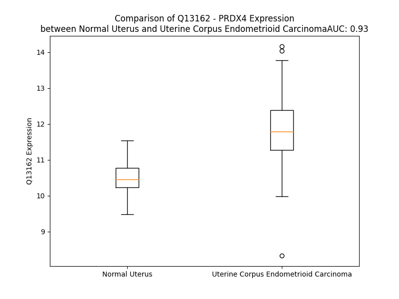

# Detailed Data for Q13162

## Introduction to the Detailed Summary

### How to Interpret the Results

- **Summary & Metrics**: This section provides a quick reference to essential protein attributes, including expression changes, family classification, and biomarker applications. Regulation status (upregulated/downregulated) indicates the protein's behavior in a disease context. Some information comes from the original excel file with the proteins selected from literature, while others are derived from the analyses.
- **Expression Comparison**: A visual representation comparing protein expression between normal and disease states. It highlights significant changes in expression levels that might indicate diagnostic or therapeutic relevance. This is data coming from transcriptomics experiments and could not translate similarly to protein levels.
- **Isoform Alignment**: An interactive view of isoform alignments, revealing structural and functional differences between variants of the protein.
- **Interactors & Homologs**: Tables listing known interaction partners and homologous proteins, the more interactors and homologs, the more complex the protein is to design an antibody for.
- **Biological Assemblies**: Information about the structural arrangement of the protein in different assemblies, providing insights into its functional state but also the complexity of the protein to develop antibodies.
- **Combined Per-Residue Information**: A detailed table summarizing residue-level data. This includes predictions for epitope regions, aggregation tendencies, and modifications that might impact the protein's function. Each row corresponds to a residue in the protein, providing insights into specific sites that may be important for research or drug development.
## Summary & Metrics

- **UniProt Accession**: Q13162
- **Gene Name**: PRDX4
- **Protein Name**: peroxiredoxin 4
- **Swiss Prot**: PRDX4_HUMAN
- **Family**: enzyme
- **Biomarker Application**:  
- **Number of Isoforms**: 0
- **Regulation**: 1
- **(transcriptomics) AUC**: 0.95
- **(transcriptomics) Fold Change**: 1.13
- **(transcriptomics) Regulation**: Upregulated
- **Discotope Epitope Count**: 46
- **Max n_uniprots (Homo)**: 11
- **Max n_uniprots (Hetero)**: 4

## Expression Comparison

## Interactors

| preferredName_A   | preferredName_B   |   score |
|:------------------|:------------------|--------:|
| PRDX4             | TXNDC5            |   0.994 |
| PRDX4             | ERP44             |   0.982 |
| PRDX4             | PDIA6             |   0.976 |

## Homologs

| uniprot_id   | gene_id   |
|:-------------|:----------|
| A0A384MTR2   | PRDX3     |
| P30041       | PRDX6     |
| A6NIW5       | PRDX2     |
| A0A0A0MRQ5   | PRDX1     |

## Biological Assemblies

|   Unnamed: 0 |   assembly |   n_uniprots | composition   | crystal_id   |
|-------------:|-----------:|-------------:|:--------------|:-------------|
|            0 |          1 |            5 | Homo          | 3tjk         |
|            0 |          1 |            5 | Homo          | 3tjb         |
|            0 |          1 |           10 | Homo          | 2pn8         |
|            0 |          1 |            5 | Homo          | 3tkp         |
|            0 |          1 |            5 | Homo          | 3tjj         |
|            0 |          1 |            5 | Homo          | 3tkq         |
|            0 |          1 |           10 | Homo          | 3tkr         |
|            0 |          1 |            5 | Homo          | 3tks         |
|            0 |          1 |            4 | Hetero        | 5hqp         |
|            0 |          1 |           10 | Homo          | 8ekw         |
|            0 |          1 |            5 | Homo          | 3tjg         |
|            0 |          1 |            5 | Homo          | 3tjf         |
|            0 |          1 |           11 | Homo          | 8eky         |
|            0 |          1 |            5 | Homo          | 4rqx         |

## Combined Per-Residue Information

|   res | aa   |   epitope_score | epitope   |   relative_surface_accessibility |   modeling_confidence |   Aggregation | modification   |
|------:|:-----|----------------:|:----------|---------------------------------:|----------------------:|--------------:|:---------------|
|     1 | M    |         0.10557 | False     |                          1.29153 |                 52.44 |         0     | N/A            |
|     2 | E    |         0.19918 | False     |                          0.89863 |                 44    |         0     | N/A            |
|     3 | A    |         0.12402 | False     |                          0.82458 |                 45.95 |         0     | N/A            |
|     4 | L    |         0.17326 | False     |                          0.99213 |                 55.46 |         0     | N/A            |
|     5 | P    |         0.16652 | False     |                          0.65715 |                 58.5  |         0     | N/A            |
|     6 | L    |         0.14478 | False     |                          0.82725 |                 48.19 |         0.798 | N/A            |
|     7 | L    |         0.16828 | False     |                          0.97113 |                 47.11 |         0.798 | N/A            |
|     8 | A    |         0.13169 | False     |                          0.81384 |                 45.6  |         0.798 | N/A            |
|     9 | A    |         0.1312  | False     |                          0.88314 |                 46.37 |         0.798 | N/A            |
|    10 | T    |         0.19643 | False     |                          0.85973 |                 44.76 |         0.798 | N/A            |
|    11 | T    |         0.21509 | False     |                          0.94051 |                 47.46 |         0     | N/A            |
|    12 | P    |         0.16854 | False     |                          0.91005 |                 48.36 |         0     | N/A            |
|    13 | D    |         0.23983 | False     |                          0.75789 |                 43.51 |         0     | N/A            |
|    14 | H    |         0.17913 | False     |                          0.98111 |                 48.31 |         0     | N/A            |
|    15 | G    |         0.21348 | False     |                          0.83186 |                 41.71 |         0     | N/A            |
|    16 | R    |         0.18643 | False     |                          0.87483 |                 44.54 |         0     | N/A            |
|    17 | H    |         0.13893 | False     |                          0.83382 |                 46.71 |         0     | N/A            |
|    18 | R    |         0.23193 | False     |                          0.92026 |                 41.59 |         0     | N/A            |
|    19 | R    |         0.24937 | False     |                          0.95425 |                 46.94 |         0     | N/A            |
|    20 | L    |         0.17659 | False     |                          0.99653 |                 42.98 |         0     | N/A            |
|    21 | L    |         0.2336  | False     |                          0.92265 |                 48.55 |         0     | N/A            |
|    22 | L    |         0.2669  | True      |                          0.97016 |                 43.44 |         0     | N/A            |
|    23 | L    |         0.14193 | False     |                          0.89634 |                 38.81 |         0     | N/A            |
|    24 | P    |         0.17162 | False     |                          0.85633 |                 43.72 |         1.234 | N/A            |
|    25 | L    |         0.16752 | False     |                          0.82265 |                 40.14 |        87.21  | N/A            |
|    26 | L    |         0.19562 | False     |                          1.01329 |                 48.89 |        88.332 | N/A            |
|    27 | L    |         0.15386 | False     |                          0.8014  |                 43.3  |        88.436 | N/A            |
|    28 | F    |         0.16456 | False     |                          0.99219 |                 50.11 |        88.436 | N/A            |
|    29 | L    |         0.17372 | False     |                          0.76267 |                 44.37 |        88.257 | N/A            |
|    30 | L    |         0.24678 | False     |                          0.88877 |                 41.91 |         7.425 | N/A            |
|    31 | P    |         0.17825 | False     |                          0.90652 |                 43.74 |         3.841 | N/A            |
|    32 | A    |         0.17565 | False     |                          0.95383 |                 38.52 |         0     | N/A            |
|    33 | G    |         0.22752 | False     |                          0.80385 |                 41.09 |         0     | N/A            |
|    34 | A    |         0.19091 | False     |                          0.91564 |                 36.05 |         0     | N/A            |
|    35 | V    |         0.2478  | False     |                          0.8712  |                 41.69 |         0     | N/A            |
|    36 | Q    |         0.18044 | False     |                          0.82043 |                 35.12 |         0     | N/A            |
|    37 | G    |         0.18139 | False     |                          0.88007 |                 30.74 |         0     | N/A            |
|    38 | W    |         0.23973 | False     |                          1.08901 |                 30.38 |         0     | N/A            |
|    39 | E    |         0.13339 | False     |                          0.85132 |                 34.84 |         0     | N/A            |
|    40 | T    |         0.2171  | False     |                          0.924   |                 33.54 |         0     | N/A            |
|    41 | E    |         0.14572 | False     |                          0.83187 |                 35.11 |         0     | N/A            |
|    42 | E    |         0.16619 | False     |                          0.85457 |                 35.21 |         0     | N/A            |
|    43 | R    |         0.23608 | False     |                          0.85452 |                 38.28 |         0     | N/A            |
|    44 | P    |         0.13352 | False     |                          0.81203 |                 38.38 |         0     | N/A            |
|    45 | R    |         0.25937 | True      |                          0.84904 |                 39.24 |         0     | N/A            |
|    46 | T    |         0.21264 | False     |                          0.66796 |                 40.13 |         0     | N/A            |
|    47 | R    |         0.20735 | False     |                          0.88263 |                 42.36 |         0     | N/A            |
|    48 | E    |         0.24085 | False     |                          0.84863 |                 46.36 |         0     | N/A            |
|    49 | E    |         0.12035 | False     |                          0.68025 |                 45.34 |         0     | N/A            |
|    50 | E    |         0.16405 | False     |                          0.63296 |                 39.82 |         0     | N/A            |
|    51 | C    |         0.15193 | False     |                          0.84044 |                 47.95 |         0     | N/A            |
|    52 | H    |         0.21317 | False     |                          0.86422 |                 50.7  |         0     | N/A            |
|    53 | F    |         0.17395 | False     |                          0.97002 |                 47.72 |         0     | N/A            |
|    54 | Y    |         0.27337 | True      |                          0.85459 |                 49.96 |         0     | N/A            |
|    55 | A    |         0.19609 | False     |                          0.97715 |                 43.22 |         0     | N/A            |
|    56 | G    |         0.23724 | False     |                          1.00239 |                 45.42 |         0     | N/A            |
|    57 | G    |         0.26817 | True      |                          0.83847 |                 39.09 |         0     | N/A            |
|    58 | Q    |         0.20168 | False     |                          0.43555 |                 48.78 |         0     | N/A            |
|    59 | V    |         0.18437 | False     |                          0.6381  |                 56.24 |         0     | N/A            |
|    60 | Y    |         0.20643 | False     |                          0.1453  |                 53.62 |         0     | N/A            |
|    61 | P    |         0.23753 | False     |                          0.77672 |                 49.88 |         0     | N/A            |
|    62 | G    |         0.24344 | False     |                          0.61749 |                 46.9  |         0     | N/A            |
|    63 | E    |         0.2648  | True      |                          0.70932 |                 44.19 |         0     | N/A            |
|    64 | A    |         0.29236 | True      |                          0.93387 |                 44.68 |         0     | N/A            |
|    65 | S    |         0.15465 | False     |                          0.64817 |                 49.23 |         0     | N/A            |
|    66 | R    |         0.23616 | False     |                          0.90464 |                 48.38 |         0     | N/A            |
|    67 | V    |         0.18665 | False     |                          0.67478 |                 51.36 |         0     | N/A            |
|    68 | S    |         0.1544  | False     |                          0.64806 |                 49.4  |         0     | N/A            |
|    69 | V    |         0.22015 | False     |                          1.12529 |                 56.25 |         0     | N/A            |
|    70 | A    |         0.26258 | True      |                          0.79669 |                 54.87 |         0     | N/A            |
|    71 | D    |         0.18187 | False     |                          0.79695 |                 57.14 |         0     | N/A            |
|    72 | H    |         0.25402 | False     |                          0.98722 |                 61.15 |         0     | N/A            |
|    73 | S    |         0.25719 | True      |                          0.85291 |                 70.08 |         0     | N/A            |
|    74 | L    |         0.24772 | False     |                          0.90976 |                 80.79 |         0     | N/A            |
|    75 | H    |         0.32712 | True      |                          0.74963 |                 85.95 |         0     | N/A            |
|    76 | L    |         0.20937 | False     |                          0.86108 |                 92.54 |         0     | N/A            |
|    77 | S    |         0.14736 | False     |                          0.33536 |                 96.32 |         0     | N/A            |
|    78 | K    |         0.18993 | False     |                          0.60092 |                 98.03 |         0     | N/A            |
|    79 | A    |         0.03922 | False     |                          0.11513 |                 98.39 |         0     | N/A            |
|    80 | K    |         0.14576 | False     |                          0.61209 |                 98.55 |         0     | N/A            |
|    81 | I    |         0.20147 | False     |                          0.5577  |                 98.59 |         0     | N/A            |
|    82 | S    |         0.18402 | False     |                          0.57126 |                 98.21 |         0     | N/A            |
|    83 | K    |         0.13481 | False     |                          0.52531 |                 98.64 |         0     | N/A            |
|    84 | P    |         0.13568 | False     |                          0.69071 |                 98.69 |         0     | N/A            |
|    85 | A    |         0.0388  | False     |                          0.08202 |                 98.74 |         0     | N/A            |
|    86 | P    |         0.05936 | False     |                          0.07853 |                 98.72 |         0     | N/A            |
|    87 | Y    |         0.1828  | False     |                          0.49705 |                 98.78 |         0     | N/A            |
|    88 | W    |         0.04547 | False     |                          0.01668 |                 98.85 |         0     | N/A            |
|    89 | E    |         0.22261 | False     |                          0.46392 |                 98.64 |         0     | N/A            |
|    90 | G    |         0.12817 | False     |                          0.17681 |                 98.59 |         0     | N/A            |
|    91 | T    |         0.20278 | False     |                          0.23266 |                 98.78 |         0     | N/A            |
|    92 | A    |         0.0031  | False     |                          0       |                 98.81 |         0     | N/A            |
|    93 | V    |         0.03962 | False     |                          0.01316 |                 98.63 |         0     | N/A            |
|    94 | I    |         0.19453 | False     |                          0.22719 |                 98.29 |         0     | N/A            |
|    95 | D    |         0.19566 | False     |                          0.71435 |                 95.93 |         0     | N/A            |
|    96 | G    |         0.22041 | False     |                          0.45861 |                 96.25 |         0     | N/A            |
|    97 | E    |         0.2224  | False     |                          0.49854 |                 97.94 |         0     | N/A            |
|    98 | F    |         0.25897 | True      |                          0.43626 |                 98.59 |         0     | N/A            |
|    99 | K    |         0.34618 | True      |                          0.39236 |                 98.62 |         0     | N/A            |
|   100 | E    |         0.29814 | True      |                          0.61359 |                 98.63 |         0     | N/A            |
|   101 | L    |         0.13236 | False     |                          0.08387 |                 98.65 |         0     | N/A            |
|   102 | K    |         0.18326 | False     |                          0.38599 |                 98.73 |         0     | N/A            |
|   103 | L    |         0.12475 | False     |                          0.10885 |                 98.73 |         0     | N/A            |
|   104 | T    |         0.10852 | False     |                          0.50263 |                 98.51 |         0     | N/A            |
|   105 | D    |         0.20914 | False     |                          0.52888 |                 98.55 |         0     | N/A            |
|   106 | Y    |         0.09234 | False     |                          0.11171 |                 98.59 |         0     | N/A            |
|   107 | R    |         0.16076 | False     |                          0.57095 |                 98.12 |         0     | N/A            |
|   108 | G    |         0.09598 | False     |                          0.54027 |                 98.43 |         0     | N/A            |
|   109 | K    |         0.30199 | True      |                          0.38781 |                 98.74 |         0     | N/A            |
|   110 | Y    |         0.05208 | False     |                          0.04126 |                 98.81 |        77.516 | N/A            |
|   111 | L    |         0.01318 | False     |                          0.00989 |                 98.91 |        99.068 | N/A            |
|   112 | V    |         0.00169 | False     |                          0       |                 98.9  |        99.337 | N/A            |
|   113 | F    |         0.00349 | False     |                          0       |                 98.91 |        99.342 | N/A            |
|   114 | F    |         0.0063  | False     |                          0       |                 98.87 |        99.342 | N/A            |
|   115 | F    |         0.00406 | False     |                          0       |                 98.87 |        94.216 | N/A            |
|   116 | Y    |         0.01154 | False     |                          0       |                 98.65 |        12.583 | N/A            |
|   117 | P    |         0.01974 | False     |                          0.00398 |                 97.61 |        10.493 | N/A            |
|   118 | L    |         0.3778  | True      |                          0.3215  |                 97.03 |         0     | N/A            |
|   119 | D    |         0.25868 | True      |                          0.06484 |                 97.99 |         0     | N/A            |
|   120 | F    |         0.27755 | True      |                          0.5334  |                 96.85 |         0     | N/A            |
|   121 | T    |         0.30926 | True      |                          0.22815 |                 92.88 |         0     | N/A            |
|   122 | F    |         0.31923 | True      |                          0.65121 |                 89.16 |         0     | N/A            |
|   123 | V    |         0.17423 | False     |                          0.25176 |                 86.57 |         0     | N/A            |
|   124 | C    |         0.01332 | False     |                          0.00094 |                 87.11 |         0     | N/A            |
|   125 | P    |         0.1403  | False     |                          0.07058 |                 93.58 |         0     | N/A            |
|   126 | T    |         0.28002 | True      |                          0.58199 |                 95.48 |         0     | N/A            |
|   127 | E    |         0.05698 | False     |                          0.03763 |                 97.05 |         0     | N/A            |
|   128 | I    |         0.005   | False     |                          0       |                 97.57 |         6.36  | N/A            |
|   129 | I    |         0.23724 | False     |                          0.19359 |                 97.54 |         6.36  | N/A            |
|   130 | A    |         0.11699 | False     |                          0.34436 |                 98.06 |         6.36  | N/A            |
|   131 | F    |         0.00555 | False     |                          0.0051  |                 98.46 |         6.36  | N/A            |
|   132 | G    |         0.09104 | False     |                          0.05543 |                 97.6  |         6.36  | N/A            |
|   133 | D    |         0.21646 | False     |                          0.50855 |                 97.7  |         0     | N/A            |
|   134 | R    |         0.14726 | False     |                          0.26676 |                 98.13 |         0     | N/A            |
|   135 | L    |         0.01718 | False     |                          0.00577 |                 98.3  |         0     | N/A            |
|   136 | E    |         0.19535 | False     |                          0.47673 |                 98.42 |         0     | N/A            |
|   137 | E    |         0.1637  | False     |                          0.34407 |                 98.56 |         0     | N/A            |
|   138 | F    |         0.00341 | False     |                          0       |                 98.8  |         0     | N/A            |
|   139 | R    |         0.23349 | False     |                          0.40829 |                 98.54 |         0     | N/A            |
|   140 | S    |         0.18269 | False     |                          0.70298 |                 98.59 |         0     | N/A            |
|   141 | I    |         0.26284 | True      |                          0.26161 |                 98.62 |         0     | N/A            |
|   142 | N    |         0.11998 | False     |                          0.4975  |                 98.72 |         0     | N/A            |
|   143 | T    |         0.0088  | False     |                          0.00702 |                 98.9  |         0     | N/A            |
|   144 | E    |         0.04838 | False     |                          0.12458 |                 98.8  |         0     | N/A            |
|   145 | V    |         0.00578 | False     |                          0.01056 |                 98.84 |         0.284 | N/A            |
|   146 | V    |         0.00213 | False     |                          0       |                 98.87 |         0.284 | N/A            |
|   147 | A    |         0.00272 | False     |                          0       |                 98.84 |         0.284 | N/A            |
|   148 | C    |         0.00176 | False     |                          0       |                 98.9  |         0.284 | N/A            |
|   149 | S    |         0.00981 | False     |                          0       |                 98.78 |         0.284 | N/A            |
|   150 | V    |         0.11491 | False     |                          0.09629 |                 98.62 |         0.284 | N/A            |
|   151 | D    |         0.28924 | True      |                          0.14292 |                 98.74 |         0     | N/A            |
|   152 | S    |         0.1812  | False     |                          0.16123 |                 98.54 |         0     | N/A            |
|   153 | Q    |         0.12379 | False     |                          0.15622 |                 98.48 |         0     | N/A            |
|   154 | F    |         0.2679  | True      |                          0.67385 |                 98.61 |         0.709 | N/A            |
|   155 | T    |         0.35832 | True      |                          0.30822 |                 98.45 |         0.709 | N/A            |
|   156 | H    |         0.01602 | False     |                          0       |                 98.54 |         0.709 | N/A            |
|   157 | L    |         0.29628 | True      |                          0.27863 |                 98.24 |         1.168 | N/A            |
|   158 | A    |         0.47765 | True      |                          0.46916 |                 98.43 |         1.168 | N/A            |
|   159 | W    |         0.01292 | False     |                          0       |                 98.21 |         1.168 | N/A            |
|   160 | I    |         0.16369 | False     |                          0.11829 |                 98.15 |         1.168 | N/A            |
|   161 | N    |         0.36608 | True      |                          0.68255 |                 97.77 |         0.459 | N/A            |
|   162 | T    |         0.24321 | False     |                          0.18904 |                 97.87 |         0     | N/A            |
|   163 | P    |         0.25228 | False     |                          0.51592 |                 97.45 |         0     | N/A            |
|   164 | R    |         0.32027 | True      |                          0.40735 |                 97.04 |         0     | N/A            |
|   165 | R    |         0.49706 | True      |                          0.96977 |                 96.81 |         0     | N/A            |
|   166 | Q    |         0.44034 | True      |                          0.68616 |                 96.19 |         0     | N/A            |
|   167 | G    |         0.15322 | False     |                          0.43873 |                 95.62 |         0     | N/A            |
|   168 | G    |         0.03135 | False     |                          0.00952 |                 97.22 |         0     | N/A            |
|   169 | L    |         0.01185 | False     |                          0       |                 97.75 |         0     | N/A            |
|   170 | G    |         0.07409 | False     |                          0.07886 |                 96.32 |         0     | N/A            |
|   171 | P    |         0.17475 | False     |                          0.92577 |                 94.18 |         0     | N/A            |
|   172 | I    |         0.10377 | False     |                          0.12294 |                 94.52 |         0     | N/A            |
|   173 | R    |         0.21171 | False     |                          0.415   |                 94.48 |         0     | N/A            |
|   174 | I    |         0.0596  | False     |                          0.01848 |                 97.7  |         0     | N/A            |
|   175 | P    |         0.05535 | False     |                          0.10523 |                 98.65 |         0     | N/A            |
|   176 | L    |         0.00431 | False     |                          0       |                 98.8  |         0     | N/A            |
|   177 | L    |         0.00309 | False     |                          0       |                 98.91 |         0     | N/A            |
|   178 | S    |         0.10173 | False     |                          0.0855  |                 98.87 |         0     | N/A            |
|   179 | D    |         0.10806 | False     |                          0.01983 |                 98.85 |         0     | N/A            |
|   180 | L    |         0.33236 | True      |                          0.62585 |                 98.29 |         0     | N/A            |
|   181 | T    |         0.16759 | False     |                          0.7906  |                 97.99 |         0     | N/A            |
|   182 | H    |         0.2565  | True      |                          0.26617 |                 98.4  |         0     | N/A            |
|   183 | Q    |         0.1577  | False     |                          0.48086 |                 98.53 |         0     | N/A            |
|   184 | I    |         0.08044 | False     |                          0.0824  |                 98.78 |         0     | N/A            |
|   185 | S    |         0.00502 | False     |                          0       |                 98.73 |         0     | N/A            |
|   186 | K    |         0.29465 | True      |                          0.41758 |                 98.47 |         0     | N/A            |
|   187 | D    |         0.08569 | False     |                          0.09287 |                 98.59 |         0     | N/A            |
|   188 | Y    |         0.03959 | False     |                          0.02217 |                 98.75 |         1.5   | N/A            |
|   189 | G    |         0.10959 | False     |                          0.06418 |                 98.23 |         1.5   | N/A            |
|   190 | V    |         0.00771 | False     |                          0.00461 |                 98.44 |         1.5   | N/A            |
|   191 | Y    |         0.25196 | False     |                          0.15626 |                 98.24 |         1.5   | N/A            |
|   192 | L    |         0.24995 | False     |                          0.31738 |                 96.4  |         1.5   | N/A            |
|   193 | E    |         0.28306 | True      |                          0.62129 |                 95.59 |         0     | N/A            |
|   194 | D    |         0.20125 | False     |                          0.72771 |                 93.97 |         0     | N/A            |
|   195 | S    |         0.39506 | True      |                          0.31113 |                 93.68 |         0     | N/A            |
|   196 | G    |         0.288   | True      |                          0.37901 |                 96.76 |         0     | N/A            |
|   197 | H    |         0.05961 | False     |                          0.01296 |                 97.83 |         0     | N/A            |
|   198 | T    |         0.00963 | False     |                          0       |                 98.33 |         0.126 | N/A            |
|   199 | L    |         0.1383  | False     |                          0.20609 |                 97.77 |         0.337 | N/A            |
|   200 | R    |         0.02894 | False     |                          0.0014  |                 98.41 |         0.337 | N/A            |
|   201 | G    |         0.00387 | False     |                          0       |                 98.64 |        31.053 | N/A            |
|   202 | L    |         0.02657 | False     |                          0.01566 |                 98.88 |        31.053 | N/A            |
|   203 | F    |         0.00932 | False     |                          0.00382 |                 98.92 |        31.053 | N/A            |
|   204 | I    |         0.00754 | False     |                          0       |                 98.92 |        31.053 | N/A            |
|   205 | I    |         0.04966 | False     |                          0.0144  |                 98.92 |        31.053 | N/A            |
|   206 | D    |         0.02494 | False     |                          0.03486 |                 98.8  |         0.337 | N/A            |
|   207 | D    |         0.11295 | False     |                          0.28882 |                 98.5  |         0     | N/A            |
|   208 | K    |         0.11939 | False     |                          0.59699 |                 98.43 |         0     | N/A            |
|   209 | G    |         0.08661 | False     |                          0.14034 |                 98.55 |         0     | N/A            |
|   210 | I    |         0.13754 | False     |                          0.25439 |                 98.81 |         0     | N/A            |
|   211 | L    |         0.00379 | False     |                          0       |                 98.89 |         0     | N/A            |
|   212 | R    |         0.20857 | False     |                          0.20984 |                 98.81 |         0     | N/A            |
|   213 | Q    |         0.08708 | False     |                          0.14366 |                 98.85 |         0     | N/A            |
|   214 | I    |         0.18048 | False     |                          0.3222  |                 98.78 |         0     | N/A            |
|   215 | T    |         0.15196 | False     |                          0.29669 |                 98.7  |         0     | N/A            |
|   216 | L    |         0.25994 | True      |                          0.52803 |                 98.47 |         0     | N/A            |
|   217 | N    |         0.15015 | False     |                          0.19828 |                 97.94 |         0     | N/A            |
|   218 | D    |         0.47359 | True      |                          0.63119 |                 95.79 |         0     | N/A            |
|   219 | L    |         0.23265 | False     |                          0.11211 |                 93.96 |         0     | N/A            |
|   220 | P    |         0.32582 | True      |                          0.57614 |                 94.89 |         0     | N/A            |
|   221 | V    |         0.30937 | True      |                          0.63217 |                 95.21 |         0     | N/A            |
|   222 | G    |         0.31236 | True      |                          0.41726 |                 95.69 |         0     | N/A            |
|   223 | R    |         0.26884 | True      |                          0.11725 |                 98.38 |         0     | N/A            |
|   224 | S    |         0.1908  | False     |                          0.42469 |                 98.45 |         0     | N/A            |
|   225 | V    |         0.12946 | False     |                          0.08206 |                 98.56 |         0     | N/A            |
|   226 | D    |         0.24795 | False     |                          0.54485 |                 98.56 |         0     | N/A            |
|   227 | E    |         0.20407 | False     |                          0.37266 |                 98.78 |         0     | N/A            |
|   228 | T    |         0.03027 | False     |                          0.04173 |                 98.81 |         0     | N/A            |
|   229 | L    |         0.17319 | False     |                          0.12613 |                 98.71 |         0     | N/A            |
|   230 | R    |         0.32249 | True      |                          0.17454 |                 98.78 |         0     | N/A            |
|   231 | L    |         0.08897 | False     |                          0.18053 |                 98.83 |         1.147 | N/A            |
|   232 | V    |         0.00444 | False     |                          0       |                 98.82 |         1.147 | N/A            |
|   233 | Q    |         0.14726 | False     |                          0.2306  |                 98.74 |         1.147 | N/A            |
|   234 | A    |         0.06119 | False     |                          0.10183 |                 98.75 |         1.268 | N/A            |
|   235 | F    |         0.10643 | False     |                          0.22299 |                 98.75 |         1.268 | N/A            |
|   236 | Q    |         0.10626 | False     |                          0.22795 |                 98.68 |         0.743 | N/A            |
|   237 | Y    |         0.3593  | True      |                          0.29402 |                 98.58 |         0.743 | N/A            |
|   238 | T    |         0.10334 | False     |                          0.24424 |                 98.18 |         0.232 | N/A            |
|   239 | D    |         0.13648 | False     |                          0.41042 |                 97.72 |         0     | N/A            |
|   240 | K    |         0.25293 | False     |                          0.81646 |                 97.89 |         0     | N/A            |
|   241 | H    |         0.24356 | False     |                          0.50504 |                 97.72 |         0     | N/A            |
|   242 | G    |         0.16439 | False     |                          0.62392 |                 96.22 |         0     | N/A            |
|   243 | E    |         0.16136 | False     |                          0.25436 |                 96.64 |         0     | N/A            |
|   244 | V    |         0.13616 | False     |                          0.44462 |                 97.38 |         0     | N/A            |
|   245 | C    |         0.08406 | False     |                          0.25988 |                 97.94 |         0     | N/A            |
|   246 | P    |         0.13483 | False     |                          0.1974  |                 97.79 |         0     | N/A            |
|   247 | A    |         0.23786 | False     |                          1.05397 |                 97.73 |         0     | N/A            |
|   248 | G    |         0.15579 | False     |                          0.71137 |                 96.63 |         0     | N/A            |
|   249 | W    |         0.07849 | False     |                          0.03156 |                 98.45 |         0     | N/A            |
|   250 | K    |         0.18162 | False     |                          0.63108 |                 98    |         0     | N/A            |
|   251 | P    |         0.21979 | False     |                          0.62053 |                 97.43 |         0     | N/A            |
|   252 | G    |         0.17372 | False     |                          1.00827 |                 97.16 |         0     | N/A            |
|   253 | S    |         0.28834 | True      |                          0.40097 |                 97.26 |         0     | N/A            |
|   254 | E    |         0.1962  | False     |                          0.45112 |                 97.28 |         0     | N/A            |
|   255 | T    |         0.12559 | False     |                          0.15526 |                 98.17 |         0     | N/A            |
|   256 | I    |         0.21746 | False     |                          0.17119 |                 98.11 |         0     | N/A            |
|   257 | I    |         0.25513 | False     |                          0.41828 |                 97.46 |         0     | N/A            |
|   258 | P    |         0.19811 | False     |                          0.6268  |                 96.69 |         0     | N/A            |
|   259 | D    |         0.21389 | False     |                          0.39755 |                 96.62 |         0     | N/A            |
|   260 | P    |         0.22874 | False     |                          0.78927 |                 97.2  |         0     | N/A            |
|   261 | A    |         0.1492  | False     |                          0.69146 |                 97.26 |         0     | N/A            |
|   262 | G    |         0.12001 | False     |                          0.24014 |                 96.14 |         0     | N/A            |
|   263 | K    |         0.25265 | False     |                          0.40427 |                 97.51 |         0     | N/A            |
|   264 | L    |         0.29214 | True      |                          0.65238 |                 97.1  |         0     | N/A            |
|   265 | K    |         0.19287 | False     |                          0.77585 |                 97.02 |         0     | N/A            |
|   266 | Y    |         0.25397 | False     |                          0.14091 |                 97.63 |         0.162 | N/A            |
|   267 | F    |         0.26166 | True      |                          0.46592 |                 97.18 |         0.162 | N/A            |
|   268 | D    |         0.1268  | False     |                          0.73487 |                 97.41 |         0.162 | N/A            |
|   269 | K    |         0.17055 | False     |                          0.67725 |                 95.79 |         0.162 | N/A            |
|   270 | L    |         0.15043 | False     |                          0.70416 |                 92.78 |         0.162 | N/A            |
|   271 | N    |         0.10199 | False     |                          1.00127 |                 92.87 |         0     | N/A            |

