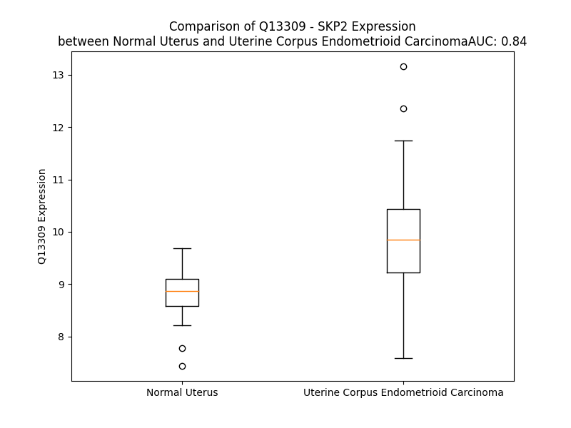

# Detailed Data for Q13309

## Introduction to the Detailed Summary

### How to Interpret the Results

- **Summary & Metrics**: This section provides a quick reference to essential protein attributes, including expression changes, family classification, and biomarker applications. Regulation status (upregulated/downregulated) indicates the protein's behavior in a disease context. Some information comes from the original excel file with the proteins selected from literature, while others are derived from the analyses.
- **Expression Comparison**: A visual representation comparing protein expression between normal and disease states. It highlights significant changes in expression levels that might indicate diagnostic or therapeutic relevance. This is data coming from transcriptomics experiments and could not translate similarly to protein levels.
- **Isoform Alignment**: An interactive view of isoform alignments, revealing structural and functional differences between variants of the protein.
- **Interactors & Homologs**: Tables listing known interaction partners and homologous proteins, the more interactors and homologs, the more complex the protein is to design an antibody for.
- **Biological Assemblies**: Information about the structural arrangement of the protein in different assemblies, providing insights into its functional state but also the complexity of the protein to develop antibodies.
- **Combined Per-Residue Information**: A detailed table summarizing residue-level data. This includes predictions for epitope regions, aggregation tendencies, and modifications that might impact the protein's function. Each row corresponds to a residue in the protein, providing insights into specific sites that may be important for research or drug development.
## Summary & Metrics

- **UniProt Accession**: Q13309
- **Gene Name**: SKP2
- **Protein Name**: S-phase kinase-associated protein 2
- **Swiss Prot**: SKP2_HUMAN
- **Family**: other
- **Biomarker Application**: diagnosis,prognosis
- **Number of Isoforms**: 3
- **Regulation**: 1
- **(transcriptomics) AUC**: 0.99
- **(transcriptomics) Fold Change**: 1.24
- **(transcriptomics) Regulation**: Upregulated
- **Discotope Epitope Count**: 76
- **Max n_uniprots (Homo)**: 1
- **Max n_uniprots (Hetero)**: 10

## Expression Comparison

## Isoform Alignment

<pre style='font-size:14px; font-family:monospace;'>Q13309-1 MHRKHLQEIPDLSSNVATSFTWGWDSSKTSELLSGMGVSALEKEEPDSENIPQELLSNLGHPESPPRKRLKSKGSDKDFVIVRRPKLNRENFPGVSWDSLPDELLLGIFSCLCLPELLKVSGVCKRWYRLASDESLWQTLDLTGKNLHPDVTGRLLSQGVIAFRCPRSFMDQPLAEHFSPFRVQHMDLSNSVIEVSTLHGILSQCSKLQNLSLEGLRLSDPIVNTLAKNSNLVRLNLSGCSGFSEFALQTLLSSCSRLDELNLSWCFDFTEKHVQVAVAHVSETITQLNLSGYRKNLQKSDLSTLVRRCPNLVHLDLSDSVMLKNDCFQEFFQLNYLQHLSLSRCYDIIPETLLELGEIPTLKTLQVFGIVPDGTLQLLKEALPHLQINCSHFTTIARPTIGNKKNQEIWGIKCRLTLQKPSCL
Q13309-2 MHRKHLQEIPDLSSNVATSFTWGWDSSKTSELLSGMGVSALEKEEPDSENIPQELLSNLGHPESPPRKRLKSKGSDKDFVIVRRPKLNRENFPGVSWDSLPDELLLGIFSCLCLPELLKVSGVCKRWYRLASDESLWQTLDLTGKNLHPDVTGRLLSQGVIAFRCPRSFMDQPLAEHFSPFRVQHMDLSNSVIEVSTLHGILSQCSKLQNLSLEGLRLSDPIVNTLAKNSNLVRLNLSGCSGFSEFALQTLLSSCSRLDELNLSWCFDFTEKHVQVAVAHVSETITQLNLSGYRKNLQKSDLSTLVRRCPNLVHLDLSDSVMLKNDCFQEFFQLNYLQHLSLSRCYDIIPETLLLVTRAGVRIRLDSDIGCPQTYR--TSKLKSSHKLFCQHVRVICIFVCDFYFY--------RLVLKQ----
Q13309-4 -------------------------------------------------------------------------------------------------------------------------------------------------------------------------MDQPL---------------------------------------------AEHFSTLAKNSNLVRLNLSGCSGFSEFALQTLLSSCSRLDELNLSWCFDFTEKHVQVAVAHVSETITQLNLSGYRKNLQKSDLSTLVRRCPNLVHLDLSDSVMLKNDCFQEFFQLNYLQHLSLSRCYDIIPETLLELGEIPTLKTLQVFGIVPDGTLQLLKEALPHLQINCSHFTTIARPTIGNKKNQEIWGIKCRLTLQKPSCL
</pre>

## Interactors

| preferredName_A   | preferredName_B   |   score |
|:------------------|:------------------|--------:|
| SKP2              | CDKN1B            |   0.999 |
| SKP2              | CCNA2             |   0.999 |
| SKP2              | CCNA1             |   0.999 |
| SKP2              | SKP1              |   0.999 |
| SKP2              | CDK2              |   0.999 |
| SKP2              | CKS1B             |   0.999 |
| SKP2              | CUL1              |   0.999 |
| SKP2              | RBX1              |   0.999 |
| SKP2              | BTRC              |   0.998 |
| SKP2              | CDC20             |   0.998 |
| SKP2              | CDKN1A            |   0.996 |
| SKP2              | FBXW7             |   0.991 |
| SKP2              | CCNE1             |   0.99  |
| SKP2              | RB1               |   0.985 |
| SKP2              | CKS2              |   0.982 |
| SKP2              | FBXW11            |   0.98  |
| SKP2              | CDT1              |   0.977 |
| SKP2              | CDKN1C            |   0.975 |
| SKP2              | MYC               |   0.975 |
| SKP2              | NEDD8             |   0.974 |
| SKP2              | FZR1              |   0.96  |
| SKP2              | CCND1             |   0.959 |
| SKP2              | FBXO4             |   0.958 |
| SKP2              | E2F1              |   0.953 |
| SKP2              | CCNE2             |   0.953 |
| SKP2              | FBXO2             |   0.952 |
| SKP2              | CCNF              |   0.946 |
| SKP2              | CDK1              |   0.943 |
| SKP2              | EP300             |   0.942 |
| SKP2              | UFD1              |   0.941 |
| SKP2              | FOXO1             |   0.94  |
| SKP2              | CDH1              |   0.927 |
| SKP2              | ORC1              |   0.925 |
| SKP2              | UBB               |   0.925 |
| SKP2              | UBC               |   0.915 |
| SKP2              | RRAGA             |   0.915 |
| SKP2              | DDB1              |   0.915 |
| SKP2              | RPS27A            |   0.913 |
| SKP2              | RRAGB             |   0.905 |
| SKP2              | CAND1             |   0.903 |
| SKP2              | CUL2              |   0.902 |
| SKP2              | UBA52             |   0.902 |

## Homologs

| uniprot_id   | gene_id   |
|:-------------|:----------|
| Q9UKC9       | FBXL2     |
| J3KTA1       | FBXL20    |
| X6RHD7       | FBXL15    |
| D6RED6       | FBXL5     |
| Q9UF56       | FBXL17    |
| Q9UKT7       | FBXL3     |
| Q9UKA2       | FBXL4     |
| Q96ME1       | FBXL18    |
| J3KNM9       | FBXL7     |
| Q8N531       | FBXL6     |
| H3BME1       | FBXL19    |
| Q8N1E6       | FBXL14    |
| Q6P050       | FBXL22    |
| Q8N461       | FBXL16    |
| C9JI88       | FBXL13    |

## Biological Assemblies

|   Unnamed: 0 |   assembly |   n_uniprots | composition   | crystal_id   |
|-------------:|-----------:|-------------:|:--------------|:-------------|
|            0 |          1 |            1 | Homo          | 7luo         |
|            1 |          2 |            1 | Homo          | 7luo         |
|            0 |          1 |           10 | Hetero        | 7b5l         |
|            0 |          1 |            5 | Hetero        | 7z8t         |
|            0 |          1 |            7 | Hetero        | 8or4         |
|            0 |          1 |            8 | Hetero        | 7b5m         |
|            0 |          1 |            4 | Hetero        | 8byl         |
|            0 |          1 |            5 | Hetero        | 8cdj         |
|            0 |          1 |            5 | Hetero        | 7zbw         |
|            0 |          1 |            7 | Hetero        | 7b5r         |
|            0 |          1 |            6 | Hetero        | 8bya         |
|            0 |          1 |            2 | Hetero        | 1fqv         |
|            1 |          2 |            2 | Hetero        | 1fqv         |
|            2 |          3 |            2 | Hetero        | 1fqv         |
|            3 |          4 |            2 | Hetero        | 1fqv         |
|            4 |          5 |            2 | Hetero        | 1fqv         |
|            5 |          6 |            2 | Hetero        | 1fqv         |
|            6 |          7 |            2 | Hetero        | 1fqv         |
|            7 |          8 |            2 | Hetero        | 1fqv         |
|            0 |          1 |            4 | Hetero        | 1fs2         |
|            0 |          1 |            5 | Hetero        | 7z8v         |
|            0 |          1 |            5 | Hetero        | 8cdk         |
|            0 |          1 |            3 | Hetero        | 2ass         |
|            1 |          2 |            3 | Hetero        | 2ass         |
|            2 |          3 |            3 | Hetero        | 2ass         |
|            0 |          1 |            5 | Hetero        | 1ldk         |
|            1 |          2 |            5 | Hetero        | 1ldk         |
|            0 |          1 |            4 | Hetero        | 2ast         |
|            1 |          2 |            4 | Hetero        | 2ast         |
|            2 |          3 |            4 | Hetero        | 2ast         |
|            0 |          1 |            4 | Hetero        | 1fs1         |
|            0 |          1 |            6 | Hetero        | 8or3         |
|            0 |          1 |            7 | Hetero        | 8or0         |
|            0 |          1 |            5 | Hetero        | 7zbz         |

## Combined Per-Residue Information

|   res | aa   |   epitope_score | epitope   |   relative_surface_accessibility |   modeling_confidence |   Aggregation | modification                   |
|------:|:-----|----------------:|:----------|---------------------------------:|----------------------:|--------------:|:-------------------------------|
|     1 | M    |         0.1067  | False     |                          1.28577 |                 35.81 |         0     | N/A                            |
|     2 | H    |         0.16987 | True      |                          0.94976 |                 39.4  |         0     | N/A                            |
|     3 | R    |         0.16185 | False     |                          0.966   |                 29.09 |         0     | N/A                            |
|     4 | K    |         0.13868 | False     |                          0.98698 |                 38.8  |         0     | N/A                            |
|     5 | H    |         0.19253 | True      |                          0.93911 |                 32.3  |         0     | N/A                            |
|     6 | L    |         0.12408 | False     |                          1.07874 |                 33.02 |         0     | N/A                            |
|     7 | Q    |         0.15211 | False     |                          0.86284 |                 35.12 |         0     | N/A                            |
|     8 | E    |         0.18278 | True      |                          0.86149 |                 29.11 |         0     | N/A                            |
|     9 | I    |         0.12064 | False     |                          0.98183 |                 32.25 |         0     | N/A                            |
|    10 | P    |         0.12265 | False     |                          0.7433  |                 29.79 |         0     | N/A                            |
|    11 | D    |         0.11038 | False     |                          0.89653 |                 25.77 |         0     | N/A                            |
|    12 | L    |         0.12411 | False     |                          0.91627 |                 28.86 |         0     | N/A                            |
|    13 | S    |         0.11959 | False     |                          0.89768 |                 25.24 |         0     | N/A                            |
|    14 | S    |         0.07403 | False     |                          0.54399 |                 29.26 |         0     | N/A                            |
|    15 | N    |         0.09984 | False     |                          0.9827  |                 25.68 |         0     | N/A                            |
|    16 | V    |         0.08935 | False     |                          0.81338 |                 26.27 |         2.373 | N/A                            |
|    17 | A    |         0.08183 | False     |                          0.81631 |                 24.63 |         2.373 | N/A                            |
|    18 | T    |         0.12128 | False     |                          0.72516 |                 24.45 |         2.508 | N/A                            |
|    19 | S    |         0.10626 | False     |                          0.66659 |                 23.93 |         2.508 | N/A                            |
|    20 | F    |         0.13944 | False     |                          0.87478 |                 22.98 |         2.755 | N/A                            |
|    21 | T    |         0.1133  | False     |                          0.84925 |                 23.09 |         2.213 | N/A                            |
|    22 | W    |         0.20153 | True      |                          0.89745 |                 25.45 |         1.891 | N/A                            |
|    23 | G    |         0.14867 | False     |                          0.9597  |                 25.68 |         0.424 | N/A                            |
|    24 | W    |         0.15674 | False     |                          0.41993 |                 35.27 |         0.424 | N/A                            |
|    25 | D    |         0.16951 | True      |                          0.5263  |                 33.49 |         0     | N/A                            |
|    26 | S    |         0.11041 | False     |                          0.70015 |                 33.29 |         0     | N/A                            |
|    27 | S    |         0.13038 | False     |                          0.41964 |                 38.19 |         0     | N/A                            |
|    28 | K    |         0.10164 | False     |                          0.58692 |                 43.08 |         0     | N/A                            |
|    29 | T    |         0.0636  | False     |                          0.28352 |                 43.75 |         0     | N/A                            |
|    30 | S    |         0.07686 | False     |                          0.40138 |                 43.53 |         0     | N/A                            |
|    31 | E    |         0.1036  | False     |                          0.68895 |                 46.69 |         0     | N/A                            |
|    32 | L    |         0.0537  | False     |                          0.27898 |                 44.98 |         0     | N/A                            |
|    33 | L    |         0.05412 | False     |                          0.17064 |                 45.55 |         0     | N/A                            |
|    34 | S    |         0.05302 | False     |                          0.62283 |                 54.51 |         0     | N/A                            |
|    35 | G    |         0.06334 | False     |                          0.27388 |                 47.78 |         0     | N/A                            |
|    36 | M    |         0.03905 | False     |                          0.06183 |                 50.66 |         0     | N/A                            |
|    37 | G    |         0.11522 | False     |                          0.75391 |                 41.56 |         0     | N/A                            |
|    38 | V    |         0.08804 | False     |                          0.29735 |                 37.82 |         0     | N/A                            |
|    39 | S    |         0.15027 | False     |                          0.76398 |                 35.21 |         0     | N/A                            |
|    40 | A    |         0.1352  | False     |                          0.65561 |                 35.02 |         0     | N/A                            |
|    41 | L    |         0.14803 | False     |                          1.07031 |                 31.13 |         0     | N/A                            |
|    42 | E    |         0.1118  | False     |                          0.80521 |                 34.29 |         0     | N/A                            |
|    43 | K    |         0.14506 | False     |                          0.98499 |                 28.67 |         0     | N/A                            |
|    44 | E    |         0.14217 | False     |                          0.87053 |                 29    |         0     | N/A                            |
|    45 | E    |         0.2354  | True      |                          0.83056 |                 30.16 |         0     | N/A                            |
|    46 | P    |         0.19822 | True      |                          0.90535 |                 28.4  |         0     | N/A                            |
|    47 | D    |         0.19826 | True      |                          0.86711 |                 28.94 |         0     | N/A                            |
|    48 | S    |         0.14724 | False     |                          0.73692 |                 29.76 |         0     | N/A                            |
|    49 | E    |         0.23408 | True      |                          0.82445 |                 25.58 |         0     | N/A                            |
|    50 | N    |         0.15987 | False     |                          0.97291 |                 30.21 |         0     | N/A                            |
|    51 | I    |         0.17992 | True      |                          0.86907 |                 30.24 |         0     | N/A                            |
|    52 | P    |         0.14407 | False     |                          0.92245 |                 29.19 |         0     | N/A                            |
|    53 | Q    |         0.11276 | False     |                          0.83977 |                 25.36 |         0     | N/A                            |
|    54 | E    |         0.1317  | False     |                          0.77271 |                 30.62 |         0     | N/A                            |
|    55 | L    |         0.15474 | False     |                          0.91162 |                 29.52 |         0     | N/A                            |
|    56 | L    |         0.12727 | False     |                          1.10154 |                 25.36 |         0     | N/A                            |
|    57 | S    |         0.17132 | True      |                          0.71457 |                 26.91 |         0     | N/A                            |
|    58 | N    |         0.20937 | True      |                          0.98529 |                 30.24 |         0     | N/A                            |
|    59 | L    |         0.15014 | False     |                          1.15973 |                 24.61 |         0     | N/A                            |
|    60 | G    |         0.18796 | True      |                          0.83234 |                 29.12 |         0     | N/A                            |
|    61 | H    |         0.15411 | False     |                          0.99563 |                 28.46 |         0     | N/A                            |
|    62 | P    |         0.13396 | False     |                          0.96007 |                 34.46 |         0     | N/A                            |
|    63 | E    |         0.18708 | True      |                          0.8472  |                 31.99 |         0     | N/A                            |
|    64 | S    |         0.16645 | False     |                          0.82992 |                 27.32 |         0     | Phosphoserine                  |
|    65 | P    |         0.17979 | True      |                          0.86899 |                 35.82 |         0     | N/A                            |
|    66 | P    |         0.2102  | True      |                          0.85413 |                 34.28 |         0     | N/A                            |
|    67 | R    |         0.13471 | False     |                          0.99064 |                 29.4  |         0     | N/A                            |
|    68 | K    |         0.11925 | False     |                          0.87415 |                 31.89 |         0     | N6-acetyllysine; by p300/EP300 |
|    69 | R    |         0.20478 | True      |                          0.96899 |                 28.55 |         0     | N/A                            |
|    70 | L    |         0.1468  | False     |                          1.04248 |                 34.1  |         0     | N/A                            |
|    71 | K    |         0.1915  | True      |                          0.94851 |                 31.39 |         0     | N6-acetyllysine; by p300/EP300 |
|    72 | S    |         0.16799 | True      |                          0.88526 |                 32.36 |         0     | Phosphoserine                  |
|    73 | K    |         0.18888 | True      |                          0.97164 |                 32.76 |         0     | N/A                            |
|    74 | G    |         0.18802 | True      |                          1.01193 |                 34.43 |         0     | N/A                            |
|    75 | S    |         0.14061 | False     |                          0.6428  |                 33.71 |         0     | Phosphoserine                  |
|    76 | D    |         0.15211 | False     |                          0.92181 |                 35.06 |         0     | N/A                            |
|    77 | K    |         0.13474 | False     |                          0.85942 |                 37.68 |         2.204 | N/A                            |
|    78 | D    |         0.11888 | False     |                          0.7477  |                 39.02 |         2.781 | N/A                            |
|    79 | F    |         0.10756 | False     |                          1.04999 |                 49.1  |         2.781 | N/A                            |
|    80 | V    |         0.07039 | False     |                          0.78429 |                 47.63 |         2.781 | N/A                            |
|    81 | I    |         0.10368 | False     |                          0.90129 |                 52.14 |         2.781 | N/A                            |
|    82 | V    |         0.12496 | False     |                          0.83323 |                 43.23 |         2.365 | N/A                            |
|    83 | R    |         0.20853 | True      |                          0.84344 |                 43.22 |         0.578 | N/A                            |
|    84 | R    |         0.1856  | True      |                          0.87155 |                 42.16 |         0     | N/A                            |
|    85 | P    |         0.13514 | False     |                          0.8773  |                 40.62 |         0     | N/A                            |
|    86 | K    |         0.13036 | False     |                          0.88695 |                 46.84 |         0     | N/A                            |
|    87 | L    |         0.10882 | False     |                          0.95082 |                 45.03 |         0     | N/A                            |
|    88 | N    |         0.13873 | False     |                          0.91158 |                 42.42 |         0     | N/A                            |
|    89 | R    |         0.19448 | True      |                          0.79297 |                 51.08 |         0     | N/A                            |
|    90 | E    |         0.22326 | True      |                          0.74301 |                 47.6  |         0     | N/A                            |
|    91 | N    |         0.19312 | True      |                          0.99885 |                 49.11 |         0     | N/A                            |
|    92 | F    |         0.18325 | True      |                          0.86536 |                 53.68 |         0     | N/A                            |
|    93 | P    |         0.20547 | True      |                          1.05596 |                 61.96 |         0     | N/A                            |
|    94 | G    |         0.24658 | True      |                          0.67981 |                 73.72 |         0     | N/A                            |
|    95 | V    |         0.17467 | True      |                          0.92175 |                 83.88 |         0     | N/A                            |
|    96 | S    |         0.16664 | False     |                          0.50533 |                 87.38 |         0     | N/A                            |
|    97 | W    |         0.1188  | False     |                          0.71416 |                 90.47 |         0     | N/A                            |
|    98 | D    |         0.11694 | False     |                          0.54754 |                 91.47 |         0     | N/A                            |
|    99 | S    |         0.09637 | False     |                          0.63688 |                 92.01 |         0     | N/A                            |
|   100 | L    |         0.05787 | False     |                          0.23056 |                 94.75 |         0     | N/A                            |
|   101 | P    |         0.13192 | False     |                          0.49803 |                 97.04 |         0     | N/A                            |
|   102 | D    |         0.14445 | False     |                          0.24772 |                 98    |         0     | N/A                            |
|   103 | E    |         0.14599 | False     |                          0.63977 |                 97.42 |         0     | N/A                            |
|   104 | L    |         0.16196 | False     |                          0.59794 |                 97.53 |        15.83  | N/A                            |
|   105 | L    |         0.01748 | False     |                          0.02143 |                 97.5  |        23.261 | N/A                            |
|   106 | L    |         0.03576 | False     |                          0.19612 |                 97.96 |        23.993 | N/A                            |
|   107 | G    |         0.0901  | False     |                          0.44336 |                 97.11 |        23.993 | N/A                            |
|   108 | I    |         0.05497 | False     |                          0.47856 |                 97.55 |        24.922 | N/A                            |
|   109 | F    |         0.00594 | False     |                          0.00828 |                 97.74 |        23.926 | N/A                            |
|   110 | S    |         0.04825 | False     |                          0.3898  |                 95.92 |         6.902 | N/A                            |
|   111 | C    |         0.08908 | False     |                          0.81673 |                 95.22 |         4.436 | N/A                            |
|   112 | L    |         0.02537 | False     |                          0.26625 |                 94.39 |         4.024 | N/A                            |
|   113 | C    |         0.04687 | False     |                          0.26683 |                 92.43 |         0.633 | N/A                            |
|   114 | L    |         0.0107  | False     |                          0.01401 |                 93.78 |         0     | N/A                            |
|   115 | P    |         0.09217 | False     |                          0.39123 |                 93.65 |         0     | N/A                            |
|   116 | E    |         0.06851 | False     |                          0.31114 |                 95.67 |         0     | N/A                            |
|   117 | L    |         0.00222 | False     |                          0.00287 |                 95.96 |         0     | N/A                            |
|   118 | L    |         0.02751 | False     |                          0.13159 |                 93.81 |         0     | N/A                            |
|   119 | K    |         0.10108 | False     |                          0.70859 |                 96.24 |         0     | N/A                            |
|   120 | V    |         0.02429 | False     |                          0.17804 |                 96.89 |         0     | N/A                            |
|   121 | S    |         0.01703 | False     |                          0.06147 |                 96.14 |         0     | N/A                            |
|   122 | G    |         0.1235  | False     |                          0.83344 |                 96.3  |         0     | N/A                            |
|   123 | V    |         0.09252 | False     |                          0.66191 |                 96.92 |         0     | N/A                            |
|   124 | C    |         0.10294 | False     |                          0.37602 |                 96.4  |         0     | N/A                            |
|   125 | K    |         0.07917 | False     |                          0.9367  |                 97.27 |         0     | N/A                            |
|   126 | R    |         0.12079 | False     |                          0.25939 |                 97.66 |         0     | N/A                            |
|   127 | W    |         0.04023 | False     |                          0.26394 |                 97.86 |         0     | N/A                            |
|   128 | Y    |         0.07861 | False     |                          0.4658  |                 97.42 |         0     | N/A                            |
|   129 | R    |         0.11268 | False     |                          0.52443 |                 97.48 |         0     | N/A                            |
|   130 | L    |         0.0246  | False     |                          0.00989 |                 97.8  |         0     | N/A                            |
|   131 | A    |         0.00541 | False     |                          0.02143 |                 97.13 |         0     | N/A                            |
|   132 | S    |         0.03713 | False     |                          0.32155 |                 95.41 |         0     | N/A                            |
|   133 | D    |         0.07099 | False     |                          0.26346 |                 96.6  |         0     | N/A                            |
|   134 | E    |         0.04035 | False     |                          0.33382 |                 95.25 |         0     | N/A                            |
|   135 | S    |         0.09917 | False     |                          0.46959 |                 95.12 |         0     | N/A                            |
|   136 | L    |         0.01442 | False     |                          0.02462 |                 96.69 |         0     | N/A                            |
|   137 | W    |         0.01629 | False     |                          0.01382 |                 96.67 |         0     | N/A                            |
|   138 | Q    |         0.02839 | False     |                          0.41063 |                 96.53 |         0     | N/A                            |
|   139 | T    |         0.03581 | False     |                          0.15148 |                 97.3  |         0     | N/A                            |
|   140 | L    |         0.00275 | False     |                          0       |                 96.65 |         0     | N/A                            |
|   141 | D    |         0.01825 | False     |                          0.05981 |                 95.45 |         0     | N/A                            |
|   142 | L    |         0.02525 | False     |                          0.04122 |                 95.19 |         0     | N/A                            |
|   143 | T    |         0.08439 | False     |                          0.14096 |                 94.17 |         0     | N/A                            |
|   144 | G    |         0.1335  | False     |                          0.3445  |                 93.62 |         0     | N/A                            |
|   145 | K    |         0.07751 | False     |                          0.17248 |                 92.86 |         0     | N/A                            |
|   146 | N    |         0.09292 | False     |                          0.46776 |                 95.18 |         0     | N/A                            |
|   147 | L    |         0.0219  | False     |                          0.07026 |                 92.66 |         0     | N/A                            |
|   148 | H    |         0.05143 | False     |                          0.27406 |                 95.63 |         0     | N/A                            |
|   149 | P    |         0.00557 | False     |                          0       |                 94.04 |         0     | N/A                            |
|   150 | D    |         0.05604 | False     |                          0.09232 |                 96.08 |         0     | N/A                            |
|   151 | V    |         0.03281 | False     |                          0.09303 |                 95.08 |         0     | N/A                            |
|   152 | T    |         0.00464 | False     |                          0.00286 |                 95.15 |         0     | N/A                            |
|   153 | G    |         0.004   | False     |                          0       |                 95.86 |         0     | N/A                            |
|   154 | R    |         0.06844 | False     |                          0.22995 |                 95.3  |         0     | N/A                            |
|   155 | L    |         0.00985 | False     |                          0.01978 |                 95.14 |         0.159 | N/A                            |
|   156 | L    |         0.00308 | False     |                          0.00244 |                 96.89 |         0.159 | N/A                            |
|   157 | S    |         0.06517 | False     |                          0.4267  |                 95.81 |         0.159 | N/A                            |
|   158 | Q    |         0.03844 | False     |                          0.15375 |                 94.9  |         0.159 | N/A                            |
|   159 | G    |         0.01787 | False     |                          0.0476  |                 95.85 |         3.192 | N/A                            |
|   160 | V    |         0.00122 | False     |                          0       |                 97.83 |         3.192 | N/A                            |
|   161 | I    |         0.04355 | False     |                          0.29919 |                 98.31 |         3.192 | N/A                            |
|   162 | A    |         0.0064  | False     |                          0.00255 |                 98.35 |         3.192 | N/A                            |
|   163 | F    |         0.00157 | False     |                          0.00191 |                 98    |         3.192 | N/A                            |
|   164 | R    |         0.03836 | False     |                          0.10115 |                 96.95 |         0     | N/A                            |
|   165 | C    |         0.00665 | False     |                          0       |                 96.54 |         0     | N/A                            |
|   166 | P    |         0.10114 | False     |                          0.05865 |                 95.95 |         0     | N/A                            |
|   167 | R    |         0.20622 | True      |                          0.54961 |                 95.74 |         0     | N/A                            |
|   168 | S    |         0.01299 | False     |                          0.00307 |                 96.1  |         0     | N/A                            |
|   169 | F    |         0.11753 | False     |                          0.49984 |                 97.03 |         0     | N/A                            |
|   170 | M    |         0.0044  | False     |                          0.00072 |                 94.78 |         0     | N/A                            |
|   171 | D    |         0.27925 | True      |                          0.63655 |                 89.98 |         0     | N/A                            |
|   172 | Q    |         0.14095 | False     |                          0.42182 |                 92    |         0     | N/A                            |
|   173 | P    |         0.23783 | True      |                          0.65203 |                 89.97 |         0     | N/A                            |
|   174 | L    |         0.04088 | False     |                          0.27774 |                 91.6  |         0     | N/A                            |
|   175 | A    |         0.10421 | False     |                          0.78852 |                 90.87 |         0     | N/A                            |
|   176 | E    |         0.06482 | False     |                          0.35777 |                 91.52 |         0     | N/A                            |
|   177 | H    |         0.24466 | True      |                          1.02212 |                 91.42 |         0     | N/A                            |
|   178 | F    |         0.04557 | False     |                          0.16473 |                 94.5  |         0     | N/A                            |
|   179 | S    |         0.08806 | False     |                          0.56085 |                 94.57 |         0     | Phosphoserine                  |
|   180 | P    |         0.18029 | True      |                          0.73147 |                 97.67 |         0     | N/A                            |
|   181 | F    |         0.00844 | False     |                          0.01082 |                 97.79 |         0     | N/A                            |
|   182 | R    |         0.09269 | False     |                          0.48125 |                 97.53 |         0     | N/A                            |
|   183 | V    |         0.00325 | False     |                          0       |                 98.45 |         0     | N/A                            |
|   184 | Q    |         0.02392 | False     |                          0.24559 |                 98.66 |         0     | N/A                            |
|   185 | H    |         0.06546 | False     |                          0.10386 |                 98.79 |         0     | N/A                            |
|   186 | M    |         0.00208 | False     |                          0.00072 |                 98.7  |         0     | N/A                            |
|   187 | D    |         0.02675 | False     |                          0.02459 |                 98.4  |         0     | N/A                            |
|   188 | L    |         0.00456 | False     |                          0.00165 |                 98.5  |         0     | N/A                            |
|   189 | S    |         0.1226  | False     |                          0.07353 |                 98.04 |         0     | N/A                            |
|   190 | N    |         0.15992 | False     |                          0.50846 |                 97.78 |         0     | N/A                            |
|   191 | S    |         0.08632 | False     |                          0.07818 |                 97.87 |         0     | N/A                            |
|   192 | V    |         0.17839 | True      |                          0.53411 |                 97.89 |         0     | N/A                            |
|   193 | I    |         0.10503 | False     |                          0.11042 |                 97.44 |         0     | N/A                            |
|   194 | E    |         0.17136 | True      |                          0.35419 |                 95.16 |         0     | N/A                            |
|   195 | V    |         0.1     | False     |                          0.3618  |                 97.58 |         0     | N/A                            |
|   196 | S    |         0.09577 | False     |                          0.47967 |                 96.87 |         0     | N/A                            |
|   197 | T    |         0.01391 | False     |                          0.00381 |                 97.09 |         0     | N/A                            |
|   198 | L    |         0.00791 | False     |                          0.0033  |                 98.08 |         0     | N/A                            |
|   199 | H    |         0.08417 | False     |                          0.3294  |                 98.08 |         0     | N/A                            |
|   200 | G    |         0.03727 | False     |                          0.27049 |                 97.42 |         0     | N/A                            |
|   201 | I    |         0.015   | False     |                          0.0176  |                 97.46 |         0     | N/A                            |
|   202 | L    |         0.00259 | False     |                          0       |                 98.28 |         0     | N/A                            |
|   203 | S    |         0.09004 | False     |                          0.22001 |                 97.73 |         0     | N/A                            |
|   204 | Q    |         0.06518 | False     |                          0.22763 |                 98.04 |         0     | N/A                            |
|   205 | C    |         0.00534 | False     |                          0.00253 |                 98.37 |         0     | N/A                            |
|   206 | S    |         0.1777  | True      |                          0.39886 |                 97.83 |         0     | N/A                            |
|   207 | K    |         0.0884  | False     |                          0.50024 |                 98.33 |         0     | N/A                            |
|   208 | L    |         0.00291 | False     |                          0.00061 |                 98.73 |         0     | N/A                            |
|   209 | Q    |         0.03376 | False     |                          0.32642 |                 98.69 |         0     | N/A                            |
|   210 | N    |         0.03244 | False     |                          0.04566 |                 98.89 |         0     | N/A                            |
|   211 | L    |         0.00438 | False     |                          0       |                 98.89 |         0     | N/A                            |
|   212 | S    |         0.00853 | False     |                          0       |                 98.88 |         0     | N/A                            |
|   213 | L    |         0.0033  | False     |                          0       |                 98.9  |         0     | N/A                            |
|   214 | E    |         0.09299 | False     |                          0.10223 |                 98.81 |         0     | N/A                            |
|   215 | G    |         0.3694  | True      |                          0.49846 |                 98.52 |         0     | N/A                            |
|   216 | L    |         0.03743 | False     |                          0.03866 |                 98.62 |         0     | N/A                            |
|   217 | R    |         0.26199 | True      |                          0.51526 |                 98.34 |         0     | N/A                            |
|   218 | L    |         0.02087 | False     |                          0.02133 |                 98.63 |         0     | N/A                            |
|   219 | S    |         0.11922 | False     |                          0.1773  |                 98.67 |         0     | N/A                            |
|   220 | D    |         0.12642 | False     |                          0.30343 |                 98.81 |         0     | N/A                            |
|   221 | P    |         0.18265 | True      |                          0.53468 |                 98.78 |         0     | N/A                            |
|   222 | I    |         0.00861 | False     |                          0       |                 98.79 |         4.891 | N/A                            |
|   223 | V    |         0.00385 | False     |                          0       |                 98.84 |         4.891 | N/A                            |
|   224 | N    |         0.12991 | False     |                          0.43044 |                 98.77 |         4.891 | N/A                            |
|   225 | T    |         0.05621 | False     |                          0.08356 |                 98.53 |         4.891 | N/A                            |
|   226 | L    |         0.00234 | False     |                          0       |                 98.67 |         4.891 | N/A                            |
|   227 | A    |         0.04245 | False     |                          0.15465 |                 98.35 |         2.229 | N/A                            |
|   228 | K    |         0.05722 | False     |                          0.51807 |                 98.12 |         0     | N/A                            |
|   229 | N    |         0.01509 | False     |                          0       |                 98.47 |         0     | N/A                            |
|   230 | S    |         0.16749 | True      |                          0.38216 |                 97.73 |         0     | N/A                            |
|   231 | N    |         0.0846  | False     |                          0.48015 |                 97.94 |         0     | N/A                            |
|   232 | L    |         0.00151 | False     |                          0       |                 98.72 |         0     | N/A                            |
|   233 | V    |         0.06048 | False     |                          0.30752 |                 98.8  |         0     | N/A                            |
|   234 | R    |         0.06814 | False     |                          0.2547  |                 98.89 |         0     | N/A                            |
|   235 | L    |         0.00256 | False     |                          0.00082 |                 98.91 |         0     | N/A                            |
|   236 | N    |         0.00617 | False     |                          0       |                 98.93 |         0     | N/A                            |
|   237 | L    |         0.00919 | False     |                          0.00247 |                 98.91 |         0     | N/A                            |
|   238 | S    |         0.0612  | False     |                          0.08065 |                 98.83 |         0     | N/A                            |
|   239 | G    |         0.19705 | True      |                          0.28355 |                 98.65 |         0     | N/A                            |
|   240 | C    |         0.00885 | False     |                          0       |                 98.83 |         0     | N/A                            |
|   241 | S    |         0.09406 | False     |                          0.02609 |                 98.67 |         0     | N/A                            |
|   242 | G    |         0.08118 | False     |                          0.24086 |                 98.44 |         0     | N/A                            |
|   243 | F    |         0.07826 | False     |                          0.04502 |                 98.81 |         0     | N/A                            |
|   244 | S    |         0.1387  | False     |                          0.22797 |                 98.8  |         0     | N/A                            |
|   245 | E    |         0.06003 | False     |                          0.11643 |                 98.76 |         0     | N/A                            |
|   246 | F    |         0.21297 | True      |                          0.71103 |                 98.84 |         1.047 | N/A                            |
|   247 | A    |         0.02103 | False     |                          0.02553 |                 98.79 |         1.047 | N/A                            |
|   248 | L    |         0.00574 | False     |                          0.00165 |                 98.88 |         1.281 | N/A                            |
|   249 | Q    |         0.12263 | False     |                          0.33817 |                 98.83 |         1.281 | N/A                            |
|   250 | T    |         0.0931  | False     |                          0.46801 |                 98.76 |         1.281 | N/A                            |
|   251 | L    |         0.00311 | False     |                          0       |                 98.77 |         1.281 | N/A                            |
|   252 | L    |         0.01808 | False     |                          0.02082 |                 98.76 |         1.118 | N/A                            |
|   253 | S    |         0.21347 | True      |                          0.50473 |                 98.38 |         0     | N/A                            |
|   254 | S    |         0.06401 | False     |                          0.2551  |                 98.44 |         0     | N/A                            |
|   255 | C    |         0.00656 | False     |                          0.00248 |                 97.93 |         0     | N/A                            |
|   256 | S    |         0.21638 | True      |                          0.52554 |                 95.86 |         0     | N/A                            |
|   257 | R    |         0.08784 | False     |                          0.65103 |                 96.83 |         0     | N/A                            |
|   258 | L    |         0.00428 | False     |                          0.00412 |                 98.59 |         0     | N/A                            |
|   259 | D    |         0.05014 | False     |                          0.23108 |                 98.83 |         0     | N/A                            |
|   260 | E    |         0.04455 | False     |                          0.07908 |                 98.91 |         0     | N/A                            |
|   261 | L    |         0.00369 | False     |                          0.00165 |                 98.93 |         0     | N/A                            |
|   262 | N    |         0.00391 | False     |                          0.00148 |                 98.91 |         0     | N/A                            |
|   263 | L    |         0.00586 | False     |                          0.00165 |                 98.85 |         0.694 | N/A                            |
|   264 | S    |         0.08636 | False     |                          0.01739 |                 98.87 |         0.694 | N/A                            |
|   265 | W    |         0.20037 | True      |                          0.40693 |                 98.67 |         0.694 | N/A                            |
|   266 | C    |         0.05585 | False     |                          0.01555 |                 98.67 |         0.694 | N/A                            |
|   267 | F    |         0.43159 | True      |                          0.79334 |                 97.68 |         0.694 | N/A                            |
|   268 | D    |         0.16157 | False     |                          0.33126 |                 97.38 |         0     | N/A                            |
|   269 | F    |         0.06298 | False     |                          0.0524  |                 98.06 |         0     | N/A                            |
|   270 | T    |         0.1829  | True      |                          0.47292 |                 98.56 |         0     | N/A                            |
|   271 | E    |         0.17984 | True      |                          0.43139 |                 98.55 |         0     | N/A                            |
|   272 | K    |         0.1526  | False     |                          0.59938 |                 98.78 |         0     | N/A                            |
|   273 | H    |         0.03687 | False     |                          0.07966 |                 98.9  |         0     | N/A                            |
|   274 | V    |         0.00646 | False     |                          0.00476 |                 98.88 |         2.591 | N/A                            |
|   275 | Q    |         0.09029 | False     |                          0.44762 |                 98.88 |         2.804 | N/A                            |
|   276 | V    |         0.07895 | False     |                          0.12255 |                 98.87 |         2.998 | N/A                            |
|   277 | A    |         0.00365 | False     |                          0.0051  |                 98.78 |         2.998 | N/A                            |
|   278 | V    |         0.01486 | False     |                          0.02571 |                 98.75 |         2.998 | N/A                            |
|   279 | A    |         0.10137 | False     |                          0.37448 |                 98.72 |         1.916 | N/A                            |
|   280 | H    |         0.05328 | False     |                          0.28149 |                 98.69 |         0.789 | N/A                            |
|   281 | V    |         0.00327 | False     |                          0       |                 98.17 |         0.789 | N/A                            |
|   282 | S    |         0.02775 | False     |                          0.09805 |                 97.52 |         0     | N/A                            |
|   283 | E    |         0.13897 | False     |                          0.54574 |                 98.09 |         0     | N/A                            |
|   284 | T    |         0.04526 | False     |                          0.45973 |                 98.17 |         0     | N/A                            |
|   285 | I    |         0.00508 | False     |                          0       |                 98.82 |         0     | N/A                            |
|   286 | T    |         0.02006 | False     |                          0.24066 |                 98.91 |         0     | N/A                            |
|   287 | Q    |         0.03917 | False     |                          0.1662  |                 98.93 |         0     | N/A                            |
|   288 | L    |         0.00283 | False     |                          0       |                 98.94 |         0     | N/A                            |
|   289 | N    |         0.01351 | False     |                          0.0111  |                 98.93 |         0     | N/A                            |
|   290 | L    |         0.01055 | False     |                          0.0033  |                 98.89 |         0     | N/A                            |
|   291 | S    |         0.05664 | False     |                          0.03054 |                 98.78 |         0     | N/A                            |
|   292 | G    |         0.12174 | False     |                          0.1273  |                 98.63 |         0     | N/A                            |
|   293 | Y    |         0.06022 | False     |                          0.04815 |                 98.74 |         0     | N/A                            |
|   294 | R    |         0.21773 | True      |                          0.48201 |                 98.17 |         0     | N/A                            |
|   295 | K    |         0.3013  | True      |                          0.72557 |                 98.16 |         0     | N/A                            |
|   296 | N    |         0.0715  | False     |                          0.16957 |                 98.6  |         0     | N/A                            |
|   297 | L    |         0.01242 | False     |                          0.01154 |                 98.72 |         0     | N/A                            |
|   298 | Q    |         0.21717 | True      |                          0.29136 |                 98.47 |         0     | N/A                            |
|   299 | K    |         0.07268 | False     |                          0.36969 |                 98.43 |         0     | N/A                            |
|   300 | S    |         0.14299 | False     |                          0.55589 |                 98.56 |         0     | N/A                            |
|   301 | D    |         0.03073 | False     |                          0.05355 |                 98.82 |         0     | N/A                            |
|   302 | L    |         0.01348 | False     |                          0.01131 |                 98.77 |         1.496 | N/A                            |
|   303 | S    |         0.11038 | False     |                          0.2771  |                 98.64 |         1.496 | N/A                            |
|   304 | T    |         0.04807 | False     |                          0.24086 |                 98.79 |         1.496 | N/A                            |
|   305 | L    |         0.0047  | False     |                          0.00577 |                 98.71 |         1.496 | N/A                            |
|   306 | V    |         0.02575 | False     |                          0.03837 |                 98.55 |         1.496 | N/A                            |
|   307 | R    |         0.2431  | True      |                          0.73361 |                 98.49 |         0     | N/A                            |
|   308 | R    |         0.11603 | False     |                          0.20736 |                 98.44 |         0     | N/A                            |
|   309 | C    |         0.00837 | False     |                          0       |                 98.54 |         0     | N/A                            |
|   310 | P    |         0.10706 | False     |                          0.43636 |                 97.99 |         0     | N/A                            |
|   311 | N    |         0.08396 | False     |                          0.37407 |                 98.5  |         0     | N/A                            |
|   312 | L    |         0.00175 | False     |                          0       |                 98.87 |         0     | N/A                            |
|   313 | V    |         0.04208 | False     |                          0.25896 |                 98.9  |         0     | N/A                            |
|   314 | H    |         0.06048 | False     |                          0.2281  |                 98.92 |         0     | N/A                            |
|   315 | L    |         0.00333 | False     |                          0.00864 |                 98.91 |         0     | N/A                            |
|   316 | D    |         0.0469  | False     |                          0.09538 |                 98.93 |         0     | N/A                            |
|   317 | L    |         0.01139 | False     |                          0.00907 |                 98.89 |         0     | N/A                            |
|   318 | S    |         0.07271 | False     |                          0.07714 |                 98.84 |         0     | N/A                            |
|   319 | D    |         0.06319 | False     |                          0.03336 |                 98.65 |         0     | N/A                            |
|   320 | S    |         0.01221 | False     |                          0       |                 98.57 |         0     | N/A                            |
|   321 | V    |         0.10165 | False     |                          0.27966 |                 97.71 |         0     | N/A                            |
|   322 | M    |         0.07861 | False     |                          0.42185 |                 98.06 |         0     | N/A                            |
|   323 | L    |         0.00268 | False     |                          0.00082 |                 98.48 |         0     | N/A                            |
|   324 | K    |         0.14525 | False     |                          0.45177 |                 98.01 |         0     | N/A                            |
|   325 | N    |         0.11826 | False     |                          0.29355 |                 97.47 |         0     | N/A                            |
|   326 | D    |         0.09775 | False     |                          0.4477  |                 97.13 |         0     | N/A                            |
|   327 | C    |         0.00607 | False     |                          0.001   |                 97.53 |         0     | N/A                            |
|   328 | F    |         0.00679 | False     |                          0.00412 |                 98.42 |         0     | N/A                            |
|   329 | Q    |         0.07816 | False     |                          0.705   |                 97.4  |         0     | N/A                            |
|   330 | E    |         0.04384 | False     |                          0.13759 |                 98.29 |         0     | N/A                            |
|   331 | F    |         0.00252 | False     |                          0       |                 98.53 |         0.54  | N/A                            |
|   332 | F    |         0.11828 | False     |                          0.36364 |                 97.71 |         0.54  | N/A                            |
|   333 | Q    |         0.09875 | False     |                          0.49751 |                 97.7  |         0.54  | N/A                            |
|   334 | L    |         0.00921 | False     |                          0.00814 |                 98.5  |         0.54  | N/A                            |
|   335 | N    |         0.13291 | False     |                          0.65309 |                 98.12 |         0.54  | N/A                            |
|   336 | Y    |         0.06282 | False     |                          0.56636 |                 98.64 |         0.54  | N/A                            |
|   337 | L    |         0.00275 | False     |                          0       |                 98.81 |         0.54  | N/A                            |
|   338 | Q    |         0.028   | False     |                          0.31771 |                 98.72 |         0     | N/A                            |
|   339 | H    |         0.06122 | False     |                          0.26616 |                 98.86 |         0     | N/A                            |
|   340 | L    |         0.00393 | False     |                          0.00334 |                 98.82 |         0     | N/A                            |
|   341 | S    |         0.02322 | False     |                          0.13312 |                 98.86 |         0     | N/A                            |
|   342 | L    |         0.00515 | False     |                          0       |                 98.74 |         0     | N/A                            |
|   343 | S    |         0.09884 | False     |                          0.0547  |                 98.61 |         0     | N/A                            |
|   344 | R    |         0.18232 | True      |                          0.38559 |                 98.35 |         0     | N/A                            |
|   345 | C    |         0.01192 | False     |                          0       |                 98.42 |         0     | N/A                            |
|   346 | Y    |         0.44449 | True      |                          0.60346 |                 98.08 |         0     | N/A                            |
|   347 | D    |         0.08655 | False     |                          0.37185 |                 97.75 |         0     | N/A                            |
|   348 | I    |         0.03192 | False     |                          0.02204 |                 98.07 |         0     | N/A                            |
|   349 | I    |         0.25602 | True      |                          0.57597 |                 96.2  |         0     | N/A                            |
|   350 | P    |         0.09026 | False     |                          0.24546 |                 95.96 |         0     | N/A                            |
|   351 | E    |         0.21854 | True      |                          0.59769 |                 94.49 |         0     | N/A                            |
|   352 | T    |         0.048   | False     |                          0.16185 |                 97.12 |         0     | N/A                            |
|   353 | L    |         0.00499 | False     |                          0       |                 97.65 |         0     | N/A                            |
|   354 | L    |         0.10594 | False     |                          0.55702 |                 96.93 |         0     | N/A                            |
|   355 | E    |         0.05084 | False     |                          0.34689 |                 97.8  |         0     | N/A                            |
|   356 | L    |         0.00417 | False     |                          0       |                 98.13 |         0     | N/A                            |
|   357 | G    |         0.05004 | False     |                          0.15227 |                 96.25 |         0     | N/A                            |
|   358 | E    |         0.13149 | False     |                          0.63172 |                 97.07 |         0     | N/A                            |
|   359 | I    |         0.01604 | False     |                          0.01179 |                 98.14 |         0     | N/A                            |
|   360 | P    |         0.20269 | True      |                          0.89775 |                 96.9  |         0     | N/A                            |
|   361 | T    |         0.03813 | False     |                          0.29828 |                 98.39 |         0     | N/A                            |
|   362 | L    |         0.00798 | False     |                          0.00731 |                 98.66 |         0     | N/A                            |
|   363 | K    |         0.03941 | False     |                          0.5005  |                 98.53 |         0     | N/A                            |
|   364 | T    |         0.07281 | False     |                          0.12751 |                 98.73 |         1.216 | N/A                            |
|   365 | L    |         0.00425 | False     |                          0       |                 98.66 |         2.572 | N/A                            |
|   366 | Q    |         0.0472  | False     |                          0.06607 |                 98.59 |         2.906 | N/A                            |
|   367 | V    |         0.00462 | False     |                          0.0007  |                 98.29 |         3.339 | N/A                            |
|   368 | F    |         0.10441 | False     |                          0.25142 |                 97.94 |         3.339 | N/A                            |
|   369 | G    |         0.35078 | True      |                          0.75047 |                 97.22 |         2.929 | N/A                            |
|   370 | I    |         0.13814 | False     |                          0.09931 |                 97.4  |         2.929 | N/A                            |
|   371 | V    |         0.06415 | False     |                          0.10955 |                 96.22 |         1.534 | N/A                            |
|   372 | P    |         0.22725 | True      |                          0.59177 |                 93.6  |         0.644 | N/A                            |
|   373 | D    |         0.23847 | True      |                          0.78451 |                 89.31 |         0     | N/A                            |
|   374 | G    |         0.22101 | True      |                          0.7342  |                 87.39 |         0     | N/A                            |
|   375 | T    |         0.16987 | True      |                          0.35835 |                 92.23 |         0.227 | N/A                            |
|   376 | L    |         0.05919 | False     |                          0.17806 |                 95.18 |         0.227 | N/A                            |
|   377 | Q    |         0.1166  | False     |                          0.49334 |                 94.81 |         0.227 | N/A                            |
|   378 | L    |         0.25586 | True      |                          0.68891 |                 95.24 |         0.227 | N/A                            |
|   379 | L    |         0.04406 | False     |                          0.04712 |                 96.28 |         0.227 | N/A                            |
|   380 | K    |         0.09139 | False     |                          0.35574 |                 97.1  |         0     | N/A                            |
|   381 | E    |         0.24118 | True      |                          0.56202 |                 96.01 |         0     | N/A                            |
|   382 | A    |         0.10104 | False     |                          0.48419 |                 96.93 |         0     | N/A                            |
|   383 | L    |         0.10924 | False     |                          0.07831 |                 97.51 |         0     | N/A                            |
|   384 | P    |         0.40834 | True      |                          0.80538 |                 96.95 |         0     | N/A                            |
|   385 | H    |         0.1218  | False     |                          0.54423 |                 96.61 |         0     | N/A                            |
|   386 | L    |         0.0772  | False     |                          0.06832 |                 97.97 |         0     | N/A                            |
|   387 | Q    |         0.11582 | False     |                          0.56691 |                 98.14 |         0     | N/A                            |
|   388 | I    |         0.05662 | False     |                          0.03009 |                 98.15 |         0     | N/A                            |
|   389 | N    |         0.06531 | False     |                          0.13649 |                 97.4  |         0     | N/A                            |
|   390 | C    |         0.11871 | False     |                          0.46663 |                 95.17 |         0     | N/A                            |
|   391 | S    |         0.14365 | False     |                          0.43095 |                 94.85 |         0     | N/A                            |
|   392 | H    |         0.30851 | True      |                          0.73703 |                 94.59 |         0     | N/A                            |
|   393 | F    |         0.21769 | True      |                          0.89622 |                 95.22 |         0.82  | N/A                            |
|   394 | T    |         0.07203 | False     |                          0.27414 |                 96.72 |         0.82  | N/A                            |
|   395 | T    |         0.05992 | False     |                          0.39754 |                 97.06 |         0.82  | N/A                            |
|   396 | I    |         0.04243 | False     |                          0.0384  |                 98.62 |         0.82  | N/A                            |
|   397 | A    |         0.00243 | False     |                          0       |                 98.38 |         0.82  | N/A                            |
|   398 | R    |         0.06238 | False     |                          0.31243 |                 97.57 |         0     | N/A                            |
|   399 | P    |         0.04164 | False     |                          0.07097 |                 96.74 |         0     | N/A                            |
|   400 | T    |         0.09152 | False     |                          0.29981 |                 93.67 |         0     | N/A                            |
|   401 | I    |         0.13458 | False     |                          0.68492 |                 88.64 |         0     | N/A                            |
|   402 | G    |         0.25889 | True      |                          0.70825 |                 79.77 |         0     | N/A                            |
|   403 | N    |         0.37678 | True      |                          1.0138  |                 67.3  |         0     | N/A                            |
|   404 | K    |         0.23004 | True      |                          0.79256 |                 57.57 |         0     | N/A                            |
|   405 | K    |         0.20475 | True      |                          0.95099 |                 62.62 |         0     | N/A                            |
|   406 | N    |         0.16891 | True      |                          0.37312 |                 71.27 |         0     | N/A                            |
|   407 | Q    |         0.03805 | False     |                          0.28276 |                 84.58 |         0     | N/A                            |
|   408 | E    |         0.13186 | False     |                          0.27776 |                 91.8  |         0     | N/A                            |
|   409 | I    |         0.00454 | False     |                          0       |                 94.78 |         0     | N/A                            |
|   410 | W    |         0.0543  | False     |                          0.1759  |                 95.06 |         0     | N/A                            |
|   411 | G    |         0.11713 | False     |                          0.79134 |                 92.95 |         0     | N/A                            |
|   412 | I    |         0.0986  | False     |                          0.31679 |                 94.45 |         0     | N/A                            |
|   413 | K    |         0.11842 | False     |                          0.73504 |                 93.41 |         0     | N/A                            |
|   414 | C    |         0.01878 | False     |                          0.01258 |                 92.98 |         0     | N/A                            |
|   415 | R    |         0.1123  | False     |                          0.33541 |                 92.3  |         0     | N/A                            |
|   416 | L    |         0.00331 | False     |                          0       |                 93.31 |         0     | N/A                            |
|   417 | T    |         0.03071 | False     |                          0.07931 |                 90.33 |         0     | N/A                            |
|   418 | L    |         0.09591 | False     |                          0.21038 |                 80.67 |         0     | N/A                            |
|   419 | Q    |         0.18199 | True      |                          0.48349 |                 68.18 |         0     | N/A                            |
|   420 | K    |         0.22055 | True      |                          0.94208 |                 49.67 |         0     | N/A                            |
|   421 | P    |         0.09856 | False     |                          0.55184 |                 44.89 |         0     | N/A                            |
|   422 | S    |         0.1634  | False     |                          0.85616 |                 41.01 |         0     | N/A                            |
|   423 | C    |         0.14671 | False     |                          0.90191 |                 30.8  |         0     | N/A                            |
|   424 | L    |         0.10322 | False     |                          1.446   |                 29.32 |         0     | N/A                            |

