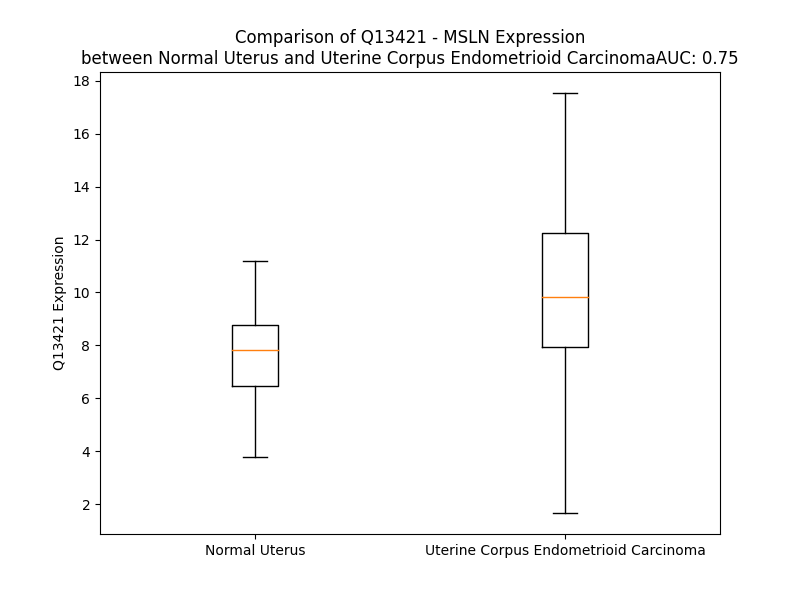

# Detailed Data for Q13421

## Introduction to the Detailed Summary

### How to Interpret the Results

- **Summary & Metrics**: This section provides a quick reference to essential protein attributes, including expression changes, family classification, and biomarker applications. Regulation status (upregulated/downregulated) indicates the protein's behavior in a disease context. Some information comes from the original excel file with the proteins selected from literature, while others are derived from the analyses.
- **Expression Comparison**: A visual representation comparing protein expression between normal and disease states. It highlights significant changes in expression levels that might indicate diagnostic or therapeutic relevance. This is data coming from transcriptomics experiments and could not translate similarly to protein levels.
- **Isoform Alignment**: An interactive view of isoform alignments, revealing structural and functional differences between variants of the protein.
- **Interactors & Homologs**: Tables listing known interaction partners and homologous proteins, the more interactors and homologs, the more complex the protein is to design an antibody for.
- **Biological Assemblies**: Information about the structural arrangement of the protein in different assemblies, providing insights into its functional state but also the complexity of the protein to develop antibodies.
- **Combined Per-Residue Information**: A detailed table summarizing residue-level data. This includes predictions for epitope regions, aggregation tendencies, and modifications that might impact the protein's function. Each row corresponds to a residue in the protein, providing insights into specific sites that may be important for research or drug development.
## Summary & Metrics

- **UniProt Accession**: Q13421
- **Gene Name**: MSLN
- **Protein Name**: Mesothelin
- **Swiss Prot**: MSLN_HUMAN
- **Family**: other
- **Biomarker Application**: diagnosis,prognosis
- **Number of Isoforms**: 4
- **Regulation**: -1
- **(transcriptomics) AUC**: 0.6
- **(transcriptomics) Fold Change**: 1.09
- **(transcriptomics) Regulation**: Upregulated
- **Discotope Epitope Count**: 144
- **Max n_uniprots (Homo)**: 4.0
- **Max n_uniprots (Hetero)**: N/A

## Expression Comparison

## Isoform Alignment

<pre style='font-size:14px; font-family:monospace;'>Q13421-1 MALPTARPLLGSCGTPALGSLLFLLFSLGWVQPSRTLAGETGQEAAPLDGVLANPPNISSLSPRQLLGFPCAEVSGLSTERVRELAVALAQKNVKLSTEQLRCLAHRLSEPPEDLDALPLDLLLFLNPDAFSGPQACTRFFSRITKANVDLLPRGAPERQRLLPAALACWGVRGSLLSEADVRALGGLACDLPGRFVAESAEVLLPRLVSCPGPLDQDQQEAARAALQGGGPPYGPPSTWSVSTMDALRGLLPVLGQPIIRSIPQGIVAAWRQRSSRDPSWRQPERTILRPRFRREVEKTACPSGKKAREIDESLIFYKKWELEACVDAALLATQMDRVNAIPFTYEQLDVLKHKLDELYPQGYPESVIQHLGYLFLKMSPEDIRKWNVTSLETLKALLEVNKGHEMSPQAPRRPLPQVATLIDRFVKGRGQLDKDTLDTLTAFYPGYLCSLSPEELSSVPPSSIWAVRPQDLDTCDPRQLDVLYPKARLAFQNMNGSEYFVKIQSFLGGAPTEDLKALSQQNVSMDLATFMKLRTDAVLPLTVAEVQKLLGPHVEGLKAEERHRPVRDWILRQRQDDLDTLGLGLQGGIPNGYLVLDLSMQEALSGTPCLLGPGPVLTVLALLLASTLA----------------------------------
Q13421-3 MALPTARPLLGSCGTPALGSLLFLLFSLGWVQPSRTLAGETGQEAAPLDGVLANPPNISSLSPRQLLGFPCAEVSGLSTERVRELAVALAQKNVKLSTEQLRCLAHRLSEPPEDLDALPLDLLLFLNPDAFSGPQACTRFFSRITKANVDLLPRGAPERQRLLPAALACWGVRGSLLSEADVRALGGLACDLPGRFVAESAEVLLPRLVSCPGPLDQDQQEAARAALQGGGPPYGPPSTWSVSTMDALRGLLPVLGQPIIRSIPQGIVAAWRQRSSRDPSWRQPERTILRPRFRREVEKTACPSGKKAREIDESLIFYKKWELEACVDAALLATQMDRVNAIPFTYEQLDVLKHKLDELYPQGYPESVIQHLGYLFLKMSPEDIRKWNVTSLETLKALLEVNKGHEMSP--------QVATLIDRFVKGRGQLDKDTLDTLTAFYPGYLCSLSPEELSSVPPSSIWAVRPQDLDTCDPRQLDVLYPKARLAFQNMNGSEYFVKIQSFLGGAPTEDLKALSQQNVSMDLATFMKLRTDAVLPLTVAEVQKLLGPHVEGLKAEERHRPVRDWILRQRQDDLDTLGLGLQGGIPNGYLVLDLSMQEALSGTPCLLGPGPVLTVLALLLASTLA----------------------------------
Q13421-2 MALPTARPLLGSCGTPALGSLLFLLFSLGWVQPSRTLAGETGQEAAPLDGVLANPPNISSLSPRQLLGFPCAEVSGLSTERVRELAVALAQKNVKLSTEQLRCLAHRLSEPPEDLDALPLDLLLFLNPDAFSGPQACTRFFSRITKANVDLLPRGAPERQRLLPAALACWGVRGSLLSEADVRALGGLACDLPGRFVAESAEVLLPRLVSCPGPLDQDQQEAARAALQGGGPPYGPPSTWSVSTMDALRGLLPVLGQPIIRSIPQGIVAAWRQRSSRDPSWRQPERTILRPRFRREVEKTACPSGKKAREIDESLIFYKKWELEACVDAALLATQMDRVNAIPFTYEQLDVLKHKLDELYPQGYPESVIQHLGYLFLKMSPEDIRKWNVTSLETLKALLEVNKGHEMSP--------QVATLIDRFVKGRGQLDKDTLDTLTAFYPGYLCSLSPEELSSVPPSSIWAVRPQDLDTCDPRQLDVLYPKARLAFQNMNGSEYFVKIQSFLGGAPTEDLKALSQQNVSMDLATFMKLRTDAVLPLTVAEVQKLLGPHVEGLKAEERHRPVRDWILRQRQDDLDTLGLGLQGGIPNGYLVLDLSVQGGRGGQARAGGRAGGVEVGALSHPSLCRGPLGDALPPRTWTCSHRPGTAPSLHPGLRAPLPC
Q13421-4 MALPTARPLLGSCGTPALGSLLFLLFSLGWVQPSRTLAGETGQ-AAPLDGVLANPPNISSLSPRQLLGFPCAEVSGLSTERVRELAVALAQKNVKLSTEQLRCLAHRLSEPPEDLDALPLDLLLFLNPDAFSGPQACTRFFSRITKANVDLLPRGAPERQRLLPAALACWGVRGSLLSEADVRALGGLACDLPGRFVAESAEVLLPRLVSCPGPLDQDQQEAARAALQGGGPPYGPPSTWSVSTMDALRGLLPVLGQPIIRSIPQGIVAAWRQRSSRDPSWRQPERTILRPRFRREVEKTACPSGKKAREIDESLIFYKKWELEACVDAALLATQMDRVNAIPFTYEQLDVLKHKLDELYPQGYPESVIQHLGYLFLKMSPEDIRKWNVTSLETLKALLEVNKGHEMSP--------QVATLIDRFVKGRGQLDKDTLDTLTAFYPGYLCSLSPEELSSVPPSSIWAVRPQDLDTCDPRQLDVLYPKARLAFQNMNGSEYFVKIQSFLGGAPTEDLKALSQQNVSMDLATFMKLRTDAVLPLTVAEVQKLLGPHVEGLKAEERHRPVRDWILRQRQDDLDTLGLGLQGGIPNGYLVLDLSMQEALSGTPCLLGPGPVLTVLALLLASTLA----------------------------------
</pre>

## Interactors

| preferredName_A   | preferredName_B   |   score |
|:------------------|:------------------|--------:|
| MSLN              | MUC16             |   0.995 |

## Homologs

| uniprot_id   | gene_id   |
|:-------------|:----------|
| H0YG18       | MSLNL     |
| H7C2Q6       | STRC      |
| Q7RTW8       | OTOA      |

## Biological Assemblies

|   Unnamed: 0 |   assembly |   n_uniprots | composition   | crystal_id   |
|-------------:|-----------:|-------------:|:--------------|:-------------|
|            0 |          1 |            1 | Homo          | 8cx3         |
|            1 |          2 |            1 | Homo          | 8cx3         |
|            2 |          3 |            1 | Homo          | 8cx3         |
|            3 |          4 |            2 | Homo          | 8cx3         |
|            4 |          5 |            1 | Homo          | 8cx3         |
|            5 |          6 |            2 | Homo          | 8cx3         |
|            0 |          1 |            1 | Homo          | 7u9j         |
|            1 |          2 |            1 | Homo          | 7u9j         |
|            0 |          1 |            3 | Homo          | 8cyh         |
|            0 |          1 |            4 | Homo          | 8cxc         |
|            0 |          1 |            3 | Homo          | 8cz8         |
|            1 |          2 |            3 | Homo          | 8cz8         |
|            0 |          1 |            4 | Homo          | 7ued         |
|            0 |          1 |            3 | Homo          | 8fsl         |
|            1 |          2 |            3 | Homo          | 8fsl         |
|            0 |          1 |            3 | Homo          | 4f3f         |

## Combined Per-Residue Information

|   res | aa   |   epitope_score | epitope   |   relative_surface_accessibility |   modeling_confidence |   Aggregation | modification             | glycosylation                   |
|------:|:-----|----------------:|:----------|---------------------------------:|----------------------:|--------------:|:-------------------------|:--------------------------------|
|     1 | M    |         0.1339  | True      |                          1.31522 |                 42.19 |         0     | N/A                      | N/A                             |
|     2 | A    |         0.13309 | True      |                          1.00561 |                 46.93 |         0     | N/A                      | N/A                             |
|     3 | L    |         0.18139 | True      |                          1.03128 |                 33.62 |         0     | N/A                      | N/A                             |
|     4 | P    |         0.14881 | True      |                          0.74404 |                 52.23 |         0     | N/A                      | N/A                             |
|     5 | T    |         0.07201 | False     |                          0.89938 |                 38.21 |         0     | N/A                      | N/A                             |
|     6 | A    |         0.11008 | False     |                          1.03632 |                 43.64 |         0     | N/A                      | N/A                             |
|     7 | R    |         0.09854 | False     |                          0.94403 |                 41.17 |         0     | N/A                      | N/A                             |
|     8 | P    |         0.11229 | False     |                          0.85798 |                 47.94 |         0     | N/A                      | N/A                             |
|     9 | L    |         0.13972 | True      |                          1.01061 |                 42.03 |         0     | N/A                      | N/A                             |
|    10 | L    |         0.16869 | True      |                          0.98884 |                 41.43 |         0     | N/A                      | N/A                             |
|    11 | G    |         0.10382 | False     |                          0.81112 |                 39.77 |         0     | N/A                      | N/A                             |
|    12 | S    |         0.16918 | True      |                          0.89666 |                 38.07 |         0     | N/A                      | N/A                             |
|    13 | C    |         0.15059 | True      |                          1.00115 |                 36.59 |         0     | N/A                      | N/A                             |
|    14 | G    |         0.1947  | True      |                          0.86686 |                 38.32 |         0     | N/A                      | N/A                             |
|    15 | T    |         0.12075 | False     |                          0.98238 |                 36.59 |         0     | N/A                      | N/A                             |
|    16 | P    |         0.09982 | False     |                          0.90917 |                 40.42 |         0.043 | N/A                      | N/A                             |
|    17 | A    |         0.17021 | True      |                          0.81578 |                 34.59 |         3.584 | N/A                      | N/A                             |
|    18 | L    |         0.10417 | False     |                          1.09057 |                 36.41 |         7.771 | N/A                      | N/A                             |
|    19 | G    |         0.22704 | True      |                          0.78431 |                 28.85 |         8.538 | N/A                      | N/A                             |
|    20 | S    |         0.12695 | True      |                          0.79322 |                 29.81 |        17.054 | N/A                      | N/A                             |
|    21 | L    |         0.12411 | True      |                          0.83224 |                 30.79 |        85.511 | N/A                      | N/A                             |
|    22 | L    |         0.16309 | True      |                          0.98107 |                 32.79 |        97.85  | N/A                      | N/A                             |
|    23 | F    |         0.27221 | True      |                          0.74435 |                 31.31 |        99.665 | N/A                      | N/A                             |
|    24 | L    |         0.17867 | True      |                          0.90981 |                 32.25 |        99.804 | N/A                      | N/A                             |
|    25 | L    |         0.14586 | True      |                          0.83411 |                 33.17 |        99.777 | N/A                      | N/A                             |
|    26 | F    |         0.16901 | True      |                          1.01227 |                 35.19 |        98.43  | N/A                      | N/A                             |
|    27 | S    |         0.16557 | True      |                          0.86319 |                 29.74 |        79.446 | N/A                      | N/A                             |
|    28 | L    |         0.13676 | True      |                          0.77936 |                 30.88 |        77.035 | N/A                      | N/A                             |
|    29 | G    |         0.15681 | True      |                          0.95819 |                 32.38 |        63.85  | N/A                      | N/A                             |
|    30 | W    |         0.10956 | False     |                          0.8656  |                 29.61 |        62.663 | N/A                      | N/A                             |
|    31 | V    |         0.13202 | True      |                          1.01385 |                 31.12 |        57.757 | N/A                      | N/A                             |
|    32 | Q    |         0.13778 | True      |                          0.66807 |                 29.52 |         0.021 | N/A                      | N/A                             |
|    33 | P    |         0.10377 | False     |                          0.87702 |                 26.26 |         0.006 | N/A                      | N/A                             |
|    34 | S    |         0.08139 | False     |                          0.83936 |                 31.66 |         0     | N/A                      | N/A                             |
|    35 | R    |         0.14759 | True      |                          0.92677 |                 27.67 |         0     | N/A                      | N/A                             |
|    36 | T    |         0.16245 | True      |                          0.86932 |                 33.82 |         0     | N/A                      | N/A                             |
|    37 | L    |         0.27095 | True      |                          1.06376 |                 28.91 |         0     | N/A                      | N/A                             |
|    38 | A    |         0.15883 | True      |                          0.89394 |                 26.17 |         0     | N/A                      | N/A                             |
|    39 | G    |         0.23995 | True      |                          0.93467 |                 25.86 |         0     | N/A                      | N/A                             |
|    40 | E    |         0.20832 | True      |                          0.93703 |                 29.3  |         0     | N/A                      | N/A                             |
|    41 | T    |         0.18555 | True      |                          0.95808 |                 27.35 |         0     | N/A                      | N/A                             |
|    42 | G    |         0.13783 | True      |                          0.92505 |                 26.13 |         0     | N/A                      | N/A                             |
|    43 | Q    |         0.19944 | True      |                          0.92561 |                 28.62 |         0     | N/A                      | N/A                             |
|    44 | E    |         0.10508 | False     |                          0.85183 |                 28.3  |         0     | N/A                      | N/A                             |
|    45 | A    |         0.12957 | True      |                          0.95591 |                 29.87 |         0     | N/A                      | N/A                             |
|    46 | A    |         0.12779 | True      |                          0.69676 |                 29.85 |         0     | N/A                      | N/A                             |
|    47 | P    |         0.08205 | False     |                          0.69413 |                 35.05 |         0     | N/A                      | N/A                             |
|    48 | L    |         0.08174 | False     |                          0.52235 |                 45.39 |         0     | N/A                      | N/A                             |
|    49 | D    |         0.10144 | False     |                          0.79168 |                 46.52 |         0     | N/A                      | N/A                             |
|    50 | G    |         0.07084 | False     |                          0.37846 |                 53.75 |         0     | N/A                      | N/A                             |
|    51 | V    |         0.04616 | False     |                          0.28943 |                 58.9  |         0     | N/A                      | N/A                             |
|    52 | L    |         0.02337 | False     |                          0.01867 |                 62.05 |         0     | N/A                      | N/A                             |
|    53 | A    |         0.13972 | True      |                          0.62045 |                 56.8  |         0     | N/A                      | N/A                             |
|    54 | N    |         0.1543  | True      |                          0.89056 |                 58.49 |         0     | N/A                      | N/A                             |
|    55 | P    |         0.08574 | False     |                          0.14617 |                 57.68 |         0     | N/A                      | N/A                             |
|    56 | P    |         0.0949  | False     |                          0.98211 |                 61.24 |         0     | N/A                      | N/A                             |
|    57 | N    |         0.12413 | True      |                          0.45099 |                 74.63 |         0     | N/A                      | N-linked (GlcNAc...) asparagine |
|    58 | I    |         0.01505 | False     |                          0.0008  |                 78.88 |         0     | N/A                      | N/A                             |
|    59 | S    |         0.10384 | False     |                          0.42985 |                 76.25 |         0     | N/A                      | N/A                             |
|    60 | S    |         0.17035 | True      |                          0.68818 |                 79.31 |         0     | N/A                      | N/A                             |
|    61 | L    |         0.04411 | False     |                          0.10097 |                 81.84 |         0     | N/A                      | N/A                             |
|    62 | S    |         0.13067 | True      |                          0.34815 |                 79.44 |         0     | N/A                      | N/A                             |
|    63 | P    |         0.09549 | False     |                          0.47417 |                 75.96 |         0     | N/A                      | N/A                             |
|    64 | R    |         0.12114 | False     |                          0.81559 |                 74.72 |         0     | N/A                      | N/A                             |
|    65 | Q    |         0.09566 | False     |                          0.34635 |                 74.87 |         0     | N/A                      | N/A                             |
|    66 | L    |         0.00844 | False     |                          0.00152 |                 76.57 |         0     | N/A                      | N/A                             |
|    67 | L    |         0.08792 | False     |                          0.50849 |                 74.71 |         0     | N/A                      | N/A                             |
|    68 | G    |         0.10298 | False     |                          0.75738 |                 70.22 |         0     | N/A                      | N/A                             |
|    69 | F    |         0.05862 | False     |                          0.07135 |                 78.49 |         0     | N/A                      | N/A                             |
|    70 | P    |         0.0377  | False     |                          0.48511 |                 80.7  |         0     | N/A                      | N/A                             |
|    71 | C    |         0.02451 | False     |                          0.2817  |                 82.88 |         0     | N/A                      | N/A                             |
|    72 | A    |         0.04391 | False     |                          0.43905 |                 83.41 |         0     | N/A                      | N/A                             |
|    73 | E    |         0.04047 | False     |                          0.16415 |                 81.46 |         0     | N/A                      | N/A                             |
|    74 | V    |         0.01037 | False     |                          0.00095 |                 85.2  |         0     | N/A                      | N/A                             |
|    75 | S    |         0.04087 | False     |                          0.44577 |                 82.21 |         0     | N/A                      | N/A                             |
|    76 | G    |         0.08832 | False     |                          0.81786 |                 81.02 |         0     | N/A                      | N/A                             |
|    77 | L    |         0.02416 | False     |                          0.08209 |                 84.85 |         0     | N/A                      | N/A                             |
|    78 | S    |         0.07374 | False     |                          0.47459 |                 86.22 |         0     | N/A                      | N/A                             |
|    79 | T    |         0.03561 | False     |                          0.40144 |                 84.37 |         0     | N/A                      | N/A                             |
|    80 | E    |         0.08624 | False     |                          0.54251 |                 84.91 |         0     | N/A                      | N/A                             |
|    81 | R    |         0.10967 | False     |                          0.20347 |                 86.96 |         0     | N/A                      | N/A                             |
|    82 | V    |         0.00208 | False     |                          0       |                 88.28 |         0.214 | N/A                      | N/A                             |
|    83 | R    |         0.05632 | False     |                          0.27288 |                 87    |         0.214 | N/A                      | N/A                             |
|    84 | E    |         0.0543  | False     |                          0.33892 |                 87.19 |         0.214 | N/A                      | N/A                             |
|    85 | L    |         0.00206 | False     |                          0       |                 89.11 |        30.318 | N/A                      | N/A                             |
|    86 | A    |         0.00128 | False     |                          0       |                 89    |        33.991 | N/A                      | N/A                             |
|    87 | V    |         0.04083 | False     |                          0.29133 |                 88.34 |        33.991 | N/A                      | N/A                             |
|    88 | A    |         0.02145 | False     |                          0.01094 |                 88.69 |        33.991 | N/A                      | N/A                             |
|    89 | L    |         0.00706 | False     |                          0.00244 |                 89.16 |        33.991 | N/A                      | N/A                             |
|    90 | A    |         0.02992 | False     |                          0.20344 |                 86.78 |        10.986 | N/A                      | N/A                             |
|    91 | Q    |         0.16408 | True      |                          0.63062 |                 86.28 |         0.414 | N/A                      | N/A                             |
|    92 | K    |         0.10428 | False     |                          0.28399 |                 84.1  |         0     | N/A                      | N/A                             |
|    93 | N    |         0.21463 | True      |                          0.84012 |                 83.34 |         0     | N/A                      | N/A                             |
|    94 | V    |         0.03917 | False     |                          0.09632 |                 83.37 |         0     | N/A                      | N/A                             |
|    95 | K    |         0.1813  | True      |                          0.89884 |                 82.31 |         0     | N/A                      | N/A                             |
|    96 | L    |         0.04219 | False     |                          0.14774 |                 83.61 |         0     | N/A                      | N/A                             |
|    97 | S    |         0.07721 | False     |                          0.45719 |                 84.21 |         0     | N/A                      | N/A                             |
|    98 | T    |         0.05534 | False     |                          0.37903 |                 84.14 |         0     | N/A                      | N/A                             |
|    99 | E    |         0.05857 | False     |                          0.45976 |                 84.09 |         0     | N/A                      | N/A                             |
|   100 | Q    |         0.0292  | False     |                          0.08016 |                 88.51 |         0     | N/A                      | N/A                             |
|   101 | L    |         0.00966 | False     |                          0.03215 |                 90.49 |         0     | N/A                      | N/A                             |
|   102 | R    |         0.04629 | False     |                          0.37015 |                 89.01 |         0     | N/A                      | N/A                             |
|   103 | C    |         0.01588 | False     |                          0.14635 |                 89.76 |         0     | N/A                      | N/A                             |
|   104 | L    |         0.00158 | False     |                          0       |                 89.77 |         0     | N/A                      | N/A                             |
|   105 | A    |         0.00855 | False     |                          0.08726 |                 90.08 |         0     | N/A                      | N/A                             |
|   106 | H    |         0.05138 | False     |                          0.78878 |                 88.53 |         0     | N/A                      | N/A                             |
|   107 | R    |         0.04614 | False     |                          0.33178 |                 88.09 |         0     | N/A                      | N/A                             |
|   108 | L    |         0.01919 | False     |                          0.02194 |                 84.85 |         0     | N/A                      | N/A                             |
|   109 | S    |         0.10562 | False     |                          0.71903 |                 67.61 |         0     | N/A                      | N/A                             |
|   110 | E    |         0.11409 | False     |                          0.63991 |                 69.87 |         0     | N/A                      | N/A                             |
|   111 | P    |         0.04676 | False     |                          0.19662 |                 66.6  |         0     | N/A                      | N/A                             |
|   112 | P    |         0.04326 | False     |                          0.22475 |                 69.19 |         0     | N/A                      | N/A                             |
|   113 | E    |         0.12858 | True      |                          0.90597 |                 72.15 |         0     | N/A                      | N/A                             |
|   114 | D    |         0.08308 | False     |                          0.48227 |                 82.63 |         0     | N/A                      | N/A                             |
|   115 | L    |         0.05077 | False     |                          0.08918 |                 85.5  |         0     | N/A                      | N/A                             |
|   116 | D    |         0.09201 | False     |                          0.63289 |                 84.45 |         0     | N/A                      | N/A                             |
|   117 | A    |         0.03858 | False     |                          0.26788 |                 86.46 |         0     | N/A                      | N/A                             |
|   118 | L    |         0.00824 | False     |                          0.01645 |                 87.88 |         0     | N/A                      | N/A                             |
|   119 | P    |         0.01499 | False     |                          0.11829 |                 89.21 |         0     | N/A                      | N/A                             |
|   120 | L    |         0.033   | False     |                          0.33642 |                 88.77 |         0     | N/A                      | N/A                             |
|   121 | D    |         0.02389 | False     |                          0.2849  |                 89.69 |         0     | N/A                      | N/A                             |
|   122 | L    |         0.00163 | False     |                          0       |                 91.25 |        68.18  | N/A                      | N/A                             |
|   123 | L    |         0.00302 | False     |                          0       |                 90.58 |        68.18  | N/A                      | N/A                             |
|   124 | L    |         0.00387 | False     |                          0.00366 |                 91.9  |        68.18  | N/A                      | N/A                             |
|   125 | F    |         0.01394 | False     |                          0.08044 |                 92.06 |        68.18  | N/A                      | N/A                             |
|   126 | L    |         0.00868 | False     |                          0.05412 |                 90.42 |        68.18  | N/A                      | N/A                             |
|   127 | N    |         0.05107 | False     |                          0.40176 |                 89.25 |         0     | N/A                      | N/A                             |
|   128 | P    |         0.01517 | False     |                          0.08785 |                 90.48 |         0     | N/A                      | N/A                             |
|   129 | D    |         0.08617 | False     |                          0.63951 |                 87.19 |         0     | N/A                      | N/A                             |
|   130 | A    |         0.05758 | False     |                          0.53565 |                 86.13 |         0     | N/A                      | N/A                             |
|   131 | F    |         0.04151 | False     |                          0.08461 |                 88.02 |         0     | N/A                      | N/A                             |
|   132 | S    |         0.1293  | True      |                          0.72486 |                 80.87 |         0     | N/A                      | N/A                             |
|   133 | G    |         0.09044 | False     |                          0.50109 |                 84.92 |         0     | N/A                      | N/A                             |
|   134 | P    |         0.07993 | False     |                          0.83908 |                 87.06 |         0     | N/A                      | N/A                             |
|   135 | Q    |         0.10116 | False     |                          0.62167 |                 89.5  |         0     | N/A                      | N/A                             |
|   136 | A    |         0.03083 | False     |                          0.33421 |                 89.28 |         0     | N/A                      | N/A                             |
|   137 | C    |         0.02461 | False     |                          0.15064 |                 92.04 |         0     | N/A                      | N/A                             |
|   138 | T    |         0.05024 | False     |                          0.42421 |                 91.49 |         0     | N/A                      | N/A                             |
|   139 | R    |         0.07651 | False     |                          0.55771 |                 90.74 |         0     | N/A                      | N/A                             |
|   140 | F    |         0.0027  | False     |                          0       |                 92.46 |         0     | N/A                      | N/A                             |
|   141 | F    |         0.01859 | False     |                          0.02508 |                 93.52 |         0     | N/A                      | N/A                             |
|   142 | S    |         0.04493 | False     |                          0.35006 |                 92.08 |         0     | N/A                      | N/A                             |
|   143 | R    |         0.07847 | False     |                          0.16187 |                 91.95 |         0     | N/A                      | N/A                             |
|   144 | I    |         0.00632 | False     |                          0.00936 |                 91.31 |         0     | N/A                      | N/A                             |
|   145 | T    |         0.05408 | False     |                          0.27396 |                 90.09 |         0     | N/A                      | N/A                             |
|   146 | K    |         0.05903 | False     |                          0.70548 |                 88.11 |         0     | N/A                      | N/A                             |
|   147 | A    |         0.01172 | False     |                          0.07588 |                 87.25 |         0     | N/A                      | N/A                             |
|   148 | N    |         0.09586 | False     |                          0.50182 |                 85.75 |         0     | N/A                      | N/A                             |
|   149 | V    |         0.01422 | False     |                          0.02041 |                 86.45 |         0     | N/A                      | N/A                             |
|   150 | D    |         0.11536 | False     |                          0.41898 |                 83.04 |         0     | N/A                      | N/A                             |
|   151 | L    |         0.07228 | False     |                          0.40792 |                 82.65 |         0     | N/A                      | N/A                             |
|   152 | L    |         0.01935 | False     |                          0.00882 |                 83.16 |         0     | N/A                      | N/A                             |
|   153 | P    |         0.11912 | False     |                          0.7244  |                 82.54 |         0     | N/A                      | N/A                             |
|   154 | R    |         0.07922 | False     |                          0.324   |                 79.03 |         0     | N/A                      | N/A                             |
|   155 | G    |         0.15875 | True      |                          0.67468 |                 77.15 |         0     | N/A                      | N/A                             |
|   156 | A    |         0.063   | False     |                          0.11807 |                 84.7  |         0     | N/A                      | N/A                             |
|   157 | P    |         0.05225 | False     |                          0.6506  |                 87.23 |         0     | N/A                      | N/A                             |
|   158 | E    |         0.03422 | False     |                          0.08202 |                 88.96 |         0     | N/A                      | N/A                             |
|   159 | R    |         0.02589 | False     |                          0.02559 |                 90.59 |         0     | N/A                      | N/A                             |
|   160 | Q    |         0.05161 | False     |                          0.54985 |                 89.39 |         0     | N/A                      | N/A                             |
|   161 | R    |         0.0474  | False     |                          0.40614 |                 92.37 |         0     | N/A                      | N/A                             |
|   162 | L    |         0.00518 | False     |                          0.00577 |                 94.45 |         0     | N/A                      | N/A                             |
|   163 | L    |         0.0437  | False     |                          0.10881 |                 93.59 |         0     | N/A                      | N/A                             |
|   164 | P    |         0.10577 | False     |                          0.57705 |                 93.3  |         0     | N/A                      | N/A                             |
|   165 | A    |         0.03264 | False     |                          0.22916 |                 93.93 |         1.017 | N/A                      | N/A                             |
|   166 | A    |         0.00432 | False     |                          0.0051  |                 94.83 |         2.223 | N/A                      | N/A                             |
|   167 | L    |         0.0265  | False     |                          0.14261 |                 94.13 |         2.621 | N/A                      | N/A                             |
|   168 | A    |         0.10479 | False     |                          0.74255 |                 92.97 |         2.621 | N/A                      | N/A                             |
|   169 | C    |         0.07977 | False     |                          0.21793 |                 93.57 |         2.621 | N/A                      | N/A                             |
|   170 | W    |         0.07082 | False     |                          0.30944 |                 90.83 |         2.621 | N/A                      | N/A                             |
|   171 | G    |         0.17392 | True      |                          0.59369 |                 90.47 |         1.016 | N/A                      | N/A                             |
|   172 | V    |         0.07767 | False     |                          0.21021 |                 91.14 |         1.016 | N/A                      | N/A                             |
|   173 | R    |         0.1807  | True      |                          0.8912  |                 86.78 |         0     | N/A                      | N/A                             |
|   174 | G    |         0.13917 | True      |                          0.74333 |                 90.35 |         0     | N/A                      | N/A                             |
|   175 | S    |         0.07114 | False     |                          0.05464 |                 93.04 |         0     | N/A                      | N/A                             |
|   176 | L    |         0.09855 | False     |                          0.78127 |                 93.82 |         0     | N/A                      | N/A                             |
|   177 | L    |         0.0199  | False     |                          0.10686 |                 94.65 |         0     | N/A                      | N/A                             |
|   178 | S    |         0.05941 | False     |                          0.43334 |                 93.61 |         0     | N/A                      | N/A                             |
|   179 | E    |         0.04533 | False     |                          0.51053 |                 92.15 |         0     | N/A                      | N/A                             |
|   180 | A    |         0.04602 | False     |                          0.58767 |                 92.56 |         0     | N/A                      | N/A                             |
|   181 | D    |         0.04113 | False     |                          0.19045 |                 94.12 |         0     | N/A                      | N/A                             |
|   182 | V    |         0.00947 | False     |                          0.06847 |                 93.48 |         0     | N/A                      | N/A                             |
|   183 | R    |         0.10001 | False     |                          0.60703 |                 92.23 |         0     | N/A                      | N/A                             |
|   184 | A    |         0.02683 | False     |                          0.23141 |                 91.71 |         0     | N/A                      | N/A                             |
|   185 | L    |         0.00753 | False     |                          0.01025 |                 93.29 |         0     | N/A                      | N/A                             |
|   186 | G    |         0.01452 | False     |                          0.12554 |                 90.74 |         0     | N/A                      | N/A                             |
|   187 | G    |         0.0125  | False     |                          0.13139 |                 88.91 |         0     | N/A                      | N/A                             |
|   188 | L    |         0.00712 | False     |                          0.00989 |                 92.08 |         0     | N/A                      | N/A                             |
|   189 | A    |         0.00187 | False     |                          0       |                 93.09 |         0     | N/A                      | N/A                             |
|   190 | C    |         0.01338 | False     |                          0.02485 |                 91.78 |         0     | N/A                      | N/A                             |
|   191 | D    |         0.05597 | False     |                          0.18154 |                 91.42 |         0     | N/A                      | N/A                             |
|   192 | L    |         0.00306 | False     |                          0.00082 |                 93.55 |         0     | N/A                      | N/A                             |
|   193 | P    |         0.08662 | False     |                          0.32804 |                 93.15 |         0     | N/A                      | N/A                             |
|   194 | G    |         0.01387 | False     |                          0.03902 |                 93.01 |         0     | N/A                      | N/A                             |
|   195 | R    |         0.09907 | False     |                          0.58996 |                 95.08 |         0     | N/A                      | N/A                             |
|   196 | F    |         0.01236 | False     |                          0.03503 |                 95.94 |         0     | N/A                      | N/A                             |
|   197 | V    |         0.002   | False     |                          0       |                 95.03 |         0     | N/A                      | N/A                             |
|   198 | A    |         0.07328 | False     |                          0.61461 |                 94.13 |         0     | N/A                      | N/A                             |
|   199 | E    |         0.07661 | False     |                          0.50479 |                 94.32 |         0     | N/A                      | N/A                             |
|   200 | S    |         0.03063 | False     |                          0.05279 |                 95.63 |         0     | Phosphoserine; by FAM20C | N/A                             |
|   201 | A    |         0.02463 | False     |                          0.15382 |                 94.45 |         0     | N/A                      | N/A                             |
|   202 | E    |         0.05457 | False     |                          0.51866 |                 94.22 |         0     | N/A                      | N/A                             |
|   203 | V    |         0.03018 | False     |                          0.21885 |                 94.57 |         0     | N/A                      | N/A                             |
|   204 | L    |         0.00169 | False     |                          0.00082 |                 95.19 |         0     | N/A                      | N/A                             |
|   205 | L    |         0.00657 | False     |                          0.01814 |                 94.42 |         0     | N/A                      | N/A                             |
|   206 | P    |         0.07175 | False     |                          0.4578  |                 92.63 |         0     | N/A                      | N/A                             |
|   207 | R    |         0.05032 | False     |                          0.26643 |                 93.01 |         0     | N/A                      | N/A                             |
|   208 | L    |         0.01449 | False     |                          0.01584 |                 93.07 |         0     | N/A                      | N/A                             |
|   209 | V    |         0.0791  | False     |                          0.23943 |                 90.92 |         0     | N/A                      | N/A                             |
|   210 | S    |         0.08532 | False     |                          0.51562 |                 86.88 |         0     | N/A                      | N/A                             |
|   211 | C    |         0.03023 | False     |                          0.11928 |                 88.98 |         0     | N/A                      | N/A                             |
|   212 | P    |         0.18088 | True      |                          0.50396 |                 78.77 |         0     | N/A                      | N/A                             |
|   213 | G    |         0.05254 | False     |                          0.42304 |                 70.86 |         0     | N/A                      | N/A                             |
|   214 | P    |         0.15375 | True      |                          0.72951 |                 77.99 |         0     | N/A                      | N/A                             |
|   215 | L    |         0.03284 | False     |                          0.09772 |                 86.85 |         0     | N/A                      | N/A                             |
|   216 | D    |         0.06369 | False     |                          0.37675 |                 85.94 |         0     | N/A                      | N/A                             |
|   217 | Q    |         0.12037 | False     |                          0.649   |                 91.06 |         0     | N/A                      | N/A                             |
|   218 | D    |         0.0375  | False     |                          0.57152 |                 91.29 |         0     | N/A                      | N/A                             |
|   219 | Q    |         0.00616 | False     |                          0.00059 |                 93.32 |         0     | N/A                      | N/A                             |
|   220 | Q    |         0.04251 | False     |                          0.27306 |                 93.7  |         0     | N/A                      | N/A                             |
|   221 | E    |         0.07214 | False     |                          0.45326 |                 93.22 |         0     | N/A                      | N/A                             |
|   222 | A    |         0.01242 | False     |                          0.11716 |                 95.12 |         0     | N/A                      | N/A                             |
|   223 | A    |         0.00139 | False     |                          0       |                 94.89 |         0     | N/A                      | N/A                             |
|   224 | R    |         0.06442 | False     |                          0.29496 |                 94.22 |         0     | N/A                      | N/A                             |
|   225 | A    |         0.07448 | False     |                          0.62505 |                 94.5  |         0     | N/A                      | N/A                             |
|   226 | A    |         0.014   | False     |                          0.21605 |                 94.51 |         0     | N/A                      | N/A                             |
|   227 | L    |         0.00955 | False     |                          0.02391 |                 94.62 |         0     | N/A                      | N/A                             |
|   228 | Q    |         0.0625  | False     |                          0.4909  |                 93.22 |         0     | N/A                      | N/A                             |
|   229 | G    |         0.13622 | True      |                          0.82686 |                 91.22 |         0     | N/A                      | N/A                             |
|   230 | G    |         0.05824 | False     |                          0.18119 |                 90.14 |         0     | N/A                      | N/A                             |
|   231 | G    |         0.08829 | False     |                          0.40978 |                 87.85 |         0     | N/A                      | N/A                             |
|   232 | P    |         0.34268 | True      |                          0.58979 |                 87.42 |         0     | N/A                      | N/A                             |
|   233 | P    |         0.21754 | True      |                          0.47337 |                 88.62 |         0     | N/A                      | N/A                             |
|   234 | Y    |         0.04728 | False     |                          0.1654  |                 90.33 |         0     | N/A                      | N/A                             |
|   235 | G    |         0.03718 | False     |                          0.22998 |                 90.32 |         0     | N/A                      | N/A                             |
|   236 | P    |         0.14418 | True      |                          0.45131 |                 93.26 |         0     | N/A                      | N/A                             |
|   237 | P    |         0.02215 | False     |                          0.06461 |                 92.45 |         0     | N/A                      | N/A                             |
|   238 | S    |         0.10282 | False     |                          0.50286 |                 93.75 |         0     | N/A                      | N/A                             |
|   239 | T    |         0.10022 | False     |                          0.68481 |                 92.01 |         0     | N/A                      | N/A                             |
|   240 | W    |         0.02318 | False     |                          0.01574 |                 93.52 |         0     | N/A                      | N/A                             |
|   241 | S    |         0.09073 | False     |                          0.33384 |                 89.88 |         0     | N/A                      | N/A                             |
|   242 | V    |         0.10276 | False     |                          0.16527 |                 85.8  |         0     | N/A                      | N/A                             |
|   243 | S    |         0.18634 | True      |                          0.56335 |                 85.23 |         0     | N/A                      | N/A                             |
|   244 | T    |         0.06978 | False     |                          0.15199 |                 89.39 |         0     | N/A                      | N/A                             |
|   245 | M    |         0.01836 | False     |                          0.04171 |                 89.4  |         0     | N/A                      | N/A                             |
|   246 | D    |         0.12589 | True      |                          0.28309 |                 84.25 |         0     | N/A                      | N/A                             |
|   247 | A    |         0.04185 | False     |                          0.45185 |                 85.18 |         0     | N/A                      | N/A                             |
|   248 | L    |         0.0032  | False     |                          0       |                 90.08 |         0     | N/A                      | N/A                             |
|   249 | R    |         0.06613 | False     |                          0.32071 |                 85.17 |         0     | N/A                      | N/A                             |
|   250 | G    |         0.0436  | False     |                          0.47421 |                 83.25 |         0     | N/A                      | N/A                             |
|   251 | L    |         0.00889 | False     |                          0.00165 |                 89.12 |         0     | N/A                      | N/A                             |
|   252 | L    |         0.06393 | False     |                          0.28244 |                 88.01 |         0     | N/A                      | N/A                             |
|   253 | P    |         0.09595 | False     |                          0.85506 |                 86    |         0     | N/A                      | N/A                             |
|   254 | V    |         0.0464  | False     |                          0.03899 |                 87.74 |         0     | N/A                      | N/A                             |
|   255 | L    |         0.04617 | False     |                          0.0887  |                 88.99 |         0     | N/A                      | N/A                             |
|   256 | G    |         0.11108 | False     |                          0.18992 |                 83.04 |         0     | N/A                      | N/A                             |
|   257 | Q    |         0.11785 | False     |                          0.54525 |                 86.28 |         0     | N/A                      | N/A                             |
|   258 | P    |         0.15656 | True      |                          0.54736 |                 87.72 |         0     | N/A                      | N/A                             |
|   259 | I    |         0.0412  | False     |                          0.0064  |                 90.88 |         0     | N/A                      | N/A                             |
|   260 | I    |         0.09156 | False     |                          0.43017 |                 90.17 |         0     | N/A                      | N/A                             |
|   261 | R    |         0.31288 | True      |                          0.72977 |                 90.82 |         0     | N/A                      | N/A                             |
|   262 | S    |         0.05688 | False     |                          0.4191  |                 92.62 |         0     | N/A                      | N/A                             |
|   263 | I    |         0.03669 | False     |                          0.02661 |                 91.85 |         0     | N/A                      | N/A                             |
|   264 | P    |         0.12039 | False     |                          0.39862 |                 91.37 |         0     | N/A                      | N/A                             |
|   265 | Q    |         0.19831 | True      |                          0.63189 |                 89.27 |         0     | N/A                      | N/A                             |
|   266 | G    |         0.14012 | True      |                          0.64094 |                 89.58 |         0.885 | N/A                      | N/A                             |
|   267 | I    |         0.07157 | False     |                          0.26079 |                 88.67 |         8.798 | N/A                      | N/A                             |
|   268 | V    |         0.04393 | False     |                          0.18756 |                 87.05 |         8.798 | N/A                      | N/A                             |
|   269 | A    |         0.08022 | False     |                          0.48151 |                 85.97 |         8.798 | N/A                      | N/A                             |
|   270 | A    |         0.15759 | True      |                          0.42534 |                 85.55 |         8.798 | N/A                      | N/A                             |
|   271 | W    |         0.06846 | False     |                          0.13986 |                 86.11 |         8.625 | N/A                      | N/A                             |
|   272 | R    |         0.11181 | False     |                          0.65454 |                 84.76 |         0     | N/A                      | N/A                             |
|   273 | Q    |         0.12784 | True      |                          0.60053 |                 82.26 |         0     | N/A                      | N/A                             |
|   274 | R    |         0.28952 | True      |                          0.50898 |                 78.32 |         0     | N/A                      | N/A                             |
|   275 | S    |         0.07387 | False     |                          0.11711 |                 73.32 |         0     | N/A                      | N/A                             |
|   276 | S    |         0.13159 | True      |                          0.68266 |                 67.36 |         0     | N/A                      | N/A                             |
|   277 | R    |         0.25846 | True      |                          0.81969 |                 64.34 |         0     | N/A                      | N/A                             |
|   278 | D    |         0.2546  | True      |                          0.33658 |                 61.8  |         0     | N/A                      | N/A                             |
|   279 | P    |         0.19056 | True      |                          0.72363 |                 54.29 |         0     | N/A                      | N/A                             |
|   280 | S    |         0.16276 | True      |                          0.44455 |                 53.01 |         0     | N/A                      | N/A                             |
|   281 | W    |         0.15456 | True      |                          0.31058 |                 52.74 |         0     | N/A                      | N/A                             |
|   282 | R    |         0.22999 | True      |                          0.81397 |                 47.81 |         0     | N/A                      | N/A                             |
|   283 | Q    |         0.20296 | True      |                          0.71661 |                 42.27 |         0     | N/A                      | N/A                             |
|   284 | P    |         0.14002 | True      |                          0.93581 |                 34    |         0     | N/A                      | N/A                             |
|   285 | E    |         0.16445 | True      |                          0.77751 |                 39.41 |         0     | N/A                      | N/A                             |
|   286 | R    |         0.16588 | True      |                          0.66082 |                 32.1  |         0     | N/A                      | N/A                             |
|   287 | T    |         0.1945  | True      |                          0.72911 |                 33.11 |         0     | N/A                      | N/A                             |
|   288 | I    |         0.19273 | True      |                          0.92243 |                 31.54 |         0     | N/A                      | N/A                             |
|   289 | L    |         0.2078  | True      |                          0.95894 |                 32.29 |         0     | N/A                      | N/A                             |
|   290 | R    |         0.19535 | True      |                          0.87685 |                 30.99 |         0     | N/A                      | N/A                             |
|   291 | P    |         0.12186 | False     |                          0.82366 |                 36.91 |         0     | N/A                      | N/A                             |
|   292 | R    |         0.1491  | True      |                          0.959   |                 36.32 |         0     | N/A                      | N/A                             |
|   293 | F    |         0.14469 | True      |                          0.9737  |                 30.84 |         0     | N/A                      | N/A                             |
|   294 | R    |         0.31434 | True      |                          0.92569 |                 29.52 |         0     | N/A                      | N/A                             |
|   295 | R    |         0.27907 | True      |                          0.89124 |                 36.77 |         0     | N/A                      | N/A                             |
|   296 | E    |         0.2405  | True      |                          0.9425  |                 30.85 |         0     | N/A                      | N/A                             |
|   297 | V    |         0.21167 | True      |                          0.85801 |                 41.21 |         0     | N/A                      | N/A                             |
|   298 | E    |         0.12168 | False     |                          0.80996 |                 47.13 |         0     | N/A                      | N/A                             |
|   299 | K    |         0.09979 | False     |                          0.97312 |                 54.01 |         0     | N/A                      | N/A                             |
|   300 | T    |         0.13649 | True      |                          0.57091 |                 61.51 |         0     | N/A                      | N/A                             |
|   301 | A    |         0.09126 | False     |                          0.85016 |                 79.04 |         0     | N/A                      | N/A                             |
|   302 | C    |         0.05408 | False     |                          0.26676 |                 86.45 |         0     | N/A                      | N/A                             |
|   303 | P    |         0.11904 | False     |                          0.3682  |                 82.69 |         0     | N/A                      | N/A                             |
|   304 | S    |         0.18134 | True      |                          0.94271 |                 79.23 |         0     | N/A                      | N/A                             |
|   305 | G    |         0.14186 | True      |                          1.02766 |                 81.18 |         0     | N/A                      | N/A                             |
|   306 | K    |         0.14797 | True      |                          0.42192 |                 85.42 |         0     | N/A                      | N/A                             |
|   307 | K    |         0.07628 | False     |                          0.64094 |                 89.11 |         0     | N/A                      | N/A                             |
|   308 | A    |         0.02941 | False     |                          0.09832 |                 88.6  |         0     | N/A                      | N/A                             |
|   309 | R    |         0.13044 | True      |                          0.89226 |                 88.94 |         0     | N/A                      | N/A                             |
|   310 | E    |         0.12552 | True      |                          0.39151 |                 91.48 |         0     | N/A                      | N/A                             |
|   311 | I    |         0.01184 | False     |                          0.01464 |                 89.83 |         0     | N/A                      | N/A                             |
|   312 | D    |         0.13508 | True      |                          0.36159 |                 90    |         0     | N/A                      | N/A                             |
|   313 | E    |         0.22945 | True      |                          0.6534  |                 87.53 |         0.054 | N/A                      | N/A                             |
|   314 | S    |         0.08036 | False     |                          0.43275 |                 87.04 |        58.228 | N/A                      | N/A                             |
|   315 | L    |         0.01033 | False     |                          0.01154 |                 88.77 |        58.228 | N/A                      | N/A                             |
|   316 | I    |         0.16826 | True      |                          0.35004 |                 85.86 |        58.228 | N/A                      | N/A                             |
|   317 | F    |         0.15255 | True      |                          0.86348 |                 86.18 |        58.228 | N/A                      | N/A                             |
|   318 | Y    |         0.08953 | False     |                          0.14755 |                 85.95 |        58.228 | N/A                      | N/A                             |
|   319 | K    |         0.26848 | True      |                          0.65876 |                 85.26 |         0.054 | N/A                      | N/A                             |
|   320 | K    |         0.08793 | False     |                          0.50969 |                 86.32 |         0     | N/A                      | N/A                             |
|   321 | W    |         0.11257 | False     |                          0.50221 |                 85.38 |         0     | N/A                      | N/A                             |
|   322 | E    |         0.04782 | False     |                          0.05762 |                 90.21 |         0     | N/A                      | N/A                             |
|   323 | L    |         0.00315 | False     |                          0       |                 91.22 |         0     | N/A                      | N/A                             |
|   324 | E    |         0.02246 | False     |                          0.32684 |                 90.54 |         0     | N/A                      | N/A                             |
|   325 | A    |         0.04177 | False     |                          0.32168 |                 90.46 |         0     | N/A                      | N/A                             |
|   326 | C    |         0.02614 | False     |                          0.01334 |                 92.72 |         0     | N/A                      | N/A                             |
|   327 | V    |         0.01667 | False     |                          0.0391  |                 92.66 |         0     | N/A                      | N/A                             |
|   328 | D    |         0.03752 | False     |                          0.3503  |                 91.08 |         0     | N/A                      | N/A                             |
|   329 | A    |         0.01636 | False     |                          0.20999 |                 91.79 |         0.644 | N/A                      | N/A                             |
|   330 | A    |         0.06212 | False     |                          0.50458 |                 91.33 |         0.928 | N/A                      | N/A                             |
|   331 | L    |         0.04284 | False     |                          0.20235 |                 92.99 |         0.928 | N/A                      | N/A                             |
|   332 | L    |         0.00236 | False     |                          0       |                 93.25 |         0.928 | N/A                      | N/A                             |
|   333 | A    |         0.02021 | False     |                          0.09741 |                 91.36 |         0.928 | N/A                      | N/A                             |
|   334 | T    |         0.06431 | False     |                          0.78945 |                 91.95 |         0.524 | N/A                      | N/A                             |
|   335 | Q    |         0.05029 | False     |                          0.17314 |                 92.56 |         0     | N/A                      | N/A                             |
|   336 | M    |         0.00752 | False     |                          0.01614 |                 91.98 |         0     | N/A                      | N/A                             |
|   337 | D    |         0.04664 | False     |                          0.49133 |                 88.42 |         0     | N/A                      | N/A                             |
|   338 | R    |         0.08942 | False     |                          0.35212 |                 90.31 |         0     | N/A                      | N/A                             |
|   339 | V    |         0.01135 | False     |                          0.025   |                 88.59 |         0     | N/A                      | N/A                             |
|   340 | N    |         0.08154 | False     |                          0.30598 |                 78.92 |         0     | N/A                      | N/A                             |
|   341 | A    |         0.18073 | True      |                          0.83068 |                 83.17 |         0     | N/A                      | N/A                             |
|   342 | I    |         0.09269 | False     |                          0.08313 |                 85.47 |         0     | N/A                      | N/A                             |
|   343 | P    |         0.29709 | True      |                          0.74186 |                 85.03 |         0     | N/A                      | N/A                             |
|   344 | F    |         0.04358 | False     |                          0.08988 |                 85.44 |         0     | N/A                      | N/A                             |
|   345 | T    |         0.14835 | True      |                          0.55998 |                 85.83 |         0     | N/A                      | N/A                             |
|   346 | Y    |         0.08632 | False     |                          0.75232 |                 83.69 |         0     | N/A                      | N/A                             |
|   347 | E    |         0.05961 | False     |                          0.59217 |                 85.88 |         0     | N/A                      | N/A                             |
|   348 | Q    |         0.02679 | False     |                          0.06212 |                 89.34 |         0     | N/A                      | N/A                             |
|   349 | L    |         0.01364 | False     |                          0.13684 |                 89.55 |         0     | N/A                      | N/A                             |
|   350 | D    |         0.03037 | False     |                          0.40632 |                 89.68 |         0     | N/A                      | N/A                             |
|   351 | V    |         0.01047 | False     |                          0.01333 |                 91.93 |         0     | N/A                      | N/A                             |
|   352 | L    |         0.00354 | False     |                          0.00495 |                 92.45 |         0     | N/A                      | N/A                             |
|   353 | K    |         0.01588 | False     |                          0.14486 |                 93.95 |         0     | N/A                      | N/A                             |
|   354 | H    |         0.06937 | False     |                          0.46495 |                 92.8  |         0     | N/A                      | N/A                             |
|   355 | K    |         0.03875 | False     |                          0.06524 |                 92.81 |         0     | N/A                      | N/A                             |
|   356 | L    |         0.00157 | False     |                          0       |                 93.27 |         0     | N/A                      | N/A                             |
|   357 | D    |         0.05881 | False     |                          0.24753 |                 92    |         0     | N/A                      | N/A                             |
|   358 | E    |         0.07772 | False     |                          0.52547 |                 88.99 |         0     | N/A                      | N/A                             |
|   359 | L    |         0.05126 | False     |                          0.40178 |                 91.01 |         0     | N/A                      | N/A                             |
|   360 | Y    |         0.04381 | False     |                          0.26777 |                 89.53 |         0     | N/A                      | N/A                             |
|   361 | P    |         0.1086  | False     |                          0.62281 |                 86.54 |         0     | N/A                      | N/A                             |
|   362 | Q    |         0.07715 | False     |                          0.79396 |                 82.06 |         0     | N/A                      | N/A                             |
|   363 | G    |         0.02773 | False     |                          0.19561 |                 86.89 |         0     | N/A                      | N/A                             |
|   364 | Y    |         0.01083 | False     |                          0.04268 |                 91.36 |         0     | N/A                      | N/A                             |
|   365 | P    |         0.07757 | False     |                          0.37023 |                 89.96 |         0     | N/A                      | N/A                             |
|   366 | E    |         0.04505 | False     |                          0.22232 |                 89.38 |         0     | N/A                      | N/A                             |
|   367 | S    |         0.0406  | False     |                          0.60209 |                 89.18 |         1.184 | N/A                      | N/A                             |
|   368 | V    |         0.01041 | False     |                          0.03618 |                 92.26 |        10.725 | N/A                      | N/A                             |
|   369 | I    |         0.00272 | False     |                          0       |                 93.27 |        10.725 | N/A                      | N/A                             |
|   370 | Q    |         0.02431 | False     |                          0.3286  |                 91.75 |        10.725 | N/A                      | N/A                             |
|   371 | H    |         0.02744 | False     |                          0.40808 |                 91.67 |        10.94  | N/A                      | N/A                             |
|   372 | L    |         0.00251 | False     |                          0       |                 91.94 |        22.285 | N/A                      | N/A                             |
|   373 | G    |         0.02033 | False     |                          0.19155 |                 87.15 |        24.042 | N/A                      | N/A                             |
|   374 | Y    |         0.03966 | False     |                          0.6609  |                 83.57 |        24.042 | N/A                      | N/A                             |
|   375 | L    |         0.00414 | False     |                          0.00672 |                 88.91 |        24.042 | N/A                      | N/A                             |
|   376 | F    |         0.00264 | False     |                          0       |                 90.47 |        24.042 | N/A                      | N/A                             |
|   377 | L    |         0.0311  | False     |                          0.32642 |                 85.23 |        20.625 | N/A                      | N/A                             |
|   378 | K    |         0.05386 | False     |                          0.30213 |                 87.54 |         0     | N/A                      | N/A                             |
|   379 | M    |         0.01247 | False     |                          0.01124 |                 91.47 |         0     | N/A                      | N/A                             |
|   380 | S    |         0.029   | False     |                          0.29675 |                 91.9  |         0     | N/A                      | N/A                             |
|   381 | P    |         0.01929 | False     |                          0.2018  |                 92.29 |         0     | N/A                      | N/A                             |
|   382 | E    |         0.05858 | False     |                          0.51352 |                 92.33 |         0     | N/A                      | N/A                             |
|   383 | D    |         0.03408 | False     |                          0.09625 |                 92.14 |         0     | N/A                      | N/A                             |
|   384 | I    |         0.00459 | False     |                          0       |                 93.54 |         0     | N/A                      | N/A                             |
|   385 | R    |         0.07758 | False     |                          0.55782 |                 93.03 |         0     | N/A                      | N/A                             |
|   386 | K    |         0.0568  | False     |                          0.46938 |                 90.65 |         0     | N/A                      | N/A                             |
|   387 | W    |         0.01472 | False     |                          0.0069  |                 92.86 |         0     | N/A                      | N/A                             |
|   388 | N    |         0.03917 | False     |                          0.56766 |                 88.01 |         0     | N/A                      | N-linked (GlcNAc...) asparagine |
|   389 | V    |         0.00175 | False     |                          0.00082 |                 89.92 |         0     | N/A                      | N/A                             |
|   390 | T    |         0.05538 | False     |                          0.37463 |                 88.59 |         0     | N/A                      | N/A                             |
|   391 | S    |         0.04922 | False     |                          0.32501 |                 90.06 |         0     | N/A                      | N/A                             |
|   392 | L    |         0.0312  | False     |                          0.1212  |                 90.41 |         0     | N/A                      | N/A                             |
|   393 | E    |         0.04761 | False     |                          0.45534 |                 91.51 |         0     | N/A                      | N/A                             |
|   394 | T    |         0.0043  | False     |                          0.00217 |                 91.99 |         0.302 | N/A                      | N/A                             |
|   395 | L    |         0.00121 | False     |                          0.00082 |                 91.84 |         0.809 | N/A                      | N/A                             |
|   396 | K    |         0.05563 | False     |                          0.31554 |                 91.03 |         0.809 | N/A                      | N/A                             |
|   397 | A    |         0.01713 | False     |                          0.32924 |                 90.22 |         0.809 | N/A                      | N/A                             |
|   398 | L    |         0.00493 | False     |                          0.00165 |                 91.24 |         0.809 | N/A                      | N/A                             |
|   399 | L    |         0.0028  | False     |                          0.00183 |                 88.76 |         0.809 | N/A                      | N/A                             |
|   400 | E    |         0.13738 | True      |                          0.45864 |                 85.2  |         0.809 | N/A                      | N/A                             |
|   401 | V    |         0.03833 | False     |                          0.15721 |                 81.05 |         0.809 | N/A                      | N/A                             |
|   402 | N    |         0.05062 | False     |                          0.01877 |                 72.26 |         0     | N/A                      | N/A                             |
|   403 | K    |         0.13406 | True      |                          0.38106 |                 66.43 |         0     | N/A                      | N/A                             |
|   404 | G    |         0.17032 | True      |                          0.7841  |                 52.09 |         0     | N/A                      | N/A                             |
|   405 | H    |         0.15367 | True      |                          0.51335 |                 52.59 |         0     | N/A                      | N/A                             |
|   406 | E    |         0.17169 | True      |                          0.31633 |                 48.9  |         0     | N/A                      | N/A                             |
|   407 | M    |         0.27234 | True      |                          0.97133 |                 43.28 |         0     | N/A                      | N/A                             |
|   408 | S    |         0.2046  | True      |                          0.43047 |                 41.32 |         0     | N/A                      | N/A                             |
|   409 | P    |         0.2955  | True      |                          1.04981 |                 46.42 |         0     | N/A                      | N/A                             |
|   410 | Q    |         0.20989 | True      |                          0.84618 |                 44.24 |         0     | N/A                      | N/A                             |
|   411 | A    |         0.09398 | False     |                          0.22617 |                 49.9  |         0     | N/A                      | N/A                             |
|   412 | P    |         0.08726 | False     |                          0.61024 |                 49.3  |         0     | N/A                      | N/A                             |
|   413 | R    |         0.08427 | False     |                          0.7263  |                 60.69 |         0     | N/A                      | N/A                             |
|   414 | R    |         0.11922 | False     |                          0.67011 |                 63.09 |         0     | N/A                      | N/A                             |
|   415 | P    |         0.05167 | False     |                          0.06998 |                 68.92 |         0     | N/A                      | N/A                             |
|   416 | L    |         0.05624 | False     |                          0.13615 |                 78.18 |         0     | N/A                      | N/A                             |
|   417 | P    |         0.06094 | False     |                          0.60111 |                 84.16 |         0     | N/A                      | N/A                             |
|   418 | Q    |         0.03211 | False     |                          0.15996 |                 88.66 |         1.445 | N/A                      | N/A                             |
|   419 | V    |         0.00353 | False     |                          0       |                 88.06 |        38.706 | N/A                      | N/A                             |
|   420 | A    |         0.01321 | False     |                          0.28682 |                 86.08 |        38.706 | N/A                      | N/A                             |
|   421 | T    |         0.02282 | False     |                          0.11461 |                 90.63 |        38.706 | N/A                      | N/A                             |
|   422 | L    |         0.00111 | False     |                          0       |                 92.21 |        38.706 | N/A                      | N/A                             |
|   423 | I    |         0.00356 | False     |                          0.0008  |                 89.52 |        38.706 | N/A                      | N/A                             |
|   424 | D    |         0.02877 | False     |                          0.28099 |                 87.65 |         0.368 | N/A                      | N/A                             |
|   425 | R    |         0.07117 | False     |                          0.27573 |                 90.56 |         0.368 | N/A                      | N/A                             |
|   426 | F    |         0.00836 | False     |                          0.00255 |                 90.99 |         0.368 | N/A                      | N/A                             |
|   427 | V    |         0.00917 | False     |                          0.03404 |                 87.67 |         0.368 | N/A                      | N/A                             |
|   428 | K    |         0.05248 | False     |                          0.61362 |                 84.83 |         0     | N/A                      | N/A                             |
|   429 | G    |         0.03699 | False     |                          0.35991 |                 84.02 |         0     | N/A                      | N/A                             |
|   430 | R    |         0.07508 | False     |                          0.36342 |                 81.98 |         0     | N/A                      | N/A                             |
|   431 | G    |         0.15724 | True      |                          0.82604 |                 73.02 |         0     | N/A                      | N/A                             |
|   432 | Q    |         0.12004 | False     |                          0.60864 |                 71.96 |         0     | N/A                      | N/A                             |
|   433 | L    |         0.05258 | False     |                          0.1086  |                 79.09 |         0     | N/A                      | N/A                             |
|   434 | D    |         0.07632 | False     |                          0.22237 |                 80.75 |         0     | N/A                      | N/A                             |
|   435 | K    |         0.09376 | False     |                          0.65729 |                 81.62 |         0     | N/A                      | N/A                             |
|   436 | D    |         0.07604 | False     |                          0.57081 |                 83.8  |         0     | N/A                      | N/A                             |
|   437 | T    |         0.00642 | False     |                          0.0019  |                 83.88 |         0     | N/A                      | N/A                             |
|   438 | L    |         0.01505 | False     |                          0.01072 |                 81.33 |         0     | N/A                      | N/A                             |
|   439 | D    |         0.08409 | False     |                          0.34607 |                 81.62 |         0     | N/A                      | N/A                             |
|   440 | T    |         0.04842 | False     |                          0.08334 |                 84.23 |         0.405 | N/A                      | N/A                             |
|   441 | L    |         0.0046  | False     |                          0.0033  |                 83.38 |         0.405 | N/A                      | N/A                             |
|   442 | T    |         0.05519 | False     |                          0.13933 |                 75.58 |         0.405 | N/A                      | N/A                             |
|   443 | A    |         0.11283 | False     |                          0.75607 |                 77.84 |         0.405 | N/A                      | N/A                             |
|   444 | F    |         0.09659 | False     |                          0.16608 |                 73.66 |         0.405 | N/A                      | N/A                             |
|   445 | Y    |         0.08652 | False     |                          0.18889 |                 73.18 |         0     | N/A                      | N/A                             |
|   446 | P    |         0.0277  | False     |                          0.14259 |                 71.5  |         0     | N/A                      | N/A                             |
|   447 | G    |         0.01142 | False     |                          0.00483 |                 74.07 |         0     | N/A                      | N/A                             |
|   448 | Y    |         0.01326 | False     |                          0.01265 |                 79.51 |         0.15  | N/A                      | N/A                             |
|   449 | L    |         0.00411 | False     |                          0.00884 |                 82.48 |         0.15  | N/A                      | N/A                             |
|   450 | C    |         0.01412 | False     |                          0.1192  |                 84.99 |         0.15  | N/A                      | N/A                             |
|   451 | S    |         0.0193  | False     |                          0.18931 |                 81.67 |         0.15  | N/A                      | N/A                             |
|   452 | L    |         0.00338 | False     |                          0.00594 |                 86    |         0.15  | N/A                      | N/A                             |
|   453 | S    |         0.04851 | False     |                          0.31582 |                 86.52 |         0     | N/A                      | N/A                             |
|   454 | P    |         0.02511 | False     |                          0.27381 |                 89.16 |         0     | N/A                      | N/A                             |
|   455 | E    |         0.06595 | False     |                          0.66179 |                 86.99 |         0     | N/A                      | N/A                             |
|   456 | E    |         0.04824 | False     |                          0.15314 |                 86.05 |         0     | N/A                      | N/A                             |
|   457 | L    |         0.00338 | False     |                          0       |                 88.35 |         0     | N/A                      | N/A                             |
|   458 | S    |         0.05593 | False     |                          0.51903 |                 86.75 |         0     | N/A                      | N/A                             |
|   459 | S    |         0.06834 | False     |                          0.47714 |                 83.81 |         0     | N/A                      | N/A                             |
|   460 | V    |         0.01224 | False     |                          0.00919 |                 82.96 |         0     | N/A                      | N/A                             |
|   461 | P    |         0.09103 | False     |                          0.39564 |                 85.11 |         0     | N/A                      | N/A                             |
|   462 | P    |         0.03781 | False     |                          0.32009 |                 87.68 |         0     | N/A                      | N/A                             |
|   463 | S    |         0.12639 | True      |                          0.62308 |                 82.51 |         0.156 | N/A                      | N/A                             |
|   464 | S    |         0.05554 | False     |                          0.1307  |                 80.97 |         1.415 | N/A                      | N/A                             |
|   465 | I    |         0.00317 | False     |                          0.00139 |                 87.49 |         1.415 | N/A                      | N/A                             |
|   466 | W    |         0.14484 | True      |                          0.59828 |                 85.15 |         1.415 | N/A                      | N/A                             |
|   467 | A    |         0.0876  | False     |                          0.50562 |                 78.02 |         1.415 | N/A                      | N/A                             |
|   468 | V    |         0.0434  | False     |                          0.11595 |                 81.58 |         1.415 | N/A                      | N/A                             |
|   469 | R    |         0.13887 | True      |                          0.44428 |                 78.58 |         0     | N/A                      | N/A                             |
|   470 | P    |         0.07954 | False     |                          0.62739 |                 78.73 |         0     | N/A                      | N/A                             |
|   471 | Q    |         0.07392 | False     |                          0.50844 |                 76.44 |         0     | N/A                      | N/A                             |
|   472 | D    |         0.01793 | False     |                          0.01003 |                 77.33 |         0     | N/A                      | N/A                             |
|   473 | L    |         0.01083 | False     |                          0.05466 |                 84.96 |         0     | N/A                      | N/A                             |
|   474 | D    |         0.07469 | False     |                          0.46478 |                 78.17 |         0     | N/A                      | N/A                             |
|   475 | T    |         0.04451 | False     |                          0.23682 |                 76.27 |         0     | N/A                      | N/A                             |
|   476 | C    |         0.0278  | False     |                          0.12753 |                 87.1  |         0     | N/A                      | N/A                             |
|   477 | D    |         0.05817 | False     |                          0.45682 |                 86.3  |         0     | N/A                      | N/A                             |
|   478 | P    |         0.07164 | False     |                          0.54674 |                 87.68 |         0     | N/A                      | N/A                             |
|   479 | R    |         0.09221 | False     |                          0.71465 |                 90.06 |         0     | N/A                      | N/A                             |
|   480 | Q    |         0.01292 | False     |                          0.088   |                 92.03 |         0     | N/A                      | N/A                             |
|   481 | L    |         0.00765 | False     |                          0.10964 |                 92.74 |         0     | N/A                      | N/A                             |
|   482 | D    |         0.04523 | False     |                          0.29521 |                 92.23 |         0     | N/A                      | N/A                             |
|   483 | V    |         0.03098 | False     |                          0.23264 |                 93.94 |         0     | N/A                      | N/A                             |
|   484 | L    |         0.00131 | False     |                          0.00165 |                 93.16 |         0     | N/A                      | N/A                             |
|   485 | Y    |         0.01565 | False     |                          0.01903 |                 94.81 |         0     | N/A                      | N/A                             |
|   486 | P    |         0.05297 | False     |                          0.46734 |                 94.54 |         0     | N/A                      | N/A                             |
|   487 | K    |         0.03785 | False     |                          0.13375 |                 93.22 |         0     | N/A                      | N/A                             |
|   488 | A    |         0.00103 | False     |                          0       |                 93.96 |         0     | N/A                      | N/A                             |
|   489 | R    |         0.05573 | False     |                          0.41081 |                 94.08 |         0     | N/A                      | N/A                             |
|   490 | L    |         0.07821 | False     |                          0.61651 |                 93.89 |         0     | N/A                      | N/A                             |
|   491 | A    |         0.04782 | False     |                          0.1316  |                 92.61 |         0     | N/A                      | N/A                             |
|   492 | F    |         0.01505 | False     |                          0.03136 |                 93.17 |         0     | N/A                      | N/A                             |
|   493 | Q    |         0.29315 | True      |                          0.61788 |                 91.68 |         0     | N/A                      | N/A                             |
|   494 | N    |         0.12738 | True      |                          0.86874 |                 91.24 |         0     | N/A                      | N/A                             |
|   495 | M    |         0.07226 | False     |                          0.14864 |                 90.6  |         0     | N/A                      | N/A                             |
|   496 | N    |         0.14534 | True      |                          0.8033  |                 86.36 |         0     | N/A                      | N-linked (GlcNAc...) asparagine |
|   497 | G    |         0.13717 | True      |                          0.5591  |                 85.25 |         0     | N/A                      | N/A                             |
|   498 | S    |         0.08544 | False     |                          0.70347 |                 85.76 |         0     | N/A                      | N/A                             |
|   499 | E    |         0.06154 | False     |                          0.49575 |                 88.06 |         1.072 | N/A                      | N/A                             |
|   500 | Y    |         0.02928 | False     |                          0.15551 |                 91.3  |         1.072 | N/A                      | N/A                             |
|   501 | F    |         0.01813 | False     |                          0.0759  |                 91.5  |         1.072 | N/A                      | N/A                             |
|   502 | V    |         0.04398 | False     |                          0.51938 |                 89.93 |         1.072 | N/A                      | N/A                             |
|   503 | K    |         0.06533 | False     |                          0.40444 |                 90.47 |         1.072 | N/A                      | N/A                             |
|   504 | I    |         0.00449 | False     |                          0.0016  |                 92.69 |         1.072 | N/A                      | N/A                             |
|   505 | Q    |         0.02828 | False     |                          0.23398 |                 91.8  |         0.262 | N/A                      | N/A                             |
|   506 | S    |         0.01942 | False     |                          0.25913 |                 89.11 |         0.262 | N/A                      | N/A                             |
|   507 | F    |         0.00579 | False     |                          0.02548 |                 93.57 |         0.262 | N/A                      | N/A                             |
|   508 | L    |         0.00224 | False     |                          0.00387 |                 94    |         0.262 | N/A                      | N/A                             |
|   509 | G    |         0.01529 | False     |                          0.06161 |                 91.97 |         0     | N/A                      | N/A                             |
|   510 | G    |         0.01275 | False     |                          0.04759 |                 93.58 |         0     | N/A                      | N/A                             |
|   511 | A    |         0.00616 | False     |                          0.0066  |                 95.32 |         0     | N/A                      | N/A                             |
|   512 | P    |         0.11046 | False     |                          0.43029 |                 95.55 |         0     | N/A                      | N/A                             |
|   513 | T    |         0.03718 | False     |                          0.13708 |                 95.89 |         0     | N/A                      | N/A                             |
|   514 | E    |         0.12191 | False     |                          0.57211 |                 95.99 |         0     | N/A                      | N/A                             |
|   515 | D    |         0.04405 | False     |                          0.12327 |                 95.07 |         0     | N/A                      | N/A                             |
|   516 | L    |         0.00138 | False     |                          0.00165 |                 96.05 |         0     | N/A                      | N/A                             |
|   517 | K    |         0.03698 | False     |                          0.27495 |                 96.36 |         0     | N/A                      | N/A                             |
|   518 | A    |         0.04864 | False     |                          0.40865 |                 93.71 |         0     | N/A                      | N/A                             |
|   519 | L    |         0.01126 | False     |                          0.03957 |                 93.52 |         0     | N/A                      | N/A                             |
|   520 | S    |         0.01167 | False     |                          0.03385 |                 93.49 |         0     | N/A                      | N/A                             |
|   521 | Q    |         0.07634 | False     |                          0.7483  |                 92.4  |         0     | N/A                      | N/A                             |
|   522 | Q    |         0.09497 | False     |                          0.48324 |                 87.03 |         0     | N/A                      | N/A                             |
|   523 | N    |         0.09649 | False     |                          0.95051 |                 86.07 |         0     | N/A                      | N-linked (GlcNAc...) asparagine |
|   524 | V    |         0.03815 | False     |                          0.10399 |                 90.01 |         0     | N/A                      | N/A                             |
|   525 | S    |         0.0633  | False     |                          0.39708 |                 91.16 |         0     | N/A                      | N/A                             |
|   526 | M    |         0.00402 | False     |                          0       |                 93.07 |         0     | N/A                      | N/A                             |
|   527 | D    |         0.0458  | False     |                          0.25835 |                 92.82 |         0     | N/A                      | N/A                             |
|   528 | L    |         0.03085 | False     |                          0.22343 |                 93.18 |         5.64  | N/A                      | N/A                             |
|   529 | A    |         0.08644 | False     |                          0.64065 |                 91.54 |         5.64  | N/A                      | N/A                             |
|   530 | T    |         0.015   | False     |                          0.12045 |                 91.97 |         5.64  | N/A                      | N/A                             |
|   531 | F    |         0.00212 | False     |                          0       |                 94.84 |         5.64  | N/A                      | N/A                             |
|   532 | M    |         0.03952 | False     |                          0.2515  |                 92.86 |         5.64  | N/A                      | N/A                             |
|   533 | K    |         0.02897 | False     |                          0.62521 |                 90.53 |         0     | N/A                      | N/A                             |
|   534 | L    |         0.0053  | False     |                          0.04434 |                 93.89 |         0     | N/A                      | N/A                             |
|   535 | R    |         0.04052 | False     |                          0.28398 |                 92.5  |         0     | N/A                      | N/A                             |
|   536 | T    |         0.05227 | False     |                          0.27823 |                 93.52 |         0     | N/A                      | N/A                             |
|   537 | D    |         0.057   | False     |                          0.48997 |                 93.9  |         0     | N/A                      | N/A                             |
|   538 | A    |         0.00264 | False     |                          0.01658 |                 95.3  |         0     | N/A                      | N/A                             |
|   539 | V    |         0.00141 | False     |                          0.00095 |                 96.61 |         0     | N/A                      | N/A                             |
|   540 | L    |         0.04431 | False     |                          0.2194  |                 95.96 |         0     | N/A                      | N/A                             |
|   541 | P    |         0.14693 | True      |                          0.53955 |                 96.11 |         0     | N/A                      | N/A                             |
|   542 | L    |         0.00272 | False     |                          0.00582 |                 97.05 |         0     | N/A                      | N/A                             |
|   543 | T    |         0.07993 | False     |                          0.50114 |                 96.51 |         0     | N/A                      | N/A                             |
|   544 | V    |         0.0145  | False     |                          0.07025 |                 95.86 |         0     | N/A                      | N/A                             |
|   545 | A    |         0.04971 | False     |                          0.51165 |                 95.43 |         0     | N/A                      | N/A                             |
|   546 | E    |         0.07221 | False     |                          0.17858 |                 96.74 |         0     | N/A                      | N/A                             |
|   547 | V    |         0.00085 | False     |                          0.00095 |                 96.28 |         0     | N/A                      | N/A                             |
|   548 | Q    |         0.05805 | False     |                          0.41222 |                 95.07 |         0     | N/A                      | N/A                             |
|   549 | K    |         0.04966 | False     |                          0.57136 |                 94.99 |         0     | N/A                      | N/A                             |
|   550 | L    |         0.00125 | False     |                          0       |                 95.61 |         0     | N/A                      | N/A                             |
|   551 | L    |         0.00239 | False     |                          0       |                 95.24 |         0     | N/A                      | N/A                             |
|   552 | G    |         0.01889 | False     |                          0.29171 |                 92.61 |         0     | N/A                      | N/A                             |
|   553 | P    |         0.15214 | True      |                          0.75158 |                 92.03 |         0     | N/A                      | N/A                             |
|   554 | H    |         0.02663 | False     |                          0.21456 |                 94.08 |         0     | N/A                      | N/A                             |
|   555 | V    |         0.02055 | False     |                          0.13615 |                 94.4  |         0     | N/A                      | N/A                             |
|   556 | E    |         0.07329 | False     |                          0.66487 |                 92.18 |         0     | N/A                      | N/A                             |
|   557 | G    |         0.03111 | False     |                          0.27229 |                 92    |         0     | N/A                      | N/A                             |
|   558 | L    |         0.00109 | False     |                          0       |                 94.38 |         0     | N/A                      | N/A                             |
|   559 | K    |         0.05958 | False     |                          0.39818 |                 93.23 |         0     | N/A                      | N/A                             |
|   560 | A    |         0.08209 | False     |                          0.75653 |                 92.6  |         0     | N/A                      | N/A                             |
|   561 | E    |         0.04165 | False     |                          0.19427 |                 93.08 |         0     | N/A                      | N/A                             |
|   562 | E    |         0.03843 | False     |                          0.17286 |                 91.26 |         0     | N/A                      | N/A                             |
|   563 | R    |         0.1602  | True      |                          0.79458 |                 90.39 |         0     | N/A                      | N/A                             |
|   564 | H    |         0.1072  | False     |                          0.55405 |                 93.32 |         0     | N/A                      | N/A                             |
|   565 | R    |         0.20902 | True      |                          0.60964 |                 91.92 |         0     | N/A                      | N/A                             |
|   566 | P    |         0.03532 | False     |                          0.01591 |                 94.39 |         0     | N/A                      | N/A                             |
|   567 | V    |         0.00187 | False     |                          0       |                 95.67 |         0     | N/A                      | N/A                             |
|   568 | R    |         0.06656 | False     |                          0.37843 |                 94.87 |         0     | N/A                      | N/A                             |
|   569 | D    |         0.06267 | False     |                          0.13693 |                 94.44 |         0     | N/A                      | N/A                             |
|   570 | W    |         0.00737 | False     |                          0       |                 96.82 |         0     | N/A                      | N/A                             |
|   571 | I    |         0.02148 | False     |                          0.02    |                 95.11 |         0     | N/A                      | N/A                             |
|   572 | L    |         0.06505 | False     |                          0.63017 |                 92.17 |         0     | N/A                      | N/A                             |
|   573 | R    |         0.05672 | False     |                          0.59979 |                 92.36 |         0     | N/A                      | N/A                             |
|   574 | Q    |         0.02349 | False     |                          0.09468 |                 93.62 |         0     | N/A                      | N/A                             |
|   575 | R    |         0.10603 | False     |                          0.6246  |                 91.47 |         0     | N/A                      | N/A                             |
|   576 | Q    |         0.04057 | False     |                          0.17598 |                 91.36 |         0     | N/A                      | N/A                             |
|   577 | D    |         0.06787 | False     |                          0.43213 |                 90.71 |         0     | N/A                      | N/A                             |
|   578 | D    |         0.03008 | False     |                          0.3719  |                 92.46 |         0     | N/A                      | N/A                             |
|   579 | L    |         0.00417 | False     |                          0.00261 |                 93.46 |         0     | N/A                      | N/A                             |
|   580 | D    |         0.06724 | False     |                          0.47656 |                 90.48 |         0     | N/A                      | N/A                             |
|   581 | T    |         0.10166 | False     |                          0.76365 |                 92.14 |         0     | N/A                      | N/A                             |
|   582 | L    |         0.05271 | False     |                          0.13442 |                 92.26 |         0     | N/A                      | N/A                             |
|   583 | G    |         0.13476 | True      |                          0.82984 |                 90.36 |         0     | N/A                      | N/A                             |
|   584 | L    |         0.03643 | False     |                          0.23073 |                 90.62 |         0     | N/A                      | N/A                             |
|   585 | G    |         0.10705 | False     |                          0.51111 |                 88.01 |         0     | N/A                      | N/A                             |
|   586 | L    |         0.00725 | False     |                          0.01136 |                 89.26 |         0     | N/A                      | N/A                             |
|   587 | Q    |         0.11101 | False     |                          0.69662 |                 85.71 |         0     | N/A                      | N/A                             |
|   588 | G    |         0.03889 | False     |                          0.48891 |                 84.83 |         0     | N/A                      | N/A                             |
|   589 | G    |         0.01318 | False     |                          0.08037 |                 87.67 |         0     | N/A                      | N/A                             |
|   590 | I    |         0.0423  | False     |                          0.28728 |                 86.37 |         0     | N/A                      | N/A                             |
|   591 | P    |         0.21526 | True      |                          0.5003  |                 79.5  |         0     | N/A                      | N/A                             |
|   592 | N    |         0.19444 | True      |                          0.61796 |                 74.13 |         0     | N/A                      | N/A                             |
|   593 | G    |         0.13091 | True      |                          1.02534 |                 66.44 |         2.383 | N/A                      | N/A                             |
|   594 | Y    |         0.10869 | False     |                          0.70842 |                 59.74 |         2.383 | N/A                      | N/A                             |
|   595 | L    |         0.16994 | True      |                          0.97756 |                 57.74 |         2.383 | N/A                      | N/A                             |
|   596 | V    |         0.15556 | True      |                          0.75888 |                 59.18 |         2.383 | N/A                      | N/A                             |
|   597 | L    |         0.18208 | True      |                          0.8441  |                 55.02 |         2.383 | N/A                      | N/A                             |
|   598 | D    |         0.15013 | True      |                          0.58769 |                 57.31 |         0     | N/A                      | N/A                             |
|   599 | L    |         0.22322 | True      |                          0.79482 |                 54.4  |         0     | N/A                      | N/A                             |
|   600 | S    |         0.09891 | False     |                          0.74602 |                 49.98 |         0     | N/A                      | N/A                             |
|   601 | M    |         0.1343  | True      |                          0.71654 |                 43.99 |         0     | N/A                      | N/A                             |
|   602 | Q    |         0.19878 | True      |                          0.6339  |                 41.99 |         0     | N/A                      | N/A                             |
|   603 | E    |         0.16746 | True      |                          0.86825 |                 40.6  |         0     | N/A                      | N/A                             |
|   604 | A    |         0.14907 | True      |                          0.69201 |                 43.45 |         0     | N/A                      | N/A                             |
|   605 | L    |         0.16612 | True      |                          0.97455 |                 40.66 |         0     | N/A                      | N/A                             |
|   606 | S    |         0.11599 | False     |                          0.80608 |                 42.36 |         0     | N/A                      | N/A                             |
|   607 | G    |         0.16299 | True      |                          0.74873 |                 39.51 |         0     | N/A                      | N/A                             |
|   608 | T    |         0.10945 | False     |                          0.85706 |                 36.19 |         0     | N/A                      | N/A                             |
|   609 | P    |         0.12119 | False     |                          0.89221 |                 35.1  |         0     | N/A                      | N/A                             |
|   610 | C    |         0.09404 | False     |                          0.94269 |                 38.64 |         0     | N/A                      | N/A                             |
|   611 | L    |         0.18414 | True      |                          0.99025 |                 39.05 |         0     | N/A                      | N/A                             |
|   612 | L    |         0.16284 | True      |                          1.15648 |                 41.29 |         0     | N/A                      | N/A                             |
|   613 | G    |         0.1776  | True      |                          0.86407 |                 36.33 |         0     | N/A                      | N/A                             |
|   614 | P    |         0.15105 | True      |                          1.05929 |                 42.29 |         0     | N/A                      | N/A                             |
|   615 | G    |         0.17493 | True      |                          0.85705 |                 40.91 |         0     | N/A                      | N/A                             |
|   616 | P    |         0.11947 | False     |                          0.9446  |                 45.72 |         1.074 | N/A                      | N/A                             |
|   617 | V    |         0.1434  | True      |                          0.88315 |                 46.17 |        88.595 | N/A                      | N/A                             |
|   618 | L    |         0.16474 | True      |                          1.04542 |                 44.44 |        96.011 | N/A                      | N/A                             |
|   619 | T    |         0.08105 | False     |                          0.85273 |                 41.52 |        97.365 | N/A                      | N/A                             |
|   620 | V    |         0.15901 | True      |                          0.98141 |                 45.88 |        99.612 | N/A                      | N/A                             |
|   621 | L    |         0.1101  | False     |                          0.97026 |                 43.91 |        99.788 | N/A                      | N/A                             |
|   622 | A    |         0.0873  | False     |                          0.87585 |                 37.94 |        99.551 | N/A                      | N/A                             |
|   623 | L    |         0.07678 | False     |                          0.99223 |                 38.76 |        99.324 | N/A                      | N/A                             |
|   624 | L    |         0.08369 | False     |                          1.01661 |                 40.67 |        98.027 | N/A                      | N/A                             |
|   625 | L    |         0.1111  | False     |                          0.93603 |                 42.09 |        90.777 | N/A                      | N/A                             |
|   626 | A    |         0.10439 | False     |                          0.98919 |                 39.82 |        51.109 | N/A                      | N/A                             |
|   627 | S    |         0.05792 | False     |                          0.773   |                 42.78 |        17.558 | N/A                      | N/A                             |
|   628 | T    |         0.13085 | True      |                          0.84511 |                 42.94 |        13.394 | N/A                      | N/A                             |
|   629 | L    |         0.10039 | False     |                          1.08432 |                 45.55 |        12.488 | N/A                      | N/A                             |
|   630 | A    |         0.12292 | True      |                          1.58518 |                 45.2  |         0     | N/A                      | N/A                             |

