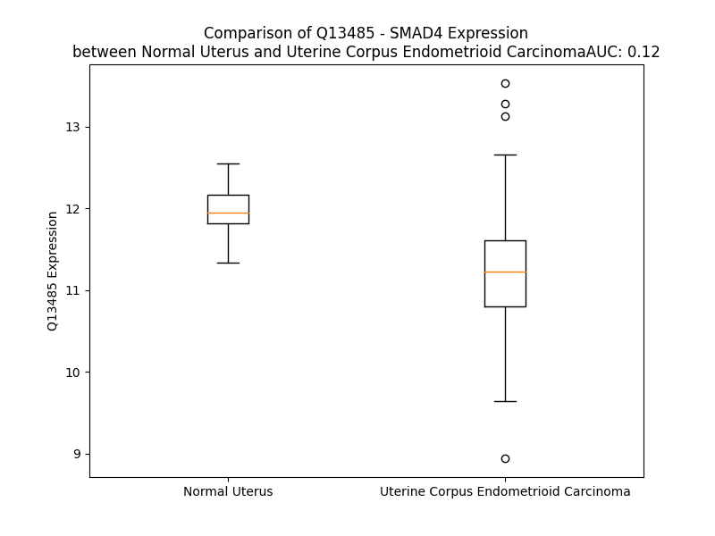

# Detailed Data for Q13485

## Introduction to the Detailed Summary

### How to Interpret the Results

- **Summary & Metrics**: This section provides a quick reference to essential protein attributes, including expression changes, family classification, and biomarker applications. Regulation status (upregulated/downregulated) indicates the protein's behavior in a disease context. Some information comes from the original excel file with the proteins selected from literature, while others are derived from the analyses.
- **Expression Comparison**: A visual representation comparing protein expression between normal and disease states. It highlights significant changes in expression levels that might indicate diagnostic or therapeutic relevance. This is data coming from transcriptomics experiments and could not translate similarly to protein levels.
- **Isoform Alignment**: An interactive view of isoform alignments, revealing structural and functional differences between variants of the protein.
- **Interactors & Homologs**: Tables listing known interaction partners and homologous proteins, the more interactors and homologs, the more complex the protein is to design an antibody for.
- **Biological Assemblies**: Information about the structural arrangement of the protein in different assemblies, providing insights into its functional state but also the complexity of the protein to develop antibodies.
- **Combined Per-Residue Information**: A detailed table summarizing residue-level data. This includes predictions for epitope regions, aggregation tendencies, and modifications that might impact the protein's function. Each row corresponds to a residue in the protein, providing insights into specific sites that may be important for research or drug development.
## Summary & Metrics

- **UniProt Accession**: Q13485
- **Gene Name**: SMAD4 /DPC4
- **Protein Name**: Mothers against decapentaplegic homolog 4
- **Swiss Prot**: SMAD4_HUMAN
- **Family**: transcription regulator
- **Biomarker Application**: prognosis
- **Number of Isoforms**: 0
- **Regulation**: -1
- **(transcriptomics) AUC**: 0.07
- **(transcriptomics) Fold Change**: 1.07
- **(transcriptomics) Regulation**: Downregulated
- **Discotope Epitope Count**: 116
- **Max n_uniprots (Homo)**: 3
- **Max n_uniprots (Hetero)**: 3

## Expression Comparison

## Interactors

| preferredName_A   | preferredName_B   |   score |
|:------------------|:------------------|--------:|
| SMAD4             | SMAD3             |   0.999 |
| SMAD4             | SMAD2             |   0.999 |
| SMAD4             | SKIL              |   0.999 |
| SMAD4             | SMAD9             |   0.999 |
| SMAD4             | LEF1              |   0.999 |
| SMAD4             | SMAD5             |   0.999 |
| SMAD4             | TGFBR1            |   0.998 |
| SMAD4             | CTNNB1            |   0.998 |
| SMAD4             | SKI               |   0.998 |
| SMAD4             | E2F4              |   0.997 |
| SMAD4             | SMAD1             |   0.997 |
| SMAD4             | FOXH1             |   0.997 |
| SMAD4             | TGFBR2            |   0.996 |
| SMAD4             | EP300             |   0.994 |
| SMAD4             | HNF4A             |   0.99  |
| SMAD4             | SMAD6             |   0.989 |
| SMAD4             | JUN               |   0.989 |
| SMAD4             | E2F5              |   0.986 |
| SMAD4             | TRIM33            |   0.986 |
| SMAD4             | MAPK8             |   0.98  |
| SMAD4             | FOXO3             |   0.979 |
| SMAD4             | HDAC1             |   0.972 |
| SMAD4             | USP9X             |   0.971 |
| SMAD4             | SNAI1             |   0.96  |
| SMAD4             | SMURF2            |   0.959 |
| SMAD4             | TGFB1             |   0.959 |
| SMAD4             | ACVR1B            |   0.957 |
| SMAD4             | BMPR1A            |   0.957 |
| SMAD4             | BMP2              |   0.954 |
| SMAD4             | TCF7L2            |   0.948 |
| SMAD4             | SMAD7             |   0.947 |
| SMAD4             | BMPR2             |   0.946 |
| SMAD4             | YAP1              |   0.943 |
| SMAD4             | CDKN1A            |   0.94  |
| SMAD4             | DAXX              |   0.938 |
| SMAD4             | HMGA2             |   0.936 |
| SMAD4             | RBL1              |   0.934 |
| SMAD4             | BMP4              |   0.933 |
| SMAD4             | SP1               |   0.933 |
| SMAD4             | MAPK9             |   0.932 |
| SMAD4             | TFDP1             |   0.932 |
| SMAD4             | MYC               |   0.931 |
| SMAD4             | CEBPB             |   0.928 |
| SMAD4             | DACH1             |   0.927 |
| SMAD4             | TCF7L1            |   0.925 |
| SMAD4             | TCF7              |   0.925 |
| SMAD4             | KRAS              |   0.917 |
| SMAD4             | CREBBP            |   0.917 |
| SMAD4             | AKT1              |   0.914 |
| SMAD4             | PTEN              |   0.912 |

## Homologs

| uniprot_id   | gene_id   |
|:-------------|:----------|
| O43541       | SMAD6     |
| O15198       | SMAD9     |
| Q99717       | SMAD5     |
| D6RBH9       | SMAD1     |
| O15105       | SMAD7     |
| Q53XR6       | SMAD2     |
| P84022       | SMAD3     |

## Biological Assemblies

|   Unnamed: 0 |   assembly |   n_uniprots | composition   | crystal_id   |
|-------------:|-----------:|-------------:|:--------------|:-------------|
|            0 |          1 |            3 | Homo          | 1g88         |
|            0 |          1 |            3 | Hetero        | 1u7v         |
|            0 |          1 |            2 | Hetero        | 1mr1         |
|            1 |          2 |            2 | Hetero        | 1mr1         |
|            0 |          1 |            1 | Homo          | 1ygs         |
|            0 |          1 |            2 | Homo          | 5mez         |
|            0 |          1 |            1 | Homo          | 6yic         |
|            0 |          1 |            3 | Hetero        | 5uwu         |
|            0 |          1 |            3 | Hetero        | 1u7f         |
|            0 |          1 |            2 | Homo          | 5mf0         |
|            0 |          1 |            2 | Hetero        | 5c4v         |
|            1 |          2 |            2 | Hetero        | 5c4v         |
|            2 |          3 |            2 | Hetero        | 5c4v         |
|            0 |          1 |            3 | Homo          | 1dd1         |
|            1 |          2 |            3 | Homo          | 1dd1         |
|            0 |          1 |            1 | Homo          | 5mey         |

## Combined Per-Residue Information

|   res | aa   |   epitope_score | epitope   |   relative_surface_accessibility |   modeling_confidence |   Aggregation | modification    |
|------:|:-----|----------------:|:----------|---------------------------------:|----------------------:|--------------:|:----------------|
|     1 | M    |         0.05423 | False     |                          1.29033 |                 33.71 |         0     | N/A             |
|     2 | D    |         0.1169  | False     |                          0.80468 |                 35.63 |         0     | N/A             |
|     3 | N    |         0.08314 | False     |                          0.99489 |                 34.93 |         0     | N/A             |
|     4 | M    |         0.08988 | False     |                          0.90502 |                 44.17 |         0     | N/A             |
|     5 | S    |         0.09877 | False     |                          0.66639 |                 36.04 |         0     | N/A             |
|     6 | I    |         0.11021 | False     |                          0.6012  |                 44.98 |         0     | N/A             |
|     7 | T    |         0.11456 | False     |                          0.81321 |                 51.7  |         0     | N/A             |
|     8 | N    |         0.18382 | True      |                          0.83937 |                 65.97 |         0     | N/A             |
|     9 | T    |         0.10306 | False     |                          0.62321 |                 77.71 |         0     | N/A             |
|    10 | P    |         0.03533 | False     |                          0.12521 |                 83.93 |         0     | N/A             |
|    11 | T    |         0.05554 | False     |                          0.43637 |                 90.8  |         0     | N/A             |
|    12 | S    |         0.06831 | False     |                          0.09956 |                 91.44 |         0     | N/A             |
|    13 | N    |         0.13413 | True      |                          0.7314  |                 92.04 |         0     | N/A             |
|    14 | D    |         0.09992 | False     |                          0.36617 |                 91.23 |         0     | N/A             |
|    15 | A    |         0.12983 | True      |                          0.67648 |                 92.83 |         0.519 | N/A             |
|    16 | C    |         0.05227 | False     |                          0.38267 |                 92.42 |         1.133 | N/A             |
|    17 | L    |         0.08154 | False     |                          0.84199 |                 92.67 |         1.133 | N/A             |
|    18 | S    |         0.02226 | False     |                          0.43631 |                 93.68 |         1.133 | N/A             |
|    19 | I    |         0.00838 | False     |                          0.0048  |                 95.12 |         1.133 | N/A             |
|    20 | V    |         0.0237  | False     |                          0.05617 |                 96.2  |         1.133 | N/A             |
|    21 | H    |         0.03492 | False     |                          0.61976 |                 93.45 |         0.431 | N/A             |
|    22 | S    |         0.01519 | False     |                          0.06277 |                 93.72 |         0.431 | N/A             |
|    23 | L    |         0.00109 | False     |                          0       |                 95.74 |         0.431 | N/A             |
|    24 | M    |         0.02837 | False     |                          0.14195 |                 94.63 |         0.431 | N/A             |
|    25 | C    |         0.03697 | False     |                          0.52874 |                 93.64 |         0.431 | N/A             |
|    26 | H    |         0.03564 | False     |                          0.34995 |                 92.44 |         0     | N/A             |
|    27 | R    |         0.04103 | False     |                          0.37585 |                 91.75 |         0     | N/A             |
|    28 | Q    |         0.06471 | False     |                          0.44851 |                 85.38 |         0     | N/A             |
|    29 | G    |         0.09972 | False     |                          0.26294 |                 71.29 |         0     | N/A             |
|    30 | G    |         0.08817 | False     |                          0.59329 |                 75.83 |         0     | N/A             |
|    31 | E    |         0.06213 | False     |                          0.09314 |                 85.28 |         0     | N/A             |
|    32 | S    |         0.08108 | False     |                          0.37294 |                 89.12 |         0     | N/A             |
|    33 | E    |         0.05899 | False     |                          0.55607 |                 89.94 |         0     | N/A             |
|    34 | T    |         0.08475 | False     |                          0.73016 |                 90.08 |         0     | N/A             |
|    35 | F    |         0.05897 | False     |                          0.05553 |                 93.65 |         0     | N/A             |
|    36 | A    |         0.00295 | False     |                          0.00383 |                 94.29 |         0     | N/A             |
|    37 | K    |         0.05869 | False     |                          0.46403 |                 95.08 |         0     | N6-acetyllysine |
|    38 | R    |         0.12413 | False     |                          0.61808 |                 95.51 |         0     | N/A             |
|    39 | A    |         0.0022  | False     |                          0       |                 96.86 |         0     | N/A             |
|    40 | I    |         0.00467 | False     |                          0.0008  |                 97.15 |         0     | N/A             |
|    41 | E    |         0.05039 | False     |                          0.27583 |                 96.72 |         0     | N/A             |
|    42 | S    |         0.06904 | False     |                          0.27873 |                 95.39 |         0     | N/A             |
|    43 | L    |         0.00287 | False     |                          0.00082 |                 97.57 |         0     | N/A             |
|    44 | V    |         0.00676 | False     |                          0.00476 |                 97.45 |         0     | N/A             |
|    45 | K    |         0.09333 | False     |                          0.80792 |                 95.35 |         0     | N/A             |
|    46 | K    |         0.09393 | False     |                          0.45585 |                 95.08 |         0     | N/A             |
|    47 | L    |         0.00277 | False     |                          0       |                 96.86 |         0     | N/A             |
|    48 | K    |         0.10241 | False     |                          0.56563 |                 92.56 |         0     | N/A             |
|    49 | E    |         0.1229  | False     |                          0.78363 |                 92.95 |         0     | N/A             |
|    50 | K    |         0.08346 | False     |                          0.3493  |                 95.66 |         0     | N/A             |
|    51 | K    |         0.11027 | False     |                          0.50529 |                 95.25 |         0     | N/A             |
|    52 | D    |         0.08827 | False     |                          0.58652 |                 96.01 |         0     | N/A             |
|    53 | E    |         0.07077 | False     |                          0.15095 |                 97.48 |         0     | N/A             |
|    54 | L    |         0.00856 | False     |                          0.01649 |                 97.54 |         0     | N/A             |
|    55 | D    |         0.05317 | False     |                          0.30258 |                 96.51 |         0     | N/A             |
|    56 | S    |         0.01748 | False     |                          0.09314 |                 96.82 |         1.487 | N/A             |
|    57 | L    |         0.00076 | False     |                          0       |                 97.52 |        13.476 | N/A             |
|    58 | I    |         0.02211 | False     |                          0.0184  |                 96.07 |        16.401 | N/A             |
|    59 | T    |         0.01727 | False     |                          0.34072 |                 94.93 |        16.401 | N/A             |
|    60 | A    |         0.00095 | False     |                          0       |                 95.91 |        16.401 | N/A             |
|    61 | I    |         0.00835 | False     |                          0.0176  |                 95.99 |        16.401 | N/A             |
|    62 | T    |         0.02261 | False     |                          0.22593 |                 93.28 |         9.48  | N/A             |
|    63 | T    |         0.0798  | False     |                          0.29226 |                 90.37 |         3.536 | N/A             |
|    64 | N    |         0.08068 | False     |                          0.65169 |                 91.15 |         0     | N/A             |
|    65 | G    |         0.02968 | False     |                          0.10171 |                 88.33 |         0     | N/A             |
|    66 | A    |         0.14899 | True      |                          0.53953 |                 85.64 |         0     | N/A             |
|    67 | H    |         0.10536 | False     |                          0.57066 |                 83.39 |         0     | N/A             |
|    68 | P    |         0.08971 | False     |                          0.61188 |                 87.46 |         0     | N/A             |
|    69 | S    |         0.02218 | False     |                          0.16238 |                 92.73 |         0     | N/A             |
|    70 | K    |         0.09027 | False     |                          0.65246 |                 95.97 |         0     | N/A             |
|    71 | C    |         0.02312 | False     |                          0.13253 |                 97.79 |         0     | N/A             |
|    72 | V    |         0.00127 | False     |                          0       |                 98.14 |         0     | N/A             |
|    73 | T    |         0.04163 | False     |                          0.07394 |                 97.84 |         0     | N/A             |
|    74 | I    |         0.03944 | False     |                          0.0464  |                 96.8  |         0     | N/A             |
|    75 | Q    |         0.09745 | False     |                          0.65243 |                 95.9  |         0     | N/A             |
|    76 | R    |         0.12331 | False     |                          0.20653 |                 95.19 |         0     | N/A             |
|    77 | T    |         0.08581 | False     |                          0.44568 |                 93.33 |         0     | N/A             |
|    78 | L    |         0.26569 | True      |                          1.22786 |                 89.21 |         0     | N/A             |
|    79 | D    |         0.24338 | True      |                          0.4024  |                 89.77 |         0     | N/A             |
|    80 | G    |         0.10007 | False     |                          0.12747 |                 90.6  |         0     | N/A             |
|    81 | R    |         0.18805 | True      |                          0.41803 |                 92.15 |         0     | N/A             |
|    82 | L    |         0.04983 | False     |                          0.08951 |                 93.76 |         0     | N/A             |
|    83 | Q    |         0.15557 | True      |                          0.51655 |                 93.51 |         0     | N/A             |
|    84 | V    |         0.04388 | False     |                          0.04951 |                 91.58 |         0     | N/A             |
|    85 | A    |         0.16462 | True      |                          0.6563  |                 87.93 |         0     | N/A             |
|    86 | G    |         0.17638 | True      |                          0.6992  |                 85.86 |         0     | N/A             |
|    87 | R    |         0.30027 | True      |                          0.47195 |                 89.16 |         0     | N/A             |
|    88 | K    |         0.30476 | True      |                          0.61947 |                 91.27 |         0     | N/A             |
|    89 | G    |         0.1459  | True      |                          0.24028 |                 92.34 |         0     | N/A             |
|    90 | F    |         0.09941 | False     |                          0.3069  |                 95.35 |         0     | N/A             |
|    91 | P    |         0.01907 | False     |                          0.04275 |                 96.48 |         0     | N/A             |
|    92 | H    |         0.04354 | False     |                          0.0566  |                 96.23 |         0.165 | N/A             |
|    93 | V    |         0.0175  | False     |                          0.08378 |                 96.06 |         0.165 | N/A             |
|    94 | I    |         0.04709 | False     |                          0.10497 |                 95.63 |         0.165 | N/A             |
|    95 | Y    |         0.00176 | False     |                          0.00093 |                 97.33 |         0.165 | N/A             |
|    96 | A    |         0.00172 | False     |                          0       |                 96.3  |         0.165 | N/A             |
|    97 | R    |         0.05658 | False     |                          0.27024 |                 94.42 |         0     | N/A             |
|    98 | L    |         0.00977 | False     |                          0.01072 |                 95.21 |         0     | N/A             |
|    99 | W    |         0.00582 | False     |                          0.00694 |                 96.52 |         0     | N/A             |
|   100 | R    |         0.06526 | False     |                          0.26745 |                 93.29 |         0     | N/A             |
|   101 | W    |         0.04568 | False     |                          0.10003 |                 92.99 |         0     | N/A             |
|   102 | P    |         0.05381 | False     |                          0.30359 |                 88.74 |         0     | N/A             |
|   103 | D    |         0.07883 | False     |                          0.35884 |                 86.39 |         0     | N/A             |
|   104 | L    |         0.01025 | False     |                          0.00122 |                 88.86 |         0     | N/A             |
|   105 | H    |         0.09045 | False     |                          0.47785 |                 84.94 |         0     | N/A             |
|   106 | K    |         0.17669 | True      |                          0.53681 |                 82.89 |         0     | N/A             |
|   107 | N    |         0.1102  | False     |                          0.60014 |                 84.72 |         0     | N/A             |
|   108 | E    |         0.0437  | False     |                          0.16448 |                 89.18 |         0     | N/A             |
|   109 | L    |         0.05478 | False     |                          0.13285 |                 92.38 |         0     | N/A             |
|   110 | K    |         0.10617 | False     |                          0.60432 |                 93.68 |         0     | N/A             |
|   111 | H    |         0.03504 | False     |                          0.24837 |                 94.13 |         0     | N/A             |
|   112 | V    |         0.03272 | False     |                          0.09616 |                 93.35 |         0     | N/A             |
|   113 | K    |         0.15229 | True      |                          1.05384 |                 92.62 |         0     | N/A             |
|   114 | Y    |         0.13088 | True      |                          0.63169 |                 93.04 |         0.157 | N/A             |
|   115 | C    |         0.01087 | False     |                          0.01511 |                 96.18 |         0.157 | N/A             |
|   116 | Q    |         0.11638 | False     |                          0.66944 |                 96.55 |         0.157 | N/A             |
|   117 | Y    |         0.12892 | False     |                          0.39352 |                 97.71 |         0.157 | N/A             |
|   118 | A    |         0.00481 | False     |                          0       |                 96.06 |         0.157 | N/A             |
|   119 | F    |         0.07403 | False     |                          0.18386 |                 95.53 |         0.157 | N/A             |
|   120 | D    |         0.18037 | True      |                          0.47189 |                 93.4  |         0     | N/A             |
|   121 | L    |         0.17495 | True      |                          0.53386 |                 94.5  |         0     | N/A             |
|   122 | K    |         0.34697 | True      |                          0.82054 |                 92.49 |         0     | N/A             |
|   123 | C    |         0.13777 | True      |                          0.32586 |                 94.25 |         0     | N/A             |
|   124 | D    |         0.16992 | True      |                          0.70671 |                 95.48 |         0     | N/A             |
|   125 | S    |         0.07431 | False     |                          0.20777 |                 96.5  |         0     | N/A             |
|   126 | V    |         0.00378 | False     |                          0.00381 |                 97.33 |         0     | N/A             |
|   127 | C    |         0.00501 | False     |                          0       |                 98.17 |         0     | N/A             |
|   128 | V    |         0.00362 | False     |                          0.00316 |                 98.01 |         0     | N/A             |
|   129 | N    |         0.00224 | False     |                          0       |                 97.58 |         0     | N/A             |
|   130 | P    |         0.00371 | False     |                          0.00398 |                 96.91 |         0     | N/A             |
|   131 | Y    |         0.02925 | False     |                          0.15043 |                 96.45 |         0     | N/A             |
|   132 | H    |         0.00795 | False     |                          0.01962 |                 97.14 |         0     | N/A             |
|   133 | Y    |         0.03415 | False     |                          0.01185 |                 96.51 |         0     | N/A             |
|   134 | E    |         0.07365 | False     |                          0.36548 |                 93.51 |         0     | N/A             |
|   135 | R    |         0.05011 | False     |                          0.22875 |                 92.39 |         0     | N/A             |
|   136 | V    |         0.07528 | False     |                          0.3642  |                 87.47 |         0     | N/A             |
|   137 | V    |         0.08458 | False     |                          0.68481 |                 72.34 |         0     | N/A             |
|   138 | S    |         0.10074 | False     |                          0.3018  |                 53.75 |         0     | N/A             |
|   139 | P    |         0.25293 | True      |                          1.053   |                 41.66 |         0     | N/A             |
|   140 | G    |         0.1639  | True      |                          0.90797 |                 41.88 |         0     | N/A             |
|   141 | I    |         0.18872 | True      |                          0.70055 |                 44.6  |         0     | N/A             |
|   142 | D    |         0.25276 | True      |                          0.72129 |                 36.96 |         0     | N/A             |
|   143 | L    |         0.16125 | True      |                          0.64681 |                 46.38 |         0     | N/A             |
|   144 | S    |         0.15393 | True      |                          0.62224 |                 44.66 |         0     | N/A             |
|   145 | G    |         0.15046 | True      |                          0.86512 |                 41.96 |         0     | N/A             |
|   146 | L    |         0.07818 | False     |                          0.85104 |                 42.57 |         0     | N/A             |
|   147 | T    |         0.06576 | False     |                          0.71173 |                 39.42 |         0     | N/A             |
|   148 | L    |         0.09002 | False     |                          0.89307 |                 37.22 |         0     | N/A             |
|   149 | Q    |         0.1303  | True      |                          0.84105 |                 37.05 |         0     | N/A             |
|   150 | S    |         0.14026 | True      |                          0.80991 |                 36.49 |         0     | N/A             |
|   151 | N    |         0.1023  | False     |                          0.97692 |                 33.07 |         0     | N/A             |
|   152 | A    |         0.08062 | False     |                          0.84292 |                 33.04 |         0     | N/A             |
|   153 | P    |         0.13851 | True      |                          1.01236 |                 32.22 |         0     | N/A             |
|   154 | S    |         0.08249 | False     |                          0.85751 |                 37.03 |         0     | N/A             |
|   155 | S    |         0.12914 | True      |                          0.7671  |                 34.9  |         0     | N/A             |
|   156 | M    |         0.08401 | False     |                          0.92846 |                 34.85 |         0     | N/A             |
|   157 | M    |         0.10501 | False     |                          1.01788 |                 37.54 |         0     | N/A             |
|   158 | V    |         0.07706 | False     |                          0.99817 |                 33.72 |         0     | N/A             |
|   159 | K    |         0.10984 | False     |                          0.91012 |                 33.93 |         0     | N/A             |
|   160 | D    |         0.10977 | False     |                          0.71006 |                 35.38 |         0     | N/A             |
|   161 | E    |         0.08048 | False     |                          0.80829 |                 37.68 |         0     | N/A             |
|   162 | Y    |         0.08844 | False     |                          0.97271 |                 34.71 |         0     | N/A             |
|   163 | V    |         0.06238 | False     |                          0.8994  |                 32.85 |         0     | N/A             |
|   164 | H    |         0.08575 | False     |                          0.86158 |                 38.02 |         0     | N/A             |
|   165 | D    |         0.08056 | False     |                          0.62452 |                 37.68 |         0     | N/A             |
|   166 | F    |         0.18283 | True      |                          0.85477 |                 34.35 |         0     | N/A             |
|   167 | E    |         0.10384 | False     |                          0.84355 |                 34.68 |         0     | N/A             |
|   168 | G    |         0.12627 | False     |                          0.96567 |                 35.84 |         0     | N/A             |
|   169 | Q    |         0.05788 | False     |                          0.87921 |                 36.04 |         0     | N/A             |
|   170 | P    |         0.09726 | False     |                          0.78211 |                 41.3  |         0     | N/A             |
|   171 | S    |         0.07605 | False     |                          0.7434  |                 37.81 |         0     | N/A             |
|   172 | L    |         0.07405 | False     |                          1.03061 |                 35.8  |         0     | N/A             |
|   173 | S    |         0.09976 | False     |                          0.6628  |                 33.4  |         0     | N/A             |
|   174 | T    |         0.14745 | True      |                          0.74544 |                 35.05 |         0     | N/A             |
|   175 | E    |         0.09436 | False     |                          0.82755 |                 38.07 |         0     | N/A             |
|   176 | G    |         0.09966 | False     |                          0.74628 |                 34.13 |         0     | N/A             |
|   177 | H    |         0.06716 | False     |                          1.05763 |                 39.91 |         0     | N/A             |
|   178 | S    |         0.06432 | False     |                          0.73007 |                 32.33 |         0     | N/A             |
|   179 | I    |         0.06884 | False     |                          1.0826  |                 43.18 |         0     | N/A             |
|   180 | Q    |         0.07115 | False     |                          0.8672  |                 37.4  |         0     | N/A             |
|   181 | T    |         0.05749 | False     |                          0.75004 |                 31.95 |         0     | N/A             |
|   182 | I    |         0.11518 | False     |                          0.94129 |                 43.33 |         0     | N/A             |
|   183 | Q    |         0.0888  | False     |                          0.79339 |                 33.2  |         0     | N/A             |
|   184 | H    |         0.08952 | False     |                          0.88921 |                 41.43 |         0     | N/A             |
|   185 | P    |         0.07147 | False     |                          0.81104 |                 46.34 |         0     | N/A             |
|   186 | P    |         0.07546 | False     |                          0.94762 |                 34.1  |         0     | N/A             |
|   187 | S    |         0.08314 | False     |                          0.83339 |                 39.28 |         0     | N/A             |
|   188 | N    |         0.10825 | False     |                          0.97447 |                 33.15 |         0     | N/A             |
|   189 | R    |         0.22013 | True      |                          0.9164  |                 34.87 |         0     | N/A             |
|   190 | A    |         0.10131 | False     |                          0.9472  |                 30.79 |         0     | N/A             |
|   191 | S    |         0.09789 | False     |                          0.80571 |                 37.88 |         0     | N/A             |
|   192 | T    |         0.06203 | False     |                          0.89415 |                 32.38 |         0     | N/A             |
|   193 | E    |         0.07265 | False     |                          0.92302 |                 35    |         0     | N/A             |
|   194 | T    |         0.08199 | False     |                          0.81958 |                 30.23 |         0     | N/A             |
|   195 | Y    |         0.13035 | True      |                          0.96675 |                 35.62 |         0     | N/A             |
|   196 | S    |         0.04887 | False     |                          0.64299 |                 34.3  |         0     | N/A             |
|   197 | T    |         0.05469 | False     |                          0.9315  |                 32.41 |         0     | N/A             |
|   198 | P    |         0.06267 | False     |                          0.9788  |                 41.57 |         0     | N/A             |
|   199 | A    |         0.07544 | False     |                          0.79614 |                 34.17 |         0     | N/A             |
|   200 | L    |         0.0879  | False     |                          1.0266  |                 35.45 |         0     | N/A             |
|   201 | L    |         0.11226 | False     |                          1.10872 |                 38.77 |         0     | N/A             |
|   202 | A    |         0.05107 | False     |                          0.80912 |                 37.68 |         0     | N/A             |
|   203 | P    |         0.11792 | False     |                          0.94389 |                 40.18 |         0     | N/A             |
|   204 | S    |         0.07485 | False     |                          0.63473 |                 37.4  |         0     | N/A             |
|   205 | E    |         0.0881  | False     |                          0.87055 |                 37.17 |         0     | N/A             |
|   206 | S    |         0.12381 | False     |                          0.72081 |                 40.5  |         0     | N/A             |
|   207 | N    |         0.12009 | False     |                          0.94678 |                 38.74 |         0     | N/A             |
|   208 | A    |         0.12064 | False     |                          0.72364 |                 39    |         0     | N/A             |
|   209 | T    |         0.08375 | False     |                          0.93131 |                 38.8  |         0     | N/A             |
|   210 | S    |         0.08114 | False     |                          0.69208 |                 39.31 |         0     | N/A             |
|   211 | T    |         0.0568  | False     |                          0.94757 |                 38.99 |         0     | N/A             |
|   212 | A    |         0.04908 | False     |                          0.84339 |                 36.85 |         0     | N/A             |
|   213 | N    |         0.06875 | False     |                          0.9671  |                 38.24 |         0     | N/A             |
|   214 | F    |         0.04945 | False     |                          1.0076  |                 38.16 |         0     | N/A             |
|   215 | P    |         0.12274 | False     |                          0.81531 |                 43.13 |         0     | N/A             |
|   216 | N    |         0.07286 | False     |                          0.90929 |                 38.98 |         0     | N/A             |
|   217 | I    |         0.03949 | False     |                          0.87144 |                 45.21 |         0     | N/A             |
|   218 | P    |         0.04968 | False     |                          0.98119 |                 45.36 |         0     | N/A             |
|   219 | V    |         0.07064 | False     |                          0.86175 |                 36.13 |         0     | N/A             |
|   220 | A    |         0.05543 | False     |                          0.93374 |                 40.02 |         0     | N/A             |
|   221 | S    |         0.1314  | True      |                          0.68367 |                 36.03 |         0     | N/A             |
|   222 | T    |         0.09762 | False     |                          0.95443 |                 40.11 |         0     | N/A             |
|   223 | S    |         0.07173 | False     |                          0.79413 |                 41.94 |         0     | N/A             |
|   224 | Q    |         0.06455 | False     |                          0.84126 |                 33.5  |         0     | N/A             |
|   225 | P    |         0.0706  | False     |                          0.90201 |                 44.06 |         0     | N/A             |
|   226 | A    |         0.05056 | False     |                          0.99891 |                 40.21 |         0     | N/A             |
|   227 | S    |         0.05488 | False     |                          0.79725 |                 33.86 |         0     | N/A             |
|   228 | I    |         0.11025 | False     |                          0.96355 |                 40.95 |         0     | N/A             |
|   229 | L    |         0.1472  | True      |                          1.04659 |                 34.64 |         0     | N/A             |
|   230 | G    |         0.16749 | True      |                          0.95591 |                 33.77 |         0     | N/A             |
|   231 | G    |         0.12195 | False     |                          0.95057 |                 35.14 |         0     | N/A             |
|   232 | S    |         0.0563  | False     |                          0.82989 |                 33.32 |         0     | N/A             |
|   233 | H    |         0.09415 | False     |                          1.05134 |                 41.39 |         0     | N/A             |
|   234 | S    |         0.07621 | False     |                          0.70444 |                 37.02 |         0     | N/A             |
|   235 | E    |         0.07882 | False     |                          0.93474 |                 33.98 |         0     | N/A             |
|   236 | G    |         0.07116 | False     |                          0.9914  |                 37.26 |         0     | N/A             |
|   237 | L    |         0.06598 | False     |                          0.89084 |                 36.37 |         0.24  | N/A             |
|   238 | L    |         0.0725  | False     |                          1.07214 |                 40.59 |         0.24  | N/A             |
|   239 | Q    |         0.07359 | False     |                          0.73367 |                 30.74 |         0.24  | N/A             |
|   240 | I    |         0.09437 | False     |                          1.01814 |                 38.79 |         0.24  | N/A             |
|   241 | A    |         0.0647  | False     |                          0.76953 |                 36.16 |         0.24  | N/A             |
|   242 | S    |         0.06853 | False     |                          0.92544 |                 33.64 |         0     | N/A             |
|   243 | G    |         0.06227 | False     |                          0.89973 |                 37.07 |         0     | N/A             |
|   244 | P    |         0.07577 | False     |                          1.03087 |                 41.21 |         0     | N/A             |
|   245 | Q    |         0.06681 | False     |                          0.8376  |                 33.23 |         0     | N/A             |
|   246 | P    |         0.09079 | False     |                          0.91734 |                 43.01 |         0     | N/A             |
|   247 | G    |         0.07474 | False     |                          0.76155 |                 37    |         0     | N/A             |
|   248 | Q    |         0.12964 | True      |                          0.89339 |                 36.38 |         0     | N/A             |
|   249 | Q    |         0.07804 | False     |                          0.82158 |                 37.41 |         0     | N/A             |
|   250 | Q    |         0.1172  | False     |                          0.82527 |                 35.85 |         0     | N/A             |
|   251 | N    |         0.11714 | False     |                          0.96565 |                 35.32 |         0     | N/A             |
|   252 | G    |         0.11845 | False     |                          0.7784  |                 32.17 |         0     | N/A             |
|   253 | F    |         0.11498 | False     |                          1.11236 |                 36    |         0     | N/A             |
|   254 | T    |         0.1345  | True      |                          0.99564 |                 34.5  |         0     | N/A             |
|   255 | G    |         0.11168 | False     |                          0.89684 |                 36.58 |         0     | N/A             |
|   256 | Q    |         0.1036  | False     |                          0.87672 |                 34.51 |         0     | N/A             |
|   257 | P    |         0.07242 | False     |                          0.96279 |                 34.33 |         0     | N/A             |
|   258 | A    |         0.08972 | False     |                          0.80772 |                 37.16 |         0     | N/A             |
|   259 | T    |         0.07324 | False     |                          0.83921 |                 31.33 |         0     | N/A             |
|   260 | Y    |         0.09534 | False     |                          0.93565 |                 33.02 |         0     | N/A             |
|   261 | H    |         0.08967 | False     |                          0.94853 |                 30.95 |         0     | N/A             |
|   262 | H    |         0.09267 | False     |                          0.9438  |                 34.85 |         0     | N/A             |
|   263 | N    |         0.10309 | False     |                          0.76667 |                 30.35 |         0     | N/A             |
|   264 | S    |         0.14015 | True      |                          0.79019 |                 33.45 |         0     | N/A             |
|   265 | T    |         0.07198 | False     |                          0.7541  |                 31.45 |         0     | N/A             |
|   266 | T    |         0.09595 | False     |                          0.90318 |                 34.25 |         0     | N/A             |
|   267 | T    |         0.05655 | False     |                          0.71912 |                 29.82 |         0     | N/A             |
|   268 | W    |         0.08657 | False     |                          1.03459 |                 29.66 |         0     | N/A             |
|   269 | T    |         0.10255 | False     |                          0.88404 |                 31.42 |         0     | N/A             |
|   270 | G    |         0.16981 | True      |                          0.95333 |                 34.11 |         0     | N/A             |
|   271 | S    |         0.1328  | True      |                          0.80495 |                 33.51 |         0     | N/A             |
|   272 | R    |         0.17094 | True      |                          0.86346 |                 35.79 |         0     | N/A             |
|   273 | T    |         0.1452  | True      |                          0.94845 |                 35.12 |         0     | N/A             |
|   274 | A    |         0.10897 | False     |                          0.88464 |                 33.66 |         0     | N/A             |
|   275 | P    |         0.11296 | False     |                          0.85952 |                 36.62 |         0     | N/A             |
|   276 | Y    |         0.18926 | True      |                          0.99978 |                 34.38 |         0     | N/A             |
|   277 | T    |         0.10647 | False     |                          0.94222 |                 32.5  |         0     | N/A             |
|   278 | P    |         0.12609 | False     |                          0.878   |                 34.64 |         0     | N/A             |
|   279 | N    |         0.1439  | True      |                          0.99583 |                 29.47 |         0     | N/A             |
|   280 | L    |         0.14779 | True      |                          0.83566 |                 35.98 |         0     | N/A             |
|   281 | P    |         0.14939 | True      |                          0.82253 |                 34.99 |         0     | N/A             |
|   282 | H    |         0.1724  | True      |                          0.96211 |                 33.77 |         0     | N/A             |
|   283 | H    |         0.16684 | True      |                          0.6434  |                 48.7  |         0     | N/A             |
|   284 | Q    |         0.1285  | False     |                          0.74295 |                 49.03 |         0     | N/A             |
|   285 | N    |         0.22569 | True      |                          0.89355 |                 55.12 |         0     | N/A             |
|   286 | G    |         0.08158 | False     |                          0.33941 |                 66.07 |         0     | N/A             |
|   287 | H    |         0.05172 | False     |                          0.20699 |                 83.12 |         0     | N/A             |
|   288 | L    |         0.03445 | False     |                          0.17593 |                 92.65 |         0     | N/A             |
|   289 | Q    |         0.03904 | False     |                          0.04621 |                 92.4  |         0     | N/A             |
|   290 | H    |         0.04897 | False     |                          0.5219  |                 96.21 |         0     | N/A             |
|   291 | H    |         0.0589  | False     |                          0.16128 |                 94.9  |         0     | N/A             |
|   292 | P    |         0.10936 | False     |                          0.53386 |                 93.14 |         0     | N/A             |
|   293 | P    |         0.14696 | True      |                          0.4779  |                 91.22 |         0     | N/A             |
|   294 | M    |         0.12316 | False     |                          0.6958  |                 84.45 |         0     | N/A             |
|   295 | P    |         0.13703 | True      |                          0.69324 |                 77.86 |         0     | N/A             |
|   296 | P    |         0.17365 | True      |                          0.93184 |                 70    |         0     | N/A             |
|   297 | H    |         0.17196 | True      |                          0.79495 |                 46.64 |         0     | N/A             |
|   298 | P    |         0.14196 | True      |                          1.03312 |                 43.36 |         0     | N/A             |
|   299 | G    |         0.20801 | True      |                          0.71848 |                 35.85 |         0     | N/A             |
|   300 | H    |         0.16135 | True      |                          0.77668 |                 34.24 |         0     | N/A             |
|   301 | Y    |         0.2827  | True      |                          0.99361 |                 29.56 |         0     | N/A             |
|   302 | W    |         0.14767 | True      |                          0.80583 |                 29.74 |         0     | N/A             |
|   303 | P    |         0.16553 | True      |                          0.73836 |                 29.46 |         0     | N/A             |
|   304 | V    |         0.10272 | False     |                          0.73811 |                 40.64 |         0     | N/A             |
|   305 | H    |         0.3209  | True      |                          0.98187 |                 41.25 |         0     | N/A             |
|   306 | N    |         0.17804 | True      |                          0.58768 |                 38.04 |         0     | N/A             |
|   307 | E    |         0.20081 | True      |                          0.67501 |                 48.05 |         0     | N/A             |
|   308 | L    |         0.14398 | True      |                          0.7591  |                 53.22 |         0     | N/A             |
|   309 | A    |         0.19125 | True      |                          0.77657 |                 50.07 |         0     | N/A             |
|   310 | F    |         0.15884 | True      |                          0.84311 |                 60.74 |         0     | N/A             |
|   311 | Q    |         0.13325 | True      |                          0.51148 |                 68.59 |         0     | N/A             |
|   312 | P    |         0.1659  | True      |                          0.73537 |                 83.88 |         0     | N/A             |
|   313 | P    |         0.12842 | False     |                          0.60276 |                 87.57 |         0     | N/A             |
|   314 | I    |         0.12794 | False     |                          0.21256 |                 89.71 |         0     | N/A             |
|   315 | S    |         0.11044 | False     |                          0.1076  |                 89.85 |         0     | N/A             |
|   316 | N    |         0.20902 | True      |                          0.95365 |                 90.79 |         0     | N/A             |
|   317 | H    |         0.1449  | True      |                          0.56162 |                 90.7  |         0     | N/A             |
|   318 | P    |         0.16521 | True      |                          0.76345 |                 93.62 |         0     | N/A             |
|   319 | A    |         0.06166 | False     |                          0.76996 |                 93.35 |         0     | N/A             |
|   320 | P    |         0.05267 | False     |                          0.15706 |                 96.59 |         0     | N/A             |
|   321 | E    |         0.11022 | False     |                          0.68123 |                 97.12 |         0     | N/A             |
|   322 | Y    |         0.0789  | False     |                          0.26045 |                 98.25 |         5.613 | N/A             |
|   323 | W    |         0.03683 | False     |                          0.07962 |                 98.3  |         6.944 | N/A             |
|   324 | C    |         0.00113 | False     |                          0       |                 98.63 |         7.138 | N/A             |
|   325 | S    |         0.02188 | False     |                          0.09292 |                 98.63 |         8.072 | N/A             |
|   326 | I    |         0.00297 | False     |                          0       |                 98.79 |         8.072 | N/A             |
|   327 | A    |         0.04013 | False     |                          0.09494 |                 98.77 |         7.721 | N/A             |
|   328 | Y    |         0.0065  | False     |                          0.00105 |                 98.79 |         7.424 | N/A             |
|   329 | F    |         0.06149 | False     |                          0.15351 |                 98.81 |         7.05  | N/A             |
|   330 | E    |         0.01423 | False     |                          0.00721 |                 98.57 |         0     | N/A             |
|   331 | M    |         0.12034 | False     |                          0.38635 |                 97.61 |         0     | N/A             |
|   332 | D    |         0.10462 | False     |                          0.64975 |                 97.41 |         0     | N/A             |
|   333 | V    |         0.17895 | True      |                          0.37512 |                 97.44 |         0     | N/A             |
|   334 | Q    |         0.07239 | False     |                          0.42047 |                 98.4  |         0     | N/A             |
|   335 | V    |         0.02688 | False     |                          0.02831 |                 98.32 |         0     | N/A             |
|   336 | G    |         0.05592 | False     |                          0.45858 |                 97.11 |         0     | N/A             |
|   337 | E    |         0.09812 | False     |                          0.80754 |                 96.61 |         0     | N/A             |
|   338 | T    |         0.09803 | False     |                          0.43074 |                 97.99 |         0     | N/A             |
|   339 | F    |         0.06724 | False     |                          0.14725 |                 98.4  |         0     | N/A             |
|   340 | K    |         0.0849  | False     |                          0.54351 |                 98.36 |         0     | N/A             |
|   341 | V    |         0.00174 | False     |                          0       |                 98.39 |         0     | N/A             |
|   342 | P    |         0.04208 | False     |                          0.27933 |                 98.01 |         0     | N/A             |
|   343 | S    |         0.09218 | False     |                          0.38038 |                 97.13 |         0     | N/A             |
|   344 | S    |         0.19423 | True      |                          0.76118 |                 96.9  |         0     | N/A             |
|   345 | C    |         0.09553 | False     |                          0.21793 |                 97.5  |         0     | N/A             |
|   346 | P    |         0.08438 | False     |                          0.51692 |                 97.68 |         0.228 | N/A             |
|   347 | I    |         0.08553 | False     |                          0.40618 |                 98.53 |         0.228 | N/A             |
|   348 | V    |         0.00326 | False     |                          0       |                 98.66 |         0.228 | N/A             |
|   349 | T    |         0.04688 | False     |                          0.17251 |                 98.78 |         0.228 | N/A             |
|   350 | V    |         0.00134 | False     |                          0       |                 98.81 |         0.228 | N/A             |
|   351 | D    |         0.03439 | False     |                          0.02038 |                 98.76 |         0     | N/A             |
|   352 | G    |         0.05993 | False     |                          0.28335 |                 98.4  |         0     | N/A             |
|   353 | Y    |         0.10121 | False     |                          0.48161 |                 98.27 |         0     | N/A             |
|   354 | V    |         0.20119 | True      |                          0.6981  |                 98.23 |         0     | N/A             |
|   355 | D    |         0.08601 | False     |                          0.3342  |                 96.76 |         0     | N/A             |
|   356 | P    |         0.12879 | False     |                          0.81654 |                 94.91 |         0     | N/A             |
|   357 | S    |         0.24562 | True      |                          0.76816 |                 92.01 |         0     | N/A             |
|   358 | G    |         0.08693 | False     |                          0.25412 |                 91.6  |         0     | N/A             |
|   359 | G    |         0.06243 | False     |                          0.44217 |                 94.54 |         0     | N/A             |
|   360 | D    |         0.08035 | False     |                          0.49192 |                 96.93 |         0     | N/A             |
|   361 | R    |         0.09931 | False     |                          0.30663 |                 98.49 |         0     | N/A             |
|   362 | F    |         0.0302  | False     |                          0.06326 |                 98.45 |         0     | N/A             |
|   363 | C    |         0.0197  | False     |                          0.00946 |                 98.44 |         0     | N/A             |
|   364 | L    |         0.00394 | False     |                          0.00165 |                 98.58 |         0     | N/A             |
|   365 | G    |         0.05753 | False     |                          0.33422 |                 97.91 |         0     | N/A             |
|   366 | Q    |         0.07787 | False     |                          0.34811 |                 96.49 |         0     | N/A             |
|   367 | L    |         0.06243 | False     |                          0.18039 |                 97.7  |         0     | N/A             |
|   368 | S    |         0.18913 | True      |                          0.77694 |                 97.39 |         0     | N/A             |
|   369 | N    |         0.17178 | True      |                          0.15726 |                 97.48 |         0     | N/A             |
|   370 | V    |         0.28677 | True      |                          1.01008 |                 97.6  |         0     | N/A             |
|   371 | H    |         0.23057 | True      |                          0.65996 |                 95.72 |         0     | N/A             |
|   372 | R    |         0.11526 | False     |                          0.23237 |                 97.97 |         0     | N/A             |
|   373 | T    |         0.21535 | True      |                          0.50838 |                 98    |         0     | N/A             |
|   374 | E    |         0.18359 | True      |                          0.55423 |                 97.92 |         0     | N/A             |
|   375 | A    |         0.09179 | False     |                          0.60927 |                 97.13 |         0     | N/A             |
|   376 | I    |         0.06259 | False     |                          0.0288  |                 98.36 |         0     | N/A             |
|   377 | E    |         0.16083 | True      |                          0.45926 |                 97.97 |         0     | N/A             |
|   378 | R    |         0.19082 | True      |                          0.52268 |                 97.71 |         0     | N/A             |
|   379 | A    |         0.01633 | False     |                          0.02242 |                 98.11 |         0     | N/A             |
|   380 | R    |         0.12354 | False     |                          0.10733 |                 98.55 |         0     | N/A             |
|   381 | L    |         0.19235 | True      |                          0.87913 |                 98.22 |         0     | N/A             |
|   382 | H    |         0.12234 | False     |                          0.43711 |                 98.42 |         0     | N/A             |
|   383 | I    |         0.01543 | False     |                          0.0064  |                 98.65 |         0     | N/A             |
|   384 | G    |         0.10635 | False     |                          0.32352 |                 98    |         0     | N/A             |
|   385 | K    |         0.13569 | True      |                          0.55298 |                 98.53 |         0     | N/A             |
|   386 | G    |         0.0011  | False     |                          0       |                 98.58 |         0     | N/A             |
|   387 | V    |         0.0045  | False     |                          0       |                 98.83 |         0     | N/A             |
|   388 | Q    |         0.08858 | False     |                          0.19131 |                 98.75 |         0     | N/A             |
|   389 | L    |         0.00457 | False     |                          0       |                 98.72 |         0     | N/A             |
|   390 | E    |         0.05824 | False     |                          0.13749 |                 98.6  |         0     | N/A             |
|   391 | C    |         0.02057 | False     |                          0.16812 |                 98.1  |         0     | N/A             |
|   392 | K    |         0.10326 | False     |                          0.39104 |                 95.27 |         0     | N/A             |
|   393 | G    |         0.08169 | False     |                          0.82229 |                 92.08 |         0     | N/A             |
|   394 | E    |         0.09106 | False     |                          0.28933 |                 91.16 |         0     | N/A             |
|   395 | G    |         0.01142 | False     |                          0.10444 |                 95.53 |         0     | N/A             |
|   396 | D    |         0.02691 | False     |                          0.20963 |                 97.58 |         0     | N/A             |
|   397 | V    |         0.00397 | False     |                          0.00857 |                 98.66 |         1.202 | N/A             |
|   398 | W    |         0.15785 | True      |                          0.28765 |                 98.64 |         1.265 | N/A             |
|   399 | V    |         0.00415 | False     |                          0.00286 |                 98.62 |         1.265 | N/A             |
|   400 | R    |         0.17813 | True      |                          0.32731 |                 98.53 |         1.265 | N/A             |
|   401 | C    |         0.00532 | False     |                          0.0074  |                 98.54 |         1.265 | N/A             |
|   402 | L    |         0.0494  | False     |                          0.34893 |                 98.55 |         1.265 | N/A             |
|   403 | S    |         0.02577 | False     |                          0.03325 |                 98.36 |         1.265 | N/A             |
|   404 | D    |         0.14394 | True      |                          0.72522 |                 98.24 |         1.265 | N/A             |
|   405 | H    |         0.13159 | True      |                          0.39269 |                 98.38 |         1.997 | N/A             |
|   406 | A    |         0.01747 | False     |                          0.12315 |                 98.29 |        17.964 | N/A             |
|   407 | V    |         0.00439 | False     |                          0.00666 |                 98.73 |        53.618 | N/A             |
|   408 | F    |         0.03452 | False     |                          0.04586 |                 98.64 |        56.96  | N/A             |
|   409 | V    |         0.00709 | False     |                          0.00857 |                 98.52 |        57.221 | N/A             |
|   410 | Q    |         0.04852 | False     |                          0.20368 |                 97.81 |        56.654 | N/A             |
|   411 | S    |         0.01073 | False     |                          0.00603 |                 97.44 |        55.982 | N/A             |
|   412 | Y    |         0.04723 | False     |                          0.24789 |                 94.99 |        55.698 | N/A             |
|   413 | Y    |         0.05089 | False     |                          0.15136 |                 96.61 |        54.675 | N/A             |
|   414 | L    |         0.01133 | False     |                          0.03763 |                 96.39 |        53.082 | N/A             |
|   415 | D    |         0.0105  | False     |                          0.00561 |                 91.74 |         0     | N/A             |
|   416 | R    |         0.21736 | True      |                          0.51243 |                 89.01 |         0     | N/A             |
|   417 | E    |         0.12769 | False     |                          0.50213 |                 89.7  |         0     | N/A             |
|   418 | A    |         0.04545 | False     |                          0.2113  |                 87.45 |         0     | N/A             |
|   419 | G    |         0.16804 | True      |                          0.85955 |                 84.96 |         0     | N/A             |
|   420 | R    |         0.2484  | True      |                          0.16805 |                 84.1  |         0     | N/A             |
|   421 | A    |         0.15903 | True      |                          0.56624 |                 78.3  |         0     | N/A             |
|   422 | P    |         0.17671 | True      |                          0.72054 |                 83.14 |         0     | N/A             |
|   423 | G    |         0.05763 | False     |                          0.32082 |                 84.8  |         0     | N/A             |
|   424 | D    |         0.1846  | True      |                          0.35593 |                 83.85 |         0     | N/A             |
|   425 | A    |         0.01581 | False     |                          0.01414 |                 88.41 |         0     | N/A             |
|   426 | V    |         0.00644 | False     |                          0.00952 |                 96.88 |         0     | N/A             |
|   427 | H    |         0.0054  | False     |                          0       |                 97.88 |         0     | N/A             |
|   428 | K    |         0.04252 | False     |                          0.19257 |                 98.37 |         0     | N6-acetyllysine |
|   429 | I    |         0.002   | False     |                          0       |                 98.22 |         0     | N/A             |
|   430 | Y    |         0.05656 | False     |                          0.29326 |                 98.33 |         0     | N/A             |
|   431 | P    |         0.02642 | False     |                          0.31296 |                 98.33 |         0     | N/A             |
|   432 | S    |         0.08985 | False     |                          0.68051 |                 97.04 |         0     | N/A             |
|   433 | A    |         0.00643 | False     |                          0.01913 |                 97.57 |         1.048 | N/A             |
|   434 | Y    |         0.20223 | True      |                          0.35621 |                 97.84 |         2.288 | N/A             |
|   435 | I    |         0.09209 | False     |                          0.23119 |                 97.84 |         2.602 | N/A             |
|   436 | K    |         0.03252 | False     |                          0.17493 |                 97.94 |         2.602 | N/A             |
|   437 | V    |         0.00296 | False     |                          0.0019  |                 98.46 |         2.602 | N/A             |
|   438 | F    |         0.01171 | False     |                          0.03376 |                 98.59 |         2.602 | N/A             |
|   439 | D    |         0.03365 | False     |                          0.17138 |                 96.49 |         2.602 | N/A             |
|   440 | L    |         0.01526 | False     |                          0.01978 |                 97.03 |         2.247 | N/A             |
|   441 | R    |         0.13074 | True      |                          0.32383 |                 94.01 |         0     | N/A             |
|   442 | Q    |         0.0601  | False     |                          0.09753 |                 92.5  |         0     | N/A             |
|   443 | C    |         0.01195 | False     |                          0.0619  |                 95.6  |         0     | N/A             |
|   444 | H    |         0.03961 | False     |                          0.15298 |                 95.19 |         0     | N/A             |
|   445 | R    |         0.17825 | True      |                          0.57437 |                 93.03 |         0     | N/A             |
|   446 | Q    |         0.08625 | False     |                          0.30129 |                 89.62 |         0     | N/A             |
|   447 | M    |         0.00342 | False     |                          0       |                 92.95 |         0     | N/A             |
|   448 | Q    |         0.06423 | False     |                          0.42868 |                 92.34 |         0     | N/A             |
|   449 | Q    |         0.09766 | False     |                          0.56804 |                 88.84 |         0     | N/A             |
|   450 | Q    |         0.055   | False     |                          0.29148 |                 87.21 |         0     | N/A             |
|   451 | A    |         0.01878 | False     |                          0.03316 |                 88.79 |         0     | N/A             |
|   452 | A    |         0.08172 | False     |                          0.56751 |                 87.37 |         0     | N/A             |
|   453 | T    |         0.0994  | False     |                          0.64831 |                 82.45 |         0     | N/A             |
|   454 | A    |         0.03726 | False     |                          0.1731  |                 81.35 |         0     | N/A             |
|   455 | Q    |         0.05231 | False     |                          0.36108 |                 81.43 |         0     | N/A             |
|   456 | A    |         0.05551 | False     |                          0.58568 |                 81.08 |         0     | N/A             |
|   457 | A    |         0.09845 | False     |                          0.48913 |                 76.8  |         0     | N/A             |
|   458 | A    |         0.02743 | False     |                          0.06574 |                 78.18 |         0     | N/A             |
|   459 | A    |         0.06134 | False     |                          0.57187 |                 76.82 |         0     | N/A             |
|   460 | A    |         0.07047 | False     |                          0.57997 |                 73.21 |         0     | N/A             |
|   461 | Q    |         0.03874 | False     |                          0.34507 |                 74.53 |         0     | N/A             |
|   462 | A    |         0.04895 | False     |                          0.30027 |                 73.11 |         0.353 | N/A             |
|   463 | A    |         0.0716  | False     |                          0.63187 |                 73.42 |         0.353 | N/A             |
|   464 | A    |         0.05029 | False     |                          0.58855 |                 68.79 |         0.353 | N/A             |
|   465 | V    |         0.09932 | False     |                          0.57154 |                 70.54 |         0.353 | N/A             |
|   466 | A    |         0.09872 | False     |                          0.45456 |                 67.95 |         0.353 | N/A             |
|   467 | G    |         0.11333 | False     |                          0.60229 |                 53.26 |         0     | N/A             |
|   468 | N    |         0.09765 | False     |                          0.83447 |                 48.76 |         0     | N/A             |
|   469 | I    |         0.12638 | False     |                          0.87076 |                 47.6  |         0     | N/A             |
|   470 | P    |         0.14167 | True      |                          1.00257 |                 40.28 |         0     | N/A             |
|   471 | G    |         0.14141 | True      |                          0.47728 |                 44.36 |         0     | N/A             |
|   472 | P    |         0.12801 | False     |                          1.13428 |                 43.03 |         0     | N/A             |
|   473 | G    |         0.2405  | True      |                          0.79251 |                 48.11 |         0     | N/A             |
|   474 | S    |         0.11957 | False     |                          0.79414 |                 44.14 |         0     | N/A             |
|   475 | V    |         0.128   | False     |                          0.99902 |                 44.03 |         0     | N/A             |
|   476 | G    |         0.21848 | True      |                          0.97838 |                 32.29 |         0     | N/A             |
|   477 | G    |         0.16325 | True      |                          0.81169 |                 34.75 |         0     | N/A             |
|   478 | I    |         0.20825 | True      |                          1.08433 |                 40.38 |         0     | N/A             |
|   479 | A    |         0.10481 | False     |                          0.67113 |                 45.19 |         0     | N/A             |
|   480 | P    |         0.14367 | True      |                          0.70202 |                 42.31 |         0     | N/A             |
|   481 | A    |         0.12419 | False     |                          1.07661 |                 40.23 |         0     | N/A             |
|   482 | I    |         0.12983 | True      |                          0.61567 |                 43.66 |         0     | N/A             |
|   483 | S    |         0.12294 | False     |                          0.6314  |                 41.19 |         0     | N/A             |
|   484 | L    |         0.09655 | False     |                          0.36373 |                 49.07 |         0     | N/A             |
|   485 | S    |         0.10206 | False     |                          0.54866 |                 47.29 |         0     | N/A             |
|   486 | A    |         0.08682 | False     |                          0.37502 |                 51.16 |         0     | N/A             |
|   487 | A    |         0.09223 | False     |                          0.51226 |                 49.81 |         0     | N/A             |
|   488 | A    |         0.08225 | False     |                          0.96782 |                 50.5  |         0     | N/A             |
|   489 | G    |         0.09092 | False     |                          0.55254 |                 52.69 |         0     | N/A             |
|   490 | I    |         0.08639 | False     |                          0.41935 |                 55.7  |         0     | N/A             |
|   491 | G    |         0.04736 | False     |                          0.31549 |                 71.93 |         0     | N/A             |
|   492 | V    |         0.03942 | False     |                          0.34629 |                 84.06 |         0     | N/A             |
|   493 | D    |         0.05102 | False     |                          0.32947 |                 83.72 |         0     | N/A             |
|   494 | D    |         0.08096 | False     |                          0.43046 |                 84.05 |         0     | N/A             |
|   495 | L    |         0.00952 | False     |                          0.01896 |                 90.7  |         0     | N/A             |
|   496 | R    |         0.06019 | False     |                          0.44953 |                 94.31 |         0     | N/A             |
|   497 | R    |         0.02868 | False     |                          0.24541 |                 93.84 |         0     | N/A             |
|   498 | L    |         0.0259  | False     |                          0.0857  |                 94.28 |         0     | N/A             |
|   499 | C    |         0.00091 | False     |                          0       |                 97.79 |         0     | N/A             |
|   500 | I    |         0.02166 | False     |                          0.12512 |                 98.18 |         0     | N/A             |
|   501 | L    |         0.00942 | False     |                          0.0305  |                 98.58 |         0     | N/A             |
|   502 | R    |         0.06963 | False     |                          0.26198 |                 98.73 |         0     | N/A             |
|   503 | M    |         0.00894 | False     |                          0.01151 |                 98.69 |         0     | N/A             |
|   504 | S    |         0.00183 | False     |                          0       |                 98.8  |         0     | N/A             |
|   505 | F    |         0.00296 | False     |                          0.00529 |                 98.75 |         0     | N/A             |
|   506 | V    |         0.02974 | False     |                          0.1315  |                 98    |         0     | N/A             |
|   507 | K    |         0.09354 | False     |                          0.41476 |                 98.02 |         0     | N6-acetyllysine |
|   508 | G    |         0.00679 | False     |                          0.00691 |                 96.73 |         0     | N/A             |
|   509 | W    |         0.02877 | False     |                          0.0769  |                 97.45 |         0     | N/A             |
|   510 | G    |         0.02085 | False     |                          0.04346 |                 91.87 |         0     | N/A             |
|   511 | P    |         0.1619  | True      |                          0.69438 |                 89.11 |         0     | N/A             |
|   512 | D    |         0.1286  | False     |                          0.54073 |                 90.38 |         0     | N/A             |
|   513 | Y    |         0.05394 | False     |                          0.2171  |                 93.41 |         0     | N/A             |
|   514 | P    |         0.11865 | False     |                          0.89178 |                 94.53 |         0     | N/A             |
|   515 | R    |         0.07656 | False     |                          0.19632 |                 97.03 |         0     | N/A             |
|   516 | Q    |         0.0754  | False     |                          0.46466 |                 93.02 |         0     | N/A             |
|   517 | S    |         0.09259 | False     |                          0.26533 |                 94.64 |         0     | N/A             |
|   518 | I    |         0.04941 | False     |                          0.0551  |                 97.48 |         0     | N/A             |
|   519 | K    |         0.05077 | False     |                          0.41788 |                 97.86 |         0     | N/A             |
|   520 | E    |         0.07454 | False     |                          0.31293 |                 97.45 |         0     | N/A             |
|   521 | T    |         0.00293 | False     |                          0       |                 98.27 |         0     | N/A             |
|   522 | P    |         0.05967 | False     |                          0.09841 |                 98.41 |         0     | N/A             |
|   523 | C    |         0.00382 | False     |                          0       |                 98.63 |         0     | N/A             |
|   524 | W    |         0.01629 | False     |                          0.0199  |                 98.86 |         0     | N/A             |
|   525 | I    |         0.00334 | False     |                          0       |                 98.87 |         0     | N/A             |
|   526 | E    |         0.02397 | False     |                          0.11135 |                 98.82 |         0     | N/A             |
|   527 | I    |         0.00199 | False     |                          0.0024  |                 98.79 |         0     | N/A             |
|   528 | H    |         0.03442 | False     |                          0.16834 |                 98.66 |         0     | N/A             |
|   529 | L    |         0.0048  | False     |                          0.03462 |                 98.61 |         0     | N/A             |
|   530 | H    |         0.01876 | False     |                          0.21374 |                 98.26 |         0     | N/A             |
|   531 | R    |         0.03371 | False     |                          0.06769 |                 97.91 |         0     | N/A             |
|   532 | A    |         0.00208 | False     |                          0.00219 |                 97.88 |         0.416 | N/A             |
|   533 | L    |         0.07134 | False     |                          0.28449 |                 97.37 |         0.416 | N/A             |
|   534 | Q    |         0.03667 | False     |                          0.25583 |                 96.1  |         0.416 | N/A             |
|   535 | L    |         0.00709 | False     |                          0.0033  |                 96.12 |         0.416 | N/A             |
|   536 | L    |         0.01058 | False     |                          0.04699 |                 94.97 |         0.416 | N/A             |
|   537 | D    |         0.05551 | False     |                          0.45411 |                 93.54 |         0     | N/A             |
|   538 | E    |         0.07631 | False     |                          0.22129 |                 92.47 |         0     | N/A             |
|   539 | V    |         0.02184 | False     |                          0.07839 |                 91.4  |         0     | N/A             |
|   540 | L    |         0.03805 | False     |                          0.29759 |                 89.49 |         0     | N/A             |
|   541 | H    |         0.07745 | False     |                          0.62254 |                 87.39 |         0     | N/A             |
|   542 | T    |         0.14945 | True      |                          0.78495 |                 82.61 |         0     | N/A             |
|   543 | M    |         0.03922 | False     |                          0.24926 |                 75.06 |         0     | N/A             |
|   544 | P    |         0.15856 | True      |                          0.68471 |                 68.45 |         0     | N/A             |
|   545 | I    |         0.20089 | True      |                          0.93718 |                 62.78 |         0     | N/A             |
|   546 | A    |         0.11233 | False     |                          0.36174 |                 59.41 |         0     | N/A             |
|   547 | D    |         0.16606 | True      |                          0.66817 |                 58.33 |         0     | N/A             |
|   548 | P    |         0.15151 | True      |                          0.60743 |                 57.31 |         0     | N/A             |
|   549 | Q    |         0.09719 | False     |                          0.69147 |                 55.95 |         0     | N/A             |
|   550 | P    |         0.15556 | True      |                          0.75019 |                 53.91 |         0     | N/A             |
|   551 | L    |         0.09353 | False     |                          0.49692 |                 52.46 |         0     | N/A             |
|   552 | D    |         0.08698 | False     |                          1.19526 |                 49.99 |         0     | N/A             |

