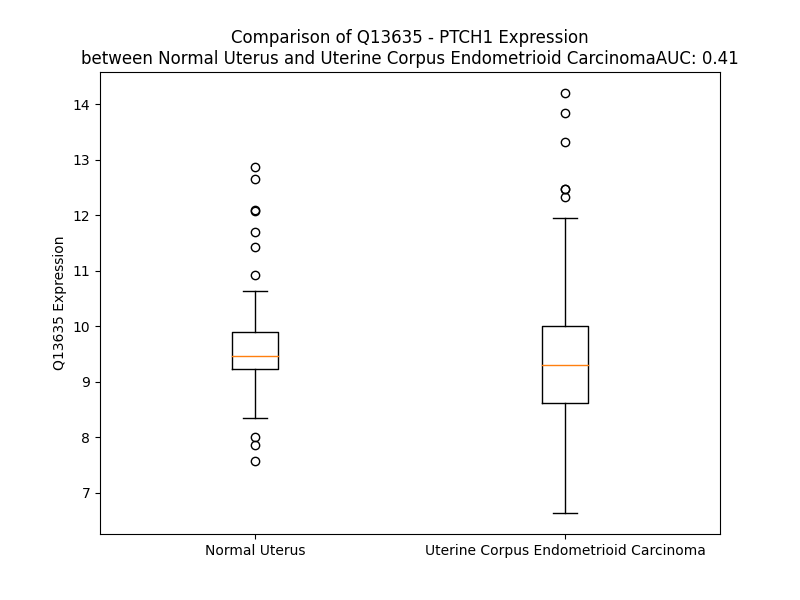

# Detailed Data for Q13635

## Introduction to the Detailed Summary

### How to Interpret the Results

- **Summary & Metrics**: This section provides a quick reference to essential protein attributes, including expression changes, family classification, and biomarker applications. Regulation status (upregulated/downregulated) indicates the protein's behavior in a disease context. Some information comes from the original excel file with the proteins selected from literature, while others are derived from the analyses.
- **Expression Comparison**: A visual representation comparing protein expression between normal and disease states. It highlights significant changes in expression levels that might indicate diagnostic or therapeutic relevance. This is data coming from transcriptomics experiments and could not translate similarly to protein levels.
- **Isoform Alignment**: An interactive view of isoform alignments, revealing structural and functional differences between variants of the protein.
- **Interactors & Homologs**: Tables listing known interaction partners and homologous proteins, the more interactors and homologs, the more complex the protein is to design an antibody for.
- **Biological Assemblies**: Information about the structural arrangement of the protein in different assemblies, providing insights into its functional state but also the complexity of the protein to develop antibodies.
- **Combined Per-Residue Information**: A detailed table summarizing residue-level data. This includes predictions for epitope regions, aggregation tendencies, and modifications that might impact the protein's function. Each row corresponds to a residue in the protein, providing insights into specific sites that may be important for research or drug development.
## Summary & Metrics

- **UniProt Accession**: Q13635
- **Gene Name**: PTCH1
- **Protein Name**: Protein patched homolog 1
- **Swiss Prot**: PTC1_HUMAN
- **Family**: transmembrane receptor
- **Biomarker Application**: efficacy
- **Number of Isoforms**: 4
- **Regulation**: -1
- **(transcriptomics) AUC**: 0.32
- **(transcriptomics) Fold Change**: 1.07
- **(transcriptomics) Regulation**: Downregulated
- **Discotope Epitope Count**: 303
- **Max n_uniprots (Homo)**: 5
- **Max n_uniprots (Hetero)**: 10

## Expression Comparison

## Isoform Alignment

<pre style='font-size:14px; font-family:monospace;'>Q13635-1 ---------MASAGNAAEPQDRGGGGSG---CIGAPGRPAGGGRRRRT-GGLRRAAAPDRDYLHRPSYCDAAFALEQISKGKATGRKAPLWLRAKFQRLLFKLGCYIQKNCGKFLVVGLLIFGAFAVGLKAANLETNVEELWVEVGGRVSRELNYTRQKIGEEAMFNPQLMIQTPKEEGANVLTTEALLQHLDSALQASRVHVYMYNRQWKLEHLCYKSGELITETGYMDQIIEYLYPCLIITPLDCFWEGAKLQSGTAYLLGKPPLRWTNFDPLEFLEELKKINYQVDSWEEMLNKAEVGHGYMDRPCLNPADPDCPATAPNKNSTKPLDMALVLNGGCHGLSRKYMHWQEELIVGGTVKNSTGKLVSAHALQTMFQLMTPKQMYEHFKGYEYVSHINWNEDKAAAILEAWQRTYVEVVHQSVAQNSTQKVLSFTTTTLDDILKSFSDVSVIRVASGYLLMLAYACLTMLRWDCSKSQGAVGLAGVLLVALSVAAGLGLCSLIGISFNAATTQVLPFLALGVGVDDVFLLAHAFSETGQNKRIPFEDRTGECLKRTGASVALTSISNVTAFFMAALIPIPALRAFSLQAAVVVVFNFAMVLLIFPAILSMDLYRREDRRLDIFCCFTSPCVSRVIQVEPQAYTDTHDNTRYSPPPPYSSHSFAHETQITMQSTVQLRTEYDPHTHVYYTTAEPRSEISVQPVTVTQDTLSCQSPESTSSTRDLLSQFSDSSLHCLEPPCTKWTLSSFAEKHYAPFLLKPKAKVVVIFLFLGLLGVSLYGTTRVRDGLDLTDIVPRETREYDFIAAQFKYFSFYNMYIVTQKADYPNIQHLLYDLHRSFSNVKYVMLEENKQLPKMWLHYFRDWLQGLQDAFDSDWETGKIMPNNYKNGSDDGVLAYKLLVQTGSRDKPIDISQLTKQRLVDADGIINPSAFYIYLTAWVSNDPVAYAASQANIRPHRPEWVHDKADYMPETRLRIPAAEPIEYAQFPFYLNGLRDTSDFVEAIEKVRTICSNYTSLGLSSYPNGYPFLFWEQYIGLRHWLLLFISVVLACTFLVCAVFLLNPWTAGIIVMVLALMTVELFGMMGLIGIKLSAVPVVILIASVGIGVEFTVHVALAFLTAIGDKNRRAVLALEHMFAPVLDGAVSTLLGVLMLAGSEFDFIVRYFFAVLAILTILGVLNGLVLLPVLLSFFGPYPEVSPANGLNRLPTPSPEPPPSVVRFAMPPGHTHSGSDSSDSEYSSQTTVSGLSEELRHYEAQQGAGGPAHQVIVEATENPVFAHSTVVHPESRHHPPSNPRQQPHLDSGSLPPGRQGQQPRRDPPREGLWPPPYRPRRDAFEISTEGHSGPSNRARWGPRGARSHNPRNPASTAMGSSVPGYCQPITTVTASASVTVAVHPPPVPGPGRNPRGGLCPGYPETDHGLFEDPHVPFHVRCERRDSKVEVIELQDVECEERPRGSSSN
Q13635-2 MELLNRNRLVIVSPRCTPPKASGGPARRGFYTFRSFCKDGGGGEEEEENGGEEKD--------------DRGDKETRSDKGKATGRKAPLWLRAKFQRLLFKLGCYIQKNCGKFLVVGLLIFGAFAVGLKAANLETNVEELWVEVGGRVSRELNYTRQKIGEEAMFNPQLMIQTPKEEGANVLTTEALLQHLDSALQASRVHVYMYNRQWKLEHLCYKSGELITETGYMDQIIEYLYPCLIITPLDCFWEGAKLQSGTAYLLGKPPLRWTNFDPLEFLEELKKINYQVDSWEEMLNKAEVGHGYMDRPCLNPADPDCPATAPNKNSTKPLDMALVLNGGCHGLSRKYMHWQEELIVGGTVKNSTGKLVSAHALQTMFQLMTPKQMYEHFKGYEYVSHINWNEDKAAAILEAWQRTYVEVVHQSVAQNSTQKVLSFTTTTLDDILKSFSDVSVIRVASGYLLMLAYACLTMLRWDCSKSQGAVGLAGVLLVALSVAAGLGLCSLIGISFNAATTQVLPFLALGVGVDDVFLLAHAFSETGQNKRIPFEDRTGECLKRTGASVALTSISNVTAFFMAALIPIPALRAFSLQAAVVVVFNFAMVLLIFPAILSMDLYRREDRRLDIFCCFTSPCVSRVIQVEPQAYTDTHDNTRYSPPPPYSSHSFAHETQITMQSTVQLRTEYDPHTHVYYTTAEPRSEISVQPVTVTQDTLSCQSPESTSSTRDLLSQFSDSSLHCLEPPCTKWTLSSFAEKHYAPFLLKPKAKVVVIFLFLGLLGVSLYGTTRVRDGLDLTDIVPRETREYDFIAAQFKYFSFYNMYIVTQKADYPNIQHLLYDLHRSFSNVKYVMLEENKQLPKMWLHYFRDWLQGLQDAFDSDWETGKIMPNNYKNGSDDGVLAYKLLVQTGSRDKPIDISQLTKQRLVDADGIINPSAFYIYLTAWVSNDPVAYAASQANIRPHRPEWVHDKADYMPETRLRIPAAEPIEYAQFPFYLNGLRDTSDFVEAIEKVRTICSNYTSLGLSSYPNGYPFLFWEQYIGLRHWLLLFISVVLACTFLVCAVFLLNPWTAGIIVMVLALMTVELFGMMGLIGIKLSAVPVVILIASVGIGVEFTVHVALAFLTAIGDKNRRAVLALEHMFAPVLDGAVSTLLGVLMLAGSEFDFIVRYFFAVLAILTILGVLNGLVLLPVLLSFFGPYPEVSPANGLNRLPTPSPEPPPSVVRFAMPPGHTHSGSDSSDSEYSSQTTVSGLSEELRHYEAQQGAGGPAHQVIVEATENPVFAHSTVVHPESRHHPPSNPRQQPHLDSGSLPPGRQGQQPRRDPPREGLWPPPYRPRRDAFEISTEGHSGPSNRARWGPRGARSHNPRNPASTAMGSSVPGYCQPITTVTASASVTVAVHPPPVPGPGRNPRGGLCPGYPETDHGLFEDPHVPFHVRCERRDSKVEVIELQDVECEERPRGSSSN
Q13635-3 -------------------------------------------------------------------------------MGKATGRKAPLWLRAKFQRLLFKLGCYIQKNCGKFLVVGLLIFGAFAVGLKAANLETNVEELWVEVGGRVSRELNYTRQKIGEEAMFNPQLMIQTPKEEGANVLTTEALLQHLDSALQASRVHVYMYNRQWKLEHLCYKSGELITETGYMDQIIEYLYPCLIITPLDCFWEGAKLQSGTAYLLGKPPLRWTNFDPLEFLEELKKINYQVDSWEEMLNKAEVGHGYMDRPCLNPADPDCPATAPNKNSTKPLDMALVLNGGCHGLSRKYMHWQEELIVGGTVKNSTGKLVSAHALQTMFQLMTPKQMYEHFKGYEYVSHINWNEDKAAAILEAWQRTYVEVVHQSVAQNSTQKVLSFTTTTLDDILKSFSDVSVIRVASGYLLMLAYACLTMLRWDCSKSQGAVGLAGVLLVALSVAAGLGLCSLIGISFNAATTQVLPFLALGVGVDDVFLLAHAFSETGQNKRIPFEDRTGECLKRTGASVALTSISNVTAFFMAALIPIPALRAFSLQAAVVVVFNFAMVLLIFPAILSMDLYRREDRRLDIFCCFTSPCVSRVIQVEPQAYTDTHDNTRYSPPPPYSSHSFAHETQITMQSTVQLRTEYDPHTHVYYTTAEPRSEISVQPVTVTQDTLSCQSPESTSSTRDLLSQFSDSSLHCLEPPCTKWTLSSFAEKHYAPFLLKPKAKVVVIFLFLGLLGVSLYGTTRVRDGLDLTDIVPRETREYDFIAAQFKYFSFYNMYIVTQKADYPNIQHLLYDLHRSFSNVKYVMLEENKQLPKMWLHYFRDWLQGLQDAFDSDWETGKIMPNNYKNGSDDGVLAYKLLVQTGSRDKPIDISQLTKQRLVDADGIINPSAFYIYLTAWVSNDPVAYAASQANIRPHRPEWVHDKADYMPETRLRIPAAEPIEYAQFPFYLNGLRDTSDFVEAIEKVRTICSNYTSLGLSSYPNGYPFLFWEQYIGLRHWLLLFISVVLACTFLVCAVFLLNPWTAGIIVMVLALMTVELFGMMGLIGIKLSAVPVVILIASVGIGVEFTVHVALAFLTAIGDKNRRAVLALEHMFAPVLDGAVSTLLGVLMLAGSEFDFIVRYFFAVLAILTILGVLNGLVLLPVLLSFFGPYPEVSPANGLNRLPTPSPEPPPSVVRFAMPPGHTHSGSDSSDSEYSSQTTVSGLSEELRHYEAQQGAGGPAHQVIVEATENPVFAHSTVVHPESRHHPPSNPRQQPHLDSGSLPPGRQGQQPRRDPPREGLWPPPYRPRRDAFEISTEGHSGPSNRARWGPRGARSHNPRNPASTAMGSSVPGYCQPITTVTASASVTVAVHPPPVPGPGRNPRGGLCPGYPETDHGLFEDPHVPFHVRCERRDSKVEVIELQDVECEERPRGSSSN
Q13635-4 --------------------------------------------------------------------------------------------------------------------------------------------------------------------MFNPQLMIQTPKEEGANVLTTEALLQHLDSALQASRVHVYMYNRQWKLEHLCYKSGELITETGYMDQIIEYLYPCLIITPLDCFWEGAKLQSGTAYLLGKPPLRWTNFDPLEFLEELKKINYQVDSWEEMLNKAEVGHGYMDRPCLNPADPDCPATAPNKNSTKPLDMALVLNGGCHGLSRKYMHWQEELIVGGTVKNSTGKLVSAHALQTMFQLMTPKQMYEHFKGYEYVSHINWNEDKAAAILEAWQRTYVEVVHQSVAQNSTQKVLSFTTTTLDDILKSFSDVSVIRVASGYLLMLAYACLTMLRWDCSKSQGAVGLAGVLLVALSVAAGLGLCSLIGISFNAATTQVLPFLALGVGVDDVFLLAHAFSETGQNKRIPFEDRTGECLKRTGASVALTSISNVTAFFMAALIPIPALRAFSLQAAVVVVFNFAMVLLIFPAILSMDLYRREDRRLDIFCCFTSPCVSRVIQVEPQAYTDTHDNTRYSPPPPYSSHSFAHETQITMQSTVQLRTEYDPHTHVYYTTAEPRSEISVQPVTVTQDTLSCQSPESTSSTRDLLSQFSDSSLHCLEPPCTKWTLSSFAEKHYAPFLLKPKAKVVVIFLFLGLLGVSLYGTTRVRDGLDLTDIVPRETREYDFIAAQFKYFSFYNMYIVTQKADYPNIQHLLYDLHRSFSNVKYVMLEENKQLPKMWLHYFRDWLQGLQDAFDSDWETGKIMPNNYKNGSDDGVLAYKLLVQTGSRDKPIDISQLTKQRLVDADGIINPSAFYIYLTAWVSNDPVAYAASQANIRPHRPEWVHDKADYMPETRLRIPAAEPIEYAQFPFYLNGLRDTSDFVEAIEKVRTICSNYTSLGLSSYPNGYPFLFWEQYIGLRHWLLLFISVVLACTFLVCAVFLLNPWTAGIIVMVLALMTVELFGMMGLIGIKLSAVPVVILIASVGIGVEFTVHVALAFLTAIGDKNRRAVLALEHMFAPVLDGAVSTLLGVLMLAGSEFDFIVRYFFAVLAILTILGVLNGLVLLPVLLSFFGPYPEVSPANGLNRLPTPSPEPPPSVVRFAMPPGHTHSGSDSSDSEYSSQTTVSGLSEELRHYEAQQGAGGPAHQVIVEATENPVFAHSTVVHPESRHHPPSNPRQQPHLDSGSLPPGRQGQQPRRDPPREGLWPPPYRPRRDAFEISTEGHSGPSNRARWGPRGARSHNPRNPASTAMGSSVPGYCQPITTVTASASVTVAVHPPPVPGPGRNPRGGLCPGYPETDHGLFEDPHVPFHVRCERRDSKVEVIELQDVECEERPRGSSSN
</pre>

## Interactors

| preferredName_A   | preferredName_B   |   score |
|:------------------|:------------------|--------:|
| PTCH1             | DHH               |   0.999 |
| PTCH1             | IHH               |   0.999 |
| PTCH1             | SHH               |   0.999 |
| PTCH1             | SMO               |   0.999 |
| PTCH1             | GAS1              |   0.998 |
| PTCH1             | CDON              |   0.998 |
| PTCH1             | BOC               |   0.993 |
| PTCH1             | GLI3              |   0.989 |
| PTCH1             | SUFU              |   0.979 |
| PTCH1             | GLI1              |   0.978 |
| PTCH1             | GLI2              |   0.972 |
| PTCH1             | HHIP              |   0.969 |
| PTCH1             | CCNB1             |   0.964 |
| PTCH1             | SMURF2            |   0.951 |
| PTCH1             | SMURF1            |   0.95  |
| PTCH1             | LRP2              |   0.932 |
| PTCH1             | PTCH2             |   0.928 |
| PTCH1             | RET               |   0.915 |
| PTCH1             | NCOA4             |   0.901 |

## Homologs

| uniprot_id   | gene_id   |
|:-------------|:----------|
| Q9UJD7       | DISP3     |
| nan          | nan       |
| A7MBM2       | DISP2     |
| Q96F81       | DISP1     |
| X5DNX9       | PTCHD1    |
| F8W921       | SCAP      |
| H0Y3Q6       | PTCHD4    |
| Q9UHC9       | NPC1L1    |
| O15118       | NPC1      |
| Q9Y6C5       | PTCH2     |

## Biological Assemblies

|   Unnamed: 0 |   assembly |   n_uniprots | composition   | crystal_id   |
|-------------:|-----------:|-------------:|:--------------|:-------------|
|            0 |          1 |           10 | Hetero        | 6n7k         |
|            0 |          1 |            3 | Hetero        | 6rmg         |
|            0 |          1 |            2 | Homo          | 6rty         |
|            0 |          1 |           10 | Hetero        | 6n7g         |
|            0 |          1 |            2 | Homo          | 6dmb         |
|            0 |          1 |            4 | Hetero        | 6oev         |
|            0 |          1 |            1 | Homo          | 6rtx         |
|            0 |          1 |            2 | Homo          | 6dmo         |
|            0 |          1 |            3 | Hetero        | 6e1h         |
|            0 |          1 |            2 | Homo          | 6rtw         |
|            0 |          1 |            3 | Hetero        | 6dmy         |
|            0 |          1 |            2 | Homo          | 6rvc         |
|            1 |          2 |            2 | Homo          | 6rvc         |
|            2 |          3 |            2 | Homo          | 6rvc         |
|            0 |          1 |            5 | Hetero        | 6n7h         |
|            0 |          1 |            5 | Homo          | 6oeu         |
|            0 |          1 |            4 | Hetero        | 6rvd         |

## Combined Per-Residue Information

|   res | aa   |   epitope_score | epitope   |   relative_surface_accessibility |   modeling_confidence |   Aggregation | modification     | glycosylation                   |
|------:|:-----|----------------:|:----------|---------------------------------:|----------------------:|--------------:|:-----------------|:--------------------------------|
|     1 | M    |         0.07524 | False     |                          1.36805 |                 36.23 |         0     | N/A              | N/A                             |
|     2 | A    |         0.1078  | True      |                          0.91607 |                 29.53 |         0     | N/A              | N/A                             |
|     3 | S    |         0.07953 | False     |                          0.82277 |                 32.3  |         0     | N/A              | N/A                             |
|     4 | A    |         0.11263 | True      |                          1.01404 |                 33.25 |         0     | N/A              | N/A                             |
|     5 | G    |         0.07229 | False     |                          0.98525 |                 35.58 |         0     | N/A              | N/A                             |
|     6 | N    |         0.04062 | False     |                          0.99154 |                 32.26 |         0     | N/A              | N/A                             |
|     7 | A    |         0.10442 | True      |                          0.92772 |                 32.14 |         0     | N/A              | N/A                             |
|     8 | A    |         0.09648 | True      |                          0.97006 |                 33.01 |         0     | N/A              | N/A                             |
|     9 | E    |         0.09162 | True      |                          0.85029 |                 32.19 |         0     | N/A              | N/A                             |
|    10 | P    |         0.07792 | False     |                          0.77515 |                 39.42 |         0     | N/A              | N/A                             |
|    11 | Q    |         0.11504 | True      |                          0.81972 |                 33.72 |         0     | N/A              | N/A                             |
|    12 | D    |         0.09555 | True      |                          0.60164 |                 33.74 |         0     | N/A              | N/A                             |
|    13 | R    |         0.07948 | False     |                          0.87405 |                 34.01 |         0     | N/A              | N/A                             |
|    14 | G    |         0.0556  | False     |                          1.034   |                 33.41 |         0     | N/A              | N/A                             |
|    15 | G    |         0.09686 | True      |                          0.99454 |                 33.74 |         0     | N/A              | N/A                             |
|    16 | G    |         0.06528 | False     |                          1.06802 |                 33.94 |         0     | N/A              | N/A                             |
|    17 | G    |         0.10753 | True      |                          0.91224 |                 33.72 |         0     | N/A              | N/A                             |
|    18 | S    |         0.08615 | False     |                          1.01014 |                 34.52 |         0     | N/A              | N/A                             |
|    19 | G    |         0.08539 | False     |                          0.70918 |                 34.54 |         0     | N/A              | N/A                             |
|    20 | C    |         0.11493 | True      |                          0.94553 |                 31.62 |         0     | N/A              | N/A                             |
|    21 | I    |         0.10793 | True      |                          1.10818 |                 37.29 |         0     | N/A              | N/A                             |
|    22 | G    |         0.07909 | False     |                          0.85593 |                 36.37 |         0     | N/A              | N/A                             |
|    23 | A    |         0.12594 | True      |                          0.92369 |                 37.74 |         0     | N/A              | N/A                             |
|    24 | P    |         0.10095 | True      |                          1.01878 |                 41.39 |         0     | N/A              | N/A                             |
|    25 | G    |         0.10538 | True      |                          0.81393 |                 38.39 |         0     | N/A              | N/A                             |
|    26 | R    |         0.15677 | True      |                          0.96544 |                 37.87 |         0     | N/A              | N/A                             |
|    27 | P    |         0.1575  | True      |                          0.91496 |                 39.41 |         0     | N/A              | N/A                             |
|    28 | A    |         0.08161 | False     |                          1.0001  |                 35.33 |         0     | N/A              | N/A                             |
|    29 | G    |         0.1025  | True      |                          0.94739 |                 35.08 |         0     | N/A              | N/A                             |
|    30 | G    |         0.14784 | True      |                          1.05057 |                 31.16 |         0     | N/A              | N/A                             |
|    31 | G    |         0.07925 | False     |                          0.86616 |                 30.44 |         0     | N/A              | N/A                             |
|    32 | R    |         0.14003 | True      |                          0.99279 |                 33.82 |         0     | N/A              | N/A                             |
|    33 | R    |         0.19362 | True      |                          0.9066  |                 30.5  |         0     | N/A              | N/A                             |
|    34 | R    |         0.17439 | True      |                          0.93475 |                 28.06 |         0     | N/A              | N/A                             |
|    35 | R    |         0.11018 | True      |                          0.92826 |                 32.09 |         0     | N/A              | N/A                             |
|    36 | T    |         0.16789 | True      |                          0.99105 |                 28.94 |         0     | N/A              | N/A                             |
|    37 | G    |         0.09716 | True      |                          0.9885  |                 26.34 |         0     | N/A              | N/A                             |
|    38 | G    |         0.1045  | True      |                          0.83031 |                 29.21 |         0     | N/A              | N/A                             |
|    39 | L    |         0.07527 | False     |                          1.11457 |                 28.56 |         0     | N/A              | N/A                             |
|    40 | R    |         0.11022 | True      |                          0.94579 |                 29.03 |         0     | N/A              | N/A                             |
|    41 | R    |         0.13326 | True      |                          0.92712 |                 30.15 |         0     | N/A              | N/A                             |
|    42 | A    |         0.05389 | False     |                          0.78855 |                 31.66 |         0     | N/A              | N/A                             |
|    43 | A    |         0.06528 | False     |                          0.80862 |                 32.94 |         0     | N/A              | N/A                             |
|    44 | A    |         0.0477  | False     |                          0.66383 |                 38.26 |         0     | N/A              | N/A                             |
|    45 | P    |         0.06873 | False     |                          0.33056 |                 47.61 |         0     | N/A              | N/A                             |
|    46 | D    |         0.04149 | False     |                          0.17213 |                 57.28 |         0     | N/A              | N/A                             |
|    47 | R    |         0.13991 | True      |                          0.68202 |                 63.84 |         0     | N/A              | N/A                             |
|    48 | D    |         0.03483 | False     |                          0.26567 |                 68.45 |         0     | N/A              | N/A                             |
|    49 | Y    |         0.04125 | False     |                          0.2462  |                 71.33 |         0     | N/A              | N/A                             |
|    50 | L    |         0.0254  | False     |                          0.01484 |                 68.75 |         0     | N/A              | N/A                             |
|    51 | H    |         0.05138 | False     |                          0.20136 |                 75.56 |         0     | N/A              | N/A                             |
|    52 | R    |         0.04016 | False     |                          0.07512 |                 80.83 |         0     | N/A              | N/A                             |
|    53 | P    |         0.00581 | False     |                          0.00099 |                 82.3  |         0     | N/A              | N/A                             |
|    54 | S    |         0.0019  | False     |                          0.0052  |                 82.88 |         0     | N/A              | N/A                             |
|    55 | Y    |         0.01702 | False     |                          0.06447 |                 84.5  |         0     | N/A              | N/A                             |
|    56 | C    |         0.02267 | False     |                          0.00935 |                 82.16 |         0     | N/A              | N/A                             |
|    57 | D    |         0.03647 | False     |                          0.16311 |                 85.25 |         0     | N/A              | N/A                             |
|    58 | A    |         0.00129 | False     |                          0       |                 87.13 |         0.307 | N/A              | N/A                             |
|    59 | A    |         0.0432  | False     |                          0.53203 |                 89.02 |         0.307 | N/A              | N/A                             |
|    60 | F    |         0.037   | False     |                          0.21798 |                 87.12 |         0.307 | N/A              | N/A                             |
|    61 | A    |         0.00209 | False     |                          0       |                 85.73 |         0.307 | N/A              | N/A                             |
|    62 | L    |         0.01577 | False     |                          0.30394 |                 88.05 |         0.307 | N/A              | N/A                             |
|    63 | E    |         0.04141 | False     |                          0.33176 |                 87.22 |         0     | N/A              | N/A                             |
|    64 | Q    |         0.03016 | False     |                          0.07907 |                 86.09 |         0     | N/A              | N/A                             |
|    65 | I    |         0.01663 | False     |                          0.1032  |                 85.86 |         0     | N/A              | N/A                             |
|    66 | S    |         0.06023 | False     |                          0.61156 |                 87.09 |         0     | N/A              | N/A                             |
|    67 | K    |         0.08829 | False     |                          0.54504 |                 85.76 |         0     | N/A              | N/A                             |
|    68 | G    |         0.0471  | False     |                          0.61257 |                 81.75 |         0     | N/A              | N/A                             |
|    69 | K    |         0.0314  | False     |                          0.41548 |                 80.32 |         0     | N/A              | N/A                             |
|    70 | A    |         0.01267 | False     |                          0.0264  |                 82.73 |         0     | N/A              | N/A                             |
|    71 | T    |         0.07444 | False     |                          0.58544 |                 84.87 |         0     | N/A              | N/A                             |
|    72 | G    |         0.02029 | False     |                          0.41925 |                 83.12 |         0     | N/A              | N/A                             |
|    73 | R    |         0.04489 | False     |                          0.66558 |                 84.03 |         0     | N/A              | N/A                             |
|    74 | K    |         0.07632 | False     |                          0.60733 |                 86.64 |         0     | N/A              | N/A                             |
|    75 | A    |         0.03442 | False     |                          0.70013 |                 86.52 |         0     | N/A              | N/A                             |
|    76 | P    |         0.02211 | False     |                          0.15167 |                 86.25 |         0     | N/A              | N/A                             |
|    77 | L    |         0.00077 | False     |                          0       |                 86.23 |         0     | N/A              | N/A                             |
|    78 | W    |         0.04587 | False     |                          0.63271 |                 90.05 |         0     | N/A              | N/A                             |
|    79 | L    |         0.04665 | False     |                          0.46052 |                 88.87 |         0     | N/A              | N/A                             |
|    80 | R    |         0.01668 | False     |                          0.07496 |                 89.68 |         0     | N/A              | N/A                             |
|    81 | A    |         0.01852 | False     |                          0.1533  |                 90.27 |         0     | N/A              | N/A                             |
|    82 | K    |         0.05509 | False     |                          0.55817 |                 91.62 |         0     | N/A              | N/A                             |
|    83 | F    |         0.02429 | False     |                          0.36517 |                 89.5  |         0     | N/A              | N/A                             |
|    84 | Q    |         0.02107 | False     |                          0.03713 |                 91.6  |         0     | N/A              | N/A                             |
|    85 | R    |         0.06703 | False     |                          0.76764 |                 92.83 |         0     | N/A              | N/A                             |
|    86 | L    |         0.07632 | False     |                          0.67996 |                 93.45 |         0     | N/A              | N/A                             |
|    87 | L    |         0.01288 | False     |                          0.07584 |                 93.12 |         0     | N/A              | N/A                             |
|    88 | F    |         0.03083 | False     |                          0.31491 |                 93.14 |         0     | N/A              | N/A                             |
|    89 | K    |         0.03589 | False     |                          0.74684 |                 93.66 |         0     | N/A              | N/A                             |
|    90 | L    |         0.03577 | False     |                          0.30019 |                 93.25 |         0     | N/A              | N/A                             |
|    91 | G    |         0.0019  | False     |                          0       |                 92.49 |         0     | N/A              | N/A                             |
|    92 | C    |         0.02338 | False     |                          0.12066 |                 92.24 |         0     | N/A              | N/A                             |
|    93 | Y    |         0.05851 | False     |                          0.59077 |                 93.45 |         0     | N/A              | N/A                             |
|    94 | I    |         0.00429 | False     |                          0       |                 93.32 |         0     | N/A              | N/A                             |
|    95 | Q    |         0.01567 | False     |                          0.01425 |                 90.69 |         0     | N/A              | N/A                             |
|    96 | K    |         0.08945 | False     |                          0.64835 |                 91.08 |         0     | N/A              | N/A                             |
|    97 | N    |         0.04948 | False     |                          0.26376 |                 92.7  |         0     | N/A              | N/A                             |
|    98 | C    |         0.05414 | False     |                          0.13698 |                 90.79 |         0     | N/A              | N/A                             |
|    99 | G    |         0.06922 | False     |                          0.38893 |                 90.26 |         0     | N/A              | N/A                             |
|   100 | K    |         0.09405 | True      |                          0.75586 |                 92.56 |         0     | N/A              | N/A                             |
|   101 | F    |         0.02193 | False     |                          0.28004 |                 90.9  |        88.497 | N/A              | N/A                             |
|   102 | L    |         0.03044 | False     |                          0.09233 |                 92.96 |        95.715 | N/A              | N/A                             |
|   103 | V    |         0.0673  | False     |                          0.61168 |                 94.36 |        99.332 | N/A              | N/A                             |
|   104 | V    |         0.05996 | False     |                          0.5986  |                 94.86 |        99.639 | N/A              | N/A                             |
|   105 | G    |         0.01707 | False     |                          0.08117 |                 93.72 |        99.665 | N/A              | N/A                             |
|   106 | L    |         0.04581 | False     |                          0.40997 |                 94.54 |        99.932 | N/A              | N/A                             |
|   107 | L    |         0.08869 | False     |                          0.74903 |                 95.39 |        99.971 | N/A              | N/A                             |
|   108 | I    |         0.08434 | False     |                          0.52057 |                 95.7  |        99.928 | N/A              | N/A                             |
|   109 | F    |         0.0253  | False     |                          0.12005 |                 95.46 |        99.357 | N/A              | N/A                             |
|   110 | G    |         0.03743 | False     |                          0.28108 |                 95.09 |        92.352 | N/A              | N/A                             |
|   111 | A    |         0.05336 | False     |                          0.63969 |                 95.71 |        91.72  | N/A              | N/A                             |
|   112 | F    |         0.04797 | False     |                          0.3549  |                 96.6  |        91.186 | N/A              | N/A                             |
|   113 | A    |         0.01299 | False     |                          0.18155 |                 95.92 |        84.629 | N/A              | N/A                             |
|   114 | V    |         0.06601 | False     |                          0.66386 |                 95.58 |        79.086 | N/A              | N/A                             |
|   115 | G    |         0.01712 | False     |                          0.06977 |                 93.72 |        13.86  | N/A              | N/A                             |
|   116 | L    |         0.03704 | False     |                          0.40744 |                 92.59 |        11.715 | N/A              | N/A                             |
|   117 | K    |         0.09715 | True      |                          0.91736 |                 93.48 |         0     | N/A              | N/A                             |
|   118 | A    |         0.06676 | False     |                          0.54978 |                 91.98 |         0     | N/A              | N/A                             |
|   119 | A    |         0.02792 | False     |                          0.46399 |                 88.89 |         0     | N/A              | N/A                             |
|   120 | N    |         0.03411 | False     |                          0.48471 |                 89.23 |         0     | N/A              | N/A                             |
|   121 | L    |         0.02931 | False     |                          0.50905 |                 86.93 |         0     | N/A              | N/A                             |
|   122 | E    |         0.03617 | False     |                          0.26478 |                 84.84 |         0     | N/A              | N/A                             |
|   123 | T    |         0.03545 | False     |                          0.26214 |                 79.48 |         0     | N/A              | N/A                             |
|   124 | N    |         0.0353  | False     |                          0.10379 |                 77.47 |         0     | N/A              | N/A                             |
|   125 | V    |         0.01201 | False     |                          0.03142 |                 75.73 |         0     | N/A              | N/A                             |
|   126 | E    |         0.03297 | False     |                          0.0511  |                 74.45 |         0     | N/A              | N/A                             |
|   127 | E    |         0.03927 | False     |                          0.43688 |                 81.11 |         0     | N/A              | N/A                             |
|   128 | L    |         0.02494 | False     |                          0.11623 |                 81.48 |         0     | N/A              | N/A                             |
|   129 | W    |         0.02422 | False     |                          0.13718 |                 82.33 |         0     | N/A              | N/A                             |
|   130 | V    |         0.01183 | False     |                          0.0445  |                 81.6  |         0     | N/A              | N/A                             |
|   131 | E    |         0.01691 | False     |                          0.34806 |                 81.14 |         0     | N/A              | N/A                             |
|   132 | V    |         0.02812 | False     |                          0.63868 |                 79.55 |         0     | N/A              | N/A                             |
|   133 | G    |         0.04494 | False     |                          0.78976 |                 79.9  |         0     | N/A              | N/A                             |
|   134 | G    |         0.01765 | False     |                          0.16665 |                 82.31 |         0     | N/A              | N/A                             |
|   135 | R    |         0.03768 | False     |                          0.4474  |                 90.16 |         0     | N/A              | N/A                             |
|   136 | V    |         0.00865 | False     |                          0.02475 |                 88.92 |         0     | N/A              | N/A                             |
|   137 | S    |         0.02001 | False     |                          0.23079 |                 88.74 |         0     | N/A              | N/A                             |
|   138 | R    |         0.04942 | False     |                          0.66955 |                 92.01 |         0     | N/A              | N/A                             |
|   139 | E    |         0.02252 | False     |                          0.13657 |                 92.43 |         0     | N/A              | N/A                             |
|   140 | L    |         0.03385 | False     |                          0.10942 |                 88.73 |         0     | N/A              | N/A                             |
|   141 | N    |         0.03474 | False     |                          0.64586 |                 91.3  |         0     | N/A              | N-linked (GlcNAc...) asparagine |
|   142 | Y    |         0.03898 | False     |                          0.20896 |                 92.43 |         0     | N/A              | N/A                             |
|   143 | T    |         0.00449 | False     |                          0.00362 |                 91.11 |         0     | N/A              | N/A                             |
|   144 | R    |         0.02499 | False     |                          0.17293 |                 89.67 |         0     | N/A              | N/A                             |
|   145 | Q    |         0.09429 | True      |                          0.65801 |                 90.98 |         0     | N/A              | N/A                             |
|   146 | K    |         0.0782  | False     |                          0.25432 |                 90.26 |         0     | N/A              | N/A                             |
|   147 | I    |         0.07659 | False     |                          0.13409 |                 85.62 |         0     | N/A              | N/A                             |
|   148 | G    |         0.0459  | False     |                          0.31937 |                 78.8  |         0     | N/A              | N/A                             |
|   149 | E    |         0.04493 | False     |                          0.03987 |                 76.45 |         0     | N/A              | N/A                             |
|   150 | E    |         0.05025 | False     |                          0.10157 |                 72.53 |         0     | N/A              | N/A                             |
|   151 | A    |         0.0744  | False     |                          0.23125 |                 75.1  |         0     | N/A              | N/A                             |
|   152 | M    |         0.03598 | False     |                          0.07385 |                 78.11 |         0     | N/A              | N/A                             |
|   153 | F    |         0.0384  | False     |                          0.10538 |                 85.9  |         0     | N/A              | N/A                             |
|   154 | N    |         0.00939 | False     |                          0.03303 |                 86.1  |         0     | N/A              | N/A                             |
|   155 | P    |         0.03133 | False     |                          0.14535 |                 90.75 |         0     | N/A              | N/A                             |
|   156 | Q    |         0.0023  | False     |                          0       |                 94.17 |         0     | N/A              | N/A                             |
|   157 | L    |         0.00808 | False     |                          0.0371  |                 92.97 |         0     | N/A              | N/A                             |
|   158 | M    |         0.00154 | False     |                          0       |                 95.15 |         0     | N/A              | N/A                             |
|   159 | I    |         0.00203 | False     |                          0       |                 95.19 |         0     | N/A              | N/A                             |
|   160 | Q    |         0.00216 | False     |                          0       |                 95.28 |         0     | N/A              | N/A                             |
|   161 | T    |         0.00914 | False     |                          0.03903 |                 94.07 |         0     | N/A              | N/A                             |
|   162 | P    |         0.03233 | False     |                          0.10416 |                 93.46 |         0     | N/A              | N/A                             |
|   163 | K    |         0.15272 | True      |                          0.52341 |                 88.67 |         0     | N/A              | N/A                             |
|   164 | E    |         0.06227 | False     |                          0.66904 |                 89.23 |         0     | N/A              | N/A                             |
|   165 | E    |         0.09942 | True      |                          0.74182 |                 85.15 |         0     | N/A              | N/A                             |
|   166 | G    |         0.05064 | False     |                          0.59104 |                 81.81 |         0     | N/A              | N/A                             |
|   167 | A    |         0.04303 | False     |                          0.33746 |                 90.5  |         0     | N/A              | N/A                             |
|   168 | N    |         0.09323 | True      |                          0.37754 |                 93.08 |         0     | N/A              | N/A                             |
|   169 | V    |         0.0018  | False     |                          0       |                 93.42 |         0     | N/A              | N/A                             |
|   170 | L    |         0.02344 | False     |                          0.08843 |                 93.07 |         0     | N/A              | N/A                             |
|   171 | T    |         0.03209 | False     |                          0.32374 |                 92.4  |         0     | N/A              | N/A                             |
|   172 | T    |         0.02659 | False     |                          0.40619 |                 91.31 |         0     | N/A              | N/A                             |
|   173 | E    |         0.06558 | False     |                          0.55533 |                 91    |         0     | N/A              | N/A                             |
|   174 | A    |         0.00281 | False     |                          0       |                 92.95 |         0     | N/A              | N/A                             |
|   175 | L    |         0.00176 | False     |                          0       |                 93.92 |         0     | N/A              | N/A                             |
|   176 | L    |         0.06559 | False     |                          0.42741 |                 93.39 |         0     | N/A              | N/A                             |
|   177 | Q    |         0.01764 | False     |                          0.12732 |                 93.07 |         0     | N/A              | N/A                             |
|   178 | H    |         0.00128 | False     |                          0       |                 95.13 |         0     | N/A              | N/A                             |
|   179 | L    |         0.01027 | False     |                          0.10634 |                 94.78 |         0     | N/A              | N/A                             |
|   180 | D    |         0.02093 | False     |                          0.36397 |                 94.58 |         0     | N/A              | N/A                             |
|   181 | S    |         0.00115 | False     |                          0       |                 95.15 |         0     | N/A              | N/A                             |
|   182 | A    |         0.00061 | False     |                          0       |                 95.78 |         0     | N/A              | N/A                             |
|   183 | L    |         0.0202  | False     |                          0.1591  |                 94.44 |         0     | N/A              | N/A                             |
|   184 | Q    |         0.02504 | False     |                          0.32144 |                 94.44 |         0     | N/A              | N/A                             |
|   185 | A    |         0.0011  | False     |                          0.00094 |                 94.58 |         0     | N/A              | N/A                             |
|   186 | S    |         0.0155  | False     |                          0.03759 |                 94.18 |         0     | N/A              | N/A                             |
|   187 | R    |         0.04859 | False     |                          0.63069 |                 94.38 |         0     | N/A              | N/A                             |
|   188 | V    |         0.01798 | False     |                          0.03523 |                 94.96 |         1.057 | N/A              | N/A                             |
|   189 | H    |         0.0541  | False     |                          0.53677 |                 94.77 |         1.057 | N/A              | N/A                             |
|   190 | V    |         0.03914 | False     |                          0.11234 |                 96.37 |         1.057 | N/A              | N/A                             |
|   191 | Y    |         0.05744 | False     |                          0.65257 |                 96.23 |         1.057 | N/A              | N/A                             |
|   192 | M    |         0.0642  | False     |                          0.33607 |                 94.33 |         1.057 | N/A              | N/A                             |
|   193 | Y    |         0.07564 | False     |                          0.34525 |                 93.98 |         0.811 | N/A              | N/A                             |
|   194 | N    |         0.05868 | False     |                          0.75395 |                 91.71 |         0     | N/A              | N/A                             |
|   195 | R    |         0.12082 | True      |                          0.26179 |                 92.56 |         0     | N/A              | N/A                             |
|   196 | Q    |         0.04585 | False     |                          0.44307 |                 94.18 |         0     | N/A              | N/A                             |
|   197 | W    |         0.01189 | False     |                          0.00995 |                 94.76 |         0     | N/A              | N/A                             |
|   198 | K    |         0.06042 | False     |                          0.39638 |                 94.04 |         0     | N/A              | N/A                             |
|   199 | L    |         0.00411 | False     |                          0.02061 |                 93.44 |         0     | N/A              | N/A                             |
|   200 | E    |         0.02939 | False     |                          0.23166 |                 90.29 |         0     | N/A              | N/A                             |
|   201 | H    |         0.04754 | False     |                          0.22645 |                 91.84 |         0     | N/A              | N/A                             |
|   202 | L    |         0.00132 | False     |                          0       |                 93.82 |         0     | N/A              | N/A                             |
|   203 | C    |         0.00736 | False     |                          0.01167 |                 92.93 |         0     | N/A              | N/A                             |
|   204 | Y    |         0.05356 | False     |                          0.17764 |                 89.24 |         0     | N/A              | N/A                             |
|   205 | K    |         0.04852 | False     |                          0.25147 |                 84.11 |         0     | N/A              | N/A                             |
|   206 | S    |         0.05963 | False     |                          0.18995 |                 73.32 |         0     | N/A              | N/A                             |
|   207 | G    |         0.09141 | True      |                          0.42941 |                 67.55 |         0     | N/A              | N/A                             |
|   208 | E    |         0.10517 | True      |                          0.48746 |                 69.34 |         0     | N/A              | N/A                             |
|   209 | L    |         0.08899 | False     |                          0.20904 |                 71.69 |         0     | N/A              | N/A                             |
|   210 | I    |         0.10139 | True      |                          0.66337 |                 70.41 |         0     | N/A              | N/A                             |
|   211 | T    |         0.1178  | True      |                          0.22425 |                 68.93 |         0     | N/A              | N/A                             |
|   212 | E    |         0.1301  | True      |                          0.87859 |                 66.9  |         0     | N/A              | N/A                             |
|   213 | T    |         0.1889  | True      |                          0.4597  |                 68.45 |         0     | N/A              | N/A                             |
|   214 | G    |         0.1756  | True      |                          0.52622 |                 72.89 |         0     | N/A              | N/A                             |
|   215 | Y    |         0.13498 | True      |                          0.35677 |                 77.66 |         0     | N/A              | N/A                             |
|   216 | M    |         0.0593  | False     |                          0.04226 |                 80.11 |         0     | N/A              | N/A                             |
|   217 | D    |         0.07526 | False     |                          0.29802 |                 80.42 |         0     | N/A              | N/A                             |
|   218 | Q    |         0.04799 | False     |                          0.53209 |                 81.86 |         0     | N/A              | N/A                             |
|   219 | I    |         0.0299  | False     |                          0.064   |                 84.85 |         0     | N/A              | N/A                             |
|   220 | I    |         0.07766 | False     |                          0.25279 |                 83.16 |         0     | N/A              | N/A                             |
|   221 | E    |         0.09434 | True      |                          0.48369 |                 81.96 |         0     | N/A              | N/A                             |
|   222 | Y    |         0.10046 | True      |                          0.48156 |                 85.31 |         0     | N/A              | N/A                             |
|   223 | L    |         0.00985 | False     |                          0.03425 |                 86.96 |         0     | N/A              | N/A                             |
|   224 | Y    |         0.02824 | False     |                          0.19593 |                 85.81 |         0     | N/A              | N/A                             |
|   225 | P    |         0.02387 | False     |                          0.23374 |                 85.71 |         0     | N/A              | N/A                             |
|   226 | C    |         0.01357 | False     |                          0.06503 |                 89.09 |         0     | N/A              | N/A                             |
|   227 | L    |         0.02328 | False     |                          0.12075 |                 88.52 |         0     | N/A              | N/A                             |
|   228 | I    |         0.00883 | False     |                          0.03772 |                 92.97 |         0     | N/A              | N/A                             |
|   229 | I    |         0.00928 | False     |                          0.03899 |                 93.43 |         0     | N/A              | N/A                             |
|   230 | T    |         0.01132 | False     |                          0.00571 |                 95.07 |         0     | N/A              | N/A                             |
|   231 | P    |         0.00126 | False     |                          0       |                 95.27 |         0     | N/A              | N/A                             |
|   232 | L    |         0.00092 | False     |                          0       |                 95.03 |         0     | N/A              | N/A                             |
|   233 | D    |         0.0104  | False     |                          0.04017 |                 94.28 |         0     | N/A              | N/A                             |
|   234 | C    |         0.00905 | False     |                          0.14119 |                 94.26 |         0     | N/A              | N/A                             |
|   235 | F    |         0.0028  | False     |                          0       |                 94.87 |         0     | N/A              | N/A                             |
|   236 | W    |         0.00467 | False     |                          0.00332 |                 94.95 |         0     | N/A              | N/A                             |
|   237 | E    |         0.01575 | False     |                          0.00327 |                 94.06 |         0     | N/A              | N/A                             |
|   238 | G    |         0.00363 | False     |                          0.01547 |                 92.52 |         0     | N/A              | N/A                             |
|   239 | A    |         0.00098 | False     |                          0.00283 |                 93.19 |         0     | N/A              | N/A                             |
|   240 | K    |         0.04471 | False     |                          0.22062 |                 92.2  |         0     | N/A              | N/A                             |
|   241 | L    |         0.00795 | False     |                          0.01416 |                 92.03 |         0     | N/A              | N/A                             |
|   242 | Q    |         0.02284 | False     |                          0.10551 |                 90.15 |         0     | N/A              | N/A                             |
|   243 | S    |         0.02103 | False     |                          0.36705 |                 80.03 |         0     | N/A              | N/A                             |
|   244 | G    |         0.02152 | False     |                          0.1777  |                 82.18 |         0     | N/A              | N/A                             |
|   245 | T    |         0.05835 | False     |                          0.17811 |                 87.77 |         1.126 | N/A              | N/A                             |
|   246 | A    |         0.02169 | False     |                          0.02551 |                 87.98 |         1.296 | N/A              | N/A                             |
|   247 | Y    |         0.14394 | True      |                          0.76957 |                 86.63 |         1.296 | N/A              | N/A                             |
|   248 | L    |         0.12965 | True      |                          0.31438 |                 84.15 |         1.296 | N/A              | N/A                             |
|   249 | L    |         0.20156 | True      |                          1.11933 |                 82.28 |         1.296 | N/A              | N/A                             |
|   250 | G    |         0.20669 | True      |                          1.01111 |                 80.73 |         0.171 | N/A              | N/A                             |
|   251 | K    |         0.16918 | True      |                          0.35587 |                 83.35 |         0     | N/A              | N/A                             |
|   252 | P    |         0.11352 | True      |                          0.65711 |                 86.93 |         0     | N/A              | N/A                             |
|   253 | P    |         0.11868 | True      |                          0.44216 |                 89.39 |         0     | N/A              | N/A                             |
|   254 | L    |         0.02165 | False     |                          0.04781 |                 90.2  |         0     | N/A              | N/A                             |
|   255 | R    |         0.08447 | False     |                          0.44134 |                 90.89 |         0     | N/A              | N/A                             |
|   256 | W    |         0.0165  | False     |                          0.08254 |                 91.92 |         0     | N/A              | N/A                             |
|   257 | T    |         0.01738 | False     |                          0.21318 |                 91.84 |         0     | N/A              | N/A                             |
|   258 | N    |         0.11062 | True      |                          0.49943 |                 91.08 |         0     | N/A              | N/A                             |
|   259 | F    |         0.04643 | False     |                          0.06855 |                 90.77 |         0     | N/A              | N/A                             |
|   260 | D    |         0.02443 | False     |                          0.15283 |                 92.31 |         0     | N/A              | N/A                             |
|   261 | P    |         0.03391 | False     |                          0.03626 |                 90.5  |         0     | N/A              | N/A                             |
|   262 | L    |         0.05155 | False     |                          0.24554 |                 90.12 |         0     | N/A              | N/A                             |
|   263 | E    |         0.13093 | True      |                          0.56317 |                 90.85 |         0     | N/A              | N/A                             |
|   264 | F    |         0.04899 | False     |                          0.05886 |                 89.65 |         0     | N/A              | N/A                             |
|   265 | L    |         0.07617 | False     |                          0.04122 |                 89.5  |         0     | N/A              | N/A                             |
|   266 | E    |         0.13767 | True      |                          0.3562  |                 91.35 |         0     | N/A              | N/A                             |
|   267 | E    |         0.13525 | True      |                          0.3209  |                 89.91 |         0     | N/A              | N/A                             |
|   268 | L    |         0.06971 | False     |                          0.09315 |                 87.74 |         0     | N/A              | N/A                             |
|   269 | K    |         0.1744  | True      |                          0.36785 |                 89.38 |         0     | N/A              | N/A                             |
|   270 | K    |         0.14015 | True      |                          0.69929 |                 90.9  |         0     | N/A              | N/A                             |
|   271 | I    |         0.17336 | True      |                          0.65222 |                 87.27 |         0     | N/A              | N/A                             |
|   272 | N    |         0.25041 | True      |                          0.86496 |                 84.11 |         0     | N/A              | N/A                             |
|   273 | Y    |         0.30003 | True      |                          0.50092 |                 83.11 |         0     | N/A              | N/A                             |
|   274 | Q    |         0.15688 | True      |                          0.87039 |                 78.05 |         0     | N/A              | N/A                             |
|   275 | V    |         0.01039 | False     |                          0.00463 |                 84.05 |         0     | N/A              | N/A                             |
|   276 | D    |         0.19199 | True      |                          0.60504 |                 81.91 |         0     | N/A              | N/A                             |
|   277 | S    |         0.12562 | True      |                          0.51032 |                 77.96 |         0     | N/A              | N/A                             |
|   278 | W    |         0.05327 | False     |                          0.15628 |                 81.54 |         0     | N/A              | N/A                             |
|   279 | E    |         0.09097 | False     |                          0.2075  |                 86.95 |         0     | N/A              | N/A                             |
|   280 | E    |         0.09512 | True      |                          0.39252 |                 82.75 |         0     | N/A              | N/A                             |
|   281 | M    |         0.07916 | False     |                          0.26837 |                 82.62 |         0     | N/A              | N/A                             |
|   282 | L    |         0.05798 | False     |                          0.16171 |                 86.7  |         0     | N/A              | N/A                             |
|   283 | N    |         0.16502 | True      |                          0.47404 |                 88.39 |         0     | N/A              | N/A                             |
|   284 | K    |         0.0865  | False     |                          0.41835 |                 84.2  |         0     | N/A              | N/A                             |
|   285 | A    |         0.0166  | False     |                          0.05466 |                 84.93 |         0     | N/A              | N/A                             |
|   286 | E    |         0.07167 | False     |                          0.43281 |                 90.1  |         0     | N/A              | N/A                             |
|   287 | V    |         0.06533 | False     |                          0.06578 |                 88.05 |         0     | N/A              | N/A                             |
|   288 | G    |         0.03812 | False     |                          0.2316  |                 88.83 |         0     | N/A              | N/A                             |
|   289 | H    |         0.07651 | False     |                          0.4423  |                 91.05 |         0     | N/A              | N/A                             |
|   290 | G    |         0.00644 | False     |                          0.00633 |                 87.57 |         0     | N/A              | N/A                             |
|   291 | Y    |         0.00542 | False     |                          0.02741 |                 92.32 |         0     | N/A              | N/A                             |
|   292 | M    |         0.02228 | False     |                          0.07216 |                 91.81 |         0     | N/A              | N/A                             |
|   293 | D    |         0.04407 | False     |                          0.30942 |                 91.6  |         0     | N/A              | N/A                             |
|   294 | R    |         0.0262  | False     |                          0.07665 |                 92.5  |         0     | N/A              | N/A                             |
|   295 | P    |         0.05425 | False     |                          0.19782 |                 93.43 |         0     | N/A              | N/A                             |
|   296 | C    |         0.00586 | False     |                          0.00222 |                 93.23 |         0     | N/A              | N/A                             |
|   297 | L    |         0.0142  | False     |                          0.04936 |                 90.52 |         0     | N/A              | N/A                             |
|   298 | N    |         0.04725 | False     |                          0.37001 |                 89.08 |         0     | N/A              | N/A                             |
|   299 | P    |         0.0945  | True      |                          0.30625 |                 88.49 |         0     | N/A              | N/A                             |
|   300 | A    |         0.16282 | True      |                          0.87419 |                 88    |         0     | N/A              | N/A                             |
|   301 | D    |         0.05701 | False     |                          0.15434 |                 88.44 |         0     | N/A              | N/A                             |
|   302 | P    |         0.16503 | True      |                          0.89099 |                 89.38 |         0     | N/A              | N/A                             |
|   303 | D    |         0.08038 | False     |                          0.66522 |                 89.75 |         0     | N/A              | N/A                             |
|   304 | C    |         0.03691 | False     |                          0.03035 |                 91.75 |         0     | N/A              | N/A                             |
|   305 | P    |         0.0328  | False     |                          0.16601 |                 91.72 |         0     | N/A              | N/A                             |
|   306 | A    |         0.16131 | True      |                          0.90477 |                 89.7  |         0     | N/A              | N/A                             |
|   307 | T    |         0.103   | True      |                          0.6631  |                 91.18 |         0     | N/A              | N/A                             |
|   308 | A    |         0.03157 | False     |                          0.04902 |                 91.74 |         0     | N/A              | N/A                             |
|   309 | P    |         0.17111 | True      |                          0.72427 |                 90.97 |         0     | N/A              | N/A                             |
|   310 | N    |         0.06188 | False     |                          0.08847 |                 91.07 |         0     | N/A              | N/A                             |
|   311 | K    |         0.0865  | False     |                          0.2517  |                 87.07 |         0     | N/A              | N/A                             |
|   312 | N    |         0.1882  | True      |                          0.93694 |                 86.19 |         0     | N/A              | N-linked (GlcNAc...) asparagine |
|   313 | S    |         0.13191 | True      |                          0.33404 |                 83.98 |         0     | N/A              | N/A                             |
|   314 | T    |         0.2059  | True      |                          1.02672 |                 79.52 |         0     | N/A              | N/A                             |
|   315 | K    |         0.13225 | True      |                          0.82018 |                 82.77 |         0     | N/A              | N/A                             |
|   316 | P    |         0.14453 | True      |                          0.90742 |                 80.39 |         0     | N/A              | N/A                             |
|   317 | L    |         0.0519  | False     |                          0.29228 |                 86.74 |         0     | N/A              | N/A                             |
|   318 | D    |         0.05644 | False     |                          0.50502 |                 89.23 |         0     | N/A              | N/A                             |
|   319 | M    |         0.00902 | False     |                          0.02582 |                 91.54 |         7.207 | N/A              | N/A                             |
|   320 | A    |         0.02018 | False     |                          0.12467 |                 91.48 |         7.444 | N/A              | N/A                             |
|   321 | L    |         0.12263 | True      |                          0.64715 |                 91.2  |         7.444 | N/A              | N/A                             |
|   322 | V    |         0.03307 | False     |                          0.25698 |                 92.36 |         7.444 | N/A              | N/A                             |
|   323 | L    |         0.00133 | False     |                          0       |                 92.76 |         7.444 | N/A              | N/A                             |
|   324 | N    |         0.09571 | True      |                          0.31964 |                 91.59 |         0.507 | N/A              | N/A                             |
|   325 | G    |         0.03128 | False     |                          0.21107 |                 85.7  |         0     | N/A              | N/A                             |
|   326 | G    |         0.02745 | False     |                          0.11404 |                 90.3  |         0     | N/A              | N/A                             |
|   327 | C    |         0.0031  | False     |                          0.00501 |                 92.94 |         0     | N/A              | N/A                             |
|   328 | H    |         0.06364 | False     |                          0.4259  |                 90.85 |         0     | N/A              | N/A                             |
|   329 | G    |         0.00264 | False     |                          0.00483 |                 88.72 |         0     | N/A              | N/A                             |
|   330 | L    |         0.01312 | False     |                          0.09459 |                 89.17 |         0     | N/A              | N/A                             |
|   331 | S    |         0.10502 | True      |                          0.05512 |                 89.05 |         0     | N/A              | N/A                             |
|   332 | R    |         0.07778 | False     |                          0.40042 |                 88.26 |         0     | N/A              | N/A                             |
|   333 | K    |         0.13727 | True      |                          0.43072 |                 85.77 |         0     | N/A              | N/A                             |
|   334 | Y    |         0.04841 | False     |                          0.16036 |                 85.32 |         0     | N/A              | N/A                             |
|   335 | M    |         0.05879 | False     |                          0.1873  |                 87.12 |         0     | N/A              | N/A                             |
|   336 | H    |         0.0309  | False     |                          0.25007 |                 89.49 |         0     | N/A              | N/A                             |
|   337 | W    |         0.01358 | False     |                          0.09508 |                 90.48 |         0     | N/A              | N/A                             |
|   338 | Q    |         0.01887 | False     |                          0.06001 |                 89.13 |         0     | N/A              | N/A                             |
|   339 | E    |         0.01321 | False     |                          0.01461 |                 90.74 |         0     | N/A              | N/A                             |
|   340 | E    |         0.01852 | False     |                          0.27792 |                 89.6  |         0     | N/A              | N/A                             |
|   341 | L    |         0.00544 | False     |                          0.01337 |                 90.51 |         2.562 | N/A              | N/A                             |
|   342 | I    |         0.00215 | False     |                          0.0008  |                 94.25 |         3.744 | N/A              | N/A                             |
|   343 | V    |         0.00619 | False     |                          0.01971 |                 94.39 |         3.744 | N/A              | N/A                             |
|   344 | G    |         0.00157 | False     |                          0.00644 |                 92.9  |         3.744 | N/A              | N/A                             |
|   345 | G    |         0.03582 | False     |                          0.30635 |                 90.9  |         3.744 | N/A              | N/A                             |
|   346 | T    |         0.03676 | False     |                          0.29767 |                 92.21 |         3.744 | N/A              | N/A                             |
|   347 | V    |         0.05695 | False     |                          0.53126 |                 92.37 |         3.543 | N/A              | N/A                             |
|   348 | K    |         0.12107 | True      |                          0.39643 |                 90.84 |         0     | N/A              | N/A                             |
|   349 | N    |         0.15341 | True      |                          0.54649 |                 91.32 |         0     | N/A              | N-linked (GlcNAc...) asparagine |
|   350 | S    |         0.09866 | True      |                          0.90531 |                 88.41 |         0     | N/A              | N/A                             |
|   351 | T    |         0.11276 | True      |                          0.77154 |                 87.61 |         0     | N/A              | N/A                             |
|   352 | G    |         0.09464 | True      |                          0.58221 |                 84.17 |         0     | N/A              | N/A                             |
|   353 | K    |         0.12955 | True      |                          0.50685 |                 89.28 |         0     | N/A              | N/A                             |
|   354 | L    |         0.0101  | False     |                          0.05494 |                 91.62 |         0     | N/A              | N/A                             |
|   355 | V    |         0.05833 | False     |                          0.54798 |                 91.93 |         0     | N/A              | N/A                             |
|   356 | S    |         0.03665 | False     |                          0.20046 |                 93.02 |         0     | N/A              | N/A                             |
|   357 | A    |         0.00194 | False     |                          0.00189 |                 94.46 |         0     | N/A              | N/A                             |
|   358 | H    |         0.03428 | False     |                          0.23517 |                 94.42 |         0     | N/A              | N/A                             |
|   359 | A    |         0.00081 | False     |                          0       |                 95.03 |         0     | N/A              | N/A                             |
|   360 | L    |         0.00103 | False     |                          0       |                 96.13 |         0     | N/A              | N/A                             |
|   361 | Q    |         0.00794 | False     |                          0.0121  |                 95.42 |         0     | N/A              | N/A                             |
|   362 | T    |         0.00163 | False     |                          0.00095 |                 96.15 |         0     | N/A              | N/A                             |
|   363 | M    |         0.027   | False     |                          0.08528 |                 94.35 |         0.212 | N/A              | N/A                             |
|   364 | F    |         0.00091 | False     |                          0.00127 |                 94.63 |         0.212 | N/A              | N/A                             |
|   365 | Q    |         0.0103  | False     |                          0.04148 |                 92.9  |         0.212 | N/A              | N/A                             |
|   366 | L    |         0.00214 | False     |                          0.00165 |                 93.9  |         0.212 | N/A              | N/A                             |
|   367 | M    |         0.02204 | False     |                          0.06832 |                 91.58 |         0.212 | N/A              | N/A                             |
|   368 | T    |         0.00526 | False     |                          0.00381 |                 91.21 |         0     | N/A              | N/A                             |
|   369 | P    |         0.01426 | False     |                          0.10239 |                 91.73 |         0     | N/A              | N/A                             |
|   370 | K    |         0.04914 | False     |                          0.20226 |                 89.82 |         0     | N/A              | N/A                             |
|   371 | Q    |         0.04775 | False     |                          0.18892 |                 88.72 |         0     | N/A              | N/A                             |
|   372 | M    |         0.00306 | False     |                          0       |                 91.99 |         0     | N/A              | N/A                             |
|   373 | Y    |         0.07255 | False     |                          0.23792 |                 92.33 |         0     | N/A              | N/A                             |
|   374 | E    |         0.07803 | False     |                          0.45946 |                 89.14 |         0     | N/A              | N/A                             |
|   375 | H    |         0.05493 | False     |                          0.24175 |                 88.27 |         0     | N/A              | N/A                             |
|   376 | F    |         0.05523 | False     |                          0.06688 |                 91.26 |         0     | N/A              | N/A                             |
|   377 | K    |         0.1666  | True      |                          0.6553  |                 89.71 |         0     | N/A              | N/A                             |
|   378 | G    |         0.09648 | True      |                          0.8837  |                 87.01 |         0     | N/A              | N/A                             |
|   379 | Y    |         0.19755 | True      |                          0.48256 |                 88.6  |         0     | N/A              | N/A                             |
|   380 | E    |         0.14038 | True      |                          0.7413  |                 89.9  |         0     | N/A              | N/A                             |
|   381 | Y    |         0.06993 | False     |                          0.27669 |                 89.58 |         0     | N/A              | N/A                             |
|   382 | V    |         0.03254 | False     |                          0.0202  |                 92.23 |         0     | N/A              | N/A                             |
|   383 | S    |         0.15579 | True      |                          0.62019 |                 88.13 |         0     | N/A              | N/A                             |
|   384 | H    |         0.10841 | True      |                          0.47577 |                 90.12 |         0     | N/A              | N/A                             |
|   385 | I    |         0.23032 | True      |                          0.22199 |                 91.24 |         0     | N/A              | N/A                             |
|   386 | N    |         0.1515  | True      |                          0.79008 |                 91.47 |         0     | N/A              | N/A                             |
|   387 | W    |         0.07439 | False     |                          0.1417  |                 94.05 |         0     | N/A              | N/A                             |
|   388 | N    |         0.09098 | False     |                          0.44106 |                 93.37 |         0     | N/A              | N/A                             |
|   389 | E    |         0.03667 | False     |                          0.33283 |                 92.66 |         0     | N/A              | N/A                             |
|   390 | D    |         0.06597 | False     |                          0.45923 |                 93.28 |         0     | N/A              | N/A                             |
|   391 | K    |         0.14037 | True      |                          0.24852 |                 94.76 |         0     | N/A              | N/A                             |
|   392 | A    |         0.00124 | False     |                          0       |                 93.98 |         2.068 | N/A              | N/A                             |
|   393 | A    |         0.02083 | False     |                          0.30676 |                 93.65 |         2.068 | N/A              | N/A                             |
|   394 | A    |         0.04114 | False     |                          0.32038 |                 95.38 |         2.068 | N/A              | N/A                             |
|   395 | I    |         0.00457 | False     |                          0       |                 96.19 |         2.068 | N/A              | N/A                             |
|   396 | L    |         0.00976 | False     |                          0.03627 |                 95.54 |         2.068 | N/A              | N/A                             |
|   397 | E    |         0.03007 | False     |                          0.29254 |                 95.36 |         0     | N/A              | N/A                             |
|   398 | A    |         0.01802 | False     |                          0.17342 |                 96.35 |         0     | N/A              | N/A                             |
|   399 | W    |         0.00209 | False     |                          0.00055 |                 97.23 |         0     | N/A              | N/A                             |
|   400 | Q    |         0.00866 | False     |                          0.02404 |                 96.27 |         0     | N/A              | N/A                             |
|   401 | R    |         0.04428 | False     |                          0.46071 |                 95.41 |         0.166 | N/A              | N/A                             |
|   402 | T    |         0.03397 | False     |                          0.3084  |                 96.21 |         0.166 | N/A              | N/A                             |
|   403 | Y    |         0.00276 | False     |                          0.00057 |                 96.18 |         0.166 | N/A              | N/A                             |
|   404 | V    |         0.00643 | False     |                          0.09235 |                 94.92 |         0.166 | N/A              | N/A                             |
|   405 | E    |         0.0801  | False     |                          0.51702 |                 94.61 |         0.166 | N/A              | N/A                             |
|   406 | V    |         0.03196 | False     |                          0.26468 |                 95.61 |         0.166 | N/A              | N/A                             |
|   407 | V    |         0.00146 | False     |                          0.00286 |                 94.28 |         0.166 | N/A              | N/A                             |
|   408 | H    |         0.02541 | False     |                          0.50281 |                 90.19 |         0     | N/A              | N/A                             |
|   409 | Q    |         0.07465 | False     |                          0.69006 |                 92.33 |         0     | N/A              | N/A                             |
|   410 | S    |         0.01605 | False     |                          0.0818  |                 92.1  |         0     | N/A              | N/A                             |
|   411 | V    |         0.01383 | False     |                          0.17647 |                 87.59 |         0     | N/A              | N/A                             |
|   412 | A    |         0.04504 | False     |                          0.60311 |                 83.98 |         0     | N/A              | N/A                             |
|   413 | Q    |         0.10381 | True      |                          0.86214 |                 80.98 |         0     | N/A              | N/A                             |
|   414 | N    |         0.14066 | True      |                          0.97225 |                 86.21 |         0     | N/A              | N-linked (GlcNAc...) asparagine |
|   415 | S    |         0.04538 | False     |                          0.20113 |                 86.8  |         0     | N/A              | N/A                             |
|   416 | T    |         0.08875 | False     |                          0.6113  |                 90.3  |         0     | N/A              | N/A                             |
|   417 | Q    |         0.04228 | False     |                          0.05354 |                 91.41 |         0     | N/A              | N/A                             |
|   418 | K    |         0.02956 | False     |                          0.30341 |                 91.48 |         0     | N/A              | N/A                             |
|   419 | V    |         0.01063 | False     |                          0.04597 |                 93.82 |         7.815 | N/A              | N/A                             |
|   420 | L    |         0.02453 | False     |                          0.09727 |                 94.2  |         8.28  | N/A              | N/A                             |
|   421 | S    |         0.00626 | False     |                          0.11304 |                 94.43 |         8.28  | N/A              | N/A                             |
|   422 | F    |         0.00717 | False     |                          0.03032 |                 92.72 |         8.28  | N/A              | N/A                             |
|   423 | T    |         0.0031  | False     |                          0.0024  |                 92.91 |         8.28  | N/A              | N/A                             |
|   424 | T    |         0.00582 | False     |                          0.05105 |                 86.24 |         7.069 | N/A              | N/A                             |
|   425 | T    |         0.0164  | False     |                          0.06217 |                 89.14 |         6.361 | N/A              | N/A                             |
|   426 | T    |         0.02774 | False     |                          0.13114 |                 90.21 |         5.94  | N/A              | N/A                             |
|   427 | L    |         0.02312 | False     |                          0.04039 |                 83.32 |         3.948 | N/A              | N/A                             |
|   428 | D    |         0.02766 | False     |                          0.14582 |                 81.45 |         0     | N/A              | N/A                             |
|   429 | D    |         0.02978 | False     |                          0.30554 |                 86.65 |         0     | N/A              | N/A                             |
|   430 | I    |         0.00708 | False     |                          0.01989 |                 84.55 |         0.156 | N/A              | N/A                             |
|   431 | L    |         0.01231 | False     |                          0.03874 |                 76.36 |         0.156 | N/A              | N/A                             |
|   432 | K    |         0.05721 | False     |                          0.44857 |                 81.4  |         0.156 | N/A              | N/A                             |
|   433 | S    |         0.03744 | False     |                          0.19025 |                 83.53 |         0.156 | N/A              | N/A                             |
|   434 | F    |         0.0377  | False     |                          0.11274 |                 79.85 |         0.2   | N/A              | N/A                             |
|   435 | S    |         0.01554 | False     |                          0.0425  |                 78.35 |         0.213 | N/A              | N/A                             |
|   436 | D    |         0.05262 | False     |                          0.52862 |                 82.64 |         0.498 | N/A              | N/A                             |
|   437 | V    |         0.05049 | False     |                          0.33704 |                 77.29 |         0.498 | N/A              | N/A                             |
|   438 | S    |         0.05588 | False     |                          0.3309  |                 82.12 |         0.498 | N/A              | N/A                             |
|   439 | V    |         0.10373 | True      |                          0.75449 |                 87.31 |         0.498 | N/A              | N/A                             |
|   440 | I    |         0.11369 | True      |                          0.90287 |                 89.49 |         0.498 | N/A              | N/A                             |
|   441 | R    |         0.03909 | False     |                          0.10582 |                 88.22 |         0.342 | N/A              | N/A                             |
|   442 | V    |         0.01783 | False     |                          0.19898 |                 89.19 |         3.026 | N/A              | N/A                             |
|   443 | A    |         0.03925 | False     |                          0.41892 |                 90.98 |         3.224 | N/A              | N/A                             |
|   444 | S    |         0.03233 | False     |                          0.31186 |                 90.48 |         3.893 | N/A              | N/A                             |
|   445 | G    |         0.00296 | False     |                          0.00161 |                 90.35 |         9.378 | N/A              | N/A                             |
|   446 | Y    |         0.03476 | False     |                          0.1451  |                 91.2  |        69.674 | N/A              | N/A                             |
|   447 | L    |         0.07966 | False     |                          0.69653 |                 92.31 |        86.192 | N/A              | N/A                             |
|   448 | L    |         0.02891 | False     |                          0.36173 |                 92.42 |        89.047 | N/A              | N/A                             |
|   449 | M    |         0.00299 | False     |                          0       |                 91.58 |        89.441 | N/A              | N/A                             |
|   450 | L    |         0.02809 | False     |                          0.1591  |                 91.27 |        89.641 | N/A              | N/A                             |
|   451 | A    |         0.02837 | False     |                          0.49251 |                 91.13 |        85.246 | N/A              | N/A                             |
|   452 | Y    |         0.06416 | False     |                          0.14933 |                 92.24 |        80.602 | N/A              | N/A                             |
|   453 | A    |         0.00278 | False     |                          0.01148 |                 89.16 |        65.019 | N/A              | N/A                             |
|   454 | C    |         0.03207 | False     |                          0.19627 |                 86.94 |        51.771 | N/A              | N/A                             |
|   455 | L    |         0.09144 | True      |                          0.76941 |                 86.79 |        49.01  | N/A              | N/A                             |
|   456 | T    |         0.1143  | True      |                          0.36005 |                 83.72 |        33.888 | N/A              | N/A                             |
|   457 | M    |         0.0087  | False     |                          0.06434 |                 81.04 |        24.902 | N/A              | N/A                             |
|   458 | L    |         0.08029 | False     |                          0.56421 |                 78.56 |        21.14  | N/A              | N/A                             |
|   459 | R    |         0.0621  | False     |                          0.32731 |                 72.54 |         0.511 | N/A              | N/A                             |
|   460 | W    |         0.17532 | True      |                          1.15061 |                 61.94 |         0.511 | N/A              | N/A                             |
|   461 | D    |         0.17108 | True      |                          0.43747 |                 66.54 |         0.511 | N/A              | N/A                             |
|   462 | C    |         0.05902 | False     |                          0.3866  |                 67.47 |         0.026 | N/A              | N/A                             |
|   463 | S    |         0.05486 | False     |                          0.34444 |                 65.43 |         0     | N/A              | N/A                             |
|   464 | K    |         0.06515 | False     |                          0.41569 |                 69.33 |         0     | N/A              | N/A                             |
|   465 | S    |         0.02081 | False     |                          0.02704 |                 76.84 |         0     | N/A              | N/A                             |
|   466 | Q    |         0.00448 | False     |                          0.00068 |                 81.1  |         0.014 | N/A              | N/A                             |
|   467 | G    |         0.00875 | False     |                          0.01906 |                 82.14 |         1.144 | N/A              | N/A                             |
|   468 | A    |         0.01801 | False     |                          0.33966 |                 86.16 |        14.894 | N/A              | N/A                             |
|   469 | V    |         0.00293 | False     |                          0.00762 |                 89.99 |        31.275 | N/A              | N/A                             |
|   470 | G    |         0.00191 | False     |                          0.02575 |                 87.41 |        32.722 | N/A              | N/A                             |
|   471 | L    |         0.01951 | False     |                          0.37343 |                 89.97 |        48.929 | N/A              | N/A                             |
|   472 | A    |         0.00527 | False     |                          0.22698 |                 92.15 |        51.899 | N/A              | N/A                             |
|   473 | G    |         0.00142 | False     |                          0       |                 92.29 |        55.419 | N/A              | N/A                             |
|   474 | V    |         0.00402 | False     |                          0.00666 |                 92.81 |        95.477 | N/A              | N/A                             |
|   475 | L    |         0.02615 | False     |                          0.66081 |                 93.65 |        98.798 | N/A              | N/A                             |
|   476 | L    |         0.00487 | False     |                          0.03746 |                 95.01 |        99.316 | N/A              | N/A                             |
|   477 | V    |         0.00192 | False     |                          0.00476 |                 94.93 |        99.254 | N/A              | N/A                             |
|   478 | A    |         0.01115 | False     |                          0.27436 |                 94.19 |        97.268 | N/A              | N/A                             |
|   479 | L    |         0.01819 | False     |                          0.27605 |                 95.58 |        94.438 | N/A              | N/A                             |
|   480 | S    |         0.00196 | False     |                          0.00387 |                 96.25 |        78.431 | N/A              | N/A                             |
|   481 | V    |         0.012   | False     |                          0.04951 |                 95.41 |        76.439 | N/A              | N/A                             |
|   482 | A    |         0.01004 | False     |                          0.2622  |                 95.47 |        52.907 | N/A              | N/A                             |
|   483 | A    |         0.00054 | False     |                          0       |                 96.72 |        33.01  | N/A              | N/A                             |
|   484 | G    |         0.00122 | False     |                          0       |                 95.95 |        16.189 | N/A              | N/A                             |
|   485 | L    |         0.00599 | False     |                          0.09645 |                 95.37 |        14.689 | N/A              | N/A                             |
|   486 | G    |         0.00147 | False     |                          0       |                 95.76 |         6.533 | N/A              | N/A                             |
|   487 | L    |         0.04446 | False     |                          0.26792 |                 95.99 |         6.011 | N/A              | N/A                             |
|   488 | C    |         0.00251 | False     |                          0       |                 95.68 |         3.493 | N/A              | N/A                             |
|   489 | S    |         0.00586 | False     |                          0.03844 |                 94.69 |         3.058 | N/A              | N/A                             |
|   490 | L    |         0.05115 | False     |                          0.64972 |                 94.97 |         3.815 | N/A              | N/A                             |
|   491 | I    |         0.09791 | True      |                          0.63905 |                 94.03 |         3.721 | N/A              | N/A                             |
|   492 | G    |         0.04495 | False     |                          0.6659  |                 91.81 |         1.174 | N/A              | N/A                             |
|   493 | I    |         0.03745 | False     |                          0.18319 |                 91.8  |         1.154 | N/A              | N/A                             |
|   494 | S    |         0.02402 | False     |                          0.25751 |                 88.87 |         1.057 | N/A              | N/A                             |
|   495 | F    |         0.0147  | False     |                          0.06295 |                 89.9  |         1     | N/A              | N/A                             |
|   496 | N    |         0.00938 | False     |                          0.03425 |                 85.1  |         0.068 | N/A              | N/A                             |
|   497 | A    |         0.01315 | False     |                          0.05126 |                 80.46 |         0.041 | N/A              | N/A                             |
|   498 | A    |         0.03259 | False     |                          0.15016 |                 78.77 |         0.019 | N/A              | N/A                             |
|   499 | T    |         0.00577 | False     |                          0.0007  |                 86.46 |         0     | N/A              | N/A                             |
|   500 | T    |         0.0153  | False     |                          0.15713 |                 86.23 |         0     | N/A              | N/A                             |
|   501 | Q    |         0.01397 | False     |                          0.04272 |                 85.75 |         0     | N/A              | N/A                             |
|   502 | V    |         0.00791 | False     |                          0.00381 |                 90.62 |         0     | N/A              | N/A                             |
|   503 | L    |         0.00567 | False     |                          0.01237 |                 92.04 |         0     | N/A              | N/A                             |
|   504 | P    |         0.01222 | False     |                          0.1014  |                 91.54 |         0.38  | N/A              | N/A                             |
|   505 | F    |         0.00509 | False     |                          0.01197 |                 91.41 |        20.416 | N/A              | N/A                             |
|   506 | L    |         0.00902 | False     |                          0.04534 |                 90.49 |        21.898 | N/A              | N/A                             |
|   507 | A    |         0.00687 | False     |                          0.08307 |                 92.53 |        21.898 | N/A              | N/A                             |
|   508 | L    |         0.00139 | False     |                          0.00082 |                 91.4  |        21.898 | N/A              | N/A                             |
|   509 | G    |         0.00203 | False     |                          0.00161 |                 87.96 |        21.713 | N/A              | N/A                             |
|   510 | V    |         0.00737 | False     |                          0.08565 |                 89.38 |        20.357 | N/A              | N/A                             |
|   511 | G    |         0.004   | False     |                          0.01587 |                 89.14 |         2.913 | N/A              | N/A                             |
|   512 | V    |         0.00085 | False     |                          0.0019  |                 91.51 |         2.394 | N/A              | N/A                             |
|   513 | D    |         0.00877 | False     |                          0.05443 |                 90.52 |         0     | N/A              | N/A                             |
|   514 | D    |         0.00992 | False     |                          0.04942 |                 91.35 |         0     | N/A              | N/A                             |
|   515 | V    |         0.00399 | False     |                          0.02571 |                 92.51 |        23.582 | N/A              | N/A                             |
|   516 | F    |         0.01065 | False     |                          0.0225  |                 91.44 |        23.729 | N/A              | N/A                             |
|   517 | L    |         0.00463 | False     |                          0.01841 |                 91.33 |        23.729 | N/A              | N/A                             |
|   518 | L    |         0.00088 | False     |                          0.00082 |                 91.56 |        23.729 | N/A              | N/A                             |
|   519 | A    |         0.004   | False     |                          0.01275 |                 89.39 |        23.729 | N/A              | N/A                             |
|   520 | H    |         0.02898 | False     |                          0.19796 |                 86.92 |         1.088 | N/A              | N/A                             |
|   521 | A    |         0.01399 | False     |                          0.05706 |                 86.22 |         0.92  | N/A              | N/A                             |
|   522 | F    |         0.00321 | False     |                          0.00267 |                 87.97 |         0.779 | N/A              | N/A                             |
|   523 | S    |         0.02721 | False     |                          0.09233 |                 83.15 |         0     | N/A              | N/A                             |
|   524 | E    |         0.04114 | False     |                          0.32802 |                 80.8  |         0     | N/A              | N/A                             |
|   525 | T    |         0.00843 | False     |                          0.00716 |                 80.91 |         0     | N/A              | N/A                             |
|   526 | G    |         0.04073 | False     |                          0.26413 |                 73.01 |         0     | N/A              | N/A                             |
|   527 | Q    |         0.09922 | True      |                          0.49904 |                 70.95 |         0     | N/A              | N/A                             |
|   528 | N    |         0.07275 | False     |                          0.18003 |                 73.58 |         0     | N/A              | N/A                             |
|   529 | K    |         0.13245 | True      |                          0.94943 |                 68.02 |         0     | N/A              | N/A                             |
|   530 | R    |         0.12019 | True      |                          0.51797 |                 68.42 |         0     | N/A              | N/A                             |
|   531 | I    |         0.05221 | False     |                          0.14865 |                 73.95 |         0     | N/A              | N/A                             |
|   532 | P    |         0.06898 | False     |                          0.60624 |                 79.52 |         0     | N/A              | N/A                             |
|   533 | F    |         0.02868 | False     |                          0.23471 |                 80.36 |         0     | N/A              | N/A                             |
|   534 | E    |         0.07346 | False     |                          0.47176 |                 82    |         0     | N/A              | N/A                             |
|   535 | D    |         0.0595  | False     |                          0.24207 |                 88.49 |         0     | N/A              | N/A                             |
|   536 | R    |         0.03483 | False     |                          0.08707 |                 88.66 |         0     | N/A              | N/A                             |
|   537 | T    |         0.00244 | False     |                          0.00571 |                 89.93 |         0     | N/A              | N/A                             |
|   538 | G    |         0.00189 | False     |                          0       |                 91.57 |         0     | N/A              | N/A                             |
|   539 | E    |         0.01211 | False     |                          0.04105 |                 89.53 |         0     | N/A              | N/A                             |
|   540 | C    |         0.00411 | False     |                          0.01356 |                 90.35 |         0     | N/A              | N/A                             |
|   541 | L    |         0.00573 | False     |                          0.01072 |                 91.35 |         0     | N/A              | N/A                             |
|   542 | K    |         0.03239 | False     |                          0.08573 |                 90.96 |         0     | N/A              | N/A                             |
|   543 | R    |         0.0256  | False     |                          0.04847 |                 87.99 |         0     | N/A              | N/A                             |
|   544 | T    |         0.00628 | False     |                          0.00476 |                 90.05 |         0     | N/A              | N/A                             |
|   545 | G    |         0.00231 | False     |                          0       |                 90.25 |         0     | N/A              | N/A                             |
|   546 | A    |         0.01297 | False     |                          0.21372 |                 88.34 |         0.822 | N/A              | N/A                             |
|   547 | S    |         0.00706 | False     |                          0.03174 |                 91.05 |         2.31  | N/A              | N/A                             |
|   548 | V    |         0.00126 | False     |                          0       |                 92.91 |        14.248 | N/A              | N/A                             |
|   549 | A    |         0.0105  | False     |                          0.04464 |                 92.65 |        15.27  | N/A              | N/A                             |
|   550 | L    |         0.00664 | False     |                          0.00989 |                 92.11 |        16.387 | N/A              | N/A                             |
|   551 | T    |         0.00421 | False     |                          0.01428 |                 93.57 |        16.436 | N/A              | N/A                             |
|   552 | S    |         0.00666 | False     |                          0.02815 |                 94.29 |        16.59  | N/A              | N/A                             |
|   553 | I    |         0.01418 | False     |                          0.33199 |                 93.67 |        19.302 | N/A              | N/A                             |
|   554 | S    |         0.00111 | False     |                          0.00077 |                 93.28 |        18.341 | N/A              | N/A                             |
|   555 | N    |         0.00439 | False     |                          0.02051 |                 93.07 |        20.366 | N/A              | N/A                             |
|   556 | V    |         0.01331 | False     |                          0.14852 |                 95.17 |        73.181 | N/A              | N/A                             |
|   557 | T    |         0.02126 | False     |                          0.24138 |                 93    |        77.153 | N/A              | N/A                             |
|   558 | A    |         0.00105 | False     |                          0.00128 |                 93.73 |        82.902 | N/A              | N/A                             |
|   559 | F    |         0.00684 | False     |                          0.02166 |                 94.56 |        88.746 | N/A              | N/A                             |
|   560 | F    |         0.05642 | False     |                          0.47853 |                 94.18 |        89.011 | N/A              | N/A                             |
|   561 | M    |         0.03125 | False     |                          0.27816 |                 92.17 |        80.752 | N/A              | N/A                             |
|   562 | A    |         0.00165 | False     |                          0.00128 |                 92.33 |        70.76  | N/A              | N/A                             |
|   563 | A    |         0.01909 | False     |                          0.13484 |                 92.75 |        61.502 | N/A              | N/A                             |
|   564 | L    |         0.07803 | False     |                          0.6415  |                 90.29 |        52.864 | N/A              | N/A                             |
|   565 | I    |         0.0203  | False     |                          0.04    |                 88.09 |         5.92  | N/A              | N/A                             |
|   566 | P    |         0.03119 | False     |                          0.27138 |                 84.85 |         2.475 | N/A              | N/A                             |
|   567 | I    |         0.02277 | False     |                          0.024   |                 87.04 |         0     | N/A              | N/A                             |
|   568 | P    |         0.02828 | False     |                          0.20734 |                 89.65 |         0     | N/A              | N/A                             |
|   569 | A    |         0.01769 | False     |                          0.10083 |                 88.35 |         0     | N/A              | N/A                             |
|   570 | L    |         0.00937 | False     |                          0.04204 |                 90.99 |         0     | N/A              | N/A                             |
|   571 | R    |         0.03529 | False     |                          0.27368 |                 92.56 |         0     | N/A              | N/A                             |
|   572 | A    |         0.01034 | False     |                          0.09858 |                 92.61 |         0.042 | N/A              | N/A                             |
|   573 | F    |         0.00518 | False     |                          0.0242  |                 93.85 |         0.309 | N/A              | N/A                             |
|   574 | S    |         0.00162 | False     |                          0       |                 94.81 |         0.896 | N/A              | N/A                             |
|   575 | L    |         0.03469 | False     |                          0.31243 |                 94.72 |         5.986 | N/A              | N/A                             |
|   576 | Q    |         0.00145 | False     |                          0       |                 96.1  |         6.967 | N/A              | N/A                             |
|   577 | A    |         0.00242 | False     |                          0.01403 |                 95.25 |        32.03  | N/A              | N/A                             |
|   578 | A    |         0.00162 | False     |                          0       |                 95.9  |        61.675 | N/A              | N/A                             |
|   579 | V    |         0.0126  | False     |                          0.17328 |                 96.24 |        96.74  | N/A              | N/A                             |
|   580 | V    |         0.00469 | False     |                          0.01523 |                 96.61 |        99.719 | N/A              | N/A                             |
|   581 | V    |         0.00641 | False     |                          0.07211 |                 95.88 |        99.972 | N/A              | N/A                             |
|   582 | V    |         0.03258 | False     |                          0.44412 |                 96.17 |        99.993 | N/A              | N/A                             |
|   583 | F    |         0.01877 | False     |                          0.12068 |                 96.28 |        99.993 | N/A              | N/A                             |
|   584 | N    |         0.00825 | False     |                          0.06354 |                 95.31 |        99.947 | N/A              | N/A                             |
|   585 | F    |         0.02345 | False     |                          0.23068 |                 95    |        99.949 | N/A              | N/A                             |
|   586 | A    |         0.01921 | False     |                          0.30033 |                 94.91 |        99.926 | N/A              | N/A                             |
|   587 | M    |         0.00508 | False     |                          0.01002 |                 94.02 |        99.908 | N/A              | N/A                             |
|   588 | V    |         0.00091 | False     |                          0       |                 93.98 |        99.886 | N/A              | N/A                             |
|   589 | L    |         0.0132  | False     |                          0.12118 |                 92.7  |        99.629 | N/A              | N/A                             |
|   590 | L    |         0.0302  | False     |                          0.35612 |                 92.78 |        98.225 | N/A              | N/A                             |
|   591 | I    |         0.01245 | False     |                          0.0184  |                 94.41 |        90.742 | N/A              | N/A                             |
|   592 | F    |         0.00198 | False     |                          0.00064 |                 94.7  |        11.351 | N/A              | N/A                             |
|   593 | P    |         0.00465 | False     |                          0.00398 |                 93.76 |         4.703 | N/A              | N/A                             |
|   594 | A    |         0.00198 | False     |                          0       |                 93.29 |         0     | N/A              | N/A                             |
|   595 | I    |         0.01713 | False     |                          0.12838 |                 92.62 |         0     | N/A              | N/A                             |
|   596 | L    |         0.00388 | False     |                          0.01319 |                 90.69 |         0     | N/A              | N/A                             |
|   597 | S    |         0.00209 | False     |                          0       |                 90.49 |         0     | N/A              | N/A                             |
|   598 | M    |         0.03387 | False     |                          0.41671 |                 88.27 |         0     | N/A              | N/A                             |
|   599 | D    |         0.0098  | False     |                          0.04362 |                 88.01 |         0     | N/A              | N/A                             |
|   600 | L    |         0.02162 | False     |                          0.0338  |                 85.42 |         0     | N/A              | N/A                             |
|   601 | Y    |         0.10832 | True      |                          0.45793 |                 85.97 |         0     | N/A              | N/A                             |
|   602 | R    |         0.07139 | False     |                          0.12128 |                 85.94 |         0     | N/A              | N/A                             |
|   603 | R    |         0.06332 | False     |                          0.14989 |                 80.35 |         0     | N/A              | N/A                             |
|   604 | E    |         0.05775 | False     |                          0.48363 |                 80.51 |         0     | N/A              | N/A                             |
|   605 | D    |         0.0672  | False     |                          0.51188 |                 80.59 |         0     | N/A              | N/A                             |
|   606 | R    |         0.11756 | True      |                          0.59464 |                 74.71 |         0     | N/A              | N/A                             |
|   607 | R    |         0.08127 | False     |                          0.42783 |                 77.26 |         0     | N/A              | N/A                             |
|   608 | L    |         0.10539 | True      |                          0.27698 |                 71.93 |         0     | N/A              | N/A                             |
|   609 | D    |         0.03447 | False     |                          0.17147 |                 69.02 |         0     | N/A              | N/A                             |
|   610 | I    |         0.11565 | True      |                          0.75366 |                 62.71 |         2.238 | N/A              | N/A                             |
|   611 | F    |         0.1068  | True      |                          0.77803 |                 57.67 |         2.238 | N/A              | N/A                             |
|   612 | C    |         0.06492 | False     |                          0.45503 |                 56.46 |         2.238 | N/A              | N/A                             |
|   613 | C    |         0.11081 | True      |                          0.88093 |                 55.76 |         2.238 | N/A              | N/A                             |
|   614 | F    |         0.0954  | True      |                          0.66326 |                 55.04 |         2.238 | N/A              | N/A                             |
|   615 | T    |         0.11207 | True      |                          0.66416 |                 56    |         0.835 | N/A              | N/A                             |
|   616 | S    |         0.04157 | False     |                          0.18686 |                 54.35 |         0     | N/A              | N/A                             |
|   617 | P    |         0.14104 | True      |                          0.8209  |                 44.88 |         0     | N/A              | N/A                             |
|   618 | C    |         0.1885  | True      |                          0.73271 |                 45.69 |         0     | N/A              | N/A                             |
|   619 | V    |         0.07422 | False     |                          0.67538 |                 39.33 |         0     | N/A              | N/A                             |
|   620 | S    |         0.10355 | True      |                          0.7974  |                 33.76 |         0     | N/A              | N/A                             |
|   621 | R    |         0.12409 | True      |                          0.94255 |                 32.47 |         0     | N/A              | N/A                             |
|   622 | V    |         0.05628 | False     |                          0.91119 |                 33.92 |         0     | N/A              | N/A                             |
|   623 | I    |         0.13823 | True      |                          0.72137 |                 34.76 |         0     | N/A              | N/A                             |
|   624 | Q    |         0.08129 | False     |                          0.74766 |                 31.7  |         0     | N/A              | N/A                             |
|   625 | V    |         0.12844 | True      |                          0.85912 |                 35.9  |         0     | N/A              | N/A                             |
|   626 | E    |         0.10848 | True      |                          0.62273 |                 32.92 |         0     | N/A              | N/A                             |
|   627 | P    |         0.07549 | False     |                          0.86662 |                 36.63 |         0     | N/A              | N/A                             |
|   628 | Q    |         0.12218 | True      |                          0.864   |                 35.11 |         0     | N/A              | N/A                             |
|   629 | A    |         0.08525 | False     |                          0.85373 |                 33.6  |         0     | N/A              | N/A                             |
|   630 | Y    |         0.12922 | True      |                          0.91178 |                 34.85 |         0     | N/A              | N/A                             |
|   631 | T    |         0.13164 | True      |                          0.86304 |                 34    |         0     | N/A              | N/A                             |
|   632 | D    |         0.15288 | True      |                          0.76096 |                 35.08 |         0     | N/A              | N/A                             |
|   633 | T    |         0.11713 | True      |                          0.80298 |                 34.42 |         0     | N/A              | N/A                             |
|   634 | H    |         0.13342 | True      |                          0.83859 |                 36.09 |         0     | N/A              | N/A                             |
|   635 | D    |         0.08665 | False     |                          0.67516 |                 36.38 |         0     | N/A              | N/A                             |
|   636 | N    |         0.09936 | True      |                          0.82842 |                 35.28 |         0     | N/A              | N/A                             |
|   637 | T    |         0.06144 | False     |                          0.74743 |                 36.57 |         0     | N/A              | N/A                             |
|   638 | R    |         0.2093  | True      |                          0.81028 |                 33.93 |         0     | N/A              | N/A                             |
|   639 | Y    |         0.12272 | True      |                          0.88575 |                 34.43 |         0     | N/A              | N/A                             |
|   640 | S    |         0.12137 | True      |                          0.70448 |                 35.32 |         0     | N/A              | N/A                             |
|   641 | P    |         0.11741 | True      |                          0.8567  |                 40.99 |         0     | N/A              | N/A                             |
|   642 | P    |         0.10145 | True      |                          0.85198 |                 43.61 |         0     | N/A              | N/A                             |
|   643 | P    |         0.14885 | True      |                          0.87537 |                 42.78 |         0     | N/A              | N/A                             |
|   644 | P    |         0.09114 | False     |                          0.73336 |                 41.96 |         0     | N/A              | N/A                             |
|   645 | Y    |         0.2073  | True      |                          0.90811 |                 38.88 |         0     | N/A              | N/A                             |
|   646 | S    |         0.0829  | False     |                          0.71983 |                 38.82 |         0     | N/A              | N/A                             |
|   647 | S    |         0.09552 | True      |                          0.6936  |                 34.42 |         0     | N/A              | N/A                             |
|   648 | H    |         0.12214 | True      |                          0.99645 |                 37.93 |         0     | N/A              | N/A                             |
|   649 | S    |         0.1537  | True      |                          0.71867 |                 30.39 |         0     | N/A              | N/A                             |
|   650 | F    |         0.05158 | False     |                          1.04574 |                 33.73 |         0     | N/A              | N/A                             |
|   651 | A    |         0.07514 | False     |                          0.96715 |                 34.83 |         0     | N/A              | N/A                             |
|   652 | H    |         0.07443 | False     |                          0.98417 |                 37.68 |         0     | N/A              | N/A                             |
|   653 | E    |         0.08635 | False     |                          0.90401 |                 34.34 |         0     | N/A              | N/A                             |
|   654 | T    |         0.04077 | False     |                          0.74986 |                 40.58 |         0     | N/A              | N/A                             |
|   655 | Q    |         0.06403 | False     |                          0.67082 |                 35.32 |         0     | N/A              | N/A                             |
|   656 | I    |         0.08031 | False     |                          0.69251 |                 44.2  |         0     | N/A              | N/A                             |
|   657 | T    |         0.05537 | False     |                          0.48078 |                 39.71 |         0     | N/A              | N/A                             |
|   658 | M    |         0.06762 | False     |                          0.65407 |                 40.45 |         0     | N/A              | N/A                             |
|   659 | Q    |         0.04562 | False     |                          0.52773 |                 42.39 |         0     | N/A              | N/A                             |
|   660 | S    |         0.0612  | False     |                          0.59929 |                 46.38 |         0     | N/A              | N/A                             |
|   661 | T    |         0.04026 | False     |                          0.58974 |                 46.99 |         0     | N/A              | N/A                             |
|   662 | V    |         0.06219 | False     |                          0.57178 |                 46.68 |         0     | N/A              | N/A                             |
|   663 | Q    |         0.06166 | False     |                          0.74689 |                 51.56 |         0     | N/A              | N/A                             |
|   664 | L    |         0.0882  | False     |                          0.62639 |                 50.13 |         0     | N/A              | N/A                             |
|   665 | R    |         0.08183 | False     |                          0.63399 |                 56.78 |         0     | N/A              | N/A                             |
|   666 | T    |         0.14624 | True      |                          0.65312 |                 64.51 |         0     | N/A              | N/A                             |
|   667 | E    |         0.04922 | False     |                          0.39711 |                 68.89 |         0     | N/A              | N/A                             |
|   668 | Y    |         0.16484 | True      |                          0.47767 |                 71.2  |         0     | N/A              | N/A                             |
|   669 | D    |         0.06564 | False     |                          0.12565 |                 75.93 |         0     | N/A              | N/A                             |
|   670 | P    |         0.12123 | True      |                          0.63541 |                 67.4  |         0     | N/A              | N/A                             |
|   671 | H    |         0.23018 | True      |                          0.92512 |                 69.2  |         0     | N/A              | N/A                             |
|   672 | T    |         0.09433 | True      |                          0.60159 |                 76.18 |         0.38  | N/A              | N/A                             |
|   673 | H    |         0.08632 | False     |                          0.77342 |                 58.65 |         0.619 | N/A              | N/A                             |
|   674 | V    |         0.08285 | False     |                          0.59409 |                 48.8  |         3.095 | N/A              | N/A                             |
|   675 | Y    |         0.12554 | True      |                          0.68439 |                 74.68 |         3.095 | N/A              | N/A                             |
|   676 | Y    |         0.07215 | False     |                          0.50417 |                 64.51 |         3.095 | N/A              | N/A                             |
|   677 | T    |         0.08844 | False     |                          0.51903 |                 63.71 |         2.857 | N/A              | N/A                             |
|   678 | T    |         0.0578  | False     |                          0.55966 |                 64.07 |         2.477 | N/A              | N/A                             |
|   679 | A    |         0.06316 | False     |                          0.51724 |                 56.88 |         1.134 | N/A              | N/A                             |
|   680 | E    |         0.06213 | False     |                          0.67021 |                 56.17 |         0     | N/A              | N/A                             |
|   681 | P    |         0.13486 | True      |                          0.7916  |                 45.52 |         0     | N/A              | N/A                             |
|   682 | R    |         0.07962 | False     |                          0.69843 |                 47.25 |         0     | N/A              | N/A                             |
|   683 | S    |         0.07624 | False     |                          0.47262 |                 44.5  |         0     | N/A              | N/A                             |
|   684 | E    |         0.07334 | False     |                          0.60071 |                 44.49 |         0     | N/A              | N/A                             |
|   685 | I    |         0.12499 | True      |                          0.68469 |                 44.18 |         0     | N/A              | N/A                             |
|   686 | S    |         0.04564 | False     |                          0.48207 |                 47.06 |         0     | N/A              | N/A                             |
|   687 | V    |         0.06915 | False     |                          0.65945 |                 44.47 |         0     | N/A              | N/A                             |
|   688 | Q    |         0.0962  | True      |                          0.72652 |                 43.87 |         0     | N/A              | N/A                             |
|   689 | P    |         0.09043 | False     |                          0.94745 |                 41.66 |         0     | N/A              | N/A                             |
|   690 | V    |         0.07386 | False     |                          0.93293 |                 37.55 |         0     | N/A              | N/A                             |
|   691 | T    |         0.06751 | False     |                          0.98899 |                 37.3  |         0     | N/A              | N/A                             |
|   692 | V    |         0.11738 | True      |                          0.89464 |                 35.86 |         0     | N/A              | N/A                             |
|   693 | T    |         0.12557 | True      |                          1.00131 |                 34.71 |         0     | N/A              | N/A                             |
|   694 | Q    |         0.07352 | False     |                          0.78112 |                 33.37 |         0     | N/A              | N/A                             |
|   695 | D    |         0.12726 | True      |                          0.69553 |                 32.07 |         0     | N/A              | N/A                             |
|   696 | T    |         0.09962 | True      |                          0.96544 |                 32.01 |         0     | N/A              | N/A                             |
|   697 | L    |         0.05473 | False     |                          1.07518 |                 30.2  |         0     | N/A              | N/A                             |
|   698 | S    |         0.10767 | True      |                          0.92067 |                 32.47 |         0     | N/A              | N/A                             |
|   699 | C    |         0.03564 | False     |                          0.89871 |                 25.84 |         0     | N/A              | N/A                             |
|   700 | Q    |         0.05431 | False     |                          0.87367 |                 35.42 |         0     | N/A              | N/A                             |
|   701 | S    |         0.11948 | True      |                          0.72756 |                 33.49 |         0     | N/A              | N/A                             |
|   702 | P    |         0.08817 | False     |                          0.86046 |                 40.08 |         0     | N/A              | N/A                             |
|   703 | E    |         0.08196 | False     |                          0.82852 |                 32.04 |         0     | N/A              | N/A                             |
|   704 | S    |         0.13617 | True      |                          0.7758  |                 38.28 |         0     | N/A              | N/A                             |
|   705 | T    |         0.06958 | False     |                          0.94723 |                 34.35 |         0     | N/A              | N/A                             |
|   706 | S    |         0.09082 | False     |                          0.85297 |                 37.04 |         0     | N/A              | N/A                             |
|   707 | S    |         0.06553 | False     |                          0.60044 |                 37.46 |         0     | N/A              | N/A                             |
|   708 | T    |         0.15541 | True      |                          1.00979 |                 36.01 |         0     | N/A              | N/A                             |
|   709 | R    |         0.15616 | True      |                          0.86992 |                 42.14 |         0     | N/A              | N/A                             |
|   710 | D    |         0.07335 | False     |                          0.64525 |                 42.03 |         0     | N/A              | N/A                             |
|   711 | L    |         0.10609 | True      |                          0.87263 |                 36.72 |         0     | N/A              | N/A                             |
|   712 | L    |         0.08049 | False     |                          1.01311 |                 36.03 |         0     | N/A              | N/A                             |
|   713 | S    |         0.08854 | False     |                          0.71244 |                 38.92 |         0     | N/A              | N/A                             |
|   714 | Q    |         0.10748 | True      |                          0.77967 |                 38.09 |         0     | N/A              | N/A                             |
|   715 | F    |         0.08557 | False     |                          0.98984 |                 33.36 |         0     | N/A              | N/A                             |
|   716 | S    |         0.0861  | False     |                          0.68344 |                 34.04 |         0     | N/A              | N/A                             |
|   717 | D    |         0.05734 | False     |                          0.68565 |                 32    |         0     | N/A              | N/A                             |
|   718 | S    |         0.07007 | False     |                          0.79789 |                 34.2  |         0     | N/A              | N/A                             |
|   719 | S    |         0.05812 | False     |                          0.81999 |                 28.71 |         0     | N/A              | N/A                             |
|   720 | L    |         0.09886 | True      |                          0.93383 |                 31.94 |         0     | N/A              | N/A                             |
|   721 | H    |         0.08305 | False     |                          0.84998 |                 27.36 |         0     | N/A              | N/A                             |
|   722 | C    |         0.06088 | False     |                          0.91508 |                 27.27 |         0     | N/A              | N/A                             |
|   723 | L    |         0.07034 | False     |                          0.84716 |                 28.91 |         0     | N/A              | N/A                             |
|   724 | E    |         0.07431 | False     |                          0.51032 |                 32.92 |         0     | N/A              | N/A                             |
|   725 | P    |         0.09617 | True      |                          0.60837 |                 31    |         0     | N/A              | N/A                             |
|   726 | P    |         0.13077 | True      |                          0.7606  |                 37.86 |         0     | N/A              | N/A                             |
|   727 | C    |         0.18813 | True      |                          0.73587 |                 37.51 |         0     | N/A              | N/A                             |
|   728 | T    |         0.10041 | True      |                          0.61363 |                 47.24 |         0     | N/A              | N/A                             |
|   729 | K    |         0.08555 | False     |                          0.60763 |                 53.19 |         0     | N/A              | N/A                             |
|   730 | W    |         0.16244 | True      |                          0.8768  |                 63.41 |         0.553 | N/A              | N/A                             |
|   731 | T    |         0.06173 | False     |                          0.60099 |                 74.44 |         0.553 | N/A              | N/A                             |
|   732 | L    |         0.04315 | False     |                          0.46125 |                 78.69 |         0.698 | N/A              | N/A                             |
|   733 | S    |         0.03128 | False     |                          0.28868 |                 75.37 |         0.698 | N/A              | N/A                             |
|   734 | S    |         0.04015 | False     |                          0.20326 |                 78.74 |         0.698 | N/A              | N/A                             |
|   735 | F    |         0.09938 | True      |                          0.43795 |                 87.68 |         0.698 | N/A              | N/A                             |
|   736 | A    |         0.00257 | False     |                          0       |                 85.83 |         0.276 | N/A              | N/A                             |
|   737 | E    |         0.05375 | False     |                          0.38207 |                 82.59 |         0     | N/A              | N/A                             |
|   738 | K    |         0.11082 | True      |                          0.62493 |                 85.24 |         0     | N/A              | N/A                             |
|   739 | H    |         0.14879 | True      |                          0.62151 |                 88.77 |         0     | N/A              | N/A                             |
|   740 | Y    |         0.04814 | False     |                          0.21    |                 92.09 |         0     | N/A              | N/A                             |
|   741 | A    |         0.00436 | False     |                          0       |                 89.36 |         0     | N/A              | N/A                             |
|   742 | P    |         0.06932 | False     |                          0.44623 |                 88.28 |         0     | N/A              | N/A                             |
|   743 | F    |         0.1236  | True      |                          0.66272 |                 91.66 |         0     | N/A              | N/A                             |
|   744 | L    |         0.0081  | False     |                          0.0305  |                 91.32 |         0     | N/A              | N/A                             |
|   745 | L    |         0.02079 | False     |                          0.11389 |                 87.9  |         0     | N/A              | N/A                             |
|   746 | K    |         0.05899 | False     |                          0.58333 |                 92.11 |         0     | N/A              | N/A                             |
|   747 | P    |         0.08619 | False     |                          0.75755 |                 91.3  |         0     | N/A              | N/A                             |
|   748 | K    |         0.06162 | False     |                          0.867   |                 93.11 |         0     | N/A              | N/A                             |
|   749 | A    |         0.03567 | False     |                          0.1699  |                 93.72 |         0     | N/A              | N/A                             |
|   750 | K    |         0.02235 | False     |                          0.054   |                 94.44 |         0     | N/A              | N/A                             |
|   751 | V    |         0.05033 | False     |                          0.52935 |                 94.21 |        90.342 | N/A              | N/A                             |
|   752 | V    |         0.06272 | False     |                          0.71041 |                 95.54 |        98.052 | N/A              | N/A                             |
|   753 | V    |         0.02098 | False     |                          0.12663 |                 95.41 |        99.836 | N/A              | N/A                             |
|   754 | I    |         0.03495 | False     |                          0.26955 |                 94.81 |        99.986 | N/A              | N/A                             |
|   755 | F    |         0.12309 | True      |                          0.72294 |                 95.98 |        99.998 | N/A              | N/A                             |
|   756 | L    |         0.0635  | False     |                          0.7594  |                 95.99 |        99.985 | N/A              | N/A                             |
|   757 | F    |         0.02807 | False     |                          0.07927 |                 96.56 |        99.9   | N/A              | N/A                             |
|   758 | L    |         0.08952 | False     |                          0.61714 |                 95.94 |        98.834 | N/A              | N/A                             |
|   759 | G    |         0.04033 | False     |                          0.45571 |                 96.4  |        93.007 | N/A              | N/A                             |
|   760 | L    |         0.02198 | False     |                          0.28043 |                 95.99 |        92.483 | N/A              | N/A                             |
|   761 | L    |         0.03275 | False     |                          0.19949 |                 96.24 |        89.62  | N/A              | N/A                             |
|   762 | G    |         0.05025 | False     |                          0.45796 |                 96.88 |        73.987 | N/A              | N/A                             |
|   763 | V    |         0.0502  | False     |                          0.56269 |                 96.74 |        72.581 | N/A              | N/A                             |
|   764 | S    |         0.0016  | False     |                          0       |                 96.92 |        56.027 | N/A              | N/A                             |
|   765 | L    |         0.06037 | False     |                          0.55578 |                 97.12 |        53.934 | N/A              | N/A                             |
|   766 | Y    |         0.08107 | False     |                          0.53749 |                 97.26 |        42.505 | N/A              | N/A                             |
|   767 | G    |         0.0022  | False     |                          0       |                 96.5  |         4.235 | N/A              | N/A                             |
|   768 | T    |         0.03609 | False     |                          0.22911 |                 94.95 |         0.791 | N/A              | N/A                             |
|   769 | T    |         0.08079 | False     |                          0.76097 |                 94.22 |         0.043 | N/A              | N/A                             |
|   770 | R    |         0.10065 | True      |                          0.56343 |                 94.07 |         0     | N/A              | N/A                             |
|   771 | V    |         0.01754 | False     |                          0.07447 |                 93.06 |         0     | N/A              | N/A                             |
|   772 | R    |         0.08684 | False     |                          0.6431  |                 91.6  |         0     | N/A              | N/A                             |
|   773 | D    |         0.05208 | False     |                          0.21143 |                 90.68 |         0     | N/A              | N/A                             |
|   774 | G    |         0.01136 | False     |                          0.00644 |                 85.99 |         0     | N/A              | N/A                             |
|   775 | L    |         0.02646 | False     |                          0.18107 |                 84.99 |         0     | N/A              | N/A                             |
|   776 | D    |         0.06053 | False     |                          0.3202  |                 77.33 |         0     | N/A              | N/A                             |
|   777 | L    |         0.00951 | False     |                          0.03489 |                 76.49 |         0     | N/A              | N/A                             |
|   778 | T    |         0.02936 | False     |                          0.21526 |                 82.03 |         0     | N/A              | N/A                             |
|   779 | D    |         0.0669  | False     |                          0.08533 |                 82.92 |         0     | N/A              | N/A                             |
|   780 | I    |         0.00806 | False     |                          0.008   |                 81.81 |         0     | N/A              | N/A                             |
|   781 | V    |         0.00876 | False     |                          0.00637 |                 85.04 |         0     | N/A              | N/A                             |
|   782 | P    |         0.02694 | False     |                          0.04175 |                 87.2  |         0     | N/A              | N/A                             |
|   783 | R    |         0.07879 | False     |                          0.58805 |                 87.2  |         0     | N/A              | N/A                             |
|   784 | E    |         0.06043 | False     |                          0.94453 |                 87.2  |         0     | N/A              | N/A                             |
|   785 | T    |         0.02276 | False     |                          0.13484 |                 90.72 |         0     | N/A              | N/A                             |
|   786 | R    |         0.03421 | False     |                          0.42601 |                 89.92 |         0     | N/A              | N/A                             |
|   787 | E    |         0.01403 | False     |                          0.11939 |                 90.86 |         0     | N/A              | N/A                             |
|   788 | Y    |         0.02648 | False     |                          0.25275 |                 91.52 |         7.865 | N/A              | N/A                             |
|   789 | D    |         0.02042 | False     |                          0.31448 |                 92.17 |         9.838 | N/A              | N/A                             |
|   790 | F    |         0.0022  | False     |                          0.00069 |                 93.66 |        12.959 | N/A              | N/A                             |
|   791 | I    |         0.00564 | False     |                          0.0048  |                 91.39 |        13.182 | N/A              | N/A                             |
|   792 | A    |         0.02966 | False     |                          0.33424 |                 91.69 |        13.182 | N/A              | N/A                             |
|   793 | A    |         0.00913 | False     |                          0.07108 |                 92.29 |        13.182 | N/A              | N/A                             |
|   794 | Q    |         0.01547 | False     |                          0.07858 |                 91.93 |        13.182 | N/A              | N/A                             |
|   795 | F    |         0.0261  | False     |                          0.26547 |                 87.89 |        12.764 | N/A              | N/A                             |
|   796 | K    |         0.05765 | False     |                          0.47028 |                 90.18 |         9.838 | N/A              | N/A                             |
|   797 | Y    |         0.04248 | False     |                          0.16587 |                 91.64 |        42.185 | N/A              | N/A                             |
|   798 | F    |         0.01539 | False     |                          0.02906 |                 91.68 |        51.628 | N/A              | N/A                             |
|   799 | S    |         0.01323 | False     |                          0.06203 |                 87.72 |        53.211 | N/A              | N/A                             |
|   800 | F    |         0.02568 | False     |                          0.12103 |                 89.47 |        69.9   | N/A              | N/A                             |
|   801 | Y    |         0.01076 | False     |                          0.04868 |                 90.52 |        70.577 | N/A              | N/A                             |
|   802 | N    |         0.02927 | False     |                          0.27815 |                 90.04 |        67.355 | N/A              | N/A                             |
|   803 | M    |         0.00336 | False     |                          0.00106 |                 92.13 |        69.033 | N/A              | N/A                             |
|   804 | Y    |         0.01285 | False     |                          0.12195 |                 93.11 |        68.939 | N/A              | N/A                             |
|   805 | I    |         0.00263 | False     |                          0       |                 95.21 |        68.253 | N/A              | N/A                             |
|   806 | V    |         0.00117 | False     |                          0       |                 94.71 |        60.396 | N/A              | N/A                             |
|   807 | T    |         0.00133 | False     |                          0       |                 95.53 |        12.317 | N/A              | N/A                             |
|   808 | Q    |         0.03995 | False     |                          0.23744 |                 92.99 |         0.499 | N/A              | N/A                             |
|   809 | K    |         0.05202 | False     |                          0.59899 |                 90.14 |         0     | N/A              | N/A                             |
|   810 | A    |         0.01815 | False     |                          0.17773 |                 90.59 |         0     | N/A              | N/A                             |
|   811 | D    |         0.09063 | False     |                          0.46972 |                 92.81 |         0     | N/A              | N/A                             |
|   812 | Y    |         0.00307 | False     |                          0       |                 93.61 |         0     | N/A              | N/A                             |
|   813 | P    |         0.02517 | False     |                          0.07525 |                 93.39 |         0     | N/A              | N/A                             |
|   814 | N    |         0.09216 | True      |                          0.5624  |                 92.71 |         0     | N/A              | N/A                             |
|   815 | I    |         0.03136 | False     |                          0.14319 |                 92.95 |         0     | N/A              | N/A                             |
|   816 | Q    |         0.01019 | False     |                          0.00852 |                 93.78 |         0     | N/A              | N/A                             |
|   817 | H    |         0.03762 | False     |                          0.52543 |                 93.57 |         0     | N/A              | N/A                             |
|   818 | L    |         0.06296 | False     |                          0.14261 |                 94.39 |         0     | N/A              | N/A                             |
|   819 | L    |         0.00153 | False     |                          0.00165 |                 94.73 |         0     | N/A              | N/A                             |
|   820 | Y    |         0.03676 | False     |                          0.18245 |                 94.55 |         0     | N/A              | N/A                             |
|   821 | D    |         0.04821 | False     |                          0.27715 |                 94.5  |         0     | N/A              | N/A                             |
|   822 | L    |         0.0014  | False     |                          0       |                 94.71 |         0     | N/A              | N/A                             |
|   823 | H    |         0.01624 | False     |                          0.06389 |                 95.05 |         0     | N/A              | N/A                             |
|   824 | R    |         0.05397 | False     |                          0.61619 |                 94.53 |         0     | N/A              | N/A                             |
|   825 | S    |         0.04075 | False     |                          0.19294 |                 94.72 |         0     | N/A              | N/A                             |
|   826 | F    |         0.00186 | False     |                          0.00051 |                 94.39 |         0     | N/A              | N/A                             |
|   827 | S    |         0.08146 | False     |                          0.51032 |                 92.02 |         0     | N/A              | N/A                             |
|   828 | N    |         0.09871 | True      |                          0.73205 |                 91.7  |         0     | N/A              | N/A                             |
|   829 | V    |         0.02025 | False     |                          0.03299 |                 92.42 |         0.168 | N/A              | N/A                             |
|   830 | K    |         0.08699 | False     |                          0.78999 |                 92.18 |         0.168 | N/A              | N/A                             |
|   831 | Y    |         0.01785 | False     |                          0.04307 |                 93.44 |         0.168 | N/A              | N/A                             |
|   832 | V    |         0.01559 | False     |                          0.06985 |                 92.83 |         0.168 | N/A              | N/A                             |
|   833 | M    |         0.01861 | False     |                          0.05947 |                 88.14 |         0.168 | N/A              | N/A                             |
|   834 | L    |         0.0434  | False     |                          0.46138 |                 87.42 |         0.168 | N/A              | N/A                             |
|   835 | E    |         0.05301 | False     |                          0.2398  |                 81.69 |         0.168 | N/A              | N/A                             |
|   836 | E    |         0.09915 | True      |                          0.58844 |                 75.28 |         0     | N/A              | N/A                             |
|   837 | N    |         0.14411 | True      |                          0.73147 |                 80.82 |         0     | N/A              | N/A                             |
|   838 | K    |         0.06793 | False     |                          0.83102 |                 83.01 |         0     | N/A              | N/A                             |
|   839 | Q    |         0.07711 | False     |                          0.56069 |                 88.13 |         0     | N/A              | N/A                             |
|   840 | L    |         0.02183 | False     |                          0.13936 |                 90.22 |         0     | N/A              | N/A                             |
|   841 | P    |         0.01737 | False     |                          0.14967 |                 88.88 |         0     | N/A              | N/A                             |
|   842 | K    |         0.06037 | False     |                          0.43547 |                 89.61 |         0     | N/A              | N/A                             |
|   843 | M    |         0.01712 | False     |                          0.00777 |                 92.29 |         1.306 | N/A              | N/A                             |
|   844 | W    |         0.00338 | False     |                          0.00307 |                 93.79 |         2.451 | N/A              | N/A                             |
|   845 | L    |         0.00165 | False     |                          0       |                 94.38 |         2.451 | N/A              | N/A                             |
|   846 | H    |         0.0416  | False     |                          0.20284 |                 93.63 |         2.451 | N/A              | N/A                             |
|   847 | Y    |         0.02088 | False     |                          0.13103 |                 92.71 |         2.451 | N/A              | N/A                             |
|   848 | F    |         0.00154 | False     |                          0       |                 94.85 |         2.451 | N/A              | N/A                             |
|   849 | R    |         0.05729 | False     |                          0.2676  |                 95.02 |         0     | N/A              | N/A                             |
|   850 | D    |         0.0801  | False     |                          0.3023  |                 92.39 |         0     | N/A              | N/A                             |
|   851 | W    |         0.02045 | False     |                          0.15012 |                 93.09 |         0     | N/A              | N/A                             |
|   852 | L    |         0.00175 | False     |                          0       |                 95.4  |         0     | N/A              | N/A                             |
|   853 | Q    |         0.02993 | False     |                          0.31651 |                 93.72 |         0     | N/A              | N/A                             |
|   854 | G    |         0.03961 | False     |                          0.43323 |                 91.74 |         0     | N/A              | N/A                             |
|   855 | L    |         0.00911 | False     |                          0.02309 |                 93.06 |         0     | N/A              | N/A                             |
|   856 | Q    |         0.01799 | False     |                          0.03816 |                 92.68 |         0     | N/A              | N/A                             |
|   857 | D    |         0.05482 | False     |                          0.56112 |                 92.33 |         0     | N/A              | N/A                             |
|   858 | A    |         0.01051 | False     |                          0.23726 |                 91.33 |         0     | N/A              | N/A                             |
|   859 | F    |         0.01175 | False     |                          0.04714 |                 93.51 |         0     | N/A              | N/A                             |
|   860 | D    |         0.02978 | False     |                          0.25722 |                 93.52 |         0     | N/A              | N/A                             |
|   861 | S    |         0.03019 | False     |                          0.45664 |                 93.5  |         0     | N/A              | N/A                             |
|   862 | D    |         0.02955 | False     |                          0.01471 |                 93.13 |         0     | N/A              | N/A                             |
|   863 | W    |         0.06877 | False     |                          0.36827 |                 91.6  |         0     | N/A              | N/A                             |
|   864 | E    |         0.05117 | False     |                          0.80373 |                 92.49 |         0     | N/A              | N/A                             |
|   865 | T    |         0.07551 | False     |                          0.62351 |                 91.96 |         0     | N/A              | N/A                             |
|   866 | G    |         0.13308 | True      |                          0.553   |                 87.51 |         0     | N/A              | N/A                             |
|   867 | K    |         0.03432 | False     |                          0.39131 |                 88.15 |         0     | N/A              | N/A                             |
|   868 | I    |         0.01703 | False     |                          0.0201  |                 88.97 |         0     | N/A              | N/A                             |
|   869 | M    |         0.09634 | True      |                          0.58591 |                 85.19 |         0     | N/A              | N/A                             |
|   870 | P    |         0.05625 | False     |                          0.45403 |                 82.93 |         0     | N/A              | N/A                             |
|   871 | N    |         0.14541 | True      |                          0.8563  |                 81.54 |         0     | N/A              | N/A                             |
|   872 | N    |         0.1104  | True      |                          0.42532 |                 85.76 |         0     | N/A              | N/A                             |
|   873 | Y    |         0.01379 | False     |                          0.01262 |                 87.87 |         0     | N/A              | N/A                             |
|   874 | K    |         0.15244 | True      |                          0.61072 |                 83.85 |         0     | N/A              | N/A                             |
|   875 | N    |         0.09136 | True      |                          0.71937 |                 85.36 |         0     | N/A              | N-linked (GlcNAc...) asparagine |
|   876 | G    |         0.01199 | False     |                          0.03824 |                 81.52 |         0     | N/A              | N/A                             |
|   877 | S    |         0.03642 | False     |                          0.33532 |                 86.1  |         0     | N/A              | N/A                             |
|   878 | D    |         0.04692 | False     |                          0.35804 |                 85.44 |         0     | N/A              | N/A                             |
|   879 | D    |         0.01974 | False     |                          0.24309 |                 87.73 |         0.194 | N/A              | N/A                             |
|   880 | G    |         0.00248 | False     |                          0       |                 90.76 |         1.137 | N/A              | N/A                             |
|   881 | V    |         0.00135 | False     |                          0       |                 91.31 |         1.137 | N/A              | N/A                             |
|   882 | L    |         0.00616 | False     |                          0.06348 |                 91.81 |         1.137 | N/A              | N/A                             |
|   883 | A    |         0.00081 | False     |                          0       |                 93.15 |         1.137 | N/A              | N/A                             |
|   884 | Y    |         0.0139  | False     |                          0.03272 |                 92.42 |         1.137 | N/A              | N/A                             |
|   885 | K    |         0.00496 | False     |                          0.01142 |                 91.73 |         0.194 | N/A              | N/A                             |
|   886 | L    |         0.00086 | False     |                          0       |                 93.27 |         0.371 | N/A              | N/A                             |
|   887 | L    |         0.00189 | False     |                          0.00165 |                 92.71 |         0.371 | N/A              | N/A                             |
|   888 | V    |         0.00258 | False     |                          0.00095 |                 91.19 |         0.371 | N/A              | N/A                             |
|   889 | Q    |         0.0077  | False     |                          0.01413 |                 91.58 |         0.178 | N/A              | N/A                             |
|   890 | T    |         0.04755 | False     |                          0.15888 |                 87.63 |         0.178 | N/A              | N/A                             |
|   891 | G    |         0.0323  | False     |                          0.34945 |                 84.38 |         0     | N/A              | N/A                             |
|   892 | S    |         0.09671 | True      |                          0.39991 |                 86.36 |         0     | N/A              | N/A                             |
|   893 | R    |         0.07086 | False     |                          0.87581 |                 83.76 |         0     | N/A              | N/A                             |
|   894 | D    |         0.11151 | True      |                          0.87755 |                 84.97 |         0     | N/A              | N/A                             |
|   895 | K    |         0.11726 | True      |                          0.55602 |                 87.64 |         0     | N/A              | N/A                             |
|   896 | P    |         0.02492 | False     |                          0.37775 |                 85.36 |         0     | N/A              | N/A                             |
|   897 | I    |         0.0403  | False     |                          0.32331 |                 86.1  |         0     | N/A              | N/A                             |
|   898 | D    |         0.06666 | False     |                          0.18175 |                 88.73 |         0     | N/A              | N/A                             |
|   899 | I    |         0.0641  | False     |                          0.44438 |                 86.73 |         0     | N/A              | N/A                             |
|   900 | S    |         0.06802 | False     |                          0.50996 |                 86.09 |         0     | N/A              | N/A                             |
|   901 | Q    |         0.05685 | False     |                          0.24259 |                 84.42 |         0     | N/A              | N/A                             |
|   902 | L    |         0.0213  | False     |                          0.03613 |                 85.16 |         0     | N/A              | N/A                             |
|   903 | T    |         0.06742 | False     |                          0.71655 |                 83.27 |         0     | N/A              | N/A                             |
|   904 | K    |         0.08514 | False     |                          0.77776 |                 86.33 |         0     | N/A              | N/A                             |
|   905 | Q    |         0.03808 | False     |                          0.10415 |                 87.66 |         0     | N/A              | N/A                             |
|   906 | R    |         0.06958 | False     |                          0.41725 |                 91.55 |         0     | N/A              | N/A                             |
|   907 | L    |         0.00172 | False     |                          0       |                 91.9  |         0     | N/A              | N/A                             |
|   908 | V    |         0.01794 | False     |                          0.08966 |                 92.38 |         0     | N/A              | N/A                             |
|   909 | D    |         0.07636 | False     |                          0.41613 |                 87.65 |         0     | N/A              | N/A                             |
|   910 | A    |         0.07509 | False     |                          1.1201  |                 85.58 |         0     | N/A              | N/A                             |
|   911 | D    |         0.16272 | True      |                          0.795   |                 83.59 |         0     | N/A              | N/A                             |
|   912 | G    |         0.02286 | False     |                          0.12405 |                 85.85 |         0     | N/A              | N/A                             |
|   913 | I    |         0.04967 | False     |                          0.38638 |                 91.77 |         0     | N/A              | N/A                             |
|   914 | I    |         0.00301 | False     |                          0.0008  |                 94.79 |         0     | N/A              | N/A                             |
|   915 | N    |         0.03591 | False     |                          0.16855 |                 92.11 |         0     | N/A              | N/A                             |
|   916 | P    |         0.05223 | False     |                          0.40291 |                 91.95 |         0.063 | N/A              | N/A                             |
|   917 | S    |         0.06076 | False     |                          0.50527 |                 88.99 |         5.193 | N/A              | N/A                             |
|   918 | A    |         0.00643 | False     |                          0.00893 |                 90.23 |        46.539 | N/A              | N/A                             |
|   919 | F    |         0.00258 | False     |                          0.00059 |                 93.96 |        95.375 | N/A              | N/A                             |
|   920 | Y    |         0.02505 | False     |                          0.24507 |                 93.55 |        99.327 | N/A              | N/A                             |
|   921 | I    |         0.02134 | False     |                          0.17839 |                 93.12 |        99.869 | N/A              | N/A                             |
|   922 | Y    |         0.0015  | False     |                          0       |                 94.77 |        99.916 | N/A              | N/A                             |
|   923 | L    |         0.00144 | False     |                          0       |                 94.32 |        99.856 | N/A              | N/A                             |
|   924 | T    |         0.00291 | False     |                          0       |                 93.24 |        99.108 | N/A              | N/A                             |
|   925 | A    |         0.00132 | False     |                          0       |                 93.4  |        98.645 | N/A              | N/A                             |
|   926 | W    |         0.00193 | False     |                          0       |                 93.56 |        98.249 | N/A              | N/A                             |
|   927 | V    |         0.01137 | False     |                          0.18015 |                 90.76 |        90.875 | N/A              | N/A                             |
|   928 | S    |         0.04097 | False     |                          0.16012 |                 88.33 |         4.09  | N/A              | N/A                             |
|   929 | N    |         0.04294 | False     |                          0.26475 |                 88.18 |         0.153 | N/A              | N/A                             |
|   930 | D    |         0.01919 | False     |                          0.13756 |                 86.8  |         0     | N/A              | N/A                             |
|   931 | P    |         0.02316 | False     |                          0.18717 |                 83.9  |         0     | N/A              | N/A                             |
|   932 | V    |         0.02391 | False     |                          0.29576 |                 84.06 |         0.541 | N/A              | N/A                             |
|   933 | A    |         0.00557 | False     |                          0.00893 |                 87.16 |         0.541 | N/A              | N/A                             |
|   934 | Y    |         0.04171 | False     |                          0.18157 |                 88.91 |         0.541 | N/A              | N/A                             |
|   935 | A    |         0.01516 | False     |                          0.19043 |                 85.46 |         0.541 | N/A              | N/A                             |
|   936 | A    |         0.02508 | False     |                          0.29014 |                 85.81 |         0.541 | N/A              | N/A                             |
|   937 | S    |         0.00714 | False     |                          0.00805 |                 87.81 |         0     | N/A              | N/A                             |
|   938 | Q    |         0.02896 | False     |                          0.24373 |                 86.73 |         0     | N/A              | N/A                             |
|   939 | A    |         0.00663 | False     |                          0.00894 |                 88.05 |         0     | N/A              | N/A                             |
|   940 | N    |         0.03272 | False     |                          0.14171 |                 87.19 |         0     | N/A              | N/A                             |
|   941 | I    |         0.00613 | False     |                          0.00713 |                 91.78 |         0     | N/A              | N/A                             |
|   942 | R    |         0.04818 | False     |                          0.1972  |                 90.32 |         0     | N/A              | N/A                             |
|   943 | P    |         0.09417 | True      |                          0.29013 |                 92.22 |         0     | N/A              | N/A                             |
|   944 | H    |         0.0951  | True      |                          0.68182 |                 87.48 |         0     | N/A              | N/A                             |
|   945 | R    |         0.02919 | False     |                          0.08007 |                 90.45 |         0     | N/A              | N/A                             |
|   946 | P    |         0.04075 | False     |                          0.36142 |                 90.18 |         0     | N/A              | N/A                             |
|   947 | E    |         0.05942 | False     |                          0.53612 |                 85.65 |         0     | N/A              | N/A                             |
|   948 | W    |         0.03062 | False     |                          0.08717 |                 89.12 |         0     | N/A              | N/A                             |
|   949 | V    |         0.04744 | False     |                          0.50404 |                 84.89 |         0     | N/A              | N/A                             |
|   950 | H    |         0.02195 | False     |                          0.12803 |                 85.32 |         0     | N/A              | N/A                             |
|   951 | D    |         0.0476  | False     |                          0.39529 |                 82.74 |         0     | N/A              | N/A                             |
|   952 | K    |         0.07394 | False     |                          0.29833 |                 82.86 |         0     | N/A              | N/A                             |
|   953 | A    |         0.09685 | True      |                          0.65728 |                 79.8  |         0     | N/A              | N/A                             |
|   954 | D    |         0.04411 | False     |                          0.17081 |                 83.51 |         0     | N/A              | N/A                             |
|   955 | Y    |         0.12403 | True      |                          0.41692 |                 80.85 |         0     | N/A              | N/A                             |
|   956 | M    |         0.09697 | True      |                          0.72858 |                 83.96 |         0     | N/A              | N/A                             |
|   957 | P    |         0.12163 | True      |                          0.79695 |                 77.55 |         0     | N/A              | N/A                             |
|   958 | E    |         0.11483 | True      |                          0.67852 |                 75.05 |         0     | N/A              | N/A                             |
|   959 | T    |         0.06328 | False     |                          0.48729 |                 78.82 |         0     | N/A              | N/A                             |
|   960 | R    |         0.08781 | False     |                          0.2667  |                 81.45 |         0     | N/A              | N/A                             |
|   961 | L    |         0.03142 | False     |                          0.15557 |                 82.53 |         0     | N/A              | N/A                             |
|   962 | R    |         0.14186 | True      |                          0.59104 |                 84.21 |         0     | N/A              | N/A                             |
|   963 | I    |         0.02295 | False     |                          0.11218 |                 86.45 |         0     | N/A              | N/A                             |
|   964 | P    |         0.03773 | False     |                          0.33768 |                 87.85 |         0     | N/A              | N/A                             |
|   965 | A    |         0.05927 | False     |                          0.80079 |                 82.69 |         0     | N/A              | N/A                             |
|   966 | A    |         0.02903 | False     |                          0.22816 |                 87.37 |         0     | N/A              | N/A                             |
|   967 | E    |         0.06864 | False     |                          0.55021 |                 89.41 |         0     | N/A              | N/A                             |
|   968 | P    |         0.05917 | False     |                          0.42391 |                 91.57 |         0     | N/A              | N/A                             |
|   969 | I    |         0.00292 | False     |                          0.00059 |                 93.51 |         0     | N/A              | N/A                             |
|   970 | E    |         0.02969 | False     |                          0.16834 |                 93.19 |         0     | N/A              | N/A                             |
|   971 | Y    |         0.00206 | False     |                          0.00046 |                 94.42 |         0     | N/A              | N/A                             |
|   972 | A    |         0.00123 | False     |                          0       |                 94.16 |         0     | N/A              | N/A                             |
|   973 | Q    |         0.00879 | False     |                          0.01177 |                 92.91 |         0     | N/A              | N/A                             |
|   974 | F    |         0.00525 | False     |                          0.00549 |                 89.11 |         0     | N/A              | N/A                             |
|   975 | P    |         0.02077 | False     |                          0.1425  |                 91.52 |         0     | N/A              | N/A                             |
|   976 | F    |         0.00748 | False     |                          0.01671 |                 92.38 |         0.725 | N/A              | N/A                             |
|   977 | Y    |         0.03253 | False     |                          0.19441 |                 91.8  |         0.725 | N/A              | N/A                             |
|   978 | L    |         0.0031  | False     |                          0.00165 |                 92.31 |         0.725 | N/A              | N/A                             |
|   979 | N    |         0.02118 | False     |                          0.28751 |                 89.04 |         0.725 | N/A              | N/A                             |
|   980 | G    |         0.04015 | False     |                          0.41672 |                 85.25 |         0.725 | N/A              | N/A                             |
|   981 | L    |         0.00524 | False     |                          0.0047  |                 88.04 |         0.725 | N/A              | N/A                             |
|   982 | R    |         0.08918 | False     |                          0.55349 |                 86.5  |         0     | N/A              | N/A                             |
|   983 | D    |         0.06317 | False     |                          0.4285  |                 87.52 |         0     | N/A              | N/A                             |
|   984 | T    |         0.01441 | False     |                          0.13057 |                 90.4  |         0     | N/A              | N/A                             |
|   985 | S    |         0.03767 | False     |                          0.57531 |                 91.28 |         0     | N/A              | N/A                             |
|   986 | D    |         0.03879 | False     |                          0.1878  |                 92.85 |         0     | N/A              | N/A                             |
|   987 | F    |         0.01114 | False     |                          0.01534 |                 93.19 |         0     | N/A              | N/A                             |
|   988 | V    |         0.01157 | False     |                          0.22183 |                 93.46 |         0     | N/A              | N/A                             |
|   989 | E    |         0.02819 | False     |                          0.34166 |                 94.59 |         0     | N/A              | N/A                             |
|   990 | A    |         0.00261 | False     |                          0.00765 |                 94.81 |         0     | N/A              | N/A                             |
|   991 | I    |         0.00525 | False     |                          0.0032  |                 94.94 |         0     | N/A              | N/A                             |
|   992 | E    |         0.0411  | False     |                          0.42651 |                 95.3  |         0     | N/A              | N/A                             |
|   993 | K    |         0.03502 | False     |                          0.39348 |                 95.42 |         0     | N/A              | N/A                             |
|   994 | V    |         0.0009  | False     |                          0       |                 95.99 |         0     | N/A              | N/A                             |
|   995 | R    |         0.03374 | False     |                          0.08892 |                 95.23 |         0     | N/A              | N/A                             |
|   996 | T    |         0.0439  | False     |                          0.6099  |                 95.87 |         0     | N/A              | N/A                             |
|   997 | I    |         0.03648 | False     |                          0.16434 |                 96.27 |         0     | N/A              | N/A                             |
|   998 | C    |         0.00527 | False     |                          0.02303 |                 95.61 |         0     | N/A              | N/A                             |
|   999 | S    |         0.05491 | False     |                          0.51976 |                 95.02 |         0     | N/A              | N/A                             |
|  1000 | N    |         0.06459 | False     |                          0.54053 |                 96.24 |         0     | N/A              | N-linked (GlcNAc...) asparagine |
|  1001 | Y    |         0.02731 | False     |                          0.09103 |                 95.3  |         0     | N/A              | N/A                             |
|  1002 | T    |         0.07285 | False     |                          0.40285 |                 94.55 |         0     | N/A              | N/A                             |
|  1003 | S    |         0.08261 | False     |                          0.70691 |                 93.53 |         0     | N/A              | N/A                             |
|  1004 | L    |         0.08834 | False     |                          0.60452 |                 93.43 |         0     | N/A              | N/A                             |
|  1005 | G    |         0.04879 | False     |                          0.60708 |                 89.68 |         0     | N/A              | N/A                             |
|  1006 | L    |         0.00281 | False     |                          0       |                 92.57 |         0     | N/A              | N/A                             |
|  1007 | S    |         0.02507 | False     |                          0.28241 |                 93.88 |         0     | N/A              | N/A                             |
|  1008 | S    |         0.00829 | False     |                          0.09084 |                 94.24 |         0     | N/A              | N/A                             |
|  1009 | Y    |         0.0148  | False     |                          0.0368  |                 95.34 |         0     | N/A              | N/A                             |
|  1010 | P    |         0.00721 | False     |                          0.02676 |                 95.14 |         0     | N/A              | N/A                             |
|  1011 | N    |         0.0107  | False     |                          0.08079 |                 91.92 |         0     | N/A              | N/A                             |
|  1012 | G    |         0.01802 | False     |                          0.1529  |                 89.38 |         0     | N/A              | N/A                             |
|  1013 | Y    |         0.02171 | False     |                          0.13628 |                 86.16 |         0     | N/A              | N/A                             |
|  1014 | P    |         0.00377 | False     |                          0.00596 |                 90.36 |         0.244 | N/A              | N/A                             |
|  1015 | F    |         0.0029  | False     |                          0.00745 |                 91.94 |         0.244 | N/A              | N/A                             |
|  1016 | L    |         0.02731 | False     |                          0.08355 |                 88.12 |         0.244 | N/A              | N/A                             |
|  1017 | F    |         0.0206  | False     |                          0.0865  |                 85.48 |         0.244 | N/A              | N/A                             |
|  1018 | W    |         0.02897 | False     |                          0.09871 |                 90.48 |         0.244 | N/A              | N/A                             |
|  1019 | E    |         0.01027 | False     |                          0.11374 |                 89.46 |         0     | N/A              | N/A                             |
|  1020 | Q    |         0.02039 | False     |                          0.20746 |                 86.76 |         0     | N/A              | N/A                             |
|  1021 | Y    |         0.02168 | False     |                          0.08761 |                 90.16 |         0     | N/A              | N/A                             |
|  1022 | I    |         0.05666 | False     |                          0.42302 |                 89.18 |         0     | N/A              | N/A                             |
|  1023 | G    |         0.03568 | False     |                          0.27917 |                 85.69 |         0     | N/A              | N/A                             |
|  1024 | L    |         0.01813 | False     |                          0.07914 |                 88.55 |         0     | N/A              | N/A                             |
|  1025 | R    |         0.08593 | False     |                          0.46512 |                 90.4  |         0     | N/A              | N/A                             |
|  1026 | H    |         0.0555  | False     |                          0.62965 |                 90.69 |         7.415 | N/A              | N/A                             |
|  1027 | W    |         0.04085 | False     |                          0.50835 |                 89.95 |        38.715 | N/A              | N/A                             |
|  1028 | L    |         0.01529 | False     |                          0.07172 |                 90.92 |        48.777 | N/A              | N/A                             |
|  1029 | L    |         0.08526 | False     |                          0.78168 |                 92.38 |        64.309 | N/A              | N/A                             |
|  1030 | L    |         0.06722 | False     |                          0.2881  |                 93.12 |        80.77  | N/A              | N/A                             |
|  1031 | F    |         0.01115 | False     |                          0.04915 |                 92.9  |        97.401 | N/A              | N/A                             |
|  1032 | I    |         0.00835 | False     |                          0.13759 |                 93.34 |        98.758 | N/A              | N/A                             |
|  1033 | S    |         0.03089 | False     |                          0.53847 |                 94.56 |        98.881 | N/A              | N/A                             |
|  1034 | V    |         0.03494 | False     |                          0.40259 |                 94.42 |        99.882 | N/A              | N/A                             |
|  1035 | V    |         0.00277 | False     |                          0.00952 |                 94.8  |        99.966 | N/A              | N/A                             |
|  1036 | L    |         0.01299 | False     |                          0.13554 |                 95.82 |        99.955 | N/A              | N/A                             |
|  1037 | A    |         0.03199 | False     |                          0.56374 |                 95.84 |        99.843 | N/A              | N/A                             |
|  1038 | C    |         0.01179 | False     |                          0.22999 |                 94.97 |        99.748 | N/A              | N/A                             |
|  1039 | T    |         0.00122 | False     |                          0.0029  |                 93.97 |        99.699 | N/A              | N/A                             |
|  1040 | F    |         0.03923 | False     |                          0.39604 |                 95.81 |        99.678 | N/A              | N/A                             |
|  1041 | L    |         0.05865 | False     |                          0.70894 |                 94.67 |        99.266 | N/A              | N/A                             |
|  1042 | V    |         0.0147  | False     |                          0.14567 |                 93.2  |        96.666 | N/A              | N/A                             |
|  1043 | C    |         0.00106 | False     |                          0       |                 92.97 |        66.068 | N/A              | N/A                             |
|  1044 | A    |         0.02264 | False     |                          0.17826 |                 92.9  |        59.38  | N/A              | N/A                             |
|  1045 | V    |         0.04885 | False     |                          0.61434 |                 90.89 |        55.656 | N/A              | N/A                             |
|  1046 | F    |         0.02416 | False     |                          0.3278  |                 89.36 |        48.881 | N/A              | N/A                             |
|  1047 | L    |         0.00826 | False     |                          0.01814 |                 88.81 |        32.243 | N/A              | N/A                             |
|  1048 | L    |         0.02449 | False     |                          0.27122 |                 87.86 |        15.744 | N/A              | N/A                             |
|  1049 | N    |         0.019   | False     |                          0.10498 |                 89.63 |         0.001 | N/A              | N/A                             |
|  1050 | P    |         0.05478 | False     |                          0.5823  |                 92.09 |         0.001 | N/A              | N/A                             |
|  1051 | W    |         0.04397 | False     |                          0.66299 |                 93.73 |        12.349 | N/A              | N/A                             |
|  1052 | T    |         0.00435 | False     |                          0.00782 |                 92.72 |        15.358 | N/A              | N/A                             |
|  1053 | A    |         0.00095 | False     |                          0       |                 94.55 |        20.43  | N/A              | N/A                             |
|  1054 | G    |         0.02434 | False     |                          0.34774 |                 95.54 |        26.425 | N/A              | N/A                             |
|  1055 | I    |         0.02219 | False     |                          0.08823 |                 95.86 |        93.014 | N/A              | N/A                             |
|  1056 | I    |         0.00223 | False     |                          0.0032  |                 95.51 |        99.066 | N/A              | N/A                             |
|  1057 | V    |         0.01672 | False     |                          0.14948 |                 96.46 |        99.599 | N/A              | N/A                             |
|  1058 | M    |         0.04416 | False     |                          0.47541 |                 95.76 |        99.632 | N/A              | N/A                             |
|  1059 | V    |         0.00081 | False     |                          0       |                 96.67 |        99.647 | N/A              | N/A                             |
|  1060 | L    |         0.0025  | False     |                          0.00595 |                 96.67 |        99.008 | N/A              | N/A                             |
|  1061 | A    |         0.02012 | False     |                          0.32659 |                 96.67 |        95.276 | N/A              | N/A                             |
|  1062 | L    |         0.02613 | False     |                          0.26026 |                 96.55 |        92.102 | N/A              | N/A                             |
|  1063 | M    |         0.00389 | False     |                          0.01132 |                 96.39 |        74.765 | N/A              | N/A                             |
|  1064 | T    |         0.01527 | False     |                          0.08341 |                 95.73 |        54.98  | N/A              | N/A                             |
|  1065 | V    |         0.01581 | False     |                          0.35607 |                 96.7  |        50.674 | N/A              | N/A                             |
|  1066 | E    |         0.00506 | False     |                          0.01082 |                 97.28 |         0.003 | N/A              | N/A                             |
|  1067 | L    |         0.00144 | False     |                          0.00082 |                 96.79 |         0.01  | N/A              | N/A                             |
|  1068 | F    |         0.01827 | False     |                          0.21666 |                 96.45 |         1.242 | N/A              | N/A                             |
|  1069 | G    |         0.00192 | False     |                          0       |                 96.36 |         1.242 | N/A              | N/A                             |
|  1070 | M    |         0.01717 | False     |                          0.27342 |                 96.14 |         1.741 | N/A              | N/A                             |
|  1071 | M    |         0.0095  | False     |                          0.02733 |                 94.93 |         1.859 | N/A              | N/A                             |
|  1072 | G    |         0.0137  | False     |                          0.06312 |                 93.8  |         1.858 | N/A              | N/A                             |
|  1073 | L    |         0.04921 | False     |                          0.39899 |                 95.64 |         1.858 | N/A              | N/A                             |
|  1074 | I    |         0.0429  | False     |                          0.46932 |                 93.61 |         1.858 | N/A              | N/A                             |
|  1075 | G    |         0.06632 | False     |                          0.44708 |                 91.73 |         1.342 | N/A              | N/A                             |
|  1076 | I    |         0.01281 | False     |                          0.02019 |                 92.69 |         1.342 | N/A              | N/A                             |
|  1077 | K    |         0.05606 | False     |                          0.25024 |                 92.24 |         0.002 | N/A              | N/A                             |
|  1078 | L    |         0.00875 | False     |                          0.02391 |                 92.47 |         0.002 | N/A              | N/A                             |
|  1079 | S    |         0.00384 | False     |                          0.00312 |                 91.25 |         0     | N/A              | N/A                             |
|  1080 | A    |         0.00491 | False     |                          0.0051  |                 88.77 |         0     | N/A              | N/A                             |
|  1081 | V    |         0.01191 | False     |                          0.03047 |                 91.3  |         0     | N/A              | N/A                             |
|  1082 | P    |         0.00209 | False     |                          0.00199 |                 93.04 |         1.146 | N/A              | N/A                             |
|  1083 | V    |         0.00687 | False     |                          0.01047 |                 93.23 |        92.895 | N/A              | N/A                             |
|  1084 | V    |         0.00621 | False     |                          0.01619 |                 93.58 |        99.137 | N/A              | N/A                             |
|  1085 | I    |         0.00948 | False     |                          0.03739 |                 93.61 |        99.556 | N/A              | N/A                             |
|  1086 | L    |         0.00616 | False     |                          0.02143 |                 95.21 |        99.593 | N/A              | N/A                             |
|  1087 | I    |         0.00103 | False     |                          0       |                 94.63 |        99.576 | N/A              | N/A                             |
|  1088 | A    |         0.00475 | False     |                          0.03948 |                 92.54 |        81.055 | N/A              | N/A                             |
|  1089 | S    |         0.00356 | False     |                          0.01655 |                 94.73 |        64.084 | N/A              | N/A                             |
|  1090 | V    |         0.00179 | False     |                          0.00476 |                 95.65 |        61.966 | N/A              | N/A                             |
|  1091 | G    |         0.00241 | False     |                          0.00441 |                 92.96 |        37.015 | N/A              | N/A                             |
|  1092 | I    |         0.0031  | False     |                          0.0056  |                 93    |        34.77  | N/A              | N/A                             |
|  1093 | G    |         0.0009  | False     |                          0       |                 94.88 |        10.236 | N/A              | N/A                             |
|  1094 | V    |         0.00076 | False     |                          0       |                 94.82 |         9.428 | N/A              | N/A                             |
|  1095 | E    |         0.00651 | False     |                          0.03382 |                 91.62 |         0     | N/A              | N/A                             |
|  1096 | F    |         0.00491 | False     |                          0.02866 |                 93.6  |         5.371 | N/A              | N/A                             |
|  1097 | T    |         0.00051 | False     |                          0       |                 95    |         6.516 | N/A              | N/A                             |
|  1098 | V    |         0.00075 | False     |                          0       |                 94.43 |        11.806 | N/A              | N/A                             |
|  1099 | H    |         0.00393 | False     |                          0.019   |                 93.04 |        12.253 | N/A              | N/A                             |
|  1100 | V    |         0.00149 | False     |                          0.00762 |                 93.53 |        73.947 | N/A              | N/A                             |
|  1101 | A    |         0.00222 | False     |                          0.00914 |                 93.86 |        79.037 | N/A              | N/A                             |
|  1102 | L    |         0.01484 | False     |                          0.09398 |                 91.9  |        83.829 | N/A              | N/A                             |
|  1103 | A    |         0.00564 | False     |                          0.01622 |                 91.08 |        84.557 | N/A              | N/A                             |
|  1104 | F    |         0.0023  | False     |                          0.00255 |                 93.26 |        85.311 | N/A              | N/A                             |
|  1105 | L    |         0.00635 | False     |                          0.00695 |                 91.39 |        83.185 | N/A              | N/A                             |
|  1106 | T    |         0.00635 | False     |                          0.03925 |                 89.61 |        70.62  | N/A              | N/A                             |
|  1107 | A    |         0.0051  | False     |                          0.00943 |                 89.46 |        62.51  | N/A              | N/A                             |
|  1108 | I    |         0.00777 | False     |                          0.01816 |                 85.3  |        55.558 | N/A              | N/A                             |
|  1109 | G    |         0.02451 | False     |                          0.19641 |                 83.63 |        18.994 | N/A              | N/A                             |
|  1110 | D    |         0.05737 | False     |                          0.42779 |                 85.67 |         0.006 | N/A              | N/A                             |
|  1111 | K    |         0.03263 | False     |                          0.41528 |                 88.67 |         0.006 | N/A              | N/A                             |
|  1112 | N    |         0.03772 | False     |                          0.41083 |                 89.19 |         0     | N/A              | N/A                             |
|  1113 | R    |         0.05491 | False     |                          0.36902 |                 88.6  |         0     | N/A              | N/A                             |
|  1114 | R    |         0.00792 | False     |                          0.00897 |                 90.83 |         0     | N/A              | N/A                             |
|  1115 | A    |         0.0041  | False     |                          0.01209 |                 91.69 |        12.976 | N/A              | N/A                             |
|  1116 | V    |         0.03113 | False     |                          0.14376 |                 91.29 |        12.976 | N/A              | N/A                             |
|  1117 | L    |         0.01898 | False     |                          0.03792 |                 88.76 |        12.976 | N/A              | N/A                             |
|  1118 | A    |         0.00397 | False     |                          0.01275 |                 91.62 |        12.976 | N/A              | N/A                             |
|  1119 | L    |         0.00177 | False     |                          0.00082 |                 91.06 |        12.976 | N/A              | N/A                             |
|  1120 | E    |         0.06345 | False     |                          0.18112 |                 89.85 |         0     | N/A              | N/A                             |
|  1121 | H    |         0.01741 | False     |                          0.10632 |                 85.47 |         0     | N/A              | N/A                             |
|  1122 | M    |         0.00822 | False     |                          0.04    |                 90.81 |         0     | N/A              | N/A                             |
|  1123 | F    |         0.02348 | False     |                          0.08349 |                 92.06 |         0     | N/A              | N/A                             |
|  1124 | A    |         0.01953 | False     |                          0.06652 |                 89.99 |         0     | N/A              | N/A                             |
|  1125 | P    |         0.00683 | False     |                          0.01962 |                 90.49 |         0     | N/A              | N/A                             |
|  1126 | V    |         0.00586 | False     |                          0.01449 |                 92.78 |         0     | N/A              | N/A                             |
|  1127 | L    |         0.01565 | False     |                          0.27121 |                 92.99 |         0     | N/A              | N/A                             |
|  1128 | D    |         0.01333 | False     |                          0.15126 |                 91.19 |         0     | N/A              | N/A                             |
|  1129 | G    |         0.0037  | False     |                          0.01355 |                 90.8  |         0.611 | N/A              | N/A                             |
|  1130 | A    |         0.00615 | False     |                          0.03329 |                 93.35 |         7.659 | N/A              | N/A                             |
|  1131 | V    |         0.01458 | False     |                          0.35227 |                 93.43 |        30.483 | N/A              | N/A                             |
|  1132 | S    |         0.00073 | False     |                          0       |                 92.66 |        32.397 | N/A              | N/A                             |
|  1133 | T    |         0.00329 | False     |                          0.02514 |                 92.54 |        47.837 | N/A              | N/A                             |
|  1134 | L    |         0.0253  | False     |                          0.35859 |                 93.3  |        73.452 | N/A              | N/A                             |
|  1135 | L    |         0.01787 | False     |                          0.22648 |                 92.23 |        77.803 | N/A              | N/A                             |
|  1136 | G    |         0.00181 | False     |                          0.00161 |                 87.3  |        78.153 | N/A              | N/A                             |
|  1137 | V    |         0.00298 | False     |                          0.00095 |                 91.8  |        81.885 | N/A              | N/A                             |
|  1138 | L    |         0.04111 | False     |                          0.47759 |                 92.33 |        81.27  | N/A              | N/A                             |
|  1139 | M    |         0.0169  | False     |                          0.19137 |                 88.45 |        76.014 | N/A              | N/A                             |
|  1140 | L    |         0.00219 | False     |                          0.00165 |                 89.09 |        69.633 | N/A              | N/A                             |
|  1141 | A    |         0.05508 | False     |                          0.33695 |                 90.82 |        34.423 | N/A              | N/A                             |
|  1142 | G    |         0.05185 | False     |                          0.70284 |                 85.78 |         1.078 | N/A              | N/A                             |
|  1143 | S    |         0.01917 | False     |                          0.10265 |                 86.08 |         0     | N/A              | N/A                             |
|  1144 | E    |         0.06333 | False     |                          0.44177 |                 85.62 |         0     | N/A              | N/A                             |
|  1145 | F    |         0.01363 | False     |                          0       |                 85.16 |        47.503 | N/A              | N/A                             |
|  1146 | D    |         0.03366 | False     |                          0.19313 |                 88.12 |        51.661 | N/A              | N/A                             |
|  1147 | F    |         0.01048 | False     |                          0.03694 |                 88.34 |        51.661 | N/A              | N/A                             |
|  1148 | I    |         0.00437 | False     |                          0.0072  |                 88.68 |        51.662 | N/A              | N/A                             |
|  1149 | V    |         0.03085 | False     |                          0.32582 |                 91.41 |        51.662 | N/A              | N/A                             |
|  1150 | R    |         0.05871 | False     |                          0.31993 |                 91.07 |        51.662 | N/A              | N/A                             |
|  1151 | Y    |         0.009   | False     |                          0.00185 |                 92.09 |        83.921 | N/A              | N/A                             |
|  1152 | F    |         0.0138  | False     |                          0.02994 |                 92.12 |        95.034 | N/A              | N/A                             |
|  1153 | F    |         0.03646 | False     |                          0.20829 |                 94.02 |        99.184 | N/A              | N/A                             |
|  1154 | A    |         0.01457 | False     |                          0.20917 |                 94.42 |        99.531 | N/A              | N/A                             |
|  1155 | V    |         0.00102 | False     |                          0       |                 95.38 |        99.948 | N/A              | N/A                             |
|  1156 | L    |         0.00418 | False     |                          0.02265 |                 93.96 |        99.979 | N/A              | N/A                             |
|  1157 | A    |         0.00882 | False     |                          0.10713 |                 95.27 |        99.96  | N/A              | N/A                             |
|  1158 | I    |         0.01352 | False     |                          0.14799 |                 95.95 |        99.945 | N/A              | N/A                             |
|  1159 | L    |         0.0032  | False     |                          0.00907 |                 95.96 |        99.704 | N/A              | N/A                             |
|  1160 | T    |         0.00921 | False     |                          0.02693 |                 94.97 |        98.385 | N/A              | N/A                             |
|  1161 | I    |         0.0354  | False     |                          0.55177 |                 95.83 |        97.6   | N/A              | N/A                             |
|  1162 | L    |         0.011   | False     |                          0.04369 |                 96.32 |        89.022 | N/A              | N/A                             |
|  1163 | G    |         0.00109 | False     |                          0       |                 95.52 |        42.191 | N/A              | N/A                             |
|  1164 | V    |         0.01439 | False     |                          0.24944 |                 95.69 |        41.44  | N/A              | N/A                             |
|  1165 | L    |         0.01602 | False     |                          0.41712 |                 95.77 |        35.923 | N/A              | N/A                             |
|  1166 | N    |         0.0013  | False     |                          0       |                 96.11 |         5.806 | N/A              | N/A                             |
|  1167 | G    |         0.001   | False     |                          0       |                 94.73 |         4.632 | N/A              | N/A                             |
|  1168 | L    |         0.00647 | False     |                          0.01896 |                 95.26 |         4.527 | N/A              | N/A                             |
|  1169 | V    |         0.0457  | False     |                          0.19898 |                 95.71 |         3.95  | N/A              | N/A                             |
|  1170 | L    |         0.01864 | False     |                          0.04534 |                 95.12 |         2.097 | N/A              | N/A                             |
|  1171 | L    |         0.00127 | False     |                          0       |                 94.82 |         0.02  | N/A              | N/A                             |
|  1172 | P    |         0.00388 | False     |                          0.01392 |                 94.48 |         0.008 | N/A              | N/A                             |
|  1173 | V    |         0.00212 | False     |                          0       |                 95.05 |         6.706 | N/A              | N/A                             |
|  1174 | L    |         0.00757 | False     |                          0.09233 |                 94.07 |         7.935 | N/A              | N/A                             |
|  1175 | L    |         0.0022  | False     |                          0.00577 |                 94.06 |         7.935 | N/A              | N/A                             |
|  1176 | S    |         0.01012 | False     |                          0.06629 |                 93.19 |         7.935 | N/A              | N/A                             |
|  1177 | F    |         0.07455 | False     |                          0.42687 |                 91.89 |         7.935 | N/A              | N/A                             |
|  1178 | F    |         0.11083 | True      |                          0.61755 |                 90.76 |         7.43  | N/A              | N/A                             |
|  1179 | G    |         0.00929 | False     |                          0.04759 |                 87    |         0.004 | N/A              | N/A                             |
|  1180 | P    |         0.02509 | False     |                          0.09236 |                 88.89 |         0     | N/A              | N/A                             |
|  1181 | Y    |         0.06429 | False     |                          0.90851 |                 84.21 |         0     | N/A              | N/A                             |
|  1182 | P    |         0.03647 | False     |                          0.24403 |                 79.84 |         0     | N/A              | N/A                             |
|  1183 | E    |         0.0226  | False     |                          0.07277 |                 80.45 |         0     | N/A              | N/A                             |
|  1184 | V    |         0.00875 | False     |                          0.03787 |                 84.38 |         0     | N/A              | N/A                             |
|  1185 | S    |         0.02236 | False     |                          0.27121 |                 80.66 |         0     | N/A              | N/A                             |
|  1186 | P    |         0.02442 | False     |                          0.0998  |                 78.03 |         0     | N/A              | N/A                             |
|  1187 | A    |         0.04443 | False     |                          0.53568 |                 66.87 |         0     | N/A              | N/A                             |
|  1188 | N    |         0.07654 | False     |                          0.67168 |                 58.96 |         0     | N/A              | N/A                             |
|  1189 | G    |         0.07534 | False     |                          0.84678 |                 61.78 |         0     | N/A              | N/A                             |
|  1190 | L    |         0.10116 | True      |                          0.6707  |                 62.6  |         0     | N/A              | N/A                             |
|  1191 | N    |         0.07253 | False     |                          0.6255  |                 61.39 |         0     | N/A              | N/A                             |
|  1192 | R    |         0.10045 | True      |                          0.37328 |                 59.48 |         0     | N/A              | N/A                             |
|  1193 | L    |         0.00999 | False     |                          0.03534 |                 59.07 |         0     | N/A              | N/A                             |
|  1194 | P    |         0.06279 | False     |                          0.39443 |                 56.27 |         0     | N/A              | N/A                             |
|  1195 | T    |         0.08066 | False     |                          0.54902 |                 56.78 |         0     | Phosphothreonine | N/A                             |
|  1196 | P    |         0.07638 | False     |                          0.46221 |                 53.81 |         0     | N/A              | N/A                             |
|  1197 | S    |         0.08992 | False     |                          0.65565 |                 43.7  |         0     | Phosphoserine    | N/A                             |
|  1198 | P    |         0.06829 | False     |                          0.76997 |                 43.58 |         0     | N/A              | N/A                             |
|  1199 | E    |         0.10211 | True      |                          0.74121 |                 42.96 |         0     | N/A              | N/A                             |
|  1200 | P    |         0.13699 | True      |                          0.83874 |                 41.5  |         0     | N/A              | N/A                             |
|  1201 | P    |         0.06684 | False     |                          0.86156 |                 41.52 |         0     | N/A              | N/A                             |
|  1202 | P    |         0.17003 | True      |                          0.89558 |                 41.07 |         0     | N/A              | N/A                             |
|  1203 | S    |         0.10223 | True      |                          0.76157 |                 39.91 |         0     | N/A              | N/A                             |
|  1204 | V    |         0.06995 | False     |                          0.91515 |                 39.79 |         0     | N/A              | N/A                             |
|  1205 | V    |         0.08714 | False     |                          0.76027 |                 37.21 |         0     | N/A              | N/A                             |
|  1206 | R    |         0.12279 | True      |                          0.86203 |                 34.95 |         0     | N/A              | N/A                             |
|  1207 | F    |         0.1014  | True      |                          0.933   |                 37.98 |         0     | N/A              | N/A                             |
|  1208 | A    |         0.0751  | False     |                          0.93106 |                 40.28 |         0     | N/A              | N/A                             |
|  1209 | M    |         0.10315 | True      |                          0.96669 |                 37.9  |         0     | N/A              | N/A                             |
|  1210 | P    |         0.10774 | True      |                          0.85007 |                 41.3  |         0     | N/A              | N/A                             |
|  1211 | P    |         0.11354 | True      |                          0.97559 |                 41.49 |         0     | N/A              | N/A                             |
|  1212 | G    |         0.12844 | True      |                          0.88805 |                 35.62 |         0     | N/A              | N/A                             |
|  1213 | H    |         0.12759 | True      |                          1.00431 |                 40.44 |         0     | N/A              | N/A                             |
|  1214 | T    |         0.08312 | False     |                          0.79981 |                 33.28 |         0     | N/A              | N/A                             |
|  1215 | H    |         0.11902 | True      |                          0.9481  |                 36.69 |         0     | N/A              | N/A                             |
|  1216 | S    |         0.05897 | False     |                          0.79273 |                 37.52 |         0     | N/A              | N/A                             |
|  1217 | G    |         0.09378 | True      |                          0.86727 |                 34.52 |         0     | N/A              | N/A                             |
|  1218 | S    |         0.08553 | False     |                          0.82225 |                 35.71 |         0     | N/A              | N/A                             |
|  1219 | D    |         0.07774 | False     |                          0.76075 |                 36.55 |         0     | N/A              | N/A                             |
|  1220 | S    |         0.06304 | False     |                          0.85474 |                 36.55 |         0     | N/A              | N/A                             |
|  1221 | S    |         0.08496 | False     |                          0.69598 |                 35.13 |         0     | N/A              | N/A                             |
|  1222 | D    |         0.08622 | False     |                          0.8148  |                 36.32 |         0     | N/A              | N/A                             |
|  1223 | S    |         0.22123 | True      |                          0.8993  |                 38.13 |         0     | N/A              | N/A                             |
|  1224 | E    |         0.14381 | True      |                          0.8834  |                 33.88 |         0     | N/A              | N/A                             |
|  1225 | Y    |         0.15103 | True      |                          0.92211 |                 31.13 |         0     | N/A              | N/A                             |
|  1226 | S    |         0.09228 | True      |                          0.91833 |                 29.75 |         0     | N/A              | N/A                             |
|  1227 | S    |         0.09612 | True      |                          0.61739 |                 33.63 |         0     | N/A              | N/A                             |
|  1228 | Q    |         0.08939 | False     |                          0.91729 |                 29.36 |         0     | N/A              | N/A                             |
|  1229 | T    |         0.07004 | False     |                          0.85782 |                 32.23 |         0     | N/A              | N/A                             |
|  1230 | T    |         0.05914 | False     |                          0.78757 |                 28.34 |         0     | N/A              | N/A                             |
|  1231 | V    |         0.04916 | False     |                          0.98999 |                 26.72 |         0     | N/A              | N/A                             |
|  1232 | S    |         0.06341 | False     |                          0.8335  |                 27.13 |         0     | N/A              | N/A                             |
|  1233 | G    |         0.09161 | True      |                          0.77469 |                 25.69 |         0     | N/A              | N/A                             |
|  1234 | L    |         0.07572 | False     |                          1.10172 |                 25.22 |         0     | N/A              | N/A                             |
|  1235 | S    |         0.04746 | False     |                          0.65672 |                 26.8  |         0     | N/A              | N/A                             |
|  1236 | E    |         0.06739 | False     |                          0.76916 |                 28.56 |         0     | N/A              | N/A                             |
|  1237 | E    |         0.07442 | False     |                          0.78521 |                 27.82 |         0     | N/A              | N/A                             |
|  1238 | L    |         0.10327 | True      |                          0.75872 |                 28.65 |         0     | N/A              | N/A                             |
|  1239 | R    |         0.06978 | False     |                          0.73932 |                 29.82 |         0     | N/A              | N/A                             |
|  1240 | H    |         0.15366 | True      |                          0.71935 |                 30.67 |         0     | N/A              | N/A                             |
|  1241 | Y    |         0.08707 | False     |                          0.82421 |                 36.28 |         0     | N/A              | N/A                             |
|  1242 | E    |         0.09789 | True      |                          0.77023 |                 34.06 |         0     | N/A              | N/A                             |
|  1243 | A    |         0.06993 | False     |                          0.73539 |                 37.26 |         0     | N/A              | N/A                             |
|  1244 | Q    |         0.09255 | True      |                          0.80465 |                 36.71 |         0     | N/A              | N/A                             |
|  1245 | Q    |         0.09996 | True      |                          0.82589 |                 36.43 |         0     | N/A              | N/A                             |
|  1246 | G    |         0.10873 | True      |                          0.79627 |                 36.54 |         0     | N/A              | N/A                             |
|  1247 | A    |         0.07792 | False     |                          1.11607 |                 35.39 |         0     | N/A              | N/A                             |
|  1248 | G    |         0.09348 | True      |                          0.9834  |                 33.8  |         0     | N/A              | N/A                             |
|  1249 | G    |         0.13803 | True      |                          0.90652 |                 35.45 |         0     | N/A              | N/A                             |
|  1250 | P    |         0.09393 | True      |                          0.9973  |                 37.75 |         0     | N/A              | N/A                             |
|  1251 | A    |         0.06804 | False     |                          0.7723  |                 31.46 |         0     | N/A              | N/A                             |
|  1252 | H    |         0.08064 | False     |                          1.0187  |                 33.18 |         0     | N/A              | N/A                             |
|  1253 | Q    |         0.08127 | False     |                          0.7987  |                 27.72 |         0     | N/A              | N/A                             |
|  1254 | V    |         0.04116 | False     |                          1.00985 |                 29.39 |         0     | N/A              | N/A                             |
|  1255 | I    |         0.08036 | False     |                          0.83182 |                 27.86 |         0     | N/A              | N/A                             |
|  1256 | V    |         0.07872 | False     |                          0.97495 |                 29.5  |         0     | N/A              | N/A                             |
|  1257 | E    |         0.09887 | True      |                          0.78944 |                 27.09 |         0     | N/A              | N/A                             |
|  1258 | A    |         0.08483 | False     |                          0.99281 |                 27.57 |         0     | N/A              | N/A                             |
|  1259 | T    |         0.06106 | False     |                          0.94456 |                 34.3  |         0     | N/A              | N/A                             |
|  1260 | E    |         0.10385 | True      |                          0.87448 |                 30.86 |         0     | N/A              | N/A                             |
|  1261 | N    |         0.08445 | False     |                          0.9111  |                 33.01 |         0     | N/A              | N/A                             |
|  1262 | P    |         0.14601 | True      |                          0.83865 |                 33.3  |         0     | N/A              | N/A                             |
|  1263 | V    |         0.07243 | False     |                          0.88419 |                 29.93 |         0.569 | N/A              | N/A                             |
|  1264 | F    |         0.07253 | False     |                          1.02706 |                 32.49 |         0.569 | N/A              | N/A                             |
|  1265 | A    |         0.08328 | False     |                          1.0132  |                 29.02 |         0.569 | N/A              | N/A                             |
|  1266 | H    |         0.08894 | False     |                          1.05838 |                 28.55 |         0.569 | N/A              | N/A                             |
|  1267 | S    |         0.14121 | True      |                          0.85028 |                 30.58 |         0.569 | N/A              | N/A                             |
|  1268 | T    |         0.06472 | False     |                          0.91386 |                 27.14 |         0.569 | N/A              | N/A                             |
|  1269 | V    |         0.07741 | False     |                          0.95884 |                 33.86 |         0.569 | N/A              | N/A                             |
|  1270 | V    |         0.03945 | False     |                          0.93932 |                 31.04 |         0.569 | N/A              | N/A                             |
|  1271 | H    |         0.10411 | True      |                          0.9342  |                 32.87 |         0     | N/A              | N/A                             |
|  1272 | P    |         0.06461 | False     |                          0.91403 |                 37.11 |         0     | N/A              | N/A                             |
|  1273 | E    |         0.12955 | True      |                          0.80405 |                 31.75 |         0     | N/A              | N/A                             |
|  1274 | S    |         0.10087 | True      |                          0.78481 |                 37.31 |         0     | N/A              | N/A                             |
|  1275 | R    |         0.1086  | True      |                          0.81326 |                 33.37 |         0     | N/A              | N/A                             |
|  1276 | H    |         0.06434 | False     |                          0.84658 |                 36.73 |         0     | N/A              | N/A                             |
|  1277 | H    |         0.14941 | True      |                          0.90713 |                 38.24 |         0     | N/A              | N/A                             |
|  1278 | P    |         0.08587 | False     |                          0.77959 |                 49.56 |         0     | N/A              | N/A                             |
|  1279 | P    |         0.12302 | True      |                          0.85193 |                 44.96 |         0     | N/A              | N/A                             |
|  1280 | S    |         0.08031 | False     |                          0.76639 |                 39.94 |         0     | N/A              | N/A                             |
|  1281 | N    |         0.12384 | True      |                          0.88616 |                 38.04 |         0     | N/A              | N/A                             |
|  1282 | P    |         0.08916 | False     |                          0.79642 |                 46.8  |         0     | N/A              | N/A                             |
|  1283 | R    |         0.15541 | True      |                          0.83649 |                 35.55 |         0     | N/A              | N/A                             |
|  1284 | Q    |         0.0579  | False     |                          0.73285 |                 37.14 |         0     | N/A              | N/A                             |
|  1285 | Q    |         0.19126 | True      |                          0.85117 |                 37.88 |         0     | N/A              | N/A                             |
|  1286 | P    |         0.06283 | False     |                          0.67395 |                 43.26 |         0     | N/A              | N/A                             |
|  1287 | H    |         0.08609 | False     |                          0.8547  |                 37.52 |         0     | N/A              | N/A                             |
|  1288 | L    |         0.05799 | False     |                          0.83694 |                 38.3  |         0     | N/A              | N/A                             |
|  1289 | D    |         0.08028 | False     |                          0.77358 |                 35.76 |         0     | N/A              | N/A                             |
|  1290 | S    |         0.0597  | False     |                          0.85442 |                 32.6  |         0     | N/A              | N/A                             |
|  1291 | G    |         0.08015 | False     |                          0.92707 |                 34.68 |         0     | N/A              | N/A                             |
|  1292 | S    |         0.06901 | False     |                          0.81574 |                 32.29 |         0     | N/A              | N/A                             |
|  1293 | L    |         0.10377 | True      |                          1.01657 |                 34.55 |         0     | N/A              | N/A                             |
|  1294 | P    |         0.10855 | True      |                          0.86197 |                 37.6  |         0     | N/A              | N/A                             |
|  1295 | P    |         0.13901 | True      |                          0.9502  |                 40.11 |         0     | N/A              | N/A                             |
|  1296 | G    |         0.09651 | True      |                          0.89867 |                 28.49 |         0     | N/A              | N/A                             |
|  1297 | R    |         0.05301 | False     |                          0.8703  |                 30.1  |         0     | N/A              | N/A                             |
|  1298 | Q    |         0.10793 | True      |                          0.84251 |                 29.32 |         0     | N/A              | N/A                             |
|  1299 | G    |         0.06716 | False     |                          0.83564 |                 30.34 |         0     | N/A              | N/A                             |
|  1300 | Q    |         0.08247 | False     |                          0.83937 |                 31.44 |         0     | N/A              | N/A                             |
|  1301 | Q    |         0.09692 | True      |                          0.74259 |                 34.93 |         0     | N/A              | N/A                             |
|  1302 | P    |         0.09403 | True      |                          0.69466 |                 39.45 |         0     | N/A              | N/A                             |
|  1303 | R    |         0.0859  | False     |                          0.80232 |                 34.54 |         0     | N/A              | N/A                             |
|  1304 | R    |         0.13919 | True      |                          0.74833 |                 35.28 |         0     | N/A              | N/A                             |
|  1305 | D    |         0.11907 | True      |                          0.72768 |                 35.07 |         0     | N/A              | N/A                             |
|  1306 | P    |         0.08726 | False     |                          0.90007 |                 42.4  |         0     | N/A              | N/A                             |
|  1307 | P    |         0.08281 | False     |                          0.81306 |                 44.01 |         0     | N/A              | N/A                             |
|  1308 | R    |         0.14732 | True      |                          0.83962 |                 37.18 |         0     | N/A              | N/A                             |
|  1309 | E    |         0.07313 | False     |                          0.76857 |                 36.76 |         0     | N/A              | N/A                             |
|  1310 | G    |         0.11172 | True      |                          0.85956 |                 35.27 |         0     | N/A              | N/A                             |
|  1311 | L    |         0.07791 | False     |                          1.00735 |                 30.16 |         0     | N/A              | N/A                             |
|  1312 | W    |         0.07441 | False     |                          1.13281 |                 27.46 |         0     | N/A              | N/A                             |
|  1313 | P    |         0.08178 | False     |                          0.78075 |                 31.61 |         0     | N/A              | N/A                             |
|  1314 | P    |         0.06133 | False     |                          0.91308 |                 32.63 |         0     | N/A              | N/A                             |
|  1315 | P    |         0.08009 | False     |                          0.92871 |                 37.05 |         0     | N/A              | N/A                             |
|  1316 | Y    |         0.0807  | False     |                          0.95622 |                 32.52 |         0     | N/A              | N/A                             |
|  1317 | R    |         0.11501 | True      |                          0.90789 |                 27.97 |         0     | N/A              | N/A                             |
|  1318 | P    |         0.08128 | False     |                          0.94338 |                 35.89 |         0     | N/A              | N/A                             |
|  1319 | R    |         0.0969  | True      |                          0.95209 |                 29.49 |         0     | N/A              | N/A                             |
|  1320 | R    |         0.06946 | False     |                          0.67814 |                 29.11 |         0     | N/A              | N/A                             |
|  1321 | D    |         0.06088 | False     |                          0.80983 |                 28.99 |         0     | N/A              | N/A                             |
|  1322 | A    |         0.11267 | True      |                          0.99547 |                 31.23 |         0     | N/A              | N/A                             |
|  1323 | F    |         0.07342 | False     |                          1.12055 |                 26.72 |         0     | N/A              | N/A                             |
|  1324 | E    |         0.05263 | False     |                          0.83172 |                 28.5  |         0     | N/A              | N/A                             |
|  1325 | I    |         0.11963 | True      |                          1.01424 |                 25.82 |         0     | N/A              | N/A                             |
|  1326 | S    |         0.08323 | False     |                          0.8162  |                 31.28 |         0     | N/A              | N/A                             |
|  1327 | T    |         0.08136 | False     |                          0.85237 |                 28.94 |         0     | N/A              | N/A                             |
|  1328 | E    |         0.0724  | False     |                          0.87611 |                 30.81 |         0     | N/A              | N/A                             |
|  1329 | G    |         0.07658 | False     |                          0.80608 |                 32.76 |         0     | N/A              | N/A                             |
|  1330 | H    |         0.11143 | True      |                          0.9767  |                 35.49 |         0     | N/A              | N/A                             |
|  1331 | S    |         0.07118 | False     |                          0.89033 |                 35.29 |         0     | N/A              | N/A                             |
|  1332 | G    |         0.10116 | True      |                          0.9023  |                 33.46 |         0     | N/A              | N/A                             |
|  1333 | P    |         0.07771 | False     |                          0.93405 |                 38.65 |         0     | N/A              | N/A                             |
|  1334 | S    |         0.05768 | False     |                          0.77924 |                 31.99 |         0     | N/A              | N/A                             |
|  1335 | N    |         0.12952 | True      |                          0.7813  |                 35.54 |         0     | N/A              | N/A                             |
|  1336 | R    |         0.08382 | False     |                          0.90596 |                 32.12 |         0     | N/A              | N/A                             |
|  1337 | A    |         0.0732  | False     |                          0.82044 |                 34.25 |         0     | N/A              | N/A                             |
|  1338 | R    |         0.10398 | True      |                          0.72565 |                 32.95 |         0     | N/A              | N/A                             |
|  1339 | W    |         0.04817 | False     |                          0.97445 |                 33.45 |         0     | N/A              | N/A                             |
|  1340 | G    |         0.11486 | True      |                          0.85218 |                 31.76 |         0     | N/A              | N/A                             |
|  1341 | P    |         0.06215 | False     |                          0.98997 |                 41.69 |         0     | N/A              | N/A                             |
|  1342 | R    |         0.0772  | False     |                          1.00523 |                 34.11 |         0     | N/A              | N/A                             |
|  1343 | G    |         0.04445 | False     |                          0.85995 |                 34.89 |         0     | N/A              | N/A                             |
|  1344 | A    |         0.06434 | False     |                          0.9438  |                 34.39 |         0     | N/A              | N/A                             |
|  1345 | R    |         0.12157 | True      |                          0.93167 |                 34.03 |         0     | N/A              | N/A                             |
|  1346 | S    |         0.05734 | False     |                          0.75743 |                 36.6  |         0     | N/A              | N/A                             |
|  1347 | H    |         0.11497 | True      |                          0.98491 |                 37.17 |         0     | N/A              | N/A                             |
|  1348 | N    |         0.0765  | False     |                          0.84982 |                 33.32 |         0     | N/A              | N/A                             |
|  1349 | P    |         0.09848 | True      |                          0.77737 |                 40.18 |         0     | N/A              | N/A                             |
|  1350 | R    |         0.09925 | True      |                          0.97043 |                 32.03 |         0     | N/A              | N/A                             |
|  1351 | N    |         0.07211 | False     |                          0.88381 |                 30.24 |         0     | N/A              | N/A                             |
|  1352 | P    |         0.09309 | True      |                          0.83815 |                 36.88 |         0     | N/A              | N/A                             |
|  1353 | A    |         0.04399 | False     |                          0.85131 |                 30.83 |         0     | N/A              | N/A                             |
|  1354 | S    |         0.10414 | True      |                          0.83224 |                 27.59 |         0     | N/A              | N/A                             |
|  1355 | T    |         0.074   | False     |                          0.9248  |                 27.89 |         0     | N/A              | N/A                             |
|  1356 | A    |         0.14148 | True      |                          0.85669 |                 28.89 |         0     | N/A              | N/A                             |
|  1357 | M    |         0.06001 | False     |                          1.08613 |                 27.06 |         0     | N/A              | N/A                             |
|  1358 | G    |         0.08983 | False     |                          0.97123 |                 27.64 |         0     | N/A              | N/A                             |
|  1359 | S    |         0.04671 | False     |                          0.86616 |                 28.09 |         0     | N/A              | N/A                             |
|  1360 | S    |         0.07473 | False     |                          0.8634  |                 29.06 |         0     | N/A              | N/A                             |
|  1361 | V    |         0.05833 | False     |                          0.91151 |                 27.91 |         0     | N/A              | N/A                             |
|  1362 | P    |         0.10206 | True      |                          0.70037 |                 30.68 |         0     | N/A              | N/A                             |
|  1363 | G    |         0.05599 | False     |                          0.94214 |                 23.73 |         0     | N/A              | N/A                             |
|  1364 | Y    |         0.10523 | True      |                          0.77732 |                 28.7  |         0     | N/A              | N/A                             |
|  1365 | C    |         0.05968 | False     |                          0.60621 |                 27.41 |         0     | N/A              | N/A                             |
|  1366 | Q    |         0.056   | False     |                          0.33201 |                 27.2  |         0     | N/A              | N/A                             |
|  1367 | P    |         0.03596 | False     |                          0.21909 |                 29.47 |         0.088 | N/A              | N/A                             |
|  1368 | I    |         0.02687 | False     |                          0.20065 |                 28.57 |        11.806 | N/A              | N/A                             |
|  1369 | T    |         0.0348  | False     |                          0.05797 |                 30.72 |        12.675 | N/A              | N/A                             |
|  1370 | T    |         0.02242 | False     |                          0.00995 |                 27.13 |        14.078 | N/A              | N/A                             |
|  1371 | V    |         0.03813 | False     |                          0.13942 |                 27.47 |        16.437 | N/A              | N/A                             |
|  1372 | T    |         0.01317 | False     |                          0.0596  |                 27.77 |        16.606 | N/A              | N/A                             |
|  1373 | A    |         0.01228 | False     |                          0.12648 |                 27.38 |        15.623 | N/A              | N/A                             |
|  1374 | S    |         0.02791 | False     |                          0.11041 |                 27.15 |        14.843 | N/A              | N/A                             |
|  1375 | A    |         0.00517 | False     |                          0       |                 30.46 |        17.964 | N/A              | N/A                             |
|  1376 | S    |         0.00891 | False     |                          0       |                 32.34 |        21.426 | N/A              | N/A                             |
|  1377 | V    |         0.03112 | False     |                          0.20374 |                 29.51 |        47.736 | N/A              | N/A                             |
|  1378 | T    |         0.01745 | False     |                          0.24308 |                 27.65 |        47.626 | N/A              | N/A                             |
|  1379 | V    |         0.04645 | False     |                          0.50211 |                 28.99 |        47.626 | N/A              | N/A                             |
|  1380 | A    |         0.07867 | False     |                          0.84716 |                 29.38 |        46.187 | N/A              | N/A                             |
|  1381 | V    |         0.10515 | True      |                          0.86137 |                 28.13 |        44.754 | N/A              | N/A                             |
|  1382 | H    |         0.12021 | True      |                          0.88974 |                 27.25 |         0     | N/A              | N/A                             |
|  1383 | P    |         0.09943 | True      |                          0.81005 |                 30.91 |         0     | N/A              | N/A                             |
|  1384 | P    |         0.08693 | False     |                          0.81359 |                 32.72 |         0     | N/A              | N/A                             |
|  1385 | P    |         0.1109  | True      |                          0.96605 |                 35.02 |         0     | N/A              | N/A                             |
|  1386 | V    |         0.09782 | True      |                          0.98128 |                 35.25 |         0     | N/A              | N/A                             |
|  1387 | P    |         0.13266 | True      |                          0.94329 |                 38.08 |         0     | N/A              | N/A                             |
|  1388 | G    |         0.1177  | True      |                          0.80809 |                 33.72 |         0     | N/A              | N/A                             |
|  1389 | P    |         0.15183 | True      |                          1.03547 |                 38.11 |         0     | N/A              | N/A                             |
|  1390 | G    |         0.10142 | True      |                          0.90642 |                 34.04 |         0     | N/A              | N/A                             |
|  1391 | R    |         0.08389 | False     |                          0.98902 |                 35.18 |         0     | N/A              | N/A                             |
|  1392 | N    |         0.06825 | False     |                          0.90414 |                 31.93 |         0     | N/A              | N/A                             |
|  1393 | P    |         0.10855 | True      |                          0.81018 |                 39.97 |         0     | N/A              | N/A                             |
|  1394 | R    |         0.09823 | True      |                          0.95909 |                 36.3  |         0     | N/A              | N/A                             |
|  1395 | G    |         0.09349 | True      |                          0.97322 |                 35.48 |         0     | N/A              | N/A                             |
|  1396 | G    |         0.06121 | False     |                          0.85246 |                 34.77 |         0     | N/A              | N/A                             |
|  1397 | L    |         0.07652 | False     |                          1.0349  |                 34.22 |         0     | N/A              | N/A                             |
|  1398 | C    |         0.07288 | False     |                          0.83042 |                 28.13 |         0     | N/A              | N/A                             |
|  1399 | P    |         0.08195 | False     |                          0.97679 |                 40.08 |         0     | N/A              | N/A                             |
|  1400 | G    |         0.12898 | True      |                          0.7578  |                 33.03 |         0     | N/A              | N/A                             |
|  1401 | Y    |         0.10746 | True      |                          1.02204 |                 35.35 |         0     | N/A              | N/A                             |
|  1402 | P    |         0.08732 | False     |                          0.82261 |                 37.01 |         0     | N/A              | N/A                             |
|  1403 | E    |         0.14266 | True      |                          0.87463 |                 33.93 |         0     | N/A              | N/A                             |
|  1404 | T    |         0.07635 | False     |                          0.9115  |                 32.03 |         0     | N/A              | N/A                             |
|  1405 | D    |         0.07876 | False     |                          0.90472 |                 32.21 |         0     | N/A              | N/A                             |
|  1406 | H    |         0.08593 | False     |                          0.99679 |                 32.45 |         0     | N/A              | N/A                             |
|  1407 | G    |         0.07129 | False     |                          0.9098  |                 34.14 |         0     | N/A              | N/A                             |
|  1408 | L    |         0.09508 | True      |                          0.96485 |                 32.68 |         0     | N/A              | N/A                             |
|  1409 | F    |         0.09745 | True      |                          1.06337 |                 31.04 |         0     | N/A              | N/A                             |
|  1410 | E    |         0.07287 | False     |                          0.77002 |                 32.05 |         0     | N/A              | N/A                             |
|  1411 | D    |         0.06832 | False     |                          0.57148 |                 32.51 |         0     | N/A              | N/A                             |
|  1412 | P    |         0.15901 | True      |                          0.90375 |                 33.27 |         0     | N/A              | N/A                             |
|  1413 | H    |         0.10535 | True      |                          0.82625 |                 36    |         0     | N/A              | N/A                             |
|  1414 | V    |         0.05993 | False     |                          0.67435 |                 34.57 |         0     | N/A              | N/A                             |
|  1415 | P    |         0.12236 | True      |                          0.9885  |                 31.17 |         0     | N/A              | N/A                             |
|  1416 | F    |         0.12941 | True      |                          0.90035 |                 29.39 |         0     | N/A              | N/A                             |
|  1417 | H    |         0.10034 | True      |                          1.01511 |                 29.87 |         0     | N/A              | N/A                             |
|  1418 | V    |         0.08736 | False     |                          1.08107 |                 30.53 |         0     | N/A              | N/A                             |
|  1419 | R    |         0.09901 | True      |                          0.89208 |                 27.7  |         0     | N/A              | N/A                             |
|  1420 | C    |         0.09459 | True      |                          0.96314 |                 25.96 |         0     | N/A              | N/A                             |
|  1421 | E    |         0.08923 | False     |                          0.87585 |                 28.84 |         0     | N/A              | N/A                             |
|  1422 | R    |         0.12973 | True      |                          0.9074  |                 26.59 |         0     | N/A              | N/A                             |
|  1423 | R    |         0.14952 | True      |                          0.95135 |                 29.85 |         0     | N/A              | N/A                             |
|  1424 | D    |         0.09214 | True      |                          0.7157  |                 27.74 |         0     | N/A              | N/A                             |
|  1425 | S    |         0.12218 | True      |                          0.77504 |                 27.62 |         0     | N/A              | N/A                             |
|  1426 | K    |         0.09678 | True      |                          0.95611 |                 29.52 |         0     | N/A              | N/A                             |
|  1427 | V    |         0.0555  | False     |                          0.97097 |                 27.95 |         0     | N/A              | N/A                             |
|  1428 | E    |         0.07157 | False     |                          0.90956 |                 29.78 |         0     | N/A              | N/A                             |
|  1429 | V    |         0.07208 | False     |                          0.83886 |                 28.03 |         0     | N/A              | N/A                             |
|  1430 | I    |         0.07573 | False     |                          1.03841 |                 30.66 |         0     | N/A              | N/A                             |
|  1431 | E    |         0.08566 | False     |                          0.75216 |                 29.22 |         0     | N/A              | N/A                             |
|  1432 | L    |         0.08367 | False     |                          1.02556 |                 31.71 |         0     | N/A              | N/A                             |
|  1433 | Q    |         0.0864  | False     |                          0.75605 |                 31.05 |         0     | N/A              | N/A                             |
|  1434 | D    |         0.06774 | False     |                          0.81469 |                 34.94 |         0     | N/A              | N/A                             |
|  1435 | V    |         0.122   | True      |                          0.88213 |                 32.63 |         0     | N/A              | N/A                             |
|  1436 | E    |         0.11263 | True      |                          0.87302 |                 32.4  |         0     | N/A              | N/A                             |
|  1437 | C    |         0.07815 | False     |                          0.95735 |                 28.78 |         0     | N/A              | N/A                             |
|  1438 | E    |         0.11872 | True      |                          0.87091 |                 33.49 |         0     | N/A              | N/A                             |
|  1439 | E    |         0.10437 | True      |                          0.82407 |                 32.74 |         0     | N/A              | N/A                             |
|  1440 | R    |         0.07138 | False     |                          0.92763 |                 29.94 |         0     | N/A              | N/A                             |
|  1441 | P    |         0.09064 | False     |                          0.98094 |                 38.65 |         0     | N/A              | N/A                             |
|  1442 | R    |         0.14254 | True      |                          0.98716 |                 31.92 |         0     | N/A              | N/A                             |
|  1443 | G    |         0.08031 | False     |                          0.84983 |                 38.16 |         0     | N/A              | N/A                             |
|  1444 | S    |         0.10324 | True      |                          0.83098 |                 35.22 |         0     | N/A              | N/A                             |
|  1445 | S    |         0.08214 | False     |                          0.84747 |                 32.44 |         0     | N/A              | N/A                             |
|  1446 | S    |         0.09851 | True      |                          0.82412 |                 36.36 |         0     | N/A              | N/A                             |
|  1447 | N    |         0.06101 | False     |                          1.42404 |                 32.97 |         0     | N/A              | N/A                             |

