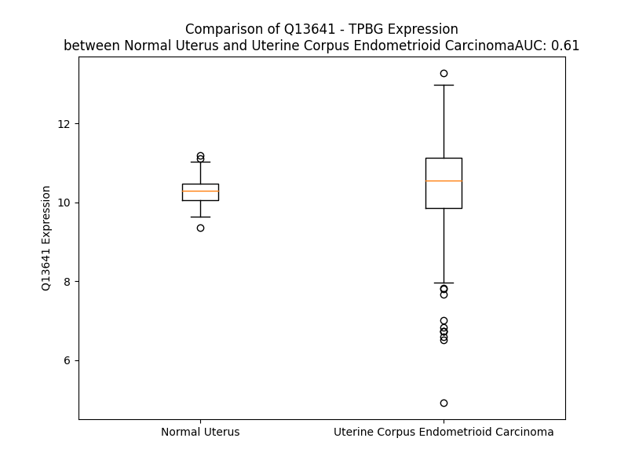

# Detailed Data for Q13641

## Introduction to the Detailed Summary

### How to Interpret the Results

- **Summary & Metrics**: This section provides a quick reference to essential protein attributes, including expression changes, family classification, and biomarker applications. Regulation status (upregulated/downregulated) indicates the protein's behavior in a disease context. Some information comes from the original excel file with the proteins selected from literature, while others are derived from the analyses.
- **Expression Comparison**: A visual representation comparing protein expression between normal and disease states. It highlights significant changes in expression levels that might indicate diagnostic or therapeutic relevance. This is data coming from transcriptomics experiments and could not translate similarly to protein levels.
- **Isoform Alignment**: An interactive view of isoform alignments, revealing structural and functional differences between variants of the protein.
- **Interactors & Homologs**: Tables listing known interaction partners and homologous proteins, the more interactors and homologs, the more complex the protein is to design an antibody for.
- **Biological Assemblies**: Information about the structural arrangement of the protein in different assemblies, providing insights into its functional state but also the complexity of the protein to develop antibodies.
- **Combined Per-Residue Information**: A detailed table summarizing residue-level data. This includes predictions for epitope regions, aggregation tendencies, and modifications that might impact the protein's function. Each row corresponds to a residue in the protein, providing insights into specific sites that may be important for research or drug development.
## Summary & Metrics

- **UniProt Accession**: Q13641
- **Gene Name**: TPBG
- **Protein Name**: Trophoblast glycoprotein
- **Swiss Prot**: TPBG_HUMAN
- **Family**: other
- **Biomarker Application**:  
- **Number of Isoforms**: 0
- **Regulation**: 1
- **(transcriptomics) AUC**: 0.61
- **(transcriptomics) Fold Change**: 1.01
- **(transcriptomics) Regulation**: Upregulated
- **Discotope Epitope Count**: 65
- **Max n_uniprots (Homo)**: 1
- **Max n_uniprots (Hetero)**: 2

## Expression Comparison

## Interactors

| preferredName_A   | preferredName_B   |   score |
|:------------------|:------------------|--------:|
| TPBG              | HLA-DRB1          |   0.902 |

## Homologs

| uniprot_id   | gene_id   |
|:-------------|:----------|
| Q13641       | TPBG      |

## Biological Assemblies

|   Unnamed: 0 |   assembly |   n_uniprots | composition   | crystal_id   |
|-------------:|-----------:|-------------:|:--------------|:-------------|
|            0 |          1 |            1 | Homo          | 4cnm         |
|            0 |          1 |            2 | Hetero        | 6hby         |
|            1 |          2 |            2 | Hetero        | 6hby         |
|            0 |          1 |            1 | Homo          | 4cnc         |
|            1 |          2 |            1 | Homo          | 4cnc         |

## Combined Per-Residue Information

|   res | aa   |   epitope_score | epitope   |   relative_surface_accessibility |   modeling_confidence |   Aggregation | modification   | glycosylation                   |
|------:|:-----|----------------:|:----------|---------------------------------:|----------------------:|--------------:|:---------------|:--------------------------------|
|     1 | M    |         0.12706 | False     |                          1.27994 |                 36.52 |         0     | N/A            | N/A                             |
|     2 | P    |         0.08596 | False     |                          0.91157 |                 43.09 |         0     | N/A            | N/A                             |
|     3 | G    |         0.13702 | False     |                          0.94898 |                 38.47 |         0     | N/A            | N/A                             |
|     4 | G    |         0.13937 | False     |                          0.89474 |                 37.5  |         0     | N/A            | N/A                             |
|     5 | C    |         0.0723  | False     |                          0.97978 |                 40.01 |         0     | N/A            | N/A                             |
|     6 | S    |         0.08199 | False     |                          0.82087 |                 39.18 |         0     | N/A            | N/A                             |
|     7 | R    |         0.13368 | False     |                          0.99584 |                 41.89 |         0     | N/A            | N/A                             |
|     8 | G    |         0.13657 | False     |                          0.83548 |                 41.29 |         0     | N/A            | N/A                             |
|     9 | P    |         0.08683 | False     |                          0.98853 |                 43.18 |         0     | N/A            | N/A                             |
|    10 | A    |         0.09664 | False     |                          1.02716 |                 33.43 |         0     | N/A            | N/A                             |
|    11 | A    |         0.08515 | False     |                          1.01889 |                 42.52 |         0     | N/A            | N/A                             |
|    12 | G    |         0.11597 | False     |                          0.8752  |                 35.95 |         0     | N/A            | N/A                             |
|    13 | D    |         0.10202 | False     |                          0.89765 |                 35.46 |         0     | N/A            | N/A                             |
|    14 | G    |         0.09261 | False     |                          0.92141 |                 36.96 |         0     | N/A            | N/A                             |
|    15 | R    |         0.10065 | False     |                          0.83462 |                 38.19 |         0     | N/A            | N/A                             |
|    16 | L    |         0.0898  | False     |                          1.08419 |                 36.24 |         0     | N/A            | N/A                             |
|    17 | R    |         0.13552 | False     |                          0.84328 |                 35.35 |         0     | N/A            | N/A                             |
|    18 | L    |         0.11998 | False     |                          1.10208 |                 35.48 |         0     | N/A            | N/A                             |
|    19 | A    |         0.09017 | False     |                          0.84238 |                 30.59 |         0     | N/A            | N/A                             |
|    20 | R    |         0.14929 | False     |                          0.91414 |                 33.18 |         0     | N/A            | N/A                             |
|    21 | L    |         0.12078 | False     |                          1.13273 |                 33.01 |        53.954 | N/A            | N/A                             |
|    22 | A    |         0.08187 | False     |                          0.77282 |                 28.76 |        63.566 | N/A            | N/A                             |
|    23 | L    |         0.14091 | False     |                          1.04428 |                 29.12 |        89.925 | N/A            | N/A                             |
|    24 | V    |         0.07057 | False     |                          0.91455 |                 34.75 |        94.674 | N/A            | N/A                             |
|    25 | L    |         0.13434 | False     |                          0.96194 |                 34.45 |        95.044 | N/A            | N/A                             |
|    26 | L    |         0.09716 | False     |                          1.02299 |                 31.4  |        93.563 | N/A            | N/A                             |
|    27 | G    |         0.08963 | False     |                          0.84946 |                 36.29 |        83.949 | N/A            | N/A                             |
|    28 | W    |         0.17437 | True      |                          1.01572 |                 37.75 |        82.649 | N/A            | N/A                             |
|    29 | V    |         0.12322 | False     |                          0.95909 |                 31.29 |        76.948 | N/A            | N/A                             |
|    30 | S    |         0.10579 | False     |                          0.77867 |                 33.62 |         9.531 | N/A            | N/A                             |
|    31 | S    |         0.16168 | True      |                          0.82001 |                 32    |         1.16  | N/A            | N/A                             |
|    32 | S    |         0.10304 | False     |                          0.89208 |                 39.02 |         0.128 | N/A            | N/A                             |
|    33 | S    |         0.07447 | False     |                          0.86214 |                 34.55 |         0     | N/A            | N/A                             |
|    34 | P    |         0.10333 | False     |                          0.92606 |                 38.23 |         0     | N/A            | N/A                             |
|    35 | T    |         0.10555 | False     |                          0.94863 |                 31.34 |         0     | N/A            | N/A                             |
|    36 | S    |         0.10388 | False     |                          0.88063 |                 41.35 |         0     | N/A            | N/A                             |
|    37 | S    |         0.11191 | False     |                          0.88495 |                 34.98 |         0     | N/A            | N/A                             |
|    38 | A    |         0.10144 | False     |                          1.02418 |                 39.6  |         0     | N/A            | N/A                             |
|    39 | S    |         0.09849 | False     |                          0.74611 |                 41.16 |         0     | N/A            | N/A                             |
|    40 | S    |         0.09397 | False     |                          0.81532 |                 32.15 |         0     | N/A            | N/A                             |
|    41 | F    |         0.12151 | False     |                          0.98772 |                 40.34 |         0     | N/A            | N/A                             |
|    42 | S    |         0.07021 | False     |                          0.84872 |                 33.95 |         0     | N/A            | N/A                             |
|    43 | S    |         0.1054  | False     |                          0.86012 |                 41.12 |         0     | N/A            | N/A                             |
|    44 | S    |         0.08154 | False     |                          0.86707 |                 37.57 |         0     | N/A            | N/A                             |
|    45 | A    |         0.08636 | False     |                          0.78717 |                 46.23 |         0     | N/A            | N/A                             |
|    46 | P    |         0.09674 | False     |                          0.90221 |                 37.61 |         0     | N/A            | N/A                             |
|    47 | F    |         0.15488 | False     |                          0.90747 |                 42.64 |         5.359 | N/A            | N/A                             |
|    48 | L    |         0.10764 | False     |                          0.97271 |                 43.22 |         5.695 | N/A            | N/A                             |
|    49 | A    |         0.09711 | False     |                          0.96927 |                 34.57 |         5.695 | N/A            | N/A                             |
|    50 | S    |         0.11061 | False     |                          0.80061 |                 44.73 |         5.695 | N/A            | N/A                             |
|    51 | A    |         0.12085 | False     |                          1.0075  |                 37.6  |         5.695 | N/A            | N/A                             |
|    52 | V    |         0.09617 | False     |                          0.90098 |                 46.31 |         5.348 | N/A            | N/A                             |
|    53 | S    |         0.1571  | False     |                          0.86207 |                 39.13 |         0.934 | N/A            | N/A                             |
|    54 | A    |         0.13882 | False     |                          0.82963 |                 45.96 |         0.428 | N/A            | N/A                             |
|    55 | Q    |         0.17017 | True      |                          0.80936 |                 41.04 |         0     | N/A            | N/A                             |
|    56 | P    |         0.12994 | False     |                          0.825   |                 49.16 |         0     | N/A            | N/A                             |
|    57 | P    |         0.14446 | False     |                          0.72602 |                 50.98 |         0     | N/A            | N/A                             |
|    58 | L    |         0.16007 | False     |                          0.78056 |                 50.93 |         0     | N/A            | N/A                             |
|    59 | P    |         0.16482 | True      |                          0.58637 |                 57.53 |         0     | N/A            | N/A                             |
|    60 | D    |         0.14444 | False     |                          0.59311 |                 62.59 |         0     | N/A            | N/A                             |
|    61 | Q    |         0.11974 | False     |                          0.51742 |                 77.58 |         0     | N/A            | N/A                             |
|    62 | C    |         0.12031 | False     |                          0.36185 |                 87.93 |         0     | N/A            | N/A                             |
|    63 | P    |         0.02461 | False     |                          0.04335 |                 89.97 |         0     | N/A            | N/A                             |
|    64 | A    |         0.16749 | True      |                          1.0206  |                 88.04 |         0     | N/A            | N/A                             |
|    65 | L    |         0.1816  | True      |                          0.59048 |                 91.01 |         0     | N/A            | N/A                             |
|    66 | C    |         0.05053 | False     |                          0.09327 |                 94.35 |         0     | N/A            | N/A                             |
|    67 | E    |         0.12138 | False     |                          0.53123 |                 94.89 |         0     | N/A            | N/A                             |
|    68 | C    |         0.06933 | False     |                          0.29857 |                 94.96 |         0     | N/A            | N/A                             |
|    69 | S    |         0.1887  | True      |                          0.36542 |                 94.36 |         0     | N/A            | N/A                             |
|    70 | E    |         0.17656 | True      |                          0.64368 |                 92.47 |         0     | N/A            | N/A                             |
|    71 | A    |         0.18705 | True      |                          1.03826 |                 93.61 |         0     | N/A            | N/A                             |
|    72 | A    |         0.22448 | True      |                          0.54635 |                 95.27 |         0     | N/A            | N/A                             |
|    73 | R    |         0.13815 | False     |                          0.42442 |                 96    |         0     | N/A            | N/A                             |
|    74 | T    |         0.06508 | False     |                          0.09464 |                 97.15 |         0     | N/A            | N/A                             |
|    75 | V    |         0.00689 | False     |                          0       |                 96.89 |         0     | N/A            | N/A                             |
|    76 | K    |         0.19434 | True      |                          0.4876  |                 97.07 |         0     | N/A            | N/A                             |
|    77 | C    |         0.00888 | False     |                          0       |                 96.41 |         0     | N/A            | N/A                             |
|    78 | V    |         0.14732 | False     |                          0.40364 |                 95.56 |         0     | N/A            | N/A                             |
|    79 | N    |         0.29081 | True      |                          0.68556 |                 95.88 |         0     | N/A            | N/A                             |
|    80 | R    |         0.11121 | False     |                          0.30812 |                 95.06 |         0     | N/A            | N/A                             |
|    81 | N    |         0.16284 | True      |                          0.66444 |                 94.71 |         0     | N/A            | N-linked (GlcNAc...) asparagine |
|    82 | L    |         0.06082 | False     |                          0.10634 |                 95.22 |         0     | N/A            | N/A                             |
|    83 | T    |         0.07956 | False     |                          0.70483 |                 95.31 |         0     | N/A            | N/A                             |
|    84 | E    |         0.16975 | True      |                          0.62916 |                 94.52 |         0     | N/A            | N/A                             |
|    85 | V    |         0.01683 | False     |                          0.0889  |                 94.75 |         0     | N/A            | N/A                             |
|    86 | P    |         0.03283 | False     |                          0.10239 |                 92.88 |         0     | N/A            | N/A                             |
|    87 | T    |         0.09535 | False     |                          0.74466 |                 89.41 |         0     | N/A            | N/A                             |
|    88 | D    |         0.10533 | False     |                          0.36027 |                 89.51 |         0     | N/A            | N/A                             |
|    89 | L    |         0.03386 | False     |                          0.07573 |                 92.87 |         0     | N/A            | N/A                             |
|    90 | P    |         0.00553 | False     |                          0.00199 |                 92.39 |         0     | N/A            | N/A                             |
|    91 | A    |         0.07611 | False     |                          0.30296 |                 91.42 |         0     | N/A            | N/A                             |
|    92 | Y    |         0.09921 | False     |                          0.18983 |                 92.52 |         0     | N/A            | N/A                             |
|    93 | V    |         0.00502 | False     |                          0       |                 95.44 |         0     | N/A            | N/A                             |
|    94 | R    |         0.05284 | False     |                          0.50402 |                 97.08 |         0     | N/A            | N/A                             |
|    95 | N    |         0.09523 | False     |                          0.26621 |                 98.06 |         0.189 | N/A            | N/A                             |
|    96 | L    |         0.00811 | False     |                          0.00446 |                 97.58 |         0.624 | N/A            | N/A                             |
|    97 | F    |         0.09811 | False     |                          0.32923 |                 97.92 |         0.624 | N/A            | N/A                             |
|    98 | L    |         0.005   | False     |                          0.00082 |                 97.22 |         0.624 | N/A            | N/A                             |
|    99 | T    |         0.10764 | False     |                          0.26331 |                 96.83 |         0.624 | N/A            | N/A                             |
|   100 | G    |         0.15758 | False     |                          0.28895 |                 95.98 |         0.436 | N/A            | N/A                             |
|   101 | N    |         0.05106 | False     |                          0.00827 |                 97.2  |         0     | N/A            | N/A                             |
|   102 | Q    |         0.24505 | True      |                          0.36722 |                 96.2  |         0     | N/A            | N/A                             |
|   103 | L    |         0.04197 | False     |                          0.04663 |                 96.35 |         0.13  | N/A            | N/A                             |
|   104 | A    |         0.06544 | False     |                          0.39775 |                 95.26 |         0.13  | N/A            | N/A                             |
|   105 | V    |         0.08397 | False     |                          0.324   |                 96.71 |         0.13  | N/A            | N/A                             |
|   106 | L    |         0.00487 | False     |                          0.00577 |                 96.79 |         0.13  | N/A            | N/A                             |
|   107 | P    |         0.09556 | False     |                          0.44336 |                 95.06 |         0.13  | N/A            | N/A                             |
|   108 | A    |         0.1113  | False     |                          0.57679 |                 92.27 |         0     | N/A            | N/A                             |
|   109 | G    |         0.03862 | False     |                          0.22962 |                 89.03 |         0     | N/A            | N/A                             |
|   110 | A    |         0.03039 | False     |                          0.11573 |                 93.55 |         0     | N/A            | N/A                             |
|   111 | F    |         0.00658 | False     |                          0.00558 |                 94    |         0     | N/A            | N/A                             |
|   112 | A    |         0.05416 | False     |                          0.44157 |                 89.97 |         0     | N/A            | N/A                             |
|   113 | R    |         0.13269 | False     |                          0.14527 |                 89.22 |         0     | N/A            | N/A                             |
|   114 | R    |         0.31078 | True      |                          0.96943 |                 87.89 |         0     | N/A            | N/A                             |
|   115 | P    |         0.28611 | True      |                          0.51863 |                 86.94 |         0     | N/A            | N/A                             |
|   116 | P    |         0.1361  | False     |                          0.58897 |                 89.14 |         0     | N/A            | N/A                             |
|   117 | L    |         0.01184 | False     |                          0.00825 |                 93.26 |         0     | N/A            | N/A                             |
|   118 | A    |         0.13993 | False     |                          0.53622 |                 92.3  |         0     | N/A            | N/A                             |
|   119 | E    |         0.08409 | False     |                          0.35201 |                 94.25 |         0     | N/A            | N/A                             |
|   120 | L    |         0.0038  | False     |                          0       |                 96.76 |         0     | N/A            | N/A                             |
|   121 | A    |         0.02914 | False     |                          0.16381 |                 97.75 |         0     | N/A            | N/A                             |
|   122 | A    |         0.08719 | False     |                          0.20563 |                 98.34 |         0     | N/A            | N/A                             |
|   123 | L    |         0.01212 | False     |                          0.01126 |                 98.03 |         0     | N/A            | N/A                             |
|   124 | N    |         0.06633 | False     |                          0.19742 |                 98.31 |         0     | N/A            | N-linked (GlcNAc...) asparagine |
|   125 | L    |         0.00234 | False     |                          0       |                 98.06 |         0     | N/A            | N/A                             |
|   126 | S    |         0.07938 | False     |                          0.10835 |                 97.93 |         0     | N/A            | N/A                             |
|   127 | G    |         0.1164  | False     |                          0.31843 |                 97.25 |         0     | N/A            | N/A                             |
|   128 | S    |         0.00538 | False     |                          0       |                 97.09 |         0     | N/A            | N/A                             |
|   129 | R    |         0.18816 | True      |                          0.63289 |                 95.81 |         0     | N/A            | N/A                             |
|   130 | L    |         0.00364 | False     |                          0       |                 96.78 |         0     | N/A            | N/A                             |
|   131 | D    |         0.06863 | False     |                          0.36267 |                 94.44 |         0     | N/A            | N/A                             |
|   132 | E    |         0.09499 | False     |                          0.22946 |                 95.53 |         0     | N/A            | N/A                             |
|   133 | V    |         0.00643 | False     |                          0.00352 |                 97.02 |         0     | N/A            | N/A                             |
|   134 | R    |         0.08171 | False     |                          0.41337 |                 95.45 |         0     | N/A            | N/A                             |
|   135 | A    |         0.04711 | False     |                          0.27378 |                 92.98 |         0     | N/A            | N/A                             |
|   136 | G    |         0.00488 | False     |                          0       |                 89.97 |         0     | N/A            | N/A                             |
|   137 | A    |         0.00162 | False     |                          0       |                 94.38 |         0     | N/A            | N/A                             |
|   138 | F    |         0.02043 | False     |                          0.09938 |                 93.46 |         0     | N/A            | N/A                             |
|   139 | E    |         0.07935 | False     |                          0.26578 |                 87.74 |         0     | N/A            | N/A                             |
|   140 | H    |         0.09375 | False     |                          0.60599 |                 84.41 |         0     | N/A            | N/A                             |
|   141 | L    |         0.01745 | False     |                          0.04099 |                 91.92 |         0     | N/A            | N/A                             |
|   142 | P    |         0.13361 | False     |                          0.65708 |                 89.28 |         0     | N/A            | N/A                             |
|   143 | S    |         0.03492 | False     |                          0.29714 |                 94.04 |         0     | N/A            | N/A                             |
|   144 | L    |         0.01004 | False     |                          0.01731 |                 96.1  |         0     | N/A            | N/A                             |
|   145 | R    |         0.05337 | False     |                          0.51577 |                 97.41 |         0     | N/A            | N/A                             |
|   146 | Q    |         0.08023 | False     |                          0.33842 |                 98.36 |         0     | N/A            | N/A                             |
|   147 | L    |         0.00307 | False     |                          0       |                 98.21 |         0     | N/A            | N/A                             |
|   148 | D    |         0.06294 | False     |                          0.09482 |                 98.57 |         0     | N/A            | N/A                             |
|   149 | L    |         0.00288 | False     |                          0       |                 98.24 |         0     | N/A            | N/A                             |
|   150 | S    |         0.08299 | False     |                          0.05364 |                 98.17 |         0     | N/A            | N/A                             |
|   151 | H    |         0.17593 | True      |                          0.58079 |                 97.5  |         0     | N/A            | N/A                             |
|   152 | N    |         0.03064 | False     |                          0.00293 |                 97.38 |         0     | N/A            | N/A                             |
|   153 | P    |         0.07248 | False     |                          0.28485 |                 94.72 |         0     | N/A            | N/A                             |
|   154 | L    |         0.0032  | False     |                          0.00183 |                 94.77 |         0     | N/A            | N/A                             |
|   155 | A    |         0.05468 | False     |                          0.23928 |                 93.08 |         0     | N/A            | N/A                             |
|   156 | D    |         0.1003  | False     |                          0.30517 |                 93.76 |         0     | N/A            | N/A                             |
|   157 | L    |         0.00843 | False     |                          0.00753 |                 95.03 |         0     | N/A            | N/A                             |
|   158 | S    |         0.03482 | False     |                          0.14533 |                 94.15 |         0     | N/A            | N/A                             |
|   159 | P    |         0.05565 | False     |                          0.42162 |                 92.36 |         0     | N/A            | N/A                             |
|   160 | F    |         0.06199 | False     |                          0.35033 |                 92.27 |         0     | N/A            | N/A                             |
|   161 | A    |         0.00178 | False     |                          0.00189 |                 93.18 |         0     | N/A            | N/A                             |
|   162 | F    |         0.01282 | False     |                          0.04291 |                 91.81 |         0     | N/A            | N/A                             |
|   163 | S    |         0.03623 | False     |                          0.07646 |                 84.43 |         0     | N/A            | N/A                             |
|   164 | G    |         0.05036 | False     |                          0.16386 |                 75.68 |         0     | N/A            | N/A                             |
|   165 | S    |         0.13002 | False     |                          0.4345  |                 71.33 |         0     | N/A            | N/A                             |
|   166 | N    |         0.241   | True      |                          0.62615 |                 68.15 |         0     | N/A            | N/A                             |
|   167 | A    |         0.17419 | True      |                          0.55806 |                 59.26 |         0     | N/A            | N/A                             |
|   168 | S    |         0.27994 | True      |                          0.82139 |                 59.83 |         0     | N/A            | N/A                             |
|   169 | V    |         0.37717 | True      |                          0.90997 |                 57.49 |         0     | N/A            | N/A                             |
|   170 | S    |         0.25634 | True      |                          0.32722 |                 60.02 |         0     | N/A            | N/A                             |
|   171 | A    |         0.1487  | False     |                          0.75198 |                 70.49 |         0     | N/A            | N/A                             |
|   172 | P    |         0.18847 | True      |                          0.7034  |                 81.69 |         0     | N/A            | N/A                             |
|   173 | S    |         0.05328 | False     |                          0.12578 |                 89.44 |         0     | N/A            | N/A                             |
|   174 | P    |         0.07434 | False     |                          0.30766 |                 92.68 |         0     | N/A            | N/A                             |
|   175 | L    |         0.00848 | False     |                          0.01889 |                 95.74 |         0     | N/A            | N/A                             |
|   176 | V    |         0.03948 | False     |                          0.24183 |                 97.43 |         0     | N/A            | N/A                             |
|   177 | E    |         0.05626 | False     |                          0.25951 |                 98.24 |         0     | N/A            | N/A                             |
|   178 | L    |         0.00235 | False     |                          0       |                 97.94 |         0     | N/A            | N/A                             |
|   179 | I    |         0.09923 | False     |                          0.14399 |                 98.48 |         0     | N/A            | N/A                             |
|   180 | L    |         0.00363 | False     |                          0.00082 |                 97.58 |         0     | N/A            | N/A                             |
|   181 | N    |         0.13109 | False     |                          0.15377 |                 97.75 |         0     | N/A            | N/A                             |
|   182 | H    |         0.12995 | False     |                          0.47719 |                 96.67 |         0     | N/A            | N/A                             |
|   183 | I    |         0.013   | False     |                          0       |                 96.15 |         0     | N/A            | N/A                             |
|   184 | V    |         0.05164 | False     |                          0.14956 |                 93.42 |         0     | N/A            | N/A                             |
|   185 | P    |         0.03588 | False     |                          0.05385 |                 91.91 |         0     | N/A            | N/A                             |
|   186 | P    |         0.2147  | True      |                          0.53737 |                 87    |         0     | N/A            | N/A                             |
|   187 | E    |         0.31368 | True      |                          0.62013 |                 83.23 |         0     | N/A            | N/A                             |
|   188 | D    |         0.27784 | True      |                          0.90742 |                 79.04 |         0     | N/A            | N/A                             |
|   189 | E    |         0.32584 | True      |                          0.53985 |                 71.5  |         0     | N/A            | N/A                             |
|   190 | R    |         0.2457  | True      |                          0.50142 |                 72.54 |         0     | N/A            | N/A                             |
|   191 | Q    |         0.24205 | True      |                          0.46639 |                 69.59 |         0     | N/A            | N/A                             |
|   192 | N    |         0.22684 | True      |                          1.08917 |                 65.32 |         0     | N/A            | N/A                             |
|   193 | R    |         0.24955 | True      |                          0.63124 |                 74.82 |         0     | N/A            | N/A                             |
|   194 | S    |         0.13966 | False     |                          0.50943 |                 86.86 |         0     | N/A            | N/A                             |
|   195 | F    |         0.06273 | False     |                          0.10634 |                 89.74 |         0     | N/A            | N/A                             |
|   196 | E    |         0.09073 | False     |                          0.12552 |                 89.41 |         0     | N/A            | N/A                             |
|   197 | G    |         0.122   | False     |                          0.39228 |                 89.96 |         5.155 | N/A            | N/A                             |
|   198 | M    |         0.04326 | False     |                          0.14974 |                 92.09 |        62.186 | N/A            | N/A                             |
|   199 | V    |         0.01297 | False     |                          0.00476 |                 93.38 |        87.873 | N/A            | N/A                             |
|   200 | V    |         0.06126 | False     |                          0.13329 |                 90.91 |        89.793 | N/A            | N/A                             |
|   201 | A    |         0.04994 | False     |                          0.34065 |                 91.8  |        89.831 | N/A            | N/A                             |
|   202 | A    |         0.00511 | False     |                          0.02484 |                 92.56 |        89.805 | N/A            | N/A                             |
|   203 | L    |         0.01575 | False     |                          0.019   |                 92.53 |        89.547 | N/A            | N/A                             |
|   204 | L    |         0.06334 | False     |                          0.35698 |                 89.71 |        85.04  | N/A            | N/A                             |
|   205 | A    |         0.07796 | False     |                          0.14523 |                 87.92 |        59.005 | N/A            | N/A                             |
|   206 | G    |         0.21229 | True      |                          0.66521 |                 78.21 |         4.869 | N/A            | N/A                             |
|   207 | R    |         0.1799  | True      |                          0.56567 |                 85.79 |         0     | N/A            | N/A                             |
|   208 | A    |         0.02227 | False     |                          0.05211 |                 87.47 |         0     | N/A            | N/A                             |
|   209 | L    |         0.01375 | False     |                          0.00778 |                 92.41 |         0     | N/A            | N/A                             |
|   210 | Q    |         0.13924 | False     |                          0.39903 |                 90.91 |         0     | N/A            | N/A                             |
|   211 | G    |         0.07391 | False     |                          0.42899 |                 93.01 |         0     | N/A            | N/A                             |
|   212 | L    |         0.00388 | False     |                          0       |                 95.95 |         0     | N/A            | N/A                             |
|   213 | R    |         0.06032 | False     |                          0.45719 |                 97.54 |         0     | N/A            | N/A                             |
|   214 | R    |         0.10889 | False     |                          0.28499 |                 98.32 |         0     | N/A            | N/A                             |
|   215 | L    |         0.00375 | False     |                          0.00165 |                 97.5  |         0     | N/A            | N/A                             |
|   216 | E    |         0.07685 | False     |                          0.12893 |                 98.19 |         0     | N/A            | N/A                             |
|   217 | L    |         0.01476 | False     |                          0.02555 |                 96.85 |         0     | N/A            | N/A                             |
|   218 | A    |         0.12711 | False     |                          0.09183 |                 97.58 |         0     | N/A            | N/A                             |
|   219 | S    |         0.15049 | False     |                          0.20718 |                 96.84 |         0     | N/A            | N/A                             |
|   220 | N    |         0.05932 | False     |                          0.00891 |                 94.83 |         0     | N/A            | N/A                             |
|   221 | H    |         0.19077 | True      |                          0.64054 |                 93.23 |         0     | N/A            | N/A                             |
|   222 | F    |         0.00725 | False     |                          0.00897 |                 92.38 |         1.306 | N/A            | N/A                             |
|   223 | L    |         0.07743 | False     |                          0.61755 |                 91.95 |         1.306 | N/A            | N/A                             |
|   224 | Y    |         0.20889 | True      |                          0.4411  |                 89.92 |         1.306 | N/A            | N/A                             |
|   225 | L    |         0.0365  | False     |                          0.04993 |                 84.83 |         1.306 | N/A            | N/A                             |
|   226 | P    |         0.07577 | False     |                          0.22267 |                 73.97 |         1.306 | N/A            | N/A                             |
|   227 | R    |         0.32675 | True      |                          0.65033 |                 79.44 |         0     | N/A            | N/A                             |
|   228 | D    |         0.14323 | False     |                          0.54549 |                 79.17 |         0     | N/A            | N/A                             |
|   229 | V    |         0.04031 | False     |                          0.03442 |                 86.2  |         0     | N/A            | N/A                             |
|   230 | L    |         0.02767 | False     |                          0.03699 |                 87.08 |         0     | N/A            | N/A                             |
|   231 | A    |         0.06839 | False     |                          0.34236 |                 85.81 |         0     | N/A            | N/A                             |
|   232 | Q    |         0.09125 | False     |                          0.25893 |                 85.25 |         0     | N/A            | N/A                             |
|   233 | L    |         0.00648 | False     |                          0.00412 |                 92.54 |         0     | N/A            | N/A                             |
|   234 | P    |         0.18762 | True      |                          0.43508 |                 91.7  |         0     | N/A            | N/A                             |
|   235 | S    |         0.04315 | False     |                          0.25158 |                 94.35 |         0     | N/A            | N/A                             |
|   236 | L    |         0.0024  | False     |                          0       |                 95.98 |         0     | N/A            | N/A                             |
|   237 | R    |         0.05708 | False     |                          0.38354 |                 97.39 |         0     | N/A            | N/A                             |
|   238 | H    |         0.07238 | False     |                          0.13955 |                 98.05 |         0     | N/A            | N/A                             |
|   239 | L    |         0.0041  | False     |                          0.00082 |                 97.07 |         0     | N/A            | N/A                             |
|   240 | D    |         0.07035 | False     |                          0.13306 |                 98.12 |         0     | N/A            | N/A                             |
|   241 | L    |         0.00375 | False     |                          0.00082 |                 97.07 |         0     | N/A            | N/A                             |
|   242 | S    |         0.13125 | False     |                          0.15877 |                 97.88 |         0     | N/A            | N/A                             |
|   243 | N    |         0.17422 | True      |                          0.51339 |                 97.86 |         0     | N/A            | N/A                             |
|   244 | N    |         0.12331 | False     |                          0.06668 |                 96.82 |         0.192 | N/A            | N/A                             |
|   245 | S    |         0.08642 | False     |                          0.25431 |                 96.05 |         5.733 | N/A            | N/A                             |
|   246 | L    |         0.00608 | False     |                          0.00082 |                 95.73 |        49.486 | N/A            | N/A                             |
|   247 | V    |         0.08658 | False     |                          0.49239 |                 94.77 |        57.391 | N/A            | N/A                             |
|   248 | S    |         0.05145 | False     |                          0.30521 |                 92.86 |        58.012 | N/A            | N/A                             |
|   249 | L    |         0.03391 | False     |                          0.0357  |                 92.6  |        59.944 | N/A            | N/A                             |
|   250 | T    |         0.21077 | True      |                          0.58709 |                 84.98 |        60.14  | N/A            | N/A                             |
|   251 | Y    |         0.10389 | False     |                          0.51344 |                 83.56 |        59.43  | N/A            | N/A                             |
|   252 | V    |         0.05519 | False     |                          0.097   |                 85.99 |        56.583 | N/A            | N/A                             |
|   253 | S    |         0.06496 | False     |                          0.37138 |                 90.28 |        22.615 | N/A            | N/A                             |
|   254 | F    |         0.00372 | False     |                          0       |                 91.14 |        20.956 | N/A            | N/A                             |
|   255 | R    |         0.29199 | True      |                          0.74325 |                 87.57 |         0     | N/A            | N/A                             |
|   256 | N    |         0.12649 | False     |                          0.59315 |                 85.64 |         0     | N/A            | N/A                             |
|   257 | L    |         0.00651 | False     |                          0.00247 |                 91.65 |         0     | N/A            | N/A                             |
|   258 | T    |         0.21932 | True      |                          0.50908 |                 91.61 |         0     | N/A            | N/A                             |
|   259 | H    |         0.07636 | False     |                          0.55223 |                 94.17 |         0     | N/A            | N/A                             |
|   260 | L    |         0.00243 | False     |                          0.00071 |                 96.03 |         0     | N/A            | N/A                             |
|   261 | E    |         0.06883 | False     |                          0.39545 |                 96.95 |         0     | N/A            | N/A                             |
|   262 | S    |         0.06919 | False     |                          0.07535 |                 97.78 |         0     | N/A            | N/A                             |
|   263 | L    |         0.00213 | False     |                          0       |                 97.42 |         0     | N/A            | N/A                             |
|   264 | H    |         0.13052 | False     |                          0.19638 |                 98.14 |         0     | N/A            | N/A                             |
|   265 | L    |         0.00372 | False     |                          0       |                 97.45 |         0     | N/A            | N/A                             |
|   266 | E    |         0.16193 | True      |                          0.13817 |                 97.57 |         0     | N/A            | N/A                             |
|   267 | D    |         0.20296 | True      |                          0.38148 |                 97.77 |         0     | N/A            | N/A                             |
|   268 | N    |         0.10789 | False     |                          0.07192 |                 98.1  |         0     | N/A            | N/A                             |
|   269 | A    |         0.07907 | False     |                          0.29028 |                 97.33 |         0     | N/A            | N/A                             |
|   270 | L    |         0.00442 | False     |                          0.00082 |                 96.87 |         0     | N/A            | N/A                             |
|   271 | K    |         0.09186 | False     |                          0.50518 |                 95.92 |         0     | N/A            | N/A                             |
|   272 | V    |         0.10341 | False     |                          0.17822 |                 95.59 |         0     | N/A            | N/A                             |
|   273 | L    |         0.02559 | False     |                          0.02846 |                 95.52 |         0     | N/A            | N/A                             |
|   274 | H    |         0.1376  | False     |                          0.52524 |                 93.47 |         0     | N/A            | N/A                             |
|   275 | N    |         0.22522 | True      |                          0.54383 |                 92.69 |         0     | N/A            | N-linked (GlcNAc...) asparagine |
|   276 | G    |         0.06603 | False     |                          0.59379 |                 92.49 |         0     | N/A            | N/A                             |
|   277 | T    |         0.03106 | False     |                          0.08511 |                 93.62 |         0     | N/A            | N/A                             |
|   278 | L    |         0.07296 | False     |                          0.0558  |                 94.99 |         0     | N/A            | N/A                             |
|   279 | A    |         0.13728 | False     |                          0.65633 |                 94.23 |         0     | N/A            | N/A                             |
|   280 | E    |         0.0503  | False     |                          0.22973 |                 93.8  |         0     | N/A            | N/A                             |
|   281 | L    |         0.0018  | False     |                          0       |                 94.52 |         0     | N/A            | N/A                             |
|   282 | Q    |         0.19024 | True      |                          0.47017 |                 93.81 |         0     | N/A            | N/A                             |
|   283 | G    |         0.15702 | False     |                          0.75428 |                 93.16 |         0     | N/A            | N/A                             |
|   284 | L    |         0.0421  | False     |                          0.08008 |                 92.98 |         0     | N/A            | N/A                             |
|   285 | P    |         0.14219 | False     |                          0.49128 |                 86.87 |         0     | N/A            | N/A                             |
|   286 | H    |         0.19793 | True      |                          0.91066 |                 87.6  |         0     | N/A            | N/A                             |
|   287 | I    |         0.04314 | False     |                          0.03241 |                 96.37 |         0.249 | N/A            | N/A                             |
|   288 | R    |         0.13836 | False     |                          0.50257 |                 97.51 |         0.249 | N/A            | N/A                             |
|   289 | V    |         0.00615 | False     |                          0       |                 97.56 |         0.249 | N/A            | N/A                             |
|   290 | F    |         0.10854 | False     |                          0.22676 |                 98.17 |         0.249 | N/A            | N/A                             |
|   291 | L    |         0.00424 | False     |                          0       |                 97.44 |         0.249 | N/A            | N/A                             |
|   292 | D    |         0.11573 | False     |                          0.1718  |                 95.67 |         0.249 | N/A            | N/A                             |
|   293 | N    |         0.20067 | True      |                          0.70958 |                 96.55 |         0     | N/A            | N/A                             |
|   294 | N    |         0.12301 | False     |                          0.06348 |                 97.85 |         0     | N/A            | N/A                             |
|   295 | P    |         0.08243 | False     |                          0.27567 |                 97.08 |         0     | N/A            | N/A                             |
|   296 | W    |         0.00891 | False     |                          0.00762 |                 97.32 |         0     | N/A            | N/A                             |
|   297 | V    |         0.08749 | False     |                          0.22841 |                 96.59 |         0     | N/A            | N/A                             |
|   298 | C    |         0.01628 | False     |                          0.01777 |                 95.52 |         0     | N/A            | N/A                             |
|   299 | D    |         0.08991 | False     |                          0.31985 |                 92.69 |         0     | N/A            | N/A                             |
|   300 | C    |         0.08716 | False     |                          0.40756 |                 92.51 |         0     | N/A            | N/A                             |
|   301 | H    |         0.11682 | False     |                          0.78712 |                 91.12 |         0     | N/A            | N/A                             |
|   302 | M    |         0.00272 | False     |                          0.00062 |                 94.05 |         0     | N/A            | N/A                             |
|   303 | A    |         0.0482  | False     |                          0.21968 |                 93.51 |         0     | N/A            | N/A                             |
|   304 | D    |         0.07897 | False     |                          0.46502 |                 93.42 |         0     | N/A            | N/A                             |
|   305 | M    |         0.00454 | False     |                          0.00257 |                 95.21 |         9.938 | N/A            | N/A                             |
|   306 | V    |         0.02476 | False     |                          0.03999 |                 95.16 |         9.938 | N/A            | N/A                             |
|   307 | T    |         0.11167 | False     |                          0.53648 |                 93.99 |         9.938 | N/A            | N/A                             |
|   308 | W    |         0.05605 | False     |                          0.11594 |                 95.2  |         9.938 | N/A            | N/A                             |
|   309 | L    |         0.00749 | False     |                          0.00305 |                 96.03 |         9.938 | N/A            | N/A                             |
|   310 | K    |         0.1645  | True      |                          0.48918 |                 94.41 |         0     | N/A            | N/A                             |
|   311 | E    |         0.14642 | False     |                          0.73901 |                 93.35 |         0     | N/A            | N/A                             |
|   312 | T    |         0.07316 | False     |                          0.04917 |                 94.48 |         0     | N/A            | N/A                             |
|   313 | E    |         0.097   | False     |                          0.8205  |                 93.55 |         0     | N/A            | N/A                             |
|   314 | V    |         0.05015 | False     |                          0.11398 |                 95.11 |         0     | N/A            | N/A                             |
|   315 | V    |         0.02613 | False     |                          0.04011 |                 96.93 |         0     | N/A            | N/A                             |
|   316 | Q    |         0.11451 | False     |                          0.29463 |                 96.53 |         0     | N/A            | N/A                             |
|   317 | G    |         0.11578 | False     |                          0.3696  |                 94.02 |         0     | N/A            | N/A                             |
|   318 | K    |         0.07256 | False     |                          0.13897 |                 94.02 |         0     | N/A            | N/A                             |
|   319 | D    |         0.21626 | True      |                          0.57511 |                 93.09 |         0     | N/A            | N/A                             |
|   320 | R    |         0.16075 | True      |                          0.69911 |                 94.11 |         0     | N/A            | N/A                             |
|   321 | L    |         0.00855 | False     |                          0.00907 |                 96.73 |         0     | N/A            | N/A                             |
|   322 | T    |         0.10691 | False     |                          0.34454 |                 96.97 |         0     | N/A            | N/A                             |
|   323 | C    |         0.04509 | False     |                          0.01575 |                 97.13 |         0     | N/A            | N/A                             |
|   324 | A    |         0.11386 | False     |                          0.2573  |                 97.13 |         0     | N/A            | N/A                             |
|   325 | Y    |         0.22003 | True      |                          0.5007  |                 95.04 |         0     | N/A            | N/A                             |
|   326 | P    |         0.24686 | True      |                          0.33301 |                 94.47 |         0     | N/A            | N/A                             |
|   327 | E    |         0.23682 | True      |                          0.63367 |                 93.29 |         0     | N/A            | N/A                             |
|   328 | K    |         0.18697 | True      |                          0.66122 |                 92.3  |         0     | N/A            | N/A                             |
|   329 | M    |         0.11685 | False     |                          0.10174 |                 92.82 |         0     | N/A            | N/A                             |
|   330 | R    |         0.18678 | True      |                          0.59061 |                 94.52 |         0     | N/A            | N/A                             |
|   331 | N    |         0.20635 | True      |                          0.68404 |                 95.06 |         0     | N/A            | N/A                             |
|   332 | R    |         0.24718 | True      |                          0.47654 |                 94.82 |         0     | N/A            | N/A                             |
|   333 | V    |         0.16446 | True      |                          0.25981 |                 95.43 |         0     | N/A            | N/A                             |
|   334 | L    |         0.0037  | False     |                          0       |                 95.52 |         0     | N/A            | N/A                             |
|   335 | L    |         0.09201 | False     |                          0.33347 |                 94.43 |         0     | N/A            | N/A                             |
|   336 | E    |         0.16859 | True      |                          0.63747 |                 92.84 |         0     | N/A            | N/A                             |
|   337 | L    |         0.01654 | False     |                          0.00577 |                 92.9  |         0     | N/A            | N/A                             |
|   338 | N    |         0.14717 | False     |                          0.55443 |                 88.4  |         0     | N/A            | N/A                             |
|   339 | S    |         0.08427 | False     |                          0.61062 |                 82.02 |         0     | N/A            | N/A                             |
|   340 | A    |         0.11959 | False     |                          0.91164 |                 82.98 |         0     | N/A            | N/A                             |
|   341 | D    |         0.13249 | False     |                          0.27209 |                 87.33 |         0     | N/A            | N/A                             |
|   342 | L    |         0.02852 | False     |                          0.0235  |                 88.02 |         0     | N/A            | N/A                             |
|   343 | D    |         0.08715 | False     |                          0.55023 |                 81.38 |         0     | N/A            | N/A                             |
|   344 | C    |         0.06562 | False     |                          0.33159 |                 78.08 |         0     | N/A            | N/A                             |
|   345 | D    |         0.1233  | False     |                          0.66044 |                 69.73 |         0     | N/A            | N/A                             |
|   346 | P    |         0.13462 | False     |                          0.95079 |                 59.72 |         0     | N/A            | N/A                             |
|   347 | I    |         0.24785 | True      |                          0.76945 |                 55.96 |         0     | N/A            | N/A                             |
|   348 | L    |         0.19367 | True      |                          0.55184 |                 53.3  |         0     | N/A            | N/A                             |
|   349 | P    |         0.199   | True      |                          0.51195 |                 56.13 |         0     | N/A            | N/A                             |
|   350 | P    |         0.1465  | False     |                          0.72274 |                 54.42 |         0     | N/A            | N/A                             |
|   351 | S    |         0.19228 | True      |                          0.59207 |                 58.49 |         0     | N/A            | N/A                             |
|   352 | L    |         0.09907 | False     |                          0.46164 |                 57.4  |         0     | N/A            | N/A                             |
|   353 | Q    |         0.07208 | False     |                          0.55194 |                 61.55 |         0     | N/A            | N/A                             |
|   354 | T    |         0.07043 | False     |                          0.63835 |                 66.57 |         0.035 | N/A            | N/A                             |
|   355 | S    |         0.05599 | False     |                          0.41851 |                 76.84 |         0.354 | N/A            | N/A                             |
|   356 | Y    |         0.07759 | False     |                          0.59762 |                 83.57 |        27.376 | N/A            | N/A                             |
|   357 | V    |         0.0518  | False     |                          0.61722 |                 83.37 |        73.933 | N/A            | N/A                             |
|   358 | F    |         0.06138 | False     |                          0.69904 |                 85.25 |        89.234 | N/A            | N/A                             |
|   359 | L    |         0.04454 | False     |                          0.56716 |                 89.85 |        92.356 | N/A            | N/A                             |
|   360 | G    |         0.03665 | False     |                          0.43491 |                 91.48 |        92.932 | N/A            | N/A                             |
|   361 | I    |         0.02553 | False     |                          0.57328 |                 92.68 |        99.337 | N/A            | N/A                             |
|   362 | V    |         0.01869 | False     |                          0.3663  |                 94.63 |        99.924 | N/A            | N/A                             |
|   363 | L    |         0.05182 | False     |                          0.64757 |                 95.88 |        99.973 | N/A            | N/A                             |
|   364 | A    |         0.02247 | False     |                          0.63603 |                 95.08 |        99.982 | N/A            | N/A                             |
|   365 | L    |         0.02349 | False     |                          0.62039 |                 96.26 |        99.993 | N/A            | N/A                             |
|   366 | I    |         0.04187 | False     |                          0.58989 |                 95.91 |        99.994 | N/A            | N/A                             |
|   367 | G    |         0.02577 | False     |                          0.36394 |                 95.55 |        99.983 | N/A            | N/A                             |
|   368 | A    |         0.02119 | False     |                          0.53438 |                 95.75 |        99.984 | N/A            | N/A                             |
|   369 | I    |         0.03626 | False     |                          0.58066 |                 94.71 |        99.986 | N/A            | N/A                             |
|   370 | F    |         0.03049 | False     |                          0.63122 |                 94.97 |        99.977 | N/A            | N/A                             |
|   371 | L    |         0.06341 | False     |                          0.72853 |                 94.08 |        99.87  | N/A            | N/A                             |
|   372 | L    |         0.04769 | False     |                          0.61333 |                 93.61 |        99.286 | N/A            | N/A                             |
|   373 | V    |         0.02405 | False     |                          0.51697 |                 92    |        96.253 | N/A            | N/A                             |
|   374 | L    |         0.03132 | False     |                          0.43623 |                 91.7  |        63.935 | N/A            | N/A                             |
|   375 | Y    |         0.07804 | False     |                          0.58706 |                 92.02 |        20.994 | N/A            | N/A                             |
|   376 | L    |         0.06165 | False     |                          0.77617 |                 91.45 |         6.445 | N/A            | N/A                             |
|   377 | N    |         0.09148 | False     |                          0.49791 |                 90.66 |         0.064 | N/A            | N/A                             |
|   378 | R    |         0.10848 | False     |                          0.51076 |                 91.02 |         0     | N/A            | N/A                             |
|   379 | K    |         0.07732 | False     |                          0.80178 |                 85.17 |         0     | N/A            | N/A                             |
|   380 | G    |         0.07281 | False     |                          0.51294 |                 86.17 |         0     | N/A            | N/A                             |
|   381 | I    |         0.0279  | False     |                          0.38811 |                 86.44 |         0     | N/A            | N/A                             |
|   382 | K    |         0.03009 | False     |                          0.63409 |                 86.46 |         0     | N/A            | N/A                             |
|   383 | K    |         0.05513 | False     |                          0.71616 |                 86.85 |         0     | N/A            | N/A                             |
|   384 | W    |         0.04433 | False     |                          0.71808 |                 86.03 |         0     | N/A            | N/A                             |
|   385 | M    |         0.04827 | False     |                          0.45815 |                 87.64 |         0     | N/A            | N/A                             |
|   386 | H    |         0.04459 | False     |                          0.4976  |                 86.74 |         0     | N/A            | N/A                             |
|   387 | N    |         0.08194 | False     |                          0.55882 |                 87.95 |         0     | N/A            | N/A                             |
|   388 | I    |         0.04788 | False     |                          0.42798 |                 88.57 |         0     | N/A            | N/A                             |
|   389 | R    |         0.05792 | False     |                          0.50855 |                 90.23 |         0     | N/A            | N/A                             |
|   390 | D    |         0.03258 | False     |                          0.46927 |                 88.97 |         0     | N/A            | N/A                             |
|   391 | A    |         0.04042 | False     |                          0.57712 |                 87.54 |         0     | N/A            | N/A                             |
|   392 | C    |         0.03672 | False     |                          0.51636 |                 87.77 |         0     | N/A            | N/A                             |
|   393 | R    |         0.0497  | False     |                          0.62241 |                 87.4  |         0     | N/A            | N/A                             |
|   394 | D    |         0.04973 | False     |                          0.59036 |                 86.26 |         0     | N/A            | N/A                             |
|   395 | H    |         0.05543 | False     |                          0.64399 |                 84.6  |         0     | N/A            | N/A                             |
|   396 | M    |         0.06024 | False     |                          0.71976 |                 82    |         0     | N/A            | N/A                             |
|   397 | E    |         0.02659 | False     |                          0.34979 |                 84.5  |         0     | N/A            | N/A                             |
|   398 | G    |         0.0381  | False     |                          0.40255 |                 79.5  |         0     | N/A            | N/A                             |
|   399 | Y    |         0.08884 | False     |                          0.59512 |                 77.28 |         0     | N/A            | N/A                             |
|   400 | H    |         0.06399 | False     |                          0.63922 |                 77.69 |         0     | N/A            | N/A                             |
|   401 | Y    |         0.10272 | False     |                          0.65213 |                 74.28 |         0     | N/A            | N/A                             |
|   402 | R    |         0.13915 | False     |                          0.68354 |                 71.71 |         0     | N/A            | N/A                             |
|   403 | Y    |         0.09432 | False     |                          0.78027 |                 71.36 |         0     | N/A            | N/A                             |
|   404 | E    |         0.07297 | False     |                          0.50381 |                 73.8  |         0     | N/A            | N/A                             |
|   405 | I    |         0.03625 | False     |                          0.60626 |                 69.9  |         0     | N/A            | N/A                             |
|   406 | N    |         0.07612 | False     |                          0.67846 |                 65.23 |         0     | N/A            | N/A                             |
|   407 | A    |         0.0722  | False     |                          0.60161 |                 67.51 |         0     | N/A            | N/A                             |
|   408 | D    |         0.07395 | False     |                          0.34195 |                 64.85 |         0     | N/A            | N/A                             |
|   409 | P    |         0.13688 | False     |                          0.73718 |                 63.21 |         0     | N/A            | N/A                             |
|   410 | R    |         0.13407 | False     |                          0.77402 |                 64.38 |         0     | N/A            | N/A                             |
|   411 | L    |         0.08755 | False     |                          0.56943 |                 58.18 |         0     | N/A            | N/A                             |
|   412 | T    |         0.08616 | False     |                          0.60381 |                 58.07 |         0     | N/A            | N/A                             |
|   413 | N    |         0.09302 | False     |                          0.71767 |                 56.66 |         0     | N/A            | N/A                             |
|   414 | L    |         0.07834 | False     |                          0.81201 |                 58.27 |         0     | N/A            | N/A                             |
|   415 | S    |         0.12757 | False     |                          0.60665 |                 58.52 |         0     | N/A            | N/A                             |
|   416 | S    |         0.12015 | False     |                          0.66036 |                 58.94 |         0     | N/A            | N/A                             |
|   417 | N    |         0.14513 | False     |                          0.87101 |                 57.97 |         0     | N/A            | N/A                             |
|   418 | S    |         0.14051 | False     |                          0.66136 |                 57.82 |         0     | Phosphoserine  | N/A                             |
|   419 | D    |         0.05431 | False     |                          0.84254 |                 50.75 |         0     | N/A            | N/A                             |
|   420 | V    |         0.07931 | False     |                          1.49558 |                 42.3  |         0     | N/A            | N/A                             |

