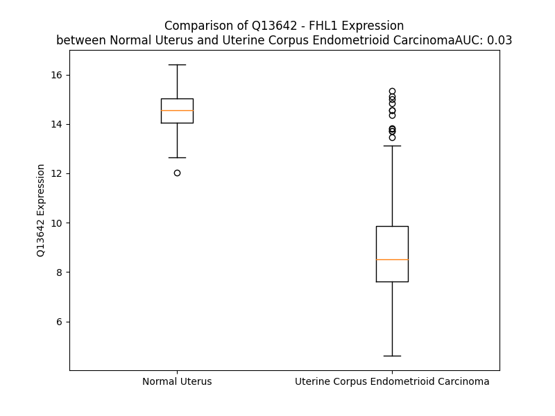

# Detailed Data for Q13642

## Introduction to the Detailed Summary

### How to Interpret the Results

- **Summary & Metrics**: This section provides a quick reference to essential protein attributes, including expression changes, family classification, and biomarker applications. Regulation status (upregulated/downregulated) indicates the protein's behavior in a disease context. Some information comes from the original excel file with the proteins selected from literature, while others are derived from the analyses.
- **Expression Comparison**: A visual representation comparing protein expression between normal and disease states. It highlights significant changes in expression levels that might indicate diagnostic or therapeutic relevance. This is data coming from transcriptomics experiments and could not translate similarly to protein levels.
- **Isoform Alignment**: An interactive view of isoform alignments, revealing structural and functional differences between variants of the protein.
- **Interactors & Homologs**: Tables listing known interaction partners and homologous proteins, the more interactors and homologs, the more complex the protein is to design an antibody for.
- **Biological Assemblies**: Information about the structural arrangement of the protein in different assemblies, providing insights into its functional state but also the complexity of the protein to develop antibodies.
- **Combined Per-Residue Information**: A detailed table summarizing residue-level data. This includes predictions for epitope regions, aggregation tendencies, and modifications that might impact the protein's function. Each row corresponds to a residue in the protein, providing insights into specific sites that may be important for research or drug development.
## Summary & Metrics

- **UniProt Accession**: Q13642
- **Gene Name**: FHL1
- **Protein Name**: Four and a half LIM domains protein 1
- **Swiss Prot**: FHL1_HUMAN
- **Family**: nan
- **Biomarker Application**: nan
- **Number of Isoforms**: 5
- **Regulation**: 2
- **(transcriptomics) AUC**: 0.03
- **(transcriptomics) Fold Change**: 1.32
- **(transcriptomics) Regulation**: Downregulated
- **Discotope Epitope Count**: 76
- **Max n_uniprots (Homo)**: 1
- **Max n_uniprots (Hetero)**: N/A

## Expression Comparison

## Isoform Alignment

<pre style='font-size:14px; font-family:monospace;'>Q13642-2 -----------------------------MAEKFDCHYCRDPLQGKKYVQKDGHHCCLKCFDKFCANTCVECRKPIGADSKEVHYKNRFWHDTCFRCAKCLHPLANETFVAKDNKILCNKCTTREDSPKCKGCFKAIVAGDQNVEYKGTVWHKDCFTCSNCKQVIGTGSFFPKGEDFYCVTCHETKFAKHCVKCNKAITSGGITYQDQPWHADCFVCVTCSKKLAGQRFTAVEDQYYCVDCYKNFVAKKCAGCKNPITGKRTVSRVSHPVSKARKPPVCHGKRLPLTLFPSANLRGRHPGGERTCPSWVVVLYRKNRSLAAPRGPGLVKAPVWWPMKDNPGTTTASTAKNAP
Q13642-1 -----------------------------MAEKFDCHYCRDPLQGKKYVQKDGHHCCLKCFDKFCANTCVECRKPIGADSKEVHYKNRFWHDTCFRCAKCLHPLANETFVAKDNKILCNKCTTREDSPKCKGCFKAIVAGDQNVEYKGTVWHKDCFTCSNCKQVIGTGSFFPKGEDFYCVTCHETKFAKHCVKCNKAITSGGITYQDQPWHADCFVCVTCSKKLAGQRFTAVEDQYYCVDCYKNFVAKKCAGCKNPITGFGKGSSVVAYEGQSWHDYCFHCKKCSVNLA---NKRFVFHQEQVYCPDCAKKL----------------------------------------
Q13642-3 -----------------------------MAEKFDCHYCRDPLQGKKYVQKDGHHCCLKCFDKFCANTCVECRKPIGADSKEVHYKNRFWHDTCFRCAKCLHPLANETFVAKDNKILCNKCTTREDSPKCKGCFKAIVAGDQNVEYKGTVWHKDCFTCSNCKQVIGTGSFFPKGEDFYCVTCHETKFAKHCVKCNK---------------------------------------------------------------------------------------------------------------------------------GLVKAPVWWPMKDNPGTTTASTAKNAP
Q13642-4 MTFYVASLALELIWMLSSPAGPSSYKVGTMAEKFDCHYCRDPLQGKKYVQKDGHHCCLKCFDKFCANTCVECRKPIGADSKEVHYKNRFWHDTCFRCAKCLHPLANETFVAKDNKILCNKCTTREDSPKCKGCFKAIVAGDQNVEYKGTVWHKDCFTCSNCKQVIGTGSFFPKGEDFYCVTCHETKFAKHCVKCNKAITSGGITYQDQPWHADCFVCVTCSKKLAGQRFTAVEDQYYCVDCYKNFVAKKCAGCKNPITGFGKGSSVVAYEGQSWHDYCFHCKKCSVNLA---NKRFVFHQEQVYCPDCAKKL----------------------------------------
Q13642-5 -------------MASHRHSGPSSYKVGTMAEKFDCHYCRDPLQGKKYVQKDGHHCCLKCFDKFCANTCVECRKPIGADSKEVHYKNRFWHDTCFRCAKCLHPLANETFVAKDNKILCNKCTTREDSPKCKGCFKAIVAGDQNVEYKGTVWHKDCFTCSNCKQVIGTGSFFPKGEDFYCVTCHETKFAKHCVKCNKAITSGGITYQDQPWHADCFVCVTCSKKLAGQRFTAVEDQYYCVDCYKNFVAKKCAGCKNPITGFGKGSSVVAYEGQSWHDYCFHCKKCSVNLA---NKRFVFHQEQVYCPDCAKKL----------------------------------------
</pre>

## Interactors

| preferredName_A   | preferredName_B   |   score |
|:------------------|:------------------|--------:|
| FHL1              | RBPJ              |   0.986 |
| FHL1              | STAT5B            |   0.902 |

## Homologs

| uniprot_id   | gene_id   |
|:-------------|:----------|
| Q969G2       | LHX4      |
| H0YM35       | LHX2      |
| E5RHS1       | ZFHX4     |
| F1T0D7       | LHX3      |
| C9JSX6       | ZFHX2     |
| P52943       | CRIP2     |
| Q6Q6R5       | CRIP3     |
| Q9H2C1       | LHX5      |
| P25791       | LMO2      |
| P61968       | LMO4      |
| O60663       | LMX1B     |
| P50238       | CRIP1     |
| P25800       | LMO1      |
| F5H3S4       | LMO3      |
| H0YMH3       | LHX6      |
| A0A8Q3WLD2   | LHX8      |
| P48742       | LHX1      |
| Q8TE12       | LMX1A     |
| A0A0C4DGY4   | LHX9      |
| Q15911       | ZFHX3     |
| Q6NSD3       | CFHR3     |
| Q92537       | SUSD6     |
| Q6UXD5       | SEZ6L2    |
| Q5TI72       | SELE      |
| A0A8Q3WL76   | C7        |
| A0A8I5KWH5   | CSMD2     |
| Q9BYH1       | SEZ6L     |
| P20851       | C4BPB     |
| P14222       | PRF1      |
| Q4LDE5       | SVEP1     |
| P78539       | SRPX      |
| Q96L08       | SUSD3     |
| P14151       | SELL      |
| A0A8Q3WKM6   | C2        |
| A0A1W2PPV2   | CR2       |
| E5RIG2       | CSMD1     |
| A0A8Q3WKN4   | C8A       |
| Q5SR44       | CR1       |
| A0A384NKM6   | APOH      |
| A6PVY5       | C4BPA     |
| P13671       | C6        |
| Q13219       | PAPPA     |
| K7ELJ4       | SEZ6      |
| Q2VPA4       | CR1L      |
| Q9BXP8       | PAPPA2    |
| Q5R349       | SELP      |
| P05160       | F13B      |
| A0A1W2PNZ6   | SRPX2     |
| A0A8Q3WLA6   | CD46      |
| A0A8V8TNF4   | CFHR5     |
| Q92496       | CFHR4     |
| Q03591       | CFHR1     |
| A0A8V8TPL2   | CFHR2     |
| A0A8Q3SI51   | CD55      |
| A0A8Q3SIA7   | C8B       |
| H7BXX0       | CSMD3     |
| A0A8Q3SI37   | C9        |
| A0A0G2JH38   | CFB       |
| A0A7P0T8V7   | SUSD4     |

## Biological Assemblies

|   Unnamed: 0 |   assembly |   n_uniprots | composition   | crystal_id   |
|-------------:|-----------:|-------------:|:--------------|:-------------|
|            0 |          1 |            1 | Homo          | 2cur         |
|            0 |          1 |            1 | Homo          | 2cup         |
|            0 |          1 |            1 | Homo          | 1x63         |
|            0 |          1 |            1 | Homo          | 2egq         |

## Combined Per-Residue Information

|   res | aa   |   epitope_score | epitope   |   relative_surface_accessibility |   modeling_confidence |   Aggregation | modification    |
|------:|:-----|----------------:|:----------|---------------------------------:|----------------------:|--------------:|:----------------|
|     1 | M    |         0.13331 | False     |                          1.2914  |                 44.87 |         0     | N/A             |
|     2 | A    |         0.18768 | False     |                          0.96003 |                 60.05 |         0     | N/A             |
|     3 | E    |         0.26312 | True      |                          0.86394 |                 64.47 |         0     | N/A             |
|     4 | K    |         0.24247 | True      |                          0.89601 |                 74.31 |         0     | N6-acetyllysine |
|     5 | F    |         0.1555  | False     |                          0.2991  |                 88.09 |         0     | N/A             |
|     6 | D    |         0.15596 | False     |                          0.25692 |                 91.62 |         0     | N/A             |
|     7 | C    |         0.06753 | False     |                          0.01184 |                 91.35 |         0     | N/A             |
|     8 | H    |         0.23513 | True      |                          0.49958 |                 91.01 |         0     | N/A             |
|     9 | Y    |         0.29285 | True      |                          0.44262 |                 90.37 |         0     | N/A             |
|    10 | C    |         0.1513  | False     |                          0.40031 |                 93.01 |         0     | N/A             |
|    11 | R    |         0.2443  | True      |                          0.79371 |                 90.04 |         0     | N/A             |
|    12 | D    |         0.14359 | False     |                          0.43067 |                 91.11 |         0     | N/A             |
|    13 | P    |         0.20775 | False     |                          0.53728 |                 91.05 |         0     | N/A             |
|    14 | L    |         0.02731 | False     |                          0.011   |                 89.7  |         0     | N/A             |
|    15 | Q    |         0.25158 | True      |                          0.60284 |                 87.17 |         0     | N/A             |
|    16 | G    |         0.13175 | False     |                          1.12067 |                 85.1  |         0     | N/A             |
|    17 | K    |         0.19563 | False     |                          0.56677 |                 87.94 |         0     | N/A             |
|    18 | K    |         0.12052 | False     |                          0.65776 |                 88.57 |         0     | N/A             |
|    19 | Y    |         0.23791 | True      |                          0.41442 |                 89.78 |         0     | N/A             |
|    20 | V    |         0.04483 | False     |                          0.21517 |                 88.16 |         0     | N/A             |
|    21 | Q    |         0.23035 | True      |                          0.59007 |                 88.7  |         0     | N/A             |
|    22 | K    |         0.1672  | False     |                          0.41383 |                 81.48 |         0     | N/A             |
|    23 | D    |         0.26105 | True      |                          0.79979 |                 83.15 |         0     | N/A             |
|    24 | G    |         0.20303 | False     |                          0.67503 |                 83.42 |         0     | N/A             |
|    25 | H    |         0.25343 | True      |                          0.48191 |                 86.77 |         0     | N/A             |
|    26 | H    |         0.20016 | False     |                          0.27425 |                 90.4  |         0     | N/A             |
|    27 | C    |         0.03384 | False     |                          0.0169  |                 90.31 |         0     | N/A             |
|    28 | C    |         0.08197 | False     |                          0.125   |                 92.09 |         0     | N/A             |
|    29 | L    |         0.05879 | False     |                          0.28372 |                 89.38 |         0     | N/A             |
|    30 | K    |         0.14389 | False     |                          0.85882 |                 89.69 |         0     | N/A             |
|    31 | C    |         0.12448 | False     |                          0.08332 |                 91.79 |         0     | N/A             |
|    32 | F    |         0.10273 | False     |                          0.09109 |                 90.8  |         0     | N/A             |
|    33 | D    |         0.11724 | False     |                          0.33045 |                 88.27 |         0     | N/A             |
|    34 | K    |         0.25154 | True      |                          0.76554 |                 87.89 |         0     | N/A             |
|    35 | F    |         0.30995 | True      |                          0.5658  |                 86.33 |         0     | N/A             |
|    36 | C    |         0.09173 | False     |                          0.12803 |                 85.95 |         0     | N/A             |
|    37 | A    |         0.06947 | False     |                          0.18433 |                 89.77 |         0     | N/A             |
|    38 | N    |         0.12018 | False     |                          0.29984 |                 92.64 |         0     | N/A             |
|    39 | T    |         0.1624  | False     |                          0.54628 |                 94.16 |         0     | N/A             |
|    40 | C    |         0.01686 | False     |                          0.00074 |                 95.2  |         0     | N/A             |
|    41 | V    |         0.09587 | False     |                          0.30963 |                 92.87 |         0     | N/A             |
|    42 | E    |         0.14746 | False     |                          0.54797 |                 92.14 |         0     | N/A             |
|    43 | C    |         0.13541 | False     |                          0.35687 |                 94.49 |         0     | N/A             |
|    44 | R    |         0.23844 | True      |                          0.80022 |                 94.04 |         0     | N/A             |
|    45 | K    |         0.16577 | False     |                          0.66169 |                 93.95 |         0     | N/A             |
|    46 | P    |         0.10263 | False     |                          0.46527 |                 92.95 |         0     | N/A             |
|    47 | I    |         0.03006 | False     |                          0.02831 |                 93.67 |         0     | N/A             |
|    48 | G    |         0.06288 | False     |                          0.18151 |                 89.57 |         0     | N/A             |
|    49 | A    |         0.02498 | False     |                          0.19563 |                 83.58 |         0     | N/A             |
|    50 | D    |         0.09501 | False     |                          0.6761  |                 84.45 |         0     | N/A             |
|    51 | S    |         0.08054 | False     |                          0.33416 |                 87.09 |         0     | N/A             |
|    52 | K    |         0.06798 | False     |                          0.68442 |                 88.55 |         0     | N/A             |
|    53 | E    |         0.08349 | False     |                          0.11592 |                 91.54 |         0     | N/A             |
|    54 | V    |         0.00481 | False     |                          0       |                 93.37 |         0     | N/A             |
|    55 | H    |         0.12864 | False     |                          0.33769 |                 92.34 |         0     | N/A             |
|    56 | Y    |         0.13902 | False     |                          0.14333 |                 90.58 |         0     | N/A             |
|    57 | K    |         0.20857 | False     |                          0.79642 |                 88.22 |         0     | N/A             |
|    58 | N    |         0.23118 | True      |                          0.83986 |                 87.94 |         0     | N/A             |
|    59 | R    |         0.20147 | False     |                          0.42818 |                 91.98 |         0     | N/A             |
|    60 | F    |         0.10356 | False     |                          0.22539 |                 94.26 |         0     | N/A             |
|    61 | W    |         0.0446  | False     |                          0.0387  |                 94.92 |         0     | N/A             |
|    62 | H    |         0.08224 | False     |                          0.14239 |                 94.81 |         0     | N/A             |
|    63 | D    |         0.09764 | False     |                          0.24136 |                 92.63 |         0     | N/A             |
|    64 | T    |         0.05453 | False     |                          0.63748 |                 92.95 |         0     | N/A             |
|    65 | C    |         0.07569 | False     |                          0.18756 |                 94.69 |         0     | N/A             |
|    66 | F    |         0.0093  | False     |                          0       |                 95.25 |         0     | N/A             |
|    67 | R    |         0.16486 | False     |                          0.35078 |                 95.35 |         0     | N/A             |
|    68 | C    |         0.02294 | False     |                          0       |                 95.34 |         0     | N/A             |
|    69 | A    |         0.07891 | False     |                          0.51706 |                 93.46 |         0     | N/A             |
|    70 | K    |         0.24683 | True      |                          0.5268  |                 91.7  |         0     | N/A             |
|    71 | C    |         0.11722 | False     |                          0.48939 |                 94.56 |         0     | N/A             |
|    72 | L    |         0.14312 | False     |                          0.72227 |                 94.1  |         0     | N/A             |
|    73 | H    |         0.15959 | False     |                          0.43895 |                 93.74 |         0     | N/A             |
|    74 | P    |         0.10735 | False     |                          0.45092 |                 94.09 |         0     | N/A             |
|    75 | L    |         0.00535 | False     |                          0       |                 94.05 |         0     | N/A             |
|    76 | A    |         0.05614 | False     |                          0.08024 |                 89.52 |         0     | N/A             |
|    77 | N    |         0.22957 | True      |                          0.90728 |                 87.13 |         0     | N/A             |
|    78 | E    |         0.13735 | False     |                          0.41688 |                 87.47 |         0     | N/A             |
|    79 | T    |         0.17206 | False     |                          0.40955 |                 91.4  |         0     | N/A             |
|    80 | F    |         0.01067 | False     |                          0       |                 93.86 |         0     | N/A             |
|    81 | V    |         0.04883 | False     |                          0.18375 |                 92.83 |         0     | N/A             |
|    82 | A    |         0.08721 | False     |                          0.43966 |                 91.53 |         0     | N/A             |
|    83 | K    |         0.16867 | False     |                          0.40262 |                 88.17 |         0     | N/A             |
|    84 | D    |         0.2648  | True      |                          0.73326 |                 86.45 |         0     | N/A             |
|    85 | N    |         0.23132 | True      |                          0.95748 |                 85.27 |         0     | N/A             |
|    86 | K    |         0.25161 | True      |                          0.57548 |                 90.33 |         0     | N/A             |
|    87 | I    |         0.06035 | False     |                          0.08035 |                 91.69 |         0     | N/A             |
|    88 | L    |         0.03331 | False     |                          0.02308 |                 94.03 |         0     | N/A             |
|    89 | C    |         0.06434 | False     |                          0.05417 |                 94.41 |         0     | N/A             |
|    90 | N    |         0.13982 | False     |                          0.33739 |                 90.36 |         0     | N/A             |
|    91 | K    |         0.11967 | False     |                          0.79634 |                 89.59 |         0     | N/A             |
|    92 | C    |         0.12094 | False     |                          0.12544 |                 91.77 |         0     | N/A             |
|    93 | T    |         0.08029 | False     |                          0.11615 |                 89.9  |         0     | N/A             |
|    94 | T    |         0.08714 | False     |                          0.46054 |                 87.27 |         0     | N/A             |
|    95 | R    |         0.1352  | False     |                          0.63233 |                 85.24 |         0     | N/A             |
|    96 | E    |         0.11653 | False     |                          0.41513 |                 83.96 |         0     | N/A             |
|    97 | D    |         0.23192 | True      |                          0.54329 |                 84.76 |         0     | N/A             |
|    98 | S    |         0.05158 | False     |                          0.11152 |                 87.11 |         0     | N/A             |
|    99 | P    |         0.17637 | False     |                          0.55356 |                 90.74 |         0     | N/A             |
|   100 | K    |         0.16029 | False     |                          0.69118 |                 93.05 |         0     | N/A             |
|   101 | C    |         0.02518 | False     |                          0.00148 |                 95.44 |         0     | N/A             |
|   102 | K    |         0.13412 | False     |                          0.57783 |                 93.61 |         0     | N/A             |
|   103 | G    |         0.13334 | False     |                          0.5188  |                 92.46 |         0     | N/A             |
|   104 | C    |         0.13682 | False     |                          0.33329 |                 94.47 |         0     | N/A             |
|   105 | F    |         0.22505 | False     |                          0.74849 |                 91.65 |         0     | N/A             |
|   106 | K    |         0.23038 | True      |                          0.71154 |                 91.44 |         0     | N/A             |
|   107 | A    |         0.08805 | False     |                          0.27444 |                 90.69 |         1.36  | N/A             |
|   108 | I    |         0.03691 | False     |                          0.04995 |                 91.49 |         1.36  | N/A             |
|   109 | V    |         0.08768 | False     |                          0.33    |                 87.94 |         1.36  | N/A             |
|   110 | A    |         0.06547 | False     |                          0.86843 |                 80.42 |         1.36  | N/A             |
|   111 | G    |         0.05745 | False     |                          0.95487 |                 84.06 |         1.36  | N/A             |
|   112 | D    |         0.10791 | False     |                          0.36357 |                 86.1  |         0     | N/A             |
|   113 | Q    |         0.11278 | False     |                          0.50749 |                 90.22 |         0     | N/A             |
|   114 | N    |         0.08537 | False     |                          0.27714 |                 93.15 |         0     | N/A             |
|   115 | V    |         0.00978 | False     |                          0.02285 |                 93.72 |         0     | N/A             |
|   116 | E    |         0.07123 | False     |                          0.50325 |                 92.83 |         0     | N/A             |
|   117 | Y    |         0.0949  | False     |                          0.15698 |                 92.04 |         0     | N/A             |
|   118 | K    |         0.21108 | False     |                          0.8346  |                 91.38 |         0     | N/A             |
|   119 | G    |         0.1304  | False     |                          0.79641 |                 89.67 |         0     | N/A             |
|   120 | T    |         0.11682 | False     |                          0.3535  |                 92.73 |         0     | N/A             |
|   121 | V    |         0.11358 | False     |                          0.17384 |                 94.22 |         0     | N/A             |
|   122 | W    |         0.08258 | False     |                          0.09874 |                 95.36 |         0     | N/A             |
|   123 | H    |         0.10091 | False     |                          0.16626 |                 95.39 |         0     | N/A             |
|   124 | K    |         0.14851 | False     |                          0.31982 |                 93.89 |         0     | N/A             |
|   125 | D    |         0.18045 | False     |                          0.6283  |                 94.39 |         0     | N/A             |
|   126 | C    |         0.12282 | False     |                          0.28016 |                 95.14 |         0     | N/A             |
|   127 | F    |         0.03801 | False     |                          0.0098  |                 95.91 |         0     | N/A             |
|   128 | T    |         0.1315  | False     |                          0.32944 |                 95.88 |         0     | N/A             |
|   129 | C    |         0.02066 | False     |                          0       |                 96.18 |         0     | N/A             |
|   130 | S    |         0.12034 | False     |                          0.26099 |                 94.88 |         0     | N/A             |
|   131 | N    |         0.18648 | False     |                          0.38485 |                 94.17 |         0     | N/A             |
|   132 | C    |         0.15082 | False     |                          0.37545 |                 95.45 |         0     | N/A             |
|   133 | K    |         0.18997 | False     |                          0.68995 |                 94.98 |         0     | N/A             |
|   134 | Q    |         0.19688 | False     |                          0.61982 |                 95.46 |         0     | N/A             |
|   135 | V    |         0.1853  | False     |                          0.53997 |                 95.62 |         0     | N/A             |
|   136 | I    |         0.08581 | False     |                          0.11971 |                 94.98 |         0     | N/A             |
|   137 | G    |         0.02474 | False     |                          0.02764 |                 87.34 |         0     | N/A             |
|   138 | T    |         0.10401 | False     |                          0.6059  |                 83.88 |         0     | N/A             |
|   139 | G    |         0.0754  | False     |                          0.44668 |                 85.9  |         0     | N/A             |
|   140 | S    |         0.07436 | False     |                          0.31104 |                 90.59 |         0     | N/A             |
|   141 | F    |         0.04854 | False     |                          0.03959 |                 93.3  |         0     | N/A             |
|   142 | F    |         0.08093 | False     |                          0.12715 |                 93.19 |         0     | N/A             |
|   143 | P    |         0.11203 | False     |                          0.31638 |                 92.39 |         0     | N/A             |
|   144 | K    |         0.18488 | False     |                          0.47786 |                 90.23 |         0     | N/A             |
|   145 | G    |         0.19045 | False     |                          0.91765 |                 87.92 |         0     | N/A             |
|   146 | E    |         0.20303 | False     |                          0.87357 |                 88.18 |         0     | N/A             |
|   147 | D    |         0.14817 | False     |                          0.38006 |                 92.45 |         0     | N/A             |
|   148 | F    |         0.03868 | False     |                          0.12421 |                 94.08 |         0.435 | N/A             |
|   149 | Y    |         0.07138 | False     |                          0.0908  |                 94.84 |         0.435 | N/A             |
|   150 | C    |         0.11979 | False     |                          0.18124 |                 94.41 |         0.435 | N/A             |
|   151 | V    |         0.09318 | False     |                          0.30494 |                 90.52 |         0.435 | N/A             |
|   152 | T    |         0.13284 | False     |                          0.65898 |                 91.09 |         0.435 | N/A             |
|   153 | C    |         0.07531 | False     |                          0.07303 |                 92.65 |         0     | N/A             |
|   154 | H    |         0.08799 | False     |                          0.15474 |                 90.79 |         0     | N/A             |
|   155 | E    |         0.1644  | False     |                          0.48813 |                 86.96 |         0     | N/A             |
|   156 | T    |         0.16062 | False     |                          0.52382 |                 85.55 |         0     | N/A             |
|   157 | K    |         0.22273 | False     |                          0.5433  |                 85.38 |         0     | N/A             |
|   158 | F    |         0.27952 | True      |                          0.45752 |                 84.57 |         0     | N/A             |
|   159 | A    |         0.08387 | False     |                          0.12865 |                 83.37 |         0     | N/A             |
|   160 | K    |         0.14536 | False     |                          0.68022 |                 85.84 |         0     | N/A             |
|   161 | H    |         0.20197 | False     |                          0.50673 |                 89.25 |         0     | N/A             |
|   162 | C    |         0.02861 | False     |                          0.0037  |                 93.08 |         0     | N/A             |
|   163 | V    |         0.19981 | False     |                          0.53056 |                 92.17 |         0     | N/A             |
|   164 | K    |         0.16709 | False     |                          0.59127 |                 91.75 |         0     | N/A             |
|   165 | C    |         0.14244 | False     |                          0.34642 |                 93.16 |         0     | N/A             |
|   166 | N    |         0.24981 | True      |                          0.7415  |                 90.04 |         0     | N/A             |
|   167 | K    |         0.29021 | True      |                          0.70475 |                 88.73 |         0     | N/A             |
|   168 | A    |         0.12745 | False     |                          0.34372 |                 86.86 |         0     | N/A             |
|   169 | I    |         0.1323  | False     |                          0.15381 |                 87.12 |         0     | N/A             |
|   170 | T    |         0.23609 | True      |                          0.69964 |                 79.41 |         0     | N/A             |
|   171 | S    |         0.18959 | False     |                          0.70619 |                 78.35 |         0     | N/A             |
|   172 | G    |         0.15134 | False     |                          0.73534 |                 76.78 |         0     | N/A             |
|   173 | G    |         0.23462 | True      |                          0.31733 |                 84.59 |         0     | N/A             |
|   174 | I    |         0.02423 | False     |                          0.0102  |                 90.08 |         0     | N/A             |
|   175 | T    |         0.13297 | False     |                          0.43231 |                 90.75 |         0     | N/A             |
|   176 | Y    |         0.14862 | False     |                          0.12404 |                 89.58 |         0     | N/A             |
|   177 | Q    |         0.16451 | False     |                          0.6885  |                 87.72 |         0     | N/A             |
|   178 | D    |         0.2145  | False     |                          0.76627 |                 87.46 |         0     | N/A             |
|   179 | Q    |         0.08879 | False     |                          0.42539 |                 90.99 |         0     | N/A             |
|   180 | P    |         0.0557  | False     |                          0.19583 |                 91.97 |         0     | N/A             |
|   181 | W    |         0.03911 | False     |                          0.0873  |                 92.97 |         0     | N/A             |
|   182 | H    |         0.0993  | False     |                          0.2022  |                 92.87 |         0     | N/A             |
|   183 | A    |         0.07671 | False     |                          0.23435 |                 91.08 |         0     | N/A             |
|   184 | D    |         0.15458 | False     |                          0.54924 |                 90.98 |         0     | N/A             |
|   185 | C    |         0.1016  | False     |                          0.15717 |                 92.99 |         3.004 | N/A             |
|   186 | F    |         0.01271 | False     |                          0.00137 |                 93.4  |        11.904 | N/A             |
|   187 | V    |         0.07098 | False     |                          0.16153 |                 94.35 |        11.904 | N/A             |
|   188 | C    |         0.03646 | False     |                          0.0037  |                 95.04 |        11.904 | N/A             |
|   189 | V    |         0.22119 | False     |                          0.5821  |                 92.76 |        11.904 | N/A             |
|   190 | T    |         0.21922 | False     |                          0.4626  |                 92.11 |        10.713 | N/A             |
|   191 | C    |         0.12739 | False     |                          0.43891 |                 94.78 |         6.668 | N/A             |
|   192 | S    |         0.15058 | False     |                          0.63265 |                 93.41 |         0.298 | N/A             |
|   193 | K    |         0.14085 | False     |                          0.60726 |                 93.27 |         0     | N/A             |
|   194 | K    |         0.13414 | False     |                          0.56561 |                 93.26 |         0     | N/A             |
|   195 | L    |         0.00613 | False     |                          0.0033  |                 92.38 |         0     | N/A             |
|   196 | A    |         0.06143 | False     |                          0.20474 |                 88.53 |         0     | N/A             |
|   197 | G    |         0.06952 | False     |                          0.31355 |                 84.67 |         0     | N/A             |
|   198 | Q    |         0.19418 | False     |                          0.5313  |                 87.39 |         0     | N/A             |
|   199 | R    |         0.17245 | False     |                          0.48068 |                 89.05 |         0     | N/A             |
|   200 | F    |         0.02283 | False     |                          0.00254 |                 92.02 |         0     | N/A             |
|   201 | T    |         0.1026  | False     |                          0.18892 |                 90.01 |         0     | N/A             |
|   202 | A    |         0.0961  | False     |                          0.42273 |                 90.41 |         0     | N/A             |
|   203 | V    |         0.15584 | False     |                          0.28343 |                 86.95 |         0     | N/A             |
|   204 | E    |         0.35014 | True      |                          0.8366  |                 85.28 |         0     | N/A             |
|   205 | D    |         0.25552 | True      |                          0.77514 |                 84.25 |         0     | N/A             |
|   206 | Q    |         0.19014 | False     |                          0.41796 |                 89.5  |         0     | N/A             |
|   207 | Y    |         0.10566 | False     |                          0.13728 |                 91.8  |         0     | N/A             |
|   208 | Y    |         0.18055 | False     |                          0.13389 |                 92.24 |         0     | N/A             |
|   209 | C    |         0.0793  | False     |                          0.0796  |                 93.47 |         0     | N/A             |
|   210 | V    |         0.12133 | False     |                          0.28591 |                 89.61 |         0     | N/A             |
|   211 | D    |         0.16838 | False     |                          0.53422 |                 90.51 |         0     | N/A             |
|   212 | C    |         0.12765 | False     |                          0.07108 |                 91.83 |         0     | N/A             |
|   213 | Y    |         0.2323  | True      |                          0.17525 |                 88.08 |         0     | N/A             |
|   214 | K    |         0.32164 | True      |                          0.40239 |                 86    |         0     | N/A             |
|   215 | N    |         0.49076 | True      |                          0.52014 |                 85.15 |         0     | N/A             |
|   216 | F    |         0.41589 | True      |                          0.73122 |                 83.29 |         0     | N/A             |
|   217 | V    |         0.2993  | True      |                          0.36037 |                 80.46 |         0     | N/A             |
|   218 | A    |         0.12342 | False     |                          0.07947 |                 79.28 |         0     | N/A             |
|   219 | K    |         0.35043 | True      |                          0.84705 |                 70.94 |         0     | N/A             |
|   220 | K    |         0.28744 | True      |                          0.57215 |                 72.36 |         0     | N/A             |
|   221 | C    |         0.24067 | True      |                          0.30765 |                 64.27 |         0     | N/A             |
|   222 | A    |         0.31276 | True      |                          1.01357 |                 71.87 |         0     | N/A             |
|   223 | G    |         0.29803 | True      |                          0.84189 |                 75.37 |         0     | N/A             |
|   224 | C    |         0.23831 | True      |                          0.58968 |                 78.49 |         0     | N/A             |
|   225 | K    |         0.26725 | True      |                          0.80556 |                 67.73 |         0     | N/A             |
|   226 | N    |         0.42319 | True      |                          0.58867 |                 63.87 |         0     | N/A             |
|   227 | P    |         0.21907 | False     |                          0.29797 |                 63    |         0     | N/A             |
|   228 | I    |         0.25754 | True      |                          0.62279 |                 65.05 |         0     | N/A             |
|   229 | T    |         0.16645 | False     |                          0.56752 |                 58.76 |         0     | N/A             |
|   230 | G    |         0.27221 | True      |                          0.6252  |                 51.19 |         0     | N/A             |
|   231 | K    |         0.28661 | True      |                          1.0799  |                 49.84 |         0     | N/A             |
|   232 | R    |         0.26224 | True      |                          0.76436 |                 47.53 |         0     | N/A             |
|   233 | T    |         0.25237 | True      |                          0.95506 |                 49.07 |         0     | N/A             |
|   234 | V    |         0.14675 | False     |                          0.44057 |                 53.69 |         0     | N/A             |
|   235 | S    |         0.18388 | False     |                          0.2961  |                 58.82 |         0     | N/A             |
|   236 | R    |         0.19421 | False     |                          0.41181 |                 58.53 |         0     | N/A             |
|   237 | V    |         0.0344  | False     |                          0.02666 |                 58.86 |         0     | N/A             |
|   238 | S    |         0.13021 | False     |                          0.42331 |                 52.09 |         0     | N/A             |
|   239 | H    |         0.16527 | False     |                          0.51619 |                 49.58 |         0     | N/A             |
|   240 | P    |         0.16073 | False     |                          0.91574 |                 37.51 |         0     | N/A             |
|   241 | V    |         0.15941 | False     |                          0.90573 |                 35.15 |         0     | N/A             |
|   242 | S    |         0.19669 | False     |                          0.83283 |                 32.93 |         0     | N/A             |
|   243 | K    |         0.16082 | False     |                          0.71911 |                 33.6  |         0     | N/A             |
|   244 | A    |         0.23024 | True      |                          0.98892 |                 29.54 |         0     | N/A             |
|   245 | R    |         0.18839 | False     |                          0.60996 |                 35.96 |         0     | N/A             |
|   246 | K    |         0.25621 | True      |                          0.96397 |                 30.5  |         0     | N/A             |
|   247 | P    |         0.20654 | False     |                          0.83427 |                 28.98 |         0     | N/A             |
|   248 | P    |         0.19659 | False     |                          0.9339  |                 31.38 |         0     | N/A             |
|   249 | V    |         0.20629 | False     |                          1.0144  |                 35.69 |         0     | N/A             |
|   250 | C    |         0.20901 | False     |                          0.86951 |                 28.28 |         0     | N/A             |
|   251 | H    |         0.23382 | True      |                          1.02814 |                 34.26 |         0     | N/A             |
|   252 | G    |         0.27649 | True      |                          0.7757  |                 28.95 |         0     | N/A             |
|   253 | K    |         0.27027 | True      |                          1.03563 |                 31.11 |         0     | N/A             |
|   254 | R    |         0.26395 | True      |                          0.9105  |                 26.93 |         0     | N/A             |
|   255 | L    |         0.19033 | False     |                          0.9455  |                 26.91 |         0     | N/A             |
|   256 | P    |         0.19152 | False     |                          0.82167 |                 30.5  |         0     | N/A             |
|   257 | L    |         0.19394 | False     |                          1.03257 |                 24.84 |         0     | N/A             |
|   258 | T    |         0.18665 | False     |                          0.92184 |                 32.92 |         0     | N/A             |
|   259 | L    |         0.22231 | False     |                          0.97297 |                 26.44 |         0     | N/A             |
|   260 | F    |         0.20581 | False     |                          1.01051 |                 28.85 |         0     | N/A             |
|   261 | P    |         0.19379 | False     |                          0.8539  |                 28.58 |         0     | N/A             |
|   262 | S    |         0.15737 | False     |                          0.84864 |                 28.77 |         0     | N/A             |
|   263 | A    |         0.17188 | False     |                          1.01302 |                 33.74 |         0     | N/A             |
|   264 | N    |         0.25973 | True      |                          0.86852 |                 28.33 |         0     | N/A             |
|   265 | L    |         0.30815 | True      |                          0.98871 |                 32.76 |         0     | N/A             |
|   266 | R    |         0.25557 | True      |                          0.89075 |                 30.15 |         0     | N/A             |
|   267 | G    |         0.23006 | True      |                          0.91407 |                 26.32 |         0     | N/A             |
|   268 | R    |         0.31952 | True      |                          0.90901 |                 28.93 |         0     | N/A             |
|   269 | H    |         0.13552 | False     |                          0.86427 |                 29.26 |         0     | N/A             |
|   270 | P    |         0.14019 | False     |                          1.00228 |                 31.35 |         0     | N/A             |
|   271 | G    |         0.21886 | False     |                          0.93684 |                 26.22 |         0     | N/A             |
|   272 | G    |         0.30981 | True      |                          0.74449 |                 29.98 |         0     | N/A             |
|   273 | E    |         0.20903 | False     |                          0.88186 |                 27.22 |         0     | N/A             |
|   274 | R    |         0.28651 | True      |                          0.85537 |                 29.15 |         0     | N/A             |
|   275 | T    |         0.18549 | False     |                          0.85081 |                 29.51 |         0     | N/A             |
|   276 | C    |         0.17071 | False     |                          0.74967 |                 27.86 |         0     | N/A             |
|   277 | P    |         0.16346 | False     |                          0.6465  |                 35.75 |         0.153 | N/A             |
|   278 | S    |         0.18259 | False     |                          0.72367 |                 35.87 |        12.641 | N/A             |
|   279 | W    |         0.19822 | False     |                          0.69635 |                 40.68 |        91.04  | N/A             |
|   280 | V    |         0.08695 | False     |                          0.41897 |                 43.64 |        97.446 | N/A             |
|   281 | V    |         0.21005 | False     |                          0.83819 |                 42.34 |        97.446 | N/A             |
|   282 | V    |         0.09999 | False     |                          0.37364 |                 37.86 |        97.446 | N/A             |
|   283 | L    |         0.20914 | False     |                          1.00031 |                 34.48 |        96.221 | N/A             |
|   284 | Y    |         0.11535 | False     |                          0.50507 |                 35.09 |        71.447 | N/A             |
|   285 | R    |         0.15838 | False     |                          0.91204 |                 35.5  |         0     | N/A             |
|   286 | K    |         0.15951 | False     |                          0.873   |                 32.65 |         0     | N/A             |
|   287 | N    |         0.15887 | False     |                          0.81441 |                 35.62 |         0     | N/A             |
|   288 | R    |         0.18654 | False     |                          0.95147 |                 33.18 |         0     | N/A             |
|   289 | S    |         0.16481 | False     |                          0.77188 |                 34.69 |         0     | N/A             |
|   290 | L    |         0.25605 | True      |                          1.08723 |                 34.51 |         0     | N/A             |
|   291 | A    |         0.2335  | True      |                          0.9053  |                 28.99 |         0     | N/A             |
|   292 | A    |         0.26997 | True      |                          0.88357 |                 30.18 |         0     | N/A             |
|   293 | P    |         0.23828 | True      |                          0.91798 |                 34.21 |         0     | N/A             |
|   294 | R    |         0.3039  | True      |                          0.95033 |                 29.14 |         0     | N/A             |
|   295 | G    |         0.23263 | True      |                          0.89657 |                 30.31 |         0     | N/A             |
|   296 | P    |         0.2729  | True      |                          0.93327 |                 32.43 |         0     | N/A             |
|   297 | G    |         0.21751 | False     |                          0.94892 |                 27.68 |         0     | N/A             |
|   298 | L    |         0.23792 | True      |                          1.01772 |                 26.56 |         0     | N/A             |
|   299 | V    |         0.19798 | False     |                          0.82712 |                 26.47 |         0     | N/A             |
|   300 | K    |         0.28676 | True      |                          0.98708 |                 24.89 |         0     | N/A             |
|   301 | A    |         0.15939 | False     |                          0.88409 |                 25.66 |         0     | N/A             |
|   302 | P    |         0.17929 | False     |                          0.84885 |                 35.44 |         0     | N/A             |
|   303 | V    |         0.19767 | False     |                          1.07273 |                 27.7  |         0     | N/A             |
|   304 | W    |         0.22774 | True      |                          0.99828 |                 23.64 |         0     | N/A             |
|   305 | W    |         0.31728 | True      |                          1.05556 |                 23.21 |         0     | N/A             |
|   306 | P    |         0.25292 | True      |                          0.89537 |                 28.91 |         0     | N/A             |
|   307 | M    |         0.28346 | True      |                          1.04001 |                 29.63 |         0     | N/A             |
|   308 | K    |         0.26584 | True      |                          0.96095 |                 29.18 |         0     | N/A             |
|   309 | D    |         0.28227 | True      |                          0.94894 |                 28.21 |         0     | N/A             |
|   310 | N    |         0.28754 | True      |                          0.86922 |                 31.15 |         0     | N/A             |
|   311 | P    |         0.22652 | True      |                          0.98966 |                 38.17 |         0     | N/A             |
|   312 | G    |         0.18922 | False     |                          0.43473 |                 44.52 |         0     | N/A             |
|   313 | T    |         0.21611 | False     |                          0.75937 |                 52.66 |         0     | N/A             |
|   314 | T    |         0.16846 | False     |                          0.30815 |                 65.5  |         0     | N/A             |
|   315 | T    |         0.22335 | False     |                          0.71804 |                 64.6  |         0     | N/A             |
|   316 | A    |         0.06398 | False     |                          0.16794 |                 64.28 |         0     | N/A             |
|   317 | S    |         0.10987 | False     |                          0.49034 |                 65.37 |         0     | N/A             |
|   318 | T    |         0.10134 | False     |                          0.40334 |                 55.73 |         0     | N/A             |
|   319 | A    |         0.106   | False     |                          0.37087 |                 49.77 |         0     | N/A             |
|   320 | K    |         0.13721 | False     |                          0.96816 |                 39.7  |         0     | N/A             |
|   321 | N    |         0.0934  | False     |                          0.57645 |                 35.12 |         0     | N/A             |
|   322 | A    |         0.10826 | False     |                          0.87123 |                 26.8  |         0     | N/A             |
|   323 | P    |         0.11486 | False     |                          1.39735 |                 32.71 |         0     | N/A             |

