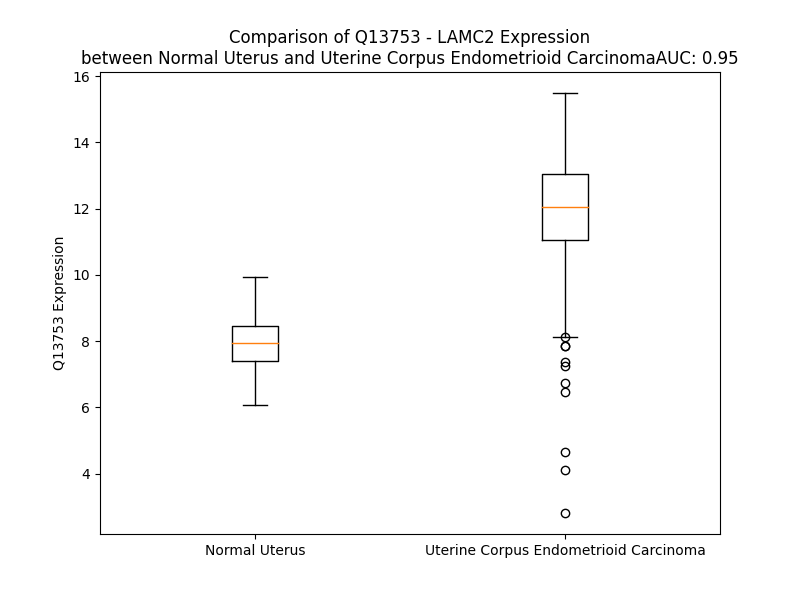

# Detailed Data for Q13753

## Introduction to the Detailed Summary

### How to Interpret the Results

- **Summary & Metrics**: This section provides a quick reference to essential protein attributes, including expression changes, family classification, and biomarker applications. Regulation status (upregulated/downregulated) indicates the protein's behavior in a disease context. Some information comes from the original excel file with the proteins selected from literature, while others are derived from the analyses.
- **Expression Comparison**: A visual representation comparing protein expression between normal and disease states. It highlights significant changes in expression levels that might indicate diagnostic or therapeutic relevance. This is data coming from transcriptomics experiments and could not translate similarly to protein levels.
- **Isoform Alignment**: An interactive view of isoform alignments, revealing structural and functional differences between variants of the protein.
- **Interactors & Homologs**: Tables listing known interaction partners and homologous proteins, the more interactors and homologs, the more complex the protein is to design an antibody for.
- **Biological Assemblies**: Information about the structural arrangement of the protein in different assemblies, providing insights into its functional state but also the complexity of the protein to develop antibodies.
- **Combined Per-Residue Information**: A detailed table summarizing residue-level data. This includes predictions for epitope regions, aggregation tendencies, and modifications that might impact the protein's function. Each row corresponds to a residue in the protein, providing insights into specific sites that may be important for research or drug development.
## Summary & Metrics

- **UniProt Accession**: Q13753
- **Gene Name**: LAMC2
- **Protein Name**: laminin, gamma 2
- **Swiss Prot**: LAMC2_HUMAN
- **Family**: other
- **Biomarker Application**: diagnosis
- **Number of Isoforms**: 2
- **Regulation**: 2
- **(transcriptomics) AUC**: 0.82
- **(transcriptomics) Fold Change**: 1.25
- **(transcriptomics) Regulation**: Upregulated
- **Discotope Epitope Count**: 324
- **Max n_uniprots (Homo)**: N/A
- **Max n_uniprots (Hetero)**: N/A

## Expression Comparison

## Isoform Alignment

<pre style='font-size:14px; font-family:monospace;'>Q13753-1 MPALWLGCCLCFSLLLPAARATSRREVCDCNGKSRQCIFDRELHRQTGNGFRCLNCNDNTDGIHCEKCKNGFYRHRERDRCLPCNCNSKGSLSARCDNSGRCSCKPGVTGARCDRCLPGFHMLTDAGCTQDQRLLDSKCDCDPAGIAGPCDAGRCVCKPAVTGERCDRCRSGYYNLDGGNPEGCTQCFCYGHSASCRSSAEYSVHKITSTFHQDVDGWKAVQRNGSPAKLQWSQRHQDVFSSAQRLDPVYFVAPAKFLGNQQVSYGQSLSFDYRVDRGGRHPSAHDVILEGAGLRITAPLMPLGKTLPCGLTKTYTFRLNEHPSNNWSPQLSYFEYRRLLRNLTALRIRATYGEYSTGYIDNVTLISARPVSGAPAPWVEQCICPVGYKGQFCQDCASGYKRDSARLGPFGTCIPCNCQGGGACDPDTGDCYSGDENPDIECADCPIGFYNDPHDPRSCKPCPCHNGFSCSVMPETEEVVCNNCPPGVTGARCELCADGYFGDPFGEHGPVRPCQPCQCNNNVDPSASGNCDRLTGRCLKCIHNTAGIYCDQCKAGYFGDPLAPNPADKCRACNCNPMGSEPVGCRSDGTCVCKPGFGGPNCEHGAFSCPACYNQVKIQMDQFMQQLQRMEALISKAQGGDGVVPDTELEGRMQQAEQALQDILRDAQISEGASRSLGLQLAKVRSQENSYQSRLDDLKMTVERVRALGSQYQNRVRDTHRLITQMQLSLAESEASLGNTNIPASDHYVGPNGFKSLAQEATRLAESHVESASNMEQLTRETEDYSKQALSLVRKALHEGVGSGSGSPDGAVVQGLVEKLEKTKSLAQQLTREATQAEIEADRSYQHSLRLLDSVSRLQGVSDQSFQVEEAKRIKQKADSLSSLVTRHMDEFKRTQKNLGNWKEEAQQLLQNGKSGREKSDQLLSRANLAKSRAQEALSMGNATFYEVESILKNLREFDLQVDNRKAEAEEAMKRLSYISQKVSDASDKTQQAERALGSAAADAQRAKNGAGEALEISSEIEQEIGSLNLEANVTADGALAMEKGLASLKSEMREVEGELERKELEFDTNMDAVQMVITEAQKVDTRAKNAGVTIQDTLNTLDGLLHLMDQPLSVDEEGLVLLEQKLSRAKTQINSQLRPMMSELEERARQQRGHLHLLETSIDGILADVKNLENIRDNLPPGCYNTQALEQQ
Q13753-2 MPALWLGCCLCFSLLLPAARATSRREVCDCNGKSRQCIFDRELHRQTGNGFRCLNCNDNTDGIHCEKCKNGFYRHRERDRCLPCNCNSKGSLSARCDNSGRCSCKPGVTGARCDRCLPGFHMLTDAGCTQDQRLLDSKCDCDPAGIAGPCDAGRCVCKPAVTGERCDRCRSGYYNLDGGNPEGCTQCFCYGHSASCRSSAEYSVHKITSTFHQDVDGWKAVQRNGSPAKLQWSQRHQDVFSSAQRLDPVYFVAPAKFLGNQQVSYGQSLSFDYRVDRGGRHPSAHDVILEGAGLRITAPLMPLGKTLPCGLTKTYTFRLNEHPSNNWSPQLSYFEYRRLLRNLTALRIRATYGEYSTGYIDNVTLISARPVSGAPAPWVEQCICPVGYKGQFCQDCASGYKRDSARLGPFGTCIPCNCQGGGACDPDTGDCYSGDENPDIECADCPIGFYNDPHDPRSCKPCPCHNGFSCSVMPETEEVVCNNCPPGVTGARCELCADGYFGDPFGEHGPVRPCQPCQCNNNVDPSASGNCDRLTGRCLKCIHNTAGIYCDQCKAGYFGDPLAPNPADKCRACNCNPMGSEPVGCRSDGTCVCKPGFGGPNCEHGAFSCPACYNQVKIQMDQFMQQLQRMEALISKAQGGDGVVPDTELEGRMQQAEQALQDILRDAQISEGASRSLGLQLAKVRSQENSYQSRLDDLKMTVERVRALGSQYQNRVRDTHRLITQMQLSLAESEASLGNTNIPASDHYVGPNGFKSLAQEATRLAESHVESASNMEQLTRETEDYSKQALSLVRKALHEGVGSGSGSPDGAVVQGLVEKLEKTKSLAQQLTREATQAEIEADRSYQHSLRLLDSVSRLQGVSDQSFQVEEAKRIKQKADSLSSLVTRHMDEFKRTQKNLGNWKEEAQQLLQNGKSGREKSDQLLSRANLAKSRAQEALSMGNATFYEVESILKNLREFDLQVDNRKAEAEEAMKRLSYISQKVSDASDKTQQAERALGSAAADAQRAKNGAGEALEISSEIEQEIGSLNLEANVTADGALAMEKGLASLKSEMREVEGELERKELEFDTNMDAVQMVITEAQKVDTRAKNAGVTIQDTLNTLDGLLHLMGM----------------------------------------------------------------------------------
</pre>

## Interactors

| preferredName_A   | preferredName_B   |   score |
|:------------------|:------------------|--------:|
| LAMC2             | LAMB3             |   0.999 |
| LAMC2             | LAMA3             |   0.998 |
| LAMC2             | LAMA4             |   0.993 |
| LAMC2             | ITGB4             |   0.965 |
| LAMC2             | CD44              |   0.958 |
| LAMC2             | LAMB2             |   0.956 |
| LAMC2             | COL17A1           |   0.944 |
| LAMC2             | COL7A1            |   0.927 |
| LAMC2             | LAMA5             |   0.923 |

## Homologs

| uniprot_id   | gene_id   |
|:-------------|:----------|
| Q9H1U4       | MEGF9     |
| P25391       | LAMA1     |
| Q7Z7M0       | MEGF8     |
| A0A3B3ISV6   | ATRNL1    |
| E5RK79       | LAMA4     |
| O75882       | ATRN      |
| A0A7I2V3S4   | LAMC3     |
| O75445       | USH2A     |
| A0A8I5KQG5   | LAMA2     |
| Q16787       | LAMA3     |
| Q13751       | LAMB3     |
| Q8WTR8       | NTN5      |
| E7EPA6       | LAMB1     |
| P98160       | HSPG2     |
| Q9HB63       | NTN4      |
| Q63HQ2       | EGFLAM    |
| H7BZF4       | NTN1      |
| O00634       | NTN3      |
| P55268       | LAMB2     |
| P11047       | LAMC1     |
| A0A087X208   | AGRN      |
| A4D0S4       | LAMB4     |
| Q9UIK5       | TMEFF2    |
| H7C5J6       | LAMA5     |
| Q96CW9       | NTNG2     |
| Q9Y2I2       | NTNG1     |
| Q8IYR6       | TMEFF1    |

## Combined Per-Residue Information

|   res | aa   |   epitope_score | epitope   |   relative_surface_accessibility |   modeling_confidence |   Aggregation | modification   | glycosylation                                  |
|------:|:-----|----------------:|:----------|---------------------------------:|----------------------:|--------------:|:---------------|:-----------------------------------------------|
|     1 | M    |         0.18392 | True      |                          1.29337 |                 38.21 |         0     | N/A            | N/A                                            |
|     2 | P    |         0.21291 | True      |                          0.92464 |                 48.41 |         0     | N/A            | N/A                                            |
|     3 | A    |         0.11286 | True      |                          0.79272 |                 40.68 |         3.772 | N/A            | N/A                                            |
|     4 | L    |         0.1671  | True      |                          0.90016 |                 39.75 |        12.53  | N/A            | N/A                                            |
|     5 | W    |         0.1609  | True      |                          0.93041 |                 40.09 |        13.832 | N/A            | N/A                                            |
|     6 | L    |         0.21542 | True      |                          0.91766 |                 39.45 |        13.832 | N/A            | N/A                                            |
|     7 | G    |         0.12569 | True      |                          0.76862 |                 40.19 |        13.832 | N/A            | N/A                                            |
|     8 | C    |         0.11582 | True      |                          0.91609 |                 40.84 |        13.498 | N/A            | N/A                                            |
|     9 | C    |         0.13814 | True      |                          0.78623 |                 39.94 |        13.227 | N/A            | N/A                                            |
|    10 | L    |         0.12901 | True      |                          0.96938 |                 39.96 |        15.829 | N/A            | N/A                                            |
|    11 | C    |         0.20437 | True      |                          0.8033  |                 37.61 |        15.488 | N/A            | N/A                                            |
|    12 | F    |         0.16748 | True      |                          1.08331 |                 43.71 |        15.379 | N/A            | N/A                                            |
|    13 | S    |         0.15833 | True      |                          0.70262 |                 40.93 |        13.26  | N/A            | N/A                                            |
|    14 | L    |         0.13766 | True      |                          0.9847  |                 41.5  |        13.095 | N/A            | N/A                                            |
|    15 | L    |         0.13981 | True      |                          0.87458 |                 43.23 |        11.26  | N/A            | N/A                                            |
|    16 | L    |         0.19486 | True      |                          1.05093 |                 41.25 |         0.374 | N/A            | N/A                                            |
|    17 | P    |         0.13382 | True      |                          0.84348 |                 42.7  |         0.191 | N/A            | N/A                                            |
|    18 | A    |         0.17914 | True      |                          1.00088 |                 41.4  |         0     | N/A            | N/A                                            |
|    19 | A    |         0.18322 | True      |                          1.03797 |                 40.47 |         0     | N/A            | N/A                                            |
|    20 | R    |         0.17051 | True      |                          1.00943 |                 36.67 |         0     | N/A            | N/A                                            |
|    21 | A    |         0.16221 | True      |                          0.90264 |                 39.93 |         0     | N/A            | N/A                                            |
|    22 | T    |         0.17579 | True      |                          1.02396 |                 37.38 |         0     | N/A            | N/A                                            |
|    23 | S    |         0.11578 | True      |                          0.78882 |                 38.78 |         0     | N/A            | N/A                                            |
|    24 | R    |         0.12823 | True      |                          0.85832 |                 40.25 |         0     | N/A            | N/A                                            |
|    25 | R    |         0.17425 | True      |                          0.92107 |                 46.47 |         0     | N/A            | N/A                                            |
|    26 | E    |         0.08689 | False     |                          0.40199 |                 56.25 |         0     | N/A            | N/A                                            |
|    27 | V    |         0.07976 | False     |                          0.88223 |                 66.3  |         0     | N/A            | N/A                                            |
|    28 | C    |         0.04382 | False     |                          0.24781 |                 74.98 |         0     | N/A            | N/A                                            |
|    29 | D    |         0.05103 | False     |                          0.55695 |                 84.01 |         0     | N/A            | N/A                                            |
|    30 | C    |         0.02617 | False     |                          0.01556 |                 86.58 |         0     | N/A            | N/A                                            |
|    31 | N    |         0.1065  | True      |                          0.53051 |                 83.47 |         0     | N/A            | N/A                                            |
|    32 | G    |         0.12002 | True      |                          0.93431 |                 84.82 |         0     | N/A            | N/A                                            |
|    33 | K    |         0.04424 | False     |                          0.16591 |                 86.15 |         0     | N/A            | N/A                                            |
|    34 | S    |         0.07981 | False     |                          0.09659 |                 84.9  |         0     | N/A            | N/A                                            |
|    35 | R    |         0.07948 | False     |                          0.96445 |                 84.75 |         0     | N/A            | N/A                                            |
|    36 | Q    |         0.13236 | True      |                          0.50085 |                 85.08 |         0     | N/A            | N/A                                            |
|    37 | C    |         0.04598 | False     |                          0.31318 |                 85.86 |         0     | N/A            | N/A                                            |
|    38 | I    |         0.13112 | True      |                          0.53518 |                 86.7  |         0     | N/A            | N/A                                            |
|    39 | F    |         0.12111 | True      |                          0.46807 |                 82.73 |         0     | N/A            | N/A                                            |
|    40 | D    |         0.05137 | False     |                          0.19431 |                 78.15 |         0     | N/A            | N/A                                            |
|    41 | R    |         0.15865 | True      |                          0.79244 |                 81.5  |         0     | N/A            | N/A                                            |
|    42 | E    |         0.0567  | False     |                          0.35634 |                 78.66 |         0     | N/A            | N/A                                            |
|    43 | L    |         0.02694 | False     |                          0.01814 |                 78.18 |         0     | N/A            | N/A                                            |
|    44 | H    |         0.13913 | True      |                          0.43177 |                 78.73 |         0     | N/A            | N/A                                            |
|    45 | R    |         0.15448 | True      |                          0.77339 |                 79.31 |         0     | N/A            | N/A                                            |
|    46 | Q    |         0.08638 | False     |                          0.25688 |                 72.81 |         0     | N/A            | N/A                                            |
|    47 | T    |         0.12916 | True      |                          0.47914 |                 71.78 |         0     | N/A            | N/A                                            |
|    48 | G    |         0.09649 | True      |                          0.52338 |                 73.05 |         0     | N/A            | N/A                                            |
|    49 | N    |         0.06883 | False     |                          0.48043 |                 69.09 |         0     | N/A            | N/A                                            |
|    50 | G    |         0.02189 | False     |                          0       |                 76.98 |         0     | N/A            | N/A                                            |
|    51 | F    |         0.04943 | False     |                          0.24626 |                 83.24 |         0     | N/A            | N/A                                            |
|    52 | R    |         0.0694  | False     |                          0.28839 |                 86.74 |         0     | N/A            | N/A                                            |
|    53 | C    |         0.02513 | False     |                          0.07515 |                 88.59 |         0     | N/A            | N/A                                            |
|    54 | L    |         0.11347 | True      |                          0.45257 |                 87.99 |         0     | N/A            | N/A                                            |
|    55 | N    |         0.1947  | True      |                          0.72849 |                 87.26 |         0     | N/A            | N/A                                            |
|    56 | C    |         0.03146 | False     |                          0.14123 |                 88.41 |         0     | N/A            | N/A                                            |
|    57 | N    |         0.12845 | True      |                          0.58517 |                 88.15 |         0     | N/A            | N/A                                            |
|    58 | D    |         0.07109 | False     |                          0.30028 |                 87.52 |         0     | N/A            | N/A                                            |
|    59 | N    |         0.03119 | False     |                          0.32312 |                 88    |         0     | N/A            | N/A                                            |
|    60 | T    |         0.01279 | False     |                          0.00095 |                 88.62 |         0     | N/A            | N/A                                            |
|    61 | D    |         0.06663 | False     |                          0.41156 |                 85.98 |         0     | N/A            | N/A                                            |
|    62 | G    |         0.05412 | False     |                          0.34781 |                 85.37 |         0     | N/A            | N/A                                            |
|    63 | I    |         0.0732  | False     |                          0.31473 |                 86.56 |         0     | N/A            | N/A                                            |
|    64 | H    |         0.04731 | False     |                          0.23801 |                 87.07 |         0     | N/A            | N/A                                            |
|    65 | C    |         0.01098 | False     |                          0.00592 |                 88.76 |         0     | N/A            | N/A                                            |
|    66 | E    |         0.09637 | True      |                          0.23251 |                 86.02 |         0     | N/A            | N/A                                            |
|    67 | K    |         0.09532 | True      |                          0.62816 |                 87.54 |         0     | N/A            | N/A                                            |
|    68 | C    |         0.05731 | False     |                          0.21737 |                 87.52 |         0     | N/A            | N/A                                            |
|    69 | K    |         0.05626 | False     |                          0.37532 |                 86.71 |         0     | N/A            | N/A                                            |
|    70 | N    |         0.07722 | False     |                          0.68549 |                 84.37 |         0     | N/A            | N/A                                            |
|    71 | G    |         0.01551 | False     |                          0.16735 |                 83.97 |         0     | N/A            | N/A                                            |
|    72 | F    |         0.09914 | True      |                          0.29768 |                 89.81 |         0     | N/A            | N/A                                            |
|    73 | Y    |         0.04551 | False     |                          0.11056 |                 88.3  |         0     | N/A            | N/A                                            |
|    74 | R    |         0.16237 | True      |                          0.19068 |                 86.32 |         0     | N/A            | N/A                                            |
|    75 | H    |         0.16771 | True      |                          0.6585  |                 79.46 |         0     | N/A            | N/A                                            |
|    76 | R    |         0.15973 | True      |                          0.7449  |                 79.95 |         0     | N/A            | N/A                                            |
|    77 | E    |         0.14983 | True      |                          0.72511 |                 71.32 |         0     | N/A            | N/A                                            |
|    78 | R    |         0.17352 | True      |                          0.92184 |                 74.44 |         0     | N/A            | N/A                                            |
|    79 | D    |         0.17491 | True      |                          0.33534 |                 80.17 |         0     | N/A            | N/A                                            |
|    80 | R    |         0.12022 | True      |                          0.60787 |                 84.2  |         0     | N/A            | N/A                                            |
|    81 | C    |         0.06505 | False     |                          0.01332 |                 88.85 |         0     | N/A            | N/A                                            |
|    82 | L    |         0.10753 | True      |                          0.46576 |                 87.52 |         0     | N/A            | N/A                                            |
|    83 | P    |         0.08205 | False     |                          0.42343 |                 87.59 |         0     | N/A            | N/A                                            |
|    84 | C    |         0.02322 | False     |                          0.01155 |                 90.22 |         0     | N/A            | N/A                                            |
|    85 | N    |         0.11363 | True      |                          0.65249 |                 90.35 |         0     | N/A            | N/A                                            |
|    86 | C    |         0.05515 | False     |                          0.14859 |                 92.02 |         0     | N/A            | N/A                                            |
|    87 | N    |         0.051   | False     |                          0.29733 |                 89.51 |         0     | N/A            | N/A                                            |
|    88 | S    |         0.04954 | False     |                          0.79885 |                 89.23 |         0     | N/A            | N/A                                            |
|    89 | K    |         0.06179 | False     |                          0.42038 |                 88.65 |         0     | N/A            | N/A                                            |
|    90 | G    |         0.00245 | False     |                          0       |                 88.85 |         0     | N/A            | N/A                                            |
|    91 | S    |         0.0173  | False     |                          0.0496  |                 91.69 |         0     | N/A            | N/A                                            |
|    92 | L    |         0.09187 | False     |                          0.7163  |                 88.37 |         0     | N/A            | N/A                                            |
|    93 | S    |         0.11427 | True      |                          0.40772 |                 86.83 |         0     | N/A            | N/A                                            |
|    94 | A    |         0.02964 | False     |                          0.65225 |                 85.29 |         0     | N/A            | N/A                                            |
|    95 | R    |         0.08388 | False     |                          0.46781 |                 85.56 |         0     | N/A            | N/A                                            |
|    96 | C    |         0.04251 | False     |                          0.18704 |                 88.29 |         0     | N/A            | N/A                                            |
|    97 | D    |         0.0798  | False     |                          0.43111 |                 85.2  |         0     | N/A            | N/A                                            |
|    98 | N    |         0.13251 | True      |                          0.83248 |                 79.43 |         0     | N/A            | N/A                                            |
|    99 | S    |         0.09456 | True      |                          0.57778 |                 84.26 |         0     | N/A            | N/A                                            |
|   100 | G    |         0.01386 | False     |                          0.02967 |                 85.62 |         0     | N/A            | N/A                                            |
|   101 | R    |         0.11934 | True      |                          0.62183 |                 90.4  |         0     | N/A            | N/A                                            |
|   102 | C    |         0.03332 | False     |                          0.04335 |                 92.32 |         0     | N/A            | N/A                                            |
|   103 | S    |         0.06016 | False     |                          0.50534 |                 92.13 |         0     | N/A            | N/A                                            |
|   104 | C    |         0.04887 | False     |                          0.27769 |                 92.33 |         0     | N/A            | N/A                                            |
|   105 | K    |         0.04425 | False     |                          0.1774  |                 91.16 |         0     | N/A            | N/A                                            |
|   106 | P    |         0.08935 | False     |                          0.82097 |                 86.84 |         0     | N/A            | N/A                                            |
|   107 | G    |         0.01293 | False     |                          0.06221 |                 87.88 |         0     | N/A            | N/A                                            |
|   108 | V    |         0.02433 | False     |                          0.06615 |                 93.11 |         0     | N/A            | N/A                                            |
|   109 | T    |         0.10623 | True      |                          0.33353 |                 91.76 |         0     | N/A            | N/A                                            |
|   110 | G    |         0.07826 | False     |                          0.3054  |                 88.86 |         0     | N/A            | N/A                                            |
|   111 | A    |         0.05223 | False     |                          0.5304  |                 87.94 |         0     | N/A            | N/A                                            |
|   112 | R    |         0.08476 | False     |                          0.26896 |                 91.46 |         0     | N/A            | N/A                                            |
|   113 | C    |         0.00585 | False     |                          0       |                 92.87 |         0     | N/A            | N/A                                            |
|   114 | D    |         0.16381 | True      |                          0.33583 |                 90.58 |         0     | N/A            | N/A                                            |
|   115 | R    |         0.22691 | True      |                          0.63358 |                 91.82 |         0     | N/A            | N/A                                            |
|   116 | C    |         0.03558 | False     |                          0.24706 |                 87.96 |         0     | N/A            | N/A                                            |
|   117 | L    |         0.0795  | False     |                          0.44486 |                 86.23 |         0     | N/A            | N/A                                            |
|   118 | P    |         0.12524 | True      |                          0.93977 |                 81.82 |         0     | N/A            | N/A                                            |
|   119 | G    |         0.03508 | False     |                          0.63406 |                 74.62 |         0     | N/A            | N/A                                            |
|   120 | F    |         0.10317 | True      |                          0.32474 |                 82.25 |         0     | N/A            | N/A                                            |
|   121 | H    |         0.07933 | False     |                          0.2135  |                 77.68 |         0     | N/A            | N/A                                            |
|   122 | M    |         0.08018 | False     |                          0.55675 |                 80.94 |         0     | N/A            | N/A                                            |
|   123 | L    |         0.08772 | False     |                          0.26307 |                 82.89 |         0     | N/A            | N/A                                            |
|   124 | T    |         0.10806 | True      |                          0.34005 |                 82.96 |         0     | N/A            | N/A                                            |
|   125 | D    |         0.12572 | True      |                          0.59334 |                 83.82 |         0     | N/A            | N/A                                            |
|   126 | A    |         0.09124 | False     |                          0.86037 |                 81.46 |         0     | N/A            | N/A                                            |
|   127 | G    |         0.01164 | False     |                          0.01687 |                 83.99 |         0     | N/A            | N/A                                            |
|   128 | C    |         0.08542 | False     |                          0.08776 |                 85.4  |         0     | N/A            | N/A                                            |
|   129 | T    |         0.07934 | False     |                          0.40368 |                 76.9  |         0     | N/A            | N/A                                            |
|   130 | Q    |         0.08132 | False     |                          0.57733 |                 67.17 |         0     | N/A            | N/A                                            |
|   131 | D    |         0.12709 | True      |                          0.20792 |                 52.66 |         0     | N/A            | N/A                                            |
|   132 | Q    |         0.15565 | True      |                          0.81626 |                 50.57 |         0     | N/A            | N/A                                            |
|   133 | R    |         0.10252 | True      |                          0.8562  |                 49.05 |         0     | N/A            | N/A                                            |
|   134 | L    |         0.07226 | False     |                          1.01002 |                 38.31 |         0     | N/A            | N/A                                            |
|   135 | L    |         0.11934 | True      |                          0.64861 |                 44    |         0     | N/A            | N/A                                            |
|   136 | D    |         0.08683 | False     |                          0.57126 |                 45.03 |         0     | N/A            | N/A                                            |
|   137 | S    |         0.1091  | True      |                          0.9252  |                 54.11 |         0     | N/A            | N/A                                            |
|   138 | K    |         0.10538 | True      |                          0.80458 |                 58.52 |         0     | N/A            | N/A                                            |
|   139 | C    |         0.04613 | False     |                          0.15895 |                 72.26 |         0     | N/A            | N/A                                            |
|   140 | D    |         0.11036 | True      |                          0.57803 |                 84.82 |         0     | N/A            | N/A                                            |
|   141 | C    |         0.03642 | False     |                          0.1645  |                 87.92 |         0     | N/A            | N/A                                            |
|   142 | D    |         0.06312 | False     |                          0.25404 |                 89.47 |         0     | N/A            | N/A                                            |
|   143 | P    |         0.06164 | False     |                          0.56918 |                 89.22 |         0     | N/A            | N/A                                            |
|   144 | A    |         0.02652 | False     |                          0.21285 |                 90.94 |         0     | N/A            | N/A                                            |
|   145 | G    |         0.00099 | False     |                          0       |                 91.59 |         0     | N/A            | N/A                                            |
|   146 | I    |         0.06768 | False     |                          0.30722 |                 91.94 |         0     | N/A            | N/A                                            |
|   147 | A    |         0.07145 | False     |                          0.61773 |                 89.36 |         0     | N/A            | N/A                                            |
|   148 | G    |         0.0511  | False     |                          0.32911 |                 84.41 |         0     | N/A            | N/A                                            |
|   149 | P    |         0.05539 | False     |                          0.93063 |                 81.92 |         0     | N/A            | N/A                                            |
|   150 | C    |         0.06624 | False     |                          0.31185 |                 82.39 |         0     | N/A            | N/A                                            |
|   151 | D    |         0.05669 | False     |                          0.6241  |                 82.98 |         0     | N/A            | N/A                                            |
|   152 | A    |         0.13012 | True      |                          1.08901 |                 81.49 |         0     | N/A            | N/A                                            |
|   153 | G    |         0.07867 | False     |                          0.41125 |                 74.94 |         0     | N/A            | N/A                                            |
|   154 | R    |         0.10404 | True      |                          0.62572 |                 84.89 |         0     | N/A            | N/A                                            |
|   155 | C    |         0.04557 | False     |                          0.12268 |                 89.21 |         0     | N/A            | N/A                                            |
|   156 | V    |         0.08337 | False     |                          0.42558 |                 92.23 |         0     | N/A            | N/A                                            |
|   157 | C    |         0.04065 | False     |                          0.23558 |                 94.09 |         0     | N/A            | N/A                                            |
|   158 | K    |         0.02514 | False     |                          0.09017 |                 94.75 |         0     | N/A            | N/A                                            |
|   159 | P    |         0.0933  | True      |                          0.60386 |                 94.08 |         0     | N/A            | N/A                                            |
|   160 | A    |         0.0026  | False     |                          0.01768 |                 94.97 |         0     | N/A            | N/A                                            |
|   161 | V    |         0.00915 | False     |                          0.00493 |                 96.61 |         0     | N/A            | N/A                                            |
|   162 | T    |         0.14779 | True      |                          0.39912 |                 94.36 |         0     | N/A            | N/A                                            |
|   163 | G    |         0.05663 | False     |                          0.2545  |                 90.92 |         0     | N/A            | N/A                                            |
|   164 | E    |         0.07434 | False     |                          0.56824 |                 88.8  |         0     | N/A            | N/A                                            |
|   165 | R    |         0.11209 | True      |                          0.42656 |                 91.16 |         0     | N/A            | N/A                                            |
|   166 | C    |         0.0058  | False     |                          0       |                 94.04 |         0     | N/A            | N/A                                            |
|   167 | D    |         0.08055 | False     |                          0.3181  |                 93.38 |         0     | N/A            | N/A                                            |
|   168 | R    |         0.16355 | True      |                          0.56039 |                 94.86 |         0     | N/A            | N/A                                            |
|   169 | C    |         0.03492 | False     |                          0.23699 |                 95.79 |         0     | N/A            | N/A                                            |
|   170 | R    |         0.10147 | True      |                          0.45026 |                 95.55 |         0     | N/A            | N/A                                            |
|   171 | S    |         0.08178 | False     |                          0.90533 |                 93.12 |         0     | N/A            | N/A                                            |
|   172 | G    |         0.01702 | False     |                          0.18994 |                 93.44 |         0     | N/A            | N/A                                            |
|   173 | Y    |         0.06035 | False     |                          0.32586 |                 95.38 |         0     | N/A            | N/A                                            |
|   174 | Y    |         0.01695 | False     |                          0.0285  |                 95.1  |         0     | N/A            | N/A                                            |
|   175 | N    |         0.11856 | True      |                          0.15255 |                 94.58 |         0     | N/A            | N/A                                            |
|   176 | L    |         0.03061 | False     |                          0.32453 |                 94.75 |         0     | N/A            | N/A                                            |
|   177 | D    |         0.04054 | False     |                          0.24631 |                 91.84 |         0     | N/A            | N/A                                            |
|   178 | G    |         0.07247 | False     |                          0.52699 |                 89.88 |         0     | N/A            | N/A                                            |
|   179 | G    |         0.04237 | False     |                          0.58446 |                 87.01 |         0     | N/A            | N/A                                            |
|   180 | N    |         0.02148 | False     |                          0.11028 |                 89.65 |         0     | N/A            | N/A                                            |
|   181 | P    |         0.04533 | False     |                          0.45271 |                 89.36 |         0     | N/A            | N/A                                            |
|   182 | E    |         0.03593 | False     |                          0.3289  |                 91.05 |         0     | N/A            | N/A                                            |
|   183 | G    |         0.00272 | False     |                          0       |                 93.23 |         0     | N/A            | N/A                                            |
|   184 | C    |         0.03902 | False     |                          0.01332 |                 94.99 |         0     | N/A            | N/A                                            |
|   185 | T    |         0.02016 | False     |                          0.13329 |                 93.43 |         0     | N/A            | N/A                                            |
|   186 | Q    |         0.04148 | False     |                          0.39682 |                 93.68 |         0     | N/A            | N/A                                            |
|   187 | C    |         0.04879 | False     |                          0.06899 |                 94.35 |         0     | N/A            | N/A                                            |
|   188 | F    |         0.01487 | False     |                          0.03088 |                 93.57 |         0     | N/A            | N/A                                            |
|   189 | C    |         0.00342 | False     |                          0       |                 93.84 |         0     | N/A            | N/A                                            |
|   190 | Y    |         0.02169 | False     |                          0.01182 |                 90.9  |         0     | N/A            | N/A                                            |
|   191 | G    |         0.06013 | False     |                          0.70735 |                 90.6  |         0     | N/A            | N/A                                            |
|   192 | H    |         0.05211 | False     |                          0.17315 |                 92.47 |         0     | N/A            | N/A                                            |
|   193 | S    |         0.04745 | False     |                          0.13136 |                 93.41 |         0     | N/A            | N/A                                            |
|   194 | A    |         0.02606 | False     |                          0.71018 |                 91.51 |         0     | N/A            | N/A                                            |
|   195 | S    |         0.03237 | False     |                          0.436   |                 94.52 |         0     | N/A            | N/A                                            |
|   196 | C    |         0.02297 | False     |                          0.14673 |                 94.73 |         0     | N/A            | N/A                                            |
|   197 | R    |         0.07027 | False     |                          0.62919 |                 95.08 |         0     | N/A            | N/A                                            |
|   198 | S    |         0.06392 | False     |                          0.32053 |                 94.42 |         0     | N/A            | N/A                                            |
|   199 | S    |         0.04105 | False     |                          0.04543 |                 92.86 |         0     | N/A            | N/A                                            |
|   200 | A    |         0.07978 | False     |                          0.92555 |                 87.58 |         0     | N/A            | N/A                                            |
|   201 | E    |         0.07801 | False     |                          0.61745 |                 87.89 |         0     | N/A            | N/A                                            |
|   202 | Y    |         0.04848 | False     |                          0.13721 |                 92.91 |         0     | N/A            | N/A                                            |
|   203 | S    |         0.02637 | False     |                          0.04691 |                 93.77 |         0     | N/A            | N/A                                            |
|   204 | V    |         0.0335  | False     |                          0.40948 |                 94.27 |         0     | N/A            | N/A                                            |
|   205 | H    |         0.0459  | False     |                          0.25069 |                 93.87 |         0     | N/A            | N/A                                            |
|   206 | K    |         0.0475  | False     |                          0.58413 |                 95.17 |         0     | N/A            | N/A                                            |
|   207 | I    |         0.03063 | False     |                          0.096   |                 95.88 |         0     | N/A            | N/A                                            |
|   208 | T    |         0.04171 | False     |                          0.39991 |                 96.89 |         0     | N/A            | N/A                                            |
|   209 | S    |         0.01057 | False     |                          0.00728 |                 97.08 |         0     | N/A            | N/A                                            |
|   210 | T    |         0.03949 | False     |                          0.30616 |                 94.05 |         0     | N/A            | N/A                                            |
|   211 | F    |         0.01353 | False     |                          0.02336 |                 94.68 |         0     | N/A            | N/A                                            |
|   212 | H    |         0.10697 | True      |                          0.57967 |                 90.76 |         0     | N/A            | N/A                                            |
|   213 | Q    |         0.10977 | True      |                          0.77634 |                 87.61 |         0     | N/A            | N/A                                            |
|   214 | D    |         0.07396 | False     |                          0.4608  |                 91.01 |         0     | N/A            | N/A                                            |
|   215 | V    |         0.06417 | False     |                          0.33187 |                 94.49 |         0     | N/A            | N/A                                            |
|   216 | D    |         0.05896 | False     |                          0.24245 |                 93.74 |         0     | N/A            | N/A                                            |
|   217 | G    |         0.1101  | True      |                          0.5316  |                 94.33 |         0     | N/A            | N/A                                            |
|   218 | W    |         0.0236  | False     |                          0.02862 |                 97.24 |         0     | N/A            | N/A                                            |
|   219 | K    |         0.11838 | True      |                          0.69053 |                 96.92 |         0     | N/A            | N/A                                            |
|   220 | A    |         0.0243  | False     |                          0.04393 |                 95.76 |         0     | N/A            | N/A                                            |
|   221 | V    |         0.07993 | False     |                          0.16376 |                 94.63 |         0     | N/A            | N/A                                            |
|   222 | Q    |         0.07985 | False     |                          0.3312  |                 91.34 |         0     | N/A            | N/A                                            |
|   223 | R    |         0.17753 | True      |                          0.57623 |                 85.94 |         0     | N/A            | N/A                                            |
|   224 | N    |         0.10852 | True      |                          0.74597 |                 85.64 |         0     | N/A            | N/A                                            |
|   225 | G    |         0.048   | False     |                          0.49352 |                 84.78 |         0     | N/A            | N/A                                            |
|   226 | S    |         0.09423 | True      |                          0.33143 |                 88.81 |         0     | N/A            | N/A                                            |
|   227 | P    |         0.09888 | True      |                          0.84542 |                 91.5  |         0     | N/A            | N/A                                            |
|   228 | A    |         0.02765 | False     |                          0.23427 |                 91.38 |         0     | N/A            | N/A                                            |
|   229 | K    |         0.12149 | True      |                          0.72459 |                 92.73 |         0     | N/A            | N/A                                            |
|   230 | L    |         0.07077 | False     |                          0.19447 |                 95.2  |         0     | N/A            | N/A                                            |
|   231 | Q    |         0.1062  | True      |                          0.35079 |                 94.81 |         0     | N/A            | N/A                                            |
|   232 | W    |         0.12962 | True      |                          0.3402  |                 95.85 |         0     | N/A            | N/A                                            |
|   233 | S    |         0.04299 | False     |                          0.11871 |                 91.78 |         0     | N/A            | N/A                                            |
|   234 | Q    |         0.09723 | True      |                          0.73513 |                 87.77 |         0     | N/A            | N/A                                            |
|   235 | R    |         0.09525 | True      |                          0.87836 |                 89.55 |         0     | N/A            | N/A                                            |
|   236 | H    |         0.08716 | False     |                          0.57451 |                 89.64 |         0     | N/A            | N/A                                            |
|   237 | Q    |         0.0666  | False     |                          0.37684 |                 90.97 |         0     | N/A            | N/A                                            |
|   238 | D    |         0.02871 | False     |                          0.05303 |                 93.35 |         0     | N/A            | N/A                                            |
|   239 | V    |         0.00685 | False     |                          0       |                 96.41 |         0.325 | N/A            | N/A                                            |
|   240 | F    |         0.06385 | False     |                          0.22039 |                 96.02 |         0.325 | N/A            | N/A                                            |
|   241 | S    |         0.01794 | False     |                          0.01173 |                 94.74 |         0.325 | N/A            | N/A                                            |
|   242 | S    |         0.1667  | True      |                          0.46744 |                 91.71 |         0.325 | N/A            | N/A                                            |
|   243 | A    |         0.04521 | False     |                          0.04989 |                 87.41 |         0.325 | N/A            | N/A                                            |
|   244 | Q    |         0.11154 | True      |                          0.74943 |                 80.71 |         0     | N/A            | N/A                                            |
|   245 | R    |         0.26663 | True      |                          0.72919 |                 79.44 |         0     | N/A            | N/A                                            |
|   246 | L    |         0.16364 | True      |                          0.83778 |                 80.95 |         0     | N/A            | N/A                                            |
|   247 | D    |         0.13341 | True      |                          0.44948 |                 84.95 |         0     | N/A            | N/A                                            |
|   248 | P    |         0.02006 | False     |                          0.08151 |                 89.67 |         1.519 | N/A            | N/A                                            |
|   249 | V    |         0.03827 | False     |                          0.04284 |                 93.67 |         8.925 | N/A            | N/A                                            |
|   250 | Y    |         0.04401 | False     |                          0.0386  |                 95.98 |         8.925 | N/A            | N/A                                            |
|   251 | F    |         0.00234 | False     |                          0.00064 |                 97.49 |         8.925 | N/A            | N/A                                            |
|   252 | V    |         0.02857 | False     |                          0.19128 |                 97.32 |         8.925 | N/A            | N/A                                            |
|   253 | A    |         0.01004 | False     |                          0.05185 |                 97.37 |         7.406 | N/A            | N/A                                            |
|   254 | P    |         0.02221 | False     |                          0.14712 |                 97.08 |         6.686 | N/A            | N/A                                            |
|   255 | A    |         0.06119 | False     |                          0.80026 |                 94.21 |         0     | N/A            | N/A                                            |
|   256 | K    |         0.0384  | False     |                          0.42325 |                 94.56 |         0     | N/A            | N/A                                            |
|   257 | F    |         0.00209 | False     |                          0       |                 96.47 |         0     | N/A            | N/A                                            |
|   258 | L    |         0.01951 | False     |                          0.22441 |                 96.42 |         0     | N/A            | N/A                                            |
|   259 | G    |         0.03635 | False     |                          0.37207 |                 93.41 |         0     | N/A            | N/A                                            |
|   260 | N    |         0.06984 | False     |                          0.47482 |                 92.29 |         0     | N/A            | N/A                                            |
|   261 | Q    |         0.01992 | False     |                          0.04941 |                 93.99 |         0     | N/A            | N/A                                            |
|   262 | Q    |         0.01588 | False     |                          0.02404 |                 91.17 |         0     | N/A            | N/A                                            |
|   263 | V    |         0.0299  | False     |                          0.15709 |                 93.46 |         0     | N/A            | N/A                                            |
|   264 | S    |         0.0016  | False     |                          0       |                 95.4  |         0     | N/A            | N/A                                            |
|   265 | Y    |         0.02438 | False     |                          0.06548 |                 94.72 |         0     | N/A            | N/A                                            |
|   266 | G    |         0.02485 | False     |                          0.11784 |                 92.16 |         0     | N/A            | N/A                                            |
|   267 | Q    |         0.03004 | False     |                          0.13168 |                 95    |         0     | N/A            | N/A                                            |
|   268 | S    |         0.04248 | False     |                          0.21354 |                 94.75 |         0     | N/A            | N/A                                            |
|   269 | L    |         0.00423 | False     |                          0.00824 |                 96.89 |         0     | N/A            | N/A                                            |
|   270 | S    |         0.02875 | False     |                          0.1649  |                 97.56 |         0     | N/A            | N/A                                            |
|   271 | F    |         0.00939 | False     |                          0.00343 |                 97.51 |         0     | N/A            | N/A                                            |
|   272 | D    |         0.05624 | False     |                          0.15075 |                 96.4  |         0     | N/A            | N/A                                            |
|   273 | Y    |         0.02801 | False     |                          0.01286 |                 94.87 |         0     | N/A            | N/A                                            |
|   274 | R    |         0.12444 | True      |                          0.213   |                 92.23 |         0     | N/A            | N/A                                            |
|   275 | V    |         0.04383 | False     |                          0.01598 |                 91.21 |         0     | N/A            | N/A                                            |
|   276 | D    |         0.09472 | True      |                          0.32829 |                 87.95 |         0     | N/A            | N/A                                            |
|   277 | R    |         0.1413  | True      |                          0.47304 |                 78.28 |         0     | N/A            | N/A                                            |
|   278 | G    |         0.21449 | True      |                          0.26337 |                 63.04 |         0     | N/A            | N/A                                            |
|   279 | G    |         0.20825 | True      |                          0.6369  |                 64.59 |         0     | N/A            | N/A                                            |
|   280 | R    |         0.16934 | True      |                          0.39557 |                 77.68 |         0     | N/A            | N/A                                            |
|   281 | H    |         0.16116 | True      |                          0.6263  |                 80.58 |         0     | N/A            | N/A                                            |
|   282 | P    |         0.01814 | False     |                          0.06687 |                 84.57 |         0     | N/A            | N/A                                            |
|   283 | S    |         0.04257 | False     |                          0.28072 |                 87.13 |         0     | N/A            | N/A                                            |
|   284 | A    |         0.05288 | False     |                          0.31689 |                 87.67 |         0     | N/A            | N/A                                            |
|   285 | H    |         0.07032 | False     |                          0.37771 |                 92.05 |         0     | N/A            | N/A                                            |
|   286 | D    |         0.00665 | False     |                          0.00061 |                 93.92 |         0     | N/A            | N/A                                            |
|   287 | V    |         0.00229 | False     |                          0       |                 95.64 |         0     | N/A            | N/A                                            |
|   288 | I    |         0.03822 | False     |                          0.0312  |                 96.32 |         0     | N/A            | N/A                                            |
|   289 | L    |         0.0046  | False     |                          0.01237 |                 96.98 |         0     | N/A            | N/A                                            |
|   290 | E    |         0.03867 | False     |                          0.1481  |                 96.48 |         0     | N/A            | N/A                                            |
|   291 | G    |         0.01823 | False     |                          0.0228  |                 93.61 |         0     | N/A            | N/A                                            |
|   292 | A    |         0.03989 | False     |                          0.28895 |                 88.24 |         0     | N/A            | N/A                                            |
|   293 | G    |         0.09156 | False     |                          1.06392 |                 91.28 |         0     | N/A            | N/A                                            |
|   294 | L    |         0.0429  | False     |                          0.24086 |                 95.22 |         0     | N/A            | N/A                                            |
|   295 | R    |         0.05661 | False     |                          0.43621 |                 95.56 |         0     | N/A            | N/A                                            |
|   296 | I    |         0.00599 | False     |                          0.0008  |                 96.36 |         0     | N/A            | N/A                                            |
|   297 | T    |         0.06509 | False     |                          0.07959 |                 96.15 |         0     | N/A            | N/A                                            |
|   298 | A    |         0.00228 | False     |                          0       |                 94.69 |         0     | N/A            | N/A                                            |
|   299 | P    |         0.02729 | False     |                          0.13489 |                 93.22 |         0     | N/A            | N/A                                            |
|   300 | L    |         0.02995 | False     |                          0.06685 |                 91.37 |         0     | N/A            | N/A                                            |
|   301 | M    |         0.15855 | True      |                          0.16948 |                 87.27 |         0     | N/A            | N/A                                            |
|   302 | P    |         0.11643 | True      |                          0.64772 |                 83.4  |         0     | N/A            | N/A                                            |
|   303 | L    |         0.15647 | True      |                          0.73274 |                 76.13 |         0     | N/A            | N/A                                            |
|   304 | G    |         0.18534 | True      |                          0.86781 |                 76.43 |         0     | N/A            | N/A                                            |
|   305 | K    |         0.1457  | True      |                          0.59842 |                 83.62 |         0     | N/A            | N/A                                            |
|   306 | T    |         0.22031 | True      |                          0.47236 |                 84.47 |         0     | N/A            | N/A                                            |
|   307 | L    |         0.01836 | False     |                          0.01835 |                 84.79 |         0     | N/A            | N/A                                            |
|   308 | P    |         0.0673  | False     |                          0.20841 |                 85.15 |         0     | N/A            | N/A                                            |
|   309 | C    |         0.14525 | True      |                          0.57179 |                 85.62 |         0     | N/A            | N/A                                            |
|   310 | G    |         0.16833 | True      |                          0.57543 |                 83.28 |         0     | N/A            | N/A                                            |
|   311 | L    |         0.18541 | True      |                          0.68679 |                 87.6  |         0     | N/A            | N/A                                            |
|   312 | T    |         0.17031 | True      |                          0.54543 |                 90.74 |         0     | N/A            | N/A                                            |
|   313 | K    |         0.13416 | True      |                          0.46823 |                 91.58 |         0     | N/A            | N/A                                            |
|   314 | T    |         0.06703 | False     |                          0.65967 |                 95.62 |         0     | N/A            | N/A                                            |
|   315 | Y    |         0.04461 | False     |                          0.09281 |                 94.41 |         0     | N/A            | N/A                                            |
|   316 | T    |         0.06992 | False     |                          0.60044 |                 95    |         0     | N/A            | N/A                                            |
|   317 | F    |         0.01414 | False     |                          0.07747 |                 94.31 |         0     | N/A            | N/A                                            |
|   318 | R    |         0.07234 | False     |                          0.28992 |                 93.51 |         0     | N/A            | N/A                                            |
|   319 | L    |         0.00526 | False     |                          0.02473 |                 94.64 |         0     | N/A            | N/A                                            |
|   320 | N    |         0.08194 | False     |                          0.09098 |                 92.3  |         0     | N/A            | N/A                                            |
|   321 | E    |         0.0524  | False     |                          0.19181 |                 92.34 |         0     | N/A            | N/A                                            |
|   322 | H    |         0.10247 | True      |                          0.24395 |                 89.97 |         0     | N/A            | N/A                                            |
|   323 | P    |         0.12237 | True      |                          0.7039  |                 86.04 |         0     | N/A            | N/A                                            |
|   324 | S    |         0.13309 | True      |                          0.55061 |                 84.1  |         0     | N/A            | N/A                                            |
|   325 | N    |         0.05475 | False     |                          0.19044 |                 84.86 |         0     | N/A            | N/A                                            |
|   326 | N    |         0.11271 | True      |                          0.59294 |                 85.59 |         0     | N/A            | N/A                                            |
|   327 | W    |         0.02513 | False     |                          0.02409 |                 92.76 |         0     | N/A            | N/A                                            |
|   328 | S    |         0.0833  | False     |                          0.41953 |                 92.77 |         0     | N/A            | N/A                                            |
|   329 | P    |         0.32028 | True      |                          0.56459 |                 94.6  |         0     | N/A            | N/A                                            |
|   330 | Q    |         0.08386 | False     |                          0.48618 |                 90.69 |         0     | N/A            | N/A                                            |
|   331 | L    |         0.04901 | False     |                          0.14244 |                 93.65 |         0     | N/A            | N/A                                            |
|   332 | S    |         0.06469 | False     |                          0.44731 |                 92.23 |         0     | N/A            | N/A                                            |
|   333 | Y    |         0.02601 | False     |                          0.16017 |                 90.39 |         0     | N/A            | N/A                                            |
|   334 | F    |         0.02836 | False     |                          0.41492 |                 90.37 |         0     | N/A            | N/A                                            |
|   335 | E    |         0.06083 | False     |                          0.30446 |                 92.81 |         0     | N/A            | N/A                                            |
|   336 | Y    |         0.00223 | False     |                          0.00339 |                 94.61 |         0     | N/A            | N/A                                            |
|   337 | R    |         0.00979 | False     |                          0.02107 |                 92.97 |         0     | N/A            | N/A                                            |
|   338 | R    |         0.05362 | False     |                          0.40535 |                 91.63 |         0     | N/A            | N/A                                            |
|   339 | L    |         0.00153 | False     |                          0       |                 94.65 |         0     | N/A            | N/A                                            |
|   340 | L    |         0.00174 | False     |                          0.00082 |                 95.03 |         0     | N/A            | N/A                                            |
|   341 | R    |         0.04077 | False     |                          0.28327 |                 91.57 |         0     | N/A            | N/A                                            |
|   342 | N    |         0.06413 | False     |                          0.47682 |                 91.28 |         0     | N/A            | N-linked (GlcNAc...) asparagine                |
|   343 | L    |         0.00885 | False     |                          0.02609 |                 95.84 |         0     | N/A            | N/A                                            |
|   344 | T    |         0.0566  | False     |                          0.60312 |                 96.13 |         0     | N/A            | N/A                                            |
|   345 | A    |         0.0325  | False     |                          0.10331 |                 95.62 |         0     | N/A            | N/A                                            |
|   346 | L    |         0.00507 | False     |                          0.00989 |                 97.19 |         0     | N/A            | N/A                                            |
|   347 | R    |         0.0679  | False     |                          0.25507 |                 96.75 |         0     | N/A            | N/A                                            |
|   348 | I    |         0.00206 | False     |                          0.0008  |                 96.57 |         0     | N/A            | N/A                                            |
|   349 | R    |         0.05135 | False     |                          0.12654 |                 94.64 |         0     | N/A            | N/A                                            |
|   350 | A    |         0.0007  | False     |                          0       |                 93.67 |         0     | N/A            | N/A                                            |
|   351 | T    |         0.00414 | False     |                          0       |                 91.92 |         0     | N/A            | N/A                                            |
|   352 | Y    |         0.01792 | False     |                          0.01503 |                 88.57 |         0     | N/A            | N/A                                            |
|   353 | G    |         0.09235 | False     |                          0.10647 |                 81.63 |         0     | N/A            | N/A                                            |
|   354 | E    |         0.14694 | True      |                          0.34959 |                 83.28 |         0     | N/A            | N/A                                            |
|   355 | Y    |         0.0795  | False     |                          0.57411 |                 84.83 |         0     | N/A            | N/A                                            |
|   356 | S    |         0.01001 | False     |                          0       |                 88.88 |         0     | N/A            | N/A                                            |
|   357 | T    |         0.11114 | True      |                          0.09463 |                 92.84 |         0     | N/A            | N/A                                            |
|   358 | G    |         0.00325 | False     |                          0       |                 93.33 |         0     | N/A            | N/A                                            |
|   359 | Y    |         0.10252 | True      |                          0.20089 |                 95.59 |         0     | N/A            | N/A                                            |
|   360 | I    |         0.00569 | False     |                          0.0056  |                 96.63 |         0     | N/A            | N/A                                            |
|   361 | D    |         0.04008 | False     |                          0.18134 |                 95.83 |         0     | N/A            | N/A                                            |
|   362 | N    |         0.06613 | False     |                          0.36309 |                 95.68 |         0.858 | N/A            | N-linked (GlcNAc...) asparagine                |
|   363 | V    |         0.00111 | False     |                          0       |                 97.85 |        14.762 | N/A            | N/A                                            |
|   364 | T    |         0.02905 | False     |                          0.1647  |                 97.99 |        14.762 | N/A            | N/A                                            |
|   365 | L    |         0.00532 | False     |                          0.01814 |                 97.63 |        14.762 | N/A            | N/A                                            |
|   366 | I    |         0.036   | False     |                          0.25119 |                 97.04 |        14.762 | N/A            | N/A                                            |
|   367 | S    |         0.00793 | False     |                          0.03479 |                 95.7  |        14.446 | N/A            | N/A                                            |
|   368 | A    |         0.01167 | False     |                          0.06034 |                 94.81 |         6.618 | N/A            | N/A                                            |
|   369 | R    |         0.09638 | True      |                          0.49461 |                 92.59 |         0     | N/A            | N/A                                            |
|   370 | P    |         0.13326 | True      |                          0.67502 |                 89.38 |         0     | N/A            | N/A                                            |
|   371 | V    |         0.07172 | False     |                          0.60731 |                 82.36 |         0     | N/A            | N/A                                            |
|   372 | S    |         0.11169 | True      |                          0.95571 |                 81.53 |         0     | N/A            | N/A                                            |
|   373 | G    |         0.06505 | False     |                          0.64847 |                 84.46 |         0     | N/A            | N/A                                            |
|   374 | A    |         0.04014 | False     |                          0.6574  |                 88.04 |         0     | N/A            | N/A                                            |
|   375 | P    |         0.05495 | False     |                          0.68929 |                 91.19 |         0     | N/A            | N/A                                            |
|   376 | A    |         0.00254 | False     |                          0       |                 94.23 |         0     | N/A            | N/A                                            |
|   377 | P    |         0.07262 | False     |                          0.42447 |                 93.82 |         0     | N/A            | N/A                                            |
|   378 | W    |         0.03554 | False     |                          0.16879 |                 94.23 |         0     | N/A            | N/A                                            |
|   379 | V    |         0.00671 | False     |                          0.02095 |                 94.97 |         0     | N/A            | N/A                                            |
|   380 | E    |         0.01018 | False     |                          0.01235 |                 94.4  |         0     | N/A            | N/A                                            |
|   381 | Q    |         0.02579 | False     |                          0.19303 |                 94.42 |         0     | N/A            | N/A                                            |
|   382 | C    |         0.01388 | False     |                          0.07995 |                 95.68 |         0     | N/A            | N/A                                            |
|   383 | I    |         0.05807 | False     |                          0.63472 |                 96.05 |         0     | N/A            | N/A                                            |
|   384 | C    |         0.07138 | False     |                          0.28621 |                 95.24 |         0     | N/A            | N/A                                            |
|   385 | P    |         0.06926 | False     |                          0.43382 |                 94.77 |         0     | N/A            | N/A                                            |
|   386 | V    |         0.0698  | False     |                          0.92141 |                 92.4  |         0     | N/A            | N/A                                            |
|   387 | G    |         0.00846 | False     |                          0.02212 |                 91.78 |         0     | N/A            | N/A                                            |
|   388 | Y    |         0.07298 | False     |                          0.13867 |                 94.53 |         0     | N/A            | N/A                                            |
|   389 | K    |         0.1002  | True      |                          0.47368 |                 92.64 |         0     | N/A            | N/A                                            |
|   390 | G    |         0.06687 | False     |                          0.43669 |                 90.05 |         0     | N/A            | N/A                                            |
|   391 | Q    |         0.02801 | False     |                          0.16965 |                 89.91 |         0     | N/A            | N/A                                            |
|   392 | F    |         0.02697 | False     |                          0.08344 |                 93.35 |         0     | N/A            | N/A                                            |
|   393 | C    |         0.00475 | False     |                          0       |                 94.24 |         0     | N/A            | N/A                                            |
|   394 | Q    |         0.04237 | False     |                          0.1433  |                 91.33 |         0     | N/A            | N/A                                            |
|   395 | D    |         0.09585 | True      |                          0.2926  |                 92.2  |         0     | N/A            | N/A                                            |
|   396 | C    |         0.00624 | False     |                          0.0018  |                 91.62 |         0     | N/A            | N/A                                            |
|   397 | A    |         0.03754 | False     |                          0.22298 |                 90.72 |         0     | N/A            | N/A                                            |
|   398 | S    |         0.11271 | True      |                          0.7279  |                 86.84 |         0     | N/A            | N/A                                            |
|   399 | G    |         0.02571 | False     |                          0.23324 |                 86.91 |         0     | N/A            | N/A                                            |
|   400 | Y    |         0.04577 | False     |                          0.22927 |                 91.34 |         0     | N/A            | N/A                                            |
|   401 | K    |         0.03091 | False     |                          0.23843 |                 89.21 |         0     | N/A            | N/A                                            |
|   402 | R    |         0.09128 | False     |                          0.05781 |                 88.92 |         0     | N/A            | N/A                                            |
|   403 | D    |         0.15613 | True      |                          0.57157 |                 87.09 |         0     | N/A            | N/A                                            |
|   404 | S    |         0.11384 | True      |                          0.30401 |                 83.47 |         0     | N/A            | N/A                                            |
|   405 | A    |         0.12974 | True      |                          0.5683  |                 74.43 |         0     | N/A            | N/A                                            |
|   406 | R    |         0.26321 | True      |                          0.95464 |                 76.92 |         0     | N/A            | N/A                                            |
|   407 | L    |         0.15291 | True      |                          0.60522 |                 79.17 |         0     | N/A            | N/A                                            |
|   408 | G    |         0.11942 | True      |                          0.21752 |                 82.1  |         0     | N/A            | N/A                                            |
|   409 | P    |         0.06133 | False     |                          0.27536 |                 87.83 |         0     | N/A            | N/A                                            |
|   410 | F    |         0.04345 | False     |                          0.22234 |                 87.46 |         0     | N/A            | N/A                                            |
|   411 | G    |         0.01257 | False     |                          0       |                 87.91 |         0     | N/A            | N/A                                            |
|   412 | T    |         0.08348 | False     |                          0.50139 |                 90.99 |         0     | N/A            | N/A                                            |
|   413 | C    |         0.06199 | False     |                          0.072   |                 93.04 |         0     | N/A            | N/A                                            |
|   414 | I    |         0.14589 | True      |                          0.35998 |                 91.73 |         0     | N/A            | N/A                                            |
|   415 | P    |         0.09675 | True      |                          0.64032 |                 90.28 |         0     | N/A            | N/A                                            |
|   416 | C    |         0.04808 | False     |                          0.16889 |                 87.09 |         0     | N/A            | N/A                                            |
|   417 | N    |         0.1279  | True      |                          0.91862 |                 84.08 |         0     | N/A            | N/A                                            |
|   418 | C    |         0.05537 | False     |                          0.16019 |                 76.83 |         0     | N/A            | N/A                                            |
|   419 | Q    |         0.11285 | True      |                          0.96306 |                 64.25 |         0     | N/A            | N/A                                            |
|   420 | G    |         0.12695 | True      |                          1.08995 |                 57.36 |         0     | N/A            | N/A                                            |
|   421 | G    |         0.1116  | True      |                          0.65692 |                 58.69 |         0     | N/A            | N/A                                            |
|   422 | G    |         0.08894 | False     |                          0.5524  |                 61.88 |         0     | N/A            | N/A                                            |
|   423 | A    |         0.11056 | True      |                          0.34782 |                 72.68 |         0     | N/A            | N/A                                            |
|   424 | C    |         0.02997 | False     |                          0.04145 |                 82.02 |         0     | N/A            | N/A                                            |
|   425 | D    |         0.04982 | False     |                          0.123   |                 82.7  |         0     | N/A            | N/A                                            |
|   426 | P    |         0.04082 | False     |                          0.3012  |                 81.84 |         0     | N/A            | N/A                                            |
|   427 | D    |         0.04452 | False     |                          0.37579 |                 77.41 |         0     | N/A            | N/A                                            |
|   428 | T    |         0.05012 | False     |                          0.57917 |                 80.48 |         0     | N/A            | N/A                                            |
|   429 | G    |         0.04652 | False     |                          0.12032 |                 78.4  |         0     | N/A            | N/A                                            |
|   430 | D    |         0.06361 | False     |                          0.47595 |                 77.49 |         0     | N/A            | N/A                                            |
|   431 | C    |         0.09485 | True      |                          0.45642 |                 75.09 |         0     | N/A            | N/A                                            |
|   432 | Y    |         0.11473 | True      |                          0.40912 |                 67    |         0     | N/A            | N/A                                            |
|   433 | S    |         0.07371 | False     |                          0.57638 |                 55.43 |         0     | N/A            | N/A                                            |
|   434 | G    |         0.07748 | False     |                          0.70973 |                 46.34 |         0     | N/A            | N/A                                            |
|   435 | D    |         0.19362 | True      |                          0.78377 |                 41.49 |         0     | N/A            | N/A                                            |
|   436 | E    |         0.13727 | True      |                          0.70177 |                 43.93 |         0     | N/A            | N/A                                            |
|   437 | N    |         0.1039  | True      |                          0.49064 |                 39.86 |         0     | N/A            | N/A                                            |
|   438 | P    |         0.13041 | True      |                          0.95203 |                 47.45 |         0     | N/A            | N/A                                            |
|   439 | D    |         0.23937 | True      |                          0.83377 |                 44.17 |         0     | N/A            | N/A                                            |
|   440 | I    |         0.11455 | True      |                          0.68129 |                 44.33 |         0     | N/A            | N/A                                            |
|   441 | E    |         0.12278 | True      |                          0.90002 |                 41.01 |         0     | N/A            | N/A                                            |
|   442 | C    |         0.12505 | True      |                          0.82202 |                 47.29 |         0     | N/A            | N/A                                            |
|   443 | A    |         0.14034 | True      |                          0.62365 |                 50    |         0     | N/A            | N/A                                            |
|   444 | D    |         0.08128 | False     |                          0.85888 |                 62.11 |         0     | N/A            | N/A                                            |
|   445 | C    |         0.07054 | False     |                          0.20465 |                 69.01 |         0     | N/A            | N/A                                            |
|   446 | P    |         0.14639 | True      |                          0.64291 |                 70.44 |         0     | N/A            | N/A                                            |
|   447 | I    |         0.10062 | True      |                          0.96075 |                 68.56 |         0     | N/A            | N/A                                            |
|   448 | G    |         0.02036 | False     |                          0.12126 |                 73.57 |         0     | N/A            | N/A                                            |
|   449 | F    |         0.24125 | True      |                          0.43543 |                 82.65 |         0     | N/A            | N/A                                            |
|   450 | Y    |         0.15181 | True      |                          0.16374 |                 79.36 |         0     | N/A            | N/A                                            |
|   451 | N    |         0.0836  | False     |                          0.46212 |                 74.96 |         0     | N/A            | N/A                                            |
|   452 | D    |         0.12194 | True      |                          0.08883 |                 72.97 |         0     | N/A            | N/A                                            |
|   453 | P    |         0.17218 | True      |                          0.57338 |                 69.14 |         0     | N/A            | N/A                                            |
|   454 | H    |         0.2028  | True      |                          0.82046 |                 76.58 |         0     | N/A            | N/A                                            |
|   455 | D    |         0.143   | True      |                          0.40308 |                 72.05 |         0     | N/A            | N/A                                            |
|   456 | P    |         0.20666 | True      |                          0.76916 |                 60.92 |         0     | N/A            | N/A                                            |
|   457 | R    |         0.14023 | True      |                          0.89864 |                 62.6  |         0     | N/A            | N/A                                            |
|   458 | S    |         0.15961 | True      |                          0.28447 |                 74.42 |         0     | N/A            | N/A                                            |
|   459 | C    |         0.08204 | False     |                          0.35812 |                 80.43 |         0     | N/A            | N/A                                            |
|   460 | K    |         0.09644 | True      |                          0.42416 |                 82.17 |         0     | N/A            | N/A                                            |
|   461 | P    |         0.14147 | True      |                          0.66664 |                 84.91 |         0     | N/A            | N/A                                            |
|   462 | C    |         0.04182 | False     |                          0.13385 |                 83.95 |         0     | N/A            | N/A                                            |
|   463 | P    |         0.07874 | False     |                          0.43733 |                 81.32 |         0     | N/A            | N/A                                            |
|   464 | C    |         0.02525 | False     |                          0.11371 |                 77.62 |         0     | N/A            | N/A                                            |
|   465 | H    |         0.08215 | False     |                          0.7369  |                 71.23 |         0     | N/A            | N/A                                            |
|   466 | N    |         0.12749 | True      |                          0.78808 |                 65.54 |         0     | N/A            | N/A                                            |
|   467 | G    |         0.07107 | False     |                          0.51988 |                 58.54 |         0     | N/A            | N/A                                            |
|   468 | F    |         0.07117 | False     |                          0.31032 |                 66.33 |         0     | N/A            | N/A                                            |
|   469 | S    |         0.03197 | False     |                          0.35202 |                 73.9  |         0     | N/A            | N/A                                            |
|   470 | C    |         0.02022 | False     |                          0.08661 |                 81.87 |         0     | N/A            | N/A                                            |
|   471 | S    |         0.15853 | True      |                          0.42364 |                 80.3  |         0     | N/A            | N/A                                            |
|   472 | V    |         0.06811 | False     |                          0.29806 |                 80.48 |         0     | N/A            | N/A                                            |
|   473 | M    |         0.22904 | True      |                          0.43832 |                 74.64 |         0     | N/A            | N/A                                            |
|   474 | P    |         0.13517 | True      |                          0.96919 |                 69    |         0     | N/A            | N/A                                            |
|   475 | E    |         0.18892 | True      |                          0.87377 |                 69.02 |         0     | N/A            | N/A                                            |
|   476 | T    |         0.13363 | True      |                          0.51088 |                 79.02 |         0     | N/A            | N/A                                            |
|   477 | E    |         0.08331 | False     |                          0.58878 |                 74.04 |         0     | N/A            | N/A                                            |
|   478 | E    |         0.13318 | True      |                          0.52487 |                 76.84 |         0     | N/A            | N/A                                            |
|   479 | V    |         0.07518 | False     |                          0.24757 |                 81.08 |         0     | N/A            | N/A                                            |
|   480 | V    |         0.12248 | True      |                          0.32846 |                 85.39 |         0     | N/A            | N/A                                            |
|   481 | C    |         0.02227 | False     |                          0.06514 |                 85.25 |         0     | N/A            | N/A                                            |
|   482 | N    |         0.07117 | False     |                          0.2952  |                 80.06 |         0     | N/A            | N/A                                            |
|   483 | N    |         0.13489 | True      |                          0.83052 |                 77    |         0     | N/A            | N/A                                            |
|   484 | C    |         0.03598 | False     |                          0.28934 |                 79.77 |         0     | N/A            | N/A                                            |
|   485 | P    |         0.05838 | False     |                          0.35977 |                 78.82 |         0     | N/A            | N/A                                            |
|   486 | P    |         0.06917 | False     |                          0.99028 |                 81.57 |         0     | N/A            | N/A                                            |
|   487 | G    |         0.02244 | False     |                          0.08132 |                 83.73 |         0     | N/A            | N/A                                            |
|   488 | V    |         0.06076 | False     |                          0.19874 |                 87.89 |         0     | N/A            | N/A                                            |
|   489 | T    |         0.12074 | True      |                          0.36824 |                 85.49 |         0     | N/A            | N/A                                            |
|   490 | G    |         0.06103 | False     |                          0.31711 |                 81.41 |         0     | N/A            | N/A                                            |
|   491 | A    |         0.09017 | False     |                          0.52047 |                 81.85 |         0     | N/A            | N/A                                            |
|   492 | R    |         0.06087 | False     |                          0.43744 |                 84.23 |         0     | N/A            | N/A                                            |
|   493 | C    |         0.03121 | False     |                          0.08091 |                 85.73 |         0     | N/A            | N/A                                            |
|   494 | E    |         0.13855 | True      |                          0.22391 |                 84.51 |         0     | N/A            | N/A                                            |
|   495 | L    |         0.11437 | True      |                          0.57128 |                 87.48 |         0     | N/A            | N/A                                            |
|   496 | C    |         0.02404 | False     |                          0.05054 |                 88.71 |         0     | N/A            | N/A                                            |
|   497 | A    |         0.04438 | False     |                          0.21937 |                 88.44 |         0     | N/A            | N/A                                            |
|   498 | D    |         0.09083 | False     |                          0.33346 |                 86.03 |         0     | N/A            | N/A                                            |
|   499 | G    |         0.02395 | False     |                          0.2966  |                 85.51 |         0     | N/A            | N/A                                            |
|   500 | Y    |         0.04423 | False     |                          0.2832  |                 90.72 |         0     | N/A            | N/A                                            |
|   501 | F    |         0.03328 | False     |                          0.2791  |                 91.23 |         0     | N/A            | N/A                                            |
|   502 | G    |         0.02719 | False     |                          0.07978 |                 90.48 |         0     | N/A            | N/A                                            |
|   503 | D    |         0.06076 | False     |                          0.04573 |                 88.51 |         0     | N/A            | N/A                                            |
|   504 | P    |         0.04581 | False     |                          0.21939 |                 83.15 |         0     | N/A            | N/A                                            |
|   505 | F    |         0.082   | False     |                          0.33794 |                 83.58 |         0     | N/A            | N/A                                            |
|   506 | G    |         0.06365 | False     |                          0.28569 |                 83.65 |         0     | N/A            | N/A                                            |
|   507 | E    |         0.1832  | True      |                          0.65922 |                 82.69 |         0     | N/A            | N/A                                            |
|   508 | H    |         0.21074 | True      |                          0.70611 |                 80.65 |         0     | N/A            | N/A                                            |
|   509 | G    |         0.12082 | True      |                          0.4322  |                 78.68 |         0     | N/A            | N/A                                            |
|   510 | P    |         0.14991 | True      |                          0.83207 |                 83.58 |         0     | N/A            | N/A                                            |
|   511 | V    |         0.13341 | True      |                          0.63996 |                 83.58 |         0     | N/A            | N/A                                            |
|   512 | R    |         0.0942  | True      |                          0.33426 |                 88.94 |         0     | N/A            | N/A                                            |
|   513 | P    |         0.07365 | False     |                          0.69603 |                 87.27 |         0     | N/A            | N/A                                            |
|   514 | C    |         0.03456 | False     |                          0.16127 |                 90.87 |         0     | N/A            | N/A                                            |
|   515 | Q    |         0.09136 | False     |                          0.51897 |                 90.04 |         0     | N/A            | N/A                                            |
|   516 | P    |         0.06453 | False     |                          0.62445 |                 88.67 |         0     | N/A            | N/A                                            |
|   517 | C    |         0.02416 | False     |                          0.17807 |                 88.48 |         0     | N/A            | N/A                                            |
|   518 | Q    |         0.07498 | False     |                          0.6476  |                 90.24 |         0     | N/A            | N/A                                            |
|   519 | C    |         0.03262 | False     |                          0.03267 |                 90.73 |         0     | N/A            | N/A                                            |
|   520 | N    |         0.06868 | False     |                          0.37037 |                 88.07 |         0     | N/A            | N/A                                            |
|   521 | N    |         0.06571 | False     |                          0.8363  |                 84.56 |         0     | N/A            | N/A                                            |
|   522 | N    |         0.0065  | False     |                          0       |                 88.54 |         0     | N/A            | N/A                                            |
|   523 | V    |         0.02138 | False     |                          0.1643  |                 87.67 |         0     | N/A            | N/A                                            |
|   524 | D    |         0.06599 | False     |                          0.31189 |                 81.91 |         0     | N/A            | N/A                                            |
|   525 | P    |         0.09065 | False     |                          0.98283 |                 76.23 |         0     | N/A            | N/A                                            |
|   526 | S    |         0.15743 | True      |                          0.80466 |                 75.14 |         0     | N/A            | N/A                                            |
|   527 | A    |         0.03664 | False     |                          0.27009 |                 73.56 |         0     | N/A            | N/A                                            |
|   528 | S    |         0.07744 | False     |                          0.64624 |                 82.43 |         0     | N/A            | N/A                                            |
|   529 | G    |         0.04132 | False     |                          0.32289 |                 83.64 |         0     | N/A            | N/A                                            |
|   530 | N    |         0.01994 | False     |                          0.06457 |                 84.96 |         0     | N/A            | N/A                                            |
|   531 | C    |         0.01461 | False     |                          0.03612 |                 89.68 |         0     | N/A            | N/A                                            |
|   532 | D    |         0.07205 | False     |                          0.34129 |                 89.16 |         0     | N/A            | N/A                                            |
|   533 | R    |         0.09253 | False     |                          0.45574 |                 88.03 |         0     | N/A            | N/A                                            |
|   534 | L    |         0.16203 | True      |                          0.54897 |                 87.6  |         0     | N/A            | N/A                                            |
|   535 | T    |         0.09609 | True      |                          0.66391 |                 88.78 |         0     | N/A            | N/A                                            |
|   536 | G    |         0.0182  | False     |                          0.10011 |                 89.33 |         0     | N/A            | N/A                                            |
|   537 | R    |         0.08843 | False     |                          0.59219 |                 90.71 |         0     | N/A            | N/A                                            |
|   538 | C    |         0.02439 | False     |                          0.06257 |                 90.72 |         0     | N/A            | N/A                                            |
|   539 | L    |         0.10165 | True      |                          0.62696 |                 88.32 |         0     | N/A            | N/A                                            |
|   540 | K    |         0.07399 | False     |                          0.45173 |                 87.54 |         0     | N/A            | N/A                                            |
|   541 | C    |         0.04303 | False     |                          0.24589 |                 89.33 |         0     | N/A            | N/A                                            |
|   542 | I    |         0.11645 | True      |                          0.35838 |                 87.74 |         0     | N/A            | N/A                                            |
|   543 | H    |         0.05597 | False     |                          0.29843 |                 88.1  |         0     | N/A            | N/A                                            |
|   544 | N    |         0.02325 | False     |                          0.33017 |                 88.14 |         0     | N/A            | N/A                                            |
|   545 | T    |         0.00506 | False     |                          0.00352 |                 90.51 |         0     | N/A            | N/A                                            |
|   546 | A    |         0.07492 | False     |                          0.39538 |                 87.87 |         0     | N/A            | N/A                                            |
|   547 | G    |         0.05387 | False     |                          0.41288 |                 86.81 |         0     | N/A            | N/A                                            |
|   548 | I    |         0.04234 | False     |                          0.64995 |                 89.55 |         0     | N/A            | N/A                                            |
|   549 | Y    |         0.06987 | False     |                          0.51151 |                 90.66 |         0     | N/A            | N/A                                            |
|   550 | C    |         0.00426 | False     |                          0       |                 90.61 |         0     | N/A            | N/A                                            |
|   551 | D    |         0.10553 | True      |                          0.28049 |                 90.41 |         0     | N/A            | N/A                                            |
|   552 | Q    |         0.07262 | False     |                          0.5165  |                 88.76 |         0     | N/A            | N/A                                            |
|   553 | C    |         0.04448 | False     |                          0.3111  |                 87.52 |         0     | N/A            | N/A                                            |
|   554 | K    |         0.06887 | False     |                          0.43354 |                 86.23 |         0     | N/A            | N/A                                            |
|   555 | A    |         0.06054 | False     |                          0.99583 |                 78.55 |         0     | N/A            | N/A                                            |
|   556 | G    |         0.03081 | False     |                          0.58868 |                 76.33 |         0     | N/A            | N/A                                            |
|   557 | Y    |         0.10584 | True      |                          0.35517 |                 85.54 |         0     | N/A            | N/A                                            |
|   558 | F    |         0.07059 | False     |                          0.19861 |                 84.34 |         0     | N/A            | N/A                                            |
|   559 | G    |         0.04302 | False     |                          0.40213 |                 83.88 |         0     | N/A            | N/A                                            |
|   560 | D    |         0.06694 | False     |                          0.44828 |                 87.45 |         0     | N/A            | N/A                                            |
|   561 | P    |         0.01806 | False     |                          0.15905 |                 85.6  |         0     | N/A            | N/A                                            |
|   562 | L    |         0.05231 | False     |                          0.63641 |                 87.69 |         0     | N/A            | N/A                                            |
|   563 | A    |         0.0204  | False     |                          0.07492 |                 83.59 |         0     | N/A            | N/A                                            |
|   564 | P    |         0.10489 | True      |                          1.0273  |                 79.58 |         0     | N/A            | N/A                                            |
|   565 | N    |         0.15319 | True      |                          0.43504 |                 76.04 |         0     | N/A            | N/A                                            |
|   566 | P    |         0.08339 | False     |                          0.58937 |                 75.74 |         0     | N/A            | N/A                                            |
|   567 | A    |         0.09044 | False     |                          0.6127  |                 74.3  |         0     | N/A            | N/A                                            |
|   568 | D    |         0.07327 | False     |                          0.33579 |                 78.71 |         0     | N/A            | N/A                                            |
|   569 | K    |         0.03071 | False     |                          0.02267 |                 86.29 |         0     | N/A            | N/A                                            |
|   570 | C    |         0.03113 | False     |                          0.04581 |                 87.12 |         0     | N/A            | N/A                                            |
|   571 | R    |         0.08357 | False     |                          0.40853 |                 82.85 |         0     | N/A            | N/A                                            |
|   572 | A    |         0.06358 | False     |                          0.35192 |                 80.3  |         0     | N/A            | N/A                                            |
|   573 | C    |         0.02196 | False     |                          0.11145 |                 79.48 |         0     | N/A            | N/A                                            |
|   574 | N    |         0.09502 | True      |                          0.69919 |                 78.24 |         0     | N/A            | N/A                                            |
|   575 | C    |         0.03211 | False     |                          0.22695 |                 75.6  |         0     | N/A            | N/A                                            |
|   576 | N    |         0.03426 | False     |                          0.21884 |                 72.82 |         0     | N/A            | N/A                                            |
|   577 | P    |         0.08264 | False     |                          0.87361 |                 71.06 |         0     | N/A            | N/A                                            |
|   578 | M    |         0.08715 | False     |                          0.86161 |                 69.41 |         0     | N/A            | N/A                                            |
|   579 | G    |         0.01856 | False     |                          0       |                 68.31 |         0     | N/A            | N/A                                            |
|   580 | S    |         0.0429  | False     |                          0.06722 |                 74.66 |         0     | N/A            | N/A                                            |
|   581 | E    |         0.08499 | False     |                          0.49361 |                 71.85 |         0     | N/A            | N/A                                            |
|   582 | P    |         0.11444 | True      |                          1.02604 |                 61.79 |         0     | N/A            | N/A                                            |
|   583 | V    |         0.09252 | False     |                          0.83791 |                 60.94 |         0     | N/A            | N/A                                            |
|   584 | G    |         0.094   | True      |                          0.63324 |                 67.67 |         0     | N/A            | N/A                                            |
|   585 | C    |         0.02265 | False     |                          0.17878 |                 73.79 |         0     | N/A            | N/A                                            |
|   586 | R    |         0.09065 | False     |                          0.61924 |                 78.52 |         0     | N/A            | N/A                                            |
|   587 | S    |         0.06453 | False     |                          0.87803 |                 71.66 |         0     | N/A            | N/A                                            |
|   588 | D    |         0.0903  | False     |                          0.58793 |                 75.5  |         0     | N/A            | N/A                                            |
|   589 | G    |         0.01812 | False     |                          0.02698 |                 73.74 |         0     | N/A            | N/A                                            |
|   590 | T    |         0.08226 | False     |                          0.39408 |                 77.83 |         0     | N/A            | N/A                                            |
|   591 | C    |         0.04179 | False     |                          0.07983 |                 79    |         0     | N/A            | N/A                                            |
|   592 | V    |         0.05293 | False     |                          0.42451 |                 79.35 |         0     | N/A            | N/A                                            |
|   593 | C    |         0.03319 | False     |                          0.36366 |                 69.82 |         0     | N/A            | N/A                                            |
|   594 | K    |         0.05137 | False     |                          0.3835  |                 68.56 |         0     | N/A            | N/A                                            |
|   595 | P    |         0.12359 | True      |                          1.00285 |                 65.04 |         0     | N/A            | N/A                                            |
|   596 | G    |         0.12108 | True      |                          1.04889 |                 54.36 |         0     | N/A            | N/A                                            |
|   597 | F    |         0.12031 | True      |                          0.51745 |                 58.57 |         0     | N/A            | N/A                                            |
|   598 | G    |         0.07879 | False     |                          0.56157 |                 57.49 |         0     | N/A            | N/A                                            |
|   599 | G    |         0.07522 | False     |                          0.4027  |                 64.37 |         0     | N/A            | N/A                                            |
|   600 | P    |         0.07728 | False     |                          0.5117  |                 66.74 |         0     | N/A            | N/A                                            |
|   601 | N    |         0.05136 | False     |                          0.22328 |                 71.58 |         0     | N/A            | N/A                                            |
|   602 | C    |         0.02433 | False     |                          0       |                 67.95 |         0     | N/A            | N/A                                            |
|   603 | E    |         0.09491 | True      |                          0.40305 |                 59.99 |         0     | N/A            | N/A                                            |
|   604 | H    |         0.17039 | True      |                          0.69388 |                 61.1  |         0     | N/A            | N/A                                            |
|   605 | G    |         0.11714 | True      |                          0.81476 |                 46.69 |         0     | N/A            | N/A                                            |
|   606 | A    |         0.05751 | False     |                          0.78197 |                 33.85 |         0     | N/A            | N/A                                            |
|   607 | F    |         0.06124 | False     |                          1.03442 |                 34.33 |         0     | N/A            | N/A                                            |
|   608 | S    |         0.03963 | False     |                          0.78791 |                 40.56 |         0     | N/A            | N/A                                            |
|   609 | C    |         0.1188  | True      |                          0.90677 |                 36.55 |         0     | N/A            | N/A                                            |
|   610 | P    |         0.12282 | True      |                          0.9331  |                 44.53 |         0     | N/A            | N/A                                            |
|   611 | A    |         0.10472 | True      |                          1.00775 |                 41.88 |         0     | N/A            | N/A                                            |
|   612 | C    |         0.13768 | True      |                          0.78708 |                 42.42 |         0     | N/A            | N/A                                            |
|   613 | Y    |         0.15271 | True      |                          0.90372 |                 49.33 |         0     | N/A            | N/A                                            |
|   614 | N    |         0.08206 | False     |                          0.47694 |                 55.1  |         0     | N/A            | N/A                                            |
|   615 | Q    |         0.12256 | True      |                          0.69209 |                 47.23 |         0     | N/A            | N/A                                            |
|   616 | V    |         0.05942 | False     |                          0.90946 |                 45.71 |         0     | N/A            | N/A                                            |
|   617 | K    |         0.09059 | False     |                          0.57853 |                 51.86 |         0     | N/A            | N/A                                            |
|   618 | I    |         0.0634  | False     |                          0.44614 |                 54.57 |         0     | N/A            | N/A                                            |
|   619 | Q    |         0.09162 | False     |                          0.5258  |                 54.86 |         0     | N/A            | N/A                                            |
|   620 | M    |         0.08837 | False     |                          0.72482 |                 54.75 |         0     | N/A            | N/A                                            |
|   621 | D    |         0.09502 | True      |                          0.32507 |                 58.91 |         0     | N/A            | N/A                                            |
|   622 | Q    |         0.09602 | True      |                          0.44272 |                 61.06 |         0     | N/A            | N/A                                            |
|   623 | F    |         0.04479 | False     |                          0.403   |                 59.37 |         0     | N/A            | N/A                                            |
|   624 | M    |         0.06642 | False     |                          0.55632 |                 63.88 |         0     | N/A            | N/A                                            |
|   625 | Q    |         0.06451 | False     |                          0.41745 |                 64.3  |         0     | N/A            | N/A                                            |
|   626 | Q    |         0.02244 | False     |                          0.24979 |                 63.31 |         0     | N/A            | N/A                                            |
|   627 | L    |         0.0732  | False     |                          0.5718  |                 64.35 |         0     | N/A            | N/A                                            |
|   628 | Q    |         0.07998 | False     |                          0.52116 |                 67.26 |         0     | N/A            | N/A                                            |
|   629 | R    |         0.05847 | False     |                          0.61277 |                 65.8  |         0     | N/A            | N/A                                            |
|   630 | M    |         0.05154 | False     |                          0.19385 |                 61.6  |         0     | N/A            | N/A                                            |
|   631 | E    |         0.0918  | False     |                          0.57215 |                 64.1  |         0     | N/A            | N/A                                            |
|   632 | A    |         0.07849 | False     |                          0.44959 |                 65.43 |         0     | N/A            | N/A                                            |
|   633 | L    |         0.03384 | False     |                          0.25882 |                 63    |         0     | N/A            | N/A                                            |
|   634 | I    |         0.08482 | False     |                          0.51678 |                 61.55 |         0     | N/A            | N/A                                            |
|   635 | S    |         0.05629 | False     |                          0.5134  |                 63.98 |         0     | N/A            | N/A                                            |
|   636 | K    |         0.09602 | True      |                          0.71015 |                 55.53 |         0     | N/A            | N/A                                            |
|   637 | A    |         0.07879 | False     |                          0.55594 |                 53    |         0     | N/A            | N/A                                            |
|   638 | Q    |         0.13768 | True      |                          0.75539 |                 53.19 |         0     | N/A            | N/A                                            |
|   639 | G    |         0.16626 | True      |                          0.84215 |                 49.44 |         0     | N/A            | N/A                                            |
|   640 | G    |         0.15017 | True      |                          0.91207 |                 42.49 |         0     | N/A            | N/A                                            |
|   641 | D    |         0.12598 | True      |                          1.00166 |                 43.9  |         0     | N/A            | N/A                                            |
|   642 | G    |         0.23019 | True      |                          0.73118 |                 51.93 |         0     | N/A            | N/A                                            |
|   643 | V    |         0.11766 | True      |                          1.05473 |                 52.31 |         0     | N/A            | N/A                                            |
|   644 | V    |         0.07999 | False     |                          0.43262 |                 54.94 |         0     | N/A            | N/A                                            |
|   645 | P    |         0.08346 | False     |                          0.53382 |                 64.01 |         0     | N/A            | N/A                                            |
|   646 | D    |         0.15731 | True      |                          0.73718 |                 61.41 |         0     | N/A            | N/A                                            |
|   647 | T    |         0.13742 | True      |                          0.77336 |                 67.98 |         0     | N/A            | N/A                                            |
|   648 | E    |         0.13249 | True      |                          0.41017 |                 61.4  |         0     | N/A            | N/A                                            |
|   649 | L    |         0.09446 | True      |                          0.45092 |                 63.31 |         0     | N/A            | N/A                                            |
|   650 | E    |         0.17581 | True      |                          0.54216 |                 66.31 |         0     | N/A            | N/A                                            |
|   651 | G    |         0.06969 | False     |                          0.30533 |                 69.11 |         0     | N/A            | N/A                                            |
|   652 | R    |         0.04015 | False     |                          0.23526 |                 65.72 |         0     | N/A            | N/A                                            |
|   653 | M    |         0.11709 | True      |                          0.67724 |                 64.15 |         0     | N/A            | N/A                                            |
|   654 | Q    |         0.10107 | True      |                          0.56257 |                 72.85 |         0     | N/A            | N/A                                            |
|   655 | Q    |         0.06238 | False     |                          0.54517 |                 67.83 |         0     | N/A            | N/A                                            |
|   656 | A    |         0.04833 | False     |                          0.22585 |                 65.4  |         0     | N/A            | N/A                                            |
|   657 | E    |         0.10425 | True      |                          0.51468 |                 68.15 |         0     | N/A            | N/A                                            |
|   658 | Q    |         0.11254 | True      |                          0.47718 |                 73.6  |         0     | N/A            | N/A                                            |
|   659 | A    |         0.01777 | False     |                          0.26117 |                 65.85 |         0     | N/A            | N/A                                            |
|   660 | L    |         0.10268 | True      |                          0.52429 |                 67.32 |         0     | N/A            | N/A                                            |
|   661 | Q    |         0.08702 | False     |                          0.40196 |                 75.3  |         0     | N/A            | N/A                                            |
|   662 | D    |         0.06932 | False     |                          0.30967 |                 68.59 |         0     | N/A            | N/A                                            |
|   663 | I    |         0.0629  | False     |                          0.18799 |                 66.15 |         0     | N/A            | N/A                                            |
|   664 | L    |         0.0731  | False     |                          0.57952 |                 66.63 |         0     | N/A            | N/A                                            |
|   665 | R    |         0.15231 | True      |                          0.55163 |                 69.74 |         0     | N/A            | N/A                                            |
|   666 | D    |         0.08223 | False     |                          0.32871 |                 61.8  |         0     | N/A            | N/A                                            |
|   667 | A    |         0.11176 | True      |                          0.47519 |                 61.01 |         0     | N/A            | N/A                                            |
|   668 | Q    |         0.09344 | True      |                          0.58259 |                 62.19 |         0     | N/A            | N/A                                            |
|   669 | I    |         0.08579 | False     |                          0.68862 |                 58.13 |         0     | N/A            | N/A                                            |
|   670 | S    |         0.06357 | False     |                          0.46755 |                 53.61 |         0     | N/A            | N/A                                            |
|   671 | E    |         0.05978 | False     |                          0.42728 |                 54.06 |         0     | N/A            | N/A                                            |
|   672 | G    |         0.08797 | False     |                          0.42843 |                 52.51 |         0     | N/A            | N/A                                            |
|   673 | A    |         0.08931 | False     |                          0.61279 |                 51.93 |         0     | N/A            | N/A                                            |
|   674 | S    |         0.05016 | False     |                          0.59012 |                 49.82 |         0     | N/A            | N/A                                            |
|   675 | R    |         0.12011 | True      |                          0.6017  |                 60.19 |         0     | N/A            | N/A                                            |
|   676 | S    |         0.04841 | False     |                          0.42808 |                 55.11 |         0     | N/A            | N/A                                            |
|   677 | L    |         0.04343 | False     |                          0.41242 |                 52.7  |         0     | N/A            | N/A                                            |
|   678 | G    |         0.07212 | False     |                          0.45701 |                 61.06 |         0     | N/A            | N/A                                            |
|   679 | L    |         0.10918 | True      |                          0.77226 |                 66.59 |         0     | N/A            | N/A                                            |
|   680 | Q    |         0.07812 | False     |                          0.52879 |                 60.36 |         0     | N/A            | N/A                                            |
|   681 | L    |         0.05515 | False     |                          0.59673 |                 58.62 |         0     | N/A            | N/A                                            |
|   682 | A    |         0.0462  | False     |                          0.5459  |                 67.22 |         0     | N/A            | N/A                                            |
|   683 | K    |         0.06233 | False     |                          0.65153 |                 66.32 |         0     | N/A            | N/A                                            |
|   684 | V    |         0.06997 | False     |                          0.65163 |                 62.34 |         0     | N/A            | N/A                                            |
|   685 | R    |         0.11595 | True      |                          0.68133 |                 65.99 |         0     | N/A            | N/A                                            |
|   686 | S    |         0.04054 | False     |                          0.51539 |                 69.12 |         0     | N/A            | N/A                                            |
|   687 | Q    |         0.07451 | False     |                          0.43854 |                 70.73 |         0     | N/A            | N/A                                            |
|   688 | E    |         0.07235 | False     |                          0.58325 |                 62.07 |         0     | N/A            | N/A                                            |
|   689 | N    |         0.07106 | False     |                          0.55398 |                 71.28 |         0     | N/A            | N/A                                            |
|   690 | S    |         0.03325 | False     |                          0.39276 |                 68.38 |         0     | N/A            | N/A                                            |
|   691 | Y    |         0.04956 | False     |                          0.63745 |                 66.94 |         0     | N/A            | N/A                                            |
|   692 | Q    |         0.07136 | False     |                          0.55811 |                 68.83 |         0     | N/A            | N/A                                            |
|   693 | S    |         0.05932 | False     |                          0.5315  |                 70.33 |         0     | N/A            | N/A                                            |
|   694 | R    |         0.11946 | True      |                          0.67483 |                 73.87 |         0     | N/A            | N/A                                            |
|   695 | L    |         0.07373 | False     |                          0.68681 |                 69.55 |         0     | N/A            | N/A                                            |
|   696 | D    |         0.05171 | False     |                          0.37066 |                 71.61 |         0     | N/A            | N/A                                            |
|   697 | D    |         0.08276 | False     |                          0.47276 |                 75.18 |         0     | N/A            | N/A                                            |
|   698 | L    |         0.05683 | False     |                          0.67221 |                 70.57 |         0     | N/A            | N/A                                            |
|   699 | K    |         0.08604 | False     |                          0.64476 |                 75.34 |         0     | N/A            | N/A                                            |
|   700 | M    |         0.1098  | True      |                          0.62177 |                 75.87 |         0     | N/A            | N/A                                            |
|   701 | T    |         0.03746 | False     |                          0.41205 |                 73.86 |         0     | N/A            | N/A                                            |
|   702 | V    |         0.04557 | False     |                          0.48423 |                 70.49 |         0     | N/A            | N/A                                            |
|   703 | E    |         0.05431 | False     |                          0.40867 |                 76.89 |         0     | N/A            | N/A                                            |
|   704 | R    |         0.08005 | False     |                          0.66451 |                 78.35 |         0     | N/A            | N/A                                            |
|   705 | V    |         0.03962 | False     |                          0.55502 |                 71.13 |         0     | N/A            | N/A                                            |
|   706 | R    |         0.11177 | True      |                          0.59146 |                 72.81 |         0     | N/A            | N/A                                            |
|   707 | A    |         0.07221 | False     |                          0.59395 |                 76.95 |         0     | N/A            | N/A                                            |
|   708 | L    |         0.07892 | False     |                          0.44881 |                 74.96 |         0     | N/A            | N/A                                            |
|   709 | G    |         0.02808 | False     |                          0.08772 |                 70.97 |         0     | N/A            | N/A                                            |
|   710 | S    |         0.04643 | False     |                          0.4492  |                 76.38 |         0     | N/A            | N/A                                            |
|   711 | Q    |         0.07081 | False     |                          0.43586 |                 78.49 |         0     | N/A            | N/A                                            |
|   712 | Y    |         0.05278 | False     |                          0.47994 |                 71.97 |         0     | N/A            | N/A                                            |
|   713 | Q    |         0.06708 | False     |                          0.41037 |                 73.08 |         0     | N/A            | N/A                                            |
|   714 | N    |         0.04542 | False     |                          0.40604 |                 79.34 |         0     | N/A            | N/A                                            |
|   715 | R    |         0.1092  | True      |                          0.55769 |                 78.28 |         0     | N/A            | N/A                                            |
|   716 | V    |         0.03462 | False     |                          0.2047  |                 69.66 |         0     | N/A            | N/A                                            |
|   717 | R    |         0.07182 | False     |                          0.61824 |                 79.56 |         0     | N/A            | N/A                                            |
|   718 | D    |         0.06201 | False     |                          0.37707 |                 79.17 |         0     | N/A            | N/A                                            |
|   719 | T    |         0.02177 | False     |                          0.29378 |                 70.62 |         0     | N/A            | N/A                                            |
|   720 | H    |         0.04461 | False     |                          0.44769 |                 72.79 |         0     | N/A            | N/A                                            |
|   721 | R    |         0.08489 | False     |                          0.5542  |                 81.93 |         0     | N/A            | N/A                                            |
|   722 | L    |         0.08332 | False     |                          0.64796 |                 77.24 |         0     | N/A            | N/A                                            |
|   723 | I    |         0.02224 | False     |                          0.07588 |                 70.16 |         0     | N/A            | N/A                                            |
|   724 | T    |         0.05622 | False     |                          0.38896 |                 77.37 |         0     | N/A            | N/A                                            |
|   725 | Q    |         0.06421 | False     |                          0.41724 |                 80.03 |         0     | N/A            | N/A                                            |
|   726 | M    |         0.04185 | False     |                          0.42163 |                 70.79 |         0     | N/A            | N/A                                            |
|   727 | Q    |         0.03081 | False     |                          0.41837 |                 73.75 |         0     | N/A            | N/A                                            |
|   728 | L    |         0.02832 | False     |                          0.14179 |                 77.89 |         0     | N/A            | N/A                                            |
|   729 | S    |         0.06412 | False     |                          0.45704 |                 74.5  |         0     | N/A            | N/A                                            |
|   730 | L    |         0.02698 | False     |                          0.19998 |                 68.88 |         0     | N/A            | N/A                                            |
|   731 | A    |         0.05344 | False     |                          0.4298  |                 72.35 |         0     | N/A            | N/A                                            |
|   732 | E    |         0.05432 | False     |                          0.45393 |                 73.42 |         0     | N/A            | N/A                                            |
|   733 | S    |         0.04655 | False     |                          0.37282 |                 64.85 |         0     | N/A            | N/A                                            |
|   734 | E    |         0.04717 | False     |                          0.3658  |                 62.45 |         0     | N/A            | N/A                                            |
|   735 | A    |         0.08787 | False     |                          0.55016 |                 68.44 |         0     | N/A            | N/A                                            |
|   736 | S    |         0.05524 | False     |                          0.52841 |                 65.48 |         0     | N/A            | N/A                                            |
|   737 | L    |         0.05108 | False     |                          0.5037  |                 59.82 |         0     | N/A            | N/A                                            |
|   738 | G    |         0.07022 | False     |                          0.81819 |                 59.18 |         0     | N/A            | N/A                                            |
|   739 | N    |         0.04887 | False     |                          0.82394 |                 60.97 |         0     | N/A            | N/A                                            |
|   740 | T    |         0.0747  | False     |                          0.52571 |                 50.4  |         0     | N/A            | N/A                                            |
|   741 | N    |         0.10433 | True      |                          0.92725 |                 49.86 |         0     | N/A            | N/A                                            |
|   742 | I    |         0.11087 | True      |                          0.78427 |                 47.67 |         0     | N/A            | N/A                                            |
|   743 | P    |         0.07737 | False     |                          0.55733 |                 48.72 |         0     | N/A            | N/A                                            |
|   744 | A    |         0.07588 | False     |                          0.77067 |                 44.19 |         0     | N/A            | N/A                                            |
|   745 | S    |         0.09053 | False     |                          0.75448 |                 46.39 |         0     | N/A            | N/A                                            |
|   746 | D    |         0.17169 | True      |                          0.76645 |                 49.29 |         0     | N/A            | N/A                                            |
|   747 | H    |         0.13133 | True      |                          0.86226 |                 48.3  |         0     | N/A            | N/A                                            |
|   748 | Y    |         0.15489 | True      |                          0.65576 |                 45.97 |         0     | N/A            | N/A                                            |
|   749 | V    |         0.10303 | True      |                          1.03119 |                 48.67 |         0     | N/A            | N/A                                            |
|   750 | G    |         0.1736  | True      |                          0.46069 |                 55.55 |         0     | N/A            | N/A                                            |
|   751 | P    |         0.10102 | True      |                          0.90398 |                 56.91 |         0     | N/A            | N/A                                            |
|   752 | N    |         0.12508 | True      |                          0.74888 |                 56.67 |         0     | N/A            | N/A                                            |
|   753 | G    |         0.01811 | False     |                          0.03658 |                 58.52 |         0     | N/A            | N/A                                            |
|   754 | F    |         0.10043 | True      |                          0.73623 |                 59.99 |         0     | N/A            | N/A                                            |
|   755 | K    |         0.09305 | True      |                          0.76611 |                 62.36 |         0     | N/A            | N/A                                            |
|   756 | S    |         0.04777 | False     |                          0.30986 |                 65.08 |         0     | N/A            | N/A                                            |
|   757 | L    |         0.08618 | False     |                          0.60428 |                 65.85 |         0     | N/A            | N/A                                            |
|   758 | A    |         0.05349 | False     |                          0.47654 |                 63.57 |         0     | N/A            | N/A                                            |
|   759 | Q    |         0.10903 | True      |                          0.56481 |                 70.63 |         0     | N/A            | N/A                                            |
|   760 | E    |         0.05736 | False     |                          0.36393 |                 74.54 |         0     | N/A            | N/A                                            |
|   761 | A    |         0.06717 | False     |                          0.55974 |                 69.44 |         0     | N/A            | N/A                                            |
|   762 | T    |         0.08676 | False     |                          0.51349 |                 72.11 |         0     | N/A            | N/A                                            |
|   763 | R    |         0.09647 | True      |                          0.53497 |                 81.09 |         0     | N/A            | N/A                                            |
|   764 | L    |         0.07526 | False     |                          0.4839  |                 77.99 |         0     | N/A            | N/A                                            |
|   765 | A    |         0.04853 | False     |                          0.49817 |                 68.88 |         0     | N/A            | N/A                                            |
|   766 | E    |         0.0735  | False     |                          0.5631  |                 75.02 |         0     | N/A            | N/A                                            |
|   767 | S    |         0.04136 | False     |                          0.39173 |                 76.89 |         0     | N/A            | N/A                                            |
|   768 | H    |         0.08192 | False     |                          0.68799 |                 73.59 |         0     | N/A            | N/A                                            |
|   769 | V    |         0.07271 | False     |                          0.74099 |                 72.19 |         0     | N/A            | N/A                                            |
|   770 | E    |         0.04988 | False     |                          0.58869 |                 76.9  |         0     | N/A            | N/A                                            |
|   771 | S    |         0.05573 | False     |                          0.3757  |                 73.5  |         0     | N/A            | N/A                                            |
|   772 | A    |         0.04039 | False     |                          0.41473 |                 68.34 |         0     | N/A            | N/A                                            |
|   773 | S    |         0.08148 | False     |                          0.53653 |                 74.21 |         0     | N/A            | N/A                                            |
|   774 | N    |         0.04794 | False     |                          0.55192 |                 80.01 |         0     | N/A            | N/A                                            |
|   775 | M    |         0.05124 | False     |                          0.6104  |                 70.77 |         0     | N/A            | N/A                                            |
|   776 | E    |         0.03858 | False     |                          0.37671 |                 71.67 |         0     | N/A            | N/A                                            |
|   777 | Q    |         0.05346 | False     |                          0.52469 |                 79.83 |         0     | N/A            | N/A                                            |
|   778 | L    |         0.0566  | False     |                          0.69293 |                 80.04 |         0     | N/A            | N/A                                            |
|   779 | T    |         0.01541 | False     |                          0.23383 |                 72.64 |         0     | N/A            | N/A                                            |
|   780 | R    |         0.10452 | True      |                          0.65103 |                 78.2  |         0     | N/A            | N/A                                            |
|   781 | E    |         0.03462 | False     |                          0.35947 |                 80.81 |         0     | N/A            | N/A                                            |
|   782 | T    |         0.01429 | False     |                          0.35069 |                 75.61 |         0     | N/A            | N/A                                            |
|   783 | E    |         0.02759 | False     |                          0.20765 |                 73.04 |         0     | N/A            | N/A                                            |
|   784 | D    |         0.07923 | False     |                          0.40424 |                 78.07 |         0     | N/A            | N/A                                            |
|   785 | Y    |         0.08285 | False     |                          0.66549 |                 78.33 |         0     | N/A            | N/A                                            |
|   786 | S    |         0.01508 | False     |                          0.07421 |                 71.98 |         0     | N/A            | N/A                                            |
|   787 | K    |         0.06477 | False     |                          0.46742 |                 73.59 |         0     | N/A            | N/A                                            |
|   788 | Q    |         0.04623 | False     |                          0.46305 |                 79.31 |         0     | N/A            | N/A                                            |
|   789 | A    |         0.03552 | False     |                          0.32051 |                 73.1  |         0     | N/A            | N/A                                            |
|   790 | L    |         0.03519 | False     |                          0.08326 |                 72.45 |         0     | N/A            | N/A                                            |
|   791 | S    |         0.08207 | False     |                          0.44416 |                 74.24 |         0     | N/A            | N/A                                            |
|   792 | L    |         0.07859 | False     |                          0.74234 |                 76.85 |         0     | N/A            | N/A                                            |
|   793 | V    |         0.01803 | False     |                          0.15043 |                 70.46 |         0     | N/A            | N/A                                            |
|   794 | R    |         0.12011 | True      |                          0.48843 |                 71.78 |         0     | N/A            | N/A                                            |
|   795 | K    |         0.06755 | False     |                          0.53648 |                 70.21 |         0     | N/A            | N/A                                            |
|   796 | A    |         0.06119 | False     |                          0.68797 |                 66.44 |         0     | N/A            | N/A                                            |
|   797 | L    |         0.06919 | False     |                          0.57864 |                 64.79 |         0     | N/A            | N/A                                            |
|   798 | H    |         0.08343 | False     |                          0.82517 |                 62.93 |         0     | N/A            | N/A                                            |
|   799 | E    |         0.18635 | True      |                          0.6401  |                 58.12 |         0     | N/A            | N/A                                            |
|   800 | G    |         0.07252 | False     |                          0.69454 |                 51.17 |         0     | N/A            | N/A                                            |
|   801 | V    |         0.09392 | True      |                          0.98764 |                 46.8  |         0     | N/A            | N/A                                            |
|   802 | G    |         0.06381 | False     |                          0.72322 |                 45.94 |         0     | N/A            | N/A                                            |
|   803 | S    |         0.11529 | True      |                          0.99451 |                 43.1  |         0     | N/A            | O-linked (Xyl...) (chondroitin sulfate) serine |
|   804 | G    |         0.07967 | False     |                          0.86707 |                 42.7  |         0     | N/A            | N/A                                            |
|   805 | S    |         0.18046 | True      |                          1.00198 |                 36.3  |         0     | N/A            | O-linked (Xyl...) (chondroitin sulfate) serine |
|   806 | G    |         0.1025  | True      |                          0.77223 |                 46.91 |         0     | N/A            | N/A                                            |
|   807 | S    |         0.11283 | True      |                          0.84693 |                 41.66 |         0     | N/A            | N/A                                            |
|   808 | P    |         0.07787 | False     |                          0.72674 |                 54.56 |         0     | N/A            | N/A                                            |
|   809 | D    |         0.11982 | True      |                          0.5828  |                 55.63 |         0     | N/A            | N/A                                            |
|   810 | G    |         0.06575 | False     |                          0.58727 |                 59.06 |         0.118 | N/A            | N/A                                            |
|   811 | A    |         0.0657  | False     |                          0.74347 |                 63.38 |         1.424 | N/A            | N/A                                            |
|   812 | V    |         0.08348 | False     |                          0.70929 |                 67.43 |         5.648 | N/A            | N/A                                            |
|   813 | V    |         0.02913 | False     |                          0.22088 |                 65.78 |         6.077 | N/A            | N/A                                            |
|   814 | Q    |         0.13465 | True      |                          0.59394 |                 69.01 |         6.077 | N/A            | N/A                                            |
|   815 | G    |         0.06772 | False     |                          0.32021 |                 76.01 |         6.077 | N/A            | N/A                                            |
|   816 | L    |         0.05061 | False     |                          0.5402  |                 71.03 |         6.219 | N/A            | N/A                                            |
|   817 | V    |         0.03185 | False     |                          0.24183 |                 72.1  |         6.219 | N/A            | N/A                                            |
|   818 | E    |         0.07274 | False     |                          0.58025 |                 78.04 |         0.142 | N/A            | N/A                                            |
|   819 | K    |         0.09802 | True      |                          0.70646 |                 78.67 |         0.142 | N/A            | N/A                                            |
|   820 | L    |         0.01353 | False     |                          0.17319 |                 76.31 |         0.142 | N/A            | N/A                                            |
|   821 | E    |         0.0711  | False     |                          0.2904  |                 77.92 |         0     | N/A            | N/A                                            |
|   822 | K    |         0.07722 | False     |                          0.73945 |                 82.38 |         0     | N/A            | N/A                                            |
|   823 | T    |         0.02335 | False     |                          0.41941 |                 76.22 |         0     | N/A            | N/A                                            |
|   824 | K    |         0.03101 | False     |                          0.26448 |                 74.67 |         0     | N/A            | N/A                                            |
|   825 | S    |         0.05289 | False     |                          0.45313 |                 78.7  |         0     | N/A            | N/A                                            |
|   826 | L    |         0.05787 | False     |                          0.60379 |                 81.29 |         0     | N/A            | N/A                                            |
|   827 | A    |         0.01108 | False     |                          0.11821 |                 75.17 |         0     | N/A            | N/A                                            |
|   828 | Q    |         0.08537 | False     |                          0.40047 |                 78.69 |         0     | N/A            | N/A                                            |
|   829 | Q    |         0.04002 | False     |                          0.42604 |                 80.73 |         0     | N/A            | N/A                                            |
|   830 | L    |         0.05422 | False     |                          0.57096 |                 79.08 |         0     | N/A            | N/A                                            |
|   831 | T    |         0.03838 | False     |                          0.43715 |                 76.72 |         0     | N/A            | N/A                                            |
|   832 | R    |         0.07185 | False     |                          0.64552 |                 76.09 |         0     | N/A            | N/A                                            |
|   833 | E    |         0.05965 | False     |                          0.49391 |                 77.63 |         0     | N/A            | N/A                                            |
|   834 | A    |         0.03822 | False     |                          0.50199 |                 72.13 |         0     | N/A            | N/A                                            |
|   835 | T    |         0.06343 | False     |                          0.3677  |                 75.02 |         0     | N/A            | N/A                                            |
|   836 | Q    |         0.04923 | False     |                          0.42479 |                 76.25 |         0     | N/A            | N/A                                            |
|   837 | A    |         0.05856 | False     |                          0.55129 |                 73.91 |         0     | N/A            | N/A                                            |
|   838 | E    |         0.06839 | False     |                          0.59036 |                 74.33 |         0     | N/A            | N/A                                            |
|   839 | I    |         0.0422  | False     |                          0.48554 |                 73.3  |         0     | N/A            | N/A                                            |
|   840 | E    |         0.08904 | False     |                          0.47315 |                 74    |         0     | N/A            | N/A                                            |
|   841 | A    |         0.04088 | False     |                          0.58225 |                 71.46 |         0     | N/A            | N/A                                            |
|   842 | D    |         0.04705 | False     |                          0.41246 |                 74.08 |         0     | N/A            | N/A                                            |
|   843 | R    |         0.06343 | False     |                          0.57668 |                 74.33 |         0     | N/A            | N/A                                            |
|   844 | S    |         0.05288 | False     |                          0.5227  |                 72.38 |         0     | N/A            | N/A                                            |
|   845 | Y    |         0.06971 | False     |                          0.60506 |                 73.74 |         0     | N/A            | N/A                                            |
|   846 | Q    |         0.04741 | False     |                          0.38849 |                 73.2  |         0     | N/A            | N/A                                            |
|   847 | H    |         0.05161 | False     |                          0.57183 |                 73.08 |         0     | N/A            | N/A                                            |
|   848 | S    |         0.04216 | False     |                          0.46047 |                 70.77 |         0     | N/A            | N/A                                            |
|   849 | L    |         0.05798 | False     |                          0.41859 |                 71.82 |         0     | N/A            | N/A                                            |
|   850 | R    |         0.08237 | False     |                          0.59368 |                 73.37 |         0     | N/A            | N/A                                            |
|   851 | L    |         0.06265 | False     |                          0.62344 |                 69.93 |         0     | N/A            | N/A                                            |
|   852 | L    |         0.06959 | False     |                          0.51063 |                 66.31 |         0     | N/A            | N/A                                            |
|   853 | D    |         0.03525 | False     |                          0.35796 |                 64.24 |         0     | N/A            | N/A                                            |
|   854 | S    |         0.03688 | False     |                          0.48571 |                 65.02 |         0     | N/A            | N/A                                            |
|   855 | V    |         0.04786 | False     |                          0.50518 |                 63.09 |         0     | N/A            | N/A                                            |
|   856 | S    |         0.03864 | False     |                          0.38806 |                 58.73 |         0     | N/A            | N/A                                            |
|   857 | R    |         0.06062 | False     |                          0.72468 |                 58.87 |         0     | N/A            | N/A                                            |
|   858 | L    |         0.10978 | True      |                          0.63745 |                 53.14 |         0     | N/A            | N/A                                            |
|   859 | Q    |         0.09109 | False     |                          0.7754  |                 49.17 |         0     | N/A            | N/A                                            |
|   860 | G    |         0.06797 | False     |                          0.89415 |                 46.16 |         0     | N/A            | N/A                                            |
|   861 | V    |         0.13284 | True      |                          0.45661 |                 42.34 |         0     | N/A            | N/A                                            |
|   862 | S    |         0.06803 | False     |                          0.54038 |                 43.29 |         0     | N/A            | N/A                                            |
|   863 | D    |         0.08594 | False     |                          0.71774 |                 47.68 |         0     | N/A            | N/A                                            |
|   864 | Q    |         0.1795  | True      |                          0.78762 |                 51.21 |         0     | N/A            | N/A                                            |
|   865 | S    |         0.04914 | False     |                          0.3759  |                 49.36 |         0     | N/A            | N/A                                            |
|   866 | F    |         0.10615 | True      |                          0.67074 |                 49.04 |         0     | N/A            | N/A                                            |
|   867 | Q    |         0.07149 | False     |                          0.37355 |                 53.43 |         0     | N/A            | N/A                                            |
|   868 | V    |         0.05865 | False     |                          0.38621 |                 58.7  |         0     | N/A            | N/A                                            |
|   869 | E    |         0.10313 | True      |                          0.48514 |                 59.89 |         0     | N/A            | N/A                                            |
|   870 | E    |         0.10235 | True      |                          0.33238 |                 58.31 |         0     | N/A            | N/A                                            |
|   871 | A    |         0.02127 | False     |                          0.21816 |                 61.71 |         0     | N/A            | N/A                                            |
|   872 | K    |         0.08798 | False     |                          0.4491  |                 67.05 |         0     | N/A            | N/A                                            |
|   873 | R    |         0.09603 | True      |                          0.53617 |                 71.4  |         0     | N/A            | N/A                                            |
|   874 | I    |         0.03537 | False     |                          0.41511 |                 67.68 |         0     | N/A            | N/A                                            |
|   875 | K    |         0.04139 | False     |                          0.47549 |                 70.43 |         0     | N/A            | N/A                                            |
|   876 | Q    |         0.04893 | False     |                          0.55442 |                 75.99 |         0     | N/A            | N/A                                            |
|   877 | K    |         0.05391 | False     |                          0.58413 |                 74.39 |         0     | N/A            | N/A                                            |
|   878 | A    |         0.00873 | False     |                          0.0483  |                 70.55 |         0     | N/A            | N/A                                            |
|   879 | D    |         0.05129 | False     |                          0.301   |                 75    |         0     | N/A            | N/A                                            |
|   880 | S    |         0.05025 | False     |                          0.5006  |                 75.6  |         0     | N/A            | N/A                                            |
|   881 | L    |         0.04524 | False     |                          0.48037 |                 72.79 |         1.438 | N/A            | N/A                                            |
|   882 | S    |         0.02765 | False     |                          0.24355 |                 72.98 |         1.438 | N/A            | N/A                                            |
|   883 | S    |         0.06547 | False     |                          0.46813 |                 76.19 |         1.438 | N/A            | N/A                                            |
|   884 | L    |         0.06886 | False     |                          0.41712 |                 74.65 |         1.438 | N/A            | N/A                                            |
|   885 | V    |         0.01681 | False     |                          0.15705 |                 72.29 |         1.438 | N/A            | N/A                                            |
|   886 | T    |         0.04596 | False     |                          0.45786 |                 74.59 |         0.535 | N/A            | N/A                                            |
|   887 | R    |         0.06653 | False     |                          0.48246 |                 76.86 |         0     | N/A            | N/A                                            |
|   888 | H    |         0.11083 | True      |                          0.48684 |                 72.49 |         0     | N/A            | N/A                                            |
|   889 | M    |         0.03521 | False     |                          0.17872 |                 69.52 |         0     | N/A            | N/A                                            |
|   890 | D    |         0.1046  | True      |                          0.3371  |                 75.24 |         0     | N/A            | N/A                                            |
|   891 | E    |         0.0434  | False     |                          0.35478 |                 74.96 |         0     | N/A            | N/A                                            |
|   892 | F    |         0.04793 | False     |                          0.30628 |                 67.51 |         0     | N/A            | N/A                                            |
|   893 | K    |         0.05596 | False     |                          0.59088 |                 72.7  |         0     | N/A            | N/A                                            |
|   894 | R    |         0.07989 | False     |                          0.56147 |                 77.71 |         0     | N/A            | N/A                                            |
|   895 | T    |         0.06768 | False     |                          0.5775  |                 71.28 |         0     | N/A            | N/A                                            |
|   896 | Q    |         0.07133 | False     |                          0.52725 |                 66.96 |         0     | N/A            | N/A                                            |
|   897 | K    |         0.06793 | False     |                          0.70116 |                 74.7  |         0     | N/A            | N/A                                            |
|   898 | N    |         0.04535 | False     |                          0.42998 |                 75.19 |         0     | N/A            | N/A                                            |
|   899 | L    |         0.06483 | False     |                          0.57222 |                 69.07 |         0     | N/A            | N/A                                            |
|   900 | G    |         0.02789 | False     |                          0.39141 |                 72.68 |         0     | N/A            | N/A                                            |
|   901 | N    |         0.04196 | False     |                          0.5146  |                 75.8  |         0     | N/A            | N/A                                            |
|   902 | W    |         0.13366 | True      |                          0.64071 |                 73.45 |         0     | N/A            | N/A                                            |
|   903 | K    |         0.08573 | False     |                          0.65542 |                 73.22 |         0     | N/A            | N/A                                            |
|   904 | E    |         0.06033 | False     |                          0.62955 |                 74.79 |         0     | N/A            | N/A                                            |
|   905 | E    |         0.0434  | False     |                          0.50729 |                 73.84 |         0     | N/A            | N/A                                            |
|   906 | A    |         0.07105 | False     |                          0.5414  |                 68.57 |         0     | N/A            | N/A                                            |
|   907 | Q    |         0.0542  | False     |                          0.47954 |                 73.94 |         0     | N/A            | N/A                                            |
|   908 | Q    |         0.04713 | False     |                          0.56577 |                 76.43 |         0     | N/A            | N/A                                            |
|   909 | L    |         0.05556 | False     |                          0.71675 |                 71.81 |         0     | N/A            | N/A                                            |
|   910 | L    |         0.0803  | False     |                          0.73726 |                 71.58 |         0     | N/A            | N/A                                            |
|   911 | Q    |         0.07314 | False     |                          0.64191 |                 73.86 |         0     | N/A            | N/A                                            |
|   912 | N    |         0.0615  | False     |                          0.55712 |                 72.21 |         0     | N/A            | N/A                                            |
|   913 | G    |         0.05309 | False     |                          0.56215 |                 65.23 |         0     | N/A            | N/A                                            |
|   914 | K    |         0.05223 | False     |                          0.64299 |                 69.55 |         0     | N/A            | N/A                                            |
|   915 | S    |         0.0871  | False     |                          0.49969 |                 66.78 |         0     | N/A            | N/A                                            |
|   916 | G    |         0.0572  | False     |                          0.50407 |                 65.8  |         0     | N/A            | N/A                                            |
|   917 | R    |         0.09596 | True      |                          0.67407 |                 63.8  |         0     | N/A            | N/A                                            |
|   918 | E    |         0.05226 | False     |                          0.54717 |                 67.42 |         0     | N/A            | N/A                                            |
|   919 | K    |         0.09397 | True      |                          0.64974 |                 66.97 |         0     | N/A            | N/A                                            |
|   920 | S    |         0.05024 | False     |                          0.48263 |                 62.44 |         0     | N/A            | N/A                                            |
|   921 | D    |         0.07232 | False     |                          0.43879 |                 63.28 |         0     | N/A            | N/A                                            |
|   922 | Q    |         0.05651 | False     |                          0.59657 |                 67.9  |         0     | N/A            | N/A                                            |
|   923 | L    |         0.05708 | False     |                          0.58731 |                 68.76 |         0     | N/A            | N/A                                            |
|   924 | L    |         0.03578 | False     |                          0.68729 |                 66.2  |         0     | N/A            | N/A                                            |
|   925 | S    |         0.05661 | False     |                          0.54214 |                 65.5  |         0     | N/A            | N/A                                            |
|   926 | R    |         0.13197 | True      |                          0.58448 |                 68.23 |         0     | N/A            | N/A                                            |
|   927 | A    |         0.04039 | False     |                          0.51059 |                 64.44 |         0     | N/A            | N/A                                            |
|   928 | N    |         0.03841 | False     |                          0.37577 |                 64.34 |         0     | N/A            | N/A                                            |
|   929 | L    |         0.06408 | False     |                          0.65184 |                 69.76 |         0     | N/A            | N/A                                            |
|   930 | A    |         0.02669 | False     |                          0.56266 |                 68.42 |         0     | N/A            | N/A                                            |
|   931 | K    |         0.04395 | False     |                          0.21811 |                 69.12 |         0     | N/A            | N/A                                            |
|   932 | S    |         0.03708 | False     |                          0.36498 |                 68.5  |         0     | N/A            | N/A                                            |
|   933 | R    |         0.0844  | False     |                          0.65339 |                 71.4  |         0     | N/A            | N/A                                            |
|   934 | A    |         0.027   | False     |                          0.3448  |                 69.34 |         0     | N/A            | N/A                                            |
|   935 | Q    |         0.01438 | False     |                          0.0193  |                 70.06 |         0     | N/A            | N/A                                            |
|   936 | E    |         0.04848 | False     |                          0.58274 |                 72.37 |         0     | N/A            | N/A                                            |
|   937 | A    |         0.05588 | False     |                          0.62064 |                 74.72 |         0     | N/A            | N/A                                            |
|   938 | L    |         0.02358 | False     |                          0.1723  |                 70.4  |         0     | N/A            | N/A                                            |
|   939 | S    |         0.02168 | False     |                          0.22022 |                 71.02 |         0     | N/A            | N/A                                            |
|   940 | M    |         0.05168 | False     |                          0.67974 |                 73.77 |         0     | N/A            | N/A                                            |
|   941 | G    |         0.03794 | False     |                          0.462   |                 73.9  |         0     | N/A            | N/A                                            |
|   942 | N    |         0.04728 | False     |                          0.1711  |                 72.07 |         0     | N/A            | N-linked (GlcNAc...) asparagine                |
|   943 | A    |         0.03854 | False     |                          0.55412 |                 71.82 |         0     | N/A            | N/A                                            |
|   944 | T    |         0.05286 | False     |                          0.56748 |                 76.67 |         0     | N/A            | N/A                                            |
|   945 | F    |         0.05146 | False     |                          0.41155 |                 78.27 |         0     | N/A            | N/A                                            |
|   946 | Y    |         0.11114 | True      |                          0.60704 |                 73.09 |         0     | N/A            | N/A                                            |
|   947 | E    |         0.05847 | False     |                          0.59065 |                 74.59 |         0     | N/A            | N/A                                            |
|   948 | V    |         0.07125 | False     |                          0.62833 |                 76.33 |         0     | N/A            | N/A                                            |
|   949 | E    |         0.09108 | False     |                          0.44982 |                 75.64 |         0     | N/A            | N/A                                            |
|   950 | S    |         0.02842 | False     |                          0.44162 |                 74    |         0     | N/A            | N/A                                            |
|   951 | I    |         0.05998 | False     |                          0.61416 |                 78.88 |         0     | N/A            | N/A                                            |
|   952 | L    |         0.07708 | False     |                          0.51511 |                 78.53 |         0     | N/A            | N/A                                            |
|   953 | K    |         0.07044 | False     |                          0.61505 |                 75.06 |         0     | N/A            | N/A                                            |
|   954 | N    |         0.0571  | False     |                          0.59945 |                 75.35 |         0     | N/A            | N/A                                            |
|   955 | L    |         0.07392 | False     |                          0.66592 |                 75.31 |         0     | N/A            | N/A                                            |
|   956 | R    |         0.0871  | False     |                          0.63746 |                 74.24 |         0     | N/A            | N/A                                            |
|   957 | E    |         0.08348 | False     |                          0.38972 |                 70.81 |         0     | N/A            | N/A                                            |
|   958 | F    |         0.06604 | False     |                          0.6922  |                 74.94 |         0     | N/A            | N/A                                            |
|   959 | D    |         0.05248 | False     |                          0.58983 |                 72.91 |         0     | N/A            | N/A                                            |
|   960 | L    |         0.0927  | True      |                          0.72036 |                 67.81 |         0     | N/A            | N/A                                            |
|   961 | Q    |         0.04322 | False     |                          0.56217 |                 67.81 |         0     | N/A            | N/A                                            |
|   962 | V    |         0.04747 | False     |                          0.49233 |                 73.1  |         0     | N/A            | N/A                                            |
|   963 | D    |         0.10619 | True      |                          0.48186 |                 71.14 |         0     | N/A            | N/A                                            |
|   964 | N    |         0.05941 | False     |                          0.62018 |                 68.54 |         0     | N/A            | N/A                                            |
|   965 | R    |         0.09171 | False     |                          0.67137 |                 69.2  |         0     | N/A            | N/A                                            |
|   966 | K    |         0.05362 | False     |                          0.53554 |                 71.56 |         0     | N/A            | N/A                                            |
|   967 | A    |         0.06051 | False     |                          0.55459 |                 71.42 |         0     | N/A            | N/A                                            |
|   968 | E    |         0.06673 | False     |                          0.5386  |                 70.04 |         0     | N/A            | N/A                                            |
|   969 | A    |         0.05886 | False     |                          0.42828 |                 63.62 |         0     | N/A            | N/A                                            |
|   970 | E    |         0.05548 | False     |                          0.41124 |                 67.94 |         0     | N/A            | N/A                                            |
|   971 | E    |         0.08049 | False     |                          0.51297 |                 65.57 |         0     | N/A            | N/A                                            |
|   972 | A    |         0.05731 | False     |                          0.5783  |                 62.89 |         0     | N/A            | N/A                                            |
|   973 | M    |         0.07588 | False     |                          0.52862 |                 56.81 |         0     | N/A            | N/A                                            |
|   974 | K    |         0.08673 | False     |                          0.7127  |                 64.7  |         0     | N/A            | N/A                                            |
|   975 | R    |         0.15553 | True      |                          0.7716  |                 63.35 |         0     | N/A            | N/A                                            |
|   976 | L    |         0.1062  | True      |                          0.47153 |                 54.89 |         0     | N/A            | N/A                                            |
|   977 | S    |         0.09433 | True      |                          0.73084 |                 62.22 |         0     | N/A            | N/A                                            |
|   978 | Y    |         0.12912 | True      |                          0.8795  |                 63.37 |         0     | N/A            | N/A                                            |
|   979 | I    |         0.06753 | False     |                          0.51678 |                 59.94 |         0     | N/A            | N/A                                            |
|   980 | S    |         0.06825 | False     |                          0.49614 |                 58.36 |         0     | N/A            | N/A                                            |
|   981 | Q    |         0.134   | True      |                          0.74523 |                 70.76 |         0     | N/A            | N/A                                            |
|   982 | K    |         0.11583 | True      |                          0.77056 |                 67.9  |         0     | N/A            | N/A                                            |
|   983 | V    |         0.06132 | False     |                          0.63598 |                 63.13 |         0     | N/A            | N/A                                            |
|   984 | S    |         0.06403 | False     |                          0.54655 |                 67.78 |         0     | N/A            | N/A                                            |
|   985 | D    |         0.06603 | False     |                          0.62554 |                 74.21 |         0     | N/A            | N/A                                            |
|   986 | A    |         0.0824  | False     |                          0.57221 |                 66.41 |         0     | N/A            | N/A                                            |
|   987 | S    |         0.07658 | False     |                          0.51587 |                 61.43 |         0     | N/A            | N/A                                            |
|   988 | D    |         0.13298 | True      |                          0.68134 |                 75.81 |         0     | N/A            | N/A                                            |
|   989 | K    |         0.08987 | False     |                          0.80581 |                 70.73 |         0     | N/A            | N/A                                            |
|   990 | T    |         0.05493 | False     |                          0.63306 |                 61.52 |         0     | N/A            | N/A                                            |
|   991 | Q    |         0.11357 | True      |                          0.52677 |                 62.97 |         0     | N/A            | N/A                                            |
|   992 | Q    |         0.05663 | False     |                          0.72572 |                 64.6  |         0     | N/A            | N/A                                            |
|   993 | A    |         0.07215 | False     |                          0.68549 |                 57.81 |         0     | N/A            | N/A                                            |
|   994 | E    |         0.09342 | True      |                          0.64963 |                 56.21 |         0     | N/A            | N/A                                            |
|   995 | R    |         0.18324 | True      |                          0.76767 |                 61.4  |         0     | N/A            | N/A                                            |
|   996 | A    |         0.13973 | True      |                          0.7745  |                 57.5  |         0     | N/A            | N/A                                            |
|   997 | L    |         0.09792 | True      |                          0.95509 |                 54.24 |         0     | N/A            | N/A                                            |
|   998 | G    |         0.08536 | False     |                          1.0639  |                 50.96 |         0     | N/A            | N/A                                            |
|   999 | S    |         0.09055 | False     |                          0.75392 |                 55.34 |         0     | N/A            | N/A                                            |
|  1000 | A    |         0.09031 | False     |                          0.75195 |                 62.02 |         0     | N/A            | N/A                                            |
|  1001 | A    |         0.1241  | True      |                          0.83189 |                 65.48 |         0     | N/A            | N/A                                            |
|  1002 | A    |         0.11354 | True      |                          0.60855 |                 67.97 |         0     | N/A            | N/A                                            |
|  1003 | D    |         0.08997 | False     |                          0.52284 |                 70.78 |         0     | N/A            | N/A                                            |
|  1004 | A    |         0.0635  | False     |                          0.58819 |                 67.81 |         0     | N/A            | N/A                                            |
|  1005 | Q    |         0.1054  | True      |                          0.51391 |                 76.15 |         0     | N/A            | N/A                                            |
|  1006 | R    |         0.1012  | True      |                          0.67601 |                 75.14 |         0     | N/A            | N/A                                            |
|  1007 | A    |         0.07127 | False     |                          0.63918 |                 74.47 |         0     | N/A            | N/A                                            |
|  1008 | K    |         0.07072 | False     |                          0.70246 |                 78.56 |         0     | N/A            | N/A                                            |
|  1009 | N    |         0.06423 | False     |                          0.64361 |                 78.69 |         0     | N/A            | N/A                                            |
|  1010 | G    |         0.09805 | True      |                          0.49484 |                 76.63 |         0     | N/A            | N/A                                            |
|  1011 | A    |         0.05614 | False     |                          0.58222 |                 75.54 |         0     | N/A            | N/A                                            |
|  1012 | G    |         0.04583 | False     |                          0.46448 |                 80.43 |         0     | N/A            | N/A                                            |
|  1013 | E    |         0.05891 | False     |                          0.65939 |                 75.26 |         0     | N/A            | N/A                                            |
|  1014 | A    |         0.07214 | False     |                          0.56107 |                 74.63 |         0     | N/A            | N/A                                            |
|  1015 | L    |         0.07435 | False     |                          0.81244 |                 78.7  |         0     | N/A            | N/A                                            |
|  1016 | E    |         0.05732 | False     |                          0.67861 |                 77.02 |         0     | N/A            | N/A                                            |
|  1017 | I    |         0.04255 | False     |                          0.63255 |                 75.11 |         0     | N/A            | N/A                                            |
|  1018 | S    |         0.02852 | False     |                          0.35928 |                 73.19 |         0     | N/A            | N/A                                            |
|  1019 | S    |         0.05344 | False     |                          0.5145  |                 77.33 |         0     | N/A            | N/A                                            |
|  1020 | E    |         0.06345 | False     |                          0.64401 |                 76.08 |         0     | N/A            | N/A                                            |
|  1021 | I    |         0.05295 | False     |                          0.54798 |                 71.35 |         0     | N/A            | N/A                                            |
|  1022 | E    |         0.04583 | False     |                          0.61693 |                 70.29 |         0     | N/A            | N/A                                            |
|  1023 | Q    |         0.09503 | True      |                          0.7274  |                 74.77 |         0     | N/A            | N/A                                            |
|  1024 | E    |         0.0995  | True      |                          0.64511 |                 68.03 |         0     | N/A            | N/A                                            |
|  1025 | I    |         0.0574  | False     |                          0.51358 |                 68.54 |         0     | N/A            | N/A                                            |
|  1026 | G    |         0.02971 | False     |                          0.39703 |                 72.13 |         0     | N/A            | N/A                                            |
|  1027 | S    |         0.06944 | False     |                          0.52661 |                 66.9  |         0     | N/A            | N/A                                            |
|  1028 | L    |         0.05974 | False     |                          0.70054 |                 61.03 |         0     | N/A            | N/A                                            |
|  1029 | N    |         0.03684 | False     |                          0.49871 |                 66.4  |         0     | N/A            | N/A                                            |
|  1030 | L    |         0.06917 | False     |                          0.77124 |                 66.22 |         0     | N/A            | N/A                                            |
|  1031 | E    |         0.07538 | False     |                          0.66638 |                 59.6  |         0     | N/A            | N/A                                            |
|  1032 | A    |         0.04843 | False     |                          0.47928 |                 59.93 |         0     | N/A            | N/A                                            |
|  1033 | N    |         0.05133 | False     |                          0.59974 |                 65.22 |         0     | N/A            | N-linked (GlcNAc...) asparagine                |
|  1034 | V    |         0.07165 | False     |                          0.73649 |                 66.37 |         0     | N/A            | N/A                                            |
|  1035 | T    |         0.05077 | False     |                          0.66281 |                 57.36 |         0     | N/A            | N/A                                            |
|  1036 | A    |         0.04054 | False     |                          0.41798 |                 64.44 |         0     | N/A            | N/A                                            |
|  1037 | D    |         0.04547 | False     |                          0.59967 |                 65.62 |         0     | N/A            | N/A                                            |
|  1038 | G    |         0.0499  | False     |                          0.45638 |                 62.04 |         0     | N/A            | N/A                                            |
|  1039 | A    |         0.0506  | False     |                          0.53845 |                 57.81 |         0     | N/A            | N/A                                            |
|  1040 | L    |         0.05873 | False     |                          0.59434 |                 63.47 |         0     | N/A            | N/A                                            |
|  1041 | A    |         0.03843 | False     |                          0.63873 |                 64.9  |         0     | N/A            | N/A                                            |
|  1042 | M    |         0.04776 | False     |                          0.61687 |                 55.93 |         0     | N/A            | N/A                                            |
|  1043 | E    |         0.04632 | False     |                          0.38986 |                 60.43 |         0     | N/A            | N/A                                            |
|  1044 | K    |         0.10915 | True      |                          0.78894 |                 66.08 |         0     | N/A            | N/A                                            |
|  1045 | G    |         0.04099 | False     |                          0.43283 |                 64.47 |         0     | N/A            | N/A                                            |
|  1046 | L    |         0.03305 | False     |                          0.36533 |                 61.59 |         0     | N/A            | N/A                                            |
|  1047 | A    |         0.02902 | False     |                          0.28616 |                 65.04 |         0     | N/A            | N/A                                            |
|  1048 | S    |         0.03979 | False     |                          0.42065 |                 63.88 |         0     | N/A            | N/A                                            |
|  1049 | L    |         0.05049 | False     |                          0.51876 |                 59.88 |         0     | N/A            | N/A                                            |
|  1050 | K    |         0.04395 | False     |                          0.0611  |                 63.07 |         0     | N/A            | N/A                                            |
|  1051 | S    |         0.03799 | False     |                          0.49805 |                 66.01 |         0     | N/A            | N/A                                            |
|  1052 | E    |         0.04086 | False     |                          0.45919 |                 66.41 |         0     | N/A            | N/A                                            |
|  1053 | M    |         0.02403 | False     |                          0.18139 |                 54.76 |         0     | N/A            | N/A                                            |
|  1054 | R    |         0.07638 | False     |                          0.4859  |                 66.85 |         0     | N/A            | N/A                                            |
|  1055 | E    |         0.05297 | False     |                          0.60862 |                 63.33 |         0     | N/A            | N/A                                            |
|  1056 | V    |         0.05759 | False     |                          0.5693  |                 58.14 |         0     | N/A            | N/A                                            |
|  1057 | E    |         0.03221 | False     |                          0.22691 |                 58.72 |         0     | N/A            | N/A                                            |
|  1058 | G    |         0.05866 | False     |                          0.4609  |                 67.35 |         0     | N/A            | N/A                                            |
|  1059 | E    |         0.04378 | False     |                          0.3589  |                 61.57 |         0     | N/A            | N/A                                            |
|  1060 | L    |         0.07496 | False     |                          0.46977 |                 58.47 |         0     | N/A            | N/A                                            |
|  1061 | E    |         0.09052 | False     |                          0.63539 |                 62.18 |         0     | N/A            | N/A                                            |
|  1062 | R    |         0.05251 | False     |                          0.44734 |                 67.82 |         0     | N/A            | N/A                                            |
|  1063 | K    |         0.04021 | False     |                          0.50769 |                 59.36 |         0     | N/A            | N/A                                            |
|  1064 | E    |         0.05387 | False     |                          0.61674 |                 54.17 |         0     | N/A            | N/A                                            |
|  1065 | L    |         0.04784 | False     |                          0.79515 |                 63.91 |         0     | N/A            | N/A                                            |
|  1066 | E    |         0.06343 | False     |                          0.28142 |                 57.1  |         0     | N/A            | N/A                                            |
|  1067 | F    |         0.05931 | False     |                          0.68734 |                 50.82 |         0     | N/A            | N/A                                            |
|  1068 | D    |         0.06398 | False     |                          0.61767 |                 57.75 |         0     | N/A            | N/A                                            |
|  1069 | T    |         0.07654 | False     |                          0.60189 |                 61.18 |         0     | N/A            | N/A                                            |
|  1070 | N    |         0.06424 | False     |                          0.47804 |                 54.55 |         0     | N/A            | N/A                                            |
|  1071 | M    |         0.05565 | False     |                          0.6259  |                 54.62 |         0     | N/A            | N/A                                            |
|  1072 | D    |         0.09785 | True      |                          0.6217  |                 63.33 |         0     | N/A            | N/A                                            |
|  1073 | A    |         0.02002 | False     |                          0.21616 |                 56.42 |         0.75  | N/A            | N/A                                            |
|  1074 | V    |         0.0658  | False     |                          0.57206 |                 54.68 |         1.64  | N/A            | N/A                                            |
|  1075 | Q    |         0.08883 | False     |                          0.54008 |                 63.22 |         1.64  | N/A            | N/A                                            |
|  1076 | M    |         0.10033 | True      |                          0.68504 |                 60.41 |         1.64  | N/A            | N/A                                            |
|  1077 | V    |         0.03891 | False     |                          0.51002 |                 58.18 |         1.64  | N/A            | N/A                                            |
|  1078 | I    |         0.08557 | False     |                          0.50053 |                 60.26 |         1.64  | N/A            | N/A                                            |
|  1079 | T    |         0.03675 | False     |                          0.41709 |                 69.82 |         0.612 | N/A            | N/A                                            |
|  1080 | E    |         0.04217 | False     |                          0.25746 |                 63.86 |         0     | N/A            | N/A                                            |
|  1081 | A    |         0.04211 | False     |                          0.40998 |                 58.05 |         0     | N/A            | N/A                                            |
|  1082 | Q    |         0.06382 | False     |                          0.59789 |                 68.25 |         0     | N/A            | N/A                                            |
|  1083 | K    |         0.10633 | True      |                          0.50375 |                 69.1  |         0     | N/A            | N/A                                            |
|  1084 | V    |         0.02505 | False     |                          0.25135 |                 61.94 |         0     | N/A            | N/A                                            |
|  1085 | D    |         0.045   | False     |                          0.40442 |                 66.45 |         0     | N/A            | N/A                                            |
|  1086 | T    |         0.04558 | False     |                          0.52823 |                 69.7  |         0     | N/A            | N/A                                            |
|  1087 | R    |         0.03806 | False     |                          0.36515 |                 66.82 |         0     | N/A            | N/A                                            |
|  1088 | A    |         0.03978 | False     |                          0.45597 |                 62.76 |         0     | N/A            | N/A                                            |
|  1089 | K    |         0.04299 | False     |                          0.62794 |                 69.11 |         0     | N/A            | N/A                                            |
|  1090 | N    |         0.05642 | False     |                          0.52714 |                 67.93 |         0     | N/A            | N/A                                            |
|  1091 | A    |         0.02619 | False     |                          0.05994 |                 66.13 |         0.987 | N/A            | N/A                                            |
|  1092 | G    |         0.05673 | False     |                          0.41591 |                 65.89 |         0.987 | N/A            | N/A                                            |
|  1093 | V    |         0.0562  | False     |                          0.75721 |                 71.17 |         0.987 | N/A            | N/A                                            |
|  1094 | T    |         0.02813 | False     |                          0.14057 |                 70.29 |         0.987 | N/A            | N/A                                            |
|  1095 | I    |         0.05452 | False     |                          0.41257 |                 68.06 |         0.987 | N/A            | N/A                                            |
|  1096 | Q    |         0.05241 | False     |                          0.49355 |                 69.53 |         0     | N/A            | N/A                                            |
|  1097 | D    |         0.04782 | False     |                          0.41464 |                 70.35 |         0     | N/A            | N/A                                            |
|  1098 | T    |         0.01602 | False     |                          0.04856 |                 69.6  |         0     | N/A            | N/A                                            |
|  1099 | L    |         0.0725  | False     |                          0.56914 |                 69.81 |         0     | N/A            | N/A                                            |
|  1100 | N    |         0.04768 | False     |                          0.55223 |                 72.08 |         0     | N/A            | N/A                                            |
|  1101 | T    |         0.01541 | False     |                          0.27876 |                 71.03 |         0     | N/A            | N/A                                            |
|  1102 | L    |         0.05442 | False     |                          0.42802 |                 67.65 |         0     | N/A            | N/A                                            |
|  1103 | D    |         0.05469 | False     |                          0.56585 |                 70.59 |         0     | N/A            | N/A                                            |
|  1104 | G    |         0.02814 | False     |                          0.353   |                 69.38 |         0     | N/A            | N/A                                            |
|  1105 | L    |         0.0292  | False     |                          0.05523 |                 70.43 |         0     | N/A            | N/A                                            |
|  1106 | L    |         0.10582 | True      |                          0.68506 |                 67.04 |         0     | N/A            | N/A                                            |
|  1107 | H    |         0.08574 | False     |                          0.68193 |                 67.93 |         0     | N/A            | N/A                                            |
|  1108 | L    |         0.02349 | False     |                          0.31508 |                 67.47 |         0     | N/A            | N/A                                            |
|  1109 | M    |         0.1168  | True      |                          0.739   |                 62.54 |         0     | N/A            | N/A                                            |
|  1110 | D    |         0.07702 | False     |                          0.74828 |                 66.58 |         0     | N/A            | N/A                                            |
|  1111 | Q    |         0.03623 | False     |                          0.58777 |                 58.05 |         0     | N/A            | N/A                                            |
|  1112 | P    |         0.12402 | True      |                          0.88046 |                 43.79 |         0     | N/A            | N/A                                            |
|  1113 | L    |         0.1317  | True      |                          1.04932 |                 44.87 |         0     | N/A            | N/A                                            |
|  1114 | S    |         0.06014 | False     |                          0.74029 |                 47.08 |         0     | N/A            | N/A                                            |
|  1115 | V    |         0.09943 | True      |                          0.94183 |                 51.84 |         0     | N/A            | N/A                                            |
|  1116 | D    |         0.06686 | False     |                          0.48491 |                 59.33 |         0     | N/A            | N/A                                            |
|  1117 | E    |         0.09559 | True      |                          0.76033 |                 61.82 |         0     | N/A            | N/A                                            |
|  1118 | E    |         0.08361 | False     |                          0.77344 |                 64.68 |         0     | N/A            | N/A                                            |
|  1119 | G    |         0.03915 | False     |                          0.3959  |                 64.73 |         0.518 | N/A            | N/A                                            |
|  1120 | L    |         0.12754 | True      |                          0.62239 |                 65.14 |         0.69  | N/A            | N/A                                            |
|  1121 | V    |         0.10087 | True      |                          0.5529  |                 73.54 |         0.69  | N/A            | N/A                                            |
|  1122 | L    |         0.0447  | False     |                          0.53477 |                 69.35 |         0.69  | N/A            | N/A                                            |
|  1123 | L    |         0.05798 | False     |                          0.31655 |                 69.35 |         0.69  | N/A            | N/A                                            |
|  1124 | E    |         0.08383 | False     |                          0.62305 |                 73.45 |         0.173 | N/A            | N/A                                            |
|  1125 | Q    |         0.0468  | False     |                          0.43123 |                 78.38 |         0.173 | N/A            | N/A                                            |
|  1126 | K    |         0.024   | False     |                          0.35342 |                 73.42 |         0.173 | N/A            | N/A                                            |
|  1127 | L    |         0.06107 | False     |                          0.63289 |                 74.56 |         0.173 | N/A            | N/A                                            |
|  1128 | S    |         0.0728  | False     |                          0.4546  |                 78.82 |         0     | N/A            | N/A                                            |
|  1129 | R    |         0.10404 | True      |                          0.66239 |                 75.79 |         0     | N/A            | N/A                                            |
|  1130 | A    |         0.01779 | False     |                          0.0266  |                 70.04 |         0     | N/A            | N/A                                            |
|  1131 | K    |         0.09911 | True      |                          0.68    |                 76.81 |         0     | N/A            | N/A                                            |
|  1132 | T    |         0.05968 | False     |                          0.56658 |                 78.35 |         0     | N/A            | N/A                                            |
|  1133 | Q    |         0.02221 | False     |                          0.1942  |                 69.82 |         0     | N/A            | N/A                                            |
|  1134 | I    |         0.05364 | False     |                          0.34638 |                 75.2  |         0     | N/A            | N/A                                            |
|  1135 | N    |         0.09414 | True      |                          0.42935 |                 78.36 |         0     | N/A            | N/A                                            |
|  1136 | S    |         0.09796 | True      |                          0.53545 |                 77.89 |         0     | N/A            | N/A                                            |
|  1137 | Q    |         0.09348 | True      |                          0.44077 |                 73.97 |         0     | N/A            | N/A                                            |
|  1138 | L    |         0.04823 | False     |                          0.19186 |                 70.33 |         0     | N/A            | N/A                                            |
|  1139 | R    |         0.10485 | True      |                          0.65641 |                 76.19 |         0     | N/A            | N/A                                            |
|  1140 | P    |         0.0739  | False     |                          0.50215 |                 78.14 |         0     | N/A            | N/A                                            |
|  1141 | M    |         0.03798 | False     |                          0.29117 |                 69.03 |         0     | N/A            | N/A                                            |
|  1142 | M    |         0.04703 | False     |                          0.40966 |                 67.55 |         0     | N/A            | N/A                                            |
|  1143 | S    |         0.0674  | False     |                          0.46973 |                 74.98 |         0     | N/A            | N/A                                            |
|  1144 | E    |         0.05609 | False     |                          0.38429 |                 73.69 |         0     | N/A            | N/A                                            |
|  1145 | L    |         0.02921 | False     |                          0.23266 |                 66.05 |         0     | N/A            | N/A                                            |
|  1146 | E    |         0.06821 | False     |                          0.47582 |                 69.01 |         0     | N/A            | N/A                                            |
|  1147 | E    |         0.05618 | False     |                          0.35022 |                 72.96 |         0     | N/A            | N/A                                            |
|  1148 | R    |         0.05184 | False     |                          0.35223 |                 67.33 |         0     | N/A            | N/A                                            |
|  1149 | A    |         0.04819 | False     |                          0.38948 |                 62.44 |         0     | N/A            | N/A                                            |
|  1150 | R    |         0.06304 | False     |                          0.59793 |                 66.41 |         0     | N/A            | N/A                                            |
|  1151 | Q    |         0.06652 | False     |                          0.44365 |                 68.73 |         0     | N/A            | N/A                                            |
|  1152 | Q    |         0.05986 | False     |                          0.39201 |                 61.04 |         0     | N/A            | N/A                                            |
|  1153 | R    |         0.08673 | False     |                          0.68959 |                 64.25 |         0     | N/A            | N/A                                            |
|  1154 | G    |         0.05085 | False     |                          0.46731 |                 65.72 |         0     | N/A            | N/A                                            |
|  1155 | H    |         0.06612 | False     |                          0.46705 |                 66.68 |         0     | N/A            | N/A                                            |
|  1156 | L    |         0.06021 | False     |                          0.57363 |                 60.74 |         0     | N/A            | N/A                                            |
|  1157 | H    |         0.09268 | True      |                          0.66429 |                 69.04 |         0     | N/A            | N/A                                            |
|  1158 | L    |         0.09655 | True      |                          0.78012 |                 68.17 |         0     | N/A            | N/A                                            |
|  1159 | L    |         0.08249 | False     |                          0.55644 |                 64.8  |         0     | N/A            | N/A                                            |
|  1160 | E    |         0.04598 | False     |                          0.35614 |                 67.01 |         0     | N/A            | N/A                                            |
|  1161 | T    |         0.07302 | False     |                          0.59495 |                 69.9  |         0     | N/A            | N/A                                            |
|  1162 | S    |         0.05733 | False     |                          0.46507 |                 68.79 |         0     | N/A            | N/A                                            |
|  1163 | I    |         0.07062 | False     |                          0.55438 |                 66.38 |         0     | N/A            | N/A                                            |
|  1164 | D    |         0.10056 | True      |                          0.39603 |                 73.28 |         0     | N/A            | N/A                                            |
|  1165 | G    |         0.06792 | False     |                          0.4006  |                 71.84 |         0     | N/A            | N/A                                            |
|  1166 | I    |         0.08269 | False     |                          0.62675 |                 66.77 |         0     | N/A            | N/A                                            |
|  1167 | L    |         0.09525 | True      |                          0.5899  |                 71.95 |         0     | N/A            | N/A                                            |
|  1168 | A    |         0.06466 | False     |                          0.55813 |                 72.73 |         0     | N/A            | N/A                                            |
|  1169 | D    |         0.0532  | False     |                          0.5422  |                 70.08 |         0     | N/A            | N/A                                            |
|  1170 | V    |         0.06411 | False     |                          0.51077 |                 67.85 |         0     | N/A            | N/A                                            |
|  1171 | K    |         0.1087  | True      |                          0.72262 |                 72.77 |         0     | N/A            | N/A                                            |
|  1172 | N    |         0.06324 | False     |                          0.56814 |                 71.27 |         0     | N/A            | N/A                                            |
|  1173 | L    |         0.09023 | False     |                          0.71285 |                 66.24 |         0     | N/A            | N/A                                            |
|  1174 | E    |         0.02835 | False     |                          0.38964 |                 71.63 |         0     | N/A            | N/A                                            |
|  1175 | N    |         0.06593 | False     |                          0.56927 |                 71.79 |         0     | N/A            | N/A                                            |
|  1176 | I    |         0.05385 | False     |                          0.58125 |                 66.66 |         0     | N/A            | N/A                                            |
|  1177 | R    |         0.11824 | True      |                          0.48828 |                 65.93 |         0     | N/A            | N/A                                            |
|  1178 | D    |         0.10602 | True      |                          0.62145 |                 66.59 |         0     | N/A            | N/A                                            |
|  1179 | N    |         0.08833 | False     |                          0.71621 |                 67.09 |         0     | N/A            | N/A                                            |
|  1180 | L    |         0.06458 | False     |                          0.47151 |                 54.09 |         0     | N/A            | N/A                                            |
|  1181 | P    |         0.0608  | False     |                          0.59247 |                 54.37 |         0     | N/A            | N/A                                            |
|  1182 | P    |         0.07948 | False     |                          0.96955 |                 51.72 |         0     | N/A            | N/A                                            |
|  1183 | G    |         0.10729 | True      |                          0.78496 |                 53.85 |         0     | N/A            | N/A                                            |
|  1184 | C    |         0.09868 | True      |                          0.44531 |                 47.59 |         0     | N/A            | N/A                                            |
|  1185 | Y    |         0.125   | True      |                          0.65247 |                 46.81 |         0     | N/A            | N/A                                            |
|  1186 | N    |         0.11279 | True      |                          0.65711 |                 40.83 |         0     | N/A            | N/A                                            |
|  1187 | T    |         0.12308 | True      |                          0.82382 |                 37.05 |         0     | N/A            | N/A                                            |
|  1188 | Q    |         0.04268 | False     |                          0.51713 |                 38.72 |         0     | N/A            | N/A                                            |
|  1189 | A    |         0.04997 | False     |                          0.67878 |                 37.46 |         0     | N/A            | N/A                                            |
|  1190 | L    |         0.10812 | True      |                          0.97862 |                 38.94 |         0     | N/A            | N/A                                            |
|  1191 | E    |         0.08293 | False     |                          0.87069 |                 43.84 |         0     | N/A            | N/A                                            |
|  1192 | Q    |         0.07377 | False     |                          0.86258 |                 39.72 |         0     | N/A            | N/A                                            |
|  1193 | Q    |         0.0649  | False     |                          0.92442 |                 33.08 |         0     | N/A            | N/A                                            |

