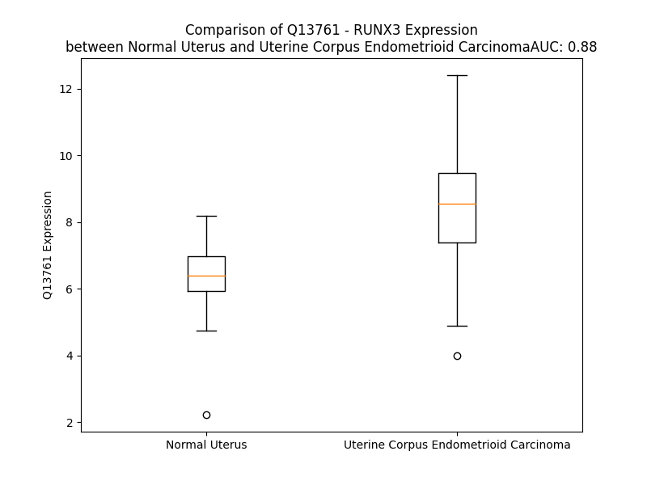

# Detailed Data for Q13761

## Introduction to the Detailed Summary

### How to Interpret the Results

- **Summary & Metrics**: This section provides a quick reference to essential protein attributes, including expression changes, family classification, and biomarker applications. Regulation status (upregulated/downregulated) indicates the protein's behavior in a disease context. Some information comes from the original excel file with the proteins selected from literature, while others are derived from the analyses.
- **Expression Comparison**: A visual representation comparing protein expression between normal and disease states. It highlights significant changes in expression levels that might indicate diagnostic or therapeutic relevance. This is data coming from transcriptomics experiments and could not translate similarly to protein levels.
- **Isoform Alignment**: An interactive view of isoform alignments, revealing structural and functional differences between variants of the protein.
- **Interactors & Homologs**: Tables listing known interaction partners and homologous proteins, the more interactors and homologs, the more complex the protein is to design an antibody for.
- **Biological Assemblies**: Information about the structural arrangement of the protein in different assemblies, providing insights into its functional state but also the complexity of the protein to develop antibodies.
- **Combined Per-Residue Information**: A detailed table summarizing residue-level data. This includes predictions for epitope regions, aggregation tendencies, and modifications that might impact the protein's function. Each row corresponds to a residue in the protein, providing insights into specific sites that may be important for research or drug development.
## Summary & Metrics

- **UniProt Accession**: Q13761
- **Gene Name**: RUNX3
- **Protein Name**: Runt-related transcription factor 3
- **Swiss Prot**: RUNX3_HUMAN
- **Family**: transcription regulator
- **Biomarker Application**: diagnosis,disease progression,prognosis
- **Number of Isoforms**: 2
- **Regulation**: -1
- **(transcriptomics) AUC**: 0.96
- **(transcriptomics) Fold Change**: 1.43
- **(transcriptomics) Regulation**: Upregulated
- **Discotope Epitope Count**: 29
- **Max n_uniprots (Homo)**: N/A
- **Max n_uniprots (Hetero)**: 3

## Expression Comparison

## Isoform Alignment

<pre style='font-size:14px; font-family:monospace;'>Q13761-1 --------------MRIPVDPSTSRRFTPPSPAFPCGGGGGKMGENSGALSAQAAVGPGGRARPEVRSMVDVLADHAGELVRTDSPNFLCSVLPSHWRCNKTLPVAFKVVALGDVPDGTVVTVMAGNDENYSAELRNASAVMKNQVARFNDLRFVGRSGRGKSFTLTITVFTNPTQVATYHRAIKVTVDGPREPRRHRQKLEDQTKPFPDRFGDLERLRMRVTPSTPSPRGSLSTTSHFSSQPQTPIQGTSELNPFSDPRQFDRSFPTLPTLTESRFPDPRMHYPGAMSAAFPYSATPSGTSISSLSVAGMPATSRFHHTYLPPPYPGAPQNQSGPFQANPSPYHLYYGTSSGSYQFSMVAGSSSGGDRSPTRMLASCTSSAASVAAGNLMNPSLGGQSDGVEADGSHSNSPTALSTPGRMDEAVWRPY
Q13761-2 MASNSIFDSFPTYSPTFIRDPSTSRRFTPPSPAFPCGGGGGKMGENSGALSAQAAVGPGGRARPEVRSMVDVLADHAGELVRTDSPNFLCSVLPSHWRCNKTLPVAFKVVALGDVPDGTVVTVMAGNDENYSAELRNASAVMKNQVARFNDLRFVGRSGRGKSFTLTITVFTNPTQVATYHRAIKVTVDGPREPRRHRQKLEDQTKPFPDRFGDLERLRMRVTPSTPSPRGSLSTTSHFSSQPQTPIQGTSELNPFSDPRQFDRSFPTLPTLTESRFPDPRMHYPGAMSAAFPYSATPSGTSISSLSVAGMPATSRFHHTYLPPPYPGAPQNQSGPFQANPSPYHLYYGTSSGSYQFSMVAGSSSGGDRSPTRMLASCTSSAASVAAGNLMNPSLGGQSDGVEADGSHSNSPTALSTPGRMDEAVWRPY
</pre>

## Interactors

| preferredName_A   | preferredName_B   |   score |
|:------------------|:------------------|--------:|
| RUNX3             | CBFB              |   0.999 |
| RUNX3             | TBX21             |   0.991 |
| RUNX3             | RUNX1             |   0.98  |
| RUNX3             | CTNNB1            |   0.977 |
| RUNX3             | ZFHX3             |   0.955 |
| RUNX3             | SMAD3             |   0.954 |
| RUNX3             | EP300             |   0.948 |
| RUNX3             | TP53              |   0.936 |
| RUNX3             | RUNX2             |   0.933 |
| RUNX3             | SRC               |   0.933 |
| RUNX3             | IKZF1             |   0.903 |

## Homologs

| uniprot_id   | gene_id   |
|:-------------|:----------|
| H9KVB1       | RUNX1     |
| I3L0L0       | RUNX2     |

## Biological Assemblies

|   Unnamed: 0 |   assembly |   n_uniprots | composition   | crystal_id   |
|-------------:|-----------:|-------------:|:--------------|:-------------|
|            0 |          1 |            3 | Hetero        | 5w69         |
|            1 |          2 |            3 | Hetero        | 5w69         |
|            2 |          3 |            3 | Hetero        | 5w69         |
|            3 |          4 |            3 | Hetero        | 5w69         |

## Combined Per-Residue Information

|   res | aa   |   epitope_score | epitope   |   relative_surface_accessibility |   modeling_confidence |   Aggregation | modification   |
|------:|:-----|----------------:|:----------|---------------------------------:|----------------------:|--------------:|:---------------|
|     1 | M    |         0.11755 | False     |                          1.28393 |                 53.68 |         0     | N/A            |
|     2 | R    |         0.13379 | False     |                          0.98054 |                 47.38 |         0     | N/A            |
|     3 | I    |         0.09301 | False     |                          0.90304 |                 61.99 |         0     | N/A            |
|     4 | P    |         0.06679 | False     |                          0.9172  |                 57.91 |         0     | N/A            |
|     5 | V    |         0.06126 | False     |                          0.98233 |                 67.94 |         0     | N/A            |
|     6 | D    |         0.10911 | False     |                          0.68374 |                 57.61 |         0     | N/A            |
|     7 | P    |         0.13191 | False     |                          0.99199 |                 50.14 |         0     | N/A            |
|     8 | S    |         0.11938 | False     |                          0.62893 |                 46.4  |         0     | N/A            |
|     9 | T    |         0.10327 | False     |                          0.94071 |                 53.64 |         0     | N/A            |
|    10 | S    |         0.07271 | False     |                          0.92045 |                 43.58 |         0     | N/A            |
|    11 | R    |         0.14358 | False     |                          0.92116 |                 55.83 |         0     | N/A            |
|    12 | R    |         0.12453 | False     |                          0.94514 |                 52.05 |         0     | N/A            |
|    13 | F    |         0.13313 | False     |                          1.02866 |                 46.97 |         0     | N/A            |
|    14 | T    |         0.0979  | False     |                          0.7802  |                 55.25 |         0     | N/A            |
|    15 | P    |         0.08316 | False     |                          0.8387  |                 61.25 |         0     | N/A            |
|    16 | P    |         0.04624 | False     |                          0.92492 |                 53.19 |         0     | N/A            |
|    17 | S    |         0.04224 | False     |                          0.83073 |                 51.91 |         0     | N/A            |
|    18 | P    |         0.08399 | False     |                          0.92259 |                 55.45 |         0     | N/A            |
|    19 | A    |         0.09766 | False     |                          0.85583 |                 37.94 |         0     | N/A            |
|    20 | F    |         0.10213 | False     |                          0.98747 |                 47.4  |         0     | N/A            |
|    21 | P    |         0.06897 | False     |                          0.86746 |                 43.26 |         0     | N/A            |
|    22 | C    |         0.05854 | False     |                          0.98515 |                 33.38 |         0     | N/A            |
|    23 | G    |         0.09627 | False     |                          0.9605  |                 39.42 |         0     | N/A            |
|    24 | G    |         0.08589 | False     |                          1.05584 |                 36.93 |         0     | N/A            |
|    25 | G    |         0.14918 | False     |                          0.97138 |                 39.47 |         0     | N/A            |
|    26 | G    |         0.08728 | False     |                          1.05056 |                 39.27 |         0     | N/A            |
|    27 | G    |         0.14462 | False     |                          0.9149  |                 44.17 |         0     | N/A            |
|    28 | K    |         0.08679 | False     |                          0.86879 |                 50.78 |         0     | N/A            |
|    29 | M    |         0.11179 | False     |                          0.91423 |                 51.79 |         0     | N/A            |
|    30 | G    |         0.13461 | False     |                          0.94626 |                 47.91 |         0     | N/A            |
|    31 | E    |         0.09304 | False     |                          0.93371 |                 42.97 |         0     | N/A            |
|    32 | N    |         0.11149 | False     |                          0.96727 |                 46.17 |         0     | N/A            |
|    33 | S    |         0.08715 | False     |                          0.84384 |                 44.35 |         0     | N/A            |
|    34 | G    |         0.14276 | False     |                          0.94696 |                 39.72 |         0     | N/A            |
|    35 | A    |         0.11348 | False     |                          0.89403 |                 38.66 |         0     | N/A            |
|    36 | L    |         0.11208 | False     |                          1.0525  |                 44.94 |         0     | N/A            |
|    37 | S    |         0.07117 | False     |                          0.78475 |                 33.34 |         0     | N/A            |
|    38 | A    |         0.11524 | False     |                          0.89171 |                 40.31 |         0     | N/A            |
|    39 | Q    |         0.09827 | False     |                          0.92374 |                 32.89 |         0     | N/A            |
|    40 | A    |         0.10488 | False     |                          0.94781 |                 37.01 |         0     | N/A            |
|    41 | A    |         0.08231 | False     |                          0.93127 |                 40.72 |         0     | N/A            |
|    42 | V    |         0.06542 | False     |                          1.15806 |                 39.51 |         0     | N/A            |
|    43 | G    |         0.08421 | False     |                          0.66157 |                 39.95 |         0     | N/A            |
|    44 | P    |         0.10651 | False     |                          1.08095 |                 43.04 |         0     | N/A            |
|    45 | G    |         0.07904 | False     |                          0.88766 |                 34.59 |         0     | N/A            |
|    46 | G    |         0.09492 | False     |                          0.88387 |                 37.79 |         0     | N/A            |
|    47 | R    |         0.05793 | False     |                          0.79643 |                 41.45 |         0     | N/A            |
|    48 | A    |         0.07538 | False     |                          0.96155 |                 37.91 |         0     | N/A            |
|    49 | R    |         0.07924 | False     |                          0.8548  |                 46.67 |         0     | N/A            |
|    50 | P    |         0.08451 | False     |                          0.68868 |                 48.97 |         0     | N/A            |
|    51 | E    |         0.13637 | False     |                          0.8333  |                 51.92 |         0     | N/A            |
|    52 | V    |         0.14391 | False     |                          0.78999 |                 60.52 |         0     | N/A            |
|    53 | R    |         0.13681 | False     |                          0.44711 |                 71.65 |         0     | N/A            |
|    54 | S    |         0.10588 | False     |                          0.36339 |                 83.74 |         0     | N/A            |
|    55 | M    |         0.10414 | False     |                          0.19009 |                 79.3  |         0     | N/A            |
|    56 | V    |         0.12854 | False     |                          0.69365 |                 82.61 |         0     | N/A            |
|    57 | D    |         0.10196 | False     |                          0.50574 |                 81.97 |         0     | N/A            |
|    58 | V    |         0.0609  | False     |                          0.10282 |                 80.68 |         0     | N/A            |
|    59 | L    |         0.07016 | False     |                          0.23654 |                 81.9  |         0     | N/A            |
|    60 | A    |         0.11112 | False     |                          0.6716  |                 78.31 |         0     | N/A            |
|    61 | D    |         0.15019 | False     |                          0.70093 |                 78.59 |         0     | N/A            |
|    62 | H    |         0.12697 | False     |                          0.42483 |                 80.04 |         0     | N/A            |
|    63 | A    |         0.18641 | True      |                          0.79493 |                 75.69 |         0     | N/A            |
|    64 | G    |         0.14464 | False     |                          0.79282 |                 79.91 |         0     | N/A            |
|    65 | E    |         0.10697 | False     |                          0.41681 |                 91.82 |         0     | N/A            |
|    66 | L    |         0.03121 | False     |                          0.06814 |                 94.44 |         0     | N/A            |
|    67 | V    |         0.04729 | False     |                          0.29419 |                 94.96 |         0     | N/A            |
|    68 | R    |         0.15989 | True      |                          0.51482 |                 94.36 |         0     | N/A            |
|    69 | T    |         0.04849 | False     |                          0.11517 |                 96.53 |         0     | N/A            |
|    70 | D    |         0.16131 | True      |                          0.52876 |                 96.56 |         0     | N/A            |
|    71 | S    |         0.05849 | False     |                          0.13078 |                 95.19 |         0     | N/A            |
|    72 | P    |         0.09128 | False     |                          0.74024 |                 93.57 |         0     | N/A            |
|    73 | N    |         0.08601 | False     |                          0.40931 |                 94.68 |         0     | N/A            |
|    74 | F    |         0.00768 | False     |                          0.00955 |                 96.42 |         1.092 | N/A            |
|    75 | L    |         0.00607 | False     |                          0       |                 96.72 |         1.092 | N/A            |
|    76 | C    |         0.00238 | False     |                          0       |                 97.05 |         1.092 | N/A            |
|    77 | S    |         0.01528 | False     |                          0.01935 |                 97.32 |         1.092 | N/A            |
|    78 | V    |         0.05736 | False     |                          0.48494 |                 96.99 |         1.092 | N/A            |
|    79 | L    |         0.02883 | False     |                          0.0665  |                 97.87 |         0     | N/A            |
|    80 | P    |         0.08276 | False     |                          0.22481 |                 97.35 |         0     | N/A            |
|    81 | S    |         0.1242  | False     |                          0.72018 |                 97.48 |         0     | N/A            |
|    82 | H    |         0.08738 | False     |                          0.22813 |                 98.38 |         0     | N/A            |
|    83 | W    |         0.07274 | False     |                          0.14985 |                 98.49 |         0     | N/A            |
|    84 | R    |         0.13881 | False     |                          0.4948  |                 98.32 |         0     | N/A            |
|    85 | C    |         0.18173 | True      |                          0.22015 |                 98.22 |         0     | N/A            |
|    86 | N    |         0.21056 | True      |                          0.42174 |                 98.29 |         0     | N/A            |
|    87 | K    |         0.21185 | True      |                          0.50517 |                 98.1  |         0     | N/A            |
|    88 | T    |         0.13507 | False     |                          0.44375 |                 98.26 |         0     | N/A            |
|    89 | L    |         0.03496 | False     |                          0.07545 |                 98.1  |         0     | N/A            |
|    90 | P    |         0.11164 | False     |                          0.64608 |                 96.5  |         0     | N/A            |
|    91 | V    |         0.08748 | False     |                          0.51598 |                 95.45 |         0.627 | N/A            |
|    92 | A    |         0.04917 | False     |                          0.32885 |                 96.08 |         0.627 | N/A            |
|    93 | F    |         0.00443 | False     |                          0.00314 |                 98.11 |         0.627 | N/A            |
|    94 | K    |         0.0992  | False     |                          0.25567 |                 97.32 |         0.627 | N/A            |
|    95 | V    |         0.00387 | False     |                          0       |                 97.51 |         9.268 | N/A            |
|    96 | V    |         0.02609 | False     |                          0.0438  |                 96.49 |         9.268 | N/A            |
|    97 | A    |         0.00735 | False     |                          0.00383 |                 96.17 |         9.268 | N/A            |
|    98 | L    |         0.03601 | False     |                          0.05946 |                 93.83 |         9.268 | N/A            |
|    99 | G    |         0.08727 | False     |                          0.34246 |                 91.13 |         9.268 | N/A            |
|   100 | D    |         0.12921 | False     |                          0.75823 |                 92.2  |         0.627 | N/A            |
|   101 | V    |         0.0283  | False     |                          0.06035 |                 95.98 |         0     | N/A            |
|   102 | P    |         0.1018  | False     |                          0.67513 |                 96.51 |         0     | N/A            |
|   103 | D    |         0.08186 | False     |                          0.51773 |                 97.29 |         0     | N/A            |
|   104 | G    |         0.07124 | False     |                          0.5771  |                 97.81 |         1.295 | N/A            |
|   105 | T    |         0.03184 | False     |                          0.0949  |                 98.35 |        15.828 | N/A            |
|   106 | V    |         0.08066 | False     |                          0.46627 |                 98.41 |        61.437 | N/A            |
|   107 | V    |         0.00287 | False     |                          0       |                 98.63 |        63.252 | N/A            |
|   108 | T    |         0.0701  | False     |                          0.22817 |                 98.61 |        63.252 | N/A            |
|   109 | V    |         0.03072 | False     |                          0.02815 |                 98.68 |        63.252 | N/A            |
|   110 | M    |         0.13819 | False     |                          0.53206 |                 98.62 |        58.201 | N/A            |
|   111 | A    |         0.01491 | False     |                          0.01338 |                 98.66 |        28.085 | N/A            |
|   112 | G    |         0.12585 | False     |                          0.19073 |                 98.29 |         0.874 | N/A            |
|   113 | N    |         0.05538 | False     |                          0.17999 |                 98.03 |         0     | N/A            |
|   114 | D    |         0.39833 | True      |                          0.85786 |                 97.06 |         0     | N/A            |
|   115 | E    |         0.3925  | True      |                          0.46668 |                 96.46 |         0     | N/A            |
|   116 | N    |         0.15661 | True      |                          0.26543 |                 96.58 |         0     | N/A            |
|   117 | Y    |         0.27628 | True      |                          0.92963 |                 97.49 |         0     | N/A            |
|   118 | S    |         0.26104 | True      |                          0.56729 |                 97.76 |         0     | N/A            |
|   119 | A    |         0.03511 | False     |                          0.08018 |                 97.91 |         0     | N/A            |
|   120 | E    |         0.21976 | True      |                          0.57503 |                 98.34 |         0     | N/A            |
|   121 | L    |         0.05836 | False     |                          0.18688 |                 98.66 |         0     | N/A            |
|   122 | R    |         0.35483 | True      |                          0.41871 |                 98.35 |         0     | N/A            |
|   123 | N    |         0.07117 | False     |                          0.43723 |                 98.11 |         0     | N/A            |
|   124 | A    |         0.06916 | False     |                          0.20078 |                 98.28 |         0     | N/A            |
|   125 | S    |         0.11402 | False     |                          0.5332  |                 98.5  |         0     | N/A            |
|   126 | A    |         0.0196  | False     |                          0.09137 |                 98.5  |         0     | N/A            |
|   127 | V    |         0.0797  | False     |                          0.61137 |                 98.33 |         0     | N/A            |
|   128 | M    |         0.00748 | False     |                          0.00266 |                 98.1  |         0     | N/A            |
|   129 | K    |         0.09122 | False     |                          0.68152 |                 97.47 |         0     | N/A            |
|   130 | N    |         0.09978 | False     |                          0.67162 |                 95.46 |         0     | N/A            |
|   131 | Q    |         0.05332 | False     |                          0.12103 |                 95.15 |         0     | N/A            |
|   132 | V    |         0.08186 | False     |                          0.33186 |                 96.49 |         0     | N/A            |
|   133 | A    |         0.00306 | False     |                          0       |                 97.8  |         0     | N/A            |
|   134 | R    |         0.12287 | False     |                          0.67169 |                 97.69 |         0     | N/A            |
|   135 | F    |         0.00576 | False     |                          0.00457 |                 98.39 |         0     | N/A            |
|   136 | N    |         0.09048 | False     |                          0.78416 |                 97.41 |         0     | N/A            |
|   137 | D    |         0.0739  | False     |                          0.26837 |                 97.87 |         0     | N/A            |
|   138 | L    |         0.01065 | False     |                          0.01052 |                 98.56 |         0     | N/A            |
|   139 | R    |         0.17641 | True      |                          0.21876 |                 98.54 |         0     | N/A            |
|   140 | F    |         0.01487 | False     |                          0.01114 |                 98.69 |         0     | N/A            |
|   141 | V    |         0.19402 | True      |                          0.26654 |                 98.47 |         0     | N/A            |
|   142 | G    |         0.0688  | False     |                          0.14099 |                 97.6  |         0     | N/A            |
|   143 | R    |         0.37116 | True      |                          0.54105 |                 98.27 |         0     | N/A            |
|   144 | S    |         0.01079 | False     |                          0       |                 98.45 |         0     | N/A            |
|   145 | G    |         0.08705 | False     |                          0.2005  |                 97.22 |         0     | N/A            |
|   146 | R    |         0.29699 | True      |                          0.93661 |                 96.36 |         0     | N/A            |
|   147 | G    |         0.16219 | True      |                          0.79379 |                 95.93 |         0     | N/A            |
|   148 | K    |         0.29476 | True      |                          0.38787 |                 98.08 |         0     | N/A            |
|   149 | S    |         0.06294 | False     |                          0.24748 |                 98.52 |         6.391 | N/A            |
|   150 | F    |         0.00619 | False     |                          0       |                 98.69 |        57.934 | N/A            |
|   151 | T    |         0.06697 | False     |                          0.26863 |                 98.59 |        69.35  | N/A            |
|   152 | L    |         0.00346 | False     |                          0       |                 98.57 |        88.459 | N/A            |
|   153 | T    |         0.07247 | False     |                          0.2897  |                 98.54 |        91.788 | N/A            |
|   154 | I    |         0.00407 | False     |                          0       |                 98.57 |        93.876 | N/A            |
|   155 | T    |         0.03477 | False     |                          0.10565 |                 98.45 |        93.478 | N/A            |
|   156 | V    |         0.00243 | False     |                          0.0019  |                 98.33 |        93.194 | N/A            |
|   157 | F    |         0.11388 | False     |                          0.52605 |                 98.02 |        88.922 | N/A            |
|   158 | T    |         0.08492 | False     |                          0.16056 |                 96.71 |        34.479 | N/A            |
|   159 | N    |         0.1685  | True      |                          0.98423 |                 94.49 |         0     | N/A            |
|   160 | P    |         0.30655 | True      |                          0.83195 |                 95.74 |         0     | N/A            |
|   161 | T    |         0.13881 | False     |                          0.50094 |                 97.39 |         0     | N/A            |
|   162 | Q    |         0.07087 | False     |                          0.26328 |                 97.41 |         0     | N/A            |
|   163 | V    |         0.12416 | False     |                          0.57256 |                 98    |         0     | N/A            |
|   164 | A    |         0.00456 | False     |                          0.00255 |                 98.05 |         0     | N/A            |
|   165 | T    |         0.07794 | False     |                          0.15162 |                 98.38 |         0     | N/A            |
|   166 | Y    |         0.05144 | False     |                          0.15068 |                 98.1  |         0     | N/A            |
|   167 | H    |         0.08341 | False     |                          0.56622 |                 97.93 |         0     | N/A            |
|   168 | R    |         0.13474 | False     |                          0.76163 |                 97.49 |         0     | N/A            |
|   169 | A    |         0.01362 | False     |                          0.06117 |                 97.95 |         0     | N/A            |
|   170 | I    |         0.00597 | False     |                          0.0008  |                 98.5  |         0     | N/A            |
|   171 | K    |         0.12905 | False     |                          0.27435 |                 98.6  |         0     | N/A            |
|   172 | V    |         0.00177 | False     |                          0.00166 |                 98.65 |         0     | N/A            |
|   173 | T    |         0.12239 | False     |                          0.20661 |                 97.99 |         0     | N/A            |
|   174 | V    |         0.23992 | True      |                          0.54733 |                 97.55 |         0     | N/A            |
|   175 | D    |         0.15019 | False     |                          0.40547 |                 96.11 |         0     | N/A            |
|   176 | G    |         0.02753 | False     |                          0.03688 |                 96.29 |         0     | N/A            |
|   177 | P    |         0.18437 | True      |                          0.61456 |                 96.4  |         0     | N/A            |
|   178 | R    |         0.22882 | True      |                          0.64355 |                 94.71 |         0     | N/A            |
|   179 | E    |         0.10913 | False     |                          0.73626 |                 92.27 |         0     | N/A            |
|   180 | P    |         0.10582 | False     |                          0.77512 |                 93.36 |         0     | N/A            |
|   181 | R    |         0.10971 | False     |                          0.83691 |                 90.92 |         0     | N/A            |
|   182 | R    |         0.10985 | False     |                          0.94121 |                 85.99 |         0     | N/A            |
|   183 | H    |         0.11049 | False     |                          0.89279 |                 76.41 |         0     | N/A            |
|   184 | R    |         0.14449 | False     |                          0.89698 |                 68.89 |         0     | N/A            |
|   185 | Q    |         0.09103 | False     |                          0.77667 |                 63.33 |         0     | N/A            |
|   186 | K    |         0.0608  | False     |                          0.8397  |                 59.77 |         0     | N/A            |
|   187 | L    |         0.11554 | False     |                          1.00214 |                 63.8  |         0     | N/A            |
|   188 | E    |         0.06281 | False     |                          0.75573 |                 54.18 |         0     | N/A            |
|   189 | D    |         0.08068 | False     |                          0.692   |                 54    |         0     | N/A            |
|   190 | Q    |         0.14524 | False     |                          0.86625 |                 52.7  |         0     | N/A            |
|   191 | T    |         0.08277 | False     |                          0.77876 |                 52.02 |         0     | N/A            |
|   192 | K    |         0.07165 | False     |                          0.86287 |                 54.32 |         0     | N/A            |
|   193 | P    |         0.11507 | False     |                          0.92033 |                 54.03 |         0     | N/A            |
|   194 | F    |         0.0994  | False     |                          0.81811 |                 57.36 |         0     | N/A            |
|   195 | P    |         0.1012  | False     |                          0.87077 |                 64.36 |         0     | N/A            |
|   196 | D    |         0.16642 | True      |                          0.67017 |                 56.44 |         0     | N/A            |
|   197 | R    |         0.15914 | True      |                          0.91333 |                 62.49 |         0     | N/A            |
|   198 | F    |         0.12066 | False     |                          0.85201 |                 64.13 |         0     | N/A            |
|   199 | G    |         0.05697 | False     |                          0.24403 |                 64.55 |         0     | N/A            |
|   200 | D    |         0.0911  | False     |                          0.48399 |                 64.94 |         0     | N/A            |
|   201 | L    |         0.10318 | False     |                          0.73739 |                 70.06 |         0     | N/A            |
|   202 | E    |         0.04635 | False     |                          0.65435 |                 63.14 |         0     | N/A            |
|   203 | R    |         0.11437 | False     |                          0.59078 |                 69.68 |         0     | N/A            |
|   204 | L    |         0.10342 | False     |                          0.57792 |                 62.58 |         0     | N/A            |
|   205 | R    |         0.11848 | False     |                          0.8757  |                 68.37 |         0     | N/A            |
|   206 | M    |         0.11146 | False     |                          0.89927 |                 63.81 |         0     | N/A            |
|   207 | R    |         0.1302  | False     |                          0.79354 |                 62.12 |         0     | N/A            |
|   208 | V    |         0.14484 | False     |                          0.74262 |                 51.36 |         0     | N/A            |
|   209 | T    |         0.11105 | False     |                          0.79219 |                 52.83 |         0     | N/A            |
|   210 | P    |         0.13613 | False     |                          0.9382  |                 44.25 |         0     | N/A            |
|   211 | S    |         0.14203 | False     |                          0.7658  |                 50.06 |         0     | N/A            |
|   212 | T    |         0.08023 | False     |                          0.85697 |                 44.37 |         0     | N/A            |
|   213 | P    |         0.0629  | False     |                          0.91637 |                 45.67 |         0     | N/A            |
|   214 | S    |         0.09685 | False     |                          0.83778 |                 38.26 |         0     | N/A            |
|   215 | P    |         0.09001 | False     |                          0.87354 |                 39.08 |         0     | N/A            |
|   216 | R    |         0.16614 | True      |                          0.99786 |                 43.92 |         0     | N/A            |
|   217 | G    |         0.11707 | False     |                          0.87236 |                 41.34 |         0     | N/A            |
|   218 | S    |         0.08272 | False     |                          0.79642 |                 37.45 |         0     | N/A            |
|   219 | L    |         0.12688 | False     |                          1.03137 |                 42.93 |         0     | N/A            |
|   220 | S    |         0.07222 | False     |                          0.74016 |                 39.56 |         0     | N/A            |
|   221 | T    |         0.10988 | False     |                          0.94045 |                 41.74 |         0     | N/A            |
|   222 | T    |         0.06844 | False     |                          0.82537 |                 41.15 |         0     | N/A            |
|   223 | S    |         0.09266 | False     |                          0.62416 |                 39.59 |         0     | N/A            |
|   224 | H    |         0.07679 | False     |                          0.98721 |                 42    |         0     | N/A            |
|   225 | F    |         0.07676 | False     |                          1.01735 |                 40.54 |         0     | N/A            |
|   226 | S    |         0.08068 | False     |                          0.71483 |                 39.47 |         0     | N/A            |
|   227 | S    |         0.06232 | False     |                          0.81521 |                 41.93 |         0     | N/A            |
|   228 | Q    |         0.06241 | False     |                          0.9     |                 44.88 |         0     | N/A            |
|   229 | P    |         0.05975 | False     |                          0.86352 |                 38.31 |         0     | N/A            |
|   230 | Q    |         0.08773 | False     |                          0.8672  |                 42.35 |         0     | N/A            |
|   231 | T    |         0.04668 | False     |                          0.7802  |                 44.46 |         0     | N/A            |
|   232 | P    |         0.05227 | False     |                          0.9617  |                 40.38 |         0     | N/A            |
|   233 | I    |         0.06017 | False     |                          1.02199 |                 47.11 |         0     | N/A            |
|   234 | Q    |         0.07487 | False     |                          0.81938 |                 41.28 |         0     | N/A            |
|   235 | G    |         0.07906 | False     |                          0.98461 |                 47.75 |         0     | N/A            |
|   236 | T    |         0.07319 | False     |                          0.78823 |                 40.88 |         0     | N/A            |
|   237 | S    |         0.04744 | False     |                          0.78908 |                 47.6  |         0     | N/A            |
|   238 | E    |         0.11959 | False     |                          0.75109 |                 39.33 |         0     | N/A            |
|   239 | L    |         0.11829 | False     |                          0.93318 |                 45.16 |         0     | N/A            |
|   240 | N    |         0.07654 | False     |                          0.86838 |                 41.07 |         0     | N/A            |
|   241 | P    |         0.06173 | False     |                          0.83483 |                 42.98 |         0     | N/A            |
|   242 | F    |         0.10988 | False     |                          1.03277 |                 44.08 |         0     | N/A            |
|   243 | S    |         0.05941 | False     |                          0.77508 |                 43.31 |         0     | Phosphoserine  |
|   244 | D    |         0.0778  | False     |                          0.83732 |                 39.32 |         0     | N/A            |
|   245 | P    |         0.10073 | False     |                          0.76987 |                 44.26 |         0     | N/A            |
|   246 | R    |         0.11131 | False     |                          0.78437 |                 48.31 |         0     | N/A            |
|   247 | Q    |         0.07708 | False     |                          0.683   |                 44.29 |         0     | N/A            |
|   248 | F    |         0.07157 | False     |                          1.04622 |                 44.32 |         0     | N/A            |
|   249 | D    |         0.06852 | False     |                          0.74984 |                 40.96 |         0     | N/A            |
|   250 | R    |         0.11695 | False     |                          0.87042 |                 45.76 |         0     | N/A            |
|   251 | S    |         0.07562 | False     |                          0.76098 |                 40.22 |         0     | N/A            |
|   252 | F    |         0.09129 | False     |                          1.05223 |                 46.74 |         0     | N/A            |
|   253 | P    |         0.08278 | False     |                          0.92414 |                 49.31 |         0     | N/A            |
|   254 | T    |         0.06903 | False     |                          0.86976 |                 34.76 |         0     | N/A            |
|   255 | L    |         0.11506 | False     |                          1.01262 |                 50.54 |         0     | N/A            |
|   256 | P    |         0.08753 | False     |                          0.7844  |                 42.31 |         0     | N/A            |
|   257 | T    |         0.05917 | False     |                          0.84179 |                 32.88 |         0     | N/A            |
|   258 | L    |         0.08518 | False     |                          1.10945 |                 43.58 |         0     | N/A            |
|   259 | T    |         0.08065 | False     |                          0.86201 |                 41.74 |         0     | N/A            |
|   260 | E    |         0.08283 | False     |                          0.81388 |                 40.34 |         0     | N/A            |
|   261 | S    |         0.06087 | False     |                          0.62009 |                 40.66 |         0     | N/A            |
|   262 | R    |         0.13162 | False     |                          0.77285 |                 42.31 |         0     | N/A            |
|   263 | F    |         0.07087 | False     |                          0.90578 |                 44.74 |         0     | N/A            |
|   264 | P    |         0.09711 | False     |                          0.87343 |                 44.54 |         0     | N/A            |
|   265 | D    |         0.09226 | False     |                          0.75379 |                 44.05 |         0     | N/A            |
|   266 | P    |         0.09031 | False     |                          0.95546 |                 49.41 |         0     | N/A            |
|   267 | R    |         0.11328 | False     |                          0.79289 |                 45.76 |         0     | N/A            |
|   268 | M    |         0.08821 | False     |                          1.02602 |                 51.18 |         0     | N/A            |
|   269 | H    |         0.08407 | False     |                          0.811   |                 44.94 |         0     | N/A            |
|   270 | Y    |         0.11115 | False     |                          0.95727 |                 42.93 |         0     | N/A            |
|   271 | P    |         0.10879 | False     |                          0.91015 |                 42.52 |         0     | N/A            |
|   272 | G    |         0.12803 | False     |                          0.69319 |                 42.07 |         0     | N/A            |
|   273 | A    |         0.07382 | False     |                          0.98147 |                 40.76 |         0     | N/A            |
|   274 | M    |         0.07595 | False     |                          0.91623 |                 43    |         0     | N/A            |
|   275 | S    |         0.04451 | False     |                          0.90733 |                 35.5  |         0     | N/A            |
|   276 | A    |         0.04831 | False     |                          0.8636  |                 42.91 |         0     | N/A            |
|   277 | A    |         0.05277 | False     |                          0.92975 |                 38.33 |         0     | N/A            |
|   278 | F    |         0.08228 | False     |                          1.06846 |                 48.08 |         0     | N/A            |
|   279 | P    |         0.06365 | False     |                          0.79733 |                 49.15 |         0     | N/A            |
|   280 | Y    |         0.08271 | False     |                          0.94099 |                 40.61 |         0     | N/A            |
|   281 | S    |         0.0816  | False     |                          0.93058 |                 43.05 |         0     | N/A            |
|   282 | A    |         0.05022 | False     |                          0.79062 |                 38.71 |         0     | N/A            |
|   283 | T    |         0.07023 | False     |                          0.9925  |                 45.55 |         0     | N/A            |
|   284 | P    |         0.06254 | False     |                          0.94245 |                 43.01 |         0     | N/A            |
|   285 | S    |         0.07674 | False     |                          0.94473 |                 43.71 |         0     | N/A            |
|   286 | G    |         0.10943 | False     |                          0.85681 |                 42.79 |         0     | N/A            |
|   287 | T    |         0.07127 | False     |                          0.96527 |                 42.2  |         0     | N/A            |
|   288 | S    |         0.10395 | False     |                          0.79995 |                 40.96 |         0     | N/A            |
|   289 | I    |         0.13105 | False     |                          1.00494 |                 44.91 |         0     | N/A            |
|   290 | S    |         0.13259 | False     |                          0.75856 |                 45.4  |         0     | N/A            |
|   291 | S    |         0.10387 | False     |                          0.76148 |                 41.01 |         0     | N/A            |
|   292 | L    |         0.10577 | False     |                          1.12726 |                 47.62 |         0     | N/A            |
|   293 | S    |         0.06694 | False     |                          0.80136 |                 39.62 |         0     | N/A            |
|   294 | V    |         0.06742 | False     |                          1.09605 |                 54.72 |         0     | N/A            |
|   295 | A    |         0.06147 | False     |                          0.90564 |                 40.26 |         0     | N/A            |
|   296 | G    |         0.06064 | False     |                          0.78209 |                 43.22 |         0     | N/A            |
|   297 | M    |         0.07171 | False     |                          0.93332 |                 49.13 |         0     | N/A            |
|   298 | P    |         0.05563 | False     |                          1.00052 |                 42.05 |         0     | N/A            |
|   299 | A    |         0.0848  | False     |                          0.95415 |                 47.66 |         0     | N/A            |
|   300 | T    |         0.10648 | False     |                          0.99951 |                 41.38 |         0     | N/A            |
|   301 | S    |         0.12331 | False     |                          0.70455 |                 42.56 |         0     | N/A            |
|   302 | R    |         0.14676 | False     |                          0.9561  |                 42.2  |         0     | N/A            |
|   303 | F    |         0.11938 | False     |                          0.881   |                 43.46 |         0     | N/A            |
|   304 | H    |         0.13209 | False     |                          1.06376 |                 41.86 |         0     | N/A            |
|   305 | H    |         0.10718 | False     |                          0.80815 |                 47.15 |         0     | N/A            |
|   306 | T    |         0.0833  | False     |                          0.90451 |                 42.41 |         0     | N/A            |
|   307 | Y    |         0.158   | True      |                          0.96235 |                 43.32 |         0     | N/A            |
|   308 | L    |         0.13601 | False     |                          0.91434 |                 63.88 |         0     | N/A            |
|   309 | P    |         0.12485 | False     |                          0.82415 |                 67.88 |         0     | N/A            |
|   310 | P    |         0.08563 | False     |                          0.84825 |                 70.16 |         0     | N/A            |
|   311 | P    |         0.07484 | False     |                          0.92679 |                 69.47 |         0     | N/A            |
|   312 | Y    |         0.14006 | False     |                          0.97582 |                 54.3  |         0     | N/A            |
|   313 | P    |         0.11949 | False     |                          0.96294 |                 58.61 |         0     | N/A            |
|   314 | G    |         0.12507 | False     |                          0.9668  |                 51.52 |         0     | N/A            |
|   315 | A    |         0.0896  | False     |                          0.91758 |                 45.45 |         0     | N/A            |
|   316 | P    |         0.10195 | False     |                          1.01174 |                 51.05 |         0     | N/A            |
|   317 | Q    |         0.11541 | False     |                          0.89311 |                 44.24 |         0     | N/A            |
|   318 | N    |         0.09351 | False     |                          0.84125 |                 43.25 |         0     | N/A            |
|   319 | Q    |         0.09105 | False     |                          0.80848 |                 44.74 |         0     | N/A            |
|   320 | S    |         0.09405 | False     |                          0.923   |                 40.53 |         0     | N/A            |
|   321 | G    |         0.08331 | False     |                          0.71255 |                 41.6  |         0     | N/A            |
|   322 | P    |         0.07856 | False     |                          1.0452  |                 43.46 |         0     | N/A            |
|   323 | F    |         0.08245 | False     |                          1.03711 |                 43.98 |         0     | N/A            |
|   324 | Q    |         0.08624 | False     |                          0.91744 |                 41.67 |         0     | N/A            |
|   325 | A    |         0.10631 | False     |                          0.93418 |                 43.63 |         0     | N/A            |
|   326 | N    |         0.07811 | False     |                          0.81576 |                 38.39 |         0     | N/A            |
|   327 | P    |         0.08312 | False     |                          0.88153 |                 52.6  |         0     | N/A            |
|   328 | S    |         0.05734 | False     |                          0.64925 |                 44.67 |         0     | N/A            |
|   329 | P    |         0.06162 | False     |                          0.87046 |                 46.87 |         0     | N/A            |
|   330 | Y    |         0.09949 | False     |                          0.91862 |                 44.38 |         1.042 | N/A            |
|   331 | H    |         0.11529 | False     |                          0.82864 |                 45.8  |         1.042 | N/A            |
|   332 | L    |         0.08409 | False     |                          0.93841 |                 49.92 |         1.226 | N/A            |
|   333 | Y    |         0.08596 | False     |                          0.87571 |                 41.7  |         1.226 | N/A            |
|   334 | Y    |         0.10418 | False     |                          0.95742 |                 41.79 |         1.226 | N/A            |
|   335 | G    |         0.10203 | False     |                          0.71602 |                 37.83 |         0.183 | N/A            |
|   336 | T    |         0.0809  | False     |                          0.88269 |                 40.35 |         0.183 | N/A            |
|   337 | S    |         0.0779  | False     |                          0.85696 |                 41    |         0     | N/A            |
|   338 | S    |         0.10232 | False     |                          0.78397 |                 44.53 |         0     | N/A            |
|   339 | G    |         0.09025 | False     |                          0.78342 |                 41.63 |         0     | N/A            |
|   340 | S    |         0.08277 | False     |                          0.77339 |                 43.21 |         0     | N/A            |
|   341 | Y    |         0.0646  | False     |                          0.82215 |                 43.05 |         0.293 | N/A            |
|   342 | Q    |         0.07619 | False     |                          0.81941 |                 39.99 |         0.293 | N/A            |
|   343 | F    |         0.09444 | False     |                          0.86389 |                 36.4  |         1.282 | N/A            |
|   344 | S    |         0.08588 | False     |                          0.68183 |                 41.72 |         1.282 | N/A            |
|   345 | M    |         0.16585 | True      |                          1.00213 |                 38.54 |         1.282 | N/A            |
|   346 | V    |         0.12967 | False     |                          1.01544 |                 46.05 |         1.282 | N/A            |
|   347 | A    |         0.06809 | False     |                          0.88438 |                 45.38 |         1.121 | N/A            |
|   348 | G    |         0.09174 | False     |                          1.01827 |                 33.7  |         0     | N/A            |
|   349 | S    |         0.10758 | False     |                          0.7673  |                 42.72 |         0     | N/A            |
|   350 | S    |         0.12131 | False     |                          0.80733 |                 41.19 |         0     | N/A            |
|   351 | S    |         0.09516 | False     |                          0.87065 |                 42.48 |         0     | N/A            |
|   352 | G    |         0.10207 | False     |                          1.01692 |                 35.7  |         0     | N/A            |
|   353 | G    |         0.10374 | False     |                          0.8928  |                 38.12 |         0     | N/A            |
|   354 | D    |         0.0814  | False     |                          0.82873 |                 34.98 |         0     | N/A            |
|   355 | R    |         0.10809 | False     |                          0.95435 |                 42.18 |         0     | N/A            |
|   356 | S    |         0.06085 | False     |                          0.81801 |                 36.88 |         0     | N/A            |
|   357 | P    |         0.06677 | False     |                          0.9938  |                 45.86 |         0     | N/A            |
|   358 | T    |         0.11422 | False     |                          0.86268 |                 40.92 |         0     | N/A            |
|   359 | R    |         0.0589  | False     |                          0.88253 |                 36.88 |         0     | N/A            |
|   360 | M    |         0.07418 | False     |                          0.92262 |                 46.1  |         0     | N/A            |
|   361 | L    |         0.13658 | False     |                          1.0702  |                 35.8  |         0     | N/A            |
|   362 | A    |         0.06317 | False     |                          0.82994 |                 38.16 |         0     | N/A            |
|   363 | S    |         0.07022 | False     |                          0.87128 |                 32.83 |         0     | N/A            |
|   364 | C    |         0.07267 | False     |                          0.98358 |                 35.79 |         0     | N/A            |
|   365 | T    |         0.07795 | False     |                          0.87838 |                 34.44 |         0     | N/A            |
|   366 | S    |         0.07794 | False     |                          0.82807 |                 33.6  |         0     | N/A            |
|   367 | S    |         0.07157 | False     |                          0.87605 |                 36.57 |         0     | N/A            |
|   368 | A    |         0.05772 | False     |                          1.01713 |                 33.12 |         0     | N/A            |
|   369 | A    |         0.05122 | False     |                          1.07314 |                 36.56 |         0     | N/A            |
|   370 | S    |         0.06571 | False     |                          0.83623 |                 32.7  |         0     | N/A            |
|   371 | V    |         0.07368 | False     |                          1.01847 |                 38.12 |         0     | N/A            |
|   372 | A    |         0.068   | False     |                          0.91595 |                 37.55 |         0     | N/A            |
|   373 | A    |         0.07298 | False     |                          1.03147 |                 36.49 |         0     | N/A            |
|   374 | G    |         0.08882 | False     |                          0.9584  |                 38.74 |         0     | N/A            |
|   375 | N    |         0.05949 | False     |                          0.86966 |                 34.03 |         0     | N/A            |
|   376 | L    |         0.06811 | False     |                          1.05858 |                 44.85 |         0     | N/A            |
|   377 | M    |         0.07295 | False     |                          0.80719 |                 44.1  |         0     | N/A            |
|   378 | N    |         0.08472 | False     |                          0.9425  |                 36.02 |         0     | N/A            |
|   379 | P    |         0.07236 | False     |                          0.81668 |                 43.52 |         0     | N/A            |
|   380 | S    |         0.06697 | False     |                          0.76374 |                 33.67 |         0     | N/A            |
|   381 | L    |         0.08193 | False     |                          1.09945 |                 42.34 |         0     | N/A            |
|   382 | G    |         0.07185 | False     |                          0.73378 |                 35.58 |         0     | N/A            |
|   383 | G    |         0.08916 | False     |                          0.77621 |                 38.85 |         0     | N/A            |
|   384 | Q    |         0.08164 | False     |                          0.92461 |                 35.65 |         0     | N/A            |
|   385 | S    |         0.0592  | False     |                          0.84634 |                 41.4  |         0     | N/A            |
|   386 | D    |         0.10871 | False     |                          0.93041 |                 39.54 |         0     | N/A            |
|   387 | G    |         0.12289 | False     |                          0.7134  |                 38.1  |         0     | N/A            |
|   388 | V    |         0.08542 | False     |                          1.11863 |                 48.66 |         0     | N/A            |
|   389 | E    |         0.09007 | False     |                          0.92206 |                 36.89 |         0     | N/A            |
|   390 | A    |         0.07393 | False     |                          1.00037 |                 47.1  |         0     | N/A            |
|   391 | D    |         0.09402 | False     |                          0.92733 |                 43.36 |         0     | N/A            |
|   392 | G    |         0.10492 | False     |                          0.86631 |                 42.05 |         0     | N/A            |
|   393 | S    |         0.06958 | False     |                          0.64116 |                 47.83 |         0     | N/A            |
|   394 | H    |         0.12228 | False     |                          1.02465 |                 45.31 |         0     | N/A            |
|   395 | S    |         0.05095 | False     |                          0.73449 |                 45.77 |         0     | N/A            |
|   396 | N    |         0.08395 | False     |                          0.94612 |                 41.7  |         0     | N/A            |
|   397 | S    |         0.05975 | False     |                          0.83882 |                 34.94 |         0     | N/A            |
|   398 | P    |         0.11565 | False     |                          0.97301 |                 50.22 |         0     | N/A            |
|   399 | T    |         0.09509 | False     |                          0.8751  |                 41.35 |         0     | N/A            |
|   400 | A    |         0.07693 | False     |                          0.94711 |                 43.05 |         0     | N/A            |
|   401 | L    |         0.12323 | False     |                          0.93911 |                 44.47 |         0     | N/A            |
|   402 | S    |         0.11996 | False     |                          0.77419 |                 39.86 |         0     | N/A            |
|   403 | T    |         0.06523 | False     |                          0.86377 |                 39.26 |         0     | N/A            |
|   404 | P    |         0.09028 | False     |                          0.99019 |                 39.72 |         0     | N/A            |
|   405 | G    |         0.09582 | False     |                          0.83634 |                 40.09 |         0     | N/A            |
|   406 | R    |         0.1271  | False     |                          0.82815 |                 41.21 |         0     | N/A            |
|   407 | M    |         0.08524 | False     |                          0.78525 |                 44.24 |         0     | N/A            |
|   408 | D    |         0.08809 | False     |                          0.92232 |                 44.98 |         0     | N/A            |
|   409 | E    |         0.07732 | False     |                          0.73507 |                 44.01 |         0     | N/A            |
|   410 | A    |         0.05762 | False     |                          0.94758 |                 54.43 |         0     | N/A            |
|   411 | V    |         0.06733 | False     |                          0.7403  |                 60.06 |         0     | N/A            |
|   412 | W    |         0.12156 | False     |                          1.022   |                 68.79 |         0     | N/A            |
|   413 | R    |         0.09049 | False     |                          0.84239 |                 62.8  |         0     | N/A            |
|   414 | P    |         0.10257 | False     |                          0.91498 |                 72.58 |         0     | N/A            |
|   415 | Y    |         0.09365 | False     |                          1.30196 |                 58.63 |         0     | N/A            |

