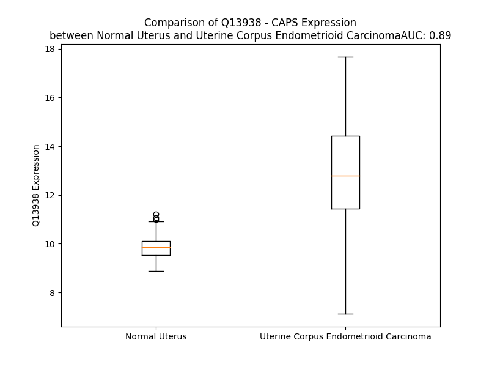

# Detailed Data for Q13938

## Introduction to the Detailed Summary

### How to Interpret the Results

- **Summary & Metrics**: This section provides a quick reference to essential protein attributes, including expression changes, family classification, and biomarker applications. Regulation status (upregulated/downregulated) indicates the protein's behavior in a disease context. Some information comes from the original excel file with the proteins selected from literature, while others are derived from the analyses.
- **Expression Comparison**: A visual representation comparing protein expression between normal and disease states. It highlights significant changes in expression levels that might indicate diagnostic or therapeutic relevance. This is data coming from transcriptomics experiments and could not translate similarly to protein levels.
- **Isoform Alignment**: An interactive view of isoform alignments, revealing structural and functional differences between variants of the protein.
- **Interactors & Homologs**: Tables listing known interaction partners and homologous proteins, the more interactors and homologs, the more complex the protein is to design an antibody for.
- **Biological Assemblies**: Information about the structural arrangement of the protein in different assemblies, providing insights into its functional state but also the complexity of the protein to develop antibodies.
- **Combined Per-Residue Information**: A detailed table summarizing residue-level data. This includes predictions for epitope regions, aggregation tendencies, and modifications that might impact the protein's function. Each row corresponds to a residue in the protein, providing insights into specific sites that may be important for research or drug development.
## Summary & Metrics

- **UniProt Accession**: Q13938
- **Gene Name**: CAPS
- **Protein Name**: calcyphosine
- **Swiss Prot**: CAYP1_HUMAN
- **Family**: other
- **Biomarker Application**:  
- **Number of Isoforms**: 3
- **Regulation**: 1
- **(transcriptomics) AUC**: 0.89
- **(transcriptomics) Fold Change**: 1.30
- **(transcriptomics) Regulation**: Upregulated
- **Discotope Epitope Count**: 36
- **Max n_uniprots (Homo)**: 2
- **Max n_uniprots (Hetero)**: N/A

## Expression Comparison

## Isoform Alignment

<pre style='font-size:14px; font-family:monospace;'>Q13938-1 MQCHRDLALSQALWGWQLSKQSGWAHPSLPHSPLPSTVHSCSWAPPHLQRHLPLATVSPGTTQLTQGPAGRTLGQTQASCPEPRPSMDAVDATMEKLRAQCLSRGASGIQGLARFFRQLDRDGSRSLDADEFRQGLAKLGLVLDQAEAEGVCRKWDRNGSGTLDLEEFLRALRPPMSQAREAVIAAAFAKLDRSGDGVVTVDDLRGVYSGRAHPKVRSGEWTEDEVLRRFLDNFDSSEKDGQVTLAEFQDYYSGVSASMNTDEEFVAMMTSAWQL
Q13938-3 MQCHRDLALSQALWGWQLSKQSGWAHPSLPHSPLPSTVHSCSWAPPHLQRHLPLATVSPGTTQLTQGPAGRTLGQTQASCPEPRPSMDAVDATMEKLRAQCLSRGASGIQGLARFFRQLDRDGSRSLDADEFRQGLAKLGLVLDQAEAEGVCRKWDRNGSGTLDLEEFLRALRPPMSQAREAVIAAAFAKLDRSGDGVVTVDDLRGVYSGRAHPKV---------------------------TLAEFQDYYSGVSASMNTDEEFVAMMTSAWQL
Q13938-4 --------------------------------------------------------------------------------------MDAVDATMEKLRAQCLSRGASGIQGLARFFRQLDRDGSRSLDADEFRQGLAKLGLVLDQAEAEGVCRKWDRNGSGTLDLEEFLRALRPPMSQAREAVIAAAFAKLDRSGDGVVTVDDLRGVYSGRAHPKVRSGEWTEDEVLRRFLDNFDSSEKDGQVTLAEFQDYYSGVSASMNTDEEFVAMMTSAWQL
</pre>

## Interactors

| preferredName_A   | preferredName_B   | score   |
|-------------------|-------------------|---------|

## Homologs

| uniprot_id   | gene_id   |
|:-------------|:----------|
| Q8WWF8       | CAPSL     |
| C9J524       | CAPS2     |
| B0QYI5       | EFCAB6    |
| Q9UPV7       | PHF24     |
| Q5VXG6       | SPATA21   |

## Biological Assemblies

|   Unnamed: 0 |   assembly |   n_uniprots | composition   | crystal_id   |
|-------------:|-----------:|-------------:|:--------------|:-------------|
|            0 |          1 |            2 | Homo          | 3e3r         |
|            1 |          2 |            2 | Homo          | 3e3r         |

## Combined Per-Residue Information

|   res | aa   |   epitope_score | epitope   |   relative_surface_accessibility |   modeling_confidence |   Aggregation | modification          |
|------:|:-----|----------------:|:----------|---------------------------------:|----------------------:|--------------:|:----------------------|
|     1 | M    |         0.13462 | False     |                          1.21727 |                 28.79 |         0     | N/A                   |
|     2 | Q    |         0.2637  | True      |                          0.74319 |                 33.46 |         0     | N/A                   |
|     3 | C    |         0.16633 | False     |                          0.71966 |                 32.57 |         0     | N/A                   |
|     4 | H    |         0.22627 | False     |                          0.50489 |                 34.41 |         0     | N/A                   |
|     5 | R    |         0.22033 | False     |                          0.71376 |                 35.68 |         0     | N/A                   |
|     6 | D    |         0.12268 | False     |                          0.44909 |                 45.25 |         0     | N/A                   |
|     7 | L    |         0.14369 | False     |                          0.40414 |                 39.78 |         0.543 | N/A                   |
|     8 | A    |         0.12555 | False     |                          0.44581 |                 43.88 |         0.543 | N/A                   |
|     9 | L    |         0.04749 | False     |                          0.05206 |                 45.69 |         0.543 | N/A                   |
|    10 | S    |         0.06834 | False     |                          0.29017 |                 43.75 |         0.543 | N/A                   |
|    11 | Q    |         0.09478 | False     |                          0.54522 |                 41.75 |         0.543 | N/A                   |
|    12 | A    |         0.06405 | False     |                          0.24502 |                 44.04 |         0.986 | N/A                   |
|    13 | L    |         0.08411 | False     |                          0.29428 |                 44.01 |         0.986 | N/A                   |
|    14 | W    |         0.09263 | False     |                          0.74393 |                 44.23 |         0.986 | N/A                   |
|    15 | G    |         0.07213 | False     |                          0.39103 |                 38.67 |         0.59  | N/A                   |
|    16 | W    |         0.14107 | False     |                          0.22917 |                 44.96 |         0.59  | N/A                   |
|    17 | Q    |         0.10675 | False     |                          0.52062 |                 44.46 |         0     | N/A                   |
|    18 | L    |         0.0753  | False     |                          0.48119 |                 41.25 |         0     | N/A                   |
|    19 | S    |         0.08687 | False     |                          0.39443 |                 44.95 |         0     | N/A                   |
|    20 | K    |         0.14862 | False     |                          0.65285 |                 51.64 |         0     | N/A                   |
|    21 | Q    |         0.10152 | False     |                          0.74991 |                 46.74 |         0     | N/A                   |
|    22 | S    |         0.12428 | False     |                          0.48533 |                 44.05 |         0     | N/A                   |
|    23 | G    |         0.09586 | False     |                          0.85949 |                 34.15 |         0     | N/A                   |
|    24 | W    |         0.14331 | False     |                          0.91031 |                 23.97 |         0     | N/A                   |
|    25 | A    |         0.11886 | False     |                          0.87626 |                 29.39 |         0     | N/A                   |
|    26 | H    |         0.13003 | False     |                          0.80063 |                 29.8  |         0     | N/A                   |
|    27 | P    |         0.17586 | False     |                          0.93698 |                 26.3  |         0     | N/A                   |
|    28 | S    |         0.15524 | False     |                          0.78996 |                 24.59 |         0     | N/A                   |
|    29 | L    |         0.19735 | False     |                          1.03221 |                 25.82 |         0     | N/A                   |
|    30 | P    |         0.23692 | False     |                          0.89155 |                 26.25 |         0     | N/A                   |
|    31 | H    |         0.28724 | True      |                          0.94013 |                 23.6  |         0     | N/A                   |
|    32 | S    |         0.18292 | False     |                          0.84777 |                 28.89 |         0     | N/A                   |
|    33 | P    |         0.22018 | False     |                          0.81392 |                 30.37 |         0     | N/A                   |
|    34 | L    |         0.26538 | True      |                          1.05659 |                 29.73 |         0     | N/A                   |
|    35 | P    |         0.18516 | False     |                          0.80227 |                 31.06 |         0     | N/A                   |
|    36 | S    |         0.25181 | True      |                          0.77765 |                 25.58 |         0     | N/A                   |
|    37 | T    |         0.194   | False     |                          0.89216 |                 33.86 |         0     | N/A                   |
|    38 | V    |         0.25323 | True      |                          0.9043  |                 26.35 |         0     | N/A                   |
|    39 | H    |         0.23395 | False     |                          0.96569 |                 30.06 |         0     | N/A                   |
|    40 | S    |         0.26002 | True      |                          0.72587 |                 23.24 |         0     | N/A                   |
|    41 | C    |         0.20157 | False     |                          0.99909 |                 24.74 |         0     | N/A                   |
|    42 | S    |         0.22191 | False     |                          0.7677  |                 22.1  |         0     | N/A                   |
|    43 | W    |         0.27707 | True      |                          1.14054 |                 24.77 |         0     | N/A                   |
|    44 | A    |         0.2309  | False     |                          0.76899 |                 27.86 |         0     | N/A                   |
|    45 | P    |         0.19803 | False     |                          0.93059 |                 27.01 |         0     | N/A                   |
|    46 | P    |         0.23478 | False     |                          0.82539 |                 30.32 |         0     | N/A                   |
|    47 | H    |         0.24608 | True      |                          0.91095 |                 32.4  |         0     | N/A                   |
|    48 | L    |         0.19248 | False     |                          1.16217 |                 30.5  |         0     | N/A                   |
|    49 | Q    |         0.20365 | False     |                          0.86569 |                 29.79 |         0     | N/A                   |
|    50 | R    |         0.34848 | True      |                          0.85454 |                 29.74 |         0     | N/A                   |
|    51 | H    |         0.33106 | True      |                          0.77878 |                 28.74 |         0     | N/A                   |
|    52 | L    |         0.26772 | True      |                          0.91564 |                 26.6  |         0     | N/A                   |
|    53 | P    |         0.21885 | False     |                          0.925   |                 35.26 |         0     | N/A                   |
|    54 | L    |         0.18523 | False     |                          0.93921 |                 25.12 |         0     | N/A                   |
|    55 | A    |         0.18398 | False     |                          1.04045 |                 29.19 |         0     | N/A                   |
|    56 | T    |         0.21604 | False     |                          0.79821 |                 25.9  |         0     | N/A                   |
|    57 | V    |         0.20359 | False     |                          1.08015 |                 31.12 |         0     | N/A                   |
|    58 | S    |         0.18064 | False     |                          0.73032 |                 30.31 |         0     | N/A                   |
|    59 | P    |         0.21877 | False     |                          0.95668 |                 44.98 |         0     | N/A                   |
|    60 | G    |         0.16061 | False     |                          0.86674 |                 33.17 |         0     | N/A                   |
|    61 | T    |         0.2614  | True      |                          0.8873  |                 31.33 |         0     | N/A                   |
|    62 | T    |         0.27281 | True      |                          0.71061 |                 27.99 |         0     | N/A                   |
|    63 | Q    |         0.19006 | False     |                          0.75967 |                 30.04 |         0     | N/A                   |
|    64 | L    |         0.199   | False     |                          0.87122 |                 25.91 |         0     | N/A                   |
|    65 | T    |         0.18905 | False     |                          1.02673 |                 36.53 |         0     | N/A                   |
|    66 | Q    |         0.29509 | True      |                          0.83105 |                 29.44 |         0     | N/A                   |
|    67 | G    |         0.23163 | False     |                          0.8714  |                 26    |         0     | N/A                   |
|    68 | P    |         0.20172 | False     |                          1.02275 |                 38.79 |         0     | N/A                   |
|    69 | A    |         0.21776 | False     |                          0.99006 |                 30.32 |         0     | N/A                   |
|    70 | G    |         0.22117 | False     |                          0.94222 |                 32.01 |         0     | N/A                   |
|    71 | R    |         0.26615 | True      |                          0.96496 |                 27.37 |         0     | N/A                   |
|    72 | T    |         0.28004 | True      |                          0.98484 |                 34.38 |         0     | N/A                   |
|    73 | L    |         0.36777 | True      |                          1.07107 |                 28.5  |         0     | N/A                   |
|    74 | G    |         0.36587 | True      |                          0.72983 |                 26.66 |         0     | N/A                   |
|    75 | Q    |         0.37423 | True      |                          0.84785 |                 36.95 |         0     | N/A                   |
|    76 | T    |         0.17932 | False     |                          1.00111 |                 26.3  |         0     | N/A                   |
|    77 | Q    |         0.23061 | False     |                          0.76506 |                 33.08 |         0     | N/A                   |
|    78 | A    |         0.15686 | False     |                          0.92718 |                 31.42 |         0     | N/A                   |
|    79 | S    |         0.23675 | False     |                          0.78064 |                 33.86 |         0     | N/A                   |
|    80 | C    |         0.16372 | False     |                          0.79771 |                 30.79 |         0     | N/A                   |
|    81 | P    |         0.20861 | False     |                          0.94801 |                 39.25 |         0     | N/A                   |
|    82 | E    |         0.1828  | False     |                          0.80361 |                 35.84 |         0     | N/A                   |
|    83 | P    |         0.20868 | False     |                          0.9232  |                 41.76 |         0     | N/A                   |
|    84 | R    |         0.25338 | True      |                          0.80348 |                 49.5  |         0     | N/A                   |
|    85 | P    |         0.17495 | False     |                          0.41566 |                 54.81 |         0     | N/A                   |
|    86 | S    |         0.2549  | True      |                          0.49416 |                 66.42 |         0     | N/A                   |
|    87 | M    |         0.22171 | False     |                          0.69467 |                 67.25 |         0     | N/A                   |
|    88 | D    |         0.19713 | False     |                          0.64326 |                 75.94 |         0     | N/A                   |
|    89 | A    |         0.09925 | False     |                          0.40886 |                 74.41 |         0     | N/A                   |
|    90 | V    |         0.08653 | False     |                          0.10364 |                 75.34 |         0     | N/A                   |
|    91 | D    |         0.11811 | False     |                          0.3886  |                 79.85 |         0     | N/A                   |
|    92 | A    |         0.10677 | False     |                          0.48899 |                 80.91 |         0     | N/A                   |
|    93 | T    |         0.06795 | False     |                          0.11823 |                 80.5  |         0     | N/A                   |
|    94 | M    |         0.04158 | False     |                          0.09524 |                 81.39 |         0     | N/A                   |
|    95 | E    |         0.09099 | False     |                          0.4608  |                 83.41 |         0     | N/A                   |
|    96 | K    |         0.14891 | False     |                          0.57478 |                 83.29 |         0     | N/A                   |
|    97 | L    |         0.00992 | False     |                          0       |                 83.19 |         0     | N/A                   |
|    98 | R    |         0.06706 | False     |                          0.08268 |                 80.23 |         0     | N/A                   |
|    99 | A    |         0.07337 | False     |                          0.48813 |                 79.8  |         0     | N/A                   |
|   100 | Q    |         0.13968 | False     |                          0.32333 |                 75.8  |         0     | N/A                   |
|   101 | C    |         0.05061 | False     |                          0.06749 |                 72.05 |         0     | N/A                   |
|   102 | L    |         0.08587 | False     |                          0.4571  |                 69.45 |         0     | N/A                   |
|   103 | S    |         0.10702 | False     |                          0.68937 |                 68.86 |         0     | N/A                   |
|   104 | R    |         0.11804 | False     |                          0.55544 |                 61.06 |         0     | N/A                   |
|   105 | G    |         0.22889 | False     |                          0.73698 |                 47.76 |         0     | N/A                   |
|   106 | A    |         0.17658 | False     |                          1.119   |                 48.08 |         0     | N/A                   |
|   107 | S    |         0.08943 | False     |                          0.26722 |                 54.36 |         0     | N/A                   |
|   108 | G    |         0.06941 | False     |                          0.39742 |                 65.03 |         0     | N/A                   |
|   109 | I    |         0.12996 | False     |                          0.65572 |                 70.22 |         0     | N/A                   |
|   110 | Q    |         0.14557 | False     |                          0.62735 |                 72.47 |         0     | N/A                   |
|   111 | G    |         0.08102 | False     |                          0.19855 |                 77.93 |         0     | N/A                   |
|   112 | L    |         0.0241  | False     |                          0.06089 |                 80.61 |         0     | N/A                   |
|   113 | A    |         0.09056 | False     |                          0.21799 |                 83.6  |         0     | N/A                   |
|   114 | R    |         0.14894 | False     |                          0.54403 |                 84.11 |         0     | N/A                   |
|   115 | F    |         0.04859 | False     |                          0.05803 |                 84.24 |         0     | N/A                   |
|   116 | F    |         0.02936 | False     |                          0.02803 |                 88.76 |         0     | N/A                   |
|   117 | R    |         0.22947 | False     |                          0.65393 |                 89.14 |         0     | N/A                   |
|   118 | Q    |         0.22179 | False     |                          0.5192  |                 87.33 |         0     | N/A                   |
|   119 | L    |         0.01651 | False     |                          0.02344 |                 88.1  |         0     | N/A                   |
|   120 | D    |         0.24966 | True      |                          0.10565 |                 92.01 |         0     | N/A                   |
|   121 | R    |         0.19566 | False     |                          0.55441 |                 89.94 |         0     | N/A                   |
|   122 | D    |         0.14347 | False     |                          0.67904 |                 93.3  |         0     | N/A                   |
|   123 | G    |         0.17482 | False     |                          0.61958 |                 90.73 |         0     | N/A                   |
|   124 | S    |         0.13911 | False     |                          0.44225 |                 94.12 |         0     | N/A                   |
|   125 | R    |         0.28885 | True      |                          0.78826 |                 93.63 |         0     | N/A                   |
|   126 | S    |         0.10257 | False     |                          0.15862 |                 96.13 |         0     | Phosphoserine; by PKA |
|   127 | L    |         0.00193 | False     |                          0       |                 94.68 |         0     | N/A                   |
|   128 | D    |         0.1317  | False     |                          0.34336 |                 95.34 |         0     | N/A                   |
|   129 | A    |         0.06783 | False     |                          0.12885 |                 93.77 |         0     | N/A                   |
|   130 | D    |         0.10783 | False     |                          0.32761 |                 94.65 |         0     | N/A                   |
|   131 | E    |         0.05969 | False     |                          0.07341 |                 94.44 |         0     | N/A                   |
|   132 | F    |         0.00346 | False     |                          0       |                 92.07 |         0     | N/A                   |
|   133 | R    |         0.1982  | False     |                          0.27136 |                 92.74 |         0     | N/A                   |
|   134 | Q    |         0.1157  | False     |                          0.28542 |                 91.29 |         0     | N/A                   |
|   135 | G    |         0.02193 | False     |                          0.01979 |                 87.58 |         0     | N/A                   |
|   136 | L    |         0.00475 | False     |                          0       |                 87.12 |         0     | N/A                   |
|   137 | A    |         0.09951 | False     |                          0.48311 |                 88.79 |         0     | N/A                   |
|   138 | K    |         0.22857 | False     |                          0.64699 |                 83.55 |         0     | N/A                   |
|   139 | L    |         0.14612 | False     |                          0.1944  |                 80.86 |        22.253 | N/A                   |
|   140 | G    |         0.15447 | False     |                          0.73251 |                 84.49 |        22.253 | N/A                   |
|   141 | L    |         0.06691 | False     |                          0.08573 |                 85.12 |        22.253 | N/A                   |
|   142 | V    |         0.18585 | False     |                          0.89073 |                 86.94 |        22.253 | N/A                   |
|   143 | L    |         0.0943  | False     |                          0.07625 |                 87.92 |        22.253 | N/A                   |
|   144 | D    |         0.1188  | False     |                          0.41138 |                 91.13 |         0     | N/A                   |
|   145 | Q    |         0.14693 | False     |                          0.35025 |                 91.45 |         0     | N/A                   |
|   146 | A    |         0.09056 | False     |                          0.53993 |                 90.52 |         0     | N/A                   |
|   147 | E    |         0.0802  | False     |                          0.11267 |                 89.58 |         0     | N/A                   |
|   148 | A    |         0.00385 | False     |                          0       |                 91.27 |         0     | N/A                   |
|   149 | E    |         0.13152 | False     |                          0.35803 |                 91.95 |         0     | N/A                   |
|   150 | G    |         0.14217 | False     |                          0.4112  |                 90.44 |         0     | N/A                   |
|   151 | V    |         0.01708 | False     |                          0.01715 |                 89.31 |         0     | N/A                   |
|   152 | C    |         0.01355 | False     |                          0.0429  |                 92.02 |         0     | N/A                   |
|   153 | R    |         0.19974 | False     |                          0.73005 |                 91.15 |         0     | N/A                   |
|   154 | K    |         0.11879 | False     |                          0.51083 |                 88.37 |         0     | N/A                   |
|   155 | W    |         0.12625 | False     |                          0.08113 |                 90.79 |         0     | N/A                   |
|   156 | D    |         0.24144 | False     |                          0.12974 |                 92.19 |         0     | N/A                   |
|   157 | R    |         0.12219 | False     |                          0.27068 |                 86.71 |         0     | N/A                   |
|   158 | N    |         0.13798 | False     |                          0.63374 |                 88.98 |         0     | N/A                   |
|   159 | G    |         0.17288 | False     |                          0.74685 |                 89.66 |         0     | N/A                   |
|   160 | S    |         0.13565 | False     |                          0.54313 |                 92.83 |         0     | N/A                   |
|   161 | G    |         0.1208  | False     |                          0.65383 |                 92.9  |         0     | N/A                   |
|   162 | T    |         0.14419 | False     |                          0.26428 |                 95.24 |         0     | N/A                   |
|   163 | L    |         0.00313 | False     |                          0       |                 94.53 |         0     | N/A                   |
|   164 | D    |         0.14607 | False     |                          0.29966 |                 94.64 |         0     | N/A                   |
|   165 | L    |         0.12607 | False     |                          0.40524 |                 90.79 |         0     | N/A                   |
|   166 | E    |         0.14668 | False     |                          0.70309 |                 88.52 |         0     | N/A                   |
|   167 | E    |         0.03772 | False     |                          0.05189 |                 91.23 |         0     | N/A                   |
|   168 | F    |         0.00346 | False     |                          0       |                 89.63 |         0     | N/A                   |
|   169 | L    |         0.06686 | False     |                          0.22244 |                 86.21 |         0     | N/A                   |
|   170 | R    |         0.09938 | False     |                          0.27336 |                 84.48 |         0     | N/A                   |
|   171 | A    |         0.06175 | False     |                          0.24861 |                 85.58 |         0     | N/A                   |
|   172 | L    |         0.01579 | False     |                          0.01961 |                 83.8  |         0     | N/A                   |
|   173 | R    |         0.07919 | False     |                          0.26497 |                 82.03 |         0     | N/A                   |
|   174 | P    |         0.11626 | False     |                          0.50568 |                 77.91 |         0     | N/A                   |
|   175 | P    |         0.18482 | False     |                          0.73601 |                 81.43 |         0     | N/A                   |
|   176 | M    |         0.0998  | False     |                          0.16215 |                 87.15 |         0     | N/A                   |
|   177 | S    |         0.14454 | False     |                          0.33807 |                 92.22 |         0     | N/A                   |
|   178 | Q    |         0.11895 | False     |                          0.76932 |                 94.85 |         0     | N/A                   |
|   179 | A    |         0.10152 | False     |                          0.46659 |                 95.03 |         0     | N/A                   |
|   180 | R    |         0.05709 | False     |                          0.08398 |                 94.73 |         0     | N/A                   |
|   181 | E    |         0.11833 | False     |                          0.35438 |                 95.46 |         0.165 | N/A                   |
|   182 | A    |         0.12247 | False     |                          0.55053 |                 96.63 |        22.52  | N/A                   |
|   183 | V    |         0.04671 | False     |                          0.09413 |                 96.19 |        80.297 | N/A                   |
|   184 | I    |         0.00499 | False     |                          0       |                 95.41 |        80.948 | N/A                   |
|   185 | A    |         0.09937 | False     |                          0.37532 |                 96.14 |        80.975 | N/A                   |
|   186 | A    |         0.069   | False     |                          0.43918 |                 95.49 |        80.975 | N/A                   |
|   187 | A    |         0.00453 | False     |                          0       |                 92.69 |        78.448 | N/A                   |
|   188 | F    |         0.05131 | False     |                          0.05605 |                 94.81 |        75.972 | N/A                   |
|   189 | A    |         0.13909 | False     |                          0.66734 |                 94.01 |        35.075 | N/A                   |
|   190 | K    |         0.15611 | False     |                          0.49904 |                 90.25 |         0.464 | N/A                   |
|   191 | L    |         0.0291  | False     |                          0.0533  |                 89.98 |         0.409 | N/A                   |
|   192 | D    |         0.2297  | False     |                          0.08913 |                 93.48 |         0.299 | N/A                   |
|   193 | R    |         0.16597 | False     |                          0.51946 |                 90.87 |         0     | N/A                   |
|   194 | S    |         0.10435 | False     |                          0.58999 |                 92.93 |         0     | N/A                   |
|   195 | G    |         0.24639 | True      |                          0.7403  |                 92.61 |         0     | N/A                   |
|   196 | D    |         0.22492 | False     |                          0.59823 |                 95.38 |         0     | N/A                   |
|   197 | G    |         0.14603 | False     |                          0.45093 |                 94.84 |         0.247 | N/A                   |
|   198 | V    |         0.09519 | False     |                          0.20946 |                 95.42 |         0.247 | N/A                   |
|   199 | V    |         0.00987 | False     |                          0.00857 |                 93.05 |         0.247 | N/A                   |
|   200 | T    |         0.16623 | False     |                          0.20935 |                 94.38 |         0.247 | N/A                   |
|   201 | V    |         0.09409 | False     |                          0.18703 |                 91.39 |         0.247 | N/A                   |
|   202 | D    |         0.19185 | False     |                          0.56963 |                 92.24 |         0     | N/A                   |
|   203 | D    |         0.07542 | False     |                          0.04609 |                 90.09 |         0     | N/A                   |
|   204 | L    |         0.0212  | False     |                          0.00989 |                 85.82 |         0     | N/A                   |
|   205 | R    |         0.40092 | True      |                          0.44787 |                 83.71 |         0     | N/A                   |
|   206 | G    |         0.21469 | False     |                          1.01785 |                 71.28 |         0     | N/A                   |
|   207 | V    |         0.22753 | False     |                          0.68853 |                 74.44 |         0     | N/A                   |
|   208 | Y    |         0.30619 | True      |                          0.33069 |                 72.61 |         0     | N/A                   |
|   209 | S    |         0.1598  | False     |                          0.58277 |                 74.94 |         0     | N/A                   |
|   210 | G    |         0.13124 | False     |                          0.06576 |                 72.9  |         0     | N/A                   |
|   211 | R    |         0.5398  | True      |                          0.69743 |                 73.91 |         0     | N/A                   |
|   212 | A    |         0.27527 | True      |                          0.78989 |                 74.31 |         0     | N/A                   |
|   213 | H    |         0.19646 | False     |                          0.07301 |                 74.75 |         0     | N/A                   |
|   214 | P    |         0.13423 | False     |                          0.54544 |                 82.48 |         0     | N/A                   |
|   215 | K    |         0.25827 | True      |                          0.28872 |                 81.84 |         0     | N/A                   |
|   216 | V    |         0.188   | False     |                          0.21811 |                 79.78 |         0     | N/A                   |
|   217 | R    |         0.26416 | True      |                          0.79301 |                 82.66 |         0     | N/A                   |
|   218 | S    |         0.21616 | False     |                          0.63774 |                 89.12 |         0     | N/A                   |
|   219 | G    |         0.348   | True      |                          0.77206 |                 86.09 |         0     | N/A                   |
|   220 | E    |         0.37225 | True      |                          0.53837 |                 88.92 |         0     | N/A                   |
|   221 | W    |         0.36715 | True      |                          0.16668 |                 85.93 |         0     | N/A                   |
|   222 | T    |         0.22441 | False     |                          0.55674 |                 90.07 |         0     | N/A                   |
|   223 | E    |         0.16244 | False     |                          0.23891 |                 84.42 |         0     | N/A                   |
|   224 | D    |         0.20377 | False     |                          0.34559 |                 89.02 |         0     | N/A                   |
|   225 | E    |         0.21776 | False     |                          0.40731 |                 88.41 |         0     | N/A                   |
|   226 | V    |         0.13007 | False     |                          0.15883 |                 85.7  |         0     | N/A                   |
|   227 | L    |         0.05935 | False     |                          0.03874 |                 86.08 |         0     | N/A                   |
|   228 | R    |         0.20149 | False     |                          0.30791 |                 87.72 |         0     | N/A                   |
|   229 | R    |         0.26747 | True      |                          0.47729 |                 85.78 |         0     | N/A                   |
|   230 | F    |         0.08546 | False     |                          0.13389 |                 84.47 |         0     | N/A                   |
|   231 | L    |         0.029   | False     |                          0.01319 |                 88.04 |         0     | N/A                   |
|   232 | D    |         0.17878 | False     |                          0.28101 |                 85.93 |         0     | N/A                   |
|   233 | N    |         0.11227 | False     |                          0.31338 |                 83.98 |         0     | N/A                   |
|   234 | F    |         0.00715 | False     |                          0.00892 |                 87.8  |         0     | N/A                   |
|   235 | D    |         0.03703 | False     |                          0.00063 |                 87.74 |         0     | N/A                   |
|   236 | S    |         0.10447 | False     |                          0.36691 |                 78.8  |         0     | N/A                   |
|   237 | S    |         0.1567  | False     |                          0.31078 |                 74.74 |         0     | N/A                   |
|   238 | E    |         0.12712 | False     |                          0.69997 |                 80.14 |         0     | N/A                   |
|   239 | K    |         0.23253 | False     |                          0.5311  |                 84.48 |         0     | N/A                   |
|   240 | D    |         0.17602 | False     |                          0.54032 |                 90.15 |         0     | N/A                   |
|   241 | G    |         0.06078 | False     |                          0.0816  |                 89.03 |         0     | N/A                   |
|   242 | Q    |         0.17873 | False     |                          0.36738 |                 93.26 |         0     | N/A                   |
|   243 | V    |         0.00797 | False     |                          0.00762 |                 93.8  |         0     | N/A                   |
|   244 | T    |         0.1887  | False     |                          0.35898 |                 94.6  |         0     | N/A                   |
|   245 | L    |         0.12584 | False     |                          0.39959 |                 93.76 |         0     | N/A                   |
|   246 | A    |         0.08824 | False     |                          0.65033 |                 90.86 |         0     | N/A                   |
|   247 | E    |         0.07131 | False     |                          0.08684 |                 91.52 |         0     | N/A                   |
|   248 | F    |         0.00721 | False     |                          0.00446 |                 92.91 |         0     | N/A                   |
|   249 | Q    |         0.09293 | False     |                          0.25569 |                 92.28 |         0     | N/A                   |
|   250 | D    |         0.07606 | False     |                          0.2154  |                 87.72 |         0     | N/A                   |
|   251 | Y    |         0.14155 | False     |                          0.26853 |                 88.81 |         0     | N/A                   |
|   252 | Y    |         0.0128  | False     |                          0.00385 |                 90.73 |         0     | N/A                   |
|   253 | S    |         0.03931 | False     |                          0.12122 |                 87.53 |         0     | N/A                   |
|   254 | G    |         0.12154 | False     |                          0.36949 |                 84.08 |         0     | N/A                   |
|   255 | V    |         0.08041 | False     |                          0.20254 |                 85.7  |         0     | N/A                   |
|   256 | S    |         0.03603 | False     |                          0.03755 |                 85.85 |         0     | N/A                   |
|   257 | A    |         0.15064 | False     |                          0.71434 |                 79.96 |         0     | N/A                   |
|   258 | S    |         0.2589  | True      |                          0.71259 |                 78.88 |         0     | N/A                   |
|   259 | M    |         0.16027 | False     |                          0.14175 |                 83.69 |         0     | N/A                   |
|   260 | N    |         0.26847 | True      |                          0.92888 |                 83.72 |         0     | N/A                   |
|   261 | T    |         0.225   | False     |                          0.40406 |                 91.16 |         0     | N/A                   |
|   262 | D    |         0.10607 | False     |                          0.26518 |                 93.22 |         0     | N/A                   |
|   263 | E    |         0.18438 | False     |                          0.66611 |                 94.64 |         0     | N/A                   |
|   264 | E    |         0.22794 | False     |                          0.32665 |                 90.22 |         0     | N/A                   |
|   265 | F    |         0.00237 | False     |                          0       |                 91.62 |         2.088 | N/A                   |
|   266 | V    |         0.12665 | False     |                          0.33799 |                 94.37 |         2.263 | N/A                   |
|   267 | A    |         0.12946 | False     |                          0.49543 |                 91.87 |         2.263 | N/A                   |
|   268 | M    |         0.0224  | False     |                          0.00788 |                 90.98 |         2.263 | N/A                   |
|   269 | M    |         0.00285 | False     |                          0       |                 91.65 |         2.263 | N/A                   |
|   270 | T    |         0.09477 | False     |                          0.3569  |                 90.7  |         0.954 | N/A                   |
|   271 | S    |         0.09403 | False     |                          0.39333 |                 86.64 |         0     | N/A                   |
|   272 | A    |         0.06013 | False     |                          0.2367  |                 83.98 |         0     | N/A                   |
|   273 | W    |         0.04656 | False     |                          0.04348 |                 86.11 |         0     | N/A                   |
|   274 | Q    |         0.10449 | False     |                          0.75162 |                 83.51 |         0     | N/A                   |
|   275 | L    |         0.05517 | False     |                          0.56421 |                 81.29 |         0     | N/A                   |

