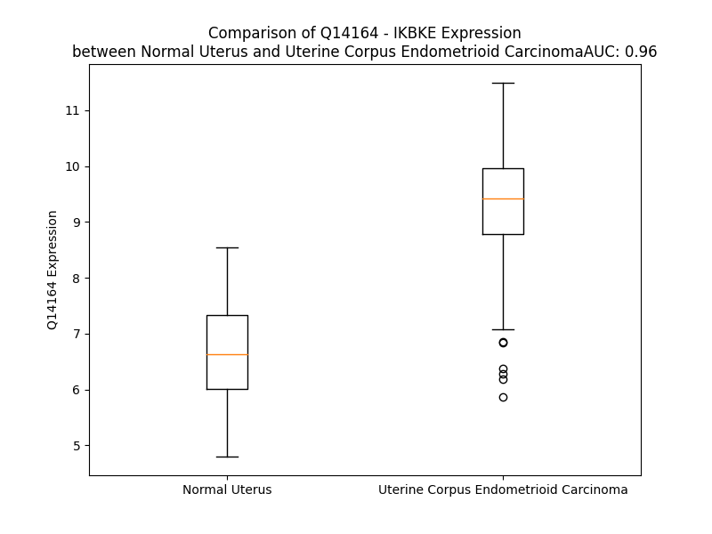

# Detailed Data for Q14164

## Introduction to the Detailed Summary

### How to Interpret the Results

- **Summary & Metrics**: This section provides a quick reference to essential protein attributes, including expression changes, family classification, and biomarker applications. Regulation status (upregulated/downregulated) indicates the protein's behavior in a disease context. Some information comes from the original excel file with the proteins selected from literature, while others are derived from the analyses.
- **Expression Comparison**: A visual representation comparing protein expression between normal and disease states. It highlights significant changes in expression levels that might indicate diagnostic or therapeutic relevance. This is data coming from transcriptomics experiments and could not translate similarly to protein levels.
- **Isoform Alignment**: An interactive view of isoform alignments, revealing structural and functional differences between variants of the protein.
- **Interactors & Homologs**: Tables listing known interaction partners and homologous proteins, the more interactors and homologs, the more complex the protein is to design an antibody for.
- **Biological Assemblies**: Information about the structural arrangement of the protein in different assemblies, providing insights into its functional state but also the complexity of the protein to develop antibodies.
- **Combined Per-Residue Information**: A detailed table summarizing residue-level data. This includes predictions for epitope regions, aggregation tendencies, and modifications that might impact the protein's function. Each row corresponds to a residue in the protein, providing insights into specific sites that may be important for research or drug development.
## Summary & Metrics

- **UniProt Accession**: Q14164
- **Gene Name**: IKBKE 
- **Protein Name**: inhibitor of kappa light polypeptide gene enhancer in B-cells, kinase epsilon 
- **Swiss Prot**: IKKE_HUMAN
- **Family**: kinase
- **Biomarker Application**:  
- **Number of Isoforms**: 2
- **Regulation**: 1
- **(transcriptomics) AUC**: 0.92
- **(transcriptomics) Fold Change**: 1.29
- **(transcriptomics) Regulation**: Upregulated
- **Discotope Epitope Count**: 175
- **Max n_uniprots (Homo)**: N/A
- **Max n_uniprots (Hetero)**: N/A

## Expression Comparison

## Isoform Alignment

<pre style='font-size:14px; font-family:monospace;'>Q14164-1 MQSTANYLWHTDDLLGQGATASVYKARNKKSGELVAVKVFNTTSYLRPREVQVREFEVLRKLNHQNIVKLFAVEETGGSRQKVLVMEYCSSGSLLSVLESPENAFGLPEDEFLVVLRCVVAGMNHLRENGIVHRDIKPGNIMRLVGEEGQSIYKLTDFGAARELDDDEKFVSVYGTEEYLHPDMYERAVLRKPQQKAFGVTVDLWSIGVTLYHAATGSLPFIPFGGPRRNKEIMYRITTEKPAGAIAGAQRRENGPLEWSYTLPITCQLSLGLQSQLVPILANILEVEQAKCWGFDQFFAETSDILQRVVVHVFSLSQAVLHHIYIHAHNTIAIFQEAVHKQTSVAPRHQEYLFEGHLCVLEPSVSAQHIAHTTASSPLTLFSTAIPKGLAFRDPALDVPKFVPKVDLQADYNTAKGVLGAGYQALRLARALLDGQELMFRGLHWVMEVLQATCRRTLEVARTSLLYLSSSLGTERFSSVAGTPEIQELKAAAELRSRLRTLAEVLSRCSQNITETQESLSSLNRELVKSRDQVHEDRSIQQIQCCLDKMNFIYKQFKKSRMRPGLGYNEEQIHKLDKVNFSHLAKRLLQVFQEECVQKYQASLVTHGKRMRVVHETRNHLRLVGCSVAACNTEAQGVQESLSKLLEELSHQLLQDRAKGAQASPPPIAPYPSPTRKDLLLHMQELCEGMKLLASDLLDNNRIIERLNRVPAPPDV
Q14164-2 -------------------------------------------------------------------------------------MEYCSSGSLLSVLESPENAFGLPEDEFLVVLRCVVAGMNHLRENGIVHRDIKPGNIMRLVGEEGQSIYKLTDFGAARELDDDEKFVSVYGTEEYLHPDMYERAVLRKPQQKAFGVTVDLWSIGVTLYHAATGSLPFIPFGGPRRNKEIMYRITTEKPAGAIAGAQRRENGPLEWSYTLPITCQLSLGLQSQLVPILANILEVEQAKCWGFDQFFAETSDILQRVVVHVFSLSQAVLHHIYIHAHNTIAIFQEAVHKQTSVAPRHQEYLFEGHLCVLEPSVSAQHIAHTTASSPLTLFSTAIPKGLAFRDPALDVPKFVPKVDLQADYNTAKGVLGAGYQALRLARALLDGQELMFRGLHWVMEVLQATCRRTLEVARTSLLYLSSSLGTERFSSVAGTPEIQELKAAAELRSRLRTLAEVLSRCSQNITETQESLSSLNRELVKSRDQVHEDRSIQQIQCCLDKMNFIYKQFKKSRMRPGLGYNEEQIHKLDKVNFSHLAKRLLQVFQEECVQKYQASLVTHGKRMRVVHETRNHLRLVGCSVAACNTEAQGVQESLSKLLEELSHQLLQDRAKGAQASPPPIAPYPSPTRKDLLLHMQELCEGMKLLASDLLDNNRIIERLNRVPAPPDV
</pre>

## Interactors

| preferredName_A   | preferredName_B   |   score |
|:------------------|:------------------|--------:|
| IKBKE             | IKBKG             |   0.999 |
| IKBKE             | IRF3              |   0.999 |
| IKBKE             | TBK1              |   0.999 |
| IKBKE             | TANK              |   0.999 |
| IKBKE             | TRAF3             |   0.999 |
| IKBKE             | TRAF6             |   0.999 |
| IKBKE             | MAVS              |   0.999 |
| IKBKE             | TNFRSF1A          |   0.998 |
| IKBKE             | TRAF2             |   0.998 |
| IKBKE             | TNF               |   0.998 |
| IKBKE             | DDX3X             |   0.996 |
| IKBKE             | IRF7              |   0.994 |
| IKBKE             | CYLD              |   0.994 |
| IKBKE             | SIKE1             |   0.989 |
| IKBKE             | STING1            |   0.988 |
| IKBKE             | AZI2              |   0.986 |
| IKBKE             | TLR3              |   0.979 |
| IKBKE             | DDX58             |   0.978 |
| IKBKE             | TBKBP1            |   0.975 |
| IKBKE             | IFIH1             |   0.97  |
| IKBKE             | STAT1             |   0.964 |
| IKBKE             | ZBP1              |   0.963 |
| IKBKE             | CHUK              |   0.954 |
| IKBKE             | LSP1              |   0.943 |
| IKBKE             | IFNB1             |   0.942 |
| IKBKE             | TICAM1            |   0.912 |

## Homologs

| uniprot_id   | gene_id   |
|:-------------|:----------|
| A0A7I2V2N0   | TBK1      |
| G3V105       | IKBKB     |
| O15111       | CHUK      |

## Combined Per-Residue Information

|   res | aa   |   epitope_score | epitope   |   relative_surface_accessibility |   modeling_confidence |   Aggregation | modification                             |
|------:|:-----|----------------:|:----------|---------------------------------:|----------------------:|--------------:|:-----------------------------------------|
|     1 | M    |         0.04748 | False     |                          0.79385 |                 87.4  |         0     | N/A                                      |
|     2 | Q    |         0.09178 | False     |                          0.37189 |                 92.78 |         0     | N/A                                      |
|     3 | S    |         0.06871 | False     |                          0.35276 |                 94.66 |         0     | N/A                                      |
|     4 | T    |         0.04571 | False     |                          0.04097 |                 95.28 |         0.204 | N/A                                      |
|     5 | A    |         0.1376  | True      |                          0.7872  |                 94.05 |         0.548 | N/A                                      |
|     6 | N    |         0.15042 | True      |                          0.34005 |                 96.31 |         0.548 | N/A                                      |
|     7 | Y    |         0.07078 | False     |                          0.08082 |                 97.19 |         0.548 | N/A                                      |
|     8 | L    |         0.08855 | False     |                          0.31447 |                 96.16 |         0.548 | N/A                                      |
|     9 | W    |         0.01689 | False     |                          0.01191 |                 96.49 |         0.548 | N/A                                      |
|    10 | H    |         0.06266 | False     |                          0.43438 |                 95.25 |         0     | N/A                                      |
|    11 | T    |         0.08241 | False     |                          0.42136 |                 91.52 |         0     | N/A                                      |
|    12 | D    |         0.13798 | True      |                          0.72343 |                 92.74 |         0     | N/A                                      |
|    13 | D    |         0.10563 | False     |                          0.39709 |                 94.47 |         0     | N/A                                      |
|    14 | L    |         0.09144 | False     |                          0.49043 |                 93.38 |         0     | N/A                                      |
|    15 | L    |         0.07109 | False     |                          0.51884 |                 91.94 |         0     | N/A                                      |
|    16 | G    |         0.08591 | False     |                          0.36145 |                 86.5  |         0     | N/A                                      |
|    17 | Q    |         0.21208 | True      |                          0.72848 |                 85.55 |         0     | N/A                                      |
|    18 | G    |         0.06838 | False     |                          0.54427 |                 80.15 |         0     | N/A                                      |
|    19 | A    |         0.11262 | False     |                          0.8602  |                 79.39 |         0     | N/A                                      |
|    20 | T    |         0.08582 | False     |                          0.29603 |                 82.7  |         0     | N/A                                      |
|    21 | A    |         0.02    | False     |                          0.03682 |                 89.69 |         0     | N/A                                      |
|    22 | S    |         0.07415 | False     |                          0.13823 |                 92.75 |         0     | N/A                                      |
|    23 | V    |         0.02403 | False     |                          0.23231 |                 95.06 |         0     | N/A                                      |
|    24 | Y    |         0.07085 | False     |                          0.13776 |                 96.68 |         0     | N/A                                      |
|    25 | K    |         0.04173 | False     |                          0.31331 |                 97.61 |         0     | N/A                                      |
|    26 | A    |         0.00766 | False     |                          0.01913 |                 97.54 |         0     | N/A                                      |
|    27 | R    |         0.17686 | True      |                          0.47085 |                 97.76 |         0     | N/A                                      |
|    28 | N    |         0.06377 | False     |                          0.1759  |                 97.98 |         0     | N/A                                      |
|    29 | K    |         0.31655 | True      |                          0.45658 |                 96.83 |         0     | N/A                                      |
|    30 | K    |         0.16674 | True      |                          0.89512 |                 96.16 |         0     | N/A                                      |
|    31 | S    |         0.12926 | True      |                          0.60887 |                 96.75 |         0     | N/A                                      |
|    32 | G    |         0.10892 | False     |                          0.42963 |                 95.99 |         0.409 | N/A                                      |
|    33 | E    |         0.13681 | True      |                          0.49018 |                 96.67 |        14.942 | N/A                                      |
|    34 | L    |         0.07004 | False     |                          0.37756 |                 97.39 |        14.942 | N/A                                      |
|    35 | V    |         0.01556 | False     |                          0.01047 |                 97.72 |        14.942 | N/A                                      |
|    36 | A    |         0.01492 | False     |                          0.07142 |                 97.58 |        14.942 | N/A                                      |
|    37 | V    |         0.00309 | False     |                          0       |                 96.66 |        14.942 | N/A                                      |
|    38 | K    |         0.02717 | False     |                          0.05994 |                 94.91 |        14.942 | N/A                                      |
|    39 | V    |         0.02927 | False     |                          0.09624 |                 92.76 |        14.942 | N/A                                      |
|    40 | F    |         0.04716 | False     |                          0.09089 |                 89.91 |        13.928 | N/A                                      |
|    41 | N    |         0.12807 | True      |                          0.30667 |                 86.47 |         1.087 | N/A                                      |
|    42 | T    |         0.20973 | True      |                          0.7513  |                 83.53 |         0.603 | N/A                                      |
|    43 | T    |         0.19772 | True      |                          0.55759 |                 80.03 |         0.315 | N/A                                      |
|    44 | S    |         0.03686 | False     |                          0.0228  |                 79.74 |         0.145 | N/A                                      |
|    45 | Y    |         0.14471 | True      |                          0.3752  |                 81.68 |         0.145 | N/A                                      |
|    46 | L    |         0.27262 | True      |                          0.89659 |                 83.35 |         0.145 | N/A                                      |
|    47 | R    |         0.25275 | True      |                          0.20727 |                 81.4  |         0     | N/A                                      |
|    48 | P    |         0.12872 | True      |                          0.6676  |                 83.35 |         0     | N/A                                      |
|    49 | R    |         0.24853 | True      |                          0.79985 |                 81.65 |         0     | N/A                                      |
|    50 | E    |         0.1367  | True      |                          0.72541 |                 79.35 |         0     | N/A                                      |
|    51 | V    |         0.05003 | False     |                          0.15134 |                 78.77 |         0     | N/A                                      |
|    52 | Q    |         0.07215 | False     |                          0.26856 |                 79.99 |         0     | N/A                                      |
|    53 | V    |         0.11667 | False     |                          0.30181 |                 83.49 |         0     | N/A                                      |
|    54 | R    |         0.10879 | False     |                          0.19443 |                 83.57 |         0     | N/A                                      |
|    55 | E    |         0.02961 | False     |                          0.03438 |                 84.75 |         0     | N/A                                      |
|    56 | F    |         0.06981 | False     |                          0.24212 |                 86.53 |         0     | N/A                                      |
|    57 | E    |         0.11163 | False     |                          0.37668 |                 89.06 |         0     | N/A                                      |
|    58 | V    |         0.01071 | False     |                          0.01238 |                 90.76 |         0     | N/A                                      |
|    59 | L    |         0.01713 | False     |                          0.03896 |                 90.95 |         0     | N/A                                      |
|    60 | R    |         0.19307 | True      |                          0.65591 |                 90.72 |         0     | N/A                                      |
|    61 | K    |         0.16281 | True      |                          0.5306  |                 91.16 |         0     | N/A                                      |
|    62 | L    |         0.04057 | False     |                          0.07129 |                 95.27 |         0     | N/A                                      |
|    63 | N    |         0.09807 | False     |                          0.76124 |                 94.79 |         0     | N/A                                      |
|    64 | H    |         0.07395 | False     |                          0.34324 |                 97.61 |         0     | N/A                                      |
|    65 | Q    |         0.12176 | True      |                          0.5794  |                 96.19 |         0     | N/A                                      |
|    66 | N    |         0.05329 | False     |                          0.0491  |                 97.82 |         0.226 | N/A                                      |
|    67 | I    |         0.01459 | False     |                          0.01809 |                 97.98 |         4.913 | N/A                                      |
|    68 | V    |         0.00969 | False     |                          0.03659 |                 96.87 |         5.344 | N/A                                      |
|    69 | K    |         0.05321 | False     |                          0.52618 |                 95.82 |         5.344 | N/A                                      |
|    70 | L    |         0.04352 | False     |                          0.18245 |                 95.26 |         5.344 | N/A                                      |
|    71 | F    |         0.08208 | False     |                          0.42571 |                 94.35 |         5.344 | N/A                                      |
|    72 | A    |         0.06939 | False     |                          0.27932 |                 93.45 |         5.344 | N/A                                      |
|    73 | V    |         0.10117 | False     |                          0.3785  |                 92.45 |         5.344 | N/A                                      |
|    74 | E    |         0.07129 | False     |                          0.12497 |                 93.43 |         5.344 | N/A                                      |
|    75 | E    |         0.14154 | True      |                          0.38689 |                 91.42 |         0     | N/A                                      |
|    76 | T    |         0.07673 | False     |                          0.06867 |                 90.06 |         0     | N/A                                      |
|    77 | G    |         0.19604 | True      |                          0.81421 |                 79.19 |         0     | N/A                                      |
|    78 | G    |         0.14806 | True      |                          0.9967  |                 75.23 |         0     | N/A                                      |
|    79 | S    |         0.19885 | True      |                          0.54817 |                 76.11 |         0     | N/A                                      |
|    80 | R    |         0.20869 | True      |                          0.70492 |                 81.98 |         0     | N/A                                      |
|    81 | Q    |         0.14912 | True      |                          0.21635 |                 86.06 |         0     | N/A                                      |
|    82 | K    |         0.13193 | True      |                          0.46543 |                 87.88 |         0.197 | N/A                                      |
|    83 | V    |         0.00326 | False     |                          0       |                 92.99 |         0.197 | N/A                                      |
|    84 | L    |         0.02734 | False     |                          0.01484 |                 94.62 |         0.197 | N/A                                      |
|    85 | V    |         0.00261 | False     |                          0       |                 96.36 |         0.197 | N/A                                      |
|    86 | M    |         0.04517 | False     |                          0.06435 |                 96.5  |         0.197 | N/A                                      |
|    87 | E    |         0.037   | False     |                          0.16884 |                 95.91 |         0.197 | N/A                                      |
|    88 | Y    |         0.0677  | False     |                          0.18395 |                 96.5  |         0.197 | N/A                                      |
|    89 | C    |         0.02048 | False     |                          0.05471 |                 95.79 |         0     | N/A                                      |
|    90 | S    |         0.07888 | False     |                          0.58259 |                 92.76 |         0     | N/A                                      |
|    91 | S    |         0.05651 | False     |                          0.2658  |                 94.53 |         0     | N/A                                      |
|    92 | G    |         0.04671 | False     |                          0.32263 |                 93.93 |         0     | N/A                                      |
|    93 | S    |         0.02265 | False     |                          0.12093 |                 95.94 |         0.628 | N/A                                      |
|    94 | L    |         0.00196 | False     |                          0       |                 97.72 |         5.696 | N/A                                      |
|    95 | L    |         0.05158 | False     |                          0.42042 |                 94.87 |         5.696 | N/A                                      |
|    96 | S    |         0.08158 | False     |                          0.41799 |                 92.63 |         5.696 | N/A                                      |
|    97 | V    |         0.04932 | False     |                          0.17899 |                 96.68 |         5.696 | N/A                                      |
|    98 | L    |         0.01675 | False     |                          0.05186 |                 95.98 |         5.696 | N/A                                      |
|    99 | E    |         0.0836  | False     |                          0.38168 |                 91.51 |         0     | N/A                                      |
|   100 | S    |         0.03903 | False     |                          0.2692  |                 94.37 |         0     | N/A                                      |
|   101 | P    |         0.01664 | False     |                          0.07456 |                 95.02 |         0     | N/A                                      |
|   102 | E    |         0.04112 | False     |                          0.41002 |                 96.3  |         0     | N/A                                      |
|   103 | N    |         0.02601 | False     |                          0.10337 |                 97.07 |         0     | N/A                                      |
|   104 | A    |         0.03479 | False     |                          0.25747 |                 95.26 |         0     | N/A                                      |
|   105 | F    |         0.03184 | False     |                          0.1587  |                 96.95 |         0     | N/A                                      |
|   106 | G    |         0.00176 | False     |                          0       |                 98    |         0     | N/A                                      |
|   107 | L    |         0.00161 | False     |                          0.00165 |                 98.52 |         0     | N/A                                      |
|   108 | P    |         0.07185 | False     |                          0.41453 |                 97.55 |         0     | N/A                                      |
|   109 | E    |         0.02374 | False     |                          0.13995 |                 98.07 |         0     | N/A                                      |
|   110 | D    |         0.05199 | False     |                          0.61596 |                 96.4  |         0     | N/A                                      |
|   111 | E    |         0.03108 | False     |                          0.16472 |                 97.65 |         0.647 | N/A                                      |
|   112 | F    |         0.00221 | False     |                          0       |                 98.65 |        96.631 | N/A                                      |
|   113 | L    |         0.01415 | False     |                          0.1896  |                 98.39 |        96.631 | N/A                                      |
|   114 | V    |         0.02115 | False     |                          0.26563 |                 97.79 |        96.631 | N/A                                      |
|   115 | V    |         0.00151 | False     |                          0       |                 98.51 |        96.631 | N/A                                      |
|   116 | L    |         0.00272 | False     |                          0.00412 |                 98.5  |        96.631 | N/A                                      |
|   117 | R    |         0.08926 | False     |                          0.48855 |                 98.24 |         0.647 | N/A                                      |
|   118 | C    |         0.02776 | False     |                          0.08523 |                 98.04 |         0.637 | N/A                                      |
|   119 | V    |         0.00255 | False     |                          0.01238 |                 97.89 |         0.896 | N/A                                      |
|   120 | V    |         0.01177 | False     |                          0.07521 |                 97.44 |         0.871 | N/A                                      |
|   121 | A    |         0.0257  | False     |                          0.32085 |                 97.92 |         0.566 | N/A                                      |
|   122 | G    |         0.00183 | False     |                          0       |                 97.43 |         0.309 | N/A                                      |
|   123 | M    |         0.01042 | False     |                          0.01616 |                 96.26 |         0.286 | N/A                                      |
|   124 | N    |         0.04689 | False     |                          0.32258 |                 95.71 |         0     | N/A                                      |
|   125 | H    |         0.04187 | False     |                          0.14998 |                 96.98 |         0     | N/A                                      |
|   126 | L    |         0.00203 | False     |                          0.00082 |                 95.05 |         0     | N/A                                      |
|   127 | R    |         0.03828 | False     |                          0.28628 |                 91.88 |         0     | N/A                                      |
|   128 | E    |         0.1037  | False     |                          0.65423 |                 93.08 |         0     | N/A                                      |
|   129 | N    |         0.09539 | False     |                          0.33816 |                 93.56 |         0     | N/A                                      |
|   130 | G    |         0.07295 | False     |                          0.31269 |                 91.06 |         0     | N/A                                      |
|   131 | I    |         0.02742 | False     |                          0.03318 |                 91.5  |         0     | N/A                                      |
|   132 | V    |         0.00546 | False     |                          0.04475 |                 90.22 |         0     | N/A                                      |
|   133 | H    |         0.00344 | False     |                          0       |                 92.12 |         0     | N/A                                      |
|   134 | R    |         0.01075 | False     |                          0.01722 |                 89.74 |         0     | N/A                                      |
|   135 | D    |         0.03891 | False     |                          0.10385 |                 90.04 |         0     | N/A                                      |
|   136 | I    |         0.00283 | False     |                          0.00397 |                 94.86 |         0     | N/A                                      |
|   137 | K    |         0.02161 | False     |                          0.18175 |                 94.3  |         0     | N/A                                      |
|   138 | P    |         0.00503 | False     |                          0.00497 |                 96.26 |         0     | N/A                                      |
|   139 | G    |         0.03059 | False     |                          0.2749  |                 93.46 |         0     | N/A                                      |
|   140 | N    |         0.02654 | False     |                          0.05815 |                 95.8  |         0     | N/A                                      |
|   141 | I    |         0.00577 | False     |                          0.004   |                 98.13 |         0     | N/A                                      |
|   142 | M    |         0.00919 | False     |                          0.22229 |                 97.91 |         0     | N/A                                      |
|   143 | R    |         0.06927 | False     |                          0.2017  |                 97.8  |         0     | N/A                                      |
|   144 | L    |         0.03523 | False     |                          0.20526 |                 95.17 |         0     | N/A                                      |
|   145 | V    |         0.12876 | True      |                          0.47788 |                 92    |         0     | N/A                                      |
|   146 | G    |         0.07336 | False     |                          0.29292 |                 85.62 |         0     | N/A                                      |
|   147 | E    |         0.12043 | True      |                          0.98626 |                 82.71 |         0     | N/A                                      |
|   148 | E    |         0.197   | True      |                          0.8024  |                 85.43 |         0     | N/A                                      |
|   149 | G    |         0.14608 | True      |                          0.57367 |                 89.16 |         0     | N/A                                      |
|   150 | Q    |         0.16681 | True      |                          0.60721 |                 90.84 |         0     | N/A                                      |
|   151 | S    |         0.0309  | False     |                          0.06247 |                 96.55 |         0     | N/A                                      |
|   152 | I    |         0.04174 | False     |                          0.25999 |                 96.89 |         0.152 | N/A                                      |
|   153 | Y    |         0.00369 | False     |                          0.00658 |                 98.3  |         0.152 | N/A                                      |
|   154 | K    |         0.01694 | False     |                          0.10175 |                 98.37 |         0.152 | N/A                                      |
|   155 | L    |         0.00448 | False     |                          0.00824 |                 98.09 |         0.152 | N/A                                      |
|   156 | T    |         0.01371 | False     |                          0.13118 |                 94.89 |         0.152 | N/A                                      |
|   157 | D    |         0.0578  | False     |                          0.31264 |                 90.49 |         0.152 | N/A                                      |
|   158 | F    |         0.00542 | False     |                          0.00382 |                 89.64 |         0.152 | N/A                                      |
|   159 | G    |         0.05098 | False     |                          0.21026 |                 83.55 |         0     | N/A                                      |
|   160 | A    |         0.0508  | False     |                          0.09023 |                 81.51 |         0     | N/A                                      |
|   161 | A    |         0.00539 | False     |                          0       |                 82.41 |         0     | N/A                                      |
|   162 | R    |         0.09756 | False     |                          0.30448 |                 81.96 |         0     | N/A                                      |
|   163 | E    |         0.09765 | False     |                          0.38674 |                 77.86 |         0     | N/A                                      |
|   164 | L    |         0.05447 | False     |                          0.04689 |                 75.09 |         0     | N/A                                      |
|   165 | D    |         0.13095 | True      |                          0.67337 |                 69.29 |         0     | N/A                                      |
|   166 | D    |         0.08352 | False     |                          0.49861 |                 64.35 |         0     | N/A                                      |
|   167 | D    |         0.18916 | True      |                          0.85098 |                 68.74 |         0     | N/A                                      |
|   168 | E    |         0.14629 | True      |                          0.41814 |                 63.44 |         0     | N/A                                      |
|   169 | K    |         0.11396 | False     |                          0.59674 |                 69.37 |         0     | N/A                                      |
|   170 | F    |         0.03934 | False     |                          0.00961 |                 70.23 |        55.346 | N/A                                      |
|   171 | V    |         0.14547 | True      |                          0.58989 |                 57.6  |        55.826 | N/A                                      |
|   172 | S    |         0.09676 | False     |                          0.28745 |                 64    |        55.826 | Phosphoserine; by autocatalysis and IKKB |
|   173 | V    |         0.09932 | False     |                          0.33492 |                 60.53 |        55.826 | N/A                                      |
|   174 | Y    |         0.09486 | False     |                          0.2818  |                 59.62 |        55.826 | N/A                                      |
|   175 | G    |         0.10887 | False     |                          0.44248 |                 64.25 |         2.61  | N/A                                      |
|   176 | T    |         0.08799 | False     |                          0.23606 |                 75.74 |         0.466 | N/A                                      |
|   177 | E    |         0.08351 | False     |                          0.2257  |                 84.92 |         0     | N/A                                      |
|   178 | E    |         0.02179 | False     |                          0.08455 |                 86.76 |         0     | N/A                                      |
|   179 | Y    |         0.05196 | False     |                          0.08623 |                 90.65 |         0     | N/A                                      |
|   180 | L    |         0.01886 | False     |                          0.0562  |                 87.01 |         0     | N/A                                      |
|   181 | H    |         0.02236 | False     |                          0.05222 |                 87.16 |         0     | N/A                                      |
|   182 | P    |         0.00296 | False     |                          0.00199 |                 85.49 |         0     | N/A                                      |
|   183 | D    |         0.02999 | False     |                          0.06311 |                 84.86 |         0     | N/A                                      |
|   184 | M    |         0.01998 | False     |                          0.01415 |                 83.11 |         0     | N/A                                      |
|   185 | Y    |         0.02248 | False     |                          0.01409 |                 84.68 |         0     | N/A                                      |
|   186 | E    |         0.06089 | False     |                          0.09381 |                 86.35 |         0     | N/A                                      |
|   187 | R    |         0.12069 | True      |                          0.26163 |                 82.61 |         0     | N/A                                      |
|   188 | A    |         0.13912 | True      |                          0.34099 |                 80.84 |         0     | N/A                                      |
|   189 | V    |         0.12175 | True      |                          0.16053 |                 82.79 |         0     | N/A                                      |
|   190 | L    |         0.23607 | True      |                          0.21153 |                 84.27 |         0     | N/A                                      |
|   191 | R    |         0.30559 | True      |                          0.83445 |                 80.85 |         0     | N/A                                      |
|   192 | K    |         0.21055 | True      |                          0.38322 |                 79.77 |         0     | N/A                                      |
|   193 | P    |         0.22167 | True      |                          1.03576 |                 65.56 |         0     | N/A                                      |
|   194 | Q    |         0.09314 | False     |                          0.2584  |                 65.93 |         0     | N/A                                      |
|   195 | Q    |         0.19163 | True      |                          0.93328 |                 60.48 |         0.135 | N/A                                      |
|   196 | K    |         0.21875 | True      |                          0.52563 |                 69.43 |         4.518 | N/A                                      |
|   197 | A    |         0.14663 | True      |                          0.29521 |                 67.3  |        13.67  | N/A                                      |
|   198 | F    |         0.0379  | False     |                          0.02185 |                 71.18 |        23.534 | N/A                                      |
|   199 | G    |         0.05562 | False     |                          0.16029 |                 73.33 |        23.534 | N/A                                      |
|   200 | V    |         0.02689 | False     |                          0.13778 |                 78.63 |        23.534 | N/A                                      |
|   201 | T    |         0.02586 | False     |                          0.22614 |                 84.52 |        23.534 | N/A                                      |
|   202 | V    |         0.00991 | False     |                          0.03734 |                 86.27 |        22.714 | N/A                                      |
|   203 | D    |         0.00394 | False     |                          0.00312 |                 90.18 |         4.518 | N/A                                      |
|   204 | L    |         0.00184 | False     |                          0       |                 94.43 |        16.899 | N/A                                      |
|   205 | W    |         0.0095  | False     |                          0.01193 |                 94.58 |        19.521 | N/A                                      |
|   206 | S    |         0.03288 | False     |                          0.06009 |                 95.01 |        20.308 | N/A                                      |
|   207 | I    |         0.00248 | False     |                          0.0008  |                 96.96 |        27.673 | N/A                                      |
|   208 | G    |         0.00217 | False     |                          0       |                 97.36 |        28.045 | N/A                                      |
|   209 | V    |         0.00249 | False     |                          0.00286 |                 97.65 |        28.253 | N/A                                      |
|   210 | T    |         0.00176 | False     |                          0.00095 |                 98.03 |        27.586 | N/A                                      |
|   211 | L    |         0.00138 | False     |                          0.00247 |                 98.63 |        27.249 | N/A                                      |
|   212 | Y    |         0.02234 | False     |                          0.0641  |                 98.71 |        23.292 | N/A                                      |
|   213 | H    |         0.02046 | False     |                          0.12066 |                 97.85 |         0.587 | N/A                                      |
|   214 | A    |         0.00067 | False     |                          0       |                 98.62 |         0.269 | N/A                                      |
|   215 | A    |         0.00118 | False     |                          0       |                 98.73 |         0     | N/A                                      |
|   216 | T    |         0.04304 | False     |                          0.03366 |                 98.12 |         0     | N/A                                      |
|   217 | G    |         0.02847 | False     |                          0.2189  |                 95.79 |         0     | N/A                                      |
|   218 | S    |         0.07309 | False     |                          0.39781 |                 93.04 |         0     | N/A                                      |
|   219 | L    |         0.01863 | False     |                          0.21284 |                 95.19 |         0     | N/A                                      |
|   220 | P    |         0.00945 | False     |                          0.02433 |                 97.04 |         0     | N/A                                      |
|   221 | F    |         0.00456 | False     |                          0.00968 |                 95.99 |         0     | N/A                                      |
|   222 | I    |         0.05626 | False     |                          0.39977 |                 93.17 |         0     | N/A                                      |
|   223 | P    |         0.01621 | False     |                          0.00735 |                 93.21 |         0     | N/A                                      |
|   224 | F    |         0.20141 | True      |                          0.3961  |                 91.19 |         0     | N/A                                      |
|   225 | G    |         0.30445 | True      |                          0.54666 |                 85.35 |         0     | N/A                                      |
|   226 | G    |         0.15788 | True      |                          0.23087 |                 83.35 |         0     | N/A                                      |
|   227 | P    |         0.05477 | False     |                          0.15309 |                 81.81 |         0     | N/A                                      |
|   228 | R    |         0.23385 | True      |                          0.64209 |                 79.33 |         0     | N/A                                      |
|   229 | R    |         0.32463 | True      |                          0.81837 |                 84.99 |         0     | N/A                                      |
|   230 | N    |         0.1706  | True      |                          0.32693 |                 89.59 |         0     | N/A                                      |
|   231 | K    |         0.12619 | True      |                          0.34808 |                 90.42 |         0     | N/A                                      |
|   232 | E    |         0.25383 | True      |                          0.47183 |                 91.17 |         0     | N/A                                      |
|   233 | I    |         0.11817 | False     |                          0.20719 |                 92.05 |         0     | N/A                                      |
|   234 | M    |         0.01    | False     |                          0.02661 |                 92.34 |         0     | N/A                                      |
|   235 | Y    |         0.07264 | False     |                          0.17373 |                 92.52 |         0     | N/A                                      |
|   236 | R    |         0.15633 | True      |                          0.35206 |                 93.46 |         0     | N/A                                      |
|   237 | I    |         0.00938 | False     |                          0       |                 93.94 |         0     | N/A                                      |
|   238 | T    |         0.01654 | False     |                          0.02822 |                 93.37 |         0     | N/A                                      |
|   239 | T    |         0.0605  | False     |                          0.324   |                 91.82 |         0     | N/A                                      |
|   240 | E    |         0.14821 | True      |                          0.53406 |                 93.54 |         0     | N/A                                      |
|   241 | K    |         0.02726 | False     |                          0.06435 |                 95.07 |         0     | N/A                                      |
|   242 | P    |         0.08606 | False     |                          0.32407 |                 95.37 |         0     | N/A                                      |
|   243 | A    |         0.06127 | False     |                          0.67894 |                 93.23 |         0     | N/A                                      |
|   244 | G    |         0.05842 | False     |                          0.36131 |                 95.72 |         0     | N/A                                      |
|   245 | A    |         0.00683 | False     |                          0       |                 97.47 |         0     | N/A                                      |
|   246 | I    |         0.00435 | False     |                          0       |                 97.98 |         0     | N/A                                      |
|   247 | A    |         0.01694 | False     |                          0.08398 |                 97.78 |         0     | N/A                                      |
|   248 | G    |         0.02909 | False     |                          0.01541 |                 96.78 |         0     | N/A                                      |
|   249 | A    |         0.07743 | False     |                          0.3338  |                 95.11 |         0     | N/A                                      |
|   250 | Q    |         0.08893 | False     |                          0.04976 |                 95.36 |         0     | N/A                                      |
|   251 | R    |         0.23639 | True      |                          0.74464 |                 90.96 |         0     | N/A                                      |
|   252 | R    |         0.22463 | True      |                          0.66035 |                 92.6  |         0     | N/A                                      |
|   253 | E    |         0.3504  | True      |                          0.63667 |                 91.89 |         0     | N/A                                      |
|   254 | N    |         0.21415 | True      |                          0.90464 |                 88.04 |         0     | N/A                                      |
|   255 | G    |         0.25109 | True      |                          0.10437 |                 92.65 |         0     | N/A                                      |
|   256 | P    |         0.22669 | True      |                          0.67529 |                 95.15 |         0     | N/A                                      |
|   257 | L    |         0.14202 | True      |                          0.18633 |                 94.91 |         0     | N/A                                      |
|   258 | E    |         0.08491 | False     |                          0.36568 |                 96.71 |         0     | N/A                                      |
|   259 | W    |         0.08927 | False     |                          0.30871 |                 97.59 |         0     | N/A                                      |
|   260 | S    |         0.03885 | False     |                          0.30988 |                 97.55 |         0     | N/A                                      |
|   261 | Y    |         0.13661 | True      |                          0.50185 |                 98.12 |         0     | N/A                                      |
|   262 | T    |         0.12572 | True      |                          0.61458 |                 97.84 |         0     | N/A                                      |
|   263 | L    |         0.01894 | False     |                          0.05738 |                 98.11 |         0     | N/A                                      |
|   264 | P    |         0.05721 | False     |                          0.37047 |                 96.52 |         0     | N/A                                      |
|   265 | I    |         0.07462 | False     |                          0.62673 |                 95.84 |         0     | N/A                                      |
|   266 | T    |         0.03585 | False     |                          0.1065  |                 96.05 |         0     | N/A                                      |
|   267 | C    |         0.0228  | False     |                          0.10265 |                 97.16 |         0     | N/A                                      |
|   268 | Q    |         0.03656 | False     |                          0.21651 |                 96.78 |         0     | N/A                                      |
|   269 | L    |         0.01918 | False     |                          0.0329  |                 98.22 |         0     | N/A                                      |
|   270 | S    |         0.0296  | False     |                          0.14946 |                 97.25 |         0     | N/A                                      |
|   271 | L    |         0.03126 | False     |                          0.64583 |                 95.53 |         0     | N/A                                      |
|   272 | G    |         0.00613 | False     |                          0.02063 |                 97.12 |         0     | N/A                                      |
|   273 | L    |         0.0026  | False     |                          0.00165 |                 98.32 |         0     | N/A                                      |
|   274 | Q    |         0.02077 | False     |                          0.1531  |                 98.24 |         0     | N/A                                      |
|   275 | S    |         0.03154 | False     |                          0.474   |                 96.62 |         0     | N/A                                      |
|   276 | Q    |         0.03798 | False     |                          0.25947 |                 97.55 |         0     | N/A                                      |
|   277 | L    |         0.00255 | False     |                          0.00247 |                 98.31 |         0     | N/A                                      |
|   278 | V    |         0.0162  | False     |                          0.18756 |                 98.42 |         0     | N/A                                      |
|   279 | P    |         0.12266 | True      |                          0.46721 |                 97.88 |         0     | N/A                                      |
|   280 | I    |         0.02074 | False     |                          0.0144  |                 98.09 |         3.087 | N/A                                      |
|   281 | L    |         0.00175 | False     |                          0       |                 98.21 |         3.326 | N/A                                      |
|   282 | A    |         0.02002 | False     |                          0.1354  |                 97.65 |         3.326 | N/A                                      |
|   283 | N    |         0.05608 | False     |                          0.27591 |                 96.91 |         3.326 | N/A                                      |
|   284 | I    |         0.01089 | False     |                          0.00355 |                 95.99 |         3.326 | N/A                                      |
|   285 | L    |         0.00278 | False     |                          0       |                 95.66 |         2.847 | N/A                                      |
|   286 | E    |         0.0364  | False     |                          0.08002 |                 92.99 |         0     | N/A                                      |
|   287 | V    |         0.04765 | False     |                          0.2083  |                 85.78 |         0     | N/A                                      |
|   288 | E    |         0.16195 | True      |                          0.47649 |                 85.07 |         0     | N/A                                      |
|   289 | Q    |         0.07504 | False     |                          0.46048 |                 80.98 |         0     | N/A                                      |
|   290 | A    |         0.16052 | True      |                          1.01311 |                 86.32 |         0     | N/A                                      |
|   291 | K    |         0.10657 | False     |                          0.56857 |                 89.53 |         0     | N/A                                      |
|   292 | C    |         0.0721  | False     |                          0.16628 |                 91.13 |         0     | N/A                                      |
|   293 | W    |         0.17681 | True      |                          0.19284 |                 93.28 |         0     | N/A                                      |
|   294 | G    |         0.08027 | False     |                          0.45042 |                 92.23 |         0     | N/A                                      |
|   295 | F    |         0.02765 | False     |                          0.07395 |                 92.47 |         0     | N/A                                      |
|   296 | D    |         0.12262 | True      |                          0.56924 |                 94.25 |         0     | N/A                                      |
|   297 | Q    |         0.06228 | False     |                          0.40657 |                 95.74 |         0     | N/A                                      |
|   298 | F    |         0.00226 | False     |                          0       |                 96.53 |         0     | N/A                                      |
|   299 | F    |         0.03616 | False     |                          0.1047  |                 97.11 |         0     | N/A                                      |
|   300 | A    |         0.12107 | True      |                          0.56981 |                 97.61 |         0     | N/A                                      |
|   301 | E    |         0.08119 | False     |                          0.31143 |                 98.03 |         0     | N/A                                      |
|   302 | T    |         0.00258 | False     |                          0.00095 |                 98.01 |         0     | N/A                                      |
|   303 | S    |         0.0766  | False     |                          0.30485 |                 97.3  |         0     | N/A                                      |
|   304 | D    |         0.04875 | False     |                          0.27032 |                 97.88 |         0.067 | N/A                                      |
|   305 | I    |         0.01956 | False     |                          0.03224 |                 98.16 |         0.067 | N/A                                      |
|   306 | L    |         0.02776 | False     |                          0.18233 |                 97.69 |         0.067 | N/A                                      |
|   307 | Q    |         0.11265 | False     |                          0.64093 |                 97.27 |         0.067 | N/A                                      |
|   308 | R    |         0.12032 | True      |                          0.23961 |                 97.63 |         0.067 | N/A                                      |
|   309 | V    |         0.0608  | False     |                          0.30942 |                 96.52 |        44.418 | N/A                                      |
|   310 | V    |         0.01599 | False     |                          0.25303 |                 97.63 |        47.966 | N/A                                      |
|   311 | V    |         0.00231 | False     |                          0       |                 98.15 |        48.309 | N/A                                      |
|   312 | H    |         0.03428 | False     |                          0.15609 |                 98.54 |        48.309 | N/A                                      |
|   313 | V    |         0.00154 | False     |                          0.00095 |                 98.02 |        49.52  | N/A                                      |
|   314 | F    |         0.00586 | False     |                          0.00706 |                 97.8  |        47.866 | N/A                                      |
|   315 | S    |         0.00154 | False     |                          0       |                 96.92 |        25.813 | N/A                                      |
|   316 | L    |         0.00056 | False     |                          0       |                 95.97 |        23.094 | N/A                                      |
|   317 | S    |         0.0009  | False     |                          0.00104 |                 91.3  |         7.976 | N/A                                      |
|   318 | Q    |         0.01487 | False     |                          0.07498 |                 93.12 |         5.791 | N/A                                      |
|   319 | A    |         0.00288 | False     |                          0.02357 |                 94.49 |         5.903 | N/A                                      |
|   320 | V    |         0.01937 | False     |                          0.20946 |                 95.08 |         6.121 | N/A                                      |
|   321 | L    |         0.0247  | False     |                          0.33109 |                 96.96 |         5.327 | N/A                                      |
|   322 | H    |         0.01231 | False     |                          0.07842 |                 97.5  |         0.614 | N/A                                      |
|   323 | H    |         0.0209  | False     |                          0.20256 |                 98.16 |         0.614 | N/A                                      |
|   324 | I    |         0.00465 | False     |                          0.0048  |                 98.26 |         0.919 | N/A                                      |
|   325 | Y    |         0.013   | False     |                          0.06624 |                 97.88 |         0.919 | N/A                                      |
|   326 | I    |         0.01664 | False     |                          0.0104  |                 97.79 |         0.919 | N/A                                      |
|   327 | H    |         0.04215 | False     |                          0.1288  |                 97.78 |         0.306 | N/A                                      |
|   328 | A    |         0.06759 | False     |                          0.30172 |                 95.88 |         0.306 | N/A                                      |
|   329 | H    |         0.12905 | True      |                          0.75668 |                 96    |         0     | N/A                                      |
|   330 | N    |         0.05509 | False     |                          0.14481 |                 97.67 |         0.777 | N/A                                      |
|   331 | T    |         0.16814 | True      |                          0.33855 |                 97.72 |        18.711 | N/A                                      |
|   332 | I    |         0.01467 | False     |                          0.0112  |                 97.71 |        19.619 | N/A                                      |
|   333 | A    |         0.04674 | False     |                          0.44617 |                 97.57 |        19.619 | N/A                                      |
|   334 | I    |         0.0622  | False     |                          0.51852 |                 97.53 |        19.619 | N/A                                      |
|   335 | F    |         0.00344 | False     |                          0       |                 97.96 |        19.512 | N/A                                      |
|   336 | Q    |         0.02335 | False     |                          0.11086 |                 97.44 |         1.583 | N/A                                      |
|   337 | E    |         0.07219 | False     |                          0.3698  |                 97.42 |         0     | N/A                                      |
|   338 | A    |         0.01619 | False     |                          0.24099 |                 97.07 |         0     | N/A                                      |
|   339 | V    |         0.00367 | False     |                          0.00095 |                 97.13 |         0     | N/A                                      |
|   340 | H    |         0.09035 | False     |                          0.32658 |                 96.36 |         0     | N/A                                      |
|   341 | K    |         0.0735  | False     |                          0.78514 |                 95.83 |         0     | N/A                                      |
|   342 | Q    |         0.03459 | False     |                          0.18821 |                 95    |         0     | N/A                                      |
|   343 | T    |         0.02121 | False     |                          0.01797 |                 94.24 |         0     | N/A                                      |
|   344 | S    |         0.11174 | False     |                          0.7113  |                 94.12 |         0     | N/A                                      |
|   345 | V    |         0.02714 | False     |                          0.08283 |                 94.27 |         0     | N/A                                      |
|   346 | A    |         0.14789 | True      |                          0.29011 |                 94.19 |         0     | N/A                                      |
|   347 | P    |         0.05948 | False     |                          0.36553 |                 94.81 |         0     | N/A                                      |
|   348 | R    |         0.12334 | True      |                          0.83264 |                 92.84 |         0     | N/A                                      |
|   349 | H    |         0.09271 | False     |                          0.53201 |                 92.89 |         0     | N/A                                      |
|   350 | Q    |         0.03028 | False     |                          0.07873 |                 95.07 |         0     | N/A                                      |
|   351 | E    |         0.03106 | False     |                          0.30858 |                 94.76 |         0     | N/A                                      |
|   352 | Y    |         0.00712 | False     |                          0.01553 |                 96.71 |         0     | N/A                                      |
|   353 | L    |         0.03308 | False     |                          0.03215 |                 96.23 |         0     | N/A                                      |
|   354 | F    |         0.04756 | False     |                          0.18778 |                 95.97 |         0     | N/A                                      |
|   355 | E    |         0.069   | False     |                          0.54324 |                 93.16 |         0     | N/A                                      |
|   356 | G    |         0.04841 | False     |                          0.27049 |                 91.21 |         0     | N/A                                      |
|   357 | H    |         0.10971 | False     |                          0.72939 |                 93.56 |         0.13  | N/A                                      |
|   358 | L    |         0.08963 | False     |                          0.59907 |                 93.22 |         0.13  | N/A                                      |
|   359 | C    |         0.07492 | False     |                          0.26794 |                 92.4  |         0.13  | N/A                                      |
|   360 | V    |         0.0984  | False     |                          0.80655 |                 91.15 |         0.13  | N/A                                      |
|   361 | L    |         0.07406 | False     |                          0.13705 |                 92.38 |         0.13  | N/A                                      |
|   362 | E    |         0.08274 | False     |                          0.50004 |                 93.52 |         0     | N/A                                      |
|   363 | P    |         0.12452 | True      |                          0.52369 |                 93.77 |         0     | N/A                                      |
|   364 | S    |         0.2225  | True      |                          0.74714 |                 94.74 |         0     | N/A                                      |
|   365 | V    |         0.17011 | True      |                          0.39321 |                 95.36 |         0     | N/A                                      |
|   366 | S    |         0.09183 | False     |                          0.25977 |                 96.5  |         0     | N/A                                      |
|   367 | A    |         0.00315 | False     |                          0       |                 95.07 |         0     | N/A                                      |
|   368 | Q    |         0.08048 | False     |                          0.6226  |                 94.29 |         0     | N/A                                      |
|   369 | H    |         0.17353 | True      |                          0.6575  |                 92.15 |         0     | N/A                                      |
|   370 | I    |         0.04043 | False     |                          0.0544  |                 93.14 |         0     | N/A                                      |
|   371 | A    |         0.05107 | False     |                          0.28468 |                 88.17 |         0     | N/A                                      |
|   372 | H    |         0.16552 | True      |                          0.63523 |                 93.23 |         0     | N/A                                      |
|   373 | T    |         0.02144 | False     |                          0.05357 |                 96.8  |         0     | N/A                                      |
|   374 | T    |         0.05398 | False     |                          0.45433 |                 96.79 |         0     | N/A                                      |
|   375 | A    |         0.03599 | False     |                          0.45051 |                 95.67 |         0     | N/A                                      |
|   376 | S    |         0.10161 | False     |                          0.63503 |                 95.2  |         0     | N/A                                      |
|   377 | S    |         0.02637 | False     |                          0.23455 |                 96.32 |         0     | N/A                                      |
|   378 | P    |         0.00258 | False     |                          0.00073 |                 97.98 |         0.162 | N/A                                      |
|   379 | L    |         0.00472 | False     |                          0.01484 |                 97.87 |         3.586 | N/A                                      |
|   380 | T    |         0.00504 | False     |                          0.02027 |                 97.67 |         3.914 | N/A                                      |
|   381 | L    |         0.00098 | False     |                          0       |                 96.99 |         4.167 | N/A                                      |
|   382 | F    |         0.0145  | False     |                          0.03779 |                 94.53 |         4.167 | N/A                                      |
|   383 | S    |         0.00764 | False     |                          0.0468  |                 90.84 |         4.005 | N/A                                      |
|   384 | T    |         0.14502 | True      |                          0.8192  |                 79.79 |         2.369 | N/A                                      |
|   385 | A    |         0.0691  | False     |                          0.33748 |                 74.34 |         1.221 | N/A                                      |
|   386 | I    |         0.09202 | False     |                          0.8447  |                 73.88 |         0     | N/A                                      |
|   387 | P    |         0.13235 | True      |                          0.26309 |                 77.31 |         0     | N/A                                      |
|   388 | K    |         0.08614 | False     |                          0.7928  |                 85.66 |         0     | N/A                                      |
|   389 | G    |         0.04111 | False     |                          0.07425 |                 90.42 |         0     | N/A                                      |
|   390 | L    |         0.04001 | False     |                          0.3706  |                 91.92 |         0     | N/A                                      |
|   391 | A    |         0.08949 | False     |                          0.75759 |                 93.62 |         0     | N/A                                      |
|   392 | F    |         0.07214 | False     |                          0.26228 |                 95.1  |         0     | N/A                                      |
|   393 | R    |         0.10574 | False     |                          0.4098  |                 94.98 |         0     | N/A                                      |
|   394 | D    |         0.07141 | False     |                          0.29745 |                 95.46 |         0     | N/A                                      |
|   395 | P    |         0.00406 | False     |                          0.00199 |                 95.29 |         0     | N/A                                      |
|   396 | A    |         0.0797  | False     |                          0.46414 |                 94.18 |         0     | N/A                                      |
|   397 | L    |         0.20673 | True      |                          0.74956 |                 93.44 |         0     | N/A                                      |
|   398 | D    |         0.04966 | False     |                          0.25529 |                 86.97 |         0     | N/A                                      |
|   399 | V    |         0.03829 | False     |                          0.30275 |                 91.66 |         0     | N/A                                      |
|   400 | P    |         0.19818 | True      |                          0.39301 |                 91.55 |         0     | N/A                                      |
|   401 | K    |         0.13928 | True      |                          0.90724 |                 90.63 |         0     | N/A                                      |
|   402 | F    |         0.03766 | False     |                          0.17984 |                 91.95 |         0     | N/A                                      |
|   403 | V    |         0.12217 | True      |                          0.67221 |                 92.17 |         0     | N/A                                      |
|   404 | P    |         0.16252 | True      |                          0.92482 |                 89.69 |         0     | N/A                                      |
|   405 | K    |         0.22156 | True      |                          0.78024 |                 92.45 |         0     | N/A                                      |
|   406 | V    |         0.08573 | False     |                          0.21441 |                 93.08 |         0     | N/A                                      |
|   407 | D    |         0.10226 | False     |                          0.42672 |                 93.72 |         0     | N/A                                      |
|   408 | L    |         0.08877 | False     |                          0.12914 |                 94.23 |         0     | N/A                                      |
|   409 | Q    |         0.16861 | True      |                          0.42127 |                 90.05 |         0     | N/A                                      |
|   410 | A    |         0.06937 | False     |                          0.39121 |                 91.26 |         0     | N/A                                      |
|   411 | D    |         0.03805 | False     |                          0.01655 |                 95.77 |         0     | N/A                                      |
|   412 | Y    |         0.03474 | False     |                          0.04884 |                 94.38 |         0     | N/A                                      |
|   413 | N    |         0.08584 | False     |                          0.51007 |                 91.19 |         0     | N/A                                      |
|   414 | T    |         0.03551 | False     |                          0.13922 |                 95.84 |         0     | N/A                                      |
|   415 | A    |         0.00136 | False     |                          0       |                 97.07 |         0     | N/A                                      |
|   416 | K    |         0.04742 | False     |                          0.24209 |                 94.58 |         0     | N/A                                      |
|   417 | G    |         0.04676 | False     |                          0.32667 |                 94.22 |         0     | N/A                                      |
|   418 | V    |         0.02341 | False     |                          0.03821 |                 97.25 |         0     | N/A                                      |
|   419 | L    |         0.00236 | False     |                          0       |                 97    |         0     | N/A                                      |
|   420 | G    |         0.00897 | False     |                          0.00805 |                 96.1  |         0     | N/A                                      |
|   421 | A    |         0.00147 | False     |                          0.00492 |                 96.66 |         0     | N/A                                      |
|   422 | G    |         0.00716 | False     |                          0.03128 |                 97.68 |         0     | N/A                                      |
|   423 | Y    |         0.03767 | False     |                          0.09082 |                 97.71 |         0     | N/A                                      |
|   424 | Q    |         0.01071 | False     |                          0.05327 |                 97.18 |         0     | N/A                                      |
|   425 | A    |         0.00099 | False     |                          0       |                 97.88 |         0     | N/A                                      |
|   426 | L    |         0.02412 | False     |                          0.05276 |                 97.95 |         0     | N/A                                      |
|   427 | R    |         0.05221 | False     |                          0.23851 |                 97.36 |         0     | N/A                                      |
|   428 | L    |         0.00912 | False     |                          0.10387 |                 97.32 |         0     | N/A                                      |
|   429 | A    |         0.00754 | False     |                          0.01886 |                 97.75 |         0     | N/A                                      |
|   430 | R    |         0.12835 | True      |                          0.44965 |                 96.86 |         0     | N/A                                      |
|   431 | A    |         0.0247  | False     |                          0.41101 |                 95.69 |         0     | N/A                                      |
|   432 | L    |         0.00813 | False     |                          0.01649 |                 96.21 |         0     | N/A                                      |
|   433 | L    |         0.02625 | False     |                          0.3009  |                 95.16 |         0     | N/A                                      |
|   434 | D    |         0.04339 | False     |                          0.513   |                 94.39 |         0     | N/A                                      |
|   435 | G    |         0.01265 | False     |                          0.10325 |                 95.01 |         0     | N/A                                      |
|   436 | Q    |         0.02373 | False     |                          0.06337 |                 95.36 |         0     | N/A                                      |
|   437 | E    |         0.05613 | False     |                          0.18816 |                 94.53 |         0     | N/A                                      |
|   438 | L    |         0.0072  | False     |                          0.07222 |                 95.84 |         0     | N/A                                      |
|   439 | M    |         0.00575 | False     |                          0.00216 |                 95.57 |         0     | N/A                                      |
|   440 | F    |         0.0163  | False     |                          0.04581 |                 95.64 |         0     | N/A                                      |
|   441 | R    |         0.06732 | False     |                          0.23008 |                 95.24 |         0     | N/A                                      |
|   442 | G    |         0.00306 | False     |                          0.00714 |                 95.99 |         0     | N/A                                      |
|   443 | L    |         0.00187 | False     |                          0       |                 95.13 |         0.381 | N/A                                      |
|   444 | H    |         0.06273 | False     |                          0.33205 |                 95.79 |         0.381 | N/A                                      |
|   445 | W    |         0.03577 | False     |                          0.14651 |                 95.56 |         0.381 | N/A                                      |
|   446 | V    |         0.01522 | False     |                          0.04856 |                 95.19 |         0.381 | N/A                                      |
|   447 | M    |         0.01293 | False     |                          0.00647 |                 94.82 |         0.381 | N/A                                      |
|   448 | E    |         0.12021 | True      |                          0.3443  |                 94.24 |         0     | N/A                                      |
|   449 | V    |         0.03435 | False     |                          0.28644 |                 93.9  |         0.204 | N/A                                      |
|   450 | L    |         0.01459 | False     |                          0.07007 |                 94.63 |         0.204 | N/A                                      |
|   451 | Q    |         0.04335 | False     |                          0.07105 |                 95.47 |         0.204 | N/A                                      |
|   452 | A    |         0.11408 | False     |                          0.31479 |                 94.43 |         0.204 | N/A                                      |
|   453 | T    |         0.05382 | False     |                          0.33786 |                 94.15 |         0.204 | N/A                                      |
|   454 | C    |         0.005   | False     |                          0       |                 95.88 |         0     | N/A                                      |
|   455 | R    |         0.23368 | True      |                          0.54475 |                 95.85 |         0     | N/A                                      |
|   456 | R    |         0.13226 | True      |                          0.61425 |                 95.34 |         0     | N/A                                      |
|   457 | T    |         0.02603 | False     |                          0.14002 |                 93.85 |         0     | N/A                                      |
|   458 | L    |         0.04797 | False     |                          0.08821 |                 94.88 |         0     | N/A                                      |
|   459 | E    |         0.11982 | False     |                          0.59065 |                 94.78 |         0     | N/A                                      |
|   460 | V    |         0.03403 | False     |                          0.52861 |                 93.85 |         0     | N/A                                      |
|   461 | A    |         0.00202 | False     |                          0       |                 93.05 |         0     | N/A                                      |
|   462 | R    |         0.13328 | True      |                          0.51816 |                 92.73 |         0     | N/A                                      |
|   463 | T    |         0.08649 | False     |                          0.61407 |                 92.3  |         1.036 | N/A                                      |
|   464 | S    |         0.04736 | False     |                          0.14965 |                 90.47 |         2.688 | N/A                                      |
|   465 | L    |         0.04937 | False     |                          0.20913 |                 91.34 |         7.534 | N/A                                      |
|   466 | L    |         0.14382 | True      |                          0.83021 |                 88.77 |         7.534 | N/A                                      |
|   467 | Y    |         0.12131 | True      |                          0.56151 |                 87.05 |         7.534 | N/A                                      |
|   468 | L    |         0.0101  | False     |                          0.00742 |                 87.55 |         7.373 | N/A                                      |
|   469 | S    |         0.10863 | False     |                          0.50935 |                 85.18 |         5.028 | N/A                                      |
|   470 | S    |         0.12693 | True      |                          0.57281 |                 80.65 |         0.834 | N/A                                      |
|   471 | S    |         0.0412  | False     |                          0.13887 |                 75.52 |         0.336 | N/A                                      |
|   472 | L    |         0.08066 | False     |                          0.19163 |                 75.46 |         0.336 | N/A                                      |
|   473 | G    |         0.18727 | True      |                          0.74314 |                 64.93 |         0     | N/A                                      |
|   474 | T    |         0.17006 | True      |                          0.55415 |                 58.31 |         0     | N/A                                      |
|   475 | E    |         0.12009 | True      |                          0.5356  |                 53.99 |         0     | N/A                                      |
|   476 | R    |         0.26828 | True      |                          0.79856 |                 49.16 |         0     | N/A                                      |
|   477 | F    |         0.20672 | True      |                          0.5597  |                 49.21 |         0.316 | N/A                                      |
|   478 | S    |         0.15661 | True      |                          0.82738 |                 44.7  |         0.316 | N/A                                      |
|   479 | S    |         0.23037 | True      |                          0.80839 |                 40.37 |         0.316 | N/A                                      |
|   480 | V    |         0.12663 | True      |                          0.59541 |                 43.34 |         0.316 | N/A                                      |
|   481 | A    |         0.11274 | False     |                          1.04206 |                 36.27 |         0.316 | N/A                                      |
|   482 | G    |         0.15101 | True      |                          0.56149 |                 45.98 |         0     | N/A                                      |
|   483 | T    |         0.09083 | False     |                          0.96105 |                 46.33 |         0     | N/A                                      |
|   484 | P    |         0.0711  | False     |                          0.29814 |                 52.33 |         0     | N/A                                      |
|   485 | E    |         0.10097 | False     |                          0.63803 |                 54.8  |         0     | N/A                                      |
|   486 | I    |         0.14839 | True      |                          0.90492 |                 62.1  |         0     | N/A                                      |
|   487 | Q    |         0.13974 | True      |                          0.7344  |                 68.62 |         0     | N/A                                      |
|   488 | E    |         0.12607 | True      |                          0.19419 |                 68.76 |         0     | N/A                                      |
|   489 | L    |         0.08223 | False     |                          0.51528 |                 71.26 |         0     | N/A                                      |
|   490 | K    |         0.08869 | False     |                          0.72617 |                 79.26 |         0     | N/A                                      |
|   491 | A    |         0.06768 | False     |                          0.33864 |                 82.94 |         0     | N/A                                      |
|   492 | A    |         0.02351 | False     |                          0.01403 |                 82.31 |         0     | N/A                                      |
|   493 | A    |         0.05494 | False     |                          0.52073 |                 84.23 |         0     | N/A                                      |
|   494 | E    |         0.12673 | True      |                          0.52203 |                 88.47 |         0     | N/A                                      |
|   495 | L    |         0.0464  | False     |                          0.17559 |                 88.3  |         0     | N/A                                      |
|   496 | R    |         0.04441 | False     |                          0.11677 |                 87.7  |         0     | N/A                                      |
|   497 | S    |         0.05694 | False     |                          0.44045 |                 89.85 |         0     | N/A                                      |
|   498 | R    |         0.20139 | True      |                          0.50552 |                 91.74 |         0     | N/A                                      |
|   499 | L    |         0.00358 | False     |                          0       |                 90.64 |         0     | N/A                                      |
|   500 | R    |         0.14422 | True      |                          0.4289  |                 91.55 |         0     | N/A                                      |
|   501 | T    |         0.15282 | True      |                          0.53604 |                 93.41 |         0     | Phosphothreonine                         |
|   502 | L    |         0.04014 | False     |                          0.07749 |                 93.69 |         0     | N/A                                      |
|   503 | A    |         0.01851 | False     |                          0.15467 |                 92.83 |         0     | N/A                                      |
|   504 | E    |         0.12385 | True      |                          0.62747 |                 93.44 |         0     | N/A                                      |
|   505 | V    |         0.05303 | False     |                          0.26372 |                 93.67 |         0     | N/A                                      |
|   506 | L    |         0.00145 | False     |                          0       |                 94.29 |         0     | N/A                                      |
|   507 | S    |         0.06706 | False     |                          0.44814 |                 94.79 |         0     | N/A                                      |
|   508 | R    |         0.18359 | True      |                          0.60388 |                 94.6  |         0     | N/A                                      |
|   509 | C    |         0.01906 | False     |                          0.06641 |                 94.21 |         0     | N/A                                      |
|   510 | S    |         0.0131  | False     |                          0.10224 |                 94.77 |         0     | N/A                                      |
|   511 | Q    |         0.12593 | True      |                          0.55787 |                 94.69 |         0     | N/A                                      |
|   512 | N    |         0.06193 | False     |                          0.30721 |                 94.13 |         0     | N/A                                      |
|   513 | I    |         0.00589 | False     |                          0.0016  |                 95.06 |         0     | N/A                                      |
|   514 | T    |         0.06884 | False     |                          0.31469 |                 95.2  |         0     | N/A                                      |
|   515 | E    |         0.10892 | False     |                          0.48577 |                 94.6  |         0     | N/A                                      |
|   516 | T    |         0.0379  | False     |                          0.11324 |                 94.03 |         0     | N/A                                      |
|   517 | Q    |         0.04481 | False     |                          0.19606 |                 95.05 |         0     | N/A                                      |
|   518 | E    |         0.09446 | False     |                          0.59865 |                 94.1  |         0     | N/A                                      |
|   519 | S    |         0.08318 | False     |                          0.45353 |                 94.05 |         0     | N/A                                      |
|   520 | L    |         0.00971 | False     |                          0.01304 |                 94.73 |         0     | N/A                                      |
|   521 | S    |         0.06176 | False     |                          0.335   |                 94.78 |         0     | N/A                                      |
|   522 | S    |         0.05312 | False     |                          0.32156 |                 94.58 |         0     | N/A                                      |
|   523 | L    |         0.03953 | False     |                          0.12685 |                 94.34 |         0     | N/A                                      |
|   524 | N    |         0.05464 | False     |                          0.17201 |                 94.81 |         0     | N/A                                      |
|   525 | R    |         0.10929 | False     |                          0.64186 |                 94.71 |         0     | N/A                                      |
|   526 | E    |         0.11674 | False     |                          0.49371 |                 93.79 |         0     | N/A                                      |
|   527 | L    |         0.00557 | False     |                          0.01814 |                 94.74 |         0     | N/A                                      |
|   528 | V    |         0.05801 | False     |                          0.45319 |                 93.33 |         0     | N/A                                      |
|   529 | K    |         0.078   | False     |                          0.68407 |                 92.89 |         0     | N/A                                      |
|   530 | S    |         0.04245 | False     |                          0.21899 |                 92.56 |         0     | N/A                                      |
|   531 | R    |         0.08038 | False     |                          0.38399 |                 93.27 |         0     | N/A                                      |
|   532 | D    |         0.11873 | False     |                          0.46235 |                 92.09 |         0     | N/A                                      |
|   533 | Q    |         0.11557 | False     |                          0.58056 |                 89.77 |         0     | N/A                                      |
|   534 | V    |         0.03205 | False     |                          0.17758 |                 89.43 |         0     | N/A                                      |
|   535 | H    |         0.13376 | True      |                          0.61409 |                 87.37 |         0     | N/A                                      |
|   536 | E    |         0.10439 | False     |                          0.72403 |                 89.98 |         0     | N/A                                      |
|   537 | D    |         0.02206 | False     |                          0.18526 |                 89.78 |         0     | N/A                                      |
|   538 | R    |         0.2119  | True      |                          0.71073 |                 94.45 |         0     | N/A                                      |
|   539 | S    |         0.01451 | False     |                          0.07128 |                 95.84 |         0     | N/A                                      |
|   540 | I    |         0.04352 | False     |                          0.17588 |                 96.84 |         0     | N/A                                      |
|   541 | Q    |         0.12655 | True      |                          0.55417 |                 97.39 |         0     | N/A                                      |
|   542 | Q    |         0.06089 | False     |                          0.38931 |                 97.69 |         0     | N/A                                      |
|   543 | I    |         0.00424 | False     |                          0.0008  |                 98.18 |         0     | N/A                                      |
|   544 | Q    |         0.06061 | False     |                          0.27289 |                 97.85 |         0     | N/A                                      |
|   545 | C    |         0.0327  | False     |                          0.4441  |                 97.92 |         0     | N/A                                      |
|   546 | C    |         0.02512 | False     |                          0.04958 |                 98.12 |         0     | N/A                                      |
|   547 | L    |         0.00473 | False     |                          0.00482 |                 97.86 |         0     | N/A                                      |
|   548 | D    |         0.12627 | True      |                          0.50177 |                 97.96 |         0     | N/A                                      |
|   549 | K    |         0.06759 | False     |                          0.54162 |                 98.12 |         0     | N/A                                      |
|   550 | M    |         0.00927 | False     |                          0.0036  |                 98.24 |         1.271 | N/A                                      |
|   551 | N    |         0.03011 | False     |                          0.22149 |                 97.13 |         1.271 | N/A                                      |
|   552 | F    |         0.12334 | True      |                          0.65922 |                 97.27 |         1.271 | N/A                                      |
|   553 | I    |         0.04354 | False     |                          0.0744  |                 97.39 |         1.271 | N/A                                      |
|   554 | Y    |         0.01923 | False     |                          0.05124 |                 97.31 |         1.271 | N/A                                      |
|   555 | K    |         0.04545 | False     |                          0.55143 |                 95.59 |         0     | N/A                                      |
|   556 | Q    |         0.16524 | True      |                          0.34642 |                 95.02 |         0     | N/A                                      |
|   557 | F    |         0.00647 | False     |                          0.01024 |                 95.59 |         0     | N/A                                      |
|   558 | K    |         0.05283 | False     |                          0.45041 |                 92.58 |         0     | N/A                                      |
|   559 | K    |         0.16817 | True      |                          0.78346 |                 92.02 |         0     | N/A                                      |
|   560 | S    |         0.08025 | False     |                          0.13437 |                 91.76 |         0     | N/A                                      |
|   561 | R    |         0.16928 | True      |                          0.27338 |                 90.03 |         0     | N/A                                      |
|   562 | M    |         0.14773 | True      |                          0.82079 |                 81.42 |         0     | N/A                                      |
|   563 | R    |         0.1969  | True      |                          0.39937 |                 87.73 |         0     | N/A                                      |
|   564 | P    |         0.1094  | False     |                          1.12895 |                 85.65 |         0     | N/A                                      |
|   565 | G    |         0.16322 | True      |                          0.43786 |                 88    |         0     | N/A                                      |
|   566 | L    |         0.05059 | False     |                          0.20736 |                 91.93 |         0     | N/A                                      |
|   567 | G    |         0.18703 | True      |                          0.46247 |                 93.78 |         0     | N/A                                      |
|   568 | Y    |         0.13564 | True      |                          0.75037 |                 94.24 |         0     | N/A                                      |
|   569 | N    |         0.15087 | True      |                          0.68748 |                 95.38 |         0     | N/A                                      |
|   570 | E    |         0.12109 | True      |                          0.3587  |                 95.22 |         0     | N/A                                      |
|   571 | E    |         0.04606 | False     |                          0.27395 |                 94.93 |         0     | N/A                                      |
|   572 | Q    |         0.10652 | False     |                          0.37347 |                 95.55 |         0     | N/A                                      |
|   573 | I    |         0.11271 | False     |                          0.60695 |                 95.99 |         0     | N/A                                      |
|   574 | H    |         0.01561 | False     |                          0.04091 |                 95.97 |         0     | N/A                                      |
|   575 | K    |         0.06534 | False     |                          0.35912 |                 95.58 |         0     | N/A                                      |
|   576 | L    |         0.12486 | True      |                          0.65231 |                 96.07 |         0     | N/A                                      |
|   577 | D    |         0.13241 | True      |                          0.13199 |                 96.87 |         0     | N/A                                      |
|   578 | K    |         0.03271 | False     |                          0.05335 |                 96.32 |         0     | N/A                                      |
|   579 | V    |         0.0788  | False     |                          0.71041 |                 95.95 |         0     | N/A                                      |
|   580 | N    |         0.07918 | False     |                          0.38466 |                 96.47 |         0     | N/A                                      |
|   581 | F    |         0.00228 | False     |                          0       |                 97.09 |         0     | N/A                                      |
|   582 | S    |         0.03897 | False     |                          0.28164 |                 96.12 |         0     | N/A                                      |
|   583 | H    |         0.1164  | False     |                          0.63455 |                 96.94 |         0     | N/A                                      |
|   584 | L    |         0.04586 | False     |                          0.14344 |                 97.88 |         0     | N/A                                      |
|   585 | A    |         0.00649 | False     |                          0.05484 |                 97.43 |         0     | N/A                                      |
|   586 | K    |         0.08798 | False     |                          0.72898 |                 96.86 |         0     | N/A                                      |
|   587 | R    |         0.08029 | False     |                          0.50986 |                 97.64 |         0     | N/A                                      |
|   588 | L    |         0.0052  | False     |                          0.00659 |                 98.01 |        11.949 | N/A                                      |
|   589 | L    |         0.01886 | False     |                          0.16374 |                 97.51 |        11.949 | N/A                                      |
|   590 | Q    |         0.13516 | True      |                          0.49506 |                 97.4  |        11.949 | N/A                                      |
|   591 | V    |         0.03248 | False     |                          0.11139 |                 97.99 |        11.949 | N/A                                      |
|   592 | F    |         0.00402 | False     |                          0.00573 |                 98.14 |        11.949 | N/A                                      |
|   593 | Q    |         0.07514 | False     |                          0.36419 |                 97.43 |         2.695 | N/A                                      |
|   594 | E    |         0.19183 | True      |                          0.40123 |                 95.79 |         0     | N/A                                      |
|   595 | E    |         0.12753 | True      |                          0.34514 |                 95.67 |         0     | N/A                                      |
|   596 | C    |         0.03385 | False     |                          0.08605 |                 96.97 |         0     | N/A                                      |
|   597 | V    |         0.01854 | False     |                          0.03427 |                 96.9  |         0     | N/A                                      |
|   598 | Q    |         0.0527  | False     |                          0.48586 |                 95.9  |         0     | N/A                                      |
|   599 | K    |         0.03466 | False     |                          0.44551 |                 94.45 |         0     | N/A                                      |
|   600 | Y    |         0.01836 | False     |                          0.03118 |                 95.6  |         0     | N/A                                      |
|   601 | Q    |         0.09469 | False     |                          0.49437 |                 95.16 |         0     | N/A                                      |
|   602 | A    |         0.08427 | False     |                          0.58048 |                 94.38 |         0.249 | N/A                                      |
|   603 | S    |         0.01795 | False     |                          0.13348 |                 94.06 |         0.249 | N/A                                      |
|   604 | L    |         0.01601 | False     |                          0.13708 |                 94.22 |         0.249 | N/A                                      |
|   605 | V    |         0.07505 | False     |                          0.67266 |                 94.11 |         0.249 | N/A                                      |
|   606 | T    |         0.08087 | False     |                          0.38695 |                 93.88 |         0.249 | N/A                                      |
|   607 | H    |         0.01026 | False     |                          0.0292  |                 94.44 |         0     | N/A                                      |
|   608 | G    |         0.04118 | False     |                          0.14706 |                 93.21 |         0     | N/A                                      |
|   609 | K    |         0.20054 | True      |                          0.57549 |                 92.51 |         0     | N/A                                      |
|   610 | R    |         0.03646 | False     |                          0.07955 |                 93.63 |         0     | N/A                                      |
|   611 | M    |         0.01098 | False     |                          0.04292 |                 93.1  |         0     | N/A                                      |
|   612 | R    |         0.07559 | False     |                          0.61234 |                 91.96 |         0     | N/A                                      |
|   613 | V    |         0.07392 | False     |                          0.42082 |                 91.85 |         0     | N/A                                      |
|   614 | V    |         0.00218 | False     |                          0       |                 93.85 |         0     | N/A                                      |
|   615 | H    |         0.02749 | False     |                          0.15801 |                 92.26 |         0     | N/A                                      |
|   616 | E    |         0.10672 | False     |                          0.59504 |                 92.41 |         0     | N/A                                      |
|   617 | T    |         0.01945 | False     |                          0.09788 |                 93    |         0     | N/A                                      |
|   618 | R    |         0.03704 | False     |                          0.31799 |                 93.22 |         0     | N/A                                      |
|   619 | N    |         0.06411 | False     |                          0.55398 |                 92.35 |         0     | N/A                                      |
|   620 | H    |         0.07287 | False     |                          0.38336 |                 93.46 |         0     | N/A                                      |
|   621 | L    |         0.01046 | False     |                          0.04128 |                 94.01 |         0     | N/A                                      |
|   622 | R    |         0.11159 | False     |                          0.71307 |                 93.4  |         0     | N/A                                      |
|   623 | L    |         0.13652 | True      |                          0.70884 |                 94.71 |         0     | N/A                                      |
|   624 | V    |         0.02955 | False     |                          0.08188 |                 94.12 |         0     | N/A                                      |
|   625 | G    |         0.02034 | False     |                          0.25702 |                 94.23 |         0     | N/A                                      |
|   626 | C    |         0.06134 | False     |                          0.58449 |                 94.75 |         0     | N/A                                      |
|   627 | S    |         0.05276 | False     |                          0.36996 |                 94.38 |         0     | N/A                                      |
|   628 | V    |         0.00899 | False     |                          0.01809 |                 94.47 |         0     | N/A                                      |
|   629 | A    |         0.0447  | False     |                          0.53754 |                 94.28 |         0     | N/A                                      |
|   630 | A    |         0.06054 | False     |                          0.5797  |                 94.48 |         0     | N/A                                      |
|   631 | C    |         0.02226 | False     |                          0.09553 |                 93.56 |         0     | N/A                                      |
|   632 | N    |         0.02134 | False     |                          0.17055 |                 91.59 |         0     | N/A                                      |
|   633 | T    |         0.06768 | False     |                          0.69427 |                 93.75 |         0     | N/A                                      |
|   634 | E    |         0.10018 | False     |                          0.46499 |                 93.92 |         0     | N/A                                      |
|   635 | A    |         0.02045 | False     |                          0.06612 |                 91.01 |         0     | N/A                                      |
|   636 | Q    |         0.10456 | False     |                          0.56622 |                 90.68 |         0     | N/A                                      |
|   637 | G    |         0.11204 | False     |                          0.42047 |                 91.64 |         0     | N/A                                      |
|   638 | V    |         0.02645 | False     |                          0.08583 |                 90.13 |         0     | N/A                                      |
|   639 | Q    |         0.03247 | False     |                          0.12811 |                 87.17 |         0     | N/A                                      |
|   640 | E    |         0.06105 | False     |                          0.5583  |                 89.36 |         0     | N/A                                      |
|   641 | S    |         0.08066 | False     |                          0.39663 |                 89.07 |         0     | N/A                                      |
|   642 | L    |         0.02092 | False     |                          0.04204 |                 86.58 |         0     | N/A                                      |
|   643 | S    |         0.07045 | False     |                          0.40272 |                 85.21 |         0     | N/A                                      |
|   644 | K    |         0.1476  | True      |                          0.65151 |                 87.27 |         0     | N/A                                      |
|   645 | L    |         0.0301  | False     |                          0.17102 |                 85.33 |         0     | N/A                                      |
|   646 | L    |         0.04733 | False     |                          0.24241 |                 80.62 |         0     | N/A                                      |
|   647 | E    |         0.08551 | False     |                          0.58157 |                 82.51 |         0     | N/A                                      |
|   648 | E    |         0.11037 | False     |                          0.5422  |                 80.7  |         0     | N/A                                      |
|   649 | L    |         0.03308 | False     |                          0.09953 |                 74.71 |         0     | N/A                                      |
|   650 | S    |         0.06238 | False     |                          0.30001 |                 72.71 |         0     | N/A                                      |
|   651 | H    |         0.09771 | False     |                          0.66027 |                 75.42 |         0     | N/A                                      |
|   652 | Q    |         0.12297 | True      |                          0.38803 |                 70.23 |         0     | N/A                                      |
|   653 | L    |         0.04392 | False     |                          0.31512 |                 67.43 |         0     | N/A                                      |
|   654 | L    |         0.09524 | False     |                          0.69262 |                 67.14 |         0     | N/A                                      |
|   655 | Q    |         0.12721 | True      |                          0.57322 |                 64.43 |         0     | N/A                                      |
|   656 | D    |         0.09835 | False     |                          0.59161 |                 59.11 |         0     | N/A                                      |
|   657 | R    |         0.15458 | True      |                          0.75481 |                 56.85 |         0     | N/A                                      |
|   658 | A    |         0.09954 | False     |                          0.72222 |                 54.77 |         0     | N/A                                      |
|   659 | K    |         0.1439  | True      |                          0.82    |                 52.14 |         0     | N/A                                      |
|   660 | G    |         0.14962 | True      |                          0.82806 |                 49.09 |         0     | N/A                                      |
|   661 | A    |         0.10734 | False     |                          0.73644 |                 42.81 |         0     | N/A                                      |
|   662 | Q    |         0.13252 | True      |                          0.9157  |                 37.25 |         0     | N/A                                      |
|   663 | A    |         0.15653 | True      |                          0.97444 |                 33.15 |         0     | N/A                                      |
|   664 | S    |         0.15523 | True      |                          0.83586 |                 35.38 |         0     | Phosphoserine                            |
|   665 | P    |         0.11562 | False     |                          0.91817 |                 47.43 |         0     | N/A                                      |
|   666 | P    |         0.16826 | True      |                          0.89271 |                 36.94 |         0     | N/A                                      |
|   667 | P    |         0.14778 | True      |                          0.95024 |                 37.93 |         0     | N/A                                      |
|   668 | I    |         0.12567 | True      |                          0.97538 |                 39.67 |         0     | N/A                                      |
|   669 | A    |         0.21154 | True      |                          0.78558 |                 35.31 |         0     | N/A                                      |
|   670 | P    |         0.13967 | True      |                          0.88214 |                 36.61 |         0     | N/A                                      |
|   671 | Y    |         0.18161 | True      |                          0.93115 |                 38.4  |         0     | N/A                                      |
|   672 | P    |         0.12092 | True      |                          0.90958 |                 37.11 |         0     | N/A                                      |
|   673 | S    |         0.13305 | True      |                          0.68042 |                 41.57 |         0     | N/A                                      |
|   674 | P    |         0.10006 | False     |                          0.8371  |                 45.57 |         0     | N/A                                      |
|   675 | T    |         0.16233 | True      |                          0.65705 |                 47.65 |         0     | N/A                                      |
|   676 | R    |         0.1741  | True      |                          0.81418 |                 49.34 |         0     | N/A                                      |
|   677 | K    |         0.21358 | True      |                          0.82179 |                 54.07 |         0     | N/A                                      |
|   678 | D    |         0.19988 | True      |                          0.51909 |                 54.27 |         0     | N/A                                      |
|   679 | L    |         0.14676 | True      |                          0.68718 |                 55.88 |         0     | N/A                                      |
|   680 | L    |         0.15358 | True      |                          0.63386 |                 63.13 |         0     | N/A                                      |
|   681 | L    |         0.11196 | False     |                          0.68883 |                 67.03 |         0     | N/A                                      |
|   682 | H    |         0.18654 | True      |                          0.67276 |                 59.99 |         0     | N/A                                      |
|   683 | M    |         0.14318 | True      |                          0.63012 |                 66.36 |         0     | N/A                                      |
|   684 | Q    |         0.12583 | True      |                          0.58481 |                 74.42 |         0     | N/A                                      |
|   685 | E    |         0.10414 | False     |                          0.5592  |                 73.21 |         0     | N/A                                      |
|   686 | L    |         0.0837  | False     |                          0.69039 |                 72.5  |         0     | N/A                                      |
|   687 | C    |         0.04905 | False     |                          0.44594 |                 76.46 |         0     | N/A                                      |
|   688 | E    |         0.05744 | False     |                          0.4492  |                 81.37 |         0     | N/A                                      |
|   689 | G    |         0.07016 | False     |                          0.50174 |                 79.34 |         0     | N/A                                      |
|   690 | M    |         0.08119 | False     |                          0.68126 |                 78.88 |         0     | N/A                                      |
|   691 | K    |         0.10335 | False     |                          0.5601  |                 82.81 |         0     | N/A                                      |
|   692 | L    |         0.0884  | False     |                          0.74993 |                 80.95 |         0     | N/A                                      |
|   693 | L    |         0.06141 | False     |                          0.7006  |                 79.85 |         0     | N/A                                      |
|   694 | A    |         0.05345 | False     |                          0.46923 |                 80.38 |         0     | N/A                                      |
|   695 | S    |         0.10637 | False     |                          0.45701 |                 82.55 |         0     | N/A                                      |
|   696 | D    |         0.07136 | False     |                          0.47005 |                 80.58 |         0     | N/A                                      |
|   697 | L    |         0.08677 | False     |                          0.62382 |                 81.35 |         0     | N/A                                      |
|   698 | L    |         0.08371 | False     |                          0.64349 |                 80.13 |         0     | N/A                                      |
|   699 | D    |         0.11934 | False     |                          0.43501 |                 79.83 |         0     | N/A                                      |
|   700 | N    |         0.03912 | False     |                          0.5049  |                 79.81 |         0     | N/A                                      |
|   701 | N    |         0.08113 | False     |                          0.515   |                 77.54 |         0     | N/A                                      |
|   702 | R    |         0.13812 | True      |                          0.57101 |                 78.56 |         0     | N/A                                      |
|   703 | I    |         0.11037 | False     |                          0.55678 |                 76.88 |         0     | N/A                                      |
|   704 | I    |         0.0864  | False     |                          0.54798 |                 75.43 |         0     | N/A                                      |
|   705 | E    |         0.10915 | False     |                          0.55384 |                 74.25 |         0     | N/A                                      |
|   706 | R    |         0.12643 | True      |                          0.76341 |                 74.65 |         0     | N/A                                      |
|   707 | L    |         0.16583 | True      |                          0.86594 |                 68.34 |         0     | N/A                                      |
|   708 | N    |         0.18361 | True      |                          0.69824 |                 59.21 |         0     | N/A                                      |
|   709 | R    |         0.18587 | True      |                          0.77134 |                 51.1  |         0     | N/A                                      |
|   710 | V    |         0.07152 | False     |                          0.92943 |                 51.7  |         0     | N/A                                      |
|   711 | P    |         0.1564  | True      |                          0.86584 |                 52.08 |         0     | N/A                                      |
|   712 | A    |         0.04632 | False     |                          0.83257 |                 51.78 |         0     | N/A                                      |
|   713 | P    |         0.09593 | False     |                          0.8368  |                 48.1  |         0     | N/A                                      |
|   714 | P    |         0.12087 | True      |                          0.90772 |                 54.63 |         0     | N/A                                      |
|   715 | D    |         0.13154 | True      |                          0.93072 |                 56.9  |         0     | N/A                                      |
|   716 | V    |         0.13336 | True      |                          1.47365 |                 43.96 |         0     | N/A                                      |

